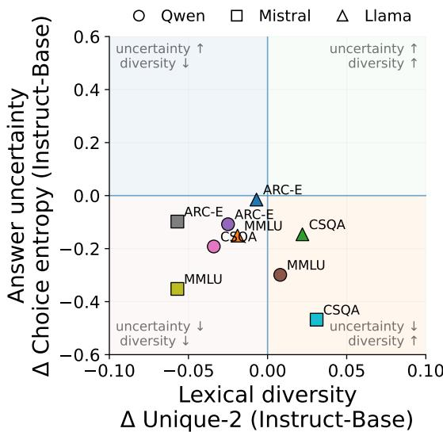
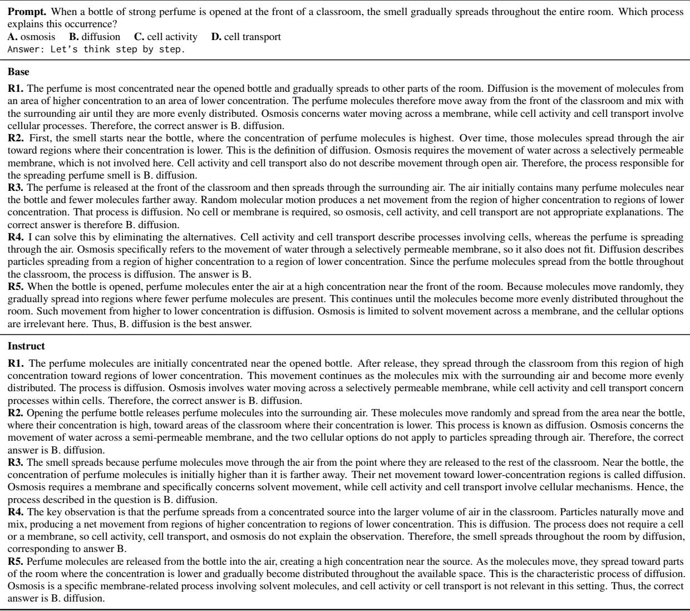
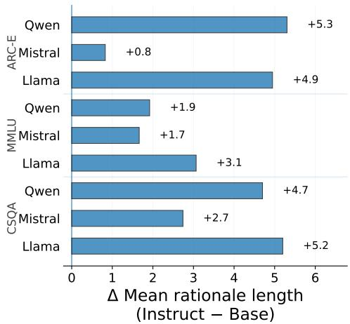

# Are You Sure You’re Sure? On the Impact of Instruction Tuning on Confidence and Lexical Diversity

Irina Proskurina\*1,2, Mayank Kumar\*1,3, Oyindolapo Komolafe1,4

1Cohere Labs Community

2Laboratoire Hubert Curien, UMR CNRS 5516, Saint-Étienne, France

3School of Computer Science Engineering and Technology (SCSET), Bennett University, Greater Noida, India 4School of Physical Therapy, Faculty of Health Sciences, Western University, London, Canada

## Abstract

Instruction-tuned language models achieve strong performance across a range of generation tasks, but have also recently been shown to exhibit verbalized overconfidence. In question answering, verbalized model overconfidence may be associated with the consistency of the generated supporting rationales. In this paper, we study whether corresponding changes in the lexical diversity of generated answer rationales accompany changes in model confidence induced by instruction tuning. We evaluate three matched base and instruction-tuned models across question-answering benchmarks and find that instruction tuning consistently alters answer confidence, despite limited changes in predictive accuracy and decreases in likelihoodbased calibration. Secondly, we observe a nonuniform effect of instruction tuning on rationale diversity: cross-rationale diversity consistently decreases, whereas surface-level lexical diversity varies in both direction and magnitude across models and benchmarks. Finally, we find that these differences persist after controlling for answer selection and rationale length, confirming that confidence and rationale diversity capture distinct effects of instruction tuning.

## 1 Introduction

Large language models (LLMs) are increasingly applied in question answering and reasoning tasks in medicine, finance, and law, where reliable estimates of model confidence are particularly important (Singhal et al., 2023; Hager et al., 2024; Wu et al., 2023; Fei et al., 2024). Prior work has shown that training base models to follow natural-language instructions can improve model performance in such applications (Wei et al., 2021; Ouyang et al., 2022). At the same time, posttraining was shown to alter model confidence dis-

  
Figure 1: Effect of instruction tuning on answer uncertainty and lexical diversity of generated answer rationales. Each point represents a matched base-instruction model pair on a single benchmark, with scores changes computed as ∆ = Instruct − Base.

tributions (Kadavath et al., 2022; Tian et al., 2023;   
Xiong et al., 2024).

Model confidence, however, can be estimated using several proxies, including the probability assigned to the selected answer relative to alternative answers, consistency across repeated generations, and explicitly verbalized confidence (Kadavath et al., 2022; Tian et al., 2023; Xiong et al., 2024). In free-form generation, uncertainty estimation is further complicated by variation in the surface form of generated responses, since semantically equivalent answers can be expressed using substantially different lexical sequences (Kapoor et al., 2024; Farquhar et al., 2024). While several recent studies investigate how instruction tuning and preference-based post-training affect model confidence (Zhang et al., 2024; Huang et al., 2026), to the best of our knowledge, prior work has not examined whether changes in confidence are accompanied by corresponding shifts in the lexical diversity of generated answer rationales, which provide supporting evidence for the selected answer.

In this work, we investigate how instruction tuning affects likelihood-based answer uncertainty and verbalized confidence, and whether the differences between base and instruction-tuned models are associated with corresponding changes in the lexical diversity of model rationales.

Our contributions are as follows: 1) we conduct a paired evaluation of base and instructiontuned models across three model families and three reasoning benchmarks, comparing confidence, calibration, and rationale diversity; 2) we perform controlled comparisons restricted to examples for which base and instruction-tuned models select the same answer, while matching rationale length across variants, allowing us to measure changes in lexical diversity independently of answer switching and generation length; and 3) we show that instruction tuning increases model confidence without corresponding improvements in predictive accuracy, while changes in lexical diversity remain heterogeneous and are not consistently associated with uncertainty or calibration. Together, our findings show that increased confidence after instruction tuning is not associated with a uniform shift in either rationale diversity or model calibration.

## 2 Related Work

Calibration measures how well a model’s predicted confidence aligns with the empirical probability of being correct (Guo et al., 2017; Jiang et al., 2021; Geng et al., 2024). Several empirical studies have shown that model confidence can be misaligned with predictive accuracy, with over- and underconfidence observed for likelihood-based estimates (Kadavath et al., 2022), verbalized confidence (Tian et al., 2023), and generation-based uncertainty measures (Xiong et al., 2024). Recent work has shown that post-training can further alter model confidence distributions, with alignment methods such as learning from human feedback affecting verbalized confidence even when downstream task performance improves (Zhu et al., 2023; Tian et al., 2023; Zhang et al., 2024).

Another line of work studies the impact of instruction tuning and other post-training on linguistic diversity in open-ended generation (Guo et al., 2025; Yun et al., 2025; Deshpande et al., 2025). Further works examine lexical, syntactic, and semantic diversity as indicators of creativity in model outputs, comparing the generated outputs with human-written text or human judgments of creativity (Tian et al., 2024; Bae and Kim, 2024; Park et al., 2025a,b).

To the best of our knowledge, despite a substantial body of work on output diversity, model confidence, and calibration, the relationship between lexical or token-level diversity and verbalized confidence or calibration has not yet been investigated.

## 3 Methodology

We consider a multiple-choice question answering problem, where each input question x is associated with a set of answers $Y = y _ { 1 } , \dots , y _ { M }$

Model Confidence Evaluation Following Jiang et al., 2021, we define the model prediction as the candidate answer with the highest conditional likelihood:

$$
{ \hat { y } } = \operatorname underset { y \in Y } \operatorname * { a r g m a x } _ { \boldsymbol { y } \in Y } p _ { \mathrm { L M } } ( \boldsymbol { y } \mid \boldsymbol { x } ) .\tag{1}
$$

We evaluate model confidence using several complementary measures. First, we estimate model uncertainty over the candidate answers using the entropy of normalized answer likelihoods (Malinin and Gales, 2020; Shannon, 1948):

$$
H _ { \mathrm { c h o i c e } } ( x ) = - \frac { \sum _ { j = 1 } ^ { M } p _ { j } \log p _ { j } } { \log M } ,\tag{2}
$$

where $p _ { j }$ denotes the normalized probability assigned to candidate answer $y _ { j }$ and higher values of $H _ { \mathrm { c h o i c e } } ( x )$ indicate greater uncertainty over the candidate answers. Secondly, we also use elicited verbalized confidence as an estimate of model confidence, following Xiong et al. (2024). Specifically, we use a two-stage protocol, where in the first forward pass the model prediction is obtained using the model likelihood in Eq. (1), and then, in the second forward pass, the model is prompted to report a numerical probability that the selected answer is correct. Additional implementation details are provided in Appendix B.

Lexical Diversity Next, we measure lexical diversity in the rationales generated for each question and selected answer. For each question, we sample $K = 5$ rationales using chain-of-thought prompting. The full prompt and generation details are provided in Appendix B. We evaluate the generated rationales using the Unique Tokens Ratio and

<table><tr><td rowspan="2">Model</td><td rowspan="2"></td><td colspan="5">ARC-Easy</td><td colspan="5">MMLU</td><td colspan="5">CSQA</td></tr><tr><td>Acc.↑</td><td> $H _ { \mathrm { c h o i c e } } \downarrow$ </td><td>Verb.↑</td><td>U2↑</td><td>1-SB↑</td><td> $\operatorname { A c c } . \uparrow$ </td><td> $H _ { \mathrm { c h o i c e } } \downarrow$ </td><td>Verb.↑</td><td>U2↑</td><td>1-SB↑</td><td>Acc.↑</td><td> $H _ { \mathrm { c h o i c e } } \downarrow$ </td><td>Verb.↑</td><td>U2↑</td><td>1-SB↑</td></tr><tr><td rowspan="2">Qwen2.5-7B</td><td>Base</td><td>80.6</td><td>.235</td><td>49.6</td><td>.694</td><td>.695</td><td>71.8</td><td>.430</td><td>59.8</td><td>.679</td><td>.671</td><td>85.2</td><td>.268</td><td>27.4</td><td>.751</td><td>.734</td></tr><tr><td>Instr.</td><td>81.6</td><td>.127*</td><td>60.4*</td><td>.669*</td><td>.598*</td><td>71.7</td><td>.131*</td><td>68.7*</td><td>.687</td><td>.628*</td><td>82.5*</td><td>.076*</td><td>39.0*</td><td>.717*</td><td>.654*</td></tr><tr><td rowspan="2">Mistral-7B</td><td>Base</td><td>80.1</td><td>.215</td><td>76.6</td><td>.701</td><td>.813</td><td>59.6</td><td>.680</td><td>84.9</td><td>.731</td><td>.803</td><td>57.4</td><td>.736</td><td>47.9</td><td>.719</td><td>.833</td></tr><tr><td>Instr.</td><td>83.4*</td><td>.117*</td><td>93.8*</td><td>.673*</td><td>.626*</td><td>59.7</td><td>.328*</td><td>91.5*</td><td>.674*</td><td>.626*</td><td>69.2*</td><td>.268*</td><td>92.2*</td><td>.750*</td><td>.745*</td></tr><tr><td rowspan="2">Llama-3.1-8B</td><td>Base</td><td>82.2</td><td>.188</td><td>49.2</td><td>.704</td><td>.783</td><td>64.1</td><td>.608</td><td>48.2</td><td>.721</td><td>.795</td><td>70.8</td><td>.362</td><td>46.8</td><td>.709</td><td>.814</td></tr><tr><td>Instr.</td><td>82.2</td><td>.173*</td><td>90.4*</td><td>.697*</td><td>.720*</td><td>68.4*</td><td>.457*</td><td>91.8*</td><td>.702*</td><td>.719*</td><td>75.9*</td><td>.216*</td><td>91.1*</td><td>.731*</td><td>.773*</td></tr></table>

Table 1: Accuracy (Acc.), choice entropy $H _ { \mathrm { c h o i c e } } ,$ verbalized confidence (Verb.), Unique-2 (U2), and 1-SelfBLEU (1-SB) for paired base and instruction-tuned models across benchmarks. Acc. and Verb. are reported in %. The colors indicate mean-centered values within each metric column (cyan: above the mean; orange: below the mean). ∗ denotes a significant Base-Instruct difference at $p < 0 . 0 1$ (two-sided paired t-test).

Self-BLEU measures, following prior work on diversity evaluation in text generation (Alihosseini et al., 2019). In particular, we use the proportion of distinct bigrams as the Unique-2 score, with larger values indicating greater lexical richness. We also compute Self-BLEU as the similarity of each rationale to the remaining rationales generated for the same question, with larger values indicating greater similarity across generations.

Experimental Settings We use three widely used multiple-choice benchmarks: ARC-Easy (Clark et al., 2018), MMLU (Hendrycks et al., 2020), and CommonsenseQA (CSQA) (Talmor et al., 2019). These benchmarks cover grade-school science, a broad range of academic and professional subjects, and commonsense knowledge grounded in ConceptNet (Speer et al., 2017), respectively. For our analysis, we use three pairs of base and instructiontuned models: Qwen2.5-7B, Llama-3.1-8B, and Mistral-7B-v0.3. Model links and license information are provided in Appendix B.

## 4 Results

We begin by analyzing how instruction tuning affects the evaluated confidence and lexical diversity measures. The results across models and benchmarks are reported in Table 1.1 We summarize the main findings below.

Instruction Tuning Consistently Increases Model Confidence without Corresponding Improvements in Accuracy. We find that across all models and benchmarks, instruction tuning consistently increases model confidence, as reflected by lower answer entropy and higher verbalized confidence (Table 1). Answer entropy decreases across all benchmarks, with particularly large decreases for Qwen on MMLU (0.430 to 0.131) and Mistral on CSQA (0.736 to 0.268). Similarly, verbalized confidence increases across all settings, including from 49.2% to 90.4% for Llama on ARC-Easy and from 46.8% to 91.1% on CSQA. In contrast, accuracy changes are less consistent across benchmarks. For example, on ARC-Easy, Llama accuracy remains unchanged at 82.2%, despite a significant increase in verbalized confidence and a decrease in choice entropy.

Instruction Tuning Induces Heterogeneous Changes in Rationale Lexical Diversity. In contrast to model confidence, the effect of instruction tuning on lexical diversity is less consistent across models and benchmarks. The largest decreases in Unique-2 are observed for Mistral on ARC-Easy and MMLU, while the largest increase occurs on CSQA, from 0.719 to 0.750. At the same time, cross-rationale diversity, measured as 1-SelfBLEU, decreases across all models and benchmarks, with the largest decrease observed for Mistral on ARC-Easy, from 0.813 to 0.626. Overall, instruction tuning consistently reduces cross-rationale variability, whereas changes in Unique-2 vary across models and benchmarks.

Decreases in Answer Uncertainty Do Not Consistently Coincide with Reduced Lexical Diversity. We further examine whether lower or higher answer uncertainty coincides with lower or higher lexical diversity. Table 2 reports the four possible directions of Instruct-Base uncertainty-diversity changes. For Qwen model, decreases in uncertainty most often coincide with decreases in diversity, accounting for 61.8% of examples under Unique-2 and 69.3% under 1 − SelfBLEU. For Mistral, the pattern differs across diversity measures: lower uncertainty coincides with higher Unique-2 for 61.8% of examples, but with lower 1 − SelfBLEU for 77.6%. Llama exhibits the same divergence between the two measures. Overall, decreases in answer uncertainty are not consistently accompanied by decreases in lexical diversity, and the direction of the association depends on the diversity measure and model. Figure 1 illustrates the same pattern, where choice entropy generally decreases after instruction tuning while lexical diversity changes in both directions across models and benchmarks.

<table><tr><td>Model</td><td>Div.</td><td>山</td><td>↓↑</td><td>↑↓</td><td>↑</td></tr><tr><td rowspan="2">Qwen2.5</td><td>U2</td><td>61.8</td><td>32.8</td><td>3.8</td><td>1.6</td></tr><tr><td>1-SB</td><td>69.3</td><td>25.3</td><td>3.9</td><td>1.5</td></tr><tr><td rowspan="2">Mistral</td><td>U2</td><td>36.0</td><td>61.8</td><td>0.5</td><td>1.7</td></tr><tr><td>1-SB</td><td>77.6</td><td>20.2</td><td>1.3</td><td>0.9</td></tr><tr><td rowspan="2">Llama-3.1</td><td>U2</td><td>33.3</td><td>47.5</td><td>7.2</td><td>12.0</td></tr><tr><td>1-SB</td><td>54.7</td><td>26.1</td><td>12.4</td><td>6.8</td></tr></table>

Table 2: Directional changes in choice entropy (H) and lexical diversity (D) for paired base and instructiontuned models on CommonsenseQA. The first and second arrows denote the Instruct-Base change in H and D, respectively; e.g., ↓↑ indicates lower uncertainty and higher diversity. Values are reported as percentages of benchmark questions falling into each quadrant. The most frequent directional pattern for each model and diversity measure is in bold.

Diversity Shifts Persist after Controlling for Answer Selection and Rationale Length. Because instruction tuning can affect both the selected answer and rationale length, we test whether the observed diversity changes persist when 1) matched base and instruction-tuned models select the same answer and 2) rationale length is matched across model variants.2 The evaluation results, together with the number of examples out of the 1,200 CSQA questions for which both conditions hold, are reported in Table 3. We find that for Qwen, Unique-2 remains nearly unchanged (−0.001), while 1−SelfBLEU decreases by 0.036. For Mistral and Llama, Unique-2 increases significantly by 0.050 and 0.053, respectively, whereas 1−SelfBLEU decreases by 0.069 and 0.012. Thus, the observed lexical diversity changes persist after controlling for answer selection and rationale length, while the two diversity measures continue to show different trends.

Changes in Lexical Diversity Are Not Consistently Associated with Calibration. We additionally compare changes in lexical diversity with model calibration, estimated using Expected Calibration Error (ECE). The full calibration results are reported in Table 7 (see Appendix C). We find that changes in lexical diversity are not consistently associated with changes in calibration. For instance, for Qwen model, verbalized-confidence on ARC-Easy decreases from 35.3 to 22.8 after instruction tuning, while both Unique-2 and 1 − SelfBLEU decrease. In contrast, for Llama model on MMLU benchmark, both likelihood-based and verbalized ECE increase (0.5 to 5.9 and 16.6 to 23.7, respectively), while both diversity measures decrease.

<table><tr><td>Model</td><td>N</td><td>∆U2</td><td>∆(1 − SB)</td></tr><tr><td>Qwen2.5-7B</td><td>1104</td><td>-.001</td><td> $- . 0 3 6 ^ { * }$ </td></tr><tr><td>Mistral-7B</td><td>904</td><td> $+ . 0 5 0 ^ { * }$ </td><td> $- . 0 6 9 ^ { * }$ </td></tr><tr><td>Llama-3.1-8B</td><td>1065</td><td> $+ . 0 5 3 ^ { * }$ </td><td> $- . 0 1 2 ^ { * }$ </td></tr></table>

Table 3: Unique-2 (U2) and 1 − SelfBLEU (1-SB) changes for paired base and instruction-tuned models on CommonsenseQA, restricted to questions for which both variants select the same answer and have matched rationale lengths. ∗ denotes a statistically significant Base-Instruct difference at $p < 0 . 0 1$ (two-sided paired t-test).

## 5 Conclusion

In this paper, we investigate the impact of instruction tuning on model confidence and the lexical diversity of generated rationales in question answering tasks. Through our analysis of rationale diversity, we find that cross-rationale variability decreases after instruction tuning, whereas surface-level lexical diversity exhibits benchmarkdependent patterns. We further show that decreases in answer uncertainty are not consistently accompanied by decreases in lexical diversity, and that diversity changes do not consistently reflect changes in verbalized confidence, answer selection, or model calibration. Moreover, the same patterns persist after controlling for answer selection and rationale length.

Overall, our findings show that instruction tuning affects confidence and rationale diversity differently, motivating future work on uncertainty estimation that jointly considers predictive confidence and variation in generated rationales. Future work could further investigate whether reducing posttraining overconfidence comes at the cost of further reducing rationale diversity, and whether the observed uncertainty-diversity patterns extend beyond lexical variation to semantic diversity.

## Limitations

To the best of our knowledge, this work represents one of the first attempts to jointly study rationale diversity and model verbalized and likelihood-based confidence. Our study is currently limited to three English multiple-choice benchmarks and lexical diversity measures. Future work may therefore extend the analysis to semantic and syntactic diversity (Guo et al., 2025) of generated rationales across a broader range of benchmarks. Second, future work should examine whether the same uncertainty-diversity patterns generalize across languages. More broadly, future work could examine how post-training calibration (Xie et al., 2024) or decoding interventions that modify generation probabilities (Meister et al., 2023; Nadeem et al., 2020) affect cross-rationale diversity in generation tasks.

## Ethical Considerations

We experiment with publicly available models and benchmark datasets and adhere to the intended use and licensing terms of the respective resources.

Our results nevertheless highlight potential risks associated with interpreting the confidence of instruction-tuned language models. Across the evaluated models and benchmarks, we find that instruction tuning increases model confidence and reduces cross-rationale diversity without a corresponding improvement in predictive accuracy. In downstream applications, particularly in highstakes settings, this mismatch may encourage unwarranted reliance on incorrect predictions when model confidence is interpreted as evidence that the prediction is reliable. The differing calibration results obtained for likelihood-based and verbalized confidence further suggest that confidence should be assessed using multiple complementary measures rather than a single proxy, reducing the risk of inappropriate reliance on miscalibrated predictions.

Similarly, reduced cross-rationale diversity may limit the extent to which repeated generations provide independent evidence about a model’s prediction. In generative settings, the implications of such shifts in rationale diversity should therefore be evaluated further, including comparisons against human-generated rationales and human judgments.

Finally, we do not evaluate instruction-tuned model performance on questions involving unsafe data or demographic-sensitive attributes. Consequently, our findings should not be interpreted as evidence that instruction tuning increases harmful or biased outputs for such questions. Whether the observed confidence and diversity patterns extend to safety-sensitive or demographic-sensitive prompts requires separate evaluation.

## Acknowledgments

We thank Yanzhu Guo for insightful discussions and constructive feedback during the early stages of the project, Alvin Vinod Chandran, Abdelrahman Alkahwaji, and other members of the Cohere Labs Community for helpful exchanges and early feedback on the project statement. We also thank Cohere Labs for providing collaborative opportunities throughout the development of this work.

This work was performed using HPC resources from GENCI-IDRIS (Grant 2025- AD011014384R1).

## References

Danial Alihosseini, Ehsan Montahaei, and Mahdieh Soleymani Baghshah. 2019. Jointly measuring diversity and quality in text generation models. In Proceedings ofthe Workshop on Methodsfor Optimizing and Evaluating Neural Language Generation, pages 90–98, Minneapolis, Minnesota. Association for Computational Linguistics.

Minwook Bae and Hyounghun Kim. 2024. Collective critics for creative story generation. In Proceedings of the 2024 Conference on Empirical Methods in Natural Language Processing, pages 18784–18819, Miami, Florida, USA. Association for Computational Linguistics.

Stella Biderman, Hailey Schoelkopf, Lintang Sutawika, Leo Gao, Jonathan Tow, Baber Abbasi, Alham Fikri Aji, Pawan Sasanka Ammanamanchi, Sidney Black, Jordan Clive, et al. 2024. Lessons from the trenches on reproducible evaluation of language models. arXiv preprint arXiv:2405.14782.

Peter Clark, Isaac Cowhey, Oren Etzioni, Tushar Khot, Ashish Sabharwal, Carissa Schoenick, and Oyvind Tafjord. 2018. Think you have solved question answering? try arc, the ai2 reasoning challenge. arXiv preprint arXiv:1803.05457.

Vijeta Deshpande, Debasmita Ghose, John D Patterson, Roger E. Beaty, and Anna Rumshisky. 2025. Diverse, not short: A length-controlled data selection strategy for improving response diversity of language models. In Proceedings ofthe 2025 Conference on Empirical Methods in Natural Language Processing, pages 33917–33938, Suzhou, China. Association for Computational Linguistics.

Sebastian Farquhar, Jannik Kossen, Lorenz Kuhn, and Yarin Gal. 2024. Detecting hallucinations in large language models using semantic entropy. Nature, 630(8017):625–630.

Zhiwei Fei, Xiaoyu Shen, Dawei Zhu, Fengzhe Zhou, Zhuo Han, Alan Huang, Songyang Zhang, Kai Chen, Zhixin Yin, Zongwen Shen, et al. 2024. Lawbench: Benchmarking legal knowledge of large language models. In Proceedings of the 2024 conference on empirical methods in natural language processing, pages 7933–7962.

Jiahui Geng, Fengyu Cai, Yuxia Wang, Heinz Koeppl, Preslav Nakov, and Iryna Gurevych. 2024. A survey of confidence estimation and calibration in large language models. In Proceedings ofthe 2024 Conference ofthe North American Chapter ofthe Associationfor Computational Linguistics: Human Language Technologies (Volume 1: Long Papers), pages 6577–6595, Mexico City, Mexico. Association for Computational Linguistics.

Chuan Guo, Geoff Pleiss, Yu Sun, and Kilian Q Weinberger. 2017. On calibration of modern neural networks. In International conference on machine learning, pages 1321–1330. PMLR.

Yanzhu Guo, Guokan Shang, and Chloé Clavel. 2025. Benchmarking linguistic diversity of large language models. Transactions ofthe Associationfor Computational Linguistics, 13:1507–1526.

Paul Hager, Friederike Jungmann, Robbie Holland, Kunal Bhagat, Inga Hubrecht, Manuel Knauer, Jakob Vielhauer, Marcus Makowski, Rickmer Braren, Georgios Kaissis, et al. 2024. Evaluation and mitigation of the limitations of large language models in clinical decision-making. Nature medicine, 30(9):2613– 2622.

Dan Hendrycks, Collin Burns, Steven Basart, Andy Zou, Mantas Mazeika, Dawn Song, and Jacob Steinhardt. 2020. Measuring massive multitask language understanding. arXiv preprint arXiv:2009.03300.

Jerry Huang, Peng Lu, Qiuhao Zeng, Yusuke Iwasawa, Yutaka Matsuo, Sarath Chandar, Edison Marrese-Taylor, and Irene Li. 2026. Investigating the multilingual calibration effects of language model instruction tuning. In Proceedings of the 19th Conference of the European Chapter of the Association for Computational Linguistics (Volume 2: Short Papers), pages 1– 59, Rabat, Morocco. Association for Computational Linguistics.

Zhengbao Jiang, Jun Araki, Haibo Ding, and Graham Neubig. 2021. How can we know when language models know? on the calibration of language models for question answering. Transactions ofthe Associationfor Computational Linguistics, 9:962–977.

Saurav Kadavath, Tom Conerly, Amanda Askell, Tom Henighan, Dawn Drain, Ethan Perez, Nicholas Schiefer, Zac Hatfield-Dodds, Nova DasSarma, Eli Tran-Johnson, et al. 2022. Language models

(mostly) know what they know. arXiv preprint arXiv:2207.05221.

Sanyam Kapoor, Nate Gruver, Manley Roberts, Arka Pal, Samuel Dooley, Micah Goldblum, and Andrew Wilson. 2024. Calibration-tuning: Teaching large language models to know what they don’t know. In Proceedings ofthe 1st Workshop on Uncertainty-Aware NLP (UncertaiNLP 2024), pages 1–14, St Julians, Malta. Association for Computational Linguistics.

Takeshi Kojima, Shixiang Shane Gu, Machel Reid, Yutaka Matsuo, and Yusuke Iwasawa. 2022. Large language models are zero-shot reasoners. Advances in neural information processing systems, 35:22199– 22213.

Andrey Malinin and Mark Gales. 2020. Uncertainty estimation in autoregressive structured prediction. arXiv preprint arXiv:2002.07650.

Clara Meister, Tiago Pimentel, Luca Malagutti, Ethan Wilcox, and Ryan Cotterell. 2023. On the efficacy of sampling adapters. In Proceedings ofthe 61st Annual Meeting of the Association for Computational Linguistics (Volume 1: Long Papers), pages 1437–1455, Toronto, Canada. Association for Computational Linguistics.

Moin Nadeem, Tianxing He, Kyunghyun Cho, and James Glass. 2020. A systematic characterization of sampling algorithms for open-ended language generation. In Proceedings ofthe 1st Conference ofthe Asia-Pacific Chapter ofthe Associationfor Computational Linguistics and the 10th International Joint Conference on Natural Language Processing, pages 334–346, Suzhou, China. Association for Computational Linguistics.

Long Ouyang, Jeffrey Wu, Xu Jiang, Diogo Almeida, Carroll Wainwright, Pamela Mishkin, Chong Zhang, Sandhini Agarwal, Katarina Slama, Alex Ray, et al. 2022. Training language models to follow instructions with human feedback. Advances in neural information processing systems, 35:27730–27744.

Kyeongman Park, Minbeom Kim, and Kyomin Jung. 2025a. A character-centric creative story generation via imagination. In Findings ofthe Association for Computational Linguistics: ACL 2025, pages 1598–1645, Vienna, Austria. Association for Computational Linguistics.

Kyeongman Park, Nakyeong Yang, and Kyomin Jung. 2025b. Avoidance decoding for diverse multi-branch story generation. In Proceedings of the 2025 Conference on Empirical Methods in Natural Language Processing, pages 7489–7505, Suzhou, China. Association for Computational Linguistics.

Matt Post. 2018. A call for clarity in reporting BLEU scores. In Proceedings of the Third Conference on Machine Translation: Research Papers, pages 186– 191, Brussels, Belgium. Association for Computational Linguistics.

C. E. Shannon. 1948. A mathematical theory of communication. The Bell System Technical Journal, 27(3):379–423.

Karan Singhal, Shekoofeh Azizi, Tao Tu, S Sara Mahdavi, Jason Wei, Hyung Won Chung, Nathan Scales, Ajay Tanwani, Heather Cole-Lewis, Stephen Pfohl, et al. 2023. Large language models encode clinical knowledge. Nature, 620(7972):172–180.

Robyn Speer, Joshua Chin, and Catherine Havasi. 2017. Conceptnet 5.5: An open multilingual graph of general knowledge. In Proceedings ofthe AAAI conference on artificial intelligence, volume 31.

Alon Talmor, Jonathan Herzig, Nicholas Lourie, and Jonathan Berant. 2019. CommonsenseQA: A question answering challenge targeting commonsense knowledge. In Proceedings ofthe 2019 Conference ofthe North American Chapter ofthe Associationfor Computational Linguistics: Human Language Technologies, Volume 1 (Long and Short Papers), pages 4149–4158, Minneapolis, Minnesota. Association for Computational Linguistics.

Katherine Tian, Eric Mitchell, Allan Zhou, Archit Sharma, Rafael Rafailov, Huaxiu Yao, Chelsea Finn, and Christopher D Manning. 2023. Just ask for calibration: Strategies for eliciting calibrated confidence scores from language models fine-tuned with human feedback. In Proceedings of the 2023 Conference on Empirical Methods in Natural Language Processing, pages 5433–5442.

Yufei Tian, Tenghao Huang, Miri Liu, Derek Jiang, Alexander Spangher, Muhao Chen, Jonathan May, and Nanyun Peng. 2024. Are large language models capable of generating human-level narratives? In Proceedings of the 2024 Conference on Empirical Methods in Natural Language Processing, pages 17659–17681, Miami, Florida, USA. Association for Computational Linguistics.

Jason Wei, Maarten Bosma, Vincent Y Zhao, Kelvin Guu, Adams Wei Yu, Brian Lester, Nan Du, Andrew M Dai, and Quoc V Le. 2021. Finetuned language models are zero-shot learners. arXiv preprint arXiv:2109.01652.

Shijie Wu, Ozan Irsoy, Steven Lu, Vadim Dabravolski, Mark Dredze, Sebastian Gehrmann, Prabhanjan Kambadur, David Rosenberg, and Gideon Mann. 2023. Bloomberggpt: A large language model for finance. arXiv preprint arXiv:2303.17564.

Johnathan Xie, Annie S Chen, Yoonho Lee, Eric Mitchell, and Chelsea Finn. 2024. Calibrating language models with adaptive temperature scaling. In Proceedings of the 2024 Conference on Empirical Methods in Natural Language Processing, pages 18128–18138.

Miao Xiong, Zhiyuan Hu, Xinyang Lu, Yifei Li, Jie Fu, Junxian He, and Bryan Hooi. 2024. Can llms express their uncertainty? an empirical evaluation of confidence elicitation in llms. In International

Conference on Learning Representations, volume 2024, pages 23650–23678.

Longfei Yun, Chenyang An, Zilong Wang, Letian Peng, and Jingbo Shang. 2025. The price of format: Diversity collapse in LLMs. In Findings ofthe Association for Computational Linguistics: EMNLP 2025, pages 15454–15468, Suzhou, China. Association for Computational Linguistics.

Mozhi Zhang, Mianqiu Huang, Rundong Shi, Linsen Guo, Chong Peng, Peng Yan, Yaqian Zhou, and Xipeng Qiu. 2024. Calibrating the confidence of large language models by eliciting fidelity. In Proceedings ofthe 2024 Conference on Empirical Methods in Natural Language Processing, pages 2959– 2979, Miami, Florida, USA. Association for Computational Linguistics.

Chiwei Zhu, Benfeng Xu, Quan Wang, Yongdong Zhang, and Zhendong Mao. 2023. On the calibration of large language models and alignment. In Findings ofthe Associationfor Computational Linguistics: EMNLP 2023, pages 9778–9795, Singapore. Association for Computational Linguistics.

  
Table 4: Example rationales generated by the Base and Instruct variants of Mistral-7B for the same ARC-Easy question.

## B Implementation Details

Rationale Generation To estimate variability under repeated generation, we sample K = 5 rationales for each question across the considered benchmarks. Following the Zero-shot Chain-of-Thought prompting approach introduced by Kojima et al. (2022), we use the prompt “Answer: Let’s think step by step.” after each question and its candidate answers. Rationales are sampled with temperature $T = 0 . 7 ,$ nucleus-sampling $p = 1 . 0$ , and a maximum of 100 newly generated tokens. We generate five rationales per question. The generation settings are fixed across models and benchmarks. We provide a few examples of generated rationales in Table 4.

Controlled Lexical Analysis A direct comparison of rationale diversity between Base and Instruct models can be affected by differences in their selected answers or generated rationale lengths. We therefore conduct an additional controlled analysis discussed in §4 (Table 3) restricted to examples for which the Base and Instruct variants select the same answer. Within each example, we retain rationales supporting this common selected answer, match the number of rationales between the two variants, and match rationale length by pairing rationales according to token length and truncating each pair to the length of the shorter rationale before computing lexical-diversity measures. This analysis isolates differences in the linguistic diversity of a fixed answer from differences caused by answer selection or unequal generation length.

Implementation We use the LM Evaluation Harness (Biderman et al., 2024) for benchmark accuracy evaluation. Self-BLEU is computed with SacreBLEU (Post, 2018). We use two-sided paired t-tests on the per-example Instruct-Base differences. We denote differences with ∗ when $p < 0 . 0 1$ . Statistical tests for the controlled lexical analysis are restricted to examples satisfying the same-answer, and matchedrationale-count, and rationale-length conditions described above.

Verbalized Confidence Evaluation We obtain verbalized confidence using a separate two-stage prompting procedure, following Xiong et al. (2024). The model’s answer is first fixed to the answer selected by likelihood-based multiple-choice evaluation. We then prompt the model to estimate the probability that this selected answer is correct. Conditioning on the previously selected answer prevents the verbal-confidence stage from introducing a second, potentially different prediction. The model output is constrained to a numerical probability. We provide below the verbalized-confidence prompt.

Question: [question]   
A. [choice A]   
B. [choice B]   
Selected answer: [selected answer]   
What is the probability that the selected answer is correct?   
Give only a number between 0 and 1.  
Model Links. Model references and license information are provided in Table 5.

Model Link License   
Qwen2.5-7B https://hf.co/Qwen/Qwen2.5-7B Apache 2.0   
https://hf.co/Qwen/Qwen2.5-7B-Instruct Apache 2.0   
Llama-3.1-8B https://hf.co/meta-llama/Llama-3.1-8B Llama 3.1 Community License   
https://hf.co/meta-llama/Llama-3.1-8B-Instruct Llama 3.1 Community License   
Mistral-7B-v0.3 https://hf.co/mistralai/Mistral-7B-v0.3 Apache 2.0   
https://hf.co/mistralai/Mistral-7B-Instruct-v0.3 Apache 2.0  
Table 5: Models used in the experiments with the associated licenses.

## C Extended Results

Uncertainty-Diversity Directional Analysis Table 6 extends the question-level directional analysis reported in Table 2 to ARC-Easy and MMLU. For each question, we report the direction of the Instruct-Base change in choice entropy (H) together with the corresponding change in lexical diversity (D). The results further show that decreases in answer uncertainty can coincide with either increases or decreases in lexical diversity, depending on the model and diversity measure.

Rationale Length Evaluation Figure 2 reports changes in mean rationale length between Base and Instruct models across benchmarks. Rationale length increases across all models and benchmarks, motivating the length-controlled analysis in Table 3.

Calibration Evaluation Following Guo et al. (2017); Jiang et al. (2021), we compute Expected Calibration Error (ECE) as follows:

$$
\mathrm { E C E } = \sum _ { b = 1 } ^ { B } \frac { | S _ { b } | } { N } \left| \operatorname { a c c } ( S _ { b } ) - \operatorname { c o n f } ( S _ { b } ) \right| ,\tag{3}
$$

where the $N$ predictions are partitioned into $B$ confidence bins $S _ { b } , | S _ { b } |$ denotes the number of predictions in bin b, acc $( S _ { b } )$ is the proportion of correct predictions in that bin, and conf $\left( { S _ { b } } \right)$ is their mean predicted confidence. Lower ECE indicates better calibration. We compute ECE separately for likelihood-based

and verbalized confidence. Table 7 reports the corresponding calibration results for all Base and Instruct models across benchmarks.
<table><tr><td>Dataset</td><td>Model</td><td>Diversity</td><td> $H \downarrow D \downarrow$   $H \downarrow D \uparrow$ </td><td> $H \uparrow D \downarrow$ </td><td> $H \uparrow D \uparrow$ </td></tr><tr><td rowspan="5">ARC-Easy</td><td>Qwen2.5-7B</td><td>U2 1-SB</td><td>52.4</td><td>34.7 7.7</td><td>5.2</td></tr><tr><td></td><td>U2</td><td>65.7 64.3</td><td>21.4 9.3 7.6</td><td>3.6 2.6</td></tr><tr><td rowspan="2">Mistral-7B</td><td>1-SB</td><td>82.6</td><td>25.5 7.2</td><td>0.7</td></tr><tr><td></td><td></td><td>9.5 20.4</td><td></td></tr><tr><td rowspan="2">Llama-3.1-8B</td><td>U2 1-SB</td><td>32.2 45.5</td><td>29.8 16.5 26.2</td><td>17.6 11.8</td></tr><tr><td rowspan="2">U2 Qwen2.5-7B</td><td></td><td>48.1</td><td>50.1 0.6</td><td>1.2</td></tr><tr><td rowspan="2"></td><td>1-SB</td><td>62.2</td><td>36.0 1.0</td><td>0.8</td></tr><tr><td rowspan="2">Mistral-7B</td><td>U2</td><td>68.7</td><td>28.9 1.7</td><td>0.7</td></tr><tr><td rowspan="2"></td><td>1-SB</td><td>86.6</td><td>11.0 2.1</td><td>0.3</td></tr><tr><td rowspan="2">Llama-3.1-8B</td><td>U2</td><td>50.4</td><td>33.8 8.8</td><td>7.0</td></tr><tr><td rowspan="2"></td><td>1-SB</td><td>62.2</td><td>22.0 12.1</td><td>3.7</td></tr></table>

Table 6: Directional changes in choice entropy (H) and lexical diversity (D) for paired base and instruction-tuned models on Arc-Easy and MMLU benchmarks. The first and second arrows denote the Instruct-Base change in H and D, respectively; e.g., ↓↑ indicates lower uncertainty and higher diversity. Values are reported as percentages of benchmark questions falling into each quadrant. The most frequent directional pattern for each model and diversity measure is in bold.

<table><tr><td rowspan="2" colspan="2">Model</td><td colspan="3">ARC-Easy</td><td colspan="3">MMLU</td><td colspan="3">CommonsenseQA</td></tr><tr><td>Lik. ECE ↓</td><td>Verb. ECE ↓</td><td>Gap</td><td>Lik. ECE↓</td><td>Verb. ECE ↓</td><td>Gap</td><td>Lik. ECE ↓</td><td>Verb. ECE ↓</td><td>Gap</td></tr><tr><td rowspan="2">Qwen2.5-7B</td><td>Base</td><td>6.9</td><td>35.3</td><td>+28.4</td><td>4.4</td><td>40.8</td><td>+36.4</td><td>1.6</td><td>59.1</td><td>+57.5</td></tr><tr><td>Instruct</td><td>11.3</td><td>22.8</td><td>+11.5</td><td>21.3</td><td>29.8</td><td>+8.5</td><td>12.7</td><td>47.0</td><td>+34.3</td></tr><tr><td rowspan="2">Mistral-7B</td><td>Base</td><td>8.4</td><td>10.8</td><td>+2.4</td><td>1.2</td><td>36.6</td><td>+35.4</td><td>5.1</td><td>24.9</td><td>+19.9</td></tr><tr><td>Instruct</td><td>10.2</td><td>11.9</td><td>+1.7</td><td>22.3</td><td>35.4</td><td>+13.1</td><td>15.2</td><td>27.6</td><td>+12.4</td></tr><tr><td rowspan="2">Llama-3.1-8B</td><td>Base</td><td>8.0</td><td>33.0</td><td>+24.9</td><td>0.5</td><td>16.6</td><td>+16.1</td><td>7.7</td><td>24.0</td><td>+16.3</td></tr><tr><td>Instruct</td><td>8.5</td><td>8.5</td><td>0.0</td><td>5.9</td><td>23.7</td><td>+17.8</td><td>11.5</td><td>15.9</td><td>+4.5</td></tr></table>

Table 7: Calibration error results for Base and Instruct variants of Qwen, Mistral, and Llama. ECE values are reported in %. Gap denotes $\mathrm { E C E _ { v e r b } - E C E _ { l i k } ; }$ negative values indicate better calibration of verbalized confidence than likelihood-based confidence.

  
Figure 2: Average change in rationale length from Base to Instruct models across benchmarks. Positive values indicate longer rationales after instruction tuning, whereas negative values indicate shorter rationales.