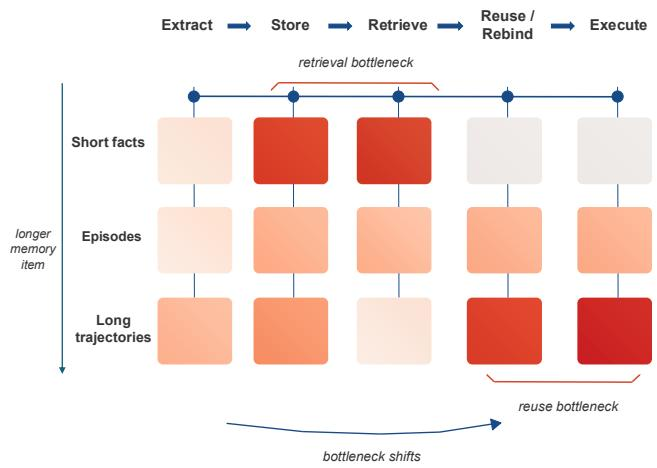
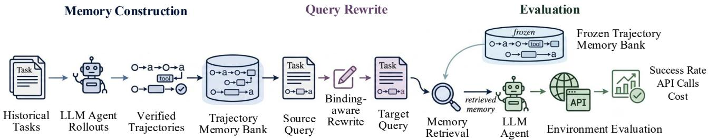
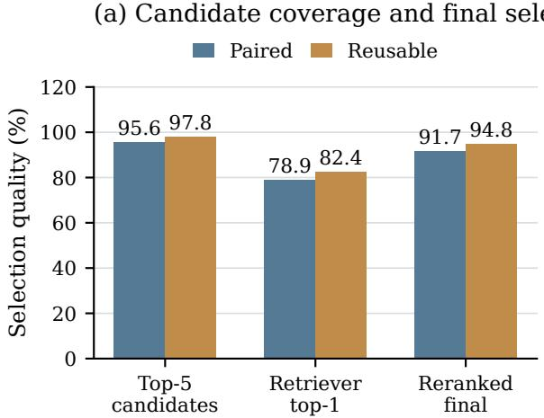
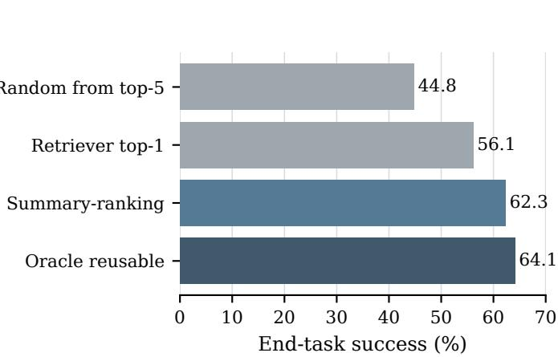

# Beyond Retrieval: Query-Conditioned Reuse of Long-Horizon Agent Trajectories

Yifei Li1,2,∗, Heng Wang1,2,∗, Lingling Zhang1,2,†, Muye Huang1,2, Xinyu Zhang1,2, Jiashuai Liu1,2, Hang Yan1,2, Rongman Xu1,2

1School of Computer Science and Technology, Xi’an Jiaotong University

2MOE KLNN Lab, Xi’an Jiaotong University

∗Equal contribution. †Corresponding author. yifeilee@stu.xjtu.edu.cn

## Abstract

Retrieval can identify a past trajectory that may matter, yet it does not specify how an acting agent should use that trajectory after users, entities, constraints, or environment state have changed. We identify this post-retrieval reuse step as a distinct bottleneck for long-horizon trajectory memory and formulate an evaluation framework that holds candidate retrieval, target state, model, decoding, and tool budget fixed while varying the support delivered to the agent. We instantiate the framework with query-conditioned reuse (QCR), a deliberately simple target-bound note with a workflow invariant, bindings to re-obtain, applicability conditions, and a verification guardrail. QCR serves to test the reuse hypothesis rather than to claim a universally preferred memory format. Across 2,391 target instances in WebArena, WorkArena, and AppWorld, QCR reaches 62.3% average Success, 10.7 points above Full Trajectory, while using 48.9% fewer online tokens. Summary reranking selects a reusable memory for 94.8% of targets, placing end-task Success within 1.8 points of an oracle reusable selector. Analyses by trajectory length and source–target binding shift show that direct trajectory injection loses much of its utility as traces grow longer or source-specific values change, whereas target-bound support preserves a larger share of the measured gain. The resulting framework separates retrieval quality from the problem of turning retrieved experience into safe, useful support for a new task.

## 1 Introduction

Agent memory has progressed from carrying a short interaction history to maintaining external stores, structured records, retrieval indices, and learned memory operations. These systems aim to let an agent bring past experience into a later decision rather than rediscovering the same information or procedure from scratch. Recent methods make histories easier to retain, organize, and retrieve (Packer et al. 2023; Zhong et al. 2024; Gutierrez et al. 2024; Chhikara´ et al. 2025; Xu et al. 2025; Hu et al. 2026; Yu et al. 2026; Li et al. 2026), while long-context benchmarks test whether systems recover evidence over extended interactions (Bai et al. 2024; Maharana et al. 2024; Wu et al. 2025; Tan et al. 2025; Hu, Wang, and McAuley 2025). This progress makes historical experience accessible. It does not yet establish that the experience helps an agent solve its current query. This distinction matters because many memory evaluations naturally end at access: can a system retain an item, rank it for a query, or answer a question about an earlier interaction? LongBench, LoCoMo, and LongMemEval make these access questions measurable across long contexts and conversations (Bai et al. 2024; Maharana et al. 2024; Wu et al. 2025). They are necessary tests, but they leave open a second question for an acting agent: once an experience has entered the context, does it improve the new task that the agent must now complete?

  
Figure 1: A design hypothesis: the bottleneck shifts with memory item length. For short facts or episodes, retrieving the relevant item often supplies what the target needs. Long trajectories can save more exploration, but their target-side value depends on reuse, rebinding, and execution. QCR addresses this post-retrieval step.

For short, self-contained memory items, retrieval and reuse are often nearly the same operation. If a query needs a fact, a local instruction, or a compact episode, returning the right item usually supplies the evidence needed for the next answer or action. Retrieval quality is therefore a useful proxy for memory utility in these settings. Long-horizon task experience has a different structure. A successful trajectory may encode a valuable tool workflow, decision rule, and verification sequence, so it can save far more exploration than a short fact. Yet it also carries source-specific users, objects, paths, dates, observations, and failed branches. Finding such a trajectory does not tell the agent which part transfers, which binding has expired, or which checks must be repeated before it acts. This is the regime targeted by interactive agent environments: browser, API, and database tasks couple many actions to a changing state and evaluate their final consequences (Zhou et al. 2024; Drouin et al. 2024; Trivedi et al. 2024; Yao et al. 2025). A literal trace can place the agent in the right subsystem while still applying an obsolete argument to the wrong current object.

Figure 1 expresses the resulting bottleneck shift. Moving from short facts through episodes to long trajectories, a memory item can carry more of the work that an agent would otherwise repeat. The main difficulty also moves rightward along the memory pipeline. Once a relevant long trajectory has been found, the target agent must extract the procedure that still applies, recover current bindings, reject source details that no longer hold, and verify the new final state. Retrieval remains necessary, but it is no longer enough. The difficulty is also not merely a context-window problem. Giving an actor a long raw trace can bury a current objective beneath old observations and incidental branches, a failure consistent with evidence that models do not always use the relevant portion of a long context reliably (Liu et al. 2024a). Experience-memory methods accordingly extract reflections, skills, workflows, or reusable knowledge from prior runs (Shinn et al. 2023; Zhao et al. 2024; Wang et al. 2024); what remains unclear is how to assess the value of that extracted support for a later query.

This observation changes the basic evaluation question. Memory should be judged by whether past experience improves the solution of the current query: higher verified completion, less unnecessary exploration, or lower online cost without discarding necessary checks. A high retrieval score alone cannot answer this question for long trajectories. Consider an earlier multi-app workflow for search, verification, and artifact creation. A later request may preserve that workflow while changing the person, file, date, or environment state. Starting from scratch wastes the earlier run; replaying it can copy an obsolete recipient, path, or state assumption. The useful support is a target-bound account of the procedure, the bindings to recover, and the checks that remain necessary. We call this operation query-conditioned reuse.

This criterion separates memory utility from both retrieval quality and source fidelity. A support object may faithfully preserve a source trajectory yet harm the target by carrying stale bindings forward; conversely, an aggressively short summary may save tokens while omitting the precondition that prevents an invalid action. The relevant comparison therefore holds the available history fixed and asks which use of that history gives the target agent the best verified outcome for its own environment.

We introduce an end-to-end setting that evaluates this post-retrieval operation directly. A unified frozen bank contains verified historical trajectories. For each target, the retriever returns candidate experiences and a shared ranker selects one record before any memory condition runs. Full Trajectory, Generic Summary, and QCR therefore receive the same selected experience but use it differently. Target Success, Milestone completion, API calls, and online tokens then measure whether that experience actually helps the current query. Our contribution is a problem formulation and evaluation protocol for this boundary, together with QCR, a minimal target-conditioned support transformation. The analyses test how selected-memory length and source–target binding shift change the utility of direct reuse.

## 2 Related Work

## 2.1 Long-Context and Retrieval-Oriented Memory

Memory systems study storage, indexing, updating, and context delivery, including MemGPT, MemoryBank, HippoRAG, Mem0, and A-MEM (Packer et al. 2023; Zhong et al. 2024; Gutierrez et al. 2024; Chhikara et al. 2025; Xu´ et al. 2025). LongMemEval, LongBench, LoCoMo, Mem-Bench, and MemoryAgentBench evaluate retention and access over long or incremental interactions (Wu et al. 2025; Bai et al. 2024; Maharana et al. 2024; Tan et al. 2025; Hu, Wang, and McAuley 2025); RAG supplies the standard retrieve-then-condition pattern (Lewis et al. 2020), and surveys organize memory operations and representations (Zhang et al. 2024; Du et al. 2025). Transformer-XL and Memorizing Transformers make much longer access possible (Dai et al. 2019; Wu et al. 2022), but more context does not guarantee that a model uses the relevant portion (Liu et al. 2024a). We therefore ask a downstream question: after a trajectory has been selected, what support lets an agent use it on a new task?

## 2.2 Trajectory and Procedural Experience

Prior experience can appear as reflection, a skill, a script, or a retrieved trajectory: Reflexion, Generative Agents, Voyager, ReAct, ExpeL, Synapse, and Agent Workflow Memory instantiate these choices (Shinn et al. 2023; Park et al. 2023; Wang et al. 2023; Yao et al. 2023; Zhao et al. 2024; Zheng et al. 2024; Wang et al. 2024). SAM uses state-adaptive cues, Agentic Memory learns memory operations, and OCR-Memory trades representation for faithful long-history access (Hu et al. 2026; Yu et al. 2026; Li et al. 2026). We instead fix the candidate set and selected trajectory, then measure whether its representation changes a later target’s outcome or online cost.

## 2.3 Long-Horizon Agent Evaluation

AgentBench, AppWorld, WebArena, WorkArena, and τ- bench provide interactive and verifiable settings for multistep agency (Liu et al. 2024b; Trivedi et al. 2024; Zhou et al. 2024; Drouin et al. 2024; Yao et al. 2025). Mind2Web, AndroidWorld, WebVoyager, GAIA, OSWorld, and SWEbench broaden this coverage across web, mobile, multimodal, and software tasks (Deng et al. 2023; Rawles et al. 2025; He et al. 2024; Mialon et al. 2024; Xie et al. 2024; Jimenez et al. 2024). These benchmarks usually score isolated execution. Our unified bank instead lets a target search same- and cross-environment history while retaining its native verifier, so the outcome measures whether prior experience reduces target work without becoming an identical replay.

## 3 Task Setting: Query-Conditioned Trajectory Reuse

Figure 2 defines the evaluation unit used in this paper. The unit is a source–target pair: a verified historical trajectory and a later task that preserves a reusable procedure while changing the values needed to carry it out. The source is not a demonstration to replay. It is a record of one successful interaction that may contain a procedure, failed branches, and state checks. The target is a new task with its own initial state, tool feedback, and verifier. Memory helps only when the agent extracts the part of the source that still applies and re-obtains the values that no longer do.

## 3.1 Problem Definition

For a target task $t ,$ let $q _ { t }$ denote its natural-language query and let $o _ { t , 0 }$ be the initial observation. Before the target starts, the agent has access to a frozen bank B of verified historical trajectories. A fixed retriever $R$ returns the same top-k records for every compared method,

$$
Z _ { t } = R ( q _ { t } , o _ { t , 0 } , B ) .
$$

Given $Z _ { t } ,$ , the target query, and the initial observation, a reuse mechanism $\rho$ writes a support object $r _ { t } = $ $\rho ( Z _ { t } , q _ { t } , o _ { t , 0 } )$ . The acting agent then produces a new target trajectory $\hat { \tau } _ { t }$ from $\left( q _ { t } , o _ { t , 0 } , r _ { t } \right)$ and receives the target’s own verifier outcome. This setup separates two questions that are often conflated: whether the bank retrieves a potentially relevant history, and whether the agent can turn that history into an action plan for the current task.

The target evaluation rewards verified completion and penalizes online work. We therefore report success or verifier score together with API calls and token cost. A longer or more literal memory representation is not preferred by definition; it must reduce the work of solving the target. All methods start from the same cached $Z _ { t }$ and the same rankerselected record, so a difference cannot arise from retrieval or source selection. They differ only in the representation and use of that selected experience.

## 3.2 Offline Memory Construction

The bank stores episodes rather than author-written skills or task summaries. We construct one unified frozen bank of 623 verified historical trajectories from successful source-task executions across WebArena, WorkArena, and AppWorld. An agent solves each source task through its native interface, and a rollout enters B only after that environment’s checker accepts its final state. We jointly index all trajectories in one mixed memory pool rather than partitioning records by task family or environment. The supplementary material reports the bank’s source-benchmark composition and complete manifest.

Each retained record contains the source instruction, the ordered sequence of observations and actions, tool calls with their arguments and returned observations, terminal artifacts when present, and the verifier result. We retain the environment, task identifier, and rollout configuration for audits, but exclude these provenance fields from retrieval representations and target prompts. The bank can therefore contain detours and failed attempts that occurred before a successful final state, as it would in a deployed agent system.

We construct the bank from task families of intermediate difficulty. A no-memory baseline is run repeatedly on candidate tasks, and we retain families that yield both verified successes and verified failures. Trivial tasks leave little room for prior experience to matter, whereas tasks with no successful rollouts provide no verified trajectory to store. Successful source runs from the retained families form the frozen bank used at evaluation time.

## 3.3 Binding-Aware Target Construction

Starting from each verified source trajectory $\tau _ { s } .$ , we create up to four target variants by retaining the source’s intended workflow while replacing one or more target-specific bindings at different divergence levels. A binding is a value that an agent must ground in the current task or environment, such as an entity, a user, a record identifier, a file or location, a date, a parameter, or the relevant current state. The rewrite may preserve a procedure such as “inspect, validate, modify, and veri $\mathrm { f y } _ { \parallel } ^ { \mathbf { \vec { \mathbf { \nu } } } , \mathbf { \vec { \mathbf { \nu } } } }$ but it never licenses the agent to copy the source values into the target. Some trajectories cannot support every rewrite pattern because of task-specific constraints. The final benchmark therefore contains 2,391 valid target task instances, or 3.84 target variants per historical trajectory on average. The supplementary material reports target counts by benchmark and selected-memory-length group.

The target starts from its own state and is checked by its own executable verifier or pre-specified rubric. Literal replay of $\tau _ { s }$ can therefore fail even when its workflow remains useful; the agent must discover the current bindings through target-side observations and tool calls. We retain the source– target relation only as sealed audit metadata for relevance annotation and error analysis. It does not appear in bank records, retrieval indices, prompts, or target-agent inputs.

## 3.4 Frozen Retrieval and Evaluation Boundary

After bank construction, all verified source episodes are pooled into one snapshot and frozen. The retriever indexes only visible source instructions and trajectory descriptors, not environment labels, task identities, sealed source–target relations, verifier diagnostics, or target-conditioned summaries. Given $q _ { t }$ and $o _ { t , 0 }$ , a fixed embedding retriever produces a top-5 candidate set $Z _ { t } , \mathbf { A }$ lightweight ranking stage then selects one trajectory from $Z _ { t } ;$ we cache both the candidate set and the selected record before target execution and reuse them for Full Trajectory, Generic Summary, and QCR conditions. The retriever may return a transferable workflow, a superficial match, or nothing useful. No condition receives an oracle source trajectory.

All compared conditions share the target query and state, frozen bank, cached $Z _ { t }$ , ranker-selected trajectory, acting model, decoding configuration, and tool budget. QCR may read only the selected trajectory, $q _ { t } ,$ and $o _ { t , 0 }$ while writing $r _ { t } ;$ it cannot call the environment privately or replace the cached selection. In partially observable settings, the acting agent performs any required target-side discovery and pays the resulting cost.

  
Figure 2: Evaluation pipeline for query-conditioned trajectory reuse. Offline, verified historical rollouts populate one unified memory bank. A binding-aware rewrite creates a target query with a related workflow but new target-specific values. Online, a fixed retriever returns histories from the frozen bank, after which the agent executes only against the target environment and its own verifier. The comparison measures target Success, Milestone completion, API calls, and non-overlapping online tokens.

For each target run, let $I _ { \mathrm { b a s e } }$ be the non-memory acting prompt, $I _ { \mathrm { m e m } }$ the retrieved context shown to the acting agent, $I _ { \mathrm { s y n } }$ and $\boldsymbol { O } _ { \mathrm { s y n } }$ the support-synthesis tokens, and $O _ { \mathrm { { a c t } } }$ the acting-agent output. We report

$$
C _ { \mathrm { o n l i n e } } = I _ { \mathrm { b a s e } } + I _ { \mathrm { m e m } } + I _ { \mathrm { s y n } } + O _ { \mathrm { s y n } } + O _ { \mathrm { a c t } } ,
$$

alongside API calls. The API-reported acting input is ${ I _ { \mathrm { b a s e } } } +$ $I _ { \mathrm { m e m } }$ , so we report it as a breakdown rather than add it twice. Source-rollout cost belongs to offline bank construction and is logged separately.

Because a target can have more than one useful predecessor, we audit retrieval without assuming a single oracle source. Blind annotators label each returned record as irrelevant, surface-related but procedurally unusable, workflowrelevant, or highly actionable. We report usable-memory@1, usable-memory@k, and the rank of the first workflowrelevant record. These diagnostics tell us whether retrieval exposes history that could help; the end-to-end metrics determine whether the agent actually converts that opportunity into a successful, efficient target run.

## 4 A Minimal Query-Conditioned Reuse Framework

## 4.1 Design Principle

The framework is intentionally simple. It does not replace the memory store, retriever, or acting agent. Instead, it inserts one operation after retrieval: produce compact reuse support explicitly conditioned on the target query and current state. This makes the framework a diagnostic intervention. If it helps after the same retrieved records have been fixed, the improvement supports the claim that the missing operation is reuse rather than storage alone.

## 4.2 Reusable Support

Given $Z _ { t } , \ q _ { t }$ , and $o _ { t , 0 } ,$ , QCR produces a short support object with four fields: (i) a workflow invariant, (ii) bindings that must be re-obtained in the target, (iii) applicability conditions (including when to decline reuse), and (iv) a verification guardrail. These fields are a minimal implementation choice, not a claim that one universal memory schema is optimal. The support must be substantially shorter than the retrieved set and must not reveal target answers or hidden evaluator information.

The workflow field keeps only the action pattern that the target still needs: for example, inspect the current object, verify the relevant condition, carry out a modification, and validate the result. The re-obtain field blocks a common misuse of trajectory memory. A source trace can mention a user name, file path, account, object identifier, or prior artifact that helped solve the source task but says nothing about the target value. The reuse note names that dependency without supplying the old value as an answer. Applicability and verification fields retain the reason an earlier agent paused, changed branch, or validated. They make non-reuse a valid outcome when target state violates a source precondition, rather than encouraging an agent to replay history.

This representation deliberately stays small. A learned graph, a hierarchy of summaries, or a new persistent store may outperform it later. They would not, by themselves, establish whether the useful operation lies before or after retrieval. The minimal design keeps the intervention legible: given the same retrieved records, the target agent receives either the raw history or a target-conditioned account of how to use it.

## 4.3 Target Execution

The acting agent receives either no memory, the selected raw trajectory, its generic source-only summary, or the QCR support object. A lightweight ranker uses compact descriptors of the cached top-5 records and the target query to select one record before any target condition runs. Generic summaries are produced offline from each historical record alone, before the target query arrives; their length budget matches the QCR support budget. Thus the memory conditions share the same $Z _ { t } ,$ selected trajectory, target query, initial target observation, tool access, and target-side generation budget. They differ only in how the same selected experience is represented and used. In the evaluation, the acting model, decoding settings, tool budget, and target rollouts are held fixed within each target across conditions. We report the cost of producing QCR support separately and in the online reuse total. This avoids treating a reduction in target-agent output alone as a free gain.

We use DeepSeek-V4-Pro (DeepSeek 2026) for both historical and target runs. Prompts state that historical information is advisory rather than an instruction to replay actions literally. A raw-trajectory baseline can inspect and exploit its history, whereas QCR receives no extra tool privileges, target state, or verifier hints. The comparison changes only the use of the same selected historical experience: raw delivery, source-only compression, or target-bound support construction.

## 5 Experiments

## 5.1 Protocol and Metrics

We compare four conditions under the frozen-retrieval protocol in Section 3: NO MEMORY, GENERIC SUMMARY, FULL TRAJECTORY, and QCR. For every target, an embedding retriever returns the same top-5 historical trajectories for the three memory conditions. A lightweight ranker selects one trajectory from that shared set before any condition runs. Full Trajectory supplies the selected record directly, Generic Summary supplies its source-only summary, and QCR writes its query-conditioned support object from the same selected record. Thus, the acting agent never receives five long trajectories at once, and Table 1 isolates how the selected experience is represented and used. The selection diagnostic below evaluates the ranker separately.

We report verified success, milestone completion, API calls, and non-overlapping online tokens. Online tokens include the acting prompt, selected memory, support-synthesis input and output, and acting output. To measure reuse rather than task difficulty alone, the stratified analyses report

$$
U = S _ { \mathrm { m e m o r y } } - S _ { \mathrm { n o \ m e m o r y } } .
$$

Candidate relevance and final-memory relevance were judged against the sealed source–target relation and a reusable-workflow annotation. A paired trajectory is the historical trajectory used to construct the target; a reusable trajectory may be another history if it supplies a valid procedure for the target.

## 5.2 Benchmarks, Model, and Controls

We evaluate end-to-end target execution in WebArena (Zhou et al. 2024), WorkArena (Drouin et al. 2024), and AppWorld (Trivedi et al. 2024). Each environment supplies its own initial state, tool interface, and success or milestone checker, while retrieval searches the same unified mixed memory bank across environment boundaries. We use DeepSeek-V4- Pro (DeepSeek 2026) for source rollouts, summary ranking, support synthesis, and target execution. Within a target, every condition shares the target suite, initial state, cached retrieval result, ranker-selected trajectory, model, decoding configuration, tool budget, and verifier. The comparison therefore changes only the representation and use of the selected experience after retrieval.

## 5.3 Memory Representations and Run Records

NO MEMORY receives no historical record. GENERIC SUM-MARY receives a source-only summary prepared before the target query arrives, so it cannot encode target answers or current environment observations. FULL TRAJECTORY receives the ranker-selected historical record with its ordered observations, actions, tool arguments, and returned outputs. A common ranker sees compact descriptors of the top-5 candidates and selects one source trajectory for every memory condition. QCR then writes four short fields from that selected trajectory: the workflow invariant, bindings to reobtain, applicability conditions, and a verification guardrail. The acting agent receives that note rather than the raw trajectory or an oracle source–target mapping.

For each run, we log the cached candidate identifiers, selected memory, verifier outcome, milestone score, API calls, and non-overlapping token components. Online-token accounting includes the base acting prompt, delivered memory, support-synthesis input and output, and acting output; it excludes the offline cost of collecting verifier-approved source trajectories. These records make the reported efficiency comparison traceable to the same target run rather than to different retrieval outcomes.

The supplement supplies the prompt template, configuration tables, annotation definitions, and audit-ledger schema needed to interpret the reported tables and diagnostics.

## 5.4 End-to-End Performance

Table 1 shows that historical experience helps, but the procedure used after candidate retrieval matters. Generic Summary gains 9.5 success points over No Memory, while Full Trajectory gains a further 3.7 points. QCR reaches 62.3% success, 10.7 points above Full Trajectory, with the fewest API calls among the memory conditions. Its 9.4k online tokens are about half of the 18.4k required by direct trajectory injection. The result therefore does not come from sending the actor more historical context. The same ranking holds in WebArena, WorkArena, and AppWorld: QCR is best on both Success and Milestone in all six environment-specific comparisons. Relative to Full Trajectory, its Success margin is 10.9 points in WebArena, 10.8 in WorkArena, and 10.4 in AppWorld. The corresponding gains over No Memory are 23.2, 23.8, and 24.7 points. This consistency matters because the three environments differ in interaction modality and state observability; the effect is not carried by one easier benchmark.

## 5.5 Retrieval and Single-Memory Selection

Figure 3 separates candidate coverage from the decision about what to inject. The embedding retriever places the paired trajectory in the top five for 95.6% of targets and at least one reusable trajectory for 97.8%. Its top-one paired accuracy, however, is only 78.9%. Ranking candidate summaries against the target raises final paired-memory accuracy to 91.7% and final reusable-memory accuracy to 94.8%; only 5.2% of selected memories are irrelevant. The mean reciprocal rank of the paired trajectory is 0.87. Relative to direct top-1 retrieval, reranking gains 12.8 points in paired accuracy and 12.4 points in reusable-memory accuracy.

The selection ablation gives the same picture at the task level. Directly using the retriever’s first item lowers success to 56.1%, and selecting a random top-five item lowers it to

<table><tr><td></td><td colspan="2">WebArena</td><td colspan="2">WorkArena</td><td colspan="2">AppWorld</td><td colspan="2">Efficiency</td></tr><tr><td>Method</td><td>Success ↑</td><td>Milestone ↑</td><td></td><td>Success ↑ Milestone ↑</td><td></td><td>Success ↑ Milestone ↑</td><td></td><td>API Calls ↓ Online Tokens ↓</td></tr><tr><td>No Memory</td><td>31.5</td><td>47.3</td><td>36.6</td><td>52.8</td><td>47.1</td><td>61.0</td><td>24.6</td><td>15.2k</td></tr><tr><td>Generic Summary</td><td>40.2</td><td>55.8</td><td>45.9</td><td>61.7</td><td>57.6</td><td>70.0</td><td>20.8</td><td>8.1k</td></tr><tr><td>Full Trajectory</td><td>43.8</td><td>61.2</td><td>49.6</td><td>66.5</td><td>61.4</td><td>72.7</td><td>21.9</td><td>18.4k</td></tr><tr><td>QCR</td><td>54.7</td><td>70.6</td><td>60.4</td><td>74.8</td><td>71.8</td><td>82.9</td><td>16.7</td><td>9.4k</td></tr></table>

Table 1: End-to-end performance across 2,391 target instances. Success and Milestone are percentages; API Calls and Online Tokens are means.

<table><tr><td>Length group</td><td>Full Trajectory</td><td>Generic Summary</td><td>QCR</td></tr><tr><td>Short</td><td>+18.4</td><td>+14.2</td><td>+21.9</td></tr><tr><td>Medium</td><td>+14.1</td><td>+11.3</td><td>+20.4</td></tr><tr><td>Long</td><td>+8.5</td><td>+7.1</td><td>+17.6</td></tr><tr><td>Very Long</td><td>+2.9</td><td>+4.6</td><td>+13.2</td></tr></table>

Table 2: Memory utility by selected-memory trajectory length. Entries are percentage-point gains over No Memory within each length group.

44.8%. The ranking prompt reaches 62.3%, only 1.8 points below an oracle that selects a reusable candidate. Candidate selection still leaves headroom, but it is not the main source of end-task failure in this setting. Figure 3 visualizes both parts of this result: broad top-5 coverage enables reranking, and the reranked choice closes most of the gap to oracle endtask success. The 6.2-point improvement over retriever top-1 shows that choosing the memory, rather than increasing the number of injected trajectories, accounts for the gain.

## 5.6 Sensitivity to Selected-Memory Length

We partition target instances by the effective-action length of the ranker-selected memory trajectory: Short has 5–10 actions, Medium 11–20, Long 21–35, and Very Long more than 35. The same selected memory defines a length group for every compared condition, including No Memory. No-Memory Success falls from 55.2% in the Short group to 18.9% in the Very Long group. The groups therefore differ substantially in task difficulty, so Table 2 reports withingroup utility rather than raw success.

Direct injection degrades steeply: Full Trajectory falls from +18.4 points for short histories to +2.9 for very long ones. Generic Summary retains a little more of its initially smaller gain, but its utility never reaches that of QCR. Query-conditioned support also becomes less useful as histories lengthen, yet it retains +13.2 points for very long trajectories and 60.3% of its short-trajectory utility. Full Trajectory retains only 15.8% of its short-trajectory utility; Generic Summary retains 32.4%. Because the length groups also differ in no-memory difficulty, this is an association under the registered construction rather than a causal estimate of length alone.

## 5.7 Binding Shift Is Associated with the Reuse Gap

We next vary the number and type of target-specific bindings rewritten from the source task. A small rewrite changes one local binding; a medium rewrite changes two or three bindings or one central constraint; a large rewrite changes at least four bindings, or both the target entity and initial environment state. The no-rewrite condition preserves the original intent and tests same-intent recovery.

<table><tr><td>Binding shift</td><td>Full Trajectory</td><td>Generic Summary</td><td>QCR</td></tr><tr><td>None</td><td>+26.9</td><td>+18.2</td><td>+29.6</td></tr><tr><td>Small</td><td>+19.3</td><td>+15.6</td><td>+28.6</td></tr><tr><td>Medium</td><td>+9.7</td><td>+10.2</td><td>+24.5</td></tr><tr><td>Large</td><td>+2.2</td><td>+5.3</td><td>+20.1</td></tr></table>

Table 3: Memory utility under binding shift. Entries are percentage-point gains over No Memory within each rewrite level.

Table 3 identifies the failure mode suggested by the main result. When no binding changes, Full Trajectory has high utility (+26.9). Under a large rewrite, its utility shrinks to +2.2, and the generic summary reaches only +5.3. QCR declines as the target moves further from the source, but preserves +20.1 points under the largest shift. The gain comes with fewer stale-binding errors: at large shift, direct trajectories produce stale bindings on 46.9% of targets, compared with 10.9% for QCR, while correct rebinding rises from 31.7% to 77.8%. We count a stale-binding error when an action, output, or tool argument repeats a source-specific value that conflicts with the target query or target-side observation. Under large shift, Full Trajectory retains 8.2% of its no-shift utility (2.2/26.9), whereas QCR retains 67.9% (20.1/29.6). The method does not make binding shift disappear; it reduces the rate at which stale source values displace currenttask evidence.

## 5.8 Interpretation

The four results form a consistent account. Historical trajectories offer useful procedural information, since both memory baselines beat No Memory. Candidate retrieval and single-memory selection are accurate enough that a substantial part of the remaining loss occurs after a relevant trajectory reaches the actor. The length and rewrite analyses associate weaker direct reuse with long source traces and larger target differences. QCR keeps the workflow while requiring the actor to recover current bindings, a mechanism consistent with its higher success at lower online cost.

Selection and reuse are separate stages: a ranker decides whether usable history reaches the actor, while the delivered representation determines whether it can be applied without copying source-side values.

(a) Candidate coverage and final selection Paired Reusable  

(b) Effect of the selection rule  
  
Figure 3: Why summary reranking matters. Left: the top-5 candidate set has high paired and reusable coverage, while direct top-1 retrieval is less reliable. Reranking compact candidate summaries restores final-memory quality without presenting five full trajectories to the acting agent. Right: the resulting end-task success nearly matches oracle reusable selection.

## 6 Discussion and Limitations

The experiments isolate the value of a verified prior trajectory after it has entered the memory pipeline. Candidate selection is already strong: reranking selects reusable history for 94.8% of targets and trails oracle reusable selection by 1.8 success points. The results are consistent with a remaining post-selection cost when long histories and changed bindings expose the actor to source details that no longer apply. This distinction matters for memory-system design. A store may preserve a complete record for evidence and provenance, while the acting prompt should contain a compact, target-bound account of the reusable procedure.

The study has a narrow boundary. It evaluates successful source trajectories, a single selected memory, and controlled source–target binding shifts; it does not measure naturally recurring task histories, partial failures, multi-memory composition, or open-ended memory acquisition. Those settings may change both the available procedures and the state that an agent must recover. The reported token savings also do not mean that every task should use fewer tokens: safetysensitive targets can require additional checks. We measure verified completion, but not irreversible side effects or policy violations caused by a reused trajectory. We therefore treat cost as one outcome beside verified completion, rather than as a goal on its own.

The comparison holds the retrieved candidate set, acting model, decoding, tool budget, and target-state access fixed. It attributes differences to the representation and use of the same selected trajectory; it does not by itself isolate every field of the support schema. Future work can replace the embedding retriever or learn a reuse policy, but it should retain this accounting boundary and test whether the resulting help reduces target work without importing stale source bindings.

## 7 Conclusion

We study agent memory by asking how past experience helps a current query. Long completed trajectories help, but raw delivery and a generic source-only summary leave useful target-specific work unresolved. Given the same selected historical trajectory, QCR raises success to 62.3% and reduces online tokens by 48.9% relative to Full Trajectory. The selection analysis shows that a reusable memory is available for 94.8% of targets after ranking. As histories become longer or target bindings move farther from the source, rawtrajectory utility falls, while target-bound support retains a larger measured gain.

Memory systems should therefore preserve rich records in storage while giving the actor a compact, target-bound account of the procedure, the bindings it must recover, and the checks that still apply. The setting leaves room for better retrievers and learned reuse policies, but it makes their test clear: they must improve target success without hiding the cost of the help.

This framing also changes how memory baselines should be interpreted. A raw trajectory is not simply a stronger version of a short summary because it contains more tokens; it is an intervention that exposes an actor to both useful procedure and obsolete state. Conversely, a short description is not automatically useful merely because it is cheap. The relevant question is whether the information sent after retrieval lets the target agent take fewer unnecessary actions while still checking the values that changed. By fixing candidate retrieval, target state, model, decoding, and tool budget, the present comparison evaluates that question after candidate retrieval has ended. Future systems can use different stores, retrievers, or learned support writers, but should report the same distinction between what was retrieved, what was selected, what was delivered to the actor, and what the actor verified in the target environment.

## References

Bai, Y.; Lv, X.; Zhang, J.; Lyu, H.; Tang, J.; Huang, Z.; Du, Z.; Liu, X.; Zeng, A.; Hou, L.; Dong, Y.; Tang, J.; and Li, J. 2024. LongBench: A Bilingual, Multitask Benchmark for Long Context Understanding. In Proceedings of the 62nd Annual Meeting of the Association for Computational Linguistics, 3119–3137.

Chhikara, P.; Khant, D.; Aryan, S.; Singh, T.; and Yadav, D. 2025. Mem0: Building Production-Ready AI Agents with Scalable Long-Term Memory. arXiv:2504.19413.

Dai, Z.; Yang, Z.; Yang, Y.; Carbonell, J.; Le, Q. V.; and Salakhutdinov, R. 2019. Transformer-XL: Attentive Language Models beyond a Fixed-Length Context. In Proceedings ofthe 57th Annual Meeting ofthe Associationfor Computational Linguistics, 2978–2988.

DeepSeek. 2026. DeepSeek API Documentation: DeepSeek-V4-Pro. https://api-docs.deepseek.com/updates/. Accessed July 29, 2026.

Deng, X.; Gu, Y.; Zheng, B.; Chen, S.; Stevens, S.; Wang, B.; Sun, H.; and Su, Y. 2023. Mind2Web: Towards a Generalist Agent for the Web. arXiv:2306.06070.

Drouin, A.; Gasse, M.; Caccia, M.; Laradji, I. H.; Del Verme, M.; Marty, T.; Boisvert, L.; Thakkar, M.; Cappart, Q.; Vazquez, D.; Chapados, N.; and Lacoste, A. 2024. WorkArena: How Capable Are Web Agents at Solving Common Knowledge Work Tasks? arXiv:2403.07718.

Du, Y.; Huang, W.; Zheng, D.; Wang, Z.; Montella, S.; Lapata, M.; Wong, K.-F.; and Pan, J. Z. 2025. Rethinking Memory in AI: Taxonomy, Operations, Topics, and Future Directions. arXiv:2505.00675.

Gutierrez, B. J.; Shu, Y.; Gu, Y.; Yasunaga, M.; and Su, Y.´ 2024. HippoRAG: Neurobiologically Inspired Long-Term Memory for Large Language Models. In Advances in Neural Information Processing Systems.

He, H.; Yao, W.; Ma, K.; Yu, W.; Dai, Y.; Zhang, H.; Lan, Z.; and Yu, D. 2024. WebVoyager: Building an End-to-End Web Agent with Large Multimodal Models. arXiv:2401.13919.

Hu, Y.; Qian, H.; Wang, S.; Liu, J.; Zhao, Z.; Tan, J.; Liu, Z.; and Dou, Z. 2026. SAM: State-Adaptive Memory for Long-Horizon Reasoning Agent. arXiv:2605.24468.

Hu, Y.; Wang, Y.; and McAuley, J. 2025. Evaluating Memory in LLM Agents via Incremental Multi-Turn Interactions. arXiv:2507.05257.

Jimenez, C. E.; Yang, J.; Wettig, A.; Yao, S.; Pei, K.; Press, O.; and Narasimhan, K. R. 2024. SWE-bench: Can Language Models Resolve Real-World GitHub Issues? In International Conference on Learning Representations.

Lewis, P.; Perez, E.; Piktus, A.; Petroni, F.; Karpukhin, V.; Goyal, N.; Kuttler, H.; Lewis, M.; Yih, W.-t.; Rocktaschel,¨ T.; Riedel, S.; and Kiela, D. 2020. Retrieval-Augmented Generation for Knowledge-Intensive NLP Tasks. In Advances in Neural Information Processing Systems, volume 33.

Li, J.; Zhang, Y.; Yang, X.; Qu, J.; Xu, J.; Yang, S.; Ding, J.; and Ngai, E. C.-H. 2026. OCR-Memory: Optical Context Retrieval for Long-Horizon Agent Memory. arXiv:2604.26622.

Liu, N. F.; Lin, K.; Hewitt, J.; Paranjape, A.; Bevilacqua, M.; Petroni, F.; and Liang, P. 2024a. Lost in the Middle: How Language Models Use Long Contexts. Transactions of the Associationfor Computational Linguistics, 12: 157–173.

Liu, X.; Yu, H.; Zhang, H.; Xu, Y.; Lei, X.; Lai, H.; Gu, Y.; Ding, H.; Men, K.; Yang, K.; Zhang, S.; Deng, X.; Zeng, A.; Du, Z.; Zhang, C.; Shen, S.; Zhang, T.; Su, Y.; Sun, H.; Huang, M.; Dong, Y.; and Tang, J. 2024b. AgentBench: Evaluating LLMs as Agents. In International Conference on Learning Representations.

Maharana, A.; Lee, D.-H.; Tulyakov, S.; Bansal, M.; Barbieri, F.; and Fang, Y. 2024. Evaluating Very Long-Term Conversational Memory of LLM Agents. In Proceedings of the 62nd Annual Meeting of the Association for Computational Linguistics, 13851–13870.

Mialon, G.; Fourrier, C.; Swift, C.; Wolf, T.; LeCun, Y.; and Scialom, T. 2024. GAIA: A Benchmark for General AI Assistants. In International Conference on Learning Representations.

Packer, C.; Wooders, S.; Lin, K.; Fang, V.; Patil, S. G.; Stoica, I.; and Gonzalez, J. E. 2023. MemGPT: Towards LLMs as Operating Systems. arXiv:2310.08560.

Park, J. S.; O’Brien, J. C.; Cai, C. J.; Morris, M. R.; Liang, P.; and Bernstein, M. S. 2023. Generative Agents: Interactive Simulacra of Human Behavior. In Proceedings of the 36th Annual ACM Symposium on User Interface Software and Technology, 1–22.

Rawles, C.; Clinckemaillie, S.; Chang, Y.; Waltz, J.; Lau, G.; Fair, M.; Li, A.; Bishop, W. E.; Li, W.; Campbell-Ajala, F.; Toyama, D. K.; Berry, R. J.; Tyamagundlu, D.; Lillicrap, F.; Toyama, D. K.; Berry, R. J.; Tyamagundlu, D.; Lillicrap,

T. P.; and Riva, O. 2025. AndroidWorld: A Dynamic Benchmarking Environment for Autonomous Agents. In International Conference on Learning Representations.

Shinn, N.; Cassano, F.; Gopinath, A.; Narasimhan, K.; and Yao, S. 2023. Reflexion: Language Agents with Verbal Reinforcement Learning. In Advances in Neural Information Processing Systems, volume 36.

Tan, H.; Zhang, Z.; Ma, C.; Chen, X.; Dai, Q.; and Dong, Z. 2025. MemBench: Towards More Comprehensive Evaluation on the Memory of LLM-Based Agents. In Findings of the Associationfor Computational Linguistics: ACL 2025.

Trivedi, H.; Khot, T.; Hartmann, M.; Manku, R.; Dong, V.; Li, E.; Gupta, S.; Sabharwal, A.; and Balasubramanian, N. 2024. AppWorld: A Controllable World of Apps and People for Benchmarking Interactive Coding Agents. In Proceedings of the 62nd Annual Meeting ofthe Association for Computational Linguistics, 16022–16076.

Wang, G.; Xie, Y.; Jiang, Y.; Mandlekar, A.; Xiao, C.; Zhu, Y.; Fan, L.; and Anandkumar, A. 2023. Voyager: An Open-Ended Embodied Agent with Large Language Models. arXiv:2305.16291.

Wang, Z. Z.; Mao, J.; Fried, D.; and Neubig, G. 2024. Agent Workflow Memory. arXiv:2409.07429.

Wu, D.; Wang, H.; Yu, W.; Zhang, Y.; Chang, K.-W.; and Yu, D. 2025. LongMemEval: Benchmarking Chat Assistants on Long-Term Interactive Memory. In International Conference on Learning Representations.

Wu, Y.; Rabe, M. N.; Hutchins, D.; and Szegedy, C. 2022. Memorizing Transformers. In International Conference on Learning Representations.

Xie, T.; Zhang, D.; Chen, J.; Li, X.; Zhao, S.; Cao, R.; Hua, T. J.; Cheng, Z.; Shin, D.; Lei, F.; Liu, Y.; Xu, Y.; Zhou, S.; Savarese, S.; Xiong, C.; Zhong, V.; and Yu, T. 2024. OS-World: Benchmarking Multimodal Agents for Open-Ended Tasks in Real Computer Environments. In Advances in Neural Information Processing Systems, volume 37, 52040– 52094.

Xu, W.; Liang, Z.; Mei, K.; Gao, H.; Tan, J.; and Zhang, Y. 2025. A-MEM: Agentic Memory for LLM Agents. arXiv:2502.12110.

Yao, S.; Shinn, N.; Razavi, P.; Narasimhan, K.; and Sierra. 2025. τ-Bench: A Benchmark for Tool-Agent-User Interaction in Real-World Domains. In International Conference on Learning Representations.

Yao, S.; Zhao, J.; Yu, D.; Du, N.; Shafran, I.; Narasimhan, K.; and Cao, Y. 2023. ReAct: Synergizing Reasoning and Acting in Language Models. In International Conference on Learning Representations.

Yu, Y.; Yao, L.; Xie, Y.; Tan, Q.; Feng, J.; Li, Y.; and Wu, L. 2026. Agentic Memory: Learning Unified Long-Term and Short-Term Memory Management for Large Language Model Agents. arXiv:2601.01885.

Zhang, Z.; Bo, X.; Ma, C.; Li, R.; Chen, X.; Dai, Q.; Zhu, J.; Dong, Z.; and Wen, J.-R. 2024. A Survey on the Memory Mechanism of Large Language Model Based Agents. arXiv:2404.13501.

Zhao, A.; Huang, D.; Xu, Q.; Lin, M.; Liu, Y.-J.; and Huang, G. 2024. ExpeL: LLM Agents Are Experiential Learners. In Proceedings of the AAAI Conference on Artificial Intelligence, volume 38, 19632–19642.

Zheng, L.; Wang, R.; Wang, X.; and An, B. 2024. Synapse: Trajectory-as-Exemplar Prompting with Memory for Computer Control. In International Conference on Learning Representations.

Zhong, W.; Guo, L.; Gao, Q.; Ye, H.; and Wang, Y. 2024. MemoryBank: Enhancing Large Language Models with Long-Term Memory. In Proceedings of the AAAI Conference on Artificial Intelligence, volume 38, 19724–19731.

Zhou, S.; Xu, F. F.; Zhu, H.; Zhou, X.; Lo, R.; Sridhar, A.; Cheng, X.; Ou, T.; Bisk, Y.; Fried, D.; Alon, U.; and Neubig, G. 2024. WebArena: A Realistic Web Environment for Building Autonomous Agents. In International Conference on Learning Representations.

## A Task Construction and Retrieval Protocol

The study uses a unified bank of verified historical trajectories. For each target, retrieval returns a shared top-5 candidate set, and the ranker selects one trajectory before any memory condition runs. The target state, model, decoding settings, tool budget, random seed, and verifier remain fixed across conditions. Candidates may come from any of the three environments, but environment labels are excluded from the retrieval representation.

<table><tr><td>Statistic</td><td>Value</td></tr><tr><td>Average target variants per source</td><td>3.84</td></tr><tr><td>Memory bank</td><td>Unified across all environments</td></tr><tr><td>Retrieval scope</td><td>One pooled bank; no environment labels in retrieval input</td></tr><tr><td>Top-k retrieval</td><td>5</td></tr><tr><td>Selected memories per target</td><td>1</td></tr><tr><td>Random seeds</td><td>3 seed-matched runs per target and condition</td></tr></table>

Table A1: Memory-bank and evaluation settings.

<table><tr><td>Environment</td><td>Sources</td><td>Targets</td><td>Paired targets</td><td>Seeds</td></tr><tr><td>WebArena</td><td>228</td><td>874</td><td>874</td><td>3</td></tr><tr><td>WorkArena</td><td>201</td><td>772</td><td>772</td><td>3</td></tr><tr><td>AppWorld</td><td>194</td><td>745</td><td>745</td><td>3</td></tr><tr><td>Total</td><td>623</td><td>2,391</td><td>2,391</td><td>3</td></tr></table>

Table A2: Source-trajectory and target-task inventory after exclusions. Target counts enumerate unique target instances, not seed-expanded runs. Each reported result averages the three seed-matched runs. “Paired target” denotes the target constructed from the listed source trajectory; it does not identify the record ultimately selected by the ranker.

## A.1 Binding-Shift Construction

The no-rewrite condition preserves the source intent. Small, medium, and large rewrites change one local binding, two or three bindings or one central constraint, and at least four bindings or both the target entity and initial environment state, respectively. The rewrite procedure preserves the task family while requiring the acting agent to ground values in the target.

<table><tr><td>Rewrite level</td><td>Number of targets</td></tr><tr><td>None</td><td>623</td></tr><tr><td>Small</td><td>602</td></tr><tr><td>Medium</td><td>588</td></tr><tr><td>Large</td><td>578</td></tr><tr><td>Total</td><td>2,391</td></tr></table>

Table A3: Distribution of source–target binding rewrites.
<table><tr><td>Item</td><td>Setting</td></tr><tr><td>Embedding retriever</td><td>BGE-M3</td></tr><tr><td>Retrieval unit</td><td>One complete trajectory</td></tr><tr><td>Retrieval scope</td><td>Unified cross-environment bank</td></tr><tr><td>Candidate size</td><td>Top-5</td></tr><tr><td>Ranker</td><td>DeepSeek-V4-Pro</td></tr><tr><td>Duplicate handling</td><td>Remove near-duplicate trajectories before indexing</td></tr><tr><td>Tie-breaking</td><td>Highest reranking score</td></tr></table>

Table A4: Retrieval and reranking configuration. The candidate bank is pooled across environments, while environment labels are excluded from the retrieval input.

## B Model Configuration

All conditions use DeepSeek-V4-Pro for generation and ranking. The source rollout and target actor sample at temperature 0.2; all support-writing and selection steps use deterministic decoding.

<table><tr><td>Component</td><td>Model</td><td>Temperature</td><td>Top-p</td><td>Max tokens</td><td>Decoding</td></tr><tr><td>Source rollout</td><td>DeepSeek-V4-Pro</td><td>0.2</td><td>0.95</td><td>4,096</td><td>Stochastic</td></tr><tr><td>Summary writer</td><td>DeepSeek-V4-Pro</td><td>0</td><td>1.0</td><td>1,024</td><td>Deterministic</td></tr><tr><td>Ranker</td><td>DeepSeek-V4-Pro</td><td>0</td><td>1.0</td><td>512</td><td>Deterministic</td></tr><tr><td>QCR writer</td><td>DeepSeek-V4-Pro</td><td>0</td><td>1.0</td><td>1,024</td><td>Deterministic</td></tr><tr><td>Actor</td><td>DeepSeek-V4-Pro</td><td>0.2</td><td>0.95</td><td>4,096</td><td>Stochastic</td></tr></table>

Table A5: Model and decoding settings.

## C Annotation and Rebinding Analysis

A stale-binding error occurs when an action, output, or tool argument repeats a source-specific value that conflicts with the target query or a target-side observation. Correct rebinding requires the actor to recover the target value before using it. Annotators inspect the source record, target task, targetside observations, and executed action trace rather than inferring a label from final success alone.

<table><tr><td>Metric, large rewrite</td><td>Full Trajectory</td><td>QCR</td></tr><tr><td>Stale-binding error</td><td>46.9%</td><td>10.9%</td></tr><tr><td>Correct rebinding</td><td>31.7%</td><td>77.8%</td></tr></table>

Table A6: Rebinding analysis for large binding rewrites.
<table><tr><td>Item</td><td>Value</td></tr><tr><td>Annotators</td><td>2</td></tr><tr><td>Adjudicator</td><td>1</td></tr><tr><td>Agreement (Cohen&#x27;s κ)</td><td>0.87</td></tr><tr><td>Audit unit</td><td>One constructed source-</td></tr><tr><td></td><td>target instance</td></tr><tr><td>Source-target construction</td><td>2,391</td></tr><tr><td>and rebinding audits</td><td></td></tr></table>

Table A7: Annotation statistics for source–target construction and rebinding audits. Candidate relevance is labelled at the returned-record level using the rubric in Table A9; its count is not included in the 2,391 source–target audit units.

## D QCR Support Construction

QCR writes a compact target-bound note from the selected trajectory, target query, and initial target observation. It does not access the environment or the verifier while preparing the note. The actor must ground every required target value through the query, current observation, or a later tool call.

<table><tr><td>Field</td><td>Source information re- tained</td><td>Target-side requirement</td></tr><tr><td>Workflow invari- ant</td><td>Tool order, decision rule, and prior valida- tion step</td><td>Keep only the action pattern that applies to the target.</td></tr><tr><td>Bindings to re- obtain</td><td>Entities, paths, dates, users, record identi- fiers, and parameters</td><td>Recover values from current evidence; copy no source binding.</td></tr><tr><td>Applicability con- ditions</td><td>Source preconditions, constraints, and branch conditions</td><td>Decline reuse when a required precondition does not hold.</td></tr><tr><td>Verification guardrail</td><td>The source check that established completion</td><td>Verify the target-side result before comple- tion.</td></tr></table>

Table A8: QCR support schema.

## D.1 Support-Writer Prompt Template

The following prompt template specifies the information supplied to the QCR writer in this study.

You receive one historical trajectory, the current target query, and the initial target observation. Write a short support note with four labeled fields: (1) workflow invariant, (2) bindings to re-obtain, (3) applicability conditions, and (4) verification guardrail. Treat historical identifiers, paths, users, dates, tool outputs, and environment state as sourceside evidence, not target answers. Do not infer hidden target state, call tools, or copy a historical binding into the target. If the source procedure does not apply, state the condition that blocks reuse.

The actor receives the note as advisory information. It may follow the workflow only after checking the target-side preconditions, and it must recover each listed binding before submitting an action that depends on it.

## E Retrieval Labels and Selection Details

Blind relevance annotation distinguishes a lexical match from a trajectory that supplies an executable procedure. The source–target pairing remains sealed metadata and does not appear in the retrieved record, ranker input, or acting prompt.

<table><tr><td>Label</td><td>Decision rule</td></tr><tr><td>Irrelevant</td><td>The record does not provide a useful pro- cedure for the target.</td></tr><tr><td>Surface-related but unusable</td><td>The record shares words, tools, or a broad task topic, but its procedure does</td></tr><tr><td>Workflow-</td><td>not transfer. The record supplies a procedure that can</td></tr><tr><td>relevant</td><td>transfer after target-specific rebinding.</td></tr><tr><td>Highly actionable</td><td>The record supplies a procedure and target-recoverable conditions that can guide immediate execution.</td></tr></table>

Table A9: Relevance labels used for retrieval and selection audits.
<table><tr><td>Metric</td><td>Value (%)</td></tr><tr><td>Top-5 paired coverage</td><td>95.6</td></tr><tr><td>Top-5 reusable coverage</td><td>97.8</td></tr><tr><td>Retriever top-1 paired accuracy</td><td>78.9</td></tr><tr><td>Final paired-memory accuracy</td><td>91.7</td></tr><tr><td>Final reusable-memory accuracy</td><td>94.8</td></tr><tr><td>Direct retriever top-1 end-task Success</td><td>56.1</td></tr><tr><td>Random top-5 selection end-task Success</td><td>44.8</td></tr><tr><td>Ranker-selected memory end-task Success</td><td>62.3</td></tr><tr><td>Oracle reusable selection end-task Success</td><td>64.1</td></tr></table>

Table A10: Retrieval and single-memory selection diagnostics. Coverage and accuracy entries are proportions of unique target instances. End-task Success entries average within environment and seed, then take the unweighted mean across WebArena, WorkArena, and AppWorld.

## F Stratified Utility Results

The following tables give the values underlying the length and binding-shift analyses in the main paper. Each entry reports the percentage-point change in Success relative to No Memory within the same stratum.

<table><tr><td>Source length</td><td>Action range</td><td>Full Trajectory</td><td>Generic Summary</td><td>QCR</td></tr><tr><td>Short</td><td>5-10</td><td>+18.4</td><td>+14.2</td><td>+21.9</td></tr><tr><td>Medium</td><td>11-20</td><td>+14.1</td><td>+11.3</td><td>+20.4</td></tr><tr><td>Long</td><td>21-35</td><td>+8.5</td><td>+7.1</td><td>+17.6</td></tr><tr><td>Very Long</td><td>&gt; 35</td><td>+2.9</td><td>+4.6</td><td>+13.2</td></tr></table>

Table A11: Memory utility by selected-memory trajectory length.
<table><tr><td>Binding shift</td><td>Full Trajectory</td><td>Generic Summary</td><td>QCR</td></tr><tr><td>None</td><td>+26.9</td><td>+18.2</td><td>+29.6</td></tr><tr><td>Small</td><td>+19.3</td><td>+15.6</td><td>+28.6</td></tr><tr><td>Medium</td><td>+9.7</td><td>+10.2</td><td>+24.5</td></tr><tr><td>Large</td><td>+2.2</td><td>+5.3</td><td>+20.1</td></tr></table>

Table A12: Memory utility under binding shift.

## G Per-Run Audit-Ledger Schema

The evaluation ledger schema specifies one row for each target-condition execution. It keeps the retrieval boundary auditable: the same candidate set and selected record must appear across the compared memory conditions for a given target. The schema also separates a failed execution from an invalid reuse decision.

<table><tr><td>Field</td><td>Purpose</td></tr><tr><td>Environment and target identifier Source candidate</td><td>Locate the target&#x27;s native task suite, verifier, and initial state. Reconstruct the cached top-5 candi-</td></tr><tr><td>identifiers Selected trajectory</td><td>date set. Check that every memory condition</td></tr><tr><td>identifier Memory condition</td><td>uses the same ranked source record. Reproduce the target execution set-</td></tr><tr><td>and random seed Verifier outcome</td><td>ting. Separate final completion from par-</td></tr><tr><td>and milestone score API calls and token</td><td>tial task progress. Reconstruct online work without</td></tr><tr><td>components Execution error</td><td>counting an API input twice.</td></tr><tr><td>and failed action Stale-binding and</td><td>Identify tool, state, or verifier fail- ures.</td></tr><tr><td>correct-rebinding labels</td><td>Audit whether source values dis- placed target-side evidence.</td></tr></table>

Table A13: Fields retained for every target-condition run.

Source-rollout cost remains outside the online total because it belongs to offline bank construction. Online accounting includes the non-memory acting input, delivered memory, QCR-writer input and output, and actor output. The acting API input contains the first two terms only, so it is recorded as a breakdown rather than counted again.

## G.1 Information Boundary

The retriever indexes visible source instructions and trajectory descriptors. It does not index environment labels, task identities, sealed source–target relations, verifier diagnostics, or target-conditioned summaries. QCR may read only the selected source record, target query, and initial target observation; it cannot query the environment privately, replace the selected record, or see hidden evaluator information. The acting agent pays for any target-side discovery through its own tool calls.

Case-study reporting. Qualitative examples should show the source procedure and the changed target binding side by side. A useful pair contains one Full Trajectory failure that copies a stale value and one QCR success that recovers the value from current evidence. Private identifiers, credentials, and hidden evaluator material must be redacted before release.

<table><tr><td>Case element</td><td>Material shown to the reader</td></tr><tr><td>Source task and se- lected record</td><td>Short task intent and the transfer- able action sequence.</td></tr><tr><td>Target task and changed binding</td><td>Target intent, with the entity, path, date, or record value that changed.</td></tr><tr><td>Target-side evi- dence</td><td>The query text, observation, or tool result used to recover the new value.</td></tr><tr><td>Full Trajectory de- cision</td><td>The copied source value and its ver- ifier or execution consequence.</td></tr><tr><td>QCR note and final action</td><td>The workflow, binding warning, verification guardrail, and target-</td></tr><tr><td>Outcome</td><td>grounded action. Verifier result, milestone result when available, and sanitized fail- ure category.</td></tr></table>

Table A14: Required layout for each released source–target case study.