# CRAFT: LLM-Based Iterative Refinement for Temporal Reasoning over Clinical Narratives

Chengyang He<sup>∗</sup> Tahreem Arif<sup>∗</sup> Marko Zivkovic<sup>†</sup> Lijing Wang<sup>‡</sup> Yue Ning<sup>∗</sup> Ping Wang<sup>∗</sup>

Abstract. Understanding the temporal progression of symptoms in clinical narratives is critical for disease monitoring, safety surveillance, and causality assessment. Clinical narratives, however, rarely provide explicit temporal anchors. Current approaches to temporal information reasoning focus predominantly on pairwise relation classification across multi-visit and timestamp-rich records, leaving the reconstruction of structured symptom trajectories from individual anchor-sparse reports largely unaddressed. We propose CRAFT, an LLM framework that pairs a generator with a constraint-based verifier to iteratively produce and refine stage-wise symptom timelines through targeted feedback. We conduct evaluation on MedTempo, a new benchmark of 5,347 vaccine adverse-event narratives spanning three COVID-19 vaccine types, with expertvalidated temporal stage annotations for 3,166 reports. Experiments across four LLM backbones demonstrate that CRAFT consistently improves temporal ordering accuracy, with ablation analysis isolating the contribution of generator and verifier components across model capability levels.

1 Introduction. Clinical temporal reasoning, recovering a stage-wise trajectory of clinical events from narrative text, is central to disease progression modeling, treatment outcome monitoring, and safety signal detection [10, 20]. However, constructing such orderings from free text remains labor-intensive. Temporal cues in these narratives are frequently implicit or expressed relative to other events rather than anchored to fixed dates, and co-mentions, restatements, and status updates further obscure the true chronological order of symptoms [37, 1].

A large body of work on temporal information reasoning has focused on identifying events and tempora expressions and predicting pairwise relations to derive a global ordering [16, 25], with recent eforts expanding to exhaustive relation coverage and complex temporal fact extraction [2, 8]. In the clinical domain, however, progress has been bottlenecked by limited benchmark diversity, with most work concentrated on a small number of corpora and relation inventories [1, 28]. Recent LLM-based approaches to clinical temporal reasoning further assume multi-visit timelines, timestamp-linked supervision, or constrained data settings [3, 10, 35]. As a result, standardized methods and benchmarks for ordering symptom progressions within single-report, anchor-sparse clinical narratives remain underexplored.

To address this gap, we propose CRAFT (Clinical Refinement with Adaptive Feedback for Temporal ordering), a generator–verifier framework that models temporal trajectory reconstruction as an iterative structured prediction task under weak temporal anchoring, where candidate trajectories are refined via constraint-based feedback. Inspired by iterative refinement paradigms such as Self-Refine [17], CRAFT introduces a structured trajectory representation and a task-specific verification mechanism tailored to temporal ordering, and can be instantiated with diferent generator and verifier configurations. In this work, we instantiate CRAFT as CRAFT-Full, which pairs a full-regeneration generator with a multi-criterion additive verifier; we additionally define two baselines (PIVOT, GUIDE) and two ablations (CRAFT-G, CRAFT w/o V) to isolate the contribution of the generator and verifier components respectively.

To enable rigorous evaluation, we introduce MedTempo (Medical Temporal Ordering Benchmark), a benchmark for temporal progression reconstruction from medical free text. MedTempo contains 5,347 narrative reports spanning three vaccine types, each consisting of a single report per patient with no explicit absolute time anchor and paired with a provided symptom list. Our benchmark task focuses on the 3,166 reports that exhibit temporal evidence of distinct symptom progression, for which we provide expert-validated stage-wise ordering annotations. The remaining reports contain no temporal progression and are retained in the dataset release to support future work on temporalevidence identification, but fall outside the scope of the current benchmark evaluation. Our primary contributions are as follows:

• We propose CRAFT, a generator–verifier framework for iterative temporal reasoning refinement under weak temporal anchoring, with controlled baselines and ablations that isolate generator and verifier contributions.

• We introduce MedTempo, an expert-annotated benchmark for evaluating structured temporal trajectories over anchor-sparse clinical narratives.

• We conduct extensive experiments across four LLMs, revealing distinct refinement behaviors tied to model capability and verifier calibration.

Figure 4.1 provides a schematic overview of the full pipeline, from dataset construction through iterative refinement and post-hoc evaluation.

2 Related Work. Temporal information extraction has been shaped by the TimeML annotation framework [23], which introduced a markup language for events, temporal expressions, and their relations. The TempEval shared tasks [31] established standardized evaluation for pairwise temporal relation classification, with systems progressing from rule-based and CR-F/SVM approaches to neural methods. A common paradigm is to predict pairwise relations and then induce a globally consistent ordering [16, 9, 33], while more recent benchmarks emphasize richer annotation for event ordering [2] and LLM-based strategies for temporally grounded fact extraction [8]. Transformer-based methods have become the dominant paradigm, as surveyed in [28]. However, these eforts typically center on local relation correctness rather than the end-to-end reconstruction of an ordered, grouped trajectory under weak anchoring.

In the clinical domain, the i2b2 2012 challenge [29] brought temporal relation extraction to clinical discharge summaries, followed by the Clinical TempEval shared tasks [6] on the THYME corpus [27], where bestperforming systems evolved from CRF/SVM classifiers to LSTMs [30]. Surveys document persistent dificulties including implicit time anchors, inter-sentence relations, and the gap between relation-level extraction and usable patient timelines [20, 1]. More recent work applies neural end-to-end methods to established clinical corpora [19], and LLM-based approaches have begun to examine prompting and fine-tuning for clinical temporal relation extraction [13, 4, 3, 36] as well as timeline extraction from medical case reports [32]. However, these approaches typically require longitudinal records spanning multiple visits or rely on structured temporal metadata [10, 35]. In contrast, CRAFT operates on singlereport clinical narratives where temporal cues are sparse or implicit. To support evaluation in this underexplored setting, MedTempo provides expert-annotated temporal trajectory benchmarks derived from real-world adverse event narratives.

Table 2.1: Descriptive statistics for MedTempo by vaccine type. Text Len. denotes clinical narrative length in words; #Stages denotes number of temporal stages.
<table><tr><td rowspan="2">Vaccine</td><td rowspan="2">Metric</td><td colspan="3">MedTempo</td><td colspan="3">MedTempo-T</td><td colspan="3">MedTempo-NT</td></tr><tr><td>Med</td><td>Min</td><td>Max</td><td>Med</td><td>Min</td><td>Max</td><td>Med Min</td><td></td><td>Max</td></tr><tr><td rowspan="3">Pfizer (1789/1019/770)</td><td>Text Len.</td><td>102</td><td>11</td><td>2319</td><td>109</td><td>12</td><td>1638</td><td>81</td><td>11</td><td>2319</td></tr><tr><td># Symp.</td><td>6</td><td>4</td><td>64</td><td>6</td><td>4</td><td>29</td><td>5</td><td>4</td><td>64</td></tr><tr><td># Stages</td><td>2</td><td>0</td><td>10</td><td>3</td><td>1</td><td>10</td><td>0</td><td>0</td><td>0</td></tr><tr><td rowspan="3">Moderna (1769/983/786)</td><td>Text Len.</td><td>83</td><td>11</td><td>1056</td><td>99</td><td>13</td><td>905</td><td>57</td><td>11</td><td>1056</td></tr><tr><td># Symp.</td><td>6</td><td>4</td><td>30</td><td>6</td><td>4</td><td>30</td><td>5</td><td>4</td><td>29</td></tr><tr><td># Stages</td><td>2</td><td>0</td><td>9</td><td>3</td><td>2</td><td>9</td><td>0</td><td>0</td><td>0</td></tr><tr><td rowspan="3">Janssen (1789/1164/625)</td><td>Text Len.</td><td>87</td><td>11</td><td>1317</td><td>100</td><td>12</td><td>826</td><td>56</td><td>11</td><td>1317</td></tr><tr><td># Symp.</td><td>6</td><td>4</td><td>43</td><td>7</td><td>4</td><td>43</td><td>5</td><td>4</td><td>33</td></tr><tr><td># Stages</td><td>2</td><td>0</td><td>13</td><td>3</td><td>2</td><td>13</td><td>0</td><td>0</td><td>0</td></tr></table>

A parallel line of work applies iterative refinement to structured prediction, most notably the Self-Refine paradigm [17], which iterates over model outputs using self-generated feedback. In the clinical domain, Hein et al. [14] apply iterative refinement with human-inthe-loop review cycles to improve extraction precision. However, such approaches are not suitable for systematic benchmark evaluation across model tiers, as they conflate model capability with human reviewer efort. CRAFT leverages iterative refinement for structured clinical temporal extraction in a fully automated setting, pairing a generator with a multi-criterion verifier and enabling principled comparison across frontier and open-weight models.

3 Dataset Creation. This section describes how MedTempo is constructed from VAERS. We first introduce the source corpus and the information each report provides. We then describe the filtering and stratified sampling that reduce the corpus to reports carrying temporal signal, followed by the annotation protocol that produces the gold-standard timelines. We close with summary statistics of the resulting benchmark.

3.1 VAERS Dataset. The Vaccine Adverse Event Reporting System (VAERS), managed jointly by the CDC and FDA, is a passive surveillance database in which healthcare professionals, patients, and manufacturers submit reports of adverse events following immunization [7]. Each report includes demographics, vaccination details, free-text clinical narratives, and MedDRA-coded symptom lists. We focus on three widely administered COVID-19 vaccines: Pfizer-BioNTech, Moderna, and Janssen, covering reports from 2021 to 2024.

Table 3.1: Annotation agreement and adjudication rates (%) overall and by subset. $\mathrm { A n n . ~ } = \mathrm { ~ A ~ }$ nnotator; T = MedTempo-T with temporal report only; NT = MedTempo-NT with no temporal report. Ambiguity exclusions are not applicable (–) in the T subset by definition.
<table><tr><td>Category</td><td>Metric</td><td>MedTempo</td><td>T</td><td>NT</td></tr><tr><td rowspan="3">Agreement</td><td>Model-Ann.1</td><td>78</td><td>82</td><td>91</td></tr><tr><td>Model-Ann. 2</td><td>73</td><td>78</td><td>86</td></tr><tr><td>Inter-Annotator</td><td>93</td><td>94</td><td>94</td></tr><tr><td rowspan="3">Adjudication</td><td>Accepted</td><td>80</td><td>90</td><td>90</td></tr><tr><td>Corrected</td><td>9</td><td>10</td><td>10</td></tr><tr><td>Excluded</td><td>11</td><td></td><td>一</td></tr></table>

3.2 Data Sampling. Starting from the full VAERS corpus, we applied a multi-stage filtering and stratified sampling pipeline. We first removed nonsymptom MedDRA terms by building an exclusion list from three non-clinical System Organ Classes (Surgical and medical procedures, Social circumstances, Product issues) combined with human-annotated non-symptom labels, yielding 5,601 excluded terms. Reports with three or fewer distinct symptoms were discarded as they lack suficient temporal variation. Reports of ten or fewer words (typically bare symptom lists without narrative context) were also removed. For reports between 11 and 30 words, we applied rule-based temporal keyword filtering (relative markers such as before/after, duration terms, date patterns) to retain only those with explicit temporal cues; reports of 30 or more words were retained unconditionally. Finally, stratified sampling balanced by year and report length was applied per vaccine to draw 2,000 records each, preserving the distribution of the underlying VAERS corpus. Appendix A.1 presents representative examples of reports removed under each criterion.

3.3 Annotation of Temporal Sequence. Temporal timelines were produced via a human-in-theloop three-phase protocol: $G P T \mathrm { - } \mathrm {  { 4 } } o$ mini [21] generated initial stage-ordered timelines; two annotators with a medical NLP background independently reviewed and labeled each sequence; and all disagreements and uncertain cases were resolved through collaborative adjudication. As shown in Table 3.1, human inter-annotator agreement (IAA) was 93%. After adjudication, 80% of LLM annotations were accepted without change, 9% were corrected, and 11% were excluded for temporal ambiguity, yielding a final corpus of 5,347 records.

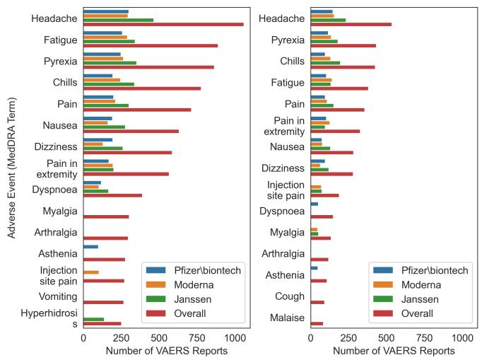  
Figure 3.1: Distribution of the most frequent symptoms (left) and the symptoms that occurred after (right). Each chart displays a total of 15 unique symptoms, representing the top 10 symptoms from each vaccine type and the overall dataset combined.

3.4 Dataset Statistics and Analysis. Table 2.1 summarizes the 3,166 temporally-evident reports that form the primary benchmark subset MedTempo-T; the remaining 2,181 reports contain no temporal progression and are released separately as MedTempo-NT. Symptom count is consistent across vaccines (median 6), while narrative length varies: Pfizer-BioNTech reports are longest (median 102 words) versus Moderna (83) and Janssen (87). Because symptom count is stable regardless of length, longer reports likely contribute richer contextual cues rather than additional adverse events, providing stronger signals for temporal extraction. Figure 3.1 shows that thermoregulatory symptoms (pyrexia, chills) dominate early stages, while headache and fatigue are the most frequent overall, illustrating the diversity of symptom trajectories in the benchmark.

4 Method. This section presents CRAFT. We first formalize the ordering task and define the stagebased representation used throughout the paper, fixing the notation for reports, findings, and predicted timelines. Then, we describe the framework itself: the generator that proposes a timeline, the verifier that scores it and returns feedback, and the loop that connects them. Figure 4.1 gives an overview of both the dataset pipeline and the framework.

4.1 Problem Formulation and Temporal Representation. For each post-vaccination report $r ,$ let x<sub>r</sub> denote its free-text clinical narrative and $\mathcal { F } ( r ) =$ $\{ f _ { 1 } , \ldots , f _ { n } \}$ the provided list of adverse clinical findings (MedDRA Preferred Terms from the VAERS SYMPTOM fields). We treat $\mathcal { F } ( r )$ as given and do not perform entity extraction or coding.

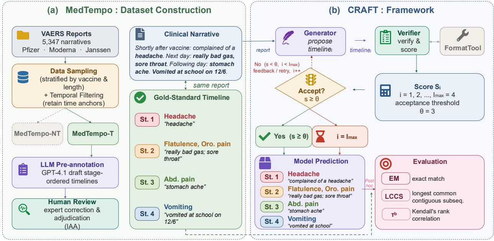  
Figure 4.1: Overview of MedTempo and CRAFT. (a) Dataset construction pipeline from VAERS narratives to gold-standard stage-ordered timelines. (b) CRAFT iterative generator–verifier loop, instantiated across four configurations (CRAFT-Full, PIVOT, GUIDE, CRAFT-G) and evaluated on four LLM backbones.

Our goal is to predict an explicit temporal ordering over $\mathcal { F } ( r )$ when the narrative expresses a temporal progression (i.e., at least one new finding appears after previously mentioned findings). We exclude concurrent onset, changes in severity or resolution without new onsets, and timelines inferable only from durations (e.g., “finding A for 4 days, finding B for 3 days” without an explicit order).

Formally, we produce an ordered sequence of nonempty time buckets

$$
B ( r ) = ( B _ { 1 } , B _ { 2 } , \ldots , B _ { K } ) ,
$$

where each finding in $\mathcal { F } ( r )$ is assigned to exactly one bucket $B _ { k }$ , grouping together findings that occurred at the same point in the patient’s clinical course, and index k orders the buckets from earliest to latest. This representation is stored as a JSON list of buckets, which is the format used by both the generator and verifier below. Models are evaluated solely on temporal structure (ordering and grouping); optional evidence snippets are not scored.

4.2 CRAFT: Iterative Generator–Verifier Framework. CRAFT operates as a fully automated iterative loop: the generator proposes a candidate temporal sequence, the verifier scores it against structural and temporal constraints and returns targeted feedback, and the loop repeats until the candidate is accepted or a fixed iteration budget is exhausted. Figure 4.1(b) and algorithm 5.1 illustrate this process.

4.2.1 Generator Agent. At iteration $i ,$ the generator LLM implements

$$
g : \big ( \mathcal { F } ( r ) , x _ { r } , \mathrm { f e e d b a c k } ^ { ( i - 1 ) } \big ) \longrightarrow \hat { \mathcal { B } } ^ { ( i ) } ( r ) ,
$$

where $\operatorname { f e e d b a c k } ^ { ( i - 1 ) }$ is empty at i=1 and contains verifier guidance thereafter.

CRAFT-Full uses a full-regeneration generator: a single prompt template with full task instructions at each iteration, with verifier feedback appended to the context when available. The generator receives: (i) a task description and definition of temporal progression, including phenomena that should not be treated as progression; (ii) the finding list $\mathcal { F } ( r )$ , which must appear exactly as given in the output; and (iii) the free-text narrative $x _ { r } .$ . It outputs a JSON bucket sequence using only findings from $\mathcal { F } ( r )$ and avoiding unsupported temporal inferences.

4.2.2 Verifier Agent. The verifier implements $v : \left( \mathcal { F } ( r ) , x _ { r } , \hat { B } ^ { ( i ) } ( r ) \right) \to \left( \mathrm { d e c i s i o n } ^ { ( i ) } \right.$ , feedback<sup>(i)</sup>, score<sup>(i)</sup>, where decision $\mathbf { \Phi } _ { \cdot } ^ { ( i ) } \in \mathbf { \Phi } \{ \mathrm { A C C E P T } , \mathrm { R E V I S E } \}$ , feedback<sup>(i)</sup> describes issues to fix, and $\mathrm { s c o r e } ^ { ( i ) } \in \{ 0 , \ldots , 5 \}$ supports early stopping. The verifier first calls FormatTool,

a deterministic helper module that normalizes the raw generator output into the JSON bucket schema without altering temporal content, then applies an additive rubric that assigns one point each for: valid JSON with earliest→latest ordering; placing non-mentioned symptoms as “none” in the final group; using each symptom exactly once; grouping symptoms that occur around the same time; and ordering groups according to temporal cues in the narrative. When the score meets threshold θ, the verifier returns ACCEPT; otherwise it returns REVISE with targeted feedback for the next iteration. If no candidate is accepted within $T _ { \mathrm { m a x } }$ iterations, the loop terminates and the last candidate is returned. The complete procedure is given in Algorithm 5.1.

5 Experimental Setup. We organize our evaluation around three research questions:

• RQ1 Method efectiveness. Does CRAFT-Full outperform the baselines (PIVOT, GUIDE) across model tiers, and what drives the diference?

• RQ2 Model capability. How well do diferent LLM backbones perform on MedTempo, and is the capability ordering stable across configurations?

• RQ3 Vaccine discrepancy. To what extent do performance and error patterns vary across vaccine types, and are model rankings consistent under vaccine-stratified evaluation?

The remainder of this section specifies the evaluation data, the model backbones and their settings, the implementation of each configuration, and the metrics used to score predicted timelines against the gold standard.

5.1 Dataset. MedTempo contains 5,347 vaccine adverse-event narratives across three COVID-19 vaccine types, each paired with a provided symptom list. We evaluate on the 3,166 reports from MedTempo-T with temporal evidence of distinct symptom progression; the remaining reports contain no temporal progression and fall outside the primary benchmark.

5.2 Models and Settings. We evaluate four LLMs: GPT-4.1 [22], Claude Sonnet 4.5 [5], MedGemma-27B [26], and Llama-3.3-70B [18]. Proprietary models are accessed via their respective APIs with deterministic decoding. Open-weight models run locally using Hugging Face transformers [34] with 4- bit quantization (NF4 via bitsandbytes [11]).

We evaluate five settings that systematically vary the generator and verifier components to isolate the contribution of each. Our proposed method, CRAFT-Full, pairs the full-regeneration generator with the additive rubric verifier (Section 4.2.1–4.2.2). Two baselines represent alternative design choices grounded in established paradigms: PIVOT pairs the full-regeneration generator with an anchor-based verifier inspired by the documentcreation-time (DCT) anchoring tradition in temporal extraction [33, 9], where a fixed reference point serves as a hub for ordering events. GUIDE pairs an editconditioned generator, which applies targeted local edits to the previous candidate rather than regenerating from scratch, with the same anchor-based verifier. CRAFT-G swaps in the edit-conditioned generator while holding the additive verifier fixed, isolating the generator’s contribution; CRAFT w/o V removes the verification loop entirely, running one generator pass without feedback, isolating the verifier’s contribution.

```latex
Algorithm 5.1 CRAFT: Iterative generator–verifier
loop
Require: $\mathcal { F } ( r )$ , narrative $x _ { r }$ , generator $G ,$ verifier V,
$T _ { \mathrm { m a x } } .$ threshold θ
Ensure: $\hat { B } ( \boldsymbol { r } )$
feedback $\gets \emptyset$
for $t = 1 , \dots , T _ { \mathrm { m a x } }$ do
raw $ G ( \mathcal { F } ( r ) , x _ { r }$ , feedback)
$\hat { B } ( r ) \gets$ FormatTool(raw)
score, $f e e d b a c k \gets V \Big ( \mathcal { F } ( r ) , x _ { r } , \hat { \mathcal { B } } ( r ) \Big )$
if score $\geq \theta$ then
return $\hat { B } ( \boldsymbol { r } )$
end if
end for
return $\hat { B } ( \boldsymbol { r } )$ {return last candidate}
```

Edit-conditioned generator (CRAFT-G, GUIDE). Uses a dedicated initialization prompt at i=1, switching to a lightweight editing prompt that conditions on the previous candidate and verifier feedback at i>1.

Anchor-based verifier (PIVOT, GUIDE). Treats the vaccination date as the dominant time anchor and scores conservatively, starting from 5 and subtracting one point for clear violations: anchor-order contradictions, grouping errors (over-merge or over-split), or overall inconsistency with temporal cues.

5.3 Implementation Details. All runs use fixed prompt templates that enforce a strict JSON schema and require every symptom in the provided list to appear exactly once, grouping symptoms into the same stage when the narrative does not support an internal order. We use deterministic decoding (no sampling) with max\_new\_tokens=512.

For generator–verifier configurations, we run up to max\_iter=4 refinement iterations and accept outputs when the verifier score is at least $\theta \ = \ 3 ;$ the parameter-selection procedure for max\_iter and θ is summarized in Appendix A.2. Full prompt templates for CRAFT-Full are provided in Appendix A.3. More implementation details can be found at https://github. com/LEAF-Lab-Stevens/TemporalAnalysis.

Table 5.1: General results stratified by vaccine type. Metrics in $\% .$ . Bold = best, underline = second best within each model block. <sup>†</sup>Proposed method.
<table><tr><td rowspan="2">Model Setting</td><td rowspan="2"></td><td colspan="3">Janssen  $\scriptstyle ( \mathbf { n } = \mathbf { 1 } , \mathbf { 1 6 4 } )$ </td><td colspan="3">Moderna (n=983)</td><td colspan="3">Pfizer (n=1,019)</td><td colspan="3">Total</td></tr><tr><td>EM↑</td><td>LCCS↑</td><td> $\tau _ { b } \uparrow$ </td><td>EM↑</td><td>LCCS↑</td><td> $\tau _ { b } \uparrow$ </td><td>EM↑</td><td>LCCS↑</td><td> $\tau _ { b } \uparrow$ </td><td>EM↑</td><td>LCCS↑</td><td> $_ { \pmb { \tau _ { b } } }$  ←</td></tr><tr><td></td><td>PIVOT</td><td>33.65</td><td>59.56</td><td>58.89</td><td>38.53</td><td>60.73</td><td>55.43</td><td>31.89</td><td>57.44</td><td>57.00</td><td>34.60</td><td>59.24</td><td>57.20</td></tr><tr><td></td><td>GUIDE</td><td>33.99</td><td>61.02</td><td>60.07</td><td>36.70</td><td>60.68</td><td>56.48</td><td>31.30</td><td>57.57</td><td>57.85</td><td>33.97</td><td>59.80</td><td>58.24</td></tr><tr><td></td><td> $\mathrm { C R A F T _ { w / o } v }$ </td><td>26.49</td><td>42.94</td><td>45.79</td><td>27.93</td><td>43.51</td><td>43.65</td><td>24.51</td><td>40.06</td><td>42.37</td><td>26.30</td><td>42.19</td><td>44.02</td></tr><tr><td>GP-1</td><td> $\mathrm { C R A F T _ { G } }$ </td><td>29.68</td><td>55.71</td><td>55.92</td><td>33.94</td><td>56.52</td><td>52.08</td><td>29.92</td><td>54.86</td><td>53.31</td><td>31.08</td><td>55.69</td><td>53.88</td></tr><tr><td></td><td> $\mathbf { C R A F T - F u l l } ^ { \dagger }$ </td><td>34.43</td><td>61.68</td><td>59.58</td><td>40.06</td><td>63.84</td><td>56.45</td><td>32.68</td><td>58.93</td><td>56.97</td><td>35.61</td><td>61.46</td><td>57.77</td></tr><tr><td></td><td>PIVOT</td><td>24.76</td><td>50.18</td><td>51.98</td><td>30.58</td><td>52.81</td><td>49.53</td><td>26.77</td><td>50.33</td><td>52.13</td><td>27.22</td><td>51.04</td><td>51.27</td></tr><tr><td></td><td>GUIDE</td><td>23.73</td><td>48.59</td><td>50.81</td><td>30.28</td><td>51.40</td><td>48.53</td><td>24.70</td><td>47.94</td><td>49.17</td><td>26.08</td><td>49.25</td><td>49.58</td></tr><tr><td></td><td> $\mathrm { C R A F T _ { w / o } v }$ </td><td>18.64</td><td>41.34</td><td>54.10</td><td>23.55</td><td>44.68</td><td>51.59</td><td>20.18</td><td>41.08</td><td>51.12</td><td>20.66</td><td>42.30</td><td>52.36</td></tr><tr><td>LI1-70B</td><td> $\mathrm { C R A F T _ { G } }$ </td><td>23.81</td><td>48.55</td><td>50.64</td><td>30.48</td><td>51.49</td><td>48.70</td><td>24.90</td><td>47.97</td><td>49.20</td><td>26.24</td><td>49.28</td><td>49.57</td></tr><tr><td></td><td> $\mathbf { C R A F T - F u l l } ^ { \dagger }$ </td><td>25.88</td><td>52.06</td><td>53.47</td><td>31.90</td><td>53.89</td><td>50.69</td><td>26.77</td><td>51.49</td><td>52.93</td><td>28.04</td><td>52.45</td><td>52.43</td></tr><tr><td></td><td>PIVOT</td><td>17.95</td><td>39.67</td><td>43.63</td><td>25.89</td><td>43.65</td><td>42.08</td><td>19.00</td><td>39.37</td><td>41.92</td><td>20.75</td><td>40.81</td><td>42.60</td></tr><tr><td></td><td>GUIDE</td><td>17.52</td><td>39.56</td><td>42.33</td><td>23.96</td><td>41.34</td><td>39.29</td><td>19.39</td><td>38.53</td><td>40.36</td><td>20.12</td><td>39.78</td><td>40.75</td></tr><tr><td></td><td> $\mathrm { C R A F T _ { w / o } v }$ </td><td>13.03</td><td>33.21</td><td>44.52</td><td>15.90</td><td>36.38</td><td>40.61</td><td>14.67</td><td>35.00</td><td>42.20</td><td>14.44</td><td>44.36</td><td>42.56</td></tr><tr><td></td><td> $\mathrm { C R A F T _ { G } }$ </td><td>15.53</td><td>35.90</td><td>38.54</td><td>21.92</td><td>37.83</td><td>35.61</td><td>18.11</td><td>35.73</td><td>36.68</td><td>18.35</td><td>36.44</td><td>37.03</td></tr><tr><td>Mema</td><td> $\mathbf { C R A F T - F u l l } ^ { \dagger }$ </td><td>18.29</td><td>40.20</td><td>43.84</td><td>25.99</td><td>43.91</td><td>41.59</td><td>18.80</td><td>39.49</td><td>42.09</td><td>20.85</td><td>41.13</td><td>42.57</td></tr><tr><td></td><td>PIVOT</td><td>34.51</td><td>57.34</td><td>52.71</td><td>40.37</td><td>59.47</td><td>51.03</td><td>34.84</td><td>55.58</td><td>51.66</td><td>36.44</td><td>57.44</td><td>51.85</td></tr><tr><td></td><td>GUIDE</td><td>34.69</td><td>54.98</td><td>50.53</td><td>38.23</td><td>56.61</td><td>48.03</td><td>34.35</td><td>53.09</td><td>48.21</td><td>35.68</td><td>54.88</td><td>49.00</td></tr><tr><td></td><td> $\mathrm { C R A F T _ { w / o } v }$ </td><td>37.19</td><td>57.73</td><td>56.03</td><td>40.88</td><td>59.85</td><td>54.20</td><td>35.63</td><td>55.23</td><td>53.06</td><td>37.83</td><td>57.58</td><td>54.51</td></tr><tr><td>CIa-.5</td><td> $\mathrm { C R A F T _ { G } }$ </td><td>33.74</td><td>61.04</td><td>57.58</td><td>40.67</td><td>63.39</td><td>53.99</td><td>34.06</td><td>59.57</td><td>54.50</td><td>35.99</td><td>61.30</td><td>55.47</td></tr><tr><td></td><td> $\mathbf { C R A F T - F u l l } ^ { \dagger }$ </td><td>35.89</td><td>61.82</td><td>56.68</td><td>41.18</td><td>64.51</td><td>54.98</td><td>34.65</td><td>58.54</td><td>52.92</td><td>37.14</td><td>61.60</td><td>54.94</td></tr></table>

Open-weight experiments are run on a workstation equipped with two NVIDIA RTX A5000 GPUs (24GB each). Large models are loaded with device sharding across both GPUs and 4-bit quantization. API-based experiments are executed using the oficial Python SDKs for the corresponding providers.

5.4 Evaluation Metrics. We evaluate temporal sequences as ordered lists of buckets, where each bucket is a set of items and within-bucket order is trivial. Let the gold sequence be $G = ( G _ { 1 } , \dots , G _ { m } )$ and the prediction $P = ( P _ { 1 } , \ldots , P _ { n } )$ . After normalization $\phi ( \cdot )$ $( \mathrm { e . g . }$ , lower-casing), write $\tilde { G } _ { i } = \{ \phi ( x ) \mid x \in G _ { i } \}$ and $\tilde { P } _ { j } ~ = ~ \{ \phi ( x ) ~ | ~ x ~ \in ~ P _ { j } \}$ ; let $r _ { G } ( x )$ and $r _ { P } ( x )$ denote the bucket rank of item x in gold and prediction, and S the set of items appearing in both. Withinbucket duplicates are ignored; cross-bucket duplicates are resolved by a check-and-fix module FormatTool.

## Strict Exact Match (EM) [24].

Pass/fail: the prediction must exactly reproduce the gold segmentation and inter-bucket order (withinbucket order ignored).

$$
\operatorname { E M } ( G , P ) = \{ { 1 } , \quad m = n { \mathrm { ~ a n d ~ } } \forall i \in \{ 1 , . . . , m \} : { \tilde { G } } _ { i } = { \tilde { P } } _ { i } , \quad
$$

Kendall’s $\tau _ { b }$ [15].

For each unordered pair $\{ x , y \} \subset S$ , the pair is concordant if sign ${ \mathfrak { i } } ( r _ { G } ( y ) - r _ { G } ( x ) ) = \operatorname { s i g n } ( r _ { P } ( y ) - r _ { P } ( x ) ) \neq$ 0, and discordant if the signs are non-zero and opposite. Let $N _ { C } , N _ { D }$ be the concordant and discordant counts, and $T _ { G } , T _ { P }$ the pair counts tied in gold and prediction:

$$
\tau _ { b } = \frac { N _ { C } - N _ { D } } { \sqrt { \left( N _ { C } + N _ { D } + T _ { G } \right) \left( N _ { C } + N _ { D } + T _ { P } \right) } } \in [ - 1 , 1 ] .
$$

Ranges from −1 (complete reversal) to $+ 1$ (perfect agreement); ties from within-bucket equivalence are handled explicitly.

Group-Aware LCCS [12].

Treating each bucket as a token, LCCS is the longest common contiguous subsequence of $( \tilde { G } _ { 1 } , \dots , \tilde { G } _ { m } )$ and $( \tilde { P } _ { 1 } , \ldots , \tilde { P } _ { n } )$ :

$$
L = \operatorname* { m a x } \{ \ell \mid \exists i , j : ( \tilde { G } _ { i } , . . . , \tilde { G } _ { i + \ell - 1 } ) = ( \tilde { P } _ { j } , . . . , \tilde { P } _ { j + \ell - 1 } ) \} .
$$

This metric complements $\tau _ { b }$ by rewarding unbroken spans of perfectly matched phases, penalising isolated segmentation errors.

6 Results. This section reports our empirical findings, organized around the three research questions. We first compare CRAFT-Full against the baselines, then examine how the four backbones compare to one another, and then test whether these patterns hold when performance is broken out by vaccine type. Two further subsections follow: an ablation that isolates the contributions of the verifier and the generator, and case studies that illustrate the behavior behind the aggregate numbers.

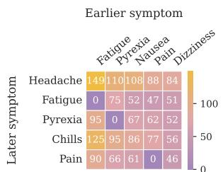  
(a) Ground Truth

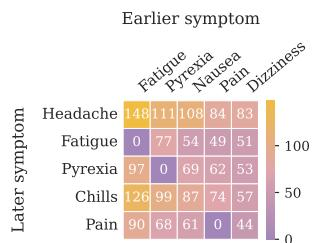  
(b) Claude, CRAFT-Full  
Figure 6.1: Before–after symptom-transition frequencies of each later symptom (columns) given the first symptom of the report (rows; restricted to the most frequent first symptoms in the dataset): (a) ground truth; (b) CRAFT-Full on Claude

6.1 RQ1: CRAFT-Full vs. Baselines. Table 5.1 reports final performance across all four

models and five settings. Against PIVOT, CRAFT-Full gains +1.0 EM points for GPT-4.1 (35.61 vs. 34.60), +0.8 for Llama-3.3-70B (28.04 vs. 27.22), +0.7 for Claude Sonnet 4.5 (37.14 vs. 36.44), and +0.1 for MedGemma-27B (20.85 vs. 20.75). Margins over GUIDE are uniformly larger (GPT-4.1: +1.6; Llama: +2.0; Claude: +1.5; MedGemma: +0.7). CRAFT-Full achieves the highest EM in every model block compared to baselines, confirming it as the strongest configuration. Although baselines such as PIVOT and GUIDE occasionally match or exceed CRAFT-Full on $\tau _ { b }$ or LCCS, these metrics credit partial ordering agreement and can score highly even when the full trajectory structure is incorrect. EM, which requires the entire stage-wise grouping and ordering to match gold, is the most demanding metric for this task and the one on which CRAFT-Full consistently leads.

Table 6.1 explains how CRAFT-Full wins. CRAFT-Full actively uses its refinement budget: AvgIters reaches 2.99 for GPT-4.1 and 3.46 for Claude, and performance builds across iterations. For GPT-4.1, EM rises from 26.90 at i=1 to 35.61 at i=4, a gain of 8.7 points across rounds. In contrast, PIVOT and GUIDE converge after a single pass in most instances (AvgIters ≈ 1.2–2.0) because the anchor-based verifier accepts outputs quickly without substantive ordering improvement. For GPT-4.1, PIVOT peaks at EM@2=34.73 and GUIDE degrades from its peak of 34.92 at i=1. This confirms that CRAFT-Full’s additive rubric provides richer, more actionable feedback that sustains improvement across the full refinement budget, whereas the anchor-based verifier’s narrower signal cannot drive continued gains beyond the first pass.

Figure 6.1 shows that the gold and CRAFT-Full transition matrices share a similarly difuse distribution across symptom pairs and difer only in small cell values, confirming that CRAFT-Full preserves progression patterns at the population scale. Since this aggregate view does not reveal where refinement changes predictions, we turn to an instance level case study in Section 6.5.

6.2 RQ2: Overall Model Performance. The capability ordering is stable across all configurations and metrics: Claude Sonnet 4.5 > GPT-4.1 > Llama-3.3- 70B > MedGemma-27B. Under CRAFT-Full, Claude achieves the highest total EM (37.14), followed by GPT-4.1 (35.61), Llama (28.04), and MedGemma (20.85). This ordering holds without exception across all three metrics and all vaccine strata, indicating that MedTempo reliably diferentiates model tiers.

Beyond the stable ranking, models difer notably in how they respond to iterative refinement. GPT-4.1 benefits most from additional iterations: under CRAFT-Full, EM climbs from 26.90 at i=1 to 35.61 at i=4 (+8.7 points), with LCCS and $\tau _ { b }$ following similar upward trends (47.10→61.46 and 45.71→57.77 respectively). In contrast, Claude starts strong (EM 36.57 at i=1) but gains only +0.6 points across iterations, suggesting its first-pass outputs already capture most of the temporal structure. Llama and MedGemma show similarly flat iteration curves (EM gains of +0.6 and +0.2 respectively), but for a diferent reason: both converge quickly (AvgIters 1.2–1.5), indicating that the verifier accepts their outputs early rather than driving further improvement. This divergence between models that saturate from high initial quality (Claude) and those that stall from limited capacity to act on feedback (Llama, MedGemma) highlights that iteration utility is tied to model capability.

Figure 6.2 shows that distributional fidelity to gold tracks the capability ordering: Claude overlaps gold across all settings, while Llama and MedGemma fall short of gold at stage counts of four and above regardless of verifier choice. GPT-4.1 is the one tier where verifier choice visibly reshapes the distribution, with CRAFT w/o V peaking at stage 2 and CRAFT-Full recovering a spread close to gold.

6.3 RQ3: Vaccine-Stratified Performance. Performance is consistently stratified by vaccine type across all models and configurations: Moderna narratives yield the highest EM in every case, followed by Janssen, with Pfizer-BioNTech systematically lowest. Under CRAFT-Full, the Moderna–Pfizer gap is 7.4 points for GPT-4.1 (40.06 vs. 32.68), 6.5 for Claude Sonnet 4.5 (41.18 vs. 34.65), 5.1 for Llama-3.3-70B (31.90 vs. 26.77), and 7.2 for MedGemma-27B (25.99 vs. 18.80). This ordering is preserved across all settings and all four models without exception, indicating a systematic corpus-level source of dificulty rather than a model-specific efect.

Table 6.1: Results at each iteration per model and setting. M@t: metric $M \in \{ \mathrm { E M } , \mathrm { L C C S } , \tau _ { b } \}$ when the generate– verify loop is capped at t iterations. AvgIters: mean iterations executed under $t { = } 4 .$ Metrics in $\%$ . Underline: best per setting across iterations. Bold underline: best per model per metric. <sup>†</sup>Proposed method.
<table><tr><td>LLM</td><td>Setting</td><td>AvgIters</td><td>EM@1</td><td>EM@2</td><td>EM@3</td><td>EM@4</td><td>LCCS@1</td><td>LCCS@2</td><td>LCCS@3</td><td>LCCS@4</td><td> $\tau _ { b } @ 1$ </td><td> $\tau _ { b } @ 2$ </td><td> $\tau _ { b } @ 3$ </td><td> $\tau _ { b } @ 4$ </td></tr><tr><td></td><td>PIVOT</td><td>1.2734</td><td>29.72</td><td>34.73</td><td>34.73</td><td>34.60</td><td>52.19</td><td>59.44</td><td>59.31</td><td>59.24</td><td>50.74</td><td>57.29</td><td>57.28</td><td>57.20</td></tr><tr><td>GP-1</td><td>GUIDE</td><td>1.2348</td><td>34.92</td><td>34.22</td><td>34.06</td><td>33.97</td><td>60.96</td><td>60.18</td><td>59.97</td><td>59.80</td><td>58.91</td><td>58.44</td><td>58.36</td><td>58.24</td></tr><tr><td></td><td> $\mathrm { C R A F T _ { w / o } v }$ </td><td>1.0000</td><td>26.30</td><td></td><td></td><td></td><td>42.19</td><td></td><td></td><td></td><td>44.02</td><td></td><td></td><td></td></tr><tr><td></td><td> $\mathrm { C R A F T _ { G } }$ </td><td>2.9407</td><td>34.89</td><td>32.79</td><td>31.78</td><td>31.08</td><td>60.90</td><td>58.16</td><td>56.61</td><td>55.69</td><td>58.33</td><td>55.87</td><td>54.40</td><td>53.88</td></tr><tr><td></td><td> $\mathbf { C R A F T - F u l l } ^ { \dagger }$ </td><td>2.9864</td><td>26.90</td><td>34.89</td><td>35.61</td><td>35.61</td><td>47.10</td><td>60.94</td><td>61.45</td><td>61.46</td><td>45.71</td><td>58.19</td><td>58.16</td><td>57.77</td></tr><tr><td></td><td>PIVOT</td><td>1.2022</td><td>26.90</td><td>27.22</td><td>27.22</td><td>27.22</td><td>50.13</td><td>51.00</td><td>51.04</td><td>51.04</td><td>50.07</td><td>51.21</td><td>51.27</td><td>51.27</td></tr><tr><td></td><td>GUIDE</td><td>1.2148</td><td>26.08</td><td>26.08</td><td>26.08</td><td>26.08</td><td>49.23</td><td>49.25</td><td>49.25</td><td>49.28</td><td>49.54</td><td>49.59</td><td>49.58</td><td>49.58</td></tr><tr><td></td><td> $\mathrm { C R A F T _ { w / o } v }$ </td><td>1.0000</td><td>20.66</td><td></td><td></td><td></td><td>42.30</td><td></td><td></td><td></td><td>52.36</td><td></td><td></td><td></td></tr><tr><td>LI1aa70B</td><td> $\mathrm { C R A F T _ { G } }$ </td><td>1.2643</td><td>26.08</td><td>26.27</td><td>26.24</td><td>26.24</td><td>49.23</td><td>49.30</td><td>49.26</td><td>49.28</td><td>49.54</td><td>49.52</td><td>49.53</td><td>49.57</td></tr><tr><td></td><td> $\mathbf { C R A F T - F u l l ^ { \dagger } }$ </td><td>1.2136</td><td>27.47</td><td>27.95</td><td>28.01</td><td>28.04</td><td>50.92</td><td>52.32</td><td>52.42</td><td>52.45</td><td>50.28</td><td>52.37</td><td>52.41</td><td>52.43</td></tr><tr><td></td><td>PIVOT</td><td>1.1496</td><td>20.66</td><td>20.75</td><td>20.75</td><td>20.75</td><td>40.56</td><td>40.82</td><td>40.83</td><td>40.81</td><td>42.08</td><td>42.60</td><td>42.63</td><td>42.60</td></tr><tr><td></td><td>GUIDE</td><td>1.1179</td><td>20.15</td><td>20.12</td><td>20.12</td><td>20.12</td><td>39.80</td><td>39.78</td><td>39.78</td><td>39.78</td><td>40.86</td><td>40.76</td><td>40.75</td><td>40.75</td></tr><tr><td>Mema</td><td> $\mathrm { C R A F T _ { w / o } v }$ </td><td>1.0000</td><td>14.44</td><td></td><td></td><td></td><td>44.36</td><td></td><td></td><td></td><td>42.56</td><td></td><td></td><td></td></tr><tr><td></td><td> $\mathrm { C R A F T _ { G } }$ </td><td>1.5542</td><td>20.15</td><td>18.47</td><td>18.35</td><td>18.35</td><td>39.80</td><td>36.49</td><td>36.44</td><td>36.44</td><td>40.86</td><td>37.13</td><td>37.03</td><td>37.03</td></tr><tr><td></td><td> $\mathbf { C R A F T - F u l l } ^ { \dagger }$ </td><td>1.5032</td><td>20.66</td><td>20.47</td><td>20.85</td><td>20.85</td><td>40.56</td><td>40.64</td><td>41.13</td><td>41.13</td><td>42.08</td><td>42.32</td><td>42.57</td><td>42.57</td></tr><tr><td></td><td>PIVOT</td><td>1.9861</td><td>37.58</td><td>35.33</td><td>36.66</td><td>36.44</td><td>62.65</td><td>56.92</td><td>57.81</td><td>57.44</td><td>56.73</td><td>52.61</td><td>52.55</td><td>51.85</td></tr><tr><td></td><td>GUIDE</td><td>1.9943</td><td>40.37</td><td>35.17</td><td>36.47</td><td>35.68</td><td>65.37</td><td>55.56</td><td>55.75</td><td>54.88</td><td>58.57</td><td>51.42</td><td>49.97</td><td>49.00</td></tr><tr><td></td><td> $\mathrm { C R A F T _ { w / o } v }$ </td><td>1.0000</td><td>37.83</td><td></td><td></td><td></td><td>57.58</td><td></td><td></td><td></td><td>54.51</td><td></td><td></td><td></td></tr><tr><td>Cla-.5</td><td> $\mathrm { C R A F T _ { G } }$ </td><td>3.6350</td><td>40.08</td><td></td><td>37.48</td><td>35.99</td><td>65.35</td><td>61.63</td><td>62.51</td><td>61.30</td><td>58.40</td><td>55.59</td><td>56.07</td><td>55.47</td></tr><tr><td></td><td></td><td></td><td></td><td>35.90</td><td></td><td></td><td></td><td></td><td></td><td></td><td></td><td></td><td></td><td></td></tr><tr><td></td><td> $\mathbf { C R A F T - F u l l } ^ { \dagger }$ </td><td>3.4623</td><td>36.57</td><td>36.57</td><td>37.42</td><td>37.14</td><td>61.32</td><td>61.49</td><td>61.65</td><td>61.60</td><td>55.74</td><td>54.83</td><td>55.05</td><td>54.94</td></tr></table>

The vaccine gap is more pronounced on EM than on LCCS and $\tau _ { b } ,$ suggesting that models make segmentation errors on Pfizer narratives specifically rather than systematically misranking symptoms within groups. Since EM requires an exact match on both bucket composition and inter-bucket order while LCCS rewards contiguous correct spans and $\tau _ { b }$ captures global pairwise ordering, the metric divergence points to Pfizer narratives being harder to segment into correct temporal groups rather than harder to order within those groups. The capability ordering Claude $> \mathrm { G P T - 4 . 1 } >$ Llama > MedGemma holds for every vaccine type under every configuration.

6.4 Ablation Study. Using Table 6.1, we analyze two ablation groups: the verifier ablation (CRAFT-Full vs. CRAFT $\mathrm { ~ w ~ } / \mathrm { ~ o ~ } \mathrm { ~ V ~ } )$ , which holds the generator fixed, and the generator ablation (CRAFT-G vs. CRAFT-Full), which holds the verifier fixed.

Verifier contribution. Removing the verification loop causes substantial performance drops for three of four models. CRAFT-Full gains +9.3 EM over CRAFT w/o V for GPT-4.1 (35.61 vs. 26.30), +7.4 for Llama-3.3-70B (28.04 vs. 20.66), and +6.4 for MedGemma-27B (20.85 vs. 14.44). For Llama and MedGemma, virtually all gain is captured at i=1: the verifier’s

first-pass feedback corrects schema violations in unverified outputs, after which the output is accepted without substantive ordering improvement.

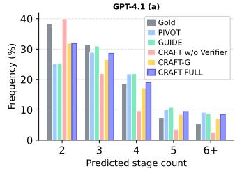

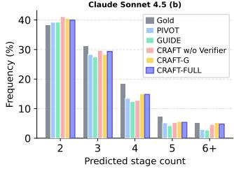

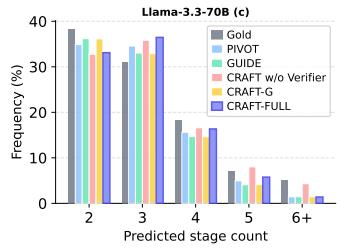

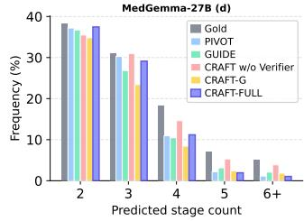  
Figure 6.2: Predicted stage-count distributions (frequency %) under all five settings vs. gold, per model. All models under-segment relative to gold; the bias is more pronounced for weaker models (MedGemma-27B, Llama-3.3-70B) than for stronger ones (GPT-4.1, Claude Sonnet 4.5).

For GPT-4.1, gains accumulate steadily through i=3 $( \mathrm { A v g I t e r s } = 2 . 9 9 )$ , confirming that the verification loop provides genuine multi-iteration value for capable models. For Claude Sonnet 4.5, CRAFT-Full (37.14) falls slightly below CRAFT w/o V (37.83): the fixed threshold θ=3 does not recognize Claude’s near-correct firstpass output as satisfactory, forcing continued revision that introduces errors rather than correcting them. This highlights the importance of threshold calibration for further improvement.

Table 6.2: Iteration trace for Example 1 (GPT-4.1, CRAFT-Full). ✓ = matches gold; × = grouping error.
<table><tr><td></td><td>Iter Score Predicted Stages</td><td></td></tr><tr><td>Gold</td><td></td><td>{Insomnia} → {Muscle disorder} → {Herpes zoster} → {Memory impair- ment}</td></tr><tr><td>1</td><td></td><td>2/5 {Insomnia} → {Muscle disorder} → {Herpes zoster, Memory impair- ment} ×</td></tr><tr><td>2</td><td></td><td>3/5 {Insomnia} → {Muscle disorder} → {Herpes zoster} → {Memory impair- ment}√</td></tr></table>

Generator contribution. Replacing the fullregeneration generator with the edit-conditioned variant (CRAFT-G) consistently degrades final performance. For GPT-4.1, CRAFT-G achieves a strong EM of 34.89 at i=1 but degrades monotonically to 31.08 by i=4 (−3.8 points), while CRAFT-Full builds to 35.61. The edit-conditioned prompt is efective for initialisation but too constrained to sustain quality under continued verifier feedback across the full budget. For MedGemma-27B, CRAFT-G is actively harmful: EM drops from 20.15 at i=1 to 18.35 by i=2, indicating the model misinterprets edit-only instructions and degrades its own output under revision. CRAFT-Full avoids this across all tiers by regenerating from full task context at every iteration.

6.5 Case Study. The ablation analysis above quantifies verifier and generator contributions across models and iterations at the aggregate level, but does not reveal how the feedback loop operates on individual instances. To provide insight into the refinement mechanism, we present a representative example showing how verifier feedback guides the generator toward the correct trajectory across iterations. An additional case study is provided in the Appendix A.5.

Example (GPT-4.1, CRAFT-Full):

Symptom list: Insomnia, Muscle disorder, Herpes zoster, Memory impairment

Narrative (abridged): “On 20Feb2021, the patient experienced could not sleep. In Feb2021, the patient experienced efected upper part of body, arms, neck, shoulders, severe muscle condition, had tiny bit of shingles on my side, did not have memory of anything that happened / was out of my mind [. . . ] They took her to the hospital and then the patient underwent MRI to see if her brain was okay.”

Iteration 1 Score: 2/5 — below θ, continue

Verifier feedback: “Symptoms are grouped in temporal order and all are present, but ‘Herpes zoster’ and ‘Memory impairment’ should be in separate groups as they are not clearly described as occurring at the same time [. . . ] For full marks, ensure symptoms grouped together are clearly simultaneous per the text.”

## Iteration 2 Score: $3 / 5 - s \geq \theta ,$ , early stop ✓ Verifier feedback: —

At i=1, the model correctly orders all four symptom groups but over-merges Herpes zoster and Memory impairment into a single stage, receiving a score of 2. The score of 2 rather than 3 reflects that the overmerge constitutes two rubric violations simultaneously: grouping symptoms without clear simultaneous support, and failing to maintain strict earliest-to-latest ordering within the merged group. CRAFT-Full’s verifier precisely identifies the grouping error and provides a targeted one-sentence correction, demonstrating that its additive rubric produces informative, actionable feedback even when the overall ordering direction is already correct. At i=2 the model splits the two symptoms into separate stages, exactly matching the gold standard and receiving a score of 3, which meets the acceptance threshold θ=3 and triggers early stopping. This example illustrates that a single round of targeted feedback is suficient for a capable model to correct a local grouping error within the refinement budget. Table 6.2 summarizes the predicted stages across iterations.

7 Conclusion. We presented CRAFT, a generator–verifier LLM framework for iterative temporal reasoning over clinical narratives, and MedTempo, an expert-annotated benchmark of 5,347 adverse-event narratives, to evaluate structured symptom trajectory construction under sparse temporal anchoring. Experiments across four LLM backbones show that CRAFT consistently improves temporal ordering accuracy. Ablation analysis confirms that both generator and verifier components contribute meaningfully, with CRAFT-Full emerging as the strongest configuration across all model tiers. Our results also reveal that refinement behavior varies by model capability, suggesting that adaptive verification strategies may further improve performance. Future work will leverage the 2,181 non-temporal reports from MedTempo-NT as supervision for a learned temporal-evidence identification module, extending CRAFT into a unified end-to-end framework for automatic progression detection and stage-wise temporal ordering.

Acknowledgments. This work was supported in part by the US National Science Foundation grant IIS-2245907, IIS-2047843, IIS-2437621, and an Amazon Research Award, Fall 2024.

## References

[1] G. Alfattni, N. Peek, and G. Nenadic, Extraction of temporal relations from clinical free text: A systematic review of current approaches, Journal of Biomedical Informatics, 108 (2020), p. 103488, https://doi.org/10.1016/ j.jbi.2020.103488, https://www.sciencedirect.com/ science/article/pii/S1532046420301167.

[2] S. Alsayyahi and R. Batista-Navarro, TIME-LINE: Exhaustive annotation of temporal relations supporting the automatic ordering of events in news articles, in Proceedings of the 2023 Conference on Empirical Methods in Natural Language Processing, Singapore, 2023, Association for Computational Linguistics, pp. 16336–16348, https://doi. org/10.18653/v1/2023.emnlp-main.1016, https:// aclanthology.org/2023.emnlp-main.1016/.

[3] J. J. Andrew, J. Potier, N. Garcelon, A. Burgun, and M. Vincent, Using large language models for temporal relation extraction from pediatric clinical reports, JAMIA Open, 8 (2025), p. ooaf121, https://doi.org/10.1093/jamiaopen/ooaf121, https://academic.oup.com/jamiaopen/article/8/ 6/ooaf121/8340484.

[4] J. J. Andrew, M. Vincent, A. Burgun, and N. Garcelon, Evaluating LLMs for temporal entity extraction from pediatric clinical text in rare diseases context, in Proceedings of the First Workshop on Patient-Oriented Language Processing (CL4Health) @ LREC-COLING 2024, D. Demner-Fushman, S. Ananiadou, P. Thompson, and B. Ondov, eds., Torino, Italia, May 2024, ELRA and ICCL, pp. 145–152, https://aclanthology.org/2024. cl4health-1.18/.

[5] Anthropic, Claude sonnet 4.5 system card. System Card, 2025, https://assets. anthropic.com/m/12f214efcc2f457a/original/ Claude-Sonnet-4-5-System-Card.pdf.

[6] S. Bethard, G. Savova, M. Palmer, and J. Pustejovsky, SemEval-2017 Task 12: Clinical TempEval, in Proceedings of the 11th International Workshop on Semantic Evaluation (SemEval-2017), 2017.

[7] Centers for Disease Control and Prevention (CDC), Food and Drug Administration (FDA), agencies of the U.S. Department of Health and Human Services (HHS), Vaccine

adverse event reporting system. https://vaers.hhs. gov/data.html, 1990.

[8] J. Chen, H. Ouyang, J. Ren, W. Ding, W. Hu, and Y. Qu, Timeline-based sentence decomposition with in-context learning for temporal fact extraction, 2024, https://doi.org/10.48550/arXiv.2405.10288, https://arxiv.org/abs/2405.10288, https: //arxiv.org/abs/2405.10288. Accepted to ACL 2024 (main conference).

[9] F. Cheng and Y. Miyao, Inducing temporal relations from time anchor annotation, in Proceedings of the 2018 Conference of the North American Chapter of the Association for Computational Linguistics: Human Language Technologies, Volume 1 (Long Papers), New Orleans, Louisiana, June 2018, Association for Computational Linguistics, pp. 1833–1843, https://doi.org/10.18653/v1/ N18-1166, https://aclanthology.org/N18-1166/.

[10] H. Cui, A. Unell, B. Chen, J. A. Fries, E. Alsentzer, S. Koyejo, and N. H. Shah, Timer: temporal instruction modeling and evaluation for longitudinal clinical records, npj Digital Medicine, 8 (2025), p. 577, https://doi.org/10. 1038/s41746-025-01965-9, https://pmc.ncbi.nlm. nih.gov/articles/PMC12475073/.

[11] T. Dettmers, A. Pagnoni, A. Holtzman, and L. Zettlemoyer, QLoRA: Eficient finetuning of quantized LLMs, in Advances in Neural Information Processing Systems 36 (NeurIPS 2023), 2023.

[12] D. Gusfield, Algorithms on Strings, Trees, and Sequences: Computer Science and Computational Biology, Cambridge University Press, 1997.

[13] J. He, L. Rasmy, H. Li, J. Li, Z. Sun, E. Yu, D. Zhi, and C. Tao, Prompting large language models for clinical temporal relation extraction, 2024, https://doi.org/10.48550/arXiv.2412. 04512, https://arxiv.org/abs/2412.04512, https:// arxiv.org/abs/2412.04512.

[14] D. Hein, A. Christie, M. Holcomb, B. Xie, A. Jain<sub>,</sub> J. Vento<sub>,</sub> N. Rakheja<sub>,</sub> A. H. Shakur, S. Christley, L. G. Cowell, et al., Iterative refinement and goal articulation to optimize large language models for clinical information extraction, NPJ Digital Medicine, 8 (2025), p. 301.

[15] M. G. Kendall, The treatment of ties in ranking problems, Biometrika, 33 (1945), pp. 239–251.

[16] A. Leeuwenberg and M.-F. Moens, Temporal information extraction by predicting relative timelines, in Proceedings of the 2018 Conference on Empirical Methods in Natural Language Processing, Brussels, Belgium, 2018, Association for Computational Linguistics, pp. 1237–1246, https://doi.org/ 10.18653/v1/D18-1155, https://aclanthology.org D18-1155/.

[17] A. Madaan, N. Tandon, P. Gupta, S. Hallinan<sub>,</sub> L. Gao<sub>,</sub> S. Wiegreffe<sub>,</sub> U. Alon<sub>,</sub> N. Dziri<sub>,</sub> S. Prabhumoye<sub>,</sub> Y. Yang<sub>,</sub> S. Welleck<sub>,</sub> B. P. Majumder<sub>,</sub> S. Gupta<sub>,</sub> A. Yazdanbakhsh, and P. Clark, Self-refine: Iterative refinement with self-feedback, 2023, https://arxiv.org/abs/2303.17651.

[18] Meta AI, Llama-3.3-70B-Instruct. Model card, 2024, https://huggingface.co/meta-llama/ Llama-3.3-70B-Instruct. Released December 6, 2024.

[19] T. Miller, S. Bethard, D. Dligach, and G. Savova, End-to-end clinical temporal information extraction with multi-head attention, in Proceedings of the 22nd Workshop on Biomedical Natural Language Processing and BioNLP Shared Tasks, Toronto, Canada, July 2023, Association for Computational Linguistics, pp. 50– 61, https://doi.org/10.18653/v1/2023.bionlp-1.4, https://aclanthology.org/2023.bionlp-1.4/.

[20] A. L. Olex and B. T. McInnes, Review of temporal reasoning in the clinical domain for timeline extraction: Where we are and where we need to be, Journal of Biomedical Informatics, 118 (2021), p. 103784, https://doi.org/10.1016/ j.jbi.2021.103784, https://www.sciencedirect.com science/article/pii/S1532046421001131.

[21] OpenAI, GPT-4o system card, (2024), https:// openai.com/index/gpt-4o-system-card/.

[22] OpenAI, GPT-4.1. Model release, 2025, https: //openai.com/index/gpt-4-1/.

[23] J. Pustejovsky, J. Castaño, R. Ingria, R. Saurí<sub>,</sub> R. Gaizauskas<sub>,</sub> A. Setzer<sub>,</sub> G. Katz<sub>,</sub> and D. Radev, TimeML: Robust specification of event and temporal expressions in text, in Fifth International Workshop on Computational Semantics (IWCS-5), 2003.

[24] P. Rajpurkar, J. Zhang, K. Lopyrev, and P. Liang, Squad: 100,000+ questions for machine comprehension of text, in Proceedings of the 2016

conference on empirical methods in natural language processing, 2016, pp. 2383–2392.

[25] G. Savova, S. Bethard, W. Styler, J. Martin, M. Palmer, J. Masanz, and W. Ward, Towards temporal relation discovery from the clinical narrative, in AMIA annual symposium proceedings, vol. 2009, 2009, p. 568.

[26] A. Sellergren, S. Kazemzadeh, T. Jaroensri, A. Kiraly, et al., MedGemma technical report, 2025, https://arxiv.org/abs/2507.05201, https://arxiv.org/abs/2507.05201.

[27] W. F. Styler IV, S. Bethard, S. Finan, M. Palmer<sub>,</sub> S. Pradhan<sub>,</sub> P. C. de Groen<sub>,</sub> B. Erickson<sub>,</sub> T. Miller<sub>,</sub> C. Lin<sub>,</sub> G. Savova<sub>,</sub> and J. Pustejovsky, Temporal annotation in the clinical domain, Transactions of the Association for Computational Linguistics, 2 (2014), pp. 143–154.

[28] X. Su, P. Howard, and S. Bethard, Transformer-based temporal information extraction and application: A review, 2025, https:// doi.org/10.48550/arXiv.2504.07470, https://arxiv. org/abs/2504.07470, https://arxiv.org/abs/2504. 07470.

[29] W. Sun, A. Rumshisky, and <sup>Ö</sup>. Uzuner, Evaluating temporal relations in clinical text: 2012 i2b2 challenge, Journal of the American Medical Informatics Association, 20 (2013), pp. 806–813.

[30] J. Tourille, Extracting Clinical Event Timelines: Temporal Information Extraction and Temporal Relation Inference, PhD thesis, Université Paris-Saclay, Nov. 2018, https://theses.hal. science/tel-01997223.

[31] M. Verhagen, R. Gaizauskas, F. Schilder, M. Hepple, and J. Pustejovsky, SemEval-2007 Task 15: TempEval temporal relation identification, in Proceedings of the Fourth International Workshop on Semantic Evaluations (SemEval-2007), 2007.

[32] E. Wang and A. Weiss, Extracting relative timelines from medical case reports using large language models, AMIA Joint Summits on Translational Science proceedings. AMIA Joint Summits on Translational Science, (2025), pp. 598–606, https://pmc. ncbi.nlm.nih.gov/articles/PMC12150726/.

[33] L. Wang, P. Li, and S. Xu, DCT-centered temporal relation extraction, in Proceedings of the 29th International Conference on Computational

Note. Columns denote $\overline { { T _ { \mathrm { m a x } } } } .$ Bold indicates the best EM.   
$T _ { \mathrm { m a x } } { = } 4$ is adopted in all main experiments.

Linguistics, Gyeongju, Republic of Korea, Oct. 2022, International Committee on Computational Linguistics, pp. 2087–2097, https://aclanthology. org/2022.coling-1.182/.

[34] T. Wolf, L. Debut, V. Sanh, J. Chaumond<sub>,</sub> C. Delangue<sub>,</sub> A. Moi<sub>,</sub> P. Cistac<sub>,</sub> T. Rault<sub>,</sub> R. Louf<sub>,</sub> M. Funtowicz<sub>,</sub> J. Davison<sub>,</sub> S. Shleifer<sub>,</sub> P. von Platen<sub>,</sub> C. Ma<sub>,</sub> Y. Jernite<sub>,</sub> J. Plu<sub>,</sub> C. Xu<sub>,</sub> T. Le Scao<sub>,</sub> S. Gugger, M. Drame, Q. Lhoest, and A. Rush, Transformers: State-of-the-art natural language processing, in Proceedings of the 2020 Conference on Empirical Methods in Natural Language Processing: System Demonstrations, Online, Oct. 2020, Association for Computational Linguistics, pp. 38–45, https://doi.org/10.18653/ v1/2020.emnlp-demos.6, https://aclanthology.org/ 2020.emnlp-demos.6/.

[35] D. Yu, R. W. Stidham, and V. G. V. Vydiswaran, A systematic temporal extraction pipeline for medical concepts in clinical notes, in AMIA Annual Symposium Proceedings, 2023, pp. 1314–1323, https://pmc.ncbi.nlm.nih. gov/articles/PMC10785919/. AMIA 2023; published in AMIA Annu Symp Proc.

[36] C. Yuan, Q. Xie, and S. Ananiadou, Zeroshot temporal relation extraction with chatgpt, 2023, https://doi.org/10.48550/arXiv.2304.05454, https://arxiv.org/abs/2304.05454, https://arxiv. org/abs/2304.05454.

[37] L. Zhou, S. Parsons, and G. Hripcsak, The evaluation of a temporal reasoning system in processing clinical discharge summaries, Journal of the American Medical Informatics Association, 15 (2008), pp. 99–106, https://doi.org/10. 1197/jamia.M2467, https://pmc.ncbi.nlm.nih.gov/ articles/PMC2274869/.

## A Appendix.

A.1 Data Sampling. Table A.1 presents representative examples of reports removed under each criterion.

A.2 Hyperparameter Selection. Hyperparameter selection for $T _ { \mathrm { m a x } }$ and θ was conducted using GPT-4.1 on a development sample of 100 instances drawn from MedTempo-T. Due to computational budget constraints, as each sweep configuration requires multiple LLM calls per instance across both generator and verifier, we limited the search to a single frontier model rather than conducting independent sweeps for all four backbones, and to a representative subset rather than the full evaluation set. The selected values $\left( T _ { \mathrm { m a x } } { = } 4 , ~ \theta { = } 3 \right)$ are applied uniformly across all models and configurations in the main experiments. While model-specific tuning could yield marginal gains for individual backbones, uniform hyperparameters ensure a controlled comparison and reflect a realistic deployment scenario where per-model calibration may not be feasible. Tables A.2 and A.3 report the development set EM across the swept ranges.

Table A.2: Development EM (%) across maximum iteration budget $T _ { \operatorname* { m a x } } \in \{ 2 , \dots , 1 0 \}$ for $\mathrm { C R A F T . } T _ { \mathrm { m a x } }$ is the upper cap on generator–verifier loop iterations per instance with early stopping enabled. GPT-4.1, sample size 100.  
Table A.3: Development EM (%) across verifier acceptance threshold $\theta \in \{ 1 , 2 , 3 , 4 \}$ for CRAFT. θ is the minimum verifier score (0–5 scale) required to accept a candidate output. GPT-4.1, sample size 100.
<table><tr><td></td><td>θ=1</td><td>θ=2</td><td>θ=3</td><td>θ=4</td></tr><tr><td>CRAFT</td><td>41</td><td>39</td><td>43</td><td>37</td></tr></table>

Note. Bold indicates the best EM. θ=3 is adopted in all main experiments.

A.3 CRAFT Prompt Templates. The generator prompt (Box A.3) is used across all CRAFT iterations. On the first pass, the placeholder fields \$prev\_result\_block and \$feedback\_block are empty; on subsequent passes, they carry the prior output and verifier feedback, respectively. The verifier prompt (Box A.3) scores each candidate on a 0–5 rubric;

Pfizer-BioNTech  
Table A.1: Examples of records removed from the dataset. This table presents representative samples of clinical reports excluded from the final dataset due to criteria such as brevity, lack of temporal information, or limited symptom mentions.
<table><tr><td>Category</td><td>Standard Symptoms</td><td>Clinical Text</td></tr><tr><td rowspan="3">Reports with 3 or less symptoms</td><td>[Pharyngeal swelling]</td><td>patient called back the next day and stated her throat was swelling and had to take Benadryl.</td></tr><tr><td>[Dysphagia, Epiglottitis]</td><td>Right side of epiglottis swelled up and hin- der swallowing pictures taken Benadryl Tylenol taken</td></tr><tr><td>[Dizziness, Fatigue, Mobility decreased]</td><td>extreme fatigue, dizziness,. could not lift my left arm for 72 hours</td></tr><tr><td rowspan="3">Reports with less than 10 words</td><td>[Erythema, Pruritus, Rash, Swelling] [Asthenia, Chills, Headache, Myalgia]</td><td>redness, bumps, itchiness, and local swelling Headache, chills, muscle aches and weakness</td></tr><tr><td>[Chills, Dizziness, Injection site pain, Myalgia, Pyrexial</td><td>Dizziness, chills, fever, muscle aches, pain at the</td></tr><tr><td>[Headache, Nausea, Pain, Pyrexia, Ur-</td><td>injection site Fever, headache, body aches, nausea and vom-</td></tr><tr><td rowspan="3">Reports with no temporal cues</td><td>ticaria, Vomiting] [Dizziness, Headache, Hypoaesthesia, In-</td><td>iting. Hives Headache, sore arm to injection site, dizzy,</td></tr><tr><td>jection site pain] [Arthralgia, Chills, Fatigue, Headache,</td><td>numbness to right foot. No medications taken. Continues to have symptoms.</td></tr><tr><td>Myalgia, Nausea, Pyrexia, Vomiting]</td><td>Repeated shaking with chills, headache, nausea and vomiting, muscle/joint aches, fatigue, fever.</td></tr></table>

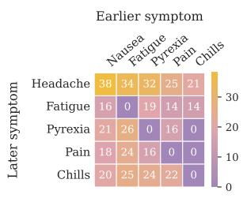

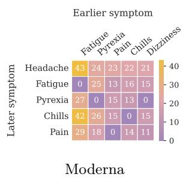

  
(a) Ground Truth

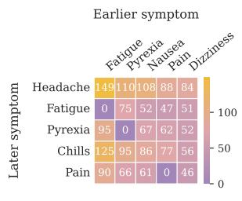

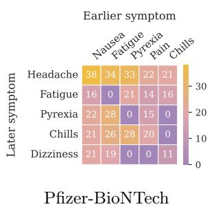

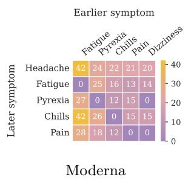

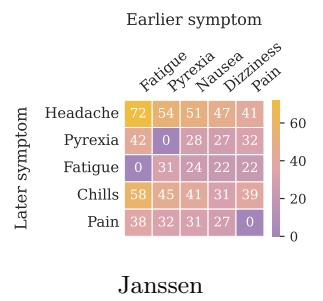

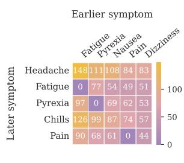  
(b) Best Model (Claude Sonnet 4.5, CRAFT-Full)  
Figure A.1: Before–after symptom relationship heatmaps across vaccine types; rows denote the most frequent earlier symptoms and columns denote the most frequent subsequent symptoms. Row (a) ground truth; row (b)CRAFT-Full on Claude

scores below 3 trigger re-generation with actionable feedback.

## Box A.3: Generator Prompt

## Ignore previous conversations.

TASK: Temporally order the provided list of adverse events based on their sequence of appearance in the clinical notes and extract the most specific mention for each adverse event from the notes.

## Clinical Notes: {symptom\_text}

Adverse Events to Temporally Order: {symptom\_list}

## PROCESSING INSTRUCTIONS:

• Start with the provided adverse events list and reorder it based on the sequence implied in the clinical notes.

• If several adverse efects are mentioned together without a clear temporal order, group them into the same block (inside a single dictionary).

• For each adverse event, extract the closest matching phrase from the clinical notes; if an adverse event is not mentioned, assign "none" as its value.

## IMPORTANT RULES:

• No Invention: Never add, remove, or modify symptom names from the provided list.

• Mention Each Symptom Once: Mention each symptom only once—at the first time it appears or becomes relevant.

• Specific vs. Generic Terms: When a phrase matches both specific and generic symptoms, assign it to the specific term only. If “Lip swelling” or “Pharyngeal swelling” is matched, do NOT include the generic “Swelling” unless there is a separate, explicit mention of general swelling elsewhere.

• Temporal Evidence Required: If multiple symptoms are mentioned across multiple sentences without clear timeline separation, group them together. Do NOT treat diferent sentences as different times unless there is an explicit temporal indicator (e.g., “then,” “after that,” “later,” specific dates or times).

• Unmentioned Symptoms: Group all symptoms with no original mention together in a separate block with "none" as their value. This block should be placed after all the temporally ordered groups.

OUTPUT FORMAT: Return your answer only in valid JSON format—using a list of dictionaries to represent temporal progression and grouping:

{[

{"Erythema": ["redness in neck"]},

{"Pain in extremity": ["sore arm"],

"Pruritus": ["itchy feeling"]},

## {"Swelling": ["mild arm swelling"]} ]}

When revising, consider both the feedback (if any) and the previous attempt result (if provided). Keep correct parts from prior attempts, but fix issues based on feedback.

## Box A.3: Verifier Prompt

Given the original text and extracted symptoms below:

## Original Text: {symptom\_text} Symptoms to Extract: {symptom\_list} Current Result (JSON): {initial\_result}

Scoring rubric (0–5), +1 each if:

1. The JSON is valid and groups are earliest→latest.

2. Non-mentioned symptoms are presented as "none" in the last group.

3. Every symptom in the list appears exactly once overall.

4. Symptoms grouped together occur around the same time.

5. Group ordering follows the text’s temporal cues.

Return ONLY one of the following JSON objects:

A.4 Heatmaps. Figure A.1 compares groundtruth before–after symptom relationships with the bestperforming Claude CRAFT-Full configuration across all three vaccine types and overall.

A.5 Case Study 2: Verifier Miscalibration Induces Oscillation (Claude Sonnet 4.5, GUIDE). Symptom list: Chest pain, Fatigue, Carditis, Troponin increased

Narrative (abridged): “My son experienced chest pain and was very tired — Sat 6/19 [. . . ] Monday 6/21 at 11am severe chest pain. Taken to hospital — was hospitalized with heart inflammation and very high troponin numbers until Thursday 6/24.”

Iteration 1 Score: 2/5 — below θ, continue Verifier feedback:

$$
\mathtt { A S P E C T = G R O U P I N G : \_ O P = M E R G E ( g 0 , \ g 1 ) }
$$

ASPECT=GROUPING; OP=SPLIT(g0,

move\_keys=[Chest pain, Fatigue],

to=NEW\_AFTER\_-1); OP=SPLIT(g1,

move\_keys=[Carditis, Troponin

increased], to=NEW\_AFTER\_1)

Iterations 3–4 Score: 2/5 — budget exhausted, return last output

Verifier feedback: (repeats i=1 and i=2 feedback alternately)

At i=1, Claude produces the exact gold-standard output, correctly separating the pre-hospital symptoms (Chest pain, Fatigue) from the hospitalization findings (Carditis, Troponin increased). However, GUIDE’s verifier assigns a score of 2 and instructs a Merge operation — because the narrative uses relative date markers (“Sat 6/19”, “Monday 6/21”) rather than explicit absolute anchors, the verifier cannot confidently confirm distinct temporal support for the two groups. The model faithfully follows the instruction at i=2, merging all symptoms into a single stage and producing a wrong output. The verifier then issues a Split instruction, the model recovers the correct grouping at i=3, and the cycle repeats. The loop terminates at i=4 on a merge step, returning an incorrect final output despite the model having produced the correct answer twice. This example illustrates how GUIDE’s verifier’s strict requirement for explicit temporal anchors is miscalibrated for narratives that express temporal order through relative date references, causing it to reject a correct first-pass output and drive the model into an unresolvable oscillation. Table A.4 summarizes the predicted stages across all four iterations.

Table A.4: Model outputs across iterations for Example 2 (Claude Sonnet 4.5, GUIDE). ✓ = matches gold; × = grouping error.
<table><tr><td></td><td></td><td>Iter Score Predicted Stages</td></tr><tr><td>Gold</td><td></td><td>{Chest pain, Fatigue} → {Carditis, Troponin increased}</td></tr><tr><td>1</td><td>2/5</td><td>{Chest pain, Fatigue} → {Carditis, Troponin increased}√</td></tr><tr><td>2</td><td>2/5</td><td>{Chest pain, Fatigue, Carditis, Troponin increased}</td></tr><tr><td>3</td><td>2/5</td><td>{Chest pain, Fatigue} → {Carditis, Troponin increased}√</td></tr><tr><td>4</td><td>2/5</td><td>{Chest pain, Fatigue, Carditis, Troponin increased}</td></tr></table>