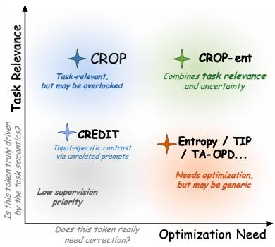
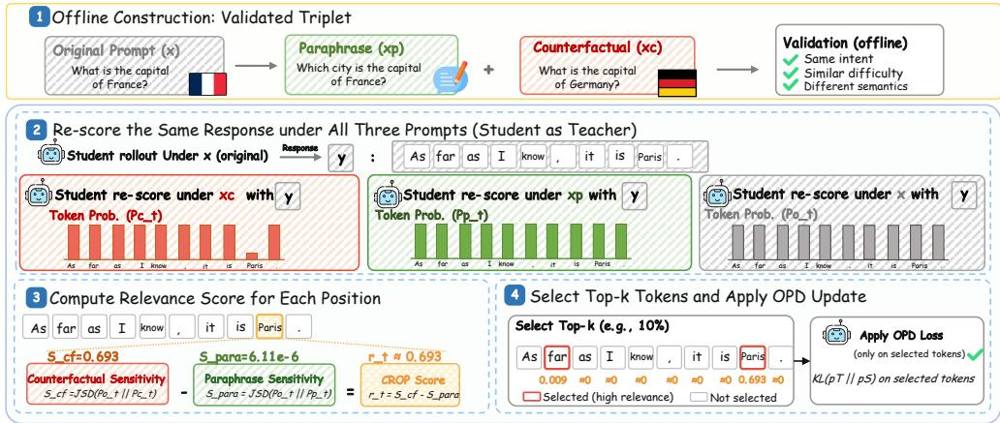
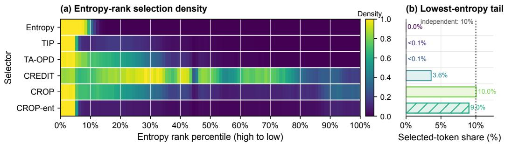
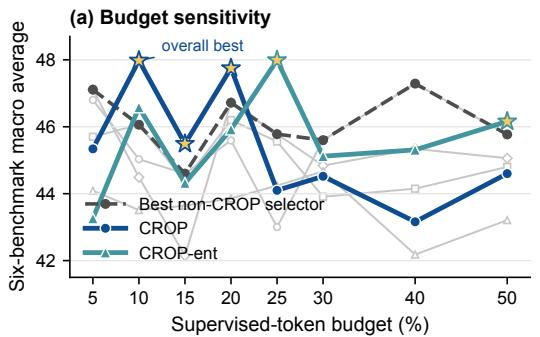
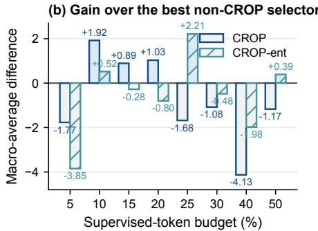
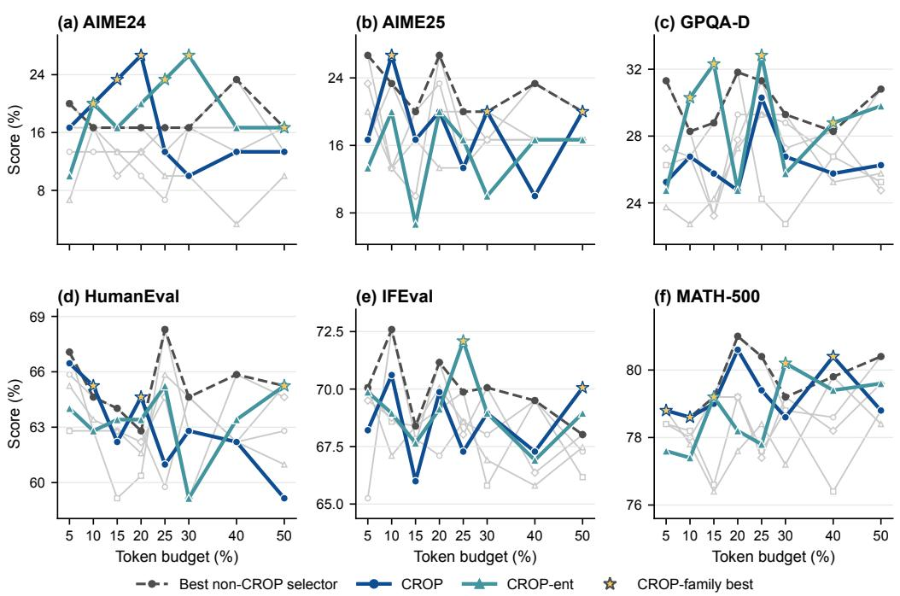
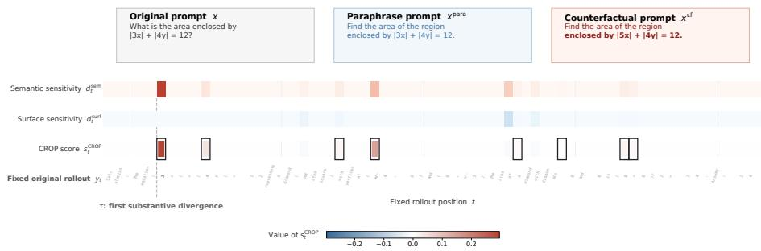
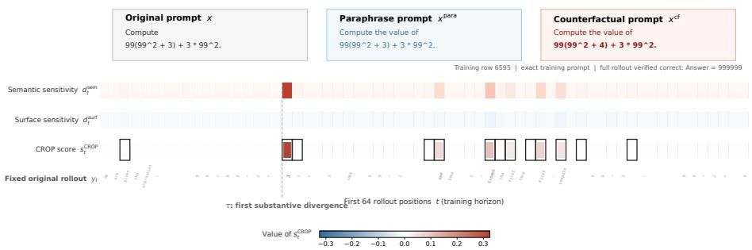
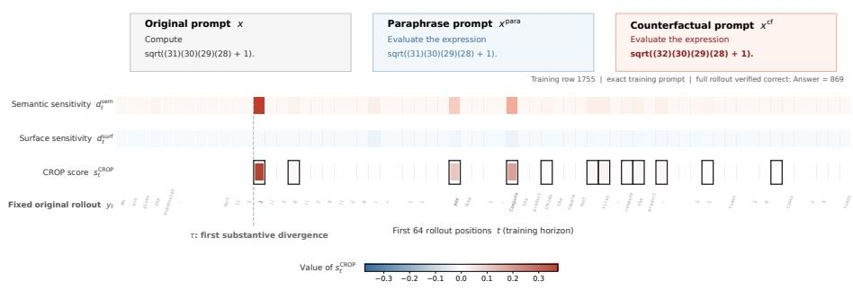
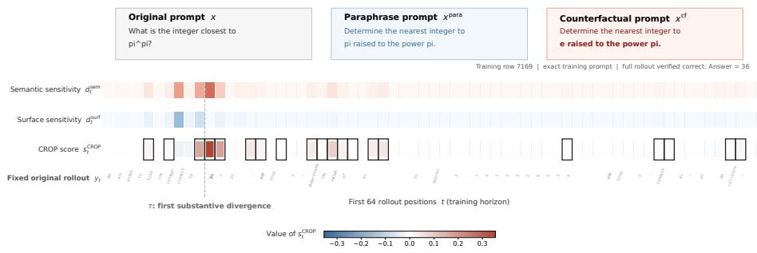

# CROP: TASK RELEVANCE VIA COUNTERFACTUALS FOR SELECTIVE ON-POLICY DISTILLATION

Enhan Li1, Junhao He1, Hongyang Du1,∗

1The University of Hong Kong

## ABSTRACT

On-policy distillation (OPD) supervises a student language model on trajectories sampled from its current policy, but assigns equal credit to response tokens with unequal supervision value. Selective OPD addresses this limitation by allocating supervision non-uniformly across response tokens according to their estimated training value. Most existing criteria, however, focus primarily on optimization need, such as uncertainty or teacher–student disagreement, while task relevance, namely whether the supervision is tied to the semantic content of the current input, remains less directly characterized as a complementary dimension. To address this gap, we introduce Counterfactual Relevance for On-Policy Distillation (CROP), which operationalizes task relevance through a paraphrase-calibrated counterfactual sensitivity margin. For each source prompt, CROP constructs a validated original–paraphrase–counterfactual triplet, holds the student rollout fixed, and measures each response position by its sensitivity to a task-relevant condition change calibrated by its sensitivity to a meaning-preserving rewrite. Matched selection controls show that CROP identifies more useful supervision positions than random or lowest-relevance selection, while component comparisons confirm the value of both counterfactual sensitivity and paraphrase calibration. Across two teacher–student settings, CROP improves aggregate performance by 1.92 and 2.96 points over the strongest non-CROP selector. These results support task relevance as a complementary criterion for selective OPD and establish CROP as a modelinternal, contrast-specific method for allocating token-level supervision.

## 1 INTRODUCTION

Post-training commonly combines supervised fine-tuning (SFT) and reinforcement learning (RL) to improve the capability and controllability of pretrained language models (Jiang et al., 2026a; Ouyang et al., 2022; Schulman et al., 2017). SFT learns from fixed offline demonstrations, whereas RL optimizes sampled outputs against scalar rewards (Ouyang et al., 2022; Schulman et al., 2017). A natural objective is therefore to retain dense supervision while adapting it to the states actually visited by the student. On-policy distillation (OPD) addresses this objective by querying a stronger teacher on prefixes visited by the student’s current policy, combining on-policy coverage with dense token-level distributional supervision (Yang et al., 2026a; Song & Zheng, 2026). However, standard OPD treats every visited response token as an equally suitable imitation target. This uniform allocation can waste supervision on input-generic tokens while underemphasizing tokens that carry task-specific learning signals.

Selective OPD methods recognize that token value is heterogeneous, and recent work has developed a broad range of token-level selection and weighting strategies (Song & Zheng, 2026). Uncertaintybased selectors use student entropy or entropy–divergence combinations to identify informative positions (Jin et al., 2026; Xu et al., 2026). Other methods prioritize teacher–student disagreement that is locally teachable or reliable (Wang et al., 2026; Xing et al., 2026). Position- and training-dynamics-based methods use trajectory position, persistent loss, or accumulated discrepancy as additional proxies (Liu et al., 2026; Xie et al., 2026; Jiang et al., 2026b). A further line constructs contrastive, advantage-based, or counterfactual token-level credit using negative prompts, privileged-policy comparisons, or sibling rollouts (Shen et al., 2026; Yu et al., 2026b; Meng & Chen, 2026). Despite their different constructions, these methods primarily estimate an optimization need: whether a token is uncertain, differs from the teacher, is teachable, reliable, or expected to improve the training objective.

However, optimization-oriented signals do not fully characterize a token’s supervision value. For example, TIP shows that entropy alone can miss low-entropy but high-divergence positions, indicating that valuable supervision cannot be captured by a single optimization proxy (Xu et al., 2026). More fundamentally, even tokens that are uncertain, discrepant from the teacher, or readily correctable may still reflect inputgeneric response patterns. These signals therefore characterize whether a token needs or can benefit from optimization, but not whether the supervision is tied to the semantic content of the current input. This motivates task relevance as a complementary dimension of supervision value, asking whether a token’s learning signal depends on the task semantics rather than merely whether the token can be changed.

This gap reveals task relevance as a dimension of supervision value complementary to optimization need (Figure 1). Optimization need says that a token can be improved, whereas task relevance asks whether improving it teaches the student something about the current input. Existing selectors predominantly estimate the former; CROP is designed to complement

Figure 1: Motivating the complementary dimensions of token supervision value: optimization need and task relevance.

them with the latter. Most closely related, CREDIT estimates input-sensitive credit by rescoring a fixed response and feedback under unrelated batch queries (Shen et al., 2026). Because its unrelated queries vary task semantics and nuisance factors jointly, the resulting contrast may mix semantic dependence with other input differences. We adapt CREDIT to the same budgeted OPD selector for direct evaluation (Appendix B.3). For each source prompt, CROP constructs a matched original– paraphrase–counterfactual triplet, where the paraphrase preserves task-relevant meaning and the counterfactual changes one material condition. It holds the student’s original rollout fixed, compares token distributions under the three prompts, and subtracts paraphrase sensitivity from counterfactual sensitivity. CROP then selects the highest-scoring positions under a fixed supervised-token budget for the unchanged sampled-token OPD update, yielding a model-internal, contrast-specific measure of controlled semantic dependence. Our contributions are:

• Task relevance for selective OPD. We distinguish a token’s optimization need from its task relevance and motivate sensitivity to controlled semantic contrasts as a complementary signal. Using matched original–paraphrase–counterfactual prompts and a fixed realized student rollout, we operationalize this quantity as a model-internal, contrast-specific relevance signal rather than an unrestricted causal effect.

• CROP: paraphrase-calibrated counterfactual token selection. We propose CROP, which constructs and validates matched prompt triplets offline, re-scores the same response prefixes under all three prompts, and subtracts paraphrase sensitivity from counterfactual sensitivity using top-K JSD with a residual bucket. CROP converts these scores into a batch-global hard token mask under a fixed budget while leaving the teacher target and sampled-token OPD objective unchanged.

• End-to-end performance and token-selection evidence. Across two teacher–student settings, CROP improves aggregate performance by 1.92 and 2.96 points over the strongest non-CROP selector. Matched token-selection controls show a consistent ranking: highestrelevance tokens outperform random selection, whereas lowest-relevance tokens perform substantially worse. Component comparisons support counterfactual sensitivity as the primary selection signal and show an additional benefit from paraphrase calibration.

## 2 RELATED WORK

On-policy distillation. OPD reduces the train–test state mismatch of offline distillation by querying a teacher on prefixes visited by the current student (Yang et al., 2026a; Song & Zheng, 2026). Recent variants improve its objective, stability, and use of teacher uncertainty (Jin et al., 2026; Ko et al., 2026; Yang et al., 2026b; Li et al., 2026). A closely related line asks whether every teachersupervised token should receive equal weight. TIP combines entropy with teacher–student divergence (Xu et al., 2026); TA-OPD focuses on whether a correction is locally teachable (Wang et al., 2026); TrOPD restricts supervision to teacher-reliable trust regions (Xing et al., 2026); PW-OPSD and IW-OPD use trajectory position and accumulated distributional discrepancy as reliability signals (Liu et al., 2026; Xie et al., 2026); and Rock Tokens studies whether persistently high-loss tokens are functionally necessary (Jiang et al., 2026b). These approaches expose important dimensions of supervision quality. Their selectors rely mainly on statistical, positional, or optimization proxies. CROP instead intervenes on the question and measures how the student’s next-token distribution at each fixed response prefix responds to the semantic contrast.

Credit assignment in reinforcement learning and distillation. Credit assignment determines how a coarse training signal is distributed across the decisions that produced an outcome. In language-model post-training, token selection and weighting have been used to refine sequencelevel rewards, preferences, and dense distillation targets. GRPO-style methods redistribute outcome rewards across tokens. Selective distillation methods decide where imitation should be applied. CREDIT is the closest comparison: it holds the response and feedback fixed and subtracts teacherside scores under unrelated inputs, yielding a prior-contrastive self-distillation reward (Shen et al., 2026). CROP instead reduces this ambiguity by contrasting a one-condition counterfactual with a meaning-preserving paraphrase on the same rollout. It produces a hard response-position mask for external-teacher OPD rather than a vocabulary-level self-distillation reward. Our CREDIT-style baseline ports its score to the same mask and fixed supervised-token budget (Appendix B.3). DOPD instead routes supervision by privileged-policy advantage gaps (Yu et al., 2026b).

Counterfactual reasoning in post-training. Human and AI feedback can favor sycophancy, excessive length, formatting, and other response attributes that provide unreliable measures of underlying quality (Sharma et al., 2024; Dubois et al., 2024; Chen et al., 2024). Causal reward modeling varies suspected nuisance attributes while holding task-relevant content fixed, or enforces invariance to non-causal changes (Wang et al., 2025; Kim et al., 2026). CROP adopts an interventionist design at token level: a semantic counterfactual is calibrated by a matched paraphrase, and the realized student response prefix is held fixed. We use the resulting contrast as an operational model-internal relevance score with a contrast-specific interpretation.

## 3 METHOD: COUNTERFACTUAL RELEVANCE FOR ON-POLICY DISTILLATION

## 3.1 OVERVIEW AND PROBLEM SETUP

Let $\pi _ { \theta }$ denote the trainable student, $\pi _ { \bar { \theta } }$ the rollout-time student snapshot, and $\pi _ { T }$ the teacher; index i identifies a rollout sample and t a response-token position. For an original prompt $x ,$ the student produces an on-policy response $y = ( y _ { 1 } , \dots , y _ { T } ) \sim \pi _ { \bar { \theta } } ( \cdot \mid x )$ , where $T$ is the generated response length. CROP constructs an offline matched triplet $( x , \overbar { x ^ { \mathrm { p a r a } } } , \overbar { x } ^ { \mathrm { c f } } )$ ), where $x ^ { \mathrm { p a r a } }$ is a meaningpreserving paraphrase of x and $x ^ { \mathrm { c f } }$ changes one task-relevant condition. It measures counterfactual relevance on the fixed response $y$ and converts the resulting scores into a binary response-token mask. The mask determines which sampled tokens contribute to the existing OPD update. The teacher target and OPD loss scale remain unchanged. Figure 2 summarizes this pipeline.

## 3.2 COUNTERFACTUAL TRIPLET GENERATION

For each source prompt, we construct an offline original–paraphrase–counterfactual triplet. The paraphrase preserves task-relevant meaning, the requested task, and output constraints. The counterfactual changes one explicit material condition while preserving the requested task and output constraints (Stolfo et al., 2023; Li et al., 2024). It serves as a validated approximate semantic intervention used to construct an operational token-selection contrast. An LLM generates candidate rewrites and an independent critic validates them using the prompts in Listings 1–4; the default training adapter uses only strictly validated triplets. This validation does not require a unique reference answer: for open-ended tasks, it instead checks the semantic relation between prompts together with task-specific response constraints. Although our current triplet-generation prompts are instantiated for mathematics training data, this construction applies equally to coding, open-domain question answering, and other tasks for which semantic-preserving and condition-changing rewrites can be validated. The complete prompts, validation criteria, repair and ranking procedure, and output filtering policy are given in Appendix A.

  
Figure 2: Overview of CROP. Validated original–paraphrase–counterfactual triplets enable matched rescoring of a fixed student rollout. CROP ranks tokens by counterfactual minus paraphrase sensitivity and applies a batch-global binary mask to sampled-token OPD.

## 3.3 CROP: PARAPHRASE-CALIBRATED COUNTERFACTUAL TOKEN SELECTION

Given a validated triplet and a student rollout on the original prompt, CROP ranks response positions by whether the student distribution shifts more under the condition-changing prompt than under the meaning-preserving rewrite. It first re-scores the fixed rollout under the three matched prompts, forms a paraphrase-calibrated counterfactual sensitivity margin, and then allocates a batch-global supervised-token budget. These scorer calls target supervision quality under a fixed supervisedtoken budget; training latency and energy efficiency are outside the scope of this work. The resulting binary mask changes only which response tokens enter the sampled-token OPD loss; the teacher target and underlying update remain unchanged. We use counterfactual relevance as the main selection signal. Student entropy is kept separate, serving as an uncertainty baseline and, in an optional mixture, as a test of its complementarity with counterfactual relevance.

Matched student rescoring. CROP evaluates the effect of a prompt intervention on a fixed student response. Given an original prompt x, the rollout-time student produces $y = ( y _ { 1 } , \dots , y _ { T } ) \sim \pi _ { \bar { \theta } } ( \cdot \ |$ x). Both paired prompts reuse this original rollout. For every response position t, the same response token $y _ { t }$ and prefix $y _ { < t }$ are scored under the original prompt, a meaning-preserving paraphrase, and a condition-changing counterfactual:

$$
P _ { t } ^ { o } = \pi _ { \bar { \theta } } ( \cdot \mid x , y _ { < t } ) , \qquad P _ { t } ^ { p } = \pi _ { \bar { \theta } } ( \cdot \mid x ^ { \mathrm { p a r a } } , y _ { < t } ) , \qquad P _ { t } ^ { c } = \pi _ { \bar { \theta } } ( \cdot \mid x ^ { \mathrm { c f } } , y _ { < t } ) .\tag{1}
$$

We omit the rollout-sample index i here and restore it where needed below. Holding the realized response and all prefixes fixed prevents differences in independently sampled trajectories from being mistaken for prompt sensitivity. The three rescoring calls use the student rollout endpoint and are detached from the subsequent parameter update. CROP constructs its score exclusively from the student; the teacher supplies the subsequent sampled-token OPD target.

Top-K Jensen–Shannon divergence. The student scoring endpoint returns the K highestprobability vocabulary entries at each position, where K is the retained vocabulary-support size. For two scored distributions $P$ and $Q _ { \ l }$ , let $V _ { P , Q } = \mathrm { T o p K } ( P ) \ ($ ∪ TopK(Q). We assign zero probability to omitted token IDs and add a residual category for all omitted probability mass:

$$
\widetilde { P } = \left( \{ P ( v ) \} _ { v \in V _ { P , Q } } , 1 - \sum _ { v \in V _ { P , Q } } P ( v ) \right) , \qquad \widetilde { Q } = \left( \{ Q ( v ) \} _ { v \in V _ { P , Q } } , 1 - \sum _ { v \in V _ { P , Q } } Q ( v ) \right) .\tag{2}
$$

CROP computes Jensen–Shannon divergence on this finite support,

$$
\mathrm { J S D } _ { K } ( P , Q ) = \frac { 1 } { 2 } D _ { \mathrm { K L } } ( \widetilde { P } \| M ) + \frac { 1 } { 2 } D _ { \mathrm { K L } } ( \widetilde { Q } \| M ) , \qquad M = \frac { 1 } { 2 } ( \widetilde { P } + \widetilde { Q } ) .\tag{3}
$$

All current CROP runs use $K = 6 4$ and natural-log units. Thus, the implementation score is a top-K-with-residual approximation, not an exact full-vocabulary JSD.

Paraphrase-calibrated score. For each response position, CROP computes counterfactual and paraphrase sensitivities,

$$
d _ { t } ^ { \mathrm { s e m } } = \mathrm { J S D } _ { K } ( P _ { t } ^ { o } , P _ { t } ^ { c } ) , \qquad d _ { t } ^ { \mathrm { s u r f } } = \mathrm { J S D } _ { K } ( P _ { t } ^ { o } , P _ { t } ^ { p } ) ,\tag{4}
$$

and ranks positions using

$$
s _ { t } ^ { \mathrm { C R O P } } = d _ { t } ^ { \mathrm { s e m } } - d _ { t } ^ { \mathrm { s u r f } } .\tag{5}
$$

The two terms record distributional change under the condition-changing rewrite and the meaningpreserving control, respectively. Their signed difference is used as a paraphrase-calibrated sensitivity margin for ranking; because JSD is nonlinear, it is not an additive decomposition of semantic and surface effects. A high margin means that the counterfactual induces a larger distribution shift than the paraphrase within the matched triplet. A low margin can reflect either stability or failure to react to a relevant condition, while a high margin can include overreaction to residual prompt differences. Accordingly, the score is a model-internal, contrast-specific ranking heuristic, not a measure of correctness, ground-truth task relevance, or an unrestricted causal effect.

Optional entropy–relevance mixture. We additionally report CROP-ENT, an optional entropyaugmented variant that tests whether student uncertainty complements counterfactual relevance. Let $\bar { H _ { i , t } } ~ = ~ H ( P _ { i , t } ^ { o } )$ be the student entropy at a valid response position. Following the robust batch normalization used by the entropy-based selectors, define

$$
\mathrm { N o r m } _ { \mathcal { B } } ( z _ { i , t } ) = \mathrm { c l i p } \bigg ( \frac { z _ { i , t } - Q _ { 0 . 0 5 } ( z _ { \mathcal { B } } ) } { Q _ { 0 . 9 5 } ( z _ { \mathcal { B } } ) - Q _ { 0 . 0 5 } ( z _ { \mathcal { B } } ) + \epsilon } , 0 , 1 \bigg ) ,\tag{6}
$$

where $Q _ { \tau } ( z _ { B } )$ is the empirical τ-quantile of the corresponding scores over valid response positions in rollout batch $B ,$ and $\epsilon > 0$ prevents division by zero. We write $\tilde { H } _ { i , t } \ = \ \mathrm { N o r m } _ { B } ( H _ { i , t } )$ and $\widetilde { s } _ { i , t } ^ { \mathrm { C R O P } } = \mathrm { N o r m } _ { B } ( s _ { i , t } ^ { \mathrm { C R O P } } )$ , and combine them using a Soft-OR:

$$
s _ { i , t } ^ { \mathrm { C R O P - e n t } } = \widetilde { H } _ { i , t } + \widetilde { s } _ { i , t } ^ { \mathrm { C R O P } } - \widetilde { H } _ { i , t } \widetilde { s } _ { i , t } ^ { \mathrm { C R O P } } .\tag{7}
$$

CROP-ent substitutes this score into the same batch-global budgeted selection rule while leaving the rollout, teacher target, and OPD objective unchanged. We include it only to test uncertainty– relevance complementarity; CROP remains our main selection method.

Batch-global budgeted selection. Let $a _ { i , t }$ denote the original response loss mask. Define

$$
\mathcal { V } = \{ ( i , t ) : a _ { i , t } = 1 , s _ { i , t } ^ { \mathrm { C R O P } } \in \mathbb { R } \} , \qquad \mathcal { V } _ { i } = \{ t : ( i , t ) \in \mathcal { V } \} .\tag{8}
$$

Let $\rho$ denote the nominal fraction of valid response positions retained for direct OPD supervision. The implementation requires $\rho \in ( 0 , 1 ]$ and raises an error otherwise. For $N = | \mathcal { V } | > 0$ , the nominal global budget is

$$
b = \operatorname* { m a x } \{ 1 , \lceil \rho N \rceil \} .\tag{9}
$$

When $N = 0$ , every sample uses its original response loss mask. When $N > 0$ , CROP first selects the global top-b positions:

$$
\mathcal { P } _ { 0 } = \mathrm { T o p K } ( \mathcal { V } , s ^ { \mathrm { C R O P } } , b ) .\tag{10}
$$

Algorithm 1 CROP Training   
1: Construct and validate $( x , x ^ { \mathrm { p a r a } } , x ^ { \mathrm { c f } } )$ offline.   
2: for each prompt batch x do   
3: Sample $y \sim \pi _ { \bar { \theta } } ( \cdot \mid x ) .$   
4: Rescore fixed y under $x , x ^ { \mathrm { p a r a } }$ , and $x ^ { \mathrm { c f } } .$   
5: Compute $s _ { t } ^ { \mathrm { C R O P } }$ using Equations $3 { - } 5 .$   
6: Select a batch-global top-ρ binary mask with minimum retention.   
7: Query $\pi _ { T }$ on original-prompt, student-visited prefixes.   
8: Update $\pi _ { \theta }$ with the masked sampled-token OPD loss in Equation 18.   
9: end for

Let $\mathcal { P } _ { 0 , i } = \{ t : ( i , t ) \in \mathcal { P } _ { 0 } \}$ . Let $L$ be the per-sample minimum retention, with $L = 1$ by default, and define the positive-part operator as $( z ) _ { + } = \operatorname* { m a x } \{ z , 0 \}$ . For each sample, let $\mathcal { R } _ { i } = \mathcal { V } _ { i } \setminus \mathcal { P } _ { 0 , i }$ For each sample with $| \dot { \mathcal { V } } _ { i } | > \dot { 0 }$ , define

$$
q _ { i } = \operatorname* { m i n } \Bigl \{ \left( L - | \mathcal { P } _ { 0 , i } | \right) _ { + } , | \mathcal { R } _ { i } | \Bigr \} .\tag{11}
$$

The final retained positions are

$$
\mathcal { P } = \mathcal { P } _ { 0 } \cup \bigcup _ { i : | \mathcal { V } _ { i } | > 0 } \left\{ ( i , t ) : t \in \mathrm { T o p K } \left( \mathcal { R } _ { i } , s ^ { \mathrm { C R O P } } , q _ { i } \right) \right\} .\tag{12}
$$

The final loss mask is

$$
m _ { i , t } ^ { \mathrm { C R O P } } = \left\{ \begin{array} { l l } { a _ { i , t } \mathbf { 1 } \{ ( i , t ) \in \mathcal { P } \} , } & { | \mathcal { V } _ { i } | > 0 , } \\ { a _ { i , t } , } & { | \mathcal { V } _ { i } | = 0 . } \end{array} \right.\tag{13}
$$

The realized retention ratio can therefore exceed the nominal budget, and a negative score can still be selected if it lies within the requested batch-global budget.

Masked sampled-token OPD update. The underlying OPD implementation requires only sampled log probabilities for each observed response token. We define the sampled rollout-studentminus-teacher log-probability gap as

$$
d _ { i , t } ^ { \mathrm { O P D } } = \log \pi _ { \bar { \theta } } ( y _ { i , t } \mid x _ { i } , y _ { i , < t } ) - \log \pi _ { T } ( y _ { i , t } \mid x _ { i } , y _ { i , < t } ) .\tag{14}
$$

Let $A _ { i , t } ^ { \mathrm { b a s e } }$ denote the token-level advantage supplied by the underlying policy-optimization objective, and let $\lambda _ { \mathrm { O P D } } \ge 0$ denote the strength of the sampled-token teacher correction. The resulting token-level OPD advantage is

$$
A _ { i , t } = A _ { i , t } ^ { \mathrm { b a s e } } - \lambda _ { \mathrm { O P D } } d _ { i , t } ^ { \mathrm { O P D } } .\tag{15}
$$

The PPO ratio is

$$
r _ { i , t } ( \theta ) = \exp ( \log \pi _ { \theta } ( y _ { i , t } \mid x _ { i } , y _ { i , < t } ) - \log \pi _ { \bar { \theta } } ( y _ { i , t } \mid x _ { i } , y _ { i , < t } ) ) .\tag{16}
$$

Let $\epsilon \geq 0$ and $\epsilon _ { \mathrm { h i g h } } \geq 0$ be the lower- and upper-side clipping radii of the PPO probability ratio, respectively, and let c $\mathrm { i p } ( z , l , u ) = \mathrm { m i n } \{ \mathrm { m a x } \hat { \{ { z , } l \} } , u \}$ . The underlying OPD update then uses the unchanged per-token clipped surrogate loss

$$
\ell _ { i , t } ^ { \mathrm { s a m p l e d - O P D } } = \operatorname* { m a x } \lbrack - r _ { i , t } ( \theta ) A _ { i , t } , - \mathrm { c l i p } ( r _ { i , t } ( \theta ) , 1 - \epsilon , 1 + \epsilon _ { \mathrm { h i g h } } ) A _ { i , t } \rbrack .\tag{17}
$$

Let $\begin{array} { r } { M _ { i } = \sum _ { t } m _ { i , t } ^ { \mathrm { C R O P } } } \end{array}$ denote the number of response positions selected for sample i. For a global training batch $B _ { \mathrm { t r a i n } }$ , CROP uses

$$
\mathcal { L } _ { \mathrm { C R O P } } = \frac { 1 } { | \mathcal { B } _ { \mathrm { t r a i n } } | } \sum _ { i \in \mathcal { B } _ { \mathrm { t r a i n } } } \frac { \sum _ { t } m _ { i , t } ^ { \mathrm { C R O P } } \ell _ { i , t } ^ { \mathrm { s a m p l e d - O P D } } } { \operatorname* { m a x } \{ M _ { i } , 1 \} } .\tag{18}
$$

Thus, CROP is a hard response-token selector. It leaves the student rollout distribution, teacher target, and sampled-token OPD signal unchanged. Complete rollout generation, teacher scoring, and the three student rescoring passes still occur before the mask is applied.

## 4 EXPERIMENTS

We evaluate CROP as a hard response-token selector for sampled-token OPD. We first compare it with OPD and existing selectors at the reported 10% nominal supervised-token budget, then study how its behavior changes as the retained-token fraction varies, and finally isolate the contributions of the counterfactual, paraphrase calibration, and scoring model.

## 4.1 EXPERIMENTAL SETUP

Models and training data. We report Qwen3-4B → Qwen3-1.7B and Qwen3-8B (GRPO) → Qwen3-4B. The latter teacher is the public Qwen3-8B-Base Open-R1 GRPO checkpoint (hdong0, 2026). Starting from 17,398 deduplicated DAPO-Math-17K prompts (Yu et al., 2026a), triplet validation yields a common subset of 16,594 examples (Appendix A.3). All methods share the same sampled-token OPD implementation, initialization, and training schedule; selective runs use the same nominal 10% supervised-token budget. Full hyperparameters, hardware, and reproducibility details are in Appendices B.5 and F.

Baselines. Guided by the two dimensions in Figure 1, we compare Pure OPD (Yang et al., 2026a; Song & Zheng, 2026); Entropy (Jin et al., 2026), TIP (Xu et al., 2026), and TA-OPD (Wang et al., 2026) as optimization-need selectors; and a CREDIT-style adaptation (Shen et al., 2026) as the closest contrastive, input-sensitive baseline. All use the same original prompts and fixed-budget response-token mask; methods with different objectives or training interfaces are therefore not di rectly comparable. Non-counterfactual baselines ignore the paired metadata, whereas CROP and CROP-ent use validated paraphrase–counterfactual triplets. CROP-ent combines the CROP score with entropy (Equation 7). Pure OPD retains all valid response tokens. Appendix B gives implementation details, and Appendix B.3 describes the mask-compatible CREDIT-style adaptation.

Evaluation benchmarks. We evaluate mathematical reasoning, factual question answering, code generation, and instruction following on AIME24 (Zhang & Team Math-AI, 2024), AIME25 (Zhang & Team Math-AI, 2025), MATH-500 (Hendrycks et al., 2021), GPQA-Diamond (Rein et al., 2023), HumanEval (Chen et al., 2021), and IFEval (Zhou et al., 2023). Avg. is the arithmetic mean across the six benchmarks. Full evaluation configurations and contamination analyses are in Appendix E.

## 4.2 MAIN RESULTS

Table 1 compares the main CROP selector, its optional entropy-augmented variant CROP-ent, and existing selective baselines at a nominal 10% supervised-token budget in two teacher–student settings. For Qwen3-4B → Qwen3-1.7B, CROP attains the best average of 47.98, improving over Pure OPD by 3.11 points and over the strongest selective baseline, TIP, by 1.92 points. For Qwen3-8B (GRPO) → Qwen3-4B, CROP-ent achieves the best average of 57.48, while CROP obtains 57.13; both improve over Pure OPD by more than 1.8 points. The reversal between the two settings indicates that entropy can complement counterfactual relevance for some teacher–student pairs, but is not uniformly beneficial. Across both settings, the main CROP selector itself consistently outperforms Pure OPD and all non-CROP selective baselines on the aggregate score.

All rows in both reported teacher–student settings use the same 16,594 original prompts, student initialization, rollout schedule, and evaluation protocol. The paired paraphrase and counterfactual fields are exposed only to methods whose definitions require them.

## 4.3 SELECTOR BEHAVIOR ACROSS ENTROPY RANKS

To test whether CROP simply recovers an uncertainty-based ranking, we examine where each selector allocates its retained-token fraction along the student entropy ordering. Figure 3 compares the six selectors under the same nominal 10% budget.

Entropy, TIP, and TA-OPD concentrate primarily on high-entropy positions. CREDIT also covers non-high-entropy tokens, but spreads much of its selection over the middle of the entropy ranking. CROP instead exhibits a secondary concentration in the extreme low-entropy tail: 10.0% of its retained tokens fall in the lowest-entropy decile, compared with 3.6% for CREDIT and nearly zero for the uncertainty-oriented selectors. CROP-ent retains a similar low-entropy component. Thus, CROP is not reducible to an entropy proxy: it allocates budget to low-entropy positions that uncertaintybased selectors largely exclude. The selection controls below test whether this ranking is useful.

Table 1: Main results across two teacher–student settings. Selective methods use a nominal 10% supervised-token budget; Pure OPD uses all valid response tokens. Avg. is the six-benchmark arithmetic mean.
<table><tr><td>Setting</td><td>Method</td><td> $\operatorname { A v g } .$ </td><td>AIME24</td><td>AIME25</td><td>GPQA-D</td><td>HumanEval</td><td>IFEval</td><td>MATH-500</td></tr><tr><td rowspan="7">Qwen3-4B → Qwen3-1.7B</td><td>Pure OPD</td><td>44.80</td><td>13.33</td><td>20.00</td><td>26.26</td><td>61.59</td><td>68.02</td><td>79.60</td></tr><tr><td>Entropy</td><td>44.24</td><td>13.33</td><td>13.33</td><td>28.28</td><td>64.63</td><td>67.84</td><td>78.00</td></tr><tr><td>TIP</td><td>46.06</td><td>16.67</td><td>23.33</td><td>26.77</td><td>62.80</td><td>68.58</td><td>78.20</td></tr><tr><td>TA-OPD</td><td>44.49</td><td>16.67</td><td>13.33</td><td>26.77</td><td>62.80</td><td>68.76</td><td>78.60</td></tr><tr><td>CREDIT</td><td>43.64</td><td>10.00</td><td>16.67</td><td>25.76</td><td>63.41</td><td>68.21</td><td>77.80</td></tr><tr><td>CROP</td><td>47.98</td><td>20.00</td><td>26.67</td><td>26.77</td><td>65.24</td><td>70.61</td><td>78.60</td></tr><tr><td>CROP-ent</td><td>46.58</td><td>20.00</td><td>20.00</td><td>30.30</td><td>62.80</td><td>68.95</td><td>77.40</td></tr><tr><td rowspan="7">Qwen3-8B (GRPO) → Qwen3-4B</td><td>Pure OPD</td><td>55.25</td><td>23.33</td><td>26.67</td><td>40.40</td><td>76.22</td><td>79.30</td><td>85.60</td></tr><tr><td>Entropy</td><td>54.17</td><td>23.33</td><td>26.67</td><td>35.86</td><td>77.44</td><td>78.74</td><td>83.00</td></tr><tr><td>TIP</td><td>52.56</td><td>20.00</td><td>26.67</td><td>40.40</td><td>77.44</td><td>68.02</td><td>82.80</td></tr><tr><td>TA-OPD</td><td>54.08</td><td>26.67</td><td>20.00</td><td>39.90</td><td>75.61</td><td>77.08</td><td>85.20</td></tr><tr><td>CREDIT</td><td>53.69</td><td>23.33</td><td>20.00</td><td>36.36</td><td>79.27</td><td>78.56</td><td>84.60</td></tr><tr><td>CROP</td><td>57.13</td><td>23.33</td><td>33.33</td><td>43.43</td><td>76.83</td><td>80.04</td><td>85.80</td></tr><tr><td>CROP-ent</td><td>57.48</td><td>26.67</td><td>26.67</td><td>45.96</td><td>77.44</td><td>79.11</td><td>89.00</td></tr></table>

  
Figure 3: Token-selection behavior across entropy ranks for Qwen3-4B → Qwen3-1.7B. Panel (a) shows row-normalized selection density from high to low entropy. Panel (b) reports the selectedtoken share in the lowest-entropy decile; the dotted line denotes the entropy-independent reference.

## 4.4 SENSITIVITY TO THE SUPERVISED-TOKEN BUDGET

Figure 4 visualizes how aggregate selector performance changes with the nominal supervised-token budget. At each budget, the best non-CROP selector is the highest-Avg. baseline; benchmarkspecific curves and complete results are in Appendix C. All budget runs use the same initialization, rollout budget, training schedule, and evaluation protocol on the common validated subset.

CROP achieves the best average at the 10%, 15%, and 20% budgets, while CROP-ent attains the overall peak of 47.99 at 25%. Both variants vary non-monotonically with the nominal supervisedtoken budget, showing that broadly increasing token coverage does not guarantee better performance. TA-OPD is strongest at 5%, Entropy is strongest at 30% and 40%, and CROP-ent is strongest at 25% and 50%, so the preferred selector depends on the desired supervision density. These results suggest that CROP is most effective in the sparse-to-moderate regime, where selecting questionrelevant positions is more valuable than broadly increasing token coverage.

## 4.5 SELECTOR VARIANTS

Table 2 compares CROP with variants using paraphrase sensitivity alone, observed-token counterfactual change, or teacher-side scoring. CROP achieves the highest average of 47.98, exceeding CS-OPD by 1.98 points, PC-OPD by 4.89 points, and CROP-Teacher by 3.25 points.

  
Figure 4: Aggregate budget sensitivity for Qwen3-4B → Qwen3-1.7B. (a) Six-benchmark averages; the dashed curve is the per-budget best non-CROP selector, and stars mark CROP-family wins. (b) CROP-family margins over this per-budget reference; positive values favor CROP.

Table 2: Selector variants for counterfactual token selection. PC-OPD uses paraphrase sensitivity alone, CS-OPD uses observed-token counterfactual log-probability change, and CROP-Teacher uses teacher-side scoring. Avg. is the arithmetic mean over the six benchmarks.
<table><tr><td>Method</td><td>Avg.</td><td>AIME24</td><td>AIME25</td><td>GPQA-D</td><td>HumanEval</td><td>IFEval</td><td>MATH-500</td></tr><tr><td>PC-OPD</td><td>43.09</td><td>6.67</td><td>13.33</td><td>22.22</td><td>60.98</td><td>68.95</td><td>76.40</td></tr><tr><td>CS-OPD</td><td>46.00</td><td>16.67</td><td>23.33</td><td>28.79</td><td>60.98</td><td>68.21</td><td>78.00</td></tr><tr><td>CROP-Teacher</td><td>44.73</td><td>10.00</td><td>23.33</td><td>24.75</td><td>62.80</td><td>68.70</td><td>78.80</td></tr><tr><td>CROP</td><td>47.98</td><td>20.00</td><td>26.67</td><td>26.77</td><td>65.24</td><td>70.61</td><td>78.60</td></tr></table>

Does the CROP ranking select useful tokens? Table 3 compares random selection, selection of the lowest-scoring positions, and selection of the highest-scoring CROP positions at the same nominal 10% budget. All three runs use the same validated subset, initialization, training schedule, CROP rescoring pipeline, and minimum-retention safeguard; only the final selection rule differs. CROP-10% improves the average by 2.00 points over Random-10% and by 3.34 points over Bottom-10%. The gain over Random-10% shows that the score is more informative than an arbitrary sparse mask, while the gain over Bottom-10% shows that the ordering of the score is meaningful. Although Random-10% obtains the highest MATH-500 score, CROP-10% leads the aggregate score and five of the six task columns, supporting the overall usefulness of its ranking.

Appendix D provides a token-level illustration of the CROP signal for a validated coefficient intervention. We use this case only to visualize the selector’s behavior; it is not treated as corpus-level localization evidence or as an additional comparison with other selectors.

Table 3: Token-selection controls at a matched nominal 10% supervised-token budget. Random-10% samples valid positions uniformly, Bottom-10% retains the lowest CROP scores, and CROP 10% retains the highest CROP scores. Avg. is the arithmetic mean over the six benchmarks.
<table><tr><td>Selector</td><td>Budget</td><td>Avg.</td><td>AIME24</td><td>AIME25</td><td>GPQA-D</td><td>HumanEval</td><td>IFEval</td><td>MATH-500</td></tr><tr><td>Random-10%</td><td>10%</td><td>45.98</td><td>16.67</td><td>20.00</td><td>26.26</td><td>64.02</td><td>68.70</td><td>80.20</td></tr><tr><td>Bottom-10%</td><td>10%</td><td>44.64</td><td>13.33</td><td>16.67</td><td>24.24</td><td>63.41</td><td>70.37</td><td>79.80</td></tr><tr><td>CROP-10%</td><td>10%</td><td>47.98</td><td>20.00</td><td>26.67</td><td>26.77</td><td>65.24</td><td>70.61</td><td>78.60</td></tr></table>

## 5 CONCLUSION

We introduced CROP, a hard token selector that operationalizes task relevance through matched paraphrase and counterfactual interventions. CROP holds the student rollout fixed, measures how its next-token distribution changes across the matched contexts, and retains positions whose counterfactual sensitivity exceeds paraphrase sensitivity. At a nominal 10% supervised-token budget, CROP consistently improves the aggregate score over full-token OPD and all non-CROP selective baselines in both teacher–student settings. Component comparisons and matched-budget controls further show that counterfactual sensitivity provides the primary signal and that paraphrase calibration improves the ranking beyond raw counterfactual change. The optional CROP-ent results suggest that uncertainty can be complementary, although its benefit is setting-dependent. Overall, our results support matched semantic interventions as a useful basis for allocating token-level distillation supervision. The present evidence is limited to mathematical triplets and Qwen-based settings, motivating evaluation across model families, domains, and intervention- generation procedures.

## REFERENCES

Lichang Chen, Chen Zhu, Davit Soselia, Jiuhai Chen, Tianyi Zhou, Tom Goldstein, Heng Huang, Mohammad Shoeybi, and Bryan Catanzaro. Odin: Disentangled reward mitigates hacking in rlhf. In Proceedings of the International Conference on Machine Learning, 2024.

Mark Chen, Jerry Tworek, Heewoo Jun, Qiming Yuan, Henrique Ponde de Oliveira Pinto, Jared Kaplan, Harri Edwards, Yuri Burda, Nicholas Joseph, Greg Brockman, et al. Evaluating large language models trained on code, 2021.

Yann Dubois, Balazs Galambosi, Percy Liang, and Tatsunori B. Hashimoto. Length-controlled´ alpacaeval: A simple way to debias automatic evaluators. In First Conference on Language Modeling, 2024.

hdong0. Qwen3-8B-base-Open-R1-GRPO dapo acc 16384 nokl. Hugging Face model card, 2026. URL https://huggingface.co/hdong0/Qwen3-8B-base-Open-R1-GRPO\_ dapo\_acc\_16384\_nokl. Accessed: 2026-08-03.

Dan Hendrycks, Collin Burns, Saurav Kadavath, Akul Arora, Steven Basart, Eric Tang, Dawn Song, and Jacob Steinhardt. Measuring mathematical problem solving with the MATH dataset. In Advances in Neural Information Processing Systems Datasets and Benchmarks Track, 2021.

Haitao Jiang, Wenbo Zhang, Jiarui Yao, Hengrui Cai, Sheng Wang, and Rui Song. Supervised fine-tuning versus reinforcement learning: A study of post-training methods for large language models, 2026a. URL https://arxiv.org/abs/2603.13985.

Yuxuan Jiang, Runchao Li, Shubhashis Roy Dipta, Dawei Li, and Zhao Yang. Cornerstones or stumbling blocks? deciphering the rock tokens in on-policy distillation, 2026b. URL https: //arxiv.org/abs/2605.09253.

Woogyeol Jin, Taywon Min, Yongjin Yang, Swanand Ravindra Kadhe, Yi Zhou, Dennis Wei, Nathalie Baracaldo, and Kimin Lee. Entropy-aware on-policy distillation of language models, 2026. URL https://arxiv.org/abs/2603.07079.

Hyeonji Kim, Sujeong Oh, and Sanghack Lee. Mitigating length bias in rlhf through a causal lens. In Proceedings ofthe AAAI Conference on Artificial Intelligence, 2026.

Jongwoo Ko, Sara Abdali, Young Jin Kim, Tianyi Chen, and Pashmina Cameron. Scaling reasoning efficiently via relaxed on-policy distillation, 2026. URL https://arxiv.org/abs/2603. 11137.

Qintong Li, Leyang Cui, Xueliang Zhao, Lingpeng Kong, and Wei Bi. GSM-Plus: A comprehensive benchmark for evaluating the robustness of LLMs as mathematical problem solvers. In Proceedings of the 62nd Annual Meeting of the Association for Computational Linguistics (Volume 1: Long Papers), 2024. URL https://aclanthology.org/2024.acl-long.163/.

Yaxuan Li, Yuxin Zuo, Bingxiang He, Jinqian Zhang, Chaojun Xiao, Cheng Qian, Tianyu Yu, Huan ang Gao, Wenkai Yang, Zhiyuan Liu, and Ning Ding. Rethinking on-policy distillation of large language models: Phenomenology, mechanism, and recipe, 2026. URL https://arxiv. org/abs/2604.13016.

Xiaogeng Liu, Xinyan Wang, Yingzi Ma, Yechao Zhang, and Chaowei Xiao. When are teacher tokens reliable? position-weighted on-policy self-distillation for reasoning, 2026. URL https: //arxiv.org/abs/2605.21606.

Zibin Meng and Kani Chen. Craft: Counterfactual credit assignment from free sibling rollouts for self-distilled agentic reinforcement learning, 2026. URL https://arxiv.org/abs/2606. 29476.

Long Ouyang, Jeff Wu, Xu Jiang, Diogo Almeida, Carroll L. Wainwright, Pamela Mishkin, Chong Zhang, Sandhini Agarwal, Katarina Slama, Alex Ray, John Schulman, Jacob Hilton, Fraser Kelton, Luke Miller, Maddie Simens, Amanda Askell, Peter Welinder, Paul Christiano, Jan Leike, and Ryan Lowe. Training language models to follow instructions with human feedback. In Advances in Neural Information Processing Systems, 2022.

David Rein, Betty Li Hou, Asa Cooper Stickland, Jackson Petty, Richard Yuanzhe Pang, Julien Dirani, Julian Michael, and Samuel R. Bowman. GPQA: A graduate-level google-proof Q&A benchmark. In First Conference on Language Modeling, 2023.

John Schulman, Filip Wolski, Prafulla Dhariwal, Alec Radford, and Oleg Klimov. Proximal policy optimization algorithms, 2017. URL https://arxiv.org/abs/1707.06347.

Mrinank Sharma, Meg Tong, Tomasz Korbak, David Duvenaud, Amanda Askell, Samuel R. Bowman, Newton Cheng, Esin Durmus, Zac Hatfield-Dodds, Scott R. Johnston, Shauna Kravec, Timothy Maxwell, Sam McCandlish, Kamal Ndousse, Oliver Rausch, Nicholas Schiefer, Da Yan, Miranda Zhang, and Ethan Perez. Towards understanding sycophancy in language models. In International Conference on Learning Representations, 2024.

Guobin Shen, Lei Huang, Xiang Cheng, Chenxiao Zhao, Jindong Li, Dongcheng Zhao, and Xing Yu. From generic correlation to input-specific credit in on-policy self distillation, 2026. URL https://arxiv.org/abs/2605.11613.

Mingyang Song and Mao Zheng. A survey of on-policy distillation for large language models, 2026. URL https://arxiv.org/abs/2604.00626.

Alessandro Stolfo, Zhijing Jin, Kumar Shridhar, Bernhard Scholkopf, and Mrinmaya Sachan. A¨ causal framework to quantify the robustness of mathematical reasoning with language models. In Proceedings ofthe 61st Annual Meeting ofthe Associationfor Computational Linguistics (Volume 1: Long Papers), pp. 545–561, 2023. doi: 10.18653/v1/2023.acl-long.32. URL https:// aclanthology.org/2023.acl-long.32/.

Chaoqi Wang, Zhuokai Zhao, Yibo Jiang, Zhaorun Chen, Chen Zhu, Yuxin Chen, Jiayi Liu, Lizhu Zhang, Xiangjun Fan, Hao Ma, and Sinong Wang. Beyond reward hacking: Causal rewards for large language model alignment, 2025. URL https://arxiv.org/abs/2501.09620.

Yuanyi Wang, Su Lu, Yanggan Gu, Pengkai Wang, Yifan Yang, Zhaoyi Yan, Congkai Xie, Jianmin Wu, and Hongxia Yang. Not all disagreement is learnable: Token teachability in on-policy distillation, 2026. URL https://arxiv.org/abs/2605.26844.

Yan Xie, Sijie Zhu, Tiansheng Wen, Bo Chen, and Yifei Wang. On the position bias of on-policy distillation, 2026. URL https://arxiv.org/abs/2606.22600.

Xingrun Xing, Haoqing Wang, Boyan Gao, Ziheng Li, and Yehui Tang. Trust region on-policy distillation, 2026. URL https://arxiv.org/abs/2606.01249.

Yuanda Xu, Hejian Sang, Zhengze Zhou, Ran He, Zhipeng Wang, and Alborz Geramifard. Tip: Token importance in on-policy distillation, 2026. URL https://arxiv.org/abs/2604. 14084.

Wenkai Yang, Weijie Liu, Ruobing Xie, Kai Yang, Saiyong Yang, and Yankai Lin. Learning beyond teacher: Generalized on-policy distillation with reward extrapolation, 2026a. URL https:// arxiv.org/abs/2602.12125.

Yuxiao Yang, Xiaoyun Wang, and Weitong Zhang. Ogls-sd: On-policy self-distillation with outcome-guided logit steering for llm reasoning, 2026b. URL https://arxiv.org/abs/ 2605.12400.

Qiying Yu, Zheng Zhang, Ruofei Zhu, Yufeng Yuan, Xiaochen Zuo, Yu Yue, Weinan Dai, Tiantian Fan, Gaohong Liu, Lingjun Liu, et al. DAPO: An open-source LLM reinforcement learning system at scale. In Advances in Neural Information Processing Systems, volume 38, pp. 113222– 113244, 2026a.

Xinlei Yu, Gen Li, Qingyi Si, Guibin Zhang, Yuqi Xu, Congcong Wang, Shuai Dong, Kaiwen Tuo, Xiangyu Zeng, Kaituo Feng, Qunzhong Wang, Yang Shi, Xiaobin Hu, Xiangyu Yue, Jiaqi Wang, and Shuicheng Yan. DOPD: Dual on-policy distillation, 2026b. URL https://arxiv.org/ abs/2606.30626.

Yifan Zhang and Team Math-AI. American invitational mathematics examination (AIME) 2024, 2024.

Yifan Zhang and Team Math-AI. American invitational mathematics examination (AIME) 2025, 2025.

Jeffrey Zhou, Tianjian Lu, Swaroop Mishra, Siddhartha Brahma, Sujoy Basu, Yi Luan, Denny Zhou, and Le Hou. Instruction-following evaluation for large language models, 2023.

## A COUNTERFACTUAL TRIPLET CONSTRUCTION AND VALIDATION

## A.1 PROMPT TEMPLATES

We generate complete problem rewrites directly. Listings 1–4 reproduce the generator and critic templates used by the data-generation script. The placeholders {problem}, {candidate count}, {feedback}, {original}, and {candidates json} are populated for each request. Generation and validation use GPT-5.1 in separate API calls with different prompts; the critic is therefore a separate validation pass rather than a distinct model.

## Listing 1: Generator system prompt.

1 You generate matched mathematical problem interventions.   
2   
3 Given one original math problem, write:   
4 1. a complete paraphrase problem that preserves every mathematical condition,   
5 task objective, answer type, and correct answer;   
6 2. a complete counterfactual problem that changes exactly one explicit,   
7 material mathematical condition while preserving the task objective and   
8 answer type.   
9   
10 You may rewrite the full wording naturally. You do not need to identify or copy   
11 an exact substring. Do not solve the problem, reveal an answer, add hidden   
12 assumptions, or change multiple conditions. The counterfactual must remain   
13 coherent and should have a unique finite answer. Return JSON only.

## Listing 2: Generator user prompt.

1 Generate up to {candidate\_count} distinct matched intervention candidates.   
2   
3 Original problem:   
4 <<<   
5 {problem}   
6 >>>   
7   
8 Requirements:   
9 - paraphrase\_problem must be a complete standalone rewrite of the original   
10 problem and must preserve its exact mathematical meaning;   
11 counterfactual\_problem must be a complete standalone problem that changes   
12 exactly one explicit material condition;   
13 - preserve the requested task, output format, object identities, and answer   
14 type;   
15 - do not include a solution, final answer, commentary, Markdown fences, or the   
16 wrapper instructions outside the math problem;   
17 - prefer different changed conditions across candidates;   
18 - both generated problems must be grammatical and valid mathematical text.   
19

20 {feedback}   
21   
22 Return exactly:   
23 {   
24 "decision": "candidates",   
25 "candidates": [   
26 {   
27 "condition\_type": "short category",   
28 "original\_condition\_description": "the original explicit condition",   
29 "paraphrased\_condition\_description": "the equivalent condition wording",   
30 "counterfactual\_condition\_description": "the changed condition",   
31 "paraphrase\_problem": "complete paraphrased math problem",   
32 "counterfactual\_problem": "complete counterfactual math problem",   
33 "counterfactual\_description": "what changed and why it is one condition"   
34 }   
35 ]   
36 }

## Listing 3: Critic system prompt.

You are a conservative independent critic of mathematical dataset interventions.   
Judge the supplied complete rewrites rather than comparing exact character spans.   
Reject when uncertain.

Check whether the paraphrase preserves all mathematical meaning and whether the counterfactual changes exactly one explicit condition, introduces no unintended assumption, remains coherent and determinate, and preserves the original task and answer type. Give separate confidence values and concrete reasons for the paraphrase and counterfactual. Evaluate every candidate independently before ranking the accepted candidates; do not let one candidate change the standard applied to another. Return JSON only.

## Listing 4: Critic user prompt.

Evaluate all generated candidates for the same original problem. Evaluate all generated candidates for the same original problem.

1   
2   
3 Original problem:   
4 <<<   
5 {original}   
6 >>>   
7   
8 Candidates. numbered from 1:   
9 {candidates\_json}   
10   
11 Return exactly:   
12 {   
13 "evaluations": [   
14 {   
15 "candidate\_number": 1,   
16 "decision": "<accept|reject>",   
17 "violations": [{"criterion": "short\_snake\_case\_name",   
18 "evidence": "specific evidence from the triplet"}],   
19 "paraphrase\_status": "<accept|reject>",   
20 "paraphrase\_confidence": 0.0,   
21 "paraphrase\_reason": "specific equivalence judgment",   
22 "counterfactual\_status": "<accept|reject>",   
23 "counterfactual\_confidence": 0.0,   
24 "counterfactual\_reason": "specific one-condition, coherence, and determinacy judgment   
25 "original\_answer\_type": "one allowed answer type",   
26 "counterfactual\_answer\_type": "one allowed answer type",   
27 "original\_determinacy": "<determinate|underdetermined|inconsistent|unknown>",   
28 "counterfactual\_determinacy": "<determinate|underdetermined|inconsistent|unknown>",   
29 "determinacy\_evidence": "concrete mathematical evidence",   
30 "confidence": 0.0   
31 }   
32 ],   
33 "selected\_candidate\_number": 1   
34 }   
35   
36 Allowed answer types: single\_integer, single\_rational, single\_real, finite\_set,

Table 4: Terminal outcomes of the triplet-construction pipeline. Percentages use all 17,398 source prompts as the denominator. The final validated subset is the sum of strict and repaired passes.
<table><tr><td>Terminal outcome</td><td>Count</td><td>Input share</td></tr><tr><td>First-round strict pass</td><td>16,148</td><td>92.82%</td></tr><tr><td>Repaired pass</td><td>446</td><td>2.56%</td></tr><tr><td>Complete but needs review</td><td>143</td><td>0.82%</td></tr><tr><td>Incomplete after generation/repair</td><td>18</td><td>0.10%</td></tr><tr><td>Pre-generation input exclusion</td><td>643</td><td>3.70%</td></tr><tr><td>Final validated training subset</td><td>16,594</td><td>95.38%</td></tr></table>

Table 5: Critic-assigned confidence over the 16,594 accepted triplets.
<table><tr><td>Decision</td><td>Mean</td><td>5th pct.</td><td>Median</td><td>Minimum</td></tr><tr><td>Paraphrase</td><td>0.975</td><td>0.95</td><td>0.98</td><td>0.86</td></tr><tr><td>Counterfactual</td><td>0.944</td><td>0.90</td><td>0.95</td><td>0.85</td></tr><tr><td>Overall</td><td>0.951</td><td>0.90</td><td>0.95</td><td>0.85</td></tr></table>

37 expression, proof, yes\_no, unknown.   
38   
39 For each candidate, use decision="accept" only if both individual statuses are   
40 accept, violations is empty, both problems are determinate, and the answer type   
41 is preserved. Set selected\_candidate\_number to the highest-confidence accepted   
42 candidate, or null when none is accepted. Evaluate every supplied candidate.

## A.2 GENERATION, VALIDATION, AND FILTERING

The generator produces up to three candidates in each round and can run two rounds by default. Failure reasons from the critic are supplied as feedback for a subsequent repair round. The separate critic call evaluates every candidate. A candidate passes only if its overall decision and both individual statuses are accept, the violation list is empty, all three confidence values meet the configured threshold (0.85 by default), the answer types agree, and both problems are determinate. Passing candidates are ranked by overall confidence, then by the smaller of the paraphrase and counterfactual confidence, followed by generation round and candidate index.

Records are labelled strict pass when they pass in the first round, repaired pass when they pass later, needs review when a complete triplet remains below the strict criterion, and pending repair when no complete triplet is produced. The generation script writes every complete triplet to its training output. The default CROP dataset adapter retains records with triplet complete, usable for training, and validation passed all true. Thus the CROP training runs use the validated subset.

## A.3 AGGREGATE CONSTRUCTION STATISTICS

Table 4 summarizes the terminal outcome for all 17,398 source prompts. Of these, 16,148 passed in the first generation round. The remaining 607 prompts that reached generation entered the feedbackbased repair round, and 446 subsequently passed, for a repair success rate of 73.48% within this repair-eligible subset. The final validated training subset therefore contains 16,594 triplets, or 95.38% of all source prompts. The 643 pre-generation exclusions were caused by control characters in the source problem and are pipeline-input failures rather than semantic rejection of generated triplets. Among the 18 generation-stage incomplete records, 17 contained control characters in a generated rewrite and one ended after an API timeout.

For the accepted records, all three critic-assigned confidence fields are present. Table 5 reports them as descriptive diagnostics only. These values are self-reported by the critic model and are not calibrated estimates of corpus-level correctness.

Table 6: Most frequent exact condition-type labels among the 16,594 accepted triplets. Labels are lowercased but otherwise not semantically merged.
<table><tr><td>Exact condition-type label</td><td>Count</td><td>Share</td></tr><tr><td>side length</td><td>478</td><td>2.88%</td></tr><tr><td>equation constant</td><td>187</td><td>1.13%</td></tr><tr><td>modulus</td><td>123</td><td>0.74%</td></tr><tr><td>segment length</td><td>115</td><td>0.69%</td></tr><tr><td>range of n</td><td>87</td><td>0.52%</td></tr><tr><td>initial value</td><td>75</td><td>0.45%</td></tr><tr><td>sum value</td><td>74</td><td>0.45%</td></tr><tr><td>circle radius</td><td>74</td><td>0.45%</td></tr><tr><td>summation upper limit</td><td>68</td><td>0.41%</td></tr><tr><td>angle measure</td><td>68</td><td>0.41%</td></tr><tr><td>grid size</td><td>67</td><td>0.40%</td></tr><tr><td>domain of variables</td><td>67</td><td>0.40%</td></tr><tr><td>All other exact labels</td><td>15,111</td><td>91.06%</td></tr></table>

Table 7: Non-exclusive final diagnostics among the 143 complete needs review records.
<table><tr><td>Diagnostic</td><td>Count</td><td>Share</td></tr><tr><td>Counterfactual rejected</td><td>77</td><td>53.85%</td></tr><tr><td>Counterfactual non-determinate</td><td>52</td><td>36.36%</td></tr><tr><td>Paraphrase rejected</td><td>27</td><td>18.88%</td></tr><tr><td>Counterfactual confidence below 0.85</td><td>23</td><td>16.08%</td></tr><tr><td>Overall confidence below 0.85</td><td>22</td><td>15.38%</td></tr><tr><td>Answer-type mismatch</td><td>21</td><td>14.69%</td></tr><tr><td>Missing structured critic result</td><td>20</td><td>13.99%</td></tr><tr><td>Original problem non-determinate</td><td>19</td><td>13.29%</td></tr><tr><td>Paraphrase confidence below 0.85</td><td>12</td><td>8.39%</td></tr></table>

## A.4 INTERVENTION-TYPE DISTRIBUTION

The generator records a short free-form condition type rather than selecting from a predefined ontology. All 16,594 accepted records contain this field, but the corpus has 9,116 distinct exact strings after lowercasing. To avoid imposing an unverifiable post-hoc semantic taxonomy, Table 6 reports the most frequent exact labels. The long tail reflects lexical fragmentation as well as intervention diversity; for example, side length, segment length, and circle radius are retained as distinct generator labels.

## A.5 FINAL REJECTION DIAGNOSTICS

Table 7 summarizes structured diagnostic fields for the 143 complete triplets whose final status is needs review. The rows are non-exclusive: a record can, for example, have both a rejected counterfactual and an answer-type mismatch. The counts refer to the final retained fallback candidate for each source problem rather than to every rejected candidate generated in earlier rounds. Twenty records have no structured final critic result because the critic request or returned schema failed; they remain excluded from training.

Together with the aggregate diagnostics above, the examples below provide qualitative illustrations of accepted and rejected interventions. They are not used to estimate corpus-wide accuracy.

## A.6 QUALITATIVE ACCEPTED AND REJECTED EXAMPLES

The following triplets illustrate the distinction between a valid local intervention and a superficially local rewrite that breaks mathematical coherence. We remove only the common answer-format wrapper for readability. The accepted example is a first-round strict pass record used by CROP; the rejected example is a needs review record excluded from the final 16,594-example training subset. In the examples below, blue marks the original condition, green marks an accepted counterfactual replacement, and red marks a rejected replacement. Ordinary paraphrasing differences are left uncolored.

## Accepted example (dapo math 003119).

Original. Mr. J left his entire estate to his wife, his daughter, his son, and the cook. His daughter and son got half the estate, sharing in the ratio 4 : 3. His wife got twice as much as the son. If the cook received a bequest of \$500 , what was the total value of the estate?

Paraphrase. Mr. J left all of his estate to four individuals: his wife, his daughter, his son, and the cook. The daughter and son together were allotted one-half of the estate, and their shares were divided in the ratio 4 : 3. His wife’s portion was equal to twice the amount given to the son. The cook’s inheritance amounted to \$500 What was the total value of Mr. J’s estate?

Counterfactual. Mr. J left all of his estate to four individuals: his wife, his daughter, his son, and the cook. The daughter and son together were allotted one-half of the estate, and their shares were divided in the ratio 4 : 3. His wife’s portion was equal to twice the amount given to the son. The cook’s inheritance amounted to \$600 . What was the total value of Mr. J’s estate?

Why it is accepted. Let the total estate be $E .$ . The son receives $\begin{array} { r } { { \frac { 3 } { 7 } } \cdot { \frac { E } { 2 } } = { \frac { 3 E } { 1 4 } } } \end{array}$ , so the wife receives $\frac { 3 E } { 7 }$ Together with the daughter–son half, the three family members receive

$$
{ \frac { E } { 2 } } + { \frac { 3 E } { 7 } } = { \frac { 1 3 E } { 1 4 } } ,\tag{19}
$$

leaving $E / 1 4$ for the cook. The original and counterfactual answers are $1 4 \cdot 5 0 0 = 7 0 0 0$ and $1 4 \cdot 6 0 0 \stackrel { \cdot } { = } 8 4 0 0 .$ , respectively. Both are unique, nonzero integers. The rewrite therefore changes exactly one explicit numerical condition while preserving the task, answer type, and determinacy. The separate critic pass assigned 0.99 confidence to the paraphrase, counterfactual, and overall decision and found no violations.

## Accepted non-numerical example (dapo math 005780).

Original. One fair die has faces 1, 1, 2, 2, 3, 3, and another has faces 4, 4, 5, 5, 6, 6. The dice are rolled and the numbers on the top faces are added. Find the probability that the sum will be odd . Write the probability as $k / m$ in lowest terms and give $k + m$

Paraphrase. You roll two fair six-sided dice. The first die has faces numbered 1, 1, 2, 2, 3, 3, and the second has faces numbered 4, 4, 5, 5, 6, 6. Add the two top-face numbers and determine the probability that the resulting sum is odd . Express the answer as a reduced fraction $k / m$ and find $k + m$

Counterfactual. You roll the same two fair dice and add the two top-face numbers. Determine the probability that the resulting sum is even . Express the answer as a reduced fraction $k / m$ and find $k + m$

Why it is accepted. The first die is odd with probability $2 / 3$ and even with probability $1 / 3 ;$ the second is even with probability $2 / 3$ and odd with probability $1 / 3$ . Hence the original odd-sum probability and counterfactual even-sum probability are, respectively,

$$
\operatorname* { P r } ( { \mathrm { o d d } } ) = { \frac { 2 } { 3 } } { \frac { 2 } { 3 } } + { \frac { 1 } { 3 } } { \frac { 1 } { 3 } } = { \frac { 5 } { 9 } } , \qquad \operatorname* { P r } ( { \mathrm { e v e n } } ) = { \frac { 2 } { 3 } } { \frac { 1 } { 3 } } + { \frac { 1 } { 3 } } { \frac { 2 } { 3 } } = { \frac { 4 } { 9 } } .\tag{20}
$$

The requested outputs are therefore 14 and 13, both unique and nonzero. The intervention changes a categorical event, odd to even, rather than replacing a number. All other conditions and the answer type are preserved. The separate critic pass accepted all three decisions with confidence 0.99 and found no violations.

## Rejected example (dapo math 002535).

Original. The arithmetic mean of the nine numbers in {9, 99, 999, 9999, . . . , 999999999} is a nine-digit number M whose digits are all distinct. Which digit is not contained in $\dot { M ^ { \smash { \prime } } }$

Paraphrase. Let S be the set of nine integers {9, 99, 999, 9999, . . . , 999999999}, where each element is formed by repeating the digit 9 some number of times, from one digit up to nine digits. Let M be the arithmetic mean (average) of the nine numbers in S. The value of M is a nine-digit integer whose digits are all different from one another. Which digit from 0 to 9 does not occur as a digit of M?

Counterfactual. Let S be the set of nine integers {9, 99, 999, 9999, . . . , 999999999}, where each element is formed by repeating the digit 9 some number of times, from one digit up to nine digits. Let M be the median of the nine numbers in S. The value of M is a nine-digit integer whose digits are all different from one another. Which digit from 0 to 9 does not occur as a digit of M?

Why it is rejected. The median of the ordered nine-element set is its fifth member, 99999. Consequently, this local textual edit produces a value with five equal digits, contradicting the retained assertion that M is a nine-digit integer with distinct digits. Thus the counterfactual changes the record from determinate to inconsistent. The critic rejected it with confidence 0.99, and the default adapter excludes it because validation passed=false. This example shows why a one-span edit alone is insufficient: a valid intervention must also preserve internal consistency, determinacy, task, and answer type.

## B IMPLEMENTATION DETAILS

## B.1 SHARED SELECTION PROTOCOL

All selective methods, i.e., Entropy, TIP, TA-OPD, CREDIT, CS-OPD, PC-OPD, CROP, and CROPent retain the same sampled-token OPD update and differ only in the score used to construct the response loss mask. For each completed rollout batch, a selector globally ranks finite scores among originally valid response positions and retains the top nominal fraction ρ. A shared per-response minimum-retention safeguard then ensures that at least one token is retained from each non-empty response. The resulting mask assigns a binary selection value to every response position. Pure OPD is the exception: it performs no budgeted selection and retains the original response loss mask.

## B.2 STANDARD OPD SELECTORS

Entropy, TIP, and TA-OPD use the top K = 16 vocabulary candidates at every response position from the Student and, when needed, the Teacher. Here, $K = 1 6$ denotes the number of vocabulary candidates retained per response position, not the number of selected response tokens.

For Student entropy, the returned Student top-K probabilities are first renormalized over their retained support. The entropy is then divided by the maximum entropy on that support, log K, to obtain a value in [0, 1]. Entropy, divergence, and compatibility are subsequently normalized independently over all valid response positions in the completed rollout batch using 5-95% quantile clipping:

$$
\mathrm { N o r m } _ { \mathcal { B } } ( z _ { i , t } ) = \mathrm { c l i p } \bigg ( \frac { z _ { i , t } - Q _ { 0 . 0 5 } ( z _ { \mathcal { B } } ) } { Q _ { 0 . 9 5 } ( z _ { \mathcal { B } } ) - Q _ { 0 . 0 5 } ( z _ { \mathcal { B } } ) + \epsilon } , 0 , 1 \bigg ) ,
$$

where zB contains the corresponding metric values over valid response positions in rollout batch B, and $\epsilon > 0$ prevents division by zero. We denote the resulting normalized Student entropy, Teacherto-Student divergence, and Teacher-Student compatibility by ${ \widetilde { \cal H } } , { \widetilde { \cal D } } _ { \mathrm { m } }$ , and $\widetilde { C } _ { \mathrm { m a s s } } ,$ respectively.

Pure OPD. Pure OPD performs no budget selection and retains the original response loss mask.

Entropy. The Entropy baseline ranks response positions by normalized Student entropy,

$$
s ^ { \mathrm { E n t r o p y } } = \widetilde { H } .
$$

The Teacher does not participate in this selector score.

TIP. Let D denote the forward Teacher-to-Student KL divergence computed from the returned Student and Teacher top-K distributions over the union of their retained vocabulary supports. The resulting truncated distributions are renormalized before evaluating the divergence. Unlike CROP, this computation does not introduce a residual-probability bucket. TIP ranks response positions using the Soft-OR score

$$
s ^ { \mathrm { T I P } } = \widetilde { H } + \widetilde { D } - \widetilde { H } \widetilde { D } .
$$

TA-OPD. The reported TA-OPD baseline corresponds to dlearn high in the implementation and uses

$$
s ^ { \mathrm { T A } } = \widetilde { D } \widetilde { C } _ { \mathrm { m a s s } } .
$$

The compatibility signal is intended to measure Teacher probability mass on the Student top-K support. In the reported configuration, only the Teacher’s own top-K distribution is returned, so the implemented proxy sums Teacher probability mass over the Student–Teacher top-K intersection. Exact Teacher scoring of the complete Student top-K support is supported by the implementation but is not enabled in the reported runs.

## B.3 COUNTERFACTUAL AND CONTRASTIVE BASELINES

CREDIT. Our CREDIT-style baseline holds each sampled response fixed and rescores it with the Teacher under an unrelated prompt drawn from another prompt group in the same completed rollout batch. Its token score is the positive-prompt Teacher log probability minus λ times the mean negative-prompt Teacher log probability. We use one negative prompt, $\lambda = 1$ , and negativesampling seed 42. Another response generated from the same original prompt is never used as a negative.

This ports the CREDIT contrast to the sampled-token OPD selection interface: the contrastive score is used only to construct a binary response-token mask. It does not introduce a separate training reward or alter the positive-prompt Teacher target used by OPD.

CS-OPD. CS-OPD holds the sampled response fixed and compares the sampled-token Student log probability under the original and counterfactual prompts. The reported score is the absolute log-probability change,

$$
s _ { i , t } ^ { \mathrm { C S } } = \left| \log \pi _ { \bar { \theta } } ( y _ { i , t } \mid x _ { i } , y _ { i , < t } ) - \log \pi _ { \bar { \theta } } ( y _ { i , t } \mid x _ { i } ^ { \mathrm { c f } } , y _ { i , < t } ) \right| .
$$

It requires one counterfactual Student rescore, omits paraphrase calibration, and does not use a top-K vocabulary distribution.

PC-OPD. PC-OPD is the same-semantics ablation of CROP. It uses the same top-64 JSD-withresidual approximation between the original and paraphrased Student distributions and assigns

$$
s _ { i , t } ^ { \mathrm { P C } } = - \operatorname { J S D } _ { 6 4 } \left( P _ { i , t } ^ { o } , P _ { i , t } ^ { p } \right) .
$$

Because all selectors retain high-ranking scores, the negative sign favors positions that remain stable under meaning-preserving paraphrasing.

CROP-ent. CROP-ent uses the same matched Student rescoring and CROP relevance score as CROP, but augments it with the same normalized Student entropy used by the Entropy baseline. The entropy component is computed from the Student top-16 rollout distribution, whereas the CROP component uses top-64 matched original–paraphrase–counterfactual rescoring. Let $\widetilde { s } _ { i , t } ^ { \mathrm { C R O P } }$ denote the rollout-normalized CROP score. CROP-ent ranks positions using

$$
s _ { i , t } ^ { \mathrm { C R O P - e n t } } = \widetilde { H } _ { i , t } + \tilde { s } _ { i , t } ^ { \mathrm { C R O P } } - \widetilde { H } _ { i , t } \tilde { s } _ { i , t } ^ { \mathrm { C R O P } } .
$$

It uses the same batch-global supervised-token budget and the same one-token per-response minimum-retention safeguard as the other selective methods.

Table 8: Implementation-level comparison of sampled-token OPD selectors. All methods share the same Student rollout, original-prompt Teacher target, and masked sampled-token OPD objective.
<table><tr><td>Method</td><td>Score source</td><td>Selector inputs / rescoring</td><td>Ranking score</td><td>K</td></tr><tr><td>Pure OPD</td><td></td><td>none</td><td>original mask</td><td></td></tr><tr><td>Entropy</td><td>Student</td><td>rollout top-K</td><td> $\widetilde { H }$ </td><td>16</td></tr><tr><td>TIP</td><td></td><td>Student + Teacher original-prompt top-K</td><td> $\tilde { H } + \tilde { D } - \tilde { H } \tilde { D }$ </td><td>16</td></tr><tr><td>TA-OPD</td><td></td><td>Student + Teacher original-prompt top-K</td><td> $\widetilde { D } \widetilde { C } _ { \mathrm { m a s s } }$ </td><td>16</td></tr><tr><td>CREDIT</td><td>Teacher</td><td>one batch-negative rescore</td><td>positive minus negative log-prob</td><td></td></tr><tr><td>CS-OPD</td><td>Student</td><td>one counterfactual rescore</td><td>absolute sampled-log-prob change</td><td></td></tr><tr><td>PC-OPD</td><td>Student</td><td>original + paraphrase rescoring</td><td>negative paraphrase JSD</td><td>64</td></tr><tr><td>CROP</td><td>Student</td><td>original + paraphrase +</td><td>counterfactual JSD minus</td><td>64</td></tr><tr><td>CROP-ent Student</td><td></td><td>counterfactual rescoring CROP rescoring + rollout entropy</td><td>paraphrase JSD Soft-OR of normalized entropy and 16/64 CROP</td><td></td></tr></table>

## B.4 IMPLEMENTATION SUMMARY

All selectors operate on the same on-policy Student responses and use the same original-prompt Teacher log probabilities as OPD targets. Their primary difference is the information used to rank response positions. Entropy uses Student uncertainty; TIP and TA-OPD additionally use Teacher– Student distributional statistics; CREDIT uses Teacher sensitivity to batch-negative prompts; and CS-OPD, PC-OPD, CROP, and CROP-ent use Student sensitivity to controlled prompt changes. Across methods, the optimization update differs only through the selected-token mask; selector-side scoring computation may differ. The Student rollout procedure, positive-prompt Teacher target, and masked sampled-token OPD objective remain unchanged.

Table 8 summarizes the score source, selector-side inputs or rescoring, ranking score, and top-K configuration of each method.

## B.5 TRAINING HYPERPARAMETERS AND HARDWARE

Each completed rollout batch contains four prompts with two Student responses per prompt and uses a fixed training-time response horizon. The token-budget ratio $\rho$ is specified separately for each comparison and is kept identical across methods within that comparison.

Entropy, TIP, and TA-OPD use Student top-16 distributions, together with Teacher top-16 distributions where required. CROP and PC-OPD use top-64 Student rescoring. CROP-ent combines top-16 rollout entropy with the top-64 CROP relevance signal. All rollout-normalized selector metrics use the same 5-95% quantile normalization defined above.

All selective methods use the same one-token per-response minimum-retention safeguard after batch-global selection. Consequently, the realized retention ratio may slightly exceed the nominal token-budget ratio $\rho .$ The training seed is 1234, rollout generation and budget masking use seed 42, and CREDIT negative-prompt sampling also uses seed 42.

All experiments are conducted on NVIDIA RTX 5090 GPUs, and all methods within the same teacher–student setting use the same hardware allocation. For Qwen3-4B → Qwen3-1.7B distillation, one GPU hosts the Teacher, two GPUs train the Student actor, and one GPU runs the rollout engine. For Qwen3-8B → Qwen3-4B distillation, one GPU hosts the Teacher, six GPUs train the Student actor using tensor parallelism $T P = 2$ and data parallelism $\begin{array} { r } { D P = 3 . } \end{array}$ , and one GPU runs the rollout engine. Teacher scoring, Student actor training, and rollout generation execute on separate GPUs.

  
Figure 5: Benchmark-specific budget sensitivity. The dashed curve is the per-budget best non-CROP selector; stars mark CROP-family wins, including ties. Panels use independent vertical scales.

## C ADDITIONAL QUANTITATIVE RESULTS

## C.1 FULL BUDGET-SENSITIVITY RESULTS

Figure 5 shows the benchmark-specific curves, and Table 9 reports the complete numerical results for the token-budget sweep discussed in the main text.

## D QUALITATIVE ANALYSIS OF THE CROP SIGNAL

Figure 6(a) illustrates the token-level CROP signal for one readable, validated intervention. The original problem asks for the area enclosed by $| 3 x | + | 4 y | = 1 2$ , and the counterfactual changes only the coefficient of |x| from 3 to 5. This changes the horizontal intercept from 4 to $1 2 / 5$ and the enclosed area from 24 to 14.4. The largest CROP score occurs at the changed coefficient in the fixed original rollout, while additional selected positions correspond to downstream geometric quantities. This example is intended to clarify the selector mechanism and is not used to estimate corpus-wide localization accuracy.

## D.1 ADDITIONAL EXACT TRAINING-SET EXAMPLES

Figure 6(b)–(d) provides three additional diagnostics whose original, paraphrase, and counterfactual prompts are taken verbatim from the CROP training JSONL. For readability and consistency with the training protocol, each panel displays the first 64 response tokens, which is the rollout horizon used during training. The post-training student was allowed to complete each rollout for verification; all three complete original-prompt responses terminate normally and match their training labels. These examples illustrate token-level behavior on individual training queries rather than estimating corpus-wide localization accuracy.

  
(a)

  
(b)

  
(c)

  
(d)  
Figure 6: Token-level CROP diagnostics. (a) A validated coefficient intervention changes 3|x| to 5|x|. Panels (b)–(d) show training rows 6595, 1755, and 7169, changing 3 to 4, 31 to 32, and π to e, respectively. Each panel shows the first 64 response tokens; outlined positions form the global 10% mask. Scores use the Qwen3-1.7B student; dashed lines mark reference divergences where shown.

Table 9: Budget sensitivity for Qwen3-4B → Qwen3-1.7B. Avg. is the six-benchmark arithmetic mean; the best average at each budget is bold.
<table><tr><td>Budget</td><td>Selector</td><td>Avg.</td><td>AIME24</td><td>AIME25</td><td>GPQA-D</td><td>HumanEval</td><td>IFEval</td><td>MATH-500</td></tr><tr><td>5%</td><td>Entropy</td><td>46.80</td><td>13.33</td><td>26.67</td><td>31.31</td><td>65.85</td><td>65.25</td><td>78.40</td></tr><tr><td>5%</td><td>TIP</td><td>45.70</td><td>20.00</td><td>16.67</td><td>26.26</td><td>62.80</td><td>70.06</td><td>78.40</td></tr><tr><td>5%</td><td>TA-OPD</td><td>47.11</td><td>16.67</td><td>23.33</td><td>27.27</td><td>67.07</td><td>69.50</td><td>78.80</td></tr><tr><td>5%</td><td>CREDIT</td><td>44.09</td><td>6.67</td><td>20.00</td><td>23.74</td><td>65.24</td><td>70.06</td><td>78.80</td></tr><tr><td>5%</td><td>CROP</td><td>45.34</td><td>16.67</td><td>16.67</td><td>25.25</td><td>66.46</td><td>68.21</td><td>78.80</td></tr><tr><td>5%</td><td>CROP-ent</td><td>43.26</td><td>10.00</td><td>13.33</td><td>24.75</td><td>64.02</td><td>69.87</td><td>77.60</td></tr><tr><td>10%</td><td>Entropy</td><td>45.03</td><td>13.33</td><td>13.33</td><td>28.28</td><td>64.63</td><td>72.59</td><td>78.00</td></tr><tr><td>10%</td><td>TIP</td><td>46.06</td><td>16.67</td><td>23.33</td><td>26.77</td><td>62.80</td><td>68.58</td><td>78.20</td></tr><tr><td>10%</td><td>TA-OPD</td><td>44.49</td><td>16.67</td><td>13.33</td><td>26.77</td><td>62.80</td><td>68.76</td><td>78.60</td></tr><tr><td>10%</td><td>CREDIT</td><td>43.51</td><td>16.67</td><td>13.33</td><td>22.73</td><td>63.41</td><td>67.10</td><td>77.80</td></tr><tr><td>10%</td><td>CROP</td><td>47.98</td><td>20.00</td><td>26.67</td><td>26.77</td><td>65.24</td><td>70.61</td><td>78.60</td></tr><tr><td>10%</td><td>CROP-ent</td><td>46.58</td><td>20.00</td><td>20.00</td><td>30.30</td><td>62.80</td><td>68.95</td><td>77.40</td></tr><tr><td>15%</td><td>Entropy</td><td>44.60</td><td>13.33</td><td>20.00</td><td>23.23</td><td>64.02</td><td>67.84</td><td>79.20</td></tr><tr><td>15%</td><td>TIP</td><td>44.38</td><td>16.67</td><td>16.67</td><td>28.79</td><td>59.15</td><td>68.39</td><td>76.60</td></tr><tr><td>15%</td><td>TA-OPD</td><td>42.15</td><td>10.00</td><td>10.00</td><td>23.23</td><td>62.80</td><td>67.65</td><td>79.20</td></tr><tr><td>15%</td><td>CREDIT</td><td>43.64</td><td>13.33</td><td>16.67</td><td>24.24</td><td>62.80</td><td>68.39</td><td>76.40</td></tr><tr><td>15%</td><td>CROP</td><td>45.49</td><td>23.33</td><td>16.67</td><td>25.76</td><td>62.20</td><td>65.99</td><td>79.00</td></tr><tr><td>15%</td><td>CROP-ent</td><td>44.32</td><td>16.67</td><td>6.67</td><td>32.32</td><td>63.41</td><td>67.65</td><td>79.20</td></tr><tr><td>20%</td><td>Entropy</td><td>45.59</td><td>10.00</td><td>23.33</td><td>29.29</td><td>62.80</td><td>67.10</td><td>81.00</td></tr><tr><td>20%</td><td>TIP</td><td>46.20</td><td>16.67</td><td>20.00</td><td>31.82</td><td>60.37</td><td>69.13</td><td>79.20</td></tr><tr><td>20%</td><td>TA-OPD</td><td>46.72</td><td>13.33</td><td>26.67</td><td>27.78</td><td>62.20</td><td>71.16</td><td>79.20</td></tr><tr><td>20%</td><td>CREDIT</td><td>43.86</td><td>13.33</td><td>13.33</td><td>27.27</td><td>61.59</td><td>70.06</td><td>77.60</td></tr><tr><td>20%</td><td>CROP</td><td>47.75</td><td>26.67</td><td>20.00</td><td>24.75</td><td>64.63</td><td>69.87</td><td>80.60</td></tr><tr><td>20%</td><td>CROP-ent</td><td>45.92</td><td>20.00</td><td>20.00</td><td>24.75</td><td>63.41</td><td>69.13</td><td>78.20</td></tr><tr><td>25%</td><td>Entropy</td><td>43.00</td><td>6.67</td><td>13.33</td><td>29.29</td><td>59.76</td><td>68.58</td><td>80.40</td></tr><tr><td>25%</td><td>TIP</td><td>45.56</td><td>13.33</td><td>20.00</td><td>24.24</td><td>68.29</td><td>69.87</td><td>77.60</td></tr><tr><td>25%</td><td>TA-OPD</td><td>45.78</td><td>16.67</td><td>16.67</td><td>31.31</td><td>64.63</td><td>68.02</td><td>77.40</td></tr><tr><td>25%</td><td>CREDIT</td><td>44.24</td><td>10.00</td><td>13.33</td><td>29.29</td><td>65.85</td><td>68.58</td><td>78.40</td></tr><tr><td>25%</td><td>CROP</td><td>44.10</td><td>13.33</td><td>13.33</td><td>30.30</td><td>60.98</td><td>67.28</td><td>79.40</td></tr><tr><td>25%</td><td>CROP-ent</td><td>47.99</td><td>23.33</td><td>16.67</td><td>32.83</td><td>65.24</td><td>72.09</td><td>77.80</td></tr><tr><td>30%</td><td>Entropy</td><td>45.60</td><td>16.67</td><td>16.67</td><td>28.79</td><td>64.63</td><td>68.02</td><td>78.80</td></tr><tr><td>30%</td><td>TIP</td><td>43.91</td><td>16.67</td><td>16.67</td><td>22.73</td><td>62.80</td><td>65.80</td><td>78.80</td></tr><tr><td>30%</td><td>TA-OPD</td><td>44.84</td><td>16.67</td><td>16.67</td><td>27.27</td><td>59.15</td><td>70.06</td><td>79.20</td></tr><tr><td>30%</td><td>CREDIT</td><td>44.67</td><td>10.00</td><td>20.00</td><td>29.29</td><td>64.63</td><td>66.91</td><td>77.20</td></tr><tr><td>30%</td><td>CROP</td><td>44.52</td><td>10.00</td><td>20.00</td><td>26.77</td><td>62.80</td><td>68.95</td><td>78.60</td></tr><tr><td>30%</td><td>CROP-ent</td><td>45.12</td><td>26.67</td><td>10.00</td><td>25.76</td><td>59.15</td><td>68.95</td><td>80.20</td></tr><tr><td>40%</td><td>Entropy</td><td>47.29</td><td>23.33</td><td>23.33</td><td>26.77</td><td>62.20</td><td>69.50</td><td>78.60</td></tr><tr><td>40%</td><td>TIP</td><td>44.15</td><td>13.33</td><td>16.67</td><td>26.77</td><td>62.20</td><td>69.50</td><td>76.40</td></tr><tr><td>40%</td><td>TA-OPD</td><td>45.34</td><td>16.67</td><td>16.67</td><td>28.28</td><td>65.85</td><td>66.36</td><td>78.20</td></tr><tr><td>40%</td><td>CREDIT</td><td>42.18</td><td>3.33</td><td>16.67</td><td>25.25</td><td>62.20</td><td>65.80</td><td>79.80</td></tr><tr><td>40%</td><td>CROP</td><td>43.16</td><td>13.33</td><td>10.00</td><td>25.76</td><td>62.20</td><td>67.28</td><td>80.40</td></tr><tr><td>40%</td><td>CROP-ent</td><td>45.31</td><td>16.67</td><td>16.67</td><td>28.79</td><td>63.41</td><td>66.91</td><td>79.40</td></tr><tr><td>50%</td><td>Entropy</td><td>45.77</td><td>13.33</td><td>20.00</td><td>30.81</td><td>62.80</td><td>67.28</td><td>80.40</td></tr><tr><td>50%</td><td>TIP</td><td>44.80</td><td>16.67</td><td>16.67</td><td>25.25 24.75</td><td>65.24 64.63</td><td>66.17 68.02</td><td>78.80 79.60</td></tr><tr><td>50% 50%</td><td>TA-OPD CREDIT</td><td>45.06 43.21</td><td>16.67 10.00</td><td>16.67 16.67</td></table>

## E TRAINING–EVALUATION CONTAMINATION AUDIT

## E.1 EVALUATION DECODING CONFIGURATIONS

Table 10 reports the evaluation decoding configurations. All evaluations use seed 0 and a maximum of 8,192 generated tokens. Greedy settings use do sample=false; their top k is not set.

Scope and protocol. We audit leakage from the task-specific distillation data into the three mathematical evaluations. The audit covers all 16,594 validated training instances and all three prompt fields—the original x, paraphrase $x ^ { \mathrm { p a r a } }$ , and counterfactual $x ^ { \mathrm { c f } } .$ —for a total of 49,782 prompt texts. We compare them against the 30 AIME24 problems, 30 AIME25 problems, and 500 MATH-500 problems. Exact matching canonicalizes Unicode, whitespace, and presentational LAT X while retaining numbers and mathematical operators such as +, −, and =. We then retrieve token-trigram near-duplicate candidates and manually verify whether each candidate expresses the same mathematical problem or differs only in a material condition. This last step prevents common problem templates from being counted as leakage.

Table 10: Evaluation decoding configurations.
<table><tr><td>Benchmark</td><td>Thinking</td><td>Decoding</td><td>Max. tokens</td><td>Temperature</td><td>Top-p</td><td>Top-k</td><td>Sample</td><td>Seed</td></tr><tr><td>AIME24</td><td>true</td><td>greedy</td><td>8192</td><td>0</td><td>1.0</td><td>一</td><td>false</td><td>0</td></tr><tr><td>AIME25</td><td>true</td><td>greedy</td><td>8192</td><td>0</td><td>1.0</td><td>一</td><td>false</td><td>0</td></tr><tr><td>GPQA-Diamond</td><td>true</td><td>sampled</td><td>8192</td><td>0.6</td><td>0.95</td><td>20</td><td>true</td><td>0</td></tr><tr><td>MATH-500</td><td>true</td><td>sampled</td><td>8192</td><td>0.6</td><td>0.95</td><td>20</td><td>true</td><td>0</td></tr><tr><td>IFEval</td><td>true</td><td>sampled</td><td>8192</td><td>0.6</td><td>0.95</td><td>20</td><td>true</td><td>0</td></tr><tr><td>HumanEval</td><td>false</td><td>greedy</td><td>8192</td><td>0</td><td>1.0</td><td>一</td><td>false</td><td>0</td></tr></table>

Table 11: Training–evaluation overlap after manual verification. The clean subset excludes the union of exact and condition-level near duplicates.
<table><tr><td>Benchmark</td><td>Size</td><td>Exact</td><td>Near duplicate</td><td>Clean size</td></tr><tr><td>AIME24</td><td>30</td><td>0</td><td>0</td><td>30</td></tr><tr><td>AIME25</td><td>30</td><td>0</td><td>0</td><td>30</td></tr><tr><td>MATH-500</td><td>500</td><td>7</td><td>1</td><td>492</td></tr></table>

Overlap findings. Table 11 summarizes the audit, and Table 12 lists the verified MATH-500 pairs. We find no confirmed exact or near-duplicate overlap with AIME24 or AIME25. Seven unique MATH-500 problems exactly match original training prompts; these correspond to eight DAPO records because one problem occurs twice. No exact match occurs only through a generated paraphrase or counterfactual field. We additionally find one condition-level near duplicate: MATH-500 contains $z ^ { 4 } + z ^ { 2 } + 1 = 0$ , whereas the corresponding DAPO prompt contains $z ^ { 4 } - z ^ { 2 } + 1 = 0$ Although this is not an exact match, we conservatively exclude it because the two problems differ by only one mathematical sign.

Decontaminated evaluation. We form MATH-500-CLEAN by removing the eight affected evaluation problems and recompute accuracy from the existing per-example reports; no new generations or selective filtering by model outcome are performed. As shown in Table 13, the scores change only marginally. In particular, CROP improves from 78.60 to 79.07 on the clean subset and retains its aggregate lead. Removing eight of 500 problems can change any six-task average by at most 0.27 points; this is substantially smaller than the 1.92-point and 1.88-point margins by which CROP leads the strongest comparison in the two main settings. Thus, the main comparison cannot be explained by these direct overlaps.

This audit addresses contamination introduced by the task-specific OPD training set. As with other evaluations of public base models, it cannot establish which public benchmark material may have appeared during base-model pretraining.

## F REPRODUCIBILITY DETAILS

## F.1 TRAINING PROTOCOL AND INPUTS

All methods use the same 16,594-example validated subset and 4,149 rollout iterations, corresponding to one pass with rollout batch size 4. Each prompt produces two responses. The global batch size is 8, the micro batch size is 1, and the maximum response length is 64. Every method rolls out from the top-level original prompt; method-specific selectors read the paired paraphrase or counterfactual metadata only when required. Training uses seed 1234, while rollout and mask sampling use seed 42. Selective methods use a nominal token ratio of 0.10 unless otherwise stated.

Table 12: Verified MATH-500 overlaps. The nested-radical problem appears in two DAPO records, so seven exact benchmark overlaps correspond to eight training records. The last row is conservatively treated as a near duplicate.
<table><tr><td>MATH-500 ID</td><td>DAPO instance ID</td><td>Problem identifier</td></tr><tr><td>test/intermediate_algebra/ 1849.json</td><td>dapo_math_011108</td><td> $\log ( k x ) = 2 \log ( x + 2 )$ </td></tr><tr><td>test/intermediate_algebra/ 582.json</td><td>dapo_math_004487</td><td> $\mathrm { r o o t s ~ o f } x ^ { 1 0 } + ( 1 3 x - 1 ) ^ { 1 0 } = 0$ </td></tr><tr><td>test/intermediate_algebra/ 991.json</td><td>dapo_math_007920</td><td> $3 m + 4 n = 1 0 0 ;$  minimize |m − n|</td></tr><tr><td>test/algebra/1282.json</td><td>dapo_math_013144, dapo_math_016696</td><td>integer values of  $\sqrt { 1 2 0 - { \sqrt { x } } }$ </td></tr><tr><td>test/intermediate_algebra/ 1411.json</td><td>dapo_math_006264</td><td>positive-integer roots of a cubic polynomial</td></tr><tr><td>test/intermediate_algebra/ 90.json</td><td>dapo_math_004530</td><td>fourth-order alternating recurrence</td></tr><tr><td>test/intermediate_algebra/ 2146.json</td><td>dapo_math_009074</td><td>bounded quadratic polynomial P(x)</td></tr><tr><td>test/precalculus/285.json</td><td>dapo_math_003831</td><td> $z ^ { 4 } + z ^ { 2 } + 1 { \mathrm { ~ v e r s u s ~ } } z ^ { 4 } - z ^ { 2 } + 1 { \mathrm { ~ ( n e a r ) } }$ </td></tr></table>

Table 13: Decontaminated MATH-500 results for methods with retained per-example reports in the Qwen3-4B → Qwen3-1.7B setting. Clean Avg. replaces MATH-500 by MATH-500-Clean in the six-task arithmetic mean.
<table><tr><td>Method</td><td>MATH-500</td><td>MATH-500-Clean</td><td>Clean Avg.</td></tr><tr><td>Pure OPD</td><td>80.00</td><td>80.49</td><td>44.95</td></tr><tr><td>TA-OPD</td><td>78.60</td><td>78.86</td><td>44.53</td></tr><tr><td>CREDIT</td><td>77.80</td><td>78.05</td><td>43.68</td></tr><tr><td>CROP</td><td>78.60</td><td>79.07</td><td>48.06</td></tr></table>

## F.2 ENVIRONMENT VERSIONS

The recorded training environment is Docker image slimerl/slime:latest, resolved in the current workspace to image digest sha256:a7317182c71d35712ee4edc86a5d1c313 $\mathrm { d c } 9 6 9 \mathrm { e f d f 0 0 2 \overline { { { 6 } } } d 3 3 9 6 7 \bar { 3 } \bar { 2 } 9 9 \bar { \mathrm { c } } 1 8 6 { \mathrm { e a } } 7 5 }$ . The evaluation framework is EvalScope 1.9.0 with bfloat16 inference. The source revisions are CROP repository commit 5bd5f3a, TA-OPD commit f98b83f, and Megatron-LM commit 1dcf0dafa884ad52ffb243625717a3471643e087.

## G LIMITATIONS

Our experiments currently cover two Qwen teacher–student settings and mathematical training prompts, so the extent to which the findings transfer across model families and domains remains open. CROP relies on automatically constructed paraphrase–counterfactual triplets. The validation pipeline targets semantic preservation, single-condition intervention, determinacy, and answer-type consistency, but does not independently control every property of the generated contrast, such as problem difficulty. Future work can evaluate multiple valid interventions per prompt, difficultycontrolled counterfactuals, and extensions to coding and open-domain reasoning.