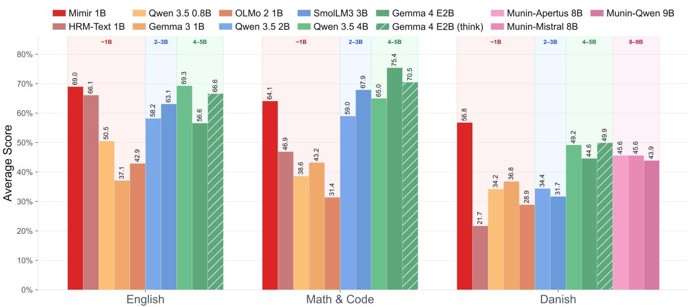

# DFM Mimir v1: An Open HRM Delivering Frontier Performance at 1B Parameters Using Only Permissible Post-Training Data

Peter Schneider-Kamp1,2,∗ Jacob Nielsen1,2, Gianluca Barmina1, Kenneth Enevoldsen3, Lukas Galke Poech1,

1University of Southern Denmark 2Ordbogen A/S 3Aarhus University

Current large language model development relies on massive, often non-permissible datasets, creating a high barrier for researchers committed to open-source and ethically sourced data. We introduce Mimir v1, a 1-billion-parameter language model based on the Hierarchical Reasoning Model (HRM) architecture, that is trained from scratch and delivers highly competitive performance for English and sets a new state of the art for Danish using only permissible post-training data. Trained on a mixture of 161 datasets, Mimir v1 outperforms the original HRM-Text 1B and competes with larger frontier models like Qwen 3.5 4B and Gemma 4 E2B, tested across 20 benchmarks for English, Math & Code and Danish. The model is available on the Hugging Face Hub: https://huggingface.co/danish-foundation-models/DFM-Mimir

Date: 14 August 2026   
Correspondence: Peter Schneider-Kamp via   
petersk@imada.sdu.dk

  
Figure 1: Aggregate results comparing DFM Mimir 1B against the HRM-Text 1B, Qwen 3.5 2B and Gemma 4 E2B, displaying highly competitive performance across 20 benchmarks.

## 1 Introduction

In recent years, Large Language Models (LLMs) have catalyzed a paradigm shift in artificial intelligence, characterized by rapid iterations and significant advancements in emergent capabilities. However, as noted by Wang et al. [2026], current development is largely driven by a “monolithic recipe” consisting of massive, multi-stage pipelines and training on exorbitant volumes of data. This approach not only necessitates vast computational resources for pre-training but also creates a prohibitive entry barrier for the broader community of researchers and practitioners. For national initiatives such as the Danish Foundation Models project1 [Enevoldsen et al., 2023], which adheres to a philosophy of using exclusively permissible and, whenever possible, openly licensed data, training a capable LLM from scratch is often infeasible given the limited pool of high-quality data for a language such as Danish. Consequently, it has been challenging to provide fully permissible base models on LLM platforms to serve as foundations for post-training objectives.

To address these constraints, we employ the HRM-Text framework, which enables focusing on post-training data during the initial training phase, thereby facilitating the creation of a viable base model for the wider community. In this technical report, we present Mimir v1, a 1-billionparameter hierarchical reasoning model (HRM) trained from scratch, utilizing the architecture proposed by Wang et al. [2026]. Mimir v1 is optimized for Danish and English tasks and has undergone instruction-tuning on a curated mixture of 161 datasets, comprising approximately 70.5 billion tokens per epoch. Furthermore, as certain datasets used in [Wang et al., 2026] do not align with DFM’s permissibility standards, we demonstrate the efficacy of synthetically generating “transplant datasets”, replacing non-permissible data with synthetically generated permissible variants.

Our results indicate that these synthetic alternatives achieve comparable or superior performance without compromising data rights, further underscoring the relevance of the HRM approach for low-resource linguistic domains, empowering communities of practitioners and researchers with small, capable and fully permissible models, with both low training and inference requirements.

## 2 Datasets

For training HRM-Mimir v1, we curated an extensive mix of data with different objectives, ranging from English and Danish instruction & knowledge to mathematics and agentic-style post-training data. Our mix draws from 161 datasets with almost all of them being freely available on the HuggingFace Hub. The corpus amounts to 70,479,308,606 tokens per epoch. The full list of datasets and their sources is listed in Appendix A.

## 2.1 Category Distribution

We classify each dataset into one of eight functional categories based on its content and intended use. Table 1 provides the distribution. The three largest categories: Danish instruction & knowledge (22.07%), English instruction (19.26%), and selected datasets from the Sapient mixed collection (17.02%)2, together account for over 58% of the corpus. Math & reasoning contributes a further 14.8%, bringing the combined share of the top four categories to 73%. The Danish instruction & knowledge category is the largest by token volume, driven primarily by lærebogen, a

Table 1: Token share and dataset count by functional category.
<table><tr><td>Category</td><td>Tokens/epoch</td><td>Share</td><td>Datasets</td><td>Avg. tokens/dataset</td></tr><tr><td>Danish instruction &amp; knowledge</td><td>15.56B</td><td>22.07%</td><td>30</td><td>518.6M</td></tr><tr><td>English instruction</td><td>13.58B</td><td>19.26%</td><td>16</td><td>848.5M</td></tr><tr><td>Sapient mixed (Flan/Platypus)</td><td>12.00B</td><td>17.02%</td><td>71</td><td>169.0M</td></tr><tr><td>Math &amp; reasoning</td><td>10.40B</td><td>14.76%</td><td>10</td><td>1,040.2M</td></tr><tr><td>Mimir synthetic</td><td>7.05B</td><td>10.00%</td><td>16</td><td>440.4M</td></tr><tr><td>Agentic &amp; tool use</td><td>6.66B</td><td>9.46%</td><td>8</td><td>832.5M</td></tr><tr><td>Machine translation</td><td>3.50B</td><td>4.96%</td><td>5</td><td>699.0M</td></tr><tr><td>Science &amp; summarization</td><td>1.74B</td><td>2.47%</td><td>5</td><td>348.5M</td></tr><tr><td>Total</td><td>70.48B</td><td>100%</td><td>161</td><td></td></tr></table>

Danish instruction-following dataset contributing 8.32B tokens (11.8% of the corpus) at 4× repetition, alongside dfm-dyna-instruct (3.54B) and synquid wiki-instruct-da (0.99B). English instruction is anchored in Dolci [Team Olmo, 2025] (7.71B combined), Tulu 3 [Lambert et al., 2024] variants (1.57B), and Nemotron instruction-following (1.60B). The Sapient mixed category is dominated by a single large repository (11.92B, 16.9%), which bundles 107 sub-collections from Flan, Platypus, and tasksource. An additional 70 Sapient-synth transplant datasets contribute 75M tokens. These are synthetic recreations of English instruction tasks (Flan NIV2, Flan Dialog, Platypus, Tasksource) in generated-and-audited form, replacing original Sapient data that was non-compliant with the DFM philosophy. Math & reasoning is led by OpenMathInstruct-2 [Toshniwal et al., 2024] (6.60B, 9.4%), the third-largest single dataset overall, followed by AceReason-1.1-SFT [Liu et al., 2025] (1.95B) and verifiable reasoning traces (0.68B). The remaining four categories – synthetic, agentic & tool use, machine translation, and science & summarization – together contribute 19.0B tokens (27%).

## 2.2 Language Distribution

Table 2 shows the distribution of tokens by language. The corpus is predominantly English (68.5%), with Danish contributing 24.7% (6 out of 8 categories are entirely English) and bilingual Danish–English data a further 6.4%. A small fraction (0.2%) contains other bi-lingual translation data. The bilingual da+en category includes machine translation data and synthetic transformation datasets that pair Danish and English.

Table 2: Token share by language.
<table><tr><td>Language</td><td>Tokens/epoch</td><td>Share</td></tr><tr><td>English (en)</td><td>48.36B</td><td>68.62%</td></tr><tr><td>Danish (da)</td><td>17.44B</td><td>24.74%</td></tr><tr><td>Bilingual da+en</td><td>4.61B</td><td>6.54%</td></tr><tr><td>other</td><td>0.14B</td><td>0.20%</td></tr></table>

Table 3: Token share by data form.
<table><tr><td></td><td>Reformatted</td><td>Curated + reformatted</td><td>Synthetic + audited</td><td>Tool-call formatted</td><td>Translated + audited</td><td>Agreement-supplied</td><td>Derived task</td></tr><tr><td>Tokens/epoch</td><td>46.49B</td><td>11.92B</td><td>7.81B</td><td>1.87B</td><td>1.59B</td><td>0.67B</td><td>0.13B</td></tr><tr><td>Share</td><td>65.96%</td><td>16.91%</td><td>11.08%</td><td>2.65%</td><td>2.26%</td><td>0.95%</td><td>0.18%</td></tr></table>

## 2.3 Data Processing

Datasets enter the corpus in seven distinct forms, reflecting the pipeline’s processing stages. We report the forms in Table 3. Reformatted datasets are existing Hugging Face repositories simply converted into the training format – this represents the default pathway for public data. Curated + reformatted applies to the Sapient mega-repository, whose 107 sub-collections were selected as a curated subset before reformatting. Synthetic + audited data is LLM-generated using Gemma4 31B and quality-audited before inclusion, with acceptance rates ranging from single digit percentages to high nineties for different categories. This includes transformations from high-quality English and Danish text corpora into span-filling, denoising, reordering, and continuation tasks. Here, we employ Common Pile [Kandpal et al., 2025] for English text corpora and Danish Dynaword [Enevoldsen et al., 2025] for Danish ones. We similarly generated and audited the dfm8-synthetic-\* instruction datasets and Sapient-synth transplants. Tool-call formatted data incorporates native tool-calling structure for agentic training. Translated + audited covers the OpenHermes-based data and DA/EN translations that were repaired and audited. A small corpus of agreement-supplied data comes from Danish Foundation Model agreements (DBC, Lex.dk), where licensing does not permit public sharing. Derived task data is derived from an existing dataset to create a new task formulation.

The original Sapient training data3 consists mainly of Flan, Platypus, and tasksource subcollections, which are themselves dominated by multiple-choice classification tasks — pick the correct option from A/B/C/D. This is a natural consequence of their source benchmarks: Flan NIV2, Platypus (Reclor, SciBench), and tasksource (PragmEval, Reclor) are structured around categorical selection. In this work, we shift the balance away from multiple-choice toward free-form generation, presenting a substantially harder task for the model to achieve exact match accuracy. The majority of the corpus (83% of tokens) comes from outside the Sapient collection, and the dominant non-Sapient categories are generally and inherently more generative:

• English instruction (13.58B, 19.3%): Dolci, Tulu 3, and Nemotron SFT mixtures are predominantly free-form instruction following.

• Math & reasoning (10.40B, 14.8%): OpenMathInstruct-2, AceReason, and reasoning traces all require the model to produce a free-form numerical or symbolic answer that is scored by exact match, not by selecting from options.

• Danish instruction & knowledge (15.56B, 22.1%): Laerebogen, dfm-dyna-instruct, and Danish QA/summarization datasets are open-ended generation tasks.

Together these three categories account for 39.54B tokens (56.1% of the corpus), nearly all scored on exact accuracy or free-form generation rather than multiple-choice selection. Even within the Sapient-synth transplant datasets (70 datasets, 75M tokens), many original multiplechoice classification tasks were regenerated as open-ended generation or answer-generation formulation for example, ‘task590-amazonfood-summary-correction-classification‘ and ‘task870- msmarco-answer-generation‘ ask the model to produce a free-form answer rather than select from candidates.

Table 4: Top 10 datasets by sampled tokens per epoch.
<table><tr><td>Dataset</td><td>Tokens/epoch</td><td>Share</td></tr><tr><td>sapientinc/HRM-Text-data-io-cleaned-20260515</td><td>11.92B</td><td>16.91%</td></tr><tr><td>danish-foundation-models/laerebogen</td><td>8.32B</td><td>11.81%</td></tr><tr><td>nvidia/OpenMathInstruct-2</td><td>6.60B</td><td>9.37%</td></tr><tr><td>nvidia/Nemotron-SFT-Agentic-v2</td><td>4.27B</td><td>6.06%</td></tr><tr><td>danish-foundation-models/dfm-dyna-instruct</td><td>3.54B</td><td>5.03%</td></tr><tr><td>allenai/Dolci-Instruct-SFT-No-Tools</td><td>3.49B</td><td>4.95%</td></tr><tr><td>schneiderkamplab/opus-da-en-permissive</td><td>2.90B</td><td>4.12%</td></tr><tr><td>allenai/Dolci-Instruct-SFT</td><td>2.24B</td><td>3.17%</td></tr><tr><td>nvidia/AceReason-1.1-SFT</td><td>1.95B</td><td>2.76%</td></tr><tr><td>allenai/big-reasoning-traces</td><td>1.66B</td><td>2.35%</td></tr></table>

This change of the training data composition means Mimir v1 is trained to generate answers rather than discriminate among options, aligning with evaluation suites that prioritise exact-match scoring (GSM8k, MATH, DROP) over multiple-choice accuracy (ARC-C, MMLU, Hellaswag).

## 2.4 Data Concentration and Repetition

Table 4 shows the top 10 datasets by sampled tokens per epoch. The corpus is highly concentrated: these ten datasets account for 66.5% of all tokens, and the top three alone for 38.1%, while the remaining 151 datasets contribute 33.5%. Two single sources exceed 10% each: the Sapient mega-repository (16.9%) and lærebogen (11.8%). The Dolci family contributes 5.73B tokens across two instruction datasets, the largest English instruction contribution after the cleaned Sapient corpus, and NVIDIA sources account for 12.82B tokens across the reasoning, math, and agentic datasets in the top 10. This concentration is partly by construction: Several datasets are sampled more than once per epoch. Lærebogen is repeated 4×, inflating 2.08B base tokens to 8.32B and making it the second-largest entry in the corpus. Eight small Danish datasets are repeated 10× to ensure sufficient coverage despite limited source data, and Dolci-Instruct-SFT-No-Tools is doubled to increase its English instruction contribution. The most heavily repeated dataset, kaenguruen (20×), is negligible in volume at 638K tokens.

## 3 Architecture

Mimir uses the Hierarchical Reasoning Model Text (HRM-Text) architecture with a hidden size of 1,536. The model has 12 attention heads per layer and a feed-forward expansion factor of 4. Hierarchical reasoning is configured with 2 H-cycles and 3 L-cycles, with truncated backpropagation limited to 5 steps and a warmup ratio of 0.2. Positional encoding uses Rotary Position Embedding (RoPE) with $\theta = 1 0 { , } 0 0 0$ , and the model applies pre-norm layer normalisation with $\epsilon = 1 0 ^ { - 6 }$ . Table 5

Table 5: Model hyperparameters.
<table><tr><td>Hidden size</td><td>Layers</td><td>Half layers</td><td>Attn. heads</td><td>Expansion</td><td>H cycles</td><td>L cycles</td><td>BP max steps</td><td>BP warmup ratio</td><td>Pos. emb.</td><td>RoPEθ</td><td>Norm</td><td>Norm €</td></tr><tr><td>1,536</td><td>32</td><td>true</td><td>12</td><td>4</td><td>2</td><td>3</td><td>5</td><td>0.2</td><td>RoPE</td><td>10,000</td><td>pre-norm</td><td>10−6</td></tr></table>

summarises the model configuration.

## 4 Training

The Mimir model is trained from scratch using the Gemma-4 tokenizer [Gemma Team, 2026], whereas HRM-Text employs a custom one. Through the application of a chat template, the model learns the structural conventions and behavioural patterns characteristic of modern conversational AI. Mimir was trained with Fully Sharded Data Parallelism (FSDP) using bfloat16 as dType for computation with fp32 used as gathering precision (conventional setup). We employ the AdamW optimizer [Loshchilov and Hutter, 2017] with a peak learning rate of $3 \times 1 0 ^ { - 4 }$ , 2,000-step linear warm-up, and a constant schedule thereafter (min ratio 1.0). We use a global batch size of 262,144 tokens with a gradient accumulation of 2 on 8 accelerators for a per-accelerator batch size of 16384. fitting 4 contexts of length 4096 each. Table 6 provides an overview of our hyperparameter values. Our openly available framework4 builds upon Sapient’s code for HRM-Text [Wang et al., 2026].

Table 6: Training hyperparameters.
<table><tr><td>LR</td><td>LR warmup</td><td>LR min ratio</td><td>Adam  $\beta _ { 1 } / \beta _ { 2 }$ </td><td>Weight decay</td><td>EMA decay</td><td>Global batch</td><td>Grad. accum. steps</td><td>Seed</td></tr><tr><td> $3 \times 1 0 ^ { - 4 }$ </td><td>2,000</td><td>1.0</td><td>0.9 / 0.95</td><td>0.1</td><td>0.9999</td><td>262,144</td><td>2</td><td>0</td></tr></table>

We trained the model for 1.65M steps on 8 NVIDIA B200 GPUs with 180 GB HBMe3 in just under 3 weeks with an average step time of just under 1.1 seconds.

## 5 Results

Tables 7, 8, and 9 show evaluation results across a broad range of English, Math & Code, and Danish benchmarks. We compare our Mimir model with other 1B-parameter models: HRM-Text, Qwen 3.5, Gemma 3 and OLMo2. Furthermore, we compare Mimir against models in the ranges 2-3B and 4-5B including Gemma 4 E2B with 5B total parameters (effective 2.3B). In Figure 1, we report the average score for English, Math & Code, and Danish benchmark suites.

On the English benchmarks, Mimir outperforms all considered competitors on BoolQ, Winogrande, and DROP. On Math & Code, Mimir leads across its weight-class for GSM8K and HumanEval, with Mimir being second overall on GSM8K and better than Qwen3.5 2B on HumanEval. On the Danish benchmarks, Mimir outperforms all competitors on grammatical tasks (DaLA, GEC), question-answering tasks (WikiQA), and is close to the best on Nordjylland News (N.News; summarization). On average, Mimir displays superior performance on the Danish benchmarks, is only 0.3 points behind Qwen 3.5 4B on English tasks, and only 3.8% behind SmolLM3 3B on Math & Code, which was the best tested conventional LLM of the 2–3B weight class. On Math & Code, Mimir yields a 36.7% improvement compared to HRM-Text (64.1 Mimir vs. 46.9 HRM-Text).

Table 7: English benchmark results. Best scores in bold.
<table><tr><td>Model</td><td>BoolQ (Acc)</td><td>Winogrande (Acc)</td><td>Hellaswag (Acc)</td><td>MMLU (Acc)</td><td>ARC-C (Acc)</td><td>DROP (F1)</td><td>GovRep. (R1)</td><td>Avg.</td></tr><tr><td>~1B models</td><td></td><td></td><td></td><td></td><td></td><td></td><td></td><td></td></tr><tr><td>Mimir 1B</td><td>87.8</td><td>73.5</td><td>67.3</td><td>57.5</td><td>81.6</td><td>83.1</td><td>32.0</td><td>69.0</td></tr><tr><td>HRM-Text 1B</td><td>87.5</td><td>70.4</td><td>60.4</td><td>58.7</td><td>82.2</td><td>78.1</td><td>25.4</td><td>66.1</td></tr><tr><td>Qwen 3.5 0.8B</td><td>69.8</td><td>48.9</td><td>37.0</td><td>51.5</td><td>68.4</td><td>45.2</td><td>32.5</td><td>50.5</td></tr><tr><td>Gemma 3 1B</td><td>62.4</td><td>49.1</td><td>30.6</td><td>37.5</td><td>43.5</td><td>7.0</td><td>29.5</td><td>37.1</td></tr><tr><td>OLMo 2 1B</td><td>67.2</td><td>51.0</td><td>42.4</td><td>41.6</td><td>48.1</td><td>12.4</td><td>37.7</td><td>42.9</td></tr><tr><td>2–3B models</td><td></td><td></td><td></td><td></td><td></td><td></td><td></td><td></td></tr><tr><td>Qwen 3.5 2B</td><td>80.8</td><td>53.4</td><td>64.6</td><td>62.8</td><td>82.7</td><td>31.3</td><td>31.5</td><td>58.2</td></tr><tr><td>SmolLM3 3B</td><td>84.3</td><td>60.3</td><td>65.1</td><td>60.2</td><td>79.5</td><td>54.0</td><td>38.1</td><td>63.1</td></tr><tr><td>4–5B models</td><td></td><td></td><td></td><td></td><td></td><td></td><td></td><td></td></tr><tr><td>Qwen 3.5 4B</td><td>87.0</td><td>70.0</td><td>83.2</td><td>75.8</td><td>92.9</td><td>48.0</td><td>27.9</td><td>69.3</td></tr><tr><td>Gemma 4 E2B</td><td>64.1</td><td>56.7</td><td>55.6</td><td>59.3</td><td>69.8</td><td>57.3</td><td>33.6</td><td>56.6</td></tr><tr><td>Gemma 4 E2B (think)</td><td>83.4</td><td>63.0</td><td>55.8</td><td>72.0</td><td>86.8</td><td>70.8</td><td>34.7</td><td>66.6</td></tr></table>

Table 8: Math & Code benchmark results. Best scores in bold.
<table><tr><td>Model</td><td>GSM8K (Acc)</td><td>MATH (Acc)</td><td>HumanEval (Acc)</td><td>Avg.</td></tr><tr><td>~1B models</td><td></td><td></td><td></td><td></td></tr><tr><td>Mimir 1B</td><td>89.9</td><td>45.8</td><td>56.7</td><td>64.1</td></tr><tr><td>HRM-Text 1B</td><td>84.8</td><td>56.0</td><td>0.0</td><td>46.9</td></tr><tr><td>Qwen 3.5 0.8B</td><td>49.1</td><td>36.1</td><td>30.5</td><td>38.6</td></tr><tr><td>Gemma 3 1B</td><td>49.7</td><td>37.2</td><td>42.7</td><td>43.2</td></tr><tr><td>OLMo 2 1B</td><td>59.4</td><td>18.8</td><td>15.9</td><td>31.4</td></tr><tr><td>2–3B models</td><td></td><td></td><td></td><td></td></tr><tr><td>Qwen 3.5 2B</td><td>73.7</td><td>55.7</td><td>47.6</td><td>59.0</td></tr><tr><td>SmolLM3 3B</td><td>80.0</td><td>62.2</td><td>61.6</td><td>67.9</td></tr><tr><td>4–5B models</td><td></td><td></td><td></td><td></td></tr><tr><td>Qwen 3.5 4B</td><td>60.5</td><td>56.5</td><td>78.0</td><td>65.0</td></tr><tr><td>Gemma 4 E2B</td><td>88.3</td><td>64.2</td><td>73.8</td><td>75.4</td></tr><tr><td>Gemma 4 E2B (think)</td><td>90.3</td><td>49.1</td><td>72.0</td><td>70.5</td></tr></table>

Table 9: Danish benchmark results. Best scores in bold.
<table><tr><td>Model</td><td>Angry Tweets</td><td>DaLA</td><td>GEC</td><td>PIQA</td><td>Daisy</td><td>WikiQA</td><td>WMT</td><td>N.News</td><td>IFEval</td><td>Hellaswag- DA</td><td>Avg.</td></tr><tr><td></td><td>(Acc)</td><td>(F1)</td><td>(EM)</td><td>(Acc)</td><td>(EM)</td><td>(EM)</td><td>(chrF)</td><td>(chrF)</td><td>(Acc)</td><td>(Acc)</td><td></td></tr><tr><td>~1B models</td><td></td><td></td><td></td><td></td><td></td><td></td><td></td><td></td><td></td><td></td><td></td></tr><tr><td>Mimir 1B</td><td>67.4</td><td>96.1</td><td>85.6</td><td>53.7</td><td>9.6</td><td>66.8</td><td>53.9</td><td>35.87</td><td>63.9</td><td>35.3</td><td>56.8</td></tr><tr><td>HRM-Text 1B</td><td>42.4</td><td>26.7</td><td>0.5</td><td>13.0</td><td>0.0</td><td>34.9</td><td>25.4</td><td>26.76</td><td>18.5</td><td>28.8</td><td>21.7</td></tr><tr><td>Qwen 3.5 0.8B</td><td>53.8</td><td>51.0</td><td>0.7</td><td>56.5</td><td>0.7</td><td>41.6</td><td>37.8</td><td>35.30</td><td>39.6</td><td>25.0</td><td>34.2</td></tr><tr><td>Gemma 3 1B</td><td>54.4</td><td>41.0</td><td>3.3</td><td>72.2</td><td>1.4</td><td>42.6</td><td>45.1</td><td>35.56</td><td>47.2</td><td>24.8</td><td>36.8</td></tr><tr><td>OLMo 2 1B</td><td>33.6</td><td>48.7</td><td>0.2</td><td>75.0</td><td>0.0</td><td>8.4</td><td>30.0</td><td>33.77</td><td>32.5</td><td>26.7</td><td>28.9</td></tr><tr><td>2–3B models</td><td></td><td></td><td></td><td></td><td></td><td></td><td></td><td></td><td></td><td></td><td></td></tr><tr><td>Qwen 3.5 2B SmolLM3 3B</td><td>61.6</td><td>36.4</td><td>8.0</td><td>25.0</td><td>2.5</td><td>49.4</td><td>45.6</td><td>34.85</td><td>56.1</td><td>24.7</td><td>34.4</td></tr><tr><td></td><td>63.2</td><td>33.5</td><td>3.3</td><td>51.9</td><td>2.2</td><td>0.3</td><td>37.3</td><td>35.98</td><td>49.8</td><td>40.1</td><td>31.7</td></tr><tr><td>4–5B models</td><td></td><td></td><td></td><td></td><td></td><td></td><td></td><td></td><td></td><td></td><td></td></tr><tr><td>Qwen 3.5 4B</td><td>69.1</td><td>50.1</td><td>42.6</td><td>70.4</td><td>4.7</td><td>57.1</td><td>52.1</td><td>37.03</td><td>73.7</td><td>34.7</td><td>49.2</td></tr><tr><td>Gemma 4 E2B</td><td>64.6 67.7</td><td>56.7 66.8</td><td>36.9 23.4</td><td>46.3</td><td>5.6 5.1</td><td>44.1 59.3</td><td>55.2 56.0</td><td>35.67</td><td>75.5</td><td>25.6</td><td>44.6</td></tr><tr><td>Gemma 4 E2B (think)</td><td></td><td></td><td></td><td>63.9</td><td></td><td></td><td></td><td>36.30</td><td>81.2</td><td>39.0</td><td>49.9</td></tr><tr><td>8–9B models</td><td></td><td></td><td>42.1</td><td></td><td></td><td></td><td></td><td></td><td></td><td></td><td></td></tr><tr><td>Munin-Apertus 8B</td><td>60.6 61.3</td><td>46.1 48.8</td><td>26.4</td><td>81.5 76.9</td><td>12.5 8.4</td><td>49.9 48.4</td><td>55.8 51.8</td><td>30.30 32.92</td><td>53.0 67.8</td><td>24.5 33.6</td><td>45.6</td></tr><tr><td>Munin-Mistral 8B</td><td>69.1</td><td></td><td></td><td></td><td>5.4</td><td>55.7</td><td>56.1</td><td>35.89</td><td>71.8</td><td>34.3</td><td>45.6</td></tr><tr><td>Munin-Qwen 9B</td><td></td><td>60.6</td><td>11.4</td><td>38.9</td><td></td><td></td><td></td><td></td><td></td><td></td><td>43.9</td></tr></table>

## Evaluation Setup

All benchmarks were evaluated at temperature 0 (greedy decoding) with shuffle seed 4242 on full datasets. All models used vLLM-served [Kwon et al., 2023] endpoints with FlashInfer, with the exception of Mimir, which requires FlashAttention to correctly capture the PrefixLM and Gemma 4 chat template. We ran both vLLM with FlashAttention4 [Zadouri et al., 2026] and Hugging Face Transformers, obtaining comparable results up to numerical stability. For the ease of reproduction, we report the results from Hugging Face Transformers [Wolf et al., 2019]. Some English benchmarks use few-shot prompting, with the number of shots following Wang et al. [2026]’s evaluation config. All Danish tasks are 0-shot. MCQ tasks use max tokens=1. Details in Appendix B. Gemma 4 was evaluated in two modes: non-thinking and thinking with vLLM flag --reasoning-parser gemma4 to strip thinking tokens before scoring. Thinking requires ∼500–650 tokens. All non-MCQ tasks (or whenever reasoning is enabled) use max tokens=2048. All baseline evaluations were conducted via the Inspect AI Framework of the AI Security Institute [2024].

## 6 Conclusion, Limitations and Future Directions

In this technical report, we presented Mimir v1, a 1-billion-parameter language model that leverages the HRM-Text architecture to provide frontier-level performance using only permissible data, excluding data containing personal information or copyright infringement and including data that is either openly licensed, made available by agreement, or allowed by the European Union’s text and data mining exception for research institutions. By curating a diverse, large corpus, consisting of 70.5B tokens per epoch, including synthetic ‘transplant’ datasets, we have demonstrated that high-quality instruction following and reasoning capabilities can be achieved without relying on large-scale pre-training corpora or prohibited data sources. Mimir shows strong improvements over the baseline HRM-Text and remains competitive, or superior, to much larger models in several English and Danish benchmarks. Despite the generally highly competitive performance, Mimir v1 still lags behind Gemma 4 (5B, effective 2.3B) on the Math & Code domains, making room for improvement in future iterations.

Future work will focus on investigating scaling behavior of HRM models like Mimir. Moreover, even though Mimir is trained with a Gemma 4 chat template from scratch, the capabilities as an assistant are still limited compared to the state of the art. This calls for future work in this capacity, including reinforcement learning, which is yet unexplored for this architecture. Lastly, we will continue developing the dataset to achieve full openness regarding licensing and further improved model performance.

## 7 Contributors

We list contributions according to the Contributor Roles Taxonomy (CRediT)5:

Peter Schneider-Kamp Conceptualization, Data curation, Formal analysis, Funding acquisition, Investigation, Methodology, Project administration, Resources, Software, Supervision, Validation, Visualization, Writing – original draft, Writing – review & editing

Jacob Nielsen Formal analysis, Investigation, Methodology, Software, Validation, Visualization, Writing – original draft, Writing – review & editing

Lukas Galke Poech Formal analysis, Investigation, Methodology, Software, Supervision, Validation, Visualization, Writing – review & editing

Gianluca Barmina Data curation, Investigation, Writing – review & editing

Kenneth Enevoldsen Data curation, Resources, Writing – review & editing

Additional Contributors

Mogens Henrik From Investigation, Project administration, Software

Andrea Blasi N´unez˜ Formal analysis, Software, Visualization

Annemette Brok Pirchert Formal analysis, Software, Visualization

Stine Lyngsø Beltoft Data curation, Resources

Torben Blach Project administration, Funding acquisition

Sofie Helene Bruun Data curation, Resources

Oliver Kinch Data curation, Resources

Rasmus Larsen Data curation, Resources

Dan Saattrup Smart Data curation, Resources

Kristoffer Laigaard Nielbo Funding acquisition

## 8 Acknowledgements

This work originated within OdenseNLP6 and was supported by the Danish Foundation Models project – a collaboration between the University of Southern Denmark, Aarhus University, the Alexandra Institute, and the University of Copenhagen – funded by the Ministry of Science, Higher Education and Digital Affairs. We thank all members of the Danish Foundation Models project and the OdenseNLP research group for many fruitful discussions and their continued support.

## References

UK AI Security Institute. Inspect AI: Framework for Large Language Model Evaluations, 2024. URL https://github.com/UKGovernmentBEIS/inspect\_ai.

Kenneth Enevoldsen, Lasse Hansen, Dan S. Nielsen, Rasmus A. F. Egebæk, Søren V. Holm, Martin C. Nielsen, Martin Bernstorff, Rasmus Larsen, Peter B. Jørgensen, Malte Højmark-Bertelsen, Peter B. Vahlstrup, Per Møldrup-Dalum, and Kristoffer Nielbo. Danish foundation models, 2023. URL https://arxiv.org/abs/2311.07264.

Kenneth Enevoldsen, Kristian Nørgaard Jensen, Jan Kostkan, Balazs Szab´ o, M´ arton Kardos,´ Kirsten Vad, Johan Heinsen, Andrea Blasi Nu´nez, Gianluca Barmina, Jacob Nielsen, Rasmus˜ Larsen, Peter Vahlstrup, Per Møldrup Dalum, Desmond Elliott, Lukas Galke, Peter Schneider-Kamp, and Kristoffer Nielbo. Dynaword: From one-shot to continuously developed datasets, 2025.

Gemma Team. Gemma 4 technical report, 2026. URL https://arxiv.org/abs/2607.02770.

Nikhil Kandpal, Brian Lester, Colin Raffel, Sebastian Majstorovic, Stella Biderman, Baber Abbasi, Luca Soldaini, Enrico Shippole, A. Feder Cooper, Aviya Skowron, John Kirchenbauer, Shayne Longpre, Lintang Sutawika, Alon Albalak, Zhenlin Xu, Guilherme Penedo, Loubna Ben Allal, Elie Bakouch, John David Pressman, Honglu Fan, Dashiell Stander, Guangyu Song, Aaron Gokaslan, Tom Goldstein, Brian R. Bartoldson, Bhavya Kailkhura, and Tyler Murray. The common pile v0.1: An 8tb dataset of public domain and openly licensed text, 2025. URL https://arxiv.org/abs/2506.05209.

Woosuk Kwon, Zhuohan Li, Siyuan Zhuang, Ying Sheng, Lianmin Zheng, Cody Hao Yu, Joseph E. Gonzalez, Hao Zhang, and Ion Stoica. Efficient memory management for large language model serving with pagedattention. In Proceedings ofthe ACMSIGOPS 29th Symposium on Operating Systems Principles, 2023.

Nathan Lambert, Jacob Morrison, Valentina Pyatkin, Shengyi Huang, Hamish Ivison, Faeze Brahman, Lester James V Miranda, Alisa Liu, Nouha Dziri, Shane Lyu, et al. Tulu 3: Pushing frontiers in open language model post-training. arXiv preprint arXiv:2411.15124, 2024.

Zihan Liu, Zhuolin Yang, Yang Chen, Chankyu Lee, Mohammad Shoeybi, Bryan Catanzaro, and Wei Ping. Acereason-nemotron 1.1: Advancing math and code reasoning through sft and rl synergy. arXiv preprint arXiv:2506.13284, 2025.

Ilya Loshchilov and Frank Hutter. Decoupled weight decay regularization. arXiv preprint arXiv:1711.05101, 2017.

Team Olmo. Olmo 3, 2025. URL https://arxiv.org/abs/2512.13961.

Shubham Toshniwal, Wei Du, Ivan Moshkov, Branislav Kisacanin, Alexan Ayrapetyan, and Igor Gitman. Openmathinstruct-2: Accelerating ai for math with massive open-source instruction data. arXiv preprint arXiv:2410.01560, 2024.

Guan Wang, Changling Liu, Chenyu Wang, Cai Zhou, Yuhao Sun, Yifei Wu, Shuai Zhen, Luca Scimeca, and Yasin Abbasi Yadkori. Hrm-text: Efficient pretraining beyond scaling. arXiv preprint arXiv:2605.20613, 2026.

Thomas Wolf, Lysandre Debut, Victor Sanh, Julien Chaumond, Clement Delangue, Anthony Moi, Pierric Cistac, Tim Rault, Remi Louf, Morgan Funtowicz, et al. Huggingface’s transformers:´ State-of-the-art natural language processing. arXiv preprint arXiv:1910.03771, 2019.

Ted Zadouri, Markus Hoehnerbach, Jay Shah, Vijay Thakkar, and Tri Dao. Flashattention-4: Algorithm and kernel pipelining co-design for asymmetric hardware scaling. Proceedings ofMachine Learning and Systems, 8:912–926, 2026.

## A List of Training Datasets

Table 10 lists all the datasets with their corresponding HuggingFace identifier, the form type, how many tokens they represent, and the share in percentages.

Table 10: All 161 datasets in the Mimir corpus, sorted by sampled tokens per epoch.
<table><tr><td>#</td><td>Dataset</td><td>Form</td><td>Tokens/epoch</td><td>Share</td><td></td></tr><tr><td>1.</td><td>sapientinc/HRM-Text-data-io-cleaned- 20260515</td><td>Curated + refor- matted</td><td></td><td>11.92B</td><td>16.91%</td></tr><tr><td>2.</td><td>danish-foundation-models/laerebogen</td><td>Reformatted</td><td></td><td>8.32B</td><td>11.81%</td></tr><tr><td>3.</td><td>nvidia/OpenMathInstruct-2</td><td>Reformatted</td><td></td><td>6.60B</td><td>9.37%</td></tr><tr><td>4.</td><td>nvidia/Nemotron-SFT-Agentic-v2</td><td>Reformatted</td><td></td><td>4.27B</td><td>6.06%</td></tr><tr><td>5.</td><td>danish-foundation-models/dfm-dyna- instruct</td><td>Reformatted</td><td></td><td>3.54B</td><td>5.03%</td></tr><tr><td>6.</td><td>allenai/Dolci-Instruct-SFT-No-Tools</td><td>Reformatted</td><td></td><td>3.49B</td><td>4.95%</td></tr><tr><td>7.</td><td>schneiderkamplab/opus-da-en-</td><td>Reformatted</td><td></td><td>2.90B</td><td>4.12%</td></tr><tr><td>8.</td><td>permissive allenai/Dolci-Instruct-SFT</td><td>Reformatted</td><td></td><td>2.24B</td><td>3.17%</td></tr><tr><td>9.</td><td>nvidia/AceReason-1.1-SFT</td><td>Reformatted</td><td></td><td>1.95B</td><td>2.76%</td></tr><tr><td>10.</td><td>allenai/big-reasoning-traces</td><td>Reformatted</td><td></td><td>1.66B</td><td>2.35%</td></tr><tr><td>11.</td><td>allenai/Dolci-Instruct-SFT-Tool-Use</td><td>Tool-call format-</td><td></td><td>1.61B</td><td>2.29%</td></tr><tr><td>12.</td><td>nvidia/Nemotron-SFT-Instruction-</td><td>ted Reformatted</td><td></td><td>1.60B</td><td>2.27%</td></tr><tr><td>13.</td><td>Following-Chat-v2 allenai/tulu-3-sft-mixture</td><td></td><td></td><td></td><td></td></tr><tr><td>14.</td><td>laion/Scientific-Summaries</td><td>Reformatted Reformatted</td><td></td><td>1.57B 1.27B</td><td>2.23% 1.80%</td></tr><tr><td>15.</td><td>schneiderkamplab/common-pile-prefix-</td><td>Synthetic +</td><td>au-</td><td>1.15B</td><td>1.64%</td></tr><tr><td></td><td>continuation</td><td>dited</td><td></td><td></td><td></td></tr><tr><td>16. 17.</td><td>synquid/wiki-instruct-da schneiderkamplab/dfm8-openhermes-da</td><td>Reformatted Translated + au-</td><td></td><td>988M 922M</td><td>1.40% 1.31%</td></tr><tr><td></td><td></td><td>dited</td><td></td><td></td><td></td></tr><tr><td>18.</td><td>schneiderkamplab/common-pile- denoising</td><td>Synthetic + dited</td><td>au-</td><td>884M</td><td>1.25%</td></tr><tr><td>19. 20.</td><td>allenai/tulu-v2-sft-mixture schneiderkamplab/common-pile-span-</td><td>Reformatted Synthetic + au-</td><td></td><td>840M 822M</td><td>1.19% 1.17%</td></tr><tr><td></td><td>filling</td><td>dited</td><td></td><td></td><td></td></tr><tr><td>21.</td><td>schneiderkamplab/dfm8-openhermes-en</td><td>Translated + au- dited</td><td></td><td>672M</td><td>0.95366%</td></tr><tr><td>22.</td><td>allenai/tulu-v2-sft-long-mixture</td><td>Reformatted</td><td></td><td>605M</td><td>0.85902%</td></tr><tr><td>23.</td><td>allenai/verifiable-reasoning-filtered-gpt-</td><td>Reformatted</td><td></td><td>605M</td><td>0.85798%</td></tr><tr><td>41 24.</td><td>open-thoughts/OpenThoughts2-1M</td><td>Reformatted</td><td></td><td>534M</td><td>0.75834%</td></tr></table>

continued from previous page
<table><tr><td># Dataset</td><td></td><td>Form</td><td>Tokens/epoch</td><td>Share</td></tr><tr><td>25.</td><td>schneiderkamplab/dfm8-synthetic-</td><td>Synthetic au- + dited</td><td>513M</td><td>0.728%</td></tr><tr><td>26.</td><td>native-tool-calling schneiderkamplab/transformations-</td><td>Synthetic au- +</td><td>496M</td><td>0.70403%</td></tr><tr><td>27.</td><td>danish-danish schneiderkamplab/transformations-</td><td>dited Synthetic + au-</td><td>471M</td><td>0.66842%</td></tr><tr><td>28.</td><td>english-english schneiderkamplab/transformations-</td><td>dited Synthetic + au-</td><td>469M</td><td>0.66529%</td></tr><tr><td>29.</td><td>danish-english schneiderkamplab/transformations-</td><td>dited Synthetic au-</td><td>418M</td><td>0.59274%</td></tr><tr><td>30.</td><td>english-danish nvidia/Nemotron-SFT-Multilingual-v1</td><td>dited Reformatted</td><td>413M</td><td>0.58565%</td></tr><tr><td>31.</td><td>schneiderkamplab/dfm8-synthetic-</td><td>Synthetic + au-</td><td>396M</td><td>0.56181%</td></tr><tr><td>32.</td><td>danish-summarization-rewrite-controls</td><td>dited</td><td></td><td></td></tr><tr><td>33.</td><td>MegaScience/TextbookReasoning schneiderkamplab/dfm8-synthetic-</td><td>Reformatted Synthetic + au-</td><td></td><td>374M 0.5311% 366M 0.51997%</td></tr><tr><td>34.</td><td>multiturn-danish-english-chat DBC (agreement-supplied)</td><td>dited</td><td>356M</td><td>0.50529%</td></tr><tr><td>35.</td><td>schneiderkamplab/danish-dynaword-</td><td>Agreement- supplied</td><td></td><td></td></tr><tr><td>denoising 36. Lex.dk articles</td><td></td><td>Synthetic + au- dited</td><td>323M</td><td>0.45861%</td></tr><tr><td></td><td></td><td>Agreement- supplied</td><td>313M</td><td>0.44467%</td></tr><tr><td>37. 38.</td><td>oliverkinch/machine-translation-da-en schneiderkamplab/danish-dynaword-</td><td>Reformatted Synthetic + au-</td><td>284M 252M</td><td>0.40348% 0.35728%</td></tr><tr><td>39.</td><td>prefix-continuation schneiderkamplab/danish-dynaword-</td><td>dited</td><td>251M</td><td></td></tr><tr><td>span-filling 40.</td><td>schneiderkamplab/dfm8-synthetic-code-</td><td>Synthetic au- + dited</td><td></td><td>0.35593%</td></tr><tr><td>debugging</td><td></td><td>Synthetic + au- dited</td><td>247M</td><td>0.34996%</td></tr><tr><td>41. 42.</td><td>GEM/wiki_cat_sum allenai/tulu-3-sft-personas-math</td><td>Reformatted</td><td>205M</td><td>0.29117%</td></tr><tr><td>43.</td><td>giannor/gec_dala_tv2r_it</td><td>Reformatted</td><td>204M 193M</td><td>0.28922% 0.27377%</td></tr><tr><td>44.</td><td>synquid/wildchat-100k-qwen-messages</td><td>Reformatted</td><td>190M</td><td>0.2694%</td></tr><tr><td>45.</td><td>schneiderkamplab/dfm8-synthetic-strict-</td><td>Reformatted Synthetic + au-</td><td>173M</td><td>0.24605%</td></tr><tr><td>46.</td><td>math-answer-contract schneiderkamplab/dfm8-synthetic-</td><td>dited</td><td></td><td>171M 0.24275%</td></tr><tr><td></td><td>constrained-format-following</td><td>Synthetic + au- dited</td><td></td><td></td></tr><tr><td>47. 48.</td><td>oliverkinch/danish-summarization schneiderkamplab/common-pile-</td><td>Reformatted Synthetic + au-</td><td>168M 167M</td><td>0.23888% 0.23653%</td></tr><tr><td></td><td>paragraph-reordering</td><td>dited</td><td></td><td></td></tr><tr><td>49.</td><td>schneiderkamplab/danish-dynaword- paragraph-reordering</td><td>Synthetic + au- dited</td><td>160M</td><td>0.22769%</td></tr></table>

continued from previous page
<table><tr><td>#</td><td>Dataset</td><td>Form</td><td>Tokens/epoch</td><td>Share</td></tr><tr><td>50.</td><td>glaiveai/glaive-function-calling-v2</td><td>Tool-call format- ted</td><td>156M</td><td>0.22066%</td></tr><tr><td>51.</td><td>oliverkinch/machine-translation-da-ar</td><td>Reformatted</td><td>140M</td><td>0.19802%</td></tr><tr><td>52.</td><td>allenai/SciRIFF-train-mix</td><td>Reformatted</td><td>132M</td><td>0.18771%</td></tr><tr><td>53.</td><td>common-pile/arxiv_papers_filtered</td><td>Derived task</td><td>130M</td><td>0.18386%</td></tr><tr><td>54.</td><td>oliverkinch/da-instruct-dynaword</td><td>Reformatted</td><td>103M</td><td>0.14592%</td></tr><tr><td>55.</td><td>synquid/translation-100k</td><td>Reformatted</td><td>98.2M</td><td>0.13938%</td></tr><tr><td>56.</td><td>kobprof/skolegpt-instruct</td><td>Reformatted</td><td>86.4M</td><td>0.12259%</td></tr><tr><td>57.</td><td>allenai/verifiable-reasoning-filtered-o4- mini</td><td>Reformatted</td><td>80.2M</td><td>0.11378%</td></tr><tr><td>58.</td><td>oliverkinch/tidsskrift-dk-bt</td><td>Reformatted</td><td>76.7M</td><td>0.10878%</td></tr><tr><td>59.</td><td>allenai/open_math_2_50k_r1-original</td><td>Reformatted</td><td>71.8M</td><td>0.1019%</td></tr><tr><td>60.</td><td>oliverkinch/machine-translation-da-uk</td><td>Reformatted</td><td>69.5M</td><td>0.09859%</td></tr><tr><td>61.</td><td>giannor/dala_tv2r_it</td><td>Reformatted</td><td>68.5M</td><td>0.09723%</td></tr><tr><td>62.</td><td>Salesforce/xlam-function-calling-60k</td><td>Tool-call format- ted</td><td>67.0M</td><td>0.09502%</td></tr><tr><td>63.</td><td>oliverkinch/danish-qa</td><td>Reformatted</td><td>57.5M</td><td>0.08153%</td></tr><tr><td>64.</td><td>oliverkinch/dst-table-prompts-bt</td><td>Reformatted</td><td>51.1M</td><td>0.07248%</td></tr><tr><td>65.</td><td>danish-foundation- models/ai_arena_udtraek</td><td>Reformatted</td><td>45.7M</td><td>0.06483%</td></tr><tr><td>66.</td><td>oliverkinch/multi-wiki-qa-high-quality-</td><td>Reformatted</td><td>41.9M</td><td>0.05947%</td></tr><tr><td>67.</td><td>subset oliverkinch/dynaword-bt</td><td>Reformatted</td><td>34.3M</td><td>0.04867%</td></tr><tr><td>68.</td><td>HuggingFaceH4/no_robots</td><td>Reformatted</td><td>31.4M</td><td>0.04459%</td></tr><tr><td>69.</td><td>oliverkinch/da-instruct-dynaword-</td><td>Reformatted</td><td>25.6M</td><td>0.03626%</td></tr><tr><td>70.</td><td>contemporary-hq Team-ACE/ToolACE</td><td>Tool-call format-</td><td>25.2M</td><td>0.03579%</td></tr><tr><td>71.</td><td>oliverkinch/da-instruct-dynaword-hq</td><td>ted Reformatted</td><td>24.1M</td><td>0.03414%</td></tr><tr><td>72.</td><td>oliverkinch/danish-university-portals-bt</td><td>Reformatted</td><td>21.8M</td><td>0.03088%</td></tr><tr><td>73.</td><td>allenai/tulu-3-sft-personas-algebra</td><td>Reformatted</td><td>21.0M</td><td>0.02982%</td></tr><tr><td>74.</td><td>allenai/IF_sft_data_verified</td><td>Reformatted</td><td>19.9M</td><td>0.02829%</td></tr><tr><td>75.</td><td>oliverkinch/autodata-da-sft</td><td>Reformatted</td><td>18.9M</td><td>0.02677%</td></tr><tr><td>76.</td><td>oliverkinch/danmarks-statistik-bt</td><td>Reformatted</td><td>18.9M</td><td>0.02676%</td></tr><tr><td>77.</td><td>synquid/danish-verifiable-reasoning</td><td>Reformatted</td><td>18.1M</td><td>0.02573%</td></tr><tr><td>78.</td><td>oliverkinch/da-instruct-dynaword-</td><td>Reformatted</td><td>17.6M</td><td>0.02491%</td></tr><tr><td>79.</td><td>contemporary oliverkinch/eur-lex-bt</td><td>Reformatted</td><td>16.7M</td><td>0.02369%</td></tr><tr><td>80.</td><td>allenai/tulu-3-sft-personas-code</td><td>Reformatted</td><td>14.6M</td><td>0.02077%</td></tr><tr><td>81.</td><td>oliverkinch/instruct-bt</td><td>Reformatted</td><td>13.5M</td><td>0.0191%</td></tr><tr><td>82.</td><td>schneiderkamplab/sapient-synth-flan-</td><td>Synthetic + au-</td><td>13.1M</td><td>0.0186%</td></tr><tr><td></td><td>dialog-fsopt-data-qrecc</td><td>dited</td><td></td><td></td></tr></table>

continued from previous page
<table><tr><td>#</td><td>Dataset</td><td>Form</td><td>Tokens/epoch</td><td>Share</td></tr><tr><td>83.</td><td>synquid/ifbench-train</td><td>Reformatted</td><td>12.7M</td><td>0.018%</td></tr><tr><td>84.</td><td>allenai/tulu-3-sft-personas-instruction- following</td><td>Reformatted</td><td>11.5M</td><td>0.01634%</td></tr><tr><td>85.</td><td>schneiderkamplab/sapient-synth-flan- flan-fsopt-data-aeslc-1.0.0</td><td>Synthetic + au- dited</td><td>10.2M</td><td>0.01441%</td></tr><tr><td>86.</td><td>synquid/mt-da-deepseek</td><td>Reformatted</td><td>8.9M</td><td>0.01261%</td></tr><tr><td>87.</td><td>allenai/RLVR-MATH</td><td>Reformatted</td><td>8.1M</td><td>0.01145%</td></tr><tr><td>88.</td><td>allenai/RLVR-GSM</td><td>Reformatted</td><td>6.8M</td><td>0.00968%</td></tr><tr><td>89.</td><td>allenai/Dolci-Instruct-SFT-Tool-Use-SA</td><td>Tool-call format- ted</td><td>5.8M</td><td>0.00825%</td></tr><tr><td>90.</td><td>schneiderkamplab/sapient-synth-flan- flan-fsnoopt-data-aeslc-1.0.0</td><td>Synthetic + au- dited</td><td>4.8M</td><td>0.0068%</td></tr><tr><td>91. 92.</td><td>ccdv/govreport-summarization schneiderkamplab/sapient-synth-flan-</td><td>Reformatted Synthetic + au-</td><td>4.4M</td><td>0.00626%</td></tr><tr><td></td><td>flan-fsopt-data-opinion-abstracts-rotten- tomatoes</td><td>dited</td><td></td><td>4.3M 0.00612%</td></tr><tr><td>93.</td><td>schneiderkamplab/sapient-synth-flan- dialog-fsopt-data-qrecc-ii</td><td>Synthetic + au- dited</td><td></td><td>2.9M 0.00413%</td></tr><tr><td>94.</td><td>schneiderkamplab/sapient-synth-flan- niv2-fsopt-data-task589-amazonfood-</td><td>Synthetic + au- dited</td><td></td><td>2.8M 0.00399%</td></tr><tr><td>95.</td><td>summary-text-generation oliverkinch/eur-lex-sum-instruct</td><td>Reformatted</td><td></td><td>2.6M 0.00373%</td></tr><tr><td>96.</td><td>schneiderkamplab/sapient-synth-flan-</td><td>Synthetic + au-</td><td></td><td>2.5M 0.0036%</td></tr><tr><td>97.</td><td>niv2-fsopt-data-task590-amazonfood- summary-correction-classification schneiderkamplab/sapient-synth-flan-</td><td>dited Synthetic + au-</td><td></td><td>2.2M 0.00309%</td></tr><tr><td>98.</td><td>niv2-fsopt-data-task618-amazonreview- summary-text-generation schneiderkamplab/sapient-synth-</td><td>dited Synthetic + au-</td><td></td><td>1.9M 0.00276%</td></tr><tr><td>99.</td><td>flan-niv2-fsopt-data-task1309- amazonreview-summary-classification</td><td>dited</td><td></td><td>1.9M 0.00271%</td></tr><tr><td>100.</td><td>schneiderkamplab/sapient-synth-flan- flan-zsnoopt-data-aeslc-1.0.0 schneiderkamplab/sapient-synth-flan-</td><td>Synthetic + au- dited Synthetic</td><td>+ au-</td><td>1.7M 0.00247%</td></tr><tr><td>101.</td><td>flan-fsnoopt-data-opinion-abstracts- rotten-tomatoes schneiderkamplab/sapient-synth-flan-</td><td>dited</td><td></td><td>1.7M 0.00245%</td></tr><tr><td>102.</td><td>flan-zsopt-data-aeslc-1.0.0</td><td>Synthetic + au- dited</td><td></td><td>1.7M</td></tr><tr><td></td><td>schneiderkamplab/sapient-synth-flan- dialog-zsopt-data-qrecc</td><td>Synthetic + au- dited</td><td></td><td>0.00245%</td></tr></table>

continued from previous page
<table><tr><td># Dataset</td><td></td><td>Form</td><td></td><td>Tokens/epoch</td><td>Share</td></tr><tr><td>103.</td><td>schneiderkamplab/sapient-synth-flan- niv2-fsopt-data-task1375-newscomm- translation</td><td>Synthetic dited</td><td>+ au-</td><td>1.2M</td><td>0.00166%</td></tr><tr><td>104.</td><td>schneiderkamplab/sapient-synth-flan- niv2-fsopt-data-task1373-newscomm- translation</td><td>Synthetic + au- dited</td><td></td><td>1.1M</td><td>0.0015%</td></tr><tr><td>105.</td><td>schneiderkamplab/sapient-synth-flan- niv2-fsopt-data-task1376-newscomm- translation</td><td>Synthetic + au- dited</td><td></td><td>974K</td><td>0.00138%</td></tr><tr><td>106.</td><td>schneiderkamplab/sapient-synth- platypus-reclor</td><td>Synthetic + au- dited</td><td></td><td>922K</td><td>0.00131%</td></tr><tr><td>107.</td><td>schneiderkamplab/sapient-synth- tasksource-reclor</td><td>Synthetic dited</td><td>+ au-</td><td>901K</td><td>0.00128%</td></tr><tr><td>108.</td><td>schneiderkamplab/sapient-synth-flan- niv2-fsopt-data-task902-deceptive- opinion-spam-classification</td><td>Synthetic + au- dited</td><td></td><td>878K</td><td>0.00125%</td></tr><tr><td>109.</td><td>schneiderkamplab/sapient-synth-flan- niv2-fsopt-data-task634-allegro-reviews- classification</td><td>Synthetic + au- dited</td><td></td><td>816K</td><td>0.00116%</td></tr><tr><td>110.</td><td>schneiderkamplab/sapient-synth-flan- niv2-fsopt-data-task635-allegro-reviews- answer-generation</td><td>Synthetic + au- dited</td><td></td><td>816K</td><td>0.00116%</td></tr><tr><td>111.</td><td>schneiderkamplab/sapient-synth-flan- niv2-zsopt-data-task590-amazonfood- summary-correction-classification</td><td>Synthetic + au- dited</td><td></td><td>811K</td><td>0.00115%</td></tr><tr><td>112.</td><td>schneiderkamplab/sapient-synth- flan-niv2-zsopt-data-task1309- amazonreview-summary-classification</td><td>Synthetic + au- dited</td><td></td><td>795K</td><td>0.00113%</td></tr><tr><td>113.</td><td>schneiderkamplab/sapient-synth-flan- flan-fsopt-data-opinion-abstracts-idebate</td><td>Synthetic + au- dited</td><td></td><td>746K</td><td>0.00106%</td></tr><tr><td>114.</td><td>schneiderkamplab/sapient-synth-flan- niv2-fsopt-data-task1370-newscomm- classification</td><td>Synthetic + au- dited</td><td></td><td>721K</td><td>0.00102%</td></tr><tr><td>115.</td><td>schneiderkamplab/sapient-synth-flan- niv2-zsopt-data-task589-amazonfood- summary-text-generation</td><td>Synthetic + au- dited</td><td></td><td>705K</td><td>0.001%</td></tr><tr><td>116.</td><td>schneiderkamplab/sapient-synth-flan- niv2-fsopt-data-task1371-newscomm-</td><td>Synthetic + au- dited</td><td></td><td>703K</td><td>0.001%</td></tr><tr><td>translation 117. oliverkinch/doab-da-bt</td><td></td><td>Reformatted</td><td></td><td>694K</td><td>0.00098%</td></tr></table>

continued from previous page
<table><tr><td># Dataset</td><td></td><td>Form</td><td></td><td>Tokens/epoch</td><td>Share</td></tr><tr><td>118.</td><td>schneiderkamplab/sapient-synth-flan- niv2-fsopt-data-task1377-newscomm-</td><td>Synthetic + dited</td><td>au-</td><td>679K</td><td>0.00096%</td></tr><tr><td>119.</td><td>translation danish-foundation-models/kaenguruen schneiderkamplab/sapient-synth-flan-</td><td>Reformatted Synthetic + au-</td><td></td><td>638K</td><td>0.0009% 0.00088%</td></tr><tr><td>120.</td><td>flan-zsopt-data-opinion-abstracts-rotten- tomatoes</td><td>dited</td><td></td><td>622K</td><td></td></tr><tr><td>121.</td><td>schneiderkamplab/sapient-synth-flan- flan-zsnoopt-data-opinion-abstracts- rotten-tomatoes</td><td>Synthetic + au- dited</td><td></td><td>616K</td><td>0.00087%</td></tr><tr><td>122.</td><td>schneiderkamplab/sapient-synth-flan- niv2-fsopt-data-task870-msmarco- answer-generation</td><td>Synthetic + au- dited</td><td></td><td>599K</td><td>0.00085%</td></tr><tr><td>123.</td><td>schneiderkamplab/sapient-synth-flan- niv2-fsopt-data-task1374-newscomm- translation</td><td>Synthetic + au- dited</td><td></td><td>599K</td><td>0.00085%</td></tr><tr><td>124.</td><td>schneiderkamplab/sapient-synth- tasksource-pragmeval-sarcasm</td><td>Synthetic + au- dited</td><td></td><td>542K</td><td>0.00077%</td></tr><tr><td>125.</td><td>schneiderkamplab/sapient-synth-flan- niv2-fsopt-data-task903-deceptive- opinion-spam-classification</td><td>Synthetic + au- dited</td><td></td><td>535K</td><td>0.00076%</td></tr><tr><td>126.</td><td>schneiderkamplab/sapient-synth-flan- niv2-zsopt-data-task618-amazonreview-</td><td>Synthetic + au- dited</td><td></td><td>532K</td><td>0.00076%</td></tr><tr><td>127.</td><td>summary-text-generation schneiderkamplab/sapient-synth-flan- flan-fsnoopt-data-opinion-abstracts- idebate</td><td>Synthetic + au- dited</td><td></td><td>527K</td><td>0.00075%</td></tr><tr><td>128.</td><td>schneiderkamplab/sapient-synth-flan- dialog-zsopt-data-qrecc-ii</td><td>Synthetic + au- dited</td><td></td><td>513K</td><td>0.00073%</td></tr><tr><td>129.</td><td>schneiderkamplab/sapient-synth-flan- niv2-fsopt-data-task265-paper-reviews-</td><td>Synthetic + au- dited</td><td></td><td>395K</td><td>0.00056%</td></tr><tr><td>130.</td><td>language-identification schneiderkamplab/sapient-synth-flan- niv2-zsopt-data-task635-allegro-reviews-</td><td>Synthetic + au- dited</td><td></td><td>320K</td><td>0.00045%</td></tr><tr><td>131.</td><td>answer-generation schneiderkamplab/sapient-synth- flan-niv2-fsopt-data-task909-dialogre-</td><td>Synthetic + au- dited</td><td></td><td>296K</td><td>0.00042%</td></tr><tr><td>132.</td><td>prevalent-speakers schneiderkamplab/sapient-synth-flan- niv2-zsopt-data-task1376-newscomm- translation</td><td>Synthetic + au- dited</td><td></td><td>274K</td><td>0.00039%</td></tr></table>

continued from previous page
<table><tr><td># Dataset</td><td></td><td>Form</td><td>Tokens/epoch</td><td></td><td>Share</td></tr><tr><td>133.</td><td>schneiderkamplab/sapient-synth-flan- niv2-zsopt-data-task1373-newscomm- translation</td><td>Synthetic dited</td><td>+ au-</td><td>268K</td><td>0.00038%</td></tr><tr><td>134.</td><td>schneiderkamplab/sapient-synth-flan- niv2-zsopt-data-task1375-newscomm- translation</td><td>Synthetic + au- dited</td><td></td><td>265K</td><td>0.00038%</td></tr><tr><td>135.</td><td>schneiderkamplab/sapient-synth-flan- niv2-fsopt-data-task266-paper-reviews- reviewer-perspective</td><td>Synthetic + au- dited</td><td></td><td>236K</td><td>0.00033%</td></tr><tr><td>136.</td><td>schneiderkamplab/sapient-synth- flan-niv2-fsopt-data-task906-dialogre- identify-names</td><td>Synthetic + au- dited</td><td></td><td>235K</td><td>0.00033%</td></tr><tr><td>137.</td><td>schneiderkamplab/sapient-synth-flan- flan-zsnoopt-data-opinion-abstracts- idebate</td><td>Synthetic + au- dited</td><td></td><td></td><td>223K 0.00032%</td></tr><tr><td>138.</td><td>schneiderkamplab/sapient-synth-flan- flan-zsopt-data-opinion-abstracts- idebate</td><td>Synthetic + au- dited</td><td></td><td></td><td>223K 0.00032%</td></tr><tr><td>139.</td><td>schneiderkamplab/sapient-synth-flan- niv2-zsopt-data-task634-allegro-reviews- classification</td><td>Synthetic + au- dited</td><td></td><td></td><td>215K 0.0003%</td></tr><tr><td>140.</td><td>schneiderkamplab/sapient-synth-flan- niv2-zsopt-data-task870-msmarco- answer-generation</td><td>Synthetic + au- dited</td><td></td><td></td><td>212K 0.0003%</td></tr><tr><td>141.</td><td>schneiderkamplab/sapient-synth-flan- niv2-zsopt-data-task902-deceptive- opinion-spam-classification</td><td>Synthetic + au- dited</td><td></td><td></td><td>198K 0.00028%</td></tr><tr><td>142.</td><td>schneiderkamplab/sapient-synth-flan- niv2-fsopt-data-task672-amazon-yelp- summarization</td><td>Synthetic + au- dited</td><td></td><td></td><td>198K 0.00028%</td></tr><tr><td>143.</td><td>schneiderkamplab/sapient-synth-flan- niv2-zsopt-data-task1377-newscomm- translation</td><td>Synthetic + au- dited</td><td></td><td></td><td>182K 0.00026%</td></tr><tr><td>144.</td><td>schneiderkamplab/sapient-synth-flan- niv2-zsopt-data-task1374-newscomm- translation</td><td>Synthetic + au- dited</td><td></td><td>174K</td><td>0.00025%</td></tr><tr><td>145.</td><td>schneiderkamplab/sapient-synth-flan- niv2-zsopt-data-task1371-newscomm- translation</td><td>Synthetic + au- dited</td><td></td><td></td><td>171K 0.00024%</td></tr><tr><td>146.</td><td>schneiderkamplab/sapient-synth-flan- niv2-zsopt-data-task265-paper-reviews- language-identification</td><td>Synthetic + au- dited</td><td></td><td></td><td>154K 0.00022%</td></tr></table>

continued from previous page
<table><tr><td>#</td><td>Dataset</td><td>Form</td><td></td><td>Tokens/epoch</td><td>Share</td></tr><tr><td>147.</td><td>schneiderkamplab/sapient-synth-flan- niv2-zsopt-data-task903-deceptive- opinion-spam-classification</td><td>Synthetic + dited</td><td>au-</td><td>149K</td><td>0.00021%</td></tr><tr><td>148.</td><td>schneiderkamplab/sapient-synth-flan- niv2-fsopt-data-task264-paper-reviews- accept-reject</td><td>Synthetic + au- dited</td><td></td><td>140K</td><td>0.0002%</td></tr><tr><td>149.</td><td>schneiderkamplab/sapient-synth- platypus-scibench</td><td>Synthetic + au- dited</td><td></td><td>104K</td><td>0.00015%</td></tr><tr><td>150.</td><td>schneiderkamplab/sapient-synth-flan- niv2-zsopt-data-task672-amazon-yelp- summarization</td><td>Synthetic + au- dited</td><td></td><td>85.3K</td><td>0.00012%</td></tr><tr><td>151.</td><td>schneiderkamplab/sapient-synth-flan- niv2-zsopt-data-task909-dialogre- prevalent-speakers</td><td>Synthetic + au- dited</td><td></td><td>82.0K</td><td>0.00012%</td></tr><tr><td>152.</td><td>schneiderkamplab/sapient-synth-flan- niv2-zsopt-data-task266-paper-reviews- reviewer-perspective</td><td>Synthetic + au- dited</td><td></td><td>71.9K</td><td>0.0001%</td></tr><tr><td>153.</td><td>schneiderkamplab/sapient-synth-flan- niv2-fsopt-data-task871-msmarco- question-generation</td><td>Synthetic + au- dited</td><td></td><td>71.1K</td><td>0.0001%</td></tr><tr><td>154.</td><td>schneiderkamplab/sapient-synth- flan-niv2-fsopt-data-task908-dialogre- identify-familial-relationships</td><td>Synthetic + au- dited</td><td></td><td>68.4K</td><td>0.0001%</td></tr><tr><td>155.</td><td>schneiderkamplab/sapient-synth-flan- niv2-zsopt-data-task906-dialogre- identify-names</td><td>Synthetic + au- dited</td><td></td><td>57.5K</td><td>0.00008%</td></tr><tr><td>156.</td><td>schneiderkamplab/sapient-synth-flan- niv2-zsopt-data-task264-paper-reviews- accept-reject</td><td>Synthetic + au- dited</td><td></td><td>49.3K</td><td>0.00007%</td></tr><tr><td>157.</td><td>schneiderkamplab/sapient-synth- flan-niv2-fsopt-data-task907-dialogre- identify-relationships</td><td>Synthetic + au- dited</td><td></td><td>46.0K</td><td>0.00007%</td></tr><tr><td>158.</td><td>schneiderkamplab/sapient-synth-flan- niv2-zsopt-data-task871-msmarco- question-generation</td><td>Synthetic + au- dited</td><td></td><td>35.6K</td><td>0.00005%</td></tr><tr><td>159.</td><td>schneiderkamplab/sapient-synth-flan- niv2-zsopt-data-task908-dialogre- identify-familial-relationships</td><td>Synthetic + au- dited</td><td></td><td>17.3K</td><td>0.00002%</td></tr><tr><td>160.</td><td>schneiderkamplab/sapient-synth-flan- niv2-zsopt-data-task907-dialogre- identify-relationships</td><td>Synthetic + au- dited</td><td></td><td>13.4K</td><td>0.00002%</td></tr></table>

continued from previous page
<table><tr><td># Dataset</td><td></td><td>Form</td><td>Tokens/epoch</td><td>Share</td></tr><tr><td>161.</td><td>schneiderkamplab/sapient-synth-flan- niv2-zsopt-data-task1370-newscomm- classification</td><td>Synthetic + au- dited</td><td>1.9K</td><td>&lt;0.00001%</td></tr></table>

## B List of Evaluation Datasets

Table 11 lists all considered evaluation datasets with their precise source as HuggingFace identifier, and the number of in-context shots provided to the models during evaluation.

Table 11: Overview of benchmarks and their configuration. All benchmarks are evaluated with temperature 0 and a fixed seed.
<table><tr><td>Task</td><td>Dataset (split)</td><td>N-shots</td></tr><tr><td>English</td><td></td><td></td></tr><tr><td>BoolQ</td><td>google/boolq</td><td>5</td></tr><tr><td>Winogrande</td><td>allenai/winogrande</td><td>5</td></tr><tr><td>Hellaswag</td><td>Rowan/hellaswag</td><td>10</td></tr><tr><td>MMLU</td><td>cais/mmlu</td><td>5</td></tr><tr><td>ARC-C</td><td>allenai/ai2_arc</td><td>25</td></tr><tr><td>DROP</td><td>EleutherAl/drop</td><td>3</td></tr><tr><td>GovReport</td><td>ccdv/govreport</td><td>0</td></tr><tr><td>Math&amp;Code</td><td></td><td></td></tr><tr><td>GSM8K</td><td>openai/gsm8k</td><td>0</td></tr><tr><td>MATH</td><td>EleutherAl/hendrycks_math</td><td>0</td></tr><tr><td>HumanEval</td><td>human_eval (164 problems)</td><td>0</td></tr><tr><td>Danish</td><td></td><td></td></tr><tr><td>Angry Tweets</td><td>DDSC/angry-tweets</td><td>0</td></tr><tr><td>DaLA</td><td>giannor/dala</td><td>0</td></tr><tr><td>GEC-DaLA</td><td>giannor/dala_gen_v3</td><td>0</td></tr><tr><td>PIQA-da</td><td>local JSON</td><td>0</td></tr><tr><td>Daisy</td><td>schneiderkamplab/SDU-Daisy</td><td>0</td></tr><tr><td>Multi Wiki QA</td><td>oliverkinch/multi-wiki-qa</td><td>0</td></tr><tr><td>WMT24++ EN-DA</td><td>synquid/wmt24pp</td><td>0</td></tr><tr><td>Nordj. News Summ.</td><td>alexandrainst/nordj-news</td><td>0</td></tr><tr><td>IFEval-Da</td><td>danish-foundation-models/ifeval-da</td><td>0</td></tr><tr><td>Hellaswag-da</td><td>EuroEval</td><td>0</td></tr></table>