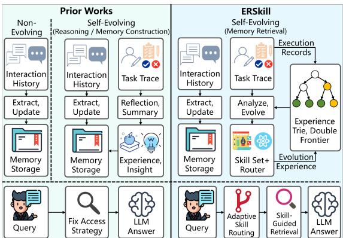
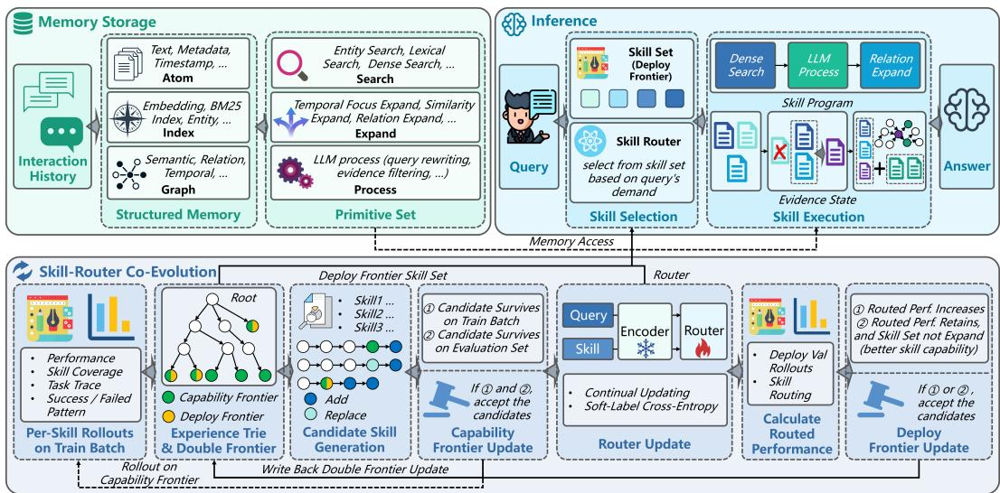
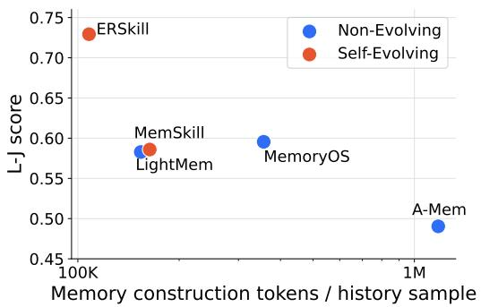
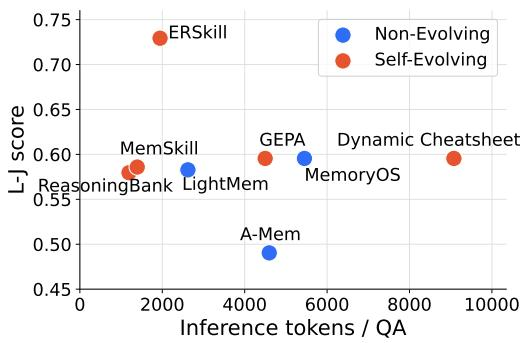
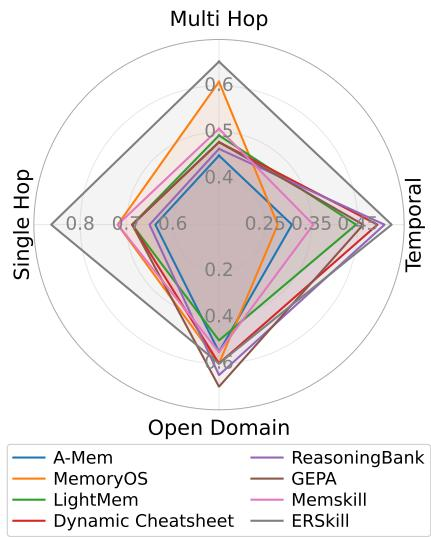
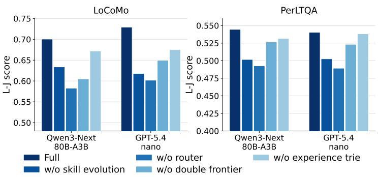
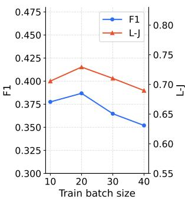
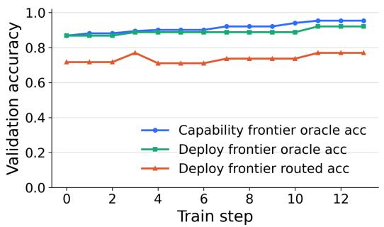
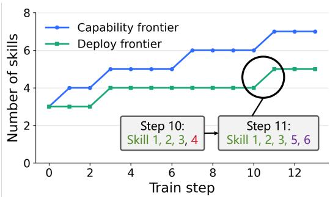
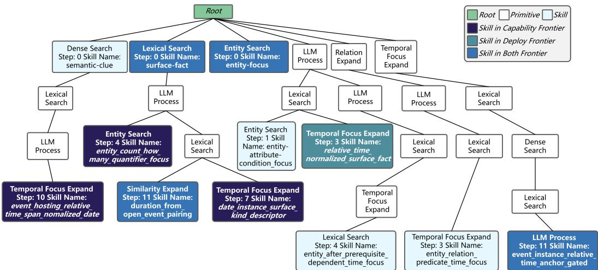

# ERSkill: Evolving for Skill-Guided Adaptive Memory Retrieval

Haolong Chen<sup>1,2,3</sup>, Liang Zhang<sup>4</sup>, Zhuo Li<sup>1,2,3</sup>, Lei Xue<sup>4</sup>, Guangxu Zhu<sup>1,2,3,5</sup> <sup>1</sup>Shenzhen International Center for Industrial and Applied Mathematics <sup>2</sup>Shenzhen Research Institute of Big Data <sup>3</sup>The Chinese University of Hong Kong, Shenzhen <sup>4</sup>Shenzhen Campus of Sun Yat-sen University <sup>5</sup>Shenzhen Loop Area Institute

haolongchen1@link.cuhk.edu.cn, zhangliang27@mail.sysu.edu.cn, 221019088@link.cuhk.edu.cn, xuelei3@mail.sysu.edu.cn, gxzhu@sribd.cn

## Abstract

While Large Language Model (LLM) agents increasingly rely on long-term memory for persistent interactions, the retrieval mechanisms governing this memory are rarely treated as evolvable components. This static approach limits performance on heterogeneous memory queries, which often demand diverse evidence construction strategies. To address this, we introduce ERSkill, a retrieval-centric framework for self-evolving, skill-guided memory access. ERSkill compiles interaction histories into a structured memory store and represents retrieval behaviors as executable skills composed of fundamental primitives. At inference time, a trained router dynamically matches each query to the optimal skill to construct tailored evidence for answer generation. To enable continuous improvement, ERSkill co-evolves the skill set and the router during training. It employs an experience trie to efficiently record explored retrieval paths, alongside a double-frontier mechanism that safely decouples the expansion of new skill capabilities from stable, router-facing deployment. Experiments across multiple agent memory benchmarks demonstrate that ERSkill substantially outperforms strong non-evolving and self-evolving baselines. Notably, it improves the overall average across F1, BLEU-1, and LLM-judge scores by 31.3% with Qwen3-Next-80B-A3B-Instruct and by 28.1% with GPT-5.4-nano.

## 1 Introduction

Large Language Model (LLM) [1, 2, 3, 4] agents are increasingly expected to function as persistent collaborators rather than oneshot assistants [5]. Over extended interactions spanning weeks or months, an agent accumulates user preferences, tracks changing events, remembers prior decisions, and reuses experiences, motivating rapid progress in agent memory [6]. Recent work has made progress toward persistent agents by building explicit external memory to store interaction history. These systems construct and maintain memory through operations such as information extraction, compression, updating, and forgetting [7, 8, 9], and retrieve stored memories as evidence for downstream tasks. More re-

  
Figure 1: Left: Prior works include non-evolving methods and self-evolving methods for reasoning or memory construction. Right: ERSkill studies self-evolving memory retrieval through skill-guided adaptive access.

cent work further moves toward self-evolving

agents: instead of only storing key informa-

tion, agents reflect on past trajectories, distill reusable experiences or insights, store and apply them to guide future behavior [10, 11, 12, 13, 14].

Despite this progress, the retrieval side of agent memory remains underexplored as an object of evolution. Existing self-evolving methods mainly use past task experience to improve future reasoning [10, 11, 12, 13]; for example, ReasoningBank [12] reflects on past task traces to distill reusable reasoning experiences. MemSkill [14] evolves LLM-based memory extraction skills, but the resulting memories are still accessed through a predefined dense retrieval strategy at query time. Thus, while memory content and reasoning guidance become increasingly adaptive, retrieval behavior itself often remains predefined. This becomes limiting for agent memory question answering, where queries can differ substantially in their information demands. For example, “What gift did Alice buy for Bob during her Hawaii trip?” primarily requires retrieving a specific event, whereas “Why did Alice later stop planning another Hawaii trip with Bob?” requires connecting earlier events with later developments to uncover causal relations. Such queries require qualitatively different evidence construction behaviors, raising a central question about query-time memory access:

How can an LLM agent evolve and learn to compose complex retrieval actions so that its retrieval behavior adapts to the heterogeneous information demands of different queries?

In this paper, we propose ERSkill (Evolving Retrieval Skill), a retrieval-centric self-evolving framework that models agent memory access as skill-guided [15] evidence construction. To support diverse retrieval perspectives, ERSkill first builds a retrieval-oriented memory storage that exposes memory via a library of retrieval primitives, such as dense retrieval [16], BM25 retrieval [17], and query rewriting [18]. Based on these primitives, ERSkill represents retrieval behavior as a set of executable retrieval skills. Each skill specifies a concrete retrieval schema by composing primitives into a sequence. This skill abstraction makes retrieval behavior reusable, interpretable, and refinable. To choose the appropriate retrieval behavior for each query, ERSkill trains a skill router that matches the query’s information demand to skills. At inference time, the selected skill controls how memory atoms are gathered, expanded, and organized into a task-specific evidence view for answer generation. In this way, ERSkill realizes query-adaptive memory access while keeping the retrieval process executable and interpretable.

However, a predefined static set of retrieval skills fundamentally limits the expressiveness of memory access, as retrieval requirements vary across queries. We therefore design a skill-router co-evolution procedure that jointly updates the skill set and the router by analyzing previous task traces and identifying gaps between current skill behavior and desired evidence construction. To reduce inefficient exploration, ERSkill stores explored primitive paths in an experience trie, allowing the skill generator to reuse past rollout experience and avoid repeatedly proposing equivalent retrieval programs. Moreover, because the router may not always select the best skill during deployment, skill evolution should consider not only whether a skill is useful in principle, but also whether its utility can be reliably activated by the router. To this end, ERSkill uses a Pareto-style double-frontier mechanism: the capability frontier maintains a compact set of skills with the best retrieval capabilities, while the deploy frontier maintains a router-facing skill set validated under routed inference, allowing ERSkill to expand retrieval capability while keeping deployment stable.

In summary, our contributions are as follows:

• We introduce a retrieval-centric framework for agent memory, treating memory access as queryadaptive evidence construction rather than a fixed retrieval strategy.

• We propose ERSkill, a skill-guided framework that co-evolves retrieval skills and the router using an experience trie and a double-frontier design.

• Experiments on agent memory benchmarks show that ERSkill outperforms strong baselines, improving the overall average across F1, BLEU-1, and LLM-as-a-Judge scores by 31.3% with Qwen3-Next-80B-A3B-Instruct and by 28.1% with GPT-5.4-nano. ERSkill also achieves a leading cost-performance trade-off.

  
Figure 2: Overview of ERSkill. ERSkill compiles interaction history into memory storage, builds retrieval skills from primitives, and selects a query-matched skill to construct evidence for answering. During training, the skills and the router co-evolve, with an experience trie recording explored paths and double frontiers supporting skill capability expansion and router-facing deployment.

## 2 Methodology

## 2.1 Overview

As shown in Figure 2, ERSkill adapts memory retrieval by selecting, for each query, a retrieval skill that matches its information demand. It first compiles the interaction history into memory storage, then uses a trained router to select the most suitable skill, and finally executes the selected skill to construct evidence for answering. During training, the skills and the router co-evolve.

## 2.2 Memory Storage

Structured memory. Let D be the interaction history. ERSkill splits D into atom-level records $\mathcal { A } = \{ a _ { 1 } , \ldots , a _ { n } \}$ , where each $a _ { i }$ stores the atom text, metadata, and timestamp. The compiled memory is $M ( D ) \overset { \cdot } { = } ( \mathcal { A } , \mathcal { Z } , \mathcal { G } )$ , where I is a collection of indexes for atom search and G is a collection of graphs for atom expansion. Indexes provide entry points into candidate atoms (e.g., embedding indexes for dense retrieval and entity-to-atom indexes for entity-based retrieval), while graphs connect atoms for expansion (e.g., similarity-based). Appendix A.1 summarizes the construction details.

Retrieval primitive. ERSkill’s memory is not merely a storage, but an executable substrate for constructing query-specific evidence. Specifically, ERSkill exposes the memory storage through a primitive library $\mathcal { \bar { P } } = \{ p _ { 1 } , . . . , p _ { m } \}$ , where each primitive is a state transition $p : ( q , s , M ( D ) ) \mapsto s ^ { \prime }$ Here, q is the query, s is the current evidence state, and $s ^ { \prime }$ is the updated state.

Retrieval primitives use the indexes in I to access memory from different perspectives. Formally, we initialize: (1) entity\_search that identifies query-relevant entities and retrieves atoms through the entity–atom graph; (2) lexical\_search that performs BM25-style surface-form matching; and (3) dense\_search that retrieves atoms by query–atom embedding similarity. Besides, we define that expansion primitives use the graphs in $\dot { \boldsymbol { \mathcal { G } } }$ to grow the evidence state. Specifically, temporal\_focus\_expand adds atoms from a given temporal span, similarity\_expand propagates along similarity edges, and relation\_expand follows typed relation edges. We also include llm\_process for query rewriting, evidence filtering, and other dynamic control operations. The primitive library remains fixed throughout evolution; skills differ only in how these primitives are composed. Because all skills share the same primitives, their outcomes can be accumulated in a common experience structure. Appendix A.1 provides the details of the primitive library.

Skill: entity-anchored-similarity-expansion   
Description:   
Designed for entity-specific questions that require evidence beyond direct entity mentions, such as related context,   
conseguences, or follow-up developments. This skill anchors retrieval on the mentioned entities, selects relevant   
retrieved atoms as expansion seeds, and expands to semantically similar atoms for additional support.   
Information Preference:   
Prefer entity-grounded evidence related to the queried event or decision. The expansion seeds should be atoms whose   
similar neighbors may reveal follow-up context, outcomes, or later developments.   
Program:   
1. Primitive: entity search. Query: {question}.   
2. Primitive: llm process. Process Prompt: "Given the question and the current entity-grounded evidence, select the   
atom IDs that should be expanded to find semantically related supporting context. Prefer atoms that directly mention   
the target entities and are closest to the queried event or decision." Output: seed atom ids.   
3. Primitive: similarity expand. Atom IDs: {seed atom ids}.  
Figure 3: Skill sample illustrating an entity-anchored similarity expansion path. The skill first retrieves entity-grounded atoms, then selects seed atoms, and finally expands to semantically similar atoms for supporting context.

## 2.3 Inference

Retrieval skills. A retrieval skill is an executable primitive program $\kappa = \left( c _ { \kappa } , \rho _ { \kappa } \right)$ , where $c _ { \kappa }$ is the skill description and the information preference, and $\rho _ { \kappa } = ( p _ { \kappa , 1 } , \ldots , p _ { \kappa , L _ { \kappa } } )$ is the primitive sequence. Given query $q ,$ the skill executes its primitives sequentially by applying $s _ { j } = p _ { \kappa , j } ( q , s _ { j - 1 } , M ( D ) )$ and returns $s _ { L _ { \kappa } }$ as the evidence view. The state maintains the current evidence set and execution context, enabling the skill to organize retrieved information according to the query’s evidence needs. Each skill is stored as a markdown file; Figure 3 shows an example.

Skill router. ERSkill employs a query-conditioned routing model to select retrieval skills. Given a query $q$ and a retrieval skill set $\kappa .$ the router assigns a relevance score to each skill based on its compatibility with the query. Specifically, we encode the query q and each skill κ into vector representations using a shared encoder Enc(·), resulting in $h _ { q } = \operatorname { E n c } ( q )$ and $h _ { \kappa } = \operatorname { E n c } ( \kappa )$ , where $\kappa \in { \cal K } .$ A learnable scoring function $u _ { \theta } ( q , \kappa )$ is then used to measure the compatibility between the query q and the skill $\kappa ,$ reflecting the performance of applying skill κ to the query $q .$ The routing model $R _ { \theta } ( \cdot )$ ) is defined by normalizing these scores into a probability distribution over skills:

$$
R _ { \theta } ( \kappa \mid q , K ) = \frac { \exp ( u _ { \theta } ( q , \kappa ) ) } { \sum _ { \kappa ^ { \prime } \in \mathcal K } \exp ( u _ { \theta } ( q , \kappa ^ { \prime } ) ) } ,\tag{1}
$$

which allows the router to score newly evolved skills from their textual descriptions, information preferences, and programs without requiring changes to the output space. We keep the text encoder frozen and optimize only the routing parameters.

Skill routing and answer generation. Given a query $q$ and skill set $\kappa ,$ the router selects the skill that best matches the query’s information demand. We denote this routed skill as $\pi _ { \theta } ( q ; K ) =$ arg m $\operatorname { l a x } _ { \kappa \in \mathcal { K } } R _ { \theta } ( \kappa \mid q , { \mathcal { K } } )$ , and write $\hat { \kappa } = \pi _ { \boldsymbol { \theta } } ( q ; \mathcal { K } )$ at inference time. ERSkill then executes κˆ over $M ( D )$ to refine evidence state $s _ { L _ { \hat { \kappa } } }$ , and generates the answer as $\hat { y } = f _ { \mathrm { L L M } } ( q , s _ { L _ { \hat { \kappa } } } )$ . In this way, ERSkill enables adaptive query-time memory access through skill selection and execution.

## 2.4 Skill-Router Co-Evolution

ERSkill evolves skills through two Pareto-style frontiers. Afrontier is the active boundary of explored skills, retaining compact and non-redundant skills from the evolution history. The capability frontier $\mathcal { C } _ { t }$ preserves skills with oracle-side value, i.e., skills that lead to the best attainable utility when the best skill can be chosen for each query without router errors. It therefore tracks the retrieval capability discovered so far. The deploy frontier $B _ { t }$ is the router-facing skill set used at inference time, containing only validation-gated skills that the router can select reliably. This separation allows ERSkill to explore new retrieval capabilities while exposing only stable skills for deployment.

At evolution step t, ERSkill has experience trie $\mathcal { T } _ { t } ,$ frontiers $\mathcal { C } _ { t }$ and $B _ { t }$ , and router parameters $\theta _ { t }$ . Evolution starts from three single-primitive seed skills: semantic-clue with dense\_search, entity-focus with entity\_search, and surface-fact with lexical\_search; both frontiers are initialized from them, so $\boldsymbol { B } _ { 0 } = \boldsymbol { \mathcal { C } } _ { 0 }$ . Given a training batch $\mathcal { Q } _ { t }$ , ERSkill executes every skill in $\mathcal { C } _ { t }$ on every query and records query–skill performance, execution traces, and ability overlaps in $\mathcal { T } _ { t } .$ . These experiences reveal weak or redundant regions of the current capability frontier, guiding skill candidate generation, capability frontier update, router update, and deploy frontier update. Appendix B.1 summarizes the full co-evolution algorithm.

Skill candidate generation. ERSkill generates new skill candidates by editing paths from the current capability frontier, $\mathrm { e . g . }$ ., adding or replacing primitives. To reuse past search experience and avoid duplicate exploration, ERSkill maintains an experience trie $\tau$ over primitive paths. Since skills are sequences over the fixed primitive library ${ \mathcal { P } } _ { : }$ , each root-to-node path represents a primitive prefix, and shared prefixes are stored only once.<sup>1</sup> This allows ERSkill to detect duplicate candidates.

Each explored path in $\tau$ corresponds to a skill and stores its train-batch rollouts, validation rollouts, and frontier status. The skill generator proposes candidates from skill summaries, rollout statistics, failure/success patterns, and trie summaries, while excluding paths already recorded in $\tau _ { t } .$ . Thus, both accepted and rejected candidates remain available to guide later evolution. Appendix B.2 details the generation procedure, and Appendix E.1 shows an example trie.

Capability frontier update. ERSkill updates the capability frontier by retaining skills with unique oracle-side value. For each query–skill pair, we measure performance by a score $r ( q , \kappa ) \in [ 0 , 1 ]$ instantiated as LLM-as-a-Judge accuracy in our experiments; the judge prompt is provided in Appendix $\mathrm { D } . 4 . 2$ . For a batch $\bar { \mathcal { Q } } ,$ skill utility is $\begin{array} { r } { \operatorname { U t i l } ( \kappa ; \hat { \mathcal { Q } } ) = \frac { 1 } { | \mathcal { Q } | } \sum _ { q \in \mathcal { Q } } \bar { r ( q , \kappa ) } } \end{array}$ , and the oracle score profile of a skill set $\kappa$ is $g _ { \mathcal { K } } ( q ) = \mathrm { m a x } _ { \kappa \in \mathcal { K } } r ( q , \kappa )$ . ERSkill uses a frontier recomputation operator $\bar { \Phi } ( \kappa ; \mathcal { Q } )$ that sorts skills by utility and removes a skill only when doing so does not decrease $g _ { K } ( q )$ for any query. Thus, Φ preserves oracle performance while pruning redundant skills.

Given generated candidates $\mathcal { U } _ { t } .$ , ERSkill first computes a train-side temporary frontier $\boldsymbol { \widetilde { \mathcal { C } } } _ { t + 1 } \ =$ $\Phi ( \mathcal { C } _ { t } \cup \mathcal { \breve { U } } _ { t } ; \mathcal { Q } _ { t } )$ ) and rejects candidates not retained in it. The retained candidates $\nu _ { t }$ are then evaluated on validation data, and the capability frontier is updated as $\mathcal { C } _ { t + 1 } = \Phi ( \mathcal { C } _ { t } \cup \mathcal { V } _ { t } ; \mathcal { Q } _ { \mathrm { v a l } } )$ . This two-stage update uses training batches for efficient filtering and validation data for stable frontier recomputation.

Router update. Training uses a window ${ \mathcal { W } } _ { t }$ of rollout instances $( q , \boldsymbol { { \cal K } } _ { q } , \{ r ( q , \kappa ) \} _ { \kappa \in \mathcal { K } _ { q } } )$ , where $\textstyle { \mathcal { K } } _ { q }$ is the historical skill set used for that rollout. Let $\mathcal { M }$ be a mini-batch of instances sampled from $\mathcal { W } _ { t }$ For each instance, the rollout scores induce a soft target distribution over its associated skill set $\begin{array} { r } { { \kappa _ { q } } . } \end{array}$ and the router is optimized with soft-label cross-entropy:

$$
\tilde { p } ( \kappa \mid q , K _ { q } ) = \frac { \exp ( r ( q , \kappa ) ) } { \sum _ { \kappa ^ { \prime } \in K _ { q } } \exp ( r ( q , \kappa ^ { \prime } ) ) } , \mathrm { ~ } \mathcal { L } _ { \mathrm { r o u t e r } } = - \sum _ { ( q , K _ { q } , \cdot ) \in \mathcal { M } } \sum _ { \kappa \in \mathcal { K } _ { q } } \tilde { p } ( \kappa \mid q , K _ { q } ) \log R _ { \theta } ( \kappa \mid q , \mathcal { K } _ { q } ) .
$$

Deploy frontier update. After updating the router, ERSkill refreshes the deploy frontier only when the capability frontier changes, using the newly retained candidates $\mathcal { H } _ { t } = \bar { \mathcal { U } } _ { t } \cap \mathcal { C } _ { t + 1 } ;$ otherwise, it sets $\boldsymbol { B } _ { t + 1 } = \boldsymbol { B } _ { t }$ . For any skill set $\kappa ,$ given available rollout scores for all $q \in \mathcal { Q }$ and $\kappa \in \kappa$ , its routed performance is Routed $\begin{array} { r } { ( \mathcal { K } , \boldsymbol { \theta } ; \tilde { \mathcal { Q } } ) = \frac { 1 } { | \mathcal { Q } | } \sum _ { \boldsymbol { q } \in \mathcal { Q } } r ( \boldsymbol { q } , \pi _ { \boldsymbol { \theta } } ( \boldsymbol { q } ; \mathcal { K } ) ) } \end{array}$ . ERSkill forms a candidate deploy frontier $B _ { t } ^ { \prime } = \Phi ( B _ { t } \cup \mathcal { H } _ { t } ; \mathcal { Q } _ { \mathrm { v a l } } )$ and computes $\Delta _ { \mathrm { r o u t e } } ( B _ { t } ^ { \prime } ; \theta _ { t + 1 } ) =$ Routed $( B _ { t } ^ { \prime } , \theta _ { t + 1 } ; \mathcal { Q } _ { \mathrm { v a l } } ) -$ Routed $( B _ { t } , \theta _ { t + 1 } ; \mathcal { Q } _ { \mathrm { v a l } } )$ . It accepts $B _ { t } ^ { \prime }$ and sets $B _ { t + 1 } = B _ { t } ^ { \prime }$ if $\Delta _ { \mathrm { r o u t e } } ( B _ { t } ^ { \prime } ; \theta _ { t + 1 } ) \ \stackrel { \textstyle \cdot } { = } \ $ γ<sub>route</sub>, or if $\Delta _ { \mathrm { r o u t e } } ( \dot { B } _ { t } ^ { \prime } ; \theta _ { t + 1 } ) \ge - \xi _ { \mathrm { d r o p } }$ and $| B _ { t } ^ { \prime } | \leq | B _ { t } |$ , where $\gamma _ { \mathrm { r o u t e } }$ is a routed-gain margin and $\xi _ { \mathrm { d r o p } }$ is a compactness tolerance that allows a small routed-performance drop to accept a stronger, more compact deploy skill set. If the candidate is rejected, ERSkill sets $\left. B _ { t + 1 } \right. = \left. B _ { t } \right.$ . Accept/reject outcomes are written back to the experience trie, allowing later skill generation to consider router-aware deployment performance. After training, the final deploy frontier is used for inference.

Proposition 2.1 (Oracle-safe two-level frontier update). Denote the oracle coverage as OCov $\begin{array} { r } { ( \mathcal { K } ; \mathcal { Q } ) = \frac { 1 } { | \mathcal { Q } | } \sum _ { q \in \mathcal { Q } } g _ { \mathcal { K } } ( q ) } \end{array}$ . For every evolution step $t ,$ ERSkill satisfies OCov $( \mathcal { C } _ { t + 1 } ; \mathcal { Q } _ { \mathrm { v a l } } ) \ge$ OCov $( \mathcal { C } _ { t } ; \mathcal { Q } _ { \mathrm { v a l } } )$ and $\operatorname { O C o v } ( \mathcal { B } _ { t + 1 } ; \mathcal { Q } _ { \mathrm { v a l } } ) \ge \operatorname { O C o v } ( \mathcal { B } _ { t } ; \mathcal { Q } _ { \mathrm { v a l } } )$

Proposition 2.1 shows that both frontiers maintain non-decreasing oracle coverage on the validation set, even though the deploy frontier may lag behind capability updates due to router-aware validation. Appendix C provides the proof.

<table><tr><td rowspan="2">Methods</td><td colspan="3">LoCoMo</td><td colspan="2">LongMemEval*</td><td colspan="3">PerLTQA</td><td colspan="3">Average</td></tr><tr><td>F1</td><td>B1 L-J</td><td></td><td>F1</td><td>B1 L-J</td><td>F1</td><td>B1</td><td>L-J</td><td>F1</td><td>B1</td><td>L-J</td></tr><tr><td colspan="10">Qwen3-Next-80B-A3B-Instruct</td></tr><tr><td>Non-Evolving</td><td></td><td></td><td></td><td></td><td></td><td></td><td></td><td></td><td></td><td></td><td></td></tr><tr><td>A-Mem</td><td>32.9637.2043.63</td><td></td><td></td><td>15.13 11.1048.7342.37 37.94 42.6530.15 28.7545.00</td><td></td><td></td><td></td><td></td><td></td><td></td><td></td></tr><tr><td>MemoryOS</td><td>34.0337.4346.49</td><td></td><td></td><td>18.15</td><td>12.6049.74</td><td></td><td>43.7036.4546.7931.9628.8347.67</td><td></td><td></td><td></td><td></td></tr><tr><td>LightMem</td><td>42.6342.89</td><td></td><td>64.96</td><td>16.48</td><td>11.00</td><td>55.83</td><td></td><td></td><td></td><td></td><td>43.1435.3039.5434.0829.7353.44</td></tr><tr><td>Self-Evolving Dynamic Cheatsheet 34.9633.22</td><td></td><td></td><td>56.05</td><td>33.59</td><td>34.13</td><td>51.26 35.5040.88</td><td></td><td></td><td>45.9634.68</td><td></td><td></td></tr><tr><td>ReasoningBank</td><td>15.77</td><td>9.12</td><td>55.41</td><td>17.02</td><td>12.85</td><td>54.3143.0537.55</td><td></td><td>48.44</td><td>25.28</td><td></td><td>36.0851.09</td></tr><tr><td>GEPA</td><td>10.35</td><td>4.58</td><td>57.00</td><td>11.55</td><td>7.15</td><td>52.2842.6437.36</td><td></td><td></td><td></td><td></td><td>19.8452.72</td></tr><tr><td>MemSkill</td><td></td><td>44.01</td><td>60.19</td><td>11.35</td><td>6.93</td><td></td><td></td><td>47.41</td><td>21.51</td><td></td><td>16.3652.23</td></tr><tr><td>ERSkill 49.96</td><td>43.25</td><td></td><td></td><td></td><td></td><td></td><td></td><td></td><td></td><td></td><td>49.7440.9732.9334.7831.8627.9648.24</td></tr><tr><td colspan="14">50.1870.0646.7953.3159.3951.8944.0754.4549.5549.1961.30</td></tr><tr><td>Non-Evolving</td><td></td><td></td><td></td><td></td><td>GPT-5.4-nano</td><td></td><td></td><td></td><td></td><td></td><td></td></tr><tr><td>A-Mem</td><td></td><td></td><td></td><td></td><td></td><td></td><td></td><td></td><td></td><td></td><td></td><td></td></tr><tr><td></td><td></td><td></td><td></td><td></td><td>30.40 29.3349.04 17.0713.77 42.13 36.06 32.9542.65 27.84 25.3544.61</td><td></td><td></td><td></td><td></td><td></td><td></td><td></td></tr><tr><td>MemoryOS</td><td>33.4632.72</td><td></td><td>59.55</td><td>15.50</td><td></td><td>10.5745.17</td><td>43.88</td><td>37.27</td><td>47.2030.95</td><td></td><td></td><td>26.8550.64</td></tr><tr><td>LightMem</td><td>36.4337.6358.28</td><td></td><td></td><td></td><td>15.95 10.73 50.25</td><td></td><td>39.91 33.26 37.88 30.76</td><td></td><td></td><td></td><td>27.2148.80</td><td></td></tr><tr><td>Self-Evolving</td><td></td><td></td><td></td><td></td><td></td><td></td><td></td><td></td><td></td><td></td><td></td><td></td></tr><tr><td>Dynamic Cheatsheet 18.33 12.57</td><td></td><td></td><td>59.55</td><td>21.19</td><td></td><td>18.3143.1443.44 36.4650.72 27.6522.4551.14</td><td></td><td></td><td></td><td></td><td></td><td></td></tr><tr><td>ReasoningBank</td><td>17.65</td><td>11.88</td><td>57.96</td><td>18.88</td><td>13.34</td><td></td><td>49.7443.1436.1648.4426.5620.4652.05</td><td></td><td></td><td></td><td></td><td></td></tr><tr><td>GEPA</td><td></td><td>18.8012.31</td><td>59.55</td><td>21.74</td><td>18.58</td><td>50.25</td><td></td><td>40.4136.1551.34 26.9822.3553.71</td><td></td><td></td><td></td><td></td></tr><tr><td>MemSkill</td><td></td><td>25.39 24.8058.59</td><td></td><td>18.17</td><td>13.05</td><td>46.19</td><td></td><td>42.2335.5747.82 28.6024.4750.87</td><td></td><td></td><td></td><td></td></tr><tr><td>ERSkill</td><td></td><td></td><td></td><td>38.68 33.46 72.93 38.89</td><td></td><td>41.0156.35 45.35 38.4054.04 40.97 37.6261.11</td><td></td><td></td><td></td><td></td><td></td><td></td></tr></table>

Table 1: Main comparison results on LoCoMo, LongMemEval, and PerLTQA. We report F1, BLEU-1 (B1), and LLM-as-a-Judge (L-J) scores as percentages; higher values indicate better performance. denotes that ERSkill is transferred from LoCoMo without training on LongMemEval.

## 3 Experiments

## 3.1 Experimental Setup

Benchmarks. We evaluate ERSkill on three agent memory benchmarks: LoCoMo [19], Long-MemEval [20], and PerLTQA [21]. LoCoMo and LongMemEval contain multi-session conversational histories, while PerLTQA further evaluates memory use over heterogeneous sources beyond dialogue history. Detailed descriptions of the datasets are provided in Appendix D.1.

Baselines. We compare ERSkill against strong baselines including: (1) Non-evolving baselines include A-Mem [7], MemoryOS [8], and LightMem [9], which focus on memory construction and maintenance without self-evolution from past task traces; (2) Self-evolving baselines include Dynamic Cheatsheet [11], ReasoningBank [12], GEPA [13], and MemSkill [14]. Dynamic Cheatsheet, ReasoningBank, and GEPA reflect on past task traces to distill reusable experiences or insights for future tasks, while MemSkill evolves LLM-based memory construction skills for downstream QA. Dynamic Cheatsheet, ReasoningBank, and GEPA use the standard RAG [22, 16] memory storage.

Implementation details. We evaluate the performance on two LLM backbones, Qwen3-Next-80B-A3B-Instruct [4] and GPT-5.4-nano [23], using GPT-4o-mini as the judge model. We report F1, BLEU-1 (B1), and LLM-judge score (L-J, prompts in Appendix D.4.2), where higher values represent better alignment with the ground-truth. For ERSkill, we set the evolution’s train batch sizes as 20 and 40 for LoCoMo and PerLTQA, respectively. Queries and skills are encoded with Qwen3-Embedding-0.6B [24] as the Enc(·). For the router, both embeddings are first projected into a representation space via a Linear Layer. The resulting representations are then concatenated and fed into a two-layer multilayer perceptron (MLP) to produce the scalar score $u _ { \theta } ( q , k )$ for each query–skill pair. ERSkill is trained for one epoch. For dense memory retrieval, we use Contriever [25] as the embedder for all methods. More details are provided in Appendix D.

  
(a) Memory construction cost.

  
(b) Inference cost.  
Figure 5: Cost-performance comparison on LoCoMo with GPT-5.4-nano. Left: L-J score versus memory construction tokens per history sample. Methods without LLM-based memory construction are omitted. Right: L-J score versus inference tokens per QA. ERSkill achieves the best performance while remaining lightweight in both memory construction and inference.

## 3.2 Comparison Experiments

ERSkill achieves the strongest overall performance. Table 1 reports the main comparison results, where we observe that ERSkill achieves the best overall average under both backbones. Specifically, ERSkill improves the overall average by 31.3% across F1, BLEU-1, and L-J with qwen3-next-80b-a3b-instruct, and by 28.1% with gpt-5.4-nano against the strongest baseline. Compared with non-evolving methods, ERSkill shows that its memory storage is sufficiently informative, while skill-guided adaptive retrieval can extract suitable evidence. For self-evolving methods, the gains indicate that updating summaries, prompts, or reasoning traces alone is insufficient when query-time access remains fixed; ERSkill gains from exploiting retrieval-path experience through the experience trie and the skill-router co-evolution mechanism.

As shown in Figure 4, ERSkill’s advantages are more pronounced in tasks that require accurately locating specific evidence points, such as Single Hop and Multi Hop, indicating that its effective regulation of retrieval behavior leads to improved evidence-searching capability.

ERSkill transfers effectively across datasets. ERSkill also shows strong transferability. On LongMemEval, we directly reuse the router and retrieval skills trained on Lo-CoMo without additional training. As shown in Table 1, in this transfer setting, ERSkill still achieves the best performance under both LLM backbones, which suggests that the learned retrieval skills capture reusable retrieval behaviors.

ERSkill achieves a leading cost-performance trade-off. Figure 5 compares token costs for memory construction and inference. Dynamic Cheatsheet, ReasoningBank, and GEPA are omitted from the construction-cost plot because they use standard chunk-and-embedding memory storage rather than LLM-based construction. ERSkill achieves a favorable cost-performance trade-off: it is the lightest among LLM-based memory construction methods, as it uses the LLM only for relation extraction among memory atoms, and remains in the lower-cost tier at inference while achieving the highest L-J score. This suggests that ERSkill’s gains come from targeted evidence construction rather than simply feeding more retrieved content.

  
Figure 4: Fine-grained comparison on LoCoMo categories (GPT-5.4-nano, L-J). ERSkill shows larger gains on evidence-intensive tasks such as Single Hop and Multi Hop.

  
(a) Ablation study.

  
(b) Hyperparameter study.  
Figure 6: Ablation and hyperparameter studies. Left: Ablation study on LoCoMo and PerLTQA with two backbone LLMs. Right: Hyperparameter study on train batch size using LoCoMo with GPT-5.4-nano.

## 3.3 Ablation Study

Ablation results verify the effectiveness of each design component. We ablate four core components. w/o skill evolution keeps only the initial seed skills. w/o router replaces the learned router with LLM-based skill selection, whose prompt is provided in Appendix D.4.3. w/o double frontier removes the capability/deploy frontier and accepts all generated skill candidates. w/o experience trie generates candidates only from the current frontier without historical path-level records. As shown in Figure 6a, all ablations underperform the full ERSkill across datasets and backbones. The largest drops come from removing skill evolution and the router, showing the importance of both discovering effective retrieval skills and learning query-dependent skill selection. The double frontier and experience trie also contribute: the former stabilizes skill acceptance, while the latter reduces repeated exploration and guides candidate generation with accumulated path-level experience.

## 3.4 Hyperparameter Study

In this section, we study the train batch size, which controls the granularity of skill evolution. ERSkill runs one pass over the training set. A larger train batch provides more rollout evidence for each evolution step, making frontier recomputation and router updates more stable, but it also reduces the number of evolution steps. Conversely, a smaller batch allows more frequent skill updates, but each update is based on less reliable rollout statistics. As shown in Figure 6b, a batch size of 20 achieves a good balance between stable per-step evolution and sufficient update frequency.

## 3.5 Case Study of Evolution

ERSkill expands retrieval capability while keeping evolution controlled. Figure 7 visualizes a representative run on LoCoMo with GPT-5.4-nano. The left figure shows that both capability- and deploy-frontier oracle accuracy increase steadily, indicating that frontier recomputation preserves and improves oracle-side skill coverage. Routed deploy accuracy may temporarily drop when the deploy frontier replaces weaker or redundant skills with higher-coverage ones before the router has fully adapted. Subsequent updates then recover the routed performance. This suggests that ERSkill can expand retrieval ability without persistent deployment instability, while avoiding an overly conservative deploy frontier. The right figure shows that frontier sizes remain controlled throughout evolution. The capability frontier grows only when new skills add non-redundant oracle value, while the deploy frontier is more conservative. ERSkill avoids accumulating all generated skills, pruning weaker or redundant ones once their utility is covered by stronger alternatives.



  
Figure 7: Case study of evolution. Left: Capability and deploy oracle accuracy increase steadily. Routed deploy accuracy may temporarily drop but later recovers, indicating stable skill-router coevolution. Right: Frontier sizes remain controlled as stronger skills replace weaker or redundant ones.

## 3.6 Evolution Stability Analysis

ERSkill evolves stably across runs. In this section, we evaluate the stability of ERSkill’s skill evolution across independent runs. Table 2 summarizes five runs on Lo-CoMo with GPT-5.4-nano and compares them against the strongest baseline. The coefficients of variation (CV) are low across all metrics, with the largest value below 5.4%. It shows the robustness of ERSkill’s evolution.

<table><tr><td>F1</td><td>B1</td><td>L-J</td></tr><tr><td>Mean</td><td>38.20 33.69</td><td>70.38</td></tr><tr><td>Std.</td><td>1.36</td><td>1.82 1.98</td></tr><tr><td>CV</td><td>3.56%</td><td>5.39% 2.81%</td></tr></table>

Table 2: Stability analysis.

## 4 Related Work

## 4.1 Agent Memory

Memory systems enable agents to retrieve historical information and use it as evidence for subsequent reasoning and decision-making tasks. Recent work on agent memory studies how to externalize long interaction histories into persistent memory stores. A typical pipeline decomposes interactions into memory atoms, compresses or consolidates salient information, stores the resulting memories in external storage, and retrieves relevant evidence when a future query arrives [26, 27, 7, 9, 8]. Some methods focus on designing more effective memory pipelines, such as A-MEM [7] and LightMem [9], while others improve the agent’s memory management ability through training, such as Memory-R1 [28], Mem-α [29], and MemAgent [30]. Despite these advances, most methods still expose memory through a predefined retrieval strategy at query time. By contrast, we focus on adaptive memory retrieval: how an agent should access, expand, and organize memory evidence according to heterogeneous query demands.

## 4.2 Self-Evolving Agents and Skill Discovery

Recent work on self-evolving LLM agents studies how agents can improve from interaction experience by using LLMs to analyze past task traces [10, 12, 13, 14, 31, 32]. A typical pipeline is to collect trajectories from previous tasks, let the LLM identify key success or failure factors, and distill them into reusable experiences, rules, prompts, or memory items that can guide future behavior. For example, ReasoningBank [12] accumulates historical reasoning paths and asks the LLM to analyze correct and erroneous reasoning steps, turning the resulting insights into memory items for later reasoning. MemSkill [14] studies memory construction skills: it adjusts how an agent extracts memory items and improves these skills using task signals from downstream memory QA traces. By contrast, ERSkill focuses on constructing skills for memory retrieval rather than memory construction. It treats query-time memory access as an evolvable retrieval behavior and introduces an experience trie and a double-frontier mechanism to enable effective, stable self-evolution.

## 5 Conclusion

We proposed ERSkill, a retrieval-centric framework for self-evolving, skill-guided agent memory retrieval. ERSkill represents memory access as executable retrieval skills composed from a shared primitive library, and uses a trained router to select the skill matching each query’s information demand. To build effective and deployable skills, ERSkill co-evolves the skill set and router with an experience trie and a double-frontier mechanism, separating capability expansion from router-facing deployment. Experiments on three agent memory benchmarks show that ERSkill outperforms strong non-evolving and self-evolving baselines across different backbone LLMs, while further analyses demonstrate cross-dataset transfer, favorable cost-performance trade-offs, and stable evolution. These results highlight retrieval-side evolution as a promising direction for long-term LLM agents.

## References

[1] OpenAI. Gpt-4 technical report, 2024.

[2] Gemini Team. Gemini: A family of highly capable multimodal models, 2025.

[3] DeepSeek-AI. Deepseek-v3 technical report, 2025.

[4] An Yang, Anfeng Li, Baosong Yang, Beichen Zhang, Binyuan Hui, Bo Zheng, Bowen Yu, Chang Gao, Chengen Huang, Chenxu Lv, et al. Qwen3 technical report. arXiv preprint arXiv:2505.09388, 2025.

[5] Yuyang Hu, Shichun Liu, Yanwei Yue, Guibin Zhang, Boyang Liu, Fangyi Zhu, Jiahang Lin, Honglin Guo, Shihan Dou, Zhiheng Xi, et al. Memory in the age of ai agents. arXiv preprint arXiv:2512.13564, 2025.

[6] Wei-Chieh Huang, Weizhi Zhang, Yueqing Liang, Yuanchen Bei, Yankai Chen, Tao Feng, Xinyu Pan, Zhen Tan, Yu Wang, Tianxin Wei, et al. Rethinking memory mechanisms of foundation agents in the second half. arXiv preprint arXiv:2602.06052, 2026.

[7] Wujiang Xu, Zujie Liang, Kai Mei, Hang Gao, Juntao Tan, and Yongfeng Zhang. A-mem: Agentic memory for llm agents. arXiv preprint arXiv:2502.12110, 2025.

[8] Jiazheng Kang, Mingming Ji, Zhe Zhao, and Ting Bai. Memory os of ai agent. In Proceedings of the 2025 Conference on Empirical Methods in Natural Language Processing, pages 25972– 25981, 2025.

[9] Jizhan Fang, Xinle Deng, Haoming Xu, Ziyan Jiang, Yuqi Tang, Ziwen Xu, Shumin Deng, Yunzhi Yao, Mengru Wang, Shuofei Qiao, et al. Lightmem: Lightweight and efficient memoryaugmented generation. arXiv preprint arXiv:2510.18866, 2025.

[10] Andrew Zhao, Daniel Huang, Quentin Xu, Matthieu Lin, Yong-Jin Liu, and Gao Huang. Expel: Llm agents are experiential learners. In Proceedings of the AAAI Conference on Artificial Intelligence, volume 38, pages 19632–19642, 2024.

[11] Mirac Suzgun, Mert Yuksekgonul, Federico Bianchi, Dan Jurafsky, and James Zou. Dynamic cheatsheet: Test-time learning with adaptive memory. In Proceedings of the 19th Conference of the European Chapter of the Association for Computational Linguistics (Volume 1: Long Papers), pages 7080–7106, 2026.

[12] Siru Ouyang, Jun Yan, I Hsu, Yanfei Chen, Ke Jiang, Zifeng Wang, Rujun Han, Long T Le, Samira Daruki, Xiangru Tang, et al. Reasoningbank: Scaling agent self-evolving with reasoning memory. arXiv preprint arXiv:2509.25140, 2025.

[13] Lakshya A Agrawal, Shangyin Tan, Dilara Soylu, Noah Ziems, Rishi Khare, Krista Opsahl-Ong, Arnav Singhvi, Herumb Shandilya, Michael J Ryan, Meng Jiang, et al. Gepa: Reflective prompt evolution can outperform reinforcement learning. arXiv preprint arXiv:2507.19457, 2025.

[14] Haozhen Zhang, Quanyu Long, Jianzhu Bao, Tao Feng, Weizhi Zhang, Haodong Yue, and Wenya Wang. Memskill: Learning and evolving memory skills for self-evolving agents. arXiv preprint arXiv:2602.02474, 2026.

[15] Anthropic. Agent skills overview. https://platform.claude.com/docs/en/ agents-and-tools/agent-skills/overview, 2025. Accessed: 2026-05-01.

[16] Vladimir Karpukhin, Barlas Oguz, Sewon Min, Patrick Lewis, Ledell Wu, Sergey Edunov, Danqi Chen, and Wen-tau Yih. Dense passage retrieval for open-domain question answering. In Proceedings of the 2020 conference on empirical methods in natural language processing (EMNLP), pages 6769–6781, 2020.

[17] Stephen Robertson and Hugo Zaragoza. The probabilistic relevanceframework: BM25 and beyond, volume 4. Now Publishers Inc, 2009.

[18] Xinbei Ma, Yeyun Gong, Pengcheng He, Hai Zhao, and Nan Duan. Query rewriting in retrievalaugmented large language models. In Proceedings of the 2023 Conference on Empirical Methods in Natural Language Processing, pages 5303–5315, 2023.

[19] Adyasha Maharana, Dong-Ho Lee, Sergey Tulyakov, Mohit Bansal, Francesco Barbieri, and Yuwei Fang. Evaluating very long-term conversational memory of llm agents. In Proceedings of the 62nd Annual Meeting of the Association for Computational Linguistics (Volume 1: Long Papers), pages 13851–13870, 2024.

[20] Di Wu, Hongwei Wang, Wenhao Yu, Yuwei Zhang, Kai-Wei Chang, and Dong Yu. Longmemeval: Benchmarking chat assistants on long-term interactive memory. arXiv preprint arXiv:2410.10813, 2024.

[21] Yiming Du, Hongru Wang, Zhengyi Zhao, Bin Liang, Baojun Wang, Wanjun Zhong, Zezhong Wang, and Kam-Fai Wong. Perltqa: A personal long-term memory dataset for memory classification, retrieval, and fusion in question answering. In Proceedings of the 10th SIGHAN Workshop on Chinese Language Processing (SIGHAN-10), pages 152–164, 2024.

[22] Patrick Lewis, Ethan Perez, Aleksandra Piktus, Fabio Petroni, Vladimir Karpukhin, Naman Goyal, Heinrich Küttler, Mike Lewis, Wen-tau Yih, Tim Rocktäschel, et al. Retrieval-augmented generation for knowledge-intensive nlp tasks. Advances in neural information processing systems, 33:9459–9474, 2020.

[23] OpenAI. Introducing GPT-5.4 mini and nano. https://openai.com/index/ introducing-gpt-5-4-mini-and-nano, March 2026. Accessed: 2026-05-01.

[24] Yanzhao Zhang, Mingxin Li, Dingkun Long, Xin Zhang, Huan Lin, Baosong Yang, Pengjun Xie, An Yang, Dayiheng Liu, Junyang Lin, et al. Qwen3 embedding: Advancing text embedding and reranking through foundation models. arXiv preprint arXiv:2506.05176, 2025.

[25] Gautier Izacard, Mathilde Caron, Lucas Hosseini, Sebastian Riedel, Piotr Bojanowski, Armand Joulin, and Edouard Grave. Unsupervised dense information retrieval with contrastive learning. arXiv preprint arXiv:2112.09118, 2021.

[26] Prateek Chhikara, Dev Khant, Saket Aryan, Taranjeet Singh, and Deshraj Yadav. Mem0: Building production-ready ai agents with scalable long-term memory. arXiv preprint arXiv:2504.19413, 2025.

[27] Charles Packer, Vivian Fang, Shishir\_G Patil, Kevin Lin, Sarah Wooders, and Joseph\_E Gonzalez. Memgpt: towards llms as operating systems. 2023.

[28] Sikuan Yan, Xiufeng Yang, Zuchao Huang, Ercong Nie, Zifeng Ding, Zonggen Li, Xiaowen Ma, Jinhe Bi, Kristian Kersting, Jeff Z Pan, et al. Memory-r1: Enhancing large language model agents to manage and utilize memories via reinforcement learning. arXiv preprint arXiv:2508.19828, 2025.

[29] Yu Wang, Ryuichi Takanobu, Zhiqi Liang, Yuzhen Mao, Yuanzhe Hu, Julian McAuley, and Xiaojian Wu. Mem-{\alpha}: Learning memory construction via reinforcement learning. arXiv preprint arXiv:2509.25911, 2025.

[30] Hongli Yu, Tinghong Chen, Jiangtao Feng, Jiangjie Chen, Weinan Dai, Qiying Yu, Ya-Qin Zhang, Wei-Ying Ma, Jingjing Liu, Mingxuan Wang, et al. Memagent: Reshaping long-context llm with multi-conv rl-based memory agent. arXiv preprint arXiv:2507.02259, 2025.

[31] Boyuan Zheng, Michael Y Fatemi, Xiaolong Jin, Zora Zhiruo Wang, Apurva Gandhi, Yueqi Song, Yu Gu, Jayanth Srinivasa, Gaowen Liu, Graham Neubig, et al. Skillweaver: Web agents can self-improve by discovering and honing skills. arXiv preprint arXiv:2504.07079, 2025.

[32] Guanyu Jiang, Zhaochen Su, Xiaoye Qu, and Yi R Fung. Xskill: Continual learning from experience and skills in multimodal agents. arXiv preprint arXiv:2603.12056, 2026.

[33] Matthew Honnibal, Ines Montani, Sofie Van Landeghem, and Adriane Boyd. spaCy: Industrialstrength Natural Language Processing in Python. 2020.

[34] Jena D Hwang, Chandra Bhagavatula, Ronan Le Bras, Jeff Da, Keisuke Sakaguchi, Antoine Bosselut, and Yejin Choi. (comet-) atomic 2020: On symbolic and neural commonsense knowledge graphs. In Proceedings of the AAAI conference on artificial intelligence, volume 35, pages 6384–6392, 2021.

## Contents

1 Introduction 1   
2 Methodology 3   
2.1 Overview 3   
2.2 Memory Storage 3   
2.3 Inference 4   
2.4 Skill-Router Co-Evolution 4   
3 Experiments 6   
3.1 Experimental Setup . 6   
3.2 Comparison Experiments . 7   
3.3 Ablation Study 8   
3.4 Hyperparameter Study 8   
3.5 Case Study of Evolution 8   
3.6 Evolution Stability Analysis 9   
4 Related Work 9   
4.1 Agent Memory 9   
4.2 Self-Evolving Agents and Skill Discovery 9   
5 Conclusion 10   
A Details for Memory Storage 15   
A.1 Structured Memory Construction . 15   
B Details for Evolution 17   
B.1 Algorithm of Evolution . 17   
B.2 Skill Candidate Generation 18   
C Proof 23   
D More Implementation Details 24   
D.1 Benchmarks 24   
D.2 More Details 24   
D.3 Rollout Reuse and Caching 25   
D.4 Prompt Template 26   
D.4.1 LLM-based Relation Extraction 26   
D.4.2 LLM-as-a-Judge Prompt 26   
D.4.3 LLM-based Skill Router 28   
E.1 Example of Experience Trie . 29   
F Limitations and Future Work 29

## A Details for Memory Storage

## A.1 Structured Memory Construction

We describe the construction procedure of the structured memory used by ERSkill. Given an interaction history $D ,$ ERSkill compiles it into a retrieval-first memory store:

$$
M ( D ) = ( { \mathcal { A } } , { \mathcal { Z } } , { \mathcal { G } } ) ,\tag{2}
$$

where A denotes a set of atom-level memory records, I denotes a collection of indexes that provide entry points for search primitives, and $\mathcal { G }$ denotes a collection of graphs used by expansion primitives. The construction pipeline is summarized as:

$$
\begin{array} { r l } & { \mathrm { s a m p l e \to a t o m s \to a t o m / e n t i t y ~ e m b e d d i n g s } } \\ & { \qquad \to \mathrm { s i m i l a r i t y ~ e d g e s \to r e l a t i o n ~ e d g e s \to r u n t i m e ~ i n d e x e s } . } \end{array}\tag{3}
$$

Memory atoms. We first convert each raw benchmark sample into a sequence of text atoms. The segmentation strategy depends on the dataset. For LoCoMo, we read the session fields from the conversation together with the corresponding session timestamps, and use turn-pairs as the atom granularity. LongMemEval is processed in a similar way, using its historical sessions, session dates, and session identifiers. For PerLTQA, we first flatten heterogeneous memory sources, including profiles, relationships, events, and dialogues, into memory records. For profiles, relationships, and events, each individual record is directly treated as one text atom. For dialogues, each session is treated as one text atom.

Each text atom is then wrapped as a memory atom. We represent each memory atom as

$$
a _ { i } = ( \mathsf { a t o m \_ i d , t e x t , t i m e s t a m p , e n t i t y \_ s e t } ) .\tag{4}
$$

We further enrich each atom with several access signals. First, we extract the entity set from the atom text using named entity recognition implemented by the spaCy package [33]. Second, for LoCoMo and LongMemEval, we preserve the corresponding timestamp as temporal metadata. For PerLTQA, the timestamp field is left empty when no comparable session-level timestamp is available.

Embedding indexes. After constructing atoms, we embed both atoms and entities. For atom embeddings, we collect all atom texts and encode them with the context-side retriever encoder:

$$
\mathbf { h } _ { i } = \mathrm { E m b e d } _ { \mathrm { c t x } } ( a _ { i } . \mathrm { t e x t } ) .\tag{5}
$$

The resulting vectors are stored as atom embeddings and are used by dense retrieval. We also collect all unique entity strings from the atom entity sets:

$$
{ \mathcal { E } } = \bigcup _ { a _ { i } \in { \mathcal { A } } } a _ { i } . { \mathrm { e n t i t y } } _ { - } \mathbf { s } { \mathrm { e t } } ,\tag{6}
$$

encode them with the same embedding interface, and store the resulting entity texts and entity embeddings. These entity embeddings support entity-centered search and graph activation.

Similarity graph. We construct a similarity graph over memory atoms using atom embeddings. For each atom, we compute cosine similarity to all other atoms, remove the self-edge, keep the top-k (k = 5 in our implementation) most similar atoms, and discard non-positive similarities. Each retained neighbor produces a directed edge:

$$
e _ { i , j } ^ { \mathrm { s i m } } = ( a _ { i } , a _ { j } , \mathtt { s i m i l a r i t y } , s _ { i , j } , \mathtt { e m b e d d i n g \_ t o p k } ) ,\tag{7}
$$

where $s _ { i , j }$ is the cosine similarity score:

$$
s _ { i , j } = \frac { \mathbf { h } _ { i } ^ { \top } \mathbf { h } _ { j } } { \Vert \mathbf { h } _ { i } \Vert _ { 2 } \Vert \mathbf { h } _ { j } \Vert _ { 2 } } .\tag{8}
$$

This graph is used by similarity\_expand and also provides candidate neighbors for relation extraction.

Relation graph. We further construct typed relation edges between atoms. The relation graph contains both rule-based temporal-neighbor edges and LLM-extracted semantic relation edges. For temporal-neighbor edges, we group atoms by session, sort them by turn order, and connect adjacent atoms when their time keys overlap:

$$
a _ { i }  a _ { j } \quad \mathrm { i f } \quad a _ { i } . \mathrm { t i m e } _ { - } \mathrm { k e y s } \cap a _ { j } . \mathrm { t i m e } _ { - } \mathrm { k e y s } \neq \mathcal { D } \quad \mathrm { a n d } \quad a _ { i } , a _ { j } \mathrm { a r e } \mathrm { a d j a c e n t i n t h e ~ s a m e ~ s e s s i o n } .\tag{9}
$$

These edges are added bidirectionally with relation type TemporalNeighbor. This rule is applied to session-based datasets such as LoCoMo and LongMemEval.

For semantic relation edges, we start from the similarity neighbors of each source atom and keep the top candidates. For non-PerLTQA datasets, we only retain candidate neighbors that are temporally later than the source atom, so that extracted relations follow the forward temporal direction of the interaction history (bi-directional for PerLTQA). The source atom and its candidate neighbors are then given to an LLM relation extractor. The extractor is constrained to output one of the following labels:

$$
\mathcal { R } = \{ \mathrm { C h a n g e d , ~ C a u s e , ~ R e a s o n , ~ H i n d e r e d B y , ~ R e a c t , ~ W a n t , ~ n o n e } \} .\tag{10}
$$

The relation set is inspired by [34]. If the predicted label is not none, we add a typed relation edge:

$$
e _ { i , j } ^ { \mathrm { r e l } } = ( a _ { i } , a _ { j } , r _ { i , j } , \operatorname* { m a x } ( 0 . 5 , s _ { i , j } ) ) ,\tag{11}
$$

where $r _ { i , j } \in \mathcal { R } \backslash \{ \mathrm { n o n e } \}$ is the predicted relation label and $s _ { i , j }$ is the similarity score of the candidate neighbor. The extraction prompts are provided in Appendix D.4.1.

Runtime indexes. Finally, we finalize the memory store by constructing runtime indexes for efficient primitive execution. The finalized indexes include: an atom-id-to-atom map, token and inverse-document-frequency statistics for BM25-style lexical retrieval, an entity-to-atom inverted index, an atom-to-entity map, a time-key index, a relation adjacency list, and a similarity adjacency list. These indexes make the memory directly executable by retrieval primitives. The resulting memory store is serialized and cached, so later skill execution can reuse the same structured memory without reconstructing embeddings, graphs, or indexes.

Primitive interface. ERSkill exposes the structured memory through a fixed primitive library. Each primitive is implemented as a Python function call and is executed by a shared primitive executor. Given the current query, the structured memory, and the current retrieval state, a primitive returns a set of candidate atoms together with execution signals, and the executor merges or replaces these candidates into the active evidence state according to the skill program.

The primitive library contains three types of operators. Search primitives enter the global memory through indexes in I. dense\_search embeds the query and retrieves atoms by cosine similarity against the cached atom embeddings. lexical\_search performs BM25-style surface-form matching using the token and inverse-document-frequency statistics built during memory finalization. entity\_search first extracts entity from the query, matches them against cached entity embeddings, activates the entity–atom index, and ranks candidate atoms with a personalized PageRank procedure that combines entity seed scores with query–atom semantic priors.

Expansion primitives grow the current evidence state from the active candidate atoms through graphs in G. similarity\_expand follows precomputed similarity edges from the current active atoms and adds semantically neighboring atoms. relation\_expand follows typed relation edges from the current active atoms, optionally constrained by a preferred relation such as Cause, Reason, Changed, or TemporalNeighbor. temporal\_focus\_expand retrieves atoms whose timestamps fall within an explicit time range and optionally reranks them with query–atom embedding similarity; it therefore requires the skill program or an upstream processing step to provide a valid time\_range.

In addition, llm\_process serves as a processing primitive rather than a retrieval primitive. It reads the question, the current query, and the current evidence context, then writes structured variables back to the retrieval state, such as preferred\_relations, time\_range, a rewritten current\_query, or a view\_summary. These variables can subsequently control expansion primitives, for example by selecting the relation label for relation\_expand or deriving the time window for temporal\_focus\_expand. We summarize the primitives in Table 3. All primitives are provided to the LLM via function calls.

<table><tr><td>Type</td><td>Primitive</td><td>Function</td></tr><tr><td></td><td>Search entity_search</td><td>Anchor retrieval by entities mentioned or implied in the query.</td></tr><tr><td></td><td>Search lexical_search</td><td>Retrieve atoms with surface-form lexical matches.</td></tr><tr><td></td><td>Search dense_search</td><td>Retrieve atoms by semantic similarity to the query.</td></tr><tr><td></td><td></td><td>Expand temporal_focus_expand Expand around temporally relevant atoms or neighboring turns.</td></tr><tr><td></td><td>Expand similarity_expand</td><td>Expand to atoms connected by semantic similarity.</td></tr><tr><td></td><td>Expand relation_expand</td><td>Expand along typed relations between atoms.</td></tr><tr><td>Process 1lm_process</td><td></td><td>Rewrite queries, filter evidence, or normalize the retrieval state, etc.</td></tr><tr><td colspan="3">Table 3: Primitive library in ERSkill. Search primitives locate candidate atoms, expansion primitives extend evidence, and Process primitives serve for intermediate processing.</td></tr></table>

## B Details for Evolution

## B.1 Algorithm of Evolution

We summarize the procedure of the Skill-Router Co-Evolution in Algorithm 1.

Algorithm 1 Skill-Router Co-Evolution in ERSkill   
Require: Training batches $\scriptstyle \{ \mathcal { Q } _ { t } \} _ { t = 0 } ^ { T - 1 }$ , validation set $\mathcal { Q } _ { \mathrm { v a l } } .$ , seed skill set $\kappa _ { \mathrm { s e e d } } .$ , primitive library ${ \mathcal P } ,$   
initial router parameters $\theta _ { 0 } ,$ routed-gain margin $\gamma _ { \mathrm { r o u t e } } ,$ compactness tolerance $\xi _ { \mathrm { d r o p } }$   
Ensure: Final deploy frontier ${ \boldsymbol { { B } } _ { T } }$ , router parameters $\theta _ { T } ,$ and experience trie $\mathcal { T } _ { T }$   
1: Initialize $\mathcal { C } _ { 0 } \dot {  } \dot { \kappa } _ { \mathrm { s e e d } } , B _ { 0 }  \kappa _ { \mathrm { s e e d } } ,$ , and initialize $\mathcal { T } _ { 0 }$ with the paths in $\kappa _ { \mathrm { s e e d } }$   
2: Initialize the router training window $\mathcal { W } _ { 0 }  \emptyset$   
3: for $t = 0 , \ldots , T - 1$ do   
4: Roll out each skill $\kappa \in { \mathcal { C } } _ { t }$ on each query $q \in \mathcal { Q } _ { t }$ to obtain query–skill scores, execution   
traces, and ability overlaps   
5: Write rollout results of $\mathcal { C } _ { t }$ into $\mathcal { T } _ { t }$   
6: Generate candidate skills $\mathcal { U } _ { t }$ by editing paths from $\mathcal { C } _ { t }$ and filtering out paths already recorded   
in $\mathcal { T } _ { t }$   
7: Roll out each candidate $\kappa \in \mathcal { U } _ { t }$ on $\mathcal { Q } _ { t }$ and write its path and train-batch rollout results into $\mathcal { T } _ { t }$   
8: Compute the train-side temporary frontier $\widetilde { \mathcal { C } } _ { t + 1 } \gets \Phi ( \mathcal { C } _ { t } \cup \mathcal { U } _ { t } ; \mathcal { Q } _ { t } )$   
9: Let $\mathcal { V } _ { t } \gets \mathcal { U } _ { t } \cap \widetilde { \mathcal { C } } _ { t + 1 }$ be the candidates retained by train-side recomputation   
10: Roll out each retained candidate $\kappa \in \mathcal { V } _ { t }$ on ${ \mathcal Q } _ { \mathrm { v a l } }$   
11: Update the capability frontier $\mathcal { C } _ { t + 1 }  \Phi ( \mathcal { C } _ { t } \cup \mathcal { V } _ { t } ; \mathcal { Q } _ { \mathrm { v a l } } )$   
12: Update $\mathcal { W } _ { t + 1 }$ with rollout instances $( q , \dot { \kappa } _ { q } , \{ r ( q , \kappa ) \} _ { \kappa \in \mathcal { K } _ { q } } )$ collected in the current step   
13: Continually update the router from $\theta _ { t }$ to $\theta _ { t + 1 }$ using mini-batches from $\mathcal { W } _ { t + 1 }$   
14: if $\mathcal { C } _ { t + 1 } \neq \dot { \mathcal { C } } _ { t }$ then   
15: Derive the deploy-update candidate set $\mathcal { H } _ { t }  \mathcal { U } _ { t } \cap \mathcal { C } _ { t + 1 }$   
16: Construct the candidate deploy frontier $B _ { t } ^ { \prime } \gets \Phi ( B _ { t } \cup \mathcal { H } _ { t } ; \mathcal { Q } _ { \mathrm { v a l } } )$   
17: Compute $\Delta _ { \mathrm { r o u t e } } ( \mathcal { B } _ { t } ^ { \prime } ; \theta _ { t + 1 } ) ^ { * } { \longleftarrow } \mathrm { R o u t e d } ( \mathcal { B } _ { t } ^ { \prime } , \theta _ { t + 1 } ; \mathcal { Q } _ { \mathrm { v a l } } ) - \mathrm { \bar { \Omega } }$ Routed $( B _ { t } , \theta _ { t + 1 } ; \mathcal { Q } _ { \mathrm { v a l } } )$   
18: if $\Delta _ { \mathrm { { r o u t e } } } ( B _ { t } ^ { \prime } ; \theta _ { t + 1 } ) \stackrel { \cdot } { = } \gamma _ { \mathrm { { r o u t e } } }$ or $( \Delta _ { \mathrm { r o u t e } } ( B _ { t } ^ { \prime } ; \theta _ { t + 1 } ) \ge - \xi _ { \mathrm { d r o p } }$ and $| B _ { t } ^ { \prime } | \leq | B _ { t } | )$ then   
19: Accept the deploy update and set $\boldsymbol { B } _ { t + 1 } \gets \boldsymbol { B } _ { t } ^ { \prime }$   
20: else   
21: Reject the deploy update and set $\boldsymbol { B } _ { t + 1 } \gets \boldsymbol { B } _ { t }$   
22: end if   
23: else   
24: Set $\boldsymbol { B } _ { t + 1 } \gets \boldsymbol { B } _ { t }$   
25: end if   
26: Write frontier status and deploy accept/reject outcomes into $\mathcal { T } _ { t }$   
27: Set $\mathcal T _ { t + 1 } \gets \mathcal T _ { t }$   
28: end for   
29: return $B _ { T } , \theta _ { T } , \mathcal { T } _ { T }$

## B.2 Skill Candidate Generation

We organize the skill evolution process as a three-stage agent workflow. First, we select a subset of rollouts in the train batch for skill candidate generation. For each selected trace (rollout), we invoke an analyzer to perform trace-grounded case analysis. Failed traces and successful traces are handled by two separate analyzer prompts: the failed-trace analyzer diagnoses where the current skill breaks, including the root cause, failure mode, and key nodes leading to the mismatch, while the success-trace analyzer explains why the skill matches the task and identifies the nodes that materially contribute to the successful execution. Next, the designer aggregates these case-level analyses together with the current skill catalog, frontier skills, primitive catalog, aggregate skill metrics, oracle performance, and recent evolution history. Based on this integrated diagnosis, it produces high-level evolution decisions, either keeping the skill set unchanged or proposing a new path candidate. Finally, the generator takes each approved designer proposal and materializes it into concrete skill fields, including the skill name, description, information preference, and executable program JSON, while ensuring that the generated skill remains within the proposal scope and is novel with respect to existing canonical programs.

Analyzer Prompt for Failed Trace   
You are the analyzer for retrieval skill evolution.   
Role:   
Per-case analyzer for one failed run. Produce trace-grounded diagnosis only; do   
not propose skill-level actions.   
Task:   
Trace how evidence and state changed across the program, judge how well the   
current skill matches the task, judge whether the canonical program supports   
the declared skill, and assign exactly one diagnostic root cause.   
Rules:   
- Use full trace, retrieval\_metrics, evidence\_view, and final\_state.   
- Root causes:   
- skill\_capability\_gap: current description / information\_preference /   
program is insufficient for the task, including cases where the needed   
evidence was not retrieved.   
- skill\_over\_broad\_boundary: case appears attracted by the wrong skill; main   
issue is ownership or boundary clarity.   
- answer\_generation\_mismatch: useful evidence is present but the final answer   
is still weak.   
Also classify the failure mode as exactly one of:   
- retrieval\_gap: needed evidence was not retrieved or the retrieval path is   
insufficient.   
- synthesis\_gap: useful evidence is already present but extraction,   
reasoning, or answer generation still fails.   
- Focus on where the current skill-task match is supported and where it breaks.   
Do not recommend skill changes.   
- Use key\_nodes to identify the nodes that lead to failure or mismatch with the   
intended behavior.   
- Use overall\_trace\_judgment to summarize the skill's overall failure pattern.   
- Use node\_findings to explain each node's role, evidence or state change, and   
the observed mismatch, missing support, or drift.   
Output Schema:   
Return strict JSON with keys:   
- case\_index   
- case\_query   
- case\_groundtruth   
- case\_prediction   
case\_chosen\_skill   
- root\_cause   
- failure\_mode   
- overall\_trace\_judgment   
- program\_support\_status

```yaml
- key_nodes
- node_findings
key_nodes must be a list of objects with keys:
- node_id
- primitive
- undesired_behavior
Each node_findings item must contain:
- node_id
- primitive
- role_in_program
- evidence_delta
- query_or_state_delta
- observed_problem
Case Input:
<case_payload>
```

## Analyzer Prompt for Successful Trace

You are the analyzer for retrieval skill evolution.   
Role:   
Per-case analyzer for one successful run. Produce structured success   
explanation only; do not invent a discrete success taxonomy.   
Task:   
Explain why the current skill matches the task in this case, which nodes   
materially contributed to success, and whether the canonical program supports   
the declared skill.   
Rules:   
- Use full trace, retrieval\_metrics, evidence\_view, and final\_state.   
- Keep the analysis narrative and structured; do not create a discrete success   
pattern label.   
- Use key\_nodes to identify the nodes that materially contributed to success.   
- Use overall\_trace\_judgment to summarize the skill's overall success pattern.   
- Focus on why the skill-task match works here; do not recommend skill changes.   
Output Schema:   
Return strict JSON with keys:   
- case\_index   
- case\_query   
- case\_groundtruth   
- case\_prediction   
- case\_chosen\_skill   
- overall\_trace\_judgment   
- program\_support\_status   
- key\_nodes   
- node\_findings   
key\_nodes must be a list of objects with keys:   
- node\_id   
- primitive   
- contribution   
Each node\_findings item must contain:   
- node\_id   
- primitive   
- role\_in\_program   
- evidence\_delta   
- query\_or\_state\_delta   
Case Input:   
<case\_payload>

<table><tr><td>Designer Prompt</td></tr><tr><td>You are the designer for retrieval skill evolution.</td></tr><tr><td>Role: Integrate trace-grounded case analyses into skill-set level diagnosis and produce up to &lt;shadow_candidate_top_k&gt; high-level executable proposals.</td></tr><tr><td>Task: Use train-batch trace experience as the main diagnostic signal and capability-level aggregate signals as the global constraint. Combine them with the current skill catalog to form one integrated conclusion about coverage gaps and reusable successful patterns, then output high-level no_change /</td></tr><tr><td>Analysis Views: - Failed view: failed_trace_analyses are case-level and already contain per-case root_cause. For each failed case, analyze why all skills failed on</td></tr><tr><td>that query. - Success view: read success_trace_analyses from a skill-level view. Summarize what successful patterns for each skill look like, what boundary they anchor, and which node or evidence behaviors make the skill work. - Aggregate capability view: use skill_metrics and oracle_acc to understand</td></tr><tr><td>average skill strength, each skill&#x27;s unique ownership, and the batch oracle ceiling. - root_cause is a diagnostic signal only. Do not let any single root_cause</td></tr><tr><td>label directly determine the proposal action.</td></tr><tr><td>- failure_mode is the primary execution-path signal. Treat retrieval_gap as</td></tr><tr><td>evidence that retrieval path or graph support may be insufficient; treat synthesis_gap as evidence that useful evidence may already exist and answer</td></tr><tr><td>extraction or processing may be the main issue. - Proposals must come from the final integrated conclusion across failed cases,</td></tr><tr><td>success patterns, skill definitions, canonical programs, aggregate capability signals, and recent history.</td></tr><tr><td>- Do not tunnel on one bad sample. Explicitly reconcile local failures with aggregate capability signals before proposing changes.</td></tr><tr><td>- Use no_change when the integrated conclusion does not support a new path. Use</td></tr><tr><td>new_path_candidate when the current inventory still leaves a real capability gap and a new fixed retrieval path is justified.</td></tr><tr><td>- It is acceptable, and often beneficial, to recombine meaningful patterns from</td></tr><tr><td>multiple existing skills when the integrated evidence suggests that a new path built from those patterns would better cover the missing capability.</td></tr><tr><td>- For retrieval_gap, it is acceptable to consider search / expand / graph</td></tr><tr><td>rewrite / primitive swap changes when aggregate evidence supports retrieval-path redesign. For synthesis_gap, it is acceptable to consider</td></tr><tr><td>llm_process or lighter answer-extraction changes when evidence is already</td></tr><tr><td>present.</td></tr><tr><td>- Do not hard-code search or expand as the default action. Choose</td></tr><tr><td>retrieval-path change only when the integrated evidence supports it.</td></tr><tr><td>- Use aggregate signals aggressively when deciding which existing patterns to</td></tr><tr><td>borrow from first. Prefer borrowing from skills that are relatively lower-value</td></tr><tr><td>within the current skill set when possible, and avoid disturbing relatively</td></tr><tr><td></td></tr><tr><td>higher-value patterns unless the integrated evidence strongly justifies it.</td></tr><tr><td></td></tr><tr><td>- Treat avg_acc and unique_win_ratio as comparative signals within the current</td></tr><tr><td></td></tr><tr><td>skill set, not absolute thresholds.</td></tr><tr><td></td></tr><tr><td></td></tr><tr><td>- Designer proposals must stay high-level. Do not specify exact node ids, graph</td></tr><tr><td></td></tr><tr><td></td></tr><tr><td>layouts, sequence plans, or connection details.</td></tr><tr><td></td></tr><tr><td></td></tr><tr><td></td></tr><tr><td></td></tr><tr><td></td></tr><tr><td></td></tr><tr><td></td></tr><tr><td></td></tr><tr><td></td></tr><tr><td>- Every valid new_path_candidate represents a genuinely new fixed path skill,</td></tr><tr><td></td></tr><tr><td></td></tr><tr><td></td></tr><tr><td></td></tr><tr><td></td></tr><tr><td></td></tr><tr><td></td></tr><tr><td></td></tr><tr><td></td></tr><tr><td></td></tr><tr><td></td></tr><tr><td></td></tr><tr><td></td></tr><tr><td></td></tr><tr><td></td></tr><tr><td></td></tr><tr><td></td></tr><tr><td></td></tr><tr><td></td></tr><tr><td></td></tr><tr><td></td></tr><tr><td></td></tr><tr><td></td></tr><tr><td></td></tr><tr><td></td></tr><tr><td></td></tr><tr><td></td></tr><tr><td></td></tr><tr><td></td></tr><tr><td></td></tr><tr><td></td></tr><tr><td></td></tr><tr><td></td></tr><tr><td></td></tr><tr><td></td></tr><tr><td></td></tr><tr><td></td></tr><tr><td></td></tr><tr><td></td></tr><tr><td></td></tr><tr><td></td></tr><tr><td></td></tr><tr><td></td></tr><tr><td></td></tr><tr><td></td></tr><tr><td></td></tr><tr><td></td></tr><tr><td></td></tr><tr><td></td></tr><tr><td></td></tr><tr><td></td></tr><tr><td></td></tr><tr><td></td></tr><tr><td></td></tr><tr><td></td></tr><tr><td></td></tr><tr><td></td></tr><tr><td></td></tr><tr><td></td></tr><tr><td></td></tr><tr><td></td></tr><tr><td></td></tr><tr><td></td></tr><tr><td></td></tr><tr><td></td></tr><tr><td></td></tr><tr><td></td></tr><tr><td></td></tr><tr><td></td></tr><tr><td></td></tr><tr><td></td></tr><tr><td></td></tr><tr><td></td></tr><tr><td></td></tr><tr><td></td></tr><tr><td></td></tr><tr><td></td></tr><tr><td></td></tr><tr><td></td></tr><tr><td></td></tr><tr><td></td></tr><tr><td></td></tr><tr><td></td></tr><tr><td></td></tr><tr><td></td></tr><tr><td></td></tr><tr><td></td></tr><tr><td></td></tr><tr><td></td></tr><tr><td></td></tr><tr><td></td></tr><tr><td></td></tr><tr><td></td></tr><tr><td></td></tr><tr><td></td></tr><tr><td></td></tr><tr><td></td></tr><tr><td></td></tr><tr><td></td></tr><tr><td></td></tr><tr><td></td></tr><tr><td></td></tr><tr><td></td></tr><tr><td></td></tr><tr><td></td></tr><tr><td></td></tr><tr><td></td></tr><tr><td></td></tr><tr><td></td></tr><tr><td>not a metadata-only or no-program-change edit.</td></tr><tr><td></td></tr></table>

```erb
- Retired skills may appear in trie history for reference, but they cannot be
chosen as source_skill_name.
- Prefer modifications that aggressively cover currently uncovered queries or
create unique capability regions.
- Do not propose a mild patch whose only meaningful change is adding one
llm_process node.
Output Schema:
Return strict JSON with keys:
- skill_set_diagnosis: object with keys coverage_gaps, reusable_patterns,
candidate_new_skills
- proposals: list of objects with keys action, root_cause, problem_pattern,
trigger_source, intended_program_novelty, rationale, expected_gain, reasoning,
and only for new_path_candidate also new_skill_name and source_skill_name
Field constraints:
- action must be exactly one of: no_change, new_path_candidate
- trigger_source must be exactly: oracle_hard
- If action is new_path_candidate, new_skill_name must be a lowercase slug
- If action is new_path_candidate, source_skill_name must be a lowercase slug
from the current capability frontier
- If action is no_change, do not provide new_skill_name
- Use short enum-like values for action and trigger_source, not sentences,
booleans, or explanations
Inputs:
Primitive catalog:
<primitive_catalog>
Existing skills with canonical programs:
<skill_catalog>
Current capability frontier parent skills:
<frontier_skill_catalog>
Trie history summary:
<trie_history_summary>
Recent evolution history:
<recent_history>
Aggregate skill metrics:
<skill_metrics>
Batch oracle capability:
<oracle_acc>
Failed trace analyses:
<failed_trace_analyses>
Success trace analyses:
<success_trace_analyses>
```

## Generator Prompt

Role:

Task:

```csv
Treat the selected proposal as the final decision. Generate name, description,
information_preference, and program_json that stay within that proposal's
scope, are derived from source_skill_name as the parent skill, and keep the
resulting program novel relative to existing canonical programs.
Program Rules:
- Use only valid existing primitives; do not invent unsupported arguments.
- Do not reinterpret the proposal. Do not change action, ownership, or the fact
that this is a new-path candidate.
- Keep action and new_skill_name consistent with the selected proposal.
- source_skill_name is the parent skill. Treat its canonical program as the
base program to modify.
- Do not broaden the skill description beyond the proposal.
- Ensure the canonical program supports the claimed skill behavior.
- Prefer genuine graph edits when needed: prepend a node, insert a node
anywhere, remove a node, swap a primitive, or rewrite control flow.
- Do not default to changing only an llm_process prompt if the real issue is
retrieval graph design.
- When using expand-style primitives, usually place an upstream llm_process
node to determine the control inputs before expansion. For example: choose
relation labels before relation_expand, derive time_range before
temporal_focus_expand, and identify which memory or evidence subset should be
expanded before similarity_expand.
- temporal_focus_expand requires an explicit time_range input and is usually
not a first-hop primitive by itself; prefer an upstream retrieval step plus
llm_process to derive time_range before calling it.
- Every valid output must contain a genuinely new fixed path program, not a
metadata-only or no-program-change rewrite.
- Do not produce a proposal whose only meaningful structural change is adding
one llm_process node.
Few-shot Examples:
Example 1
Selected proposal:
{
"action": "new_path_candidate",
"new_skill_name": "semantic-surface-clue",
"reasoning": "The current skill retrieves semantically related evidence but
often misses exact answer-bearing wording. Keep the same owner but tighten it
with a second retrieval step."
}
Good generator behavior:
- keep the proposal high-level intent
- materialize the graph as a real retrieval-path edit such as dense_search
followed by lexical_search
- do not replace the change with only an llm_process prompt rewrite
Example 2
Selected proposal:
{
"action": "new_path_candidate",
"new_skill_name": "entity-relational-chain",
"reasoning": "The current skill finds the right entity, but the evidence
chain is too shallow and does not expand along the relation that actually
links to the answer. Keep the same owner and extend the retrieval path."
}
Good generator behavior:
- keep the skill identity
- preserve the retrieval owner
- materialize the graph as an entity_search followed by relation_expand, or
entity_search followed by relation_expand and lexical_search when the relation
expansion still needs surface filtering
- do not replace the change with only an answer-side llm_process step
```

Example 3   
Selected proposal:   
{   
"action": "new\_path\_candidate",   
"new\_skill\_name": "controlled-temporal-expansion",   
"reasoning": "The skill needs a controlled expansion, but the expansion   
inputs are not directly available from the raw question. Add structure that   
first determines the control signal and then expands."   
}   
Good generator behavior:   
- keep the proposal high-level and turn it into a controlled graph edit   
- insert an llm\_process only to derive control inputs such as relation labels   
or time\_range   
- then use that control output to drive relation\_expand or temporal\_focus\_expand   
- do not stop at llm\_process as the final fix when the proposal requires   
controlled expansion   
Serialization Rules:   
- program\_json must be a JSON object, not a string.   
- It must serialize with json.dumps and parse with json.loads.   
- Any prompt\_template must be a single JSON string value.   
- Use escaped JSON-safe strings; do not embed unsafe nested JSON examples.   
- Prefer prose examples over literal embedded JSON when possible.   
Required Output:   
Return strict JSON with keys:   
- action   
- source\_skill\_name   
- new\_skill\_name   
- description   
- information\_preference   
- program\_json   
- reasoning   
Inputs:   
Selected proposal:   
<proposal>   
Primitive catalog:   
<primitive\_catalog>   
Existing skills:   
<skill\_catalog>   
Current skill markdown:   
<current\_markdown>

## C Proof

Proposition C.1 (Oracle-safe two-level frontier update. Restatement of Proposition 2.1). Denote the oracle coverage as $\begin{array} { r } { \operatorname { O C o v } ( \mathcal { K } ; \mathcal { Q } ) = \frac { 1 } { | \mathcal { Q } | } \sum _ { q \in \mathcal { Q } } \dot { g _ { \mathcal { K } } } ( q ) } \end{array}$ . For every evolution step t, ERSkill satisfies $\mathrm { O C o v } ( \mathcal { C } _ { t + 1 } ; \mathcal { Q } _ { \mathrm { v a l } } ) \geq \mathrm { O C o v } ( \mathcal { C } _ { t } ; \mathcal { Q } _ { \mathrm { v a l } } ) \overset {  } { a } n d \bar { \mathrm { O C o v } } ( \mathcal { B } _ { t + 1 } ; \mathcal { Q } _ { \mathrm { v a l } } ) \geq \mathrm { O C o v } ( \mathcal { B } _ { t } ; \mathcal { Q } _ { \mathrm { v a l } } ) .$

Proof. Let $r ( q , \kappa ) \in [ 0 , 1 ]$ denote the validation score obtained by skill κ on query q. For any skill set ${ \dot { \kappa } } ,$ define its oracle score profile on ${ \mathcal Q } _ { \mathrm { v a l } }$ as

$$
g _ { \mathcal { K } } ( q ) = \operatorname* { m a x } _ { \kappa \in \mathcal { K } } r ( q , \kappa ) , \quad q \in \mathcal { Q } _ { \mathrm { v a l } } .\tag{12}
$$

The oracle coverage score is the average oracle score over validation queries:

$$
\mathrm { O C o v } ( \mathcal K ; \mathcal Q _ { \mathrm { v a l } } ) = \frac { 1 } { | \mathcal Q _ { \mathrm { v a l } } | } \sum _ { q \in \mathcal Q _ { \mathrm { v a l } } } \ : g _ { \mathcal K } ( q ) .\tag{13}
$$

We first show that Φ preserves the oracle score profile on the batch used for recomputation. Consider one pruning step with active set $\mathcal { K } _ { \mathrm { a c t } }$ . A skill κ is removed only if removing it does not reduce the best attainable score on any validation query:

$$
\operatorname* { m a x } _ { \kappa ^ { \prime } \in { \cal K } _ { \mathrm { a c t } } \backslash \{ \kappa \} } r ( q , \kappa ^ { \prime } ) = \operatorname* { m a x } _ { \kappa ^ { \prime } \in { \cal K } _ { \mathrm { a c t } } } r ( q , \kappa ^ { \prime } ) \quad \mathrm { f o r ~ a l l ~ } q \in { \mathcal { Q } } _ { \mathrm { v a l } } .\tag{14}
$$

Therefore,

$$
g _ { \mathcal { K } _ { \mathrm { a c t } } \backslash \{ \kappa \} } ( q ) = g _ { \mathcal { K } _ { \mathrm { a c t } } } ( q ) \quad \mathrm { f o r ~ a l l ~ } q \in \mathcal { Q } _ { \mathrm { v a l } } .\tag{15}
$$

Applying the same argument to all pruning steps in Φ gives

$$
g _ { \Phi ( \mathcal { K } ; \mathcal { Q } _ { \mathrm { v a l } } ) } ( q ) = g _ { \mathcal { K } } ( q ) \quad \mathrm { f o r ~ a l l ~ } q \in \mathcal { Q } _ { \mathrm { v a l } } .\tag{16}
$$

Averaging over ${ \mathcal Q } _ { \mathrm { v a l } }$ yields

$$
\mathrm { O C o v } ( \Phi ( K ; \mathcal { Q } _ { \mathrm { v a l } } ) ; \mathcal { Q } _ { \mathrm { v a l } } ) = \mathrm { O C o v } ( K ; \mathcal { Q } _ { \mathrm { v a l } } ) .\tag{17}
$$

For the capability frontier, let $K _ { t + 1 } ^ { \mathrm { c a p } } = \mathcal { C } _ { t } \cup \mathcal { V } _ { t }$ and $\mathcal { C } _ { t + 1 } = \Phi ( \mathcal { K } _ { t + 1 } ^ { \mathrm { c a p } } ; \mathcal { Q } _ { \mathrm { v a l } } )$ . By Equation 17,

$$
\operatorname { O C o v } ( \mathscr { C } _ { t + 1 } ; \mathscr { Q } _ { \mathrm { v a l } } ) = \operatorname { O C o v } ( \mathscr { C } _ { t } \cup \mathscr { V } _ { t } ; \mathscr { Q } _ { \mathrm { v a l } } ) \geq \operatorname { O C o v } ( \mathscr { C } _ { t } ; \mathscr { Q } _ { \mathrm { v a l } } ) .\tag{18}
$$

For the deploy frontier, let $\mathcal { H } _ { t } = \mathcal { U } _ { t } \cap \mathcal { C } _ { t + 1 }$ be the candidate set used to update the deploy frontier, and let $\tilde { B _ { t } ^ { \prime } } = \mathrm { \bar { \Phi } } ( \tilde { B } _ { t } \cup \mathcal { H } _ { t } ; \mathcal { Q } _ { \mathrm { v a l } } )$ be the candidate deploy frontier. If the deploy update is accepted, then $B _ { t + 1 } = B _ { t } ^ { \prime }$ . By Equation 16,

$$
g _ { \mathcal { B } _ { t + 1 } } ( q ) = g _ { \mathcal { B } _ { t } ^ { \prime } } ( q ) = g _ { \mathcal { B } _ { t } \cup \mathcal { H } _ { t } } ( q ) \geq g _ { \mathcal { B } _ { t } } ( q ) \quad \mathrm { f o r ~ a l l ~ } q \in \mathcal { Q } _ { \mathrm { v a l } } .\tag{19}
$$

Averaging over ${ \mathcal Q } _ { \mathrm { v a l } }$ gives

$$
\operatorname { O C o v } ( \mathcal { B } _ { t + 1 } ; \mathcal { Q } _ { \mathrm { v a l } } ) \ge \operatorname { O C o v } ( \mathcal { B } _ { t } ; \mathcal { Q } _ { \mathrm { v a l } } ) .\tag{20}
$$

If the deploy update is rejected, ERSkill keeps the previous deploy frontier, i.e., $\boldsymbol { B } _ { t + 1 } = \boldsymbol { B } _ { t }$ . Thus,

$$
\operatorname { O C o v } ( \mathcal { B } _ { t + 1 } ; \mathcal { Q } _ { \mathrm { v a l } } ) = \operatorname { O C o v } ( \mathcal { B } _ { t } ; \mathcal { Q } _ { \mathrm { v a l } } ) .\tag{21}
$$

Combining Equations 20 and 21, we obtain

$$
\operatorname { O C o v } ( \mathcal { B } _ { t + 1 } ; \mathcal { Q } _ { \mathrm { v a l } } ) \ge \operatorname { O C o v } ( \mathcal { B } _ { t } ; \mathcal { Q } _ { \mathrm { v a l } } ) .\tag{22}
$$

Combining Equations 18 and 22 completes the proof.

## D More Implementation Details

## D.1 Benchmarks

LoCoMo [19] LoCoMo contains multi-session conversational histories with four question types: multi-hop, temporal, open-domain, and single-hop questions. Following prior work [9, 8], we exclude adversarial questions. Our splits contain 233 training examples, 152 for validation, and 314 for testing.

LongMemEval [20] LongMemEval is a benchmark for evaluating long-term interactive memory in chat assistants. Each instance consists of timestamped user-assistant history sessions, a user question, the question time, and a reference answer or rubric. We use the LongMemEval-S part for evaluation. Our splits contain 205 training examples, 98 for validation, and 197 for testing.

PerLTQA [21] PerLTQA is a personal long-term memory QA dataset designed to evaluate how models use heterogeneous memory sources in conversation. It covers both semantic memory, including world knowledge, profiles, and social relationships, and episodic memory, including events and dialogues. Our splits contain 439 training examples, 272 for validation, and 483 for testing.

## D.2 More Details

We use gpt-4o-mini as the LLM judge. All experiments are conducted on a server with four RTX PRO6000 Blackwell GPUs. The routed-gain margin $\gamma _ { \mathrm { r o u t e } }$ is set to 0.00, 0.00, and 0.02 for LoCoMo, LongMemEval, and PerLTQA, respectively. The compactness tolerance $\xi _ { \mathrm { d r o p } }$ is set to 0.15, 0.15, and 0.05 for LoCoMo, LongMemEval, and PerLTQA, respectively. In Appendix D.3, we also describe how to reduce the training cost by treating rollout results as reusable records.

## D.3 Rollout Reuse and Caching

Skill evolution can be expensive if the same query–skill pair is repeatedly executed during oracle evaluation, router training, frontier recomputation, and deploy validation. In our implementation, we reduce this cost by treating rollout results as reusable records. The key principle is that retrieval and answer-generation rollouts are only executed when new information is introduced; subsequent training and selection steps operate on cached query–skill results whenever possible.

Batch-level oracle reuse. For each training batch Q , ERSkill first evaluates every skill in the current capability frontier C on every query. This produces a batch-level oracle table, where each entry stores the prediction, execution trace, evidence state, and evaluation scores for a query–skill pair. The same table is then reused to identify oracle-best skills, construct router supervision, record training traces, compute frontier statistics, and collect cost information. Thus, once a skill has been evaluated on a query in the batch, later components read its stored result rather than rerunning the skill.

Router replay without rerollout. After the router is updated, routed training or validation performance is computed by replaying router decisions over existing oracle tables. Given a query and a candidate skill set, the router selects a skill, and ERSkill retrieves the selected skill’s cached rollout payload from the corresponding oracle table. This avoids an additional rollout for the router-selected skill. As a result, routed performance estimation only requires lightweight router inference plus table lookup, rather than another retrieval-and-generation execution.

Incremental candidate evaluation. When a new skill candidate is generated, ERSkill does not re-evaluate all existing skills. Instead, it performs a single-skill rollout for the candidate on the relevant training or validation queries, and then merges the candidate results into the existing oracle table. Frontier recomputation, candidate filtering, and deploy-frontier construction are then performed as offline score and set operations over the merged table. This turns many repeated evaluations into data reuse over previously collected query–skill scores.

Validation oracle maintenance. ERSkill maintains a validation oracle table throughout evolution. At initialization, the seed skills are evaluated on the validation set. When new candidates survive train-side recomputation and require validation, only these new candidates are rolled out on the validation queries. Their results are merged into the maintained validation oracle table, while previous validation rollouts are reused. This is especially useful for deploy-frontier updates, which repeatedly compare routed performance under different candidate deploy sets.

Content-hash cache for skill evaluation. For evaluation routines that score each skill independently, ERSkill uses a skill-content cache. Each cached skill payload is associated with a hash of the skill markdown content. A cached rollout is reused only when the current skill content hash matches the cached hash; otherwise, the skill is rerun. This avoids redundant rollouts when a skill is unchanged, while preventing incorrect reuse when the skill name remains the same but its content has changed.

Memory and router-side caching. ERSkill also caches computations that are shared across rollouts. The structured memory store is built once and loaded from cache during skill execution, avoiding repeated atomization, entity extraction, embedding, relation extraction, and graph construction. For the router, skill markdown embeddings are cached and refreshed only when new skills appear or existing skill content changes. The router training window also stores compact supervision records from historical oracle rollouts, allowing later router updates to reuse previous supervision without re-executing the underlying skills.

Overall, these implementation strategies ensure that expensive rollouts are performed mainly for newly introduced query–skill pairs. Existing frontier skills, validation results, router supervision, and memory representations are reused through oracle tables, incremental merging, replay-based routed evaluation, and content-aware caches.

## D.4 Prompt Template

## D.4.1 LLM-based Relation Extraction

For LLM-based relation extraction, ERSkill asks the LLM to assign a typed relation from a source atom to each candidate neighbor atom. For LoCoMo and LongMemEval, we additionally include the temporal hint “Keep in mind that [Source Atom] happened before every [Neighbor Atom] listed here.”; for PerLTQA, this hint is omitted because the memory sources do not always share a comparable temporal order.

LLM-based Relation Extraction Prompt   
Your task is to find the relation from [Source Atom] to each [Neighbor Atom].   
<temporal\_hint>   
For each neighbor, identify whether one of the following relations clearly   
holds:   
1. Changed: when events in [Source Atom] changed to events in [Neighbor Atom]   
2. Cause: when events in [Source Atom] caused events in [Neighbor Atom]   
3. Reason: when events in [Source Atom] are due to events in [Neighbor Atom]   
4. HinderedBy: when events in [Neighbor Atom] can be hindered by events in   
[Source Atom], and vice versa   
5. React: when, as a result of events in [Source Atom], the subject feels as   
mentioned in [Neighbor Atom]   
6. Want: when, as a result of events in [Source Atom], the subject wants events   
in [Neighbor Atom] to happen   
If a neighbor does not clearly belong to any of these relations, output "none".   
Choose a relation only if there is clear evidence matching the definition.   
Do not make excessive inferences beyond the given atoms.   
Pay attention to who the subject is.   
Do not confuse the roles of [Source Atom] and [Neighbor Atom].   
Source memory:   
<source\_atom\_text>   
Neighbor memories:   
<neighbor\_atom\_json\_list>   
Return JSON only in this format:   
{"relations":[{"atom\_id":"<neighbor atom   
id>","label":"Changed|Cause|Reason|HinderedBy|React|Want|none"}]}

## D.4.2 LLM-as-a-Judge Prompt

We summarize the LLM-as-a-judge prompts used for each benchmark in this section.

LoCoMo Judge Prompt   
Your task is to judge whether a generated answer to a question is correct or   
wrong. You will be given the following data:   
(1) a question (posed by one user to another user),   
(2) a ’gold’ (ground truth) answer,   
(3) a generated answer   
which you will score as correct or wrong.   
The point of the question is to ask about something one user should know about   
the other user based on their prior conversations.   
The gold answer will usually be a concise and short answer that includes the   
referenced topic, for example:   
Question: Do you remember what I got the last time I went to Hawaii?   
Gold answer: A shell necklace

The generated answer might be much longer, but you should be generous with your   
grading - as long as it touches on the same topic as the gold answer, it should   
be counted as CORRECT.   
For time related questions, the gold answer will be a specific date, month,   
year, etc. The generated answer might be much longer or use relative time   
references (like "last Tuesday" or "next month"), but you should be generous   
with your grading - as long as it refers to the same date or time period as the   
gold answer, it should be counted as CORRECT. Even if the format differs (e.g.,   
"May 7th" vs "7 May"), consider it CORRECT if it's the same date.   
Now it's time for the real question:   
Question: <question>   
Gold answer: <gold\_answer>   
Generated answer: <generated\_answer>   
First, provide a short (one sentence) explanation of your reasoning, then   
finish with CORRECT or WRONG.   
Do NOT include both CORRECT and WRONG in your response, or it will break the   
evaluation script.   
Just return the score in json format with the key as "score".   
Use {{"score": 1}} for CORRECT and {{"score": O}} for WRONG.

## LongMemEval Judge Prompt for Single-Session User / Single-Session Assistant / Multi-Session

I will give you a question, a correct answer, and a response from a model.   
Please judge whether the response contains the correct answer. If the response   
is equivalent to the correct answer or contains all the intermediate steps to   
get the correct answer, judge it as correct. If the response only contains a   
subset of the information required by the answer, judge it as incorrect. Return   
ONLY valid JSON with key "score": return {"score": 1} if the model response is   
correct; otherwise return {"score": 0}.   
Question: <question>   
Correct Answer: <correct\_answer>   
Model Response: <model\_response>

## LongMemEval Judge Prompt for Temporal Reasoning

I will give you a question, a correct answer, and a response from a model.   
Please judge whether the response contains the correct answer. If the response   
is equivalent to the correct answer or contains all the intermediate steps to   
get the correct answer, judge it as correct. If the response only contains a   
subset of the information required by the answer, judge it as incorrect. Do not   
penalize off-by-one errors for the number of days, weeks, or months. For   
example, predicting 19 days when the answer is 18 days is still correct. Return   
ONLY valid JSON with key "score": return {"score": 1} if the model response is   
correct; otherwise return {"score": 0}.   
Question: <question>   
Correct Answer: <correct\_answer>   
Model Response: <model\_response>

## LongMemEval Judge Prompt for Knowledge Update

I will give you a question, a correct answer, and a response from a model.   
Please judge whether the response contains the correct answer. If the response   
contains previous information along with an updated answer, the response is   
correct as long as the updated answer is the required answer. Return ONLY valid   
JSON with key "score": return {"score": 1} if the model response is correct;   
otherwise return {"score": 0}.   
Question: <question>   
Correct Answer: <correct\_answer>   
Model Response: <model\_response>

## LongMemEval Judge Prompt for Single-Session Preference

I will give you a question, a rubric for the desired personalized response, and   
a response from a model. Please judge whether the response satisfies the   
desired response. The model does not need to reflect all the points in the   
rubric. The response is correct as long as it recalls and utilizes the user's   
personal information correctly. Return ONLY valid JSON with key "score": return   
{"score": 1} if the model response is correct; otherwise return {"score": 0}.   
Question: <question>   
Rubric: <rubric>   
Model Response: <model\_response>

## PerLTQA Judge Prompt

I will give you a question about a character's personal long-term memory, a   
correct answer, and a response from a model. Judge whether the model response   
correctly recalls and states the key facts from the character memory. If the   
response is semantically equivalent to the correct answer, judge it as correct   
even if the wording differs. If the question asks for multiple key facts and   
the response misses an important part, judge it as incorrect. If the response   
adds an unsupported or contradictory fact that changes the meaning of the   
answer, judge it as incorrect. Focus on factual correctness of the recalled   
profile, relationship, event, or dialogue memory, not stylistic differences.   
Return ONLY valid JSON with key "score": return {"score": 1} if the response is   
correct; otherwise return {"score": 0}.

Question: <question>

## D.4.3 LLM-based Skill Router

## LLM-based Skill Router Prompt

Choose the single best retrieval skill for the question.   
Choose only from the provided skills.   
Available retrieval skills:   
<skill\_candidates>   
Question: <question>

Return only one skill name from this set:   
<allowed\_skill\_names>

  
Figure 8: The experience trie visualizes explored primitive compositions. Each node denotes a primitive, and colors distinguish retained capability/deploy skills from explored but displaced ones. For proposed skills, “Step” indicates the proposal step, and “Skill Name” gives the assigned name.

## E Examples

## E.1 Example of Experience Trie

Figure 8 shows an example of experience trie.

## F Limitations and Future Work

While ERSkill introduces a new paradigm for agent memory and achieves strong performance on agent memory benchmarks, several directions remain for future work. First, skill evolution relies on rollout-based evaluation and LLM-as-a-Judge supervision, which adds training-time cost even though the final deploy frontier is lightweight at inference time. Future work can improve efficiency with cheaper evaluators or more selective rollout strategies. Second, ERSkill uses a fixed primitive library, which stabilizes search and enables experience accumulation, but also bounds the space of retrieval behaviors. Future extensions may support primitive discovery, allowing new retrieval or processing operators to be proposed and verified during evolution. Finally, our experiments focus on long-term memory question answering. Extending adaptive retrieval skills to planning, tool use, personalization, and interactive decision making is a promising direction.