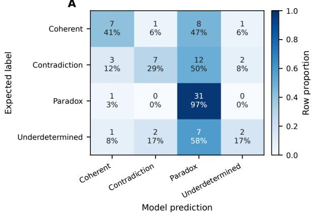
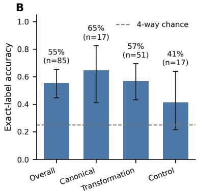
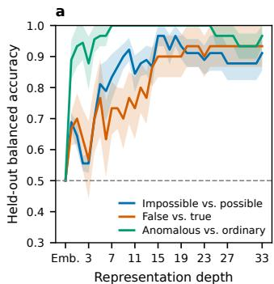
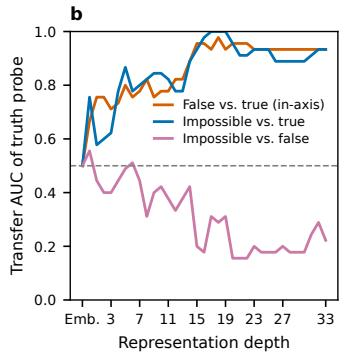
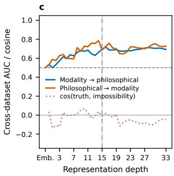

# Falsehood and Impossibility Are Diferent Directions in an AI’s Representation of Language

Yoon Pyo Lee1\*

1\*Department of Nuclear, Plasma, and Radiological Engineering, University of Illinois Urbana-Champaign, Urbana, Illinois, USA.

Corresponding author(s). E-mail(s): yoonpyo2@illinois.edu;

## Abstract

Language can describe states of afairs that are false and states of afairs that could not be the case at all. Whether an AI model internally distinguishes these failures remains unclear. I report an exploratory activation study of the multimodal open-weight model Gemma 3 4B IT using 85 prompts from 17 philosophical families and a topic-matched modality set of 15 topics, each expressed as a truth, contingent falsehood, improbable claim, semantic anomaly, and necessary falsehood. In its answers, the model conflates contingent falsehood with contradiction, labeling 12 of 15 false statements “contradiction.” Its activations show a diferent pattern. A linear truth probe separates impossible from true statements (AUC 0.93) but not impossible from false statements (AUC 0.20). An impossibility probe evaluated on held-out topic families separates necessary from contingent falsehood at AUC 1.00, peaking at layer 15 with balanced accuracy 0.97 (Bonferroni-adjusted P = 0.018). The truth and impossibility directions are close to orthogonal, whereas the impossibility direction partially overlaps a semantic anomaly direction while remaining distinguishable from it. Sparse autoencoder features at the same layer repeat this geometry. Features selective for impossibility also fire on anomalous sentences but rarely on contingent falsehoods. In this model’s activation space, necessary falsehoods are not extreme cases of contingent falsehood but lie closer to the experimentally defined category of semantic anomaly. This representational proximity does not imply that impossible statements are intrinsically meaningless. These correlational observations from one small model ofer an empirical footnote to an old philosophical distinction.

Keywords: mechanistic interpretability, contradiction, impossibility, truth probing, sparse autoencoders, philosophy of language

## 1 Introduction

Language permits combinations that the world, a definition, or a system of rules does not. A speaker can say square circle, married bachelor, or this sentence is false without first constructing a corresponding object or consistent state of afairs. The expressions are not defective in a single way. Some directly violate a definition, some assert both a proposition and its negation, some generate self-referential paradoxes, and others are grammatical while remaining semantically anomalous. Aristotle’s formulation of the principle of non-contradiction gave one classical statement of the boundary. The same attribute cannot both belong and not belong to the same thing at the same time and in the same respect [1]. Much later, Wittgenstein placed the relation between proposition, possibility, and world at the center of the Tractatus [2]. Chomsky’s “colorless green ideas” demonstrated from a diferent direction that grammatical form can remain intact even when ordinary semantic composition becomes strained [3]. Such cases have remained philosophically attractive not merely as mistakes, but as boundary cases that expose where grammatical form, reference, truth conditions, and jointly satisfiable content come apart.

The question now also has practical stakes. Language model output can be fluent and persuasive even when its claims are false, unsupported, or internally inconsistent. In a preregistered experiment, participants could not reliably distinguish tweets generated by GPT-3 from those written by humans, while the model produced disinformation that participants found more compelling than disinformation produced by humans [4]. A separate controlled study found that personalized GPT-4 opponents were more persuasive than human opponents in structured online debates [5]. Falsehood, contradiction, and persuasion are not the same phenomenon. A false statement may be internally coherent, and an explicit contradiction need not be deceptive. Nevertheless, linguistic fluency can conceal failures of consistency from a reader. Whether a model internally registers such failures is therefore one part of understanding systems whose language can shape human belief.

These traditions do not supply a predefined ontology for a transformer. A multimodal model trained on text and images inherits through its linguistic data both our ability to formulate impossible situations and the patterns through which we discuss them. Yet a transformer processes token sequences through continuous states of high dimensionality [6]. It is not given an explicit inventory containing contradiction, paradox, or impossibility. This leaves a narrow empirical question between the philosophical, the computational, and the practical. When a model encounters language that cannot coherently be the case, what changes inside it before it judges and explains that language?

The question must be posed cautiously. Linear probes at each layer can test how readily labels are decoded from intermediate representations [7], but decodability is not identity, and a successful probe does not show that the model causally uses the decoded information [8, 9]. Surface form can produce impressive separability without revealing the computation of interest [10]. One relevant regularity is nevertheless well established. The truth value of ordinary factual statements is linearly decodable from the residual stream of models of moderate size [11, 12]. What has not been asked, to my knowledge, is whether impossibility is represented as anything other than an extreme point on that truth axis. A necessary falsehood is, after all, also false. A model could in principle treat “a married bachelor lives here” as merely a very confident case of “Paris is the capital of Germany.”

Here I treat philosophical contradictions and paradoxes as experimental stimuli rather than doctrines to be resolved, and I add a design that puts the question above directly to the model. Alongside 17 philosophical seed families, I construct a matched modality set organized around fifteen topics. Each is realized as a common truth, a contingent falsehood, an improbable but possible claim, a semantically anomalous sentence, and a necessarily false statement. I ask three descriptive questions. First, does the model’s verbal classification distinguish the merely false from the impossible? Second, is the internal direction that separates true from false the same direction that separates possible from impossible? Third, where does impossibility sit relative to semantic anomaly in probe geometry and in pretrained sparse autoencoder features [13–15]? The aim is deliberately modest. The experiment does not determine whether a model understands impossibility. It records whether the distinction between what is false and what could not be the case leaves a trace in one transformer with open weights.

## 2 Results

## 2.1 The model’s words conflate falsehood with contradiction

The philosophical set contained 85 prompts comprising 17 canonical cases, 51 transformations, and 17 coherent controls. The modality set contained 75 statements from 15 topic families and 5 conditions (Table 4). For every prompt, the model was asked to answer with exactly one of four labels (coherent, contradiction, paradox, or underdetermined) while residual stream states at the final prompt token were recorded before generation.

On the philosophical set, exact accuracy across the four labels was 55.3%, with a marked tendency to call heterogeneous cases paradoxes (58 of 85 prompts, Fig. 1). The modality set locates this rejection tendency more precisely (Table 1). The model labeled common truths coherent but gave 12 of 15 contingent falsehoods the label “contradiction.” Thus, “Paris is the capital of Germany” and “whales are fish” received the same verbal category as married bachelors. Its explanations used the same idiom, stating for example that a false statement about apples “contradicts established biological knowledge.” In the model’s verbal taxonomy, empirical falsehood and logical impossibility largely collapse into one category of rejection.

## 2.2 Truth and impossibility are nearly orthogonal directions

The activations tell a diferent story. At every depth I trained three regularized linear probes on the modality set while holding out whole topic families. These were an impossibility probe (impossible versus true, false, and improbable), a truth probe (false versus true), and an anomaly probe (anomalous versus the same three possible conditions). All three succeeded on their own contrasts (Fig. 2a). The truth probe peaked at 0.93 balanced accuracy, consistent with prior truth probing results [11, 12]. The impossibility probe peaked at 0.97 at depth 16, corresponding to transformer layer 15 (permutation restricted by family $P = 0 . 0 0 0 5$ , Bonferroni over 35 depths $P = 0 . 0 1 8 )$

Table 1 Verbal classification of the modality set $( n = 1 5$ per condition). Rows are the designed conditions, and columns are the model’s chosen labels.
<table><tr><td>Condition</td><td>Coherent</td><td>Contradiction</td><td>Paradox</td><td>Underdetermined</td></tr><tr><td>True</td><td>14</td><td>1</td><td>0</td><td>0</td></tr><tr><td>False (contingent)</td><td>1</td><td>12</td><td>0</td><td>2</td></tr><tr><td>Improbable</td><td>4</td><td>6</td><td>1</td><td>4</td></tr><tr><td>Anomalous</td><td>2</td><td>0</td><td>11</td><td>2</td></tr><tr><td>Impossible (necessary)</td><td>0</td><td>5</td><td>9</td><td>1</td></tr></table>

A  

  
Fig. 1 Behavioral classification of the philosophical stimuli. a, Confusion matrix normalized by row for Gemma 3 4B IT on 85 philosophical prompts. b, Exact accuracy across the four labels overall and by stimulus form, with Wilson 95% confidence intervals shown as error bars. The model achieved 55.3% overall accuracy and used paradox as a broad rejection label.

The decisive question is what each probe’s direction says about the other contrasts (Fig. 2b and Table 2). The pattern is a double dissociation. The truth probe orders impossible statements against true ones almost perfectly, confirming that necessary falsehoods do register as non-true. Yet it is at or below chance on impossible versus false. Along the direction that separates truth from falsehood, “a married bachelor lives in the village” and “Paris is the capital of Germany” are the same kind of thing. The impossibility probe separates them nearly perfectly, against a strongest surface baseline of 0.77 (character TF–IDF), while carrying no information about true versus false. The two directions fitted on the full data are correspondingly close to orthogonal throughout the network. Their absolute cosine is at most 0.12 at every depth beyond 10 (Fig. 2c). Whatever the model tracks when it distinguishes the impossible from the false, it is not the property it tracks when it distinguishes the false from the true.

The impossibility direction also generalized partially beyond its own dataset. Trained on the modality set and applied unchanged to the 85 philosophical prompts, it separated the expected coherent controls from the canonical and transformed targets at AUC up to 0.72. The reverse transfer reached 0.79 (Fig. 2c). The signal found in minimal sentences matched by topic is therefore related to, but not identical with, whatever separates coherent from incoherent stimuli in the more heterogeneous philosophical families. These families include paradoxes and underdetermined puzzles rather than plain necessary falsehoods.

Table 2 Double dissociation of the truth and impossibility directions. Each probe was trained only on its own contrast in the training families and applied unchanged to every contrast in the held-out families (AUC at depth 16, the impossibility peak). The truth direction cannot see the diference between the impossible and the false. The impossibility and anomaly directions cannot see the diference between the false and the true.
<table><tr><td>Probe direction</td><td>False vs. true</td><td>Impossible vs. true</td><td>Impossible vs. false</td></tr><tr><td>Truth</td><td>0.96</td><td>0.93</td><td>0.20</td></tr><tr><td>Impossibility</td><td>0.51</td><td>0.98</td><td>1.00</td></tr><tr><td>Anomaly</td><td>0.49</td><td>0.98</td><td>0.96</td></tr></table>

  
Fig. 2 Probe geometry of truth, anomaly, and impossibility. a, Balanced accuracy of linear probes evaluated on held-out families for impossible vs. possible, false vs. true, and anomalous vs. ordinary statements at every depth. Shading shows the standard error across folds. $\mathbf { b } ,$ Transfer of the truth probe to held-out contrasts. The probe separates false from true and impossible from true, but is at or below chance on impossible vs. false. Impossibility is invisible along the truth direction. c, Cross-dataset transfer of the impossibility probe between the modality and philosophical sets, and the cosine between the truth and impossibility directions, shown as a dotted line near zero throughout. The vertical line marks layer 15, used for the sparse autoencoder analysis.

## 2.3 Necessary falsehoods lie nearer semantic anomaly than contingent falsehoods

If necessary falsehoods are not merely extreme contingent falsehoods, what is their nearest representational neighbor in this model? Table 2 already contains half of the answer. The anomaly direction, trained only to recognize Chomsky-style selectional violations, separates the impossible from the false at AUC 0.96. Semantic anomaly itself is decodable very early, by depth 8, as expected for a property with strong lexical signatures. The anomaly direction has a cosine of around 0.4 with the impossibility direction in the middle layers, where the truth direction is orthogonal. The two nevertheless remain distinguishable. The impossibility probe separates impossible from anomalous statements at AUC up to 0.89. In this activation space, the necessary falsehood stimuli sit closer to the operational category represented by “colorless green ideas” than to ordinary false statements, without collapsing into that category. This is a claim about representational similarity in the model, not about the intrinsic meaningfulness of necessary falsehoods.

Table 3 Firing prevalence (fraction of prompts with nonzero activation) of the two SAE features most selective for impossibility at layer 15 (16k dictionary, checkpoint with greater capacity). “Phil. incoherent” denotes the canonical and transformed stimuli of the philosophical set.
<table><tr><td>Feature</td><td>True</td><td>False</td><td>Improbable</td><td>Anomalous</td><td>Impossible</td><td>Phil. incoherent</td></tr><tr><td>14761</td><td>0.13</td><td>0.07</td><td>0.07</td><td>0.40</td><td>0.67</td><td>0.40</td></tr><tr><td>9201</td><td>0.67</td><td>0.80</td><td>0.47</td><td>0.67</td><td>1.00</td><td>0.88</td></tr></table>

A pretrained Gemma Scope 2 sparse autoencoder at layer 15 [16], the impossibility probe’s peak, gives a complementary description. In the sparser checkpoint, with about 16 active features per prompt, no individual feature separated impossible from false statements. In the checkpoint with greater capacity, with about 90 active features per prompt, a few candidates emerged, and their firing profiles repeat the probe geometry. The features that prefer the impossible also fire on the anomalous and on the incoherent philosophical stimuli, but rarely on the merely false (Table 3). These are correlational candidates derived from the same sample. The direction that carries impossibility appears to be real but distributed, rather than the activation of a single “impossibility neuron” at this dictionary size.

## 3 Discussion

## 3.1 What the dissociation does and does not show

The central observation is a dissociation between the model’s language and its states. Verbally, Gemma 3 4B collapses contingent falsehood into “contradiction.” Its explanations treat disagreement with the world and disagreement with logic as one kind of fault. Internally, the two are carried by nearly orthogonal directions, and the separation of necessary from contingent falsehood survives holding out whole topic families, with surface baselines well below it. The model’s words blur the distinction between contingent falsehood and contradiction that motivates the present comparison. Its residual stream, to a first approximation, preserves that distinction.

I do not claim that this direction is a concept of impossibility. Linear decodability establishes accessibility, not use [8, 9]. Nothing here shows that the model consults this direction when it answers. The stimuli are in English, use a single template, and are few in number. The varied impossibility construction types are human choices. The TF–IDF baselines of 0.67–0.77 are above chance, so surface form explains part of the separability, though visibly not all of it. The cross-dataset transfer of 0.7–0.8 likewise shows shared structure, not a single unified signal spanning plain necessary falsehoods and self-referential paradoxes.

What can be said is narrower and, I think, still interesting. In standard modal logic, a necessary falsehood is a proposition that is false in every possible world. It need not be meaningless. An explicit contradiction can be a meaningful, well-formed formula even though it is false in every possible world. The present stimulus category is operational. Some items depend on ordinary definitions or background constraints rather than on contradiction in pure formal logic. The present result therefore concerns representational similarity rather than the metaphysical nature of impossibility. First, necessary falsehoods in this model are not represented as the far end of contingent falsehood. If they were, the truth probe would order impossible against false statements, and it does not. Second, the impossibility direction leans toward the direction of semantic anomaly while remaining distinguishable from it. The model groups “taller than itself” with “colorless green ideas” rather than with “capital of Germany.” Operationally, the necessary falsehood stimuli lie closer to the experimentally defined category of semantic anomaly than to ordinary false statements. This does not show that the impossible is intrinsically meaningless.

## 3.2 A remark on sense and truth

Wittgenstein’s early picture ties the sense of a proposition to a possible configuration of objects, and its truth to whether that configuration obtains [2]. A false proposition depicts a possible state of afairs that does not obtain. Tautologies and contradictions are diferent limiting cases. In the terminology of the Tractatus, they are senseless (sinnlos) because they depict no possible state of afairs, but they are explicitly not nonsensical (unsinnig) because they remain part of the symbolism. This Tractarian distinction should not be identified with the operational category of semantic anomaly used in the present experiment, and the geometry reported here does not reproduce Wittgenstein’s taxonomy of sense, senselessness, and nonsense. Still, these directions were recovered by statistical learning from human-produced data, by a system with no access at inference time to the states of afairs the sentences describe. The contrast between disagreement with the actual and exclusion from the possible therefore appears to be marked in human language use itself, strongly enough for a learner to separate the two from the data alone. Whether the model uses the observed distinction, and whether larger models sharpen or dissolve it, are questions this study leaves open.

## 3.3 What this study could not yet ask

The five categories used here (true, false, improbable, anomalous, and impossible) are human categories, and nothing obliges a model to organize language by our standards. Where the model’s organization diverged from ours, the divergence itself was the finding. The model folds empirical falsehood into “contradiction” when it speaks, while its activations place the necessary falsehood stimuli closer to the operational category of semantic anomaly than to contingent falsehood. Taken seriously, this suggests a use of such systems that runs opposite to the usual direction of evaluation. Instead of asking how faithfully a model reproduces our distinctions, one can ask what distinctions the model itself draws, and whether any of them mark joints in language and logic that our own vocabulary has not named. A multimodal artificial reader trained on humanproduced text and images may notice regularities that we, who also live among the things the sentences are about, have had no reason to isolate.

This study did not go that deep, and could not have. Fifteen topic families, one template, one small model, and probes that establish correlation rather than use are enough to show that two human categories come apart in one activation space. They are not enough to map the model’s own geography of sense, and the questions and sentence patterns prepared here were far too few to exhaust it. I hope future work makes the genuine comparison possible. This would not be a benchmark of AI against human logic, but a description of the two logics side by side. It should be detailed enough to compare the model’s way of dividing the sayable from the unsayable with our own and to let us learn something about language from the comparison [10, 17].

## 4 Methods

## 4.1 Stimuli

Philosophical set. Seventeen seed cases from familiar logical, philosophical, and linguistic examples (direct contradictions, definitional impossibilities, liar-style and set-theoretic paradoxes, sorites, identity puzzles, semantic anomaly). Each family contains one canonical statement, three surface transformations, and one nearby coherent control, giving 85 prompts with expected labels coherent (17), contradiction (24), paradox (32), and underdetermined (12).

Modality set. Fifteen topic families covering geography, physics, biology, arithmetic of everyday objects, kinship, and institutions were each realized in five conditions. The conditions were common truth, contingent falsehood, improbable but possible claim, semantically anomalous sentence, and necessary falsehood (Table 4). Here necessary falsehood is an operational label for a proposition designed to be false under every admissible interpretation that preserves the ordinary meanings and background constraints invoked by the item. This does not amount to claiming that every item is a contradiction of pure formal logic, nor does the label imply that the proposition is meaningless. All five conditions of a family share topic vocabulary. Necessary falsehoods deliberately vary in construction. They include reflexive comparison (“taller than itself”), temporal reversal (“arrived before it departed”), part–whole counting (“more apples than pieces of fruit”), definitional violation (“married bachelor,” “foursided triangle”), kinship circularity (“her own biological grandmother”), and explicit conjunction of a proposition with its negation. Thus, no single lexical template identifies the class. The anomalous condition is a separate operational category consisting of Chomsky-style selectional violations with varied vocabulary. It is not intended as an implementation of Wittgensteinian nonsense. Expected four-way labels were assigned as coherent for true, false, and improbable conditions, underdetermined for anomalous, and contradiction for impossible.

Table 4 The five modality conditions, illustrated by one topic family.
<table><tr><td>Condition</td><td>Statement</td></tr><tr><td>True</td><td>Mount Everest is the tallest mountain on Earth.</td></tr><tr><td>False (contingent)</td><td>Mount Everest is located in the Alps.</td></tr><tr><td>Improbable</td><td>An eighty-year-old climber reached the summit of Everest twice in one season.</td></tr><tr><td>Anomalous</td><td>Everest rehearses its patient snow in green syllables.</td></tr><tr><td>Impossible (necessary)</td><td>Mount Everest is taller than Mount Everest.</td></tr></table>

## 4.2 Model inference and activation extraction

All 160 prompts were run in a single session with the multimodal, instruction-tuned google/gemma-3-4b-it checkpoint [18] (34 transformer layers, residual width 2,560), loaded from local safetensors in bfloat16 on the PyTorch MPS backend. Although the checkpoint accepts text and image inputs, only text was used in this study. Each statement was embedded in a fixed instruction asking the model to classify it using exactly one of the labels coherent, contradiction, paradox, or underdetermined, then explain the classification in one sentence. Generation was greedy with at most 48 new tokens. For every prompt, the residual stream state at the final prompt token, immediately before the first generated token, was retained from the embedding output and every transformer layer (160 × 35 × 2560, float16). Depth d in figures denotes hidden state index d. Transformer layer ℓ corresponds to depth ℓ + 1. A repeated extraction of the philosophical subset reproduced all 85 predicted labels exactly.

## 4.3 Probes, transfer, and geometry

Every probe was an L2-regularized logistic regression (C = 0.1, class-balanced weights, fixed seed) on feature-standardized states. It was evaluated with five-fold crossvalidation grouped by family, so that all five conditions of a topic (or all five variants of a philosophical seed) were held out together. The axes were impossibility (impossible vs. true+false+improbable), truth (false vs. true), and anomaly (anomalous vs. true+false+improbable). Performance on the training axis is reported as mean balanced accuracy across folds. Transfer was measured within the same folds. A probe fitted on its own axis in the training families was applied unchanged to a diferent contrast restricted to the held-out families and scored by AUC of its decision values. Cross-dataset transfer trained on one full stimulus set and tested on the other, whose stimuli were disjoint by construction. Direction cosines used probes fitted on the full modality set at each depth. At the observed impossibility peak, labels were permuted 1,999 times within each family while preserving one impossible example per family. The full grouped cross-validation was recomputed for each permutation, and the resulting P was Bonferroni-corrected for 35 depths. Surface baselines used the same grouped folds and included input token count, word 1–2-gram TF–IDF, and character 3–5-gram TF–IDF fitted within each training fold.

## 4.4 Sparse-autoencoder analysis

Layer 15 residual states were encoded with the oficial Gemma Scope 2 residual stream JumpReLU SAEs for Gemma 3 4B IT [16]. The checkpoints were layer 15 width 16k l0 small, with a mean of 16.2 active features per prompt on these data, and layer 15 width 16k l0 big, with a mean of 90.5. For each contrast, features were ranked by the standardized diference of mean log(1 + z) activation, with firing prevalence reported per condition. Feature selection and description use the same 160 prompts. No independent corpus was used, and no inferential statistics are attached to individual features.

## 4.5 Software and reproducibility

Python 3.11, PyTorch 2.13.0, Transformers 5.14.1, NumPy 2.4.6, scikit-learn 1.9.0, Matplotlib 3.11.1, SAELens 6.47.1. Stimuli, extraction and analysis code, run configurations, and figure data are retained with the project. No language-model weights were modified.

Data availability. The complete stimulus JSON files (philosophical and modality sets), model responses, expected labels, and derived probe statistics are available in the public code repository at https://github.com/sixticket/representing-the-impossible. Model weights and SAE weights are available from their respective Hugging Face repositories.

Code availability. All scripts required to reproduce activation extraction, probing, SAE encoding, and figures are available at https://github.com/sixticket/ representing-the-impossible.

Acknowledgements. This work was conducted as an independent exploratory project, unafiliated with and unfunded by any research program.

Author contributions. The author conceived the study, constructed the stimuli, implemented and ran the analyses, interpreted the results, and wrote the manuscript.

Competing interests. The author declares no competing interests.

## References

[1] Aristotle. The Complete Works of Aristotle: The Revised Oxford Translation Vol. 2 (Princeton University Press, Princeton, 1984). Edited by Jonathan Barnes; Metaphysics, Book IV, 1005b19–20.

[2] Wittgenstein, L. Tractatus Logico-Philosophicus (Kegan Paul, Trench, Trubner & Co., London, 1922).

[3] Chomsky, N. Syntactic Structures (Mouton, The Hague, 1957).

[4] Spitale, G., Biller-Andorno, N. & Germani, F. AI model GPT-3 (dis)informs us better than humans. Science Advances 9, eadh1850 (2023).

[5] Salvi, F., Ribeiro, M. H., Gallotti, R. & West, R. On the conversational persuasiveness of GPT-4. Nature Human Behaviour 9, 1645–1653 (2025).

[6] Vaswani, A. et al. Attention is all you need. Advances in Neural Information Processing Systems 30, 5998–6008 (2017).

[7] Alain, G. & Bengio, Y. Understanding intermediate layers using linear classifier probes. arXiv preprint arXiv:1610.01644 (2016).

[8] Hewitt, J. & Liang, P. Designing and interpreting probes with control tasks. Proceedings of EMNLP-IJCNLP 2733–2743 (2019).

[9] Belinkov, Y. Probing classifiers: Promises, shortcomings, and advances. Computational Linguistics 48, 207–219 (2022).

[10] Sahoo, S., Jain, V., Chadha, A. & Chaudhary, D. Linear probes detect task format, not reasoning mode in language model hidden states. arXiv preprint arXiv:2606.02907 (2026).

[11] Azaria, A. & Mitchell, T. The internal state of an LLM knows when it’s lying. Findings of the Association for Computational Linguistics: EMNLP 2023 967– 976 (2023).

[12] Marks, S. & Tegmark, M. The geometry of truth: Emergent linear structure in large language model representations of true/false datasets. First Conference on Language Modeling (COLM) (2024).

[13] Elhage, N. et al. Toy models of superposition. arXiv preprint arXiv:2209.10652 (2022).

[14] Cunningham, H., Ewart, A., Riggs, L., Huben, R. & Sharkey, L. Sparse autoencoders find highly interpretable features in language models. arXiv preprint arXiv:2309.08600 (2023).

[15] Lieberum, T. et al. Gemma scope: Open sparse autoencoders everywhere all at once on gemma 2. arXiv preprint arXiv:2408.05147 (2024).

[16] McDougall, C. et al. Gemma Scope 2—technical paper. Tech. Rep., Google Deep-Mind (2025). URL https://deepmind.google/models/gemma/gemma-scope/.

[17] Ma, G., Liang, Z., Chen, I. Y. & Sojoudi, S. Do sparse autoencoders identify reasoning features in language models? arXiv preprint arXiv:2601.05679 (2026).

[18] Gemma Team. Gemma 3 technical report. arXiv preprint arXiv:2503.19786 (2025).