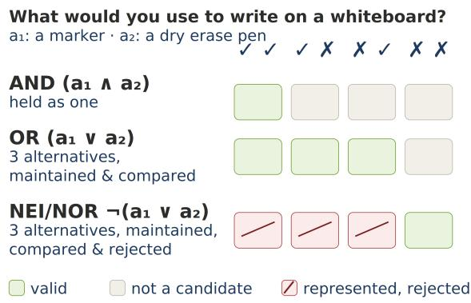
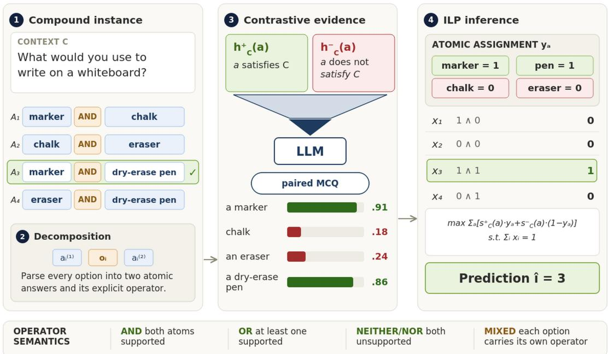
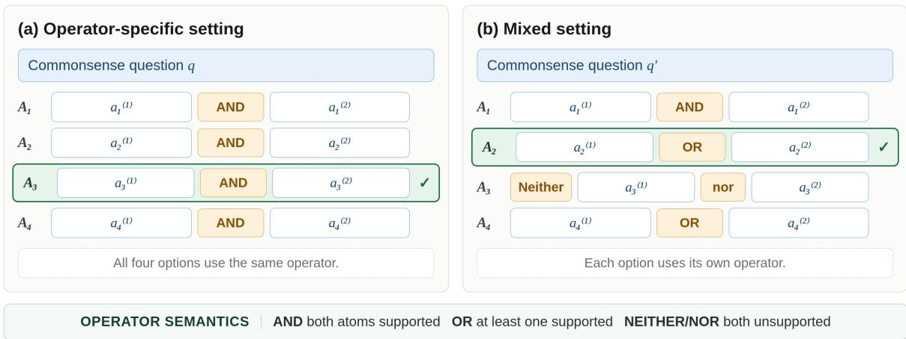
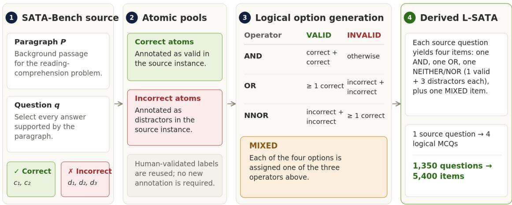
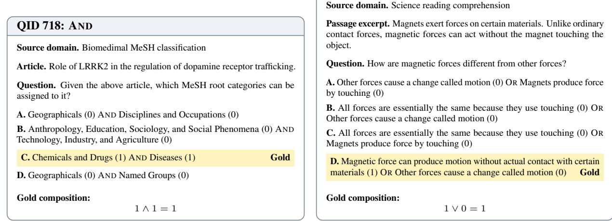
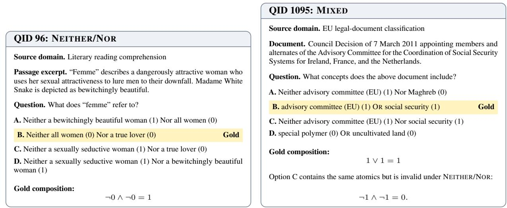

# From Atomic Evidence to Logical Composition: Structured Compositional Reasoning over Compound Answer Options

Obed Junias University of Colorado Boulder obed.junias@colorado.edu

Maria Leonor Pacheco University of Colorado Boulder maria.pacheco@colorado.edu

## Abstract

Large language models often fail when answer options require combining atomic judgments under explicit logical operators, even when they judge the individual atoms correctly. We study compound options connected by AND, OR, and NEITHER/NOR, introducing a framework that decomposes each option into atomic answers and scores contrastive hypotheses about each one, so the model never sees a compound option. An operator-constrained integer linear program then composes the calibrated scores into a single prediction. We evaluate on LOGICAL-COMMONSENSEQA and introduce LOGICAL-SATA, a readingcomprehension benchmark derived from SATA-Bench. Our framework improves Macro-F1 from 48.3 to 77.0 on the humanvalidated LOGICAL-COMMONSENSEQA split and from 47.0 to 75.6 on LOGICAL-SATA, with the largest gains on NEITHER/NOR.

## 1 Introduction

Large language models (LLMs) perform well across a wide range of tasks (Brown et al., 2020; Ouyang et al., 2022), but systematic evaluations reveal persistent weaknesses in their logical reasoning (Parmar et al., 2024). These failures are not uniform across logical operators. For example, Junias and Pacheco (2026) evaluate composition over compound answer options and report a graded pattern, with performance strongest on conjunction, weaker on disjunction, and collapsing on negated compositions. That the difficulty tracks the operator rather than the content suggests it stems from the way logical possibilities are represented and combined, not from missing knowledge.

As illustrated in Figure 1, mental-model theories predict exactly this ordering in humans. They propose that people reason by constructing representations of situations compatible with a logical expression rather than applying formal proof rules (Johnson-Laird et al., 1992), so difficulty depends on the number and structure of the possibilities that must be maintained (Klauer, 1997; Meiser et al., 2001; Neys, 2006; DeWall et al., 2008). A conjunction (A ∧ B) can often be held single joint possibility, whereas a disjunction (A ∨ B) requires the alternatives to be maintained and compared (García-Madruga et al., 2001). Negation increases difficulty, as the reasoner must represent the original proposition while tracking that it is rejected (Macbeth et al., 2014; Khemlani et al., 2014). NEI-THER/NOR is the extreme case, combining both demands. These studies do not imply that LLMs reason as humans do, but models show the same signature, degrading on disjunctive compositions (Khalid et al., 2025; Hoveyda et al., 2026; Junias and Pacheco, 2026) and failing to revise affirmative predictions once a proposition is negated (García-Ferrero et al., 2023; Kassner and Schütze, 2020; Ravichander et al., 2022; She et al., 2023).

  
Figure 1: Mental-model representation of the possibilities associated with AND, OR, and NEITHER/NOR.

Composition is therefore a distinct burden, not a byproduct of comprehension. Standard prompting, however, fuses the two, as the model must assess each atomic proposition and combine them under the operator in a single pass. This produces a compositionality gap, where a model solves the component subproblems correctly yet fails to combine them (Press et al., 2023). It also leaves no way to diagnose which step broke down, and it cannot enforce the composition, since a model asked to satisfy hard constraints in free generation can silently violate them.

A common response to this gap is to make intermediate structure explicit, through chain-ofthought and decomposed prompting, entailment trees, or contrastive judgments over opposing candidates (Wei et al., 2022; Khot et al., 2023; Dalvi et al., 2021; Liusie et al., 2024). These produce richer intermediate evidence, but the combination step remains an unconstrained generation. Neurosymbolic approaches instead delegate inference to an external solver, first translating the natural language problem into a formal representation (Pan et al., 2023; Olausson et al., 2023; Ye et al., 2023). This enforces the composition, but shifts the burden onto auto-formalization, and the solver is only as reliable as the translation it receives. In this paper, we study compound answer reasoning as a setting for isolating logical composition. This requires no translation, as the logical structure is already explicit in the answer options. What remains is to produce reliable intermediate evidence, as in the decomposition methods above, and to combine it under constraints that cannot be violated.

We present a framework that does this, decomposing each option into its atomic answers, eliciting contrastive evidence for each, and composing that evidence under the constraints imposed by the operators. For every unique atomic answer, we construct paired positive and negative hypotheses stating that the answer is supported or not supported by the context. Atoms shared across options are scored once, so a proposition receives a single judgment wherever it appears. The LLM scores both hypotheses, and their contrast forms the evidence for that answer, so the model is never asked to judge a compound option as a whole. The resulting scores are calibrated and passed to an operator-constrained integer linear program (ILP), which jointly infers the assignment of each atomic answer and selects exactly one compound option. Figure 2 provides an overview of the proposed framework.

To evaluate our framework, we use two benchmarks containing compound answer options connected by AND, OR, and NEI-THER/NOR: LOGICAL-COMMONSENSEQA (Junias and Pacheco, 2026), a commonsense reasoning benchmark, and LOGICAL-SATA, a reading comprehension benchmark which we construct from SATA-Bench (Xu et al., 2025). The two require different kinds of atomic evidence, and we improve substantially on both, most sharply on the operator our account identifies as hardest: on NEI-THER/NOR, macro-F1 rises from 14.0 to 76.8 on LOGICAL-COMMONSENSEQA and from 12.6 to 73.4 on LOGICAL-SATA.

In sum, we contribute: (1) a structured framework that elicits contrastive evidence for individual atomic answers and combines them through operator-constrained ILP inference; (2) a relative calibration method, which scores each atom by both its confidence and its standing among the other atoms; (3) LOGICAL-SATA, a new readingcomprehension benchmark for compound answer reasoning; (4) an evaluation across two distinct benchmarks, showing the largest gains on the operators that degrade most under standard prompting.

The datasets1 and code2 are publicly available.

## 2 Related Work

Logical and Compositional Reasoning with LLMs Logical-reasoning benchmarks such as ProofWriter (Tafjord et al., 2021), LogicNLI (Tian et al., 2021), FOLIO (Han et al., 2024), ReClor (Yu et al., 2020), and LogiQA (Liu et al., 2020) assess whether models can derive valid conclusions given facts, rules, premises, or constraints. Other datasets, including ConjNLI (Saha et al., 2020), CONDAQA(Ravichander et al., 2022), SCoNE (She et al., 2023), and the NOT benchmark (García-Ferrero et al., 2023) isolate logical phenomena such as conjunction, disjunction and negation. These evaluations show that logical performance remains sensitive to inference structure, linguistic formulation, and negation (Parmar et al., 2024).

One strategy to address this is to decompose reasoning into intermediate steps, making them explicit or dividing a complex problem into simpler subproblems (Wei et al., 2022; Zhou et al., 2022; Khot et al., 2023). EntailmentBank organizes explanations as trees of multi-premise entailment steps (Dalvi et al., 2021), and DecompNLI provides a systematic framework for evaluating the validity of decomposed textual inferences (Weir et al., 2024).

Multi- and Compound-Answer Benchmarks Most multiple-choice reasoning benchmarks require selecting a single correct answer type and score each candidate as a whole (Talmor et al., 2019; Bisk et al., 2019; Sap et al., 2019; Clark et al., 2018; Hendrycks et al., 2020). Consequently, they do not test whether a model can evaluate several atomic answers and combine them under an explicit logical operator.

  
Figure 2: Overview of the proposed framework. Each compound answer option is decomposed into two atomic answers and its explicit operator. The LLM scores local evidence for each atom, and an operator-constrained ILP combines these scores to select exactly one answer option under the corresponding operator semantics.

Multi-answer question-answering benchmarks relax the assumption that each question has only one correct response. MultiRC evaluates reading comprehension questions for which several candidate answers may be correct, while RoMQA requires models to recover multiple valid answers supported by evidence distributed across passages (Khashabi et al., 2018; Zhong et al., 2023). SATA-Bench more directly studies the select-all-thatapply format across several domains, where each option is evaluated independently and the model must identify the complete set of correct choices (Xu et al., 2025). These benchmarks evaluate multianswer selection, but they do not place explicit boolean operators within the candidate answers.

LOGICAL-COMMONSENSEQA instead places explicit boolean operators within the candidate answers (Junias and Pacheco, 2026). We extend the same operator-based structure to paragraph-based reading comprehension through LOGICAL-SATA, which constructs compound options from the independently annotated answers in SATA-Bench. Its construction is described in Section 4.

Confidence Elicitation and Contrastive Judgments Structured inference requires local scores that represent the model’s evidence for each atomic decision. Prior work obtains such scores from token probabilities, true–false self-assessment, repeated generation, or verbalized confidence (Jiang et al., 2021; Kadavath et al., 2022; Tian et al., 2023; Pauk and Pacheco, 2026). These approaches differ in whether they require access to model probabilities and in how closely their reported confidence corresponds to empirical correctness.

Other work studies comparative and contrastive judgments, where models evaluate competing candidates or opposing interpretations rather than assigning an isolated score to one statement. Such comparisons have shown advantages over pointwise evaluation in some natural-language evaluation and question-answering settings (Fortier-Dubois and Rosati, 2023; Liusie et al., 2024; Yao and Yang, 2026). This line of work motivates eliciting separate evidence for positive and negative interpretations of an atomic answer before combining those judgments through structured inference.

Neuro-Symbolic Methods and Structured Inference Neuro-symbolic methods increasingly use LLMs to translate NLP problems into formal representations processed by deterministic solvers (Pan et al., 2023; Ye et al., 2023; Olausson et al., 2023).

Earlier work combines uncertain model predictions under symbolic constraints. DRaiL provides a general framework for integrating neural scorers with relational rules and global inference (Zhang et al., 2016; Pacheco and Goldwasser, 2021). Particularly relevant to question answering, Pujari and Goldwasser (2019) combine per-option machinecomprehension scores with NLI-based relations between answer choices and use ILP inference to obtain consistent predictions. Other approaches use satisfiability-based inference to reconcile model beliefs, answer compatibility relations, or generated explanations (Kassner et al., 2021; Mitchell et al., 2022; Jung et al., 2022).

More recent work combines prompted local predictions with combinatorial inference and studies confidence elicitation, calibration, and structured learning in this setting (Mehta et al., 2024; Pauk and Pacheco, 2026). Our framework is closer to this line of work than to full-problem autoformalization: the context and atomic answers remain in natural language, while the explicitly provided boolean operators determine how the local evidence is composed.

## 3 Framework Overview

In this section, we present a framework for compound answer reasoning in which an LLM supplies local atomic evidence and a structured inference layer performs the logical composition. We parse each option into its atomic answers and operator (Sec. 3.2), elicit and calibrate evidence for each atomic answer in isolation (Sec. 3.3–Sec. 3.5), and defer composition to an integer linear program that combines this evidence under the operator semantics (Sec. 3.6) Fig. 2 gives an overview.

## 3.1 Task Formulation

Each instance consists of a context $C = ( P , q )$ where $q$ is a question and P is an optional paragraph needed to answer it, together with four candidate answer options $\mathcal { A } = \{ A _ { 1 } , A _ { 2 } , A _ { 3 } , A _ { 4 } \}$ . Unlike standard multiple choice, each option is compound. That is, it contains two atomic answers joined by an explicit boolean operator,

$$
\begin{array} { c } { { A _ { i } = a _ { i } ^ { ( 1 ) } \circ _ { i } a _ { i } ^ { ( 2 ) } , } } \\ { { \circ _ { i } \in \{ \mathrm { A N D } , \mathrm { O R } , \mathrm { N E I T H E R } / \mathrm { N O R } \} . } } \end{array}
$$

For the question What would you use to write on a whiteboard?, one option might be a marker AND chalk and another a marker AND a dry-erase pen. Both contain the atomic answer a marker, but only the second is valid. Validity therefore depends on two separable things: whether each atomic answer holds in the context, and how the operator combines them. Let $\phi _ { \circ } : \{ 0 , 1 \} ^ { 2 }  \{ 0 , 1 \}$ denote the composition rule for operator ◦, applied to the statuses of two atomic answers:

$$
\phi _ { \circ } ( \rho _ { 1 } , \rho _ { 2 } ) = \left\{ \begin{array} { l l } { \rho _ { 1 } \wedge \rho _ { 2 } , } & { \circ = \mathrm { A N D } } \\ { \rho _ { 1 } \vee \rho _ { 2 } , } & { \circ = \mathrm { O R } } \\ { \neg \rho _ { 1 } \wedge \neg \rho _ { 2 } , } & { \circ = \mathrm { N E I T H E R } / \mathrm { N O R } . } \end{array} \right.
$$

That is, AND requires both atoms to hold, OR requires at least one, and NEITHER/NOR requires that neither does. In the example, a marker and a dry-erase pen both hold while chalk does not, so $\phi _ { \mathrm { A N D } }$ returns $1 \wedge 0 = 0$ for the first option and $1 \wedge 1 = 1$ for the second.

Every instance is constructed so that exactly one option is valid under the gold statuses of its atoms. This is what makes the task diagnostic, as a model cannot succeed by scoring options independently, since the correct answer is determined jointly by the atomic statuses and the operators applied to them. The task is to predict the index $i ^ { * }$ of that option. Written this way, the atomic statuses carry the content of the task and $\phi _ { \circ }$ carries its logic.

## 3.2 Option Decomposition

We deterministically parse each option into the triplet $A _ { i } = ( a _ { i } ^ { ( 1 ) } , \circ _ { i } , \bar { a } _ { i } ^ { ( 2 ) } )$ and collect the atomic answers appearing anywhere in the instance:

$$
\mathcal { U } _ { C } = \bigcup _ { i = 1 } ^ { 4 } \Big \{ a _ { i } ^ { ( 1 ) } , a _ { i } ^ { ( 2 ) } \Big \} .
$$

Because $\mathcal { U } _ { C }$ collects atomic answers rather than options, an atom occurring in several options appears in it once. In our running example, a marker contributes a single element even though it occurs in two options, and any status later assigned to it applies to both. The elements of $\mathcal { U } _ { C }$ , not the compound options, are the units the rest of this sections operates on.

## 3.3 Contrastive Hypothesis Construction

To supply evidence about the status of an atomic answer $a \in \mathcal { U } _ { C }$ , we construct a pair of opposing natural language hypotheses conditioned on C:

h+C(a) : a satisfies context C,

h−C (a) : a does not satisfy context C.

For the whiteboard example, the pair for chalk asserts that chalk is, and is not, something you would use to write on a whiteboard.

Eliciting evidence for both members of the pair makes the result a comparison between two readings of the same atom. Prior work on comparative and contrastive evaluation finds such judgments more reliable (Liusie et al., 2024). At this stage, we do not determine which element in the pair is correct. We only produce the opposing statements that will be evaluated in the next steps.

## 3.4 Confidence Elicitation

Next, we estimate the model’s local evidence for the two hypotheses associated with each atomic answer. Following prior work on prompt-based structured prediction (Pauk and Pacheco, 2026), we present $h _ { C } ^ { + } ( a )$ and $h _ { C } ^ { - } ( a )$ as choices A and B within a single prompt and ask the model which is more plausible. Let $\ell _ { C } ^ { + } ( a )$ and $\ell _ { C } ^ { - } ( a )$ denote the log probabilities of the first answer tokens corresponding to the two choices. The raw evidence scores are their normalization over the two alternatives:

$$
s _ { C , \mathrm { r a w } } ^ { \pm } ( a ) = \frac { \exp \bigl ( \ell _ { C } ^ { \pm } ( a ) \bigr ) } { \exp \bigl ( \ell _ { C } ^ { + } ( a ) \bigr ) + \exp \bigl ( \ell _ { C } ^ { - } ( a ) \bigr ) }\tag{1}
$$

The two scores lie in [0, 1] and sum to one, so either determines the other. Because both hypotheses appear in the same prompt, the resulting score is a comparison between two readings of a rather than an isolated judgment about one of them. These are the model’s local evidence for $^ { a , }$ obtained before any logical constraint is applied.

We also evaluated three alternatives, which differ only in how support for the two hypotheses is obtained: independent true–false scoring, generation sampling, and verbalized confidence. Paired multiple choice provides the strongest evidence on our experiments (Sec. 5.1). We describe the alternatives in Appendix C.

## 3.5 Score Calibration

Equation 1 gives the model’s relative preference between the two hypotheses, not the probability that a is correct. Since these scores are later combined across the atomic answers of an instance, they need to be comparable to one another, and a raw preference of 0.9 need not carry the same weight for one atom as for another. We therefore calibrate them against the gold atomic status. Because the positive and negative scores sum to one, calibrating the positive score determines the negative one, $s _ { C , \mathrm { c a l } } ^ { - } ( a ) = 1 - s _ { C , \mathrm { c a l } } ^ { + } ( a )$ . All calibrators are fit on atomic examples from the training set.

We evaluate two standard post-hoc calibration methods. Platt scaling fits a logistic transformation of the raw positive score to the gold atomic label (Platt, 1999). Isotonic calibration instead fits a non-decreasing non-parametric mapping, without assuming a sigmoid relationship between the score and correctness (Zadrozny and Elkan, 2002).

Relative Calibration Platt scaling and isotonic calibration adjust each atomic score based only on its absolute value. However, exactly one option in an instance is valid, so which atoms are selected depends on how they stand relative to the others present. Two atoms scored 0.91 and 0.86 support different conclusions depending on whether the remaining atoms sit near 0.9 or near 0.2, and an independent mapping cannot distinguish these cases. We therefore introduce relative calibration, which supplies both a score’s magnitude and its standing within the instance.

For each atomic answer a, we construct the feature vector

$$
\mathbf { f } _ { C } ( a ) = [ \begin{array} { c } { \mathrm { l o g i t } ( s _ { C , \mathrm { r a w } } ^ { + } ( a ) ) } \\ { z _ { C } ( a ) } \\ { \mathrm { r a n k } _ { C } ( a ) } \\ { s _ { C , \mathrm { m a x } } ^ { + } - s _ { C , \mathrm { r a w } } ^ { + } ( a ) ] , } \end{array} 
$$

where $z _ { C } ( a )$ is the within-instance standardized score, rank $\cdot _ { C } ( a )$ is its rank among the atomic scores, and $s _ { C , \mathrm { m a x } } ^ { + }$ is the highest positive score in the instance. A logistic regression maps these features to the calibrated positive score:

$$
s _ { C , \mathrm { c a l } } ^ { + } ( a ) = \sigma \Bigl ( \mathbf { w } ^ { \top } \mathbf { f } _ { C } ( a ) + b \Bigr ) ,
$$

with w and b learned from the training set.

## 3.6 Globally Constrained Inference

The confidence elicitation and calibration stages produce continuous local evidence for each atomic answer, with no reference to the operators. Following prompt-based structured prediction (Mehta et al., 2024; Pauk and Pacheco, 2026), we combine these scores under global constraints that encode the logical structure of the compound answer options using Integer Linear Programming (ILP). Going forward, we write $s _ { C } ^ { \pm } ( a )$ for the calibrated scores $s _ { C , \mathrm { c a l } } ^ { \pm } ( a )$ . The uncalibrated variant we report in Sec. 5 substitutes $s _ { C , \mathrm { r a w } } ^ { \pm } ( a )$ throughout.

Decision Variables We formulate a binary ILP over two sets of variables. For each atomic answer $a \in \mathcal { U } _ { C } , y _ { a } \in \{ 0 , 1 \}$ is its inferred status, with $y _ { a } = 1$ when a satisfies C. Similarly, for each compound option $A _ { i } = a _ { i } ^ { ( 1 ) } \circ _ { i } a _ { i } ^ { ( 2 ) } , x _ { i } \in \{ 0 , 1 \}$ is its inferred validity, taking the value of 1 when the statuses assigned to its two atomic answers satisfy the operator $\mathrm { o } _ { i }$ and 0 otherwise. Because $\mathcal { U } _ { C }$ holds each atomic answer once, an atom occurring in several options has a single variable, and the status it receives applies to all of them.

Given that our task formulation requires exactly one compound option to be valid, the unique option for which $x _ { i } = 1$ is returned as the final prediction. We collect all these variables into $\mathbf { y } \in \{ 0 , 1 \} ^ { | \mathcal { U } _ { C } | }$ and $\mathbf { x } \in \{ 0 , 1 \} ^ { 4 }$

Operator Constraints The validity of each compound option $A _ { i } = a _ { i } ^ { ( 1 ) } \circ _ { i } a _ { i } ^ { ( 2 ) }$ must equal the composition rule of Sec. 3.1 applied to the inferred statuses of its atoms,

$$
x _ { i } = \phi _ { \circ _ { i } } \left( y _ { a _ { i } ^ { ( 1 ) } } , y _ { a _ { i } ^ { ( 2 ) } } \right) ,
$$

which we encode exactly with linear inequalities. Writing $y _ { 1 }$ and $y _ { 2 }$ for $y _ { a _ { i } ^ { ( 1 ) } }$ and $y _ { a _ { i } ^ { ( 2 ) } }$ , respectively:

$$
\begin{array} { l l } { \mathrm { A N D : } } & { x _ { i } \leq y _ { 1 } , \ x _ { i } \leq y _ { 2 } , } \\ & { x _ { i } \geq y _ { 1 } + y _ { 2 } - 1 } \\ { \mathrm { O R : } } & { x _ { i } \geq y _ { 1 } , \ x _ { i } \geq y _ { 2 } , } \\ & { x _ { i } \leq y _ { 1 } + y _ { 2 } } \\ { \mathrm { N N O R : } } & { x _ { i } \leq 1 - y _ { 1 } , \ x _ { i } \leq 1 - y _ { 2 } , } \\ & { x _ { i } \geq 1 - y _ { 1 } - y _ { 2 } } \end{array}
$$

The NEITHER/NOR constraints are the complement of the OR constraints, as $\neg ( y _ { 1 } \lor y _ { 2 } )$ requires that every assignment satisfying the disjunction be excluded. Since for our task exactly one option is valid by construction (Sec. 3.1), we additionally require $\textstyle \sum _ { i = 1 } ^ { 4 } x _ { i } = 1$

Objective Among the assignments satisfying these constraints, we select the one carrying the strongest total evidence by optimizing:

$$
\begin{array} { l } { \displaystyle \operatorname* { m a x } _ { \mathbf { y } , \mathbf { x } } ~ \displaystyle \sum _ { a \in \mathcal { U } _ { C } } \left[ s _ { C } ^ { + } ( a ) y _ { a } + s _ { C } ^ { - } ( a ) \left( 1 - y _ { a } \right) \right] } \\ { \mathrm { s . t . } ~ } \end{array}
$$

where $\mathcal { F } _ { C }$ denotes the set of feasible assignments, that is, the pairs $( \mathbf { y } , \mathbf { x } ) \in \{ 0 , 1 \} ^ { | \mathcal { U } _ { C } | } \times \{ 0 , 1 \} ^ { 4 }$ that satisfy all constraints.

This objective scores only the atomic assignment, where the first term $( s _ { C } ^ { + } )$ contributes the supporting evidence, while the second $( s _ { C } ^ { - } )$ contributes

the opposing evidence (Sec. 3.3). The constraints then determine which option follows from it. The predicted answer is the unique index ˆı with $x _ { \hat { \imath } } = 1$

## 4 Benchmark Datasets

We evaluate our framework on two benchmarks that follow the compound answer reasoning task formulation in Section 3.1 but differ in the source of their atomic labels: contextual commonsense plausibility and reading-comprehension ratings.

LOGICAL-COMMONSENSEQA evaluates the interaction between commonsense judgment and logical composition (Junias and Pacheco, 2026). Each instance contains a commonsense question and four compound answer options, each joining two atomic answers under a logical operator. For Where do you see tiny bottles of shampoo when awayfrom home?, one option is hotels AND gym showers. It contains 19,996 instances (11,996 train / 6,000 dev / 2,000 test), evenly distributed across four settings: three in which all four options share the same operator (AND, OR, NEITHER/NOR), and a MIXED setting in which operators may differ across the options of an instance. The test set is further divided into human-validated (HV) and nonvalidated (NV) subsets of 1,000 each.

LOGICAL-SATA is constructed from the human-labeled training partition of SATA-BENCH (Xu et al., 2025), which uses a select-all-thatapply format in which multiple answer choices may be correct for a paragraph-based readingcomprehension question. We pair these annotated answers into compound options of the same form as LOGICAL-COMMONSENSEQA, two atomic answers joined by a logical operator. We first remove duplicate source instances and retain questions containing at least two correct and at least three incorrect answers, which is the minimum needed to build one valid option and three distractors. This yields 1,390 eligible source questions, of which 1,350 are selected to obtain balanced training, development, and test splits.

For each source question, we partition the original choices into correct and incorrect atomic answers and construct valid and invalid compound option pools according to operator semantics. We construct operator-specific instances (AND, OR, NEITHER/NOR), in which the gold option and distractors are sampled from the corresponding pools. We also construct MIXED instances, in which candidates from all three operators are combined into a single pool before sampling one valid option and three distractors. The resulting dataset contains 5,400 instances (2,400 train / 1,000 dev / 2,000 test), evenly distributed across the operator settings.

Appendix D includes additional details and examples for both benchmarks, as well as a schema summarizing the construction of LOGICAL-SATA.

## 5 Experiments

Experimental Settings All experiments use Llama-3.1-8B-Instruct (Dubey et al., 2024), hereafter LLAMA-8B, and temperature 0.7, with results averaged over five runs. We fit calibrators on the training set and report results on the test sets. We report Macro-F1, and Brier score and log loss for atomic calibration quality. Parameters and other implementation details are included in App. A.

## 5.1 Main Results

Tables 1 and 2 compare our structured-inference framework with direct LLaMA-8B prompting under zero- through three-shot prompting and zero-shot chain-of-thought prompting. We report Macro-F1 on the human-validated (HV) split of LOGICAL-COMMONSENSEQA and the LOGICAL-SATA test set. All results are reported as mean ± standard deviation over five runs. Results on the non-validated (NV) test split for LOGICAL-COMMONSENSEQA are provided in App B. Results using alternative scoring strategies are reported in App C.4.

Direct Prompting vs. Structured Inference Structured inference substantially outperforms direct prompting across both benchmarks. On the LOGICAL-COMMONSENSEQA-HV split, macro-F1 for the strongest direct-prompting configuration is 48.3, whereas our paired multiple-choice evidence with globally constrained inference achieves 75.8, an improvement of 27.5 points. Relative calibration further increases the performance to 77.0. The same pattern holds for LOGICAL-SATA benchmark, where paired multiple-choice structured inference obtains 72.2 macro-F1, compared to 47.0 for the strongest direct-prompting baseline. These results provide evidence that explicitly separating atomic evaluation from logical composition can reduce the compositionality gap observed under direct compound-answer prediction.

Performance Across Logical Operators The gains from structured inference are concentrated on

<table><tr><td>Method</td><td>AND</td><td>OR</td><td>NN</td><td>MIX</td><td>All</td></tr><tr><td colspan="6">Direct prompting</td></tr><tr><td>0-shot</td><td> $6 8 . 2 ^ { \pm 1 . 1 }$ </td><td> $5 5 . 7 ^ { \pm 2 . 4 }$ </td><td> $1 4 . 0 ^ { \pm 1 . 8 }$ </td><td> $4 7 . 2 ^ { \pm 2 . 0 }$ </td><td> $4 6 . 5 ^ { \pm 1 . 3 }$ </td></tr><tr><td>1-shot</td><td> $7 0 . 8 ^ { \pm 0 . 6 }$ </td><td> $5 4 . 4 ^ { \pm 1 . 9 }$ </td><td> $8 . 7 ^ { \pm 0 . 8 }$ </td><td> $4 3 . 5 ^ { \pm 1 . 1 }$ </td><td> $4 4 . 5 ^ { \pm 0 . 4 }$ </td></tr><tr><td>2-shot</td><td> $6 4 . 2 ^ { \pm 2 . 1 }$ </td><td> $5 3 . 3 ^ { \pm 3 . 7 }$ </td><td> $9 . 4 ^ { \pm 1 . 5 }$ </td><td> $4 1 . 1 ^ { \pm 3 . 5 }$ </td><td> $4 2 . { \overset { } { 2 } } ^ { \pm 1 . 4 }$ </td></tr><tr><td>3-shot</td><td> $5 7 . 4 ^ { \pm 3 . 1 }$ </td><td> $5 2 . 9 ^ { \pm 3 . 0 }$ </td><td> $8 . 5 ^ { \pm 0 . 8 }$ </td><td> $4 0 . 9 ^ { \pm 2 . 2 }$ </td><td> $4 0 . 1 ^ { \pm 1 . 0 }$ </td></tr><tr><td>CoT (0-shot)</td><td> $7 0 . 1 ^ { \pm 1 . 7 }$ </td><td> $6 2 . 3 ^ { \pm 0 . 7 }$ </td><td> $1 3 . 9 ^ { \pm 0 . 7 }$ </td><td> $4 6 . 1 ^ { \pm 2 . 7 }$ </td><td> $4 8 . 3 ^ { \pm 0 . 5 }$ </td></tr><tr><td colspan="6">Structured inference</td></tr><tr><td>Paired MC</td><td> $7 2 . 4 ^ { \pm 0 . 0 }$ </td><td> ${ \bf 8 5 . 2 ^ { \pm 0 . 0 } }$ </td><td> $7 5 . 1 ^ { \pm 0 . 0 }$ </td><td> $7 0 . 3 ^ { \pm 0 . 0 }$ </td><td> $7 5 . 8 ^ { \pm 0 . 0 }$ </td></tr><tr><td>+ Platt</td><td> $7 2 . 0 ^ { \pm 0 . 0 }$ </td><td> $8 4 . 4 ^ { \pm 0 . 0 }$ </td><td> $7 5 . 6 ^ { \pm 0 . 0 }$ </td><td> $7 3 . 7 ^ { \pm 0 . 2 }$ </td><td> $7 6 . 4 ^ { \pm 0 . 1 }$ </td></tr><tr><td>+ Isotonic</td><td> $7 2 . 6 ^ { \pm 0 . 3 }$ </td><td> $8 3 . 6 ^ { \pm 0 . 2 }$ </td><td> $7 5 . 2 ^ { \pm 0 . 0 }$ </td><td> $7 1 . 5 ^ { \pm 0 . 4 }$ </td><td> $7 5 . 7 ^ { \pm 0 . 2 }$ </td></tr><tr><td>+ Relative</td><td> $7 1 . 8 ^ { \pm 0 . 2 }$ </td><td> $8 4 . 0 ^ { \pm 0 . 0 }$ </td><td> ${ \bf 7 6 . 8 ^ { \pm 0 . 0 } }$ </td><td> ${ \bf 7 5 . 2 ^ { \pm 0 . 0 } }$ </td><td> ${ \bf 7 7 . 0 ^ { \pm 0 . 1 } }$ </td></tr></table>

Table 1: Macro-F1 on the human-validated (HV) split of LOGICAL-COMMONSENSEQA. NN = NEITHER/NOR.
<table><tr><td>Method</td><td>AND</td><td>OR</td><td>NN</td><td>MIX</td><td>All</td></tr><tr><td colspan="6">Direct prompting</td></tr><tr><td>0-shot</td><td> $6 4 . 4 ^ { \pm 1 . 2 }$ </td><td> $5 8 . 7 ^ { \pm 1 . 6 }$ </td><td> $1 2 . 1 ^ { \pm 1 . 0 }$ </td><td> $3 8 . 6 ^ { \pm 0 . 9 }$ </td><td> $4 4 . 0 ^ { \pm 0 . 6 }$ </td></tr><tr><td>1-shot</td><td> $7 0 . 9 ^ { \pm 1 . 1 }$ </td><td> $6 0 . 8 ^ { \pm 0 . 6 }$ </td><td> $9 . 3 ^ { \pm 1 . 0 }$ </td><td> $3 6 . 4 ^ { \pm 1 . 8 }$ </td><td> $4 4 . 4 ^ { \pm 0 . 8 }$ </td></tr><tr><td>2-shot</td><td> $7 0 . 9 ^ { \pm 1 . 3 }$ </td><td> $6 0 . 4 ^ { \pm 1 . 6 }$ </td><td> $8 . 9 ^ { \pm 1 . 3 }$ </td><td> $3 8 . 0 ^ { \pm 1 . 2 }$ </td><td> $4 4 . 8 ^ { \pm 0 . 5 }$ </td></tr><tr><td>3-shot</td><td> $7 0 . 3 ^ { \pm 0 . 8 }$ </td><td> $5 9 . 2 ^ { \pm 0 . 9 }$ </td><td> $9 . 9 ^ { \pm 1 . 2 }$ </td><td> $3 8 . 1 ^ { \pm 1 . 2 }$ </td><td> $4 4 . 6 ^ { \pm 0 . 4 }$ </td></tr><tr><td>CoT (0-shot)</td><td> $6 9 . 8 ^ { \pm 1 . 4 }$ </td><td> $6 5 . 7 ^ { \pm 2 . 0 }$ </td><td> $1 2 . 6 ^ { \pm 0 . 8 }$ </td><td> $3 8 . 5 ^ { \pm 0 . 7 }$ </td><td> $4 7 . 0 ^ { \pm 0 . 8 }$ </td></tr><tr><td colspan="6">Structured inference</td></tr><tr><td>Paired MC</td><td> $7 3 . 6 ^ { \pm 0 . 0 }$ </td><td> $8 2 . 2 ^ { \pm 0 . 0 }$ </td><td> $7 1 . 9 ^ { \pm 0 . 0 }$ </td><td> $6 0 . 9 ^ { \pm 0 . 0 }$ </td><td> $7 2 . 2 ^ { \pm 0 . 0 }$ </td></tr><tr><td>+ Platt</td><td> $\mathbf { 7 4 . 8 ^ { \pm 0 . 0 } }$ </td><td> $8 2 . 4 ^ { \pm 0 . 0 }$ </td><td> $7 3 . 0 ^ { \pm 0 . 0 }$ </td><td> $7 0 . 4 ^ { \pm 0 . 0 }$ </td><td> $7 5 . 2 ^ { \pm 0 . 0 }$ </td></tr><tr><td>+ Isotonic</td><td> $7 4 . 6 ^ { \pm 0 . 0 }$ </td><td> $\mathbf { 8 3 . 7 ^ { \pm 0 . 0 } }$ </td><td> $7 3 . 0 ^ { \pm 0 . 0 }$ </td><td> $6 9 . 7 ^ { \pm 0 . 0 }$ </td><td> $7 5 . 3 ^ { \pm 0 . 0 }$ </td></tr><tr><td>+ Relative</td><td> $7 4 . 4 ^ { \pm 0 . 0 }$ </td><td> $8 2 . 2 ^ { \pm 0 . 0 }$ </td><td> ${ \bf 7 3 . 4 ^ { \pm 0 . 0 } }$ </td><td> ${ \bf 7 2 . 1 ^ { \pm 0 . 0 } }$ </td><td> $\mathbf { 7 5 . 6 ^ { \pm 0 . 0 } }$ </td></tr></table>

Table 2: Macro-F1 on the LOGICAL-SATA test set.

OR, NEITHER/NOR, and MIXED, with the largest improvement on NEITHER/NOR. The strongest direct-prompting baseline reaches only 14.0 macro-F1 on LOGICAL-COMMONSENSEQA and 12.6 on LOGICAL-SATA, whereas paired multiple-choice structured inference raises these to 75.1, and 71.9, respectively, and relative to 76.8 and 73.4. This recovery suggests that models retain useful evidence about the individual atomic answers even when they fail to combine two negative judgments correctly during direct compound-answer prediction. On AND, gains are smaller: 70.8 to 72.4 on LOGICAL-COMMONSENSEQA and 70.9 to 73.6 on LOGICAL-SATA. These results indicate that explicit logical composition is most beneficial when the final decision requires handling alternatives, jointly rejecting atomic answers, or applying different operators across candidate options.

Effects of Calibration Calibration improves both the reliability of the atomic evidence scores and downstream compound prediction. As shown in Table 3, Platt scaling, isotonic calibration, and relative calibration all reduce atomic Brier score and log loss on both benchmarks, with relative calibration performing best on both metrics. This indicates that incorporating within-instance information improves the calibration of the local evidence scores. The reduction is proportionally larger for log loss than for Brier score, particularly on LOGICAL-SATA, indicating that the raw scores are overconfident rather than merely out of order.

The downstream gains are smaller than the atomic improvements, since calibration changes the final prediction only when it alters the relative evidence among competing feasible assignments. Relative calibration’s largest downstream gains occur in the MIXED setting, where Macro-F1 increases by 4.9 on LOGICAL-COMMONSENSEQA, and 11.2 points on LOGICAL-SATA. When all four options share an operator, a systematic bias in the atomic scores shifts them equally and it largely cancels. In MIXED, options impose opposing demands, since AND and OR require atoms to be accepted while NEITHER/NOR requires them to be rejected, so the same bias favors one operator over another. Platt scaling and isotonic calibration apply a single global mapping and cannot correct this, whereas relative calibration’s features are defined against the other atoms in the instance.

Error Analysis When the inference layer is provided with gold atomic statuses, accuracy reaches 1.00 on both benchmarks. This follows from construction, as each instance has exactly one valid option, and the ILP encodes the operator semantics exactly. The informative quantity is thus how many atomic errors survive composition. Atomic accuracy is 0.830 on LOGICAL-COMMONSENSEQA-HV and 0.824 on LOGICAL-SATA, against a compound accuracy of 0.758 and 0.723.

Qualitative analysis reveals different sources of atomic error across the benchmarks. On LOGICAL-COMMONSENSEQA, errors often involve broad interpretations of open-ended commonsense questions or insufficient attention to modifiers such as uncommon. On LOGICAL-SATA, the model often selects the label matching a passage’s main topic, rejecting other labels that also apply. The logical operators then determine how these errors propagate: OR can tolerate an incorrect atomic judgment when another atomic answer remains supported, whereas AND and NEITHER/NOR can be invalidated by a single incorrect assignment. MIXED instances are especially sensitive because the same atomic assignment can affect options governed by different operators. A full analysis and examples are provided in Appendix C.5.

<table><tr><td>Benchmark</td><td>Method</td><td>Brier ↓</td><td>Log loss ↓</td></tr><tr><td rowspan="4">LSATA</td><td>Uncalibrated</td><td>0.1896</td><td>0.8141</td></tr><tr><td>Platt</td><td>0.1493</td><td>0.4567</td></tr><tr><td>Isotonic</td><td>0.1483</td><td>0.4531</td></tr><tr><td>Relative</td><td>0.1449</td><td>0.4438</td></tr><tr><td rowspan="4">LCQA-HV</td><td>Uncalibrated</td><td>0.1919</td><td>0.6368</td></tr><tr><td>Platt</td><td>0.1681</td><td>0.5076</td></tr><tr><td>Isotonic</td><td>0.1680</td><td>0.5145</td></tr><tr><td>Relative</td><td>0.1464</td><td>0.4567</td></tr></table>

Table 3: Atomic calibration results on LSATA and the LCQA’s human-validated split. Brier score is the mean squared error between the predicted probability that an atomic answer is supported and its gold binary status. Log loss is the negative log-likelihood of that status under the predicted probability. Lower is better for both, but log loss penalizes confident errors far more heavily.

## 6 Conclusions and Future Work

We study reasoning over compound answer options, where two atomic answers are joined by AND, OR, or NEITHER/NOR. Direct prediction requires evaluating the atomic answers and composing them in a single step. We propose a framework that separates these stages by eliciting local evidence for opposing hypotheses about each atomic answer and combining it through globally constrained inference. We also introduce relative calibration, which incorporates how each atomic score compares with the other scores in the same instance. Across LOGICAL-COMMONSENSEQA and LOGICAL-SATA, structured inference substantially outperforms direct prompting, with the largest improvements on NEITHER/NOR, and relative calibration performs best overall, with largest gains on MIXED. More broadly, these results suggest that some failures on logical reasoning tasks reflect difficulties in composing local judgments, rather than only the absence of relevant knowledge.

Future work could extend the framework to options with more than two atomic answers, to structures such as implication, exclusive disjunction, and nested expressions, and to settings where the atomic answers and operators must be extracted from less structured text. A further direction is to replace inference with a probabilistic formulation, allowing atomic uncertainty to propagate to the compound prediction rather than being discarded at assignment time, and yielding a distribution over options instead of a single choice. Evaluating the framework across additional model families and reasoning benchmarks would help determine how broadly the compositionality gap generalizes.

## Limitations

Our evaluation uses a single model, Llama-3.1-8B-Instruct, and two benchmarks with explicit binary operators over pairs of atomic answers. The results therefore do not establish that the same gains will hold for other model families, larger models, longer logical expressions, or operators such as implication and exclusive disjunction. The benchmarks also enforce exactly one valid compound option, whereas real tasks may permit multiple valid answers or no valid answer. The framework depends on the quality of the atomic evidence supplied to the inference layer. Errors in commonsense interpretation, passage grounding, or source annotations can therefore propagate to the final prediction even when the logical constraints are applied correctly. LOGICAL-COMMONSENSEQA may additionally contain questions with several plausible commonsense interpretations, while LOGICAL-SATA inherits the label definitions and domain coverage of SATA-Bench. Finally, the reported results may be sensitive to prompt design, calibration data, and the choice of confidence-elicitation strategy.

## Ethical Considerations

This work uses publicly available data and does not involve human-subject data collection. Nevertheless, the benchmarks and model outputs may reflect biases, ambiguities, or annotation errors present in their source datasets. The proposed framework improves consistency under explicit logical constraints, but it does not by itself guarantee that the underlying atomic judgments are correct. It should therefore not be interpreted as providing reliable logical guarantees for high-stakes applications such as medical, legal, or financial decision-making.

We used generative AI assistance in accordance with the ACL Policy on Publication Ethics. Its use was limited to language editing and compression, manuscript organization, LATEX formatting, and figure preparation. All output was reviewed, verified and further edited by the authors.

## References

Yonatan Bisk, Rowan Zellers, Ronan Le Bras, Jianfeng Gao, and Yejin Choi. 2019. Piqa: Reasoning about physical commonsense in natural language. In AAAI Conference on Artificial Intelligence.

Tom Brown, Benjamin Mann, Nick Ryder, Melanie Subbiah, Jared D Kaplan, Prafulla Dhariwal, Arvind Neelakantan, Pranav Shyam, Girish Sastry, Amanda Askell, and 1 others. 2020. Language models are few-shot learners. Advances in neural information processing systems, 33:1877–1901.

Peter Clark, Isaac Cowhey, Oren Etzioni, Tushar Khot, Ashish Sabharwal, Carissa Schoenick, and Oyvind Tafjord. 2018. Think you have solved question answering? try arc, the ai2 reasoning challenge. arXiv preprint arXiv:1803.05457.

Bhavana Dalvi, Peter Jansen, Oyvind Tafjord, Zhengnan Xie, Hannah Smith, Leighanna Pipatanangkura, and Peter Clark. 2021. Explaining answers with entailment trees. In Proceedings ofthe 2021 conference on empirical methods in natural language processing, pages 7358–7370.

C Nathan DeWall, Roy F Baumeister, and EJ Masicampo. 2008. Evidence that logical reasoning depends on conscious processing. Consciousness and Cognition, 17(3):628–645.

Abhimanyu Dubey, Abhinav Jauhri, Abhinav Pandey, Abhishek Kadian, Ahmad Al-Dahle, Aiesha Letman, Akhil Mathur, Alan Schelten, Amy Yang, Angela Fan, Anirudh Goyal, Anthony S. Hartshorn, Aobo Yang, Archi Mitra, Archie Sravankumar, Artem Korenev, Arthur Hinsvark, Arun Rao, Aston Zhang, and 510 others. 2024. The llama 3 herd of models.

Etienne Fortier-Dubois and Domenic Rosati. 2023. Using contradictions improves question answering systems. In Proceedings of the 61st Annual Meeting of the Association for Computational Linguistics (Volume 2: Short Papers), pages 827–840, Toronto, Canada. Association for Computational Linguistics.

Iker García-Ferrero, Begoña Altuna, Javier Alvez, Itziar Gonzalez-Dios, and German Rigau. 2023. This is not a dataset: A large negation benchmark to challenge large language models. In Proceedings of the 2023 conference on empirical methods in natural language processing, pages 8596–8615.

Juan A García-Madruga, Sergio Moreno, Nuria Carriedo, Francisco Gutiérrez, and Philip N Johnson-Laird. 2001. Are conjunctive inferences easier than disjunctive inferences? a comparison of rules and models. The Quarterly Journal ofExperimental Psychology Section A, 54(2):613–632.

Simeng Han, Hailey Schoelkopf, Yilun Zhao, Zhenting Qi, Martin Riddell, Wenfei Zhou, James Coady, David Peng, Yujie Qiao, Luke Benson, Lucy Sun, Alexander Wardle-Solano, Hannah Szabó, Ekaterina Zubova, Matthew Burtell, Jonathan Fan, Yixin Liu, Brian Wong, Malcolm Sailor, and 16 others. 2024. FOLIO: Natural language reasoning with first-order logic. In Proceedings of the 2024 Conference on Empirical Methods in Natural Language Processing, pages 22017–22031, Miami, Florida, USA. Association for Computational Linguistics.

Dan Hendrycks, Collin Burns, Steven Basart, Andy Zou, Mantas Mazeika, Dawn Song, and Jacob Steinhardt. 2020. Measuring massive multitask language understanding. arXiv preprint arXiv:2009.03300.

Mohanna Hoveyda, Jelle Piepenbrock, Arjen P. de Vries, Maarten de Rijke, and Faegheh Hasibi. 2026. Orlog: Resolving complex queries with llms and probabilistic reasoning. In Advances in Information Retrieval: 48th European Conference on Information Retrieval, ECIR 2026, Delft, The Netherlands, March 29 – April 2, 2026, Proceedings, Part I, page 98–114, Berlin, Heidelberg. Springer-Verlag.

Zhengbao Jiang, Jun Araki, Haibo Ding, and Graham Neubig. 2021. How can we know when language models know? on the calibration of language models for question answering. Transactions of the Associationfor Computational Linguistics, 9:962–977.

Philip N Johnson-Laird, Ruth M Byrne, and Walter Schaeken. 1992. Propositional reasoning by model. Psychological review, 99(3):418.

Jaehun Jung, Lianhui Qin, Sean Welleck, Faeze Brahman, Chandra Bhagavatula, Ronan Le Bras, and Yejin Choi. 2022. Maieutic prompting: Logically consistent reasoning with recursive explanations. In Proceedings of the 2022 Conference on Empirical Methods in Natural Language Processing, pages 1266–1279, Abu Dhabi, United Arab Emirates. Association for Computational Linguistics.

Obed Junias and Maria Leonor Pacheco. 2026. LOGICAL-COMMONSENSEQA: A benchmark for logical commonsense reasoning. In Proceedings of the 64th Annual Meeting of the Association for Computational Linguistics (Volume 2: Short Papers), pages 746–758, San Diego, California, United States. Association for Computational Linguistics.

Saurav Kadavath, Tom Conerly, Amanda Askell, Thomas Henighan, Dawn Drain, Ethan Perez, Nicholas Schiefer, Zachary Dodds, Nova Dassarma, Eli Tran-Johnson, Scott Johnston, Sheer El-Showk, Andy Jones, Nelson Elhage, Tristan Hume, Anna Chen, Yuntao Bai, Sam Bowman, Stanislav Fort, and 17 others. 2022. Language models (mostly) know what they know. ArXiv, abs/2207.05221.

Nora Kassner and Hinrich Schütze. 2020. Negated and misprimed probes for pretrained language models: Birds can talk, but cannot fly. In Proceedings ofthe 58th annual meeting of the association for computational linguistics, pages 7811–7818.

Nora Kassner, Oyvind Tafjord, Hinrich Schütze, and Peter Clark. 2021. BeliefBank: Adding memory to a pre-trained language model for a systematic notion of belief. In Proceedings of the 2021 Conference on Empirical Methods in Natural Language Processing, pages 8849–8861, Online and Punta Cana, Dominican Republic. Association for Computational Linguistics.

Irtaza Khalid, Amir Masoud Nourollah, and Steven Schockaert. 2025. Large language and reasoning models are shallow disjunctive reasoners. In Proceedings of the 63rd Annual Meeting of the Associationfor Computational Linguistics (Volume 1: Long Papers), pages 8843–8869, Vienna, Austria. Association for Computational Linguistics.

Daniel Khashabi, Snigdha Chaturvedi, Michael Roth, Shyam Upadhyay, and Dan Roth. 2018. Looking beyond the surface: A challenge set for reading comprehension over multiple sentences. In Proceedings ofthe 2018 Conference ofthe North American Chapter ofthe Associationfor Computational Linguistics: Human Language Technologies, Volume 1 (Long Papers), pages 252–262, New Orleans, Louisiana. Association for Computational Linguistics.

Sangeet Khemlani, Isabel Orenes, and Philip N Johnson-Laird. 2014. The negations of conjunctions, conditionals, and disjunctions. Acta Psychologica, 151:1– 7.

Tushar Khot, Harsh Trivedi, Matthew Finlayson, Yao Fu, Kyle Richardson, Peter Clark, and Ashish Sabharwal. 2023. Decomposed prompting: A modular approach for solving complex tasks. Preprint, arXiv:2210.02406.

Karl Christoph Klauer. 1997. Working memory involvement in propositional and spatial reasoning. Thinking & Reasoning, 3(1):9–47.

Jian Liu, Leyang Cui, Hanmeng Liu, Dandan Huang, Yile Wang, and Yue Zhang. 2020. Logiqa: A challenge dataset for machine reading comprehension with logical reasoning. In Proceedings ofthe Twenty-Ninth International Joint Conference on Artificial Intelligence, IJCAI-20, pages 3622–3628. International Joint Conferences on Artificial Intelligence Organization. Main track.

Adian Liusie, Vatsal Raina, Yassir Fathullah, and Mark Gales. 2024. Efficient LLM comparative assessment: A product of experts framework for pairwise comparisons. In Proceedings of the 2024 Conference on Empirical Methods in Natural Language Processing, pages 6835–6855, Miami, Florida, USA. Association for Computational Linguistics.

Guillermo Macbeth, Eugenia Razumiejczyk, María C Crivello, Claudia Bolzán, Carolina I Pereyra Girardi, and Guillermo Campitelli. 2014. Mental models for the negation of conjunctions and disjunctions.

Maitrey Mehta, Valentina Pyatkin, and Vivek Srikumar. 2024. Promptly predicting structures: The return of inference. In Proceedings ofthe 2024 Conference of the North American Chapter ofthe Associationfor Computational Linguistics: Human Language Technologies (Volume 1: Long Papers), pages 112–130, Mexico City, Mexico. Association for Computational Linguistics.

Thorsten Meiser, Karl Christoph Klauer, and Birgit Naumer. 2001. Propositional reasoning and working memory: the role of prior training and pragmatic content. Acta Psychologica, 106(3):303–327.

Eric Mitchell, Joseph Noh, Siyan Li, Will Armstrong, Ananth Agarwal, Patrick Liu, Chelsea Finn, and Christopher Manning. 2022. Enhancing selfconsistency and performance of pre-trained language models through natural language inference. In Proceedings ofthe 2022 Conference on Empirical Methods in Natural Language Processing, pages 1754– 1768, Abu Dhabi, United Arab Emirates. Association for Computational Linguistics.

Wim De Neys. 2006. Dual processing in reasoning: Two systems but one reasoner. Psychological science, 17(5):428–433.

Theo Olausson, Alex Gu, Ben Lipkin, Cedegao Zhang, Armando Solar-Lezama, Joshua Tenenbaum, and Roger Levy. 2023. LINC: A neurosymbolic approach for logical reasoning by combining language models with first-order logic provers. In Proceedings of the 2023 Conference on Empirical Methods in Natural Language Processing, pages 5153–5176, Singapore. Association for Computational Linguistics.

Long Ouyang, Jeff Wu, Xu Jiang, Diogo Almeida, Carroll L Wainwright, Pamela Mishkin, Chong Zhang, Sandhini Agarwal, Katarina Slama, Alex Ray, and 1 others. 2022. Training language models to follow instructions with human feedback. arXiv preprint arXiv:2203.02155.

Maria Leonor Pacheco and Dan Goldwasser. 2021. Modeling content and context with deep relational learning. Transactions of the Association for Computational Linguistics, 9:100–119.

Shramay Palta, Nishant Balepur, Peter Rankel, Sarah Wiegreffe, Marine Carpuat, and Rachel Rudinger. 2024. Plausibly problematic questions in multiplechoice benchmarks for commonsense reasoning. In Findings ofthe Associationfor Computational Linguistics: EMNLP 2024, pages 3451–3473, Miami, Florida, USA. Association for Computational Linguistics.

Liangming Pan, Alon Albalak, Xinyi Wang, and William Wang. 2023. Logic-LM: Empowering large language models with symbolic solvers for faithful logical reasoning. In Findings of the Association for Computational Linguistics: EMNLP 2023, pages 3806–3824, Singapore. Association for Computational Linguistics.

Mihir Parmar, Nisarg Patel, Neeraj Varshney, Mutsumi Nakamura, Man Luo, Santosh Mashetty, Arindam Mitra, and Chitta Baral. 2024. Logicbench: Towards systematic evaluation of logical reasoning ability of large language models. In Proceedings of the 62nd Annual Meeting of the Association for Computational Linguistics (Volume 1: Long Papers), pages 13679– 13707.

Matt Pauk and Maria Leonor Pacheco. 2026. Mapping the course for prompt-based structured prediction. In Proceedings ofthe 19th Conference ofthe European Chapter of the Association for Computational Linguistics (Volume 1: Long Papers), pages 3483–3508, Rabat, Morocco. Association for Computational Linguistics.

John Platt. 1999. Probabilistic outputs for support vector machines and comparisons to regularized likelihood methods.

Ofir Press, Muru Zhang, Sewon Min, Ludwig Schmidt, Noah Smith, and Mike Lewis. 2023. Measuring and narrowing the compositionality gap in language models. In Findings of the Association for Computational Linguistics: EMNLP 2023, pages 5687–5711, Singapore. Association for Computational Linguistics.

Rajkumar Pujari and Dan Goldwasser. 2019. Using natural language relations between answer choices for machine comprehension. In Proceedings of the 2019 Conference of the North American Chapter of the Associationfor Computational Linguistics: Human Language Technologies, Volume 1 (Long and Short Papers), pages 4010–4015, Minneapolis, Minnesota. Association for Computational Linguistics.

Abhilasha Ravichander, Matt Gardner, and Ana Marasovic. 2022. Condaqa: A contrastive reading compre- ´ hension dataset for reasoning about negation. In Proceedings ofthe 2022 Conference on Empirical Methods in Natural Language Processing, pages 8729– 8755.

Swarnadeep Saha, Yixin Nie, and Mohit Bansal. 2020. Conjnli: Natural language inference over conjunctive sentences. In Proceedings ofthe 2020 Conference on Empirical Methods in Natural Language Processing (EMNLP), pages 8240–8252.

Maarten Sap, Hannah Rashkin, Derek Chen, Ronan Le Bras, and Yejin Choi. 2019. Social IQa: Commonsense reasoning about social interactions. In Proceedings of the 2019 Conference on Empirical Methods in Natural Language Processing and the 9th International Joint Conference on Natural Language Processing (EMNLP-IJCNLP), pages 4463– 4473, Hong Kong, China. Association for Computational Linguistics.

Jingyuan S. She, Christopher Potts, Samuel R. Bowman, and Atticus Geiger. 2023. ScoNe: Benchmarking negation reasoning in language models with finetuning and in-context learning. In Proceedings ofthe 61st Annual Meeting of the Association for Computational Linguistics (Volume 2: Short Papers), pages 1803–1821, Toronto, Canada. Association for Computational Linguistics.

Oyvind Tafjord, Bhavana Dalvi, and Peter Clark. 2021. ProofWriter: Generating implications, proofs, and abductive statements over natural language. In Findings of the Association for Computational Linguistics: ACL-IJCNLP 2021, pages 3621–3634, Online. Association for Computational Linguistics.

Alon Talmor, Jonathan Herzig, Nicholas Lourie, and Jonathan Berant. 2019. CommonsenseQA: A question answering challenge targeting commonsense knowledge. In Proceedings ofthe 2019 Conference ofthe North American Chapter ofthe Associationfor Computational Linguistics: Human Language Technologies, Volume 1 (Long and Short Papers), pages 4149–4158, Minneapolis, Minnesota. Association for Computational Linguistics.

Jidong Tian, Yitian Li, Wenqing Chen, Liqiang Xiao, Hao He, and Yaohui Jin. 2021. Diagnosing the firstorder logical reasoning ability through LogicNLI. In Proceedings of the 2021 Conference on Empirical Methods in Natural Language Processing, pages 3738–3747, Online and Punta Cana, Dominican Republic. Association for Computational Linguistics.

Katherine Tian, Eric Mitchell, Allan Zhou, Archit Sharma, Rafael Rafailov, Huaxiu Yao, Chelsea Finn, and Christopher Manning. 2023. Just ask for calibration: Strategies for eliciting calibrated confidence scores from language models fine-tuned with human feedback. In Proceedings of the 2023 Conference on Empirical Methods in Natural Language Processing, pages 5433–5442, Singapore. Association for Computational Linguistics.

Jason Wei, Xuezhi Wang, Dale Schuurmans, Maarten Bosma, Fei Xia, Ed Chi, Quoc V Le, Denny Zhou, and 1 others. 2022. Chain-of-thought prompting elicits reasoning in large language models. Advances in neural information processing systems, 35:24824– 24837.

Nathaniel Weir, Kate Sanders, Orion Weller, Shreya Sharma, Dongwei Jiang, Zhengping Jiang, Bhavana Dalvi Mishra, Oyvind Tafjord, Peter Jansen, Peter Clark, and Benjamin Van Durme. 2024. Enhancing systematic decompositional natural language inference using informal logic. In Proceedings ofthe 2024 Conference on Empirical Methods in Natural Language Processing, pages 9458–9482, Miami, Florida, USA. Association for Computational Linguistics.

Weijie Xu, Shixian Cui, Xi Fang, Chi Xue, Stephanie Eckman, and Chandan K Reddy. 2025. Sata-bench: Select all that apply benchmark for multiple choice questions. arXiv preprint arXiv:2506.00643.

Liang Yao and Yang Yang. 2026. Large language models are contrastive reasoners. Expert Systems with Applications, 301:130407.

Xi Ye, Qiaochu Chen, Isil Dillig, and Greg Durrett. 2023. Satlm: Satisfiability-aided language models using declarative prompting. Advances in Neural Information Processing Systems, 36:45548–45580.

Weihao Yu, Zihang Jiang, Yanfei Dong, and Jiashi Feng. 2020. Reclor: A reading comprehension dataset requiring logical reasoning. arXiv preprint arXiv:2002.04326.

Bianca Zadrozny and Charles Elkan. 2002. Transforming classifier scores into accurate multiclass probability estimates. In Proceedings of the eighth ACM SIGKDD international conference on Knowledge discovery and data mining, pages 694–699.

Xiao Zhang, Maria Leonor Pacheco, Chang Li, and Dan Goldwasser. 2016. Introducing DRAIL – a step towards declarative deep relational learning. In Proceedings ofthe Workshop on Structured Prediction for NLP, pages 54–62, Austin, TX. Association for Computational Linguistics.

Victor Zhong, Weijia Shi, Wen-tau Yih, and Luke Zettlemoyer. 2023. RoMQA: A benchmark for robust, multi-evidence, multi-answer question answering. In Findings ofthe Associationfor Computational Linguistics: EMNLP 2023, pages 7055–7067, Singapore. Association for Computational Linguistics.

Denny Zhou, Nathanael Schärli, Le Hou, Jason Wei, Nathan Scales, Xuezhi Wang, Dale Schuurmans, Claire Cui, Olivier Bousquet, Quoc V Le, and 1 others. 2022. Least-to-most prompting enables complex reasoning in large language models. In The eleventh international conference on learning representations.

## Appendix

## A Implementation Details

All experiments use Llama-3.1-8B-Instruct (Dubey et al., 2024). Direct-prompting baselines use zero- through three-shot prompting and an additional zero-shot chain-of-thought baseline on both benchmarks. Atomic confidence scores are generated at a temperature of 0.7. Direct-prompting and structured-inference results are averaged over five runs. Generation sampling uses five generations per atomic answer, and all experiments use a random seed of 42.

For LOGICAL-SATA, calibration uses the full training set of 2,400 instances. For LOGICAL-COMMONSENSEQA, we sample 2,400 training instances, balanced across the four logical settings, to match the LOGICAL-SATA calibrationset size. Global inference is performed using Gurobi Optimizer 13.0.2. Experiments are run on an NVIDIA A100 GPU.

## B Additional

## LOGICAL-COMMONSENSEQA Results

Table 4 reports Macro-F1 on the non-validated LOGICAL-COMMONSENSEQA split.

## B.1 Full Accuracy Results

Tables 5 and 6 report accuracy results for the directprompting and structured-inference configurations.

<table><tr><td>Method</td><td>AND</td><td>OR</td><td>NN</td><td>MIX</td><td>Overall</td></tr><tr><td colspan="6">Direct prompting</td></tr><tr><td>0-shot</td><td> $6 2 . 5 ^ { \pm 1 . 7 }$ </td><td> $5 7 . 2 ^ { \pm 3 . 3 }$ </td><td> $1 3 . 7 ^ { \pm 2 . 0 }$ </td><td> $4 5 . 1 ^ { \pm 1 . 3 }$ </td><td> $4 4 . 9 ^ { \pm 0 . 9 }$ </td></tr><tr><td>1-shot</td><td> $6 8 . 4 ^ { \pm 1 . 1 }$ </td><td> $5 9 . 0 ^ { \pm 1 . 3 }$ </td><td> $7 . 2 ^ { \pm 1 . 6 }$ </td><td> $4 2 . 4 ^ { \pm 0 . 6 }$ </td><td> $4 4 . 3 ^ { \pm 0 . 5 }$ </td></tr><tr><td>2-shot</td><td> $6 3 . 3 ^ { \pm 1 . 2 }$ </td><td> $5 2 . 6 ^ { \pm 1 . 4 }$ </td><td> $7 . 8 ^ { \pm 1 . 6 }$ </td><td> $4 3 . 5 ^ { \pm 1 . 2 }$ </td><td> $4 1 . 9 ^ { \pm 0 . 4 }$ </td></tr><tr><td>3-shot</td><td> $5 6 . 7 ^ { \pm 0 . 9 }$ </td><td> $5 1 . 1 ^ { \pm 1 . 8 }$ </td><td> $7 . 3 ^ { \pm 2 . 3 }$ </td><td> $4 3 . 1 ^ { \pm 2 . 6 }$ </td><td> $3 9 . 7 ^ { \pm 1 . 7 }$ </td></tr><tr><td>CoT (0-shot)</td><td> $6 6 . 8 ^ { \pm 2 . 8 }$ </td><td> $6 5 . 3 ^ { \pm 2 . 1 }$ </td><td> $1 1 . 7 ^ { \pm 1 . 9 }$ </td><td> $4 8 . 6 ^ { \pm 1 . 2 }$ </td><td> $4 8 . 3 ^ { \pm 0 . 7 }$ </td></tr><tr><td colspan="6">Structured inference</td></tr><tr><td>Paired MC</td><td> $7 3 . 7 ^ { \pm 0 . 2 }$ </td><td> $8 5 . 1 ^ { \pm 0 . 0 }$ </td><td> $7 7 . 9 ^ { \pm 0 . 2 }$ </td><td> $6 7 . 9 ^ { \pm 0 . 0 }$ </td><td> $7 6 . 2 ^ { \pm 0 . 1 }$ </td></tr><tr><td>+ Platt</td><td> $7 4 . 8 ^ { \pm 0 . 4 }$ </td><td> $8 5 . 1 ^ { \pm 0 . 0 }$ </td><td> $7 7 . 6 ^ { \pm 0 . 0 }$ </td><td> $6 8 . 2 ^ { \pm 0 . 0 }$ </td><td> $7 6 . 5 ^ { \pm 0 . 1 }$ </td></tr><tr><td>+ Isotonic</td><td> $7 4 . 9 ^ { \pm 0 . 2 }$ </td><td> $\mathbf { 8 6 . 0 ^ { \pm 0 . 0 } }$ </td><td> $7 6 . 4 ^ { \pm 0 . 0 }$ </td><td> $6 8 . 0 ^ { \pm 0 . 2 }$ </td><td> $7 6 . 4 ^ { \pm 0 . 0 }$ </td></tr><tr><td>+ Relative</td><td> $7 4 . 0 ^ { \pm 0 . 2 }$ </td><td> $8 5 . 1 ^ { \pm 0 . 0 }$ </td><td> ${ \bf 7 8 . 0 ^ { \pm 0 . 0 } }$ </td><td> ${ \bf 7 4 . 3 ^ { \pm 0 . 0 } }$ </td><td> ${ \bf 7 7 . 9 ^ { \pm 0 . 1 } }$ </td></tr></table>

Table 4: Macro-F1 on the non-validated (NV) split of LOGICAL-COMMONSENSEQA. NN = NEITHER/NOR.

## C Alternative Confidence Elicitation Strategies

In addition to paired multiple-choice confidence, we evaluate three alternative strategies that differ in how they obtain support for the positive and negative hypotheses. Each method produces nonnegative support values

$$
r _ { C } ^ { + } ( a ) , r _ { C } ^ { - } ( a ) ,
$$

which we normalize to obtain raw evidence scores:

$$
s _ { C , \mathrm { r a w } } ^ { + } ( a ) = \frac { r _ { C } ^ { + } ( a ) } { r _ { C } ^ { + } ( a ) + r _ { C } ^ { - } ( a ) } ,
$$

$$
s _ { C , \mathrm { r a w } } ^ { - } ( a ) = \frac { r _ { C } ^ { - } ( a ) } { r _ { C } ^ { + } ( a ) + r _ { C } ^ { - } ( a ) } .
$$

## C.1 Independent True–False Confidence

We evaluate the positive and negative hypotheses independently using separate prompts. For each hypothesis, we extract the probability assigned to the True answer token:

$$
\begin{array} { r } { r _ { C } ^ { + } ( a ) = \operatorname* { P r } \left( \mathsf { T r u e } \mid C , h _ { C } ^ { + } ( a ) \right) , } \\ { r _ { C } ^ { - } ( a ) = \operatorname* { P r } \left( \mathsf { T r u e } \mid C , h _ { C } ^ { - } ( a ) \right) . } \end{array}
$$

The two independently obtained values are then normalized to form relative evidence scores.

## C.2 Generation Sampling

We use the same paired prompt as in the main method but estimate confidence through repeated stochastic generation rather than token probabilities. We sample the model N times and parse each generation $g _ { n }$ as selecting either the positive hypothesis, represented by A, or the negative hypothesis, represented by B. The support values are their empirical selection frequencies:

$$
r _ { C } ^ { + } ( a ) = \frac { 1 } { N } \sum _ { n = 1 } ^ { N } \mathbb { I } [ g _ { n } = \mathsf { A } ] ,
$$

$$
r _ { C } ^ { - } ( a ) = \frac { 1 } { N } \sum _ { n = 1 } ^ { N } \mathbb { I } [ g _ { n } = \mathsf { B } ] .
$$

Because every valid generation selects one of the two alternatives, these values already sum to one. The sampling parameters are reported in $\mathsf { A p - }$ pendix A.

## C.3 Verbalized Confidence

We evaluate the positive and negative hypotheses in separate model calls and ask the model to report a numerical confidence score between 0 and 10. The parsed responses define $r _ { C } ^ { + } ( a )$ and $r _ { C } ^ { - } ( a )$ , which are normalized to obtain the corresponding raw evidence scores. Unlike the other strategies, verbalized confidence relies on the model’s self-reported numerical judgment rather than answer-token probabilities or repeated selections.

## C.4 Comparison of Confidence Elicitation Strategies

We compare four strategies for eliciting local evidence: paired multiple-choice confidence, independent true–false confidence, generation sampling, and verbalized confidence. Results are reported as mean ± standard deviation over five runs.

As shown in Tables 7 and 8, paired multiplechoice confidence achieves the strongest overall performance on both benchmarks. It improves overall Macro-F1 over independent true–false confidence from 74.6 to 76.2 on LOGICAL-COMMONSENSEQA-NV, from 73.9 to 75.8 on LOGICAL-COMMONSENSEQA-HV, and from 66.8 to 72.2 on LOGICAL-SATA. This pattern suggests that directly contrasting the positive and negative hypotheses within the same prompt provides more useful local evidence than evaluating them independently.

Generation sampling performs below paired multiple-choice confidence overall and exhibits greater variability because its evidence scores are estimated from stochastic generations. It nevertheless slightly outperforms paired multiple choice in the MIXED setting on LOGICAL-SATA. Verbalized confidence performs substantially worse across both benchmarks, indicating that self-reported numerical confidence provides less reliable evidence for globally constrained inference than answertoken probabilities or repeated model selections.

<table><tr><td></td><td colspan="2">AND</td><td colspan="2">OR</td><td colspan="2">NN</td><td colspan="2">MIXED</td><td colspan="2">Overall</td></tr><tr><td>Method</td><td>NV</td><td>HV</td><td>NV</td><td>HV</td><td>NV</td><td>HV</td><td>NV</td><td>HV</td><td>NV</td><td>HV</td></tr><tr><td>Direct prompting</td><td></td><td></td><td></td><td></td><td></td><td></td><td></td><td></td><td></td><td></td></tr><tr><td>0-shot</td><td> $6 2 . 6 ^ { \pm 1 . 8 }$ </td><td> $6 8 . 1 ^ { \pm 1 . 0 }$ </td><td> $5 7 . 3 ^ { \pm 3 . 3 }$ </td><td> $5 5 . 6 ^ { \pm 2 . 7 }$ </td><td> $1 4 . 5 ^ { \pm 2 . 1 }$ </td><td> $1 4 . 6 ^ { \pm 1 . 9 }$ </td><td> $4 5 . 4 ^ { \pm 1 . 3 }$ </td><td> $4 7 . 5 ^ { \pm 2 . 2 }$ </td><td> $4 4 . 9 ^ { \pm 1 . 0 }$ </td><td> $4 6 . 5 ^ { \pm 1 . 4 }$ </td></tr><tr><td>1-shot</td><td> $6 8 . 5 ^ { \pm 1 . 2 }$ </td><td> $7 0 . 8 ^ { \pm 0 . 6 }$ </td><td> $5 9 . 4 ^ { \pm 1 . 3 }$ </td><td> $5 4 . 5 ^ { \pm 2 . 1 }$ </td><td> $7 . 4 ^ { \pm 1 . 6 }$ </td><td> $8 . 8 ^ { \pm 0 . 8 }$ </td><td> $4 2 . 4 ^ { \pm 0 . 6 }$ </td><td> $4 3 . 8 ^ { \pm 0 . 9 }$ </td><td> $4 4 . 4 ^ { \pm 0 . 4 }$ </td><td> $4 4 . 5 ^ { \pm 0 . 5 }$ </td></tr><tr><td>2-shot</td><td> $6 2 . 8 ^ { \pm 0 . 8 }$ </td><td> $6 3 . 0 ^ { \pm 2 . 4 }$ </td><td> $5 2 . 8 ^ { \pm 1 . 5 }$ </td><td> $5 3 . 3 ^ { \pm 3 . 4 }$ </td><td> $8 . 6 ^ { \pm 1 . 5 }$ </td><td> $1 0 . 2 ^ { \pm 1 . 2 }$ </td><td> $4 3 . 0 ^ { \pm 1 . 2 }$ </td><td> $4 0 . 9 ^ { \pm 3 . 4 }$ </td><td> $4 1 . 8 ^ { \pm 0 . 4 }$ </td><td> $4 1 . 8 ^ { \pm 1 . 4 }$ </td></tr><tr><td>3-shot</td><td> $5 6 . 9 ^ { \pm 0 . 9 }$ </td><td> $5 6 . 6 ^ { \pm 3 . 0 }$ </td><td> $5 0 . 8 ^ { \pm 1 . 7 }$ </td><td> $5 2 . 5 ^ { \pm 3 . 1 }$ </td><td> $8 . 4 ^ { \pm 2 . 4 }$ </td><td> $9 . 4 ^ { \pm 0 . 6 }$ </td><td> $4 2 . 1 ^ { \pm 2 . 7 }$ </td><td> $4 0 . 6 ^ { \pm 2 . 2 }$ </td><td> $3 9 . 5 ^ { \pm 1 . 7 }$ </td><td> $3 9 . 8 ^ { \pm 0 . 9 }$ </td></tr><tr><td>CoT (0-shot)</td><td> $6 6 . 5 ^ { \pm 2 . 8 }$ </td><td> $6 9 . 9 ^ { \pm 1 . 8 }$ </td><td> $6 5 . 0 ^ { \pm 2 . 2 }$ </td><td> $6 2 . 3 ^ { \pm 0 . 7 }$ </td><td> $1 2 . 1 ^ { \pm 2 . 0 }$ </td><td> $1 4 . 3 ^ { \pm 0 . 8 }$ </td><td> $4 8 . 4 ^ { \pm 1 . 2 }$ </td><td> $4 5 . 8 ^ { \pm 2 . 5 }$ </td><td> $4 8 . 0 ^ { \pm 0 . 8 }$ </td><td> $4 8 . 1 ^ { \pm 0 . 5 }$ </td></tr><tr><td>Structured inference</td><td></td><td></td><td></td><td></td><td></td><td></td><td></td><td></td><td></td><td></td></tr><tr><td>Paired MC</td><td> $7 3 . 9 ^ { \pm 0 . 2 }$ </td><td> $7 2 . 4 ^ { \pm 0 . 0 }$ </td><td> $8 5 . 2 ^ { \pm 0 . 0 }$ </td><td> $8 5 . 2 ^ { \pm 0 . 0 }$ </td><td> $7 7 . 8 ^ { \pm 0 . 2 }$ </td><td> $7 5 . 2 ^ { \pm 0 . 0 }$ </td><td> $6 8 . 0 ^ { \pm 0 . 0 }$ </td><td> $7 0 . 4 ^ { \pm 0 . 0 }$ </td><td> $7 6 . 2 ^ { \pm 0 . 1 }$ </td><td> $7 5 . 8 ^ { \pm 0 . 0 }$ </td></tr><tr><td>+ Platt calibration</td><td> $7 5 . 0 ^ { \pm 0 . 4 }$ </td><td> $7 2 . 0 ^ { \pm 0 . 0 }$ </td><td> $8 5 . 2 ^ { \pm 0 . 0 }$ </td><td> $8 4 . 4 ^ { \pm 0 . 0 }$ </td><td> $7 7 . 6 ^ { \pm 0 . 0 }$ </td><td> $7 5 . 6 ^ { \pm 0 . 0 }$ </td><td> $6 8 . 4 ^ { \pm 0 . 0 }$ </td><td> $7 3 . 8 ^ { \pm 0 . 2 }$ </td><td> $7 6 . 6 ^ { \pm 0 . 1 }$ </td><td> $7 6 . 4 ^ { \pm 0 . 1 }$ </td></tr><tr><td>+ Isotonic calibration</td><td> $7 5 . 1 ^ { \pm 0 . 2 }$ </td><td> $7 2 . 5 ^ { \pm 0 . 3 }$ </td><td> $8 6 . 1 ^ { \pm 0 . 0 }$ </td><td> $8 3 . 5 ^ { \pm 0 . 2 }$ </td><td> $7 6 . 4 ^ { \pm 0 . 0 }$ </td><td>75.2±0.0</td><td> $6 8 . 2 ^ { \pm 0 . 2 }$ </td><td> $7 1 . 7 ^ { \pm 0 . 3 }$ </td><td> $7 6 . 5 ^ { \pm 0 . 0 }$ </td><td> $7 5 . 7 ^ { \pm 0 . 2 }$ </td></tr><tr><td>+ Relative calibration</td><td> $7 4 . 2 ^ { \pm 0 . 2 }$ </td><td> $7 1 . 8 ^ { \pm 0 . 2 }$ </td><td> $8 5 . 2 ^ { \pm 0 . 0 }$ </td><td> $8 4 . 0 ^ { \pm 0 . 0 }$ </td><td> $7 8 . 0 ^ { \pm 0 . 0 }$ </td><td> $7 6 . 8 ^ { \pm 0 . 0 }$ </td><td> ${ \bf 7 4 . 4 ^ { \pm 0 . 0 } }$ </td><td> ${ \bf 7 5 . 2 ^ { \pm 0 . 0 } }$ </td><td> ${ \bf 7 8 . 0 ^ { \pm 0 . 1 } }$ </td><td> ${ \bf 7 7 . 0 ^ { \pm 0 . 1 } }$ </td></tr></table>

Table 5: Accuracy on the non-validated (NV) and human-validated (HV) subsets of LOGICAL-COMMONSENSEQA.

<table><tr><td>Method</td><td>AND</td><td>OR</td><td>NN</td><td>MIXED</td><td>Overall</td></tr><tr><td>Direct prompting</td><td></td><td></td><td></td><td></td><td></td></tr><tr><td>0-shot</td><td> $6 2 . 1 ^ { \pm 1 . 4 }$ </td><td> $5 7 . 4 ^ { \pm 1 . 6 }$ </td><td> $1 2 . 0 ^ { \pm 0 . 9 }$ </td><td> $3 7 . 3 ^ { \pm 0 . 9 }$ </td><td> $4 2 . 2 ^ { \pm 0 . 7 }$ </td></tr><tr><td>1-shot</td><td> $7 0 . 9 ^ { \pm 1 . 1 }$ </td><td> $6 1 . 2 ^ { \pm 0 . 6 }$ </td><td> $9 . 2 ^ { \pm 1 . 0 }$ </td><td> $3 6 . 7 ^ { \pm 1 . 6 }$ </td><td> $4 4 . 5 ^ { \pm 0 . 8 }$ </td></tr><tr><td>2-shot</td><td> $7 0 . 8 ^ { \pm 1 . 3 }$ </td><td> $6 0 . 9 ^ { \pm 1 . 6 }$ </td><td>8.9±1.3</td><td> $3 8 . 4 ^ { \pm 1 . 3 }$ </td><td> $4 4 . { \dot { 8 } } ^ { \pm 0 . 5 }$ </td></tr><tr><td>3-shot</td><td> $7 0 . 2 ^ { \pm 0 . 8 }$ </td><td> $5 9 . 7 ^ { \pm 0 . 8 }$ </td><td> $9 . { \overset { } { 8 } } ^ { \pm 1 . 2 }$ </td><td> $3 8 . 4 ^ { \pm 1 . 1 }$ </td><td> $4 4 . 5 ^ { \pm 0 . 4 }$ </td></tr><tr><td>CoT (0-shot)</td><td> $6 7 . 0 ^ { \pm 1 . 4 }$ </td><td> $6 3 . 1 ^ { \pm 2 . 1 }$ </td><td> $1 2 . 4 ^ { \pm 0 . 9 }$ </td><td> $3 7 . 1 ^ { \pm 0 . 6 }$ </td><td> $4 4 . 9 ^ { \pm 0 . 8 }$ </td></tr><tr><td>Structured inference</td><td></td><td></td><td></td><td></td><td></td></tr><tr><td>Paired MC</td><td> $7 3 . 6 ^ { \pm 0 . 0 }$ </td><td> $8 2 . 4 ^ { \pm 0 . 0 }$ </td><td> $7 2 . 0 ^ { \pm 0 . 0 }$ </td><td> $6 1 . 0 ^ { \pm 0 . 0 }$ </td><td> $7 2 . 3 ^ { \pm 0 . 0 }$ </td></tr><tr><td>+ Platt calibration</td><td> $7 4 . 8 ^ { \pm 0 . 0 }$ </td><td> $8 2 . 6 ^ { \pm 0 . 0 }$ </td><td>73.0±0.0</td><td> $7 0 . 4 ^ { \pm 0 . 0 }$ </td><td> $7 5 . 2 ^ { \pm 0 . 0 }$ </td></tr><tr><td>+ Isotonic calibration</td><td> $7 4 . 6 ^ { \pm 0 . 0 }$ </td><td> ${ \bf 8 3 . 8 ^ { \pm 0 . 0 } }$ </td><td> $\phantom { - } 7 3 . 0 ^ { \pm 0 . 0 }$ </td><td> $6 9 . 8 ^ { \pm 0 . 0 }$ </td><td> $7 5 . 3 ^ { \pm 0 . 0 }$ </td></tr><tr><td>+ Relative calibration</td><td> $7 4 . 4 ^ { \pm 0 . 0 }$ </td><td> $8 2 . 4 ^ { \pm 0 . 0 }$ </td><td> ${ \bf 7 3 . 4 ^ { \pm 0 . 0 } }$ </td><td> $\mathbf { 7 2 . 2 ^ { \pm 0 . 0 } }$ </td><td> ${ \bf 7 5 . 6 ^ { \pm 0 . 0 } }$ </td></tr></table>

Table 6: Accuracy on the LOGICAL-SATA test set.

## C.5 Detailed Error Analysis

We analyze errors at two levels. First, we examine the semantic causes of incorrect atomic judgments, asking why the model assigns high or low confidence to the constructed hypotheses. Second, we examine how the resulting atomic judgments propagate through the logical operators and global inference constraints to produce the final prediction. This separation helps distinguish errors arising from semantic understanding from those arising through logical composition.

## C.5.1 Semantic Causes of Atomic Errors

Among the inspected LOGICAL-COMMONSENSEQA errors, we first observe cases in which the model assigns high confidence to incorrect atomics. For example, for the question What could have a hot handle?, the model assigns high confidence to plastic container and glass jar, despite the metal cookware alternatives being more strongly supported by ordinary commonsense. These cases reflect direct errors in atomic scoring.

We also find several cases in which a question admits multiple plausible commonsense interpretations. Open-ended terms such as "might", "could", "where", and "may" encourage the model to consider a broad range of possibilities. In these cases, the model may assign high confidence to atomics outside the gold set, indicating a difference between its interpretation of the question and the interpretation represented by the annotations. Since commonsense judgments can be contextdependent, ambiguity in question interpretation may contribute to some of these errors (Palta et al., 2024).

Among the inspected LOGICAL-SATA errors, we find several cases in which the model assigns low confidence to labels that are supported by the document. Unlike LOGICAL-COMMONSENSEQA, where multiple commonsense interpretations may be plausible, these errors often involve difficulty identifying all labels that apply to the given paragraph. In particular, the model may recognize the document’s general subject while failing to recover a broader or secondary label. This indicates that some atomic errors in LOGICAL-SATA result from the model not identifying the full set of applicable labels.

Across both benchmarks, we also observe cases where the model judges whether an atomic is generally plausible while giving insufficient weight to modifiers or relations expressed in the question. This suggests that some atomic errors arise when contextual conditions are not fully preserved during hypothesis scoring.

Table 9 presents representative examples of these semantic error patterns.

## C.5.2 Logical Propagation of Atomic Errors

We next examine how incorrect atomic judgments cascade through the logical structure of the options to affect the final prediction. To illustrate this interaction, Table 10 compares instances based on the same question but constructed using different operators, showing how logical composition can tolerate or amplify the underlying scoring errors.

<table><tr><td>Method</td><td colspan="2">AND</td><td colspan="2">OR</td><td colspan="2">NN</td><td colspan="2">MIX</td><td colspan="2">Overall</td></tr><tr><td></td><td>NV F1</td><td>HV F1</td><td>NV F1</td><td>HV F1</td><td>NV F1</td><td>HV F1</td><td>NV F1</td><td>HV F1</td><td>NV F1</td><td>HV F1</td></tr><tr><td>Paired MC</td><td> $7 3 . 7 \pm 0 . 2$ </td><td> ${ \bf 7 2 . 4 \pm 0 . 0 }$ </td><td> ${ \bf 8 5 . 1 \pm 0 . 0 }$ </td><td>85.2 ± 0.0</td><td> ${ \bf 7 7 . 9 \pm 0 . 2 }$ </td><td> ${ \bf 7 5 . 1 \pm 0 . 0 }$ </td><td> ${ \bf 6 7 . 9 \pm 0 . 0 }$ </td><td> ${ \bf 7 0 . 3 \pm 0 . 0 }$ </td><td> ${ \bf 7 6 . 2 \pm 0 . 1 }$ </td><td> ${ \bf 7 5 . 8 \pm 0 . 0 }$ </td></tr><tr><td>Independent T/F</td><td> ${ \bf 7 4 . 7 \pm 0 . 0 }$ </td><td> $7 0 . 8 \pm 0 . 0$ </td><td> $8 1 . 6 \pm 0 . 0$ </td><td> $8 0 . 8 \pm 0 . 0$ </td><td> $7 5 . 6 \pm 0 . 0$ </td><td> $7 3 . 6 \pm 0 . 0$ </td><td> $6 6 . 3 \pm 0 . 0$ </td><td> ${ \bf 7 0 . 3 \pm 0 . 0 }$ </td><td> $7 4 . 6 \pm 0 . 0$ </td><td> $7 3 . 9 \pm 0 . 0$ </td></tr><tr><td>Generation sampling</td><td> $7 0 . 7 \pm 1 . 7$ </td><td> $6 9 . 5 \pm 0 . 8$ </td><td> $8 4 . 3 \pm 0 . 6$ </td><td> $8 1 . 1 \pm 1 . 1$ </td><td> $7 1 . 5 \pm 2 . 0$ </td><td>69.1 ± 2.7</td><td> $6 6 . 1 \pm 0 . 8$ </td><td> $6 7 . 2 \pm 0 . 6$ </td><td> $7 3 . 2 \pm 1 . 0$ </td><td> $7 1 . 7 \pm 0 . 7$ </td></tr><tr><td>Verbalized confidence</td><td> $5 2 . 5 \pm 2 . 6$ </td><td> $4 9 . 7 \pm 2 . 6$ </td><td> $6 8 . 5 \pm 1 . 5$ </td><td> $6 6 . 1 \pm 1 . 4$ </td><td> $5 4 . 7 \pm 4 . 3$ </td><td> $4 6 . 4 \pm 2 . 8$ </td><td> $5 1 . 3 \pm 2 . 8$ </td><td> $5 1 . 5 \pm 3 . 5$ </td><td> $5 6 . 8 \pm 1 . 5$ </td><td> $5 3 . 5 \pm 0 . 7$ </td></tr></table>

Table 7: Macro-F1 for alternative confidence elicitation strategies on the non-validated (NV) and human-validated (HV) subsets of LOGICAL-COMMONSENSEQA. NN denotes NEITHER/NOR.

<table><tr><td>Method</td><td>AND</td><td>OR</td><td>NN</td><td>MIX</td><td>Overall</td></tr><tr><td>Paired MC</td><td> ${ \bf 7 3 . 6 \pm 0 . 0 }$ </td><td> ${ \bf 8 2 . 2 \pm 0 . 0 }$ </td><td> ${ \bf 7 1 . 9 \pm 0 . 0 }$ </td><td> $6 0 . 9 \pm 0 . 0$ </td><td> ${ \bf 7 2 . 2 \pm 0 . 0 }$ </td></tr><tr><td>Independent T/F</td><td> $7 0 . 3 \pm 0 . 0$ </td><td> $7 8 . 6 \pm 0 . 0$ </td><td> $6 8 . 6 \pm 0 . 0$ </td><td> $4 9 . 7 \pm 0 . 0$ </td><td> $6 6 . 8 \pm 0 . 0$ </td></tr><tr><td>Generation sampling</td><td> $6 3 . 1 \pm 1 . 0$ </td><td> $7 7 . 7 \pm 1 . 9$ </td><td> $6 5 . 5 \pm 0 . 5$ </td><td> ${ \bf 6 1 . 5 \pm 0 . 5 }$ </td><td> $6 6 . 9 \pm 0 . 6$ </td></tr><tr><td>Verbalized confidence</td><td> $4 1 . 6 \pm 1 . 2$ </td><td> $5 5 . 7 \pm 1 . 0$ </td><td> $4 1 . 6 \pm 2 . 5$ </td><td>53.1 ± 0.9 48.0 ± 0.8</td><td></td></tr></table>

Table 8: Macro-F1 for alternative confidence elicitation strategies on the LOGICAL-SATA test set.

The comparison shows that the same type of atomic error can have different consequences depending on the operator. In the OR construction, the false-positive atomics are tolerated because the gold option remains supported by its disjuncts. In the AND construction, the additional false-positive atomics support a competing conjunction and lead to an incorrect prediction. In the Mixed construction, the same false positives both invalidate the gold NEITHER option and support a competing AND option.

This behavior is also reflected in the broader error sample. AND errors arise when one or both required conjuncts are rejected, whereas OR errors occur when the model rejects all atomics that could support the gold option. In contrast, NEITHER/NOR errors arise when at least one member of the gold pair is incorrectly accepted. Mixed instances are more complex because one atomic judgment can influence options with different operators.

Because each benchmark instance contains exactly one correct option, global inference enforces the exact-one constraint. However, the model’s local evidence scores may make either no option or multiple options logically valid. In these cases, the solver must then adjust some atomic assignments so that exactly one option remains valid. Which assignments change depends on both their confidence scores and their roles across the options. As a result, the final inferred assignments may differ from the model’s local preferences even when the

Overall, compound-level errors usually originate in the model’s atomic judgments, while the logical operators and global constraints determine how those errors affect the final prediction. OR can tolerate some incorrect atomic assignments, whereas AND and NEITHER/NOR may be invalidated by a single error. In MIXED instances, one atomic assignment can influence options governed by different operators, making error propagation more complex.

logical constraints are correctly enforced.

## D Benchmark Structure and Examples

Figures 3 and 4 present the structure and construction of the benchmarks.

Figures 5 and 6 present representative instances from the four logical settings. The values in parentheses are ground-truth binary labels for the atomic answers.

## E Prompt Templates

We present prompt templates used in our experiments. Each template retains the task description, instance-specific inputs, principal instructions, and required output format.

## E.1 Hypothesis Construction

For each atomic answer, the model constructs a positive hypothesis $h _ { C } ^ { + } ( a )$ , stating that the atomic answer satisfies the constraint, and a negative hypothesis $h _ { C } ^ { - } ( a )$ , stating that it does not.

## LOGICAL-COMMONSENSEQA

You create two hypothesis statements for an atomic answer against the commonsense question.

Input

Question: {{question}}

Atomic statement: {{atomic}}

Instructions

• Use the complete atomic statement exactly as written.

• Do not simplify or replace the atomic statement.

<table><tr><td>Benchmark</td><td>Input context</td><td>Observed atomic behavior</td><td>Interpretation</td></tr><tr><td>LCQA</td><td>What could have a hot handle?</td><td>The model assigns high confidence to plastic container and glass jar.</td><td>The model incorrectly accepts atomics that are less strongly sup- ported than the metal cookware</td></tr><tr><td>LCQA</td><td>Where do you see tiny bottles of shampoo when away from home?</td><td>The model assigns high confidence to hotels, vacation rentals, cruise shops, and gym showers.</td><td>alternatives. The open-ended wording may support several possible loca- tions.</td></tr><tr><td>LCQA</td><td>What is an uncommon side effect of drinking alcohol?</td><td>The model assigns high confidence to frequent restroom visits, although the question asks specifically for an uncommon effect.</td><td>The model appears to judge the general plausibility of the effect while giving insufficient weight to the modifier &quot;uncommon&quot;.</td></tr><tr><td>LSATA</td><td>A biomedical article on mitochon- drial protein import that mentions yeast and mouse.</td><td>The model assigns low confidence to the label Organisms.</td><td>The model fails to connect explicit textual evidence to a broader applicable label.</td></tr><tr><td>LSATA</td><td>An article describing a product launch and providing information about the company.</td><td>The model recognizes the product launch but assigns low confidence to company description.</td><td>The model identifies the main event while missing a secondary applicable label.</td></tr></table>

Table 9: Representative semantic atomic errors in LOGICAL-COMMONSENSEQA (LCQA) and LOGICAL-SATA (LSATA). The examples include direct atomic scoring errors, broad interpretations of open-ended questions, insufficient attention to modifiers, and failures to identify applicable document labels.

  
Figure 3: Structure of LOGICAL-COMMONSENSEQA instances. Operator-specific instances use the same operator across all four options, whereas MIXED instances may contain different operators.

• Construct two logically opposing hypotheses.

• H+ must state that the atomic satisfies the question constraints.

• H- must state that the atomic does not satisfy the question constraints.

• Do not determine which hypothesis is correct.

## Output

Return valid JSON containing the fields ’H+’ and ’H-’.

## LOGICAL-SATA

You create two hypothesis statements for an atomic answer against the question, grounded in a reading-comprehension passage.

Input

Passage: {{paragraph}}

Question: {{question}}

Atomic statement: {{atomic}}

## Instructions

• Use the complete atomic statement exactly as written.

• Do not simplify or replace the atomic statement.

• Construct two logically opposing hypotheses.

• H+ must state that the atomic satisfies the question constraints

• H- must state that the atomic does not satisfy the question constraints.

• Do not determine which hypothesis is correct.

<table><tr><td colspan="5">Question: What could have a hot handle?</td></tr><tr><td>Framing</td><td>Gold option</td><td>Prediction</td><td>Relevant p+ scores</td><td>Logical consequence</td></tr><tr><td>OR</td><td>metal saucepan OR bak- ing tray</td><td>Gold option</td><td>metal saucepan: 0.981; bak- ing tray: 0.644; plastic con- tainer: 0.917; glass jar: 0.877</td><td>The gold option remains valid because at least one of its disjuncts is retained. The false-positive atomics do not prevent the correct predic-</td></tr><tr><td>AND</td><td>baking tray</td><td>cast iron skillet AND metal saucepan AND plastic container</td><td>cast iron skillet: 0.977; baking tray: 0.644; metal saucepan: 0.981; plastic con- tainer: 0.917</td><td>tion. The extra positive atomics support a competing con- junction, causing the gold conjunction to lose under</td></tr><tr><td>MIXED</td><td>NEITHER glass jar NOR plastic container</td><td>baking tray AND plastic container</td><td>glass jar: 0.877; plastic con- tainer: 0.917; baking tray: 0.644</td><td>the uniqueness constraint. The false positives in- validate the gold NEI- THER/NOR option, while plastic container also supports the competing AND option.</td></tr></table>

Table 10: Different effects of atomic scoring errors across logical constructions based on the same LOGICAL-COMMONSENSEQA question.

## Output

Return valid JSON containing the fields ’H+’ and ’H-’.

## E.2 Paired Multiple-Choice Confidence

The paired multiple-choice prompt jointly presents the positive and negative interpretations of an atomic answer. The model selects the interpretation that is correct with respect to the context and constraint.

## LOGICAL-COMMONSENSEQA

You evaluate which of two competing hypotheses about an atomic answer is correct with respect to a required commonsense constraint.

## Input

Question: {{question}}

Atomic statement: {{atomic\_statement}}

Option A: {{H\_plus}} Option B: {{H\_minus}}

## Instructions

• Judge whether the atomic answer fulfills that requirement.

• Judge the atomic answer independently of the other answer options.

• Select exactly one option.

## Output

Return only the single letter A or B.

Answer:

## LOGICAL-SATA

You evaluate which of two competing hypotheses about an atomic answer is correct with respect to a required reading-comprehension constraint.

## Input

Passage: {{paragraph}}

Question: {{question}}

Atomic statement: {{atomic\_statement}}

Option A: {{H\_plus}} Option B: {{H\_minus}}

## Instructions

• Determine whether the atomic answer fulfills that requirement as described in the passage.

• Judge the atomic answer independently of the other answer options.

• Select exactly one option.

## Output

Return only the single letter A or B.

Answer:

## E.3 Independent True–False Confidence

Independent true–false confidence evaluates the positive and negative hypotheses in separate model calls.

## LOGICAL-COMMONSENSEQA

You determine whether a hypothesis about an atomic answer is true with respect to a required commonsense constraint.

## Input

Question: {{question}}

  
Figure 4: Construction of LOGICAL-SATA from SATA-Bench. Each source instance provides a paragraph, a reading-comprehension question, and independently annotated correct and incorrect atomic answers. Pairs of atomic answers are combined according to the semantics of AND, OR, and NEITHER/NOR. Each source question produces one item for each operator-specific setting and one MIXED item.

## Instructions

• Determine whether the supplied hypothesis is true.

• Judge the atomic answer against the constraint on its own terms.

## Output

Return only True or False.

Answer:

## LOGICAL-SATA

You determine whether a hypothesis about an atomic answer is true with respect to a reading-comprehension constraint.

## Input

Passage: {{paragraph}}

Question: {{question}}

Atomic statement: {{atomic\_statement}}

Hypothesis: {{H\_plus}} or {{H\_minus}}

## Instructions

• Determine whether the supplied hypothesis is true according to the passage.

• Judge the atomic answer against the passage and constraint on its own terms.

## Output

Return only True or False.

Answer:

Separate calls are made for $h _ { C } ^ { + } ( a )$ and $h _ { C } ^ { - } ( a )$

## E.4 Generation Sampling

Generation sampling uses the same benchmarkspecific templates as paired multiple-choice confidence.

You evaluate which of two competing   
hypotheses about an atomic answer is   
correct with respect to the required   
question constraints.

## Input

[Passage: {{paragraph}}]

Question: {{question}}

## Instructions

• Judge whether the atomic answer fulfills the specific requirement expressed by the constraint.

• Judge the atomic answer independently of the other answer options.

• Select exactly one option.

## Output

Return only the single letter A or B.

Answer:

The passage field is included for LOGICAL-SATA and omitted for LOGICAL-COMMONSENSEQA. Rather than extracting answer-token probabilities, we sample five responses and compute the positive and negative evidence scores from the empirical frequencies of A and B.

## QID 133: AND

Question. Helium, magnesium, and sulfur are likely to be found where in a school?

A. art studio (0) AND physical education (0)

B. science lab (1) AND materials workshop (1) Gold

C. materials workshop (1) AND art studio (0)

D. science lab (1) AND physical education (0)

Gold composition:

$$
1 \wedge 1 = 1
$$

## QID 1223: NEITHER/NOR

Question. Where is confetti thrown from the rooftops?

A. Neither festive parades (1) Nor isolated parks (0)

B. Neither public events (1) Nor business functions (0)

C. Neither public events (1) Nor isolated parks (0)

D. Neither indoor gatherings (0) Nor isolated parks (0) Gold

Gold composition:

$$
\neg 0 \land \neg 0 = 1
$$

## QID 604: OR

Question. What do horses do to get energy?

A. graze on pasture (1) OR rest in stables (0)

Gold

B. play in fields (0) OR nibble on flowers (0)

C. play in fields (0) OR rest in stables (0)

D. nibble on flowers (0) OR rest in stables (0)

Gold composition:

$$
1 \vee 0 = 1
$$

## QID 1666: MIXED

Question. Sarah took poison by accident. She found it in the cabinet and thought that it was what?

A. vitamin energy tonic (0) AND sports hydration drink (0)

B. herbal cold remedy (1) AND sports hydration drink (0)

C. herbal cold remedy (1) OR sports hydration drink (0) Gold

D. child’s flavored syrup (1) AND sports hydration drink (0)

Gold composition:

$$
1 \vee 0 = 1
$$

The same (1/0) pattern is invalid under AND.

Figure 5: Representative LOGICAL-COMMONSENSEQA instances covering the AND, OR, NEITHER/NOR, and MIXED settings. Values in parentheses denote ground-truth binary labels for the atomic answers. The highlighted option is the unique gold option.

  
Figure 6: Representative LOGICAL-SATA instances from four source domains, covering the AND, OR, NEI THER/NOR, and MIXED settings. Values in parentheses denote ground-truth binary labels for the atomic answers. The highlighted option is the unique gold option. Passage and document excerpts are shortened for readability.

## E.5 Verbalized Confidence

Verbalized confidence evaluates the positive and negative hypotheses in separate calls and asks the model to report a numerical confidence value.

## LOGICAL-COMMONSENSEQA

You report your confidence that a hypothesis about an atomic answer is true with respect to the required commonsense question constraints.

## Input

Question: {{question}}

Atomic statement: {{atomic\_statement}}

Hypothesis: {{H\_plus}} or {{H\_minus}}

## Instructions

• Evaluate whether the supplied hypothesis is true.

• Judge the atomic answer against the constraint on its own terms.

## Output

Return one integer from 0 to 10, where 0 indicates complete confidence that the hypothesis is false and 10 indicates complete confidence that it is true.

Confidence:

## LOGICAL-SATA

You report your confidence that a hypothesis about an atomic answer is true with respect to reading-comprehension question constraint.

## Input

Passage: {{paragraph}}

Question: {{question}}

Atomic statement: {{atomic\_statement}}

Hypothesis: {{H\_plus}} or {{H\_minus}}

## Instructions

• Evaluate whether the supplied hypothesis is true according to the passage.

• Judge the atomic answer against the passage and constraint on its own terms.

## Output

Return one integer from 0 to 10, where 0 indicates complete confidence that the hypothesis is false and 10 indicates complete confidence that it is true.

Confidence:

Separate calls are made for $h _ { C } ^ { + } ( a )$ and $h _ { C } ^ { - } ( a )$

## E.6 Representative Demonstrations

The full prompts contain fixed demonstrations. We show one representative example from each benchmark.

## LOGICAL-COMMONSENSEQA

Question: Where can you see a mountain in your own home?

Atomic statement: a window facing the mountains

Option A: A window facing the mountains is a place from inside a home where someone can see a mountain.

Option B: A window facing the mountains is not a place from inside a home where someone can see a mountain.

Answer: A

## LOGICAL-SATA

Passage: The Legal Aid Society was barred from returning to its headquarters near the World Trade Center site because of environmental concerns.

Question: Why could the Legal Aid Society not return to its original headquarters?

Atomic statement: contamination risk from the nearby World Trade Center site

Option A: Contamination risk from the nearby World Trade Center site was the reason the Legal Aid Society could not return to its original headquarters.

Option B: Contamination risk from the nearby World Trade Center site was not the reason the Legal Aid Society could not return to its original headquarters.

## Answer: A