# GEM: A Generative Embedding Model Bridging Reasoning and Retrieval

Zhili Shen University of Glasgow z.shen.2@research.gla.ac.uk

Craig Macdonald University of Glasgow craig.macdonald@glasgow.ac.uk

## Abstract

Modern LLMs excel at reasoning and instruction following, enabling users to express complex and diverse information needs. However, conventional retrievers largely rely on surface level matching between queries and documents, resulting in a growing gap between how users express their needs and how retrievers interpret them. In this paper, we present GEM, a generative embedding model that augments retrieval through its own knowledge by explicitly reasoning about user intent and relevance criteria. GEM unifies generation and embedding within a single model: it first reasons over the query, then appends an embedding token to encode the enriched context for retrieval. Evaluated on reasoning-intensive and instructionfollowing retrieval tasks, GEM demonstrates the effectiveness of its reasoning-augmented retrieval, outperforming its non-reasoning variant and matching baselines using substantially larger models. Furthermore, GEM’s generative nature allows test-time compute scaling via prompting to further enhance retrieval performance. Our code is available at: https: //anonymous.4open.science/r/GEM.

## 1 Introduction

The rapid evolution of large language models (LLMs) is transforming traditional informationaccess processes. Driven by advanced reasoning (Wei et al., 2022b; Kojima et al., 2022) and instruction-following (Wei et al., 2022a; Ouyang et al., 2022) capabilities, these models demonstratefi remarkable abilities in understanding diverse inputs and generalising to challenging tasks. Consequently, user behaviour is evolving. For instance, users are increasingly accustomed to interacting with modern AI systems through natural-language instructions (Knoth et al., 2024), allowing them to express complex information needs.

In contrast, retrievers have not fully kept pace with advances in LLMs. Conventional retrievers primarily rely on lexical and/or semantic similarities between queries and documents (Robertson et al., 1994; Wang et al., 2024a; Ma et al., 2023; Izacard et al., 2022). However, when relevant information is not directly aligned with a query’s surface form, effective retrieval requires deeper query understanding—for example, to infer underlying user intent (Su et al., 2025), or to satisfy constraints specified in instructions (Weller et al., 2025a). This mismatch creates a growing gap between how users express their information needs and how retrieval systems interpret them (Zhou et al., 2025).

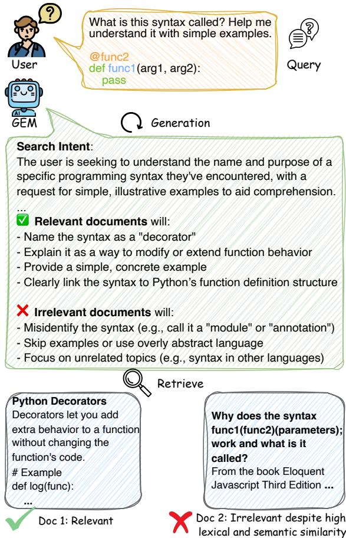  
Figure 1: An example use case of GEM.

Recent research has increasingly sought to address these challenges. Su et al. (2025) proposed the reasoning-intensive retrieval task, where queries are challenging and require reasoning beyond direct, surface-level matching. Follow-up work (Shao et al., 2025; Das et al., 2025; Sun et al., 2026) has shown that retrievers can be augmented with reasoning generated by upstream LLMs. However, these methods rely on pipelines with separate models for reasoning and retrieval, rather than leveraging the inherent generative capabilities of their retrieval models. More importantly, it remains unclear whether the retrievers genuinely understand reasoning, or simply benefit from increased lexical and semantic overlap. In parallel, another line of research has explored instructionfollowing retrieval (Weller et al., 2025a; Oh et al., 2024). Unlike earlier studies (Asai et al., 2023; Su et al., 2023) that prepend queries with a taskspecific instruction template, recent work enables a dense retriever to represent detailed, query-specific instructions that specify user preferences and constraints (Weller et al., 2025b). Yet, user-provided instructions are often underspecified and ambiguous in practice (Zhou et al., 2026). Whether reasoning can enhance a retriever’s ability to interpret and follow retrieval instructions is underexplored.

In this paper, we present GEM, a Generative Embedding Model. We argue that the challenges outlined above stem from the need to enhance query understanding in retrievers. GEM addresses this by integrating reasoning and embedding within a single model. Figure 1 illustrates GEM’s generate-then-encode paradigm: given a query, GEM reasons about the user’s intent and relevance criteria, then encodes the context for retrieval by appending an embedding token. Existing LLM-based embedding models are typically trained as bi-encoders (Zhang et al., 2025; Wang et al., 2024b; Ma et al., 2023); the generative capabilities of their backbones are often degraded due to catastrophic forgetting (Li et al., 2024; Luo et al., 2025) and/or architectural choices such as bidirectional attention masking (BehnamGhader et al., 2024; Zeng et al., 2025). In contrast, GEM is jointly trained with contrastive and causal language modelling objectives, preserving generation while enabling effective embedding. To align embedding with generation, we introduce a tailored data synthesis strategy that constructs document pairs conditioned on validated reasoning: positives align with the reasoning, while hard negatives share similar topics but contain subtle contradictions, thereby discouraging simple surface-level matching.

Our core contributions are: (1) we propose GEM, which unifies representation learning and causal language modelling; (2) we introduce a tailored data generation strategy to align GEM’s embedding with its reasoning; and (3) our experiments demonstrate that GEM’s generative capabilities effectively augment retrieval, with further gains achievable by prompting to exploit test-time compute. To the best of our knowledge, GEM is the first embedding model to leverage its own generative capabilities to produce reasoning-aligned embeddings.

## 2 Related Work

Reasoning-Intensive Retrieval Complex realworld queries can exhibit low lexical and semantic similarity to relevant documents (Su et al., 2025). In such cases, effective retrieval requires reasoning beyond surface-level matching. Prior work, such as ReasonIR (Shao et al., 2025), trained LLMbased dense retrievers with hard queries. The best performance is often achieved when retrievers are augmented with reasoning generated by upstream LLMs (Su et al., 2025; Shao et al., 2025; Lei et al., 2025; Das et al., 2025). However, the alignment between reasoning and retrieval behaviour is unclear: the improvements may stem from additional surface-level overlap rather than genuine understanding of the reasoning (see RQ4 in Section 4.2). GEM is a unified model that leverages its inherent generative capabilities to augment retrieval, with its embedding trained to align with reasoning. Furthermore, GEM’s generative nature allows test-time compute scaling through prompting.

Instruction-Following Retrieval Training embedding models with instructions aims to improve generalisation across diverse information needs. Weller et al. (2025a) proposed to evaluate retrievers on queries with flexible, query-specific instructions that can extend beyond topical relevance. For example, a user may prefer documents that are easier to understand and avoid technical jargon. Within this line of research, Promptriever (Weller et al., 2025b) is a bi-encoder that allows users to specify relevance criteria through prompting (e.g. "A document is relevant if ..."). However, relying on user-provided instructions to precisely define the problems is often unrealistic (Zhou et al., 2026), for example, due to a lack of domain expertise. Unlike prior work, we propose a generative embedding model that explicitly reasons about user intent and relevance criteria to augment retrieval.

Query Expansion Using LLMs Query expansion is a well-established technique for improving retrieval performance by mitigating problems such as vocabulary mismatch (Wang et al., 2023b). Prior work such as HyDE (Gao et al., 2023) and Query2Doc (Wang et al., 2023a) leverages the parametric knowledge of LLMs to generate hypothetical documents (answers) for query expansion. While recent studies instead use LLM reasoning (Sun et al., 2026; Lei et al., 2025; Das et al., 2025; Yan et al., 2026), they largely follow the conventional query expansion perspective. Our experiments on instruction-following retrieval reveal a fundamental limitation: retrievers may not genuinely understand reasoning over user instructions, such as what not to retrieve.

## 3 Generative Embedding Model

Given a query q and a corpus $\{ d _ { i } \} _ { i = 1 } ^ { N }$ containing N documents, the retrieval task aims to find the topk most relevant documents for $q ,$ where $k \ll N$ Dense retrieval represents text as embeddings and ranks documents based on the similarity between the query and document embeddings.

Unlike conventional dense retrievers, GEM incorporates generation into its query embedding. Specifically, given a query $q ,$ we construct a prompt $p = I \circ q .$ , where I is an instruction that prompts GEM to reason about user intent and relevance criteria. We refer to this instruction as our metainstruction to distinguish it from user-provided instructions in queries. GEM then generates a response r. For retrieval, GEM learns the similarity between a document d and the concatenated prompt-response pair, $p \circ r .$

However, incorporating reasoning into embedding raises challenges in both data and training. Regarding data, two key challenges are: (1) the generated reasoning may misinterpret the query, and (2) the need to align the notion of relevance with reasoning. From the training perspective, the model must retain its generative capability while learning effective embeddings. We address these challenges through a tailored data generation pipeline (Section 3.1) and joint training with generation and embedding objectives (Section 3.2).

## 3.1 Data Generation

Response Generation Retrieval datasets such as MS MARCO (Nguyen et al., 2016) typically provide a collection of text pairs $\{ ( q , d ^ { + } ) \}$ where $d ^ { + }$ denotes a relevant (positive) document for query $q .$ As illustrated in Figure 2, given a query q, we construct the prompt $p$ and sample a set of candidate responses $\mathcal { R } _ { q } \overset {  } { = } \{ r ^ { ( 1 ) } , r ^ { ( 2 ) } , \ldots , r ^ { ( K ) } \}$ from an LLM parameterized by $\theta , { \mathrm { i . e . ~ } } r ^ { ( k ) } \sim P _ { \theta } ( \cdot \mid p )$ Each response $r ^ { ( k ) }$ may reflect a plausible interpretation of $q ,$ but could vary in quality and alignment with the original relevance annotations due to hallucinations. To mitigate this, we employ a simple filtering step using an LLM-based relevance classifier. For each candidate response $r ^ { ( k ) }$ and the original positive document $d ^ { + }$ , we prompt the LLM to assess whether $d ^ { + }$ remains relevant under $r ^ { ( k ) }$ Concretely, the classifier outputs a binary decision $f ( r ^ { ( k ) } , d ^ { + } ) \in \{ 0 , 1 \}$ , where $f ( r ^ { ( k ) } , d ^ { + } ) = 1$ indicates that $d ^ { + }$ is still relevant given $r ^ { ( k ) }$ . We retain only the responses that preserve the relevance of the original positive document:

$$
\tilde { \mathcal { R } } _ { q } = \{ r ^ { ( k ) } \in \mathcal { R } _ { q } \ | \ f ( r ^ { ( k ) } , d ^ { + } ) = 1 \} .\tag{1}
$$

If $\mathcal { \tilde { R } } _ { q }$ is empty, the query is discarded from the training set. Otherwise, we randomly select a response $r \sim \tilde { \mathcal { R } } _ { q }$ to associate with $q .$ This filtering step serves as a coarse-grained alignment to avoid obvious contradictions between a generated response and the original positive document.

Document Generation Original relevance annotations between queries and documents may not fully transfer when conditioning on reasoning. Even after filtering, the relevance of documents may shift subtly due to additional criteria introduced by a response r. To achieve fine-grained alignment, we follow Wang et al. (2024b) to generate positive and negative documents using an LLM. In our case, the document generation is conditioned on reasoning. For each response r, we prompt the model to generate a positive document based on r. In parallel, hard negative documents may share similar topics but fail to satisfy the user intent or some relevance criteria specified in $r .$ The resulting training set is $\mathcal { T } = \{ ( p , r , d ^ { + } , d ^ { - } ) \}$ , where, for simplicity, we reuse $d ^ { + }$ and $d ^ { - } \ t _ { 0 }$ denote the generated positive and hard negative, respectively. Detailed prompts are provided in Appendix C.

## 3.2 Training

GEM is trained with both causal language modelling and contrastive losses. For each query qi, we construct a prompt $p _ { i }$ with the same metainstruction used for response generation (see Query

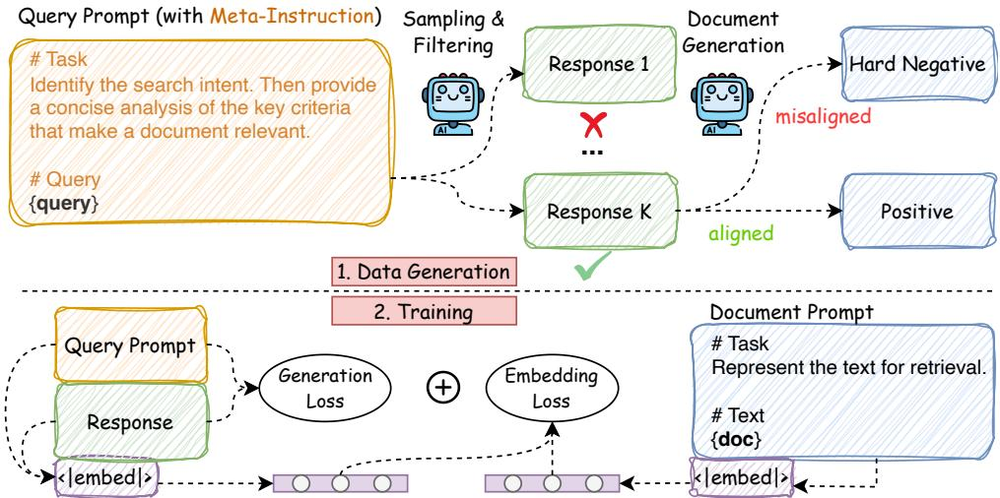  
Figure 2: Data generation pipeline (top) and training workflow (bottom) of GEM.

Prompt in Figure 2). Given a batch of N promptresponse pairs $\{ ( p _ { i } , r _ { i } ) \} _ { i = 1 } ^ { N }$ , we compute the causal language modelling loss over the responses:

$$
\mathcal { L } _ { g e n } = - \frac { 1 } { \sum _ { i = 1 } ^ { N } \left| \boldsymbol { r } _ { i } \right| } \sum _ { i = 1 } ^ { N } \sum _ { t = 1 } ^ { \left| \boldsymbol { r } _ { i } \right| } \log P _ { \theta } ( \boldsymbol { r } _ { i , t } \mid \boldsymbol { p } _ { i } , \boldsymbol { r } _ { i , < t } )\tag{2}
$$

where ${ r } _ { i , t }$ is the t-th token of response $r _ { i }$

Embeddings of prompt-response pairs are obtained through last-token pooling, i.e. using the hidden state of the last token. Unlike previous studies that use the embedding of the end-of-sequence (EOS) token (Ma et al., 2023; Wang et al., 2024b), we reserve the EOS token for generation. Instead, we append a dedicated token, <|embed|>, to the end of each response to produce an embedding. Since generation terminates upon encountering an EOS token, our embedding token is never predicted during decoding and is therefore excluded from the causal language modelling loss. At inference time, the embedding token is appended after generation completes, and its representation is computed efficiently by reusing the KV cache from generation. For document encoding, we prepend each document with a simple instruction (see Document Prompt in Figure 2) and apply the same embedding token. As generation is not performed on documents, $\mathcal { L } _ { g e n }$ is not applicable.

Let $E _ { \theta } ( p _ { i } \circ r _ { i } )$ be the embedding of the concatenated prompt $p _ { i }$ and response $r _ { i } .$ , and $E _ { \theta } ( d )$ be the embedding of document d (with document-side prompt). Following prior work (Muennighoff et al., 2025; Gao et al., 2021; Ma et al., 2023), we adopt the InfoNCE loss (Chen et al., 2020) as follows:

$$
\mathcal { L } _ { e m b } = - \frac { 1 } { N } \sum _ { i = 1 } ^ { N } \log \frac { \exp { \left( s _ { \theta } ( p _ { i } \circ r _ { i } , d _ { i } ^ { + } ) / \tau \right) } } { \sum _ { d \in \mathcal { D } _ { i } } \exp { \left( s _ { \theta } ( p _ { i } \circ r _ { i } , d ) / \tau \right) } }\tag{3}
$$

where $\mathcal { D } _ { i } = \{ d _ { i } ^ { + } \} \cup \mathcal { D } _ { i } ^ { - }$ , and $\mathcal { D } _ { i } ^ { - }$ consists of both hard negatives and in-batch negatives. τ is a temperature hyperparameter. The similarity function $s _ { \theta }$ is defined as:

$$
s _ { \theta } ( p _ { i } \circ r _ { i } , d ) = \cos \big ( E _ { \theta } ( p _ { i } \circ r _ { i } ) , E _ { \theta } ( d ) \big )\tag{4}
$$

where $\cos ( \cdot , \cdot )$ denotes cosine similarity. Our final training objective is a weighted sum of generation and embedding losses:

$$
\mathcal { L } _ { G E M } = \lambda _ { g e n } \mathcal { L } _ { g e n } + \lambda _ { e m b } \mathcal { L } _ { e m b }\tag{5}
$$

Overall, our Generative Embedding Model unifies reasoning and embedding within a single model. Our tailored data generation pipeline augments existing retrieval datasets for training GEM and aligns the relevance notion with reasoning. The joint training objective prevents GEM from forgetting token prediction while learning embeddings.

## 4 Experiments

## 4.1 Experimental Setup

Evaluation Datasets Following Shao et al. (2025), we report nDCG@10 on BRIGHT (Su et al., 2025). BRIGHT comprises 12 subsets with reasoning-intensive queries spanning diverse domains: Biology (Bio.), Earth Science (Earth.), Economics (Econ.), Psychology (Psy.), Robotics (Rob.), Stack Overflow (Stack.), Sustainable Living (Sus.), Leet Code (Leet.), Pony, math Olympiad problems (AoPS), scientific theorem question answering using either questions for retrieval (TheoQ.) or theorems for retrieval (TheoT.).

Following Weller et al. (2025b), we evaluate instruction-following retrieval using FollowIR (Weller et al., 2025a) and InstructIR (Oh et al., 2024) with their official metrics. For FollowIR, we report nDCG@5 on News21, MAP@1000 on Core17 and Robust04, and p-MRR on all splits. As retrievers can ignore instructions while achieving high nDCG or MAP scores on these TREC datasets (Weller et al., 2025a), p-MRR ∈ [−100, 100] is proposed to measure the sensitivity to instruction changes, where higher values indicate better instruction following (Weller et al., 2025b). For InstructIR, which is built from MS MARCO (Nguyen et al., 2016), we report nDCG@10 and Robustness@10. The latter is the minimum nDCG@10 for the same query when paired with different prompts, which define distinct user contexts (e.g. job) (Oh et al., 2024).

Implementation Details We train GEM from Qwen3-4B-Instruct-2507 (Yang et al., 2025a). Experiments with different LLM backbones are presented in Appendix B.3. All our models are trained for 500 steps with an effective batch size of 512. The learning rate is set to $1 \times 1 0 ^ { - 5 }$ with 50 warmup steps. Following prior work (Muennighoff et al., 2025; Shao et al., 2025), we use a training group size of 2, i.e. one positive and one hard negative per query. In-batch negatives are then gathered across all GPUs. For training loss, we empirically set $\lambda _ { g e n } = 0 . 1$ and $\lambda _ { e m b } = 1 . 0 ;$ a parameter study is provided in Appendix B.2. The temperature τ for contrastive loss is set to 0.02. Training takes approximately 14 hours on 2 NVIDIA H100 GPUs.

For data generation, we augment the training data from Promptriever (Weller et al., 2025b) and the collection of hard queries from ReasonIR (Shao et al., 2025) to train GEM. For each query, we sample K = 8 responses from GEM’s backbone using a temperature of 1.0. For simplicity, filtering is performed by the same backbone using greedy decoding. For document generation, we use Llama-3.1-8B-Instruct with greedy decoding to generate one positive and one hard negative per response. Additionally, we randomly sample 60,000 instances from the original Promptriever data without applying our data generation pipeline.

For these samples, standard contrastive learning is applied, and queries are encoded using the document-side prompt (see Figure 2). Our final training set for GEM consists of 370K samples: 320K from Promptriever (comprising 260K with reasoning and 60K original), and 50K reasoning samples based on the hard queries. The size of our 260K reasoning subset is chosen to match our fixed training budget (500 steps with batch size 512), ensuring fair ablation experiments (Table 4) where models never see repeated samples during training.

For evaluation, GEM’s reasoning is generated using greedy decoding in all experiments. Appendix A provides further implementation details.

Baselines For BRIGHT, we adopt the baseline results reported in ReasonIR. These include: (1) non-LLM retrievers: BM25 (Robertson et al., 1994) and Contriever (Izacard et al., 2022); (2) LLMbased retrievers: GritLM-7B (Muennighoff et al., 2025) and ReasonIR-8B (Shao et al., 2025); (3) LLM-based rerankers: Rank1-7B and Rank1- 32B (Weller et al., 2025c) which perform reasoning to rerank the top-100 documents retrieved by BM25 with query expansion using GPT-4.

For instruction-following retrieval, we compile results reported in Promptriever and FollowIR: (1) non-LLM retrievers: BM25 (Robertson et al., 1994), BGE-large (Xiao et al., 2024), and Instructor-XL (Su et al., 2023); (2) LLM-based retrievers: RepLLaMA (Ma et al., 2023), E5- Mistral (Wang et al., 2024b), GritLM-7B (Muennighoff et al., 2025), and Promptriever (Weller et al., 2025b); (3) LLM-based rerankers: FollowIR-7B (Weller et al., 2025a), Mistral-7B-Instruct (Jiang et al., 2023), and GritLM-7B (generation mode) (Muennighoff et al., 2025).

Additionally, we evaluate ReasonIR-8B and Promptriever (7B) across all benchmarks. To enable a direct comparison using the same backbone, we train Qwen3-4B-Instruct-2507 on the original Promptriever data,1 keeping the training configuration consistent with GEM. This variant is solely an embedding model trained using contrastive loss. We refer to this model as Qwen3-4B-Instruct.

## 4.2 Results and Analysis

In this section, we present the results and address our main research questions. Additional results are provided in Appendix B.

<table><tr><td rowspan="2">Model</td><td colspan="7">StackExchange</td><td colspan="2">Coding</td><td colspan="3">Theorem-based</td><td rowspan="2">Avg.</td></tr><tr><td>Bio.</td><td>Earth.</td><td>Econ.</td><td>Psy.</td><td>Rob.</td><td>Stack.</td><td>Sus.</td><td>Leet.</td><td>Pony</td><td>AoPS TheoQ.</td><td></td><td>TheoT.</td></tr><tr><td colspan="10">Single Model</td><td></td><td></td><td></td><td></td></tr><tr><td>BM25</td><td>19.2</td><td>27.1</td><td>14.9</td><td>12.5</td><td>13.5</td><td>16.5</td><td>15.2</td><td>24.4</td><td>7.9</td><td>6.0</td><td>13.0</td><td>6.9</td><td>14.8</td></tr><tr><td>Contriever</td><td>9.2</td><td>13.6</td><td>10.5</td><td>12.1</td><td>9.5</td><td>9.6</td><td>8.9</td><td>24.5</td><td>14.7</td><td>7.2</td><td>10.4</td><td>3.2</td><td>11.1</td></tr><tr><td>GritLM-7B</td><td>25.0</td><td>32.8</td><td>19.0</td><td>19.9</td><td>17.3</td><td>11.6</td><td>18.0</td><td>29.8</td><td>22.0</td><td>8.8</td><td>25.1</td><td>21.1</td><td>20.9</td></tr><tr><td>Qwen3-4B-Instruct</td><td>18.9</td><td>35.9</td><td>18.8</td><td>24.9</td><td>18.9</td><td>20.6</td><td>17.3</td><td>38.5</td><td>3.8</td><td>14.4</td><td>27.1</td><td>17.8</td><td>21.4</td></tr><tr><td>Promptriever</td><td>25.2</td><td>38.5</td><td>21.0</td><td>25.0</td><td>19.1</td><td>18.8</td><td>18.8</td><td>32.4</td><td>1.7</td><td>9.9</td><td>21.1</td><td>8.8</td><td>20.0</td></tr><tr><td>ReasonIR-8B</td><td>26.2</td><td>31.4</td><td>23.3</td><td>30.0</td><td>18.0</td><td>23.9</td><td>20.5</td><td>35.0</td><td>10.5</td><td>14.7</td><td>31.9</td><td>27.2</td><td>24.4</td></tr><tr><td>GEM</td><td>34.7</td><td>40.8</td><td>26.5</td><td>33.7</td><td>24.6</td><td>29.3</td><td>26.0</td><td>35.5</td><td>2.8</td><td>16.6</td><td>37.6</td><td>41.8</td><td>29.1</td></tr><tr><td colspan="10">Pipeline with GPT-4 Reasoner</td><td colspan="3"></td></tr><tr><td>BM25</td><td>53.6</td><td>53.6</td><td>24.3</td><td>38.6</td><td>18.8</td><td>22.7</td><td>25.9</td><td>19.3</td><td>17.7</td><td>3.9</td><td>20.2</td><td>18.9</td><td>26.5</td></tr><tr><td>Contriever</td><td>37.5</td><td>40.5</td><td>22.6</td><td>27.1</td><td>15.2</td><td>22.6</td><td>19.6</td><td>22.5</td><td>13.8</td><td>8.1</td><td>24.1</td><td>16.2</td><td>22.5</td></tr><tr><td>GritLM-7B</td><td>33.2</td><td>33.0</td><td>23.3</td><td>30.6</td><td>15.2</td><td>17.5</td><td>21.7</td><td>33.2</td><td>11.7</td><td>6.8</td><td>26.9</td><td>28.0</td><td>23.4</td></tr><tr><td>Qwen3-4B-Instruct</td><td>31.1</td><td>41.5</td><td>26.4</td><td>37.7</td><td>19.3</td><td>24.9</td><td>22.1</td><td>36.8</td><td>2.6</td><td>10.1</td><td>33.0</td><td>31.9</td><td>26.4</td></tr><tr><td>Promptriever</td><td>40.7</td><td>50.2</td><td>30.8</td><td>36.7</td><td>19.4</td><td>31.3</td><td>26.1</td><td>30.1</td><td>7.9</td><td>12.1</td><td>26.3</td><td>23.0</td><td>27.9</td></tr><tr><td>Rank1-7B</td><td>48.8</td><td>36.7</td><td>20.8</td><td>35.0</td><td>22.0</td><td>18.7</td><td>36.2</td><td>12.7</td><td>31.2</td><td>6.3</td><td>23.7</td><td>37.8</td><td>27.5</td></tr><tr><td>Rank1-32B</td><td>49.7</td><td>35.8</td><td>22.0</td><td>37.5</td><td>22.5</td><td>21.7</td><td>35.0</td><td>18.8</td><td>32.5</td><td>10.8</td><td>22.9</td><td>43.7</td><td>29.4</td></tr><tr><td>ReasonIR-8B</td><td>43.6</td><td>42.9</td><td>32.7</td><td>38.8</td><td>20.9</td><td>25.8</td><td>27.5</td><td>31.5</td><td>19.6</td><td>7.4</td><td>33.1</td><td>35.7</td><td>29.9</td></tr><tr><td>GEM</td><td>39.9</td><td>44.2</td><td>28.4</td><td>36.4</td><td>25.2</td><td>31.2</td><td>28.1</td><td>34.7</td><td>5.2</td><td>15.3</td><td>36.2</td><td>35.3</td><td>30.0</td></tr></table>

Table 1: nDCG@10 for reasoning-intensive retrieval on BRIGHT. Best results are shown in bold. Qwen3-4B-Instruct is the embedding-only variant of GEM with the same 4B-parameter backbone.

RQ1: How effective is GEM at reasoningintensive retrieval? Table 1 presents results on BRIGHT. Our embedding-only variant, Qwen3- 4B-Instruct, serves as a strong baseline, performing comparably to larger models, including GritLM-7B and Promptriever. Overall, GEM achieves an average nDCG@10 of 29.1, outperforming singlemodel baselines by leveraging its own knowledge. Specifically, GEM excels at theorem-based tasks, substantially improving their average nDCG@10 over Qwen3-4B-Instruct (19.8 → 32.0) using the same backbone. However, GEM underperforms on the Pony programming language task. Similar results are observed for Promptriever and Qwen3- 4B-Instruct, despite Promptriever using a different backbone. We provide a detailed discussion in Appendix B.6 to explain this out-of-domain problem.

Following previous studies (Su et al., 2025; Shao et al., 2025), we also report results where retrievers are augmented with reasoning generated by GPT-4.2 In this setting, the average response length is approximately 37% longer than that generated by GEM. Additionally, to investigate whether GEM can effectively represent outputs from a stronger model, we evaluate GEM as a bi-encoder, directly encoding the input instead of generating its own reasoning. With the same reasoning, GEM achieves an average nDCG@10 of 30.0, which is competitive with ReasonIR-8B (29.9), despite GEM being a 4B-parameter model trained with substantially less compute.

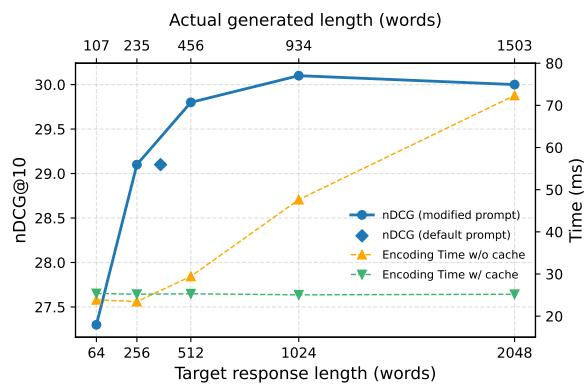  
Figure 3: Average nDCG@10 (left) on BRIGHT and per-query encoding time (right) in milliseconds for GEM with test-time compute scaling.

RQ2: Can GEM’s test-time compute be scaled via prompting, and what is the impact on retrieval performance? To investigate whether GEM’s retrieval can be influenced by scaling testtime compute, we modify our prompt at test time as follows: (1) following prior studies (Su et al., 2025; Shao et al., 2025), we add an instruction for answer generation, and (2) we explicitly instruct the model to generate approximately n ∈ {64, 256, 512, 1024, 2048} words. The resulting prompt is provided in Appendix C.

Figure 3 presents the nDCG@10 scores (left) across different target response lengths n (bottom). GEM is aware of our length requirements, adjusting its actual response length (top) accordingly. Overall, the average nDCG@10 on BRIGHT improves with increased test-time compute, peaking at 30.1 when prompted with n = 1024. However, similar to findings in prior work (Shao et al., 2025), performance gains saturate for long generations, likely because GEM generates redundant content for simple queries to meet our length requirements, while failing to produce additional useful signals for challenging problems beyond its capacity.

<table><tr><td colspan="2">Model</td><td colspan="8">FollowIR</td></tr><tr><td colspan="2"></td><td colspan="2">Robust04 MAP p-MRR</td><td colspan="2">News21</td><td colspan="2">Core17</td><td colspan="2">InstructIR Average MS MARCO</td></tr><tr><td>GritLM-7B</td><td></td><td></td><td>nDCG 10.2</td><td>p-MRR</td><td>MAP</td><td>p-MRR</td><td>Score</td><td>p-MRR</td><td>nDCG Robust.</td></tr><tr><td rowspan="3">Reers</td><td>Mistral-7B-Instruct</td><td>9.7 23.2</td><td>+6.1 +12.6</td><td>+3.4 +4.8</td><td>9.8 19.7</td><td>+8.6 +13.0</td><td>9.9 23.4</td><td>+6.0 +10.1</td><td>-</td></tr><tr><td>FollowIR-7B</td><td>24.8 +13.7</td><td>27.2 29.6</td><td>+6.3</td><td>20.0</td><td>+16.5</td><td>24.8 +12.2</td><td>63.1 81.3</td><td>35.3 71.5</td></tr><tr><td>BM25</td><td></td><td></td><td></td><td></td><td></td><td></td><td></td><td>26.9</td></tr><tr><td rowspan="12">Reters</td><td>12.1</td><td>-3.1 -7.8</td><td>19.3</td><td>-2.1</td><td>8.1</td><td>-1.1</td><td>13.2</td><td>-2.1</td><td>76.0</td></tr><tr><td>BGE-large Instructor XL</td><td>17.5</td><td>22.3 26.1</td><td>+0.6</td><td>15.0</td><td>+0.1</td><td>18.3</td><td>-2.4</td><td></td></tr><tr><td>19.7</td><td></td><td>-8.1</td><td>-0.9</td><td>16.8</td><td>+0.7</td><td>20.9</td><td>-2.8</td><td>48.6 21.5</td></tr><tr><td></td><td></td><td>24.4</td><td>LLMs ≥7B parameters</td><td></td><td></td><td></td><td></td><td></td></tr><tr><td>GritLM-7B</td><td>28.6 24.0</td><td>-1.7 -8.9</td><td>-1.0 24.5</td><td>20.8</td><td>+2.6</td><td>24.6</td><td>-0.0</td><td></td></tr><tr><td>RepLLaMA</td><td></td><td></td><td>-1.8</td><td>20.6 18.3</td><td>+1.3</td><td>23.0</td><td>-3.1 85.7</td><td>50.2 55.4</td></tr><tr><td>E5-Mistral</td><td>23.1</td><td>-9.6 -2.8</td><td>27.8 23.1</td><td>-0.9</td><td>+0.1</td><td>23.1</td><td>-3.5</td><td>86.3</td></tr><tr><td>ReasonIR-8B</td><td>25.3 28.3</td><td>+11.7</td><td>28.5</td><td>+0.6 +6.4 21.6</td><td>18.7 +0.9</td><td>22.4</td><td>-0.4</td><td>87.1 53.1</td></tr><tr><td>Promptriever</td><td></td><td></td><td></td><td>LLMs ~4B parameters</td><td>+15.4</td><td>26.1</td><td>+11.2</td><td>92.1 63.1</td></tr><tr><td></td><td></td><td>+7.3</td><td>25.2</td><td>+3.2</td><td>+9.9</td><td></td><td></td><td></td></tr><tr><td>Qwen3-4B-Instruct GEM</td><td>25.7 26.7</td><td>+11.6</td><td>26.2</td><td>+9.3</td><td>21.0 23.5 +14.2</td><td>24.0 25.5</td><td>+6.8 +11.7</td><td>82.0 46.2 87.5 54.8</td></tr></table>

Table 2: Results for instruction-following retrieval on the FollowIR and InstructIR datasets. Higher is better for all metrics. MAP@1000, nDCG@5, and Robustness@10 are reported on a 0–100 scale, while p-MRR ranges from -100 to 100. "-" indicates results not reported in previous studies. Best results are shown in bold.

Additionally, Figure 3 benchmarks the average per-query encoding time (right) as n varies. As a baseline, we use GEM to re-encode the same sequence (i.e. prompt and response) without reusing the KV cache from generation, analogous to pipelines with independent models. Under this setting, encoding time increases sharply for longer sequences. In contrast, when reusing the KV cache in GEM’s generate-then-encode process, encoding time remains stable across the evaluated lengths. Appendix B.4 provides further latency analysis.

RQ3: Can GEM’s reasoning augment instruction-following retrieval? Table 2 compares GEM with baselines on FollowIR and InstructIR. GEM performs on par with Promptriever and outperforms other LLM-based retrievers on FollowIR. Specifically, GEM achieves a p-MRR of +11.7, which indicates strong instructionfollowing retrieval performance (Weller et al., 2025b), matching the performance of larger models including Promptriever and FollowIR-7B. To answer our RQ3, GEM shows consistent improvements over Qwen3-4B-Instruct (same backbone), with notable gains in p-MRR (+6.8 → +11.7) and Robustness@10 (46.2 → 54.8).

As FollowIR provides detailed relevance instructions (e.g. "A relevant document will contain . . . "), we present qualitative case studies in Appendix D to investigate scenarios where such detailed criteria are absent in practice.

RQ4: Can LLM-based query expansion achieve strong instruction-following retrieval like GEM? We compare GEM with representative LLM-based query expansion methods, including HyDE (Gao et al., 2023) and Query2Doc (Wang et al., 2023a). For a fair comparison, we use Qwen3-4B-Instruct-2507 as the hypothetical document (answer) generator for HyDE and Query2Doc. Implementation details are provided in Appendix A.3. Furthermore, we evaluate a variant that concatenates the original query with the reasoning generated by GEM for query expansion.

Results are presented in Table 3. While HyDE and Query2Doc often improve nDCG and MAP, their impact on instruction-following metric (p-MRR) is inconsistent. Notably, both methods degrade p-MRR for Promptriever. While GEM’s reasoning contributes to its strong p-MRR, directly applying it to other models may lead to poor results. In answer to our RQ4, LLM-based query expansion is insufficient to achieve strong instructionfollowing retrieval performance like GEM.

<table><tr><td rowspan="2">Setting</td><td colspan="2">Robust04</td><td colspan="2">News21</td><td colspan="2">Core17</td><td colspan="2">Average</td></tr><tr><td>MAP</td><td>p-MRR</td><td>nDCG</td><td>p-MRR</td><td>MAP</td><td>p-MRR</td><td>Score</td><td>p-MRR</td></tr><tr><td>BGE-large</td><td>17.5</td><td>-7.8</td><td>22.3</td><td>+0.6</td><td>15.0</td><td>+0.1</td><td>18.3</td><td>-2.4</td></tr><tr><td>+ HyDE</td><td>21.0</td><td>-4.1</td><td>23.1</td><td>+0.3</td><td>20.1</td><td>+1.4</td><td>21.4↑</td><td>-0.8↑</td></tr><tr><td>+ Query2Doc</td><td>19.5</td><td>-3.9</td><td>23.3</td><td>-0.1</td><td>19.0</td><td>+3.0</td><td>20.6↑</td><td>-0.3↑</td></tr><tr><td>+ GEM Resp.</td><td>15.8</td><td>-6.2</td><td>19.9</td><td>-1.9</td><td>14.8</td><td>-1.0</td><td>16.9↓</td><td>-3.0.↓</td></tr><tr><td>RepLLaMA</td><td>24.0</td><td>-8.9</td><td>24.5</td><td>-1.8</td><td>20.6</td><td>+1.3</td><td>23.0</td><td>-3.1</td></tr><tr><td>+ HyDE</td><td>27.8</td><td>-4.5</td><td>24.0</td><td>-0.6</td><td>22.9</td><td>+4.5</td><td>24.9↑</td><td>-0.2↑</td></tr><tr><td>+ Query2Doc</td><td>27.2</td><td>-2.4</td><td>22.9</td><td>+0.2</td><td>21.5</td><td>+2.6</td><td>23.8↑</td><td>+0.1↑</td></tr><tr><td>+ GEM Resp.</td><td>22.7</td><td>-8.7</td><td>23.4</td><td>-1.3</td><td>18.9</td><td>+3.0</td><td>21.6↓</td><td>-2.3↑</td></tr><tr><td>ReasonIR-8B</td><td>25.3</td><td>-2.8</td><td>23.1</td><td>+0.6</td><td>18.7</td><td>+0.9</td><td>22.4</td><td>-0.4</td></tr><tr><td>+ HyDE</td><td>26.0</td><td>-1.0</td><td>22.5</td><td>+1.7</td><td>21.8</td><td>+4.6</td><td>23.4↑</td><td>+1.7↑</td></tr><tr><td>+ Query2Doc</td><td>23.1</td><td>-4.4</td><td>22.8</td><td>+0.4</td><td>20.6</td><td>+1.0</td><td>22.2↓</td><td>-1.0.↓</td></tr><tr><td>+ GEM Resp.</td><td>19.6</td><td>-8.5</td><td>22.3</td><td>-0.8</td><td>18.9</td><td>+0.4</td><td>20.2↓</td><td>-2.9↓</td></tr><tr><td>Promptriever</td><td>28.3</td><td>+11.7</td><td>28.5</td><td>+6.4</td><td>21.6</td><td>+15.4</td><td>26.1</td><td>+11.2</td></tr><tr><td>+ HyDE</td><td>31.7</td><td>+4.7</td><td>28.5</td><td>+4.6</td><td>24.3</td><td>+13.3</td><td>28.2↑</td><td>+7.5↓</td></tr><tr><td>+ Query2Doc</td><td>30.3</td><td>+6.3</td><td>26.0</td><td>+3.1</td><td>23.3</td><td>+13.4</td><td>26.6↑</td><td>+7.6↓</td></tr><tr><td>+ GEM Resp.</td><td>28.6</td><td>+10.0</td><td>30.1</td><td>+3.7</td><td>22.1</td><td>+15.1</td><td>26.9↑</td><td>+9.6.↓</td></tr><tr><td>GEM</td><td>26.7</td><td>+11.6</td><td>26.2</td><td>+9.3</td><td>23.5</td><td>+14.2</td><td>25.5</td><td>+11.7</td></tr></table>

Table 3: Comparisons between GEM and dense retrieval using LLM-based query expansion on the FollowIR dataset. "GEM Resp." means query expansion using GEM’s response. ↑ indicates improvements over the corresponding baselines; ↓ denotes declines.
<table><tr><td>Setting</td><td>FollowIR p-MRR</td><td>BRIGHT nDCG@10</td></tr><tr><td>GEM</td><td>+11.7</td><td>29.1</td></tr><tr><td colspan="3">Model Ablation</td></tr><tr><td>GEM reasoner + GEM encoder (w/o  $\overline { { \mathcal { L } _ { g e n } ) } }$ </td><td>+12.5</td><td>30.0**</td></tr><tr><td>GEM w/o generation</td><td>+9.5*</td><td>21.0***</td></tr><tr><td colspan="3">Data Ablation</td></tr><tr><td>GEM w/o HQ</td><td>+8.5**</td><td>28.4*</td></tr><tr><td>GEM w/o Orig. Samples</td><td>+8.7*</td><td>27.5**</td></tr><tr><td>GEM w/o HQ and Orig. Samples</td><td>+9.2*</td><td>28.2*</td></tr><tr><td>GEM w/o Doc. Gen.</td><td>+11.7</td><td> $2 5 . 8 ^ { * * }$ </td></tr><tr><td colspan="3">Embedding-Only Variants</td></tr><tr><td>Qwen3-4B-Instruct</td><td> $+ 6 . 8 ^ { * * }$ </td><td> $\overline { { 2 1 . 4 ^ { * * * } } }$ </td></tr><tr><td>Qwen3-4B-Instruct + HQ</td><td> $+ 5 . 9 ^ { * * * }$ </td><td> $2 2 . 0 ^ { * * }$ </td></tr><tr><td>Qwen3-4B-Instruct w/ GEM data</td><td> $+ 7 . 3 ^ { * * }$ </td><td> $2 4 . 5 ^ { * * }$ </td></tr></table>

Table 4: Ablation study. We report the averaged metrics for FollowIR and BRIGHT. \*/\*\*/\*\*\* denotes a significant difference from GEM at $p < 0 . 0 5 / 0 . 0 1 / 0 . 0 0 1$ respectively, based on the two-tailed pairwise t-test.

RQ5: What is the trade-off of unifying generation and embedding in GEM? Intuitively, causal language modelling may constrain the model’s capacity to learn embeddings. To test this, we train an embedding-only version of GEM by disabling generation loss on identical training data, referred to as GEM encoder $( \mathrm { w } / \mathrm { o } ~ \mathcal { L } _ { g e n } )$ . Due to catastrophic forgetting, this bi-encoder generates repetitive or mixed-language content (see example in Appendix D). To evaluate embedding performance under the same encoded sequences, we reuse the reasoning generated by GEM for this embedding-only variant. This setup is analogous to a two-stage pipeline of separate models, and the results are reported in Table 4. Indeed, our unified model (GEM) shows a slight degradation in p-MRR on FollowIR $( + 1 2 . 5  + 1 1 . 7 )$ , and nDCG@10 on BRIGHT $( 3 0 . 0  2 9 . 1 )$ Interestingly, GEM remains strong on generative tasks with notable improvements on reasoning. Results on generation tasks are provided in Appendix B.1.

RQ6: What are the effects of different components in our training data? Table 4 presents our ablation study for GEM and Qwen3-4B-Instruct under different training data settings. First, incorporating hard queries (HQ) from ReasonIR into our data generation substantially improves p-MRR on FollowIR $( + 8 . 5  + 1 1 . 7 )$ , whereas training Qwen3- 4B-Instruct with such hard queries (i.e. Qwen3-4B-Instruct + HQ) does not yield similar gains. We postulate that reasoning over these hard queries produces more complex relevance criteria than short factual queries, providing stronger contrastive signals for learning instruction-following retrieval.

Additionally, adding non-reasoning, original samples (Orig. Samples) from Promptriever improves both FollowIR p-MRR and BRIGHT nDCG@10. We conjecture that these nonreasoning samples regularise GEM, mitigating overfitting to its reasoning. Interestingly, disabling document generation (i.e. GEM w/o Doc. Gen.) substantially reduces nDCG@10 on BRIGHT (29.1 → 25.8), while FollowIR p-MRR remains stable. This is likely because FollowIR queries contain detailed relevance instructions, which ease alignment given GEM’s reasoning. Finally, GEM achieves significant improvements over Qwen3-4B-Instruct trained on the same queries and documents.

## 5 Conclusion

We propose GEM, a generative embedding model that unifies causal language modelling and representation learning. We present a tailored training data generation method to align GEM’s embedding with reasoning, and a joint training objective to maintain its generative capabilities while learning embeddings. GEM demonstrates strong performance on reasoning-intensive and instructionfollowing retrieval tasks, despite being a 4Bparameter model trained with substantially less compute than larger baselines. GEM’s generative nature allows test-time compute scaling through prompting like regular instruction-tuned LLMs.

## Limitations

Due to limited computing resources, we are unable to replicate our experiments with larger backbones (e.g. 7B parameters) and larger-scale training data. Our model generalisation experiments in Appendix B.3 are restricted to LLM backbones with up to 4B parameters.

Although our data generation pipeline filters out low-quality responses, hallucinations during document generation and inference are inevitable. Whether hallucinations in generated documents and/or GEM’s reasoning can bias its retrieval, and how to quantify the impact, are not investigated. Similarly, inaccuracies in our LLM-based filtering may propagate noise.

Similar to existing studies that use LLM reasoning to improve retrieval (Lei et al., 2025; Sun et al., 2026; Su et al., 2025; Shao et al., 2025), GEM is also limited by the cost of generation. While GEM saves query-side encoding time by reusing the KV cache and allows test-time compute scaling through prompting (see Figure 3), autoregressive decoding remains expensive. Further latency discussion is provided in Appendix B.4.

While we note that GEM remains strong on generative tasks (see Appendix B.1), extending it to broader applications that involve retrieval—such as retrieval-augmented generation and conversational search—is valuable for future research. We hope GEM will motivate further exploration of generative embedding models to fill the gaps.

## References

Akari Asai, Timo Schick, Patrick Lewis, Xilun Chen, Gautier Izacard, Sebastian Riedel, Hannaneh Hajishirzi, and Wen-tau Yih. 2023. Task-aware Retrieval with Instructions. In Findings of the Association for Computational Linguistics: ACL 2023, pages 3650–3675, Toronto, Canada. Association for Computational Linguistics.

Parishad BehnamGhader, Vaibhav Adlakha, Marius Mosbach, Dzmitry Bahdanau, Nicolas Chapados, and Siva Reddy. 2024. LLM2Vec: Large Language Models Are Secretly Powerful Text Encoders. In First Conference on Language Modeling.

Stella Biderman, Hailey Schoelkopf, Lintang Sutawika, Leo Gao, Jonathan Tow, Baber Abbasi, Alham Fikri Aji, Pawan Sasanka Ammanamanchi, Sidney Black, Jordan Clive, Anthony DiPofi, Julen Etxaniz, Benjamin Fattori, Jessica Zosa Forde, Charles Foster, Jeffrey Hsu, Mimansa Jaiswal, Wilson Y. Lee, Haonan Li, and 11 others. 2024. Lessons from the Trenches

on Reproducible Evaluation of Language Models. Preprint, arXiv:2405.14782.

Mark Chen, Jerry Tworek, Heewoo Jun, Qiming Yuan, Henrique Ponde de Oliveira Pinto, Jared Kaplan, Harri Edwards, Yuri Burda, Nicholas Joseph, Greg Brockman, Alex Ray, Raul Puri, Gretchen Krueger, Michael Petrov, Heidy Khlaaf, Girish Sastry, Pamela Mishkin, Brooke Chan, Scott Gray, and 39 others. 2021. Evaluating Large Language Models Trained on Code. Preprint, arXiv:2107.03374.

Ting Chen, Simon Kornblith, Mohammad Norouzi, and Geoffrey Hinton. 2020. A simple framework for contrastive learning of visual representations. In Proceedings of the 37th International Conference on Machine Learning, ICML’20. JMLR.org.

Peter Clark, Isaac Cowhey, Oren Etzioni, Tushar Khot, Ashish Sabharwal, Carissa Schoenick, and Oyvind Tafjord. 2018. Think you have Solved Question Answering? Try ARC, the AI2 Reasoning Challenge. Preprint, arXiv:1803.05457.

Karl Cobbe, Vineet Kosaraju, Mohammad Bavarian, Mark Chen, Heewoo Jun, Lukasz Kaiser, Matthias Plappert, Jerry Tworek, Jacob Hilton, Reiichiro Nakano, Christopher Hesse, and John Schulman. 2021. Training Verifiers to Solve Math Word Problems. Preprint, arXiv:2110.14168.

Nick Craswell, Bhaskar Mitra, Emine Yilmaz, and Daniel Campos. 2021. Overview of the TREC 2020 deep learning track. Preprint, arXiv:2102.07662.

Nick Craswell, Bhaskar Mitra, Emine Yilmaz, Daniel Campos, and Ellen M. Voorhees. 2020. Overview of the TREC 2019 deep learning track. Preprint, arXiv:2003.07820.

Tri Dao. 2024. FlashAttention-2: Faster Attention with Better Parallelism and Work Partitioning. In The Twelfth International Conference on Learning Representations.

Debrup Das, Sam O’Nuallain, and Razieh Rahimi. 2025. RaDeR: Reasoning-aware Dense Retrieval Models. In Proceedings of the 2025 Conference on Empirical Methods in Natural Language Processing, pages 19970–19997, Suzhou, China. Association for Computational Linguistics.

Luyu Gao, Xueguang Ma, Jimmy Lin, and Jamie Callan. 2023. Precise Zero-Shot Dense Retrieval without Relevance Labels. In Proceedings ofthe 61st Annual Meeting of the Association for Computational Linguistics (Volume 1: Long Papers), pages 1762–1777, Toronto, Canada. Association for Computational Linguistics.

Tianyu Gao, Xingcheng Yao, and Danqi Chen. 2021. SimCSE: Simple Contrastive Learning of Sentence Embeddings. In Proceedings ofthe 2021 Conference on Empirical Methods in Natural Language Processing, pages 6894–6910, Online and Punta Cana, Dominican Republic. Association for Computational Linguistics.

Aaron Grattafiori, Abhimanyu Dubey, Abhinav Jauhri, Abhinav Pandey, Abhishek Kadian, Ahmad Al-Dahle, Aiesha Letman, Akhil Mathur, Alan Schelten, Alex Vaughan, Amy Yang, Angela Fan, Anirudh Goyal, Anthony Hartshorn, Aobo Yang, Archi Mitra, Archie Sravankumar, Artem Korenev, Arthur Hinsvark, and 542 others. 2024. The Llama 3 Herd of Models. Preprint, arXiv:2407.21783.

Dan Hendrycks, Collin Burns, Steven Basart, Andy Zou, Mantas Mazeika, Dawn Song, and Jacob Steinhardt. 2021. Measuring Massive Multitask Language Understanding. In International Conference on Learning Representations.

Gautier Izacard, Mathilde Caron, Lucas Hosseini, Sebastian Riedel, Piotr Bojanowski, Armand Joulin, and Edouard Grave. 2022. Unsupervised Dense Information Retrieval with Contrastive Learning. Transactions on Machine Learning Research.

Albert Q. Jiang, Alexandre Sablayrolles, Arthur Mensch, Chris Bamford, Devendra Singh Chaplot, Diego de las Casas, Florian Bressand, Gianna Lengyel, Guillaume Lample, Lucile Saulnier, Lélio Renard Lavaud, Marie-Anne Lachaux, Pierre Stock, Teven Le Scao, Thibaut Lavril, Thomas Wang, Timothée Lacroix, and William El Sayed. 2023. Mistral 7B. Preprint, arXiv:2310.06825.

Diederik P. Kingma and Jimmy Ba. 2017. Adam: A Method for Stochastic Optimization. Preprint, arXiv:1412.6980.

Nils Knoth, Antonia Tolzin, Andreas Janson, and Jan Marco Leimeister. 2024. AI literacy and its implications for prompt engineering strategies. Computers and Education: Artificial Intelligence, 6:100225.

Takeshi Kojima, Shixiang Shane Gu, Machel Reid, Yutaka Matsuo, and Yusuke Iwasawa. 2022. Large language models are zero-shot reasoners. In Proceedings of the 36th International Conference on Neural Information Processing Systems, NIPS ’22, Red Hook, NY, USA. Curran Associates Inc.

Woosuk Kwon, Zhuohan Li, Siyuan Zhuang, Ying Sheng, Lianmin Zheng, Cody Hao Yu, Joseph Gonzalez, Hao Zhang, and Ion Stoica. 2023. Efficient Memory Management for Large Language Model Serving with PagedAttention. In Proceedings of the 29th Symposium on Operating Systems Principles, SOSP ’23, page 611–626, New York, NY, USA. Association for Computing Machinery.

Yibin Lei, Tao Shen, and Andrew Yates. 2025. ThinkQE: Query Expansion via an Evolving Thinking Process. In Findings ofthe Associationfor Computational Linguistics: EMNLP 2025, pages 17772– 17781, Suzhou, China. Association for Computational Linguistics.

Hongyu Li, Liang Ding, Meng Fang, and Dacheng Tao. 2024. Revisiting Catastrophic Forgetting in Large Language Model Tuning. In Findings ofthe Associationfor Computational Linguistics: EMNLP 2024,

pages 4297–4308, Miami, Florida, USA. Association for Computational Linguistics.

Yun Luo, Zhen Yang, Fandong Meng, Yafu Li, Jie Zhou, and Yue Zhang. 2025. An Empirical Study of Catastrophic Forgetting in Large Language Models During Continual Fine-Tuning. IEEE Transactions on Audio, Speech and Language Processing, 33:3776–3786.

Xueguang Ma, Liang Wang, Nan Yang, Furu Wei, and Jimmy Lin. 2023. Fine-Tuning LLaMA for Multi-Stage Text Retrieval. Preprint, arXiv:2310.08319.

Niklas Muennighoff, Hongjin SU, Liang Wang, Nan Yang, Furu Wei, Tao Yu, Amanpreet Singh, and Douwe Kiela. 2025. Generative Representational Instruction Tuning. In The Thirteenth International Conference on Learning Representations.

Tri Nguyen, Mir Rosenberg, Xia Song, Jianfeng Gao, Saurabh Tiwary, Rangan Majumder, and Li Deng. 2016. MS MARCO: A Human Generated MAchine Reading COmprehension Dataset. CoRR, abs/1611.09268.

Hanseok Oh, Hyunji Lee, Seonghyeon Ye, Haebin Shin, Hansol Jang, Changwook Jun, and Minjoon Seo. 2024. INSTRUCTIR: A Benchmark for Instruction Following of Information Retrieval Models. Preprint, arXiv:2402.14334.

Long Ouyang, Jeff Wu, Xu Jiang, Diogo Almeida, Carroll L. Wainwright, Pamela Mishkin, Chong Zhang, Sandhini Agarwal, Katarina Slama, Alex Ray, John Schulman, Jacob Hilton, Fraser Kelton, Luke Miller, Maddie Simens, Amanda Askell, Peter Welinder, Paul Christiano, Jan Leike, and Ryan Lowe. 2022. Training language models to follow instructions with human feedback. In Proceedings ofthe 36th International Conference on Neural Information Processing Systems, NIPS ’22, Red Hook, NY, USA. Curran Associates Inc.

Morgane Riviere, Shreya Pathak, Pier Giuseppe Sessa, Cassidy Hardin, Surya Bhupatiraju, Léonard Hussenot, Thomas Mesnard, Bobak Shahriari, Alexandre Ramé, Johan Ferret, Peter Liu, Pouya Tafti, Abe Friesen, Michelle Casbon, Sabela Ramos, Ravin Kumar, Charline Le Lan, Sammy Jerome, Anton Tsitsulin, and 178 others. 2024. Gemma 2: Improving Open Language Models at a Practical Size. Preprint, arXiv:2408.00118.

Stephen E. Robertson, Steve Walker, Susan Jones, Micheline Hancock-Beaulieu, and Mike Gatford. 1994. Okapi at TREC-3. In TREC, volume 500- 225 of NIST Special Publication, pages 109–126. National Institute of Standards and Technology (NIST).

Rulin Shao, Rui Qiao, Varsha Kishore, Niklas Muennighoff, Xi Victoria Lin, Daniela Rus, Bryan Kian Hsiang Low, Sewon Min, Wen tau Yih, Pang Wei Koh, and Luke Zettlemoyer. 2025. ReasonIR: Training Retrievers for Reasoning Tasks. In Second Conference on Language Modeling.

Hongjin Su, Weijia Shi, Jungo Kasai, Yizhong Wang, Yushi Hu, Mari Ostendorf, Wen-tau Yih, Noah A. Smith, Luke Zettlemoyer, and Tao Yu. 2023. One Embedder, Any Task: Instruction-Finetuned Text Embeddings. In Findings ofthe Associationfor Computational Linguistics: ACL 2023, pages 1102–1121, Toronto, Canada. Association for Computational Linguistics.

Hongjin Su, Howard Yen, Mengzhou Xia, Weijia Shi, Niklas Muennighoff, Han yu Wang, Liu Haisu, Quan Shi, Zachary S Siegel, Michael Tang, Ruoxi Sun, Jinsung Yoon, Sercan O Arik, Danqi Chen, and Tao Yu. 2025. BRIGHT: A Realistic and Challenging Benchmark for Reasoning-Intensive Retrieval. In The Thirteenth International Conference on Learning Representations.

Duolin Sun, Meixiu Long, Dan Yang, Junjie Wang, Yecheng Luo, Yue Shen, Jian Wang, Hualei Zhou, Chunxiao Guo, Peng Wei, Jiahai Wang, and Jinjie Gu. 2026. DIVER: A Multi-Stage Approach for Reasoning-intensive Information Retrieval. Preprint, arXiv:2508.07995.

Liang Wang, Nan Yang, Xiaolong Huang, Binxing Jiao, Linjun Yang, Daxin Jiang, Rangan Majumder, and Furu Wei. 2024a. Text Embeddings by Weakly-Supervised Contrastive Pre-training. Preprint, arXiv:2212.03533.

Liang Wang, Nan Yang, Xiaolong Huang, Linjun Yang, Rangan Majumder, and Furu Wei. 2024b. Improving Text Embeddings with Large Language Models. In Proceedings ofthe 62nd Annual Meeting ofthe Association for Computational Linguistics (Volume 1: Long Papers), pages 11897–11916, Bangkok, Thailand. Association for Computational Linguistics.

Liang Wang, Nan Yang, and Furu Wei. 2023a. Query2doc: Query Expansion with Large Language Models. In Proceedings ofthe 2023 Conference on Empirical Methods in Natural Language Processing, pages 9414–9423, Singapore. Association for Computational Linguistics.

Xiao Wang, Sean MacAvaney, Craig Macdonald, and Iadh Ounis. 2023b. Generative Query Reformulation for Effective Adhoc Search. Preprint, arXiv:2308.00415.

Jason Wei, Maarten Bosma, Vincent Zhao, Kelvin Guu, Adams Wei Yu, Brian Lester, Nan Du, Andrew M. Dai, and Quoc V Le. 2022a. Finetuned Language Models are Zero-Shot Learners. In International Conference on Learning Representations.

Jason Wei, Xuezhi Wang, Dale Schuurmans, Maarten Bosma, Brian Ichter, Fei Xia, Ed H. Chi, Quoc V. Le, and Denny Zhou. 2022b. Chain-of-thought prompting elicits reasoning in large language models. In Proceedings of the 36th International Conference on Neural Information Processing Systems, NIPS ’22, Red Hook, NY, USA. Curran Associates Inc.

Orion Weller, Benjamin Chang, Sean MacAvaney, Kyle Lo, Arman Cohan, Benjamin Van Durme, Dawn Lawrie, and Luca Soldaini. 2025a. FollowIR: Evaluating and Teaching Information Retrieval Models to Follow Instructions. In Proceedings ofthe 2025 Conference ofthe Nations ofthe Americas Chapter ofthe Associationfor Computational Linguistics: Human Language Technologies (Volume 1: Long Papers), pages 11926–11942, Albuquerque, New Mexico. Association for Computational Linguistics.

Orion Weller, Benjamin Van Durme, Dawn Lawrie, Ashwin Paranjape, Yuhao Zhang, and Jack Hessel. 2025b. Promptriever: Instruction-Trained Retrievers Can Be Prompted Like Language Models. In The Thirteenth International Conference on Learning Representations.

Orion Weller, Kathryn Ricci, Eugene Yang, Andrew Yates, Dawn Lawrie, and Benjamin Van Durme. 2025c. Rank1: Test-Time Compute for Reranking in Information Retrieval. In Second Conference on Language Modeling.

Shitao Xiao, Zheng Liu, Peitian Zhang, Niklas Muennighoff, Defu Lian, and Jian-Yun Nie. 2024. C-Pack: Packed Resources For General Chinese Embeddings. Preprint, arXiv:2309.07597.

Ruiran Yan, Wen Xiong, Ze Liu, Chaozhuo Li, Hao Liao, Defu Lian, and Zheng Liu. 2026. Let retrievers think before action: Thought-augmented embedding for dense retrieval. In Findings of the Association for Computational Linguistics: ACL 2026, pages 32032–32052, San Diego, California, United States. Association for Computational Linguistics.

An Yang, Anfeng Li, Baosong Yang, Beichen Zhang, Binyuan Hui, Bo Zheng, Bowen Yu, Chang Gao, Chengen Huang, Chenxu Lv, Chujie Zheng, Dayiheng Liu, Fan Zhou, Fei Huang, Feng Hu, Hao Ge, Haoran Wei, Huan Lin, Jialong Tang, and 41 others. 2025a. Qwen3 Technical Report. Preprint, arXiv:2505.09388.

An Yang, Baosong Yang, Beichen Zhang, Binyuan Hui, Bo Zheng, Bowen Yu, Chengyuan Li, Dayiheng Liu, Fei Huang, Haoran Wei, Huan Lin, Jian Yang, Jianhong Tu, Jianwei Zhang, Jianxin Yang, Jiaxi Yang, Jingren Zhou, Junyang Lin, Kai Dang, and 23 others. 2025b. Qwen2.5 Technical Report. Preprint, arXiv:2412.15115.

Hansi Zeng, Julian Killingback, and Hamed Zamani. 2025. Scaling Sparse and Dense Retrieval in Decoder-Only LLMs. In Proceedings of the 48th International ACM SIGIR Conference on Research and Development in Information Retrieval, SIGIR ’25, page 2679–2684, New York, NY, USA. Association for Computing Machinery.

Yanzhao Zhang, Mingxin Li, Dingkun Long, Xin Zhang, Huan Lin, Baosong Yang, Pengjun Xie, An Yang, Dayiheng Liu, Junyang Lin, Fei Huang, and Jingren Zhou. 2025. Qwen3 Embedding: Advancing Text

Embedding and Reranking Through Foundation Models. Preprint, arXiv:2506.05176.

Yanli Zhao, Andrew Gu, Rohan Varma, Liang Luo, Chien-Chin Huang, Min Xu, Less Wright, Hamid Shojanazeri, Myle Ott, Sam Shleifer, Alban Desmaison, Can Balioglu, Pritam Damania, Bernard Nguyen, Geeta Chauhan, Yuchen Hao, Ajit Mathews, and Shen Li. 2023. PyTorch FSDP: Experiences on Scaling Fully Sharded Data Parallel. Preprint, arXiv:2304.11277.

Enyu Zhou, Zhiheng Xi, Long Ma, Zhihao Zhang, Shihan Dou, Zhikai Lei, Guoteng Wang, Rui Zheng, Hang Yan, Tao Gui, Qi Zhang, and Xuanjing Huang. 2026. Steering LLMs via Scalable Interactive Oversight. Preprint, arXiv:2602.04210.

Jeffrey Zhou, Tianjian Lu, Swaroop Mishra, Siddhartha Brahma, Sujoy Basu, Yi Luan, Denny Zhou, and Le Hou. 2023. Instruction-Following Evaluation for Large Language Models. Preprint, arXiv:2311.07911.

Jianqun Zhou, Yuanlei Zheng, Wei Chen, Qianqian Zheng, Shang Zeyuan, Wei Zhang, Rui Meng, and Xiaoyu Shen. 2025. Beyond Content Relevance: Evaluating Instruction Following in Retrieval Models. In The Thirteenth International Conference on Learning Representations.

## A Implementation Details

## A.1 Training

All our models, including those in the ablation study, are trained for 500 steps. We use a per-device batch size of 8 and 32 gradient accumulation steps, which correspond to an effective batch size of 512 on 2 GPUs. Following (Muennighoff et al., 2025; Su et al., 2023), we use a training group size of 2, i.e. every query is paired with one positive and one hard negative. In-batch negatives are then gathered across all GPUs (Muennighoff et al., 2025). We use a max length of 1024 tokens for both documents and prompt-response pairs.

We use the Adam optimiser (Kingma and Ba, 2017). The learning rate is set to $1 \times 1 0 ^ { - 5 }$ with 50 warmup steps. For training loss, we set $\lambda _ { g e n }$ to 0.1, and $\lambda _ { e m b }$ to 1.0; a parameter study is provided in Appendix B.2. We empirically used a smaller weight (i.e. $\lambda _ { g e n } = 0 . 1 )$ for the generation loss because responses are sampled from the same backbone with the same prompt, and our goal is to preserve the original output distribution while primarily optimising GEM for embedding. The temperature τ for contrastive loss is set to 0.02. Although Eq. 5 allows decoupled batches for generation and embedding—potentially with different batch sizes—we compute both using a shared batch of prompt-response pairs. We interpret this as a contrastive objective regularised by causal language modelling, which helps prevent the model from forgetting token prediction while learning to encode the same sequences. This design choice also reduces training cost, as the hidden states for computing $\mathcal { L } _ { g e n }$ can be reused for $\mathcal { L } _ { e m b }$ . Investigating the effects of a decoupled training strategy is left for future work.

To optimise GPU memory usage, we use Py-Torch Fully Sharded Data Parallel (FSDP) (Zhao et al., 2023) with CPU offloading and gradient checkpointing. Mixed precision training is enabled with bfloat16. Implementation is supported through Hugging Face Accelerate.3

All our models are trained on a single node with 2 NVIDIA H100 GPUs. For our proposed GEM with Qwen3-4B-Instruct-2507 backbone, training completes in approximately 14 hours.

## A.2 Data Generation

We augment the training data from Promptriever (Weller et al., 2025b) and a collection of hard queries from ReasonIR (Shao et al., 2025) to train GEM. The Promptriever data contains 491K samples from the Tevatron’s version4 of MS MARCO (Nguyen et al., 2016) and around 500K instruction-rich samples curated by Weller et al. (2025b). These instruction-rich samples were constructed based on MS MARCO queries by adding detailed relevance instructions, and documents were generated using GPT-4. We refer readers to (Weller et al., 2025b) for details. Note that the non-instructed queries from MS MARCO are typically short and straightforward. The collection from ReasonIR consists of approximately 100K hard queries involving long, challenging problems.

For each query, we sample $K = 8$ responses from GEM’s backbone and filter them by validating against the original positives. The prompt for sampling is provided in Figure 6. For filtering, we use the prompt in Figure 8, where the same LLM backbone is provided with its generated reasoning and the original positive document. The sampling temperature is set to 1.0. As described in Section 3.1, we discard queries with no valid responses. For each of the remaining queries, we randomly select one valid response to associate

with them.

For document generation, we employ Llama-3.1-8B-Instruct with greedy decoding to generate one positive and one hard negative per query, given the sampled response. Particularly, the instruction-rich queries from Promptriever contain clearly defined relevance criteria and the corresponding documents (positives and hard negatives) are already generated by GPT-4 based on the criteria. Therefore, we exclude this subset from our document generation and rely on our filtering to ensure the alignment between the responses and GPT-4 generated documents. Figure 9 provides a prompt for document generation. For generating positive documents, we set {relevance} to "is relevant". For hard negatives, we randomly assign one of two constraints—"is irrelevant because it fails to satisfy the search intent" or "is irrelevant because it fails to meet some requirements"—each with 50% probability. Following Wang et al. (2024b), we generate documents with varying lengths. Instead of specifying an exact word count, we instruct the model with "short", "medium", "long (less than 1000 words)", with probabilities of 50%, 45%, and 5%, respectively. To further improve the diversity of generated documents and mitigate potential hallucinations, we use a modified prompt in Figure 10 and include one example positive or hard negative document from the original sample. This variant is applied for 50% of the time. Finally, we reuse the filtering prompt from Figure 8 but to filter out generated documents that are inconsistent with our relevance instruction. An example of our document generation is provided in Table 17.

We run both response and document generation on a single NVIDIA H100 GPU using vLLM (Kwon et al., 2023).

Additionally, we randomly sample 60,000 instances from the original Promptriever data. For these non-reasoning samples, standard contrastive learning is applied, and queries are encoded simply using the document-side prompt in Figure 7. Our final training set for GEM consists of 370,000 samples: 320,000 from Promptriever (comprising 260,000 with reasoning and 60,000 original), and 50,000 reasoning samples with hard queries from ReasonIR. The size of our 260K reasoning subset is chosen to match our fixed training budget (500 steps with batch size 512), ensuring fair ablation experiments where models never see repeated samples during training.

For training our embedding-only variant, Qwen3-4B-Instruct, we sampled 320,000 instances from the original Promptriever data to ensure a consistent ratio with GEM. For our ablation study in Table 4, we additionally added 50,000 samples (with hard queries) from ReasonIR for training Qwen3- 4B-Instruct, similar to GEM’s data setting.

## A.3 Evaluation

Setup For reproducibility, we use greedy decoding in our evaluation. Unless otherwise specified, we set the maximum generation length to 1024 tokens. The batch size of generate-then-encode is set to 16. For documents and queries when generation is disabled, the encoding batch size is set to 32. For all datasets, both queries and documents are truncated to a maximum length of 1024 tokens. All evaluation experiments are conducted on a single GPU. Unless otherwise specified, we use NVIDIA A6000 for BRIGHT and NVIDIA L40S for FollowIR and InstructIR. To save GPU memory usage, all models are loaded in bfloat16.

Particularly, for test-time compute scaling experiments (see Figure 3), we run models on NVIDIA L40S using a batch size of 1. We randomly sampled 512 queries from BRIGHT to benchmark per-query encoding time under different target length settings. The maximum generation length is set to 8192 to ensure sufficient generation budget. For simplicity, we report the actual generated length based on whitespace-separated words rather than tokens.

As described in Section 4.1, for our Table 1 and 2, we compile baseline results from ReasonIR (Shao et al., 2025), Promptriever (Weller et al., 2025b), and FollowIR (Weller et al., 2025a).

Evaluation Tools For evaluation, we use the official implementations released by the authors of BRIGHT (Su et al., 2025), FollowIR (Weller et al., 2025a), and InstructIR (Oh et al., 2024), available on GitHub.5 Following their original evaluation protocols, we report results using the standard metrics provided in these codebases.

LLM-based Query Expansion We reproduced HyDE (Gao et al., 2023) and Query2Doc (Wang et al., 2023a) for our experiments in Table 3. For HyDE, we follow the implementation from its official GitHub.6 For Query2Doc, the official code is not available, and thus, we implement it based on the paper. Instead of randomly sampling fewshot examples for each query during inference, we use the few-shot prompt provided in their paper (Wang et al., 2023a) to ensure reproducibility. For a fair comparison, we employ GEM’s backbone Qwen3-4B-Instruct-2507 as the hypothetical document (answer) generator for both HyDE and Query2Doc, and each method generates one response for query expansion through greedy decoding.

<table><tr><td>Model</td><td>IFEval Acc.</td><td>MMLU Acc.</td><td>ARC-Challenge Acc.</td><td>GSM8K EM</td><td>HumanEval Pass@1</td></tr><tr><td>GEM (Qwen3-4B-Instruct)</td><td>84.3</td><td>65.1</td><td>48.0</td><td>82.1</td><td>89.6</td></tr><tr><td>Qwen3-4B-Instruct</td><td>86.4</td><td>61.8</td><td>43.3</td><td>76.9</td><td>91.5</td></tr><tr><td>Llama3.2-3B-Instruct</td><td>75.9</td><td>57.7</td><td>44.1</td><td>76.2</td><td>51.8</td></tr><tr><td>Llama3.1-8B-Instruct</td><td>80.7</td><td>63.1</td><td>52.7</td><td>84.4</td><td>67.1</td></tr><tr><td>Gemma2-2B-Instruct</td><td>62.5</td><td>29.1</td><td>43.5</td><td>54.1</td><td>42.1</td></tr><tr><td>Qwen2.5-3B-Instruct</td><td>65.9</td><td>64.6</td><td>43.0</td><td>61.3</td><td>74.4</td></tr></table>

Table 5: Results on generation tasks.

## B Additional Experiments

## B.1 Results on Generation Tasks

To show that GEM maintains its generative capabilities across different tasks, we use Language Model Evaluation Harness7 (lm-eval) (Biderman et al., 2024) to conduct evaluation on the following tasks:

• IFEval (Zhou et al., 2023) evaluates a model’s instruction-following capability. We report the average accuracy scores across its 4 different settings, including prompt-level strict accuracy, instruction-level strict accuracy, prompt-level loose accuracy, and instructionlevel loose accuracy.

• MMLU (Hendrycks et al., 2021) contains knowledge-intensive questions from diverse domains. We report the average accuracy.

• ARC-Challenge is the "Challenge" subset from ARC (Clark et al., 2018), consisting of scientific reasoning questions. We report the average accuracy.

• GSM8K (Cobbe et al., 2021) focuses on mathematical reasoning. We report the exact match accuracy in the chain-of-thought setting implemented in lm-eval.

• HumanEval (Chen et al., 2021) evaluates Python code generation. We report Pass@1.

For all these tasks, we use their default configurations from lm-eval except that sampling is disabled to ensure reproducibility.

Table 5 presents results from GEM, Qwen3-4B-Instruct (i.e. Qwen3-4B-Instruct-2507) (Yang et al., 2025a), Llama3.2-3B-Instruct (Grattafiori et al., 2024), Llama3.1-8B-Instruct (Grattafiori et al., 2024), Gemma2-2B-Instruct8 (Riviere et al., 2024), and Qwen2.5-3B-Instruct (Yang et al., 2025b). Overall, while GEM is enabled for embedding, it maintains strong generative performance that is competitive with its backbone, Qwen3-4B-Instruct. In particular, GEM shows substantial gains on the evaluated reasoning benchmarks, improving accuracy on ARC-Challenge from 43.3 to 48.0 and EM score on GSM8K from 76.9 to 82.1.

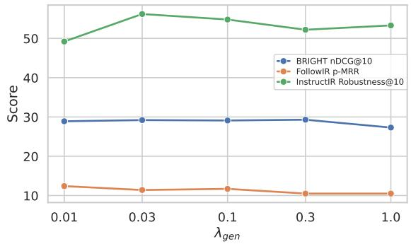  
Figure 4: Average nDCG@10 on BRIGHT, p-MRR on FollowIR, and Robustness@10 on InstructIR with $\lambda _ { g e n } \in \{ 0 . 0 1 , 0 . 0 3 , 0 . 1 , 0 . 3 , 1 . 0 \}$

<table><tr><td rowspan="2">Setting</td><td colspan="7">StackExchange</td><td colspan="2">Coding</td><td colspan="3">Theorem-based</td><td rowspan="2">Avg.</td></tr><tr><td>Bio.</td><td>Earth.</td><td>Econ.</td><td>Psy.</td><td>Rob.</td><td>Stack.</td><td>Sus.</td><td>Leet.</td><td>Pony</td><td>AoPS TheoQ.</td><td></td><td>TheoT.</td></tr><tr><td> $\lambda _ { g e n } = 0 . 0 1$ </td><td>31.7</td><td>36.6</td><td>27.0</td><td>31.7</td><td>23.4</td><td>29.2</td><td>25.2</td><td>38.3</td><td>2.9</td><td>17.2</td><td>43.6</td><td>40.0</td><td>28.9</td></tr><tr><td> $\lambda _ { g e n } = 0 . 0 3$ </td><td>32.5</td><td>38.9</td><td>27.7</td><td>32.0</td><td>23.9</td><td>29.1</td><td>26.4</td><td>37.2</td><td>2.4</td><td>16.6</td><td>42.7</td><td>40.7</td><td>29.2</td></tr><tr><td> $\lambda _ { g e n } = 0 . 1 ( \mathrm { d e f a u l t } )$ </td><td>34.7</td><td>40.8</td><td>26.5</td><td>33.7</td><td>24.6</td><td>29.3</td><td>26.0</td><td>35.5</td><td>2.8</td><td>16.6</td><td>37.6</td><td>41.8</td><td>29.1</td></tr><tr><td> $\lambda _ { g e n } = 0 . 3$ </td><td>33.4</td><td>39.8</td><td>27.1</td><td>32.7</td><td>25.1</td><td>30.1</td><td>29.5</td><td>36.8</td><td>1.9</td><td>16.9</td><td>37.4</td><td>40.9</td><td>29.3</td></tr><tr><td> $\lambda _ { g e n } = 1 . 0$ </td><td>30.2</td><td>35.6</td><td>25.9</td><td>30.3</td><td>23.4</td><td>26.8</td><td>27.7</td><td>35.2</td><td>1.3</td><td>15.6</td><td>36.6</td><td>38.8</td><td>27.3</td></tr></table>

Table 6: nDCG@10 on BRIGHT for GEM with different $\lambda _ { g e n }$ . Best results are shown in bold.
<table><tr><td rowspan="3">Setting</td><td colspan="8">FollowIR</td><td colspan="2">InstructIR</td></tr><tr><td colspan="2">Robust04</td><td colspan="2">News21</td><td colspan="2">Core17</td><td colspan="2">Average</td><td colspan="2">MS MARCO</td></tr><tr><td>MAP</td><td>p-MRR</td><td>nDCG</td><td>p-MRR</td><td>MAP</td><td>p-MRR</td><td></td><td>Score p-MRR</td><td>nDCG@10</td><td>Robust.@10</td></tr><tr><td> $\lambda _ { g e n } = 0 . 0 1$ </td><td>28.0</td><td>+13.3</td><td>26.5</td><td>+8.7</td><td>25.4</td><td>+15.1</td><td>26.6</td><td>+12.4</td><td>83.9</td><td>49.2</td></tr><tr><td> $\lambda _ { g e n } = 0 . 0 3$ </td><td>26.4</td><td> $+ 1 0 . 5$ </td><td>26.0</td><td>+9.9</td><td>23.7</td><td>+13.7</td><td>25.4</td><td> $+ 1 1 . 4$ </td><td>88.3</td><td>56.2</td></tr><tr><td> $\lambda _ { g e n } = 0 . 1$  (default)</td><td>26.7</td><td> $+ 1 1 . 6$ </td><td>26.2</td><td> $+ 9 . 3$ </td><td>23.5</td><td>+14.2</td><td>25.5</td><td> $+ 1 1 . 7$ </td><td>87.5</td><td>54.8</td></tr><tr><td> $\lambda _ { g e n } = 0 . 3$ </td><td>27.0</td><td>+8.7</td><td>26.9</td><td>+8.3</td><td>24.9</td><td>+14.4</td><td>26.3</td><td> $+ 1 0 . 5$ </td><td>86.8</td><td>52.2</td></tr><tr><td> $\lambda _ { g e n } = 1 . 0$ </td><td>26.3</td><td>+9.1</td><td>27.4</td><td>+7.5</td><td>23.6</td><td>+14.9</td><td>25.7</td><td>+10.5</td><td>87.1</td><td>53.3</td></tr></table>

Table 7: Results on FollowIR and InstructIR for GEM with different $\lambda _ { g e n }$ . Best results are shown in bold.

## B.2 Results with Different Generation Loss Weights

To investigate the effects of $\lambda _ { g e n }$ for loss weighting (see Eq. 5), we trained GEM with $\lambda _ { g e n } \in$ {0.01, 0.03, 0.1, 0.3, 1.0}, where $\lambda _ { g e n } = 0 . 1$ is the default setting used in previous experiments.

Table 6 and Table 7 provide the full results on BRIGHT and instruction-following retrieval benchmarks, respectively. Figure 4 shows the averaged metrics across different values of $\lambda _ { g e n }$ Overall, we do not observe a clear trend as $\lambda _ { g e n }$ varies, although the results appear more stable for $\lambda _ { g e n } \in \{ 0 . 0 3 , 0 . 1 , 0 . 3 \}$ . These findings suggest that GEM’s retrieval performance is relatively insensitive to the exact weighting of the generation loss, provided that $\lambda _ { g e n }$ lies within a reasonable range.

## B.3 Results with Different Backbones

We evaluate GEM across different backbones under two settings: (1) the default setting described in Section 3.1, where reasoning is generated by the corresponding backbone being trained, and (2) a distillation setting in which student models are trained using reasoning generated by Qwen3-4B-Instruct-2507. In the first setting, document generation is also re-run to align with reasoning produced by a different backbone. Particularly, we increase $\lambda _ { g e n }$ to 0.2 for the distillation setting, as the responses are not sampled from the same backbone. The backbones we used include Qwen3-4B-Instruct (Yang et al., 2025a), Llama3.2- 3B-Instruct (Grattafiori et al., 2024), Gemma2-2B-

Instruct (Riviere et al., 2024), and Qwen2.5-3B-Instruct (Yang et al., 2025b).

Table 8 provides results on FollowIR and InstructIR. When trained using reasoning generated by the corresponding backbone, GEM (Llama3.2-3B-Instruct) achieves stronger performance on InstructIR. We also observe that models can be effectively trained in the distillation setting, producing results competitive to GEM (Qwen3-4B-Instruct).

Table 9 presents results on BRIGHT. Interestingly, for GEM (Llama3.2-3B-Instruct), the distillation setting yields stronger performance than using self-generated reasoning. This suggests that the responses sampled from this backbone may be of comparatively lower quality for BRIGHT. In addition, GEM (Gemma2-2B-Instruct) performs substantially worse on BRIGHT, likely due to its limited reasoning capacity.

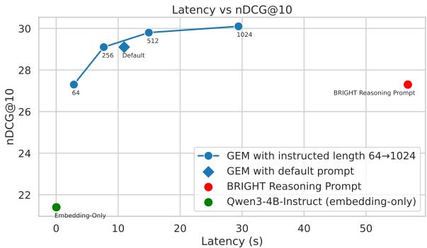  
Figure 5: Latency and nDCG@10 on BRIGHT.

<table><tr><td rowspan="3">Model</td><td colspan="6">FollowIR</td><td colspan="2">InstructIR</td></tr><tr><td>Robust04 MAP</td><td></td><td>News21</td><td>Core17</td><td></td><td>Average</td><td></td><td>MS MARCO</td></tr><tr><td>p-MRR</td><td>nDCG</td><td>p-MRR</td><td>MAP</td><td>p-MRR</td><td>Score p-MRR</td><td>nDCG@10</td><td>Robust.@10</td></tr><tr><td colspan="9">Training with responses from the corresponding backbone</td></tr><tr><td>GEM (Qwen3-4B-Instruct)</td><td>26.7</td><td>+11.6</td><td>26.2 +9.3</td><td>23.5 23.1</td><td>+14.2</td><td>25.5</td><td>+11.7</td><td>87.5</td><td>54.8</td></tr><tr><td>GEM (Llama3.2-3B-Instruct)</td><td>28.9</td><td>+10.9</td><td>24.5</td><td>+6.5</td><td>+11.4</td><td>25.5</td><td>+9.6</td><td>89.8</td><td>59.0</td></tr><tr><td colspan="9">Distillation using Qwen3 data</td></tr><tr><td>GEM (Llama3.2-3B-Instruct)</td><td>29.3</td><td>+8.3</td><td>24.8</td><td>+6.4</td><td>23.7 +14.1</td><td>25.9</td><td>+9.6</td><td>86.4</td><td>51.2</td></tr><tr><td>GEM (Gemma2-2B-Instruct)</td><td>22.4</td><td>+13.6</td><td>25.4</td><td>+11.7</td><td>21.5 +11.2</td><td>23.1</td><td>+12.2</td><td>84.4</td><td>48.3</td></tr><tr><td>GEM (Qwen2.5-3B-Instruct)</td><td>28.2</td><td>+11.6</td><td>21.8</td><td>+10.7</td><td>23.9</td><td>+9.3 24.6</td><td>+10.5</td><td>88.1</td><td>55.5</td></tr></table>

Table 8: Results on FollowIR and InstructIR with different backbones.
<table><tr><td rowspan="2">Model</td><td colspan="6">StackExchange</td><td rowspan="2"></td><td colspan="2">Coding</td><td colspan="3">Theorem-based</td><td rowspan="2">Avg.</td></tr><tr><td>Bio.</td><td>Earth.</td><td>Econ.</td><td>Psy.</td><td>Rob.</td><td>Stack.</td><td>Sus. Leet.</td><td>Pony</td><td>AoPS</td><td>TheoQ.</td><td>TheoT.</td></tr><tr><td>Training with responses from the corresponding backbone</td><td></td><td colspan="10"></td><td></td><td></td><td></td></tr><tr><td>GEM (Qwen3-4B-Instruct)</td><td>34.7</td><td>40.8</td><td>26.5</td><td>33.7</td><td>24.6</td><td>29.3</td><td>26.0</td><td>35.5</td><td>2.8</td><td>16.6</td><td>37.6</td><td>41.8</td><td>29.1</td></tr><tr><td>GEM (Llama3.2-3B-Instruct)</td><td>27.1</td><td>33.9</td><td>22.3</td><td>27.4</td><td>11.9</td><td>19.5</td><td>21.6</td><td>34.0</td><td>3.1</td><td>12.9</td><td>28.3</td><td>30.5</td><td>22.7</td></tr><tr><td colspan="10">Distillation using Qwen3 data</td><td colspan="3"></td></tr><tr><td>GEM (Llama3.2-3B-Instruct)</td><td>33.2</td><td>41.7</td><td>26.7</td><td>29.4</td><td>20.5</td><td>30.4</td><td>27.1</td><td>32.6</td><td>10.0</td><td>9.9</td><td>33.8</td><td>34.6</td><td>27.5</td></tr><tr><td>GEM (Gemma2-2B-Instruct)</td><td>22.4</td><td>31.2</td><td>17.5</td><td>22.9</td><td>15.6</td><td>23.3</td><td>19.7</td><td>28.1</td><td>0.49</td><td>6.4</td><td>26.9</td><td>12.3</td><td>18.9</td></tr><tr><td>GEM (Qwen2.5-3B-Instruct)</td><td>28.7</td><td>35.9</td><td>20.7</td><td>29.1</td><td>17.4</td><td>25.2</td><td>23.2</td><td>35.7</td><td>2.6</td><td>11.9</td><td>35.6</td><td>27.5</td><td>24.5</td></tr></table>

Table 9: nDCG@10 on BRIGHT with different backbones.

## B.4 Inference Latency

To supplement Figure 3, we evaluate the combined latency of generation and embedding. Following prior work (Su et al., 2025; Shao et al., 2025), we consider a pipeline comprising an LLM-based reasoner and an LLM-based retriever as our baseline. For reasoning, we adopt the same prompt from BRIGHT, which is available on their official GitHub.9 This prompt is also adopted in ReasonIR (Shao et al., 2025). For a fair comparison with GEM, this baseline uses GEM’s backbone, Qwen3-4B-Instruct-2507, as its reasoner. Downstream encoding is performed by our embeddingonly variant (i.e. Qwen3-4B-Instruct). All models are benchmarked on the same node with a single NVIDIA L40S GPU. We measure per-query latency by randomly sampling a subset of 128 queries from BRIGHT. We use greedy decoding and a batch size of 1. The maximum length for generation and the truncation length for embedding are increased to 8192.

Figure 5 compares the total inference latency and nDCG@10 of different settings on BRIGHT. While reasoning substantially improves nDCG@10 on BRIGHT, autoregressive generation incurs considerable latency overhead compared to the millisecond-scale embedding-only setup (i.e. Qwen3-4B-Instruct with original queries). Although GEM allows test-time compute scaling through prompting, the cost of generation remains a limitation, similar to prior studies that rely on LLMbased query expansion to enhance retrieval (Shao et al., 2025; Sun et al., 2026; Lei et al., 2025; Gao et al., 2023; Wang et al., 2023a). Compared with the baseline prompting approach used in BRIGHT and ReasonIR, GEM achieves the same nDCG@10 of 27.3 with a much smaller generation budget (n = 64), reducing inference latency to 2.85 seconds. This represents approximately a 20× speedup, demonstrating that GEM’s test-time compute scaling can preserve retrieval quality while substantially reducing generation costs.

In practice, GEM’s autoregressive generation can be accelerated using well-established optimisation techniques, such as vLLM (Kwon et al., 2023) and FlashAttention (Dao, 2024). For simplicity and to provide a consistent evaluation setting, we do not incorporate these optimisations. All latency measurements in this paper are evaluated using the default HuggingFace implementation.

## B.5 Evaluation on Additional IR Datasets

Table 10 reports nDCG@10 on TREC-DL-2019 (Craswell et al., 2020) and TREC-DL-2020 (Craswell et al., 2021) with the MS MARCO corpus (Nguyen et al., 2016) which contains 8.8M passages. Compared with the embedding-only variants, GEM improves retrieval performance on these non-reasoning-intensive benchmarks by leveraging its own knowledge. The results are comparable to those of 7B models reported by Weller et al. (2025b).

<table><tr><td rowspan=1 colspan=1>Model</td><td rowspan=1 colspan=1>DL-2019</td><td rowspan=1 colspan=1>DL-2020</td></tr><tr><td rowspan=1 colspan=3>7B Models</td></tr><tr><td rowspan=1 colspan=1>RepLLaMAPromptriever</td><td rowspan=1 colspan=1>74.573.2</td><td rowspan=1 colspan=1>71.872.3</td></tr><tr><td rowspan=1 colspan=3>4B Models</td></tr><tr><td rowspan=4 colspan=1>DIVER-4B10Qwen3-4B-InstructGEM w/o generationGEM</td><td rowspan=1 colspan=1>67.8</td><td rowspan=1 colspan=1>63.6</td></tr><tr><td rowspan=1 colspan=1>69.0</td><td rowspan=1 colspan=1>69.1</td></tr><tr><td rowspan=1 colspan=1>67.4</td><td rowspan=1 colspan=1>65.8</td></tr><tr><td rowspan=1 colspan=1>70.4</td><td rowspan=1 colspan=1>73.6</td></tr></table>

Table 10: nDCG@10 on TREC-DL-2019 and TREC-DL-2020.

## B.6 Discussion about Performance on Pony

We noted that GEM and Promptriever underperform on the Pony programming language subset of BRIGHT (see Table 1). This subset has a corpus of approximately 8K documents. We refer readers to the official HuggingFace repository11 for examples. We postulate the problem is because our training data is largely adopted from Promptriever (MS MARCO). Notably, Promptriever itself collapses on Pony (1.7 nDCG@10 in Table 1). Furthermore, all GEM variants, regardless of backbone (see Table 9), perform poorly on Pony, similar to Promptriever. These observations indicate that Pony is out-of-domain with respect to our training data.

Additionally, we found that proprietary embeddings (OpenAI, Voyage, and Google) reported in the ReasonIR paper (Shao et al., 2025) collapse on Pony as well, with nDCG@10 ranging from 1.5 to 3.6.

## B.7 Differences from Prior Work

Here we reiterate the differences between GEM and our main external baselines, as follows:

• GritLM: GritLM (Muennighoff et al., 2025) operates in separate modes to perform either embedding or generation. While GritLM supports general question answering and embedding, it is not a model that leverages the generative (reasoning) capabilities to enhance query representations. Additionally, its embedding mode requires bidirectional attention masking, which can not be unified with causal language modelling in the incremental manner of GEM. GritLM is therefore orthogonal to the research questions in our paper. Results for GritLM-7B are presented in Table 1 and 2.

• ReasonIR: ReasonIR-8B (Shao et al., 2025) is a bi-encoder trained for reasoning-intensive retrieval. However, it is not a reasoning model itself. Furthermore, GEM’s embedding is trained to align with its own reasoning.

• Promptriever: Similarly, Promptriever (Weller et al., 2025b) is also a bi-encoder that is not generative. For instruction-following retrieval, Promptriever requires detailed instructions to specify document relevance, while user instructions are often underspecified in practice. In contrast, GEM is promptable as it remains an instruction-tuned LLM, and is inherently capable of reasoning over diverse user inputs.

## C Prompts

We provide our prompts as follows:

• Generate-Then-Encode. Figure 6 is our default prompt for generate-then-encode and was used for GEM’s data generation and training.

• Embedding-Only. Figure 7 is the prompt for encoding documents and also queries when generation is disabled.

• Filtering. Figure 8 provides our prompt for filtering.

• Document Generation. Figure 9 and 10 provide our document generation prompts without and with an example, respectively. Each prompt is selected with a 50% probability.

• Test-Time Compute Scaling. Figure 11 provides our prompt for test-time scaling (see Figure 3). Following BRIGHT (Su et al., 2025), we instruct GEM to generate an answer. Additionally, we explicitly specify the target generation length.

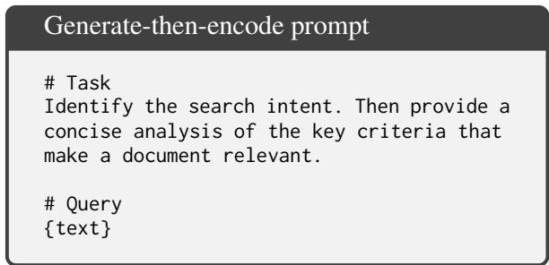

• Document Generation. Table 17 provides an example of our document generation, where the positive document aligns with the reasoning (e.g. location and authoritative source), whereas the hard negative document fails to meet the search intent despite its topical similarity.

Figure 6: Prompt for generate-then-encode.  
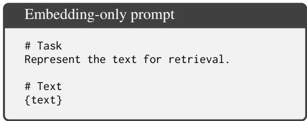

Figure 7: Prompt for encoding documents and queries when generation is disabled.  
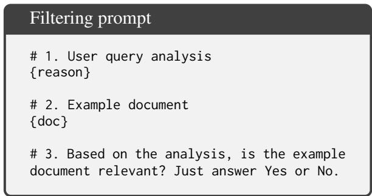  
Figure 8: Prompt for filtering out low-quality data.

## D Examples

In this section, we provide the following examples:

• Case Studies. Table 11–Table 15 present our qualitative case studies, where queries lack detailed relevance criteria. We examine the similarity scores produced by GEM and Promptriever.

• Response Generation. Table 16 illustrates that embedding models suffer from catastrophic forgetting when trained without a causal language modelling objective. In this case, embedding-only models fail to follow our meta-instruction; they generate repetitive content without emitting an EOS token to terminate the generation, although they are trained to use the dedicated embedding token like GEM.

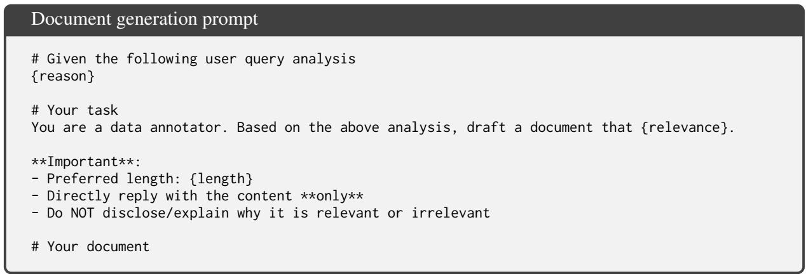  
Figure 9: Prompt for document generation without an example.

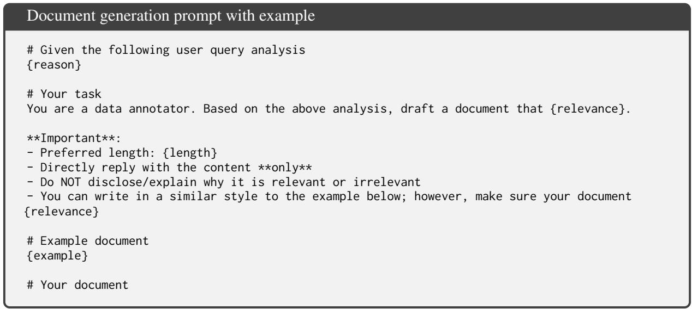  
Figure 10: Prompt for document generation with an example.

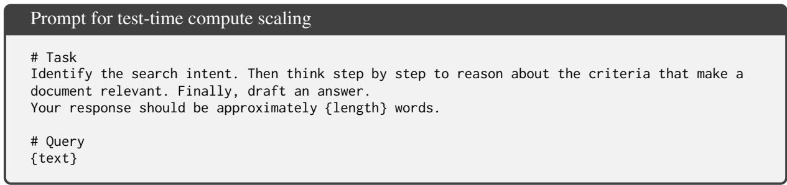  
Figure 11: Prompt for test-time compute scaling.

<table><tr><td rowspan=1 colspan=1>Query</td><td rowspan=1 colspan=1>What is this syntax called? Help me understand it with simpleexamples.@func2def func1(arg1, arg2):pass</td></tr><tr><td rowspan=1 colspan=1>Positive Document</td><td rowspan=1 colspan=1>Decorators let you add extra behavior to a function without chang-ing the function&#x27;s code.# Exampledef log(func):</td></tr><tr><td rowspan=1 colspan=1>Negative Document</td><td rowspan=1 colspan=1>Why does the syntax func1(func2)(parameters); work and what isit called? From the book Eloquent Javascript Third Edition ...</td></tr><tr><td rowspan=1 colspan=1>Scores by GEM</td><td rowspan=1 colspan=1>Positive Document: 0.723 Negative Document: 0.570</td></tr><tr><td rowspan=1 colspan=1>Scores by Promptriever</td><td rowspan=1 colspan=1>Positive Document: 0.578 Negative Document: 0.594</td></tr></table>

Table 11: Example of document similarity scores produced by GEM and Promptriever. Scores are highlighted in green when the positive document is ranked higher and in red otherwise.

<table><tr><td colspan="1" rowspan="1">Query</td><td colspan="1" rowspan="1">"There is always a day when the flower blooms again."Find me some similar poems.</td></tr><tr><td colspan="1" rowspan="1">Positive Document</td><td colspan="1" rowspan="1">No winter stays forever.Somewhere beneath the frost,a quiet seed is alreadydreaming of spring.</td></tr><tr><td colspan="1" rowspan="1">Negative Document</td><td colspan="1" rowspan="1">Every bloom has its limit.The perfume fades to nothing.Tomorrow brings only empty stems.The wind carries away the remaining memory.</td></tr><tr><td colspan="1" rowspan="1">Scores by GEM</td><td colspan="1" rowspan="1">Positive Document: 0.633 Negative Document: 0.563</td></tr><tr><td colspan="1" rowspan="1">Scores by Promptriever</td><td colspan="1" rowspan="1">Positive Document: 0.459 Negative Document: 0.471</td></tr><tr><td>Query</td><td>Explain IBS in simple language.</td></tr><tr><td>Positive Document</td><td>Irritable Bowel Syndrome (IBS) is a common problem with how your gut works. It can cause stomach pain, bloating, gas, diarrhea, or constipation. IBS does not damage your digestive system, but it makes your gut extra sensitive. Think of it like a miscommuni- cation between your brain and your belly. Certain foods, stress, and lack of sleep can trigger these uncomfortable symptoms. You can often manage IBS by changing your diet, reducing stress, and drinking plenty of water.</td></tr><tr><td>Negative Document</td><td>Irritable Bowel Syndrome (IBS) is a chronic gastrointestinal disor- der characterized by visceral hypersensitivity and altered intestinal motility. The pathophysiology involves dysregulation of the brain- gut axis, microscopic inflammation, and alterations in the gut microbiota. Quantitative diagnostic criteria, such as the Rome IV parameters, require recurrent abdominal pain associated with defecation or changes in stool frequency and form. Management necessitates targeted pharmacotherapy, including antispasmodics, prokinetics, or secretagogues, to address specific pathophysiologi-</td></tr><tr><td>Scores by GEM</td><td>cal mechanisms. Positive Document: 0.832 Negative Document: 0.676</td></tr><tr><td>Scores by Promptriever</td><td>Positive Document: 0.430 Negative Document: 0.430</td></tr></table>

Table 12: Example of document similarity scores produced by GEM and Promptriever. Scores are highlighted in green when the positive document is ranked higher and in red otherwise.

Table 13: Example of document similarity scores produced by GEM and Promptriever. Scores are highlighted in green when the positive document is ranked higher and in red otherwise.

<table><tr><td colspan="1" rowspan="1">Query</td><td colspan="1" rowspan="1">Which marine organisms do not rely on sunlight for energy?</td></tr><tr><td colspan="1" rowspan="1">Positive Document</td><td colspan="1" rowspan="1">Hydrothermal vent communities use chemosynthesis rather thanphotosynthesis. Bacteria oxidize toxic chemicals like hydrogensulphide, meaning they do not require any solar energy to survive.</td></tr><tr><td colspan="1" rowspan="1">Negative Document</td><td colspan="1" rowspan="1">Phytoplankton and marine algae rely on sunlight for energy toperform photosynthesis. These microscopic organisms form thebase of the marine food web by capturing solar radiation.</td></tr><tr><td colspan="1" rowspan="1">Scores by GEM</td><td colspan="1" rowspan="1">Positive Document: 0.703 Negative Document: 0.516</td></tr><tr><td colspan="1" rowspan="1">Scores by Promptriever</td><td colspan="1" rowspan="1">Positive Document: 0.338 Negative Document: 0.391</td></tr><tr><td colspan="1" rowspan="1">Query</td><td colspan="1" rowspan="1">If I have wind speeds at 80m and 120m above the surface and I aminterested in approximating the speed at 100m, is it valid to justaverage the 80 and 120 speeds? In other words, should I expectwind speed to be a linear function of height or would a nonlinearfunction be more appropriate?</td></tr><tr><td colspan="1" rowspan="1">Positive Document</td><td colspan="1" rowspan="1">Wind speed increases non-linearly with height due to surface fric-tion and atmospheric stability. Simple linear averaging between80m and 120m introduces systematic errors because the windprofile follows a logarithmic or power law. To approximate windspeed at 100m accurately, you must use non-linear models likethe Logarithmic Wind Profile or the Hellmann power law. Theseequations account for surface roughness lengths and stability pa-rameters, which cause the velocity curve to shear sharply near theground and taper off at higher altitudes.</td></tr><tr><td colspan="1" rowspan="1">Negative Document</td><td colspan="1" rowspan="1">To find the wind speed at 100m using data from 80m and 120m,you can apply a standard linear interpolation formula. Because100m sits exactly halfway between 80m and 120m, calculatingthe simple arithmetic mean of the two known velocities provides ahighly accurate and valid approximation. Wind velocity increasesat a constant, linear rate within this specific boundary layer in-terval. This straightforward mathematical average eliminates theneed for complex, non-linear atmospheric equations or specializedaerodynamic profiling software.</td></tr><tr><td colspan="1" rowspan="1">Scores by GEM</td><td colspan="1" rowspan="1">Positive Document: 0.848 Negative Document: 0.680</td></tr><tr><td colspan="1" rowspan="1">Scores by Promptriever</td><td colspan="1" rowspan="1">Positive Document: 0.707 Negative Document: 0.727</td></tr><tr><td colspan="1" rowspan="1">Prompt</td><td colspan="1" rowspan="1"># TaskIdentify the search intent. Then provide a concise analysis of the key criteriathat make a document relevant. Your response should be around 100 words.# Query“There is always a day when the flower blooms again."Find me some similar poems.</td></tr><tr><td colspan="1" rowspan="1">Response fromGEM</td><td colspan="1" rowspan="1">**Search Intent:** The user seeks poetic inspiration or similar verses thatconvey the theme of renewal, resilience, or cyclical beauty—specificallyechoing the idea of life returning, like a flower blooming again.**Relevance Criteria: **A document is relevant if it features poems with themesof rebirth, persistence, or natural cycles; uses metaphorical language (e.g.,flowers, seasons); and expresses hope or continuity. Poems with emotionaldepth, rhythmic structure, and symbolic imagery align best with the query'sintent. The tone should be reflective, hopeful, or serene to match the originalsentiment.</td></tr><tr><td colspan="1" rowspan="1">Response fromGEM w/o $\mathcal { L } _ { g e n }$ </td><td colspan="1" rowspan="1">Poem: "The Flower That Blooms Again" by Mary OliverKey criteria: cyclical nature, renewal, blooming again, daily recurrence, hope,resilience Analysis: This poem captures the recurring cycle of flowers bloomingdaily, emphasizing hope and resilience through natural repetition. It reflectson the enduring beauty and renewal of life, aligning with the theme of dailyrenewal and the flower's persistent return. The poem's cyclical imagery andhopefulness match the original quote's essence of continuous blooming anddaily hope. cyclic renewal, daily hope, resilience, natural cycles, bloomingagain. poetic hope, cyclical renewal, daily bloom, resilience, natural cycles.poetic hope, cyclical renewal, daily bloom, resilience, natural cycles. poetichope, cyclical renewal, daily bloom, resilience, natural cycles . ..</td></tr><tr><td colspan="1" rowspan="1">Response fromQwen3-4B-Instruct(our embedding-only variant)</td><td colspan="1" rowspan="1">Poems similar to "flower blooms again" include "The Sun Also Rises" and"Daybreak" — both capture renewal and cyclical life. Key criteria: themesof rebirth, daily cycles, and hope. These poems share the poetic structure ofnature imagery and recurring daily patterns, mirroring the flower's return. Theyemphasize resilience and continuity, aligning with the original poem's intent.Similarity is based on emotional tone, imagery, and cyclical themes. Bloomagain poems focus on renewal, not just flowers, but life's persistence.Poems: "Daybreak," "The Sun Also Rises," "Spring Returns" — all reflect dailyrenewal and hope.Criteria: renewal, cyclical nature, hope, daily life.Similarity: emotional and thematic resonance with rebirth.Flower bloom poems: not just flowers, but life's return.Poems: "Daybreak," "The Sun Also Rises," "Spring Returns" — all reflect dailyrenewal and hope.Criteria: renewal, cyclical nature, hope, daily life.Similarity: ...</td></tr><tr><td>Query</td><td>what is the largest lake in oklahoma</td></tr><tr><td>Reasoning</td><td>**Search Intent:** The user is seeking factual, location-based information about the largest natural lake in the state of Oklahoma. This is a straightforward informational query with a clear geographic and physical attribute focus. **Relevance Criteria Analysis:**A document is relevant if it: 1. **Accurately identifies the largest lake in Oklahoma** (e.g., Lake Eufaula or Lake Oklahoma, with precise clarification). 2. Provides **verified geographical and size data** (e.g., surface area in square miles or acres). 3. Specifies the **location** of the lake within Oklahoma. 4. Is **authoritative** (e.g., from government sources, reputable environmental organizations, or geographic databases). 5. Avoids confusion with man-made reservoirs or non-lake bodies of water. *Note:* Lake Thunderbird or Lake Eufaula are often cited, but Lake Eufaula (partially in Oklahoma) is commonly recognized as the largest natural lake in the state by surface area. Accuracy and clarity in distinguishing natural vs.</td></tr><tr><td>Positive</td><td>reservoir lakes are critical for relevance. Lake Eufaula is the largest natural lake in Oklahoma, covering an area of approximately 102,000 acres. Located in the southeastern part of the state, it spans across the Oklahoma-Georgia border, with the majority of its surface area situated within Oklahoma. According to the U.S. Army Corps of Engineers, Lake Eufaula has a conservation storage capacity of about 2.3 million acre-feet, making it a vital water resource for the region.</td></tr><tr><td>Hard Negative</td><td>Discover Lake Pontchartrain. Lake Pontchartrain is a brackish coastal lagoon in Louisiana, covering approximately 630 square miles. It is connected to the Gulf of Mexico and is a popular spot for boating and fishing. The lake is surrounded by the cities of New Orleans and Mandeville.</td></tr></table>

Table 14: Example of document similarity scores produced by GEM and Promptriever. Scores are highlighted in green when the positive document is ranked higher and in red otherwise.

Table 15: Example of document similarity scores produced by GEM and Promptriever. Scores are highlighted in green when the positive document is ranked higher and in red otherwise.

Table 16: Example responses from GEM and embedding models trained without generation loss. Repetitive content is truncated and denoted by $" \cdots " .$ We prompt with a response-length requirement to save space. GEM’s response contains 123 tokens, while GEM w/o $\mathcal { L } _ { g e n }$ and Qwen3-4B-Instruct continue generating repetitive content until reaching the maximum generation length in our setting.

Table 17: An example of our generated documents.