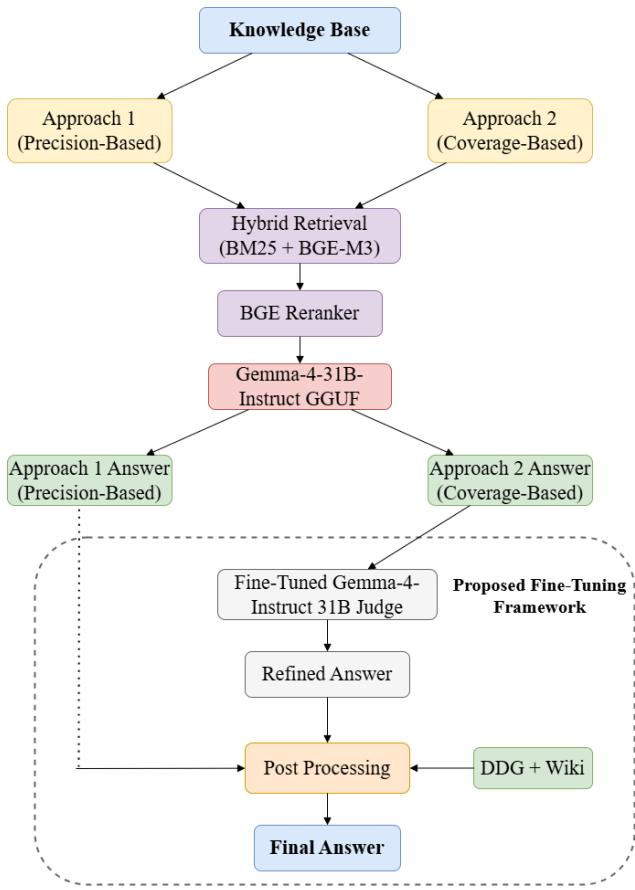

# HybridRAG-BN: A Retrieval-Augmented Framework with Fine-Tuned Verification for Bangla KBQA

Rathijit Aich, Nirjhar Das, Mahfuzulhoq Chowdhury

Department of Computer Science and Engineering

Chittagong University of Engineering & Technology

Chattogram, Bangladesh

{aichrathijit, nirjhardasami}@gmail.com, mahfuz@cuet.ac.bd

Abstract—Knowledge-base question answering (KBQA) systems rely on efective retrieval and reasoning mechanisms to generate accurate answers from external knowledge sources. However, developing reliable KBQA systems for low-resource languages such as Bangla remains challenging due to limited retrieval-focused research, scarce language resources, and difficulties in grounding generated responses in external knowledge. In this work, we propose HybridRAG-BN, a retrievalaugmented framework for Bangla KBQA that integrates hybrid retrieval using BM25 and BGE-M3, answer generation using the GGUF version of Gemma-4-31B-Instruct, and a LoRA-finetuned Gemma-4-31B-Instruct model for answer verification and refinement. To further improve robustness, the framework incorporates a post-processing stage that addresses unresolved cases through fallback answer replacement and DuckDuckGo-assisted retrieval. Experimental results demonstrate the efectiveness of the proposed framework, achieving token-level F1 scores of 0.71654 and 0.72912 on the public and private leaderboards, respectively, securing first place in the competition.

## I. INTRODUCTION

This work was originally developed for the IEEE Computer Society CUET Student Branch Chapter’s ML Contest 2.0. Knowledge-base question answering (KBQA) systems aim to answer natural language queries by retrieving and utilizing relevant information from external knowledge sources. Although Retrieval-Augmented Generation (RAG) has significantly improved fact-grounded question-answering in high-resource languages, developing reliable Bangla KBQA systems remains challenging due to limited retrieval-focused research, linguistic complexity, and scarce language resources.

In this work, we present HybridRAG-BN, a retrievalaugmented framework designed to improve the accuracy and robustness of Bangla KBQA. Our system was developed and evaluated on a dataset derived from the Indic-RAG-Suite [1], provided as part of the “Are You Sure LLM Is Enough? – Intra CUET ML Contest 2.0 (Advanced Track)”, organized by the IEEE Computer Society CUET Student Branch Chapter. The dataset consists of approximately 3,000 question-answerreasoning training triples, 1,500 test questions and a knowledge base containing approximately 6,500 Bangla Wikipedia pages.

To address retrieval and reasoning challenges in lowresource settings, the proposed framework consists of four stages:

Hybrid retrieval using BM25 and BGE-M3 to combine lexical and semantic matching.

• Answer generation using the GGUF version of Gemma- 4-31B-Instruct.

Answer verification and refinement using a LoRA finetuned Gemma-4-31B-Instruct model.

Post-processing through fallback answer replacement and external DuckDuckGo-assisted retrieval for unresolved cases.

## II. METHODOLOGY

Figure 1 presents an overview of the proposed framework, including the two preprocessing-based approaches, the finetuned answer verification module, and the post-processing stage used to generate the final prediction.

## A. Knowledge Base Preprocessing and Chunking

1) Approach 1 – Precision-Based: The raw Bangla Wikipedia knowledge base was first reconstructed at the page level by splitting the corpus using Wikipedia page markers. Each page was then cleaned by removing recurring boilerplate sections, including page headers, footers, navigation blocks, and language-list sections commonly found in Wikipedia dumps.

a) Removed Boilerplate Blocks: The preprocessing pipeline removed five categories of non-informative content. These included recurring header and footer sections, two variants of tool and navigation blocks commonly embedded within Wikipedia pages, and translation or language-selection blocks. The language-list sections were identified using markers such as “n িট ভাষা” and আŞঃউইিক সংেযাগ সƃাদনা. Removing these components reduced noise in the knowledge base while preserving the main article content for retrieval.

The cleaned corpus was then divided into overlapping text chunks for retrieval. Chunks were generated with a target length of approximately 1000 characters and an overlap of 150 characters. To preserve semantic coherence, paragraph breaks and predefined boundary markers (such as “ | ” and “.”) were preferred as chunk boundaries whenever possible. If no suitable boundary was found, a character-based split was applied. The overlap helped preserve contextual information that might otherwise be fragmented across chunk boundaries.

  
Figure 1. Overview of the proposed question-answering framework.

2) Approach 2 – Coverage-Based: Approach 2 was designed as a less aggressive preprocessing pipeline. In this configuration, only the header block, footer block, and the first type of tool/navigation block were removed.

The cleaned corpus was subsequently divided into overlapping text chunks using the same boundary-aware chunking strategy employed in Approach 1. However, the target chunk size was reduced to approximately 800 characters while maintaining an overlap of 150 characters between consecutive chunks. Table I shows the comparison.

Table I  
CHUNK STATISTICS FOR THE TWO PREPROCESSING APPROACHES
<table><tr><td>Approach</td><td>Chunks</td><td>Avg. Length</td><td>Max Length</td></tr><tr><td>Approach 1</td><td>55,182</td><td>971.6</td><td>1000</td></tr><tr><td>Approach 2</td><td>75,819</td><td>772.8</td><td>800</td></tr></table>

## B. Retrieval-Augmented Generation (RAG)

1) Dense Embedding Generation: Following chunk construction, all knowledge-base chunks were encoded using the BGE-M3 embedding model. The resulting dense embeddings were indexed using FAISS for eficient similarity search.

Each chunk was transformed into a normalized dense vector representation, enabling semantic similarity search through vector retrieval.

2) Hybrid Retrieval: To leverage both lexical and semantic matching, a hybrid retrieval strategy was employed. For each query, candidate passages were retrieved using two complementary retrievers. First, BM25 was used to identify chunks with strong keyword overlap. Second, dense retrieval was performed by encoding the query with the BGE-M3 [7] embedding model and retrieving the most similar chunk embeddings using vector similarity search.

The candidate passages obtained from both retrievers were combined through weighted score fusion. Retrieval scores were normalized and merged using predefined weights, allowing both lexical relevance and semantic similarity to contribute to the final ranking.

3) Cross-Encoder Reranking: The candidate passages obtained from the hybrid retrieval stage were further refined using the BGE-Reranker-v2-M3 [6] cross-encoder model. Unlike the initial retrieval stage, which independently represents queries and passages, the cross-encoder jointly processes each query– passage pair and directly estimates their relevance. Each retrieved candidate was paired with the input query and assigned a relevance score by the reranker. The candidates were then sorted according to these scores, and the highestranked passages were selected for context construction.

4) Context Construction and Augmentation: To preserve local contextual information, the passage immediately preceding each selected chunk was included alongside the selected chunks.

## C. Inference

1) Approach 1 – Precision-Based: As the name suggests, this combines the retrieval pipeline described in the previous section with the Gemma-4-31B-Instruct language model for answer generation. This approach was designed to prioritize answer precision and minimize hallucination by pairing the aggressively cleaned knowledge base with a context-grounded inference strategy. The answers generated by this approach were used in subsequent post-processing.

a) Language Model: The model configuration and inference parameters used throughout the experiments are summarized in Table II.

Table II  
GEMMA-4-31B-INSTRUCT INFERENCE CONFIGURATION
<table><tr><td>Parameter</td><td>Value</td></tr><tr><td>Model</td><td>Gemma-4-31B-Instruct</td></tr><tr><td>Checkpoint</td><td>unsloth/gemma-4-31B-it-GGUF [2]</td></tr><tr><td>Quantization</td><td>gemma-4-31B-it-Q3_K_S.gguf</td></tr><tr><td>Framework</td><td>1lama.cpp</td></tr><tr><td>Context window</td><td>10,000 tokens</td></tr><tr><td>Temperature</td><td>0</td></tr><tr><td>Top-p</td><td>1</td></tr></table>

b) Prompt Design: A task-specific prompt was designed to encourage context-grounded and extractive answer generation. The model was instructed to output only the final answer span and avoid unnecessary explanations. To reduce hallucinations, the prompt explicitly required the model to return “Context -এ তথয্ েনই” when suficient evidence could not be identified from the retrieved context, rather than generating unsupported answers. This conservative design enabled unresolved cases to be identified more reliably during post-processing. The complete prompt template is provided in Appendix A. During inference, the maximum generation length was set to 150 tokens.

c) Retrieval Retry Strategy: A two-stage retrieval strategy was employed during inference. The retrieval configurations used for the initial and retry stages are summarized in Table III.

Table III  
RETRIEVAL CONFIGURATION
<table><tr><td>Parameter</td><td>Initial</td><td>Retry</td></tr><tr><td>BM25 k</td><td>10</td><td>10</td></tr><tr><td>Dense k</td><td>15</td><td>15</td></tr><tr><td>Final k</td><td>6</td><td>10</td></tr><tr><td>BM25 Weight</td><td>0.65</td><td>0.65</td></tr><tr><td>Dense Weight</td><td>0.35</td><td>0.35</td></tr></table>

Retry was triggered when the generated answer indicated insuficient contextual evidence, such as ”Context -এ তথয্ েনই'', ''উেƖখ েনই'', or related context-missing responses. In such cases, retrieval was repeated using an expanded candidate pool (k = 10), and the newly constructed context was provided to the language model for a second inference pass.

2) Approach 2 – Coverage-Based: This employs the same language model and inference configuration as Approach 1. However, it utilizes the knowledge base constructed using the second preprocessing and chunking strategy described in the preprocessing section. Whereas Approach 1 prioritizes answer precision through aggressive corpus cleaning and conservative answer generation, Approach 2 adopts a more permissive strategy intended to maximize answer coverage.

a) Prompt Design: A diferent prompt was developed for Approach 2 to encourage answer generation even when the retrieved context did not contain suficient information to directly answer the question. Unlike Approach 1, the prompt discouraged abstention-style responses and instead instructed the model to use its pretrained knowledge to generate the most plausible answer when the retrieved context was insuficient. The prompt also instructed the model to avoid responses such as ”Context-এ উেƖখ েনই'', ''তথয্ েনই'', or similar context-missing statements, and to return only the information explicitly requested in the question. The complete prompt template used in Approach 2 is provided in Appendix B. During inference, the maximum generation length was set to 150 tokens.

b) Retrieval Retry Strategy: The retrieval configuration and retry mechanism are the same as shown in Table III.

## D. Proposed Fine-Tuning Framework

The final HybridRAG-BN framework uses Approach 2 as its primary pipeline, followed by fine-tuned answer verification, Approach 1-based fallback replacement, and DuckDuckGoassisted retrieval for the remaining unresolved cases. Although retrieval-augmented generation improves answer quality, incorrect or unsupported answers may still be produced. To address this issue, a LoRA-fine-tuned language model was introduced as an answer-verification component. Rather than generating answers from scratch, the model receives the question, retrieved context, and candidate answer produced by Approach 2, and evaluates whether the answer is correct and supported by the available evidence.

1) Model Selection: The proposed framework employs Gemma-4-31B-Instruct as the base model for fine-tuning. The fine-tuning configuration is summarized in Table IV.

Table IV  
FINE-TUNING MODEL CONFIGURATION
<table><tr><td>Parameter</td><td>Value</td></tr><tr><td>Base Model</td><td>Gemma-4-31B-Instruct</td></tr><tr><td>Model Repository</td><td>unsloth/gemma-4-31B-it</td></tr><tr><td>Fine-Tuning Method</td><td>LoRA</td></tr><tr><td>Quantization</td><td>4-bit</td></tr><tr><td>Maximum Sequence Length</td><td>2000</td></tr><tr><td>LoRA Rank (r)</td><td>16</td></tr><tr><td>LoRA Alpha</td><td>32</td></tr><tr><td>LoRA Dropout</td><td>0.0</td></tr><tr><td>Bias parameters</td><td>Not trained</td></tr><tr><td>Gradient Checkpointing</td><td>Enabled</td></tr><tr><td>Random Seed</td><td>3407</td></tr></table>

2) Training Data Construction: The training dataset consisted of three fields: a question, its corresponding groundtruth answer, and an associated reasoning annotation. The dataset was divided into training and validation subsets using an 80/20 split with a fixed random seed.

For each training instance, the question and reasoning annotation were incorporated into an instruction-style prompt, while the ground-truth answer served as the target response.

The following prompt template was used during training:

ØƜ: [Question]

ইিĬত: [Reasoning] িনেদর্শনা:

\- ইিĬত বয্বহার কের সিঠক উত্র িনধর্ারণ কেরা

\- যতটা সƅব পূণর্ ও িনভȘর্ ল উত্র িলখেব

\- অসƃূণর্ উত্র িলখেব না

\- শুধুমাÓ চșড়াŞ উত্র িলখেব

\- অিতিরĘ িকছȖ িলখেব না

\- বয্াখয্া িলখেব না

3) Fine-Tuning Procedure: Supervised fine-tuning was performed using TRL’s SFTTrainer with LoRA adaptation on a 4-bit quantized Gemma-4-31B-Instruct model. Responseonly training was employed so that loss was computed only on assistant-generated tokens. The complete training configuration is summarized in Table V.

4) Judge-Based Inference: The proposed framework uses the answer generated by Approach 2 as a candidate prediction and applies the fine-tuned model as an answer-verification and refinement component. Rather than generating an answer from scratch, the model receives the original question, the retrieved context, and the candidate answer produced by Approach 2.

A task-specific prompt was developed to guide the verification process. The model was instructed to compare the candidate answer against the available context, remove unnecessary details when appropriate, correct unsupported answers, and preserve the original answer when no confident improvement could be made. To encourage concise and precise refinements, the maximum generation length was limited to 30 tokens. The complete prompt is provided in Appendix C.

Table V  
FINE-TUNING HYPERPARAMETERS
<table><tr><td>Parameter</td><td>Value</td></tr><tr><td>Training Method</td><td>Supervised Fine-Tuning (SFT)</td></tr><tr><td>Framework</td><td>TRL SFTTrainer</td></tr><tr><td>Optimizer</td><td>AdamW 8-bit</td></tr><tr><td>Epochs</td><td>2</td></tr><tr><td>Learning Rate</td><td> $1 . 5 \times 1 0 ^ { - 5 }$ </td></tr><tr><td>Warmup Ratio</td><td>0.03</td></tr><tr><td>Per-device Batch Size</td><td>1</td></tr><tr><td>Gradient Accumulation Steps</td><td>8</td></tr><tr><td>Effective Batch Size</td><td>8</td></tr><tr><td>Maximum Sequence Length</td><td>1000</td></tr><tr><td>Weight Decay</td><td>0.01</td></tr><tr><td>Learning Rate Scheduler</td><td>Cosine</td></tr><tr><td>Gradient Checkpointing</td><td>Enabled</td></tr><tr><td>Response-only Training</td><td>Yes</td></tr><tr><td>Random Seed</td><td>3407</td></tr><tr><td>Training Examples</td><td>2,400</td></tr><tr><td>Optimization Steps</td><td>600</td></tr><tr><td>Trainable Parameters</td><td>122.4M (0.39%)</td></tr></table>

## 5) Post-Processing:

a) Merging with Approach 1 Answers: Following judgebased inference, an additional post-processing stage was applied to the generated predictions. During manual inspection, a small number of answers were found to contain abstentionstyle responses such as ''তথয্ েনই'', ''উেƖখ েনই'', and related variants indicating that the model had failed to produce a meaningful answer.

To address this issue, a rule-based filtering procedure was employed to identify such responses. For afected instances, the corresponding predictions generated by Approach 1 were used as replacement answers. This strategy was motivated by the observation that Approach 1 occasionally produced valid answers for questions where the fine-tuned verification framework remained overly conservative.

b) DuckDuckGo (DDG) Search with Entity Extraction: Following the initial replacement procedure, some predictions still contained the response ”Context -এ তথয্ েনই''. To address these remaining failures, an additional retrieval-based postprocessing stage was applied.

For each afected question, an entity extraction step was first performed using the Gemma-4-31B-Instruct model. The extracted entity was then used as a query for DuckDuckGo search, and the top Wikipedia result returned by the search engine was selected. The corresponding Wikipedia article content was subsequently retrieved and provided to the language model together with the original question. A task-specific prompt was used for entity extraction and answer generation. The complete prompt is provided in Appendix D.

## III. EXPERIMENTS

To evaluate the efect of model scale on retrievalaugmented question answering performance, three other

Gemma 4 instruction-tuned models were also investigated: google/gemma-4-E2B-it, google/gemma-4-E4B-it, and google/gemma-4-26B-A4B-it. All experiments were conducted using the same retrieval-augmented generation pipeline, retrieval parameters, and prompt configuration. The Approach 2 preprocessing and chunking strategy was used throughout these experiments to ensure a consistent evaluation setting.

Qualitative inspection of the generated answers revealed a clear improvement in answer quality as model size increased. The results show a consistent improvement in both public and private F1 as model scale increases across the evaluated Gemma 4 variants, demonstrating stronger contextual understanding, and were better able to extract relevant information from the retrieved passages.

## IV. RESULTS AND ANALYSIS

The evaluation dataset consisted of 1,500 test questions. Competition rankings were determined using two evaluation splits: a public leaderboard based on approximately 69% of the test set and a private leaderboard based on the remaining 31%.

## A. Model Scaling Experiments

Table VI presents the performance of the Gemma 4 models evaluated using the same retrieval-augmented generation pipeline and the Approach 2 preprocessing strategy.

Table VI  
PERFORMANCE OF DIFFERENT GEMMA 4 MODELS
<table><tr><td>Model</td><td>Public F1</td><td>Private F1</td></tr><tr><td>Gemma-4-E2B-it [5]</td><td>0.59634</td><td>0.60925</td></tr><tr><td>Gemma-4-E4B-it [4]</td><td>0.60247</td><td>0.60727</td></tr><tr><td>Gemma-4-26B-A4B-it [3]</td><td>0.66393</td><td>0.68064</td></tr></table>

As shown in Table VI, these results indicate a clear positive relationship between model scale and question-answering performance. Based on this trend, Gemma-4-31B-Instruct was selected as the foundation of the proposed framework.

## B. Overall Performance Comparison

We conduct an incremental ablation study to quantify the contribution of each component. Table VII presents the performance of the three evaluated approaches using the Gemma-4-31B-Instruct model. Approach 1 corresponds to the aggressively cleaned knowledge base with retrieval-augmented generation, while Approach 2 uses the alternative preprocessing strategy described previously. The proposed framework extends Approach 2 through fine-tuned answer verification and subsequent post-processing stages.

Table VII  
OVERALL TOKEN-LEVEL F1 COMPARISON
<table><tr><td>Method</td><td>Public F1</td><td>Private F1</td></tr><tr><td>Approach 1</td><td>0.69329</td><td>0.69147</td></tr><tr><td>Approach 2</td><td>0.70223</td><td>0.69901</td></tr><tr><td>Approach 2 + Fine- Tuned Verification</td><td>0.71589</td><td>0.72495</td></tr><tr><td>Proposed Framework</td><td>0.71654</td><td>0.72912</td></tr></table>

Approach 2 achieved higher performance than Approach 1 on both leaderboard splits, indicating that the less aggressive preprocessing strategy improved retrieval efectiveness. The proposed framework further improved performance substantially, increasing the private leaderboard score from 0.69901 to 0.72912 and the public leaderboard score from 0.70223 to 0.71654.

## C. Efect of Fine-Tuning

A comparison between the outputs of Approach 2 and the fine-tuned verification framework revealed that the finetuned model modified 48 of the 1,500 generated answers. These modifications included factual corrections, improved entity resolution, and more precise answer extraction. These targeted modifications produced a substantial improvement in token-level F1, suggesting that a small number of highimpact corrections accounted for a disproportionate share of the performance gain. Representative examples of answers that were altered by the fine-tuned model are presented below.

## Example 1

Question: নািদয়া েটানেচভা েকান দুিট উপািধ েপেয়েছন?

Approach 2: িফেদ মাƫার এবং নারী মাƫার

Fine-Tuned: িফেদ মাƫার এবং নারী আŞজর্ািতক মাƫার

## Example 2

Question: শািলর্ েটƃেলর চলিİÓগুেলা েকাথায় িমিলয়ন িমিলয়ন ডলার আয় কেরেছ?

Approach 2: মািকর্ ন এবং কানাডায়

Fine-Tuned: মািকর্ন যুĘরাƧ এবং কানাডায়

The fine-tuned verification model was configured with a maximum generation length of 30 tokens to encourage concise answer refinement and maximize token-level F1 performance. While this constraint generally improved answer precision, it occasionally resulted in overly shortened answers for list type questions.

## D. Efect of Post-Processing

Predictions containing abstention-style responses such as ''তথয্ েনই'', ''উেƖখ েনই'', or related variants were identified. The corresponding answers from Approach 1 were then examined and used as replacements whenever a more informative prediction was available. This procedure afected 11 predictions. Among them, four were correct answers.

Representative examples are shown below.

Example 1

Question: েÅসন ওয়ালার েকান সােল তার িশক্ষকতার চাকির েছেড় েদন?

Approach 2 + Fine-Tuned: তথয্ েনই

Approach 1 Replacement: ২০২১ সােল

## Example 2

Question: নািজয়াইং মসিজদিট েকান সােল সংরিক্ষত সাংƨȔ িতক িনদশর্ন িহেসেব তািলকাভȘĘ করা হয়?

Approach 2 + Fine-Tuned: Øদত্ তেথয্ নািজইং মসিজদিট েকান সােল সংরিক্ষত সাংƨȔ িতক িনদশর্ন িহেসেব তািলকাভȘĘ করা হেয়েছ তা উেƖখ েনই

Approach 1 Replacement: ২০২১ সােল

## Example 3

Question:সুধীর চŭ দাস ১৯৭৭ সােলর পিƙমবĬ িবধানসভা িনবর্াচেন কত শতাংশ েভাট েপেয়িছেলন?

Approach 2 + Fine-Tuned: তথয্ েনই

Approach 1 Replacement: ১০.২৬%

Following the Approach 1 replacement stage, seven predictions still contained the response ”Context-এ তথয্ েনই''. These remaining cases were processed using the DuckDuckGoassisted retrieval pipeline described previously. By leveraging external retrieval through DuckDuckGo and Wikipedia, additional information could be obtained for questions that were not successfully resolved by either the retrieval-based baseline or the fine-tuned verification framework.

Among the seven unresolved instances, five were successfully converted into answer-bearing predictions. Representative examples are shown below.

## Example 1

Question: েহটর্া মুলােরর িপতা কী েপশায় িনেয়ািজত িছেলন?

Before DDG Retrieval: Context -এ তথয্ েনই

After DDG Retrieval: Îাক Ðাইভার

## Example 2

Question: েবািধনাথ েভলানČামী েকাথায় সŦয্াস দীক্ষা লাভ কেরন?

Before DDG Retrieval: Context -এ তথয্ েনই

After DDG Retrieval: àীলĩার আলােভিডেত

The post-processing stage provided a further improvement over the fine-tuned verification framework, increasing the private token-level F1 score from 0.72495 to 0.72912 and the public token-level F1 score from 0.71589 to 0.71654.

## V. CONCLUSION

This paper presented a retrieval-augmented framework for Bangla knowledge-base question answering that combines hybrid retrieval, large language model inference, finetuned answer verification, and targeted post-processing. Two knowledge-base preprocessing and chunking strategies were investigated, followed by answer generation using Gemma-4-31B-Instruct and answer refinement through a LoRA-finetuned verification model. Experimental results showed that the less aggressive preprocessing strategy improved retrieval efectiveness, while the fine-tuned verification and post-processing stages further improved answer quality and overall tokenlevel F1 performance. The final system achieved public and private leaderboard scores of 0.71654 and 0.72912. Future work may explore stronger retrieval methods, adaptive answerverification strategies, and improved handling of cases where relevant evidence is absent from the available knowledge sources.

## VI. LIMITATIONS

The proposed framework has several limitations. The fine-tuned verification model was constrained to a maximum generation length of 30 tokens, which occasionally resulted in truncated answers for list-type questions. Additionally, the framework relies heavily on Gemma-4-31B-Instruct across multiple pipeline stages, making it computationally expensive. Finally, model scaling experiments were conducted exclusively within the Gemma 4 family, leaving the framework’s generalizability to other model families such as Llama, Qwen, or Mistral unexplored.

## REFERENCES

[1] AI4Bharat, “Indic-RAG-Suite,” Hugging Face Dataset Repository. Available: https://huggingface.co/datasets/ai4bharat/Indic-Rag-Suite (Accessed: Jun. 2026).

[2] Unsloth, “Gemma-4-31B-it-GGUF,” Hugging Face Model Repository. Available: https://huggingface.co/unsloth/gemma-4-31B-it-GGUF (Accessed: Jun. 2026).

[3] Google, “Gemma-4-26B-A4B-it,” Hugging Face Model Repository. Available: https://huggingface.co/google/gemma-4-26B-A4B-it (Accessed: Jun. 2026).

[4] Google, “Gemma-4-E4B-it,” Hugging Face Model Repository. Available: https://huggingface.co/google/gemma-4-E4B-it (Accessed: Jun. 2026).

[5] Google, “Gemma-4-E2B-it,” Hugging Face Model Repository. Available: https://huggingface.co/google/gemma-4-E2B-it (Accessed: Jun. 2026).

[6] BAAI, “BGE-Reranker-v2-M3,” Hugging Face Model Repository. Available: https://huggingface.co/BAAI/bge-reranker-v2-m3 (Accessed: Jun. 2026).

[7] BAAI, “BGE-M3,” Hugging Face Model Repository. Available: https: //huggingface.co/BAAI/bge-m3 (Accessed: Jun. 2026).

## APPENDIX AAPPROACH 1 PROMPT

## A. System Prompt

The following system prompt was used during inference: You are an ultra-precise question-answering assistant. Think carefully before answering. Output only the final answer. Do not show reasoning.

## B. User Prompt

The retrieved context and input question were incorporated into the following prompt template:

ØেƜর semantic meaning বুেঝ Context েথেক সবেচেয় উপযুĘ ও িনভȘর্ ল উত্র েবর করা। ØেƜর শź বা বাকয্াংশ repeat করেব না --- শুধুমাÓ answer part িলখেব।

গুরুüপূণর্:

যিদ ØƜ specific নাম, বয্িĘ, Ʈান, তািরখ, সাল, সংখয্া, পদিব, পুরƨার, Øিতơান, ঘটনা বা িনিদর্Ơ তথয্ সƃেকর্ হয়, তাহেল শুধুমাÓ exact answer part িলখেব --- অিতিরĘ েকােনা শź, বয্াখয্া বা পূণর্ বাকয্ িলখেব না।

উদাহরণ:

Question:

বাংলােদেশর রাজধানী কী?

Bad Answer:

বাংলােদেশর রাজধানী ঢাকা।

Correct Answer:

ঢাকা

যিদ ØƜ ''েকন'', ''কারণ'', ''কীভােব'', ''িকেসর জনয্'' ধরেনর হয়, তাহেল পুেরা semantic context বুেঝ সবেচেয় উপযুĘ কারণ বা short reason phrase িলখেব --- পূণর্ বাকয্ নয়, অিতিরĘ বয্াখয্াও নয়।

Question:

রাহুলেক েকন ƨȒল েথেক েবর কের েদওয়া হেয়িছল?

Wrong Answer:

রাহুলেক েকন ƨȒল েথেক েবর কের েদওয়া হেয়িছল কারণ েস নকল করেত িগেয় ধরা পেড়।

Correct Answer:

নকল করেত িগেয় ধরা পড়ায়

যিদ ØƜ ৈবজ্ঞািনক, িচিকৎসািবজ্ঞান, অয্ানাটিম বা ØযুিĘগত িবষেয়র হয়, তাহেল Context-েক Øধান উৎস িহেসেব বয্বহার করেব এবং Øেয়াজন হেল সাধারণ ৈবজ্ঞািনক জ্ঞান বয্বহার কের সংিক্ষų ও function-based উত্র িদেব --- সংজ্ঞা বা অØেয়াজনীয় বয্াখয্া নয়।

Question:

ফুসফুেসর Øধান কাজ কী?

Wrong Answer:

ফুসফুস মানুেষর ĊাসযেŪর একিট গুরুüপূণর্ অĬ।

Correct Answer:

অিĞেজন Åহণ ও কাবর্ন ডাই-অĞাইড তয্াগ করা যিদ ØƜ েকােনা বয্িĘর Čভাব, আচরণ বা ৈবিশƠয্ সƃেকর্ হয় এবং Context-এ তা সাধারণীকরণ করা যায়, তাহেল সবেচেয় natural short trait/behavior phrase িলখেব।

উত্র েলখার সময় সাধারণ বানান, তািরখ, মাস, সংখয্া, সাল, বয্িĘ/Ʈােনর নাম ও Øচিলত বাংলা রূপ িঠক রাখেব (েযমন: েফǑয়াির, জানুয়াির, িডেসĆর, বĬবťু , চĽÅাম)। তেব meaning পিরবতর্ন করেব না।

Example:

অেĖার → অেĖাবর

ØেƜ যতটȘকু চাওয়া হেয়েছ ততটȘকু ই িলখেব --- bracket এ অিতিরĘ নাম, উদাহরণ, েদশ, details বা list expand করেব না, যিদ ØেƜ explicitly তা না চাওয়া হয়।

Question:

েকান মহােদেশ মরুভșিম আেছ?

Wrong Answer:

এিশয়া (সাহারা, েগািব, আরব মরুভșিম)

Wrong Answer:

এিশয়া, আিÙকা, অেƴিলয়া --- িবিভŦ েদেশ মরুভșিম রেয়েছ

Correct Answer:

এিশয়া, আিÙকা, অেƴিলয়া

''েকাথায়'', ''েকান Ʈােন'', ''েকান অংেশ'', ''েকাথায় পাওয়া যায়'', ''েকাথায় অবিƮত'' ধরেনর ØেƜ যিদ Context-এ বাƬব/িনিদর্Ơ Ʈান, অংশ, অধয্ায়, পিরিশƠ, Øিতơান, শহর, েদশ, ওেয়বসাইট বা location/entity ưƠভােব উেƖখ থােক, তাহেল েসিটই answer িহেসেব িদেব; ''Context-এর অমুক লাইেন/অংেশ আেছ'', ''উেƖখ করা হেয়েছ'', ''িþতীয় লাইেন আেছ'' ধরেনর meta answer িদেব না।

Question:

জািতসংেঘর পিরেবশ সংÃাŞ চȘিĘিট েকাথায় উেƖখ আেছ?

Context:

জািতসংেঘর পিরেবশ সংÃাŞ একিট ৈবিĊক চȘিĘ, যা ১৯৯২ সােল সাক্ষিরত হয়।

Wrong Answer:

Context-এ উেƖখ আেছ

Wrong Answer:

উপেরর অংেশ আেছ

Correct Answer:

জািতসংেঘর পিরেবশ সংÃাŞ একিট ৈবিĊক চȘিĘেত

যিদ ØেƜ ''কতবার'', ''কয়বার'', ''কতিট'', ''কয়িট'', ''েমাট'', ''সংখয্া'', ''কতজন'', ''কত বছর'' ইতয্ািদ count েবাঝায়, তাহেল Context-এর তথয্ গুেন শুধুমাÓ final সংখয্া/পিরমাণ িলখেব --- তািলকা বা সাল repeat করেব না; Context-এ আলাদাভােব count েলখা না থাকেলও তথয্ েথেক count েবর করেব।

কেঠার িনয়ম:

1) শুধুমাÓ Context বয্বহার করেব।

2) ØেƜর অথর্ গভীরভােব বুঝেব।

3) পুেরা Context বুেঝ উত্র েদেব।

4) উত্র sentence আকাের িলখেব না।

5) শুধুমাÓ answer part / answer span িলখেব।

6) ''িÚিটশ আমেল...'', ''Øাų তথয্ অনুযায়ী...'', ''Context অনুযায়ী...'' এভােব শুরু করেব না।

7) অØেয়াজনীয় শź েযাগ করেব না।

8) ØƜ repeat করেব না।

9) ØƜ যিদ ''েকন'' হয়, semantic context বুেঝ সবেচেয় উপযুĘ কারণ েবর করেব।

10) উত্র সংিক্ষų, precise এবং natural হেব।

11) এক লাইেন শুধু final answer িদেব।

12) Context-এর বাইের িকছȖ বানােব না।

## Note:

Context-এ ''৪ িট ভাষা'', '' n িট ভাষা'' এরকম Wikipedia েথেক direct copy করা translation option গুেলা রেয় েযেত পাের --- এগুেলা ignore কিরও, এগুেলা মূল তথয্ বা answer-এর অংশ না।

Note:

যিদ Context-এ ØেƜর উত্র ưƠভােব না থােক বা পযর্াų তথয্ না পাওয়া যায়, তাহেল শুধুমাÓ ''Context-এ তথয্ েনই'' িলখেব --- অিতিরĘ বয্াখয্া, অনুমান বা অনয্ েকােনা বাকয্ িলখেব না।

Context:

{context}

Question:

{question}

## Answer:

## C. Inference Configuration

Model: Gemma-4-31B-Instruct

Checkpoint: unsloth/gemma-4-31B-it-GGUF

Quantized file: gemma-4-31B-it-Q3\_K\_S.gguf

Framework: llama.cpp

Context window: 10,000 tokens

Temperature: 0

• Top-p: 1

Maximum generation length: 150 tokens

## APPENDIX BAPPROACH 2 PROMPT

## A. System Prompt

The following system prompt was used during inference: You are an ultra-precise question answering assistant. Think carefully before answering. Output only the final answer. Do not show reasoning.

## B. User Prompt

The retrieved context and input question were incorporated into the following prompt template:

ØেƜর semantic meaning বুেঝ Context েথেক সবেচেয় উপযুĘ ও িনভȘর্ ল উত্র েবর করা। ØেƜর শź বা বাকয্াংশ repeat করেব না --- শুধুমাÓ answer part িলখেব।

## গুরুüপূণর্:

যিদ ØƜ specific নাম, বয্িĘ, Ʈান, তািরখ, সাল, সংখয্া, পদিব, পুরƨার, Øিতơান, ঘটনা বা িনিদর্Ơ তথয্ সƃেকর্ হয়, তাহেল শুধুমাÓ exact answer part িলখেব --- অিতিরĘ েকােনা শź, বয্াখয্া বা পূণর্ বাকয্ িলখেব না।

উদাহরণ:

Question:

বাংলােদেশর রাজধানী কী?

Bad Answer:

বাংলােদেশর রাজধানী ঢাকা।

Correct Answer:

ঢাকা

যিদ ØƜ 'েকন', 'কারণ', 'কীভােব', 'িকেসর জনয্' ধরেনর হয়, তাহেল পুেরা semantic context বুেঝ সবেচেয় উপযুĘ কারণ বা short reason phrase িলখেব --- পূণর্ বাকয্ নয়, অিতিরĘ বয্াখয্াও নয়।

Question:

রাহুলেক েকন ƨȒল েথেক েবর কের েদওয়া হেয়িছল?

Wrong Answer:

রাহুলেক েকন ƨȒল েথেক েবর কের েদওয়া হেয়িছল কারণ েস নকল করেত িগেয় ধরা পেড়।

Correct Answer:

নকল করেত িগেয় ধরা পড়ায়

যিদ ØƜ ৈবজ্ঞািনক, িচিকৎসািবজ্ঞান, অয্ানাটিম বা ØযুিĘগত িবষেয়র হয়, তাহেল Context-েক Øধান উৎস িহেসেব বয্বহার করেব এবং Øেয়াজন হেল সাধারণ ৈবজ্ঞািনক জ্ঞান বয্বহার কের সংিক্ষų ও function-based উত্র িদেব --- সংজ্ঞা বা অØেয়াজনীয় বয্াখয্া নয়।

Question:

ফুসফুেসর Øধান কাজ কী?

Wrong Answer:

ফুসফুস মানুেষর ĊাসযেŪর একিট গুরুüপূণর্ অĬ।

Correct Answer:

অিĞেজন Åহণ ও কাবর্ন ডাই-অĞাইড তয্াগ করা যিদ ØƜ েকােনা বয্িĘর Čভাব, আচরণ বা ৈবিশƠয্ সƃেকর্ হয় এবং Context-এ তা সাধারণীকরণ করা যায়, তাহেল সবেচেয় natural short trait/behavior phrase িলখেব।

উত্র েলখার সময় সাধারণ বানান, তািরখ, মাস, সংখয্া, সাল, বয্িĘ/Ʈােনর নাম ও Øচিলত বাংলা রূপ িঠক রাখেব (েযমন: েফǑয়াির, জানুয়াির, িডেসĆর, বĬবťু, চĽÅাম)। তেব meaning পিরবতর্ন করেব না।

Example:

অেĖার → অেĖাবর

ØেƜ যতটȘকু চাওয়া হেয়েছ ততটȘকুই িলখেব --- bracket এ অিতিরĘ নাম, উদাহরণ, েদশ, details বা list expand করেব না, যিদ ØেƜ explicitly তা না চাওয়া হয়।

Question:

েকান মহােদেশ মরুভșিম আেছ?

Wrong Answer:

এিশয়া (সাহারা, েগািব, আরব মরুভșিম)

Wrong Answer:

এিশয়া, আিÙকা, অেƴিলয়া --- িবিভŦ েদেশ মরুভșিম রেয়েছ

Correct Answer:

এিশয়া, আিÙকা, অেƴিলয়া

'েকাথায়', 'েকান Ʈােন', 'েকান অংেশ', 'েকাথায় পাওয়া যায়', 'েকাথায় অবিƮত' ধরেনর ØেƜ যিদ Context-এ বাƬব/িনিদর্Ơ Ʈান, অংশ, অধয্ায়, পিরিশƠ, Øিতơান, শহর, েদশ, ওেয়বসাইট বা location/entity ưƠভােব উেƖখ থােক, তাহেল েসিটই answer িহেসেব িদেব; Context-এর অমুক লাইেন/অংেশ আেছ'', 'উেƖখ করা হেয়েছ', 'িþতীয় লাইেন আেছ' ধরেনর meta answer িদেব না।

## কেঠার িনয়ম:

1) শুধুমাÓ Context বয্বহার করেব।

2) ØেƜর অথর্ গভীরভােব বুঝেব।

3) পুেরা Context বুেঝ উত্র েদেব।

4) উত্র sentence আকাের িলখেব না।

5) শুধুমাÓ answer part / answer span িলখেব।

6) 'িÚিটশ আমেল...', 'Øাų তথয্ অনুযায়ী...', ‘Context অনুযায়ী...' এভােব শুরু করেব না।

7) অØেয়াজনীয় শź েযাগ করেব না।

8) ØƜ repeat করেব না।

9) ØƜ যিদ 'েকন' হয়, semantic context বুেঝ সবেচেয় উপযুĘ কারণ েবর করেব।

10) উত্র সংিক্ষų, precise এবং natural হেব।

11) এক লাইেন শুধু final answer িদেব।

12) Context-এর বাইের িকছȖ বানােব না।

## খুব গুরুüপূণর্:

যিদ Context-এ উত্র ưƠভােব না থােক, তাহেল িনেজর pretrained/general knowledge বয্বহার কের সবেচেয় সƅাবয্ সংিক্ষų answer িদেব; ’Context-এ উেƖখ েনই', ক্ষতথয্ েনই', 'উত্র পাওয়া যায়িন', 'Øদত্ তথয্ অনুযায়ী' --- এ ধরেনর wording final answer-এ কখেনা বয্বহার করেব না।

Final answer এমনভােব িলখেব েযন expected ground-truth answer-এর সােথ token overlap সেবর্াİ হয় --- অিতিরĘ token precision কমায়, missing token recall কমায়।

সবেচেয় েছাট িকǐ সƃূণর্ semantic answer িদেব --- উদাহরণ বাextra explanation, prefix, sufix, bracket, expansion েযাগ করেব না।

যিদ answer এক বা কেয়কিট শেź েদওয়া সƅব হয়, তাহেল শুধু েসই minimal answer span িলখেব।

• multiple possible wording থাকেল সবেচেয় standard, common এবং short wording বয্বহার করেব।

Note:

Context-এ ক্ষক্ষ৪ িট ভাষা'', ক্ষক্ষক্ষ িট ভাষা'' ffff Wikipedia translation noise থাকেত পাের --- এগুেলা ignore কিরও।

Context:

{context}

Question:

{question}

## Answer:

## C. Inference Configuration

The same inference configuration used in Approach 1 was employed for Approach 2.

Model: Gemma-4-31B-Instruct

Checkpoint: unsloth/gemma-4-31B-it-GGUF

Quantized file: gemma-4-31B-it-Q3\_K\_S.gguf

Framework: llama.cpp

Context window: 10,000 tokens

Temperature: 0

• Top-p: 1

Maximum generation length: 150 tokens

## APPENDIX C

## APPROACH 3 PROMPT (FINE-TUNED JUDGE)

## A. Purpose

The prompt presented in this appendix was used during the judge-based inference stage of the proposed fine-tuning framework. Unlike Approaches 1 and 2, where the language model directly generated answers from retrieved context, the fine-tuned model operated as a post-processing component.

The objective of the prompt was to verify and refine candidate answers generated by the Approach 2 pipeline. For each instance, the model received the original question, the retrieved context, and the candidate answer produced by Approach 2. The model was instructed to preserve correct answers whenever possible and perform modifications only when suficient contextual evidence supported a refinement.

## B. User Prompt

The retrieved context and candidate answer were incorporated into the following prompt template:

েতামার কাজ হেলা Question, Context এবং Candidate Answer েদেখ final competition answer েবর করা।

িনয়ম:

Candidate answer যিদ already ভােলা হয়, একই answer রাখেব।

Candidate answer unnecessarily বড় হেল েছাট করেব।

নতȘন extra detail েযাগ করেব না।

Bracket এর িভতের extra তথয্ েযাগ করেব না।

## উদাহরণ:

ভােলা: ১৭৭ ফু ট

খারাপ: ১৭৭ ফু ট (৫৪ িমটার)

যতটা সƅব minimal answer span িদেব।

তেব answer incomplete করা যােব না।

Context অনুযায়ী candidate answer verify করেব।

Context mismatch হেল answer িঠক করেব।

Question repeat করেব না।

Explanation িদেব না।

Sentence িলখেব না।

শুধুমাÓ final answer িদেব।

## খুব গুরুüপূণর্:

• যিদ Context িদেয় answer confidently verify বা improve করা না যায়, তাহেল Candidate Answer exactly একই রাখেব।

Question:

{question}

Context:

{context}

Candidate Answer:

{current\_answer}

Final Answer:

## C. Inference Configuration

The fine-tuned model was loaded by combining the Gemma-4-31B-Instruct base model with the LoRA adapters obtained during supervised fine-tuning.

Base Model: Gemma-4-31B-Instruct

Model Repository: unsloth/gemma-4-31B-it

Fine-Tuning Method: LoRA

Quantization: 4-bit

Maximum Sequence Length: 10,000

Decoding Strategy: Greedy Decoding

Temperature: 0.0

• Top-p: 1.0

Repetition Penalty: 1.05

Maximum generation length: 30 Tokens

## D. Inference Inputs

Each inference instance consisted of the following components:

• Question

• Retrieved Context (Approach 2)

Candidate Answer (Approach 2 Output)

The model generated a refined answer which was subsequently post-processed and validated. When refinement failed, the original candidate answer produced by Approach 2 was retained.

## APPENDIX D

## DUCKDUCKGO-ASSISTED RETRIEVAL PROMPTS

## A. Entity Extraction Prompt

The following prompt was used to extract the primary entity associated with a question. The extracted entity was subsequently used as a DuckDuckGo search query to identify relevant Wikipedia articles.

তȘিম একজন expert entity extractor.

কাজ:

ØেƜর শুধুমাÓ MAIN SUBJECT ENTITY েবর কেরা।

## অতয্Ş গুরুüপূণর্ িনয়ম:

1) সবসময় PERSON / ORGANIZATION / PLACE / THING extract করেব েযটা ØƜিট সƃেকর্।

2) কখেনা extract করেব না:

• উত্র

ØেƜ িজজ্ঞািসত location

তািরখ

• ঘটনা

attribute

3) 'েকাথায়' ØেƜ locationনয়, ØƜিট কার সƃেকর্ েসই entity extract করেব।

4) 'কখন' ØেƜ তািরখ নয়, ØƜিট কী সƃেকর্ েসই entity extract করেব।

5) সƃূণর্ oficial নাম রাখেব।

Output format: ১ম লাইন = বাংলা entity ২য় লাইন = English entity

## উদাহরণ:

ঢাকা িবĊিবদয্ালয় কত সােল Øিতিơত হয়?

Answer: ঢাকা িবĊিবদয্ালয় Dhaka University

রবীŭনাথ ঠাকু র েকান পুরƨার েপেয়িছেলন?

Answer: রবীŭনাথ ঠাকু র Rabindranath Tagore

Question: জািতসংেঘর মহাসিচব েক?

Answer: জািতসংঘ United Nations

কেঠার িনয়ম:

1) সবসময় সƃূণর্ FULL NAME িদেব।

2) কখেনা নাম সংিক্ষų করেব না।

CORRECT: েকন উইিলয়ামসন সািকব আল হাসান রবীŭনাথ ঠাকু র েশখ মুিজবুর রহমান

WRONG:   
উইিলয়ামসন   
সািকব   
রবীŭনাথ   
মুিজব

Question:

{question}

## B. Answer Generation Prompt

After retrieval, the retrieved Wikipedia content and the original question were incorporated into the following prompt template to generate an answer from the external context.

ØেƜর semantic meaning বুেঝ Context েথেক সবেচেয় উপযুĘ উত্র েবর কেরা।

Question:

{question}

Context: {context}

## গুরুüপূণর্:

শুধুমাÓ answer িলখেব

sentence না

reasoning না

explanation না

## C. Inference Configuration

The same Gemma-4-31B-Instruct model used in Approach 1 was employed during this stage.

Base Model: Gemma-4-31B-Instruct

Checkpoint: unsloth/gemma-4-31B-it-GGUF

Quantized file: gemma-4-31B-it-Q3\_K\_S.gguf

Framework: llama.cpp

Temperature: 0

• Top-p: 1

Maximum generation length: 80 Tokens

## D. Application Scope

This retrieval procedure was applied only to predictions that still contained the response ”Context-এ তথয্ েনই'' after the previous post-processing stage. A total of seven such instances were identified and processed using the DuckDuckGo-assisted retrieval pipeline.

For each afected question, an entity was first extracted using the entity extraction prompt. The extracted entity was then used as a DuckDuckGo query, and the top Wikipedia result returned by the search engine was retrieved. The resulting article content was subsequently provided to the language model together with the original question to generate a replacement answer.

Only answers generated from the DuckDuckGo-assisted retrieval pipeline were used during this stage.