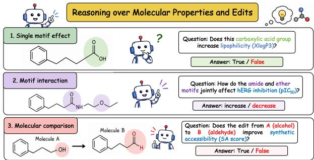
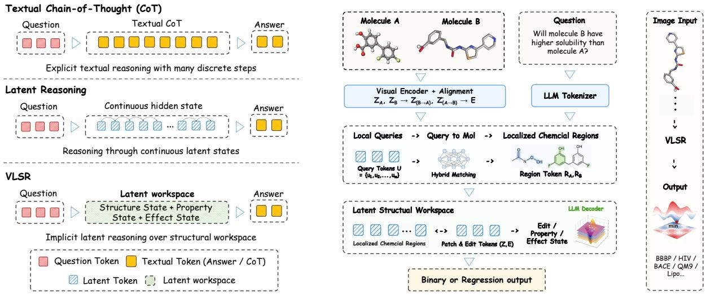
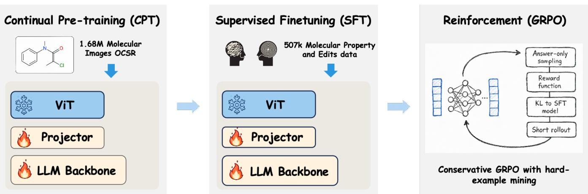
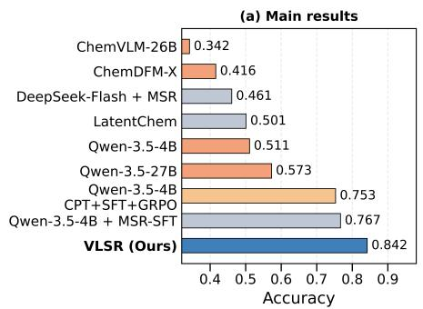
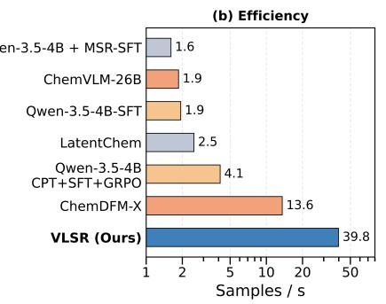
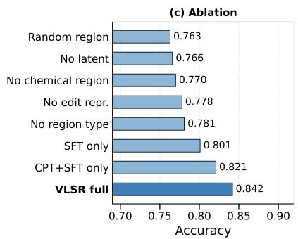
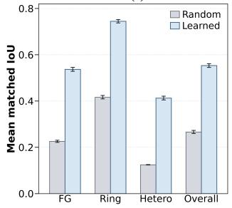
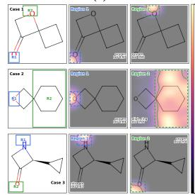
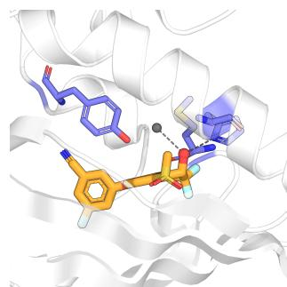
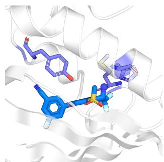

# Localize, Then Reason: Visual Latent Structural Reasoning for Molecular Properties and Edits

Xingqiao Lin1,2, Junmei Wang2∗, Haocheng Tang3∗

1Department of Chemical Engineering, Carnegie Mellon University, Pittsburgh, Pennsylvania 15213, United States 2Department of Pharmaceutical Sciences and Computational Chemical Genomics Screening Center, School of Pharmacy, University of Pittsburgh, Pittsburgh, PA, USA

3Khoury College of Computer Science, Northeastern University, Boston, MA, USA

## Abstract

Local chemical perception and property reasoning are both essential for understanding how molecular structure determines properties. Current LLM-based chemical reasoning methods either receive SMILES/molecular images together with descriptions of local motifs, or reason directly from molecular images. Neither approach enables the model to focus on chemically meaningful regions before reasoning. To address this gap, we propose Visual Latent Structural Reasoning (VLSR), an end-to-end framework that jointly learns localization and reasoning from molecular images. Central to our approach is a localize-then-reason strategy. VLSR first learns to locate chemically meaningful regions in a molecular image. It then reasons about their property efects in a compact latent workspace before producing the final answer. Under the same inference setup, this design achieves 9.6× higher throughput than a comparable textual-reasoning baseline.

## 1 Introduction

Local structure perception is fundamental to molecular property prediction. Recent approaches increasingly incorporate molecular structural information into LLM-based models by providing multi-modal representations, such as SMILES with local motif annotations. However, these annotations explicitly reveal the relevant structural components to the model, reducing the need for the model to discover which regions of a molecule are chemically responsible for the queried property. This motivates a diferent paradigm: instead of providing structural explanations as inputs, a model should learn to localize chemically meaningful regions and subsequently reason over their property efects.

Recent chemical LLMs and vision-language models (VLMs) can reason over increasingly rich molecular inputs (Zhang et al. 2024; Li et al. 2025; Tan et al. 2025). A common approach is to input molecule structural descriptors. MSR provides extracted structural components, such as functional groups, as natural-language descriptions (Jang, Kim, and Ahn 2025). ChemVLR incorporates functional-group information into the textual Chain-of-Thought (CoT) used for training (Zhao et al. 2026a). MPPReasoner jointly processes molecular images and SMILES and rewards textual reasoning that describes tool-identified local structures (Zhuang et al. 2025). These methods teach the model to describe local chemistry in language. However, training a model to describe a functional group is not equivalent to learning how local structure influences the queried property.

  
Figure 1: Three molecular property reasoning tasks: singlemotif efects, motif interactions, and molecular comparisons.

Visual localization provides a natural solution for this gap. In optical chemical structure recognition (OCSR), MolScribe localizes atoms before reconstructing molecular graphs, while GTR-VL models graph traversal through visual Chainof-Thought reasoning (Qian et al. 2023; Wang et al. 2025). These works demonstrate that molecular depictions contain recoverable localized evidence. However, their objective is structural reconstruction: they recover what is present in an image, but not which regions matter for a downstream chemical question.

This motivates the principle of localize, then reason. Rather than providing predefined motifs as explicit inputs, VLSR learns to identify property-relevant molecular regions as intermediate representations for downstream reasoning. The key challenge is not merely decomposing a molecule into structural components, but discovering which localized chemical patterns are informative for a specific property query and how they collectively contribute to the prediction. Accordingly, VLSR learns region-level representations under property supervision, where localization serves as an adaptive interface between molecular perception and prop-

erty reasoning.

Substructure annotations supervise region localization during training, but their boxes and labels are not included in the reasoning path or provided at inference. The regionlevel representations are processed together with the property question in a structured latent workspace. After multiple workspace updates, the model decodes only the final answer rather than an intermediate textual rationale.

Our contributions are threefold:

• We introduce a localize-then-reason formulation for molecular property reasoning, in which the model learns to find local chemical structures before reasoning about their property efects.

• We develop VLSR, which combines learned chemical localization with a compact latent workspace that reasons without autoregressively generating intermediate text.

• VLSR outperforms specialized chemical models and substantially larger general-purpose LLMs. Without additional training, it can generalize to Schrödinger’s multiple FEP binding-afinity benchmarks.

## 2 Related Work

## 2.1 Molecular Structure Reasoning with LLMs

Chemical LLMs incorporate explicit structure either as model input or as CoT supervision. LLM-MPP and LLaMo combine SMILES, molecular graphs, and language, making graph structure directly available to the LLM (Jin et al. 2025; Park et al. 2024). MSR provides extracted components such as functional groups as natural-language descriptions, while TreeKD converts functional-group features into textual rules for property prediction (Jang, Kim, and Ahn 2025; Le et al. 2026). ChemVLR incorporates functional-group information into the textual CoT used for training (Zhao et al. 2026a). Similarly, MPPReasoner inputs a molecular image together with SMILES and rewards reasoning that describes toolidentified functional groups (Zhuang et al. 2025). These approaches teach the model to express local chemistry through graphs or language. VLSR instead follows a localize-thenreason strategy: the model learns to locate relevant local structures in the molecular image and then determine how they afect the queried property.

## 2.2 Molecular Images and Local Structure

ChemVLM and ChemMLLM adapt multimodal language models to molecular images and chemical tasks, while ChemDFM-X aligns multiple chemical modalities (Li et al. 2025; Tan et al. 2025; Zhao et al. 2024). TinyChemVL further improves eficiency by reducing visual tokens (Zhao et al. 2026b). ChemSeek-OCR attempts to directly transfer the OCR model DeepSeek-OCR-2 to the OCSR task (Tang, Dang, and Wang 2026). These models demonstrate that molecular depictions can support chemical reasoning, but their objectives do not explicitly require the model to locate local chemical structures before predicting a property. Chemical localization has been studied for other purposes. SubGrapher segments functional groups and carbon backbones for molecular-image retrieval (Morin et al. 2025), while OCSR methods locate atoms and bonds to reconstruct molecular graphs or structural strings (Qian et al. 2023; Morin et al. 2023; Rajan et al. 2023). VLSR connects localization with property reasoning: the model first learns to find local chemical structures and then reasons about their efects on the queried property.

Post hoc graph explainers provide a complementary notion of chemical localization. GNNExplainer identifies compact subgraphs and node features that preserve a graph model’s prediction, whereas SubgraphX explicitly searches for important subgraphs and accounts for interactions among them (Ying et al. 2019; Yuan et al. 2021). These approaches explain a prediction over an explicit graph after it has been produced. VLSR instead learns regions directly from depiction pixels and uses them as intermediate computational states before the property prediction. Consequently, spatial agreement alone is not suficient evidence of useful reasoning; the relational controls and occlusion intervention test whether the localized regions also support the downstream decision. The regions are therefore part of the model’s computation, not merely a visualization of its output.

## 2.3 Textual and Latent Chemical Reasoning

CoT expresses intermediate reasoning through generated text (Wei et al. 2022). Although text can name functional groups and explain chemical efects, it may not precisely preserve fine-grained structural details, such as attachment sites, neighboring context, and correspondences between molecular changes. Continuous latent reasoning ofers an alternative by maintaining intermediate information in hidden states. Coconut introduces continuous reasoning for general tasks, while LatentChem applies latent computation to chemical problems (Hao et al. 2025; Ye et al. 2026). VLSR introduces a structured latent workspace for molecular property reasoning, with distinct latent roles for structural evidence, the queried property, and the predicted efect. This organization allows the model to connect visual structure with property outcomes without converting every intermediate detail into text.

## 3 Problem Formulation

We formulate molecular property reasoning from depictions and a property query. Each example contains a naturallanguage query q and either one molecular image $I _ { A }$ or a pair $( I _ { A } , I _ { B } )$ . Single-molecule questions ask how local structure afects a property; paired questions ask how an edit changes that property. The answer y may be a binary or directional label, a categorical answer, or a continuous value:

$$
\begin{array} { r } { \hat { y } = f _ { \theta } ( I _ { A } , I _ { B } , q ) , } \end{array}\tag{1}
$$

where $I _ { B }$ is omitted for single-molecule tasks. We require the model to derive local structure R from the images before estimating $p _ { \theta } ( y \mid I _ { A } , I _ { B } , q , R )$ . RDKit-derived boxes and labels (Landrum and RDKit Contributors 2026) are training targets rather than observed variables in this conditional distribution. They include functional groups, ring systems, and hetero-atom regions. At test time, the model must locate these structures, preserve their context, and identify edits directly from the depictions. Localization guides the prediction but does not remove access to the full image.

  
Figure 2: Left: Comparison of textual Chain-of-Thought, continuous latent reasoning, and VLSR. Right: Detailed illustration of the VLSR framework.

## 4 Method

## 4.1 Overview

VLSR receives one or two molecular depictions and a property query. It encodes image patches, aggregates them into candidate chemical regions, and, for paired inputs, aligns the two depictions before interpreting their diference. Three latent tokens—⟨LAT\_EDIT⟩, ⟨LAT\_PROP⟩, and ⟨LAT\_EFFECT⟩—then organize structural evidence, the queried property, and its predicted efect. The pipeline is

$$
( I , q ) \mathrm { o r } ( I _ { A } , I _ { B } , q )  Z  ( R , E )  L  y ,\tag{2}
$$

where Z, R, E, and L denote image tokens, localized regions, edit evidence, and latent reasoning states, respectively; E is omitted for single-image inputs.

## 4.2 Generic Patch Encoding

The Qwen-VL vision encoder (Bai et al. 2023; Qwen Team 2026) maps each depiction to patch tokens:

$$
Z _ { A } = f _ { \mathrm { v i s i o n } } ( I _ { A } ) , \qquad Z _ { B } = f _ { \mathrm { v i s i o n } } ( I _ { B } ) ,\tag{3}
$$

where $Z _ { A } , Z _ { B } \in \mathbb { R } ^ { N \times d } ;$ single-molecule tasks use only $Z _ { A } .$ Because patch boundaries need not coincide with chemical structures, VLSR next forms region-level representations.

## 4.3 Chemical Region Localization

Given $Z \in \mathbb { R } ^ { N \times d }$ , trainable region queries U retrieve local chemical evidence through cross-attention:

$$
A = \mathrm { s o f t m a x } \left( { \frac { ( U W _ { Q } ) ( Z W _ { K } ) ^ { \top } } { \sqrt { d } } } \right) , \qquad R = A Z W _ { V } .\tag{4}
$$

The attention maps A provide soft spatial grounding, while R contains region tokens that can integrate multi-patch motifs and ring context. To obtain localization supervision, we derive chemical regions from RDKit molecular graphs, including functional groups, ring systems, and hetero-atomcentered regions. Their atom coordinates are projected onto the 2D molecular depiction to obtain image-space bounding boxes and region types.

RDKit-derived regions supervise this bottleneck during training. A Hungarian one-to-one assignment (Kuhn 1955) provides the primary matching, supplemented by a lightweight one-to-many hybrid branch (Jia et al. 2023). Boxes and region labels are auxiliary targets only: they are not passed to the reasoning core and are absent at inference.

## 4.4 Correspondence Before Edit Reasoning

For paired questions, VLSR uses bidirectional soft align ment rather than index-wise patch subtraction. For $( X , Y ) \in$ {(A, B), (B, A)},

$$
\begin{array} { r l } & { \bar { Z } _ { Y \to X } = \mathrm { C r o s s } \mathrm { A t t n } ( Z _ { X } , Z _ { Y } , Z _ { Y } ) , } \\ & { \Delta _ { X } = \bar { Z } _ { Y \to X } - Z _ { X } , \qquad P _ { X } = \bar { Z } _ { Y \to X } \odot Z _ { X } , } \\ & { E _ { X } = \mathrm { M L P } _ { \mathrm { e d i t } } \left[ Z _ { X } , \bar { Z } _ { Y \to X } , \Delta _ { X } , P _ { X } \right] . } \end{array}\tag{5}
$$

Learned pooling yields $E = \mathrm { E d i t P o o l } ( [ E _ { A } ; E _ { B } ] )$ . The difference emphasizes change, the product retains shared context, and the two directions preserve additions and removals without requiring atom maps.

## 4.5 Reasoning over Local Evidence

After the language backbone encodes the prompt, the hidden states at the three special-token positions initialize the latent

  
Figure 3: Training pipeline of VLSR. We first perform OCSR-style continued pre-training on large-scale molecular image data, then conduct supervised fine-tuning, and finally apply GRPO with answer-level rewards.

workspace:

$$
( L _ { \mathrm { e d i t } } ^ { 0 } , L _ { \mathrm { p r o p } } ^ { 0 } , L _ { \mathrm { e f f e c t } } ^ { 0 } ) = \mathrm { G a t h e r } ( H _ { q } ; p _ { \mathrm { e d i t } } , p _ { \mathrm { p r o p } } , p _ { \mathrm { e f f e c t } } ) ,\tag{6}
$$

where $H _ { q }$ contains the prompt states. With the question states $Q ,$ image tokens $Z ,$ region tokens $R ,$ and optional edit tokens $E ,$ , the reasoning core performs M Transformer updates:

$$
\begin{array} { r l r } & { } & { H ^ { 0 } = [ Q , Z , R , E , L _ { \mathrm { e d i t } } ^ { 0 } , L _ { \mathrm { p r o p } } ^ { 0 } , L _ { \mathrm { e f f e c t } } ^ { 0 } ] , ~ } \\ & { } & { H ^ { \ell + 1 } = \mathrm { T r a n s f o r m e r L a y e r } _ { \ell } ( H ^ { \ell } ) , \quad \ell < M . } \end{array}\tag{7}
$$

The final edit, property, and efect states condition answer generation. They preserve the roles of structural evidence, query semantics, and predicted outcome without decoding an intermediate textual rationale.

## 4.6 Training Strategy

VLSR uses three training stages.

Stage I: Continued Pre-training. We perform OCSRstyle continued pre-training on one million synthetic Pub-Chem molecules (Kim et al. 2023) and 680K patent examples, following MolScribe-style data construction (Qian et al. 2023). The vision encoder remains frozen.

Stage II: Supervised Fine-tuning. We construct FGBench-Scafold from FGBench (Liu et al. 2025) using pair-aware Bemis–Murcko scafold components (Wu et al. 2018; Bemis and Murcko 1996), an ECFP4 similarity threshold of 0.7, and stratified component allocation. Its 625,936 examples comprise 507,000 training, 56,348 validation, and 62,588 test instances. LoRA (Hu et al. 2022) jointly optimizes answer prediction and auxiliary region localization.

To evaluate molecular generalization under reduced scaffold leakage, we split molecular pairs into indivisible chemical components before train/validation/test allocation. The resulting split prevents component overlap between training and test sets and enforces a maximum ECFP4 similarity of 0.7 between test and training components. Compared with the original FGBench partition, this reduces the nearest-training similarity from 0.8596 to 0.4127 while eliminating test units with similarity above 0.7.

Stage III: GRPO Optimization. We apply Group Relative Policy Optimization (GRPO) (Shao et al. 2024) to a deterministically sampled subset of SFT training records, stratified by answer outcome, property class, and action type. The answer-level reward combines correctness, regression closeness, sign consistency, and output cleanliness; it does not access annotations, attention maps, or latent states.

## 4.7 Learning Objective

The answer loss is

$$
\mathcal { L } _ { \mathrm { a n s w e r } } = - \sum _ { t = 1 } ^ { | y | } \log p _ { \theta } ( y _ { t } \mid y _ { < t } , x ) .\tag{8}
$$

The supervised objective is

$$
\begin{array} { r l } & { \mathcal { L } _ { \mathrm { t o t a l } } = \mathcal { L } _ { \mathrm { a n s w e r } } + 0 . 0 5 \mathcal { L } _ { \mathrm { a t t n } } ^ { \mathrm { c e } } + 0 . 0 5 \mathcal { L } _ { \mathrm { a t t n } } ^ { \mathrm { i o u } } } \\ & { ~ + 0 . 0 1 \mathcal { L } _ { \mathrm { d i v } } + 0 . 0 2 \mathcal { L } _ { \mathrm { e n t } } + 0 . 0 2 \mathcal { L } _ { \mathrm { f g } } } \\ & { ~ + 0 . 0 2 \mathcal { L } _ { \mathrm { h y b } } ^ { \mathrm { c e } } + 0 . 0 2 \mathcal { L } _ { \mathrm { h y b } } ^ { \mathrm { i o u } } + 0 . 0 1 \mathcal { L } _ { \mathrm { h y b } } ^ { \mathrm { f g } } . } \end{array}\tag{9}
$$

For Hungarian-matched pairs, attention cross-entropy and soft-IoU supervise coverage, diversity and entropy regularize the maps, and ${ \mathcal { L } } _ { \mathrm { f g } }$ predicts the region type. The hybrid branch applies the corresponding attention and type losses to its oneto-many matches. Losses are averaged over valid pairs. All targets and auxiliary heads are removed at inference.

## 5 Experiments

The evaluation tests the localize-then-reason claim. We first compare learned localization with symbolic inputs and generic image patches. We then use random-region and component ablations to ask whether the model depends on meaningful local evidence and whether it can use that evidence for reasoning. Renderer shifts test whether localization survives changes in depiction layout, while an independent proteinconditioned benchmark tests transfer beyond the training task.

## 5.1 Experimental Setup

We evaluate all methods on FGBench-Scafold, our pairaware scafold-component split of FGBench. The benchmark contains questions about single-motif efects, motif interactions, and molecular comparisons. Each example provides a property query together with one or two molecular representations. Image-input models receive RDKit-rendered depictions, whereas symbolic baselines receive the corresponding SMILES. The required answer is either a binary decision or a continuous property change.

## 5.2 Baselines

We compare VLSR with both SMILES-input and imageinput baselines. The symbolic group includes instructionbased chemical LLMs, LatentChem (Ye et al. 2026), and Qwen3.5-4B models (Qwen Team 2026) fine-tuned on the same reasoning data. The visual group includes general VLM backbones, ChemVLM-26B (Li et al. 2025), ChemDFM-X (Zhao et al. 2024), and supervised Qwen3.5-4B variants. The protocols cover direct prediction, explicit Think-style textual reasoning, and latent reasoning. We also evaluate Molecular Structural Reasoning (MSR), which supplies an LLM with an extracted textual description of molecular structure (Jang, Kim, and Ahn 2025). All task-specific baselines are trained and evaluated using the same FGBench-Scafold split.

## 5.3 Main Results

Figure 4(a) summarizes the main comparison. VLSR achieves the best overall performance among image-input methods and outperforms the strongest symbolic baseline. Relative to Qwen3.5-4B + MSR-SFT, accuracy rises from 0.767 to 0.842, F1 from 0.679 to 0.786, and balanced accuracy from 0.745 to 0.829. Regression also improves. These results establish overall performance; the controlled tests below ask whether learning where to look explains the gain.

Increasing model scale or generating longer rationales is not suficient. Qwen3.5-27B improves over smaller untuned visual baselines on classification but remains behind taskspecific models, and Think-style reasoning does not consistently improve regression. VLSR instead learns where the relevant chemistry lies before applying latent reasoning.

## 5.4 Eficiency Analysis

Figure 4(b) compares inference throughput on the full test set. VLSR keeps intermediate reasoning within a fixed-depth latent workspace and decodes only the final answer. It processes 39.84 samples/s, compared with 4.13 samples/s for image-input Qwen3.5-4B-SFT with textual reasoning, corresponding to a 9.6× throughput improvement. Thus, the latent workspace improves eficiency without removing the learned localization that supports prediction.

## 5.5 Visual Analysis

Localization. Matched IoU measures whether each learned query overlaps an annotated chemical region. On held-out molecules, learned queries outperform random regions for functional groups, rings, and hetero-atom regions (Figure 5(a)). Distinct queries also attend to diferent annotated structures within the same molecule (Figure 5(b)). These results indicate that the queries recover localized chemical structures rather than only encoding the global molecular image.

Occlusion intervention. We further test whether the localized regions contain prediction-relevant information by masking either the attention-ranked proposal or a sizematched random region at inference time. All intervention conditions use the same samples, checkpoint, prompts, and decoding configuration. Learned-region masking reduces accuracy to 0.789 and raw-pooled Pearson correlation to 0.576, compared with 0.791 and 0.626, respectively, for random masks averaged over 20 deterministic draws using seeds 17– 36 (Table 1). The accuracy gap is negligible, but the larger Pearson drop under learned-region masking indicates that the proposals carry more regression-relevant evidence than equally sized random regions. Occlusion alone does not establish a causal chemical mechanism.

Relational reasoning. To separate localization from reasoning over localized evidence, we replace learned image regions with RDKit-derived region descriptors and their relative spatial relationships. Adding these descriptors to SMILES increases Pearson correlation from 0.639 to 0.674. Removing chemical regions yields a Pearson correlation of 0.600, while random region inputs yield 0.604. Combining SMILES with image features achieves 0.793 accuracy and 0.674 Pearson correlation. None of these controls matches VLSR, which achieves 0.842 accuracy and 0.718 Pearson correlation. Together with the localization and occlusion results, these controls support the proposed pipeline: VLSR identifies chemically organized regions and relates them to the queried property within its latent workspace.

Renderer robustness. Finally, we test whether the learned pipeline depends on canonical RDKit layouts. VLSR obtains 0.788 accuracy and 0.632 Pearson correlation on PyMOL2D depictions, and 0.799 accuracy and 0.640 Pearson correlation under 3D-projected RDKit depictions, compared with 0.842 and 0.718 on canonical images. The 3D projection introduces unusual orientations, compressed bonds, crossings, and partial occlusion. The retained performance indicates that VLSR can recover useful local structure under substantial depiction shifts.

## 5.6 Zero-Shot Evaluation on Protein-Conditioned FEP-Derived Ligand Comparisons

To evaluate whether VLSR can transfer molecular edit reasoning beyond the training distribution, we conduct a zero-shot evaluation on protein-conditioned ligand comparison tasks derived from FEP benchmarks. We combine 317 ligand-pair comparisons from the Schrödinger JACS and Merck subsets with 467 comparisons from additional Schrödinger pairwise datasets (Wang et al. 2015; Hahn and Wagner 2021; Hahn et al. 2022; Ross et al. 2023), covering 28 protein targets and 784 ligand comparisons in total.

No FEP labels, afinity values, or protein contexts are used during training. Furthermore, no fine-tuning, calibration, or model selection is performed on this evaluation set. The model receives a ligand pair together with the corresponding target protein sequence as contextual information, but does not access binding pockets, ligand poses, docking structures, or three-dimensional protein–ligand complexes. To reduce overlap with training data, both ligands in every retained pair have maximum ECFP4 Tanimoto similarity below 0.7 with molecules used during CPT and SFT (Rogers and Hahn 2010).

  
SMILES  Image  SMILES + Image  VLSR  Ablation

Figure 4: Summary of experimental results. (a) Accuracy comparison with representative SMILES-input, image-input, and chemical VLM baselines. (b) Inference throughput on the full test set. (c) Accuracy drop under ablations, where larger drops indicate more important components.  
(a)  

(b)  
  
Figure 5: Chemical-region localization. (a) Matched IoU with held-out region annotations. (b) Diferent queries localize distinct structures within the same molecule.

The task is formulated as directional ligand comparison: given two ligands and a target protein context, the model predicts which ligand has stronger binding afinity. Freeenergy calculations are used only to derive pairwise labels and are never provided as supervision targets. Therefore, this experiment evaluates the transferability of depiction-based molecular edit reasoning under protein-conditioned contexts, rather than quantitative FEP prediction.

As shown in Table 2, VLSR achieves 0.691 accuracy, outperforming the strongest SMILES-based baseline, Qwen3.5- 4B + MSR-SFT (0.628), by 6.3 percentage points. This result suggests that the learned localization and latent reasoning mechanism can generalize to ligand comparison scenarios where the property context difers from the training benchmark.

<table><tr><td>Setting</td><td>Acc ↑ F1 ↑ Bal. Acc ↑ Pearson ↑</td><td></td><td></td></tr><tr><td>Input representation controls</td><td></td><td></td><td></td></tr><tr><td>SMILES only</td><td>0.773 0.702</td><td>0.762</td><td>0.639</td></tr><tr><td>SMILES + Chem desc</td><td>0.777 0.705</td><td>0.765</td><td>0.674</td></tr><tr><td>Remove chemical regions</td><td>0.770 0.703</td><td>0.742</td><td>0.600</td></tr><tr><td>Random region input</td><td>0.763 0.706</td><td>0.732</td><td>0.604</td></tr><tr><td>SMILES + Image</td><td>0.793 0.726</td><td>0.781</td><td>0.674</td></tr><tr><td>VLSR under renderer shifts</td><td></td><td></td><td></td></tr><tr><td>VLSR (3D-proj RDKit)</td><td>0.799 0.721</td><td>0.782</td><td>0.640</td></tr><tr><td>VLSR (PyMOL2D)</td><td>0.7880.704</td><td>0.769</td><td>0.632</td></tr><tr><td colspan="4">Inference-time localization occlusion</td></tr><tr><td>Random mask</td><td>0.791 0.720</td><td>0.776</td><td>0.626</td></tr><tr><td>Learned mask</td><td>0.789 0.715</td><td>0.773</td><td>0.576</td></tr><tr><td>VLSR</td><td>0.842 0.786</td><td>0.829</td><td>0.718</td></tr></table>

Table 1: Input controls and renderer robustness. RDKit descriptors bypass localization, whereas patch controls lack explicit region grouping. VLSR learns localized regions and spatial relations for joint reasoning. Renderer shifts alter molecular layouts, with 3D projection adding overlap and occlusion.

We further compare with structure-augmented reasoning baselines. In a tool-assisted setting, DeepSeek-V4-Flash combined with MSR provides textualized molecular structure descriptions. MSR improves the Instruct setting from 0.540 to 0.589, but does not consistently improve Thinkstyle prompting. These results indicate that explicit structural descriptions can provide useful information, while textualized structure alone does not replace identifying and aligning molecular edits directly from visual representations.

This evaluation has several limitations. The task only measures pairwise afinity direction conditioned on protein sequence and does not model the physical determinants of protein–ligand interactions. Since no binding geometry, pocket information, or three-dimensional complex structure is provided, the result should not be interpreted as recovering protein–ligand physics or performing quantitative freeenergy estimation. Instead, it measures whether molecular edit reasoning learned from two-dimensional depictions can transfer to a more challenging protein-conditioned comparison setting.

<table><tr><td>Model</td><td>Protocol</td><td>Acc ↑</td></tr><tr><td>SMILES-based Input</td><td></td><td></td></tr><tr><td>DeepSeek-V4-Flash</td><td>Instruct</td><td>0.540</td></tr><tr><td>DeepSeek-V4-Flash + MSR</td><td>Instruct</td><td>0.589</td></tr><tr><td>DeepSeek-V4-Flash</td><td>Think</td><td>0.533</td></tr><tr><td>DeepSeek-V4-Flash + MSR</td><td>Think</td><td>0.520</td></tr><tr><td>Qwen3.5-4B + MSR-SFT</td><td>Instruct</td><td>0.628</td></tr><tr><td>LatentChem</td><td>Latent</td><td>0.432</td></tr><tr><td>Image-based Input</td><td></td><td></td></tr><tr><td>ChemDFM-X</td><td>Instruct</td><td>0.363</td></tr><tr><td>ChemVLM-26B</td><td>Instruct</td><td>0.377</td></tr><tr><td>VLSR (Ours)</td><td>Implicit Latent</td><td>0.691</td></tr></table>

Table 2: Accuracy on the zero-shot protein-conditioned ligand comparison benchmark. The task evaluates directional afinity ranking from ligand pairs and target protein context. No FEP labels or afinity values are used during training.

  
(a) lig\_163 crystal pose

  
(b) lig\_165 pose projection  
Figure 6: Post hoc structural interpretation of a correctly predicted HIF-2α comparison. The lig\_163 crystal pose shows the edited site near His293 and a structural water; lig\_165 projects the $\mathrm { O H { \to } N H _ { 2 } }$ edit onto the same pose. The structure was not provided to VLSR.

HIF-2α case study. VLSR correctly predicts the approximately 20-fold potency loss for the lig\_163→lig\_165 OH→NH2 edit (Schindler et al. 2020). Mapping the pair to the PT2385-bound structure (PDB 5TBM) (Wallace et al. 2016) places the edited group near His293 and a structural water (Figure 6). The lig\_165 pose is projected for interpretation and was not provided to the model.

## 5.7 Ablation Study

Figure 4(c) tests whether the learned regions contribute to the gain. Removing the learned regions causes a clear drop, and replacing them with random regions degrades performance further. Additional token capacity alone is therefore insuficient; the model benefits from finding useful local evidence.

Removing the workspace reduces classification and regression performance, showing that localization is not sufficient unless the model relates what it finds to the query. Removing edit alignment also hurts, particularly when corresponding structures appear at diferent image positions. Together, the ablations support the intended order: locate the evidence, establish correspondence when needed, and reason about its property efect.

## 5.8 Limitations

VLSR uses RDKit-derived local chemical region boxes and labels as training targets rather than inference inputs; it therefore does not eliminate chemical supervision, and the annotation inventory may bias the learned regions. CPT is used only for molecular-image understanding and contains no property-reasoning supervision. Completely excluding molecular overlap with general chemical pretraining corpora is impractical for foundation models; we therefore evaluate task generalization using scafold-controlled splits and held-out molecules. Finally, 2D depictions cannot recover conformational energetics or protein–ligand contacts absent from the input. The FEP-derived results thus demonstrate directional transfer rather than full recovery of these physical efects. Because region supervision is defined by rectangular boxes, overlapping motifs and difuse electronic efects may not correspond to a single target. Matched IoU should therefore be read as spatial agreement, while chemically valid counterfactual edits and multi-renderer consistency ofer important future tests of causal faithfulness. This limitation is most relevant when a queried property depends on distributed electronic context rather than a compact functional group. Such cases may require larger or relationally defined regions than the present annotation inventory provides.

## 6 Conclusion

VLSR establishes a localize-then-reason framework for molecular visual reasoning, learning chemically relevant regions before integrating their property efects within a compact latent workspace. Across scafold-controlled evaluations, this design improves both classification and regression performance, while the ablation results show that region localization, edit alignment, relative spatial relationships, and latent reasoning make complementary contributions. By avoiding lengthy textual rationales and decoding only the final answer, VLSR achieves 9.6× higher inference throughput than the corresponding image-input reasoning baseline. Its robustness across molecular depiction styles and its transfer to protein-conditioned comparisons without additional training further indicate that the learned regional representations capture reusable chemical evidence. Overall, these results demonstrate that explicitly connecting visual localization with property reasoning provides an accurate, eficient, and inspectable foundation for molecular prediction from 2D depictions.

## Acknowledgments

This work was supported by funds from the National Institutes of Health (R01GM147673, R01GM149705) and the National Science Foundation (1955260). The authors would like to thank the computing resources provided by the Center for Research Computing (facility RRID: SCR 022735) at the University of Pittsburgh (NSF award number OAC-2117681), and the Pittsburgh Supercomputer Center (grant number BIO210185).

## References

Bai, J.; Bai, S.; Yang, S.; Wang, S.; Tan, S.; Wang, P.; Lin, J.; Zhou, C.; and Zhou, J. 2023. Qwen-VL: A Versatile Vision-Language Model for Understanding, Localization, Text Reading, and Beyond. arXiv:2308.12966.

Bemis, G. W.; and Murcko, M. A. 1996. The Properties of Known Drugs. 1. Molecular Frameworks. Journal of Medicinal Chemistry, 39(15): 2887–2893.

Hahn, D.; Bayly, C.; Boby, M. L.; Bruce Macdonald, H.; Chodera, J.; Gapsys, V.; Mey, A.; Mobley, D.; Perez Benito, L.; Schindler, C.; Tresadern, G.; and Warren, G. 2022. Best Practices for Constructing, Preparing, and Evaluating Protein-Ligand Binding Afinity Benchmarks. Living Journal ofComputational Molecular Science, 4(1): 1497.

Hahn, D. F.; and Wagner, J. 2021. openforcefield/proteinligand-benchmark: 0.2.0 Addition of New Targets. Zenodo, doi:10.5281/zenodo.5679599.

Hao, S.; Sukhbaatar, S.; Su, D.; Li, X.; Hu, Z.; Weston, J.; and Tian, Y. 2025. Training Large Language Models to Reason in a Continuous Latent Space. In Conference on Language Modeling.

Hu, E. J.; Shen, Y.; Wallis, P.; Allen-Zhu, Z.; Li, Y.; Wang, S.; Wang, L.; and Chen, W. 2022. LoRA: Low-Rank Adaptation of Large Language Models. In International Conference on Learning Representations.

Jang, Y.; Kim, J.; and Ahn, S. 2025. Structural Reasoning Improves Molecular Understanding of LLM. In Che, W.; Nabende, J.; Shutova, E.; and Pilehvar, M. T., eds., Proceedings of the 63rd Annual Meeting of the Association for Computational Linguistics (Volume 1: Long Papers), 21016– 21036. Vienna, Austria: Association for Computational Linguistics. ISBN 979-8-89176-251-0.

Jia, D.; Yuan, Y.; He, H.; Wu, X.; Yu, H.; Lin, W.; Sun, L.; Zhang, C.; and Hu, H. 2023. DETRs with Hybrid Matching. In Proceedings of the IEEE/CVF Conference on Computer Vision and Pattern Recognition, 19702–19712.

Jin, C.; Guo, S.; Zhou, S.; and Guan, J. 2025. Efective and Explainable Molecular Property Prediction by Chain-of-Thought Enabled Large Language Models and Multi-Modal Molecular Information Fusion. Journal of Chemical Information and Modeling, 65(11): 5438–5455.

Kim, S.; Chen, J.; Cheng, T.; Gindulyte, A.; He, J.; He, S.; Li, Q.; Shoemaker, B. A.; Thiessen, P. A.; Yu, B.; Zaslavsky, L.; Zhang, J.; and Bolton, E. E. 2023. PubChem 2023 Update. Nucleic Acids Research, 51(D1): D1373–D1380.

Kuhn, H. W. 1955. The Hungarian Method for the Assignment Problem. Naval Research Logistics Quarterly, 2(1–2): 83–97.

Landrum, G.; and RDKit Contributors. 2026. rdkit/rdkit: 2026\_03\_1 (Q1 2026) Release. Zenodo, doi:10.5281/zenodo.19250388.

Le, K.; Dey, S.; Martínez Galindo, M.; Lopez, V.; Hua, T.; Chawla, N. V.; and Lam, H. T. 2026. Generalist Large Language Models for Molecular Property Prediction: Distilling Knowledge from Specialist Models. arXiv:2603.12344.

Li, J.; Zhang, D.; Wang, X.; Hao, Z.; Lei, J.; Tan, Q.; Zhou, C.; Liu, W.; Yang, Y.; Xiong, X.; Wang, W.; Chen, Z.; Wang, W.; Li, W.; Zhang, S.; Su, M.; Ouyang, W.; Li, Y.; and Zhou, D. 2025. ChemVLM: Exploring the Power of Multimodal Large Language Models in Chemistry Area. Proceedings of the AAAI Conference on Artificial Intelligence, 39(1): 415– 423.

Liu, X.; Ouyang, S.; Zhong, X.; Han, J.; and Zhao, H. 2025. FGBench: A Dataset and Benchmark for Molecular Property Reasoning at Functional Group-Level in Large Language Models. arXiv:2508.01055.

Morin, L.; Danelljan, M.; Agea, M. I.; Nassar, A.; Weber, V.; Meijer, I.; Staar, P.; and Yu, F. 2023. MolGrapher: Graph-Based Visual Recognition of Chemical Structures. In Proceedings of the IEEE/CVF International Conference on Computer Vision, 19552–19561.

Morin, L.; Meijer, G. I.; Weber, V.; Van Gool, L.; and Staar, P. W. J. 2025. SubGrapher: Visual Fingerprinting of Chemical Structures. Journal of Cheminformatics, 17(1): 149.

Park, J.; Bae, M.; Ko, D.; and Kim, H. J. 2024. LLaMo: Large Language Model-Based Molecular Graph Assistant. In Advances in Neural Information Processing Systems, volume 37, 131972–132000.

Qian, Y.; Guo, J.; Tu, Z.; Li, Z.; Coley, C. W.; and Barzilay, R. 2023. MolScribe: Robust Molecular Structure Recognition with Image-to-Graph Generation. Journal of Chemical Information and Modeling, 63(7): 1925–1934.

Qwen Team. 2026. Qwen3.5: Towards Native Multimodal Agents. Qwen Blog, https://qwen.ai/blog?id=qwen3.5.

Rajan, K.; Brinkhaus, H. O.; Agea, M. I.; Zielesny, A.; and Steinbeck, C. 2023. DECIMER.ai: An Open Platform for Automated Optical Chemical Structure Identification, Segmentation and Recognition in Scientific Publications. Nature Communications, 14(1): 5045.

Rogers, D.; and Hahn, M. 2010. Extended-Connectivity Fingerprints. Journal of Chemical Information and Modeling, 50(5): 742–754.

Ross, G. A.; Lu, C.; Scarabelli, G.; Albanese, S. K.; Houang, E.; Abel, R.; Harder, E. D.; and Wang, L. 2023. The Maximal and Current Accuracy of Rigorous Protein-Ligand Binding Free Energy Calculations. Communications Chemistry, 6(1): 222.

Schindler, C. E. M.; Baumann, H.; Blum, A.; Böse, D.; Buchstaller, H.-P.; Burgdorf, L.; Cappel, D.; Chekler, E.; Czodrowski, P.; Dorsch, D.; Eguida, M. K. I.; Follows, B.;

Fuchß, T.; Grädler, U.; Gunera, J.; Johnson, T.; Jorand Lebrun, C.; Karra, S.; Klein, M.; Knehans, T.; Koetzner, L.; Krier, M.; Leiendecker, M.; Leuthner, B.; Li, L.; Mochalkin, I.; Musil, D.; Neagu, C.; Rippmann, F.; Schiemann, K.; Schulz, R.; Steinbrecher, T.; Tanzer, E.-M.; Unzue Lopez, A.; Viacava Follis, A.; Wegener, A.; and Kuhn, D. 2020. Large-Scale Assessment of Binding Free Energy Calculations in Active Drug Discovery Projects. Journal ofChemical Information and Modeling, 60(11): 5457–5474.

Shao, Z.; Wang, P.; Zhu, Q.; Xu, R.; Song, J.; Bi, X.; Zhang, H.; Zhang, M.; Li, Y. K.; Wu, Y.; and Guo, D. 2024. DeepSeekMath: Pushing the Limits of Mathematical Reasoning in Open Language Models. arXiv:2402.03300.

Tan, Q.; Zhou, D.; Xia, P.; Liu, W.; Ouyang, W.; Bai, L.; Li, Y.; and Fu, T. 2025. ChemMLLM: Chemical Multimodal Large Language Model. arXiv:2505.16326.

Tang, H.; Dang, X.; and Wang, J. 2026. Fine-tuning DeepSeek-OCR-2 for Molecular Structure Recognition. arXiv:2604.03476.

Wallace, E. M.; Rizzi, J. P.; Han, G.; Wehn, P. M.; Cao, Z.; Du, X.; Cheng, T.; Czerwinski, R. M.; Dixon, D. D.; Goggin, B. S.; Grina, J. A.; Halfmann, M. M.; Maddie, M. A.; Olive, S. R.; Schlachter, S. T.; Tan, H.; Wang, B.; Wang, K.; Xie, S.; Xu, R.; Yang, H.; and Josey, J. A. 2016. A Small-Molecule Antagonist of HIF2α Is Eficacious in Preclinical Models of Renal Cell Carcinoma. Cancer Research, 76(18): 5491– 5500.

Wang, J.; Yang, H.; Wu, J.; He, Y.; Wei, X.; Wang, Y.; Liu, C.; Ge, L.; Wu, L.; Wang, B.; Lin, D.; and He, C. 2025. GTR-CoT: Graph Traversal as Visual Chain of Thought for Molecular Structure Recognition. arXiv:2506.07553.

Wang, L.; Wu, Y.; Deng, Y.; Kim, B.; Pierce, L.; Krilov, G.; Lupyan, D.; Robinson, S.; Dahlgren, M. K.; Greenwood, J.; Romero, D. L.; Masse, C.; Knight, J. L.; Steinbrecher, T.; Beuming, T.; Damm, W.; Harder, E.; Sherman, W.; Brewer, M.; Wester, R.; Murcko, M.; Frye, L.; Farid, R.; Lin, T.; Mobley, D. L.; Jorgensen, W. L.; Berne, B. J.; Friesner, R. A.; and Abel, R. 2015. Accurate and Reliable Prediction of Relative Ligand Binding Potency in Prospective Drug Discovery by Way of a Modern Free-Energy Calculation Protocol and Force Field. Journal of the American Chemical Society, 137(7): 2695–2703.

Wei, J.; Wang, X.; Schuurmans, D.; Bosma, M.; Ichter, B.; Xia, F.; Chi, E. H.; Le, Q. V.; and Zhou, D. 2022. Chainof-Thought Prompting Elicits Reasoning in Large Language Models. In Advances in Neural Information Processing Systems, volume 35, 24824–24837.

Wu, Z.; Ramsundar, B.; Feinberg, E. N.; Gomes, J.; Geniesse, C.; Pappu, A. S.; Leswing, K.; and Pande, V. 2018. MoleculeNet: A Benchmark for Molecular Machine Learning. Chemical Science, 9: 513–530.

Ye, X.; Mao, Y.; Zhang, J.; Liu, Y.; Hao, L.; Wu, F.; Li, Z.; Liao, Y.; Wang, Z.; Liu, Z.; Yin, Z.; Yuan, L.; Torr, P.; Sun, H.; Zeng, X.; Wang, M.; Cong, L.; Gao, S.; and Tang, X. 2026. LatentChem: From Textual CoT to Latent Thinking in Chemical Reasoning. arXiv:2602.07075.

Ying, Z.; Bourgeois, D.; You, J.; Zitnik, M.; and Leskovec, J. 2019. GNNExplainer: Generating Explanations for Graph Neural Networks. In Advances in Neural Information Processing Systems, volume 32.

Yuan, H.; Yu, H.; Wang, J.; Li, K.; and Ji, S. 2021. On Explainability of Graph Neural Networks via Subgraph Explorations. In Proceedings of the 38th International Conference on Machine Learning, volume 139 of Proceedings of Machine Learning Research, 12241–12252.

Zhang, D.; Liu, W.; Tan, Q.; Chen, J.; Yan, H.; Yan, Y.; Li, J.; Huang, W.; Yue, X.; Ouyang, W.; Zhou, D.; Zhang, S.; Su, M.; Zhong, H.-S.; and Li, Y. 2024. ChemLLM: A Chemical Large Language Model. arXiv:2402.06852.

Zhao, X.; Cai, X.; Cheng, X.; Chen, X.; and Xu, B. 2026a. ChemVLR: Prioritizing Reasoning in Perception for Chemical Vision-Language Understanding. In Findings of the Associationfor Computational Linguistics: ACL 2026, 24096– 24115. San Diego, California: Association for Computational Linguistics.

Zhao, X.; Zeng, S.; Cai, X.; Cheng, X.; Zhang, D.; Chen, X.; and Xu, B. 2026b. TinyChemVL: Advancing Chemical Vision-Language Models via Eficient Visual Token Reduction and Complex Reaction Tasks. Proceedings of the AAAI Conference on Artificial Intelligence, 40(2): 1596–1604.

Zhao, Z.; Chen, B.; Li, J.; Chen, L.; Wen, L.; Wang, P.; Zhu,Z.; Zhang, D.; Wan, Z.; Li, Y.; Dai, Z.; Chen, X.; and Yu, K.2024. ChemDFM-X: Towards Large Multimodal Model forChemistry. arXiv:2409.13194.

Zhuang, J.; Shi, Y.; Hou, J.; He, Y.; Ye, M.; Xu, M.; Su, Y.; Zhang, L.; Qian, Y.; Zhang, L.; Ke, G.; and Cai, H. 2025. Reasoning-Enhanced Large Language Models for Molecular Property Prediction. arXiv:2510.10248.