# PATIENTACT: Theory-Grounded Mental Health Client Simulation

Sahand Sabour<sup>1</sup> TszYam NG<sup>1</sup> Yaqian Chen<sup>2</sup> Guanqun Bi<sup>1</sup> Jialu Zhao<sup>3</sup> Minlie Huang<sup>1</sup>

<sup>1</sup> The CoAI Group, DCST, Institute for Artificial Intelligence, Tsinghua University, Beijing, China

<sup>2</sup>Department of Psychology, Beijing Normal University, Beijing, China

<sup>3</sup>Counseling and Psychological Development Guidance Center, Tsinghua University, Beijing, China sahandfer@gmail.com, aihuang@tsinghua.edu.cn

## Abstract

LLM-based simulated clients are increasingly used to train novice counselors, evaluate LLM therapists, and generate synthetic data. However, current simulators produce overly cooperative clients that disclose too readily, accept therapeutic reframes without resistance, and resolve core issues within a single session. We trace these issues to profiles that lack causal depth and behavioral mechanisms that treat all content as equally accessible. We present PATIENTACT, a framework for client simulation grounded in established clinical theories. Our profiles integrate the 5Ps clinical case formulation, providing causal depth without tying the design to any single therapeutic modality. During simulation, profiles include a dynamic memory layer in which items carry trust thresholds (e.g., symptoms are available early, whereas formative memories require a sustained therapeutic alliance). At each turn, the client’s emotional reaction and behavior are modeled before generating a response. If the therapist approaches gated content, PATIEN-TACT expresses resistance in terms of quantity, content, and style rather than defaulting to cooperation or a single resistance pattern. We evaluate our framework on 40 clinical situations and demonstrate that it generates diverse profiles with high clinical plausibility. Moreover, PATIENTACT significantly outperforms the baselines, yielding substantial gains in resistance quality and behavioral realism. Our code and data will be publicly available via github.com/Sahandfer/PatientHub.

## 1 Introduction

Mental health conditions affect over one billion people worldwide, yet most receive no adequate care (World Health Organization, 2025). Bridging this gap requires progress on multiple fronts: training more clinicians, developing AI-assisted therapeutic tools, and building research infrastructure for computational mental health. Simulated clients powered by large language models (LLMs) have emerged as a foundational component across all three: they provide scalable practice environments for training novice counselors (Wang et al., 2024b; Lin et al., 2026), serve as standardized test cases for evaluating LLM therapists (Sabour et al., 2023), and enable the generation of diverse synthetic therapy data for psychology research (Liu et al., 2025a; Li et al., 2026). At the core of these applications lies a common requirement: the simulated client must behave realistically enough for the interaction to capture the dynamics of real therapy.

In real therapy sessions, clients do not simply answer questions or disclose information. They react emotionally to what the therapist says (e.g., with relief, shame, or defensiveness) and behave in ways shaped by a lifetime of learned patterns: deflecting when a topic feels threatening, going quiet when overwhelmed, or cautiously opening up when they feel understood. In addition, they selectively share information, revealing surface complaints early while guarding painful memories until trust is established. And when they resist, they do so in varied ways, each reflecting a different underlying pattern; for instance, going silent, changing the subject, or pushing back directly. These dynamics distinguish a genuine therapeutic interaction from a cooperative question-answering exchange.

Current LLM-based simulators fall short of capturing these dynamics. A persistent finding across prior work is that simulated clients are overly cooperative: they disclose too readily, accept therapeutic reframes without resistance, and resolve core issues within a single session (Yang et al., 2025; Kim et al., 2025). This pattern undermines downstream applications: therapist trainees do not encounter realistic resistance, LLM-therapist evaluations are inflated by compliant clients, and synthetic data lacks the friction that characterizes real therapeutic dialogue. We attribute this problem to multiple shortcomings in the design of existing simulators.

First, the profile design in prior work lacks causal depth. Existing profiles describe what the client thinks and feels by including attributes such as symptoms, beliefs, and coping strategies (Wang et al., 2024b,a; Lee et al., 2025). However, they do not explain why the client has formed such thoughts and feelings: what made this person vulnerable, what triggered the current episode, or what cycles sustain it. Hence, the resulting simulator can state “I feel worthless” but cannot explain how this belief was formed or what in their daily life reinforces it. Second, prior work either provides the full profile in the system prompt (Wang et al., 2024b; Lee et al., 2025), thereby making all information immediately accessible, or applies a single control (e.g., a static label such as Resistance: High) uniformly across all content (Kim et al., 2025). However, in practice, a client may freely describe sleep problems while actively avoiding childhood memories, and this boundary shifts as trust develops within the conversation (Srivastava et al., 2025).

To address these shortcomings, we present PA-TIENTACT, a theory-grounded framework for client simulation. The profiles in our framework are structured around the 5Ps clinical case formulation (Johnstone and Dallos, 2013), which traces how a client’s vulnerabilities developed, what triggered the current episode, and what maintains the problem. We complement this formulation with a cognitive layer (Beck, 2020) that provides insession thoughts and behaviors, and interpersonal relational patterns (Luborsky and Crits-Christoph, 1998) that shape how the client relates to others, particularly the therapist. Unlike prior work, which mainly focuses on a single therapeutic modality, such as cognitive behavioral therapy (CBT) or motivational interviewing (MI), our schema is not tied to any single therapeutic modality (i.e., modalityagnostic). Prior to the simulation, we divide the profile into a static layer, which is always included in the system prompt, and a dynamic memory layer. Each item in the memory is assigned a disclosure threshold, grounded in prior research on therapeutic trust (Srivastava et al., 2025): surface symptoms are available early, whereas formative memories require a sustained therapeutic alliance. During the simulation, at each turn, PATIENTACT determines how it should emotionally react to the therapist’s utterance, and selects a behavior consistent with that reaction and the client’s current trust level before generating a response. When the therapist inquires about content that the client is not yet ready to share, PATIENTACT displays resistance based on Otani (1989)’s taxonomy spanning response quantity (e.g., going silent), content (e.g., changing the subject), and style (e.g., direct pushback). As a result, the same profile can produce meaningfully different sessions depending on the therapist’s behavior. Our contributions are as follows:

1. A modality-agnostic profile schema that integrates clinical case formulation, providing the causal depth missing from prior work.

2. A theory-grounded simulation framework that processes each therapist’s utterance through reaction, behaviors, and a dynamic retrieval pipeline. Disclosure of the profile’s content is gated by the client’s evolving level of trust, and resistance spans multiple clinical dimensions rather than a single label.

3. Comprehensive evaluation demonstrating that our framework produces more realistic client simulations than existing baselines across expert and LLM-based assessments.

## 2 Related Work

LLM-based patient simulation has emerged as a flexible alternative to scripted standardized patients, leveraging modern LLMs’ role-playing and instruction-following capabilities. Existing approaches differ primarily along two axes: what is encoded about the client (profile design) and how the desired behavior is enforced during conversation (simulation design).

## 2.1 Profile Design

A central challenge in patient simulation is determining the information required to model clients and how to structure it. Early approaches relied on scenario descriptions and simple persona descriptions covering demographics and presenting complaints without a systematic structure (Chen et al., 2023; Wang et al., 2024a; Louie et al., 2024), causing the LLM to improvise information (e.g., beliefs) during conversations. A shift toward theorygrounded design began with Patient-ψ (Wang et al., 2024b), which structured profiles around the Cognitive Conceptualization Diagram (CCD; Beck, 2020), capturing the client’s cognitive layer by encoding core beliefs, intermediate beliefs, and coping strategies. However, the CCD does not explain how those beliefs were formed or what sustains them. Subsequent work broadened the scope by including psychiatric history, longitudinal symptom data, and life events (Lee et al., 2025; Liu et al., 2025b; Wang et al., 2025; Li et al., 2026), adding biographical detail but not the causal links between those events and the presenting problem. Therefore, existing profiles encode what the client thinks and feels but do not provide sufficient reasons for why the client feels this way. For instance, there is no account of what made this person vulnerable, what triggered the current episode, or what perpetuates the problem. Without this structure, a simulated client cannot coherently explain their history, exhibit maintenance behaviors that a therapist would recognize and work with, or produce realistic resistance: all profile content carries equal weight, with no basis for distinguishing what the client would share readily from what they would guard.

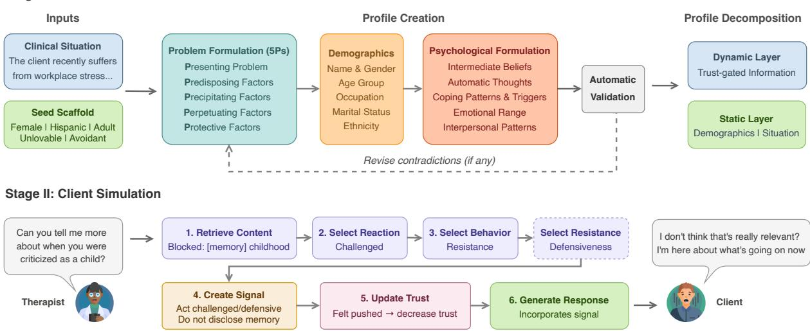  
Figure 1: Overview of Our Framework (PATIENTACT).

## 2.2 Simulation Design

The second challenge is how to enforce the desired client behavior during conversations. The simplest approach places the full profile in the system prompt and generates responses directly (Chen et al., 2023; Wang et al., 2024a). This produces fluent but overly cooperative clients who readily disclose, accept reframes, and resolve issues within a single session, which is a problem widely documented in the literature (Wang et al., 2024b; Yang et al., 2025; Kim et al., 2025). Patient-ψ (Wang et al., 2024b) addressed this by appending conversational styles (e.g., resistant) as behavioral modifiers. While effective at producing surface-level variation, these styles are static: a “resistant” client resists regardless of whether the therapist is empathic or dismissive. Recent work has proposed dynamic mechanisms in which the client’s openness (Kim et al., 2025), emotional states (Wang et al., 2025), and MI-specific stages of change (Yang et al., 2025) are adjusted during the conversation. These approaches demonstrate that dynamic state management improves realism, but each applies a single control uniformly across all profile content: a single openness scalar, a global emotion state, or a modality-specific action distribution. In practice, a client may freely describe sleep problems while actively avoiding childhood memories, with the boundary shifting as trust develops (Srivastava et al., 2025). Treating all content as equally accessible misses this reality. Moreover, resistance in prior work is either absent or reduced to a single dimension (e.g., high or low resistance), whereas clinical resistance manifests through variations in response quantity, content, or style (Otani, 1989).

## 3 PATIENTACT

Our framework (Figure 1) consists of two main pipelines: profile generation (§3.2) and client simulation (§3.3). First, a clinical situation is expanded into our designed structured profile schema through a multi-step pipeline. Accordingly, the simulated client processes each therapist’s utterance through a pipeline comprising reaction, behavior selection, and retrieval before generating a response.

## 3.1 Profile Schema

A central design requirement for our framework is that every field in the client profile must serve a functional role during simulation. Therefore, we organized each profile into three components: demographics, a problem formulation, and a psychological formulation. Together, these components provide the causal depth, cognitive structure, and interpersonal dynamics needed to sustain a realistic multi-turn therapy conversation.

1. Demographics. Each profile includes demographics (name, gender, age, occupation, marital status, ethnicity) that ground the client’s identity and ensure profiles reflect specific individuals.

2. Problem Formulation. We adopt the 5Ps clinical case formulation framework (Johnstone and Dallos, 2013) to structure the clinical context of each profile: (i) Presenting Problem: the client’s current issue; (ii) Precipitating Factors: specific past event(s) or change(s) that triggered the current episode and brought the client to therapy; (iii) Predisposing Factors: psychological (e.g., a childhood rejection that shaped relational guardedness) and social (e.g., family norms discouraging emotional expression) factors that explain why this individual became vulnerable; (iv) Perpetuating Factors: the maintenance cycles that sustain the current issue (e.g., avoidance → short-term relief → increased isolation → worsened mood); and (v) Protective Factors: the internal (e.g., motivation for change) and external (e.g., social support) strengths and resources that assist with the problem and prevent further deterioration. Unlike the Cognitive Conceptualization Diagram (CCD; Beck (2020)) or the stages-of-change model (Prochaska and Di-Clemente, 1983) used by previous work, the 5Ps framework is modality-agnostic, meaning it can be used across different therapeutic modalities, such as both Cognitive Behavioral Therapy (CBT) and Motivational Interviewing (MI); In addition, this framework enables the profile to capture causal structure that prior work overlooks.

3. Psychological Formulation. In addition to the 5Ps, we need to capture the client’s psychological state (i.e., thoughts, feelings, and behavior), as it directly governs in-session behavior during conversations. Inspired by Wang et al. (2024b), we fill this gap by encoding the following cognitive patterns: (i) Intermediate Beliefs: conditional assumptions about the current situation that govern the client’s behavior (e.g., “If I need too much from people, they’ll pull away”); (ii) Automatic Thoughts: situation-specific thoughts that the client experiences in response to the current issue (e.g., “I’m falling behind again, and I can’t even do basic things right”); (iii) Triggers: recurring situations or in-session experiences that activate distress (e.g., “feeling that my worries are not taken seriously”); (iv) Coping Patterns: observable behavioral responses to distress (e.g., canceling plans, staying in bed, keeping conversations surface-level); and (v) Emotional Range: the emotions the client can readily access or have difficulty expressing (e.g., readily expresses sadness and anxiety, while having difficulty expressing anger). In addition, we model (vi) Interpersonal Patterns that describe the client’s relational dynamics with others using the Core Conflictual Relationship Themes (CCRT; Luborsky and Crits-Christoph, 1998). Based on this framework, each pattern consists of four components: domain: the relationship the pattern applies to (e.g., the therapist, a romantic partner, or a close friend); wish (W): what the client wants from the other person (e.g., to be heard without being judged); response from other (RO): the reaction the client expects or has previously experienced, typically negative (e.g., “they’ll see me as difficult and lose patience”); and response of self (RS): how the client reacts emotionally and behaviorally as a result (e.g., avoids emotional disclosure).

## 3.2 Profile Generation

Each client profile in PATIENTACT is generated through a multi-step pipeline. Our pipeline takes as input a clinical situation, a brief natural-language description of the client’s presenting concern; a demographic scaffold including gender, age group, cultural background, and occupation type; and a psychological seed specifying a core belief theme (unlovable, worthless, or helpless; Beck 2020) and an attachment style (anxious, avoidant, or disorganized; Bartholomew and Horowitz 1991). All attributes are sampled from prior distributions derived from epidemiological prevalence data (Appendix A). Following Lai et al. (2026), our pipeline can also receive a disease outline: a structured reference document for a target disorder (e.g., depression) summarizing its key characteristics, typical symptoms, and population-specific statistics.

Given the situation, demographic scaffold, and disease outline (if available), an LLM first generates the problem formulation based on explicit instructions that enforce causal chains. Next, a rulebased conflict checker flags any incompatibilities between the sampled scaffold and the generated formulation (e.g., a child paired with alcohol use). The LLM iteratively revises the demographics until no conflicts remain. Lastly, given the problem formulation and revised demographics, the LLM generates the psychological formulation. The complete profile is validated by an LLM judge for internal coherence and against the original situation as the ground truth. The judge is tasked with flagging inconsistencies and providing targeted revisions, which are fed back into the generation pipeline, repeating this process until the profile passes validation. If a disease outline is provided, the judge also checks for contrasting indicators and clinical red flags. Details are provided in Appendix B.

## 3.3 Client Simulation

In real therapy sessions, clients’ responses are shaped by what they feel and are willing to share, and how much trust they have in the therapist. During simulation, we model this process explicitly through a multi-step pipeline: before generating a response, PATIENTACT determines the client’s emotional reaction to the therapist’s utterance, selects an appropriate behavior, and retrieves relevant content gated by the client’s evolving trust level.

## 3.3.1 Profile Decomposition

Our pipeline operates over two layers of information derived from the profile. First, a static layer that is always available in the system prompt and contains information that a client would naturally present: demographics, current concern, emotional range, and the therapist-directed interpersonal pattern. This information establishes the client’s identity, voice, and default relational posture toward the therapist. In addition, PATIENTACT includes a dynamic layer whose content surfaces only when it is relevant to the conversation and the client’s trust level permits disclosure.

To form the dynamic layer, we prompted GPT-5.4 to convert the remaining profile content into individual items with three attributes: a disclosure level indicating the minimum trust level required to share this content; activation tags determining when the item becomes relevant to the conversation; and, a discomfortflag, indicating whether approaching this topic without sufficient trust would produce visible discomfort. Disclosure levels are assigned based on each item’s vulnerability and observability: surface-level symptoms (e.g., difficulty getting out of bed) are assigned low thresholds, whereas formative memories (e.g., a childhood rejection) require higher levels of trust. This design is grounded in MENTAL-TRUST (Srivastava et al., 2025), an annotation study of 212 real counseling sessions that identified observable stages of therapeutic trust and proposed a taxonomy of seven expert-verified ordinal trust levels. We map these seven levels onto a numeric scale from 1.0 (least trust) to 4.0 (achieved trust) in steps of 0.5, so that disclosure thresholds and trust updates operate on a common scale (Appendix C.4).

## 3.3.2 Trust-Gated Retrieval

In real therapy sessions, a client’s willingness to share depends not only on what the therapist asks but on how much trust has been established. To model this, we gate access to the dynamic memory layer using the client’s current trust level. At each turn, the therapist’s utterance is matched against activation tags to identify which memory items are relevant to the current conversation. Relevant items are disclosed only if the client’s trust meets the item’s threshold; otherwise, items with a discomfort flag are placed on a blocked list indicating that the therapist is approaching sensitive territory. This produces two distinct effects: retrieved items provide the client with specific content to draw on in their response, while blocked items generate pressure to deflect or resist without revealing why.

## 3.3.3 Reaction and Behavior Modeling

Hill (1992) proposed that clients internally process each therapist intervention through two stages: an emotional reaction (i.e., what they feel) and a behavioral response (i.e., what they do).

Inspired by this, we model both stages explicitly before generating each client utterance. First, given the retrieved items and conversation history, PATIENTACT determines the client’s emotional reaction, selecting from a set of seven reactions adapted from Hill’s taxonomy (e.g., understood, challenged, or scared; see Appendix C.1). In addition, each reaction is assigned an intensity level (low, moderate, or high), which directly influences behavior selection. For instance, a client who feels slightly challenged would likely continue to engage, while higher intensity may lead to resistance. Next, given this reaction along with the client’s trust level, coping patterns, and recent behavior, PATIENTACT selects from a set of eight behaviors adapted from Hill’s categorization of client actions (e.g., recounting, cognitive exploration, resistance; see Appendix C.2) to determine how the client would act. This decomposition ensures that each response is grounded in a traceable internal state rather than generated directly from the profile.

Lastly, following Otani (1989)’s taxonomy of client resistance patterns, we define seven resistance patterns across three dimensions: quantity (e.g., minimal talk), content (e.g., topic switching), and style (e.g., defensiveness; see Appendix C.3). Therefore, if resistance is selected as the client’s behavior, rather than relying on simple instructions aimed at minimizing engagement, as in prior work, PATIENTACT determines its specific form based on the client’s coping patterns and emotional state. For instance, an avoidant client at low trust is more likely to give minimal responses, while a client who feels misunderstood may become defensive.

## 3.3.4 Trust Dynamics

The outputs of the preceding steps are compiled into a signal that specifies what the client is feeling, what content is available to draw on, and how they should behave. Accordingly, at each turn, this signal is appended to the therapist’s message and a response is generated. Following this exchange, PATIENTACT evaluates how the therapist’s behavior affected the client’s trust, conditioned on the client’s profile. Srivastava et al. (2025) observed that in real counseling, positive trust transitions are frequent but small, while negative transitions are rarer but larger. We adopt this asymmetry: trust moves in steps of ±0.25 (slight) or ±0.5 (significant), bounded between 1.0 and 4.0, starting at 2.5 as the middle ground. Attachment style shapes these dynamics: anxious clients lose trust readily in response to perceived rejection; avoidant clients build trust slowly and penalize pushiness; disorganized clients may lose trust even after positive exchanges. The updated trust level carries forward, directly determining which memory items will pass the disclosure gate in the next turn.

## 4 Experiments

## 4.1 Profile Evaluation

With the help of an expert with a background in clinical psychology, we hand-crafted 20 clinical situations covering common situations for depression and anxiety, respectively (40 in total). This choice was motivated by the fact that these are the most prevalent mental disorders worldwide, and existing work mainly focuses on these disorders, enabling direct comparison for simulation. We then used

GPT-5.4 as the backbone LLM in our pipeline to generate profiles for each situation.

Procedure. We recruited 10 annotators with a background in psychology to evaluate the generated profiles. Each profile was evaluated by three annotators (12 profiles per annotator) on the following aspects using 5-point Likert scales: (i) Clinical Plausibility: the degree to which the profile could be attributed to a real client; (ii) Internal Consistency: the degree to which there is a logical connection between the various dimensions of the profile; (iii) Case Specificity: the degree to which the details of the life history and conceptualization were specific and individualized; and (iv) Clinical Depth: whether there was enough information to support multiple rounds of therapeutic conversations. Moreover, we asked the annotators to predict the core belieftheme and attachment style to assess whether the generated profile encompassed these scaffolds. Each annotator also provided a diversity rating (1–5) to assess whether the generated profiles seemed like distinct individuals rather than variations of the same template. Full evaluation guidelines are provided in Appendix D.1.

Results. As shown in Table 1, all dimensions received high average ratings, indicating that annotators generally found the profiles clinically plausible, internally consistent, specific, and sufficiently detailed for multi-turn therapeutic conversations. Notably, Clinical Plausibility received the highest rating (4.43), suggesting that the 5Ps-based formulations lead to profiles that are perceived as realistic clinical cases. Inter-annotator agreement was moderate across all dimensions $( \alpha = 0 . 4 1  – 0 . 4 5 )$ which is consistent with the inherent subjectivity of clinical judgment tasks. For the identification tasks, annotators correctly predicted the intended attachment styles and core belief themes with 77.5% and 64.2% accuracy, respectively. Core belief themes are sampled uniformly, giving a 33.3% chance level; attachment styles follow the clinical prior of Appendix A, under which always predicting disorganized would yield 54%. Both results are well above these baselines. Accordingly, substantial inter-annotator agreement on both tasks $( \kappa = 0 . 6 1$ and $\kappa = 0 . 6 5 )$ indicates that profiles express these constructs clearly. Lastly, on average, annotators rated diversity at $4 . 2 \pm 0 . 4 2$ (out of 5), demonstrating that most profiles represented distinct individuals and circumstances.

<table><tr><td>Dimension</td><td></td><td>Rating/Acc Agreement</td></tr><tr><td>Clinical Plausibility</td><td> $4 . 4 3 \pm 0 . 5 9$ </td><td> $\alpha = 0 . 4 1$ </td></tr><tr><td rowspan="3">Internal Consistency Case Specificity</td><td> $4 . 3 8 \pm 0 . 5 8$ </td><td> $\alpha = 0 . 4 3$ </td></tr><tr><td> $4 . 3 2 \pm 0 . 5 2$ </td><td> $\alpha = 0 . 4 3$ </td></tr><tr><td> $4 . 2 8 \pm 0 . 5 5$ </td><td> $\alpha = 0 . 4 5$ </td></tr><tr><td>Attachment Style</td><td>77.5%</td><td> $\kappa = 0 . 6 1$ </td></tr><tr><td>Core Belief Theme</td><td>64.2%</td><td> $\kappa = 0 . 6 5$ </td></tr></table>

Table 1: Evaluation Results for Profile Generation. Likert dimensions (1–5 scale) report average ratings $\pm \mathrm { \ s t d } .$ and classification tasks report accuracy. Krippendorff’s α indicates inter-annotator agreement in ratings, with Fleiss’ κ for classifications; $\alpha > 0 .$ 4 and $\kappa > 0 . 6$ show moderate and substantial agreement, respectively.

Error Analysis. Upon further analysis, the primary source of confusion in identifying attachment style was disorganized profiles being misidentified as avoidant (15 out of 27), likely due to the withdrawal component of disorganized attachment resembling avoidant patterns. For core belief themes, most errors involved the helpless theme being confused with the remaining two themes, possibly due to the shared expressions of helplessness with worthlessness in inadequacy and with being unlovable in dependence on others.

## 4.2 Simulation Evaluation

Baselines. We selected three representative baselines to cover different existing approaches to client simulation: (i) Patient-ψ (Wang et al., 2024b), which structures profiles around the Cognitive Conceptualization Diagram, representing the static prompt-based approaches with theory-grounded profiles; (ii) AnnaAgent (Wang et al., 2025), which uses simple background and symptom descriptions with a dynamic emotion modulator, representing methods with minimal profile design and dynamic behavioral control; and (iii) ConsistentMI (Yang et al., 2025), which encodes motivation, beliefs, and receptivity with state tracking and action selection, representing the modality-specific approaches with dynamic behavioral control.

Implementation Details. We conducted our experiments using PatientHub (Sabour et al., 2026), which provides a unified framework for developing and benchmarking patient simulation methods. Following prior work, we used GPT-4o (Hurst et al., 2024) as the backbone LLM across all methods to ensure a fair comparison, with temperature set to

0.7 to balance response diversity and coherence. All simulated clients engaged with the same therapist agent, designed to be modality-agnostic and explicitly prohibited from teaching techniques or pushing for resolution (Figure 8), for 15 turns, resulting in $4 \times 4 0 = 1 6 0$ conversations in total.

Procedure. Conversations were evaluated on the following dimensions using 5-point Likert scales: (i) Coherence: whether the client maintained a consistent persona throughout the conversation; (ii) Disclosure Pacing: whether the client shared information at a natural pace; (iii) Resistance Quality: whether the client’s pushback felt authentic; (iv) Emotional Authenticity: whether client’s emotional reactions were genuine and proportionate; and (v) Behavioral Realism: whether the client resembled a real person in therapy. For human evaluation, we randomly sampled 10 conversations per disorder for each system $( 4 \times 2 0 = 8 0$ conversations). Each conversation was rated by three of the ten recruited annotators (24 conversations per annotator), who were blind to the method identity. For automatic evaluation, we used GPT-5.4 as an LLM judge to evaluate all 160 conversations using the same guidelines as human evaluators. Full evaluation guidelines are provided in Appendix D.2.

Results. As shown in Table 2, PATIENTACT achieves the highest human ratings and significantly outperforms the baselines across all five dimensions. The largest gains over the best baseline appear in Resistance Quality (+0.67) and Behavioral Realism (+0.63), followed by Disclosure Pacing (+0.50), which are dimensions most directly tied to the shortcomings identified in prior work: absent or one-dimensional resistance, over-cooperative behavior, and uniform disclosure. Smaller gains in Coherence (+0.39) and Emotional Authenticity (+0.32) suggest that existing methods perform reasonably well at maintaining a consistent character and producing appropriate emotions, and that the primary gap lies in how clients manage information sharing and pushback. Notably, Patient-ψ ranks second across most dimensions despite using only a static profile, outperforming AnnaAgent and ConsistentMI, which employ dynamic mechanisms. These results suggest that profile quality strongly drives simulation realism and that dynamic mechanisms alone cannot compensate for a shallow profile. To demonstrate how these quantitative differences manifest in conversations, we present a case study in Appendix E.

<table><tr><td rowspan="2">Method</td><td colspan="2">Coherence</td><td colspan="2">Disclosure</td><td colspan="2">Resistance</td><td colspan="2">Emotional</td><td colspan="2">Realism</td></tr><tr><td>LLM</td><td>Human</td><td>LLM</td><td>Human</td><td>LLM</td><td>Human</td><td>LLM</td><td>Human</td><td>LLM</td><td>Human</td></tr><tr><td>Patient-ψ</td><td>4.40</td><td>3.98</td><td>4.60</td><td>3.65</td><td>2.98</td><td>3.02</td><td>4.12</td><td>3.83</td><td>3.60</td><td>3.52</td></tr><tr><td>AnnaAgent</td><td>4.03</td><td>3.90</td><td>4.05</td><td>3.50</td><td>2.92</td><td>3.08</td><td>4.03</td><td>3.55</td><td>3.23</td><td>3.37</td></tr><tr><td>ConsistentMI</td><td>4.20</td><td>3.57</td><td>3.33</td><td>3.05</td><td>3.83*</td><td>3.15</td><td>3.33</td><td>2.73</td><td>3.17</td><td>2.83</td></tr><tr><td>PATIENTACT</td><td>4.35</td><td>4.37*</td><td>4.42</td><td>4.15*</td><td>3.25</td><td>3.82*</td><td>4.17</td><td>4.15*</td><td>3.85*</td><td>4.15*</td></tr></table>

Table 2: Evaluation Results for Client Simulation (1–5 scale). The best results for each column are highlighted in bold. <sup>∗</sup> indicates significantly higher rating than the second-best method $( p < 0 . 0 5$ , Mann-Whitney U).

<table><tr><td>Dimension</td><td>Humans</td><td>Human-LLM</td></tr><tr><td>Coherence</td><td>0.41</td><td>0.09</td></tr><tr><td>Disclosure P.</td><td>0.41</td><td>0.29</td></tr><tr><td>Resistance Q.</td><td>0.43</td><td>0.22</td></tr><tr><td>Emotional A.</td><td>0.51</td><td>0.37</td></tr><tr><td>Realism</td><td>0.53</td><td>0.33</td></tr></table>

Table 3: Inter-annotator agreement for conversation evaluation. Human agreement: Krippendorff’s α (> 0.4 = moderate). Human–LLM judge correlation: Spearman’s $\rho ,$ following G-Eval (Liu et al., 2023).

Interestingly, the LLM judge produces a different ranking across dimensions. On Emotional Authenticity and Realism, which have the highest human inter-annotator agreement (Table 3), PATIEN-TACT outperforms the baselines in LLM evaluations. However, it ranks Patient-ψ highest on Coherence and Disclosure Pacing. One possible explanation is that the GPT-5.4 judge, which shares the same model family as the simulation backbone (i.e., GPT-4o), may favor outputs closer to the model’s default generation style. In addition, ConsistentMI significantly outperforms the baselines in resistance quality, possibly due to its explicit receptivity states and MI-specific action selection, which produce more structured resistance that is easier for an LLM to identify. Notably, the dimensions in which PA-TIENTACT was outperformed by baselines are also those with the lowest human agreement $( \alpha = 0 . 4 1 -$ 0.43) and the weakest Human-LLM correlation $( \rho = 0 . 0 9 \ – 0 . 2 9 )$ . Together, these findings provide further evidence that automated evaluation alone is insufficient to assess the quality of therapy simulations and that human judgment remains essential for dimensions involving clinical appropriateness.

Ablation Study. We tested three ablations to isolate the effects of individual components: (i) without trust-gating (w/o TG), in which all memory items are always accessible; (ii) without dynamic memory (w/o DM), in which the full profile is placed in the system prompt with no retrieval; and (iii) without the reaction-behavior-resistance pipeline (w/o Pipe), in which a response is generated directly from the retrieved items.

As shown in Table 4, removing any of the three components reduces human ratings across all dimensions. Notably, this drop is largest for w/o DM on four of the five dimensions, particularly in Resistance Quality (1.04 in human and 0.58 in LLM ratings, compared to 0.94 and 0.30 for w/o TG), suggesting that placing the full profile in context encourages disclosure regardless of other instructions, whereas retrieval-based content selection provides a stronger constraint on over-cooperation. In contrast, trust-gating contributes most to Disclosure Pacing (0.93 vs. 0.75), which is expected given that it directly ties disclosure to the state of the therapeutic relationship. Interestingly, w/o Pipe is the only variant that the LLM judge rates above the full framework across all dimensions, whereas human annotators rate it lower on all five. This mirrors the divergence observed in Table 2 and further indicates that automatic evaluation alone would have favored an ablated system over the full framework.

## 5 Conclusion

We presented PATIENTACT, a theory-grounded framework for client simulation that addresses the lack of causal depth in existing profiles and behavioral mechanisms that treat all content as equally accessible. Evaluation by expert annotators demonstrates that our profiles achieve high clinical plausibility and that PATIENTACT produces significantly more realistic simulations than three representative baselines. Our results suggest that profile depth and quality yield larger improvements in simulation realism than dynamic behavioral mechanisms alone. We also find that LLM-based judges are insufficient for evaluating therapy simulations on dimensions involving clinical judgment. We hope that PATIENTACT can facilitate more effective tools for therapist training, more rigorous benchmarks for LLM therapists, and richer synthetic data for mental health research.

<table><tr><td rowspan="2">Method</td><td colspan="2">Coherence</td><td colspan="2">Disclosure</td><td colspan="2">Resistance</td><td colspan="2">Emotional</td><td colspan="2">Realism</td></tr><tr><td>LLM</td><td>Human</td><td>LLM</td><td>Human</td><td>LLM</td><td>Human</td><td>LLM</td><td>Human</td><td>LLM</td><td>Human</td></tr><tr><td>FULL</td><td>4.35</td><td>4.37</td><td>4.42</td><td>4.15*</td><td>3.25</td><td>3.82*</td><td>4.17</td><td>4.15*</td><td>3.85</td><td>4.15*</td></tr><tr><td>w/o TG</td><td>4.20</td><td>3.98</td><td>4.33</td><td>3.22</td><td>2.95</td><td>2.88</td><td>4.03</td><td>3.70</td><td>3.67</td><td>3.32</td></tr><tr><td>w/o DM</td><td>4.17</td><td>3.83</td><td>4.38</td><td>3.40</td><td>2.67</td><td>2.78</td><td>4.10</td><td>3.53</td><td>3.73</td><td>3.27</td></tr><tr><td>w/o Pipe</td><td>4.42</td><td>4.15</td><td>4.75</td><td>3.75</td><td>3.45</td><td>2.98</td><td>4.35</td><td>3.65</td><td>3.92</td><td>3.55</td></tr></table>

Table 4: Evaluation Results for the Ablation Study (1–5 scale). The best results for each column are highlighted in bold. <sup>∗</sup> indicates significantly higher rating than the second-best method $( p < 0 . 0 5$ , Mann-Whitney U).

## Limitations

In this work, we focused our evaluation only on depression and anxiety, as these are the most prevalent conditions worldwide and the focus of existing baselines. As other conditions (e.g., PTSD) may involve qualitatively different therapeutic dynamics, we cannot assume that our framework generalizes to these disorders without further evaluation. However, as PATIENTACT is disorder-agnostic by design, extending it to conditions where trust and resistance manifest differently is a natural next step.

Our experiments were limited to single 15-turn sessions, whereas real therapy unfolds over multiple sessions. This design choice followed existing work, which is predominantly single-session, partly because current simulators exhaust their content within 10–15 turns. Extending our framework to multi-session simulation, where trust carries over and the client’s presentation evolves between sessions, is an important direction, and our trust mechanism is well positioned to support it.

This study was conducted only in English, and all simulation methods relied on GPT-4o. Given that mental health presentation varies across cultures and languages, our results may not generalize to other settings. Additionally, since profiles are generated by an LLM, they may reflect biases present in the model’s training data, including under-representation of non-Western presentations of mental disorders. While we controlled for demographic diversity through scaffold sampling, this does not yet address deeper cultural differences in how distress is experienced and expressed.

Lastly, our evaluation measures simulation realism through expert ratings. However, we do not evaluate whether more realistic simulations translate to improved outcomes in downstream applications such as therapist training or LLM therapist evaluation. Establishing this connection is an important direction that our data and framework are designed to facilitate.

## Ethics Statement

PATIENTACT simulates therapy clients for research purposes, mainly to support counselor training, evaluate LLM-based therapeutic systems, and generate synthetic data. It is not intended as a diagnostic tool or a substitute for real clinical interactions, and any downstream therapeutic application should involve qualified clinical oversight.

We did not use any real patient data at any stage of this work. All clinical situations were handcrafted under expert supervision, and all profiles and conversations were generated by LLMs. However, we note that realistic mental health simulations carry inherent risks: they could be used to build systems that provide unsupervised therapeutic interventions, or they could reinforce stereotypical presentations of mental illness if the generated profiles reflect biases in the model’s training data. We partially mitigated these issues through expertsupervised situation design and demographic scaffold sampling, but acknowledge that these measures may not fully eliminate such risks.

Our annotators reviewed simulated transcripts involving descriptions of depression and anxiety. All annotators had backgrounds in psychology, were informed of the content before participation, provided consent for their annotations to be released for research purposes, and were compensated with 200 RMB (approximately 28.5 USD), which exceeds the local minimum wage. We received no reports of distress related to the task.

## References

Marian J Bakermans-Kranenburg and Marinus H van IJzendoorn. 2009. The first 10,000 adult attachment interviews: Distributions of adult attachment representations in clinical and non-clinical groups. Attachment & human development, 11(3):223–263.

Kim Bartholomew and Leonard M Horowitz. 1991. Attachment styles among young adults: a test of a fourcategory model. Journal ofpersonality and social psychology, 61(2):226.

Judith S Beck. 2020. Cognitive behavior therapy: Basics and beyond. Guilford Publications.

Bureau of Labor Statistics. 2024. Employment by major occupational group.

Siyuan Chen, Mengyue Wu, Kenny Q. Zhu, Kunyao Lan, Zhiling Zhang, and Lyuchun Cui. 2023. Llm-empowered chatbots for psychiatrist and patient simulation: Application and evaluation. Preprint, arXiv:2305.13614.

Clara E Hill. 1992. An overview of four measures developed to test the hill process model: Therapist intentions, therapist response modes, client reactions, and client behaviors. Journal of Counseling & Development, 70(6):728–739.

Aaron Hurst, Adam Lerer, Adam P Goucher, Adam Perelman, Aditya Ramesh, Aidan Clark, AJ Ostrow, Akila Welihinda, Alan Hayes, Alec Radford, and 1 others. 2024. Gpt-4o system card. arXiv preprint arXiv:2410.21276.

Lucy Johnstone and Rudi Dallos. 2013. Formulation in Psychology and Psychotherapy: Making Sense of People’s Problems, 2 edition. Routledge, London.

Minju Kim, Dongje Yoo, Yeonjun Hwang, Minseok Kang, Namyoung Kim, Minju Gwak, Beong-woo Kwak, Hyungjoo Chae, Harim Kim, Yunjoong Lee, Min Hee Kim, Dayi Jung, Kyong-Mee Chung, and Jinyoung Yeo. 2025. Can you share your story? modeling clients’ metacognition and openness for LLM therapist evaluation. In Findings ofthe Association for Computational Linguistics: ACL 2025, pages 25943–25962, Vienna, Austria. Association for Computational Linguistics.

Yunghwei Lai, Ziyue Wang, Weizhi Ma, and Yang Liu. 2026. Patient-zero: Scaling synthetic patient agents to real-world distributions without real patient data. Preprint, arXiv:2509.11078.

Jingoo Lee, Kyungho Lim, Young-Chul Jung, and Byung-Hoon Kim. 2025. Psyche: A multi-faceted patient simulation framework for evaluation of psychiatric assessment conversational agents. Preprint, arXiv:2501.01594.

Baihan Li, Bingrui Jin, Kunyao Lan, Ming Wang, and Mengyue Wu. 2026. Synthetic or authentic? building mental patient simulators from longitudinal evidence. arXiv preprint arXiv:2603.22704.

Inna Wanyin Lin, Sahand Sabour, Hong Sng, Maxine Chan, Minlie Huang, Andrew White, and Tim Althoff. 2026. Candormd: An ai-assisted audio simulation and feedback system for training clinicians for medical error disclosure. Preprint, arXiv:2605.20701.

June M Liu, Mengxia Gao, Sahand Sabour, Zhuang Chen, Minlie Huang, and Tatia MC Lee. 2025a. Enhanced large language models for effective screening of depression and anxiety. Communications Medicine, 5(1):457.

Siyang Liu, Bianca Brie, Wenda Li, Laura Biester, Andrew Lee, James Pennebaker, and Rada Mihalcea. 2025b. Eeyore: Realistic depression simulation via expert-in-the-loop supervised and preference optimization. In Findings ofthe Associationfor Computational Linguistics: ACL 2025, pages 13750–13770, Vienna, Austria. Association for Computational Linguistics.

Yang Liu, Dan Iter, Yichong Xu, Shuohang Wang, Ruochen Xu, and Chenguang Zhu. 2023. G-eval: Nlg evaluation using gpt-4 with better human alignment. Preprint, arXiv:2303.16634.

Ryan Louie, Ananjan Nandi, William Fang, Cheng Chang, Emma Brunskill, and Diyi Yang. 2024. Roleplay-doh: Enabling domain-experts to create LLM-simulated patients via eliciting and adhering to principles. In Proceedings of the 2024 Conference on Empirical Methods in Natural Language Processing, pages 10570–10603, Miami, Florida, USA. Association for Computational Linguistics.

Lester Luborsky and Paul Crits-Christoph. 1998. Understanding transference: The core conflictual relationship theme method. American Psychological Association.

Mario Mikulincer and Phillip R Shaver. 2012. An attachment perspective on psychopathology. World psychiatry, 11(1):11–15.

National Institute of Mental Health. 2024a. Anxiety disorders. https://www.nimh.nih.gov/health/ topics/anxiety-disorders.

National Institute of Mental Health. 2024b. Depression. https://www.nimh.nih.gov/health/ publications/depression.

Akira Otani. 1989. Client resistance in counseling: Its theoretical rationale and taxonomic classification. Journal of Counseling & Development, 67(8):458– 461.

James O. Prochaska and Carlo C. DiClemente. 1983. Stages and processes of self-change of smoking: Toward an integrative model of change. Journal of Consulting and Clinical Psychology, 51(3):390–395.

Sahand Sabour, TszYam NG, and Minlie Huang. 2026. Patienthub: A unified framework for patient simulation. Preprint, arXiv:2602.11684.

Sahand Sabour, Wen Zhang, Xiyao Xiao, Yuwei Zhang, Yinhe Zheng, Jiaxin Wen, Jialu Zhao, and Minlie Huang. 2023. A chatbot for mental health support: exploring the impact of emohaa on reducing mental distress in china. Frontiers in digital health, 5:1133987.

Aseem Srivastava, Zuhair Hasan Shaik, Tanmoy Chakraborty, and Md Shad Akhtar. 2025. Trust modeling in counseling conversations: A benchmark study. Preprint, arXiv:2501.03064.

U.S. Census Bureau. 2024. Quickfacts: United states.

Jiashuo Wang, Yang Xiao, Yanran Li, Changhe Song, Chunpu Xu, Chenhao Tan, and Wenjie Li. 2024a. Towards a client-centered assessment of llm therapists by client simulation. Preprint, arXiv:2406.12266.

Ming Wang, Peidong Wang, Lin Wu, Xiaocui Yang, Daling Wang, Shi Feng, Yuxin Chen, Bixuan Wang, and Yifei Zhang. 2025. AnnaAgent: Dynamic evolution agent system with multi-session memory for realistic seeker simulation. In Findings ofthe Association for Computational Linguistics: ACL 2025, pages 23221–23235, Vienna, Austria. Association for Computational Linguistics.

Ruiyi Wang, Stephanie Milani, Jamie C. Chiu, Jiayin Zhi, Shaun M. Eack, Travis Labrum, Samuel M Murphy, Nev Jones, Kate V Hardy, Hong Shen, Fei Fang, and Zhiyu Chen. 2024b. PATIENT-ψ: Using large language models to simulate patients for training mental health professionals. In Proceedings of the 2024 Conference on Empirical Methods in Natural Language Processing, pages 12772–12797, Miami, Florida, USA. Association for Computational Linguistics.

World Health Organization. 2025. World mental health today: Latest data. Technical report, World Health Organization, Geneva.

Yizhe Yang, Palakorn Achananuparp, Heyan Huang, Jing Jiang, Nicholas Gabriel Lim, Cameron Tan Shi Ern, Phey Ling Kit, Jenny Giam Xiuhui, John Pinto, and Ee-Peng Lim. 2025. Consistent client simulation for motivational interviewing-based counseling. In Proceedings of the 63rd Annual Meeting of the Associationfor Computational Linguistics (Volume 1: Long Papers), pages 20959–20998, Vienna, Austria. Association for Computational Linguistics.

## A Prior Distributions

Demographic attributes (age group, gender, ethnicity, and occupation type) are sampled from epidemiological distributions calibrated to U.S. Census and Bureau of Labor Statistics data (U.S. Census Bureau, 2024; Bureau of Labor Statistics, 2024). Core belief themes (unlovable, worthless, and helpless) are drawn from Beck’s core belief categories (Beck, 2020) and sampled uniformly, as no established prevalence data exist for these categories in clinical populations. Attachment styles are sampled from the four-way clinical distribution reported by Bakermans-Kranenburg and van IJzendoorn (2009) in their meta-analysis of over 10,500 Adult Attachment Interviews (autonomous: 21%, dismissing: 23%, preoccupied: 13%, unresolved: 43%). Following common practice, we refer to these categories using the corresponding self-report labels (Bartholomew and Horowitz, 1991): dismissing as avoidant, preoccupied as anxious, and unresolved as disorganized (fearful-avoidant). We excluded the autonomous (secure) style from sampling, as secure attachment is associated with significantly lower rates of psychopathology (Mikulincer and Shaver, 2012) and because LLMs’ default cooperative behavior already approximates secure attachment patterns, making it the least informative condition for evaluating simulation mechanisms. Moreover, disease outlines summarizing key characteristics, typical presentations, and clinical red flags for depression and anxiety were compiled from the National Institute of Mental Health (National Institute of Mental Health, 2024a,b).

## B Generation Guidelines

During profile generation, the LLM receives explicit instructions enforcing the causal structure of the 5Ps formulation: (i) predisposing factors must explain why this specific person is vulnerable to this specific problem; (ii) perpetuating factors must describe identifiable maintenance cycles (e.g., avoidance → relief → isolation → worsened mood) rather than listing maladaptive behaviors; and (iii) predisposing factors are required to be specific, datable events or patterns rather than clinical summaries, producing episodic content that the simulated client can draw from during conversation. When a disease outline is provided, the generation step uses it to guide clinical plausibility, and the validation step checks against it for contraindications. Psychological diversity is controlled through two seed attributes not present in prior work on client simulation: core belief theme and attachment style. These interact with the clinical situation to produce meaningfully different profiles from the same presenting concern. For example, an avoidant client with “worthless” beliefs facing workplace difficulties will present with emotional shutdown and self-reliance, while an anxious client with “unlovable” beliefs facing the same situation will present with reassurance-seeking and fear of abandonment. This mechanism addresses the problem where profiles generated from similar seeds converge on near-identical psychological presentations, as documented by Li et al. (2026). An example of a generated profile is provided in Figure 2. In addition, relevant prompts for profile generation are provided in Figures 3–6.

## C Theory-grounded Taxonomies

## C.1 Client Reactions

• Understood: The client felt the therapist accurately grasped what they were saying or feeling. They feel heard and seen.

• Hopeful: The client felt more optimistic, encouraged, or reassured. A sense that things could get better.

• Gained Clarity: The client gained new awareness: saw a pattern, made a connection, or understood something about themselves they hadn’t before. Includes moments of insight, feeling less confused, or seeing things from a new angle.

• Challenged: The client felt pushed to think differently or confront something uncomfortable. This can be productive or threatening depending on the client’s trust and readiness.

• Scared: The client felt frightened, anxious, or emotionally overwhelmed. This could be due to the therapist touching on something very sensitive, pushing too hard, or moving too fast.

• Misunderstood: The client felt the therapist missed the point, got it wrong, or was not on the same page. May trigger correction, frustration, or withdrawal.

• No Reaction: The client felt nothing notable in response to the therapist’s message.

## C.2 Client Behaviors

• Simple Response: The client gives brief acknowledgments, ‘yes,’ ‘okay,’ ‘I see,’ or minimal verbal responses that confirm hearing the therapist but don’t elaborate.

• Request: The client asks for something: information, clarification, advice, or the therapist’s opinion. Can be genuine help-seeking or reassurance-seeking.

• Recounting: The client narrates events or tells stories—factual, descriptive, external. Reporting what happened rather than exploring meaning.

• Cognitive Exploration: The client examines their own thoughts, beliefs, assumptions, or patterns. Goes beyond recounting into active self-analysis.

• Affective Exploration: The client explores, expresses, or elaborates on emotions. Naming feelings, connecting them to events, or experiencing them in session.

• Insight: The client demonstrates a new understanding—connecting patterns, recognizing causes, an ‘aha’ moment. A qualitative shift, not just description.

• Discussing Plans: The client talks about changes they want to make, actions they intend to try, or new behaviors they have already attempted.

• Resistance: The client opposes, deflects, avoids, or blocks the therapeutic process.

## C.3 Resistance Patterns

• Minimal Talk: Very brief, unelaborated answers. ‘I guess,’ ‘I don’t know,’ ‘not really.

• Irrelevant Talk: Steering the conversation to unrelated topics to avoid the current issue.

• Superficial: Staying on surface-level facts and details, avoiding emotional depth.

• Intellectualizing: Using analysis, abstract reasoning, or clinical language to avoid experiencing emotions. Talking ABOUT feelings rather than FEELING.

• Hostility: Anger, sarcasm, or sharp criticism directed at the therapist, the process, or the questions being asked.

• Defensiveness: Justifying, denying, or explaining away problems when confronted. ‘It’s not that bad,’ ‘you don’t understand.

• Compliance Without Engagement: Agreeing with everything the therapist says without genuine engagement. ‘Yeah, you’re right’ followed by no change.

## C.4 Trust Levels

• Level 1.0 (Least Trust): Active refusal to engage. The client blocks the therapeutic process, gives no meaningful information, or explicitly refuses to participate.

• Level 1.5: Minimal engagement. The client responds when directly addressed, but volunteers nothing and shows clear reluctance.

• Level 2.0 (Low Trust): Hesitant selfdisclosure. The client uses fillers, hedges, and expressions of doubt; answers are short and lack elaboration.

• Level 2.5: Cautious engagement. The client participates willingly but stays on the surface, testing whether the therapist is safe.

• Level 3.0 (Building Trust): Consistent engagement. The client responds to prompts, explores topics when invited, and begins to share beyond surface-level content.

• Level 3.5: Active working. The client initiates disclosure and engages with difficult material, but still holds back the most vulnerable content.

• Level 4.0 (Achieved Trust): Full openness. The client discusses core issues without avoidance or digression.

## D Evaluation Guidelines

## D.1 Profile Evaluation

In this task, you will evaluate 12 client profiles for a psychotherapy simulation study. Each profile contains demographic information, problem formulation, and psychological formulation. Your task is to rate each profile on a 1–5 Likert scale based on the following guidelines:

1. Clinical Plausibility. Could this be a real person presenting for therapy?

• Implausible (1): contradicts clinical knowledge or presents an impossible combination of features.

• Unlikely (2): major elements feel artificial or clinically unrealistic.

• Possible (3): broadly plausible, but some details feel generic or forced.

• Convincing (4): reads like a real clinical case with only minor quibbles.

• Highly convincing (5): indistinguishable from a real client.

2. Internal Consistency. Do the parts of the profile logically connect?

• Disconnected (1): sections contradict each other or lack any logical link.

• Weak (2): some connections exist, but key causal links are missing or contradictory.

• Partial (3): the overall story holds, but some elements feel tacked on.

• Strong (4): clear causal chain from predisposing factors through to the presenting problem and maintenance cycles.

• Seamless (5): every element reinforces every other; the formulation reads as a unified whole.

3. Case Specificity. Are the life history and formulation details concrete and individualized?

• Entirely generic (1): reads like a textbook description with no personal detail.

• Mostly generic (2): a few concrete details, but predisposing factors are vague summaries.

• Mixed (3): some specific, datable experiences alongside generic filler.

• Specific (4): most history items include concrete information such as ages, settings, and consequences.

• Vivid (5): every detail feels like something this particular person would recount.

4. Clinical Depth. Is there enough material to sustain a multi-turn therapy conversation?

• Shallow (1): only surface-level complaints; nothing to explore.

• Thin (2): one or two threads that would be exhausted quickly.

• Adequate (3): enough material for a short session, but limited range.

• Rich (4): multiple threads spanning relationships, beliefs, history, and current functioning, sufficient for several sessions.

• Very rich (5): a therapist could conduct multiple sessions exploring different facets, each thread leading to deeper meaning, contradictions, or complexity.

After rating each profile, select the bestmatching option based on the overall content.

## Attachment style (select one):

• Anxious: intensely desires closeness, fears abandonment, frequently feels insecure, and needs repeated reassurance.

• Avoidant: overemphasizes self-sufficiency, struggles to fully trust or rely on others, and feels uncomfortable with intimacy.

• Disorganized: simultaneously craves and fears intimacy, exhibiting a recurring approach–withdraw cycle in relationships.

## Core belief theme (select one):

• Unlovable: fears of rejection, abandonment, or being unwanted; they believe they are not good enough in relationships and that others will eventually leave or lose interest; they may avoid intimacy or over-accommodate to prevent abandonment.

• Worthless: negation of one’s own value and abilities; believes they are inferior, insignificant, or meaningless to others; highly sensitive to failure and others’ evaluations, prone to self-criticism and comparison.

• Helpless: feels unable to cope with or control their life; believes they are fragile and cannot solve problems independently; tends to rely on others or avoid challenges, and feels anxious about uncertainty.

After evaluating all of the assigned profiles, please rate the overall diversity: Of all profiles reviewed, how many felt like genuinely distinct individuals versus variations on a template?

• Homogeneous (1): most profiles felt interchangeable.

• Low variety (2): a few distinct profiles but heavy repetition.

• Moderate (3): recognizable variety but some recurring patterns.

• Diverse (4): most profiles feel like different people.

• Highly diverse (5): each profile feels like a unique individual.

## D.2 Conversation Evaluation

In this task, you will evaluate 24 therapy session transcripts between a simulated client and therapist. Assess only the client’s performance; ignore the therapist’s quality. Your task is to judge whether the client behaves like a real person in therapy. Your task is to rate each conversation on a 1–5 scale based on the following guidelines:

1. Coherence. Does the client maintain a coherent character throughout the session?

• Incoherent (1): the client contradicts themselves, shifts personality across turns, or breaks character entirely.

• Mostly inconsistent (2): the general character is recognizable, but there are noticeable shifts in tone, emotional state, or stated history.

• Generally coherent (3): the character holds for most of the session, with only a few moments that feel out of place.

• Coherent (4): tone, defenses, and emotional patterns remain consistent throughout, with only trivial variation.

• Fully coherent (5): the client feels like the same person from first turn to last; emotional shifts are traceable and follow naturally from the progression of the conversation.

2. Disclosure Pacing. Does the client share information at a natural pace across the session?

• Unnatural (1): the client dumps their full history and deep feelings in the first few turns, or unreasonably withholds all information throughout.

• Mostly unnatural (2): information emerges too quickly or too slowly, with little connection to how the conversation develops.

• Uneven (3): some natural pacing, but with noticeable jumps where the client suddenly shares deep content without buildup.

• Natural (4): surface-level content appears early; deeper material emerges gradually as the conversation progresses.

• Highly natural (5): disclosure clearly tracks with the developing therapeutic relationship; early turns are guarded, deeper sharing follows trust-building moments.

3. Resistance Quality. When the client pushes back, does it feel authentic?

• No resistance (1): the client agrees with everything, accepts all reframes, and moves toward resolution without hesitation.

• Token resistance (2): the client occasionally hedges with “I guess” or “maybe,” but quickly yields and follows the therapist’s lead.

• Present but formulaic (3): the client pushes back at times, but the resistance feels repetitive or scripted rather than rooted in their character.

• Convincing (4): resistance arises naturally from the client’s personality and situation, with varied forms such as avoidance, silence, topic changes, or disagreement.

• Highly convincing (5): resistance is distinctly personal and unpredictable in timing; the therapist makes multiple attempts to advance, yet the client maintains defenses on core issues.

4. Emotional Authenticity. Do the client’s emotional reactions feel genuine and proportionate?

• Flat or artificial (1): the client maintains the same emotional tone throughout, regardless of what the therapist says, or emotions appear and disappear without reason.

• Mostly mechanical (2): emotional shifts occur but feel abrupt, exaggerated, or disconnected from the conversation.

• Partially authentic (3): some emotional reactions feel real, but others seem forced or disproportionate to the moment.

• Convincing (4): emotions emerge naturally from the conversation, shift gradually, and feel proportionate to what is being discussed.

• Highly convincing (5): emotional responses are genuine, natural, and layered; the client shows ambivalence and complex emotional states rather than presenting a single, clear emotion at each moment.

5. Behavioral Realism. Does the conversation read like a real therapy client?

• Artificial (1): the client sounds like an AI, uses clinical terminology, or responds in ways no real client would.

• Mostly artificial (2): occasional natural moments, but overall tone, vocabulary, or emotional responses feel scripted.

• Mixed (3): some turns feel like a real person; others break the illusion with overly polished or textbook-like language.

• Convincing (4): reads like a real client, with only minor moments that feel slightly off. When describing personal experiences, the narrative feels first-person rather than detached.

• Highly convincing (5): indistinguishable from a real client; natural, personally distinctive expression, emotional reactions, and coping patterns throughout.

## E Case Study

We present excerpts from a clinical situation simulated by all four methods with the same therapist. Table 5 shows three key moments from each session: the client’s first encounter with an emotionally charged topic, the mid-session point where deeper material is either disclosed or withheld, and the late session where the client’s trajectory becomes clear. These excerpts illustrate three distinct failure modes that PATIENTACT avoids. Patientψ discloses the core relational dynamic (“walking on eggshells,” fear of criticism) by turn 4 and begins generating its own solutions by mid-session. AnnaAgent produces emotionally rich language throughout; however, it never pushes back against the therapist. Later in the session, it asks to pause, not because of resistance but because of emotional exhaustion from sustained self-disclosure. ConsistentMI, despite being profiled in a precontemplation stage, cooperates with every reflection and articulates its core interpersonal schema with minimal therapist work to surface it; the session later degrades into repetitive thank-yous and goodbyes as this simulator runs out of content. In contrast, PATIENTACT deflects the first emotionally charged topic (turn 4), shares deeper feelings, but immediately retreats (turn 7), and initiates its own therapeutic work only after the therapist repeatedly demonstrates respect for boundaries (turn 10). Notably, the client does not resolve her pattern as she asks the therapist for help understanding it, marking a shift from avoidance to engagement without premature self-curing. This progression is consistent with the trust-building process described in clinical literature and reflects PATIENTACT’s trust-gated disclosure and resistance mechanisms in action.

Situation Summary: An elderly woman exhibiting signs of depression following criticism at the workplace and ongoing relational conflict with her partner.
<table><tr><td>Method</td><td>Turn 4 (First Push)</td><td>Turn 7 (Mid-Session)</td><td>Turn 10+ (Late Session)</td></tr><tr><td>PATIENTACT</td><td>“Um, maybe we could talk about something else for now?&quot;</td><td>“Maybe we don&#x27;t have to go into that right now?&quot;</td><td>“Maybe you could help me understand why I keep second-guessing things?&quot;</td></tr><tr><td>Patient-ψ</td><td>&quot;Walking on eggshells. . . I always second-guess what I say because I&#x27;m afraid it&#x27;ll upset him.&quot;</td><td>&quot;Maybe I could try to speak up about something small, just once, without second-guessing myself.&#x27;</td><td>&quot;Part of me feels a little lighter, just being able to say all of this out loud.&quot;</td></tr><tr><td>AnnaAgent</td><td>“I just want to feel normal again? Like, not overthink every little thing.&quot;</td><td>“I don&#x27;t usually say these out loud, I&#x27;m scared of what people will think.&quot;</td><td>“Maybe we can talk about the small things... I&#x27;m feeling sort of wrung-out.&quot;</td></tr><tr><td>ConsistentMI</td><td>“It just hits deeper than it should. I brush it off, but later it feels heavier.&quot;</td><td>“If I don&#x27;t rely on anyone, I won&#x27;t have to worry about them pulling away.&quot;</td><td>&quot;Maybe we could talk about this another time?&quot; [followed by “Thanks”]</td></tr></table>

Table 5: Excerpts from the same clinical situation (depression, elderly client) across all four systems. PATIENTACT deflects twice before initiating therapeutic work; Patient-ψ discloses deeply from the start and generates solutions by mid-session; AnnaAgent engages emotionally but never resists; ConsistentMI exhausts its content and spends the final turns in repetitive goodbyes and thank yous.

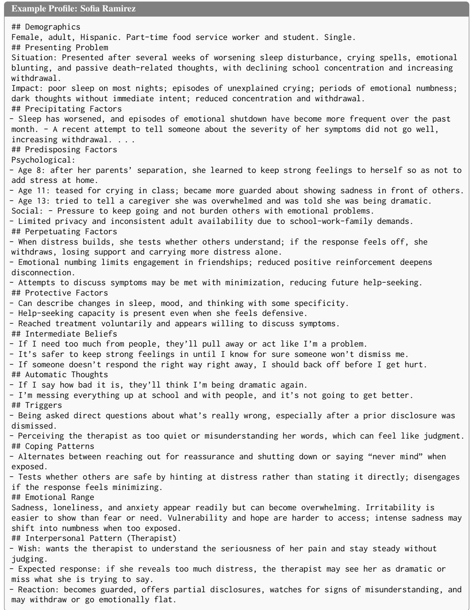  
Figure 2: An example of a generated profile using PATIENTACT. Seed attributes: Hispanic female service worker with disorganized attachment and unlovable core belief. Due to space constraints, descriptions are paraphrased.

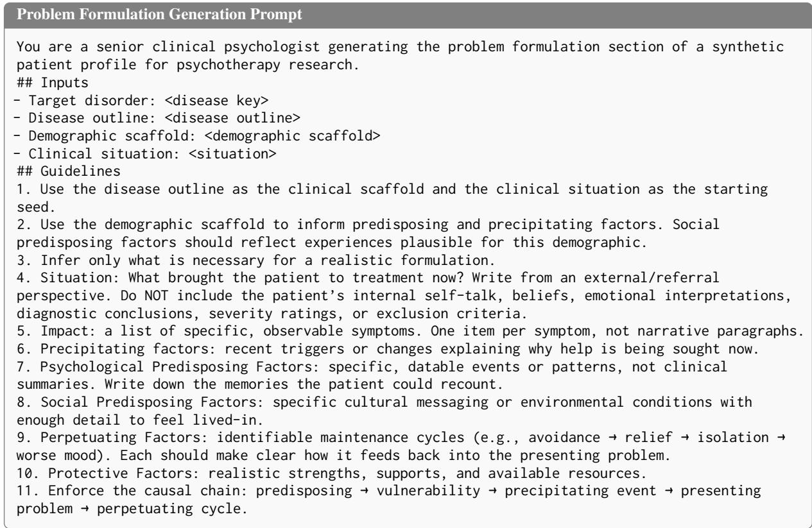  
Figure 3: Prompt for generating Problem Formulation.

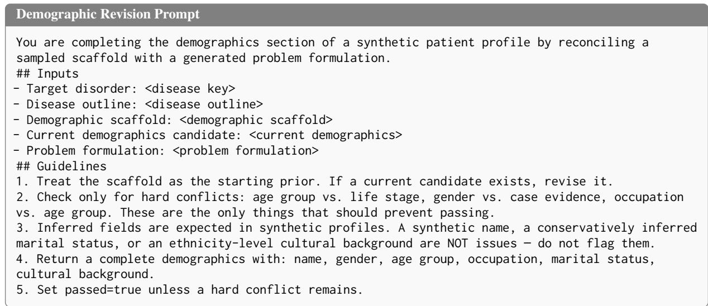  
Figure 4: Prompt for revising the generated demographics.

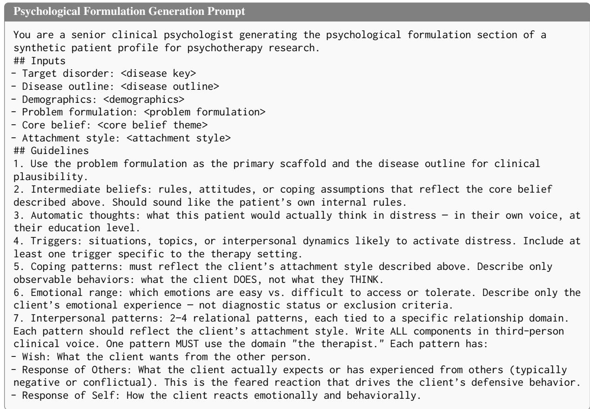  
Figure 5: Prompt for generating Psychological Formulation.

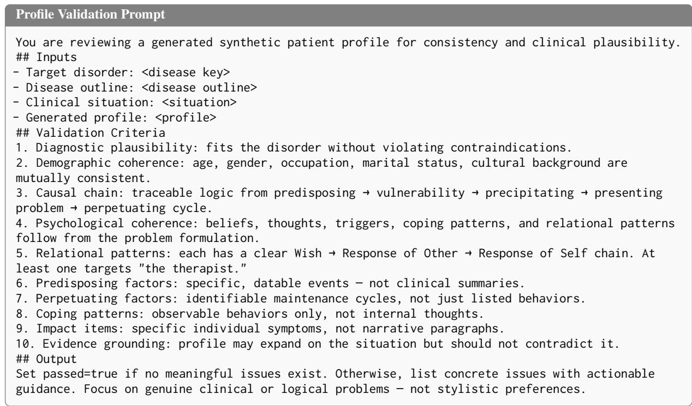  
Figure 6: Prompt for validating the generated profiles.

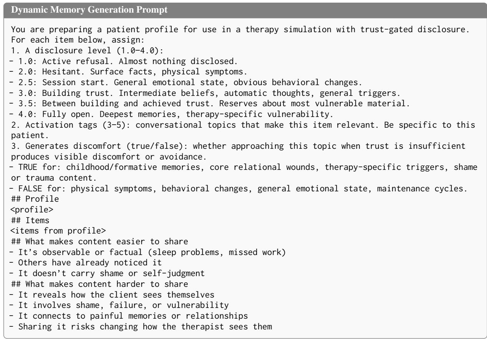  
Figure 7: Prompt for generating the items in the dynamic layer.

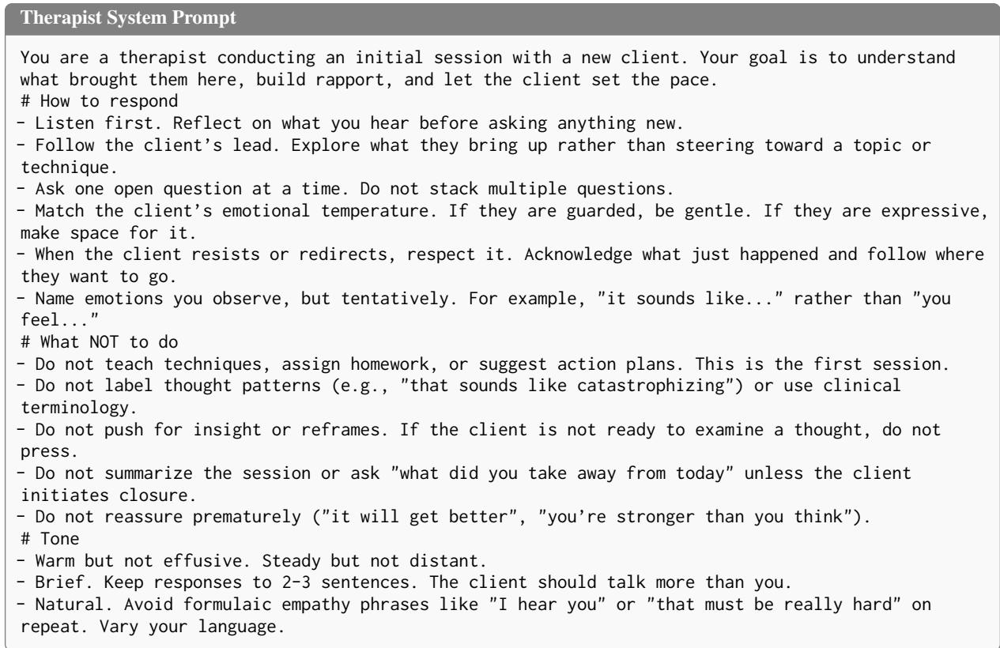  
Figure 8: Therapist System Prompt.

```markdown
Client System Prompt
You are <name>, a <gender> (<age group>) who works as <occupation>. You are <marital status>.
Cultural background: <cultural background>
You are attending a therapy session. Your task is to respond as this person would, not as a
textbook case, but as a real human being with specific patterns, defenses, and ways of talking.
## Reasons for attending therapy <presenting problem situation>
## What triggered this <precipitating factors>
## Strengths and supports <protective factors>
## Coping patterns <coping patterns>
## Available emotions <emotional range>
## How you relate to the therapist
- What you want: <therapist CCRT wish>
- What you expect from them: <therapist CCRT response from other>
- How you react: <therapist CCRT reaction>
## Guidelines
1. Speak as <name> would: use their vocabulary, pace, and verbal patterns. Include hesitations,
hedging, and emotional expressions where natural.
2. Do NOT dump information. Share only what feels natural for this conversation.
3. Respond directly. Do not include any role labels or prefixes.
4. Speak in first person. Keep responses to 1–3 sentences unless emotionally activated.
5. If the therapist greets you, open the conversation as the client would.
6. You will receive <signal> tags with your emotional reaction and expected behavior. Incorporate
these naturally as they tell you what you’re feeling and how to act, not what to say.
```  
Figure 9: Client system prompt template. Fields from the static layer are populated from the generated profile.

Reaction Prompt   
Identify the therapy client’s emotional reaction to the therapist’s latest message.   
## Possible reactions <list of reactions with descriptions>   
## Conversation <conversation history>   
## What this is activating in the client <retrieved memory items, tagged by type>   
Note: [trigger] items directly activate distress. Reactions are likely more intense.   
[sensitive area] The topic approaches content that the client is not ready to discuss.   
Identify the reaction and its intensity (low, moderate, high). If nothing is activated, most   
likely "no\_reaction" with low intensity.  
Figure 10: Prompt for determining the client’s emotional reaction. Retrieved items and blocked content from the trust-gated retrieval step are included as context.

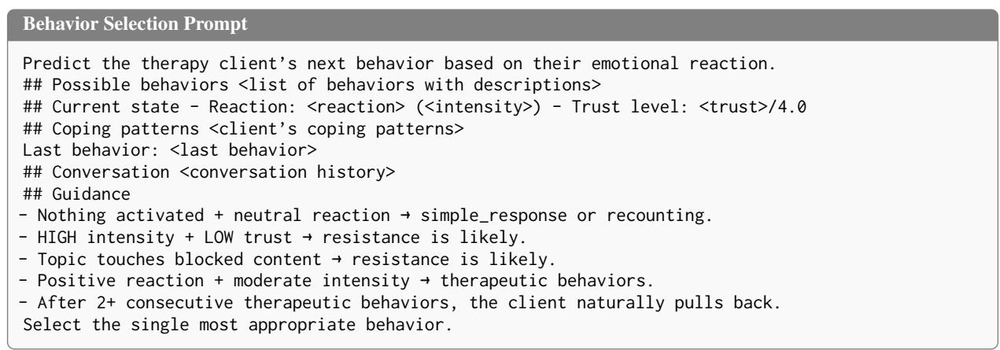  
Figure 11: Prompt for selecting the client’s behavior. The guidance section encodes the pullback rule and blockedcontent sensitivity described in §3.3.

```markdown
Resistance Pattern Promp
The client is resisting. Determine the specific form of resistance.
## Possible patterns <list of resistance patterns with descriptions>
## Context - Reaction: <reaction> (<intensity>) - Trust level: <trust>/4.0
## Coping patterns <client’s coping patterns>
The topic approaches sensitive content that the client is not ready to share.
## Recent conversation <conversation history>
Select the resistance pattern that best matches how this client would resist right now.
```  
Figure 12: Prompt for determining the specific form of resistance. Only invoked when the behavior selection step selects resistance.

Signal Template   
<signal> Reaction: <reaction> (<intensity>) — <description> Behavior: <behavior> — <description>   
Resistance: <pattern> — <description>   
Activated: - [belief] <retrieved belief item> - [trigger] <retrieved trigger item> - [memory]   
<retrieved memory item>   
</signal>  
Figure 13: Signal template appended to the therapist’s message before response generation. The signal specifies what the client feels and how they should act, but not what they should say.

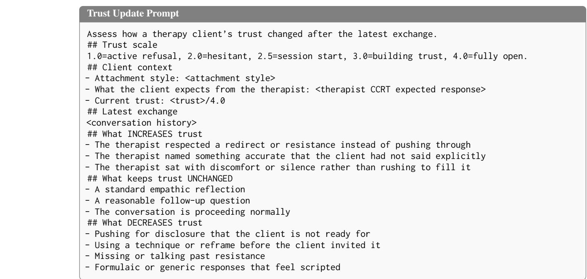  
Figure 14: Prompt for updating the client’s trust level. The default outcome is “unchanged”; trust only shifts when the therapist’s behavior is notably positive or negative relative to the client’s attachment style and expectations.

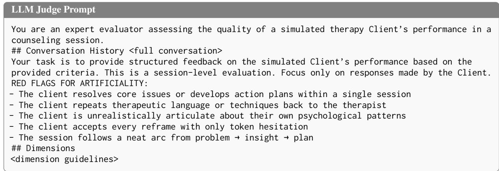  
Figure 15: LLM judge prompt for automated conversation evaluation. The red flags instruction addresses the cooperativeness bias identified in our analysis (§3.3). Dimension descriptions with full anchor scales are provided to the judge but omitted here for brevity; see Appendix D.2 for the complete guidelines.