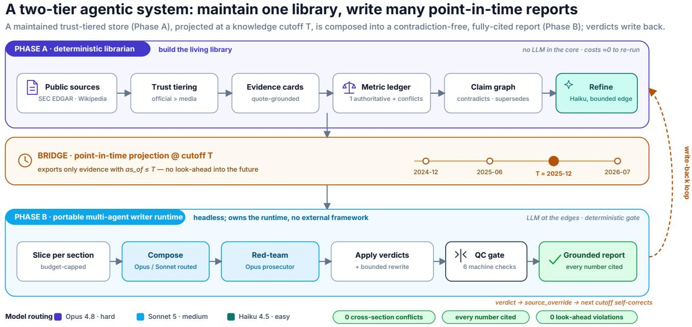
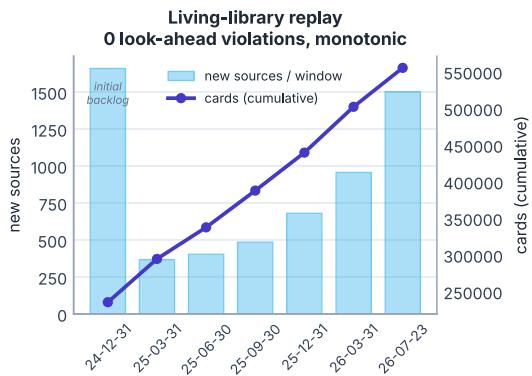
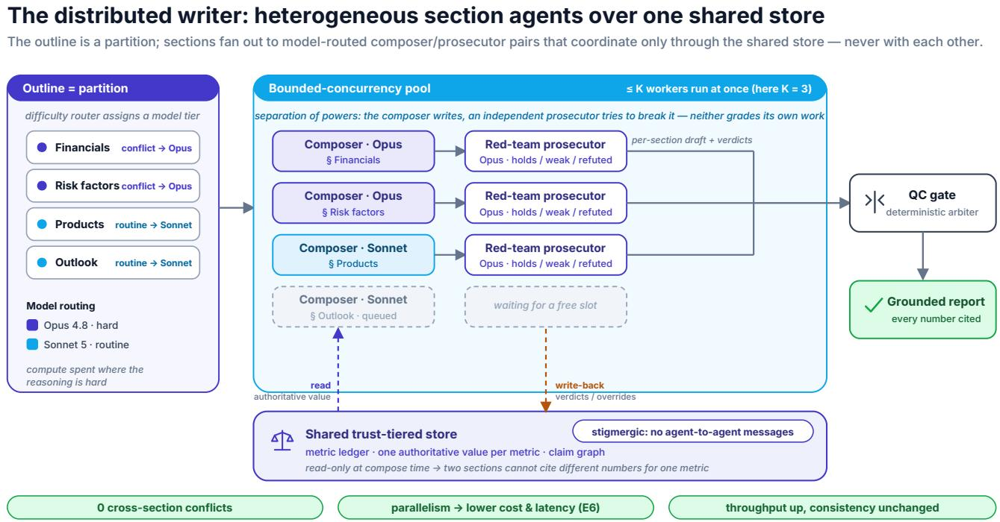
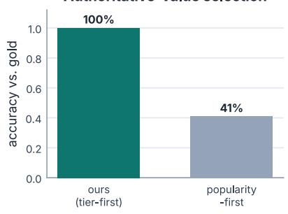
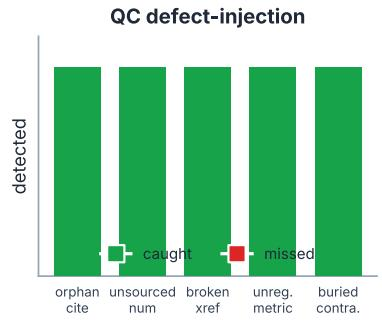
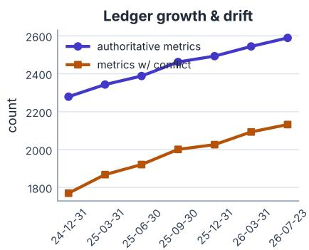
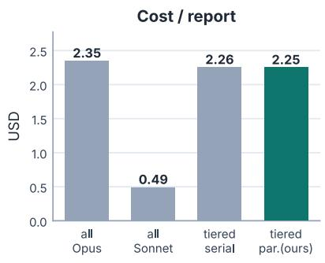
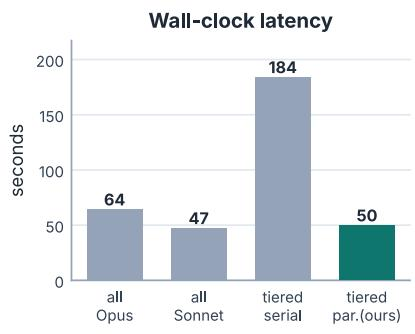
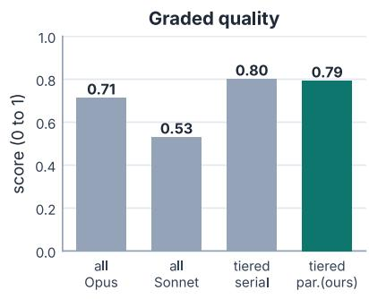

# Reconcile Once, Write Anytime: A Trust-Tiered Librarian and a Multi-Agent Writer for Drift-Free, Point-in-Time Research

Xing Zhang, Yanwei Cui, Guanghui Wang, Peiyang He AWS Generative AI Innovation Center

## Abstract

Long-form research reports generated by large language models (LLMs) drift, contradict themselves, and lose provenance: the same metric appears with diferent values in diferent sections, numbers arrive without sources, and rumor is quoted as confidently as an audited filing. We present a deployment-oriented two-tier agentic system that separates a maintained, point-in-time knowledge library from report writing. A deterministic “librarian” continuously ingests public, timestamped sources into a trust-tiered ontology, layering evidence cards, an authoritative metric ledger, and a claim graph into an always-current source of truth, not per-query RAG over raw chunks. A portable multi-agent “writer” runtime then composes a long, contradiction-free, evidence-grounded report at any knowledge cutof �, reading only evidence with as\_of ≤ � (no look-ahead); red-team verdicts flow back into the librarian, closing the loop. We evaluate on a self-collected, production-scale public corpus of 6,130 sources yielding 555,926 evidence cards (SEC EDGAR filings across 295 issuers and 11 sectors, U.S. Bureau of Labor Statistics macro releases, and Wikipedia). From the one library we compose four flagship point-in-time reports on distinct theses (AI-compute, energy, healthcare/pharma, banks) and run eight mechanical, reproducible experiments, whose headline metrics come from a deterministic quality-control (QC) gate, itself validated by defect-injection meta-evaluation at recall 1.0 and pre cision 1.0 against negative controls. A shared metric ledger removes 6,845 cross-section figure contradictions to zero. Tier-first selection is correct on 22/22 gold cases where a popularity-first baseline scores only 9/22; trust tiering leaks zero media-sourced numbers into hard evidence, and no government statistic displaces a com pany’s own filing. A red-team refutation propagates back through a source override and self-corrects a later run with zero manual edits. Point-in-time replay exhibits zero look-ahead violations across seven cutofs while the library grows from 235,373 to 555,312 cards. Finally, dificulty-tiered model routing with bounded parallelism exceeds the all-Opus quality ceiling on a graded score while running 3.7× faster than serial, with cost and latency recorded on every run.

## Keywords

distributed multi-agent systems, agentic AI, parallel orchestration, model routing, retrieval, report generation, trust tiering, point-intime evaluation, deployed systems

## 1 Introduction

Automated long-form research (equity notes, market landscapes, due-diligence memos) is a natural target for LLM agents, yet naive generation fails in ways that matter precisely where the stakes are highest. Three failure modes recur. (i) Numeric drift: a report cites a company’s capital expenditure as one figure in the revenue section and a diferent figure in the capital-intensity section, because each paragraph was grounded independently. (ii) Provenance loss: numbers appear with no traceable source, and the reader cannot tell an audited disclosure from a fluent hallucination [13]. (iii) Trustflattening: a pre-launch rumor and a filed 10-Q are quoted with equal confidence, because the system has no notion of source authority.

Retrieval-augmented generation (RAG) [10, 16] re-retrieves raw chunks per query and grounds each answer in isolation, maintaining no consistent, evolving body ofjudgements, so contradictions and stale figures recur at every generation; agentic writers [11, 24] coordinate sections but inherit the same gaps. We argue the fix is architectural: reconcile evidence once into a maintained ontology (trust-ranked, timestamped, incrementally updated), separated from the writing of any report, so consistency and provenance are properties of the store, governed by source authority rather than popularity.

We built such a system, validated it internally on a private corpus, and evaluate it here on a production-scale public corpus (6,130 sources and 555,926 evidence cards across 295 issuers and 11 sectors, from which we compose four flagship reports on distinct theses), as an industry case study with end-to-end reproducible results, not a state-of-the-art (SOTA) claim. Our contributions:

(1) A coupled two-phase system (§2): a deterministic librarian maintains a timestamped knowledge ontology, so new filings incrementally refresh the source of truth without re-indexing (Phase A); and a portable, model-routed multi-agent runtime generates a point-in-time report at cutof � (Phase B).

(2) A distributed multi-agent writer with a shared-store coordination substrate (§2.1): heterogeneous agents (per-section composers and an adversarial red-team prosecutor) run under bounded-concurrency parallelism and dificulty-tiered model routing, coordinated indirectly through the trust-tiered store rather than by direct message passing, so concurrency never costs cross-section consistency.

(3) Trust-tiered consistency mechanisms as deployed governance (§3): an oficial-first metric ledger that ranks source authority above popularity (tier → corroboration → recency), a typed claim graph, and a six-check deterministic QC gate that blocks delivery and is itself meta-validated by defect injection (E5), not a post-hoc score.

(4) A self-correcting write-back loop (§2): a report-side red-team refutation flows back as a source override that self-corrects the ledger at the next cutof with no manual edits, and idempotent regeneration flags any promoted claim whose approved evidence silently vanishes (an “anchor swap”) for re-validation, so the library only ever improves.

(5) A mechanical, meta-eval-validated evaluation (§5) others can reuse, including the distributed-execution cost/latency of routing and bounded parallelism (recorded on every run) and a temporal point-in-time result the living library uniquely enables.

## 2 System

The system runs as two decoupled phases coupled by a timestamped store and closed by a write-back loop (Fig. 1).

Phase A: the librarian (deterministic). A pipeline of deterministic Python stages ingests public sources, recording each one’s true publication date and trust tier. The librarian maintains knowledge at three progressively-distilled layers: quote-grounded evidence cards (raw facts, each pinned to a source quote), an authoritative metric ledger (one reconciled value per company-metric pair), and a claim graph of contradicts, supersedes, and qualifies edges over those values. Each layer is derived deterministically from the one below, so a number traces down to its source quote and up to its conflicts. The core costs essentially nothing to re-run; an LLM is used only at one clearly-bounded seam: a cheap refinement pass (Claude Haiku 4.5) that corrects a numeric card’s value/unit against its own quote or demotes it to qualitative. The headline metrics, computed deterministically, are thus reproducible given a fixed store. Appendix A traces one real metric through all three layers and into a delivered report; Appendix C gives their required fields.

The bridge: point-in-time projection. Given a cutof�, the bridge projects the store into the writer’s four artifacts (outline, evidence cards, metric ledger, claim graph), filtering to as $. o f \leq T .$ This is the no-look-ahead seam: a report “as of” a past date sees exactly the evidence that existed then. Object mapping is near 1:1 (both tiers speak the same three layers), so the bridge is a data adapter, not a rewrite.

Phase B: the portable writerruntime. The writer is a self-contained, headless runtime over a tiered LLM provider and a bounded-concurrency pool, with no dependency on an external agent framework, so it embeds equally in a service or a batch job. Its orchestration wraps a set of deterministic scripts (slice, tag-normalize, QC, render) around the LLM calls. The workflow is a fixed directed acyclic graph (DAG): slice each section → compose (one LLM call per section, tier-routed) → normalize → red-team (a Claude Opus 4.8 “prosecu tor” per section that returns holds/weak/refuted verdicts) → apply verdicts → a bounded rewrite of afected sections → deterministic convergence backstop → QC gate → render. We use standard multi-agent building blocks (file-per-agent artifacts, contract-first outlines, tool-mediated deterministic checks) but implement them in a runtime of our own, without binding to any external frame work [2].

Write-back loop. When the red-team refutes a card, the verdict maps to a librarian source\_override/claim refuted, so the next run at the next cutof inherits the correction: the store is a living library, not a static dump. The write-back is guarded: an override never invents a value, it only demotes the refuted source so the ledger falls back to a pre-existing same-kind alternative, and every change appends a row to an append-only audit log, so promotion is human-gated and reversible. Regeneration is idempotent: it carries a human promotion forward rather than resetting it, but snapshots the exact evidence approved, so if that evidence later vanishes, even when back-filled cards keep the count unchanged (an “anchor swap”), the claim is flagged for re-validation, not silently kept. Algorithm 1 states the two phases end to end.

## 2.1 The distributed multi-agent design

Phase B is where the system is genuinely distributed, by deliberate design. (1) Parallel per-section agents. The report outline is a partition: each section is an independent compose task, and the sections fan out across a bounded-concurrency pool (§3) rather than being written serially. Sections are the natural unit of parallelism because the outline contract makes them near-independent: the only shared state is the metric ledger, read-only at compose time. (2) Heterogeneous agents. A dificulty router sends conflicttouching sections to a stronger, costlier model (Opus) and routine sections to a cheaper one (Sonnet), so compute is spent where the reasoning is hard: classic heterogeneous scheduling, applied to LLM agents. (3) Separation of powers. Composition and criticism are diferent agents with opposing objectives: a composer writes to satisfy the section contract, an independent Opus “prosecutor” red-teams the draft to break it. Neither grades its own work, and the arbiter that decides delivery is the deterministic QC gate, not an LLM. (4) Coordination through a shared store, not messages. The agents never talk to each other directly; they coordinate stigmergically through the trust-tiered store: composers read the same authoritative ledger, and the red-team writes verdicts back to it. This adds parallelism without the usual multi-agent failure mode of concurrent writers diverging: because the single authoritative value lives in the shared ledger rather than in each agent’s context, two sections physically cannot cite diferent numbers for the same metric. The distributed design thus buys throughput (§5, E6) without paying in consistency. Figure 3 (App. D) draws the four mechanisms as one picture.

Why the fan-out is safe. The consistency guarantee is structural, not a matter of scheduling. The bridge (§2) emits an immutable, point-in-time snapshot at cutof�, and every composer reads from that single snapshot, so within one run there are no concurrent writers: no lock, barrier, or two-phase commit is needed, and the classic shared-memory races (write–write, torn reads, deadlock) cannot arise. The only writer is the red-team’s write-back, deferred to the next cutof, never mid-run. Read-only fan-out over an immutable snapshot makes each compose step idempotent and orderindependent, so the worker count � trades latency against cost (E6) but cannot change the delivered numbers.

## 3 Trust & Consistency Mechanisms

Source tiers and permitted use. Every source is typed from text/path cues and assigned a trust tier together with a permitted use that governs whether its numbers may be cited: U.S. Securities and Exchange Commission (SEC) filings become oficial (usable as hard evidence), U.S. Bureau of Labor Statistics (BLS) macro-statistics releases become gov\_stat (supporting evidence: authoritative, but for macro context, not a company’s own figures), and Wikipedia becomes media (routing only). The tiers are strictly ordered (oficial > gov\_stat > sell\_side > media; sell\_side is analyst research, used in company deployments but omitted here as it is not redistributable, so it appears only in E4’s gold set): routing-only sources may inform entity/topic routing and context but can never become a citable hard-evidence number, and a supporting-tier macro value can never displace a company’s own oficial figure: the “oficial-first” rule.



Figure 1: End-to-end system. Phase A (deterministic librarian) ingests timestamped public sources into trust-tiered evidence cards, a metric ledger, and a claim graph. The cutof dial selects a knowledge time � ; only evidence with as\_of ≤ � is exported. Phase B (portable agent runtime) slices per section, composes with dificulty-tiered model routing, red-teams, and passes a deterministic QC gate. Red-team verdicts feed back to the store.  
Algorithm 1: Maintain library, write report @ �.   
input : public sources S; cutof�; outline O   
output :grounded report �; updated store L   
// Phase A: deterministic librarian (LLM-free core)   
foreach � ∈ S do   
tier, as\_of ← classify(�)   
cards ← extract quote-grounded evidence from �   
if numeric & ambiguous then Haiku-refine card vs. its quote   
ledger ← per (co., metric): pick by tier → corrob. → recency   
graph ← contradicts / supersedes / qualifies edges   
// Bridge: point-in-time projection (no look-ahead)   
�<sub>�</sub> ← { � ∈ L : as\_of(�) ≤ � }; recompute ledger @ �   
// Phase B: portable multi-agent writer   
foreach section � ∈ O (bounded parallel) do   
�<sub>�</sub> ← Slice(�<sub>�</sub>, �) capped by salience budget   
� ← Opus if � touches unresolved conflict else Sonnet   
draft ← normalize(Compose(� ; model � ))   
� ← RedTeam(draft ) // Opus prosecutor   
apply verdicts; bounded rewrite; deterministic convergence   
backstop   
while QC(�) ≠ ∅ and rounds < cap do   
rewrite flagged sections   
foreach refuted � do WriteBack(L) // source\_override   
return render(�), L

Metric ledger. For each (company, metric) the ledger selects one authoritative value by a fixed policy: tier dominates, then corroboration (distinct-source count) breaks ties within a tier, then recency (as\_of ). Competing values are retained as alternatives and flagged as a conflict when a comparable same-kind figure materially disagrees (a fixed > 15% threshold, so unit-equal restatements do not spuriously fire), but the report cites the single authoritative value, which is what eliminates cross-section drift.

QC gate (six deterministic checks). The delivery gate is languageneutral and LLM-free: (1) orphan citations, (2) unsourced numbers, (3) numeric drift across sections, (4) buried contradictions (a claimgraph conflict whose two endpoints are not reconciled together), (5) unregistered metrics, (6) cross-section contradiction. A report is deliverable only when the error set is empty (the six checks are specified in Appendix B). Because this gate computes the headline metrics, we validate the gate itself (§5, E5).

## 4 Deployment & Dataset

We self-collected a public, redistributable, English-only corpus at production scale (Table 1): 6,130 sources extracting to 555,926 evidence cards (457,561 numeric) and a metric ledger of 2,589 authoritative company-metric values, 2,132 of them carrying recorded conflicts. The three tiers are 5,397 SEC EDGAR filings [23] (oficial) for 295 issuers across 11 sectors, 672 U.S. Bureau of Labor Statistics (BLS) macro releases (gov\_stat: authoritative supporting context that, carrying no company attribution, by design never enters the per-company ledger), and 61 Wikipedia articles (media: routing and context only, by design backing no numbers). Filings are fetched keyless via the oficial EDGAR and BLS REST APIs with provenance headers.

Table 1: Self-collected corpus (public, timestamped, multi tier, multi-sector).
<table><tr><td>Property</td><td>Value</td></tr><tr><td>Sources registered (total)</td><td>6130</td></tr><tr><td>official (SEC filings, hard evidence)</td><td>5397</td></tr><tr><td>gov_stat (BLS macro, supporting)</td><td>672</td></tr><tr><td>media (Wikipedia, routing only)</td><td>61</td></tr><tr><td>of which produced ≥1 card</td><td>6054</td></tr><tr><td>Sectors covered</td><td>11</td></tr><tr><td>Companies (issuers)</td><td>295</td></tr><tr><td>Evidence cards</td><td>555926</td></tr><tr><td>Numeric cards</td><td>457561</td></tr><tr><td>Media→numeric leakage</td><td>0</td></tr><tr><td>Publication span</td><td>2023-06 - 2026-07</td></tr></table>

The design point is one library, many reports: a single maintained store serves multiple report theses rather than being purposebuilt for one. From this store we generate four flagship point-intime reports at a common cutof (2025-12-31) (AI-compute, energy, healthcare/pharma, and banks), each projected by the sector-scoped bridge, and each passing the QC gate with zero errors. Breadth matters for the evaluation too: the corpus contains thousands of naturally-occurring cross-period and cross-source contradictions (drift in remaining performance obligations, backlog, and capital expenditure; restatements; revised guidance) across every sector, never fabricated drift. Each source is retained under its issuing API’s terms, with per-tier licensing recorded.

Because every source carries its true publication date, we replay time by filtering the store to a cutof (Phase B), mimicking “30/60/90 days later” without re-fetching: the production case where later filings revise or contradict a value an earlier report relied on.

## 5 Evaluation

Every headline metric is machine-computed (no LLM decides a reported number) and, where an ablation applies, compared on the identical corpus against an explicit baseline arm. Deterministic experiments (E1, E3, E4, E5, E7, E8) are exact by construction; the LLM-dependent cost/latency/quality comparison (E6) is run on the real Bedrock backend over three repeats. All numbers in the tables are emitted directly from the stored per-experiment result records (reproduction steps in Appendix G); the headline results are also charted together in Fig. 4 (App. E).

E1: a shared ledger removes cross-section drift. Without a shared ledger, a writer grounding each section independently surfaces every competing value for a metric; the ledger collapses each to one authoritative value. On the real store at the final cutof, the noledger baseline would emit 6,845 contradictory figures across 2,105 metrics with competing values; ours emits 0 (Table 2). Replayed across seven cutofs, the ledger’s authoritative value changed 4,732 times, and every change was justified by newer, higher-tier, or more-corroborated evidence (0 unexplained).

E2: grounding. Across all four flagship theses composed from the one library (AI-compute, energy, healthcare/pharma, banks; cutof 2025-12-31), every numeric-bearing body line must carry an evidence citation or a metric annotation. Aggregate grounding is 202/203 (99.5%) with 0 orphan citations and 0 unregistered metrics; three reports are 100%, and the lone exception is a synthesis sentence whose figures are each cited earlier in the same section.

E3: trust tiering suppresses rumor and quarantines macro context. End-to-end on the real store, all three tiers classify correctly (5,397 filings as hard\_evidence, 672 BLS releases as supporting\_ evidence (gov\_stat), 61 Wikipedia articles as routing\_only, 0 misclassified), and 0 ofthe 457,561 numeric cards trace to a routing-only source. The third tier is genuinely mined (2,352 numeric gov\_stat cards: CPI, PPI, payrolls, unemployment), yet because a macro statistic carries no company attribution, 0 gov\_stat values displace a company’s own oficial figure and the per-company ledger stays 100% oficial: neither media nor macro statistics ever become a citable number, and the invariant holds across the full productionscale corpus (all 457,561 numeric cards, 295 issuers, 11 sectors).

E4: tier-first selection beats popularity. We run two selection policies on one labeled gold set of metric clusters: our tier-first ledger, and a popularity-first baseline that takes the value with the most distinct backing sources (the “most-cited”/semantic-layer heuristic), ignoring tier. Tier-first is correct on 22/22 cases; popularity-first scores only 9/22 (Table 3). Thirteen cases are popularity traps: a widely-repeated lower-tier value (a rumor echoed by several media sources, or a corroborated macro statistic) competes with a single oficial filing; the tier rule survives all thirteen, popularity adopts the wrong value every time. The set spans the full configured lattice (oficial > gov\_stat > sell\_side > media), including the invariant that a newer, more-corroborated gov\_stat value still cannot displace an oficial figure (which gov\_stat may anchor only when none exists), and corroboration breaking ties only within a tier. It is a designed coverage lattice, not a sample: the cross-tier conflict it probes cannot arise on this corpus (all 2,589 real ledger clusters are single-tier, as gov\_stat cards carry no issuer name and media is never mined for a number), yet the within-tier rule is exercised at scale: over 2,132 real conflicts our corroboration→recency policy difers from naive newest-wins on 973, far beyond the 22 gold cases.

E5: the checker is trustworthy (recall and precision). A gate is only trustworthy if it both catches real defects and stays quiet on clean text. We clone a clean, QC-passing run and (i) inject five defect classes (orphan citation, unsourced number, broken crossreference, unregistered metric, buried contradiction) and (ii) apply three negative controls: defect-free perturbations that must not fire (a paragraph reusing only already-valid citations and metric tokens, a duplicated grounded line, number-free prose). Recall is 1.0 (5/5) and precision is 1.0 with a 0 false-positive rate on the controls (Table 4). Crucially, we separate delivery-blocking from advisory detection: the delivery gate is “error set empty,” and 3/3 error-level defects raise a blocking error, while the two warning-level defects are caught but advisory by design. This disarms “graded your own homework”: the gate that computes E1–E4 is itself validated on both axes.

E6: in the distributed writer, parallelism and routing cut cost at comparable quality. Isolating the multi-agent compose fan-out on identical slices over three repeats (Table 5), bounded-concurrency parallelism across the per-section agents runs 3.7× faster than serial, and dificulty-tiered routing (conflict-touching sections → Opus, the rest → Claude Sonnet 5) costs 4.1% less than sending every section to Opus. The cost gap is deliberately modest on this flagship: it is conflict-heavy, so 5 of 6 sections touch an unresolved edge and correctly route to Opus, so routing saves little precisely when the report is hard, and the same dial saves far more on a lowconflict thesis. All four variants pass QC with zero errors, but a binary gate cannot rank them, and all-Sonnet is the cheapest, so “equal quality” needs an independent signal. We add a deterministic, graded quality score (grounding coverage + conflict-pair coverage + output-contract adherence, computed on each variant’s actual prose, independent of the QC gate). The counterintuitive result: tiered routing scores above the all-Opus ceiling (+0.079) and far above all-Sonnet (+0.262). Spending the strong model only where reasoning is hard beats spending it everywhere, so the cheaper all-medium point is not the default: it saves on easy sections but degrades exactly the conflict-heavy synthesis that routes to Opus.

E7: the living library grows without look-ahead. Replaying the store across seven cutofs (Table 6, Fig. 2) yields 0 look-ahead violations and monotonic growth (235,373→555,312 cards; 1,659→6,054 card-bearing sources), capturing 4,395 post-initial evidence-arrival events (new filings, restatements, new conflicts) and lifting recorded metric conflicts from 1,770 to 2,132. This closes end to end at the report level: regenerating the AI-compute flagship at three advancing cutofs yields a report that grows in lockstep (27,104→42,900 cards, 255→276 metrics, 562→655 reconciled conflict edges) while every cutof stays deliverable (QC errors = 0), and all four flagship theses compose at the shared 2025-12-31 cutof from this one library. A static one-shot corpus cannot exhibit this: as real evidence arrives, the library grows and corroboration rises.

E8: the write-back loop self-corrects a later run. Growth is only half of “living”; the loop must also close on corrections. We trace one worked case end to end using the librarian’s real override machinery (Table 7, App. F). In this illustrative scenario the report-side red-team challenges the authoritative interest figure (\$19mn) after flagging its backing filing as low-confidence. The verdict maps to a librarian source\_override (status retracted); on re-ingestion the 284 evidence cards from that filing inherit the non-active status, and because the metric ledger considers only active-source cards, the authoritative value self-corrects to \$9mn, an already-recorded alternative, with 0 manual value edits. Tracing the same override path on a batch of auto-discovered conflicted metrics, 5 of 6 write-backs self-correct, each to a pre-existing same-kind alternative (0 manual edits), so the loop closes on many values, not one, deterministically and auditably.

Limitations. The corpus is English-only and three-tier as collected (oficial SEC filings, gov\_stat BLS macro statistics, media Wikipedia; sell\_side omitted, §3). The gov\_stat tier is authoritative but macro-only: its releases carry no company attribution, so by construction it enriches context, not the per-company ledger. Entity linking is substring-based, so it occasionally over-attributes a metric when a company’s short name is a substring of unrelated filing text (e.g. “3M”); this is an auditable extraction artifact, not a ledger-policy error. The E4 cross-tier gold set is designed rather than sampled (the deployed corpus has no cross-tier clusters), though the within-tier rule is corroborated on 2,132 real conflicts; E6 uses a deterministic quality proxy, not human judgement; and E8 traces write-back on a small batch. E1’s no-ledger arm isolates the ledger’s efect, not a strong shared-state competitor (a graph- or semanticlayer-backed retriever), the natural next comparison our design is built to host.

Table 2: E1: cross-section figure drift (lower is better).
<table><tr><td>Condition</td><td>drift figs</td><td>metrics w/ conflict</td><td>justified drift</td></tr><tr><td>Baseline (no shared ledger)</td><td>6845</td><td>2105</td><td>一</td></tr><tr><td>Ours (shared ledger)</td><td>0</td><td>2105</td><td>一</td></tr></table>

Temporal drift, 7 cutofs: 4732 changes, 100% evidence-justified, 0 unexplained.

Table 3: E4: authoritative-value selection vs. gold.
<table><tr><td>Gold case</td><td>ours</td><td>popularity-first</td></tr><tr><td>official beats 3× media rumort</td><td>√</td><td>x</td></tr><tr><td>official beats newer 2x sell†t</td><td>√</td><td>x</td></tr><tr><td>newer official wins tie</td><td>√</td><td>√</td></tr><tr><td>corrob tie-break</td><td>√</td><td>√</td></tr><tr><td>sell beats 2x media†t</td><td>√</td><td>x</td></tr><tr><td>corrob &gt; newer single</td><td>√</td><td>√</td></tr><tr><td>gov beats 3× media rumort</td><td>√</td><td>x</td></tr><tr><td>official beats newer govt</td><td>√</td><td>x</td></tr><tr><td>official beats 2× govt</td><td>√</td><td>x</td></tr><tr><td>gov fills absent official</td><td>√</td><td>√</td></tr><tr><td>gov corrob tie-break</td><td>√</td><td>√</td></tr><tr><td>newer gov revision wins</td><td>√</td><td>√</td></tr><tr><td>official beats 4× media rumort</td><td>√</td><td>x</td></tr><tr><td>official beats 3× sell† t</td><td>√</td><td>x</td></tr><tr><td>gov beats 2× mediat</td><td>√</td><td>x</td></tr><tr><td>modal guards $-misparse</td><td>√</td><td>√</td></tr><tr><td>gov beats 2× sell†t</td><td>√</td><td>x</td></tr><tr><td>official &gt; gov &gt; media (lattice)t</td><td>√</td><td>x</td></tr><tr><td>newer official on equal corrob</td><td>√</td><td>√</td></tr><tr><td>kind guard drops stray percent</td><td>√</td><td>√</td></tr><tr><td>official beats 5× media crowdt</td><td>√</td><td>x</td></tr><tr><td>official beats corrob newer govt</td><td>√</td><td>x</td></tr><tr><td>Accuracy</td><td>22/22</td><td>9/22</td></tr></table>

ours = tier-first (ledger policy). <sup>�</sup>13 popularity traps (widely-repeated lower-tier value); tier rule survives all 13. <sup>†</sup>configured-but-unused tier.

Table 4: E5: QC gate meta-evaluation, recall and precision (defect injection plus negative controls).
<table><tr><td>Perturbation</td><td>level</td><td>QC outcome</td></tr><tr><td>orphan citation</td><td>error</td><td>caught, blocks delivery</td></tr><tr><td>unsourced number</td><td>warning</td><td>caught, advisory (warning)</td></tr><tr><td>broken xref</td><td>warning</td><td>caught, advisory (warning)</td></tr><tr><td>unregistered metric</td><td>error</td><td>caught, blocks delivery</td></tr><tr><td>buried contradiction</td><td>error</td><td>caught, blocks delivery</td></tr><tr><td>neg: reuse existing citations</td><td>(clean)</td><td>0 new errors</td></tr><tr><td>neg: duplicate grounded line</td><td>(clean)</td><td>0 new errors</td></tr><tr><td>neg: prose only no numbers</td><td>(clean)</td><td>0 new errors</td></tr><tr><td colspan="3">Recall 5/5=1.00, precision 1.00, FP-rate 0.00 over 3 controls; 3/3 error-level defects block delivery (rest advisory).</td></tr></table>

  
Figure 2: E7: point-in-time replay across seven cutofs. Bars (left axis) count sources newly available in each window; the line (right axis) is the cumulative evidence-card base, which grows monotonically with zero look-ahead (a report as of � reads only $a s \_ o f \leq T )$ . The first bar is the pre-existing back catalog loaded at the opening cutof, not a per-window rate.

Table 5: E6: cost/latency of routing and parallelism (compose fan-out, real Bedrock).
<table><tr><td>Configuration</td><td>mix</td><td>$/rep</td><td>wall (s)</td><td>quality</td></tr><tr><td>All-hard (Opus), par.</td><td>6H/0M</td><td>$2.35</td><td>64</td><td>0.714</td></tr><tr><td>All-medium (Sonnet), par.</td><td>0H/6M</td><td>$0.49</td><td>47</td><td>0.531</td></tr><tr><td>Tiered, serial</td><td>5H/1M</td><td>$2.26</td><td>184</td><td>0.801</td></tr><tr><td>Tiered, par. (ours)</td><td>5H/1M</td><td>$2.25</td><td>50</td><td>0.793</td></tr></table>

Mean over 3 repeats. Tiered vs all-hard: 4.1% cost saved, 3.7× faster than serial. Quality (grounding+conflict+contract, indep. of QC): tiered−all-hard = +0.079, −all-medium = +0.262; all pass QC.

Table 6: E7: living-library replay across cutofs.
<table><tr><td>Cutoff T</td><td>cards</td><td>sources</td><td>metrics</td><td>conflicts</td><td>new src</td></tr><tr><td>2024-12-31</td><td>235373</td><td>1659</td><td>2279</td><td>1770</td><td>1659</td></tr><tr><td>2025-03-31</td><td>294477</td><td>2026</td><td>2343</td><td>1868</td><td>367</td></tr><tr><td>2025-06-30</td><td>337597</td><td>2430</td><td>2388</td><td>1921</td><td>404</td></tr><tr><td>2025-09-30</td><td>387741</td><td>2916</td><td>2462</td><td>2001</td><td>486</td></tr><tr><td>2025-12-31</td><td>439605</td><td>3597</td><td>2493</td><td>2026</td><td>681</td></tr><tr><td>2026-03-31</td><td>502134</td><td>4553</td><td>2544</td><td>2093</td><td>956</td></tr><tr><td>2026-07-23</td><td>555312</td><td>6054</td><td>2589</td><td>2132</td><td>1501</td></tr></table>

0 look-ahead violations; monotonic. New-src sums to 6054 card-bearing sources; 4395 post-initial arrivals (excl. the 1659 at the first cutof).

## 6 Lessons & Related Work

Lessons. (i) Govern by trust, not popularity: a most-cited-value heuristic adopts widely-repeated rumor, while an oficial-first ledger is simpler and correct (E1, E3, E4). (ii) Keep the core deterministic, put the LLM at the edges: deterministic selection, consistency, and QC make the headline metrics reproducible and the gate meta-evaluable (E5). (iii) Own the runtime: standard multi-agent building blocks (fileper-agent artifacts, contract-first outlines) carry over cleanly to a headless service without binding to any external agent framework. (iv) Routing buys quality, not just cheapness: tiered composition matches or beats the all-Opus ceiling while a uniform-cheap baseline degrades, at modest dollar saving on a conflict-heavy report (E6).

Related work. Grounding and citation. RAG grounds individual answers [10, 16] per query rather than maintaining a reconciled ontology, enforcing no cross-time consistency; Self-RAG [3] adds a self-critique, the same model judging its own output, not a deterministic, meta-validated gate. Grounding metrics like FActScore [19] and RAGAs [8], citation benchmarks like ALCE [9], and rubrics like FinReasoning [30] score whether a text is supported but do not govern a living store; our QC gate blocks delivery, not a posthoc score. STORM [21] synthesizes Wikipedia-like articles from retrieved sources but has no source-authority tier, metric ledger, or point-in-time discipline.

Temporal and streaming settings. Closest is temporal/streaming QA: TimeQA [4], StreamingQA [17], and RealTime QA [14] isolate look-ahead and evolving knowledge, but for short-answer questions; we target long-form reports whose challenge is cross-section consistency. GraphRAG [7] and GFM-RAG [18] reason over an entity/claim graph but carry no provenance-tier or point-in-time projection, reconciling per query not in a maintained store; MemGPT [20] persists agent state without source-authority or no-look-ahead discipline.

Agentic frameworks and verification. Agentic frameworks [11, 22, 24, 25] and toolkits such as LangGraph [15] provide the stateful multi-actor graph we deliberately do not bind to, building a minimal headless orchestrator of our own instead (Lesson iii). Verified orchestration [27] closes a plan-verify-replan loop like ours, but we keep the trust backbone and delivery gate deterministic and metavalidated (E5), with human-gated promotion via an append-only log (E8). Registry-driven grounding like REGAL [1] and ontology guided extraction like OntoMetric [26] share our deterministic-core discipline but ground structured telemetry or a single-document ESG graph, not unstructured, cross-document evidence reconciled into a timestamped ledger. Financial QA benchmarks [5, 12] and FinCARDS [29] target intra-document reasoning; semantic-layer analytics [6] share the “governed source of truth” intuition we extend to timestamped, trust-tiered evidence, with LLM-as-judge [28] used only as a red-team.

## 7 Conclusion

Separating a maintained, trust-tiered, point-in-time library from report writing turns long-form generation’s chronic drift, provenance loss, and trust flattening into mechanically-checkable, largely eliminated properties.

## References

[1] Yuvraj Agrawal. 2026. REGAL: A Registry-Driven Architecture for Deterministic Grounding of Agentic AI in Enterprise Telemetry. arXiv preprint arXiv:2603.03018 (2026).

[2] Anthropic. 2025. How we built our multi-agent research system. https://www. anthropic.com/engineering/multi-agent-research-system.

[3] Akari Asai, Zeqiu Wu, Yizhong Wang, Avirup Sil, and Hannaneh Hajishirzi. 2024. Self-RAG: Learning to retrieve, generate, and critique through self-reflection. In International Conference on Learning Representations (ICLR).

[4] Wenhu Chen, Xinyi Wang, and William Yang Wang. 2021. A dataset for an swering time-sensitive questions. In Advances in Neural Information Processing Systems (NeurIPS) Datasets and Benchmarks.

[5] Zhiyu Chen, Wenhu Chen, Charese Smiley, Sameena Shah, Iana Borova, Dylan Langdon, Reema Moussa, Matt Beane, Ting-Hao Huang, Bryan Routledge, and William Yang Wang. 2021. FinQA: A dataset ofnumerical reasoning over financial data. Empirical Methods in Natural Language Processing (EMNLP) (2021).

[6] Databricks. 2024. AI/BI Genie: Conversational analytics on the lakehouse. https: //www.databricks.com/product/ai-bi.

[7] Darren Edge, Ha Trinh, Newman Cheng, Joshua Bradley, Alex Chao, Apurva Mody, Steven Truitt, and Jonathan Larson. 2024. From local to global: A Graph RAG approach to query-focused summarization. arXiv preprint arXiv:2404.16130 (2024).

[8] Shahul Es, Jithin James, Luis Espinosa-Anke, and Steven Schockaert. 2023. RA-GAs: Automated evaluation of retrieval augmented generation. arXiv preprint arXiv:2309.15217 (2023).

[9] Tianyu Gao, Howard Yen, Jiatong Yu, and Danqi Chen. 2023. Enabling large language models to generate text with citations. In Empirical Methods in Natural Language Processing (EMNLP).

[10] Yunfan Gao, Yun Xiong, Xinyu Gao, Kangxiang Jia, Jinliu Pan, Yuxi Bi, Yi Dai, Jiawei Sun, and Haofen Wang. 2023. Retrieval-augmented generation for large language models: A survey. arXiv preprint arXiv:2312.10997 (2023).

[11] Sirui Hong, Mingchen Zhuge, Jonathan Chen, Xiawu Zheng, Yuheng Cheng, Ceyao Zhang, Jinlin Wang, Zili Wang, Steven Ka Shing Yau, Zijuan Lin, Liyang Zhou, Chenyu Ran, Lingfeng Xiao, Chenglin Wu, and Jürgen Schmidhuber. 2024. MetaGPT: Meta programming for a multi-agent collaborative framework. International Conference on Learning Representations (ICLR) (2024).

[12] Pranab Islam, Anand Kannappan, Douwe Kiela, Rebecca Qian, Nino Scherrer, and Bertie Vidgen. 2023. FinanceBench: A new benchmark for financial question answering. arXiv preprint arXiv:2311.11944 (2023).

[13] Ziwei Ji, Nayeon Lee, Rita Frieske, Tiezheng Yu, Dan Su, Yan Xu, Etsuko Ishii, Ye Jin Bang, Andrea Madotto, and Pascale Fung. 2023. Survey of hallucination in natural language generation. Comput. Surveys 55, 12 (2023), 1–38.

[14] Jungo Kasai, Keisuke Sakaguchi, Ronan Le Bras, Akari Asai, Xinyan Yu, Dragomir Radev, Noah A Smith, Yejin Choi, and Kentaro Inui. 2023. RealTime QA: What’s the answer right now? Advances in Neural Information Processing Systems (NeurIPS) (2023).

[15] LangChain. 2024. LangGraph: Building stateful, multi-actor applications with LLMs. https://langchain-ai.github.io/langgraph/.

[16] Patrick Lewis, Ethan Perez, Aleksandra Piktus, Fabio Petroni, Vladimir Karpukhin, Naman Goyal, Heinrich Küttler, Mike Lewis, Wen-tau Yih, Tim

Rocktäschel, Sebastian Riedel, and Douwe Kiela. 2020. Retrieval-augmented generation for knowledge-intensive NLP tasks. In Advances in Neural Information Processing Systems (NeurIPS), Vol. 33. 9459–9474.

[17] Adam Liška, Tomáš Kociský, Elena Gribovskaya, Tayfun Terzi, Eren Sezener, Devang Agrawal, Cyprien de Masson d’Autume, Tim Scholtes, Manzil Zaheer, Susannah Young, et al. 2022. StreamingQA: A benchmark for adaptation to new knowledge over time in question answering models. In International Conference on Machine Learning (ICML).

[18] Linhao Luo, Zicheng Zhao, Gholamreza Hafari, Dinh Phung, Chen Gong, and Shirui Pan. 2025. GFM-RAG: Graph Foundation Model for Retrieval Augmented Generation. In Advances in Neural Information Processing Systems (NeurIPS).

[19] Sewon Min, Kalpesh Krishna, Xinxi Lyu, Mike Lewis, Wen-tau Yih, Pang Wei Koh, Mohit Iyyer, Luke Zettlemoyer, and Hannaneh Hajishirzi. 2023. FActScore: Fine-grained atomic evaluation of factual precision in long form text generation. Empirical Methods in Natural Language Processing (EMNLP) (2023).

[20] Charles Packer, Sarah Wooders, Kevin Lin, Vivian Fang, Shishir G Patil, Ion Stoica, and Joseph E Gonzalez. 2023. MemGPT: Towards LLMs as operating systems. In arXiv preprint arXiv:2310.08560.

[21] Yijia Shao, Yucheng Jiang, Theodore A Kanell, Peter Xu, Omar Khattab, and Monica S Lam. 2024. Assisting in writing Wikipedia-like articles from scratch with large language models. In North American Chapter ofthe Association for Computational Linguistics (NAACL).

[22] Noah Shinn, Federico Cassano, Ashwin Gopinath, Karthik Narasimhan, and Shunyu Yao. 2023. Reflexion: Language agents with verbal reinforcement learning. In Advances in Neural Information Processing Systems (NeurIPS).

[23] U.S. Securities and Exchange Commission. 2024. EDGAR Full-Text Search and REST API. https://www.sec.gov/edgar.

[24] Qingyun Wu, Gagan Bansal, Jieyu Zhang, Yiran Wu, Beibin Li, Erkang Zhu, Li Jiang, Xiaoyun Zhang, Shaokun Zhang, Jiale Liu, Ahmed Awadallah, Ryen W White, Doug Burger, and Chi Wang. 2024. AutoGen: Enabling next-gen LLM applications via multi-agent conversation. In COLM.

[25] Shunyu Yao, Jefrey Zhao, Dian Yu, Nan Du, Izhak Shafran, Karthik Narasimhan, and Yuan Cao. 2023. ReAct: Synergizing reasoning and acting in language models. In International Conference on Learning Representations (ICLR).

[26] Mingqin Yu, Fethi Rabhi, Boming Xia, Zhengyi Yang, Felix Tan, and Qinghua Lu. 2025. OntoMetric: An Ontology-Driven LLM-Assisted Framework for Automated ESG Metric Knowledge Graph Generation. arXivpreprintarXiv:2512.01289 (2025).

[27] Xing Zhang, Yanwei Cui, Guanghui Wang, Wei Qiu, Ziyuan Li, Fangwei Han, Yajing Huang, Hengzhi Qiu, Bing Zhu, and Peiyang He. 2026. Verified Multi-Agent Orchestration: A Plan-Execute-Verify-Replan Framework for Complex Query Resolution. arXiv preprint arXiv:2603.11445 (2026).

[28] Lianmin Zheng, Wei-Lin Chiang, Ying Sheng, Siyuan Zhuang, Zhanghao Wu, Yonghao Zhuang, Zi Lin, Zhuohan Li, Dacheng Li, Eric P Xing, Hao Zhang, Joseph E Gonzalez, and Ion Stoica. 2023. Judging LLM-as-a-judge with MT-Bench and Chatbot Arena. Advances in Neural Information Processing Systems (NeurIPS) (2023).

[29] Yixi Zhou, Fan Zhang, Yu Chen, Haipeng Zhang, Preslav Nakov, and Zhuohan Xie. 2026. FinCARDS: Card-Based Analyst Reranking for Financial Document Question Answering. arXiv preprint arXiv:2601.06992 (2026).

[30] Yiyun Zhu, Yidong Jiang, Ziwen Xu, Yinsheng Yao, Dawei Cheng, Jinru Ding, and Jie Xu. 2026. FinReasoning: A Hierarchical Benchmark for Reliable Financial Research Reporting. arXiv preprint arXiv:2603.19254 (2026).

## A Worked artifact: one metric, end to end

We trace a single real metric, Oracle’s Remaining Performance Obligations (RPO), through the three librarian artifacts and into the delivered report, to make the data model concrete. All snippets are verbatim from the store and a delivered run (identifiers abbreviated for space).

(A) Evidence card. The deterministic extractor emits one quotegrounded card per (source, metric) hit. The card carries the verbatim quote, so every downstream number is auditable back to the filing text:

```json
{ "evidence_id": "ev_orcl_..._rpo_d0c7b8b4",
"source_id": "src_orcl_..._10_k",
"company": "Oracle", "metric": "RPO",
"quote": "Remaining performance obligations were
$638 billion and $138 billion as of May 31,
2026 and 2025, respectively.",
"metric_value": "$638 billion", "value_norm": 638000.0,
"value_kind": "money_mn", "source_tier": "official",
"as_of": "2026-06-22", "evidence_kind": "quantitative",
"source_status": "active" }
```  
Listing 1: Evidence card (SEC 10-K, oficial tier).

(B) Metric ledger. For each (company, metric) the ledger selects one authoritative value by tier → corroboration → recency and retains the losers as alternatives with a disagrees flag: this is what a section cites, and what makes cross-section drift impossible:

```jsonl
{ "metric_id": "mtr_oracle_rpo", "company": "Oracle",
"metric": "RPO", "authoritative_value": "$638.0bn",
"value_norm": 638000.0, "as_of": "2026-06-22",
"source_tier": "official", "value_conflict": true,
"basis_evidence_id": "ev_orcl_..._rpo_d0c7b8b4",
"alternatives": [
{"value": "$552.6bn", "as_of": "2026-03-11", "disagrees": false},
{"value": "$523.3bn", "as_of": "2025-12-11", "disagrees": true},
{"value": "$455.3bn", "as_of": "2025-09-10", "disagrees": true} ] }
```

## Listing 2: Metric-ledger row with retained alternatives.

(C) Delivered report prose. The composed section writes numbers not as literals but as symbolic ledger handles (e.g. {m\_oracle\_rpo: authoritative}) that are substituted at render, and cites evidencecard ids inline ([E14847]), so no number is typed by hand and every one is traceable. The rendered text reads:

“As of May 31, 2026, Oracle reported remaining performance obligations (RPO) of \$638.0bn, up sharply from \$455.3bn three quarters earlier [E14847][E14761]. . . . Oracle expects to recognize only about 10% over the next twelve months [E14847].”

(D) Claim-graph edge. Cross-source and cross-period tensions are stored as typed edges; a supersedes edge is what lets a later filing override an earlier value while both stay auditable:

{ "edge": "supersedes", "metric": "RPO", "company": "Oracle",   
"from\_evidence": "ev\_orcl\_...\_rpo\_d0c7b8b4", // \$638.0bn @ 2026-06-22   
"to\_evidence": "ev\_orcl\_...\_rpo\_e1366a04", // \$455.3bn @ 2025-09-10   
"reason": "newer official filing, same metric" }

Listing 3: Claim-graph edge (supersedes).

## B The QC gate (six deterministic checks)

The delivery gate is language-neutral and LLM-free; a report is deliverable only when the error set is empty. Checks (1) and (4)– (6) raise blocking errors; (2) is advisory (warning-level). Check (3)

cannot fire once one authoritative value backs every annotation (the drift E1 removes structurally). E5 validates the gate by defect injection.

(1) Orphan citation: a citation marker with no backing evidence card.

(2) Unsourced number: a numeric body line with neither an evidence citation nor a metric annotation.

(3) Numeric drift: the same metric rendered with two diferent values across sections (the drift E1 eliminates).

(4) Buried contradiction: a claim-graph conflict whose two endpoints are not reconciled in the same place.

(5) Unregistered metric: a metric handle cited but absent from the ledger.

(6) Cross-section contradiction: mutually inconsistent statements across sections.

## C Ontology schemas

Both tiers speak the same three objects, which is why the bridge is a data adapter rather than a rewrite. Required fields (from the JSON-Schema definitions the two tiers share):

• EvidenceCard: evidence\_id, project\_id, source\_id, fact, source\_tier, confidence; quote required when allowed\_use=hard\_evidence.

• MetricLedger row: metric\_id, company, metric, authoritative\_value, value\_norm, source\_tier, basis\_evidence\_id, as\_of, alternatives.

• Claim: claim\_id, subject, predicate, object, supporting\_evidence, contradicting\_evidence.

## D The distributed writer, illustrated

Figure 3 draws the four design points of §2.1 as one picture: the outline is a partition whose sections a dificulty router assigns to a model tier (heterogeneous agents); the sections fan out across a bounded-concurrency pool ofcomposer/red-team pairs (parallelism and separation of powers); and the agents coordinate only through the shared trust-tiered store (read at compose time, written back by the red-team) rather than by messaging each other (stigmergic coordination). The single authoritative value lives in the store, so no two sections can cite diferent numbers for the same metric even while they run concurrently.

## E Results at a glance

Figure 4 visualizes the headline quantitative results whose exact figures are tabulated in §5, on a 2 × 3 grid: tier-first vs. popularityfirst selection (E4), QC defect-injection recall and precision (E5), ledger growth with fully-justified drift (E1), and the E6 cost, latency, and graded-quality trade-of across routing variants.

## F Write-back trace

Table 7 traces the one worked write-back correction of E8 (§5) step by step: a red-team refutation maps to a librarian source override that self-corrects the ledger’s authoritative value at the next cutof.

  
Figure 3: The distributed multi-agent writer (Phase B, §2.1). The report outline is partitioned into sections; a dificulty router sends conflict-touching sections to Claude Opus 4.8 and routine ones to Claude Sonnet 5. Sections fan out across a bounded concurrency pool (≤ � workers), each a composer paired with an independent Opus red-team “prosecutor” that cannot grade its own work. Agents never message each other: they coordinate stigmergically through the shared trust-tiered store (reading the single authoritative value per metric and writing verdicts back), so parallelism never costs cross-section consistency. A deterministic quality-control gate, not an LLM, is the final arbiter.

Table 7: E8: a red-team refutation writes back and selfcorrects the ledger.
<table><tr><td>Write-back step</td><td>state</td></tr><tr><td>Metric (worked case)</td><td>issuer X, interest</td></tr><tr><td>Authoritative value (before)</td><td>$19mn</td></tr><tr><td>Red-team verdict</td><td>refuted on backing filing</td></tr><tr><td>Librarian action</td><td>source_override: retract; 284 cards re-stamped</td></tr><tr><td>Authoritative value (after)</td><td>$9mn (prior alternative)</td></tr><tr><td>Metrics self-corrected (batch)</td><td>5 of 6 traced</td></tr><tr><td>Manual value edits (all cases)</td><td>0</td></tr></table>

## G Reproducibility

Deterministic experiments (E1, E3, E4, E5, E7, E8) run with no cloud and reproduce exactly from a fixed store; E6 hits the real Bedrock backend. Every table and figure is emitted programmatically from the stored per-experiment result records. The deterministic experiments run against an ofline stub backend, and each source’s per-tier licensing and fetch parameters are recorded with the stored corpus.

## H Ethical, legal, and societal considerations

The system operates only on public, timestamped financial sources used under each source’s terms (with per-tier licensing documented): it ingests and reports metrics but never emits any customer, personal, or otherwise non-public data, and every delivered figure is traceable to its source, so provenance is auditable rather than obscured.

Authoritative-value selection  




  
(c) E1: ledger growth & drift (100% of 4,732 justified)  
(b) E5: QC recall & precision (1.00 / 1.00)

(a) E4: selection accuracy vs. gold (22/22 vs. 9/22)  
  
(d) E6: cost / report (USD)



  
(e) E6: wall-clock latency (s)  
(f) E6: graded quality (0–1)  
Figure 4: Headline results as vector charts (companion to Tables 2–5), on a 2 × 3 grid: top row, the consistency and evaluation results (E4/E5/E1); bottom row, the E6 cost/latency/quality trade-of across routing variants (ours in teal: cost at the all-Opus level, 3.7× faster than serial, quality above the ceiling).