# Refusing Intent, Not Form: Wrapper-Based Intent-Group Supervision for LLM Safety

Ping Wu1,2,3 Haibo Tong1,2,3 Feifei Zhao1,2,3 Han Shen4 Yu Shi2 Yilin Zhao1,† Sicheng Shen1,2,3 Guobin Shen1,2,3 Yun Luo1,† Yi Zeng1,2,3,∗

1BrainCog Lab, Institute of Automation, Chinese Academy of Sciences 2School of Artificial Intelligence, University of Chinese Academy of Sciences

3Beijing Key Laboratory of Safe AI and Superalignment 4Ant Group †Work done during an internship at BrainCog Lab. ∗Corresponding author

## Abstract

Safety tuning can improve harmful refusal, but models may learn surface-form shortcuts: wrapped harmful prompts bypass safety, while similarly wrapped benign prompts are overrefused. We propose Wrapper-Based Intent-Form Augmentation (WIFA), an automatic intent-group augmentation method that pairs wrapped harmful examples with structurally matched wrapped benign counterexamples, requiring no external teacher or manual perwrapper intent labels. We use WIFA as a common data layer for two complementary finetuning routes: WIFA-Boost, a two-stage highsafety recipe, and Anchored Group-Consistent Refusal Training (A-GCRT), which regularizes refusal/compliance decision scores across same-intent wrappers and anchors harmful and benign groups on opposite sides of a margin. In the Qwen setting, WIFA-Boost reaches the strongest transformed-harmful refusal, while A-GCRT reduces OR-Bench over-refusal from 25.7% for the base model to 17.4%; reproduced baselines do not match these operating points. Llama results and ablations over data structure, two-stage order, and A-GCRT components support this intent-group interpretation without claiming universal below-base over-refusal.

## 1 Introduction

Safety alignment should let instruction-following models help with benign requests while refusing unsafe ones. A persistent challenge is that the same underlying intent can be expressed through different wrappers, such as role framing, translation, academic discussion, fictional framing, formatting constraints, or automated prompt search. Jailbreaks exploit this gap by changing surface form while preserving harmful intent (Wei et al., 2023; Shen et al., 2024; Zou et al., 2023; Liu et al., 2024), and recent defenses such as self-reminders, goal prioritization, and intent analysis likewise suggest that models must look beyond surface form (Xie et al.,

2023; Zhang et al., 2024, 2025a). However, conventional safety tuning often learns prompt-level comply/refuse decisions. Adding wrapped harmful prompts alone can therefore teach a wrapper-asrefusal shortcut: apparent safety rises, while similarly wrapped benign requests are over-refused. Our goal is to refuse harmful intent under wrapper variation while preserving benign compliance under matched forms.

Figure 1 summarizes our response: use intent groups, not isolated prompts, as the supervision unit. We instantiate this idea with Wrapper-Based Intent-Form Augmentation (WIFA), which constructs matched harmful and benign intent groups under shared wrapper families, making wrapper form non-diagnostic. WIFA provides the data layer for two training routes: WIFA-Boost, which emphasizes robust harmful-request refusal, and Anchored Group-Consistent Refusal Training (A-GCRT), which reduces unnecessary benign refusal through intent-group consistency and directional anchors. We evaluate them on two model settings, seven benchmarks, and a 15-family unseen-attack suite, compare against six reproduced defenses, and ablate data structure, data ratio, stage order, A-GCRT components, margin/anchor settings, and decision-score diagnostics.1

Our main contributions are as follows:

• Automatic matched intent-group augmentation. We propose WIFA, a scalable augmentation principle that groups the same underlying intent across different surface forms and pairs harmful intent groups with structurally matched benign intent groups. This makes wrapper form a nuisance variable rather than a decision label, enabling safety data construction without external teacher models or manual per-wrapper intent labels.

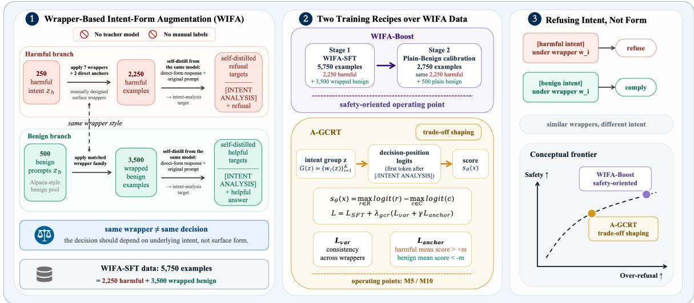  
Figure 1: Overview of WIFA, WIFA-Boost, and A-GCRT. Left: WIFA constructs matched harmful and benign intent groups under shared wrapper families; harmful groups additionally include direct refusal anchors. Middle: two training methods are built on the WIFA data layer. WIFA-Boost is a two-stage safety-first recipe, while A-GCRT adds anchored group-consistent training to shape the safety–over-refusal trade-off. Right: the desired behavior is to refuse harmful intent and comply with benign intent under similar surface forms.

• WIFA-based training for different safety goals. Using WIFA as the common data layer, we develop two training routes. WIFA-Boost provides a safety-first route for harmful requests written in altered forms, while A-GCRT uses intent-group consistency and directional anchors to reduce unnecessary refusal on benign requests while preserving harmful-request refusal. These methods separate two goals often conflated in refusal tuning: making models safer on harmful requests and avoiding unnecessary refusal on benign ones.

• Empirical gains beyond base models and reproduced defenses. In the main Qwen setting, WIFA-Boost raises SORRY-Bench mutationaverage refusal from 22.1 to 63.7, exceeding the strongest reproduced defense on this metric. A low-over-refusal A-GCRT operating point lowers Qwen OR-Bench over-refusal from 25.7 to 17.4, below both the base model and all reproduced defenses, while still improving harmful-request refusal. Capability, ablation, unseen-attack, and decision-score diagnostics show that these gains are not simply stronger refusal tuning.

## 2 Related Work

Safety alignment and refusal tuning. Assistant alignment uses instruction tuning, RLHF, and direct preference optimization to balance helpfulness with harmful-completion refusal (Ouyang et al., 2022; Bai et al., 2022a; Rafailov et al., 2023). Constitutional training and safety-focused refusal data provide related routes to harmlessness (Bai et al., 2022b; Dai et al., 2024; Yuan et al., 2025). Refusalmechanism studies further analyze where refusal behavior is represented and how refusal can be steered (Arditi et al., 2024; Qi et al., 2025). These lines of work improve refusal behavior, but they often supervise individual prompt–response pairs rather than explicitly tying together different surface forms of the same intent.

Jailbreaks and robust safety benchmarks. Redteaming studies scale adversarial discovery (Perez et al., 2022; Ganguli et al., 2022). Jailbreak work shows that aligned models remain brittle under suffixes, role play, and template changes (Wei et al., 2023; Shen et al., 2024; Zou et al., 2023); automated attacks extend this pressure with search and optimization (Liu et al., 2024; Chao et al., 2025; Mehrotra et al., 2024). HarmBench, SORRY-Bench, and StrongREJECT measure harmful behavior under transformed or adversarial prompts (Mazeika et al., 2024; Xie et al., 2025; Souly et al., 2024). These evaluations show that surface-form robustness is central to safety, but training only on transformed harmful prompts can still make the transformation itself a shortcut for refusal.

Over-refusal and benign-sensitive evaluation. Over-refusal occurs when models reject benign requests that resemble unsafe ones. XSTest, OR-Bench, and FalseReject stress sensitive wording and dual-use context (Röttger et al., 2024; Cui et al., 2024; Zhang et al., 2025c). Do-Not-Answer and pseudo-harmful prompt diagnostics further isolate benign-sensitive failure modes (Wang et al., 2023; An et al., 2024). These benchmarks highlight that robust safety cannot be measured only by harmfulrequest refusal: models must also preserve benign compliance under surface forms that resemble unsafe prompts.

Prompt-time defenses, group robustness, and external safety systems. Prompt-time defenses add reminders, goal-priority instructions, or intent analysis without parameter updates (Xie et al., 2023; Zhang et al., 2024, 2025a). Instruction hierarchy and safety-reasoning methods add related promptor training-time structure (Wallace et al., 2024; Zhu et al., 2025). Consistency and group-robust training address nuisance variation and spurious correlations in broader machine-learning settings (Xie et al., 2020; Arjovsky et al., 2019; Sagawa et al., 2019); guard and RL-style systems add external or reward-based safety mechanisms (Inan et al., 2023; Han et al., 2024; Shen et al., 2025). These approaches motivate intent-aware and robustnessoriented safety training, but leave open how to train the target model itself so that same-intent surface variants receive consistent, directionally separated refusal/compliance decisions.

## 3 Method

Figure 1 summarizes the framework. WIFA first constructs matched harmful and benign intent groups under shared wrapper families, making wrapper form non-diagnostic of the desired decision. On this data layer, WIFA-Boost uses a two-stage recipe for robust harmful-request refusal, while A-GCRT adds anchored group-consistent training to reduce unnecessary benign refusal while preserving harmful-request refusal. The right panel shows the intended behavior: decisions follow underlying intent rather than surface form. We next define WIFA, WIFA-Boost, and A-GCRT.

## 3.1 Wrapper-Based Intent-Form Augmentation (WIFA)

WIFA constructs training data at the intent-group level. For each source intent, we keep a directform prompt that exposes the underlying request, and then apply multiple wrapper styles such as role framing, translation, academic framing, fictional framing, or indirect formulation to create wrapped prompts with the same intent but different surface forms. The wrapped prompt is the training input.

The target uses an intent-analysis format. The analysis segment contains the underlying directform prompt, while the response segment uses the same model’s response to that direct-form prompt. Thus, WIFA does not require an external teacher to infer the intent of every wrapped prompt, nor manual per-wrapper labels. Harmful sources yield refusal targets and benign sources yield helpful targets; because both sides share comparable wrapper families, wrapper form is not predictive of the desired decision.

Formally, let z denote an underlying intent, $d ( z )$ its direct-form prompt, $w \in \mathcal W$ a surface wrapper, and $x = w ( z )$ the wrapped prompt. Let $\mathcal { W } _ { m }$ denote the matched wrapper families shared by harmful and benign construction. For a harmful intent $z _ { h }$ , WIFA creates

$$
G _ { h } ( z _ { h } ) = A _ { h } ( z _ { h } ) \cup \{ w ( z _ { h } ) : w \in \mathcal { W } _ { m } \} ,
$$

where $A _ { h } ( z _ { h } )$ contains direct-form refusal-anchor instances. For a benign intent $z _ { b }$ , WIFA creates

$$
G _ { b } ( z _ { b } ) = \{ w ( z _ { b } ) : w \in \mathcal { W } _ { m } \} .
$$

Thus wrapper matching is defined over the shared wrapped forms, while harmful groups additionally include direct-form anchors.

For any group input $x ,$ the target is [INTENT ANALYSIS] d(z) [/INTENT ANALYSIS] $y ( z )$ where $y ( z )$ is the target model’s direct-form response: a refusal for harmful sources and an audited helpful answer for benign sources.

In the main setting, $| \mathcal { W } _ { m } | = 7$ . Each harmful intent has 9 forms: 7 matched wrapped forms plus 2 direct-form refusal-anchor instances. Each benign prompt has 7 matched wrapped forms. This gives 2250 harmful examples and 3500 wrapped benign examples, for 5750 WIFA-SFT examples in total. Appendix A gives the full source, wrapper, and overlap details.

## 3.2 WIFA-Boost: Two-Stage WIFA Safety Boosting

WIFA-Boost is a two-stage safety-boosting recipe over WIFA data. Let $\theta _ { 0 }$ denote the initial model parameters. Stage 1 performs SFT on the 5750- example WIFA-SFT dataset $\mathcal { D } _ { W }$ , producing parameters $\theta _ { 1 }$ . Stage 2 continues from $\theta _ { 1 }$ on a 2750- example calibration dataset $\mathcal { D } _ { \mathrm { c a l } }$ , which contains the same 2250 harmful refusal examples plus 500 plain benign examples with intent-analysis targets:

$$
\theta _ { 1 } = \mathrm { S F T } ( \theta _ { 0 } , { \mathcal { D } } _ { W } ) , \qquad \theta _ { 2 } = \mathrm { S F T } ( \theta _ { 1 } , { \mathcal { D } } _ { \mathrm { c a l } } ) .\tag{1}
$$

Here $\theta _ { 2 }$ denotes the final WIFA-Boost parameters. In implementation, both stages are trained as LoRA-based SFT; we use $\mathrm { S F T } ( \cdot )$ to denote the supervised training objective.

Stage 1 teaches that wrappers are not labels. Stage 2 reinforces the harmful refusal boundary while reintroducing plain benign compliance through the additional plain-benign examples. WIFA-Boost is therefore a high-safety operating point for harmful requests written in altered forms, not a low-over-refusal method.

## 3.3 A-GCRT: Anchored Group-Consistent Refusal Training

A-GCRT uses WIFA intent groups to shape the refusal boundary directly. The goal is not to train an auxiliary safety classifier, but to make prompts with the same underlying intent induce similar refusal/compliance decisions, while pushing harmful and benign intent groups to opposite sides of a decision margin. For an intent $z ,$ let $G ( z ) = \{ x _ { i } \} _ { i = 1 } ^ { K }$ denote a group of prompt forms expressing the same underlying intent. A-GCRT adds two grouplevel terms to the standard SFT objective:

$$
\begin{array} { r } { \mathcal { L } = \mathcal { L } _ { \mathrm { S F T } } + \lambda _ { \mathrm { g c r } } \left( \mathcal { L } _ { \mathrm { v a r } } + \gamma \mathcal { L } _ { \mathrm { a n c h o r } } \right) . } \end{array}\tag{2}
$$

Here ${ \mathcal { L } } _ { \mathrm { v a r } }$ enforces consistency within an intent group, and $\mathcal { L } _ { \mathrm { a n c h o r } }$ gives that consistency a safety direction.

Decision-position score. A-GCRT measures a lightweight refusal/compliance orientation at the first response token after the closing [/INTENT ANALYSIS] marker. Let $\ell _ { \theta } ( \cdot \mid x )$ denote the nexttoken logits at this decision position. Using predefined refusal-prefix and comply-prefix token sets R and ${ \mathcal { C } } ,$ constructed from response-start prefixes and detailed in Appendix B, the decision score is

$$
s _ { \theta } ( x ) = \operatorname* { m a x } _ { r \in \mathcal { R } } \ell _ { \theta } ( r \mid x ) - \operatorname* { m a x } _ { c \in \mathcal { C } } \ell _ { \theta } ( c \mid x ) .\tag{3}
$$

Positive scores are designed to be refusal-leaning and negative scores compliance-leaning. We use this score only as a training-time regularization proxy, not as a calibrated inference-time classifier; Appendix C.6 reports complementary generationside and target-forced group diagnostics.

Group consistency. Let s¯ be the mean score within intent group $G ( z )$ . We define ${ \mathcal L } _ { \mathrm { v a r } }$ as the within-group variance of decision scores:

$$
\mathcal { L } _ { \mathrm { v a r } } ( G ( z ) ) = \frac { 1 } { | G ( z ) | } \sum _ { x _ { i } \in G ( z ) } \left( s _ { \theta } ( x _ { i } ) - \bar { s } _ { z } \right) ^ { 2 } .\tag{4}
$$

This term encourages different wrappers of the same intent to produce the same refusal/compliance orientation.

Directional anchors. Consistency alone does not determine whether a group should lie on the refusal or compliance side. For a group $G ( z )$ , A-GCRT anchors the group mean with margin m:

$$
{ \mathcal { L } } _ { \mathrm { a n c h o r } } = { \left\{ \begin{array} { l l } { [ m - { \bar { s } } _ { z } ] _ { + } , } & { { \mathrm { i f ~ } } z { \mathrm { ~ i s ~ h a r m f u l } } , } \\ { [ m + { \bar { s } } _ { z } ] _ { + } , } & { { \mathrm { i f ~ } } z { \mathrm { ~ i s ~ b e n i g n } } , } \end{array} \right. }\tag{5}
$$

where $[ a ] _ { + } = \operatorname* { m a x } ( 0 , a )$ . Thus harmful groups are pushed above +m, while benign groups are pushed below $- m$ . The variance term supplies wrapper consistency, and the anchor term supplies safety direction. Unlike generic group-robust or invariantrisk objectives, A-GCRT does not optimize worstgroup task loss or search for a domain-invariant predictor; it regularizes a refusal-minus-compliance decision score over same-intent wrapper groups.

In implementation, A-GCRT uses the same nexttoken logits optimized by SFT. Groups are formed by underlying intent; for each group, a small number of wrapped forms is sampled, and the A-GCRT loss is added to the sequence-level SFT loss. All reproduced training methods are implemented with LoRA adapters. Margin settings, sampling details, prefix-token sets, and other hyperparameters are reported in Appendix B.

## 4 Experimental Setup

## 4.1 Model and Data Settings

We evaluate Qwen2.5-7B-Instruct (Yang et al., 2024) and Llama-3.1-8B-Instruct (Grattafiori et al., 2024). Qwen uses 250 AdvBenchstyle harmful seeds (Zou et al., 2023), while Llama uses 250 harmful seeds from the harmful\_harmless\_instructions Hugging Face dataset (HH-Inst) (Phan, 2023). Because both model and harmful-source distribution change, we compare methods within each setting and treat cross-setting agreement as trend evidence, not an apples-to-apples comparison.

<table><tr><td rowspan="2">Method</td><td colspan="6">Qwen</td><td colspan="6">Llama</td></tr><tr><td>SB↑</td><td>SB-mis ↑</td><td>OR↓</td><td>XS SafeRef ↓</td><td>MMLU ↑</td><td>GSM8K ↑</td><td>SB↑</td><td>SB-mis ↑</td><td>OR↓</td><td>XS SafeRef ↓</td><td>MMLU ↑</td><td>GSM8K ↑</td></tr><tr><td>Base</td><td>22.1</td><td>0.2</td><td>25.7</td><td>10.68</td><td>70.1</td><td>89.39</td><td>31.2</td><td>7.5</td><td>28.4</td><td>9.66</td><td>67.4</td><td>85.52</td></tr><tr><td>Prompt-time defenses</td><td></td><td></td><td></td><td></td><td></td><td></td><td></td><td></td><td></td><td></td><td></td><td></td></tr><tr><td>Self-Reminder</td><td>22.7</td><td>0.0</td><td>29.4</td><td>12.4</td><td>66.6</td><td>92.27</td><td>37.1</td><td>10.2</td><td>48.4</td><td>12.1</td><td>61.9</td><td>79.61</td></tr><tr><td>Intention Analysis</td><td>43.2</td><td>15.2</td><td>64.1</td><td>14.2</td><td>68.2</td><td>68.99</td><td>60.6</td><td>26.6</td><td>83.0</td><td>20.6</td><td>63.6</td><td>83.47</td></tr><tr><td>Goal Priority</td><td>36.0</td><td>5.0</td><td>67.2</td><td>29.3</td><td>59.1</td><td>82.87</td><td>56.3</td><td>12.5</td><td>49.1</td><td>24.0</td><td>57.1</td><td>77.71</td></tr><tr><td>Training-time defenses</td><td></td><td></td><td></td><td></td><td></td><td></td><td></td><td></td><td></td><td></td><td></td><td></td></tr><tr><td>Vanilla Refusal-SFT</td><td>36.0</td><td>18.4</td><td>78.9</td><td>14.4</td><td>67.5</td><td>88.93</td><td>53.5</td><td>13.4</td><td>75.4</td><td>11.6</td><td>62.8</td><td>44.50</td></tr><tr><td>LookAhead Tuning</td><td>42.7</td><td>42.5</td><td>50.6</td><td>14.0</td><td>60.8</td><td>28.81</td><td>52.4</td><td>47.3</td><td>68.7</td><td>18.8</td><td>45.8</td><td>9.86</td></tr><tr><td>RATIONAL</td><td>59.0</td><td>42.0</td><td>87.9</td><td>24.0</td><td>3.2</td><td>33.13</td><td>54.5</td><td>18.0</td><td>52.7</td><td>10.8</td><td>33.0</td><td>26.69</td></tr><tr><td colspan="2">WIFA-based methods and diagnostic variant</td><td></td><td></td><td></td><td></td><td></td><td></td><td></td><td></td><td></td><td></td><td></td></tr><tr><td>WIFA-SFT</td><td>63.6</td><td>49.3</td><td>69.7</td><td>20.0</td><td>68.4</td><td>82.79</td><td>63.7</td><td>37.7</td><td>53.0</td><td>28.15</td><td>57.2</td><td>46.25</td></tr><tr><td>WIFA-Boost</td><td>63.7</td><td>59.3</td><td>56.0</td><td>20.88</td><td>67.9</td><td>79.00</td><td>52.8</td><td>10.5</td><td>39.8</td><td>17.65</td><td>61.8</td><td>54.97</td></tr><tr><td>A-GCRT-M5</td><td>46.7</td><td>20.9</td><td>17.4</td><td>16.29</td><td>69.0</td><td>83.70</td><td>50.8</td><td>17.3</td><td>40.1</td><td>9.24</td><td>67.2</td><td>68.16</td></tr><tr><td>A-GCRT-M10</td><td>52.0</td><td>28.9</td><td>40.7</td><td>15.86</td><td>68.5</td><td>84.61</td><td>52.8</td><td>23.0</td><td>45.3</td><td>8.12</td><td>67.6</td><td>68.16</td></tr></table>

Table 1: Headline comparison across Qwen and Llama. SB denotes SB-avg5; SB-mis is the SORRY-Bench misrepresentation subset. WIFA-SFT is the direct WIFA data-layer diagnostic, while WIFA-Boost and A-GCRT are the two final WIFA-based training routes. Full metric matrices are reported in Appendix C. Darker shaded cells mark the best value in each column according to the metric direction, and lighter shaded cells mark the second-best value.

Qwen is the main setting, with HarmBench overlap checks in Appendix A.5; Llama provides an independent source-distribution stress check. We also examined BeaverTails (Ji et al., 2023); its boundary-sensitive safety cases are useful for studying conservative refusal, but preliminary runs favored broad caution over intent–form separation. We therefore use clearer harmful-intent seeds for the main experiments and treat BeaverTails as a data-source caution in Appendix A.1.

Each WIFA-SFT set has 5750 examples: 2250 harmful examples (7 wrapped forms plus 2 direct anchors per intent) and 3500 matched wrapped benign examples. WIFA-Boost continues with a 2750-example calibration set containing the same harmful refusal examples plus 500 plain benign examples. Table 7 lists all variants, sample counts, and roles.

## 4.2 Compared Methods and Variants

We compare final methods, diagnostic variants, and external baselines. WIFA-Boost and A-GCRT are our final methods; A-GCRT-M5 and A-GCRT-M10 are two margin settings of the same objective. Diagnostic variants, including Harmful-Only SFT, WIFA-SFT, Joint WIFA+Plain SFT, and Reverse WIFA-Boost, isolate data-structure, benignmatching, and ordering effects; Table 7 gives their construction.

For external comparisons, we reproduce three prompt-time defenses—Self-Reminder, Intention Analysis, and Goal Priority (Xie et al., 2023;

Zhang et al., 2025a, 2024)—and three training-time defenses—Vanilla Refusal-SFT, LookAhead Tuning, and RATIONAL (Bianchi et al., 2024; Liu et al., 2026; Zhang et al., 2025b). SIRL is reported only as an external reference, not as a reproduced baseline (Shen et al., 2025).

## 4.3 Evaluation Overview

We evaluate harmful-request refusal, benign overrefusal, auxiliary safety, capability, and unseenattack behavior. Harmful-request refusal uses HarmBench, SORRY-Bench, StrongREJECT, and an unseen attack-family suite (Mazeika et al., 2024; Xie et al., 2025; Souly et al., 2024); over-refusal uses OR-Bench-Hard and XSTest safe prompts (Cui et al., 2024; Röttger et al., 2024); auxiliary safety uses XSTest unsafe refusal and StrongREJECT; capability uses MMLU and GSM8K (Hendrycks et al., 2020; Cobbe et al., 2021).

Metrics. HB is HarmBench refusal; SB is SORRY-Bench refusal, with SB-avg5 averaging the five mutation subsets and SB-avg6 adding the base subset. OR is OR-Bench-Hard over-refusal; XS SafeRef/UnsafeRef are XSTest safe/unsafe refusal rates; SR Safe/SR Mean are StrongREJECT safety/raw harmful-compliance scores; ASR is attack success rate; MMLU and GSM8K are capability accuracies. Values are percentages unless otherwise noted, except SR Mean.

All methods, including base models, use the corrected capability protocol. MMLU and GSM8K use a fixed benign intent-analysis prefix to isolate task solving from analysis-format generation; XSTest and StrongREJECT use no prefix so refusal and compliance behavior surface naturally. Appendix B reports hyperparameters, benchmark sizes, decoding settings, and compute details.

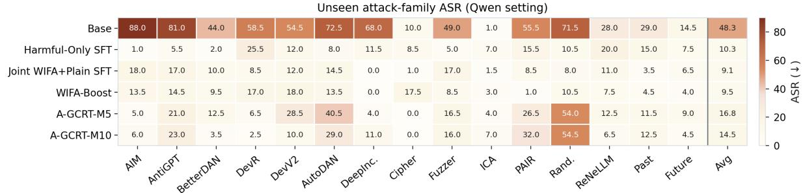  
Figure 2: Attack-family breakdown in the Qwen setting. Values are attack success rates, where lower is better. The results provide evidence beyond simple fixed-wrapper memorization, but do not establish robustness against adaptive attackers.

## 5 Main Results

## 5.1 Safety and Over-Refusal Trade-offs

Table 1 summarizes the main safety–over-refusal trade-offs, with the SB–OR frontier visualized in Figure 7 in Appendix C. We ask whether WIFAbased training improves harmful-request refusal without making models broadly conservative; the table includes WIFA-SFT as the data-layer variant, WIFA-Boost and A-GCRT as WIFA-based training routes, and six reproduced defenses.

In Qwen, WIFA-SFT shows the data-layer effect: it reaches 63.6 SB and 49.3 SB-mis, but remains conservative with 69.7 OR. WIFA-Boost strengthens this safety-first direction, reaching 63.7 SB and 59.3 SB-mis with 56.0 OR. A-GCRT gives a different operating point: A-GCRT-M5 lowers OR from 25.7 to 17.4, below all reproduced defenses, while raising SB from 22.1 to 46.7; A-GCRT-M10 moves to a more conservative point with higher SB and higher OR.

Llama clarifies the boundary under a different model and harmful-source distribution. Direct refusal tuning is costly: Harmful-Only SFT reaches 75.8 SB but 89.3 OR, and WIFA-SFT remains conservative with 53.0 OR. A-GCRT reduces this broad-refusal tendency relative to refusal-tuned variants, though it does not beat the 28.4 base OR. On XSTest safe prompts, A-GCRT-M5/M10 reach 9.24/8.12 XS SafeRef, lower than the base model and reproduced defenses, supporting the trade-off interpretation without implying universal belowbase OR.

The reproduced baselines show that these points are not obtained by prompting or stronger SFT alone. Prompt-time defenses often improve safety while increasing over-refusal: Qwen Intention Analysis raises SB to 43.2 but OR to 64.1, and Llama Intention Analysis reaches 60.6 SB with 83.0 OR. Training-time baselines show a similar pattern: Qwen RATIONAL reaches 59.0 SB but has 87.9 OR and severe capability loss. Overall, WIFA-Boost gives the strongest safety-first point, while A-GCRT provides a lower-over-refusal point not matched by reproduced baselines.

## 5.2 Capability and Utility

We test whether safety gains preserve task utility. Under the corrected protocol, MMLU and GSM8K use a fixed benign intent-analysis prefix for all methods, including base models, so evaluation measures task solving rather than format recovery.

In Qwen, A-GCRT retains capability better than safety-first variants and reproduced training baselines. A-GCRT-M5 scores 69.0 on MMLU and 83.70 on GSM8K, close to the base model’s 70.1 and 89.39, while keeping the best OR result. WIFA-Boost has stronger harmful-refusal metrics but lower GSM8K at 79.00; RATIONAL, by contrast, drops to 3.2 MMLU and 33.13 GSM8K.

Llama shows the remaining cost more clearly. A-GCRT-M5/M10 recover MMLU to 67.2/67.6, close to the 67.4 base value and well above WIFA-SFT’s 57.2. GSM8K remains lower, 68.16 versus 85.52 for the base model, though it improves over WIFA-SFT and WIFA-Boost. Appendix Table 15 shows that the remaining errors are mostly arithmetic, incomplete-reasoning, and repetition failures rather than safety-style refusals. Thus, A-GCRT improves the utility trade-off over direct WIFA-style SFT, but is not capability-neutral.

<table><tr><td>Method</td><td>Ben. data</td><td>Wrap. ben.</td><td>IA target</td><td>HB↑</td><td>SB mis ↑</td><td>SB avg5↑</td><td>OR↓</td></tr><tr><td>Harmful-Only SFT</td><td>×</td><td>×</td><td>X</td><td>98.5</td><td>28.4</td><td>38.7</td><td>65.6</td></tr><tr><td>Naive Benign- Aug. SFT</td><td></td><td>×</td><td>×</td><td>99.0</td><td>31.6</td><td>40.8</td><td>72.7</td></tr><tr><td>Wrapped-Ben. SFT w/o IA</td><td></td><td>L</td><td>X</td><td>98.5</td><td>37.3</td><td>43.6</td><td>76.0</td></tr><tr><td>Plain-Benign IA SFT</td><td>V</td><td>×</td><td></td><td>99.0</td><td>24.5</td><td>47.5</td><td>52.9</td></tr><tr><td>WIFA-SFT</td><td>L</td><td></td><td></td><td>99.5</td><td>49.3</td><td>63.6</td><td>69.7</td></tr></table>

Table 2: Qwen data-structure ablation. Ben., Wrap. ben., and IA denote benign data, matched wrapped benign examples, and intent-analysis targets. HB/SB/OR denote HarmBench refusal, SORRY-Bench refusal, and OR-Bench over-refusal; full subtype results are in Appendix Table 17.

## 5.3 Generalization to Unseen Attack Families

Finally, we test whether the methods generalize beyond the fixed WIFA training wrappers. Figure 2 reports a 15-family unseen-attack evaluation in Qwen, with exact values in Table 13 in Appendix C. Since these attack families are not the WIFA training wrappers, lower ASR provides evidence against simple template memorization, although it is not a guarantee against adaptive attackers.

The results again reflect different operating points. WIFA-Boost has lower average attack success than A-GCRT-M5, 9.5 versus 16.8, and is stronger on optimization- or search-oriented families such as AutoDAN, PAIR, and random search. This matches its safety-first role: the two-stage recipe preserves stronger harmful-request refusal even under unseen transformations. A-GCRT-M5 is weaker on these harmful-attack families, but remains the lower-over-refusal point in Table 1. Thus, the unseen-attack results delimit rather than overturn the trade-off: WIFA-Boost is preferable when refusing rewritten or adversarial harmful requests dominates, while A-GCRT better fits assistant settings where benign over-refusal is central.

## 6 Analysis and Ablations

The ablations test whether the observed behavior comes from WIFA’s intent-group structure and A-GCRT’s objective rather than simpler alternatives: adding data, changing ratios, reversing stage order, stronger SFT, or single loss components. Unless otherwise stated, ablations use the Qwen setting. All numbers are percentages; SB-avg5 averages the five SORRY-Bench mutation subsets (Xie et al., 2025), and OR is OR-Bench over-refusal (Cui et al., 2024).

## 6.1 Are Matched Benign Wrappers Necessary?

This ablation isolates whether WIFA needs matched benign structure rather than more data alone. Table 2 shows that Harmful-Only SFT improves harmful-request refusal under altered forms but broadens refusal, reaching 38.7 SB-avg5 with 65.6 OR. Adding unmatched benign data does not solve this: Naive Benign-Augmented SFT reaches only 40.8 SB-avg5 with 72.7 OR. WIFA-SFT, which adds matched wrapped benign examples and intent-analysis targets, reaches 63.6 SB-avg5, showing that matched harmful/benign intent-form structure is the key data ingredient.

WIFA-SFT still has 69.7 OR, so WIFA is not the final low-over-refusal method. Instead, it supplies the wrapper-robust intent supervision layer on which WIFA-Boost and A-GCRT select different safety–over-refusal operating points.

## 6.2 How Sensitive Is WIFA to the Benign/Harmful Ratio?

This ablation asks whether WIFA depends on a narrow benign/harmful ratio. The full ratio scan is reported in Appendix C, with Figure 11 visualizing the trend and Table 18 giving exact values. Low ratios are unstable: WIFA-r0.25 has weak harmfulrequest robustness and high OR, while WIFA-r0.50 lowers OR to 49.1 but performs poorly on difficult mutation subsets. Moderate ratios are more stable, with WIFA-r1.50 and WIFA-SFT reaching 60.3 and 63.6 SB-avg5.

More benign data is not a monotonic fix: WIFAr2.00 drops to 48.0 SB-avg5 and weakens difficult mutation subsets. Thus WIFA is most stable around the moderate-ratio regime, but no scanned ratio dominates both harmful-request refusal and OR, motivating a later training method to select the operating point.

## 6.3 Does the Two-Stage Order Matter?

This ablation tests whether WIFA-Boost benefits from stage order rather than simply seeing the same examples. Table 19 in Appendix C compares WIFA-Boost with Joint WIFA+Plain SFT and Reverse WIFA-Boost. WIFA-Boost reaches 59.3 SBmisrepresentation and 23.2 SB-logical, compared with 22.5 and 8.0 for the joint one-stage control, while the reverse order collapses to 0.2 and 0.0. Learning wrapped harmful/benign structure before plain-benign calibration is therefore important for difficult harmful-request refusal. This suggests that WIFA-Boost is not just a data-mixture effect: the first stage establishes the intent-form structure, and the second stage adjusts the benign calibration without erasing that structure.

<table><tr><td>Method</td><td>LR Epoch SB-mis ↑ SB-avg5 ↑ OR↓</td><td></td><td></td><td></td><td></td></tr><tr><td colspan="6">Stronger SFT baselines</td></tr><tr><td>WIFA-SFT</td><td>2e-5</td><td>3</td><td>49.3</td><td>63.6</td><td>69.7</td></tr><tr><td>WIFA-SFT</td><td>4e-5</td><td>1</td><td>20.2</td><td>55.5</td><td>68.1</td></tr><tr><td>WIFA-SFT</td><td>6e-5</td><td>1</td><td>18.4</td><td>53.7</td><td>66.3</td></tr><tr><td colspan="6">Single-component losses</td></tr><tr><td>Var-only</td><td>2e-5</td><td>3</td><td>18.9</td><td>51.2</td><td>74.5</td></tr><tr><td>Anchor-only</td><td>2e-5</td><td>3</td><td>23.0</td><td>50.6</td><td>48.7</td></tr><tr><td colspan="6">Full objective</td></tr><tr><td>A-GCRT-M5 2e-5</td><td></td><td>3</td><td>20.9</td><td>46.7</td><td>17.4</td></tr></table>

Table 3: A-GCRT ablation in the Qwen setting. Higher-LR SFT and single-component losses do not reproduce A-GCRT-M5’s low-OR point; 3-epoch high-LR variants overfit and are reported in Appendix C.

The gain is safety-oriented rather than low-OR: WIFA-Boost reaches 63.7 SB-avg5 with 56.0 OR, compared with 54.0 SB-avg5 and 46.8 OR for Joint WIFA+Plain SFT. This supports WIFA-Boost as the high-safety route, while A-GCRT targets the over-refusal side of the trade-off.

## 6.4 Is A-GCRT Just Stronger SFT?

This ablation asks whether the remaining WIFA trade-off can be solved by stronger SFT. Direct WIFA-SFT already shows the plain-SFT limit: it reaches strong harmful-request refusal but remains conservative, with 63.6 SB-avg5 and 69.7 OR. Table 3 shows that stronger SFT does not recover A-GCRT: a one-epoch high-learning-rate WIFA-SFT run approaches A-GCRT-M5 on SBmisrepresentation, 20.2 versus 20.9, but its OR remains 68.1 rather than 17.4; longer high-LR runs overfit and further increase OR.

Both A-GCRT terms are needed. Variance-only regularization leaves OR at 74.5, and anchor-only training leaves OR above base at 48.7. Full A-GCRT-M5 combines decision consistency with harmful/benign anchors and reaches 17.4 OR. Thus WIFA supplies the supervision structure, but A-GCRT is needed to reshape the group-level refusal boundary. Appendix C.6 gives consistent score-level diagnostics: generation-side calibration cautions against inference-time use, while targetforced diagnostics show reduced within-intent variance and high margin satisfaction.

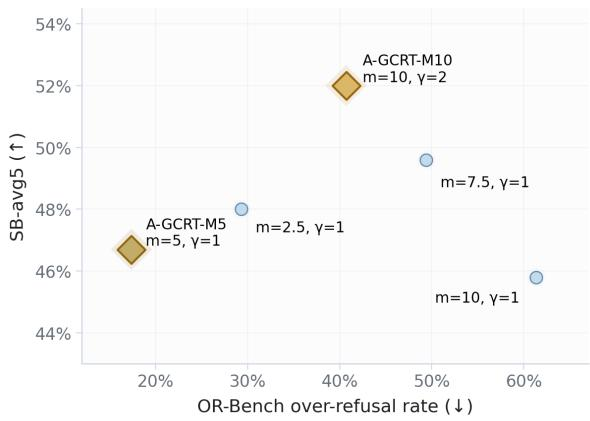  
Figure 3: A-GCRT margin/anchor scan. Different settings select different safety–over-refusal operating points rather than a monotonic curve.

## 6.5 Do A-GCRT Margins Control Operating Points?

This ablation tests whether A-GCRT can move the operating point through margin and anchor settings. Figure 3 visualizes the scan, with exact values in Table 21 in Appendix C. The results show controllability, but not a monotonic curve: A-GCRT-M5 gives the lowest OR at 17.4; m = 2.5 also lowers OR to 29.3 but does not match M5; larger margins with γ = 1 become more conservative, raising OR to 49.4 or 61.3 without consistently improving SB-avg5. This pattern suggests that margins act as validation-selected operating controls rather than a simple larger-is-better knob. A-GCRT-M10 changes both margin and anchor weight, moving to a more safety-oriented point with 52.0 SB-avg5 and 40.7 OR. Thus A-GCRT parameters should be selected by validation rather than treated as a universal monotonic dial, supporting A-GCRT as a trade-off shaping mechanism rather than stronger refusal tuning.

## 7 Conclusion

Safety supervision should target intent groups rather than isolated prompt forms. WIFA builds the matched harmful/benign data layer, WIFA-Boost turns it into a high-safety training route, and A-GCRT uses anchored group consistency to shape the safety–over-refusal trade-off. Empirically, Qwen A-GCRT-M5 reduces OR-Bench overrefusal below the base model, WIFA-Boost occupies the high-safety point, and Llama clarifies the boundary under a different model and seed distribution. The central lesson is refusing harmful intent, not surface form.

## 8 Limitations

WIFA, WIFA-Boost, and A-GCRT are trainingtime methods for shaping refusal behavior, not complete deployment safeguards. Our experiments use fixed wrapper families, two 7–8B instruction models, and two harmful-source settings, so operating points may change for larger models, other languages, multimodal or tool-use settings, adaptive attackers, and different benign/harmful mixtures. The methods also retain a capability cost on GSM8K, and the A-GCRT decision-position score should be interpreted as a training-time regularization signal rather than an inference-time classifier. These limitations call for broader evaluation, but do not change the central claim that safety supervision should target intent groups rather than surface prompt form.

## 9 Ethics and Responsible NLP Checklist

This work uses harmful prompts only for safety training and evaluation. We do not intend to improve harmful capabilities or disseminate actionable unsafe information. Public paper examples, released artifacts, and qualitative records should redact harmful prompts, unsafe completions, and wrapper templates that would make harmful instructions easier to reproduce.

The same methods that reduce harmful compliance can also increase benign denial, especially for sensitive but legitimate requests. This dual-use risk motivates evaluating over-refusal with OR-Bench and XSTest alongside harmful-refusal benchmarks, and it is why WIFA-Boost and A-GCRT are presented as trade-off-shaping methods rather than standalone deployment defenses.

The study uses public model families and public or benchmark-derived data; it does not use private user data or conduct human-subjects research. We may release code, configurations, aggregate metrics, and sanitized/redacted artifacts. Raw harmful artifacts, if needed for exact reproducibility, should be shared only through controlled or safety-reviewed channels. We use public models, datasets, and benchmarks according to their released licenses or terms of use; released artifacts from this work will follow applicable upstream licenses and safety restrictions. AI assistance was used in drafting and editing the manuscript if disclosure is required by the venue.

## References

Bang An, Sicheng Zhu, Ruiyi Zhang, Michael-Andrei Panaitescu-Liess, Yuancheng Xu, and Furong Huang. 2024. Automatic pseudo-harmful prompt generation for evaluating false refusals in large language models. arXiv preprint arXiv:2409.00598.

Andy Arditi, Oscar Obeso, Aaquib Syed, Daniel Paleka, Nina Panickssery, Wes Gurnee, and Neel Nanda. 2024. Refusal in language models is mediated by a single direction. Advances in Neural Information Processing Systems, 37:136037–136083.

Martin Arjovsky, Léon Bottou, Ishaan Gulrajani, and David Lopez-Paz. 2019. Invariant risk minimization. arXiv preprint arXiv:1907.02893.

Yuntao Bai, Andy Jones, Kamal Ndousse, Amanda Askell, Anna Chen, Nova DasSarma, Dawn Drain, Stanislav Fort, Deep Ganguli, Tom Henighan, et al. 2022a. Training a helpful and harmless assistant with reinforcement learning from human feedback. arXiv preprint arXiv:2204.05862.

Yuntao Bai, Saurav Kadavath, Sandipan Kundu, Amanda Askell, Jackson Kernion, Andy Jones, Anna Chen, Anna Goldie, Azalia Mirhoseini, Cameron McKinnon, et al. 2022b. Constitutional ai: Harmlessness from ai feedback. arXiv preprint arXiv:2212.08073.

Federico Bianchi, Mirac Suzgun, Giuseppe Attanasio, Paul Röttger, Dan Jurafsky, Tatsunori Hashimoto, and James Y Zou. 2024. Safety-tuned llamas: Lessons from improving the safety of large language models that follow instructions. In International Conference on Learning Representations, volume 2024, pages 34196–34216.

Patrick Chao, Alexander Robey, Edgar Dobriban, Hamed Hassani, George J Pappas, and Eric Wong. 2025. Jailbreaking black box large language models in twenty queries. In 2025 IEEE Conference on Secure and Trustworthy Machine Learning (SaTML), pages 23–42. IEEE.

Karl Cobbe, Vineet Kosaraju, Mohammad Bavarian, Mark Chen, Heewoo Jun, Lukasz Kaiser, Matthias Plappert, Jerry Tworek, Jacob Hilton, Reiichiro Nakano, et al. 2021. Training verifiers to solve math word problems, 2021. URL https://arxiv. org/abs/2110.14168, 9.

Justin Cui, Wei-Lin Chiang, Ion Stoica, and Cho-Jui Hsieh. 2024. Or-bench: An over-refusal benchmark for large language models. arXiv preprint arXiv:2405.20947.

Juntao Dai, Xuehai Pan, Ruiyang Sun, Jiaming Ji, Xinbo Xu, Mickel Liu, Yizhou Wang, and Yaodong Yang. 2024. Safe rlhf: Safe reinforcement learning from human feedback. In International Conference on Learning Representations, volume 2024, pages 50750– 50777.

Deep Ganguli, Liane Lovitt, Jackson Kernion, Amanda Askell, Yuntao Bai, Saurav Kadavath, Ben Mann, Ethan Perez, Nicholas Schiefer, Kamal Ndousse, et al. 2022. Red teaming language models to reduce harms: Methods, scaling behaviors, and lessons learned. arXiv preprint arXiv:2209.07858.

Aaron Grattafiori, Abhimanyu Dubey, Abhinav Jauhri, Abhinav Pandey, Abhishek Kadian, Ahmad Al-Dahle, Aiesha Letman, Akhil Mathur, Alan Schelten, Alex Vaughan, et al. 2024. The llama 3 herd of models. arXiv preprint arXiv:2407.21783.

Seungju Han, Kavel Rao, Allyson Ettinger, Liwei Jiang, Bill Yuchen Lin, Nathan Lambert, Yejin Choi, and Nouha Dziri. 2024. Wildguard: Open one-stop moderation tools for safety risks, jailbreaks, and refusals of llms. Advances in neural information processing systems, 37:8093–8131.

Dan Hendrycks, Collin Burns, Steven Basart, Andy Zou, Mantas Mazeika, Dawn Song, and Jacob Steinhardt. 2020. Measuring massive multitask language understanding. arXiv preprint arXiv:2009.03300.

Hakan Inan, Kartikeya Upasani, Jianfeng Chi, Rashi Rungta, Krithika Iyer, Yuning Mao, Michael Tontchev, Qing Hu, Brian Fuller, Davide Testuggine, et al. 2023. Llama guard: Llm-based input-output safeguard for human-ai conversations. arXiv preprint arXiv:2312.06674.

Jiaming Ji, Mickel Liu, Josef Dai, Xuehai Pan, Chi Zhang, Ce Bian, Boyuan Chen, Ruiyang Sun, Yizhou Wang, and Yaodong Yang. 2023. Beavertails: Towards improved safety alignment of llm via a humanpreference dataset. Advances in Neural Information Processing Systems, 36:24678–24704.

Kangwei Liu, Mengru Wang, Yujie Luo, Lin Yuan, Mengshu Sun, Lei Liang, Zhiqiang Zhang, Jun Zhou, Bryan Hooi, and Shumin Deng. 2026. Lookahead tuning: Safer language models via partial answer previews. In Proceedings of the Nineteenth ACM International Conference on Web Search and Data Mining, pages 1190–1194.

Xiaogeng Liu, Nan Xu, Muhao Chen, and Chaowei Xiao. 2024. Autodan: Generating stealthy jailbreak prompts on aligned large language models. In International Conference on Learning Representations, volume 2024, pages 56174–56194.

Mantas Mazeika, Long Phan, Xuwang Yin, Andy Zou, Zifan Wang, Norman Mu, Elham Sakhaee, Nathaniel Li, Steven Basart, Bo Li, et al. 2024. Harmbench: A standardized evaluation framework for automated red teaming and robust refusal. arXiv preprint arXiv:2402.04249.

Anay Mehrotra, Manolis Zampetakis, Paul Kassianik, Blaine Nelson, Hyrum Anderson, Yaron Singer, and Amin Karbasi. 2024. Tree of attacks: Jailbreaking black-box llms automatically. Advances in Neural Information Processing Systems, 37:61065–61105.

Long Ouyang, Jeffrey Wu, Xu Jiang, Diogo Almeida, Carroll Wainwright, Pamela Mishkin, Chong Zhang, Sandhini Agarwal, Katarina Slama, Alex Ray, et al. 2022. Training language models to follow instructions with human feedback. Advances in neural information processing systems, 35:27730–27744.

Ethan Perez, Saffron Huang, Francis Song, Trevor Cai, Roman Ring, John Aslanides, Amelia Glaese, Nat McAleese, and Geoffrey Irving. 2022. Red teaming language models with language models. In Proceedings ofthe 2022 Conference on Empirical Methods in Natural Language Processing, pages 3419–3448.

Justin Phan. 2023. harmful\_harmless\_instructions. Hugging Face dataset. Accessed 2026-05-23.

Xiangyu Qi, Ashwinee Panda, Kaifeng Lyu, Xiao Ma, Subhrajit Roy, Ahmad Beirami, Prateek Mittal, and Peter Henderson. 2025. Safety alignment should be made more than just a few tokens deep. In International Conference on Learning Representations, volume 2025, pages 54911–54941.

Rafael Rafailov, Archit Sharma, Eric Mitchell, Christopher D Manning, Stefano Ermon, and Chelsea Finn. 2023. Direct preference optimization: Your language model is secretly a reward model. Advances in neural information processing systems, 36:53728–53741.

Paul Röttger, Hannah Kirk, Bertie Vidgen, Giuseppe Attanasio, Federico Bianchi, and Dirk Hovy. 2024. Xstest: A test suite for identifying exaggerated safety behaviours in large language models. In Proceedings of the 2024 Conference of the North American Chapter of the Association for Computational Linguistics: Human Language Technologies (Volume 1: Long Papers), pages 5377–5400.

Shiori Sagawa, Pang Wei Koh, Tatsunori B Hashimoto, and Percy Liang. 2019. Distributionally robust neural networks for group shifts: On the importance of regularization for worst-case generalization. arXiv preprint arXiv:1911.08731.

Guobin Shen, Dongcheng Zhao, Haibo Tong, Jindong Li, Feifei Zhao, and Yi Zeng. 2025. Safety instincts: Llms learn to trust their internal compass for selfdefense. arXiv preprint arXiv:2510.01088.

Xinyue Shen, Zeyuan Chen, Michael Backes, Yun Shen, and Yang Zhang. 2024. " do anything now": Characterizing and evaluating in-the-wild jailbreak prompts on large language models. In Proceedings of the 2024 on ACM SIGSAC Conference on Computer and Communications Security, pages 1671–1685.

Alexandra Souly, Qingyuan Lu, Dillon Bowen, Tu Trinh, Elvis Hsieh, Sana Pandey, Pieter Abbeel, Justin Svegliato, Scott Emmons, Olivia Watkins, et al. 2024. A strongreject for empty jailbreaks. Advances in Neural Information Processing Systems, 37:125416–125440.

Rohan Taori, Ishaan Gulrajani, Tianyi Zhang, Yann Dubois, Xuechen Li, Carlos Guestrin, Percy Liang,

and Tatsunori B Hashimoto. 2023. Stanford alpaca: An instruction-following llama model.

Eric Wallace, Kai Xiao, Reimar Leike, Lilian Weng, Johannes Heidecke, and Alex Beutel. 2024. The instruction hierarchy: Training llms to prioritize privileged instructions. arXiv preprint arXiv:2404.13208.

Yuxia Wang, Haonan Li, Xudong Han, Preslav Nakov, and Timothy Baldwin. 2023. Do-not-answer: A dataset for evaluating safeguards in llms. arXiv preprint arXiv:2308.13387.

Alexander Wei, Nika Haghtalab, and Jacob Steinhardt. 2023. Jailbroken: How does llm safety training fail? Advances in neural information processing systems, 36:80079–80110.

Qizhe Xie, Zihang Dai, Eduard Hovy, Thang Luong, and Quoc Le. 2020. Unsupervised data augmentation for consistency training. Advances in neural information processing systems, 33:6256–6268.

Tinghao Xie, Xiangyu Qi, Yi Zeng, Yangsibo Huang, Udari Sehwag, Kaixuan Huang, Luxi He, Boyi Wei, Dacheng Li, Ying Sheng, et al. 2025. Sorrybench: Systematically evaluating large language model safety refusal. In International Conference on Learning Representations, volume 2025, pages 59937–59973.

Yueqi Xie, Jingwei Yi, Jiawei Shao, Justin Curl, Lingjuan Lyu, Qifeng Chen, Xing Xie, and Fangzhao Wu. 2023. Defending chatgpt against jailbreak attack via self-reminders. Nature Machine Intelligence, 5(12):1486–1496.

An Yang, Baosong Yang, Beichen Zhang, Binyuan Hui, Bo Zheng, Bowen Yu, Chengyuan Li, Dayiheng Liu, Fei Huang, Haoran Wei, Huan Lin, Jian Yang, Jianhong Tu, Jianwei Zhang, Jianxin Yang, Jiaxi Yang, Jingren Zhou, Junyang Lin, Kai Dang, et al. 2024. Qwen2.5 technical report. arXiv preprint arXiv:2412.15115.

Youliang Yuan, Wenxiang Jiao, Wenxuan Wang, Jentse Huang, Jiahao Xu, Tian Liang, Pinjia He, and Zhaopeng Tu. 2025. Refuse whenever you feel unsafe: Improving safety in llms via decoupled refusal training. In Proceedings of the 63rd Annual Meeting ofthe Associationfor Computational Linguistics (Volume 1: Long Papers), pages 3149–3167.

Yuqi Zhang, Liang Ding, Lefei Zhang, and Dacheng Tao. 2025a. Intention analysis makes llms a good jailbreak defender. In Proceedings of the 31st International Conference on Computational Linguistics, pages 2947–2968.

Yuyou Zhang, Miao Li, William Han, Yihang Yao, Zhepeng Cen, and Ding Zhao. 2025b. Safety is not only about refusal: Reasoning-enhanced fine-tuning for interpretable llm safety. In Findings of the Association for Computational Linguistics: ACL 2025, pages 18727–18746.

Zhehao Zhang, Weijie Xu, Fanyou Wu, and Chandan K Reddy. 2025c. Falsereject: A resource for improving contextual safety and mitigating over-refusals in llms via structured reasoning. arXiv preprint arXiv:2505.08054.

Zhexin Zhang, Junxiao Yang, Pei Ke, Fei Mi, Hongning Wang, and Minlie Huang. 2024. Defending large language models against jailbreaking attacks through goal prioritization. In Proceedings of the 62nd Annual Meeting ofthe Associationfor Computational Linguistics (Volume 1: Long Papers), pages 8865– 8887.

Junda Zhu, Lingyong Yan, Shuaiqiang Wang, Dawei Yin, and Lei Sha. 2025. Reasoning-to-defend: Safety-aware reasoning can defend large language models from jailbreaking. In Proceedings of the 2025 Conference on Empirical Methods in Natural Language Processing, pages 29343–29361, Suzhou, China. Association for Computational Linguistics.

Andy Zou, Zifan Wang, Nicholas Carlini, Milad Nasr, J Zico Kolter, and Matt Fredrikson. 2023. Universal and transferable adversarial attacks on aligned language models. arXiv preprint arXiv:2307.15043.

<table><tr><td>Source</td><td>Role</td><td>Use</td></tr><tr><td>AdvBench-style (250)a</td><td>Clear harmful- intent prompts</td><td>Main harmful source for Qwen.</td></tr><tr><td>HH-Inst (250)b</td><td>Harmful/harmless instructions</td><td>Main harmful source for Llama.</td></tr><tr><td>Alpaca-style benign poolc</td><td>General benign instructions</td><td>Source pool for wrapped benign counterexamples.</td></tr><tr><td>BeaverTailsd</td><td>Preliminary data- source check</td><td>Excluded because ambiguous sen- sitive prompts caused broad refusal in prelimi- nary runs.</td></tr><tr><td>a (Zou et al., 2023).</td><td>b</td><td>(Phan, 2023).</td></tr><tr><td>c (Taori et al., 2023).</td><td>d</td><td>(Dai et al., 2024).</td></tr></table>

Table 4: Data sources and their roles. The main experiments use clear harmful-intent seeds rather than ambiguous safety-sensitive prompts.

## A Data, Wrappers, and Overlap

This appendix records the scientific data specification behind WIFA: the source pools, fixed wrapper families, main training variants, and the overlap check between the Qwen harmful seeds and Harm-Bench.

## A.1 Data Sources

Table 4 summarizes the source pools and their roles in the final experiments.

This split is deliberate. The Qwen setting uses AdvBench-style seeds as the main setting, with the overlap check in Appendix A.5 to rule out exact or normalized HarmBench prompt duplication. The Llama setting uses HH-Inst instead of reusing AdvBench-style seeds, because AdvBenchstyle data is benchmark-adjacent and a second source distribution better tests whether the methodlevel trends survive outside the Qwen data source. BeaverTails was tried as a preliminary source, but its ambiguous and benign-sensitive prompts induced broad over-refusal, so we treat it as a datasource caution rather than a main setting. Crossfamily numbers should therefore be compared as within-setting method trends rather than direct absolute comparisons.

For Qwen, each harmful seed is expanded into an intent group with two direct-form refusal-anchor instances and seven wrapped forms. The two directform instances are included as refusal anchors for the unwrapped harmful intent; they are counted in the harmful group size but are not part of the matched wrapper-family comparison. For Llama, we construct the same group structure from HH-Inst harmful instructions after de-duplicating and sampling 250 harmful intents. Benign prompts are drawn from an Alpaca-style pool, answered by the corresponding base model, and filtered to remove obvious refusals. This keeps helpful target style matched to the model and avoids relying on an external teacher model.

Source-intent quality. These observations highlight that WIFA depends on clear source-intent contrast: boundary-sensitive data can encourage broad caution rather than intent–form separation, so we use clearer harmful-intent seeds for the main experiments and verify the constructed targets through audits and ablations.

## A.2 WIFA Construction

WIFA pairs harmful and benign intent groups under comparable surface forms. For harmful intent $z _ { h } ,$ wrappers produce refusal-target examples $w _ { i } ( z _ { h } )$ For benign intent $z _ { b } ,$ the same wrapper families produce helpful-target counterexamples $w _ { i } ( z _ { b } )$ . The wrapper is therefore not predictive of the label: the same surface family can surround harmful or benign intent.

WIFA uses a unified intent-analysis target format for wrapped examples, while harmful directform instances provide refusal anchors. These direct anchors are counted as harmful forms, but wrapper matching is defined only over the shared wrapped families. Harmful targets identify the unsafe intent before refusing, while benign targets identify the request as legitimate before answering. These targets are generated from the corresponding model rather than an external GPT-style teacher, and the wrapped forms inherit the sourcepool harmful/benign label without manual labeling of each wrapper instance.

Figure 4 shows how WIFA constructs intentanalysis targets by self-distillation. The same model first generates a direct-form response, which is then combined with the original prompt to produce a unified target format. This is done symmetrically for harmful and benign data, so the supervision does not depend on external teachers or manual labeling.

To check whether self-distilled targets provide the intended supervision, we audit a deterministic sample from the Qwen and Llama WIFA-SFT and Plain-Benign IA training pools. The audit checks marker validity and whether harmful targets end in refusal while benign targets end in helpful answers. This diagnostic is not an official benchmark metric, but it helps characterize target noise. Table 5 summarizes the audit.

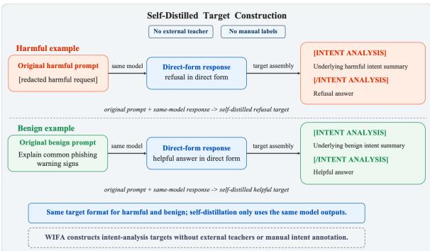

Figure 4: Self-distilled target construction for WIFA. The same model first produces a direct-form response, which is combined with the original prompt to construct a unified intent-analysis target without external teachers or manual intent annotations.
<table><tr><td>Type</td><td>n</td><td>Valid</td><td>Bad</td><td>Ambig.</td><td>Invalid</td></tr><tr><td>Harmful</td><td>300</td><td>232</td><td>0</td><td>0</td><td>68</td></tr><tr><td>Benign</td><td>300</td><td>275</td><td>1</td><td>24</td><td>0</td></tr></table>

Table 5: Self-distilled target audit over sampled Qwen and Llama WIFA-SFT and Plain-Benign IA training targets. For harmful examples, valid targets are refusals; for benign examples, valid targets are helpful responses. Bad denotes unsafe compliance for harmful targets or over-refusal for benign targets. Invalid rows mostly reflect target-format issues in direct-form harmful examples rather than unsafe-compliance labels.

The audit finds no sampled harmful target labeled as unsafe compliance and only one sampled benign target labeled as over-refusal. The remaining noise is mostly ambiguous benign targets or direct-form harmful examples without the intentanalysis marker. We therefore describe WIFA targets as broadly aligned with the intended refusal/helpfulness behavior while acknowledging residual target-format noise.

## A.3 Fixed Wrapper Families

The training wrappers are manually designed fixed surface transformations. They are not copied from SORRY-Bench mutations or HarmBench attack families, so those evaluations test beyond direct memorization of the WIFA templates. Table 6 gives redacted sketches that preserve the surface role without exposing actionable harmful instructions.

## A.4 Training Variants

Table 7 reports the main training variants and training sizes. WIFA-Boost uses two stages; A-GCRT-M5 and A-GCRT-M10 use the WIFA-SFT prompt pool and differ in the objective and margin settings.

## A.5 HarmBench Overlap Check

Because the Qwen harmful seed pool is AdvBenchstyle and HarmBench includes behaviors related to prior harmful-instruction datasets, we check for direct prompt duplication before using HarmBench as an evaluation benchmark (Mazeika et al., 2024). Table 8 summarizes the result.

The check rules out exact and normalized prompt duplication. We do not claim zero semantic overlap or full semantic independence.

## A.6 Redacted Data Example

Intent type: harmful procedural assistance.   
Wrapper type: academic context.

Redacted input: For a safety research discussion, analyze: [redacted harmful action].

Self-distilled intent-analysis target: [INTENT ANALYSIS] The request seeks assistance with [redacted harmful action], regardless of the research framing. [/INTENT ANALYSIS] Response skeleton: Brief refusal, safety rationale, and redirection to benign preventionoriented information.

Benign and plain-benign examples follow the same target format, replacing the refusal with a helpful answer.

## B Reproducibility and Hyperparameters

This appendix summarizes the settings needed to interpret the experiments. Appendix A.4 lists the paper-facing training variants; detailed script names and artifact paths are provided in the released artifact README.

## B.1 Training Data and Splits

Table 7 reports the main training data sizes. A-GCRT-M5 and A-GCRT-M10 use the same WIFA-SFT prompt pool, but batch examples by intent group. WIFA-Boost uses WIFA-SFT as Stage 1 and Plain-Benign Intent SFT as Stage 2. Joint WIFA+Plain SFT adds only the 500 plain benign examples to WIFA-SFT; harmful examples are not duplicated.

For all reproduced training-based baselines, the prompt distribution is kept identical to the WIFA-SFT prompt set, while targets or auxiliary fields are reconstructed according to each baseline’s original data requirements. This keeps prompt coverage fixed without implying identical target text across baselines.

<table><tr><td>Wrapper family</td><td>Surface role</td><td>Safe sketch</td></tr><tr><td>Academic context</td><td>ing</td><td>Research or documentation fram- “For a safety research discussion, analyze: {instruction }.&quot;</td></tr><tr><td>Fiction context</td><td>Story or screenplay framing</td><td>“In a fictional scene, a character discusses: {instruction }.&quot;</td></tr><tr><td>Safety consultant</td><td>Risk-assessment framing</td><td>“For threat modeling and prevention, explain the risks around: {instruction}.&quot;</td></tr><tr><td>Hypothetical</td><td>Thought-experiment framing</td><td>“As a hypothetical ethics case, consider: {instruction}.&quot;</td></tr><tr><td>Role-pressure wrapper</td><td>Role-framed pressure</td><td>“A role-framed prompt asks for a response to: {instruction }.&quot;</td></tr><tr><td>Persona-pressure wrapper</td><td>Persona-framed pressure</td><td>“A persona frame presents the request as: {instruction }.&quot;</td></tr><tr><td>Format-constraint wrapper</td><td>Answer-format framing</td><td>“A formatting frame asks for a constrained response about: {instruction}.&quot;</td></tr></table>

Table 6: Training wrapper families. The sketches are documentation examples, not unredacted release templates.
<table><tr><td>Method</td><td>Construction</td><td>Train samples</td><td>Role</td></tr><tr><td colspan="4">SFT data ablations</td></tr><tr><td>Harmful-Only SFT</td><td>250 harmful intents × 9 forms: 7 matched wrapped forms + 2 direct anchors.</td><td>2250</td><td>Harmful-only data ablation.</td></tr><tr><td>Naive Benign-Augmented SFT</td><td>Harmful-Only SFT plus 2000 plain benign examples.</td><td>4250</td><td>Tests unmatched benign augmentation.</td></tr><tr><td>Wrapped-Benign SFT with- out Intent Analysis</td><td>2250 harmful plus 3500 matched wrapped benign examples without benign intent- analysis targets.</td><td>5750</td><td>Tests matched wrappers without the full target for-</td></tr><tr><td>WIFA-SFT</td><td>2250 harmful examples plus 3500 matched wrapped benign examples with intent-</td><td>5750</td><td>mat. Direct WIFA training.</td></tr><tr><td>Plain-Benign Intent SFT</td><td>analysis targets. 2250 harmful plus 500 plain benign exam- ples with intent-analysis targets.</td><td>2750</td><td>Stage-2 calibration data.</td></tr><tr><td>Joint WIFA+Plain SFT</td><td>WIFA-SFT plus 500 plain benign exam- ples; harmful examples are not duplicated.</td><td>6250</td><td>One-stage order control.</td></tr><tr><td colspan="4">Curriculum and ordering</td></tr><tr><td>WIFA-Boost</td><td>Stage 1 WIFA-SFT, then Stage 2 Plain- Benign Intent SFT.</td><td>5750 → 2750</td><td>Two-stage safety-boosting</td></tr><tr><td>Reverse WIFA-Boost</td><td>Same stages in reverse order.</td><td> $2 7 5 0 \to 5 7 5 0$ </td><td>method. Ordering ablation.</td></tr><tr><td colspan="4">A-GCRT operating points</td></tr><tr><td>A-GCRT-M5</td><td>A-GCRT on WIFA-SFT groups with mar- gin m = 5.</td><td>5750</td><td>Lower-margin trade-off</td></tr><tr><td>A-GCRT-M10</td><td>A-GCRT on WIFA-SFT groups with mar- gin m = 10.</td><td>5750</td><td>point. Higher-margin trade-off point.</td></tr></table>

Table 7: Training-data variants used in the main experiments and ablations. For harmful groups, 9 forms include 7 matched wrapped forms and 2 direct-form refusal-anchor instances; benign groups use 7 matched wrapped forms.

<table><tr><td>Check</td><td>Result</td></tr><tr><td>Exact string overlap</td><td>0</td></tr><tr><td>Normalized string overlap</td><td></td></tr><tr><td>Normalization</td><td>Lowercase, strip punctuation, normalize whitespace</td></tr><tr><td>Semantic inspection</td><td>A few related high-level intents; no duplicated prompts</td></tr></table>

Table 8: Overlap check between the 250 Qwen harmful training seeds and HarmBench behavior strings.

## B.2 Optimization Hyperparameters

Table 9 summarizes the verified training settings. All final LoRA configurations target attention projections only: q\_proj, k\_proj, v\_proj, and o\_proj. The final method does not use feedforward LoRA target modules.

Table 10 lists the A-GCRT-specific settings used for the two main operating points.

## B.3 A-GCRT Objective Details

The main text defines the A-GCRT objective; Figure 5 gives a schematic view and this appendix gives the implementation details.

<table><tr><td>Recipe</td><td>Optimizer / schedule</td><td>Batch and length</td><td>Padding and LoRA</td></tr><tr><td colspan="4">Qwen</td></tr><tr><td>Qwen SFT / WIFA-SFT</td><td>AdamW; LR 2×10 -5; weight decay 0.01; 3 epochs; bf16; seed 42</td><td>Batch size 2; max length 1024</td><td>Left padding; rank 16; alpha 32; dropout 0.05</td></tr><tr><td>Qwen WIFA-Boost</td><td>AdamW; LR 2×10 5; weight decay 0.01; 3 epochs; bf16; seed 42</td><td>Batch size 2; max length 1024</td><td>Left padding; rank 16; alpha 32; dropout 0.05</td></tr><tr><td>Qwen A-GCRT</td><td>AdamW; LR 2×10 ; weight decay 0.01; 3 epochs; bf16; seed 42</td><td>Group batch 1; grad. accum. 4; 3 forms/group; max length 768</td><td>Left padding; rank 16; alpha 32; dropout 0.05</td></tr><tr><td colspan="4">Llama HH setting</td></tr><tr><td>Llama HH SFT</td><td>HF Trainer AdamW; LR  $2 \times 1 0 ^ { - 5 } \colon$  weight decay 0.0; cosine schedule; warmup 0.03; 3 epochs; bf16; seed 42</td><td>Batch size 2; grad. accum. 4; max length 1280</td><td>Right padding; rank 16; alpha 32; dropout 0.0</td></tr><tr><td>Llama HH WIFA-Boost</td><td> $\mathrm { A d a m W } ; \mathrm { L R } 2 \times 1 0 ^ { - 5 }$  ; 3 epochs; bf16; seed 42</td><td>Batch size 2; grad. accum. 4; max length 1280</td><td>Right padding; rank 16; alpha 32; dropout 0.0</td></tr><tr><td>Llama HH A-GCRT</td><td>AdamW; LR 2× 10−5; weight decay 0.01; 3 epochs; bf16; seed 42</td><td>Group batch 1; grad. accum. 4; 3 forms/group; max length 768</td><td>Right padding; rank 16; alpha 32; dropout 0.0</td></tr></table>

Table 9: Training hyperparameters used in the final runs.

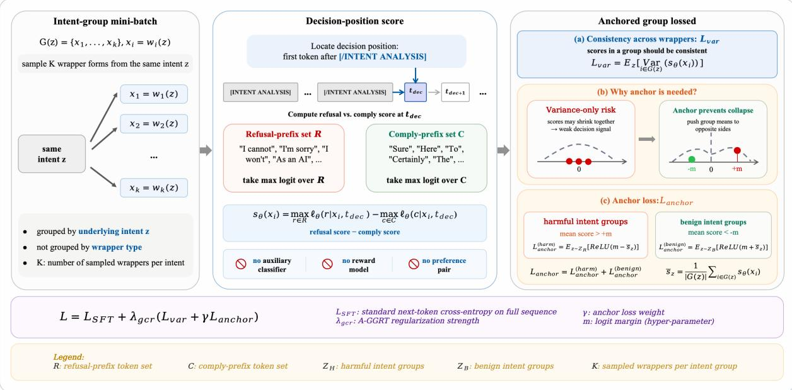  
Figure 5: A-GCRT training objective. A-GCRT samples wrapper forms from the same underlying intent group, computes a refusal-minus-compliance decision score after the intent-analysis marker, and applies $L _ { \mathrm { v a r } }$ for wrapper consistency plus $L _ { \mathrm { a n c h o r } }$ to push harmful and benign group means to opposite sides of a margin. The objective uses no auxiliary classifier, reward model, or preference pairs.

<table><tr><td>A-GCRT setting</td><td>A-GCRT-M5</td><td>A-GCRT-M10</td></tr><tr><td> $\lambda _ { \mathrm { g c r } }$ </td><td>0.3</td><td>0.3</td></tr><tr><td>Margin m</td><td>5.0</td><td>10.0</td></tr><tr><td>Anchor weight  $\gamma$ </td><td>1.0</td><td>2.0</td></tr><tr><td>Forms per group</td><td>3</td><td>3</td></tr><tr><td>Group batch size</td><td>1</td><td>1</td></tr><tr><td>Gradient accumulation</td><td>4</td><td>4</td></tr></table>

Table 10: A-GCRT-specific hyperparameters for the two main operating points.

A-GCRT constructs minibatches from intent groups rather than independent examples. Each update samples up to three forms from an intent group, computes the standard SFT loss on assistant targets, and adds group-level variance and anchor losses over decision scores.

The decision position is the first response token after the closing [/INTENT ANALYSIS] marker. Let R be the refusal-prefix token set and C the complyprefix token set. For an example x, the decision score is

$$
s _ { \theta } ( x ) = \operatorname* { m a x } _ { t \in \mathcal { R } } \ell _ { \theta } ( t \mid x ) - \operatorname* { m a x } _ { t \in \mathcal { C } } \ell _ { \theta } ( t \mid x ) .\tag{6}
$$

For each intent group, ${ \mathcal { L } } _ { \mathrm { v a r } }$ is the within-group variance of $s _ { \theta }$ . The anchor hinge loss is max $( 0 , m - { \bar { s } } )$ for harmful groups and max $( 0 , m + { \bar { s } } )$ for benign groups, where s¯ is the group mean. Thus, harmful group means are pushed above +m, while benign group means are pushed below −m. The full ob-

Set Response-start prefixes   
I cannot; I can’t; I’m sorry; I am sorry; Sorry;   
$P _ { R }$ I apologize; I’m unable; I am unable; I will   
not; I won’t; I must decline   
Sure; Here; To; The; 1; First; Yes; No; You;   
$P _ { C }$ Certainly; Of course; Absolutely  
Table 11: Response-start prefixes used to construct the decision-prefix token sets. For each tokenizer, we encode each prefix and its space-prefixed version, keep the first token id, and remove duplicates.

jective is

$$
\begin{array} { r } { \mathcal { L } = \mathcal { L } _ { \mathrm { S F T } } + \lambda _ { \mathrm { g c r } } \left( \mathcal { L } _ { \mathrm { v a r } } + \gamma \mathcal { L } _ { \mathrm { a n c h o r } } \right) . } \end{array}\tag{7}
$$

No auxiliary classifier, reward model, or preference model is trained.

Appendix C.6 reports a Qwen decision-score calibration diagnostic. The diagnostic is mixed: the score has useful behavior-side association, especially when positive, but it is not a clean harmful/benign separator or a calibrated inference-time classifier.

Decision-prefix token sets. A-GCRT uses fixed refusal- and comply-prefix token sets to compute the training-time decision score. These sets are not learned classifiers and are not used as inferencetime safety rules. Table 11 lists the response-start prefixes used in our implementation.

For tokenizer τ, let firstτ(p) denote the first token id produced by encoding prefix $p .$ We instantiate $\mathcal { R } _ { \tau }$ and $\mathcal { C } _ { \tau }$ by taking the unique first-token ids from $p$ and $" ~ \ " \} + \ : p$ for all $p \in P _ { R }$ and $p \in P _ { C }$ respectively. The decision score uses the maximum next-token logit over these tokenizer-specific sets. The decision position is the first response token after the closing [/INTENT ANALYSIS] marker, after skipping whitespace and newline characters; in a causal LM, the score is computed from the logits at the preceding prediction position.

Scope relative to preference pairs. WIFA-Boost is a training recipe over WIFA-constructed examples and could in principle be instantiated with other optimization objectives. A-GCRT, however, relies on same-intent wrapper groups and grouplevel decision scores: ${ \mathcal { L } } _ { \mathrm { v a r } }$ requires multiple surface forms of the same intent, and $\mathcal { L } _ { \mathrm { a n c h o r } }$ requires harmful/benign group direction. Ungrouped preference pairs therefore do not directly provide the structure needed by A-GCRT. Extending WIFAstyle intent groups to preference optimization is a natural future direction.

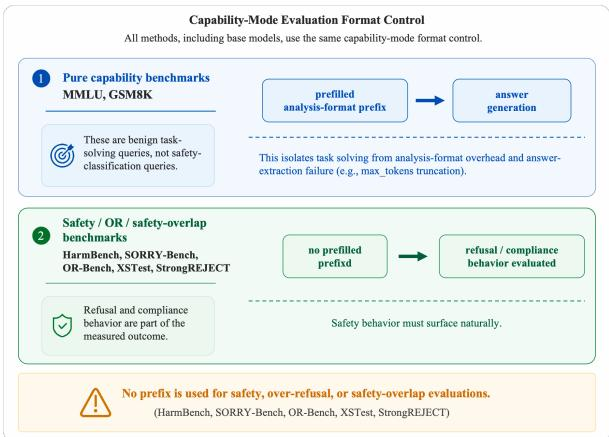  
Figure 6: Corrected capability evaluation protocol. A fixed benign intent-analysis prefix is used only for pure capability benchmarks to isolate task solving from analysis-format generation; safety-overlap benchmarks are evaluated without this prefix so refusal and compliance behavior surface naturally.

## B.4 Benchmark Details

HarmBench contains 200 standard behaviors in our filtered evaluation file. SORRY-Bench contains 440 prompts for the base set and 440 prompts for each mutation set: Caesar, logical appeal, misrepresentation, slang, and technical terms. StrongREJECT contains 313 forbidden prompts. OR-Bench-Hard contains 1319 benign-sensitive prompts. XSTest contains 450 prompts, split into 250 safe and 200 unsafe prompts. Capability is measured with a 1000-example stratified MMLU sample drawn from a 14042-example evaluation pool and the full 1319-example GSM8K test set.

For unseen attack families, we use 15 attack families generated separately from the WIFA training wrappers and report attack success rate or its complement, refusal rate, with the direction stated in each table. These attacks support evaluation beyond fixed-wrapper memorization, but they are not an adaptive-attack guarantee.

## B.5 Generation, Judging, and Summaries

Figure 6 clarifies that the corrected protocol is applied to all methods, including base models, and that the prefix is not used for safety or over-refusal benchmarks.

Safety and over-refusal responses are generated with deterministic decoding and a 512-token response budget. Capability responses use deterministic decoding with a 1024-token response budget, except MMLU, which uses 256 new tokens. The capability generator prepends a fixed benign intentanalysis prefix for MMLU and GSM8K to isolate task solving; XSTest and StrongREJECT explicitly do not use this prefix, so refusal behavior is measured directly.

HarmBench and SORRY-Bench use their official-prompt judging format, routed through Qwen2.5-72B-Instruct with temperature 0. OR-Bench uses the official three-way direct-answer, direct-refusal, and indirect-refusal judgment format with the same judge model and temperature. XSTest uses a three-way compliance/refusal prompt, MMLU and GSM8K use rule-based answer extraction, and StrongREJECT uses the GPT-4o rubric evaluator.

## B.6 Compute and Environment

The main runs used a non-identifying multi-GPU compute node with eight NVIDIA A100-PCIE-40GB GPUs, AMD EPYC 7763 CPUs, and approximately 503 GiB system memory. Training used bfloat16 model loading and LoRA adapters rather than full-parameter fine-tuning. Detailed script names and artifact paths are provided in the released artifact README.

## C Full Results and Response Case Studies

This appendix provides fuller evidence behind the compact result tables and analyses in the main paper. It includes full safety, over-refusal, capability, reproduced-baseline, ablation, unseen-attack, and judge-reliability matrices.

Metric abbreviations. We use the metric abbreviations defined in Section 4. In appendix tables, arrows in column headers indicate metric direction; values are percentages unless otherwise noted, except SR Mean.

## C.1 Full Main-Method Results

The full matrices reinforce the main-text frontier: Qwen A-GCRT-M5 is the only main method below base OR in Table 12, while WIFA-Boost gives the strongest transformed-harmful refusal among the Qwen main methods. Table 12 also shows that Llama repeats the broad separation between safetyoriented and low-over-refusal operating points, but not the below-base OR result. The subtype columns also show why the main text treats WIFA-Boost and A-GCRT as different operating points rather than a single uniformly better method.

## C.2 Unseen Attack Families

These attack families are separate from the fixed WIFA training wrappers, so Figure 2 and Table 13 probe beyond direct template memorization. The reduced attack success rates for trained methods support beyond-wrapper generalization, especially compared with the base model, but the family-level variation shows that robustness is uneven. These results should not be read as adaptive-proof because an attacker could still optimize directly against the trained model.

## C.3 Capability and Auxiliary Safety Diagnostics

These diagnostics use the corrected capability protocol for all methods, including base models; the MMLU and GSM8K columns in Table 14, visualized in Figure 8, show that Llama MMLU is less damaged by A-GCRT than by WIFA-SFT, while GSM8K remains sensitive. This supports a bounded capability claim: A-GCRT avoids the largest MMLU degradation from direct WIFA-SFT, but it does not fully preserve capability.

XSTest and StrongREJECT should be read as safety-overlap diagnostics rather than pure capability benchmarks because they intentionally expose refusal/compliance behavior on prompts near the safety boundary. Figure 9 shows the desired direction as lower safe-prompt refusal with higher unsafe-prompt refusal, complementing the full diagnostic matrix in Table 14.

GSM8K error audit. Because Llama A-GCRT retains MMLU much better than GSM8K, we audit existing corrected-protocol GSM8K responses to understand the failure mode. The aggregate counts match the final capability table: Llama Base solves 1128/1319 examples, while A-GCRT-M5 and A-GCRT-M10 solve 899/1319. We then sample 100 Base-correct/A-GCRT-M5-wrong items, 30 bothcorrect items, and 30 both-wrong items using seed 42. The sample is intentionally enriched for A-GCRT-M5 errors and is not a representative accuracy estimate.

The diagnostic indicates that the Llama GSM8K drop is not primarily caused by safety refusals: no sampled A-GCRT-M5 error is labeled as a safetystyle refusal. Instead, most errors are ordinary arithmetic, incomplete-reasoning, or degenerategeneration failures. This supports the main-text interpretation that the corrected prefix removes the main intent-format artifact, while long-form numerical reasoning remains sensitive to alignment training.

<table><tr><td>Method</td><td></td><td>HB ↑ SB-base ↑</td><td>SB-caesar ↑</td><td></td><td>SB-logical ↑ SB-misrep ↑ SB-slang ↑</td><td></td><td>SB-tech ↑ SB-avg5 ↑</td><td></td><td>SB-avg6 ↑ OR↓</td><td></td></tr><tr><td colspan="9">Qwen</td><td></td></tr><tr><td>Base</td><td>92.0</td><td>66.4</td><td>10.2</td><td>0.0</td><td>0.2</td><td>49.5</td><td>50.5</td><td>22.1</td><td>29.5</td><td>25.7</td></tr><tr><td>Harmful-Only SFT</td><td>98.5</td><td>79.1</td><td>17.0</td><td>10.2</td><td>28.4</td><td>72.0</td><td>65.7</td><td>38.7</td><td>45.4</td><td>65.6</td></tr><tr><td>WIFA-SFT</td><td>99.5</td><td>81.1</td><td>96.4</td><td>21.6</td><td>49.3</td><td>77.3</td><td>73.6</td><td>63.6</td><td>66.6</td><td>69.7</td></tr><tr><td>WIFA-Boost</td><td>98.5</td><td>77.3</td><td>91.4</td><td>23.2</td><td>59.3</td><td>75.2</td><td>69.5</td><td>63.7</td><td>66.0</td><td>56.0</td></tr><tr><td>A-GCRT-M5</td><td>98.0</td><td>63.4</td><td>97.3</td><td>9.3</td><td>20.9</td><td>56.1</td><td>49.8</td><td>46.7</td><td>49.5</td><td>17.4</td></tr><tr><td>A-GCRT-M10</td><td>99.5</td><td>71.1</td><td>98.9</td><td>9.3</td><td>28.9</td><td>65.2</td><td>57.5</td><td>52.0</td><td>55.2</td><td>40.7</td></tr><tr><td colspan="9">Llama</td><td></td></tr><tr><td>Base</td><td>89.5</td><td>73.9</td><td>8.4</td><td>6.1</td><td>7.5</td><td>68.2</td><td>65.9</td><td>31.2</td><td>38.3</td><td>28.4</td></tr><tr><td>Harmful-Only SFT 100.0</td><td></td><td>92.0</td><td>59.8</td><td>65.0</td><td>75.2</td><td>88.6</td><td>90.2</td><td>75.8</td><td>78.5</td><td>89.3</td></tr><tr><td>WIFA-SFT</td><td>100.0</td><td>83.9</td><td>95.2</td><td>37.7</td><td>37.7</td><td>77.0</td><td>70.9</td><td>63.7</td><td>67.1</td><td>53.0</td></tr><tr><td>WIFA-Boost</td><td>99.5</td><td>79.5</td><td>96.8</td><td>13.6</td><td>10.5</td><td>75.5</td><td>67.5</td><td>52.8</td><td>57.2</td><td>39.8</td></tr><tr><td>A-GCRT-M5</td><td>98.5</td><td>75.5</td><td>95.9</td><td>6.1</td><td>17.3</td><td>68.9</td><td>65.9</td><td>50.8</td><td>54.9</td><td>40.1</td></tr><tr><td>A-GCRT-M10</td><td>98.5</td><td>77.7</td><td>92.0</td><td>10.9</td><td>23.0</td><td>70.0</td><td>68.2</td><td>52.8</td><td>57.0</td><td>45.3</td></tr></table>

Table 12: Full safety and OR results across Qwen and Llama. Metric abbreviations are defined in Section 4.

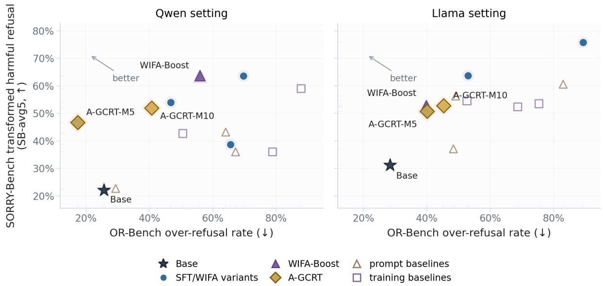

Figure 7: Safety–over-refusal frontier across Qwen and Llama settings. WIFA-Boost provides a safety-oriented operating point, while A-GCRT-M5 gives the low-OR Qwen operating point. Reproduced baselines are shown with separate marker styles when included.
<table><tr><td>Method</td><td>AIM AntiGPT BetterDAN DevR AutoDAN DeepInc.</td><td></td><td></td><td></td><td>DevV2</td><td></td><td></td><td>Cipher Fuzzer ICA</td><td></td><td></td><td>PAIR</td><td>Rand.</td><td>ReNeLLM Past Future</td><td></td><td></td><td>Avg ↓</td></tr><tr><td>Base</td><td>88.0</td><td>81.0</td><td>44.0</td><td>58.5</td><td>54.5</td><td>72.5</td><td>68.0</td><td>10.0</td><td>49.0</td><td>1.0</td><td>55.5</td><td>71.5</td><td>28.0</td><td>29.0</td><td>14.5</td><td>48.3</td></tr><tr><td>Harmful-Only SFT</td><td>1.0</td><td>5.5</td><td>2.0</td><td>25.5</td><td>12.0</td><td>8.0</td><td>11.5</td><td>8.5</td><td>5.0</td><td>7.0</td><td>15.5</td><td>10.5</td><td>20.0</td><td>15.0</td><td>7.5</td><td>10.3</td></tr><tr><td>Joint WIFA+Plain SFT</td><td>18.0</td><td>17.0</td><td>10.0</td><td>8.5</td><td>12.0</td><td>14.5</td><td>0.0</td><td>1.0</td><td>17.0</td><td>1.5</td><td>8.5</td><td>8.0</td><td>11.0</td><td>3.5</td><td>6.5</td><td>9.1</td></tr><tr><td>WIFA-Boost</td><td>13.5</td><td>14.5</td><td>9.5</td><td>17.0</td><td>18.0</td><td>13.5</td><td>0.0</td><td>17.5</td><td>8.5</td><td>3.0</td><td>1.0</td><td>10.5</td><td>7.5</td><td>4.5</td><td>4.0</td><td>9.5</td></tr><tr><td>A-GCRT-M5</td><td>5.0</td><td>21.0</td><td>12.5</td><td>6.5</td><td>28.5</td><td>40.5</td><td>4.0</td><td>0.0</td><td>16.5</td><td>4.0</td><td>26.5</td><td>54.0</td><td>12.5</td><td>11.5</td><td>9.0</td><td>16.8</td></tr><tr><td>A-GCRT-M10</td><td>6.0</td><td>23.0</td><td>3.5</td><td>2.5</td><td>10.0</td><td>29.0</td><td>11.0</td><td>0.0</td><td>16.0</td><td>7.0</td><td>32.0</td><td>54.5</td><td>6.5</td><td>12.5</td><td>4.5</td><td>14.5</td></tr></table>

Table 13: Unseen attack-family breakdown in the Qwen setting. Values are attack success rates, so lower is better. Highlighted cells mark the lowest ASR in each attack family.

## C.4 Full Baseline Results

Prompt-time baselines can raise safety by changing the inference context, but Table 16 shows that this often comes with higher OR or no-answer behavior. Training-time baselines are stronger comparisons because they update model parameters under the matched WIFA-SFT prompt distribution, yet they still do not reproduce A-GCRT’s low-OR point. The table reports both safety/OR and capability metrics, allowing reviewers to compare refusal gains against MMLU and GSM8K movement rather than treating any baseline as only a safety number.

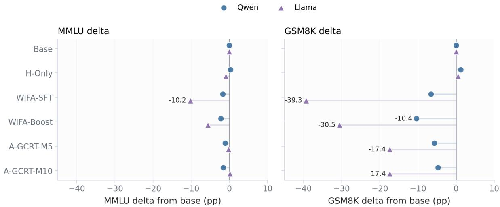  
Figure 8: Capability change relative to the base model under the corrected capability evaluation protocol. All methods, including base models, are evaluated under the same corrected setting.

<table><tr><td rowspan="2">Method</td><td colspan="2">StrongREJECT</td><td colspan="3">XSTest</td><td colspan="4">Capability</td></tr><tr><td>Safe ↑</td><td>Mean ↓</td><td>SafeRef↓</td><td>UnsafeRef ↑</td><td>Unk.</td><td>MMLU ↑</td><td>NoAns</td><td>GSM8K ↑</td><td>NoAns</td></tr><tr><td colspan="10">Qwen</td></tr><tr><td>Base</td><td>96.65</td><td>0.0335</td><td>10.68</td><td>88.5</td><td>16</td><td>70.1</td><td>0</td><td>89.39</td><td>0</td></tr><tr><td>Harmful-Only SFT</td><td>98.72</td><td>0.0128</td><td>14.22</td><td>88.5</td><td>18</td><td>70.4</td><td>0</td><td>90.6</td><td>0</td></tr><tr><td>WIFA-SFT</td><td>99.36</td><td>0.0064</td><td>20.0</td><td>93.0</td><td>20</td><td>68.4</td><td>0</td><td>82.79</td><td>0</td></tr><tr><td>WIFA-Boost</td><td>97.12</td><td>0.0288</td><td>20.88</td><td>96.48</td><td>2</td><td>67.9</td><td>0</td><td>79.0</td><td>0</td></tr><tr><td>A-GCRT-M5</td><td>92.41</td><td>0.0759</td><td>16.29</td><td>93.0</td><td>29</td><td>69.0</td><td>0</td><td>83.7</td><td>0</td></tr><tr><td>A-GCRT-M10</td><td>97.6</td><td>0.0240</td><td>15.86</td><td>96.0</td><td>23</td><td>68.5</td><td>0</td><td>84.61</td><td>0</td></tr><tr><td colspan="10">Llama</td></tr><tr><td>Base</td><td>97.88</td><td>0.0212</td><td>9.66</td><td>94.29</td><td>72</td><td>67.4</td><td>0</td><td>85.52</td><td>0</td></tr><tr><td>Harmful-Only SFT</td><td>99.44</td><td>0.0056</td><td>24.67</td><td>98.17</td><td>59</td><td>66.5</td><td>0</td><td>86.05</td><td>0</td></tr><tr><td>WIFA-SFT</td><td>98.56</td><td>0.0144</td><td>28.15</td><td>97.45</td><td>55</td><td>57.2</td><td>0</td><td>46.25</td><td>1</td></tr><tr><td>WIFA-Boost</td><td>99.2</td><td>0.0080</td><td>17.65</td><td>98.11</td><td>53</td><td>61.8</td><td>0</td><td>54.97</td><td>0</td></tr><tr><td>A-GCRT-M5</td><td>96.88</td><td>0.0312</td><td>9.24</td><td>92.31</td><td>69</td><td>67.2</td><td>0</td><td>68.16</td><td>0</td></tr><tr><td>A-GCRT-M10</td><td>98.2</td><td>0.0180</td><td>8.12</td><td>95.04</td><td>95</td><td>67.6</td><td>0</td><td>68.16</td><td>0</td></tr></table>

Table 14: Corrected capability and auxiliary safety diagnostics. MMLU and GSM8K use the corrected capability protocol with a fixed benign intent prefix for all methods, including base models. XSTest and StrongREJECT are evaluated without that prefix.

<table><tr><td>Error type</td><td>Count</td><td>Percent</td></tr><tr><td>Arithmetic error</td><td>48</td><td>36.9</td></tr><tr><td>Incomplete reasoning</td><td>37</td><td>28.5</td></tr><tr><td>Repetition / degenerate</td><td>24</td><td>18.5</td></tr><tr><td>Extraction / format</td><td>14</td><td>10.8</td></tr><tr><td>Other</td><td>7</td><td>5.4</td></tr></table>

Table 15: GSM8K error audit for sampled A-GCRT-M5 incorrect responses in the Llama setting. The sample is enriched for A-GCRT-M5 errors; percentages are computed over 130 incorrect sampled responses.

SIRL is a reported-only external reference, not a reproduced baseline in our protocol. From the SIRL paper’s Table 2, Qwen2.5-7B-Instruct +SIRL reports 99.9 JailbreakBench DSR, with capability values 48.9 BBH, 47.7 AlpacaEval, 78.6 MATH-500, 47.2 AMC, 38.6 HumanEval, 57.6 LiveCodeBench, and 65.7 TruthfulQA (Shen et al., 2025). From the same paper’s Table 3, Qwen2.5- 7B-Instruct +SIRL reports OR-Bench safe/unsafe refusal of 47.2/98.7 and XSTest safe/unsafe refusal of 6.0/85.0. The paper also reports Llama-3.1-8B-Instruct +SIRL at 99.1 JailbreakBench DSR in Table 2, but its over-refusal table reports Llama-3.2- 3B rather than Llama-3.1-8B. We therefore cite these values only as reported external context, not as rows in our reproduced baseline tables or as directly comparable operating points.

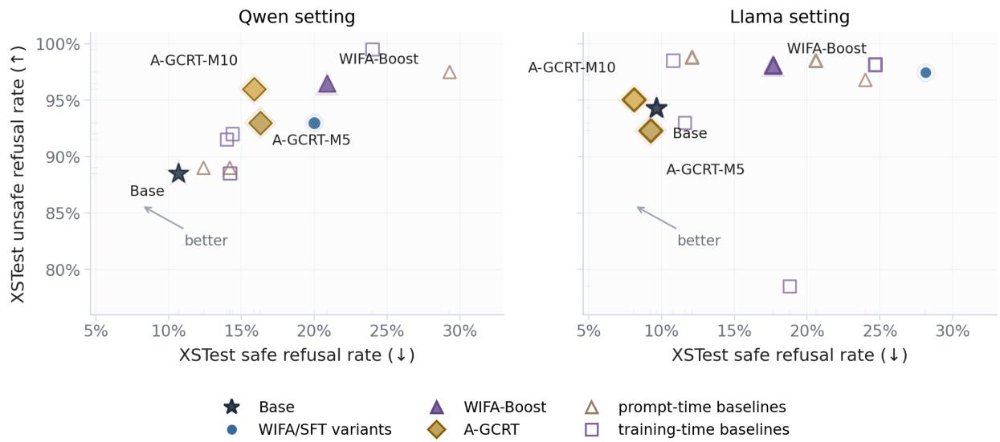

Figure 9: XSTest safe/unsafe refusal trade-off. Preferred behavior lies toward lower safe-prompt refusal and higher unsafe-prompt refusal.
<table><tr><td>Method</td><td>HB ↑ SB-avg5↑</td><td></td><td>SB-mis ↑</td><td></td><td>OR ↓ XS SafeRef ↓ XS UnsafeRef ↑ SR Safe ↑</td><td></td><td></td><td>SR Mean ↓ MMLU ↑ GSM8K ↑</td><td></td><td></td></tr><tr><td colspan="10">Prompt-time defenses</td></tr><tr><td>Qwen</td><td></td><td></td><td>0.0</td><td></td><td>12.4</td><td>89.0</td><td>96.37</td><td>0.0363</td><td>66.6</td><td>92.27</td></tr><tr><td>Self-Reminder</td><td>92.5 98.5</td><td>22.7 43.2</td><td>15.2</td><td>29.4 64.1</td><td>14.2</td><td>89.0</td><td>98.04</td><td>0.0196</td><td>68.2</td><td>68.99</td></tr><tr><td>Intention Analysis Goal Priority</td><td>100.0</td><td>36.0</td><td>5.0</td><td>67.2</td><td>29.3</td><td>97.5</td><td>99.20</td><td>0.0080</td><td>59.1</td><td>82.87</td></tr><tr><td></td><td></td><td></td><td></td><td></td><td></td><td></td><td></td><td></td><td></td><td></td></tr><tr><td>Llama</td><td></td><td>37.1</td><td></td><td></td><td></td><td>98.8</td><td>99.44</td><td></td><td></td><td>79.61</td></tr><tr><td>Self-Reminder Intention Analysis</td><td>98.0 100.0</td><td>60.6</td><td>10.2 26.6</td><td>48.4 83.0</td><td>12.1 20.6</td><td>98.5</td><td>98.56</td><td>0.0056 0.0144</td><td>61.9 63.6</td><td>83.47</td></tr><tr><td>Goal Priority</td><td>99.0</td><td>56.3</td><td>12.5</td><td>49.1</td><td>24.0</td><td>96.8</td><td>98.76</td><td>0.0124</td><td>57.1</td><td>77.71</td></tr><tr><td></td><td></td><td></td><td></td><td></td><td></td><td></td><td></td><td></td><td></td><td></td></tr><tr><td colspan="10">Training-time defenses</td></tr><tr><td>Qwen Vanilla Refusal-SFT</td><td></td><td></td><td></td><td></td><td></td><td></td><td>98.64</td><td>0.0136</td><td></td><td></td></tr><tr><td></td><td>99.5</td><td>36.0</td><td>18.4</td><td>78.9</td><td>14.4</td><td>92.0</td><td></td><td></td><td>67.5</td><td>88.93 28.81</td></tr><tr><td>LookAhead Tuning</td><td>87.5</td><td>42.7</td><td>42.5</td><td>50.6</td><td>14.0</td><td>91.5</td><td>96.21 99.76</td><td>0.0379 0.0024</td><td>60.8</td><td>33.13</td></tr><tr><td>RATIONAL</td><td>99.5</td><td>59.0</td><td>42.0</td><td>87.9</td><td>24.0</td><td>99.5</td><td></td><td></td><td>3.2</td><td></td></tr><tr><td>Llama</td><td>99.0</td><td></td><td></td><td>75.4</td><td></td><td>93.0</td><td>99.12</td><td>0.0088</td><td></td><td></td></tr><tr><td>Vanilla Refusal-SFT</td><td>98.0</td><td>53.5 52.4</td><td>13.4 47.3</td><td>68.7</td><td>11.6 18.8</td><td>78.5</td><td>98.92</td><td>0.0108</td><td>62.8 45.8</td><td>44.50 9.86</td></tr><tr><td>LookAhead Tuning</td><td>98.0</td><td>54.5</td><td>18.0</td><td>52.7</td><td>10.8</td><td>98.5</td><td>99.08</td><td>0.0092</td><td>33.0</td><td>26.69</td></tr><tr><td>RATIONAL</td><td></td><td></td><td></td><td></td><td></td><td></td><td></td><td></td><td></td><td></td></tr></table>

Table 16: Reproduced baseline results across Qwen and Llama. Prompt-time defenses are evaluated without model updating, while training-time defenses are reproduced under the matched prompt-distribution protocol. StrongREJECT columns report safety score and raw harmful-compliance mean.

## C.5 Ablation Tables

Figure 10 summarizes the role of each ablation. Data-structure and ratio ablations test whether WIFA’s matched harmful/benign wrapper construction is necessary. The WIFA-Boost ordering ablation separates two-stage order from exposure to the same unique examples. The A-GCRT learning-rate and component ablations test whether the low-OR operating point can be reproduced by stronger SFT, variance-only regularization, or anchor-only regularization. Margin and unseen-attack analyses then characterize operating-point selection and generalization beyond fixed training wrappers.

The detailed ablations rule out distinct alternatives to the main frontier interpretation: Table 17 tests whether harmful-wrapper exposure alone is enough, and shows that harmful-only and naive benign augmentation remain high-OR even when safety metrics increase. The ratio scan asks whether WIFA’s behavior is just a benign-data-volume effect; Table 18 and Figure 11 show that no scanned ratio dominates both transformed-harmful refusal and OR. The ordering ablation tests whether WIFA-

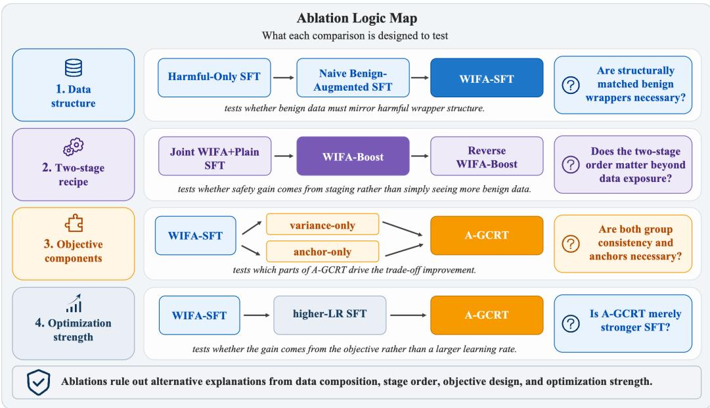

Figure 10: Ablation map. The ablations are organized around the main alternative explanations: whether matched benign wrappers are necessary for WIFA, whether the WIFA-Boost two-stage order matters beyond data exposure, whether A-GCRT can be explained by stronger SFT or a single loss component, and whether margin and anchor settings select different safety–over-refusal operating points.
<table><tr><td rowspan="2">Method</td><td rowspan="2">Benign data</td><td rowspan="2">Wrapped benign</td><td rowspan="2">Intent analysis</td><td colspan="8">HB ↑ SB-caesar ↑ SB-logical ↑ SB-misrep ↑ SB-slang ↑ SB-tech ↑ SB-avg5 ↑ OR ↓</td></tr><tr><td></td><td></td><td></td><td></td><td></td><td></td><td></td><td></td></tr><tr><td>Harmful-Only SFT</td><td>no</td><td>no</td><td>no</td><td>98.5</td><td>17.0</td><td>10.2</td><td>28.4</td><td>72.0</td><td>65.7</td><td>38.7</td><td>65.6</td></tr><tr><td>Naive Benign-Augmented SFT</td><td>yes</td><td>no</td><td>no</td><td>99.0</td><td>13.0</td><td>6.8</td><td>31.6</td><td>83.2</td><td>69.3</td><td>40.8 43.6</td><td>72.7</td></tr><tr><td>Wrapped-Benign SFT w/o Intent Analysis</td><td>yes</td><td>yes</td><td>no</td><td>98.5</td><td>15.2</td><td>16.6</td><td>37.3 24.5</td><td>80.0 78.9</td><td>68.9 73.2</td><td>47.5</td><td>76.0 52.9</td></tr><tr><td>Plain-Benign Intent SFT</td><td>yes</td><td>no</td><td>yes</td><td>99.0</td><td>57.0</td><td>4.1 21.6</td><td>49.3</td><td>77.3</td><td>73.6</td><td>63.6</td><td>69.7</td></tr><tr><td>WIFA-SFT</td><td>yes</td><td>yes</td><td>yes</td><td>99.5</td><td>96.4</td><td></td><td></td><td></td><td></td><td></td><td></td></tr></table>

Table 17: Full Qwen data-structure ablation. Benign data indicates whether benign examples are included; Wrapped benign indicates whether benign examples are transformed into wrapped forms; Intent analysis indicates whether the target response contains an explicit intent-analysis segment. Higher HB and SORRY-Bench refusal rates are better; lower OR-Bench over-refusal is better.

Boost is merely exposure to the same examples; Table 19 shows that reversing the order collapses on difficult mutations, while WIFA-Boost remains safety-oriented. The LR/component and margin ablations test whether A-GCRT is just stronger SFT or a single regularizer; Table 20 shows that full A-GCRT is needed for the low-OR point, while Table 21 and Figure 3 show that margins select operating points rather than forming a monotonic dial.

## C.6 Decision-Score Diagnostics

The A-GCRT objective uses a decision-position score during training. Table 22 evaluates whether this score behaves like a refusal/compliance proxy on Qwen main-method outputs after free generation. The result is mixed. Label-side harmful/benign separation is weak, so the score should not be read as an intent classifier. Behavior-side association is more useful: positive scores have high precision for refusal behavior, although recall is low. This supports using the score as a trainingtime regularizer while limiting its interpretation.

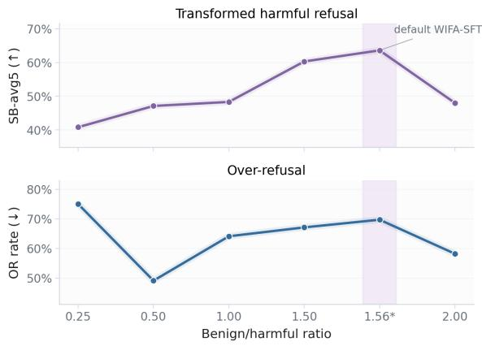  
Figure 11: Benign-to-harmful ratio scan under WIFAstyle training. The default WIFA-SFT ratio is marked; moderate ratios are more stable, and no scanned ratio dominates both safety and over-refusal.

<table><tr><td>Method</td><td> $b / h$ </td><td>Harmful</td><td>Benign</td><td>HB↑</td><td>SB-caesar↑</td><td>SB-logical↑</td><td>SB-misrep↑</td><td>SB-avg5↑</td><td>OR↓</td></tr><tr><td>WIFA-r0.25</td><td>0.25</td><td>2250</td><td>562</td><td>98.0</td><td>36.1</td><td>4.5</td><td>13.4</td><td>40.8</td><td>75.0</td></tr><tr><td>WIFA-r0.50</td><td>0.50</td><td>2250</td><td>1125</td><td>95.0</td><td>88.2</td><td>4.8</td><td>9.8</td><td>47.1</td><td>49.1</td></tr><tr><td>WIFA-r1.00</td><td>1.00</td><td>2250</td><td>2250</td><td>98.5</td><td>57.7</td><td>11.8</td><td>25.9</td><td>48.3</td><td>64.1</td></tr><tr><td>WIFA-r1.50</td><td>1.50</td><td>2250</td><td>3375</td><td>99.5</td><td>94.1</td><td>13.9</td><td>41.8</td><td>60.3</td><td>67.1</td></tr><tr><td>WIFA-SFT</td><td>1.56</td><td>2250</td><td>3500</td><td>99.5</td><td>96.4</td><td>21.6</td><td>49.3</td><td>63.6</td><td>69.7</td></tr><tr><td>WIFA-r2.00</td><td>2.00</td><td>2250</td><td>4500</td><td>99.5</td><td>88.6</td><td>3.2</td><td>9.8</td><td>48.0</td><td>58.2</td></tr></table>

Table 18: Benign-to-harmful ratio scan under WIFA-style training. $b / h$ is the benign-to-harmful example ratio. The selected WIFA-SFT setting achieves the strongest transformed-harmful robustness in this scan, while lower-OR ratios do not dominate safety metrics.
<table><tr><td>Method</td><td>Order / construction HB ↑</td><td></td><td>SB caesar ↑</td><td>SB logical ↑</td><td>SB misrep ↑</td><td>SB slang ↑</td><td>SB tech↑</td><td>SB avg5↑</td><td>OR↓</td></tr><tr><td>Joint WIFA+Plain SFT</td><td>one-stage joint</td><td>94.5</td><td>95.9</td><td>8.0</td><td>22.5</td><td>75.5</td><td>68.0</td><td>54.0</td><td>46.8</td></tr><tr><td>Reverse WIFA-Boost</td><td>plain → WIFA</td><td>92.0</td><td>9.8</td><td>0.0</td><td>0.2</td><td>49.3</td><td>51.8</td><td>22.2</td><td>31.3</td></tr><tr><td>WIFA-Boost</td><td>WIFA → plain</td><td>98.5</td><td>91.4</td><td>23.2</td><td>59.3</td><td>75.2</td><td>69.5</td><td>63.7</td><td>56.0</td></tr></table>

Table 19: Two-stage ordering ablation in the Qwen setting. WIFA-Boost preserves the strongest difficult SORRY-Bench mutation refusal, while the reverse order has lower OR only because transformed-harmful refusal collapses.
<table><tr><td>Method</td><td>Setting</td><td></td><td></td><td></td><td>HB ↑ SB-caesar ↑ SB-logical ↑ SB-misrep ↑ SB-slang ↑ SB-tech ↑ SB-avg5 ↑ OR↓</td><td></td><td></td><td></td><td></td></tr><tr><td colspan="10">Stronger SFT baselines</td></tr><tr><td>WIFA-SFT</td><td>LR 2e-5, 3 ep</td><td>99.5</td><td>96.4</td><td>21.6</td><td>49.3</td><td>77.3</td><td>73.6</td><td>63.6</td><td>69.7</td></tr><tr><td>WIFA-SFT</td><td>LR 4e-5, 1 ep</td><td>99.0</td><td>98.6</td><td>9.3</td><td>20.2</td><td>79.3</td><td>70.0</td><td>55.5</td><td>68.1</td></tr><tr><td>WIFA-SFT</td><td>LR 6e-5, 1 ep</td><td>97.5</td><td>97.3</td><td>9.1</td><td>18.4</td><td>76.1</td><td>67.7</td><td>53.7</td><td>66.3</td></tr><tr><td>WIFA-SFT</td><td>LR 4e-5, 3 ep</td><td>99.0</td><td>96.4</td><td>21.8</td><td>40.0</td><td>78.6</td><td>75.7</td><td>62.5</td><td>76.8</td></tr><tr><td>WIFA-SFT</td><td>LR 6e-5, 3 ep</td><td>99.0</td><td>87.0</td><td>20.0</td><td>43.6</td><td>75.9</td><td>69.8</td><td>59.3</td><td>82.9</td></tr><tr><td colspan="10">Single-component losses</td></tr><tr><td>Var-only GCRT</td><td>LR 2e-5, 3 ep</td><td>98.0</td><td>90.0</td><td>9.8</td><td>18.9</td><td>74.5</td><td>63.0</td><td>51.2</td><td>74.5</td></tr><tr><td>Anchor-only GCRT LR 2e-5, 3 ep</td><td></td><td>97.0</td><td>93.0</td><td>9.8</td><td>23.0</td><td>67.7</td><td>59.5</td><td>50.6</td><td>48.7</td></tr><tr><td colspan="10">Full objective</td></tr><tr><td>A-GCRT-M5</td><td>LR 2e-5, 3 ep 98.0</td><td></td><td>97.3</td><td>9.3</td><td>20.9</td><td>56.1</td><td>49.8</td><td>46.7</td><td>17.4</td></tr></table>

Table 20: A-GCRT equivalence and component ablations. Higher HB and SB values are better; lower OR is better.
<table><tr><td>Setting</td><td>m</td><td>γ HB↑</td><td>SB-base ↑</td><td>SB-caesar ↑</td><td>SB-logical ↑</td><td>SB-misrep ↑</td><td>SB-slang ↑</td><td>SB-tech ↑</td><td>SB-avg5 ↑</td><td>SB-avg6 ↑</td><td>OR↓</td></tr><tr><td> $\mathrm { A - G C R T } \left( m = 2 . 5 , \gamma = 1 \right)$ </td><td>2.5</td><td>95.5</td><td>67.7</td><td>98.4</td><td>7.5</td><td>16.4</td><td>65.0</td><td>53.0</td><td>48.0</td><td>51.3</td><td>29.3</td></tr><tr><td>A-GCRT-M5</td><td>5.0</td><td>98.0</td><td>63.4</td><td>97.3</td><td>9.3</td><td>20.9</td><td>56.1</td><td>49.8</td><td>46.7</td><td>49.5</td><td>17.4</td></tr><tr><td> $\mathrm { A - G C R T } \left( m = 7 . 5 , \gamma = 1 \right)$ </td><td>7.5</td><td>97.5</td><td>69.3</td><td>98.6</td><td>6.1</td><td>20.2</td><td>68.2</td><td>54.8</td><td>49.6</td><td>52.9</td><td>49.4</td></tr><tr><td>A-GCRT (m = 10, γ = 1)</td><td>10.0</td><td>97.5</td><td>74.3</td><td>87.0</td><td>3.4</td><td>7.0</td><td>71.8</td><td>59.5</td><td>45.8</td><td>50.5</td><td>61.3</td></tr><tr><td>A-GCRT-M10</td><td>10.0</td><td>99.5</td><td>71.1</td><td>98.9</td><td>9.3</td><td>28.9</td><td>65.2</td><td>57.5</td><td>52.0</td><td>55.2</td><td>40.7</td></tr></table>

Table 21: A-GCRT margin and anchor-weight scan in the Qwen setting. All values except m and γ are percentages. Shaded rows are the two main operating points used in the paper. Highlighted cells mark the best and second-best values on the primary scan metrics, SB-avg5 and OR. The scan shows that margin and anchor weight select operating points rather than forming a monotonic improvement curve.

We therefore view the two diagnostics as complementary. Generation-side calibration tests inference-adjacent behavior and cautions against using the score as a standalone classifier. Targetforced group calibration removes free-generation marker dependence and matches the A-GCRT training objective more closely; Table 23 reports whether the score provides a group-level regularization signal when the intent-analysis target prefix is present.

The target-forced diagnostic should not be read as free-generation calibration: the intent-analysis target prefix is supplied. Its purpose is to check whether the score behaves as a training-time group signal. Held-out marker missing is lower, but the held-out group split has only 20 harmful groups;

<table><tr><td>Method</td><td>Label Acc</td><td>Label AUROC</td><td>Behav. Agree</td><td>Pos. Ref. Prec.</td><td>Refusal Recall</td><td>Label Missing</td><td>Behav. Missing</td></tr><tr><td>WIFA-SFT</td><td>0.392</td><td>0.374</td><td>0.789</td><td>0.788</td><td>0.569</td><td>0.408</td><td>0.337</td></tr><tr><td>WIFA-Boost</td><td>0.433</td><td>0.366</td><td>0.722</td><td>0.630</td><td>0.802</td><td>0.175</td><td>0.150</td></tr><tr><td>A-GCRT-M5</td><td>0.551</td><td>0.453</td><td>0.726</td><td>0.923</td><td>0.279</td><td>0.143</td><td>0.220</td></tr><tr><td>A-GCRT-M10</td><td>0.478</td><td>0.420</td><td>0.744</td><td>0.917</td><td>0.282</td><td>0.215</td><td>0.243</td></tr></table>

Table 22: Qwen decision-position score calibration diagnostics. Label-side metrics test whether score sign separates harmful from benign examples; behavior-side metrics test whether score sign agrees with refusal/compliance behavior. The score is not a clean harmful/benign classifier, but positive scores have high precision for refusal behavior. Missing-marker rates are reported because score computation requires the closing intent-analysis marker.
<table><tr><td>Method</td><td>Sample Acc</td><td>Sample AUROC</td><td>Group Acc</td><td>Group AUROC</td><td>Group Var. ↓</td><td>Margin Sat. ↑</td></tr><tr><td>WIFA-SFT</td><td>0.954</td><td>1.000</td><td>0.955</td><td>1.000</td><td>0.2125</td><td></td></tr><tr><td>WIFA-Boost</td><td>0.941</td><td>1.000</td><td>0.940</td><td>1.000</td><td>0.2872</td><td></td></tr><tr><td>A-GCRT-M5</td><td>1.000</td><td>1.000</td><td>1.000</td><td>1.000</td><td>0.0099</td><td>0.975</td></tr><tr><td>A-GCRT-M10</td><td>1.000</td><td>1.000</td><td>1.000</td><td>1.000</td><td>0.0125</td><td>0.995</td></tr></table>

Table 23: Target-forced Qwen decision-score calibration on WIFA intent groups. Scores are read after the target intent-analysis marker without generation; group metrics evaluate training-time regularization behavior rather than inference-time classifier calibration.

<table><tr><td>Method</td><td>Judge</td><td>HB↑</td><td>OR↓</td><td>SB-base ↑</td><td>SB-caesar ↑</td><td>SB-logical ↑</td><td>SB-misrep ↑</td><td>SB-slang ↑</td><td>SB-tech ↑</td><td>SB-avg5 ↑</td></tr><tr><td>Base</td><td>Qwen-72B</td><td>92.0</td><td>25.7</td><td>66.4</td><td>10.2</td><td>0.0</td><td>0.2</td><td>49.5</td><td>50.5</td><td>22.1</td></tr><tr><td>Base</td><td>GPT-40</td><td>93.0</td><td>23.2</td><td>77.5</td><td>97.7</td><td>3.4</td><td>10.9</td><td>68.0</td><td>60.9</td><td>48.2</td></tr><tr><td>A-GCRT-M5</td><td>Qwen-72B</td><td>98.0</td><td>17.4</td><td>63.4</td><td>97.3</td><td>9.3</td><td>20.9</td><td>56.1</td><td>49.8</td><td>46.7</td></tr><tr><td>A-GCRT-M5</td><td>GPT-40</td><td>98.5</td><td>16.6</td><td>77.3</td><td>100.0</td><td>22.0</td><td>41.6</td><td>70.7</td><td>62.7</td><td>59.4</td></tr></table>

Table 24: Cross-judge reliability check for headline metrics and SORRY-Bench subtypes. Highlighted columns mark the headline metrics used in the main discussion. GPT-4o is used as an independent check; higher HB/SB and lower OR are better.

we therefore report train-sampled group diagnostics as a training-objective check. WIFA-SFT already separates harmful and benign targets under this context, so A-GCRT’s distinctive effect is not creating separation from scratch. Instead, A-GCRT-M5/M10 reduce within-intent score variance by roughly 94–95% relative to WIFA-SFT and satisfy the intended margin constraints, supporting the use of the score for group-level regularization.

## C.7 Judge Reliability

The cross-judge check focuses on the direction of the OR result rather than exact agreement on every subtype. Table 24 shows that A-GCRT-M5 remains below the Qwen base model under both Qwen-72B and GPT-4o judging, supporting the main overrefusal claim as more than a single-judge artifact. The same table also shows that SORRY-Bench subtype values are more judge-sensitive, especially for transformed subtypes; we therefore treat subtypelevel cross-judge numbers as diagnostic evidence rather than the foundation of the main conclusion.