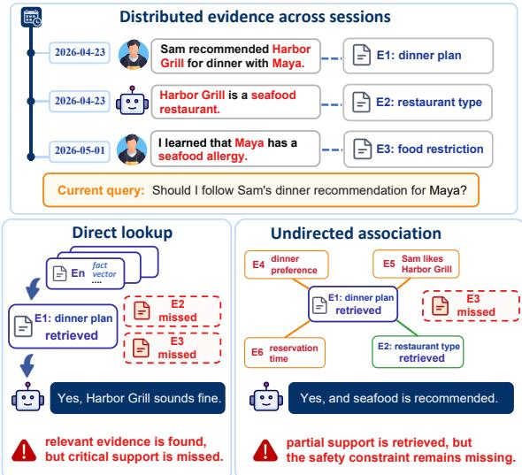
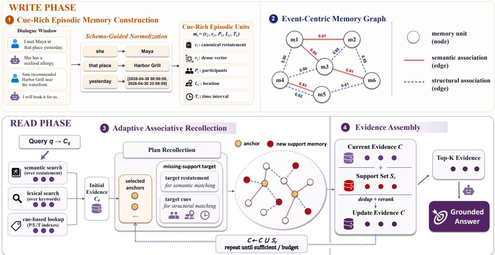
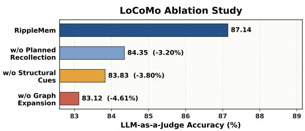
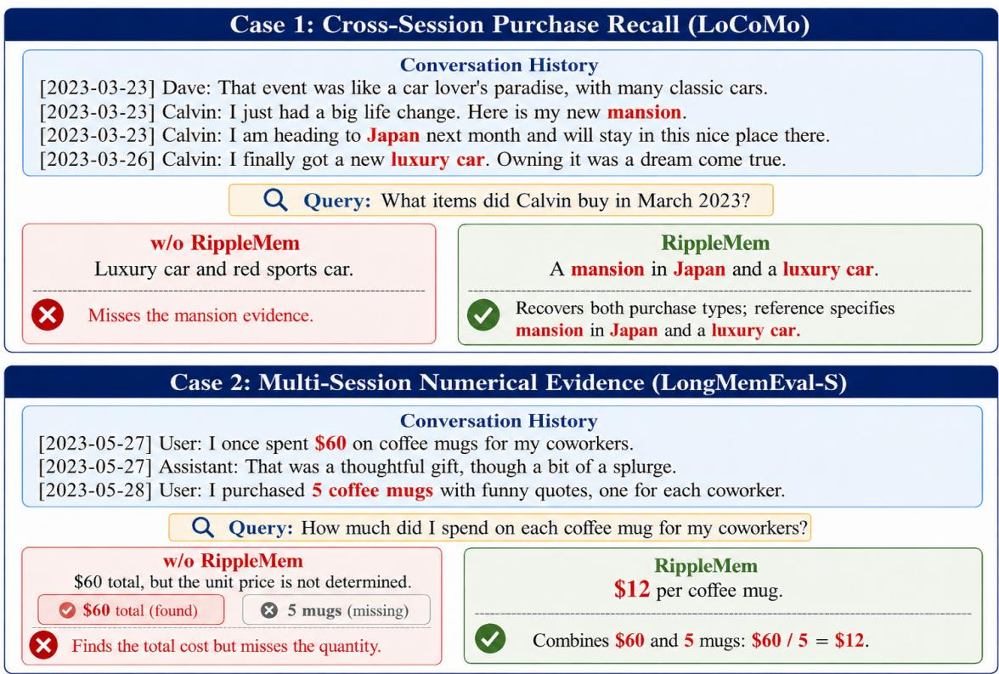

# RippleMem: From Isolated Retrieval to Associative Recollection for Long-Term Agent Memory

Jingbo Ji1 Lingyi Li2 Xilong Cheng1 Yuhao Zhou1

Wenji Zhang1 Yuting Tan1 Yunxiao Qin1,3,

1Communication University of China, Beijing, China.

2 Zhilian Yinghe Technology Co., Ltd., Beijing, China

3State Key Laboratory of Media Convergence and Communication, Beijing, China cocomilk23@mails.cuc.edu.cn, qinyunxiao@cuc.edu.cn

## Abstract

LLM-based agents increasingly rely on external memory to support long-horizon reasoning and interaction. However, the main bottleneck is not simply storing past experience, but recovering the right set of evidence when relevant information is distributed across many interactions. Existing approaches struggle with this access problem. Full-context methods require noisy long-context search, flat retrieval often returns isolated and incomplete records, and graph-based memory systems can be expensive to construct while compressing rich event context. We introduce RippleMem, a longterm memory system that replaces one-shot retrieval with adaptive associative recollection. Inspired by cue-dependent episodic retrieval and associative completion, RippleMem stores interaction history as cue-rich episodic memory units and organizes them in an event-centric memory graph. Given a query, it first recalls relevant memory anchors through hybrid cues, then expands from these anchors along semantic and structural associations to recover missing supporting evidence. In this way, initially recalled memories serve not only as answer context, but also as cues for completing the evidence needed to answer. Experiments on LoCoMo and LongMemEval-S show that Rip pleMem achieves the best overall performance across evaluated settings, improving LLM-asa-Judge accuracy by 3.95% on LoCoMo and up to 11.87% on LongMemEval-S, while reducing graph construction cost by about 30×.

## 1 Introduction

Large language models (LLMs) are increasingly deployed as agents that must reason, plan, and interact over long horizons (Park et al., 2023; Shinn et al., 2023; Yao et al., 2023). In such settings, memory becomes an increasingly important capability rather than merely an auxiliary component, since an agent often needs to preserve useful information from past interactions and recover it as evidence when later queries depend on earlier events, preferences, or decisions (Hatalis et al., 2024; Zhang et al., 2025). In long-horizon interaction, however, the information needed to answer a query is often not contained in a single past utterance or memory record. It may be distributed across temporally distant sessions, mixed with routine dialogue, and become useful only when multiple fragments are recovered together. Thus, a central challenge for long-term memory is not merely storing past experience, but recollecting an answerable set of evidence from distributed traces.

Recent long-term memory systems have therefore explored ways to make stored interaction histories more accessible at query time. Some systems store past interactions as compact memory records and retrieve them with semantic or query-aware mechanisms, supporting efficient personalization over long histories (Zhong et al., 2024; Chhikara et al., 2025; Liu et al., 2026). Memory operating systems and lifecycle-based frameworks further maintain, update, and reorganize memories over time, providing a more stable substrate for longhorizon access (Li et al., 2025; Hu et al., 2026a). A complementary line introduces explicit structure or association, using graphs, temporal links, or recollection-style retrieval to let memory access move beyond independent record lookup (Xu et al., 2025b; Rasmussen et al., 2025; Zhang et al., 2026).

Despite these advances, memory access can still fail to assemble an answerable evidence set. Flat query-centered lookup may stop at the most directly matched record, while graph expansion without an explicit evidence need may traverse nearby but non-supporting memories. In such cases, the system can miss supporting evidence that has been stored but is not recovered together with the initially surfaced memory.

Such failures raise a central question: when an initially retrieved memory is relevant but incomplete, how should memory access continue to recover the missing support needed for answering? As illustrated in Figure 1, the query requires not only a dinner-plan memory, but also separately stored evidence about the guest’s food restriction and the restaurant type. Direct lookup may stop too early, while undirected association may surface related traces without ensuring that the missing evidence role is filled. Motivated by this observation, we argue that long-term memory access should be evidence-conditioned: recalled memories should serve as cues for recovering missing support, rather than as the endpoint of retrieval.

  
Figure 1: Failure modes in long-term memory access. Answer-critical evidence may be stored across sessions, while direct lookup or undirected association can still fail to assemble the missing support needed for an appropriate answer.

To operationalize this idea, we propose Ripple-Mem, a long-term memory system that treats memory access as adaptive associative recollection. The name reflects the central mechanism: like ripples spreading from an initial point of contact, Ripple-Mem starts from initially recalled memories and expands locally through linked episodic memories to recover missing evidence. This design is informed by cognitive accounts that organize experience into event-like units (Zacks et al., 2007; Baldassano et al., 2017) and view recall as cue-dependent and associative (Tulving and Thomson, 1973; Norman and O’Reilly, 2003). We use these accounts as design intuitions rather than mechanistic claims. RippleMem operationalizes them through a write–read design: the write phase stores interaction history as cue-rich episodic memory units linked by semantic and structural associations, while the read phase uses initially recalled memories as cues for recovering additional support. This moves memory access beyond one-shot query matching and unguided graph traversal toward evidence completion over stored event memories.

In summary, our contributions are as follows:

• We formulate long-term memory access as an evidence recovery problem: relevant history may be stored but still fail to be recovered as an answerable evidence set when support is distributed across interactions. This framing highlights a limitation of one-shot query– memory matching.

• We propose RippleMem, an event-centric long-term memory system that combines cue-rich episodic memory construction with anchor-local associative recollection. Its key design lets recalled memories serve as both answer context and cues for recovering missing support through semantic and structural associations.

• We show that RippleMem achieves the best overall performance on LoCoMo and LongMemEval-S, relatively improving LLMas-a-Judge accuracy by 3.95% on LoCoMo and up to 11.87% on LongMemEval-S over the strongest baselines, while reducing graph construction cost by about 30× compared with graph-based memory baselines.

## 2 Related Work

## 2.1 Memory Mechanisms for LLM Agents

Long-context and retrieval-augmented memory. Large language models are constrained by finite context windows, and recent work improves long-context processing through extended context modeling and long-context prompting (Dai et al., 2019; Bai et al., 2024; Beltagy et al., 2020). However, longer context does not guarantee reliable memory access, as models remain vulnerable to evidence degradation and lost-in-the-middle effects (Liu et al., 2024). Retrieval-augmented generation externalizes memory through document or chunk retrieval (Lewis et al., 2021; Gao et al., 2024; Fan et al., 2024), but its effectiveness depends on whether the retriever surfaces evidence that may be distributed across turns, sessions, and time (Yu et al., 2024; Sorodoc et al., 2025). Graph-based

RAG further organizes external knowledge for relational access, including n-ary hypergraph representation in HyperGraphRAG, relational-path pruning in PathRAG, and graph foundation model-based reasoning in G-reasoner (Edge et al., 2025; Luo et al., 2025; Chen et al., 2026; Luo et al., 2026). This line primarily targets document- or knowledgecentric graphs, while RippleMem studies evidence recovery over evolving episodic interaction memory.

Long-term memory systems. A substantial body of work builds long-term memory for LLM agents by transforming interaction history into searchable memory entries (Lee et al., 2024; Tan et al., 2025b). MemGPT (Packer et al., 2024) treats memory as a virtual context space and manages information through memory paging. Memory-Bank (Zhong et al., 2024) stores user-specific information across interactions, while Mem0 (Chhikara et al., 2025) emphasizes concise long-term memory extraction for downstream retrieval. Simple-Mem (Liu et al., 2026) further improves memory quality through semantic compression, structured indexing, and query-aware retrieval planning. Recent systems also organize memory with explicit structure. MemTree (Rezazadeh et al., 2025) supports coarse-to-fine access through hierarchical memory organization. Memory operating systems such as MemOS and EverMemOS (Li et al., 2025; Hu et al., 2026a) manage memory as a systemlevel resource. Graph-based architectures such as A-MEM (Xu et al., 2025b) and Zep (Rasmussen et al., 2025) link memories through structured associations or temporal knowledge-graph relations. While these approaches provide practical substrates for persistent memory, they leave open how memory access should continue when initially retrieved evidence is relevant but incomplete.

## 2.2 Episodic and Associative Memory Access

Cognitive accounts of episodic recollection. Human episodic memory offers a lens for longterm agent memory. Episodic memory concerns event-specific experiences and their contextual details (Tulving, 1972). Event segmentation accounts further suggest that continuous experience is organized into discrete event-like units, which support later understanding and recall (Zacks et al., 2007; Baldassano et al., 2017). Recollection also depends on binding item information with contextual features such as time, place, and surrounding context (Davachi, 2006; Yonelinas et al., 2019). The encoding specificity principle suggests that retrieval succeeds when current cues overlap with information encoded during the original experience (Tulving and Thomson, 1973). Beyond direct cue matching, hippocampal indexing and patterncompletion accounts suggest that partial cues can reactivate associated traces and recover additional information (Norman and O’Reilly, 2003). Ripple-Mem does not model human memory mechanistically, but adopts these ideas as design intuitions for event-level memory construction, cue-rich contextual binding, and associative recollection.

Associative access in memory systems. Recent memory systems explore structured access beyond one-shot matching. M-Flow (FlowElement AI, 2026) organizes memories into a cone-shaped multi-granularity graph and scores episode bundles through graph-routed path propagation. Mem-GAS (Xu et al., 2025a) constructs multi-granularity memory representations and selects among them for context construction. REMem (Shu et al., 2026) organizes time-aware gists and time-scoped facts in a hybrid graph and uses an agentic retriever for iterative evidence gathering. RF-Mem (Zhang et al., 2026) proposes a retrieval-side familiarity– recollection mechanism that adapts between direct retrieval and recollection-style expansion. These works show that long-term memory access benefits from structure, association, and adaptive retrieval. RippleMem is complementary to this line of work and focuses on how evidence already recovered during retrieval can serve as a cue for finding additional supporting memories.

## 3 Method

RippleMem is a long-term memory framework for recovering answer-supporting evidence from interaction history. It first constructs an event-centric memory substrate, and then uses this substrate to perform adaptive associative recollection at inference time.

## 3.1 Overview

Figure 2 illustrates the overall architecture of RippleMem, organized around a write–read design.

Write Phase. The write phase builds the memory substrate for later recollection. Cue-Rich Episodic Memory Construction converts dialogue history into self-contained event memories with semantic representations and episodic cues, while the Event-Centric Memory Graph links these memories through semantic and structural associations. Together, they transform raw interaction history into a connected event memory space.

Read Phase. The read phase uses this event memory space to recover evidence for a query. Adaptive Associative Recollection first recalls candidate evidence and then, when needed, follows local associations from salient recalled memories to recover missing support. Evidence Assembly consolidates the resulting memories into a compact evidence context for grounded response generation.

Overall, RippleMem treats memory access as controlled evidence completion rather than oneshot retrieval, with recalled memories serving as both candidate evidence and cues for recovering additional support.

## 3.2 Cue-Rich Episodic Memory Construction

As illustrated in the write phase of Figure 2, RippleMem is motivated by event segmentation accounts (Zacks et al., 2007; Baldassano et al., 2017) and converts interaction history into cuerich episodic memory units. Given a dialogue trace, we process it as contiguous turn-level windows $\{ W _ { t } \}$ with local overlap to preserve continuity across window boundaries. Each window is passed to a schema-guided LLM extractor, which returns a JSON list of memory units and may return an empty list when the window contains no durable event, preference, commitment, observation, or plan worth storing. The outputs are validated against the memory schema before being written to the memory bank.

Each memory unit follows a fixed schema:

$$
m _ { i } = ( r _ { i } , { \bf v } _ { i } , P _ { i } , L _ { i } , T _ { i } ) ,\tag{1}
$$

where $r _ { i }$ is a canonicalized event restatement that can be interpreted independently of the original dialogue window, $\mathbf { v } _ { i }$ is the dense representation of $^ { r _ { i } , }$ and $P _ { i } , L _ { i } ,$ , and $T _ { i }$ denote grounded participants, locations, and temporal cues or intervals when available.

To retain the contextual bindings central to episodic recollection (Davachi, 2006; Yonelinas et al., 2019), the structured cue fields preserve who, where, and when information for later cue-based access and association. The extractor is instructed to resolve speaker-dependent references into explicit participant names, anchor relative time expressions to absolute intervals only when supported by the dialogue timestamp, and split multi-event windows into independently retrievable memory units. If a participant, location, or time expression cannot be grounded, the corresponding field is left empty rather than inferred.

The dense vector $\mathbf { v } _ { i }$ supports semantic access, while $( P _ { i } , L _ { i } , T _ { i } )$ expose episodic cues that can later participate in structured and cross-cue association. Thus, the write phase does not merely compress dialogue into shorter summaries; it constructs cue-addressable event memories intended to support associative recollection.

## 3.3 Event-Centric Memory Graph

After memory construction, RippleMem organizes the memory bank as a sparse weighted event graph $G = ( \mathcal { M } , \mathcal { E } )$ . As shown in Figure 2, each node is a memory unit, and $\mathcal { E } = \mathcal { E } _ { \mathrm { s e m } } \cup \mathcal { E } _ { \mathrm { s t r } }$ contains typed links retained after association scoring. Each retained edge carries its corresponding association score as the edge weight and serves as a potential recollection path between two memory units.

Semantic association. Semantic association captures meaning-level proximity between memory restatements. Since each memory unit has a dense representation $\mathbf { v } _ { i }$ , RippleMem computes

$$
s _ { \mathrm { s e m } } ( i , j ) = \cos ( { \mathbf v } _ { i } , { \mathbf v } _ { j } ) .\tag{2}
$$

This channel preserves conceptual continuity in the graph, enabling a recalled event to cue semantically related memories during recollection.

Structural association. Structural association captures shared grounded episodic cues. For a pair of memory units, RippleMem computes a cuesimilarity vector $\mathbf { u } _ { i j } \ = \ [ u _ { i j } ^ { P } , u _ { i j } ^ { L } , u _ { i j } ^ { T } ]$ . Here $u _ { i j } ^ { P }$ and $u _ { i j } ^ { L }$ are Jaccard overlaps over canonicalized participant and location fields. For temporal cues, RippleMem assigns higher compatibility to overlapping or nearby intervals:

$$
u _ { i j } ^ { T } = \left\{ \begin{array} { l l } { 1 , } & { T _ { i } \cap T _ { j } \neq \emptyset , } \\ { \exp ( - \Delta ( T _ { i } , T _ { j } ) / \tau ) , } & { \mathrm { o t h e r w i s e } , } \end{array} \right.\tag{3}
$$

where $\Delta ( T _ { i } , T _ { j } )$ is the gap between two nonoverlapping intervals and $\tau$ is a fixed temporal decay scale.

RippleMem aggregates cue-level similarities into a structural compatibility score over comparable cue types:

$$
s _ { \mathrm { s t r } } ( i , j ) = \frac { \sum _ { x \in \{ P , L , T \} } \beta _ { x } \mathbb { I } _ { x } u _ { i j } ^ { x } } { \sum _ { x \in \{ P , L , T \} } \beta _ { x } \mathbb { I } _ { x } } ,\tag{4}
$$

  
Figure 2: Illustration of the RippleMem framework, including cue-rich episodic memory construction, event-centric memory graph construction, adaptive associative recollection, and evidence assembly. In recollection, anchors define where to expand, while the missing-support target guides what support to recover.

where $\mathbb { I } _ { x }$ indicates whether cue type x is present and comparable for both memory units, and $\beta _ { x }$ denotes a fixed cue weight. Pairs with no comparable cue type are not assigned a structural score.

Sparse graph construction. Graph construction is incremental and sparse. When a new memory unit is inserted, RippleMem obtains a bounded candidate pool from semantic nearest-neighbor search and cue-based indexes over participants, locations, and time. It then scores candidates through the two association channels. Semantic links are retained from candidates whose $s _ { \mathrm { s e m } }$ exceeds a score threshold, up to $K _ { \mathrm { s e m } }$ links; structural links are retained analogously using $s _ { \mathrm { s t r } } .$ up to $K _ { \mathrm { s t r } }$ links. A pair of memory units may be connected through either channel or both. During anchor-local recollection, the two typed channels can be traversed separately and then merged, allowing the system to recover memory units related by meaning, grounded episodic cues, or both.

## 3.4 Adaptive Associative Recollection

Hybrid initial recall. As shown in the read phase of Figure 2, RippleMem begins recollection by extracting retrieval cues $c _ { q }$ from a query q, including semantic, lexical, and grounded episodic cues. Consistent with the encoding-specificity view of retrieval (Tulving and Thomson, 1973), these cues instantiate three complementary recall views:

$$
C _ { 0 } = C _ { \mathrm { s e m } } \cup C _ { \mathrm { l e x } } \cup C _ { \mathrm { c u e } } ,\tag{5}
$$

where $C _ { \mathrm { s e m } } , C _ { \mathrm { l e x } } ,$ and $C _ { \mathrm { c u e } }$ are obtained through semantic search, lexical matching, and structured cue matching, respectively. We initialize the current evidence state as $C  C _ { 0 }$ and update it after each recollection round.

Memory-anchor planning. Given the current evidence state C, RippleMem invokes a schemaconstrained recollection controller $\Pi _ { \mathrm { r e c } }$

$$
( d _ { r } , A _ { r } , g _ { r } , s _ { r } ) = \Pi _ { \mathrm { r e c } } ( q , c _ { q } , C ) .\tag{6}
$$

The output specifies whether to continue $( d _ { r } )$ , the selected anchors $( A _ { r } \subseteq C )$ , the missing-support target $( g _ { r } )$ , and an optional stop reason $\left( { { s _ { r } } } \right)$ . Given the current evidence state $C ,$ the controller decides whether further recollection is needed. If so, it selects anchors that are central to the query or likely to evoke missing support through graph associations, and defines $g _ { r }$ using a target restatement and optional structured cues.

Anchor-local expansion. Given a valid plan, RippleMem expands only from the selected anchors within a bounded graph neighborhood:

$$
U _ { r } = \{ m \in { \cal M } \backslash C \mid d _ { G } ( m , A _ { r } ) \leq h \} .\tag{7}
$$

Here $d _ { G }$ is computed on the union graph induced by semantic and structural edges, while subsequent selection retains channel-specific provenance. Expansion proceeds over the two graph channels. For each selected anchor, RippleMem collects candidates reachable within h hops through semantic edges and structural edges, excluding memories already in C. Candidates are then scored against the missing-support target: the target restatement is used for semantic matching, and the target cues are used for structural matching. The top candidates from the two channels are merged by memory identity to form the round-level support set $S _ { r }$

Algorithm 1 Adaptive associative recollection   
Require: query q, query cues $c _ { q } ,$ memory graph G   
Require: initial evidence $C _ { 0 } ,$ hop limit h, round budget R   
1: $C  C _ { 0 }$   
2: for $r = 1$ to R do   
3: $( d _ { r } , A _ { r } , g _ { r } , s _ { r } )  \Pi _ { \mathrm { r e c } } ( q , c _ { q } , C )$   
4: if dr = STOP or $A _ { r } = \emptyset$ then   
5: break   
6: end if   
7: $U _ { r } \gets \mathrm { L o c a l N e i g h b o r s } ( G , A _ { r } , h ) \setminus C$   
8: Sr ← SelectSupport $( U _ { r } , g _ { r } , A _ { r } )$   
9: $\mathbf { i f } \ S _ { r } = \emptyset$ then   
10: break   
11: end if   
12: $C  C \cup S _ { r }$   
13: end for   
14: return $C$

The evidence state is updated as $C  C \cup S _ { r }$ When candidates have similar target-match scores, RippleMem prefers candidates that are closer to the anchor and connected through stronger weighted paths. This loop continues until the evidence is sufficient, no new support is recovered, or the round budget is reached, as summarized in Algorithm 1.

## 3.5 Evidence Assembly

Evidence consolidation. As shown in the evidence assembly component of Figure 2, Ripple-Mem converts the final evidence state C into a budgeted evidence context for response generation. It first consolidates memories by memory-unit identity. If the same memory unit is reached through multiple recall views, anchors, or anchor-local expansion paths, RippleMem keeps a single copy and merges its provenance information, producing a consolidated memory set C¯.

RippleMem then applies a deterministic sourceaware ordering to $\bar { C } .$ . The score combines query– memory alignment, retrieval provenance, and anchor status:

$$
\rho ( m ) = \lambda _ { q } a ( q , m ) + \lambda _ { p } \pi ( m ) + \lambda _ { a } \mathbb { I } _ { \mathrm { a n c } } ( m ) ,\tag{8}
$$

where $a ( q , m )$ is the normalized semantic alignment between the query and the memory restatement, $\pi ( m )$ summarizes retrieval-source rank, source score, and expansion-path support, and $\mathbb { I } _ { \mathrm { a n c } } ( m )$ indicates whether m served as a memory anchor. All weights are fixed before evaluation; the exact instantiation is provided in Appendix A.5.

The final evidence context $E _ { K }$ consists of the top-K memory units under this ordering, where K is a memory-count budget fixed before evaluation and kept unchanged across benchmarks. The answer generator receives the original query together with $E _ { K }$ and produces the final response conditioned on the assembled memories.

## 4 Experiments

We evaluate RippleMem through main benchmark comparisons, ablation studies, and phase-level efficiency analysis. Detailed dataset statistics, implementation settings, and qualitative cases are provided in the Appendix.

## 4.1 Experimental Setup

Datasets. We evaluate RippleMem on Lo-CoMo (Maharana et al., 2024) and LongMemEval-S (Wu et al., 2025), two long-term conversational memory benchmarks covering ultra-long dialogues and full-history user-agent interactions (He et al., 2025; Tan et al., 2025a; Wang and Zhao, 2024; Chu et al., 2024). Detailed dataset statistics and question categories are provided in Appendix A.1. We additionally evaluate RippleMem on EverMem-Bench (Hu et al., 2026b), a dynamic multi-party and multi-group conversational memory benchmark, with the full protocol and results reported in Appendix B.2.

Baselines. We compare RippleMem with representative long-context and memory-augmented baselines. On LoCoMo, we include Full-Context, Mem0 and Mem0g (Chhikara et al., 2025), Zep (Rasmussen et al., 2025), MemGAS (Xu et al., 2025a), M-Flow (FlowElement AI, 2026), RE-Mem (Shu et al., 2026), SimpleMem (Liu et al., 2026), and RF-Mem (Zhang et al., 2026). On LongMemEval-S, we additionally compare with reported results from LightMem (Fang et al., 2026), MemU (NevaMind AI, 2025), MemOS (Li et al., 2025), and EverMemOS (Hu et al., 2026a). Baseline hyperparameters follow the original papers, public implementations, or official recommendations when available; brief descriptions are provided in Appendix A.2.

<table><tr><td rowspan="2">Method</td><td colspan="3">Multi-Hop</td><td colspan="3">Temporal</td><td colspan="3">Open Domain</td><td colspan="3">Single Hop</td><td colspan="3">Average</td></tr><tr><td>F1↑</td><td>B1↑</td><td>J↑</td><td>F1↑</td><td>Bi↑</td><td>J↑</td><td>F1↑</td><td>B1↑</td><td>J↑</td><td>F1↑</td><td>B1↑</td><td>J↑</td><td>F1↑</td><td>B1 ↑</td><td>J↑</td></tr><tr><td>Full-Context</td><td>32.06</td><td>23.63</td><td>61.70</td><td>44.39</td><td>33.23</td><td>50.78</td><td>21.60</td><td>17.88</td><td>53.13</td><td>50.72</td><td>44.88</td><td>81.57</td><td>44.17</td><td>36.83</td><td>69.74</td></tr><tr><td>Mem0</td><td>32.42</td><td>24.70</td><td>62.06</td><td>47.91</td><td>42.03</td><td>64.49</td><td>20.20</td><td>15.56</td><td>53.13</td><td>39.31</td><td>34.70</td><td>62.54</td><td>38.65</td><td>33.20</td><td>62.27</td></tr><tr><td>Mem0g</td><td>34.43</td><td>25.91</td><td>68.44</td><td>51.41</td><td>44.47</td><td>64.80</td><td>22.68</td><td>16.93</td><td>57.29</td><td>41.84</td><td>36.81</td><td>66.59</td><td>41.28</td><td>35.17</td><td>65.97</td></tr><tr><td>Zep</td><td>30.64</td><td>22.89</td><td>66.31</td><td>49.05</td><td>37.97</td><td>70.72</td><td>22.55</td><td>18.60</td><td>60.42</td><td>49.08</td><td>42.87</td><td>84.30</td><td>43.98</td><td>36.68</td><td>76.69</td></tr><tr><td>MemGAS</td><td>16.70</td><td>13.09</td><td>64.89</td><td>15.63</td><td>10.01</td><td>48.91</td><td>12.15</td><td>9.04</td><td>56.25</td><td>23.10</td><td>13.92</td><td>71.58</td><td>19.69</td><td>12.65</td><td>64.68</td></tr><tr><td>M-Flow</td><td>33.76</td><td>26.39</td><td>72.34</td><td>42.83</td><td>36.31</td><td>61.68</td><td>15.51</td><td>12.10</td><td>61.46</td><td>40.48</td><td>31.69</td><td>83.74</td><td>38.18</td><td>30.46</td><td>75.67</td></tr><tr><td>REMem</td><td>26.28</td><td>20.09</td><td>71.99</td><td>35.77</td><td>24.63</td><td>82.55</td><td>23.69</td><td>19.60</td><td>61.46</td><td>37.54</td><td>28.45</td><td>83.47</td><td>34.24</td><td>25.57</td><td>79.81</td></tr><tr><td>SimpleMem</td><td>37.12</td><td>29.98</td><td>78.01</td><td>56.92</td><td>42.77</td><td>76.01</td><td>24.75</td><td>19.77</td><td>63.54</td><td>55.45</td><td>49.21</td><td>89.42</td><td>50.48</td><td>42.51</td><td>82.92</td></tr><tr><td>RF-Mem†</td><td>37.04</td><td>29.00</td><td>75.89</td><td>59.62</td><td>45.15</td><td>80.69</td><td>26.54</td><td>21.87</td><td>68.75</td><td>54.14</td><td>48.00</td><td>89.42</td><td>50.43</td><td>42.30</td><td>83.83</td></tr><tr><td>RippleMem</td><td>38.58</td><td>31.12</td><td>77.67</td><td>62.37</td><td>47.29</td><td>85.67</td><td>25.71</td><td>20.93</td><td>70.83</td><td>56.44</td><td>49.79</td><td>92.75</td><td>52.49</td><td>44.05</td><td>87.14</td></tr></table>

Table 1: Main LoCoMo results. We report F1, BLEU-1 (B1), and LLM-as-a-Judge accuracy (J). RF-Mem† uses RippleMem’s extracted memory units with a matched per-question evidence budget. Bold denotes the best result.

Metrics. For LoCoMo, we report F1, BLEU-1, and LLM-as-a-Judge accuracy. F1 and BLEU-1 measure lexical overlap with reference answers, while the judge score evaluates semantic correctness beyond exact surface matching. For LongMemEval-S, we report binary LLM-as-a-Judge accuracy following its accuracy-style evaluation protocol. Appendix A.3 and Appendix A.4 provide metric aggregation and judge details.

Implementation Details. Unless otherwise specified, GPT-4.1-mini is the backbone LLM for memory extraction, query analysis, recollection planning, and answer generation, with all decoding temperatures set to zero. For LoCoMo, GPT-4.1-mini also serves as the judge, and Qwen3- Embedding-0.6B is used as the dense encoder. For LongMemEval-S, we follow two prior-aligned settings: SimpleMem-aligned with GPT-4.1-mini judge and Qwen3-Embedding-0.6B encoder, and EverMemOS-aligned with GPT-4o-mini judge and Qwen3-Embedding-4B encoder, taking baseline results from the corresponding prior work.

RippleMem uses fixed benchmark-specific budgets for memory construction, first-hop recall, graph expansion, and evidence assembly, as reported in Appendix A.5. For RF-Mem, we use the memory units extracted by RippleMem and match RippleMem’s per-question evidence budget to isolate the memory-access strategy.

## 4.2 Main Results

Tables 1 and 2 summarize the main results for Lo-CoMo and LongMemEval-S. We highlight three key observations.

Consistent overall gains across benchmarks. RippleMem achieves the best overall performance on both benchmarks. On LoCoMo, it obtains

52.49% F1, 44.05% BLEU-1, and 87.14% LLMas-a-Judge accuracy. Against the strongest baseline for each metric, RippleMem relatively improves F1 and BLEU-1 over SimpleMem by 3.98% and 3.62%, respectively, and judge accuracy over RF-Mem by 3.95%. On LongMemEval-S, RippleMem achieves the best overall accuracy in both comparison groups, reaching 84.80% under the Simple-Mem evaluation setting and 86.60% under the EverMemOS evaluation setting. These results show that RippleMem provides stable gains under both dialogue-level and full-history long-term memory evaluation settings.

Larger gains on evidence-distributed questions. The improvements are especially clear on question types that require connecting dispersed memories. On LoCoMo temporal questions, RippleMem improves over SimpleMem by 5.45 F1 points and 9.66 judge-accuracy points. On open-domain questions, RippleMem achieves the highest judge accuracy, improving over RF-Mem from 68.75 to 70.83, although RF-Mem obtains higher lexical overlap. LongMemEval-S shows a similar pattern across the two comparison groups: RippleMem improves multi-session reasoning over SimpleMem (78.20 vs. 60.92) and EverMemOS (80.45 vs. 73.68), and remains competitive on temporal and knowledgeupdate questions where answers often depend on resolving event order or changed user states. This pattern is consistent with RippleMem’s design because expanding from recalled anchors helps recover supporting memories that are not directly matched by the original query.

Grounded recollection matters. Associationand recollection-style baselines provide competitive memory access signals. RF-Mem achieves the strongest baseline judge score on LoCoMo under matched memory units and evidence budgets, while REMem, MemGAS, and M-Flow introduce agentic, multi-granularity, or graph-routed retrieval, respectively. Nevertheless, RippleMem achieves the best overall judge accuracy and the strongest results in the temporal, open-domain, and singlehop categories. This suggests that the gain comes not merely from adding association or iterative retrieval, but from grounding recollection in stored event memories and using already recalled evidence to recover additional support. Appendix B.6 further evaluates this behavior on adversarial nosupport questions, where the dialogue provides no valid supporting evidence.

<table><tr><td>Setting</td><td>Method</td><td>SS-User</td><td>Multi-S</td><td>SS-Pref</td><td>Temp. Reas</td><td>Know. Upd</td><td>SS-Asst</td><td>Overall</td></tr><tr><td rowspan="5">SimpleMem setting</td><td>Full-Context</td><td>47.14</td><td>30.08</td><td>60.00</td><td>27.06</td><td>41.03</td><td>32.14</td><td>35.40</td></tr><tr><td>Mem0</td><td>87.14</td><td>50.37</td><td>63.33</td><td>40.60</td><td>69.23</td><td>48.21</td><td>58.40</td></tr><tr><td>LightMem</td><td>88.57</td><td>47.37</td><td>76.67</td><td>85.71</td><td>92.30</td><td>21.43</td><td>69.20</td></tr><tr><td>SimpleMem</td><td>85.71</td><td>60.92</td><td>76.67</td><td>83.46</td><td>79.48</td><td>75.00</td><td>75.80</td></tr><tr><td>RippleMem</td><td>97.14</td><td>78.20</td><td>96.67</td><td>76.70</td><td>91.03</td><td>89.29</td><td>84.80</td></tr><tr><td rowspan="6">EverMemOS setting</td><td>MemU</td><td>67.14</td><td>42.10</td><td>77.67</td><td>17.29</td><td>41.02</td><td>19.64</td><td>38.40</td></tr><tr><td>Zep</td><td>92.90</td><td>47.40</td><td>53.30</td><td>54.10</td><td>74.40</td><td>75.00</td><td>63.80</td></tr><tr><td>Mem0</td><td>82.86</td><td>63.15</td><td>90.00</td><td>72.18</td><td>66.67</td><td>26.78</td><td>66.40</td></tr><tr><td>MemOS</td><td>95.71</td><td>70.67</td><td>96.67</td><td>77.44</td><td>74.26</td><td>67.86</td><td>77.80</td></tr><tr><td>EverMemOS</td><td>97.14</td><td>73.68</td><td>93.33</td><td>77.44</td><td>89.74</td><td>85.71</td><td>83.00</td></tr><tr><td>RippleMem</td><td>95.71</td><td>80.45</td><td>83.33</td><td>84.21</td><td>88.46</td><td>94.64</td><td>86.60</td></tr></table>

Table 2: Main results on LongMemEval-S. We report LLM-as-a-Judge accuracy (%). SS denotes single-session; Asst and Pref denote assistant and preference; Multi-S denotes multi-session; Know. Upd and Temp. Reas denote knowledge-update and temporal-reasoning questions. Bold denotes the best result within each comparison group.

  
Figure 3: Ablation results on LoCoMo using LLM-as-a-Judge accuracy. Values in parentheses denote relative decreases compared with the full RippleMem model.

## 4.3 Ablation Study

We conduct ablations on LoCoMo to isolate the contributions of structural cues, anchor-local graph expansion, and planned recollection. The backbone model, memory extraction, and answer generation are kept fixed; only the corresponding memoryaccess component is varied. Full ablation results with F1, BLEU-1, and judge accuracy are provided in Appendix B.3. A separate controlled replacement study of the edge-construction mechanism is reported in Appendix B.4.

<table><tr><td>Method</td><td>Build (s) ↓ Build Tok. ↓ Ans. Ctx. ↓</td><td></td><td>J↑</td></tr><tr><td>Mem0g</td><td>3623.63</td><td>4,243,278</td><td>628.17 65.97</td></tr><tr><td>Zep</td><td>3532.03</td><td>6,037,130</td><td>1,629.5076.69</td></tr><tr><td>RippleMem</td><td>117.51</td><td>87,097</td><td>1,471.9387.14</td></tr></table>

Table 3: Phase-level cost comparison on LoCoMo. Build time and build tokens are averaged per dialogue; answer-context tokens are averaged per question. J denotes overall LLM-as-a-Judge accuracy.

Figure 3 shows that removing graph expansion causes the largest drop in judge accuracy, from 87.14 to 83.12, indicating that first-hop recall often misses supporting evidence. Removing structural cues lowers accuracy to 83.83, especially when related memories use different wording but share participants, locations, or temporal cues. Planned recollection also helps: without it, accuracy drops to 84.35 despite using the same expansion budget.

## 4.4 Phase-Level Efficiency Analysis

Table 3 decomposes efficiency into offline memory construction and answer-time evidence context. Compared with Mem0g and Zep, Ripple-Mem reduces construction time by approximately 30× and construction-stage tokens by 48.7–69.3×. Meanwhile, it maintains a relatively compact average answer-context budget of 1,471.93 tokens per question and achieves the strongest overall judge accuracy. These results demonstrate a favorable phase-level trade-off between persistent-memory construction, answer-time context size, and downstream effectiveness. The additional cost of querytime recollection control is analyzed separately in

## 5 Conclusion

In this paper, we introduced RippleMem, a longterm memory system for LLM agents that shifts memory access from isolated retrieval to adaptive associative recollection. Informed by cognitive views of event-based memory organization and cue-dependent recollection, RippleMem represents interaction history as cue-rich episodic memory units, links them in an event-centric memory graph, and recovers missing support through memory-anchor-based recollection. Experiments on LoCoMo and LongMemEval-S show strong overall performance, with particularly clear gains on evidence-distributed questions. These results suggest that reliable long-term memory depends not only on storing past experience, but also on organizing it so that partial recall can guide further evidence recovery. More broadly, recollectionaware memory access offers a promising direction for building more reliable, efficient, and contextsensitive LLM agents.

## Limitations

RippleMem is evaluated primarily on text-only long-term conversational memory benchmarks. This setting does not cover multimodal interaction, embodied agents, or tool-use environments, where memory may involve visual observations, actions, and external tool states. Extending associative recollection to such settings remains an important direction for future work.

RippleMem uses LLM-mediated operations for memory extraction, query analysis, and recollection planning. While these operations enable flexible memory construction and adaptive recollection, they add latency and cost compared with singlepass retrieval baselines. Some components can be cached, batched, or executed asynchronously, but further improving end-to-end efficiency remains useful for large-scale deployment.

Finally, current benchmarks provide limited stress tests for continuously growing personal memory over very long timelines. Future evaluations with longer histories, evolving user states, memory aging, and privacy-preserving deletion would provide a more complete assessment of long-term agent memory systems.

This work is supported by the National Natural Science Foundation of China (No. 62206259).

## References

Yushi Bai, Xin Lv, Jiajie Zhang, Hongchang Lyu, Jiankai Tang, Zhidian Huang, Zhengxiao Du, Xiao Liu, Aohan Zeng, Lei Hou, Yuxiao Dong, Jie Tang, and Juanzi Li. 2024. LongBench: A bilingual, multitask benchmark for long context understanding. In Proceedings of the 62nd Annual Meeting of the Associationfor Computational Linguistics (Volume 1: Long Papers), pages 3119–3137, Bangkok, Thailand. Association for Computational Linguistics.

Christopher Baldassano, Janice Chen, Asieh Zadbood, Jonathan W Pillow, Uri Hasson, and Kenneth A Norman. 2017. Discovering event structure in continuous narrative perception and memory. Neuron, 95(3):709– 721.

Iz Beltagy, Matthew E. Peters, and Arman Cohan. 2020. Longformer: The long-document transformer. Preprint, arXiv:2004.05150.

Boyu Chen, Zirui Guo, Zidan Yang, Yuluo Chen, Junze Chen, Zhenghao Liu, Chuan Shi, and Cheng Yang. 2026. PathRAG: Pruning graph-based retrieval augmented generation with relational paths. Proceedings of the AAAI Conference on Artificial Intelligence, 40(36):30183–30191.

Prateek Chhikara, Dev Khant, Saket Aryan, Taranjeet Singh, and Deshraj Yadav. 2025. Mem0: Building production-ready ai agents with scalable long-term memory. Preprint, arXiv:2504.19413.

Zheng Chu, Jingchang Chen, Qianglong Chen, Weijiang Yu, Haotian Wang, Ming Liu, and Bing Qin. 2024. TimeBench: A comprehensive evaluation of temporal reasoning abilities in large language models. In Proceedings of the 62nd Annual Meeting of the Associationfor Computational Linguistics (Volume 1: Long Papers), pages 1204–1228, Bangkok, Thailand. Association for Computational Linguistics.

Zihang Dai, Zhilin Yang, Yiming Yang, Jaime Carbonell, Quoc Le, and Ruslan Salakhutdinov. 2019. Transformer-XL: Attentive language models beyond a fixed-length context. In Proceedings of the 57th Annual Meeting of the Association for Computational Linguistics, pages 2978–2988, Florence, Italy. Association for Computational Linguistics.

Lila Davachi. 2006. Item, context and relational episodic encoding in humans. Current opinion in neurobiology, 16(6):693–700.

Darren Edge, Ha Trinh, Newman Cheng, Joshua Bradley, Alex Chao, Apurva Mody, Steven Truitt, Dasha Metropolitansky, Robert Osazuwa Ness, and Jonathan Larson. 2025. From local to global: A

graph rag approach to query-focused summarization. Preprint, arXiv:2404.16130.

Wenqi Fan, Yujuan Ding, Liangbo Ning, Shijie Wang, Hengyun Li, Dawei Yin, Tat-Seng Chua, and Qing Li. 2024. A survey on rag meeting llms: Towards retrieval-augmented large language models. In Proceedings of the 30th ACM SIGKDD conference on knowledge discovery and data mining, pages 6491– 6501.

Jizhan Fang, Xinle Deng, Haoming Xu, Ziyan Jiang, Yuqi Tang, Ziwen Xu, Shumin Deng, Yunzhi Yao, Mengru Wang, Shuofei Qiao, Huajun Chen, and Ningyu Zhang. 2026. Lightmem: Lightweight and efficient memory-augmented generation. Preprint, arXiv:2510.18866.

FlowElement AI. 2026. M-flow. https://github. com/FlowElement-ai/m\_flow. GitHub repository.

Yunfan Gao, Yun Xiong, Xinyu Gao, Kangxiang Jia, Jinliu Pan, Yuxi Bi, Yi Dai, Jiawei Sun, Meng Wang, and Haofen Wang. 2024. Retrieval-augmented generation for large language models: A survey. Preprint, arXiv:2312.10997.

Kostas Hatalis, Despina Christou, Joshua Myers, Steven Jones, Keith Lambert, Adam Amos-Binks, Zohreh Dannenhauer, and Dustin Dannenhauer. 2024. Memory matters: The need to improve long-term memory in llm-agents. Proceedings of the AAAI Symposium Series, 2(1):277–280.

Junqing He, Liang Zhu, Rui Wang, Xi Wang, Gholamreza Haffari, and Jiaxing Zhang. 2025. MADialbench: Towards real-world evaluation of memoryaugmented dialogue generation. In Proceedings of the 2025 Conference ofthe Nations ofthe Americas Chapter of the Association for Computational Linguistics: Human Language Technologies (Volume 1: Long Papers), pages 9902–9921, Albuquerque, New Mexico. Association for Computational Linguistics.

Chuanrui Hu, Xingze Gao, Zuyi Zhou, Dannong Xu, Yi Bai, Xintong Li, Hui Zhang, Tong Li, Chong Zhang, Lidong Bing, and Yafeng Deng. 2026a. Evermemos: A self-organizing memory operating system for structured long-horizon reasoning. Preprint, arXiv:2601.02163.

Chuanrui Hu, Tong Li, Xingze Gao, Hongda Chen, Yi Bai, Dannong Xu, Tianwei Lin, Xiaohong Li, Yunyun Han, Jian Pei, and Yafeng Deng. 2026b. Evaluating long-horizon memory for multi-party collaborative dialogues. In Proceedings ofthe 32nd ACM SIGKDD Conference on Knowledge Discovery and Data Mining.

Kuang-Huei Lee, Xinyun Chen, Hiroki Furuta, John Canny, and Ian Fischer. 2024. A human-inspired reading agent with gist memory of very long contexts. Preprint, arXiv:2402.09727.

Patrick Lewis, Ethan Perez, Aleksandra Piktus, Fabio Petroni, Vladimir Karpukhin, Naman Goyal, Heinrich Küttler, Mike Lewis, Wen tau Yih, Tim Rocktäschel, Sebastian Riedel, and Douwe Kiela. 2021. Retrieval-augmented generation for knowledgeintensive nlp tasks. Preprint, arXiv:2005.11401.

Zhiyu Li, Chenyang Xi, Chunyu Li, Ding Chen, Boyu Chen, Shichao Song, Simin Niu, Hanyu Wang, Jiawei Yang, Chen Tang, Qingchen Yu, Jihao Zhao, Yezhaohui Wang, Peng Liu, Zehao Lin, Pengyuan Wang, Jiahao Huo, Tianyi Chen, Kai Chen, and 20 others. 2025. Memos: A memory os for ai system. Preprint, arXiv:2507.03724.

Jiaqi Liu, Yaofeng Su, Peng Xia, Siwei Han, Zeyu Zheng, Cihang Xie, Mingyu Ding, and Huaxiu Yao. 2026. Simplemem: Efficient lifelong memory for llm agents. Preprint, arXiv:2601.02553.

Nelson F. Liu, Kevin Lin, John Hewitt, Ashwin Paranjape, Michele Bevilacqua, Fabio Petroni, and Percy Liang. 2024. Lost in the middle: How language models use long contexts. Transactions of the Association for Computational Linguistics, 12:157–173.

Haoran Luo, Haihong E, Guanting Chen, Yandan Zheng, Xiaobao Wu, Yikai Guo, Qika Lin, Yu Feng, Zemin Kuang, Meina Song, Yifan Zhu, and Anh Tuan Luu. 2025. HyperGraphRAG: Retrieval-augmented generation via hypergraph-structured knowledge representation. In Advances in Neural Information Processing Systems, volume 38, pages 152206–152234.

Linhao Luo, Zicheng Zhao, Junnan Liu, Zhangchi Qiu, Junnan Dong, Serge Panev, Chen Gong, Thuy-Trang Vu, Gholamreza Haffari, Dinh Phung, Alan Wee-Chung Liew, and Shirui Pan. 2026. G-reasoner: Foundation models for unified reasoning over graphstructured knowledge. In The Fourteenth International Conference on Learning Representations.

Adyasha Maharana, Dong-Ho Lee, Sergey Tulyakov, Mohit Bansal, Francesco Barbieri, and Yuwei Fang. 2024. Evaluating very long-term conversational memory of LLM agents. In Proceedings of the 62nd Annual Meeting of the Association for Computational Linguistics (Volume 1: Long Papers), pages 13851– 13870, Bangkok, Thailand. Association for Computational Linguistics.

MemPalace Contributors. 2026. MemPalace. https: //github.com/MemPalace/mempalace. GitHub repository.

NevaMind AI. 2025. Memu. https://github.com/ NevaMind-AI/memU. GitHub repository.

Kenneth A Norman and Randall C O’Reilly. 2003. Modeling hippocampal and neocortical contributions to recognition memory: a complementary-learningsystems approach. Psychological review, 110(4):611.

Charles Packer, Sarah Wooders, Kevin Lin, Vivian Fang, Shishir G. Patil, Ion Stoica, and Joseph E. Gonzalez. 2024. Memgpt: Towards llms as operating systems. Preprint, arXiv:2310.08560.

Joon Sung Park, Joseph O’Brien, Carrie Jun Cai, Meredith Ringel Morris, Percy Liang, and Michael S Bernstein. 2023. Generative agents: Interactive simulacra of human behavior. In Proceedings of the 36th annual acm symposium on user interface software and technology, pages 1–22.

Preston Rasmussen, Pavlo Paliychuk, Travis Beauvais, Jack Ryan, and Daniel Chalef. 2025. Zep: A temporal knowledge graph architecture for agent memory. Preprint, arXiv:2501.13956.

Alireza Rezazadeh, Zichao Li, Wei Wei, and Yujia Bao. 2025. From isolated conversations to hierarchical schemas: Dynamic tree memory representation for llms. In International Conference on Learning Representations, volume 2025, pages 990–1023.

Noah Shinn, Federico Cassano, Ashwin Gopinath, Karthik Narasimhan, and Shunyu Yao. 2023. Reflexion: language agents with verbal reinforcement learning. In Advances in Neural Information Processing Systems, volume 36, pages 8634–8652. Curran Associates, Inc.

Yiheng Shu, Saisri Padmaja Jonnalagedda, Xiang Gao, Bernal Jiménez Gutiérrez, Weijian Qi, Kamalika Das, Huan Sun, and Yu Su. 2026. REMem: Reasoning with episodic memory in language agent. In The Fourteenth International Conference on Learning Representations.

Ionut Teodor Sorodoc, Leonardo F. R. Ribeiro, Rexhina Blloshmi, Christopher Davis, and Adrià de Gispert. 2025. GaRAGe: A benchmark with grounding annotations for RAG evaluation. In Findings ofthe Associationfor Computational Linguistics: ACL 2025, pages 17030–17049, Vienna, Austria. Association for Computational Linguistics.

Haoran Tan, Zeyu Zhang, Chen Ma, Xu Chen, Quanyu Dai, and Zhenhua Dong. 2025a. MemBench: Towards more comprehensive evaluation on the memory of LLM-based agents. In Findings of the Association for Computational Linguistics: ACL 2025, pages 19336–19352, Vienna, Austria. Association for Computational Linguistics.

Zhen Tan, Jun Yan, I-Hung Hsu, Rujun Han, Zifeng Wang, Long Le, Yiwen Song, Yanfei Chen, Hamid Palangi, George Lee, Anand Rajan Iyer, Tianlong Chen, Huan Liu, Chen-Yu Lee, and Tomas Pfister. 2025b. In prospect and retrospect: Reflective memory management for long-term personalized dialogue agents. In Proceedings of the 63rd Annual Meeting ofthe Associationfor Computational Linguistics (Volume 1: Long Papers), pages 8416–8439, Vienna, Austria. Association for Computational Linguistics.

Endel Tulving. 1972. Episodic and semantic memory. Organization of memory, 1(381-403):1.

Endel Tulving and Donald M Thomson. 1973. Encoding specificity and retrieval processes in episodic memory. Psychological review, 80(5):352.

Yuqing Wang and Yun Zhao. 2024. TRAM: Benchmarking temporal reasoning for large language models. In Findings ofthe Associationfor Computational Linguistics: ACL 2024, pages 6389–6415, Bangkok, Thailand. Association for Computational Linguistics.

Di Wu, Hongwei Wang, Wenhao Yu, Yuwei Zhang, Kai-Wei Chang, and Dong Yu. 2025. Longmemeval: Benchmarking chat assistants on long-term interactive memory. In The Thirteenth International Conference on Learning Representations.

Derong Xu, Yi Wen, Pengyue Jia, Yingyi Zhang, wenlin zhang, Yichao Wang, Huifeng Guo, Ruiming Tang, Xiangyu Zhao, Enhong Chen, and Tong Xu. 2025a. From single to multi-granularity: Toward long-term memory association and selection of conversational agents. Preprint, arXiv:2505.19549.

Wujiang Xu, Zujie Liang, Kai Mei, Hang Gao, Juntao Tan, and Yongfeng Zhang. 2025b. A-mem: Agentic memory for llm agents. Preprint, arXiv:2502.12110.

Shunyu Yao, Jeffrey Zhao, Dian Yu, Nan Du, Izhak Shafran, Karthik R Narasimhan, and Yuan Cao. 2023. React: Synergizing reasoning and acting in language models. In The Eleventh International Conference on Learning Representations.

Andrew P Yonelinas, Charan Ranganath, Arne D Ekstrom, and Brian J Wiltgen. 2019. A contextual binding theory of episodic memory: systems consolidation reconsidered. Nature Reviews Neuroscience, 20(6):364–375.

Wenhao Yu, Hongming Zhang, Xiaoman Pan, Peixin Cao, Kaixin Ma, Jian Li, Hongwei Wang, and Dong Yu. 2024. Chain-of-note: Enhancing robustness in retrieval-augmented language models. In Proceedings of the 2024 Conference on Empirical Methods in Natural Language Processing, pages 14672–14685, Miami, Florida, USA. Association for Computational Linguistics.

Jeffrey M Zacks, Nicole K Speer, Khena M Swallow, Todd S Braver, and Jeremy R Reynolds. 2007. Event perception: a mind-brain perspective. Psychological bulletin, 133(2):273.

Yingyi Zhang, Junyi Li, Wenlin Zhang, Penyue Jia, Xianneng Li, Yichao Wang, Derong Xu, Yi Wen, Huifeng Guo, Yong Liu, and Xiangyu Zhao. 2026. Evoking user memory: Personalizing llm via recollection-familiarity adaptive retrieval. Preprint, arXiv:2603.09250.

Zeyu Zhang, Quanyu Dai, Xiaohe Bo, Chen Ma, Rui Li, Xu Chen, Jieming Zhu, Zhenhua Dong, and Ji-Rong Wen. 2025. A survey on the memory mechanism of large language model-based agents. ACM Transactions on Information Systems, 43(6):1–47.

Wanjun Zhong, Lianghong Guo, Qiqi Gao, He Ye, and Yanlin Wang. 2024. Memorybank: Enhancing large language models with long-term memory. Proceedings of the AAAI Conference on Artificial Intelligence, 38(17):19724–19731.

## A Evaluation Protocol and Implementation Details

## A.1 Evaluation Settings

For LoCoMo, we evaluate on 1,540 questions from 10 ultra-long dialogues, covering single-hop, multihop, temporal, and open-domain question answering. We report F1, BLEU-1, and LLM-as-a-Judge accuracy.

For LongMemEval-S, we evaluate on 500 questions over long user-agent interaction histories. The benchmark includes question types such as multisession reasoning, temporal reasoning, knowledge update, user-specific facts, assistant-provided information, and preference recall.

For LongMemEval-S, we report two prioraligned comparison settings to ensure comparability with previously reported baselines. In the SimpleMem-aligned setting, RippleMem uses GPT-4.1-mini as the LLM judge and Qwen3-Embedding-0.6B as the dense encoder. In the EverMemOSaligned setting, RippleMem uses GPT-4o-mini as the LLM judge and Qwen3-Embedding-4B as the dense encoder. Baseline scores in each group are taken from the corresponding prior work, while RippleMem is evaluated under the same judge and encoder configuration.

## A.2 Baseline Descriptions

Full-Context. This baseline directly provides the available interaction history to the LLM without using an external memory module, serving as a long-context prompting reference.

Mem0 and Mem0g (Chhikara et al., 2025). Mem0 extracts compact long-term memories from interactions and retrieves them for downstream answering. Mem0g augments this design with graph memory to capture relations among stored memories.

Zep (Rasmussen et al., 2025). Zep maintains a temporal knowledge graph over user interactions, supporting memory retrieval through structured entity and relation updates over time.

MemGAS (Xu et al., 2025a). MemGAS constructs memory associations across multiple granularities and selects relevant memory units for longterm conversational reasoning.

M-Flow (FlowElement AI, 2026). M-Flow organizes memory through a flow-style retrieval process, using structured memory routing to support multi-step access over stored interaction records.

REMem (Shu et al., 2026). REMem constructs a hybrid episodic memory graph from time-aware gists and time-scoped facts, and uses an agentic retriever with semantic, lexical, temporal, and graphexploration tools for iterative evidence gathering.

SimpleMem (Liu et al., 2026). SimpleMem improves lifelong memory through semantic compression, structured indexing, and query-aware retrieval planning over compact memory entries.

RF-Mem (Zhang et al., 2026). RF-Mem proposes a familiarity–recollection retrieval mechanism that adapts between direct memory retrieval and recollection-style expansion. In our LoCoMo comparison, we evaluate its retrieval-side mechanism over the same extracted memory units as RippleMem and match the per-question evidence budget, isolating the effect of memory-access strategy. This setting does not reuse RippleMem’s graph expansion or recollection controller.

LightMem (Fang et al., 2026). LightMem focuses on lightweight memory management for efficient long-term memory use, reducing storage and retrieval overhead while maintaining user-specific information.

MemU (NevaMind AI, 2025). MemU is a memory management framework for LLM agents that maintains user memory through persistent storage and retrieval-oriented updates.

MemOS (Li et al., 2025). MemOS treats memory as a managed system resource and provides a unified framework for scheduling, storing, and retrieving different types of memory.

EverMemOS (Hu et al., 2026a). EverMemOS models memory as a lifecycle that transforms episodic traces into consolidated memory structures and uses reconstructive recollection for longhorizon reasoning.

## A.3 Metric Aggregation

For LoCoMo, category-level scores are reported for diagnostic analysis, while average scores are computed over all evaluated questions rather than by macro-averaging category-level scores. For LongMemEval-S, overall accuracy is computed as the total number of correctly judged answers divided by the total number of questions.

## A.4 LLM-as-a-Judge Protocol

We use an LLM-as-a-Judge protocol to evaluate semantic correctness when lexical overlap is insufficient for long-form memory answers. The judge receives only the question, the reference answer, and the generated answer, and returns a binary correctness label. The same judge model is used for all methods within each evaluation setting, with temperature set to zero. The judge prompt is provided in Appendix E. For LoCoMo, GPT-4.1-mini is used as the judge. For LongMemEval-S, the judge follows the corresponding prior-aligned setting described in Appendix A.1.

## A.5 Implementation Settings

Table 4 reports the benchmark-specific settings used by RippleMem. All values are fixed before evaluation and are not tuned per question or per category. The round budget R counts additional anchor-local recollection rounds after first-hop recall; we set R = 1 for all reported experiments.

<table><tr><td>Setting</td><td></td><td>LoCoMo LongMemEval-S</td></tr><tr><td>Memory window</td><td>40 turns</td><td>10 turns</td></tr><tr><td>Window overlap</td><td>2 turns</td><td>0 turns</td></tr><tr><td>Semantic recall top-k</td><td>10</td><td>15</td></tr><tr><td>Lexical recall top-k</td><td>5</td><td>8</td></tr><tr><td>Structured recall top-k</td><td>5</td><td>8</td></tr><tr><td>Expansion hops</td><td>2</td><td>2</td></tr><tr><td>Max anchors</td><td>3</td><td>3</td></tr><tr><td>Semantic expansion top-k</td><td>5</td><td>5</td></tr><tr><td>Structural expansion top-k</td><td>5</td><td>5</td></tr><tr><td>Final evidence budget</td><td>30</td><td>30</td></tr><tr><td>Additional recollection rounds R</td><td>1</td><td>1</td></tr></table>

Table 4: Benchmark-specific implementation settings for RippleMem.

Table 5 reports the graph construction settings used by RippleMem. These values are also fixed before evaluation.

<table><tr><td colspan="2">Setting Value</td></tr><tr><td>Semantic edge candidate pool</td><td>20</td></tr><tr><td>Cue-based edge candidate pool</td><td>20</td></tr><tr><td>Max semantic edges per node</td><td>6</td></tr><tr><td>Max structural edges per node</td><td>6</td></tr><tr><td>Semantic edge threshold</td><td>0.85</td></tr><tr><td>Structural edge threshold</td><td>0.60</td></tr><tr><td>Participant cue weight</td><td>0.50</td></tr><tr><td>Location cue weight</td><td>0.20</td></tr><tr><td>Temporal cue weight</td><td>0.30</td></tr><tr><td>Temporal decay scale</td><td>7 days</td></tr></table>

Table 5: Graph construction settings used by Ripple-Mem.

Source-aware ordering weights. The evidence ordering score uses fixed weights across all experiments. We set $\lambda _ { q } = 1 . 2 5 , \lambda _ { p } = 1 . 0 , \mathrm { a n d } \lambda _ { a }$ = 0.05 for all experiments. The provenance term $\pi ( m )$ aggregates retrieval-source contributions with fixed source weights: semantic search 1.0, lexical search 0.75, cue-based lookup 0.9, and anchor-local expansion 0.85. For each source, rank support is computed as 1/(5 + rank) and combined with the available normalized source score. These weights are fixed before evaluation and are not tuned per dataset, category, or test question.

<table><tr><td>Method</td><td>J↑</td><td>Answer Ctx. ↓</td></tr><tr><td>MemPalace (Top-5)</td><td>81.75</td><td>3,802.01</td></tr><tr><td>MemPalace (Top-10)</td><td>86.69</td><td>7,502.59</td></tr><tr><td>RippleMem</td><td>87.14</td><td>1,471.93</td></tr></table>

Table 6: Aligned end-to-end comparison on LoCoMo Categories 1–4. J denotes LLM-as-a-Judge accuracy, and answer-context tokens are averaged per question. Top-10 is MemPalace’s documented LoCoMo configuration.

## B Additional Experimental Results

## B.1 Aligned Comparison with MemPalace

MemPalace (MemPalace Contributors, 2026) reports session-level retrieval recall, which is not directly comparable to end-to-end QA accuracy. We therefore conduct an aligned end-to-end comparison using the same LoCoMo split, Qwen3- Embedding-0.6B encoder, GPT-4.1-mini answer model and judge, and answer-level evaluation procedure. We retain MemPalace’s hybrid-v5, sessionlevel retrieval without LLM reranking, and evaluate both Top-5 and Top-10 configurations.

Compared with MemPalace Top-5, RippleMem improves judge accuracy by 5.39 points while using approximately 2.6× fewer answer-context tokens. Under MemPalace’s documented Top-10 configuration, RippleMem achieves slightly higher judge accuracy (87.14 versus 86.69) while using approximately 5.1× fewer answer-context tokens, an 80.4% reduction. This result shows that Ripple-Mem maintains higher end-to-end answer accuracy with substantially more compact evidence, rather than relying on a larger answer context.

## B.2 Evaluation on EverMemBench

Benchmark. We additionally evaluate RippleMem on EverMemBench, using its EverMemBench-Dynamic release (Hu et al., 2026b). Unlike the dyadic conversations in LoCoMo and LongMemEval-S, EverMemBench evaluates long-term memory in multi-party, multigroup conversations with cross-group interactions, evolving information, and role-specific personas.

It contains five project histories with 51,023 dialogue turns and 2,400 questions, covering three dimensions and nine subtasks: fine-grained recall (single-hop, multi-hop, and temporal), memory awareness (constraint, proactivity, and update), and profile understanding (style, skill, and role).

Experimental setup. We compare RippleMem with Full Context, MemoBase, Mem0, Zep, MemOS, and RF-Mem. Full Context receives the complete dialogue history, following the EverMemBench setting. MemoBase, Mem0, Zep, and MemOS follow the implementations and memory/retrieval settings reported by the benchmark. RF-Mem follows the controlled setup used in our main experiments: it reuses RippleMem’s memory units and embeddings, with the number of returned memories matched to RippleMem for each question. RippleMem uses its event-centric memory graph construction and associative recollection pipeline.

All methods are evaluated on the same benchmark split using GPT-4.1-mini for answer generation and for judging open-ended questions, with the same scoring pipeline. Multiple-choice questions are evaluated by exact option matching. For RippleMem, we use BGE-M3 as the dense encoder, a memory window of 20 turns with one-turn overlap, semantic/lexical/structured retrieval budgets of 10/5/5, and a final evidence budget of 30 memories. These settings are fixed across all questions and subtasks. Overall accuracy is computed over all 2,400 questions rather than by macro-averaging the nine subtask scores.

Results. RippleMem achieves the highest overall accuracy of 54.75%, representing relative improvements of 28.13% over MemOS and 4.44% over the budget-matched RF-Mem baseline. It performs best on seven of the nine subtasks: single-hop, multi-hop, temporal, constraint, proactivity, update, and role. The gains therefore extend beyond factual retrieval to questions requiring cross-group evidence integration, evolving-memory resolution, and role-sensitive reasoning. Its improvement over RF-Mem under matched memory units and evidence budgets further indicates that evidenceconditioned associative recollection contributes beyond the use of recollection-style retrieval alone.

## B.3 Full Ablation Results

Table 8 reports the complete LoCoMo ablation results with F1, BLEU-1, and LLM-as-a-Judge accuracy. The main paper visualizes judge accuracy for readability, while this table provides the full metric breakdown.

A small discrepancy appears between lexicaloverlap metrics and judge accuracy. For example, w/o Structural Cues obtains higher F1/BLEU-1 in open-domain questions, but its judge accuracy is lower than the full model. This suggests that semantic-only expansion can sometimes retrieve memories with overlapping wording, while structural associations help organize grounded cues into evidence that better supports semantically correct answers.

## B.4 Edge Construction Mechanism Ablation

We conduct a replacement ablation to examine whether RippleMem’s typed association scoring can be replaced by LLM-based edge decisions. We construct a controlled variant, denoted LLM-EDGE, in which only the edge-decision mechanism is replaced by GPT-4.1-mini, while all other components remain unchanged. The extracted memory units, candidate pool, per-node degree budget, recollection controller, graph expansion, answer generator, and judge remain unchanged. Both variants consider the same union of semantic top-20 and cue-based top-20 candidates. For each candidate pair, the verifier predicts SEM-SUPPORTS, STRUCT-SUPPORTS, BOTH, or NONE. Lexical matching remains a query-time recall channel and does not create persistent graph edges in either variant.

Table 9 reports the effectiveness comparison. The LLM-based verifier improves multi-hop judge accuracy from 77.67 to 79.79, indicating that flexible edge judgments can recover useful relations in some cases. However, it does not improve overall performance, obtaining 86.62 judge accuracy compared with 87.14 for RippleMem.

Table 10 compares the corresponding offline construction costs. LLM-EDGE requires approximately 27.7× more construction tokens and 33.0× more construction calls. RippleMem’s construction calls arise from memory extraction, whereas LLM-EDGE additionally invokes one batched candidateedge verification call per source memory. Thus, although LLM-mediated edge decisions benefit particular question types, RippleMem’s typed associations provide a stronger overall accuracy– construction-cost trade-off.

<table><tr><td rowspan="2">Method</td><td colspan="3">Fine-Grained Recall</td><td colspan="3">Memory Awareness</td><td colspan="3">Profile Understanding</td><td rowspan="2">Overall</td></tr><tr><td>Single</td><td>Multi</td><td>Temp.</td><td>Const.</td><td>Proact.</td><td>Update</td><td>Style</td><td>Skill</td><td>Role</td></tr><tr><td>Full Context</td><td>84.18</td><td>1.62</td><td>9.14</td><td>62.91</td><td>27.83</td><td>40.31</td><td>39.76</td><td>34.92</td><td>38.85</td><td>37.58</td></tr><tr><td>MemoBase</td><td>58.77</td><td>15.36</td><td>20.72</td><td>63.94</td><td>34.02</td><td>31.44</td><td>15.18</td><td>30.22</td><td>39.64</td><td>34.48</td></tr><tr><td>Mem0</td><td>56.08</td><td>9.11</td><td>4.56</td><td>67.03</td><td>55.74</td><td>50.92</td><td>24.11</td><td>30.77</td><td>35.48</td><td>37.23</td></tr><tr><td>Zep</td><td>71.62</td><td>10.47</td><td>15.38</td><td>66.43</td><td>45.18</td><td>44.92</td><td>28.64</td><td>34.81</td><td>45.12</td><td>40.16</td></tr><tr><td>MemOS</td><td>72.14</td><td>21.76</td><td>18.35</td><td>68.64</td><td>54.82</td><td>42.09</td><td>30.61</td><td>31.82</td><td>47.36</td><td>42.73</td></tr><tr><td>RF-Mem</td><td>91.55</td><td>15.66</td><td>21.00</td><td>77.36</td><td>67.21</td><td>54.10</td><td>30.68</td><td>39.64</td><td>49.49</td><td>52.42</td></tr><tr><td>RippleMem</td><td>92.02</td><td>22.09</td><td>21.33</td><td>78.11</td><td>71.66</td><td>58.96</td><td>31.25</td><td>36.69</td><td>53.06</td><td>54.75</td></tr></table>

Table 7: Results on EverMemBench. All values are accuracy percentages. Best results in each column are bolded. Overall accuracy is computed over all 2,400 questions.
<table><tr><td rowspan="2">Method</td><td colspan="3">Multi-Hop</td><td colspan="3">Temporal</td><td colspan="3">Open Domain</td><td colspan="3">Single Hop</td><td colspan="3">Average</td></tr><tr><td>F1↑</td><td>B1↑</td><td>J↑</td><td>F1↑</td><td>B1↑</td><td>J↑</td><td>F1↑</td><td>B1↑</td><td>J↑</td><td>F1↑</td><td>B1↑</td><td>J↑</td><td>F1↑</td><td>B1↑</td><td>J↑</td></tr><tr><td>w/o Structural Cues</td><td>37.24</td><td>28.90</td><td>74.82</td><td>59.96</td><td>45.85</td><td>81.93</td><td>29.98</td><td>24.79</td><td>62.50</td><td>55.37</td><td>49.17</td><td>90.01</td><td>51.43</td><td>43.24</td><td>83.83</td></tr><tr><td>w/o Graph Expansion</td><td>37.42</td><td>28.99</td><td>72.70</td><td>58.81</td><td>44.29</td><td>82.87</td><td>25.98</td><td>21.40</td><td>61.46</td><td>54.87</td><td>48.62</td><td>89.18</td><td>50.69</td><td>42.43</td><td>83.12</td></tr><tr><td>w/o Planned Recollection</td><td>36.36</td><td>28.90</td><td>77.66</td><td>60.37</td><td>45.95</td><td>81.31</td><td>26.39</td><td>22.28</td><td>60.42</td><td>55.20</td><td>48.94</td><td>90.49</td><td>51.03</td><td>42.99</td><td>84.35</td></tr><tr><td>RippleMem</td><td>38.58</td><td>31.12</td><td>77.67</td><td>62.37</td><td>47.29</td><td>85.67</td><td>25.71</td><td>20.93</td><td>70.83</td><td>56.44</td><td>49.79</td><td>92.75</td><td>52.49</td><td>44.05</td><td>87.14</td></tr></table>

Table 8: Full ablation results on LoCoMo. We report F1, BLEU-1 (B1), and LLM-as-a-Judge accuracy (J). Bold denotes the best result for each metric.
<table><tr><td rowspan="2">Method</td><td colspan="3">Multi-Hop</td><td colspan="3">Temporal</td><td colspan="3">Open Domain</td><td colspan="3">Single Hop</td><td colspan="3">Average</td></tr><tr><td>F1↑</td><td>B1↑</td><td>J↑</td><td>F1↑</td><td>B1↑</td><td>J↑</td><td>F1↑</td><td>B1 ↑</td><td>J↑</td><td>F1↑</td><td>B1↑</td><td>J↑</td><td>F1↑</td><td>B1↑</td><td>J↑</td></tr><tr><td>LLM-EDGE</td><td>37.81</td><td>30.65</td><td>79.79</td><td>61.67</td><td>46.69</td><td>83.80</td><td>30.31</td><td>24.66</td><td>70.83</td><td>55.64</td><td>48.98</td><td>91.80</td><td>52.05</td><td>43.63</td><td>86.62</td></tr><tr><td>RippleMem</td><td>38.58</td><td>31.12</td><td>77.67</td><td>62.37</td><td>47.29</td><td>85.67</td><td>25.71</td><td>20.93</td><td>70.83</td><td>56.44</td><td>49.79</td><td>92.75</td><td>52.49</td><td>44.05</td><td>87.14</td></tr></table>

Table 9: Effect of replacing RippleMem’s typed association scoring with GPT-4.1-mini edge decisions on LoCoMo. F1, B1, and J denote F1, BLEU-1, and LLM-as-a-Judge accuracy. Average scores are computed over all evaluated questions. Bold denotes the better result in each column.

<table><tr><td>Method</td><td>Build Tokens ↓</td><td>Build Calls ↓</td></tr><tr><td>LLM-EDGE</td><td>2,408,796</td><td>521.2</td></tr><tr><td>RippleMem</td><td>87,097</td><td>15.8</td></tr></table>

Table 10: Offline construction cost of the two edgedecision mechanisms on LoCoMo. Values are averaged per dialogue; lower is better.

## B.5 Query-Time Recollection Controller Cost

Once query cues have been extracted, semantic, lexical, and cue-based lookup and bounded graph traversal require no additional LLM calls. Ripple-Mem additionally invokes a schema-constrained recollection controller to assess evidence sufficiency, select memory anchors, and construct a missing-support target. On LoCoMo, this controller consumes an average of 2,880.6 prompt and completion tokens per question. Since the round budget is fixed to R = 1, the controller is invoked at most once after first-hop recall. The corresponding ablation shows its utility: removing planned recollection under the same expansion budget reduces judge accuracy from 87.14 to 84.35.

## B.6 Adversarial No-Support Analysis

LoCoMo Category 5 contains 446 adversarial questions for which the dialogue provides no valid answer support. Correct handling therefore requires recognizing insufficient evidence rather than producing an unsupported answer. RippleMem follows a conservative strategy: rather than immediately declaring that no support exists, the controller may invoke one additional bounded verification round (R = 1). Anchor-local expansion returns an empty support set when no candidate matches the missing-support target, so the evidence state is updated only when suitable support is found.

Table 11 shows that RippleMem achieves 86.32% judge accuracy on adversarial no-support questions. Removing the additional recollection round reduces accuracy to 84.75%, indicating that bounded verification remains useful even when no valid answer support exists.

<table><tr><td>Method</td><td>Category-5 J (%)</td></tr><tr><td> $\boldsymbol { \mathrm { Z e p } }$ </td><td>35.43</td></tr><tr><td>Mem0g</td><td>38.12</td></tr><tr><td>SimpleMem</td><td>86.32</td></tr><tr><td>RF-Mem†</td><td>88.57</td></tr><tr><td>RippleMem w/o Round 2</td><td>84.75</td></tr><tr><td>RippleMem</td><td>86.32</td></tr></table>

Table 11: LLM-as-a-Judge accuracy on LoCoMo Category-5 adversarial no-support questions.
<table><tr><td>Metric</td><td>Categories 1–4 Category 5</td></tr><tr><td>Number of questions (N) 1540</td><td>446</td></tr><tr><td>Round-2 trigger rate (R2, %)</td><td>60.8 93.0</td></tr><tr><td>J(all) 87.1</td><td>86.3</td></tr><tr><td>J(R2) 81.7</td><td>87.5</td></tr><tr><td>J(stop)</td><td>95.5 71.0</td></tr></table>

Table 12: Recollection-controller behavior on answerable and adversarial no-support LoCoMo questions. R2 is the percentage of questions that trigger the additional bounded recollection round; J(all), J(R2), and J(stop) denote judge accuracy over all questions, triggered cases, and first-hop stopping cases, respectively.

Table 12 further shows that the controller triggers an additional round for 93.0% of Category-5 questions, compared with 60.8% for Categories 1–4. Accuracy among the triggered adversarial cases reaches 87.5%. This behavior reflects Ripple-Mem’s conservative response to insufficient firsthop evidence: it performs one bounded verification round but updates the evidence state only when suitable support is found.

## C Reproducibility Artifacts

## C.1 RippleMem Inference Procedure

Algorithm 2 summarizes the inference procedure of RippleMem. The algorithm abstracts away implementation-specific indexing details and highlights the controlled recollection loop used at test time.

## D Qualitative Analysis

## D.1 Case Studies

Figure 4 illustrates how RippleMem handles queries whose answers require evidence composition across sessions. The LoCoMo example requires recovering multiple purchase-related memories, while the LongMemEval-S example requires combining a total cost with a separately mentioned quantity. In both cases, the comparison setting answers from partial evidence, whereas RippleMem recovers the missing support needed to produce an answerable evidence context.

Algorithm 2 RippleMem inference with adaptive   
associative recollection   
Require: query $q ,$ memory graph $G = ( \mathcal { M } , \mathcal { E } _ { \mathrm { s e m } } \cup \mathcal { E } _ { \mathrm { s t r } } ) .$   
hop limit $h ,$ maximum rounds $R ,$ evidence budget K   
$1 \colon c _ { q } \gets \mathrm { E x t r a c t Q u e r y C u e s } ( q )$   
$\begin{array} { r } { 2 \colon \hat { C } _ { \mathrm { s e m } } \gets \mathrm { S e m a n t i c } \hat { \mathrm { R e c a l l } } ( \bar { q } , c _ { q } , \mathcal { M } ) } \end{array}$   
3: $C _ { \mathrm { l e x } } \gets \mathrm { L e x i c a l R e c a l l } ( q , \dot { c } _ { q } , \dot { \mathcal { M } } )$   
4: $C _ { \mathrm { c u e } } \gets :$ StructuredCueRecal $| ( \boldsymbol { \dot { c } } _ { q } , \mathcal { M } )$   
5: $C \gets C _ { \mathrm { s e m } } \cup C _ { \mathrm { l e x } } \cup C _ { \mathrm { c u e } }$   
6: for $r = 1$ to R do   
7: $( d _ { r } , A _ { r } , g _ { r } , s _ { r } )  \Pi _ { \mathrm { r e c } } ( q , c _ { q } , C )$   
8: $\mathbf { \bar { i f } } d _ { r } = \bar { \mathrm { S T O P } } \mathrm { o r } A _ { r } = \bar { \varnothing }$ then   
9: break   
10: end if   
11: $U _ { r . } ^ { \mathrm { s e m } } \gets \mathrm { E x p a n d } ( G _ { \mathrm { s e m } } , A _ { r } , h ) \setminus C$   
12: $U _ { r } ^ { \mathrm { s t r } } \gets \mathrm { E x p a n d } ( \dot { G } _ { \mathrm { s t r } } , A _ { r } , h ) \setminus \dot { C }$   
13: $S _ { r _ { . } } ^ { \mathrm { s e m } } \gets \mathrm { S e l e c t T o p } ( U _ { r } ^ { \mathrm { s e m } } , g _ { r } )$   
14: $\dot { S _ { r } ^ { \mathrm { s t r } } } \gets \mathrm { S e l e c t T o p } \dot { ( U _ { r } ^ { \mathrm { s t r } } , g _ { r } ) }$   
15: $S _ { r } \gets \mathrm { D e d u p } ( S _ { r } ^ { \mathrm { s e m } } \cup S _ { r } ^ { \mathrm { s t r } } )$   
16: if $S _ { r } = \emptyset$ then   
17: break   
18: end if   
19: $C  C \cup S _ { r }$   
20: end for   
21: C¯ ← ConsolidateByMemoryId(C)   
22: $E _ { K } \gets \mathrm { T o p K } _ { \rho } ( \bar { C } , \bar { K } )$   
23: return $E _ { K }$

## D.2 Worked Write-to-Read Trace

Table 13 presents a complete write-to-read replay that connects event-graph construction with querytime associative recollection. The example shows how typed associations established during the write phase enable RippleMem to recover recommendation evidence missing from first-hop recall.

## E Prompt Templates

This section provides the core prompt templates used by RippleMem. The prompts are shown in their implementation-oriented form for reproducibility. For benchmarks with anonymous user/assistant roles, speaker-dependent references may be mapped to fixed canonical role names before cue extraction, so that role information can be represented in the participant field without changing the query meaning. Placeholders such as {query}, {dialogue\_text}, and {current\_evidence} are filled at runtime. Table 14 summarizes the purpose and output format of each prompt. The implementation field lossless\_restatement corresponds to the mem-

  
Figure 4: Case studies on LoCoMo and LongMemEval-S. In both examples, the answer depends on evidence distributed across multiple conversation snippets. RippleMem recovers and composes the missing support, while the comparison setting produces an incomplete answer from partial evidence.  
ory restatement ri in Section 3.2.

<table><tr><td>Stage</td><td>Trace</td></tr><tr><td>Query</td><td>Which books has John recommended to James?</td></tr><tr><td>Reference Failure example</td><td>The Name of the Wind, The Stormlight Archive, Kingkiller Chronicle, and The Expanse. “The Name of the Wind fantasy novel trilogy,&quot; which omits the other three recommendations.</td></tr><tr><td colspan="2">Write phase: event-memory construction and association</td></tr><tr><td>Event memory  $m _ { 1 }$ </td><td>Source D8:14. John recommended The Name of the Wind to James and praised its writing. Partici- pants: {John, James}; 1ocation: ∅; time: [2022-04-29T14:36:00, 2022-04-29T14:36:00]. Source D14:9. James asked John which book series he loves and would recommend. Participants:</td></tr><tr><td>Event memory  $m _ { 2 }$ </td><td>{James, John}; 1ocation: ∅; time: [2022-06-16T17:07:00, 2022-06-16T17:07:00]. Source D14:10. John recommended The Stormlight Archive, Kingkiller Chronicle, and The Expanse. Their restate-</td></tr><tr><td>Event memory m3 Typed associations</td><td>Participants: {John}; location:  $\varnothing ;$  time: [2022-06-16T17:07:00, 2022-06-16T17:07:00]. RippleMem retains both semantic and structural associations between m2 and  $m _ { 3 } .$  ments concern the same recommendation exchange, providing semantic compatibility. The shared</td></tr><tr><td colspan="2">participant John and overlapping time intervals provide structural compatibility. Consequently, m3 is reachable from</td></tr><tr><td>First-hop evidence  $C _ { 0 }$ </td><td>Read phase: adaptive associative recollection Hybrid recall retrieves  $m _ { 1 } ,$  which supplies The Name of the Wind, and  $m _ { 2 } ,$  which identifies the later recommendation exchange. It also retrieves a follow-up memory in which James thanks John for the recommendations and asks why they are his favorites. The remaining book-series names are absent</td></tr><tr><td>Recollection an- chors  $A _ { r }$ </td><td>from  $C _ { 0 } .$  The controller selects the recommendation-request memory m2 and the recalled follow-up memory as anchors. These memories locate the relevant exchange but do not yet provide the missing</td></tr><tr><td>Target goal</td><td>recommendation names. Find additional books recommended by John to James.</td></tr><tr><td>Target restatement</td><td>Other books or book series recommended by John to James besides The Name of the Wind trilogy. Participants: {John, James}; locations: Ø.</td></tr><tr><td>Target cues Anchor-local expan-</td><td>Time range: 2022-06-16T00:00:00 to  $2 8 2 2 - { \tt 0 6 } - 1 6 7 2 3 : 5 9 : 5 9 .$  RippleMem expands from  $A _ { r }$  over the retained semantic and structural associations. The target</td></tr><tr><td>sion Recovered support  $S _ { r }$ </td><td>restatement guides semantic matching, while the participant and temporal cues guide structural matching. Candidates from both channels are merged by memory identity. The second recollection round recovers two supporting memories: (1) John suggested The Expanse for science-fiction fans and described it as epic; and  $\bar { ( 2 ) }$  John recommended The Stormlight Archive</td></tr><tr><td>Evidence update</td><td>and Kingkiller Chronicle as favorites, while also suggesting The Expanse. Together, these memories supply the three recommendation names missing from  $C _ { 0 } .$  RippleMem updates the evidence state as  $C  C \cup S _ { r }$  . Evidence assembly then retains support for</td></tr><tr><td></td><td>all four reference items in the final evidence context  $E _ { K }$  RippleMem answers: “The Name of the Wind, The Stormlight Archive, Kingkiller Chronicle, and</td></tr><tr><td>Final answer</td><td>The Expanse series.&quot;</td></tr></table>

Table 13: Worked write-to-read trace for associative recollection. The write phase constructs cue-rich event memories and typed associations; at inference time, first-hop memories identify a local recollection region from which RippleMem recovers recommendation evidence missing from the initial evidence state.

<table><tr><td>Prompt</td><td>Purpose</td><td>Output</td></tr><tr><td>Memory extraction</td><td>Construct cue-rich memory units</td><td>JSON memories</td></tr><tr><td>Query cue extraction</td><td>Parse first-hop retrieval cues</td><td>Query/cue JSON</td></tr><tr><td>Recollection planning</td><td>Select anchors and target</td><td>Plan JSON</td></tr><tr><td>Answer generation</td><td>Generate grounded response</td><td>Answer JSON</td></tr><tr><td></td><td></td><td></td></tr><tr><td>LLM-as-a-Judge</td><td>Evaluate correctness</td><td>Binary label</td></tr></table>

Table 14: Overview of prompt templates used by RippleMem.

Memory Extraction Prompt   
Your task is to extract all valuable information from the following dialogues and convert them into structured memory entries.   
Dialogue IDs in this window: {dialogue\_ids}   
[Current Window Dialogues]   
{dialogue\_text}   
[Requirements]   
1. Complete Coverage: Generate enough memory entries to ensure ALL valuable information in the dialogues is captured.   
2. Force Disambiguation: Do not use pronouns such as he, she, it, they, this, or that.   
3. Lossless Information: Each entry's lossless\_restatement must be a complete, independent, understandable sentence.   
4. Precise Extraction:   
- time\_range: a pair [start, end] in ISO 8601 format if the memory can be grounded to an absolute time or interval from   
dialogue context; otherwise null.   
- If the memory refers to a specific event time, represent it as [t, t].   
- If the memory refers to a day, week, month, year, or other interval, represent the full interval.   
- If the dialogue only gives a vague time that cannot be grounded to an absolute interval, keep that wording in   
lossless\_restatement and set time\_range to null.   
- locations: all specific location names explicitly grounded in this memory.   
- persons: all explicit human personal names mentioned in this memory. Only include actual individual people.   
[Output Format]   
Return JSON only:   
{   
"memories": [   
{   
"lossless\_restatement": "Complete unambiguous restatement.",   
"time\_range": ["ISO\_START", "ISO\_END"] or null,   
"locations": ["location1", "location2"],   
"persons": ["name1", "name2"]   
}   
]   
}   
[Good Examples]   
Example 1   
Dialogues:   
[2025-11-15T14:30:00] Alice: Bob, let's meet at Starbucks tomorrow at 2pm to discuss the new product   
[2025-11-15T14:31:00] Bob: Okay, I'll prepare the materials   
Output:   
{   
"memories": [   
{   
"lossless\_restatement": "Alice suggested at 2025-11-15T14:30:00 to meet with Bob at Starbucks on 2025-11-16T14:00:00 to   
discuss the new product.",   
"time\_range": ["2025-11-16T14:00:00", "2025-11-16T14:00:00"],   
"locations": ["Starbucks"],   
"persons": ["Alice", "Bob"]   
},{   
"lossless\_restatement": "Bob agreed to attend the meeting and committed to prepare relevant materials.",   
"time\_range": null,   
"locations": [],   
"persons": ["Bob"]   
}   
]   
}   
Now process the above dialogues. Return ONLY the JSON object, no other explanations.

## First-Hop Query Cue Extraction Prompt

You are extracting retrieval cues for first-hop memory retrieval.

Given the question, produce a single JSON object with:

\- original\_query: the original question

\- semantic\_query: the full original query with only speaker references normalized; replace first-person references such as I, me, and my with Alice, and replace references to the assistant with Bob when applicable. Do not delete any content or information.

\- keywords: 2-6 short lexical cues for BM25/fulltext retrieval

\- persons: explicit named individual participants mentioned in the question

\- locations: explicit concrete locations mentioned in the question

\- time\_range: a pair [start, end] in ISO 8601 format if the question contains a time reference that can be grounded to an absolute date or interval; otherwise null

## Rules:

\- semantic\_query must preserve the original meaning exactly.

\- Do not hallucinate missing people, places, or time.

\- keywords should be short phrases, not full sentences.

\- If no explicit person, location, or time appears, return empty lists or null.

## Question: {query}

Recollection Planning Prompt   
You are deciding whether to continue a graph-based memory recollection step.   
Round: {round\_name}   
Question: {query}   
Query analysis: {query\_analysis}   
Current evidence:   
{current\_evidence}   
Goal:   
Expand only if the current evidence is still insufficient.   
If the current evidence already contains a direct answer or clearly sufficient support, do not expand.   
Treat the current evidence set as the memories that came to mind first.   
Select up to {max\_expand\_nodes} anchors only from the current evidence set.   
An anchor should be a strong starting point for further recollection: it should either be directly useful for answering the   
question, or serve as a good local gateway to the missing evidence.   
Do not select all relevant memories; select only the few best recollection starting points.   
Produce exactly one shared evidence\_target for this round.   
The evidence\_target should describe the missing memory to retrieve next, not the final answer and not a paraphrase of the   
original question.   
- Write target\_restatement in the style of a factual memory sentence, similar to a memory node's lossless\_restatement, not as   
a question or retrieval instruction.   
- Prefer a concrete missing-evidence description, for example by specifying the missing fact type, participant, location, or   
time cue when available.   
- If time is relevant to the missing evidence, include a normalized ISO 8601 time interval in time\_range; otherwise return   
null.   
- Stop when the current evidence is already sufficient, or when further local expansion is unlikely to help.   
Example:   
Question: When did Caroline and Melanie go to a pride festival together?   
Current evidence set:   
- memory\_a: Caroline attended a pride parade on 2023-08-11 and felt proud and supported.   
memory\_b: Melanie said the pride parade looked awesome and asked Caroline if Caroline joined in.   
- memory\_c: Caroline and Melanie often support each other in LGBTQ-related activities.   
A good response:   
{   
"continue": true,   
"stop\_reason": null,   
"anchors": ["memory\_b"],   
"evidence\_target": {   
"goal": "find\_shared\_pride\_event\_date",   
"target\_restatement": "Caroline and Melanie attended a pride-related event together.",   
"persons": ["Caroline", "Melanie"],   
"locations": [],   
"time\_range": null   
}   
}   
Return JSON only:   
"continue": true,   
"stop\_reason": null,   
"anchors": ["memory\_id\_1", "memory\_id\_2"],   
"evidence\_target": {   
"goal": "short missing-evidence label",   
"target\_restatement": "A concise restatement of the missing evidence to retrieve next.",   
"persons": ["optional explicit people names"],   
"locations": ["optional explicit locations"],   
"time\_range": ["ISO\_START", "ISO\_END"] or null   
}

Answer Generation Prompt   
Answer the user's question based on the provided context.   
User Question: {query}   
Relevant Context:   
{context\_str}   
Requirements:   
1. First, think through the reasoning process.   
2. Then provide a very concise answer.   
3. Answer must be based only on the provided context.   
4. All dates in the response must be formatted as DD Month YYYY when dates are required.   
5. Return your response in JSON format.   
Output Format:   
{   
"reasoning": "Brief explanation of the reasoning process.",   
"answer": "Concise answer."   
}   
Example:   
Question: "When will they meet?"   
Context: "Alice suggested meeting Bob at 2025-11-16T14:00:00..."   
Output:   
{   
"reasoning": "The context explicitly states the meeting time as 2025-11-16T14:00:00.",   
"answer": "16 November 2025 at 2:00 PM"   
}   
Now answer the question. Return ONLY the JSON, no other text.

## LLM-as-a-Judge Prompt

Your task is to label an answer to a question as CORRECT or WRONG.   
You will be given:   
(1) a question,   
(2) a gold answer,   
(3) a generated answer.   
The point of the question is to ask about something one user should know about the other user based on their prior   
conversations.   
The gold answer will usually be concise and include the referenced topic. The generated answer may be longer. Mark the   
generated answer as CORRECT if it matches the same core information as the gold answer.   
For time-related questions, accept equivalent date or time expressions when they refer to the same time period. Even if the   
format differs, consider it CORRECT if it refers to the same date or time.   
Question: {question}   
Gold answer: {gold\_answer}   
Generated answer: {generated\_answer}   
Return JSON only:   
{   
"label": "CORRECT" or "WRONG"   
}