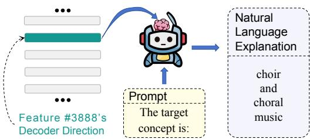
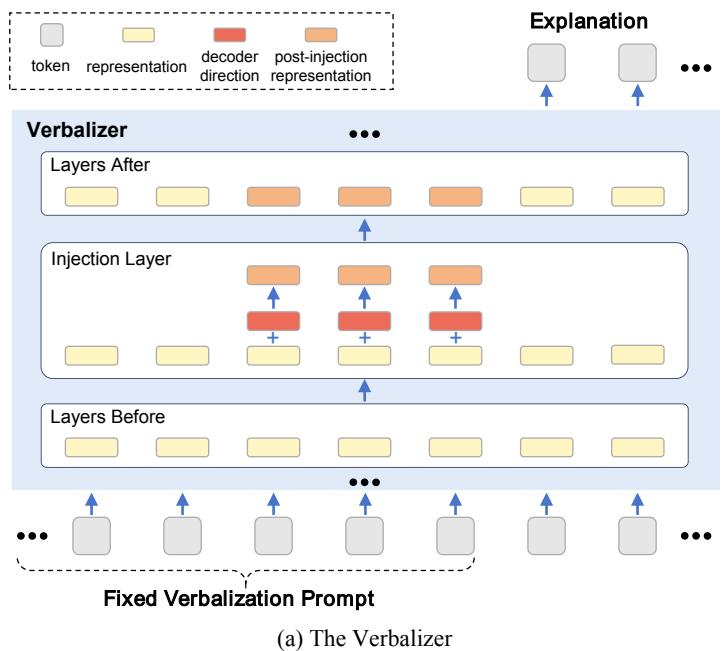
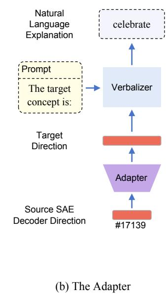
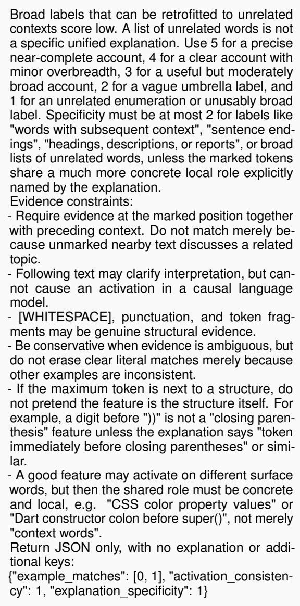
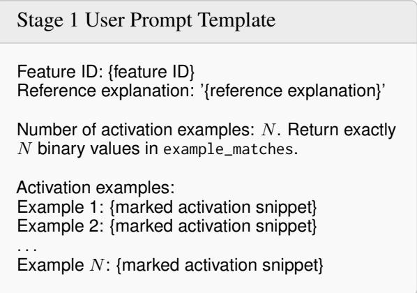

# SAEVerbalizer: Generating Explanations for Sparse Autoencoder Features via Representation Verbalization

Weihan Meng1,\*, Hongzhu Guo2,\*, Yi Jing1, Dewen Liu3, Zijun Yao1, Xiaozhi Wang1, Lei Hou1, Juanzi Li1,§ 1Tsinghua University, 2Peking University, 3Fudan University mwh24@mails.tsinghua.edu.cn, 2400014104@stu.pku.edu.cn, lijuanzi@tsinghua.edu.cn \*Equal contribution. §Corresponding author.

## Abstract

Sparse autoencoders (SAEs) are proposed to extract numerous features from large language model (LLM) representations, yet explaining these features still relies primarily on external observation. This reliance leads to superficial explanations inferred from observed model behavior and computational inefficiency from collecting such behavioral evidence at scale. We introduce SAEVERBALIZER, a framework that injects SAE decoder directions into an LLM’s representations and finetunes the LLM’s downstream layers to generate natural-language explanations of the injected features. Once trained, the resulting verbalizer explains SAE features directly from decoder directions, addressing both limitations. Our experiments show that the learned verbalization capability generalizes to unseen features, transfers across separately trained SAE dictionaries, and, with a lightweight adapter, extends to SAE features from different LLMs. Intervention experiments show that injecting multiple directions yields an explanation combining their meanings, while reversing individual directions produces corresponding meaning shifts.

## 1 Introduction

Sparse autoencoders (SAEs; Bricken et al., 2023; Huben et al., 2024) are widely used (Templeton et al., 2024; Gao et al., 2025; McDougall et al., 2025; Deng et al., 2026) to interpret internal representations of large language models (LLMs). SAEs map dense LLM representations into a higherdimensional sparse feature space, where each dimension is intended to represent an individual interpretable feature. However, while SAEs excel at extracting features, they fall short of explaining them in natural language.

Most existing methods explain SAE features through externally observed LLM behavior. A prominent approach runs an LLM over a large corpus, identifies each feature’s top-activating examples, and prompts an LLM to summarize their shared pattern (Bricken et al., 2023; Paulo et al., 2025). However, these methods face two limitations. Superficial Explanations. Without directly examining how a feature is represented inside the LLM, their explanations describe what its activation examples have in common rather than what the feature itself represents. Computational Inefficiency. Each new SAE requires repeating corpus-scale inference, activation computation, example retrieval, and feature-wise LLM summarization (Paulo et al., 2025). These limitations reduce explanation quality and scalability across SAEs.

  
Figure 1: Overview of SAEVERBALIZER. Given an SAE decoder direction and a fixed verbalization prompt, the verbalizer generates an explanation of the feature.

Recent work has demonstrated LLMs’ capability to process internal representations and express their semantic content in natural language (Ghandeharioun et al., 2024; Pan et al., 2026; Chen et al., 2024). Motivated by this capability, we introduce SAE-VERBALIZER, a framework that shifts SAE feature explanation from observing external behavior to processing internal representations within the LLM. As shown in Figure 1, it injects an SAE decoder direction—the only feature-specific input—into the LLM’s representations and prompts the LLM to generate a natural-language explanation of the corresponding feature.

By explaining SAE features directly from decoder directions, SAEVERBALIZER addresses both limitations. It moves beyond superficial explanations by grounding explanations in information encoded within the LLM’s internal representation space, rather than inferring feature meanings from activation texts. It reduces computational inefficiency by directly verbalizing decoder directions without repeated corpus-scale inference and example retrieval. Moreover, this capability transfers across SAE dictionaries and, with a lightweight representation-space adapter, extends to SAE features from different LLMs.

Beyond providing a new tool for SAE interpretation, we use this framework to study internal representation verbalization as a trainable capability. Across multiple LLM scales and SAE layers, this capability generalizes to unseen features and transfers across separately trained SAE dictionaries; lightweight adapters further extend it to SAE features from different LLMs. Ablations demonstrate gains from additional supervision and robustness to prompt and injection variations. Intervention analyses illustrate the verbalizer’s behavior under joint injection and direction reversal.

Our contributions include: (a) proposing SAE-VERBALIZER, a lightweight approach, to explain unseen SAE features directly from decoder directions; (b) providing a practical method for training this capability with feature–explanation supervision; and (c) conducting experiments to demonstrate its scalability and generalization across SAE dictionaries and LLMs.

## 2 Preliminaries and Related Work

This section introduces the formal background and terminology needed for our method and situates our approach within the relevant literature.

## 2.1 Sparse Autoencoders

A critical interpretability challenge of LLMs is superposition—an LLM encodes more features than the dimensionality of its representation space permits (Elhage et al., 2022). To recover interpretable features from such superposed representations, an SAE uses an encoder to map each LLM representation to sparse activations over a highly overcomplete feature dictionary and a decoder to reconstruct the representation from these activations (Bricken et al., 2023; Huben et al., 2024). Formally, given an LLM representation h $\mathbf { \mu } \in \mathbb { R } ^ { d }$ , an SAE computes

$$
{ \mathbf z } = f ( W _ { \mathrm { e n c } } { \mathbf h } + { \mathbf b } _ { \mathrm { e n c } } ) , \quad \hat { \mathbf h } = W _ { \mathrm { d e c } } { \mathbf z } + { \mathbf b } _ { \mathrm { d e c } } ,
$$

where $\mathbf { z } \in \mathbb { R } ^ { m }$ and $m$ is the SAE dictionary size, typically with m ≫ d. Each coordinate zi gives the activation of the i-th learned feature, whose corresponding decoder column $\mathbf { w } _ { i } ^ { \mathrm { d e c } }$ defines a direction in the LLM’s representation space. We refer to this direction as the feature’s decoder direction and use decoder directions as the interface for representation intervention and verbalization.

## 2.2 Automated SAE Feature Interpretation

Automated SAE feature interpretation primarily follows two paradigms: bottom-up methods infer feature meanings from activation examples, whereas top-down methods locate features associated with predefined concepts.

Bottom-up Interpretation. Bottom-up methods begin with a given SAE feature and infer its meanings from examples that strongly activate it. Inspired by the automated neuron interpretation approach of Bills et al. (2023), Bricken et al. (2023) apply this paradigm to SAE features by prompting an external LLM to summarize a feature’s topactivating examples. Subsequent work has scaled this paradigm to millions of SAE features (Paulo et al., 2025) and developed agentic workflows that iteratively propose, test, and refine explanations against activation evidence (Han et al., 2026). Despite these advances, bottom-up methods remain computationally inefficient, and their explanations can miss features’ output effects (Gur-Arieh et al., 2025), be overly broad (Ma et al., 2025), semantically misaligned (Puri et al., 2025), or insufficiently discriminative (McCann, 2026).

Top-down Localization. Top-down methods instead start from a predefined concept and identify SAE features whose activations are associated with it. Inspired by concept-based interpretation methods such as TCAV (Kim et al., 2018), this paradigm has been applied to behavioral concepts (Zhao et al., 2026), linguistic phenomena (Jing et al., 2025), and individual languages (Deng et al., 2025). It supports targeted analysis, but depends on human hypotheses about which concepts to search for and how they should be defined, and therefore does not provide exhaustive explanations of all features in an SAE dictionary.

In contrast, SAEVERBALIZER directly maps SAE decoder directions to natural-language explanations, without requiring per-feature analysis of activation examples or a predefined set of concepts.

## 2.3 Representation Verbalization and Transferability

LLMs have the capability to identify concepts injected into their intermediate representations, but this spontaneous introspective ability remains unreliable and sensitive to elicitation (Lindsey, 2025). Prior work shows that LLM computation can be used to decode intermediate representations into natural language (Ghandeharioun et al., 2024; Chen et al., 2024; Kharlapenko et al., 2024). Explicit training further enables LLMs to verbalize contextual activations (Fraser-Taliente et al., 2026; Pan et al., 2026), causal computations (Li et al., 2026), explain internal features as preference optimization (He et al., 2026), and generalize across representation-interpretation tasks (Karvonen et al., 2025). These results together support treating SAE feature verbalization as a learned capability rather than relying on spontaneous introspection.

Extending this capability across LLMs requires aligning their representation spaces. Such alignment is supported by cross-LLM correspondences in both the local geometry of intermediate representations (Wolfram and Schein, 2025) and SAE feature spaces (Lan et al., 2025). Related work further shows that mappings can be learned between LLM representation spaces (Chen et al., 2025). Accordingly, we train adapters to map source-SAE decoder directions into the representation space of the verbalizer’s injection layer.

## 3 Methodology

We fine-tune LLMs to generate natural-language explanations from injected SAE decoder directions, referring to the resulting models as verbalizers and to the LLMs used to initialize them as their verbalizer backbones. During prompt prefilling, a decoder direction is injected at the verbalizer’s injection layer into the token representations of a designated injection span. Downstream computation over the post-injection representations conditions subsequent generation, yielding an explanation. For SAE features from another LLM, an adapter maps their decoder directions into the verbalizer’s injection-layer representation space. Figure 2 shows an overview of SAEVERBALIZER.

## 3.1 Verbalizer Design

The verbalizer receives a fixed, feature-agnostic prompt that specifies the verbalization task. During prompt prefilling, the target decoder direction is injected at layer $L _ { \mathrm { i n j } }$ into each token representation in a designated injection span following the task instruction, serving as the only feature-specific input. No activation examples or their surrounding contexts are provided to the verbalizer. The remaining Transformer layers process the post-injection prompt representations during prefilling, conditioning subsequent autoregressive generation to yield an explanation.

Formally, let $\mathbf { H } = \left[ \mathbf { h } _ { b , s } \right] \in \mathbb { R } ^ { B \times S \times D }$ denote the pre-injection representations over the injection span at layer $L _ { \mathrm { i n j } }$ , where B, S, and D are the batch size, injection-span length, and representation dimension, respectively. For batch element $b , \ f _ { b }$ denotes the target feature and $\mathbf { v } _ { f _ { b } } \in \mathbb { R } ^ { D }$ its decoder direction in the verbalizer’s injection-layer representation space.

We apply the following norm-matched additive injection independently to each batch element:

$$
\mathbf { h } _ { b , s } ^ { \prime } = \mathbf { h } _ { b , s } + \alpha \bar { n } _ { b } \hat { \mathbf { v } } _ { f _ { b } } , \qquad s = 1 , \ldots , S ,\tag{1}
$$

where $\hat { \mathbf { v } } _ { f _ { b } } = \mathbf { v } _ { f _ { b } } / ( \lVert \mathbf { v } _ { f _ { b } } \rVert _ { 2 } + \epsilon )$ is the normalized decoder direction $( \epsilon > 0$ ensures numerical stability), and $\begin{array} { r } { \bar { n } _ { b } = \frac { 1 } { S } \sum _ { s = 1 } ^ { S } \lVert \mathbf { h } _ { b , s } \rVert _ { 2 } } \end{array}$ is the mean preinjection representation norm over the injection span. This normalization removes the variation in direction norms across features, while $\bar { n } _ { b }$ scales the injected direction to the local representation magnitude. α is used to control its relative strength.

Once trained, the verbalizer can be applied to unseen features without additional supervision or fine-tuning. For each feature, it processes the short fixed task prompt with the corresponding decoder direction injected and generates an explanation.

## 3.2 Adapter Design

The verbalizer processes decoder directions in its injection-layer representation space, while directions from an SAE trained on another LLM lie in a different space. To reuse the verbalizer across LLMs, we introduce a lightweight adapter that maps a selected source-layer representation space to the verbalizer’s injection-layer representation space. Motivated by cross-LLM correspondences between representations at similar depths (Wolfram and Schein, 2025), we select source and target layers at comparable relative depths within their respective LLMs.

Specifically, we parameterize the adapter as a single affine layer:

$$
A ( \mathbf { x } ) = W \mathbf { x } + \mathbf { b } , \quad W \in \mathbb { R } ^ { d _ { t } \times d _ { s } } , \ \mathbf { b } \in \mathbb { R } ^ { d _ { t } } ,\tag{2}
$$

  
Figure 2: Overall design of SAEVERBALIZER. (a) The Verbalizer. During prompt prefilling, an SAE decoder direction is injected into the token representations of a designated injection span at $L _ { \mathrm { i n j } }$ , conditioning explanation generation. (b) The Adapter. An adapter maps SAE decoder directions in a source LLM’s representation space into the verbalizer’s injection-layer representation space.

where $d _ { s }$ and $d _ { t }$ are the representation dimensions of the selected source-LLM layer and the verbalizer injection layer, respectively.

Although trained to align representations from the two layers, the adapter is used to map source-SAE decoder directions at inference. Because decoder directions enter the verbalizer through additive injection, we map each direction according to the change it induces in the adapter output. For a source-layer representation $\mathbf { h } ^ { ( s ) }$ and a source-SAE decoder direction $\mathbf { v } _ { f } ^ { ( s ) }$ , this change, denoted $\tilde { \mathbf { v } } _ { f } ^ { ( t ) }$ , is $A ( \mathbf { h } ^ { ( s ) } + \mathbf { v } _ { t } ^ { ( s ) } ) - A ( \mathbf { h } ^ { ( s ) } ) = W \mathbf { v } _ { t } ^ { ( s ) }$ . The affine bias cancels in this difference and does not contribute to the mapped direction.

The mapped direction is then supplied to the verbalizer through the same normalization, injection, and generation interface defined above. Once the adapter has been trained, the existing verbalizer can be applied to SAE decoder directions from the source LLM without collecting source-specific feature–explanation supervision or fine-tuning a separate verbalizer for that LLM.

## 3.3 Training Method

We fine-tune the verbalizer on high-quality feature– explanation pairs and train the adapter on aligned representation pairs from source and target layers.

## 3.3.1 Verbalizer Fine-Tuning

We fine-tune the verbalizer by injecting each feature’s decoder direction and using its paired explanation as the generation target, while updating only the components downstream of the injection layer.

Feature–Explanation Supervision. We obtain candidate feature–explanation pairs from Neuronpedia (Lin, 2023), where explanations are inferred from a feature’s top-activating text examples. Because these observational explanations vary substantially in reliability (Appendix A.1), we use the LLM filtering judge to score three properties: the coherence of the pattern shared across the examples, the specificity of the explanation, and how consistently the examples support it. For training, we retain candidates whose scores meet the training qualification standard. Appendix A provides the full filtering procedure, qualification standards, and judge prompts.

Training Objective. For each training pair $( f , y _ { f } )$ , we inject the corresponding decoder direction $\mathbf { v } _ { f }$ using the interface defined in Section 3.1 and optimize the verbalizer to generate $y _ { f }$ . We use the standard causal language modeling objective under teacher forcing, computing token-level crossentropy only over the explanation tokens while masking the prompt tokens from the loss.

Partial Fine-Tuning. We partition the Transformer layers at $L _ { \mathrm { i n j } }$ as follows:

$$
l \leq L _ { \mathrm { i n j } } \quad \mathrm { f r o z e n } , \qquad l > L _ { \mathrm { i n j } } \quad \mathrm { t r a i n a b l e } .
$$

Because injection occurs at the output of $L _ { \mathrm { i n j } } .$ , only downstream components process the post-injection representations; freezing the upstream layers also preserves the representation space in which the SAE decoder directions are defined. We additionally freeze the embedding layer and keep the SAE and its decoder directions fixed, while fine-tuning the final normalization layer and language modeling head.

## 3.3.2 Adapter Training

We train the adapter to map source-LLM representations into the verbalizer’s representation space using aligned hidden representations from unlabeled text, while keeping both LLMs frozen.

Training Data. The adapter is trained on ordinary unlabeled text and requires no feature– explanation supervision. We pass the same token sequence through the frozen source LLM and verbalizer backbone. For each non-padding token position i, we pair the representation $\mathbf { x } _ { i } \in \mathbb { R } ^ { d _ { s } }$ from the selected source-LLM layer with the representation $\mathbf { y } _ { i } \in \mathbb { R } ^ { d _ { t } }$ from the verbalizer injection layer, both produced from the same token and preceding context. For the LLM pairs considered in this work, a shared tokenizer provides token-level alignment.

Training Objective. For a batch containing N aligned token positions, we train the adapter to reconstruct the corresponding verbalizer representations:

$$
\mathcal { L } _ { \mathrm { a d a p t e r } } = \frac { 1 } { N d _ { t } } \sum _ { i = 1 } ^ { N } \left\| W \mathbf { x } _ { i } + \mathbf { b } - \mathbf { y } _ { i } \right\| _ { 2 } ^ { 2 } .\tag{3}
$$

Only the adapter parameters W and b are updated, while the source LLM and verbalizer backbone remain frozen.

## 4 Experiment

Our experiments evaluate the feasibility of direct SAE feature verbalization from decoder directions and further analyze the verbalization capability.

## 4.1 Experiment Setup

This subsection specifies the verbalizer and adapter configurations, test sets, and evaluation protocol used throughout the experiments.

Verbalizer Configurations. For the main experiments, we fine-tune gemma-3-1b-it, gemma-3 -4b-it, and gemma-3-27b-it (Gemma Team, 2025) as verbalizers. We use width-262k, mediumsparsity Gemma Scope 2 SAEs (McDougall et al., 2025) trained on post-layer residual-stream representations. Each verbalizer corresponds to one selected SAE and injects its decoder directions at the matching layer. Across the 1B, 4B, and 27B backbones, the selected SAE layers are {7, 13, 17, 22}, {9, 17, 22, 29}, and {16, 31, 40, 53}, respectively.

Training uses nested sets of 12k, 24k, and 48k qualified feature–explanation pairs for each SAE. We use 12k as the common comparison point and report results at 24k and 48k where sufficient qualified data are available.

We use the 27B-L16 configuration with 48k feature–explanation pairs as the default for analysis experiments and refer to the resulting model as the default verbalizer. Full implementation settings, including backbone-specific learning rates, are provided in Appendix B.

Adapter Configurations. For cross-LLM transfer, we train adapters from 1B-L7 and 4B-L9 into the default 27B verbalizer’s layer-16 representation space. The two source layers and the target layer lie at approximately one-quarter of their respective LLM depths. Additional implementation details are provided in Appendix C.

Test Sets. Using the LLM-based filtering procedure, we construct three disjoint test sets for each SAE evaluated. The Global Train-Standard (GTS) set contains 1,000 globally sampled features satisfying the training qualification standard. The Low-Index Gold (LIG) and Global Gold (GG) sets contain 200 low-index and 1,000 globally sampled features, respectively, satisfying a stricter gold qualification standard. GTS and GG differ in qualification strictness, whereas LIG and GG differ in index distribution; the latter comparison probes features prioritized by Gemma Scope 2’s Matryoshka reconstruction objective (McDougall et al., 2025; Bussmann et al., 2025).

Within each SAE dictionary used for verbalizer training, the training and test sets are disjoint. Further details of the test-set construction procedures are provided in Appendix A.

Evaluation Protocol. We evaluate generated explanations using Reference Agreement (RA). For each test feature, the LLM evaluation judge compares the generated explanation with its Neuronpedia reference. RA is the proportion of test features for which the two explanations are judged to agree.

Quality filtering supports using RA as a scalable proxy for verbalization quality. However, because the references are inferred from activation examples rather than established ground truth, RA does not establish the absolute correctness of generated explanations. The judge prompt and judge decoding settings are provided in Appendix D.

## 4.2 Experiment Results

<table><tr><td>LLM</td><td>Layer</td><td>#Train</td><td>GTS</td><td>LIG</td><td>GG</td></tr><tr><td rowspan="6">em---it</td><td>7</td><td>12k</td><td>19.6</td><td>33.0</td><td>14.6</td></tr><tr><td></td><td>24k</td><td>17.6</td><td>35.5</td><td>14.7</td></tr><tr><td>13</td><td>12k</td><td>18.7</td><td>27.0</td><td>17.1</td></tr><tr><td>17</td><td>12k</td><td>8.9</td><td>14.5</td><td>8.6</td></tr><tr><td></td><td>24k</td><td>8.2</td><td>17.5</td><td>8.0</td></tr><tr><td rowspan="2">22</td><td>12k</td><td>3.9</td><td>7.0</td><td>4.2</td></tr><tr><td>24k</td><td>5.1</td><td>11.0</td><td>6.1</td></tr><tr><td rowspan="6">it emmm-</td><td></td><td>48k</td><td>5.5</td><td>10.0</td><td>6.7</td></tr><tr><td>9</td><td>12k 24k</td><td>32.9 37.6</td><td>51.5 56.0</td><td>35.2 39.4</td></tr><tr><td>17</td><td>12k</td><td>29.4</td><td>44.5</td><td>30.4</td></tr><tr><td rowspan="2">22</td><td>12k</td><td>21.9</td><td>27.5</td><td>20.6</td></tr><tr><td>24k</td><td>27.2</td><td>32.0</td><td>24.4</td></tr><tr><td></td><td>12k</td><td>11.2</td><td>15.0</td><td></td></tr><tr><td rowspan="3">29</td><td>24k</td><td></td><td></td><td>10.0</td><td>9.2</td></tr><tr><td>48k</td><td></td><td>11.2 14.1</td><td>11.5 16.5</td><td>13.4</td></tr><tr><td></td><td></td><td></td><td></td><td></td></tr><tr><td rowspan="6">emm-t</td><td>16</td><td>12k</td><td>48.1</td><td>80.5</td><td>49.2</td></tr><tr><td></td><td>24k</td><td>51.0</td><td>78.5 80.5</td><td>50.6 56.1</td></tr><tr><td>31</td><td>48k</td><td>52.3</td><td></td><td>39.6</td></tr><tr><td></td><td>12k</td><td>39.4</td><td>62.0</td><td>37.1</td></tr><tr><td>40</td><td>12k 24k</td><td>40.3 46.9</td><td>55.5 60.0</td><td>43.9</td></tr><tr><td></td><td></td><td></td><td></td><td></td></tr><tr><td rowspan="2">53</td><td></td><td>12k</td><td>24.5</td><td>46.0</td><td>20.2</td></tr><tr><td></td><td>24k</td><td>26.7</td><td>51.5</td><td>24.5</td></tr></table>

Table 1: RA (%) across verbalizer backbones, SAE layers, and available training-set sizes.

Table 1 reports RA across backbone scales, SAE layers, and training-set sizes. The results show that verbalizers fine-tuned with feature–explanation supervision generalize to unseen features across all evaluated backbone–layer configurations. The bestperforming configuration, 27B-L16 with 48k pairs, achieves RA scores of 52.3%, 80.5%, and 56.1% on GTS, LIG, and GG, respectively. At the common training-set size of 12k, RA generally increases with backbone scale and tends to be higher at earlier layers within each backbone. The backbonescale trend is consistent with differences in model capacity, and the layer trend is consistent with the amount of downstream computation available after injection. Because each configuration uses a distinct SAE, both trends may also partly reflect variation across SAE feature distributions.

## 4.3 Analysis Experiments

We next empirically analyze the verbalizer from three perspectives: transfer across SAE dictionaries and LLMs, sensitivity to key design choices, and qualitative behavior under individual, joint, and sign-reversed feature injection.

## 4.3.1 Transferability

SAEVERBALIZER exhibits transferability across SAE dictionaries and LLMs through two distinct mechanisms. Within a shared representation space, the verbalizer can be reused directly across SAE dictionaries, whereas lightweight adapters enable transfer across LLM-specific representation spaces. We evaluate transferability in both settings.

Transfer Across SAE Dictionaries. We directly apply the default verbalizer to decoder directions from an unseen width-65k Gemma Scope 2 SAE defined on the same LLM and layer. We construct its test sets using the same procedure as for the width-262k SAE. Because the two SAEs share the same representation space, transfer requires neither an adapter nor additional feature–explanation supervision. Table 2 shows that the default verbalizer achieves substantial agreement on the unseen width-65k SAE. This result indicates that the learned verbalization capability is not tied to the SAE dictionary used for training and can be reused directly across SAE dictionaries in the same representation space.

<table><tr><td>Target SAE</td><td>GTS</td><td>LIG</td><td>GG</td></tr><tr><td>Width-262k</td><td>52.3</td><td>80.5</td><td>56.1</td></tr><tr><td>Width-65k</td><td>64.4</td><td>56.5</td><td>65.9</td></tr></table>

Table 2: RA (%) of the default verbalizer on width-262k and width-65k SAEs at the same LLM layer; supervision uses only the width-262k SAE.

Transfer Across LLMs. Using separately trained adapters, we map decoder directions from the width-262k SAEs at 1B-L7 and 4B-L9 into the layer-16 representation space of the default 27B verbalizer. Each adapter-based verbalization system is compared with the corresponding native verbalizer fine-tuned on 24k feature–explanation pairs, using the same test features from the source SAE. Table 3 shows that the verbalization capability can be transferred across LLM-specific representation spaces through lightweight adapters, without source-specific feature–explanation supervision or further fine-tuning of the verbalizer. For 1B-L7, adapter-based transfer improves performance over the native verbalizer on all three test sets, demonstrating that cross-LLM adaptation can leverage the stronger verbalization capability of the 27B verbalizer for SAE features from a smaller LLM. For 4B-L9, whose native verbalizer already achieves higher performance, transfer does not yield additional gains.

<table><tr><td>Source</td><td>System</td><td>GTS</td><td>LIG</td><td>GG</td></tr><tr><td rowspan="2">1B-L7</td><td>Native (24k)</td><td>17.6</td><td>35.5</td><td>14.7</td></tr><tr><td>Adapter + 27B</td><td>18.2</td><td>39.0</td><td>17.4</td></tr><tr><td rowspan="2">4B-L9</td><td>Native (24k)</td><td>37.6</td><td>56.0</td><td>39.4</td></tr><tr><td>Adapter + 27B</td><td>32.8</td><td>49.0</td><td>32.1</td></tr></table>

Table 3: RA (%) for native and adapter-based verbalization of SAE features from the 1B and 4B LLMs.

## 4.3.2 Ablation Study

Starting from the default configuration, we vary one factor at a time to examine the effects of supervision size, prompt, injection span, injection mode, and injection strength. For prompt and injection ablations, each variant is used consistently during fine-tuning and inference.

## Scaling with Feature–Explanation Supervision.

We fine-tune the 27B-L16 verbalizer on nested subsets of 1.5k–48k feature–explanation pairs, using the corresponding verbalizer backbone as a zerosupervision reference. Table 4 shows a large gain over the verbalizer backbone after fine-tuning on 1.5k pairs. Further supervision improves RA on GTS and GG, while performance on LIG reaches a high level early and remains relatively stable. Because the training pairs are globally sampled and randomly ordered, LIG’s earlier saturation is unlikely to result from preferential exposure to lowindex features and instead suggests that they require less supervision. These results show that limited feature–explanation supervision is sufficient to acquire verbalization capability, while additional data primarily improves performance across the broader SAE feature distribution.

<table><tr><td>#Train</td><td>GTS</td><td>LIG</td><td>GG</td></tr><tr><td>Backbone</td><td>1.6</td><td>2.5</td><td>1.2</td></tr><tr><td>1.5k</td><td>36.4</td><td>74.0</td><td>41.3</td></tr><tr><td>3k</td><td>38.4</td><td>76.0</td><td>40.7</td></tr><tr><td>6k</td><td>41.8</td><td>76.0</td><td>44.2</td></tr><tr><td>12k</td><td>48.1</td><td>80.5</td><td>49.2</td></tr><tr><td>24k</td><td>51.0</td><td>78.5</td><td>50.6</td></tr><tr><td>48k</td><td>52.3</td><td>80.5</td><td>56.1</td></tr></table>

Table 4: RA (%) across supervision sizes, with the verbalizer backbone as a zero-supervision reference.

Prompt and Injection Design. Semantically similar prompts, nearby prompt-aligned injection spans, and additive versus interpolative injection produce only minor differences in performance, with full results reported in Appendix E.1. As shown in Table 5, performance is also broadly stable across a wide range of injection strengths, but degrades substantially when the injected direction becomes too weak. Together, these results show that the verbalizer is robust to reasonable variations in its prompt and injection interface, while requiring sufficiently strong feature injection.

<table><tr><td>α</td><td>GTS</td><td>LIG</td><td>GG</td></tr><tr><td>0.01</td><td>18.9</td><td>44.5</td><td>16.2</td></tr><tr><td>0.10</td><td>50.6</td><td>78.5</td><td>54.2</td></tr><tr><td>0.20</td><td>52.3</td><td>80.5</td><td>56.1</td></tr><tr><td>0.30</td><td>52.8</td><td>81.0</td><td>54.8</td></tr><tr><td>0.60</td><td>53.6</td><td>81.0</td><td>54.2</td></tr><tr><td>1.00</td><td>52.7</td><td>80.5</td><td>53.4</td></tr></table>

Table 5: RA (%) across additive injection strengths. The default strength is α = 0.2.

## 4.3.3 Case Study

Using the default verbalizer, we complement the quantitative evaluation with three qualitative analyses: comparisons with Neuronpedia explanations, joint feature injection, and direction reversal.

Qualitative Comparison with Neuronpedia Explanations. We inspect the top-activating text examples for features from the quality-filtered test sets and an additional random test set sampled globally from the full SAE dictionary. Table 6 presents selected cases in which the verbalizer-generated and Neuronpedia explanations differ in focus or granularity. In these cases, the verbalizer identifies localized lexical or structural patterns, or different semantic abstractions, illustrating the potential of direct verbalization of decoder directions to complement explanations inferred from top-activating text examples. Additional examples are provided in Appendix Table 12.

<table><tr><td>Pattern</td><td>Feature</td><td>Neuronpedia</td><td>Verbalizer</td><td>Activation Evidence</td></tr><tr><td>Recurring lexical form</td><td>#14949</td><td>lasting, enduring, eternal states</td><td>forever</td><td>The maximally activated token is consistently for- ever across varied contexts.</td></tr><tr><td>Localized structural pattern</td><td>#115968</td><td>Gu followed by letters or syllables</td><td>gu- prefix</td><td>The feature activates on word-initial gu in otherwise unrelated words, such as guarana, gucci, and guil- laume, among many others.</td></tr><tr><td>Contextual semantic abstraction</td><td>#85263</td><td>energetic social activities and atmospheres</td><td>lively atmosphere</td><td>The maximally activated token is consistently lively, appearing in varied contexts such as debates, music, places, and atmospheres.</td></tr></table>

Table 6: Selected cases in which verbalizer-generated and Neuronpedia explanations differ in focus or granularity.

Compositionality under Joint Feature Injection. We jointly inject two SAE decoder directions with equal coefficients while keeping the total injection strength the same as in single-feature injection, an operation related to prior work on composing representation-space interventions (Han et al., 2024; Scalena et al., 2024). As shown in Table 7, the resulting verbalizations preserve information from both constituent features, either by combining them into a natural joint concept or by expressing a meaningful relation between them. Additional examples are provided in Appendix Table 15.

<table><tr><td>Feature</td><td>Standard</td><td>Joint</td></tr><tr><td>#10040 #53806</td><td>exhaustion and fatigue deadlines and timeframes</td><td>deadlines and exhaustion</td></tr><tr><td>#2862 #69595</td><td>river names and descriptions overflowing</td><td>river overflow</td></tr><tr><td>#15187 #1586</td><td>love and enthusiasm coffee and its contexts</td><td>love of coffee</td></tr></table>

Table 7: Selected examples of joint feature injection. The two directions receive equal coefficients summing to the default single-feature strength, α = 0.2.

Meaning Shifts under Direction Reversal. We replace the standard injection coefficient α with −α while keeping all other settings fixed. Standard SAEs do not encode opposite concepts as opposite signs of a single feature (Zhu et al., 2026); thus, reversing a decoder direction need not produce the opposite concept. Table 8 shows that the sign-reversed verbalizations remain semantically related to their standard counterparts. Moreover, features with related standard verbalizations undergo corresponding shifts after reversal despite low cosine similarities between their decoder directions. Together, these cases suggest that the verbalizer captures how meanings vary with decoderdirection sign, rather than assigning each feature a fixed explanation.

<table><tr><td>Feature</td><td>Standard</td><td>Sign-Reversed</td><td>Cos.</td></tr><tr><td>#40105 #111800 lessons</td><td>lessons learned</td><td>lesson plan lesson plan</td><td>0.090</td></tr><tr><td>#7905 #154632 recent events</td><td>recent events and time</td><td>e dates and years dates and years</td><td>0.178</td></tr><tr><td>#6187</td><td>accessing information or services</td><td>to do</td><td>0.002</td></tr><tr><td>#8988</td><td>more information</td><td>how to do something</td><td></td></tr></table>

Table 8: Selected feature pairs under standard (α) and sign-reversed (−α) injection. Cos. is the within-pair cosine similarity of their decoder directions.

## 5 Conclusion

We introduced SAEVERBALIZER, a framework that fine-tunes an LLM’s downstream layers to generate natural-language explanations of SAE features from injected decoder directions. Experiments show that the learned verbalization capability generalizes to unseen features, transfers to unseen SAE dictionaries without further fine-tuning, and extends to SAE features from different LLMs through lightweight adapters. Intervention experiments suggest that the verbalizer is sensitive to compositional and signed relationships among SAE decoder directions. Together, these results support internal representation verbalization as a trainable and partially reusable complement to methods that infer SAE feature meanings from activation examples, providing a more direct route from learned representations to feature explanations.

## Limitations

LLM and SAE Coverage. We primarily evaluate Gemma LLMs and Gemma Scope 2 SAEs, so generalization to other LLM families, SAE architectures, and representation spaces remains to be established.

Explanation Validation. Reference Agreement measures generated explanations’ consistency with filtered reference explanations rather than the absolute correctness of the generated explanations. The qualitative and intervention analyses provide complementary evidence, but do not systematically establish explanation correctness.

Run Variability. Each configuration is evaluated from a single run, so variability across random seeds is not measured.

Supervision Construction. Our current finetuning setup relies on high-quality feature– explanation supervision constructed from filtered Neuronpedia explanations, which is computationally expensive to produce. This dependence is specific to our current supervision pipeline rather than inherent to SAEVERBALIZER, as suitable supervision could also be constructed using alternative approaches, such as agentic or top-down methods.

## Ethical Considerations

Research Use and External Artifacts. SAEVerbalizer is intended as a research tool for interpreting learned representations. We use the LLMs, SAEs, datasets, and online resources solely for academic research on LLM interpretability, consistent with their documented intended uses where specified and in accordance with their respective licenses or terms of use.

Reliability and Dual-Use Implications. Because SAEVerbalizer may inherit errors from the observational explanations used as supervision, its outputs should not be treated as verified descriptions of LLM behavior without independent validation. More generally, improved access to internal feature meanings may support LLM auditing for safety and reliability, but may also enable more targeted manipulation of LLM representations.

Use of AI Assistants in Coding and Writing. AI assistants were used to support code development and language polishing. All AI-assisted code and text were reviewed and revised as needed by the authors, who take full responsibility for the experiment implementation, analyses, and scientific claims presented in this work.

## References

Steven Bills, Nick Cammarata, Dan Mossing, Henk Tillman, Leo Gao, Gabriel Goh, Ilya Sutskever, Jan Leike, Jeff Wu, and William Saunders. 2023. Language models can explain neurons in language models. https://openaipublic.blob.core.windows .net/neuron-explainer/paper/index.html.

Trenton Bricken, Adly Templeton, Joshua Batson, Brian Chen, Adam Jermyn, Tom Conerly, Nick Turner, Cem Anil, Carson Denison, Amanda Askell, Robert Lasenby, Yifan Wu, Shauna Kravec, Nicholas Schiefer, Tim Maxwell, Nicholas Joseph, Zac Hatfield-Dodds, Alex Tamkin, Karina Nguyen, and 6 others. 2023. Towards Monosemanticity: Decomposing Language Models With Dictionary Learning. Transformer Circuits Thread. Https://transformercircuits.pub/2023/monosemanticfeatures/index.html.

Bart Bussmann, Noa Nabeshima, Adam Karvonen, and Neel Nanda. 2025. Learning Multi-Level Features with Matryoshka Sparse Autoencoders. In Proceedings of the 42nd International Conference on Machine Learning, volume 267 of Proceedings ofMachine Learning Research, pages 6077–6101. PMLR.

Alan Chen, Jack Merullo, Alessandro Stolfo, and Ellie Pavlick. 2025. Transferring Linear Features Across Language Models With Model Stitching. In Advances in Neural Information Processing Systems, volume 38, pages 48531–48563. Curran Associates, Inc.

Haozhe Chen, Carl Vondrick, and Chengzhi Mao. 2024. SelfIE: Self-Interpretation of Large Language Model Embeddings. In Proceedings of the 41st International Conference on Machine Learning, volume 235 of Proceedings ofMachine Learning Research, pages 7373–7388. PMLR.

Boyi Deng, Yu Wan, Baosong Yang, Yidan Zhang, and Fuli Feng. 2025. Unveiling Language-Specific Features in Large Language Models via Sparse Autoencoders. In Proceedings of the 63rd Annual Meeting of the Association for Computational Linguistics (Volume 1: Long Papers), pages 4563–4608, Vienna, Austria. Association for Computational Linguistics.

Boyi Deng, Xu Wang, Yaoning Wang, Yu Wan, Yubo Ma, Baosong Yang, Haoran Wei, Jialong Tang, Huan Lin, Ruize Gao, Tianhao Li, Qian Cao, Xuancheng Ren, Xiaodong Deng, An Yang, Fei Huang, Dayiheng Liu, and Jingren Zhou. 2026. Qwen-Scope: Turning Sparse Features into Development Tools for Large Language Models. Preprint, arXiv:2605.11887.

Nelson Elhage, Tristan Hume, Catherine Olsson, Nicholas Schiefer, Tom Henighan, Shauna Kravec, Zac Hatfield-Dodds, Robert Lasenby, Dawn Drain, Carol Chen, Roger Grosse, Sam McCandlish, Jared Kaplan, Dario Amodei, Martin Wattenberg, and Christopher Olah. 2022. Toy Models of Superposition. Transformer Circuits Thread. Https://transformercircuits.pub/2022/toy\_model/index.html.

Kit Fraser-Taliente, Subhash Kantamneni, Euan Ong, Dan Mossing, Christina Lu, Paul C. Bogdan, Emmanuel Ameisen, James Chen, Dzmitry Kishylau, Adam Pearce, Julius Tarng, Alex Wu, Jeff Wu, Yang Zhang, Daniel M. Ziegler, Evan Hubinger, Joshua Batson, Jack Lindsey, Samuel Zimmerman, and Samuel Marks. 2026. Natural Language Autoencoders Produce Unsupervised Explanations of LLM Activations. Transformer Circuits Thread.

Leo Gao, Tom Dupre la Tour, Henk Tillman, Gabriel Goh, Rajan Troll, Alec Radford, Ilya Sutskever, Jan Leike, and Jeffrey Wu. 2025. Scaling and evaluating sparse autoencoders. In International Conference on Learning Representations, volume 2025, pages 26721–26754.

Gemma Team. 2025. Gemma 3 Technical Report. Preprint, arXiv:2503.19786.

Asma Ghandeharioun, Avi Caciularu, Adam Pearce, Lucas Dixon, and Mor Geva. 2024. Patchscopes: A Unifying Framework for Inspecting Hidden Representations of Language Models. In Proceedings of the 41st International Conference on Machine Learning, volume 235 of Proceedings ofMachine Learning Research, pages 15466–15490. PMLR.

Yoav Gur-Arieh, Roy Mayan, Chen Agassy, Atticus Geiger, and Mor Geva. 2025. Enhancing Automated Interpretability with Output-Centric Feature Descriptions. In Proceedings of the 63rd Annual Meeting of the Associationfor Computational Linguistics (Volume 1: Long Papers), pages 5757–5778, Vienna, Austria. Association for Computational Linguistics.

Chi Han, Jialiang Xu, Manling Li, Yi Fung, Chenkai Sun, Nan Jiang, Tarek Abdelzaher, and Heng Ji. 2024. Word Embeddings Are Steers for Language Models. In Proceedings of the 62nd Annual Meeting of the Associationfor Computational Linguistics (Volume 1: Long Papers), pages 16410–16430, Bangkok, Thailand. Association for Computational Linguistics.

Jiaojiao Han, Wujiang Xu, Mingyu Jin, and Mengnan Du. 2026. SAGE: An Agentic Explainer Framework for Interpreting SAE Features in Language Models. In Proceedings ofthe 19th Conference ofthe European Chapter ofthe Associationfor Computational Linguistics (Volume 5: Industry Track), pages 483– 495, Rabat, Morocco. Association for Computational Linguistics.

Jingyi He, Haiyan Zhao, Ruxue Shi, Yanguang Liu, Xin Wang, Fei Sun, and Mengnan Du.

2026. SAEExplainer: Interpreting SAE Features with Activation-Guided Preference Optimization. Preprint, arXiv:2606.08496.

Robert Huben, Hoagy Cunningham, Logan Smith, Aidan Ewart, and Lee Sharkey. 2024. Sparse Autoencoders Find Highly Interpretable Features in Language Models. In International Conference on Learning Representations, volume 2024, pages 7827–7845.

Yi Jing, Zijun Yao, Hongzhu Guo, Lingxu Ran, Xiaozhi Wang, Lei Hou, and Juanzi Li. 2025. LinguaLens: Towards Interpreting Linguistic Mechanisms of Large Language Models via Sparse Auto-Encoder. In Proceedings ofthe 2025 Conference on Empirical Methods in Natural Language Processing, pages 28232–28251, Suzhou, China. Association for Computational Linguistics.

Adam Karvonen, James Chua, Clément Dumas, Kit Fraser-Taliente, Subhash Kantamneni, Julian Minder, Euan Ong, Arnab Sen Sharma, Daniel Wen, Owain Evans, and Samuel Marks. 2025. Activation Oracles: Training and Evaluating LLMs as General-Purpose Activation Explainers. CoRR, abs/2512.15674.

Dmitrii Kharlapenko, neverix, Neel Nanda, and Arthur Conmy. 2024. Self-explaining SAE features. https: //www.lesswrong.com/posts/8ev6coxChSWcxC Dy8/self-explaining-sae-features.

Been Kim, Martin Wattenberg, Justin Gilmer, Carrie Cai, James Wexler, Fernanda Viegas, and Rory Sayres. 2018. Interpretability Beyond Feature Attribution: Quantitative Testing with Concept Activation Vectors (TCAV). In Proceedings ofthe 35th International Conference on Machine Learning, volume 80 of Proceedings of Machine Learning Research, pages 2668–2677. PMLR.

Woosuk Kwon, Zhuohan Li, Siyuan Zhuang, Ying Sheng, Lianmin Zheng, Cody Hao Yu, Joseph Gonzalez, Hao Zhang, and Ion Stoica. 2023. Efficient Memory Management for Large Language Model Serving with PagedAttention. In Proceedings ofthe 29th Symposium on Operating Systems Principles, SOSP ’23, page 611–626, New York, NY, USA. Association for Computing Machinery.

Michael Lan, Philip Torr, Austin Meek, Ashkan Khakzar, David Krueger, and Fazl Barez. 2025. Quantifying Feature Space Universality Across Large Language Models via Sparse Autoencoders. Preprint, arXiv:2410.06981.

Belinda Z. Li, Zifan Carl Guo, Vincent Huang, Jacob Steinhardt, and Jacob Andreas. 2026. Training Language Models to Explain Their Own Computations. Preprint, arXiv:2511.08579.

Johnny Lin. 2023. Neuronpedia: Interactive Reference and Tooling for Analyzing Neural Networks. Software available from neuronpedia.org. Bulk data export (v1) available at https://neuronpedia-dat asets.s3.us-east-1.amazonaws.com/index.h tml?prefix=v1/.

Jack Lindsey. 2025. Emergent Introspective Awareness in Large Language Models. Transformer Circuits Thread.

George Ma, Samuel Pfrommer, and Somayeh Sojoudi. 2025. Revising and Falsifying Sparse Autoencoder Feature Explanations. In Advances in Neural Information Processing Systems, volume 38, pages 63175– 63217. Curran Associates, Inc.

Jordan F. McCann. 2026. Descriptive Collision in Sparse Autoencoder Auto-Interpretability: When One Explanation Describes Many Features. Preprint, arXiv:2605.12874.

Callum McDougall, Arthur Conmy, János Kramár, Tom Lieberum, Senthooran Rajamanoharan, and Neel Nanda. 2025. Gemma Scope 2 - Technical Paper. Technical report, Google DeepMind.

Alexander Pan, Lijie Chen, and Jacob Steinhardt. 2026. LatentQA: Teaching LLMs to Decode Activations Into Natural Language. In International Conference on Learning Representations, volume 2026, pages 78726–78759.

Gonçalo Santos Paulo, Alex Troy Mallen, Caden Juang, and Nora Belrose. 2025. Automatically Interpreting Millions of Features in Large Language Models. In Proceedings of the 42nd International Conference on Machine Learning, volume 267 of Proceedings of Machine Learning Research, pages 48393–48421. PMLR.

Guilherme Penedo, Hynek Kydlícek, Loubna Ben al-ˇ lal, Anton Lozhkov, Margaret Mitchell, Colin Raffel, Leandro Von Werra, and Thomas Wolf. 2024. The FineWeb Datasets: Decanting the Web for the Finest Text Data at Scale. In Advances in Neural Information Processing Systems, volume 37, pages 30811–30849. Curran Associates, Inc.

Bruno Puri, Aakriti Jain, Elena Golimblevskaia, Patrick Kahardipraja, Thomas Wiegand, Wojciech Samek, and Sebastian Lapuschkin. 2025. FADE: Why Bad Descriptions Happen to Good Features. In Findings of the Association for Computational Linguistics: ACL 2025, pages 17138–17160, Vienna, Austria. Association for Computational Linguistics.

Qwen Team. 2025. Qwen3 Technical Report. Preprint, arXiv:2505.09388.

Daniel Scalena, Gabriele Sarti, and Malvina Nissim. 2024. Multi-property Steering of Large Language Models with Dynamic Activation Composition. In Proceedings ofthe 7th BlackboxNLP Workshop: Analyzing and Interpreting Neural Networks for NLP, pages 577–603, Miami, Florida, US. Association for Computational Linguistics.

Adly Templeton, Tom Conerly, Jonathan Marcus, Jack Lindsey, Trenton Bricken, Brian Chen, Adam Pearce, Craig Citro, Emmanuel Ameisen, Andy Jones, Hoagy Cunningham, Nicholas L Turner, Callum McDougall, Monte MacDiarmid, C. Daniel Freeman, Theodore R.

Sumers, Edward Rees, Joshua Batson, Adam Jermyn, and 3 others. 2024. Scaling Monosemanticity: Extracting Interpretable Features from Claude 3 Sonnet. Transformer Circuits Thread.

Thomas Wolf, Lysandre Debut, Victor Sanh, Julien Chaumond, Clement Delangue, Anthony Moi, Pierric Cistac, Tim Rault, Remi Louf, Morgan Funtowicz, Joe Davison, Sam Shleifer, Patrick von Platen, Clara Ma, Yacine Jernite, Julien Plu, Canwen Xu, Teven Le Scao, Sylvain Gugger, and 3 others. 2020. Transformers: State-of-the-Art Natural Language Processing. In Proceedings ofthe 2020 Conference on Empirical Methods in Natural Language Processing: System Demonstrations, pages 38–45, Online. Association for Computational Linguistics.

Christopher Wolfram and Aaron Schein. 2025. Layers at Similar Depths Generate Similar Activations Across LLM Architectures. In Second Conference on Language Modeling.

Haiyan Zhao, Xuansheng Wu, Fan Yang, Bo Shen, Ninghao Liu, and Mengnan Du. 2026. Denoising Concept Vectors with Sparse Autoencoders for Improved Language Model Steering. In Findings of the Association for Computational Linguistics: EACL 2026, pages 797–808, Rabat, Morocco. Association for Computational Linguistics.

Xudong Zhu, Mohammad Mahdi Khalili, and Zhihui Zhu. 2026. AbsTopK: Rethinking Sparse Autoencoders For Bidirectional Features. In International Conference on Learning Representations, volume 2026, pages 50325–50352.

## A Data Curation and Filtering Details

This section describes the preliminary observations, two-stage filtering procedure, construction of the training and test splits, and prompts for the filtering judge.

## A.1 Preliminary Observations

Before constructing the verbalizer training data, we examined the reliability of Neuronpedia feature explanations (Lin, 2023). We manually inspected 200 randomly sampled features from the resid\_post/layer\_31\_width\_262k\_l0\_medium checkpoint of google/gemma-scope-2-27b-it, a Gemma Scope 2 SAE defined on the layer-31 post-layer residual-stream representations of gemma-3-27b-it (McDougall et al., 2025). For 155 features (77.5%), the top-activating text examples were semantically heterogeneous and did not reveal a sufficiently coherent activation pattern. Among the remaining 45 features, the existing Neuronpedia explanation was judged accurate for 23 and inaccurate for 22; consequently, only 11.5% of the full sample exhibited both a coherent activation pattern and an accurate explanation. These findings support explicit quality filtering before Neuronpedia explanations are adopted as training supervision or evaluation references.

We also observed that qualified feature– explanation pairs were more concentrated among lower-index features. This tendency is qualitatively consistent with the Matryoshka organization of Gemma Scope 2 SAEs (McDougall et al., 2025) and motivates retaining a low-index test set alongside globally sampled test sets.

## A.2 Candidate Construction and Annotation

Feature explanations and cached activation examples are obtained from Neuronpedia’s v1 bulk export archive (Lin, 2023). They span multiple languages and heterogeneous conversational content; we apply no language-based filtering, and contributor demographic metadata are unavailable.

For each SAE configuration, we construct a candidate pool from features with non-empty Neuronpedia explanations and rank their cached activation examples by maximum activation. We discard examples with invalid activation records, deduplicate rendered snippets after case-insensitive whitespace normalization, and retain up to 12 unique examples.

Each example is rendered as a local window extending up to 18 tokens on either side of the maximum-activation token. The maximumactivation token is marked with [[...]], while contiguous spans whose activations reach at least 60% of the example-wise maximum are marked with «...». Overlapping markers are nested as in «...[[token]]...», and activated whitespace tokens are rendered as [WHITESPACE].

## A.3 Two-Stage Filtering

We use Qwen3-30B-A3B-Instruct-2507 (Qwen Team, 2025) as the judge for both filtering stages. Inference is run locally with vLLM (Kwon et al., 2023) at temperature 0.

Stage 1 jointly presents the reference explanation and up to 12 marked activation examples and evaluates example-level matches, activation consistency, and explanation specificity. Candidates pass when both scalar scores are at least 3 and match coverage is at least 0.75.

Candidates passing Stage 1 undergo a stricter Stage 2 assessment using the first eight examples, or all available examples when fewer than eight are retained. Stage 2 evaluates activation consistency, monosemantic explanation specificity, and example-level matches. The training qualification standard requires both scalar scores to be at least 4 and match coverage to be at least 0.875; the gold qualification standard raises both scalar thresholds to 5 while retaining the same coverage threshold.

As a sanity check, we manually inspected 50 randomly sampled retained pairs and found their activation examples generally coherent and their explanations consistent with the marked patterns.

## A.4 Split Construction

We construct the splits separately for each SAE configuration using fixed random seeds, first reserving 200 gold-qualified pairs from the low-index region as the Low-Index Gold (LIG) set. From the remaining qualified pairs, we globally sample 1,000 goldqualified pairs for the Global Gold (GG) set and then 1,000 training-qualified pairs for the Global Train-Standard (GTS) set.

After excluding all test pairs, we randomly order the remaining training-qualified pairs. For SAEs with at least 48k remaining pairs, the first 48k form the largest training set, with the first 24k and 12k forming nested subsets. For SAEs with fewer than 48k pairs, we use the largest available target size, either 24k or 12k, together with its corresponding nested subsets.

## A.5 Prompt Templates for the Filtering Judge

The exact prompts and user-message templates are presented below.

## A.5.1 Stage 1: Coarse Filtering Prompt

Stage 1 System Prompt   
You are evaluating one sparse-autoencoder fea  
ture from its activation examples   
Notation:   
- [[...]] is the maximum-activation token: the pri  
mary evidence.   
- «...» is a region at or above 60% of that maximum:   
supporting evidence.   
- Text outside the marks is context, not the activa  
tion target.   
Central rule:   
Evaluate the localized property of the maximum  
activation token. Do not reward explanations that   
merely describe the whole sentence, the broad   
topic, or a vague fact that any marked word has   
neighboring context.   
Make three separate judgments in this order:   
1. example\_matches   
Judge each example independently before consid  
ering consistency across the set. Return 1 when   
the maximum-activation token and its local con  
textual role are directly covered by any specific   
part of the reference explanation. Otherwise re  
turn 0. If the explanation is a comma-separated   
list, matching one listed alternative is sufficient for   
that example. Supporting marked tokens need not   
literally appear in the explanation, but they must   
not contradict the match. A low overall consistency   
score must never force a direct individual match   
to 0. A condition, caveat, or topic mentioned else  
where in the context does not make an unrelated   
marked token match; the claimed pattern must be   
localized at the marked position or in its relation to   
the preceding context. If the reference explanation   
is so broad that it would match almost any word in   
context, return 0 unless it names a concrete local   
role visible at the marked token.   
2. activation\_consistency (1-5)   
Ignore the reference explanation for this score.   
Compare what the maximum activation represents   
across examples: its word sense or its recurring   
semantic, syntactic, discourse, or structural role.   
Different surface words may be consistent only   
when that role clearly recurs. Similar sentence   
topics alone are not evidence of consistency. Use   
this calibration:   
- 5: nearly every example has the same clear local  
ized role, with no material counterexamples. Do   
not use 5 for a vague role such as "words with   
context", "sentence endings", "important words",   
or "related terms".   
- 4: a large majority has that role, with only minor   
variation.   
- 3: one role recurs, but the set has substantial   
mixed evidence.   
- 2: only a minority shares a plausible role.   
- 1: the marked positions are mostly unrelated.   
3. explanation\_specificity (1-5)   
Judge whether the explanation gives one pre  
cise, informative account of the activation pattern.

## A.5.2 Stage 2: Fine Filtering Prompt

Stage 2 System Prompt   
You are judging whether one sparse-autoencoder   
feature is high-quality and monosemantic.   
You will see a reference explanation and activation   
examples. In each example:

\- [[...]] marks the maximum-activation span. This is the primary evidence.

\- «...» marks additional tokens above the activation threshold. These are supporting evidence.

\- Unmarked text is context. Context can change the meaning or function of the marked span, but the evidence must stay localized around the marked span.

Your job is to judge exactly three things:

1. activation\_consistency (1-5)

Compare the context-conditioned meaning, linguistic function, discourse role, or structural role of the marked activation spans across examples.

\- Give 5 when nearly all marked spans express the same clear local property, with no material counterexamples.

\- Give 4 when a large majority express the same property with only minor variation.

\- Give 3 when there is a recurring pattern but substantial mixed evidence.

\- Give 2 when only a minority share a plausible pattern.

\- Give 1 when the marked spans are mostly unrelated.

Different surface words may still be consistent if they have the same local meaning/function in context. Similar sentence topics are NOT enough.

2. explanation\_specificity\_monosemantic (1-5) Judge whether the reference explanation gives one clear, specific, monosemantic account of the activation pattern.

\- Give 5 for a precise near-complete explanation. - Give 4 for a clear explanation with minor overbreadth.

\- Give 3 for a useful but moderately broad explanation.

\- Give 2 for a vague umbrella label.

\- Give 1 for an unrelated list, grab bag, or unusably broad label.

Comma-separated explanations are acceptable only if the listed terms describe one unified local property. If the list combines different meanings/functions, score low even when each individual example matches one listed word.

For each example independently, return 1 if the marked activation span’s context-conditioned meaning/function is accurately covered by the reference explanation. Return 0 otherwise.

\- Do not reward explanations that describe only the whole sentence topic.

\- Do not reject punctuation, code, numbers, URLs, templates, or function words merely because they are structural. They can be excellent if the same specific role recurs.

\- Do reject features that mix unrelated markedspan meanings/functions, even if the surrounding contexts look similar.

\- Be conservative for vague explanations such as

Return JSON only, with exactly these keys:

## Stage 2 User Prompt Template

Feature ID: {feature ID} Reference explanation: ’{reference explanation}’

Number of examples: N. Return exactly N binary values in matches.

Example 1 anchor\_span: ’{maximum-activation token}’ activated\_spans: [{activated spans}] context: {marked activation snippet}

Example 2 anchor\_span: ’{maximum-activation token}’ activated\_spans: [{activated spans}] context: {marked activation snippet}

Example N anchor\_span: ’{maximum-activation token}’ activated\_spans: [{activated spans}] context: {marked activation snippet}

## B Verbalizer Implementation Details

This section provides implementation details for the verbalizers, complementing the injection interface and training objective defined in Sections 3.1 and 3.3.1.

## B.1 Prompt and Injection Implementation

We use the same prompt during training and inference. It consists of a feature-agnostic instruction followed by the answer stem “The target concept is:”:

You are an expert in concept interpretation.   
I will inject an internal intervention into your hidden   
states.   
Please complete the final sentence based on the   
intervention you experience.   
The target concept is:

The prompt is formatted using the chat template of the verbalizer backbone, with the generation cue appended. The final four tokens of the formatted prompt constitute the default injection span. During training, the reference explanation is appended and loss is computed only over its tokens; during inference, the verbalizer receives only the fixed prompt and injected direction and generates autoregressively.

We implement the injection using a forward hook at the output of the selected Transformer layer. Each instance in a batch receives its corresponding decoder direction, with norm matching computed independently for that instance.

## B.2 Training and Inference Configuration

All trained verbalizer configurations use Gemma Scope 2 checkpoints following the repository pattern google/gemma-scope-2-[scale]-it/re sid\_post/ layer\_[L]\_width\_262k\_l0\_medium, where the backbone scale and layer L are specified in Section 4.1. The SAE-dictionary transfer experiment additionally uses google/gemma-scope-2 -27b-it/resid\_post/layer\_16\_width\_65k\_ l0\_medium. Table 9 summarizes the remaining training and inference settings, where $L _ { \mathrm { t o t } }$ denotes the total number of Transformer layers.

<table><tr><td>Setting</td><td>Value</td></tr><tr><td>Injection operation</td><td>Norm-matched additive</td></tr><tr><td>Injection strength</td><td> $\alpha = 0 . 2$ </td></tr><tr><td>Frozen Transformer layers</td><td> $0 , \ldots , L _ { \mathrm { i n j } }$ </td></tr><tr><td>Trainable Transformer layers Other trainable modules</td><td> $L _ { \mathrm { i n j } } + 1 , \ldots , L _ { \mathrm { t o t } } - 1$  Final norm and LM head</td></tr><tr><td></td><td>Token embeddings</td></tr><tr><td>Other frozen modules</td><td>vision-related parameters</td></tr><tr><td>Batch size</td><td>4</td></tr><tr><td>Gradient accumulation</td><td>None</td></tr><tr><td>Optimizer</td><td>AdamW</td></tr><tr><td>Learning rate</td><td> $5 \times 1 0 ^ { - 5 }$  (1B and 4B)  $1 . 5 \times 1 0 ^ { - 5 } \ : ( 2 7 \mathrm { B } )$ </td></tr><tr><td>Learning-rate schedule</td><td>Constant</td></tr><tr><td>Warmup</td><td>None</td></tr><tr><td>Weight decay</td><td>0.01</td></tr><tr><td>Training epochs</td><td>1</td></tr><tr><td>Numerical precision</td><td>bfloat16</td></tr><tr><td>Random seed</td><td>42</td></tr><tr><td></td><td></td></tr><tr><td>Decoding</td><td>Greedy</td></tr><tr><td>Maximum new tokens</td><td>15</td></tr></table>

Table 9: Training and inference settings for the verbalizer configurations.

## C Adapter Implementation Details

This section provides implementation details for the cross-LLM adapters. Their architecture and training objective are defined in Sections 3.2 and 3.3.2.

Representation-Pair Construction. We train separate adapters from layer 7 of gemma-3-1b-it and layer 9 of gemma-3-4b-it to layer 16 of gemma-3-27b-it. Because the models share the same tokenizer, each text is processed using identical input IDs and attention masks. Sequences are appended with an end-of-sequence token and truncated or padded to 512 tokens. Forward hooks collect the selected post-layer hidden states, and padding positions are removed to obtain tokenaligned source–target representation pairs.

Both LLMs remain frozen and are run in bfloat16 during representation extraction. Target representations are collected from the 27B verbalizer backbone. Because the default verbalizer training freezes all Transformer layers through layer 16, the target representation space is unchanged in the final verbalizer.

Training Data and Optimization. We use the sample-10BT configuration of HuggingFaceFW/ fineweb- edu (repository path sample/10BT) as the unlabeled corpus (Penedo et al., 2024). FineWeb-Edu consists predominantly of Englishlanguage educational web text, and demographic metadata about the underlying contributors are unavailable. A fixed representation validation set of 20,000 aligned non-padding representation pairs is constructed from the first 50 streaming examples. To avoid overlap, training-data collection begins after the first 80 examples, and the remaining text stream is shuffled using a 5,000-example buffer.

Aligned representations are stored in bfloat16 in a CPU buffer containing up to one million representation pairs. Each full buffer is randomly shuffled and divided into optimization batches of 8,192 representation pairs. Table 10 reports the remaining optimization settings.

<table><tr><td>Setting</td><td>Value</td></tr><tr><td>Adapter</td><td>Affine layer</td></tr><tr><td>Initialization</td><td>Zero weight and bias</td></tr><tr><td>Objective</td><td>MSE</td></tr><tr><td>Optimizer</td><td>AdamW</td></tr><tr><td>Learning rate</td><td> $1 \times 1 0 ^ { - 4 }$ </td></tr><tr><td>Weight decay</td><td>0.01</td></tr><tr><td>Learning-rate schedule</td><td>200-step warmup, then constant</td></tr><tr><td>Training steps</td><td>5,000</td></tr><tr><td>Adapter precision</td><td>float32</td></tr><tr><td>Random seed</td><td>42</td></tr></table>

Table 10: Optimization settings shared by both cross-LLM adapters.

Validation and Checkpoint Selection. On the fixed validation set, we monitor MSE and mean token-level cosine similarity. These metrics serve only as representation-alignment diagnostics.

Every 1,000 steps, we evaluate a candidate checkpoint by mapping the source-SAE decoder directions into the default 27B-L16 verbalizer and computing RA on the corresponding source SAE’s 200-feature LIG set. This selects step 3,000 for the

1B-to-27B adapter and step 4,000 for the 4B-to-27B adapter; GTS and GG are not used for checkpoint selection.

Decoder-Direction Mapping and Inference. At inference, each source SAE decoder direction is mapped in float32 using only the adapter weight matrix, $\tilde { \mathbf { v } } _ { f } ^ { ( t ) } ~ = ~ W \mathbf { v } _ { f } ^ { ( s ) }$ , without the affine bias. The mapped direction is then supplied to the fixed 27B-L16 verbalizer through the same normmatched injection, prompting, and generation interface used for native decoder directions.

## D Evaluation Protocol Details

This section specifies explanation generation and the LLM-judge protocol for Reference Agreement.

Explanation Generation. For each test feature, we generate one explanation using the prompt, injection, and decoding configuration described in Appendix B, without providing the reference explanation or activation examples.

Reference Agreement. We compare each generated explanation with its reference using an LLM evaluation judge. The judge is Qwen3-30B-A3B-Instruct-2507 (Qwen Team, 2025), run locally with vLLM (Kwon et al., 2023) in bfloat16 at temperature 0 with a maximum of three new tokens. The reference and generated explanations are presented as Concept A and Concept B, respectively. The judge returns YES for synonymous, strongly overlapping, subset–superset, or directly associated concepts, and NO otherwise. Reference Agreement (RA) is the percentage of generated explanations judged YES.

Prompt Template for the Evaluation Judge.   
The exact prompt template is presented below.

Prompt for Reference Agreement Evaluation

System:

You are an expert semantic judge for concept extraction. Compare Concept B, the model prediction, with Concept A, the reference. Answer YES if they are synonymous, strongly overlapping, one is a subset or superset of the other, or they have a strong direct logical/contextual association. Repetition and harmless wording differences must still be YES. Answer NO only when the concepts are meaningfully unrelated. Output exactly YES or NO.

User:

Concept A: ’{reference explanation}’ Concept B: ’{generated explanation} Is Concept B a semantic hit for Concept A?

## E Additional Verbalizer Analyses

This section reports the full robustness results summarized in Section 4.3.2 and additional qualitative comparisons and joint-injection cases from Section 4.3.3.

## E.1 Prompt and Injection Robustness

All experiments use the default 48k 27B-L16 configuration, vary one factor at a time, and use the same variant during training and inference.

Prompt Variants. Starting from the default prompt reported in Appendix B.1, we evaluate four semantically similar variants. The SAE-aware instruction replaces the feature-agnostic instruction with:

You are an expert in SAE feature interpretation. I will inject an internal SAE feature vector into your hidden states.

Please complete the final sentence by naming the   
target concept represented by the injected feature.

The specific-label instruction inserts “Answer with a specific label.” immediately before the default answer stem, “The target concept is:”. The other two variants replace this stem with “The intervention represents:” and “The injected intervention reveals:”, which we refer to as the representation variant and revelation variant, respectively.

<table><tr><td>Prompt variant</td><td>GTS</td><td>LIG</td><td>GG</td></tr><tr><td>Default prompt</td><td>52.3</td><td>80.5</td><td>56.1</td></tr><tr><td>SAE-aware instruction</td><td>53.2</td><td>79.5</td><td>55.0</td></tr><tr><td>Specific-label instruction</td><td>52.2</td><td>78.0</td><td>54.9</td></tr><tr><td>Representation variant</td><td>53.7</td><td>81.5</td><td>54.4</td></tr><tr><td>Revelation variant</td><td>53.1</td><td>80.0</td><td>55.5</td></tr></table>

Table 11: RA (%) under semantically similar prompt variants.

Injection-Span Variants. Under the default prompt, the Gemma chat template appends the generation cue <end\_of\_turn>\n <start\_of\_turn> model \n. In Table 13, we compare the default injection into its final four tokens with injection into the answer stem, the span from the stem through the cue, and the full cue.

Injection Mode. In Table 14, we compare the default norm-matched additive injection with the interpolative variant $\mathbf { h } _ { b , s } ^ { \prime } = ( 1 - \alpha ) \mathbf { h } _ { b , s } + \alpha \bar { n } _ { b } \hat { \mathbf { v } } _ { f _ { b } }$ at $\alpha \in \{ 0 . 1 , 0 . 2 , 0 . 3 \}$

<table><tr><td>Pattern</td><td>Feature</td><td>Neuronpedia</td><td>Verbalizer</td><td>Activation Evidence</td></tr><tr><td rowspan="2">Recurring lexical form</td><td>#12488</td><td>introduces contingencies</td><td>sometimes</td><td>The maximally activated token is consistently some- times across varied topics and sentence positions.</td></tr><tr><td>#64782</td><td>describing bad or unpleasant things</td><td>nasty</td><td>The maximally activated token is consistently nasty across varied entities and contexts, such as people, infections, substances, and software.</td></tr><tr><td rowspan="2">Localized structural pattern</td><td>#7807</td><td>just a basic descriptor</td><td>mere followed by a qualifier</td><td>The activation examples are dominated by attributive mere before a following noun phrase.</td></tr><tr><td>#83752</td><td>guessing or asking questions</td><td>guess what</td><td>The activation examples predominantly contain guess what and related attention-directing question frames.</td></tr><tr><td>Contextual semantic abstraction</td><td>#98611</td><td>utmost care, respect, or utmost seriousness</td><td>importance</td><td>The maximally activated token is consistently utmost, followed by varied abstract nouns such as respect, seriousness, precision, care, and responsibility.</td></tr></table>

Table 12: Additional qualitative comparisons between verbalizer-generated and Neuronpedia explanations.

<table><tr><td>Injection span</td><td>GTS</td><td>LIG</td><td>GG</td></tr><tr><td>Final four tokens</td><td>52.3</td><td>80.5</td><td>56.1</td></tr><tr><td>Answer stem</td><td>53.0</td><td>79.0</td><td>54.6</td></tr><tr><td>Stem through cue</td><td>52.9</td><td>80.5</td><td>53.1</td></tr><tr><td>Full generation cue</td><td>54.1</td><td>79.0</td><td>54.1</td></tr></table>

Table 13: RA (%) under different injection spans.

<table><tr><td>Mode</td><td>α</td><td>GTS</td><td>LIG</td><td>GG</td></tr><tr><td>Additive</td><td>0.10</td><td>50.6</td><td>78.5</td><td>54.2</td></tr><tr><td></td><td>0.20</td><td>52.3</td><td>80.5</td><td>56.1</td></tr><tr><td></td><td>0.30</td><td>52.8</td><td>81.0</td><td>54.8</td></tr><tr><td>Interpolation</td><td>0.10</td><td>52.1</td><td>81.0</td><td>52.9</td></tr><tr><td></td><td>0.20</td><td>51.2</td><td>80.0</td><td>54.1</td></tr><tr><td></td><td>0.30</td><td>53.1</td><td>82.0</td><td>54.9</td></tr></table>

Table 14: RA (%) under additive and interpolative injection modes at different injection strengths.

Across the three comparisons, RA varies only modestly under changes to prompt wording, injection span, and injection mode.

## E.2 Additional Case Studies

Qualitative Comparisons. Table 12 extends Table 6 with additional cases involving recurring lexical forms, localized structural patterns, and different semantic abstractions.

Joint-Injection Cases. Table 15 extends Table 7 with additional feature pairs evaluated under the same joint-injection protocol. The two directions receive equal coefficients whose sum equals the default single-feature injection strength, α = 0.2.

<table><tr><td>Feature Standard</td><td></td><td>Joint</td></tr><tr><td>#95421</td><td>firmware updates and security</td><td>software version</td></tr><tr><td>#16153</td><td>version numbers</td><td>numbers</td></tr><tr><td>#8820 #7782</td><td>symptoms of conditions assessment and</td><td>assessment and</td></tr><tr><td>#1586</td><td>assessment tools</td><td>symptom</td></tr><tr><td>#6502</td><td>coffee and its contexts morning time</td><td>morning coffee</td></tr><tr><td>#13401</td><td></td><td></td></tr><tr><td>#1586</td><td>fragrant scents and aromas coffee and its coffee and its contexts</td><td>aroma</td></tr></table>

Table 15: Additional examples of joint feature injection under the same configuration as Table 7.

## F Computational Details

Software. Verbalizer and adapter training and evaluation use the Hugging Face Transformers implementations of the Gemma backbones (Wolf et al., 2020); filtering and evaluation judges use vLLM (Kwon et al., 2023) with Qwen3-30B-A3B-Instruct-2507.

Computational Resources. Our experiments use Gemma 3 backbones at the 1B, 4B, and 27B parameter scales. On NVIDIA A100 80GB GPUs, the largest 27B verbalizer runs take approximately two hours on four GPUs, while 1B and 4B runs take approximately one hour on one GPU. Adapter training uses two NVIDIA A100 80GB GPUs, with the source and target backbones computing representations concurrently.

Run Reporting. Each trained verbalizer or adapter configuration is run once, and the reported quantitative results are not averaged across random seeds.