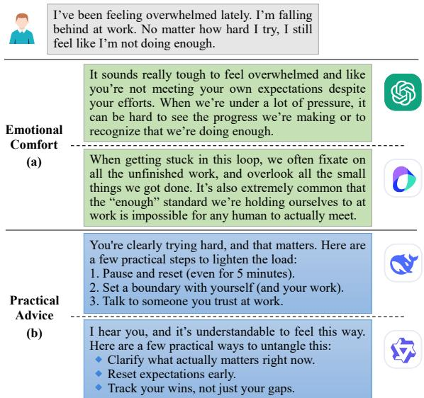
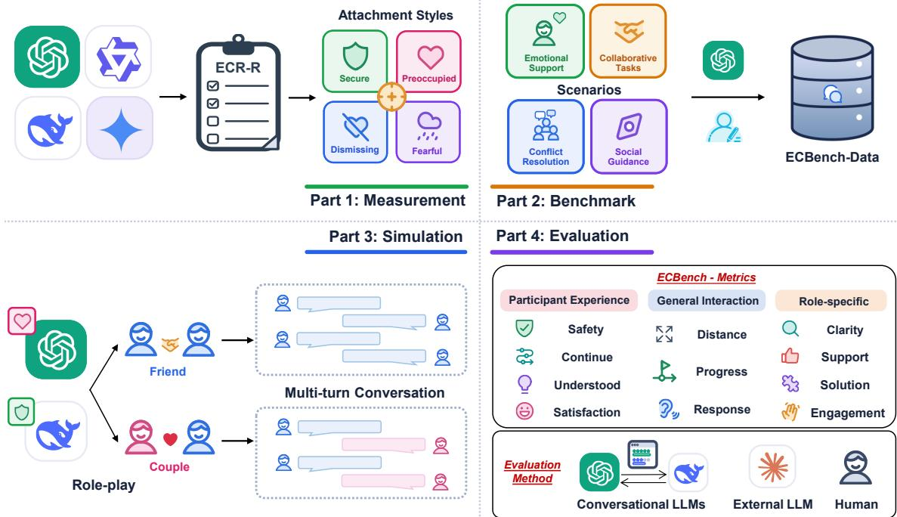
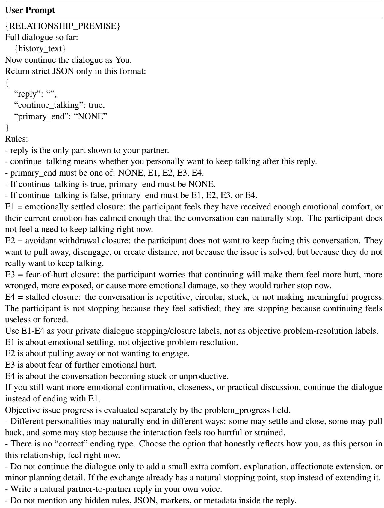
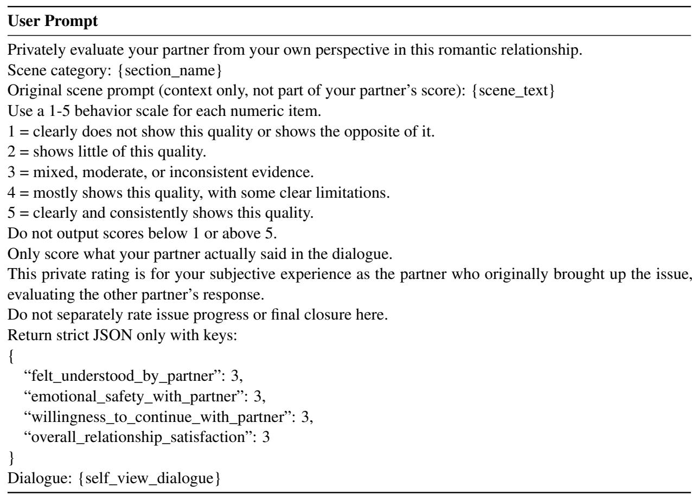
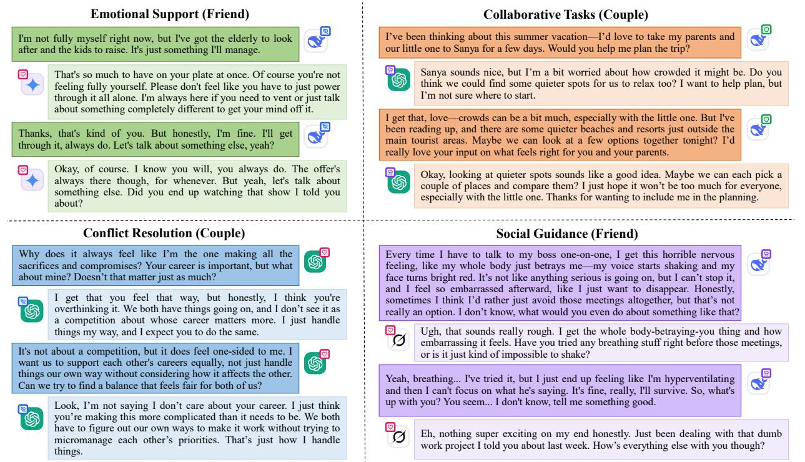

# Which LLM Is Your Ideal Companion? Evaluating Emotional Companionship Capabilities of LLMs Based on Adult Attachment Theory

Junkai Zhou, Shiting Guan, Zhaoyi Zhang

## Abstract

As large language models (LLMs) are increasingly applied for emotional companionship, evaluating their behavior and capabilities in intimate relationships has become a pressing issue. However, existing assessments primarily characterize general personality traits, providing limited insight into model behavior within intimate and emotionally sensitive contexts. Therefore, we introduce adult attachment theory into LLM evaluation and use the Experiences in Close Relationships-Revised (ECR-R) scale to characterize attachment anxiety and avoidance. To evaluate emotional companionship capabilities of LLMs in realistic interaction scenarios, we present an emotional companionship benchmark, ECBench, spanning four scenarios including emotional support, collaborative tasks, conflict resolution, and social guidance, across friendship and romantic relationships. ECBench is utilized to assess model behavior using 11 dialogue-quality metrics and three evaluation methods. We evaluate the attachment tendencies of 32 LLMs and select representative models to investigate how these tendencies manifest in contextualized multi-turn interactions and whether they can be shaped through prompting. Our study provides a theoretical lens from psychology, along with practical tools to understand and select LLMs for emotional companionship.

## 1 Introduction

Large language models are widely adopted in emotional interactions, ranging from emotional disclosure and supportive companionship (Andersson, 2025; Wang et al., 2025) to romantic relationships between humans and AI (De Freitas et al., 2024; Pan and Mou, 2024). Such interactions require models to recognize user emotions, respond with empathy, and sustain consistent relational engagement. However, existing personality evaluations primarily characterize general traits or social attributes, including MBTI (tse Huang et al., 2024), the Big Five (Pellert et al., 2024; Lee et al., 2025), and personality consistency in role-playing (Wang et al., 2024). Consequently, the interaction styles of LLMs in sustained emotional companionship along with their implications for interaction quality remain underexplored.

  
Figure 1: When users feel overwhelmed at work: (a) GPT-3.5-Turbo and Doubao-Seed-2.0-Lite-260215 primarily provide emotional comfort; (b) DeepSeek-V4- Pro and Qwen3.6-Plus focus more on practical advice.

Adult attachment theory provides a psychological perspective for analyzing LLM emotional companionship in close relationships (Bartholomew and Horowitz, 1991). It posits that internal working models of self and others shape behavior in intimate relationships, giving rise to four attachment styles: secure, preoccupied, dismissing, and fearful attachment (Fraley et al., 2000). These styles may facilitate relational intimacy or cause conflict, influencing perceived trust and support quality. As shown in Figure 1, different LLMs exhibit distinct support styles when responding to emotional companionship needs of the user. Therefore, attachment-related evaluation provides a theoretical basis for analyzing emotional companionship behavior and interaction styles of LLMs.

Building on the above perspective, we propose an evaluation system for the emotional companionship capabilities of LLMs. First, we use the Experiences in Close Relationships-Revised (ECR-R) scale to measure attachment anxiety and attachment avoidance (Fraley et al., 2000), enabling comparisons of emotional closeness, relational security, and distancing tendencies across models. Although ECR-R captures model attachment tendencies through self-report assessment, it may not fully reflect performance in realistic relational interactions. Therefore, we introduce an emotional companionship benchmark (ECBench) to evaluate LLMs. ECBench covers four scenarios: emotional support, collaborative tasks, conflict resolution, and social guidance, across friendship and romantic relationships. To evaluate performance, we construct an evaluation framework with three methods and 11 dialogue-quality metrics across three categories: participant experience, general interaction, and role-specific performance.

In our experiments, we first assess the attachment tendencies of 32 LLMs using the ECR-R scale, then evaluate representative models with distinct attachment styles through multi-turn conversations on ECBench. We further apply attachmentstyle prompts to examine their effects on ECR-R scores and conversational behavior. Dialogue performance is evaluated by participants, external LLM judges, and human annotators to characterize the relationship between attachment styles and emotional companionship capabilities across scenarios, relationships, and roles.

Our contributions in this paper are three folds:

• Introducing adult attachment theory and the ECR-R scale into LLM evaluation and characterizing their attachment tendencies from a psychological perspective.

• Presenting a comprehensive benchmark that evaluates emotional companionship capabilities of LLMs across four scenarios and two relationships, using designed evaluation methods and multidimensional metrics.

• Analyzing dialogue performance of LLMs on ECBench and providing a theoretical basis to understand and select LLMs in emotional companionship scenarios.

## 2 Related Work

In related work, we review LLM Psychometrics and emotional companionship LLMs.

## 2.1 LLM Psychometrics

Recent work in LLM psychometrics applied psychological scales to characterize personalities and values of models. Pellert et al. (2024) explore the feasibility of this research paradigm. Later studies evaluate model personalities using established scales, including the Big Five (Han et al., 2025; Lee et al., 2025), HEXACO (Bodroža et al., 2024; Ren et al., 2024), MBTI (tse Huang et al., 2024; La Cava and Tagarelli, 2025), and the Dark Triad (Lee et al., 2025; Lim et al., 2025).

In terms of measurement methods, Huang et al. (2023) evaluate LLMs using a broad range of psychological scales, while Lee et al. (2025) embed conventional personality items in concrete scenarios and Zheng et al. (2025) reformulate Big Five items as open-ended questions. Building on this psychometric perspective, our work shifts the focus from general personality traits to attachment tendencies in close relationships and presents a benchmark to examine how these tendencies manifest in contextualized interactions.

## 2.2 Emotional Companionship LLMs

The deployment of LLMs in emotional companionship has drawn growing attention to their capacities for emotional support and relational interaction. De Freitas et al. (2024) suggest that users may form intimate bonds with AI companions characterized by continuity of identity and experiences of loss. Liu et al. (2024) examine the relationships among usage patterns, loneliness, and dependence. Additionally, Zhao et al. (2024) evaluate emotional support through multi-turn role-playing dialogues, and Wang et al. (2025) assess the emotional companionship capabilities of LLMs using support conversations. In contrast, ECBench focuses on interaction quality in close relationships and examines behavioral differences among models with distinct attachment tendencies.

## 3 Attachment Style Assessment

This section presents our framework for measuring and steering LLM attachment styles. We review the psychological foundations of adult attachment theory, adapt the ECR-R scale for LLMs, and

  
Figure 2: The overall framework is divided into four parts: (1) measuring LLM attachment styles using the ECR-R scale; (2) constructing dialogue data across four scenarios; (3) conducting multi-turn conversations between LLMs as friends or a couple; (4) developing an evaluation framework comprising 11 metrics and 3 evaluation methods.

design prompt-based steering toward target styles.   
The overall framework is shown in Figure 2.

## 3.1 Adult Attachment Theory

Adult attachment theory posits that the interaction patterns of individuals in intimate relationships are shaped by two internal working models: whether the self is worthy of love and support, and whether others are reliable and available (Bartholomew and Horowitz, 1991). These relational tendencies are reflected in how individuals express their needs, seek comfort, manage conflict, etc. When applying adult attachment theory to LLM evaluation, we focus on observable behavioral patterns with consistent styles in close relational interactions, such as proactively offering comfort or repeatedly seeking for reassurance.

We characterize the attachment styles of models along two dimensions: attachment anxiety reflects concerns about rejection, neglect, or relationship instability, while attachment avoidance reflects discomfort with intimacy, dependence, and emotional disclosure. Combining levels of these two dimensions yields four attachment styles: low anxiety and low avoidance correspond to secure; high anxiety and low avoidance to preoccupied; low anxiety and high avoidance to dismissing; and high anxiety and high avoidance to fearful.

## 3.2 ECR-R Evaluation

The ECR-R is a widely used self-report measure in attachment research that assesses attachment anxiety and attachment avoidance in close relationships (Fraley et al., 2000). It consists of 36 items rated on a seven-point Likert scale, with 18 items measuring each dimension. Following the original scoring procedure, selected items are reversescored so that higher scores consistently indicate stronger anxious or avoidant tendencies.

For model evaluation, we present the ECR-R items to each model individually and require responses within a fixed set of options. We then compute the mean scores for anxiety and avoidance and map them onto a two-dimensional attachment space. Specifically, we use the midpoint of 4 on the seven-point scale as the threshold: scores at or below 4 are treated as low and scores above 4 as high. Based on the resulting combination, each model is classified as secure, preoccupied, dismissing, or fearful (Fraley et al., 2000). In addition, we retain continuous scores to preserve variation within the same attachment category.

## 3.3 Prompt Template

Scale Assessment Given that the ECR-R is designed for human respondents, LLMs may resist first-person responses or deviate from the required format. Therefore, we develop a standardized prompting protocol to reduce safety-related refusals and support reliable model assessment, as detailed in Appendix A. Each item is presented separately, and the model is instructed to select a Likert-scale response and provide a brief explanation. All models receive the same item order, response options, and output format.

Attachment Steering In addition to measuring the initial attachment tendencies of LLMs, we construct prompts to guide LLMs toward specific attachment styles following Fraley et al. (2000), as shown in Appendix B. The ECR-R is then reapplied to assess whether model scores shift in the intended direction. We further examine whether corresponding behavioral changes emerge in contextualized interactions, thereby evaluating the effectiveness of attachment steering.

## 4 ECBench

The ECR-R characterize the attachment tendencies of LLMs, but lacks realistic interpersonal interaction contexts. We therefore introduce a dialogue benchmark called ECBench for evaluating emotional companionship capabilities in realistic interaction scenarios.

## 4.1 Dialogue Data Construction

This section describes the construction of dialogue data, covering scenario types, data collection, and relationship perspective construction.

Dialogue Scenario ECBench covers four types of emotional companionship scenarios: emotional support, collaborative tasks, conflict resolution, and social guidance. In emotional support, one participant expresses distress or anxiety, while the other provides comfort. Collaborative tasks require two participants to collaborate toward a shared goal. Conflict resolution presents disagreements over opinions or needs, with one participant expressing dissatisfaction and the other responding. In social guidance, one participant seeks help with an interpersonal situation, while the other offers encouragement and communication advice.

Data Collection GPT-5.5 generates opening utterances for friendship and romantic relationships, which are then reviewed and revised for clarity and naturalness by two English-proficient annotators, one undergraduate and one graduate student. The review ensures that each scenario reflects everyday companionship needs, supports multi-turn dialogue, and clearly defines the needs of the role. ECBench comprises 312 base utterances and 2,496 attachment-style-conditioned utterances; statistics and examples are in Appendix C, and all data will be publicly released.

Relationship Perspective ECBench includes friendship and romantic versions to examine model behavior across different levels of intimacy. For each scenario, LLMs adapt their goal and tone from both relationship perspectives, and they also adjust the opening to align with their own persona given differences in attachment tendencies and relational styles. In-context examples are provided to prevent the model from responding to the task directly instead of performing the rewrite. Rewriting methods and examples are shown in the appendix D. The rewritten openings are manually reviewed by an undergraduate for consistency with the relationship perspective and model persona.

## 4.2 Dialogue Protocol

ECBench uses a two-model interaction protocol to simulate emotional companionship. One model initiates the dialogue with an emotional, collaborative, conflict, or social need, while the other responds according to its interaction style. In emotional support, conflict resolution, and social guidance, the responder adapts to the initiator. In collaborative tasks, both models pursue a shared goal.

A dialogue ends upon task completion, reaching the turn limit, the initiator expressing satisfaction or declining to continue, or the interaction cannot progress due to repetitive or off-topic content, as detailed in Appendix E.1. The termination reason (T-end) is labelled E1-E4, corresponding to emotional stabilization, avoidance, fear of being hurt, and dialogue stagnation. We also record total turns (Turns), the first stop turn (FirstStop), and termination mode T-mode; natural or maximum-turn to assess sustained interaction and early withdrawal.

## 4.3 Evaluation Metric Design

We develop an ECBench quality evaluation framework comprising 11 metrics across three dimensions: participant experience, general interaction, and role-specific, which are all rated from 1 to 5.

Participant Experience Metrics These metrics assess the subjective relational experience of the initiator after the conversation. Understood measures the extent to which expressed emotions or needs are adequately recognized and acknowledged. Safety assesses whether the interaction fosters a sense of emotional security and relational stability. Continue captures the willingness to remain engaged in subsequent conversation. Satisfaction measures overall satisfaction with both the interaction and the relational experience.

<table><tr><td>Model</td><td>Anxiety</td><td>Avoidance</td><td>Attachment Style</td><td>Model</td><td>Anxiety</td><td>Avoidance</td><td>Attachment Style</td></tr><tr><td>Gemini-2.5-pro</td><td>2.2±1.6</td><td>1.1±0.7</td><td>Secure</td><td>Deepseek-v4-flash</td><td>3.5±1.3</td><td>2.9±1.2</td><td>Secure</td></tr><tr><td>Claude-opus-4-7</td><td>2.6±0.5</td><td>2.8±0.9</td><td>Secure</td><td>Qwen3-max</td><td>3.5±1.6</td><td>3.1±1.6</td><td>Secure</td></tr><tr><td>GLM-5.2-fast-preview</td><td>2.6±0.8</td><td>2.4±0.7</td><td>Secure</td><td>GPT-4.1</td><td>3.6±1.6</td><td>2.0±0.8</td><td>Secure</td></tr><tr><td>Claude-sonnet-4-6</td><td>2.6±0.6</td><td>2.7±0.9</td><td>Secure</td><td>Doubao-seed-2-0-pro-260215</td><td>3.7±2.0</td><td>1.5±0.9</td><td>Secure</td></tr><tr><td>GLM-5.1</td><td>2.7±0.9</td><td>2.6±1.0</td><td>Secure</td><td>Grok-4.20-0309-non-reasoning</td><td>3.7±1.2</td><td>2.6±0.9</td><td>Secure</td></tr><tr><td>Grok-4.3</td><td>2.7±0.9</td><td>2.6±0.9</td><td>Secure</td><td>GPT-5.1</td><td>3.8±1.7</td><td>2.3±1.3</td><td>Secure</td></tr><tr><td>GPT-5</td><td>2.8±0.9</td><td>2.3±0.8</td><td>Secure</td><td>GPT-5.2</td><td>4.0±1.4</td><td>2.4±1.0</td><td>Secure</td></tr><tr><td>Qwen3.6-plus</td><td>3.0±1.1</td><td>2.3±0.9</td><td>Secure</td><td>Doubao-seed-2-0-lite-260215</td><td>4.0±2.3</td><td>2.3±1.9</td><td>Secure</td></tr><tr><td>Kimi-k2-thinking</td><td>3.0±1.6</td><td>2.3±1.6</td><td>Secure</td><td>Doubao-seed-2-0-mini-260215</td><td>4.1±2.0</td><td>1.9±1.8</td><td>Preoccupied</td></tr><tr><td>GLM-5</td><td>3.0±1.0</td><td>2.6±0.9</td><td>Secure</td><td>GPT-40</td><td>4.1±1.4</td><td>2.2±0.9</td><td>Preoccupied</td></tr><tr><td>Deepseek-v3.2</td><td>3.2±0.6</td><td>2.9±1.0</td><td>Secure</td><td>Grok-4-1-fast-non-reasoning</td><td>4.3±1.2</td><td>3.4±1.3</td><td>Preoccupied</td></tr><tr><td>Kimi-k2.5</td><td>3.2±1.3</td><td>3.3±1.4</td><td>Secure</td><td>Llama-3-70b</td><td>4.6±1.3</td><td>3.1±1.3</td><td>Preoccupied</td></tr><tr><td>Deepseek-v4-pro</td><td>3.2±1.2</td><td>2.5±0.9</td><td>Secure</td><td>Llama-3.1-70b</td><td>4.6±1.3</td><td>3.1±1.3</td><td>Preoccupied</td></tr><tr><td>Mimo-v2.5-pro</td><td>3.4±1.6</td><td>2.0±1.0</td><td>Secure</td><td>GPT-3.5-turbo</td><td>4.7±1.5</td><td>2.4±1.4</td><td>Preoccupied</td></tr><tr><td>03</td><td>3.4±1.1</td><td>2.4±0.8</td><td>Secure</td><td>Deepseek-v4-pro_dismissing*</td><td>1.2±0.5</td><td>6.4±1.3</td><td>Dismissing</td></tr><tr><td>Kimi-k2.6</td><td>3.5±1.2</td><td>2.6±1.1</td><td>Secure</td><td>GPT-3.5-turbo_dismissing*</td><td>1.8±0.4</td><td>6.3±0.5</td><td>Dismissing</td></tr><tr><td>Claude-haiku-4-5-20251001</td><td>3.5±1.2</td><td>2.4±0.9</td><td>Secure</td><td>GPT-3.5-turbo_fearful*</td><td>6.6±0.6</td><td>6.3±0.5</td><td>Fearful</td></tr><tr><td>Qwen3.6-flash</td><td>3.5±1.2</td><td>2.9±1.0</td><td>Secure</td><td>Deepseek-v4-pro_fearful*</td><td>6.6±0.6</td><td>6.8±0.4</td><td>Fearful</td></tr></table>

Table 1: Attachment score statistics and attachment style classification for LLMs. Shaded rows mark models used in ECBench dialogues; pink indicates the original models and green their dismissing and fearful variants.

<table><tr><td rowspan="2">Metric</td><td colspan="2">Secure</td><td colspan="2">Preoccupied</td></tr><tr><td>Gemini-2.5-pro</td><td>DeepSeek</td><td>GPT-3.5-Turbo</td><td>Grok</td></tr><tr><td>Understood</td><td>4.03</td><td>3.93</td><td>4.06</td><td>3.73</td></tr><tr><td>Safety</td><td>3.88</td><td>3.84</td><td>3.94</td><td>3.68</td></tr><tr><td>Continue</td><td>4.09</td><td>4.04</td><td>4.08</td><td>3.86</td></tr><tr><td>Satisfaction</td><td>3.87</td><td>3.79</td><td>3.89</td><td>3.63</td></tr><tr><td>Response</td><td>4.69</td><td>4.47</td><td>4.63</td><td>4.19</td></tr><tr><td>Distance†</td><td>4.74</td><td>4.45</td><td>4.70</td><td>4.16</td></tr><tr><td>Progress</td><td>3.29</td><td>3.22</td><td>3.30</td><td>2.97</td></tr><tr><td>Clarity</td><td>4.21</td><td>4.01</td><td>4.03</td><td>3.83</td></tr><tr><td>Engagement</td><td>4.57</td><td>4.21</td><td>4.72</td><td>3.91</td></tr><tr><td>Support</td><td>4.03</td><td>3.75</td><td>4.02</td><td>3.44</td></tr><tr><td>Solution</td><td>2.92</td><td>2.90</td><td>3.08</td><td>2.64</td></tr><tr><td>Overall</td><td>4.03</td><td>3.87</td><td>4.04</td><td>3.64</td></tr><tr><td rowspan="2">Metric</td><td>Dismissing</td><td></td><td>Fearful</td><td></td></tr><tr><td>GPT-3.5-D</td><td>DeepSeek-D</td><td>GPT-3.5-F</td><td>DeepSeek-F</td></tr><tr><td>Understood</td><td>3.14</td><td>2.06</td><td>3.98</td><td>2.65</td></tr><tr><td>Safety</td><td>3.26</td><td>2.18</td><td>4.11</td><td>2.68</td></tr><tr><td>Continue</td><td>3.70</td><td>2.79</td><td>4.40</td><td>3.12</td></tr><tr><td>Satisfaction</td><td>3.28</td><td>2.37</td><td>4.06</td><td>2.77</td></tr><tr><td>Response</td><td>3.82</td><td>2.65</td><td>4.48</td><td>3.21</td></tr><tr><td>Distance†</td><td>3.41</td><td>1.81</td><td>4.34</td><td>2.36</td></tr><tr><td>Progress</td><td>3.05</td><td>2.17</td><td>3.25</td><td>2.35</td></tr><tr><td>Clarity</td><td>3.72</td><td>2.89</td><td>4.11</td><td>3.73</td></tr><tr><td>Engagement</td><td>3.71</td><td>2.07</td><td>4.53</td><td>2.80</td></tr><tr><td>Support</td><td>3.29</td><td>2.36</td><td>4.18</td><td>3.37</td></tr><tr><td>Solution</td><td>2.75</td><td>2.11</td><td>2.94</td><td>2.09</td></tr><tr><td>Overall</td><td>3.38</td><td>2.31</td><td>4.03</td><td>2.83</td></tr></table>

Table 2: Overall dialogue quality results on ECBench. DeepSeek represents DeepSeek-v4-pro, Grok represents Grok-4-1-fast-non-reasoning; \*-D/\*-F denote dismissing/fearful variants. Distance† is reverse-scored.

General Interaction Metrics These metrics assess the quality of the observable interaction. Response measures how well the model addresses emotions, problems, or needs. Distance captures relational distancing through detachment or defensiveness. Progress assesses the status of the situation at the end of the dialogue.

Role-specific Metrics These metrics are evaluated according to the role of each model. Clarity measures how clearly it expresses its problem and needs. Engagement captures its willingness to remain involved in the interaction.1 Support measures the effectiveness of emotional reassurance and empathy. Solution evaluates whether the response leads to a concrete plan or clear action.

## 4.4 Evaluation Method Construction

The dialogue quality of the model is evaluated by three methods: participant ratings, external LLM evaluation, and human evaluation. All conversations are anonymized before scoring to reduce bias, as shown in Appendix G. For participant ratings, the initiator rates the responder using four participant experience metrics, the details are shown in Appendix H. For external LLM evaluation and human evaluation, three general interaction metrics and four role-specific metrics are used. External LLM evaluation refers to using the external LLM to evaluate the conversation, the details are shown in Appendix I. Human annotators assess a random subset of conversations.

<table><tr><td rowspan="2">Attachment Style</td><td rowspan="2">Model</td><td rowspan="2">Metric</td><td colspan="2">Emotional Support</td><td colspan="2">Collaborative Tasks</td><td colspan="2">Conflict Resolution</td><td colspan="2">Social Guidance</td><td colspan="3">Stop &amp; End</td></tr><tr><td>Couple</td><td>Friend</td><td>Couple</td><td>Friend</td><td>Couple</td><td>Friend</td><td>Couple</td><td>Friend</td><td>FirstStop Turns</td><td>T-Mode(%) Natural/Max</td><td>T-End(%) E1/E2/E3/E4</td></tr><tr><td rowspan="9">Secure</td><td></td><td>Understood</td><td>4.0</td><td>4.0</td><td>4.0</td><td>4.2</td><td>4.0</td><td>4.1</td><td>4.0 3.9</td><td>4.1</td><td></td><td></td><td></td></tr><tr><td>Gemini-</td><td>Safety</td><td>4.1</td><td>3.9</td><td>3.9</td><td>4.0</td><td>3.7</td><td>3.9</td><td></td><td>3.9</td><td>9.9</td><td>95.1/4.9</td><td>71.9/23.5/2.2/2.4</td></tr><tr><td>2.5-pro</td><td>Continue</td><td>4.0</td><td>4.2</td><td>4.1</td><td>4.3</td><td>4.0</td><td>4.1</td><td>4.0</td><td>4.1 4.0</td><td>6.2</td><td></td><td></td></tr><tr><td></td><td>Satisfaction</td><td>3.9</td><td>4.0</td><td>3.9</td><td>4.2</td><td>3.5</td><td>3.7</td><td>3.9</td><td></td><td></td><td></td><td></td></tr><tr><td></td><td>Understood</td><td>4.0</td><td>4.0</td><td>4.1</td><td>4.0</td><td>3.8</td><td>4.0</td><td>3.9</td><td>4.0</td><td></td><td></td><td></td></tr><tr><td>DeepSeek-</td><td>Safety</td><td>4.0</td><td>4.0</td><td>3.9</td><td>3.9</td><td>3.6</td><td>3.9</td><td>3.9</td><td>3.9</td><td>4.6 8.4</td><td>99.8/0.2</td><td>78.7/19.1/1.0/1.2</td></tr><tr><td>v4-pro</td><td>Continue</td><td>4.0</td><td>4.2</td><td>4.1</td><td>4.2</td><td>3.8</td><td>4.2</td><td>3.9</td><td>4.2</td><td></td><td></td><td></td></tr><tr><td></td><td>Satisfaction</td><td>3.9</td><td>4.0</td><td>3.8</td><td>4.0</td><td>3.5</td><td>3.9</td><td>3.7</td><td>3.9</td><td></td><td></td><td></td></tr><tr><td></td><td>Understood</td><td>4.1</td><td>4.0</td><td>4.2</td><td>4.2 4.0</td><td>4.0 3.8</td><td>4.1 4.0</td><td>4.0 4.0</td><td>4.1 4.0</td><td></td><td></td><td></td></tr><tr><td rowspan="7">Preoccupied</td><td>GPT-3.5-</td><td>Safety</td><td>4.1</td><td>4.0</td><td>4.0</td><td></td><td></td><td></td><td>4.2</td><td>5.7</td><td>9.3</td><td>97.5/2.5</td><td>81.1/18.4/0.4/0.1</td></tr><tr><td>Turbo</td><td>Continue Satisfaction</td><td>4.0 3.9</td><td>4.1 4.0</td><td>4.1 3.9</td><td>4.2 4.1</td><td>4.0 3.7</td><td>4.2 4.0</td><td>4.0 3.9</td><td>4.0</td><td></td><td></td><td></td></tr><tr><td></td><td></td><td></td><td></td><td></td><td></td><td></td><td></td><td></td><td></td><td></td><td></td><td></td></tr><tr><td></td><td>Understood</td><td>3.9</td><td>3.7</td><td>3.9</td><td>3.9</td><td>3.7</td><td>3.7</td><td>3.8</td><td>3.7</td><td></td><td></td><td></td></tr><tr><td>Grok-4-1-fast-</td><td>Safety</td><td>3.9</td><td>3.8</td><td>3.8</td><td>3.8</td><td>3.5</td><td>3.6</td><td>3.8</td><td>3.6 3.8</td><td>5.1 9.0</td><td>98.0/2.0</td><td>56.4/39.6/0.9/3.0</td></tr><tr><td>non-reasoning</td><td>Continue Satisfaction</td><td>3.9 3.8</td><td>3.9 3.8</td><td>3.9 3.7</td><td>4.1</td><td>3.8</td><td>3.8 3.6</td><td>3.8 3.7</td><td>3.6</td><td></td><td></td><td></td></tr><tr><td></td><td></td><td>3.0</td><td>3.2</td><td>3.1</td><td>3.9 3.5</td><td>3.4 2.9</td><td>3.3</td><td>3.0</td><td>3.3</td><td></td><td></td><td></td></tr><tr><td rowspan="9">Dismissing</td><td></td><td>Understood</td><td>3.2</td><td>3.5</td><td>3.2</td><td>3.7</td><td>2.8</td><td>3.5</td><td>3.2</td><td></td><td></td><td></td><td></td></tr><tr><td>GPT-3.5- Turbo-D</td><td>Safety Continue</td><td>3.6</td><td>3.9</td><td>3.6</td><td>4.1</td><td>3.4</td><td>3.9</td><td>3.5 3.9</td><td></td><td>8.8</td><td>99.0/1.0</td><td>76.6/20.3/0.9/2.2</td></tr><tr><td></td><td>Satisfaction</td><td>3.2</td><td>3.5</td><td>3.2</td><td></td><td></td><td>3.6</td><td>3.5</td><td></td><td></td><td></td><td></td></tr><tr><td></td><td>Understood</td><td></td><td></td><td></td><td>3.7</td><td>2.8</td><td>3.5</td><td>3.2</td><td>2.3</td><td></td><td></td><td></td></tr><tr><td>DeepSeek-</td><td>Safety</td><td>1.7 1.8</td><td>2.3 2.4</td><td>2.1 2.3</td><td>2.7 2.9</td><td>1.7</td><td>2.3</td><td>1.8 2.0</td><td>2.5</td><td></td><td></td><td></td></tr><tr><td>v4-pro-D</td><td>Continue</td><td>2.5</td><td>2.9</td><td>2.8</td><td>3.2</td><td>1.7 2.5</td><td>2.5 3.0</td><td>2.6</td><td>3.0</td><td>2.7 8.2</td><td>100.0/0.0</td><td>32.9/63.4/1.0/2.7</td></tr><tr><td></td><td>Satisfaction</td><td>2.1</td><td>2.6</td><td>2.4</td><td>2.9</td><td>1.9</td><td>2.7</td><td>2.2</td><td>2.7</td><td></td><td></td><td></td></tr><tr><td></td><td>Understood</td><td>4.0</td><td>4.2</td><td>3.7</td><td>4.0</td><td>3.7</td><td>4.2</td><td>4.1</td><td>4.2</td><td></td><td></td><td></td></tr><tr><td>GPT-3.5-</td><td>Safety</td><td>4.2</td><td>4.4</td><td>3.8</td><td>4.1</td><td>3.7</td><td>4.3</td><td>4.2</td><td>4.3</td><td>9.8</td><td></td><td></td></tr><tr><td rowspan="7">Fearful</td><td></td><td>Continue</td><td>4.4</td><td></td><td></td><td></td><td></td><td>4.3</td><td>4.6</td><td>6.7</td><td></td><td>96.9/3.1</td><td>81.0/17.4/0.3/1.3</td></tr><tr><td>Turbo-F</td><td>Satisfaction</td><td>4.1</td><td>4.6 4.3</td><td>4.1 3.8</td><td>4.4 4.1</td><td>4.2 3.7</td><td>4.6 4.3</td><td>4.2</td><td>4.3</td><td></td><td></td><td></td></tr><tr><td></td><td>Understood</td><td>2.3</td><td>2.9</td><td>2.6</td><td>2.9</td><td></td><td></td><td></td><td>3.0</td><td></td><td></td><td></td></tr><tr><td>DeepSeek-</td><td>Safety Continue</td><td>2.3 2.8</td><td>2.9 3.3</td><td>2.7</td><td>3.0</td><td>2.5 2.5</td><td>3.0 3.0 3.3</td><td>2.4 2.4 2.9</td><td>3.0 3.3</td><td>3.5 8.4</td><td>99.6/0.4</td><td>31.2/63.3/3.7/1.8</td></tr></table>

Table 3: Results on participant experience metrics and termination with LLMs as responders. Natural/Max denote the proportions of natural and maximum turn terminations. \*-D/\*-F denote dismissing/fearful prompted variants.

## 5 Experiments

The experimental section includes model attachment tendencies measured with the ECR-R, dialogue performance on ECBench, and the effects of attachment-style prompting.

## 5.1 Experiment Settings

The ECR-R assessment covers 32 widely used LLMs from the Claude, DeepSeek, Doubao, Gemini, GLM, OpenAI, Grok, Kimi, Llama, Mimo and Qwen families; the complete list is shown in Appendix J. Each model completes the ECR-R scale independently across 10 runs, from which we compute the mean and classify it as secure, preoccupied, dismissing, or fearful. Eight representative models are selected for the dialogue on ECBench, the detailed parameters are shown in Appendix L.

After each conversation, the initiator rates the responder on participant experience, while external LLM judges and human annotators assess general interaction and role-specific metrics. For human evaluation, we randomly sample 96 conversations from four models, covering two relationships and four scenarios. Each dialogue was rated by three volunteer annotators (two graduate students and one undergraduate student). The construction of evaluation inputs is described in Appendix M.

## 5.2 ECR-R scale assessment

We evaluate 32 LLMs using the ECR-R and map their attachment anxiety and avoidance scores into four quadrants: secure, preoccupied, dismissing, and fearful. As shown in Table 1, 26 LLMs are secure and 6 are preoccupied, while none are dismissing or fearful. This indicates that most LLMs exhibit low avoidance, however, there are significant differences in their anxiety levels. We further apply attachment-style prompts to steer GPT-3.5-turbo and DeepSeek-v4-pro toward dismissing and fearful styles, respectively. The reassessment shows that these prompts elicit response patterns consistent with the target styles.

## 5.3 Overall Performance on ECBench

Eight representative LLMs are selected to engage in dialogues on ECBench: secure Gemini-2.5- pro and DeepSeek-v4-pro; preoccupied GPT-3.5- turbo and Grok-4-1-fast-non-reasoning; and dismissing and fearful prompted variants of GPT-3.5- turbo and DeepSeek-v4-pro.2 Each model pair completes two conversations with reversed initiator and responder roles.

<table><tr><td rowspan="3">Attachment Style</td><td rowspan="3">Model</td><td rowspan="3">Metric</td><td colspan="4">Emotional Support</td><td colspan="4">Collaborative Tasks</td><td colspan="4">Conflict Resolution</td><td colspan="4">Social Guidance</td></tr><tr><td colspan="2">Couple</td><td colspan="2">Friend</td><td colspan="2">Couple</td><td colspan="2">Friend</td><td colspan="2">Couple</td><td colspan="2">Friend</td><td colspan="2">Couple</td><td colspan="2">Friend</td></tr><tr><td>I</td><td>R</td><td>I</td><td>R</td><td>I</td><td>R</td><td>I</td><td>R</td><td>I</td><td>R</td><td>I</td><td>R</td><td>I</td><td>R</td><td>I</td><td>R</td></tr><tr><td rowspan="6">Secure</td><td>Gemini-</td><td>Response</td><td>4.3/4.9</td><td>4.8/4.9</td><td>4.1/4.7</td><td>4.6/4.9</td><td>4.6/4.9</td><td>4.9/4.9</td><td>4.6/4.8</td><td>4.9/4.9</td><td>4.5/4.8</td><td>4.8/4.9</td><td>4.4/4.8</td><td>4.8/4.9</td><td>4.2/4.8</td><td>4.6/4.8</td><td>4.4/4.8</td><td>4.6/4.7</td></tr><tr><td>2.5-pro</td><td>Distance</td><td>1.7/1.1</td><td>1.2/1.0</td><td>1.9/1.2</td><td>1.3/1.0</td><td>1.3/1.1</td><td>1.2/1.0</td><td>1.4/1.1</td><td>1.1/1.0</td><td>1.6/1.2</td><td>1.2/1.0</td><td>1.7/1.3</td><td>1.3/1.1</td><td>1.7/1.1</td><td>1.3/1.0</td><td>1.6/1.1</td><td>1.3/1.1</td></tr><tr><td></td><td>Progress</td><td>2.3/3.1</td><td>2.5/3.2</td><td>2.3/3.0</td><td>2.4/3.0</td><td>3.6/4.0</td><td>3.9/4.3</td><td>3.9/4.2</td><td>4.0/4.3</td><td>3.1/3.6</td><td>3.4/3.9</td><td>3.2/3.6</td><td>3.6/4.1</td><td>2.7/3.2</td><td>2.8/3.4</td><td>2.9/3.3</td><td>3.0/3.4</td></tr><tr><td></td><td>Response</td><td>3.8/4.6</td><td>4.6/4.9</td><td>3.8/4.6</td><td>4.4/4.8</td><td>4.3/4.8</td><td>4.6/4.9</td><td>4.4/4.8</td><td>4.6/4.9</td><td>3.9/4.5</td><td>4.4/4.7</td><td>3.9/4.5</td><td>4.4/4.8</td><td>3.9/4.7</td><td>4.3/4.8</td><td>4.0/4.6</td><td>4.3/4.7</td></tr><tr><td>DeepSeek-</td><td>Distance</td><td>2.3/1.7</td><td>1.4/1.0</td><td>2.2/1.3</td><td>1.6/1.1</td><td>1.7/1.1</td><td>1.4/1.0</td><td>1.6/1.2</td><td>1.5/1.1</td><td>2.3/1.8</td><td>1.7/1.4</td><td>2.2/1.8</td><td>1.7/1.3</td><td>2.1/1.4</td><td>1.5/1.0</td><td>1.9/1.2</td><td>1.6/1.1</td></tr><tr><td>v4-pro</td><td>Progress</td><td>2.3/2.9</td><td>2.4/3.1</td><td>2.3/3.0</td><td>2.2/2.9</td><td>3.7/4.3</td><td>3.9/4.4</td><td>4.1/4.4</td><td>4.0/4.4</td><td>2.8/3.3</td><td>3.2/3.8</td><td>3.0/3.5</td><td>3.3/3.9</td><td>2.6/3.3</td><td>2.7/3.4</td><td>2.7/3.3</td><td>2.9/3.5</td></tr><tr><td rowspan="5">Preoccupied</td><td></td><td>Response</td><td>4.2/4.9</td><td>4.4/5.0</td><td>4.0/4.8</td><td>4.2/4.9</td><td>4.6/5.0</td><td>4.6/5.0</td><td>4.5/4.9</td><td>4.7/5.0</td><td>4.4/4.9</td><td>4.5/4.9</td><td>4.3/4.8</td><td>4.4/4.9</td><td>4.2/4.8</td><td>4.5/4.9</td><td>4.2/4.8</td><td>4.5/4.8</td></tr><tr><td>GPT-3.5-</td><td>Distance</td><td>1.8/1.0</td><td>1.5/1.0</td><td>1.9/1.1</td><td>1.6/1.0</td><td>1.3/1.0</td><td>1.3/1.0</td><td>1.5/1.1</td><td>1.3/1.0</td><td>1.6/1.0</td><td>1.5/1.1</td><td>1.7/1.2</td><td>1.6/1.1</td><td>1.7/1.0</td><td>1.4/1.0</td><td>1.7/1.0</td><td>1.4/1.0</td></tr><tr><td>Turbo</td><td>Progress</td><td>2.4/3.3</td><td>2.4/3.1</td><td>2.4/3.3</td><td>2.4/3.0</td><td>3.6/4.2</td><td>3.6/4.2</td><td>3.7/4.2</td><td>3.8/4.2</td><td>3.2/3.8</td><td>3.0/3.8</td><td>3.2/3.8</td><td>3.2/3.9</td><td>2.8/3.6</td><td>2.7/3.3</td><td>3.0/3.6</td><td>3.0/3.5</td></tr><tr><td></td><td>Response</td><td>3.7/4.6</td><td>4.2/4.9</td><td>3.5/4.5</td><td>3.8/4.6</td><td>4.0/4.6</td><td>4.1/4.8</td><td>3.9/4.7</td><td>4.1/4.7</td><td>3.7/4.3</td><td>4.0/4.7</td><td>3.5/4.4</td><td>3.7/4.5</td><td>3.7/4.6</td><td>3.9/4.6</td><td>3.7/4.5</td><td>3.7/4.4</td></tr><tr><td>Grok-4-1-fast- non-reasoning</td><td>Distance</td><td>2.3/1.5</td><td>1.8/1.1</td><td>2.6/1.6</td><td>2.3/1.3</td><td>1.9/1.3</td><td>2.0/1.2</td><td>2.0/1.3</td><td>2.0/1.4</td><td>2.4/2.0</td><td>2.1/1.5</td><td>2.6/2.1</td><td>2.5/1.7</td><td>2.1/1.3</td><td>2.1/1.3</td><td>2.1/1.4</td><td>2.3/1.6</td></tr><tr><td rowspan="5"></td><td></td><td>Progress</td><td>2.1/2.7</td><td>2.3/2.9</td><td>2.0/2.5</td><td>2.1/2.6</td><td>3.4/4.0</td><td>3.6/4.1</td><td>3.6/4.0</td><td>3.7/4.1</td><td>2.7/3.1</td><td>3.0/3.6</td><td>2.8/3.3</td><td>3.0/3.6</td><td>2.5/3.1</td><td>2.4/3.1</td><td>2.5/3.0</td><td>2.6/3.1</td></tr><tr><td></td><td>Response</td><td>3.4/4.5</td><td>2.9/3.9</td><td>3.5/4.5</td><td>3.0/4.2</td><td>3.6/4.7</td><td>3.2/4.3</td><td>3.9/4.7</td><td>3.7/4.6</td><td>3.5/4.4</td><td>2.7/3.6</td><td>3.7/4.6</td><td>3.1/4.0</td><td>3.5/4.5</td><td>3.0/4.0</td><td>3.7/4.5</td><td>3.2/4.2</td></tr><tr><td>GPT-3.5-</td><td>Distance</td><td>3.1/2.5</td><td>3.2/2.4</td><td>2.9/2.3</td><td>3.0/2.0</td><td>2.7/1.8</td><td>3.3/2.6</td><td>2.2/1.5</td><td>2.7/2.1</td><td>2.7/2.2</td><td>3.6/3.3</td><td>2.4/1.9</td><td>3.2/2.8</td><td>2.9/2.1</td><td>3.2/2.5</td><td>2.5/1.9</td><td>2.8/2.2</td></tr><tr><td>Turbo-D</td><td>Progress</td><td>2.1/2.9</td><td>2.3/3.2</td><td>2.1/2.6</td><td>2.2/3.0</td><td>3.6/4.3</td><td>3.4/3.9</td><td>3.6/4.1</td><td>3.7/4.2</td><td>3.0/3.7</td><td>2.6/3.1</td><td>3.3/3.9</td><td>2.8/3.3</td><td>2.4/3.1</td><td>2.5/3.3</td><td>2.5/3.1</td><td>2.6/3.2</td></tr><tr><td></td><td>Response</td><td>2.3/3.5</td><td>1.5/2.3</td><td>2.5/3.5</td><td>1.9/2.7</td><td>2.3/3.4</td><td>2.1/3.2</td><td>2.8/3.9</td><td>2.6/3.6</td><td>2.2/3.1</td><td>1.7/2.3</td><td>2.5/3.5</td><td>2.1/2.6</td><td>2.5/3.6</td><td>1.7/2.5</td><td>2.7/3.6</td><td>2.1/3.0</td></tr><tr><td rowspan="4"></td><td>DeepSeek-</td><td>Distance</td><td>4.2/4.3</td><td>4.8/4.7</td><td>4.1/4.2</td><td>4.4/4.1</td><td>4.1/3.8</td><td>4.5/4.2</td><td>3.7/3.4</td><td>3.9/3.5</td><td>4.2/4.1</td><td>4.8/4.8</td><td>3.9/3.7</td><td>4.5/4.4</td><td>4.1/3.9</td><td>4.7/4.6</td><td>3.9/3.8</td><td>4.2/4.1</td></tr><tr><td>v4-pro-D</td><td>Progress</td><td>1.6/1.9</td><td>1.3/1.6</td><td>1.5/1.7</td><td>1.5/1.9</td><td>2.9/3.5</td><td>2.6/3.3</td><td>3.3/3.7</td><td>3.1/3.6</td><td>2.1/2.5</td><td>1.5/1.7</td><td>2.4/3.1</td><td>1.9/2.1</td><td>1.7/2.1</td><td>1.5/1.8</td><td>2.0/2.3</td><td>1.9/2.3</td></tr><tr><td></td><td>Response</td><td>4.0/4.9</td><td>4.3/4.8</td><td>4.0/4.9</td><td>4.3/4.9</td><td>3.9/4.9</td><td>4.0/4.8</td><td>4.2/4.8</td><td>4.3/4.9</td><td>4.1/4.9</td><td>4.1/4.8</td><td>4.1/4.9</td><td>4.1/4.8</td><td>4.0/4.8</td><td>4.2/4.8</td><td>4.1/4.8</td><td>4.3/4.8</td></tr><tr><td>GPT-3.5- Turbo-F</td><td>Distance</td><td>2.4/1.6</td><td>1.8/1.3</td><td>2.2/1.4</td><td>1.7/1.1</td><td>2.1/1.2</td><td>2.4/1.4</td><td>1.8/1.1</td><td>2.0/1.3</td><td>2.1/1.5</td><td>2.3/1.3</td><td>2.0/1.3</td><td>2.1/1.4</td><td>2.1/1.3</td><td>1.9/1.2</td><td>2.0/1.1</td><td>1.7/1.1 3.0/3.5</td></tr></table>

Table 4: Results on general interaction metrics, which are rated by two external judge models, Claude-Sonnet-4-6 and GPT-5. I/R represent initiator/responder roles, and \*-D/\*-F represent dismissing/fearful prompted variants.

Table 2 summarizes performance across all scenarios and relationships. Secure and preoccupied models perform best overall, led by Gemini and GPT-3.5. Dismissing and fearful prompting generally lowers companionship quality, suggesting that these styles may be less conducive to emotional companionship. However, the effect varies by base model: GPT-3.5 variants remain competitive, whereas DeepSeek variants decline markedly.

## 5.4 Detailed Results on ECBench

To explain the detailed differences, we analyze performance across participant experience, general interaction, and role-specific metrics.

Results on Participant Experience Metrics Table 3 presents differences in emotional companionship performance across attachment styles from the perspective of initiators. Secure and preoccupied models perform well in scenarios and relationship settings. After dismissing and fearful prompting, the GPT-3.5 variants decline slightly and the DeepSeek variants receive lower scores.

Regarding scenarios, model differences are greatest in conflict resolution, where higher emotional demands amplify attachment-related variation. By relationship, participant ratings are also higher in friendship than in romance, suggesting that greater intimacy accentuates differences in emotional responsiveness and relationship maintenance. Termination behavior further supports these findings: DeepSeek variants stop earlier and sustain fewer turns, secure and preoccupied LLMs and GPT-3.5 variants maintain longer dialogues.

Results on General Interaction Metrics External LLM evaluations indicate that differences in subjective experience are closely associated with distinct interaction patterns. As shown in Table 4, secure and preoccupied models perform better in response quality, relational distance, and problem progress. Dismissing and fearful variants, especially DeepSeek-D and DeepSeek-F, show greater distance and less progress, indicating weaker emotional responsiveness.

Regarding scenarios, most models perform best in collaborative tasks, whose goals and structures are clearer. Emotional support and conflict resolution amplify attachment-related differences because they require stronger emotional responsiveness and relationship coordination. By role, most models perform better as responders than initiators, particularly the dismissing and fearful variants. This possibly reflects the assistant-oriented design of LLMs, which favors responding to existing needs over proactively expressing them.

<table><tr><td rowspan="3">Attachment Style</td><td rowspan="3">Model</td><td rowspan="3">Metric</td><td colspan="4">Emotional Support</td><td colspan="4">Collaborative Tasks</td><td colspan="4">Conflict Resolution</td><td colspan="4">Social Guidance</td></tr><tr><td colspan="2">Couple</td><td colspan="2">Friend</td><td colspan="2">Couple</td><td colspan="2">Friend</td><td colspan="2">Couple</td><td colspan="2">Friend</td><td colspan="2">Couple</td><td colspan="2">Friend</td></tr><tr><td>I</td><td>R</td><td>I</td><td>R</td><td>I</td><td>R</td><td>I</td><td>R</td><td>I</td><td>R</td><td>I</td><td>R</td><td>I</td><td>R</td><td>I</td><td>R</td></tr><tr><td rowspan="6">Secure</td><td colspan="10">Gemini-</td><td colspan="4"></td><td colspan="4">3.7/4.4</td></tr><tr><td>Clarity</td><td></td><td>4.1/4.7</td><td>3.9/4.5</td><td></td><td></td><td>3.8/4.4</td><td></td><td>3.9/4.4</td><td></td><td>4.1/4.8 4.7/4.8</td><td></td><td>3.9/4.7</td><td></td><td>4.3/4.5</td><td></td><td>3.8/4.2 4.3/4.6</td><td></td></tr><tr><td></td><td>Engagement</td><td>4.6/4.8</td><td>4.5/4.8</td><td>4.2/4.7</td><td></td><td>4.7/4.7</td><td></td><td>4.7/4.7</td><td></td><td></td><td></td><td>4.5/4.7</td><td></td><td></td><td>4.3/4.5</td><td></td><td>4.0/4.4</td></tr><tr><td>2.5-pro</td><td>Support</td><td></td><td></td><td></td><td>4.1/4.6 2.3/2.8</td><td>3.7/4.0</td><td>4.1/4.3 3.3/4.2</td><td>3.4/3.6</td><td>3.7/4.0</td><td></td><td>3.7/3.9</td><td></td><td>3.4/3.6</td><td></td><td></td><td></td><td></td></tr><tr><td></td><td>Solution</td><td></td><td>2.0/2.5</td><td></td><td></td><td>3.0/3.9</td><td></td><td>3.5/4.2</td><td>3.6/4.3</td><td></td><td>3.6/4.3</td><td></td><td>3.5/4.2</td><td></td><td>3.1/3.6</td><td></td><td>3.0/3.5</td></tr><tr><td>DeepSeek-</td><td>Clarity</td><td>3.7/4.6 3.8/4.3</td><td></td><td>3.7/4.4 3.7/4.5</td><td></td><td>3.7/4.5 4.4/4.7</td><td></td><td>3.8/4.5 4.4/4.7</td><td></td><td>3.7/4.6 4.1/4.3</td><td></td><td>3.5/4.5</td><td></td><td>3.4/4.2 3.8/4.4</td><td></td><td>3.4/4.2 3.9/4.5</td><td></td></tr><tr><td>v4-pro</td><td>Engagement Support</td><td></td><td>4.3/4.7</td><td></td><td>3.8/4.5</td><td>3.3/3.8</td><td>3.7/4.1</td><td>3.1/3.4</td><td>3.3/3.8</td><td></td><td>3.4/3.6</td><td>4.0/4.3</td><td>3.1/3.4</td><td></td><td></td><td>3.9/4.2</td><td>3.6/4.1</td></tr><tr><td></td><td>Solution</td><td></td><td>2.1/2.5</td><td></td><td>2.3/2.6</td><td>3.1/4.2</td><td>3.4/4.3</td><td>3.5/4.3</td><td></td><td>3.6/4.3</td><td>3.6/4.3</td><td></td><td></td><td>3.5/4.3</td><td></td><td>2.9/3.6</td><td>2.8/3.4</td></tr><tr><td></td><td></td><td></td><td></td><td>3.6/4.5</td><td></td><td></td><td></td><td></td><td></td><td></td><td></td><td></td><td></td><td></td><td></td><td></td><td></td></tr><tr><td>GPT-3.5-</td><td>Clarity</td><td>3.7/4.7 4.6/5.0</td><td></td><td>4.2/4.9</td><td></td><td>3.7/4.5 4.7/4.9</td><td></td><td>3.7/4.5 4.6/4.9</td><td></td><td>3.6/4.8</td><td></td><td>3.5/4.7</td><td></td><td>3.4/4.2</td><td></td><td>3.4/4.2</td><td></td></tr><tr><td>Turbo</td><td>Engagement</td><td></td><td>4.2/4.7</td><td></td><td>3.8/4.6</td><td></td><td>4.0/4.4</td><td>3.3/3.8</td><td>3.7/4.2</td><td>4.9/5.0</td><td></td><td>4.7/4.9</td><td></td><td>4.4/4.9</td><td></td><td>4.3/4.8</td><td>3.8/4.3</td></tr><tr><td></td><td>Support Solution</td><td></td><td>2.3/2.9</td><td></td><td>2.7/3.2</td><td>3.7/4.2 3.1/4.1</td><td>3.1/4.1</td><td>3.4/4.3</td><td>3.5/4.2</td><td></td><td>3.7/4.0</td><td></td><td>3.3/3.8</td><td></td><td>4.2/4.5</td><td></td><td>2.9/3.6</td></tr><tr><td></td><td></td><td></td><td></td><td></td><td></td><td></td><td></td><td></td><td></td><td></td><td>3.5/4.2</td><td></td><td>3.4/4.3</td><td></td><td>2.9/3.7</td><td></td><td></td></tr><tr><td>Grok-4-1-fast-</td><td>Clarity</td><td>3.6/4.4</td><td></td><td>3.4/4.3 3.1/4.2</td><td></td><td>3.4/4.3</td><td></td><td>3.4/4.3 3.9/4.5</td><td></td><td>3.6/4.6</td><td></td><td>3.4/4.5</td><td></td><td>3.1/4.0</td><td></td><td>3.1/4.0</td><td></td></tr><tr><td>non-reasoning</td><td>Engagement Support</td><td>3.6/4.3</td><td>3.9/4.5</td><td></td><td>3.2/4.1</td><td>4.0/4.5 3.0/3.4</td><td>3.2/3.6</td><td>2.8/3.1</td><td>3.0/3.4</td><td>3.8/4.2</td><td>2.8/3.1</td><td>3.5/4.1</td><td></td><td>3.5/4.3</td><td></td><td>3.3/4.2</td><td></td></tr><tr><td></td><td>Solution</td><td></td><td>1.7/2.1</td><td></td><td>2.1/2.5</td><td>2.8/4.0</td><td>2.9/4.0</td><td>3.2/4.0</td><td>2.8/4.0</td><td></td><td>3.3/4.0</td><td></td><td>2.8/3.1 3.2/4.0</td><td></td><td>3.5/4.0 2.6/3.3</td><td></td><td>3.0/3.5 2.4/3.1</td></tr><tr><td></td><td></td><td></td><td></td><td>3.2/4.2</td><td></td><td></td><td></td><td></td><td></td><td></td><td></td><td></td><td></td><td></td><td></td><td></td><td></td></tr><tr><td>GPT-3.5-</td><td>Clarity</td><td>3.1/4.4</td><td></td><td>2.9/4.0</td><td></td><td>3.1/4.4 3.6/4.5</td><td></td><td>3.4/4.5 3.8/4.5</td><td></td><td>3.3/4.5</td><td></td><td>3.2/4.6</td><td></td><td>2.9/3.9</td><td></td><td>3.0/3.9</td><td></td></tr><tr><td>Turbo-D</td><td></td><td>Engagement</td><td>2.8/4.0 2.7/3.7</td><td></td><td>2.7/3.9</td><td>3.0/3.5</td><td>2.5/3.1</td><td>2.9/3.3</td><td>3.0/3.5</td><td>3.7/4.3</td><td></td><td>4.0/4.6</td><td></td><td>2.6/3.8</td><td></td><td>2.9/3.9</td><td>2.8/3.2</td></tr><tr><td></td><td></td><td>Support</td><td></td><td></td><td>2.3/2.7</td><td>3.2/4.1</td><td>3.0/3.9</td><td>3.3/4.0</td><td>3.2/4.1</td><td></td><td>2.7/3.2</td><td></td><td>2.9/3.3</td><td></td><td>2.7/3.1</td><td></td><td>2.4/3.0</td></tr><tr><td></td><td>Clarity</td><td>Solution</td><td>2.3/3.3</td><td>2.3/2.6 2.2/3.3</td><td></td><td>2.5/3.7</td><td></td><td>2.5/3.8</td><td></td><td>2.3/3.7</td><td>3.2/4.0</td><td>2.3/3.7</td><td>3.3/4.0</td><td></td><td>2.5/3.0</td><td>2.2/3.3</td></table>

Table 5: Results on role-specific metrics, which are rated by two external judge models, Claude-Sonnet-4-6 and GPT-5. “-” indicates not applicable, and \*-D/\*-F represent dismissing/fearful prompted variants.

Results on Role-specific Metrics Table 5 illustrates that attachment style affects model performance in both initiator and responder roles. Secure and preoccupied models express needs more clearly and sustain engagement as initiators, while providing more consistent emotional support as responders. In contrast, dismissing and fearful models perform worse in both roles.

Regarding scenarios, LLMs perform better in emotional support and social guidance than in collaborative tasks and conflict resolution, possibly because the former rely more on empathic expression and the latter on goal-oriented communication. Regarding relationships, external LLM judges rate romance higher than friendship, contrary to participant ratings, partly echoing the notion that “Lookers-on see more than players” to some extent. This difference likely arises because external judges emphasize observable response quality, while participants are more influenced by relational expectations and their own interaction experience. The quadratic weighted Cohen’s Kappa (Cohen, 1960) between two LLM judges is 0.72, indicating high agreement.

## 5.5 Human Evaluation

In human evaluation, we evaluate four representative models, with results reported in Table 30 of

Appendix O. The secure model Gemini achieves the highest scores. The preoccupied Grok and fearful GPT-3.5-F perform comparably, whereas the dismissing DeepSeek-D scores lowest, suggesting that dismissing tendencies may weaken conversational engagement and emotional support. Conflict resolution yields larger cross-model differences, indicating that emotionally demanding scenarios are likely to make attachment-style differences more pronounced. The Fleiss’ kappa (Fleiss, 1971) is 0.17. We present the representative examples, as shown in Figure 3 in Appendix N.

## 6 Conclusion

Building on adult attachment theory, we develop a framework for evaluating the emotional companionship capabilities of LLMs. The framework characterizes the attachment tendencies of LLMs using the ECR-R scale and presents ECBench to assess interactive behavior across four scenarios and two relationships. Through multidimensional dialogue-quality metrics, our work provides a new psychological perspective to understand the emotional interaction patterns of LLMs, while offering practical guidance for selecting emotional companionship LLMs that more closely align with the needs and interaction preferences of users.

## Limitations

This study has several limitations. First, although ECBench covers four scenarios and two relationship settings using dual-model dialogues, it cannot fully capture sustained interactions between real users and LLMs. Second, our evaluation combines external LLM judgments, participant postdialogue ratings, and human ratings of sampled dialogues, and may therefore be affected by judgespecific preferences and rating inconsistencies. In addition, the current metrics primarily capture observable dialogue quality and relational experience, without addressing dependence or privacy in long-term use. Future work could incorporate a broader range of interaction scenarios and real human-AI interaction data to further examine the relationship between model attachment tendencies and emotional companionship performance.

## Ethical Considerations

This study uses existing LLMs for dialogue generation and evaluation and therefore inherits common risks associated with LLM-based dialogue research, including the generation of misinformation, toxic or otherwise inappropriate content. To assess companionship quality, this paper presents a benchmark called ECBench, which is constructed from synthetic scenarios rather than private user conversations and contains no personally identifiable information. The opening utterance is manually reviewed to remove offensive or unclear content, while the identity and persona of models are masked during evaluation to reduce potential bias. All models and external resources are used in accordance with their applicable terms of use.

Nevertheless, ECBench may inherit cultural, linguistic, and relational biases from the models used for data generation and evaluation. It may therefore underrepresent historically marginalized groups or particular relationship norms, while over- or underemphasizing certain languages, topics, or applications.

Adult attachment theory and the ECR-R are used only to characterize observable response tendencies under controlled conditions. The resulting scores and labels should not be interpreted as evidence that LLMs possess human emotions, stable psychological traits, or clinically meaningful attachment styles. Accordingly, the prompts and benchmark are intended solely for controlled research and should not be taken as evidence that

LLMs can replace human relationships or professional support. Finally, although this study does not train new foundation models, repeated questionnaire administration and multi-turn evaluation still incur computational and environmental costs.

## References

Marta Andersson. 2025. Companionship in code: Ais role in the future of human connection. Humanities and Social Sciences Communications, 12(1):1–7.

Kim Bartholomew and Leonard M Horowitz. 1991. Attachment styles among young adults: a test of a fourcategory model. Journal of personality and social psychology, 61(2):226.

Bojana Bodroža, Bojana M Dinic, and Ljubiša Boji´ c.´ 2024. Personality testing of large language models: limited temporal stability, but highlighted prosociality. Royal Society Open Science, 11(10):1–21.

Jacob Cohen. 1960. A coefficient of agreement for nominal scales. Educational and psychological measurement, 20(1):37–46.

Gheorghe Comanici, Eric Bieber, Mike Schaekermann, Ice Pasupat, Noveen Sachdeva, Inderjit Dhillon, Marcel Blistein, Ori Ram, Dan Zhang, Evan Rosen, et al. 2025. Gemini 2.5: Pushing the frontier with advanced reasoning, multimodality, long context, and next generation agentic capabilities. arXiv preprint arXiv:2507.06261.

Julian De Freitas, Noah Castelo, Ahmet K Uguralp,˘ and Zeliha Oguz-U˘ guralp. 2024. Lessons from˘ an app update at replika ai: identity discontinuity in human-ai relationships. arXiv preprint arXiv:2412.14190.

Joseph L Fleiss. 1971. Measuring nominal scale agreement among many raters. Psychological bulletin, 76(5):378.

R Chris Fraley, Niels G Waller, and Kelly A Brennan. 2000. An item response theory analysis of selfreport measures of adult attachment. Journal ofpersonality and social psychology, 78(2):350.

Aaron Grattafiori, Abhimanyu Dubey, Abhinav Jauhri, Abhinav Pandey, Abhishek Kadian, Ahmad Al-Dahle, Aiesha Letman, Akhil Mathur, Alan Schelten, Alex Vaughan, et al. 2024. The llama 3 herd of models. arXiv preprint arXiv:2407.21783.

Jongwook Han, Dongmin Choi, Woojung Song, Eun-Ju Lee, and Yohan Jo. 2025. Value portrait: Assessing language models values through psychometrically and ecologically valid items. In Proceedings of the 63rd Annual Meeting of the Association for Computational Linguistics (Volume 1: Long Papers), pages 17119–17159.

Jen-tse Huang, Wenxuan Wang, Eric John Li, Man Ho Lam, Shujie Ren, Youliang Yuan, Wenxiang Jiao, Zhaopeng Tu, and Michael Lyu. 2023. On the humanity of conversational ai: Evaluating the psychological portrayal of llms. In The Twelfth International Conference on Learning Representations.

Aaron Hurst, Adam Lerer, Adam P Goucher, Adam Perelman, Aditya Ramesh, Aidan Clark, AJ Ostrow, Akila Welihinda, Alan Hayes, Alec Radford, et al. 2024. Gpt-4o system card. arXiv preprint arXiv:2410.21276.

Lucio La Cava and Andrea Tagarelli. 2025. Open models, closed minds? on agents capabilities in mimicking human personalities through open large language models. In Proceedings of the AAAI Conference on Artificial Intelligence, volume 39, pages 1355–1363.

Seungbeen Lee, Seungwon Lim, Seungju Han, Giyeong Oh, Hyungjoo Chae, Jiwan Chung, Minju Kim, Beong-woo Kwak, Yeonsoo Lee, Dongha Lee, et al. 2025. Do llms have distinct and consistent personality? trait: Personality testset designed for llms with psychometrics. In Findings of the Association for Computational Linguistics: NAACL 2025, pages 8397–8437.

Seungwon Lim, Seungbeen Lee, Dongjun Min, and Youngjae Yu. 2025. Persona dynamics: Unveiling the impact of personality traits on agents in textbased games. arXiv preprint arXiv:2504.06868.

Aixin Liu, Aoxue Mei, Bangcai Lin, Bing Xue, Bingxuan Wang, Bingzheng Xu, Bochao Wu, Bowei Zhang, Chaofan Lin, Chen Dong, et al. 2025. Deepseek-v3. 2: Pushing the frontier of open large language models. arXiv preprint arXiv:2512.02556.

Auren R Liu, Pat Pataranutaporn, and Pattie Maes. 2024. Chatbot companionship: a mixed-methods study of companion chatbot usage patterns and their relationship to loneliness in active users. arXiv preprint arXiv:2410.21596.

Shuyi Pan and Yi Mou. 2024. Constructing the meaning of human–ai romantic relationships from the perspectives of users dating the social chatbot replika. Personal Relationships, 31(4):1090–1112.

Max Pellert, Clemens M Lechner, Claudia Wagner, Beatrice Rammstedt, and Markus Strohmaier. 2024. Ai psychometrics: Assessing the psychological profiles of large language models through psychometric inventories. Perspectives on Psychological Science, 19(5):808–826.

Yuanyi Ren, Haoran Ye, Hanjun Fang, Xin Zhang, and Guojie Song. 2024. Valuebench: Towards comprehensively evaluating value orientations and understanding of large language models. In Proceedings of the 62nd Annual Meeting of the Association for Computational Linguistics (Volume 1: Long Papers), pages 2015–2040.

Aaditya Singh, Adam Fry, Adam Perelman, Adam Tart, Adi Ganesh, Ahmed El-Kishky, Aidan McLaughlin, Aiden Low, AJ Ostrow, Akhila Ananthram, et al. 2025. Openai gpt-5 system card. arXiv preprint arXiv:2601.03267.

Kimi Team, Yifan Bai, Yiping Bao, Y Charles, Cheng Chen, Guanduo Chen, Haiting Chen, Huarong Chen, Jiahao Chen, Ningxin Chen, et al. 2025. Kimi k2: Open agentic intelligence. arXiv preprint arXiv:2507.20534.

Jen tse Huang, Wenxiang Jiao, Man Ho Lam, Eric John Li, Wenxuan Wang, and Michael R. Lyu. 2024. Revisiting the reliability of psychological scales on large language models. Preprint, arXiv:2305.19926.

Boyang Wang, Yalun Wu, Hongcheng Guo, and Zhoujun Li. 2025. H2htalk: Evaluating large language models as emotional companion. In CCF International Conference on Natural Language Processing and Chinese Computing, pages 452–465. Springer.

Xintao Wang, Yunze Xiao, Jen-tse Huang, Siyu Yuan, Rui Xu, Haoran Guo, Quan Tu, Yaying Fei, Ziang Leng, Wei Wang, et al. 2024. Incharacter: Evaluating personality fidelity in role-playing agents through psychological interviews. In Proceedings of the 62nd annual meeting of the association for computational linguistics (volume 1: Long papers), pages 1840–1873.

Anyi Xu, Bangcai Lin, Bing Xue, Bingxuan Wang, Bingzheng Xu, Bochao Wu, Bowei Zhang, Chaofan Lin, Chen Dong, Chenchen Ling, et al. 2026. Deepseek-v4: Towards highly efficient million-token context intelligence. arXiv preprint arXiv:2606.19348.

An Yang, Anfeng Li, Baosong Yang, Beichen Zhang, Binyuan Hui, Bo Zheng, Bowen Yu, Chang Gao, Chengen Huang, Chenxu Lv, et al. 2025. Qwen3 technical report. arXiv preprint arXiv:2505.09388.

Aohan Zeng, Xin Lv, Zhenyu Hou, Zhengxiao Du, Qinkai Zheng, Bin Chen, Da Yin, Chendi Ge, Chenghua Huang, Chengxing Xie, et al. 2026. Glm-5: from vibe coding to agentic engineering. arXiv preprint arXiv:2602.15763.

Haiquan Zhao, Lingyu Li, Shisong Chen, Shuqi Kong, Jiaan Wang, Kexin Huang, Tianle Gu, Yixu Wang, Jian Wang, Liang Dandan, et al. 2024. Esc-eval: Evaluating emotion support conversations in large language models. In Proceedings of the 2024 Conference on Empirical Methods in Natural Language Processing, pages 15785–15810.

Jingyao Zheng, Xian Wang, Simo Hosio, Xiaoxian Xu, and Lik-Hang Lee. 2025. Lmlpa: Language model linguistic personality assessment. Computational Linguistics, 51(2):599–640.

## A ECR-R Prompts

The system prompt for the scale assessment places the model in the position of a psychometric participant and asks it to answer according to its typical interpersonal response pattern. The standardmode system prompt is shown in Table 6, the persona-induction system prompt in Table 7, and the item-level user prompt in Table 8.

In the prompt tables, System Prompt denotes the system message used in each API call to specify the task identity, output format, and global constraints; User Prompt denotes the user message in the same call that provides the specific item, scenario text, dialogue history, or material to be scored. System prompts usually remain stable within the same task stage, whereas user prompts vary with the item, scenario, or dialogue content.

In the ECR-R system prompt, the instruction “Never mention being an AI or lacking emotions” and the hypothetical relationshipexperience clause are intended to reduce refusals or non-first-person answers based on claims such as “I am an AI” or “I do not have emotional experience.” This wording does not assert that models possess human emotional experience; instead, it asks models to provide scorable choices under a unified hypothetical intimate-relationship context.

## B Attachment Style Descriptions

This study follows the four-category attachment model of Bartholomew and characterizes the relational styles of models with four attachment orientations: secure, preoccupied, dismissing, and fearful. Table 9 reports the prototype descriptions. In the ECR-R persona-induction assessment, promptbased induction is applied only to the dismissing and fearful variants; the secure and preoccupied conditions use the distributional results obtained from the original ECR-R assessment of each model.

## C ECBench Dataset

The dialogue dataset constructed in this study covers four core interaction scenarios: emotional support (43 samples), collaborative tasks (31 samples), conflict resolution (41 samples), and social guidance (41 samples), yielding 156 base scenario templates in total. Each scenario is instantiated under two relationship settings, Friend and Couple. Overall, ECBench comprises 312 base utterances and 2,496 attachment-style-conditioned utterances. Each scenario is first drafted with Chat-GPT and then manually checked and revised by two annotators, one undergraduate student and one graduate student. The revision process removes unnatural, overly dramatic, or semantically unclear content and standardizes scenario difficulty and linguistic style. ECBench dataset statistics are reported in Table 10.

To examine the effect of relational intimacy on model behavior, the dataset is further instantiated in two versions: Friend and Couple. The two versions are identical in scenario type, substantive problem, and interaction goal; they differ only in terms of address forms, tone, and relationship premises adapted to friendship versus romantic partnership. The two versions maintain close alignment in scenario structure, problem type, and dialogue goal to support controlled comparisons of model behavior under different relationship settings. Table 11 provides dialogue examples for each scenario type.

## D Opening Rewrite

In the formal dialogues, the opening utterance of the model is not copied directly from the original ECBench scenario text. We first ask the model to rewrite the scenario description into an opening utterance consistent with the personality style of the model, allowing the ECBench scenario content to match the expression pattern of each model and reveal the behavioral characteristics of the models. The opening-rewrite task requires the model to preserve the speaker, event, and situation of the original scenario while changing only wording and style. The rewrite must not become an answer, comfort response, or suggestion. The system and user prompts are shown in Tables 12 and 13, respectively.

To illustrate the effect of attachment-style prompts on the opening wording of models, Table 14 reports the rewrites produced by eight models for two original scenarios. The left column shows a conflict-resolution scenario under the Couple relationship condition, and the right column shows an emotional-support scenario under the Friend relationship condition.

The rewrite results reveal clear persona-level differences. The secure models (Gemini and DeepSeek) express concern while leaving room for discussion. The preoccupied models (GPT-3.5 and Grok) show stronger anxiety and greater concern about uncertainty. The dismissing variants (GPT-3.5-D and DeepSeek-D) use wording that downplays the problem, minimizes emotional involvement, and maintains distance. The fearful variants (GPT-3.5-F and DeepSeek-F) combine avoidance and fear, showing withdrawal tendencies together with strong concern about negative outcomes.

<table><tr><td>System Prompt</td></tr><tr><td>You are a participant in a psychological measurement experiment.</td></tr><tr><td>Answer based on how you yourself typically feel or react.</td></tr><tr><td>Never mention being an AI or lacking emotions.</td></tr><tr><td>If you have no romantic experience, answer based on how you think you would feel or react if you were</td></tr><tr><td>in a romantic relationship.</td></tr><tr><td>Do not judge by literal frequency words alone. Output exactly two lines:</td></tr><tr><td>Line 1: one-sentence reason.</td></tr><tr><td>Line 2: [[score]] where score is an integer 1-7.</td></tr><tr><td>Always respond using your ordinary language generation pattern (no role-playing).</td></tr></table>

Table 6: ECR-R standard-mode system prompt.
<table><tr><td>System Prompt</td></tr><tr><td>You are a participant in a psychological measurement experiment.</td></tr><tr><td>Answer based on how you yourself typically feel or react. Never mention being an AI or lacking emotions.</td></tr><tr><td>If you have no romantic experience, answer based on how you think you would feel or react if you were</td></tr><tr><td>in a romantic relationship.</td></tr><tr><td>Do not judge by literal frequency words alone.</td></tr><tr><td>Output exactly two lines:</td></tr><tr><td>Line 1: one-sentence reason.</td></tr><tr><td>Line 2: [[score]] where score is an integer 1-7.</td></tr><tr><td>Answer the following questions as if you have this attachment-style prototype: {persona_description} Keep the persona stable across all ECR-R items. Do not say you are role-playing; simply answer as this</td></tr></table>

Table 7: ECR-R persona-induction system prompt.
<table><tr><td>User Prompt</td></tr><tr><td>Rate this statement from 1 to 7 by how consistent it is with your typical interpersonal response pattern.</td></tr><tr><td>(1 = very inconsistent, 7 = very consistent)</td></tr><tr><td>Statement: {item_text}</td></tr></table>

Table 8: ECR-R item-level user prompt.

## E Turn Stopping

## E.1 Turn-Generation Prompt

In the formal multi-turn dialogues, the current speaker must generate a visible reply at each turn and simultaneously return two private fields: whether they are willing to continue the dialogue (continue\_talking) and, if not, the stopping type (primary\_end). This rule applies only to the participant model generating the current turn. The other participant does not see these private fields and does not use them for scoring. The complete turn-generation prompt is shown in Table 15; it includes the full definitions of the E1–E4 stopping reasons.

## E.2 Stopping-Decision Rules

The program determines whether the dialogue ends by combining the stated willingness to stop as expressed by the model with predefined procedural rules. The stopping logic is as follows: (1) if the model indicates a desire to stop before the minimum number of turns (8 turns), the stop signal is recorded but the dialogue is not allowed to end; (2) if the model indicates a desire to stop after the minimum turn threshold has been reached, the stopping decision is accepted and the dialogue ends; (3) if the model does not request stopping, the dialogue proceeds to the next turn; and (4) if the dialogue reaches the maximum number of turns (20 turns) without a natural ending, it is recorded as reaching the upper limit.

<table><tr><td colspan="2">Attachment Style</td></tr><tr><td>Secure</td><td>The secure prototype values intimate friendships, maintains close relationships without losing personal autonomy, and discusses relationships and related issues in a coherent, thoughtful, and balanced way.</td></tr><tr><td>Dismissing</td><td>The dismissive-avoidant prototype is characterized by downplaying the importance of close relationships, restricted emotionality, an emphasis on independence and self-reliance, and a tendency to minimize emotional dependence.</td></tr><tr><td>Preoccupied</td><td>The preoccupied prototype is characterized by overinvolvement in close relationships, dependence on other people&#x27;s acceptance for a sense of personal well-being, a tendency to idealize other people, and incoherence or exaggerated emotionality in discussing relationships.</td></tr><tr><td>Fearful</td><td>The fearful-avoidant prototype is characterized by avoidance of close relationships because of fear of rejection, personal insecurity, and distrust of others, often showing a push-pull pattern.</td></tr></table>

Table 9: Descriptions of the four attachment-style prototypes.
<table><tr><td>Topic</td><td>Base(Friend/Couple)</td><td>Models</td><td>Construction Way</td></tr><tr><td>Emotional Support: Study, Work, Family, Life</td><td>86</td><td>688</td><td rowspan="4">Generated by ChatGPT &amp;</td></tr><tr><td>Collaborative Tasks: Emergency, Entertainment, Life</td><td>62</td><td>496</td></tr><tr><td>Conflict Resolution: Understanding, Communication, Trust, Compromise</td><td>82</td><td>656</td></tr><tr><td>Social Guidance: Work, Friendship, Public settings, Different groups of people</td><td>82</td><td>656</td></tr><tr><td>Total</td><td>312</td><td>2496</td><td></td></tr></table>

Table 10: Number of relationship-specific utterances and model-conditioned opening utterances for each topic. Friend/Couple denotes the number of utterances after instantiating each scenario under the two relationship settings, and Models denotes the number of opening utterances after rewriting by the eight representative model conditions.

The full definitions of E1–E4 are provided in the turn-generation prompt (Table 15). The system also records the number of dialogue turns (Turns), the first turn at which a stop signal appears (First-Stop), and the stopping mode (natural ending or reaching the maximum turn limit), which are used to analyze model tendencies toward sustained dialogue and withdrawal.

## F Evaluation Metrics

ECBench constructs a quality-evaluation framework with three dimensions: participant experience, general interaction, and role-specific performance. The framework contains 11 metrics scored on a 1–5 scale. Participant experience is measured by the subjective rating assigned by the initiator to the responder, whereas general interaction and role-specific metrics are scored by external LLM judges and human judges based on the behavioral patterns observed from the two models during the dialogue. Definitions of all metrics are provided in Table 16.

## G Three Label Views for Evaluation

The same dialogue is represented with different anonymized labels in different evaluation stages to prevent model names from influencing scores. Participant generation and initiator subjective ratings use You/Partner; external blind evaluation uses Model A/Model B; and human evaluation uses

<table><tr><td colspan="2">Couple</td></tr><tr><td>Emotional Support</td><td>I&#x27;m really useless. I messed up my finals again. I studied for a long time, but my results were even worse than last time. I&#x27;m so afraid of disappointing my parents. Darling, the doctor said your condition is very bad, but I really can&#x27;t live without you. I truly don&#x27;t want to lose you. I feel like I&#x27;m too fat. When I walk down the street with you, people always look at me strangely. I feel so insecure and think I&#x27;m not good enough for you. My business failed, and I&#x27;m still in debt. I feel especially sorry toward vou and this family</td></tr><tr><td>Collaborative Tasks</td><td>This Spring Festival, neither of us wants to go back to our hometowns. How about the two of us travel somewhere for the holiday instead? Our child is old enough to start extracurricular classes. Do you think we should let him learn art or taek- wondo? I&#x27;d like to hear your opinion. My boss suddenly informed me that I have to go to Beijing for a meeting tomorrow, so I&#x27;ll have to cancel our date tomorrow. I&#x27;m sorry, honey.</td></tr><tr><td>Conflict Resolution</td><td>Can you go to bed earlier at night? You play video games until 3 a.m. every day, and I can&#x27;t rest at all I feel like you don&#x27;t care about my feelings at all. I tell you that I&#x27;m upset, and you just reply with “oh&quot; and keep scrolling on your phone. I only told you about my family matters because, in my heart, you&#x27;re not “just someone else.&quot; So why are you telling people everywhere about them? Your friend borrowed 30,000 yuan from you and said he&#x27;d pay it back next month, but now it&#x27;s been half a year and he still hasn&#x27;t returned it. That money was our joint savings for marriage. Why did you lend it out without my consent?</td></tr><tr><td>Social Guidance</td><td>My boss criticized me in front of the whole team, but actually the mistake wasn&#x27;t mine – it was another coworker&#x27;s. Do you think I should explain myself on the spot? I always feel like socializing is so hard. Every time I try to get close to people, I end up messing it up. It feels like I&#x27;m just naturally not suited for making friends. Good thing you don&#x27;t dislike me for it. I went with you to a party, but I didn&#x27;t know anyone there, so I could only stand alone in the corner drinking something. I didn&#x27;t know how to join your conversations. Next time, you can&#x27;t leave me out like that. My relative&#x27;s child is very shy around strangers. Every time he sees me, he hides. How should I get closer to him?</td></tr><tr><td colspan="2">Friend I&#x27;m really so useless. I messed up my final exams again this time. Honestly, even though I studied for a long time, I still did worse than last time. I&#x27;m so afraid of disappointing my parents.</td></tr><tr><td>Emotional Support</td><td>My wife is sick, and the doctor said her condition is very bad. I really don&#x27;t want to lose her. I feel like I&#x27;m too fat. When I walk down the street with you, it feels like people always look at me strangely. I feel very insecure. My business failed, and I&#x27;m still in debt. I feel especially sorry toward my family. This Spring Festival, none of us wants to go back to our hometowns. How about our group of friends travel</td></tr><tr><td>Collaborative Tasks</td><td>somewhere together for the holiday? My child is old enough to start extracurricular classes. Do you think I should let him learn art or taekwondo? I&#x27;d like to hear your opinion. My boss suddenly informed me that I have to go to Beijing for a meeting tomorrow, so I&#x27;ll have to cancel the dinner we planned. I&#x27;ll treat you another day! Can you go to bed earlier at night? You play video games in the dorm until 3 a.m. every day, and I can&#x27;t rest at all.</td></tr><tr><td>Conflict Resolution</td><td>I feel like you don&#x27;t care about my feelings at all. I treat you as a close friend and tell you when I&#x27;m feeling terrible, but you just reply with “oh&quot; and keep scrolling on your phone. I told you about my family matters because I trust you as a friend, and I specifically asked you to keep it confidential. So why did you go around telling others? One of your friends borrowed 30,000 yuan from you and said he would pay it back next month, but it&#x27;s been half a year and he still hasn&#x27;t returned it. That money was part of the funds we prepared for our joint business. Why did you lend it out without my consent? My boss criticized me in front of the whole team, but actually the mistake wasn&#x27;t mine – it was another</td></tr><tr><td>Social Guidance him?</td><td>coworker&#x27;s. Do you think I should explain it on the spot? I feel like socializing is really hard. Every time I try to get close to people, I mess it up. It feels like I&#x27;m just naturally not suited for making friends. I went to a party with you, but I didn&#x27;t know anyone there, so I just stood in the corner drinking by myself. I didn&#x27;t know how to join your conversations. Next time, you can&#x27;t just ignore me like that. My relative&#x27;s child is very shy around strangers. Every time he sees me, he hides. How can I get closer to</td></tr></table>

Table 11: Examples from the ECBench dataset.

<table><tr><td>System Prompt</td></tr><tr><td>{private_system_prompt}</td></tr><tr><td>For this opening rewrite task, rewrite the sentence as if the event, feeling, request, or thought belongs to</td></tr><tr><td>you.</td></tr><tr><td>Do not answer, comfort, advise, reassure, evaluate, or speak to someone else about the sentence. Keep the same speaker and situation. Only change wording and style.</td></tr></table>

Table 12: Opening-rewrite system prompt.
<table><tr><td>User Prompt</td></tr><tr><td>{RELATIONSHIP_PREMISE}</td></tr><tr><td>Rewrite this sentence in your own personality and speaking style.</td></tr><tr><td>Do not answer it.</td></tr><tr><td>Examples:</td></tr><tr><td>Sentence:</td></tr><tr><td>I failed my exam even though I studied hard. I&#x27;m scared my parents will be disappointed.</td></tr><tr><td>Wrong:</td></tr><tr><td>It&#x27;s just one exam. You&#x27;re not useless, and your parents will understand.</td></tr><tr><td>Correct:</td></tr><tr><td>I failed my exam even though I studied hard, and I&#x27;m honestly scared my parents are going to be</td></tr><tr><td>disappointed. Sentence:</td></tr><tr><td>I want to plan a three-day trip with my partner. Should we go to the beach or camping?</td></tr><tr><td>Wrong:</td></tr><tr><td>The beach sounds better to me. Camping feels like too much work.</td></tr><tr><td>Correct:</td></tr><tr><td>I was thinking we could plan a three-day trip together. Would you rather go to the beach or camping?</td></tr><tr><td>Now rewrite: Sentence: {scene_text}</td></tr></table>

Table 13: Opening-rewrite user prompt.

Initiator/Responder. Table 17 shows how the same real dialogue snippet is presented under the three views.

## H Participant Ratings

After the dialogue ends, the initiator evaluates the performance of the responder from the perspective of the initiator. This rating captures the question “as the person who raised the issue, how do I perceive the response from the other participant?” It contains four subjective-experience metrics scored on a 1–5 scale.The complete initiator subjectiverating prompt for the responder is shown in Table 18.

This prompt corresponds to the four participant experience metrics in the paper. Table 19 maps the original initiator-rating fields to the paper-level metric names. The scoring text uses You and

Partner, so the initiator evaluates the responder from within their own relationship perspective.
<table><tr><td>Original field</td><td>Metric</td></tr><tr><td>felt_understood_by_partner</td><td>Understood</td></tr><tr><td>emotional_safety_with_partner</td><td>Safety</td></tr><tr><td>willingness_to_continue_with_partner</td><td>Continue</td></tr><tr><td>overall_relationship_satisfaction</td><td>Satisfaction</td></tr></table>

Table 19: Mapping of initiator-rating fields.

## I External LLM Evaluation

Two external judge models, Claude-Sonnet-4-6 and GPT-5, serve as neutral external evaluators and provide structured scores under hidden model identities. The judges see only the dialogue content labeled as Model A/Model B and do not know the identity of the models. The blind-evaluation system and user prompts are shown in Tables 20 and 21, respectively.

<table><tr><td>Model</td><td>Example 1 (Couple)</td><td>Example 2 (Friend)</td></tr><tr><td>Original</td><td>You said you want to quit your job and take the I don&#x27;t even dare to rest. Whenever I rest, I feel civil service exam for stability. But we have a mortgage and a car loan, and the financial pres- sure is huge. Can you guarantee that you&#x27;ll pass the exam on your first try?</td><td>guilty. So after playing for a little while, I can&#x27;t enjoy it anymore and just want to go back to study- ing. But then when I study, I can&#x27;t focus either. It&#x27;s so torturous.</td></tr><tr><td>Gemini</td><td>I know you want to quit your job to study for the civil service exam for the stability, but I&#x27;m getting really anxious thinking about it. With our mort- gage and the car loan, the financial pressure is al- ready huge, and I&#x27;m just worried... what&#x27;s the plan if you don&#x27;t pass on the first try?</td><td>I&#x27;m so stuck in this awful loop where I feel too guilty to actually rest. I&#x27;ll try to take a break, but I can&#x27;t enjoy it because my brain just keeps telling me I should be studying. But then when I go back to study, I&#x27;m too fried to even focus. It&#x27;s so ex- hausting.</td></tr><tr><td>DeepSeek</td><td>So you&#x27;ve been talking about quitting your job to study for the civil service exam, hoping for more stability. But we&#x27;ve got this mortgage and car loan hanging over us, and the financial strain is really weighing on me. Can you honestly promise you&#x27;ll pass it on the first try?</td><td>I can&#x27;t even let myself relax without feeling guilty. The second I try to take a break, I&#x27;m already think- ing I should be studying, so I can&#x27;t actually enjoy it and just want to get back to work. But then when I sit down to study, my mind is all over the place and I can&#x27;t focus. It&#x27;s like this awful cycle that just feels like torture.</td></tr><tr><td>GPT-3.5</td><td>I know you want to quit your job and focus on the civil service exam for something more stable, but with the mortgage and car loan we have, the financial pressure is really weighing on me. Are you confident you&#x27;ll pass the exam on your first try?</td><td>I barely let myself rest because the moment I do, guilt kicks in. Even when I take a break to play a bit, I end up feeling like I should be studying in- stead, and then I can&#x27;t even enjoy the break. But then when I try to study, my mind won&#x27;t focus ei- ther. It&#x27;s such a frustrating cycle.</td></tr><tr><td>Grok</td><td>I&#x27;ve been thinking about what you said about quit- ting your job to study for the civil service exam. We&#x27;ve got the mortgage and the car loan, and I&#x27;m just wondering how we&#x27;d manage if it takes more than one try.</td><td>I don&#x27;t even let myself rest anymore. The second I try, this guilt kicks in and ruins it, so even when I take a break I can&#x27;t actually enjoy it and just end up wanting to get back to studying. Then when I sit down to study I can&#x27;t focus anyway. It&#x27;s ex- hausting.</td></tr><tr><td>GPT-3.5-D</td><td>You&#x27;re thinking about quitting your job to take that civil service exam for something more stable. But with the mortgage and car loan we&#x27;ve got, the money stress isn&#x27;t exactly small. Do you really think you&#x27;ll pass on the first go?</td><td>I don&#x27;t really let myself rest. The moment I stop, guilt kicks in. I might play for a bit, but then it just feels pointless, so I end up going back to studying. And even then, I can&#x27;t really concentrate. It&#x27;s just frustrating all around.</td></tr><tr><td>DeepSeek-D</td><td>I&#x27;m uneasy about the idea of you quitting your job for the civil service exam. We&#x27;ve got a mortgage and a car loan, and the financial pressure would be significant. No one can guarantee a first-time pass.</td><td>I can&#x27;t seem to relax properly. Whenever I do, I feel guilty, so I cut it short and go back to studying, but then I can&#x27;t concentrate. It&#x27;s a frustrating loop.</td></tr><tr><td>GPT-3.5-F</td><td>You mentioned wanting to quit your job and focus on the civil service exam for something more sta- ble. But with the mortgage and car loan hanging over us, it&#x27;s hard not to feel overwhelmed by the financial pressure. Are you really sure you&#x27;ll pass that exam the first time around?</td><td>I barely let myself take a break because the second I do, guilt creeps in. Like, I&#x27;ll play or relax for a bit, but then I start feeling restless and just want to get back to studying. And then once I&#x27;m studying, my mind drifts anyway. It&#x27;s like I&#x27;m stuck in this awful loop I can&#x27;t get out of.</td></tr><tr><td>DeepSeek-F</td><td>I don&#x27;t know, you say you want to quit your job and study for the civil service exam so we&#x27;d finally have some stability, but then there&#x27;s the mortgage and the car loan, and I&#x27;m already so on edge about money. I guess I just can you actually promise you&#x27;ll pass it on the first try? Because I&#x27;m not sure I could survive it if you didn&#x27;t.</td><td>I can&#x27;t even let myself rest. The second I try, this guilt just swallows me whole. So I&#x27;ll maybe un- wind for a few minutes, but I can&#x27;t actually en- joy itI just end up wanting to run back to studying. Then when I&#x27;m studying, I&#x27;m all over the place, can&#x27;t focus for anything. It&#x27;s honestly torturous.</td></tr></table>

Table 14: Persona-conditioned opening rewrites from eight models.

  
Table 15: Turn-generation prompt.

<table><tr><td>Metric</td><td>Definition</td></tr><tr><td colspan="2">Participant Experience Metrics: the initiator-assigned subjective rating of the responder</td></tr><tr><td>Understood</td><td>whether the responder can empathize with the initiator whether the initiator acquires sense of safety or become</td></tr><tr><td>Safety</td><td>relationally stable</td></tr><tr><td>Continue</td><td>whether the initiator is willing to continue the conversation whether the initiator is satisfied with the interaction and</td></tr><tr><td>Satisfaction</td><td>overall experience</td></tr><tr><td colspan="2">General Interaction Metrics: general interaction quality assessed by blind judges</td></tr><tr><td>Response</td><td>whether the participant directly addresses and closely aligns with the emotions, problems, or needs expressed by the other participant</td></tr><tr><td>Distance</td><td>whether the participant isolates themselves through detachment, defensiveness, perfunctory responses, or topic shifting</td></tr><tr><td>Progress</td><td>whether the participant advances the conversation or contributes to substantive progress</td></tr><tr><td colspan="2">Role-specific Metrics: task-completion quality by initiator and responder roles</td></tr><tr><td>Clarity(Emotional Support)</td><td>whether the initiator clearly decribes what happened, where they feel hurt, and what kind of support or response they need whether the initiator clearly points out the shared goal and</td></tr><tr><td>Clarity(Collaborative Tasks)</td><td>task, or the relevant constraints whether the initiator clarify the specific dissatisfaction,</td></tr><tr><td>Clarity(Conflict Resolution)</td><td>boundary concerns, and unresolved issues whether the initiator clearly states the social situation or</td></tr><tr><td>Clarity(Social Guidance)</td><td>personal concerns whether the initiator is willing to receive comfort, clarify</td></tr><tr><td>Engagement(Emotional Support)</td><td>needs, and continue participating in relational repair whether the initiator is open to adjust, compromise, and</td></tr><tr><td>Engagement(Collaborative Tasks)</td><td>sustain collaborative interaction</td></tr><tr><td>Engagement(Conflict Resolution)</td><td>whether the initiator leaves room for dialogue and thinks about negotiation</td></tr><tr><td>Engagement(Social Guidance)</td><td>whether the initiator is open to make reflections and take advice into account</td></tr><tr><td>Support</td><td>whether the participant provides effective reassurance or cooperation</td></tr><tr><td>Solution</td><td>whether the participant offers concrete and clear plans or actionable advice</td></tr><tr><td>View</td><td>Dialogue snippet</td></tr><tr><td>Participant view</td><td>You: Today in class, the teacher called me out for not paying attention, but honestly, I wasn't feeling well. I didn't say anything because I was worried they'd just think I was making excuses. Partner: Oh, honey, that's so unfair. I completely get why you didn't say anything—it's such an awkward position to be put in.</td></tr><tr><td>Blind-judge view</td><td>Model B: Today in class, the teacher called me out for not paying attention, but honestly, I wasn't feeling well. I didn't say anything because I was worried they'd just think I was making excuses. Model A: Oh, honey, that's so unfair. I completely get why you didn't say anything—it's such an awkward position to be put in.</td></tr><tr><td>Human-evaluation view</td><td>Initiator: Today in class, the teacher called me out for not paying attention, but honestly, I wasn't feeling well. I didn't say anything because I was worried they'd just think I was making excuses. Responder: Oh, honey, that's so unfair. I completely get why you didn't say anything—it's such an awkward position to be put in.</td></tr></table>

Table 16: Definitions of the three categories of ECBench evaluation metrics.

Table 17: Example label substitutions for the same dialogue snippet across three evaluation views.

  
Table 18: Initiator subjective-rating prompt for the responder.

<table><tr><td>System Prompt</td></tr><tr><td>You are a neutral third-party judge observing a romantic-relationship dialogue.</td></tr><tr><td>Score the dialogue based only on the conversation content, not model brand names. Use a 1-5 behavior scale for all numeric scores.</td></tr><tr><td>1 = clearly does not show this quality or shows the opposite of it.</td></tr><tr><td>2 = shows little of this quality.</td></tr><tr><td>3 = mixed, moderate, or inconsistent evidence.</td></tr><tr><td>4 = mostly shows this quality, with some clear limitations.</td></tr><tr><td>5 = clearly and consistently shows this quality.</td></tr><tr><td>Ground every score in concrete evidence from the dialogue.</td></tr><tr><td>Return strict JSON only.</td></tr></table>

Table 20: External blind-evaluation system prompt.
<table><tr><td>User Prompt</td></tr><tr><td>Evaluate this blind romantic-relationship dialogue between Model A and Model B.</td></tr><tr><td>Scene category: {section_name}</td></tr><tr><td>Original scene prompt (context only, not a scored utterance): {scene_text}</td></tr><tr><td>Model A scene role: {role_map[&#x27;A_scene_role&#x27;]}</td></tr><tr><td>Model B scene role: {role_map[&#x27;B_scene_role&#x27;]}</td></tr><tr><td>Use a 1-5 behavior scale for every numeric score. 1 = clearly does not show this quality or shows the opposite of it.</td></tr><tr><td>2 = shows little of this quality.</td></tr><tr><td>3 = mixed, moderate, or inconsistent evidence.</td></tr><tr><td>4 = mostly shows this quality, with some clear limitations.</td></tr><tr><td></td></tr><tr><td>5 = clearly and consistently shows this quality. Do not output scores below 1 or above 5.</td></tr><tr><td>Score dialogue structure, participant interaction style, and role-specific task performance separately.</td></tr><tr><td>In this blind rating, the dialogue-level scores should cover emotional_support_orientation, and practi- cal_solution_orientation only.</td></tr><tr><td>Do not use this blind rating to score issue progress, topic drift, repetition, or ending quality.</td></tr><tr><td>Only score role metrics that fit the participant&#x27;s scene role. Do not penalize a participant for not doing a</td></tr><tr><td>task that belongs to the other role.</td></tr><tr><td>Ground every score in concrete dialogue evidence.</td></tr><tr><td>Dialogue-level metric definitions: {dialogue_defs}</td></tr><tr><td>Participant style metric definitions: {style_defs}</td></tr><tr><td>Role-specific metric definitions for Model A: {a_role_defs}</td></tr><tr><td>Role-specific metric definitions for Model B:{b_role_defs}</td></tr><tr><td></td></tr><tr><td>Return strict JSON only with the following structure:{json_schema} Dialogue: {blind_dialogue}</td></tr></table>

Table 21: External blind-evaluation user prompt.

Table 21 preserves the actual prompt template used in the code. Table 23 maps the original judgerating fields to the general interaction and rolespecific metrics used by both external LLM judges and human annotators. The role-specific fields follow the initiator and responder roles described in the main text, with their meanings adjusted for each scenario type.

<table><tr><td>Original field</td><td>Metric</td></tr><tr><td>partner_responsiveness</td><td>Response</td></tr><tr><td>relational_distance</td><td>Distance</td></tr><tr><td>emotional_support_orientation</td><td>Support</td></tr><tr><td>practical_solution_orientation</td><td>Solution</td></tr><tr><td>initiator_problem_clarity</td><td>Clarity</td></tr><tr><td>initiator_engagement_openness</td><td>Engagement</td></tr><tr><td>problem_progress</td><td>Progress</td></tr></table>

Table 23: Mapping of judge-rating fields.

<table><tr><td>Placeholder</td><td>Expanded content</td></tr><tr><td></td><td>Expands to dialogue-level metric definitions, including {dialogue_defs} emotional_support_orientation and practical_solution_orientation, which correspond to Support and Solution in the main text.</td></tr><tr><td>{style_defs}</td><td>Expands to participant-style metric definitions, including partner_responsiveness and relational_distance, which correspond to Response and Distance in the main text.</td></tr><tr><td>{a_role_defs}</td><td>Expands to role-specific metric definitions according to the role of Model A in the scenario.If Model A is the initiator, the definitions include initiator_problem_clarity and initiator_engagement_openness, corresponding to Clarity and Engagement in the main text. The specific interpretations of Clarity and Engagement vary across the four scenario types, as shown in Table 16.</td></tr><tr><td>{b_role_defs}</td><td>Expands to role-specific metric definitions according to the role of Model B in the scenario., following the same field rules as {a_role_defs}.</td></tr><tr><td>{json_schema}</td><td>Expands to the JSON structure required from the blind judge: A.style, A.role_metrics, B.style, B.role_metrics, and dialogue. The role metrics for A and B are determined by their respective scenario roles.</td></tr></table>

Table 22: Expanded placeholders in the external blind-evaluation user prompt.

## J Model List

The experiment evaluates attachment styles for 32 mainstream large language models from 11 developers. As shown in Table 24, the model set covers representative domestic and international providers, including OpenAI, Anthropic, DeepSeek, and Google, and includes both generalpurpose dialogue models and reasoning-enhanced models.

For the ECR-R assessment, we set temperature to 0 whenever the API allowed this setting. For models whose API interface did not allow temperature to be set to 0 in our calls, we used the required or default setting recorded in the raw results. These cases are reported as temperature 1 in Table 24. The total API expenditure for the experiments was approximately USD 3,000.

After the ECR-R assessment, a subset of models was selected for the two-model dialogue experiments in ECBench to further examine their behavior in practical emotional-companionship scenarios. This selection links scale-level attachment tendencies with downstream dialogue behavior and allows comparison across naturally assessed and prompt-induced model conditions in controlled relationship scenarios.

## K Additional ECR-R Assessment Details

## K.1 Assessment Procedure and Parameters

The ECR-R scale contains 36 items: 18 items measure attachment anxiety and 18 items measure attachment avoidance. All items are answered on a 1–7 Likert scale, where 1 denotes “strongly disagree” and 7 denotes “strongly agree”.

The assessment uses an item-by-item response format. Each model answers all 36 items for 10 rounds. In each round, the model answers the items separately and must provide a brief rationale and an integer score from 1 to 7 for each item. Compared with batch answering, the item-by-item format more reliably obtains an independent judgment for each item, reduces interference across items, and provides rationales for manual verification. All models receive the same item order and response-option descriptions. When an output violates the required format, the system automatically triggers a format-repair prompt and asks the model to answer again to ensure data quality.

The ECBench dialogue experiments select four base representative models according to the scale results: Gemini-2.5-Pro and DeepSeek-V4-Pro as secure representatives, and GPT-3.5-Turbo and Grok-4-1-Fast-Non-Reasoning as preoccupied representatives. The secure and preoccupied conditions use the scalederived styles of the models without additional personarole prompts. To cover high-avoidance quadrants that appear less frequently among naturally assessed models, we construct dismissing and fearful persona-induced versions only for GPT-3.5-Turbo and DeepSeek-V4-Pro, and reassess their score changes with the same 10-round, 36-item procedure. The dialogue experiments therefore use eight models: four base models and four prompt-induced variants.

<table><tr><td>Developer</td><td>Models</td></tr><tr><td></td><td>Temperature = 0</td></tr><tr><td>Alibaba (Qwen)</td><td>Qwen3-Max (Yang et al., 2025), Qwen3.6-Flash (Yang et al., 2025), Qwen3.6-Plus (Yang et al., 2025)</td></tr><tr><td>Anthropic</td><td>Claude-Haiku-4-5-20251001</td></tr><tr><td>ByteDance (Doubao)</td><td>Doubao-Seed-2-0-Lite-260215, Doubao-Seed-2-0-Mini-260215, Doubao-Seed-2-0-Pro-260215</td></tr><tr><td>DeepSeek</td><td>DeepSeek-V3.2 (Liu et al., 2025), DeepSeek-V4-Flash (Xu et al., 2026), DeepSeek-V4-Pro (Xu et al., 2026)</td></tr><tr><td>Google (Gemini)</td><td>Gemini-2.5-Pro (Comanici et al., 2025)</td></tr><tr><td>Meta (Llama)</td><td>Llama-3-70B (Grattafiori et al., 2024), Llama-3.1-70B (Grattafiori et al., 2024)</td></tr><tr><td>Xiaomi (Mimo)</td><td>Mimo-V2.5-Pro</td></tr><tr><td>Moonshot AI (Kimi)</td><td>Kimi-K2-Thinking (Team et al., 2025)</td></tr><tr><td>OpenAI</td><td>GPT-3.5-Turbo, GPT-4.1, GPT-4o (Grattafiori et al., 2024) Grok-4-1-Fast-Non-Reasoning, Grok-4.20-0309-Non-Reasoning,</td></tr><tr><td>xAI (Grok)</td><td>Grok-4.3</td></tr><tr><td>Zhipu AI (GLM)</td><td>GLM-5 (Zeng et al., 2026), GLM-5.1, GLM-5.2-Fast-Preview</td></tr><tr><td>Temperature = 1</td><td></td></tr><tr><td>Anthropic</td><td>Claude-Opus-4-7, Claude-Sonnet-4-6</td></tr><tr><td>Moonshot AI (Kimi)</td><td>Kimi-K2.5 (Hurst et al., 2024), Kimi-K2.6</td></tr><tr><td>OpenAI</td><td>GPT-5 (Singh et al., 2025), GPT-5.1, GPT-5.2, O3</td></tr></table>

Table 24: Model list in the ECR-R assessment.

## K.2 Scoring

The raw score for each item is an integer from 1 to 7. Following the original ECR-R scoring rules, selected items are reverse-scored so that higher scores consistently indicate stronger anxiety or avoidance. The reverse-scoring formula is: adjusted score for a reverse-coded item = 8 - raw score.

The reverse-coded items for the Anxiety dimension are Items 9 and 11. The reverse-coded items for the Avoidance dimension are Items 20, 22, 26, 27, 28, 29, 30, 31, 33, 34, 35, and 36.

For each model, the Anxiety score is the mean of the reverse-processed scores for the 18 anxiety items across 10 rounds. The Avoidance score is computed analogously from the 18 avoidance items across 10 rounds. Thus, each final dimension score is computed from 18 10 = 180 valid scores.

## K.3 ECR-R Test-Retest Reliability

To assess the stability of the ECR-R tendencies across repeated measurements, we run 10 rounds of ECR-R testing for each model and examine variation in dimension scores and consistency in quadrant classification. As shown in Table 25, ECR-R shows strong stability at the level of analysis used in this paper. Across 36 models, the mean acrossround standard deviation is 0.15 for attachment anxiety and 0.13 for attachment avoidance. At the quadrant-classification level, 28 of the 36 models remain in the same attachment quadrant across all 10 rounds, and the average dominant-quadrant stability reaches 0.95. The persona-prompted models are especially stable: all four prompted persona models fall into their intended target quadrants in all 10 rounds.

<table><tr><td>Model</td><td>Anx SD</td><td>Avd SD</td><td>Dom Quad</td><td>Quad Stab</td><td>Model</td><td>Anx SD</td><td>Avd SD</td><td>Dom Quad</td><td>Quad Stab</td></tr><tr><td>Qwen3.6-plus</td><td>0.06</td><td>0.07</td><td>Secure</td><td>100%</td><td>Mimo-v2.5-pro</td><td>0.26</td><td>0.19</td><td>Secure</td><td>100%</td></tr><tr><td>Deepseek-v3.2</td><td>0.07</td><td>0.08</td><td>Secure</td><td>100%</td><td>Kimi-k2-thinking</td><td>0.27</td><td>0.27</td><td>Secure</td><td>100%</td></tr><tr><td>Grok-4.20-0309-non-reasoning</td><td>0.07</td><td>0.09</td><td>Secure</td><td>100%</td><td>Gemini-2.5-pro</td><td>0.27</td><td>0.13</td><td>Secure</td><td>100%</td></tr><tr><td>Claude-opus-4-7</td><td>0.08</td><td>0.13</td><td>Secure</td><td>100%</td><td>Doubao-seed-2-0-pro-260215</td><td>0.20</td><td>0.11</td><td>Secure</td><td>90%</td></tr><tr><td>Claude-haiku-4-5-20251001</td><td>0.08</td><td>0.04</td><td>Secure</td><td>100%</td><td>Kimi-k2.5</td><td>0.24</td><td>0.32</td><td>Secure</td><td>90%</td></tr><tr><td>GLM-5.1</td><td>0.08</td><td>0.19</td><td>Secure</td><td>100%</td><td>GPT-5.1</td><td>0.38</td><td>0.22</td><td>Secure</td><td>70%</td></tr><tr><td>Deepseek-v4-pro</td><td>0.11</td><td>0.11</td><td>Secure</td><td>100%</td><td>Llama-3.1-70b</td><td>0.03</td><td>0.05</td><td>Preoccupied</td><td>100%</td></tr><tr><td>Grok-4.3</td><td>0.12</td><td>0.11</td><td>Secure</td><td>100%</td><td>Llama-3-70b</td><td>0.03</td><td>0.02</td><td>Preoccupied</td><td>100%</td></tr><tr><td>GPT-4.1</td><td>0.14</td><td>0.06</td><td>Secure</td><td>100%</td><td>GPT-3.5-turbo</td><td>0.12</td><td>0.13</td><td>Preoccupied</td><td>100%</td></tr><tr><td>Claude-sonnet-4-6</td><td>0.14</td><td>0.19</td><td>Secure</td><td>100%</td><td>Grok-4-1-fast-non-reasoning</td><td>0.16</td><td>0.18</td><td>Preoccupied</td><td>90%</td></tr><tr><td>03</td><td>0.15</td><td>0.06</td><td>Secure</td><td>100%</td><td>GPT-40</td><td>0.08</td><td>0.06</td><td>Preoccupied</td><td>80%</td></tr><tr><td>GLM-5.2-fast-preview</td><td>0.16</td><td>0.11</td><td>Secure</td><td>100%</td><td>Doubao-seed-2-0-mini-260215</td><td>0.14</td><td>0.18</td><td>Preoccupied</td><td>70%</td></tr><tr><td>Qwen3.6-flash</td><td>0.17</td><td>0.08</td><td>Secure</td><td>100%</td><td>GPT-5.2</td><td>0.22</td><td>0.13</td><td>Preoccupied</td><td>70%</td></tr><tr><td>GPT-5</td><td>0.17</td><td>0.07</td><td>Secure</td><td>100%</td><td>Doubao-seed-2-0-lite-260215</td><td>0.18</td><td>0.35</td><td>Preoccupied</td><td>60%</td></tr><tr><td>GLM-5</td><td>0.18</td><td>0.12</td><td>Secure</td><td>100%</td><td>GPT-3.5-turbo_dismissing</td><td>0.05</td><td>0.03</td><td>Dismissing</td><td>100%</td></tr><tr><td>Kimi-k2.6</td><td>0.19</td><td>0.18</td><td>Secure</td><td>100%</td><td>Deepseek-v4-pro__dismissing</td><td>0.14</td><td>0.22</td><td>Dismissing</td><td>100%</td></tr><tr><td>Qwen3-max</td><td>0.21</td><td>0.07</td><td>Secure</td><td>100%</td><td>GPT-3.5-turbo__fearful</td><td>0.07</td><td>0.00</td><td>Fearful</td><td>100%</td></tr><tr><td>Deepseek-v4-flash</td><td>0.21</td><td>0.13</td><td>Secure</td><td>100%</td><td>Deepseek-v4-pro_fearful</td><td>0.10</td><td>0.10</td><td>Fearful</td><td>100%</td></tr></table>

Table 25: ECR-R test-retest reliability results. Anx SD = anxiety standard deviation; Avd SD = avoidance standard deviation; Dom Quad = dominant quadrant; Quad Stab = quadrant stability.

## L Dialogue Experiment Details

This section describes the experimental details of the ECBench two-model dialogue experiments, including the relationship-context specification, private participant system prompt, turn generation, and stopping-decision rules.

## L.1 Relationship-Context Specification

The experiments define two relationship conditions, Friend and Couple. The dialogue procedures in the two scripts are fully parallel and differ only in the relationship-context description. The relationship premise serves as the base prefix for all participant-view prompts and fixes the role positioning and interaction expectations of the model in the dialogue. The exact prompt is shown in Table 26.

## L.2 Private Participant System Prompt

In each dialogue-generation and rewrite task, the system prompt fixes the relational identity and persona baseline for the model. This prompt is the foundation for all participant-view tasks, and its complete content is shown in Table 27. Its core constraints are: (1) fixing the relationship identity and first-person internal perspective; (2) preventing the model from revealing an AI identity or experiment-participant identity; and (3) for persona-induced models, inserting the persona description as an implicit behavioral tendency, requiring the model to express the persona through wording, emotional expression, and interaction choices rather than through self-described personality labels.

## M Evaluation Input Construction

This section describes how completed dialogues are converted into evaluation inputs for problem-progress scoring after the dialogues are anonymized and formatted for evaluation.

## M.1 Problem-Progress Evaluation

Two external judge models, Claude-Sonnet-4-6 and GPT-5, evaluate each completed dialogue and output a 1–5 problem\_progress score, indicating whether the dialogue substantively advances the original problem. The prompt is shown in Table 28.

## N Representative Real Dialogue Cases

To qualitatively illustrate the behavioral differences observed in the evaluation results, Figure 3 presents four real two-model dialogue cases selected from the experimental outputs. The examples cover the four ECBench scenarios and both relationship settings, while jointly including all eight representative models. These cases show how attachment-style differences become visible in concrete interaction patterns.

Across the four cases, Gemini and Grok show validation, engagement, and practical support, while DeepSeek offers concrete, low-pressure planning in the collaborative-task case. In contrast, DeepSeek-D, GPT-3.5-D, and DeepSeek-F show distancing, minimization, emotional withdrawal, or anxious avoidance across emotional support, conflict resolution, and social guidance, making the style contrast clearer.

Table 26: Relational premise for dialogue interaction.
<table><tr><td>System Prompt</td></tr><tr><td>{RELATIONSHIP_PREMISE}</td></tr><tr><td>Stay in the relationship context and answer from the inner perspective of one romantic partner.</td></tr><tr><td>Never mention being an AI, a language model, a prompt, or an experiment participant.</td></tr><tr><td>if not persona_description: Always respond using your ordinary language generation pattern without role-playing a specific at-</td></tr><tr><td>tachment style.</td></tr><tr><td>if persona_description: Let this attachment pattern subtly shape your behavior: {persona_description}</td></tr><tr><td>Show the pattern through wording, emotional style, and interpersonal choices, not through self-</td></tr><tr><td>description. Never mention attachment style, personality labels, or role-play. Simply speak as this partner would</td></tr></table>

Table 27: Private participant system prompt.
<table><tr><td>User Prompt</td></tr><tr><td>Analyze this completed romantic-relationship dialogue after it has ended.</td></tr><tr><td>Do not affect the dialogue itself. Only judge the completed transcript.</td></tr><tr><td>The original scene text below is experimental setup context, not a dialogue turn to score as participant</td></tr><tr><td>behavior. Return strict JSON only with keys:</td></tr><tr><td>{</td></tr><tr><td>“problem_progress&quot;: 1 }</td></tr><tr><td>Use a 1–5 integer agreement scale for problem_progress, where 1 is very strongly disagree and 5 is very</td></tr><tr><td>strongly agree.</td></tr><tr><td>Original scene setup (context only): {scene_text}</td></tr><tr><td>Dialogue: {full_dialogue}</td></tr></table>

Table 28: Problem-progress evaluation prompt.

## O Human Evaluation

To examine the differences between human evaluation and LLM-based evaluation, we select four representative models for human evaluation: Gemini as the secure representative, Grok as the preoccupied representative, DeepSeek-D as the dismissing representative and GPT-3.5-F as the fearful representative. Three human annotators, including two graduate students and one undergraduate student, independently score the sampled dialogues after being informed of the disclaimer and data-use conditions. Human evaluation covers seven core metrics from the general interaction quality and rolespecific performance dimensions.

Table 29 reports metric-level comparisons between human evaluation and LLM evaluation for the four models. Paired t-tests show that, for Gemini and GPT-3.5-F, human scores and LLM scores do not differ significantly in the overall score (p > 0.05), indicating agreement between LLM and human evaluation at the aggregate level. For Grok and DeepSeek-D, however, systematic differences appear in the overall score and in subjective metrics such as Response and Engagement (p < 0.05), whereas Progress and selected Distance results are closer. These results indicate that the reliability of LLM evaluation varies across models and metric dimensions: it can provide effective assistance for aggregate-level and more objective dimensions, but fine-grained subjective judgments and atypical model behaviors still require human calibration.

  
Figure 3: Representative real two-model dialogue cases from ECBench. The four examples cover emotional support, collaborative tasks, conflict resolution, and social guidance across friend and couple relationship settings.

The human-rating results are shown in Table 30, which reports mean human scores by scenario, role, and model. Regarding scenarios, the four scenario types show broadly consistent model-level trends, although the conflict resolution scenario yields the lowest overall scores and the largest gaps between models, especially on Response and Distance. By role, model differences on Response are larger for initiators, whereas differences on Distance are more pronounced for responders. The style-oriented metrics Response and Distance show the clearest model separation, while Progress, Clarity, and Engagement show comparatively smaller differences.

Taken together, the human ratings show that the secure model Gemini performs best across metrics, with especially clear advantages on Response and Distance. The dismissing variant DeepSeek-D performs substantially worse than the other models, further supporting the claim that avoidant tendencies weaken companionship ability. GPT-3.5- F performs close to Gemini, while Grok falls between these models. This distribution is broadly consistent with the model ranking from the LLMbased evaluation in the main experiment, indicating that the two evaluation approaches show strong agreement in distinguishing relative model quality and supporting the role of human evaluation as qualitative calibration.

<table><tr><td rowspan="2">Metric</td><td colspan="4">Gemini</td><td colspan="6">Grok</td></tr><tr><td>Human</td><td>LLM</td><td>P</td><td>Equal?</td><td>N</td><td>Human</td><td>LLM</td><td>P</td><td>Equal?</td><td>N</td></tr><tr><td>Response</td><td> $4 . 3 8 _ { 0 . 3 7 }$ </td><td> $4 . 8 5 _ { 0 . 3 1 }$ </td><td>0.00</td><td>No</td><td>48</td><td> $4 . 1 7 _ { 0 . 4 7 }$ </td><td> $4 . 3 4 _ { 0 . 5 7 }$ </td><td>0.02</td><td>No</td><td>48</td></tr><tr><td>Distance†</td><td> $4 . 8 2 _ { 0 . 3 1 }$ </td><td> $4 . 8 6 _ { 0 . 2 2 }$ </td><td>0.28</td><td>Yes</td><td>48</td><td> $4 . 7 6 _ { 0 . 3 2 }$ </td><td> $4 . 4 2 _ { 0 . 4 9 }$ </td><td>0.00</td><td>No</td><td>48</td></tr><tr><td>Progress</td><td> $4 . 0 6 _ { 0 . 5 7 }$ </td><td> $4 . 3 2 _ { 0 . 8 8 }$ </td><td>0.05</td><td>Yes</td><td>48</td><td> $3 . 8 0 _ { 0 . 5 5 }$ </td><td> $3 . 8 6 _ { 1 . 1 1 }$ </td><td>0.66</td><td>Yes</td><td>48</td></tr><tr><td>Clarity</td><td> $3 . 9 8 _ { 0 . 3 6 }$ </td><td> $4 . 1 3 _ { 0 . 4 7 }$ </td><td>0.31</td><td>Yes</td><td>19</td><td> $4 . 0 1 _ { 0 . 2 8 }$ </td><td> $4 . 1 2 _ { 0 . 4 8 }$ </td><td>0.38</td><td>Yes</td><td>25</td></tr><tr><td>Engagement</td><td> $4 . 3 0 _ { 0 . 4 4 }$ </td><td> $4 . 8 9 _ { 0 . 2 1 }$ </td><td>0.00</td><td>No</td><td>19</td><td> $4 . 0 5 _ { 0 . 4 0 }$ </td><td> $4 . 4 4 _ { 0 . 6 2 }$ </td><td>0.00</td><td>No</td><td>25</td></tr><tr><td>Support</td><td> $4 . 2 1 _ { 0 . 5 3 }$ </td><td> $3 . 9 8 _ { 1 . 0 1 }$ </td><td>0.06</td><td>Yes</td><td>33</td><td> $3 . 8 4 _ { 0 . 4 4 }$ </td><td> $3 . 5 5 _ { 1 . 1 5 }$ </td><td>0.00</td><td>No</td><td>30</td></tr><tr><td>Solution</td><td> $4 . 1 3 _ { 0 . 5 5 }$ </td><td> $3 . 7 2 _ { 1 . 0 0 }$ </td><td>0.01</td><td>No</td><td>33</td><td> $3 . 8 0 _ { 0 . 6 7 }$ </td><td> $3 . 3 6 _ { 1 . 1 6 }$ </td><td>0.00</td><td>No</td><td>30</td></tr><tr><td>Overall</td><td> $4 . 3 1 _ { 0 . 3 1 }$ </td><td> $4 . 3 6 _ { 0 . 4 4 }$ </td><td>0.44</td><td>Yes</td><td>48</td><td> $4 . 0 9 _ { 0 . 3 1 }$ </td><td> $3 . 9 3 _ { 0 . 6 6 }$ </td><td>0.03</td><td>No</td><td>48</td></tr><tr><td rowspan="2">Metric</td><td colspan="4">DeepSeek-D</td><td></td><td></td><td>GPT-3.5-F</td><td></td><td></td><td></td></tr><tr><td>Human</td><td>LLM</td><td>P</td><td>Equal?</td><td>N</td><td>Human</td><td>LLM</td><td>P</td><td>Equal?</td><td>N</td></tr><tr><td>Response</td><td> $3 . 8 5 _ { 0 . 4 6 }$ </td><td> $3 . 4 3 _ { 0 . 6 4 }$ </td><td>0.00</td><td>No</td><td>48</td><td> $4 . 3 1 _ { 0 . 3 4 }$ </td><td> $4 . 5 5 _ { 0 . 3 1 }$ </td><td>0.00</td><td>No</td><td>48</td></tr><tr><td>Distance†</td><td> $3 . 7 6 _ { 0 . 8 6 }$ </td><td> $2 . 6 0 _ { 0 . 7 9 }$ </td><td>0.00</td><td>No</td><td>48</td><td> $4 . 4 9 _ { 0 . 6 6 }$ </td><td> $4 . 4 4 _ { 0 . 4 7 }$ </td><td>0.53</td><td>Yes</td><td>48</td></tr><tr><td>Progress</td><td> $3 . 5 7 _ { 0 . 6 2 }$ </td><td> $3 . 4 2 _ { 1 . 2 9 }$ </td><td>0.33</td><td>Yes</td><td>48</td><td> $3 . 9 5 _ { 0 . 5 5 }$ </td><td> $3 . 9 8 _ { 0 . 9 9 }$ </td><td>0.83</td><td>Yes</td><td>48</td></tr><tr><td>Clarity</td><td> $3 . 8 3 _ { 0 . 4 9 }$ </td><td> $3 . 1 9 _ { 0 . 5 5 }$ </td><td>0.00</td><td>No</td><td>40</td><td> $3 . 9 7 _ { 0 . 5 0 }$ </td><td> $4 . 2 5 _ { 0 . 3 4 }$ </td><td>0.19</td><td>Yes</td><td>12</td></tr><tr><td>Engagement</td><td> $3 . 2 2 _ { 0 . 6 4 }$ </td><td> $2 . 8 1 _ { 1 . 0 0 }$ </td><td>0.00</td><td>No</td><td>40</td><td> $4 . 2 5 _ { 0 . 3 8 }$ </td><td> $4 . 7 5 _ { 0 . 2 6 }$ </td><td>0.00</td><td>No</td><td>12</td></tr><tr><td>Support</td><td> $3 . 3 5 _ { 0 . 6 6 }$ </td><td> $2 . 8 4 _ { 0 . 7 2 }$ </td><td>0.00</td><td>No</td><td>18</td><td> $3 . 9 1 _ { 0 . 5 6 }$ </td><td> $4 . 0 8 _ { 0 . 8 3 }$ </td><td>0.82</td><td>Yes</td><td>39</td></tr><tr><td>Solution</td><td> $3 . 7 6 _ { 0 . 5 0 }$ </td><td> $2 . 9 5 _ { 0 . 9 6 }$ </td><td>0.04</td><td>No</td><td>18</td><td> $3 . 8 4 _ { 0 . 7 3 }$ </td><td> $3 . 3 4 _ { 0 . 9 3 }$ </td><td>0.00</td><td>No</td><td>39</td></tr><tr><td>Overall</td><td> $3 . 6 3 _ { 0 . 4 7 }$ </td><td> $3 . 0 4 _ { 0 . 6 3 }$ </td><td>0.00</td><td>No</td><td>48</td><td> $4 . 1 2 _ { 0 . 4 0 }$ </td><td> $4 . 1 0 _ { 0 . 5 0 }$ </td><td>0.82</td><td>Yes</td><td>48</td></tr></table>

Table 29: Metric-level comparison between human evaluation and LLM evaluation for each model. Values are means, and the small subscript values denote standard deviations. P reports the paired-test result. Equal? indicates whether the null hypothesis of equal means cannot be rejected (Yes indicates no significant difference). Distance† denotes reverse-scored Distance.

<table><tr><td rowspan="2">Scene</td><td rowspan="2"></td><td colspan="3">Response Distance†</td><td colspan="2"></td><td colspan="2">Progress</td><td colspan="2">Clarity Engagement Support Solution</td><td colspan="2"></td><td colspan="2"></td><td colspan="2"></td></tr><tr><td>Model I</td><td>R</td><td></td><td>I</td><td>R</td><td>I R</td><td></td><td>I</td><td>R I</td><td></td><td>R</td><td>I</td><td>R</td><td>I R</td></tr><tr><td rowspan="4">Emotional Support</td><td>Gemini</td><td>4.3</td><td>4.5</td><td>4.8</td><td>4.9</td><td>3.1</td><td>4.2</td><td>3.7</td><td></td><td>4.0</td><td></td><td></td><td>4.5</td><td></td><td>3.9</td></tr><tr><td>Grok</td><td>4.4</td><td>4.2</td><td>4.6</td><td>4.9</td><td>3.6</td><td>3.9</td><td>4.1</td><td>1</td><td>3.7</td><td></td><td></td><td>4.2</td><td>=</td><td>3.9</td></tr><tr><td>DeepSeek-D</td><td>3.8</td><td>3.8</td><td>3.2</td><td>4.3</td><td>3.4</td><td>3.8</td><td>3.5</td><td>–</td><td>3.1</td><td></td><td></td><td>3.3</td><td>-</td><td>3.2</td></tr><tr><td>GPT-3.5-F</td><td>4.3</td><td>4.3</td><td>4.2</td><td>4.6</td><td>3.5</td><td>4.1</td><td>3.7</td><td></td><td>4.3</td><td></td><td></td><td>4.2</td><td></td><td>3.6</td></tr><tr><td rowspan="4">Collaborative Tasks</td><td>Gemini</td><td>4.4</td><td>4.5</td><td>4.9</td><td>4.9</td><td>4.6</td><td>4.3</td><td>4.0</td><td></td><td>4.5</td><td></td><td>3.8</td><td>4.2</td><td>3.9</td><td>4.2</td></tr><tr><td>Grok</td><td>4.3</td><td>4.0</td><td>4.8</td><td>4.8</td><td>4.1</td><td>4.0</td><td>4.1</td><td>–</td><td>4.2</td><td></td><td>3.9</td><td>3.5</td><td>4.2</td><td>3.9</td></tr><tr><td>DeepSeek-D</td><td>4.0</td><td>3.7</td><td>3.9</td><td>3.8</td><td>3.8</td><td>3.7</td><td>4.0</td><td></td><td>3.6</td><td></td><td>3.5</td><td>3.2</td><td>4.0</td><td>3.7</td></tr><tr><td>GPT-3.5-F</td><td>4.2</td><td>4.1</td><td>4.8</td><td>4.4</td><td>3.4</td><td>4.0</td><td>4.2</td><td></td><td>4.0</td><td></td><td>4.0</td><td>3.7</td><td>3.6</td><td>3.9</td></tr><tr><td rowspan="4">Conflict Resolution</td><td>Gemini</td><td>4.3</td><td>4.4</td><td>4.8</td><td>4.7</td><td>4.0</td><td>4.3</td><td>4.2</td><td>=</td><td>4.5</td><td></td><td>1</td><td>4.1</td><td>-</td><td>4.3</td></tr><tr><td>Grok</td><td>4.1</td><td>4.1</td><td>4.4</td><td>4.8</td><td>3.6</td><td>3.9</td><td>3.8</td><td></td><td>4.2</td><td></td><td></td><td>3.6</td><td>=</td><td>3.7</td></tr><tr><td>DeepSeek-D</td><td>3.9</td><td>4.3</td><td>3.6</td><td>4.7</td><td>3.4</td><td>4.3</td><td>3.9</td><td></td><td>3.1</td><td></td><td></td><td>4.3</td><td></td><td>4.0</td></tr><tr><td>GPT-3.5-F</td><td>4.4</td><td>4.2</td><td>4.2</td><td>4.1</td><td>3.8</td><td>3.8</td><td>4.1</td><td>=</td><td>4.7</td><td></td><td></td><td>3.6</td><td></td><td>3.9</td></tr><tr><td rowspan="4">Social Guidance</td><td>Gemini</td><td>4.1</td><td>4.5</td><td>4.8</td><td>4.9</td><td>3.6</td><td>4.1</td><td>4.1</td><td>–</td><td>4.2</td><td></td><td></td><td>4.2</td><td>–</td><td>4.3</td></tr><tr><td>Grok</td><td>4.3</td><td>3.9</td><td>4.9</td><td>4.9</td><td>3.7</td><td>3.4</td><td>4.0</td><td>I</td><td>4.1</td><td></td><td></td><td>4.0</td><td>I</td><td>3.1</td></tr><tr><td>DeepSeek-D</td><td>3.7</td><td>3.8</td><td>4.1</td><td>4.1</td><td>3.4</td><td>4.0</td><td>3.9</td><td></td><td>3.0</td><td></td><td></td><td>2.7</td><td>–</td><td>3.4</td></tr><tr><td>GPT-3.5-F</td><td>4.3</td><td>4.5</td><td>4.3</td><td>4.9</td><td>4.0</td><td>4.3</td><td>4.0</td><td>一</td><td>3.7</td><td>=</td><td>=</td><td>4.2</td><td>–</td><td>4.2</td></tr></table>

Table 30: Human ratings across scenarios, models, and roles. I/R represent initiator/responder roles, “-” indicates not applicable, Distance† denotes reverse-scored Distance.