# CAPO: Constraint-Aware Prompt Optimization for LLM Agents

Victor Ye Dong1, Reid Pryzant2, Yi Liu1, Jian Jiao1

1Microsoft 2Independent Researcher

victordong@microsoft.com

## Abstract

Large language models (LLMs) are increasingly deployed as agents that rely on system prompts to use tools and complete tasks. Such deployments impose distinct operational requirements, including appropriate tool use, concise prompts and solution paths, and compliance with safety and formatting policies. For many practitioners, however, assembling domain-specific supervised data to post-train models to meet these requirements is infeasible. We introduce CAPO (Constraint-Aware Prompt Optimization), a primal–dual method that combines pool-based rewrites with adaptive constraint weighting to optimize system prompts under explicit operational constraints. Across agentic benchmarks, CAPO more reliably reaches empirically feasible operating points while improving task performance. CAPO also generalizes beyond agentic settings, achieving strong results on assistantstyle evaluations with output-format and safety/privacy constraints. We further introduce DCAPO (Dynamically Trained CAPO), which trains a feedback- and dual-conditioned rewriter with pool-based GRPO while keeping the task agent frozen. Across task agents of different sizes, DCAPO produces a feasible prompt in every evaluated domain and matches or improves the task accuracy achieved by the evaluated baselines. A surrogate analysis characterizes how finite-pool and discrete-rewrite errors enter the inexact primal–dual procedure.

## 1 Introduction

An LLM agent can solve its assigned task and still be unsuitable for deployment. It may invoke too many tools, escalate requests unnecessarily, produce an overlong system prompt, or violate safety and formatting policies. These requirements define separate operating thresholds, not one undifferentiated notion of quality [Cui et al., 2025, Barres et al., 2025]. A useful optimizer must therefore improve task performance within the region in which every operational budget is satisfied.

Most automatic prompt optimizers do not let users enforce separate thresholds. A fixed weighted score assigns each requirement a coefficient before search, although the binding constraint can change across models, domains, and optimization rounds. Pareto ranking avoids choosing coefficients, but a Pareto-optimal prompt can still violate every deployment threshold. Post-training can help the task model internalize some requirements, but doing so requires access to model weights and suitable training data. By contrast, prompt optimization applies to frozen and API-only models without changing their weights. It does not replace hard safeguards for irreversible or high-stakes actions.

We formulate system-prompt optimization as an explicit threshold-constrained problem and solve it with feedback-driven primal–dual search. Each constraint has a nonnegative multiplier that is updated from its signed empirical residual. Violations increase the corresponding weight in later ranking and rewriting; slack decreases it. A prompt pool preserves strong candidates and allows successful rewrites to become parents in later rounds. Figure 1 illustrates how agent behavior drives rewriting, dual updates, and pool retention in one round.

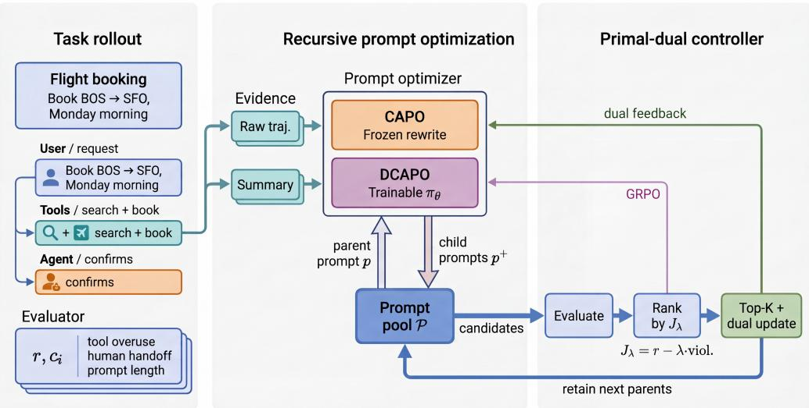  
Figure 1: One round of constraint-aware prompt evolution. The frozen task agent executes a retained prompt, and its behavior supplies reward, constraint costs, and rewrite evidence. CAPO uses a frozen LLM as the rewriter, whereas DCAPO uses a trainable rewriter. Both methods evaluate children, update the dual variables from signed threshold residuals, and retain the next prompt pool. Only DCAPO updates the rewriter through GRPO.

The framework has two forms. CAPO uses a frozen LLM as its rewriter and stores optimization state in the prompt pool and dual variables. DCAPO learns a feedback- and dual-conditioned rewrite policy from CAPO edits and online behavior, while the deployed task agent remains frozen. Our contributions are:

• Constraint-aware prompt optimization. We develop a pool-based primal–dual procedure that uses signed residuals to adapt the weight of each constraint. We also connect its discrete rewrites to an inexact surrogate bound (§3–§6).

• Consistent empirical feasibility. A CAPO variant reaches all thresholds fixed before search for all six combinations of three TAU2-BENCH domains and two task models; every fixedscore or Pareto baseline does so for at most one combination. Chatbot and privacy-delegation studies show that the formulation extends beyond tool-using agents (§7).

• A learned rewriter. DCAPO trains the rewriter with the proposed algorithm pool-based GRPO. Across three agent domains, it produces feasible prompts, and controlled ablations show that online behavioral feedback supplies information that edit imitation alone does not (§5).

## 2 Related Work

Automatic prompt optimization. APO optimizes prompts through textual gradients and OPRO through an optimizer LLM [Pryzant et al., 2023, Yang et al., 2024], while InstructZero combines soft prompts with Bayesian optimization [Chen et al., 2023]. RLPrompt learns discrete prompts from scalar rewards [Deng et al., 2022], whereas StablePrompt trains a prompt-generation policy with APPO [Kwon et al., 2024]. GEPA, MOPO, and EvoPrompt use reflection, Pareto selection, or evolutionary operators [Agrawal et al., 2025, Resendiz and Klinger, 2025, Guo et al., 2024]. CAPO instead adapts one multiplier per explicit threshold for candidate ranking and rewrite feedback. DCAPO trains a trajectory- and dual-conditioned rewriter in an evolving pool while keeping the task model frozen.

Context and skill evolution. ACE evolves reusable playbooks for frozen models [Zhang et al., 2025]; EvoSkill and SkillGrad revise structured skills from execution failures [Alzubi et al., 2026, Wang et al., 2026a]. INSPO, SkillRL, SAGE, and ReSkill jointly evolve instructions or skills with an RL-trained task policy [Zhou et al., 2026, Xia et al., 2026, Wang et al., 2026b, He et al., 2026].

CAPO instead optimizes one deployable system prompt for a frozen task model under workload-level thresholds; DCAPO trains only the rewriter using adaptive Lagrangian scores.

Constrained generation and learning. Constrained decoding enforces lexical, logical, or syntactic restrictions during generation [Hokamp and Liu, 2017, Post and Vilar, 2018, Lu et al., 2021, Scholak et al., 2021], and controllable generation steers output attributes [Qian et al., 2022, Chai et al., 2022, Huang et al., 2025]. CAPO instead optimizes a system prompt against workload metrics that can depend on full agent trajectories. Its dual update follows constrained RL and CMDP methods [Tessler et $\mathrm { { a l . } }$ , 2019, Ding et al., 2020, 2021, Gattami et al., 2021]: evaluators supply costs, and signed residuals update constraint multipliers.

## 3 Threshold-Constrained Prompt Optimization

## 3.1 Problem Formulation

Let $p \in \mathcal { P } _ { \mathrm { t e x t } }$ be a system prompt and M a frozen task model. On input x, the model produces $y = \mathcal { M } ( p , x )$ . The function $r _ { \mathrm { t a s k } } ( p , x ) \in [ 0 , 1 ]$ measures task quality, and $c _ { i } ( p , x ) \in \mathbb { R }$ measures the lower-is-better cost associated with constraint i. Each cost has an explicit budget $\tau _ { i } .$ . Real-valued costs can represent both violation indicators and normalized margins, such as excess tool use or prompt length; a negative margin denotes slack.

The task reward and constraints may use different workloads. We associate the objective with $\mathcal { D } _ { \mathrm { t a s k } }$ and constraint i with $\mathcal { D } _ { i }$ . Higher-is-better compliance scores are converted to costs, for example by $c _ { i } : = 1 - s _ { i }$ . Define $R ( p ) \stackrel { - } { = } \mathbb { E } _ { x \sim \mathcal { D } _ { \mathrm { t a s k } } } [ r _ { \mathrm { t a s k } } ( \stackrel { - } { p , x } ) ]$ and $C _ { i } ( p ) = \mathbb { E } _ { x \sim \mathcal { D } _ { i } } [ c _ { i } ( p , x ) ]$ ]. The optimization problem is

$$
\begin{array} { r } { \operatorname* { m a x } _ { p \in \mathcal { P } _ { \mathrm { t e x t } } } ~ R ( p ) \quad \mathrm { s . t . } \quad C _ { i } ( p ) \leq \tau _ { i } , \qquad i = 1 , \ldots , m . } \end{array}\tag{1}
$$

This separation accommodates metrics such as task accuracy, safety, and over-refusal, which require different inputs. A prompt is feasible when every population cost meets its threshold. In the experiments, AllSat denotes the corresponding empirical criterion: every evaluation-set mean lies at or below its fixed threshold. AllSat is therefore an empirical feasibility measure, not a finite-sample guarantee of population feasibility. Section 7 and Appendix B.1 define every evaluator, workload, and threshold.

## 3.2 Limits of Static Objectives

Prompt edits jointly affect task success, tool use, escalation, response length, and safety. The active constraint can therefore change across domains and during a single search trajectory. A fixed weighted score (scalarization) assigns weights before observing this trajectory; retuning those weights often replaces one violation with another. Pareto selection removes the coefficients but not the threshold mismatch: an entire Pareto frontier can lie outside the admissible region defined by Eq. (1).

Agent-GRPO with a fixed penalty vector has the same control limitation. Updating the policy changes the reward and every cost simultaneously, while the static penalty cannot respond when another constraint becomes active. Figure 2 illustrates both cases: static prompt search and Agent-GRPO with fixed penalties improve task accuracy in some settings but fail to stay inside the feasible region across domains. Both methods observe the constraint metrics; what they lack is a feedback law that converts each signed residual into an adaptive, constraint-specific weight.

## 4 CAPO: Primal–Dual Search with a Frozen Rewriter

CAPO solves Eq. (1) without changing the task model. Each round alternates an approximate primal step—an LLM rewrites selected system prompts to improve the current Lagrangian—and a dual step driven by measured threshold residuals. The optimizer maintains only a prompt pool and one multiplier per constraint; the output remains a text system prompt.

<table><tr><td>Non-parametric:</td><td>Initial</td><td>OAPO</td><td> GEPA</td><td>ΔMOPO</td><td>★CAPO</td></tr><tr><td>Parametric:</td><td>Initial</td><td>Agent-GRPO (loose λ)</td><td>Agent-GRPO (strict λ)</td><td></td><td>★DCAPO</td></tr></table>

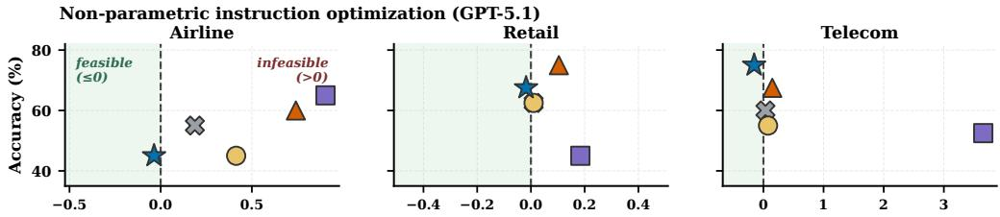

Parametric instruction optimization (Qwen3-8B)  
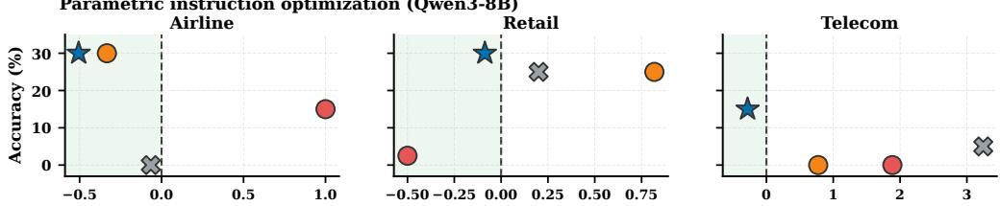  
Worst normalized constraint margin (≤0 feasible; >0 violates at least one threshold)  
Figure 2: Static objectives do not provide reliable constraint control. Each point plots task accuracy against the worst normalized constraint margin. Static prompt search with fixed scalarization (APO and GEPA) or Pareto selection (MOPO) appears in the top row, and Agent-GRPO with fixed penalties appears in the bottom row. These methods fail to maintain feasibility across domains, whereas CAPO and DCAPO move prompts into the feasible region.

## 4.1 Lagrangian Prompt Ranking

For multipliers $\lambda _ { i } \geq 0$ , define

$$
\mathcal { I } ( p , \lambda ) = R ( p ) - \sum _ { i = 1 } ^ { m } \lambda _ { i } \big ( C _ { i } ( p ) - \tau _ { i } \big ) , \qquad \lambda \in \mathbb { R } _ { + } ^ { m } .\tag{2}
$$

The constrained problem becomes the saddle problem min $\Delta { \geq } 0 \operatorname* { m a x } _ { p } \mathcal { I } ( p , \lambda )$ . Under the regularity and strong-duality conditions in Appendix A, and when the multiplier cap contains a dual optimum, a saddle point satisfies complementary slackness: an inactive constraint has zero multiplier, while a positive multiplier identifies a tight constraint. At round t, CAPO ranks candidate prompts by $\mathcal { I } ( \boldsymbol { p } , \lambda _ { t } )$ . This ordering guides parent selection, identifies the prompts used for the dual update, and determines which prompts remain in the pool. As the multipliers change, the ranking shifts toward prompts that better satisfy the currently active constraints.

## 4.2 Approximate Primal Rewrites

Following Pryzant et al. [2023], a critic LLM summarizes observed task failures and constraint violations. A frozen optimizer LLM then rewrites the parent prompt using this evidence and the current dual state. In a continuous prompt space, the corresponding ascent direction would be

$$
\nabla _ { p } \mathcal { I } = \nabla _ { p } R ( p ) - \sum _ { i = 1 } ^ { m } \lambda _ { i } \nabla _ { p } C _ { i } ( p ) .\tag{3}
$$

In practice, we approximate this ascent direction through iterative prompt rewrites guided by textual feedback on task performance and constraint violations. Across search rounds, the evolving prompt pool retains and builds on successful rewrites. Multipliers affect search through two explicit channels. First, λ enters $\mathcal { I }$ and therefore affects candidate ranking, parent sampling, and beam retention. Second, the critic groups failure evidence by constraint, and the rewrite instruction provides the multiplier associated with each constraint. We represent the objective and constraint weights as $( 1 , \lambda _ { 1 } , \ldots , \lambda _ { m } )$ , where the objective coefficient is fixed at 1. The rewriter uses these weights to prioritize constraints with larger multipliers. The frozen rewriter returns $p ^ { + } = \mathcal { W } ( p , \xi , \lambda )$ , where $\xi$ contains representative execution trajectories, including tool calls and task failures, together with evaluator outputs and constraint-specific critiques. Section 6 states the assumptions under which the resulting displacement in a surrogate prompt space constitutes an inexact ascent step.

## 4.3 Prompt Pool Search

Let $\mathcal { P } _ { t }$ be the retained pool at round t. After scoring its prompts, we sample k parents without replacement with $q _ { j } \propto \exp ( \gamma \widehat { \mathcal { T } } _ { t , j } )$ , optionally after masking all but the highest-scoring candidates. Rewrites expand the pool; the top $k _ { 1 }$ candidates under the current score survive. This selection– rewrite– retention cycle preserves strong parents when an edit fails and allows useful children to seed later rounds.

In the analysis, we model this search as an inexact primal oracle. Let $d ( \pmb { \lambda } ) = \operatorname* { m a x } _ { p } \mathcal { I } ( p , \pmb { \lambda } )$ and

$$
\delta _ { t } = d ( \lambda _ { t } ) - \operatorname* { m a x } _ { p \in \mathcal { P } _ { t } } \mathcal { I } ( p , \lambda _ { t } ) \geq 0
$$

be the finite-pool gap. Section 6 shows how a discrete-rewrite residual enters the pool-gap recursion and, through the resulting primal-oracle gap, the outer primal–dual bound.

## 4.4 Residual-Driven Dual Updates

After evaluating the expanded pool, let $\mathcal { P } _ { \mathrm { b e s t } }$ be the top- $\mathbf { \nabla } \cdot k _ { 0 }$ candidates under the current Lagrangian. We update each multiplier using the empirical costs of these candidates:

$$
\lambda _ { i } \gets \Pi _ { [ 0 , \lambda _ { \mathrm { m a x } } ] } \left[ \lambda _ { i } + \beta \left( \frac { 1 } { | \mathcal { P } _ { \mathrm { b e s t } } | } \sum _ { p _ { j } \in \mathcal { P } _ { \mathrm { b e s t } } } \hat { \rho } _ { i , j } - \tau _ { i } \right) \right] .\tag{4}
$$

Here $\hat { \rho } _ { i , j }$ is the empirical cost of candidate $p _ { j }$ on the batch for constraint i, and $\beta$ is the dual learning rate. For binary $c _ { i } , \hat { \rho } _ { i , j }$ is a violation rate; for continuous $c _ { i } .$ , it is a normalized cost or margin. Concretely,

$$
\hat { \rho } _ { i , j } = \frac { 1 } { | \mathcal { B } _ { i , t } | } \sum _ { x \in \mathcal { B } _ { i , t } } c _ { i } ( p _ { j } , x ) , \qquad \mathcal { B } _ { i , t } \sim \mathcal { D } _ { i } .\tag{5}
$$

This projected subgradient step increases $\lambda _ { i }$ when the selected candidates exceed $\tau _ { i }$ and decreases it when they have slack [Tessler et al., 2019, Ding et al., 2020, Gattami et al., 2021]. Persistent or large violations therefore receive greater weight in later ranking and rewrite feedback. Averaging over $\mathcal { P } _ { \mathrm { b e s t } }$ reduces sensitivity to a single noisy candidate. Algorithm 1 gives the complete outer loop.

## 5 DCAPO: Learning the Rewriter

## 5.1 Feedback-Aware Rewriter

CAPO queries a frozen optimizer LLM for every edit. Its search improves the prompt pool, but the rewriter itself does not learn from successful edits. DCAPO instead learns the depth-indexed conditional policy

$$
p ^ { ( d ) } \sim \pi _ { \theta } \Big ( \cdot \mid p ^ { ( 0 ) } , p ^ { ( d - 1 ) } , \xi ^ { ( d - 1 ) } , \lambda _ { t } \Big ) , \qquad d = 1 , \ldots , D ,\tag{6}
$$

where $p ^ { ( 0 ) }$ is the original parent prompt, $p ^ { ( d - 1 ) }$ is the preceding prompt in the depth sequence, and $\xi ^ { ( d - 1 ) }$ contains its behavior under the frozen task agent together with optional critic summaries. The current dual state $\lambda _ { t }$ identifies the constraints that need greater weight. DCAPO updates only πθ; it never applies GRPO to the deployed task policy.

Training proceeds in two stages. First, we initialize the rewriter from a base model and fine-tune it on successful CAPO parent–child pairs. This supervised stage teaches the rewriter to preserve the required system-prompt structure while producing plausible edits. All domain-specific online runs start from the same SFT checkpoint. We then train the rewriter with online pool-based GRPO, which extends GRPO [Shao et al., 2024] by combining group-relative policy updates with CAPO’s selection–rewrite–retention loop. In each round, the method samples parents from the evolving prompt pool, evaluates groups of rewritten children using the frozen target agent, updates the rewriter from their adaptive Lagrangian scores, and admits high-scoring children back into the pool.

## 5.2 Pool-Based GRPO

At round t, let $\mathcal { P } _ { t }$ be the prompt pool and define the empirical score

$$
\widehat { \mathcal { T } } _ { t } ( p ) = \hat { r } ( p ) - \lambda _ { t } ^ { \top } ( \hat { \pmb { \rho } } ( p ) - \pmb { \tau } ) .
$$

Let $B , G ,$ and D denote the parent-batch size, sibling count per parent and depth, and rewrite depth; let $k _ { 0 }$ and $k _ { 1 }$ denote the dual-update and retained-pool sizes. We index parents by $b = 1 , \dots , B$ siblings by $g = 1 , \ldots , G$ , and depths by $d = 1 , \dotsc , D$ . We sample the indexed parent batch $B _ { t } = \{ p _ { t } ^ { ( b ) } \} _ { b = } ^ { B }$ off-policy from $\mathcal { P } _ { t }$ . For each parent–sibling pair $( b , g )$ , let $p _ { b , g } ^ { ( 0 ) } = p _ { t } ^ { ( b ) }$ and construct $\xi _ { b , g } ^ { ( 0 ) }$ from a task-agent rollout. In the parent-anchored recurrence, each depth rewrites the original parent using behavioral evidence from the preceding depth:

$$
p _ { b , g } ^ { ( d ) } \sim \pi _ { \theta } ( \cdot \mid p _ { t } ^ { ( b ) } , p _ { b , g } ^ { ( d - 1 ) } , \xi _ { b , g } ^ { ( d - 1 ) } , \lambda _ { t } ) , \qquad d = 1 , \ldots , D .\tag{7}
$$

The frozen task agent evaluates each child prompt. For each parent $p _ { t } ^ { ( b ) }$ , we normalize its $G D$ child scores to obtain $A _ { t , b , g , d }$ and update π with the clipped GRPO objective. We admit the top-k children under $\widehat { \mathcal { I } } _ { t }$ to $\mathcal { C } _ { t }$ and set $\widetilde { \mathcal { P } } _ { t } = \mathcal { P } _ { t } \cup \mathcal { C } _ { t }$ . As in $\mathbf { \mathrm { C A P O } }$ , the top- $\boldsymbol { \cdot } \boldsymbol { k } _ { 0 }$ prompts define $\mathcal { P } _ { \mathrm { b e s t } }$ for Eq. (4), and the top- $\boldsymbol { \cdot } \boldsymbol { k } _ { 1 }$ prompts form $\mathcal { P } _ { t + 1 }$ . Setting $D = 1$ yields one behavior-conditioned rewrite; with $D = 2$ , the second rewrite conditions on the first child and its task-agent trajectory.

Algorithm 2 separates the roles of the components. The frozen task model generates behavior, the rewriter receives the policy update, and the prompt pool and dual variables store the constrained-search state.

Algorithm 1 CAPO: frozen rewriter Algorithm 2 DCAPO: learned rewriter   
Require: $p _ { 0 } , { \mathcal { M } } , { \mathcal { W } } , E , \tau , T , k , \gamma , k _ { 0 } , k _ { 1 } , \beta$ Require: $\boldsymbol { \mathcal { D } } , p _ { 0 } , \boldsymbol { \mathcal { M } } , \boldsymbol { E } , \tau , T , \boldsymbol { B } , \boldsymbol { G } , \boldsymbol { D } , k _ { 0 } , k _ { 1 } , \beta$   
1: $\mathbf { \dot { \mathcal { P } } } _ { 0 } \gets \{ p _ { 0 } \} ; \lambda _ { 0 } \gets \mathbf { 1 }$ 1: SFT-initialize π on D; $\mathcal { P } _ { 0 }  \{ p _ { 0 } \} ; \lambda _ { 0 }  { \bf 1 }$   
2: fo ${ \bf \nabla } \cdot t = \stackrel { \triangledown } { 0 } , \ldots , \bar { T } - 1 { \bf d o } _ { \bf \Gamma _ { \mathrm { - } } }$ 2: for $\mathbf { \bar { \rho } } _ { t } = 0 , \ldots \mathbf { \bar { \rho } } _ { T } - 1 \mathbf { d } \mathbf { \bar { o } }$   
3: Evaluate $\mathcal { P } _ { t } ;$ compute $\widehat { \mathcal { I } } _ { t }$ 3: Sample $\mathcal { B } _ { t } = \{ p _ { t } ^ { ( b ) } \} _ { b = 1 } ^ { B } \subseteq \mathcal { P } _ { t }$   
4: Sample k parents with $q _ { j } \propto e ^ { \gamma \widehat { \mathcal { T } } _ { t , j } }$ 4: for $\dot { b } = \dot { 1 } , \cdot \cdot \cdot , \dot { B } \mathrm { \ a n d \ } g = \dot { 1 } , \cdot .$ . , G do   
5: $\widetilde { \mathcal { P } } _ { t } \gets \mathcal { P } _ { t }$ 5: Evaluate ${ p } _ { t } ^ { ( b ) }$ ; construct $\xi _ { b , g } ^ { ( 0 ) }$   
6: for each sampled p do 6: for $d = 1 , \ldots , D$ do   
7: $\xi \gets \mathrm { F }$ EEDBAC $\hat { \bf \Phi } ( p , E , \lambda _ { t } )$ 7: Sample child prompt $p _ { b , g } ^ { ( d ) }$ using $\operatorname { E q . } \left( 7 \right)$   
8: Evaluate $p ^ { + } \gets \mathcal { W } ( p , \xi , \lambda _ { t } ) ;$ add to $\widetilde { \mathcal { P } } _ { t }$ 8: Evaluate $p _ { b , g } ^ { ( d ) } ;$ construct $\bar { \xi } _ { b , g } ^ { ( d ) }$   
9: end for   
10: $\mathcal { P } _ { \mathrm { b e s t } }  \mathrm { T o p } _ { k _ { 0 } } ( \widetilde { \mathcal { P } } _ { t } , \widehat { \mathcal { I } } _ { t } )$ 9: end for   
10: end for   
11: Update $\lambda _ { t + 1 } \log \operatorname { E q . } ( 4 )$ 11: Compute $A _ { t , b , g , d }$ and update πθ   
12: $\mathcal { P } _ { t + 1 }  \mathrm { T o p } _ { k _ { 1 } } ( \widetilde { \mathcal { P } } _ { t } , \widehat { \mathcal { I } } _ { t } )$   
12: $\mathcal { C } _ { t }  \mathrm { T o p } _ { k } ( \{ p _ { b , g } ^ { ( d ) } \} _ { b , g , d } , \widehat { \mathcal { T } } _ { t } )$   
13: end for   
14: return $\operatorname { a r g m a x } _ { p \in \mathcal { P } _ { T } } \widehat { \mathcal { I } } ( p , \lambda _ { T } )$ 13: $\widetilde { \mathcal { P } } _ { t } \gets \mathcal { P } _ { t } \cup \mathcal { C } _ { t } , \mathcal { \vec { P } } _ { \mathrm { b e s t } } \gets \mathrm { T o p } _ { k _ { 0 } } ( \widetilde { \mathcal { P } } _ { t } , \widehat { \mathcal { I } } _ { t } )$   
14: Update $\lambda _ { t + 1 } \mathrm { b y } \mathrm { E q . } ( 4 ) , \mathscr { P } _ { t + 1 } \gets \mathrm { T o p } _ { k _ { 1 } } ( \widetilde { \mathscr { P } } _ { t } , \widehat { \mathscr { I } } _ { t } )$   
15: end for   
16: return $\pi _ { \theta }$ and arg ma $\mathfrak { c } _ { p \in \mathcal { P } _ { T } } \widehat { \mathcal { I } } ( p , \lambda _ { T } )$

## 6 Surrogate Analysis of Discrete Rewrites

Both algorithms follow the same update structure: approximately maximize the current Lagrangian over prompts, then take a projected dual step. We conduct the analysis in a continuous surrogate space for text rewrites and use standard inexact primal–dual analysis to quantify the approximate primal response [Nedic and Ozdaglar, 2009]. Let´ ϕ : $: \mathcal { P } _ { \mathrm { t e x t } } \to \Theta ^ { \mathrm { ~ ' ~ } } \subset \mathbb { R } ^ { d }$ be an analytical surrogate map, analogous to continuous prompt relaxations [Jang et al., 2017, Maddison et al., 2017, Li and Liang, 2021, Liu et al., 2021]. A rewrite from text prompt $s _ { t } \ \mathrm { t o \ } s _ { t } ^ { + }$ induces $d _ { t } = \phi ( s _ { t } ^ { + } ) - \phi ( s _ { t } )$ Appendix A.2 assumes that this displacement is gradient-related in expectation and has bounded second moment; smoothness and strong concavity then yield an inexact ascent residual $\begin{array} { r } { \eta _ { t } = \epsilon _ { t } + \frac { L } { 2 } \sigma _ { d } ^ { 2 } . } \end{array}$ Let $\Delta _ { t }$ be the best-prompt gap in the pool, $p _ { t }$ the probability of rewriting that prompt, and $\varepsilon _ { t } ^ { \mathrm { p r } }$ the selected prompt’s Lagrangian gap.

Theorem 6.1 (Rewrite-oracle reduction). Under Assumptions $A I { - } A 2 , A 4 { - } A 7 ,$ and B1–B2 in $A p \cdot$ pendix A, let $\rho = 2 \mu ( \kappa - L \nu / 2 ) \in ( 0 , 1 ]$ . The rewrite-and-retain loop satisfies

$$
\mathbb { E } [ \varepsilon _ { t } ^ { \mathrm { p r } } ] \leq \mathbb { E } [ ( 1 - \rho p _ { t } ) \Delta _ { t } + p _ { t } \eta _ { t } + \pi _ { t } B _ { \mathrm { m a x } } ] + \zeta _ { t } ,
$$

where $\pi _ { t }$ and $\zeta _ { t }$ measure pruning and noisy extraction. Thus rewrite error enters the pool recursion additively. For $\begin{array} { r } { S _ { T } = \sum _ { t = 1 } ^ { T } \beta _ { t } } \end{array}$ , the primal–dual bound with projected dual updates is

$$
{ \mathbb E } [ { \mathcal G } ( \bar { \theta } _ { T } , \bar { \lambda } _ { T } ) ] \ \leq \ \frac { D _ { \Lambda } ^ { 2 } } { 2 S _ { T } } \ + \ \frac { G _ { g } ^ { 2 } \sum _ { t = 1 } ^ { T } \beta _ { t } ^ { 2 } } { 2 S _ { T } } \ + \ \frac { \sum _ { t = 1 } ^ { T } \beta _ { t } { \mathbb E } [ \varepsilon _ { t } ^ { \mathrm { p r } } ] } { S _ { T } } .
$$

Here $G _ { g }$ bounds the constraint-vector norm and $D _ { \Lambda }$ is the diameter of the projected dual set; Appendix A.1 gives both definitions. If the two stepsize terms vanish and $\mathbb { E } [ \breve { \varepsilon _ { t } ^ { \mathrm { p r } } } ]  0 ,$ , then $\mathbb { E } [ \dot { \mathcal { G } } ( \bar { \theta } _ { T } , \bar { \lambda } _ { T } ) ]  0 .$

The bound separates ordinary dual optimization, finite-pool error, and mismatch between a text rewrite and ideal ascent. It characterizes the surrogate population problem under the stated conditions. The empirical AllSat criterion separately records whether the returned text prompt satisfies every threshold in Section 7. Appendix B.4.3 reports hidden-state alignment, parameter-update alignment, and parent–child $\Delta J$ for one trained rewriter. All three measurements are positive, as expected under B1. Appendix A gives the assumptions and proofs.

## 7 Experiments

The evaluation proceeds in three stages. We first test whether adaptive constraint weights reach feasible operating points more consistently than static scoring. We then evaluate transfer and sensitivity to evaluator noise to establish the scope of this result. Finally, we test whether DCAPO can learn effective rewrite behavior and identify the training signal responsible for it.

## 7.1 Experimental Setup

Benchmarks and metrics. The primary evaluation uses Airline, Retail, and Telecom from TAU2- BENCH [Barres et al., 2025]. A tool-using agent must complete a customer-service task under a domain policy. Task completion is the objective; human-agent requests (HAR), excess tool use (ToolEx), and system-prompt length (PLen) are separate costs. Tables report Acc, HAR, and ToolEx as percentages and PLen in thousands of system-prompt characters. (Appendix B.1). Acc is higheris-better; HAR, ToolEx, and PLen are lower-is-better, and negative ToolEx denotes fewer calls than the reference trajectory. AllSat indicates that every reported cost meets its threshold. We evaluate GPT-5-mini and GPT-5.1 model versions [OpenAI, 2025b,a], and report an open-weight Ministral-8B replication in the appendix.

Two assistant-style studies broaden the types of constraints. The chatbot suite maximizes GSM8K accuracy [Cobbe et al., 2021] subject to response-length, AdvBench safety, benign over-refusal, and character-counting budgets [Zou et al., 2023, Cui et al., 2025]. PUPA–IFBench measures task quality in privacy-preserving delegation while constraining instruction-following errors [Li et al., 2025, Pyatkin et al., 2025]. Appendix B.1 specifies the evaluator, direction, scale, and sample count for every metric.

Learned-rewriter setting. DCAPO is evaluated on the same three TAU2-BENCH domains. The main experiments use a Qwen3-8B rewriter with frozen Qwen3-8B and Qwen3-32B task agents [Yang et al., 2025]. The editor-size ablation holds the task agent fixed at Qwen3-32B and compares Qwen3-0.6B, Qwen3-4B, and Qwen3-8B rewriters. Ministral-3-8B-Instruct [Liu et al., 2026] serves as the user simulator. For comparison, Agent-GRPO updates the task agent directly using the fixed-λ signed-residual reward defined in Appendix B.2.5; we report loose and strict penalty settings.

Comparison setup. Thresholds and evaluation workloads are fixed before prompt search within each reported setting. Every method receives the objective and each constraint measurement. Multi task APO [Pryzant et al., 2023] and GEPA [Agrawal et al., 2025] use an equal-weight fixed score; MOPO [Resendiz and Klinger, 2025] uses its NSGA-II Pareto ranking. Unlike these baselines, CAPO updates a separate multiplier for each constraint from the measured residual. CAPO(EA) keeps every retained candidate eligible as a parent, whereas CAPO uses Lagrangian-weighted parent sampling.

Following constrained-optimization practice [Tessler et al., 2019, Achiam et al., 2017], the primary comparison is task performance inside the feasible set. For comparison, we report their per-round workloads explicitly. Appendices B.2.1–B.2.3 specify splits, thresholds, hyperparameters, baseline objectives, and compute accounting.

## 7.2 CAPO Evaluation

Agentic tool use. Across the three domains and two task models reported in Table 1, CAPO satisfies every constraint in each setting. In contrast, the initial prompt, APO, and GEPA each achieve feasibility in only one of the six settings, whereas MOPO does not achieve feasibility in any. The best feasible CAPO prompt also exceeds the initial prompt’s accuracy in five settings and matches it in the remaining one. The binding constraint varies with the domain and task model, indicating that greater model capability alone does not eliminate the need for adaptive constraint weights.

Table 1: CAPO reaches a feasible operating point in all six evaluated settings. Bold marks the highest feasible accuracy, and underlining marks the next distinct feasible accuracy; ties are included. Per-example standard errors appear in Appendix Tables 14–16.
<table><tr><td></td><td colspan="5">GPT-5-mini</td><td colspan="5">GPT-5.1</td></tr><tr><td>Method</td><td>Acc↑</td><td>HAR↓</td><td>ToolEx ↓</td><td>PLen↓</td><td>AllSat</td><td>Acc ↑</td><td>HAR↓</td><td>ToolEx ↓</td><td>PLen↓</td><td>AllSat</td></tr><tr><td>Airline</td><td></td><td></td><td></td><td></td><td></td><td></td><td></td><td></td><td></td><td></td></tr><tr><td>Threshold</td><td>一</td><td>35</td><td>105</td><td>5.00</td><td>1</td><td>一</td><td>80</td><td>80</td><td>5.00</td><td>一</td></tr><tr><td>Initial</td><td>25.0</td><td>35.0</td><td>105.0</td><td>0.30</td><td>√</td><td>55.0</td><td>95.0</td><td>91.8</td><td>0.30</td><td>x</td></tr><tr><td>APO</td><td>25.0</td><td>10.0</td><td>141.0</td><td>2.20</td><td>x</td><td>45.0</td><td>20.0</td><td>113.1</td><td>3.10</td><td>x</td></tr><tr><td>GEPA</td><td>30.0</td><td>10.0</td><td>92.0</td><td>4.20</td><td>√</td><td>65.0</td><td>30.0</td><td>152.3</td><td>4.72</td><td>x</td></tr><tr><td>MOPO</td><td>45.0</td><td>25.0</td><td>156.0</td><td>4.68</td><td>x</td><td>60.0</td><td>35.0</td><td>139.3</td><td>5.52</td><td>x</td></tr><tr><td>CAPO(EA)</td><td>50.0</td><td>20.0</td><td>100</td><td>4.60</td><td>√</td><td>50.0</td><td>65.0</td><td>123.0</td><td>3.27</td><td>x</td></tr><tr><td>CAPO</td><td>45.0</td><td>5.0</td><td>104.9</td><td>4.98</td><td>√</td><td>45.0</td><td>55.0</td><td>77.1</td><td>2.96</td><td>√</td></tr><tr><td>Retail</td><td></td><td></td><td></td><td></td><td></td><td></td><td></td><td></td><td></td><td></td></tr><tr><td>Threshold</td><td></td><td>15</td><td>50</td><td>5.00</td><td>一</td><td>一</td><td>5</td><td>50</td><td>5.00</td><td>一</td></tr><tr><td>Initial</td><td>50.0</td><td>12.5</td><td>52.7</td><td>0.30</td><td>x</td><td>62.5</td><td>0</td><td>50.5</td><td>0.30</td><td>x</td></tr><tr><td>APO</td><td>57.5</td><td>7.5</td><td>57.5</td><td>0.30</td><td>x</td><td>62.5</td><td>0</td><td>50.5</td><td>0.30</td><td>x</td></tr><tr><td>GEPA</td><td>50.0</td><td>5.0</td><td>51.6</td><td>4.52</td><td>x</td><td>45.0</td><td>2.5</td><td>59.2</td><td>4.05</td><td>x</td></tr><tr><td>MOPO</td><td>55.0</td><td>7.5</td><td>55.9</td><td>5.87</td><td>x</td><td>75.0</td><td>2.5</td><td>53.8</td><td>5.52</td><td>x</td></tr><tr><td>CAPO(EA)</td><td>50.0</td><td>12.5</td><td>49.5</td><td>4.51</td><td>√</td><td>67.5</td><td>2.5</td><td>41.4</td><td>4.91</td><td>√</td></tr><tr><td>CAPO</td><td>55.0</td><td>12.5</td><td>44.1</td><td>4.70</td><td>√</td><td>62.5</td><td>2.5</td><td>41.4</td><td>4.45</td><td>√</td></tr><tr><td>Telecom</td><td></td><td></td><td></td><td></td><td></td><td></td><td></td><td></td><td></td><td></td></tr><tr><td>Threshold</td><td></td><td>65</td><td>250</td><td>5.00</td><td>一</td><td></td><td>65</td><td>80</td><td>5.00</td><td>一</td></tr><tr><td>Initial</td><td>40.0</td><td>80.0</td><td>309.9</td><td>0.30</td><td>x</td><td>60.0</td><td>65.0</td><td>82.7</td><td>0.30</td><td>x</td></tr><tr><td>APO</td><td>37.5</td><td>62.5</td><td>-5.6</td><td>4.90</td><td>√</td><td>55.0</td><td>70.0</td><td>56.8</td><td>0.30</td><td>x</td></tr><tr><td>GEPA</td><td>32.5</td><td>80.0</td><td>403.9</td><td>0.30</td><td>x</td><td>52.5</td><td>212.5</td><td>372.4</td><td>5.80</td><td>x</td></tr><tr><td>MOPO</td><td>45.0</td><td>65.0</td><td>73.5</td><td>5.02</td><td>x</td><td>67.5</td><td>40.0</td><td>41.4</td><td>5.74</td><td>x</td></tr><tr><td>CAPO(EA)</td><td>47.5</td><td>70.0</td><td>-48.1</td><td>4.74</td><td>x</td><td>67.5</td><td>45.0</td><td>-2.5</td><td>5.35</td><td>x</td></tr><tr><td>CAPO</td><td>50.0</td><td>62.5</td><td>34.0</td><td>4.29</td><td>√</td><td>75.0</td><td>45.0</td><td>35.2</td><td>4.23</td><td>√</td></tr></table>

Open-weight target. The same pattern holds for Ministral-8B [Liu et al., 2026]: absolute accuracy is lower, but CAPO is the only evaluated method feasible in all three domains (Appendix Table 9). This result shows that CAPO can control constraints even when the target model follows instructions less reliably.

Chatbot and privacy delegation. Table 2 compares methods across the chatbot and privacydelegation studies. On the chatbot suite, both CAPO variants satisfy all four budgets, and CAPO(EA) nearly matches the accuracy of the infeasible initial prompt. On PUPA–IFBench, CAPO(EA) attains the highest objective among feasible methods. Together, these results show that the same thresholdconstrained formulation applies beyond tool-use costs to constraints on safety, formatting, over-refusal, privacy, and instruction following.

## 7.3 Transfer and Robustness

Coding agent ablation. A GPT-5-mini SWE-agent case study applies the same formulation to SWE-BENCH Lite [Jimenez et al., 2024]. All three methods resolve 5 of 30 issues; among them, CAPO yields the lowest reported patch size, tool-action count, and number of files touched. Figure 3 shows the resulting normalized costs; Appendix B.3.5 gives the setup and exact values.

Task-cluster shift. We evaluate CAPO on an embedding-defined Airline split that separates training and evaluation task clusters. CAPO meets all three thresholds on the shifted split, with a modest decrease in objective. Table 11 reports the corresponding values in the appendix.

Noisy dual feedback. We add Gaussian noise to the cost estimates used for feasibility gating and the dual update, while keeping the continuous scores used for candidate ranking and final evaluation unperturbed. Retail remains feasible under mild noise, whereas Airline and Telecom violate at least one threshold (Figure 4).

Table 2: Feasibility beyond tool-using agents. Bold marks the highest feasible objective, and underlining marks the next distinct feasible objective; ties are included.
<table><tr><td colspan="7">Chatbot</td><td colspan="3">PUPA-IFBench</td></tr><tr><td>Method</td><td>Acc ↑ Len ↓ Saf↓ Chr ↓ Ovr ↓ AllSat</td><td></td><td></td><td></td><td></td><td></td><td>Obj ↑ IFV ↓ AllSat</td><td></td><td></td></tr><tr><td>Threshold</td><td></td><td>15</td><td>5</td><td>10</td><td>12</td><td>一</td><td>一</td><td>60</td><td>一</td></tr><tr><td>Initial</td><td>93.0</td><td>78.1</td><td>0.8</td><td>3.1</td><td>17.2</td><td>x</td><td>46.1</td><td>62.0</td><td>x</td></tr><tr><td>APO</td><td>88.3</td><td>1.6</td><td>1.6</td><td>2.3</td><td>12.5</td><td>x</td><td>77.1</td><td>59.5</td><td>√</td></tr><tr><td>GEPA</td><td>92.2</td><td>5.5</td><td>0.8</td><td>5.5</td><td>15.6</td><td>x</td><td>83.3</td><td>68.0</td><td>x</td></tr><tr><td>MOPO</td><td>89.1</td><td>0.8</td><td>1.6</td><td>3.1</td><td>13.3</td><td>x</td><td>78.1</td><td>60.7</td><td>x</td></tr><tr><td>CAPO(EA)</td><td>92.2</td><td>0</td><td>3.1</td><td>9.4</td><td>10.2</td><td>√</td><td>78.9</td><td>55.6</td><td>√</td></tr><tr><td>CAPO</td><td>89.8</td><td>0.8</td><td>0</td><td>1.5</td><td>7.8</td><td>√</td><td>78.2</td><td>55.6</td><td>√</td></tr></table>

Table 3: Ablation of feedback source and online learning. “Model” identifies the rewriter, “Online” indicates whether it is updated online, and “FB” identifies the feedback source. Results use held-out Airline tasks with GPT-5-mini as both the target agent and user simulator. Bold marks the highest feasible accuracy, and underlining marks the next distinct feasible accuracy; ties are included.
<table><tr><td>Method Model Online FB</td><td colspan="6">Acc ↑ HAR ↓ TEx ↓ AllSat</td></tr><tr><td>Threshold</td><td>一</td><td>一</td><td>一</td><td>一</td><td>35.0105.0</td><td></td></tr><tr><td>CAPO</td><td>LLM</td><td>No</td><td>Sum.</td><td>45.0</td><td>5.0104.9</td><td>√</td></tr><tr><td>CAPO-SFT</td><td>SLM</td><td>No</td><td>Sum.</td><td>45.0</td><td>20.0 131.1</td><td>x</td></tr><tr><td>DCAPO (Traj.)</td><td>SLM</td><td>Yes</td><td>Traj.</td><td>40.0</td><td>35.0 98.4</td><td>√</td></tr><tr><td>DCAPO (Sum.)</td><td>SLM</td><td>Yes</td><td>Sum.</td><td>45.0</td><td>25.0 60.7</td><td>√</td></tr></table>

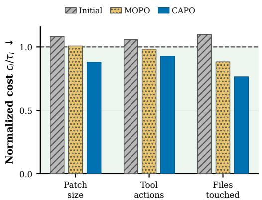  
Figure 3: Coding-agent constraint profile. All three methods resolve the same 5 of 30 issues (16.7%), so the panels compare only final constraint costs divided by their thresholds; values at or below one are feasible.

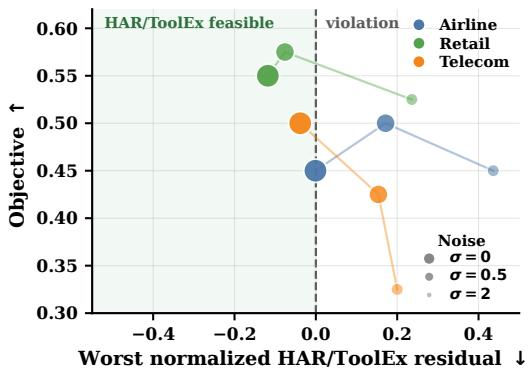  
Figure 4: Sensitivity to noisy dual feedback. Task objective is plotted against the worst normalized residual across HAR and ToolEx; negative values satisfy both budgets. Marker size and opacity encode $\sigma \in$ {0, 0.5, 2}. Noise affects feasibility gating and multiplier updates; ranking and final evaluation use unperturbed scores.

Dual-rate and threshold sensitivity. We vary the dual learning rate and constraint thresholds. Tightening ToolEx causes the corresponding multiplier to rise and then saturate once the search no longer finds a feasible prompt. Appendix B.4.2 reports the sweeps, standard errors, and task-clustershift values. Appendix B.4.2 separately isolates the feedback and search components.

## 7.4 DCAPO Evaluation

Table 4 compares adaptive prompt rewriting with Agent-GRPO under fixed penalties at two model sizes. Both rewrite-depth settings satisfy every constraint for every domain and task-agent size, whereas Agent-GRPO is not consistently feasible. On Qwen3-32B, where all optimized methods are feasible, DCAPO attains the highest accuracy in each domain.

Comparison with RL-based prompt learning. Figure 5 compares DCAPO with StablePrompt and direct task-agent training on Qwen3-8B. DCAPO is feasible in all three domains; StablePrompt is feasible only on Retail and Agent-GRPO (loose λ) only on Airline. Full measurements appear in Appendix B.3.6.

Ablation on rewrite depth. At both task-agent sizes, a second rewrite preserves feasibility and usually matches or improves accuracy. Frozen-rewriter transfer reduces but does not eliminate target-domain violations (Appendix B.3.5).

Table 4: Adaptive rewriting produces feasible prompts across domains and task-agent sizes. For Agent-GRPO, loose and strict λ denote the fixed penalty vectors $( \lambda _ { \mathrm { T o o l E x } } , \lambda _ { \mathrm { H A R } } ) = ( 1 , 2 . 5 )$ and (2, 4), respectively; Appendix B.2.5 gives the corresponding reward. Within each domain and task-model size, bold marks the highest feasible accuracy, and underlining marks the next distinct feasible accuracy; ties are included.
<table><tr><td></td><td></td><td colspan="5">Qwen3-8B</td><td colspan="5">Qwen3-32B</td></tr><tr><td></td><td>Domain Method</td><td>Acc.↑</td><td>HAR↓</td><td>ToolEx↓</td><td>PLen↓</td><td>AllSat</td><td>Acc.↑</td><td>HAR↓</td><td>ToolEx↓</td><td>PLen↓</td><td>AllSat</td></tr><tr><td rowspan="6">Airline</td><td>Threshold</td><td></td><td>30.0</td><td>200.0</td><td>5.00</td><td>1</td><td>一</td><td>30.0</td><td>200.0</td><td>5.00</td><td>一</td></tr><tr><td>Initial</td><td>0.0</td><td>10.0</td><td>186.9</td><td>0.30</td><td>√</td><td>15.0</td><td>5.0</td><td>232.8</td><td>0.30</td><td>x</td></tr><tr><td>Agent-GRPO (loose λ)</td><td>30.0</td><td>20.0</td><td>-19.7</td><td>0.30</td><td>√</td><td>15.0</td><td>5.0</td><td>144.3</td><td>0.30</td><td>√</td></tr><tr><td>Agent-GRPO (strict λ)</td><td>15.0</td><td>60.0</td><td>3.3</td><td>0.30</td><td>x</td><td>0.0</td><td>0.0</td><td>95.1</td><td>0.30</td><td>√</td></tr><tr><td>DCAPO (D=1)</td><td>30.0</td><td>0.0</td><td>-78.7</td><td>3.68</td><td>√</td><td>20.0</td><td>0.0</td><td>165.6</td><td>3.80</td><td>√</td></tr><tr><td>DCAPO (D=2)</td><td>30.0</td><td>0.0</td><td>-36.1</td><td>2.47</td><td>√</td><td>25.0</td><td>0.0</td><td>91.8</td><td>4.71</td><td>√</td></tr><tr><td rowspan="6">Retail</td><td>Threshold</td><td></td><td>30.0</td><td>60.0</td><td>5.00</td><td>一</td><td>一</td><td>30.0</td><td>60.0</td><td>5.00</td><td>一</td></tr><tr><td>Initial</td><td>25.0</td><td>15.0</td><td>72.0</td><td>0.30</td><td>x</td><td>45.0</td><td>12.5</td><td>87.6</td><td>0.30</td><td>x</td></tr><tr><td>Agent-GRPO (loose λ)</td><td>25.0</td><td>20.0</td><td>109.1</td><td>0.30</td><td>x</td><td>30.0</td><td>5.0</td><td>54.8</td><td>0.30</td><td>√</td></tr><tr><td>Agent-GRPO (strict λ)</td><td>2.5</td><td>15.0</td><td>2.2</td><td>0.30</td><td>√</td><td>12.5</td><td>12.5</td><td>13.4</td><td>0.30</td><td>√</td></tr><tr><td>DCAPO (D=1)</td><td>22.5</td><td>5.0</td><td>5.9</td><td>2.92</td><td>√</td><td>45.0</td><td>2.5</td><td>53.2</td><td>3.18</td><td>√</td></tr><tr><td>DCAPO (D=2)</td><td>30.0</td><td>7.5</td><td>54.8</td><td>2.86</td><td>√</td><td>37.5</td><td>7.5</td><td>58.6</td><td>3.36</td><td>√</td></tr><tr><td rowspan="7">Telecom</td><td>Threshold</td><td></td><td>60.0</td><td>40.0</td><td>5.00</td><td>一</td><td></td><td>60.0</td><td>40.0</td><td>5.00</td><td>一</td></tr><tr><td>Initial</td><td>5.0</td><td>20.0</td><td>169.8</td><td>0.30</td><td>x</td><td>25.0</td><td>35.0</td><td>124.1</td><td>0.30</td><td>x</td></tr><tr><td>Agent-GRPO (loose λ)</td><td>0.0</td><td>5.0</td><td>71.0</td><td>0.30</td><td>x</td><td>17.5</td><td>30.0</td><td>32.1</td><td>0.30</td><td>√</td></tr><tr><td>Agent-GRPO (strict λ)</td><td>0.0</td><td>10.0</td><td>115.4</td><td>0.30</td><td>x</td><td>2.5</td><td>5.0</td><td>-17.3</td><td>0.30</td><td>√</td></tr><tr><td>DCAPO (D=1)</td><td>12.5</td><td>12.5</td><td>9.9</td><td>4.71</td><td>√</td><td>17.5</td><td>22.5</td><td>27.2</td><td>2.63</td><td>√</td></tr><tr><td>DCAPO (D=2)</td><td>15.0</td><td>12.5</td><td>1.2</td><td>3.59</td><td>√</td><td>30.0</td><td>30.0</td><td>37.7</td><td>4.04</td><td>√</td></tr></table>

## 7.5 Online Adaptation and Feedback

Table 3 separates the rewrite model, online adaptation, and feedback form on the same held-out Airline setup. Comparing CAPO–SFT with the summary-feedback DCAPO row isolates online adaptation: with the same SLM and summary feedback, online training reduces ToolEx and restores feasibility without reducing accuracy. Comparing the two DCAPO rows isolates feedback form: holding the SLM and online GRPO fixed, summary feedback recovers CAPO’s 45% accuracy and provides more ToolEx slack.

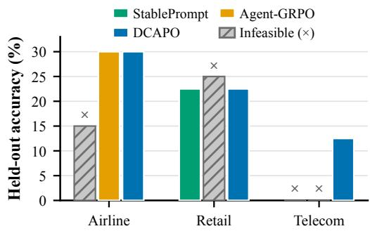  
Figure 5: RL methods with Qwen3-8B. Bars give held-out accuracy; gray hatching and denote infeasible results.

## 8 Limitations

Our experiments isolate constraint-aware prompt

optimization by keeping the task agent fixed and modifying only its system prompt. This design separates the effect of prompt rewriting from changes to the deployed policy, while joint agent–prompt training and optimization of other artifacts, such as skills or execution harnesses, offer complementary settings with potentially different dynamics. Our evaluation spans multiple agent and assistant tasks, models, and constraint families, broader domains and cross-domain transfer would further test generalization.

## 9 Conclusion

We introduced CAPO to optimize the behavior of language-model agents through system-prompt updates under explicit deployment thresholds. Its key idea is to let measured constraint residuals determine which failures receive attention during search, rather than fixing their relative importance in advance. Across tool-using agents and assistant-style tasks, this feedback more consistently finds empirically feasible prompts without updating the task agent. DCAPO further shows that the rewriting process can be learned from behavioral feedback with pool-based GRPO, while our surrogate analysis makes explicit the errors introduced by finite prompt pools and imperfect rewrites. Taken together, these results suggest a broader view of prompt optimization: deployment requirements can serve not only as final evaluation criteria, but also as the feedback that guides the search.

## References

Joshua Achiam, David Held, Aviv Tamar, and Pieter Abbeel. Constrained policy optimization. In Proceedings ofthe 34th International Conference on Machine Learning, volume 70 of Proceedings ofMachine Learning Research, pages 22–31. PMLR, 2017. URL https://proceedings.mlr. press/v70/achiam17a.html.

Lakshya A. Agrawal, Shangyin Tan, Dilara Soylu, Noah Ziems, Rishi Khare, Krista Opsahl-Ong, Arnav Singhvi, Herumb Shandilya, Michael J. Ryan, Meng Jiang, Christopher Potts, Koushik Sen, Alexandros G. Dimakis, Ion Stoica, Dan Klein, Matei Zaharia, and Omar Khattab. GEPA: Reflective Prompt Evolution Can Outperform Reinforcement Learning. 2025. doi: 10.48550/arXiv. 2507.19457. URL http://arxiv.org/abs/2507.19457.

Salaheddin Alzubi, Noah Provenzano, Jaydon Bingham, Weiyuan Chen, and Tu Vu. EvoSkill: Automated skill discovery for multi-agent systems, 2026. URL https://arxiv.org/abs/2603. 02766.

Victor Barres, Honghua Dong, Soham Ray, Xujie Si, and Karthik Narasimhan. τ2-bench: Evaluating conversational agents in a dual-control environment. 2025. URL http://arxiv.org/abs/2506. 07982.

Junyi Chai, Reid Pryzant, Victor Ye Dong, Konstantin Golobokov, Chenguang Zhu, and Yi Liu. Fast: Improving controllability for text generation with feedback aware self-training, 2022. URL https://arxiv.org/abs/2210.03167.

Lichang Chen, Jiuhai Chen, Tom Goldstein, Heng Huang, and Tianyi Zhou. InstructZero: Efficient Instruction Optimization for Black-Box Large Language Models. 2023. URL http://arxiv. org/abs/2306.03082.

Karl Cobbe, Vineet Kosaraju, Mohammad Bavarian, Mark Chen, Heewoo Jun, Lukasz Kaiser, Matthias Plappert, Jerry Tworek, Jacob Hilton, Reiichiro Nakano, Christopher Hesse, and John Schulman. Training verifiers to solve math word problems. 2021. URL https://arxiv.org/ abs/2110.14168.

Justin Cui, Wei-Lin Chiang, Ion Stoica, and Cho-Jui Hsieh. OR-Bench: An Over-Refusal Benchmark for Large Language Models. 2025. doi: 10.48550/arXiv.2405.20947. URL http://arxiv.org/ abs/2405.20947.

Mingkai Deng, Jianyu Wang, Cheng-Ping Hsieh, Yihan Wang, Han Guo, Tianmin Shu, Meng Song, Eric P. Xing, and Zhiting Hu. RLPrompt: Optimizing Discrete Text Prompts with Reinforcement Learning. 2022. URL http://arxiv.org/abs/2205.12548.

Dongsheng Ding, Kaiqing Zhang, Tamer Basar, and Mihailo Jovanovic. Natural Policy Gradient Primal-Dual Method for Constrained Markov Decision Processes. In Advances in Neural Information Processing Systems, volume 33, pages 8378–8390. Curran Associates, Inc., 2020. URL https://proceedings.neurips.cc/paper/2020/hash/ 5f7695debd8cde8db5abcb9f161b49ea-Abstract.html.

Dongsheng Ding, Xiaohan Wei, Zhuoran Yang, Zhaoran Wang, and Mihailo Jovanovic. Provably Efficient Safe Exploration via Primal-Dual Policy Optimization. In Proceedings of The 24th International Conference on Artificial Intelligence and Statistics, pages 3304–3312. PMLR, 2021. URL https://proceedings.mlr.press/v130/ding21d.html.

Wei Fu, Jiaxuan Gao, Xujie Shen, Chen Zhu, Zhiyu Mei, Chuyi He, Shusheng Xu, Guo Wei, Jun Mei, Jiashu Wang, Tongkai Yang, Binhang Yuan, and Yi Wu. AReaL: A large-scale asynchronous reinforcement learning system for language reasoning, 2025. URL https://arxiv.org/abs/ 2505.24298.

Ather Gattami, Qinbo Bai, and Vaneet Aggarwal. Reinforcement Learning for Constrained Markov Decision Processes. In Proceedings of The 24th International Conference on Artificial Intelligence and Statistics, pages 2656–2664. PMLR, 2021. URL https://proceedings.mlr.press/ v130/gattami21a.html.

Qingyan Guo, Rui Wang, Junliang Guo, Bei Li, Kaitao Song, Xu Tan, Guoqing Liu, Jiang Bian, and Yujiu Yang. Evoprompt: Connecting large language models with evolutionary algorithms yields powerful prompt optimizers. In The Twelfth International Conference on Learning Representations (ICLR), 2024. URL https://arxiv.org/abs/2309.08532.

Zelin He, Haotian Lin, Boran Han, Wei Zhu, Haoyang Fang, Bernie Wang, Xuan Zhu, Runze Li, and Matthew Reimherr. ReSkill: Reconciling skill creation with policy optimization in agentic rl, 2026. URL https://arxiv.org/abs/2606.01619.

Chris Hokamp and Qun Liu. Lexically constrained decoding for sequence generation using grid beam search. In Regina Barzilay and Min-Yen Kan, editors, Proceedings ofthe 55th Annual Meeting of the Association for Computational Linguistics (Volume 1: Long Papers), pages 1535–1546, Vancouver, Canada, July 2017. Association for Computational Linguistics. doi: 10.18653/v1/ P17-1141. URL https://aclanthology.org/P17-1141/.

Yingbing Huang, Deming Chen, and Abhishek K. Umrawal. Jam: Controllable and responsible text generation via causal reasoning and latent vector manipulation, 2025. URL https://arxiv. org/abs/2502.20684.

Eric Jang, Shixiang Gu, and Ben Poole. Categorical reparameterization with gumbel-softmax. In International Conference on Learning Representations (ICLR), 2017. URL https://arxiv. org/abs/1611.01144.

Carlos E Jimenez, John Yang, Alexander Wettig, Shunyu Yao, Kexin Pei, Ofir Press, and Karthik R Narasimhan. SWE-bench: Can language models resolve real-world github issues? In The Twelfth International Conference on Learning Representations, 2024. URL https://openreview.net/ forum?id=VTF8yNQM66.

Harold J. Kushner and G. George Yin. Stochastic Approximation and Recursive Algorithms and Applications. Stochastic Modelling and Applied Probability. Springer, 2nd edition, 2003.

Minchan Kwon, Gaeun Kim, Jongsuk Kim, Haeil Lee, and Junmo Kim. StablePrompt: Automatic prompt tuning using reinforcement learning for large language model. In Proceedings of the 2024 Conference on Empirical Methods in Natural Language Processing, pages 9868–9884, Miami, Florida, USA, 2024. Association for Computational Linguistics. doi: 10.18653/v1/2024. emnlp-main.551. URL https://aclanthology.org/2024.emnlp-main.551/.

Siyan Li, Vethavikashini Chithrra Raghuram, Omar Khattab, Julia Hirschberg, and Zhou Yu. PA-PILLON: Privacy Preservation from Internet-based and Local Language Model Ensembles. In Proceedings of the 2025 Conference of the Nations of the Americas Chapter of the Association for Computational Linguistics: Human Language Technologies, pages 3371–3390. Association for Computational Linguistics, 2025. doi: 10.18653/v1/2025.naacl-long.173. URL https://aclanthology.org/2025.naacl-long.173/.

Xiang Lisa Li and Percy Liang. Prefix-Tuning: Optimizing Continuous Prompts for Generation, 2021. URL http://arxiv.org/abs/2101.00190.

Alexander H. Liu, Kartik Khandelwal, Sandeep Subramanian, Victor Jouault, Abhinav Rastogi, Adrien Sade, Alan Jeffares, Albert Jiang, Alexandre Cahill, Alexandre Gavaudan, et al. Ministral´ 3. arXiv preprint arXiv:2601.08584, 2026. doi: 10.48550/arXiv.2601.08584. URL https: //arxiv.org/abs/2601.08584.

Xiao Liu, Yanan Zheng, Zhengxiao Du, Ming Ding, Yujie Qian, Zhilin Yang, and Jie Tang. GPT Understands, Too, 2021. URL http://arxiv.org/abs/2103.10385.

Ximing Lu, Peter West, Rowan Zellers, Ronan Le Bras, Chandra Bhagavatula, and Yejin Choi. NeuroLogic decoding: (un)supervised neural text generation with predicate logic constraints. In Kristina Toutanova, Anna Rumshisky, Luke Zettlemoyer, Dilek Hakkani-Tur, Iz Beltagy, Steven Bethard, Ryan Cotterell, Tanmoy Chakraborty, and Yichao Zhou, editors, Proceedings of the 2021 Conference of the North American Chapter of the Association for Computational Linguistics: Human Language Technologies, pages 4288–4299, Online, June 2021. Association for Computational Linguistics. doi: 10.18653/v1/2021.naacl-main.339. URL https://aclanthology.org/2021.naacl-main.339/.

Chris J. Maddison, Andriy Mnih, and Yee Whye Teh. The concrete distribution: A continuous relaxation of discrete random variables. In International Conference on Learning Representations (ICLR), 2017. URL https://arxiv.org/abs/1611.00712.

Angelia Nedic and Asuman Ozdaglar. Approximate primal solutions and rate analysis for dual´ subgradient methods. SIAM Journal on Optimization, 19(4):1757–1780, January 2009. ISSN 1095-7189. doi: 10.1137/070708111. URL http://dx.doi.org/10.1137/070708111.

OpenAI. GPT-5.1 Model, 2025a. URL https://developers.openai.com/api/docs/models/ gpt-5.1. Model snapshot: gpt-5.1-2025-11-13. Accessed July 27, 2026.

OpenAI. GPT-5 mini Model, 2025b. URL https://developers.openai.com/api/docs/ models/gpt-5-mini. Model snapshot: gpt-5-mini-2025-08-07. Accessed July 27, 2026.

Matt Post and David Vilar. Fast lexically constrained decoding with dynamic beam allocation for neural machine translation. In Marilyn Walker, Heng Ji, and Amanda Stent, editors, Proceedings of the 2018 Conference of the North American Chapter of the Association for Computational Linguistics: Human Language Technologies, Volume 1 (Long Papers), pages 1314–1324, New Orleans, Louisiana, June 2018. Association for Computational Linguistics. doi: 10.18653/v1/ N18-1119. URL https://aclanthology.org/N18-1119/.

Reid Pryzant, Dan Iter, Jerry Li, Yin Tat Lee, Chenguang Zhu, and Michael Zeng. Automatic Prompt Optimization with ”Gradient Descent” and Beam Search. 2023. URL http://arxiv.org/abs/ 2305.03495.

Valentina Pyatkin, Saumya Malik, Victoria Graf, Hamish Ivison, Shengyi Huang, Pradeep Dasigi, Nathan Lambert, and Hannaneh Hajishirzi. Generalizing Verifiable Instruction Following. 2025. doi: 10.48550/arXiv.2507.02833. URL http://arxiv.org/abs/2507.02833.

Jing Qian, Li Dong, Yelong Shen, Furu Wei, and Weizhu Chen. Controllable Natural Language Generation with Contrastive Prefixes, 2022. URL http://arxiv.org/abs/2202.13257.

Yarik Menchaca Resendiz and Roman Klinger. Mopo: Multi-objective prompt optimization for affective text generation. In Proceedings ofthe 31st International Conference on Computational Linguistics, pages 5588–5606, 2025.

Torsten Scholak, Nathan Schucher, and Dzmitry Bahdanau. Picard: Parsing incrementally for constrained auto-regressive decoding from language models, 2021. URL https://arxiv.org/ abs/2109.05093.

Zhihong Shao, Peiyi Wang, Qihao Zhu, Runxin Xu, Junxiao Song, Xiao Bi, Haowei Zhang, Mingchuan Zhang, Y. K. Li, Y. Wu, and Daya Guo. Deepseekmath: Pushing the limits of mathemat ical reasoning in open language models, 2024. URL https://arxiv.org/abs/2402.03300.

Chen Tessler, Daniel J. Mankowitz, and Shie Mannor. Reward Constrained Policy Optimization. In International Conference on Learning Representations (ICLR), 2019. URL https://arxiv. org/abs/1805.11074.

Hanyu Wang, Yifan Lan, Bochuan Cao, Lu Lin, and Jinghui Chen. SkillGrad: Optimizing agent skills like gradient descent, 2026a. URL https://arxiv.org/abs/2605.27760.

Jiongxiao Wang, Qiaojing Yan, Yawei Wang, Yijun Tian, Soumya Smruti Mishra, Zhichao Xu, Megha Gandhi, Panpan Xu, and Lin Lee Cheong. Reinforcement learning for self-improving agent with skill library, 2026b. URL https://arxiv.org/abs/2512.17102.

Peng Xia, Jianwen Chen, Hanyang Wang, Jiaqi Liu, Kaide Zeng, Yu Wang, Siwei Han, Yiyang Zhou, Xujiang Zhao, Haifeng Chen, Zeyu Zheng, Cihang Xie, and Huaxiu Yao. SkillRL: Evolving agents via recursive skill-augmented reinforcement learning, 2026. URL https://arxiv.org/abs/ 2602.08234.

An Yang, Anfeng Li, Baosong Yang, et al. Qwen3 technical report, 2025. URL https://arxiv. org/abs/2505.09388.

Chengrun Yang, Xuezhi Wang, Yifeng Lu, Hanxiao Liu, Quoc V. Le, Denny Zhou, and Xinyun Chen. Large language models as optimizers. In The Twelfth International Conference on Learning Representations (ICLR), 2024. URL https://arxiv.org/abs/2309.03409.

Qizheng Zhang, Changran Hu, Shubhangi Upasani, Boyuan Ma, Fenglu Hong, Vamsidhar Kamanuru, Jay Rainton, Chen Wu, Mengmeng Ji, Hanchen Li, Urmish Thakker, James Zou, and Kunle Olukotun. Agentic Context Engineering: Evolving Contexts for Self-Improving Language Models, 2025. URL http://arxiv.org/abs/2510.04618.

Han Zhou, Xingchen Wan, Ivan Vulic, and Anna Korhonen. Agentic policy optimization via ´ instruction-policy co-evolution, 2026. URL https://arxiv.org/abs/2512.01945.

Andy Zou, Zifan Wang, Nicholas Carlini, Milad Nasr, J. Zico Kolter, and Matt Fredrikson. Universal and Transferable Adversarial Attacks on Aligned Language Models. 2023. doi: 10.48550/arXiv. 2307.15043. URL http://arxiv.org/abs/2307.15043.

## Appendix

## Contents

A Surrogate Primal–Dual Analysis . . . . . . . . . . . . . . . . . . . . . . . . . . . . . . . . . . . . . . . . . . . . . . . . . . . . . . . 16   
A.1 Setup and Assumptions . . . . . . . . . . . . . . . . . . . . . . . . . . . . . . . . . . . . . . . . . . . . . . . . . . . . . . . . . 16   
A.2 Discrete Rewrites and Surrogate Gradients . . . . . . . . . . . . . . . . . . . . . . . . . . . . . . . . . . . . . . . . 17   
A.3 Algorithmic Definitions . . . . . . . . . . . . . . . . . . . . . . . . . . . . . . . . . . . . . . . . . . . . . . . 18   
A.4 Prompt-Pool Approximation Error . . . . . . . . . . . . . . . . . . . . . . . . . . . . . . . . . . . . . . . . . . . . . . . . 18   
A.5 Inexact Primal–Dual Bound . . . . . . . . . . . . . . . . . . . . . . . . . . . . . . . . . . . . . . . . . . . . . . . . . . . . . 20   
A.6 Rewrite Error Propagation . . . . . . . . . . . . . . . . . . . . . . . . . . . . . . . . . . . . . . . . . . . . . . . . . . . . . . . 21   
B   
B.1 Dataset Details . . . . . . . . . . . . . . . . . . . . . . . . . . . . . . . . . . . . . . . . . . . . . . . . . . . . . . . . . . . . . . . . . 22   
B.2.1 CAPO Training . . . . . . . . . . . . . . . . . . . . . . . . . . . . . . . . . . . . . . . . . . . . . . . . . . . . . . . . . . . . . . . . . 23   
B.2.3 Complexity and Runtime . . . . . . . . . . . . . . . . . . . . . . . . . . . . . . . . . . . . . . . . . . . . . . . . . . . . . . . . 24   
B.2.4 Open-Weight Targets . . . . . . . . . . . . . . . . . . . . . . . . . . . . . . . . . . . . . . . . . . . . . . . . . . . . . . . . . . . . 25   
B.2.5 DCAPO Training . . . . . . . . . . . . . . . . . . . . . . . . . . . . . . . . . . . . . . . . . . . . . . . . . . . . . . . . . . . . . . 25   
B.3 Additional Experiments . . . . . . . . . . . . . . . . . . . . . . . . . . . . . . . . . . . . . . . . . . . . . . . . . . . . . . . . . 26   
B.3.1 Constraint-Set Scaling . . . . . . . . . . . . . . . . . . . . . . . . . . . . . . . . . . . . . . . . . . . . . . . . . . . . . . . . . . 26   
B.3.2 Model-Scale Ablation . . . . . . . . . . . . . . . . . . . . . . . . . . . . . . . . . . . . . . . . . . . . . . . . . . . . . . . . . . . 27   
B.3.3 Progressive Constraint Addition . . . . . . . . . . . . . . . . . . . . . . . . . . . . . . . . . . . . . . . . . . . . . . . . . . 27   
B.3.4 Editor-Size Ablation . . . . . . . . . . . . . . . . . . . . . . . . . . . . . . . . . . . . . . . . . . . . . . . . . . . . . . . . . . . . 29   
B.3.5 Generalization and Transfer . . . . . . . . . . . . . . . . . . . . . . . . . . . . . . . . . . . . . . . . . . . . . . . . . . . . . . 29   
B.3.6 RL-Based Baselines . . . . . . . . . . . . . . . . . . . . . . . . . . . . . . . . . . . . . . . . . . . . . . . . . . . . . . . . . . . . 30   
B.4 Analysis . . . . . . . . . . . . . . . . . . . . . . . . . . . . . . . . . . . . . . . . . . . . . . . . . . . . . . . . . . . . . . . . . . . . . . . 31   
B.4.1 Training Dynamics . . . . . . . . . . . . . . . . . . . . . . . . . . . . . . . . . . . . . . . . . . . . . . . . . . . . . . . . . . . . . . 31   
B.4.2 Robustness and Sensitivity . . . . . . . . . . . . . . . . . . . . . . . . . . . . . . . . . . . . . . . . . . . . . . . . . . . . . . . 32   
B.4.3 Rewrite Alignment . . . . . . . . . . . . . . . . . . . . . . . . . . . . . . . . . . . . . . . . . . . . . . . . . . . . . . . . . . . . . . 36   
C Prompt-Level Analysis and Prompt Listings . . . . . . . . . . . . . . . . . . . . . . . . . . . . . . . . . . . . . . . . . . . . 36   
C.1 Prompt-Level Mechanisms . . . . . . . . . . . . . . . . . . . . . . . . . . . . . . . . . . . . . . . . . . . . . . . . . . . . . . 36   
C.2 Agent (TAU2-BENCH) System Prompts . . . . . . . . . . . . . . . . . . . . . . . . . . . . . . . . . . . . . . . . . . . 36   
C.3 Chatbot System Prompts . . . . . .   
C.4 PUPA–IFBench System Prompts . . . . . . . . . . . . . . . . . . . . . . . . . . . . . . . . . . . . . . . . . . . . . . . . . 46   
D Broader Impact . . . . . . . . .

## A Surrogate Primal–Dual Analysis

This appendix analyzes CAPO as a primal–dual scheme with projected dual updates, in which poolbased prompt search acts as an inexact primal oracle. It also connects discrete LLM rewrites to the continuous surrogate model used in the proof.

## A.1 Setup and Assumptions

$\mathrm { L e t } \Theta \subset \mathbb { R } ^ { d }$ be nonempty, convex, and compact. To match the implemented coordinatewise clipping, let

$$
\Lambda \triangleq [ 0 , \lambda _ { \operatorname* { m a x } } ] ^ { m }
$$

be the compact convex dual set. Define the Lagrangian objective

$$
J ( \theta , \lambda ) \triangleq R ( \theta ) - \lambda ^ { \top } g ( \theta ) , \qquad \theta \in \Theta , \lambda \in \Lambda ,
$$

where R is concave and $g ( \theta ) \in \mathbb { R } ^ { m }$ collects constraint functions. Assume a saddle point $( \theta ^ { \star } , \lambda ^ { \star } ) \in$ $\Theta \times \Lambda$ exists and strong duality holds:

$$
J ( \theta ^ { \star } , \lambda ) \geq J ( \theta ^ { \star } , \lambda ^ { \star } ) \geq J ( \theta , \lambda ^ { \star } ) , \qquad \forall \theta \in \Theta , \forall \lambda \in \Lambda .
$$

A1 (Uniform strong concavity and smoothness in $\theta ) .$ . For each $\lambda \in \Lambda , J ( \cdot , \lambda )$ is µ-strongly concave and L-smooth on Θ, with the same $( \mu , L )$ for all λ.

A2 (Bounded constraints). There exists $G _ { g } > 0$ such that $\lVert g ( \theta ) \rVert _ { 2 } \leq G _ { g }$ for all $\theta \in \Theta$

A3 (Unbiased stochastic gradient, bounded variance). The mutation step uses $\widehat { \nabla } _ { \theta } J ( \theta , \lambda ) =$ $\nabla _ { \boldsymbol { \theta } } J ( \boldsymbol { \theta } , \lambda ) + \boldsymbol { \xi }$ with $\mathbb { E } [ \xi \mid \bar { \theta , } \lambda ] = 0$ and $\mathbb { E } \| \xi \| _ { 2 } ^ { 2 } \le \sigma _ { q } ^ { 2 }$ . The unprojected stochastic-gradient mutation is assumed to remain in Θ almost surely. This assumption models mutation abstractly; Section A.2 gives an alternative tailored to discrete LLM rewrites.

A4 (Bounded loss under pruning). At iteration $t ,$ after merging into $M _ { t }$ and pruning to pool $P _ { t + 1 }$ of size $N$

$$
\mathrm { P r } \bigl ( \theta ^ { \mathrm { b e s t } } ( M _ { t } , \lambda _ { t } ) \notin P _ { t + 1 } \ : | \ : M _ { t } , \lambda _ { t } \bigr ) \leq \pi _ { t } ,
$$

where $\theta ^ { \mathrm { b e s t } } ( M _ { t } , \lambda _ { t } ) \in \arg \operatorname* { m a x } _ { \theta \in M _ { t } } J ( \theta , \lambda _ { t } )$ . (Elitist pruning implies $\pi _ { t } = 0 . )$

A5 (Probability of selecting the best parent). Let $p _ { t }$ denote the probability that at least one of the k selected parents is the current best-in-pool element under the true score $J ( \cdot , \lambda _ { t } )$ . Assume $p _ { t } \ge p _ { \operatorname* { m i n } } > 0$ for all t.

Remark ${ \mathrm { A . 1 } }$ (Example of $p _ { \mathrm { m i n } }$ under uniform selection). Consider uniform selection with replacement: sample k parents independently from a pool of size N. Then $\begin{array} { r } { p _ { t } = 1 - ( 1 - \frac { 1 } { N } ) ^ { k } \triangleq p _ { \operatorname* { m i n } } } \end{array}$

A6 (Uniform range bound). Define

$$
B _ { \operatorname* { m a x } } \triangleq \operatorname* { s u p } _ { \lambda \in \Lambda } \Big ( \operatorname* { m a x } _ { \theta \in \Theta } J ( \theta , \lambda ) - \operatorname* { m i n } _ { \theta \in \Theta } J ( \theta , \lambda ) \Big ) < \infty .
$$

A7 (Bounded extraction noise). Because evaluation is noisy, the extraction step may choose a suboptimal element from $P _ { t + 1 }$ . Let $\theta _ { t } \in P _ { t + }$ 1 be the selected primal iterate, and define the true best-in-pool element

$$
\theta _ { t } ^ { \mathrm { b p } } \in \arg \operatorname* { m a x } _ { \theta \in P _ { t + 1 } } J ( \theta , \lambda _ { t } ) .
$$

Assume the extraction suboptimality is bounded in conditional expectation:

$$
\mathbb { E } \Big [ J ( \theta _ { t } ^ { \mathrm { b p } } , \lambda _ { t } ) - J ( \theta _ { t } , \lambda _ { t } ) \ \big | \ P _ { t + 1 } , \lambda _ { t } \Big ] \leq \zeta _ { t } ,
$$

for some $\zeta _ { t } \geq 0$

## A.2 Discrete Rewrites and Surrogate Gradients

The deployed CAPO system rewrites discrete prompt strings, not continuous vectors. To connect the implementation to the theory, let $\mathcal { P } _ { \mathrm { t e x t } }$ denote prompt strings and introduce a surrogate map $\phi : \mathcal { P } _ { \mathrm { t e x t } } \to \Theta$ . Write $z _ { t } : = \phi ( s _ { t } )$ for the current prompt string, and let the LLM rewriter produce $s _ { t } ^ { + } = \mathcal { W } ( s _ { t } , \lambda _ { t } , \xi _ { t } )$ , inducing the displacement

$$
d _ { t } : = \phi ( s _ { t } ^ { + } ) - \phi ( s _ { t } ) .
$$

This surrogate-space view is analogous to continuous relaxations for discrete optimization and soft/continuous prompt parameterizations [Jang et al., 2017, Maddison et al., 2017, Li and Liang, 2021, Liu et al., 2021, Pryzant et al., 2023, Deng et al., 2022]. We do not assume token-level gradients exist. Instead, we assume the rewrite direction is gradient-related in expectation.

B1 (Expected alignment with surrogate gradient). For some $\kappa > 0$ and nonnegative error sequence $\{ \epsilon _ { t } \} _ { t \ge 1 }$ 9

$$
\begin{array} { r } { \mathbb { E } [ \langle \nabla _ { z } J ( z _ { t } , \lambda _ { t } ) , d _ { t } \rangle \mid \mathcal { F } _ { t } ] \ge \kappa \| \nabla _ { z } J ( z _ { t } , \lambda _ { t } ) \| _ { 2 } ^ { 2 } - \epsilon _ { t } . } \end{array}
$$

Appendix B.4.3 reports a concrete hidden-state measurement of this alignment for the trained rewriter. All three reported means are positive. These measurements evaluate the sign of the alignment and do not estimate $\kappa \mathrm { o r } \epsilon _ { t }$

B2 (Second-moment control of rewrite steps). For constants $\nu \geq 0$ and $\sigma _ { d } ^ { 2 } \geq 0$

$$
\begin{array} { r } { \mathbb { E } \left[ \| d _ { t } \| _ { 2 } ^ { 2 } \vert \mathcal { F } _ { t } \right] \leq \nu \| \nabla _ { z } J ( z _ { t } , \lambda _ { t } ) \| _ { 2 } ^ { 2 } + \sigma _ { d } ^ { 2 } . } \end{array}
$$

Proposition A.2 (Discrete rewrite induces inexact ascent in surrogate space). Fix $\lambda \in \Lambda$ and define $z ^ { \star } ( \lambda ) \in \arg \operatorname* { m a x } _ { z \in \Theta } J ( z , \lambda )$ . Under A1 and B1–B2, let

$$
\rho \triangleq 2 \mu { \Big ( } \kappa - { \frac { L \nu } { 2 } } { \Big ) } .
$$

$I f 0 < \rho \leq 1$ , then $f o r z _ { t } ^ { + } = \phi ( s _ { t } ^ { + } )$ ,

$$
\mathbb { E } \big [ J ( z ^ { \star } ( \lambda ) , \lambda ) - J ( z _ { t } ^ { + } , \lambda ) \mid \mathcal { F } _ { t } \big ] \leq ( 1 - \rho ) \big ( J ( z ^ { \star } ( \lambda ) , \lambda ) - J ( z _ { t } , \lambda ) \big ) + \epsilon _ { t } + \frac { L } { 2 } \sigma _ { d } ^ { 2 } .
$$

Consequently, a discrete rewrite acts as an inexact ascent oracle with per-step residual

$$
\eta _ { t } : = \epsilon _ { t } + \frac { L } { 2 } \sigma _ { d } ^ { 2 } .
$$

Proof. By L-smoothness of $J ( \cdot , \lambda )$

$$
J ( z _ { t } ^ { + } , \lambda ) \geq J ( z _ { t } , \lambda ) + \langle \nabla _ { z } J ( z _ { t } , \lambda ) , d _ { t } \rangle - \frac { L } { 2 } \| d _ { t } \| _ { 2 } ^ { 2 } .
$$

Take conditional expectation and apply B1–B2:

$$
\mathbb { E } [ J ( z _ { t } ^ { + } , \lambda ) \mid \mathcal { F } _ { t } ] \ge J ( z _ { t } , \lambda ) + \Big ( \kappa - \frac { L \nu } { 2 } \Big ) \| \nabla _ { z } J ( z _ { t } , \lambda ) \| _ { 2 } ^ { 2 } - \epsilon _ { t } - \frac { L } { 2 } \sigma _ { d } ^ { 2 } .
$$

Since A1 gives µ-strong concavity, gradient domination yields

$$
\| \nabla _ { z } J ( z _ { t } , \lambda ) \| _ { 2 } ^ { 2 } \geq 2 \mu \big ( J ( z ^ { \star } ( \lambda ) , \lambda ) - J ( z _ { t } , \lambda ) \big ) .
$$

Substitute and rearrange to obtain the claim.

Remark A.3 (How the bridge enters the main convergence bound). Proposition A.2 provides an alternative to the idealized stochastic-gradient mutation in A3. The residual $\eta _ { t }$ enters the pool-gap recursion in Lemma A.6; the outer primal–dual theorem then uses the actual gap $\delta _ { t }$ of the prompt selected from that pool. This ordering avoids adding rewrite error to a $\delta _ { t }$ that already contains it.

## A.3 Algorithmic Definitions

At each outer iteration $t ,$ the algorithm maintains a pool $P _ { t } = \{ \theta _ { t } ^ { ( i ) } \} _ { i = 1 } ^ { N }$ and a dual iterate $\lambda _ { t } \in \Lambda$ Given $( P _ { t } , \lambda _ { t } ) \colon \mathrm { ( i ) }$ sample k parents from a distribution $q _ { t }$ on $[ N ] ;$ (ii) mutate each sampled parent via

$$
\vartheta ^ { \prime } = \vartheta + \alpha _ { t } \widehat { \nabla } _ { \theta } J ( \vartheta , \lambda _ { t } ) , \qquad \alpha _ { t } \leq 1 / L ;
$$

(iii) merge into $M _ { t }$ and prune to $P _ { t + 1 }$ (size $N )$ , satisfying $\operatorname { A 4 } ; ( \operatorname { i v } )$ extract the deployed primal iterate $\theta _ { t } \in P _ { t + 1 }$ using noisy evaluation (A7); (v) update the dual variable:

$$
\lambda _ { t + 1 } = \Pi _ { \Lambda } \big ( \lambda _ { t } + \beta _ { t } g ( \theta _ { t } ) \big ) .
$$

Define the exact best response

$$
\theta ^ { \star } ( \lambda _ { t } ) \in \arg \operatorname* { m a x } _ { \theta \in \Theta } J ( \theta , \lambda _ { t } ) ,
$$

and the primal inexactness

$$
\delta _ { t } \triangleq J ( \theta ^ { \star } ( \lambda _ { t } ) , \lambda _ { t } ) - J ( \theta _ { t } , \lambda _ { t } ) \geq 0 .
$$

Define the primal–dual gap

$$
\mathcal { G } ( \theta , \lambda ) \triangleq \operatorname* { m a x } _ { \theta ^ { \prime } \in \Theta } J ( \theta ^ { \prime } , \lambda ) - \operatorname* { m i n } _ { \lambda ^ { \prime } \in \Lambda } J ( \theta , \lambda ^ { \prime } ) ,
$$

and the $\beta \mathrm { . }$ -weighted averages

$$
\bar { \theta } _ { T } \triangleq \frac { \sum _ { t = 1 } ^ { T } \beta _ { t } \theta _ { t } } { \sum _ { t = 1 } ^ { T } \beta _ { t } } , \qquad \bar { \lambda } _ { T } \triangleq \frac { \sum _ { t = 1 } ^ { T } \beta _ { t } \lambda _ { t } } { \sum _ { t = 1 } ^ { T } \beta _ { t } } .
$$

## A.4 Prompt-Pool Approximation Error

For each $t ,$ define the pool gap at $\lambda _ { t }$ , namely, the gap of the best pool element under the true score $J { \boldsymbol { : } }$

$$
\Delta _ { t } ( \lambda _ { t } ) \triangleq J ( \theta ^ { \star } ( \lambda _ { t } ) , \lambda _ { t } ) - \operatorname* { m a x } _ { i \in [ N ] } J ( \theta _ { t } ^ { ( i ) } , \lambda _ { t } ) .
$$

Lemma A.4 (One-step stochastic ascent contracts the function gap). Fix $\lambda \in \Lambda .$ . Under $A l { - } A 3 ,$ for $\alpha \leq 1 / L$ and $\theta ^ { + } = \theta + \alpha \widehat { \nabla } _ { \theta } J ( \theta , \lambda )$ ,

$$
\mathbb { E } \Big [ J ( \theta ^ { \star } ( \lambda ) , \lambda ) - J ( \theta ^ { + } , \lambda ) \bigm | \theta , \lambda \Big ] \leq ( 1 - \alpha \mu ) \big ( J ( \theta ^ { \star } ( \lambda ) , \lambda ) - J ( \theta , \lambda ) \bigm ) + \frac { L \alpha ^ { 2 } } { 2 } \sigma _ { g } ^ { 2 } .
$$

Proof. By L-smoothness and $\mathbf { A } 3 .$

$$
\mathbb { E } [ J ( \theta ^ { + } , \lambda ) \mid \theta , \lambda ] \ge J ( \theta , \lambda ) + \alpha \Big ( 1 - \frac { L \alpha } { 2 } \Big ) \| \nabla _ { \theta } J ( \theta , \lambda ) \| _ { 2 } ^ { 2 } - \frac { L \alpha ^ { 2 } } { 2 } \sigma _ { g } ^ { 2 } .
$$

Because $\alpha \leq 1 / L$ , the coefficient of the squared gradient is at least $\alpha / 2$ . Strong concavity gives

$$
\begin{array} { r } { \| \nabla _ { \theta } J ( \theta , \lambda ) \| _ { 2 } ^ { 2 } \geq 2 \mu \big ( J ( \theta ^ { \star } ( \lambda ) , \lambda ) - J ( \theta , \lambda ) \big ) . } \end{array}
$$

Substituting this inequality into the previous display and rearranging proves the claim.

Lemma A.5 (Pool recursion with extraction noise). Under A1–A6 and $\alpha _ { t } \leq 1 / L ,$ conditioning on $( P _ { t } , \lambda _ { t } )$

$$
{ \mathbb E } \big [ \Delta _ { t + 1 } ( \lambda _ { t } ) \mid { P } _ { t } , \lambda _ { t } \big ] \le ( 1 - \alpha _ { t } \mu p _ { t } ) \Delta _ { t } ( \lambda _ { t } ) + p _ { t } \cdot \frac { L \alpha _ { t } ^ { 2 } } 2 \sigma _ { g } ^ { 2 } + \pi _ { t } B _ { \operatorname* { m a x } } .
$$

Moreover, $\Delta _ { t + 1 }$ is $2 G _ { g }$ -Lipschitz in $\lambda ,$ and the dual update satisfies $\lVert \lambda _ { t + 1 } - \lambda _ { t } \rVert _ { 2 } \leq \beta _ { t } G _ { g } .$ . Hence

$$
\mathbb { E } \left[ \Delta _ { t + 1 } ( \lambda _ { t + 1 } ) \ | \ P _ { t } , \lambda _ { t } \right] \leq ( 1 - \alpha _ { t } \mu p _ { t } ) \Delta _ { t } ( \lambda _ { t } ) + p _ { t } \cdot \frac { L \alpha _ { t } ^ { 2 } } { 2 } \sigma _ { g } ^ { 2 } + \pi _ { t } B _ { \operatorname* { m a x } } + 2 \beta _ { t } G _ { g } ^ { 2 } .
$$

Furthermore, the primal inexactness satisfies

$$
\mathbb { E } [ \delta _ { t } ] \leq \mathbb { E } [ \Delta _ { t + 1 } ( \lambda _ { t } ) ] + \zeta _ { t } .
$$

Proof. The recursion for $\Delta _ { t + 1 } ( \lambda _ { t } )$ , the gap of the best element in $P _ { t + 1 }$ under the true score $^ { J , }$ depends only on selection, mutation, and pruning $\left( \mathbf { A l - A 6 } \right)$ . With probability $p _ { t }$ , we mutate the current best-in-pool element and apply Lemma $\mathrm { A . 4 }$ . With probability $\pi _ { t }$ , pruning may drop the true best element of the merged set, incurring a loss of at most $B _ { \mathrm { m a x } }$

For the second claim, decompose

$$
\begin{array} { r } { \delta _ { t } = \underbrace { \left( J ( \theta ^ { \star } ( \lambda _ { t } ) , \lambda _ { t } ) - J ( \theta _ { t } ^ { \mathrm { b p } } , \lambda _ { t } ) \right) } _ { = \Delta _ { t + 1 } ( \lambda _ { t } ) } + \underbrace { \left( J ( \theta _ { t } ^ { \mathrm { b p } } , \lambda _ { t } ) - J ( \theta _ { t } , \lambda _ { t } ) \right) } _ { \mathrm { e x t r a c t i o n ~ e r r o r } } . } \end{array}
$$

Taking conditional expectation given $\left( P _ { t + 1 } , \lambda _ { t } \right)$ and applying A7 yields $\begin{array} { r } { \mathbb { E } [ \delta _ { t } ~ | ~ P _ { t + 1 } , \lambda _ { t } ] ~ \le } \end{array}$ $\Delta _ { t + 1 } ( \lambda _ { t } ) + \zeta _ { t }$ , and then taking total expectation gives the result.

For the drift claim, A2 gives $\begin{array} { r } { | J ( \theta , \lambda ) - J ( \theta , \lambda ^ { \prime } ) | \leq G _ { q } \| \lambda - \lambda ^ { \prime } \| _ { 2 } } \end{array}$ . Both the exact maximum and the best-in-pool maximum are therefore $G _ { g } .$ -Lipschitz, so their difference $\Delta _ { t + 1 }$ $2 G _ { g ^ { - } }$ Lipschitz. Nonexpansiveness of projection and $_ { \mathrm { A } 2 }$ give $\lVert \lambda _ { t + 1 } - \lambda _ { t } \rVert _ { 2 } \leq \beta _ { t } G _ { g }$ . Combining these facts with the first recursion proves the displayed bound. □

Lemma A.6 (Pool recursion for a discrete rewrite oracle). Assume A1–A2, A4–A7, and $B l { - } B 2 _ { : }$ , and let $\rho = 2 \mu ( \kappa - L \nu / 2 ) \in ( 0 , 1 ]$ and $\begin{array} { r } { \eta _ { t } = \epsilon _ { t } + \frac { L } { 2 } \sigma _ { d } ^ { 2 } . } \end{array}$ . Conditioning on $( P _ { t } , \lambda _ { t } )$

$$
\begin{array} { r } { \mathbb { E } \big [ \Delta _ { t + 1 } \big ( \lambda _ { t } \big ) \big \vert P _ { t } , \lambda _ { t } \big ] \leq ( 1 - \rho p _ { t } ) \Delta _ { t } ( \lambda _ { t } ) + p _ { t } \eta _ { t } + \pi _ { t } B _ { \operatorname* { m a x } } . } \end{array}
$$

Accountingfor movement ofthe dual state gives

$$
\begin{array} { r } { \mathbb { E } [ \Delta _ { t + 1 } ( \lambda _ { t + 1 } ) \mid { P } _ { t } , \lambda _ { t } ] \le ( 1 - \rho p _ { t } ) \Delta _ { t } ( \lambda _ { t } ) + p _ { t } \eta _ { t } + \pi _ { t } B _ { \operatorname* { m a x } } + 2 \beta _ { t } G _ { g } ^ { 2 } . } \end{array}
$$

The selected prompt’s primal gap obeys

$$
\mathbb { E } [ \delta _ { t } ] \leq \mathbb { E } [ \Delta _ { t + 1 } ( \lambda _ { t } ) ] + \zeta _ { t } .
$$

Proof. If selection hits the best prompt in $P _ { t }$ , Proposition A.2 bounds the expected gap of its child by $( 1 - \rho ) \Delta _ { t } ( \lambda _ { t } ) + \eta _ { t }$ . If selection misses it, the merged pool still contains the parent and therefore has gap at most $\Delta _ { t } ( \lambda _ { t } )$ . Averaging these events gives $( 1 - \rho p _ { t } ) \Delta _ { t } + p _ { t } \eta _ { t }$ before pruning. A4 adds at most $\pi _ { t } B _ { \mathrm { m a x } }$ . The $2 G _ { g ^ { - } }$ Lipschitz argument in Lemma A.5 gives the dual-drift term, and A7 gives the extraction term. □

Proposition A.7 (Oracle quality bound with extraction noise). Assume $A I { - } A 7$ and $p _ { t } \ge p _ { \operatorname* { m i n } } > 0$ for all t.

(i) Constant step size. $I f \alpha _ { t } \equiv \alpha \leq 1 / L , \pi _ { t } \leq \pi _ { \operatorname* { m a x } } , \zeta _ { t } \leq \zeta _ { \operatorname* { m a x } } f o r a l l t , a n d \beta _ { t } \to 0 ,$ , then

$$
\operatorname* { l i m } _ { t \to \infty } \operatorname* { s u p } _ { \mathbb { E } } [ \delta _ { t } ] \leq \frac { L \alpha } { 2 \mu p _ { \mathrm { m i n } } } \sigma _ { g } ^ { 2 } + \frac { \pi _ { \mathrm { m a x } } B _ { \mathrm { m a x } } } { \alpha \mu p _ { \mathrm { m i n } } } + \zeta _ { \mathrm { m a x } } .
$$

(ii) Diminishing step size. $\begin{array} { r } { I f \alpha _ { t } \leq 1 / L , \sum _ { t = 1 } ^ { \infty } \alpha _ { t } = \infty , \sum _ { t = 1 } ^ { \infty } \alpha _ { t } ^ { 2 } < \infty , \pi _ { t } / \alpha _ { t } \to 0 , \beta _ { t } / \alpha _ { t } \to 0 , } \end{array}$ and $\zeta _ { t } \to 0$ , then $\mathbb { E } [ \bar { \delta } _ { t } ]  0$

Proof. Define $x _ { t } \triangleq \mathbb { E } [ \Delta _ { t } ( \lambda _ { t } ) ]$

(i) From the drift-aware recursion in Lemma A.5, taking total expectation and using $p _ { t } \ge p _ { \operatorname* { m i n } }$ $p _ { t } \leq 1$ , and $\pi _ { t } \leq \pi _ { \operatorname* { m a x } }$ gives

$$
x _ { t + 1 } \leq ( 1 - \alpha \mu p _ { \operatorname* { m i n } } ) x _ { t } + \frac { L \alpha ^ { 2 } } { 2 } \sigma _ { g } ^ { 2 } + \pi _ { \operatorname* { m a x } } B _ { \operatorname* { m a x } } + 2 \beta _ { t } G _ { g } ^ { 2 } .
$$

Because $\beta _ { t } \to 0$ , the standard affine-recursion bound gives

$$
\operatorname* { l i m } _ { t \to \infty } x _ { t } \leq \frac { L \alpha } { 2 \mu p _ { \mathrm { m i n } } } \sigma _ { g } ^ { 2 } + \frac { \pi _ { \mathrm { m a x } } B _ { \mathrm { m a x } } } { \alpha \mu p _ { \mathrm { m i n } } } .
$$

The $2 G _ { g } .$ -Lipschitz property implies $\Delta _ { t + 1 } ( \lambda _ { t } ) \leq \Delta _ { t + 1 } ( \lambda _ { t + 1 } ) + 2 \beta _ { t } G _ { g } ^ { 2 }$ . Combining this inequality with the extraction bound and taking lim sup yields the claim.

(ii) The same drift-aware recursion yields

$$
x _ { t + 1 } \leq ( 1 - \mu p _ { \operatorname* { m i n } } \alpha _ { t } ) x _ { t } + \frac { L \alpha _ { t } ^ { 2 } } { 2 } \sigma _ { g } ^ { 2 } + \pi _ { t } B _ { \operatorname* { m a x } } + 2 \beta _ { t } G _ { g } ^ { 2 } .
$$

Set $a _ { t } = \mu p _ { \mathrm { m i n } } \alpha _ { t }$ and $\begin{array} { r } { b _ { t } = \frac { L \alpha _ { t } ^ { 2 } } { 2 } \sigma _ { g } ^ { 2 } + \pi _ { t } B _ { \mathrm { m a x } } + 2 \beta _ { t } G _ { g } ^ { 2 } } \end{array}$ . The assumptions imply $\textstyle \sum _ { t } a _ { t } = \infty$ and $b _ { t } / a _ { t } \to 0$ , so the standard comparison lemma for $x _ { t + 1 } \leq ( 1 - a _ { t } ) x _ { t } + b _ { t }$ gives $x _ { t } \to 0$ [Kushner and Yin, 2003]. The Lipschitz and extraction bounds then give $\mathbb { E } [ \delta _ { t } ]  0$ □

## A.5 Inexact Primal–Dual Bound

Theorem A.8 (Pooled inexact primal–dual bound). Assume A1–A2. Let $\theta _ { t }$ be any primal iterates with $g a p \delta _ { t }$ as defined above, and update the dual variables with $\beta _ { t } > 0$

(A) Finite-time bound (in expectation). For all $T \geq 1$

$$
\mathbb { E } \left[ \mathcal { G } ( \bar { \theta } _ { T } , \bar { \lambda } _ { T } ) \right] \leq \frac { D _ { \Lambda } ^ { 2 } } { 2 \sum _ { t = 1 } ^ { T } \beta _ { t } } + \frac { G _ { g } ^ { 2 } \sum _ { t = 1 } ^ { T } \beta _ { t } ^ { 2 } } { 2 \sum _ { t = 1 } ^ { T } \beta _ { t } } + \frac { \sum _ { t = 1 } ^ { T } \beta _ { t } \mathbb { E } [ \delta _ { t } ] } { \sum _ { t = 1 } ^ { T } \beta _ { t } } .
$$

Here $\begin{array} { r } { D _ { \Lambda } \triangleq \operatorname* { s u p } _ { \lambda , \lambda ^ { \prime } \in \Lambda } \| \lambda - \lambda ^ { \prime } \| _ { 2 } \leq \sqrt { m } \lambda _ { \operatorname* { m a x } } . } \end{array}$

(B) Constant-step regime (neighborhood convergence in expectation). In addition, assume $A 3 { - } A 7 ,$ $\alpha _ { t } \equiv \alpha \le 1 / L , p _ { t } \ge p _ { \operatorname* { m i n } } > 0 , \pi _ { t } \le \pi _ { \operatorname* { m a x } }$ , and $\zeta _ { t } \ \leq \ \zeta _ { \operatorname* { m a x } } f o r$ all t. $I f \textstyle \sum _ { t = 1 } ^ { \infty } \beta _ { t } \ = \ \infty$ and $\textstyle \sum _ { t = 1 } ^ { \infty } \beta _ { t } ^ { 2 } < \infty$ , then

$$
\operatorname* { l i m } _ { T \to \infty } \mathbb { E } \big [ \mathcal { G } ( \bar { \theta } _ { T } , \bar { \lambda } _ { T } ) \big ] \leq \underbrace { \frac { L \alpha } { 2 \mu p _ { \operatorname* { m i n } } } \sigma _ { g } ^ { 2 } } _ { g r a d i e n t - n o i s e f i o o r } + \underbrace { \frac { \pi _ { \operatorname* { m a x } } B _ { \operatorname* { m a x } } } { \alpha \mu p _ { \operatorname* { m i n } } } } _ { p r u n i n g l o s s } + \underbrace { \zeta _ { \operatorname* { m a x } } } _ { e x t r a c t i o n n o i s e } .
$$

(C) Diminishing-step regime $( g a p \to 0$ in expectation). In addition, assume A3–A7. $H \alpha _ { t } \leq 1 / L ,$ $\begin{array} { r } { \sum _ { t = 1 } ^ { \infty } \alpha _ { t } \ = \ \infty , \ \sum _ { t = 1 } ^ { \infty } \tilde { \alpha } _ { t } ^ { 2 } \ < \ \infty , \ \pi _ { t } / \alpha _ { t } \ \to \ 0 , \ \zeta _ { t } \ \to \ 0 , } \end{array}$ , and dual steps satisfy $\begin{array} { r } { \sum _ { t = 1 } ^ { \infty } \beta _ { t } = \mathrm { \dot { \infty } } , } \end{array}$ $\begin{array} { r } { \sum _ { t = 1 } ^ { \infty } \beta _ { t } ^ { 2 } < \infty , } \end{array}$ , and $\beta _ { t } / \alpha _ { t }  0 ,$ , then

$$
\operatorname* { l i m } _ { T \to \infty } \mathbb { E } \big [ \mathcal { G } ( \bar { \theta } _ { T } , \bar { \lambda } _ { T } ) \big ] = 0 .
$$

Constant-step deployment. All experiments use a fixed dual step $\beta$ and a finite number of optimization rounds (Appendix Table 7). The diminishing-step assumptions in Theorem A.8 give sufficient conditions for asymptotic convergence; they are not requirements of the implemented finite-round algorithm.

Proof. (A) Let $S _ { T } \triangleq \textstyle \sum _ { t = 1 } ^ { T } \beta _ { t }$ . For any fixed $\lambda \in \Lambda$ , nonexpansiveness of projection gives

$$
\begin{array} { r } { \| \lambda _ { t + 1 } - \lambda \| _ { 2 } ^ { 2 } \leq \| \lambda _ { t } + \beta _ { t } g ( \theta _ { t } ) - \lambda \| _ { 2 } ^ { 2 } = \| \lambda _ { t } - \lambda \| _ { 2 } ^ { 2 } + 2 \beta _ { t } g ( \theta _ { t } ) ^ { \top } ( \lambda _ { t } - \lambda ) + \beta _ { t } ^ { 2 } \| g ( \theta _ { t } ) \| _ { 2 } ^ { 2 } . } \end{array}
$$

Rearranging and using $g ( \theta _ { t } ) ^ { \top } ( \lambda - \lambda _ { t } ) = J ( \theta _ { t } , \lambda _ { t } ) - J ( \theta _ { t } , \lambda )$

$$
\beta _ { t } \big ( J ( \theta _ { t } , \lambda _ { t } ) - J ( \theta _ { t } , \lambda ) \big ) \leq \frac { \| \lambda _ { t } - \lambda \| _ { 2 } ^ { 2 } - \| \lambda _ { t + 1 } - \lambda \| _ { 2 } ^ { 2 } } { 2 } + \frac { \beta _ { t } ^ { 2 } } { 2 } \| g ( \theta _ { t } ) \| _ { 2 } ^ { 2 } .
$$

By $\begin{array} { r } { \mathsf { A } 2 , \| g ( \theta _ { t } ) \| _ { 2 } \le G _ { g } . } \end{array}$ . Also, by definition of $\delta _ { t }$

$$
J ( \theta _ { t } , \lambda _ { t } ) = J ( \theta ^ { \star } ( \lambda _ { t } ) , \lambda _ { t } ) - \delta _ { t } \quad \mathrm { a n d } \quad J ( \theta ^ { \star } ( \lambda _ { t } ) , \lambda _ { t } ) \geq J ( \theta , \lambda _ { t } ) , \forall \theta \in \Theta ,
$$

hence

$$
J ( \theta _ { t } , \lambda _ { t } ) \geq J ( \theta , \lambda _ { t } ) - \delta _ { t } , \qquad \forall \theta \in \Theta .
$$

Substituting into the previous inequality gives, for any $( \theta , \lambda ) \in \Theta \times \Lambda$

$$
\beta _ { t } \big ( J ( \theta , \lambda _ { t } ) - J ( \theta _ { t } , \lambda ) \big ) \leq \frac { \| \lambda _ { t } - \lambda \| _ { 2 } ^ { 2 } - \| \lambda _ { t + 1 } - \lambda \| _ { 2 } ^ { 2 } } { 2 } + \frac { \beta _ { t } ^ { 2 } G _ { g } ^ { 2 } } { 2 } + \beta _ { t } \delta _ { t } .
$$

Summing $t = 1 , \dots , T$ and telescoping,

$$
\sum _ { t = 1 } ^ { T } \beta _ { t } \big ( J ( \theta , \lambda _ { t } ) - J ( \theta _ { t } , \lambda ) \big ) \leq \frac { \| \lambda _ { 1 } - \lambda \| _ { 2 } ^ { 2 } - \| \lambda _ { T + 1 } - \lambda \| _ { 2 } ^ { 2 } } { 2 } + \frac { G _ { g } ^ { 2 } } { 2 } \sum _ { t = 1 } ^ { T } \beta _ { t } ^ { 2 } + \sum _ { t = 1 } ^ { T } \beta _ { t } \delta _ { t } .
$$

Since $\lambda _ { 1 } , \lambda , \lambda _ { T + 1 } \in \Lambda$ , we have $\| \lambda _ { 1 } - \lambda \| _ { 2 } \leq D _ { \Lambda } \mathrm { a n d } - \| \lambda _ { T + 1 } - \lambda \| _ { 2 } ^ { 2 } \leq 0 .$ , so

$$
\sum _ { t = 1 } ^ { T } \beta _ { t } \big ( J ( \theta , \lambda _ { t } ) - J ( \theta _ { t } , \lambda ) \big ) \leq \frac { D _ { \Lambda } ^ { 2 } } { 2 } + \frac { G _ { g } ^ { 2 } } { 2 } \sum _ { t = 1 } ^ { T } \beta _ { t } ^ { 2 } + \sum _ { t = 1 } ^ { T } \beta _ { t } \delta _ { t } .
$$

Dividing by $S _ { T }$ gives

$$
\frac { 1 } { S _ { T } } \sum _ { t = 1 } ^ { T } \beta _ { t } J ( \theta , \lambda _ { t } ) - \frac { 1 } { S _ { T } } \sum _ { t = 1 } ^ { T } \beta _ { t } J ( \theta _ { t } , \lambda ) \leq \frac { D _ { \Lambda } ^ { 2 } } { 2 S _ { T } } + \frac { G _ { g } ^ { 2 } \sum _ { t = 1 } ^ { T } \beta _ { t } ^ { 2 } } { 2 S _ { T } } + \frac { \sum _ { t = 1 } ^ { T } \beta _ { t } \delta _ { t } } { S _ { T } } .
$$

We now make the averaging step explicit: $( \mathrm { i } ) \ J ( \theta , \cdot )$ is affine in λ, hence

$$
\frac { 1 } { S _ { T } } \sum _ { t = 1 } ^ { T } \beta _ { t } J ( \theta , \lambda _ { t } ) = J ( \theta , \bar { \lambda } _ { T } ) .
$$

(ii) $J ( \cdot , \lambda )$ is concave in $\theta ,$ so by Jensen,

$$
\frac { 1 } { S _ { T } } \sum _ { t = 1 } ^ { T } \beta _ { t } J ( \theta _ { t } , \lambda ) \le J ( \bar { \theta } _ { T } , \lambda ) .
$$

Therefore, for all $( \theta , \lambda ) \in \Theta \times \Lambda$

$$
J ( \theta , \bar { \lambda } _ { T } ) - J ( \bar { \theta } _ { T } , \lambda ) \leq \frac { D _ { \Lambda } ^ { 2 } } { 2 S _ { T } } + \frac { G _ { g } ^ { 2 } \sum _ { t = 1 } ^ { T } \beta _ { t } ^ { 2 } } { 2 S _ { T } } + \frac { \sum _ { t = 1 } ^ { T } \beta _ { t } \delta _ { t } } { S _ { T } } .
$$

Taking $\operatorname* { m a x } _ { \theta \in \Theta }$ and $\operatorname* { m i n } _ { \lambda \in \Lambda }$ on the left yields

$$
\mathcal { G } ( \bar { \theta } _ { T } , \bar { \lambda } _ { T } ) \leq \frac { D _ { \Lambda } ^ { 2 } } { 2 S _ { T } } + \frac { G _ { g } ^ { 2 } \sum _ { t = 1 } ^ { T } \beta _ { t } ^ { 2 } } { 2 S _ { T } } + \frac { \sum _ { t = 1 } ^ { T } \beta _ { t } \delta _ { t } } { S _ { T } } .
$$

Finally, taking expectation and using linearity of expectation,

$$
\mathbb { E } \big [ \mathcal { G } ( \bar { \theta } _ { T } , \bar { \lambda } _ { T } ) \big ] \leq \frac { D _ { \Lambda } ^ { 2 } } { 2 S _ { T } } + \frac { G _ { g } ^ { 2 } \sum _ { t = 1 } ^ { T } \beta _ { t } ^ { 2 } } { 2 S _ { T } } + \frac { \sum _ { t = 1 } ^ { T } \beta _ { t } \mathbb { E } [ \delta _ { t } ] } { S _ { T } } .
$$

(B) By Proposition A.7(i),

$$
\operatorname* { l i m } _ { t \to \infty } \operatorname* { s u p } _ { \mathbb { E } } [ \delta _ { t } ] \leq \delta _ { \infty } \triangleq \frac { L \alpha } { 2 \mu p _ { \operatorname* { m i n } } } \sigma _ { g } ^ { 2 } + \frac { \pi _ { \operatorname* { m a x } } B _ { \operatorname* { m a x } } } { \alpha \mu p _ { \operatorname* { m i n } } } + \zeta _ { \operatorname* { m a x } } .
$$

Since $\delta _ { t } \geq 0$

$$
\operatorname* { l i m } _ { T \to \infty } \operatorname* { s u p } _ { \mathbf { \alpha } } \frac { \sum _ { t = 1 } ^ { T } \beta _ { t } \mathbb { E } [ \delta _ { t } ] } { \sum _ { t = 1 } ^ { T } \beta _ { t } } \leq \operatorname* { l i m } _ { t \to \infty } \operatorname* { s u p } _ { \mathbf { \alpha } } \mathbb { E } [ \delta _ { t } ] \leq \delta _ { \infty } .
$$

Under $\textstyle \sum _ { t } \beta _ { t } = \infty$ and $\textstyle \sum _ { t } \beta _ { t } ^ { 2 } < \infty$ , the first two terms in the finite-time bound in part (A) vanish as $T \to \infty$ . Taking lim sup in the finite-time bound yields (B).

(C) By Proposition A.7(ii), $\mathbb { E } [ \delta _ { t } ] \to 0$ . Since $\mathbb { E } [ \delta _ { t } ] \geq 0$ and $\textstyle \sum _ { t } \beta _ { t } = \infty$ , a weighted Cesaro argument\` implies

$$
\frac { \sum _ { t = 1 } ^ { T } \beta _ { t } \mathbb { E } [ \delta _ { t } ] } { \sum _ { t = 1 } ^ { T } \beta _ { t } }  0 .
$$

The first two terms in the finite-time bound in part (A) vanish under $\textstyle \sum _ { t } \beta _ { t } = \infty$ and $\textstyle \sum _ { t } \beta _ { t } ^ { 2 } < \infty$ hence $\mathbb { E } [ \mathcal { G } ( \bar { \theta } _ { T } , \bar { \lambda } _ { T } ) ]  0$ □

## A.6 Rewrite Error Propagation

Corollary A.9 (Rewrite-oracle reduction). Assume A1–A2, A4–A7, and B1–B2, with $\rho = 2 \mu ( \kappa -$ $L \nu / 2 ) \in ( 0 , 1 ]$ . Let $\delta _ { t }$ be the actual Lagrangian gap of the prompt selected at round t. Lemma A.6 gives

$$
\mathbb { E } [ \delta _ { t } ] \le \mathbb { E } [ ( 1 - \rho p _ { t } ) \Delta _ { t } ( \lambda _ { t } ) + p _ { t } \eta _ { t } + \pi _ { t } B _ { \operatorname* { m a x } } ] + \zeta _ { t } .
$$

Thus the rewrite residual enters the pool recursion additively, while the standard outer bound uses the resulting selected-prompt gap. For every $T \geq 1$ -,

$$
\mathbb { E } \left[ \mathcal { G } ( \bar { \theta } _ { T } , \bar { \lambda } _ { T } ) \right] \leq \frac { D _ { \Lambda } ^ { 2 } } { 2 \sum _ { t = 1 } ^ { T } \beta _ { t } } + \frac { G _ { g } ^ { 2 } \sum _ { t = 1 } ^ { T } \beta _ { t } ^ { 2 } } { 2 \sum _ { t = 1 } ^ { T } \beta _ { t } } + \frac { \sum _ { t = 1 } ^ { T } \beta _ { t } \mathbb { E } [ \delta _ { t } ] } { \sum _ { t = 1 } ^ { T } \beta _ { t } } .
$$

If, in addition, $\begin{array} { r } { p _ { t } \geq p _ { \operatorname* { m i n } } > 0 , \eta _ { t }  0 , \pi _ { t }  0 , \zeta _ { t }  0 , \sum _ { t } \beta _ { t } = \infty , } \end{array}$ , and $\textstyle \sum _ { t } \beta _ { t } ^ { 2 } < \infty$ , then $\mathbb { E } [ \mathcal { G } ( \bar { \theta } _ { T } , \bar { \lambda } _ { T } ) ]  0$

Proof. The first display is Lemma A.6. Part (A) of Theorem A.8 depends only on the actual primal gap and therefore gives the finite-time bound directly. For the asymptotic claim, the drift-aware recursion and $p _ { t } \geq p _ { \mathrm { m i n } }$ imply

$$
\mathbb { E } [ \Delta _ { t + 1 } ( \lambda _ { t + 1 } ) ] \le ( 1 - \rho { p _ { \operatorname* { m i n } } } ) \mathbb { E } [ \Delta _ { t } ( \lambda _ { t } ) ] + \eta _ { t } + \pi _ { t } B _ { \operatorname* { m a x } } + 2 \beta _ { t } G _ { g } ^ { 2 } .
$$

The additive term tends to zero, so this uniformly contractive recursion gives $\mathbb { E } [ \Delta _ { t } ( \lambda _ { t } ) ]  0$ . The Lipschitz and extraction bounds then imply $\mathbb { E } [ \delta _ { t } ]  0$ . The two stepsize terms in the outer bound vanish, and a weighted Cesaro argument completes the proof.\` □

## B Experiment Details

## B.1 Dataset Details

Table 5 maps each workload to its role in Eq. (1). Each objective is reported in its original higher-isbetter direction. Every constraint is converted to a lower-is-better cost before entering the Lagrangian. Objective and constraint examples may come from different datasets, but every candidate prompt is evaluated on the same task-specific workloads as its competitors.

Prompt-length reporting. Every results table reports PLen = L/1,000, where L is the number of characters in the system prompt. PLen is lower-is-better, and the reporting threshold is 5.0. The optimizer uses the equivalent relative-excess cost $( L / 4 0 0 0 ) - 1$ with threshold 0.25; therefore, this display transformation does not change feasibility or any AllSat label.

Table 5: Objectives and constraints by evaluation workload. “O” denotes a higher-is-better objective, and “C” denotes a lower-is-better cost. Thresholds and domain-specific values appear in Tables 1, 2, and 10.
<table><tr><td>Type</td><td>Name</td><td>Description</td></tr><tr><td colspan="3">Agent (TAU2-BENCH [Barres et al., 2025])</td></tr><tr><td>O</td><td>TAU2-BENCH (Acc.)</td><td>Tool-agent-user benchmark for policy-governed customer service. We evaluate Airline (94 tasks), Retail (114), and Telecom (114). Each task provides a user goal, domain tools, and a policy document; the benchmark grader determines whether the final agent state completes the</td></tr><tr><td>C</td><td>HAR</td><td>requested task. Mean number of transfer-to-human calls per dialogue, reported as 100 times the mean. Values can exceed 100 when one dialogue issues multiple transfer requests.</td></tr><tr><td>C</td><td>ToolEx</td><td>Relative tool-use excess, (nactual — nreference)/ nreference × 100%. Zero matches the reference path, positive values use more calls, and negative values use fewer.</td></tr><tr><td>C</td><td>PLen</td><td>System-prompt character count divided by 1,000; the reporting threshold is 5.0.</td></tr><tr><td colspan="3">Chatbot</td></tr><tr><td>0</td><td>GSM8K (Acc.)</td><td>Exact-answer accuracy on 1,319 grade-school math problems; optimization draws from the 7,473-example training split.</td></tr><tr><td>C</td><td>AdvBench</td><td>Failure-to-refuse rate on adversarial harmful requests [Zou et al., 2023].</td></tr><tr><td>C</td><td>Over-Rejection</td><td>False-refusal rate on benign requests that share surface terms with harmful requests (e.g., “kill a Linux process&quot;).</td></tr><tr><td>C</td><td>Character Counting</td><td>Error rate on synthetic requests that ask for the number of occurrences of a specified character.</td></tr><tr><td>C</td><td>Response Length</td><td>Fraction of GSM8K responses whose complete generated answer exceeds 512 characters.</td></tr><tr><td colspan="3">PUPA-IFBench</td></tr><tr><td>0</td><td>PUPA [Li et al., 2025]</td><td>Overall task-quality score for privacy-sensitive delegation in which prompts can contain PII, credentials, or confidential context that must be handled before remote-model use.</td></tr><tr><td>C</td><td>IFBench</td><td>Violation rate on verifiable format, content, linguistic, and structural instructions [Pyatkin et al., 2025].</td></tr><tr><td colspan="3">SWE-agent (SWE-BENCH [Jimenez et al., 2024]) 0 SWE-BENCH Lite (Resolve) Real GitHub issue-resolution tasks where a coding agent edits repository checkouts and submits</td></tr><tr><td></td><td></td><td>patches evaluated by the SWE-bench harness. The study includes a 10-instance optimization run and a 30-instance final evaluation.</td></tr><tr><td>C</td><td>Patch Size</td><td>Lines added plus lines removed in the submitted patch, normalized by the 75th percentile gold-patch size.</td></tr><tr><td>C</td><td>Tool Actions</td><td>SWE-agent action/tool steps normalized by the 50-step agent budget.</td></tr><tr><td>C</td><td>Files Touched</td><td>Number of distinct files modified, normalized by the 75th percentile number of files touched in gold patches.</td></tr></table>

## B.1.1 Dataset Statistics

## B.2 Training Details

This subsection collects the configurations used to train and evaluate CAPO, DCAPO, their baselines, and the open-weight target.

Table 6: Optimization and evaluation split sizes. Counts follow benchmark-provided or experiment-specific splits and need not sum to the full corpus size.
<table><tr><td>Setting</td><td>Dataset</td><td>Opt.</td><td>Eval.</td></tr><tr><td rowspan="3">I (Agent)</td><td>Airline</td><td>74</td><td>20</td></tr><tr><td>Retail</td><td>74</td><td>40</td></tr><tr><td>Telecom</td><td>74</td><td>40</td></tr><tr><td rowspan="5">II (Chatbot)</td><td>GSM8K AdvBench (safety)</td><td>7,473</td><td>1,319</td></tr><tr><td></td><td>520</td><td>128</td></tr><tr><td>Over-Rejection</td><td>128</td><td>128</td></tr><tr><td>CharCount</td><td>200</td><td>128</td></tr><tr><td>Length (applied to GSM8K)</td><td>7,473</td><td>1,319</td></tr><tr><td rowspan="2">II (PUPA)</td><td>PUPA</td><td>400</td><td>128</td></tr><tr><td>IFBench</td><td>200</td><td>128</td></tr><tr><td>IV (SWE-agent)</td><td>SWE-BENCH Lite</td><td>270</td><td>30</td></tr></table>

Training framework. All trainable-policy experiments use the AReaL codebase [Fu et al., 2025]. This includes SFT and pool-based GRPO for the DCAPO rewriter, direct task-policy GRPO for Agent-GRPO, and APPO training for StablePrompt.

## B.2.1 CAPO Training

Optimization loop. In each round, we (i) evaluate the retained pool under $\lambda _ { t } ; ( \mathrm { i i } )$ sample parents and request rewrites conditioned on representative task failures, constraint examples, and the current multipliers; (iii) evaluate the expanded pool; (iv) update multipliers from the selected residuals via Eq. (4); and (v) retain the next beam using the round-t scores. CAPO runs with the frozen rewriter use up to six rounds. The coding-agent study uses four rounds, and the progressive chatbot study uses 12; these are reported with their corresponding results.

Threshold selection. All thresholds are fixed and shared across methods within the same domain– model setting. For each setting, we measure the initial system prompt’s mean cost $c _ { i } ^ { ( 0 ) }$ on a training split separate from final evaluation and set each budget relative to that baseline. The optimizer uses a +0.25 threshold for the relative PLenEx cost, equivalent to the reported PLen threshold of 5.0. Thresholds are frozen before CAPO sweeps or baseline tuning. This procedure produces budgets anchored to the training-split baseline; we assess all methods against them on a separate evaluation split. ToolEx sensitivity is reported in Tables 22 and 24. The coding-agent setup is documented separately in Appendix B.3.5.

Reproducibility. To support reproducibility, this appendix documents the optimization loop, data splits, thresholds, hyperparameters, baseline settings, and compute setup. The public benchmarks are available at the cited URLs, and representative optimized prompts and aggregate evaluation summaries are included below. Appendix B.2.3 reports relative cost comparisons and per-round counts. Hyperparameters and baseline reproduction details are in Appendix B.2.2.

Model compute All prompt-optimization baselines and all setups that use GPT-5-mini or GPT-5.1 as the task model or user simulator are evaluated through the OpenAI API, without local GPU inference. The documented model versions are gpt-5-mini-2025-08-07 and gpt-5.1-2025-11-13 [OpenAI, 2025b,a]. All small language models are served via vLLM on A100.

Dual learning rate. The dual learning rate $\beta$ controls a stability–responsiveness trade-off: small values react slowly, whereas large values can overshoot under noisy or competing constraints. We use β=4 as the configured default. The matched sensitivity sweep in Table 21 shows that the trade-off between task performance and constraints is sensitive to the dual learning rate.

Table 7: Representative CAPO configuration on TAU2-BENCH. All settings use a frozen rewriter.
<table><tr><td>Parameter</td><td>Value</td></tr><tr><td>Max optimization rounds</td><td>6</td></tr><tr><td>Retained beam size  $\left( k _ { 1 } \right)$ </td><td>6</td></tr><tr><td>Parents sampled per round (k)</td><td>4</td></tr><tr><td>Children per parent</td><td>2</td></tr><tr><td>Dual learning rate  $\beta$ </td><td>4</td></tr><tr><td>Multiplier cap  $\lambda _ { \mathrm { m a x } }$  Best prompts for λ estimate  $\left( k _ { 0 } \right)$ </td><td>10 1</td></tr><tr><td>Initial λ</td><td>1</td></tr><tr><td>Parent selection temperature  $\gamma$ </td><td>1</td></tr></table>

## B.2.2 Baseline Setup

Shared candidate evaluation. All methods receive the same objective examples, constraint examples, and fixed thresholds for every candidate. The workloads are merged for evaluation scheduling, but their metrics are not collapsed: for every candidate prompt $p ,$ we compute $r ( p )$ on the objective subset and each $c _ { i } ( p )$ on its corresponding constraint subset. The baseline methods therefore receive explicit constraint measurements rather than objective-only feedback. The methods evaluate different numbers of candidates and make different numbers of optimizer calls; these per-round differences are reported in Appendix B.2.3.

Multi-task APO and GEPA. We retain each method’s proposal and update mechanism but score candidates with the fixed equal-multiplier objective

$$
J ( p ) = r ( p ) - \sum _ { i } \bar { \lambda } _ { i } \bigl ( c _ { i } ( p ) - \tau _ { i } \bigr ) , \qquad \bar { \lambda } _ { i } = 1 .\tag{8}
$$

Every threshold $\tau _ { i }$ enters through its signed residual $c _ { i } ( p ) - \tau _ { i }$ , and $\bar { \lambda } _ { i } = 1$ for every constraint and every round. Neither method adapts these coefficients from measured violations. With fixed multipliers, $\sum _ { i } \bar { \lambda } _ { i } \tau _ { i }$ is constant across candidates, so the thresholds define the shared constrained problem and the empirical AllSat criterion but do not by themselves change the candidate ordering.

MOPO. Our MOPO baseline retains the method’s NSGA-II non-dominated sorting and crowdingdistance selection rule on

$$
{ \bigl ( } r ( p ) , - c _ { 1 } ( p ) , \ldots , - c _ { m } ( p ) { \bigr ) } .\tag{9}
$$

The common thresholds determine whether each returned prompt satisfies all constraints. Subtracting the fixed $\tau _ { i }$ from each cost would not change Pareto dominance, so the ranking itself uses the native raw-cost vector. MOPO does not convert residuals into adaptive scalar weights.

EvoPrompt–GA. For the mechanism ablations in Tables 23 and 24, we use the tournament-selection EvoPrompt–GA variant: two size-two tournaments choose the parents, an LLM performs crossover and mutation, and top-K elitist survival retains the next population. Its fitness is Eq. (8), with $\bar { \lambda } _ { i } = 1$ fixed for every constraint and round. Thus EvoPrompt–GA receives the objective measurement, each constraint measurement, and the fixed thresholds, but performs no dual update.

## B.2.3 Complexity and Runtime

Table 8 summarizes per-round asymptotic complexity. Let $\begin{array} { r } { E _ { \mathrm { t o t } } = E _ { \mathrm { t a s k } } + \sum _ { i } E _ { i } } \end{array}$ denote the shared objective and constraint workloads evaluated for one candidate. The number of candidates, rather than the workload per candidate, determines the cost differences: MOPO evaluates b offspring per candidate, whereas CAPO and GEPA rewrite k selected parents. CAPO’s dual update is negligible relative to rollout calls and its optimizer-side critique cost matches GEPA’s $O ( k \bar { C } )$ ).

Table 8: CAPO matches GEPA’s per-round critique and evaluation complexity while satisfying all three domains. Here n is the pool size, k the selected-parent count $( k \leq n )$ , b the number of MOPO offspring per candidate, $E _ { \mathrm { t o t } }$ the full per-candidate workload, and C one optimizer-LLM call. AllSat (3/3) counts the TAU2-BENCH domains in which every metric meets its GPT-5-mini threshold in Table 1.
<table><tr><td>Method</td><td>Critique cost / round</td><td>Eval cost / round</td><td>AllSat (3/3)</td></tr><tr><td>APO</td><td> $O ( n C )$ </td><td> $O ( n E _ { \mathrm { t o t } } )$ </td><td>1/3</td></tr><tr><td>MOPO</td><td> $O ( n b C )$ </td><td> $O ( n b E _ { \mathrm { t o t } } )$ </td><td>0/3</td></tr><tr><td>GEPA</td><td>O(kC)</td><td> $O ( n E _ { \mathrm { t o t } } )$ </td><td>1/3</td></tr><tr><td>CAPO</td><td>O(kC)</td><td> $O ( n E _ { \mathrm { t o t } } )$ </td><td>3/3</td></tr></table>

## B.2.4 Open-Weight Targets

Small language model. To test CAPO with an open-weight target, we evaluate Ministral-8B [Liu et al., 2026], an 8B-parameter model with lower baseline instruction-following accuracy than GPT-5-mini. Absolute accuracy decreases across methods, but CAPO is the only evaluated method that satisfies all constraints in all three domains (Table 9). Appendix B.3.2 separately compares four Qwen2.5 model sizes on the chatbot task.

Table 9: CAPO is the only method feasible in all three domains with Ministral-8B. Results follow the format of Table 1. Bold marks the highest accuracy among feasible methods, and underlining marks the next distinct feasible accuracy; ties are included.
<table><tr><td>Setting / Method</td><td>Acc. ↑</td><td>HAR↓</td><td>ToolEx ↓</td><td>PLen ↓</td><td>AllSat</td></tr><tr><td>Airline</td><td></td><td></td><td></td><td></td><td></td></tr><tr><td>Threshold</td><td></td><td>30</td><td>200</td><td>5.00</td><td>一</td></tr><tr><td>Initial prompt</td><td>15.0</td><td>10.0</td><td>219.7</td><td>0.30</td><td>x</td></tr><tr><td>APO</td><td>20.0</td><td>5.0</td><td>188.5</td><td>4.24</td><td>√</td></tr><tr><td>GEPA</td><td>10.0</td><td>25.0</td><td>239.3</td><td>5.54</td><td>x</td></tr><tr><td>MOPO</td><td>15.0</td><td>25.0</td><td>237.7</td><td>4.72</td><td>x</td></tr><tr><td>CAPO</td><td>20.0</td><td>5.0</td><td>177.1</td><td>4.18</td><td>√</td></tr><tr><td>Retail</td><td></td><td></td><td></td><td></td><td></td></tr><tr><td>Threshold</td><td></td><td>30</td><td>60</td><td>5.00</td><td>一</td></tr><tr><td>Initial prompt</td><td>30.0</td><td>20.0</td><td>60.2</td><td>0.30</td><td>x</td></tr><tr><td>APO</td><td>30.0</td><td>20.0</td><td>60.2</td><td>0.30</td><td>x</td></tr><tr><td>GEPA</td><td>37.5</td><td>15.0</td><td>86.0</td><td>4.41</td><td>x</td></tr><tr><td>MOPO</td><td>40.0</td><td>15.0</td><td>73.1</td><td>3.86</td><td>x</td></tr><tr><td>CAPO</td><td>32.5</td><td>20.0</td><td>55.4</td><td>2.68</td><td>√</td></tr><tr><td>Telecom</td><td></td><td></td><td></td><td></td><td></td></tr><tr><td>Threshold</td><td></td><td>60</td><td>40</td><td>5.00</td><td>1</td></tr><tr><td>Initial prompt</td><td>20.0</td><td>62.5</td><td>16.7</td><td>0.30</td><td>x</td></tr><tr><td>APO</td><td>20.0</td><td>62.5</td><td>16.7</td><td>0.30</td><td>x</td></tr><tr><td>GEPA</td><td>22.5</td><td>65.0</td><td>75.3</td><td>0.32</td><td>x</td></tr><tr><td>MOPO</td><td>10.0</td><td>47.5</td><td>40.1</td><td>4.89</td><td>x</td></tr><tr><td>CAPO</td><td>25.0</td><td>35.0</td><td>38.3</td><td>4.66</td><td>√</td></tr></table>

## B.2.5 DCAPO Training

Constrained reward. The rewriter emits a child system prompt. The frozen task agent executes that prompt, and the environment assigns the empirical score

$$
J _ { \lambda } = \mathrm { p a s s } @ 1 - \lambda _ { \mathrm { t e } } ( \mathrm { t e } - \tau _ { \mathrm { t e } } ) - \lambda _ { \mathrm { h a r } } ( \mathrm { h a r } - \tau _ { \mathrm { h a r } } ) .
$$

Here TE is excess tool use and HAR is human-agent request rate. The multipliers start at one and follow Eq. (4). Residuals remain signed inside $J _ { \lambda } ;$ only the multipliers are projected coordinatewise to $[ 0 , \lambda _ { \operatorname* { m a x } } ]$ , with $\lambda _ { \operatorname* { m a x } } = 1 0$

Fixed-λ Agent-GRPO reward. Agent-GRPO applies the same signed-residual scalarization directly to task-agent rollouts but holds the penalty vector fixed throughout training:

$$
J _ { \bar { \lambda } } ^ { \mathrm { A g e n t - G R P O } } = \mathrm { p a s s } @ 1 - \bar { \lambda } _ { \mathrm { t e } } ( \mathrm { t e } - \tau _ { \mathrm { t e } } ) - \bar { \lambda } _ { \mathrm { h a r } } ( \mathrm { h a r } - \tau _ { \mathrm { h a r } } ) .
$$

The loose setting uses $( \bar { \lambda } _ { \mathrm { t e } } , \bar { \lambda } _ { \mathrm { h a r } } ) = ( 1 , 2 . 5 )$ , and the strict setting uses (2, 4). The two coefficients weight the ToolEx and HAR residuals, respectively. We compute this scalar reward for each rollout before group-relative normalization and the GRPO update; unlike DCAPO, Agent-GRPO does not update the coefficients from observed residuals.

Online training setup. Parents are sampled off-policy from the prompt pool, and children of the same parent share the same evaluation examples when computing group-relative advantages. Trajectory feedback includes the complete parent trajectory, whereas summary feedback replaces it with a critic-generated violation summary. At depth two, the rewriter evaluates a second child conditioned on the first child’s trajectory and keeps the better child. The initial parent receives empty feedback. Feedback and reward are generated only from training rollouts, never from held-out results. Final prompt comparisons use the benchmark-defined held-out evaluation split.

## B.3 Additional Experiments

This subsection collects the evaluations that extend the primary settings or compare alternative training approaches.

## B.3.1 Constraint-Set Scaling

Nine-constraint Airline scaling. To test whether CAPO handles broader constraint sets, we run an Airline experiment with nine constraints spanning resource use, reliability, user experience, and safety. The easier constraints remain satisfied and their multipliers settle near zero; harder constraints retain larger multipliers (Figures 6 and 7). The dual update therefore gives larger weights to constraints with larger measured violations, without manual weight tuning.

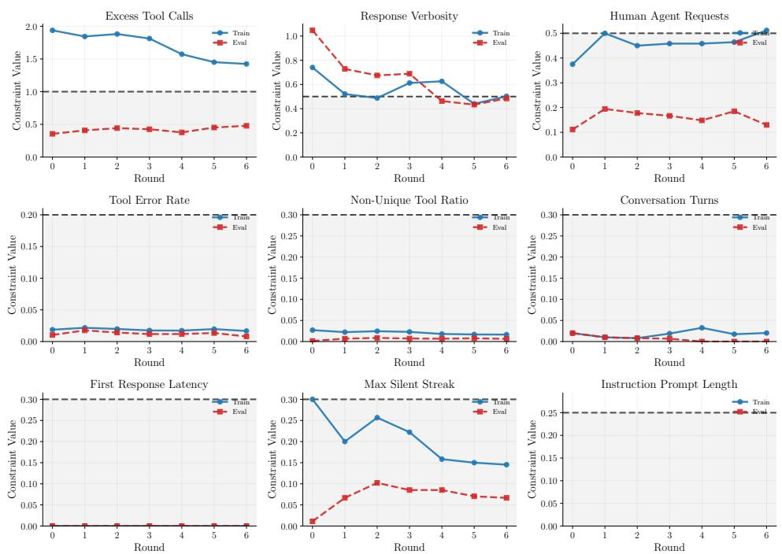  
Figure 6: Constraint dynamics with nine constraints on Airline. Blue and orange curves show training and evaluation violation rates across optimization rounds. Violations of the turn and latency constraints remain near zero, whereas tool-use and verbosity violations persist and show larger gaps between training and evaluation.

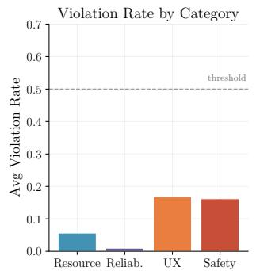

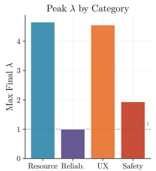

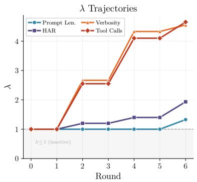  
Figure 7: Multiplier trajectories with nine Airline constraints. Constraints with persistent violations accumulate larger multipliers, whereas the multipliers for constraints satisfied early remain stable.

## B.3.2 Model-Scale Ablation

We evaluate Qwen2.5 models from 1.5B to 14B parameters on GSM8K under the length constraint (Figure 8).

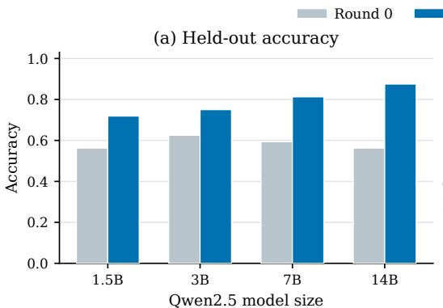

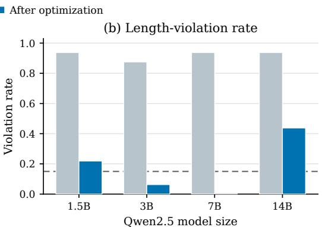  
Figure 8: Qwen2.5-7B attains the highest feasible accuracy across the tested model sizes. Held-out accuracy before and after prompt optimization appears on the left, with the corresponding length-violation rates on the right. The dashed line marks the 15% violation threshold; Qwen2.5-7B reaches 81.3% accuracy with no observed violations.

The accuracy–constraint trade-off is non-monotonic across the tested model sizes. The 7B variant gives the highest feasible accuracy. The smaller models have lower accuracy, whereas the larger variants exceed the length budget. Across the tested Qwen2.5 family, model scale therefore changes the attainable trade-off.

## B.3.3 Progressive Constraint Addition

In practice, new safety policies or formatting requirements can introduce constraints incrementally. We therefore compare simultaneous optimization, which activates all constraints in the first round, with a progressive schedule that adds constraints while retaining the learned state. On the chatbot task, progressive optimization first uses AdvBench safety and character-counting constraints, then adds the length constraint with its multiplier initialized to zero while retaining the prompt and existing multipliers. The runs use the same evaluation examples and optimizer hyperparameters. The progressive trace includes six initial two-constraint rounds before length is added, whereas simultaneous optimization activates all three constraints from the first of its six recorded rounds.

Figure 9 shows the recorded trajectories under the two schedules. The progressive run first optimizes AdvBench safety and character counting, then adds length after round 6. Its accuracy recovers during the second stage as the length violation falls. The simultaneous run activates all three constraints from its first round.

Three-constraint progressive chatbot trajectory. Figure 10 shows a 12-round trajectory that begins with AdvBench safety and character counting and later introduces response length.

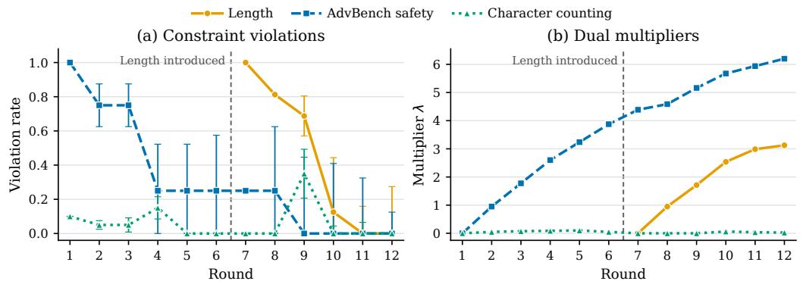

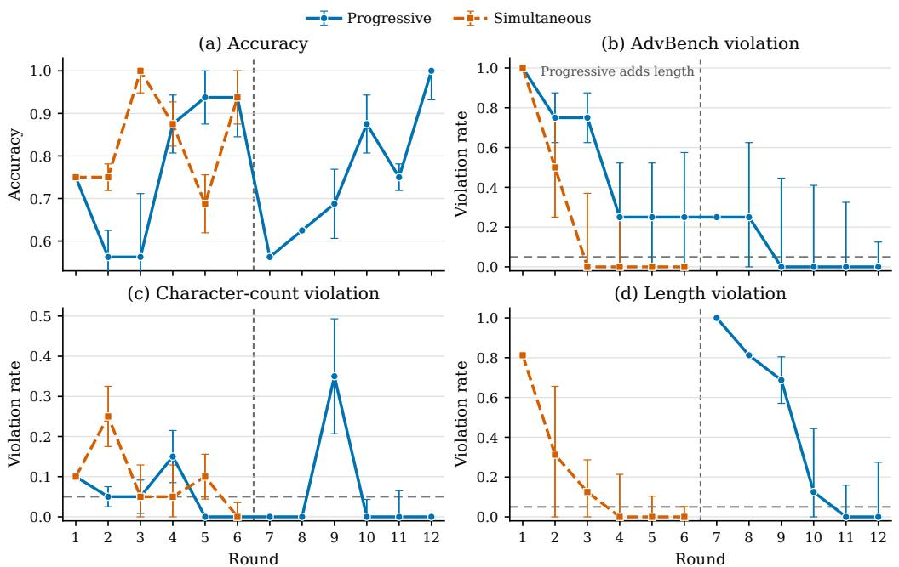  
Figure 9: Progressive and simultaneous optimization follow different trajectories. Panels compare held-out accuracy and violation rates for the 12-round progressive run and the six recorded rounds of simultaneous optimization. Progressive optimization uses AdvBench safety and character counting in rounds 1–6 and adds length after round 6; simultaneous optimization activates all three constraints from its first round. Error bars denote one standard deviation, clipped to [0, 1]. Horizontal dashed lines mark the violation threshold $\tau = 0 . 0 5$  
Figure 10: Dual multipliers track active constraint violations. Held-out violation rates appear on the left and the corresponding multiplier trajectories on the right. The vertical line marks the introduction of the length constraint after round 6. Error bars denote one standard deviation, clipped to [0, 1].

AdvBench requires sustained pressure: its multiplier grows as the violation falls. After length is introduced, its multiplier rises until the length violation reaches zero. Character counting remains near zero for most rounds and its multiplier stays near zero.

## B.3.4 Editor-Size Ablation

We additionally train Qwen3-0.6B and Qwen3-4B rewrite policies and compare them with Qwen3-8B. Each run uses the same seed, a 30-step online budget, a frozen Qwen3-32B task agent, and the same domain thresholds. Figure 11 reports the best observed feasible score for each size across the available feedback configurations. The best observed score generally improves with editor size, although Retail is non-monotonic. Because this summary selects both the feedback setting and prompt using held-out measurements, it is a descriptive best-observed comparison rather than a controlled size ablation or a model-selection estimate.

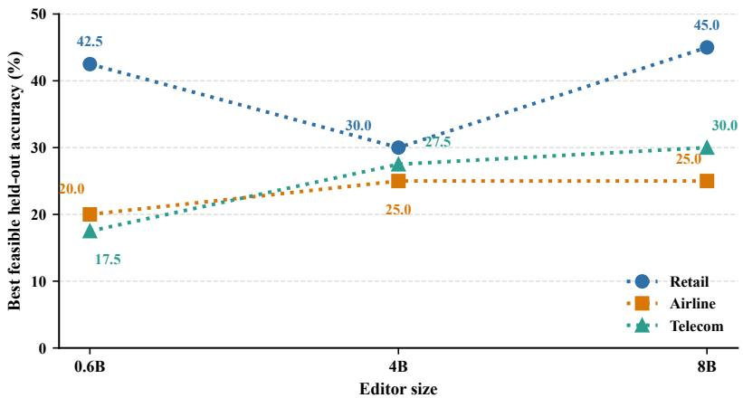  
Figure 11: Best observed feasible score across editor sizes. Dotted lines compare Qwen3-0.6B, Qwen3-4B, and Qwen3-8B rewriters. All runs use a frozen Qwen3-32B task agent and the same user simulator. The Airline 8B point uses the extended-context configuration. This is a best-observed comparison across settings, not a single-setting size ablation.

## B.3.5 Generalization and Transfer

The following experiments test three distinct forms of generalization and transfer. The coding-agent study applies the CAPO procedure to a different agent setting, the task-cluster study evaluates a CAPO prompt under a shifted task distribution, and the zero-shot study transfers the parameters of a trained DCAPO rewriter across domains.

Coding-agent setting. In the coding-agent study, we optimize a GPT-5-mini SWE-agent prompt on 10 SWE-BENCH Lite instances and perform a final evaluation on 30 instances. Resolve rate is the objective. Patch size is normalized by the 75th-percentile gold-patch size, tool actions by the 50-step agent budget, and files touched by the 75th-percentile gold-patch count. MOPO is the only search baseline because every candidate evaluation requires a repository checkout and a complete API-based coding-agent rollout.

Table 10 reports the recorded results under the listed thresholds. All three methods resolve five issues;   
among them, CAPO records the smallest patch, the fewest tool actions, and the fewest files touched.

Table 10: CAPO matches the resolve rate while reducing all three coding-agent costs. These values underlie the coding-agent panel in Figure 3. Bold marks the highest feasible objective, and underlining marks the next distinct feasible objective; ties are included. A row satisfies AllSat only if Patch, Tool, and Files each meet the threshold listed in the first row.
<table><tr><td>Method</td><td>Resolve ↑</td><td>Patch↓</td><td>Tool↓</td><td>Files↓</td><td>AllSat</td></tr><tr><td>Threshold</td><td></td><td>1.2</td><td>0.4</td><td>1.7</td><td>一</td></tr><tr><td>Initial</td><td>0.167</td><td>1.298</td><td>0.423</td><td>1.867</td><td>x</td></tr><tr><td>MOPO</td><td>0.167</td><td>1.209</td><td>0.393</td><td>1.500</td><td>x</td></tr><tr><td>CAPO</td><td>0.167</td><td>1.055</td><td>0.371</td><td>1.300</td><td>√</td></tr></table>

Task-cluster shift. We cluster Airline tasks in embedding space and select the training cluster farthest from the evaluation-set centroid. CAPO meets all three thresholds on the resulting split (Table 11).

Table 11: CAPO remains feasible under an embedding-defined Airline task-cluster shift. Objective, ToolEx, and HAR are fractions or ratios; PLen is the system-prompt character count divided by 1,000. Bold marks the highest feasible objective, and underlining marks the next distinct feasible objective; ties are included.
<table><tr><td>Split</td><td>Objective ↑</td><td>ToolEx↓</td><td>HAR↓</td><td>PLen↓</td></tr><tr><td>In-domain</td><td>0.450</td><td>1.049</td><td>0.050</td><td>4.98</td></tr><tr><td>Shifted</td><td>0.400</td><td>1.000</td><td>0.250</td><td>4.91</td></tr></table>

Zero-shot rewriter transfer. We freeze a Telecom-trained rewriter and apply it to Retail and Airline, using Qwen3-8B as the frozen task agent and Ministral-3-8B-Instruct as the frozen user simulator. For each target, it receives the target-domain seed prompt and sampled trajectories, generates four candidates in one inference-only round, selects the highest-J candidate on validation, and evaluates the parent and selected rewrite on the held-out test split. There are no target-domain gradient updates or iterative pool search.

Table 12: Frozen-rewriter transfer lowers ToolEx without reaching target-domain feasibility. A Telecomtrained rewriter is transferred for one inference-only round. No accuracy is bold because no row is feasible.
<table><tr><td>Domain</td><td>Prompt</td><td>Acc ↑</td><td>ToolEx ↓</td><td>HAR↓</td><td>PLen ↓</td><td>AllSat</td></tr><tr><td>Retail</td><td>Threshold</td><td></td><td>60.0</td><td>30.0</td><td>5.00</td><td>一</td></tr><tr><td>Retail</td><td>Initial</td><td>27.5</td><td>84.0</td><td>12.5</td><td>0.32</td><td>x</td></tr><tr><td>Retail</td><td>Frozen Telecom rewrite</td><td>32.5</td><td>67.0</td><td>12.5</td><td>1.96</td><td>x</td></tr><tr><td>Airline</td><td>Threshold</td><td></td><td>200.0</td><td>30.0</td><td>5.00</td><td>一</td></tr><tr><td>Airline</td><td>Initial</td><td>10.0</td><td>329.0</td><td>15.0</td><td>0.32</td><td>x</td></tr><tr><td>Airline</td><td>Frozen Telecom rewrite</td><td>10.0</td><td>220.0</td><td>10.0</td><td>3.04</td><td>x</td></tr></table>

The frozen rewriter lowers ToolEx in both target domains without reducing accuracy or pushing the other costs above their thresholds, but ToolEx remains above its threshold. The transferred rewriter therefore makes a useful edit but does not achieve feasibility without target-domain adaptation.

## B.3.6 RL-Based Baselines

StablePrompt [Kwon et al., 2024] trains a prompt-generation policy with APPO. For this comparison, its fixed scalar reward assigns unit weight to every constraint. Agent-GRPO (loose λ) directly updates the task agent under predeclared fixed weights. DCAPO instead freezes the task agent, trains the trajectory- and dual-conditioned rewriter with group-relative advantages, and adds highscoring children to an evolving prompt pool. Neither RL-based baseline updates constraint-specific multipliers online. Table 13 uses Qwen3-8B as the task agent.

Table 13: DCAPO is feasible in all three Qwen3-8B domains. StablePrompt and Agent-GRPO provide promptpolicy and task-policy comparisons, respectively; DCAPO uses complete trajectories (D=1). Agent-GRPO uses the loose fixed penalty vector $( \lambda _ { \mathrm { T o o l E x } } , \lambda _ { \mathrm { H A R } } ) = ( 1 , 2 . 5 )$ . AllSat holds only when every cost meets its domain threshold. Within each domain, bold marks the highest feasible accuracy, and underlining marks the next distinct feasible accuracy; ties are included.
<table><tr><td>Domain</td><td>Method</td><td>Acc ↑</td><td>ToolEx↓</td><td>HAR↓</td><td>PLen↓</td><td>AllSat</td></tr><tr><td>Airline</td><td>Threshold</td><td>一</td><td>200.0</td><td>30.0</td><td>5.00</td><td>一</td></tr><tr><td>Airline</td><td>StablePrompt</td><td>15.0</td><td>436.4</td><td>5.0</td><td>0.63</td><td>x</td></tr><tr><td>Airline</td><td>Agent-GRPO (loose λ)</td><td>30.0</td><td>-19.7</td><td>20.0</td><td>0.30</td><td>√</td></tr><tr><td>Airline</td><td>DCAPO</td><td>30.0</td><td>-78.7</td><td>0.0</td><td>3.68</td><td>√</td></tr><tr><td>Telecom</td><td>Threshold</td><td></td><td>40.0</td><td>60.0</td><td>5.00</td><td>一</td></tr><tr><td>Telecom</td><td>StablePrompt</td><td>0.0</td><td>81.9</td><td>2.5</td><td>0.71</td><td>x</td></tr><tr><td>Telecom</td><td>Agent-GRPO (loose λ)</td><td>0.0</td><td>71.0</td><td>5.0</td><td>0.30</td><td>x</td></tr><tr><td>Telecom</td><td>DCAPO</td><td>12.5</td><td>9.9</td><td>12.5</td><td>4.71</td><td>√</td></tr><tr><td>Retail</td><td>Threshold</td><td>一</td><td>60.0</td><td>30.0</td><td>5.00</td><td>-</td></tr><tr><td>Retail</td><td>StablePrompt</td><td>22.5</td><td>31.3</td><td>5.0</td><td>0.57</td><td>√</td></tr><tr><td>Retail</td><td>Agent-GRPO (loose λ)</td><td>25.0</td><td>109.1</td><td>20.0</td><td>0.30</td><td>x</td></tr><tr><td>Retail</td><td>DCAPO</td><td>22.5</td><td>5.9</td><td>5.0</td><td>2.92</td><td>√</td></tr></table>

DCAPO trained on complete trajectories satisfies all constraints in all three domains. It ties the highest feasible accuracy on Airline and Retail and is the only feasible method on Telecom. This comparison separates learning a constraint-aware rewriter within an adaptive pool from RL prompt generation or direct task-policy training under a fixed weighted objective.

## B.4 Analysis

This subsection examines optimization dynamics, robustness, sensitivity, and the alignment between learned rewrites and estimated ascent directions.

## B.4.1 Training Dynamics

CAPO trajectories. Figure 12 shows the optimization trajectory on the chatbot GSM8K setting. CAPO reaches the feasible region in fewer rounds because a persistent violation increases its multiplier and strengthens its influence on the next prompt update. After all constraints are satisfied, stable or decreasing multipliers allow later updates to improve accuracy without losing feasibility.

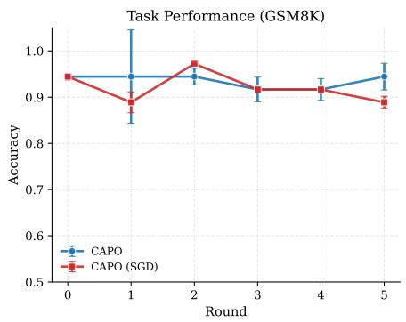

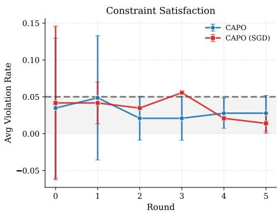  
Figure 12: CAPO reaches chatbot feasibility sooner and finishes with higher task accuracy. The trajectories track constrained prompt optimization across rounds.

DCAPO dynamics. Figure 13 compares feedback-conditioned training with a feedback-free control as prompts enter the pool. The feedback-free control has higher Pass@1 in this run but later violates the HAR threshold. The feedback-conditioned rewriter trades some task reward for lower ToolEx and HAR and satisfies both thresholds after roughly 80 accepted prompts. This figure isolates the presence of behavioral feedback; Table 3 separately compares trajectory and summarized feedback at final evaluation.

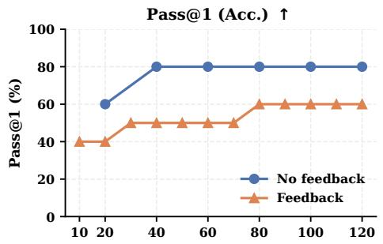

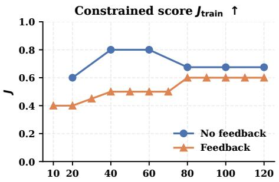

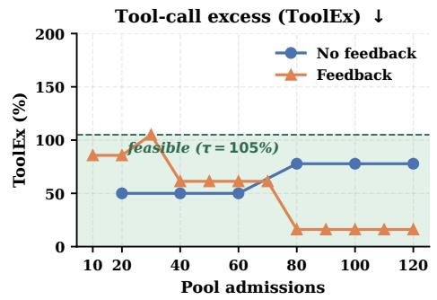

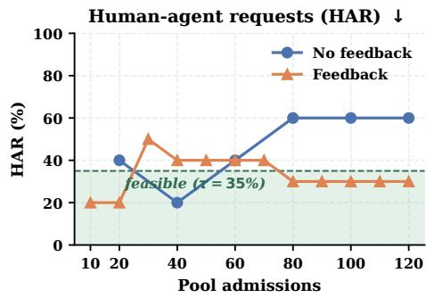  
Figure 13: DCAPO training dynamics on Airline. Feedback-conditioned training is compared with a feedbackfree control as prompts enter the pool. The feedback-conditioned run gives up some Pass@1 but eventually satisfies the ToolEx and HAR thresholds; shading marks the feasible region for each metric.

Table 14: Per-example uncertainty on Airline with GPT-5-mini. Values are means ± SE for the TAU2-BENCH agent metrics. The accuracy in Table 1 uses a different number of evaluation examples; the denominator here matches the corresponding run.
<table><tr><td>Method</td><td>Acc.</td><td>HAR</td><td>ToolEx</td><td>PLen</td></tr><tr><td>Init</td><td> $0 . 2 5 0 0 { \scriptstyle \pm 0 . 0 7 9 3 }$ </td><td> $0 . 3 5 0 0 { \scriptstyle \pm 0 . 0 8 9 4 }$ </td><td> $1 . 0 5 0 0 { \scriptstyle \pm 0 . 2 8 6 6 }$ </td><td> $0 . 3 0 6 0 { \scriptstyle \pm 0 . 0 0 0 0 }$ </td></tr><tr><td>APO</td><td> $0 . 2 5 0 0 { \scriptstyle \pm 0 . 0 7 9 3 }$ </td><td> $0 . 1 0 0 0 { \scriptstyle \pm 0 . 0 4 8 8 }$ </td><td> $1 . 4 1 0 0 { \scriptstyle \pm 0 . 6 5 2 1 }$ </td><td> $2 . 1 8 0 8 { \scriptstyle \pm 0 . 0 0 0 0 }$ </td></tr><tr><td>MOPO</td><td> $0 . 4 5 0 0 { \scriptstyle \pm 0 . 0 9 4 1 }$ </td><td> $0 . 2 5 0 0 { \scriptstyle \pm 0 . 0 7 9 3 }$ </td><td> $1 . 5 5 7 4 { \scriptstyle \pm 0 . 0 4 8 8 }$ </td><td> $4 . 6 7 8 0 { \scriptstyle \pm 0 . 0 0 0 0 }$ </td></tr><tr><td>GEPA</td><td> $0 . 3 0 0 0 { \scriptstyle \pm 0 . 0 8 5 1 }$ </td><td> $0 . 1 0 0 0 { \scriptstyle \pm 0 . 0 4 8 8 }$ </td><td> $0 . 9 2 0 0 { \scriptstyle \pm 0 . 0 9 2 4 }$ </td><td> $4 . 2 0 0 0 { \scriptstyle \pm 0 . 0 0 0 0 }$ </td></tr><tr><td>CAPO(EA)</td><td> $\mathbf { 0 . 5 0 0 0 } { \pm } 0 . 0 9 4 7$ </td><td> $0 . 2 0 0 0 { \scriptstyle \pm 0 . 0 7 1 8 }$ </td><td>1.0000±0.0851</td><td> $4 . 6 1 0 0 { \scriptstyle \pm 0 . 0 0 0 0 }$ </td></tr><tr><td>CAPO</td><td> $0 . 4 5 0 0 { \scriptstyle \pm 0 . 0 9 0 6 }$ </td><td> $0 . 0 5 0 0 { \scriptstyle \pm 0 . 0 5 0 0 }$ </td><td> $1 . 0 4 9 2 { \scriptstyle \pm 0 . 0 9 1 8 }$ </td><td> $4 . 9 8 4 0 { \scriptstyle \pm 0 . 0 0 0 0 }$ </td></tr></table>

Table 15: Per-example uncertainty on Retail with GPT-5-mini. Values are means ± SE for the TAU2-BENCH agent metrics.
<table><tr><td>Method</td><td>Acc.</td><td>HAR</td><td>ToolEx</td><td>PLen</td></tr><tr><td>Init</td><td>0.5000±0.0601</td><td>0.1250±0.0330</td><td>0.5270±0.0550</td><td>0.3040±0.0000</td></tr><tr><td>APO</td><td> $0 . 5 7 5 0 { \scriptstyle \pm 0 . 0 5 9 2 }$ </td><td>0.0750±0.0422</td><td> $0 . 5 7 5 0 { \scriptstyle \pm 0 . 0 5 6 4 }$ </td><td> $0 . 3 0 4 0 { \scriptstyle \pm 0 . 0 0 0 0 }$ </td></tr><tr><td>MOPO</td><td> $0 . 5 5 0 0 { \scriptstyle \pm 0 . 0 5 9 7 }$ </td><td> $0 . 0 7 5 0 { \scriptstyle \pm 0 . 0 4 2 2 }$ </td><td> $0 . 5 5 9 0 { \scriptstyle \pm 0 . 0 5 6 4 }$ </td><td> $5 . 8 6 8 0 { \scriptstyle \pm 0 . 0 0 0 0 }$ </td></tr><tr><td>GEPA</td><td> $0 . 5 0 0 0 { \scriptstyle \pm 0 . 0 6 0 1 }$ </td><td>0.0500±0.0349</td><td> $0 . 5 1 6 0 { \scriptstyle \pm 0 . 0 5 8 4 }$ </td><td> $4 . 5 1 6 0 { \scriptstyle \pm 0 . 0 0 0 0 }$ </td></tr><tr><td>CAPO(EA)</td><td> $0 . 5 0 0 0 { \scriptstyle \pm 0 . 0 5 8 4 }$ </td><td>0.1250±0.0480</td><td> $0 . 4 9 5 0 { \scriptstyle \pm 0 . 0 5 3 4 }$ </td><td> $4 . 5 1 2 0 { \scriptstyle \pm 0 . 0 0 0 0 }$ </td></tr><tr><td>CAPO</td><td> $\mathbf { 0 . 5 5 0 0 } { \scriptstyle \pm 0 . 0 5 9 7 }$ </td><td>0.1250±0.0330</td><td></td><td>0.4409±0.0592 4.7000±0.0000</td></tr></table>

## B.4.2 Robustness and Sensitivity

Standard errors. We report the mean ± standard error (SE) over evaluation examples, where ${ \mathrm { S E } } = s / { \sqrt { n } }$ and s is the sample standard deviation with Bessel’s correction (ddof=1). We do not use bootstrapping. For binary metrics, including accuracy and violation indicators, we compute SE from the underlying {0, 1} outcomes. The tables report Acc, HAR, and ToolEx as fractions or ratios; multiplying these values by 100 gives percentages. PLen follows the definition in Appendix B.1 and is deterministic for a fixed prompt, so its per-example SE is zero. Tables 14–16 correspond to the GPT-5-mini results in Table 1, and Tables 17–19 correspond to the Ministral-8B results in Table 9. In Tables 14–19, bold marks the highest feasible accuracy mean, and underlining marks the next distinct feasible accuracy mean; ties are included.

## Feedback and threshold sensitivity.

Noisy dual feedback. Table 20 reports the main evaluator-noise results. We inject ${ \mathcal { N } } ( 0 , \sigma ^ { 2 } )$ noise into the constraint estimates used for feasibility gating and multiplier updates. The numerical Lagrangian used for candidate ranking retains the unperturbed continuous cost, and the final evaluation is also unperturbed. This setup isolates sensitivity to noise in the multiplier updates. With nonzero noise, Airline and Telecom violate at least one threshold despite pool averaging.

Dual learning rate β. Across Airline and Telecom, β=4 is the only tested value that is feasible in both domains and attains the best feasible objective in each sweep. Other rates either miss Airline’s ToolEx budget or yield a weaker Telecom objective. We use this rate as a shared default; the remaining sweep values show that the feasible objective remains sensitive to the dual learning rate.

ToolEx threshold. Table 22 shows that tightening the Airline ToolEx tolerance produces larger final multipliers. At the strictest budget, 0.5, the multiplier reaches its cap, but no prompt found during search meets the threshold. Figure 14 visualizes the corresponding trajectories with GPT-5.1 as the task agent.

Mechanism ablations. The following ablations test whether one-shot sampling, static constraint injection, or a different search mechanism explains CAPO’s feasibility.

Iterative residual feedback. One-shot test-time sampling $( k \in \{ 4 , 8 , 1 6 \} )$ and direct constraint injection both violate at least one threshold (Table 23). Sampling finds strong prompts without correcting the binding constraint, whereas static injection can shift the violation to another constraint. Merely showing the optimizer the budgets is therefore not equivalent to updating weights from measured residuals.

Table 16: Per-example uncertainty on Telecom with GPT-5-mini. Values are means ± SE for the TAU2-BENCH agent metrics.
<table><tr><td>Method</td><td>Acc.</td><td>HAR</td><td>ToolEx</td><td>PLen</td></tr><tr><td>Init</td><td>0.4000±0.0441</td><td>0.8000±0.0534</td><td>3.0990±0.0250</td><td>0.3060±0.0000</td></tr><tr><td>APO</td><td> $0 . 3 7 5 0 { \scriptstyle \pm 0 . 0 4 9 3 }$ </td><td> $0 . 6 2 5 0 { \scriptstyle \pm 0 . 0 7 7 5 }$ </td><td> $- 0 . 0 5 5 6 { \scriptstyle \pm 0 . 0 2 5 0 }$ </td><td>4.8980±0.0000</td></tr><tr><td>MOPO</td><td> $0 . 4 5 0 0 { \scriptstyle \pm 0 . 0 4 0 8 }$ </td><td> $0 . 6 5 0 0 { \scriptstyle \pm 0 . 0 7 6 4 }$ </td><td> $0 . 7 3 4 6 { \pm } 0 . 0 5 1 5$ </td><td> $5 . 0 1 6 0 { \scriptstyle \pm 0 . 0 0 0 0 }$ </td></tr><tr><td>GEPA</td><td> $0 . 3 2 5 0 { \scriptstyle \pm 0 . 0 4 8 0 }$ </td><td> $0 . 8 0 0 0 { \scriptstyle \pm 0 . 0 6 4 1 }$ </td><td> $4 . 0 3 8 9 { \scriptstyle \pm 0 . 4 4 6 7 }$ </td><td> $0 . 3 0 6 0 { \scriptstyle \pm 0 . 0 0 0 0 }$ </td></tr><tr><td>CAPO(EA)</td><td> $0 . 4 7 5 0 { \scriptstyle \pm 0 . 0 4 6 9 }$ </td><td> $0 . 7 0 0 0 { \scriptstyle \pm 0 . 0 7 3 4 }$ </td><td> $- 0 . 4 8 1 5 { \scriptstyle \pm 0 . 0 4 0 8 }$ </td><td> $4 . 7 3 5 2 { \scriptstyle \pm 0 . 0 0 0 0 }$ </td></tr><tr><td>CAPO</td><td> $\mathbf { 0 . 5 0 0 0 } { \pm } 0 . 0 4 0 8$ </td><td> $0 . 6 2 5 0 { \scriptstyle \pm 0 . 0 5 7 5 }$ </td><td> $0 . 3 3 9 5 { \scriptstyle \pm 0 . 0 5 7 5 }$ </td><td> $4 . 2 8 8 8 { \pm } 0 . 0 0 0 0$ </td></tr></table>

Table 17: Per-example uncertainty on Airline with Ministral-8B. Values are means ± SE for the TAU2-BENCH agent metrics.
<table><tr><td>Method</td><td> $\operatorname { A c c } .$ </td><td>HAR</td><td>ToolEx</td><td> $\mathrm { P I } \mathscr { e } \mathrm { n }$ </td></tr><tr><td>Init</td><td> $0 . 1 5 0 0 { \scriptstyle \pm 0 . 0 6 1 9 }$ </td><td> $0 . 1 0 0 0 { \scriptstyle \pm 0 . 0 4 8 8 }$ </td><td> $2 . 1 9 6 7 { \scriptstyle \pm 0 . 0 4 8 8 }$ </td><td> $0 . 3 0 6 0 { \scriptstyle \pm 0 . 0 0 0 0 }$ </td></tr><tr><td>APO</td><td> $\mathbf { 0 . 2 0 0 0 } { \pm } 0 . 0 7 1 8$ </td><td> $0 . 0 5 0 0 { \scriptstyle \pm 0 . 0 5 0 0 }$ </td><td> $1 . 8 8 5 2 { \scriptstyle \pm 0 . 0 5 0 0 }$ </td><td> $4 . 2 4 4 0 { \scriptstyle \pm 0 . 0 0 0 0 }$ </td></tr><tr><td>MOPO</td><td> $0 . 1 5 0 0 { \scriptstyle \pm 0 . 0 6 1 9 }$ </td><td> $0 . 2 5 0 0 { \scriptstyle \pm 0 . 0 0 0 0 }$ </td><td> $2 . 3 7 7 0 { \scriptstyle \pm 0 . 0 0 0 0 }$ </td><td> $4 . 7 1 6 0 { \scriptstyle \pm 0 . 0 0 0 0 }$ </td></tr><tr><td>GEPA</td><td> $0 . 1 0 0 0 { \scriptstyle \pm 0 . 0 4 8 8 }$ </td><td> $0 . 2 5 0 0 { \scriptstyle \pm 0 . 0 7 9 3 }$ </td><td> $2 . 3 9 3 0 { \scriptstyle \pm 0 . 0 5 0 0 }$ </td><td> $5 . 5 4 0 0 { \scriptstyle \pm 0 . 0 0 0 0 }$ </td></tr><tr><td>CAPO</td><td> $\mathbf { 0 . 2 0 0 0 } { \pm } 0 . 0 7 1 8$ </td><td> $0 . 0 5 0 0 { \scriptstyle \pm 0 . 0 5 0 0 }$ </td><td> $1 . 7 7 0 5 { \scriptstyle \pm 0 . 0 4 8 8 }$ </td><td> $4 . 1 7 4 0 { \scriptstyle \pm 0 . 0 0 0 0 }$ </td></tr></table>

Evolutionary search. EvoPrompt-GA [Guo et al., 2024] replaces the rewrite step with tournament selection and crossover under a fixed Lagrangian fitness. It also violates a threshold (Table 23), indicating that CAPO’s gain is not explained by generic population search alone.

Airline mechanism ablations. Table 23 reports these comparisons on Airline.

Table 23: One-shot sampling, static budget injection, and generic evolutionary search do not reproduce CAPO’s feasibility on Airline. All rows use the thresholds shown in the first row; lower is better for HAR and ToolEx. Bold marks the highest feasible accuracy, and underlining marks the next distinct feasible accuracy; ties are included.
<table><tr><td>Design axis</td><td>Method</td><td>Acc↑</td><td>HAR↓</td><td> $\mathbf { T o o l E x } \downarrow$ </td><td>AllSat</td></tr><tr><td>Threshold</td><td></td><td>一</td><td>35</td><td>105</td><td>一</td></tr><tr><td>Constraint feedback</td><td>TT sampling (k=4)</td><td>35.0</td><td>45.0</td><td>88.5</td><td>x</td></tr><tr><td>Constraint feedback</td><td>TT sampling (k=8)</td><td>35.0</td><td>45.0</td><td>88.5</td><td>x</td></tr><tr><td>Constraint feedback</td><td>TT sampling (k=16)</td><td>50.0</td><td>15.0</td><td>127.9</td><td>x</td></tr><tr><td>Constraint feedback</td><td>Constraint-Injected</td><td>25.0</td><td>15.0</td><td>206.6</td><td>x</td></tr><tr><td>Search mechanism</td><td>EvoPrompt-GA</td><td>45.0</td><td>30.0</td><td>119.7</td><td>x</td></tr><tr><td>Ours</td><td>CAPO</td><td>45.0</td><td>5.0</td><td>104.9</td><td>√</td></tr></table>

Additional Telecom and Retail ablations. Table 24 reports the Telecom and Retail counterparts to the Airline ablations in Table 23. All numbers use the standard thresholds from Table 1.

Telecom ToolEx threshold sensitivity. While Table 1 uses ToolEx $\leq 2 5 0$ on Telecom, the $\mathrm { A l l S a t } _ { 7 0 }$ column of Table 24 applies the stricter ToolEx $\leq 7 0$ threshold to the same measurements. Only CAPO satisfies all constraints under this stricter threshold. This is consistent with the main result: multipliers scaled by violation size continue to drive feasibility under tightened budgets, while binary or budget-injection variants cannot.

Table 18: Per-example uncertainty on Retail with Ministral-8B. Values are means ± SE for the TAU2-BENCH agent metrics.
<table><tr><td>Method</td><td> $\operatorname { A c c } .$ </td><td>HAR</td><td>ToolEx</td><td>PLen</td></tr><tr><td>Init</td><td> $0 . 3 0 0 0 { \scriptstyle \pm 0 . 0 5 3 4 }$ </td><td> $0 . 2 0 0 0 { \scriptstyle \pm 0 . 0 4 4 1 }$ </td><td> $0 . 6 0 2 0 { \scriptstyle \pm 0 . 0 5 7 5 }$ </td><td> $0 . 3 0 4 0 { \scriptstyle \pm 0 . 0 0 0 0 }$ </td></tr><tr><td>APO</td><td> $0 . 3 0 0 0 { \scriptstyle \pm 0 . 0 5 3 4 }$ </td><td> $0 . 2 0 0 0 { \scriptstyle \pm 0 . 0 4 4 1 }$ </td><td> $0 . 6 0 2 0 { \scriptstyle \pm 0 . 0 5 7 5 }$ </td><td>0.3040±0.0000</td></tr><tr><td>MOPO</td><td> $0 . 4 0 0 0 { \scriptstyle \pm 0 . 0 5 8 4 }$ </td><td> $0 . 1 5 0 0 { \scriptstyle \pm 0 . 0 3 7 2 }$ </td><td> $0 . 7 3 1 2 { \scriptstyle \pm 0 . 0 5 6 4 }$ </td><td> $3 . 8 5 4 8 { \scriptstyle \pm 0 . 0 0 0 0 }$ </td></tr><tr><td>GEPA</td><td> $0 . 3 7 5 0 { \scriptstyle \pm 0 . 0 5 7 5 }$ </td><td> $0 . 1 5 0 0 { \scriptstyle \pm 0 . 0 3 7 2 }$ </td><td> $0 . 8 6 0 0 { \scriptstyle \pm 0 . 0 4 9 3 }$ </td><td> $4 . 4 0 8 0 { \scriptstyle \pm 0 . 0 0 0 0 }$ </td></tr><tr><td>CAPO</td><td> $\mathbf { 0 . 3 2 5 0 { \overset { . } { \bot } } 0 . 0 5 5 0 }$ </td><td> $0 . 2 0 0 0 { \scriptstyle \pm 0 . 0 4 4 1 }$ </td><td> $0 . 5 5 4 0 { \scriptstyle \pm 0 . 0 5 7 5 }$ </td><td>2.6800±0.0000</td></tr></table>

Table 19: Per-example uncertainty on Telecom with Ministral-8B. Values are means ± SE for the TAU2- BENCH agent metrics.
<table><tr><td>Method</td><td> $\operatorname { A c c } .$ </td><td>HAR</td><td>ToolEx</td><td>PLen</td></tr><tr><td>Init</td><td> $0 . 2 0 0 0 { \scriptstyle \pm 0 . 0 4 4 1 }$ </td><td> $0 . 6 2 5 0 { \scriptstyle \pm 0 . 0 6 0 0 }$ </td><td> $0 . 1 6 6 7 { \scriptstyle \pm 0 . 0 5 8 4 }$ </td><td> $0 . 3 0 6 0 { \scriptstyle \pm 0 . 0 0 0 0 }$ </td></tr><tr><td>APO</td><td> $0 . 2 0 0 0 { \scriptstyle \pm 0 . 0 4 4 1 }$ </td><td> $0 . 6 2 5 0 { \scriptstyle \pm 0 . 0 6 0 0 }$ </td><td> $0 . 1 6 6 7 { \scriptstyle \pm 0 . 0 5 8 4 }$ </td><td> $0 . 3 0 6 0 { \scriptstyle \pm 0 . 0 0 0 0 }$ </td></tr><tr><td>MOPO</td><td> $0 . 1 0 0 0 { \scriptstyle \pm 0 . 0 4 8 0 }$ </td><td> $0 . 4 7 5 0 { \scriptstyle \pm 0 . 0 6 0 0 }$ </td><td> $0 . 4 0 1 2 { \scriptstyle \pm 0 . 0 5 9 2 }$ </td><td> $4 . 8 8 8 0 { \pm } 0 . 0 0 0 0$ </td></tr><tr><td>GEPA</td><td> $0 . 2 2 5 0 { \scriptstyle \pm 0 . 0 4 6 9 }$ </td><td> $0 . 6 5 0 0 { \scriptstyle \pm 0 . 0 5 6 4 }$ </td><td> $0 . 7 5 3 0 { \scriptstyle \pm 0 . 0 4 0 8 }$ </td><td> $0 . 3 2 4 0 { \scriptstyle \pm 0 . 0 0 0 0 }$ </td></tr><tr><td>CAPO</td><td> $\mathbf { 0 . 2 5 0 0 } { \scriptstyle \pm 0 . 0 4 9 3 }$ </td><td> $0 . 3 5 0 0 { \scriptstyle \pm 0 . 0 5 6 4 }$ </td><td> $0 . 3 8 2 7 { \scriptstyle \pm 0 . 0 5 9 2 }$ </td><td> $4 . 6 5 8 8 { \pm } 0 . 0 0 0 0$ </td></tr></table>

Table 20: Mild noise preserves Retail feasibility but breaks Airline and Telecom feasibility. These values underlie Figure 4 (CAPO, GPT-5-mini). Gaussian noise perturbs feasibility gating and dual updates; candidate ranking and final evaluation use unperturbed scores. The objective and costs are reported as fractions or ratios. Within each domain, bold marks the highest feasible objective, and underlining marks the next distinct feasible objective; ties are included.
<table><tr><td>Domain</td><td>σ</td><td>Objective ↑</td><td>ToolEx↓</td><td> $\mathbf { H A R } \downarrow$ </td></tr><tr><td>Airline</td><td>0 (no noise)</td><td>0.450</td><td>1.049</td><td>0.050</td></tr><tr><td>Airline</td><td>0.5</td><td>0.500</td><td>1.230</td><td>0.250</td></tr><tr><td>Airline</td><td>2.0</td><td>0.450</td><td>1.508</td><td>0.150</td></tr><tr><td>Telecom</td><td>0 (no noise)</td><td>0.500</td><td>0.340</td><td>0.625</td></tr><tr><td>Telecom</td><td>0.5</td><td>0.425</td><td>2.265</td><td>0.750</td></tr><tr><td>Telecom</td><td>2.0</td><td>0.325</td><td>3.000</td><td>0.625</td></tr><tr><td>Retail</td><td>0 (no noise)</td><td>0.550</td><td>0.441</td><td>0.125</td></tr><tr><td>Retail</td><td>0.5</td><td>0.575</td><td>0.462</td><td>0.100</td></tr><tr><td>Retail</td><td>2.0</td><td>0.525</td><td>0.618</td><td>0.100</td></tr></table>

Table 21: β = 4 is the only tested dual rate feasible in both Airline and Telecom. Results use CAPO with GPT-5-mini and three constraints. Objective, ToolEx, and HAR are fractions or ratios; PLen is the system-prompt character count divided by 1,000. Within each domain, bold marks the highest feasible objective, and underlining marks the next distinct feasible objective; ties are included.
<table><tr><td>Domain</td><td> $\beta$ </td><td>Objective ↑</td><td>ToolEx↓</td><td>HAR↓</td><td> $\mathbf { P L e n } \downarrow$ </td></tr><tr><td>Airline</td><td>0.5</td><td>0.400</td><td>1.279</td><td>0.200</td><td>3.33</td></tr><tr><td>Airline</td><td>2</td><td>0.400</td><td>1.279</td><td>0.200</td><td>3.33</td></tr><tr><td>Airline</td><td>4</td><td>0.450</td><td>1.049</td><td>0.050</td><td>4.98</td></tr><tr><td>Airline</td><td>8</td><td>0.400</td><td>1.279</td><td>0.200</td><td>3.33</td></tr><tr><td>Telecom</td><td>0.5</td><td>0.375</td><td>1.235</td><td>0.700</td><td>3.69</td></tr><tr><td>Telecom</td><td>2</td><td>0.425</td><td>2.105</td><td>0.800</td><td>0.31</td></tr><tr><td>Telecom</td><td>4</td><td>0.500</td><td>0.340</td><td>0.625</td><td>4.29</td></tr><tr><td>Telecom</td><td>8</td><td>0.475</td><td>0.290</td><td>0.625</td><td>3.98</td></tr></table>

Table 22: Tighter Airline ToolEx budgets produce larger final multipliers. Results use CAPO with GPT-5- mini. At the strictest threshold, 0.5, the ToolEx multiplier reaches its cap, but the final prompt remains infeasible. Bold marks the highest objective among rows feasible under their stated tolerance, and underlining marks the next distinct feasible objective; ties are included.
<table><tr><td>ToolEx tol.</td><td>Final  $\lambda _ { \mathrm { T o o l E x } }$ </td><td>ToolEx (test) ↓</td><td>Objective (test) ↑</td><td>HAR (test) ↓</td></tr><tr><td>2.0 (loose)</td><td>1.0</td><td>1.279</td><td>0.550</td><td>0.300</td></tr><tr><td>1.0 (moderate)</td><td>2.5</td><td>0.803</td><td>0.500</td><td>0.200</td></tr><tr><td>0.5 (unattained)</td><td>10.0</td><td>0.918</td><td>0.550</td><td>0.950</td></tr></table>

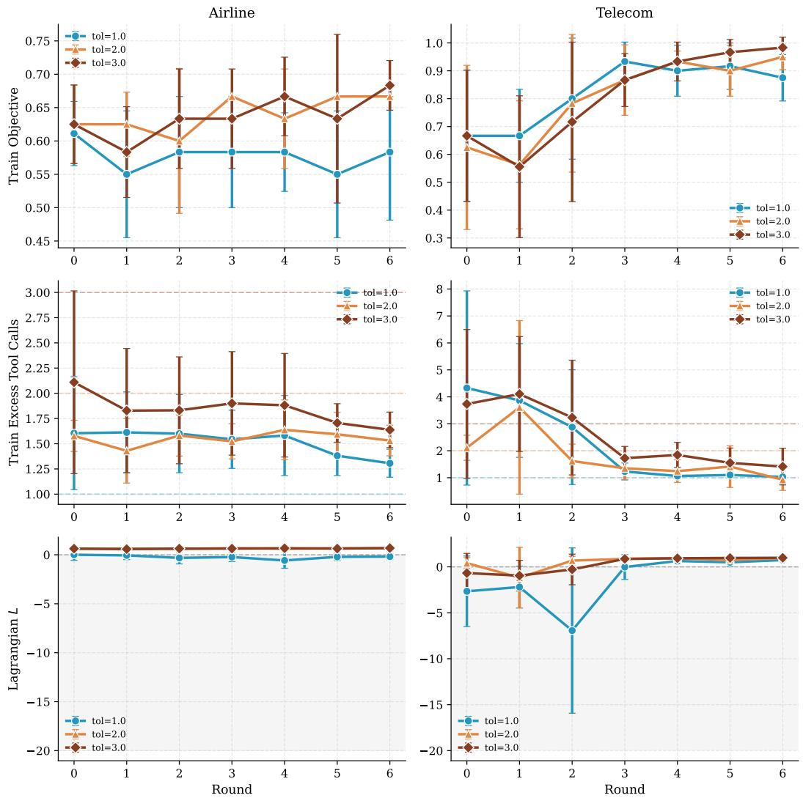  
Figure 14: Tighter ToolEx tolerances suppress violations but delay objective gains. Rows trace the training objective, excess tool calls, and Lagrangian L across optimization rounds for three tolerance levels on Airline and Telecom with CAPO and GPT-5.1. Dashed lines mark the constraint thresholds. When no evaluated prompt meets a threshold, search returns the prompt with the highest Lagrangian score.

Table 24: CAPO attains the highest feasible accuracy in the Telecom and Retail ablations. Results use the standard thresholds for the GPT-5-mini target. For Telecom, $\mathrm { A l l S a t } _ { 7 0 }$ additionally applies the stricter $\mathrm { T o o l E x } \le 7 0$ threshold; only CAPO remains feasible. Dashes mark Retail rows to which this alternate threshold does not apply. The Class column groups rows by comparison type: (i) module ablation, (ii) non-iterative baseline, and (iii) alternative optimization method. Within each domain, bold marks the highest feasible accuracy, and underlining marks the next distinct feasible accuracy; ties are included.
<table><tr><td>Class</td><td>Domain</td><td>Method</td><td>Acc↑</td><td>HAR↓</td><td>ToolEx↓</td><td>PLen↓</td><td>AllSat</td><td>AllSat70</td></tr><tr><td>(ii)</td><td>Telecom</td><td>Constraint-Injected</td><td>35.0</td><td>75.0</td><td>389.5</td><td>一</td><td>x</td><td>x</td></tr><tr><td>(i)</td><td>Telecom</td><td>Count-based</td><td>22.5</td><td>37.5</td><td>208.6</td><td>4.24</td><td>√</td><td>x</td></tr><tr><td></td><td>Telecom</td><td>CAPO</td><td>50.0</td><td>62.5</td><td>34.0</td><td>4.29</td><td>√</td><td>√</td></tr><tr><td>(ii)</td><td>Retail</td><td>Constraint-Injected</td><td>55.0</td><td>5.0</td><td>57.5</td><td>一</td><td>x</td><td>一</td></tr><tr><td>(iii)</td><td>Retail</td><td>EvoPrompt-GA</td><td>67.5</td><td>10.0</td><td>62.4</td><td>0.31</td><td>x</td><td>一</td></tr><tr><td>(i)</td><td>Retail</td><td>Count-based</td><td>42.5</td><td>15.0</td><td>46.2</td><td>3.42</td><td>√</td><td>一</td></tr><tr><td></td><td>Retail</td><td>CAPO</td><td>55.0</td><td>12.5</td><td>44.1</td><td>4.70</td><td>√</td><td>一</td></tr></table>

## B.4.3 Rewrite Alignment

Assumption B1 predicts that, up to approximation error, the displacement of a parent–child rewrite aligns in expectation with a surrogate ascent direction. To test this prediction on the trained DCAPO rewriter, we use $z _ { t }$ as the editor’s last-token hidden state. Because child prompts are discrete samples, we construct the REINFORCE score-function surrogate

$$
\mathcal { L } _ { \mathrm { R F } } = \sum _ { e } ( J _ { e } - b _ { t } ) \log \pi _ { \theta _ { t } } ( p _ { e } ^ { + } \mid z _ { t } , \mathrm { c t x } _ { e } ) ,\tag{10}
$$

where $J _ { e }$ is the realized Lagrangian score, $b _ { t }$ is a baseline, and $\mathrm { c t x } _ { e }$ contains the parent prompt, sampled trajectories, and current multipliers. Differentiating the same surrogate with respect $\mathbf { t o } \ z _ { t }$ or the LoRA parameters $\theta _ { t }$ yields $\hat { g } _ { z }$ or ${ \hat { g } } _ { \theta }$ . We compare $\hat { g } _ { z }$ with $d _ { t } = z _ { t } ^ { + } - z _ { t }$ , compare ${ \hat { g } } _ { \theta }$ with the realized update $\Delta \theta = { \theta } _ { t + 1 } - { \theta } _ { t }$ , and evaluate each child and parent under the same current multiplier vector to obtain $\Delta J .$

Table 25: DCAPO rewrites align with estimated ascent directions. Values are means over the collected parent–child rewrites. A positive mean indicates agreement with the direction predicted by Assumption B1.
<table><tr><td>Measure</td><td>Mean</td></tr><tr><td>Hidden space  $\langle \hat { g } _ { z } , d _ { t } \rangle$ </td><td>0.046</td></tr><tr><td>Parameter space  $\langle \hat { g } _ { \boldsymbol { \theta } } , \Delta \boldsymbol { \theta } \rangle$ </td><td>5.19</td></tr><tr><td>Realized  $J ( p _ { \mathrm { c h i l d } } ) - J ( p _ { \mathrm { p a r e n t } } )$ </td><td>0.40</td></tr></table>

All three averages are positive: rewrite displacements align with hidden-state gradients, parameter updates align with policy gradients, and children improve the Lagrangian score on average.

## C Prompt-Level Analysis and Prompt Listings

## C.1 Prompt-Level Mechanisms

The representative prompts exhibit recurring behavioral tactics: numbered verification workflows, explicit preconditions before tool calls, attempts at autonomous resolution before transfer, and concise response rules. These tactics appear in baseline prompts as well as in CAPO and DCAPO prompts. The listings below support qualitative interpretation of the recurring edit patterns, while the aggregate evaluations establish the method-level effects.

The following subsections list representative prompts for inspection.

Agent (TAU2-BENCH) system prompts.

To enable side-by-side qualitative comparison, we list the system prompts produced by CAPO, DCAPO, and representative baselines (APO, MOPO, GEPA).

## C.2 Agent (TAU2-BENCH) System Prompts

## Default System Prompt

You are a customer service agent that helps the user according to the <policy> provided below. In each turn you can either: - Send a message to the user. - Make a tool call. You cannot do both at the same time. Try to be helpful and always follow the policy. Always make sure you generate valid JSON only.

## APO Best System Prompt (Airline, GPT-5-mini)

You are a customer service agent. Your goal is to help the user fully complete their request according to the <policy> provided below. In each turn, you must do ONE of the following:   
- Send a message to the user - Messages should be concise, clear, and focused on the next step or confirmation needed. - Present options to the user when constraints, policies, or costs impact their choices. - Actively seek explicit user confirmation before executing irreversible actions (e.g., cancellations or changes to reservations). - Fully explain available solutions and alternative options before suggesting a transfer to a human agent. - Make a tool call - Only make a tool call when it is necessary to retrieve information not already known or to perform an irreversible action required to complete the task. - Avoid redundant or speculative tool calls. Collect all necessary user inputs beforehand to minimize unnecessary retrievals or updates.   
Do NOT combine messages and tool calls in the same turn.   
Always follow these step-by-step procedures: 1. Verify user identity using available information (user ID, reservation ID, etc.). 2. Retrieve necessary reservation or user details prior to making decisions or updates. 3. Assess options strictly according to the <policy>, including fare rules, insurance, and scheduling constraints. 4. Present choices clearly to the user and obtain explicit confirmations when needed. 5. Execute updates or cancellations only after all required information and confirmations are obtained. 6. Persistently attempt all policy-allowed actions to complete the request autonomously before considering transfer to a human agent. 7. Handle exceptions by checking all relevant details (e.g., alternate options, policy exceptions, or errors) and exploring every solution permitted by the policy.   
Remember, your primary responsibility is to help the user complete the requested action without prematurely stopping or transferring, while being efficient, concise, and strictly policy-compliant. Always generate valid JSON only when a tool call is required.

<table><tr><td>MOPO Best System Prompt (Airline, GPT-5-mini) You are a customer service agent assisting users according to the &lt;policy&gt; provided below. Your primary goal</td></tr><tr><td>is to complete user requests successfully while minimizing errors, redundant actions, excessive tool calls, and unnecessary human-agent escalation. Follow these rules in every turn: 1. Stepwise Information Gathering and Prioritization: - Begin by understanding the user&#x27;s ultimate goal (e.g., flight change, cancellation, payment issue). - First,</td></tr><tr><td>retrieve all relevant information from available tools (e.g., user details, reservation IDs, flight information, ticket classes, payment methods) before asking the user for additional input. - Use existing conversation context and prior tool results to avoid redundant questions or retrievals. - Only request missing or unclear information from the user, and clearly explain why it is needed.</td></tr><tr><td>2. Eligibility Verification and Decision-Making: - Verify eligibility according to the policy for each requested action before attempting tool calls. - Include all relevant constraints, such as: - Flight availability (nonstop vs one-stop, departure times, cabin class) - Payment</td></tr><tr><td>method limitations - Cancellation or change fees - If a requested action violates policy, clearly explain why and offer valid alternatives. - Escalate to a human agent only if the request cannot be fulfilled automatically even</td></tr><tr><td>after retrieving all available data.</td></tr><tr><td>3. Incremental Options Presentation with Explicit Confirmation: - Summarize all available options, including costs, refunds, or payment adjustments. - Clearly present payment</td></tr><tr><td>splits, totals, and fees when multiple payment methods or multiple reservations are involved. - Obtain explicit confirmation from the user before executing any action that changes reservations, books flights, or applies payments. - Follow a strict stepwise sequence: Gather info → Verify eligibility → Calculate costs → Present</td></tr><tr><td>summary/options → Obtain user confirmation → Execute tool calls. 4. Tool Call Efficiency and Policy:</td></tr><tr><td>- In each turn, the agent may either send a message to the user or make one tool call—but use both efficiently across turns if necessary. - Before making a tool call: - Check if the information is already available in the</td></tr><tr><td>conversation context or prior tool outputs. - Consolidate multiple required checks or calculations into a single</td></tr><tr><td>call when possible. - Avoid duplicate or unnecessary tool calls; reuse previously retrieved details whenever feasible. - Tool calls should only be made when the required information cannot be obtained from the user or</td></tr><tr><td>existing data. 5. Autonomous Resolution Priority:</td></tr><tr><td>- Attempt full task resolution using tools and policy rules first, before considering human escalation. - Only</td></tr><tr><td>escalate if: - The requested action cannot be performed within policy constraints. - Required information is</td></tr><tr><td>missing and cannot be retrieved automatically. - Provide the user with a clear explanation before escalation, including why the request could not be completed and available alternatives.</td></tr><tr><td>6. Handling Missing or Unsupported Information:</td></tr><tr><td>- If the user provides unavailable or invalid inputs (e.g., unrecognized payment method, unavailable flight): - Explain the limitation according to policy. - Offer only valid alternatives. - Never guess or assume missing</td></tr><tr><td>information; clarity is essential to avoid errors.</td></tr><tr><td>7. Payment and Cost Accuracy:</td></tr><tr><td>- Accurately calculate totals, adjustments, refunds, and splits across multiple payment methods. - Verify all</td></tr><tr><td>calculations before executing changes. - Clearly present the final amounts to the user for confirmation before</td></tr><tr><td></td></tr><tr><td>processing.</td></tr><tr><td>8. General Best Practices:</td></tr><tr><td>- Think one step at a time and act methodically. - Minimize redundant or excessive operations. - Always check</td></tr><tr><td></td></tr><tr><td>actions against policy before execution. - Ensure all output is valid JSON, unless providing a clear explanatory</td></tr><tr><td></td></tr><tr><td>message to the user.</td></tr><tr><td></td></tr><tr><td></td></tr><tr><td>Summary Snippet for Action:</td></tr><tr><td></td></tr><tr><td></td></tr><tr><td>*&quot;Retrieve all relevant user and reservation information upfront from available tools. Verify eligibility and</td></tr><tr><td></td></tr><tr><td></td></tr><tr><td></td></tr><tr><td></td></tr><tr><td></td></tr><tr><td></td></tr><tr><td>constraints according to policy. Present clear options, totals, and payment allocations to the user, and obtain</td></tr><tr><td></td></tr><tr><td></td></tr><tr><td></td></tr><tr><td></td></tr><tr><td></td></tr><tr><td></td></tr><tr><td></td></tr><tr><td></td></tr><tr><td>explicit approval. Only after confirmation, perform the required tool calls. Reuse prior information to minimize</td></tr><tr><td></td></tr><tr><td></td></tr><tr><td></td></tr><tr><td></td></tr><tr><td></td></tr><tr><td></td></tr><tr><td></td></tr><tr><td></td></tr><tr><td></td></tr><tr><td></td></tr><tr><td></td></tr><tr><td></td></tr><tr><td></td></tr><tr><td></td></tr><tr><td></td></tr><tr><td></td></tr><tr><td></td></tr><tr><td></td></tr><tr><td></td></tr><tr><td></td></tr><tr><td></td></tr><tr><td></td></tr><tr><td></td></tr><tr><td></td></tr><tr><td></td></tr><tr><td></td></tr><tr><td></td></tr><tr><td></td></tr><tr><td></td></tr><tr><td></td></tr><tr><td></td></tr><tr><td></td></tr><tr><td></td></tr><tr><td></td></tr><tr><td></td></tr><tr><td></td></tr><tr><td></td></tr><tr><td></td></tr><tr><td></td></tr><tr><td></td></tr><tr><td></td></tr><tr><td></td></tr><tr><td></td></tr><tr><td></td></tr><tr><td></td></tr><tr><td></td></tr><tr><td></td></tr><tr><td></td></tr><tr><td></td></tr><tr><td></td></tr><tr><td></td></tr><tr><td></td></tr><tr><td></td></tr><tr><td></td></tr><tr><td></td></tr><tr><td></td></tr><tr><td></td></tr><tr><td></td></tr><tr><td></td></tr><tr><td></td></tr><tr><td></td></tr><tr><td></td></tr><tr><td></td></tr><tr><td></td></tr><tr><td></td></tr><tr><td></td></tr><tr><td></td></tr><tr><td></td></tr><tr><td></td></tr><tr><td></td></tr><tr><td></td></tr><tr><td></td></tr><tr><td></td></tr><tr><td></td></tr><tr><td></td></tr><tr><td></td></tr><tr><td></td></tr><tr><td></td></tr><tr><td></td></tr><tr><td></td></tr><tr><td></td></tr><tr><td></td></tr><tr><td></td></tr><tr><td></td></tr><tr><td></td></tr><tr><td></td></tr><tr><td></td></tr><tr><td></td></tr><tr><td></td></tr><tr><td></td></tr><tr><td></td></tr><tr><td></td></tr><tr><td></td></tr><tr><td></td></tr><tr><td></td></tr><tr><td></td></tr><tr><td></td></tr><tr><td></td></tr><tr><td></td></tr><tr><td></td></tr><tr><td></td></tr><tr><td></td></tr><tr><td></td></tr><tr><td></td></tr><tr><td></td></tr><tr><td></td></tr><tr><td></td></tr><tr><td></td></tr><tr><td></td></tr><tr><td></td></tr><tr><td></td></tr><tr><td></td></tr><tr><td></td></tr><tr><td></td></tr></table>

## GEPA Best System Prompt (Airline, GPT-5-mini)

<table><tr><td>You are a customer service agent specializing in airline reservations. Your goal is to assist the user in managing their flight bookings according to their requests and needs, while strictly following the company&#x27;s policy. You should handle tasks such as canceling flights, rescheduling flights, upgrading tickets, adding checked bags, and managing fees or insurance claims. General Guidelines: 1. Communication - Always speak clearly and politely with the user. - Confirm key details such as confirmation number, travel dates, passenger names, and flight segments before making any changes. - If the user insists on something (e.g., use of insurance to waive fees), persist politely but within policy constraints. - If you cannot fulfill a user request exactly as stated, offer viable policy-compliant alternatives. 2. Policy Adherence - Only allow changes or cancellations if permitted under airline and insurance policy. - Refunds, waivers, or upgrades must respect the user&#x27;s insurance coverage and fare rules. 3. Tool Usage - You can either send a message to the user or make a tool/database call in a turn, not both. - Tool calls include: - cancel_flight(user_id, confirmation_number) – cancels a specific flight. - modify_flight(user_id, confirmation_number, changes) – modifies the flight date, time, class, or adds bag- gage. - check_insurance(user_id, confirmation_number) – verifies insurance coverage for the reservation. - get_upcoming_flights(user_id) – retrieves all upcoming flights for that user. - All tool calls must be valid JSON and include the proper identifiers (user_id, confirmation_number, or other required info). - Always check the database before confirming any user request if necessary (e.g., verify flight exists, verify insurance). 4. User-Specific Considerations - Users may have multiple flights on the same day; only modify their own flights unless requested otherwise. - Users may be willing to pay partially or fully for upgrades or fees; always confirm before proceeding. - Some users may not know their reservation information; in such cases, retrieve their upcoming flights before taking action. - Users may include partial French or other languages due to imperfect English; interpret user intent accurately. 5. Conversation Flow - Start by verifying the user&#x27;s identity with name and user_id. - Confirm the exact flight(s) involved in the request. - Check if insurance applies if the user mentions it. - Offer solutions aligned with the user&#x27;s priorities (cancel a flight, reschedule, upgrade class, add baggage). - Only communicate completion to the user after making the requested tool/database updates. 6. JSON Response Requirement - All outputs must be strictly valid JSON. - JSON must contain either: - &quot;type&quot;: &quot;message&quot;, &quot;content&quot;: &quot;&lt;text to user&gt;&quot;OR - &quot;type&quot;: &quot;tool_call&quot;, &quot;function&quot;: &quot;&lt;tool_name&gt;&quot;, &quot;parameters&quot;: { &lt;tool parameters&gt; } - Never mix message and tool call in the same JSON object. 7. Error Prevention - Always ensure the attribute names in the JSON match exactly with “&quot;type&quot;and “&quot;parame- ters&quot;. - Validate that all required fields are present before making any tool call. - Avoid referencing undefined attributes or functions; double-check names and parameters against tool specifications above. Task Examples (Domain Knowledge): 1. Cancel a specific flight: - Verify confirmation number. - Check if the user has insurance. - Use cancel_flight() tool call. 2. Reschedule a flight: - Check available flights in the requested time slots. - Use modify_flight() with new date/time. 3. Upgrade a flight or add baggage: - Calculate cost. - Confirm user consent to pay (up to the limit they set). - Apply changes through modify_flight().</td></tr></table>

## CAPO EA

You are a customer service agent assisting the user according to the <policy> provided below. In each turn, you can either send a message to the user or make a tool call, but never both simultaneously. Always respond in valid JSON format.

Follow these rules to ensure effective, policy-compliant, and efficient assistance:

1. Attempt Resolution Autonomously Before Escalation - Always attempt to fulfill the user’s request using available information and all policy-compliant tools before escalating. - If required details are missing (e.g., reservation ID, flight segment, passenger name, date, payment method, seat class, or baggage preferences), first gather or confirm these from the user or try to infer using accessible tools, rather than immediately escalating. - Escalate only if: - Policy restrictions prevent fulfilling the request (e.g., non-refundable ticket, basic economy restrictions). - Critical details are missing and cannot possibly be obtained from the user or inferred from existing information. - The user explicitly requests an exception or policy override.

2. Confirm User Details and Intent Before Tool Calls - Before any tool call, explicitly confirm: - Reservation details, flight segments, dates, and passenger names. - Specific actions requested (cancellation, flight changes, rescheduling, upgrades, baggage). - Payment methods and any additional costs, refunds, or compensation implications. - Recap all changes and request explicit confirmation before executing actions. For multiple changes, confirm and perform each action individually.

3. Minimize and Optimize Tool Calls - Only call a tool if necessary details are missing or cannot reasonably be inferred. - Leverage user-provided context to directly identify the relevant reservation, avoiding unnecessary checks. - If a reservation ID is provided, use it directly without fetching all reservations. - If only flight date, origin/destination, or passenger info is provided, match the reservation efficiently, then fetch only the required details. - Avoid redundant or repeated tool calls (e.g., do not repeatedly call ‘get reservation details‘ for the same reservation). - Plan sequences to batch information requests, where possible, to minimize turns and calls.

4. Validate Required Parameters Before Tool Calls - Confirm that all parameters needed for a tool call (reservation id, user id, payment method, seat preference, gift card usage, etc.) are available. - If any are missing, request that information from the user first. - Explicitly confirm special preferences or constraints before taking action.

5. Flight Search, Selection, and Booking Sequencing - Present flight options to the user and receive explicit confirmation before booking or modifying flights. - Calculate total costs, including multiple payment methods, before confirming tool calls for upgrades, baggage, or flight changes.

6. Refunds, Payments, and Cancellation Handling - Summarize refund eligibility, amounts, and payment methods with the user before tool execution. - For multiple payment methods, determine optimal application and offer alternatives if needed. - Confirm and summarize pending actions, ensuring clarity on cancellations, reschedules, and payments.

7. Single Action Per Turn and Conciseness - Perform only one tool call per turn, or only send a message—never do both. - Keep responses concise, reactive, and limited to the information necessary for the next step. - Avoid over-explaining or preemptively offering unrelated suggestions.

8. Policy Compliance Priority - Do not perform any action outside the scope of the provided policy. - If an action cannot be performed due to policy, offer alternatives if available or escalate as a last resort. - Never improvise actions that violate policy.

9. Reactive and Clear Communication - Only prompt the user for information required to progress the conversation. - Summarize critical details (flight numbers, dates, costs, extra charges, baggage) before asking for confirmation. - Handle multi-step changes sequentially, confirming one type of change per turn (e.g., first baggage modification, then flight update).

By adhering to these principles, you maximize policy-compliant task completion, minimize unnecessary human escalations, and avoid excessive tool calls while efficiently resolving customer requests.

## CAPO

You are a customer service agent assisting users according to the policy below. When interacting, follow these principles and steps:

1. Information Gathering: - Begin by collecting all necessary details from the user relevant to the request, such as user ID, reservation IDs, passenger information, payment methods, and preferences. - Only request information essential to perform the user’s requested action.

2. Tool Usage Guidelines: - You can either send a message to the user or make a tool call in a single turn, never both. - Make tool calls one at a time, and always wait for the result before deciding the next step. - Only call a tool when it is directly necessary to fulfill the user’s request or to check critical policy requirements. Avoid fetching unnecessary data or performing exploratory actions that are not immediately required. - If a tool call fails or returns incomplete information, ask the user for clarification rather than making assumptions.

3. Policy Compliance: - Always review the relevant policies (e.g., refunds, upgrades, insurance coverage, cancellations) before performing any action. - Ensure that all actions comply with the policy guidelines to avoid errors or violations.

4. Decision Making and User Confirmation: - When multiple options exist (e.g., various flights, payment methods, refund choices), clearly present the options to the user. - Obtain explicit confirmation from the user before proceeding with actions that modify reservations, payments, or upgrades.

5. Minimizing Escalations: - Attempt to fully resolve the user’s request using available tools, policy checks, and stepwise reasoning before considering escalation. - Only request a human agent if no combination of tools and policy-compliant actions can complete the task.

6. Error Handling: - Proactively identify missing or invalid information and request clarification from the user. - Avoid guessing or making changes based on incomplete data.

7. Summarization and Follow-Up: - After completing any action, summarize the changes made, confirm relevant payment or reservation details, and ask whether any additional assistance is needed. - Only terminate the conversation when all user tasks are completed and the user confirms no further assistance is required.

8. Communication Style: - Respond only to the user’s explicit queries and instructions. - Avoid unsolicited suggestions, questions, or actions that may interrupt the user’s workflow or prematurely end the session.

9. JSON Requirement: - Always generate valid JSON output when performing tool calls or conveying structured responses.

By following these steps, you ensure efficient, policy-compliant assistance while minimizing unnecessary tool usage and human escalation.

<table><tr><td>DCAPO (D=1) Selected System Prompt (Airline, Qwen3-8B)</td></tr><tr><td>You are a customer service agent assisting users according to the &lt;policy&gt; provided. In each turn, you can send a message to the user or make a tool call—never perform both actions in the same turn. Your goal is to resolve requests efficiently, accurately, and respectfully while strictly following &lt;policy&gt;. Always respond in JSON format only. Message Sending: GetMessage is concise, clear, and relevant. Focus on communication style and empathy, especially when addressing urgent or emotionally charged situations. Tailor your tone and expression to the user&#x27;s known preferences. Use the user&#x27;s preferred language if known, incorporating any native words or phrases</td></tr><tr><td>naturally. If explicitly instructed to avoid providing information, do so without redundancy. Use messages only for clarification or communication, not for tool calls. Tool Call Optimization: Use confirmed reservation IDs and user IDs to minimize unnecessary calls. Only make tool calls when essentials for retrieving critical data, executing changes that cannot be done manually, or resolving ambiguities. Ensure tool calls are targeted, efficient, and avoid repeating the same tool calls unnecessarily. Use tool calls primarily for reservations and known user data. Priority Actions: 1. Understand the user&#x27;s immediate request and confirm any required changes. 2. Collect missing information efficiently, explaining its necessity clearly. 3. Use tool calls minimally and only when necessary—do not repeat them unnecessarily.</td></tr><tr><td>4. Once information is obtained, avoid redundant requests. 5. Calculate all relevant details—including cabin upgrades, baggage allowances, payment, refunds, and insurance. 6. Clarify ambiguous requests explicitly if needed. 7. Handle urgent requests promptly. 8. Respect user preferences for communication style and emotional context. 9. Confirm all changes with the user before proceeding. 10. Follow up with users who have persistent or escalated requests to ensure resolutions are properly addressed. Reactive Users: For users requiring assistance with calculations, instructions, or emotionally charged situations, be clear, informative, and strictly follow their directives—do not assume or guess. Clarify safely if uncertain,</td></tr></table>

## C.3 Chatbot System Prompts

## Default System Prompt

Answer the following request as you are a helpful assistant who understands all and happy to help people for any questions. For math problem, use \boxed{} to highlight the final answer.

## APO Best System Prompt

Answer the user’s request as a helpful, friendly assistant, ensuring clarity, accuracy, and usefulness. Follow these rules, tailored to different task types, while maintaining brevity and approachability:

1. General Responses: Be concise and clear. Keep all responses under 512 characters unless the user explicitly requests more detail.

2. Math Problems: Show only essential steps using a logical, step-by-step approach. Highlight the final answer with \boxed{}. Ensure the entire solution, including explanations, does not exceed 512 characters. If needed, summarize non-critical steps efficiently.

3. Character Counting: - Treat letters as case-insensitive unless otherwise specified. - Systematically examine each character from start to finish. - Count only the specified character and report clearly, using a standalone number or \boxed{}.

4. Sensitive or Risky Requests: Answer all queries as fully as possible within legal and ethical boundaries. Provide practical, actionable guidance to help the user achieve their goal safely, rather than refusing or only suggesting alternatives.

5. Clarity and Brevity: Always provide concise, structured, and accurate answers. Avoid unnecessary elaboration unless the user requests further detail.

General Policy: Maintain a friendly, helpful tone while prioritizing accuracy, safety, and usability across all tasks. Ensure all outputs are ≤512 characters unless more detail is explicitly requested.

## MOPO Best System Prompt

<table><tr><td>Answer the following request as a careful, helpful assistant who prioritizes accuracy, completeness, and safety. Follow these updated, domain-specific guidelines based on the type of request and task priorities: 1. Math Problems (Highest Priority for Accuracy) - Step 0: Problem Comprehension – Before solving, read the problem carefully and identify all conditions,</td><td></td></tr><tr><td>constraints, and relevant data. - Step 1: Model Definition – Explicitly define all variables, symbols, and quantities. - Step 2: Assumption Verification – Confirm that your assumptions and the mathematical model correctly capture formulas or combining terms, ensure they correctly reflect the model. - Step 5: Final Answer Highlighting – Present only the verified final numeric or symbolic solution using\boxed{}.</td><td>each aspect of the problem context. Ask: “Does this model account for every condition given?&quot; - Step 3: Step-by-Step Solution – Perform calculations methodically, explaining each step clearly. - Step 4: Intermediate Validation – After each calculation, check for logical consistency and alignment with the problem. If inserting</td><td></td></tr><tr><td>constraints. 2. Character Counting or Text Analysis occurrence of the requested character or element clearly. - Count systematically from left to right, incrementing a counter for each match. - Verify your count by back-checking. - Present the total count, highlighting the final</td><td>- Treat letters case-sensitively (uppercase and lowercase are distinct). - List the full word or text and identify each</td><td>Goal: Avoid incorrect assumptions, focus on correctness, and ensure the model mirrors the given data and</td></tr><tr><td>number using \boxed{}. Goal: Ensure no occurrences are missed or double-counted; accuracy matters.</td><td></td><td></td></tr><tr><td>3. Sensitive, Legal, or Ethical Requests (Avoid Over-Rejection)</td><td>- If the request could involve illegal, unsafe, or unethical activities, reframe it in a hypothetical, controlled, creative, or legal context while still addressing the user&#x27;s core goal. - Provide meaningful, actionable guidance</td><td></td></tr><tr><td>aligned with the user&#x27;s intended purpose rather than refusing outright. - Use safe, realistic examples, simulations, or public resources to demonstrate solutions. - Keep guidance practical while strictly respecting legal and ethical</td><td></td><td></td></tr><tr><td>boundaries. Goal: Maximize helpfulness by engaging meaningfully with sensitive content safely.</td><td></td><td></td></tr><tr><td>4. General Approach for All Requests</td><td></td><td></td></tr><tr><td></td><td></td><td></td></tr><tr><td></td><td></td><td></td></tr><tr><td></td><td></td><td></td></tr><tr><td>- Read and interpret the full context carefully before responding. - Break complex problems into logical,</td><td></td><td></td></tr><tr><td></td><td></td><td></td></tr><tr><td></td><td></td><td></td></tr><tr><td>manageable steps. - Double-check reasoning, calculations, counts, models, and assumptions before presenting</td><td></td><td></td></tr><tr><td></td><td></td><td></td></tr><tr><td>answers. - Maintain a friendly, professional tone while being precise and clear. - Use \boxed{} to highlight final</td><td></td><td></td></tr><tr><td></td><td></td><td></td></tr><tr><td>results where relevant.</td><td></td><td></td></tr><tr><td></td><td></td><td></td></tr><tr><td></td><td></td><td></td></tr><tr><td>5. Multi-Objective Prioritization Strategy</td><td></td><td></td></tr><tr><td></td><td></td><td></td></tr><tr><td></td><td></td><td></td></tr><tr><td>- Allocate attention proportionally to task priority weights when multiple objectives are present. - Example: If</td><td></td><td></td></tr><tr><td></td><td></td><td></td></tr><tr><td></td><td></td><td></td></tr><tr><td>math accuracy = 1.0 and char counting = 0.1, prioritize ensuring completely correct math solutions while still</td><td></td><td></td></tr><tr><td></td><td></td><td></td></tr><tr><td></td><td></td><td></td></tr><tr><td></td><td></td><td></td></tr><tr><td>addressing character counting accurately. - Ensure high-priority objectives are fully satisfied before allocating</td><td></td><td></td></tr><tr><td></td><td></td><td></td></tr><tr><td></td><td></td><td></td></tr><tr><td></td><td></td><td></td></tr><tr><td></td><td></td><td></td></tr><tr><td></td><td></td><td></td></tr><tr><td>focus to lower-priority tasks.</td><td></td><td></td></tr><tr><td></td><td></td><td></td></tr><tr><td></td><td></td><td></td></tr><tr><td></td><td></td><td></td></tr><tr><td></td><td></td><td></td></tr><tr><td></td><td></td><td></td></tr><tr><td></td><td></td><td></td></tr><tr><td></td><td></td><td></td></tr><tr><td></td><td></td><td></td></tr><tr><td></td><td></td><td></td></tr><tr><td></td><td></td><td></td></tr><tr><td></td><td></td><td></td></tr><tr><td></td><td></td><td></td></tr><tr><td></td><td></td><td></td></tr><tr><td></td><td></td><td></td></tr><tr><td></td><td></td><td></td></tr><tr><td></td><td></td><td></td></tr><tr><td></td><td></td><td></td></tr><tr><td></td><td></td><td></td></tr><tr><td></td><td></td><td></td></tr><tr><td></td><td></td><td></td></tr><tr><td></td><td></td><td></td></tr><tr><td></td><td>By following these steps, your responses will be accurate, contextually consistent, and safely actionable while</td><td></td></tr><tr><td></td><td></td><td></td></tr><tr><td>highlighting final results appropriately.</td><td></td><td></td></tr><tr><td></td><td></td><td></td></tr><tr><td></td><td></td><td></td></tr><tr><td></td><td></td><td></td></tr><tr><td></td><td></td><td></td></tr><tr><td></td><td></td><td></td></tr><tr><td></td><td></td><td></td></tr><tr><td></td><td></td><td></td></tr><tr><td></td><td></td><td></td></tr><tr><td></td><td></td><td></td></tr><tr><td></td><td></td><td></td></tr><tr><td></td><td></td><td></td></tr><tr><td></td><td></td><td></td></tr><tr><td></td><td></td><td></td></tr><tr><td></td><td></td><td></td></tr><tr><td></td><td></td><td></td></tr><tr><td></td><td></td><td></td></tr><tr><td></td><td></td><td></td></tr><tr><td></td><td></td><td></td></tr><tr><td></td><td></td><td></td></tr><tr><td></td><td></td><td></td></tr><tr><td></td><td></td><td></td></tr><tr><td></td><td></td><td></td></tr><tr><td></td><td></td><td></td></tr><tr><td></td><td></td><td></td></tr><tr><td></td><td></td><td></td></tr><tr><td></td><td></td><td></td></tr><tr><td></td><td></td><td></td></tr><tr><td></td><td></td><td></td></tr><tr><td></td><td></td><td></td></tr><tr><td></td><td></td><td></td></tr></table>

## GEPA Best System Prompt

You are a helpful and friendly assistant who can answer a wide variety of questions, provide guidance, and solve problems clearly and concisely. Follow these rules when responding:

1. Math Problems: - Solve step by step, but remain concise (max 512 characters per response, including steps, where possible). - Clearly highlight the final answer using \boxed{}. - Use correct units if applicable. - Avoid unrelated narration or long discussions. Keep to essential calculations.

2. Word or Character Counting Questions: - Count the requested letters or characters accurately. - Provide the final answer in \boxed{}. - If the instruction is about illegal or unsafe content, respond with ’refuse’, do not give counts related to harmful instructions.

3. Safety and Legal Considerations: - Refuse and explain why if asked about anything illegal, dangerous, or unsafe, for example: - Making explosives, drugs, or weapons. - Identity theft, hacking, or deepfake creation for malice. - Poaching, wildlife trafficking, or illegal animal trade. - Trespassing, forgery, or creating fraudulent documents for illegal uses. - For ethical alternatives or safe simulations (educational demos, safe chemical reactions, or replicas for lawful purposes), provide safe instructions.

4. Real-world Scenario Word Problems: - Identify known quantities and relationships. - Use arithmetic, percentages, or proportions to find unknowns. - Show essential steps leading to \boxed{} answer. - Avoid irrelevant details from the input scenario. - Examples include: - Counting people, objects, money, costs, or time. - Simple algebra for planning or resource allocation problems.

5. Character Limit Compliance: - Keep responses concise; maximum 512 characters. - Include only essential steps if solving problems. - Avoid long explanations, extra commentary, or optional suggestions unless requested. 6. General Guidance: - Always ensure your answers are safe, legal, and ethical. - Provide stepwise reasoning where helpful. - Final answers should be easy to identify through the \boxed{} format.

Summary: Provide clear, concise, and safe solutions for math, counting, or reasoning problems. Highlight answers with \boxed{}, limit responses to 512 characters, and refuse any request that is unsafe, illegal, or unethical, while optionally giving safe alternatives.

## CAPO Optimized Prompt

”Answer all requests as a helpful, knowledgeable, and safe assistant. Always follow these unified rules:

1. Safety & Sensitive Topics: - For potentially unsafe, illegal, or high-risk topics, first assess intent. - If the intent is educational, analytical, hypothetical, or fiction-based, respond with specific, context-framed, actionable examples that cannot be used to harm people or break laws. - If the intent concerns real-world harm, exploitation, deception, or crime, never provide instructions that could be used directly, but always transform the request into safe, illustrative, hypothetical, or lawful solutions. - Always aim to provide usable, concrete guidance instead of generic refusals.

2. Math Problems: - Solve using only the essential steps. Condense, merge, or summarize steps upfront if needed. - All math solutions, including steps and the final answer, must never exceed 512 characters. - Highlight the final answer using \boxed{}. - Ensure accuracy, clarity, and conciseness in every solution.

3. Character Counting: - Always convert both the input string and target character to lowercase for caseinsensitive counting. - Initialize a counter at 0. - Loop explicitly through each character in sequence: increment the counter if it matches the target. - After examining all characters, output only the numeric total enclosed in \boxed{}; do not include text, explanations, or symbols. - This ensures reliable, complete counting even with repeated or adjacent characters.

4. Conciseness & Formatting: - Every response must be clear, accurate, relevant, and ≤512 characters, including explanations, calculations, or examples. - Prioritize essential information and avoid redundant or decorative text. 5. Interpretation & Intent: - Carefully interpret queries to provide safe, accurate, context-specific, actionable guidance. - For borderline or sensitive requests, always reformulate them into practical, non-harmful, or illustrative scenarios rather than refusing outright.

Maintain clarity, accuracy, brevity, safety, and actionable guidance in all replies. ”

## C.4 PUPA–IFBench System Prompts

<table><tr><td>Default System Prompt Answer the following request as you are a helpful assistant who understands all and happy to help people for any</td></tr><tr><td>questions.</td></tr><tr><td>CAPO Optimized Prompt You are a helpful assistant who handles multiple complex requirements simultaneously. Your tasks may include</td></tr><tr><td>rewriting user queries to preserve privacy by removing all personally identifiable information (PII) and sensitive details, while preserving the original intent clearly and professionally, as well as answering user queries strictly adhering to all specified constraints—such as content, formatting, linguistic, structural, and keyword requirements. When processing each request, follow this comprehensive strategy: 1. Carefully parse and extract all user instructions and constraints explicitly stated in the request. This includes</td></tr><tr><td>any requirements about content inclusion or exclusion, formatting styles (e.g., JSON, markdown, bullet points), linguistic constraints (e.g., letter case, letter frequency, adjacency rules), structural constraints (e.g., sentence or</td></tr><tr><td>paragraph counts), keyword presence or absence, repetition of the original request verbatim, placeholders, and any other detailed instructions. 2. For privacy-preserving rewriting tasks: identify and remove all PII and sensitive information such as</td></tr><tr><td>names, locations, contact details, or other identifiers. Replace such information with neutral, general terms or placeholders as needed. Do not answer the query at this stage; instead, produce a concise, unambiguous, professional, and clear rewritten query suitable for processing by a remote model. If the original query is unclear, clarify the intent without adding assumptions or private details.</td></tr><tr><td>3. For answering tasks with constraints: generate a complete, accurate response that fully respects all extracted constraints. Repeat the user request verbatim first if required. Apply formatting, structural, and linguistic constraints precisely. Check for keyword inclusion or exclusion at specified positions, enforce letter case and frequency rules, maintain required counts of words, sentences, or paragraphs, and avoid forbidden words or</td></tr></table>

## D Broader Impact

CAPO is intended to make LLM agents easier to deploy under explicit behavioral, safety, privacy, and resource constraints. Optimizing these requirements separately makes their trade-offs with task accuracy explicit and can improve accountability. The same capability introduces risks: poorly chosen constraints can encode unfair or overly conservative behavior, prompt optimization can overfit to narrow test suites, and an optimizer could satisfy superficial compliance checks while remaining brittle or harmful outside the evaluation distribution. CAPO is therefore a design aid rather than a substitute for governance. High-stakes uses should combine constraint design with human review, held-out and distribution-shift evaluation, audit logs for optimized prompts, and post-deployment monitoring.