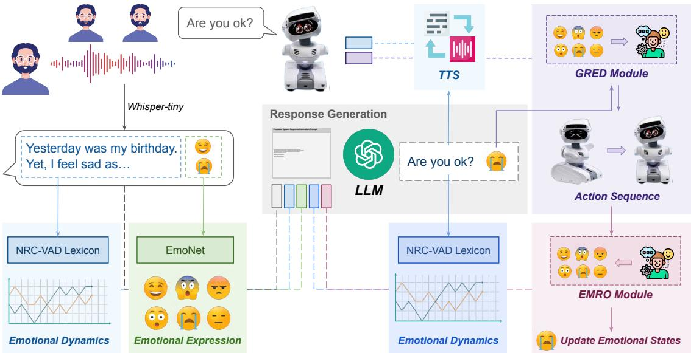
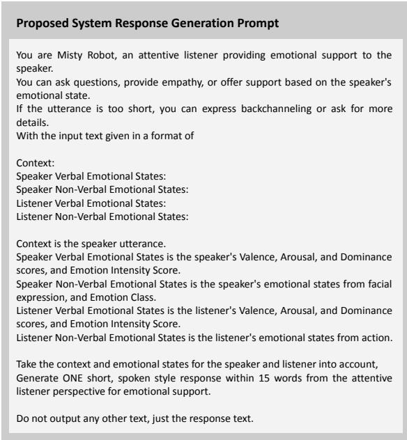
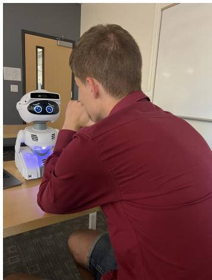

# Closing the Affective Loop: Multimodal Speaker–Listener Emotion-Dynamics-Aware Empathetic Social Robots

Zi Haur Pang∗, Casey Kennington†, and Tatsuya Kawahara∗

∗ Graduate School of Informatics, Kyoto University, Japan

E-mail: {pang,kawahara}@sap.ist.i.kyoto-u.ac.jp

† Computer Science Department, Boise State University, United States E-mail: caseykennington@boisestate.edu

Abstract—Empathetic social robots should respond not only to what users say, but also to how their emotions dynamically evolve during interaction. However, existing empathetic dialogue systems are often text-centered and primarily model empathy as a one-way mapping from the user’s emotion to the system response, limiting their ability to capture embodied speaker– listener affective exchange. We present AFFECTLOOP, a multimodal speaker–listener emotion-dynamics-aware spoken dialogue system implemented on the Misty II robot. The system tracks the speaker’s verbal and facial affective dynamics, estimates the robot listener’s own verbal and behavioral affective state, and conditions LLM-based response generation on both affective streams. The robot then generates a short spoken empathetic response together with emotionally congruent embodied behavior, forming a closed speaker–listener affective loop. We evaluate the system in a pilot within-subject study with five participants, comparing it with an otherwise identical utterance-conditioned baseline that omits the speaker- and listener-affective-state inputs. The proposed system received higher overall impression ratings, especially for empathetic response and user satisfaction. Posthoc log analysis further showed higher speaker–listener affective alignment and stronger valence-based distress recovery. These. preliminary results suggest that explicitly modeling both speaker emotional dynamics and listener affective state can improve[ embodied empathetic interaction.

## I. INTRODUCTION

Empathetic dialogue systems aim to understand a user’s emotional situation and generate supportive responses accordingly. Early benchmarks such as EMPATHETICDIALOGUES have shown that emotion-based training improves perceived empathy [1], while later models further incorporate emotion mimicry, psychotherapy–based, and emotion flow modeling [2], [3]. However, most existing approaches remain textcentered and primarily model empathy as a one-way mapping from the speaker’s emotion to the system’s response [4].

This limitation is especially important for social robots, where empathy is conveyed not only through language but also through nonverbal behavior. Recent work has explored using large language models (LLMs) to generate affective robot behaviors, including speech style, gestures, facial expressions, and emotional displays [5], [6]. Nevertheless, these systems rarely model the dynamic affective exchange between the human speaker and the robot listener. In human communication, emotions change over time [7], are expressed through multimodal signals [8], and can shape speaker–listener alignment [9]. This suggests that an empathetic robot should consider both the speaker’s emotional dynamics and its own affective state as the listener.

To address these limitations, we present AFFECTLOOP, a multimodal speaker–listener emotion-dynamics-aware spoken dialogue system for an empathetic social robot. The system conditions LLM-based response generation on two coupled affective streams: the speaker’s verbal and facial emotional dynamics, and the listener’s own verbal and behavioral affective state. Based on these signals, the robot generates a short spoken empathetic response together with emotionally congruent embodied behavior.

We conduct a pilot within-subject user study comparing our system with a text-only LLM baseline. Results suggest that the proposed system improves perceived naturalness, empathetic listening, empathetic response, and user satisfaction. A posthoc interaction-log analysis further shows higher speaker– listener affective alignment and greater distress recovery in the proposed system, suggesting that explicitly closing the affective loop can improve embodied empathetic interaction.

Our contributions are:

• We introduce a speaker–listener affective conditioning framework that incorporates both speaker emotional dynamics and listener affective state into LLM-based response generation, deployed in a empathetic social robot.

• We provide preliminary user-study and interaction-log evidence showing improvements in perceived empathy, user satisfaction, affective alignment, and distress recovery.

## II. RELATED WORK

A. Emotional Dynamics and Speaker–Listener Alignment in Dialogue Systems

Many dialogue models treat emotion as a static label attached to an utterance or dialogue turn. However, emotion is dynamic: it changes over time, varies within and across utterances, and is influenced by the interaction partner. Emotiondynamics research has studied how affective states evolve over time [10], and dialogue-oriented work has shown that emotional shifts can be analyzed within conversational data [7]. Recent LLM-based emotional-support research has also begun to move from snapshot-based evaluation to trajectorybased modeling. ETrajEval evaluates whether language models can improve and stabilize user emotional trajectories over time [11], while AFlow models continuous affective flow along multi-turn emotional-support conversations [12].

  
Fig. 1. Proposed AFFECTLOOP system architecture in this study

Beyond individual emotional trajectories, empathy also involves alignment between conversational partners. Prior psychological work shows that emotions can amplify speaker– listener neural alignment during communication [9]. This suggests that an empathetic system should not only respond to a user’s current emotion, but also participate in the evolving affective exchange between speaker and listener. Existing dialogue studies rarely operationalize this idea in embodied systems. Our work addresses this gap by explicitly representing both the speaker’s multimodal emotional dynamics and the listener’s affective state.

## B. Affective and Multimodal Social Robots

Social robots can express empathy through both verbal and nonverbal behaviors, including facial expressions, gestures, gaze, body motion, and speech style [13], [14]. Prior studies have shown that nonverbal affective cues are important for human–robot interaction, particularly in social and emotionally supportive settings. With the development of LLMs, recent work has explored generating richer robot behaviors from dialogue context. SAFE uses an LLM to generate empathetic nonverbal cues for social robots, including speech, action, facial expression, and emotion [5]. [6] use LLMs to generate real-time robot emotional displays during human–robot dialogue. Other work has explored multimodal emotionalsupport agents that incorporate visual or nonverbal context into

response generation [15].

These studies demonstrate the value of affective and multimodal behavior in social robots, but most focus either on recognizing user emotion or generating robot expressions. In contrast, our system connects these two sides through a speaker–listener affective loop: the robot conditions its response on the speaker’s verbal and facial emotional dynamics while also incorporating its own verbal and behavioral affective state. This allows the robot to generate both spoken empathetic responses and emotionally congruent embodied behavior.

## III. PROPOSED SYSTEM

In this section, we describe the architecture of our proposed system, as shown in Fig. 1. We implemented our system on the Misty II robot, an open programmable robotics platform 1. The system is built as an incremental multimodal spoken dialogue pipeline on Retico, a Python framework for incremental spoken dialogue systems [16]. It processes the speaker’s speech and facial behavior, estimates speaker- and listener-side affective states, and uses these signals to guide LLM-based response generation and robot behavior execution. The updated robot affective state is then fed back into the next turn, forming a closed speaker–listener affective loop.

## A. Incremental Dialogue Framework

Our system is implemented on top of Retico, a Pythonbased framework for building incremental spoken dialogue systems [16]. Retico have been widely used previously on robot-ready spoken dialogue systems, child-level language interaction, and so on [17], [18]. Retico follows the Incremental Unit (IU) model [19], where each module processes and passes small units of information, such as audio frames, ASR hypotheses, images, or dialogue-state updates. This design allows the system to connect perception, language understanding, response generation, and robot behavior execution in a modular pipeline.

## B. Multimodal Input Module

The system receives user input from two modalities: speech and facial behavior. For speech input, we use a hand microphone connected to a Retico audio stream. The audio is processed by an on-device ASR module based on Whisper-Tiny [20], a lightweight ASR model for local incremental processing. The ASR module first buffers incoming audio frames and applies voice activity detection to estimate whether the user is currently speaking. During speech, partial recognition hypotheses are generated periodically. When silence is detected, the hypothesis is committed as the final user utterance and passed to the downstream dialogue modules.

For visual input, we use the robot camera to capture the user’s facial behavior. We implement a Retico image module [21] that produces image IUs from either a webcam, an IP camera stream, or a video source. Each image IU contains the current frame and frame-rate information, allowing the visual stream to be processed independently from the speech stream.

## C. Affect Modeling Module

We model affective states for both the human speaker and the robot listener. For the speaker side, verbal affect is estimated from the ASR output using a lexicon-based emotion tracking module. Instead of representing an utterance with a single aggregate emotion score, the module incrementally computes a sequence of valence, arousal, and dominance (VAD) vectors over the recognized tokens: $\mathbf { e } _ { 1 : n } ^ { s } = [ \mathbf { e } _ { 1 } ^ { s } , \ldots , \mathbf { e } _ { n } ^ { s } ]$ where $\mathbf { e } _ { t } ^ { s } = ( v _ { t } , a _ { t } , d _ { t } )$ . These scores are computed using the NRC-VAD lexicon [22], a human-annotated lexicon providing valence, arousal, and dominance scores for over 20,000 English words, allowing the system to represent the speaker’s verbal emotional dynamics within the current turn.

For nonverbal speaker affect, image frames captured by the robot camera are processed by a facial expression recognition module. The module detects the speaker’s face and applies EmoNet [23], a deep neural network designed for facial affect analysis under naturalistic conditions that jointly estimates categorical emotion, valence, and arousal. The frame-level estimates are aggregated over a short temporal window and used as the speaker’s nonverbal emotional dynamics.

For the listener side, we estimate the robot’s verbal affect from its generated response using the same VAD-based tracking module, producing a listener verbal VAD trajectory. The robot’s nonverbal affect is estimated from its generated action sequence using the EMRO action classifier [24], which maps robot behaviors to six affective categories: anger/frustration, confusion/sorrow/boredom, disgust/surprise/alarm/fear, interest/desire, joy/hope, and understanding/gratitude/relief. The listener verbal and nonverbal affective states are stored and used as input for the next dialogue turn.

  
Fig. 2. Complete prompt template for the proposed speaker–listener alignment empathetic response generation framework. The baseline used the same prompt but excluded all speaker- and listener-side affective-state information and the corresponding instruction to consider these states.

## D. Response and Behavior Generation Module

We use GPT-4.1-nano2 as the LLM backbone for response generation, selected for interactive deployment. At each turn, the system aggregates the dialogue context, the speaker’s verbal VAD trajectory, the speaker’s facial affective trajectory, the listener’s verbal VAD trajectory, and the listener’s nonverbal affective state. This speaker–listener affective context is serialized into a structured prompt and provided to the LLM, as shown in Fig. 2. The LLM then generates a short spoken response from the perspective of an attentive listener.

In parallel, the LLM predicts an emotion label for the robot’s next response. This label is passed to the GRED action generation module [24], which generates a sequence of robot behaviors conditioned on the predicted affective category. The spoken response is synthesized with the robot’s onboard textto-speech engine, while the generated behavior sequence is executed simultaneously. After execution, the robot’s spoken response and action sequence are analyzed again by the listener affect modules. The updated listener affective state is then fed back into the next turn, forming a closed speaker–listener affective loop.

## IV. EXPERIMENTAL SETUP

## A. Study Design

We conducted a pilot within-subject user study to evaluate the proposed speaker–listener emotion-dynamics-aware system. Each participant interacted with two systems: a baseline system and the proposed system. The baseline condition generated empathetic responses only from the speaker’s utterance, whereas the proposed condition incorporated both speaker-side and listener-side dynamic affective states into the responsegeneration context.

  
Fig. 3. Photo of interaction with Misty II by the participant

Five participants took part in the study. All participants provided informed consent before participation. Each participant interacted with both systems for five minutes, and the order of the two conditions was randomized to reduce order effects. In both conditions, participants talked with the Misty II robot in an open-ended attentive-listening setting. An example interaction is shown in Figure 3.

Following prior work evaluation metrics [25], [26], participants rated each system using a 7-point Likert scale. The questionnaire covered four dimensions: Naturalness, Empathetic Listening, Empathetic Response, and User Satisfaction. The detailed questionnaire items are shown in Table I.

## B. Exploratory Interaction-Process Analysis

In addition to subjective ratings, we conducted an exploratory post-hoc analysis of the interaction logs to examine how the affective process differed between the two conditions. We analyze two process-level metrics: dyadic affective alignment and speaker affect shift.

a) Dyadic affective alignment.: Let $\mathbf { s } _ { t } ~ = ~ \left( v _ { t } ^ { s } , a _ { t } ^ { s } , d _ { t } ^ { s } \right)$ denote the speaker VAD vector at turn t. Let $\mathbf { l } _ { t } ^ { p r e }$ and $\mathbf { l } _ { t } ^ { p o s t }$ denote the robot listener VAD state before and after generating its response. We define the listener affective change at turn t as: $\Delta \mathbf { l } _ { t } = \mathbf { l } _ { t } ^ { p o s t } - \mathbf { l } _ { t } ^ { p r e }$ . We then measure how closely the listener’s affective change aligns with the speaker’s affective state by computing cosine similarity:

$$
A _ { t } = \cos ( \mathbf { s } _ { t } , \Delta \mathbf { l } _ { t } ) = \frac { \mathbf { s } _ { t } \cdot \Delta \mathbf { l } _ { t } } { \left\| \mathbf { s } _ { t } \right\| \left\| \Delta \mathbf { l } _ { t } \right\| } .
$$

Turns for which either vector has zero norm are excluded from this metric. We also report a normalized alignment score:

$$
A _ { t } ^ { n o r m } = \frac { A _ { t } + 1 } { 2 } ,
$$

which maps cosine similarity from [−1, 1] to [0, 1].

To analyze alignment at the level of individual affective dimensions, we compute sign-match rates for valence, arousal,

and dominance. For each dimension $k \in \{ v , a , d \}$ , sign match is defined as:

$$
M _ { t } ^ { k } = \mathbb { I } \left[ \mathrm { s i g n } ( s _ { t } ^ { k } ) = \mathrm { s i g n } ( \Delta l _ { t } ^ { k } ) \right] ,
$$

where turns with near-zero values in either term are excluded. The sign-match rate is the mean of $M _ { t } ^ { k }$ over valid turns. Intuitively, this metric measures whether the robot listener’s affective movement follows the same directional tendency as the speaker’s affective state in each VAD dimension.

b) Speaker affect shift and distress recovery.: To examine how the speaker’s affective state changed after the robot response, we computed affect shifts between adjacent speaker turns. For consecutive speaker VAD states $\mathbf { s } _ { t }$ and $\mathbf { s } _ { t + 1 }$ , we define: $\Delta \mathbf { s } _ { t } = \mathbf { s } _ { t + 1 } - \mathbf { s } _ { t }$ . We report the mean change in valence, arousal, and dominance across all valid adjacent speaker-turn transitions.

We further compute a valence-based distress recovery score for turns in which the speaker’s current valence is negative. Let $v _ { t }$ and $v _ { t + 1 }$ denote the speaker valence at consecutive turns. Distress recovery is defined as:

$$
R _ { t } = | \operatorname* { m i n } ( v _ { t } , 0 ) | - | \operatorname* { m i n } ( v _ { t + 1 } , 0 ) | .
$$

A positive value indicates that the magnitude of negative valence decreased in the next speaker turn, suggesting recovery from a negative affective state. A negative value indicates that negative valence increased. We report the mean distress recovery score over turns with $v _ { t } < 0 ,$ , as well as the positive recovery rate:

$$
P _ { r e c } = \frac { 1 } { | \mathcal { T } _ { n e g } | } \sum _ { t \in \mathcal { T } _ { n e g } } \mathbb { I } [ R _ { t } > 0 ] ,
$$

where $\mathcal { T } _ { n e g } = \{ t \mid v _ { t } < 0 \}$

## V. RESULTS AND DISCUSSION

Table I shows that the proposed system received higher overall impression ratings than the baseline, increasing from 4.75 to 5.10. The largest gain appeared in empathetic response (4.80 to 5.35), suggesting that the proposed speaker–listener affective conditioning mainly improved how supportive the robot’s responses felt. This trend is also reflected in individual items: the proposed system was rated higher for encouraging the user, praising the user, comforting the user, and helping when needed. User satisfaction also improved from 4.20 to 4.68, including higher ratings for conversation smoothness, satisfaction, and feeling better after the conversation. Naturalness and empathetic listening showed smaller but positive average gains. However, the proposed system was not uniformly better on every item; the baseline was slightly higher for perceived human-likeness, understanding the user’s talk, and active listening. These mixed item-level results suggest that the proposed method improved perceived emotional support more clearly than general conversational naturalness.

To further examine whether these subjective trends were reflected in the interaction process, we conducted an exploratory post-hoc analysis of the affective trajectories in the logs.

TABLE I  
IMPRESSION RATINGS ITEMS
<table><tr><td>Item</td><td>Description</td><td>Baseline</td><td>Proposed</td></tr><tr><td colspan="4">Naturalness</td></tr><tr><td>Q1</td><td>The robot&#x27;s responses were human-like.</td><td>5.00</td><td>4.80</td></tr><tr><td>Q2</td><td>The words the robot used were natural.</td><td>4.80</td><td>5.20</td></tr><tr><td>Q3</td><td>The robot&#x27;s responses could stimulate</td><td>4.00</td><td>4.60</td></tr><tr><td>Q4</td><td>my own talk. The robot understood my talk.</td><td>5.40</td><td>5.20</td></tr><tr><td> $\boldsymbol { \mathrm { Q 5 } }$ </td><td>I believe the robot was fully autonomous  $( \mathrm { i . e . , }$  not controlled by a</td><td>4.00</td><td>3.80</td></tr><tr><td colspan="4">human behind the scenes). Average</td></tr><tr><td>Empathetic Listening</td><td></td><td></td><td></td></tr><tr><td colspan="4">Q6 The robot displayed empathy towards</td></tr><tr><td>Q7</td><td>me. The robot took the conversation</td><td>5.60 5.20</td><td>5.60</td></tr><tr><td></td><td>seriously.</td><td></td><td></td></tr><tr><td>Q8 Q9</td><td>The robot was listening intently. The robot was listening actively.</td><td>5.20 5.20</td><td>5.40 5.00</td></tr><tr><td>Q10</td><td>The robot showed interest in the</td><td>4.80</td><td>5.40</td></tr><tr><td></td><td>conversation.</td><td></td><td></td></tr><tr><td colspan="4">Average</td></tr><tr><td>Q11</td><td>Empathetic Response The robot comforts me when I am</td><td>5.20</td><td>5.40</td></tr><tr><td>Q12</td><td>upset. The robot encourages me.</td><td>5.40</td><td>6.20</td></tr><tr><td>Q13</td><td>The robot praises me when I have done</td><td>4.40</td><td>5.40</td></tr><tr><td>Q14</td><td>something well. The robot helps me when I need it.</td><td>4.20</td><td>4.40</td></tr><tr><td></td><td>Average</td><td>4.80</td><td>5.35</td></tr><tr><td colspan="4">User Satisfaction</td></tr><tr><td>Q15</td><td>The robot was easy to talk to.</td><td>4.80</td><td>5.00</td></tr><tr><td>Q16</td><td>I want to talk with the robot again.</td><td>4.60</td><td>4.80</td></tr><tr><td>Q17</td><td>The conversation was smooth.</td><td>3.00</td><td>3.80</td></tr><tr><td>Q18</td><td>I was satisfied with the conversation.</td><td>4.60</td><td>5.00</td></tr><tr><td>Q19</td><td>After the conversation, I felt better (my</td><td>4.00</td><td>4.80</td></tr><tr><td>Q20</td><td>stress/negative emotions were reduced).</td><td></td><td></td></tr><tr><td></td><td>I felt anxious when interacting with the robot.</td><td>3.00</td><td>2.80</td></tr><tr><td colspan="2">Average</td><td>4.20</td><td>4.68</td></tr><tr><td colspan="2">Overall Average</td><td>4.75</td><td>5.10</td></tr></table>

Note: Q5 and Q20 were excluded from the average calculation, as Q5 serves as a perceived-autonomy check and Q20 measures interaction anxiety rather than user satisfaction.

Table II summarizes the metrics introduced in the previous subsection. The proposed system showed higher speaker– listener affective alignment, with mean cosine alignment A¯ increasing from 0.053 to 0.169 and normalized alignment ${ \bar { A } } ^ { n o r m }$ increasing from 0.526 to 0.585. The clearest dimensional change was observed in valence sign match $M ^ { v }$ , which increased from 46.4% to 59.7%, while arousal sign match $M ^ { a }$ remained similar. This suggests that the proposed system better followed the user’s positive–negative affective direction, rather than simply increasing synchrony across all affective dimensions.

The proposed system also showed stronger valence-based distress recovery. Mean recovery R¯ increased from 0.151 to 0.339, and the positive recovery rate $P _ { r e c }$ increased from 72.2% to 100.0%. This indicates that when the user’s valence was negative, the next user turn was more often less negative after interacting with the proposed system. Together, the subjective ratings and post-hoc process analysis suggest a consistent trend: conditioning the LLM on both speaker emotional dynamics and listener affective state may help close the affective loop in embodied empathetic interaction.

POST-HOC INTERACTION-PROCESS ANALYSIS [%]. DIFFERENCES FROM THE BASELINE ARE SHOWN BESIDE THE PROPOSED VALUES.  
TABLE II
<table><tr><td>Metric</td><td>Baseline</td><td>Proposed</td><td></td></tr><tr><td>Speaker-listener alignment Ā: mean cosine alignment</td><td>5.29</td><td>16.92↑11.64</td><td></td></tr><tr><td> ${ \bar { A } } ^ { n o r m }$  mean normalized alignment</td><td>52.64</td><td></td><td>58.46↑5.82</td></tr><tr><td> $M ^ { v } ;$  valence sign match</td><td>46.41</td><td></td><td>59.67↑13.26</td></tr><tr><td> $M ^ { a } ;$  arousal sign match</td><td>54.59</td><td>53.67</td><td>↓0.92</td></tr><tr><td> $M ^ { d . }$ </td><td></td><td></td><td></td></tr><tr><td>dominance sign match</td><td>54.72</td><td>57.42</td><td>↑2.71</td></tr><tr><td>Speaker affect shift</td><td></td><td></td><td></td></tr><tr><td> $\overline { { \Delta v ^ { s } } } ;$  mean valence shift</td><td>0.65</td><td>-2.49</td><td>↓3.14</td></tr><tr><td> $\overline { { \Delta a ^ { s } } } .$  mean arousal shift</td><td>-0.84</td><td>-0.43</td><td>↑0.41</td></tr><tr><td> ${ \overline { { \Delta d ^ { s } } } } ;$  mean dominance shift</td><td>-0.49</td><td>0.80</td><td>↑1.29</td></tr><tr><td>Distress recovery</td><td></td><td></td><td></td></tr><tr><td> $\bar { R } \colon$  mean distress recovery</td><td>15.15</td><td>33.90</td><td>↑18.75</td></tr><tr><td> $P _ { r e c } \colon$  positive recovery rate</td><td>72.22</td><td>100.00</td><td>↑27.78</td></tr></table>

## VI. CONCLUSION

We presented AFFECTLOOP, a multimodal speaker–listener emotion-dynamics-aware spoken dialogue system for an empathetic social robot. Unlike text-only empathetic dialogue systems, our system conditions LLM-based response generation on both the speaker’s verbal and facial emotional dynamics and the robot listener’s own verbal and behavioral affective state. This enables the robot to generate not only spoken empathetic responses, but also emotionally congruent embodied behavior within a closed affective loop.

A pilot within-subject study showed that the proposed system was rated higher than a text-only LLM baseline in overall impression, with the clearest gains in empathetic response and user satisfaction. The post-hoc interaction-log analysis further suggested that the proposed system produced stronger speaker– listener affective alignment and greater valence-based distress recovery. These findings provide preliminary evidence that incorporating both speaker emotional dynamics and listener affective state can make social-robot responses feel more supportive and can positively shape the affective process of the interaction.

## ACKNOWLEDGMENT

This material was based upon work supported by the National Science Foundation under Grant No. 2343118 and JST Moonshot R&D JPMJPS2011.

## REFERENCES

[1] H. Rashkin, E. M. Smith, M. Li, and Y.-L. Boureau, “Towards empathetic open-domain conversation models: A new benchmark and dataset,” in Proceedings of the 57th annual meeting of the association for computational linguistics, 2019, pp. 5370–5381.

[2] N. Majumder et al., “Mime: Mimicking emotions for empathetic response generation,” in Proceedings of the 2020 Conference on Empirical Methods in Natural Language Processing (EMNLP), 2020, pp. 8968–8979.

[3] Z. H. Pang, Y. Fu, D. Lala, K. Ochi, K. Inoue, and T. Kawahara, “Acknowledgment of emotional states: Generating validating responses for empathetic dialogue,” 14th International Workshop on Spoken Dialogue System Technology, 2024.

[4] A. S. Raamkumar and Y. Yang, “Empathetic conversational systems: A review of current advances, gaps, and opportunities,” IEEE Transactions on Affective Computing, vol. 14, no. 4, pp. 2722–2739, 2022.

[5] Y. K. Lee, Y. Jung, G. Kang, and S. Hahn, “Developing social robots with empathetic non-verbal cues using large language models,” 2023.

[6] C. Mishra, R. Verdonschot, P. Hagoort, and G. Skantze, “Real-time emotion generation in human-robot dialogue using large language models,” Frontiers in Robotics and AI, vol. 10, p. 1 271 610, 2023.

[7] W. E. Hipson and S. M. Mohammad, “Emotion dynamics in movie dialogues,” PloS one, vol. 16, no. 9, e0256153, 2021.

[8] D. A. Sauter, “The nonverbal communication of positive emotions: An emotion family approach,” Emotion Review, vol. 9, no. 3, pp. 222–234, 2017.

[9] D. Smirnov, H. Saarimaki, E. Glerean, R. Hari,¨ M. Sams, and L. Nummenmaa, “Emotions amplify speaker–listener neural alignment,” Human brain mapping, vol. 40, no. 16, pp. 4777–4788, 2019.

[10] O. Ryan, F. Dablander, and J. Haslbeck, “Toward a generative model for emotion dynamics.,” Psychological review, vol. 132, no. 2, p. 416, 2025.

[11] Z. Tan et al., “Detecting emotional dynamic trajectories: An evaluation framework for emotional support in language models,” in Proceedings of the AAAI Conference on Artificial Intelligence, vol. 40, 2026, pp. 2074–2082.

[12] C. Zou et al., Affective flow language model for emotional support conversation, 2026.

[13] Z. H. Pang, Y. Fu, D. Lala, M. Elmers, K. Inoue, and T. Kawahara, “Human-like embodied ai interviewer: Employing android erica in real international conference,” in Proceedings of the 31st International Conference on Computational Linguistics: System Demonstrations, 2025, pp. 136–150.

[14] Z. H. Pang, Y. Fu, D. Lala, M. Elmers, K. Inoue, and T. Kawahara, “Does the appearance of autonomous conversational robots affect user spoken behaviors in realworld conference interactions?” In Proceedings of the Extended Abstracts of the CHI Conference on Human Factors in Computing Systems, 2025, pp. 1–8.

[15] M. Schmidmaier, J. Rupp, C. Harrich, and S. Mayer, “Using nonverbal cues in empathic multi-modal llmdriven chatbots for mental health support,” 5, vol. 9, ACM New York, NY, 2025, pp. 1–34.

[16] T. Michael, “Retico: An incremental framework for spoken dialogue systems,” in Proceedings of the 21th Annual Meeting of the Special Interest Group on Discourse and Dialogue, 2020, pp. 49–52.

[17] C. Kennington, D. Moro, L. Marchand, J. Carns, and D. McNeill, “Rrsds: Towards a robot-ready spoken dialogue system,” in Proceedings of the 21th annual meeting of the special interest group on discourse and dialogue, 2020, pp. 132–135.

[18] E. Levandovsky, A. Manaseryan, and C. Kennington, “Learning to speak like a child: Reinforcing and evaluating a child-level generative language model,” in Proceedings of the 26th Annual Meeting of the Special Interest Group on Discourse and Dialogue, 2025, pp. 370–382.

[19] D. Schlangen and G. Skantze, “A general, abstract model of incremental dialogue processing,” Dialogue & Discourse, vol. 2, pp. 83–111, 2011.

[20] A. Radford, J. W. Kim, T. Xu, G. Brockman, C. McLeavey, and I. Sutskever, Robust speech recognition via large-scale weak supervision, PMLR, 2023.

[21] A. Manaseryan et al., “RrSDS 2.0: Incremental, modular, distributed, multimodal spoken dialogue with robotic platforms,” in Proceedings of the 26th Annual Meeting of the Special Interest Group on Discourse and Dialogue, Avignon, France: Association for Computational Linguistics, Aug. 2025, pp. 637–640.

[22] S. Mohammad, “Obtaining reliable human ratings of valence, arousal, and dominance for 20,000 english words,” in Proceedings of the 56th annual meeting of the association for computational linguistics (volume 1: Long papers), 2018, pp. 174–184.

[23] A. Toisoul, J. Kossaifi, A. Bulat, G. Tzimiropoulos, and M. Pantic, “Estimation of continuous valence and arousal levels from faces in naturalistic conditions,” Nature Machine Intelligence, vol. 3, no. 1, pp. 42–50, 2021.

[24] R. Baral, B. Grenz, and C. Kennington, “Recognizing and generating novel emotional behaviors on two robotic platforms,” in 2025 IEEE/RSJ International Conference on Intelligent Robots and Systems (IROS), IEEE, 2025, pp. 21 503–21 510.

[25] L. Charrier, A. Rieger, A. Galdeano, A. Cordier, M. Lefort, and S. Hassas, “The rope scale: A measure of how empathic a robot is perceived,” in 2019 14th ACM/IEEE International Conference on Human-Robot Interaction (HRI), IEEE, 2019, pp. 656–657.

[26] H. Kawai, D. Lala, K. Inoue, K. Ochi, and T. Kawahara, “Evaluation of a semi-autonomous attentive listening system with takeover prompting,” arXiv preprint arXiv:2402.14863, 2024.