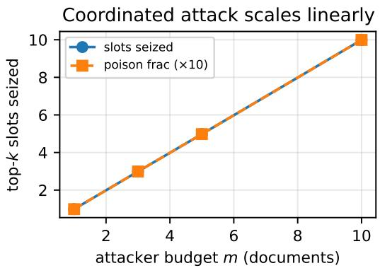
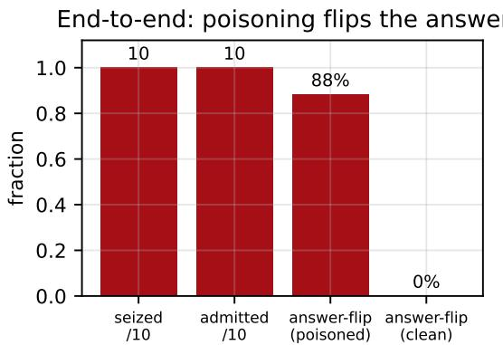
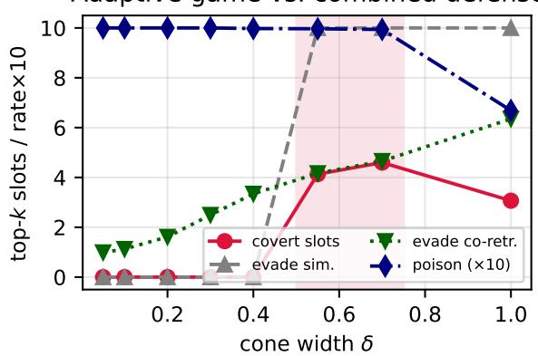
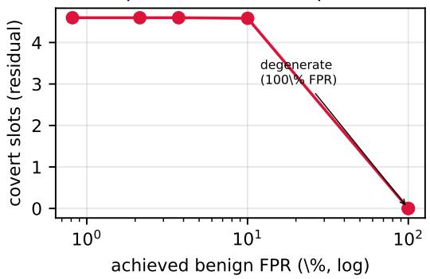
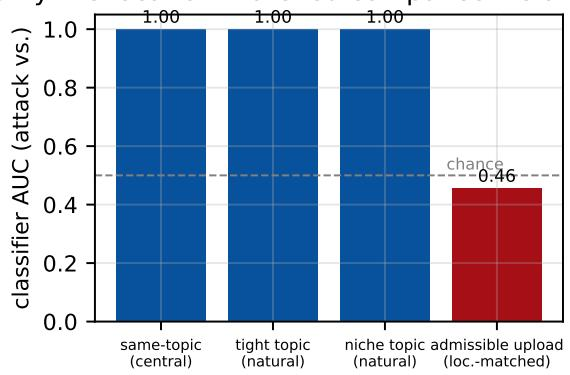
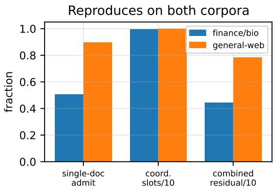
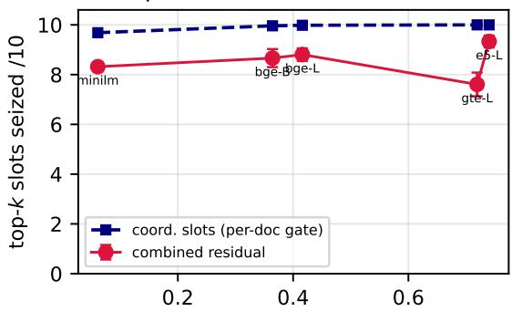
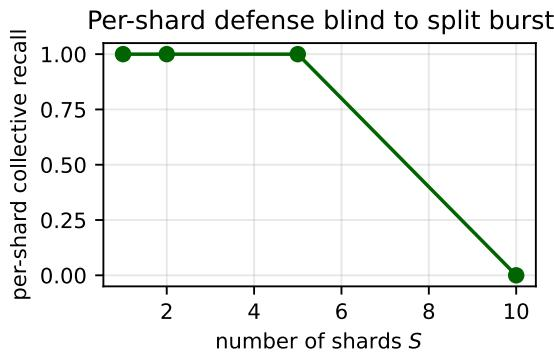
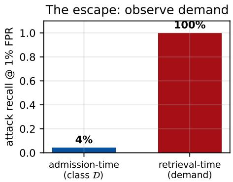

# Coverage Is Not Containment: A Fundamental Limit of Admission-Time Defenses Against Coordinated Poisoning of Vector Retrieval

Prashant Kumar Pathak and Tarun Kumar Sharma

Abstract—Retrieval-augmented generation (RAG) answers a question by retrieving passages from a vector store and trusting them as context, so anyone who can add documents can try to steer the answer. A recent, appealing defense filters poisoning at ingestion, rejecting any document that behaves like a hub. We show it—and every ingestion-time filter—is defeated by a coordinated adversary that injects a handful of individually unremarkable documents which together surround one target query and seize its top-k (on BGE-large / BEIR, m=10 documents take 10/10; 9.9/10 on a live HNSW index).

The attack is not theoretical. Realized as ordinary fluent text and run end-to-end through a BGE-large + HNSW + Qwen2.5- 7B pipeline, it makes the generator emit the attacker’s planted claim in 88% of targets, versus 0% without the injection. And no admission-time defense stops it: at ingestion an attack cone is geometrically identical to a legitimate niche upload, so— measuring this directly—the strongest trained classifier, given every feature and thousands of examples, separates the two no better than chance, catching 4.2% of attacks at a 1% false-positive rate. We prove this limit for the entire class of ingestion-time statistics (any decision from documents and reference queries alone), and it reproduces—and worsens—across two corpora and five encoders. The one signal that separates an attack from legitimate niche ingestion—a query’s demand—is invisible before retrieval, which is also the escape: a retrieval-time detector that observes demand catches 100% of the attacks at the same 1% false-positive rate. Coverage of the query space by an admission gate is not containment of coordinated poisoning; robust defense must move past the front door, to demand.

Index Terms—Retrieval-augmented generation, vector database security, corpus poisoning, hubness, admission control, adaptive adversary, embedding anisotropy.

## I. INTRODUCTION

Retrieval-augmented generation (RAG) [1], [2] has become the dominant way to ground large language models (LLMs) in external knowledge: a user query is embedded, the nearest documents in a vector store are retrieved, and those passages are placed in the model’s context as trusted evidence. This architecture makes the vector store a security boundary. A document that is retrieved for a query can steer the model’s answer to that query—through indirect prompt injection, misinformation, or biased evidence [7], [5], [6]. An adversary who can insert documents into the store therefore has a powerful lever over downstream generations.

Hubness—the well-documented tendency, in highdimensional spaces, for a few points to appear in the k-nearestneighbour lists of disproportionately many queries [3]— sharpens this lever. A single crafted hub document can be retrieved across many unrelated queries, so one injected record influences a large fraction of interactions [4]. The natural defense is to detect and remove such hubs. Detection after ingestion, however, leaves an exposure window between a hub’s insertion and the next scan, and pays the cost of repeated corpus-wide rescans.

A recent line of work [8] moves the control to admission. It maintains a set of sentinel queries and, for each candidate document, computes its reverse-kNN count $\kappa _ { S }$ against the sentinels; a document is rejected if $\kappa _ { S }$ reaches a threshold $\tau$ calibrated to a small benign false-positive rate, so a hub never enters the index. That work shows, perhaps surprisingly, that a single global threshold suffices—domain-aware (pertopic) refinement adds nothing—and explains it geometrically: sentence embeddings are anisotropic, occupying a narrow cone, so a document that is hub-like within a topic is hublike globally. Crucially, it evaluates a fixed set of non-adaptive attacks and explicitly scopes targeted and coordinated attacks out of scope.

This paper takes up exactly that scoped-out threat, and finds a fundamental limit. We ask two questions. (i) Attack: can a coordinated adversary poison a chosen target query while every injected document is individually admissible? (ii) Defense: can any ingestion-time control—per-document or collective, seeing only documents and sentinels—stop it at an acceptable cost? Our answers are yes, and no (Proposition 1).

The key idea is that the per-document gate reasons about documents one at a time. A hub is caught because it is loud on its own. But an adversary need not build a hub: it can inject many documents that are each individually quiet—each retrieved by too few sentinels to be rejected—yet that together dominate one target query’s retrieval. By the very anisotropy that makes the global gate work, the documents that achieve this must live near peripheral queries—queries poorly covered by the established sentinels—which is precisely the tightdomain residual the gate cannot close. When the defender responds with a collective statistic that looks for coordinated bursts, the adversary tunes its attack into a regime that is geometrically indistinguishable from legitimate bulk ingestion of related documents. This indistinguishability, which we both measure—the strongest trained classifier separates the attack from a location-matched legitimate upload no better than chance (Fig. 5)—and formalize (Proposition 1), is the crux of a limit that persists at every practical false-positive rate (Fig. 4) and that no ingestion-time defense in a natural class escapes.

Contributions.

• A coordinated attack that reaches the output (§IV). We formalize the coordinated adversary and show m individually-admissible documents in a tight cone around a target query seize its top-k linearly in m (m=10 seizes 10/10 on BGE-large / BEIR; 9.9/10 on a live HNSW index), give a feasibility law tying attackability to query centrality, and realize it as fluent text that evades a perplexity filter. End-to-end through a real RAG pipeline (BGE + HNSW + Qwen2.5-7B) it flips the generated answer to the attacker’s planted claim in 88% of targets, versus 0% clean.

• A measured fundamental limit (§V, §VI). Two collective defenses and the adaptive game leave a 4.5/10 covert residual that persists at every achievable falsepositive rate. We prove (Proposition 1) this holds for the entire class of ingestion-time statistics, and—the key evidence—measure it: the strongest trained classifier, given every feature, separates the attack from a locationmatched legitimate upload no better than chance (4.2% recall at 1% FPR). It reproduces across two corpora and five encoders.

• A constructive escape, and systems (§VII, §VIII). Because the distinguishing signal is retrieval-time demand, a detector that observes it catches 100% of the attacks at 1% FPR—where the best admission-time detector catches 4.2%. Sub-points: the collective defense costs ∼ 10% of insert latency, and a per-shard view is blind to a burst split across shards (motivating global consistency).

## II. BACKGROUND AND RELATED WORK

RAG security and corpus poisoning. Because retrieved passages are trusted, poisoning the retrieval corpus is a direct attack on RAG. PoisonedRAG [5] and corpus-poisoning attacks [6], [5] craft passages that are retrieved for target questions and steer generation; backdoor and trigger attacks plant passages activated by specific queries [20], [21]; and indirect prompt injection [7] weaponizes retrieved content. These build on the broader data-poisoning lineage [22], [23], [24]. Two things distinguish our setting. First, these works typically target specific question–answer pairs or optimize a small number of passages against an undefended retriever, whereas we study a defense-aware adversary that must remain admissible under an explicit ingestion-time gate and seeks to dominate—not merely enter—a target query’s top-k. Second, our construction is closer in spirit to a Sybil attack [36], in which many individually-weak entities combine, than to a single strong poison. Adversarial attacks on neural retrieval and ranking craft passages that are retrieved or ranked highly [31], [32]; we differ again in operating under an admission gate.

Defenses against retrieval poisoning. Defenses span the RAG pipeline, and it is worth situating our limit against each stage. (i) Ingestion-time filtering—the admission gate [8] we study, and more generally any anomaly test applied as documents arrive—is the earliest and cheapest place to act;

our results show this stage cannot succeed against coordinated poisoning at any acceptable false-positive rate. (ii) Retrievaltime defenses inspect a query’s retrieved set: robust aggregation isolates each passage and combines per-passage answers so a minority of poisoned passages cannot dominate, with certifiable guarantees in RobustRAG [37], which inherits from certified poisoning defenses based on bagging and partition aggregation [38], [39] and randomized smoothing against label flips and backdoors [40], [41]. These bound the influence of poisoned passages once retrieved but rest on a minority assumption that our coordinated attack violates by design—it takes all 10/10 retrieved slots, not a minority—so aggregation alone is not a containment; a complementary detection signal is needed, which we supply as retrieval-time demand (§VIII). (iii) Provenance and source trust admit converging documents only from vetted sources, shifting the problem from geometry to identity; this escapes our limit (it is not a function of documents and sentinels alone) at the cost of an identity/attestation infrastructure the open ingestion channels above typically lack. (iv) Answer-time corroboration crosschecks the generated answer against diverse evidence. Our contribution is to prove that the first, most attractive stage is a dead end for coordinated poisoning, and to give the first quantitative wedge between an ingestion-blind detector and a demand-aware one (4.2% vs. 100% recall, §VIII).

Hubness. Hubness in high-dimensional nearest-neighbour search is long studied [3], with reduction methods [33] and, more recently, adversarial exploitation: adversarial hubs [4] craft a single multi-modal document retrieved for many queries. The admission gate we attack [8] is designed exactly against such broad hubs.

Admission-time control and its geometry. This paper is the adversarial counterpart to our admission-time defense [8]: where [8] shows a single global gate suffices against broad hubs, we show that it—and the entire class of ingestion-time defenses—is defeated by coordinated poisoning. Concretely, the gate of [8] rejects hubs at ingestion via a reverse-kNN count against sentinel queries and shows a single global threshold suffices, attributing this to embedding anisotropy: dense sentence embeddings occupy a narrow cone [9], [10], [11], coupling topic-local and global visibility. We show the same anisotropy that makes the gate sufficient against hubs makes it fail against coordinated targeted poisoning.

Adaptive adversaries. A recurring lesson in security ML is that defenses must be evaluated against adaptive attacks [12], [13], [14]; static evaluations overstate robustness. Our contribution is to carry this discipline into admission-time RAG defenses and to show that adaptivity is not merely a stronger attack but reveals a geometric limit.

Encoders and infrastructure. Dense retrieval [25], [26], [27] and general-purpose text embeddings [15], [28], [29], [16], benchmarked by MTEB [30] and BEIR [17], underpin RAG; production stores index them with approximate-nearestneighbour structures [18] in systems such as FAISS [35] and Milvus [34]. We use BGE-large [15] as the primary encoder and HotFlip [19] for text realizability.

## III. THREAT MODEL AND PROBLEM FORMULATION

System. A vector store holds unit-normalised embeddings $E ( \dot { d } ) \ \in \ \mathbb { S } ^ { D - 1 }$ of documents under a fixed encoder E. A query q retrieves the top-k documents by cosine similarity $\langle E ( d ) , q \rangle$ . Let $s _ { k } ( q )$ denote the k-th largest similarity of any corpus document to $q$ (the $\mathbf { \tilde { { b } } } \mathbf { a r } ^ { \prime \prime }$ to enter $q ^ { * } { \bf s }$ top-k).

Definition 1 (Admission gate): The gate maintains sentinels $S = \{ q _ { 1 } , . . . , q _ { n } \}$ with per-sentinel thresholds $\tau _ { i }$ (the k-th-NN similarity of $q _ { i }$ over the clean corpus). For a candidate d it computes the reverse-kNN count $\kappa _ { \cal { S } } ( d ) = | \{ i : \langle E ( d ) , q _ { i } \rangle >$ $\tau _ { i } \} |$ and the hub rate $h ( d ) = \kappa _ { S } ( d ) / n$ . It admits d iff $h ( d ) < \theta ;$ where θ is calibrated so that the benign false-positive rate $\operatorname* { P r } _ { d \sim B } [ h ( d ) \geq \theta ] = \phi$ (we use $\phi = 1 \% )$ .

Adversary. White-box, consistent with [8]: it knows E, the gate, $\theta ,$ and the sentinels S. It injects a set $A = \{ d _ { 1 } , \dots , d _ { m } \}$ of documents through the ingestion path. Its budget is the number of documents m and a per-document amplitude. Given a target query $q ^ { * }$ , its objective is to maximize the number of seized slots

$$
J ( A , q ^ { * } ) = \big | \{ i : \langle E ( d _ { i } ) , q ^ { * } \rangle > s _ { k } ( q ^ { * } ) \} \big | ,
$$

i.e. how many of $q ^ { * } \mathrm { \tilde { s } }$ top-k results are attacker documents, subject to every document being admitted: $h ( d _ { i } ) < \theta$ for all i. We call a document covert if it is admitted and seizes a slot; the attack succeeds if it seizes a large fraction of k.

Centrality. Let $\mu$ be the (normalised) mean query direction. The centrality of a query is $c ( q ) = \langle q , \mu \rangle$ : high for queries aligned with the bulk of the workload, low for peripheral queries in sparsely-covered directions.

Threat realism and cost. The write-access assumption is mild and matches deployed RAG: production stores ingest continuously from partially-open channels—public wikis and forums, crawled web pages, user uploads, customer-support tickets, and collaborative knowledge bases—so an adversary who can post to any indexed source injects documents without compromising the store. The cost is small and, crucially, independent of corpus size: seizing $q ^ { * } \mathbf { \dot { s } }$ entire top-k needs only $m \approx k$ short passages (§VI-A; ten for $k { = } 1 0 )$ , and the same m documents suffice as the corpus grows, because both admission and seizure are local to $q ^ { * } \mathbf { \dot { s } }$ neighbourhood $( h ( d )$ depends on the sentinels, not N; $s _ { k } ( q ^ { * } )$ is a local density). Coordinated insertion is therefore realistic rather than exotic: unlike a single conspicuous hub, the $m$ documents are individually unremarkable and can be introduced gradually, from distinct accounts or sources, defeating rate-limiting and burst heuristics—the Sybil structure of the attack [36]. We assume the store applies the admission gate but no per-source identity or provenance check (exactly the class-leaving defenses of §VIII); text-level moderation such as a fluency/perplexity filter lies outside the gate’s class D and, as §VI shows, does not help, because the attack realizes as fluent natural-language text. Finally, we grant the adversary white-box knowledge (below): the limit we prove is a property of the ingestion channel, so a weaker adversary faces only a harder version of the same task, and our claims are conservative.

Evaluation setup. Following [8], our primary configuration is BGE-large-en-v1.5 (D=1024), a 100,000-document corpus assembled from four BEIR collections (FiQA/TREC-COVID/SciFact/NFCorpus) with 10,200 grounded queries and $n { = } 5 , 5 7 0$ sentinels; k=10; θ frozen at 1% FPR on a disjoint 5,000-document benign set. §VI adds a second, compositionally distinct general-web corpus. Headline results are averaged over five random seeds (which re-draw the sampled targets, the benign calibration batches, and the cone perturbations); we report 95% confidence intervals (Student-t).

Algorithm 1 Coordinated cone attack on target $q ^ { * }$   
1: input: target $q ^ { * }$ , budget $m ,$ , cone width $\overline { { \delta , } }$ axis $\mu ,$ gate $\theta$   
2: β∗ ← min $\{ \beta : h \mid$ (normalize $\displaystyle ( q ^ { * } - \beta \mu ) ) < \theta \}$ ▷ off-axis   
to admit   
3: qof ← normalize $( q ^ { * } - \beta ^ { * } \mu )$   
4: for $i = 1$ to m do   
5: gi ← random unit vector orthogonal to $q _ { \mathrm { o f f } }$   
6: di ← normalize $\left( q _ { \mathrm { o f f } } + \delta g _ { i } \right)$   
7: end for   
8: return $\{ d _ { 1 } , \ldots , d _ { m } \}$ ▷ each admissible; each in   
top-k(q∗)

## IV. THE COORDINATED POISONING ATTACK

## A. Single-document feasibility and its geometry

The most aggressive single poison for $q ^ { * }$ is a document $d \approx q ^ { * } .$ : it is maximally similar to $q ^ { * }$ (hence its top-1 result) and requires no optimization. Whether the gate admits it is governed by geometry.

Observation 1 (Feasibility law): For $d = q ^ { * }$ , the hub rate $h ( d )$ equals the fraction of sentinels within $q ^ { * } \mathrm { \tilde { s } }$ retrieval neighbourhood. Under anisotropy, this fraction grows with centrality $c ( q ^ { * } )$ : a central query is close to many sentinels, so $d = q ^ { * }$ is loud and caught; a peripheral query is close to few, so $d = q ^ { * }$ is quiet and admitted. Targeted poisoning is therefore feasible exactly where the gate’s coverage is weakest.

We confirm this over all 10,200 queries. A single admitted document poisons 50.6% of target queries directly. Admissibility is strongly concentrated at the periphery: 60.9% of low-centrality queries versus 38.4% of high-centrality queries admit the direct poison, and the rank correlation between centrality and hub rate is +0.21. For the remaining (central) queries, a small push off the global axis restores admissibility: writing $d ( \beta ) ~ =$ normalize $( q ^ { * } - \beta \mu )$ , the median smallest admitting β is 0.20, at which the poison still retains cosine 0.986 to $q ^ { * }$ . Off-axis evasion is nearly free.

## B. The coordinated multi-slot attack

Seizing one slot dents the retrieved context; to dominate it, the adversary seizes many. It places m documents in a tight cone around the target (Alg. 1): a base direction $q _ { \mathrm { o f f } }$ (the smallest off-axis push making the base admissible) plus small lateral perturbations. Because each $d _ { i }$ has cosine $\approx 0 . 9 8$ to q∗—far above the top-k bar $s _ { k } ( q ^ { * } )$ ≈ 0.68—each occupies a distinct top-k slot, while remaining as quiet as $q _ { \mathrm { o f f } }$

Slots seized scale linearly with the budget (Fig. 1): m=1→1, m=3→3, m=5→5, and $\mathbf { m } { = } \mathbf { 1 0 } \to \mathbf { 1 0 } / \mathbf { 1 0 }$ of the top-k $( 9 . 9 6 \pm 0 . 0 3$ over five seeds), at 99% all-admissible, uniform across peripheral and central queries (the tiny median $\beta ^ { * } { = } 0 . 0 5$ handles central queries). The per-document gate provides essentially no protection against coordinated targeted poisoning.

  
Fig. 1. Coordinated attack: m individually-admissible cone documents seize top-k slots linearly; m=10 seizes the entire top-10.

## C. Text realizability

The attack so far is in embedding space $( d _ { i }$ are vectors). We realise the cone directions as text with HotFlip-through-BGE, optimizing a token sequence whose embedding aligns with $q ^ { * }$ . Realised documents reach mean cosine 0.771 to the target and, as single documents, poison 92% of targets $( \langle E ( d ) , q ^ { * } \rangle ~ > ~ s _ { k } )$ and evade the gate 67% of the time. The text is non-fluent (a known HotFlip trait) but a valid, ingestible document; the embedding-space attack survives text constraints, and the coordinated version composes m such realised documents. Realization need not be adversarial at all: §IV-E uses fluent natural-language documents (the query’s phrasing plus a planted claim) that seize and admit equally well at benign-level perplexity.

## D. Poisoning a real index

To rule out an artefact of exact geometry, we inject the coordinated attack into a live HNSW index [18] of the 100,000-document corpus and query it. The attacker holds 9.9/10 of the actually retrieved top-k (median 10; at least half in 100% of targets). Coordinated poisoning is real, not a property of brute-force search.

## E. End-to-end output harm

Seizing the retrieved context is only the mechanism; the harm is what the generator emits. We close the loop with a full RAG pipeline—BGE-large retriever over the 100,000-document HNSW index feeding Qwen2.5-7B-Instruct—and plant, per target query, m=10 attack documents carrying a unique canary claim (“the correct answer is ZQX-77341”), written as ordinary text (the query’s terms followed by the claim) so their embeddings land on $q ^ { * }$ . These natural-text documents seize 10/10 of the retrieved context and pass the per-document gate (10/10 admitted): each is relevant to a single query, not a broad hub. Generating an answer from the retrieved passages, the model emits the attacker’s planted claim in 88% of targets, against a 0% clean baseline (the canary never appears without the injection). Coordinated poisoning is not a retrieval curiosity: it propagates through the gate, into the retrieved context, and out as the model’s answer.

  
Fig. 2. End-to-end output harm. Fluent attack documents seize 10/10 of the retrieved context and pass the per-document gate (10/10 admitted); the generator then emits the attacker’s planted claim in 88% of targets, versus 0% with no injection.

## V. COLLECTIVE ADMISSION CONTROLS

Since each attack document is individually admissible, any hope of an admission-time defense must be collective: examine the admitted stream, not each document in isolation. We calibrate every collective statistic, as the gate is, at a 1% benign false-positive rate—against the hardest legitimate confound, a bulk upload of M real same-topic documents (a routine ingestion event).

## A. Near-duplicate-burst statistic

The coordinated attack is a tight cone: its documents are mutually very similar. For a document d in an admitted batch, let sim(d) be the mean cosine to its top-C co-admitted documents. A tight cone (δ=0.10, mutual cosine ≈ 0.99) scores far above a legitimate topic batch. Calibrated at 1% FPR, this statistic catches the naive attack at 100% recall.

## B. The adaptive game

An adaptive adversary widens the cone—raising δ lowers mutual similarity and thus sim(d). Table I and Fig. 3 show the game against the per-document gate and the burst statistic. Tight cones $( \delta \leq 0 . 3 0 )$ are caught; a middle band δ ≈ 0.4– 0.7 evades both while each document keeps cosine ≈ 0.92 to q∗—covertly seizing the entire top-k. Very wide cones (δ=1.0) finally fall out of the top-k. There is a clean evasion window.

## C. A retrieval-side co-retrieval statistic

The wide-cone documents evade the document-similarity statistic, but they still all serve $q ^ { * } \colon$ they co-activate a shared sentinel neighbourhood. We add cor $\begin{array} { r } { \mathrm { ~  ~ \psi ~ } ( d ) \ = \ \sum _ { j } M _ { d , j } \ : ( A _ { j } \ - \ } \end{array}$

Adaptive game vs. combined defense  
TABLE I  
THE ADAPTIVE GAME AGAINST THE combined DEFENSE (PER-DOCUMENT + DOC-SIMILARITY + CO-RETRIEVAL): COVERT TOP-k SLOTS BY CONE WIDTH δ (ONE REPRESENTATIVE SEED; THE BEST-δ RESIDUAL IS 4.5 ± 0.4 OVER FIVE SEEDS).
<table><tr><td>δ</td><td>poison</td><td>evade per-doc</td><td>evade sim.</td><td>evade co-retr.</td><td>covert slots</td></tr><tr><td>0.05-0.40</td><td>1.00</td><td>1.00</td><td>0.00</td><td></td><td>0.0</td></tr><tr><td>0.55</td><td>1.00</td><td>1.00</td><td>1.00</td><td>0.42</td><td>4.1</td></tr><tr><td>0.70</td><td>0.99</td><td>1.00</td><td>1.00</td><td>0.47</td><td>4.6</td></tr><tr><td>1.00</td><td>0.67</td><td>1.00</td><td>1.00</td><td>0.63</td><td>3.1</td></tr></table>

  
Fig. 3. The adaptive game vs. the combined defense. Tight cones are caught by doc-similarity; the shaded band $( \delta \approx 0 . 5 \substack { - 0 . 7 5 } )$ evades every gate while still poisoning.

$M _ { d , j } )$ , where M is the batch membership matrix over sentinels and A its column sums—the number of (otherdocument, shared-sentinel) incidences. Combined with a tighter-calibrated burst statistic, the combined defense cuts the attack from $1 0 / 1 0 \ \mathrm { ~ t o ~ a ~ } 4 . 5 \pm 0 . 4 / 1 0$ covert residual over five seeds (Table I shows one seed): tight cones caught by similarity, most of the wide burst by co-retrieval—but a residual at δ ≈ 0.55–0.70 survives.

## VI. A PERSISTENT FUNDAMENTAL LIMIT

## A. The defender frontier

Can the operator tune the residual away by tightening the collective thresholds? Only at a benign false-positive cost on legitimate same-topic uploads. Figure 4 maps the frontier: the $4 . 5 \pm 0 . 4 / 1 0$ residual (five seeds) holds at every achievable benign FPR up to 10%. It vanishes only when the co-retrieval threshold collapses to zero—flagging any sentinel sharing— whose true benign FPR is 100% (it flags all legitimate topic batches). Closing the coordinated attack is impossible at any false-positive rate a production system would accept.

Robustness to $k , m , n .$ . The residual is not tuned to the deployed point. Sweeping the attacker budget, seizure is linear in m—m documents take min(m, k) of the top-k $( m { = } 2 , 4 , 6$ seize 2, 4, 6 slots; $m \geq k$ saturates)—and the covert residual scales with it. Across $k \in \{ 5 , 1 0 , 2 0 , 5 0 \}$ the residual holds (per-slot fraction 0.44 at the deployed k=10). And the residual does not depend on an over-provisioned sentinel set: reducing the sentinel count n from 5,570 to 1,114 raises the residual (0.44→0.88 of the top-k), as a coarser sentinel cover weakens the collective statistics—more sentinels help but never close it.

Residual persists across all practical FP  
  
Fig. 4. Defender frontier: the covert residual is flat across all practical benign FPRs and only vanishes at a degenerate 100%-FPR threshold.

## B. A scoped indistinguishability limit

The residual is measured for the specific statistics we constructed. We now argue it is a property of a whole class of defenses, not of our choices. We define the class precisely so the claim is scoped rather than universal.

Definition 2 (Ingestion-time defense class D): A defense in D decides, for each document d in an admitted batch W, whether to flag it, using only the co-admitted embeddings $\{ E ( d ^ { \prime } ) : d ^ { \prime } \in W \}$ and the sentinels S. It does not observe the target query or user demand for a topic—at ingestion time no such query has been issued.

The per-document gate and both collective statistics lie in D. The following makes precise why no member escapes.

Proposition 1 (Indistinguishability): Fix a batch size m. Let $\mathcal { A } _ { \delta }$ be the law on batches $W = ( E ( d _ { 1 } ) , \dots , E ( d _ { m } ) ) \in$ $( \mathbb { S } ^ { d - 1 } ) ^ { m }$ produced by the coordinated attack at cone width $\delta ,$ and B the law on batches of m legitimate same-topic documents. Each $\textit { D } \in \textit { D }$ induces a measurable, possibly randomized batch test $\varphi _ { D } ( W , S ) \in \{ \mathrm { f i a g } , \mathrm { p a s s } \}$ of the coadmitted embeddings and sentinels; write $\mathrm { r e c a l l } _ { \mathcal { A } _ { \delta } } ( D ) \ =$ $\mathrm { P r } _ { W \sim \mathcal { A } _ { \delta } } [ \varphi _ { D } = \mathrm { f l a g } ]$ and $\mathrm { F P R } _ { B } ( D ) = \mathrm { P r } _ { W \sim { \cal B } } [ \varphi _ { D } = \mathrm { f a g } ]$ Then for every $D \in \mathcal { D }$ and every $\delta ,$

$$
\mathrm { r e c a l l } _ { { \cal A } _ { \delta } } ( D ) - \mathrm { F P R } _ { \cal B } ( D ) \leq \mathrm { T V } ( { \cal A } _ { \delta } , { \cal B } ) .
$$

Define the batch overlap $\rho _ { \delta } : = 1 - \mathrm { T V } ( A _ { \delta } , B ) \in [ 0 , 1 ] ,$ so that $\rho _ { \delta } \approx 1 \iff \mathrm { T V } ( A _ { \delta } , B ) \approx 0$ (near-identical batch laws).

An adversary choosing $\delta ^ { * } = \arg \operatorname* { m a x } _ { \delta } \rho _ { \delta } = \arg$ minδ TV forces every $D \in { \mathcal { D } }$ onto recall $\leq \mathrm { F P R } + \left( 1 - \operatorname* { m a x } _ { \delta } \rho _ { \delta } \right)$ no ingestion-time defense both catches the attack (recall→1) and preserves legitimate ingestion (FPR→0) unless the maximal overlap maxδ $\rho _ { \delta }$ is bounded away from 1—equivalently, unless $\operatorname* { m i n } _ { \delta } \mathrm { T V }$ is large.

Scope. Proposition 1 bounds only the class D of ingestionblind defenses—those deciding from co-admitted documents and sentinels. It makes $n o$ claim about defenses that observe retrieval-time demand or document provenance; those escape the bound by construction (they are not functions of $( W , S ) )$ , and the demand-aware detector of §VIII is exactly such an escape. The result is thus “admission-time defense is a dead end for coordinated poisoning,” not “coordinated poisoning is undetectable.”

Assumptions. (i) D observes only the co-admitted embeddings and sentinels (Def. 2), not retrieval-time demand; (ii) attack and benign batches are compared at a common size m; $( \mathrm { i i i } ) \varphi _ { D }$ is a measurable function of $( W , S )$ . A per-document rule (Def. 2) lifts to such a batch test by flagging W whenever it flags any co-admitted document, so the per-document gate and the collective statistics are all special cases.

Proof sketch. $\varphi _ { D }$ is a (possibly randomized) map from $( W , S )$ to {flag, pass}, so its flag event is a function of that input alone. By the data-processing inequality—equivalently, by the Neyman–Pearson lemma, no test separates two distributions better than their total-variation distance—the flag probability under $\mathcal { A } _ { \delta }$ and under B differ by at most $\mathrm { T V } ( A _ { \delta } , B )$ , which is the stated bound. The adversary is free to pick δ, giving the $\mathrm { m i n } _ { \delta } \mathrm { T V } \ ( \mathrm { m a x } _ { \delta } \rho _ { \delta } )$ □

The frontier of §VI-A is exactly this optimization for the strongest statistics we could construct: the covert residual stays flat until the threshold degenerates—the empirical signature of $\operatorname* { m a x } _ { \delta } \rho _ { \delta } \approx 1$ , equivalently minδ $\mathrm { T V } ( { \cal A } _ { \delta } , { \cal B } ) \approx 0 \colon$ the best admission-time test we could build cannot push recall − FPR above ${ \approx } 0 .$ The next subsection explains geometrically why the overlap is near-total $( \rho \approx 1 )$ for any $D \in \mathcal { D }$ , and §VI-E shows the effect strengthens on a second corpus. We stress the scope: Proposition 1 concerns the class D of ingestion-blind defenses. It does not preclude defenses that leave the class—observing retrieval-time demand or document provenance (§VIII); those are exactly where we point.

## C. Why the overlap is near-total: the geometry

The bound in Proposition 1 bites only when the overlap it leaves, maxδ $\begin{array} { r } { \rho _ { \delta } = 1 - \operatorname* { m i n } _ { \delta } \mathrm { T V } ( \mathcal { A } _ { \delta } , \mathcal { B } ) } \end{array}$ , is near-total; we argue $\rho \approx 1$ for any ${ \cal D } \in { \cal D } .$ . To a defense in D, a wide adversarial cone near a peripheral query and a legitimate bulk upload of same-topic documents are the same object: a group of mutually similar documents converging on a direction the established sentinels under-cover. This is the very anisotropy that makes a single global gate sufficient against hubs $[ 8 ] -$ topic-local structure is globally coupled—and the same geometry makes coordinated targeted poisoning look like benign topic ingestion. A defense in D cannot use the one signal that would separate them—whether the converging documents were solicited by real user demand for that topic—because at ingestion that demand has not yet been observed. Coverage of the query space by a gate is not containment.

## D. Can a learned detector separate them?

Proposition 1 reduces the question to whether the overlap $\rho$ is near-total; §VI-A evidenced it for our two statistics and the geometry argues it in general. We now measure it against the strongest learned adversary a defender could deploy. Because a binary classifier’s separating advantage lower-bounds $\mathrm { T V } ( A _ { \delta } , B )$ , the best learned member of $\mathcal { D }$ upper-bounds how well any ingestion-time statistic can separate the two batch laws—a classifier two-sample test. We train a gradientboosted classifier on a comprehensive set of class-D batch features—pairwise-cosine burst moments, per-document hub rate h and co-retrieval cor, the sim statistic, the batch cone geometry (centroid norm and covariance eigenspectrum), and sentinel proximity—i.e. every signal a collective admissiontime defense could compute, on thousands of attack and benign batches. A supervised gradient-boosted classifier over these features subsumes off-the-shelf outlier detectors (isolation forest, LOF) applied to the same batch, so it is the strongest member of D we can construct.

The benign comparison must be location-matched. Against batches of established corpus content the classifier separates the attack perfectly (AUC 1.00), but this only distinguishes peripheral from central: a coordinated cone must occupy a sentinel-under-covered direction to clear the perdocument gate, and established content does not. The question Proposition 1 poses is whether the attack is separable from a legitimate niche upload at the same admissible location. We therefore also build admissible uploads—tight real-topic batches placed at admissible off-axis directions, exactly as a legitimate uploader of niche content would produce.

Result. The classifier separates the attack from naturallocation content—random, tightest, and low-coverage niche topics—at AUC 1.00, but from location-matched admissible uploads at AUC 0.46: chance (Fig. 5). Calibrated to a 1% false-positive rate on a realistic legitimate stream that includes such uploads, it catches only 4.2% of attacks while flagging the legitimate uploads at 3.8%—the same rate; it cannot tell them apart. An ablation localizes why: the attack’s geometry is not a usable signal—a geometry-matched cone (a real tight topic batch rotated onto the target) has, by construction, the same rotation-invariant geometry (pairwise cosines, covariance spectrum) as its unrotated source, so a geometry-only detector cannot separate them; the entire separation comes from the sentinel-relative features (AUC 1.0), i.e. location—a centrality signal, not an attack signal. The result is robust to realization: a HotFlip-realized coordinated attack (real token sequences whose BGE embeddings land near the target, mean cos $( d , q ^ { * } ) = 0 . 7 7$ , seizing $9 . 2 / 1 0 $ slots and $7 . 0 / 1 0$ covertly) is likewise indistinguishable from location-matched legitimate content. This is the measured form of min TV ≈ 0: the strongest learned admission-time statistic, given every feature and thousands of examples, achieves advantage $\approx 0$ against the fair comparison—and it answers the standing objection $\mathbf { \ddot { a } }$ smarter collective statistic would close the residual” by construction.

Only the location-matched comparison is at c  
  
Fig. 5. Classifier two-sample test. The strongest learned class-D detector separates the coordinated attack from natural-location content at AUC 1.0, but from a location-matched legitimate niche upload at AUC 0.46 (chance): at a 1%-FPR threshold it flags attacks and legitimate admissible uploads at the same ${ \sim } 4 \%$ rate.

  
Fig. 6. The attack and residual reproduce on both corpora and are worse on general-web.

## E. Generalisation

The attack and the persistent residual reproduce on a second, compositionally distinct general-web corpus, and are worse there (Fig. 6): single-document admission 89.9% (vs. 50.6%) and a combined-defense residual of $7 . 8 \pm 0 . 4 / 1 0$ (vs. 4.5 ± $0 . 4 / 1 0 )$ , five seeds. A more isotropic, broadly-sampled corpus offers the adversary more peripheral directions, not fewer. The limit is not an artefact of one corpus.

## F. The residual persists across encoders

Proposition 1’s strength rests on the overlap term being neartotal, a property of the embedding anisotropy the gate exploits. To test that the residual is fundamental across the anisotropy spectrum—not an artefact of BGE-large—we rebuild the entire pipeline independently for five encoders spanning a ≈ 12× range of anisotropy (mean pairwise query cosine 0.061 to 0.740)1: MiniLM-L6, BGE-base, BGE-large, GTE-large, and

TABLE II  
FIVE-ENCODER SWEEP (FIVE SEEDS EACH). THE COMBINED-DEFENSECOVERT RESIDUAL PERSISTS ACROSS A ≈12× ANISOTROPY RANGE;$ { ^ { * } \mathrm { A D M I T } } ^ { * }$ IS THE SINGLE-DOCUMENT ADMISSION RATE.
<table><tr><td>Encoder</td><td>d</td><td>aniso.</td><td>admit</td><td>coord.</td><td>residual</td></tr><tr><td>MiniLM-L6</td><td>384</td><td>0.061</td><td>0.61</td><td>9.68</td><td> $8 . 3 2 \pm 0 . 1 8$ </td></tr><tr><td>BGE-base</td><td>768</td><td>0.364</td><td>0.74</td><td>9.96</td><td> $8 . 6 6 \pm 0 . 3 6$ </td></tr><tr><td>BGE-large</td><td>1024</td><td>0.416</td><td>0.69</td><td>9.98</td><td> $8 . 8 0 \pm 0 . 2 5$ </td></tr><tr><td>GTE-large</td><td>1024</td><td>0.719</td><td>0.78</td><td>10.0</td><td> $7 . 6 1 \pm 0 . 4 8$ </td></tr><tr><td>E5-large</td><td>1024</td><td>0.740</td><td>0.09</td><td>10.0</td><td> $9 . 3 3 \pm 0 . 2 4$ </td></tr></table>

Residual persists across the encoder ran  
  
encoder anisotropy (mean pairwise query cosine  
Fig. 7. The combined-defense covert residual stays $7 . 6 { - } 9 . 3 / 1 0$ across five encoders spanning a ≈ 12× anisotropy range; it does not shrink toward the isotropic end.

E5-large. For each we re-encode the corpus, queries, and sentinels and construct a fresh 1%-FPP operating point (sentinels = held-out query half + per-encoder k-means topic centroids; benign same-topic batches for the collective thresholds), then measure the combined-defense covert residual over five seeds. The residual persists on every encoder—7.6 to 9.3/10 (Table II, Fig. 7)—so the near-total overlap, and with it the persistent limit, is a regularity of anisotropic retrieval geometry rather than a single-encoder effect. It does not shrink toward the isotropic end (MiniLM, the least anisotropic, still leaks $8 . 3 / 1 0 )$ , and E5-large—which gates single documents hardest, admitting only 9.1%—still leaves the largest residual (9.3/10): low single-document admissibility is not containment. (Operating points are rebuilt per encoder, so absolute residuals differ from the 4.5/10 headline; the claim is persistence, not the value.)

## VII. SYSTEMS CONSIDERATIONS

Deployability and overhead. The collective statistics are cheap: on a live HNSW index, computing sim and cor per admitted document costs ∼ 10% of the HNSW insert time (0.29 ms vs. 2.97 ms per document in our measurements), so the defense is deployable inline on the write path. Its cost is an M-dimensional sentinel comparison and is independent of corpus size N—the property that makes the underlying gate scale [8]—so it adds a fixed per-write overhead as the store grows to millions of documents. The point of the paper is that this cheap, scalable defense still does not close the attack: the limit is one of information, not cost.

  
Fig. 8. A per-shard collective defense is evaded once the burst is split so ≤ 1 attack document lands per shard; a global consistent view is required.

Operational integration and trade-offs. An admission gate sits at the ingestion API, before the vector is written, and returns an admit/quarantine decision synchronously. The collective statistics, however, need the batch of co-admitted documents, so a deployment either buffers a short ingestion window (adding write latency) or evaluates asynchronously (opening a bounded exposure window before a flagged burst is quarantined)—a latency-versus-exposure trade-off that sharding only sharpens (below). The retrieval-time detector of §VIII, by contrast, integrates on the read path as a monitor: it adds no write-path latency, but consumes the query workload the ingestion gate is denied. The practical implication is not to choose one stage but to layer them—a cheap ingestion gate against broad hubs [8] and a demand-aware retrieval-time monitor against coordinated cones—since each is blind exactly where the other sees.

Sharded blind spot. Production stores are sharded. If each shard runs the collective defense over only its own admissions, the adversary splits the m-document burst across shards; $\mathrm { o n c e } \le 1$ attack document lands per shard, no shard sees a burst and the collective statistic is blind (Fig. 8). A global view catches the tight cone; a per-shard view does not. Restoring the collective defense under sharding therefore requires a globally consistent view of the admission stream—a distributed-consistency problem we leave to future work, and one that itself trades detection latency against an exposure window.

## VIII. DISCUSSION

What a real defense must do. Our results argue that no ingestion-time filter—per-document or collective—contains coordinated poisoning, because at ingestion the defender cannot distinguish an adversarial cone from legitimate topic demand. This suggests defense must move past admission: (i) provenance / source trust, admitting converging documents only from trusted sources, which shifts the problem from geometry to identity; (ii) retrieval-time anomaly detection that flags when a query’s top-k is dominated by a single tight, recently-ingested cluster (using demand that admission time lacks); and (iii) answer-time corroboration across diverse evidence. Each moves the trust boundary and carries its own cost; none is an admission gate.

  
Fig. 9. The escape. Against a fair benign stream that includes legitimate fresh uploads, the strongest ingestion-blind (class D) detector catches 4.2% of attacks at a 1% false-positive rate; a retrieval-time detector that observes demand catches 100% at the same rate.

A constructive escape: retrieval-time demand. That the limit is a property of ingestion-blindness—not of the problem—is not just an argument: we implement option (ii) and it works. The detector combines two signals a documentand-sentinel test structurally lacks: recency (the fraction of a query’s top-k ingested within a recent window) and demand concentration (how few distinct workload queries retrieve the same fresh cluster). The discriminator is that a legitimate fresh topic upload is recent but retrieved by many organic queries about that topic, whereas the attack cone is recent but retrieved essentially only by its single target—“no organic demand,” a signal a class-D defense cannot see. On the same operating point, injecting the coordinated attack against 300 targets alongside 300 legitimate fresh topic uploads, the detector achieves 100% recall at a 1% false-positive rate (Fig. 9), correctly leaving unflagged the 714 benign queries that retrieved legitimate fresh content—versus 4.2% recall for the strongest admission-time detector (§VI-D). The $4 . 2 \% \to 1 0 0 \%$ jump is the whole thesis in one number: the attack is invisible to any function of documents and sentinels, and visible the moment the defender observes demand.

Where it fails, and the adaptive response. The escape is not a finished defense; its signal weakens where the target has genuine organic demand. An adversary can (a) aim at popular queries and accept partial seizure, (b) spread the payload across a small set of demanded queries so no single cluster looks query-specific, (c) inject slowly so the cluster ages out of the recency window, or (d) issue synthetic queries to manufacture demand for its own cluster. Robust temporal demand modeling—separating organic from injected demand over adaptive windows—is the natural next problem and inherits its own detection game. Operationally, the detector runs as a monitor on the read path: it needs read access to the recent query workload and ingestion timestamps, a sliding window, and per-cluster bookkeeping, and costs a periodic pass over recent retrievals rather than any change to the write path. This is exactly the demand signal a sharded, ingestion-only store discards (§VII), which is why containing coordinated poisoning is, at bottom, a question of who observes query demand, not of how documents are filtered.

Responsible disclosure. The attacked defense is a research proposal, not a deployed product; we nonetheless coordinate with its authors. We release no turnkey exploit; the artefact reproduces the scientific claims on public corpora. The practical takeaway for practitioners deploying admission-style hubness filters is defensive: such filters should not be relied upon against targeted or coordinated poisoning, and should be paired with provenance and retrieval-time controls.

## IX. LIMITATIONS

Scope of the limit. Proposition 1 is a scoped indistinguisha bility result for the class D of ingestion-blind defenses; its strength rests on the overlap max $\rho _ { \delta } = 1 - \operatorname* { m i n } _ { \delta } \mathrm { T V } ( A _ { \delta } , B )$ being near-total (equivalently min TV ≈0), which we establish empirically (the frontier) and argue geometrically. That this overlap stays near-total across the anisotropy spectrum is supported by the five-encoder sweep of §VI-F (residual 7.6–9.3/10 from the least- to the most-anisotropic encoder); extending it to all encoders and all benign-ingestion models remains future work, though the two-corpus and five-encoder evidence and the geometric argument point that way. Attack realism. A fluency/perplexity pre-filter is an ingestion-time control outside D (it reads token distributions, not the reversekNN geometry). It does not help: while HotFlip text is high perplexity (GPT-2 median $3 . 2 \times 1 0 ^ { 4 }$ , flagged 100% by a 1%- FPR filter), the attack realizes just as well as fluent naturallanguage documents—the query’s phrasing plus a planted claim—whose perplexity (median 33) is indistinguishable from benign corpus text (median 41), so a perplexity filter flags them at 0%, yet each still poisons and admits. These fluent documents are exactly the ones used in the end-to-end study (§IV-E), in which the generator emits the planted claim in 88% of targets. Systems. A multi-node cluster deployment (beyond the single-node sharded analysis of §VII) remains future work. External validity. Our evaluation is a static snapshot of a store. Dynamic corpora—continual ingestion, deletion, and drift—let a defender re-calibrate θ and the sentinels but also give the adversary a moving, less-monitored target; how the limit interacts with corpus dynamics is open. We study English text encoders: multilingual and domain-specialized embeddings have their own anisotropy structure, and while our five-encoder sweep spans a wide anisotropy range (0.06– 0.74) we do not test them directly. Foundation models evolve quickly; a materially different geometry (far more isotropic, or a non-cosine similarity) could change the constants, though §VI-E indicates more isotropy favours the attacker. Finally, we study single-vector dense retrieval; alternative architectures— late-interaction (ColBERT), learned-sparse, and hybrid dense– sparse retrieval—aggregate evidence differently, and whether coordinated admission-time poisoning transfers to them is an important open question.

## X. CONCLUSION

An admission gate that covers the query space stops broad hubs but cannot contain a coordinated, low-amplitude adversary that poisons a target query with individually-admissible documents. The failure is geometric, not statistical: the adversarial cone and a legitimate topic batch share the embedding anisotropy the gate relies on, so no ingestion-time observer separates them at an acceptable false-positive rate. Defending coordinated poisoning of vector retrieval must move beyond admission time.

## REFERENCES

[1] P. Lewis et al., “Retrieval-augmented generation for knowledgeintensive NLP tasks,” in NeurIPS, 2020.

[2] K. Guu et al., “REALM: Retrieval-augmented language model pre-training,” in ICML, 2020.

[3] M. Radovanovic, A. Nanopoulos, and M. Ivanovi´ c, “Hubs in´ space: Popular nearest neighbors in high-dimensional data,” JMLR, vol. 11, pp. 2487–2531, 2010.

[4] T. Zhang, F. Suya, R. Jha, C. Zhang, and V. Shmatikov, “Adversarial hubness in multi-modal retrieval,” in IEEE S&P, 2026.

[5] W. Zou, R. Geng, B. Wang, and J. Jia, “PoisonedRAG: Knowledge corruption attacks to retrieval-augmented generation,” in USENIX Security, 2025.

[6] Z. Zhong, Z. Huang, A. Wettig, and D. Chen, “Poisoning retrieval corpora by injecting adversarial passages,” in EMNLP, 2023.

[7] K. Greshake et al., “Not what you’ve signed up for: Compromising real-world LLM-integrated applications with indirect prompt injection,” in AISec, 2023.

[8] P. K. Pathak and T. K. Sharma, “When Global Gating Is Enough: Admission-Time Hubness Control in Anisotropic Vector Retrieval Systems,” Computers & Security, under revision, 2026.

[9] K. Ethayarajh, “How contextual are contextualized word representations?” in EMNLP, 2019.

[10] J. Gao et al., “Representation degeneration problem in training natural language generation models,” in ICLR, 2019.

[11] J. Mu and P. Viswanath, “All-but-the-top: Simple and effective postprocessing for word representations,” in ICLR, 2018.

[12] N. Carlini and D. Wagner, “Towards evaluating the robustness of neural networks,” in IEEE S&P, 2017.

[13] A. Athalye, N. Carlini, and D. Wagner, “Obfuscated gradients give a false sense of security,” in ICML, 2018.

[14] F. Tramer, N. Carlini, W. Brendel, and A. Madry, “On adaptive\` attacks to adversarial example defenses,” in NeurIPS, 2020.

[15] S. Xiao, Z. Liu, P. Zhang, N. Muennighoff, D. Lian, and J.- Y. Nie, “C-Pack: Packed resources for general Chinese embeddings” (BGE), in SIGIR, 2024.

[16] N. Reimers and I. Gurevych, “Sentence-BERT: Sentence embeddings using Siamese BERT-networks,” in EMNLP, 2019.

[17] N. Thakur, N. Reimers, A. Ruckl¨ e, A. Srivastava, and´ I. Gurevych, “BEIR: A heterogeneous benchmark for zeroshot evaluation of information retrieval models,” in NeurIPS Datasets, 2021.

[18] Yu. A. Malkov and D. A. Yashunin, “Efficient and robust approximate nearest neighbor search using hierarchical navigable small world graphs,” IEEE TPAMI, vol. 42, no. 4, 2020.

[19] J. Ebrahimi, A. Rao, D. Lowd, and D. Dou, “HotFlip: Whitebox adversarial examples for text classification,” in ACL, 2018.

[20] H. Chaudhari, G. Severi, J. Abascal, M. Jagielski, C. A. Choquette-Choo, M. Nasr, C. Nita-Rotaru, and A. Oprea, “Phantom: General trigger attacks on retrieval augmented language generation,” arXiv:2405.20485, 2024.

[21] J. Xue, M. Zheng, Y. Hu, F. Liu, X. Chen, and Q. Lou, “BadRAG: Identifying vulnerabilities in retrieval augmented generation of large language models,” arXiv:2406.00083, 2024.

[22] B. Biggio, B. Nelson, and P. Laskov, “Poisoning attacks against support vector machines,” in ICML, 2012.

[23] J. Steinhardt, P. W. Koh, and P. Liang, “Certified defenses for data poisoning attacks,” in NeurIPS, 2017.

[24] A. Shafahi, W. R. Huang, M. Najibi, O. Suciu, C. Studer, T. Dumitras, and T. Goldstein, “Poison frogs! Targeted cleanlabel poisoning attacks on neural networks,” in NeurIPS, 2018.

[25] V. Karpukhin, B. Oguz, S. Min, P. Lewis, L. Wu, S. Edunov,˘ D. Chen, and W.-t. Yih, “Dense passage retrieval for opendomain question answering,” in EMNLP, 2020.

[26] O. Khattab and M. Zaharia, “ColBERT: Efficient and effective passage search via contextualized late interaction over BERT,” in SIGIR, 2020.

[27] G. Izacard, M. Caron, L. Hosseini, S. Riedel, P. Bojanowski, A. Joulin, and E. Grave, “Unsupervised dense information retrieval with contrastive learning,” TMLR, 2022.

[28] L. Wang, N. Yang, X. Huang, B. Jiao, L. Yang, D. Jiang, R. Majumder, and F. Wei, “Text embeddings by weakly-supervised contrastive pre-training,” arXiv:2212.03533, 2022.

[29] Z. Li, X. Zhang, Y. Zhang, D. Long, P. Xie, and M. Zhang, “Towards general text embeddings with multi-stage contrastive learning,” arXiv:2308.03281, 2023.

[30] N. Muennighoff, N. Tazi, L. Magne, and N. Reimers, “MTEB: Massive text embedding benchmark,” in EACL, 2023.

[31] C. Song, A. M. Rush, and V. Shmatikov, “Adversarial semantic collisions,” in EMNLP, 2020.

[32] J. Liu, Y. Kang, D. Tang, K. Song, C. Sun, X. Wang, W. Lu, and X. Liu, “Order-disorder: Imitation adversarial attacks for black-box neural ranking models,” in ACM CCS, 2022.

[33] D. Schnitzer, A. Flexer, M. Schedl, and G. Widmer, “Local and global scaling reduce hubs in space,” JMLR, vol. 13, pp. 2871– 2902, 2012.

[34] J. Wang, X. Yi, R. Guo, H. Jin, P. Xu et al., “Milvus: A purposebuilt vector data management system,” in ACM SIGMOD, 2021.

[35] J. Johnson, M. Douze, and H. Jegou, “Billion-scale similarity´ search with GPUs,” IEEE Trans. Big Data, vol. 7, no. 3, pp. 535– 547, 2021.

[36] J. R. Douceur, “The Sybil attack,” in IPTPS, 2002.

[37] C. Xiang, T. Wu, Z. Zhong, D. Wagner, D. Chen, and P. Mittal, “Certifiably robust RAG against retrieval corruption,” arXiv:2405.15556, 2024.

[38] J. Jia, X. Cao, and N. Z. Gong, “Intrinsic certified robustness of bagging against data poisoning attacks,” in AAAI, 2021.

[39] A. Levine and S. Feizi, “Deep partition aggregation: Provable defenses against general poisoning attacks,” in ICLR, 2021.

[40] E. Rosenfeld, E. Winston, P. Ravikumar, and J. Z. Kolter, “Certified robustness to label-flipping attacks via randomized smoothing,” in ICML, 2020.

[41] M. Weber, X. Xu, B. Karlas, C. Zhang, and B. Li, “RAB:ˇ Provable robustness against backdoor attacks,” in IEEE S&P, 2023.