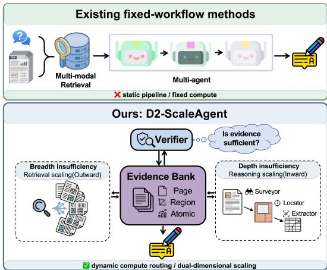
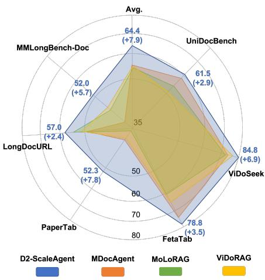
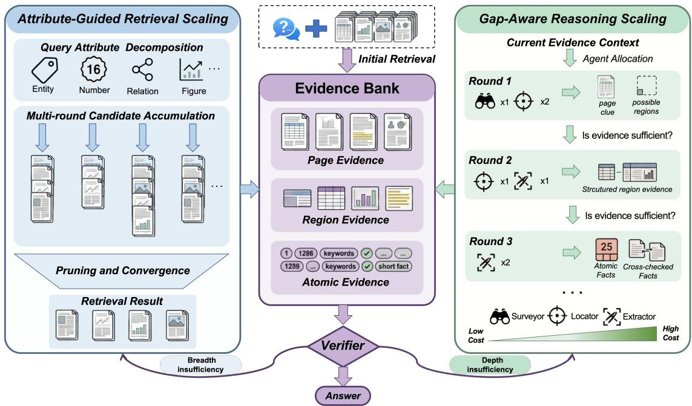
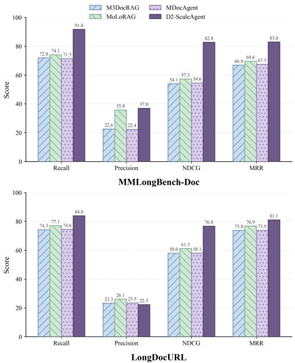
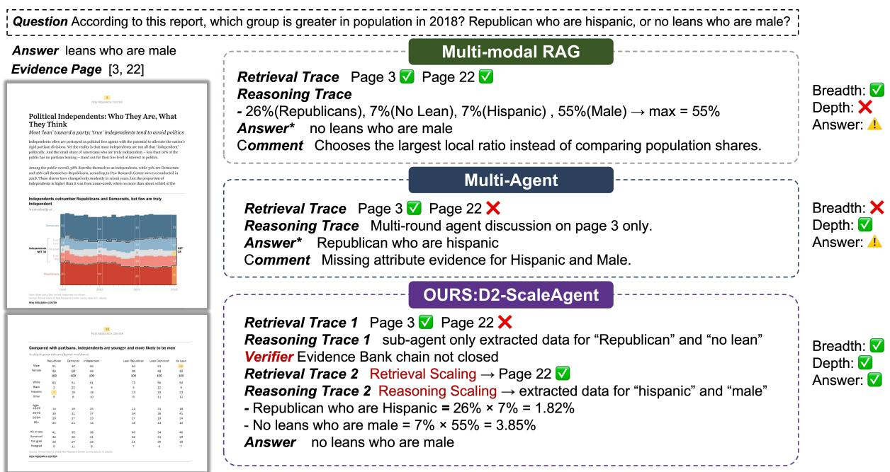
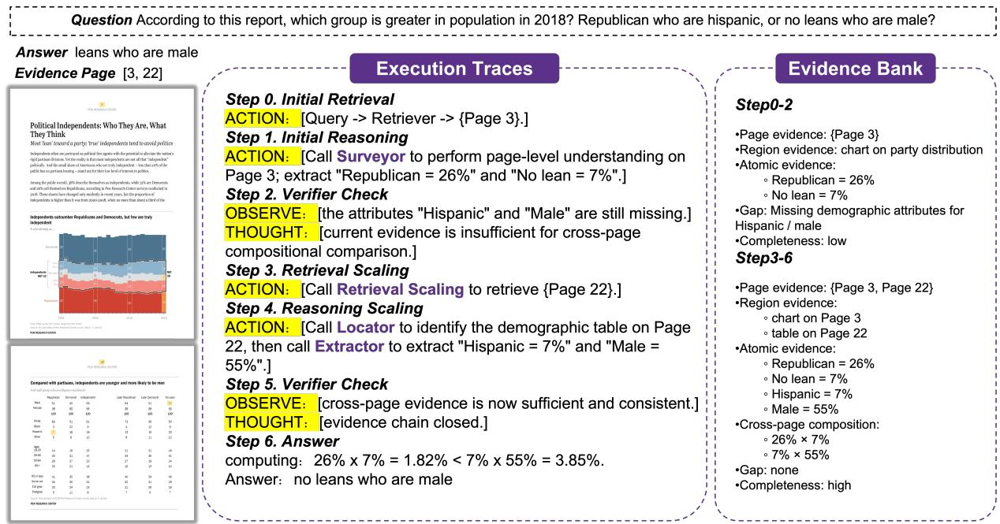

# D2-ScaleAgent: Dual-Dimensional Scaling for Long Document Understanding

Hao Zhang<sup>1</sup>, Longrong Yang<sup>2</sup>, Lunhao Duan<sup>2</sup>, Ziyang Wang<sup>3</sup>, Qing-Guo Chen<sup>2</sup>, Shanshan Zhao<sup>2</sup> <sup>1</sup>Zhejiang University

<sup>2</sup>Alibaba Group <sup>3</sup>University of Science and Technology of China

## Abstract

Multi-modal retrieval-augmented generation (RAG) is a key technique for visually rich long document understanding. Existing multi-modal RAG methods are progressively advancing to ward multi-agent systems: they first retrieve relevant pages based on a query, and then it eratively understand information within those pages. However, these methods typically rely on fixed workflows and lack the ability to dynamically scale computation at test time, often leading to insufficient evidence. To address this, we propose D2-ScaleAgent, an agentic framework that introduces a dual-dimensional scaling paradigm for retrieval and reasoning. The core of D2-ScaleAgent is a Verifier agentdriven dynamic routing loop based on the in trinsic difficulty of the query, centered around a continuously updated evidence bank that serves as the agent’s dynamic working memory: when retrieval needs to be expanded, the agent routes outward (retrieval scaling), decomposing the query into attributes and performing parallel page retrieval, followed by adaptive pruning to ensure comprehensive evidence coverage. When fine-grained reasoning is required, the agent routes inward (reasoning scaling), dynamically selecting sub-agents with varying granularity and count to extract evidence from pages. Finally, D2-ScaleAgent achieves logical closure over the evidence chain. Extensive experiments demonstrate that D2-ScaleAgent is effective on long and visually rich document benchmarks like MMLongBench-Doc, Long-DocURL, etc.

## 1 Introduction

Answering questions from visually rich long documents, like financial reports and scientific papers, is critical for many real-world applications (Suri et al., 2025; Van Landeghem et al., 2023; Wang et al., 2023; Shorten et al., 2026; Ding et al., 2022). While Large Vision-Language Models (LVLMs) have made significant progress in general visual understanding (Li et al., 2023; Liu et al., 2024; Bai et al., 2023; Team et al., 2023; Zhu et al., 2023), they still struggle with visually rich long documents. A core conflict exists between the need for fine-grained visual details and the limited context window of LVLMs. This mismatch often leads to performance drops when processing long documents (Zong et al., 2024; Xu et al., 2021; Ma et al., 2024). Crucially, the main challenge of longdocument understanding is not just the document’s length, but the difficulty of finding "sufficient and adequate" evidence within limited computational resources (Wang et al., 2025; Chen et al., 2025; Chu et al., 2025; Xiao et al., 2025).



(a)Comparison of system architectures  
  
(b) Overall performance comparison  
Figure 1: Architecture and performance of our proposed method, D2-ScaleAgent. (a) The framework achieves dual-dimensional scaling through a Verifier agent-driven dynamic routing loop, addressing evidence insufficiency by dynamically scaling outward for retrieval and inward for fine-grained understanding. (b) It shows improvements in comprehensive end-to-end QA accuracy across multiple long-document benchmarks, consistently outperforming existing baselines.

To address this challenge, current research typically employs two primary strategies. The first involves multi-modal retrieval-augmented generation (RAG), which filters document content to first identify relevant pages before performing detailed reading (Tanaka et al., 2025; Gao et al., 2025). The second route focuses on multi-agent or iterative mechanisms, which utilize multi-step analysis and reasoning to navigate complex document structures (Wang et al., 2025; Ke et al., 2025). However, as illustrated in Figure 1(a), these methods are often constrained by fixed workflows, acting more like fixed workflows than autonomous agents, lacking the flexibility to dynamically scale computation at test time based on the inherent difficulty of the user’s query (Zhao et al., 2025). Consequently, many errors arise not because the model’s reasoning template is flawed, but because the system fails to acquire sufficient evidence during generation (Sivakumar et al., 2026). The fundamental essence of long-document understanding failure is, therefore, an "Evidence Insufficiency Problem".

When human readers encounter insufficient information in a long document, they do not jump to conclusions (Pirolli and Card, 1995; Kobayashi and Kable, 2024). Instead, they distinguish between a failure to locate the correct page (van der Sluis, 2025) and a failure to thoroughly process the relevant section (Li et al., 2024; Qian et al., 2026). Inspired by this, we categorize evidence insufficiency into two dimensions: (1) Breadth insufficiency, where incomplete coverage requires the system to scale outward to broader document contexts; and (2) Depth insufficiency, where localized but superficial understanding requires the system to scale inward for finer granularity and deeper reasoning. Consequently, rather than following a fixed path, long document understanding should dynamically scale across both dimensions based on detected evidence gaps. To this end, we propose D2-ScaleAgent, a dual-dimensional evidencedriven agentic framework.

D2-ScaleAgent abandons the typical static "retrieve-then-read" workflow, establishing instead a Verifier agent-driven closed-loop agent system centered around a continuously updated Evidence Bank, which acts as the agent’s dynamic working memory. This Evidence Bank maintains the currently acquired page, region, and atomic evidence, recording their logical states: whether they support the answer, conflict, or remain missing. The core of this closed loop is a Verifier agent-driven dynamic routing. As shown in Figure 1(a), the Verifier serves as a trigger for the entire system, which strictly checks if the current Evidence Bank is sufficient to support a complete response. When an evidence gap is detected, the Verifier outputs a gap signal and dynamically routes the compute: When new source pages are missing, it autonomously routes outward to retrieval scaling. The retrieval scaling triggers an attribute decomposition of the original query, performing parallel candidate retrieval from multiple perspectives while applying rank fusion and adaptive pruning to strictly control context budgets. When fine-grained details are missing, it routes inward to reasoning scaling, dynamically selecting sub-agents of varying costs and granularities, including Global Surveyor, Region Locator, and Fine-grained Extractor. Finally, the agentic system iteratively completes the evidence chain under the guidance of the Verifier until logical closure is achieved: a state where all identified evidence gaps are resolved to substantiate the final answer.

In summary, our major contributions are as follows:

• We identify the fundamental cause of failure in long document understanding as an "evidence insufficiency problem" and introduce the "Dual-Dimensional Scaling" paradigm.

• We propose the D2-ScaleAgent framework. Its primary contribution is a dynamic closedloop mechanism, driven by a Verifier agent and centralized around an Evidence Bank that serves as the system’s global memory, enabling profound synergy and seamless fallback between retrieval and reasoning operations.

• Extensive evaluations on multiple complex, visually-rich long document benchmarks (e.g., MMLongBench-Doc (Ma et al., 2024)) demonstrate that D2-ScaleAgent achieves state-of-the-art performance, outperforming traditional RAG and static-agent workflows, as shown in Figure 1(b).

## 2 Related Work

Multi-modal Retrieval-Augmented Generation. Multi-modal RAG enhances document questionanswering capabilities by supplying models with externally retrieved visual or textual contexts (Lewis et al., 2020; Guu et al., 2020; Borgeaud et al., 2022). Recent studies have achieved signifi cant advances in retrieval mechanisms. Representative examples include M3DocRAG (Cho et al., 2024), which visualizes PDF pages for end-to-end visual retrieval; MHier-RAG (Gong et al., 2025), which enables fine-grained localization within long documents via intra- and inter-page structural indices; and MoLoRAG (Wu et al., 2025) and MegaRAG (Hsiao et al., 2025), which utilize page graphs or multi-modal knowledge graphs to model cross-page logical and entity relationships. Furthermore, ViDoRAG (Wang et al., 2025) attempts to move beyond fixed Top-K constraints through dynamic retrieval budget allocation, while VisDoM-RAG (Suri et al., 2025) models textual and visual evidence in parallel with consistency-constrained fusion. These works propel multi-modal document understanding toward joint visual-textual-structural modeling. However, existing multi-modal RAG methods typically rely on static retrieval and fixed dual-channel workflows. This lack of dynamic routing causes Breadth Insufficiency: failing to recall relevant information located elsewhere. Our framework addresses this via a Retrieval Scaling module. Instead of blind Top-K expansion (Taguchi et al., 2025), it decomposes the query into attributes and parallelizes retrieval from multiple perspectives, directing outward expansion specifically around missing evidence.

Multi-Agent Systems. Multi-agent systems have shown immense potential in handling reasoning over complex long documents (Zhao et al., 2024; Yao et al., 2022; Zhang et al., 2024). These systems typically utilize specialized sub-agents with distinct divisions of labor to iteratively understand document content. For instance, MDocAgent (Han et al., 2025) enhances the mining of text-image details through multi-role collaboration, while DocAgent (Sun et al., 2025) improves longdocument processing capabilities via outline navigation, interactive reading, reviewer agents, and memory banks. MACT (Yu et al., 2025) introduces procedural test-time scaling, and ViDoRAG (Wang et al., 2025) adopts an iterative seeker-inspectoranswer collaborative workflow. While multi-agent systems mitigate single-model limitations in complex DocQA, their predetermined workflows and fixed budgets struggle to dynamically allocate reasoning depth for fine-grained visual details. This rigidity causes Depth Insufficiency: incomplete evidence resolution. Our framework addresses this via a Verifier agent-driven dynamic routing loop centered around an Evidence Bank.

## 3 Methodology

In this section, we present D2-ScaleAgent, a Dual-Dimensional Scaling framework that reformulates long-document understanding from a workflow into an on-demand compute routing problem, as illustrated in Figure 2.

## 3.1 Problem Formulation

We formulate long document understanding as an evidence-driven exploration. The system maintains a global Evidence Bank $( B _ { t } )$ serving as the unified epistemic state at global system step t:

$$
\boldsymbol { \mathcal { B } } _ { t } = \{ E _ { t } ^ { p a g e } , E _ { t } ^ { r e g i o n } , E _ { t } ^ { a t o m i c } , s _ { t } ^ { c o m p } , g _ { t } \}\tag{1}
$$

These five variables respectively track the globally accumulated page-level, region-level, and atomiclevel evidence, quantify the current evidence completeness score $( s _ { t } ^ { c o m p } )$ , and explicitly record the current evidence gap $( g _ { t } )$ . Guided by this unified state, the system dynamically allocates computational budgets to resolve the two primary failure modes in long-document reasoning: first introducing the attribute-guided retrieval scaling to resolve breadth insufficiency (Section 3.2), and subsequently presenting the gap-aware reasoning scaling to resolve depth insufficiency (Section 3.3).

## 3.2 Attribute-Guided Retrieval Scaling

Traditional static Top-K retrieval paradigms are ill-equipped for complex visually-rich long documents, as the scope of required evidence varies drastically across queries. To address this, we formalize retrieval scaling as a dynamic, three-stage process aimed at adaptively expanding the search boundary until it autonomously converges to a highvalue evidence set. Given a current query intent q and a page space P, the process operates as follows:

  
Figure 2: Overview of D2-ScaleAgent. (1) The system first retrieves a candidate page pool and initializes the Evidence Bank. (2) A Verifier agent-driven loop then routes computation outward for retrieval scaling or inward for reasoning scaling based on the current evidence gap. (3) Multi-granularity evidence is continuously accumulated into the Evidence Bank. (4) Once logical closure is achieved, the system generates the final answer from the saturated evidence state.

Query Attribute Decomposition. In visuallyrich contexts, an information need is rarely singular. Instead of treating q as a monolithic input, we leverage an LLM (whose prompt template is detailed in Appendix E) to decompose it into a weighted set of multi-perspective attribute queries:

$$
\mathcal { Q } = \{ ( q _ { 0 } , w _ { 0 } ) , ( q _ { 1 } , w _ { 1 } ) , \dots , ( q _ { M } , w _ { M } ) \}\tag{2}
$$

where $q _ { 0 }$ is the core intent, $q _ { m }$ are derived attribute perspectives, and $w _ { m }$ represents the confidence weight $\begin{array} { r } { ( \sum _ { m = 0 } ^ { M } w _ { m } = 1 ) } \end{array}$

Multi-round Candidate Accumulation. To gather complementary evidence, the system executes retrieval for the decomposed queries in Q. At any internal retrieval step j (where $0 \leq j \leq M )$ the system processes the attribute query $q _ { j }$ to retrieve a local candidate page set $\mathcal { R } ^ { ( j ) }$ . It then updates a monotonically expanding global candidate page pool, defined as $\begin{array} { r } { \mathcal { C } ^ { ( \hat { j } ) } = \bigcup _ { m = 0 } ^ { \overline { { j } } ^ { - } } \mathcal { R } ^ { ( m ) } } \end{array}$ , which aggregates results from all queries processed up to step j. Since raw retrieval scores across different attribute perspectives are incomparable, we calculate a rank-based weighted fusion score for each accumulated candidate page c:

$$
S _ { j } ( c ) = \sum _ { m = 0 } ^ { j } \mathbf { 1 } [ c \in \mathcal { R } ^ { ( m ) } ] \cdot \frac { w _ { m } } { \kappa + r ^ { ( m ) } ( c ) }\tag{3}
$$

where $r ^ { ( m ) } ( c )$ is the local rank of page c in the m-th query’s results, $w _ { m }$ is the query’s confidence weight, and κ is a smoothing constant. This mechanism prioritizes high-value evidence consistently supported across multiple perspectives.

Adaptive Pruning and Convergence. To balance the expanding boundary with downstream reasoning costs, we introduce a confidence-aware pruning mechanism. We define the maximum accumulated score $S _ { j } ^ { \mathrm { m a x } }$ and extract the high-value evidence set for the current round using a relative threshold $\alpha \in ( 0 , 1 )$

$$
\mathcal { E } _ { j } ^ { \mathrm { r e t } } = \{ c \in \mathcal { C } ^ { ( j ) } \mid S _ { j } ( c ) \geq \alpha S _ { j } ^ { \mathrm { m a x } } \}\tag{4}
$$

To autonomously determine if the retrieval scaling has saturated, we quantify the cross-round stability of this evidence set:

$$
\mathrm { S t a b } _ { j } = \frac { | \mathcal { E } _ { j } ^ { \mathrm { r e t } } \cap \mathcal { E } _ { j - 1 } ^ { \mathrm { r e t } } | } { | \mathcal { E } _ { j } ^ { \mathrm { r e t } } | }\tag{5}
$$

When $\operatorname { S t a b } _ { j }$ consistently exceeds a predefined threshold τ, the system infers that the retrieval frontier has converged. It dynamically terminates the internal expansion and designates this set as the global retrieval output for the global system step t: $\mathcal { E } _ { t } ^ { \mathrm { r e t } }  \mathcal { E } _ { j } ^ { \mathrm { r e t } }$ . In summary, the terminus of retrieval scaling is neither a fixed number of rounds nor a rigid Top-K budget, but an adaptive stopping state achieved when the evidence set stabilizes under multi-perspective scrutiny.

## 3.3 Gap-Aware Reasoning Scaling

Even when relevant pages are successfully retrieved $( \mathcal { E } _ { t } ^ { \mathrm { r e t } } )$ , LVLMs frequently default to coarse semantic matching, struggling to parse precise numerical values or complex layouts from visuallyrich contexts. To address this depth insufficiency, we introduce a Reasoning-Side Scaling mechanism. Rather than indiscriminately forcing pages through a fixed workflow, this mechanism dynamically invokes a toolkit of cost-stratified cognitive sub-agents based on explicit evidence gaps, executing a coarse-to-fine transition from macroscopic intuition to auditable atomic facts. The sub-agents prompt templates are detailed in Appendix E. The reasoning toolkit comprises three hierarchical levels of sub-agents, which are adaptively selected by the downstream routing mechanism:

Global Surveyor: Low-cost Page Understanding. The Surveyor executes a macroscopic scan over the candidate set $\mathcal { E } _ { t } ^ { \mathrm { r e t } }$ to establish a directional semantic prior, preventing the premature allocation of expensive compute to irrelevant details. It outputs incremental page-level evidence $e _ { t } ^ { \mathrm { p a g e } }$

$$
e _ { t } ^ { \mathrm { p a g e } } = f _ { \mathrm { s u r } } ( q , \mathcal { E } _ { t } ^ { \mathrm { r e t } } )\tag{6}
$$

Region Locator: Medium-cost Region Focusing. Acting as a dimensionality reduction mechanism, the Locator isolates critical regions from the broad candidate set and generates structured summaries (e.g., identifying specific tables), outputting a highly relevant page subset $\mathcal { E } _ { t } ^ { \mathrm { k e y } }$ and region-level evidence $e _ { t } ^ { \mathrm { r e g i o n } }$

$$
( \mathcal { E } _ { t } ^ { \mathrm { k e y } } , e _ { t } ^ { \mathrm { r e g i o n } } ) = f _ { \mathrm { l o c } } ( q , \mathcal { E } _ { t } ^ { \mathrm { r e t } } )\tag{7}
$$

Fine-grained Extractor: High-cost Atomic Extraction. For the identified critical regions, this module undertakes high-resolution precision reading based on an explicit extraction specification $( \psi _ { t } )$ dynamically generated from current evidence gaps. It extracts specific, verifiable atomic facts $e _ { t } ^ { \mathrm { a t o m i c } }$

$$
e _ { t } ^ { \mathrm { a t o m i c } } = f _ { \mathrm { e x t } } ( q , \mathcal { E } _ { t } ^ { \mathrm { r e t } } , \psi _ { t } )\tag{8}
$$

Crucially, the multi-granularity evidence extracted by these adaptive operations is not held in isolated caches. The incremental evidence $( e _ { t } ^ { * } )$ is

continuously appended to the globally accumulated sets $( E _ { t } ^ { * } )$ ):

$$
E _ { t + 1 } ^ { * } = E _ { t } ^ { * } \cup \{ e _ { t } ^ { * } \}\tag{9}
$$

Consequently, the global epistemic state of the Evidence Bank is explicitly and incrementally updated at each reasoning step:

$$
\mathcal { B } _ { t + 1 } = \mathrm { U p d a t e } ( \mathcal { B } _ { t } , e _ { t } ^ { \mathrm { p a g e } } , e _ { t } ^ { \mathrm { r e g i o n } } , e _ { t } ^ { \mathrm { a t o m i c } } )\tag{10}
$$

This evidence-driven update mechanism formalizes the epistemic state, providing the global Verifier with a unified basis to drive subsequent inward/outward routing decisions.

## 3.4 Verifier Agent-Driven Routing

The orchestration of this evidence-driven computation is governed by the Verifier, which functions not merely as a posterior checker, but as the system’s explicit stopping and expansion trigger. The Verifier’s prompt template is detailed in Appendix E. At each inference step t, the Verifier assesses the epistemic completeness of the Evidence Bank, identifying specific logical discontinuities or cross-modal contradictions:

$$
( s _ { t } ^ { c o m p } , g _ { t } ) = f _ { v e r } ( q , { \cal B } _ { t } )\tag{11}
$$

These evaluations are subsequently written back to update the global state: $B _ { t } \quad \gets$ $\mathrm { U p d a t e } _ { v e r } ( \boldsymbol { B } _ { t } , \boldsymbol { s } _ { t } ^ { c o m p } , \boldsymbol { g } _ { t } )$ . Based on this explicit gap $g _ { t }$ , the system triggers one of two distinct routing dimensions:

1. Inward Digging (Addressing Depth Insufficiency). When the critical source pages are located but parsed localized facts remain insufficient, the routing mechanism dynamically allocates a specific cognitive operation $o _ { t }$ from the reasoning toolkit (Section 3.3) to extract deeper incremental evidence:

$$
\begin{array} { r l r } { \mathrm { i f } \ g _ { t } \in \mathcal { G } _ { d e p t h } , } & { o _ { t } \gets \mathrm { R e a s o n i n g - S c a l e } ( g _ { t } , \mathcal { B } _ { t } ) , } & \\ & { o _ { t } \in \{ f _ { s u r } , f _ { l o c } , f _ { e x t } \} } & \end{array}\tag{12}
$$

2. Outward Expansion (Addressing Breadth Insufficiency). If the Verifier reveals an unbridgeable contextual void indicating missing foundational source evidence, the system translates the explicit gap $g _ { t }$ into a novel retrieval intent to dynamically re-expand the candidate boundary via the retrieval toolkit (Section 3.2):

$$
\begin{array} { r l } { \operatorname { i f } g _ { t } \in \mathcal G _ { b r e a d t h } , } & { q _ { t } ^ { n e w } \gets \Phi ( g _ { t } , q ) , } \\ & { \mathcal E _ { t } ^ { r e t } \gets \mathrm { R e t r i e v a l - S c a l e } ( q _ { t } ^ { n e w } ) } \end{array}\tag{13}
$$

The closed-loop routing mechanism operates continuously until a rigorous termination condition is met:

$$
\mathrm { S t o p ~ i f ~ } s _ { t } ^ { c o m p } \geq \delta \mathrm { ~ a n d ~ } g _ { t } = \emptyset\tag{14}
$$

where δ defines the strict evidence closure threshold. Once this condition is satisfied, the system decisively breaks the iterative loop and generates the final answer based on the logically saturated Evidence Bank:

$$
a = f _ { a n s } ( q , B _ { t } )\tag{15}
$$

By conditioning generation strictly on a verified, logically closed evidence state rather than forcing an output under incomplete information, the system avoids hallucinating unsupported conclusions. Further details are provided in Appendix A.

## 4 Experiments

## 4.1 Experiment Setup

Datasets: To cover a wide range of real-world application scenarios, we selected six multi-modal long-document benchmarks: MMLongBench-Doc (Ma et al., 2024), LongDocURL (Deng et al., 2025), PaperTab (Hui et al., 2024), FetaTab (Hui et al., 2024), ViDoSeek (Wang et al., 2025) and UniDoc-Bench (Peng et al., 2025). These datasets span both open and domain-specific fields, encompassing varying text lengths and rich visual elements to comprehensively test models’ multi-modal understanding capabilities in long contexts.

Baselines: D2-ScaleAgent is benchmarked against 3 advanced open-source baselines categorized into two mainstream paradigms: (1) Multimodal RAG: MoLoRAG (Wu et al., 2025). (2) Multi-agent Systems: This includes MDocAgent (Han et al., 2025) and ViDoRAG (Wang et al., 2025), representing advanced frameworks that operate on fixed workflows.

More implementation details are provided in Appendix D.

## 4.2 Main Results

(1) End-to-End QA Performance. Table 1 reports the end-to-end QA accuracy of D2-ScaleAgent and all baseline methods on the six benchmarks. Overall, D2-ScaleAgent achieves the best average performance among all methods, consistently outperforming both multi-modal RAG and fixedworkflow multi-agent baselines across all evaluated models (e.g., 63.7 vs. MDocAgent’s 58.3 on GPT-4o). Notably, VQA, which processes the full document image directly without relying on explicit retrieval or iterative reasoning stages, outperforms several retrieval-based baselines in multiple settings, suggesting that stronger foundation models can substantially narrow the gap between holistic VQA and fixed retrieval-and-reasoning pipelines. This trend is particularly evident with Gemini-3-flash-preview: VQA even outperforms D2-ScaleAgent on MMLongBench-Doc (Ma et al., 2024) and LongDocURL (Deng et al., 2025). We emphasize, however, that the advantage of D2- ScaleAgent does not lie in uniformly outperforming VQA in every setting, but in mitigating the brittleness of fixed retrieval and reasoning workflows under evidence-insufficient scenarios. These gains are particularly prominent on benchmarks with complex layouts and dispersed evidence.

  
Figure 3: Retrieval performance comparison on MMLongBench-Doc and LongDocURL datasets.

(2) Retrieval Performance. We further evaluate retrieval quality on MMLongBench-Doc (Ma et al., 2024) and LongDocURL (Deng et al., 2025). As shown in Figure 3, the baseline results are taken from MoLoRAG (Wu et al., 2025), and D2-ScaleAgent consistently improves Recall, Precision, nDCG, and MRR over strong baselines. These gains indicate that our method not only retrieves more relevant evidence, but also ranks it more effectively. The improvements mainly come from the retrieval-side scaling strategy, which performs query attribute decomposition and iterative evidence expansion rather than relying on a single static Top-K retrieval step. This allows the system to better handle questions whose supporting evidence is distributed across multiple pages or only partially captured by the initial query. Overall, the results confirm the importance of coupling retrieval expansion with downstream reasoning.

Table 1: Performance comparison of different methods across multiple benchmarks. VQA takes the entire document as image input.
<table><tr><td>Method</td><td>MMLongBench-Doc LongDocURL PaperTab FetaTab</td><td></td><td></td><td></td><td></td><td>ViDoSeek UniDoc-Bench</td><td>Avg</td></tr><tr><td colspan="8">GPT-40</td></tr><tr><td>VQA</td><td>43.7</td><td>51.1</td><td>31.3</td><td>75.7</td><td>78.8</td><td>56.1</td><td>56.1</td></tr><tr><td>ViDoRAG (Wang et al., 2025)</td><td>44.4</td><td>50.8</td><td>30.6</td><td>66.1</td><td>70.7</td><td>58.0</td><td>53.4</td></tr><tr><td>MoLoRAG (Wu et al., 2025)</td><td>40.7</td><td>55.5</td><td>29.3</td><td>64.7</td><td>74.1</td><td>57.1</td><td>53.6</td></tr><tr><td>MDocAgent (Han et al., 2025)</td><td>34.7</td><td>50.9</td><td>45.5</td><td>79.8</td><td>77.4</td><td>61.2</td><td>58.3</td></tr><tr><td>D2-ScaleAgent</td><td>52.0</td><td>56.0</td><td>47.5</td><td>82.8</td><td>81.8</td><td>62.2</td><td>63.7</td></tr><tr><td colspan="8">Gemini-3-flash-preview</td></tr><tr><td>VQA</td><td>65.0</td><td>65.4</td><td>58.6</td><td>72.7</td><td>86.8</td><td>60.6</td><td>68.2</td></tr><tr><td>ViDoRAG (Wang et al., 2025)</td><td>65.3</td><td>60.6</td><td>56.5</td><td>80.8</td><td>83.8</td><td>62.9</td><td>68.3</td></tr><tr><td>MoLoRAG (Wu et al., 2025)</td><td>49.2</td><td>59.1</td><td>48.5</td><td>67.7</td><td>76.3</td><td>66.3</td><td>61.2</td></tr><tr><td>MDocAgent (Han et al., 2025)</td><td>42.6</td><td>45.0</td><td>54.5</td><td>80.8</td><td>76.3</td><td>64.9</td><td>60.7</td></tr><tr><td>D2-ScaleAgent</td><td>63.0</td><td>64.4</td><td>62.6</td><td>84.8</td><td>85.8</td><td>73.5</td><td>72.4</td></tr><tr><td colspan="8">Qwen2.5-VL-7B-Instruct</td></tr><tr><td>VQA</td><td>32.9</td><td>44.6</td><td>34.3</td><td>61.6</td><td>70.7</td><td>35.7</td><td>46.6</td></tr><tr><td>ViDoRAG (Wang et al., 2025)</td><td>30.5</td><td>43.5</td><td>33.0</td><td>48.0</td><td>79.5</td><td>38.9</td><td>45.6</td></tr><tr><td>MoLoRAG (Wu et al., 2025)</td><td>38.1</td><td>48.6</td><td>30.3</td><td>55.6</td><td>69.9</td><td>46.9</td><td>48.2</td></tr><tr><td>MDocAgent (Han et al., 2025)</td><td>32.2</td><td>43.9</td><td>32.3</td><td>66.7</td><td>68.8</td><td>51.0</td><td>49.2</td></tr><tr><td>D2-ScaleAgent</td><td>42.1</td><td>49.4</td><td>43.4</td><td>70.7</td><td>81.8</td><td>47.0</td><td>55.7</td></tr><tr><td colspan="8">Qwen3-VL-8B-Instruct</td></tr><tr><td>VQA</td><td>49.0</td><td>56.8</td><td>49.5</td><td>69.0</td><td>82.8</td><td>53.0</td><td>60.0</td></tr><tr><td>ViDoRAG (Wang et al., 2025)</td><td>44.7</td><td>53.0</td><td>54.6</td><td>68.4</td><td>77.6</td><td>51.0</td><td>58.2</td></tr><tr><td>MoLoRAG (Wu et al., 2025)</td><td>46.0</td><td>55.0</td><td>36.4</td><td>57.6</td><td>72.0</td><td>51.0</td><td>53.0</td></tr><tr><td>MDocAgent (Han et al., 2025)</td><td>40.7</td><td>52.2</td><td>45.5</td><td>73.7</td><td>76.3</td><td>57.1</td><td>57.6</td></tr><tr><td>D2-ScaleAgent</td><td>51.1</td><td>58.1</td><td>55.5</td><td>76.7</td><td>89.9</td><td>63.2</td><td>65.8</td></tr></table>

Table 2: Ablation study of different components on the MMLongBench-Doc dataset.
<table><tr><td rowspan="2">Retrieval Scaling</td><td colspan="3">Reasoning Scaling</td><td rowspan="2">Verifier- Driven Loop</td><td rowspan="2">MMLongBench-Doc</td></tr><tr><td>Surveyor</td><td>Locator</td><td>Extractor</td></tr><tr><td>Evidence</td><td>√</td><td>√</td><td>√</td><td>√</td><td>54.9</td></tr><tr><td>√</td><td>√</td><td>√</td><td>√</td><td>√</td><td>52.0</td></tr><tr><td>×</td><td>√</td><td>√</td><td>√</td><td>√</td><td>46.8</td></tr><tr><td>√</td><td>×</td><td>√</td><td>√</td><td>√</td><td>46.5</td></tr><tr><td>√</td><td>√</td><td>×</td><td>√</td><td>√</td><td>47.1</td></tr><tr><td>√</td><td>√</td><td>√</td><td>×</td><td>√</td><td>47.5</td></tr><tr><td>√</td><td>√</td><td>√</td><td>√</td><td>×</td><td>44.1</td></tr><tr><td>√</td><td colspan="4">GPT-4o Answer Directly</td><td>45.0</td></tr></table>

## 4.3 Ablation Studies

As shown in Table 2, we ablate D2-ScaleAgent on MMLongBench-Doc to quantify each component’s contribution. The full model (52.0) outperforms the naive GPT-4o baseline (45.0) and approaches the upper bound of 54.9, which is achieved by replacing the retrieval module with ground-truth evidence. Crucially, disabling the Verifier agentdriven loop causes the steepest accuracy drop (to 44.1), underscoring the critical role of rigorous evidence verification and closed-loop routing. Similarly, discarding the Retrieval-Side scaling (46.8) or removing any of the inward-scaling reasoning agents—Surveyor (46.5), Locator (47.1), and Extractor (47.5)—consistently degrades performance. These findings demonstrate that static workflows are insufficient; dynamic retrieval expansion, multigranularity visual parsing, and rigorous evidence verification must be coordinated to resolve complex long document understanding tasks. Additional ablation results are provided in Appendix C.

## 4.4 Compute-cost analysis

We have profiled D2-ScaleAgent on two representative benchmarks, MMLongBench-Doc and ViDoSeek. As shown in Table 3, computational costs dynamically scale with query difficulty: MMLongBench-Doc requires more verification and routing (21.4K tokens, 16.22s) due to its structural complexity and dispersed evidence, whereas ViDoSeek exhibits lower overhead (15.9K tokens, 11.89s) with fewer iterative corrections. D2-ScaleAgent adaptively allocates computation based on evidence insufficiency. All reported efficiency metrics are averaged per query, and latency is measured end-to-end using the GPT-4o API.

  
Figure 4: Case study of D2-ScaleAgent. Given a cross-page compositional question comparing population sizes, both baseline methods fail due to either breadth or depth insufficiency. In contrast, D2-ScaleAgent, guided by the Verifier agent-driven dynamic routing loop, identifies that the initial evidence chain is incomplete, then triggers Attribute-Guided Retrieval Scaling to locate the missing page and Gap-Aware Reasoning Scaling to extract the required fine-grained numerical evidence.

Table 3: Compute-cost analysis and profiling of D2- ScaleAgent on MMLongBench-Doc and ViDoSeek using GPT-4o.
<table><tr><td>Metric</td><td>MMLongBench-Doc</td><td>ViDoSeek</td></tr><tr><td>Accuracy</td><td>52.0</td><td>81.8</td></tr><tr><td>Retrieval rounds</td><td>1.33</td><td>1.12</td></tr><tr><td>Reasoning calls (S/L/E)</td><td>1.51 / 1.12 / 0.63</td><td>1.75 / 0.34 / 0.47</td></tr><tr><td>Verifier calls</td><td>1.76</td><td>1.14</td></tr><tr><td>Routing-agent calls</td><td>5.02</td><td>3.70</td></tr><tr><td>Tokens</td><td>21.4K</td><td>15.9K</td></tr><tr><td>E2E latency</td><td>16.22 s</td><td>11.89 s</td></tr></table>

## 4.5 Case Study

Figure 4 presents an example of cross-page question answering. The question cannot be resolved from a single page, as it requires reasoning over the 2018 group distribution on Page 3 and the demographic composition table on Page 22. Multimodal RAG successfully retrieves both pages, but fails to perform the required cross-page composition; instead, it compares local ratios and arrives at the correct answer only by chance. Fixed Multiagent exhibits stronger local reasoning ability, yet remains confined to Page 3 and therefore misses the critical attribute evidence on Page 22. In contrast,

D2-ScaleAgent identifies the incomplete evidence chain through the Verifier, triggers retrieval scaling to acquire the missing page, and applies finegrained reasoning to complete the population-level comparison, thereby producing the correct answer. This case highlights that D2-ScaleAgent does not merely benefit from stronger reasoning or broader retrieval in isolation, but from its Verifier agentdriven coordination of the two, which enables the system to adaptively close the evidence gap and achieve logical closure over a distributed evidence chain.

## 5 Conclusions

In this paper, we tackle the long document understanding task by addressing the limitations of prior methods that rely on fixed workflows and suffer from evidence insufficiency. By introducing a dualdimensional scaling paradigm, our D2-ScaleAgent utilizes a Verifier agent-driven dynamic routing loop centered on a continuously updated evidence bank to perform both outward retrieval scaling and inward reasoning scaling. Extensive experiments demonstrate that D2-ScaleAgent achieves logical closure over evidence chains and delivers SOTA performance on complex benchmarks like MMLongBench-Doc, LongDocURL, etc.

## Limitations

While D2-ScaleAgent effectively mitigates evidence insufficiency through dual-dimensional scaling, this paradigm inherently trades computational efficiency for reasoning accuracy. A primary limitation of our framework is the inevitable increase in inference latency and computational overhead. The dynamic routing mechanism, which necessitates multi-round attribute-guided retrieval (outward scaling) and the on-demand invocation of cost-stratified cognitive sub-agents (inward scaling), results in execution times significantly longer than standard single-pass inference models. Consequently, the current architecture is computationally intensive and may be suboptimal for real-time applications or severely latency-constrained deployment scenarios. A comprehensive profiling of this computational efficiency trade-off is detailed in subsection 4.4.

## Ethical Considerations

The datasets utilized in this work do not contain any personally identifiable or sensitive information, as all materials were sourced exclusively from publicly available domains. Furthermore, the curation, processing, and refinement of the data were conducted in strict adherence to applicable copyright laws and intellectual property guidelines.

## The Use of AI assistants

AI assistants (ChatGPT) are used to correct potential grammatical inaccuracies in the manuscript. AI assistants do not participate in research ideation.

## References

Jinze Bai, Shuai Bai, Shusheng Yang, Shijie Wang, Sinan Tan, Peng Wang, Junyang Lin, Chang Zhou, and Jingren Zhou. 2023. Qwen-vl: A versatile visionlanguage model for understanding, localization, text reading, and beyond. Preprint, arXiv:2308.12966.

Shuai Bai, Yuxuan Cai, Ruizhe Chen, Keqin Chen, Xionghui Chen, Zesen Cheng, Lianghao Deng, Wei Ding, Chang Gao, Chunjiang Ge, Wenbin Ge, Zhifang Guo, Qidong Huang, Jie Huang, Fei Huang, Binyuan Hui, Shutong Jiang, Zhaohai Li, Mingsheng Li, and 45 others. 2025. Qwen3-vl technical report. Preprint, arXiv:2511.21631.

Sebastian Borgeaud, Arthur Mensch, Jordan Hoffmann, Trevor Cai, Eliza Rutherford, Katie Millican, George Bm Van Den Driessche, Jean-Baptiste Lespiau, Bogdan Damoc, Aidan Clark, and 1 others.

2022. Improving language models by retrieving from trillions of tokens. In International conference on machine learning, pages 2206–2240. PMLR.

Bingsen Chen, Shenji Wan, Xi Ye, and Chen Zhao. 2025. Inter-passage verification for multi-evidence multi-answer qa. In Findings ofthe Associationfor Computational Linguistics: ACL 2025, pages 6811– 6829.

Jaemin Cho, Debanjan Mahata, Ozan Irsoy, Yujie He, and Mohit Bansal. 2024. M3docrag: Multimodal retrieval is what you need for multi-page multi-document understanding. arXiv preprint arXiv:2411.04952.

Zheng Chu, Huiming Fan, Jingchang Chen, Qianyu Wang, Mingda Yang, Jiafeng Liang, Zhongjie Wang, Hao Li, Guo Tang, Ming Liu, and 1 others. 2025. Self-critique guided iterative reasoning for multi-hop question answering. In Findings ofthe Association for Computational Linguistics: ACL 2025, pages 2415–2438.

Chao Deng, Jiale Yuan, Pi Bu, Peijie Wang, Zhong-Zhi Li, Jian Xu, Xiao-Hui Li, Yuan Gao, Jun Song, Bo Zheng, and 1 others. 2025. Longdocurl: a comprehensive multimodal long document benchmark integrating understanding, reasoning, and locating. In Proceedings of the 63rd Annual Meeting of the Association for Computational Linguistics (Volume 1: Long Papers), pages 1135–1159.

Yihao Ding, Zhe Huang, Runlin Wang, YanHang Zhang, Xianru Chen, Yuzhong Ma, Hyunsuk Chung, and Soyeon Caren Han. 2022. V-doc: Visual questions answers with documents. In Proceedings of the IEEE/CVF conference on computer vision and pattern recognition, pages 21492–21498.

Manuel Faysse, Hugues Sibille, Tony Wu, Bilel Omrani, Gautier Viaud, Céline Hudelot, and Pierre Colombo. 2024. Colpali: Efficient document retrieval with vision language models. arXiv preprint arXiv:2407.01449.

Yunfan Gao, Yun Xiong, Yijie Zhong, Yuxi Bi, Ming Xue, and Haofen Wang. 2025. Synergizing rag and reasoning: A systematic review. arXiv preprint arXiv:2504.15909.

Ziyu Gong, Chengcheng Mai, and Yihua Huang. 2025. Mhier-rag: Multi-modal rag for visualrich document question-answering via hierarchical and multi-granularity reasoning. arXiv preprint arXiv:2508.00579.

Kelvin Guu, Kenton Lee, Zora Tung, Panupong Pasupat, and Mingwei Chang. 2020. Retrieval augmented language model pre-training. In International conference on machine learning, pages 3929–3938. PMLR.

Siwei Han, Peng Xia, Ruiyi Zhang, Tong Sun, Yun Li, Hongtu Zhu, and Huaxiu Yao. 2025. Mdocagent: A multi-modal multi-agent framework for document understanding. arXiv preprint arXiv:2503.13964.

Chi-Hsiang Hsiao, Yi-Cheng Wang, Tzung-Sheng Lin, Yi-Ren Yeh, and Chu-Song Chen. 2025. Megarag: Multimodal knowledge graph-based retrieval augmented generation. arXiv preprint arXiv:2512.20626.

Yulong Hui, Yao Lu, and Huanchen Zhang. 2024. Uda: A benchmark suite for retrieval augmented generation in real-world document analysis. Advances in Neural Information Processing Systems, 37:67200–67217.

Wenjun Ke, Yifan Zheng, Yining Li, Hengyuan Xu, Dong Nie, Peng Wang, and Yao He. 2025. Large language models in document intelligence: A comprehensive survey, recent advances, challenges, and future trends. ACM Transactions on Information Systems, 44(1):1–64.

Kenji Kobayashi and Joseph W Kable. 2024. Neural mechanisms of information seeking. Neuron, 112(11):1741–1756.

Patrick Lewis, Ethan Perez, Aleksandra Piktus, Fabio Petroni, Vladimir Karpukhin, Naman Goyal, Heinrich Küttler, Mike Lewis, Wen-tau Yih, Tim Rocktäschel, and 1 others. 2020. Retrieval-augmented generation for knowledge-intensive nlp tasks. Advances in neural information processing systems, 33:9459– 9474.

Junnan Li, Dongxu Li, Silvio Savarese, and Steven Hoi. 2023. Blip-2: Bootstrapping language-image pretraining with frozen image encoders and large language models. In International conference on machine learning, pages 19730–19742. PMLR.

Xiaonan Li, Changtai Zhu, Linyang Li, Zhangyue Yin, Tianxiang Sun, and Xipeng Qiu. 2024. Llatrieval: Llm-verified retrieval for verifiable generation. In Proceedings of the 2024 Conference of the North American Chapter of the Association for Computational Linguistics: Human Language Technologies (Volume 1: Long Papers), pages 5453–5471.

Yen-Ting Lin and Yun-Nung Chen. 2023. Llm-eval: Unified multi-dimensional automatic evaluation for open-domain conversations with large language models. In Proceedings of the 5th Workshop on NLP for Conversational AI (NLP4ConvAI 2023), pages 47–58.

Haotian Liu, Chunyuan Li, Yuheng Li, Bo Li, Yuanhan Zhang, Sheng Shen, and Yong Jae Lee. 2024. Llavanext: Improved reasoning, ocr, and world knowledge.

Yubo Ma, Yuhang Zang, Liangyu Chen, Meiqi Chen, Yizhu Jiao, Xinze Li, Xinyuan Lu, Ziyu Liu, Yan Ma, Xiaoyi Dong, and 1 others. 2024. Mmlongbench-doc: Benchmarking long-context document understanding with visualizations. Advances in Neural Information Processing Systems, 37:95963–96010.

OpenAI. 2024. Gpt-4o system card. arXiv preprint arXiv:2410.21276.

Xiangyu Peng, Can Qin, Zeyuan Chen, Ran Xu, Caiming Xiong, and Chien-Sheng Wu. 2025. Unidocbench: A unified benchmark for document-centric multimodal rag. arXiv preprint arXiv:2510.03663.

Peter Pirolli and Stuart Card. 1995. Information foraging in information access environments. In Proceedings ofthe SIGCHI conference on Humanfactors in computing systems, pages 51–58.

Deniz Qian, Hung-Ting Chen, and Eunsol Choi. 2026. Rvr: Retrieve-verify-retrieve for comprehensive question answering. arXiv preprint arXiv:2602.18425.

Aymeric Roucher, Albert Villanova del Moral, Thomas Wolf, Leandro von Werra, and Erik Kaunismäki. 2025. ‘smolagents‘: a smol library to build great agentic systems. https://github.com/ huggingface/smolagents.

Connor Shorten, Augustas Skaburskas, Daniel M Jones, Charles Pierse, Roberto Esposito, John Trengrove, Etienne Dilocker, and Bob van Luijt. 2026. Irpapers: A visual document benchmark for scientific retrieval and question answering. arXiv preprint arXiv:2602.17687.

Aswini Sivakumar, Vijayan Sugumaran, and Yao Qiang. 2026. Rag-x: Systematic diagnosis of retrievalaugmented generation for medical question answering. arXiv preprint arXiv:2603.03541.

Li Sun, Liu He, Shuyue Jia, Yangfan He, and Chenyu You. 2025. Docagent: An agentic framework for multi-modal long-context document understanding. In Proceedings of the 2025 Conference on Empirical Methods in Natural Language Processing, pages 17712–17727.

Manan Suri, Puneet Mathur, Franck Dernoncourt, Kanika Goswami, Ryan A Rossi, and Dinesh Manocha. 2025. Visdom: Multi-document qa with visually rich elements using multimodal retrievalaugmented generation. In Proceedings of the 2025 Conference of the Nations of the Americas Chapter of the Association for Computational Linguistics: Human Language Technologies (Volume 1: Long Papers), pages 6088–6109.

Chihiro Taguchi, Seiji Maekawa, and Nikita Bhutani. 2025. Efficient context selection for long-context qa: No tuning, no iteration, just adaptive-k. In Proceedings of the 2025 Conference on Empirical Methods in Natural Language Processing, pages 20116–20141.

Ryota Tanaka, Taichi Iki, Taku Hasegawa, Kyosuke Nishida, Kuniko Saito, and Jun Suzuki. 2025. Vdocrag: Retrieval-augmented generation over visually-rich documents. In Proceedings ofthe Computer Vision and Pattern Recognition Conference, pages 24827–24837.

Gemini Team, Rohan Anil, Sebastian Borgeaud, Jean-Baptiste Alayrac, Jiahui Yu, Radu Soricut, Johan Schalkwyk, Andrew M Dai, Anja Hauth, Katie Millican, and 1 others. 2023. Gemini: a family of

highly capable multimodal models. arXiv preprint arXiv:2312.11805.

Qwen Team. 2025. Qwen2.5-vl.

Frans van der Sluis. 2025. Wanting information: Uncertainty and its reduction through search engagement. Information Processing & Management, 62(2):103890.

Jordy Van Landeghem, Rubèn Tito, Łukasz Borchmann, Michał Pietruszka, Pawel Joziak, Rafal Powalski, Dawid Jurkiewicz, Mickaël Coustaty, Bertrand Anckaert, Ernest Valveny, and 1 others. 2023. Document understanding dataset and evaluation (dude). In Proceedings ofthe IEEE/CVF International Conference on Computer Vision, pages 19528–19540.

Qiuchen Wang, Ruixue Ding, Zehui Chen, Weiqi Wu, Shihang Wang, Pengjun Xie, and Feng Zhao. 2025. Vidorag: Visual document retrieval-augmented generation via dynamic iterative reasoning agents. In Proceedings of the 2025 Conference on Empirical Methods in Natural Language Processing, pages 9124– 9145.

Zilong Wang, Yichao Zhou, Wei Wei, Chen-Yu Lee, and Sandeep Tata. 2023. Vrdu: A benchmark for visuallyrich document understanding. In Proceedings ofthe 29th ACM SIGKDD Conference on Knowledge Discovery and Data Mining, pages 5184–5193.

Xixi Wu, Yanchao Tan, Nan Hou, Ruiyang Zhang, and Hong Cheng. 2025. Molorag: Bootstrapping document understanding via multi-modal logic-aware retrieval. In Proceedings ofthe 2025 Conference on Empirical Methods in Natural Language Processing, pages 14035–14056.

Zilin Xiao, Qi Ma, Mengting Gu, Chun-cheng Jason Chen, Xintao Chen, Vicente Ordonez, and Vijai Mohan. 2025. Metaembed: Scaling multimodal retrieval at test-time with flexible late interaction. arXiv preprint arXiv:2509.18095.

Yang Xu, Yiheng Xu, Tengchao Lv, Lei Cui, Furu Wei, Guoxin Wang, Yijuan Lu, Dinei Florencio, Cha Zhang, Wanxiang Che, and 1 others. 2021. Layoutlmv2: Multi-modal pre-training for visually-rich document understanding. In Proceedings ofthe 59th Annual Meeting of the Association for Computational Linguistics and the 11th International Joint Conference on Natural Language Processing (Volume 1: Long Papers), pages 2579–2591.

Shunyu Yao, Jeffrey Zhao, Dian Yu, Nan Du, Izhak Shafran, Karthik R Narasimhan, and Yuan Cao. 2022. React: Synergizing reasoning and acting in language models. In The eleventh international conference on learning representations.

Xinlei Yu, Chengming Xu, Zhangquan Chen, Yudong Zhang, Shilin Lu, Cheng Yang, Jiangning Zhang, Shuicheng Yan, and Xiaobin Hu. 2025. Visual document understanding and reasoning: A multi-agent collaboration framework with agent-wise adaptive test-time scaling. arXiv preprint arXiv:2508.03404.

Yusen Zhang, Ruoxi Sun, Yanfei Chen, Tomas Pfister, Rui Zhang, and Sercan Ö Arık. 2024. Chain of agents: Large language models collaborating on long-context tasks. Advances in Neural Information Processing Systems, 37:132208–132237.

Jun Zhao, Can Zu, Xu Hao, Yi Lu, Wei He, Yiwen Ding, Tao Gui, Qi Zhang, and Xuan-Jing Huang. 2024. Longagent: achieving question answering for 128k-token-long documents through multi-agent collaboration. In Proceedings ofthe 2024 Conference on Empirical Methods in Natural Language Processing, pages 16310–16324.

Zhengyi Zhao, Shubo Zhang, Zezhong Wang, Huimin Wang, Yutian Zhao, Bin Liang, Yefeng Zheng, Binyang Li, Kam-Fai Wong, and Xian Wu. 2025. T2: An adaptive test-time scaling strategy for contextual question answering. In Proceedings of the 2025 Conference on Empirical Methods in Natural Language Processing, pages 3731–3756.

Deyao Zhu, Jun Chen, Xiaoqian Shen, Xiang Li, and Mohamed Elhoseiny. 2023. Minigpt-4: Enhancing vision-language understanding with advanced large language models. arXiv preprint arXiv:2304.10592.

Yongshuo Zong, Ismail Elezi, Yongxin Yang, Jiankang Deng, and Timothy Hospedales. 2024. Long-context vision large language models: Empirical insights and a baseline. In First Workshop on Long-Context Foundation Models@ ICML 2024.

## A Detailed Algorithmic Workflow

Algorithm 1 Process of D2-ScaleAgent   
1: Initialize query $q ,$ document space ${ \mathcal P } ,$   
Evidence Bank $B _ { 0 } ;$   
2: Set step $t = 0 ;$   
3: Get initial evidence $\mathcal { E } _ { 0 } ^ { r e t }$ via   
Retrieval-Scale ${ ( q , P ) }$   
4: Update $B _ { 0 }$ with initial evidence $\mathcal { E } _ { 0 } ^ { r e t }$   
5: while true do   
6: # Verifier assessment   
7: Assess completeness and gap:   
$( s _ { t } ^ { c o m p } , g _ { t } ) \gets f _ { v e r } ( q , B _ { t } )$   
8: if $s _ { t } ^ { c o m p } \geq \delta$ and $g _ { t } = \mathcal { D }$ then   
9: break   
10: end if   
11: # Inward / Outward routing   
12: if $g _ { t } \in \mathcal { G } _ { d e p t h }$ then   
13: Route inward: allocate reasoning   
operator $o _ { t } \in \{ f _ { s u r } , f _ { l o c } , f _ { e x t } \}$   
14: Extract incremental evidence $e _ { t }$ via   
reasoning operation   
15: else if $g _ { t } \in \mathcal { G } _ { b r e a d t h }$ then   
16: Route outward: derive new query   
$q _ { t } ^ { n e w } \gets \Phi ( g _ { t } , q )$   
17: Extract evidence $e _ { t }$ via   
Retrieval-Scale $( q _ { t } ^ { n e w } )$   
18: end if   
19: # Evidence integration and state transition   
20: $B _ { t + 1 } \gets$ Update $( \boldsymbol { B } _ { t } , \boldsymbol { e } _ { t } )$   
21: $t \gets t + 1$   
22: end while   
23: return Final answer a $ f _ { a n s } ( q , B _ { t } )$

The inference process of D2-ScaleAgent is summarized in Algorithm 1. Unlike traditional methods that rely on fixed retrieval budgets (e.g., rigid Top-K selection), this algorithm operates through an adaptive, Verifier agent-driven closed-loop. By maintaining a global Evidence Bank $( B _ { t } )$ , the algorithm dynamically evaluates the current epistemic completeness $( s _ { t } ^ { c o m p } )$ and identifies specific evidence gaps (g<sub>t</sub>). Leveraging a dual-dimensional routing mechanism, the traversal is precisely directed: it routes outward (retrieval scaling) to expand the search space when encountering breadth insufficiency, and routes inward (reasoning scaling) to extract fine-grained visual details when facing depth insufficiency. This on-demand allocation ensures scalability and avoids the computational waste of processing irrelevant pages. The iterative execution strictly terminates only when logical chain closure is achieved $( s _ { t } ^ { c o m p } \ge \delta$ and $g _ { t } = \emptyset )$ The final output is a highly accurate answer, directly grounded in a rigorously verified and sufficient set of multi-granularity evidence.

## B Case Study for Execution Traces

As shown in Figure 5, we illustrate the execution traces of D2-ScaleAgent with a cross-page compositional QA example. Given the query, the system first performs initial retrieval and identifies Page 3 as the starting evidence source. The Surveyor then extracts partial evidence related to party distribution, while the Verifier determines that the evidence chain is still incomplete because the key attributes “Hispanic” and “Male” are missing. Guided by this gap signal, D2-ScaleAgent activates Retrieval-side scaling to expand the search boundary and retrieve Page 22. It then invokes Reasoning-side scaling, where the Locator identifies the relevant demographic table and the Extractor obtains the missing atomic evidence required for cross-page composition. As the retrieved and extracted evidence is continuously written into the Evidence Bank, the Verifier re-evaluates the accumulated support until logical closure is achieved. The system then performs the final compositional comparison and produces the correct answer. This case highlights how D2-ScaleAgent dynamically coordinates retrieval expansion and fine-grained reasoning under Verifier guidance to resolve evidence insufficiency in long-document understanding.

## C Extended Ablation Study on Diverse Benchmarks

To further validate the effectiveness of each component across different document types and evidence distributions, we extend our ablation study to two additional benchmarks: PaperTab (a table-centric benchmark) and UniDoc-Bench (a comprehensive multi-modal benchmark). Results are summarized in Table 4.

Note: The oracle-evidence result is unavailable for PaperTab because it does not provide groundtruth evidence-page annotations.

## D Details

## D.1 Implementation Details

For visual embedding, we utilize ColQwen2-v1.0 (Faysse et al., 2024). The D2-ScaleAgent is designed with a plug-and-play architecture for foundation models; in our primary experiments, we default to GPT-4o (OpenAI, 2024) as the core reasoning engine, which powers all functional modules including the Surveyor, Locator, Extractor, and Verifier. Additional foundational models tested include Gemini-3-flash-preview (Team et al., 2023), Qwen2.5-VL-7B-Instruct (Team, 2025), and Qwen3-VL-8B-Instruct (Bai et al., 2025). The entire agentic routing is implemented using the smolagents framework (Roucher et al., 2025).

  
Figure 5: A case study illustrating the dual-dimensional scaling behavior of D2-ScaleAgent. Starting from an incomplete initial retrieval result, the agent identifies missing evidence through Verifier feedback and dynamically scales outward to retrieve additional pages, and inward to extract fine-grained attributes from them. The execution trace shows how the agent progressively gathers cross-page evidence from the evidence bank and finally derives the correct answer through compositional reasoning.

Table 4: Extended ablation study of different components on PaperTab and UniDoc-Bench datasets.
<table><tr><td rowspan="2">Retrieval Scaling</td><td colspan="3">Reasoning Scaling</td><td rowspan="2">Verifier- Driven Loop</td><td rowspan="2">PaperTab</td><td rowspan="2">UniDoc-Bench</td></tr><tr><td>Surveyor</td><td>Locator</td><td>Extractor</td></tr><tr><td>Evidence</td><td>√</td><td>√</td><td>√</td><td>√</td><td>X</td><td>65.1</td></tr><tr><td>√</td><td>√</td><td>√</td><td>√</td><td>√</td><td>47.5</td><td>62.2</td></tr><tr><td>×</td><td>√</td><td>√</td><td>√</td><td>√</td><td>42.4</td><td>59.2</td></tr><tr><td>√</td><td>×</td><td>√</td><td>√</td><td>√</td><td>43.3</td><td>59.4</td></tr><tr><td>√</td><td>√</td><td>×</td><td>√</td><td>√</td><td>44.3</td><td>60.2</td></tr><tr><td>√</td><td>√</td><td>√</td><td>×</td><td>√</td><td>45.6</td><td>61.3</td></tr><tr><td>√ √</td><td>√</td><td>√</td><td>√</td><td>×</td><td>42.9</td><td>58.7</td></tr><tr><td></td><td colspan="4">GPT-4o Answer Directly</td><td>39.1</td><td>57.4</td></tr></table>

## D.2 Metrics Details

We evaluate performance across generation and retrieval dimensions. For MMLongBench-Doc (Ma et al., 2024) and LongDocURL (Deng et al., 2025), we employ GPT-4o (OpenAI, 2024) to extract answers and evaluate using Exact Match (EM) and

Accuracy. For PaperTab (Hui et al., 2024), FetaTab (Hui et al., 2024), and UniDoc-Bench (Peng et al., 2025), we utilize GPT-4o for Binary Correctness (0/1) scoring. For ViDoSeek (Wang et al., 2025), we utilize GPT-4o as the judge model to score the generated final answers against the ground truth reference on a scale of 1 to 5; an output achieving a score of 4 or higher is considered correct (Lin and Chen, 2023). To assess retrieval quality, we report Recall, Precision, Normalized Discounted Cumulative Gain (NDCG), and Mean Reciprocal Rank (MRR).

## D.3 Hyperparameters

This section provides the default values of the hyperparameters used in D2-ScaleAgent throughout our experiments, as summarized in Table 5.

## E Prompt Templates for D2-ScaleAgent

This section details the specific prompt templates designed to drive the dual-dimensional scaling process in D2-ScaleAgent. Below, we present the complete prompt for the Query Attribute Decomposition, Global Surveyor, Region Locator, Finegrained Extractor, and the Verifier.

The prompt for Query Attribute Decomposition is provided below:

```jsonl
Prompt for Query Attribute Decomposition
# Task Description #
You are an expert query decomposer for visually-rich long document retrieval. In visually-rich
contexts, an information need is rarely singular. Your task is to decompose the user’s question into
a set of multi-perspective attribute queries.
# Guidelines #
• Dynamic Angles: Autonomously define retrieval angles (e.g., entity, visual, comparative,
numerical) based on the question to maximize recall across different document layouts.
• Query Format: Generate short, retrieval-friendly keyword phrases. Avoid pronouns. Include
concrete anchors (entities, time ranges, structural hints).
• Confidence Scores: Assign a confidence score (conf) to each query. Scores must be floats
with two decimal places and sum to exactly 1.00.
# Input Format #
{{Question}}
# Response Format #
Please return your answer in JSON format:
{
"queries": [
{"angle": "visual", "query": "...", "conf": 0.40},
{"angle": "...", "query": "...", "conf": 0.60}
]
}
# Example #
Question: From 2014 to 2015, which group had the most significant drop in the percentage of
households claiming their income was falling behind cost of living, and by how much?
Response:
{
"queries": [
{"angle": "visual", "query": "falling behind cost of living 2014 2015
chart figure table", "conf": 0.20},
{"angle": "entity", "query": "households group definitions demographic
segments income categories", "conf": 0.35},
{"angle": "comparative", "query": "largest drop by group 2014 vs 2015
comparison most significant decline", "conf": 0.30},
{"angle": "numerical", "query": "percentage point decrease 2014 2015
by group magnitude difference", "conf": 0.15}
]
}
```

The prompt for the Surveyor is provided below:

Prompt for Global Surveyor   
# Task Description #   
Automatically analyzes ALL candidate images that were provided at initialization to give a coarse  
grained answer. This agent has been pre-configured with all available images and requires no   
additional parameters. Use this agent when you need a direct answer based on all available images.   
# Input Format #   
{{Question}, {Image}}   
# Response Format #   
Please return your answer in JSON format:   
{   
"coarse\_answer": "Your direct answer to the question"   
}

The prompt for the Locator is provided below:

Prompt for Locator   
# Task Description #   
Analyze all candidate images and select the most relevant images with query-relevant summaries.   
This agent examines all candidate images, selects relevant images, and provides detailed summaries   
for the selected images explaining their relevance to the question. Use this agent when you need to   
identify which images are most relevant and understand their content.   
# Input Format #   
{{Question}, {Image}}   
# Response Format #   
Please return your answer in JSON format:   
{   
"choice": List[int],   
"outline\_level": "Provide summaries for the selected images, explaining what query  
relevant information each contains"   
}   
# Example #   
Example 1: Question: Who is the person playing a musical instrument in a restaurant?   
Response to Example 1:   
{   
"choice": [0, 1, 2],   
"outline\_level": "Image 0 shows that KFC on Renmin Road has a birthday party on   
February 3rd with musical entertainment. Image 1 indicates that Shanghai hotels   
have musical instruments playing during meals, suggesting live music performances.   
Image 2 shows an invitation letter for a music performance at Qintai Art Museum,   
which relates to music events."   
}

The prompt for the Extractor is provided below:

Prompt for Extractor   
# Task Description #   
Extract detailed information from the images selected by Locator based on specific extraction   
requirements. This agent performs fine-grained reading of the selected images to extract specific   
details such as numbers, text, names, locations, dates, times, prices, etc.   
# Input Format #   
{{Question}, {Image}, {Extraction Requirement}}   
# Response Format #   
Please provide the extracted information in JSON format, with image keys as dictionary keys:   
{   
"img\_0": "Detailed description of information found in image 0, including specific   
values, text, or other requested details",   
"img\_1": "Detailed description of information found in image 1, including specific   
values, text, or other requested details",   
}   
# Example1 #   
Question Context: Where can I find a bookstore that sells rare books?   
Extraction Requirement: Extract bookstore names, addresses, and business hours.   
Response to Example 1:   
{   
"img\_1": "Rare Finds Bookstore, located at 123 Main Street, open from 9:00 AM to 6:00   
PM",   
"img\_5": "Price list showing rare books: Ancient manuscripts \$120, Historical documents   
\$200, Rare first editions \$350"   
}   
# Example2 #   
Question Context: What time is the train departing from Hangzhou to Beijing?   
Extraction Requirement: Extract train departure times and destinations.   
Response to Example 2:   
{   
"img\_0": "Train ticket: Hangzhou to Beijing, departure time 14:30, seat number 5A, date   
March 15",   
"img\_2": "Train schedule board showing multiple departures: 08:45 to Shanghai, 14:30 to   
Beijing, 16:20 to Guangzhou"   
}

The prompt for the Verifier is provided below:

Prompt for Verifier   
# Task Description #   
Evaluates whether the current evidence is sufficient to answer the question accurately. Returns   
completeness score and gaps.   
# Input Format #   
{{Question}, {Image}, {Evidence Bank}}   
# Response Format #   
Please provide the extracted information in JSON format, with completeness score and gaps as   
dictionary keys:   
{   
"completeness\_score": A number from 0-10 (0=insufficient, 10=complete and accurate),   
"gaps": "Description of missing information. Empty string if evidence is complete."   
}   
# Example1 #   
Question: What time is the train departing from Hangzhou to Beijing?   
Evidence Bank: coarse\_answer="14:30", outline\_level="Image 0 shows train ticket with departure   
14:30", detail\_level={"img\_0": "Train ticket: Hangzhou to Beijing, departure 14:30, seat 5A, date   
March 15"}   
Response to Example 1:   
{   
"completeness\_score": 10,   
"gaps": "None"   
}   
# Example2 #   
Question: Where can I find a bookstore that sells rare books?   
Evidence Bank: coarse\_answer="Rare Finds Bookstore", outline\_level="Image 1 shows ’Rare   
Finds Bookstore’ sign"   
Response to Example 2:   
{   
"completeness\_score": 6,   
"gaps": "Missing address and business hours information"   
}

Table 5: Default values of hyperparameters used in D2- ScaleAgent.
<table><tr><td>Hyperparameter</td><td>Default Value</td></tr><tr><td>Pruning threshold (α)</td><td>0.7</td></tr><tr><td>Stability threshold (τ)</td><td>0.8</td></tr><tr><td>Closure threshold (δ)</td><td>8</td></tr><tr><td>Maximum decomposed queries</td><td>6</td></tr><tr><td>Maximum retrieval rounds</td><td>5</td></tr><tr><td>Maximum reasoning rounds</td><td>20</td></tr><tr><td>Maximum sub-agent retries</td><td>3</td></tr><tr><td>LLM token limit per call</td><td>8,192</td></tr><tr><td>Top-k</td><td>None (adaptive)</td></tr></table>