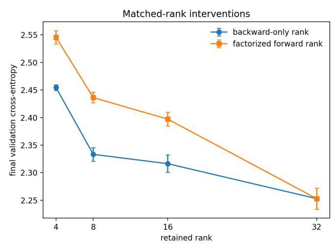
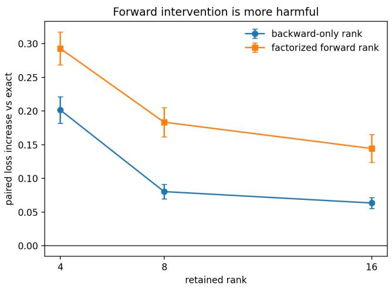
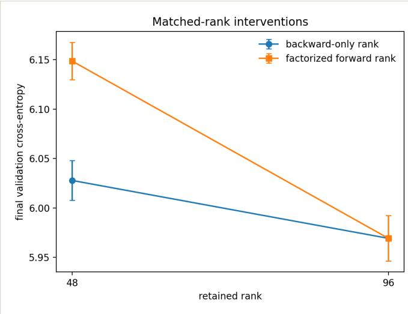
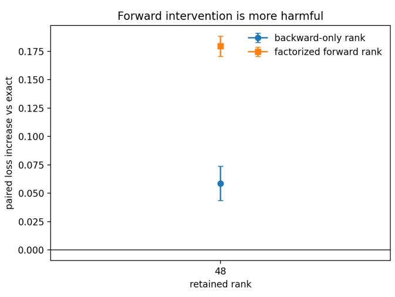

<table><tr><td>Main Findings</td><td>Do Projection Measurements Predict Learning?</td></tr><tr><td>What “Lost” Means Here</td><td>Secondary Evidence: Tested Auxiliary Feedback</td></tr><tr><td>A Clean Test of Backward Rank</td><td>Routes</td></tr><tr><td>Compact Byte-Level Language Model</td><td>What the Experiments Establish</td></tr><tr><td>Larger Subword Language Model</td><td>Relation to Earlier Work</td></tr><tr><td>Is the Remaining Logit Error Already Used?</td><td>Limits of This Study</td></tr><tr><td>SpamLang: Repeated Tokens Are Not Independent</td><td>Reproducing the Results</td></tr><tr><td>Mapping Examples</td><td>Conclusion</td></tr><tr><td>Increasing the Output Vocabulary Without Changing</td><td></td></tr><tr><td>the Text</td><td></td></tr></table>

# Does the LM Head Create a Harmful Gradient Bottleneck? A Causal Test

Anand Murugan • August 17, 2026 • Research article • A causal test of the LM‑head bottleneck claim

## IN THIS ARTICLE

## Abstract

The language-model head maps a hidden state of width � to a vocabulary of size � , so its transpose can return at most � independent directions to the Transformer. Godey and Artzi argue that this severe projection is a harmful optimization bottleneck. We separate the geometry from the causal claim. Our backward-only intervention keeps the ordinary logits and the exact LM-head parameter update while reducing only the rank of the gradient sent into the Transformer. Across five paired seeds on byte-level and BPE-8192 WikiText-2 models, reducing backward rank increases validation loss. An equally ranked factorized forward head, however, increases loss substantially more. At half rank in the larger model, the backward-only loss increase is 0.0586 (95% CI [0.0167, 0.1005]), while

the factorized forward head increases loss by 0.1795 ([0.1547, 0.2042]). The vocabularyspace residual also contributes to the ordinary LM-head update, and removing that contribution is harmful. Additional controls show that repeated-token failures are confounded by the number of independently sampled symbols, that adding never-target output classes does not impair learning, and that projection diagnostics do not reliably predict progress in our runs. Tested auxiliary feedback routes do not beat tuned backpropagation. These results confirm strong geometric compression but do not establish that it is a harmful optimization bottleneck.

The language-model head, or LM head, maps the Transformer's final hidden state to one logit for every token in the vocabulary. For hidden width � and vocabulary size $V ,$ the standard head is a trainable matrix $W \in \mathbb { R } ^ { V \times D }$ :

$$
z = W h ,
$$

where $\boldsymbol { h } \in \mathbb { R } ^ { D }$ and $z \in \mathbb { R } ^ { V }$ . Backpropagation sends the logit gradient back to the hidden state through:

$$
g _ { h } = W ^ { T } g _ { z } .
$$

The hidden-state gradient therefore depends only on the component of $g _ { z }$ in the column space of �, a subspace of dimension at most �. When $V \gg D _ { : }$ , most of the Euclidean norm of $g _ { z }$ can lie outside that subspace.

Godey and Artzi call this a gradient bottleneck. Their paper, Lost in Backpropagation: The LM Head is a Gradient Bottleneck, reports that the return path often retains only 1–5% of the logitgradient norm. In other words, 95–99% lies outside the directions that can immediately reach the final hidden state.

That geometric fact is real. The open question is what it means.

A large projection residual does not by itself show that useful learning information was destroyed. A �-dimensional state necessarily has only � local degrees of freedom. The remaining logit-space directions may be incompatible across examples, not representable by the shared model, useful through other parameters, or unimportant for reducing future loss.

This leaves two separate experimental questions:

1. If we keep the usual logits and LM-head update, but remove some directions only from the gradient sent into the Transformer, how much does training degrade?

2. If we keep standard backpropagation intact, can we compress the vocabulary-space residual, inject it into earlier Transformer layers and improve training?

The first question gives a clean causal control for the original paper's low-rank-head experiment. We compare the backward-only intervention with a low-rank forward head, separating harm caused by restricting the hidden-state gradient from harm caused by changing the decoder itself.

The second question tests the proposed remedy more directly. We tried fixed, adaptive, residual, multi-depth and meta-learned routes for the residual. None reliably improved on tuned standard backpropagation. These experiments cover several plausible encodings, but not every possible one: there is no unique way to map a high-dimensional vocabulary residual into an earlier hidden state.

Our experiments do not establish that the natural projection through the LM head is a harmful bottleneck. They show that deliberately removing directions that already reach the hidden state is harmful. They also show that reducing the rank of the forward decoder is more harmful still. The part that does not reach the current hidden state is not discarded by the whole model: it trains the LM head itself. Other evidence used to support the bottleneck—especially a repeatedtoken synthetic task—also has simpler explanations.

## Main Findings

The experiments produced six main findings:

1. The severe projection is real. When the vocabulary is much larger than the hidden state, most of the logit-gradient norm can lie outside the LM head's current feedback directions.

2. The part outside those directions is not lost to the whole model. It updates the LM-head matrix and changes the directions available on later training steps. Removing this update is very harmful.

3. Deleting directions that already reach the hidden state hurts. This result appears in both a byte-level language model and a larger subword model. It does not show that the unavailable vocabulary-space directions would help if added to the model.

4. Changing the forward decoder hurts much more than changing only the backward path. A low-rank forward-head experiment therefore does not isolate a backward bottleneck.

5. SpamLang confounds token count with independent data coverage. The task samples one symbol, repeats it across the whole sequence, and trains the model to predict that same

symbol. A 64-token sequence therefore supplies 64 loss terms, but only one independently sampled symbol sequence. When we held independent sequences per symbol fixed, increasing repetition did not change learning.

6. The geometric measurements do not reliably predict learning progress. They describe the projection, but we did not find strong evidence that they identify which models will learn faster.

Several attempts to add a separate feedback route also failed to beat ordinary, well-tuned backpropagation. Together, these results leave the proposed causal problem unproven.

## What “Lost” Means Here

Let $P _ { W }$ be the orthogonal projector onto the column space of �. We can decompose the logit gradient as:

$$
g _ { z } = P _ { W } g _ { z } + ( I - P _ { W } ) g _ { z } = g _ { \parallel } + g _ { \perp } .
$$

The orthogonal component $g _ { \perp }$ is invisible to the current hidden state:

$$
{ \cal W } ^ { T } g _ { \perp } = 0 .
$$

But it is not invisible to the LM-head parameters. Their gradient is:

$$
\frac { \partial L } { \partial W } = g _ { z } h ^ { T } .
$$

The component $g _ { \perp }$ contributes:

$$
g _ { \perp } h ^ { T } .
$$

This term is generally nonzero. It changes $W ,$ which changes both future predictions and the feedback subspace available to later examples.

The component is therefore invisible to the current hidden state, but not discarded by the training process. A local projection is not the same as information being permanently destroyed.

The original paper lowers the rank of the LM head and observes worse training.

Lowering the rank of the forward head changes several things at once:

• which token-score patterns the model can produce;

• the number and arrangement of trainable parameters;

• the decoder's conditioning; and

• the rank of the signal sent backward.

The experiment cannot tell which change caused the loss.

We built a control that changes only the last item. The model computes the ordinary full-rank logits. The LM head also receives its ordinary parameter update. Only the signal returned to the hidden state is replaced by a lower-rank version.

We used the best rank-� approximation of the current head and matched the root-mean-square magnitude of the resulting hidden gradient to the exact one. This prevents a change in gradient scale from being mistaken for a rank efect. Each arm received its own learning-rate search on seed 1 before confirmation. The final estimates use five paired seeds. Seeds 4 and 5 were registered before their results were inspected and reused every frozen hyperparameter.

We compared three cases:
<table><tr><td>FORWARD COMPUTATION</td><td>BACKWARD PATH</td><td>WHAT IT TESTS</td></tr><tr><td>ordinary full-rank head</td><td>exact gradient</td><td>normal training</td></tr><tr><td>ordinary full-rank head</td><td>lower-rank gradient</td><td>backward rank only</td></tr><tr><td>lower-rank head</td><td>its exact gradient</td><td>forward and backward changes together</td></tr></table>

The primary outcome is validation cross-entropy; lower is better. Tables report the mean ± standard error over five runs. For the main causal diferences, we also report two-sided 95% Student-� confidence intervals across paired seeds and Cohen's $d _ { z } ,$ the mean paired diference divided by its sample standard deviation. Five seeds still provide limited precision; the intervals should be read as uncertainty estimates, not asymptotic guarantees. Because seed 1 was used for learningrate selection, we also checked every comparison using only seeds 2–5.

## Relation to the Original Experiment

The original paper's main pretraining comparison uses a shared six-layer, width-4096 Transformer with about two billion parameters and 11 billion training tokens. It varies a factorized forward head from rank 32 to rank 4096 with a 49,152-token vocabulary. The paper denotes this head rank by �, while the Transformer width remains fixed at 4096.

Our experiment is not a scale reproduction of that training run. Our larger model has six layers, width 96, 2.26 million parameters, an 8,192-token vocabulary and 1.23 million supervised training tokens. Its purpose is causal identification: for each retained rank, we compare the original factorized forward intervention with a backward-only intervention that leaves the logits and LMhead update unchanged.

<table><tr><td colspan="2">ORIGINAL PRETRAINING</td><td>OUR LARGER CAUSAL CONTROL</td></tr><tr><td>PROPERTY</td><td>COMPARISON</td><td></td></tr><tr><td>Transformer layers</td><td>6</td><td>6</td></tr><tr><td>Transformer width</td><td>4,096</td><td>96</td></tr><tr><td>Parameters</td><td>about 2B</td><td>2.26M</td></tr><tr><td>Vocabulary</td><td>49,152</td><td>8,192</td></tr><tr><td></td><td></td><td>1.23M per run</td></tr><tr><td>Training tokens</td><td>about 11B</td><td></td></tr><tr><td>Intervention</td><td>factorized forward head</td><td>factorized forward and backward-only</td></tr><tr><td>Paired seeds reported here</td><td></td><td>5</td></tr></table>

The original experiment establishes that lower-rank forward heads train worse at large scale. It does not isolate whether that loss comes from the backward channel, the decoder's forward parameterization, or both. Our experiment isolates that distinction at small scale; it does not establish that the same efect sizes hold for billion-parameter models.

## Compact Byte‑Level Language Model

The first experiment uses a byte-level WikiText-2 model with four Transformer layers, hidden width 32 and 600 training steps.

<table><tr><td>FORWARD COMPUTATION</td><td>BACKWARD RANK</td><td>VALIDATION LOSS</td><td>INCREASE OVER ORDINARY TRAINING</td></tr><tr><td></td><td></td><td></td><td></td></tr><tr><td>ordinary head ordinary head</td><td>32</td><td> $2 . 2 5 3 0 \pm 0 . 0 1 9 2$ </td><td>+0.0634</td></tr><tr><td>ordinary head</td><td>16</td><td> $2 . 3 1 6 4 \pm 0 . 0 1 5 8$ </td><td></td></tr><tr><td>ordinary head</td><td>8</td><td> $2 . 3 3 3 3 \pm 0 . 0 1 2 3$ </td><td>+0.0804</td></tr><tr><td>rank-16 forward head</td><td>4</td><td> $2 . 4 5 4 5 \pm 0 . 0 0 5 2$ </td><td>+0.2016</td></tr><tr><td>rank-8 forward head</td><td>16</td><td> $2 . 3 9 7 2 \pm 0 . 0 1 2 5$ </td><td>+0.1443</td></tr><tr><td></td><td>8</td><td> $2 . 4 3 6 3 \pm 0 . 0 0 9 6$ </td><td>+0.1834</td></tr><tr><td>rank-4 forward head</td><td>4</td><td> $2 . 5 4 5 8 \pm 0 . 0 1 2 0$ </td><td>+0.2928</td></tr></table>

Removing directions from the backward path made training worse. The efect grew as more directions were removed.

But changing the forward head was consistently worse than changing only the backward path. The direct paired diference between the forward and backward-only interventions was +0.0808 at rank $1 6 , + 0 . 1 0 3 0$ at rank 8 and +0.0913 at rank 4. All 15 paired comparisons had the predicted sign, and the 95% intervals for the three diferences excluded zero.

<table><tr><td rowspan="2">RANK</td><td colspan="2">BACKWARD-ONLY MINUS EXACT,</td><td colspan="2">FORWARD MINUS BACKWARD-ONLY, 95%</td></tr><tr><td>95% Cl</td><td> $d _ { z }$ </td><td></td><td>Cl  $d _ { z }$ </td></tr><tr><td>16</td><td>+0.0634 [0.0413, 0.0856]</td><td>3.55</td><td>+0.0808 [0.0303, 0.1313]</td><td>1.99</td></tr><tr><td>8</td><td>+0.0804 [0.0503, 0.1104]</td><td>3.32</td><td>+0.1030 [0.0538, 0.1522]</td><td>2.60</td></tr><tr><td>4</td><td>+0.2016 [0.1469, 0.2562]</td><td>4.58</td><td>+0.0913 [0.0569, 0.1256]</td><td>3.30</td></tr></table>

The rank-32 backward control reproduced ordinary backpropagation exactly. This checked that the custom backward operation did not change the forward pass or the LM head's own update.

  
This experiment shows that directions already present in the hidden gradient matter. It does not show that directions outside this 32-dimensional space would help the model. Those are diferent claims.

## Larger Subword Language Model

We repeated the main comparison with a BPE-8192 model with six Transformer layers, hidden width 96, about 2.26 million parameters and 1,200 training steps.

<table><tr><td colspan="3">FORWARD COMPUTATION</td><td>INCREASE OVER ORDINARY TRAINING</td></tr><tr><td></td><td>RANK</td><td>VALIDATION LOSS</td><td></td></tr><tr><td>ordinary head and exact gradient ordinary head and lower-rank gradient</td><td>96</td><td> $5 . 9 6 9 2 \pm 0 . 0 2 3 0$ </td><td></td></tr><tr><td></td><td>48</td><td> $6 . 0 2 7 8 \pm 0 . 0 2 0 1$ </td><td>+0.0586</td></tr><tr><td>rank-48 forward head and exact</td><td>48</td><td> $6 . 1 4 8 7 \pm 0 . 0 1 9 0$ </td><td>+0.1795</td></tr><tr><td>gradient</td><td></td><td></td><td></td></tr></table>

The result followed the same pattern. Removing half the directions from the backward path caused a modest loss increase: +0.0586, with 95% CI $[ + 0 . 0 1 6 7 , + 0 . 1 0 0 5 ]$ and paired $d _ { z } = 1 . 7 4$ Reducing the forward rank caused an increase of $+ 0 . 1 7 9 5 \ : ( [ + 0 . 1 5 4 7 , + 0 . 2 0 4 2 ] , d _ { z } = 9 . 0 0 )$ . The forward head was worse than the backward-only intervention by $+ 0 . 1 2 0 9 \ ( [ + 0 . 0 8 4 8 , + 0 . 1 5 6 9 ]$ $d _ { z } = 4 . 1 6 )$ . Every paired diference had the predicted sign across all five seeds.

The four-seed sensitivity analysis that excludes the learning-rate screening seed preserves the sign and ordering of every comparison. Its 95% interval for forward minus backward-only remains above zero: $[ + 0 . 0 7 4 4 , + 0 . 1 7 5 6 ]$ . The smaller backward-only penalty has a wider interval of $[ - 0 . 0 0 4 6 , + 0 . 1 1 0 8 ]$ . We therefore regard the forward-versus-backward distinction as the stronger result and the standalone half-rank backward penalty as less precisely estimated in this model.

For practical reasons, the lower-rank backward matrix was recalculated every 20 training steps in this experiment rather than every step. It was computed from a $9 6 \times 9 6$ matrix, not by decomposing the full vocabulary matrix.

The larger experiment supports a narrow conclusion: deleting an existing hidden-gradient direction can be harmful. It still does not show that the much larger logit-space residual contains an improvement that the shared model could use.

## Is the Remaining Logit Error Already Used?

We next tested the part of the logit error that does not reach the current hidden state.

Ordinary training uses this part to update the LM head. We removed it only from the head update while keeping the exact hidden-state gradient. We again matched the update size and searched the learning rate separately. This secondary comparison retains the original three paired seeds.

<table><tr><td>HEAD UPDATE</td><td>VALIDATION LOSS</td><td>INCREASE OVER ORDINARY TRAINING</td></tr><tr><td>complete logit gradient</td><td> $2 . 2 6 2 1 \pm 0 . 0 3 2 1$ </td><td></td></tr><tr><td>projected logit gradient only</td><td> $2 . 8 8 7 3 \pm 0 . 0 5 3 6$ </td><td>+0.6252</td></tr><tr><td></td><td></td><td></td></tr></table>

Removing the orthogonal component from the head update was the most damaging intervention in the compact study.

This result does not show that the component should also be sent into the Transformer. It shows something simpler: ordinary training already uses it. The component changes the token vectors in the head and rotates the feedback directions available to later examples. Describing its full length as destroyed by the model is therefore inaccurate.

## SpamLang: Repeated Tokens Are Not Independent Mapping Examples

The original paper also studies a synthetic task called SpamLang. To construct one training sequence, it:

1. samples one vocabulary symbol �; and

2. repeats � at every position in the sequence.

The language model must predict the next token, which is also �. For sequence length �, one example is therefore:

$$
\mathrm { i n p u t } = ( x , x , \ldots , x ) , \qquad \mathrm { t a r g e t } = ( x , x , \ldots , x ) .
$$

The model is therefore learning a token-identity relation over the vocabulary. A larger vocabulary creates more token identities to learn.

The paper counts every position as another occurrence of the symbol. That count is correct as a count of supervised tokens, but not as a count of independently sampled symbol sequences. All positions in one sequence repeat the same identity relation � ↦ �.

For example, a length-64 sequence supplies 64 cross-entropy terms for the same token, but it does not expose the model to 64 independently sampled symbols.

For our controlled exposure test, we replaced the identity target with a fixed shufled mapping $x \mapsto \pi ( x )$ . This removes the shortcut of copying the input token while preserving SpamLang's sampling and repetition pattern. In the embedding-plus-linear model used for this test, the 64 repeated terms produce copies of the same gradient contribution, apart from loss scaling.

First, we fixed the number of independently drawn examples at four per symbol:

<table><tr><td colspan="2">SEQUENCE INDEPENDENT DRAWS PER</td><td colspan="2">COUNTED TOKEN</td></tr><tr><td>LENGTH</td><td>SYMBOL</td><td>OCCURRENCES</td><td>VALIDATION LOSS</td></tr><tr><td>1</td><td>4</td><td>4</td><td> $4 . 4 4 5 5 \pm 0 . 0 2 9 4$ </td></tr><tr><td></td><td></td><td></td><td> $4 . 4 4 5 5 \pm 0 . 0 2 9 4$ </td></tr><tr><td>64</td><td>4</td><td>256</td><td></td></tr></table>

The two five-run results were the same. Within each matching seed, their training paths agreed to numerical precision. Repetition increased the number of supervised positions from 4 to 256 per symbol without adding another independently sampled mapping example.

We then fixed the total number of supervised token positions at 131,072:

<table><tr><td colspan="4"></td></tr><tr><td>SEQUENCE LENGTH</td><td>INDEPENDENT DRAWS PER SYMBOL</td><td>COUNTED TOKEN OCCURRENCES</td><td>VALIDATION LOSS</td><td>ACCURACY</td></tr><tr><td>1</td><td>128</td><td>128</td><td>0.0296 ± 0.0032</td><td>100.0%</td></tr><tr><td>64</td><td>2</td><td>128</td><td>6.1229 ± 0.0359</td><td>26.6%</td></tr><tr><td></td><td></td><td></td><td></td><td></td></tr></table>

Both conditions reported the same 128 supervised positions per symbol. With sequence length 1, those positions came from 128 independently sampled sequences. With sequence length 64, they came from only two sequences. The first condition solved the task; the second did not.

At the original paper's largest setting, 41 million token positions, sequence length 64 and vocabulary size 131,072 provide only about 4.9 independently sampled sequences per symbol:

$$
{ \frac { 4 1 , 0 0 0 , 0 0 0 } { 6 4 \times 1 3 1 , 0 7 2 } } \approx 4 . 9 .
$$

The reported figure of roughly 300 occurrences per symbol counts the repeated positions. It does not mean that the model saw roughly 300 independent examples of each mapping.

The large-vocabulary setting therefore changes more than the proposed gradient geometry: it leaves very few independently sampled sequences for each symbol. This is a direct alternative explanation for the failure.

Repeated positions can still afect a contextual Transformer's activations and optimization, so they are not always computationally equivalent to one position. The narrower point is statistical: they do not provide independent coverage of the symbol-to-symbol mapping. SpamLang must control this coverage before its failure can be attributed to the LM-head gradient path.

## Increasing the Output Vocabulary Without Changing the Text

Changing vocabulary size usually changes tokenization, token frequency, sequence length and the number of examples seen for each token. These changes make it dificult to isolate the efect of $V / D$

We used a simpler control. The input remained byte-level text with the same 256 possible input bytes. We added output classes that were never correct targets. This increased the size of the softmax while leaving the text, targets, input embeddings, Transformer, batch order and number of training tokens unchanged.

<table><tr><td>OUTPUT CLASSES</td><td>HIDDEN WIDTH</td><td>VALIDATION LOSS</td></tr><tr><td>256</td><td>32</td><td>2.2591 ± 0.0296</td></tr><tr><td>1,024</td><td>32</td><td>2.2532± 0.0161</td></tr><tr><td>4,096</td><td>32</td><td>2.2642 ± 0.0110</td></tr></table>

Increasing � /� sixteenfold did not make the tuned model worse. A second test with hidden width 64 gave the same result for one seed: loss was 2.2336 with 256 output classes and 2.2322 with 4,096 output classes.

Never-correct output classes are not the same as a natural larger tokenizer. This experiment does not show that vocabulary size never matters. It shows that the number of output choices, and the competition among those choices, did not create the predicted optimization problem in this controlled setting.

## Do Projection Measurements Predict Learning?

A useful bottleneck measurement should do more than change when � /� changes. It should help predict which training runs will improve.

After the five-seed extension, we collected measurements from 894 usable saved training points across 37 experimental conditions. These included:

• how much logit-gradient norm survives the projection;

• the angle between the original and projected signals;

• how well the target token and strongest competing token are preserved;

• the number and strength of the logit gradient's main directions; and

• the condition number of the LM head, which measures numerical imbalance across directions.

We first predicted learning from ordinary information such as current loss, training progress, learning rate, model width, dataset and experimental method. We then added one projection measurement and tested on an experimental condition left out during fitting.

Adding retained gradient length reduced the prediction error for final loss by 8.2%, but its 95% uncertainty interval ranged from a 23.0% improvement to a 3.4% worsening. For the next interval of learning, the estimated improvement was 3.1%, with an interval from 11.7% better to 5.0% worse. The other measurements were similarly uncertain or unhelpful.

These results do not prove that the measurements contain no useful information. They show that, in our runs, none reliably predicted short-term learning once basic experimental diferences were taken into account.

## Secondary Evidence: Tested Auxiliary Feedback Routes

These experiments are secondary to the backward-only causal test. We also tested the direct engineering idea suggested by the bottleneck claim: keep or replace the ordinary LM-head gradient with a separately designed return path.

The tested methods included:

• a fixed random return matrix;

• a matrix that adapted to the largest recent logit-gradient directions;

• an extra route carrying the part not returned by the ordinary head;

• several routes entering diferent Transformer depths;

• extra prediction losses at intermediate layers; and

• a one-step meta-learned route optimized on a fresh batch.

Some methods learned successfully. Some helped when the ordinary model's learning rate was poorly chosen. None gave a reliable improvement over ordinary backpropagation after learning rates were tuned and results were repeated. The meta-learned route produced a small one-step gain, but a 10% increase in the ordinary SGD learning rate produced a larger gain. It therefore did not isolate a useful new source of credit.

The adaptive method is especially instructive. It tracked directions with the largest recent squared gradient. Those are the directions that best reconstruct the logit gradient under Euclidean norm. But high variance in logit space does not imply a useful descent direction after the signal is mapped back to shared model parameters. Tracking the dominant modes therefore made mathematical sense without producing better optimization.

This is a negative result for the methods we tested, not for every possible feedback design. A different architecture or learning rule could still help.

## What the Experiments Establish

The evidence supports the following statements:

1. logit gradients collected across a batch can span many more directions than the hidden width;

2. only a small part of their Euclidean norm may reach the current final hidden state;

3. deleting directions that already reach that state makes training worse;

4. restricting the forward decoder is more damaging than an equal restriction applied only during the backward pass;

5. the remaining logit error strongly trains the LM head itself; and

6. repeated positions are not a substitute for independent symbol examples.

The experiments do not establish these stronger statements:

1. the full logit-gradient remainder is a useful update for the Transformer;

2. the Transformer could follow that remainder while preserving useful sharing across diferent pieces of text;

3. the LM head causes the large-vocabulary synthetic failure;

4. retained gradient length measures retained learning value; or

5. a wider or separate feedback path would improve ordinary language-model training.

The distinction is between geometry and causation. The projection exists. Its harm has not been demonstrated.

## Relation to Earlier Work

Other research has shown that neural networks can learn with approximate return signals.

Feedback alignment replaces the exact transpose of each forward matrix with a fixed random matrix. Direct feedback alignment sends output errors directly to earlier layers. These results show that exact symmetry is not always required for learning. They do not show that an approximate signal is better than the exact gradient when the exact gradient is available.

Synthetic gradients use a learned model to predict a later gradient. Their main purpose is to let diferent parts of a network train without waiting for one another. Deep supervision gives intermediate layers their own prediction losses. This changes the model's training objective as well as its backward path.

Online methods such as Oja's rule and Frequent Directions track the main directions in a stream of data. They are natural tools for compressing recent logit gradients. Their goal is accurate reconstruction, however, not necessarily the best future parameter update.

Methods such as PowerSGD compress parameter gradients for distributed communication. This happens after the model has produced an update that can be expressed in its parameter space. It is diferent from treating an unconstrained vocabulary-space residual as supervision that the shared model should follow.

## Limits of This Study

The largest model in this study has about 2.26 million parameters, six layers and hidden width 96. It trained for 1.23 million supervised tokens in the causal experiment. The results do not establish what happens in models with billions of parameters or during long pretraining runs.

The larger backward-only experiment recalculated its lower-rank approximation every 20 steps.   
Updating it every step could produce a diferent result.

The added-output-class experiment cleanly changes output dimension, but it is not a natural tokenizer comparison. Natural tokenizers also change the data seen by the model.

The prediction study contains many related small-model runs. Saved training points from the same run are not independent observations, and the uncertainty intervals remain wide.

Most importantly, failing to find a better feedback method does not prove that none exists. The bottleneck claim would gain stronger support if a route for the unavailable logit error kept the model's predictions unchanged yet reliably beat exact backpropagation across learning rates, seeds, tasks and model sizes. Its gain should also grow in a predictable way with the severity of the measured projection.

## Reproducing the Results

The public GitHub repository includes the code, frozen configurations, data recipe, tests, figures and filtered per-run aggregate results used in this article. Prepared corpora, checkpoints, stepby-step logs and machine environment captures are omitted because they are large generated artifacts. A separate source manifest records the origin and checksum of every included result table.

The main files are:

• frozen experimental choices: docs/PROTOCOL\_LOCK.md;

• commands and the result evidence map: docs/REPRODUCIBILITY.md;

• causal experiment runner: src/bottleneck/response\_pilot.py;

• synthetic exposure runner: src/bottleneck/response\_synthetic.py;

• controlled output-size runner: src/bottleneck/response\_vocab.py;

• prediction analysis: src/bottleneck/response\_predictive.py; and

• dataset sources and checksums: data/README.md.

The release verifier checks result checksums and scans for accidental local paths, credentials, corpora and checkpoints:

uv run python scripts/verify\_release.py

The test suite checks that the forward computation stays unchanged in the backward-only intervention, that full-rank custom feedback matches ordinary backpropagation, and that data generation is repeatable.

## Conclusion

The LM head maps a small internal state to a much larger vocabulary. Its return path can therefore carry only a small part of an arbitrary vocabulary-space error. This is a real and sometimes severe projection.

But a severe projection is not enough to establish a harmful bottleneck.

The part that does not reach the current hidden state still trains the LM head. Reducing only the backward rank hurts, but reducing the forward decoder at the same rank hurts much more. The repeated-token task is largely explained by how few independent symbols the model observes. Increasing output dimension alone does not reproduce the claimed failure. Measurements of retained gradient length do not reliably predict learning progress, and the separate feedback routes we tested do not improve tuned training.

The current evidence therefore supports a limited conclusion: the LM head strongly compresses the immediate error returned to the final hidden state, but it has not been shown to discard useful learning information in a way that limits language-model optimization or performance.

That leaves a clear standard for future work. A convincing bottleneck result should hold the forward model fixed, provide a route for the missing signal that produces an update expressible in the model's parameter space, improve actual training rather than only a geometric score, and repeat across model sizes and tasks.

## Acknowledgements

This project was directed by Anand Murugan and developed in collaboration with OpenAI Codex using GPT-5.6-Sol. Codex contributed to experimental design, implementation, statistical analysis, literature review, reproducibility work and manuscript development. Anand Murugan made the research decisions, reviewed the evidence and takes responsibility for the claims and conclusions.

## References

• Godey, N. and Artzi, Y. Lost in Backpropagation: The LM Head is a Gradient Bottleneck, 2026.

• Lillicrap, T. et al. Random Synaptic Feedback Weights Support Error Backpropagation for Deep Learning.

• Nøkland, A. Direct Feedback Alignment Provides Learning in Deep Neural Networks.

• Jaderberg, M. et al. Decoupled Neural Interfaces Using Synthetic Gradients.

• Lee, C.-Y. et al. Deeply-Supervised Nets.

• Oja, E. Simplified Neuron Model as a Principal Component Analyzer.

• Vogels, T. et al. PowerSGD: Practical Low-Rank Gradient Compression for Distributed Optimization.

• Ghashami, M. et al. Frequent Directions: Simple and Deterministic Matrix Sketching.