# Every Coin Has Two Sides: On the Dual Nature of Generalization in On-Policy Distillation of Large Language Models

Zhaoyi Li1,3,∗, Deyang Kong2,3,∗, Yuan Wei3,∗, Evan Yang3, Ranran Shen1, Mahardika Krisna Ihsani4, Ming Yang3, Wei Zhang3, Chuan Hao3, Jian Yang3, Ran Tao3, Bryan Dai3, Shikun Zhang2, Wei Ye2, Ying Wei5, Defu Lian1 1University of Science and Technology of China, 2Peking University, 3IQuest Research, 4MBZUAI, 5Zhejiang University ∗Equal Contribution lizhaoyi777@mail.ustc.edu.cn, kong.deyang@foxmail.com

## Abstract

On-policy distillation (OPD) transfers teacher capabilities by supervising trajectories sampled from the student’s own policy, yet its generalization behavior remains poorly understood, as most studies evaluate OPD on a single domain and on benchmarks close to the training data. We present a controlled study that varies one generalization factor at a time, from in-domain distribution shifts to cross-domain transfer and the multi-teacher setting. We find that OPD transfers a teacher’s reasoning behavior rather than its answers to particular problems: training dificulty barely matters, and even problems the teacher never solves are useful. Transfer depends strongly on the origin relationship between teacher and student: same-origin pairs bring the student close to the teacher across languages, reasoning horizons, and even other domains, whereas cross-origin pairs mostly fit the trained distribution. This broad reach is a double-edged sword: since routing prompts to domain experts cannot confine each teacher’s influence, combining them yields a mixture-dependent seesaw among their capabilities. These results clarify when OPD generalizes and ofer a useful perspective for diagnosing multi-teacher OPD.

## 1. Introduction

On-policy distillation (OPD) [1] has become increasingly important for transferring capabilities from strong teacher models to smaller or less capable students during large language model post-training [14, 50, 52]. Unlike conventional ofline distillation, OPD samples trajectories from the student’s current policy and queries the teacher on states that the student actually visits. The resulting supervision therefore reduces the exposure bias [35] between the training trajectories and the student’s own generation behavior. Most existing studies evaluate OPD in a single training domain and on benchmarks closely related to the training data. Such evaluations establish that OPD can improve target-task performance, but they do not distinguish local fitting from broader policy transfer [8], a distinction critical for both understanding the mechanisms of OPD [28] and designing efective multi-teacher integration strategies [39]. In particular, it remains unclear how OPD behaves when training and evaluation difer in language, reasoning horizon or task domain.

To fill this gap, we conduct a controlled study that varies one generalization factor at a time while holding the remaining conditions fixed, and organize it around three questions of increasing scope. RQ1: How robust is OPD to in-domain distribution shifts? Within a fixed domain (math), we study two aspects. First, we examine how the relative dificulty [6, 59, 62] of the training problems, measured by the teacher’s and the student’s pass rates, afects the transfer of the teacher’s in-domain performance [20, 62]. Second, keeping the domain fixed but shifting the evaluation distribution, in language [32, 48] (English→Chinese) and reasoning horizon [36, 47] (short→long-horizon composed problems), we examine how well the teacher’s performance transfers under such shifts. For RQ1, OPD is largely insensitive to training-problem dificulty: problems the teacher never solves are as useful as those it always solves, suggesting OPD conveys the teacher’s reasoning patterns rather than answers to particular problems. The transferred ability also holds up under the evaluation shifts: training only on English short-horizon math still improves the student on Chinese and long-horizon math. RQ2: To what extent does OPD transfer across domains? We ask whether supervision from math prompts improves the student on code and science, whether prompts from other domains transfer back to math, and how model origin shapes this transfer [37]. For RQ2, OPD transfers a teacher’s ability beyond the domain of its training prompts in both directions, but this transfer holds mainly for same-origin pairs, which bring the student close to the teacher’s level across domains, whereas cross-origin pairs improve the student mainly on the trained distribution and can transfer less than a weaker same-origin teacher. RQ3: What does cross-domain transfer imply for multi-teacher OPD (MOPD)? MOPD [39] routes each prompt to a domain expert, seemingly isolating their contributions. We ask whether this holds, given that each teacher’s influence extends beyond its assigned domain. For RQ3, this same transfer has a cost: because routing does not keep a teacher’s influence within its assigned domain, combining experts in MOPD produces a mixture-dependent seesaw among their capabilities rather than independently combining domain skills. The generalization that is a blessing in single-teacher OPD is thus also what makes MOPD hard to control, two sides of the same coin, and the seesaw ofers a useful perspective for diagnosing MOPD.

Taken together, our findings suggest a unified picture. (1) OPD transfers the teacher’s reasoning behavior rather than solutions to particular problems: in domain, training dificulty barely matters, and even problems the teacher never solves are as useful as those it always does. (2) The reach of this transfer is afected by the origin relationship between teacher and student. A same-origin teacher moves the student close to its own level across languages, horizons, and even other domains, whereas a cross-origin teacher afects the student mainly on the trained distribution and can transfer less than a weaker same-origin teacher. (3) This broad transfer is a doubleedged sword: because each teacher influences capabilities beyond its assigned domain, prompt routing cannot fully isolate teacher efects in MOPD. Combining experts therefore produces a mixture-dependent capability seesaw, ofering a useful perspective for diagnosing MOPD.

## 2. Preliminaries and Experiment Settings

In this section, we discuss some preliminaries and basic experimental settings of this work. Please see Appendix A for the full version of the related work.

OPD and MOPD Let � denote a prompt sampled from the training dataset D, �� and $\pi _ { \phi }$ the student and teacher policies, $y = \{ y _ { t } \} _ { t = 1 } ^ { T }$ a student-generated response, and $h _ { t } = ( x , y _ { < t } )$ the context at step �. On-Policy Distillation (OPD) samples on-policy trajectories from the student policy $\pi _ { \theta }$ and obtains dense token-level supervision from the teacher policy $\pi _ { \phi }$ . The student is optimized by minimizing $\mathcal { L } _ { \mathrm { O P D } } ( \theta )$ , the reverse KL divergence between the student and teacher [15]:

$$
\underset { \substack { y \sim \pi _ { \theta } ( \cdot | x ) } } { \mathbb { E } } \left[ \frac { 1 } { T } \sum _ { t = 1 } ^ { T } D _ { \mathrm { K L } } \left( \pi _ { \theta } ( \cdot \mid h _ { t } ) \parallel \pi _ { \phi } ( \cdot \mid h _ { t } ) \right) \right] .
$$

In practice [14, 50, 52], the reverse KL is estimated by a sampled-token $k _ { 1 }$ approximation [46], so that $\mathcal { L } _ { \mathrm { { O P D } } } ( \theta )$ can be written as a reinforcement-learning objective (i.e., Policy-Gradient (PG) style OPD):

$$
\mathcal { L } _ { \mathrm { O P D } } ^ { \mathrm { P G } } ( \theta ) = - \mathbb { E } _ { x , y } \left[ \frac { 1 } { T } \sum _ { t = 1 } ^ { T } \bar { A } _ { t } ^ { \mathrm { O P D } } \log \pi _ { \theta } ( y _ { t } \mid h _ { t } ) \right] , \widehat { A } _ { t } ^ { \mathrm { O P D } } = s \mathrm { g } \left[ \log \pi _ { \phi } ( y _ { t } \mid h _ { t } ) - \log \pi _ { \theta } ( y _ { t } \mid h _ { t } ) \right] ,
$$

where sg[·] denotes the stop-gradient. We adopt PG-style OPD throughout: a token is reinforced when the teacher assigns it higher probability than the student, and suppressed otherwise. Multi-Teacher On-Policy Distillation (MOPD) [39] is a natural extension of OPD and now a standard post-training paradigm [50, 52, 55] for integrating capabilities from multiple domains: the student samples from its own rollouts, each prompt is routed to its corresponding domain teacher, and the optimization procedure is identical to single-teacher OPD.

Same/Cross-Origin OPD Following Ma et al. [39], we call an OPD run same-origin when the teacher and student derive from the same base model (typically the student is an SFT checkpoint and the teacher is obtained through RL post-training on that same checkpoint) and cross-origin when they derive from diferent base models. Our experiment shows that the two settings exhibit significantly diferent generalization behaviors. Our teachers include Qwen3-32B [57], Light-R1-14B [54], Polaris-7B/4B [3], OpenMath-Nemotron-1.5B/7B [43], JustRL-DeepSeek 1.5B (JustRL-1.5B) [17], Nemotron-Research-Reasoning-Qwen-1.5B (Nemotron-1.5B) [33], DeepScaleR-1.5B [49] and VibeThinker-1.5B [56], and our students include DeepSeek-R1- Distill-Qwen-14B/7B/1.5B (DS-distill-14B/7B/1.5B) [16], Qwen3-8B-SFT [35] and Qwen3- 4B [57]1. Due to the page limit, we only show part of the results in the main text. Additional results are shown in Appendix C.

In/Cross-Domain Generalization We investigate OPD generalization from two aspects. (1) Indomain generalization: OPD training and evaluation lie in the same task domain, and we shift the evaluation distribution relative to training in terms of problem dificulty, language, and reasoning horizon. (2) Cross-domain generalization: the student is trained on prompts from one domain (e.g., math) and evaluated on other domains (e.g., code or science). We study four domains: math, code, science, and instruction following (IF). For math, we train on BigMath by default and evaluate three distributions: English Math (AMC2023 [41], MATH-500 [19], AIME2025 [40], AIME2026 [40], BeyondAIME [5], OlymMATH-Hard [48]) as the primary evaluation benchmarks, Chinese Math (OlymMATH-ZH [48], LiveMathBench-ZH [32]) for the language shift (generalizing from English to Chinese), and Long-Horizon Math (the AIME24-Horizon-2 and AMC23-Horizon-4 subsets [36], generalizing to problems that require more reasoning steps [30, 47]). For code, we train on DeepCoder-Preview-Dataset [38] and evaluate on LiveCodeBench [23]; for science, we train on TextbookReasoning [11] and SCP-116K [34] and evaluate on GPQA-Diamond [44]; for IF, we train on Nemotron-Post-Training-IF [4] and evaluate on IF-Eval [63]. More information about the training and evaluation datasets is shown in Appendix B.1

## 3. In-Domain Generalization

We begin with the most basic form of generalization, where OPD training and evaluation stay in the same domain (math) but their distributions difer. We first ask whether the dificulty of the training problems, measured by the teacher’s and the student’s pass-rates, afects the in-domain

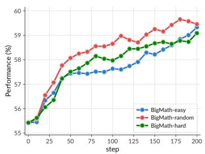  
(a) Qwen3-32B → Qwen3-8B-SFT

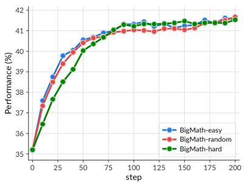  
(b) Polaris-7B → DS-distill-1.5B

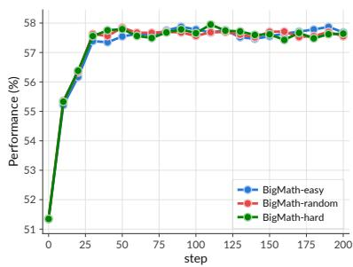  
(c) Polaris-7B → DS-distill-7B  
Figure 1. In-domain math accuracy (average over six English benchmarks) is insensitive to the dificulty of the training problems, measured by the teacher’s pass-rate. Each figure compares three BigMath subsets: easy (pass-rate = 1, teacher solves all four rollouts), hard (pass-rate = 0, teacher solves none), and random (randomly sampled from the whole set). The three subsets converge to nearly identical final accuracy across all teacher–student pairs.

generalization of OPD (Sec. 3.1). We then ask whether the ability acquired on English math problems generalizes to Chinese and longer-horizon problems, and how model origin shapes these behaviors (Sec. 3.2).

## 3.1. Training-Problem Dificulty

We measure problem dificulty from two sides: the teacher’s pass-rate, a fixed dificulty estimate available before training, and the student’s pass-rate, a dynamic signal that evolves during training.

Teacher pass-rate. To study how teacher-end pass-rate afects the in-domain generalization of OPD, we sample four teacher responses per BigMath problem and form three subsets of 25K problems each: easy (pass-rate = 1), hard (pass-rate = 0), and random (randomly sampled from the whole set), keeping all other conditions fixed. As Figure 1 shows, the three subsets converge to nearly identical final accuracy across all teacher–student pairs. This demonstrates that OPD teaches student models the teachers’ reasoning patterns rather than the correct answers to particular problems, so a teacher can still supply informative token-level supervision on problems it cannot solve end to end [6]. We also conduct experiments with extremely easy problems (grade-school GSM8K) and dificult problems (the hardest slice of DeepMath-103K), which gives the similar observation: training on these data still recovers over 80% of the OPD gain of the default BigMath-random (Fig. 8 in Appendix C). Teacher-side filtering by dificulty therefore makes little diference.

Takeaway: OPD transfers a teacher’s reasoning behavior, not its answers to particular problems. Within math, the dificulty of the training problems, measured by the teacher’s pass rate, has little efect on in-domain generalization: problems the teacher never solves are as useful as those it always solves, and even grade-school problems recover most of the OPD gain.

Student pass-rate. We test two pairs, Polaris-7B → DS-distill-1.5B and Light-R1-14B → DSdistill-7B, both on the random subset of BigMath. For each problem we sample four student responses and compare three strategies against the no-filtering baseline: keeping only fully unsolved problems (pass-rate = 0), only fully solved problems (pass-rate = 1), or discarding only fully solved problems (pass-rate ∈ [0, 1)). As Table 1 shows, restricting to either extreme does not help, whereas dynamically discarding only the problems the student already solves gives a small but consistent gain for both pairs. The result is intuitive: once the student reliably solves a problem, the teacher should not keep realigning its reasoning there. In summary, OPD’s in-domain generalization is largely insensitive to training-problem dificulty.

Table 1. Generalization performance of OPD with student-side dynamic sampling across six math benchmarks. Discarding only the problems the student already solves (pass-rate ∈ [0, 1)) gives the best average performance. Green/red mark per-benchmark gains/drops relative to the w.o. dynamic sampling baseline.
<table><tr><td>Filtering Strategy</td><td>AMC2023</td><td>MATH500</td><td>AIME2025</td><td>AIME2026</td><td>BeyondAIME</td><td>OlymMATH-Hard</td><td>Average</td></tr><tr><td colspan="8">Teacher: Polaris-7B, Student: DS-distill-1.5B</td></tr><tr><td>w/o dynamic sampling</td><td>80.4%</td><td>89.5%</td><td>30.2%</td><td>30.1%</td><td>13.6%</td><td>4.7%</td><td>41.4%</td></tr><tr><td>pass-rate = 0</td><td>78.8%</td><td>90.1%</td><td>30.5%</td><td>30.0%</td><td>14.7%</td><td>4.4%</td><td>41.4%</td></tr><tr><td>pass-rate = 1</td><td>79.9%</td><td>89.7%</td><td>30.9%</td><td>28.9%</td><td>14.7%</td><td>4.0%</td><td>41.4%</td></tr><tr><td>pass-rate ∈ [0, 1)</td><td>80.9%</td><td>89.8%</td><td>31.2%</td><td>31.1%</td><td>13.7%</td><td>5.4%</td><td>42.0%(+0.6 pp)</td></tr><tr><td colspan="8">Teacher: Light-R1-14B, Student: DS-distill-7B</td></tr><tr><td>w.o. dynamic sampling</td><td>91.7%</td><td>95.0%</td><td>42.8%</td><td>49.7%</td><td>26.5%</td><td>8.7%</td><td>52.4%</td></tr><tr><td>pass-rate = 0</td><td>92.1%</td><td>94.3%</td><td>40.2%</td><td>50.3%</td><td>28.2%</td><td>7.8%</td><td>52.1%(-0.3 pp)</td></tr><tr><td>pass-rate = 1</td><td>92.3%</td><td>94.5%</td><td>42.2%</td><td>48.7%</td><td>28.0%</td><td>8.0%</td><td>52.2%(-0.2 pp)</td></tr><tr><td>pass-rate ∈ [0, 1)</td><td>92.1%</td><td>95.4%</td><td>43.2%</td><td>50.6%</td><td>28.0%</td><td>7.5%</td><td>52.8%(+0.4 pp)</td></tr></table>

Takeaway: Dynamically discarding problems the student already solves (i.e., pass-rate = 0) gives a small but consistent improvement, indicating that a teacher should not keep realigning reasoning the student has mastered.

## 3.2. Generalization across Language and Reasoning Horizon

We ask whether the acquired reasoning ability generalizes to two shifted distributions: (1) the training data are English math problems while the evaluation data are Chinese math problems; (2) the training problems are originally atomic and short-horizon, while the evaluation problems are long-horizon [10, 36, 47], formed by composing multiple math problems together; this probes systematic generalization. We evaluate two students, DS-distill-1.5B/7B, each paired with a same-origin and a cross-origin teacher, all trained on BigMath-random. Figure 2 shows that OPD improves not only the in-distribution English math performance but also the Chinese and long-horizon distributions. Training on English data alone raises Chinese math accuracy, so the acquired ability is not tied to the surface language of the training problems; gains also appear on the long-horizon benchmarks, whose problems require long-horizon reasoning and propagating intermediate answers across sub-problems, a structure absent from the training data. However, the size of these gains difer markedly between the same- and cross-origin teachers, which we examine next.

The Role of Model Origin. For each student, we compare OPD generalization under same-origin and cross-origin teachers (e.g., for DS-distill-1.5B, JustRL-1.5B is the same-origin teacher while Polaris-7B is the cross-origin teacher) in Figure 2. Two observations stand out. First, a stronger teacher does not result in a stronger student: same-origin teachers are much more efective than cross-origin teachers. For instance, in the 7B panel the cross-origin Light-R1-14B has clearly higher standalone accuracy than the same-origin Polaris-7B (dashed lines), yet produces a much weaker student, and on long-horizon math the cross-origin student shows almost no significant gain over the initial model. Second, same-origin OPD brings the student consistently close to the teacher’s accuracy, and this holds not only on the in-distribution English evaluation but also under the language and horizon shifts. A plausible explanation is that origin serves as an indicator of how compatible the teacher’s policy is with the student’s, so that same-origin pairs can align as a whole and carry that alignment across distributions. In addition, the empirical results demonstrate that using teacher’s RL training prompts (e.g., Polaris-53k for Polaris-7B, and DAPO-17k for JustRL-1.5B) produces no substantial diference in OPD performance.

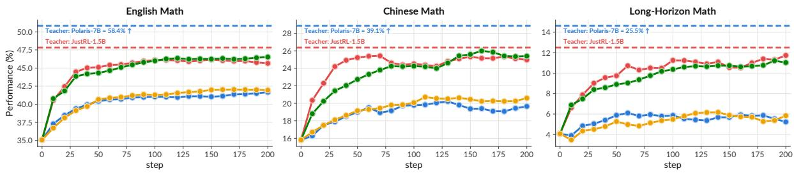

(a) DS-distill-1.5B  
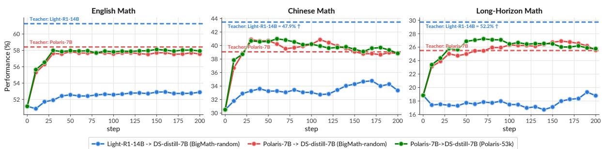  
(b) DS-distill-7B  
Figure 2. OPD trained only on English math problems generalizes to Chinese and long-horizon math benchmarks, but the size and stability of the gains depend on model origin. Each figure pairs a same-origin and a cross-origin teacher for the same student; dashed lines mark the teachers’ accuracy.

Takeaway: OPD also works across in-domain distribution shifts, but mainly in the same-origin setting: trained only on English, short-horizon math, a student with a same-origin teacher approaches the teacher’s level on Chinese and long-horizon math, whereas a cross-origin teacher (even with better performance than the same-origin teacher) yields smaller gains.

## 4. Cross-Domain Generalization and Its Implication for MOPD

We now turn to cross-domain generalization, where OPD is performed on prompts from one domain and evaluated on other domains, and to its implications for MOPD. This section develops two connected findings. First, for the same-origin OPD setting, training on prompts from one domain also enables the student to approach the teacher’s performance in other domains. In contrast, the cross-origin setting exhibits a clear gap between cross-domain and in-domain generalization. Consequently, a same-origin teacher’s influence is not confined to the domain of its training prompts, routing prompts to diferent domain expert teachers in MOPD does not isolate their efects; changing the teacher mixture ratios pulls the student between the domain experts, producing a seesaw efect.

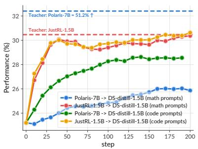  
(a) LiveCodeBench (DS-distill-1.5B)

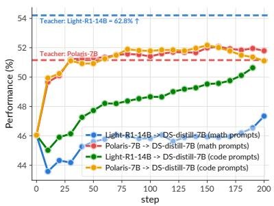  
(b) LiveCodeBench (DS-distill-7B)

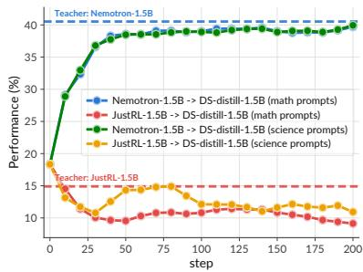  
(c) GPQA-Diamond (DS-distill-1.5B)

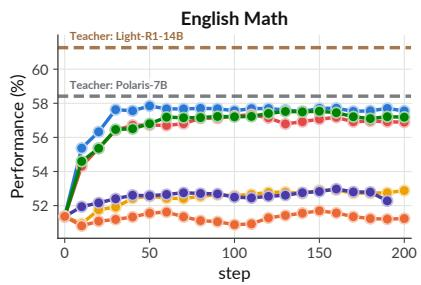  
Polaris-7B -> DS-distill-7B (math prompts) Light-R1-14B -> DS-distill-7B (math prompts)

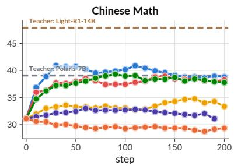  
Polaris-7B -> DS-distill-7B (code prompts) Light-R1-14B -> DS-distill-7B (code prompts)

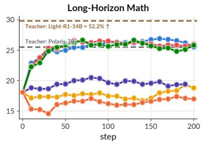  
Polaris-7B -> DS-distill-7B (science prompts) Light-R1-14B -> DS-distill-7B (science prompts)

(d) Training on non-math domains, evaluating on math (DS-distill-7B)

Figure 3. Cross-domain generalization in single-teacher OPD. For same-origin OPD, training on math prompts, trained student’s performance on science and code also approaches teacher’s performance and vice versa. For cross-origin OPD, cross-domain generalization is much worse: in (a) and (b) (LiveCodeBench evaluation results), the green curves (training on code prompts) are consistently and substantially higher than the blue curves (training on math prompts). Dashed lines mark the teachers’ standalone accuracy.

## 4.1. Cross-Domain Generalization of OPD

For cross-domain generalization, we study two students, DS-distill-1.5B and DS-distill-7B, and pair each with both a same-origin and a cross-origin teacher; for DS-distill-1.5B, for example, JustRL-1.5B and Nemotron-1.5B are same-origin teachers and Polaris-7B is a cross-origin one. We run OPD in two directions: training on math (teacher models’ RL post-training domain) prompts and evaluating on other domains such as code and science, and training on other-domain prompts (code, science, and IF) and evaluating on math.

Math → Other Domains Transfer. We first train students on math prompts and evaluate on code and science. As Figures 3a and 3b show, both the 1.5B and 7B students improve clearly on LiveCodeBench, although no code prompts are used during OPD. A similar efect appears for science: Figure 3c compares Nemotron-1.5B and JustRL-1.5B under both math- and scienceprompt training. For the science-oriented Nemotron teacher, math-trained and science-trained runs reach similar GPQA-Diamond levels, both well above the initial student. Because the mathoriented JustRL teacher’s scientific reasoning is inferior to the student’s, training on either math or science prompts degrades the student’s performance, ultimately driving its GPQA score below the initial point.

Other Domains → Math Transfer. As shown in Figure 3d, students trained on code or science prompts improve on math (approach teacher performance), and the performance gains extend beyond English to Chinese and long-horizon math benchmarks. These results show that a teacher’s expert capability (i.e., math reasoning) can also be transferred to students even using prompts from non-primary domain (see Figure 11 for IF→math transfer). Together, these results show that OPD can transfer capabilities beyond the semantic domain ofits training prompts: supervision collectedfrom math reasoning can pull the student’s code/scientific reasoning abilities towards the teachers, and vice versa.

Takeaway: OPD can transfer a same-origin teacher’s ability beyond the domain of its training prompts, in both directions: training on math prompts improves the student on code and science, and training on code, science, or instruction-following prompts transfers back to math, with gains extending to Chinese and long-horizon math.

Generalization Difers by Model Origin in OPD. Model origin, first seen in Sec. 3.2, reappears clearly in the cross-domain setting. In Figures 3a and 3b, same-origin teacher runs form consistent training curves for the code-prompts training and math-prompts training on LiveCodeBench: both of them approach the teacher’s performance, so within same-origin OPD the trainingdomain gap is largely closed and the student can absorb the teacher’s code ability even from math trajectories alone. Cross-origin OPD behaves very diferently: direct training on the target domain remains best, and we observe a clear gap between the in-domain generalization (training with code prompts) performance and cross-domain generalization (training with math prompts) performance. We attribute this diference to the distributional gap between teacher and student. For a same-origin teacher, whose output distribution is only slightly tuned [60] in comparison with the student’s, OPD aligns the student to the teacher at the policy level rather than only on the training domain. However, for a cross-origin teacher, the larger distributional gap makes such alignment harder, and OPD pulls the student policy towards the teacher policy mainly on the distribution covered by the training prompts, leaving cross-domain generalization weaker than in-domain generalization.

Takeaway: How far the cross-domain transfer reaches is afected by model origin. A sameorigin teacher, whose distribution is close to the student’s, brings the student close to the teacher’s level across domains even when the prompts come from a single domain, efectively closing the training-domain gap. A cross-origin teacher, facing a larger distributional gap, improves the student mainly on the trained distribution and its cross-domain generalization stays clearly below its in-domain generalization.

## 4.2. Cross-Domain Interference in MOPD

The single-teacher cross-domain generalization observations have a critical but easily overlooked implication for Multi-teacher OPD (MOPD): because a teacher afects evaluation domains far beyond that of its OPD training prompts, routing each prompt to a domain teacher does not keep that teacher’s influence within its assigned domain. This raises a practical question for MOPD: whether teachers assigned to diferent domains contendfor the same capability, as each teacher’s cross-domain influence may overlap with, and be pulled against, another teacher’s supervision in its assigned domain. We test this with two students, Dev-1.5B2 and DS-distill-1.5B and two teachers with complementary profiles, JustRL-1.5B (stronger on math) and Nemotron-1.5B (much stronger on science and IF, weaker on math). In Setting 1, JustRL-1.5B is the math teacher and Nemotron-1.5B is the science/IF teacher. To isolate the efect of the routed prompt domain and to further probe the seesaw efect, Setting 2 swaps their roles, using Nemotron-1.5B as the math

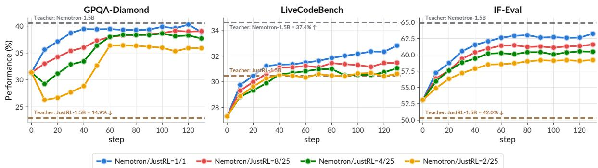

(a) Setting 1. Math teacher: JustRL-1.5B; Science/IF teacher: Nemotron-1.5B; student: Dev-1.5B.  
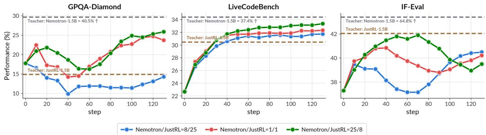  
(b) Setting 2. Math teacher: Nemotron-1.5B; Science/IF teacher: JustRL-1.5B; student: DS-distill-1.5B.

Figure 4. The MOPD seesaw efect. Changing the mixture ratio of diferent teachers’ allocated prompts significantly changes the OPD students’ capabilities in diferent domains. For example, in subfigure (a), student’s GPQA-Diamond (scientific reasoning), LiveCodeBench (code reasoning), and IF-Eval (instruction-following) performance gradually drops down as we increase the proportion of JustRL-1.5B (math teacher) data.

teacher and JustRL-1.5B as the science/IF teacher, and we track how the student’s per-domain performance changes.

Teacher Mixture Ratios Induce a Seesaw Efect. As we change the ratio of prompts allocated to the two teachers while keeping their total amount unchanged, the student’s performance on each benchmark moves toward the teacher that receives the larger share rather than being decided by which domain the teacher is assigned to teach. In Setting 1 (Figure 4a), as we increase JustRL’s (the math teacher) share (Nemotron/JustRL changes from 1/1 to 2/25), the student’s GPQA-Diamond, LiveCodeBench, and IFEval scores all decline toward JustRL’s lower scores; on GPQA-Diamond the pullfrom the math teacher JustRL is strong enough that accuracy even drops ∼ 5% early in training, because JustRL scores below the student Dev-1.5B there. In Setting 2 (Figure 4b), where Nemotron is instead assigned as the math teacher, the same three benchmarks now rise as we raise Nemotron’s share, moving toward Nemotron’s higher scores on them. The math results (Table 2) give the complementary case, where properly increasing the JustRL share (JustRL’s math performance is better than Nemotron) improves math regardless of its assigned domain.

Ultimately, the performance shift is not merely dictated by the teacher’s assigned domain: increasing a teacher’s share uniformly pulls multi-domain capabilities toward that teacher’s baseline, creating a mixture-dependent seesaw that renders domain-specific prompt routing inefective at confining a teacher’s influence.

Table 2. MOPD math accuracy for diferent JustRL-1.5B/Nemotron-1.5B mixture ratios (J/N).
<table><tr><td>Config</td><td>BeyondAIME</td><td>OlymMATH</td><td>Average</td></tr><tr><td>DS-distill-1.5B</td><td>9.6%</td><td>14.2%</td><td>11.9%(student)</td></tr><tr><td colspan="4">Math Teacher: JustRL-1.5B, Science/IF Teacher: Nemotron-1.5B</td></tr><tr><td> $\mathrm { J } / \mathrm { N } = 2 5 / 2$ </td><td>19.4%</td><td>33.3%</td><td> $2 6 . 4 \% ( + 0 . 1 \mathrm { \ p p } )$ </td></tr><tr><td> $\mathrm { J } / \mathrm { N } = 2 5 / 8$ </td><td>19.6%</td><td>34.5%</td><td> $2 7 . 1 \% ( + 0 . 8 { \mathrm { ~ p p } } )$ </td></tr><tr><td> $\mathbf { J } / \mathrm { N } = \mathbf { 1 } / \mathbf { 1 }$ </td><td>20.2%</td><td>32.4%</td><td> $2 6 . 3 \% ( \mathbf { b a s e l i n e } )$ </td></tr><tr><td> $\mathrm { J } / \mathrm { N } = 8 / 2 5$ </td><td>19.7%</td><td>32.5%</td><td> $2 6 . 1 \% ( - 0 . 2 \mathrm { p p } )$ </td></tr><tr><td> $\mathrm { J } / \mathrm { N } = 2 / 2 5$ </td><td>19.2%</td><td>31.0%</td><td> $2 5 . 1 \% ( - 1 . 2 \ \mathrm { p p } )$ </td></tr><tr><td colspan="4">Math Teacher: Nemotron-1.5B, Science/IF Teacher: JustRL-1.5B</td></tr><tr><td> $\mathrm { J } / \mathrm { N } = 2 5 / 8$ </td><td>17.4%</td><td>28.0%</td><td> $2 2 . 7 \% ( + 0 . 7 \ \mathrm { p p } )$ </td></tr><tr><td> $\mathbf { J } / \mathrm { N } = \mathbf { 1 } / \mathbf { 1 }$ </td><td>17.3%</td><td>26.6%</td><td> $2 2 . 0 \% 0 s \mathrm { e l i n e } )$ </td></tr><tr><td> $\mathrm { J } / \mathrm { N } = 8 / 2 5$ </td><td>17.1%</td><td>26.2%</td><td> $2 1 . 7 \% ( - 0 . 3 \mathrm { \ p p } )$ </td></tr></table>

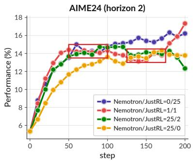

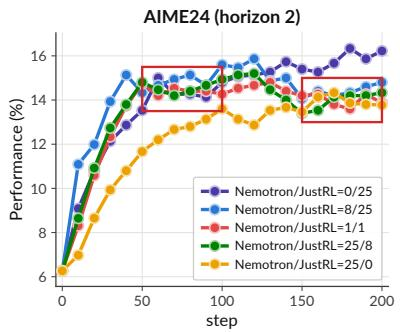

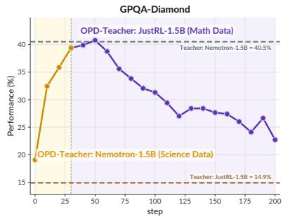  
(a) JustRL-Math, Nemotron-Science/IF  
(b) JustRL-Science/IF, Nemotron-Math  
(c) Cascaded OPD, GPQA-Diamond  
Figure 5. A tug-of-war between the teachers can be observed during MOPD training. (a,b) highlighted red boxes show that the MOPD student’s performance first tracks the JustRL-only training curve and later drifts toward the Nemotron-only training curve, under both settings. (c) In cascaded OPD (one teacher then the other), GPQA performance rises sharply under the guidance of Nemotron-1.5B with science prompts and then drops back by the subsequent JustRL-1.5B with math prompts, decoupling the efect of multi-teacher in the temporal dimension.

A tug-of-war between the teachers can be observed during training. Finally, the balance between teachers shifts over training. On AIME24-Horizon-2 under both two settings (Figures 5a and 5b), MOPD students first track the stronger-math JustRL-only curve and later drift toward the lower Nemotron-only level, so the student does not settle immediately at a fixed mixture outcome but is pulled between the two teachers as training proceeds. In Figure 5a, where JustRL is the math teacher, we can observe that finally the red curve (Nemotron/JustRL mixture ratio 1/1) is re-pulled back to the JustRL-only curve, while the yellow curve (Nemotron/JustRL mixture ratio 25/2, fewer prompts allocated to JustRL) is entirely pulled towards the Nemotron-only curve. We additionally conduct a cascaded OPD experiment (Figure 5c) to decouple the efect of multi-teacher OPD training in the temporal dimension: training first with the science-strong Nemotron-1.5B teacher and science prompts raises GPQA toward its level, and after switching to JustRL-1.5B and math prompts, GPQA moves back down toward the original level.

The Seesaw Efect Provides a Mental Model for Analyzing MOPD. The seesaw efect ofers a useful perspective for analyzing the counteraction in MOPD [7]: when the student underperforms on a domain, the cause need not lie with the teacher assigned to that domain, since another teacher can pull the same capability through its own cross-domain transfer. This suggests examining the full set of teachers, rather than only the domain expert in question, when diagnosing MOPD, and it also indicates that a domain expert’s capabilities outside its target domain are relevant to how it behaves in MOPD, not only its performance on the assigned domain. The traditional prompt-routing paradigm [21, 39, 50, 55] therefore does not ensure that diferent domain experts’ capabilities stay isolated from one another.

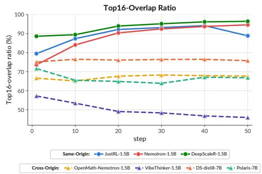  
(a) DS-distill-1.5B OPD Experiments

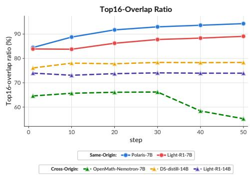  
(b) DS-distill-7B OPD Experiments  
Figure 6. Top-K (K=16) Overlap Ratio of the teacher and student models in diferent OPD experiments. In Figure (a) and (b), the student models are DS-distill-1.5B and DS-distill-7B, respectively. The solid lines refer to OPD experiments with same-origin teachers; the dashed lines refer to OPD experiments with diferent-origin teachers.

Takeaway: Because a teacher’s influence is not confined to the domain of its OPD prompts, routing prompts to domain experts in multi-teacher OPD (MOPD) cannot isolate them. As the mixture ratio changes, the student’s score on each benchmark moves toward the teacher with the larger share, and toward that teacher’s own level rather than the domain it is assigned to teach. Combining experts therefore produces a mixture-dependent seesaw among their capabilities rather than a clean sum of expert skills. This ofers a useful perspective for diagnosing MOPD: underperformance on a domain may stem from another teacher’s crossdomain pull, so a domain expert’s of-domain behavior also matters.

## 5. More Discussion on Same/Cross-Origin OPD Experiments

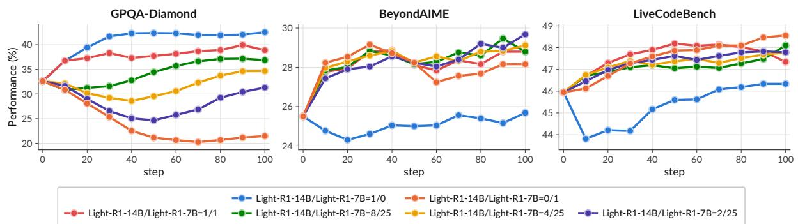  
Figure 7. The MOPD experiment results of DS-distill-7B (student), Light-R1-7B (math teacher), and Light-R1-14B (science/IF teacher). The legends refer to the expert data mix ratio of diferent MOPD experiments (Light-R1-14B/Light-R1-7B ∈ {1/0, 1/1, 8/25, 4/25, 2/25, 0/1}).

Throughout the paper, model origin recurs as the factor that most consistently separates broad generalization from narrow fitting. We close with two analyses that look more directly at why: how OPD reshapes the student’s policy over training, and how this plays out when a same-origin and a cross-origin teacher compete within MOPD.

Same-origin OPD aligns the student’s policy as a whole. To probe how OPD changes the student’s policy beyond the training loss, we measure the top-� (�=16) overlap ratio [28] between the teacher’s and the student’s next-token distributions during training (Figure 6). Two patterns are consistent across the 1.5B and 7B students. First, the overlap ratio starts clearly higher for same-origin teachers than for cross-origin ones, confirming that a shared origin already places the student’s policy closer to the teacher’s before any OPD. Second, and more telling, the same-origin overlap ratio rises markedly over training, whereas the cross-origin overlap ratio stays flat or even declines. Since both settings minimize the same teacher–student KL objective, this contrast indicates that same-origin OPD progressively aligns the student to the teacher’s policy as a whole, while cross-origin OPD reduces the divergence on the training distribution without pulling the two policies into broader agreement. This ofers a mechanistic reading of “same-origin generalizes, cross-origin fits”: broad transfer follows from whole-policy alignment, which is far easier to achieve when teacher and student share an origin.

A same-origin teacher exerts stronger pull in MOPD. The same asymmetry surfaces when a same-origin and a cross-origin teacher are combined. We repeat the MOPD experiment on DS-distill-7B, using the same-origin Light-R1-7B as the math teacher and the cross-origin Light-R1-14B as the science/IF teacher (Figure 7). On GPQA-Diamond, the student’s science accuracy is readily pulled toward the math teacher Light-R1-7B, even at a balanced 1:1 mixture where the science/IF teacher receives an equal share. Read together with the alignment analysis above, this suggests that a same-origin teacher exerts a stronger pull on the student than a cross-origin one in MOPD, so that the seesaw between teachers is tilted not only by the mixture ratio but also by how close each teacher’s origin is to the student.

Takeaway: Same-origin OPD raises the teacher–student top-� overlap over training, whereas cross-origin OPD does not, so broad generalization arises from aligning the student’s policy as a whole rather than merely lowering the KL on the training distribution. Consequently, a same-origin teacher pulls the student more strongly than a cross-origin one, tilting the MOPD seesaw by origin as well as by mixture ratio.

## 6. Conclusion

We study how well OPD generalizes by varying the training and evaluation distributions in a controlled way, from in-domain shifts to cross-domain transfer. OPD is largely insensitive to training problem dificulty, and it transfers a teacher’s ability beyond the domain of its training prompts, but mainly for same-origin pairs. Because routing does not keep a teacher’s influence within its assigned domain, combining domain experts in MOPD yields a seesaw among their capabilities rather than an isolated composition of expert skills, ofering a useful perspective for diagnosing MOPD.

## Limitations

Our experiments focus on reasoning-oriented models and cover Math, Code, Science, and instruction-following domains. The observed generalization patterns may not directly extend to multimodal, tool-using, or interactive agent settings. Extending the analysis to such tasks would help determine whether OPD exhibits similar cross-domain behavior when supervision depends on external observations or actions. In addition, our MOPD experiments consider two teachers with complementary capabilities and use fixed domain-based prompt routing. This controlled setting makes the cross-domain efects of individual teachers easier to analyze, but practical systems may involve larger and more heterogeneous expert pools. They may also use adaptive router and non-uniform teacher sampling. A broader study of expert-pool size and routing strategies would provide a more complete understanding of generalization in MOPD.

## Ethical Considerations

This work studies capability transfer among publicly available language models on Math, Code, Science, and instruction-following benchmarks. Our results show that OPD can transfer teacher behavior beyond the domain of the routed training prompts. While this enables broad capability transfer, it may also propagate undesirable behaviors or biases from the teacher to domains that are not explicitly monitored during training. In particular, prompt routing in MOPD should not be treated as a strict capability or safety boundary. Models trained with OPD or MOPD should therefore be evaluated for safety and reliability across all domains, rather than only on the domain assigned to each teacher.

## References

1 Rishabh Agarwal, Nino Vieillard, Yongchao Zhou, Piotr Stanczyk, Sabela Ramos Garea, Matthieu Geist, and Olivier Bachem. On-policy distillation of language models: Learning from self-generated mistakes. In International Conference on Learning Representations, volume 2024, pages 21246–21263, 2024.

2 Alon Albalak, Duy Phung, Nathan Lile, Rafael Rafailov, Kanishk Gandhi, Louis Castricato, Anikait Singh, Chase Blagden, Violet Xiang, Dakota Mahan, et al. Big-math: A large-scale, high-quality math dataset for reinforcement learning in language models. arXiv preprint arXiv:2502.17387, 2025.

3 Chenxin An, Zhihui Xie, Xiaonan Li, Lei Li, Jun Zhang, Shansan Gong, Ming Zhong, Jingjing Xu, Xipeng Qiu, Mingxuan Wang, and Lingpeng Kong. Polaris: A post-training recipe for scaling reinforcement learning on advanced reasoning models, 2025. URL https://hkunlp.g ithub.io/blog/2025/Polaris.

4 Akhiad Bercovich, Itay Levy, Izik Golan, Mohammad Dabbah, Ran El-Yaniv, Omri Puny, Ido Galil, Zach Moshe, Tomer Ronen, Najeeb Nabwani, et al. Llama-nemotron: Eficient reasoning models. arXiv preprint arXiv:2505.00949, 2025.

5 ByteDance-Seed. Beyondaime: Advancing math reasoning evaluation beyond high school olympiads. https://huggingface.co/datasets/ByteDance-Seed/BeyondAIME, 2025.

6 Abhranil Chandra, Ayush Agrawal, Arian Hosseini, Sebastian Fischmeister, Rishabh Agarwal, Navin Goyal, and Aaron Courville. Shape of thought: When distribution matters more than correctness in reasoning tasks. arXiv preprint arXiv:2512.22255, 2025.

7 Tianlei Chen, Jiao Ou, Ziyuan Liu, Ruiming Tang, Jian Liang, and Han Li. Counteraction-aware multi-teacher on-policy distillation for general capability recovery with domain preservation. arXiv preprint arXiv:2605.27115, 2026.

8 Tianzhe Chu, Yuexiang Zhai, Jihan Yang, Shengbang Tong, Saining Xie, Dale Schuurmans, Quoc V Le, Sergey Levine, and Yi Ma. SFT memorizes, RL generalizes: A comparative study of

foundation model post-training. In Forty-second International Conference on Machine Learning, 2025. URL https://openreview.net/forum?id=dYur3yabMj.

9 Karl Cobbe, Vineet Kosaraju, Mohammad Bavarian, Mark Chen, Heewoo Jun, Lukasz Kaiser, Matthias Plappert, Jerry Tworek, Jacob Hilton, Reiichiro Nakano, et al. Training verifiers to solve math word problems. arXiv preprint arXiv:2110.14168, 2021.

10 Nouha Dziri, Ximing Lu, Melanie Sclar, Xiang Lorraine Li, Liwei Jiang, Bill Yuchen Lin, Sean Welleck, Peter West, Chandra Bhagavatula, Ronan Le Bras, Jena D. Hwang, Soumya Sanyal, Xiang Ren, Allyson Ettinger, Zaid Harchaoui, and Yejin Choi. Faith and fate: Limits of transformers on compositionality. In Thirty-seventh Conference on Neural Information Processing Systems, 2023. URL https://openreview.net/forum?id=Fkckkr3ya8.

11 Run-Ze Fan, Zengzhi Wang, and Pengfei Liu. Megascience: Pushing the frontiers of posttraining datasets for science reasoning. arXiv preprint arXiv:2507.16812, 2025.

12 Yuqian Fu, Haohuan Huang, Kaiwen Jiang, Jiacai Liu, Zhuo Jiang, Yuanheng Zhu, and Dongbin Zhao. Revisiting on-policy distillation: Empirical failure modes and simple fixes. arXiv preprint arXiv:2603.25562, 2026.

13 Mirian Hipolito Garcia, Camille Couturier, Daniel Madrigal Diaz, Ankur Mallick, Anastasios Kyrillidis, Robert Sim, Victor Ruhle, and Saravan Rajmohan. Exploring how llms capture and represent domain-specific knowledge, 2025. URL https://arxiv.org/abs/2504.16871.

14 GLM-5-Team, :, Aohan Zeng, Xin Lv, Zhenyu Hou, Zhengxiao Du, Qinkai Zheng, Bin Chen, Da Yin, Chendi Ge, Chenghua Huang, Chengxing Xie, Chenzheng Zhu, Congfeng Yin, Cunxiang Wang, Gengzheng Pan, Hao Zeng, Haoke Zhang, Haoran Wang, Huilong Chen, Jiajie Zhang, Jian Jiao, Jiaqi Guo, Jingsen Wang, Jingzhao Du, Jinzhu Wu, Kedong Wang, Lei Li, Lin Fan, Lucen Zhong, Mingdao Liu, Mingming Zhao, Pengfan Du, Qian Dong, Rui Lu, Shuang-Li, Shulin Cao, Song Liu, Ting Jiang, Xiaodong Chen, Xiaohan Zhang, Xuancheng Huang, Xuezhen Dong, Yabo Xu, Yao Wei, Yifan An, Yilin Niu, Yitong Zhu, Yuanhao Wen, Yukuo Cen, Yushi Bai, Zhongpei Qiao, Zihan Wang, Zikang Wang, Zilin Zhu, Ziqiang Liu, Zixuan Li, Bojie Wang, Bosi Wen, Can Huang, Changpeng Cai, Chao Yu, Chen Li, Chengwei Hu, Chenhui Zhang, Dan Zhang, Daoyan Lin, Dayong Yang, Di Wang, Ding Ai, Erle Zhu, Fangzhou Yi, Feiyu Chen, Guohong Wen, Hailong Sun, Haisha Zhao, Haiyi Hu, Hanchen Zhang, Hanrui Liu, Hanyu Zhang, Hao Peng, Hao Tai, Haobo Zhang, He Liu, Hongwei Wang, Hongxi Yan, Hongyu Ge, Huan Liu, Huanpeng Chu, Jia’ni Zhao, Jiachen Wang, Jiajing Zhao, Jiamin Ren, Jiapeng Wang, Jiaxin Zhang, Jiayi Gui, Jiayue Zhao, Jijie Li, Jing An, Jing Li, Jingwei Yuan, Jinhua Du, Jinxin Liu, Junkai Zhi, Junwen Duan, Kaiyue Zhou, Kangjian Wei, Ke Wang, Keyun Luo, Laiqiang Zhang, Leigang Sha, Liang Xu, Lindong Wu, Lintao Ding, Lu Chen, Minghao Li, Nianyi Lin, Pan Ta, Qiang Zou, Rongjun Song, Ruiqi Yang, Shangqing Tu, Shangtong Yang, Shaoxiang Wu, Shengyan Zhang, Shijie Li, Shuang Li, Shuyi Fan, Wei Qin, Wei Tian, Weining Zhang, Wenbo Yu, Wenjie Liang, Xiang Kuang, Xiangmeng Cheng, Xiangyang Li, Xiaoquan Yan, Xiaowei Hu, Xiaoying Ling, Xing Fan, Xingye Xia, Xinyuan Zhang, Xinze Zhang, Xirui Pan, Xu Zou, Xunkai Zhang, Yadi Liu, Yandong Wu, Yanfu Li, Yidong Wang, Yifan Zhu, Yijun Tan, Yilin Zhou, Yiming Pan, Ying Zhang, Yinpei Su, Yipeng Geng, Yong Yan, Yonglin Tan, Yuean Bi, Yuhan Shen, Yuhao Yang, Yujiang Li, Yunan Liu, Yunqing Wang, Yuntao Li, Yurong Wu, Yutao Zhang, Yuxi Duan, Yuxuan Zhang, Zezhen Liu, Zhengtao Jiang, Zhenhe Yan, Zheyu Zhang, Zhixiang Wei, Zhuo Chen, Zhuoer Feng, Zijun Yao, Ziwei Chai, Ziyuan Wang, Zuzhou Zhang, Bin Xu, Minlie Huang, Hongning Wang, Juanzi Li, Yuxiao Dong, and Jie Tang. Glm-5: from vibe coding to agentic engineering, 2026. URL https://arxiv.org/abs/2602.15763.

15 Yuxian Gu, Li Dong, Furu Wei, and Minlie Huang. Minillm: Knowledge distillation of large language models. In International Conference on Learning Representations, volume 2024, pages 32694–32717, 2024.

16 Daya Guo, Dejian Yang, Haowei Zhang, Junxiao Song, Peiyi Wang, Qihao Zhu, Runxin Xu, Ruoyu Zhang, Shirong Ma, Xiao Bi, et al. Deepseek-r1 incentivizes reasoning in llms through reinforcement learning. Nature, 645(8081):633–638, 2025.

17 Bingxiang He, Zekai Qu, Zeyuan Liu, Yinghao Chen, Yuxin Zuo, Cheng Qian, Kaiyan Zhang, Weize Chen, Chaojun Xiao, Ganqu Cui, et al. Justrl: Scaling a 1.5 b llm with a simple rl recipe. arXiv preprint arXiv:2512.16649, 2025.

18 Zhiwei He, Tian Liang, Jiahao Xu, Qiuzhi Liu, Xingyu Chen, Yue Wang, Linfeng Song, Dian Yu, Zhenwen Liang, Wenxuan Wang, Zhuosheng Zhang, Rui Wang, Zhaopeng Tu, Haitao Mi, and Dong Yu. Deepmath-103k: A large-scale, challenging, decontaminated, and verifiable mathematical dataset for advancing reasoning. In The Fourteenth International Conference on Learning Representations, 2026. URL https://openreview.net/forum?id=kHB5Te5IWm.

19 Dan Hendrycks, Collin Burns, Saurav Kadavath, Akul Arora, Steven Basart, Eric Tang, Dawn Song, and Jacob Steinhardt. Measuring mathematical problem solving with the math dataset. arXiv preprint arXiv:2103.03874, 2021.

20 Wenjin Hou, Shangpin Peng, Weinong Wang, Zheng Ruan, Yue Zhang, Zhenglin Zhou, Mingqi Gao, Yifei Chen, Kaiqi Wang, Hongming Yang, et al. Uni-opd: Unifying on-policy distillation with a dual-perspective recipe. arXiv preprint arXiv:2605.03677, 2026.

21 Bo Huang, Fengxiang Li, Hao Xu, Haoyang Huang, Hongyi Fu, Jinhua Hao, Kun Yuan, Minglei Zhang, Pengcheng Xu, Shiyang Liu, et al. Kat-coder-v2. 5 technical report. arXiv preprint arXiv:2607.05471, 2026.

22 Rob J Hyndman and George Athanasopoulos. Forecasting: principles and practice. OTexts, 2018.

23 Naman Jain, King Han, Alex Gu, Wen-Ding Li, Fanjia Yan, Tianjun Zhang, Sida Wang, Armando Solar-Lezama, Koushik Sen, and Ion Stoica. Livecodebench: Holistic and contamination free evaluation of large language models for code. In The Thirteenth International Conference on Learning Representations, 2025. URL https://openreview.net/forum?id=chfJJYC3iL.

24 Nan Jia, Haojin Yang, Xing Ma, Jiesong Lian, Shuailiang Zhang, Weipeng Zhang, Ke Zeng, Xunliang Cai, and Zequn Sun. Asymmetric on-policy distillation: Bridging exploitation and imitation at the token level. arXiv preprint arXiv:2605.06387, 2026.

25 Deyang Kong, Qi Guo, Xiangyu Xi, Wei Wang, Jingang Wang, Xunliang Cai, Shikun Zhang, and Wei Ye. Rethinking the sampling criteria in reinforcement learning for llm reasoning: A competence-dificulty alignment perspective. In Proceedings of the AAAI Conference on Artificial Intelligence, volume 40, pages 31438–31446, 2026.

26 Rongao Li, Jie Fu, Bo-Wen Zhang, Tao Huang, Zhihong Sun, Chen Lyu, Guang Liu, Zhi Jin, and Ge Li. Taco: Topics in algorithmic code generation dataset. arXiv preprint arXiv:2312.14852, 2023.

27 Shipeng Li, Zhiqin Yang, Shikun Li, Xiaobo Xia, Hengyu Liu, Xinghua Zhang, Gaode Chen, Dong Fang, Ying Tai, and Zhe Peng. Learnalign: Data selection for llm reinforcement learning with improved gradient alignment. arXiv preprint arXiv:2506.11480, 2025.

28 Yaxuan Li, Yuxin Zuo, Bingxiang He, Jinqian Zhang, Chaojun Xiao, Cheng Qian, Tianyu Yu, Huan-ang Gao, Wenkai Yang, Zhiyuan Liu, et al. Rethinking on-policy distillation of large language models: Phenomenology, mechanism, and recipe. In ICML 2026 Workshop on Foundations of Deep Generative Models: Understanding Memorization, Generalization, and Reasoning, 2026.

29 Yuying Li, Leqi Zheng, Yongzi Yu, Wenrui Zhou, Xuchang Zhong, Xing Hu, Jing Jin, Hangjie Yuan, and Tao Feng. Filter, then reweight: Rethinking optimization granularity in on-policy distillation. arXiv preprint arXiv:2606.02684, 2026.

30 Zhaoyi Li, Jiatong Li, Gangwei Jiang, Linqi Song, Defu Lian, and Ying Wei. Scaling reasoning hop exposes weaknesses: Demystifying and improving hop generalization in large language models. In The Fourteenth International Conference on Learning Representations, 2026. URL https://openreview.net/forum?id=qK4JKOu0Gx.

31 Zhaoyi Li, Xiangyu Xi, Zhengyu Chen, Wei Wang, Gangwei Jiang, Ranran Shen, Linqi Song, Ying Wei, and Defu Lian. On the role of reasoning patterns in the generalization discrepancy of long chain-of-thought supervised fine-tuning, 2026. URL https://arxiv.org/abs/2604.0 1702.

32 Junnan Liu, Hongwei Liu, Linchen Xiao, Ziyi Wang, Kuikun Liu, Songyang Gao, Wenwei Zhang, Songyang Zhang, and Kai Chen. Are your llms capable of stable reasoning? In Findings of the Associationfor Computational Linguistics: ACL 2025, pages 17594–17632, 2025.

33 Mingjie Liu, Shizhe Diao, Ximing Lu, Jian Hu, Xin Dong, Yejin Choi, Jan Kautz, and Yi Dong. Prorl: Prolonged reinforcement learning expands reasoning boundaries in large language models. Advances in Neural Information Processing Systems, 38:17998–18031, 2026.

34 Dakuan Lu, Xiaoyu Tan, Rui Xu, Tianchu Yao, Chao Qu, Wei Chu, Yinghui Xu, and Yuan Qi. Scp-116k: A high-quality problem-solution dataset and a generalized pipeline for automated extraction in the higher education science domain. arXiv preprint arXiv:2501.15587, 2025.

35 Kevin Lu and Thinking Machines Lab. On-policy distillation. Thinking Machines Lab: Connectionism, 2025. doi: 10.64434/tml.20251026. https://thinkingmachines.ai/blog/on-policydistillation.

36 Yi Lu, Jianing Wang, Linsen Guo, Wei He, Hongyin Tang, Tao Gui, Xuanjing Huang, Xuezhi Cao, Wei Wang, and Xunliang Cai. R-horizon: How far can your large reasoning model really go in breadth and depth? arXiv preprint arXiv:2510.08189, 2025.

37 Feng Luo, Yu-Neng Chuang, Guanchu Wang, Zicheng Xu, Xiaotian Han, Tianyi Zhang, and Vladimir Braverman. Demystifying opd: Length inflation and stabilization strategies for large language models. arXiv preprint arXiv:2604.08527, 2026.

38 Michael Luo, Sijun Tan, Roy Huang, Ameen Patel, Alpay Ariyak, Qingyang Wu, Xiaoxiang Shi, Rachel Xin, Colin Cai, Maurice Weber, Ce Zhang, Li Erran Li, Raluca Ada Popa, and Ion Stoica. Deepcoder: A fully open-source 14b coder at o3-mini level. https://pretty-radio-b75.not ion.site/DeepCoder-A-Fully-Open-Source-14B-Coder-at-O3-mini-Level-1cf81902c14 680b3bee5eb349a512a51, 2025. Notion Blog.

39 Wenhan Ma, Jianyu Wei, Liang Zhao, Hailin Zhang, Bangjun Xiao, Lei Li, Qibin Yang, Bofei Gao, Yudong Wang, Rang Li, et al. Mopd: Multi-teacher on-policy distillation for capability integration in llm post-training. arXiv preprint arXiv:2606.30406, 2026.

40 MAA. American invitational mathematics examination (AIME). https://www.maa.org/math -competitions, 2026.

41 MAA. American mathematics competitions (AMC). https://www.maa.org/math-competiti ons, 2026.

42 Justus Mattern, Sami Jaghouar, Manveer Basra, Jannik Straube, Matthew Di Ferrante, Felix Gabriel, Jack Min Ong, Vincent Weisser, and Johannes Hagemann. Synthetic-1: Two million collaboratively generated reasoning traces from deepseek-r1, 2025. URL https://www.prim eintellect.ai/blog/synthetic-1-release.

43 Ivan Moshkov, Darragh Hanley, Ivan Sorokin, Shubham Toshniwal, Christof Henkel, Benedikt Schiferer, Wei Du, and Igor Gitman. Aimo-2 winning solution: Building state-of-the-art mathematical reasoning models with openmathreasoning dataset, 2025. URL https://arxiv. org/abs/2504.16891.

44 David Rein, Betty Li Hou, Asa Cooper Stickland, Jackson Petty, Richard Yuanzhe Pang, Julien Dirani, Julian Michael, and Samuel R Bowman. Gpqa: A graduate-level google-proof q&a benchmark. arXiv preprint arXiv:2311.12022, 2023.

45 Qihan Ren, Peng Wang, Ruikun Cai, Shuai Shao, Dadi Guo, Yuejin Xie, Yafu Li, Quanshi Zhang, Xia Hu, Jing Shao, and Dongrui Liu. Rethinking generalization in reasoning sft: A conditional analysis on optimization, data, and model capability, 2026. URL https://arxiv.org/abs/26 04.06628.

46 John Schulman. Approximating KL Divergence. http://joschu.net/blog/kl-approx.html, 2020.

47 Parshin Shojaee, Seyed Iman Mirzadeh, Keivan Alizadeh, Maxwell Horton, Samy Bengio, and Mehrdad Farajtabar. The illusion of thinking: Understanding the strengths and limitations of reasoning models via the lens of problem complexity. In The Thirty-ninth Annual Conference on Neural Information Processing Systems, 2025. URL https://openreview.net/forum?id=Yg hiOusmvw.

48 Haoxiang Sun, Yingqian Min, Zhipeng Chen, Wayne Xin Zhao, and Ji-Rong Wen. Challenging the boundaries of reasoning: An olympiad-level math benchmark for large language models. In Proceedings of the 64th Annual Meeting of the Association for Computational Linguistics (Volume 1: Long Papers), pages 17438–17457, 2026.

49 Sijun Tan, Michael Luo, Justin Wong, Colin Cai, Xiaoxiang Shi, William Yuan Tang, Manan Roongta, Tianjun Zhang, Li Erran Li, Raluca Ada Popa, and Ion Stoica. Deepscaler: Efective RL scaling of reasoning models via iterative context lengthening, 2026. URL https://openre view.net/forum?id=I6GzDCne7U.

50 Core Team, Bangjun Xiao, Bingquan Xia, Bo Yang, Bofei Gao, Bowen Shen, Chen Zhang, Chenhong He, Chiheng Lou, Fuli Luo, Gang Wang, Gang Xie, Hailin Zhang, Hanglong Lv, Hanyu Li, Heyu Chen, Hongshen Xu, Houbin Zhang, Huaqiu Liu, Jiangshan Duo, Jianyu Wei, Jiebao Xiao, Jinhao Dong, Jun Shi, Junhao Hu, Kainan Bao, Kang Zhou, Lei Li, Liang Zhao, Linghao Zhang, Peidian Li, Qianli Chen, Shaohui Liu, Shihua Yu, Shijie Cao, Shimao Chen, Shouqiu Yu, Shuo Liu, Tianling Zhou, Weijiang Su, Weikun Wang, Wenhan Ma, Xiangwei Deng, Bohan Mao, Bowen Ye, Can Cai, Chenghua Wang, Chengxuan Zhu, Chong Ma, Chun Chen, Chunan Li, Dawei Zhu, Deshan Xiao, Dong Zhang, Duo Zhang, Fangyue Liu, Feiyu Yang, Fengyuan Shi, Guoan Wang, Hao Tian, Hao Wu, Heng Qu, Hongfei Yi, Hongxu An,

Hongyi Guan, Xing Zhang, Yifan Song, Yihan Yan, Yihao Zhao, Yingchun Lai, Yizhao Gao, Yu Cheng, Yuanyuan Tian, Yudong Wang, Zhen Tang, Zhengju Tang, Zhengtao Wen, Zhichao Song, Zhixian Zheng, Zihan Jiang, Jian Wen, Jiarui Sun, Jiawei Li, Jinlong Xue, Jun Xia, Kai Fang, Menghang Zhu, Nuo Chen, Qian Tu, Qihao Zhang, Qiying Wang, Rang Li, Rui Ma, Shaolei Zhang, Shengfan Wang, Shicheng Li, Shuhao Gu, Shuhuai Ren, Sirui Deng, Tao Guo, Tianyang Lu, Weiji Zhuang, Weikang Zhang, Weimin Xiong, Wenshan Huang, Wenyu Yang, Xin Zhang, Xing Yong, Xu Wang, Xueyang Xie, Yilin Jiang, Yixin Yang, Yongzhe He, Yu Tu, Yuanliang Dong, Yuchen Liu, Yue Ma, Yue Yu, Yuxing Xiang, Zhaojun Huang, Zhenru Lin, Zhipeng Xu, Zhiyang Chen, Zhonghua Deng, Zihan Zhang, and Zihao Yue. Mimo-v2-flash technical report, 2026. URL https://arxiv.org/abs/2601.02780.

51 Foundation Model Team. Mach-mind-4-flash technical report. arXiv preprint arXiv:2607.09375, 2026.

52 Kimi Team, Tongtong Bai, Yifan Bai, Yiping Bao, M. C., Jianfeng Cai, Xinyuan Cai, Peizhou Cao, Yuxuan Cao, Ziwei Chai, Y. Charles, H. S. Che, Guanduo Chen, Guangyu Chen, Guanzheng Chen, Huarong Chen, Jia Chen, Jianlong Chen, Jun Chen, Kexin Chen, Peng Chen, Ruijue Chen, Wentao Chen, Xin Chen, Yang Chen, Yanru Chen, Yifei Chen, Yingjiang Chen, Yuankun Chen, Yujie Chen, Yutian Chen, Zhirong Chen, Dazhi Cheng, Yean Cheng, Jialei Cui, Jingbing Cui, Anqi Dai, Jiaqi Deng, Hao Ding, Rui Ding, Shaofeng Ding, Mengfan Dong, Mengnan Dong, Yuhao Dong, Yuxin Dong, Angang Du, Chenzhuang Du, Dikang Du, Jusen Du, Yulun Du, Yu Fan, Jing Feng, Qiulin Feng, Yichen Feng, Kelin Fu, Qiang Fu, Fuxuan Gao, Hongcheng Gao, Jingyue Gao, Tong Gao, Weijia Gao, Shangyi Geng, Jie Gong, Linhu Gong, Shengao Gong, Xiaochen Gong, Qizheng Gu, Yicheng Gu, Shuhao Guan, Haiqing Guo, Shiqi Guo, Xiang Guo, Zhengyan Guo, Beixi Hao, Wenxin Hao, Xiaoru Hao, Dailan He, Haotian He, Lehan He, Qi He, Weiran He, Xinran He, Xinyi He, Yibo He, Yunjia He, Chao Hong, Tiange Hong, Hao Hu, Jiaxi Hu, Ruikun Hu, Weiming Hu, Yangyang Hu, Zhenxing Hu, Liang Hua, Jinbin Huang, Ke Huang, Ruiyuan Huang, Siying Huang, Weixiao Huang, Yan Huang, Zhengjie Huang, Zhiqi Huang, Yulong Hui, Chaobo Jia, Yutong Jiang, Zhejun Jiang, Zuoyou Jiang, Wenyi Jin, Xinyi Jin, Yu Jing, Huanjun Kong, Guokun Lai, Aidi Li, Cheng Li, Chengyuan Li, Cong Li, Fang Li, Guanyu Li, Haoyang Li, Jia Li, Junxiong Li, Lei Li, Letian Li, Lincan Li, Weihong Li, Wentao Li, Xintong Li, Yang Li, Yishen Li, Yiwei Li, Yuxiao Li, Zhaowei Li, Zhaoxi Li, Zheming Li, Zhengxiao Li, Zhiyuan Li, Jiawei Lin, Xiaohan Lin, Yibo Lin, Zichao Lin, Ziyan Lin, Bill Liu, Boxiao Liu, Chuan Liu, Liang Liu, Shaowei Liu, Shudong Liu, Shuran Liu, Tianwei Liu, Weizhou Liu, Yangyang Liu, Yanming Liu, Yibo Liu, Yipeng Liu, Zhengying Liu, Zhiheng Liu, Enzhe Lu, Haoyu Lu, Linqiang Lu, Tingzhan Lu, Zhiyuan Lu, Aotian Luo, G. Luo, Junyu Luo, Yifan Luo, B. Lyu, Wenzhou Lyu, Shaoguang Mao, Yuan Mei, Xin Men, Minqing Ni, Yixuan Niu, Siyuan Pan, Shujun Peng, Zhangyang Qi, Ruoyu Qin, ZeChao Qin, Zeyu Qin, Haiquan Qiu, Jianxin Qiu, Jiezhong Qiu, Bowen Qu, Yuhao Qu, Zeyu Shang, Youbo Shao, Han Shen, Jincheng Shi, Juanfeng Shi, Lidong Shi, Shengyuan Shi, Wingchun Siu, Pengwei Song, Xiaoxi Song, Jianlin Su, Yunfeng Su, Zhaochen Su, Lin Sui, Jingsong Sun, Junyao Sun, Shaoning Sun, Shuzhe Sun, Tongyu Sun, Yujun Sun, Yunpeng Tai, Chuning Tang, Heyi Tang, Sirui Tang, Zecheng Tang, Chaoran Tian, Rongpeng Tian, Yu Tian, Wei Tu, Chensi Wang, Chuang Wang, Chunjie Wang, Dinglu Wang, Feng Wang, Hailong Wang, Haiming Wang, Hao Wang, Hao Wang, Huaqing Wang, Hui Wang, Jiayi Wang, Jinglong Wang, Jinhong Wang, Jiuzheng Wang, Linian Wang, Shaobo Wang, Shenzhi Wang, Shuyi Wang, Si Wang, Siyuan Wang, Tianfu Wang, Wenjue Wang, Xingran Wang, Xinmei Wang, Xinyuan Wang, Xusheng Wang, Yalin Wang, Yangkun Wang, Yao Wang, Yaoyu Wang, Yejie Wang, Yiqin Wang, Yucheng Wang, Yuzhi Wang, Zhaoji Wang, Zhaowei Wang, Zhengtao Wang, Zhenhao Wang, Zhongsheng Wang, Zifan Wang, Chu Wei, Ming Wei, Shouxin Wei, Zichen Wen, Fan Wu, Haoning Wu, Rucong

Wu, Wenhao Wu, Xiaoxue Wu, Yingcong Wu, Yongqi Wu, Yuxin Wu, Zijian Wu, Xinglang Xian, Chenxuan Xiang, Yuye Xiang, Bocheng Xiao, Chenjun Xiao, Xin Xiao, Jin Xie, Xiaotong Xie, Yifeng Xie, Zhe Xie, Bowei Xing, Yiming Xiong, Baosheng Xu, Boyu Xu, Jiale Xu, Jianfan Xu, Jing Xu, Jinjing Xu, L. H. Xu, Qingtao Xu, Shuyao Xu, Suting Xu, Tiantian Xu, Tianxiang Xu, Weixin Xu, Xinran Xu, Yangchuan Xu, Ye Xu, Yueni Xu, Ziyao Xu, Haonan Xue, Junjie Yan, Yaoyao Yan, Fan Yang, Guangyao Yang, Hao Yang, Junwei Yang, Ruoyu Yang, Wenjie Yang, Xiaofei Yang, Xinyu Yang, Yi Yang, Yiling Yang, Ying Yang, Yuchen Yang, Zhen Yang, Zhilin Yang, Zian Yang, Zuhao Yang, Haotian Yao, Dan Ye, Haoran Ye, Wenjie Ye, Zhanbo Ye, Bohong Yin, Haoxiang Yin, Xietong Yin, Chengzhen Yu, Haozhen Yu, Longhui Yu, Shengnan Yu, Shuying Yu, Tianxiang Yu, Enming Yuan, Mengjie Yuan, Tongtian Yue, Wei Yue, Yang Yue, Dunyuan Zha, Haobing Zhan, B. H. Zhang, Dehao Zhang, Fei Zhang, Hao Zhang, Haoyuan Zhang, Huanyu Zhang, Jiapei Zhang, Jiaxuan Zhang, Jin Zhang, Kaiyi Zhang, Miaozhen Zhang, Puqi Zhang, Qinglei Zhang, Rong Zhang, Rui Zhang, Shaoshuai Zhang, Shiyi Zhang, Xiaobin Zhang, Xiaoyun Zhang, Y. Zhang, Yangkun Zhang, Ye Zhang, Yichi Zhang, Yikun Zhang, Yizhi Zhang, Yongting Zhang, Yu Zhang, Yutao Zhang, Yutong Zhang, Zheng Zhang, Zijing Zhang, Bin Zhao, Chenguang Zhao, Feifan Zhao, Jinglun Zhao, Jinxiang Zhao, Shuai Zhao, Wenshuo Zhao, Xiangyu Zhao, Xuanle Zhao, Yikai Zhao, Zijia Zhao, Haozhi Zheng, Huabin Zheng, Ruihan Zheng, Shaojie Zheng, Tengyang Zheng, Haofeng Zhong, Lei Zhong, Longguang Zhong, M. Zhou, Qiankang Zhou, Runjie Zhou, Ruozhang Zhou, Xinyu Zhou, Yiqiao Zhou, Zaida Zhou, Jinguo Zhu, Liya Zhu, Xinhao Zhu, Yangjunfeng Zhu, Yuxuan Zhu, Zhen Zhu, Chen Zhuang, Weiyu Zhuang, and Xinxing Zu. Kimi k3: Open frontier intelligence, 2026. URL https://arxiv.org/abs/2607.24653.

53 Rui Wang, Hongru Wang, Yi Chen, Boyang Xue, Tianqing Fang, Wenhao Yu, and Kam-Fai Wong. Demystifying on-policy distillation: Roles, pathologies, and regulations. arXiv preprint arXiv:2607.13399, 2026.

54 Liang Wen, Yunke Cai, Fenrui Xiao, Xin He, Qi An, Zhenyu Duan, Yimin Du, Junchen Liu, Tanglifu Tanglifu, Xiaowei Lv, et al. Light-r1: Curriculum sft, dpo and rl for long cot from scratch and beyond. In Proceedings of the 63rd Annual Meeting of the Association for Computational Linguistics (Volume 6: Industry Track), pages 318–327, 2025.

55 Anyi Xu, Bangcai Lin, Bing Xue, Bingxuan Wang, Bingzheng Xu, Bochao Wu, Bowei Zhang, Chaofan Lin, Chen Dong, Chenchen Ling, et al. Deepseek-v4: Towards highly eficient milliontoken context intelligence. arXiv preprint arXiv:2606.19348, 2026.

56 Sen Xu, Yi Zhou, Wei Wang, Jixin Min, Zhibin Yin, Yingwei Dai, Shixi Liu, Lianyu Pang, Yirong Chen, and Junlin Zhang. Tiny model, big logic: Diversity-driven optimization elicits largemodel reasoning ability in vibethinker-1.5b, 2025. URL https://arxiv.org/abs/2511.06221.

57 An Yang, Anfeng Li, Baosong Yang, Beichen Zhang, Binyuan Hui, Bo Zheng, Bowen Yu, Chang Gao, Chengen Huang, Chenxu Lv, et al. Qwen3 technical report. arXiv preprint arXiv:2505.09388, 2025.

58 Zhuolin Yang, Zihan Liu, Yang Chen, Wenliang Dai, Boxin Wang, Sheng-Chieh Lin, Chankyu Lee, Yangyi Chen, Dongfu Jiang, Jiafan He, et al. Nemotron-cascade 2: Post-training llms with cascade rl and multi-domain on-policy distillation. arXiv preprint arXiv:2603.19220, 2026.

59 Qiying Yu, Zheng Zhang, Ruofei Zhu, Yufeng Yuan, Xiaochen Zuo, Yu Yue, Weinan Dai, Tiantian Fan, Gaohong Liu, Lingjun Liu, et al. Dapo: An open-source llm reinforcement learning system at scale. Advances in Neural Information Processing Systems, 38:113222–113244, 2026.

60 Yang Yue, Zhiqi Chen, Rui Lu, Andrew Zhao, Zhaokai Wang, Yang Yue, Shiji Song, and Gao Huang. Does reinforcement learning really incentivize reasoning capacity in LLMs beyond the base model? In The Thirty-ninth Annual Conference on Neural Information Processing Systems, 2025. URL https://openreview.net/forum?id=4OsgYD7em5.

61 Ke Zhang, Yunjie Tian, Dongdi Zhao, Yijiang Li, Yuanye Liu, Vishal M Patel, and Di Fu. Onpolicy distillation with best-of-n teacher rollout selection. arXiv preprint arXiv:2605.09725, 2026.

62 Binbin Zheng, Xing Ma, Yiheng Liang, Jingqing Ruan, Xiaoliang Fu, Kepeng Lin, Benchang Zhu, Ke Zeng, and Xunliang Cai. Scope: Signal-calibrated on-policy distillation enhancement with dual-path adaptive weighting. arXiv preprint arXiv:2604.10688, 2026.

63 Jefrey Zhou, Tianjian Lu, Swaroop Mishra, Siddhartha Brahma, Sujoy Basu, Yi Luan, Denny Zhou, and Le Hou. Instruction-following evaluation for large language models, 2023. URL https://arxiv.org/abs/2311.07911.

64 Zhou Ziheng, Jiaqi Li, Huacong Tang, Ying Nian Wu, and Demetri Terzopoulos. Less is more: Early stopping rollout for on-policy distillation. arXiv preprint arXiv:2605.27028, 2026.

## A. Related Work

## A.1. OPD in Large-Scale Post-Training

Conventional knowledge distillation typically trains a student on teacher-generated responses, creating a mismatch between the sequences observed during training and those generated by the student at inference time. GKD reduces this mismatch by obtaining teacher feedback on student generated sequences [1]. MiniLLM further formulates language-model distillation with reverse KL optimization and develops an on-policy policy-gradient estimator [15]. More recently, Thinking Machines Lab presented OPD as a practical post-training paradigm that combines student-side exploration with dense token-level teacher supervision [35].

OPD and its multi-teacher variants have subsequently become important components of large-scale LLM post-training. Recent technical reports employ them to consolidate independently trained domain experts and integrate diverse abilities into a single model [21, 50, 51, 55, 58]. These studies provide strong evidence for the practical efectiveness and scalability of OPD. However, they primarily evaluate the final integrated models and do not systematically isolate whether the distilled capabilities generalize [8, 13, 31, 45] under controlled changes in training and evaluation distributions.

## A.2. Understanding OPD mechanisms

Recent studies have investigated the conditions under which OPD succeeds. Li et al. [28] identifies compatible teacher–student thinking patterns and genuinely novel teacher capabilities as two important factors for efective distillation.

Other work focuses on the optimization pathologies of OPD. Fu et al. [12] analyzes the bias and variance of sampled-token optimization and identifies unreliable guidance on student-generated prefixes and tokenizer mismatch as major failure modes. A complementary study characterizes OPD as an exploration mechanism and highlights student–teacher mismatch and length exploitation as two central pathologies [53].

Several methods improve OPD by modifying its rollout or optimization procedure. Early-Stopping OPD limits supervision to earlier response positions, where teacher guidance is less afected by student-prefix drift [64]. Asymmetric OPD applies diferent optimization treatments to positive and non-positive token advantages to balance exploitation and imitation [24]. While these studies explain and mitigate local training failures, we focus on a complementary question: whether OPD transfers across dificulty, language, reasoning horizon, task domain, and model origin.

## A.3. Data Selection in OPD

Data selection has been extensively studied in reinforcement learning for LLM reasoning [25, 27, 59]. A growing body of work improves OPD by selecting or reweighting its supervision signals. SCOPE separates correct and incorrect student trajectories, emphasizing teacher corrective confidence on incorrect rollouts and student uncertainty on correct ones [62]. FiRe-OPD first filters unreliable trajectories and then softly reweights informative tokens within the retained trajectories [29]. BRTS samples multiple teacher trajectories and selects supervision based on teacher correctness and alignment with the current student [61]. Uni-OPD jointly considers student-side exploration and teacher-side supervision reliability through a dual-perspective recipe [20].

These approaches select supervision at diferent granularities, but do not directly determine whether teacher-unsolved queries should be filtered or student-mastered queries should be retained. We isolate these two factors through controlled teacher-side filtering and student-side dynamic sampling, and further compare their efects across diferent model-origin settings.

## A.4. Capability Interaction in MOPD

Multi-Teacher On-Policy Distillation (MOPD) integrates multiple domain-specialized teachers into a single student by routing student-generated trajectories to the corresponding teacher for token-level supervision [39]. By training domain experts independently before integration, MOPD reduces the direct coupling among heterogeneous reinforcement-learning objectives and provides a scalable approach to capability integration.

Nevertheless, supervision from multiple teachers may not be mutually compatible. CaMOPD identifies recovery–preservation counteraction caused by conflicting teacher gradients and weaksignal flattening caused by uniformly combining samples with diferent correction demands [7]. It addresses these issues through decoupled optimization and teacher–student-gap-based sample selection.

Our work studies capability interaction from a complementary cross-domain generalization perspective. Rather than treating each teacher as transferring only its nominal expert skill, we examine how its broader capability profile transfers to both primary and non-primary domains.

## B. Experiment Settings

## B.1. Dataset

## B.1.1. Training Datasets

Mathematical reasoning. We use Big-Math-RL-Verified [2] as the primary mathematical training corpus. For the absolute-dificulty comparison, the available GSM8K [9] and DeepMath-103K-Hardest [18] pools each contain approximately 8K queries. We therefore sample a matched 8K-query subset from Big-Math-RL-Verified to ensure that the comparison is not confounded by the number of unique training queries.

Code reasoning. We use DeepCoder-Preview-Dataset [38] for code-domain OPD. The dataset contains approximately 24K competitive-programming problems paired with executable test cases. Its training set includes LiveCodeBench [23] problems submitted between May 1, 2023 and July 31, 2024, together with verified problems from TACO [26] and PrimeIntellect’s SYNTHETIC-1 [42].

Scientific reasoning. For the single-teacher cross-domain experiments, we use TextbookReasoning [11] as the Science training corpus. We remove all samples labeled as Mathematics or Computer Science to reduce direct overlap with the Math and Code domains. For the MOPD experiments, we follow the data domains used to train Nemotron-Research-Reasoning-Qwen-1.5B [33]. The science data are drawn from SCP-116K [34], after filtering out all samples categorized as Mathematics.

Instruction following. The instruction-following data used in MOPD are taken from the RL/instruction\_following split of Llama-Nemotron-Post-Training-Dataset [4]. We use these examples together with the filtered SCP-116K data to construct the science/IF training pool. science and instruction-following examples each account for 50% of the science/IF pool.

## B.1.2. Evaluation Benchmarks

English mathematical reasoning. The English Math score is the average score over AMC 2023 [41], MATH-500 [19], AIME 2025/2026 [40], BeyondAIME [5], and OlymMATH-Hard [48].

Chinese mathematical reasoning. The Chinese Math score is the average score over OlymMATH-ZH [48] and LiveMathBench-ZH [32].

Long-horizon mathematical reasoning. The Long-Horizon Math score is the average score over AIME24-Horizon-2 and AMC23-Horizon-4 from R-HORIZON [36].

Code reasoning. We evaluate code generation on the LiveCodeBench v5 problems published between August 1, 2024 and February 1, 2025 [23], following the evaluation adopted by Deep-Coder.

Science and instruction following. We evaluate scientific reasoning on GPQA-Diamond [44] and instruction following on IFEval [63]. GPQA-Diamond contains expert-level questions in physics, chemistry, and biology, while IFEval evaluates compliance with programmatically verifiable instructions.

## B.2. Model

## B.2.1. Model Lineage

We use model lineage to distinguish the diference between same-origin and cross-origin OPD. Specifically, two models are considered same-origin when they share the same concrete initialization checkpoint and one or both are obtained by further post-training from that checkpoint.

Under this definition, DeepSeek-R1-Distill-Qwen-1.5B [16] forms one lineage root. JustRL-DeepSeek-1.5B [17] is obtained by applying Math-oriented reinforcement-learning post-training to this checkpoint, while Nemotron-Research-Reasoning-Qwen-1.5B [33] is obtained through prolonged multi-domain reinforcement learning from the same initialization. Dev-1.5B is also initialized from DeepSeek-R1-Distill-Qwen-1.5B and further trained through 10 steps of science/IF OPD. Therefore, these four models belong to the same lineage. DeepSeek-R1-Distill-Qwen-7B and Polaris-7B [3] form a second lineage, since Polaris-7B is obtained by further post-training the 7B distilled checkpoint. Likewise, DeepSeek-R1-Distill-Qwen-14B and Light-R1-14B [54] form a third lineage. For the Qwen3 models, Qwen3-4B [57] and Polaris-4B belong to the same lineage because Polaris-4B is post-trained from Qwen3-4B. Qwen3-8B and Qwen3-32B are treated as separate lineage roots because neither is obtained by post-training the other.

Table 3. Post-training lineages of the models used in our experiments. Models sharing the same lineage root are treated as same-origin.
<table><tr><td>Model</td><td>Lineage Root</td><td>Post-Training from the Root</td><td>Experimental Role</td></tr><tr><td>DS-R1-Distill-Qwen-1.5B</td><td>DS-R1-Distill-Qwen-1.5B</td><td>None</td><td>Student</td></tr><tr><td>JustRL-DeepSeek-1.5B</td><td>DS-R1-Distill-Qwen-1.5B</td><td>Math-oriented RL</td><td>Teacher</td></tr><tr><td>Nemotron-Research-Reasoning-Qwen-1.5B</td><td>DS-R1-Distill-Qwen-1.5B</td><td>Multi-domain prolonged RL</td><td>Teacher</td></tr><tr><td>Dev-1.5B</td><td>DS-R1-Distill-Qwen-1.5B</td><td>10-step science/IF OPD</td><td>Student</td></tr><tr><td>DS-R1-Distill-Qwen-7B</td><td>DS-R1-Distill-Qwen-7B</td><td>None</td><td>Student</td></tr><tr><td>Polaris-7B</td><td>DS-R1-Distill-Qwen-7B</td><td>Math-oriented RL</td><td>Teacher</td></tr><tr><td>DS-R1-Distill-Qwen-14B</td><td>DS-R1-Distill-Qwen-14B</td><td>None</td><td>Student</td></tr><tr><td>Light-R1-14B</td><td>DS-R1-Distill-Qwen-14B</td><td>Long-CoT reasoning RL</td><td>Teacher</td></tr><tr><td>Qwen3-4B</td><td>Qwen3-4B</td><td>None</td><td>Student</td></tr><tr><td>Polaris-4B</td><td>Qwen3-4B</td><td>Math-oriented RL</td><td>Teacher</td></tr><tr><td>Qwen3-8B-SFT</td><td>Qwen3-8B</td><td>SFT on OpenThoughts3-1.2M</td><td>Student</td></tr><tr><td>Qwen3-32B</td><td>Qwen3-32B</td><td>None</td><td>Teacher</td></tr></table>

Table 4. Maximum sequence lengths used for OPD rollout and evaluation.
<table><tr><td>Model Group</td><td>Maximum Length</td></tr><tr><td>Qwen3-4B, Qwen3-8B, Qwen3-32B, Polaris-4B</td><td>40K</td></tr><tr><td>DS-distill-1.5B, JustRL-1.5B, Nemotron-1.5B</td><td>96K</td></tr><tr><td>Light-R1-14B, DS-distill-14B</td><td>64K</td></tr><tr><td>Polaris-7B, DS-distill-7B</td><td>96K</td></tr></table>

## B.3. Training Configuration

Most configurations converge within 100–200 steps, so we set the maximum number of steps to 200. The prompt batch size is 128, giving a maximum training budget of 200×128 = 25.6K prompt instances per run. For each prompt, the student generates four independent on-policy responses, corresponding to a rollout group size of � = 4. The standard rollout decoding parameters are temperature 1.0, top-� 1.0, and unrestricted top-� sampling, implemented as top-� = −1.

The maximum sequence length depends on the teacher–student configuration, as summarized in Table 4.

## B.4. Evaluation Configuration

For benchmark evaluation, we use temperature 1.0, top-� 0.95, and top-� = −1. The maximum sequence length follows Table 4. For each query, we independently sample � responses and report Avg@ �, defined as

$$
\operatorname { A v g } \circledast K = \frac { 1 } { | \mathcal { D } | } \sum _ { \boldsymbol { x } \in \mathcal { D } } \frac { 1 } { K } \sum _ { k = 1 } ^ { K } \mathcal { V } \Big ( \boldsymbol { x } , \boldsymbol { y } ^ { ( k ) } \Big ) ,
$$

where $y ^ { ( k ) }$ is the �-th independently sampled response and V is the benchmark-specific verifier. Unlike Pass@�, Avg@� evaluates every sampled response independently and does not select the best response among the � generations.

The number of evaluation samples used for each benchmark is summarized in Table 5.

Table 5. Number of independently sampled responses used for benchmark evaluation.
<table><tr><td>Benchmark</td><td>Metric</td></tr><tr><td>AMC 2023 MATH-500</td><td>Avg@16 Avg@1</td></tr><tr><td>AIME 2025</td><td>Avg@16</td></tr><tr><td>AIME 2026</td><td>Avg@16</td></tr><tr><td>BeyondAIME</td><td>Avg@5</td></tr><tr><td>OlymMATH-Hard</td><td>Avg@5</td></tr><tr><td>OlymMATH-Easy</td><td>Avg@5</td></tr><tr><td>OlymMATH-ZH</td><td>Avg@5</td></tr><tr><td>R-HORIZON</td><td>Avg@10</td></tr><tr><td>LiveMathBench-ZH</td><td>Avg@16</td></tr><tr><td>GPQA-Diamond</td><td>Avg@4</td></tr><tr><td>LiveCodeBench v5</td><td>Avg@10</td></tr><tr><td></td><td></td></tr><tr><td>IFEval</td><td>Avg@4</td></tr></table>

For visualization only, we smooth the evaluation curves using a centered moving average. Let {��} denote the raw evaluation sequence and $\widetilde { s _ { t } }$ the displayed value. We compute

$$
\begin{array} { r } { \widetilde { s } _ { t } = \left\{ \begin{array} { l l } { \displaystyle s _ { 1 } , } & { \ t = 1 , } \\ { \displaystyle \frac { 1 } { 3 } \sum _ { j = 1 } ^ { 3 } s _ { j } , } & { \ t = 2 , } \\ { \displaystyle \frac { 1 } { 5 } \sum _ { j = t - 2 } ^ { t + 2 } s _ { j } , } & { \ t \ge 3 . } \end{array} \right. } \end{array}
$$

Thus, the first displayed point is left unsmoothed, the second point averages the preceding, current, and following checkpoints, and all subsequent points use a five-point centered moving average with radius two. The raw training trajectories extend beyond the final step shown in the figures, so the complete five-point window is available for all displayed points from the third point onward, including those near the right boundary. Centered moving averages are commonly used to suppress local fluctuations while preserving the main trend of a sequence [22]. Smoothing is applied only for visualization and does not afect any reported table value, checkpoint selection, or statistical calculation.

## B.4.1. Answer Extraction Instruction

For all mathematical and scientific reasoning benchmarks, we add system prompts and extract the answer enclosed in the final \boxed{} expression from each model response and use the Math-Verify3 library to parse and compare the extracted answer with the reference answer. For math tasks, we prompt the model to put the final answer (mostly the number and the mathematical expressions, sometimes the options) inside \boxed{}.

Math Reasoning Tasks (MATH-500, AMC23, AIME25/26, BeyondAIME, ...): Please reason step by step, and put your final answer within \boxed{}.

For GPQA-Diamond, we prompt the model to put the final choice (A, B, C or D) inside \boxed{}.

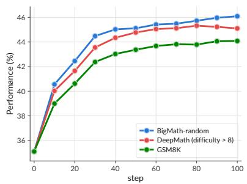  
(a) JustRL-1.5B → DS-distill-1.5B

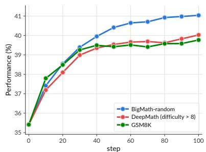  
(b) Polaris-7B → DS-distill-1.5B

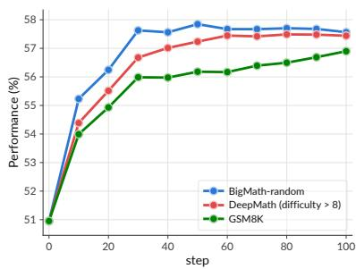  
(c) Polaris-7B → DS-distill-7B  
Figure 8. In-domain math performance (average over six English benchmarks) is largely insensitive to the dificulty of the training queries. Subfigure (a–c) training on the extremely easy GSM8K, the extremely hard DeepMath-103K, and the diverse BigMath mixture.

Scientific Reasoning Tasks (GPQA-Diamond):

Please reason step by step, and put your final answer (only the option, i.e., A, B, C or D) within \boxed{}.

Note that these above two system prompts are consistent with all of the models used in this work.

## C. Additional Experiment Results

## C.1. Additional Results on the Training Data Dificulty

To further test whether the observed behavior holds beyond dificulty partitions constructed from a single dataset, we introduce two additional datasets representing the extremes of the dificulty spectrum. For the extremely hard setting, we use DeepMath-103K [18], which provides dificulty scores ranging from 1 to 9, and retain queries with scores above 8. For the extremely easy setting, we use the GSM8K training set, which consists of grade-school mathematical word problems. We repeat the same OPD experiments on these two datasets to examine whether teacher-side pass rate becomes more important when the training queries are either almost always solvable or rarely solvable by the teacher.

Figure 8 shows the reslts. The experiments on the two dificulty extremes lead to a similar conclusion. Both grade-school-level GSM8K queries and highly challenging DeepMath-103K queries produce substantial improvements through OPD, and their final average scores difer by fewer than two points across the tested configurations. Thus, efective on-policy supervision does not require the training queries to fall within a narrow absolute dificulty range. However, models trained on either dificulty extreme generally remain behind those trained on the more diverse Big-Math-RL-Verified mixture. This suggests that, although neither teacher pass rate nor absolute query dificulty alone determines whether a sample is useful, maintaining a diverse coverage of problem dificulties is still beneficial for broader generalization.

## C.2. Additional Generalization Results across Model Origin

Figure 9 presents additional generalization results across three teacher–student configurations. Each panel reports performance on English Math, Chinese Math, Long-Horizon Math, and Code, allowing us to jointly examine in-domain distribution shifts and cross-domain transfer.

Figure 9a shows the same-origin Polaris-4B → Qwen3-4B configuration. We compare OPD on the randomly sampled Big-Math-RL-Verified subset with OPD on Polaris-53K, the dataset used for the post-training of Polaris-4B. Both training distributions produce stable improvements and converge to similar performance across the evaluated benchmarks. This result indicates that efective OPD does not require access to the teacher’s original post-training data. Figure 9b reports the cross-origin Qwen3-32B → Qwen3-8B-SFT configuration trained on Big-Math-RL-Verified. Qwen3- 8B-SFT is initialized from Qwen3-8B-Base and supervised fine-tuned on OpenThoughts3-1.2M before OPD. The student improves clearly on English Math, Chinese Math, and Long-Horizon Math, demonstrating that the mathematical supervision transfers across both language and reasoninghorizon shifts. In contrast, the Code performance changes only marginally. This result shows that under a cross-origin teacher–student configuration, broad in-domain generalization does not necessarily imply equally strong transfer to every semantic domain. Figure 9c shows the same-origin Light-R1-14B → DS-distill-14B configuration. OPD produces stable improvements across all four evaluation groups. Notably, on Long-Horizon Math, the distilled student eventually surpasses the standalone teacher by a clear margin. This observation suggests that the final student is not necessarily bounded by the teacher’s standalone benchmark accuracy.

## C.3. Complete Cross-domain Transfer Results

Figure 10 provides the complete results for transferring from Code and Science training data to mathematical reasoning. The first row presents results for DS-distill-1.5B, while the second row presents the corresponding results for DS-distill-7B. For each student, we evaluate English Math, Chinese Math, and Long-Horizon Math. Across both model sizes, OPD on Code or Science queries generally improves mathematical reasoning, even though no Math queries are used in these runs. The gains extend beyond standard English benchmarks to Chinese problems and composed long-horizon problems. This confirms that the teacher’s mathematical capability can be transferred through student trajectories collected from non-Math domains.

The complete curves also reinforce the model-origin efect reported in the main text. Same-origin teachers typically produce stronger and more stable gains across the three evaluation distributions. Within the same teacher lineage, the diferences among Math-, Code-, and Science-supervised runs are comparatively small, whereas changing the teacher origin produces a larger performance gap. Thus, the teacher–student post-training relationship can have a stronger efect on cross-domain transfer than the nominal domain of the training queries.

We further examine whether instruction-following data can serve as a carrier for mathematical capability transfer. Figure 11 reports results for Nemotron-1.5B → DS-distill-1.5B and Polaris-7B → DS-distill-7B. Both configurations are evaluated on English Math, Chinese Math, and Even when the student trajectories are collected from instruction-following prompts, the teacher can still transfer capabilities that are not explicitly represented by the nominal training domain. Together with the previous results, this suggests that the training queries primarily determine where teacher supervision is elicited, rather than strictly restricting which teacher capabilities can be transferred.

## C.4. Full Mathematical Results for MOPD

Table 6 reports the complete mathematical reasoning results of the MOPD experiments at training step 200. Under the first teacher–domain assignment, JustRL provides Math supervision and Nemotron provides science/IF supervision. JustRL-dominant mixtures generally maintain stronger mathematical performance. The 25/8 configuration achieves the highest average score of 19.6%, slightly exceeding both the JustRL-only configuration and the balanced 1/1 mixture. Also, math ematical performance decreases substantially once Nemotron becomes dominant. The average falls from 19.1% for the balanced mixture to 17.4% for 2/25 and 14.9% for the Nemotron-only configuration. The relationship is not strictly monotonic on every individual benchmark, but the aggregate trend shows that excessive Nemotron supervision shifts the student toward Nemotron’s weaker mathematical capability.

Qwen3-32B -> Qwen3-8B (BigMath-random)

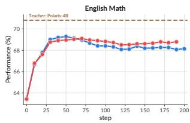

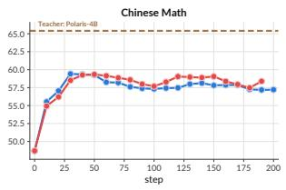

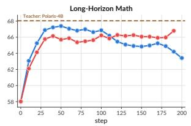

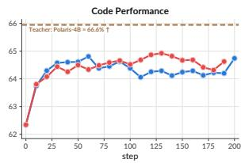

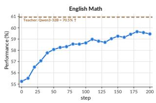

(a) Polaris-4B to Qwen3-4B  
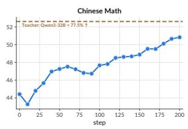

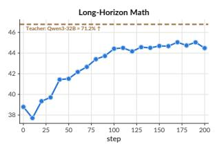

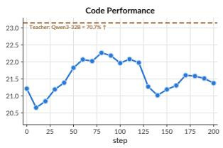

(b) Qwen3-32B to Qwen3-8B-SFT  
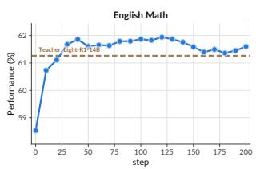

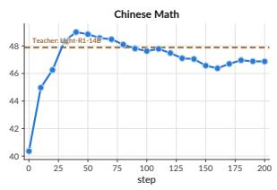

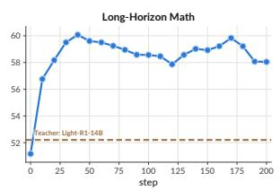

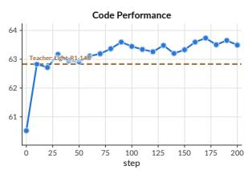  
(c) Light-R1-14B to DS-distill-14B  
Figure 9. Additional generalization results across three teacher–student configurations.

The reversed assignment provides complementary evidence. Here, Nemotron supervises Math queries, whereas JustRL supervises science/IF queries. Despite this reassignment, increasing the proportion of JustRL supervision still improves the student’s mathematical performance. The JustRL-only configuration reaches an average of 17.5%, compared with 15.8% for both the balanced and Nemotron-only configurations. This result cannot be explained by the nominal training-domain assignment, since JustRL does not supervise Math data in this setting. Instead, its stronger mathematical capability is transferred through science/IF trajectories. The full benchmark results therefore confirm that domain routing does not isolate a teacher’s influence to its assigned domain.

Polaris-7B -> DS-distill-7B (instruction-following prompts) Polaris-7B -> DS-distill-7B (math prompts)

Nemotron-1.5B -> DS-distill-1.5B (instruction-following prompts) Nemotron-1.5B -> DS-distill-1.5B (math prompts)  
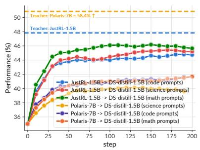  
(a) English Math (DS-distill-1.5B)

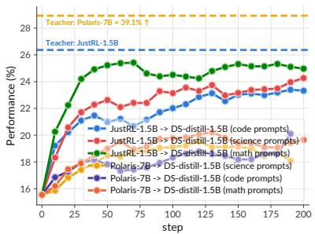  
(b) Chinese Math (DS-distill-1.5B)

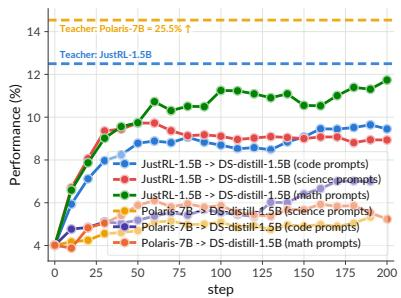  
(c) Long-Horizon Math (DS-distill-1.5B)

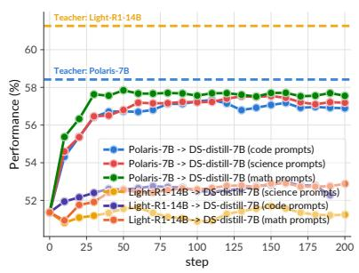  
(d) English Math (DS-distill-7B)

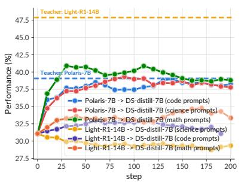  
(e) Chinese Math (DS-distill-7B)

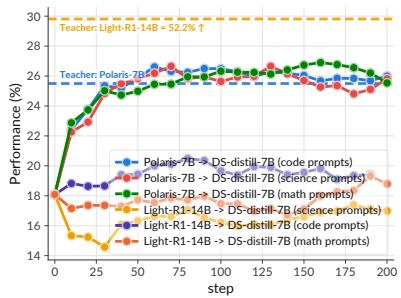  
(f) Long-Horizon Math (DS-distill-7B)  
Figure 10. Training on code and science domains and generalizing to math-related domains.

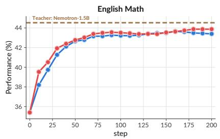

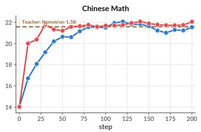

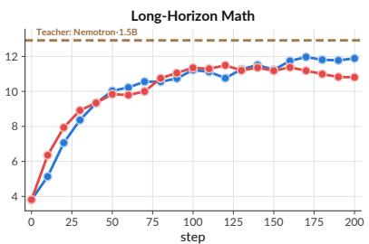

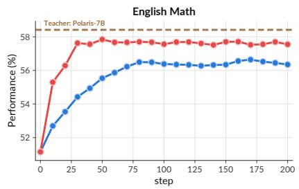

(a) Nemotron-1.5B to DS-distill-1.5B  
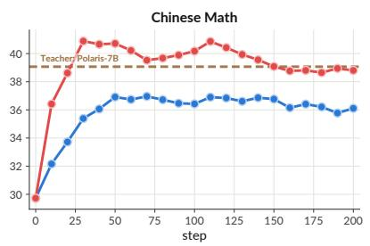  
(b) Polaris-7B to DS-distill-7B

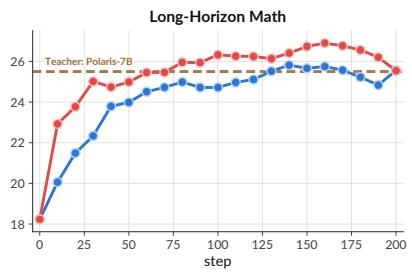  
Figure 11. Training on instruction-following data and generalizing on math-related benchmarks.

Table 6. MOPD performance comparison across five mathematical reasoning benchmarks (training step 200).
<table><tr><td>Configuration</td><td>BeyondAIME</td><td>OlymMATH-e(en)</td><td>OlymMATH-e(zh)</td><td>OlymMATH-h</td><td>AIME24-n2</td><td>Average</td></tr><tr><td> $\mathrm { D S - d i s t i l l - } 1 . 5 \mathrm { B }$ </td><td>9.6%</td><td>14.2%</td><td>11.2%</td><td>3.2%</td><td>6.0%</td><td>8.8%</td></tr><tr><td>JustRL-1.5B</td><td>19.0%</td><td>32.6%</td><td>23.0%</td><td>5.7%</td><td>16.3%</td><td>19.3%</td></tr><tr><td>Nemotron-1.5B</td><td>17.6%</td><td>29.2%</td><td>16.6%</td><td>5.6%</td><td>14.3%</td><td>16.7%</td></tr><tr><td colspan="7">Math Teacher: JustRL-1.5B, science/IF Teacher: Nemotron-1.5B, Student: DS-distill-1.5B</td></tr><tr><td> $\mathrm { J u s t R L } / \mathrm { N e m o t r o n } = 2 5 / 0$ </td><td>19.0%</td><td>32.6%</td><td>23.0%</td><td>5.7%</td><td>16.3%</td><td> $1 9 . 3 \% ( + 0 . 2 \mathrm { p p } )$ </td></tr><tr><td> $\mathrm { J u s t R L } / \mathrm { N e m o t r o n } = 2 5 / 2$ </td><td>19.4%</td><td>33.3%</td><td>23.0%</td><td>5.9%</td><td>14.1%</td><td>19.1%(+0.0 pp)</td></tr><tr><td> $\mathrm { J u s t R L } / \mathrm { N e m o t r o n } = 2 5 / 8$ </td><td>19.6%</td><td>34.5%</td><td>23.2%</td><td>5.5%</td><td>15.3%</td><td>19.6%(+0.5 pp)</td></tr><tr><td> $\mathrm { J u s t R L } / \mathrm { N e m o t r o n } = 1 / 1$ </td><td>20.2%</td><td>32.4%</td><td>20.6%</td><td>5.0%</td><td>17.3%</td><td>19.1%(baseline)</td></tr><tr><td> $\mathrm { J u s t R L } / \mathrm { N e m o t r o n } = 8 / 2 5$ </td><td>19.7%</td><td>32.5%</td><td>22.7%</td><td>5.5%</td><td>15.7%</td><td>19.2%(+0.1 pp)</td></tr><tr><td> $\mathrm { J u s t R L } / \mathrm { N e m o t r o n } = 2 / 2 5$ </td><td>19.2% 15.9%</td><td>31.0% 25.3%</td><td>19.2% 15.7%</td><td>5.2% 3.7%</td><td>12.3% 13.8%</td><td>17.4%(-1.7 pp)</td></tr><tr><td> $\mathrm { J u s t R L } / \mathrm { N e m o t r o n } = \mathbf { 0 } / 2 5$ </td><td></td><td></td><td></td><td></td><td></td><td>14.9%(-4.2 pp)</td></tr><tr><td colspan="7">Math Teacher: Nemotron-1.5B, science/IF Teacher: JustRL-1.5B, Student: DS-distill-1.5B</td></tr><tr><td>JustRL/Nemotron = 25/0 JustRL/Nemotron = 25/8</td><td>18.2%</td><td>29.8%</td><td>21.1%</td><td>5.8%</td><td>12.3%</td><td>17.5%(+1.7 pp)</td></tr><tr><td></td><td>17.4%</td><td>28.0%</td><td>17.8%</td><td>4.5%</td><td>14.8%</td><td>16.5%(+0.7 pp)</td></tr><tr><td> $\mathrm { J u s t R L } / \mathrm { N e m o t r o n } = 1 / 1$   $\mathrm { J u s t R L } / \mathrm { N e m o t r o n } = 8 / 2 5$ </td><td>17.3%</td><td>26.6%</td><td>16.8%</td><td>4.4%</td><td>13.9%</td><td>15.8%(baseline)</td></tr><tr><td> $\mathrm { J u s t R L } / \mathrm { N e m o t r o n } = \mathbf { 0 } / 2 5$ </td><td>17.1% 17.4%</td><td>26.2%</td><td>16.8% 17.0%</td><td>4.7% 4.5%</td><td>14.3% 13.6%</td><td>15.8%(-0.0 pp)</td></tr><tr><td></td><td></td><td>26.5%</td><td></td><td></td><td></td><td>15.8%(-0.0 pp)</td></tr></table>