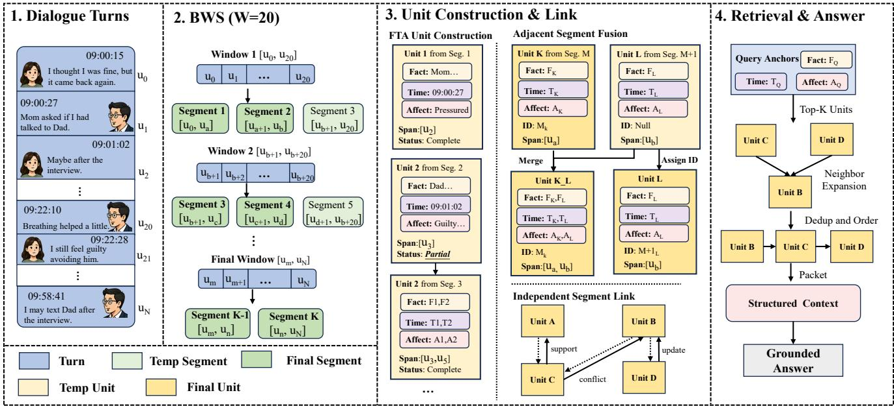
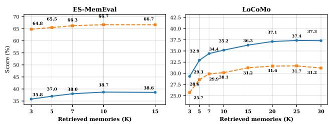
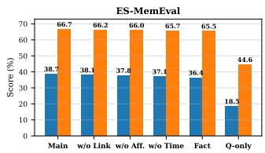
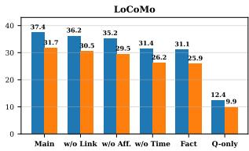
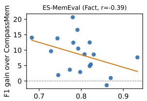
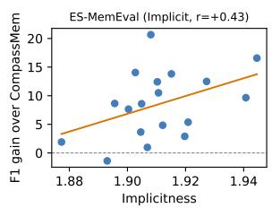
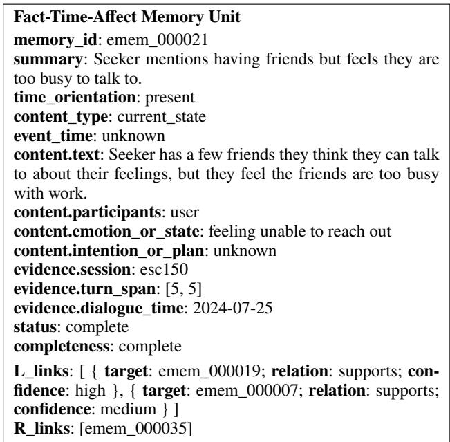
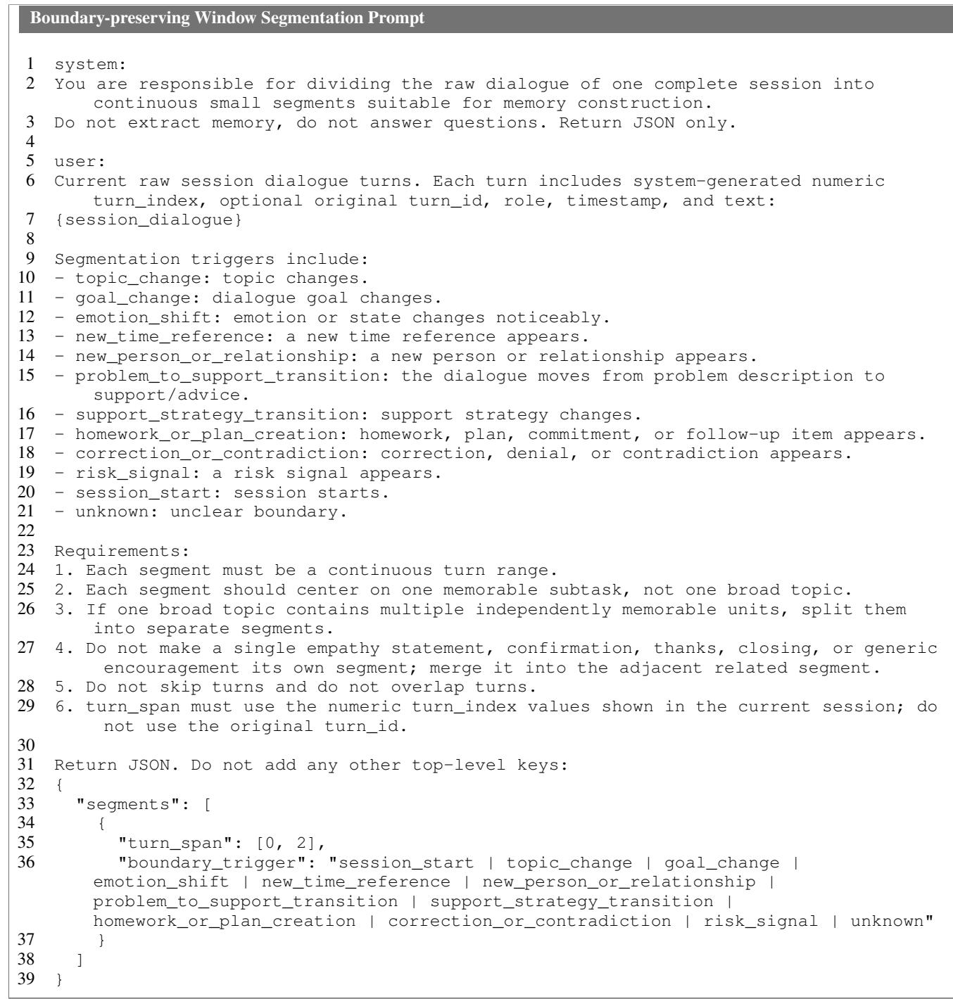
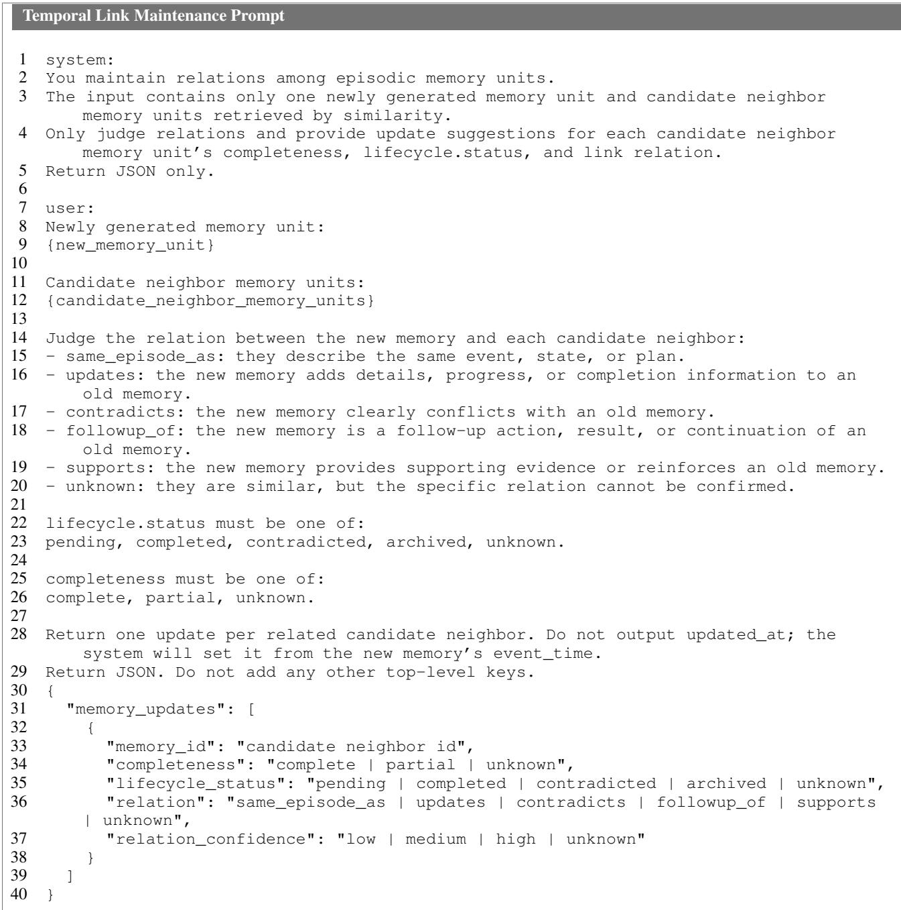
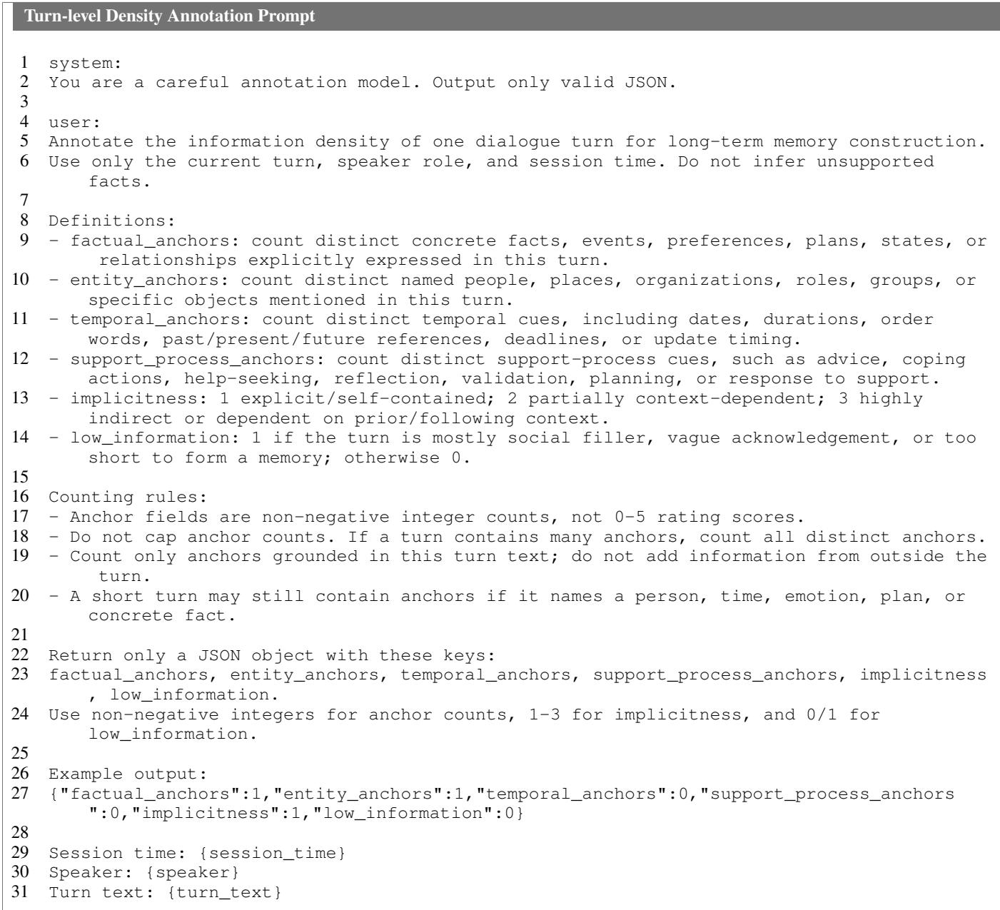

# FTA-Mem: Fact-Time-Afect Anchored Memory for Low-Density Long-Term Dialogue

Chang Liu<sup>1</sup>, Shuyi Zhang<sup>1</sup>, Changsheng Ma<sup>1</sup>, Yongfeng Tao<sup>1</sup>, Minqiang Yang<sup>1</sup>, Bin Hu<sup>1</sup>,

<sup>1</sup>School of Information Science and Engineering, Lanzhou University,

## Abstract

Long-term emotional-support agents require memory mechanisms for personalized understanding across sessions. However, emotional-support dialogue is often low-density: turns are incomplete, evidence is scattered, and user states evolve over time. Existing memory methods usually rely on fixed units, such as turn-level notes or session summaries, which may lose details or introduce redundant noise. We propose FTA-Mem, a structured memory framework for low-density long-term dialogue. FTA-Mem uses Boundary-preserving Window Segmentation (BWS) to form coherent situation fragments, and constructs Fact-Time-Afect Memory Units (FTA Units) that jointly encode factual content, temporal grounding, and afective context. Retrieved units are then synthesized into structured context for answer generation. Experiments on ES-MemEval and LoCoMo show that FTA-Mem improves overall long-term memory question answering across benchmarks with diferent information-density characteristics. On ES-MemEval, FTA-Mem achieves 0.3871 F1 and 0.6668 BERTScore. Further analysis shows that situationlevel FTA construction better balances evidence preservation and construction cost than coarse session-level or overly finegrained turn-pair construction, providing an efective granularity trade-of for long-term dialogue memory.

## Introduction

Large language models (LLMs) have shown substantial potential as conversational agents and are increasingly used in customer support, emotional support, and mental health services (Chen, Zeng et al. 2024; Zou et al. 2026b). Although these models can generate fluent and empathetic responses in short-term interactions, psychological and emotional support is inherently longitudinal (Schaie 1983). Reliable long-term support requires an agent to maintain personalized understanding of users’ experiences, emotional trajectories, and prior support interactions across sessions. Building robust long-term memory systems has therefore become a central challenge for long-term conversational agents (Hatalis et al. 2023; Maharana et al. 2024; Wu and Shu 2026).

However, long-term emotional-support dialogue poses a distinct memory challenge: it is often low-density. A single turn rarely contains a complete, self-contained fact; useful evidence may be sparse, indirect, temporally ambiguous, or distributed across multiple sessions (Chen et al. 2026). Moreover, the meaning of an event often depends not only on what happened, but also on when the information remains valid and how the user appraises it. Therefore, simply retrieving more history or compressing longer contexts does not necessarily yield reliable memory.

Many long-term memory systems for LLM agents follow a retrieval-augmented paradigm: past interactions are converted into retrievable memory units and later selected as context for generation. Some systems keep memory close to the original dialogue, retrieving raw passages or compact summaries and profiles (Zhong et al. 2024). Others introduce managed memory stores or agentic update mechanisms to support persistence and revision (Packer et al. 2024; Kang et al. 2025). More recent work further organizes memory with graph links or event segmentation, connecting related semantic units or merging adjacent turns into event memories (Xu et al. 2026; Ke et al. 2025; Zou et al. 2026a). These designs improve storage, updating, or retrieval from diferent angles, but their efectiveness still depends on the quality and granularity of the underlying memory units.

This raises two basic but underexplored questions: at what granularity should low-density long-term dialogue memories be constructed, and what should count as a retrievable memory unit? Coarse units such as session summaries are compact, but may omit QA-sensitive details such as temporal updates, unresolved plans, relationship changes, and afective cues. Fine-grained units such as turns or turn pairs preserve local evidence, but often split a coherent user event or state into redundant fragments. Recent event-segmentation and event-centric memory methods improve semantic integrity by grouping adjacent turns into segments or using LLMs to extract coarse event graphs (Wu et al. 2025; Zou et al. 2026a; Hu et al. 2026b). However, low-density psychological dialogue requires organizing distributed factual, temporal, and afective cues within memory units, rather than only forming coarse event groups.

To address this issue, we propose FTA-Mem, a structured memory framework for low-density long-term dialogue. FTA-Mem constructs situation-level Fact-Time-Afect Memory Units. FTA-Mem first preserves broader contextual continuity with Boundary-preserving Window Segmentation (BWS), and then decomposes each coherent fragment into compact memory units. It also maintains units around segment boundaries by carrying unresolved units across fragments, fusing adjacent-fragment units before persistent ID assignment, and linking finalized units to related historical memories. Each unitjointly grounds factual evidence, temporal validity, and afective interpretation. During answer generation, retrieved FTA units are synthesized into structured context packets rather than passed as a flat list of retrieved passages.

Our contributions are:

• We introduce FTA-Mem, a structured memory framework that represents low-density long-term dialogue with situation-level Fact-Time-Afect memory units.

• We design a boundary-preserving construction pipeline that preserves contextual continuity through unit carryover, adjacent-fragment fusion, and temporal-link maintenance.

• We evaluate FTA-Mem on ES-MemEval (Chen et al. 2026) and LoCoMo (Maharana et al. 2024), showing improved question-answering performance and a better granularity trade-of than session-level and turn-pair memory construction.

## Related Work

## Psychological Counseling Agents

Early LLM-based counseling agents mainly focus on response generation in single-session or short-term interactions, such as CBT-LLM (Na 2024) for CBT-style counseling and HealMe (Xiao et al. 2024) for short multi-turn emotional support. These systems improve counseling responses but do not explicitly model long-term memory (Li et al. 2025; Wang et al. 2026). Recent work has begun to move toward multi-session psychological counseling. MusPsy (Wang et al. 2026) synthesizes multi-session counseling cases from user profiles and psychological scenarios. TheraMind (Hu et al. 2026a) and PsychAgent (Yang et al. 2026) further target continuous counseling settings through strategy planning, client profiling, memory-augmented continuity, and skill evolution. These systems highlight the importance of long-term support, but their memory components are typically organized around session summaries, client profiles, planning states, or therapeutic skills. In contrast, FTA-Mem focuses on the representation of retrievable memory units themselves, preserving factual evidence, temporal validity, and afective state in low-density emotional-support dialogue.

## Long-Term Memory for LLM Agents

Retrieval-augmented generation (RAG) mitigates the context limitation of LLMs by retrieving external information (Fan et al. 2024; Arslan et al. 2024). Existing long-term memory systems for LLM agents mainly difer in how they define and maintain memory units. GraphRAG demonstrates the utility of graph-based organization for memory retrieval (Edge et al. 2025); MemoryBank stores dialogue history through summaries (Zhong et al. 2024); MemGPT and MemoryOS introduce hierarchical memory management (Packer et al. 2024; Kang et al. 2025); A-MEM builds agentic memory notes with links and updates (Xu et al. 2026); FraCom extracts turn-derived semantic units and connects them with graph structures (Ke et al. 2025); ES-Mem segments adjacent turns into coherent event memories (Zou et al. 2026a); and CompassMem organizes dialogue into event-centric memory maps (Hu et al. 2026b). However, their underlying units are often still raw dialogue turns, summaries, or turn-derived semantic units. This leaves the granularity of retrievable memory underexplored in low-density long-term dialogue. Coarse units, such as session summaries, are compact but may lose QA-sensitive details; fine-grained turn or turn-pair units preserve local evidence but may split coherent situations into redundant fragments. FTA-Mem therefore focuses on the retrievable unit itself, constructing situation-level Fact-Time-Afect units that preserve factual evidence, temporal grounding, and afective state before retrieval, linking, and context synthesis.

## Methodology

## Problem Definition

We consider a long-term dialogue case C consisting of multiple sessions $C \doteq \{ S _ { 1 } , S _ { 2 } , \ldots , S _ { N } \}$ , where each session is ${ { S } _ { i } } = \left\{ { { u } _ { i , 1 } } , { { u } _ { i , 2 } } , \ldots , { { u } _ { i , { T } _ { i } } } \right\}$ . Each turn $u _ { i , t }$ contains the speaker role, timestamp, and utterance text. Given a user query $q \in Q$ , the goal is to generate an answer a grounded in the case history.

Directly conditioning on C is infeasible for long cases and unreliable for low-density dialogue, where useful evidence may be sparse, implicit, or distributed across sessions. FTA-Mem therefore introduces an external structured memory M as an intermediate representation. At inference time, the query retrieves a subset of relevant memory units $M _ { s u b } \subset$ M, and the answer is generated as:

$$
a ^ { * } = \arg \operatorname* { m a x } _ { a } p _ { \theta } ( a \mid q , M _ { s u b } ) .\tag{1}
$$

Thus, the central problem becomes how to construct memory units that are compact enough for retrieval, yet expressive enough to preserve factual evidence, temporal validity, and afective context. The overall pipeline of FTA-Mem is illustrated in Figure 1.

## Boundary-preserving Window Segmentation

Low-density emotional-support dialogue often requires surrounding context to form a complete memory. A single turn may be incomplete, while an entire session may be too long and heterogeneous. We therefore introduce Boundarypreserving Window Segmentation (BWS), inspired by event segmentation theory (Zacks et al. 2007), to form coherent situation fragments before memory construction.

For each session S , we first attach a numeric turn index to every turn. Given a window size W, BWS applies an LLM-based boundary detector $g _ { \phi }$ to a consecutive window:

$$
g _ { \phi } ( S _ { i } [ s : s + W - 1 ] ) \to \{ ( b _ { j } , e _ { j } , r _ { j } ) \} _ { j = 1 } ^ { K } ,\tag{2}
$$

where $( b _ { j } , e _ { j } )$ denotes a continuous turn span and $r _ { j }$ denotes the boundary cue, such as a topic change or emotional shift.

To avoid context truncation caused by window boundaries, BWS does not simply move forward by a fixed stride. After segmenting the current window, it repositions the next window to the start of the last detected segment, i.e., $s  b _ { K }$

  
Figure 1: Overview of FTA-Mem. BWS segments dialogue turns into boundary-preserving fragments, which are converted into Fact-Time-Afect units. Partial units can be carried forward, adjacent units can be fused before ID assignment, and finalized units are linked, retrieved, deduplicated, and organized into structured context for grounded answer generation.

BWS finalizes completed segments before the last detected segment, keeps the last segment provisional for the next window, and enforces a minimum forward step when the detector returns a single full-window segment. If the current window reaches the end of the session, BWS finalizes the detected segments and terminates. This allows boundary-uncertain content near the window tail to be reprocessed with following context.

The output of BWS is a sequence of contiguous fragments $F _ { i } = \{ f _ { i , 1 } , f _ { i , 2 } , . . . , f _ { i , L _ { i } } \}$ for each session $S _ { i }$ . Each fragment is then used as the evidence span for constructing one or more memory units.

## Memory Unit Construction

FTA-Mem is inspired by Tulving’s distinction between episodic and semantic memory (Tulving et al. 1972). At the episodic level, it constructs evidence-grounded Fact-Time-Afect units from dialogue fragments; at the longitudinal level, it can maintain semantic user memory and supportexperience memory for consistency.

Fact-Time-Afect Memory Unit FTA-Mem represents long-term dialogue at the situation level. A situation may correspond to a user event, an evolving state, or a support interaction. Following situation models (Zwaan and Radvansky 1998), a useful memory unit should preserve what happened, when it is valid, and how it is afectively situated.

The basic memory node is a Fact-Time-Afect Memory Unit, denoted as $\boldsymbol { m } ^ { \prime } = \langle \boldsymbol { x } ^ { F } , \boldsymbol { x } ^ { T } , \boldsymbol { x } ^ { A } , \boldsymbol { e } , \boldsymbol { o } \rangle$ . Here, $x ^ { F }$ is the fact anchor, $x ^ { T }$ is the time anchor, $x ^ { A }$ is the afect anchor, e is the evidence pointer, and o is the unit-construction status. The fact anchor stores the factual claim, situation type, participants, and summary; the time anchor stores dialogue time, event time, temporal orientation, and situation completion status; and the afect anchor stores broader subjective context, including emotion, intention, and relation cues.

Given a situation fragment $f _ { i , j }$ and unresolved units $I _ { i , j } ,$ an LLM-based extractor constructs candidate FTA units:

$$
\{ m _ { i , j } ^ { k } \} _ { k = 1 } ^ { K _ { i , j } } = \mathrm { E x t } _ { \theta } ( f _ { i , j } , I _ { i , j } ) .\tag{3}
$$

The unit-construction status o indicates whether the memory unit is complete, partial, pending, or unknown. To reduce segmentation-induced incompleteness, unresolved partial units are carried to the next fragment:

$$
I _ { i , j + 1 } = \{ m \in M _ { \leq i , j } \mid o ( m ) = \mathrm { p a r t i a l } \} .\tag{4}
$$

Finalized units are assigned persistent memory IDs and inserted into the memory store, while unresolved partial units remain construction context rather than independently retrievable memories.

Unit Consolidation and Temporal-Link Maintenance FTA-Mem uses a two-level maintenance mechanism to reduce segmentation-induced redundancy while preserving longitudinal consistency. The first level locally consolidates partial units across adjacent fragments, and the second level maintains temporal links among distributed memories.

After the extractor produces candidate units for fragment $f _ { i , j } ,$ , FTA-Mem first checks whether each candidate should be fused with an unresolved unit carried from adjacent fragments. This step targets cases where a situation near a fragment boundary is partially extracted in one fragment and completed in the next. If a new candidate m˜ is compatible with a previous unresolved unit $m _ { p } \in I _ { i , j }$ and can complete or refine it, FTA-Mem performs local fusion:

$$
m _ { p } \gets \mathrm { F u s e } ( m _ { p } , \tilde { m } ) .\tag{5}
$$

The fusion combines their factual anchors, temporal anchors, afective context, and evidence pointers. The new candidate is not assigned an independent memory ID. If no local fusion is triggered, the candidate is finalized, assigned a persistent memory ID, and inserted into the memory store.

FTA-Mem then links each newly stored unit to related historical units. Candidate neighbors are retrieved from the existing memory store by embedding similarity, and a relation classifier labels each pair as same-situation, update, contradiction, follow-up, support, or unknown. Non-unknown relations are added to the memory graph:

$$
\mathcal { E } _ { r } \gets \mathcal { E } _ { r } \cup \{ ( m , m ^ { \prime } , r ) \} .\tag{6}
$$

The graph supports bidirectional access during retrieval, while each relation label preserves its direction from the new unit to the historical unit. These links update relation labels, temporal validity, lifecycle status, and reverse pointers for later neighbor expansion. In this way, FTA-Mem can track whether a prior situation has been completed, revised, contradicted, or supported over time.

Longitudinal Memory Maintenance In addition to episodic FTA units, FTA-Mem maintains auxiliary longitudinal memory after each session, including user semantic memory U and support-experience memory H. Given episodic units $\mathcal { M } _ { i }$ from session $S _ { i }$ , the memories are updated as:

$$
\begin{array} { r l } & { \mathcal { U } _ { i } = \operatorname { U p d a t e } _ { U } ( \mathcal { U } _ { i - 1 } , \mathcal { M } _ { i } ) , } \\ & { \mathcal { H } _ { i } = \operatorname { U p d a t e } _ { H } ( \mathcal { H } _ { i - 1 } , \mathcal { M } _ { i } ^ { s u p } ) . } \end{array}\tag{7}
$$

They provide auxiliary context, while episodic FTA units remain the primary evidence source.

## Retrieval and Context Synthesis

At inference time, FTA-Mem retrieves relevant FTA units and synthesizes them into a structured memory packet for answer generation.

Query Rewriting and Unit Retrieval Given an input query q, FTA-Mem rewrites it into an evidence-oriented retrieval query q<sup>′</sup>. The rewrite preserves explicit entities, temporal expressions, relations, and task intent, so that the query better matches the structured memory store rather than broad semantic summaries.

Each memory unit m is represented by a structured retrieval text $\rho ( m )$ , constructed from its factual anchor, temporal anchor, afective anchor, and evidence metadata. FTA-Mem scores each unit as:

$$
R ( q ^ { \prime } , m ) = \lambda s _ { \mathrm { e m b } } ( q ^ { \prime } , \rho ( m ) ) + ( 1 - \lambda ) c ( q ^ { \prime } , m ) ,\tag{8}
$$

where $s _ { \mathrm { e m b } }$ is embedding similarity, $c ( q ^ { \prime } , m )$ is a structured cue score over time, situation type, participants, and afective context, and λ balances semantic similarity and structured cue matching.

The primary episodic evidence set is selected by thresholded top-K retrieval:

$$
M _ { s u b } = \mathrm { T o p K } _ { K } \{ m \in M \mid R ( q ^ { \prime } , m ) \geq \tau \} .\tag{9}
$$

Here, K controls the retrieval budget and τ filters weakly related memories.

<table><tr><td>Metric</td><td>ES-MemEval</td><td>LoCoMo</td></tr><tr><td>Turn length</td><td>18.56</td><td>22.69</td></tr><tr><td>Factual anchors / turn</td><td>0.80</td><td>1.11</td></tr><tr><td>Entity anchors / turn</td><td>0.52</td><td>1.24</td></tr><tr><td>Temporal anchors / turn</td><td>0.11</td><td>0.22</td></tr><tr><td>Support-process anchors / turn</td><td>0.91</td><td>0.50</td></tr><tr><td>Implicitness (1–3)</td><td>1.91</td><td>1.58</td></tr><tr><td>Low-info turns</td><td>7.22%</td><td>5.58%</td></tr></table>

Table 1: Turn-level information-density statistics of ES-MemEval and LoCoMo. Values are averaged over turns.

Linked Neighbor Expansion and Source Grounding The initially retrieved units may have later updates, contradictions, or follow-up evidence. FTA-Mem therefore expands a small number of linked neighbors:

$$
L _ { s u b } = \mathrm { E x p a n d } ( M _ { s u b } , \mathcal { E } _ { r } , B ) ,\tag{10}
$$

where B limits neighbors per retrieved unit. The retrieved units and neighbors are deduplicated by persistent memory ID and ordered chronologically before context synthesis. These neighbors provide relation-aware support, while $M _ { s u b }$ remains the primary evidence set.

Each retrieved unit keeps an evidence pointer e(m) to its original dialogue span. During context synthesis, FTA-Mem preserves these source pointers together with the unit content, so that the answer model can ground its response in the original conversation rather than only in abstracted memory text. In addition, FTA-Mem retrieves relevant user semantic memory $U _ { s u b }$ and support-experience memory $H _ { s u b } ,$ , and groups them as auxiliary longitudinal memory $A _ { s u b } = U _ { s u b } \cup H _ { s u b }$

Structured Context Synthesis FTA-Mem synthesizes the retrieved information into a structured memory packet:

$$
P _ { q } = \mathrm { S y n } ( M _ { s u b } , L _ { s u b } , A _ { s u b } ) .\tag{11}
$$

The packet separates primary FTA units, linked neighbor units, source dialogue spans, and auxiliary longitudinal memory. This structured format prevents the answer model from treating all retrieved content as a flat passage list.

The final answer is generated as:

$$
a ^ { * } = \arg \operatorname* { m a x } _ { a } p _ { \theta } ( a \mid q , P _ { q } ) .\tag{12}
$$

During generation, $M _ { s u b }$ is treated as primary evidence, $L _ { s u b }$ as relation-aware supporting context, and $A _ { s u b }$ as auxiliary context.

## Experiments

## Experimental Settings

Datasets. We evaluate FTA-Mem on two long-term dialogue memory benchmarks. ES-MemEval focuses on longterm emotional-support interactions and contains 18 user cases with 1,427 questions. LoCoMo is a general long conversational memory benchmark with 10 conversation samples and 1,986 questions, covering single-hop, multi-hop, temporal, and open-domain reasoning.

<table><tr><td rowspan="2">Backbone</td><td rowspan="2">Method</td><td colspan="5">F1 Score (%) ↑</td><td rowspan="2"></td><td colspan="5">BERTScore (%) ↑</td><td rowspan="2">All</td><td rowspan="2">Judge ↑ Avg.R ↓</td><td rowspan="2"></td></tr><tr><td>IE</td><td>TR</td><td>CD</td><td>Abs</td><td>UM</td><td>All</td><td>IE TR</td><td>CD</td><td>Abs</td><td>UM</td></tr><tr><td rowspan="6">Qwen3-8B</td><td>MemoryBank</td><td>23.13</td><td>29.76</td><td>25.65</td><td>33.29</td><td>24.55</td><td>27.08</td><td>53.50</td><td>64.45</td><td>59.95</td><td>49.37</td><td>65.31</td><td>58.66</td><td>1.036</td><td></td><td>4.3</td></tr><tr><td>MemGPT</td><td>44.15</td><td>32.77</td><td>25.14</td><td>29.54</td><td>25.64</td><td>31.69</td><td>65.56</td><td>65.28</td><td>58.01</td><td>49.26</td><td></td><td>65.93</td><td>61.19</td><td>1.107</td><td>2.8</td></tr><tr><td>MemoryOS</td><td>21.41</td><td>25.79</td><td>22.35</td><td>59.96</td><td>22.29</td><td>29.70</td><td>52.35</td><td>60.83</td><td>56.73</td><td></td><td>67.48</td><td>63.87</td><td>60.09</td><td>0.917</td><td>4.9</td></tr><tr><td>A-Mem</td><td>27.96</td><td>31.66</td><td>26.60</td><td>39.52</td><td>25.22</td><td>29.97</td><td>56.18</td><td>65.22</td><td>60.12</td><td></td><td>53.46</td><td>65.55</td><td>60.23</td><td>1.090</td><td>3.0</td></tr><tr><td>CompassMem</td><td>22.06</td><td>28.85</td><td>22.06</td><td>56.52</td><td>24.32</td><td>30.20</td><td>54.09</td><td></td><td>62.35</td><td>55.69</td><td>66.98</td><td>64.70</td><td>60.67</td><td>1.024</td><td>4.4</td></tr><tr><td>FTA-Mem</td><td>44.46</td><td>33.42</td><td>34.38</td><td>56.55</td><td>26.35</td><td>38.71</td><td>67.80</td><td>64.40</td><td>65.62</td><td></td><td>70.26</td><td>65.54</td><td>66.68</td><td>1.119</td><td>1.5</td></tr><tr><td rowspan="6">Qwen3-14B</td><td>MemoryBank</td><td>24.78</td><td>30.77</td><td>25.61</td><td>36.76</td><td>26.66</td><td>28.72</td><td>54.28</td><td></td><td>64.43</td><td>59.44</td><td>42.82</td><td>66.44</td><td>57.78</td><td>1.097</td><td>3.2</td></tr><tr><td>MemGPT</td><td>38.07</td><td>33.96</td><td>21.85</td><td>40.47</td><td>27.24</td><td>32.33</td><td>61.40</td><td>66.34</td><td></td><td>54.43</td><td>44.81</td><td>66.84</td><td>59.21</td><td>1.088</td><td>2.4</td></tr><tr><td>MemoryOS</td><td>21.51</td><td>28.46</td><td>21.91</td><td>30.83</td><td>24.91</td><td>25.40</td><td>51.53</td><td>62.07</td><td></td><td>55.78</td><td>41.39</td><td>65.14</td><td>55.48</td><td>0.952</td><td>4.4</td></tr><tr><td>A-Mem</td><td>30.30</td><td>34.58</td><td>30.73</td><td>11.23</td><td>28.34</td><td>27.32</td><td>56.67</td><td></td><td>66.46</td><td>63.07</td><td>34.24</td><td>67.31</td><td>58.00</td><td>1.114</td><td>2.5</td></tr><tr><td>CompassMem</td><td>22.40</td><td>29.20</td><td>22.40</td><td>58.00</td><td>24.60</td><td>30.60</td><td>54.30</td><td></td><td>62.80</td><td>56.00</td><td>68.00</td><td>65.10</td><td>61.00</td><td>1.032</td><td>4.2</td></tr><tr><td>FTA-Mem</td><td>37.31</td><td>29.99</td><td>31.11</td><td>72.80</td><td>24.87</td><td>38.52</td><td>61.79</td><td>60.61</td><td>62.62</td><td></td><td>81.75</td><td>63.07</td><td>65.64</td><td>1.121</td><td>2.4</td></tr><tr><td rowspan="6">GPT-4o-mini</td><td>MemoryBank</td><td>25.85</td><td>32.35</td><td>25.01</td><td>57.16</td><td>26.62</td><td>32.88</td><td>54.70</td><td></td><td>65.07</td><td>58.23</td><td>68.83</td><td>66.43</td><td>62.52</td><td>1.112</td><td>2.8</td></tr><tr><td>MemGPT</td><td>29.63</td><td>34.99</td><td>30.21</td><td>45.46</td><td>27.60</td><td></td><td>33.26</td><td>55.94</td><td>66.77</td><td>62.82</td><td>59.84</td><td>66.38</td><td>62.34</td><td>1.080</td><td>2.4</td></tr><tr><td>MemoryOS</td><td>24.80</td><td>28.10</td><td>20.90</td><td>65.00</td><td>24.70</td><td>32.06</td><td></td><td>54.70</td><td>62.60</td><td>55.94</td><td>68.10</td><td>65.45</td><td>61.26</td><td>1.020</td><td>4.4</td></tr><tr><td>A-Mem</td><td>26.33</td><td>30.77</td><td>22.09</td><td>66.95</td><td>26.40</td><td>33.86</td><td>54.86</td><td>63.15</td><td></td><td>53.93</td><td>76.36</td><td>64.82</td><td>62.40</td><td>1.099</td><td>3.1</td></tr><tr><td>CompassMem</td><td>24.60</td><td>30.40</td><td>23.20</td><td>62.50</td><td>25.10</td><td>31.80</td><td>55.00</td><td>63.60</td><td></td><td>57.00</td><td>72.00</td><td>65.20</td><td>62.00</td><td>1.054</td><td>4.0</td></tr><tr><td>FTA-Mem</td><td>40.93</td><td>29.50</td><td>31.25</td><td>68.01</td><td>25.68</td><td>38.53</td><td>65.22</td><td>61.83</td><td>62.80</td><td></td><td>78.08</td><td>64.04 66.19</td><td></td><td>1.122</td><td>2.3</td></tr></table>

Table 2: Performance on ES-MemEval. Avg.R is computed over the twelve automatic metrics, i.e., F1 and BERTScore on IE/TR/CD/Abs/UM/All; Judge is not included in Avg.R. Best results are in bold, and second-best results are underlined.

To characterize their diference, we conduct a turn-level information-density analysis in Table 1. Specifically, we use GPT-5.5 to annotate each dialogue turn with our density prompt, counting factual, entity, temporal, and supportprocess anchors, rating implicitness on a 1–3 scale, and assigning a binary low-information label. We then report dataset-level averages. LoCoMo contains more explicit factual, entity, temporal, and total anchors per turn, indicating denser retrievable evidence. In contrast, ES-MemEval contains more support-process signals and higher implicitness, suggesting that its useful evidence is more often embedded in supportive interactions and depends more on dialogue context.

Metrics. For ES-MemEval, we report F1 and BERTScore over five capabilities (Zhang et al. 2020): information extraction (IE), temporal reasoning (TR), conflict detection (CD), abstention (Abs), and user modeling (UM). We also report an average LLM-as-a-judge score on a 0–2 scale, where GPT-5.5 is used as the judge model. For LoCoMo, we report F1 and BLEU-1 for Single Hop, Multi Hop, Temporal, and Open Domain questions. We additionally report average rank to summarize robustness across question types.

Baselines. We compare FTA-Mem with representative long-term memory systems for LLM agents. MemoryBank stores dialogue history through summaries and user-related memories. MemGPT, implemented with Letta, represents an external-memory agent baseline with archival memory retrieval. MemoryOS maintains hierarchical memory states for long-term personalization. A-Mem is an agentic memory baseline with memory construction, linking, and update. CompassMem constructs event-centric memory graphs and hierarchical topic structures. We also include question-only, fact-only, and component-ablated variants in the ablation studies.

Implementation Details. FTA-Mem uses FTA units with W = 20 for BWS. Retrieval uses all-MiniLM-L6-v2 embeddings with a threshold of τ = 0.35 (Wang et al. 2020), and we set λ = 0.8 in Eq. (8). The retrieval budget is K = 10 on ES-MemEval and K = 25 on LoCoMo. Query rewriting is enabled, and one linked neighbor is added per retrieved unit. Qwen models are served with vLLM on two NVIDIA A800 GPUs (Yang et al. 2025; Kwon et al. 2023); GPT-4omini and GPT-5.5 judge evaluation use the API. All answer generation uses temperature 0.

## Main Results

Overall Performance Table 2 reports the results on ES-MemEval. FTA-Mem achieves the strongest average performance across backbone settings. With Qwen3-8B, it obtains 38.71 F1, 66.68 BERTScore, and the best average rank; with GPT-4o-mini, it also achieves the best overall F1 and BERTScore. The gains are most visible in information extraction and conflict detection, indicating that FTA units better preserve answerable evidence together with temporal and afective context.

Existing memory baselines show less stable behavior across capabilities. MemoryOS and CompassMem perform strongly on abstention-related cases, while MemGPT and A-Mem are competitive on some individual categories. However, they do not consistently perform well across IE, temporal reasoning, conflict detection, and user modeling. This suggests that low-density emotional-support memory requires more than generic summaries, profiles, event localization, or external-memory retrieval; the retrievable unit itself should encode factual evidence, temporal validity, and afective context.

<table><tr><td>Backbone</td><td>Method</td><td>Single Hop F1↑ BLEU-1 ↑</td><td>F1↑</td><td>Multi Hop BLEU-1 ↑</td><td>F1↑</td><td>Temporal BLEU-1 ↑</td><td>F1↑</td><td>Open Domain BLEU-1 ↑</td><td>F1</td><td>Average ↑ BLEU-1</td></tr><tr><td rowspan="6">Qwen3-8B</td><td>MemoryBank</td><td>14.32</td><td>16.07 22.43</td><td>28.30 23.78</td><td>22.25</td><td>18.69</td><td>15.32</td><td>12.33</td><td></td><td>20.05 17.72</td></tr><tr><td>MemGPT</td><td>21.66</td><td>19.14</td><td>15.28</td><td>3.71</td><td>2.81</td><td>11.86</td><td>9.28</td><td>14.09</td><td>12.45</td></tr><tr><td>MemoryOS</td><td>18.65</td><td>22.67 26.07</td><td>22.31</td><td>3.62</td><td>2.52</td><td>14.21</td><td>11.44</td><td>15.64</td><td>14.74</td></tr><tr><td>A-Mem</td><td>23.92</td><td>22.69 29.42</td><td>24.85</td><td>26.81</td><td>21.85</td><td>15.68</td><td>11.90</td><td>23.96</td><td>20.32</td></tr><tr><td>CompassMem</td><td>31.73</td><td>29.12 42.05</td><td>35.86</td><td>34.18</td><td>28.06</td><td>18.64</td><td>14.67</td><td>31.65</td><td>26.93</td></tr><tr><td>FTA-Mem</td><td>31.16 26.62</td><td>41.84</td><td>35.75</td><td>35.93</td><td>29.90</td><td>20.86</td><td>16.62</td><td>32.45</td><td>27.22</td></tr><tr><td rowspan="6">Qwen3-14B</td><td>MemoryBank</td><td>11.96</td><td>12.65</td><td>25.37 21.03</td><td>20.06</td><td>16.06</td><td>12.17</td><td>9.41</td><td>17.39</td><td>14.79</td></tr><tr><td>MemGPT</td><td>21.35</td><td>17.42</td><td>22.32 18.64</td><td>6.34</td><td>5.42</td><td>11.52</td><td>8.64</td><td>15.38</td><td>12.53</td></tr><tr><td>MemoryOS</td><td>17.58</td><td>20.34 26.34</td><td>22.13</td><td>5.11</td><td>3.40</td><td>13.07</td><td>10.51</td><td>15.53</td><td>14.09</td></tr><tr><td>A-Mem</td><td>23.68</td><td>22.88</td><td>28.31 24.03</td><td>21.06</td><td>16.30</td><td>16.16</td><td>12.62</td><td>22.30</td><td>18.96</td></tr><tr><td>CompassMem</td><td>28.40</td><td>27.50</td><td>39.50 33.60</td><td>23.40</td><td>18.40</td><td>12.40</td><td>8.70</td><td>25.93</td><td>22.05</td></tr><tr><td>FTA-Mem</td><td>27.84</td><td>26.22 39.32</td><td>33.52</td><td>25.19</td><td>20.23</td><td>14.58</td><td>10.66</td><td>26.73</td><td>22.66</td></tr><tr><td rowspan="6">GPT-4o-mini</td><td>MemoryBank</td><td>10.81</td><td>9.29</td><td>22.35</td><td>17.66</td><td>19.64 14.39</td><td>11.87</td><td>9.16</td><td>16.17</td><td>12.62</td></tr><tr><td>MemGPT</td><td>22.65</td><td>18.72</td><td>24.45 19.44</td><td>9.15</td><td>7.44</td><td>11.04</td><td>8.34</td><td>16.82</td><td>13.48</td></tr><tr><td>MemoryOS</td><td>14.61</td><td>16.06</td><td>24.95 20.69</td><td>4.44</td><td>3.36</td><td>12.37</td><td>9.93</td><td>14.09</td><td>12.51</td></tr><tr><td>A-Mem</td><td>17.95</td><td>14.50</td><td>24.98</td><td>20.15 21.98</td><td>16.69</td><td>14.56</td><td>11.42</td><td>19.87</td><td>15.69</td></tr><tr><td>CompassMem</td><td>23.60</td><td>23.70</td><td>37.00 30.50</td><td>29.20</td><td>23.70</td><td>9.20</td><td>6.80</td><td>24.75</td><td>21.18</td></tr><tr><td>FTA-Mem</td><td>23.01</td><td>21.16</td><td>36.74 30.38</td><td>30.95</td><td>25.52</td><td>11.41</td><td>8.75</td><td>25.53</td><td>21.45</td></tr></table>

Table 3: Results on LoCoMo category-level long-term memory question answering. Best results are in bold, and second-best results are underlined.

<table><tr><td>Gain</td><td>Fact</td><td>Ent.</td><td>Time</td><td>Impl.</td></tr><tr><td>ES-MemEval FTA – CompassMem</td><td>-0.39</td><td>-0.12</td><td>-0.14</td><td>0.41</td></tr><tr><td>FTA − Avg.</td><td>-0.32</td><td>-0.07</td><td>-0.08</td><td>0.44</td></tr><tr><td>LoCoMo</td><td></td><td></td><td></td><td></td></tr><tr><td>FTA – CompassMem</td><td>0.00</td><td>0.47</td><td>-0.44</td><td>0.21</td></tr><tr><td>FTA − Avg.</td><td>0.26</td><td>0.40</td><td>-0.12</td><td>-0.10</td></tr></table>

Table 4: Diagnostic Pearson correlations between dialoguelevel density fields and FTA-Mem’s relative F1 gain. Fact, entity, and time densities are mean annotated anchors per turn. Avg. denotes the mean over MemoryBank, MemGPT, MemoryOS, A-Mem, and CompassMem.

Table 3 shows results on LoCoMo. FTA-Mem achieves the best average F1 and BLEU-1 across all backbone settings, suggesting that situation-level FTA units remain competitive and efective in denser long-term dialogue. On Qwen3-8B, CompassMem is slightly stronger on single-hop and multihop questions, while FTA-Mem performs best on temporal and open-domain questions and obtains the best overall average. This pattern is consistent with Table 1: LoCoMo contains denser factual and entity anchors, so event-centric or conventional retrieval remains competitive, while FTA-Mem brings clearer gains when temporal state and distributed evidence matter.

Granularity Analysis Table 6 compares construction granularities. On ES-MemEval, session-level construction (W = Session) is too coarse and loses useful evidence, while turn-pair construction (W = 2) creates more units and calls but still underperforms situation-level FTA construction. On LoCoMo, turn-pair construction is slightly stronger, but requires substantially higher construction cost. These results indicate that very fine-grained construction can help in denser factual settings, but it is less eficient and more redundant. Situation-level construction provides a better overall trade-of. A controlled comparison with fixed-window segmentation is provided in the supplementary material.

<table><tr><td>Method</td><td>Retrieval Unit</td><td>Units</td><td>Token/Q</td></tr><tr><td>ES-MemEval MemoryBank</td><td>Summary/profile</td><td>838</td><td>982</td></tr><tr><td>MemGPT</td><td>Archival passage</td><td>401</td><td>3,003</td></tr><tr><td>MemoryOS A-Mem</td><td>Turn-level state Agentic note</td><td>4,321 401</td><td>3,658 3,103</td></tr><tr><td>CompassMem FTA-Mem</td><td>Event graph node Situation-level FTA</td><td>2,642</td><td>1,268</td></tr><tr><td></td><td></td><td>6,564</td><td>2,084</td></tr><tr><td>LoCoMo</td><td></td><td></td><td></td></tr><tr><td>MemoryBank</td><td>Summary/profile</td><td>564</td><td>615</td></tr><tr><td>MemGPT</td><td>Archival passage</td><td>272</td><td>4,915</td></tr><tr><td>MemoryOS</td><td>Turn-level state</td><td>2,807</td><td>534</td></tr><tr><td>A-Mem</td><td>Agentic note</td><td>272</td><td>2,978</td></tr><tr><td>CompassMem</td><td>Event graph node</td><td>2,190</td><td>1,467</td></tr><tr><td>FTA-Mem</td><td>Situation-level FTA</td><td>4,299</td><td>1,713</td></tr></table>

Table 5: Answer-stage cost comparison. Token/Q denotes response-generation tokens per question.



<table><tr><td>Unit</td><td>F1↑ B/B1 ↑</td><td>Units</td><td>Calls</td><td>Tokens</td></tr><tr><td>ES-MemEval</td><td></td><td>1,692</td><td>401</td><td>1.58M</td></tr><tr><td>Session-level 31.76 Turn-pair</td><td>37.06</td><td>61.78 65.43</td><td>8,556 4,883</td><td>6.40M</td></tr><tr><td>FTA-Mem</td><td>38.71</td><td>66.68 6,564</td><td>3,245</td><td>4.99M</td></tr><tr><td></td><td></td><td></td><td></td><td></td></tr><tr><td>LoCoMo</td><td></td><td></td><td></td><td></td></tr><tr><td>Session-level 29.34</td><td></td><td>25.13 1,008</td><td>272</td><td>1.09M</td></tr><tr><td>Turn-pair FTA-Mem</td><td>38.28 37.35</td><td>32.51 6,071 31.67</td><td>5,882 4,299 2,061</td><td>7.04M 3.39M</td></tr></table>

Table 6: Granularity and memory-unit construction cost. Units is the total number of constructed memory units. Calls and Tokens count only LLM calls and tokens used for memory-unit construction.  
F1 Score BERTScore / BLEU-1  
Figure 2: Efect of retrieval budget K on ES-MemEval and LoCoMo.

Answer-Stage Cost Table 5 reports answer-stage cost. FTA-Mem constructs fewer units than turn-level or turnpair memory construction, but more units than summarybased or coarse event-localization methods. This reflects its situation-level design: it preserves sparse evidence at a finer granularity than summaries, while avoiding the redundancy of indexing every turn. Despite using richer memory units, FTA-Mem keeps Token/Q within a competitive range despite using richer structured units.

Density-Gain Correlation Table 4 analyzes when FTA-Mem obtains larger relative gains. On ES-MemEval, the gain over CompassMem is higher when factual density is lower (r = −0.39) and implicitness is higher (r = 0.41); the average-baseline comparison shows the same trend. Entity and time densities are less correlated with the gain. This pattern is not consistent on LoCoMo, suggesting that the density-related advantage is more specific to ES-MemEval. Overall, the results provide diagnostic evidence that FTA-Mem is especially useful when explicit factual evidence is sparse and user meaning is implicit.

## Hyperparameter Analysis

Figure 2 analyzes the efect of the retrieval budget K. On ES-MemEval, performance increases from K = 3 to K = 10, reaching 38.71 F1 and 66.68 BERTScore, and then saturates. This suggests that ES-MemEval needs enough structured evidence, but overly large retrieval sets bring limited benefit.

On LoCoMo, pooled over Cat1–Cat4, performance improves more gradually and peaks around $K \ : = \ : 2 5$ . Since LoCoMo contains denser entity and factual cues, a larger retrieval budget can provide useful additional evidence. This contrast supports our density analysis: low-density emotional-support dialogue benefits more from selective retrieval and structured context synthesis, while denser factual dialogue can tolerate larger retrieval sets.



  
F1 BERTScore / BLEU-1  
Figure 3: Ablation results on ES-MemEval and LoCoMo.

## Ablation Study

Figure 3 presents the ablation results. Removing temporal information causes the largest degradation, especially on Lo-CoMo, showing the importance of temporal grounding for evolving situations. Removing links causes a smaller drop, suggesting that relation maintenance provides auxiliary longitudinal cues. Removing afect information also degrades performance. Since the afect anchor includes emotion, intention, and relation cues, this efect can extend beyond emotional-support questions to person-relation and planrelated reasoning.

Fact-Only memory also underperforms the full FTA unit on both benchmarks, indicating that factual content alone is insuficient for long-term dialogue memory. The Questiononly baseline performs much worse, confirming that the gains come from retrieved memory rather than backbone knowledge alone. Overall, FTA-Mem benefits from combining factual evidence, temporal grounding, afective context, and lightweight links. Further analyses are provided in the supplementary material.

## Conclusion

We propose FTA-Mem, a structured memory framework for low-density long-term dialogue. FTA-Mem constructs situation-level Fact-Time-Afect units through boundarypreserving segmentation, preserving factual evidence together with temporal and afective context. It further organizes these units with temporal links and structured context synthesis to support grounded and personalized answer generation. Experiments on ES-MemEval and LoCoMo show that FTA-Mem improves long-term memory question answering across diferent dialogue settings and provides a favorable trade-of among evidence preservation, temporal consistency, and construction eficiency.

## References

Arslan, M.; Ghanem, H.; Munawar, S.; and Cruz, C. 2024. A Survey on RAG with LLMs. Procedia computer science, 246: 3781–3790.

Chen, T.; Lu, J.; Shen, Y.; and Zhang, L. 2026. Es-memeval: Benchmarking conversational agents on personalized longterm emotional support. In Proceedings of the ACM Web Conference 2026, 5810–5821.

Chen, X.; Zeng, A.; et al. 2024. A survey on large language model based autonomous agents. In CCL 2024–23rd Chinese natl confcomput linguist, volume 2, 141–150.

Edge, D.; Trinh, H.; Cheng, N.; Bradley, J.; Chao, A.; Mody, A.; Truitt, S.; Metropolitansky, D.; Ness, R. O.; and Larson, J. 2025. From Local to Global: A Graph RAG Approach to Query-Focused Summarization. arXiv:2404.16130.

Fan, W.; Ding, Y.; Ning, L.; Wang, S.; Li, H.; Yin, D.; Chua, T.-S.; and Li, Q. 2024. A survey on rag meeting llms: Towards retrieval-augmented large language models. In Proceedings ofthe 30th ACM SIGKDD conference on knowledge discovery and data mining, 6491–6501.

Hatalis, K.; Christou, D.; Myers, J.; Jones, S.; Lambert, K.; Amos-Binks, A.; Dannenhauer, Z.; and Dannenhauer, D. 2023. Memory matters: The need to improve long-term memory in llm-agents. In Proceedings of the AAAI Symposium Series, volume 2, 277–280.

Hu, H.; Ma, C.; Wang, Q.; Lin, L.; Zhou, Y.; Cui, L.; Ma, F.; and Tian, Q. 2026a. Theramind: A strategic and adaptive agent for longitudinal psychological counseling. In Proceedings ofthe ACM Web Conference 2026, 9136–9147.

Hu, Y.; Liu, J.; Tan, J.; Zhu, Y.; and Dou, Z. 2026b. Memory Matters More: Event-Centric Memory as a Logic Map for Agent Searching and Reasoning. In Liakata, M.; Moreira, V. P.; Zhang, J.; and Jurgens, D., eds., Findings of the Associationfor Computational Linguistics: ACL 2026, 22389– 22407. San Diego, California, United States: Association for Computational Linguistics. ISBN 979-8-89176-395-1.

Kang, J.; Ji, M.; Zhao, Z.; and Bai, T. 2025. Memory os of ai agent. In Proceedings of the 2025 Conference on Empirical Methods in Natural Language Processing, 25972–25981.

Ke, C.; Du, Y.; Liang, B.; Xiang, Y.; Gui, L.; Li, Z.; Wang, B.; Yu, Y.; Wang, H.; Wong, K.-F.; et al. 2025. Flexibly Utilize Memory for Long-Term Conversation via a Fragment-then-Compose Framework. In Proceedings of the 2025 Conference on Empirical Methods in Natural Language Processing, 21130–21147.

Kwon, W.; Li, Z.; Zhuang, S.; Sheng, Y.; Zheng, L.; Yu, C. H.; Gonzalez, J.; Zhang, H.; and Stoica, I. 2023. Eficien memory management for large language model serving with pagedattention. In Proceedings of the 29th symposium on operating systems principles, 611–626.

Li, H.; Yang, C.; Zhang, A.; Deng, Y.; Wang, X.; and Chua, T.-S. 2025. Hello again! llm-powered personalized agent for long-term dialogue. In Proceedings of the 2025 Conference ofthe Nations ofthe Americas Chapter ofthe Associationfor Computational Linguistics: Human Language Technologies (Volume 1: Long Papers), 5259–5276.

Maharana, A.; Lee, D.-H.; Tulyakov, S.; Bansal, M.; Barbieri, F.; and Fang, Y. 2024. Evaluating very long-term conversational memory of llm agents. In Proceedings ofthe 62nd Annual Meeting of the Association for Computational Linguistics (Volume 1: Long Papers), 13851–13870.

Na, H. 2024. CBT-LLM: A Chinese large language model for cognitive behavioral therapy-based mental health question answering. In Proceedings of the 2024 Joint International Conference on Computational Linguistics, Language Resources and Evaluation (LREC-COLING 2024), 2930– 2940.

Packer, C.; Wooders, S.; Lin, K.; Fang, V.; Patil, S. G.; Stoica, I.; and Gonzalez, J. E. 2024. MemGPT: Towards LLMs as Operating Systems. arXiv:2310.08560.

Schaie, K. W. 1983. Longitudinal studies of adult psychological development. Guilford press New York.

Tulving, E.; et al. 1972. Episodic and semantic memory. Organization of memory, 1(381-403): 1.

Wang, B.; Wang, J.; Sun, Y.; Fu, X.; Zhao, Y.; and Qin, B. 2026. Psychological counseling cannot be achieved overnight: Automated psychological counseling through multi-session conversations. In Findings of the Association for Computational Linguistics: ACL 2026, 16593–16609.

Wang, W.; Wei, F.; Dong, L.; Bao, H.; Yang, N.; and Zhou, M. 2020. Minilm: Deep self-attention distillation for taskagnostic compression of pre-trained transformers. Advances in neural information processing systems, 33: 5776–5788.

Wu, S.; and Shu, K. 2026. Memory in llm-based multiagent systems: Mechanisms, challenges, and collective intelligence. In Pacific-Asia Conference on Knowledge Discovery and Data Mining, 167–184. Springer.

Wu, Y.; Zhang, Y.; Liang, S.; and Liu, Y. 2025. SGMem: Sentence Graph Memory for Long-Term Conversational Agents. arXiv:2509.21212.

Xiao, M.; Xie, Q.; Kuang, Z.; Liu, Z.; Yang, K.; Peng, M.; Han, W.; and Huang, J. 2024. HealMe: Harnessing cognitive reframing in large language models for psychotherapy. In Proceedings of the 62nd Annual Meeting of the Association for Computational Linguistics (Volume 1: Long Papers), 1707–1725.

Xu, W.; Liang, Z.; Mei, K.; Gao, H.; Tan, J.; and Zhang, Y. 2026. A-mem: Agentic memory for llm agents. Advances in Neural Information Processing Systems, 38: 17577–17604.

Yang, A.; Li, A.; Yang, B.; Zhang, B.; Hui, B.; Zheng, B.; Yu, B.; Gao, C.; Huang, C.; Lv, C.; et al. 2025. Qwen3 Technical Report. arXiv:2505.09388.

Yang, Y.; Li, J.; Pan, Q.; Zhou, J.; Chen, K.; Chen, Q.; Zhao, J.; Zhou, N.; Li, X.; and He, L. 2026. PsychAgent: An Experience-Driven Lifelong Learning Agent for Self-Evolving Psychological Counselor. arXiv:2604.00931.

Zacks, J. M.; Speer, N. K.; Swallow, K. M.; Braver, T. S.; and Reynolds, J. R. 2007. Event perception: a mind-brain perspective. Psychological bulletin, 133(2): 273.

Zhang, T.; Kishore, V.; Wu, F.; Weinberger, K. Q.; and Artzi, Y. 2020. BERTScore: Evaluating Text Generation with BERT. arXiv:1904.09675.

Zhong, W.; Guo, L.; Gao, Q.; Ye, H.; and Wang, Y. 2024. Memorybank: Enhancing large language models with longterm memory. In Proceedings of the AAAI conference on artificial intelligence, volume 38, 19724–19731.

Zou, H.; Sun, T.; He, C.; Tian, Y.; Li, Z.; Jin, L.; Liu, N.; Zhong, J.; and Wei, K. 2026a. ES-Mem: Event Segmentation-Based Memory for Long-Term Dialogue Agents. arXiv:2601.07582.

Zou, H. P.; Huang, W.-C.; Wu, Y.; Guo, J.; Chen, Y.; Miao, C.; Nguyen, H. H.; Zhou, Y.; Zhang, W.; Fang, L.; et al. 2026b. Llm-based human-agent collaboration and interaction systems: A survey. In Findings of the Association for Computational Linguistics: ACL 2026, 36335–36364.

Zwaan, R. A.; and Radvansky, G. A. 1998. Situation models in language comprehension and memory. Psychological bulletin, 123(2): 162.

## Supplementary Material

## Reproducibility Details

Answer generation uses temperature 0, while memory construction uses temperature 0.7. In FTA-Mem, BWS, FTAunit extraction, relation classification, query rewriting, and answer generation are implemented as separate LLM calls with fixed prompts. Local Qwen backbones are served with vLLM on two NVIDIA A800 GPUs; GPT-4o-mini inference and GPT-5.5-based judge evaluation are conducted through APIs. Retrieval uses all-MiniLM-L6-v2 embeddings with cosine similarity. For all compared methods, we use the same answer backbone and generation settings while preserving each baseline’s native memory format and context construction procedure. Unless otherwise specified, all additional analyses and ablation experiments use Qwen3-8B as the backbone.

For retrieval, we use the same top-K protocol across methods when applicable. Guided by the default retrieval settings reported in the original benchmark studies, the main comparative experiments (Tables 2–3) use K = 7 for ES-MemEval and K = 10 for LoCoMo. Following the top-K sensitivity analysis, we use K = 10 for ES-MemEval and K = 25 for LoCoMo in the subsequent ablation, granularity, and diagnostic experiments (Tables 4–6). Token/Q denotes the resulting answer-stage tokens per question under each method’s native memory representation and context-construction procedure, rather than a manually matched token budget.

## Baseline Selection

ES-Mem is not included as a baseline because it had not been formally accepted and no oficial implementation was publicly available at the time of submission. SGMem is likewise excluded because no oficial implementation was publicly available. Moreover, both methods are closely related to fine-grained turn- or sentence-level memory construction, which is already examined in our granularity comparison.

## Boundary-preserving Window Segmentation

Algorithm 1 gives the BWS procedure. The detector returns segment boundaries using the global numeric turn indices in the session. For each window, BWS finalizes completed segments before the last detected segment and keeps the last segment provisional. The next window starts from the beginning of this provisional segment, allowing boundarytail content to be reprocessed with following context. If the detector returns a single full-window segment, BWS enforces a minimum forward step to avoid non-termination. When the window reaches the end of the session, all remaining segments are finalized.

<table><tr><td>Dataset</td><td>Setting</td><td>F1↑</td><td>B/B1↑</td><td>Units</td></tr><tr><td>ES-MemEval</td><td>BWS</td><td>38.71</td><td>66.68</td><td>6,564</td></tr><tr><td>ES-MemEval</td><td>Fixed Window</td><td>37.94</td><td>65.34</td><td>6,678</td></tr><tr><td>LoCoMo</td><td>BWS</td><td>37.35</td><td>31.67</td><td>4,299</td></tr><tr><td>LoCoMo</td><td>Fixed Window</td><td>37.04</td><td>30.84</td><td>4,332</td></tr></table>

Table 7: Comparison between boundary-preserving window segmentation and fixed-window segmentation. B/B1 denotes BERTScore on ES-MemEval and BLEU-1 on LoCoMo. Scores are reported in percentages.

Algorithm 1: Boundary-preserving Window Segmentation   
Require: Session S, window size W   
1: s ← 0   
2: F ← ∅   
3: while s < |S| do   
4: E ← min(s + W − 1, |S| − 1)   
5: $\{ ( b _ { j } , e _ { j } , r _ { j } ) \} _ { j = 1 } ^ { K }  g _ { \phi } ( S [ s : E ] )$   
6: if E = |S| − 1 then   
7: add all detected segments to F   
8: break   
9: else   
10: add segments 0, . . . , K − 2 to F if K > 1   
11: retain the last segment as provisional   
12: s ← max(b<sub>K−1</sub>, s + 1)   
13: end if   
14: end while   
15: return F

## Additional Comparative Experiments

To directly examine the efect of boundary-preserving segmentation, we compare BWS with a fixed-window variant on ES-MemEval and LoCoMo. The fixed-window setting uses the same window size, memory-unit schema, retriever, and answer-generation pipeline, but advances windows with a fixed stride and does not carry the last boundary-uncertain segment into the next window. Therefore, the comparison isolates the efect of preserving segment boundaries during memory construction.

The fixed-window variant constructs slightly more memory units but obtains lower F1 and B/B1 on both benchmarks. This suggests that simply increasing the number of segments is not suficient; preserving uncertain boundary-tail content helps avoid incomplete memory units and improves downstream question answering.

<table><tr><td>Setting</td><td>F1↑</td><td>BERTScore ↑</td></tr><tr><td>FTA-Mem</td><td>38.71</td><td>66.68</td></tr><tr><td>w/o Query Rewrite</td><td>37.44</td><td>65.90</td></tr><tr><td>Plain Embedding</td><td>35.99</td><td>64.88</td></tr><tr><td>Flat Context</td><td>37.86</td><td>65.24</td></tr><tr><td>w/o Auxiliary Memory</td><td>38.65</td><td>66.73</td></tr></table>

Table 8: Additional ablation results on ES-MemEval. Scores are reported in percentages.

## Additional Ablation Studies

Table 8 reports additional ablations on ES-MemEval. Removing query rewriting leads to a moderate drop, suggesting that evidence-oriented reformulation helps align user questions with structured FTA units. Plain embedding retrieval further reduces performance, showing that structured cue matching over time, situation type, participants, and afective context contributes beyond semantic similarity alone.

Replacing the structured memory packet with flat context also degrades performance. This indicates that FTA-Mem benefits not only from retrieving relevant units, but also from organizing them into primary evidence, linked neighbors, source spans, and auxiliary context. In contrast, removing auxiliary memory causes little change, suggesting that episodic FTA units remain the primary evidence source, while user semantic memory and support-experience memory mainly provide background personalization.

## Density Annotation and Statistical Analysis

Each dialogue turn is annotated with factual, entity, temporal, and support-process anchor counts. Anchor fields are nonnegative integer counts; implicitness is rated on a 1–3 scale, and low-information status is binary. We aggregate turn-level annotations into dialogue-level statistics by averaging over turns.

We further report the same density-gain correlation setting used in the main paper. For each ES-MemEval case or LoCoMo conversation, we compute the relative F1 gain of FTA-Mem and correlate it with dialogue-level density fields. Table 9 reports Pearson r for the two main diagnostic fields, together with auxiliary robustness statistics.

On ES-MemEval, the diagnostic trend suggests that FTA-Mem gains more when factual density is lower and implicitness is higher. The result is best viewed as diagnostic evidence rather than a causal claim. The pattern is weaker on LoCoMo, suggesting that the density-related advantage is more evident in the low-density emotional-support benchmark.

## Paired Bootstrap Uncertainty Check

We estimate the uncertainty of the main FTA-Mem– CompassMem comparison with paired cluster bootstrap. ES-MemEval cases and LoCoMo conversations are resampled with replacement, and the F1 diference is averaged over the sampled clusters. This setting reflects the multi-question structure of each dialogue case while keeping the constructed memories fixed.

  
Factual-anchor density

  
Figure 4: Dialogue-level density-gain trends on ES-MemEval.

As shown in Table 10, the ES-MemEval gain remains clearly positive, while the LoCoMo interval is much closer to zero. This suggests that the advantage over CompassMem is more stable on ES-MemEval, whereas the LoCoMo difference should be interpreted cautiously.

## Memory Quality Audit

To examine whether the intermediate memory representation is grounded before retrieval and answer generation, we conduct a small-scale manual audit of FTA-Mem outputs. We randomly sample 100 generated FTA units from the Qwen3-8B runs, balanced across ES-MemEval and Lo-CoMo. For each unit, two annotators independently evaluate factual grounding, temporal accuracy, and afect/context accuracy by comparing the memory fields with the cited evidence span, and we report the mean of their scores. We additionally sample 50 linked pairs, balanced across the two benchmarks, and evaluate whether the linked units are meaningfully related for memory maintenance and retrieval.

Each criterion is scored on a 0–2 scale: 2 denotes fully correct and grounded, 1 denotes partially correct but usable, and 0 denotes incorrect or unsupported. Table 11 reports the average score for each criterion.

The audit suggests that FTA units are strongly grounded in factual and temporal evidence on both benchmarks. Affect/context information is usually usable but less often fully explicit, reflecting that emotional state and intentions are sometimes inferred from local context. Relation relatedness is also useful but noisier than the unit-level anchors, which supports our treatment of links as lightweight maintenance cues rather than a fully precise symbolic graph.

## Case Study

Unit Case Figure 5 shows a representative FTA unit. The example illustrates how a situation-level unit stores factual, temporal, afective, evidence, and link-maintenance fields.

Result Case Table 12 shows three dificult ES-MemEval cases: temporal reasoning, conflict detection, and user modeling. In Q1, A-Mem retrieves a plausible but wrong workrelated event, while FTA-Mem locates the time-specific argument with Jack. In Q2, A-Mem misses the contradiction between painting as a helpful coping strategy and Sarah’s lack of consistent time for it. In Q3, A-Mem identifies the wrong person, whereas FTA-Mem preserves the participant relation between Jimmy and George. These examples show that FTA units help the answer model use not only relevant content, but also temporal validity, status cues, and afective context.

<table><tr><td>Dataset</td><td>Gain</td><td>Field</td><td>Pearson r</td><td>Spearman ρ</td><td>95% CI</td><td>Perm. p</td><td>LOO Range</td></tr><tr><td>ES-MemEval</td><td>FTA-CompassMem</td><td>Fact</td><td>-0.39</td><td>-0.48</td><td>[-0.70, -0.04]</td><td>0.110</td><td>[-0.49, -0.32]</td></tr><tr><td>ES-MemEval</td><td>FTA-CompassMem</td><td>Implicit.</td><td>0.43</td><td>0.41</td><td>[0.00, 0.73]</td><td>0.077</td><td>[0.31, 0.53]</td></tr><tr><td>ES-MemEval</td><td>FTA-Avg. Baseline</td><td>Fact</td><td>-0.32</td><td>-0.36</td><td>[-0.74, 0.13]</td><td>0.154</td><td>[-0.54, -0.20]</td></tr><tr><td>ES-MemEval</td><td>FTA-Avg. Baseline</td><td>Implicit.</td><td>0.44</td><td>0.34</td><td>[-0.15, 0.78]</td><td>0.081</td><td>[0.23, 0.55]</td></tr><tr><td>LoCoMo</td><td>FTA-CompassMem</td><td>Fact</td><td>0.00</td><td>-0.20</td><td>[-0.77, 0.60]</td><td>0.481</td><td>[-0.53, 0.07]</td></tr><tr><td>LoCoMo</td><td>FTA-CompassMem</td><td>Implicit.</td><td>0.21</td><td>0.31</td><td>[-0.16, 0.96]</td><td>0.306</td><td>[0.26, 0.63]</td></tr><tr><td>LoCoMo</td><td>FTA-Avg. Baseline</td><td>Fact</td><td>0.26</td><td>0.21</td><td>[-0.66, 0.74]</td><td>0.694</td><td>[-0.08, 0.34]</td></tr><tr><td>LoCoMo</td><td>FTA-Avg. Baseline</td><td>Implicit.</td><td>-0.10</td><td>-0.16</td><td>[-0.64, 0.72]</td><td>0.998</td><td>[-0.13, 0.21]</td></tr></table>

Table 9: Additional density-gain correlations under the same setting as the main-paper diagnostic table. Pearson r follows the main-paper aggregation. CI denotes case-level bootstrap 95% confidence interval; Perm. p is computed by permutation testing; and LOO Range reports leave-one-case-out Pearson ranges.

<table><tr><td>Dataset</td><td>Clusters</td><td>Mean Diff.</td><td>95% CI</td></tr><tr><td>ES-MemEval</td><td>18</td><td>8.43</td><td>[5.81, 11.04]</td></tr><tr><td>LoCoMo</td><td>10</td><td>0.55</td><td>[-0.01, 3.18]</td></tr></table>

Table 10: Paired cluster bootstrap uncertainty check for FTA-Mem minus CompassMem. Values are token-level F1 differences in percentage points. Clusters correspond to ES-MemEval cases or LoCoMo conversations. LoCoMo excludes Cat5 no-information questions.

<table><tr><td>Benchmark</td><td>Fact</td><td>Time</td><td>Affect/Ctx.</td><td>Rel.</td></tr><tr><td>ES-MemEval</td><td>2.00</td><td>2.00</td><td>1.48</td><td>1.36</td></tr><tr><td>LoCoMo</td><td>2.00</td><td>2.00</td><td>1.38</td><td>1.25</td></tr></table>

Table 11: Manual audit of intermediate FTA memory quality. Scores are reported on a 0–2 scale. Rel. denotes relation relatedness for linked memory pairs.

## Ethical Statement

Our experiments use existing public benchmarks and do not collect new data from real users or access private conversations. We follow the data-use conditions of the original benchmarks. FTA-Mem is designed to improve evidence grounding and continuity in long-term dialogue memory rather than to provide clinical diagnosis or treatment.

Long-term memory may nevertheless introduce risks beyond those of stateless dialogue systems. Incorrect, outdated, or over-interpreted memories may persist across sessions and influence later responses. This is particularly important for afective information, since inferred emotional states, intentions, and interpersonal relations may be ambiguous or sensitive. Persistent memory may also increase privacy risks if source dialogue spans or inferred user attributes are retained or exposed inappropriately.

In real emotional-support applications, users should be clearly informed when long-term memory is enabled and should have meaningful control over consent, inspection, correction, deletion, and data-retention settings. Deployment would additionally require access control, secure storage, data minimization, and safeguards for handling uncertain or conflicting memories. We therefore view FTA-Mem as a research framework for evaluating long-term dialogue memory rather than a standalone clinical or counseling system.

  
Figure 5: Example of a generated Fact-Time-Afect memory unit with temporal links.

## Prompt Templates

We provide the core prompt templates used in FTA-Mem memory construction. Specifically, we include the boundarypreserving window segmentation prompt, the Fact-Time-Afect memory-unit extraction prompt, and the temporal-link maintenance prompt. These prompts correspond to the three main construction steps: forming coherent situation fragments, converting fragments into structured FTA units, and maintaining relations among finalized memory units. The full prompt files and runnable configurations are included in the supplementary code. We also include the turn-level density annotation prompt used for the diagnostic informationdensity analysis.

<table><tr><td>Query</td><td>Gold Answer</td><td>A-Mem</td><td>Ours</td></tr><tr><td>Q1: As of October 12, 2025, what An argument with Jack about Sarah felt unsettled due to her Sarah felt unsettled after an ar- event made Sarah feel unsettled? (Tem- future plans. poral Reasoning)</td><td></td><td>boss&#x27;s unexpected resignation gument with Jack about their and concerns about leadership future plans. changes.</td><td></td></tr><tr><td>Q2: Has Sarah found time for paint- No, she has found it hard to find Yes, Sarah has been painting Sarah finds painting calming, (Conflict Detection)</td><td>and personal issues.</td><td>ing consistently as a coping strategy? time for painting due to work consistently as a coping strategy. but struggles to find time due</td><td>to work and personal issues.</td></tr><tr><td>Q3: What future plan indicates He is considering reaching out Jimmy&#x27;s willingness to recon- Jimmy plans to reach out to Jimmy&#x27;s willingness to reconnect to George for an honest conver- nect is indicated by his desire to George for an honest conver- with past relationships? (User Mod- sation. eling)</td><td></td><td>meet with Jennifer.</td><td>sation.</td></tr></table>

Table 12: Case study on ES-MemEval. A-Mem often retrieves related but noisy memories, while FTA-Mem better identifies the target situation, temporal state, and participant relation.

  
Figure 6: Boundary-preserving window segmentation prompt.

```csv
Fact-Time-Afect Unit Extraction Prompt
1 system:
2 You are the memory unit construction module for a long-term psychological support
agent.
3 You must output strict JSON. Use "unknown" for missing information. Do not make
unsupported inferences.
<sup>4</sup><sub>5</sub> user:
6 Current raw dialogue turns for this segment. Each turn includes system-generated
numeric turn_index, optional original turn_id, role, timestamp, and text.
7 segment_dialogue:{segment_dialogue}
8 Incomplete events left by the previous segment. If empty, there is no event that
needs priority completion.
9 incomplete_memory:{incomplete_memory}
10 Follow these steps:
11 1. First decide whether the current segment can complete any event in
incomplete_memory. If not, create new memories.
12 2. Construct minimal memory_units. One coherent event, state, plan, or support
interaction should correspond to one unit.
13 3. Do not create low-value memory units for greetings, confirmations, thanks, short
acknowledgements, closings, or generic assistant filler.
14 4. time_orientation must be one of past, present, future, mixed, unknown.
15 5. content_type must be exactly one of event, current_state, relationship_event,
belief_candidate, homework_or_plan, support_interaction, risk_signal,
general_fact.
16 6. status is the event state: complete if sufficiently stated, partial if meaningful
but underspecified, pending for unfinished future plan/homework/follow-up,
unknown if unclear.
17 7. evidence_turn_span use numeric turn_index values and is the continuous evidence
range supporting this memory unit, not just the single trigger sentence.
18 8. For question-answer facts, conflicts, durations, names, yes/no facts, and
relationship details, evidence_turn_span must cover the complete question-answer
exchange and key follow-up turns inside the current segment.
19 9. content.text is the factual anchor of the memory unit. Write it as the shortest
evidence-grounded factual statement that can answer future questions, close to
the original wording when possible.
20 10. content.text must preserve QA-sensitive facts when present: names, dates,
durations, quantities, negations, yes/no facts, relationship roles, causal links
, commitments, plans, and explicit uncertainty. Do not replace these facts with
broad psychological interpretations.
21 11. Use summary for a compact abstraction of the unit; do not rely on summary to
carry exact facts that should be in content.text.
22 12. Each memory unit may output only the fields listed in the schema.
23
24 Return only the following JSON object. Do not add any other top-level keys or fields
•
25 {
26 "memory_units": [
27 {
<sup>28</sup> <sub>29</sub> "summary": "...",
"time_orientation": "past | present | future | mixed | unknown",
30 "content_type": "event | current_state | relationship_event | belief_candidate
| homework_or_plan | support_interaction | risk_signal | general_fact",
"event_time": "unknown",
"content": {
"text": "short evidence-grounded factual statement with exact entities,
values, negations, or plans when present",
"participants": "user | assistant | user,assistant",
"emotion_or_state": "unknown",
"intention_or_plan": "unknown"
37 },
38 "evidence_turn_span": [0, 3],
39 "status": "complete | partial | pending | unknown"
40 }
41 ]
42 }
```  
Figure 7: Fact-Time-Afect memory-unit extraction prompt.

  
Figure 8: Temporal-link maintenance prompt.

  
Figure 9: Turn-level density annotation prompt.