# HYPERSKILL: Self-Evolving LLM Agents via Hypergraph-Structured Skill Memory

Ruiyao Xu<sup>1</sup> Tiankai Yang<sup>2</sup> Wei-Chieh Huang<sup>3</sup>

<sup>1</sup>Northwestern University <sup>2</sup>University of Southern California <sup>3</sup>University of Illinois at Chicago

## Abstract

As agentic tasks grow in complexity, LLM agents increasingly rely on experiential memory to reuse procedural knowledge across tasks. Effective memory design must jointly address what to store, how is structured and retrieved, and how memory evolves. Existing systems tackle each only partially: they store trajectories, insights, or workflows as isolated entries, discarding compositional relationships among subtasks and reusable skills; retrieve by flat embedding similarity that ignores relational signals; and maintain memory without leveraging its relational structure. We propose HYPERSKILL, a hypergraph-based memory framework that jointly improves all three. HYPERSKILL represents memory as a hypergraph with two node types, subtask steps and reusable skills, where each hyperedge links the subtasks and skills from a single trajectory. Dual-path retrieval queries both subtask and trajectory levels, ranking skills by co-occurrence across retrieved trajectories. Periodic structure-informed maintenance prunes low-utility nodes and merges redundant skills via quality-weighted propagation. Across xBench, GAIA, and WebWalkerQA with GPT-4o and Qwen3-30B-A3B, HY-PERSKILL outperforms ten memory baselines, yielding gains of up to +11.51 on GAIA and +11.18 on WebWalkerQA. <sup>1</sup>

## 1 Introduction

The rapid development of LLM agents (Liu et al., 2025b; Yao et al., 2022; Shinn et al., 2023) has significantly broadened the scope of tasks that autonomous systems can tackle, spanning longhorizon web navigation (Chen et al., 2025; Gur et al., 2024; Mialon et al., 2023), interactive computer use (Yang et al., 2024; Xie et al., 2024), and multi-step scientific reasoning (Ghafarollahi and Buehler, 2025; Ren et al., 2025). As tasks grow in complexity and agents operate across a continuous stream of episodes, a single interaction is rarely sufficient to solve a problem reliably. Agent memory systems (Huang et al., 2026; Hu et al., 2025) address this by storing and retrieving information beyond a single context window. Among them, experiential memory (Wang et al., 2025b; Ouyang et al., 2026) is uniquely important: rather than encoding external facts, it distills the agent’s own past trajectories into reusable knowledge, enabling selfevolving (Gao et al., 2025; Lopez-Paz and Ranzato, 2017) agents that grow more competent with each trajectory instead of starting from scratch.

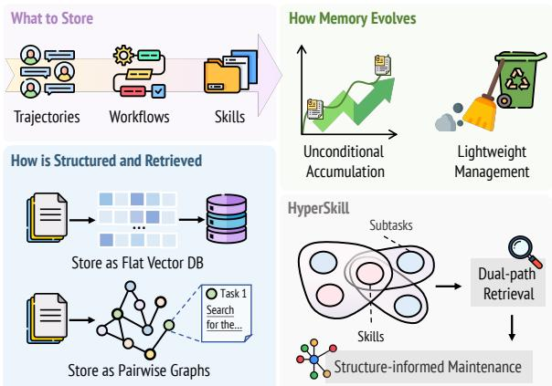  
Figure 1: Three design dimensions of experiential agent memory. HYPERSKILL unifies what to store, how memory is structured and retrieved, and how memory evolves via hyperedges over subtasks and skills, dual-path retrieval, and structure-informed maintenance.

This has motivated a growing line of research on self-evolving agent memory (Ouyang et al., 2026; Wang et al., 2025b; Tang et al., 2025b; Zhang et al., 2025b). Early work stored raw interaction trajectories as flat records (Wang et al., 2023a; Zheng et al., 2024; Zhao et al., 2024), while subsequent approaches shifted toward distilling experience into more compact, transferable units such as workflows (Wang et al., 2025b), reasoning strategies (Ouyang et al., 2026), and execution skills (Xia et al., 2026). Despite this progress, the design of experiential memory systems remains an open problem that can be decomposed into three fundamental questions: what to store, how is structured and retrieved, and how memory evolves. Existing systems address each only partially, leaving significant gaps that limit their capacity for self-improvement.

On what to store, early systems retain raw trajectories or distill them into insights and workflows (Zhao et al., 2024; Wang et al., 2023a, 2025b), while recent work abstracts experience into reusable skills (Ouyang et al., 2026; Zheng et al., 2025; Anthropic, 2024). However, these systems discard the compositional relationships among subtasks and skills. Since tasks are inherently compositional, retrieval cannot leverage shared procedural structure across superficially different tasks when these relationships are not retained. On how memory is structured and retrieved, most approaches adopt flat vector stores or simple binary graphs (Zhang et al., 2025a; Chhikara et al., 2025; Rasmussen et al., 2025) and retrieve by embedding similarity alone, which cannot represent nn n-ary co-occurrence between a skill and the subtask patterns it has repeatedly succeeded with. On how memory evolves, the majority of systems accumulate knowledge without any curation (Wang et al., 2023a; Zhao et al., 2024), and the few that do introduce only lightweight operations such as pruning or deduplication (Fang et al., 2026; Zheng et al., 2025), applied independently to each node.

These gaps share a common structural root: a trajectory is not a single unit of knowledge but an n-ary association among subtasks, skills, and an outcome, structure that flat lists and pairwise edges represent only lossily. Hypergraphs (Zhou et al., 2006; Tang et al., 2025a) preserve such associations natively by letting each hyperedge connect more than two nodes simultaneously. We propose HYPERSKILL, which organizes experiential memory as a hypergraph $\mathcal { G } = ( \nu , \mathcal { E } )$ with subtask nodes $\nu _ { u }$ and skill nodes $\mathcal { V } _ { s }$ , where each hyperedge groups the subtasks and skills from a single trajectory together with a distilled lesson and a utility score. This design directly improves the three gaps: ❶ hyperedges preserve the full compositional context that flat stores discard; ❷ skill nodes are shared across hyperedges, enabling us to rank a candidate skill by how frequently it appears across the retrieved trajectories, a structural signal that semantic similarity alone cannot provide; and ❸ quality-weighted propagation over the hypergraph enables merging redundant skills by jointly considering node utility and neighborhood topology. Across three agentic benchmarks (xBench, GAIA, and WebWalkerQA) under two different model families, HYPERSKILL consistently outperforms ten memory baselines.

## 2 Related Work

Memory Mechanisms in Agent Systems. LLM agents are increasingly equipped with external memory to overcome fixed context windows (Huang et al., 2026), serving roles such as factual memory (Gutiérrez et al., 2024; Rasmussen et al., 2025), working memory (Packer et al., 2023), and experiential memory, which distills the agent’s own trajectories into reusable knowledge for selfimprovement. We focus on the latter and categorize prior work along three dimensions, identifying a gap in each. (i) What is stored: Early works retain raw trajectories (Zheng et al., 2024; Wen et al., 2024), which preserve context but carry noise; later approaches abstract trajectories into insights or workflows (Zhao et al., 2024; Ouyang et al., 2026; Wang et al., 2025b; Fang et al., 2026), gaining generality at the cost of procedural detail; recent work distills reusable skills (Zheng et al., 2025; Wang et al., 2023a; Xia et al., 2026) but treats each skill in isolation. None preserves reusable subtask decompositions, limiting transfer of compositional planning across episodes. (ii) How memory is structured and retrieved: Most systems use flat vector or JSON stores with embedding-based retrieval (Zhao et al., 2024; Ouyang et al., 2026; Wang et al., 2025b; Zheng et al., 2025); a few adopt graph structures (Zhang et al., 2025a; Yang et al., 2026) to capture relational dependencies, but pairwise edges decompose nn n-ary co-occurrence into disconnected binary links and discard the joint compositional context of an episode. (iii) How memory evolves: Most systems accumulate unconditionally (Wang et al., 2023a; Zhao et al., 2024; Wang et al., 2025b); a few add lightweight per-entry pruning (Zheng et al., 2025), consolidation (Zhang et al., 2025a), or deduplication (Tang et al., 2025b), but none leverages structural signals or jointly considers quality and graph topology. A more detailed discussion is in Appendix E.

and retrieved, and how memory evolves over time, identifying a gap in each. (i) What is stored: Early works store raw trajectories of entire episodes (Zheng et al., 2024; Wen et al., 2024), which preserve full context but include substantial noise; later approaches abstract experience into insights and workflows (Zhao et al., 2024; Ouyang et al., 2026; Wang et al., 2025b; Fang et al., 2026), improving generalizability but discarding fine-grained procedural detail; while others distil reusable skills from trajectories (Zheng et al., 2025; Wang et al., 2023a; Xia et al., 2026), retaining concise knowledge units but treating each skill in iso lation without compositional structure. Existing systems don’t maintain reusable subtask decompositions that capture what procedural sequence was used to solve a task, limiting the agent’s ability to transfer compositional planning knowledge across episodes. (ii) How memory is structured and retrieved: Most systems store memory as flat vector databases or JSON files and rely solely on semantic similarity for retrieval (Zhao et al., 2024; Ouyang et al., 2026; Wang et al., 2025b; Zheng et al., 2025), limiting both the relevance and comprehensiveness of retrieved knowledge. A few works explore graph structures to capture relational dependencies (Zhang et al., 2025a; Yang et al., 2026; Xu and Ding, 2026), enabling structural traversal, but rely on pairwise edges that decompose n-ary cooccurrence into disconnected binary links and dis card the joint compositional context of an episode. (iii) How memory evolves: Most systems accumu late memory unconditionally (Wang et al., 2023a; Zhao et al., 2024; Wang et al., 2025b); a few add lightweight management such as pruning (Zheng et al., 2025), consolidation (Zhang et al., 2025a), or deduplication (Tang et al., 2025b), but all operate on individual entries without leveraging structural information, with no maintenance guided jointly by quality signals and graph topology. A more detailed discussion is provided in Appendix E.

## 3 HYPERSKILL

## 3.1 Preliminaries

Agent, Environment, and Memory. Following previous work (Zhang et al., 2025b), we formalize an LLM-based agent system as a policy π<sub>θ</sub> interacting with an environment over trajectories $\tau _ { i } = ( d _ { i } , o _ { i } , a _ { i } , r _ { i } )$ , where $d _ { i }$ is a task description, $o _ { i }$ and $a _ { i }$ are observation and action sequences, and $r _ { i } \in \{ \mathsf { s u c c e s s } , \mathsf { f a i l } \}$ is the outcome. At each step t, the agent selects $a _ { t } \sim \pi _ { \theta } ( \cdot \mid o _ { t } , m _ { t } )$ , where $m _ { t }$ is a memory context retrieved from an external memory module M. Given growing history $\mathcal { H } = \{ \tau _ { 1 } , . . . , \tau _ { N } \}$ , M supports retrieval m<sub>t</sub> = $g _ { \mathcal { M } } ( d , \mathcal { H } )$ and update $\mathcal { M }  \mathrm { U P D A T E } ( \mathcal { M } , \tau _ { i } )$

with the objective of maximizing expected task performance:

$$
\operatorname* { m a x } _ { \mathcal { M } } \mathbb { E } _ { d \sim \mathcal { D } } \left[ R ( \pi _ { \theta } ( \cdot \mid d , g _ { \mathcal { M } } ( d , \mathcal { H } ) ) ) \right] .\tag{1}
$$

## 3.2 HYPERSKILL Memory Architecture

A hypergraph (Zhou et al., 2006) $\mathcal { G } = ( \nu , \mathcal { E } )$ generalizes ordinary graphs by allowing each hyperedge $e \in \mathcal { E } \subseteq \bar { 2 } ^ { \mathcal { V } }$ to connect an arbitrary subset of nodes $( | e | \ge 2 )$ , capturing higher-order n-ary relationships among multiple nodes that pairwise edges cannot represent. HYPERSKILL exploits this structure to encode both compositional task decompositions and reusable execution knowledge in a single unified memory.

[➢] Nodes. Each $v _ { i } \in \mathcal V$ is a discrete, reusable unit of task knowledge distilled from agent experience. The node set partitions as $\smash { \gamma = \gamma _ { u } \cup \gamma _ { s } }$ , where each node can be represented by a tuple:

$$
v _ { i } \ \triangleq \ { \left( c _ { i } , \ \ell _ { i } , \ \gamma _ { i } \right) } , \qquad \ell _ { i } \in \{ \mathsf { u } , \ s \} ,\tag{2}
$$

with $c _ { i }$ as natural-language content, $\ell _ { i }$ as type label, and $\gamma _ { i } ~ \in ~ [ 0 , 1 ]$ as utility score, a dynamic measure that tracks empirical success rate and step efficiency. Concretely, for all nodes and hyperedges that participated in retrieval during trajectory $\tau _ { i }$ we increment $\sigma ( \cdot )$ on success and update $\bar { T } ( \cdot )$ with step count $T _ { i }$ , then recompute:

$$
\gamma ( \cdot ) = \beta \cdot \frac { \sigma ( \cdot ) } { \nu ( \cdot ) } + ( 1 - \beta ) \cdot \left( 1 - \frac { \bar { T } ( \cdot ) - T _ { \operatorname* { m i n } } } { T _ { \operatorname* { m a x } } - T _ { \operatorname* { m i n } } } \right) ,\tag{3}
$$

where $\nu ( \cdot )$ is the total retrieval count, $\sigma ( \cdot )$ the success count, $\bar { T } ( \cdot )$ the running average step count, and $\beta$ balances success rate against step efficiency. The two node types reflect complementary sides of task knowledge: subtask nodes encode the compositional workflow structure of a task, while skill nodes encode reusable execution strategies that transfer across tasks.

◦ Subtask nodes $\nu _ { u } .$ each $v _ { u } \triangleq \left( c _ { u } , \mathsf { u } , \gamma _ { u } \right)$ captures one step in a task decomposition. The content $c _ { u }$ encodes a step description together with any preconditions under which it applies.

◦ Skill nodes $\gamma _ { s }$ : each $\begin{array} { r c l } { { v _ { s } } } & { { \triangleq } } & { { \left( c _ { s } , s , \gamma _ { s } \right) } } \end{array}$ captures reusable knowledge extracted via outcomeconditioned prompting. The content $c _ { s }$ encodes a concise strategy label and a description covering what to do, when to apply it, and why it works (or fails). Successful trajectories yield positive strategies to follow; failed trajectories yield error patterns to avoid.

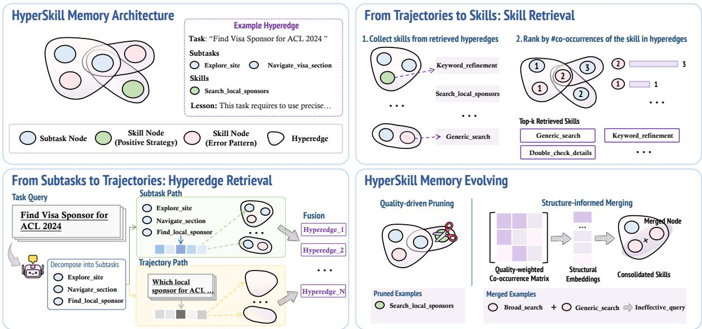  
Figure 2: Overview of HYPERSKILL. Given a new task, the agent decomposes it into subtasks, retrieves relevant trajectories via dual-path hyperedge retrieval, ranks skills by co-occurrence, and executes with the retrieved context. After task completion, new nodes and a hyperedge are added to the memory, which periodically undergoes pruning and merging.

[➢] Hyperedges. Each hyperedge $e _ { j } \in \mathcal { E }$ corresponds to a single trajectory $\tau _ { j }$ and is defined as a tuple $e _ { j } \triangleq ( V _ { j } , d _ { j } , \ell _ { j } , \gamma _ { j } )$ , where $V _ { j } = V _ { j } ^ { u } \cup V _ { j } ^ { s }$ with $V _ { j } ^ { u } \subseteq \mathcal { V } _ { u }$ the subtask nodes and $V _ { i } ^ { s } \subseteq \mathcal { V } _ { s }$ the skill nodes extracted from $\tau _ { j } ; d _ { j }$ is the original task description; and $\ell _ { j }$ is a concise distilled lesson capturing the transferable pattern the trajectory reveals. For retrieval, each hyperedge is represented by the embedding $\mathbf { h } _ { e } = \phi ( d _ { j } \Vert \ell _ { j } )$ , which concatenates the task description with the distilled lesson so that similarity matching captures both surface wording and the underlying transferable pattern.

## 3.3 From Subtasks to Trajectories: Hyperedge Retrieval

Prior methods explore diverse forms of experiential knowledge, from raw trajectories (Zheng et al., 2024; Wen et al., 2024) and distilled insights (Ouyang et al., 2026; Zhao et al., 2024) to reusable skills (Zheng et al., 2025; Wang et al., 2023a), but most rely on the full task description as the sole retrieval query. This misses trajectories that are superficially different yet share similar procedural subtask patterns. To retrieve more comprehensive trajectory-level context, HYPERSKILL queries the hypergraph through two complementary paths: one decomposes the current task into subtasks and matches them against stored subtask nodes, surfacing trajectories with shared procedural structure regardless of task-level wording; the other matches the task description directly against hyperedge representations that encode both the original task and its distilled lesson.

Task decomposition and subtask path. Upon receiving a new task $d _ { q } ,$ , the agent first invokes an LLM call to produce a fine-grained decomposition $\mathcal { P } _ { 0 } = \{ d _ { 1 } , \ldots , d _ { m } \}$ , where each $d _ { i }$ describes a subtask unit. This decomposition mirrors the subtask structure already stored in the hypergraph, enabling retrieval at the subtask level rather than the full-task level. We encode the full decomposition as a single vector ${ \bf h } _ { \mathcal { P } _ { 0 } } = \phi ( \mathcal { P } _ { 0 } )$ using a fixed-length text encoder $\phi .$ , and retrieve the $\mathrm { t o p } \mathrm { - } k _ { u }$ subtask nodes whose embeddings $\mathbf { h } _ { v } = \phi ( c _ { v } )$ are most similar:

$$
R _ { u } = \mathrm { t o p } { - k _ { u } \ \sin ( \mathbf { h } _ { \mathcal { P } _ { 0 } } , \mathbf { h } _ { v } ) } .\tag{4}
$$

Because each subtask node is incident to one or more hyperedges, the matched nodes naturally expand to a set of candidate trajectories: $\mathcal { E } _ { \mathrm { s u b } } = \{ e \in$ $\mathcal { E } \mid V _ { e } \cap R _ { u } \neq \emptyset \}$ , where $V _ { e }$ denotes the node set of hyperedge e. This path is particularly effective at surfacing trajectories that share procedural substructure with the current task, even when their task-level descriptions differ substantially.

Trajectory path and fusion. The subtask path alone may miss trajectories whose overall task descriptions are highly relevant but whose individual subtask nodes were not among the $\mathrm { t o p } \mathrm { - } k _ { u }$ matches. A complementary trajectory-level path addresses this by encoding the full task description as $\mathbf { h } _ { d _ { q } } = \phi ( d _ { q } )$ and ranking hyperedges directly by similarity to the query:

$$
\begin{array} { r } { \mathcal { E } _ { \mathrm { t r a j } } = \underset { e \in \mathcal { E } } { \mathrm { t o p } } k _ { e } ~ \sin ( \mathbf { h } _ { d _ { q } } , \mathbf { h } _ { e } ) , } \end{array}\tag{5}
$$

where $\mathbf { h } _ { e } = \phi ( d _ { e } \Vert \ell _ { e } )$ concatenates the original task description with the distilled lesson, so that ranking captures both surface wording and the underlying transferable pattern. Candidates from both paths are merged into a unified trajectory set:

$$
\mathcal { E } ^ { * } = \mathcal { E } _ { \mathrm { s u b } } \cup \mathcal { E } _ { \mathrm { t r a j } } .\tag{6}
$$

Together, the two paths are complementary: the subtask path retrieves trajectories with shared procedural substructure, while the trajectory path retrieves those with similar high-level task semantics. The distilled lessons $\mathcal { L } _ { q } = \{ \ell _ { e } \vert e \in \mathcal { E } ^ { * } \}$ } from the fused set are provided to the agent as trajectorylevel context during execution.

## 3.4 From Trajectories to Skills: Skill Retrieval

Given the fused trajectory set $\mathcal { E } ^ { * }$ , the next step is to select which skills to surface as execution guidance. Each hyperedge in $\mathcal { E } ^ { * }$ contains the skill nodes extracted from that trajectory, so the candidate pool is their union:

$$
R _ { s } = \bigcup _ { e \in \mathcal { E } ^ { * } } V _ { e } ^ { s } \subseteq \mathcal { V } _ { s } ,\tag{7}
$$

where $V _ { e } ^ { s }$ denotes the skill nodes of hyperedge e. A flat memory system would rank these candidates by embedding similarity to $d _ { q }$ alone. However, semantic similarity only measures whether a skill’s description looks like the current task; it does not capture whether the skill has actually been applied in trajectories relevant to the current task.

Co-occurrence ranking. HYPERSKILL exploits the fact that skill nodes, unlike subtask nodes, are deduplicated and reused across trajectories. A skill that appears in many of the retrieved trajectories has been repeatedly applied in task-relevant contexts and is therefore more likely to be useful. We formalize this with a simple co-occurrence count: for each candidate $v \in R _ { s }$ , we count how many retrieved hyperedges contain v:

$$
\kappa ( v ) = \lvert \left\{ e \in \mathcal { E } ^ { * } \mid v \in V _ { e } \right\} \rvert .\tag{8}
$$

The top- $\mathbf { \nabla } \cdot k _ { s }$ skills by κ are selected as execution guidance, with ties broken by embedding similarity to $d _ { q } \mathrm { : }$

$$
S _ { q } = \underset { v \in R _ { s } } { \mathrm { t o p } } k _ { s } \ \kappa ( v ) .\tag{9}
$$

Execution and memory update. The retrieved context $( S _ { q } , \mathcal { L } _ { q } )$ is assembled once per task and held fixed throughout execution, instantiating the memory context $m _ { t } = ( S _ { q } , \mathcal { L } _ { q } )$ . At each step t, the agent selects an action conditioned on the current observation $o _ { t } .$ , the retrieved skills ${ \cal S } _ { q } ,$ the distilled lessons $\mathcal { L } _ { q }$ , and a sliding window of recent interaction history:

$$
a _ { t } \sim \pi _ { \theta } \bigl ( \cdot \mid o _ { t } , \ S _ { q } , \ \mathcal { L } _ { q } , \ \mathrm { h i s t } _ { t - w : t - 1 } \bigr ) .\tag{10}
$$

Upon task completion with outcome $r _ { i }$ and step count $T _ { i }$ , an outcome-conditioned LLM call extracts skill nodes $S _ { i } ^ { \mathrm { n e w } }$ and a distilled lesson $\ell _ { e _ { i } }$ from the full trajectory. Subtask nodes $U _ { i } ^ { \mathrm { n e w } }$ are taken directly from $\mathcal { P } _ { 0 }$ . Before inserting each newly extracted skill node into $\gamma _ { s } .$ we compute its embedding similarity to all existing skill nodes; if the similarity exceeds a threshold $\delta _ { \mathrm { d e d u p } }$ , the new node is merged into its nearest existing neighbor rather than added as a duplicate, keeping the skill vocabulary compact and reusable. A new hyperedge over $U _ { i } ^ { \mathrm { n e w } } \cup S _ { i } ^ { \mathrm { n e w } }$ is then added to $\mathcal { E }$ with lesson $\ell _ { e _ { i } }$ and task description $d _ { q } ;$ its embedding is $\phi ( d _ { q } \parallel \ell _ { e _ { i } } )$ , matching Eq. 5. The utility score $\gamma ( \cdot )$ is recomputed via Eq. 3 for all elements that participated in retrieval.

## 3.5 HYPERSKILL Memory Evolving

As HYPERSKILL accumulates tasks, G risks growing stale: nodes may become semantically redundant, and repeatedly retrieved but low-quality knowledge can actively mislead future decisions. To keep memory compact, non-redundant, and high-quality, HYPERSKILL periodically refines G every $N _ { \mathrm { m a i n t } }$ tasks via two operations: qualitydriven pruning and structure-informed merging.

Quality-driven pruning. Nodes that have been retrieved sufficiently often but consistently fail to improve agent outcomes are explicitly removed from G:

$$
\begin{array} { r } { \nu  \nu \backslash \{ v \in \mathcal { V } \vert \nu ( v ) \geq N _ { \mathrm { m i n } } } \\ { \wedge \gamma ( v ) < \tau _ { \mathrm { p r u n e } } \} , } \end{array}\tag{11}
$$

where $\nu ( v )$ is the total number of times v has been retrieved and $\gamma ( v )$ is its composite quality score (Eq. 3), reflecting empirical success rate and step efficiency accumulated over those retrievals. When a node is deleted, it is removed from all hyperedge memberships.

Structure-informed merging. Skill nodes that exhibit strong quality-weighted co-occurrence and encode semantically similar execution knowledge are candidates for consolidation into a single higherorder skill. Subtask nodes $\mathcal { V } _ { u }$ are excluded, as merging planning steps would corrupt the compositional structure of task decompositions. To identify merge candidates within $\gamma _ { s } ,$ we compute qualityweighted structural embeddings. We first construct a co-occurrence matrix $\mathbf { W } \in \mathbf { \mathbb { R } } ^ { | \mathcal { V } _ { s } | \times | \mathcal { V } _ { s } | }$

Table 1: Main results across three benchmarks. We report success rate (SR %), average number of steps (#Steps), and average tool calls (#Calls) per task. Best ; 2nd best per backbone. $_ \uparrow / \downarrow \colon$ change vs. No Memory. For #Steps and #Calls, lower is better.
<table><tr><td rowspan="2">Backbone</td><td rowspan="2">Method</td><td colspan="3">xBench</td><td colspan="3">GAIA</td><td colspan="3">WebWalkerQA</td></tr><tr><td>SR</td><td>#Steps</td><td>#Calls</td><td>SR</td><td>#Steps</td><td>#Calls</td><td>SR</td><td>#Steps</td><td>#Calls</td></tr><tr><td rowspan="10">we---A3B 今</td><td>No Memory</td><td> $4 6 . 0 0 _ { \uparrow 0 . 0 0 }$ </td><td> $4 . 8 7 _ { \uparrow 0 . 0 0 }$ </td><td> $5 . 0 5 _ { \uparrow 0 . 0 0 }$ </td><td> $3 2 . 1 2 _ { \uparrow 0 . 0 0 }$ </td><td> $8 . 2 3 _ { \uparrow 0 . 0 0 }$ </td><td> $4 . 7 5 _ { \uparrow 0 . 0 0 }$ </td><td> $3 9 . 4 1 _ { \mathrm { \uparrow 0 . 0 0 } }$ </td><td> $4 . 0 7 _ { \uparrow 0 . 0 0 }$ </td><td> $3 . 8 7 _ { \mathrm { \uparrow 0 . 0 0 } }$ </td></tr><tr><td>ReasoningBank</td><td> $4 3 . 0 0 _ { \downarrow 3 . 0 0 }$ </td><td> $4 . 4 7 _ { \downarrow 0 . 4 0 }$ </td><td> $4 . 7 2 _ { \downarrow 0 . 3 3 }$ </td><td>29.702.42</td><td> $7 . 4 4 _ { \downarrow 0 . 7 9 }$ </td><td> $4 . 4 2 _ { \perp 0 . 3 3 }$ </td><td> $4 4 . 7 1 _ { \uparrow 5 . 3 0 }$ </td><td> $3 . 6 4 _ { \downarrow 0 . 4 3 }$ </td><td> $3 . 7 2 _ { \cdot \downarrow 0 . 1 5 }$ </td></tr><tr><td>ExpeL</td><td> $4 5 . 0 0 _ { \downarrow 1 . 0 0 }$ </td><td> $5 . 1 4 _ { \uparrow 0 . 2 7 }$ </td><td> $6 . 0 6 _ { \uparrow 1 . 0 1 }$ </td><td> $3 3 . 3 3 _ { \uparrow 1 . 2 1 }$ </td><td> $7 . 3 8 _ { \perp 0 . 8 5 }$ </td><td> $4 . 1 5 _ { \perp 0 . 6 0 }$ </td><td> $4 7 . 0 6 _ { \uparrow 7 . 6 5 }$ </td><td>4.04↓0.03</td><td> $3 . 9 4 _ { \uparrow 0 . 0 7 }$ </td></tr><tr><td>AWM</td><td> $4 4 . 0 0 _ { \downarrow 2 . 0 0 }$ </td><td> $4 . 8 6 _ { \perp 0 . 0 1 }$ </td><td> $5 . 4 9 _ { \uparrow 0 . 4 4 }$ </td><td> $3 2 . 7 3 _ { \uparrow 0 . 6 1 }$ </td><td> $7 . 0 7 _ { \downarrow 1 . 1 6 }$ </td><td> $3 . 9 2 _ { \perp 0 . 8 3 }$ </td><td> $4 1 . 7 6 _ { \uparrow 2 . 3 5 }$ </td><td> $3 . 8 4 _ { \downarrow 0 . 2 3 }$ </td><td> $3 . 7 2 _ { \downarrow 0 . 1 5 }$ </td></tr><tr><td>Generative</td><td> $4 9 . 0 0 _ { \uparrow 3 . 0 0 }$ </td><td> $4 . 4 6 _ { \perp 0 . 4 1 }$ </td><td> $4 . 9 7 _ { \downarrow 0 . 0 8 }$ </td><td> $3 4 . 5 5 _ { \uparrow 2 . 4 3 }$ </td><td> $7 . 4 3 _ { \perp 0 . 8 0 }$ </td><td> $3 . 9 7 _ { \downarrow 0 . 7 8 }$ </td><td> $4 1 . 1 8 _ { \uparrow 1 . 7 7 }$ </td><td> $3 . 8 2 _ { \perp 0 . 2 5 }$ </td><td> $3 . 8 7 _ { \mathrm { \uparrow 0 . 0 0 } }$ </td></tr><tr><td>Voyager</td><td> $5 0 . 0 0 _ { \uparrow 4 . 0 0 }$ </td><td> $4 . 7 7 _ { \downarrow 0 . 1 0 }$ </td><td> $5 . 0 5 _ { \uparrow 0 . 0 0 }$ </td><td> $3 4 . 5 5 _ { \uparrow 2 . 4 3 }$ </td><td> $7 . 4 7 _ { \downarrow 0 . 7 6 }$ </td><td> $4 . 1 6 _ { \downarrow 0 . 5 9 }$ </td><td>46.4717.06</td><td> $3 . 8 4 _ { \downarrow 0 . 2 3 }$ </td><td> $3 . 8 2 _ { \cdot \downarrow 0 . 0 5 }$ </td></tr><tr><td>DILU</td><td> $5 2 . 0 0 _ { \uparrow 6 . 0 0 }$ </td><td> $5 . 0 1 _ { \uparrow 0 . 1 4 }$ </td><td> $5 . 4 5 _ { \uparrow 0 . 4 0 }$ </td><td> $3 2 . 1 2 _ { \uparrow 0 . 0 0 }$ </td><td> $7 . 1 4 _ { \downarrow 1 . 0 9 }$ </td><td> $4 . 1 7 _ { \downarrow 0 . 5 8 }$ </td><td> $4 4 . 1 2 _ { \uparrow 4 . 7 1 }$ </td><td> $3 . 8 7 _ { \downarrow 0 . 2 0 }$ </td><td> $3 . 9 5 _ { \uparrow 0 . 0 8 }$ </td></tr><tr><td>Cheatsheet</td><td> $3 7 . 0 0 _ { \downarrow 9 . 0 0 }$ </td><td> $4 . 0 3 _ { \downarrow 0 . 8 4 }$ </td><td> $4 . 8 4 _ { \downarrow 0 . 2 1 }$ </td><td> $2 7 . 8 8 _ { \downarrow 4 . 2 4 }$ </td><td> $6 . 8 4 _ { \downarrow \downarrow . 3 9 }$ </td><td> $5 . 2 8 _ { \uparrow 0 . 5 3 }$ </td><td> $3 9 . 4 1 _ { \mathrm { \uparrow 0 . 0 0 } }$ </td><td> $3 . 6 2 _ { \downarrow 0 . 4 5 }$ </td><td> $4 . 0 6 _ { \uparrow 0 . 1 9 }$ </td></tr><tr><td>MemP</td><td> $4 5 . 0 0 _ { \perp 1 . 0 0 }$ </td><td> $4 . 4 2 _ { \downarrow 0 . 4 5 }$ </td><td> $4 . 2 4 _ { \perp 0 . 8 1 }$ </td><td> $3 2 . 7 3 _ { \uparrow 0 . 6 1 }$ </td><td> $6 . 9 7 _ { \downarrow 1 . 2 6 }$ </td><td> $4 . 4 2 _ { \downarrow 0 . 3 3 }$ </td><td> $4 5 . 8 8 _ { \uparrow 6 . 4 7 }$ </td><td> $3 . 7 2 _ { \downarrow 0 . 3 5 }$ </td><td> $3 . 6 6 _ { \perp 0 . 2 1 }$ </td></tr><tr><td>MemEvolve</td><td> $3 9 . 0 0 _ { \downarrow 7 . 0 0 }$ </td><td> $4 . 6 4 _ { \downarrow 0 . 2 3 }$ </td><td> $4 . 7 2 _ { \downarrow 0 . 3 3 }$ </td><td> $2 8 . 4 8 _ { \downarrow 3 . 6 4 }$ </td><td> $5 . 0 8 _ { \downarrow 3 . 1 5 }$ </td><td> $3 . 6 7 _ { \perp 1 . 0 8 }$ </td><td> $3 7 . 0 6 _ { \perp 2 . 3 5 }$ </td><td> $3 . 6 1 _ { \downarrow 0 . 4 6 }$ </td><td> $3 . 3 2 _ { \downarrow 0 . 5 5 }$ </td></tr><tr><td></td><td>PlugMem</td><td> $4 2 . 0 0 _ { \downarrow 4 . 0 0 }$ </td><td> $5 . 0 7 _ { \uparrow 0 . 2 0 }$ </td><td> $5 . 1 8 _ { \uparrow 0 . 1 3 }$ </td><td> $3 4 . 5 5 _ { \uparrow 2 . 4 3 }$ </td><td> $7 . 0 2 _ { \downarrow 1 . 2 1 }$ </td><td> $4 . 1 8 _ { \perp 0 . 5 7 }$ </td><td> $3 5 . 8 8 _ { \downarrow 3 . 5 3 }$ </td><td> $3 . 9 6 _ { \downarrow 0 . 1 1 }$ </td><td> $3 . 8 3 _ { \cdot \downarrow 0 . 0 4 }$ </td></tr><tr><td rowspan="10"></td><td>HYPERSKILL</td><td> $5 2 . 0 0 _ { \uparrow 6 . 0 0 }$ </td><td> $4 . 5 2 _ { \downarrow 0 . 3 5 }$ </td><td> $4 . 8 8 _ { \downarrow 0 . 1 7 }$ </td><td> $3 6 . 9 7 _ { \uparrow 4 . 8 5 }$ </td><td> $7 . 2 5 _ { \perp 0 . 9 8 }$ </td><td> $5 . 4 8 _ { \uparrow 0 . 7 3 }$ </td><td> $5 0 . 5 9 _ { \uparrow 1 1 . 1 8 }$ </td><td> $4 . 0 4 _ { \downarrow 0 . 0 3 }$ </td><td> $4 . 0 6 _ { \uparrow 0 . 1 9 }$ </td></tr><tr><td>No Memory</td><td> $5 4 . 0 0 _ { \uparrow 0 . 0 0 }$ </td><td> $6 . 2 9 _ { \mathrm { \uparrow 0 . 0 0 } }$ </td><td> $6 . 3 3 _ { \mathrm { \uparrow 0 . 0 0 } }$ </td><td> $3 2 . 7 3 _ { \mathrm { 7 0 . 0 0 } }$ </td><td> $6 . 5 9 _ { \mathrm { \uparrow 0 . 0 0 } }$ </td><td> $8 . 2 3 _ { \uparrow 0 . 0 0 }$ </td><td> $4 6 . 4 7 _ { \uparrow 0 . 0 0 }$ </td><td> $5 . 8 2 _ { \uparrow 0 . 0 0 }$ </td><td> $7 . 0 4 _ { \mathrm { 1 0 . 0 0 } }$ </td></tr><tr><td>ReasoningBank</td><td> $5 7 . 0 0 _ { \uparrow 3 . 0 0 }$ </td><td> $8 . 2 2 _ { \uparrow 1 . 9 3 }$ </td><td> $1 2 . 2 7 _ { \uparrow 5 . 9 4 }$ </td><td> $3 3 . 3 3 _ { \mathrm { 1 0 . 6 0 } }$ </td><td> $7 . 2 1 _ { \uparrow 0 . 6 2 }$ </td><td> $1 0 . 1 7 _ { \uparrow 1 . 9 4 }$ </td><td> $4 7 . 6 5 _ { \uparrow 1 . 1 8 }$ </td><td> $5 . 5 9 _ { \downarrow 0 . 2 3 }$ </td><td> $6 . 4 5 _ { \downarrow 0 . 5 9 }$ </td></tr><tr><td>ExpeL</td><td> $5 4 . 0 0 _ { \uparrow 0 . 0 0 }$ </td><td> $5 . 2 7 _ { \perp 1 . 0 2 }$ </td><td> $6 . 1 1 _ { \downarrow 0 . 2 2 }$ </td><td> $3 5 . 7 6 _ { \uparrow 3 . 0 3 }$ </td><td> $6 . 6 3 _ { \uparrow 0 . 0 4 }$ </td><td> $9 . 4 8 _ { \uparrow 1 . 2 5 }$ </td><td> $4 7 . 0 6 _ { \uparrow 0 . 5 9 }$ </td><td> $5 . 5 8 _ { \downarrow 0 . 2 4 }$ </td><td> $6 . 3 2 _ { \downarrow 0 . 7 2 }$ </td></tr><tr><td>AWM</td><td> $5 2 . 0 0 _ { \downarrow 2 . 0 0 }$ </td><td> $6 . 4 7 _ { \uparrow 0 . 1 8 }$ </td><td> $8 . 1 2 _ { \uparrow 1 . 7 9 }$ </td><td> $3 5 . 1 5 _ { \uparrow 2 . 4 2 }$ </td><td> $7 . 1 3 _ { \uparrow 0 . 5 4 }$ </td><td> $9 . 0 8 _ { \uparrow 0 . 8 5 }$ </td><td> $4 7 . 6 5 _ { \uparrow 1 . 1 8 }$ </td><td> $5 . 7 7 _ { \downarrow 0 . 0 5 }$ </td><td> $6 . 4 9 _ { \downarrow 0 . 5 5 }$ </td></tr><tr><td>Generative</td><td> $5 6 . 0 0 _ { \uparrow 2 . 0 0 }$ </td><td> $7 . 6 5 _ { \uparrow 1 . 3 6 }$ </td><td> $1 1 . 3 4 _ { \uparrow 5 . 0 1 }$ </td><td> $3 6 . 3 6 _ { \uparrow 3 . 6 3 }$ </td><td> $6 . 3 9 _ { \downarrow 0 . 2 0 }$ </td><td> $7 . 6 8 _ { \perp 0 . 5 5 }$ </td><td> $5 1 . 1 8 _ { \uparrow 4 . 7 1 }$ </td><td> $5 . 7 7 _ { \downarrow 0 . 0 5 }$ </td><td> $6 . 3 3 _ { \downarrow 0 . 7 1 }$ </td></tr><tr><td>Voyager</td><td> $4 7 . 0 0 _ { \downarrow 7 . 0 0 }$ </td><td> $7 . 9 9 _ { \uparrow 1 . 7 0 }$ </td><td> $1 1 . 2 7 _ { \uparrow 4 . 9 4 }$ </td><td> $3 1 . 5 2 _ { \downarrow 1 . 2 1 }$ </td><td> $6 . 5 2 _ { \downarrow 0 . 0 7 }$ </td><td> $9 . 1 5 _ { \uparrow 0 . 9 2 }$ </td><td> $4 8 . 8 2 _ { \uparrow 2 . 3 5 }$ </td><td> $6 . 0 7 _ { \uparrow 0 . 2 5 }$ </td><td> $6 . 9 3 _ { \perp 0 . 1 1 }$ </td></tr><tr><td>DILU</td><td> $5 3 . 0 0 _ { \perp 1 . 0 0 }$ </td><td> $7 . 1 6 _ { \uparrow 0 . 8 7 }$ </td><td> $9 . 9 8 _ { \uparrow 3 . 6 5 }$ </td><td> $3 3 . 3 3 _ { \mathrm { 1 0 . 6 0 } }$ </td><td> $5 . 3 4 _ { \downarrow 1 . 2 5 }$ </td><td>1  $5 . 6 3 _ { \downarrow 2 . 6 0 }$ </td><td> $4 8 . 2 4 _ { \uparrow 1 . 7 7 }$ </td><td> $6 . 0 5 _ { \uparrow 0 . 2 3 }$ </td><td> $6 . 9 7 _ { \downarrow 0 . 0 7 }$ </td></tr><tr><td>Cheatsheet</td><td> $5 5 . 0 0 _ { \uparrow 1 . 0 0 }$ </td><td> $7 . 5 6 _ { \uparrow 1 . 2 7 }$ </td><td> $1 0 . 9 2 _ { \uparrow 4 . 5 9 }$ </td><td> $3 5 . 1 5 _ { \uparrow 2 . 4 2 }$ </td><td> $6 . 2 7 _ { \perp 0 . 3 2 }$ </td><td> $8 . 3 6 _ { \uparrow 0 . 1 3 }$ </td><td> $4 7 . 0 6 _ { \uparrow 0 . 5 9 }$ </td><td> $6 . 0 2 _ { \uparrow 0 . 2 0 }$ </td><td> $7 . 2 5 _ { \uparrow 0 . 2 1 }$ </td></tr><tr><td>MemP</td><td> $4 8 . 0 0 _ { \perp 6 . 0 0 }$ </td><td> $7 . 5 9 _ { \uparrow 1 . 3 0 }$ </td><td> $1 0 . 7 6 _ { \uparrow 4 . 4 3 }$ </td><td> $3 3 . 3 3 _ { \uparrow 0 . 6 0 }$ </td><td> $7 . 0 4 _ { \uparrow 0 . 4 5 }$ </td><td> $8 . 6 4 _ { \uparrow 0 . 4 1 }$ </td><td> $5 0 . 5 9 _ { \uparrow 4 . 1 2 }$ </td><td> $5 . 6 6 _ { \downarrow 0 . 1 6 }$ </td><td>_  $6 . 0 3 _ { \perp 1 . 0 1 }$ </td></tr><tr><td>MemEvolve</td><td> $4 7 . 0 0 _ { \downarrow 7 . 0 0 }$ </td><td> $6 . 6 8 _ { \uparrow 0 . 3 9 }$ </td><td> $9 . 0 6 _ { \uparrow 2 . 7 3 }$ </td><td> $3 6 . 3 6 _ { \uparrow 3 . 6 3 }$ </td><td> $6 . 9 7 _ { \uparrow 0 . 3 8 }$ </td><td> $7 . 2 9 _ { \perp 0 . 9 4 }$ </td><td> $4 8 . 2 4 _ { \uparrow 1 . 7 7 }$ </td><td> $6 . 0 9 _ { \uparrow 0 . 2 7 }$ </td><td> $7 . 3 4 _ { \uparrow 0 . 3 0 }$ </td></tr><tr><td>PlugMem</td><td> $5 9 . 0 0 _ { \uparrow 5 . 0 0 }$ </td><td> $5 . 9 4 _ { \downarrow 0 . 3 5 }$ </td><td> $6 . 2 2 _ { \perp 0 . 1 1 }$ </td><td> $4 1 . 9 4 _ { \uparrow 9 . 2 1 }$ </td><td> $5 . 7 3 _ { \perp 0 . 8 6 }$ </td><td> $5 . 1 1 _ { \downarrow 3 . 1 2 }$ </td><td> $4 7 . 0 6 _ { \uparrow 0 . 5 9 }$ </td><td> $5 . 9 6 _ { \uparrow 0 . 1 4 }$ </td><td> $6 . 4 9 _ { \downarrow 0 . 5 5 }$ </td></tr><tr><td>HYPERSKILL</td><td></td><td> $6 2 . 0 0 _ { \uparrow 8 . 0 0 }$ </td><td> $5 . 2 7 _ { \perp 1 . 0 2 }$ </td><td> $6 . 5 2 _ { \uparrow 0 . 1 9 }$ </td><td> $4 4 . 2 4 _ { \uparrow 1 1 . 5 1 }$ </td><td> $6 . 0 1 _ { \downarrow 0 . 5 8 }$ </td><td> $7 . 3 5 _ { \perp 0 . 8 8 }$ </td><td> $5 1 . 1 8 _ { \uparrow 4 . 7 1 }$ </td><td> $5 . 9 3 _ { \uparrow 0 . 1 1 }$ </td><td> $7 . 0 4 _ { \mathrm { \uparrow 0 . 0 0 } }$ </td></tr></table>

$$
\begin{array} { r } { \hat { \mathbf { W } } = \hat { \mathbf { D } } ^ { - 1 / 2 } \big ( \mathbf { W } + \mathbf { I } \big ) \hat { \mathbf { D } } ^ { - 1 / 2 } , } \end{array}\tag{12}
$$

$$
W _ { i j } = \operatorname* { m i n } \bigl ( \gamma ( v _ { i } ) , \gamma ( v _ { j } ) \bigr ) \cdot \sum _ { e \in \mathcal { E } \atop v _ { i } \in V _ { e } , v _ { j } \in V _ { e } } \frac { 1 } { | V _ { e } | } ,\tag{13}
$$

where $1 / | V _ { e } |$ normalises by hyperedge size following the homophily assumption (Tang et al., 2025a)— nodes sharing a small, tight hyperedge are more likely to encode similar knowledge than those sharing a large one—and min $( \gamma ( v _ { i } ) , \gamma ( v _ { j } ) )$ ensures that high edge weights occur only when both nodes are useful. Structural embeddings are then obtained via L-step symmetric propagation following (Tang et al., 2025a):

$$
\mathbf { S } = ( 1 - \alpha ) ^ { L } \hat { \mathbf { W } } ^ { L } + \alpha \sum _ { l = 0 } ^ { L - 1 } ( 1 - \alpha ) ^ { l } \hat { \mathbf { W } } ^ { l } ,
$$

$$
\tilde { \mathbf { Z } } = \mathbf { S } \mathbf { Z } ,
$$

where $\mathbf { Z } \in \mathbb { R } ^ { | \mathcal { V } _ { s } | \times d }$ stacks plain skill node embeddings, D<sup>ˆ</sup> is the degree matrix of (W + I), $\alpha \in$ $( 0 , 1 )$ balances individual node identity against neighbourhood context, and L controls the propagation depth. Since node utility is already encoded in W, the propagated embeddings $\tilde { \mathbf { Z } } _ { \perp }$ jointly reflect structural co-occurrence and skill quality, and a pair $( v _ { a } , v _ { b } )$ is selected as a merge candidate by similarity alone:

$$
\sin ( \tilde { \mathbf { z } } _ { a } , \tilde { \mathbf { z } } _ { b } ) \geq \delta _ { \mathrm { m e r g e } } .\tag{14}
$$

For each selected pair, the agent reasons over the contents of $v _ { a } , v _ { b } ,$ and their shared trajectory fragments to propose a merged node $v _ { \mathrm { n e w } }$ that consolidates their knowledge into a higher-order skill. All hyperedge memberships are reassigned to $v _ { \mathrm { n e w } }$ preserving structural integrity across G.

## 4 Experiments

## 4.1 Experiment Setup

Datasets and Benchmarks. We evaluate HY-PERSKILL across three diverse benchmarks spanning different domains and capability requirements: (i) xBench (Chen et al., 2025), a benchmark assessing agentic planning, tool use, and multi-step reasoning across a broad range of real-world tasks; (ii) GAIA (Mialon et al., 2023), a set of real-world questions requiring multi-hop reasoning, multimodality handling, web browsing, and tool-use proficiency; and (iii) WebWalkerQA (Wu et al., 2025a), a benchmark testing complex multi-turn web navigation across diverse real-world queries and webpages. Together, these benchmarks cover tool-augmented reasoning, open-ended web interaction, and compositional planning. More details are provided in Appendix A.

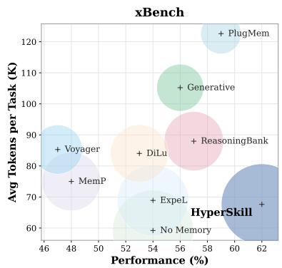

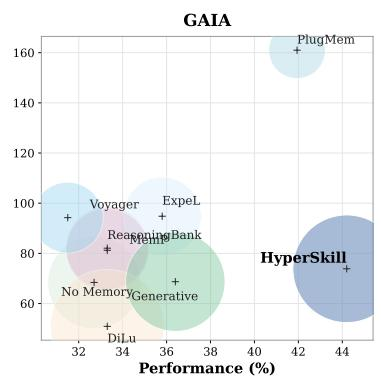

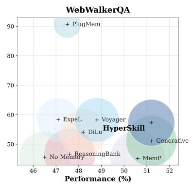  
Figure 3: Performance vs. average tokens per task (K) across three benchmarks. Bubble size reflects the performanceto-token ratio.

Baselines. We compare HYPERSKILL against ten representative memory systems spanning three categories. Trajectory-level methods that store raw or lightly processed trajectories: Voyager (Wang et al., 2023a), DILU (Wen et al., 2024), ExpeL (Zhao et al., 2024), and Generative (Shang et al., 2025). Workflow- or insight-level methods that extract and manage reusable knowledge units: AWM (Wang et al., 2025b), ReasoningBank (Ouyang et al., 2026), MemP (Fang et al., 2026), Cheatsheet (Suzgun et al., 2026), and MemEvolve (Zhang et al., 2025b). Graph-based methods that organize memory with relational structure: PlugMem (Yang et al., 2026). We also include a No Memory baseline that operates without any external memory module. All baselines use the same agent backbone and tool access for a fair comparison. More details are provided in Appendix A.

Implementation Details. We conduct all experiments with two backbone models: GPT-4o (Hurst et al., 2024) and Qwen3-30B-A3B (Yang et al., 2025), covering both proprietary and opensource settings. For HYPERSKILL, we use all-MiniLM-L6-v2 as the shared encoder ϕ(·) for all node and hyperedge embeddings. A single retrieval budget governs subtask node retrieval, hyperedge retrieval, and the final skill ranking. Maintenance is triggered every $\lceil 0 . 1 \times N \rceil$ episodes, with pruning threshold $\tau _ { \mathrm { p r u n e } } { = } 0 . 2$ and minimum retrieval count $N _ { \mathrm { m i n } } { = } 3$ . The utility score blending coefficient is $\beta { = } 0 . 7$ . All hyperparameter and implementation details are provided in Appendix A.

## 4.2 Main Results

Table 1 reports success rate (SR), average steps, and average tool calls across xBench, GAIA, and WebWalkerQA under two backbone models. HY-PERSKILL achieves the highest or success rate on nearly every benchmark–backbone combination. We highlight three observations. ❶ Consistent gains across benchmarks and backbones. Under GPT-4o, HYPERSKILL outperforms all baselines on SR by +3.00 on xBench, +2.30 on GAIA, and +0.59 on WebWalkerQA relative to the secondbest method. Under Qwen3-30B-A3B, the trend holds with gains of +6.00, +4.85, and +11.18 over No Memory, confirming that the improvements stem from the memory framework rather than backbone-specific behaviors. ❷ Improved SR without inflated execution cost. A common concern with memory-augmented agents is that richer retrieved context may increase per-step overhead. HYPERSKILL largely avoids this: under GPT-4o on xBench, it achieves the highest SR while matching ExpeL for the fewest steps (5.27) and maintaining competitive tool calls (6.52). In contrast, methods such as ReasoningBank and Voyager require up to 8.22 steps and 12.27 calls on the same benchmark while delivering lower SR, indicating that their retrieved context introduces overhead without proportional benefit. ❸ Naive memory accumulation can hurt. Several baselines fall below No Memory on at least one setting: Cheatsheet drops −9.00 on xBench (Qwen3-30B-A3B), and Voyager drops −7.00 on xBench (GPT-4o). Without principled maintenance, accumulated entries introduce noise that actively harms the agent. This underscores the importance of HYPERSKILL’s structureaware evolution mechanism, which prunes lowutility nodes and merges redundant skills to keep memory compact and high-quality.

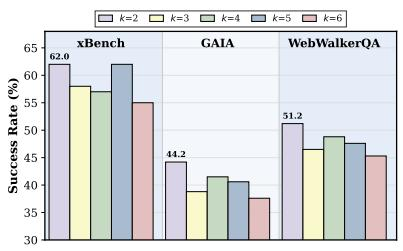  
(a) Retrieval budget k.

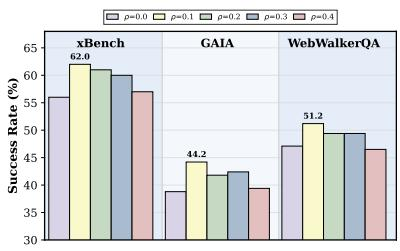  
(b) Maintenance ratio $\rho .$

<table><tr><td>Setting</td><td>|xBench</td><td>GAIA</td><td>WQA</td></tr><tr><td>w/o hypergraph</td><td>41.00</td><td>35.76</td><td>44.71</td></tr><tr><td>w/o subtask retr.</td><td>43.00</td><td>32.73</td><td>47.06</td></tr><tr><td>w/o trajectory retr.</td><td>48.00</td><td>35.76</td><td>43.53</td></tr><tr><td>Full model</td><td>52.00</td><td>36.97</td><td>50.59</td></tr></table>

(c) Ablation study with Qwen3-30B-A3B.  
Figure 4: Sensitivity analysis and ablation study. (a, b) Success rate (%) on GPT-4o as we vary retrieval budget k and maintenance ratio ρ on xBench, GAIA, and WebWalkerQA. (c) Ablation of HYPERSKILL’s trajectory retrieval, subtask retrieval, and hypergraph structure.

## 4.3 Analysis and Ablation Study

Cost Analysis. Figure 3 plots average tokens per task against performance, with bubble size proportional to the performance-to-token ratio. HY-PERSKILL occupies the bottom-right region across all three benchmarks, achieving the highest performance at moderate token cost (67K, 72K, and 57K on xBench, GAIA, and WebWalkerQA, respectively). Methods such as Generative and Voyager consume over 100K tokens yet fall well below HY-PERSKILL in performance. PlugMem, despite its knowledge-centric memory graph, incurs substantially higher token cost than HYPERSKILL while delivering lower performance. The gap stems from memory construction: PlugMem incurs separate LLM calls to extract state, subgoal, and reward annotations.

Sensitivity Analysis. We analyze the sensitivity of HYPERSKILL to two key hyperparameters: (i) retrieval budget k, which controls the number of candidates surfaced during both hyperedge and skill retrieval; and (ii) maintenance ratio ρ, which controls the fraction of low-utility entries pruned during each maintenance cycle. Figures 4(a–b) reveal two consistent patterns. First, performance favors smaller retrieval budgets: k=2 achieves the best results across all three benchmarks, with performance declining as k increases. This suggests that a compact retrieval set minimizes noise from lowerranked candidates, and surfacing too many entries dilutes the signal from the most relevant skills. Second, the maintenance ratio peaks at ρ=0.1, with ρ=0.2 and $\rho { = } 0 . 3$ performing similarly, indicating that light pruning is sufficient to keep the memory effective. Disabling pruning entirely $( \rho { = } 0 )$ lets low-utility entries accumulate and degrades retrieval quality, while overly aggressive pruning (ρ=0.4) removes still-useful skills.

Ablation Study. We ablate the two retrieval paths and the hypergraph structure, with results in Figure 4(c). w/o trajectory retrieval removes the path that matches the full task description against hyperedge embeddings, relying solely on plan decomposition into subtask nodes and expansion through their incident hyperedges. Performance drops notably on WQA (50.59 → 43.53), suggesting that trajectory-level matching captures task-wide patterns that subtask expansion alone misses. w/o subtask retrieval removes the fine-grained path, collecting skills only from top-k task-matched hyperedges without plan decomposition or subtask-level expansion. This hurts xBench most and causes GAIA to drop to 32.73, indicating that subtask decomposition is essential for retrieving relevant skills on complex, multi-step tasks. w/o hypergraph replaces the entire dual-path pipeline with flat textembedding retrieval over stored skills, removing all hypergraph structure. This yields the lowest results across all three benchmarks, confirming that the hypergraph’s n-ary co-occurrence relationships provide meaningful gains over a standard vector-store baseline. The full model combining both retrieval paths achieves the best results on all benchmarks, validating their complementarity.

## 4.4 Hypergraph Analysis

To illustrate how HYPERSKILL’s hypergraph organizes experiential knowledge, Figure 5 visualizes a representative subgraph of six trajectories from xBench. Subtask nodes are mostly trajectoryspecific, whereas skill nodes are shared across hyperedges: Cross-Source Validation and Targeted Database Search each appear in multiple trajectories, enabling compositional reuse. Failed trajectories contribute error-pattern skills such as Premature Entity Assumption that cluster separately from positive strategies, allowing the agent to retrieve targeted warnings when similar subtask patterns recur. More examples are provided in Appendix B.

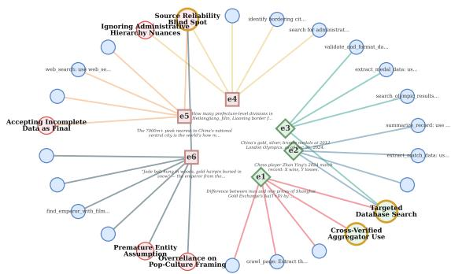  
Figure 5: Hypergraph visualization on xBench. Trajectory hyperedges (✸ success, ✷ failure) connect skill nodes (⃝ success, ⃝ failure) and subtask nodes (•).

## 5 Conclusion

We presented HYPERSKILL, a hypergraph memory framework for self-evolving LLM agents. Each trajectory is stored as a hyperedge binding subtask decompositions and outcome-conditioned skills, preserving compositional structure that flat and pairwise designs discard. Dual-path retrieval surfaces relevant trajectories through both subtasklevel and task-level matching, then ranks skills by co-occurrence frequency across retrieved hyperedges. Periodic maintenance prunes lowutility nodes and merges redundant skills via quality-weighted propagation, keeping memory compact as it grows. Experiments on xBench, GAIA, and WebWalkerQA with GPT-4o and Qwen3-30B-A3B-Instruct show consistent gains over ten baselines in success rate. Beyond accuracy, HYPERSKILL also attains the demonstrative performance-to-token ratio, reaching the highest success rate at a moderate token cost.

## Limitations

HYPERSKILL relies on additional LLM calls for task decomposition, skill extraction, and merge decisions during memory maintenance, introducing extra inference cost. The current evaluation covers web navigation and multi-step reasoning benchmarks; generalization to others can be future work.

Finally, the effectiveness of hypergraph-based retrieval and maintenance depends on a sufficient number of accumulated trajectories, so HYPER-SKILL may offer limited benefit in extremely lowdata regimes where the memory graph is sparse.

## References

Petr Anokhin, Nikita Semenov, Artyom Sorokin, Dmitry Evseev, Andrey Kravchenko, Mikhail Burtsev, and Evgeny Burnaev. 2025. Arigraph: learning knowledge graph world models with episodic memory for llm agents. In IJCAI.

Anthropic. 2024. The claude 3 model family: Opus, sonnet, haiku.

Kaiyuan Chen, Yixin Ren, Yang Liu, Xiaobo Hu, Haotong Tian, Tianbao Xie, Fangfu Liu, Haoye Zhang, Hongzhang Liu, Yuan Gong, and 1 others. 2025. xbench: Tracking agents productivity scaling with profession-aligned real-world evaluations. arXiv preprint arXiv:2506.13651.

Prateek Chhikara, Dev Khant, Saket Aryan, Taranjeet Singh, and Deshraj Yadav. 2025. Mem0: Building production-ready ai agents with scalable long-term memory. arXiv preprint arXiv:2504.19413.

Runnan Fang, Yuan Liang, Xiaobin Wang, Jialong Wu, Shuofei Qiao, Pengjun Xie, Fei Huang, Huajun Chen, and Ningyu Zhang. 2026. Memp: Exploring agent procedural memory. In ACL Findings.

Huan-ang Gao, Jiayi Geng, Wenyue Hua, Mengkang Hu, Xinzhe Juan, Hongzhang Liu, Shilong Liu, Jiahao Qiu, Xuan Qi, Yiran Wu, and 1 others. 2025. A survey of self-evolving agents: What, when, how, and where to evolve on the path to artificial super intelligence. arXiv preprint arXiv:2507.21046.

Alireza Ghafarollahi and Markus J. Buehler. 2025. Sciagents: Automating scientific discovery through bioinspired multi-agent intelligent graph reasoning. Advanced Materials.

Izzeddin Gur, Hiroki Furuta, Austin V Huang, Mustafa Safdari, Yutaka Matsuo, Douglas Eck, and Aleksandra Faust. 2024. A real-world webagent with planning, long context understanding, and program synthesis. In ICLR.

Bernal J Gutiérrez, Yiheng Shu, Yu Gu, Michihiro Yasunaga, and Yu Su. 2024. Hipporag: Neurobiologically inspired long-term memory for large language models. In NeurIPS.

Yuyang Hu, Shichun Liu, Yanwei Yue, Guibin Zhang, Boyang Liu, Fangyi Zhu, Jiahang Lin, Honglin Guo, Shihan Dou, Zhiheng Xi, and 1 others. 2025. Memory in the age of ai agents. arXiv preprint arXiv:2512.13564.

Wei-Chieh Huang, Weizhi Zhang, Yueqing Liang, Yuanchen Bei, Yankai Chen, Tao Feng, xinyu Pan, Zhen Tan, Yu Wang, Tianxin Wei, Shanglin Wu, Ruiyao Xu, Liangwei Yang, Rui Yang, Wooseong Yang, Chin-Yuan Yeh, Hanrong Zhang, Haozhen Zhang, Siqi Zhu, and 41 others. 2026. A survey of agent memory in the second half: Towards selfevolving and long-horizon agents. TMLR.

Aaron Hurst, Adam Lerer, Adam P Goucher, Adam Perelman, Aditya Ramesh, Aidan Clark, AJ Ostrow, Akila Welihinda, Alan Hayes, Alec Radford, and 1 others. 2024. Gpt-4o system card. arXiv preprint arXiv:2410.21276.

Dongming Jiang, Yi Li, Guanpeng Li, and Bingzhe Li. 2026. Magma: A multi-graph based agentic memory architecture for ai agents. In ACL.

Woosuk Kwon, Zhuohan Li, Siyuan Zhuang, Ying Sheng, Lianmin Zheng, Cody Hao Yu, Joseph E. Gonzalez, Hao Zhang, and Ion Stoica. 2023. Efficient memory management for large language model serving with pagedattention. In Proceedings of the ACM SIGOPS 29th Symposium on Operating Systems Principles.

Guohao Li, Hasan Hammoud, Hani Itani, Dmitrii Khizbullin, and Bernard Ghanem. 2023. Camel: Communicative agents for" mind" exploration of large language model society. NeurIPS.

Bang Liu, Xinfeng Li, Jiayi Zhang, Jinlin Wang, Tanjin He, Sirui Hong, Hongzhang Liu, Shaokun Zhang, Kaitao Song, Kunlun Zhu, and 1 others. 2025a. Advances and challenges in foundation agents: From brain-inspired intelligence to evolutionary, collaborative, and safe systems. arXiv preprint arXiv:2504.01990.

Yitao Liu, Chenglei Si, Karthik R Narasimhan, and Shunyu Yao. 2025b. Contextual experience replay for self-improvement of language agents. In Proceedings ofthe 63rd Annual Meeting ofthe Association for Computational Linguistics (Volume 1: Long Papers), pages 14179–14198, Vienna, Austria. Association for Computational Linguistics.

David Lopez-Paz and Marc’Aurelio Ranzato. 2017. Gradient episodic memory for continual learning. In NeurIPS.

Haoran Luo, Guanting Chen, Yandan Zheng, Xiaobao Wu, Yikai Guo, Qika Lin, Yu Feng, Zemin Kuang, Meina Song, Yifan Zhu, and 1 others. 2025. Hypergraphrag: Retrieval-augmented generation via hypergraph-structured knowledge representation. In NeurIPS.

Grégoire Mialon, Clémentine Fourrier, Thomas Wolf, Yann LeCun, and Thomas Scialom. 2023. Gaia: a benchmark for general ai assistants. In ICLR.

Siru Ouyang, Jun Yan, I-Hung Hsu, Yanfei Chen, Ke Jiang, Zifeng Wang, Rujun Han, Long Le, Samira Daruki, Xiangru Tang, Vishy Tirumalashetty, George

Lee, Mahsan Rofouei, Hangfei Lin, Jiawei Han, Chen-Yu Lee, and Tomas Pfister. 2026. Reasoningbank: Scaling agent self-evolving with reasoning memory. In ICLR.

Charles Packer, Vivian Fang, Shishir\_G Patil, Kevin Lin, Sarah Wooders, and Joseph\_E Gonzalez. 2023. Memgpt: towards llms as operating systems. arXiv preprint arXiv:2305.00000.

Preston Rasmussen, Pavlo Paliychuk, Travis Beauvais, Jack Ryan, and Daniel Chalef. 2025. Zep: a temporal knowledge graph architecture for agent memory. arXiv preprint arXiv:2501.13956.

Shuo Ren, Can Xie, Pu Jian, Zhenjiang Ren, Chunlin Leng, and Jiajun Zhang. 2025. Towards scientific intelligence: A survey of llm-based scientific agents. arXiv preprint arXiv:2503.24047.

Yu Shang, Yu Li, Keyu Zhao, Likai Ma, Jiahe Liu, Fengli Xu, and Yong Li. 2025. Agentsquare: Automatic LLM agent search in modular design space. In ICLR.

Noah Shinn, Federico Cassano, Ashwin Gopinath, Karthik R Narasimhan, and Shunyu Yao. 2023. Reflexion: language agents with verbal reinforcement learning. In NeurIPS.

Haotian Sun, Yuchen Zhuang, Lingkai Kong, Bo Dai, and Chao Zhang. 2023. Adaplanner: Adaptive planning from feedback with language models. In NeurIPS.

Mirac Suzgun, Mert Yuksekgonul, Federico Bianchi, Dan Jurafsky, and James Zou. 2026. Dynamic cheatsheet: Test-time learning with adaptive memory. In Proceedings of the 19th Conference of the European Chapter of the Association for Computational Linguistics (Volume 1: Long Papers), pages 7080–7106, Rabat, Morocco. Association for Computational Linguistics.

Yashar Talebirad and Amirhossein Nadiri. 2023. Multiagent collaboration: Harnessing the power of intelligent llm agents. arXiv preprint arXiv:2306.03314.

Bohan Tang, Zexi Liu, Keyue Jiang, Siheng Chen, and Xiaowen Dong. 2025a. Training-free message passing for learning on hypergraphs. In ICLR.

Xiangru Tang, Tianrui Qin, Tianhao Peng, Ziyang Zhou, Daniel Shao, Tingting Du, Xinming Wei, Peng Xia, Fang Wu, He Zhu, and 1 others. 2025b. Agent kb: Leveraging cross-domain experience for agentic problem solving. arXiv preprint arXiv:2507.06229.

Guanzhi Wang, Yuqi Xie, Yunfan Jiang, Ajay Mandlekar, Chaowei Xiao, Yuke Zhu, Linxi Fan, and Anima Anandkumar. 2023a. Voyager: An open-ended embodied agent with large language models. arXiv preprint arXiv: Arxiv-2305.16291.

Lei Wang, Wanyu Xu, Yihuai Lan, Zhiqiang Hu, Yunshi Lan, Roy Ka-Wei Lee, and Ee-Peng Lim. 2023b. Plan-and-solve prompting: Improving zeroshot chain-of-thought reasoning by large language models. In ACL.

Zhenhailong Wang, Haiyang Xu, Junyang Wang, Xi Zhang, Ming Yan, Ji Zhang, Fei Huang, and Heng Ji. 2025a. Mobile-agent-e: Self-evolving mobile assistant for complex tasks. arXiv preprint arXiv:2501.11733.

Zora Zhiruo Wang, Jiayuan Mao, Daniel Fried, and Graham Neubig. 2025b. Agent workflow memory. In ICML.

Tianxin Wei, Ting-Wei Li, Zhining Liu, Xuying Ning, Ze Yang, Jiaru Zou, Zhichen Zeng, Ruizhong Qiu, Xiao Lin, Dongqi Fu, and 1 others. 2026. Agentic reasoning for large language models. arXiv preprint arXiv:2601.12538.

Licheng Wen, Daocheng Fu, Xin Li, Xinyu Cai, Tao Ma, Pinlong Cai, Min Dou, Botian Shi, Liang He, and Yu Qiao. 2024. Dilu: A knowledge-driven approach to autonomous driving with large language models. In ICLR.

Jialong Wu, Wenbiao Yin, Yong Jiang, Zhenglin Wang, Zekun Xi, Runnan Fang, Linhai Zhang, Yulan He, Deyu Zhou, Pengjun Xie, and Fei Huang. 2025a. WebWalker: Benchmarking LLMs in web traversal. In Proceedings of the 63rd Annual Meeting of the Association for Computational Linguistics (Volume 1: Long Papers), pages 10290–10305, Vienna, Austria. Association for Computational Linguistics.

Qingyun Wu, Gagan Bansal, Jieyu Zhang, Yiran Wu, Beibin Li, Erkang Zhu, Li Jiang, Xiaoyun Zhang, Shaokun Zhang, Jiale Liu, and 1 others. 2024. Autogen: Enabling next-gen llm applications via multiagent conversations. In COLM.

Rong Wu, Xiaoman Wang, Jianbiao Mei, Pinlong Cai, Daocheng Fu, Cheng Yang, Licheng Wen, Xuemeng Yang, Yufan Shen, Yuxin Wang, and 1 others. 2025b. Evolver: Self-evolving llm agents through an experience-driven lifecycle. arXiv preprint arXiv:2510.16079.

Zhaofen Wu, Hanrong Zhang, Fulin Lin, Wujiang Xu, Xinran Xu, Yankai Chen, Henry Peng Zou, Shaowen Chen, Weizhi Zhang, Xue Liu, and 1 others. 2026. Gam: Hierarchical graph-based agentic memory for llm agents. arXiv preprint arXiv:2604.12285.

Zhiheng Xi, Wenxiang Chen, Xin Guo, Wei He, Yiwen Ding, Boyang Hong, Ming Zhang, Junzhe Wang, Senjie Jin, Enyu Zhou, and 1 others. 2025. The rise and potential of large language model based agents: A survey. Science China Information Sciences.

Peng Xia, Jianwen Chen, Hanyang Wang, Jiaqi Liu, Kaide Zeng, Yu Wang, Siwei Han, Yiyang Zhou, Xujiang Zhao, Haifeng Chen, and 1 others.

2026. Skillrl: Evolving agents via recursive skillaugmented reinforcement learning. arXiv preprint arXiv:2602.08234.

Tianbao Xie, Danyang Zhang, Jixuan Chen, Xiaochuan Li, Siheng Zhao, Ruisheng Cao, Toh J Hua, Zhoujun Cheng, Dongchan Shin, Fangyu Lei, and 1 others. 2024. Osworld: Benchmarking multimodal agents for open-ended tasks in real computer environments. In NeurIPS.

Ruiyao Xu and Kaize Ding. 2026. GNN-as-judge: Unleashing the power of LLMs for graph learning with GNN feedback. In ICLR.

Wujiang Xu, Zujie Liang, Kai Mei, Hang Gao, Juntao Tan, and Yongfeng Zhang. 2026. A-mem: Agentic memory for LLM agents. In NeurIPS.

An Yang, Anfeng Li, Baosong Yang, Beichen Zhang, Binyuan Hui, Bo Zheng, Bowen Yu, Chang Gao, Chengen Huang, Chenxu Lv, and 1 others. 2025. Qwen3 technical report. arXiv preprint arXiv:2505.09388.

John Yang, Carlos E Jimenez, Alexander Wettig, Kilian Lieret, Shunyu Yao, Karthik Narasimhan, and Ofir Press. 2024. Swe-agent: Agent-computer interfaces enable automated software engineering. In NeurIPS.

Ke Yang, Zixi Chen, Xuan He, Jize Jiang, Michel Galley, Chenglong Wang, Jianfeng Gao, Jiawei Han, and ChengXiang Zhai. 2026. Plugmem: A task-agnostic plugin memory module for llm agents. arXiv preprint arXiv:2603.03296.

Shunyu Yao, Jeffrey Zhao, Dian Yu, Nan Du, Izhak Shafran, Karthik R Narasimhan, and Yuan Cao. 2022. React: Synergizing reasoning and acting in language models. In ICLR.

Juwei Yue, Chuanrui Hu, Jiawei Sheng, Zuyi Zhou, Wenyuan Zhang, Tingwen Liu, Li Guo, and Yafeng Deng. 2026. Hypermem: Hypergraph memory for long-term conversations. In ACL.

Guibin Zhang, Muxin Fu, Guancheng Wan, Miao Yu, Kun Wang, and Shuicheng Yan. 2025a. G-memory: Tracing hierarchical memory for multi-agent systems. In NeurIPS.

Guibin Zhang, Haotian Ren, Chong Zhan, Zhenhong Zhou, Junhao Wang, He Zhu, Wangchunshu Zhou, and Shuicheng Yan. 2025b. Memevolve: Metaevolution of agent memory systems. arXiv preprint arXiv:2512.18746.

Haozhen Zhang, Quanyu Long, Jianzhu Bao, Tao Feng, Weizhi Zhang, Haodong Yue, and Wenya Wang. 2026. Memskill: Learning and evolving memory skills for self-evolving agents. arXiv preprint arXiv:2602.02474.

Andrew Zhao, Daniel Huang, Quentin Xu, Matthieu Lin, Yong-Jin Liu, and Gao Huang. 2024. Expel: Llm agents are experiential learners. In AAAI.

Boyuan Zheng, Michael Y Fatemi, Xiaolong Jin, Zora Zhiruo Wang, Apurva Gandhi, Yueqi Song, Yu Gu, Jayanth Srinivasa, Gaowen Liu, Graham Neubig, and 1 others. 2025. Skillweaver: Web agents can self-improve by discovering and honing skills. arXiv preprint arXiv:2504.07079.

Longtao Zheng, Rundong Wang, Xinrun Wang, and Bo An. 2024. Synapse: Trajectory-as-exemplar prompting with memory for computer control. In ICLR.

Dengyong Zhou, Jiayuan Huang, and Bernhard Schölkopf. 2006. Learning with hypergraphs: Clustering, classification, and embedding. In NeurIPS.

## Appendix Overview

• Appendix A: Datasets and Implementation Details

• Appendix B: More Analysis

• Appendix C: Broader Impact

• Appendix D: Disclosure of LLM Use

• Appendix E: Extended Related Works

• Appendix F: Ethics Statement

• Appendix G: Additional Case Studies

• Appendix H: Algorithm

• Appendix I: Prompts

## A Datasets and Implementation Details

## A.1 Dataset Details

We follow the evaluation protocol of MemEvolve (Zhang et al., 2025b) and adopt the same three benchmarks.

GAIA (Mialon et al., 2023) consists of 165 tasks organized into three difficulty levels: Level-1 (53 tasks), Level-2 (86 tasks), and Level-3 (26 tasks), requiring multi-hop reasoning, web browsing, and tool use.

WebWalkerQA (Wu et al., 2025a) covers complex multi-turn web navigation with 680 queries across four domains and over 1,373 webpages. We use the same 170-query subset as (Zhang et al., 2025b).

xBench (Chen et al., 2025) contains 100 tasks assessing agentic planning, tool use, and multi-step reasoning across diverse real-world scenarios.

## A.2 Implementation Details

We build on the MemEvolve (Zhang et al., 2025b) codebase and adopt the same agent architecture across all methods for fair comparison. For all baselines, the memory retrieval count is set to 3 and text embeddings are computed using all-MiniLM-L6-v2 with cosine similarity as the retrieval metric.

LLM backends. For GPT-4o, we use the OpenAI API with temperature 0.7 and retrieval budgets $( k _ { u } , k _ { e } , k _ { s } ) = ( 2 , 2 , 2 )$ . For Qwen3-30B-A3B, we serve the model locally via vLLM (Kwon et al., 2023) on NVIDIA A100 80 GB GPUs with temperature 0.7 and retrieval budgets $\left( k _ { u } , k _ { e } , k _ { s } \right)$ = (5, 5, 5). The sliding window of recent interaction history is set to w = 3 steps.

Memory update. The skill deduplication threshold is $\delta _ { \mathrm { d e d u p } } = 0 . 9$ and untested nodes receive a neutral prior $\gamma = 0 . 5$ . The utility score blending coefficient is $\beta = 0 . 7 \left( \mathrm { E q } . 3 \right)$ .

Maintenance. Maintenance is triggered every $\lceil 0 . 1 \times N \rceil$ tasks, where N is the total number of tasks in the benchmark, with pruning threshold $\tau _ { \mathrm { p r u n e } } = 0 . 2$ and minimum retrieval count $N _ { \mathrm { m i n } } =$

$$
\delta _ { \mathrm { m e r g e } } = 0 . 8 5
$$

Reproducibility. Tasks are processed sequentially in a fixed random order (seed 42), shared across all methods.

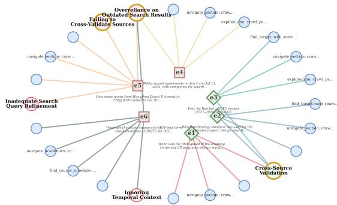  
Figure 6: Hypergraph subgraph visualization on Web-WalkerQA. Trajectory hyperedges (✸ success, ✷ failure) connect skill nodes (⃝ success, ⃝ failure) and subtask nodes (•).

## B More Analysis

## B.1 Self-Evolving Analysis

To examine whether HYPERSKILL’s hypergraph memory genuinely improves with experience, we plot the cumulative success rate as a function of episode index across all three benchmarks.

Figure 7 reveals three key findings. First, HY-PERSKILL is the only method that exhibits a sustained upward trajectory: on GAIA, its cumulative accuracy climbs steadily from the early episodes through the final ones, confirming that the hypergraph memory accumulates transferable skills over time. Second, baselines with comparable final success rates, such as DiLu on xBench, reach their peak early and stagnate or dip in the middle episodes before recovering, indicating that their memory does not compound across tasks. Third, the self-evolving effect is more pronounced on benchmarks with greater task diversity (GAIA, WebWalkerQA) than on xBench, suggesting that HYPERSKILL benefits most when the hypergraph can capture diverse cross-task skill co-occurrence patterns.

## B.2 Latency Analysis

Beyond success rate, practical deployment requires acceptable wall-clock latency. Figure 8 reports average per-task execution time across all three benchmarks under both backbones.

Under Qwen3-30B-A3B, HYPERSKILL adds moderate overhead relative to the fastest baseline (No Memory): 42.6s vs. 26.5s on xBench, 33.6s vs. 33.6s on GAIA (matching DILU), and 31.3s vs. 23.9s on WebWalkerQA. Under GPT-4o, the pattern is similar: HYPERSKILL runs at 48.3s, 47.6s, and 55.3s, while the fastest baselines reach 29.7s, 32.5s, and 41.9s respectively. In both settings, the overhead stems primarily from the additional LLM call for task decomposition and skill extraction, not from hypergraph operations themselves. Combined with the token-efficiency results in Figure 3, these results confirm that HYPERSKILL achieves the best performance at a practical latency cost.

## B.3 Memory Growth Analysis

Figure 9 shows how the hypergraph evolves over successive tasks. Subtask nodes grow roughly linearly since each task introduces a new decomposition, while both skill types grow sublinearly: insertion-time deduplication prevents near-duplicate skills from entering the graph, and periodic structure-informed merging consolidates redundant entries, together keeping skill counts well below the number of hyperedges across all benchmarks and backbones.

## B.4 Robustness Analysis

Ground-truth labels may be unavailable after each task in practice, yet following prior work (Fang et al., 2026; Zhang et al., 2025b), HYPERSKILL uses outcome signals to assign success/failure to extracted skills. We evaluate a self-judge variant in which the agent assesses its own trajectory outcome without access to the gold answer, and compare it against the GT-judge setting used in our main experiments. Table 2 reports results on GPT-4o. The self-judge variant retains 87.7–96.8% of the GT-judge performance across all three benchmarks, with the smallest gap on xBench (−2.00 SR) and the largest on GAIA (−5.37 SR). The modest degradation suggests that HYPERSKILL is robust to noisy outcome signals: co-occurrence ranking over multiple retrieved hyperedges dilutes the effect of occasional mislabeled skills, allowing the structural signal to remain reliable even without ground-truth feedback.

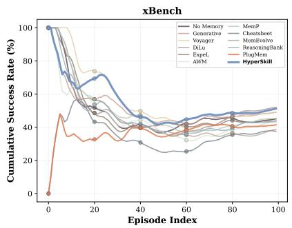

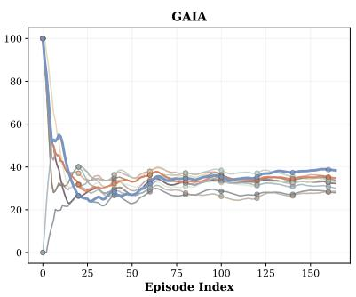

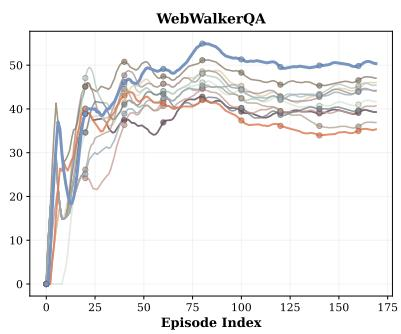  
Figure 7: Cumulative success rate (%) over episode index on Qwen3-30B-A3B. HYPERSKILL exhibits an upward trend across benchmarks.

Table 2: Comparison of GT-judge and self-judge on GPT-4o. Retention = Self-judge SR / GT-judge SR × 100%.
<table><tr><td>Benchmark</td><td>GT-judge</td><td>Self-judge</td><td>Retention</td></tr><tr><td>xBench</td><td>62.00</td><td>60.00</td><td>96.8%</td></tr><tr><td>GAIA</td><td>44.24</td><td>38.87</td><td>87.7%</td></tr><tr><td>WebWalkerQA</td><td>51.18</td><td>47.33</td><td>92.4%</td></tr></table>

## B.5 Hypergraph Visualization

Figure 6 shows the WebWalkerQA counterpart of the xBench hypergraph subgraph in Figure 5.

## C Broader Impact

HYPERSKILL is a general-purpose memory framework for LLM agents and does not target any specific high-risk application. By enabling agents to learn from past failures, it may reduce redundant computation and improve efficiency in deployed systems. However, as with any self-evolving system, accumulated memory could reinforce biases present in early trajectories if not periodically audited. We encourage practitioners to monitor stored skills for unintended patterns.

## D Disclosure of LLM Use

During the preparation of this manuscript, LLMbased tools were used to assist with grammar correction, code debugging, and figure design. All scientific content, experimental design, and analysis were conducted by the authors, who take full responsibility for the final manuscript.

## E Extended Related Works

LLM Agent Systems. Large language models are increasingly being deployed as autonomous agents that interact with complex environments through multi-step reasoning and actions, moving beyond traditional one-shot chatbot paradigms (Liu et al., 2025a; Xi et al., 2025; Wei et al., 2026). A central challenge is enabling agents to decompose complex tasks into manageable sub-problems and make sequential decisions. ReAct (Yao et al., 2022) interleaves chain-of-thought reasoning with environment actions, establishing a foundational paradigm for single-agent planning. Subsequent work improves task decomposition through hierarchical planning (Wang et al., 2023b; Sun et al., 2023) and enhances decision quality via self-reflection (Shinn et al., 2023). Multi-agent systems (Li et al., 2023; Wu et al., 2024; Talebirad and Nadiri, 2023) extend this paradigm further by assigning specialized roles to multiple agents that communicate and coordinate, enabling collaborative problem-solving on tasks beyond the scope of a single agent. While these advances have significantly broadened the capability frontier of LLM agents, most systems treat each task episode in isolation, limiting their ability to improve over time on recurring or compositionally related task patterns.

Memory Mechanisms in Agent Systems. We organize existing experiential memory systems along three dimensions: what is stored, how memory is structured and retrieved, and how memory evolves. Table 3 summarizes the comparison.

On what is stored, early systems retain raw trajectories or extract insights from each trajectory (Zhao et al., 2024; Wen et al., 2024; Wang et al., 2023a). Subsequent work abstracts experience into more compact forms: workflows (Wang et al., 2025b), reasoning strategies (Ouyang et al.,

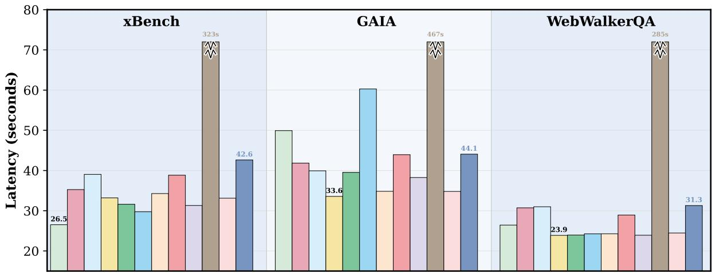  
(a) Qwen3-30B-A3B.

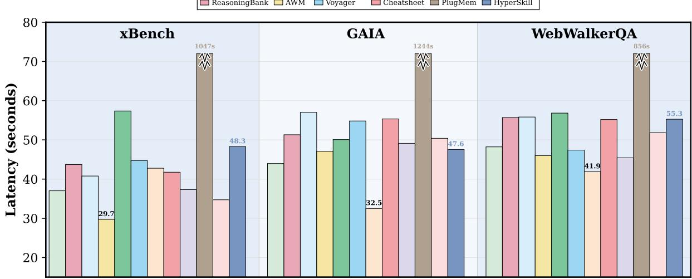  
(b) GPT-4o.  
Figure 8: Average per-task wall-clock latency (seconds) across xBench, GAIA, and WebWalkerQA. Lower is better. Annotated bars mark the fastest baseline in each panel and HYPERSKILL’s latency for reference.

2026), executable API skills (Zheng et al., 2025), or tips and shortcuts (Suzgun et al., 2026; Wang et al., 2025a). Recent training-based approaches go further: SkillRL (Xia et al., 2026) distills trajectories into a hierarchical skill library and co-evolves it with the agent’s policy via reinforcement learning (GRPO), while MemSkill (Zhang et al., 2026) treats memory operations themselves as learnable skills whose selection is optimized through RL and whose skill bank evolves by analyzing hard cases. However, all of these systems store knowledge units in isolation, discarding the compositional relationships among subtasks and skills within each trajectory. HYPERSKILL is the only system that preserves this joint compositional structure.

On how memory is structured and retrieved, the majority of systems use flat vector stores with semantic retrieval (Wang et al., 2023a; Wen et al., 2024; Shang et al., 2025), while a few adopt contrastive retrieval that compares successes and failures (Zhao et al., 2024; Ouyang et al., 2026). AWM (Wang et al., 2025b) concatenates all entries into the prompt, and SkillWeaver (Zheng et al., 2025) uses function signature matching. Graphbased systems such as G-Memory (Zhang et al., 2025a) and Agent-KB (Tang et al., 2025b) introduce pairwise edges but decompose the n-ary trajectory context into disconnected binary links. HY-PERSKILL uses hyperedges to preserve the full trajectory context and retrieves via a dual-path mechanism that combines subtask-level and task-level queries.

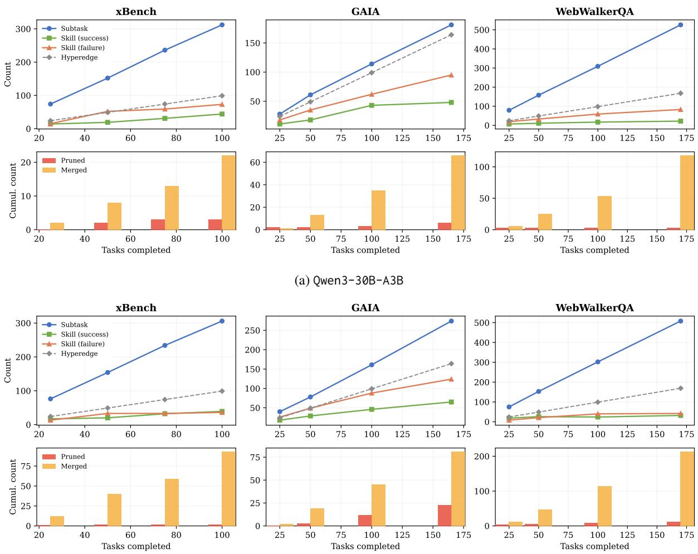  
(b) GPT-4o  
Figure 9: Hypergraph memory growth (top row) and cumulative maintenance operations (bottom row) across benchmarks.

On how memory evolves, most systems accumulate knowledge without any curation (Wang et al., 2023a; Zhao et al., 2024; Wen et al., 2024; Ouyang et al., 2026; Wang et al., 2025b). The few that do maintain memory apply lightweight operations such as test-and-prune (Zheng et al., 2025), episodic consolidation (Zhang et al., 2025a), deduplication (Tang et al., 2025b), or failure-driven adjustment (Fang et al., 2026), each applied independently per node without considering memory topology. SkillRL (Xia et al., 2026) and Mem-Skill (Zhang et al., 2026) evolve their skill libraries through RL training loops, but this evolution operates on model weights rather than on an explicit memory structure. HYPERSKILL performs structure-aware maintenance that jointly considers node utility and structural proximity via qualityweighted hypergraph propagation.

We also compare graph-structured memory systems specifically in Table 4. Most graph-based approaches target factual memory, recording environmental or user knowledge in knowledge graphs (Gutiérrez et al., 2024; Chhikara et al., 2025), temporal graphs (Rasmussen et al., 2025), hierarchical graphs (Wu et al., 2026), or multiview graphs (Jiang et al., 2026). HyperMem (Yue et al., 2026) uses a three-level hypergraph (topics, episodes, facts) with coarse-to-fine retrieval, but targets factual conversational memory rather than experiential task knowledge and does not perform structure-aware maintenance. Among experiential memory systems, PlugMem (Yang et al., 2026) and G-Memory (Zhang et al., 2025a) use pairwise edges that lose the joint trajectory context, and Agent-KB (Tang et al., 2025b) combines lexical and semantic indices without explicit graph structure over skills. HYPERSKILL is the first experiential memory system to use n-ary hyperedges, enabling co-occurrence-based skill ranking and topology-aware maintenance that pairwise designs cannot support.

Table 3: Taxonomy of experiential memory systems for LLM agents. Traj. = raw trajectories; Strat. = reasoning strategies; Tool Lib. = callable function registries; Skill Lib. = hierarchical skill libraries. ‡ Training-based methods that internalize skills into model weights via reinforcement learning.
<table><tr><td></td><td colspan="2">What is Stored</td><td colspan="2">How Structured &amp; Retrieved</td><td>How Evolved</td></tr><tr><td>Method</td><td>Knowledge Form</td><td>Compositional?</td><td>Structure</td><td>Retrieval</td><td>Maintenance</td></tr><tr><td>Voyager (Wang et al., 2023a)</td><td>Traj. &amp; Tips</td><td></td><td>Vector DB</td><td>Semantic</td><td>None</td></tr><tr><td>ExpeL (Zhao et al., 2024)</td><td>Traj. &amp; Insights</td><td>x x</td><td>Vector DB</td><td>Contrastive</td><td>None</td></tr><tr><td>Generative (Shang et al., 2025)</td><td>Traj. &amp; Insights</td><td>x</td><td>Vector DB</td><td>Semantic</td><td>None</td></tr><tr><td>DILU (Wen et al., 2024)</td><td>Traj.</td><td>x</td><td>Vector DB</td><td>Semantic</td><td>None</td></tr><tr><td>AWM (Wang et al., 2025b)</td><td>Workflows</td><td>x</td><td>In-Prompt</td><td>All-in-Prompt</td><td>None</td></tr><tr><td>Mobile-E (Wang et al., 2025a)</td><td>Tips &amp; Shortcuts</td><td>x x</td><td>Vector DB</td><td>Semantic</td><td>None</td></tr><tr><td>Cheatsheet (Suzgun et al., 2026)</td><td>Tips &amp; Shortcuts</td><td></td><td>JSON</td><td>Semantic</td><td>None</td></tr><tr><td>ReasoningBank (Ouyang et al., 2026)</td><td>Reasoning Strat.</td><td>x</td><td>Vector DB</td><td>Contrastive</td><td>None</td></tr><tr><td>SkillWeaver (Zheng et al., 2025)</td><td>APIs</td><td>x</td><td>Tool Lib.</td><td>Function Match</td><td>Test &amp; Prune</td></tr><tr><td>G-Memory (Zhang et al., 2025a)</td><td>Tips &amp; Workflows</td><td>x</td><td>Graph</td><td>Graph + Semantic</td><td>Consolidation</td></tr><tr><td>Agent-KB (Tang et al., 2025b)</td><td>Tips &amp; Workflows</td><td>x</td><td>Hybrid DB</td><td>Hybrid</td><td>Deduplication</td></tr><tr><td>Memp (Fang et al., 2026)</td><td>Tips &amp; Workflows</td><td>x</td><td>JSON</td><td>Semantic</td><td>Failure-driven</td></tr><tr><td>EvolveR (Wu et al., 2025b)</td><td>Tips &amp; Workflows</td><td>x</td><td>JSON</td><td>Contrastive</td><td>Update &amp; Pruning</td></tr><tr><td>SkillRL‡ (Xia et al., 2026)</td><td>Hierarchical Skills</td><td>x</td><td>Markdown</td><td>Adaptive</td><td>RL Co-Evolution</td></tr><tr><td>MemSkill‡ (Zhang et al., 2026)</td><td>Learnable Skills</td><td>x</td><td>Markdown</td><td>RL-guided</td><td>Skill Evolution</td></tr><tr><td>HYPERSKILL</td><td>Workflows &amp; Skills</td><td>√</td><td>Hypergraph</td><td>Dual-path</td><td>Quality + Topology</td></tr></table>

Table 4: Graph-structured memory systems for LLM agents. “Memory Type” categorizes the primary function: Factual records environmental or user knowledge; Experiential accumulates reusable task knowledge from agent trajectories. “Edge Type” distinguishes Pairwise (binary) from n-ary (hyperedges connecting arbitrary node sets). † Agent-KB shares knowledge across frameworks but executes with a single agent.
<table><tr><td rowspan="2">Method</td><td colspan="2">Memory Scope</td><td colspan="3">Graph Structure</td><td>Evolution</td></tr><tr><td>Mem. Type MAS</td><td></td><td>Graph Type</td><td>Edge</td><td>Retrieval</td><td>Maintenance</td></tr><tr><td>HippoRAG (Gutiérrez et al., 2024)</td><td>Factual</td><td>x</td><td>KG</td><td>Pairwise</td><td>PPR Activation</td><td>None</td></tr><tr><td>AriGraph (Anokhin et al., 2025)</td><td>Factual</td><td>x</td><td>KG + Episodic</td><td>Pairwise</td><td>Semantic + Episodic</td><td>Graph Update</td></tr><tr><td>A-Mem (Xu et al., 2026)</td><td>Factual</td><td>x</td><td>Zettelkasten</td><td>Pairwise</td><td>Semantic + Linking</td><td>Self-Organizing</td></tr><tr><td>MemOg (Chhikara et al., 2025)</td><td>Factual</td><td>x</td><td>KG + Vector</td><td>Pairwise</td><td>Hybrid</td><td>Deduplication</td></tr><tr><td>Zep (Rasmussen et al., 2025)</td><td>Factual</td><td>x</td><td>Temporal KG</td><td>Pairwise</td><td>Temporal + Semantic</td><td>Temporal Inval.</td></tr><tr><td>GAM (Wu et al., 2026)</td><td>Factual</td><td>x</td><td>Hierarchical</td><td>Pairwise</td><td>Multi-factor Trav.</td><td>Event-driven Consol.</td></tr><tr><td>MAGMA (Jiang et al., 2026)</td><td>Factual</td><td>x</td><td>Multi-Graph</td><td>Pairwise</td><td>Policy-guided Trav.</td><td>Async. Consol.</td></tr><tr><td>HyperMem (Yue et al., 2026)</td><td>Factual</td><td>x</td><td>Hypergraph</td><td>n-ary</td><td>Coarse-to-fine</td><td>None</td></tr><tr><td>HyperGraphRAG (Luo et al., 2025)</td><td>Factual</td><td>x</td><td>Hypergraph</td><td>n-ary</td><td>Hypergraph Retrieval</td><td>None</td></tr><tr><td>PlugMem (Yang et al., 2026)</td><td>Experiential</td><td>x</td><td>Dual KG</td><td>Pairwise</td><td>Subgraph Retrieval</td><td>None</td></tr><tr><td>G-Memory (Zhang et al., 2025a)</td><td>Experiential</td><td>S</td><td>Hierarchical</td><td>Pairwise</td><td>Graph + Semantic</td><td>Episodic Consol.</td></tr><tr><td>Agent-KB† (Tang et al., 2025b)</td><td>Experiential</td><td>x</td><td>Hybrid</td><td>Pairwise</td><td>Hybrid</td><td>Deduplication</td></tr><tr><td>HYPERSKILL</td><td>Experiential</td><td>x</td><td>Hypergraph</td><td>n-ary</td><td>Dual-path + κ</td><td>Quality + Topology</td></tr></table>

## F Ethics Statement

We provide comprehensive methodological details, including hyperparameters, prompts, and algorithm pseudocode, to enable full reproducibility. Our framework is evaluated on publicly available benchmarks (xBench, GAIA, WebWalkerQA) and does not collect or process personal information. LLMbased tools were used solely for grammar correction, code debugging, and figure design; all scientific content, experimental design, and analysis were conducted by the authors. While HyperSkill is designed as a general-purpose memory framework for benign research, we acknowledge that accumulated memory could reinforce biases present in early trajectories if not periodically audited, and we encourage practitioners to monitor stored skills for unintended patterns.

## G Additional Case Studies

To illustrate how HYPERSKILL’s retrieval and evolution mechanisms operate in practice, we walk through a representative GAIA task and a snapshot of memory maintenance in Figure 10. We also present three additional end-to-end case studies spanning the three benchmarks. Each case reports the task, the decomposition used to drive fine-grained retrieval, the skills and mistakes surfaced from the hypergraph, the agent’s step-wise execution trace, and the final outcome. Together they illustrate how HYPERSKILL’s dual-path retrieval translates into concrete action improvements across heterogeneous domains.

## Case 1: xBench — Literary Trivia

Task (translated from Chinese): A 19th-century French novel caused a morality scandal and lawsuit upon publication. In the 1991 film adaptation, what flavor of prop poison did the lead actress insist on using for the suicide scene?

Golden answer: bitter-almond flavor.

## Plan Decomposition

1. search\_literary\_work: identify the 19th-century French novel via scandal keywords.

2. find\_movie\_adaptations: locate the 1991 film adaptation and lead actress.

3. verify\_prop\_taste: crawl film trivia sources for the specific flavor detail.

4. confirm\_taste\_detail: validate the exact flavor description.

## Retrieved Memory

Past experience (distilled lessons):

✓ When verifying historical details, prioritize authoritative sources and cross-verify claims across multiple trusted references.

✗ Never assume that detailed data is available in public summaries; always use precise, entityfocused queries to locate authoritative sources.

Skills:

• Multi-Stage Verification: break complex cross-domain questions into sequential verification steps.

• Direct Source Confirmation: prioritize official reference pages over aggregator sites.

• Source Deep Dive: use page crawling to extract precise details rather than relying on snippets.

Mistakes to avoid:

• Over-Reliance on Web Search: repeatedly issuing general searches without verifying authoritative sources.

## Agent Execution (10 steps)

1–2 web\_search → identifies Madame Bovary by Gustave Flaubert; initial poison query.

3–5 Confirms 1991 film by Claude Chabrol with Isabelle Huppert as Emma Bovary.

6–8 Progressive refinement: searches behind-the-scenes trivia across multiple sources.

9–10 Final verification: extracts bitter-almond flavor detail from an authoritative film database.

## Outcome

✓ SUCCESS — the lead actress insisted on using a bitter-almond-flavored prop poison to authentically replicate the taste of cyanide.

How memory helped: The Multi-Stage Verification skill guided decomposition of a cross-domain chain (literature → film → behind-the-scenes trivia), while the Over-Reliance on Web Search error pattern prevented looping on generic queries. The retrieved lesson about cross-verifying across trusted references reinforced the agent’s move from aggregator snippets to authoritative film databases.

## Case 2: GAIA — Scientific Calculation

Task: What integer-rounded percentage of the total length of the harlequin shrimp recorded in Omar Valencia-Mendez’s 2017 paper was the sea star fed to the same type of shrimp in G. Curt Fiedler’s 2002 paper?

Golden answer: 22.

Plan Decomposition

1. inspect\_file\_as\_text: read the attached file for data from both papers.

2. python\_code: calculate the integer-rounded percentage.

## Retrieved Memory

## Past experience (distilled lessons):

✓ When seeking precise values from academic papers, prioritize direct access to the original source through targeted searches with author names and publication years.

✗ Never retry a tool call without diagnosing system-level errors first; always verify infrastructure readiness before re-attempting.

Skills:

• Domain-Specific Query Refinement: include domain-specific terms and reliable source filters in queries for technical data.

• Unit Conversion: convert units consistently before performing calculations.

Mistakes to avoid:

• Inadequate Context Refinement: failing to break tasks into verifiable sub-questions leads to unstructured search.

## Agent Execution (7 steps)

1–2 Parallel web\_search for both papers; crawl\_page on Fiedler 2002 via Oxford Academic.

3–4 Refines query with specific measurements; reads Valencia-Mendez 2017 PDF directly.

5–6 Cross-references: shrimp total length = 4.5 cm, sea-star piece = 1 cm.

7 final\_answer: round(1/4.5 × 100) = 22%.

## Outcome

✓ SUCCESS — the sea star was approximately 22% of the harlequin shrimp’s total length.

How memory helped: Domain-Specific Query Refinement pushed the agent to use precise scientific terms (“total length”, “harlequin shrimp”) rather than generic queries. The Inadequate Context Refinement mistake warned against unstructured searching, guiding the agent to split the task into two parallel data-retrieval subtasks (one per paper) before computing the ratio.

## Case 3: WebWalkerQA — Game Knowledge

Task (translated from Chinese): In Age of Empires IV, what are the strategic differences between the Malian and Chinese civilizations in their respective fourth age?

Golden answer: the Malians leverage the Griot Bara landmark for global buffs, while the Chinese rely on the Great Wall as a defensive advantage.

## Plan Decomposition

1. explore\_site: crawl ageofempires.com homepage for site structure.

2. navigate\_section: crawl the civilizations section for Malian and Chinese details.

3. find\_target: search with domain-specific keywords on the official site.

## Retrieved Memory

## Past experience (distilled lessons):

✓ When institutional websites fail to surface specific records, precise multi-source searches are essential for retrieving accurate information.

✗ Relying on automated crawling without validating access or adapting to site-specific barriers leads tofailed data retrieval.

✗ Starting with external searches before fully navigating internal websites risks missing structured and unindexed information.

## Skills:

• Internal First Strategy: thoroughly explore internal site structure before resorting to external search tools.

• Specific Query Refinement: use precise, domain-specific keywords when searching internal or external tools.

• Verify with Multimodal Sources: when internal search yields limited results, use external sources to gather complementary information.

Mistakes to avoid:

• Premature External Search: relying on external web search before thoroughly exploring internal site navigation.

• Incomplete Internal Crawling: failing to systematically access relevant sections of a website.

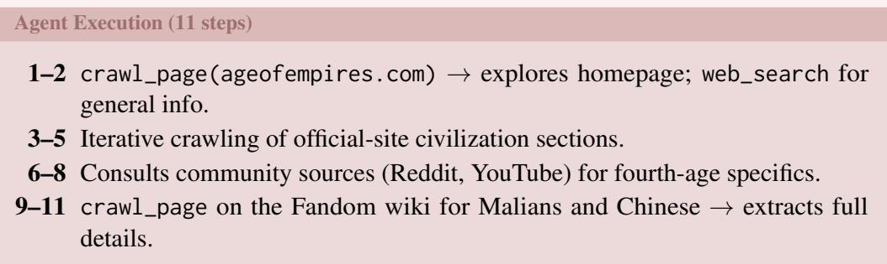

✓ SUCCESS — detailed comparison: the Malians favor economic guerrilla tactics anchored by the Griot Bara landmark; the Chinese rely on fast building, Great Wall defense, and chemical technology.

How memory helped: The Internal First Strategy skill prevented the agent from jumping to external searches immediately, instead exploring the official site structure first. Three failure lessons all reinforced the same pattern: navigate internally before going external. This is a pattern learned across 6+ previous WebWalkerQA episodes involving institutional websites, now successfully transferred to a gaming wiki.

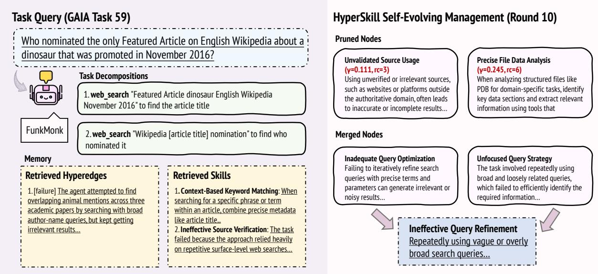  
Figure 10: Case study on GAIA Task 59.

## H Algorithm

Algorithm 1 summarizes the full HYPERSKILL pipeline per task, and Algorithm 2 describes the periodic memory evolution.

Algorithm 1 HYPERSKILL: Per-Task Pipeline   
Require: Task $d _ { q } ;$ memory $\mathcal { G } = ( \nu , \mathcal { E } )$ ; budgets $k _ { u } , k _ { e } , k _ { s } ;$ dedup threshold $\delta _ { \mathrm { d e d u p } }$   
Ensure: Updated memory G   
% Dual-path hyperedge retrieval (§3.3)   
1: $\mathcal { P } _ { 0 }  \mathrm { L L M - D E C O M P O S E } ( d _ { q } )$ ▷ Subtask decomposition   
2: $R _ { u } \gets \mathrm { t o p } { - } k _ { u }$ subtask nodes by sim $\big ( \phi ( \mathcal { P } _ { 0 } ) , \phi ( c _ { v } ) \big )$ ▷ Eq. 4   
3: $\mathcal { E } _ { \mathrm { s u b } }  \{ e \in \mathcal { E } \mid V _ { e } \cap R _ { u } \neq \emptyset \}$ ▷ Subtask path   
4: $\mathcal { E } _ { \mathrm { t r a j } }  \mathrm { t o p - } k _ { e }$ hyperedges by sim $( \phi ( d _ { q } ) , \mathbf { h } _ { e } )$ ▷ Trajectory path ▷ Eq. 5   
5: $\mathcal { E } ^ { * }  \mathcal { E } _ { \mathrm { s u b } } \cup \mathcal { E } _ { \mathrm { t r a j } }$ ▷ Fuse ▷ Eq. 6   
% Skill ranking & execution (§3.4)   
6: $\begin{array} { r } { R _ { s } \gets \bigcup _ { e \in \mathcal { E } ^ { * } } V _ { e } ^ { s } ; \quad \kappa ( v ) \gets | \{ e \in \mathcal { E } ^ { * } \mid v \in V _ { e } \} | } \end{array}$ for each $v \in R _ { s }$ ▷ Eq. 8   
7: $S _ { q } \gets \mathrm { t o p } { - } k _ { s }$ skills by $\kappa ( v )$ $\mathcal { L } _ { q } \gets \{ \ell _ { e } \ | \ e \in \mathcal { E } ^ { * } \}$ ▷ Eq. 9   
8: Execute task with context $( S _ { q } , \mathcal { L } _ { q } )$ ; observe outcome $r _ { i } ,$ , steps $T _ { i }$ ▷ Eq. 10   
% Memory update   
9: Extract skills $S _ { i } ^ { \mathrm { n e w } }$ and lesson $\ell _ { e _ { i } }$ from trajectory $\tau _ { i }$   
10: Deduplicate: merge into existing skill if sim $\geq \delta _ { \mathrm { d e d u p } } ,$ else add new node   
11: Add hyperedge $e _ { \mathrm { n e w } } = ( \mathcal { P } _ { 0 } \cup S _ { i } ^ { \mathrm { n e w } } , ~ d _ { q } , ~ \ell _ { e _ { i } } ) \mathrm { t o } \mathcal { E }$   
12: Update utility $\gamma ( \cdot )$ via Eq. 3 for all retrieved elements

```latex
Algorithm 2 HYPERSKILL: Periodic Memory Evolution (every $\lceil 0 . 1 \times N \rceil$ tasks)
Require: Memory $\mathcal { G } = ( \nu , \mathcal { E } )$ ; thresholds $\tau _ { \mathrm { p r u n e } } , N _ { \mathrm { m i n } } , \delta _ { \mathrm { m e r g e } } ;$ propagation depth L
% Quality-driven pruning (§3.5)
1: Remove all v with $\nu ( v ) \geq N _ { \operatorname* { m i n } }$ and $\gamma ( v ) < \tau _ { \mathrm { p r u n e } }$ from V and incident hyperedges ▷ Eq. 11
% Structure-informed merging (skill nodes $\nu _ { s } \ o n l y )$
2: $\begin{array} { r } { W _ { i j } \gets \operatorname* { m i n } ( \gamma ( v _ { i } ) , \gamma ( v _ { j } ) ) \cdot \sum _ { { v } _ { i } \in V _ { \varepsilon , v _ { i } \in V _ { \varepsilon } } } | V _ { e } | ^ { - 1 } } \end{array}$ ▷ Quality-weighted co-occurrence ▷ Eq. 12
3: Z<sup>˜</sup> ← S Z via L-step propagation ▷ Structural embeddings ▷ Eq. 13
4: for each pair $( v _ { a } , v _ { b } )$ with sim $( \tilde { \mathbf { z } } _ { a } , \tilde { \mathbf { z } } _ { b } ) \geq \delta _ { \mathrm { m e r g e } }$ do
5: $v _ { \mathrm { n e w } }  \mathrm { L L M }$ -MERGE(v<sub>a</sub>, v<sub>b</sub>); reassign hyperedge memberships ▷ Eq. 14
6: end for
```

## I Prompts

## Task Decomposition Prompt (GAIA)

## Decompose this task into 1–3 SHORT steps. Minimize steps to save context window. Available tools:

• web\_search(query): Search with SPECIFIC keywords (names, dates, exact phrases)

• crawl\_page(url): Read a URL — use ONLY when you need specific page content

• inspect\_file\_as\_text(path): Read attached files — START HERE if task has a file

• inspect\_file\_as\_image(path): View images/figures

• python code: Calculations, counting, data processing

## Key principles:

• If a file is attached, read it FIRST

• Use web\_search with the MOST specific terms possible

• Prefer python code for calculations over searching

Task: {query}

Return ONLY a JSON array: [{"name": "action\_name", "description": "use <tool> to <specific action>"}]

## Task Decomposition Prompt (WebWalkerQA)

Decompose this web navigation task into 2–4 steps.   
Available tools:   
• web\_search(query): Search for specific pages on the website   
• crawl\_page(url): Read content from a URL   
Navigation strategy: ALWAYS start by crawling the root URL to understand site structure. Then navigate to the relevant   
section (News, Awards, Faculty, etc.) before searching for specifics.   
Example for “Find what award Prof X won in 2021 on university.edu”:   
[{"name": "explore\_site",   
"description": "crawl\_page(root\_url)   
to find navigation menu"},   
{"name": "navigate\_section",   
"description":   
"crawl\_page(root\_url/awards)"},   
{"name": "find\_target",   
"description":   
"web\_search('Prof X award 2021   
site:university.edu')"}]   
Task: {query}   
Return ONLY a JSON array.

## Task Decomposition Prompt (xBench)

Decompose this data task into 2–4 steps. Each step must specify WHICH DATA to get and HOW to process it.   
Available tools:   
• web\_search(query): Search for data sources   
• crawl\_page(url): Read data from specific URLs   
• python code: Run calculations, unit conversions, comparisons   
Task: {query}   
Return ONLY a JSON array: [{"name": "action\_name", "description": "use <tool> to <specific data   
action>"}]

## Skill Extraction Prompt (Success)

Extract reusable knowledge from this SUCCESSFUL task.   
CRITICAL RULES:   
• Names must be SHORT reusable pattern names (3–5 words), NOT task-specific.   
Bad: “Search for Zip Codes”. Good: “Targeted Database Search”.   
Content must be a COMPLETE paragraph (2–4 sentences) that covers: WHAT to do, WHEN to apply it, and WHY it   
works.   
• Extract 1–3 items max. Quality over quantity.   
• Do NOT include task-specific details (exact names, IDs, URLs). Make knowledge transferable.   
Task: {query}   
Trajectory: {trajectory}   
Result: {result}   
Extract skills (what strategies worked well).   
Extract as JSON:   
{   
"skills": [   
{"name": "Short Skill Name",   
"content":   
"2-4 sentence paragraph..."}],   
"knowledge\_fragment":   
"ONE OR TWO sentences stating the   
core transferable lesson."   
}

## Mistake Extraction Prompt (Failure)

Extract reusable lessons from this FAILED task.   
CRITICAL RULES: (same as success extraction)   
Task: {query}   
Trajectory: {trajectory}   
Result: {result}   
Extract mistakes (what went wrong and how to avoid it).   
Extract as JSON:   
{   
"mistakes": [{"name": "Short Mistake Name",   
"content": "2-4 sentence paragraph   
describing what fails, why, and   
what to do instead."}],   
"knowledge\_fragment": "ONE OR TWO sentences   
stating the core failure mode to avoid."   
}

## Structure-Informed Merging Prompt

These two {type}s are structurally and semantically related. Consolidate them into ONE higher-order {type} that captures   
the knowledge from both.   
{TYPE} A:   
Name: {name\_a}   
Content: {content\_a}   
{TYPE} B:   
Name: {name\_b}   
Content: {content\_b}   
Create a consolidated {type} that:   
• Has a SHORT reusable name (3–5 words)   
• Has content (2–4 sentences) covering BOTH strategies/patterns   
• Is more general and widely applicable than either individual {type}   
Reply with ONLY JSON: {"name": "...", "content": "..."}

## Retrieved Memory Format (Agent Context)

The following memory is assembled once per episode and provided to the agent at the beginning of execution: ## Past Experience

(Distilled lessons from top-k retrieved hyperedges)

1. [success] When official exchange data is rate-limited, cross-verified third-party aggregators provide a reliable fallback...

\## Relevant Skills

2. [failure] Relying on generic search terms instead of querying domain-specific databases yields incomplete data...

1. Targeted Database Search: Search for specific financial metrics using precise query terms that include the asset, time frame, and required data points...

\## Mistakes to Avoid

1. Overreliance on Unverified Aggregators: Using third-party summaries or social media posts as primary sources for quantitative claims leads to incorrect results...