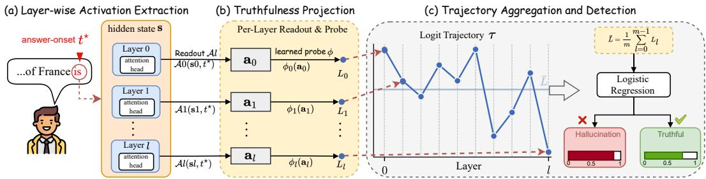
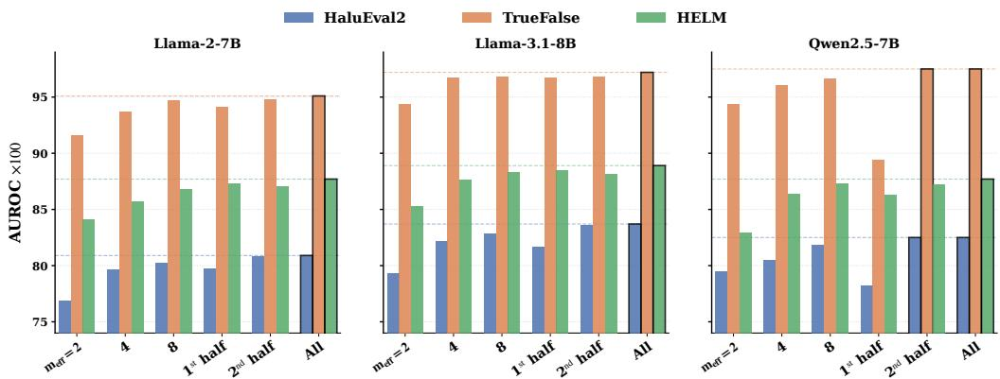

# HalluTracer: Hallucination Detection via Depth-Averaging Truth Signals

Zhihao Guo1,2∗ Zonghan Wu1∗ Huan Huo2 DaYong Ye3 Junwei Zhang4 Weiran Yao5 Zhiwei Liu6 Qingsong Wen1,7† Yilei Shao1†

1East China Normal University, China 2University of Technology Sydney, Australia 3City University of Macau, Macau 4Meta, USA 5actAVA AI, USA 6Microsoft AI, USA 7Squirrel Ai Learning, USA

zhihao.guo-1@student.uts.edu.au, zhwu@sem.ecnu.edu.cn, Huan.Huo@uts.edu.au dyye@cityu.edu.mo, Junweizhang23@gmail.com, weiran@actava.ai zhiweiliu@microsoft.com, qingsongedu@gmail.com, yileishao@sem.ecnu.edu.cn

## Abstract

Even well-aligned large language models confidently generate factually incorrect text, making hallucination a persistent reliability risk in high-stakes deployments. These models nonetheless carry linearly separable truthfulness signals in their internal representations. Existing white-box detectors, however, collapse this evidence to isolated components or a single depth, discarding discriminative information distributed across the full forward pass. We introduce HalluTracer, a detection framework that reads and aggregates truthfulness evidence across every layer of the forward pass before the model emits any answer token. A geometric analysis reveals that the per-layer signals are weakly correlated, so that simple depth averaging suppresses layer-specific noise and captures nearly all linearly accessible information. Across six open-source language models and five hallucination benchmarks, HalluTracer consistently outperforms matched white-box baselines, with gains ranging from one to fourteen points. Collectively, our work recasts hallucination detection from a layer-selection problem into a depth-aggregation problem governed by the geometric sparsity of the truthfulness signal.

## 1 Introduction

Large language models (LLMs) produce fluent but unfaithful text, a failure mode termed hallucination, which poses concrete risks in safety-critical deployments [18, 33, 17] and persists despite alignment training [29, 3]. Mechanistic studies, however, reveal that these models internally encode truthrelevant structure that is not fully exploited during generation: linear probes recover separable truthfulness directions from hidden activations [26], and models can exhibit calibrated self-evaluation when explicitly prompted [20]. This gap between internal knowledge and output fidelity suggests a detection opportunity for token cost saving—if the model’s representations already distinguish fact from fabrication, that distinction can in principle be read out before any text is generated. Reliably doing so remains an open problem.

In practice, existing methods capture only a fraction of this internal evidence. For example, Contrast-Consistent Search [6] discovers latent truth directions without supervision but requires paired statements and operates at a single depth.

  
Figure 1: Overview of HalluTracer. (a) At each Transformer layer, a readout extractor selects the hidden state at the answer-onset position. (b) A per-layer learned probe projects the readout onto a scalar truth logit. (c) The truth logits across all layers form a logit trajectory whose depth-averaged mean is fed to a logistic classifier for hallucination detection.

Inference-Time Intervention [23] steers model behaviour using truthfulness directions extracted from a few attention heads, ignoring how factual commitment continuously develops across depth. Fact-Probe [16] demonstrates that a simple linear classifier on one layer’s hidden state can detect hallucinations, yet the choice of which layer to probe remains dataset-dependent. Representation Engineering [35] extracts concept-level reading vectors, and IRIS [30] classifies the terminal hidden state of a self-verification trace with an multi-layer perceptron.

The common thread is that these methods collapse internal evidence to isolated components or limited depths, implicitly assuming that truthfulness is a layer-localized property rather than a quantity that spans across the forward pass. However, feed-forward layers function as distributed key-value memories that hierarchically refine predictions [14], and the residual stream acts as a shared channel through which successive blocks compose representations [10]; truthfulness is progressively constructed rather than instantaneously encoded. Existing work has observed or exploited partial depth information, but the aggregation problem itself, namely how to combine truthfulness evidence across all layers and when simple averaging suffices, has not been systematically characterised for hallucination detection.

In this work, we introduce HalluTracer (Figure 1 provides an overview), a detection framework that treats the truthfulness signal as an evolving quantity across depth rather than a property of any single layer. A layer-specific linear probe at each Transformer block maps the answer-onset representation to a scalar truth logit; stacking these scalars across all layers yields a logit trajectory that records how factual commitment develops through the network. Because the readout position is fixed by the prompt, this trajectory is available before the model emits any answer token, enabling anticipatory detection. A geometric analysis then reveals that adjacent probe directions are near-orthogonal across depth, we observe the truthfulness signal occupies less than one percent of the representation variance. This weak correlation across layers means that depth-averaging the probe outputs suppresses per-layer noise, yielding a detection statistic unavailable to single-layer methods. Our contributions are as follows:

1. Depth-wise pre-decoding detector. We introduce HalluTracer, a lightweight hallucination detector that reads truthfulness evidence from every Transformer layer at the answer-onset position and aggregates these layer-wise scores into a single pre-decoding risk signal.

2. Geometry-guided explanation of depth averaging. We show that truthfulness readouts are low-energy and weakly aligned across depth, and derive a covariance-aware diagnostic explaining when simple depth averaging captures nearly all linearly accessible detection signal.

3. Matched-budget empirical validation. Across six open-weight LLMs and five hallucination benchmarks, HalluTracer consistently improves over matched pre-decoding white-box baselines, with ablations showing that the gains come primarily from depth aggregation rather than head selection, readout choice, or additional trajectory features.

## 2 Related Work

Output-Level and Internal-State Detection. Hallucination detection divides into output-level and internal-access methods. Output-level methods, often usable in black-box settings, such as SelfCheckGPT [25] and Semantic Entropy [11], score consistency or uncertainty from generated responses, but require multiple sampled outputs and incur substantial decoding cost. Post-generation white-box methods such as HalluGuard [32] instead use gradient geometry over the full generated response, providing a richer information budget but operating after answer emission. Internal-access methods probe model activations: Burns et al. [6] discover latent truth directions unsupervised, Li et al. [23] steer model behaviour via targeted layer interventions, and follow-up work deploys classifiers on selected hidden states, attention heads, or terminal representations [16, 30, 31, 7]. Recent pre-decoding studies further show that query-side or input-side hidden states already encode hallucination risk before generation [19], and FactCheckmate [1] uses such signals for learned detection and hidden-state intervention. These works establish that factuality-related signals are accessible from generated outputs, post-generation gradients, or selected internal states, but they typically rely on sampled generations, generated responses, selected layers, selected heads, token positions, or learned intervention modules. In contrast, we keep the pre-decoding setting but replace layer or head selection with a full-depth truth-logit trajectory, thereby using the depth profile and covariance structure of internal evidence rather than a single selected readout. Prior work [13, 20] shows that factual and hallucinated examples can differ not only in mean signal but also in uncertainty, motivating our explicit variance and covariance diagnostics.

Cross-Layer Dynamics. Mechanistic interpretability has established that semantic properties are refined across depth: feed-forward layers function as key-value memories [14], the residual stream serves as a communication channel for blocks [10], and the logit lens [28] and its learned variant [4] reveal how token predictions sharpen across layers. Several hallucination methods exploit depth or generation-time dynamics: DoLa [9] contrasts layer-wise vocabulary logits during decoding, HalluGuard [32] uses NTK gradients over the full generated response, Mir [27] analyses layer-wise semantic dynamics, and ICR Probe [34] tracks residual-stream update dynamics across layers. These approaches are complementary but either intervene during decoding, operate after answer emission, select layer/module-specific signals, or learn cross-layer detectors. In contrast, HalluTracer assigns a pre-decoding risk score from answer-onset truth-logit trajectories and provides a covariance-aware account of when uniform aggregation across all depths is Fisher-near-optimal.

## 3 Method

## 3.1 Overview

At each Transformer layer, a supervised probe projects the internal representation at the answer-onset position onto a scalar truth logit. Stacking these scalars across depth yields a logit trajectory (§3.2; Figure 1). The scope and limitations of this answer-onset detection paradigm are discussed in Appendix J.1. We analyse the geometry of the probe directions and show that adjacent probes occupy near-orthogonal coordinate frames, so that successive readouts are weakly correlated (§3.3). An SNR (Signal-to-Noise Ratio) analysis shows that the depth-averaged mean is a near-optimal detection statistic under the empirically verified level-dominant regime, yielding a single-scalar detector fed to a linear classifier (§3.4). An exact decomposition of each layer-to-layer logit increment provides a mechanistic account of how depth averaging concentrates the class signal (§3.5).

## 3.2 Layer-wise Truthfulness Trajectory

Setup. Let m denote the number of Transformer layers, and $l \in \{ 0 , \ldots , m - 1 \}$ index depth. Let $t ^ { \star }$ denote the answer-onset position, defined as the final prompt token immediately preceding answer generation. At layer l, let $\mathbf { s } _ { l , t } ,$ ⋆ denote the model’s internal state at position $t ^ { \star }$ . A layerspecific extractor $\mathbf { \mathcal { A } } _ { l }$ maps $\mathbf { s } _ { l , t ^ { \star } }$ into a shared observation space (Figure 1a), yielding the readout representation

$$
\mathbf { a } _ { l } : = \mathcal { A } _ { l } \big ( \mathbf { s } _ { l , t ^ { \star } } \big ) \in \mathbb { R } ^ { d } ,\tag{1}
$$

where d is the readout dimension. Because $t ^ { \star }$ is determined entirely by the prompt, the resulting trajectory is available before the model emits any answer token, enabling anticipatory detection. In this work, $\mathbf { \mathcal { A } } _ { l }$ extracts a single attention head per layer (Appendix A.1), though the detector is robust to the choice of head and readout mechanism (§4).

Definition 3.1 (Truthfulness Observable). A truthfulness observable at layer l is a learned affine function mapping any readout vector $\mathbf { a } \in \mathbb { R } ^ { d }$ to a scalar:

$$
\phi _ { l } ( \mathbf { a } ) \ = \ \mathbf { v } _ { l } ^ { \top } \mathbf { a } + b _ { l } ,\tag{2}
$$

where $\mathbf { v } _ { l } \in \mathbb { S } ^ { d - 1 }$ is a unit-norm direction learned by a regularised linear probe and $b _ { l } \in \mathbb { R }$ is a scalar geometric bias. The truthfulness coordinate (or truth $l o g i t )$ at layer l is the scalar projection

$$
{ \cal L } _ { l } = \phi _ { l } ( { \bf a } _ { l } ) ,\tag{3}
$$

where $\mathbf { a } _ { l } = \mathcal { A } _ { l } ( \mathbf { s } _ { l , t ^ { \star } } )$ is the readout representation at layer l.

Cross-layer evaluations such as $\phi _ { l } ( \mathbf { a } _ { l + 1 } )$ are algebraically well-defined under the fixed readout gauge that identifies all layer coordinates with $\mathbb { R } ^ { d } ;$ they should not be interpreted as gauge-invariant comparisons across heads.

Logit Trajectory. Evaluating the sequence of observables sweeps out the logit trajectory:

$$
\pmb { \tau } \ = \ \left[ L _ { 0 } , \ L _ { 1 } , \ \ldots , \ L _ { m - 1 } \right] ^ { \top } \ \in \ \mathbb { R } ^ { m } .\tag{4}
$$

This trajectory is a depth-wise trace of the model’s latent internal state, not a sequence over generated tokens. For a single inference graph, this projection traces a static curve over depth. Evaluated over the data distribution ${ \mathcal { D } } ,$ these curves form a trajectory distribution whose class-conditional geometry determines the discriminative power of trajectory-level statistics; this geometry is shaped by both the common-mode variance and the structure of the probe directions $\{ \mathbf { v } _ { l } \}$

## 3.3 Probe Isotropy and Variance Structure

Before specifying the detector, we analyse the geometric structure of the probe directions $\left\{ \mathbf { v } _ { l } \right\}$ , as this structure determines how much discriminative information depth aggregation can recover. The argument proceeds in three steps: a structural condition on the readout distributions (Assumption 3.2), a geometric consequence for the probe directions (Property 3.3), and a variance decomposition whose conclusions directly motivate the detector design (Remark 3.4). Full derivations are deferred to Appendix H. Empirical verification appears in $\ S 4 . 3$

The following assumption identifies a geometric condition on the readout distributions under which adjacent probes are sufficiently decorrelated for depth aggregation to be effective.

Assumption 3.2 (Sparse Semantic Separation). For each intermediate layer l, the class-conditional distributions of the readout representation ${ \bf a } _ { l } \in \mathbb { R } ^ { d _ { h } } ( d _ { h }$ is the attention head dimension, $d = d _ { h }$ in Eq. 1) satisfy three conditions (formal definitions and quantitative calibration in Appendix H):

(i) Mean separation: the factual and hallucinated class means differ.

(ii) Signal sparsity: the learned probe direction $\mathbf { v } _ { l }$ (Definition 3.1) captures no more variance from the within-class pooled covariance than a uniformly random direction in $\mathbb { R } ^ { d _ { h } }$

(iii) Directional calibration: the class-conditional variances along the probe direction are of comparable magnitude. This condition governs the tightness of the SNR bound but is not required for the framework’s validity.

Justification. Low energy alone does not imply isotropy. We therefore treat probe isotropy as an empirical prediction of the perturbative quiet-subspace model (Appendix H.6) rather than a direct consequence of variance sparsity: because the probe captures less than $1 / d _ { h }$ of the total variance, its orientation is effectively unconstrained by the covariance spectrum, and each Transformer block is predicted to resample this orientation. This prediction is verified across all models in Table 2.

Property 3.3 (Probe Isotropy). Under Assumption 3.2 and the perturbative quiet-subspace model of Appendix H.6, adjacent-layer probe directions are predicted to occupy near-orthogonal coordinate frames: $| \langle \mathbf { v } _ { l } , \mathbf { v } _ { l + 1 } \rangle | \approx \sqrt { 2 / ( \pi d _ { h } ) }$ , matching the theoretical expectation for independent unit vectors on $\mathbb { S } ^ { d _ { h } - 1 }$ . Define the sample-level common mode $\alpha _ { i } : = \bar { L } ^ { ( i ) } - \bar { \mu } ^ { ( c _ { i } ) }$ as the depth-averaged deviation of sample i from its class mean $\bar { \mu } ^ { ( c _ { i } ) }$ , where $c _ { i } \in \{ \mathcal { H } , \mathcal { F } \}$ , H denotes hallucinated examples, and $\mathcal { F }$ denotes factual examples. After removing $\alpha _ { i }$ , residual cross-layer correlations are predicted to decay rapidly with layer separation (Table 14).

Near-orthogonality motivates weak residual correlation after removing the sample-level common mode $\alpha _ { i } ;$ it is not assumed to imply unconditional statistical independence (Appendix D).

Remark 3.4 (Level–Shape Decomposition). Under Property 3.3, the logit trajectory decomposes into two components:

$$
\begin{array} { r } { L _ { l } ^ { ( i ) } = \underbrace { \alpha _ { i } + { \bar { \mu } } ^ { ( c _ { i } ) } } _ { \mathrm { l e v e l ( s h a r e d ) } } + \underbrace { ( \mu _ { l } ^ { ( c _ { i } ) } - { \bar { \mu } } ^ { ( c _ { i } ) } ) + \varepsilon _ { i , l } } _ { \mathrm { s h a p e ( l a y e r \mathrm { - } s p e c i f i c ) } } , } \end{array}\tag{5}
$$

where $L _ { l } ^ { ( i ) }$ denotes the truth logit $( \mathrm { E q . ~ } 3 )$ of sample i at layer $l , \mu _ { l } ^ { ( c _ { i } ) } : = \mathbb { E } [ L _ { l } \mid c _ { i } ]$ is the classconditional mean at layer $l ,$ and $\varepsilon _ { i , l } : = L _ { l } ^ { ( i ) } - \mu _ { l } ^ { ( c _ { i } ) } - \alpha _ { i }$ is the layer-specific residual (by construction $\textstyle \sum _ { l } \varepsilon _ { i , l } = 0 )$ . The modelling content lies in treating $\alpha _ { i } \sim ( 0 , \sigma _ { \alpha } ^ { 2 } )$ and $\varepsilon _ { i , l } \sim ( 0 , \sigma _ { \varepsilon } ^ { 2 } )$ as independent random components with the variance structure of a random-intercept model. Note that the empirical projection used to estimate variance components (Appendix H) constructs residuals satisfying $\begin{array} { r } { \sum _ { l } \varepsilon _ { i , l } = 0 } \end{array}$ by construction, whereas Prop. 3.5 treats them as independent across layers. The trajectory mean $\begin{array} { r } { \bar { L } = \frac { 1 } { m } \sum _ { l = 0 } ^ { m - 1 } L _ { l } } \end{array}$ captures the level component $\alpha _ { i } + \bar { \mu } ^ { \left( c _ { i } \right) }$ , which carries the dominant class-conditional signal (Table 14). A single well-chosen layer already captures most of this signal. Depth averaging improves robustness by suppressing $\varepsilon _ { i , l }$ . The shape statistics, constructed from centred increments $\bar { \Delta } L _ { l }$ , act as high-pass filters on the depth profile. Their discriminative power depends on the divergence ratio $\rho \colon$ when the class-conditional gap $\delta _ { l }$ varies slowly across depth $( \rho \ll 1 )$ , the mean captures the dominant signal and shape statistics are noise-dominated. This decomposition predicts two testable consequences verified in §4: (i) L¯ alone captures nearly all discriminative power, and (ii) trajectory features consistently outperform the best single-layer probe. These conclusions directly inform the detector architecture presented next.

## 3.4 Detection via Depth-Averaged Truth Logits

The level–shape decomposition (Remark 3.4) shows that the trajectory mean L¯ captures the dominant class-conditional signal (Figure 1c). We formalise this via the signal-to-noise ratio (SNR), defined as the magnitude of the class-conditional mean gap divided by the pooled within-class standard deviation [12] (formal definition in Appendix F). We compare the SNR of integral (level) and differential (shape) statistics to determine when L¯ is near-optimal. We use SNR as an analytically tractable proxy for linear separability; empirical verification appears in §4.4.

Proposition 3.5 (SNR Dominance of the Trajectory Mean). In the level–shape model (5) with independent residuals, let $\delta _ { l } : = \mu _ { l } ^ { ( \mathcal { F } ) } - \mu _ { l } ^ { ( \mathcal { H } ) }$ denote the per-layer class gap, $\bar { \delta } : = m ^ { - 1 } \sum _ { l } \delta _ { l }$ the depth-averaged gap, and $\begin{array} { r } { \hat { \beta } : = \sum _ { l } w _ { l } L _ { l } } \end{array}$ the ordinary least-squares $( O L S )$ slope of the trajectory on the depth index, where the centred weights $w _ { l } \propto ( l - \bar { l } )$ satisfy $\textstyle \sum _ { l } w _ { l } = 0$ (details in Appendix F). Define the divergence ratio $\rho : = | \bar { \delta } ^ { \prime } | \cdot m / | \bar { \delta } |$ , where $\bar { \delta } ^ { \prime } : = \sum _ { l }$ wlδl is the OLS slope of the class-gap profile, and the origin penalty factor $\gamma : = \sqrt { 1 + m \sigma _ { \alpha } ^ { 2 } / \sigma _ { \varepsilon } ^ { 2 } }$ . Then the exact SNR ratio is:

$$
{ \frac { \mathrm { S N R } ( \hat { \beta } ) } { \mathrm { S N R } ( \bar { L } ) } } = { \frac { \rho \cdot \gamma } { \sqrt { 1 2 } } } \sqrt { 1 - { \frac { 1 } { m ^ { 2 } } } } ,\tag{6}
$$

which simplifies to $\rho \gamma / \sqrt { 1 2 }$ with a relative overestimation bounded by $1 / m ^ { 2 }$ (Appendix F). When $\rho \cdot \gamma / \sqrt { 1 2 } \ll 1$ , the trajectory mean is the SNR-dominant statistic among representative centred linear filters; empirical verification of this condition appears in $\ S 4 . 4 .$

Prop. 3.5 establishes mean dominance over representative centred statistics such as slope and zone contrast under the independent-residual idealisation. Appendix F extends this to all unit-norm zerosum linear filters. Neither Prop. 3.5 nor Thm. 3.6 claims Bayes optimality under unequal class covariances or nonlinear decision rules; both are Fisher-criterion statements about linear aggregation under pooled within-class covariance. The following theorem handles the unrestricted linear case without the independent-residual assumption, exactly quantifying the possible Fisher gain of any linear aggregation over uniform averaging.

Theorem 3.6 (Covariance-Aware Fisher Gap). Let $\Sigma _ { \tau } \ \succ \ 0$ denote the within-class trajectory covariance (no structural assumption on $\Sigma _ { \varepsilon } ) , \mathbf { d } \in \mathbb { R } ^ { m }$ the class-gap vector with entries $\delta _ { l } ,$ , and $\mathbf { u } = m ^ { - 1 / 2 } \mathbf { \dot { 1 } }$ the uniform-averaging direction. Decompose both d and $\Sigma _ { \tau }$ into level (u) and shape $( \mathbf { u } ^ { \perp } )$ components (explicit construction in Appendix F.2), yielding a level signal $\begin{array} { r } { s = \mathbf { u } ^ { \top } \mathbf { d } = \sqrt { m } \bar { \delta } } \end{array}$ a shape signal coordinate $\mathbf { z } \in \mathbb { R } ^ { m - 1 }$ , and covariance blocks: level variance a, level–shape crosscovariance b, and shape covariance C. Assume s $\neq 0 ,$ define three empirical diagnostics:

$$
\theta : = { \frac { \mathbf { b } ^ { \mathsf { T } } C ^ { - 1 } \mathbf { b } } { a } } , \qquad \chi ^ { 2 } : = { \frac { a \mathbf { z } ^ { \mathsf { T } } C ^ { - 1 } \mathbf { z } } { s ^ { 2 } } } , \qquad t : = { \frac { \mathbf { b } ^ { \mathsf { T } } C ^ { - 1 } \mathbf { z } } { s } } .\tag{7}
$$

Then the Fisher-optimal linear score w⋆ $\propto \Sigma _ { \tau } ^ { - 1 } \mathbf { d }$ satisfies the exact identity:

$$
\frac { \mathrm { S N R } ^ { 2 } ( \mathbf { w } _ { \star } ^ { \top } \pmb { \tau } ) } { \mathrm { S N R } ^ { 2 } ( \bar { L } ) } = \chi ^ { 2 } + \frac { ( 1 - t ) ^ { 2 } } { 1 - \theta } .\tag{8}
$$

When $\theta \ll 1$ and $\chi \ll 1 ,$ , the right-hand side reduces to $1 + \mathcal { O } ( \chi ^ { 2 } + \theta )$ , and uniform averaging is Fisher-near-optimal (proof, Cauchy–Schwarz bound $| t | \leq { \sqrt { \theta } } \chi ,$ and upper bound in Appendix F.2).

Thm. 3.6 is an exact identity for arbitrary within-class covariance. The Fisher identity does not prescribe uniform averaging universally; rather, it provides three directly estimable diagnostics $( \theta ,$ $\chi , t )$ under which uniform averaging is certified to lose little relative to the population-optimal linear score. The diagnostics have transparent interpretations: $\chi$ measures whether the shape coordinate vector z falls on discriminative directions of $C ; \theta$ quantifies whether shape coordinates serve as control variates for the level mean; and t captures the alignment of b and z under the $C ^ { - 1 }$ -inner product. Empirical evaluation of these diagnostics appears in $\ S 4 . 4$ and Appendix F.3. A sufficient condition for near-optimality is $\theta \ll 1$ and $\chi \ll 1 ;$ ; in the measured regimes, however, both are moderate. Near-optimality is instead certified directly by the exact identity, because the cross term t nearly saturates its Cauchy–Schwarz upper bound, yielding systematic cancellation in the $( 1 - t ) ^ { 2 } / ( 1 - \dot { \theta } )$ term (Appendix F.3). Crucially, any Fisher gain over uniform averaging is a population upper bound that assumes exact knowledge of $\dot { \Sigma } _ { \tau }$ and $\mathbf { \bar { d } } ;$ in practice, realising it would require estimating and inverting the full $m \times m$ within-class covariance at $\mathcal { O } ( N m ^ { 2 } + m ^ { 3 } )$ cost, and the resulting estimation variance is expected to exceed the marginal oracle benefit (detailed in Appendix F.4). The aggregation rule is parameter-free and requires no covariance estimation, transferring across models and dataset without refitting the aggregation weights; the per-layer probes are still trained within each training fold (§4.1). Under these conditions, HalluTracer reduces to a single scalar:

$$
\bar { L } \ = \ \frac { 1 } { m } \sum _ { l = 0 } ^ { m - 1 } L _ { l } ,\tag{9}
$$

fed to a logistic regression classifier. By restricting the meta-classifier to an affine mapping, we ensure that performance gains arise intrinsically from the geometric properties of the trajectory rather than the capacity of the classifier. The remaining trajectory diagnostics serve exclusively as ablation controls for verifying the SNR prediction. The SNR theory covers centred linear filters such as slope and zone contrast, while nonlinear high-pass summaries are included as empirical ablation controls. Exact definitions of all five diagnostics appear in Appendix E. We also provide an approximate sufficiency argument under a Gaussian increment model motivating this diagnostic set in Appendix G.

## 3.5 Algebraic Decomposition of Trajectory Increments

While the SNR analysis predicts that L¯ is near-optimal, it does not reveal the algebraic structure by which depth averaging concentrates the class signal. Each discrete increment $\Delta L _ { l } = L _ { l + 1 } - L _ { l }$ admits an exact additive decomposition $\Delta L _ { l } = \mathbf { \bar {  { W } } } _ { l } + K _ { l }$ (Proposition H.2, Appendix H), where the intrinsic displacement $W _ { l }$ evaluates the frozen layer-l probe on adjacent representations, and the readout change $K _ { l }$ absorbs both the probe-frame rotation and the head-switch contribution. Under the chosen readout gauge, $W _ { l }$ isolates the empirically higher-SNR component of the classconditional drift, while $K _ { l }$ projects onto a near-orthogonal, noisier direction that nonetheless retains correlated class information (Property 3.3). Depth averaging primarily suppresses the idiosyncratic, frame-specific component of K while preserving the shared class signal carried by both components, providing an algebraic account consistent with the observed SNR dominance of the mean. A four-way decomposition of $K _ { l }$ (Lemma I.1, Appendix I) and the source-level feature ablation (Tables 3 and 17) confirm this interpretation.

## 4 Experimental Validation

## 4.1 Experimental Setup

Datasets and Models. We evaluate HalluTracer on five benchmark datasets spanning distinct phenomenological categories of hallucination and factuality: TruthfulQA [24], TrueFalse [2], HaluE val2 [22], HELM [31], and Agentic [15]. To ensure generality across parameter scales and architectural families, we employ six large language models spanning two families: LLaMA-2-7B and Meta-LLaMA-3.1-8B from the LLaMA series, and Qwen2.5-7B, 14B, 32B, and 72B from the Qwen2.5 series.

Baselines. We compare against three internal-state baselines that share our information budget: Fact-Probe [16] trains a linear classifier on a single layer’s hidden state, ITI-Probe [23] selects the single best attention head across all layers via probing, and IRIS [30] classifies the last-layer representation with an MLP. We also include HalluGuard [32], a post-generation detector that scores the full generated response via NTK analysis; comparisons should be read as cross-regime, since it operates under a richer information budget.

Table 1: Hallucination detection results (AUROC / AUPRC, %) across five benchmarks and six LLMs. Bold: best; underline: second best. ±: std. over 5-fold CV.
<table><tr><td></td><td></td><td colspan="2">Qwen2.5-7B</td><td colspan="2">Qwen2.5-14B</td><td colspan="2">Qwen2.5-32B</td><td colspan="2">Qwen2.5-72B</td><td colspan="2">LLaMA2-7B</td><td colspan="2">LLaMA3.1-8B</td></tr><tr><td></td><td>Dataset Method</td><td>AUROC</td><td>AUPRC</td><td>AUROC</td><td>AUPRC</td><td>AUROC</td><td>AUPRC</td><td>AUROC</td><td>AUPRC</td><td>AUROC</td><td>AUPRC</td><td>AUROC</td><td>AUPRC</td></tr><tr><td></td><td>HalluGuard</td><td>60.57</td><td>31.95</td><td>59.84</td><td>35.33</td><td>52.25</td><td>18.21</td><td>53.96</td><td>16.81</td><td>54.98</td><td>46.25</td><td>51.60</td><td>42.96</td></tr><tr><td>TRUUOA</td><td>Fact-Probe</td><td>67.26</td><td>48.40</td><td>60.30</td><td>22.00</td><td>75.53</td><td>40.14</td><td>72.24</td><td>32.22</td><td>69.20</td><td>62.98</td><td>66.07</td><td>59.33</td></tr><tr><td></td><td>ITI-Probe</td><td>64.46</td><td>44.71</td><td>69.92</td><td>42.95</td><td>74.57</td><td>42.72</td><td>70.51</td><td>37.33</td><td>64.90</td><td>56.09</td><td>63.43</td><td>57.04</td></tr><tr><td></td><td>IRIS</td><td>68.44</td><td>50.10</td><td>72.54</td><td>43.51</td><td>74.29</td><td>40.63</td><td>74.28</td><td>32.66</td><td>71.12</td><td>60.64</td><td>65.04</td><td>58.17</td></tr><tr><td></td><td>HalluTracer</td><td>68.71±0.3</td><td>50.50±0.4</td><td>73.65±0.4</td><td>46.76±0.5</td><td>80.42±0.3</td><td>49.08±0.3</td><td>79.83±0.1</td><td>45.77±0.3</td><td>71.54±0.2</td><td>63.51±0.1</td><td>69.01±0.1</td><td>63.76±0.1</td></tr><tr><td></td><td>HalluGuard</td><td>52.17</td><td>52.13</td><td>50.38</td><td>50.23</td><td>58.55</td><td></td><td>57.53</td><td>61.21</td><td>50.84</td><td></td><td></td><td>49.78</td></tr><tr><td>TR-LSE</td><td>Fact-Probe</td><td>88.95</td><td></td><td></td><td></td><td></td><td>56.40</td><td></td><td></td><td></td><td>50.77</td><td>51.11</td><td>53.68</td></tr><tr><td></td><td>ITI-Probe</td><td></td><td>88.35</td><td>57.78</td><td>53.24</td><td>61.98</td><td>61.30</td><td>62.17</td><td>61.33</td><td>52.66</td><td>52.48</td><td>54.10</td><td></td></tr><tr><td></td><td>IRIS</td><td>96.98 95.36</td><td>96.76 94.41</td><td>98.08 94.86</td><td>97.87 90.38</td><td>98.05</td><td>97.98</td><td>95.51</td><td>94.95</td><td>94.59</td><td>94.19</td><td>96.97</td><td>96.69 96.42</td></tr><tr><td></td><td>HalluTracer</td><td>97.59±0.3</td><td>97.49±0.3</td><td>98.40±0.3</td><td>98.23±0.3</td><td>97.78 98.54±0.3</td><td>97.53 98.45±0.3</td><td>98.56</td><td>98.33 98.77±0.5</td><td>93.94</td><td>93.49</td><td>96.73</td><td>97.26±0.6</td></tr><tr><td></td><td></td><td></td><td></td><td></td><td></td><td></td><td></td><td>98.96±0.2</td><td></td><td>95.34±0.1</td><td>95.00±0.1</td><td>97.44±0.4</td><td></td></tr><tr><td></td><td>HalluGuard</td><td>50.46</td><td>45.91</td><td>53.19</td><td>47.73</td><td>51.29</td><td>47.46</td><td>52.66</td><td>49.12</td><td>50.48</td><td>45.63</td><td>50.61</td><td>46.26</td></tr><tr><td></td><td>Fact-Probe</td><td>57.13</td><td>53.73</td><td>58.20</td><td>54.49</td><td>62.37</td><td>57.73</td><td>62.83</td><td>59.60</td><td>58.63</td><td>55.61</td><td>59.71</td><td>56.26</td></tr><tr><td></td><td>ITI-Probe IRIS</td><td>81.42</td><td>76.31</td><td>82.34</td><td>76.37</td><td>82.98</td><td>76.87</td><td>85.03</td><td>79.69</td><td>79.11</td><td>74.10</td><td>82.24</td><td>77.39</td></tr><tr><td>HAUL2</td><td></td><td>79.96</td><td>74.68</td><td>81.78</td><td>74.53</td><td>81.83</td><td>77.98</td><td>85.65</td><td>80.38</td><td>78.86</td><td>74.31</td><td>81.43</td><td>75.59</td></tr><tr><td></td><td>HalluTracer</td><td>r 82.42±0.8</td><td>78.14±0.3</td><td>83.88±0.3</td><td>79.11±0.3</td><td>84.53±0.8</td><td>79.39±1.3</td><td>86.61±0.9</td><td>81.64±0.5</td><td>80.68±0.5</td><td>76.25±0.9</td><td>83.85±0.4</td><td>79.46±0.1</td></tr><tr><td>HELM</td><td>HalluGuard</td><td>52.18</td><td>51.61</td><td>51.89</td><td>49.08</td><td>51.56</td><td>55.09</td><td>57.26</td><td>49.08</td><td>51.61</td><td>54.27</td><td>54.31</td><td>56.72</td></tr><tr><td></td><td>Fact-Probe</td><td>59.14</td><td>59.89</td><td>57.78</td><td>59.55</td><td>67.76</td><td>67.00</td><td>68.41</td><td>67.78</td><td>57.53</td><td>59.40</td><td>58.14</td><td>58.94</td></tr><tr><td></td><td>ITI-Probe</td><td>85.45</td><td>86.48</td><td>85.54</td><td>85.51</td><td>86.07</td><td>86.49</td><td>86.33</td><td>86.65</td><td>84.25</td><td>84.50</td><td>80.38</td><td>80.05</td></tr><tr><td></td><td>IRIS</td><td>86.08</td><td>86.49</td><td>87.40</td><td>87.33</td><td>87.45</td><td>87.82</td><td>88.92</td><td>89.13</td><td>87.15</td><td>86.69</td><td>79.51</td><td>80.38</td></tr><tr><td></td><td>HalluTracer</td><td>87.84±0.5</td><td>88.50±0.9</td><td>88.34±0.4</td><td>89.15±0.2</td><td>88.59±1.3</td><td>89.23±0.4</td><td>89.33±0.4</td><td>89.45±0.2</td><td>87.65±0.1</td><td>88.06±0.4</td><td>88.73±0.4</td><td>89.21±0.4</td></tr><tr><td></td><td>HalluGuard</td><td>55.13</td><td>31.70</td><td>63.66</td><td>35.52</td><td>62.08</td><td>21.43</td><td>75.62</td><td>58.35</td><td>54.41</td><td>40.35</td><td>58.71</td><td>48.12</td></tr><tr><td>AGENNTIC</td><td>Fact-Probe</td><td>89.81</td><td>52.01</td><td>81.86</td><td>77.73</td><td>70.59</td><td>58.82</td><td>82.74</td><td>79.96</td><td>67.89</td><td>55.29</td><td>71.76</td><td>50.53</td></tr><tr><td></td><td>ITI-Probe</td><td>81.02</td><td>53.46</td><td>82.57</td><td>79.79</td><td>72.01</td><td>58.12</td><td>86.16</td><td>85.16</td><td>63.87</td><td>58.19</td><td>70.37</td><td>42.79</td></tr><tr><td></td><td>IRIS</td><td>74.31</td><td>59.75</td><td>87.57</td><td>80.42</td><td>79.69</td><td>56.85</td><td>84.51</td><td>81.91</td><td>76.64</td><td>66.93</td><td>70.33</td><td>41.22</td></tr><tr><td></td><td>HalluTracer 94.91±1.3</td><td></td><td>82.98±0.4</td><td>93.57±0.2</td><td>90.68±0.5</td><td>96.05±0.2</td><td>88.93±0.3</td><td>97.86±0.8</td><td>94.94±0.3</td><td>82.91±0.1</td><td>75.86±0.3</td><td>94.91±0.8</td><td>81.64±0.3</td></tr></table>

Implementation Details. All models are loaded in FP32 precision on NVIDIA H200 GPUs. We use stratified 5-fold cross-validation with group-disjoint splits (no question-level overlap between folds). All probe training, per-layer normalisation (zero-mean, unit-variance using training-fold statistics only), head selection, feature extraction, and classifier fitting are performed strictly within each training fold; no information from test samples influences any pipeline component. HalluTracer operates on a single scalar: the trajectory mean L¯ (§3.4); four shape statistics are retained only as ablation controls. We report AUROC and AUPRC as primary metrics. Probe training details and evaluation protocol are in Appendix A. All complete feature definitions are in Appendix E.

## 4.2 Main Comparison: Dynamic versus Static Detection

Table 1 reports the AUROC and AUPRC of HalluTracer and four baselines across six models and five benchmarks. First, HalluTracer uniformly achieves the highest AUROC and AUPRC among all matched-budget baselines, with AUROC gains ranging from one to fourteen points depending on the benchmark. Single-layer white-box methods (ITI-Probe, Fact-Probe, IRIS) achieve strong performance on individual datasets but remain limited by reading a fixed depth; depth aggregation consistently recovers additional discriminative signal. Second, the advantage is most pronounced on complex sequential tasks. On the Agentic benchmark, the best single-layer baseline (ITI-Probe) achieves 86.16% AUROC and 85.16% AUPRC for Qwen2.5-72B, whereas HalluTracer reaches 97.86% AUROC and 94.94% AUPRC, yielding an 11.70-point AUROC improvement and a 9.78- point AUPRC improvement. Third, HalluGuard is included only as a cross-regime reference. Its lower scores under our evaluation should not be interpreted as a direct failure of post-generation detection, since it operates with a different information budget and objective. These results provide direct empirical support for the depth aggregation argument (Remark 3.4): the trajectory mean captures a dominant class-conditional signal present at every depth, consistent with the SNR prediction that L¯ is near-optimal under the level-dominant regime.

Table 2: Validation of structural hypotheses (mid-60% layer averages, $n > 1 0 , 0 0 0 )$ . Signal & Decomposition: class separation, variance ratio, and covariance distance of the intrinsic increment Wl (§3.5). Geometric Invariants: probe–mean-shift alignment, probe energy fraction, and adjacentprobe cosine | cos | testing Property 3.3 (t-test: $p = 0 . 6 0$ for Llama-3.1-8B, consistent with random baseline). Probe-Free Direct: raw mean-shift norm, Chen and Qin [8] energy ratio, and layer-wise significance count (no trained probe required).
<table><tr><td rowspan="2">Model</td><td colspan="3">Signal &amp; Decomposition</td><td colspan="4">Geometric Invariants</td><td colspan="3">Probe-Free Direct</td></tr><tr><td>Cohen&#x27;s d</td><td> $r _ { w }$ </td><td> $\lVert \mathrm { d C o v } \rVert$ </td><td> $| \langle \mathbf { v } , \hat { \pmb { \mu } } ^ { \Delta } \rangle |$ </td><td> $v _ { \mathrm { T o p 9 0 } } ^ { 2 }$ </td><td> $E ( v ) / \mathrm { T r }$ </td><td>|cos||</td><td> $\| \mu ^ { \Delta } \| _ { 2 }$ </td><td> $T _ { \mathrm { C Q } } / \mathrm { T r }$ </td><td>CQ sig.</td></tr><tr><td>LLaMA-2-7B</td><td>0.546</td><td>1.135</td><td>0.551</td><td>0.191</td><td>0.21</td><td>0.35%</td><td>0.09</td><td>0.092</td><td>3.46%</td><td>20/20</td></tr><tr><td>LLaMA-3.1-8B</td><td>0.666</td><td>1.382</td><td>0.610</td><td>0.184</td><td>0.16</td><td>0.31%</td><td>0.07</td><td>0.074</td><td>8.68%</td><td>20/20</td></tr><tr><td>Qwen2.5-7B</td><td>0.513</td><td>1.202</td><td>0.559</td><td>0.136</td><td>0.12</td><td>0.26%</td><td>0.06</td><td>0.324</td><td>6.86%</td><td>18/18</td></tr><tr><td>Qwen2.5-14B</td><td>0.597</td><td>1.150</td><td>0.503</td><td>0.153</td><td>0.15</td><td>0.27%</td><td>0.05</td><td>0.156</td><td>6.41%</td><td>30/30</td></tr><tr><td>Qwen2.5-32B</td><td>0.531</td><td>1.060</td><td>0.475</td><td>0.172</td><td>0.14</td><td>0.31%</td><td>0.06</td><td>0.236</td><td>5.99%</td><td>39/40</td></tr><tr><td>Qwen2.5-72B</td><td>0.520</td><td>1.210</td><td>0.555</td><td>0.377</td><td>0.29</td><td>0.36%</td><td>0.07</td><td>0.182</td><td>4.29%</td><td>46/48</td></tr></table>

## 4.3 Empirical Validation of Geometric Assumptions

The detection results above demonstrate what trajectory analysis achieves. We now validate why it works by testing the two structural assumptions from §3.3.

Sparse Signal Validation. Assumption 3.2 requires that each probe direction $\mathbf { v } _ { l }$ captures no more variance than a uniformly random direction $( 1 ^ { ' } / d _ { h } \approx 0 . 7 8 \%$ for $d _ { h } = 1 2 8 )$ . Table 2 confirms this across all six models via two complementary diagnostics. First, the fractional energy $\mathbf { v } _ { l } ^ { \top } \bar { \Sigma } _ { l } \mathbf { v } _ { l } / \mathrm { T r } ( \bar { \Sigma } _ { l } )$ remains below 0.37%, well under the random baseline, and the projection onto the top-90% variance subspace $( v _ { \mathrm { T o p 9 0 } } ^ { 2 } )$ stays below 0.22 for five of six models. Second, a probe-free analysis independently corroborates the sparsity finding. The Chen and Qin [8] high-dimensional two-sample test rejects equal class means at virtually all intermediate layers, yet the bias-corrected energy ratio $T _ { \mathrm { C Q } } / \mathrm { T r } ( \Sigma )$ remains below 9%, confirming that separation is genuine but low-energy.

Probe Isotropy Validation. Property 3.3 predicts that adjacent probe directions are near-orthogonal, with expected absolute cosine $\sqrt { 2 / ( \pi d _ { h } ) } \approx 0 . 0 7 1$ for $d _ { h } = 1 2 8$ . In Table 2, the measured cosines $\left| \left. \mathbf { v } _ { l } , \mathbf { v } _ { l + 1 } \right. \right|$ across all consecutive layer pairs fall in [0.05, 0.09], closely tracking this prediction. A formal t-test also confirms no significant deviation from the random baseline. This near-orthogonality, together with the residual $\mathrm { \bf A C F }$ analysis after common-mode removal (Table 14), supports the weak-residual-correlation mechanism underlying depth averaging (Remark 3.4).

## 4.4 Ablation Studies

Readout Robustness. Before analysing trajectory-level statistics, we verify that the per-layer coordinate $L _ { l }$ is robust to the choice of extraction strategy. Three complementary ablations address spatial pooling, readout dimensionality, and head selection respectively (Appendices B, C, and C.1). First, among eight candidate spatial pooling strategies, the answer-onset readout yields the highest AUROC, with performance degrading monotonically as the pooling window extends beyond position t⋆. Second, substituting full residual-stream probes $( d = d _ { \mathrm { m o d e l } } )$ for per-head probes produces near-equivalent trajectory-mean AUROC $( | \Delta | < 0 . 5$ pp on most datasets). This confirms that the sparse truthfulness signal is recoverable from multiple readout subspaces, and that the trajectory geometry is not an artefact of the head-level extraction. Third, within-layer head selection exhibits low sensitivity (coefficient of variation $< 0 . 0 8 )$ , consistent with the interpretation that attention heads within the same layer provide highly correlated projections of the same low-energy signal. These results collectively indicate that the critical design choice is not the readout mechanism at each layer, but rather the aggregation strategy across layers. The following ablation tests this prediction directly.

Mean Sufficiency. The SNR analysis (Proposition 3.5) and the Fisher decomposition (Theorem 3.6) jointly predict that the trajectory mean $\bar { \bar { L } }$ is a near-optimal detection statistic among all linear aggregations, and that centred linear filters such as slope and zone contrast carry negligible additional power. Nonlinear high-pass summaries (total variation and range) are included as empirical controls that lie outside the linear theory. Comprehensive numerical results across six models and three datasets appear in Appendix F.3. We verify this prediction at two levels of granularity.

  
Figure 2: Depth subsampling ablation. AUROC as a function of the number of included layers m across three models and three datasets (averaged over 5 seeds).

Table 3: Mean-dominance ablation on Llama-3.1-8B (AUROC, averaged over 5 runs; std $\leq$ 0.05 pp). (a) Trajectory-level diagnostics: L¯ uses the depth-averaged mean only, median replaces the mean with the trajectory median, +shape appends four shape statistics to L¯ and shape only uses the four shape statistics. (b) Source-level diagnostics: Full uses all 13 decomposed features; State (3D), Kinematic (5D), Friction (2D), and Output (3D) denote individual feature groups used in isolation.  
(a) Trajectory Diagnostics
<table><tr><td></td><td>L</td><td>median</td><td>+shape</td><td>shape only</td></tr><tr><td>HaluEval2</td><td>83.9</td><td>83.8</td><td>83.8</td><td>51.5</td></tr><tr><td>TrueFalse</td><td>97.4</td><td>97.3</td><td>97.3</td><td>78.0</td></tr><tr><td>HELM</td><td>88.7</td><td>88.5</td><td>88.8</td><td>55.6</td></tr></table>

(b) Source-Level Diagnostics
<table><tr><td></td><td>Full</td><td>State</td><td>Kinem.</td><td>Frict.</td><td>Output</td></tr><tr><td>HaluEval2</td><td>83.4</td><td>83.3</td><td>82.3</td><td>65.3</td><td>82.0</td></tr><tr><td>TrueFalse</td><td>97.1</td><td>97.2</td><td>96.7</td><td>88.5</td><td>96.0</td></tr><tr><td>HELM</td><td>88.2</td><td>87.7</td><td>86.0</td><td>62.4</td><td>86.8</td></tr></table>

At the trajectory level, Table 3(a) confirms this prediction: L¯ alone matches the full 5D diagnostics $( | \Delta | < 0 . 5$ pp across three datasets), whereas removing it collapses AUROC by more than 19 pp. Even when a centred statistic has comparable marginal SNR on some datasets (Appendix F.3), it provides little incremental AUROC once the trajectory mean is included. Replacing the mean with the trajectory median yields a consistent but negligible loss $( \leq 0 . 2 \mathrm { p p } )$ , indicating that the per-layer noise is symmetric and light-tailed; a full 3-model ablation including a trimmed mean is reported in Appendix F.5. Figure 2 provides complementary validation of the depth aggregation prediction: AUROC increases monotonically with the number of included layers with diminishing returns beyond $m _ { \mathrm { e f f } } = 8 ,$ , consistent with the $\sigma _ { \varepsilon } ^ { \mathrm { 2 } } / m _ { \mathrm { e f f } }$ variance reduction predicted by Prop. 3.5.

At the source level, Table 3(b) reports an ablation in the 13D decomposed feature space. The State group (3D), which contains low-frequency trajectory anchors such as zone-level means and the endpoint difference, alone recovers the full 13D AUROC to within 0.5 pp, whereas the Friction group (2D) is insufficient in isolation. This confirms that the depth-averaged mean dominates detection-relevant information across both the trajectory-level and the source-level representations.

Mechanistic Decomposition. The W/K decomposition (§3.5) provides an algebraic account of why depth averaging concentrates the class signal; we now verify its predictions empirically. Reconstructing trajectory-level diagnostics from the decomposed source features closely recovers the trajectory-level AUROC on core benchmarks, with the State group dominating the discriminative signal and the Kinematic group contributing correlated but lower-SNR class information, consistent with the mechanistic model (Table 13; Appendix F.3). A four-way decomposition of $K _ { l }$ via Lemma I.1 further indicates that probe-drift accounts for the majority of the discriminative content in K, while head-switch and metric-drift effects contribute primarily nuisance variance (Table 17; Appendix I).

## 5 Conclusion

We introduced HalluTracer, a pre-decoding hallucination detector that replaces layer selection with depth aggregation. The key insight is geometric: per-layer truthfulness probes are low-energy and nearly orthogonal, so their depth-averaged mean suppresses layer-specific noise while a covarianceaware Fisher identity certifies that, in the evaluated regimes, population-optimal linear reweighting would add only two to four percent in SNR over this parameter-free statistic. Across six LLMs and five benchmarks, HalluTracer consistently outperforms matched pre-decoding baselines, with the largest gains on challenging tasks. Because the detector reads propensity signals at the answer-onset position, it should be paired with generation-time monitors for hallucinations introduced during decoding. Promising extensions include streaming trajectory monitors that update risk estimates during token generation and training-time objectives that optimise for factual trajectory stability.

## References

[1] Deema Alnuhait, Neeraja Kirtane, Muhammad Khalifa, and Hao Peng. FACTCHECKMATE: Preemptively detecting and mitigating hallucinations in LMs, November 2025. URL https: //aclanthology.org/2025.findings-emnlp.663/.

[2] Amos Azaria and Tom Mitchell. The internal state of an llm knows when it’s lying, 2023. URL https://arxiv.org/abs/2304.13734.

[3] Yuntao Bai, Saurav Kadavath, Sandipan Kundu, Amanda Askell, Jackson Kernion, Andy Jones, Anna Chen, Anna Goldie, Azalia Mirhoseini, Cameron McKinnon, et al. Constitutional ai: Harmlessness from ai feedback. arXiv preprint arXiv:2212.08073, 2022.

[4] Nora Belrose, Igor Ostrovsky, Lev McKinney, Zach Furman, Logan Smith, Danny Halawi, Stella Biderman, and Jacob Steinhardt. Eliciting latent predictions from transformers with the tuned lens, 2025. URL https://arxiv.org/abs/2303.08112.

[5] Patrick Billingsley. Probability and Measure. John Wiley & Sons, 3rd edition, 1995.

[6] Collin Burns, Haotian Ye, Dan Klein, and Jacob Steinhardt. Discovering latent knowledge in language models without supervision. In The Eleventh International Conference on Learning Representations, ICLR 2023, Kigali, Rwanda, May 1-5, 2023. OpenReview.net, 2023. URL https://openreview.net/forum?id=ETKGuby0hcs.

[7] Chao Chen, Kai Liu, Ze Chen, Yi Gu, Yue Wu, Mingyuan Tao, Zhihang Fu, and Jieping Ye. Inside: Llms’ internal states retain the power of hallucination detection. In The Twelfth International Conference on Learning Representations, 2024.

[8] Song Xi Chen and Ying-Li Qin. A two-sample test for high-dimensional data with applications to gene-set testing. The Annals ofStatistics, 38(2):808–835, 2010.

[9] Yung-Sung Chuang, Yujia Xie, Hongyin Luo, Yoon Kim, James R. Glass, and Pengcheng He. Dola: Decoding by contrasting layers improves factuality in large language models. In The Twelfth International Conference on Learning Representations, ICLR 2024, Vienna, Austria, May 7-11, 2024. OpenReview.net, 2024. URL https://openreview.net/forum? id=Th6NyL07na.

[10] Nelson Elhage, Neel Nanda, Catherine Olsson, Tom Henighan, Nicholas Joseph, Ben Mann, Amanda Askell, Yuntao Bai, Anna Chen, Tom Conerly, et al. A mathematical framework for transformer circuits. Transformer Circuits Thread, 2021.

[11] Sebastian Farquhar, Jannik Kossen, Lorenz Kuhn, and Yarin Gal. Detecting hallucinations in large language models using semantic entropy. Nature, 630:625–630, 2024. doi: 10.1038/ s41586-024-07421-0.

[12] Ronald A. Fisher. The use of multiple measurements in taxonomic problems. Annals of Eugenics, 7(2):179–188, 1936.

[13] Jiahui Geng, Fengyu Cai, Yuxia Wang, Heinz Koeppl, Preslav Nakov, and Iryna Gurevych. A survey of confidence estimation and calibration in large language models. In Kevin Duh, Helena Gomez, and Steven Bethard, editors, Proceedings of the 2024 Conference of the North American Chapter of the Association for Computational Linguistics: Human Language Technologies (Volume 1: Long Papers), pages 6577–6595, Mexico City, Mexico, June 2024. Association for Computational Linguistics. doi: 10.18653/v1/2024.naacl-long.366. URL https://aclanthology.org/2024.naacl-long.366/.

[14] Mor Geva, Roei Schuster, Jonathan Berant, and Omer Levy. Transformer feed-forward layers are key-value memories. In Marie-Francine Moens, Xuanjing Huang, Lucia Specia, and Scott Wen-tau Yih, editors, Proceedings of the 2021 Conference on Empirical Methods in Natural Language Processing, EMNLP 2021, Virtual Event / Punta Cana, Dominican Republic, 7-11 November, 2021, pages 5484–5495. Association for Computational Linguistics, 2021. doi: 10.18653/V1/2021.EMNLP-MAIN.446. URL https://doi.org/10.18653/v1/2021. emnlp-main.446.

[15] Dadi Guo, Qingyu Liu, Dongrui Liu, Qihan Ren, Shuai Shao, Tianyi Qiu, Haoran Li, Yi R. Fung, Zhongjie Ba, Juntao Dai, Jiaming Ji, Zhikai Chen, Jialing Tao, Yaodong Yang, Jing Shao, and Xia Hu. Are your agents upward deceivers?, 2025. URL https://arxiv.org/abs/ 2512.04864.

[16] Jiatong Han, Neil Band, Muhammed Razzak, Jannik Kossen, Tim G.J. Rudner, and Yarin Gal. Simple factuality probes detect hallucinations in long-form natural language generation. In Findings of the Association for Computational Linguistics: EMNLP 2025. Association for Computational Linguistics, 2025. URL https://aclanthology.org/2025.findings-emnlp. 880/.

[17] Lei Huang, Weijiang Yu, Weitao Ma, Weihong Zhong, Zhangyin Feng, Haotian Wang, Qianglong Chen, Weihua Peng, Xiaocheng Feng, Bing Qin, and Ting Liu. A survey on hallucination in large language models: Principles, taxonomy, challenges, and open questions. ACM Trans. Inf. Syst., 43(2):42:1–42:55, 2025. doi: 10.1145/3703155. URL https://doi.org/10.1145/3703155.

[18] Ziwei Ji, Nayeon Lee, Rita Frieske, Tiezheng Yu, Dan Su, Yan Xu, Etsuko Ishii, Ye Jin Bang, Andrea Madotto, and Pascale Fung. Survey of hallucination in natural language generation. ACM Computing Surveys, 55(12):1–38, 2023.

[19] Ziwei Ji, Delong Chen, Etsuko Ishii, Samuel Cahyawijaya, Yejin Bang, Bryan Wilie, and Pascale Fung. LLM internal states reveal hallucination risk faced with a query. In Yonatan Belinkov, Najoung Kim, Jaap Jumelet, Hosein Mohebbi, Aaron Mueller, and Hanjie Chen, editors, Proceedings ofthe 7th BlackboxNLP Workshop: Analyzing and Interpreting Neural Networks for NLP, pages 88–104, Miami, Florida, US, November 2024. Association for Computational Linguistics. doi: 10.18653/v1/2024.blackboxnlp-1.6. URL https://aclanthology.org/ 2024.blackboxnlp-1.6/.

[20] Saurav Kadavath, Tom Conerly, Amanda Askell, Tom Henighan, Dawn Drain, Ethan Perez, Nicholas Schiefer, Zac Hatfield-Dodds, Nova DasSarma, Eli Tran-Johnson, Scott Johnston, Sheer El Showk, Andy Jones, Nelson Elhage, Tristan Hume, Anna Chen, Yuntao Bai, Sam Bowman, Stanislav Fort, Deep Ganguli, Danny Hernandez, Josh Jacobson, Jackson Kernion, Shauna Kravec, Liane Lovitt, Kamal Ndousse, Catherine Olsson, Sam Ringer, Dario Amodei, Tom Brown, Jack Clark, Nicholas Joseph, Ben Mann, Sam McCandlish, Chris Olah, and Jared Kaplan. Language models (mostly) know what they know. CoRR, abs/2207.05221, 2022. doi: 10.48550/ARXIV.2207.05221. URL https://doi.org/10.48550/arXiv.2207.05221.

[21] Olivier Ledoit and Michael Wolf. A well-conditioned estimator for large-dimensional covariance matrices. Journal of Multivariate Analysis, 88(2):365–411, 2004. ISSN 0047-259X. doi: https://doi.org/10.1016/S0047-259X(03)00096-4. URL https://www.sciencedirect.com/ science/article/pii/S0047259X03000964.

[22] Junyi Li, Jie Chen, Ruiyang Ren, Xiaoxue Cheng, Xin Zhao, Jian-Yun Nie, and Ji-Rong Wen. The dawn after the dark: An empirical study on factuality hallucination in large language models. In Lun-Wei Ku, Andre Martins, and Vivek Srikumar, editors, Proceedings of the 62nd Annual Meeting of the Association for Computational Linguistics (Volume 1: Long Papers), pages 10879–10899, Bangkok, Thailand, August 2024. Association for Computational Linguistics. doi: 10.18653/v1/2024.acl-long.586. URL https://aclanthology.org/2024.acl-long. 586/.

[23] Kenneth Li, Oam Patel, Fernanda Viégas, Hanspeter Pfister, and Martin Wattenberg. Inferencetime intervention: Eliciting truthful answers from a language model. In A. Oh, T. Naumann, A. Globerson, K. Saenko, M. Hardt, and S. Levine, editors, Advances in Neural Information Processing Systems, volume 36, pages 41451–41530. Curran Associates,

Inc., 2023. URL https://proceedings.neurips.cc/paper\_files/paper/2023/file/ 81b8390039b7302c909cb769f8b6cd93-Paper-Conference.pdf.

[24] Stephanie Lin, Jacob Hilton, and Owain Evans. TruthfulQA: Measuring how models mimic human falsehoods. In Proceedings of the 60th Annual Meeting of the Association for Computational Linguistics (Volume 1: Long Papers), pages 3214–3252. Association for Computational Linguistics, 2022. URL https://aclanthology.org/2022.acl-long.229/.

[25] Potsawee Manakul, Adian Liusie, and Mark J. F. Gales. Selfcheckgpt: Zero-resource black-box hallucination detection for generative large language models. In Houda Bouamor, Juan Pino, and Kalika Bali, editors, Proceedings ofthe 2023 Conference on Empirical Methods in Natural Language Processing, EMNLP 2023, Singapore, December 6-10, 2023, pages 9004–9017. Association for Computational Linguistics, 2023. doi: 10.18653/V1/2023.EMNLP-MAIN.557. URL https://doi.org/10.18653/v1/2023.emnlp-main.557.

[26] Samuel Marks and Max Tegmark. The geometry of truth: Emergent linear structure in large language model representations of true/false datasets. CoRR, abs/2310.06824, 2023. doi: 10.48550/ARXIV.2310.06824. URL https://doi.org/10.48550/arXiv.2310.06824.

[27] Amir Hameed Mir. The geometry of truth: Layer-wise semantic dynamics for hallucination detection in large language models. CoRR, abs/2510.04933, 2025. doi: 10.48550/ARXIV.2510. 04933. URL https://doi.org/10.48550/arXiv.2510.04933.

[28] nostalgebraist. Interpreting GPT: the logit lens. LessWrong, 2020. URL https://www. lesswrong.com/posts/AcKRB8wDpdaN6v6ru/interpreting-gpt-the-logit-lens.

[29] Long Ouyang, Jeffrey Wu, Xu Jiang, Diogo Almeida, Carroll L Wainwright, Pamela Mishkin, Chong Zhang, Sandhini Agarwal, Katarina Slama, Alex Ray, et al. Training language models to follow instructions with human feedback. arXiv preprint arXiv:2203.02155, 2022.

[30] Ponhvoan Srey, Xiaobao Wu, and Anh Tuan Luu. Unsupervised hallucination detection by inspecting reasoning processes. In Christos Christodoulopoulos, Tanmoy Chakraborty, Carolyn Rose, and Violet Peng, editors, Proceedings of the 2025 Conference on Empirical Methods in Natural Language Processing, pages 22117–22129, Suzhou, China, November 2025. Association for Computational Linguistics. ISBN 979-8-89176-332-6. doi: 10.18653/v1/ 2025.emnlp-main.1124. URL https://aclanthology.org/2025.emnlp-main.1124/.

[31] Weihang Su, Changyue Wang, Qingyao Ai, Yiran HU, Zhijing Wu, Yujia Zhou, and Yiqun Liu. Unsupervised real-time hallucination detection based on the internal states of large language models, 2024. URL https://arxiv.org/abs/2403.06448.

[32] Xinyue Zeng, Junhong Lin, Yujun Yan, Feng Guo, Liang Shi, Jun Wu, and Dawei Zhou. Halluguard: Demystifying data-driven and reasoning-driven hallucinations in LLMs. In The Fourteenth International Conference on Learning Representations, 2026. URL https:// openreview.net/forum?id=ZURs3YZclt.

[33] Yue Zhang, Yafu Li, Leyang Cui, Deng Cai, Lemao Liu, Tingchen Fu, Xinting Huang, and Shuming Shi. Siren’s song in the ai ocean: A survey on hallucination in large language models. arXiv preprint arXiv:2309.01219, 2023.

[34] Zhenliang Zhang, Xinyu Hu, Huixuan Zhang, Junzhe Zhang, and Xiaojun Wan. ICR probe: Tracking hidden state dynamics for reliable hallucination detection in LLMs. In Wanxiang Che, Joyce Nabende, Ekaterina Shutova, and Mohammad Taher Pilehvar, editors, Proceedings of the 63rd Annual Meeting of the Association for Computational Linguistics (Volume 1: Long Papers), pages 17986–18002, Vienna, Austria, July 2025. Association for Computational Linguistics. ISBN 979-8-89176-251-0. doi: 10.18653/v1/2025.acl-long.880. URL https: //aclanthology.org/2025.acl-long.880/.

[35] Andy Zou, Long Phan, Sarah Chen, James Campbell, Phillip Guo, Richard Ren, Alexander Pan, Xuwang Yin, Mantas Mazeika, Ann-Kathrin Dombrowski, Shashwat Goel, Nathaniel Li, Michael J. Byun, Zifan Wang, Alex Mallen, Steven Basart, Sanmi Koyejo, Dawn Song, Matt Fredrikson, J. Zico Kolter, and Dan Hendrycks. Representation engineering: A top-down approach to ai transparency, 2025. URL https://arxiv.org/abs/2310.01405.

## A Implementation Details

This section provides the exact theoretical and engineering specifications for constructing the truthfulness observable $\phi _ { l }$ introduced in §3.

Feature Summary. The detector operates on a single scalar feature: the trajectory mean $\bar { L } ( \ S 3 . 4 )$ Four additional trajectory shape statistics (slope, zone shift, total variation, range) are retained exclusively as ablation controls to verify the SNR prediction of mean dominance. The source-level diagnostics (§3.5) yield a 13-dimensional vector for mechanistic verification. The full trajectory baseline retains the raw per-layer logit values, their first differences, and summary statistics $( 2 m + 5$ dimensions, model-dependent; exact construction in §E).

Capacity and Generalisation. Although the downstream classifier is a two-parameter affine map over L¯, the full pipeline trains m layer-wise probes (each with $d _ { h } + 1$ parameters). The information bottleneck at the scalar trajectory mean substantially constrains effective model capacity, yet does not a priori exclude all forms of shortcut learning. We therefore complement the capacity argument with cross-domain evaluation across 18 topically disjoint sub-datasets (spanning five HaluEval2 domains, seven TrueFalse entity categories, and six HELM source models) and probe-free geometric verification (see also §J.2).

## A.1 Probe Training and Head Selection

For an autoregressive Transformer comprising m layers and K attention heads, let $\mathbf { h } _ { l , k } \in \mathbb { R } ^ { d _ { h } }$ denote the internal activation at the answer-onset position t⋆ (the final prompt token) for layer l and head k, where $d _ { h }$ is the head dimension (typically $d _ { h } = 1 2 8 )$ ).

Supervised Projection. At each distinct spatial coordinate $( l , k )$ , we optimise an $\ell _ { 1 } { \mathrm { - r e g u l a r i s e d } }$ logistic regression hyperplane separating a balanced, held-out training corpus of factual and hallucinated latent states. Before optimisation, the empirical activations are strictly standardised with respect to the training partition statistics:

$$
\mathbf z _ { l , k } = \mathrm { d i a g } ( \pmb { \sigma } _ { l , k } ) ^ { - 1 } \big ( \mathbf h _ { l , k } - \pmb { \mu } _ { l , k } \big ) ,\tag{10}
$$

where ${ \mu } _ { l , k }$ and $\sigma _ { l , k }$ denote the sample mean and standard deviation vectors respectively. In the standardised coordinate $\mathbf { z } _ { l , k }$ , the classifier converges to an affine score

$$
\widetilde { \phi } _ { l , k } ( \mathbf { z } ) = \widetilde { \mathbf { w } } _ { l , k } ^ { \top } \mathbf { z } + \widetilde { b } _ { l , k } .\tag{11}
$$

Substituting Eq. (10) into Eq. (11) first gives the raw-space affine score

$$
\widehat { \phi } _ { l , k } ( \mathbf { a } ) = \widehat { \mathbf { w } } _ { l , k } ^ { \top } \mathbf { a } + \widehat { b } _ { l , k } , \qquad \widehat { \mathbf { w } } _ { l , k } = \mathrm { d i a g } ( \boldsymbol { \sigma } _ { l , k } ) ^ { - 1 } \widetilde { \mathbf { w } } _ { l , k } , \qquad \widehat { b } _ { l , k } = \widetilde { b } _ { l , k } - \widehat { \mathbf { w } } _ { l , k } ^ { \top } \mu _ { l , k } .\tag{12}
$$

For consistency with the unit-norm convention in Definition 3.1, we then use the positively rescaled parametrisation

$$
\phi _ { l , k } ( \mathbf { a } ) = \mathbf { v } _ { l , k } ^ { \top } \mathbf { a } + c _ { l , k } , \qquad \mathbf { v } _ { l , k } = \widehat { \mathbf { w } } _ { l , k } / \Vert \widehat { \mathbf { w } } _ { l , k } \Vert _ { 2 } , \qquad c _ { l , k } = \widehat { b } _ { l , k } / \Vert \widehat { \mathbf { w } } _ { l , k } \Vert _ { 2 } .\tag{13}
$$

This positive rescaling preserves the head-selection AUROC while fixing the geometric scale of the observable. The layer-wise notation in Definition 3.1 is obtained only after selecting one head per layer: $\mathbf { v } _ { l } : = \mathbf { v } _ { l , k _ { l } ^ { * } }$ and $b _ { l } : = c _ { l , k _ { l } ^ { * } }$ , so that the selected observable $\phi _ { l } \equiv \phi _ { l , k _ { l } ^ { * } }$ has the form $\phi _ { l } ( \mathbf { a } ) = \mathbf { v } _ { l } ^ { \top } \mathbf { a } + b _ { l }$ used in Definition 3.1.

Head Selection Protocol. Let $\mathcal { D } _ { \mathcal { F } }$ and $\mathcal { D _ { H } }$ denote the training-fold activation populations for factual and hallucinated examples, respectively. Inspired by the selection criterion in Inference-Time Intervention [23], we evaluate each head (l, k) via its training-set AUROC separating the $\mathcal { D } _ { \mathcal { F } }$ and $\mathcal { D } _ { \mathcal { H } }$ populations. For each layer $l ,$ a single head is selected:

$$
k _ { l } ^ { * } = \arg \operatorname* { m a x } _ { k \in \{ 1 , . . . , K \} } \mathrm { A U R O C } ( \phi _ { l , k } ) ,\tag{14}
$$

yielding $\phi _ { l } \equiv \phi _ { l , k _ { l } ^ { * } }$ . We emphasise that this selection is an engineering convenience, not a theoretical necessity: per-head AUROC is near-constant across all heads $( \mathrm { C V } < \bar { 0 } . 0 8 ; \ S \mathrm { C } . 1 )$ , consistent with the signal sparsity hypothesis, and replacing head-level readouts with full residual-stream probes yields equivalent results (§C).

## A.2 Baseline Implementation Details

All baselines share the same evaluation protocol as HalluTracer: stratified 5-fold cross-validation with group-disjoint splits, three random seeds, and per-fold Youden’s J thresholding on the training partition. For ITI-Probe [23], we train a logistic regression classifier (liblinear, $C = 1 . 0 )$ at every layer–head coordinate on the standardised activations (Eq. (10)) and select the single globally best head by training-set AUROC; an ensemble of three bootstrap probes reduces variance. Fact-Probe [16] trains an ℓ1-regularised logistic regression on the full hidden state at the answer-onset position; we search over layer groups (sliding windows of size 1 and 5) and regularisation strengths $\bar { ( } C \in \{ 0 . 1 , 0 . 5 \} )$ , selecting the configuration that maximises inner-CV AUROC. IRIS [30] uses a four-layer MLP $( 2 5 6 \to 1 2 8 \to 6 4 \to 2 .$ , ReLU) trained with Adam on the last-layer hidden state concatenated across all heads, with soft bootstrapping loss $( \beta = 0 . 8 )$ and early stopping (patience 5). HalluGuard [32] first generates a response, then computes per-token gradients of the log-probability with respect to the last Transformer block’s parameters, forming a normalised Jacobian matrix $\mathbf { G } \in \mathbb { R } ^ { T \times P }$ ; the NTK Gram matrix $\mathbf { K } { = } \mathbf { G } \mathbf { G } ^ { \intercal }$ yields a detection score det $( \mathbf { K } ) + \log \sigma _ { \operatorname* { m a x } } - 2$ log κ, where $\sigma _ { \mathrm { m a x } }$ is a Lipschitz proxy from hidden-state displacement ratios and κ the condition number of K. Because HalluGuard requires full generation, comparisons are cross-regime.

## B Readout Position Ablation

The logit trajectory (4) is constructed from representations extracted at a single sequence position per layer. Our primary experiments use the answer-onset position t⋆, defined as the final prompt token immediately preceding generation (§3.2). A natural question is whether broader spatial aggregation over the prompt could recover additional discriminative signal. Table 4 compares the answer-onset readout (Last-1) against seven alternatives: mean pooling over the last $k \in \{ 4 , 8 , 1 6 \}$ prompt tokens, full-prompt mean and max pooling, and content-word-restricted variants (CW-Mean, CW-Max). Across two models and multiple detection pipelines, the answer-onset readout achieves the highest AUROC, with performance degrading monotonically as the pooling window widens (↓1–5 pp at fullprompt scale). This indicates that the most discriminative truthfulness signal is spatially concentrated at the terminal prompt position, consistent with the causal attention mechanism funnelling contextual information into the final token. Broader aggregation dilutes this signal with representations from earlier, less informative positions.

Table 4: Readout position ablation averaged across HaluEval2, TrueFalse, and HELM. last-k denotes mean pooling over the final k prompt tokens; mean/max aggregate all valid tokens; content restricts to content-word tokens. Drops (↓) are reported in percentage points $( \times 1 0 ^ { - 2 } )$ relative to Last-1.
<table><tr><td rowspan="2">Method</td><td colspan="4">Last-k Mean</td><td colspan="4">Global Pooling</td></tr><tr><td>Last-1</td><td>Last-4</td><td>Last-8</td><td>Last-16</td><td>Mean</td><td>Max</td><td>CW-Mean</td><td>CW-Max</td></tr><tr><td colspan="9">Llama-3.1-8B-Instruct</td></tr><tr><td>Source</td><td>89.86</td><td>↓0.10</td><td>↓1.59</td><td>↓1.94</td><td>↓1.74</td><td>↓1.46</td><td>↓2.50</td><td>↓3.46</td></tr><tr><td>Shape</td><td>89.60</td><td>↓0.07</td><td>↓1.87</td><td>↓2.45</td><td>↓2.43</td><td>↓2.06</td><td>↓3.82</td><td>↓5.15</td></tr><tr><td colspan="9">Qwen2.5-7B-Instruct</td></tr><tr><td>ITI-Probe</td><td>87.82</td><td>↓0.32</td><td>↓2.00</td><td>↓1.51</td><td>↓0.97</td><td>↓2.66</td><td>↓3.11</td><td>↓5.44</td></tr><tr><td>Traj-LR</td><td>89.20</td><td>↓0.18</td><td>↓0.85</td><td>↓1.08</td><td>↓0.82</td><td>↓0.91</td><td>↓2.25</td><td>↓2.98</td></tr><tr><td>SDE</td><td>89.02</td><td>↓0.15</td><td>↓0.66</td><td>↓0.96</td><td>↓0.48</td><td>↓0.93</td><td>↓1.99</td><td>↓2.75</td></tr></table>

## C Readout Mechanism Ablation

The theoretical framework defines the layer-specific extractor $\mathbf { \mathcal { A } } _ { l }$ abstractly (Eq. 1). Our primary experiments instantiate $\mathbf { \mathcal { A } } _ { l }$ as a per-head attention readout $( d = d _ { h } )$ . To verify that the conclusions are readout-agnostic, we compare this against residual-stream probes that train a per-layer L2-regularised logistic regression directly on the full residual stream hidden state $( d = d _ { \mathrm { m o d e l } } )$ , with no head selection.

Table 5 reports 5-fold cross-validated AUROC across 5 models and 3 dataset families (15 conditions). Both readout mechanisms yield statistically equivalent Mean (1D) performance on HaluEval2 $( | \Delta | <$

0.005) and TrueFalse $( | \Delta | < 0 . 0 0 4 )$ . On HELM, residual-stream probes outperform head-based probes by ${ \sim } 2 \mathsf { p p }$ , suggesting that the full $d _ { \mathrm { m o d e l } }$ representation recovers slightly more signal when the per-layer probe has sufficient regularisation. These results confirm that the SNR dominance of L¯ is a property of the trajectory geometry, not the readout mechanism.

Table 5: Readout mechanism ablation (AUROC): per-head readout $( d { = } d _ { h } )$ vs. residual-stream $( d { = } d _ { \mathrm { m o d e l } }$ , no head selection), both evaluated via trajectory mean $\bar { L } . \Delta \colon$ residual-stream minus headbased. Mean (1D) detection is statistically equivalent $( | \dot { \Delta } | < 0 . 0 0 5 )$ on HaluEval2 and TrueFalse; residual-stream slightly outperforms on HELM.
<table><tr><td>Model</td><td>Dataset</td><td>Head Mean</td><td>RS Mean</td><td>Δ</td></tr><tr><td rowspan="3">Qwen2.5-32B</td><td>HaluEval2</td><td>.852</td><td>.856</td><td>+.005</td></tr><tr><td>TrueFalse</td><td>.985</td><td>.986</td><td>+.001</td></tr><tr><td>HELM</td><td>.887</td><td>.907</td><td>+.020</td></tr><tr><td rowspan="3">Qwen2.5-14B</td><td>HaluEval2</td><td>.847</td><td>.847</td><td>.000</td></tr><tr><td>TrueFalse</td><td>.983</td><td>.984</td><td>+.001</td></tr><tr><td>HELM</td><td>.884</td><td>.907</td><td>+.023</td></tr><tr><td rowspan="3">Qwen2.5-7B</td><td>HaluEval2</td><td>.832</td><td>.829</td><td>-.003</td></tr><tr><td>TrueFalse</td><td>.974</td><td>.975</td><td>+.001</td></tr><tr><td>HELM</td><td>.877</td><td>.897</td><td>+.021</td></tr><tr><td rowspan="3">Llama-3.1-8B</td><td>HaluEval2</td><td>.846</td><td>.848</td><td>+.002</td></tr><tr><td>TrueFalse</td><td>.973</td><td>.976</td><td>+.003</td></tr><tr><td>HELM</td><td>.888</td><td>.906</td><td>+.018</td></tr><tr><td rowspan="3">Llama-2-7B</td><td>HaluEval2</td><td>.821</td><td>.822</td><td>+.001</td></tr><tr><td>TrueFalse</td><td>.952</td><td>.956</td><td>+.004</td></tr><tr><td>HELM</td><td>.877</td><td>.896</td><td>+.019</td></tr></table>

## C.1 Head Signal Uniformity

The readout ablation (§C) suggests that detection performance is largely invariant to the readout mechanism. To elucidate the underlying cause, we perform two complementary analyses: an exhaustive per-head probe evaluation and a Top-K head ensemble ablation.

Per-Head Discriminability. For each of the $m \times K$ (layer, head) combinations, we train an independent logistic regression probe and record its training AUROC. Table 6 reports the results across three model families. The per-head AUROC exhibits consistently low variation $\mathrm { ( C V < 0 . 0 8 ) }$ and the identity of the layer-best head changes at nearly every layer (switch rate $\geq 9 6 \% )$ , with no head appearing as layer-best more than 3/m times (Table 6).

Although the raw head-wise class-mean separation varies substantially (CV ≈ 0.7–1.0), this quantity is scale-sensitive and should not be interpreted as classification difficulty. In our probe pipeline, each head undergoes independent standardisation before fitting (Eq. 10). Under a Fisher/Mahalanobis view, this provides the correct geometric intuition: head-wise scaling largely cancels in the discriminative ratio, though finite-sample logistic regression AUROC is not exactly equal to the Fisher ratio. The near-constant per-head AUROC therefore suggests that truthfulness information is not concentrated in a small subset of specialised heads. This pattern is consistent with signal sparsity (Assumption 3.2) combined with the absence of a privileged head alignment: when no head block has a structurally preferred orientation relative to the truthfulness direction, different heads capture comparable fractions of both the class-conditional signal and the within-class noise.

Top-K Head Ensemble and Random-Head Baseline. If within-layer heads carry largely equivalent information, ensembling multiple heads should yield little additional detection power, and randomly selecting a head should perform comparably to the best head. Table 7 confirms both predictions: the trajectory mean L¯ computed from a single head per layer (Top-1) already matches a Top-5 ensemble across all conditions. More critically, a uniformly random head per layer (Random-1, averaged over 50 independent draws) achieves AUROC within half a percentage point of Top-1 in every condition, and even the worst-performing head per layer (Bottom-1) remains well above chance.

Table 6: Head signal distribution analysis on HaluEval2 (pooled). Per-head probes are trained exhaustively on all $m \times H$ heads. AUC CV: coefficient of variation of per-head AUROC within each layer (averaged over layers); Switches: fraction of adjacent layers where the layer-best head changes; $\bar { \rho } \colon$ mean pairwise Pearson correlation of within-layer probe scores; Eff. Rank: mean effective rank (exp entropy of normalised eigenvalues of the within-layer correlation matrix). The high within-layer correlation $( \bar { \rho } \geq 0 . 6 5 )$ and low effective rank $( \leq 1 8 \%$ of H) confirm that within-layer heads provide redundant—not complementary—readouts.
<table><tr><td>Model</td><td>m×H</td><td>AUC CV</td><td>Switches</td><td>ē</td><td>Eff. Rank</td><td>Rank/H</td></tr><tr><td>Qwen2.5-7B</td><td>28×28</td><td>0.047</td><td>96%</td><td>0.75</td><td>3.5</td><td>12.4%</td></tr><tr><td>Llama-2-7B</td><td>32×32</td><td>0.073</td><td>97%</td><td>0.65</td><td>5.7</td><td>17.8%</td></tr><tr><td>Llama-3.1-8B</td><td>32×32</td><td>0.061</td><td>100%</td><td>0.74</td><td>3.7</td><td>11.5%</td></tr></table>

The negligible Top-K gain and the narrow Random-1/Top-1 gap jointly reveal that within-layer heads are redundant rather than complementary. To quantify this redundancy, we compute the pairwise Pearson correlation of within-layer probe scores and the effective rank of the resulting correlation matrix (Table 6). Across three model families, the mean within-layer correlation is high and the effective rank is only a small fraction of H, confirming that the H probe scores are near-degenerate. Under the equi-correlated model $z _ { h } = s + \varepsilon _ { h }$ with $\mathrm { C o r r } ( \varepsilon _ { h } , \varepsilon _ { h ^ { \prime } } ) = \rho$ , averaging K heads multiplies the noise variance by $\rho + ( 1 { - } \rho ) / K$ , reduces the noise standard deviation to $[ \rho + ( 1 - \rho ) / K ] ^ { 1 / 2 }$ times its single-head value, and hence improves the SNR by a factor of $[ \rho + ( 1 - \rho ) / K ] ^ { - 1 / 2 } ;$ at the observed correlation levels, going from K=1 to K=5 yields only marginal improvement, consistent with Table 7. This stands in contrast to depth averaging, where the quasi-independence of adjacent-layer probes (Property 3.3) provides genuine variance reduction, explaining the large performance gap between single-layer probes and the trajectory mean observed in the main results (Table 1).

In summary, the detector is head-agnostic but not head-independent: any single head suffices because within-layer heads provide highly correlated readouts of the same low-dimensional truthfulness signal. The Random-1 baseline makes this claim explicit by showing that head identity has negligible impact on downstream detection performance.  
Table 7: Head selection ablation (AUROC). Top-K: trajectory mean $\bar { L }$ from the K highest-AUROC heads per layer. Bottom-1: worst-AUROC head per layer. Random-1: uniformly sampled head per layer (mean ± std over 50 draws). ∆: gap relative to Top-1. Random-1 and Top-1 are within 0.5 pp across all conditions, supporting the head-agnostic claim.
<table><tr><td>Model</td><td>Dataset</td><td>Top-1</td><td>Top-5</td><td>Bottom-1</td><td>Random-1</td><td>∆(R-T1)</td></tr><tr><td rowspan="3">LLaMA-2-7B</td><td>HaluEval2</td><td>80.8</td><td>80.9</td><td>78.7</td><td> $8 0 . 4 { \pm } . 0 1 3$ </td><td>-.004</td></tr><tr><td>TrueFalse</td><td>95.4</td><td>95.4</td><td>91.7</td><td> $9 4 . 7 { \pm } . 0 0 4 $ </td><td>-.007</td></tr><tr><td>HELM</td><td>88.3</td><td>88.4</td><td>87.0</td><td>88.0±.016</td><td>-.003</td></tr><tr><td rowspan="3">LLaMA-3.1-8B</td><td>HaluEval2</td><td>83.9</td><td>83.9</td><td>82.0</td><td>83.3±.012</td><td>-.005</td></tr><tr><td>TrueFalse</td><td>97.5</td><td>97.5</td><td>96.2</td><td>97.2±.004</td><td>-.003</td></tr><tr><td>HELM</td><td>89.2</td><td>89.3</td><td>88.1</td><td>88.9±.016</td><td>-.004</td></tr><tr><td rowspan="3">Qwen2.5-7B</td><td>HaluEval2</td><td>82.2</td><td>82.2</td><td>81.1</td><td>81.9±.014</td><td>-.003</td></tr><tr><td>TrueFalse</td><td>97.4</td><td>97.4</td><td>96.2</td><td>97.1±.004</td><td>-.003</td></tr><tr><td>HELM</td><td>88.4</td><td>88.4</td><td>87.9</td><td>88.0±.015</td><td>-.004</td></tr></table>

## D Theoretical Scope and Approximation Hierarchy

Remark D.1 (Theoretical Scope and Approximation Hierarchy). We distinguish six levels of theoretical exactness in this framework.

1. Exact algebraic identity. Proposition H.2 (W/K decomposition) holds without approximation for all Euclidean observation spaces.

2. Exact algebraic identity (covariance-aware). Theorem 3.6 (Fisher gap decomposition) holds for arbitrary positive-definite within-class covariance $\Sigma _ { \tau }$ without structural assumptions. Its three diagnostics $( \theta , \chi , t )$ are directly estimable from the trajectory data (Remark F.2). The independent-residual analysis is used only as intuition; empirical near-optimality is certified by the exact Fisher identity and the directly estimated diagnostics.

3. First-order stochastic models. Property 3.3 (probe isotropy) and Proposition 3.5 (SNR dominance over centred statistics) are motivated by representation geometry and supported empirically; they should not be read as algebraic identities of the residual stream.

4. Decorrelation, not literal independence. Near-orthogonality of probe frames is used to justify approximate decorrelation of the residual nuisance after removing the sample-level common mode $\alpha _ { i } .$ not literal statistical independence. The bridge requires that innovation terms in the quiet subspace do not systematically align with any specific probe direction, an assumption grounded in the perturbative model of Appendix H.6 and supported by the residual ACF analysis (Table 14). Under Gaussian innovations, decorrelation upgrades to approximate conditional independence; we invoke this only as a tractable first-order idealisation.

5. Isotropy verification protocol. The fixed-head protocol in Appendix H.7 places all probe directions in a common Euclidean subspace for geometric testing only; the main detector is not head-fixed, and the random-head baseline (Table 7) confirms that the conclusion transfers.

6. Mean-dominant criterion. The operative quantities for mean dominance are the Fisher gap ratio $R _ { \mathrm { F i s h e r } }$ and its components θ, χ (Theorem 3.6; Table 11), together with the plugin ratio $R _ { \mathrm { p l u g i n } }$ for slope-vs-mean comparisons (Appendix F.3). The Fisher gap ratio $R _ { \mathrm { F i s h e r } } ~ \in ~ [ 1 . 0 2 , \dot { 1 } . 0 4 ]$ across the three models with full trajectory diagnostics directly supports near-optimality among all linear aggregations without requiring isotropic residual covariance.

## E Complete Feature Definitions

This section formally enumerates the feature definitions introduced in §3.4 and §3.5: the trajectory diagnostics (comprising the detector scalar L¯ and four ablation controls) and the source-level diagnostics derived from the W/K decomposition for mechanistic verification.

## E.1 Trajectory Diagnostic Definitions

Given the discrete 1D trajectory $\pmb { \tau } = [ L _ { 0 } , \ldots , L _ { m - 1 } ] ^ { \top }$ , we use two pre-specified depth windows, the recognition zone (RZ) and the output zone (OZ), only for trajectory-shape controls and source-level ablations; their exact index sets are specified in Eq. (15). The deployed detector itself uses the full-depth mean $\bar { L }$ and does not depend on these zone definitions. The trajectory diagnostics are formulated as:

1. Trajectory Mean $( { \bar { L } } ) \colon$ The spatial expectation $\begin{array} { r } { \bar { L } = \frac { 1 } { m } \sum _ { l = 0 } ^ { m - 1 } L _ { l } } \end{array}$

2. Global Gradient $( \beta )$ : The linear trend coefficient from ordinary least squares (OLS) regression over the depth indices $l .$

3. Zone Shift $( \Delta _ { \mathrm { z o n e } } ) \mathrm { : }$ Output zone mean minus recognition zone mean, $\bar { L } _ { \mathrm { O Z } } - \bar { L } _ { \mathrm { R Z } }$ , capturing a coarse contrast between the two fixed windows.

4. Total Variation (TV): The absolute path length $\Sigma _ { l = 0 } ^ { m - 2 } | \Delta L _ { l } |$ , parameterising the oscillatory roughness of the logit path.

5. Range: The trajectory amplitude maxl $L _ { l } - \operatorname* { m i n } _ { l } L _ { l }$

The mean-sufficiency ablation (Table 3(a)) confirms that $\bar { L }$ alone matches the full 5D configuration $( | \Delta | < 0 . 5 \mathrm { p p } )$ , while removing it collapses AUROC by >19 pp; the four shape controls therefore serve exclusively to verify that no additional discriminative information resides in the trajectory’s higher-order structure.

## E.2 Source Feature Formalisation

Exploiting the cross-layer readout $\widetilde { L } _ { l } ^ { + } = \mathbf { v } _ { l } ^ { \top } \mathbf { a } _ { l + 1 } + b _ { l }$ , we partition the intrinsic displacement $W _ { l } = \widetilde { L } _ { l } ^ { + } - L _ { l }$ and the readout change $K _ { l } = L _ { l + 1 } - \widetilde { L } _ { l } ^ { + }$ for $l \in \{ 0 , \ldots , m - 2 \}$ . To keep the ablation features reproducible, we use fixed recognition-zone and output-zone windows only as feature-engineering index sets:

$$
\mathcal { Z } _ { \mathtt { R Z } } ^ { L } : = \{ l \in \{ 0 , \dots , m - 1 \} : \lfloor m / 3 \rfloor \leq l < \lfloor 3 m / 4 \rfloor \} ,\tag{15}
$$

$$
\mathcal { Z } _ { \mathrm { O Z } } ^ { L } : = \{ l \in \{ 0 , \ldots , m - 1 \} : \lfloor 3 m / 4 \rfloor \leq l \leq m - 1 \} .
$$

For transition-level quantities, we use $\mathcal { T } _ { Z } ^ { \Delta } : = \mathcal { T } _ { Z } ^ { L } \cap \{ 0 , \dots , m - 2 \}$ for $Z ~ \in ~ \{ \mathrm { R Z } , \mathrm { O Z } \}$ . For $X \in \{ W , K \}$ , we define the recognition-zone mean and energy as

$$
\bar { X } _ { \mathrm { R Z } } : = \frac { 1 } { | \mathcal { T } _ { \mathrm { R Z } } ^ { \Delta } | } \sum _ { l \in \mathcal { T } _ { \mathrm { R Z } } ^ { \Delta } } X _ { l } , \qquad E _ { X } : = \frac { 1 } { | \mathcal { T } _ { \mathrm { R Z } } ^ { \Delta } | } \sum _ { l \in \mathcal { T } _ { \mathrm { R Z } } ^ { \Delta } } X _ { l } ^ { 2 } .\tag{16}
$$

Thus the drift–diffusion energy ratio $\log ( E _ { W } / E _ { K } )$ compares the mean squared magnitudes of the intrinsic displacement and readout-change channels over the recognition zone. The 13 source-level diagnostics are organised into four physically interpretable groups:

• State Anchors (3): Normalised probe score mean in the $\mathrm { R Z } \left( \bar { \rho } _ { \mathrm { R Z } } \right)$ , logit trajectory mean in the $\mathrm { R Z } ~ ( \bar { L } _ { \mathrm { R Z } } )$ , and logit endpoint difference $( L _ { m - 1 } - L _ { 0 } )$ , anchoring the algebraic decomposition to the observable trajectory.

• Kinematic Decomposition (5): Mean drift $( \hat { W } _ { \mathrm { R Z } } )$ and its total variation $( \underline { { \mathbf { T V } } } ( W _ { \mathbb { R } Z } ) )$ quantifying the intrinsic factual signal strength and stability, mean diffusion $( \bar { K } _ { \mathrm { R Z } } )$ and its total variation $( \mathrm { T V } ( K _ { \mathrm { R Z } } ) )$ parameterising the frame-induced diagnostic component, and the drift–diffusion energy ratio log ${ ' } E _ { W } / E _ { K } )$ measuring the relative contribution of the two diagnostic components.

• Friction Coefficients (2): Mean friction $\bar { \zeta } _ { \mathrm { R Z } }$ (damping rate of the trajectory) and mean condition number $\bar { \kappa } _ { \mathrm { R Z } }$ (numerical stability of the readout decomposition).

• Output Zone State (3): Output zone probe state $( \bar { \rho } _ { \mathrm { O Z } } )$ , output zone diffusion $( \bar { K } _ { \mathrm { O Z } } )$ , and final-layer probe state $( \rho _ { m - 1 } )$ , capturing the terminal decision geometry.

These 13 parameters were selected via systematic group ablation (Table 3(b)), retaining near-identical performance to the full representation while preserving all four component categories for mechanistic interpretability.

## E.3 Full Trajectory Baseline

The full trajectory representation used in the ablation comparison (Table 13) is a model-dependent, high-dimensional baseline that retains the raw per-layer information without compression. For a model with m Transformer blocks, it concatenates:

1. the raw logit trajectory $\left[ L _ { 0 } , \ldots , L _ { m - 1 } \right]$ (m dimensions),

2. the first differences $[ \Delta \bar { L _ { 0 } } , \ldots , \Delta \bar { L _ { m - 2 } } ] ( m - 1$ dimensions),

3. six summary statistics: mean, standard deviation, minimum, maximum, final value, and total change $( L _ { m - 1 } - L _ { 0 } )$

This yields $2 m + 5$ dimensions (e.g. 69D for 32-layer models, 61D for 28-layer models). Its purpose is to serve as an empirical ceiling: if the trajectory diagnostics match or exceed this baseline, then the low-dimensional statistics recover most of the discriminative information.

## F SNR Dominance: Proof and Empirical Verification

## F.1 Proof of Proposition 3.5

We derive the SNR ratio between the ordinary least-squares (OLS) slope $\hat { \beta }$ and the trajectory mean $\bar { L }$ under the level–shape model Eq. (5):

$$
L _ { l } ^ { ( i ) } = \alpha _ { i } + \mu _ { l } ^ { ( c _ { i } ) } + \varepsilon _ { i , l } ,\tag{17}
$$

where $\alpha _ { i } \sim ( 0 , \sigma _ { \alpha } ^ { 2 } )$ is a sample-level random intercept shared across all layers (capturing persample common-mode variation within each class) and $\varepsilon _ { i , l } \stackrel { \mathrm { i i d } } { \sim } ( 0 , \sigma _ { \varepsilon } ^ { 2 } )$ are independent layer-specific residuals, with $\alpha _ { i } \perp \perp \varepsilon _ { i , l }$ . Throughout, $\operatorname { S N R } ( T ) : = \left| \mathbb { E } [ T \mid { \mathcal { F } } ] - \mathbb { E } [ T \mid { \mathcal { H } } ] \right| / \dot { \operatorname { S t d } } ( T \mid c )$ denotes the class-separability ratio, where $c \in \{ \mathcal { F } , \mathcal { H } \}$ is a generic class label and $\mathrm { S t d } ( T \mid c )$ is the within-class standard deviation (assumed equal across classes under homoscedasticity) and $\dot { T }$ is any scalar statistic of the trajectory.

Table 8: Source-level diagnostic definitions (13D), organised by physical component.
<table><tr><td>Group</td><td>Feature</td><td>Physical Meaning</td><td>Dim</td></tr><tr><td rowspan="2">State</td><td> $\bar { \rho } _ { \mathrm { R Z } }$ </td><td>Normalised probe score (recognition zone)</td><td rowspan="2">3</td></tr><tr><td> $\bar { L } _ { \mathrm { R Z } }$   $\Delta L _ { \mathrm { e n d } }$ </td><td>Logit trajectory mean (recognition zone) Logit endpoint difference  $( \bar { L } _ { m - 1 } - L _ { 0 } )$ </td></tr><tr><td rowspan="4">Kinematic</td><td> $\bar { W } _ { \mathrm { R Z } }$ </td><td>Drift mean (deterministic signal)</td><td rowspan="4">5</td></tr><tr><td> $\mathrm { T V } ( W _ { \mathrm { R Z } } )$ </td><td>Drift total variation (signal stability)</td></tr><tr><td> $\bar { K } _ { \mathrm { R Z } }$ </td><td>Diffusion mean (frame-induced readout)</td></tr><tr><td> $\mathrm { T V } ( K _ { \mathrm { R Z } } )$ </td><td>Diffusion total variation (readout fluctuation)</td></tr><tr><td rowspan="2">Friction</td><td> $\log ( E _ { W } / E _ { K } )$ </td><td>Drift-diffusion energy ratio (channel balance)</td><td rowspan="2">2</td></tr><tr><td> $\zeta _ { \mathrm { R Z } }$   $\bar { \kappa } _ { \mathrm { R Z } }$ </td><td>Friction coefficient (damping rate) Condition number (numerical stability)</td></tr><tr><td rowspan="3">Output</td><td></td><td></td><td rowspan="3">3</td></tr><tr><td> $\bar { \rho } _ { 0 Z }$ </td><td>Output zone probe state</td></tr><tr><td> $\bar { K } _ { \mathrm { O Z } }$   $\rho _ { m - 1 }$ </td><td>Output zone diffusion Final-layer probe state</td></tr></table>

Signal. Define $\delta _ { l } : = \mu _ { l } ^ { ( \mathcal { F } ) } - \mu _ { l } ^ { ( \mathcal { H } ) }$ and $\bar { \delta } : = m ^ { - 1 } \sum _ { l } \delta _ { l }$ . The class-conditional mean of $\bar { L }$ differs by ¯δ, so $\mathrm { S i g n a l } ( \bar { L } ) = | \bar { \delta } |$ . For the OLS slope $\begin{array} { r } { \hat { \beta } = \sum _ { l } w _ { l } L _ { l } } \end{array}$ with centred weights $w _ { l } \propto ( l - \bar { l } )$ and $\sum w _ { l } = 0 $ , the signal is $\begin{array} { r } { \mathrm { S i g n a l } ( \hat { \beta } ) = | \sum _ { l } w _ { l } \delta _ { l } | = | \bar { \delta } ^ { \prime } | } \end{array}$ , the magnitude of the OLS slope of the class gap profile.

Noise. Since $\begin{array} { r } { \bar { L } = \frac { 1 } { m } \sum _ { l } ( \alpha _ { i } + \mu _ { l } ^ { ( c _ { i } ) } + \varepsilon _ { i , l } ) = \alpha _ { i } + \bar { \mu } ^ { ( c _ { i } ) } + \frac { 1 } { m } \sum _ { l } \varepsilon _ { i , l } . } \end{array}$ , conditioning on class c makes $\bar { \mu } ^ { ( c _ { i } ) }$ a constant, so:

$$
\begin{array} { l } { { \mathrm { V a r } ( \bar { L } \mid c ) = \mathrm { V a r } ( \alpha _ { i } \mid c ) + \mathrm { V a r } \big ( \frac { 1 } { m } \sum _ { l } \varepsilon _ { i , l } \mid c \big ) + \underbrace { 2 \mathrm { C o v } \big ( \alpha _ { i } , \frac { 1 } { m } \sum _ { l } \varepsilon _ { i , l } \mid c \big ) } _ { = 0 \mathrm { ( } \alpha _ { i } \underbrace { 1 } \varepsilon _ { i , l } \big ) } } } \\ { ~ } \\ { { = \sigma _ { \alpha } ^ { 2 } + \frac { 1 } { m ^ { 2 } } \left[ \underbrace { 1 } _ { l } \mathrm { V a r } \big ( \varepsilon _ { i , l } \mid c \big ) + \underbrace { \sum _ { l \neq l } \mathrm { C o v } \big ( \varepsilon _ { i , l } , \varepsilon _ { i , l } , \mid c \big ) } _ { = 0 \mathrm { ( i n d e p e n d e n e s a r o s s i n g e r s ) } } \right] } } \\ { { ~ } } \\ { { = \sigma _ { \alpha } ^ { 2 } + \frac { m \sigma _ { \varepsilon } ^ { 2 } } { m ^ { 2 } } = \sigma _ { \alpha } ^ { 2 } + \frac { \sigma _ { \varepsilon } ^ { 2 } } { m } , } } \end{array}\tag{18}
$$

where $\sigma _ { \alpha } ^ { 2 } : = \mathrm { V a r } ( \alpha _ { i } )$ is the population variance of the random intercept (shared across all layers and therefore not reduced by depth averaging). For the slope $\begin{array} { r } { \hat { \beta } = \sum _ { l } w _ { l } L _ { l } } \end{array}$ , we first observe that the $\alpha _ { i }$ term vanishes: since $\textstyle \sum _ { l } w _ { l } = 0$ , we have $\begin{array} { r } { \sum _ { l } w _ { l } \big ( \alpha _ { i } + \mu _ { l } ^ { ( c _ { i } ) } + \varepsilon _ { i , l } \big ) = \alpha _ { i } \cdot 0 + \sum _ { l } w _ { l } \mu _ { l } ^ { ( c _ { i } ) } + \sum _ { l } w _ { l } \varepsilon _ { i , l } } \end{array}$ The first term vanishes and the second is a class-specific constant, so only the residuals contribute to variance:

$$
\begin{array} { l } { \operatorname { V a r } ( \hat { \beta } \mid c ) = \operatorname { V a r } \left( \displaystyle \sum _ { l } w _ { l } \varepsilon _ { i , l } \Bigg | c \right) } \\ { \displaystyle \quad = \sum _ { l } w _ { l } ^ { 2 } \operatorname { V a r } ( \varepsilon _ { i , l } \mid c ) + \sum _ { \stackrel { l \neq l ^ { \prime } } { = 0 \mathrm { ~ ( i n d e p e n d e n c e a c r o s s ~ l a y e r s ) } } } \left( \varepsilon _ { i , l } , \varepsilon _ { i , l ^ { \prime } } \mid c \right) } \\ { \displaystyle = \sigma _ { \varepsilon } ^ { 2 } \sum _ { l } w _ { l } ^ { 2 } . } \end{array}\tag{19}
$$

It remains to evaluate $\sum _ { l } w _ { l } ^ { 2 }$ . The OLS weights for regressing on equally spaced indices $l \in$ $\{ 0 , \ldots , m - 1 \}$ are

$$
w _ { l } = { \frac { l - \bar { l } } { \sum _ { j = 0 } ^ { m - 1 } ( j - \bar { l } ) ^ { 2 } } } , \qquad \bar { l } = { \frac { m - 1 } { 2 } } ,\tag{20}
$$

so that $\textstyle { \sum _ { l } } w _ { l } ^ { 2 } = \sum _ { l } ( l - \bar { l } ) ^ { 2 } \big / \big [ \sum _ { j } ( j - \bar { l } ) ^ { 2 } \big ] ^ { 2 } = 1 \big / \sum _ { l } ( l - \bar { l } ) ^ { 2 }$ . We evaluate the denominator using the standard sum-of-squares formula $\textstyle \sum _ { k = 0 } ^ { n } k ^ { 2 } = n ( n + 1 ) ( 2 n + 1 ) / 6$ with $n = m { - } 1$ :

$$
\begin{array} { l } { { \displaystyle \sum _ { l = 0 } ^ { m - 1 } ( l - \bar { l } ) ^ { 2 } = \sum _ { l = 0 } ^ { m - 1 } l ^ { 2 } ~ - ~ m \bar { l } ^ { 2 } ~ = ~ \frac { ( m - 1 ) m ( 2 m - 1 ) } { 6 } ~ - ~ m \cdot \frac { ( m - 1 ) ^ { 2 } } 4 } } \\ { { \displaystyle ~ = \frac { m ( m - 1 ) } { 1 2 } \left[ 2 ( 2 m - 1 ) - 3 ( m - 1 ) \right] ~ = ~ \frac { m ( m - 1 ) ( m + 1 ) } { 1 2 } ~ = ~ \frac { m ( m ^ { 2 } - 1 ) } { 1 2 } } } \end{array}\tag{21}
$$

Substituting back yields:

$$
\mathrm { V a r } ( \hat { \beta } \mid c ) = \frac { \sigma _ { \varepsilon } ^ { 2 } } { \sum _ { l } ( l - \bar { l } ) ^ { 2 } } = \frac { 1 2 \sigma _ { \varepsilon } ^ { 2 } } { m ( m ^ { 2 } - 1 ) } .\tag{22}
$$

SNR ratio. Collecting the signal and noise results, the individual SNRs are:

$$
\mathrm { S N R } ( \bar { L } ) = { \frac { \mathrm { S i g n a l } ( \bar { L } ) } { \mathrm { S t d } ( \bar { L } \mid c ) } } = { \frac { \mid \bar { \delta } \mid } { { \sqrt { \sigma _ { \alpha } ^ { 2 } + \sigma _ { \varepsilon } ^ { 2 } / m } } } } ,\tag{23}
$$

$$
\mathrm { S N R } ( \hat { \beta } ) = \frac { \mathrm { S i g n a l } ( \hat { \beta } ) } { \mathrm { S t d } ( \hat { \beta } \mid c ) } = \frac { \mid \bar { \delta } ^ { \prime } \mid } { \sigma _ { \varepsilon } \sqrt { 1 2 / ( m ( m ^ { 2 } - 1 ) ) } } .\tag{24}
$$

Taking their ratio:

$$
\begin{array} { r l } & { \frac { \mathrm { S N R } ( \hat { \beta } ) } { \mathrm { S N R } ( \overline { { L } } ) } = \frac { | \bar { \delta } ^ { \prime } | } { | \bar { \delta } | } \cdot \frac { \sqrt { \sigma _ { \alpha } ^ { 2 } + \sigma _ { \varepsilon } ^ { 2 } / m } } { \sigma _ { \varepsilon } \sqrt { 1 2 / ( m ( m ^ { 2 } - 1 ) ) } } } \\ & { \qquad = \frac { | \bar { \delta } ^ { \prime } | } { | \bar { \delta } | } \cdot \sqrt { \frac { ( \sigma _ { \alpha } ^ { 2 } + \sigma _ { \varepsilon } ^ { 2 } / m ) m ( m ^ { 2 } - 1 ) } { 1 2 \sigma _ { \varepsilon } ^ { 2 } } } } \\ & { \qquad = \frac { | \bar { \delta } ^ { \prime } | } { | \bar { \delta } | } \cdot \frac { \gamma \sqrt { m ^ { 2 } - 1 } } { \sqrt { 1 2 } } = \frac { \rho \cdot \gamma } { \sqrt { 1 2 } } \cdot \underbrace { \sqrt { 1 - \frac { 1 } { m ^ { 2 } } } } _ { \mathrm { f u i t e - d e p h f a c t o r } } , } \end{array}\tag{25}
$$

where $\rho : = | \bar { \delta } ^ { \prime } | \cdot m / | \bar { \delta } |$ is the divergence ratio and γ $: = \sqrt { 1 + m \sigma _ { \alpha } ^ { 2 } / \sigma _ { \varepsilon } ^ { 2 } }$ is the origin penalty factor. The third equality uses $( m ^ { 2 } - 1 ) ( m \sigma _ { \alpha } ^ { 2 } + \sigma _ { \varepsilon } ^ { 2 } ) / ( 1 2 \sigma _ { \varepsilon } ^ { 2 } ) = ( \stackrel { . } { m } ^ { 2 } - 1 ) \gamma ^ { 2 } \ddot { / } 1 2$ , and the final step substitutes $| \bar { \delta } ^ { \prime } | / | \bar { \delta } | = \rho / m$ . The finite-depth factor $\sqrt { 1 - 1 / m ^ { 2 } }$ is strictly less than unity, so the simplified formula $\rho \gamma / \sqrt { 1 2 }$ is a slight overestimate of the exact ratio. For the model depths used in this work $( m \geq 2 8 )$ , this overestimation is negligible (Remark F.1). Proposition 3.5 states the exact finite-depth expression; the simplified form $\rho \gamma / \sqrt { 1 2 }$ is used throughout for convenience. □

Remark F.1 (Approximation Error Bound). The simplified formula $\rho \gamma / \sqrt { 1 2 }$ overestimates the exact SNR ratio (25) by the factor $m / \sqrt { m ^ { 2 } - 1 }$ . Measured relative to the simplified formula, this fractional overestimation is bounded as follows. Using the algebraic identity $1 - { \sqrt { 1 - x } } = x / \left( 1 + { \sqrt { 1 - x } } \right)$ with $x = 1 / m ^ { 2 }$ , and observing that $1 < 1 + \sqrt { 1 - 1 / m ^ { 2 } } < 2$ for all m $\geq 2 .$ , we obtain the two-sided bound:

$$
\frac { 1 } { 2 m ^ { 2 } } < 1 - \sqrt { 1 - \frac { 1 } { m ^ { 2 } } } < \frac { 1 } { m ^ { 2 } } .\tag{26}
$$

The upper bound $1 / m ^ { 2 }$ requires no calculus: it follows directly from $1 + \sqrt { 1 - 1 / m ^ { 2 } } > 1$ . For the model depths evaluated in this work, the exact values are:

<table><tr><td>Model</td><td>m</td><td> $\sqrt { 1 - 1 / m ^ { 2 } }$ </td><td>Relative overestimation</td><td>Lower bd  $1 / ( 2 m ^ { 2 } )$ </td><td>Upper bd  $1 / m ^ { 2 }$ </td></tr><tr><td>Qwen2.5-7B</td><td>28</td><td>0.999362</td><td>0.064%</td><td>0.064%</td><td>0.128%</td></tr><tr><td>LLaMA-2-7B</td><td>32</td><td>0.999512</td><td>0.049%</td><td>0.049%</td><td>0.098%</td></tr><tr><td>LLaMA-3.1-8B</td><td>32</td><td>0.999512</td><td>0.049%</td><td>0.049%</td><td>0.098%</td></tr><tr><td>Qwen2.5-14B</td><td>48</td><td>0.999783</td><td>0.022%</td><td>0.022%</td><td>0.043%</td></tr></table>

In all cases the overestimation is below 0.13% (and empirically below $0 . 0 7 \% )$ , confirming that the simplified formula is indistinguishable from the exact expression at the precision of any downstream AUROC measurement. Since the approximation overestimates the slope’s relative SNR, it is conservative with respect to the paper’s conclusion that the trajectory mean dominates.

Extension to general zero-sum linear filters. For any linear statistic $T = \sum _ { l }$ wlLl with $\textstyle \sum w _ { l } = 0$ (including zone contrast $\Delta _ { \mathrm { z o n e } } )$ , the $\alpha _ { i }$ term cancels and the signal is $\begin{array} { r } { \vert \sum _ { l } w _ { l } \delta _ { l } \vert = \vert \mathbf { w } ^ { \top } \mathbf { r } \vert } \end{array}$ (since $\mathbf { 1 } ^ { \top } \mathbf { w } = 0$ and $\mathbf { d } = \bar { \delta } \mathbf { 1 } + \mathbf { r } )$ . Define the shape-to-level gap ratio

$$
\rho _ { \mathrm { s h a p e } } : = \frac { \| \mathbf { r } \| } { | \bar { \delta } | \sqrt { m } } .\tag{27}
$$

Under independent residuals, the supremum over all unit-norm zero-sum filters satisfies:

$$
\operatorname* { s u p } _ { \mathbf { w } : \mathbf { 1 } ^ { \top } \mathbf { w } = 0 , \| \mathbf { w } \| = 1 } \frac { \mathrm { S N R } ( \mathbf { w } ^ { \top } \pmb { \tau } ) } { \mathrm { S N R } ( \bar { L } ) } \ \leq \ \gamma \rho _ { \mathrm { s h a p e } } .\tag{28}
$$

When $\mathbf { r } \neq \mathbf { 0 }$ , equality is achieved by $\textbf { w } \propto \textbf { r }$ (the worst-case zero-sum filter aligns with the gap shape residual). The slope and zone contrast are representative examples of centred filters; the bound above covers all possible zero-sum linear combinations. The trajectory mean, which is the canonical constant-weight linear statistic, therefore dominates in the level-dominant regime $( \gamma \rho _ { \mathrm { s h a p e } } \ll 1 )$

## F.2 Proof of Theorem 3.6

Theorem 3.6 decomposes both the class-gap vector d and the within-class trajectory covariance $\Sigma _ { \tau }$ into level and shape components, summarised by a level signal s, a shape coordinate z, and covariance blocks a, b, C. The main text states the resulting diagnostics and identity; we now provide the explicit orthogonal construction and the full proof.

Notation and setup. We prove the covariance-aware Fisher gap identity (8) for arbitrary positivedefinite within-class trajectory covariance. Let $\pmb { \tau } _ { i } = ( L _ { 0 } ^ { ( i ) } , \dots , L _ { m - 1 } ^ { ( i ) } ) ^ { \top }$ denote the truth-logit trajectory for sample i, with class-conditional means $\mu _ { l } ^ { ( c ) } = \mathbb { E } [ L _ { l } \mid c ]$ for $c \in \{ \mathcal { F } , \mathcal { H } \}$ . Write d $: = [ \delta _ { 0 } , \ldots , \delta _ { m - 1 } ] ^ { \intercal } \in \mathbb { R } ^ { m }$ for the vector of class-conditional gaps, where $\delta _ { l } : = \mu _ { l } ^ { ( \mathcal { F } ) } - \mu _ { l } ^ { ( \mathcal { H } ) }$ Define the pooled within-class trajectory covariance:

$$
\Sigma _ { \tau } : = \pi _ { \mathcal { F } } \operatorname { C o v } ( \tau \mid \mathcal { F } ) + \pi _ { \mathcal { H } } \operatorname { C o v } ( \tau \mid \mathcal { H } ) \ \succ \ 0 ,\tag{29}
$$

where $\pi _ { c }$ denotes the class prior. No structural assumption is imposed on $\Sigma _ { \tau }$

Setup. The Fisher-optimal linear discriminant is $\begin{array} { r } { \mathbf { w } _ { \star } \propto \sum _ { \tau } ^ { - 1 } \mathbf { d } . } \end{array}$ Set $\mathbf { u } = m ^ { - 1 / 2 } .$ 1 and decompose $\mathbf { d } = s \mathbf { u } + \mathbf { r }$ with $\textbf { r } \perp \textbf { u }$ and $s = \mathbf { u } ^ { \top } \mathbf { d } = \sqrt { m } \bar { \delta }$ . Assume $s \neq 0 ,$ , so that the uniform-mean SNR is nonzero and the Fisher ratio is well-defined. Let $Q \in \mathbb { R } ^ { m \times ( m - 1 ) }$ satisfy $Q ^ { \top } Q = I$ and $Q ^ { \top } \mathbf { u } = \mathbf { 0 } , \operatorname { s e t } U = [ \mathbf { u } , Q ]$ , and define the shape coordinate vector $\mathbf { z } = Q ^ { \top } \mathbf { r } \in \bar { \mathbb { R } } ^ { m - 1 }$ . Although $Q$ is not unique, the scalar diagnostics $\theta , \chi .$ and t defined below are invariant under orthogonal changes of basis in $\mathbf { u } ^ { \perp }$ . Indeed, if $Q ^ { \prime } = Q R$ for an orthogonal R, then $\mathbf { z } ^ { \prime } = R ^ { \top } \mathbf { z } , \mathbf { b } ^ { \prime } = R ^ { \top }$ b, and $C ^ { \prime } = R ^ { \top } C R$ . Hence $C ^ { \prime - 1 } = R ^ { \top } \dot { C } ^ { - 1 } R ,$ , so $\mathbf { b } ^ { \prime \top } C ^ { \prime - 1 } \mathbf { z } ^ { \prime } = \mathbf { b } ^ { \top } C ^ { - 1 } \mathbf { z } , \mathbf { b } ^ { \prime \top } C ^ { \prime - 1 } \mathbf { b } ^ { \prime } = \mathbf { b } ^ { \top } C ^ { - 1 } \mathbf { b }$ , and $\mathbf { z } ^ { \prime \top } C ^ { \prime - 1 } \mathbf { z } ^ { \prime } = \mathbf { z } ^ { \top } C ^ { - 1 } \mathbf { z }$ , confirming that θ, $\chi ^ { 2 }$ , and t are unchanged. In the U-basis:

$$
U ^ { \top } \mathbf { d } = { \binom { s } { \mathbf { z } } } , \qquad U ^ { \top } \Sigma _ { \tau } U = { \left( \begin{array} { l l } { a } & { \mathbf { b } ^ { \top } } \\ { \mathbf { b } } & { C } \end{array} \right) } ,\tag{30}
$$

where $a = \mathbf { u } ^ { \top } \Sigma _ { \tau } \mathbf { u } > 0 , \mathbf { b } = Q ^ { \top } \Sigma _ { \tau } \mathbf { u } \in \mathbb { R } ^ { m - 1 }$ , and $ { \boldsymbol { C } } =  { \boldsymbol { Q } } ^ { \intercal } \Sigma _ { \tau }  { \boldsymbol { Q } } \succ 0$ . Since $\Sigma _ { \tau } \succ 0$ , the Schur complement satisfies $\tilde { a } : = a - \mathbf { b } ^ { \top } C ^ { - 1 } \mathbf { b } > 0 .$ , hence $0 \leq \theta : = { \mathbf b } ^ { \top } C ^ { - 1 } { \mathbf b } / a < 1$

Step 1: Fisher SNR via block inversion. Since U is orthogonal, $\mathbf { d } ^ { \top } \Sigma _ { \tau } ^ { - 1 } \mathbf { d } = ( s , \mathbf { z } ) ^ { \top } M ^ { - 1 } ( s , \mathbf { z } )$ where $M = U ^ { \top } \Sigma _ { \tau } U$ . Using the standard $2 \times 2$ block-inverse formula with Schur complement $\tilde { a } = a - \mathbf { b } ^ { \top } C ^ { - 1 } \mathbf { b } \colon$

$$
M ^ { - 1 } = \binom { \tilde { a } ^ { - 1 } } { - C ^ { - 1 } { \bf b } \tilde { a } ^ { - 1 } } \quad C ^ { - 1 } + C ^ { - 1 } { \bf b } ^ { \top } C ^ { - 1 } ) \ : .\tag{31}
$$

Substituting $( s , \mathbf { z } )$

$$
\begin{array} { l } { { \displaystyle { \bf d } ^ { \top } \Sigma _ { \tau } ^ { - 1 } { \bf d } = \frac { s ^ { 2 } } { { \tilde { a } } } - \frac { 2 s { \bf b } ^ { \top } C ^ { - 1 } { \bf z } } { { \tilde { a } } } + { \bf z } ^ { \top } C ^ { - 1 } { \bf z } + \frac { ( { \bf b } ^ { \top } C ^ { - 1 } { \bf z } ) ^ { 2 } } { { \tilde { a } } } } } \\ { { \displaystyle ~ = \frac { ( s - { \bf b } ^ { \top } C ^ { - 1 } { \bf z } ) ^ { 2 } } { { \tilde { a } } } + { \bf z } ^ { \top } C ^ { - 1 } { \bf z } . } } \end{array}\tag{32}
$$

Step 2: Connecting to SNR. We first establish the SNR expressions for both statistics.

Fisher-optimal statistic. For the Fisher-optimal weight vector $\begin{array} { r } { \mathbf { w } _ { \star } \propto \Sigma _ { \tau } ^ { - 1 } \mathbf { d } . } \end{array}$ , the squared SNR of the linear score $\mathbf { w } _ { \star } ^ { \top } \boldsymbol { \tau }$ is:

$$
\begin{array} { r } { \mathrm { S N R } ^ { 2 } ( { \mathbf w } _ { \star } ^ { \top } \pmb { \tau } ) = { \frac { ( { \mathbf w } _ { \star } ^ { \top } \mathbf d ) ^ { 2 } } { { \mathbf w } _ { \star } ^ { \top } \Sigma _ { \tau } { \mathbf w } _ { \star } } } = { \frac { ( \mathbf d ^ { \top } \Sigma _ { \tau } ^ { - 1 } \mathbf d ) ^ { 2 } } { \mathbf d ^ { \top } \Sigma _ { \tau } ^ { - 1 } \Sigma _ { \tau } \Sigma _ { \tau } ^ { - 1 } \mathbf d } } = \mathbf d ^ { \top } \Sigma _ { \tau } ^ { - 1 } \mathbf d , } \end{array}\tag{33}
$$

where the second equality substitutes $\mathbf { w } _ { \star } = \Sigma _ { \tau } ^ { - 1 } \mathbf { d }$ (the proportionality constant cancels in the ratio), and the third uses $\begin{array} { r } { \dot { \Sigma } _ { \tau } ^ { - 1 } \dot { \Sigma _ { \tau } } = I } \end{array}$

Uniform-mean statistic. Since the SNR is invariant to rescaling the score, we compute the SNR using the equivalent uniform direction u rather than $\mathbf { u } / \sqrt { m }$

$$
\mathrm { S N R } ^ { 2 } ( \bar { L } ) = \frac { ( \mathbf { u } ^ { \top } \mathbf { d } ) ^ { 2 } } { \mathbf { u } ^ { \top } \Sigma _ { \tau } \mathbf { u } } = \frac { s ^ { 2 } } { a } ,\tag{34}
$$

where $s = \mathbf { u } ^ { \intercal } \mathbf { d }$ and $\begin{array} { r } { a = \mathbf { u } ^ { \top } \Sigma _ { \tau } } \end{array}$ u by definition.

Step 3: Forming the ratio. Combining the Step 1 result $\mathrm { S N R } ^ { 2 } ( \mathbf { w } _ { \star } ^ { \top } \pmb { \tau } ) = ( s - \mathbf { b } ^ { \top } C ^ { - 1 } \mathbf { z } ) ^ { 2 } / \tilde { a } +$ $\mathbf { z } ^ { \top } C ^ { - 1 } \mathbf { z }$ with $\mathrm { S N R } ^ { 2 } ( \bar { L } ) = s ^ { 2 } / a \mathrm { : }$

$$
\begin{array} { r } { \frac { \mathrm { S N R } ^ { 2 } ( \mathbf w _ { \star } ^ { \top } \pmb \tau ) } { \mathrm { S N R } ^ { 2 } ( \bar { L } ) } = \frac { a } { s ^ { 2 } } \left[ \frac { ( s - \mathbf b ^ { \top } C ^ { - 1 } \mathbf z ) ^ { 2 } } { \tilde { a } } + \mathbf z ^ { \top } C ^ { - 1 } \mathbf z \right] } \\ { = \frac { a } { s ^ { 2 } } \cdot \frac { ( s - \mathbf b ^ { \top } C ^ { - 1 } \mathbf z ) ^ { 2 } } { a - \mathbf b ^ { \top } C ^ { - 1 } \mathbf b } + \frac { a \mathbf z ^ { \top } C ^ { - 1 } \mathbf z } { s ^ { 2 } } , } \end{array}\tag{35}
$$

where we substituted $\tilde { a } \ = \ a - \mathbf b ^ { \top } C ^ { - 1 } \mathbf b$ . Now factor $s ^ { 2 }$ from the numerator and a from the denominator of the first term:

$$
{ \frac { a } { s ^ { 2 } } } \cdot { \frac { s ^ { 2 } ( 1 - { \bf b } ^ { \top } C ^ { - 1 } { \bf z } / s ) ^ { 2 } } { a ( 1 - { \bf b } ^ { \top } C ^ { - 1 } { \bf b } / a ) } } = { \frac { ( 1 - t ) ^ { 2 } } { 1 - \theta } } ,\tag{36}
$$

using $t : = \mathbf { b } ^ { \intercal } C ^ { - 1 } \mathbf { z } / s$ and $\theta : = { \mathbf b } ^ { \top } C ^ { - 1 } { \mathbf b } / a$ . The second term is $\boldsymbol \chi ^ { 2 } : = a \mathbf z ^ { \top } C ^ { - 1 } \mathbf z / s ^ { 2 }$ by definition. Combining both terms yields the exact identity (8):

$$
\frac { \mathrm { S N R } ^ { 2 } ( { \bf w } _ { \star } ^ { \top } \tau ) } { \mathrm { S N R } ^ { 2 } ( \bar { L } ) } = \chi ^ { 2 } + \frac { ( 1 - t ) ^ { 2 } } { 1 - \theta } .\tag{37}
$$

This proves the exact identity. It remains to derive the stated Cauchy–Schwarz upper bound.

Step 4: Cauchy–Schwarz bound. By Cauchy–Schwarz in the $C ^ { - 1 }$ -inner product: $( { \bf b } ^ { \top } C ^ { - 1 } { \bf z } ) ^ { 2 } \leq$ $( \mathbf { b } ^ { \top } C ^ { - 1 } \mathbf { b } ) ( \mathbf { z } ^ { \top } C ^ { - 1 } \mathbf { z } ) , \mathbf { s } \mathbf { o } t ^ { 2 } \leq \theta \chi ^ { 2 }$ , yielding $| t | \leq \sqrt { \theta } \chi$ . Substituting the worst case $t = - \sqrt { \theta } \chi$ into Eq. (8) gives the upper bound:

$$
\frac { \mathrm { S N R } ( \mathbf { w } _ { \star } ^ { \top } \pmb { \tau } ) } { \mathrm { S N R } ( \bar { L } ) } \leq \sqrt { \chi ^ { 2 } + \frac { ( 1 + \sqrt { \theta } \chi ) ^ { 2 } } { 1 - \theta } } .\tag{38}
$$

Interpretation. The exact identity decomposes the Fisher gain into two sources:

1. $\chi ^ { 2 } \colon$ the covariance-aware shape energy. This measures whether the shape coordinate vector $\mathbf { z } = Q ^ { \top } \mathbf { r }$ (which assumes $C \approx \sigma _ { \varepsilon } ^ { 2 } I ) , \chi ^ { 2 }$ accounts for the full anisotropy of the residual covariance.

2. $( 1 - t ) ^ { 2 } / ( 1 - \theta )$ : the level-shape coupling gain. The quantity θ measures whether shape coordinates can serve as control variates for the level mean; when $\overset { \cdot } { \theta } = 0$ (no coupling), this term equals 1 and contributes no gain.

When both $\theta \ll 1$ and $\chi \ll 1$ , the ratio reduces to $1 + \mathcal { O } ( \chi ^ { 2 } + \theta )$ , confirming Fisher near-optimality.

Relation to the independent-residual intuition. The Fisher identity also recovers the simpler intuition behind depth averaging in the idealised case where the shape covariance is isotropic and decoupled from the level coordinate. If $C = \sigma _ { \varepsilon } ^ { 2 } I$ and $\mathbf { b } = \mathbf { 0 }$ , then $\theta = 0$ and $t = 0$ , so Eq. (8) reduces to

$$
R _ { \mathrm { F i s h e r } } ^ { 2 } = 1 + \chi ^ { 2 } .\tag{39}
$$

Thus, uniform averaging is near-optimal whenever the covariance-normalised shape energy $\chi ^ { 2 }$ is small. Our empirical certification does not rely on this isotropic approximation; it uses the directly estimated diagnostics $\theta , \chi , t ,$ and $R _ { \mathrm { F i s h e r } }$ in Table 11.

Remark F.2 (Empirical Calibration). All three diagnostics of Theorem 3.6 are directly estimable from the trajectory data. The shape energy $\chi$ is computed from the observed gap profile d and the sample residual covariance $\hat { C }$ in the $\mathbf { u } ^ { \perp }$ subspace. The coupling θ is computed from the off-diagonal block $\hat { \textbf { b } }$ of the sample covariance. The Fisher gap ratio $R _ { \mathrm { F i s h e r } } = \sqrt { \chi ^ { 2 } + ( 1 - t ) ^ { 2 } / ( 1 - \theta ) }$ provides a single-number diagnostic for near-optimality. Table 11 reports these quantities for the three models with full trajectory covariance estimation.

## F.3 Empirical Verification

We verify the SNR prediction (Proposition 3.5) across 6 models spanning 7B–72B parameters and 3 dataset families.

Table 9 reports a covariance-aware plug-in accounting of the slope-vs-mean SNR ratio. The independent-residual expression $\rho \gamma / \sqrt { 1 2 }$ (Proposition 3.5) isolates the roles of the divergence ratio $\rho$ and origin penalty $\gamma _ { : }$ , but real trajectories have non-i.i.d. residual covariance. We therefore also compute a plug-in ratio using the observed pooled trajectory covariance; the close agreement $| \eta _ { \mathrm { p l u g i n } } - 1 | < 0 . 0 1$ across all 18 model×dataset conditions verifies that the observed slope-vs-mean behaviour is explained by second-order trajectory geometry rather than nonlinear classifier effects.

Fisher Gap Verification. Table 11 reports the Fisher gap diagnostics of Theorem 3.6. The Fisher gap ratio $\bar { R } _ { \mathrm { F i s h e r } } \in [ 1 . 0 2 1 , 1 . 0 3 9 ]$ across all three models shows that uniform averaging is Fishernear-optimal: the best possible linear aggregation can improve over the trajectory mean by at most $2 { - } 4 \%$ in SNR. This certification uses the exact covariance-aware identity and does not require an isotropic-residual approximation.

A notable feature of the results is that the individual diagnostics $\theta$ and $\chi$ are not small: both lie in $[ 0 . 3 5 , 0 . 7 2 ]$ , reflecting substantial residual anisotropy and non-trivial shape energy. However, the cross term t nearly saturates its Cauchy–Schwarz upper bound $\sqrt { \theta } \chi$ (ratio $t / ( \sqrt { \theta } \chi ) \in [ 0 . 9 1 , 0 . 9 6 ] )$ , producing systematic cancellation in the $( 1 - t ) ^ { 2 } / ( \dot { 1 } - \theta )$ term. Geometrically, this means that b and z are nearly collinear under the $C ^ { - 1 }$ 1-inner product, so the Fisher-optimal weight vector cannot simultaneously exploit shape information and reduce level-mean variance. This alignment appears consistently across all tested trajectories and is compatible with the random-intercept structure, but we do not require it as a theoretical assumption; near-optimality is verified directly via the measured $R _ { \mathrm { F i s h e r } }$

## F.4 Cost-Benefit Tradeoff of Fisher-Optimal Aggregation

Theorem 3.6 establishes that the population-optimal linear aggregation $\mathbf { w } _ { \star } \propto \Sigma _ { \tau } ^ { - 1 } \mathbf { d }$ improves over uniform averaging by at most 2 to 4% in SNR. We argue that this marginal oracle gain is outweighed by the associated computational, statistical, and operational costs.

Table 9: SNR theory verification across 6 models and 3 dataset families. $\rho \colon$ divergence ratio; $\gamma \colon$ origin penalty factor; $R _ { \mathrm { p l u g i n } } .$ : covariance-aware predicted ratio $\mathrm { S N R } ( \hat { \beta } ) / \mathrm { S N R } ( \bar { L } ) ; R _ { \mathrm { e m p } } \mathrm { . }$ : empirically measured ratio; $\eta _ { \mathrm { p l u g i n } } \mathrel { \mathop : } = \mathrm { \sim } R _ { \mathrm { e m p } } / R _ { \mathrm { p l u g i n } } \mathrm { . }$ : calibration accuracy (perfect prediction = 1.0). The plugin predictor achieves $| \eta _ { \mathrm { p l u g i n } } - 1 | < 0 . 0 1$ on all 18 conditions.
<table><tr><td>Model</td><td>Dataset</td><td>ρ</td><td>γ</td><td> $R _ { \mathrm { p l u g i n } }$ </td><td> $R _ { \mathrm { e m p } }$ </td><td> $\pmb { \eta } _ { \mathrm { p l u g i n } }$ </td></tr><tr><td rowspan="3">Qwen2.5-72B</td><td>HaluEval2</td><td>1.086</td><td>9.97</td><td>0.774</td><td>0.776</td><td>1.002</td></tr><tr><td>TrueFalse</td><td>1.791</td><td>6.60</td><td>1.046</td><td>1.046</td><td>1.000</td></tr><tr><td>HELM</td><td>0.270</td><td>9.20</td><td>0.254</td><td>0.254</td><td>0.999</td></tr><tr><td rowspan="3">Qwen2.5-32B</td><td>HaluEval2</td><td>0.945</td><td>8.67</td><td>0.700</td><td>0.706</td><td>1.008</td></tr><tr><td>TrueFalse</td><td>1.777</td><td>6.25</td><td>1.017</td><td>1.017</td><td>1.000</td></tr><tr><td>HELM</td><td>0.144</td><td>7.90</td><td>0.148</td><td>0.148</td><td>0.999</td></tr><tr><td rowspan="3">Qwen2.5-14B</td><td>HaluEval2</td><td>0.902</td><td>8.23</td><td>0.669</td><td>0.672</td><td>1.005</td></tr><tr><td>TrueFalse</td><td>1.882</td><td>5.87</td><td>1.012</td><td>1.013</td><td>1.000</td></tr><tr><td>HELM</td><td>0.203</td><td>7.79</td><td>0.205</td><td>0.206</td><td>1.004</td></tr><tr><td rowspan="3">Qwen2.5-7B</td><td>HaluEval2</td><td>0.730</td><td>6.70</td><td>0.568</td><td>0.572</td><td>1.006</td></tr><tr><td>TrueFalse</td><td>1.982</td><td>4.41</td><td>1.006</td><td>1.006</td><td>1.000</td></tr><tr><td>HELM</td><td>0.105</td><td>6.16</td><td>0.102</td><td>0.103</td><td>1.001</td></tr><tr><td rowspan="3">Llama-3.1-8B</td><td>HaluEval2</td><td>0.525</td><td>6.86</td><td>0.487</td><td>0.486</td><td>0.997</td></tr><tr><td>TrueFalse</td><td>1.089</td><td>5.53</td><td>0.827</td><td>0.827</td><td>1.000</td></tr><tr><td>HELM</td><td>0.125</td><td>6.68</td><td>0.146</td><td>0.146</td><td>1.002</td></tr><tr><td rowspan="3">Llama-2-7B</td><td>HaluEval2</td><td>0.499</td><td>7.02</td><td>0.507</td><td>0.509</td><td>1.003</td></tr><tr><td>TrueFalse</td><td>1.368</td><td>5.21</td><td>0.846</td><td>0.847</td><td>1.001</td></tr><tr><td>HELM</td><td>0.096</td><td>6.23</td><td>0.113</td><td>0.113</td><td>1.002</td></tr></table>

Computational and statistical costs. Table 10 summarises the asymptotic resource requirements. The uniform mean $\bar { L } = m ^ { - 1 } \textstyle \sum _ { l } L _ { l }$ is a parameter-free statistic that requires no calibration data, no covariance estimation, and admits a streaming $\mathcal { O } ( m )$ -time, $\mathcal { O } ( 1 )$ -space implementation. The Fisher-optimal score $\mathbf { w } _ { \star } ^ { \top } \boldsymbol { \tau }$ additionally requires (i) N labelled calibration trajectories, (ii) estimation of the $m \times m$ within-class covariance $\scriptstyle \sum _ { \tau }$ in $\mathcal { O } ( N m ^ { 2 } )$ time and $\mathcal { O } ( m ^ { 2 } )$ space, and (iii) Cholesky factorisation in $\mathcal { O } ( m ^ { 3 } )$ ). With $m = 3 2$ , the covariance matrix contains $m ( m + 1 ) / 2 = 5 2 8$ free parameters. Classical shrinkage theory [21] establishes that $\hat { \Sigma } _ { \tau } ^ { - 1 }$ amplifies estimation noise when $\bar { N } / m$ is moderate, so the realised gain after finite-sample error may be negative. Moreover, these costs scale unfavourably with model depth: as m increases, the cubic inversion cost and quadratic memory footprint grow rapidly, whereas the uniform mean remains $\mathcal { O } ( m )$ regardless of m.

Table 10: Asymptotic resource requirements for uniform averaging and Fisher-optimal aggregation.
<table><tr><td rowspan="2">Method</td><td colspan="2">Calibration (offline)</td><td colspan="2">Inference (per sample)</td></tr><tr><td>Time</td><td>Space</td><td>Time</td><td>Space</td></tr><tr><td>Uniform L</td><td></td><td></td><td> $\mathcal { O } ( m )$ </td><td>O(1)</td></tr><tr><td>Fisher  $\mathbf { w } _ { \star } ^ { \top } \boldsymbol { \tau }$ </td><td> $\mathcal { O } ( N m ^ { 2 } + m ^ { 3 } )$ </td><td> $\mathcal { O } ( m ^ { 2 } )$ </td><td> $\mathcal { O } ( m )$ </td><td> $\mathcal { O } ( m )$ </td></tr></table>

Distribution dependence. The uniform weights $\mathbf { w } = m ^ { - 1 } \mathbf { 1 }$ are distribution-agnostic: they transfer across models, datasets, and deployment conditions without re-estimation. The Fisher-optimal weights are distribution-specific and must be recalibrated whenever the model architecture, prompt distribution, or evaluation domain changes. In deployment settings that require generalisation without per-domain calibration, the uniform mean is the only viable aggregation strategy.

In summary, the Fisher identity serves as a diagnostic rather than a prescription: it certifies that uniform averaging sacrifices negligible discriminative power relative to the population oracle, thereby justifying the parameter-free detector without requiring the practitioner to implement the oracle.

Table 11: Covariance-aware Fisher gap diagnostics (Theorem $\begin{array} { r l r l } { { 3 } . 6 ) . } & { { } \quad R _ { \mathrm { F i s h e r } } } & { { } = } \end{array}$ $\mathrm { S N R } ( \mathbf { w } _ { \star } ^ { \top } \tau ) / \mathrm { S N R } ( \bar { L } )$ ; Theorem 3.6 gives $R _ { \mathrm { F i s h e r } } ^ { \breve { 2 } } = \breve { \chi } ^ { 2 } + ( 1 - t ) ^ { 2 } / ( 1 - \theta )$ . θ: level-shape coupling; $\chi \colon$ shape energy; t: cross term $( | t | \leq \sqrt { \theta } \chi$ by Cauchy–Schwarz); Despite moderate θ and $\chi ,$ the vectors b and z are nearly collinear under the $C ^ { - 1 }$ -inner product $( t \approx \sqrt { \theta } \chi )$ , yielding $R _ { \mathrm { F i s h e r } } \leq 1 . 0 4$ All diagnostics computed on HaluEval2 with full trajectory covariance estimation.
<table><tr><td>Model</td><td> $R _ { \mathbf { F i s h e r } }$ </td><td>θ</td><td>chi</td><td>t</td></tr><tr><td>Llama-2-7B</td><td>1.021</td><td>0.482</td><td>0.711</td><td>0.473</td></tr><tr><td>Llama-3.1-8B</td><td>1.024</td><td>0.477</td><td>0.723</td><td>0.476</td></tr><tr><td>Qwen2.5-7B</td><td>1.039</td><td>0.346</td><td>0.686</td><td>0.369</td></tr></table>

## F.5 Location Estimator Ablation: Mean vs. Median

Theorem 3.6 provides a covariance-aware diagnostic for the possible gain of the Fisher-optimal linear aggregation over the uniform mean; the estimated diagnostics in Table 11 indicate that $\bar { L }$ is near-optimal in our evaluated settings. A complementary question is whether a nonlinear location estimator, specifically the trajectory median, could outperform the mean by providing robustness to potential outlier layers. We address this question both theoretically and empirically.

Theoretical prediction. As a simple benchmark, suppose that after removing the deterministic classspecific layer profile, the residual trajectory satisfies $L _ { i , l } - \mu _ { l } ^ { ( c _ { i } ) } = \alpha _ { i } + \varepsilon _ { i , l } .$ , with $\varepsilon _ { i , l } \stackrel { \mathrm { a p p r o x } } { \sim } N ( 0 , \sigma _ { \varepsilon } ^ { 2 } )$ and weak cross-layer dependence. Conditional on the sample-level intercept $\alpha _ { i }$ , the sample mean and sample median are both consistent estimators of the residual location in the ideal iid Gaussian case, but their layer-noise variances differ:

$$
\operatorname { V a r } ( \bar { L } \mid \alpha _ { i } ) = \frac { \sigma _ { \varepsilon } ^ { 2 } } { m } , \qquad \operatorname { V a r } ( \widetilde { L } \mid \alpha _ { i } ) \approx \frac { \pi } { 2 } \cdot \frac { \sigma _ { \varepsilon } ^ { 2 } } { m } ,\tag{40}
$$

where $\widetilde { L }$ denotes the sample median; the common-mode variance $\sigma _ { \alpha } ^ { 2 }$ is shared by both estimators and therefore cancels in this comparison. Thus the median has asymptotic relative efficiency $\mathrm { A R E = }$ $2 / \pi \approx 0 . 6 3 7$ for the layer-noise component under Gaussian residuals, corresponding to a $\sqrt { \pi / 2 }$ ≈ 1.25 factor increase in estimator standard deviation. With layer dependence, m should be interpreted as an effective number of independent layer readouts, so this calculation is best viewed as a directional prediction: if trajectory residuals are approximately symmetric and light-tailed, the median should not improve over the mean. Note also that the raw trajectory median targets $\alpha _ { i } + \mathrm { m e d i a n } _ { l } \mu _ { l } ^ { ( c _ { i } ) }$ rather than $\alpha _ { i } + \bar { \mu } ^ { \left( c _ { i } \right) }$ ; the comparison should therefore be interpreted as a robustness ablation rather than an exact efficiency theorem. Because the layer-averaging noise is only one component of the total score variance, this constant-factor efficiency loss need not translate into a large AUROC change; we treat the calculation as a directional prediction and test it empirically.

Empirical results. Table 12 reports the ablation across three models and three benchmark datasets (nine conditions total). In addition to the standard mean and median, we evaluate a 10%-trimmed mean, which discards the most extreme layers prior to averaging.

The results are consistent with the theoretical prediction and, more importantly, show no empirical advantage for robust nonlinear location estimators. The mean outperforms the median by 0.1 to 0.3 pp AUROC across all nine displayed conditions, consistent with the $\mathrm { A R E } = 2 / \pi$ efficiency ratio under Gaussian noise. The 10%-trimmed mean (removing the largest and smallest 10% of layer logits) matches the standard mean within rounding error in most cases and within 0.1 pp in the displayed table, suggesting that heavy-tailed outlier layers are not a major source of error in these settings. The Pearson correlation between mean and median scores exceeds 0.99 in eight of nine conditions $( r = 0 . 9 8 9$ for the remaining case), confirming that both estimators induce a nearly identical sample ranking. These observations are compatible with the Gaussian/light-tailed residual approximation used in the level-shape analysis (Remark 3.4), although they do not by themselves prove Gaussianity.

Table 13 further compares the three feature representations (trajectory diagnostics, source-level diagnostics, and the full raw trajectory baseline) across all models and datasets. The trajectory diagnostics match or slightly exceed the full trajectory representation on average, confirming that the

Table 12: Location estimator ablation (AUROC ×100, displayed to one decimal place; unrounded gaps may differ slightly from displayed differences). The mean matches or exceeds the median in all nine model-dataset conditions, with Pearson correlation $r > 0 . 9 9$ between the two scores in eight of nine cases. The trimmed mean provides no additional benefit, suggesting the absence of heavy-tailed layer noise.
<table><tr><td>Model</td><td>Dataset</td><td>Mean</td><td>Median</td><td>Trim. Mean</td><td>r</td></tr><tr><td rowspan="3">Llama-2-7B</td><td>HaluEval2</td><td>80.9</td><td>80.7</td><td>80.8</td><td>.996</td></tr><tr><td>TrueFalse</td><td>95.1</td><td>95.0</td><td>95.1</td><td>.994</td></tr><tr><td>HELM</td><td>87.7</td><td>87.4</td><td>87.6</td><td>.996</td></tr><tr><td rowspan="3">Llama-3.1-8B</td><td>HaluEval2</td><td>83.5</td><td>83.4</td><td>83.5</td><td>.996</td></tr><tr><td>TrueFalse</td><td>97.2</td><td>97.1</td><td>97.2</td><td>.995</td></tr><tr><td>HELM</td><td>88.9</td><td>88.7</td><td>88.8</td><td>.996</td></tr><tr><td rowspan="3">Qwen2.5-7B</td><td>HaluEval2</td><td>81.9</td><td>81.8</td><td>81.9</td><td>.995</td></tr><tr><td>TrueFalse</td><td>97.1</td><td>97.0</td><td>97.1</td><td>.989</td></tr><tr><td>HELM</td><td>87.7</td><td>87.5</td><td>87.6</td><td>.995</td></tr></table>

low-dimensional statistics recover most detection-relevant information, with residual gaps in some long-horizon settings.

Table 13: Feature Ablation: Trajectory Diagnostics (5D) vs. Source (13D) vs. Full Trajectory (2m+5D)
<table><tr><td rowspan="2">Model</td><td rowspan="2">TruthfulQA Traj</td><td colspan="2"></td><td colspan="3">HaluEval2</td><td colspan="3">HELM</td><td colspan="3">TrueFalse</td><td colspan="3">Agentic</td></tr><tr><td>Source</td><td>Full</td><td>Traj</td><td>Source</td><td>Full</td><td>Traj</td><td>Source</td><td>Full</td><td>Traj</td><td></td><td>Source Full</td><td> $\mathrm { T r a j }$ </td><td>Source</td><td>Full</td></tr><tr><td>Qwen2.5-7B</td><td>68.71</td><td>69.11</td><td>68.46</td><td>|82.42</td><td>82.29</td><td>82.42</td><td>87.84</td><td>87.60</td><td>87.68</td><td>|97.58</td><td>97.56</td><td>97.22</td><td>94.91</td><td>92.36</td><td>98.15</td></tr><tr><td>Qwen2.5-14B</td><td>73.65</td><td>71.25</td><td>68.68</td><td>83.88</td><td>83.79</td><td>83.08</td><td>88.34</td><td>88.07</td><td>88.14</td><td>98.39</td><td>98.36</td><td>97.97</td><td>93.57</td><td>90.29</td><td>92.57</td></tr><tr><td>Qwen2.5-32B</td><td>80.42</td><td>68.53</td><td>68.70</td><td>84.53</td><td>84.29</td><td>83.83</td><td>88.59</td><td>88.49</td><td>88.65</td><td>98.54</td><td>98.59</td><td>98.25</td><td>96.05</td><td>89.57</td><td>89.68</td></tr><tr><td>LLaMA2-7B</td><td>71.54</td><td>70.24</td><td>71.50</td><td>80.68</td><td>80.41</td><td>80.22</td><td>87.65</td><td>87.59</td><td>87.88</td><td>95.34</td><td>95.38</td><td>95.35</td><td>81.09</td><td>82.91</td><td>78.16</td></tr><tr><td>LLaMA3.1-8B</td><td>69.01</td><td>68.53</td><td>69.21</td><td>83.85</td><td>83.33</td><td>83.79</td><td>88.73</td><td>88.35</td><td>88.89</td><td>97.44</td><td>97.48</td><td>97.44</td><td>94.91</td><td>96.30</td><td>97.92</td></tr><tr><td>AVG</td><td>|72.67</td><td>69.53</td><td></td><td>69.31 |83.07</td><td>82.89</td><td>82.63</td><td>88.17</td><td>88.01</td><td>88.25|</td><td>|97.88</td><td>97.87</td><td>97.56 |92.11</td><td></td><td>90.29</td><td>91.30</td></tr></table>

## F.6 Depth Subsampling Ablation

The level–shape decomposition (Remark 3.4) predicts that depth averaging reduces the residual variance component from $\sigma _ { \varepsilon } ^ { 2 }$ to approximately $\sigma _ { \varepsilon } ^ { 2 } / m _ { \mathrm { e f f } }$ , where $m _ { \mathrm { e f f } }$ is the effective number of included layers. To test this prediction directly, we perform a controlled subsampling experiment in which the trajectory mean is computed from a subset of $m _ { \mathrm { e f f } } \in \{ 1 , 2 , 4 , 8 , 1 2 , 1 6 , 2 0 , 2 4 , 2 8 , m \}$ layers rather than the full depth.

Subsampling Protocol. For each value of $m _ { \mathrm { e f f } }$ , we select layers by uniform spacing across the intermediate depth range (excluding the first three and last two layers, where probe AUROC approaches chance). Specifically, for a model with m total layers and an eligible range $[ l _ { \mathrm { m i n } } , l _ { \mathrm { m a x } } ] .$ , the selected layer indices are $\{ l _ { \mathrm { m i n } } + \lfloor j \cdot ( l _ { \mathrm { m a x } } - l _ { \mathrm { m i n } } ) / ( m _ { \mathrm { e f f } } - 1 ) \rfloor : j = 0 , \ldots , m _ { \mathrm { e f f } } - \bar { 1 } \}$ . When $m _ { \mathrm { e f f } } = 1$ , we use the single layer with the highest training-fold AUROC (equivalent to the ITI-Probe baseline). The trajectory mean $\begin{array} { r } { \bar { L } _ { m _ { \mathrm { e f f } } } = m _ { \mathrm { e f f } } ^ { - 1 } \sum _ { l \in S } L _ { l } } \end{array}$ is then fed to the same logistic classifier as the full-depth detector, and AUROC is evaluated under the standard 5-fold cross-validation protocol. Results are averaged over 5 random seeds.

Key Observations. Figure 2 (§4.4) reports the results across three models (LLaMA-2-7B, LLaMA-3.1-8B, Qwen2.5-7B) and three datasets (HaluEval2, TrueFalse, HELM). Three patterns emerge consistently:

1. Monotonic improvement. AUROC increases strictly with $m _ { \mathrm { e f f } }$ in all nine model–dataset conditions, confirming that each additional layer contributes non-redundant discriminative information via variance reduction.

2. Diminishing returns. The marginal AUROC gain per additional layer decreases rapidly: the transition from $m _ { \mathrm { e f f } } = 1 \mathrm { t o } m _ { \mathrm { e f f } } = 8$ accounts for the majority of the total improvement (>80% of the gap between the single-layer baseline and the full-depth detector), while the transition from $m _ { \mathrm { e f f } } = 8$ to full depth contributes less than 1 pp in most conditions.

3. Early saturation. Performance saturates within ∼0.5 pp of the full-depth result by $m _ { \mathrm { e f f } } \approx 1 2 \substack { - 1 6 }$ suggesting that the effective degrees of freedom in the residual process are substantially fewer than the total layer count.

Consistency with the Variance Reduction Prediction. The diminishing-returns pattern is quantitatively consistent with the $1 / m _ { \mathrm { e f f } }$ variance reduction predicted by the independent-residual model: under this idealisation, the residual standard deviation decreases as $\sigma _ { \varepsilon } / \sqrt { m _ { \mathrm { e f f } } }$ , producing large gains at small $m _ { \mathrm { e f f } }$ and negligible gains once $m _ { \mathrm { e f f } }$ exceeds the effective decorrelation length of the residual process (empirically ∼8 layers; Table 14). The early saturation point $m _ { \mathrm { e f f } } \approx 8$ aligns with the residual ACF analysis, which shows that cross-layer correlations decay to near zero by lag 8, providing an independent estimate of the effective number of independent readouts.

## G Low-Dimensional Path-Statistics Approximation

In §3.4, the SNR analysis shows that the trajectory mean $\bar { L }$ is a near-optimal detection statistic. Here, we provide an alternative justification under a tractable parametric baseline, showing that the detection-relevant information in the full trajectory reduces to a small number of macroscopic statistics. The derivation concerns the centred increment process $\Delta L _ { l } - \mathbb { E } [ \Delta L _ { l } \ | \ c _ { i } ]$ after the sample-level common mode has cancelled in first differences (Remark 3.4). The dominant level signal $\alpha _ { i } + \bar { \mu } ^ { \left( c _ { i } \right) }$ is captured directly by the trajectory mean and does not require the increment likelihood model below.

Approximate Sufficient Statistics under a Gaussian Increment Model. Under the Neyman– Pearson framework, the optimal hallucination detector isolates the trajectory log-likelihood ratio between the factual and hallucinated generative domains:

$$
\Lambda ( \tau ) = \log \frac { p ( \tau \mid \mathcal { D } _ { \mathcal { H } } ) } { p ( \tau \mid \mathcal { D } _ { \mathcal { F } } ) } .\tag{41}
$$

Since estimating $p ( \tau )$ over an m-dimensional unconstrained space requires exponentially many samples, $\Lambda ( \tau )$ is intractable in its raw form.

Derivation Under a Gaussian Increment Model. As a tractable baseline, define $\Delta \tau : =$ $( \Delta L _ { 0 } , \ldots , \Delta L _ { m - 2 } ) ^ { \top }$ and model the logit increments as conditionally independent Gaussian draws: $\Delta L _ { l } \mid c \sim \mathcal { N } ( \mu _ { c } , \sigma _ { c } ^ { 2 } )$ ). This is the simplest parametric model consistent with the empirical observation that increments exhibit a class-conditional mean shift and that centred residuals decorrelate rapidly beyond lag 8 (Table 14). Under this model, the increment likelihood factorises into an exponential family form:

$$
p _ { \Delta } ( \Delta \pmb { \tau } \mid c ) \propto \exp \left( - \frac { 1 } { 2 \sigma _ { c } ^ { 2 } } \sum _ { l = 0 } ^ { m - 2 } \left( \Delta L _ { l } - \mu _ { c } \right) ^ { 2 } \right) .\tag{42}
$$

Expanding the quadratic sum yields two natural sufficient statistics: the cumulative increment $\begin{array} { r } { \sum _ { l } \Delta L _ { l } = L _ { m - 1 } - L _ { 0 } } \end{array}$ (endpoint drift) and the quadratic variation $\sum _ { l } \Delta L _ { l } ^ { 2 }$ (path roughness). The increment log-likelihood ratio therefore reduces exactly, under this Gaussian increment model, to an affine function of these trajectory integrals:

$$
\Lambda _ { \Delta } ( \Delta \pmb { \tau } ) \ = \ \theta _ { 0 } + \theta _ { 1 } \sum _ { l = 0 } ^ { m - 2 } \Delta L _ { l } + \theta _ { 2 } \sum _ { l = 0 } ^ { m - 2 } \Delta L _ { l } ^ { 2 } .\tag{43}
$$

The level component is captured directly by the trajectory mean $\bar { L } ( \ S 3 . 4 )$ , while the centred increment model motivates the remaining trend (endpoint drift) and volatility statistics. The Gaussian increment model is an idealisation: the empirical lag-1 autocorrelation $( \mathrm { A C F } ( 1 ) \in [ 0 . 1 9 , 0 . 2 9 ] )$ indicates shortrange dependence rather than strict independence. However, if the centred increment process satisfies standard α-mixing conditions, the sample mean and quadratic variation remain consistent estimators of the drift and diffusion parameters respectively [5], preserving the approximate sufficiency of the trajectory diagnostics.

Self-Consistency Diagnostic. Let $h _ { \mathrm { t r a j } } ( \tau ) \in \mathbb { R }$ denote the scalar decision function of the 5D trajectory diagnostics classifier, and $h _ { \mathrm { s o u r c e } } ( \tau ) \in \mathbb { R }$ the decision function of the 13D source-level diagnostics classifier. If both classifiers captured the same detection-relevant ordering, their AUROCs would be close. We therefore report the absolute AUROC discrepancy

$$
\begin{array} { r } { \mathcal { E } _ { \mathrm { r e c } } \ = \ \left| \mathrm { A U R O C } \big ( h _ { \mathrm { t r a j } } \big ) \ - \ \mathrm { A U R O C } \big ( h _ { \mathrm { s o u r c e } } \big ) \right| . } \end{array}\tag{44}
$$

Table 13 shows that this discrepancy remains below 0.006 absolute AUROC on HaluEval2, HELM, and TrueFalse across the displayed models. However, larger gaps appear on TruthfulQA and Agentic, reaching 0.1189 and 0.0648 respectively. Thus, the decomposed source-level diagnostics should be interpreted as mechanistic summaries of the trajectory rather than an information-preserving reconstruction of the trajectory-level classifier.

## H Mechanistic Separation of Truthfulness

This section formalises the high-dimensional geometric foundations of the signal sparsity framework introduced in §3.3.

## H.1 Exact Additive Decomposition of Trajectory Increments

Definition H.1 (Cross-layer Readout). The cross-layer readout applies the frozen layer-l observable projection to the layer-(l+1) answer-onset representation: $\widetilde { L } _ { l } ^ { + } = \phi _ { l } ( \mathbf { a } _ { l + 1 } ^ { ( k _ { l } ^ { * } ) } )$ .

Proposition H.2 (Exact Additive Decomposition of Increments). For every intermediate Transformer block l, the observable increment satisfies the algebraic identity:

$$
\begin{array} { r } { \Delta L _ { l } = \underbrace { \phi _ { l } ( \mathbf { a } _ { l + 1 } ^ { ( k _ { l } ^ { * } ) } ) - \phi _ { l } ( \mathbf { a } _ { l } ^ { ( k _ { l } ^ { * } ) } ) } _ { W _ { l } : i n t r i n s i c d i s p l a c e m e n t } + \underbrace { \phi _ { l + 1 } ( \mathbf { a } _ { l + 1 } ^ { ( k _ { l + 1 } ^ { * } ) } ) - \phi _ { l } ( \mathbf { a } _ { l + 1 } ^ { ( k _ { l } ^ { * } ) } ) } _ { K _ { l } : r e a d o u t c h a n g e } , } \end{array}\tag{45}
$$

where $k _ { l } ^ { \star }$ denotes the head selected at layer l (Appendix A.1). The intrinsic displacement $W _ { l }$ evaluates thefrozen layer-l probe on the same head at adjacent layers; the readout change $K _ { l }$ absorbs both the probe-frame rotation and the head-switch contribution. This decomposition holds exactly for all Euclidean observation spaces.

Proof. Expand the increment $\Delta L _ { l } = L _ { l + 1 } - L _ { l } = \phi _ { l + 1 } \big ( \mathbf { a } _ { l + 1 } ^ { ( k _ { l + 1 } ^ { * } ) } \big ) - \phi _ { l } \big ( \mathbf { a } _ { l } ^ { ( k _ { l } ^ { * } ) } \big )$ and add and subtract the cross-layer readout $\phi _ { l } \big ( \mathbf { a } _ { l + 1 } ^ { ( k _ { l } ^ { * } ) } \big )$ . The two resulting terms are $W _ { l }$ and $K _ { l }$ by definition. □

## H.2 Empirical Refutation of Covariance Asymmetry

A natural starting hypothesis posits that factual and hallucinated subpopulations differ in their covariance geometry, specifically, that the hallucinated distribution is approximately isotropic $\begin{array} { r } { \left( \mathrm { C o v } ( \mathcal { D _ { H } } ) \right. \approx \left. \sigma ^ { 2 } \mathbf { I } \right) } \end{array}$ . We empirically falsify this and related structural assumptions on modern instruction-tuned transformers (LLaMA-3.1, Qwen-2.5):

• The effective ranks of both classes are statistically indistinguishable: $\mathrm { r k } _ { \mathrm { e f f } } ( \Sigma _ { \mathcal { F } } ) / d _ { h }$ ≈ $\mathrm { r k } _ { \mathrm { e f f } } ( \Sigma _ { \mathcal { H } } ) / d _ { h } \approx 0 . 2 4$

• The total variance is nearly symmetric across classes: $\mathrm { T r } ( \Sigma _ { \mathcal { F } } ) / \mathrm { T r } ( \Sigma _ { \mathcal { H } } ) \approx 1 . 0 5$ • The regularised probe $\mathbf { v } _ { l }$ is virtually orthogonal to the Fisher direction: $\cos ^ { 2 } ( \mathbf { v } _ { l } , \mathbf { f } ) < 0 . 0 1$ confirming that classical Fisher Discriminant Analysis fails in this high-dimensional regime.

## H.3 Formal Derivation: Sparse Coordinate Distributions

The evidence above motivates a refined geometric model: factuality is encoded as a sparse, low-energy directional signal within a dominant orthogonal nuisance subspace.

Quantitative Calibration of Increment-Level Separation. For the intrinsic displacement $W _ { l } =$ $\mathbf { v } _ { l } ^ { \top } \Delta \mathbf { a } _ { l }$ , the standardised class margin (Cohen’s d) along the learned probe direction is

$$
d _ { \Delta , l } ( \mathbf { v } _ { l } ) = \frac { | \mathbf { v } _ { l } ^ { \top } \pmb { \mu } _ { \Delta , l } | } { \sqrt { \mathbf { v } _ { l } ^ { \top } \Sigma _ { \Delta , l } ^ { \pi } \mathbf { v } _ { l } } } > 0 ,\tag{46}
$$

Table 14: Variance decomposition of the logit trajectory $L _ { l } ^ { ( i ) } = \alpha _ { i } + \mu _ { l } ^ { ( c _ { i } ) } + \varepsilon _ { i , l }$ . ICC denotes the intraclass correlation coefficient (fraction of within-class variance from the sample-level common mode $\alpha _ { i } )$ . Residual ACF reports the mean cross-layer correlation of $\hat { \varepsilon } _ { i , l }$ at the indicated lag (factual class). All models evaluated on HaluEval2 (5 domains, $N = 3 { , } 7 9 3 )$
<table><tr><td>Model</td><td>m</td><td>ICC</td><td> $\mathrm { I C C } _ { \mathcal { F } }$ </td><td> $\mathrm { I C C } _ { \mathcal { H } }$ </td><td>Resid. ACF(1)</td><td>Resid. ACF(8)</td></tr><tr><td>LLaMA-2-7B-Chat</td><td>32</td><td>0.62</td><td>0.63</td><td>0.60</td><td>0.19</td><td>-0.04</td></tr><tr><td>LLaMA-3.1-8B-Instruct</td><td>32</td><td>0.62</td><td>0.64</td><td>0.58</td><td>0.25</td><td>-0.04</td></tr><tr><td>Qwen2.5-7B-Instruct</td><td>28</td><td>0.64</td><td>0.65</td><td>0.63</td><td>0.29</td><td>0.01</td></tr></table>

where $\mu _ { \Delta , l } : = \mathbb { E } _ { \mathcal { D } _ { \mathcal { F } } } [ \Delta \mathbf { a } _ { l } ] - \mathbb { E } _ { \mathcal { D } _ { \mathcal { H } } } [ \Delta \mathbf { a } _ { l } ]$ and $\Sigma _ { \Delta , l } ^ { \pi }$ is the pooled within-class covariance of $\Delta \mathbf { a } _ { l }$ Assumption $3 . 2 ( \mathrm { i i } )$ is supported empirically: the energy fraction $\mathbf { v } _ { l } ^ { \top } \bar { \Sigma } _ { l } \mathbf { v } _ { l } / \mathrm { T r } ( \bar { \Sigma } _ { l } )$ remains below 0.37% across all six models, well under the random baseline $1 / d _ { h } \approx 0 . 7 8 \%$ (Table 2). Empirically, the same sparsity structure is observed in the answer-onset increment $\Delta \mathbf { a } _ { l } : = \mathbf { a } _ { l + 1 } - \mathbf { a } _ { l } :$ the energy fraction ${ \bf v } _ { l } ^ { \dagger } \mathrm { C o v } ( \Delta { \bf a } _ { l } ) { \bf v } _ { l } / \mathrm { T r } ( \mathrm { C o v } ( \Delta { \bf a } _ { l } ) )$ remains comparable to $1 / d _ { h }$ across all models (Table 2). Note that this does not follow from sparsity of al alone, since the increment covariance involves cross-layer terms; the increment sparsity is an additional empirical regularity.

Formal Specification of Property 3.3 (Probe Isotropy). Sequential attention blocks iteratively resample the latent representation, inducing near-orthogonal truthfulness readout frames across depth:

$$
\left| \left. \mathbf { v } _ { l } , \mathbf { v } _ { l + 1 } \right. \right| \approx 0 .\tag{47}
$$

Derivation of the Random Baseline $\sqrt { 2 / ( \pi d _ { h } ) }$ We derive the expected absolute inner product between two independent random unit vectors on $\mathbb { S } ^ { d _ { h } - 1 }$ . Let $\mathbf { p } , \mathbf { q } \sim \mathrm { U n i f } ( \mathbb { S } ^ { d _ { h } - 1 } )$ be drawn independently. By rotational invariance of the uniform measure, we may fix $\mathbf { q } = \mathbf { e } _ { 1 } = ( 1 , 0 , \dots , 0 ) ^ { \top }$ without loss of generality. The absolute inner product then reduces to the first coordinate: $| \langle \mathbf { p } , \mathbf { q } \rangle | =$ $\left| p _ { 1 } \right|$ . By the Poincaré limit theorem, as $d _ { h }  \infty$ the marginal distribution of $\sqrt { d _ { h } } p _ { 1 }$ converges in distribution to a standard Gaussian:

$$
\sqrt { d _ { h } } p _ { 1 } \stackrel { \mathrm { ~ d ~ } } { \longrightarrow } \mathcal { N } ( 0 , 1 ) .\tag{48}
$$

Taking the expectation of the absolute value and applying the folded normal identity:

$$
\mathbb { E } \big [ | \langle \mathbf { p } , \mathbf { q } \rangle | \big ] \ = \ \mathbb { E } \big [ | p _ { 1 } | \big ] \approx \ \frac { 1 } { \sqrt { d _ { h } } } \mathbb { E } _ { X \sim \mathcal { N } ( 0 , 1 ) } \big [ | X | \big ] \ = \ \frac { 1 } { \sqrt { d _ { h } } } \sqrt { \frac { 2 } { \pi } } \ = \ \sqrt { \frac { 2 } { \pi d _ { h } } } .\tag{49}
$$

Empirically, modern instruction-tuned transformers exhibit inter-layer alignment $| \langle \mathbf { v } _ { l } , \mathbf { v } _ { l + 1 } \rangle | \ \in$ [0.05, 0.09], closely matching $\sqrt { 2 / ( \pi d _ { h } ) }$ for $d _ { h } = 1 2 8$ (Table 16). This supports the view that adjacent probes behave as if drawn from independent random frames on $\mathbb { S } ^ { d _ { h } - 1 }$ , consistent with Property 3.3.

Variance Decomposition of the Logit Trajectory. Remark 3.4 decomposes the logit trajectory as $L _ { l } ^ { ( i ) } = \alpha _ { i } + \mu _ { l } ^ { ( c _ { i } ) } + \varepsilon _ { i , l }$ , where $\alpha _ { i }$ is a sample-specific common mode shared across all layers. We estimate the variance components via a random-intercept decomposition on three models spanning two architectural families (Table 14). For each class c, we compute the per-layer class mean $\hat { \mu } _ { l } ^ { ( c ) }$ the per-sample intercept $\begin{array} { r } { \hat { \alpha } _ { i } = \frac { 1 } { m } \sum _ { l } ( L _ { l } ^ { ( i ) } - \hat { \mu } _ { l } ^ { ( c _ { i } ) } ) } \end{array}$ , and the residual $\hat { \varepsilon } _ { i , l } = L _ { l } ^ { ( i ) } - \hat { \mu } _ { l } ^ { ( c _ { i } ) } - \hat { \alpha } _ { i }$ . The intraclass correlation coefficient

$$
\mathrm { I C C } = \frac { \widehat { \mathrm { V a r } } ( \alpha _ { i } ) } { \widehat { \mathrm { V a r } } ( \alpha _ { i } ) + \widehat { \mathrm { V a r } } ( \varepsilon _ { i , l } ) }\tag{50}
$$

is highly consistent across models $( \mathrm { I C C } \in [ 0 . 6 2 , 0 . 6 4 ] )$ , indicating that approximately 62–64% of the within-class variance is attributable to the sample-level common mode in all architectures tested. The per-class breakdown is likewise stable: $\mathrm { I C C } _ { \mathcal { F } } ^ { \bullet } \in \left[ 0 . 6 3 , 0 . 6 5 \right]$ $\mathrm { I C C } _ { \mathcal { H } } \in [ 0 . 5 8 , 0 . 6 3 ]$ ]. After removing ${ \hat { \alpha } } _ { i } ,$ the residual cross-layer correlation decays rapidly to near zero by lag 8 across all models (Table 14, rightmost column), confirming the short-memory property assumed in Remark 3.4.

## H.4 Analytical Properties of the Increment Components

We establish that the decomposition $\Delta L _ { l } = W _ { l } + K _ { l }$ (Proposition H.2) partitions the trajectory increment into two algebraically distinct components with separate geometric origins.

Lemma H.3 (Heteroscedastic Directional Calibration of $W _ { l } )$ . Under Assumption $3 . 2 ( i ) – ( i i )$ , define the increment mean gap $\mu _ { \Delta , l } : = \mathbb { E } _ { \mathcal { D } _ { \mathcal { F } } } [ \Delta \mathbf { a } _ { l } ] - \mathbb { E } _ { \mathcal { D } _ { \mathcal { H } } } [ \Delta \mathbf { a } _ { l } ]$ , the increment covariance $\Sigma _ { \Delta , l } ^ { ( c ) } : =$ $\mathrm { C o v } ( \mathbf { a } _ { l + 1 } - \mathbf { a } _ { l } \ | \ c )$ , the class-conditional directional variance $q _ { \Delta , l } ^ { ( c ) } : = \mathbf { v } _ { l } ^ { \top } \Sigma _ { \Delta , l } ^ { ( c ) } \mathbf { v } _ { l }$ , the withinclass pooled directional variance $q _ { \Delta , l } ^ { \pi } : = \pi _ { \mathcal { F } } q _ { \Delta , l } ^ { ( \mathcal { F } ) } + \pi _ { \mathcal { H } } q _ { \Delta , l } ^ { ( \mathcal { H } ) }$ , and the directional variance ratio $\begin{array} { r } { \kappa _ { \Delta , l } : = \operatorname* { m a x } _ { c } q _ { \Delta , l } ^ { ( c ) } / \operatorname* { m i n } _ { c } q _ { \Delta , l } ^ { ( c ) } \geq 1 } \end{array}$ . Then the worst-case class-conditional signal-to-noise ratio of the intrinsic displacement $W _ { l } = \mathbf { v } _ { l } ^ { \top } \Delta \mathbf { a } _ { l }$ satisfies

$$
\begin{array} { r l r } {  { \frac { d _ { \Delta , l } ^ { \pi } ( { \bf v } _ { l } ) } { \sqrt { \kappa _ { \Delta , l } } } \ \le \ m _ { l } ^ { \mathrm { w c } } ( { \bf v } _ { l } ) \ \le \ d _ { \Delta , l } ^ { \pi } ( { \bf v } _ { l } ) , } } \end{array}\tag{51}
$$

where $d _ { \Delta , l } ^ { \pi } ( \mathbf { v } _ { l } ) : = \vert \mathbf { v } _ { l } ^ { \top } \pmb { \mu } _ { \Delta , l } \vert / \sqrt { q _ { \Delta , l } ^ { \pi } }$ is the pooled directional effect size and $m _ { l } ^ { \mathrm { w c } } ( { \mathbf { v } } _ { l } ) : =$ $\mathrm { m i n } _ { c \in \{ \mathcal { F } , \mathcal { H } \} }$ SNRc(Wl). When $\kappa _ { \Delta , l } = 1$ , both bounds collapse to the clean scalar equivalence $\mathrm { S N R } ( \dot { W } _ { l } ) \dot { = } d _ { \Delta , l } ( \mathbf v _ { l } )$

Proof. (i) Expected Separation. By linearity of expectation, the class separation of $W _ { l }$ equals the projection of the increment mean gap onto the frozen probe direction:

$$
| \mathbb { E } _ { \mathcal { D } _ { \mathcal { F } } } [ W _ { l } ] - \mathbb { E } _ { \mathcal { D } _ { \mathcal { H } } } [ W _ { l } ] | \ = \ | \mathbf { v } _ { l } ^ { \top } \pmb { \mu } _ { \Delta , l } | .\tag{52}
$$

This is an increment-level observable, distinct from the original layer-l probe margin $| \mathbf { v } _ { l } ^ { \top } ( { \pmb { \mu } } _ { l } ^ { \mathcal { F } } - { \pmb { \mu } } _ { l } ^ { \mathcal { H } } ) |$ (ii) Class-Conditional Variance. Since $W _ { l } = \mathbf { v } _ { l } ^ { \top } ( \mathbf { a } _ { l + 1 } - \mathbf { a } _ { l } )$ , the scalar projection variance under class c is $\mathrm { V a r } ( W _ { l } \mid c ) = { \bf v } _ { l } ^ { \top } \Sigma _ { \Delta , l } ^ { ( c ) } { \bf v } _ { l } = q _ { \Delta , l } ^ { ( c ) }$ , yielding class-specific SNRs $\mathrm { S N R } _ { c } ( W _ { l } ) \ =$ $\vert \mathbf { v } _ { l } ^ { \top } \pmb { \mu } _ { \Delta , l } \vert / \sqrt { q _ { \Delta , l } ^ { ( c ) } }$

(iii) Sandwich Derivation. The worst-case SNR uses the largest denominator: $m _ { l } ^ { \mathrm { w c } } =$ $\lvert \mathbf { v } _ { l } ^ { \top } \pmb { \mu } _ { \Delta , l } \rvert / \sqrt { \operatorname* { m a x } _ { c } q _ { \Delta , l } ^ { ( c ) } }$ . Since min $\begin{array} { r } { \mathrm { ~ \tt ~ _ { \mathscr { c } } q _ { \Delta , l } ^ { ( c ) } \leq q _ { \Delta , l } ^ { \pi } \leq \operatorname* { m a x } _ { c } q _ { \Delta , l } ^ { ( c ) } } } \end{array}$ , dividing the numerator by $\sqrt { q _ { \Delta , l } ^ { \pi } }$ yields:

$$
\frac { | \mathbf { v } _ { l } ^ { \top } \pmb { \mu } _ { \Delta , l } | } { \sqrt { \operatorname* { m a x } _ { c } q _ { \Delta , l } ^ { ( c ) } } } \leq \frac { | \mathbf { v } _ { l } ^ { \top } \pmb { \mu } _ { \Delta , l } | } { \sqrt { q _ { \Delta , l } ^ { \pi } } } \leq \frac { | \mathbf { v } _ { l } ^ { \top } \pmb { \mu } _ { \Delta , l } | } { \sqrt { \operatorname* { m i n } _ { c } q _ { \Delta , l } ^ { ( c ) } } } .\tag{53}
$$

Since maxc $\begin{array} { r } { q _ { \Delta , l } ^ { ( c ) } = \kappa _ { \Delta , l } \cdot \operatorname* { m i n } _ { c } q _ { \Delta , l } ^ { ( c ) } } \end{array}$ , the left-hand side satisfies $m _ { l } ^ { \mathrm { w c } } = d _ { \Delta , l } ^ { \pi } \cdot \sqrt { q _ { \Delta , l } ^ { \pi } / \operatorname* { m a x } _ { c } q _ { \Delta , l } ^ { ( c ) } \ge }$ $d _ { \Delta , l } ^ { \pi } / \sqrt { \kappa _ { \Delta , l } }$ , and the right-hand side gives $m _ { l } ^ { \mathrm { w c } } \leq d _ { \Delta , l } ^ { \pi }$ □

Remark H.4 (Empirical Calibration of $\kappa _ { \Delta , l } )$ . The sandwich (51) replaces the homoscedastic equivalence $\mathrm { S N R } = d _ { \Delta , l }$ with a directional calibration that accommodates arbitrary class-conditional increment covariances. The sole residual quantity is $\kappa \Delta , l :$ , which is directly measurable from held-out data. Table 15 reports the calibration diagnostics across three models spanning two architectural families. Across all models, the median $\kappa _ { \Delta , l }$ remains below 1.5 and the 95th-percentile below 3.9, indicating moderate but non-negligible tail heteroscedasticity. The observed aggregate degradation $1 - \hat { m } ^ { \mathrm { w c } } / \hat { d } _ { \pi }$ remains below 10% in Table 15.

Notably, the asymmetry is systematic: factual representations exhibit larger directional variance $( q _ { \Delta , l } ^ { ( \mathcal { F } ) } > q _ { \Delta , l } ^ { ( \mathcal { H } ) } ) \mathrm { i n } \geq 9 0 \%$ of midlayers for every model tested, consistent with the intuition that factual inputs span a more diverse range of truthfulness signatures while hallucinated inputs concentrate along a common “departure-from-truth” direction. This class-conditional dispersion asymmetry constitutes an unexploited second-order discriminative cue. Its incorporation is an interesting extension orthogonal to the present first-order framework.

Lemma H.5 (Orthogonal Basis Decomposition of $K _ { l }$ (Fixed-Head Case)). Under Property 3.3 $( \left. \mathbf { v } _ { l } , \mathbf { v } _ { l + 1 } \right. \approx \ 0 )$ and the simplifying assumption $k _ { l } ^ { * } ~ = ~ k _ { l + 1 } ^ { * }$ (i.e. a common attention head is used at both layers), the readout change $K _ { l }$ projects the answer-onset representation ${ \mathbf a } _ { l + 1 }$ onto a measurement basis that is geometrically distinct from the layer-l probe direction. When the selected heads differ $( k _ { l } ^ { * } \neq k _ { l + 1 } ^ { * } ) , \bar { K } _ { l }$ additionally absorbs a head-switch contribution; the general-case decomposition is given in Proposition H.2 and Lemma I.1.

Table 15: Heteroscedastic increment-direction calibration $( \kappa _ { \Delta , l } )$ diagnostics across three models on the HELM, HaluEval2, and TrueFalse benchmarks $( N > 1 3 , 0 0 0 )$ . All reported values are computed from the increment covariance $\Sigma _ { \Delta , l } ^ { ( c ) } = \mathrm { C o v } ( \mathbf { a } _ { l + 1 } - \mathbf { a } _ { l } \mid c )$ . Statistics are computed over the intermediate transformer layers (excluding early embedding and late unembedding boundaries). κ¯: mean directional variance ratio, κ˜: median, $\kappa ^ { \mathrm { p 9 5 } }$ : 95th percentile, $\hat { d } _ { \pi } \mathbf { : }$ : mean pooled effect size, $\hat { m } ^ { \mathrm { w c } } ;$ mean worst-case SNR, Degrad.: relative degradation $1 - \hat { m } ^ { \mathrm { w c } } / \hat { d } _ { \pi } , q _ { \mathcal { F } } > q _ { \mathcal { H } } \mathrm { : }$ fraction of midlayers where the factual directional variance exceeds the hallucinated.
<table><tr><td>Model</td><td>m</td><td>κ</td><td>κ</td><td> $\kappa ^ { \mathrm { p 9 5 } }$ </td><td> $\hat { d } _ { \pi }$ </td><td> $\hat { m } ^ { \mathrm { w c } }$ </td><td>Degrad.</td><td> $q \mathcal { F } > q _ { \mathcal { H } }$ </td></tr><tr><td>LLaMA-2-7B-Chat</td><td>32</td><td>1.95</td><td>1.29</td><td>3.87</td><td>0.73</td><td>0.66</td><td>9.6%</td><td>90%</td></tr><tr><td>LLaMA-3.1-8B-Instruct</td><td>32</td><td>1.61</td><td>1.42</td><td>2.51</td><td>1.15</td><td>1.05</td><td>8.7%</td><td>100%</td></tr><tr><td>Qwen2.5-7B-Instruct</td><td>28</td><td>1.62</td><td>1.44</td><td>2.58</td><td>1.06</td><td>0.96</td><td>9.4%</td><td>100%</td></tr></table>

Proof. Under the fixed-head assumption, ${ \mathbf a } _ { l + 1 }$ refers to the same head at both layers. By direct substitution of the observable definitions (Definition 3.1):

$$
K _ { l } = \left( \mathbf { v } _ { l + 1 } - \mathbf { v } _ { l } \right) ^ { \top } \mathbf { a } _ { l + 1 } + ( b _ { l + 1 } - b _ { l } ) = \mathbf { v } _ { l + 1 } ^ { \top } \mathbf { a } _ { l + 1 } - \mathbf { v } _ { l } ^ { \top } \mathbf { a } _ { l + 1 } + ( b _ { l + 1 } - b _ { l } ) .\tag{54}
$$

Since $\mathbf { v } _ { l + 1 }$ and $\mathbf { v } _ { l }$ span near-orthogonal subspaces (Property 3.3), the two directional terms on the right constitute projections of ${ \mathbf a } _ { l + 1 }$ onto geometrically distinct coordinate frames. The scalar bias difference $\left( b _ { l + 1 } - b _ { l } \right)$ shifts the overall level but does not affect the geometric conclusion. □

Remark H.6. Although $W _ { l }$ and $K _ { l }$ project onto geometrically distinct directions, their scalar values are linked by the constraint $K _ { l } = \Delta L _ { l } - W _ { l }$ . When probe parameters evolve smoothly across layers (i.e. the selected standardised-coordinate coefficients $\widetilde { \mathbf { w } } _ { l , k _ { l } ^ { * } }$ satisfy $\widetilde { \mathbf { w } } _ { l + 1 , k _ { l + 1 } ^ { * } } \approx \widetilde { \mathbf { w } } _ { l , k _ { l } ^ { * } }$ in parameter space despite near-orthogonality of the normalised directions), $K _ { l }$ becomes approximately proportional to $W _ { l }$ across samples, yielding high empirical correlation in trajectory-level statistics. This coupling does not invalidate the algebraic decomposition but limits the utility of treating W and K as independent diagnostic channels.

## H.5 Cross-Model Empirical Validation

We validate both structural assumptions across six models spanning two architectural families (LLaMA-2-7B, LLaMA-3.1-8B, Qwen2.5-7B, Qwen2.5-14B, Qwen2.5-32B, Qwen2.5-72B), reporting layer-averaged diagnostics over the intermediate layers of transformer depth to exclude early embedding and late unembedding boundary effects (where probe AUROC approaches chance level). Table 2 (§4.3) consolidates all metrics. Here we provide the detailed derivations and per-metric analysis.

Validation of Signal Separation and Sparse Geometry. We verify three complementary aspects of the geometric picture underlying Assumption 3.2 and the W/K decomposition. (i) Increment Mean Separation. We quantify the standardised increment-level class margin via Cohen’s d (Eq. 46):

$$
d _ { \Delta , l } ( \mathbf { v } _ { l } ) = \frac { \lvert \mathbf { v } _ { l } ^ { \top } \pmb { \mu } _ { \Delta , l } \rvert } { \sqrt { \mathbf { v } _ { l } ^ { \top } \Sigma _ { \Delta , l } ^ { \pi } \mathbf { v } _ { l } } } ,\tag{55}
$$

where $\pmb { \mu } _ { \Delta , l } : = \mathbb { E } _ { \pmb { \mathcal { D } } _ { \mathcal { F } } } [ \Delta \mathbf { a } _ { l } ] - \mathbb { E } _ { \pmb { \mathcal { D } } _ { \mathcal { H } } } [ \Delta \mathbf { a } _ { l } ]$ and $\Sigma _ { \Delta , l } ^ { \pi }$ is the pooled within-class increment covariance. All instruction-tuned models achieve $d _ { \Delta , l } \in [ 0 . 5 1 , 0 . 6 7 ]$ (Table 2, Cohen’s d column), confirming robust out-of-sample separability. (ii) Signal Fidelity ofW. The signal ratio $r _ { w } > 1 . 0$ for all aligned models confirms that the intrinsic displacement $W _ { l } \doteq \dot { { \mathbf v } } _ { l } ^ { \top } \Delta { \mathbf a } _ { l }$ l concentrates the factual signal more efficiently than the raw increment $\Delta L _ { l }$ . The decoupling norms $\lVert \mathrm { d C o v } \rVert \in [ 0 . 4 7 , 0 . 6 1 ]$ verify moderate statistical separation between $W$ and K at the population level, though their sample-level trajectory statistics exhibit strong empirical coupling due to the smooth evolution of probe parameters across layers.

(iii) Nuisance Avoidance. The probe–mean alignment exceeds 0.13 (well above the random floor $\mathbf { o f } \sim 0 . 0 7 )$ , the $v _ { \mathrm { T o p 9 0 } } ^ { 2 }$ values remain below 0.22 for five of six models (Qwen2.5-72B reaches 0.29, discussed below), and the energy fractions stay within 0.26%–0.36% of the total trace. These three diagnostics jointly suggest that the regularised probe tends to occupy the variance-minimising complement of the covariance spectrum.

Validation of Property 3.3 (Probe Isotropy). Property 3.3 predicts that adjacent probes exhibit pseudo-orthogonality: $| \langle \mathbf { v } _ { l } , \mathbf { v } _ { l + 1 } \rangle | \approx \sqrt { 2 / ( \pi d _ { h } ) }$ . The measured cosines across all models fall in [0.05, 0.09] (Table $^ { 2 , }$ | cos | column), closely tracking the theoretical noise floor $\sqrt { 2 / ( \pi d _ { h } ) }$ derived above. This confirms that each layer independently constructs a new decision boundary, yielding the near-orthogonal observation frames underlying Remark 3.4.

Probe-Free Direct Measurements. A potential concern is that all preceding diagnostics depend on the trained probe $\mathbf { v } _ { l }$ , raising the question of whether the observed geometry is an artefact of the probe itself. We therefore introduce three entirely probe-free metrics that operate directly on the raw activation vectors and require no learned parameters whatsoever.

(i) Raw Mean-Shift Norm. The Euclidean norm of the layer-space mean difference $\| \hat { \delta } _ { \mu , l } \| _ { 2 } ~ =$ $\lVert \bar { \mathbf { a } } _ { l } ^ { \mathcal { F } } - \bar { \mathbf { a } } _ { l } ^ { \mathcal { H } } \rVert _ { 2 }$ provides a direct, model-agnostic measure of class separation in the ambient activation space. Across models, the intermediate-layer-averaged values range from 0.07 to 0.32 (Table 2), confirming that a non-trivial mean shift exists in the raw space.

(ii) Bias-Corrected Energy Ratio. In high dimensions $\left( d _ { h } \ \ge \ 1 2 8 \right)$ , the naïve estimator $\| \hat { \delta } _ { \mu , l } \| ^ { 2 }$ is biased upward by $\mathrm { T r } ( \Sigma ) ( n _ { \mathcal { F } } ^ { - 1 } + n _ { \mathcal { H } } ^ { - 1 } )$ due to finite-sample noise accumulating across all $d _ { h }$ coordinates. We therefore report the bias-corrected energy ratio $T _ { \mathrm { C Q } } / \mathrm { T r } ( \Sigma _ { l } )$ , where $T _ { \mathrm { C Q } }$ denotes the Chen–Qin U-statistic, an unbiased estimator of the true squared mean separation $\lVert \pmb { \mu } _ { \mathcal { F } , l } - \pmb { \mu } _ { \mathcal { H } , l } \rVert ^ { 2 }$ [8]. The corrected ratios fall in [3.5%, 8.7%] across all six models, confirming that the truthfulness signal, while statistically significant, accounts for a small fraction of the total representation energy, consistent with Assumption 3.2.

(iii) High-Dimensional Mean Test. To formally test $H _ { 0 } : \mu _ { \mathcal { F } } = \mu _ { \mathcal { H } }$ without probe dependence, we apply the Chen and Qin [8] two-sample test, which remains valid when $n \textless d$ (where the classical Hotelling $T ^ { 2 }$ degenerates). On a pooled evaluation set of $n > 1 3 , 0 0 0$ samples, virtually all intermediate layers reject $H _ { 0 }$ at $\alpha = 0 . 0 5$ for every model tested (Table 2, CQ sig. column), with the sole exceptions of a single layer in Qwen2.5-32B (39/40) and two layers in Qwen2.5-72B (46/48). This provides probe-independent confirmation that the factual and hallucinated populations occupy statistically distinct regions of the activation manifold.

## H.6 Quantitative Bound on Probe Quasi-Independence

Model: Subspace Perturbation. Because the truthfulness signal accounts for roughly 0.3% of the variance, with all values below 0.37% (Assumption 3.2), the regularised probe $\mathbf { v } _ { l }$ navigates the “quiet” sub-dominant singular modes of the anisotropic covariance $\bar { \Sigma } _ { l }$ to achieve separation (empirically confirmed by its near-orthogonality to the Fisher direction, $\cos ^ { 2 } ( \mathbf { v } _ { l } , \mathbf { f } ) < 0 . 0 1 \bar { ) }$ . When transitioning to layer $l + 1$ , the multi-head attention and feedforward blocks inject a large-scale perturbation into the residual stream, primarily updating class-symmetric linguistic features. This reshapes the covariance geometry, randomly rotating the optimal quiet subspace. We model the generation of the adjacent probe conceptually as:

$$
\mathbf { v } _ { l + 1 } = \frac { \mathbf { v } _ { l } + \Gamma _ { l } \hat { \pmb { \eta } } _ { l } } { \Vert \mathbf { v } _ { l } + \Gamma _ { l } \hat { \pmb { \eta } } _ { l } \Vert } ,\tag{56}
$$

where $\Gamma _ { l } \gg 1$ reflects the large magnitude of the structural perturbation relative to the persistent truthfulness feature. (We use $\Gamma _ { l }$ rather than $\gamma$ to avoid confusion with the common-mode penalty $\gamma$ in Theorem 3.6.) The update vector $\hat { \pmb { \eta } } _ { l }$ represents the direction of the new quiet subspace. Because the perturbation arises from diverse, class-agnostic attention patterns, we model $\hat { \pmb { \eta } } _ { l }$ as an isotropically oriented unit vector within the effective geometric subspace of dimension $d _ { \mathrm { e f f } }$ , distributed uniformly on $\mathbb { S } ^ { d _ { \mathrm { e f f } } - 1 }$ , independent of $\mathbf { v } _ { l }$

The effective geometric dimension $d _ { \mathrm { e f f } }$ is determined by the subspace in which the probe directions $\mathbf { v } _ { l }$ are free to rotate. A naïve choice would set $d _ { \mathrm { e f f } }$ equal to the stable rank $r _ { \mathrm { e f f } } : = \bar { \mathrm { T r } } ( \Sigma _ { l } ) ^ { 2 } / \mathrm { T r } ( \Sigma _ { l } ^ { 2 } )$ , assuming probes are confined to the dominant eigenspace. However, the isotropy verification experiments (Table 16 in §H.7) reveal that the observed inner products scale as $\mathcal { O } ( d _ { h } ^ { - 1 } \bar { / } ^ { 2 } )$ rather than $\mathcal { O } ( r _ { \mathrm { e f f } } ^ { - 1 / 2 } )$ , indicating $d _ { \mathrm { e f f } } \approx d _ { h }$ . Within the subspace perturbation model, this ambient-dimension scaling is explained by signal sparsity (Assumption 3.2): the probe direction captures only $\sim 0 . 6 \%$ of the total variance (comparable to the $1 / d _ { h } \approx 0 . 8 \%$ captured by a random direction), so the probes are effectively unconstrained by the covariance spectrum and explore the full ambient space $\mathbb { R } ^ { d _ { h } }$ . To maintain generality, we state the proposition below in terms of the abstract parameter $d _ { \mathrm { e f f } }$ , noting that the empirically validated regime is $d _ { \mathrm { e f f } } \approx d _ { h }$

Proposition H.7 (Probe Quasi-Independence). Under the subspace perturbation model (56), let the perturbation scale satisfy $\Gamma _ { l } \geq 1$ and the effective geometric dimension $d _ { \mathrm { e f f } } \ge 2$ . Defining the signal-to-dimension ratio $\alpha : = \sqrt { d _ { \mathrm { e f f } } } / \Gamma _ { l }$ , the expected absolute inner product satisfies:

$$
\mathbb { E } \big [ | \langle \mathbf { v } _ { l } , \mathbf { v } _ { l + 1 } \rangle | \big ] = \frac { \Psi ( \alpha ) } { \sqrt { 1 + \Gamma _ { l } ^ { - 2 } } } \sqrt { \frac { 2 } { \pi d _ { \mathrm { e f f } } } } \cdot \big ( 1 + \mathcal { O } ( \Gamma _ { l } ^ { - 2 } + d _ { \mathrm { e f f } } ^ { - 1 } ) \big ) ,\tag{57}
$$

where the amplification factor $\Psi ( \alpha ) : = e ^ { - \alpha ^ { 2 } / 2 } + \alpha \sqrt { \pi / 2 } \left( 1 - 2 \Phi ( - \alpha ) \right) \ge 1$ accounts $f o r$ the finite perturbation scale, and $\Phi ( \cdot )$ denotes the standard normal cumulative distribution function. In the strong-resampling limit $\Gamma _ { l } / \sqrt { d _ { \mathrm { e f f } } }  \infty$ (equivalently $\alpha  0 ) , \Psi ( \alpha )  1$ and the expectation reduces to $\sqrt { 2 / ( \pi d _ { \mathrm { e f f } } ) }$ . In the empirically validated regime where $d _ { \mathrm { e f f } } \approx d _ { h }$ (Table 16), the bound tightens to $\sqrt { 2 / ( \pi d _ { h } ) }$

Proof. Let $\varepsilon : = \Gamma _ { l } ^ { - 1 }$ and define the subspace projection $z : = \langle \mathbf { v } _ { l } , \hat { \pmb { \eta } } _ { l } \rangle$ . From the update model (56), factoring the normalisation yields:

$$
\langle \mathbf { v } _ { l } , \mathbf { v } _ { l + 1 } \rangle = { \frac { \Gamma _ { l } ^ { - 1 } + z } { \sqrt { \Gamma _ { l } ^ { - 2 } + 2 \Gamma _ { l } ^ { - 1 } z + 1 } } } = { \frac { \varepsilon + z } { \sqrt { 1 + \varepsilon ^ { 2 } } } } \cdot { \frac { 1 } { \sqrt { 1 + { \frac { 2 \varepsilon z } { 1 + \varepsilon ^ { 2 } } } } } } .\tag{58}
$$

Step 1: Denominator isolation. Instead of expanding in ε (which diverges since empirically $\varepsilon ^ { 2 } d _ { \mathrm { e f f } } \not \ll$ 1), we isolate the zero-mean fluctuating term $\delta : = 2 \varepsilon z / ( 1 + \varepsilon ^ { 2 } )$ . Since $z = \mathcal { O } _ { P } \bar { ( d _ { \mathrm { e f f } } ^ { - 1 / 2 } ) }$ , we have $| \delta | = \mathcal { O } _ { P } ( \varepsilon d _ { \mathrm { e f f } } ^ { - 1 / 2 } ) \ll 1$ with overwhelming probability. Expanding $( 1 + \delta ) ^ { - 1 / 2 } = 1 - \delta / 2 + { \mathcal O } ( \delta ^ { 2 } )$ for $\vert \delta \vert \le 1 / 2$ , the inner product is decoupled as:

$$
\langle \mathbf { v } _ { l } , \mathbf { v } _ { l + 1 } \rangle = \underbrace { \frac { \varepsilon + z } { \sqrt { 1 + \varepsilon ^ { 2 } } } } _ { = : X } \cdot \bigl ( 1 + R ( z ) \bigr ) , \quad \mathrm { w h e r e } | R ( z ) | \leq \frac { C \varepsilon | z | } { 1 + \varepsilon ^ { 2 } } ,\tag{59}
$$

and $C > 0$ is a universal constant depending only on the bound $\vert \delta \vert \le 1 / 2$

Step 2: Subspace projection limit. Because $\hat { \pmb { \eta } } _ { l } \sim \mathrm { U n i f } ( \mathbb { S } ^ { d _ { \mathrm { e f f } } - 1 } )$ , the generalised Poincaré limit theorem dictates that $\sqrt { d _ { \mathrm { e f f } } } z \stackrel { d } { \to } \mathcal { N } ( 0 , 1 )$ . Thus, $z \sim \mathcal { N } ( 0 , 1 / d _ { \mathrm { e f f } } )$ up to an error that decays rapidly in $d _ { \mathrm { e f f } }$ . The pre-factor random variable is therefore Gaussian:

$$
X : = \frac { \varepsilon + z } { \sqrt { 1 + \varepsilon ^ { 2 } } } \sim \mathcal { N } \left( \frac { \varepsilon } { \sqrt { 1 + \varepsilon ^ { 2 } } } , \frac { 1 } { ( 1 + \varepsilon ^ { 2 } ) d _ { \mathrm { e f f } } } \right) .\tag{60}
$$

Step 3: Folded normal expectation. We apply the exact identity for the folded normal distribution $\mathbb { E } [ | X | ] = \sigma { \sqrt { 2 / \pi } } e ^ { - \mu ^ { 2 } / ( 2 \sigma ^ { 2 } ) } + \mu ( 1 - 2 \Phi ( - \mu / \sigma ) )$ . Substituting our parameters, the ratio $\mu / \sigma$ evaluates exactly to $\varepsilon \sqrt { d _ { \mathrm { e f f } } } = \alpha .$ , giving:

$$
\begin{array} { l } { \displaystyle \mathbb { E } [ | X | ] = \frac { 1 } { \sqrt { ( 1 + \varepsilon ^ { 2 } ) d _ { \mathrm { e f f } } } } \sqrt { \frac { 2 } { \pi } } e ^ { - \alpha ^ { 2 } / 2 } + \frac { \varepsilon } { \sqrt { 1 + \varepsilon ^ { 2 } } } \big ( 1 - 2 \Phi ( - \alpha ) \big ) } \\ { = \frac { 1 } { \sqrt { 1 + \varepsilon ^ { 2 } } } \sqrt { \frac { 2 } { \pi d _ { \mathrm { e f f } } } } \left[ e ^ { - \alpha ^ { 2 } / 2 } + \alpha \sqrt { \frac { \pi } { 2 } } \big ( 1 - 2 \Phi ( - \alpha ) \big ) \right] = \frac { \Psi ( \alpha ) } { \sqrt { 1 + \varepsilon ^ { 2 } } } \sqrt { \frac { 2 } { \pi d _ { \mathrm { e f f } } } } . } \end{array}\tag{61}
$$

Step 4: Remainder bounding. The remainder $R ( z )$ distorts the expectation by at most

$$
\big | \mathbb { E } [ | X ( 1 + R ) | ] - \mathbb { E } [ | X | ] \big | \leq \mathbb { E } [ | X | \cdot | R | ] \leq C \varepsilon \mathbb { E } [ | X | \cdot | z | ] \leq \frac { C \varepsilon } { ( 1 + \varepsilon ^ { 2 } ) ^ { 3 / 2 } } \Big ( \varepsilon \sqrt { \frac { 2 } { \pi d _ { \mathrm { e f f } } } } + \frac { 1 } { d _ { \mathrm { e f f } } } \Big )\tag{62}
$$

where the last step uses $| X | \leq ( \varepsilon + | z | ) / \sqrt { 1 + \varepsilon ^ { 2 } }$ . Dividing by $\mathbb { E } [ | X | ] \ge \Psi ( \alpha ) \sqrt { 2 / ( \pi d _ { \mathrm { e f f } } ) } / \sqrt { 1 + \varepsilon ^ { 2 } }$ (since $\Psi \geq 1 )$ , the relative error is bounded by $C ^ { \prime } ( \varepsilon ^ { 2 } + \varepsilon / \sqrt { d _ { \mathrm { e f f } } } )$ . Applying AM–GM to the cross term $( \varepsilon / \sqrt { d _ { \mathrm { e f f } } } \leq \textstyle \frac { 1 } { 2 } ( \varepsilon ^ { 2 } + d _ { \mathrm { e f f } } ^ { - 1 } ) )$ ) and absorbing the Poincaré finite-dimensional correction $( \mathcal { O } ( d _ { \mathrm { e f f } } ^ { - 1 } ) )$ yields the aggregate relative error $\mathcal { O } ( \Gamma _ { l } ^ { - 2 } + d _ { \mathrm { e f f } } ^ { - 1 } )$ □

Remark H.8 (Asymptotic Regimes). Proposition H.7 smoothly interpolates between two limiting regimes:

1. Strong Perturbation $( \Gamma _ { l } \to \infty , \alpha \to 0 ) \colon \Psi ( 0 ) = 1$ , recovering the purely isotropic independence bound $\sqrt { 2 / ( \pi d _ { \mathrm { e f f } } ) }$

2. Intermediate Weak Resampling $( 1 ~ \ll ~ \Gamma _ { l } ~ \ll ~ \sqrt { { d } _ { \mathrm { e f f } } } , ~ \alpha ~  ~ \infty ) \colon ~ \Psi ( \alpha ) ~ \sim ~ \alpha \sqrt { \pi / 2 } ,$ , yielding $1 / \sqrt { \Gamma _ { l } ^ { 2 } + 1 } \approx \Gamma _ { l } ^ { - 1 }$ for $\Gamma _ { l } \gg 1$ . In the genuinely small-perturbation regime $\Gamma _ { l } \ \ll \ 1$ , the expectation saturates near 1.

Remark H.9 (Empirical Validation of the Model). The isotropy verification experiments (§H.7) provide direct empirical calibration of the effective geometric dimension $d _ { \mathrm { e f f } }$ . Two complementary evaluations provide evidence that $d _ { \mathrm { e f f } }$ is closer to $d _ { h }$ than to $r _ { \mathrm { e f f } }$ , with the strength of evidence varying across architectures:

(i) Direct comparison of $E [ | \cos | ]$ . For Qwen2.5-7B $( d _ { h } \ = \ 1 2 8 , \ r _ { \mathrm { e f f } } \ \approx \ 3 0 )$ , the observed $E [ | \langle \mathbf { v } _ { l } , \mathbf { v } _ { l + 1 } \rangle | ] = 0 . 0 6 6$ closely matches the ambient-dimension prediction $\sqrt { 2 / ( \pi d _ { h } ) } = 0 . 0 7 1$ while the stable-rank prediction $\sqrt { 2 / ( \pi r _ { \mathrm { e f f } } ) } = 0 . 1 4 0$ overestimates by a factor of 2. For LLaMA-3.1- 8B $( r _ { \mathrm { e f f } } \approx 2 2 )$ , the observed value 0.093 falls between both baselines, consistent with an intermediate $d _ { \mathrm { e f f } } \approx 7 3$ (Table 16).

(ii) Permutation test. The two-sample KS test against 10,000 random-vector permutations confirms: Qwen probes are statistically indistinguishable from uniform vectors on $\dot { \mathbb { S } } ^ { d _ { h } - 1 } \left( p \right. = 0 . 5 5 )$ but distinguishable from those on $\overline { { \mathbb { S } ^ { r _ { \mathrm { e f f } } - 1 } \left( p = 0 . 0 3 6 \right) } }$ . LLaMA probes are consistent with both reference spheres $( p > 0 . 0 5 )$ , with a best-match dimension intermediate between $r _ { \mathrm { e f f } }$ and $d _ { h }$

(iii) Physical interpretation. Within the perturbative quiet-subspace model, this ambient-dimension matching is consistent with Assumption 3.2: because the energy fraction captured by the probe is only $\sim 0 . 6 \%$ (Table 16), comparable to the $1 / d _ { h } \approx 0 . 8 \%$ expected from a random direction, the probe’s orientation is effectively unconstrained by the covariance spectrum. Therefore, the strong-perturbation regime $( \alpha  0 , \Psi  1 )$ applies, and the expected cosine simplifies to $\sqrt { 2 / ( \pi d _ { h } ) } = 0 . 0 7 1$ , matching observations within sampling noise.

Remark H.10 (Calibration Independence). We note that $d _ { \mathrm { e f f } }$ in Remark H.9 is calibrated from the same inner-product distribution it is used to explain, which introduces a degree of circularity. The permutation test (Test 3 in §H.7) partially mitigates this concern by providing a distribution-level comparison against two competing reference spheres, rather than a point estimate. A fully independent estimate of $d _ { \mathrm { e f f } }$ (e.g. via the stable rank of the quiet-subspace complement of the pooled covariance) would strengthen the argument but is beyond the scope of this work.

Remark H.11 (Relationship to Remark 3.4). Proposition H.7 formalizes the quasi-independence property underlying Remark 3.4. The empirical chain proceeds as: Assumption 3.2 (signal sparsity motivates large $\Gamma _ { l }$ under the perturbative model) + empirical $d _ { \mathrm { e f f } }$ calibration (Table $1 6 ) \Rightarrow$ Proposition H.7 (quasi-independence with E[| cos $\parallel \approx \sqrt { 2 / ( \pi d _ { h } ) } ) \Rightarrow$ Remark 3.4 (level–shape decomposition with effective depth averaging of the residual). Since $d _ { h } > r _ { \mathrm { e f f } }$ , this is consistent with a stronger independence guarantee than the conservative $r _ { \mathrm { e f f } }$ -based bound, particularly for architectures where ambient-dimension matching is confirmed (Remark H.13).

## H.7 Statistical Verification of Probe Isotropy

The preceding theoretical analysis (Proposition H.7) relies on the modelling assumption that the perturbation direction $\hat { \pmb { \eta } } _ { l }$ is isotropically distributed within some effective geometric subspace. We now present a dedicated experimental verification of this assumption, consisting of three complementary statistical tests applied to four models spanning two architectural families: Qwen2.5-7B-Instruct $( m = 2 8 )$ , Qwen2.5-14B-Instruct $( m = 4 8 )$ , LLaMA-2-7B-chat $( m = 3 2 )$ , and LLaMA-3.1-8B-Instruct $( m = 3 2 )$ , all with $d _ { h } = 1 2 8$

Methodology: Fixed-Head Probes. To ensure all direction vectors $\{ \mathbf { v } _ { l } \} _ { l = 0 } ^ { m - 1 }$ reside in the same $\mathbb { R } ^ { d _ { h } }$ subspace and that their inner products are geometrically meaningful, we train probes under a fixed-head constraint. We first select a single attention head via the protocol in Appendix $\mathsf { A } . 1 ;$ as shown in §C.1, the choice of head has negligible impact. All subsequent per-layer probes operate exclusively within this head’s activation subspace. At each layer $l ,$ the ℓ -regularised logistic regression coefficient vector $\widetilde { \mathbf { w } } _ { l }$ is mapped back to the raw activation space via $\widehat { \mathbf { w } } _ { l } = \widetilde { \mathbf { w } } _ { l } \oslash \pmb { \sigma } _ { l }$ and normalised to yield the unit direction $\mathbf { v } _ { l } = \widehat { \mathbf { w } } _ { l } / \| \widehat { \mathbf { w } } _ { l } \| _ { 2 }$ . All experiments restrict attention to the intermediate layers (excluding both the embedding and unembedding boundary effects), yielding $n \in [ 1 8 , 3 0 ]$ adjacent pairs depending on model depth.

Test 1: Inner Product Distribution (Normality Test). Under the isotropy hypothesis, the inner product $\left. \mathbf { v } _ { l } , \mathbf { v } _ { l + 1 } \right.$ between adjacent probes should be approximately zero-mean Gaussian. We apply both the Kolmogorov–Smirnov (KS) test (comparing the empirical distribution of $\sqrt { r _ { \mathrm { e f f } } } \cdot \left. \mathbf { v } _ { l } , \mathbf { v } _ { l + 1 } \right.$ against $\mathcal { N } ( 0 , 1 ) \bar { ) }$ and the Shapiro–Wilk test for normality. The KS test uses $\sqrt { r _ { \mathrm { e f f } } }$ as the reference scaling; however, it primarily verifies distributional shape (Gaussianity) rather than resolving the effective dimension, given the limited sample size $( n \in [ 1 8 , 3 0 ]$ adjacent pairs). The Shapiro–Wilk test assesses normality independently of any scale parameter. Test 3 below, which uses 10,000 permutations, has substantially greater statistical power to discriminate between the two scaling hypotheses $d _ { \mathrm { e f f } } \approx r _ { \mathrm { e f f } }$ and $d _ { \mathrm { e f f } } \approx d _ { h }$ . All four models pass both tests at $\alpha = 0 . 0 5$ (Table 16).

Test 2: Gap Independence. If adjacent layers independently resample the optimal quiet subspace, then the expected absolute inner product E $[ | \langle \mathbf { v } _ { l } , \mathbf { v } _ { l + k } \rangle | ]$ should remain constant across all gap sizes $k \geq 1$ . We compute per-gap statistics for $k = 1 , \ldots , 9$ and test for (i) zero linear trend via OLS regression and (ii) equal-means across gaps via one-way ANOVA. No model shows a significant trend $( p _ { \mathrm { t r e n d } } \geq 0 . 0 8 6 )$ or group mean differences $\left( p _ { \mathrm { A N O V A } } \ge 0 . 3 0 4 \right)$ , confirming the absence of memory effects between probes across all four architectures (Table 16).

Test 3: Permutation Test. We generate 10,000 sets of random unit vectors on two reference spheres: the ambient sphere $\mathbb { S } ^ { d _ { h } - 1 }$ and the effective-rank sphere $\mathbb { S } ^ { r _ { \mathrm { e f f } } - 1 }$ . For each set, we compute the adjacent inner products and compare them to the real probe inner products via the two-sample KS test. Thi test reveals an important finding: the real probe inner products are statistically indistinguishable from random vectors on $\mathbb { S } ^ { d _ { h } - 1 }$ (the ambient dimension) across all four models $( p \geq 0 . 0 5 9 )$ . While some models (Qwen2.5, LLaMA-2, LLaMA-3.1) also fail to reject the smaller $\mathbb { S } ^ { r _ { \mathrm { e f f } } - 1 }$ baseline, Qwen2.5-7B strictly rejects it $( p = 0 . 0 3 6 )$ ), thereby uniquely matching only the ambient dimension. In all cases, the hypothesis that probes are unconditionally uniform in the ambient space $\mathbb { R } ^ { d _ { h } }$ cannot be rejected.

Remark H.12 (Ambient-Dimension Matching and Signal Sparsity). A notable finding is the degree to which the probes match the ambient dimension $d _ { h }$ rather than the stable rank $r _ { \mathrm { e f f } }$ . Within the perturbative quiet-subspace model (§H.6), this ambient-dimension matching is explained by the pronounced signal sparsity quantified in Assumption 3.2: across all four models, the truthfulness signal accounts for only 0.54–0.66% of the total variance (Table 16, energy fraction row). The $0 . { \bar { 3 } } 7 \%$ upper bound reported in the main text (Table 2) refers to the selected-head probe-energy diagnostic; the $0 . 5 4 \mathrm { - } 0 . 6 6 \%$ values arise from the fixed-head protocol used solely for isotropy testing. Both are below the random-direction baseline $1 / d _ { h } \approx 0 . 7 \bar { 8 } \%$ . A random direction in $\mathbb { R } ^ { \tilde { d } _ { h } }$ would capture $1 / d _ { h } \approx 0 . 7 8 \%$ of the total variance in expectation. The probe directions capture comparable or even less energy, indicating that they are essentially indistinguishable from random directions with respect to the covariance structure. Therefore, while the covariance spectrum concentrates energy in $\mathrm { ~ a ~ } r _ { \mathrm { e f f } }$ -dimensional effective subspace, the probe directions $\mathbf { v } _ { l }$ are not confined to this subspace. Instead, they explore the full ambient space $\mathbb { R } ^ { d _ { h } }$ to locate the sparse truthfulness signal in the variance-minimising complement, yielding inner products that scale as $\mathcal { O } ( d _ { h } ^ { - 1 / 2 } )$ rather than $\mathcal { O } ( r _ { \mathrm { e f f } } ^ { - 1 / 2 } )$ .

Remark H.13 (Implications for the Depth Aggregation Argument). Where the observed inter-layer correlations scale as $\mathcal { O } ( d _ { h } ^ { - 1 / 2 } )$ (as confirmed for Qwen2.5-7B and supported by the remaining models), the quasi-independence of readout frames is stronger than the conservative $r _ { \mathrm { e f f } }$ -based prediction. For Qwen2.5-7B, the ratio $r _ { \mathrm { e f f } } / d _ { h } \approx 0 . 2 3$ implies a factor-of- $\sqrt { 4 . 3 }$ improvement in pairwise independence relative to the $r _ { \mathrm { e f f } }$ -based prediction. Even for models where the evidence is compatible with an intermediate $d _ { \mathrm { e f f } }$ between $r _ { \mathrm { e f f } }$ and $d _ { h } ( { \bf e . g . L L a M A - 3 . 1 } )$ , the $r _ { \mathrm { e f f } }$ -based prediction provides a conservative upper bound on adjacent-probe correlation, while the ambient-dimension prediction serves as a tighter (lower-correlation) model supported most clearly by Qwen2.5-7B. This matching strengthens the geometric basis for the level–shape decomposition in Remark 3.4: the near-orthogonality of readout frames ensures that the common-mode signal $\alpha _ { i }$ is robustly captured across depth while the layer-specific residual $\varepsilon _ { i , l }$ benefits from effective averaging.

Table 16: Isotropy verification results across four models. The ambient-sphere null $( \mathbb { S } ^ { d _ { h } - 1 } )$ is not rejected at $\alpha = 0 . 0 5$ for any model; the stable-rank null is rejected for Qwen2.5-7B $( p = 0 . 0 3 6 )$ but not for the others. The permutation test confirms that real probe inner products are statistically indistinguishable from those of random vectors on the ambient sphere for all evaluated models, supporting the isotropy property required by Proposition H.7.
<table><tr><td>Statistic</td><td>Qwen-7B</td><td></td><td></td><td>Qwen-14B LLaMA-2-7B LLaMA-3.1-8B</td></tr><tr><td>Layers m  $/ d _ { h }$  Mid-layer AUC</td><td>28 / 128  $. 7 2 1 { \pm } . 0 5 3$ </td><td>48 / 128  $. 7 3 1 { \pm } . 0 4 8$ </td><td>32 / 128  $. 6 8 5 { \pm } . 0 2 9$ </td><td>32 / 128  $. 7 3 4 \pm . 0 5 1$ </td></tr><tr><td>Mid-layer reff Energy frac.</td><td>30.0±15.1 28.6±17.0 0.64%</td><td>0.66%</td><td> $3 3 . 0 { \pm } 1 9 . 9 $  0.63%</td><td>21.8±12.9 0.54%</td></tr><tr><td>Test 1: Inner Product Distribution</td><td></td><td></td><td></td><td></td></tr><tr><td> $E [ | \cos | ] ( \mathrm { o b s . } )$ </td><td>0.066</td><td>0.083</td><td></td><td>0.093</td></tr><tr><td></td><td></td><td></td><td>0.082</td><td></td></tr><tr><td> $\sqrt { 2 / ( \pi d _ { h } ) }$ </td><td></td><td></td><td>0.071</td><td></td></tr><tr><td> $\sqrt { 2 / ( \pi r _ { \mathrm { e f f } } ) }$ </td><td>0.140</td><td>0.143</td><td>0.134</td><td>0.160</td></tr><tr><td> $\dot { \mathrm { K S } } \left( r _ { \mathrm { e f f } } \right) , p$ </td><td>0.073</td><td>0.179</td><td>0.177</td><td>0.299</td></tr><tr><td> $\mathbf { S h a p i r o - W i l k } , p$ </td><td>0.594</td><td>0.998</td><td>0.601</td><td>0.721</td></tr><tr><td>Test 2: Gap Independence</td><td></td><td></td><td></td><td></td></tr><tr><td>Trend slope</td><td>-0.0007</td><td>-0.0002</td><td>-0.0019</td><td>-0.0018</td></tr><tr><td></td><td>0.646</td><td>0.762</td><td>0.086</td><td>0.252</td></tr><tr><td>Ptrend pANOVA</td><td>0.617</td><td>0.734</td><td>0.757</td><td>0.304</td></tr><tr><td>Test 3: Permutation</td><td></td><td></td><td></td><td></td></tr><tr><td></td><td></td><td> $T e s t \left( n _ { \mathrm { p e r m } } = 1 0 , 0 0 0 \right)$ </td><td></td><td></td></tr><tr><td> $\mathrm { K S } \ \mathrm { v s } \ \mathbb { S } ^ { d _ { h } - 1 } , p$ </td><td>0.550</td><td>0.652</td><td>0.059</td><td>0.079</td></tr><tr><td>KS vs  $\mathbb { S } ^ { r _ { \mathrm { e f f } } - 1 } , p$ </td><td>0.036</td><td>0.186</td><td>0.260</td><td>0.390</td></tr></table>

Table 17: Discriminative content of $K _ { l }$ -components (out-of-fold). Each $K _ { l }$ is decomposed into probe drift $( K ^ { \mathrm { p r o b e } } )$ , metric drift $( K ^ { \mathrm { m e t r i c } } )$ , head change $( K ^ { \mathrm { h e a d } } )$ , and bias drift $( K ^ { \mathrm { b i a s } }$ ; constant per layer, omitted). $| \mathrm { s i g n a l } | = \mathrm { m a x } ( \mathrm { A U C } , 1 { \mathrm { - A U C } } )$ $\Delta ( \mathrm { g a p } )$ reports the chance-corrected gap $( \left. \mathrm { s i g n a l } \right. - \mu _ { \mathrm { n u l l } } )$ as a percentage of $\dot { K }  { \mathrm { ~ s ~ } }$ gap; $\mu _ { \mathrm { n u l l } } { \approx } 0 . 5 1 2$ is the permutation-null mean $\scriptstyle ( n = 2 0 0 )$ . All values are averaged over the fixed recognition-zone transition window defined in $\operatorname { E q . }$ (15).
<table><tr><td colspan="2"></td><td colspan="4">|signal| AUROC</td><td colspan="4"> $\Delta ( \mathrm { g a p } ) ( \% )$ </td></tr><tr><td>Model</td><td>Dataset</td><td> $K$ </td><td> $K ^ { \mathrm { p r o b e } }$ </td><td> $K ^ { \mathrm { m e t r i c } }$ </td><td> $K ^ { \mathrm { h e a d } }$ </td><td> $K$ </td><td> $K ^ { \mathrm { p r o b e } }$ </td><td> $K ^ { \mathrm { m e t r i c } }$ </td><td> $K ^ { \mathrm { h e a d } }$ </td></tr><tr><td rowspan="3">LLaMA-2-7B</td><td>HaluEval2</td><td>.634</td><td>.640</td><td>.528</td><td>.525</td><td>100</td><td>104.8</td><td>13.4</td><td>10.2</td></tr><tr><td>TrueFalse</td><td>.787</td><td>.755</td><td>.567</td><td>.591</td><td>100</td><td>88.4</td><td>20.3</td><td>28.7</td></tr><tr><td>HELM</td><td>.688</td><td>.663</td><td>.529</td><td>.543</td><td>100</td><td>85.8</td><td>9.7</td><td>17.6</td></tr><tr><td rowspan="3">LLaMA-3.1-8B</td><td>HaluEval2</td><td>.658</td><td>.647</td><td>.541</td><td>.549</td><td>100</td><td>92.2</td><td>19.4</td><td>24.9</td></tr><tr><td>TrueFalse</td><td>.790</td><td>.756</td><td>.582</td><td>.593</td><td>100</td><td>88.1</td><td>25.4</td><td>29.2</td></tr><tr><td>HELM</td><td>.669</td><td>.662</td><td>.539</td><td>.529</td><td>100</td><td>95.5</td><td>17.2</td><td>11.3</td></tr><tr><td rowspan="3">Qwen2.5-7B</td><td>HaluEval2</td><td>.653</td><td>.654</td><td>.523</td><td>.537</td><td>100</td><td>100.7</td><td>7.7</td><td>17.7</td></tr><tr><td>TrueFalse</td><td>.751</td><td>.734</td><td>.568</td><td>.592</td><td>100</td><td>92.9</td><td>23.5</td><td>33.4</td></tr><tr><td>HELM</td><td>.691</td><td>.676</td><td>.539</td><td>.553</td><td>100</td><td>91.8</td><td>15.1</td><td>22.8</td></tr><tr><td>Average</td><td></td><td>.702</td><td>.688</td><td>.546</td><td>.557</td><td>100</td><td>93.4</td><td>16.9</td><td>21.8</td></tr></table>

Table 18: Marginal variance and mean per-layer covariance of K-components. Each cell reports $\mathbb { E } _ { l } [ \mathrm { C o v } ( K _ { l } ^ { i } , K _ { l } ^ { j } ) ]$ averaged over the fixed recognition-zone transition window defined in Eq. (15). The strong negative covariance between $K ^ { \mathrm { m e t r i c } }$ and $K ^ { \mathrm { h e a d } }$ explains why $\begin{array} { r } { \sum _ { i } \mathrm { V a r } ( K ^ { i } ) \gg \mathrm { V a r } ( K ) } \end{array}$ metric drift and head-switch effects partially cancel, leaving the comparatively small $\mathrm { V a r } ( K )$ residual.
<table><tr><td>Model</td><td>Dataset</td><td> $\sigma _ { \mathrm { p r o b e } } ^ { 2 }$ </td><td> $\sigma _ { \mathrm { m e t r i c } } ^ { 2 }$ </td><td> $\sigma _ { \mathrm { h e a d } } ^ { 2 }$ </td><td> $\mathrm { { C o v } ( m , h ) }$ </td><td> $\sigma _ { K } ^ { 2 }$ </td></tr><tr><td rowspan="3">LLaMA-2-7B</td><td>HaluEval2</td><td>28.5</td><td>951.7</td><td>1076.6</td><td>-988.8</td><td>37.5</td></tr><tr><td>TrueFalse</td><td>95.1</td><td>430.3</td><td>600.2</td><td>-458.1</td><td>71.9</td></tr><tr><td>HELM</td><td>32.4</td><td>192.4</td><td>294.7</td><td>-222.4</td><td>28.6</td></tr><tr><td rowspan="3">LLaMA-3.1-8B</td><td>HaluEval2</td><td>36.7</td><td>145.6</td><td>176.3</td><td>-136.1</td><td>28.5</td></tr><tr><td>TrueFalse</td><td>81.2</td><td>326.3</td><td>237.9</td><td>-201.3</td><td>170.3</td></tr><tr><td>HELM</td><td>33.2</td><td>427.5</td><td>430.9</td><td>-401.8</td><td>38.3</td></tr><tr><td rowspan="3">Qwen2.5-7B</td><td>HaluEval2</td><td>20.0</td><td>43.3</td><td>47.2</td><td>-32.8</td><td>20.2</td></tr><tr><td>TrueFalse</td><td>73.6</td><td>188.2</td><td>268.6</td><td>-163.8</td><td>121.2</td></tr><tr><td>HELM</td><td>30.5</td><td>69.7</td><td>98.4</td><td>-68.3</td><td>20.5</td></tr></table>

## I Exact Parametrisation of Readout Mismatches

The readout change $K _ { l }$ arises from evaluating the layer- $( l { + } 1 )$ answer-onset representation under two adjacent but distinct probe geometries. Because each layer selects its own attention head $( k _ { l } ^ { \ast }$ vs. $k _ { l + 1 } ^ { * } ;$ $\ S \mathbf { A } . 1 )$ , $K _ { l }$ also absorbs the head-switch contribution:

$$
K _ { l } = \phi _ { l + 1 } ( \mathbf { a } _ { l + 1 } ^ { ( k _ { l + 1 } ^ { * } ) } ) - \phi _ { l } ( \mathbf { a } _ { l + 1 } ^ { ( k _ { l } ^ { * } ) } ) .\tag{63}
$$

Lemma I.1 (Four-Way Decomposition of $K _ { l } )$ . Let $k _ { l } ^ { * }$ denote the selected attention head at layer l. Let $\mathbf { z } _ { l } ( \cdot )$ denote the standardisation map attached to the selected layer-l probe, and let ${ \bf w } _ { l } \in \mathbb { R } ^ { d _ { h } }$ and $\bar { b } _ { l } \in \mathbb { R }$ denote the selected affine readout expressed in that standardised coordinate system, after the same positive rescaling used in $E q .$ . (13):

$$
\begin{array} { r l r } & { \phi _ { l } ( \mathbf { a } ) = \mathbf { w } _ { l } ^ { \top } \mathbf { z } _ { l } ( \mathbf { a } ) + \widetilde { b } _ { l } , } & \\ & { \mathbf { w } _ { l } : = \frac { \widetilde { \mathbf { w } } _ { l , k _ { l } ^ { * } } } { \Vert \widehat { \mathbf { w } } _ { l , k _ { l } ^ { * } } \Vert _ { 2 } } , \quad } & { \widetilde { b } _ { l } : = \frac { \widetilde { b } _ { l , k _ { l } ^ { * } } } { \Vert \widehat { \mathbf { w } } _ { l , k _ { l } ^ { * } } \Vert _ { 2 } } . } \end{array}\tag{64}
$$

Then

$$
\begin{array} { r l } & { K _ { l } \ = \ \underbrace { ( \mathbf w _ { l + 1 } - \mathbf w _ { l } ) ^ { \top } \mathbf z _ { l + 1 } ( \mathbf a _ { l + 1 } ^ { ( k _ { l + 1 } ^ { * } ) } ) } _ { K _ { l } ^ { \mathrm { p r o b e } } } + \underbrace { \mathbf w _ { l } ^ { \top } \left[ \mathbf z _ { l + 1 } ( \mathbf a _ { l + 1 } ^ { ( k _ { l + 1 } ^ { * } ) } ) - \mathbf z _ { l } ( \mathbf a _ { l + 1 } ^ { ( k _ { l + 1 } ^ { * } ) } ) \right] } _ { K _ { l } ^ { \mathrm { m e t r i c } } } } \\ & { \ + \ \underbrace { \mathbf w _ { l } ^ { \top } \left[ \mathbf z _ { l } ( \mathbf a _ { l + 1 } ^ { ( k _ { l + 1 } ^ { * } ) } ) - \mathbf z _ { l } ( \mathbf a _ { l + 1 } ^ { ( k _ { l } ^ { * } ) } ) \right] } _ { K _ { l } ^ { \mathrm { h e a d } } } + \underbrace { \widetilde { ( b _ { l + 1 } - \widetilde { b _ { l } } ) } } _ { K _ { l } ^ { \mathrm { b i a s } } } , } \end{array}\tag{65}
$$

where $\mathbf { a } _ { l + 1 } ^ { ( k ) }$ denotes the activation at layer l+1from head k.

Proof. Add and subtract $\mathbf { w } _ { l } ^ { \top } \mathbf { z } _ { l + 1 } ( \mathbf { a } _ { l + 1 } ^ { ( k _ { l + 1 } ^ { * } ) } )$ and $\mathbf { w } _ { l } ^ { \top } \mathbf { z } _ { l } ( \mathbf { a } _ { l + 1 } ^ { ( k _ { l + 1 } ^ { * } ) } )$ to the definition $K _ { l } = \phi _ { l + 1 } ( \mathbf { a } _ { l + 1 } ^ { ( k _ { l + 1 } ^ { * } ) } ) -$ $\phi _ { l } \big ( \mathbf { a } _ { l + 1 } ^ { ( k _ { l } ^ { * } ) } \big )$ . The identity is exact and holds for every sample and every layer transition. □

The four terms isolate algebraically distinct mechanisms: $K _ { l } ^ { \mathrm { p r o b e } }$ captures the change in probe direction (basis rotation), $K _ { l } ^ { \mathrm { m e t r i c } }$ captures the standardisation-induced rescaling of the decision boundary, $K _ { l } ^ { \mathrm { h e a d } }$ captures the effect of switching the selected attention head, and $K _ { l } ^ { \mathrm { b i a s } }$ captures the shift in decision threshold.

Empirical validation. To assess the discriminative contribution of each component, we evaluate Eq. (65) out-of-fold across three models and three benchmarks (Table 17). The reconstruction identity is verified to machine precision $( < 2 \times 1 0 ^ { - 1 3 } )$ in all conditions. The probe-drift component

$K _ { l } ^ { \mathrm { p r o b e } }$ recovers the large majority of the full $K _ { l } '$ s discriminative content, accounting for 93% of its chance-corrected AUC gap on average (range: 86–105% across conditions). By contrast, $K _ { l } ^ { \mathrm { m e t r i c } }$ and $K _ { l } ^ { \mathrm { h e a d } }$ exhibit substantially weaker standalone label alignment (17% and 22% of the gap, respectively), despite contributing larger marginal variances (Table 18). This disparity arises because the metric-drift and head-change terms are strongly anti-correlated (Cov $( K _ { l } ^ { \mathrm { m e t r i c } } , K _ { l } ^ { \mathrm { h e a d } } ) < 0$ across all conditions), producing large mutual cancellation that inflates individual variances while leaving their net class-discriminative contribution weak.

These results indicate that the perturbative geometric model of Appendix H.6 correctly identifies the signal-carrying subspace of $\bar { K } _ { l } \colon$ the class-relevant variation resides in probe-frame drift, whereas standardisation and head-switch effects contribute predominantly label-weak nuisance variance. In practice, the W/K separation therefore enables the framework to distinguish layers that actively construct factual commitments (strong $W _ { l } )$ from layers where the readout frame undergoes implementation-level reconfiguration (large but weakly discriminative $K _ { l } )$

## J Discussion: Scope, Limitations, and Theoretical Grounding

## J.1 Scope of Pre-Decoding Detection

The present framework operates in the pre-decoding detection regime, wherein all internal-state readouts are extracted before the model emits any answer token. This paradigm is shared by several established white-box detectors, notably ITI-Probe [23], Fact-Probe [16], and IRIS [30]: in each case the readout position $t ^ { \star }$ is determined entirely by the prompt and no generated text is observed. By construction, this regime restricts the detection scope to a specific and practically important class of errors that we term propensity hallucinations: instances in which the model’s internal state at the answer-onset position already encodes a commitment to a factual or hallucinated response trajectory.

Distinction from Generative Hallucinations. Not all hallucinations originate at the recall stage. Auto-regressive error accumulation (the “snowball effect”), attention drift during long-form generation, and multi-step reasoning failures can all produce hallucinated content even when the model’s initial factual commitment is correct. Our method does not claim to detect these generative hallucinations, which by definition require observing the generated token sequence.

Single-Response Granularity. A related scope constraint is the unit of analysis: each probe evaluation corresponds to a single query–response pair, where the readout is extracted at the answeronset position of one atomic prompt. This per-response setting is consistent with the evaluation paradigm adopted by prior representation-based detectors, including ITI [23], FACT-Probe [16], and IRIS [30], all of which assess factuality propensity on individual statements rather than across multi turn dialogues or extended reasoning chains. Consequently, hallucinations arising from cross-turn context degradation or iterative error propagation in agentic pipelines fall outside the current detection scope.

Coverage Argument. Despite this scope restriction, pre-decoding detection covers a large and practically critical class of errors:

1. Entity-level factual errors, the dominant failure mode in question answering, summarisation, and retrieval-augmented generation, originate from incorrect knowledge retrieval and are fully captured by the answer-onset representation.

2. Confident confabulation, where the model lacks sufficient confidence yet generates a response regardless, manifests as a characteristic trajectory signature (low mean, high volatility) detectable before emission.

3. Multi-step tasks: even the Agentic benchmark, which involves complex sequential reasoning, yields 97.86% AUROC, suggesting that the answer-onset state captures substantial hallucination propensity even for compositional tasks.

Practical Advantages. Pre-decoding detection enables real-time intervention before any hallucinated content reaches the user, requires no additional decoding or sampling beyond the forward pass used to obtain internal states, and is compatible with speculative decoding and early-exit architectures. Comparisons to post-generation detectors (e.g. HalluGuard) should be interpreted as cross-regime evaluations under different information budgets rather than direct method-to-method contests.

## J.2 Probe Generalisation

A potential concern with supervised probing is that the learned direction $\mathbf { v } _ { l }$ may exploit entity-specific or topic-specific shortcuts rather than isolate a genuine truthfulness signal. We argue that the pipeline architecture, evaluation protocol, and independent statistical verification jointly mitigate this failure mode.

Capacity Constraints. Each layer-wise probe is a rank-1 linear projection $( \mathbb { R } ^ { d _ { h } } \  \ \mathbb { R } ) .$ , and the terminal classifier is an L -regularised logistic regression over the trajectory mean $\bar { L } \ ( 2$ free parameters). Although the full pipeline includes m independently trained probes (each with $d _ { h } + 1$ parameters), the information bottleneck at the scalar trajectory mean substantially limits the effective capacity presented to the classifier. This bottleneck renders memorisation of high-dimensional entity-specific associations unlikely, yet does not a priori exclude all forms of shortcut learning; the cross-domain and probe-free evaluations below address this residual concern.

Cross-Domain Invariance. The evaluation spans 18 topically disjoint sub-datasets: five HaluEval2 knowledge domains, seven TrueFalse entity categories, and six HELM source-model distributions. Stable discriminative performance across these non-overlapping semantic domains contraindicates topic-specific overfitting, as locally fitted decision boundaries would fail to transfer across distributional shifts of this magnitude.

Probe-Free Verification. The geometric validation of signal sparsity (Table 2, right block) relies on strictly parameter-free statistics: the Chen and Qin [8] high-dimensional two-sample test and biascorrected energy estimators operate on the raw activation distributions a without any trained probe. The concordance between these non-parametric diagnostics and the probe-derived measurements confirms that the observed class separation is an intrinsic property of the representation geometry rather than a probe-induced artefact.

## J.3 Societal Impacts

Positive Impacts. We identify two channels through which this work may benefit the broader community.

1. Improved reliability in safety-critical deployments. Pre-decoding hallucination detection enables real-time intervention before unfaithful content reaches the user, directly reducing the risk of factual errors propagating through downstream applications in healthcare, legal, and financial domains. By operating at the answer-onset position without requiring additional sampling or decoding, the framework is compatible with latency-sensitive pipelines where post-generation verification would be impractical.

2. State-of-the-art detection quality. Consistent improvements over the strongest white-box baselines across six models and five benchmarks—with gains of up to fourteen AUROC points on challenging sequential-reasoning tasks—establish a new performance standard for pre-decoding hallucination detection. Reliable detection quality is a prerequisite for real-world trust: a detector that merely matches existing baselines would offer limited incentive for adoption, whereas the demonstrated performance gains make deployment practically worthwhile and lower the barrier for organisations to integrate hallucination safeguards into production systems.

## Potential Risks. Two residual concerns merit attention in deployment contexts.

1. Scope misunderstanding. As discussed in §J.1, the framework targets hallucinations encoded at the answer-onset position; generative hallucinations arising from auto-regressive error accumulation or multi-step reasoning failures fall outside its detection scope. Deployers should communicate these coverage boundaries to end users to prevent a false sense of security.

2. Adversarial evasion. Publication of the geometric characterisation could inform adversarial prompts designed to suppress trajectory-level signatures, though such attacks would require white-box access and are constrained by the high-dimensional representation geometry.

Overall, we believe the net societal impact of this work is positive: it provides a lightweight, theoretically grounded, and high-performing tool for hallucination mitigation that addresses a pressing safety concern in large language model deployment, while simultaneously contributing reusable analytica instruments for advancing the community’s mechanistic understanding of model truthfulness.