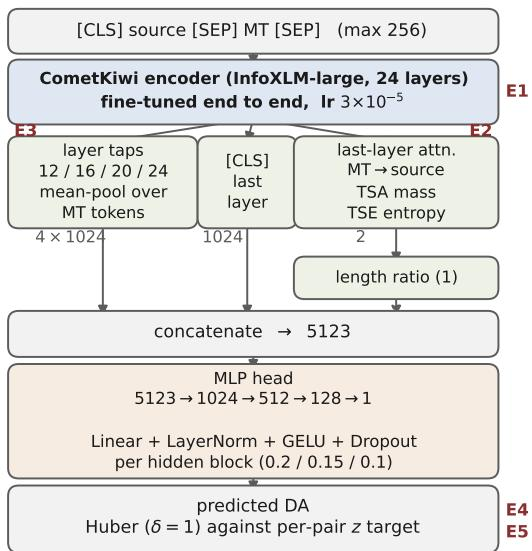

# INDICQE-APE: A Benchmark for Quality Estimation and Automatic Post-Editing for Indic Languages

Diptesh Kanojia<sup>1</sup> Archchana Sindhujan<sup>1</sup> Sourabh Deoghare<sup>2</sup> Daria Sokova<sup>1</sup>   
Shenbin Qian<sup>3</sup> Girish Koushik<sup>1</sup> Tharindu Ranasinghe<sup>4</sup> Constantin Orăsan<sup>1</sup> Chrysoula Zerva<sup>5</sup> Ricardo Rei<sup>6</sup> Frederic Blain<sup>8</sup> André F. T. Martins<sup>5</sup> Marco Turchi<sup>9</sup> Matteo Negri<sup>10</sup> Rajen Chatterjee<sup>11</sup>

Anoop Kunchukuttan<sup>12</sup> Mitesh M. Khapra<sup>13</sup> Pushpak Bhattacharyya<sup>2</sup>

<sup>1</sup>University of Surrey <sup>2</sup>IIT Bombay <sup>3</sup>University of Oslo <sup>4</sup>Lancaster University   
<sup>5</sup>Instituto de Telecomunicações & Instituto Superior Técnico, University of Lisbon <sup>6</sup>Sword Health <sup>7</sup>INESC-ID <sup>8</sup>Tilburg University <sup>9</sup>Zoom Communications <sup>10</sup>Fondazione Bruno Kessler <sup>11</sup>Apple <sup>12</sup>Bodhan AI <sup>13</sup>IIT Madras d.kanojia@surrey.ac.uk

## Abstract

Indic quality estimation (QE) and automatic post-editing (APE) data is spread across separate releases, so no single resource supports training and evaluation across tasks and language pairs on one footing. We consolidate the WMT 2020–2024 shared-task lineage with an extended English–Malayalam resource into INDICQE-APE: 126,754 instances over nine directional pairs, with up to four label types aligned on the same segment, a direct assessment, a human post-edit, word-level OK/BAD tags and an error explanation, and a test set stratified over four dificulty axes. On it we benchmark six prompted LLMs and three COMET metrics on segment-level QE, and three systems on APE. Two of the axes are defined partly on the direct assessment and select a compressed slice of it, so each axis is compared against a control drawn from the same language pair with the same score distribution. Only one survives that control: segments whose holistic and token-level quality signals conflict are ranked worse than equally-scored segments of the same language, for all nine systems and all seven pairs that carry the axis. Annotator disagreement, which looks secondhardest without the control, has no efect with it. Few-shot prompting costs every model ≤ 3.4B both correlation and output-format compliance. Within-language accuracy does not make scores comparable across pairs: of the three trained metrics, the one with the best within-language correlation loses most when the pairs are pooled. The benchmark and code will be released.

## 1 Introduction

Reference-free evaluation of machine translation, scoring a translation without a human reference (QE) and repairing it (APE), remains open for Indic and other low-resource languages for two compounding reasons. The data is fragmented: direct assessments, post-edits, word-level tags and explanations live in separate shared-task releases with incompatible schemas, splits and provenance, so training and evaluating across tasks and pairs means rebuilding the corpus first. And evaluation on the data that does exist falls back on a single learned scalar whose behaviour across languages is rarely checked.

We address the first with a resource and the second with a measurement on it. INDICQE-APE unifies the WMT 2020–2024 QE and APE shared-task data for Indic pairs with an extended English→Malayalam resource into one release of 126,754 instances over nine directional pairs, sliceable by task and by language pair (Table 3). Its organising principle is that the label types are aligned on the same items: one instance may carry a direct assessment, a post-edit, word-level tags and an error explanation at once, so QE, APE and explainable QE can be studied without re-aligning corpora. The test set is constructed rather than sampled from a training tail: every test segment is flagged on each of four dificulty axes its labels can express.

We report baselines for segment-level QE over all nine pairs and for APE over four. CometKiwi-XL (Rei et al., 2023) has the highest within-language segment correlation of the models we evaluate and the weakest cross-lingual agreement of the trained metrics: its per-language ofset moves against quality where the other two trained metrics’ move with it, and pooling pairs costs it more than either of them. Within-language skill and cross-lingual comparability are separate properties. A leaderboard that pools languages or compares raw scores across pairs inherits the ofset. We also show that of four dificulty axes only one costs a system anything once it is compared against segments of the same language carrying the same human score, the axis holding segments whose holistic and token-level quality signals conflict; and that four-shot prompting costs every model at or below 3.4B both correlation and output-format compliance.

These findings motivate two QE modelling directions we study on the benchmark: probing the hidden states of frozen instruction-tuned models (§4), and training a lightweight regression head on a COMET encoder to predict direct assessment (§5). The probe reads quality best from intermediate layers; for the head the encoder’s QE pretraining is the dominant factor and it reaches parity with an of-the-shelf metric. The head saves perinstance predictions on all nine pairs, so the axis comparison is repeated on it, and it fails on the same axis as the prompted panel. Contributions are:

1. INDICQE-APE, a dificulty-stratified QE and APE benchmark over nine pairs with four aligned label types, an MQM layer, completed domain labels, corpus-level provenance and a standing duplication and leakage audit (§2).

2. QE and APE baselines: six prompted LLMs and three COMET metrics on segment-level QE over nine pairs (§3), and three systems on APE (§6), reported with output-format com pliance alongside every correlation.

3. Measurement on reference-free QE: withinlanguage correlation and cross-lingual comparability come apart, and the efect is a perlanguage ofset that moves against quality. Of four dificulty axes only signal conflict survives a control matched on language and human score; the one that looks second-hardest without that control is measuring the range it selects (§3).

4. Two QE modelling studies on the benchmark: layer probing over frozen LLM states (§4) and a COMET-encoder regression head (§5), where encoder initialisation dominates.

## 2 The INDICQE-APE Benchmark

INDICQE-APE consolidates quality-estimation and post-editing data for Indic machine translation into one release. It is built test-first, stratified by dificulty, and carries up to four aligned label types per segment. It is the substrate for the measurement of §3 and for the QE modelling of §4–§5.

Consolidation and lineage. The benchmark unifies WMT Direct-Assessment QE, domainspecific Indic QE, WMT and additional APE, and an extended English→Malayalam resource into 126,754 instances over nine directional pairs across Indo-Aryan and Dravidian scripts in both directions (en to {hi, mr, ta, te, gu, ml} and {et, ne, si} to en). Every instance records the source corpora it came from in a sources field and a human-readable cadence\_id. Table 2 traces each corpus to its peer-reviewed release; the en→Indic DA backbone is the WMT 2022–2024 QE data, the X→en pairs are MLQE-PE, the post-edits are the WMT APE releases and Deoghare et al. (2024), and the en-ml layer extends the En→Ml QE release (Sindhujan et al., 2026). Eight of the nine pairs are Indic. The ninth, et-en, is Estonian, which is Uralic; it arrives with the MLQE-PE lineage on the same schema and serves as a non-Indic control, a low-resource pair with the same label types on which a result is less likely to be an artefact of Indic script or morphology. Results are reported per pair throughout, so any analysis that should exclude it can.

Machine translations and annotation. The hypotheses are not ours. The four WMT 2023–2024 en→Indic pairs were translated by a single multilingual system, NLLB-200-distilled-1.3B (NLLB Team, 2022), over source text from Anuvaad, the IITB corpus, NPTEL and SpokenTutorials (Blain et al., 2023; Zerva et al., 2024); en-mr by IndicTrans (Ramesh et al., 2022) over healthcare, cultural and news text (Zerva et al., 2022); and the three X→en pairs by per-pair fairseq Transformers over Wikipedia, the two lowest-resource of them under a semi-supervised backtranslation recipe (Fomicheva et al., 2022; Guzmán et al., 2019). The en-ml hypotheses are IndicTrans2 (Gala et al., 2023) over Anuvaad source text filtered by LaBSE similarity, sampled to spread the editrate distribution (Appendix L). Direct assessments are 0–100 FLORES-guideline judgements made against the source, not a reference, z-normalised per annotator and averaged; the releases specify at least three annotators per segment, four for en-mr, and two independent panels for MLQE-PE, and the realised mean per pair is in Table 10. One MT system per group means one hypothesis per source segment, so the benchmark supports segment-level meta-evaluation but not system-level ranking.

<table><tr><td></td><td></td><td colspan="7">Full dataset (instances carrying each label)</td><td colspan="2">Eval (test)</td></tr><tr><td>Pair</td><td>Script</td><td>Total</td><td>DA</td><td>PE</td><td>W-tag*</td><td>MQM</td><td>Expl.</td><td>Domain</td><td>QE</td><td>APE</td></tr><tr><td>en-hi</td><td>Devanagari</td><td>21,092</td><td>15,136</td><td>9,983</td><td>9,982</td><td>2,327</td><td>1,999</td><td>19,301</td><td>1,881</td><td>1,536</td></tr><tr><td>en-mr</td><td>Devanagari</td><td>30,746</td><td>29,182</td><td>22,189</td><td>22,190</td><td>0</td><td>5,000</td><td>30,314</td><td>2,165</td><td>2,098</td></tr><tr><td>en-gu</td><td>Gujarati</td><td>9,109</td><td>9,109</td><td>0</td><td>0</td><td>0</td><td>0</td><td>8,996</td><td>1,090</td><td>0</td></tr><tr><td>en-ta</td><td>Tamil</td><td>16,262</td><td>9,002</td><td>10,838</td><td>10,838</td><td>0</td><td>2,645</td><td>14,886</td><td>2,038</td><td>1,448</td></tr><tr><td>en-te</td><td>Telugu</td><td>13,157</td><td>13,157</td><td>0</td><td>0</td><td>0</td><td>0</td><td>8,995</td><td>1,120</td><td>0</td></tr><tr><td>en-ml</td><td>Malayalam</td><td>10,000</td><td>10,000</td><td>10,000</td><td>10,000</td><td>0</td><td>10,000</td><td>10,000</td><td>1,436</td><td>1,436</td></tr><tr><td colspan="9">X→en pairs (taken as-is from WMT20 MLQE-PE)</td><td></td><td></td></tr><tr><td>et-en</td><td></td><td>9,000</td><td>9,000</td><td>9,000</td><td>9,000</td><td>0</td><td>0</td><td>0</td><td>1,000</td><td>1,000</td></tr><tr><td>ne-en</td><td>一</td><td>8,649</td><td>8,649</td><td>8,332</td><td>8,612</td><td>0</td><td>0</td><td>0</td><td>1,000</td><td>962</td></tr><tr><td>si-en</td><td></td><td>8,739</td><td>8,739</td><td>3,487</td><td>8,679</td><td>0</td><td>0</td><td>0</td><td>1,000</td><td>380</td></tr><tr><td>Total</td><td></td><td>126,754</td><td>111,974</td><td>73,829</td><td>79,301</td><td>2,327</td><td>19,644</td><td>92,492</td><td>12,730</td><td>8,860</td></tr></table>

Table 1: Composition of INDICQE-APE. Total is instances per pair; the label columns count instances carrying a direct assessment (DA), a human post-edit (PE), word-level OK/BAD tags (W-tag), a segment-level MQM score with typed spans (MQM; Lommel et al., 2014), an explanation (Expl., either kind) or a gold domain label. MQM covers en-hi only. ∗W-tag combines 38,616 real tags with 40,685 derived from MT and post-edit where no real tag exists, and no row carries both. The Eval columns come from one 13,032-segment challenge test, of which 12,730 carry a DA and 8,860 a post-edit; en-gu and en-te have no post-edits, so the APE column covers seven pairs.

<table><tr><td>Source</td><td>Pairs</td><td>Released by</td></tr><tr><td>WMT22 QE</td><td>en-mr</td><td>Zerva et al. (2022)</td></tr><tr><td>WMT23 QE</td><td>en-hi/gu/ta/te</td><td>Blain et al. (2023)</td></tr><tr><td>WMT24 QE</td><td>en-hi/gu/ta/te (test)</td><td>Zerva et al. (2024)</td></tr><tr><td>MLQE-PE</td><td>et/ne/si-en</td><td>Fomicheva et al. (2022)</td></tr><tr><td>WMT22/23 APE</td><td>en-mr</td><td>Bhattacharyya et al. (2022)</td></tr><tr><td>WMT24 APE</td><td>en-hi, en-ta</td><td>Zerva et al. (2024)</td></tr><tr><td>Multilingual APE</td><td>en-hi, en-mr</td><td>Deoghare et al. (2024)</td></tr><tr><td>En→MI QE</td><td>en-ml</td><td>Sindhujan et al. (2026)</td></tr></table>

Table 2: Shared-task lineage of INDICQE-APE. Each source corpus is tagged per instance (sources, cadence\_id); the upstream release sizes and this benchmark’s re-curated per-pair totals difer, because instances are merged across corpora by a content-hash uid. The En→Ml row is the prior release of about half the en-ml segments; all 10,000 are carried here, the rest annotated by the same annotators under the same guidelines (Appendix L). Licensing is in §2.

Configuration coverage. The release is sliceable by named configuration. The nine-pair view is full (126,754), which holds every instance carrying a direct assessment, a post-edit, word tags or an explanation; the 2,163 en-hi segments annotated for MQM alone sit in mqm and nowhere else. ape (73,829) carries all seven post-edited pairs. Two configurations are scoped to en→Indic and do not contain the X→en pairs: all (100,366) and qe-da (85,586).

<table><tr><td>Configuration</td><td>Train</td><td>Valid.</td><td>Test</td><td>Total</td><td>Scope</td></tr><tr><td>full</td><td>107,641</td><td>6,081</td><td>13,032</td><td>126,754</td><td>nine pairs, every instance</td></tr><tr><td>all</td><td>87,253</td><td>3,081</td><td>10,032</td><td>100,366</td><td>en→Indic only</td></tr><tr><td>qe-da</td><td>72,806</td><td>3,050</td><td>9,730</td><td>85,586</td><td>en→Indic, DA-bearing</td></tr><tr><td>ape</td><td>61,032</td><td>3,937</td><td>8,860</td><td>73,829</td><td>seven post-edited pairs</td></tr><tr><td>word-qe</td><td>65,241</td><td>4,553</td><td>9,507</td><td>79,301</td><td>word-level OK/BAD tags</td></tr><tr><td>explainable-qe</td><td>14,775</td><td>976</td><td>3,893</td><td>19,644</td><td>error explanations</td></tr><tr><td>mqm</td><td>1,708</td><td>143</td><td>2,639</td><td>4,490</td><td>en-hi MQM layer</td></tr><tr><td>challenge</td><td></td><td></td><td>13,032</td><td>13,032</td><td>curated test only</td></tr></table>

Table 3: Split sizes per released configuration, read from the released files. challenge is the curated dificulty-stratified test set, has no train split, and is the evaluation set for §3. Splits are source-disjoint, so no instance and no source sentence reaches two splits of a configuration.

Dificulty-stratified design. The evaluation set is built rather than sampled from the tail of a training split, so a reported number can be read against a known composition. Dificulty is recorded on four axes. Each is a function of released columns alone, and every threshold but one is taken within language pair, so a segment is placed against its own pair’s distribution rather than against the corpus. The exception is A1’s quality band, which is the same [35, 75] on the 0–100 scale for every pair: A1, annotator disagreement, per-annotator DA standard deviation in the pair’s top quartile with a mean in [35, 75]; A2, edit efort, MT→postedit token TER in the pair’s top quartile; A3, word error, BAD-tag density in the pair’s top quartile or an error category of mistranslation, untranslated or addition; and A4, signal conflict, a segment scored half a standard deviation above the pair’s mean yet error-dense by the same margin, or scored in the pair’s bottom 30% yet edited half a standard deviation less than its norm. A4 selects a disagreement between two human signals, not a translation that contradicts its source. Appendix I gives a verified en-hi example of each axis and Appendix E the numeric cut every pair receives.

The stratification is visible in the result: 59.8% of DA-bearing challenge segments carry at least one axis against 30.6% of the DA-bearing segments outside the test, and every one of the nine pairs is enriched. The axes overlap, so they ship as four flags and not one label: only 3,265 of the 7,616 flagged challenge segments sit on exactly one. en-gu and en-te arrive as direct assessments alone, so they are null, rather than unflagged, on the three axes that need a post-edit or a word tag (Table 14).

Label types and domain completion. Each segment carries up to four aligned label types (perpair coverage in Table 1): a z-normalised directassessment (DA) score, a human post-edit, wordlevel OK/BAD tags, and an explanation, so that the same items serve QE, APE and explainable QE without re-alignment. Explanations are of two kinds and the release records which: 8,951 human Translation Quality Remarks, all on en-ml, and 14,644 model-generated error descriptions on enhi, en-mr, en-ta and en-ml. Every explanation outside en-ml is model-generated. We complete the domain metadata, which was inconsistently cased and absent for many rows, by normalising to a ten-domain taxonomy and inferring the missing labels with a word and character TF-IDF logisticregression classifier on the source side, flagged by provenance (92,492 annotated and 34,262 inferred over the release; the challenge-test distribution is in Table 19). News, finance, tech and sports are gold-only en-ml labels and are never inferred onto other pairs. The three X→en pairs carry no gold domain, so all 26,388 of their labels are inferred, and the classifier is fitted and measured on English source text from the en→Indic pairs; we therefore treat the X→en domain labels as unvalidated and do not condition any analysis on them. The classifier reaches 0.826 accuracy under five-fold cross-validation and beats prompted GPT baselines on a gold sample, by a margin confined to the classes that record provenance rather than topic (Appendix B).

Label coverage. The label columns of Table 1 are the coverage map, and they are not uniform.

111,974 of the 126,754 instances carry a direct assessment. The remaining 14,780 come from the APE shared-task releases as source, MT and post-edit triples that were never DA-annotated, and they fall in en-ta (7,260), en-hi (5,956) and en-mr (1,564); they support APE and word-level tagging but not QE. In the other direction 73,829 instances carry a post-edit, so the QE and APE populations overlap without either containing the other. A user should select on the label they need and not on the pair. Also, INDICQE-APE releases no independent reference translations: every released target was produced by post-editing the MT. Where a corpus reference existed it was used in construction and not shipped, as for en-ml (Appendix L). We treat the human post-edit as the reference, and every reference-based number we report is humantargeted in the sense of HTER (Snover et al., 2006).

Provenance, deduplication and split hygiene. An instance is identified by a uid, the hash of its normalised source and MT, so two corpora contributing the same segment produce one row rather than two: 234,446 corpus contributions collapse to 126,754 rows, and 77,505 of those rows carry more than one source. Every named configuration is then checked to be an exact view of that master table, so no instance is duplicated to attach a late-added field. The splits are built sourcedisjoint, and a regression check confirms that no exact instance and no source sentence reaches more than one of train, validation and test. The checks ship with the release (§J), and cadence\_id and sources carry the provenance.

Word-level tags. Word-level QE tags in the WMT lineage are not direct human annotation: they are produced by aligning the MT to its human post-edit and marking substituted or deleted MT tokens BAD (Specia et al., 2020). They are therefore a deterministic function of (MT, postedit), so any segment carrying a post-edit can be tagged under the same rule. Between the rule and an import of the MLQE-PE labels this takes coverage from 12,604 segments to 79,301 over seven of the nine pairs, 40,685 of the increase from the rule and 26,012 from the import. Real labels are always preferred: 26,012 segments are imported from MLQE-PE for the X→en pairs, which also brings gap tags and source-side tags, and 40,685 are derived only where no released label exists. en-gu and en-te have neither post-edits nor upstream tags and remain uncovered. Every row records which class it belongs to and the original columns are never modified, so a user may train on upstream-only, derived-only or the union. Rederiving the released tags from MT and post-edit alone reproduces them at 0.963 Matthews correlation over 633,988 tokens. Agreement is lowest for en-ml and en-mr and highest for the X→en pairs, which is the order of morphological complexity: the tag layer is coarsest exactly where morphology is richest. The per-pair figures, the tokenisation comparison and the morphological evidence are in Appendix B, and the per-segment confusion counts ship with the release.

Availability and licence. Links are withheld for double-blind review. The benchmark goes to the Hugging Face Hub, the evaluation and verification code to GitHub, and the per-instance predictions behind every number here to a tagged release of that code as an evidence bundle. Two licences apply and the per-row sources field says which. The three X→en pairs are MLQE-PE, redistributed under its CC0 1.0; everything else, including the English→Malayalam data, the 40,685 derived word-level tags, the MQM layer, the completed domains and the dificulty axes, is CC BY 4.0. A mixed configuration carries the CC BY 4.0 condition, since CC0 adds none.

## 3 QE Baselines

Setup. We evaluate QE models on INDICQE-APE using 0-shot GEMBA-DA prompting (Kocmi and Federmann, 2023) for the instruction-tuned models and the COMET family as trained baselines.<sup>1</sup> All models are run on the same 13,032- segment challenge test, of which 12,730 carry a direct assessment and are the population for every correlation. The trained metrics score all of them. A prompted model scores only the segments it returns a usable score for, which at zero shots is between 12,552 and 12,730 segments; the residual is its non-compliance, reported alongside every correlation and not folded into it. Compliance is quoted two ways in this paper and the diference matters below 1: pooled over segments, which is what the 12,552 floor is, and macro over pairs, which is what a parse column reports. For each model we compute a within-language score, the macro correlation of model scores with human DA over the nine pairs (Pearson, Spearman, Kendall), and a cross-lingual score, the Pearson correlation across the nine pairs between the model’s mean score for a pair and the mean human score for that pair. The cross-lingual score asks whether the model’s numbers are comparable across languages, not whether it ranks any MT systems. Table 4 reports both. We give all three coeficients for continuity with the QE shared tasks, with percentile bootstrap intervals over segments.

<table><tr><td rowspan="2">Model</td><td colspan="3">within-language</td><td rowspan="2">cross-ling. r</td></tr><tr><td>P</td><td>ρ</td><td>T</td></tr><tr><td>BharatGPT-3B</td><td>0.134</td><td>0.098</td><td>0.075</td><td>-0.46</td></tr><tr><td>Llama-3.2-3B</td><td>0.256</td><td>0.217</td><td>0.172</td><td>0.86</td></tr><tr><td>tiny-aya</td><td>0.311</td><td>0.290</td><td>0.232</td><td>0.93</td></tr><tr><td>aya-expanse-32B</td><td>0.404</td><td>0.404</td><td>0.321</td><td>0.91</td></tr><tr><td>sarvam-m</td><td>0.455</td><td>0.440</td><td>0.344</td><td>0.91</td></tr><tr><td>GPT-5.5</td><td>0.627</td><td>0.623</td><td>0.461</td><td>0.94</td></tr><tr><td>CometKiwi-DA</td><td>0.625</td><td>0.621</td><td>0.452</td><td>0.78</td></tr><tr><td>CometKiwi-XL</td><td>0.680</td><td>0.671</td><td>0.497</td><td>-0.21</td></tr><tr><td>XCOMET-XL</td><td>0.498</td><td>0.498</td><td>0.355</td><td>0.61</td></tr></table>

Table 4: QE over the nine pairs on the challenge test: zero-shot GEMBA-DA for the LLMs, the COMET family below the rule. Within-language columns are macro correlations over pairs. The cross-lingual column is the Pearson correlation between per-pair model means and per-pair human means over nine points, a diagnostic and not a ranking; it is computed on this table’s population and so difers from the pooled column of Table 17, which uses the extended challenge test. Compliance is reported separately and never folded in (§3). Per-pair values are in Table 16.

A prompted model returns text, so a score exists only once that text has been parsed, and the parsing rule is part of the measurement. We accept a reply as a score only when it is unambiguously one: a bare number, or a number behind a label such as Score: or Score (0-100):. We reject prose and any reply carrying more than one number, and count the segment as non-compliant instead of assigning it a value. The alternative, taking the first or nearest number from any reply, reports 100% compliance while silently producing wrong scores; Appendix M gives the failure modes it produces on our four-shot outputs.

Within-language accuracy does not make scores comparable across pairs. CometKiwi-XL has the highest within-language Spearman of the models we evaluate (0.671) and, of the three trained metrics, the weakest agreement across languages: over the six en→Indic pairs its per-language means track the human per-language means at $r = 0 . 3 4 .$ against 0.91 for the weaker XCOMET-XL (Guerreiro et al., 2024) on the same population. Both are the full-population pass of Table 17, not the challenge test the rest of this section uses; that table’s other block estimates the prompted models on the challenge test, and MetricX-24 (Juraska et al., 2024) sits with the trained metrics. Writing a model score as $m ( x ) = a _ { \ell } { + } b _ { \ell } q ( x )$ for a segment x in language $\ell ,$ within-language rank statistics are invariant to the per-language ofset $a \ell$ while the comparison of per-language means is governed by it, so comparability degrades when $a \ell$ carries information other than quality. It does here: for CometKiwi-XL the ofset correlates with quality at −0.442, where CometKiwi-DA is +0.229, XCOMET-XL +0.433 and GPT-5.5 +0.641. Of the five systems in Table 5 it is the only one whose ofset runs against quality and the only one whose bootstrap interval includes zero, so its raw coeficient is not identified at this sample size and the ofset is what the claim rests on. So raw scores from such a metric should not be compared across pairs, and a leaderboard should average within-pair correlations instead of pooling segments from diferent pairs into one.

The coeficient itself is a diagnostic and not a result. It rests on one point per language pair, moves from −0.67 on eight pairs to −0.21 on nine and +0.12 on the full population (Appendix H), and every interval is wide; nine points cannot support a ranking. WMT meta-evaluation averages withinpair correlations rather than pooling for this reason (Freitag et al., 2024). We therefore rest the claim on the per-language ofsets and on the aggregation result below, and report the scoped en→Indic values in the text while the r column of Table 4 pools all nine pairs and is correspondingly inflated (Appendix G). Appendix O replicates the efect with language held fixed, against annotation batch.

The same efect follows from aggregation alone, without fitting anything. Pooling all nine pairs into one correlation instead of averaging per-pair Spearman, as WMT does, costs CometKiwi-XL 0.117 (0.671 macro against 0.554 pooled), while XCOMET-XL loses 0.001 (0.498 to 0.497) and CometKiwi-DA gains 0.034. Pooling normally inflates a correlation, because between-pair diferences in mean quality add variance a metric is credited with explaining without having ordered anything within a pair. CometKiwi-XL is the only one that loses by more than rounding, because its perlanguage means are displaced against quality, so the variance pooling adds is variance it gets wrong.

<table><tr><td>Model</td><td>raw r</td><td>bootstrap 95% CI</td><td>offset↔q.</td></tr><tr><td> $\mathtt { C o m e t K i w i - X L }$ </td><td>-0.208</td><td> $[ - 0 . 9 3 0 , \ + 0 . 3 2 0 ]$ </td><td>-0.442</td></tr><tr><td> $\mathtt { C o m e t K i w i - D A }$ </td><td>0.783</td><td> $[ + 0 . 5 5 4 , + 0 . 9 5 5 ]$ </td><td>0.229</td></tr><tr><td>XCOMET-XL</td><td>0.607</td><td> $\left[ + 0 . 0 3 7 , \ + 0 . 8 8 0 \right]$ </td><td>0.433</td></tr><tr><td>GPT-5.5</td><td>0.941</td><td> $\left[ + 0 . 7 3 7 , \ + 0 . 9 9 1 \right]$ </td><td>0.641</td></tr><tr><td>sarvam-m</td><td>0.913</td><td> $[ + 0 . 7 7 0 , + 0 . 9 9 1 ]$ </td><td>0.595</td></tr></table>

Table 5: Cross-lingual agreement over nine pairs. raw r is the Pearson correlation between per-language model means and per-language human means, with a percentile bootstrap interval over pairs; ofset↔q. is the correlation between the fitted per-language ofset $a \ell$ and quality, where $m ( x ) = a _ { \ell } + b _ { \ell } q ( x )$ is fitted per pair.

Where models fail. A1 and A4 are defined partly on the direct assessment, and they are the axes whose segments sit in a narrow slice of it, holding 0.43 and 0.62 of their pair’s remaining spread against 0.86 and 0.90 for A2 and A3, which carry no score term. A rank correlation falls on a narrow range whether or not the segments are harder. Each axis is therefore compared against a control drawn from the rest of its own pair and matched to the flagged score histogram, inside the pair and only then averaged.

That control decides which axes are real. Measured against the rest of the pair, A1 is the secondhardest axis at −0.205 and A4 the hardest at −0.284 (Table 11). Measured against the matched control, A1 is −0.003 [−0.047, +0.037] and negative on four of its nine pairs, so its apparent difficulty was the compression of the score range it selects. A4 survives at −0.146 [−0.270, −0.059], negative on all seven pairs that carry it and for all nine systems (Table 6). A2 and A3 come out flat to mildly positive, +0.066 and +0.019: neither heavy editing nor dense word error makes a segment harder to place among others the annotators scored the same.

What survives a control is therefore neither edit efort nor word error but the disagreement between them and the holistic score, and −0.146 is a ceiling on it rather than the finding. Only one of A4’s two arms is carried by enough pairs to read, segments scored below par for their pair yet barely edited: 1,149 over four pairs, contrast −0.070, negative on every one. The other holds 123 segments over three pairs and is negative on two (Appendix D). On A1 the segments do not difer from one another by more than annotator noise, so the reliability of the DA mean is not estimable there at all; on A4 it is 0.534 and does not account for the contrast (Appendix P).

<table><tr><td>Model</td><td>A1</td><td>A2</td><td>A3</td><td>A4</td></tr><tr><td>GPT-5.5</td><td>+0.015</td><td>+0.040</td><td>+0.001</td><td>-0.224</td></tr><tr><td>sarvam-m</td><td>+0.012</td><td>+0.075</td><td>+0.024</td><td>-0.153</td></tr><tr><td>aya-expanse-32B</td><td>+0.024</td><td>+0.087</td><td>+0.019</td><td>-0.169</td></tr><tr><td>tiny-aya</td><td>-0.051</td><td>+0.100</td><td>+0.015</td><td>-0.015</td></tr><tr><td>Llama-3.2-3B</td><td>+0.039</td><td>+0.076</td><td>+0.005</td><td>-0.041</td></tr><tr><td>BharatGPT-3B</td><td>+0.014</td><td>+0.047</td><td>+0.036</td><td>-0.092</td></tr><tr><td>CometKiwi-DA</td><td>-0.044</td><td>+0.079</td><td>+0.035</td><td>-0.165</td></tr><tr><td>CometKiwi-XL</td><td>-0.032</td><td>+0.064</td><td>+0.054</td><td>-0.140</td></tr><tr><td>XCOMET-XL</td><td>-0.002</td><td>+0.026</td><td>-0.015</td><td>-0.155</td></tr></table>

Table 6: Change in Spearman ρ between a pair’s flagged segments and a control drawn from the same pair with the same direct-assessment histogram, averaged over the pairs that carry the axis; negative means the flagged segments are ranked worse than equally-scored segments of the same language. Bold marks each system’s worst axis: A4 is negative for all nine systems and worst for eight. Intervals and the unmatched comparison are in Table 11.

What separates the pairs. The released annotator scores separate the candidate explanations for the per-pair spread, because each predicts something diferent (Appendix Q). Label reliability is not it: per-pair ICC(1, k) runs from 0.44 to 0.98 on the challenge test and does not predict per-pair correlation $( r = - 0 . 1 6 , p = 0 . 6 7 )$ . Training exposure does not account for it either. CometKiwi is trained on the direct-assessment data our X→en pairs come from, so exposure would predict a direction gap for the trained metrics and none for the prompted ones; the gap is +0.21 against +0.15, and tiny-aya at +0.26 exceeds two of the three trained metrics. What does track dificulty, weakly, is how far apart the human scores are: $r = + 0 . 5 3$ $( p = 0 . 1 4 )$ between a pair’s DA standard deviation and its mean correlation across systems, which on nine pairs is a direction and not an established effect. English to Telugu is the clearest case: the smallest DA standard deviation of the nine pairs (14.0), the lowest-scoring pair for seven of the nine systems, and the lowest sentence-level correlation of any Indic pair at WMT 2023 and WMT 2024 (Blain et al., 2023; Zerva et al., 2024), while its reference-based MT quality is among the strongest here (Gala et al., 2023). The dificulty is specific to estimating quality, not to producing it.

Robustness to the prompt. The headline uses one template at zero shots, so we check both choices (Table 7). Four-shot prompting lowers macro Spearman for four of the six prompted models and raises it for two, aya-expanse-32B by 0.055 and GPT-5.5 by 0.003; the largest fall is Llama-3.2-3B, 0.217 to 0.027. A cell enters a macro only if the model returned a usable score on at least half of it, which costs BharatGPT-3B and Llama-3.2-3B five and four pairs and tiny-aya two. Compliance falls under four shots as well, so the two conditions score diferent segments, but restricting both to the segments they both scored leaves every drop within 0.001 of its unpaired figure. Four-shot prompting therefore degrades scoring itself and not merely the population that survives parsing. Both efects track capacity: the three models ≤ 3.4B lose the most and comply least, failing on between 14% and 55% of segments, while aya-expanse-32B, the largest open model tested, gains. Which pairs fail is modelspecific and not predicted by the aggregate (Table 12).

Template choice. The template matters less than the shot count and mainly to weak models. Per model the two difer by 0.026 in macro Spearman against 0.069 for the shot count, and SQM is the better of the two on 51 of the 94 cells both templates scored above the compliance floor, which is barely more than half. The divergence sits where the model is weakest: BharatGPT-3B at zero shots scores 0.098 under DA against 0.031 under SQM, whereas GPT-5.5’s two templates agree to within 0.002. SQM is also the weaker on zero-shot compliance for two models, aya-expanse-32B parsing 0.872 (ne-en 0.47) and tiny-aya 0.885 (si-en 0.62) against 0.981 and 1.000 under DA, all macro over pairs, so those SQM cells rest on a reduced population; aya-expanse-32B’s 0.981 macro is the 0.986 pooled rate that sets the 12,552 floor above. We therefore report GEMBA-DA throughout. sarvam-t is a translation model that follows neither prompt, parsing 0.003, so it is omitted from the QE evaluation; it appears in §6 as an APE system.

## 4 Layer-Probing Quality Estimation

A quality score can also be read from a frozen model’s hidden states instead of its generated text. We train the single-layer form of adaptive layer optimisation for QE (Sindhujan et al., 2025b), a regression head on the last-token hidden state of a frozen tiny-aya at one layer, jointly over the six en→Indic pairs, and sweep the layer (Table 25, Ap-

<table><tr><td rowspan="2">Model</td><td colspan="3">macro ρ</td><td rowspan="2">paired ∆</td><td colspan="2">4-shot</td></tr><tr><td>0-shot</td><td>4-shot</td><td>Δ</td><td>pairs</td><td>parse</td></tr><tr><td>BharatGPT-3B</td><td>0.098</td><td>0.001</td><td>-0.098</td><td>-0.098</td><td>4</td><td>0.447</td></tr><tr><td>Llama-3.2-3B</td><td>0.217</td><td>0.027</td><td>-0.190</td><td>-0.189</td><td>4</td><td>0.501</td></tr><tr><td>tiny-aya</td><td>0.290</td><td>0.240</td><td>-0.050</td><td>-0.050</td><td>7</td><td>0.861</td></tr><tr><td>aya-expanse-32B</td><td>0.404</td><td>0.459</td><td>+0.055</td><td>+0.055</td><td>9</td><td>0.987</td></tr><tr><td>sarvam-m</td><td>0.440</td><td>0.421</td><td>-0.019</td><td>-0.019</td><td>9</td><td>1.000</td></tr><tr><td>GPT-5.5</td><td>0.623</td><td>0.625</td><td>+0.003</td><td>+0.003</td><td>9</td><td>1.000</td></tr><tr><td colspan="7">control: encoders, prompt-invariant</td></tr><tr><td>CometKiwi-DA</td><td>0.621</td><td>0.621</td><td>0.000</td><td></td><td>9</td><td></td></tr><tr><td>CometKiwi-XL</td><td>0.671</td><td>0.671</td><td>0.000</td><td></td><td>9</td><td></td></tr><tr><td>XCOMET-XL</td><td>0.498</td><td>0.498</td><td>0.000</td><td></td><td>9</td><td></td></tr></table>

Table 7: Efect of four-shot prompting. pairs is how many language pairs the four-shot macro averages: a cell counts only where the model returned a usable score on at least half of it (§3). Every zero-shot macro is over nine pairs, its lowest cell aya-expanse-32B on ne-en at 0.868. ∆ compares each condition on every segment it scored; paired ∆ restricts both to the segments they both scored. parse is the share of items returning a single GEMBA-DA score at four shots, over all nine pairs whether or not the cell enters the macro. ‡Llama-3.2-3B has no four-shot run on en-hi, so that pair is absent from its row rather than excluded by the rule. Per-pair compliance is in Table 12.

pendix K).

Where the signal sits in the network does not follow language family. Averaged over pairs the best layer is −20 (0.527) and the two ends of the swept range are weakest, −5 nearest the output at 0.501 and −24 furthest from it at 0.496; the final layer is not swept. The weakest Indo-Aryan pair (en-hi) and the weakest Dravidian one (en-te) peak at that same depth, though the best layer is otherwise pairdependent (Table 24). Picking the layer per pair raises the macro to 0.539, but that pick is made on the split the probe is then scored on and is an oracle over the six layers swept, so 0.527 at one fixed layer is the figure to compare against. At that layer the probe recovers a signal for five of the six pairs (Spearman 0.45–0.64) and is weak only on en-te (0.28), the lowest-scoring pair for seven of the nine systems of §3. Length does not account for it: predicting DA from source length, MT length or their ratio reaches macro Spearman 0.218, and beats the probe on no pair.

Reading the states beats prompting the same weights. tiny-aya scored by GEMBA-DA reaches macro Spearman 0.202 on these six pairs against 0.527 for the probe, which is ahead on every one of them; the nine-pair column of Table 4 is not the comparison, since it includes three pairs the probe is not trained on. GPT-5.5 reaches 0.578 on the same six, so a frozen 3.4B backbone with a trained read-out comes within 0.051 of the strongest prompted model and passes it on en-te (0.282 against 0.255).

The sweep saved per-layer aggregates rather than per-instance predictions, so the probe is reported at the pair level and is the one study here the dificulty axes cannot be joined to.

## 5 A Lightweight QE Head on COMET

The encoder baselines of §3 are used of the shelf. We also train a regression head over a COMET/CometKiwi encoder: it reads a source– hypothesis pair, funnels upper encoder layers and regresses a per-pair z-scored DA target under a Huber loss, with an option to add attentionderived adequacy features and a length ratio (Figure 1). Trained on the six en→Indic pairs of qe-da (72,806 segments) and evaluated on the matched challenge test (9,730), the funnel-only form reaches Spearman 0.596 and the form with the extra features 0.581. The features are worth −0.015 here and +0.005 on the ablation build below, and the bootstrap intervals overlap in both directions, so they are not what makes the head work. The ablation below varies one choice at a time on a five-pair build without en-ml, so its cells are not comparable to either six-pair figure (Appendix K).

What the head needs is the encoder, not the feature set. Swapping only the backbone, it inherits its encoder’s QE knowledge in order: referencefree QE pretraining (CometKiwi, 0.580) beats reference-based pretraining (COMET-DA, 0.491) beats none (XLM-R-large, 0.440). That +0.140 gap (Williams t=20.5, p < 0.001, n=8,160) is the largest gain any substitution buys; the only other change that helps is the min–max target, at +0.040. Three choices move the score further than the encoder does, and all three are losses from removing something the reference configuration has: reading the last layer alone instead of funnelling upper layers collapses the head at all three seeds; plain MSE costs 0.294 against the Huber reference, while CCC matches it; and the target must be scaled to the loss, a raw 0–100 target diverging where per-pair z gives 0.585 and min–max [0, 1] gives 0.625 (Table 21).

On the six-pair lane the head reaches parity and no more: $\rho ~ = ~ 0 . 5 9 6$ against 0.588 for zero-shot CometKiwi-DA on the same segments and 0.608 for CometKiwi-XL, a margin of 0.008 over the former that we do not read as an improvement.

<table><tr><td>System</td><td>ρ (95% CI)</td><td>r</td><td> $\operatorname { a c c } _ { e q } ^ { * }$ </td></tr><tr><td colspan="4">Zero-shot COMET (en→Indic challenge test, n=9,730)</td></tr><tr><td>CometKiwi-DA</td><td>0.588</td><td>0.596</td><td></td></tr><tr><td>CometKiwi-XL</td><td>0.608</td><td>0.597</td><td></td></tr><tr><td>XCOMET-XL (QE)</td><td>0.406</td><td>0.414</td><td></td></tr><tr><td colspan="4">Trained head, six pairs (n=9,730) — the §5 lane</td></tr><tr><td>+ CometKiwi, funnel only</td><td>0.596 [.581,610]</td><td>0.580</td><td>0.708</td></tr><tr><td>+ CometKiwi, +features</td><td>0.581 [.565,.596]</td><td>0.577</td><td>0.704</td></tr><tr><td colspan="4">Ablation build, five pairs (n=8,160), encoder swap</td></tr><tr><td>+ XLM-R-large (no QE pretrain)</td><td>0.440 [.421,457]</td><td>0.440</td><td>0.649</td></tr><tr><td>+ COMET-DA (ref-based)</td><td>0.491</td><td>0.497</td><td></td></tr><tr><td>+ CometKiwi, CLS+funnel</td><td>0.580 [.565,.595]</td><td>0.590</td><td>0.709</td></tr><tr><td>+ CometKiwi, full features (ref)</td><td>0.585 [.569,600]</td><td>0.600</td><td>0.707</td></tr><tr><td>+ CometKiwi, full, min-max target</td><td>0.625 [.610,.640]</td><td>0.662</td><td>0.727</td></tr></table>

Table 8: Regression QE over a COMET encoder on INDICQE-APE (within-language, segment-level, en→Indic challenge test), against the zero-shot COMET baselines on the same lane. The middle block is the six-pair lane §5 reports; the bottom block is the five-pair ablation build, whose cells compare with each other and not across blocks. $\operatorname { a c c } _ { e q } ^ { * }$ is pairwise accuracy with tie calibration (Deutsch et al., 2023); intervals are percentile bootstrap over segments. Full ablation in Appendix K.

The head’s saved predictions, with the X→en runs, cover all nine pairs, so the axis comparison of §3 can be repeated on a model trained here. It agrees on three of the four: A4 is −0.176 funnel-only and −0.143 with features against a DA-matched control, negative on every pair for both, and A2 and A3 are positive. On A1 the two estimators part, the head giving −0.084 and −0.050 against the panel’s −0.003, but en-gu at −0.41 and en-ml at −0.24 carry almost all of it against +0.16 on neen, so we read it as unstable. The head’s own ofset runs the same way as CometKiwi-XL’s rather than the other way, at −0.11 to −0.05 against −0.442, but on the ablation build’s five pair means neither its size nor its sign is established $( p > 0 . 8 5 )$ . Run unchanged on the three X→en pairs the pipeline gives 0.655 funnel-only and 0.668 with the extra features, 0.059 and 0.087 above the matching en→Indic figure. The lower en→Indic number is a property of those pairs, not of the training setup.

## 6 Automatic Post-Editing

The benchmark’s post-edits support automatic post-editing directly, with the human post-edit as the reference. Table 9 reports three open systems, sarvam-m, the dedicated translator sarvam-t, and tiny-aya, on the four en→Indic pairs with system outputs, scored with the reference-based surface metrics char-TER and chrF++. Postediting systems were run for these four pairs only:

<table><tr><td>Model</td><td>Pair</td><td>char-TER↓</td><td>chrF++↑</td><td>CometKiwi↑</td></tr><tr><td rowspan="4">do-nothing</td><td>en-hi</td><td>44.5</td><td>55.4</td><td></td></tr><tr><td>en-mr</td><td>26.1</td><td>74.8</td><td></td></tr><tr><td>en-ta</td><td>43.4</td><td>64.2</td><td></td></tr><tr><td>en-ml</td><td>31.1</td><td>78.1</td><td></td></tr><tr><td rowspan="4">sarvam-m</td><td>en-hi</td><td>37.6</td><td>58.9</td><td>0.819</td></tr><tr><td>en-mr</td><td>36.5</td><td>63.9</td><td>0.743</td></tr><tr><td>en-ta</td><td>54.5</td><td>54.1</td><td>0.826</td></tr><tr><td>en-ml</td><td>44.7</td><td>60.0</td><td>0.862</td></tr><tr><td rowspan="4">sarvam-t</td><td>en-hi</td><td>34.4</td><td>62.5</td><td>0.829</td></tr><tr><td>en-mr</td><td>42.5</td><td>59.0</td><td>0.757</td></tr><tr><td>en-ta</td><td>63.0</td><td>49.1</td><td>0.841</td></tr><tr><td>en-ml</td><td>49.0</td><td>53.4</td><td>0.872</td></tr><tr><td rowspan="4">tiny-aya</td><td>en-hi</td><td>46.7</td><td>55.5</td><td>0.782</td></tr><tr><td>en-mr</td><td>36.7</td><td>70.6</td><td>0.697</td></tr><tr><td>en-ta</td><td>57.0</td><td>56.5</td><td>0.771</td></tr><tr><td>en-ml</td><td>37.8</td><td>71.1</td><td>0.802</td></tr></table>

Table 9: APE quality per model and pair on the en→Indic APE test (↓/↑ = lower error / higher similarity), every cell on the same rows (en-hi 1,536, en-mr 2,098, en-ta 1,448, en-ml 1,436). do-nothing is the unedited MT scored against the human postedit; bold marks the best row per pair and metric. char-TER and chrF++ are reference-based against the post-edit, CometKiwi reference-free against the source. CometKiwi is blank for do-nothing because the zeroshot pass scored DA-bearing rows only, which covers these four pairs unevenly; on the rows it does cover the unedited MT scores 0.769, 0.688, 0.757 and 0.815.

en-gu and en-te carry no human post-edits, and the three X→en pairs carry post-edits but no system outputs were produced for them here (Table 1). All three run zero-shot from the prompt in Appendix M and none is trained on the benchmark. sarvam-m and tiny-aya are given the source and the MT and asked to edit it; sarvam-t is a translation model and is run in retranslation mode, from the source alone. Appendix N repeats the table under word-level TER and BLEU.

The first block of Table 9 is the unedited MT, and on three of the four pairs it is the best row in the table. Leaving en-mr alone gives char-TER 26.1 against 36.5 for the best system, en-ta 43.4 against 54.5, en-ml 31.1 against 37.8, and the same three on chrF++. Only on en-hi does any system improve on doing nothing, and en-hi is the one pair whose post-edits almost always change something: on its APE test rows 0.5% of post-edits leave the MT untouched, against 12.2% for en-mr, 29.1% for en-ta and 30.8% for en-ml.

The reference-free view says the opposite. CometKiwi rates every system above the unedited

MT in eleven of twelve cells, and orders them identically on all four pairs, sarvam-t above sarvam-m above tiny-aya, while chrF++ gives that order on en-hi and reverses it on the other three. The cause is the reference. A post-edit is produced by editing the MT, so the MT is by construction close to it, and a surface metric against post-edits measures residual repair efort rather than quality (§2). sarvam-t retranslates from the source instead of editing, so it departs from the post-edit however good its output is. The penalty scales with how conservative the post-edits are, and the table shows it: sarvam-t is the best system on en-hi, the one pair whose post-edits almost always change something, and the worst on each of the other three. Post-edit-anchored references reward conservative editing, and where post-edits are often no-ops the unedited MT cannot be beaten. Even the two surface metrics disagree with each other on en-mr and en-ta, where sarvam-m needs fewest edits but tiny-aya retains the most n-grams.

The negative result is scoped to prompting. ape ships 61,032 training triples that none of these three systems saw, and a system fitted on them would learn to edit conservatively, which is what the post-edit reference rewards. The do-nothing row is the baseline such a system has to clear here, not a limit on what APE can reach.

## 7 Conclusion

INDICQE-APE consolidates the WMT 2020–2024 Indic QE and APE lineage with an extended English→Malayalam resource into one benchmark of 126,754 instances over nine directional pairs, with up to four label types aligned on the same items, a constructed dificulty-stratified test set, verified provenance and no train/test leakage. On it, we show that within-language QE accuracy does not imply cross-lingual comparability, and that of four dificulty axes only one survives a control matched on language and human score, the axis holding segments whose holistic and token-level quality signals conflict, which costs every one of the nine systems we evaluate.

For anyone using reference-free QE across languages, the consequence is that raw scores are not comparable between pairs. Of the five systems we fit per-language ofsets for, the one with the best within-language correlation is the only one whose ofset runs against quality, and of the three trained metrics it is the only one that loses more than rounding when pairs are pooled. Pooling pairs into one correlation, or ranking systems on scores drawn from diferent pairs, inherits that. APE carries a separate warning. The unedited MT beats every post-editing system we run on three of the four pairs under all four surface metrics, while a reference-free metric ranks those systems above it. Post-edit references reward conservative editing, and an APE result reported against them without a do-nothing row cannot be read.

We leave three things open on this benchmark. The word-qe and explainable-qe configurations are released with no baseline, and word-level QE over agglutinative targets will need sub-word tagging our whitespace alignment does not provide. English to Telugu is the lowest-scoring pair for seven of the nine systems, and its narrow score range accounts for only part of that. And nothing we ran handles the segments where the human score and the surface evidence disagree: across seven trained configurations that vary the encoder, the loss and the target scale, not one of them escapes it.

## Limitations

Data. Provenance is heterogeneous: the direct assessments come from several WMT editions and annotation batches. Domain labels are partly inferred (3,756 of 12,730 challenge items) by a classifier at 0.826 accuracy, and the X→en labels are inferred outside the language it was fitted on, so we condition no analysis on them. Every explanation outside en-ml is model-generated. Post-edits, not independent references, are the reference throughout, so reference-based numbers measure residual repair efort. en-gu and en-te carry no post-edits, and all and qe-da omit the X→en pairs, so a ninepair evaluation must come from full.

Measurement. One machine translation per source segment supports segment-level metaevaluation but not system-level ranking. The crosslingual coeficient rests on at most nine points and is weakly identified, so we rest the claim on the per-language ofsets and on the aggregation result. Prompted models are not scored on identical populations, so a correlation and a compliance rate must be read together (§3).

Labels. The MQM layer covers en-hi alone, and under a third of its DA-paired segments carry trustworthy error spans; its two batches difer in range and the DA↔MQM agreement is estimated on the narrower. Just over half the word tags we derive ourselves under the upstream rule. What is validated is the rule, at 0.976 and 0.987 token accuracy against real labels, not the tags: they are not human judgement, agree least for en-ml and en-mr, and are less error-dense than the real pool. Gap and source-side tags exist only for X→en, tags are impossible for en-gu and en-te, and all of them are coarse for agglutinative targets.

Dificulty axes. Two of the four are defined partly on the direct assessment, so what they select is partly a property of the annotation. The matched control removes the score range but not the label noise, and the attenuation correction applies on only three pairs. Of A4’s two arms only the larger is readable, and its size halves without en-ml, though its sign does not.

Models. The probe is one layer over one backbone and saved no per-instance predictions, so it is the one study the axes cannot be joined to. The head’s cross-lingual coeficient rests on five pair means and is not significant, and its ablation runs on a five-pair build that predates a late data fix, so the six-pair lane does not confirm it. The APE evaluation is prompted, covers four of seven postedited pairs and trains nothing, so it sets a donothing baseline and not the reachable quality.

## Ethics Statement

The dataset consolidates publicly released shared-task corpora, redistributed under the terms given in §2. Appendix L records how the English→Malayalam data was produced: who annotated it, under what guidelines, through what quality control, and through a commercial annotation agency that recruited and paid its own annotators, rather than through per-task crowdsourcing. The benchmark will be released publicly with corpus-level provenance so that each instance can be traced to its source. QE and APE are evaluation and assistance technologies for translation and carry limited dual-use risk; the main ethical consideration is that a QE score not be treated as comparable across languages when it is not (§3).

## References

Pushpak Bhattacharyya, Rajen Chatterjee, Markus Freitag, Diptesh Kanojia, Matteo Negri, and Marco

Turchi. 2022. Findings of the WMT 2022 shared task on automatic post-editing. In Proceedings ofthe Seventh Conference on Machine Translation (WMT), pages 109–117, Abu Dhabi, United Arab Emirates (Hybrid). Association for Computational Linguistics.

Pushpak Bhattacharyya, Rajen Chatterjee, Markus Freitag, Diptesh Kanojia, Matteo Negri, and Marco Turchi. 2023. Findings of the WMT 2023 shared task on automatic post-editing. In Proceedings ofthe Eighth Conference on Machine Translation, pages 672–681, Singapore. Association for Computational Linguistics.

Frederic Blain, Chrysoula Zerva, Ricardo Rei, Nuno M. Guerreiro, Diptesh Kanojia, José G. C. de Souza, Beatriz Silva, Tânia Vaz, Yan Jingxuan, Fatemeh Azadi, Constantin Orasan, and André Martins. 2023. Findings of the WMT 2023 shared task on quality estimation. In Proceedings of the Eighth Conference on Machine Translation, pages 629–653, Singapore. Association for Computational Linguistics.

Tagyoung Chung and Daniel Gildea. 2009. Unsupervised tokenization for machine translation. In Proceedings of the 2009 Conference on Empirical Methods in Natural Language Processing, pages 718–726, Singapore. Association for Computational Linguistics.

Sourabh Deoghare, Diptesh Kanojia, and Pushpak Bhattacharyya. 2024. Together we can: Multilingual automatic post-editing for low-resource languages. In Findings of the Association for Computational Linguistics: EMNLP 2024, pages 10800–10812, Miami, Florida, USA. Association for Computational Linguistics.

Daniel Deutsch, George Foster, and Markus Freitag. 2023. Ties matter: Meta-evaluating modern metrics with pairwise accuracy and tie calibration. In Proceedings ofthe 2023 Conference on Empirical Methods in Natural Language Processing, pages 12914– 12929, Singapore. Association for Computational Linguistics.

Marina Fomicheva, Shuo Sun, Erick Fonseca, Chrysoula Zerva, Frédéric Blain, Vishrav Chaudhary, Francisco Guzmán, Nina Lopatina, Lucia Specia, and André F. T. Martins. 2022. MLQE-PE: A multilingual quality estimation and post-editing dataset. In Proceedings of the Thirteenth Language Resources and Evaluation Conference, pages 4963–4974, Marseille, France. European Language Resources Association.

Markus Freitag, George Foster, David Grangier, Viresh Ratnakar, Qijun Tan, and Wolfgang Macherey. 2021. Experts, errors, and context: A large-scale study of human evaluation for machine translation. Transactions of the Association for Computational Linguistics, 9:1460–1474.

Markus Freitag, Nitika Mathur, Daniel Deutsch, Chi-Kiu Lo, Eleftherios Avramidis, Ricardo Rei, Brian

Thompson, Frederic Blain, Tom Kocmi, Jiayi Wang, David Ifeoluwa Adelani, Marianna Buchicchio, Chrysoula Zerva, and Alon Lavie. 2024. Are LLMs breaking MT metrics? results of the WMT24 metrics shared task. In Proceedings ofthe Ninth Conference on Machine Translation, pages 47–81, Miami, Florida, USA. Association for Computational Linguistics.

Jay Gala, Pranjal A. Chitale, A. K. Raghavan, Varun Gumma, Sumanth Doddapaneni, Aswanth Kumar, Janki Nawale, Anupama Sujatha, Ratish Puduppully, Vivek Raghavan, Pratyush Kumar, Mitesh M. Khapra, Raj Dabre, and Anoop Kunchukuttan. 2023. IndicTrans2: Towards high-quality and accessible machine translation models for all 22 scheduled Indian languages. Transactions on Machine Learning Research. ArXiv:2305.16307.

Nuno M. Guerreiro, Ricardo Rei, Daan van Stigt, Luisa Coheur, Pierre Colombo, and André F. T. Martins. 2024. xCOMET: Transparent machine translation evaluation through fine-grained error detection. Transactions of the Association for Computational Linguistics, 12:979–995.

Francisco Guzmán, Peng-Jen Chen, Myle Ott, Juan Pino, Guillaume Lample, Philipp Koehn, Vishrav Chaudhary, and Marc’Aurelio Ranzato. 2019. The FLORES evaluation datasets for low-resource machine translation: Nepali–English and Sinhala– English. In Proceedings of the 2019 Conference on Empirical Methods in Natural Language Processing and the 9th International Joint Conference on Natural Language Processing (EMNLP-IJCNLP), pages 6098–6111, Hong Kong, China. Association for Computational Linguistics.

Juraj Juraska, Daniel Deutsch, Mara Finkelstein, and Markus Freitag. 2024. MetricX-24: The Google submission to the WMT 2024 metrics shared task. In Proceedings ofthe Ninth Conference on Machine Translation, pages 492–504, Miami, Florida, USA. Association for Computational Linguistics.

Tom Kocmi and Christian Federmann. 2023. Large language models are state-of-the-art evaluators of translation quality. In Proceedings of the 24th Annual Conference of the European Association for Machine Translation, pages 193–203, Tampere, Finland. European Association for Machine Translation.

G. Bharadwaja Kumar, Kavi Narayana Murthy, and B. B. Chaudhuri. 2007. Statistical analyses of Telugu text corpora. International Journal of Dravidian Linguistics, 36(2):71–99.

Anoop Kunchukuttan. 2020. The IndicNLP library. https://github.com/anoopkunchukuttan/ indic\_nlp\_library.

Anoop Kunchukuttan and Pushpak Bhattacharyya. 2016. Orthographic syllable as basic unit for SMT between related languages. In Proceedings of the

2016 Conference on Empirical Methods in Natural Language Processing, pages 1912–1917, Austin, Texas. Association for Computational Linguistics.

Arle Lommel, Hans Uszkoreit, and Aljoscha Burchardt. 2014. Multidimensional quality metrics (MQM): A framework for declaring and describing translation quality metrics. Tradumàtica: tecnologies de la traducció, 12:455–463.

NLLB Team. 2022. No language left behind: Scaling human-centered machine translation. Preprint, arXiv:2207.04672.

Maja Popović. 2015. chrF: character n-gram F-score for automatic MT evaluation. In Proceedings of the Tenth Workshop on Statistical Machine Translation, pages 392–395, Lisbon, Portugal. Association for Computational Linguistics.

Maja Popović. 2017. chrF++: words helping character n-grams. In Proceedings of the Second Conference on Machine Translation, pages 612–618, Copenhagen, Denmark. Association for Computational Linguistics.

Maja Popović and Hermann Ney. 2011. Towards automatic error analysis of machine translation output. Computational Linguistics, 37(4):657–688.

Matt Post. 2018. A call for clarity in reporting BLEU scores. In Proceedings of the Third Conference on Machine Translation: Research Papers, pages 186– 191, Brussels, Belgium. Association for Computational Linguistics.

Gowtham Ramesh, Sumanth Doddapaneni, Aravinth Bheemaraj, Mayank Jobanputra, Raghavan AK, Ajitesh Sharma, Sujit Sahoo, Harshita Diddee, Mahalakshmi J, Divyanshu Kakwani, Navneet Kumar, Aswin Pradeep, Srihari Nagaraj, Kumar Deepak, Vivek Raghavan, Anoop Kunchukuttan, Pratyush Kumar, and Mitesh Shantadevi Khapra. 2022. Samanantar: The largest publicly available parallel corpora collection for 11 Indic languages. Transactions of the Association for Computational Linguistics, 10:145–162.

Ricardo Rei, Nuno M. Guerreiro, José Pombal, Daan van Stigt, Marcos Treviso, Luisa Coheur, José G. C. de Souza, and André F. T. Martins. 2023. Scaling up CometKiwi: Unbabel-IST 2023 submission for the quality estimation shared task. In Proceedings of the Eighth Conference on Machine Translation, pages 841–848, Singapore. Association for Computational Linguistics.

Ricardo Rei, Craig Stewart, Ana C Farinha, and Alon Lavie. 2020. COMET: A neural framework for MT evaluation. In Proceedings of the 2020 Conference on Empirical Methods in Natural Language Processing (EMNLP), pages 2685–2702, Online. Association for Computational Linguistics.

Ricardo Rei, Marcos Treviso, Nuno M. Guerreiro, Chrysoula Zerva, Ana C Farinha, Christine Maroti,

José G. C. de Souza, Taisiya Glushkova, Duarte Alves, Luisa Coheur, Alon Lavie, and André F. T. Martins. 2022. CometKiwi: IST-unbabel 2022 submission for the quality estimation shared task. In Proceedings of the Seventh Conference on Machine Translation (WMT), pages 634–645, Abu Dhabi, United Arab Emirates (Hybrid). Association for Computational Linguistics.

Ananya Sai B, Tanay Dixit, Vignesh Nagarajan, Anoop Kunchukuttan, Pratyush Kumar, Mitesh M. Khapra, and Raj Dabre. 2023. IndicMT eval: A dataset to meta-evaluate machine translation metrics for Indian languages. In Proceedings of the 61st Annual Meeting of the Association for Computational Linguistics (Volume 1: Long Papers), pages 14210–14228, Toronto, Canada. Association for Computational Linguistics.

Archchana Sindhujan, Diptesh Kanojia, and Constantin Orăsan. 2025a. Prompt-based explainable quality estimation for English-Malayalam. In Proceedings of Machine Translation Summit XX: Volume 2, pages 105–106, Geneva, Switzerland. European Association for Machine Translation.

Archchana Sindhujan, Girish A. Koushik, Shenbin Qian, Diptesh Kanojia, and Constantin Orăsan. 2026. Beyond scalar scores: Reinforcement learning for error-aware quality estimation of machine translation. Preprint, arXiv:2602.08600.

Archchana Sindhujan, Shenbin Qian, Chi Chun Matthew Chan, Constantin Orăsan, and Diptesh Kanojia. 2025b. ALOPE: Adaptive layer optimization for translation quality estimation using large language models. Preprint, arXiv:2508.07484.

Matthew Snover, Bonnie Dorr, Rich Schwartz, Linnea Micciulla, and John Makhoul. 2006. A study of translation edit rate with targeted human annotation. In Proceedings ofthe 7th Conference ofthe Association for Machine Translation in the Americas: Technical Papers, pages 223–231, Cambridge, Massachusetts, USA. Association for Machine Translation in the Americas.

Lucia Specia, Frédéric Blain, Marina Fomicheva, Erick Fonseca, Vishrav Chaudhary, Francisco Guzmán, and André F. T. Martins. 2020. Findings of the WMT 2020 shared task on quality estimation. In Proceedings of the Fifth Conference on Machine Translation, pages 743–764, Online. Association for Computational Linguistics.

Karumuri V. Subbārāo. 2012. South Asian Languages: A Syntactic Typology. Cambridge University Press.

Weiyue Wang, Jan-Thorsten Peter, Hendrik Rosendahl, and Hermann Ney. 2016. CharacTer: Translation edit rate on character level. In Proceedings of the First Conference on Machine Translation: Volume 2, Shared Task Papers, pages 505–510, Berlin, Germany. Association for Computational Linguistics.

Chrysoula Zerva, Frederic Blain, José G. C. De Souza, Diptesh Kanojia, Sourabh Deoghare, Nuno M. Guerreiro, Giuseppe Attanasio, Ricardo Rei, Constantin Orasan, Matteo Negri, Marco Turchi, Rajen Chatterjee, Pushpak Bhattacharyya, Markus Freitag, and André Martins. 2024. Findings of the quality estimation shared task at WMT 2024: Are LLMs closing the gap in QE? In Proceedings of the Ninth Conference on Machine Translation, pages 82–109, Miami, Florida, USA. Association for Computational Linguistics.

Chrysoula Zerva, Frédéric Blain, Ricardo Rei, Piyawat Lertvittayakumjorn, José G. C. de Souza, Stefen Eger, Diptesh Kanojia, Duarte Alves, Constantin Orăsan, Marina Fomicheva, André F. T. Martins, and Lucia Specia. 2022. Findings of the WMT 2022 shared task on quality estimation. In Proceedings of the Seventh Conference on Machine Translation (WMT), pages 69–99, Abu Dhabi, United Arab Emirates (Hybrid). Association for Computational Linguistics.

## A Related Work

Learned metrics estimate quality from source and hypothesis without a reference. COMET and its reference-free variant CometKiwi (Rei et al., 2020, 2022) are trained on human direct assessments and set current practice at the WMT metrics and QE tasks (Freitag et al., 2024). These metrics return a scalar and do not expose the per-language behaviour of that scalar. That behaviour is what §3 measures. TER and its human-targeted form HTER (Snover et al., 2006), CharacTER (Wang et al., 2016), and chrF (Popović, 2015) with chrF++ (Popović, 2017) provide reference-based surface baselines. For Indic pairs specifically, IndicMT Eval meta-evaluates these metrics against MQMstyle human annotation over five Indian languages and finds their agreement with human judgement weak (Sai B et al., 2023).

The WMT QE shared tasks are the primary source of direct-assessment data for these pairs. WMT 2020 introduced the multilingual QE setting with the MLQE-PE dataset (Specia et al., 2020; Fomicheva et al., 2022), which supplies our X→en pairs (et-en, ne-en, si-en). WMT 2022 added English-Marathi (Zerva et al., 2022); WMT 2023 added en-hi, en-gu, en-ta and en-te (Blain et al., 2023); and WMT 2024 added new test sets and asked whether LLMs close the QE gap (Zerva et al., 2024). INDICQE-APE consolidates these releases; §2 gives the lineage and per-pair counts.

The WMT APE shared tasks provide the post-editing data: en-mr in 2022 and 2023 (Bhattacharyya et al., 2022, 2023) and enhi/en-ta in 2024 (Zerva et al., 2024). Our English→Malayalam QE and APE data extends the recent En→Ml release (Sindhujan et al., 2026).

What this release adds. The sources it consolidates are single-task and single-edition. MLQE-PE (Fomicheva et al., 2022) supplies direct assessments, post-edits and word-level tags for its pairs but no explanations, no MQM and no difficulty structure; the WMT QE editions (Zerva et al., 2022; Blain et al., 2023; Zerva et al., 2024) each add pairs and a test set but are released separately and on incompatible schemas; the APE editions (Bhattacharyya et al., 2022, 2023) supply post-edits without the DA layer. IndicMT Eval (Sai B et al., 2023) is the closest Indic resource in spirit, but it meta-evaluates reference-based metrics against MQM annotation and supplies no QE training data. INDICQE-APE difers in four ways: the label types are aligned on the same items rather than distributed across releases, the test set is constructed by dificulty axis instead of sampled, every row carries corpus-level provenance and the label provenances are separate columns, and the composition and hygiene claims ship as scripts that fail on drift.

Instruction-tuned LLMs can be prompted to emit a quality score (Kocmi and Federmann, 2023), which we use as the prompted-QE baseline. An alternative reads quality from a model’s internal representations: adaptive layer optimisation for QE selects and weights hidden layers of a frozen LLM (Sindhujan et al., 2025b), which we take up in $\ S 4$

## B Construction Detail

Tokenisation. Tokenisation is chosen empirically rather than by convention. IndicNLP tokenisation (Kunchukuttan, 2020) reproduces the shipped mt\_tokens at 0.960 exact-sequence agreement (1.000 on en-ml), where Moses, the default in the standard corpus-builder recipe, reaches 0.660 and falls to 0.313 on Malayalam. Every tag sequence is released with the tokenisation it indexes (mt\_tokens, source\_tokens), since the imported source tags index MLQE-PE’s tokenised source and not our detokenised source field.

Validating the derived word-level tags. We rederive from MT and post-edit alone every real released tag we can, which is 33,119 of the 38,616 tagged segments and 633,988 tokens. Of the 5,497 left out, 5,473 carry no post-edit to derive from, almost all of them si-en, where MLQE-PE ships 8,650 tag sequences against 3,487 post-edits. The other 24 are en-ml rows whose shipped tag sequence and shipped tokenisation difer in length, so gold and derived tags cannot be aligned; they are left out of the agreement figures and flagged in the release. We report Matthews correlation (MCC), the word-level statistic used at the WMT QE task, alongside accuracy and BAD $\mathrm { F _ { 1 } }$ , because the gold BAD rate is 0.370 and a majority-class tagger emitting OK everywhere would reach 0.630 accuracy at MCC 0. Corpus MCC is 0.963 (accu racy 0.983, BAD $\mathrm { F _ { 1 } ~ 0 . 9 7 7 ) }$ . The two provenance classes separate: against upstream MLQE-PE labels the derived tags reach MCC 0.974, and against the en→Indic shipped tags 0.937. Per pair, agreement is weakest for en-ml (MCC 0.898) and enmr (0.929) and highest for the X→en pairs (0.969– 0.973), which is the order of morphological complexity rather than of tokenisation quality. Malayalam has the highest type-token ratio of the Indian languages measured by Kumar et al. (2007), 26.5% against 10.8% for Marathi and 4.2% for Hindi, and Marathi is the most agglutinative of the Indo-Aryan languages here (Kunchukuttan and Bhattacharyya, 2016; Subbārāo, 2012). A whites pace token in an agglutinative language carries what English spreads over several words (Chung and Gildea, 2009), so one wrong morpheme condemns the whole token; separating a wrong form of the right lemma from a wrong word needs a sub-word layer (Popović and Ney, 2011). The derived tags therefore share the construction rule and the provenance class of the released ones and are not a weaker substitute, though they remain postedit-derived rather than human token-level judge ments. Per-segment confusion counts are released so any of these figures can be recomputed without re-running the derivation. These figures validate the derivation; they are not the score of a wordlevel QE system, and no such system is reported here.

Domain completion. The domain classifier of §2 is a word and character TF-IDF logistic regression on the source side. Five-fold cross-validation on the 89,399 annotated segments with a distinct source sentence, of the 92,492 annotated, gives $0 . 8 2 6 \pm 0 . 0 0 1$ accuracy and $0 . 8 0 5 \pm 0 . 0 0 3$ macro F1; the fold is taken on the source because rows are unique by source and MT, so a source can recur against diferent hypotheses and would otherwise leak. On a shared 500-segment gold sample it scores 0.804 against 0.566–0.618 for three prompted GPT configurations (gpt-4o-mini zero-shot, gpt-5.4-nano zero- and six-shot). The gap is confined to the provenance-defined classes (tourism, education, general, other; F1 +0.19 to +0.34) and closes on the topic-transparent ones (health +0.03, legal +0.01): a content-only judge cannot recover a label that records which corpus a row came from instead of what it is about.

Word-tag provenance columns. wtag\_provenance ∈ {upstream, mlqe-peupstream, derived} is a released column, with real and derived tags in separate fields and never both on one row. The X→en pairs additionally carry MLQE-PE gap tags (wtag\_gaps) and source-side tags (source\_tags). The MLQE-PE import covers 98.6% of the X→en rows; the remainder, plus 351 upstream segments whose duplicate copies carry conflicting tags, are left to derivation or to no tag.

Annotator agreement. The release carries the individual annotator scores behind every mean (da\_scores, n\_annotators), so agreement can be recomputed rather than taken on trust. It is available for 111,545 of the 126,754 instances, at a mean of 3.5 annotators each. The scores carry no annotator identifiers, so raters are interchangeable and not crossed across segments; we therefore report Krippendorf’s α on the interval scale and a one-way random-efects ICC, both of which are defined for that design, and not statistics that require rater identity. Because a model is trained and evaluated against the mean score, we also report ICC(1, k), the reliability of that mean, which bounds how well any model can correlate with the target under classical attenuation. The bound is conservative rather than exact: ICC(1) charges all within-segment variance to noise, and with uncrossed raters that includes systematic diferences in how annotators use the scale, so an observed correlation can exceed it, as CometKiwi-XL does on en-mr (Table 23).

Agreement varies more across the consolidated sources than across languages (Table 10). The new en-ml data has the highest agreement in the benchmark (α = 0.955), and en-te is close behind (0.910). At the other end, en-mr reaches α = 0.080, so a single Marathi annotator carries almost no signal, and even the four-annotator mean has a reliability of 0.247. en-mr is also the largest pair at 30,746 instances. We recommend reading any en-mr correlation with that figure in view, though it is not a hard ceiling for the reason given above, and CometKiwi-XL exceeds it. This is a property of the upstream annotation campaigns, which we surface rather than repair.

<table><tr><td>Pair</td><td>n</td><td>k</td><td>α</td><td>ICC(1)</td><td>ICC(1,k)</td><td>SD</td></tr><tr><td>en-hi</td><td>15,102</td><td>4.00</td><td>0.218</td><td>0.218</td><td>0.528</td><td>11.5</td></tr><tr><td>en-mr</td><td>28,999</td><td>3.95</td><td>0.080</td><td>0.077</td><td>0.247</td><td>16.1</td></tr><tr><td>en-ta</td><td>8,790</td><td>3.00</td><td>0.574</td><td>0.574</td><td>0.802</td><td>7.6</td></tr><tr><td>en-te</td><td>13,157</td><td>3.00</td><td>0.910</td><td>0.910</td><td>0.968</td><td>2.2</td></tr><tr><td>en-gu</td><td>9,109</td><td>3.00</td><td>0.540</td><td>0.540</td><td>0.779</td><td>10.3</td></tr><tr><td>en-ml</td><td>10,000</td><td>3.00</td><td>0.955</td><td>0.955</td><td>0.985</td><td>4.4</td></tr><tr><td>et-en</td><td>9,000</td><td>3.67</td><td>0.770</td><td>0.751</td><td>0.917</td><td>10.5</td></tr><tr><td>ne-en</td><td>8,649</td><td>3.66</td><td>0.744</td><td>0.733</td><td>0.909</td><td>8.9</td></tr><tr><td>si-en</td><td>8,739</td><td>3.67</td><td>0.783</td><td>0.764</td><td>0.922</td><td>10.0</td></tr><tr><td>pooled</td><td>111,545</td><td>3.54</td><td>0.690</td><td>0.677</td><td>0.881</td><td>10.2</td></tr></table>

Table 10: Agreement on the direct assessments. n is instances with at least two annotators, k the mean number of annotators. α is Krippendorf’s interval alpha and ICC(1) a one-way random-efects coeficient, both for a single rater; ICC(1,k) is the reliability of the mean, which is the label models predict. SD is the mean within-segment standard deviation on the 0–100 DA scale, which is the same quantity without a normalising denominator.

Agreement does not predict dificulty. en-te has near-ceiling agreement yet is the lowest-scoring pair for seven of the nine systems (§3), so its difficulty is not annotation noise. Range is the more likely part of the explanation: its DA scores have the smallest standard deviation of the nine pairs on the challenge test, 14.0 against 25.1 for en-ml (Appendix Q).

## C QE Meta-Evaluation

Table 11 gives each axis in full, against both controls, and Table 12 the per-pair four-shot compliance behind Table 7. The per-pair correlations are in Appendix F and the cross-lingual fits in Table 5.

## D The Axes Pair by Pair

Table 13 breaks the matched contrast of §3 down to the pair, averaged over the nine systems. It shows what the aggregate hides. A4 is negative on all seven pairs, but the size is uneven: −0.598 on en-ml against −0.061 to −0.088 on the three en→Indic pairs whose A4 cells are large. Dropping en-ml, whose A4 cell is 34 segments, moves the mean from −0.146 to −0.071; dropping any other pair leaves it between −0.154 and −0.165.

<table><tr><td>Axis</td><td>Pairs</td><td>Flagged</td><td> $\rho \mathrm { { ~ o n ~ } }$ </td><td> $\rho \operatorname { c t l }$ </td><td>Plain</td><td>Matched (95% CI)</td><td> $\mathrm { N e g . }$ </td></tr><tr><td>A1</td><td>9</td><td>4,832</td><td>0.239</td><td>0.241</td><td> $- 0 . 2 0 5$ </td><td> $- 0 . 0 0 3$  [-0.047, +0.037]</td><td>4/9</td></tr><tr><td>A2</td><td>7</td><td>3,477</td><td>0.418</td><td>0.352</td><td> $+ 0 . 0 2 3$ </td><td>+0.066 [+0.011, +0.122]</td><td>2/7</td></tr><tr><td>A3</td><td>7</td><td>3,879</td><td>0.363</td><td>0.344</td><td> $- 0 . 0 3 2$ </td><td> $+ 0 . 0 1 9$  [+0.005, +0.032]</td><td>2/7</td></tr><tr><td>A4</td><td>7</td><td>1,320</td><td>0.234</td><td>0.366</td><td> $- 0 . 2 8 4$ </td><td> $- 0 . 1 4 6 _ { \ [ - 0 . 2 7 0 , - 0 . 0 5 9 ] }$ </td><td>7/7</td></tr></table>

Table 11: Each dificulty axis over the nine systems and the pairs that carry it. ρ on is the correlation on the flagged segments and $\rho$ ctl on the DA-matched control. Plain contrasts the flagged segments with all the remaining segments of the same pair, Matched with the control that shares their score histogram; the interval is a bootstrap over pairs and the last column counts the pairs on which the matched contrast is negative. A1 loses its entire efect to the control and A4 about half of one, which it keeps on every pair.

<table><tr><td>Model</td><td>en-hi</td><td>en-mr</td><td>en-ta</td><td>en-te</td><td>en-gu</td><td>en-ml</td><td>et-en</td><td>ne-en</td><td>si-en</td></tr><tr><td>BharatGPT-3B</td><td>0.978</td><td>0.966</td><td>0.492</td><td>0.013</td><td>0.604</td><td>0.058</td><td>0.086</td><td>0.591</td><td>0.232</td></tr><tr><td>Llama-3.2-3B</td><td></td><td>0.851</td><td>0.885</td><td>0.409</td><td>0.779</td><td>0.088</td><td>0.000</td><td>0.063</td><td>0.931</td></tr><tr><td>tiny-aya</td><td>0.997</td><td>0.996</td><td>1.000</td><td>0.998</td><td>0.967</td><td>0.469</td><td>1.000</td><td>0.972</td><td>0.348</td></tr><tr><td>aya-expanse-32B</td><td>0.993</td><td>0.986</td><td>0.999</td><td>0.995</td><td>0.997</td><td>0.999</td><td>0.980</td><td>0.999</td><td>0.932</td></tr><tr><td>sarvam-m</td><td>1.000</td><td>1.000</td><td>1.000</td><td>1.000</td><td>1.000</td><td>1.000</td><td>1.000</td><td>1.000</td><td>1.000</td></tr><tr><td>GPT-5.5</td><td>1.000</td><td>1.000</td><td>1.000</td><td>1.000</td><td>1.000</td><td>1.000</td><td>1.000</td><td>1.000</td><td>1.000</td></tr></table>

Table 12: Output-format compliance under four shots, by pair: the share of segments returning a single GEMBA-DA score, counting a bare number or a labelled number and rejecting prose and multi-number replies (§3). Failure is model-specific by pair and not predicted by the macro rate: BharatGPT-3B holds above 0.96 on en-hi and en-mr but returns 0.013 on en-te, while sarvam-m and GPT-5.5 comply everywhere. At zero shots no cell falls below 0.998 except aya-expanse-32B’s, which reach down to 0.868 on ne-en, so the failure is specific to the four-shot prompt. Llama-3.2-3B was not run on en-hi. sarvam-t is a translation model, complies at 0.003, and is omitted from the QE evaluation. A correlation computed over a low compliance rate rests on a self-selected subset, so we report the two separately.

The claim this paper makes is the sign and its consistency, not the magnitude, which one small cell dominates.

A1 is the mirror image. Its mean is zero because the pairs disagree: −0.12 on en-gu and −0.11 on en-ml against +0.09 on ne-en. Splitting by pair is what shows that there is no efect there to explain, rather than an efect the aggregate happens to cancel.

A4 has two arms, and they fall on almost disjoint pairs. The arm holding segments scored below par for their pair yet barely edited is carried by en-hi, en-mr, en-ta and et-en, 1,149 segments in all, and its matched contrast is −0.070, negative on every one of them. The converse arm, scored well yet error-dense, is what en-ml, ne-en and si-en carry, and at 123 segments over three pairs it is negative on two of the three, with the en-ml cell doing all the work. Those two figures cover the cells large enough to estimate, 1,272 of A4’s 1,320 segments; the remaining 48 sit in arm cells below the thirtysegment floor. The consistent half of A4 is therefore the barely-edited arm. It is not an artefact of a release recording an unedited segment as its own post-edit either: across its four pairs the share of the arm whose post-edit is identical to the MT runs from none at all on et-en and 1% on en-hi to 94% on en-ta, and the contrast is the same size at both ends.

<table><tr><td rowspan="3">Pair</td><td colspan="2">A1</td><td colspan="2">A2</td><td colspan="2">A3</td><td colspan="2">A4</td></tr><tr><td>n</td><td> $\Delta \rho$ </td><td>n</td><td> $\Delta \rho$ </td><td>n</td><td> $\Delta \rho$ </td><td>n</td><td> $\Delta \rho$ </td></tr><tr><td>en-hi</td><td>478</td><td>+0.054</td><td>420</td><td>+0.191</td><td>622</td><td>+0.019</td><td>381</td><td>-0.070</td></tr><tr><td>en-mr</td><td>982</td><td>-0.014</td><td>929</td><td>+0.119</td><td>704</td><td>+0.027</td><td>349</td><td>-0.088</td></tr><tr><td>en-ta</td><td>723</td><td>-0.000</td><td>726</td><td>+0.090</td><td>757</td><td>+0.033</td><td>375</td><td>-0.061</td></tr><tr><td>en-gu</td><td>404</td><td>-0.115</td><td></td><td></td><td></td><td></td><td></td><td></td></tr><tr><td>en-te</td><td>538</td><td>+0.016</td><td></td><td></td><td></td><td></td><td></td><td></td></tr><tr><td>en-ml</td><td>523</td><td>-0.108</td><td>712</td><td>-0.053</td><td>957</td><td>+0.036</td><td>34</td><td>-0.598</td></tr><tr><td>et-en</td><td>379</td><td>+0.042</td><td>303</td><td>-0.014</td><td>304</td><td>-0.012</td><td>73</td><td>-0.102</td></tr><tr><td>ne-en</td><td>288</td><td>+0.092</td><td>283</td><td>+0.060</td><td>273</td><td>+0.037</td><td>53</td><td>-0.036</td></tr><tr><td>si-en</td><td>517</td><td>+0.009</td><td>104</td><td> $+ 0 . 0 7 0$ </td><td>262</td><td>-0.005</td><td>55</td><td>-0.068</td></tr></table>

Table 13: Matched contrast per pair and axis, averaged over the nine systems, with the number of flagged segments beside it. A dash is a label the pair does not carry. Only A4 holds one sign across every pair.

## E Axis Thresholds by Pair

<table><tr><td>Pair</td><td>Segments</td><td>A1</td><td>A2</td><td>A3</td><td>A4</td></tr><tr><td>en-hi</td><td>1,881</td><td>478</td><td>420</td><td>622</td><td>381</td></tr><tr><td>en-mr</td><td>2,165</td><td>982</td><td>929</td><td>704</td><td>349</td></tr><tr><td>en-ta</td><td>2,038</td><td>723</td><td>726</td><td>757</td><td>375</td></tr><tr><td>en-gu</td><td>1,090</td><td>404</td><td>一</td><td>一</td><td>一</td></tr><tr><td>en-te</td><td>1,120</td><td>538</td><td></td><td></td><td>一</td></tr><tr><td>en-ml</td><td>1,436</td><td>523</td><td>712</td><td>957</td><td>34</td></tr><tr><td>et-en</td><td>1,000</td><td>379</td><td>303</td><td>304</td><td>73</td></tr><tr><td>ne-en</td><td>1,000</td><td>288</td><td>283</td><td>273</td><td>53</td></tr><tr><td>si-en</td><td>1,000</td><td>517</td><td>104</td><td>262</td><td>55</td></tr></table>

Table 14: Segments on each dificulty axis, per pair, on the DA-bearing challenge test (12,730 segments over nine pairs). A dash is a label the pair does not have, not an axis it scores zero on: en-gu and en-te ship as direct assessments with no post-edits, word tags or error categories. A segment may sit on more than one axis. The domain composition of the same test set is in Table 19.

Every threshold in §2 except A1’s [35, 75] quality band is taken within language pair, over the whole release rather than over a split, so a segment’s flag does not depend on which split it landed in. Table 15 gives the resulting numeric cut for each pair, so any flag can be recomputed from the released columns without running our code. The cuts difer enough between pairs to matter: the direct assessment at which a segment enters the bottom 30% of its pair is 79.2 for en-hi and 25.0 for ne-en, which is why an axis defined on a corpus-wide cut would be a statement about the pair and not about the segment.

One cut is unreachable. A4’s lower arm needs a token TER half a standard deviation below its pair’s mean, and on en-ml that cut falls at −0.08, because 44.4% of its post-edits leave the MT untouched and the remainder are heavily edited, giving a mean of 0.204 against a standard deviation of 0.563. No segment can satisfy it, which is why en-ml’s A4 is entirely the upper arm. The same threshold behaves diferently again on en-ta, where it falls at 0.05 and so selects the zero-edit segments almost exclusively. The arm is defined relative to each pair, and what that picks out is a property of the pair’s edit distribution as much as of the segment.

<table><tr><td rowspan="2">Pair</td><td colspan="3">Top quartile</td><td colspan="2"> $\mu + \sigma / 2$ </td><td colspan="2">A4 lower arm</td></tr><tr><td>da_std</td><td>TER</td><td>bad</td><td>DA</td><td>bad</td><td>DA p30</td><td> $\operatorname { T E R } \mu - \sigma / 2$ </td></tr><tr><td>en-hi</td><td>12.74</td><td>0.67</td><td>0.50</td><td>85.73</td><td>0.48</td><td>79.25</td><td>0.33</td></tr><tr><td>en-mr</td><td>18.99</td><td>0.30</td><td>0.21</td><td>74.96</td><td>0.25</td><td>66.50</td><td>0.11</td></tr><tr><td>en-ta</td><td>8.58</td><td>0.50</td><td>0.38</td><td>91.81</td><td>0.39</td><td>81.67</td><td>0.05</td></tr><tr><td>en-gu</td><td>12.73</td><td>一</td><td>一</td><td>91.61</td><td></td><td>78.33</td><td></td></tr><tr><td>en-te</td><td>2.36</td><td></td><td></td><td>83.49</td><td></td><td>71.67</td><td></td></tr><tr><td>en-ml</td><td>4.71</td><td>0.31</td><td>0.40</td><td>86.48</td><td>0.36</td><td>56.67</td><td>-0.08</td></tr><tr><td>et-en</td><td>11.40</td><td>0.62</td><td>0.36</td><td>78.57</td><td>0.34</td><td>48.67</td><td>0.36</td></tr><tr><td>ne-en</td><td>10.50</td><td>0.92</td><td>0.74</td><td>47.83</td><td>0.67</td><td>25.00</td><td>0.61</td></tr><tr><td>si-en</td><td>11.43</td><td>0.91</td><td>0.71</td><td>64.81</td><td>0.65</td><td>28.00</td><td>0.59</td></tr></table>

Table 15: The numeric cut each pair receives, over the whole release. The first three columns are the topquartile cuts that define A1, A2 and A3; the next two the half-standard-deviation cuts of A4’s upper arm; the last two the bottom-30% and low-edit cuts of its lower arm. A dash marks a signal the pair does not have.

## F Per-Pair QE Decomposition

Table 16 gives the full per-pair breakdown behind the macro columns of Table 4: nine systems on all nine pairs of the challenge test. The trained metrics cover every DA-bearing segment and the prompted models only the ones they comply on, so the cells within a row share a population and those across rows do not. BharatGPT-3B scores near zero throughout, never above 0.16 and negative on si-en, and follows neither pattern below. Telugu carries the lowest column mean, 0.119 against 0.274–0.364 for the other en→Indic pairs, and is the lowest-scoring pair for seven of the nine systems; the exceptions are BharatGPT-3B, lowest on si-en at −0.091, and Llama-3.2-3B, lowest on enmr by 0.006. We leave it as an open question rather than explain it away. The X→en directions score above the en→Indic directions on average for every system that scores above chance, which is consistent with the direction split of Appendix G.

## G Direction Scope in Cross-Lingual Correlation

The cross-lingual score of §3 is a correlation across language pairs between per-pair model means and per-pair human means, with one point per pair. INDICQE-APE contains two translation directions whose human scores occupy separate ranges: mean DA is 67.9–83.6 over the six en→Indic pairs and 37.8–64.9 over the three X→en pairs. Pooling them places two clusters on the scatter, so a model that does no more than register that X→en is the harder direction earns a large coeficient without ordering anything within either direction.

Table 17 measures the size of that efect. For six of the ten systems the pooled and scoped coeficients difer by more than 0.4, and for four of them by more than 0.85: aya-expanse-32B moves from +0.92 pooled to −0.22 scoped, Llama-3.2-3B from +0.81 to −0.27, tiny-aya from +0.94 to +0.08, and a reference-based MetricX-24 from −0.93 to −0.04. Under the scoped estimate only two systems have a bootstrap interval that excludes zero, sarvam-m and XCOMET-XL.

The cross-lingual coeficients quoted in the body of this paper are therefore scoped to en→Indic. More generally, a cross-lingual coefficient estimated from one point per language pair is weakly identified at the number of pairs any current Indic benchmark provides, and pooling translation directions inflates it in a direction that is easy to mistake for skill. We report the coeficients because they are the established summary, not because these points support a confident estimate.

## H Direct Assessment on the Full Population

Table 18 reports segment-level Spearman correlation with human direct assessment away from the challenge test, on the 81,315 DA-bearing rows this scoring pass covers, with zero-edit rows included. That is not all 111,974 DA-bearing rows of Table 1. Four pairs are covered in full and five are scored short: en-hi 4,027 of 15,136, en-mr 20,625 of 29,182, en-ta 3,578 of 9,002, ne-en 8,332 of 8,649 and si-en 3,487 of 8,739. All three metrics cover the same rows, so the columns are comparable with each other; they are not a measurement over the release as a whole. CometKiwi-XL scores highest on this axis. MetricX-24 shows a large asymmetry between translation directions: its mean error is 3.0– 3.7 on en→Indic against 6.9–10.3 on X→en, in the same direction as the zero-edit rates (1.4–45% on en→Indic against 0% on X→en). MetricX runs reference-free here and never sees a post-edit, so the zero-edit rate is not acting on it; it is a proxy for how much repair the MT needed, and the two together say the en→Indic hypotheses are the better ones. That is a further reason not to pool the two directions (Appendix G).

<table><tr><td rowspan="2">Model</td><td colspan="6">en→Indic</td><td colspan="3">X→en</td><td rowspan="2">macro</td></tr><tr><td>en-hi</td><td>en-mr</td><td>en-ta</td><td>en-gu</td><td>en-te</td><td>en-ml</td><td>et-en</td><td>ne-en</td><td>si-en</td></tr><tr><td>BharatGPT-3B</td><td>0.089</td><td>0.085</td><td>0.107</td><td>0.101</td><td>0.027</td><td>0.130</td><td>0.153</td><td>0.073</td><td>-0.091</td><td>0.075</td></tr><tr><td>Llama-3.2-3B</td><td>0.183</td><td>0.081</td><td>0.182</td><td>0.082</td><td>0.087</td><td>0.122</td><td>0.380</td><td>0.225</td><td>0.208</td><td>0.172</td></tr><tr><td>tiny-aya</td><td>0.204</td><td>0.186</td><td>0.227</td><td>0.215</td><td>0.039</td><td>0.107</td><td>0.497</td><td>0.369</td><td>0.244</td><td>0.232</td></tr><tr><td>aya-expanse-32B</td><td>0.294</td><td>0.322</td><td>0.425</td><td>0.247</td><td>0.094</td><td>0.336</td><td>0.504</td><td>0.332</td><td>0.337</td><td>0.321</td></tr><tr><td>sarvam-m</td><td>0.311</td><td>0.411</td><td>0.427</td><td>0.294</td><td>0.137</td><td>0.382</td><td>0.472</td><td>0.355</td><td>0.306</td><td>0.344</td></tr><tr><td>GPT-5.5</td><td>0.399</td><td>0.529</td><td>0.488</td><td>0.485</td><td>0.180</td><td>0.467</td><td>0.605</td><td>0.544</td><td>0.452</td><td>0.461</td></tr><tr><td>CometKiwi-DA</td><td>0.350</td><td>0.546</td><td>0.488</td><td>0.452</td><td>0.175</td><td>0.405</td><td>0.623</td><td>0.565</td><td>0.464</td><td>0.452</td></tr><tr><td>CometKiwi-XL</td><td>0.450</td><td>0.565</td><td>0.574</td><td>0.522</td><td>0.214</td><td>0.374</td><td>0.660</td><td>0.603</td><td>0.513</td><td>0.497</td></tr><tr><td>XCOMET-XL</td><td>0.187</td><td>0.404</td><td>0.359</td><td>0.399</td><td>0.117</td><td>0.247</td><td>0.608</td><td>0.471</td><td>0.403</td><td>0.355</td></tr><tr><td>mean</td><td>0.274</td><td>0.348</td><td>0.364</td><td>0.311</td><td>0.119</td><td>0.285</td><td>0.500</td><td>0.393</td><td>0.315</td><td></td></tr></table>

Table 16: Per-pair Kendall τ against human DA for every system in Table 4, on the challenge test. The trained metrics cover all 12,730 DA-bearing segments and the prompted models the 12,552 to 12,730 they comply on. Prompted models above the rule, trained metrics below. Bold marks the best system per column, and the lowest column mean. sarvam-t is omitted from the QE evaluation (compliance). Telugu carries the lowest column mean, and the X→en directions score above the en→Indic ones on average for every system that scores above chance.

<table><tr><td>System</td><td>pooled (k=9)</td><td>en→Indic (k=6)</td><td>95%CI</td></tr><tr><td colspan="4">GEMBA-DA prompted, challenge test</td></tr><tr><td>BharatGPT-3B</td><td>-0.45</td><td>-0.46</td><td>[−1.00, +0.40]</td></tr><tr><td>Llama-3.2-3B</td><td>0.81</td><td>-0.27</td><td>[−0.93, +0.82]</td></tr><tr><td>tiny-aya</td><td>0.94</td><td>0.08</td><td>[−0.93, +0.89]</td></tr><tr><td>sarvam-m</td><td>0.91</td><td>0.84</td><td>[+0.42, +0.98]</td></tr><tr><td>GPT-5.5</td><td>0.94</td><td>0.52</td><td>[−0.54, +1.00]</td></tr><tr><td>aya-expanse-32B</td><td>0.92</td><td>-0.22</td><td>[−0.95, +0.79]</td></tr><tr><td colspan="4">trained metrics, full-population pass (81,315)</td></tr><tr><td>CometKiwi-XL</td><td>0.12</td><td>0.34</td><td> $[ - 0 . 2 8 , + 1 . 0 0 ]$ </td></tr><tr><td>XCOMET-XL</td><td>0.73</td><td>0.91</td><td> $[ + 0 . 7 4 , + 1 . 0 0 ]$ </td></tr><tr><td>MetricX-24 (QE)</td><td>-0.94</td><td>-0.38</td><td> $[ - 1 . 0 0 , + 0 . 5 1 ]$ </td></tr><tr><td>MetricX-24 (ref)</td><td>-0.93</td><td>-0.04</td><td> $\left[ - 0 . 9 8 , \ + 0 . 9 5 \right]$ </td></tr></table>

Table 17: Cross-lingual Pearson correlation, pooled over all pairs against scoped to the six en→Indic pairs, with a percentile bootstrap interval over pairs for the scoped estimate. MetricX-24 is an error score, so its sign is reversed relative to the others; its referencebased mode covers seven pairs pooled and four scoped, because en-gu and en-te carry no post-edits. The two blocks are computed on diferent populations and are not directly comparable to each other. Bold marks the two systems whose scoped interval excludes zero. Source: scripts/xling\_direction\_scope.py.

## I Benchmark Distributions

Worked examples of each axis. Table 20 shows one verified en-hi segment on each of the four axes, with the signal that places it and one unflagged segment for reference. The A4 example makes the axis concrete. Its direct assessment of 77.8 sits inside the bottom 30% of the en-hi distribution, whose mean is 81.2, while the post-editor changed under a third of its tokens against a pair mean of 0.514: the holistic reading is that the segment is below par for this pair, the edit record is that little needed doing, and the axis selects that disagreement.

Domain composition. Table 19 gives the domain distribution of the same challenge test.

## J Duplication and Split-Hygiene Checks

The release ships two read-only verification scripts. verify\_tab\_composition.py rederives every per-pair and per-label count of

<table><tr><td>Pair</td><td>CometKiwi-XL</td><td>XCOMET-XL</td><td>MetricX</td></tr><tr><td>en-hi</td><td>0.467</td><td>0.080</td><td>-0.255</td></tr><tr><td>en-mr</td><td>0.632</td><td>0.443</td><td>-0.420</td></tr><tr><td>en-ta</td><td>0.640</td><td>0.243</td><td>-0.433</td></tr><tr><td>en-ml</td><td>0.499</td><td>0.379</td><td>-0.434</td></tr><tr><td>en-gu</td><td>0.678</td><td>0.462</td><td>-0.435</td></tr><tr><td>en-te</td><td>0.395</td><td>0.281</td><td>-0.294</td></tr><tr><td>et-en</td><td>0.772</td><td>0.700</td><td>-0.679</td></tr><tr><td>ne-en</td><td>0.706</td><td>0.562</td><td>-0.591</td></tr><tr><td>si-en</td><td>0.702</td><td>0.568</td><td>-0.584</td></tr></table>

Table 18: Segment-level Spearman ρ against human DA on the 81,315 DA-bearing rows the full-population pass covers, of the 111,974 in the benchmark, zero-edit rows included. MetricX-24 is an error score, so a negative correlation is the correct direction; CometKiwi-XL and XCOMET-XL are quality scores. MetricX-24 is shown in QE mode so that all nine pairs are covered; its referencebased mode exists only for the seven pairs with postedits and is not applicable on en-gu/en-te. Zero-edit rates difer sharply by direction, and the two directions should not be pooled into one correlation.

Table 1 from the live repository and fails on drift. audit\_duplication.py checks the two properties that the build can get wrong: that each task configuration drawn from the master table is an exact view of it, so a configuration cannot be built from a stale snapshot or acquire rows of its own. mqm is the one exception and is checked separately: 2,327 of its 4,490 rows are the DA-paired MQM segments of full and the other 2,163 are MQM-only, outside the 126,754, which is why Table 1’s MQM column reads 2,327 against Table 3’s 4,490. The audit also checks and that no exact instance and no source sentence crosses a train, validation or test boundary. The second is a regression test on the split builder, which enforces source-disjointness by construction. Both pass on the current release, whose master full configuration holds 126,754 rows. Note that uid is a hash of the normalised source and MT, so distinct rows have distinct identifiers by construction rather than by audit; what the merge establishes is that segments shared between corpora were collapsed and not duplicated.

## K Layer-Probing and COMET-Regression: Protocol and Full Results

Layer-probing (§4). The probe of §4 uses a 4-bit QLoRA backbone, trains on the all split against

<table><tr><td>Domain</td><td>Count</td><td>Share</td></tr><tr><td>general</td><td>4,477</td><td>35.2%</td></tr><tr><td>tourism</td><td>2,117</td><td>16.6%</td></tr><tr><td>legal</td><td>1,834</td><td>14.4%</td></tr><tr><td>health</td><td>1,834</td><td>14.4%</td></tr><tr><td>other</td><td>800</td><td>6.3%</td></tr><tr><td>education</td><td>589</td><td>4.6%</td></tr><tr><td>news</td><td>518</td><td>4.1%</td></tr><tr><td>finance</td><td>332</td><td>2.6%</td></tr><tr><td>tech</td><td>132</td><td>1.0%</td></tr><tr><td>sports</td><td>97</td><td>0.8%</td></tr><tr><td>Total</td><td>12,730</td><td>100%</td></tr></table>

Table 19: Domain composition of the DA-bearing challenge test, nine pairs. 8,974 labels are annotated and 3,756 inferred; news, finance, tech and sports are goldonly en-ml domains and are never inferred onto another pair.

DA and is evaluated on the matched challenge split. Layers $\{ - 5 , - 7 , - 1 1 , - 1 6 , - 2 0 , - 2 4 \}$ are swept; Table 24 gives the Spearman over all segments for every pair and layer behind the best-layer summary of Table 25.

COMET-regression (§5). The hybrid head funnels upper encoder layers $( [ 1 2 , 1 6 , 2 0 , - 1 ]$ on a 24-layer encoder), optionally adds TSA / TSE attention features and a length ratio, and regresses per-pair z-scored DA under a Huber loss (δ=1). Training: joint over five en→Indic pairs (en-hi, enmr, en-ta, en-gu, en-te; 64,416 segments), batch $8 \ \times$ gradient-accumulation 2, max length 256, 4 epochs, learning rate $3 \times 1 0 ^ { - 5 }$ , selection on dev Pearson; evaluated on the 8,160-segment challenge test. That build predates a late data fix and is short 28 en-hi, 41 en-mr and 65 en-ta rows against the released five-pair test of 8,294; the reseeded runs of Table 22 use the released build, so a row there can span both. The 134 rows do not move a cell: E3 funnelling: none gives 0.097 on the shorter build and 0.096 and 0.097 on the longer one. The six-pair runs of §5 add en-ml and use the released data throughout (72,806 train, 9,730 test). Each design axis is varied alone from the CometKiwi reference (Table 21). Per-instance test predictions (item\_id, language pair, gold, prediction) are saved for every run, from which the per-pair, per-axis and cross-lingual analyses of §5 are computed. The COMET-regression code is in experiments/comet\_qe/.

Pairwise accuracy against correlation. Correlation and pairwise accuracy with tie calibration give the converged runs the same broad order (Table 21). They swap two adjacent pairs, A0 against A3 and Huber against CCC, and in both the two runs are within 0.006 Spearman of each other. Where they part is on the failed runs, and that is informative. A run that produces a constant score has its $\operatorname { a c c } _ { e q } ^ { * }$ fall to 0.006, the rate at which the human labels themselves tie, because a constant predictor calls every pair a tie. Runs that reach 0.52 to 0.53 sit above the tie rate but near chance on ordering. Spearman puts both kinds in the same band (−0.001 to 0.097) and cannot tell a model that emits one number from one that orders segments weakly. The two have diferent causes, a training failure against a weak configuration, and only the first is likely to go away at another seed, which is what the reseeding below tests.

<table><tr><td>Axis</td><td>Example (English source; Hindi MT; IAST; note)</td><td>DA</td><td>Signal that places it</td><td>All axes</td></tr><tr><td>no axis</td><td>EN Raja and Chhaya fall in love and decide to get married. HIT 3 R R  $\ddot { \pmb { \mathrm { \Psi } } }$   $\frac { 3 } { 8 }$  3永R可 方す計 rājā aura chāyā pyāra me para jāte hai aura śādī karane</td><td>98</td><td>DA 98, da_std 2</td><td></td></tr><tr><td>A1</td><td>kā phaisalā karate haim|  $\ddot { \pmb { \mathrm { \Psi } } }$  faithful; fall in love → is correct. EN A hole is shown in the mouth. H muha me cheda dikhāyā gayā hai| the translation is sound; the annotators simply split.</td><td>68</td><td>da_std 40; scores [95, 100, 76, A1 0]</td><td></td></tr><tr><td>A2</td><td>EN Blown through the opening at the end of the neck. gardana ke ata me chidra ke mādhyama se bahatā hai|  $\lesseqgtr$ </td><td>78</td><td>TER 0.67, the pair&#x27;s top quar- A2, A3 tile</td><td></td></tr><tr><td>A3</td><td>blown mistranslated as (flows’); the post-edit rewrites it. EN The terracotta human head with a pointed headdress. H (terracotta)</td><td></td><td>80 BAD-tag density 0.85</td><td>A2, A3</td></tr><tr><td></td><td>ATT țerākoțā (terracotta) mānava sira eka nukīle śīrşa ke sātha|  $\hat { \sf 3 } \hat { \sf 1 } \hat { \sf 1 } \hat { \sf 9 }$  headdress → (top’); terracotta left untranslated.</td><td></td><td></td><td></td></tr><tr><td>A4</td><td>EN Plus we avoided a lot of confusion and wrote a cleaner code.  $\begin{array} { r } { \hat { \overline { { \mathbb { H } } } } } \end{array}$  阿i阿 GT isake alāvā hamane bahuta bhrama se bacā aura eka klīnara</td><td></td><td>78 DA 78 against a pair mean of A3, A4 81.2, TER 0.29 against 0.514</td><td></td></tr></table>

Table 20: Verified en-hi segments from the challenge config, one on each dificulty axis and one on none, with the signal that places each. da\_std is the standard deviation of the annotator scores, TER is MT→post-edit token TER, and BAD-tag density the fraction of word-level BAD tags. The last column lists every axis the segment carries, because the axes overlap: the A2 exemplar is also error-dense and the A4 one also carries A3. Thresholds are taken within pair, so A4’s direct assessment of 78 is in the bottom 30% of en-hi, whose mean is 81.2, while its TER of 0.29 is well under the pair’s 0.514: the score says below par, the edit record says little needed doing.

Seed stability. Four of sixteen runs collapsed to near-mean prediction. A single seed cannot separate an unhelpful setting from an unlucky initialisation, so each was run at three seeds and a collapse is reported only where it holds at all three. Removing multi-layer funnelling collapses at every seed, to within 0.001 (0.097, 0.096, 0.097), so the claim in §5 that funnelling is necessary rests on all three. The InfoXLM encoder is unstable rather than collapsed: its three seeds give −0.001, 0.525 and 0.229, a spread of 0.526, so we report the spread and do not rest the encoder ordering on it. The remaining two recover at other seeds (0.537 and 0.574), so their low values are not properties of those settings (Table 22).

No design choice escapes A4 (§5). The ablation build gives seven trained configurations that difer in encoder, loss and target scale, and every one of them is worse on A4 than on a DA-matched control, on each of the three pairs the build carries the axis on. The contrast runs from −0.095 for the MSE loss to −0.129 for the CCC loss, and the min–max target, which is the strongest configuration by overall correlation, sits at −0.099. Changing what the head reads, what it is penalised by and what scale it predicts on all leave the axis intact.

<table><tr><td>Ablation (one axis from the reference)</td><td>ρ</td><td>T</td><td> $\underline { { \operatorname { a c c } _ { e q } ^ { * } } }$ </td><td>RMSE</td></tr><tr><td>El encoder XLM-R-large (no QE)</td><td>0.440</td><td>0.440</td><td>0.649</td><td>1.72</td></tr><tr><td>COMET-DA (ref-based)</td><td>0.491</td><td>0.497</td><td></td><td>1.67</td></tr><tr><td>CometKiwi (ref-free, CLS+funnel; A0)</td><td>0.580</td><td>0.590</td><td>0.709</td><td>1.63</td></tr><tr><td>InfoXLM-large (arch, no QE FT)8</td><td>-0.001</td><td>-0.002</td><td>0.006</td><td>2.22</td></tr><tr><td>E2 features A0</td><td>0.580</td><td>0.590</td><td>0.709</td><td>1.63</td></tr><tr><td> $\mathrm { + T S A \left( A l \right) ^ { \ddag } }$ </td><td>0.085</td><td>0.094</td><td>0.524</td><td>2.03</td></tr><tr><td> $+ \mathrm { T S A } { + } \mathrm { T S E } \left( \mathrm { A } 2 \right)$ </td><td>0.557</td><td>0.570</td><td>0.697</td><td>1.65</td></tr><tr><td>+TSA+TSE+len (A3 = reference)</td><td>0.585</td><td>0.600</td><td>0.707</td><td>1.60</td></tr><tr><td>E3 funnelling none (last layer)</td><td>0.097</td><td>0.084</td><td>0.529</td><td>1.98</td></tr><tr><td>[8, 10, −1] (mis-pick)</td><td>0.486</td><td>0.497</td><td>0.670</td><td>1.68</td></tr><tr><td> $[ 1 6 , 2 0 , - 1 ] ( \mathrm { u p p e r } )$ </td><td>0.573</td><td>0.570</td><td>0.704</td><td>1.64</td></tr><tr><td>[12, 16, 20, −1] (reference)</td><td>0.585</td><td>0.600</td><td>0.707</td><td>1.60</td></tr><tr><td>E4 loss Huber δ=1 (reference)</td><td>0.585</td><td>0.600</td><td>0.707</td><td>1.60</td></tr><tr><td>Huber δ=0.5‡</td><td>0.089</td><td>0.076</td><td>0.526</td><td>2.01</td></tr><tr><td>MSE</td><td>0.291</td><td>0.302</td><td>0.595</td><td>1.89</td></tr><tr><td>CCC</td><td>0.579</td><td>0.583</td><td>0.708</td><td>1.66</td></tr><tr><td>E5 target per-pair z (reference)</td><td>0.585</td><td>0.600</td><td>0.707</td><td>1.60</td></tr><tr><td>raw DA 0–100§</td><td>div.</td><td>div.</td><td>0.006</td><td>44.97</td></tr><tr><td>min-max [0, 1]</td><td>0.625</td><td>0.662</td><td>0.727</td><td>0.16†</td></tr></table>

Table 21: Full comet-QE ablation on the en→Indic challenge test (within-language, segment-level). $\operatorname { a c c } _ { e q } ^ { * }$ is pairwise accuracy with tie calibration (Deutsch et al., 2023). One axis is varied from the CometKiwi reference. Correlation and pairwise accuracy order the converged runs alike except for two adjacent swaps within 0.006 Spearman. †RMSE is on the [0, 1] target scale and not comparable to the z-scale rows. ‡run that collapsed to near-mean prediction at one seed. §run that produced a near-constant score at the seed shown; for InfoXLM this is a seed efect and not a property of the encoder. A constant score sends $\operatorname { a c c } _ { e q } ^ { * }$ to the gold tie rate (0.006), which separates it from the merely weak runs at 0.52–0.53; the correlations do not make that distinction.

## L The English–Malayalam Annotation

English–Malayalam is the only pair in INDICQE-APE whose annotation is new, so it is the only one whose protocol is ours to report. It was produced under a one-year project funded by the European Association for Machine Translation. The curation and annotation process is documented in the project report (Sindhujan et al., 2025a). About half of the segments were first released as the En→Ml QE dataset of Sindhujan et al. (2026), which pairs direct assessments with free-form Translation Quality Remarks; the same annotators completed the rest under the same guidelines. All 10,000 are released here.

<table><tr><td>Configuration</td><td>s=42</td><td>s=43</td><td>s=44</td><td>s=42′</td><td></td></tr><tr><td colspan="6">(a) The four collapsed runs, reseeded</td></tr><tr><td>E3 funnelling: none</td><td>0.097</td><td>0.096</td><td>0.097</td><td></td><td>collapses at every seed</td></tr><tr><td>E1 encoder: InfoXLM</td><td>-0.001</td><td>0.525</td><td>0.229</td><td></td><td>unstable</td></tr><tr><td>E2 features: A0+TSA</td><td>0.085</td><td>0.557</td><td>0.575</td><td>0.537</td><td>recovers</td></tr><tr><td>E4 loss: Huber 0.5</td><td>0.089</td><td>0.566</td><td>0.556</td><td>0.574</td><td>recovers</td></tr><tr><td colspan="6">(b) Additional arms (single seed)</td></tr><tr><td>Six pairs, A0</td><td>0.596</td><td></td><td></td><td></td><td>headline population</td></tr><tr><td>Six pairs, reference</td><td>0.581</td><td></td><td></td><td></td><td rowspan="3">external check</td></tr><tr><td>X→en repro, reference</td><td>0.668</td><td></td><td></td><td></td></tr><tr><td>X→en repro, A0</td><td>0.655</td><td></td><td></td><td></td></tr></table>

Table 22: Seed stability and additional arms, test Spearman. (a) Each configuration that collapsed to nearmean prediction was run at three seeds; $s { = } 4 2 ^ { \prime }$ is a fourth run at the first seed. Only E3 funnelling: none collapses at all three, so it is the one collapse attributable to the configuration; the other two recover, and their low values are not properties of those settings. (b) A0 is the funnel-only configuration and reference adds the attention features and the length ratio. The six-pair arms are the two figures §5 reports; the X→en arms run the same two configurations on MLQE-PE passthrough pairs, as an external check on the training pipeline. Rows in (a) marked $s { = } 4 3$ or $s { = } 4 4$ are on the released 8,294-row five-pair test and the rest on the earlier 8,160-row build (Appendix K).
<table><tr><td>Zero-shot (ρ)</td><td>gu</td><td>hi</td><td>ml</td><td>mr</td><td>ta</td><td>te</td><td>all</td></tr><tr><td>CometKiwi-DA</td><td>0.62</td><td>0.49</td><td>0.58</td><td>0.74</td><td>0.68</td><td>0.25</td><td>0.588</td></tr><tr><td>CometKiwi-XL</td><td>0.70</td><td>0.62</td><td>0.54</td><td>0.76</td><td>0.76</td><td>0.31</td><td>0.608</td></tr><tr><td>XCOMET-XL</td><td>0.56</td><td>0.27</td><td>0.36</td><td>0.58</td><td>0.51</td><td>0.17</td><td>0.406</td></tr></table>

Table 23: Zero-shot COMET per-pair Spearman on the en→Indic challenge test $( n { = } 9 , 7 3 0 )$ . en-te is the hardest pair for every metric, echoing the LLM pattern of §3.

Source text and machine translation. Source segments are drawn from the Anuvaad parallel corpus, which is domain-labelled at source, so the enml domain labels are gold for every row and are never inferred. The released mix is news (2,227), finance (2,151), tech (2,000), legal (1,892) and sports (1,730). Candidate segments were filtered on Language-agnostic BERT Sentence Embedding similarity at a threshold of 0.8, so the pairs entering translation are ones the source corpus itself aligns confidently. Hypotheses were produced by Indic-Trans2 (Gala et al., 2023). Segments were then selected to spread the Translation Edit Rate between the hypothesis and the corpus reference, so the resulting DA distribution covers the range instead of piling up at the top: on the challenge test en-ml’s DA standard deviation is 25.1, second only to eten’s 27.9 and well above the 14.0–18.3 of the other en→Indic pairs (Table 30). Before annotation began, a native Malayalam speaker fluent in English reviewed a 25-segment sample to surface the error types the guidelines would need to cover.

<table><tr><td>tiny-aya ρ, all segments</td><td>-5</td><td>-7</td><td>-11</td><td>-16</td><td>-20</td><td>-24</td></tr><tr><td>en-gu</td><td>0.635</td><td>0.662</td><td>0.630</td><td>0.647</td><td>0.643</td><td>0.605</td></tr><tr><td>en-hi</td><td>0.436</td><td>0.412</td><td>0.436</td><td>0.430</td><td>0.449</td><td>0.402</td></tr><tr><td>en-ml</td><td>0.431</td><td>0.462</td><td>0.515</td><td>0.505</td><td>0.499</td><td>0.512</td></tr><tr><td>en-mr</td><td>0.653</td><td>0.666</td><td>0.659</td><td>0.661</td><td>0.644</td><td>0.614</td></tr><tr><td>en-ta</td><td>0.628</td><td>0.642</td><td>0.625</td><td>0.662</td><td>0.643</td><td>0.610</td></tr><tr><td>en-te</td><td>0.223</td><td>0.261</td><td>0.229</td><td>0.249</td><td>0.282</td><td>0.233</td></tr><tr><td>mean</td><td>0.501</td><td>0.517</td><td>0.516</td><td>0.526</td><td>0.527</td><td>0.496</td></tr></table>

Table 24: Layer-probing sweep behind Table 25: Spearman over all segments, per pair and layer (tiny-aya, challenge split). Averaged over pairs the signal peaks at layer −20 and the two ends of the swept range, −5 and −24, are weakest; the best layer is pair-dependent. Layers are counted back from the output, so −24 is the furthest from it and the final layer is not swept.

<table><tr><td>Pair</td><td>Best layer</td><td>ρ</td><td>r</td></tr><tr><td>en-gu</td><td>-7</td><td>0.662</td><td>0.663</td></tr><tr><td>en-hi</td><td>-20</td><td>0.449</td><td>0.635</td></tr><tr><td>en-ml</td><td>-11</td><td>0.515</td><td>0.518</td></tr><tr><td>en-mr</td><td>-7</td><td>0.666</td><td>0.662</td></tr><tr><td>en-ta</td><td>-16</td><td>0.662</td><td>0.658</td></tr><tr><td>en-te</td><td>-20</td><td>0.282</td><td>0.329</td></tr><tr><td>macro</td><td></td><td>0.539</td><td>0.577</td></tr></table>

Table 25: Single-layer probe (tiny-aya) on INDICQE-APE: the best layer per pair and its segment-level correlation with human DA on the challenge split. The layer is chosen by ρ on the same split it is scored on, so the macro of 0.539 is an oracle over the six layers swept; one layer fixed across pairs (−20) gives 0.527 (Table 24), and that is the figure §4 compares against. Full layer sweep in Table 24.

Who annotated it. Annotation was carried out by a commercial annotation agency, which recruited and paid its annotators under its own terms; no crowdsourcing platform and no per-task micropayment was used. Every segment was scored by three annotators, all native speakers of Malayalam and fluent in English, and the release carries all three scores per segment (da\_scores) rather than only their mean. Post-editing was done by a separate evaluator who took no part in the direct assessment, so the post-edit is not the same person’s second look at their own score.

  
E1 encoder · E2 features · E3 funnelling · E4 loss · E5 target  
Figure 1: The regression head over a COMET encoder, and the five axes varied in Table 8. The encoder is fine-tuned with the head, not frozen. TSA is the MTto-source attention mass and TSE its entropy.

Guidelines and quality control. Both tasks ran the same way. A pilot of 500 segments was annotated first and reviewed against the guidelines; the guidelines were revised on what that pilot exposed, and only then did the main batches of 3,750 segments begin. Throughout, random samples from each delivered batch were validated in weekly meetings, discrepancies were put to all three annotators together, and the afected segments were reannotated and re-checked in the following meeting. The post-editing brief was to make the minimum edit that carries the meaning of the source, which is what makes the post-edit a repair of the hypothesis and not an independent translation (§2). 44.4% of en-ml post-edits leave the hypothesis untouched, which is the highest zero-edit rate of the four APE pairs and is consistent with a minimum-edit brief on filtered source text.

What the efort bought. en-ml has the highest annotator agreement in the benchmark, α = 0.955 and ICC(1, k) = 0.985 against a pooled 0.690 and 0.881 (Table 10), so the iterative-guidelines protocol is visible in the numbers. It does not make the pair easy. en-ml is mid-table for the strongest prompted models and near the bottom for others, second-lowest of nine for tiny-aya and CometKiwi-XL (Table 16), so the most reliably labelled pair in the benchmark is nowhere near the easiest. That is the clearest single case for the claim of Appendix Q that label reliability does not predict dificulty.

<table><tr><td>Identifier</td><td></td><td>Size</td><td>Served by</td></tr><tr><td>BharatGPT-3B</td><td>CoRover/BharatGPT-3B-Indic</td><td>3.0B</td><td>transformers</td></tr><tr><td>Llama-3.2-3B</td><td>meta-1lama/Llama-3.2-3B-Instruct</td><td>3.2B</td><td>transformers</td></tr><tr><td>tiny-aya</td><td>CohereLabs/tiny-aya-fire</td><td>3.4B</td><td>transformers</td></tr><tr><td>sarvam-m</td><td>sarvamai/sarvam-m</td><td>24B</td><td>vLLM</td></tr><tr><td>aya-expanse-32B</td><td>CohereLabs/aya-expanse-32b</td><td>32B</td><td>vLLM</td></tr><tr><td>GPT-5.5</td><td>gpt-5.5-2026-04-23</td><td></td><td>OpenAI API</td></tr><tr><td>sarvam-t</td><td>sarvamai/sarvam-translate</td><td>4B</td><td>vLLM</td></tr></table>

Table 26: Models evaluated, with the size each model card states. sarvam-t is a dedicated translation model and appears in the APE evaluation only (§6); it does not follow either QE template. Sizes for the closed model are not published.

Error remarks. Annotators were also asked for a short description of the errors they saw. 8,951 of the 10,000 segments carry one, and they are released as human Translation Quality Remarks, flagged separately from the 5,000 model-generated descriptions on the same pair (3,951 segments carry both). The remarks are brief and were not written to a typed error taxonomy, so they are weak supervision for explainable QE and not MQMstyle annotation.

## M Experimental Settings

Every setting below is read from the \_meta block that each result file carries, so it records what the run actually used and not what a script defaults to.

Prompted models. Table 26 lists the identifiers. Decoding is identical for all of them and for both templates and both shot counts: greedy, temperature 0.0, top-p 1.0, at most 512 new tokens, seed 0. An earlier pass capped generation at 8 tokens and was discarded, because a cap that short truncates a reasoning preamble mid-number and turns a compliance failure into a wrong score. Few-shot examples are drawn from the training split of the same language pair, fixed across segments, and identical across models. Open models run under vLLM at 24B and above and under transformers below; the closed model runs through the OpenAI API at a pinned dated snapshot.

Trained metrics. CometKiwi-DA is Unbabel/wmt22-cometkiwi-da, CometKiwi-XL is Unbabel/wmt23-cometkiwi-da-xl and XCOMET-XL is Unbabel/XCOMET-XL, all run reference-free through unbabel-comet 2.2.2 at default batch size. MetricX-24 is google/metricx-24-hybrid-xl-v2p6. The COMET-encoder head of §5 is built on the CometKiwi encoder extracted from the first of these; its training hyper-parameters are in Appendix K.

Surface metrics. chrF++, word-level TER and BLEU come from sacrebleu 2.4.2 (Post, 2018) at corpus level, chrF++ as corpus\_chrf(word\_order=2). The signatures are

chrF2++|nc:6|nw:2|space:no|v:2.4.2 TER|norm:no|punct:yes| asian:no|case:mixed|v:2.4.2 BLEU|nrefs:1|case:mixed| eff:no|tok:13a|smooth:exp|v:2.4.2

char-TER is ours and is not a sacreBLEU metric: it is the total Levenshtein distance in characters between hypothesis and reference, divided by the total reference length in characters and microaveraged over the corpus. We make it the primary edit metric because the 13a word tokeniser charges a whole-word edit for a one-character inflection, which inflates TER and deflates BLEU on agglutinative targets. Appendix N gives the word-level numbers, so Table 9 can still be read against a shared-task table.

Hardware. Open models were served on one GPU per job on a Slurm cluster, an NVIDIA L40S (48 GB) for models up to 24B and an A100 (80 GB) for the 32B model. The layer probe is a 4- bit QLoRA backbone on one L40S. The COMETencoder head trains on one GPU in fp16. All analysis is CPU-only and runs from saved per-instance predictions, so every number in this paper can be recomputed without a GPU. Those predictions are released as an evidence bundle beside the code: one record per scored segment carrying the identifier and either the parsed score or, for a prompted model, the raw reply the parser saw; the regression head’s per-instance predictions; and the aggregate tables the generators splice from. A manifest maps each file to the table it backs, and every identifier is a uid in the released dataset, so the two join on one column.

Why the parser is strict. Taking the first or nearest number from any reply reports full compliance and returns a value for every segment, but on our four-shot outputs it reads the range in Score (0-100): 88 as 0, the enumerator of a prose answer beginning 1. as 1, and the first entry of a four-number reply, which is a score for one of the prompt’s own examples, as the score for the test segment. The strict rule of §3 rejects all three and counts the segment as non-compliant instead.

The two prompt templates. Both follow GEMBA (Kocmi and Federmann, 2023). {src\_name} and {tgt\_name} are the language names in English. Few-shot examples repeat the user block with its answer before the test segment’s user block.

## GEMBA-DA, system:

Score the following translation from   
{src\_name} to {tgt\_name} on a   
continuous scale from 0 to 100, where   
a score of zero means "no meaning   
preserved" and a score of one hundred   
means "perfect meaning and grammar".   
Reply with only the integer score and   
nothing else.

## GEMBA-SQM, system:

Score the following translation from   
{src\_name} to {tgt\_name} on a   
continuous scale from 0 to 100 that   
starts with "No meaning preserved",   
goes through "Some meaning   
preserved", then "Most meaning   
preserved and few grammar mistakes",   
up to "Perfect meaning and grammar".   
Reply with only the integer score and   
nothing else.

User block, both templates:

```yaml
{src_name} source: "{source}"
{tgt_name} translation: "{mt}"
Score (0-100):
```

The two difer only in whether the system message names the intermediate points of the scale. Both close with the same instruction to return a bare integer, so the compliance rates of §3 measure instruction-following and not a preference about formatting.

The APE prompts. §6 runs two tracks at zero shots, both under the decoding settings above. The post-editing track gives the model the MT to repair: Post-edit, system:

You are an expert post-editor. Given   
a source sentence and a machine   
translation, produce a corrected   
translation that is fluent, accurate,   
and faithful to the source. Reply   
with only the corrected translation,   
no explanation.

User block:

Source ({src\_name}): {source}   
Machine translation ({tgt\_name}):   
{mt}   
Corrected translation ({tgt\_name}):

The retranslation track is for a dedicated MT system, which is not an instruction-following model and is not shown the MT. Its format follows the sarvam-t model card, a system message of Translate the text below to {tgt\_name}. with the source as the user block. The output is scored exactly as a post-edit would be, which is what makes the sarvam-t row of Table 9 comparable to the other two.

## N APE under Word-Level Metrics

Table 27 repeats Table 9 under the two metrics the APE shared tasks report. The conclusion does not depend on the choice: the unedited MT wins on enmr, en-ta and en-ml under all four surface metrics and loses on en-hi under all four. What changes is the size of the gap. On en-ta the unedited MT is 17.8 TER points ahead of the best system under word-level scoring and 11.1 ahead under char-TER, because a Tamil inflection costing one character costs a whole word under 13a tokenisation.

## O English–Hindi MQM Layer

Language is one way to group segments, and if the efect above is a property of these metrics and not of that particular grouping, it should appear under another grouping with the same structure. The en-hi MQM layer supplies one. MQM (Lommel et al., 2014) scores a segment by weighting typed, localised error spans, and is the protocol WMT adopted for metric meta-evaluation after Freitag et al. (2021) showed crowd-sourced DA to disagree with expert judgement on system rankings. Our layer is annotated in two batches with diferent quality profiles: an EAMT re-annotation of segments already in the benchmark and the WMT24 general-MT test set, new here. On the test split the EAMT batch averages 97.56 and the WMT24 batch 90.55; over the whole layer the EAMT batch averages 98.35. Both are en-hi, so language is held fixed and only the batch varies. Scoring the three COMET metrics against MQM gold and splitting by batch reproduces the pattern (Table 28). For CometKiwi-XL the pooled Spearman is 0.116 against 0.276 and 0.219 within the two batches, and for XCOMET-XL it is 0.029 against 0.243 and 0.052. A pooled correlation below both of its parts is only possible if the metric orders the groups against the human ordering, and that is what happens: humans rate the EAMT batch above the WMT24 batch, while both XL metrics score the WMT24 batch higher. CometKiwi-DA orders the two batches correctly and shows no such collapse (0.330 pooled against 0.307 and 0.375); it is also the system that was well behaved across languages.

<table><tr><td>Model</td><td>Pair</td><td>TER↓</td><td>BLEU↑</td></tr><tr><td rowspan="4">do-nothing</td><td>en-hi</td><td>55.1</td><td>36.9</td></tr><tr><td>en-mr</td><td>34.2</td><td>61.6</td></tr><tr><td>en-ta</td><td>56.2</td><td>53.5</td></tr><tr><td>en-ml</td><td>38.7</td><td>60.9</td></tr><tr><td rowspan="4">sarvam-m</td><td>en-hi</td><td>47.6</td><td>38.5</td></tr><tr><td>en-mr</td><td>51.1</td><td>38.1</td></tr><tr><td>en-ta</td><td>74.7</td><td>26.3</td></tr><tr><td>en-ml</td><td>62.7</td><td>29.8</td></tr><tr><td rowspan="4">sarvam-t</td><td>en-hi</td><td>43.6</td><td>42.4</td></tr><tr><td>en-mr</td><td>59.1</td><td>28.6</td></tr><tr><td>en-ta</td><td>86.0</td><td>18.1</td></tr><tr><td>en-ml</td><td>71.2</td><td>20.6</td></tr><tr><td rowspan="4">tiny-aya</td><td>en-hi</td><td>56.0</td><td>34.7</td></tr><tr><td>en-mr</td><td>46.1</td><td>50.7</td></tr><tr><td>en-ta</td><td>74.0</td><td>36.7</td></tr><tr><td>en-ml</td><td>48.5</td><td>49.6</td></tr></table>

Table 27: APE under word-level sacreBLEU TER and BLEU, on the same rows as Table 9. Bold marks the best of the four rows per pair and metric. Signatures are in Appendix M.

The efect is therefore a per-group ofset rather than a per-language one: the same two systems misplace whole groups of segments relative to each other, whether the groups are languages or annotation batches, and the misplacement runs against quality in both cases. This also rules out the alternative explanation for the low pooled figures. Range restriction would predict the near-ceiling EAMT batch (gold standard deviation 1.96) to correlate worse than the spread WMT24 batch (7.54); it correlates better for two of the three metrics, which is the opposite of attenuation.

On the 2,327 segments carrying both a human DA score and an MQM score, the two human signals agree moderately (Pearson 0.573, Spearman 0.518, Kendall 0.366): correlated, but far from interchangeable, so MQM is a complementary label rather than a re-encoding of DA.

Span coverage. Every MQM segment carries a score, but only a minority carry localised error spans. Of the 2,327 scored segments, 549 have spans and 160 score exactly 100 and correctly have none; the remaining 1,618 score below 100, so errors exist, but their ofsets were never recorded upstream, where only 33.9% of the source annotation records carry severity and character ofsets. An empty span list therefore means two opposite things, so the release exposes mqm\_spans\_complete: true for the 709 segments whose span information is trustworthy, false for the 1,618 where a penalty implies unlocalised errors. Span-level work should use the former; segmentlevel scoring can use all 2,327. These counts are for the DA-paired subset. Over the whole mqm configuration the span base is larger: 1,895 of 4,490 segments carry trustworthy span information. That figure is the 1,728 segments holding at least one span plus 167 scored exactly 100, which correctly hold none, and it is the same decomposition as 709 = 549 + 160 above. The WMT24 batch is much better localised than the EAMT batch (1,116 of 2,016 carry spans, against 612 of 2,474). Both denominators matter: 709 alone understates the span-level base by a factor of 2.7.

The two annotation batches. Provenance is recorded in mqm\_source and matters for any analysis that uses the layer. The EAMT-QE batch re-annotates segments already in the benchmark and supplies every DA-paired row, but its MQM scores span only 91.2–100 with mean 98.35: it is a near-ceiling sample. The WMT24 general-MT batch is new to the benchmark, carries no DA, and spans 57.1–100 with mean 90.55. The DA↔MQM correlation above is therefore computed entirely within the narrower half, so it characterises that batch and not the layer as a whole. It is not a lower bound; Table 28 makes the case. Across the mqm configuration 1,728 of 4,490 segments carry at least one error span (38.5%), with 1,645 minor, 1,033 major and 7 neutral spans and a mean of 0.60 spans per segment. The span typing supports error-type-conditioned QE analysis that a single DA scalar cannot, which we leave to future work. Numbers are reproduced by analysis/mqm\_provenance\_split.py.

<table><tr><td>Metric</td><td>pooled</td><td>EAMT (n=623) gold sd 1.96</td><td>WMT24 (n=2,016) gold sd 7.54</td></tr><tr><td>CometKiwi-DA</td><td>0.330</td><td>0.307</td><td>0.375</td></tr><tr><td>CometKiwi-XL</td><td>0.116</td><td>0.276</td><td>0.219</td></tr><tr><td>XCOMET-XL</td><td>0.029</td><td>0.243</td><td>0.052</td></tr></table>

Table 28: Segment-level Spearman against mqm\_score on the en-hi mqm test split, by annotation batch. Language is constant, so only the batch varies. Bold marks the two systems whose pooled correlation is lower than both of its parts, which happens only when the metric orders the groups against the human ordering: humans rate EAMT above WMT24 (mean 97.56 against 90.55) while both XL metrics score WMT24 higher. Range restriction is not the explanation, since the narrower EAMT batch correlates better than the wider WMT24 batch for two of three metrics. Reproduce with analysis/mqm\_provenance\_split.py.

Metrics against MQM gold. Table 28 scores the three pretrained COMET metrics against mqm\_score on the 2,639-segment test split, split by annotation batch. This is the evidence for the per-group ofset result of §3: for CometKiwi-XL and XCOMET-XL the pooled figure falls below both batch-internal figures, which requires the metric to order the batches against the human ordering, and it does.

The layer also lets the two human protocols be compared directly. On the 476 segments of the test split that carry both an MQM and a DA score, XCOMET-XL agrees better with MQM $( \rho = 0 . 2 4 8 )$ than with DA (0.152), while both CometKiwi variants agree better with DA (CometKiwi-DA 0.365 against 0.320, CometKiwi-XL 0.460 against 0.342). XCOMET is trained on MQM-style error spans, so the direction is the expected one and is a check that the MQM layer measures what it claims and is not re-encoding DA.

## P Axis Dificulty against Label Reliability

A correlation is bounded by the reliability of its target, so an axis defined on the label could look hard because that target is noisy rather than because the segments are. Table 29 measures it from the released per-annotator scores: segments on no axis at all carry $\alpha = 0 . 8 9 1$ and a reliability of 0.967 for the mean, A2 and A3 sit near 0.75, A4 at 0.534, and on A1 the mean within-segment spread exceeds the spread between segments, so the coeficients go negative and the reliability of the mean is not estimable at all.

A4 is estimable, and the ceiling it implies does not account for its contrast. A reliability of 0.534 caps an attainable correlation at $\sqrt { 0 . 5 3 4 } = 0 . 7 3 1$ and the systems reach 0.234 there. Correcting each side of the comparison by its own ceiling is possible on the three X→en pairs, where the flagged set and its matched control both admit one: the two ceilings come out within 0.004 of each other on all three, correcting for them moves the contrast by −0.009, and it stays negative on each. On the four en→Indic pairs no correction can be made, because the compressed score range leaves ICC(1, k) unestimable on the flagged set and on its matched control alike. The control is drawn to share exactly the property that makes the correction impossible. Reproduce with analysis/axis\_reliability.py.

<table><tr><td>Segments</td><td>n</td><td>within SD</td><td>between SD</td><td>α</td><td>ICC(1,k)</td></tr><tr><td>all</td><td>12,730</td><td>13.2</td><td>22.0</td><td>0.598</td><td>0.851</td></tr><tr><td>A1</td><td>4,832</td><td>21.9</td><td>10.9</td><td>-0.045</td><td></td></tr><tr><td>A2</td><td>3,477</td><td>17.8</td><td>19.5</td><td>0.414</td><td>0.736</td></tr><tr><td>A3</td><td>3,879</td><td>16.6</td><td>20.4</td><td>0.477</td><td>0.782</td></tr><tr><td>A4</td><td>1,320</td><td>19.4</td><td>14.6</td><td>0.219</td><td>0.534</td></tr><tr><td>no axis</td><td>5,114</td><td>5.2</td><td>22.9</td><td>0.891</td><td>0.967</td></tr></table>

Table 29: Label reliability by dificulty axis on the DAbearing challenge test. within SD is the mean withinsegment standard deviation of the annotator scores and between SD the standard deviation of the segment means, both on the 0–100 DA scale, so between SD already carries the annotator error. α is Krippendorf’s interval alpha and ICC(1,k) the reliability of the mean, which is the label systems are scored against; — marks a mean with no estimable reliability. Removing the annotator error leaves almost no variance between segments on A1 and a standard deviation of 10.9 on A4, which is why the coeficients go negative on the first and not the second. The axes overlap, so the rows are not a partition; no axis is the 5,114 segments flagged by none of the four.

## Q Pair-Level Factors

Table 30 gives the per-pair quantities behind §3: the reliability of the DA mean, the spread of that mean, and the segment-level correlation of a representative system from each family. Three candidate explanations are tested against them.

Label reliability predicts that pairs with a less reliable target are harder for every system alike. It does not hold: across the nine pairs the correlation between $\operatorname { I C C } ( 1 , k )$ and per-pair Spearman is − $- 0 . 1 6 \ ( p \ = \ 0 . 6 7 )$ averaged over systems, and no individual system reaches significance. enml has the most reliable labels in the benchmark (ICC(1, k) = 0.976) and is second lowest of the nine on CometKiwi-XL.

Training exposure predicts that the X→en advantage is larger for metrics trained on MLQE-PE than for prompted models that never saw those labels. It is not: the gap is +0.18 (CometKiwi-DA), +0.17 (CometKiwi-XL) and +0.27 (XCOMET-XL) for the trained metrics, against +0.14 (GPT-5.5), +0.15 (aya-expanse-32B), +0.26 (tiny-aya) and +0.06 (sarvam-m) for the prompted ones. Exposure may contribute, but it cannot account for a gap that appears at the same size in systems with no exposure at all.

Target spread is the only one that survives, and weakly: $r = + 0 . 5 3 ( p = 0 . 1 4 )$ between a pair’s DA standard deviation and its mean correlation, +0.41 using the interquartile range. Reproduce with analysis/pair\_factors.py.

<table><tr><td>Pair</td><td>n</td><td>ICC(1,k)</td><td>DA SD</td><td>IQR</td><td>CometKiwi-XL</td><td>GPT-5.5</td></tr><tr><td>en-hi</td><td>1881</td><td>0.787</td><td>14.7</td><td>15.8</td><td>0.618</td><td>0.547</td></tr><tr><td>en-mr</td><td>2165</td><td>0.435</td><td>15.5</td><td>22.5</td><td>0.762</td><td>0.715</td></tr><tr><td>en-ta</td><td>2038</td><td>0.558</td><td>16.6</td><td>24.0</td><td>0.762</td><td>0.662</td></tr><tr><td>en-gu</td><td>1090</td><td>0.670</td><td>18.3</td><td>31.7</td><td>0.704</td><td>0.645</td></tr><tr><td>en-te</td><td>1120</td><td>0.882</td><td>14.0</td><td>17.7</td><td>0.306</td><td>0.255</td></tr><tr><td>en-ml</td><td>1436</td><td>0.976</td><td>25.1</td><td>53.7</td><td>0.539</td><td>0.641</td></tr><tr><td>et-en</td><td>1000</td><td>0.902</td><td>27.9</td><td>50.3</td><td>0.859</td><td>0.799</td></tr><tr><td>ne-en</td><td>1000</td><td>0.892</td><td>16.5</td><td>20.7</td><td>0.792</td><td>0.720</td></tr><tr><td>si-en</td><td>1000</td><td>0.829</td><td>20.8</td><td>31.4</td><td>0.701</td><td>0.619</td></tr></table>

Table 30: Per-pair factors on the QE-DA challenge test. ICC(1,k) is the reliability of the DA mean, DA SD and IQR the spread of that mean over segments, and the last two columns segment-level Spearman for the strongest trained metric and the strongest prompted model.