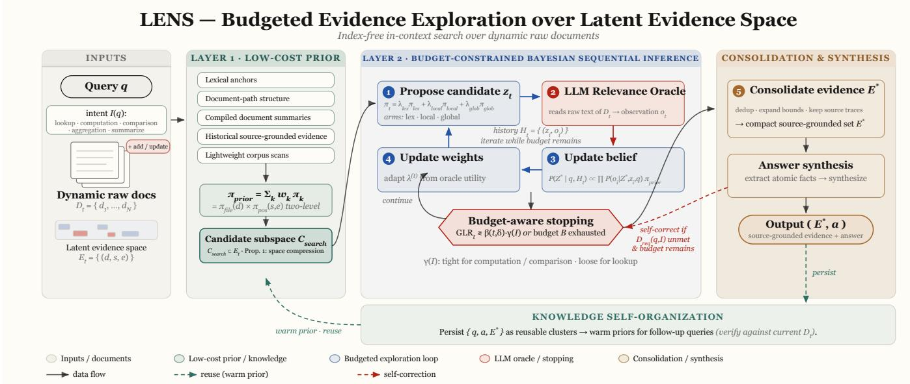

# LENS: In-Context Search via Latent Evidence Exploration over Dynamic Raw Documents

Xingjun Wang, Gongsheng Li, Qi Fan, Yunlin Mao, Luyan Su, Yingda Chen

ModelScope Team, Alibaba Group

Hangzhou, China

{xingjun.wxj, ligongsheng.lgs, luoqifan.fq, maoyunlin.myl, suluyan.sly, yingda.chen}@alibaba-inc.com

## Abstract

Large language model agents increasingly need to answer questions over dynamic raw-document collections, where files may be added or updated before evidence can be preprocessed into fixed representations. Relevant evidence may appear as spans, sections, pages, or tables whose usefulness is querydependent. Existing retrieval-augmented approaches typically materialize the evidence space before querying through fixed chunking, embeddings, or persistent indexes. While efective for lookup, such representations impose preprocessing cost, can become stale after document updates, and commit to an evidence granularity before the query is known.

We formulate in-context search as Budgeted Evidence Localization over a latent evidence space induced by dynamic raw documents, and propose Latent Evidence Exploration and Search (LENS) as an index-free framework for this setting. Rather than pre-materializing the full evidence space, LENS maintains a query-conditioned belief over candidate evidence units, iteratively selecting candidates through complementary lexical, local, and exploratory proposal policies, updating the belief with observations from an LLM-based relevance oracle, and narrowing the search toward high-posterior evidence regions under a controllable budget. The resulting evidence is consolidated into compact, source-grounded regions of interest and further compressed into self-organizing knowledge clusters for reuse across semantically related queries.

On a controlled 500-question evaluation with matched corpus snapshots, LENS achieves 62.4% exact match and 84.8% evidence recall, while a ReAct-style iterative baseline achieves 65.2% exact match but only 50.4% evidence recall. Across controlled scales, LENS consistently provides the strongest supporting-fact localization and answer grounding. On a fixed 150-question fullwiki subset over the raw Wikipedia dump with zero indexing, LENS and ReAct are nearly tied in official answer quality (43.3% vs. 42.7% EM), while LENS grounds a larger share of answers in retrieved evidence (84.0% vs. 70.7%). A no-retrieval Closed-Book reference highlights the contribution of model memory and motivates reporting retrieval gains relative to this baseline. LENS remains queryready immediately after corpus changes, requires no preprocessing or persistent index, and preserves source-grounded evidence localization throughout.

## 1 Introduction

Large language model (LLM) agents increasingly operate over collections of raw documents that evolve faster than evidence can be reliably preprocessed into fixed representations. In such settings, relevant evidence is not a stable object known before the query. It may be a paragraph span, a table entry, a section, a page, or a cross-document chain whose appropriate granularity depends on both the question and the current document state. This makes document-grounded question answering diferent from retrieval over a static corpus of pre-segmented passages.

Existing retrieval-augmented approaches typically address document question answering by materializing the evidence space before querying, through chunking, dense embeddings, summaries, persistent sparse indexes, or graph-like memory structures (Lewis et al. 2020; Karpukhin et al. 2020; Izacard et al. 2023). These representations are efective for static lookup, especially when the corpus is stable and preprocessing cost can be amortized. However, in dynamic rawdocument collections, pre-materialization introduces a tradeof: setup and update costs must be paid before querying, indexes can become stale after document changes, and fixed chunks commit to an evidence granularity before the query reveals what evidence is needed.

The central dificulty is that the evidence space induced by raw documents is latent, variable-boundary, dynamic, and structured. It is latent because answer-bearing evidence exists in the documents but is not known in advance; variableboundary because the useful evidence windows are not limited to a fixed set of chunks, which makes the space discrete but combinatorially large; dynamic because document updates change the space itself; and structured because lexical, layout, path, and historical signals induce non-uniform priors over likely evidence regions. Treating this space as a fixed finite collection of chunks can therefore obscure the actual search problem faced by an LLM agent.

We formulate this setting as Budgeted Evidence Localization over a latent evidence space induced by dynamic raw documents. The goal is not merely to return the nearest precomputed passages, but to infer a compact source-grounded evidence set under token, latency, and oracle-call constraints. This formulation makes the cost of using an LLM as a relevance oracle explicit, while preserving the query-conditioned nature of evidence granularity and document freshness.

To make this formulation practical, we propose Latent Evidence Exploration and Search (LENS). LENS first forms a low-cost prior over candidate evidence regions using document signals available before any expensive oracle interaction. It then performs sequential exploration: each observation from an LLM-based relevance oracle updates a belief over candidate evidence units and guides subsequent exploration toward regions with higher expected utility. Finally, LENS consolidates selected evidence into compact, sourcegrounded regions and organizes confirmed evidence for reuse across semantically related follow-up queries.

We evaluate LENS under a dynamic raw-corpus protocol built around nested question sets and matched raw-document snapshots. This protocol measures answer quality, evidence localization, freshness under corpus growth, and query-time budget. All systems are compared under identical sampled questions and corpus boundaries, allowing paired analysis while keeping the raw-corpus setting auditable.

Our contributions are as follows. First, we formulate in-context search over evolving raw-document collections as Budgeted Evidence Localization over a latent evidence space. Second, we introduce LENS, an index-free sequential exploration framework that combines low-cost priors, oracleguided evidence refinement, budget-aware stopping, and source-grounded consolidation. Third, we design a dynamic raw-corpus evaluation protocol that jointly reports answer quality, evidence localization, freshness, budget-normalized quality, and no-retrieval reference scores. Finally, we provide mechanism evidence through source-grounding diagnostics and an ablation that isolates multi-signal prior formation from sequential exploration, rather than relying only on aggregate answer scores.

## 2 Background

We study document collections whose contents and boundaries may change between queries. Files can be added, updated, or removed, and the evidence needed by a query may be located in spans, tables, pages, or cross-document relations. This setting difers from static open-domain retrieval because both the corpus state and the appropriate evidence granularity are query-dependent.

Retrieval-augmented generation typically constructs a finite representation of the evidence space before a query arrives. Chunking, embedding indexes, sparse indexes, summary trees, and document graphs all instantiate this strategy. These representations are useful when the corpus is stable, but they commit to a fixed representation before the query is known and must be rebuilt or updated when the underlying documents change.

LLMs provide strong semantic relevance judgments, but each oracle interaction consumes tokens, latency, and cost. A search method over dynamic raw documents therefore needs to trade of immediate relevance, information gain, source traceability, and budget. LENS uses this view to cast incontext search as sequential evidence localization rather than as a one-shot top-k lookup problem.

## 3 Budgeted Evidence Localization

We consider a collection of raw documents that evolves over time. Let

$$
\mathcal { D } _ { t } = \{ d _ { 1 } ^ { ( t ) } , d _ { 2 } ^ { ( t ) } , . . . , d _ { N } ^ { ( t ) } \}\tag{1}
$$

denote the document collection at time $t . \mathrm { A }$ query q arrives after the current corpus state is fixed, and the system must answer using evidence from $\mathcal { D } _ { t }$ rather than from a stale representation of $\mathcal { D } _ { t - 1 }$

Definition 1 (Latent Evidence Space). For a dynamic rawdocument collection $\mathcal { D } _ { t }$ , the latent evidence space is

$$
\mathcal { E } _ { t } \triangleq \{ ( d , s , e ) \mid d \in \mathcal { D } _ { t } , 0 \leq s < e \leq | d | \} .\tag{2}
$$

Each element denotes a candidate evidence window in a raw document.

The space $\mathcal { E } _ { t }$ is not explicitly enumerated by LENS. It is latent because the answer-bearing region is unknown before querying, variable-boundary because window boundaries may vary at span-level resolution, which makes $\mathcal { E } _ { t }$ finite but combinatorially large in $| d |$ , dynamic because $\mathcal { E } _ { t }$ changes with $\mathcal { D } _ { t }$ , and structured because document paths, textual anchors, compiled summaries, and prior successful searches induce non-uniform beliefs over the space.

Queries impose diferent evidence requirements. We use an intent variable

$$
\begin{array} { r l } & { I ( q ) \in \{ \mathrm { l o o k u p } , \ \mathrm { c o m p u t a t i o n } , } \\ & { \qquad \mathrm { c o m p a r i s o n } , \ \mathrm { a g g r e g a t i o n } , \ \mathrm { s u m m a r i z e } \} } \end{array}\tag{3}
$$

to indicate whether a query can be answered by a localized span, requires multiple atomic facts, or requires a higher-level synthesis. The intent induces a set of data requirements

$$
\mathcal { D } _ { \mathrm { r e q } } ( q , I ) = \{ f _ { 1 } , \hdots , f _ { K } \} ,\tag{4}
$$

a decomposition of the query into atomic facts together with optional transformation rules that combine them. Lookup queries have $K = 1$ , whereas comparison, computation, and aggregation queries have $K > 1$ and their facts may reside in diferent documents.

Evidence localization is therefore defined per atomic fact rather than per query.

Definition 2 (Per-Fact Evidence Target). For each $f _ { j } \in$ $\mathcal { D } _ { \mathrm { r e q } } ( q , I )$ , let $Z _ { i } ^ { * } \in \mathcal { E } _ { t }$ be a minimal suficient evidence windowfor $f _ { j }$ . The evidence target ofthe query is the collection $\mathbf { Z } ^ { * } = \{ \breve { Z } _ { 1 } ^ { * } , \dots , Z _ { K } ^ { * } \}$ , and localization is complete only when every requirement is covered.

This per-fact formulation is what makes the target well defined on multi-hop queries. A comparison between two entities needs one fact from each of two documents, so no single contiguous window is suficient and a query-level singlewindow target would not exist. Defining the target per fact keeps the inference object a single window — so that beliefs and stopping rules remain tractable — while the query-level output is a set, which is also what the system returns.

For a fact $f _ { j }$ , the ideal inference target is the posterior

$$
\begin{array} { r } { P ( Z _ { j } ^ { * } \mid f _ { j } , q , \mathcal { H } _ { t } ) \propto P ( \mathcal { H } _ { t } \mid Z _ { j } ^ { * } , f _ { j } , q ) \qquad } \\ { \cdot \pi _ { \mathrm { p r i o r } } ( Z _ { j } ^ { * } \mid f _ { j } , q , \mathcal { D } _ { t } ) . } \end{array}\tag{5}
$$

where $\pi _ { \mathrm { p r i o r } }$ is a query-conditioned initial belief and $\mathcal { H } _ { t }$ is the history of oracle observations. Because the prior already conditions on the query, evidence about $Z _ { j } ^ { * }$ accrues through the observation likelihood. This likelihood is not available in closed form, so LENS treats an LLM as a costly relevance oracle and approximates posterior concentration through sequential observations.

A budget B limits the number of oracle calls, tokens, or wall-clock time available for a query. The output is a pair $( E ^ { * } , a )$ , where $E ^ { * }$ is a compact, source-grounded evidence set that covers the localized windows $\{ \hat { Z } _ { j } \} _ { j \le K }$ and a is the synthesized answer. This distinguishes evidence localization from pure answer generation: a correct answer without traceable evidence is insuficient for the setting considered here.

## 4 The LENS Algorithm

Figure 1 presents the overall framework. LENS first constructs a low-cost prior over the latent evidence space, then performs budget-constrained sequential inference in a propose–observe–update loop. Finally, it consolidates highbelief regions into a compact source-grounded evidence set for answer synthesis. This separation is central: prior formation cheaply narrows the search domain, while sequential refinement spends oracle calls only where they are informative.

4.1 Layer 1: Low-Cost Prior over Latent Evidence Directly exploring $\mathcal { E } _ { t }$ is infeasible. As shown on the left of Figure 1, LENS first compresses the search space by fusing five families of signals that are available without reading the corpus through an LLM: lexical anchors, document-path structure, compiled document summaries when available, historical source-grounded evidence from prior successful searches, and lightweight corpus scans. Rather than treating such signals as independent retrieval modules, LENS uses them as approximations to a prior

$$
\pi _ { \mathrm { p r i o r } } ( z \mid q , \mathcal { D } _ { t } ) \approx \sum _ { k \in \mathcal { K } _ { 0 } } w _ { k } \pi _ { k } ( z \mid q , \mathcal { D } _ { t } ) ,\tag{6}
$$

where $\kappa _ { 0 }$ denotes a family of low-cost proposal signals. This joint prior factors, by the chain rule, into a marginal– conditional pair that separates document selection from within-document localization:

$$
\pi _ { \mathrm { p r i o r } } ( z \mid q , \mathcal { D } _ { t } ) = \pi _ { \mathrm { f i l e } } ( d _ { z } \mid q , \mathcal { D } _ { t } ) \pi _ { \mathrm { p o s } } ( s _ { z } , e _ { z } \mid d _ { z } , q ) ,\tag{7}
$$

where $d _ { z }$ is the document associated with region z. The two equations therefore describe the same object: the mixture in the first specifies how the signals are fused, and the factorization in the second specifies at which level each factor acts. Making the decomposition explicit matters because strong file-level evidence does not automatically imply precise within-document localization.

Proposition 1 (Low-cost space compression). Let $\mathcal { C } _ { \mathrm { i n i t } }$ be the finite candidate document set induced by low-cost prior signals. Subsequent evidence exploration is restricted from $\mathcal { E } _ { t }$ to $\mathcal { C } _ { \mathrm { s e a r c h } } \stackrel { } { = } \{ ( d , s , e ) ~ | ~ d \stackrel { } { \in } \mathcal { C } _ { \mathrm { i n i t } } , 0 \le s < e \le | d | \}$ Thus, before any iterative oracle budget is consumed, LENS reduces the efective search domain from the full rawdocument collection to a query-conditioned subspace.

## 4.2 Layer 2: Budget-Constrained Sequential Inference

After prior formation, LENS enters the budgeted exploration loop shown at the center of Figure 1, which cycles through four steps while budget remains and some requirement in $\mathcal { D } _ { \mathrm { r e q } } ( q , \bar { I } )$ is still uncovered: (i) propose a candidate evidence region $z _ { t } ,$ (ii) query the LLM relevance oracle on the raw text of the region to obtain an observation $o _ { t }$ , (iii) update the beliefs over evidence regions, and (iv) adapt proposal weights and coverage estimates. Let $\mathcal { H } _ { t } = \{ ( z _ { i } , \mathbf { \bar { \omega } } _ { } o _ { i } ) \mathbf  \bar { \} } _ { i = 1 } ^ { t }$ denote the observation history accumulated by this loop. Each observation is informative about every outstanding requirement, so LENS maintains one belief per fact and updates all of them from the shared history:

$$
\begin{array} { r } { P ( Z _ { j } ^ { * } \mid f _ { j } , q , \mathcal { H } _ { t } ) \propto \displaystyle \prod _ { i = 1 } ^ { t } P ( o _ { i } \mid Z _ { j } ^ { * } , z _ { i } , f _ { j } , q ) } \\ { \cdot \pi _ { \mathrm { p r i o r } } ( Z _ { j } ^ { * } \mid f _ { j } , q , \mathcal { D } _ { t } ) . } \end{array}\tag{8}
$$

A single oracle call therefore serves all facts at once, which is why the per-fact formulation does not multiply the oracle budget by $\dot { K } .$

The next candidate should balance exploitation and exploration: it should use the current posteriors to refine promising regions, while retaining the ability to discover evidence missed by lexical or structural priors. An ideal informationdirected objective (Russo and Van Roy 2014) selects

$$
\begin{array} { r } { z _ { t + 1 } = \arg \underset { z \in \mathcal { C } _ { \mathrm { s e a r c h } } } { \operatorname* { m i n } } \Psi _ { t } ( z ) , } \\ { \Psi _ { t } ( z ) = \frac { [ \Delta _ { t } ( z ) ] ^ { 2 } } { \mathbb { I } [ ( \mathbf { Z } ^ { * } ; O _ { z } \mid q , \mathcal { H } _ { t } ) } . } \end{array}\tag{9}
$$

where $\Delta _ { t } ( z )$ is the expected immediate relevance gap and the denominator is the expected information gain about the outstanding targets $\mathbf { Z } ^ { \ast }$ . Minimizing this information ratio is principled: it targets the trade-of between immediate relevance and long-run information gain that underlies regretoptimal sequential selection, so that oracle budget is spent where it is most informative about $\mathbf { Z } ^ { \ast }$ . Exact computation is intractable in raw documents, so LENS approximates this criterion with complementary proposal families:

$$
\begin{array} { r l } & { \pi _ { t } ( z ) = \lambda _ { \mathrm { l e x } } ^ { ( t ) } \pi _ { \mathrm { l e x } } ( z ) + \lambda _ { \mathrm { l o c a l } } ^ { ( t ) } \pi _ { \mathrm { l o c a l } } ( z ) } \\ & { \qquad + \lambda _ { \mathrm { g l o b a l } } ^ { ( t ) } \pi _ { \mathrm { g l o b a l } } ( z ) . } \end{array}\tag{10}
$$

Lexical proposals exploit anchors, local proposals refine around high-belief regions, and global proposals guard against semantic omissions. Treating each proposal family as an arm, LENS adapts the mixture weights $\lambda ^ { ( t ) }$ online from observed oracle utility, closing the propose–observe– update cycle in Figure 1 without enumerating the full latent space.

## 4.3 Budget-Aware Stopping

The exploration loop should not continue merely because more context can be read. As depicted in Figure 1, each iteration terminates in a stopping decision: LENS exits the loop when either the remaining budget is insuficient or every requirement is localized with suficiently concentrated belief. Following fixed-confidence best-arm identification ideas (Garivier and Kaufmann 2016), a conceptual per-fact stopping statistic is

  
Figure 1: Overall LENS framework. LENS forms a query-conditioned prior over candidate evidence regions, runs a budgetconstrained propose–observe–update loop, and consolidates selected regions into a compact source-grounded evidence set for answer synthesis. It never pre-materializes a persistent index over the raw-document collection.

$$
\mathrm { G L R } _ { t } ^ { ( j ) } = \operatorname* { m i n } _ { z \neq \hat { Z } _ { j , t } } \sum _ { i \leq t } \log \frac { P ( o _ { i } \mid \hat { Z } _ { j , t } , f _ { j } , q ) } { P ( o _ { i } \mid z , f _ { j } , q ) } .\tag{11}
$$

where $\hat { Z } _ { j , t }$ is the current highest-belief region for fact $f _ { j }$ . LENS stops when min $ \mathrm { ~ } _ { j \leq K } \mathrm { G L R } _ { t } ^ { ( j ) }$ exceeds an intentmodulated threshold $\beta ( t , \delta ) \mathbf { \bar { \gamma } } \mathbf { \overline { { \gamma } } } ( I )$ — that is, when the weakest requirement is resolved — or when the budget is exhausted, where $\gamma ( I )$ tightens the criterion for computation and comparison intents and relaxes it for lookup. A lookup query has a single requirement and can often stop with one compact region, whereas comparison and computation queries cannot stop until each of their K facts has its own confirmed window, which is exactly the coverage condition on $\mathcal { D } _ { \mathrm { r e q } } ( q , I )$

## 4.4 Evidence Consolidation and Answer Synthesis

Once the loop stops, the selected regions enter the consolidation-and-synthesis stage on the right of Figure 1. Consolidation merges the per-fact windows $\{ \hat { Z } _ { j } \} _ { j \leq K } .$ , removes redundant or overlapping regions, expands boundaries when necessary for interpretability, and preserves source traces, yielding a compact source-grounded evidence set $E ^ { * }$ . Answer synthesis then operates on $E ^ { * } { \mathrm { : } }$ : for computation and comparison queries, LENS separates extraction of atomic facts from answer synthesis; for lookup-style queries, a single-stage synthesis may be suficient. When synthesis cannot satisfy ${ \dot { \mathcal { D } } } _ { \mathrm { r e q } } ( q , I )$ and budget remains, LENS triggers the self-correction path in Figure 1: a bounded step that relaxes the stopping threshold and re-enters the exploration loop with an expanded candidate set before re-synthesizing. The final output is the pair $( E ^ { * } , a )$ , an answer grounded in explicit evidence regions rather than only in retrieved text snippets.

Algorithm 1 LENS: Budgeted Evidence Localization   
1: Input: query $q ,$ dynamic corpus $\mathcal { D } _ { t } ,$ , budget B   
2: Build low-cost prior $\pi _ { \mathrm { p r i o r } } ( z \mid q , \mathcal { D } _ { t } )$ over candidate evi  
dence regions   
3: Derive requirements $\mathcal { D } _ { \mathrm { r e q } } ( q , I ) = \{ f _ { 1 } , . . . , f _ { K } \}$   
4: Initialize observation history $\mathcal { H } _ { 0 } ~  ~ \emptyset$ and candidate   
subspace $\mathcal { C } _ { \mathrm { s e a r c h } }$   
5: while budget remains and some $f _ { j }$ is uncovered do   
6: Select proposal family and sample candidate region   
$z _ { t }$   
7: Query relevance oracle to obtain observation $o _ { t }$   
8: Update per-fact beliefs $P ( Z _ { j } ^ { \ast } \mid f _ { j } , q , \mathcal { H } _ { t } )$   
9: Update proposal weights and requirement coverage   
10: end while   
11: Consolidate the per-fact windows into source-grounded   
evidence set $E ^ { * }$   
12: Synthesize answer a from $E ^ { * }$ and persist reusable evi  
dence clusters when appropriate   
13: Return: $( E ^ { * } , a )$

## 4.5 Algorithm Summary and Theoretical Properties

Algorithm 1 summarizes the inference loop. The algorithm is intentionally written at the method level rather than in implementation-specific terms.

Under the abstraction above, LENS admits two analysis statements and a budget guarantee. First, low-cost priors reduce the search domain before any iterative oracle budget is spent. Second, when the oracle relevance signal is locally stable, successive observations progressively concentrate the belief over candidate evidence regions, so that additional budget yields diminishing exploration returns. The online cost of this process is bounded independently of corpus size.

Proposition 2 (Bounded oracle complexity). For a loop budget of L exploration rounds, the number of LLM oracle interactions performed by LENS is bounded by $c _ { 0 } + c _ { 1 } L$ for small constants $c _ { 0 } , c _ { 1 }$ that depend only on the configuration and not on the query $( c _ { 0 } = 4 , c _ { 1 } = 2$ in our setting). The bound is independent of the number of requirements K, because one oracle observation updates all per-fact beliefs, and independent of the number of latent evidence windows induced by $\mathcal { D } _ { t } .$

These statements are analysis guides for the method rather than tight guarantees: stricter probabilistic oracle models, position-level priors, and resampling analyses remain future work.

## 5 Related Work

Retrieval-augmented generation methods retrieve external evidence before generation and have become a standard approach for knowledge-intensive tasks (Lewis et al. 2020; Karpukhin et al. 2020; Izacard et al. 2023). Dense, sparse, and hybrid systems are efective when a stable corpus can be preprocessed into persistent representations. Hierarchical and graph-based retrieval systems further organize documents into summaries, trees, or memory graphs (Sarthi et al. 2024; Gutiérrez et al. 2024), improving reuse and traversal when the supporting structures can be built and maintained. LENS addresses a diferent operating point: dynamic rawdocument collections where query readiness, update cost, evidence granularity, and source traceability are part of the task rather than external deployment details.

Long-context language models provide another way to avoid a persistent index by placing large amounts of raw text directly into the model context (Beltagy, Peters, and Cohan 2020; Liu et al. 2024). This reduces explicit index construction, but shifts cost to query time through high token consumption and may still fail to localize the specific evidence inside long inputs. Tool-using agents can search, read, and refine their context over multiple steps (Yao et al. 2023; Asai et al. 2024), but they often lack an explicit formulation of evidence localization under a controllable budget. LENS treats interaction as posterior-guided evidence exploration over a latent evidence space, and evaluates the resulting trade-of through answer quality, source-grounded evidence localization, freshness, and lifecycle cost.

## 6 Experiments

## 6.1 Setup

We evaluate LENS on HotpotQA fullwiki (Yang et al. 2018), a multi-hop question answering benchmark where each question requires reasoning over two or more Wikipedia articles. We report results under two conditions:

Controlled evaluation $( D _ { n } ) .$ From the validation split (7,405 questions) we draw frozen, proportionally stratified evaluation sets over $t y p e \times d i f f i c u l t y$ strata (seed 42). Our primary controlled evaluation uses $n = 5 0 0$ questions paired with a matched corpus snapshot $D _ { 5 0 0 }$ containing the gold supporting articles, context distractors, and a deterministic background pool. This is the largest statistically robust scale we evaluate and enables paired comparison across all baselines including index-dependent systems.

Open-domain fullwiki. The complete raw Wikipedia dump underlying the fullwiki validation split is stored as 15,517 JSON shards without preprocessing, chunking, or indexing. We evaluate $n = 1 5 0$ fixed questions on this corpus to measure corpus-scale robustness under the zero-index constraint.

Systems. We compare five arms: (1) LENS, the full algorithm with multi-signal prior, sequential exploration, budgetaware stopping, and evidence consolidation; (2) ReAct Search, a strong iterative baseline using ReAct-style (Yao et al. 2023) tool-use reasoning with the same corpus access but without LENS’s structured prior formation or budgetconstrained belief updates; (3) Hybrid-RAG, a retrievalaugmented baseline combining BM25 and dense embedding retrieval with a pre-materialized index; (4) BM25-RAG, a sparse-retrieval baseline using a pre-built BM25 index; and (5) Closed-Book, a no-retrieval reference that estimates the score attributable to model parameters alone. Systems (3) and (4) require pre-materialized indexes and therefore face a lifecycle limitation under corpus changes.

Hyperparameters. All systems share one chat backend (Qwen3.7, a 35B-parameter mixture-of-experts model with 3B active parameters, fixed temperature, 120 s per-call timeout) under a 300 s per-question wall-clock cap. LENS runs its DEEP configuration with a 128K query-time token budget and at most 10 candidate files admitted to evidence extraction. All runs use cold caches with no knowledge reuse.

Environment. Experiments run on a single Apple M4 Pro workstation (12 cores, 48 GB RAM, macOS 15) with no local GPU; all model calls are served by a remote OpenAIcompatible endpoint, so reported latencies include network time. At most 5 questions are evaluated concurrently.

Metrics. EM and F1 are the oficial answer metrics. Ev.Rec measures retrieval of gold supporting-fact documents, while Ground measures whether the final answer is traceable to retrieved evidence. Judge is an auxiliary semantic-equivalence diagnostic from an independent model and is not used as the primary score.

## 6.2 Main Results: Controlled Evaluation

Table 2 reports the primary controlled evaluation. ReAct Search attains the highest answer score (65.2% EM, 78.9% F1), while LENS remains close on answer quality (62.4% EM, 76.9% F1) and provides substantially stronger evidence localization. LENS achieves 84.8% evidence recall and 96.8% grounded answers, compared with 50.4% and 71.8% for ReAct. This separates two evaluation dimensions: ReAct more often produces the exact answer string, whereas LENS more reliably localizes and traces the supporting evidence. Relative to Closed-Book, LENS gains 27.2 pp EM and ReAct gains 30.0 pp, so retrieval benefits are reported against a no-retrieval reference rather than assumed from answer correctness alone.

<table><tr><td>Snapshot</td><td>Samples</td><td>Articles</td><td>Evidence</td><td>Background</td></tr><tr><td> $D _ { 1 2 5 }$ </td><td>125</td><td>5,416</td><td>250</td><td>4,062</td></tr><tr><td>D250</td><td>250</td><td>10,808</td><td>500</td><td>8,106</td></tr><tr><td> $D _ { 5 0 0 }$ </td><td>500</td><td>21,424</td><td>996</td><td>16,068</td></tr><tr><td>System  $( D _ { 5 0 0 } )$ </td><td>Ready</td><td>Rebuild</td><td>Index(s)</td><td>Storage</td></tr><tr><td>LENS</td><td>yes</td><td>no</td><td>0.0</td><td>0</td></tr><tr><td>ReAct</td><td>yes</td><td>no</td><td>0.0</td><td>0</td></tr><tr><td>BM25-RAG</td><td>no</td><td>yes</td><td>4.0</td><td>10.0MB</td></tr><tr><td>Hybrid-RAG</td><td>no</td><td>yes</td><td>5.7</td><td>54.9MB</td></tr></table>

Table 1: Snapshot construction and lifecycle audit. The upper block reports deterministic $D _ { n }$ corpus sizes; the lower block reports $D _ { 5 0 0 }$ query readiness, rebuild requirement, index time, and index storage.
<table><tr><td>System</td><td>EM</td><td>F1</td><td> $\operatorname { E v . R e c }$ </td><td>Ground</td></tr><tr><td>ReAct Search</td><td>65.2</td><td>78.9</td><td>50.4</td><td>71.8</td></tr><tr><td>LENS</td><td>62.4</td><td>76.9</td><td>84.8</td><td>96.8</td></tr><tr><td>Hybrid-RAG</td><td>38.4</td><td>51.1</td><td>80.8</td><td>92.2</td></tr><tr><td>BM25-RAG</td><td>28.8</td><td>42.3</td><td>71.8</td><td>95.8</td></tr><tr><td>Closed-Book</td><td>35.2</td><td>47.0</td><td>0.0</td><td>0.0</td></tr></table>

Table 2: Controlled evaluation on $D _ { 5 0 0 }$ (%, n=500). EM/F1 are oficial answer metrics; Ev.Rec is supporting-fact document recall; Ground is the percentage of answers traceable to retrieved evidence.

## 6.3 Open-Domain Fullwiki Results

Table 3 reports results on the full raw Wikipedia corpus. LENS and ReAct are efectively tied on oficial answer quality (43.3% vs. 42.7% EM), while LENS grounds more answers in retrieved evidence (84.0% vs. 70.7%). Closed-Book reaches 38.7% EM, so fullwiki retrieval gains are modest but positive: +4.6 pp for LENS and +4.0 pp for ReAct. BM25- RAG and Hybrid-RAG require separate full-dump indexing and are evaluated through the controlled/lifecycle arms.

## 6.4 Evidence Recall Leadership

Table 4 presents evidence recall across all controlled evaluation scales. LENS is the top evidence-localization system at every scale, with 84.8–89.1% evidence recall. Its lead over ReAct is 43.0 pp on $D _ { 1 2 5 }$ , 38.0 pp on $D _ { 2 5 0 }$ , and 34.4 pp on $D _ { 5 0 0 }$ . Hybrid-RAG also retrieves substantial evidence, but its answer quality remains far below LENS and ReAct, indicating that locating candidate evidence and synthesizing the exact multi-hop answer are separable failure modes.

## 6.5 Corpus Staleness and Lifecycle Robustness

The stale-index arm measures what happens when an index built on $D _ { 1 2 5 }$ is reused after the corpus expands to $D _ { 2 5 0 }$ . BM25-RAG and Hybrid-RAG are index-dependent and therefore lose most of their ability to answer newly added questions: EM drops by 28.0 and 28.8 pp, and evidence recall drops by 70.1 and 69.6 pp. ReAct and LENS are index-free, so they can query the expanded corpus immediately; their EM changes are small (+0.8 pp and -2.4 pp), and LENS retains nearly all supporting-fact recall (84.7% to 83.9%). Table 1 shows the corresponding lifecycle condition: indexheavy systems are not query-ready after corpus growth and require rebuilding, while LENS and ReAct remain queryready.

<table><tr><td>System</td><td>EM</td><td>F1</td><td>Ev.Rec</td><td>Ground</td></tr><tr><td>LENS</td><td>43.3</td><td>57.5</td><td>45.0</td><td>84.0</td></tr><tr><td>ReAct Search</td><td>42.7</td><td>57.3</td><td>50.4</td><td>70.7</td></tr><tr><td>Closed-Book</td><td>38.7</td><td>49.7</td><td>0.0</td><td>0.0</td></tr></table>

Table 3: Open-domain fullwiki results $( \% , n { = } 1 5 0$ , fixed sample IDs). LENS and ReAct search the raw Wikipedia dump (15,517 shards) with zero indexing; Closed-Book reads no corpus.
<table><tr><td>System</td><td> $D _ { 1 2 5 }$ </td><td> $D _ { 2 5 0 }$ </td><td> $D _ { 5 0 0 }$ </td></tr><tr><td>LENS</td><td>89.1</td><td>85.9</td><td>84.8</td></tr><tr><td>Hybrid-RAG</td><td>81.3</td><td>77.8</td><td>80.8</td></tr><tr><td>BM25-RAG</td><td>71.6</td><td>71.1</td><td>71.8</td></tr><tr><td>ReAct Search</td><td>46.1</td><td>47.9</td><td>50.4</td></tr><tr><td>Closed-Book</td><td>0.0</td><td>0.0</td><td>0.0</td></tr></table>

Table 4: Evidence recall (%) across controlled evaluation scales. LENS consistently provides the strongest supportingfact localization, while Closed-Book has no evidence trace by design.

## 6.6 Cost and Statistical Checks

Paired McNemar tests on oficial EM do not show a significant LENS–ReAct answer-quality diference on $D _ { 5 0 0 }$ (62.4% vs. 65.2%, $p \ = \ 0 . 1 1 4 3 )$ or fullwiki dev-150 (43.3% vs. $4 2 . 7 \% , p = 1 . 0 0 0 0 )$ . Query-time budget shows the expected trade-of: on $D _ { 5 0 0 }$ , ReAct uses 11.8K tokens per query, while LENS uses 16.5K but improves evidence recall by 34.4 pp and grounding by 25.0 pp. Auxiliary JudgeAcc follows EM and is not used as a primary score.

## 6.7 Ablation Study

Table 6 isolates two LENS components on the fixed fullwiki subset. Removing sequential exploration produces the clearest degradation: EM falls from 43.3% to 38.0%, F1 from 57.5% to 50.9%, and evidence recall from 45.0% to 31.0%. Removing the multi-signal prior does not reduce EM on this subset, but it lowers F1 and changes the cost profile.

## 7 Discussion and Conclusions

Across controlled corpora, LENS is the strongest evidencelocalization system: on $D _ { 5 0 0 }$ it trails ReAct by 2.8 pp EM, but leads by 34.4 pp evidence recall and 25.0 pp grounding. On fullwiki dev-150, the two systems are efectively tied in oficial EM/F1 while LENS retains stronger grounding. These results support a precise claim: LENS is not an

<table><tr><td></td><td colspan="3">Exact Match (%)</td><td colspan="3">Evidence Recall (%)</td></tr><tr><td>System</td><td>Fresh</td><td>Stale</td><td>∆</td><td>Fresh</td><td>Stale</td><td> $\Delta$ </td></tr><tr><td>BM25-RAG</td><td>30.4</td><td>2.4</td><td>-28.0</td><td>70.1</td><td>0.0</td><td>-70.1</td></tr><tr><td>Hybrid-RAG</td><td>42.4</td><td>13.6</td><td>-28.8</td><td>75.1</td><td>5.5</td><td>-69.6</td></tr><tr><td>ReAct Search</td><td>72.0</td><td>72.8</td><td>+0.8</td><td>54.1</td><td>48.3</td><td>-5.7</td></tr><tr><td>LENS</td><td>69.6</td><td>67.2</td><td>-2.4</td><td>84.7</td><td>83.9</td><td>-0.8</td></tr></table>

Table 5: Staleness robustness under corpus expansion $( D _ { 1 2 5 } \to D _ { 2 5 0 } , \Delta n = 1 2 5 )$ . Index-heavy systems reuse an index built on $D _ { 1 2 5 }$ while answering newly added $D _ { 2 5 0 }$ questions; index-free systems query the updated corpus directly. Negative gaps indicate stale degradation; the table measures freshness/lifecycle robustness rather than fresh-corpus answer quality.
<table><tr><td>Configuration</td><td>EM</td><td>F1</td><td> $\operatorname { E v . R e c }$ </td><td>Ground</td></tr><tr><td>LENS (Full)</td><td>43.3</td><td>57.5</td><td>45.0</td><td>84.0</td></tr><tr><td>w/o Multi-signal Prior</td><td>43.3</td><td>55.9</td><td>45.4</td><td>85.3</td></tr><tr><td>w/o Sequential Exploration</td><td>38.0</td><td>50.9</td><td>31.0</td><td>82.0</td></tr></table>

Table 6: Ablation study on the fullwiki evaluation $( n { = } 1 5 0$ fixed sample IDs). Ev.Rec is supporting-fact document recall; Ground is the percentage of answers traceable to retrieved evidence.

EM-dominant answer generator, but an index-free evidence localization method that makes answers more traceable to current raw sources.

This distinction matters because EM is a narrow stringmatch measure. It penalizes acceptable paraphrases and aliases, and it can reward a correct answer that is produced from model memory rather than from retrieved evidence. The Closed-Book reference makes this visible: a non-retrieval model already reaches 35.2% EM on $D _ { 5 0 0 }$ and 38.7% EM on fullwiki. We therefore treat EM/F1 as primary answerquality metrics, but interpret them together with Ev.Rec and Ground when evaluating systems intended for auditable, source-grounded search.

LENS’s advantages appear on three dimensions. First, it localizes evidence more reliably than ReAct across $D _ { 1 2 5 }$ $D _ { 2 5 0 }$ , and $D _ { 5 0 0 }$ , indicating that the sequential search loop finds supporting documents rather than only plausible answers. Second, it keeps a high grounding rate, which is essential when users need to inspect the source trail. Third, the stale-index arm shows a lifecycle advantage: BM25-RAG and Hybrid-RAG lose $2 8 . 0 { - } 2 8 . { \dot { 8 } } \ \mathrm { p p }$ EM and nearly all evidence recall when a $D _ { 1 2 5 }$ index is used on new $D _ { 2 5 0 }$ questions, whereas index-free systems remain query-ready over the updated corpus. This is a freshness and cost-structure advantage, not a claim that LENS always improves fresh-corpus EM.

The present evidence is still bounded. HotpotQA emphasizes lookup and comparison over encyclopedic text, so richer document layouts, aggregation intents, table evidence, and warm-reuse behavior remain future work. Within this scope, LENS demonstrates competitive answer quality, substantially stronger source traceability, and immediate query readiness over changing raw documents—the operating point targeted by Budgeted Evidence Localization.

## References

Asai, A.; Wu, Z.; Wang, Y.; Sil, A.; and Hajishirzi, H. 2024. Self-rag: Learning to retrieve, generate, and critique through self-reflection. In International conference on learning representations, 9112–9141.

Beltagy, I.; Peters, M. E.; and Cohan, A. 2020. Longformer: The long-document transformer. arXiv preprint arXiv:2004.05150.

Garivier, A.; and Kaufmann, E. 2016. Optimal best arm identification with fixed confidence. In Conference on Learning Theory, 998–1027.

Gutiérrez, B. J.; Shu, Y.; Gu, Y.; Yasunaga, M.; and Su, Y. 2024. HippoRAG: Neurobiologically Inspired Long-Term Memory for Large Language Models. In Advances in Neural Information Processing Systems, 59532–59569.

Izacard, G.; Lewis, P.; Lomeli, M.; Hosseini, L.; Petroni, F.; Schick, T.; Dwivedi-Yu, J.; Joulin, A.; Riedel, S.; and Grave, E. 2023. Atlas: Few-shot learning with retrieval augmented language models. Journal of Machine Learning Research, 24(251).

Karpukhin, V.; Oguz, B.; Min, S.; Lewis, P.; Wu, L.; Edunov, S.; Chen, D.; and Yih, W.-t. 2020. Dense passage retrieval for open-domain question answering. In Proceedings of the 2020 conference on empirical methods in natural language processing (EMNLP), 6769–6781.

Lewis, P.; Perez, E.; Piktus, A.; Petroni, F.; Karpukhin, V.; Goyal, N.; Küttler, H.; Lewis, M.; Yih, W.-t.; Rocktäschel, T.; Riedel, S.; and Kiela, D. 2020. Retrieval-Augmented Generation for Knowledge-Intensive NLP Tasks. In Advances in Neural Information Processing Systems, 9459–9474.

Liu, N. F.; Lin, K.; Hewitt, J.; Paranjape, A.; Bevilacqua, M.; Petroni, F.; and Liang, P. 2024. Lost in the Middle: How Language Models Use Long Contexts. Transactions of the Associationfor Computational Linguistics, 12: 157–173.

Russo, D.; and Van Roy, B. 2014. Learning to Optimize via Information-Directed Sampling. In Advances in Neural Information Processing Systems.

Sarthi, P.; Abdullah, S.; Tuli, A.; Khanna, S.; Goldie, A.; and Manning, C. 2024. Raptor: Recursive abstractive processing for tree-organized retrieval. In International Conference on Learning Representations, 32628–32649.

Yang, Z.; Qi, P.; Zhang, S.; Bengio, Y.; Cohen, W.; Salakhutdinov, R.; and Manning, C. D. 2018. HotpotQA: A dataset for diverse, explainable multi-hop question answering. In Proceedings of the 2018 conference on empirical methods in natural language processing, 2369–2380.

Yao, S.; Zhao, J.; Yu, D.; Du, N.; Shafran, I.; Narasimhan, K.; and Cao, Y. 2023. ReAct: Synergizing Reasoning and Acting in Language Models. In International Conference on Learning Representations.