# R3-Bench: LLMs Struggle with Resource-Rational Reasoning under Shared Budgets

Peisong Wang1\* Zhiwei Ma1\* Bowen Liu1 Feixue Liu2 Aochuan Chen1 Chenyi Zi1 Hongchuan Zeng3 Yuhan Li1 Jia Li1†

1The Hong Kong University of Science and Technology (Guangzhou) 2The University of Hong Kong 3Hunyuan Team, Tencent {ps.wang,zma191}@connect.hkust-gz.edu.cn

‡ Code Dataset

## Abstract

In cognitive science, resource rationality asks how an agent should allocate limited computation to maximize expected value. Most reasoning and agent benchmarks use independent per-task budgets; existing shared-budget studies do not calibrate suite performance against the same model’s demonstrated single-problem competence. We introduce R3- BENCH, which evaluates six-problem suites under shared budgets across mathematics, competitive programming, and abstract reasoning in tool-free and agentic settings. Matched single-problem response curves define an offline empirical oracle over observed successes. Across 72 main-table cells for six models, the oracle mean matches or exceeds the contest mean in all cells and is strictly higher in 71. Under moderate tool-free pressure, equal-allocation replay also exceeds contest performance for three of six models. Trajectory diagnostics reveal limited strategy updating and pressure-dependent failure patterns. In a three-model diagnostic under strong agentic pressure, at least one fixed scheduler exceeds the contest mean in six of nine cells, but no policy dominates across domains. These results expose a persistent gap between demonstrated competence and sharedbudget realization.

## 1 Introduction

Reasoning has become a central capability of modern large language models (LLMs). Chain-of-thought prompting and test-time scaling show that additional inference-time computation can improve LLM reasoning (Wei et al., 2022; Snell et al., 2024). These gains are not free: reasoning consumes tokens, wall-clock time, tool calls, and verifier interactions. Under resource constraints, an agent must decide not only how to solve a problem, but also whether further computation is worthwhile—whether to think longer, call a tool, run a test, verify a candidate, switch tasks, or stop. This is a resource-rationality problem. Rational analysis models cognition as balancing expected gains against computational costs (Anderson, 1991). Resource-rational analysis makes this constraint explicit by viewing cognition as the optimal use of limited computational resources (Lieder and Griffiths, 2020).

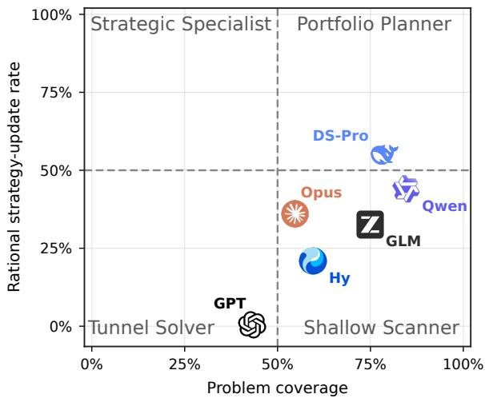  
Figure 1: Problem coverage and resource-rational strategy-update rate for the six flagship models, aggregated across tool-free and agentic settings, both budget pressures, and all available domains. Coverage is the share of problem slots with visible, substantive problem-specific work; resource-rational updates are strategy changes that respond to new evidence and the remaining shared budget. Dashed lines mark descriptive 50% references on each metric. Appendix L provides the complete definitions.

For LLM systems, this resource-allocation problem often extends beyond a single task. Real agent workflows increasingly involve several tasks or agents operating concurrently. More than 10% of Codex users manage at least three concurrent agents in a given week (Johnston et al., 2026). An analysis of roughly 400,000 Claude Code sessions further shows that coding-agent workflows routinely involve building, debugging, testing, and operating software (Hitzig et al., 2026). Such workloads draw on finite API quotas, inference capacity, and external endpoints; resource contention among concurrent tasks can therefore lead to wasted computation (Agyemang et al., 2026). Once several tasks share a finite inference budget, computation spent on one task reduces the resource available to the others, creating an opportunity cost and making cross-task allocation part of the reasoning problem itself.

Existing benchmarks make this ability hard to observe. Reasoning benchmarks evaluate one problem at a time (Hendrycks et al., 2021; Rein et al., 2023; Tang et al., 2025; Zheng et al., 2025), and agent benchmarks typically budget each task in isolation (Liu et al., 2024; Jimenez et al., 2024; Mialon et al., 2024; Zhang et al., 2025). In either setting, the crossproblem allocation question never arises: a model can spend its full allowance on every problem without considering the remaining tasks. We therefore ask whether an LLM can realize its demonstrated single-problem competence when computation has an opportunity cost across problems?

To answer this question, we introduce $R ^ { 3 } .$ -BENCH, a benchmark for Resource-Rational Reasoning in LLM systems. For each of three domains— Olympiadstyle mathematics, competitive programming, and abstract reasoning— $. R ^ { 3 } .$ -BENCH constructs 50 sixproblem contests containing problems with different resource demands. Each contest places all six problems under one shared budget and is evaluated in both tool-free and agentic settings. To separate problem-solving competence from its realization under a shared budget, we use matched single-problem runs to construct an equal-allocation replay and a same-model response-curve oracle. The oracle selects demonstrated single-problem successes subject to the contest’s total budget; it is an offline empirical diagnostic rather than an executable policy.

The results reveal a persistent gap between demonstrated competence and shared-budget performance. Across the 72 flagship model–setting– pressure–domain cells reported in the main table, the oracle matches or exceeds the contest score in every cell and is strictly higher in 71. Under moderate tool-free budget pressure, equal allocation also outperforms the contest policy for three of six models. Neither a larger budget nor access to tools uniformly closes the gap. Figure 1 provides a complementary behavioral view: five of six models cover more than half of the suite, whereas only DS-Pro exceeds the descriptive 50% reference for resource-rational strategy updates. Broad coverage therefore does not imply resource-rational behavior.

Trajectory analysis further shows that failure patterns depend on budget pressure: among problems selected by the oracle but missed in the actual contest, failures under strong pressure are most often due to exhausting the shared budget on other problems, whereas under moderate pressure they more often come from stopping after partial progress. Both categories concern problems the model has already solved in isolation, so both point to allocation— which problems receive budget, and how much they receive—rather than to a capability limit. The gap is also not a restatement of general capability: models within two points on a composite of over fifty benchmarks differ by up to 60.6 percentage points in Gap Ratio (Section 4). We further probe lightweight online scheduling, finding higher mean performance in six of nine model–domain cells but no policy that transfers uniformly across domains (Section 5). Our contributions are:

• We formulate resource-rational reasoning as shared-budget task-suite evaluation and introduce $R ^ { 3 } .$ -BENCH, spanning three domains and both tool-free and agentic settings.

• We use matched single-problem response curves and equal-allocation replay to reveal persistent gaps between demonstrated competence and shared-budget performance across models and budget pressures, and show that these gaps are left unexplained by a general-capability composite over fifty benchmarks.

• We diagnose pressure-dependent failure patterns and limited online adaptation, and find domain-dependent effects from fixed online schedulers.

## 2 Related Work

Per-task reasoning and agent evaluation. Reasoning benchmarks span domains such as mathematics, science question answering, graph problems, and competitive programming (Hendrycks et al., 2021; Rein et al., 2023; Tang et al., 2025; Zheng et al., 2025), and agent benchmarks add tool use, web interaction, and long-horizon software execution (Liu et al., 2024; Mialon et al., 2024; Jimenez et al., 2024; Zhang et al., 2025). Both nevertheless evaluate and budget tasks independently, measuring per-task competence rather than how computation is distributed across a task suite.

Table 1: Comparison with budget-aware and resource-allocation-oriented LLM evaluations. A checkmark indicates explicit budget-aware evaluation in the corresponding setting. “Tool-free” denotes direct model reasoning without external tool interaction. “Shared budget” indicates that multiple tasks compete for one common budget, rather than receiving independent per-task budgets or allocating resources only within a single task.
<table><tr><td rowspan="2">Benchmark / Study</td><td colspan="2">Evaluation Setting</td><td colspan="3">Domain</td><td rowspan="2">Shared Budget</td></tr><tr><td>Tool- Free</td><td>Agentic Math</td><td></td><td>Code</td><td>Abstract Reasoning</td></tr><tr><td>Wang et al. (2024)</td><td></td><td>x</td><td></td><td>x</td><td></td><td>x</td></tr><tr><td>TALE (Han et al., 2025)</td><td></td><td>x</td><td></td><td>x</td><td>x</td><td>x</td></tr><tr><td>SelfBudgeter (Li et al., 2025)</td><td></td><td>x</td><td></td><td>x</td><td>x</td><td>x</td></tr><tr><td>BATS (Liu et al., 2025)</td><td>x</td><td></td><td>x</td><td>x</td><td>x</td><td>x</td></tr><tr><td>General AgentBench (Li et al., 2026)</td><td>x</td><td></td><td>X</td><td></td><td></td><td>x</td></tr><tr><td>ZEBRA (Hamri and Talgam-Cohen, 2026)</td><td>x</td><td></td><td>x</td><td></td><td>x</td><td>x</td></tr><tr><td>USACOArena (Zhou et al., 2026)</td><td>x</td><td></td><td>X</td><td></td><td>X</td><td></td></tr><tr><td>CLEAR (Wan et al., 2026)</td><td>J</td><td>x</td><td>J</td><td></td><td>x</td><td>V</td></tr><tr><td>R3-BENCH (ours)</td><td>V</td><td></td><td></td><td></td><td></td><td>J</td></tr></table>

Budget-aware reasoning and resource allocation. Budget-aware methods adapt sampling, token, or tool-use budgets within an individual problem (Wang et al., 2024; Han et al., 2025; Li et al., 2025; Liu et al., 2025; Lou et al., 2025), while orchestration methods allocate resources across models or pipeline stages (Hamri and Talgam-Cohen, 2026). In neither case do multiple problems compete for one shared budget. The closest prior works are US-ACOArena (Zhou et al., 2026) and CLEAR (Wan et al., 2026). USACOArena studies agent behavior in a credit-budgeted coding arena, while CLEAR optimizes token allocation across queries using an external utility model and a shadow-price policy. However, neither of them measures allocation against per-task reasoning ability. Table 1 compares representative budget-aware and resource-allocationoriented LLM evaluations across evaluation settings, domains, and whether multiple tasks compete for one shared budget. Checkmarks indicate protocol coverage rather than methodological superiority. $R ^ { 3 } .$ BENCH is built around that comparison: how much of a model’s competence on isolated problems is realized by its own shared-budget behavior? It combines shared-budget suites with matched single-problem response curves, equal-allocation replay, and an offline empirical oracle across three domains and both tool-free and agentic settings.

## 3 Methodology: $R ^ { 3 } { \bf - B }$ ENCH

We construct $R ^ { 3 } – \mathbf { B }$ ENCH as a suite-level benchmark for evaluating resource-rational behavior under a shared budget. Each episode is a six-problem contest, inspired by multi-problem programming competitions ICPC and IOI (International Collegiate Programming Contest, 2026; International Olympiad in Informatics, 2002), where participants allocate a fixed time budget across problems of varying difficulty. $R ^ { 3 } .$ -BENCH transfers this time-allocation structure to computation allocation: all six problems share a single resource budget, so spending resources on one problem reduces what remains for the others. Unlike standard per-problem evaluation, this creates explicit opportunity costs across problems and requires the model to decide which problems to attempt, how much computation to invest in each, and when to continue, switch, or stop.

As illustrated in Figure 2, $R ^ { 3 }$ -BENCH contains two evaluation settings. The tool-free reasoning setting evaluates models as free-form generators under outputtoken budgets. The agentic setting evaluates models as tool-using agents under action budgets in an interactive shell environment. Both settings share the same problem pools, difficulty tiers, contest construction, answer parser, and grading protocol; they differ only in the runtime and the unit of budget.

## 3.1 Task-Suite Construction

Domains and problem pools. For each domain, we draw 300 problems: mathematics from Omni-MATH (Gao et al., 2025) and MathNet (Alshammari et al., 2026), competitive programming from Live-CodeBench Pro (Zheng et al., 2025), and abstract reasoning from Reasoning Gym (Stojanovski et al., 2025). The same 300 problems are used for both per-task and contest-level evaluation. Appendix §A details the sources.

Length-based difficulty stratification. We define difficulty by output length rather than post-hoc accuracy. In a resource-rational setting, difficulty is operationally tied to resource demand: a problem is more difficult if unbudgeted reference models naturally spend more output tokens on it.

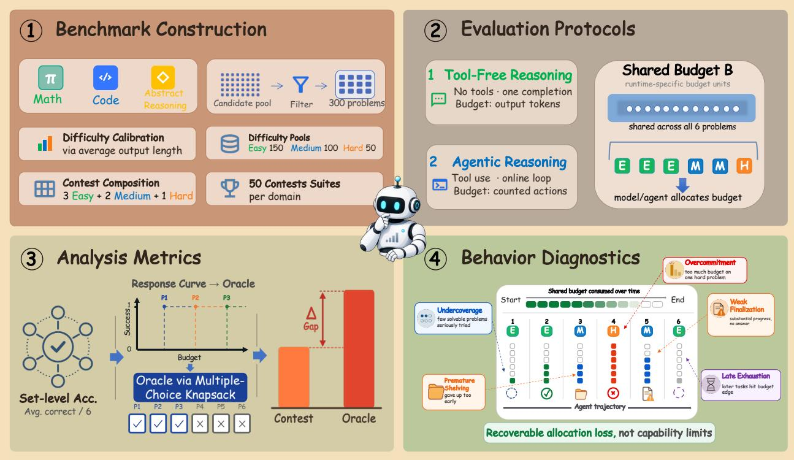  
Figure 2: Overview of R3-BENCH. ⃝1 We construct 50 six-problem contests per domain from frozen 300- problem pools stratified by the average output length of three reference models. Each contest contains three Easy, two Medium, and one Hard problem. ⃝2 The same contests are evaluated in tool-free reasoning and agentic settings under a shared budget, measured in output tokens or counted actions. ⃝3 Per-problem response curves define an offline multiple-choice knapsack oracle that grants each problem one budget level. The contest–oracle gap measures demonstrated competence lost under the shared budget. ⃝4 Trajectory diagnostics characterize how agents observe feedback, revise strategies, and allocate the shared budget.

To reduce dependence on any one model, we average standalone output lengths from three reference models: DeepSeek V4 Pro (DeepSeek-AI et al., 2026), GLM-5.2 (Z.ai, 2026), and GPT-5.5 (OpenAI, 2026). Within each pool, we label the shortest 150 problems Easy, the next 100 Medium, and the remaining 50 Hard. These fixed length-based tiers are shared across evaluated models, used only for construction and analysis, and hidden from the prompts.

Contest construction. After stratification, we construct 50 contests per domain, each containing three Easy, two Medium, and one Hard problem. We keep this difficulty mixture fixed across contests to prevent variation in suite composition from confounding comparisons across models and budgets. The heterogeneous mixture creates a controlled coverage–depth trade-off: a model can spread its budget across several lower-demand problems or invest more deeply in harder ones. Presentation orders are randomized independently of difficulty.

Task formats. Both tool-free reasoning and agentic evaluation use the same two task formats. Difficulty tiers appear in neither prompt; they are used only to balance contests and analyze performance.

In per-task evaluation, each problem is presented independently, measuring standalone problem-solving ability without cross-problem resource allocation.

In contest evaluation, the model receives all six problems in one episode and decides which to attempt and how much shared budget to allocate to each.

Model-specific budget calibration. Models differ substantially in their natural resource-use patterns: some produce longer reasoning traces, while others require more tool or verifier actions to make progress. A single absolute budget would therefore impose unequal pressure across models and confound allocation quality with a model’s native output pattern. Our goal is not to equalize absolute resource limits, but to evaluate each model under the same relative budget pressure. We therefore calibrate the budget against each model’s own unbudgeted resource consumption.

Let $R _ { m , d , c } ^ { \infty }$ denote the resources used by model m on contest c in domain d during an unbudgeted baseline run. Resources are measured as output tokens in the tool-free reasoning setting and counted actions in the agentic setting. Because runs may still hit a runtime safety cap, we compute the baseline using only contests that complete successfully:

$$
R _ { m , d } ^ { \infty } = \frac { 1 } { | \mathcal { C } _ { m , d } ^ { \mathrm { v a l i d } } | } \sum _ { c \in \mathcal { C } _ { m , d } ^ { \mathrm { v a l i d } } } R _ { m , d , c } ^ { \infty } ,
$$

where $\mathcal { C } _ { m , d } ^ { \mathrm { v a l i d } }$ is the set of completed contests. For pressure level $\rho \in \{ 0 . 2 , 0 . 8 \}$ , we set $R _ { m , d } ^ { \rho } = \rho R _ { m , d } ^ { \infty } ,$ rounding when the resource unit is discrete. Thus, $\rho = 0 . 2$ restricts a model to 20% of its natural resource use and represents strong pressure, whereas $\rho = 0 . 8$ represents moderate pressure.

## 3.2 Tool-free reasoning Setting

The tool-free reasoning setting evaluates models without tools, shell access, code execution, or interactive feedback. The model receives a prompt and produces a single free-form completion. The budget is measured in output tokens.

Budgeted contest evaluation. Here $R _ { m , d } ^ { \rho }$ is a token budget $B _ { m , d } ^ { \rho } ,$ passed to the API as max tokens and shown in the prompt as one shared allowance.

## 3.3 Agentic Setting

The agentic setting evaluates tool-using models in a Terminus-2 harness implemented with Harbor (Harbor Framework Team, 2026). Agents can execute commands and code, inspect intermediate results, and submit final answers through designated artifacts. Resource use is measured in counted tool actions. Official correctness feedback is unavailable during the run; correctness is determined only after the episode from the submitted artifacts.

Problem bookkeeping. A global contest-level action budget makes per-problem attribution ambiguous. We therefore add two bookkeeping commands: focus problem <id> and shelve problem to mark the active problem. The agent is instructed to call focus problem <id> before acting on problem <id> and shelve problem before switching problems. These commands are logged separately as free bookkeeping steps and do not consume the shared action budget. They enable per-problem attribution of counted actions, allowing us to analyze how agents spend the shared action budget across Easy, Medium, and Hard problems.

Budgeted contest evaluation. In the agentic setting, the action budget is enforced over parsed executable actions rather than model turns, with each executed counted action consuming one budget unit. Only tool actions that perform problem-solving computation count toward $R _ { m , d } ^ { \rho } ;$ routine file operations remain free. The agent is given the total budget and, through a runtime budget reminder, its used and remaining counts, so it acts against a visible balance (Appendix D). Once the budget is exhausted, the runtime blocks further counted actions but permits bookkeeping and finalization. Correctness is determined from the submitted artifacts. Appendix F provides the complete action-counting rules.

## 3.4 Metrics

Task success. Both settings use the same domainspecific graders and the same binary full-credit criterion. A problem receives one point if its final answer is judged correct and zero otherwise. Our primary outcome is the contest score: the average number of correct answers per six-problem contest. When analyzing performance by difficulty tier or presented position, we additionally report problem-level accuracy.

Allocation quality. We run each problem in isolation on a fixed grid of budget levels, with five independent runs per level, so that its response curve records the empirical success rate at each level. The equal-allocation replay asks whether each problem has an observed successful attempt whose realized resource cost fits within one sixth of the contest budget, and serves as a fixed uniform-allocation baseline. The response-curve oracle instead assigns each problem one nominal budget level, including a zero option, subject to the same total budget, and maximizes the expected number of correct answers implied by the response curves. It is therefore a multiple-choice knapsack over budget levels: the oracle chooses not only which problems to fund but how richly to fund each. Because it has offline access to every problem’s complete empirical response curve, it serves as an empirical best-allocation reference.

Let Contest and Oracle denote their respective average scores. We report

$$
\Delta _ { \mathrm { R R } } = \mathrm { O r a c l e } - \mathrm { C o n t e s t } , \qquad \mathrm { G a p R a t i o } = { \frac { \Delta _ { \mathrm { R R } } } { \mathrm { O r a c l e } } } ,
$$

with the latter defined when Oracle > 0. A smaller gap means that the contest run realizes more of the single-problem competence recorded in the response curves. Appendix E gives the full replay construction and its limitations.

Allocation diagnostics. At the outcome level, we define an oracle-selected miss as a problem selected by the response-curve oracle but missed in the actual contest. For each oracle-selected miss with sufficient evidence, we assign exactly one primary cause: never attempted, attempted too late, stopped after partial progress, spent budget elsewhere, misread tool feedback, wrong format or incomplete finalization, or genuinely unsolved. Misses with insufficient evidence are excluded from the reported cause shares.

Separately, we annotate online adaptation at the trajectory level. We record whether the model observes task-relevant evidence, makes a substantive strategy update in response to a new observation, whether that update is resource-rational with respect to progress, cost, expected value, or remaining budget, and whether the enacted update nevertheless fails to resolve the targeted shortfall. Initial planning and bookkeeping-only changes do not count as strategy updates.

Appendices §J and §N provide additional diagnostics and qualitative cases, while Appendix §K gives the full annotation rubric, denominators, evidence requirements, and decision-regret definitions.

## 4 Benchmarking SOTA LLMs

We benchmark eight recent frontier LLMs: DeepSeek-V4-Chat, DeepSeek-V4-Reasoner, DeepSeek-V4- Pro (DeepSeek-AI et al., 2026), Qwen3.7-Max (Qwen Team, 2026), GLM-5.2 (Z.ai, 2026), Hy-3 (Tencent Hy Team, 2026), GPT-5.5 (OpenAI, 2026), and Claude-Opus-4.8 (Anthropic, 2026). Evaluation spans both settings, three domains, and two budget pressures. Table 2 reports six flagship models; complete eight-model results appear in Appendix H. Model interfaces and inference-time configurations are in Appendix I.

## 4.1 Overall Results

Across the 72 reported model–setting–pressure– domain cells in Table 2, the offline response-curve oracle matches or exceeds the contest score in every cell and is strictly higher in 71, revealing empirical headroom between observed per-task successes and realized shared-budget performance. The agentic setting has a lower Gap Ratio than the tool-free setting in 27 of 36 matched comparisons, while increasing ρ from 0.2 to 0.8 lowers it in 23 of 36. These results indicate that resource-rational allocation remains challenging even with interactive feedback and substantially looser relative budgets.

Although recent frontier LLMs have made substantial progress in long-context processing, we still investigate whether the observed gap could be attributable to the increased context length. We run a target-in-suite diagnostic on two models across both settings and all three domains. All six problems are shown, but only one is designated for solution, using the largest single-problem budget in our response-curve evaluation. Across the resulting 12 model–setting–domain cells, nine show pointestimated losses of at most 5 percentage points relative to problem-matched single-problem controls, with an unweighted descriptive mean control–stress difference of 1.1 percentage points (Appendix O).

## 4.2 Tool-free Reasoning

Tool-Free Contest Scores Fall below the Oracle. A model can solve a problem in a per-task run and still miss it when six problems share one budget. Figure 3 compares the contest score with the equal-allocation replay and the response-curve oracle defined in Section 3.4.

The oracle exceeds the contest score for all six models at both pressure levels, with a mean gap of 1.16 correct answers across the 12 model–pressure pairs. Because the oracle reuses observed per-task successes under the same total budget, this gap shows that a different allocation of the same budget supports more correct answers; it quantifies offline empirical headroom rather than the performance of an executable policy.

Equal allocation provides a second test. $\mathrm { A t } \rho = 0 . 8 ,$ it outperforms the contest for four of the six models: DeepSeek-V4-Pro, Qwen3.7-Max, GLM-5.2, and Claude-Opus-4.8. This fixed uniform split therefore exposes cases where the model’s own allocation reduces performance. Under strong pressure, however, the equal share can become extremely small. For GPT-5.5 at $\rho = 0 . 2 ,$ , the per-problem replay thresholds are only 38, 47, and 6 output tokens for Math, Code, and AR, respectively. Since a problem counts only when an observed correct single-problem attempt finishes within the corresponding realized-cost threshold, the equal-allocation score is near zero. This case also illustrates the limitation of a fixed equal split under severe budget pressure.

Table 2: Main results on $R ^ { 3 } { \bf - B }$ ENCH with domains as columns. For each domain, Contest and Oracle report the average number of correct answers per six-problem suite. Gap Ratio denotes $\Delta _ { \mathrm { R R } }$ /Oracle, where $\Delta _ { \mathrm { R R } } ^ { \mathrm { - } } = \mathrm { O r a c l e - } \mathrm { \bar { C } o n t e s t }$ . Lower Gap Ratio is better. AR denotes abstract reasoning. The lowest Gap Ratios are shown in bold , and the second-lowest in underline .
<table><tr><td rowspan="2">Model</td><td rowspan="2">Regime</td><td colspan="3">Math</td><td colspan="3">Code</td><td colspan="3">AR</td></tr><tr><td>Contest</td><td>Oracle</td><td>Gap Ratio</td><td>Contest</td><td>Oracle</td><td>Gap Ratio</td><td>Contest</td><td>Oracle</td><td>Gap Ratio</td></tr><tr><td>Tool-Free</td><td></td><td></td><td></td><td></td><td></td><td></td><td></td><td></td><td></td><td></td></tr><tr><td rowspan="3"> DeepSeek-V4-Pro</td><td>ρ=0.2</td><td>2.34</td><td>3.94</td><td>40.61%</td><td>1.38</td><td>3.12</td><td>55.77%</td><td>2.24</td><td>4.02</td><td>44.28%</td></tr><tr><td>ρ=0.8</td><td>3.94</td><td>5.08</td><td>22.44%</td><td>3.06</td><td>4.62</td><td>33.77%</td><td>2.90</td><td>4.64</td><td>37.50%</td></tr><tr><td>ρ=0.2</td><td>3.54</td><td>3.70</td><td>4.32%</td><td>1.42</td><td>2.94</td><td>51.70%</td><td>2.76</td><td>4.06</td><td>32.02%</td></tr><tr><td rowspan="2">Qwen3.7-Max</td><td>ρ=0.8</td><td>4.32</td><td>5.06</td><td>14.62%</td><td>3.44</td><td>5.24</td><td>34.35%</td><td>3.82</td><td>4.70</td><td>18.72%</td></tr><tr><td>ρ=0.2</td><td>2.32</td><td>3.08</td><td>24.68%</td><td>0.68</td><td>1.88</td><td>63.83%</td><td>1.14</td><td>3.51</td><td>67.52%</td></tr><tr><td rowspan="2">GLM-5.2</td><td>ρ=0.8</td><td>2.72</td><td>3.72</td><td>26.88%</td><td>1.72</td><td>2.08</td><td>17.31%</td><td>1.70</td><td>4.19</td><td>59.43%</td></tr><tr><td>ρ=0.2</td><td>2.40</td><td>3.36</td><td>28.57%</td><td>1.20</td><td>2.28</td><td>47.37%</td><td>1.56</td><td>3.11</td><td>49.84%</td></tr><tr><td rowspan="2">Hy-3</td><td>ρ=0.8</td><td>3.72</td><td>4.68</td><td>20.51%</td><td>2.96</td><td>3.88</td><td>23.71%</td><td>3.16</td><td>4.16</td><td>24.04%</td></tr><tr><td>ρ=0.2</td><td>0.72</td><td>1.28</td><td>43.75%</td><td>0.68</td><td>1.28</td><td>46.88%</td><td>0.34</td><td>1.94</td><td>82.47%</td></tr><tr><td rowspan="2">GPT-5.5</td><td>ρ=0.8</td><td>2.52</td><td>2.80</td><td>10.00%</td><td>2.60</td><td>3.12</td><td>16.67%</td><td>1.58</td><td>2.75</td><td>42.55%</td></tr><tr><td>ρ=0.2</td><td>3.78</td><td>4.30</td><td>12.09%</td><td>0.60</td><td>1.88</td><td>68.09%</td><td>1.84</td><td>3.11</td><td>40.82%</td></tr><tr><td>米 Claude-Opus-4.8</td><td>ρ=0.8</td><td>4.18</td><td>4.96</td><td>15.73%</td><td>2.68</td><td>3.48</td><td>22.99%</td><td>2.52</td><td>4.15</td><td>39.21%</td></tr><tr><td rowspan="2">Agentic</td><td></td><td></td><td></td><td></td><td></td><td></td><td></td><td></td><td></td><td></td></tr><tr><td>ρ=0.2</td><td>4.48</td><td>5.28</td><td>15.15%</td><td>2.60</td><td>4.90</td><td>46.94%</td><td>4.36</td><td>5.06</td><td>13.83%</td></tr><tr><td rowspan="2">DeepSeek-V4-Pro Qwen3.7-Max</td><td>ρ=0.8</td><td>4.48</td><td>5.40</td><td>17.04%</td><td>4.10</td><td>5.53</td><td>25.86%</td><td>4.12</td><td>5.14</td><td>19.84%</td></tr><tr><td>ρ=0.2</td><td>4.64</td><td>5.14</td><td>9.73%</td><td>2.78</td><td>2.96</td><td>6.08%</td><td>4.62</td><td>4.96</td><td>6.85%</td></tr><tr><td rowspan="2">GLM-5.2</td><td>ρ=0.8</td><td>4.96</td><td>5.34</td><td>7.12%</td><td>4.72</td><td>5.46</td><td>13.55%</td><td>4.80</td><td>5.14</td><td>6.61%</td></tr><tr><td>ρ=0.2</td><td>4.48</td><td>4.58</td><td>2.18%</td><td>2.02</td><td>3.90</td><td>48.21%</td><td>3.78</td><td>4.52</td><td>16.37%</td></tr><tr><td rowspan="2">Hy-3</td><td>ρ=0.8</td><td>4.16</td><td>5.12</td><td>18.75%</td><td>4.06</td><td>5.06</td><td>19.76%</td><td>4.06</td><td>5.04</td><td>19.44%</td></tr><tr><td>ρ=0.2</td><td>1.80</td><td>3.38</td><td>46.75%</td><td>1.00</td><td>3.00</td><td>66.67%</td><td>1.22</td><td>3.14</td><td>61.15%</td></tr><tr><td rowspan="2">GPT-5.5</td><td>ρ=0.8</td><td>1.56</td><td>4.16</td><td>62.50%</td><td>1.38</td><td>3.56</td><td>61.24%</td><td>0.80</td><td>4.32</td><td>81.48%</td></tr><tr><td>ρ=0.2</td><td>3.64</td><td>4.96</td><td>26.61%</td><td>1.92</td><td>2.00</td><td>4.00%</td><td>1.80</td><td>4.92</td><td>63.41%</td></tr><tr><td rowspan="2">米</td><td>ρ=0.8</td><td>4.40</td><td>5.32</td><td>17.29%</td><td>4.80</td><td>5.53</td><td>13.25%</td><td>4.72</td><td>5.24</td><td>9.92%</td></tr><tr><td>ρ=0.2</td><td>4.46</td><td>4.46</td><td>0.00%</td><td>2.24</td><td>3.56</td><td>37.08%</td><td>3.77</td><td>3.88</td><td>2.84%</td></tr><tr><td rowspan="2">Claude-Opus-4.8</td><td>ρ=0.8</td><td>4.85</td><td>5.02</td><td>3.39%</td><td>4.52</td><td>5.08</td><td>11.02%</td><td>5.12</td><td>5.34</td><td>4.12%</td></tr><tr><td></td><td></td><td></td><td></td><td></td><td></td><td></td><td></td><td></td><td></td></tr></table>

Later Positions Receive Fewer Valid and Correct Answers. Figure 4 shows that position 6 has lower accuracy than position 1 in all 12 underlying model– pressure series. Appendix Figure 12 provides a corresponding trajectory diagnostic: the answered rate falls and the judged budget-truncation rate rises from the first to the last position in all 12 series.

Together, the oracle, equal-allocation, and position diagnostics indicate that tool-free models do not fully translate observed per-task successes into suite-level reward. Presentation order is randomized independently of difficulty, so the position gradient points to one mechanism: spending follows the order in which problems arrive rather than their worth. Under strong pressure, the first position absorbs 20.5–52.9% of attributed output, compared with 16.9–23.5% under moderate pressure. Five of the six models show stronger early-position concentration under $\rho = 0 . 2 ,$ with Qwen as the exception.

## 4.3 Agentic Reasoning

The agentic setting lets a model probe problems, observe tool feedback, track the remaining budget, and reallocate resources mid-contest, creating an opportunity for online adaptation. We ask whether models make substantive strategy updates after observing difficulty or feedback, and what causes the remaining oracle gaps.

Online Strategy Changes Remain Limited. Figure 5 shows a clear drop from observing the environment to changing the allocation strategy. DS-Pro, Qwen, GLM, and Opus make substantive strategy updates in only 38.5% to 63.4% of their equaldomain macro trajectories, and Hy and GPT make none. Many trajectories observe tool feedback yet continue with the existing strategy, falling short of the intended online budget reallocation across problems.

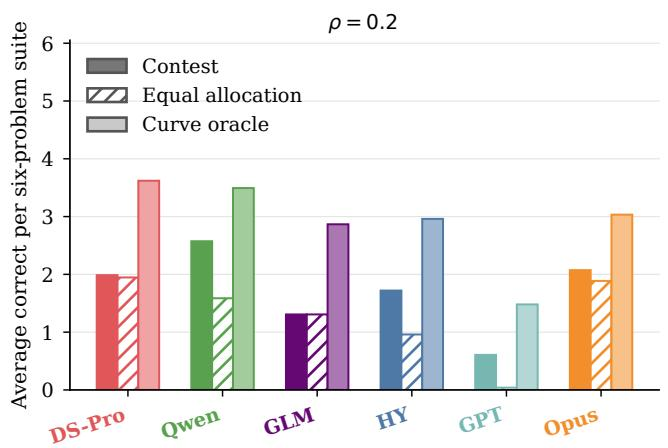

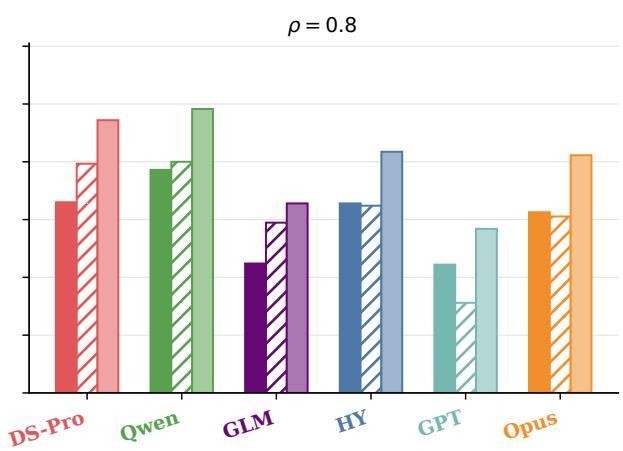  
Figure 3: Tool-free contest performance, equal-allocation replay, and response-curve oracle under strong $( \rho =$ 0.2) and moderate $( \rho = 0 . { \bar { 8 } } )$ budget pressure. Results are averaged equally over mathematics, competitive programming, and abstract reasoning. The unit is average correct answers per six-problem suite.

Failure Modes Shift with Budget Pressure. Figure 6 summarizes the primary causes of oracleselected misses across models and budget pressures. Each oracle-selected miss receives one primary cause (Appendix K), and which cause dominates shifts with

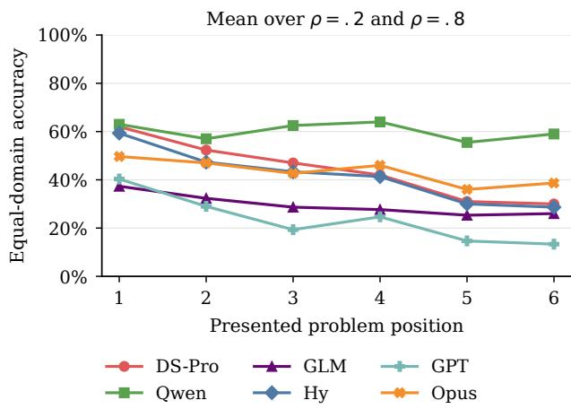  
Figure 4: Tool-free accuracy by presented position, averaged over strong and moderate budget pressure. Means are unweighted over available domains, with missing domains omitted. Accuracy declines from position 1 to position 6 in every model–pressure series.

pressure.

Under strong pressure $( \rho = 0 . 2 )$ , the largest category for most models is spent budget elsewhere: the shared budget went to other problems, so allocation across problems is what fails. This category accounts for 42%, 95%, 66%, and 59% for GLM, Hy, GPT, and Opus, respectively. Qwen is instead dominated by attempted too late(40%), while DS-Pro shows a more dispersed pattern, led by finalization (27%) and misread toolfeedback (24%).

Under moderate pressure $( \rho ~ = ~ 0 . 8 )$ , the largest category becomes stopped after partial progress for DS-Pro, GLM, Hy, and GPT, accounting for $6 7 \% ,$ 38%, 38%, and 55%, respectively. In these cases, the model opens a problem it has already solved in isolation and abandons it before submitting an answer. Qwen remains dominated by attempted too late (43%), while Opus shows an even four-way split (25% each).

Because the oracle selects only problems whose observed isolated costs jointly fit the shared budget, such stops indicate under-investment rather than a capability limit. Misallocation therefore persists at $\rho = 0 . 8$ and shifts from which problems receive budget to how much they receive.

## 4.4 The Allocation Gap Is Not Explained by General Capability

The Epoch Capabilities Index (ECI) (Ho et al., 2025) stitches over fifty benchmarks into a single capability scale, making it the closest available summary of what current evaluations measure. We compare it with Gap Ratio, which is itself a within-model quantity because the oracle is built from each model’s own isolated successes; we ask whether higher general capability still predicts better allocation.

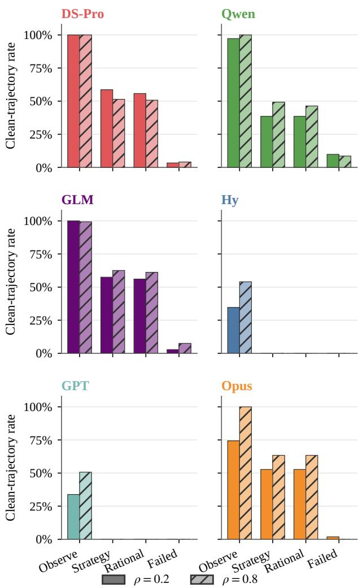  
Figure 5: Online adaptation in the agentic setting. Rates are equal-domain macros over clean trajectories; the annotation rubrics are provided in Appendix K.

Capability distance carries no information about allocation quality. The four model pairs within 3 ECI points differ by 9.6–21.0 percentage points in mean absolute Gap Ratio across the twelve cells, and the six pairs more than 4 points apart differ by 12.0–19.2 points: the same spread. Orderings invert as well; in tool-free Math at $\rho { = } 0 . 2$ the highest-ECI model has the largest Gap Ratio (43.75%) and a mid-ranked model the smallest (4.32%; see Table 12 in Appendix H). Over the capability range we can test, then, a composite of over fifty benchmarks does not predict how well a model spends a shared budget: $R ^ { 3 } – \mathrm { B E N C H }$ exposes a dimension that existing evaluations leave uncovered.

## 5 Recovering the Allocation Gap

Section 4 establishes that the allocation gap is broad across the evaluated models. We now ask a narrower question: can a lightweight online scheduling constraint recover part of that gap? We use three models as a diagnostic subset spanning distinct regimes. DeepSeek-V4-Pro is a strong solver across mathematics, code, and abstract reasoning whose Code result still leaves a substantial gap to the response-curve oracle, making it a useful reference for recoverability. GLM-5.2 is domain sensitive: its agentic gaps and its response to intervention vary sharply by domain, so it tests whether an online scheduler must adapt to the kind of evidence a task provides. Hy-3 is a high-gap boundary case, with the largest mean agentic Gap Ratio across the three domains and no substantive strategy updates under the conservative trajectory rubric of Section 4, so it tests whether external scheduling can compensate for weak internal adaptation. We compare the contest reference with two online interventions while holding the agentic loop fixed. Neither intervention reveals answer labels, difficulty labels, response curves, or oracle-selected problems; both use only runtime-visible coverage, budget, and candidate-state information. Strategy A enforces initial coverage: before spending a second paid step on one problem, the agent must give every visible problem a focused probe. Strategy B adds a lightweight verification gate that, once coverage is complete, limits repeated paid checks on a stable candidate unless the candidate is revised. All runs use the agentic setting under strong budget pressure $( \rho = 0 . 2 ) ;$ implementation details are given in Appendix M.

Online scheduling is useful but domain dependent. An intervention beats the contest reference in six of the nine model–domain cells, but no policy dominates: the contest reference, A, and B each take the best non-oracle score in three rows (Table 3). The only regularity is by domain rather than by model. Code improves under both interventions for every model, whereas Math and AR are model dependent and scheduling sometimes hurts. We attribute this to the feedback each domain provides at runtime: compilation and tests make Code probes informative, so coverage exposes which problems deserve more budget, while the weaker signals in Math and AR let shallow checks consume budget without indicating where more reasoning will pay off. Scheduling helps most when runtime feedback tracks the value of more computation.

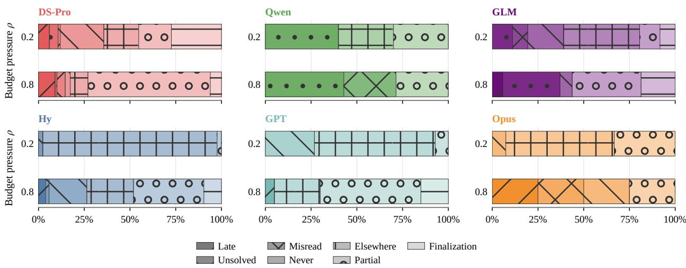  
Figure 6: Primary causes of positive oracle gaps across models and budget pressures. Segment widths show equal-domain macro shares. Budget spent elsewhere dominates for several models under strong pressure, and partial progress becomes the largest category for most models under moderate pressure.

More complex directives do not guarantee better allocation. Adding verification changes the effect of coverage rather than uniformly improving it: B trails A in every Code row, leads in every AR row, and splits in Math. The gate helps when checks resolve uncertainty and interferes when they only consume budget. The directional split argues against treating directive complexity as a monotone design axis.

Hy-3 marks the limit of external scheduling: its best non-oracle scores stay far below the oracle in all domains, and its Code gain does not extend to Math or AR. Static directives redirect computation but do not replace the model’s own ability to interpret progress and revise its plan.

These results motivate an inner scheduling policy implemented through training. The policy can be trained to condition its decisions on the task domain, the quality of current progress, and the remaining budget, and to select when to cover, continue, switch, verify, or stop. Such a policy could preserve domainspecific behavior and reduce interference with correct model decisions. Training and evaluating this policy remain future work. The intervention study highlights the limited cross-domain generality of a single fixed directive.

## 6 Conclusion

We introduced $R ^ { 3 } .$ -BENCH, a benchmark for resourcerational reasoning under a shared computational budget. Existing benchmarks evaluate problems independently. $R ^ { 3 } – \mathrm { B E N C H }$ instead places several problems under one shared budget. It compares contest performance with what the same model has already demonstrated on single problems. The benchmark covers mathematics, competitive programming, and abstract reasoning. In both tool-free and agentic settings, current models leave a persistent gap to their response-curve oracle. Single-problem competence therefore does not guarantee effective allocation across problems.

Table 3: Online scheduler results for DeepSeek-V4- Pro, GLM-5.2, and Hy-3 in the Agentic setting at $\rho = 0 . 2$ . Bold marks the best non-oracle score in each model–domain row.
<table><tr><td rowspan="2">Model</td><td rowspan="2">Domain</td><td colspan="4">Score</td></tr><tr><td>Contest Reference</td><td>A</td><td>B</td><td>Oracle</td></tr><tr><td rowspan="3">DeepSeek-V4-Pro</td><td>Math</td><td>4.48</td><td>4.56</td><td>4.90</td><td>5.28</td></tr><tr><td>Code</td><td>2.60</td><td>4.10</td><td>3.86</td><td>4.90</td></tr><tr><td>AR</td><td>4.36</td><td>4.32</td><td>4.72</td><td>5.06</td></tr><tr><td rowspan="3">GLM-5.2</td><td>Math</td><td>4.48</td><td>4.04</td><td>4.20</td><td>4.58</td></tr><tr><td>Code</td><td>2.02</td><td>2.92</td><td>2.66</td><td>3.90</td></tr><tr><td>AR</td><td>3.78</td><td>4.10</td><td>4.44</td><td>4.52</td></tr><tr><td rowspan="3">Hy-3</td><td>Math</td><td>1.80</td><td>1.64</td><td>1.58</td><td>3.38</td></tr><tr><td>Code</td><td>1.00</td><td>1.56</td><td>1.36</td><td>3.00</td></tr><tr><td>AR</td><td>1.22</td><td>0.48</td><td>0.70</td><td>3.14</td></tr></table>

The gap reflects failures in both where and how much computation is allocated. Under strong pressure, models often spend the shared budget on other problems, while under moderate pressure they more often stop after partial progress. Online adaptation and lightweight external scheduling can alleviate this gap, but they do not close it. Broader coverage helps when runtime feedback is informative, but can hurt when shallow probes provide weak evidence. Resource-rational reasoning therefore requires more than additional computation. It requires policies that decide when to continue, when to switch, and where to spend the remaining budget. Learning such an internal allocation policy is a promising future direction.

## References

Agyemang, J. O.; Kponyo, J. J.; Somuah, O. K.; Amponsah, E.; Boakye, G. M. A.; and Agyekum, K. O.-B. O. 2026. HiveMind: OS-Inspired Scheduling for Concurrent LLM Agent Workloads. arXiv preprint arXiv:2604.17111.

Alshammari, S.; Wen, K.; Zainal, A.; Hamilton, M.; Safaei, N.; Albarakati, S.; Freeman, W. T.; and Torralba, A. 2026. MathNet: A Global Multimodal Benchmark for Mathematical Reasoning and Retrieval. In The Fourteenth International Conference on Learning Representations.

Anderson, J. R. 1991. Is human cognition adaptive? Behavioral and brain sciences, 14(3): 471–485.

Anthropic. 2026. Introducing Claude Opus 4.8. https://www.anthropic.com/news/claudeopus-4-8. Published May 28, 2026; accessed July 12, 2026.

DeepSeek-AI; Xu, A.; Lin, B.; Xue, B.; Wang, B.; Xu, B.; Wu, B.; Zhang, B.; Lin, C.; Dong, C.; Ling, C.; et al. 2026. DeepSeek-V4: Towards Highly Efficient Million-Token Context Intelligence. arXiv preprint arXiv:2606.19348.

Gao, B.; Song, F.; Yang, Z.; Cai, Z.; Miao, Y.; Dong, Q.; Li, L.; Ma, C.; Chen, L.; Xu, R.; Tang, Z.; Wang, B.; Zan, D.; Quan, S.; Zhang, G.; Sha, L.; Zhang, Y.; Ren, X.; Liu, T.; and Chang, B. 2025. Omni-MATH: A Universal Olympiad Level Mathematic Benchmark for Large Language Models. In The Thirteenth International Conference on Learning Representations.

Gim, I.; Chen, G.; Lee, S.-s.; Sarda, N.; Khandelwal, A.; and Zhong, L. 2024. Prompt cache: Modular attention reuse for low-latency inference. Proceedings of Machine Learning and Systems, 6: 325–338.

Hamri, M.; and Talgam-Cohen, I. 2026. ZEBRA: Zero-Shot Budgeted Resource Allocation for LLM Orchestration. arXiv preprint arXiv:2605.20485.

Han, T.; Wang, Z.; Fang, C.; Zhao, S.; Ma, S.; and Chen, Z. 2025. Token-Budget-Aware LLM Reasoning. In Findings of the Association for Computational Linguistics: ACL 2025, 24842–24855.

Harbor Framework Team. 2026. Harbor: A framework for evaluating and optimizing agents and models in container environments.

Hendrycks, D.; Burns, C.; Kadavath, S.; Arora, A.; Basart, S.; Tang, E.; Song, D.; and Steinhardt, J. 2021. Measuring Mathematical Problem Solving With the MATH Dataset. NeurIPS.

Hitzig, Z.; Massenkoff, M.; Lyubich, E.; Zhang, S.; Heller, R.; and McCrory, P. 2026. Agentic Coding and Persistent Returns to Expertise. Technical report, Anthropic.

Ho, A.; Denain, J.-S.; Atanasov, D.; Albanie, S.; and Shah, R. 2025. A Rosetta Stone for AI Benchmarks. arXiv preprint arXiv:2512.00193.

International Collegiate Programming Contest. 2026. 2026 ICPC World Finals Rules. Accessed: 2026-07- 11.

International Olympiad in Informatics. 2002. Format of the IOI Competition.

Jimenez, C. E.; Yang, J.; Wettig, A.; Yao, S.; Pei, K.; Press, O.; and Narasimhan, K. 2024. SWE-bench: Can Language Models Resolve Real-World GitHub Issues? In International Conference on Learning Representations, volume 2024, 54107–54157.

Johnston, D.; Holtz, D.; Richmond, A. M.; Ong, C.; Tambe, P.; and Chatterji, A. 2026. The Shift to Agentic AI: Evidence from Codex. arXiv preprint arXiv:2606.26959.

Li, X.; Ming, R.; Setlur, P.; Paladugu, A.; Tang, A.; Kang, H.; Shao, S.; Jin, R.; and Xiong, C. 2026. Benchmark Test-Time Scaling of General LLM Agents. arXiv preprint arXiv:2602.18998.

Li, Z.; Dong, Q.; Ma, J.; Zhang, D.; Jia, K.; and Sui, Z. 2025. SelfBudgeter: Adaptive Token Allocation for Efficient LLM Reasoning. arXiv preprint arXiv:2505.11274.

Lieder, F.; and Griffiths, T. L. 2020. Resource-rational analysis: Understanding human cognition as the optimal use of limited computational resources. Behavioral and brain sciences, 43: e1.

Liu, T.; Wang, Z.; Miao, J.; Hsu, I.; Yan, J.; Chen,J.; Han, R.; Xu, F.; Chen, Y.; Jiang, K.; et al. 2025.

Budget-aware tool-use enables effective agent scaling. arXiv preprint arXiv:2511.17006.

Liu, X.; Yu, H.; Zhang, H.; Xu, Y.; Lei, X.; Lai, H.; Gu, Y.; Ding, H.; Men, K.; Yang, K.; et al. 2024. Agent-Bench: Evaluating LLMs as Agents. In International Conference on Learning Representations, volume 2024, 52989–53046.

Lou, C.; Sun, Z.; Liang, X.; Qu, M.; Shen, W.; Wang, W.; Li, Y.; Yang, Q.; and Wu, S. 2025. AdaCoT: Pareto-Optimal Adaptive Chain-of-Thought Triggering via Reinforcement Learning. arXiv preprint arXiv:2505.11896.

Mialon, G.; Fourrier, C.; Wolf, T.; LeCun, Y.; and Scialom, T. 2024. GAIA: A Benchmark for General AI Assistants. In International Conference on Learning Representations, volume 2024, 9025–9049.

OpenAI. 2026. Introducing GPT-5.5. https:// openai.com/index/introducing-gpt-5-5/. Published April 23, 2026.

Qwen Team. 2026. Qwen3.7: The Agent Frontier.

Rein, D.; Hou, B. L.; Stickland, A. C.; Petty, J.; Pang, R. Y.; Dirani, J.; Michael, J.; and Bowman, S. R. 2023. GPQA: A Graduate-Level Google-Proof Q&A Benchmark. arXiv preprint arXiv:2311.12022.

Snell, C.; Lee, J.; Xu, K.; and Kumar, A. 2024. Scaling LLM Test-Time Compute Optimally Can Be More Effective than Scaling Model Parameters. arXiv preprint arXiv:2408.03314.

Stojanovski, Z.; Stanley, O.; Sharratt, J.; Jones, R.; Adefioye, A.; Kaddour, J.; and Kopf, A. 2025. Reasoning¨ Gym: Reasoning Environments for Reinforcement Learning with Verifiable Rewards. In Advances in Neural Information Processing Systems, volume 38.

Tang, J.; Zhang, Q.; Li, Y.; Chen, N.; and Li, J. 2025. GraphArena: Evaluating and Improving Large Language Models on Graph Computation. In International Conference on Learning Representations.

Tencent Hy Team. 2026. Hy3: Model Card and Weights. https://huggingface.co/tencent/Hy3. Hugging Face model repository, accessed July 12, 2026.

Wan, X.; Zhu, S.; Cai, J.; Chen, G.; Huang, X.; Zhou, W.; and Sun, M. 2026. The Shadow Price of Reasoning: Economic Perspective on Optimal Budget Allocation for LLMs. arXiv preprint arXiv:2606.03092.

Wang, J.; Jain, S.; Zhang, D.; Ray, B.; Kumar, V.; and Athiwaratkun, B. 2024. Reasoning in Token Economies: Budget-Aware Evaluation of LLM Reasoning Strategies. In Proceedings of the 2024 Conference on Empirical Methods in Natural Language Processing, 19916–19939.

Wei, J.; Wang, X.; Schuurmans, D.; Bosma, M.; Xia, F.; Chi, E.; Le, Q. V.; Zhou, D.; et al. 2022. Chain-ofthought prompting elicits reasoning in large language models. Advances in neural information processing systems, 35: 24824–24837.

Z.ai. 2026. GLM-5.2: Built for Long-Horizon Tasks. https://z.ai/blog/glm-5.2. Published June 16, 2026.

Zhang, B.; Ma, R.; Jiang, Q.; Wang, P.; Chen, J.; Xie, Z.; Chen, X.; Wang, Y.; Ye, F.; Li, J.; et al. 2025. Sentient Agent as a Judge: Evaluating Higher-Order Social Cognition in Large Language Models. arXiv preprint arXiv:2505.02847.

Zheng, Z.; Cheng, Z.; Shen, Z.; Zhou, S.; Liu, K.; He, H.; Li, D.; Wei, S.; Hao, H.; Yao, J.; et al. 2025. LiveCodeBench Pro: How Do Olympiad Medalists Judge LLMs in Competitive Programming? arXiv preprint arXiv:2506.11928.

Zhou, L.; Shi, J.; Gao, J.; and Wang, D. 2026. Credit-Budgeted ICPC-Style Coding: When LLM Agents Must Pay for Every Decision. In The Fourteenth International Conference on Learning Representations.

## Appendix Contents

A Data Sources . . 13   
B Protocol for Thinking Models . 13   
C Answer Parsing and Judging 14   
D Evaluation Prompt Templates . 16   
E Response-Curve Oracle and Offline Knapsack Re  
play . . 20   
F Action Accounting and Tool Whitelist in the Agentic   
Setting . 23   
G Budget Calibration . 24   
H Detailed Shared-Budget Contest Results . 25   
Model Interfaces and Experimental Configuration 25   
Additional Analyses under Budget Pressure . 25   
K Human Annotation of Trajectories . . 29   
L Behavioral Coordinate . 32   
M Online Scheduler Directives 33   
N Trajectory-Level Case Studies of Allocation Failure and   
Recovery 34   
O Target-in-Suite Context-Stress Diagnostic . 37

## A Data Sources

Omni-MATH (Gao et al., 2025) is an Olympiad-level mathematics benchmark designed to evaluate advanced mathematical reasoning in large language models. The dataset contains 4,428 text-only competition problems, collected from contest pages and AoPS-style sources and further verified through human annotation. It spans more than 33 mathematical subdomains and over 10 difficulty levels, enabling fine-grained analysis across both topic areas and problem complexity. In addition to standard answer checking, Omni-MATH provides model-based evaluation through GPT-4o and the open-source Omni-Judge verifier for assessing open-ended mathematical solutions.

MathNet (Alshammari et al., 2026) is a largescale multilingual and multimodal benchmark for Olympiad-level mathematical reasoning and retrieval. Its main corpus comprises 30,676 expertauthored problems with solutions, covering 47 countries, 16 languages, and diverse mathematical domains. Beyond direct problem solving, MathNet introduces retrieval-oriented tasks based on mathematically equivalent or structurally similar problem pairs, supporting evaluation of math-aware retrieval and retrieval-augmented problem solving. This design makes it suitable for assessing not only generative mathematical reasoning, but also whether models can recognize deep structural similarity across notation, language, and modality.

LiveCodeBench Pro (Zheng et al., 2025) is a continuously updated competitive-programming benchmark for evaluating code-centric reasoning under reduced data-contamination risk. The benchmark contains 584 high-quality problems, collected before April 25, 2025, from top-tier contests including Codeforces, ICPC, and IOI, while excluding more contamination-prone sources such as LeetCode. Each problem is annotated by Olympiad medalists with algorithmic skill tags and cognitive-focus labels such as knowledge-heavy, observation-heavy, and logicheavy. Together with Codeforces-style difficulty tiers and Elo-based evaluation, LiveCodeBench Pro provides both aggregate performance measures and finegrained diagnostics of model failures in competitive programming.

Reasoning Gym (Stojanovski et al., 2025) is a procedural collection of reasoning environments for reinforcement learning with verifiable rewards, rather than a fixed static dataset. It provides over 100 data generators and automatic verifiers across domains such as algebra, arithmetic, computation, cognition, geometry, graph theory, logic, and games. Each environment can generate virtually unlimited problem instances with controllable difficulty and algorithmic scoring, making it useful for both systematic evaluation and curriculum-style reinforcement learning. This design allows researchers to study reasoning ability under adjustable complexity while avoiding the limitations of finite, memorization-prone benchmark sets.

## B Protocol for Thinking Models

For the reported tool-free two-stage runs of thinking models, we separate budgeted problem solving from answer finalization. This protocol is not used in the agentic setting, where models interact with tools and write final artifacts directly.

Stage 1: reasoning and drafting. Stage 1 is the problem-solving stage. The model receives either one problem or the full six-problem suite and runs with thinking or reasoning enabled. A single-problem run uses its budget for that problem; a contest run allocates one shared budget across the six problems. In both settings, the model is instructed to preserve candidate final answers, partial results, or complete candidate programs whenever possible.

In all three domains, the run-specific budget $B _ { m , d } ^ { \rho } ,$ where $\rho \in \{ 0 . 2 , 0 . 8 \}$ , is applied to Stage 1. Stage 2 does not draw on this budget. Configured caps and provider-reported token usage are recorded separately for both stages.

Stage 2: finalization. Stage 2 runs with thinking disabled and receives no reference answers, hidden tests, verifier outcomes, or correctness feedback. Its role is to convert the stopped Stage 1 output into the required answer format rather than to serve as an independently evaluated solve attempt.

For the reported mathematics and abstractreasoning contests, Stage 2 is a trace-only finalizer. It is not given the original problem statements. It receives only the available Stage 1 reasoning content and visible output. It is instructed to extract answers supported by that material and to return a missinganswer marker when the available information is insufficient. This is a prompt-level restriction. We audit compliance manually, as reported below.

For the reported coding thinking-model contests, Stage 2 is a trace-only finalizer under the same rule. It is not given the original problem statements. It receives the available Stage 1 reasoning content and visible output and prints the complete C++ programs submitted to the verifier. It is instructed to produce only programs supported by the Stage 1 trace.

Budget accounting and judging. Budget accounting is uniform across the three domains: in every case the metered quantity is Stage 1 completion tokens, and Stage 2 output is logged separately rather than charged. In contests, Stage 1 usage is charged against the run-specific budget $B _ { m , d } ^ { \rho } .$ . In single-problem response-curve runs, the charged cost is the configured grid level rather than the realized usage of the individual run, as specified in Appendix E.

Two properties prevent the uncharged Stage 2 from acting as extra problem-solving capacity. It runs with thinking disabled and without the original problem statements, so it cannot solve a problem that Stage 1 left unsolved, and it must emit a missing-answer marker, or MISSING for coding, whenever the trace does not support an answer. Because these requirements are prompt-level, we record Stage 2 token usage, finish reasons, and API or parsing failures separately and report them as protocol outcomes. Stage 2 calls remain subject to ordinary runtime and provider safety limits. The resulting outputs are graded by the domain-specific pipelines described in Appendix C.

Manual audit of Stage 2. We verified directly that the prompt-level restriction holds in the reported runs. The audit covers the five models with a separate reasoning channel, at both pressure levels and in all three domains, giving $5 \times 2 \times 3 = 3 0$ model– pressure–domain cells; from each cell we drew 10 Stage 2 calls at random, for 300 audited calls. For each call we paired the Stage 2 output with its own Stage 1 trace and required every emitted answer, and for coding every emitted program, to correspond to a candidate answer or candidate program already present in that trace; we then checked the Stage 2 output for derivation steps or algorithms that the trace does not contain. No audited call re-solved a problem. Every Stage 2 output was attributable to Stage 1 material, and none introduced a new derivation or a new algorithm. Stage 2 thus behaves as the formatting channel the protocol specifies, and its uncharged tokens do not supply problem-solving capacity that would affect comparability across budgets.

Interpretation. The two-stage protocol reduces a formatting-related confound in reasoning-mode evaluation. Under a small output cap, a model may consume most of its allowance in the reasoning channel before emitting parseable final answers. Separating reasoning and drafting from finalization avoids requiring every answer to be printed before Stage 1 stops, so in all three domains the budget measures reasoning and drafting rather than transcription. Models without a separate reasoning channel are evaluated in a single stage, so their final-answer tokens are charged to $B _ { m , d } ^ { \rho }$ . Finalization failures remain visible: Stage 2 cap hits, API errors, parser failures, and missing outputs are retained as separately logged protocol outcomes.

## C Answer Parsing and Judging

This appendix specifies how model outputs are parsed into problem-level answers and how those answers are judged. For each domain and setting, we define the required answer artifact, the parser that extracts per-problem answers, the judge or verifier that assigns correctness, and the treatment of missing, malformed, or unparsable outputs. Correctness is assigned at the problem level and then aggregated to the contest level. Behavioral labels used in trajectory analyses are diagnostic only and are not used to compute accuracy, oracle scores, or contest rewards. Table 5 summarizes the answer contract, final artifact, and correctness judge for each domain.

Problem-level scoring. Each contest c contains six problems $\{ p _ { c , i } \} _ { i = 1 } ^ { 6 }$ . Let

$$
\mathcal { E } _ { \mathrm { p a r s e } } = \{ \mathsf { M i s s i n g } , \mathsf { M a l f o r m e d } , \mathsf { U n p a r s a b l e } \} .
$$

Given a model output or final artifact y, the domainand setting-specific parser produces one record per

R3-Bench: LLMs Struggle with Resource-Rational Reasoning under Shared Budgets
<table><tr><td>Domain</td><td>Stage 2 input</td><td>Finalization constraint</td></tr><tr><td>only finalizer</td><td>Mathematics / AR trace- Stage 1 reasoning and visible output; no original problem statements</td><td>Extracts trace-supported answers and re- turns a missing-answer marker when the trace is insufficient</td></tr><tr><td>izer</td><td>Coding trace-only final- Stage 1 reasoning and visible output; no original problem statements</td><td>Prints complete trace-supported C++ pro- grams, or MISS ING when the trace is insuf- ficient</td></tr></table>

Table 4: Two-stage protocols used by the reported Tool-free thinking-model contests. In all three domains, Stage 1 receives the run-specific budget $B _ { m , d } ^ { \rho }$ and Stage 2 output is logged separately rather than charged to that budget.
<table><tr><td>Domain</td><td>Pure-NL answer contract</td><td>Agentic final artifact</td><td>Correctness judge</td></tr><tr><td>Mathematics</td><td>\boxed{ . . . } final answer</td><td>/logs/artifacts/answer.txt</td><td>Boxed-answer extraction followed by an offline model-based equivalence judge</td></tr><tr><td>Competitive programming</td><td>Complete standalone C++17 solution, /app/solution_A. cpp- usually in a fenced code block</td><td>/app/solution_F.cpp</td><td>LightCPVerifier over hidden tests; AC- CEPTED is correct</td></tr><tr><td>Abstract reasoning</td><td>swer</td><td>&lt;answer&gt;...&lt;/answer&gt; final an- /logs/artifacts/answer.txt</td><td>Reasoning Gym answer extraction and dataset-specific scorers</td></tr></table>

Table 5: Domain-specific answer contracts and correctness judges. $R ^ { 3 } .$ -BENCH does not use one global judge for all domains.

problem:

$$
\begin{array} { c } { r _ { c , i } = \mathrm { P a r s e } _ { d , s } ( y , p _ { c , i } ) } \\ { \in \mathcal { A } _ { d } \cup \mathcal { E } _ { \mathrm { p a r s e } } . } \end{array}
$$

Here, d is the domain, s is the evaluation setting, and $\mathcal { A } _ { d }$ is the domain-specific answer space. Missing means that no eligible answer or final artifact is present; Malformed means that output exists but violates the required structural contract; and Unparsable means that the output is present but cannot be converted by the parser into a domain-specific answer record.

If the parser returns an answer $\hat { a } _ { c , i } ~ \in ~ \mathcal { A } _ { d } ,$ , the domain-specific judge assigns a binary correctness label

$$
z _ { c , i } = \mathrm { J u d g e } _ { d } ( p _ { c , i } , \hat { a } _ { c , i } ) \in \{ 0 , 1 \} .
$$

Offline judges may use the domain’s reference answer, hidden tests, or dataset-specific verifier, but those signals are unavailable to the solver during the run. Parser-error states receive zero credit. If the parser returns an answer but the downstream judge or verifier fails, times out, or returns an invalid status, the problem is also assigned zero credit and the failure is retained as a diagnostic status. When a domain scorer returns a numeric score, the main accuracy tables binarize full credit.

The contest score is the number of correct answers in the six-problem suite,

$$
Z _ { c } = \sum _ { i = 1 } ^ { 6 } z _ { c , i } ,
$$

and the reported contest-level accuracy is $Z _ { c } / 6 ,$ averaged over contests. Difficulty-specific accuracies are computed by aggregating the same problem-level labels within the Easy, Medium, and Hard buckets. The with-difficulty and without-difficulty variants use the same parsing, judging, and aggregation pipeline; the only difference is whether difficulty labels are shown in the prompt.

Tool-free parsing. In the tool-free setting, the model produces one non-interactive completion. In singleproblem runs, the parser extracts one answer according to the domain’s canonical answer contract. In contest runs, the parser first decomposes the completion into six problem-level sections and then applies the same domain-specific extraction rule to each section.

For coding, single-problem parsing extracts a C++ solution from structured or fenced code first and falls back to a complete int main program when available. Contest parsing is stricter: the expected output is divided into Problem A through Problem F sections, each containing one C++ solution. If section labels are absent, the parser may use an ordered fallback only when exactly six code blocks are present. Missing sections, duplicate labels, multiple code blocks in one section, unclosed fences, or malformed stage outputs are recorded as parser failures and are not submitted for credit.

For mathematics, the requested final answer format is a boxed answer. Contest outputs are split into six numbered problem sections, with a fallback search for problem-level final-answer lines. If no answer can be found for a problem, the judged solution is treated as no answer rather than as a valid mathematical expression. Correctness is then decided by an offline equivalence judge that compares the model answer to the reference answer and returns a binary equivalence decision.

For abstract reasoning, the parser extracts <answer>...</answer> tags, with a fallback for final-answer lines when available, and passes the result to the corresponding Reasoning Gym scorer. Some scorers return numeric values; for the main accuracy tables, full credit is binarized as score = 1.0.

Two-stage extraction and finalization. For reasoning-mode models, Appendix B defines the two-stage protocol. Here we specify how the Stage 2 output enters the grading pipeline. In the reported coding thinking-model contests, Stage 2 is a trace-only finalizer. It receives Stage 1 reasoning content and visible output, but not the original problem statements, and emits one complete C++17 program or MISSING for each of Problems A–F. The requirement to use only trace-supported material is imposed by the prompt. The resulting Stage 2 programs are parsed and evaluated independently by LightCPVerifier.

In mathematics and abstract reasoning, Stage 2 is a finalizer over the stopped scratchpad and visible partial answers, and its output is passed to the ordinary parser and judge. In every domain, Stage 2 tokens are recorded separately as formatting overhead and Stage 2 is not treated as an additional independent solve attempt, although coding finalization carries the stricter requirement of serializing complete executable programs.

Agentic parsing and final artifacts. In the agentic setting, correctness is based on eligible final artifacts after task completion, timeout, or budget exhaustion, rather than on live judge feedback. For coding, the agent writes one solution file per contest problem: /app/solution A.cpp through /app/solution F.cpp. Each file is judged independently by LightCPVerifier. If a required solution file is absent, the corresponding problem is marked as a missing solution and receives zero credit. Non-ACCEPTED verdicts, including wrong answer, compilation error, runtime error, timeout, and verifier errors, are recorded as diagnostic statuses but receive no correctness credit.

For mathematics and abstract reasoning, the agent writes final answers to /logs/artifacts/answer.txt. The mathematics grader extracts boxed answers from the relevant problem sections and then applies the offline equivalence-judging protocol. If no boxed answer is found for a problem, the problem receives zero credit and contributes to the missingbox rate. The abstract-reasoning grader extracts <answer>...</answer> tags and uses Reasoning Gym scorers; missing tags receive zero credit and contribute to the missing-answer-tag rate. Details of which finalization actions are counted or free under each agentic policy are given in Appendix F. Across all domains, missing artifacts, parser failures, malformed outputs, and downstream judge or verifier failures receive zero credit and are retained only as diagnostic statuses.

Separation from behavior labels and oracle replay. Correctness labels from the domain-specific judges are the only labels used for problem accuracy, contest score, and response-curve oracle construction. Behavioral labels from the human trajectory annotation in Appendix K are used for diagnostics only and never affect whether a problem is counted correct. Likewise, the response-curve oracle in Appendix E does not introduce a new judge: it only reallocates budget over single-problem outcomes that have already been judged by the domain-specific correctness pipeline.

## D Evaluation Prompt Templates

This section summarizes the prompt templates used in R3-BENCH. We deliberately layer each prompt so that reusable instructions form a stable prefix and run-specific content appears later, increasing opportunities for provider-side prefix-cache reuse across API calls (Gim et al., 2024). The exact prompts and scripts are released with the benchmark artifact. No solver-facing prompt exposes privileged evaluation information, including oracle decisions, reference answers, hidden-test outcomes, response-curve selections, or judge feedback.

## D.1 Tool-free Reasoning

System and common prompt layer. The Tool-Free runs use domain-specific system or instruction prefixes rather than a single global system prompt. The mathematics single-problem template uses the system role shown below. Abstract-reasoning and coding templates place the solver role, output contract, and tool restrictions directly in the user instruction.

<table><tr><td>Domain</td><td>Tool-Free final answer</td><td>Agentic contest artifact</td><td>Judge</td></tr><tr><td>Mathematics</td><td>Final Answer: \boxed{...}</td><td>/logs/artifacts/answer.txt</td><td>model-based equiv- alence judge</td></tr><tr><td rowspan="2">Code</td><td rowspan="2">C++17 code block</td><td>/app/solution_A.cpp-</td><td rowspan="2">executable verifier</td></tr><tr><td>/app/solution_F.cpp</td></tr><tr><td rowspan="3">Abstract reasoning</td><td rowspan="3">Final Answer:</td><td>/logs/artifacts/answer.txt</td><td rowspan="3">rule-based verifier</td></tr><tr><td></td></tr><tr><td>&lt;answer&gt;...&lt;/answer&gt;</td></tr></table>

Table 6: Domain-specific answer-format instructions shown in the prompts. All contest prompts require one independently parseable answer per problem.

Agentic runs additionally receive the native-tool protocol note in the agentic section below.

Single-problem prompts. For single-problem runs, the model receives one problem and must output one final answer in the domain-specific format in Table 6. The mathematics template uses an educator-style system prompt and asks the model to place the final answer in \boxed{}. The abstract-reasoning template follows the Reasoning Gym format and requires the answer inside <answer>...</answer> tags. The coding template requests exactly one complete standalone C++17 program in a fenced code block and disallows tools.

## Mathematics Single-Problem Prompt

System: You are an experienced educator   
in the field of MATHEMATICS.   
User: {problem}   
Please put your final answer in \boxed{}.

## Abstract-Reasoning Single-Problem Prompt

Given a problem, answer by thinking step   
by step. Once finished, provide only the   
final answer in <answer>answer   
here</answer>.   
User: {question}

## Coding Single-Problem Prompt

Solve this competitive programming   
problem. Return exactly one complete   
C++17 solution in a fenced cpp code block.   
Do not use tools. Do not include   
explanations before or after the code   
block.

For budgeted single-problem response curves, the prompt adds a domain-specific budget sentence such as “Your total output budget for this problem is limited to {budget} tokens.” For thinking models, the budget instruction states that hidden reasoning tokens and final-answer tokens both count toward the response budget. The budget placeholder is filled with the five response-curve caps defined in Appendix E.

Contest prompts. Mathematics and abstractreasoning contest prompts share the same structure: the model receives all six problems, a shared outputtoken budget, and the instruction to maximize the number of correct final answers. The prompt asks the model to scan the full suite, choose problems it expects to solve reliably with few tokens, and emit answers in a fixed per-problem section format.

## Tool-Free Contest Prompt

## [SYSTEM PROMPT]

You are a problem-solving model. You will be given a contest containing multiple independent problems.

Your objective is to maximize the total contest score within a shared response-token budget. You may choose which problems to attempt and how much reasoning effort to allocate to each problem.

Solve the problems using natural-language reasoning only. You cannot use external tools, execute programs, access the live judge, inspect hidden test data, or consult reference solutions.

## [CONTEST PROMPT]

Thinking-Model Stage 1 Prompt   
You are stage 1 of a two-stage   
{domain name} contest solver. You will   
receive {num problems} problems. Produce a   
concise scratchpad for a later answer   
finalizer. Your reasoning/scratchpad   
budget is {reasoner budget} tokens and   
includes thinking tokens and visible   
partial-answer tokens. Work on as many   
problems as possible; record candidate   
final answers or No answer.   
Thinking-Model Stage 2 Finalizer Prompt   
You are finalizing a stopped reasoning   
trace. Do not solve from scratch. Use the   
scratchpad as the source. If the   
scratchpad does not contain enough   
information for a problem, output No   
answer. Output only final answers in the   
required format.

The token budget is shared across the   
entire contest rather than allocated   
separately to each problem. Allocate your   
reasoning effort carefully to maximize   
the total score.   
Problems:   
Problem {PROBLEM ID 1}:   
{PROBLEM TITLE 1} =====   
{PROBLEM STATEMENT 1}   
[REMAINING PROBLEMS]

## Tool-Free Contest Prompt (continued)

Response requirements:   
1. For each attempted problem, provide   
the final answer using the following   
format:   
{PER PROBLEM ANSWER FORMAT}   
2. Every submitted answer must satisfy:   
{ANSWER FORMAT REQUIREMENTS}   
3. Clearly associate each submitted   
answer with its problem identifier.   
4. Problems without a valid answer are   
treated as unsubmitted and receive zero   
credit.   
5. You may submit answers for any subset   
of the problems. Solving all   
{NUM PROBLEMS} problems is not required.   
6. Do not include a fabricated or   
placeholder answer for a problem you   
cannot solve.   
7. Return all selected submissions in a   
single final response.

The mathematics answer format is \boxed{...}, and the abstract-reasoning answer format is <answer>...</answer>. In with-difficulty variants, each problem block receives an additional difficulty line; without-difficulty variants omit this line.

## D.2 Reasoning-Model Two-Stage Protocol

For models with a separate thinking or reasoning channel, we use a two-stage protocol to separate budgeted reasoning from final formatting. In all three domains, Stage 1 is the budgeted reasoning stage and Stage 2 is a trace-only finalizer that does not receive the original problem statements. For mathematics and abstract reasoning it formats final answers from the stopped scratchpad; for the reported coding thinking-model contests it must construct the final

C++17 submissions from the Stage 1 reasoning and visible output.

If a coding Stage 1 trace does not contain enough information to support a complete standalone program, the finalizer outputs MISSING.

## D.3 Agentic Prompts

Agentic runs use native terminal tools. The runtime prepends a protocol note and, for budgeted runs, a budget note to the task instruction. Detailed counted/free action rules are given in Appendix F; here we record the task-level prompt contract.

Common native-tool note. The native-tool note instructs the model to act through the provided bash command and mark task complete tools. It forbids writing Terminus JSON or XML in assistant message content, requires executable actions to be sent as native tool calls, and instructs thinking models to keep reasoning in the hidden reasoning channel when available.

Agentic contest instruction. The Math/AR agentic prompt asks the model to solve as many problems as possible and write final answers to /logs/artifacts/answer.txt. It specifies the required answer format for each problem and may include a runtime budget note and tool note before the task text.

## Agentic Contest Prompt

## [SYSTEM PROMPT]

Your objective is to maximize the total   
contest score under a shared   
computational budget. You may choose   
which problems to attempt and how much   
budget to allocate to each problem.

You may use the provided tools to inspect   
the environment, perform computations,   
write solution files, and run local tests.   
Do not access the live judge, hidden test   
data, reference solutions, or other   
prohibited evaluation resources.

A contest may be submitted partially. You   
are not required to solve every problem.   
An unsubmitted problem receives zero   
credit. Do not fabricate an answer merely   
to complete all problems.

Only actions designated as counted   
actions consume the shared budget.   
Bookkeeping and final-submission actions   
are governed by the evaluation runtime.

## [CONTEST PROMPT]

You are given a contest with   
{NUM PROBLEMS} independent problems.   
Shared counted-action budget:   
{TOTAL BUDGET}   
The budget is shared across the entire   
contest rather than allocated separately   
to each problem. Plan your attempts   
carefully to maximize the total score.   
Current budget status:   
Counted actions used: {ACTIONS USED}   
Counted actions remaining:   
{ACTIONS REMAINING}   
Problems:   
=== Problem {PROBLEM ID 1}:   
{PROBLEM TITLE 1} =====   
{PROBLEM STATEMENT 1}   
[REMAINING PROBLEMS]

## Agentic Contest Prompt (continued)

Submission requirements:   
1. For each attempted problem, write the   
final submission in the following format   
or location:   
{PER PROBLEM SUBMISSION FORMAT}   
2. Write the contest-level answer   
artifact to:

{ANSWER ARTIFACT PATH}   
3. Every submitted answer must satisfy:   
{ANSWER FORMAT REQUIREMENTS}   
4. Problems without a valid submission   
are treated as unsubmitted and receive   
zero credit.   
5. You may finish after submitting any   
subset of the problems. Solving all   
{NUM PROBLEMS} problems is not required.   
6. When all desired submissions are ready,   
invoke the completion action by itself.   
Do not combine it with another tool   
action.

## Agentic Contest Prompt (finalization)

## [DYNAMIC BUDGET REMINDER]

Shared contest budget:   
Total counted actions: {TOTAL BUDGET}   
Counted actions used: {ACTIONS USED}   
Counted actions remaining:   
{ACTIONS REMAINING}   
This remaining budget must be shared   
across all {NUM PROBLEMS} problems.   
Prioritize the actions most likely to   
improve the total contest score.   
[FINALIZATION PROMPT]   
The normal problem-solving phase has   
ended. Finalize the contest now.   
Preserve all valid submissions already   
produced. You may submit fewer than   
{NUM PROBLEMS} problems; unsubmitted   
problems receive zero credit.   
Do not continue exploratory work or begin   
a new problem. Ensure that:   
1. Each attempted problem has a valid   
final submission.   
2. The contest-level artifact exists at   
{ANSWER ARTIFACT PATH}.   
3. Every submitted answer follows   
{ANSWER FORMAT REQUIREMENTS}.   
4. No incomplete or malformed answer is   
presented as a valid submission.   
After completing these bookkeeping steps,   
invoke the completion action by itself.

The with-difficulty variant inserts a difficulty line in the problem block; the without-difficulty variant leaves this line empty.

## D.4 Judging Prompts

Correctness is judged independently for each problem after the run. Mathematics uses an offline modelbased equivalence judge that compares the parsed student answer against the reference answer while paying attention to mathematical equivalence. We use DeepSeek V4 Flash (DeepSeek-AI et al., 2026) as the judge model. This judge prompt is never shown to the solver during the run. Abstract reasoning uses the Reasoning Gym extractor and scorer, and coding uses executable tests through the offline verifier.

Mathematics Equivalence-Judge Prompt   
Judge whether the student’s final answer   
is mathematically equivalent to the   
reference answer. The reference answer is   
assumed correct. Return a structured   
report containing the student’s final   
answer, a TRUE/FALSE equivalence judgment,   
and a short justification.

## D.5 Scheduler Prompt Variants

The online scheduler directives in Section 5 use the same agentic loop and change only its runtime scheduler note. The paper labels differ from the implementation scheme names: the Contest Reference (baseline) is implementation scheme A, paper Strategy A is implementation scheme B, and paper Strategy B is implementation scheme C. Thus, the baseline has no scheduler guard, Strategy A adds coverage, and Strategy B adds coverage plus verification. Full implementation details are given in Appendix M.

Because the three domains use the same scheduling logic, the box below presents the shared directive once and then lists the domain-specific wording and artifact names used by the runtime. It substitutes the values used in Section 5: six visible problems, one initial probe per problem, and at most one additional check of an unchanged candidate. The reported baseline/A/B comparison does not use oracle scheduling or the implementation’s stop-finalization scheme D.

Online Scheduler Runtime Notes (Shared   
Template)   
Paper baseline (implementation scheme A).   
No scheduler directive is added. The   
agent receives the common agentic,   
native-tool, and budget prompts given   
above.   
Paper Strategy A (implementation scheme B:   
coverage).   
Coverage guard for this run:   
- Before spending a second paid step on   
the same problem, give every visible   
problem at least one paid focused probe.   
- Use focus problem i before a paid   
command so the runtime can attribute the   
step to one problem.

- If the guard blocks the current problem,   
shelve it and move to an unattempted   
problem; finalization remains available.   
Runtime wording: Math and AR additionally   
state that six problems share one paid   
compute/tool budget and use the headers   
‘‘Math runtime coverage guard’’ and   
‘‘Suite runtime coverage guard,’’   
respectively. Code uses the header   
‘‘Code-domain online scheduler directive   
scheme B’’ and the phrase ‘‘paid focused   
step(s)’’; its baseline prompt already   
contains the focus/shelve bookkeeping   
rules.   
Paper Strategy B (implementation scheme C:   
coverage + verification).   
Include the coverage guard above,   
followed by:   
Cheap verification gate after coverage is   
complete:   
Continue a problem only when cheap   
non-oracle signals indicate that more   
computation is useful.   
- Once a candidate artifact is stable,   
allow at most one additional paid check   
of that unchanged candidate.   
- Changing or rewriting the candidate   
resets this allowance. The gate uses   
candidate stability and format only,   
never oracle correctness.   
Runtime wording: Math and AR use the   
stable answer artifact   
/logs/artifacts/answer.txt and the   
headers ‘‘Math cheap verification gate’’   
and ‘‘Suite cheap verification gate.’’   
Code uses the header ‘‘Code-domain online   
scheduler directive scheme C,’’ treats   
solution X.cpp as the candidate artifact,   
and specifies that the one additional   
check is non-writing unless the solution   
is rewritten.

## E Response-Curve Oracle and Offline Knapsack Replay

To separate single-problem competence from crossproblem allocation, we construct two offline replays from judged single-problem outcomes. Neither replay reruns the model or generates new answers. The equal-allocation replay asks how many observed successes fit under a uniform division of the contest budget. The response-curve oracle instead asks how many fit under the best allocation of the same budget. We make the dependence on evaluation setting s explicit here; the main text suppresses this index for readability.

Budget grid. Fix a model m, domain $d ,$ and evaluation setting s (tool-free reasoning or agentic reasoning). Let $\breve { R } _ { m , d , s } ^ { \infty }$ denote the unbudgeted resource use calibrated in Appendix G. The response curve is measured on a fixed geometric grid of pressure levels

$$
\rho \in \Lambda = \{ 0 . 0 5 , 0 . 1 , 0 . 2 , 0 . 4 , 0 . 8 \} ,
$$

with the corresponding resource level

$$
b _ { m , d , s } ^ { \rho } = \left\lfloor \rho R _ { m , d , s } ^ { \infty } \right\rfloor ,
$$

together with a synthetic zero option $b ^ { 0 } \ = \ 0 ,$ , for which $q _ { p } ( 0 ) = 0$ . This option represents leaving a problem unfunded and does not invoke the model.

Each positive grid point is run $K = 5$ times per problem. Thus, each problem contributes $5 | \Lambda | = 2 5$ actual single-problem runs and six replay options after adding the synthetic zero option. Runs are independent; no run observes another run’s output.

Response-curve observations. For a problem $p ,$ positive grid level $\ell \in \Lambda$ , and independent repeat $\bar { k } \in \{ 1 , \dotsc , K \}$ , let $v _ { p , \ell , k } \in \{ 0 , 1 \}$ denote the judged outcome and let $C _ { p , \ell , k }$ denote the realized consumption of the metered resource, measured in the same unit as the corresponding contest budget. A value of $v _ { p , \ell , k } = 1$ means that the run is correct: in coding, the submitted program is accepted by the executable verifier; in mathematics and abstract reasoning, the extracted answer is judged correct by the corresponding parser and judge.

The response curve records the empirical success rate at each positive level,

$$
q _ { p } ( \ell ) = \frac { 1 } { K } \sum _ { k = 1 } ^ { K } v _ { p , \ell , k } \in \left. 0 , \frac { 1 } { 5 } , \frac { 2 } { 5 } , \frac { 3 } { 5 } , \frac { 4 } { 5 } , 1 \right. , \qquad \ell \in \Lambda ,
$$

and we set $q _ { p } ( 0 ) = 0$ for the synthetic zero level. These empirical success rates provide the value terms used by the response-curve oracle below.

For the oracle, the cost assigned to level ℓ is its nominal cap,

$$
c _ { p } ( \ell ) = b _ { m , d , s } ^ { \ell } ,
$$

rather than the realized consumption of any individual repeat. This makes the cost of an oracle option fixed by its response-curve level and independent of how much of the allowance a particular run happened to consume. The equal-allocation replay instead operates at the attempt level and uses the realized costs $C _ { p , \ell , k }$

Observed-cost equal-share replay. For each problem $p ,$ let

$$
S _ { p } = \Bigl \{ ( \ell , k ) \in \Lambda \times \{ 1 , \dots , K \} : v _ { p , \ell , k } = 1 \Bigr \}
$$

denote the set of judged-correct positive-budget single-problem attempts. Missing, malformed, unparsed, unjudged, and incorrect attempts are therefore excluded.

We define the minimum observed successful cost of problem p as

$$
\begin{array} { r } { C _ { p } ^ { \star } = \left\{ \begin{array} { l l } { \operatorname* { m i n } _ { ( \ell , k ) \in S _ { p } } C _ { p , \ell , k } , } & { S _ { p } \neq \emptyset , } \\ { + \infty , } & { S _ { p } = \emptyset . } \end{array} \right. } \end{array}
$$

For a six-problem contest $c = \{ p _ { 1 } , \ldots , p _ { 6 } \}$ with total shared budget $B ,$ the replay assigns every problem the same cost threshold

$$
\tau ( B ) = \left\lfloor { \frac { B } { 6 } } \right\rfloor .
$$

Its suite-level score is

$$
\operatorname { E q u a l } _ { m , d , s } ( c , B ) = \sum _ { p \in c } \mathbf { 1 } \left[ C _ { p } ^ { \star } \leq \tau ( B ) \right] .
$$

Thus, each problem contributes one point if the collected single-problem runs contain at least one judged-correct attempt whose realized resource cost does not exceed one sixth of the matching contest budget. The criterion is based on realized cost rather than nominal response-curve cap: an attempt launched with a cap larger than $\tau ( B )$ may still qualify if it terminates successfully within the threshold.

This replay is a post-hoc diagnostic rather than a literal rerun under six independent hard caps of $B / 6 .$ It measures whether low-cost success was observed in the collected single-problem runs, not whether the same success would necessarily be reproduced under a newly imposed cap of that size. It does not generate new model outputs, transfer unused shares across problems, use difficulty labels, or adapt one problem’s threshold based on outcomes from other problems.

Response-curve oracle. The oracle reallocates the same total budget B across the six problems. Each problem may be assigned at most one grid level, and a problem left unassigned receives the zero level. Let $\bar { z _ { p , \ell } } \in \{ 0 , 1 \}$ indicate that problem $p$ is assigned level ℓ. The oracle solves

$$
{ \mathrm { O r a c l e } } _ { m , d , s } ( c , B ) = \operatorname* { m a x } _ { z } \sum _ { p \in c } \sum _ { \ell \in \Lambda \cup \{ 0 \} } q _ { p } ( \ell ) z _ { p , \ell }
$$

$$
\sum _ { p \in c } ^ { \mathrm { s u b j e c t ~ t o } } \sum _ { \substack { \ell \in \Lambda \cup \{ 0 \} } } b _ { m , d , s } ^ { \ell } z _ { p , \ell } \leq B , \qquad \sum _ { \substack { \ell \in \Lambda \cup \{ 0 \} } } z _ { p , \ell } = 1 \ \forall p \in c .
$$

This is a multiple-choice knapsack: the oracle chooses not only which problems to fund but at which level to fund them. The formulation does not assume that $q _ { p }$ increases with the level, so the oracle is free to fund a problem at a cheaper level whose observed success rate is higher. Because each contest has six problems and each problem has six options, we solve the program exactly by enumerating all $6 ^ { 6 } = 4 6 { , } 6 5 6$ assignments, which avoids budget-indexed dynamic programming when token budgets are large.

When several assignments attain the same maximum, we select the one with the smallest total cost. Any remaining ties are resolved by the fixed input order. This rule affects which levels the oracle selects, but not the oracle score.

Aggregation and oracle gap. Let $\mathcal { C } _ { d }$ be the 50 contests in domain d. Each contest is run $K = 5$ times under the shared budget, and Actua $\mathsf { l } _ { m , d , s , \rho } ( c ) \in [ 0 , 6 ]$ denotes the mean judged score of those runs. The reported contest score is

$$
{ \mathrm { C o n t e s t } } _ { m , d , s , \rho } = { \frac { 1 } { | { \mathcal { C } } _ { d } | } } \sum _ { c \in { \mathcal { C } } _ { d } } { \mathrm { A c t u a l } } _ { m , d , s , \rho } ( c ) ,
$$

and the oracle score is

$$
\mathrm { O r a c l e } _ { m , d , s , \rho } = \frac { 1 } { \left| \mathcal { C } _ { d } \right| } \sum _ { c \in \mathcal { C } _ { d } } \mathrm { O r a c l e } _ { m , d , s } \left( c , R _ { m , d , s } ^ { \rho } \right) ,
$$

where $R _ { m , d , s } ^ { \rho }$ is the calibrated shared budget at pressure level $\rho .$ . In tool-free reasoning, $R _ { m , d , s } ^ { \rho } ~ = ~ B _ { m , d } ^ { \rho }$ is an output-token budget. In the agentic setting, $R _ { m , d , s } ^ { \rho } = \dot { A } _ { m , d } ^ { \rho }$ is a counted-action budget. Both sides of the comparison therefore average over the same 50 contests and the same number of repeats, and both are expected solved counts rather than counts of individual runs.

The resource-rationality gap is

$$
\begin{array} { r } { \Delta _ { \mathrm { R R } } = \mathrm { O r a c l e } _ { m , d , s , \rho } - \mathrm { C o n t e s t } _ { m , d , s , \rho } . } \end{array}
$$

The normalized gap reported in the main results is

$$
\mathrm { G a p R a t i o } = \frac { \mathrm { O r a c l e } _ { m , d , s , \rho } - \mathrm { C o n t e s t } _ { m , d , s , \rho } } { \mathrm { O r a c l e } _ { m , d , s , \rho } } ,
$$

computed only for cells with a nonzero oracle score.

Oracle-selected misses. $\operatorname { L e t } z ^ { \star } ( c , B )$ denote the deterministic optimal assignment returned by the oracle after applying the tie-breaking rule above. The oracle-selected set collects the problems it funds with a positive expected return,

$$
\begin{array} { r } { O ( c , B ) = \left\{ p \in c : \sum _ { \ell } q _ { p } ( \ell ) z _ { p , \ell } ^ { \star } ( c , B ) > 0 \right\} . } \end{array}
$$

Write $q _ { p } ^ { \star }$ for that selected success rate and $\mathsf { A C } _ { m , d , s , \rho } \mathsf { \ ' } ( c , p ) \in [ 0 , 1 ]$ for the actual contest success rate of problem p over the K contest repeats. The recoverable mass on a selected problem is

$$
\mu ( c , p ) = \mathrm { m a x } \Big \{ 0 , q _ { p } ^ { \star } - \mathrm { A C } _ { m , d , s , \rho } ( c , p ) \Big \} ,
$$

and the selected-miss mass of a contest is ${ \textstyle \sum _ { p \in O ( c , B ) } } \mu ( c , p )$ . This quantity reduces to the number of fully missed selected problems when all rates are 0 or 1, and otherwise credits partial recovery. These selected misses identify candidate recoverable allocation losses under the replay assumptions. We aggregate them by difficulty tier, presented position, and trajectory-level annotation.

Scope. The observed-cost equal-allocation replay is not a literal rerun of six single-problem evaluations under newly imposed caps of $B / 6 .$ A model may behave differently when rerun under a stricter nominal cap, even if an attempt generated under a larger cap happened to terminate successfully after consuming no more than $B / 6 .$ Equal therefore measures best-observed low-cost success in the collected singleproblem runs, rather than success that would necessarily be reproduced under six independent hard caps of $B / 6 .$ As a best-observed diagnostic, it also inherits finite-sample variation from the collected attempts.

The response-curve oracle is optimal within the empirical replay defined by the grid and the observed repeats. It is not a theoretical upper bound on the model’s contest performance, for two reasons. The replay can only fund a problem at one of the grid levels, so it may miss allocations available on a finer grid; and it inherits the sampling error of $K = 5$ repeats per grid point. We therefore interpret the oracle gap as diagnostic allocation headroom under observed single-problem evidence, not as performance that the model is guaranteed to achieve in a real contest trajectory.

## F Action Accounting and Tool Whitelist in the Agentic Setting

Tool actions are classified according to whether they perform problem-solving computation. The accounting rules separate paid computation from commands that only inspect the environment, maintain runtime state, stage files, or record final answers. The same rules apply to mathematics, competitive programming, and abstract reasoning.

Action accounting unit. The agentic budget is enforced over parsed executable actions rather than model turns. A single model turn may contain zero, one, or multiple commands. After parsing, each command is classified independently as a counted action, a free action, a blocked action, or a protocol error. Each executed counted action has unit cost one. A counted command consumes one budget unit once it is accepted for execution, even if it later exits with a nonzero status, produces an error, or times out. Commands blocked before execution do not increase the executed counted-action counter. Some runtimes also record stricter diagnostic counters for blocked attempts or malformed turns. These counters are not the official resource unit reported in the main results.

Active budget policy. All three domains— mathematics, competitive programming, and abstract reasoning—use the compute tools policy. Under this policy, a command is counted if it invokes computation used for solving or verification. Counted operations include Python and other interpreters, calculators, compilers, locally built executables, local tests, solver-like programs, shell arithmetic, and text- or data-processing commands. Representative examples include python, awk, bc, node, g++, java, grep, rg, sed, and sort. A command that invokes any such operation consumes one action, regardless of how many compute operations it contains.

Commands that do not perform computation are not counted. These include bookkeeping helpers, simple environment inspection, passive file operations, pure source-file staging, and final-artifact writes. For example, writing a program to a file is free, whereas compiling, executing, or testing that program is counted. Similarly, recording an answer is free, whereas computation used to derive or verify it is counted. Non-compute commands are retained in the trajectory and logged separately.

Table 7 summarizes the command classes, their budget status, and their role in the runtime.

Budget exhaustion and answer eligibility. Before executing a compute command, the runtime checks the remaining shared budget. If budget remains, the command consumes one unit and is executed. Its cost is not refunded if it fails, exits with an error, or times out. Once the budget is exhausted, subsequent compute commands are blocked before execution and logged as blocked commands. They do not increase the executed counted-action counter and do not invalidate artifacts produced earlier in the episode.

Non-compute bookkeeping and finalization actions remain available after compute budget exhaustion. The agent may therefore record solutions already obtained, write the corresponding final artifacts, and invoke the completion action. It may not compile, execute, test, calculate, search, or otherwise process data to improve those solutions. Only answers present in the designated final artifacts are eligible for credit.

Per-problem attribution. In problem-scoped contest runs, every counted action must be associated with an active problem. The agent declares the active problem with focus problem; shelve problem records a switch away from that problem. These commands are free because they update attribution state only. If a paid command is issued without an active focus, or if it accesses another problem’s scratch area or multiple problem slots, the runtime blocks the command rather than leaving it unattributed. This rule controls action accounting and scope. It does not constrain natural-language planning within the model’s messages.

No interactive correctness feedback. Official correctness feedback is unavailable during a run. Competitive programming agents may compile programs and run local tests, but these actions consume budget. Live-judge and submit-style commands are blocked. Mathematics and abstract-reasoning agents may use permitted local computation under the same compute tools policy. In every domain, correctness is determined only after the episode from the designated final artifacts. Bookkeeping, status, and finalization helpers do not provide verification feedback.

Logging. Each trajectory records the configured budget, used budget, remaining budget, free bookkeeping and environment steps, non-compute audit steps, blocked commands, active focus, per-problem attribution when available, final artifacts, and final verifier outputs. Field names differ slightly across domains, but the accounting policy is shared and correctness is always computed separately by the final domain-specific verifier.

<table><tr><td>Action type</td><td>Examples</td><td>Budget status</td><td>Role</td></tr><tr><td>Compute command</td><td>python, python3, perl, awk, Counted bc, node, Rscript, julia</td><td></td><td>Performs computation used for solving or verification.</td></tr><tr><td></td><td>Compilation or execution gcc, g++, javac, java, locally Counted built executables, local tests</td><td></td><td>Compiles, executes, or tests a candidate solution.</td></tr><tr><td>Text or data processing</td><td>grep, rg, sed, wc, tr, sort, Counted uniq, cut, paste, seq</td><td></td><td>Processes task-relevant text or data during solving.</td></tr><tr><td>Shell computation</td><td>Shell arithmetic, expr, let, or Counted arithmetic loops</td><td></td><td>Performs computation di- rectly through the shell.</td></tr><tr><td>Passive file operation</td><td>Direct file reads, copies, edits, Free non-compute Inspects or records task state or pure staging of source and action scratch files</td><td></td><td>without executing computa- tion.</td></tr><tr><td>Final artifact write</td><td>Writing /app/solution_X.cpp, /1ogs/artifacts/answer.txt, or an answer slot</td><td>Free finalization</td><td>Records an existing solution or answer without returning correctness feedback.</td></tr><tr><td>Focus bookkeeping</td><td>focus-problem &lt;id&gt;</td><td>Free</td><td>Sets the active problem for per-problem attribution.</td></tr><tr><td>Shelve bookkeeping</td><td>shelve-problem &lt;id&gt; &lt;note&gt;</td><td>Free</td><td>Records that the agent is switching away from a prob-</td></tr><tr><td>Status query</td><td>contest_status</td><td>Free</td><td>lem. Returns sanitized focus and artifact status without verdict</td></tr><tr><td>Problem-scoped answer submit_answer &lt;id&gt; helper</td><td>&lt;answer&gt;</td><td>vided</td><td>feedback. Free when pro- Updates one answer slot with- out revealing whether the an-</td></tr><tr><td>Task completion signal</td><td>mark_task_complete task_complete</td><td>vided</td><td>swer is correct. or Free when pro- Ends the episode; the verifier later grades the existing arti-</td></tr><tr><td>spection</td><td>Simple environment in- pwd; simple 1s; whi ch/type; Free in whitelisted Inspects runtime state without restricted cat</td><td>forms</td><td>facts. performing problem-solving</td></tr><tr><td>Mixed shell command</td><td>A file operation combined with Counted compilation, execution, arith-</td><td></td><td>computation. Consumes one action because the command contains a com-</td></tr><tr><td>Blocked command</td><td>metic, or text processing Paid computation after bud- Not executed get exhaustion, paid computa-</td><td></td><td>pute operation. Enforces the shared bud- get, problem scope, and</td></tr><tr><td>Protocol error</td><td>tion without active focus, cross- problem access, or a live-judge request Malformed JSON, malformed Not counted as an Logged as a protocol failure or native tool call, or empty com- executed action mand turn</td><td></td><td>no-feedback constraints. overhead.</td></tr></table>

Table 7: Action-accounting rules under the shared compute tools policy. The same policy is used for mathematics, competitive programming, and abstract reasoning. Counted actions perform problem-solving computation. Free actions inspect or record state without revealing correctness.

## G Budget Calibration

Table 8 records the resource caps used in the formal without-difficulty contest runs. Pure naturallanguage reasoning uses output-token caps $B _ { m , d } ^ { \rho } .$ Agentic reasoning uses executed counted-action caps $A _ { m , d } ^ { \breve { \rho } }$ . The values come directly from the frozen six-

model cell inventory. They are not reconstructed from an assumed unconstrained baseline. Appendix F defines action accounting.
<table><tr><td></td><td></td><td colspan="2">Tool-free reasoning</td><td colspan="2">Agentic reasoning</td></tr><tr><td>Model</td><td>Domain</td><td> $B ^ { 0 . 2 }$ </td><td> $B ^ { 0 . 8 }$ </td><td> $A ^ { 0 . 2 }$ </td><td> $A ^ { 0 . 8 }$ </td></tr><tr><td>DeepSeek-V4-Pro</td><td>Math</td><td>19161</td><td>76642</td><td>2</td><td>8</td></tr><tr><td>DeepSeek-V4-Pro</td><td>Code</td><td>16800</td><td>67200</td><td>7</td><td>28</td></tr><tr><td>DeepSeek-V4-Pro</td><td>AR</td><td>15500</td><td>62000</td><td>2</td><td>7</td></tr><tr><td>Qwen3.7-Max</td><td>Math</td><td>8317</td><td>33265</td><td>2</td><td>10</td></tr><tr><td>Qwen3.7-Max</td><td>Code</td><td>25500</td><td>101989</td><td>3</td><td>12</td></tr><tr><td>Qwen3.7-Max</td><td>AR</td><td>9303</td><td>37212</td><td>2</td><td>8</td></tr><tr><td>GLM-5.2</td><td>Math</td><td>1412</td><td>5647</td><td>3</td><td>13</td></tr><tr><td>GLM-5.2</td><td>Code</td><td>834</td><td>3336</td><td>7</td><td>28</td></tr><tr><td>GLM-5.2</td><td>AR</td><td>10992</td><td>43966</td><td>2</td><td>8</td></tr><tr><td>Hy-3</td><td>Math</td><td>6141</td><td>24565</td><td>2</td><td>7</td></tr><tr><td>Hy-3</td><td>Code</td><td>12243</td><td>48970</td><td>8</td><td>32</td></tr><tr><td>Hy-3</td><td>AR</td><td>6345</td><td>25379</td><td>2</td><td>8</td></tr><tr><td>GPT-5.5</td><td>Math</td><td>229</td><td>913</td><td>2</td><td>7</td></tr><tr><td>GPT-5.5</td><td>Code</td><td>287</td><td>1147</td><td>2</td><td>10</td></tr><tr><td>GPT-5.5</td><td>AR</td><td>36</td><td>141</td><td>2</td><td>6</td></tr><tr><td>Claude-Opus-4.8</td><td>Math</td><td>472</td><td>1888</td><td>1</td><td>6</td></tr><tr><td>Claude-Opus-4.8</td><td>Code</td><td>1054</td><td>4216</td><td>4</td><td>16</td></tr><tr><td>Claude-Opus-4.8</td><td>AR</td><td>480</td><td>1919</td><td>1</td><td>6</td></tr></table>

Table 8: Formal shared-budget caps for the six-model evaluation. Pure-NL budgets are output-token caps; agentic budgets are counted-action caps. Every value is read from the frozen without-difficulty cell inventory.

## H Detailed Shared-Budget Contest Results

Tables 10 and 11 provide the difficulty-level accuracy breakdown for the formal shared-budget contest runs. Each model–budget condition contains the same 50 six-problem suites, totaling 150 easy, 100 medium, and 50 hard problem instances, and each suite is run five times. Entries are percentages over judged runs: the E, M, and H columns report accuracy within each difficulty tier over 750, 500, and 250 runs respectively, and the All column reports accuracy over all 1500 runs.

Discriminant validity of Gap Ratio. Table 12 reports the per-cell Spearman correlation between model ECI and $R ^ { 3 } .$ -BENCH Gap Ratio, with exact permutation p-values, supporting the construct-validity analysis in Section 4.4. Capability ordering explains little of the allocation-gap ordering: no cell reaches $p < 0 . 0 5$ , the mean Spearman correlation is −0.29 $( p ~ = ~ 0 . 3 7 )$ , and the pooled within-cell $R ^ { 2 }$ is 0.01 $( p = 0 . 7 0 )$

## I Model Interfaces and Experimental Configuration

Evaluation interfaces. The benchmark has two evaluation interfaces. Tool-free reasoning is textonly: the model receives either one problem or a six-problem contest prompt and returns final answers without shell access, code execution, or interactive feedback. Agentic reasoning runs in the Harbor/Terminus-2 shell environment under the action-accounting rules in Appendix F.

Model-call configuration. Table 13 reports the model-call parameters used for each model family. We use the sampling configurations recommended by the model providers, including provider defaults where no task-specific setting is given. We do not tune these parameters on $R ^ { 3 } – \mathrm { B E N C H } .$ . For GPT-5.5 and Claude-Opus-4.8, we disable thinking because their APIs do not expose the corresponding chainof-thought content in our evaluation interfaces. Each model is evaluated with five independent runs per problem or contest instance. For agentic evaluation, these are five complete trajectories rather than five completions returned by a single model call. Budgetspecific output limits are reported in Appendix G.

Agentic sandbox. For agentic runs, Table 14 records the sandbox limits and logging surface. The table does not redefine action accounting or answer grading; those are specified in Appendix F and Appendix C.

## J Additional Analyses under Budget Pressure

This appendix reports four deterministic analyses and two trajectory diagnostics that support Section 4. Each statistic is first computed within a domain. We then take an unweighted mean over the domains that satisfy that metric’s eligibility rules. We call this an available-domain macro.

## J.1 Oracle Portfolio

The figure reports the difficulty composition of the curve-oracle portfolio. Easy problems exceed their 50% suite share in all 12 model–budget portfolios. Hard problems remain below their 1/6 suite share in all 12 portfolios.

Table 9: Main results on $R ^ { 3 } { \bf - B }$ ENCH with domains as columns. For each domain, Contest and Oracle report the average number of correct answers per six-problem suite. Gap Ratio denotes $\Delta _ { \mathrm { R R } }$ /Oracle, where ∆ = Oracle − Contest. Lower Gap Ratio is better. AR denotes abstract reasoning.
<table><tr><td>Setting</td><td>Model</td><td>Regime</td><td colspan="3">Math</td><td colspan="3">Code</td><td colspan="3">AR</td></tr><tr><td></td><td></td><td></td><td>Contest</td><td>Oracle</td><td>Gap Ratio</td><td>Contest</td><td>Oracle</td><td>Gap Ratio</td><td>Contest</td><td>Oracle</td><td>Gap Ratio</td></tr><tr><td rowspan="9">Tool-free</td><td>DeepSeek-Chat</td><td>ρ=0.2 ρ=0.8</td><td>2.42 3.40</td><td>3.24 4.06</td><td>25.31% 16.26%</td><td>0.86 1.68</td><td>2.02 2.24</td><td>57.43% 25.00%</td><td>1.80 2.80</td><td>3.00 3.88</td><td>40.00% 27.84%</td></tr><tr><td>DeepSeek-Reasoner</td><td>ρ=0.2 ρ=0.8</td><td>2.42 3.70</td><td>3.68 4.98</td><td>34.24% 25.70%</td><td>1.38 2.44</td><td>1.88 3.34</td><td>26.60% 26.95%</td><td>2.14 2.98</td><td>3.64 4.32</td><td>41.21% 31.02%</td></tr><tr><td>DeepSeek-V4-Pro</td><td>ρ=0.2 ρ=0.8</td><td>2.34 3.94</td><td>3.94 5.08</td><td>40.61% 22.44%</td><td>1.38 3.06</td><td>3.12 4.62</td><td>55.77% 33.77%</td><td>2.24 2.90</td><td>4.02 4.64</td><td>44.28% 37.50%</td></tr><tr><td>Qwen3.7-Max</td><td>ρ=0.2 ρ=0.8</td><td>3.54 4.32</td><td>3.70 5.06</td><td>4.32% 14.62%</td><td>1.42 3.44</td><td>2.94 5.24</td><td>51.70% 34.35%</td><td>2.76 3.82</td><td>4.06 4.70</td><td>32.02% 18.72%</td></tr><tr><td>GLM-5.2</td><td>ρ=0.2 ρ=0.8</td><td>2.32 2.72</td><td>3.08 3.72</td><td>24.68% 26.88%</td><td>0.68 1.72</td><td>1.88 2.08</td><td>63.83% 17.31%</td><td>1.14 1.70</td><td>3.51 4.19</td><td>67.52% 59.43%</td></tr><tr><td>Hy-3</td><td>ρ=0.2 ρ=0.8</td><td>2.40 3.72</td><td>3.36 4.68</td><td>28.57% 20.51%</td><td>1.20 2.96</td><td>2.28 3.88</td><td>47.37% 23.71%</td><td>1.56 3.16</td><td>3.11 4.16</td><td>49.84% 24.04%</td></tr><tr><td>GPT-5.5</td><td>ρ=0.2 ρ=0.8</td><td>0.72 2.52</td><td>1.28 2.80</td><td>43.75% 10.00%</td><td>0.68 2.60</td><td>1.28 3.12</td><td>46.88% 16.67%</td><td>0.34 1.58</td><td>1.94 2.75</td><td>82.47% 42.55%</td></tr><tr><td>Claude-Opus-4.8</td><td>ρ=0.2 ρ=0.8</td><td>3.78 4.18</td><td>4.30 4.96</td><td>12.09% 15.73%</td><td>0.60 2.68</td><td>1.88 3.48</td><td>68.09% 22.99%</td><td>1.84 2.52</td><td>3.11 4.15</td><td>40.82% 39.21%</td></tr><tr><td></td><td>DeepSeek-Chat</td><td>ρ=0.2 ρ=0.8 ρ=0.2</td><td>4.24 4.68 4.38</td><td>5.08 5.26 5.40</td><td>16.54% 11.03% 18.89%</td><td>2.44 3.86 3.08</td><td>3.98 5.10 4.00</td><td>38.69% 24.31% 23.00%</td><td>4.00 4.64 4.42</td><td>5.08 21.26% 5.26 11.79% 5.26</td></tr><tr><td></td><td>DeepSeek-Reasoner</td><td>ρ=0.8 ρ=0.2</td><td>4.72 4.48</td><td>5.44 5.28</td><td>13.24% 15.15%</td><td>4.10 2.60</td><td>4.98 4.90</td><td>17.67% 46.94%</td><td>4.74 4.36</td><td>5.28 5.06</td><td>15.97% 10.23% 13.83%</td></tr><tr><td>Agentic</td><td>DeepSeek-V4-Pro</td><td>ρ=0.8</td><td>4.48</td><td>5.40 5.14</td><td>17.04%</td><td>4.10</td><td>5.53 2.96</td><td>25.86% 6.08%</td><td>4.12 4.62</td><td>5.14 4.96</td><td>19.84% 6.85%</td></tr><tr><td></td><td>Qwen3.7-Max</td><td>ρ=0.2 ρ=0.8</td><td>4.64 4.96</td><td>5.34</td><td>9.73% 7.12%</td><td>2.78 4.72</td><td>5.46 3.90</td><td>13.55% 48.21%</td><td>4.80</td><td>5.14 4.52</td><td>6.61% 16.37%</td></tr><tr><td></td><td>GLM-5.2</td><td>ρ=0.2 ρ=0.8</td><td>4.48 4.16</td><td>4.58 5.12</td><td>2.18% 18.75%</td><td>2.02 4.06</td><td>5.06 3.00</td><td>19.76% 66.67%</td><td>3.78 4.06 1.22</td><td>5.04 3.14</td><td>19.44% 61.15%</td></tr><tr><td></td><td>Hy-3</td><td>ρ=0.2 ρ=0.8</td><td>1.80 1.56</td><td>3.38 4.16</td><td>46.75% 62.50%</td><td>1.00 1.38</td><td>3.56 2.00</td><td>61.24% 4.00%</td><td>0.80 1.80</td><td>4.32 4.92</td><td>81.48% 63.41%</td></tr><tr><td></td><td>GPT-5.5</td><td>ρ=0.2 ρ=0.8</td><td>3.64 4.40</td><td>4.96 5.32</td><td>26.61% 17.29%</td><td>1.92 4.80</td><td>5.53</td><td>13.25%</td><td>4.72</td><td>5.24</td><td>9.92%</td></tr><tr><td></td><td>Claude-Opus-4.8</td><td>ρ=0.2 ρ=0.8</td><td>4.46 4.85</td><td>4.46 5.02</td><td>0.00% 3.39%</td><td>2.24 4.52</td><td>3.56 5.08</td><td>37.08% 11.02%</td><td>3.77 5.12</td><td>3.88 5.34</td><td>2.84% 4.12%</td></tr></table>

## J.2 Selected Misses and Output Accrual by Position

Figure 8 reports curve-oracle selected misses. These are problems selected by the curve oracle but missed in the contest. The rate divides the selected-miss count by all judged problems in the same paired suites. At least one of the Easy or Medium rates exceeds the Hard rate in all 12 model–budget panels; both do so in 11.

Figure 9 compares cumulative attributed-output share by position with a uniform 1/6-per-position reference. Attributed output is the output charged to the budget, which for thinking models is the Stage 1 completion tokens and therefore includes reasoning tokens. Under strong pressure, the first position consumes 20.5–52.9% of attributed output across the six available- domain macros. Under moderate pressure, it consumes 16.9–23.5%. Strong pressure has the larger first-position share for five of the six models; Qwen is the exception.

## J.3 Wasted Output

Figure 10 measures the attributed-output share spent on problems that are ultimately incorrect. Total waste ranges from 41.2% to 74.6% across the 12 availabledomain model–budget panels. The plotted total is lower at $\rho = . 8$ than at $\rho = . 2$ for all six models. Its difficulty composition still varies across models and budgets.

Table 10: Tool-free shared-budget contest accuracy by budget pressure, domain, and difficulty tier. Entries are percentages over the problems evaluated in each condition.
<table><tr><td>Model</td><td>ρ</td><td colspan="4">Math</td><td colspan="4">Code</td><td colspan="4">AR</td></tr><tr><td></td><td></td><td>E</td><td>M</td><td>H</td><td>All</td><td>E</td><td>M</td><td>H</td><td>All</td><td>E</td><td>M</td><td>H</td><td>All</td></tr><tr><td rowspan="2">DeepSeek-Chat</td><td>0.2</td><td>60.7</td><td>22.0</td><td>16.0</td><td>40.3</td><td>28.0</td><td>1.0</td><td>0.0</td><td>14.3</td><td>42.7</td><td>22.0</td><td>8.0</td><td>30.0</td></tr><tr><td>0.8</td><td>76.0</td><td>43.0</td><td>26.0</td><td>56.7</td><td>54.7</td><td>2.0</td><td>0.0</td><td>28.0</td><td>58.0</td><td>44.0</td><td>18.0</td><td>46.7</td></tr><tr><td rowspan="2">DeepSeek-Reasoner</td><td>0.2</td><td>56.7</td><td>30.0</td><td>12.0</td><td>40.3</td><td>41.3</td><td>7.0</td><td>0.0</td><td>23.0</td><td>49.3</td><td>27.0</td><td>12.0</td><td>35.7</td></tr><tr><td>0.8</td><td>73.3</td><td>57.0</td><td>36.0</td><td>61.7</td><td>65.3</td><td>22.0</td><td>4.0</td><td>40.7</td><td>66.7</td><td>42.0</td><td>14.0</td><td>49.7</td></tr><tr><td rowspan="2">DeepSeek-V4-Pro</td><td>0.2</td><td>58.7</td><td>26.0</td><td>6.0</td><td>39.0</td><td>36.0</td><td>14.0</td><td>2.0</td><td>23.0</td><td>50.7</td><td>31.0</td><td>10.0</td><td>37.3</td></tr><tr><td>0.8</td><td>77.3</td><td>60.0</td><td>42.0</td><td>65.7</td><td>70.7</td><td>44.0</td><td>6.0</td><td>51.0</td><td>61.3</td><td>47.0</td><td>12.0</td><td>48.3</td></tr><tr><td rowspan="2">Qwen3.7-Max</td><td>0.2</td><td>78.7</td><td>51.0</td><td>16.0</td><td>59.0</td><td>33.3</td><td>20.0</td><td>2.0</td><td>23.7</td><td>63.3</td><td>34.0</td><td>18.0</td><td>46.0</td></tr><tr><td>0.8</td><td>85.3</td><td>64.0</td><td>48.0</td><td>72.0</td><td>70.0</td><td>57.0</td><td>20.0</td><td>57.3</td><td>84.7</td><td>52.0</td><td>24.0</td><td>63.7</td></tr><tr><td rowspan="2">GLM-5.2</td><td>0.2</td><td>59.3</td><td>20.0</td><td>14.0</td><td>38.7</td><td>22.7</td><td>0.0</td><td>0.0</td><td>11.3</td><td>34.0</td><td>6.0</td><td>0.0</td><td>19.0</td></tr><tr><td>0.8</td><td>68.7</td><td>25.0</td><td>16.0</td><td>45.3</td><td>56.0</td><td>2.0</td><td>0.0</td><td>28.7</td><td>46.7</td><td>7.0</td><td>16.0</td><td>28.3</td></tr><tr><td rowspan="2">Hy-3</td><td>0.2</td><td>62.7</td><td>18.0</td><td>16.0</td><td>40.0</td><td>32.0</td><td>12.0</td><td>0.0</td><td>20.0</td><td>40.0</td><td>16.0</td><td>4.0</td><td>26.0</td></tr><tr><td>0.8</td><td>84.0</td><td>40.0</td><td>40.0</td><td>62.0</td><td>73.3</td><td>36.0</td><td>4.0</td><td>49.3</td><td>65.3</td><td>46.0</td><td>28.0</td><td>52.7</td></tr><tr><td rowspan="2">GPT-5.5</td><td>0.2</td><td>22.7</td><td>2.0</td><td>0.0</td><td>12.0</td><td>21.3</td><td>2.0</td><td>0.0</td><td>11.3</td><td>8.7</td><td>4.0</td><td>0.0</td><td>5.7</td></tr><tr><td>0.8</td><td>64.0</td><td>26.0</td><td>8.0</td><td>42.0</td><td>76.0</td><td>16.0</td><td>0.0</td><td>43.3</td><td>41.3</td><td>13.0</td><td>8.0</td><td>26.3</td></tr><tr><td rowspan="2">Claude-Opus-4.8</td><td>0.2</td><td>70.7</td><td>53.0</td><td>60.0</td><td>63.0</td><td>18.7</td><td>2.0</td><td>0.0</td><td>10.0</td><td>47.3</td><td>12.0</td><td>18.0</td><td>30.7</td></tr><tr><td>0.8</td><td>80.7</td><td>59.0</td><td>58.0</td><td>69.7</td><td>62.7</td><td>36.0</td><td>8.0</td><td>44.7</td><td>60.0</td><td>30.0</td><td>12.0</td><td>42.0</td></tr></table>

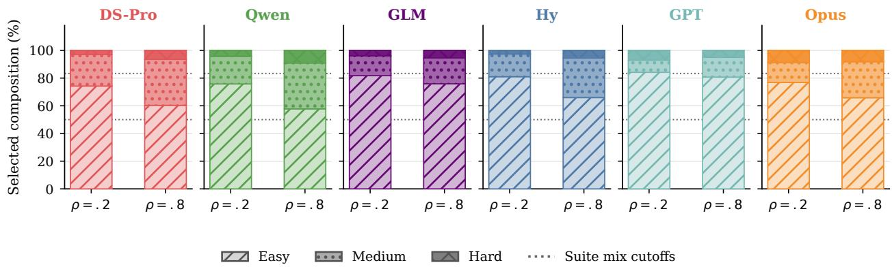  
Figure 7: Difficulty composition of the curve-oracle portfolio. Dotted cutoffs mark the fixed suite mix: 50% Easy, 33% Medium, and 17% Hard. This oracle-only diagnostic uses all three domains; missing domains are not imputed. Hy Math and AR oracle-dependent values inherit conservative lower-bound oracles.

## J.4 Omission and Position Diagnostics

Figure 11 decomposes every available problem slot into answered/not missing, budget truncation, formatting or alignment failure, unresolved attempt, and residual evidence-insufficient cases. Under moderate pressure, the answered share is higher and the truncation share is lower for all six models. Under strong pressure, truncation ranges from 8.7% to 68.0%

Table 11: Agentic shared-budget contest accuracy by budget pressure, domain, and difficulty tier. Entries are percentages over the problems evaluated in each condition.
<table><tr><td>Model</td><td>ρ</td><td colspan="4">Math</td><td colspan="4">Code</td><td colspan="4">AR</td></tr><tr><td></td><td></td><td>E</td><td>M</td><td>H</td><td>All</td><td>E</td><td>M</td><td>H</td><td>All</td><td>E</td><td>M</td><td>H</td><td>All</td></tr><tr><td rowspan="2">DeepSeek-Chat</td><td>0.2</td><td>85.3</td><td>62.0</td><td>44.0</td><td>70.7</td><td>75.3</td><td>9.0</td><td>0.0</td><td>40.7</td><td>76.7</td><td>60.0</td><td>50.0</td><td>66.7</td></tr><tr><td>0.8</td><td>89.3</td><td>71.0</td><td>58.0</td><td>78.0</td><td>93.3</td><td>49.0</td><td>8.0</td><td>64.3</td><td>83.3</td><td>72.0</td><td>70.0</td><td>77.3</td></tr><tr><td rowspan="2">DeepSeek-Reasoner</td><td>0.2</td><td>84.7</td><td>69.0</td><td>46.0</td><td>73.0</td><td>87.3</td><td>21.0</td><td>4.0</td><td>51.3</td><td>82.7</td><td>69.0</td><td>56.0</td><td>73.7</td></tr><tr><td>0.8</td><td>90.0</td><td>70.0</td><td>62.0</td><td>78.7</td><td>96.7</td><td>57.0</td><td>6.0</td><td>68.3</td><td>82.7</td><td>75.0</td><td>76.0</td><td>79.0</td></tr><tr><td rowspan="2">DeepSeek-V4-Pro</td><td>0.2</td><td>91.3</td><td>66.0</td><td>42.0</td><td>74.7</td><td>70.0</td><td>24.0</td><td>2.0</td><td>43.3</td><td>81.3</td><td>64.0</td><td>64.0</td><td>72.7</td></tr><tr><td>0.8</td><td>92.7</td><td>66.0</td><td>38.0</td><td>74.7</td><td>89.3</td><td>65.0</td><td>12.0</td><td>68.3</td><td>78.0</td><td>61.0</td><td>56.0</td><td>68.7</td></tr><tr><td rowspan="2">Qwen3.7-Max</td><td>0.2</td><td>86.7</td><td>74.0</td><td>56.0</td><td>77.3</td><td>86.0</td><td>9.0</td><td>2.0</td><td>46.3</td><td>83.3</td><td>68.0</td><td>76.0</td><td>77.0</td></tr><tr><td>0.8</td><td>90.7</td><td>79.0</td><td>66.0</td><td>82.7</td><td>98.7</td><td>76.0</td><td>24.0</td><td>78.7</td><td>87.3</td><td>73.0</td><td>72.0</td><td>80.0</td></tr><tr><td rowspan="2">GLM-5.2</td><td>0.2</td><td>88.0</td><td>70.0</td><td>44.0</td><td>74.7</td><td>54.0</td><td>19.0</td><td>2.0</td><td>33.7</td><td>68.7</td><td>61.0</td><td>50.0</td><td>63.0</td></tr><tr><td>0.8</td><td>84.7</td><td>60.0</td><td>42.0</td><td>69.3</td><td>85.3</td><td>66.0</td><td>18.0</td><td>67.7</td><td>80.0</td><td>57.0</td><td>52.0</td><td>67.7</td></tr><tr><td rowspan="2">Hy-3</td><td>0.2</td><td>41.3</td><td>20.0</td><td>16.0</td><td>30.0</td><td>25.3</td><td>12.0</td><td>0.0</td><td>16.7</td><td>32.7</td><td>9.0</td><td>6.0</td><td>20.3</td></tr><tr><td>0.8</td><td>32.7</td><td>22.0</td><td>14.0</td><td>26.0</td><td>42.0</td><td>6.0</td><td>0.0</td><td>23.0</td><td>18.7</td><td>9.0</td><td>6.0</td><td>13.3</td></tr><tr><td rowspan="2">GPT-5.5</td><td>0.2</td><td>68.0</td><td>54.0</td><td>52.0</td><td>60.7</td><td>57.3</td><td>10.0</td><td>0.0</td><td>32.0</td><td>29.3</td><td>32.0</td><td>28.0</td><td>30.0</td></tr><tr><td>0.8</td><td>82.7</td><td>68.0</td><td>56.0</td><td>73.3</td><td>96.0</td><td>82.0</td><td>28.0</td><td>80.0</td><td>76.0</td><td>78.0</td><td>88.0</td><td>78.7</td></tr><tr><td rowspan="2">Claude-Opus-4.8</td><td>0.2</td><td>89.7</td><td>57.8</td><td>61.6</td><td>74.4</td><td>66.7</td><td>12.0</td><td>0.0</td><td>37.3</td><td>76.9</td><td>42.2</td><td>61.6</td><td>62.8</td></tr><tr><td>0.8</td><td>89.7</td><td>69.2</td><td>77.2</td><td>80.8</td><td>90.7</td><td>78.0</td><td>24.0</td><td>75.3</td><td>86.1</td><td>83.2</td><td>87.6</td><td>85.4</td></tr></table>

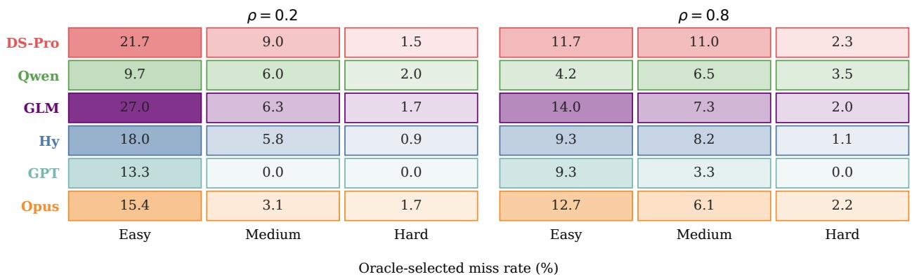  
Figure 8: Curve-oracle selected-miss rates by budget pressure and difficulty tier. Each domain rate uses all judged problems in the explicitly paired suites as its denominator. Values are available-domain macros and missing domains are not imputed. Hy Math and AR oracle-dependent values inherit conservative lower-bound oracles.

across model macros; under moderate pressure it usually larger under strong pressure.   
ranges from 2.5% to 19.3%.

Figure 12 gives the trajectory-level counterpart to the accuracy curves in Figure 4. The answered/notmissing rate falls from position 1 to position 6 in every model–pressure series, while the judged budgettruncation rate rises in all 12 series. The change is

Table 12: Discriminant validity: Spearman correlation between model ECI and $R ^ { 3 } – \mathrm { B E N C H }$ Gap Ratio in each evaluation cell, with exact permutation p-values (n=5 models, 120 permutations). Capability ordering explains little of the allocation-gap ordering. Global: mean Spearman = −0.29 (p = 0.37); pooled withincell $R ^ { 2 } \stackrel { . } { = } 0 . 0 1 ( p = 0 . 7 0 )$ .
<table><tr><td>Setting</td><td>Domain</td><td>ρ</td><td>Spearman</td><td>Perm. p</td></tr><tr><td>Tool-Free</td><td>Math</td><td>0.2</td><td>+0.10</td><td>0.95</td></tr><tr><td>Tool-Free</td><td>Code</td><td>0.2</td><td>-0.30</td><td>0.68</td></tr><tr><td>Tool-Free</td><td>AR</td><td>0.2</td><td>+0.20</td><td>0.78</td></tr><tr><td>Tool-Free</td><td>Math</td><td>0.8</td><td>-0.80</td><td>0.13</td></tr><tr><td>Tool-Free</td><td>Code</td><td>0.8</td><td>-0.50</td><td>0.45</td></tr><tr><td>Tool-Free</td><td>AR</td><td>0.8</td><td>+0.20</td><td>0.78</td></tr><tr><td>Agentic</td><td>Math</td><td>0.2</td><td>+0.10</td><td>0.95</td></tr><tr><td>Agentic</td><td>Code</td><td>0.2</td><td>-0.80</td><td>0.13</td></tr><tr><td>Agentic</td><td>AR</td><td>0.2</td><td>+0.10</td><td>0.95</td></tr><tr><td>Agentic</td><td>Math</td><td>0.8</td><td>-0.20</td><td>0.78</td></tr><tr><td>Agentic</td><td>Code</td><td>0.8</td><td>-0.90</td><td>0.08</td></tr><tr><td>Agentic</td><td>AR</td><td>0.8</td><td>-0.70</td><td>0.23</td></tr></table>

## K Human Annotation of Trajectories

Scope and annotation unit. Ten human annotators collectively examined every tool-free and agentic contest trajectory line by line under a shared codebook and produced all behavioral labels reported in this paper. The corpus covers six models, two budget pressures, and three domains, forming 36 model– pressure–domain cells.

Corpus and annotation load. Each cell contains 50 contests with five independent trajectories per contest, both tool-free and agentic settings, so the annotated corpus is $3 \times 5 0 \times \bar { 6 } \times 5 \times 2 \times 2 = 1 8 0 0 0$ trajectories. Annotation is exhaustive rather than sampled. The corpus was partitioned evenly across the ten annotators, 1800 trajectories each, by random assignment rather than by model or domain block. Model identity was withheld: the standardized record carries no provider name, model name, or interface metadata were removed from the standardized records, as were difficulty tiers and filesystem paths.

Single annotation. Each trajectory is annotated once. The codebook resolves every label into a check on explicit trajectory evidence rather than a graded judgement: a positive label requires an exact supporting quotation together with its step or event identifier, and when a required component is absent or only speculative the negative or insufficient-evidence label is mandatory. Verifier correctness, reward, and oracle fields are frozen inputs that annotators cannot revise.

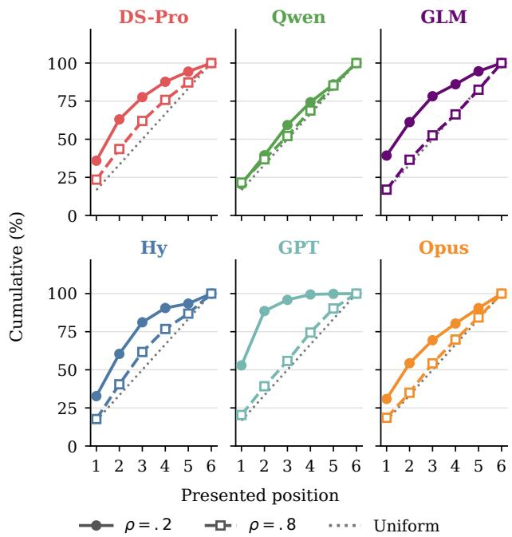  
Figure 9: Cumulative attributed-output share by presented position for all six models at both budget pressures. The dotted line is a uniform 1/6-per-position reference. Values are available-domain macros; missing domains are not imputed.

Annotation materials and procedure. For each trajectory, annotators inspected a standardized record containing the visible trajectory steps, action and budget events, submitted-artifact excerpts, verifier outcomes, oracle metadata, and exception information. Construction-time difficulty tiers and local filesystem paths were excluded. Verifier correctness, reward, and oracle fields were treated as frozen metadata: they established outcome facts and oracle applicability but could not substitute for behavioral evidence. Annotators did not re-solve problems or revise correctness judgments.

Annotations covered engineering issues, decisionregret patterns, online adaptation, and oracle-gap attribution. Every positive behavioral label required an exact supporting quotation and its trajectory step or event identifier. When a required evidence component was absent or only speculative, annotators assigned the negative or insufficient-evidence label. Except for the primary oracle-gap category, labels were not required to be mutually exclusive. Engineering issues were restricted to API, runtime, scaffold, tool-parsing, container, trajectory-file, or verifier failures; ordinary reasoning errors and failed solution attempts were not engineering issues.

<table><tr><td>Model</td><td>Temperature</td><td>Top-p</td><td>Reasoning / thinking configuration</td><td>Independent runs</td></tr><tr><td>DeepSeek-Chat</td><td>0.0</td><td>1.0</td><td>Non-thinking chat completion.</td><td>5</td></tr><tr><td>DeepSeek-Reasoner</td><td>Omitted</td><td>Omitted</td><td>Native reasoning mode; sampling parame- 5 ters are unsupported and have no effect.</td><td></td></tr><tr><td>DeepSeek-V4-Pro</td><td>Omitted</td><td>Omitted</td><td>Thinking enabled</td><td>with 5</td></tr><tr><td>Qwen3.7-Max</td><td>0.2</td><td>0.8</td><td>reasoning-effort=high. Thinking enabled for reasoning runs and 5</td><td></td></tr><tr><td>GLM-5.2</td><td>1.0</td><td>0.95</td><td>disabled for answer-only finalization. Thinking enabled with high effort for rea- 5</td><td></td></tr><tr><td>Hy-3</td><td>0.9</td><td>1.0</td><td>soning and agentic tasks. reasoning-effort=high formathemat-5</td><td></td></tr><tr><td>GPT-5.5</td><td>Omitted</td><td>Omitted</td><td>ics, coding, and abstract reasoning. Thinking disabled reasoning-effort=none, because</td><td>with 5</td></tr><tr><td>Claude-Opus-4.8</td><td>Omitted</td><td>Omitted</td><td>chain-of-thought content is not exposed through the evaluation interface. Thinking disabled because chain-of- 5 thought content is not exposed through the evaluation interface.</td><td></td></tr></table>

Table 13: Model-call parameters used in the evaluation. Sampling parameters follow official provider recommendations or provider defaults and are not tuned on R3-BENCH. “Omitted” indicates that a parameter is unsupported or not applicable. GPT-5.5 and Claude-Opus-4.8 are evaluated without thinking because their chain-of-thought content is not visible through our evaluation interfaces. Each reported configuration uses five independent runs per instance.
<table><tr><td>Configuration item</td><td>Coding</td><td>Mathematics / abstract reasoning</td></tr><tr><td>Runtime container</td><td>runtime.</td><td>Docker Harbor task with Terminus-2 shell Docker Harbor job with Terminus-2 shell runtime.</td></tr><tr><td>Timeouts</td><td>Agent timeout 7200s; build timeout 600s. Agent and verifier timeout 7200s.</td><td></td></tr><tr><td>Sandbox resources</td><td>Memory 2048 MB; storage 10240 MB.</td><td>1 CPU; memory 2048 MB; storage 10240 MB.</td></tr><tr><td>Tool environment</td><td></td><td>Local shell, file editing, C++ compilation, Local shell plus computation-oriented local execution, and local tests under the tools under the compute_tools policy.</td></tr><tr><td>Trajectory logging</td><td>compute_tools policy.</td><td>Model messages, tool calls, shell com- Model messages, tool calls, shell com- mands, outputs, exposed reasoning con- mands, outputs, exposed reasoning con- tent, budget usage, blocked commands, tent, budget usage, blocked commands,</td></tr></table>

Table 14: Agentic sandbox and logging configuration. The table reports runtime constraints material to the benchmark while omitting credentials, private server identifiers, and deployment-specific endpoint URLs.

Oracle-gap attribution rubric. For each oracleselected miss, annotators assigned exactly one primary cause: never attempted; attempted too late; stopped after partial progress, where work began but no answer was submitted; spent budget elsewhere, where the shared budget was consumed on other problems; misread toolfeedback; wrongformat or incompletefinalization; or genuinely unsolved, where the trajectory shows no path to a correct answer within the budget. Misses whose oracle metadata or behavioral evidence was insufficient were recorded as such and excluded from the reported shares, so the denominators are behavior-attributable misses rather than all misses.

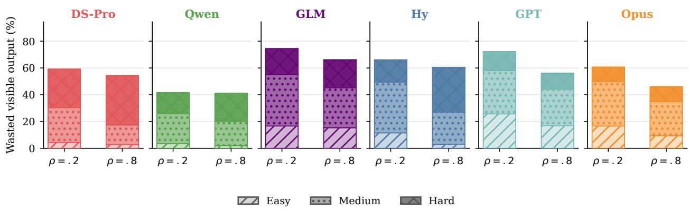  
Figure 10: Six-model wasted attributed-output share at both budget pressures, stacked by difficulty. Wasted output is attributed output spent on ultimately incorrect problems. Values are available-domain macros. Missing domains are not imputed.

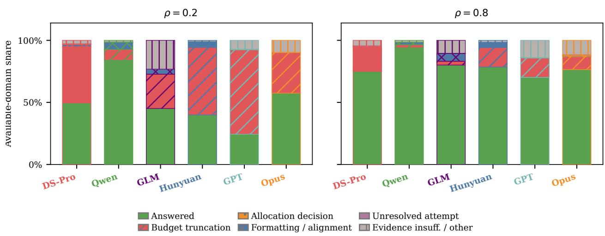  
Figure 11: Available-domain decomposition of pure-NL problem slots at the two pressure levels. Bars separate answered/not-missing problems from budget truncation, formatting or alignment failures, unresolved attempts, and evidence-insufficient or other cases. Missing domains and trajectories are omitted rather than imputed. The allocation-decision category requires decision-time budget checkpoints and is therefore not identifiable here.

Online-adaptation rubric. We distinguish four behavioral events:

• Difficulty observation requires an explicit observation of task difficulty, uncertainty, a negative outcome, or tool/test feedback. Merely stating the remaining budget does not qualify.

• Substantive strategy update requires one focal episode with (i) a concrete strategy that has already been adopted or enacted, (ii) a genuinely new subsequent observation, and (iii) a substantive revision to the target, method, execution order, verification or finalization procedure, or resource allocation. The temporal requirement is $t _ { \mathrm { p r i o r } } < t _ { \mathrm { t r i g g e r } } \leq t _ { \mathrm { r e v i s i o n } }$ . Initial planning and bookkeeping-only changes to focus or shelving status do not qualify.

• Resource-rational update additionally requires an explicit causal link between the revision and newly observed feedback, expected value, cost, success probability, task difficulty, or the opportunity cost imposed by the remaining shared budget.

• Attempted-but-failed update requires the revised strategy to be enacted and the same targeted shortfall to remain visible in a strictly later

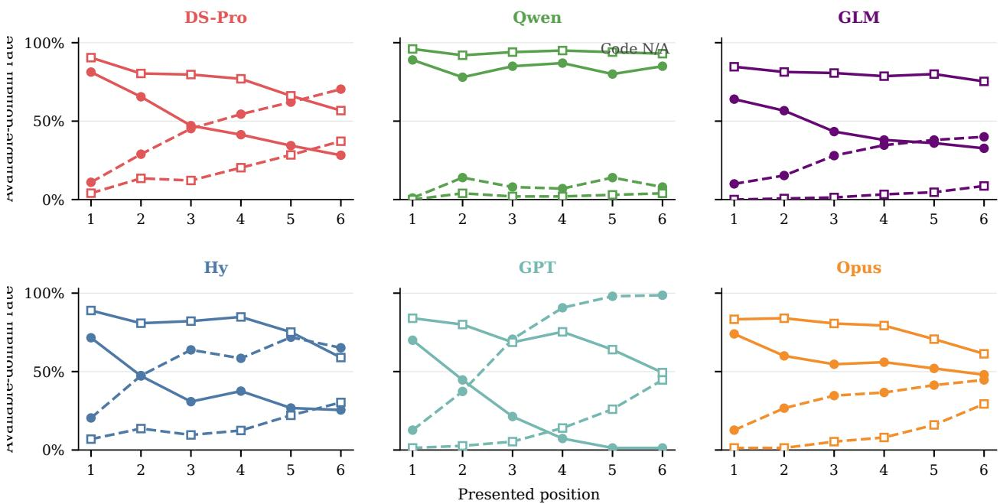  
Answered, ρ = . 2 Answered, ρ = . 8 Truncation, ρ = . 2 Truncation, $\rho = . 8$

Figure 12: Pure-NL answered/not-missing and budget-truncation rates by presented position. Each panel is one model; solid lines show answered rates and dashed lines show truncation, with circles for $\rho = . 2$ and squares for $\rho = . 8$ . Each point is an available-domain macro. Missing domains and trajectories are omitted rather than imputed. Answered rates fall and truncation rates rise from the first to the last position in all 12 model–pressure series.

observation. A fully correct run, a non-perfect aggregate score, or an engineering termination alone cannot establish this label.

Decision-regret rubric. We also annotate five descriptive counterfactual-regret patterns:

• Undercoverage requires concrete uncovered work with non-trivial expected value, a feasible action at an identified decision point, and an allocation or abandonment decision that left the work uncovered.

• Overcommitment requires repeated disproportionate spending on one problem despite weak or negative feedback while alternative problems remained available.

• Late budget exhaustion requires both that exhaustion blocked intended work or finalization and that it was avoidable through earlier stopping, convergence, or consolidation.

• Premature shelving requires a shallow abandonment decision together with a concrete and feasible next action that was not pursued.

• Weak finalization requires submission-ready content for a specific problem and direct evidence that the corresponding submission was missing, malformed, or incomplete.

These labels characterize evidence visible in the trajectory; they do not identify causal effects.

## L Behavioral Coordinate

Figure 1 summarizes two complementary aspects of shared-budget behavior for the six flagship models: how broadly a model works across the suite and whether it revises its strategy in response to runtime evidence. Each coordinate combines the tool-free and agentic settings, both budget pressures, and all available domains. It is therefore not an agentic-only statistic.

Problem coverage. For model $m ,$ setting $s ,$ pressure $\rho ,$ and domain $d ,$ let $\mathcal { T } _ { m , s , \rho , d }$ denote the available clean contest records. For each contest t and problem $p ~ \in ~ \{ 1 , \ldots , 6 \}$ , the tri-state variable ${ \bar { X _ { t , p } } } \in \quad .$ {true, false, unknown} records whether the trajectory contains visible, substantive problem-specific work. Substantive evidence includes problem-specific reasoning, a changed solution artifact, or an executed substantive action. Focus and shelving commands, attribution bookkeeping, guard-only actions, and final answers without supporting work do not establish coverage.

The confirmed and possible coverage rates within a cell are

$$
C _ { m , s , \rho , d } ^ { - } = \frac { \sum _ { t \in \mathcal { T } _ { m , s , \rho , d } } \sum _ { p = 1 } ^ { 6 } \mathbf { 1 } [ X _ { t , p } = \mathrm { t r u e } ] } { 6 | \mathcal { T } _ { m , s , \rho , d } | } ,
$$

and

$$
C _ { m , s , \rho , d } ^ { + } = \frac { \sum _ { t \in \mathcal { T } _ { m , s , \rho , d } } \sum _ { p = 1 } ^ { 6 } \mathbf { 1 } [ X _ { t , p } \neq \mathrm { f a l s e } ] } { 6 | \mathcal { T } _ { m , s , \rho , d } | } .
$$

Figure 1 uses the confirmed lower bound C−.

Resource-rational strategy updates. For each clean contest $t ,$ let $Y _ { t } ~ \in$ {true, false, unknown} indicate whether the trajectory contains a resource-rational strategy update. An initial plan is not an update. A positive label requires a later observation to trigger a substantive revision to the target problem, solution method, execution order, attempt-or-stop policy, verification or finalization procedure, or resource allocation. Bookkeeping-only changes do not qualify. The complete rubric is given in Appendix K.

The cell-level confirmed and possible rates are

$$
\begin{array} { r } { R _ { m , s , \rho , d } ^ { - } = \frac { \sum _ { t \in \mathcal { T } _ { m , s , \rho , d } } \mathbf { 1 } [ Y _ { t } = \mathrm { t r u e } ] } { \lvert \mathcal { T } _ { m , s , \rho , d } \rvert } , } \\ { R _ { m , s , \rho , d } ^ { + } = \frac { \sum _ { t \in \mathcal { T } _ { m , s , \rho , d } } \mathbf { 1 } [ Y _ { t } \neq \mathrm { f a l s e } ] } { \lvert \mathcal { T } _ { m , s , \rho , d } \rvert } . } \end{array}
$$

This is the unconditional rate P(rational update) over all clean contests, not the conditional rate P(rational update | strategy update). Figure 1 plots $R ^ { \dot { - } }$

Quadrant interpretation. The dashed lines at $C =$ 0.5 and R = 0.5 are descriptive references. They define four mnemonic regions: Portfolio Planner denotes broad coverage with frequent confirmed resourcerational updates; Strategic Specialist denotes narrower coverage with frequent updates; Shallow Scanner denotes broad coverage but infrequent updates; and Tunnel Solver denotes both narrow coverage and infrequent updates. These names describe coordinate regions rather than latent model types.

The main separation in Figure 1 is between coverage and adaptive control. A model may perform substantive work on many problems while rarely using new evidence to revise how it spends the remaining budget. Broad coverage therefore does not by itself imply resource-rational reasoning.

## M Online Scheduler Directives

This appendix gives the implementation details for the online scheduler directives used in Section 5. The directives test whether simple runtime control over cross-problem scheduling can recover part of the allocation gap while holding fixed the underlying model, problem suite, budget, tool interface, parser, and final judging protocol.

Compared strategies. We compare the contest reference with two scheduler directives in the same budgeted agentic loop. The contest reference is the original baseline: the agent is instructed to solve as many problems as possible and may choose the order freely. Strategy A adds a coverage guard, which prevents repeated paid investment in one problem before every visible problem receives an initial focused probe. Strategy B keeps the coverage guard and adds a lightweight verification gate. Once coverage is complete and a stable candidate answer or solution file exists, this gate limits additional paid checking on the unchanged candidate unless the candidate is rewritten. Strategies share the same coverage guard and differ only in the verification gate. Strategies A and B do not use answer labels, hidden correctness feedback, response-curve information, oracle-selected problems, or difficulty labels. They operate only on runtime-visible state: the currently focused problem, per-problem paid-step counts, the shared budget counter, and the stability of the answer or solution artifact. Thus, the intervention is an online scheduling constraint in the real loop, not an oracle scheduler.

Coverage directive. The coverage directive is implemented as both an instruction and a runtime guard. Its operative rule is: before spending a second paid focused step on the same problem, give every visible problem at least one paid focused probe. The runtime enforces this rule by tracking paid focused steps for each visible problem. If the current problem has already received the allowed initial probe and another visible problem has not, further paid actions on the current problem are blocked until the agent moves to an unattempted problem. The bookkeeping commands used for this attribution, such as focus problem and shelve problem, are free and expose no correctness signal.

Coverage plus verification directive. Strategy B retains the coverage guard and adds a cheap verification gate. Once all visible problems have received a paid probe, a problem with a stable candidate answer or solution artifact may receive at most one additional paid checking step unless the candidate changes. Rewriting the answer or solution resets this allowance.

The gate is intentionally lightweight and nonoracle. It does not judge whether a candidate is correct; it only limits repeated paid checking after the candidate artifact has stabilized. In code, these checks may include local compilation, execution, sample tests, or self-generated tests. In mathematics and abstract reasoning, they may include numerical substitution, small-case checks, enumeration, constraint checks, or format checks when such signals are available. Hidden tests, official verdicts, proof oracles, and response-curve information are never exposed during the run.

Budget accounting and enforcement. The online scheduler experiments use the same shared-budget agentic loop and budget-accounting mechanism as the main benchmark. Strategies A and B add scheduler guards on top of this loop, but do not change the tool whitelist, artifact format, parser, judge, or final scoring protocol. Mathematics and abstract reasoning use the compute tools policy for this intervention study, while the code domain uses a problem-scoped counted-tool budget. Detailed action-accounting rules are given in Appendix F.

Experimental protocol. The scheduler-directive study covers three models—DeepSeek-V4-Pro, GLM-5.2, and Hy-3—at strong budget pressure $\rho = 0 . 2$ For each model, domain, and configuration, the evaluation contains 50 six-problem suites. The reported score is the mean number of correct answers per sixproblem suite over the 50 suites. Missing or unscored suites are counted as zero in the aggregate mean. For code, the normalized reward is the number of solved problems divided by the six problems in the suite; mathematics and abstract reasoning use the same normalized six-problem scoring convention.

The reported values are computed from the contestreference, A, and B runs for each model under this protocol, using the same final judging and aggregation procedure as the main agentic evaluation.

## N Trajectory-Level Case Studies of Allocation Failure and Recovery

This appendix provides trajectory-level illustrations of the aggregate failure mechanisms reported in Sections 4 and 5. The examples show how allocation failures unfold during a shared-budget episode; prevalence is estimated separately from the full-corpus analyses in the main text. We manually audited 14 shortlisted candidate cases identified by the aggregate diagnostic pipeline and selected examples with formal outcomes, complete trajectories and artifacts, and no detected infrastructure failure. Selection criteria were evidentiary completeness and mechanistic distinctness.

Final correctness is always taken from the domainspecific parser or verifier. Behavioral labels are used only for retrospective diagnosis. Response-curve costs and oracle selections were not visible to the model. Accordingly, oracle evidence indicates observed allocation headroom, not a guarantee that the oracle portfolio could be reproduced in one contest trajectory. Appendix E defines the replay and its limitations.

## N.1 Case I: Local Debugging Crowds Out Four Oracle-Selected Problems

Our first case illustrates how repeated local repair can produce both overcommitment and undercoverage. DeepSeek-Chat runs in the agentic coding setting on Code Set 47 at $\rho \ : = \ : 0 . 2$ . The shared budget is ten counted actions. The agent spends all ten actions on Problem C, obtains no accepted solution, and leaves the other five problems untouched. The final contest score is 0/6. In contrast, the cap-limited responsecurve oracle has value 4/6: it selects four problems with a total observed cost of eight actions.

The trajectory begins with a free status query and an explicit acknowledgement of the budget: “I have 10 counted steps. Let me start with Problem C.” After focusing Problem C, the agent never switches or shelves it. Actions 1–5 are spent constructing and rewriting the program. Actions 6–8 repair file-construction and compilation failures. Action 9 finally produces a compilable candidate, and Action 10 runs a local sample test. The full budget is therefore exhausted on one incorrect solution while the other five problems remain untouched.

The decisive issue is not simply that one problem receives many actions. Problem C ultimately produces zero reward, while Problems $\mathbf { A } , \ \mathbf { B } , \ \mathbf { D } ,$ , and

<table><tr><td>Problem</td><td>Tier</td><td>Oracle?</td><td>Lowest observed suc- Contest ac- Outcome cessful cost</td><td>tions</td><td></td><td>State</td><td>Diagnosis</td><td></td></tr><tr><td>A: 2120E</td><td>Medium</td><td>Yes</td><td>2</td><td>0</td><td>Missing</td><td>Never focused</td><td>Cheap miss</td><td>oracle-selected</td></tr><tr><td>B: 2091B</td><td>Easy</td><td>Yes</td><td>2</td><td>0</td><td>Missing</td><td>Never focused</td><td>Cheap miss</td><td>oracle-selected</td></tr><tr><td>C: 2107A</td><td>Easy</td><td>No</td><td>3</td><td>10</td><td>Wrong</td><td>Repeated construction, re- Overcommitment target pair, compilation, and test-</td><td></td><td></td></tr><tr><td>D: 2029B</td><td>Easy</td><td>Yes</td><td>2</td><td>0</td><td>Missing</td><td>ing Never focused</td><td>Cheap miss</td><td>oracle-selected</td></tr><tr><td>E: 1992F</td><td>Medium</td><td>Yes</td><td>2</td><td>0</td><td>Missing</td><td>Never focused</td><td>Cheap miss</td><td>oracle-selected</td></tr><tr><td>F: 2107F2</td><td>Hard</td><td>No</td><td>No observed success 0</td><td></td><td>Missing</td><td>Never focused</td><td>No</td><td>response-curve reachability evidence</td></tr></table>

Table 15: Problem-level allocation in the overcommitment case. Costs are counted actions. The lowest observed successful cost is the cheapest grid level of the sampled single-problem response curve at which the problem was solved in at least one repeat, not the unknown theoretical minimum required to solve the problem.

E each have an accepted single-problem responsecurve point at an observed cost of two actions. Under the minimum-cost tie-break used by our implementation, the saved selected optimum is unique: Problems A, B, D, and E, with a total observed cost of eight actions. Relative to this replay, continued local repair on C displaces four empirically reachable opportunities. Notably, overcommitment does not require a nominally hard target: Problem C belongs to an easy benchmark tier. The agent responds to each local error but never reassesses whether another problem has become a better use of the remaining budget.

## N.2 Case II: More Attributed Output than a Successful Standalone Run

The second case illustrates a single-to-contest transfer failure in tool-free coding. DeepSeek-Chat is evaluated on Code Set 9 at $\rho = 0 . 8$ . The model obtains two accepted solutions in the contest, while the responsecurve oracle selects three. The missed oracle-selected item is Problem F, Codeforces 2000A.

The same model solves Problem F in a standalone response-curve run using 173 output tokens. In the contest, proportional problem-section attribution assigns 322.4 Stage-1 tokens to the same problem, yet the resulting program receives a wrong-answer verdict. The audit pipeline also records a broader 446.3- token proxy that includes Stage-2 formatting output; all mechanism claims below use the Stage-1-only value.

Stage 1 terminates normally after generating 1,618 of the available 5,065 tokens, so the failure is not caused by token-cap truncation. Stage 2 performs extraction only and reproduces the same incorrect code. The standalone run checks the required prefix and validates the exponent suffix without requiring the suffix to consist entirely of zeros. By contrast, the contest run interprets the notation as requiring every character after the initial 10 to be 0 and implements this stronger rule.

The contest reasoning states that the string must begin with 10 and that “all digits after the first two must be ‘0’.” The corresponding loop rejects a candidate whenever any later character is nonzero. This is a task misinterpretation rather than an incomplete implementation. The formal verifier marks the complete contest program wrong, whereas the standalone program is accepted.

The model thus receives more attributed Stage-1 tokens than its observed successful standalone cost, emits a complete program, and is not truncated, yet selects a different, incorrect interpretation. The broader pipeline proxy leads to the same conclusion, but we use Stage 1 because Stage 2 only extracts the candidate. The 173-token value is the lowest sampled successful point, not a theoretical minimum, and the 322.4-token value is a section-length attribution rather than an API counter. The evidence supports a funded transfer failure, not a claim that token quantity determines whether the standalone reasoning path is reproduced.

## N.3 Case III: Protocol-Shaped Shelving Followed by Weak Finalization

The third case comes from an abstract-reasoning run under a coverage-first runtime policy that uses the same initial-coverage guard studied in Appendix M. We use it primarily to illustrate weak finalization under a coverage-first policy rather than an unconfounded baseline shelving failure. DeepSeek-V4-Pro (DS-Pro) is evaluated on AR Contest 9 at $\rho = 0 . 8 ,$ with a budget of seven paid compute actions. The agent uses six actions, answers three of six problems correctly, and terminates with one action unused. This run is not one of the fixed $\rho = 0 . 2$ cells reported in the scheduler intervention study.

The relevant item is Problem 3, a palindromegeneration task. During its first paid probe, the agent constructs a string that is itself a palindrome but does not use all required input letters. The agent explicitly records this defect when shelving the problem:

Palindrome: [...] -- but doesn’t   
use all letters due to multiple   
odd-count chars.

A deterministic post-hoc multiset check confirms the defect. The input contains 68 letters, whereas the candidate contains 65 and omits one occurrence each of h, k, and r. This check was not exposed to the model during the run.

<table><tr><td>Stage</td><td>Evidence and decision</td><td>Budget and conse- quence</td></tr><tr><td>Initial probe</td><td>The candidate is a palindrome, but 4 remain; progress the all-letters constraint is known is substantive but to be violated; the agent attempts incomplete further work on Problem 3</td><td></td></tr><tr><td>Coverage guard</td><td>A second paid action is requested 4 remain; the first before full initial coverage; the run- switch is protocol- time blocks it and requires a switch shaped</td><td rowspan="2"></td></tr><tr><td>Shelving</td><td>The agent records the defect and 4 remain; the can- continues the coverage pass didate is stored</td></tr><tr><td>Coverage completion</td><td>Problems 4–6 each receive one paid 1 remains probe; return to Problem 3 is now permitted</td><td rowspan="2">but unresolved</td></tr><tr><td>Finalization</td><td>The agent notes that one compute 1 unused; the can- step remains and considers revis- didate receives iting Problem 3, but keeps the cur- non-full credit rent answer and is counted incorrect</td></tr></table>

Table 16: Progress, protocol-shaped shelving, and finalization decisions in the abstract-reasoning case.

The two decisions require different interpretations. The initial attempt to reinvest in Problem 3 is blocked because the remaining problems have not received initial probes, so the first switch is protocol-shaped rather than an unconfounded voluntary give-up. After all six problems are covered, however, the guard no longer prevents a return and one paid compute action remains. The agent considers investigating the known defect but states, “I’ll keep my current answer.” The same invalid candidate reaches the final artifact and receives a formal score of 0.05, which is counted as incorrect under the full-credit binarization used in the main results. We therefore interpret the case as protocol-shaped shelving followed by model-chosen weak finalization. Because the run has no linked percontest response-curve oracle record, it illustrates failure to improve known partial progress rather than a numerical oracle-recoverable gap.

<table><tr><td>Problem</td><td>Contest refer- Strategy B ence</td><td>Allocation effect</td></tr><tr><td>A: 2108B (M) 3 / Wrong</td><td>2 / Wrong</td><td>One fewer action on the initial target; repeated low- return investment is cur- tailed</td></tr><tr><td></td><td>B: 2070B (E) 3 / Accepted 1 / Accepted</td><td>1 Existing success is pre- served with two fewer ac- tions</td></tr><tr><td>C: (H)</td><td>2003D2 0 / Missing 1 / Wrong</td><td>Newly covered, but cov- erage does not guarantee success</td></tr><tr><td></td><td></td><td>D: 2070C (E) 0 / Missing 1 / Accepted Newly covered; one an- swer is recovered</td></tr><tr><td></td><td></td><td>E: 2022E1 (M) 0 / Missing 1 / Accepted Newly covered; a second answer is recovered</td></tr><tr><td></td><td></td><td>F: 2000C (E) 1 / Accepted 1 / Accepted Existing success is pre- served at unchanged cost</td></tr></table>

Table 17: Matched scheduler comparison on the same coding contest. Both strategies execute seven counted actions. The contest reference scores $2 / 6 ,$ while Strategy B scores 4/6. Parenthetical letters denote benchmark tiers.

## N.4 Matched Intervention Example: Broader Coverage with Two Additional Accepted Answers

Finally, we provide a matched example from the online-scheduler intervention. The comparison uses DS-Pro on the same Code Set 12, with the same fixed budget of seven counted actions, tools, parser, and verifier. This is the budget $A _ { \mathrm { D S - P r o , C o d e } } ^ { 0 . 2 }$ of the main benchmark, so the case runs under the reported configuration rather than a separate one. The contest reference is the baseline agent. Strategy B adds the coverage guard and the verification gate defined in Appendix M.

The contest reference allocates its actions as (3, 3, 0, 0, 0, 1) across Problems A–F. It concentrates six of its seven actions on Problems A and B and never touches Problems C–E. Strategy B allocates (2, 1, 1, 1, 1, 1); its coverage guard blocks three attempted reinvestments before execution, and blocked commands consume no budget. Problems D and E, missing under the contest reference, are accepted under Strategy B.

The pair illustrates the mechanism behind the aggregate coding improvement: limiting early concentration exposes additional solvable problems. The budget makes the trade-off sharp. Because the guard requires a paid probe on each problem, covering all six consumes six of the seven available actions, so Strategy B retains a single action for additional depth and spends it on Problem A. It also shows the cost of breadth, since one action goes to the unsolved hard Problem C and Problem B keeps its accepted answer with two fewer actions than before. The trajectories are independent model samples, so the comparison is not a deterministic counterfactual. The mechanism also does not transfer uniformly across domains: in aggregate the directives improve Code for every model, whereas in mathematics and abstract reasoning they help some models and hurt others (Table 3). Moreover, the observed change is driven primarily by the coverage constraint and does not isolate the incremental effect of the verification gate.

## O Target-in-Suite Context-Stress Diagnostic

A possible alternative explanation for the contest– oracle gap is that part of the deficit arises from suitecontext interference caused by presenting six problem statements, rather than from cross-problem resource allocation. We therefore conduct a target-in-suite diagnostic that preserves the full six-problem context while removing the need to select among or allocate resources across multiple actionable problems.

Experimental design. We evaluate Qwen3.7-Max and DeepSeek-V4-Pro in both tool-free and agentic settings across mathematics, competitive programming, and abstract reasoning. For each domain, we select 10 suites by deterministic length-stratified sampling based only on public statement length and a frozen seed; the same suites are shared across models and settings. Each of the six positions serves once as the target, yielding 60 target episodes per model– setting–domain cell and 720 stress episodes in total. The model sees all six problem statements in their original order, but only one is designated for solution and scored, while the other five are marked as distractors. In the agentic setting, computation on distractor problems is additionally blocked. Each target receives the largest frozen single-problem budget in our response-curve evaluation.

Controls and analysis. Each stress outcome is paired with a problem-matched single-problem reference from the corresponding response-curve evaluation. We first average the six paired control–stress differences within each suite and then average equally over the 10 suites. We treat this experiment as a robustness diagnostic rather than a causal decomposition of the contest–oracle gap.

<table><tr><td>Model</td><td>Domain Control Stress ∆ (pp)</td><td></td><td></td><td></td></tr><tr><td>Agentic</td><td></td><td></td><td></td><td></td></tr><tr><td rowspan="3">DeepSeek-V4-Pro</td><td>AR</td><td>0.800</td><td>0.857</td><td>-5.7</td></tr><tr><td>Code</td><td>0.917</td><td>0.867</td><td>5.0</td></tr><tr><td>Math</td><td>0.867</td><td>0.867</td><td>0.0</td></tr><tr><td rowspan="3">Qwen3.7-Max</td><td>AR</td><td>0.835</td><td>0.851</td><td>-1.6</td></tr><tr><td>Code</td><td>0.900</td><td>0.817</td><td>8.3</td></tr><tr><td>Math</td><td>0.817</td><td>0.817</td><td>0.0</td></tr><tr><td>Tool-Free</td><td></td><td></td><td></td><td></td></tr><tr><td rowspan="3">DeepSeek-V4-Pro</td><td>AR</td><td>0.700</td><td>0.742</td><td>-4.1</td></tr><tr><td>Code</td><td>0.867</td><td>0.883</td><td>-1.7</td></tr><tr><td>Math</td><td>0.850</td><td>0.850</td><td>0.0</td></tr><tr><td rowspan="3">Qwen3.7-Max</td><td>AR</td><td>0.548</td><td></td><td></td></tr><tr><td>Code</td><td>0.900</td><td>0.497 0.833</td><td>5.0 6.7</td></tr><tr><td>Math</td><td>0.850</td><td>0.833</td><td>1.7</td></tr></table>

Table 18: Target-in-suite context-stress results. Control and Stress are mean target scores; ∆ = Control − Stress in percentage points, so positive values indicate lower performance under context stress.

Results. Table 18 reports the target-in-suite diagnostic results.

Across the 12 model–setting–domain cells, nine have point-estimated control–stress differences of at most 5 percentage points, with an unweighted descriptive mean difference of 1.1 percentage points. All six DeepSeek-V4-Pro cells have differences of at most 5 points. Qwen3.7-Max is more heterogeneous, with differences of 6.7 points in tool-free Coding and 8.3 points in Agentic Coding.

Overall, additional suite context does not consistently reduce target-only performance under explicit target cues and high single-problem budgets, arguing against a uniform suite-context explanation of the contest deficit.