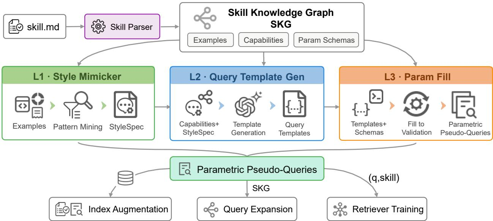
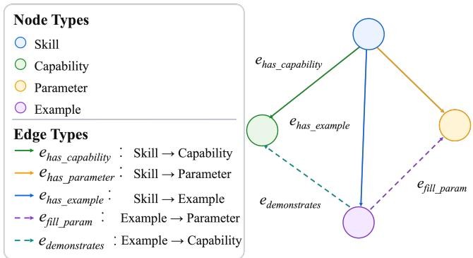
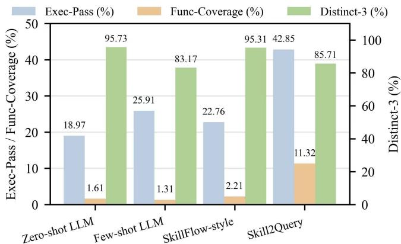
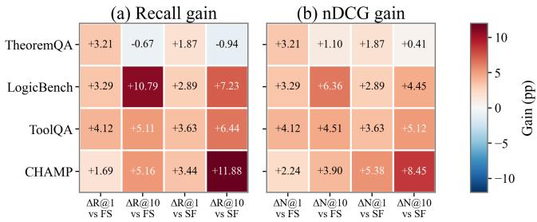
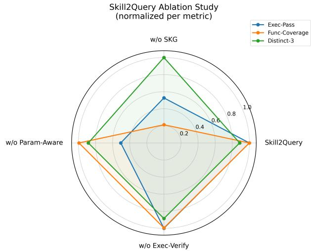

# Skill2Query: Exploiting Skill Structure to Generate Pseudo-Queries for Agent Skill Retrieval

Lihui Ding∗   
Fudan University   
Shanghai, China   
dinglh25@m.fudan.edu.cn

Chenyu Zhou Shanghai Jiao Tong University Shanghai, China chenyuzhou@sjtu.edu.cn

Zihan Guo∗✉   
Sun Yat-sen University   
Shenzhen, China   
Shanghai Innovation Institute   
Shanghai, China   
guozh29@mail2.sysu.edu.cn

Yuanjian Zhou Shanghai Innovation Institute Shanghai, China jake.zhou@sii.edu.cn

Jianghao Lin Shanghai Jiao Tong University Shanghai, China linjianghao@sjtu.edu.cn

Bingwei Lu Shanghai Jiao Tong University Shanghai, China icestring@sjtu.edu.cn

Dongdong Ge Shanghai Jiao Tong University Shanghai, China ddge@sjtu.edu.cn

Weinan Zhang   
Shanghai Jiao Tong University   
Shanghai, China   
Shanghai Innovation Institute   
Shanghai, China   
wnzhang@sjtu.edu.cn

## Abstract

Pseudo-query generation can alleviate the supervision bottleneck for agent skill retrieval, but existing document-level approaches typically leave the rich internal relations among capabilities, parameters, and usage examples implicit. As a result, generated queries may be topically relevant to a skill while lacking capability ground ing and parameter consistency, raising the question of whether explicitly exploiting a skill document’s internal structure can produce more efective retrieval signals. We therefore propose Skill2Query, a framework that first parses a skill document into a Skill Knowledge Graph and then generates pseudo-queries through a three-stage process including style mimicking, query template generation, and parameter filling. The generated queries can be used for ofline index augmentation, online query expansion, and retriever training. Four benchmarks (TheoremQA, LogicBench, ToolQA, and CHAMP) are used to evaluate Skill2Query with large-scale skill candidate pools across multiple downstream applications, including skill retrieval, retriever training, and end-to-end agent execution. Using nearly 30K skills across diverse domains, we generate 700K category-diverse pseudo-queries. Skill2Query consistently improves sparse, dense, and skill-routing retrieval, with an average Recall@1 gain of 6.70 percentage points across retrieval settings. Skill2Query-generated training data also achieves the best Recall@1 and nDCG@1 among the evaluated generation baselines. Further evaluations with multiple LLM backends demonstrate that improved skill retrieval translates into higher agent task success rates.Code and resources are available at https://github.com/MatZaharia/Skill2Query.

CCS Concepts CCS Concepts

• Information systems → Information retrieval query processing; Retrieval models and ranking; • Computing methodologies → Natural language generation; Intelligent agents.

## Keywords

agent skill retrieval, pseudo-query generation, information retrieval, large language models, skill routing

## 1 Introduction

Modern AI agents extend their capabilities by retrieving and invoking reusable skills [10, 17, 28, 29, 44]. As the number of available capabilities grows from a small manually curated set to repositories containing thousands of candidates, an agent must first identify the skills relevant to a user request before it can plan or execute the task [15, 43]. Retrieval errors at this stage may expose the agent to irrelevant capabilities or exclude the skill required for task completion [32]. Accurate skill retrieval has therefore become an important component of large-scale agent systems.

Skill retrieval presents an asymmetric matching problem. Users typically describe what they want to accomplish through short, colloquial, and sometimes underspecified queries [18]. Skill documents, in contrast, are written by developers to specify what a skill provides, often using technical descriptions, parameter declarations, constraints, and usage examples. Established retrieval architectures can match lexical or semantic similarity between the two sides [30, 31, 40], but their efectiveness depends on access to high-quality query–skill supervision. Constructing such supervision manually requires annotators to distinguish among many semantically overlapping skills and understand their functional boundaries, making large-scale annotation expensive [1, 8, 35].

Pseudo-query generation ofers a scalable way to alleviate this supervision bottleneck [1, 23]. Methods such as doc2query and InPars generate synthetic queries from target documents and use them for document expansion or retriever training. When adapted to skill retrieval, however, many document-level pseudo-query methods condition generation on a skill name, description, or full document represented as a single text sequence. This documentlevel generation objective encourages topical relevance to the skill as a whole, while leaving the document’s internal structure implicit. A skill document may describe several distinct capabilities, associate them with diferent parameters, and provide examples for only particular usage patterns. Consequently, a generated query can be semantically related to the skill without being grounded in a specific capability or using parameter values consistent with the supported interface. The limitation is therefore not whether the generator has access to the full skill document, but whether it explicitly exploits the structure contained in that document.

Taken together, existing pseudo-query methods are designed to reduce the expression mismatch between user queries and skill documents, but they leave a skill-structure utilization gap that has received limited attention. Skill documents contain rich internal structure, whereas existing generation processes typically model this information implicitly as part of a complete document rather than turning it into explicit generation constraints [1, 8, 23, 35]. This gap has two main manifestations. First, the capability-grounding gap arises when a generated query is semantically related to the skill as a whole but is not associated with a specific capability. Second, the parameter-consistency gap arises when the parameters or parameter values expressed in a query do not conform to the interface and constraints of the corresponding capability. Based on this observation, we investigate whether explicitly exploiting the internal structure of skill documents can generate pseudo-queries with finer-grained functional grounding and stronger parameter consistency, thereby providing more efective retrieval signals for agent skill retrieval.

Based on this hypothesis, we propose Skill2Query, a framework that exploits skill structure to generate pseudo-queries for agent skill retrieval. Skill2Query first parses each skill document into a Skill Knowledge Graph (SKG) that represents its capabilities, param eters, examples, and their relationships. It then applies a three-stage generation process. A Style Mimicker extracts expression patterns from usage examples, a Query Template Generator associates query templates with individual capabilities and parameter slots, and a Param Filler instantiates and validates the slots according to the parameter definitions. The resulting pseudo-queries can be used in three settings, including ofline index augmentation, online query expansion, and query–skill supervision for retriever training.

The contributions of this work are threefold. 1) We formulate the underexplored skill-structure utilization gap in pseudo-query generation for agent skill retrieval, characterizing it in terms of capability grounding and parameter consistency. 2) We propose Skill2Query, which constructs a Skill Knowledge Graph and generates pseudoqueries through style extraction, query template generation, and parameter filling, supporting index augmentation, query expansion, and retriever training. 3) Experiments on four datasets across three retrieval paradigms demonstrate improvements in both pseudoquery quality and retrieval efectiveness, and an end-to-end case study further indicates potential task-level utility.

## 2 Related Work

Our work intersects three research directions: agent skill retrieval and invocation, pseudo-query generation and query expansion, and structure-aware skill representation for agents.

## 2.1 Agent Skill Retrieval and Invocation

As large language models evolve from general-purpose text generators into agents capable of invoking external tools and skills [34], accurately selecting the executable skills required for a task from a large-scale skill library has become a critical problem in agent systems [6, 15]. Unlike traditional tool invocation, agent skills typically include not only brief functional descriptions but also execution steps, parameter specifications, constraints, examples, and contextual usage patterns [26]. Skill retrieval is therefore not merely a semantic matching problem. It also requires precise correspondences among user intent, skill capability boundaries, and executable conditions.

Early tool retrieval research has laid important foundations for skill retrieval. Gorilla demonstrated the efectiveness of retrieval augmentation in improving API invocation accuracy by retrieving relevant APIs from a large-scale API documentation corpus [28]. ToolLLM and API-Bank further evaluated LLM tool-use capabilities across multiple dimensions, including tool retrieval, tool invocation, and tool planning [17, 29]. These works indicate that retrieval quality directly afects an agent’s ability to invoke external capabilities. Compared with concise API specifications, agent skill documents may contain longer and more heterogeneous combinations of functional descriptions, execution procedures, constraints, parameters, and examples, creating additional representation and supervision challenges [14].

In the agent skill setting, SkillFlow is among the earliest systems designed for retrieving community-contributed skill documents. The system indexes approximately 36K community-contributed SKILL.md files and employs a cascaded architecture consisting of dense retrieval, cross-encoder reranking, and LLM-based selection [15]. A key finding of SkillFlow is that exposing only a skill’s name and description while concealing the full body significantly degrades routing accuracy, indicating that the full skill text is a critical semantic signal in skill retrieval. SkillRouter further validates this conclusion at a larger scale of approximately 80K candidate skills, noting that existing progressive disclosure designs can severely impair retrieval efectiveness under large-scale semantic overlap [43].

These works collectively demonstrate that skill retrieval performance is highly dependent on the complete and fine-grained information contained in skill documents, particularly the functional scope, parameter requirements, and execution constraints implicitly encoded in the skill body. However, existing research has primarily focused on retrieval architecture (for example, how to design recall, reranking, and cascaded selection pipelines) without systematically addressing the origin of high-quality query–skill training data.

## 2.2 Pseudo-Query Generation and Synthetic Supervision

Pseudo-query generation aims to automatically construct synthetic queries relevant to target documents in order to mitigate the representation gap between queries and documents and provide training supervision for retrieval models. Classical methods such as doc2query append generated queries to documents to enhance retrieval indices [4, 23], while InPars leverages large language models to generate query–document pairs for unsupervised retriever training [1]. HyDE and Query2doc generate hypothetical documents or pseudo-documents from the query side, further demonstrating that generative text can efectively bridge the semantic gap between queries and retrieval targets [9, 36].

In the context of tool/API retrieval and agent tool learning, syn thetic supervision has also been employed to alleviate the scarcity of human annotations. Related methods typically generate queries directly from tool names, functional descriptions, or a small number of examples, or construct training data through document expansion and query rewriting. Seal-Tools constructs tool-learning datasets via self-instruct [37, 39], while recent work investigates whether LLM-generated synthetic query rewrites can better capture user intent in retrieval-augmented generation [42]. These works indicate that synthetic data can provide efective supervision for retrieval and tool learning [13].

However, most existing methods treat input documents or tool descriptions as unstructured text to be rewritten or expanded. While this assumption is acceptable for general document retrieval or simple tool/API retrieval, it causes critical structural signal loss in skill retrieval. Skill documents typically contain parameter schemas, type constraints, capability boundaries, and usage examples. When the document is provided only as flat text, the generator is not explicitly constrained by capability–parameter relations and therefore provides no deterministic guarantee of parameter consistency.

## 2.3 Structure-Aware Skill Representation and Retrieval

Structure-aware skill representation aims to go beyond plain-text descriptions by organizing agent capabilities through explicit semantic structures, while recent evidence suggests that skill organization itself can afect agent behavior [5]. Alternative skill representations have also been explored in weight space [41]. Graph of-Skills constructs a dependency-aware skill graph for large-scale agent skills and combines seed retrieval, reverse-aware Personalized PageRank, and contextual budget constraints to retrieve more compact and dependency-complete skill bundles [19]. This method primarily models inter-skill relationships, including dependencies, workflows, semantic similarity, and substitution relations, with the goal of recovering the skill set required for a task at inference time. In contrast, Skill2Query focuses on intra-skill structural relationships, including metadata, capabilities, parameters, and examples, and transforms them into parameter-aware pseudo-queries for index augmentation and retrieval model training.

The API and tool construction domain has also validated the importance of structured representation. Let’s Chat to Find the APIs leverages knowledge graphs to organize API capabilities and combines structured API knowledge with LLM reasoning [11]. OpenAPI provides formalized descriptions of API endpoints, parameter types, request schemas, and invocation formats [25]. ToolFactory automatically extracts structured API information from unstructured REST API documentation and converts it into tools callable by agents [22]. These works demonstrate that structured representations contribute to improved tool discovery, tool construction, and invocation reliability.

In summary, prior work has studied retrieval architectures, synthetic supervision, and structured tool representations largely as separate problems, while relatively little work has examined how intra-skill structure can be converted directly into pseudo-query supervision. Skill2Query operates precisely at this intersection: it parses intra-skill semantic structures via SKG and generates parameter-aware pseudo-queries for ofline index augmentation, online query expansion, and retriever training.

## 3 Method

Skill2Query uses the SKG as a structured intermediate representation and applies a three-stage pipeline to convert skill documents into capability- and parameter-aware pseudo-queries. Figure 1 provides an overview of the proposed Skill2Query framework.

## 3.1 Problem Formalization

Consider a skill repository

$$
{ \cal S } = \{ s _ { 1 } , s _ { 2 } , . . . , s _ { N } \} ,
$$

where each skill $s _ { i }$ is defined by a SKILL.md document containing the skill name, functional description, parameter declarations, usage examples, and other metadata.

Given a user’s natural-language query $q \in { \cal Q } ,$ the goal of the retrieval system is to return a subset of skills from $s$ that are semantically matched to � in terms of both functional compatibility and consistency between query-implied arguments and the skill interface. Formally, we define the retrieval problem as finding a mapping

$$
R : Q  2 ^ { S } ,
$$

such that, for any query $q \in \mathcal { Q }$ , the returned skill set $R ( q )$ satisfies:

(1) semantic compatibility: the task intent expressed by the user query is consistent with the functionality of the returned skills.

(2) parameter compatibility: the input conditions and constraints conveyed by the user query are consistent with the parameter definitions supported by the returned skills.

The core idea of Skill2Query is as follows. For each skill $s _ { i } ,$ , we first generate a set of query templates containing parameter placeholders based on the structured information extracted from the corresponding skill document. These templates are then instantiated with concrete parameter values to produce a pseudo-query set

$$
\widetilde { Q } _ { i } = \left\{ \widetilde { q } _ { i , 1 } , \widetilde { q } _ { i , 2 } , . . . , \widetilde { q } _ { i , M _ { i } } \right\} .
$$

The pseudo-query set is constructed such that, for any real user query $q \in \mathcal { Q }$ , if the intent of $q$ matches skill $s _ { i : }$ , there exists at least one pseudo-query $\widetilde { q } _ { i , j } \in \widetilde { Q } _ { i }$ that has high similarity to $q$ in the

  
Figure 1: Overview of the Skill2Query framework.

semantic space. Accordingly, the retrieval process can be reduced to:

$$
\begin{array} { r } { R _ { k } ( q ) = \mathrm { T o p K } _ { s _ { i } \in S } f \left( q , s _ { i } , \widetilde { Q } _ { i } \right) , } \end{array}
$$

where $f$ denotes the scoring function of the underlying retrieval configuration. It may correspond to lexical matching, dense similarity, or a learned reranking score, while $\widetilde { Q } _ { i }$ augments the representation associated with $s _ { i }$

## 3.2 Skill Knowledge Graph

To systematically organize the information of skills, we construct a Skill Knowledge Graph

$$
G _ { i } = \left( V _ { i } , A _ { i } , T _ { V } , T _ { E } \right)
$$

for each skill $s _ { i } ,$ where $V _ { i }$ is the set of nodes, $A _ { i }$ is the set of edges, and $T _ { V }$ and $T _ { E }$ are the sets of node types and edge types, respectively.

3.2.1 Node Types. The SKG defines four categories of nodes:

$$
T _ { V } = \{ \mathrm { S k i l l } , \mathrm { C a p a b i l i t y } , \mathrm { P a r a m e t e r } , \mathrm { E x a m p l e } \} .
$$

Skill node $v _ { s }$ represents the skill itself, with attributes defined as

$$
\mathrm { a t t r } ( v _ { s } ) = ( \mathrm { s k i l l \_ i d , n a m e , d e s c r i p t i o n , b o d y } ) ,
$$

where skill\_id denotes the unique identifier of the skill, name represents the skill name, description refers to the functional description, and body contains the complete skill document.

The set of Capability nodes associated with skill $s _ { i }$ is defined as

$$
C _ { i } = \{ v _ { c , 1 } , \ldots , v _ { c , m _ { i } } \} ,
$$

where $m _ { i }$ denotes the number of capabilities provided by the skill.

Each Capability node represents an independent function, with attributes defined as

$$
\mathrm { a t t r } ( v _ { c , k } ) = ( \mathrm { c a p a b i l i t y \_ i d , t e x t } ) .
$$

By explicitly modeling Capabilities as independent nodes, the query template generator can generate queries around diferent functional aspects, thereby improving functional coverage.

The set of Parameter nodes associated with skill $s _ { i }$ is defined as

$$
P _ { i } = \{ v _ { { p } , 1 } , . . . , v _ { { p } , { r } _ { i } } \} ,
$$

where $r _ { i }$ denotes the number of parameters in the skill.

Each Parameter node contains the parameter information:

Π� � = (name, type, required, default, min, max, enum, examples),

where name, type, required, and default represent the parameter name, data type, requirement status, and default value, respectively. min and max define the valid range, enum specifies enumeration constraints, and examples provides typical parameter values extracted from the skill document.

The set of Example nodes associated with skill $s _ { i }$ is defined as

$$
E _ { i } = \{ v _ { e , 1 } , \ldots , v _ { e , n _ { i } } \} ,
$$

where $n _ { i }$ denotes the number of examples contained in the skill document.

Each Example node represents an oficial usage example, with attributes defined as

$$
\mathrm { a t t r } ( v _ { e , j } ) = ( \mathrm { q u e r y } , \phi _ { i , j } ) ,
$$

where query represents the natural language query in the example, and $\phi _ { i , j }$ denotes the parameters and corresponding values appearing in the example.

3.2.2 Edge Types. The five types of directed edges form the edge type set

�� = {�has\_capability, �has\_parameter, �has\_example, �fill\_param, �demonstrates}, which is used to characterize relationships among diferent types of nodes.

  
Figure 2: The node and edge types defined in the SKG. Solid arrows start from Skill nodes, and dashed arrows start from Example nodes.

As illustrated in Figure 2, through the above nodes and edges, SKG organizes the capabilities, parameters, and examples contained in skill documents into an explicitly connected structure, providing a unified representation for subsequent style extraction, query template generation, and parameter instantiation.

## 3.3 Three-stage Progressive Generation Architecture

The challenge of pseudo-query generation lies in simultaneously satisfying three orthogonal objectives, including (i) style consistency, where queries must maintain consistent register with oficial examples, (ii) capability coverage, where templates should cover as many distinct parsed capabilities as possible under the generation budget, and (iii) parameter resolvability, where parameter slots must admit valid instantiation. Since a single LLM generation process is dificult to optimize these objectives simultaneously, we decouple the generation process into three progressive transformations:

$$
\begin{array} { c } { \sum _ { i } = F _ { 1 } ( E _ { i } ) , } \\ { \phantom { F _ { 1 } = F _ { 2 } ( \sum _ { i } , C _ { i } , P _ { i } ) , } } \\ { \widetilde Q _ { i } = F _ { 3 } ( T _ { i } , P _ { i } , \Sigma _ { i } ^ { \mathrm { p a r a m s } } ) , } \end{array}
$$

where $F _ { 1 } , F _ { 2 } $ , and $F _ { 3 }$ correspond to the Style Mimicker, Query Template Generator, and Param Filler, respectively.

3.3.1 Style Mimicker. The Style Mimicker extracts a structured style representation from the usage examples associated with skill �� :

$$
F _ { 1 } : E _ { i } \to \Sigma _ { i } .
$$

The resulting representation

$$
\Sigma _ { i } = \left( \Sigma _ { i } ^ { \mathrm { { p a t t e r n s } } } , \Sigma _ { i } ^ { \mathrm { { w o r d s } } } , \Sigma _ { i } ^ { \mathrm { { p a r a m s } } } , \Sigma _ { i } ^ { \mathrm { { e x a m p l e s } } } \right)
$$

contains four complementary components: syntactic patterns, domainspecific vocabulary, parameter expressions, and raw example queries.

The syntactic-pattern component is defined as

$$
{ \boldsymbol { \Sigma } } _ { i } ^ { \mathrm { p a t t e r n s } } = \{ ( \pi _ { k } , c _ { k } ) \} _ { k = 1 } ^ { K } ,
$$

where $\pi _ { k }$ denotes a syntactic pattern and $c _ { k }$ records its frequency among the skill examples.

The vocabulary component is defined as

$$
\Sigma _ { i } ^ { \mathrm { w o r d s } } = \{ { \mathrm { v e r b s , d o m a i n ~ t e r m s } } , \ldots \} ,
$$

and stores part-of-speech-bucketed lexical items that characterize the domain and expression style of the examples.

The parameter-expression component is represented as

$$
\Sigma _ { i } ^ { \mathrm { p a r a m s } } : P _ { i }  \mathcal { T } ,
$$

which maps each parameter to the natural-language expressions used to refer to it in the examples, where $\mathcal { T }$ denotes the space of textual expressions.

Finally, ${ \boldsymbol { \Sigma } } _ { i } ^ { \mathrm { e x a m p l e s } }$ preserves the original example queries as direct style references for subsequent query-template generation.

3.3.2 Query Template Generation. Given the style representation $\Sigma _ { i } ,$ , the capability set $C _ { i } ,$ , and the parameter set $P _ { i }$ , the Query Template Generator produces a set of capability-aware query templates:

$$
F _ { 2 } \colon ( \Sigma _ { i } , C _ { i } , P _ { i } ) \to T _ { i } = \{ t _ { i , 1 } , \dots , t _ { i , K _ { i } } \} .
$$

Each template $t _ { i , j }$ is represented as a triple

$$
t _ { i , j } = ( \mathrm { t e x t } , \mathrm { c a p } , \mathrm { s l o t s } ) ,
$$

where text denotes the natural-language template, cap identifies the associated capability, and slots contains parameter placeholders of the form {param}.

To ensure that all capabilities are represented in the generated template set, we impose the following coverage constraint:

$$
\operatorname* { m a x } _ { T _ { i } : | T _ { i } | \leq B } \left| \{ \mathrm { c a p } ( t ) \ | \ t \in T _ { i } \} \right| ,
$$

where $B$ is the maximum number of templates generated for each skill.

The generated templates cover diverse sentence forms, including direct imperatives, yes/no questions, wh-questions, and indirect requests, thereby improving the linguistic diversity of the resulting pseudo-queries.

3.3.3 Parameter Filling. After query-template generation, the Param Filler instantiates the parameter slots according to the parameter definitions and the expressions extracted from skill examples:

$$
F _ { 3 } \colon ( T _ { i } , P _ { i } , \Sigma _ { i } ^ { \mathrm { p a r a m s } } )  { \widetilde Q } _ { i } .
$$

For each parameter slot, candidate values are selected according to the following priority order:

$$
{ \mathrm { e x a m p l e s } }  { \mathrm { e n u m } }  { \mathrm { d e f a u l t } }  { \mathrm { t y p e ~ f a l l b a c k } } .
$$

For templates containing multiple parameters, candidate values are first combined through a Cartesian product and then capped at a preset number of combinations using priority-based sampling to prevent combinatorial growth. The resulting pseudo-queries are then checked through static validation, including parameter-name matching, required-parameter coverage, type compatibility, range constraints, and enumeration validity. The Param Filler adopts a rule-based strategy to ensure that the generated pseudo-queries remain consistent with the executable interface of the corresponding skill.

## 3.4 Deployment of Generated Pseudo-Queries

The generated pseudo-queries support three deployment scenarios. For ofline index augmentation, each pseudo-query $\widetilde { q } _ { i , j }$ is associated with its source skill $s _ { i }$ and added to the retrieval index. Each pseudoquery is indexed separately under its source skill identifier, so retrieving it retrieves the corresponding skill. For online query expansion, a seed skill retrieved from the original query conditions the generation of query variants

$$
Q _ { \exp } = \{ q , q _ { 1 } , . . . , q _ { n } \} ,
$$

whose ranked lists are fused using Reciprocal Rank Fusion [7]. For retriever training, each pseudo-query is paired with its source skill to form synthetic query–skill supervision:

$$
\mathcal { D } _ { \operatorname { t r a i n } } = \{ ( \widetilde { q } _ { i , j } , s _ { i } ) ~ | ~ \widetilde { q } _ { i , j } \in \widetilde { Q } _ { i } \} .
$$

## 4 Experiments and Results

## 4.1 Experimental Setup

We evaluate Skill2Query on four datasets: TheoremQA [3], LogicBench [27], ToolQA [45], and CHAMP [20]. The evaluation split contains 3,160 instances, ranging from 223 in CHAMP to 1,430 in ToolQA. All queries are retrieved from a shared candidate pool of 26,262 skills. Both gold skill annotations and the candidate skill pool are drawn from SRA-Bench [33]. Each candidate skill is represented by its name, description, and body, which are concatenated to form the full skill text.

Experiments comprise two categories of comparisons. For gen eration quality, we compare Skill2Query against Zero-shot LLM, Few-shot LLM [2], and a SkillFlow-style method [15], using Exec-Pass, Func-Coverage, and Distinct-3. For retrieval performance, we adopt BM25 [31], BGE-Large-v1.5 [40], SR-Emb-0.6B, and the two-stage SkillRouter [43], comparing baseline, ofline, and online modes. We also fine-tune SkillRouter using pseudo-queries from diferent methods to analyze training data quality impact.

Retrieval performance is evaluated using Recall@1, Recall@10, nDCG@1, and nDCG@10 [12]. For samples with multiple gold skills, Recall@� measures coverage proportion, while nDCG@� uses binary relevance (gold = 1, non-gold = 0). All experiments run on 4× NVIDIA RTX 4090 24 GB GPUs. Detailed settings are provided in Appendices A–D.

## 4.2 RQ1: Pseudo-Query Generation Quality

To analyze the impact of structured skill information on pseudoquery generation quality, we design four representative approaches: Zero-shot LLM (skill names + descriptions), Few-shot LLM (adds random examples), SkillFlow-style (full text without structural parsing), and Skill2Query (parsed SKG). Detailed configurations are provided in Appendix A. Figure 3 presents the comparison across Exec-Pass, Func-Coverage, and Distinct-3.

Skill2Query achieves superior parameter validity and functional coverage: Exec-Pass reaches 42.85% (improvements of 16.94 pp over Few-shot, 23.88 pp over Zero-shot, and 20.09 pp over SkillFlowstyle). Func-Coverage reaches 11.32% (9.11 pp over the best baseline). This indicates SKG’s structured information provides more explicit functional and parametric constraints. In expression diversity, Skill2Query’s Distinct-3 is 85.71%, higher than Few-shot (83.17%) but lower than Zero-shot and SkillFlow-style, indicating Skill2Query does not maximize surface-level variation but maintains diversity under functional and parametric constraints. Ablation experiments are provided in Appendix D.

  
Figure 3: Pseudo-query generation quality comparison.

## 4.3 RQ2: Retrieval Performance Gains

We evaluate Skill2Query with sparse retrieval (BM25), dense retrieval (BGE-Large-v1.5 and SR-Emb-0.6B), and two-stage retrieval (SkillRouter), under baseline, ofline, and online settings. Tables 1 and 2 present the results of ofline index augmentation. Ofline index augmentation yields positive gains across most datasets and retrievers. This efect is most pronounced on ToolQA: BM25 name configuration raises R@1 from 5.52% to 32.03%, R@10 from 24.27% to 61.54%, while N@1 and N@10 increase by 26.51 and 32.92 pp. Dense retrievers likewise benefit: BGE name and SR-Emb-0.6B name+description achieve R@1 gains of 15.11 and 21.75 pp on ToolQA. On two-stage SkillRouter, ToolQA R@1 improves from 35.80% to 47.34%, R@10 from 49.44% to 58.88%, nDCG@10 increases by 9.84 pp. Improvements in R@10 often exceed R@1, indicating ofline augmentation more efectively brings gold skills into the candidate set. The advantage is especially prominent when only skill names or brief descriptions are used, confirming that structured pseudo-queries mitigate semantic sparsity.

For the online mode, Tables 3 and 4 show that Skill2Query dynamically generates query variants conditioned on the current query and seed skill. Online mode lifts BM25 R@1 on TheoremQA from 60.37% to 65.19%, R@10 from 83.94% to 89.42%. On CHAMP, R@1 and N@10 improve from 13.90% and 27.91% to 18.39% and 35.60%, surpassing ofline settings. SR-Emb-0.6B online mode raises R@10 on CHAMP from 49.68% to 53.38%. The two modes are complementary: ofline provides general, stable index supplementation, and online tailors expressions to specific queries.

## 4.4 RQ3: Quality of Pseudo-Query Training Data

To assess Skill2Query-generated pseudo-queries as training data, we keep the retrieval architecture, training objectives, and hyperparameters fixed while varying the pseudo-query generation method, namely Few-shot LLM, SkillFlow-style, and Skill2Query.

Table 1: Recall performance of Skill2Query in the ofline mode. Baseline results are shown outside parentheses, with ofline gains in percentage points shown in parentheses.
<table><tr><td>Method</td><td colspan="2">TheoremQA</td><td colspan="2">LogicBench</td><td colspan="2">ToolQA</td><td colspan="2">CHAMP</td></tr><tr><td></td><td>R@1</td><td>R@10</td><td>R@1</td><td>R@10</td><td>R@1</td><td>R@10</td><td>R@1</td><td>R@10</td></tr><tr><td>BM25 (full)</td><td>60.37 (±0.00)</td><td>83.94 (±0.00)</td><td>15.39 (+6.58)</td><td>45.39 (+21.19)</td><td>46.15 (+2.17)</td><td>81.61 (+2.45)</td><td>13.90 (-3.14)</td><td>36.29 (-6.12)</td></tr><tr><td>BM25 (name)</td><td>16.06 (+13.12)</td><td>29.45 (+22.22)</td><td>0.00 (+10.39)</td><td>1.84 (+31.19)</td><td>5.52 (+26.51)</td><td>24.27 (+37.27)</td><td>0.45 (+9.90)</td><td>1.72 (+23.71)</td></tr><tr><td>BM25 (name+desc)</td><td>22.22 (+12.45)</td><td>33.73 (+23.97)</td><td>3.16 (+6.31)</td><td>13.95 (+18.42)</td><td>19.44 (+13.43)</td><td>43.43 (+18.46)</td><td>3.81 (+6.28)</td><td>7.44 (+18.79)</td></tr><tr><td>BGE-Large-v1.5 (full)</td><td>63.86 (+0.93)</td><td>83.94 (+2.27)</td><td>7.89 (-1.97)</td><td>31.45 (-8.82)</td><td>34.76 (-2.17)</td><td>75.94 (-5.03)</td><td>10.74 (+0.10)</td><td>43.36 (-2.20)</td></tr><tr><td>BGE-Large-v1.5 (name)</td><td>36.81 (+16.07)</td><td>58.64 (+22.89)</td><td>2.76 (+1.85)</td><td>11.58 (+8.03)</td><td>15.52 (+15.11)</td><td>48.46 (+17.76)</td><td>5.31 (+5.79)</td><td>18.24 (+16.36)</td></tr><tr><td>BGE-Large-v1.5 (name+desc)</td><td>50.60 (+2.55)</td><td>75.37 (+7.36)</td><td>3.68 (+1.45)</td><td>19.74 (-0.27)</td><td>25.87 (+4.41)</td><td>64.69 (+2.16)</td><td>8.48 (+4.04)</td><td>30.92 (+4.62)</td></tr><tr><td>SR-Emb-0.6B (full)</td><td>55.15 (+8.04)</td><td>85.14 (+7.23)</td><td>5.39 (+4.61)</td><td>30.79 (+5.92)</td><td>13.22 (+16.57)</td><td>38.81 (+19.72)</td><td>16.59 (-2.05)</td><td>49.68 (-2.74)</td></tr><tr><td>SR-Emb-0.6B (name)</td><td>52.07 (+15.80)</td><td>82.33 (+9.90)</td><td>6.18 (+4.08)</td><td>24.34 (+13.42)</td><td>19.72 (+12.38)</td><td>49.65 (+12.52)</td><td>6.58 (+6.50)</td><td>39.95 (+5.60)</td></tr><tr><td>SR-Emb-0.6B (name+desc)</td><td>54.89 (+8.83)</td><td>87.42 (+5.62)</td><td>4.34 (+5.66)</td><td>32.63 (+4.48)</td><td>7.76 (+21.75)</td><td>25.59 (+32.10)</td><td>13.90 (+0.86)</td><td>48.71 (-0.95)</td></tr><tr><td>SkillRouter (full)</td><td>82.73 (+1.07)</td><td>91.40 (+3.11)</td><td>22.37 (-1.19)</td><td>40.13 (+5.79)</td><td>35.80 (+11.54)</td><td>49.44 (+9.44)</td><td>26.64 (+1.42)</td><td>56.89 (+3.66)</td></tr></table>

Table 2: nDCG performance under ofline index augmentation. Baseline scores are shown outside parentheses, and absolute gains in percentage points are shown in parentheses.
<table><tr><td>Method</td><td colspan="2">TheoremQA</td><td colspan="2">LogicBench</td><td colspan="2">ToolQA</td><td colspan="2">CHAMP</td></tr><tr><td></td><td>N@1</td><td>N@10</td><td>N@1</td><td>N@10</td><td>N@1</td><td>N@10</td><td>N@1</td><td>N@10</td></tr><tr><td>BM25 (full)</td><td>60.37 (±0.00)</td><td>71.85 (±0.00)</td><td>15.39 (+6.58)</td><td>28.37 (+14.62)</td><td>46.15 (+2.17)</td><td>64.92 (+3.43)</td><td>21.97 (-4.48)</td><td>27.91 (-5.43)</td></tr><tr><td>BM25 (name)</td><td>16.06 (+13.12)</td><td>22.44 (+17.18)</td><td>0.00 (+10.39)</td><td>0.88 (+20.15)</td><td>5.52 (+26.51)</td><td>14.86 (+32.92)</td><td>0.90 (+16.59)</td><td>1.25 (+18.14)</td></tr><tr><td>BM25 (name+desc)</td><td>22.22 (+12.45)</td><td>27.33 (+18.16)</td><td>3.16 (+6.31)</td><td>8.24 (+12.02)</td><td>19.44 (+13.43)</td><td>32.05 (+15.12)</td><td>4.48 (+12.56)</td><td>5.72 (+13.99)</td></tr><tr><td>BGE-Large-v1.5 (full)</td><td>63.86 (+0.93)</td><td>73.90 (+1.36)</td><td>7.89 (-1.97)</td><td>18.09 (-4.88)</td><td>34.76 (-2.17)</td><td>57.29 (-5.11)</td><td>14.35 (+0.45)</td><td>27.92 (-0.95)</td></tr><tr><td>BGE-Large-v1.5 (name)</td><td>36.81 (+16.07)</td><td>47.06 (+19.89)</td><td>2.76 (+1.85)</td><td>6.62 (+4.30)</td><td>15.52 (+15.11)</td><td>33.01 (+15.65)</td><td>6.73 (+10.31)</td><td>11.83 (+11.84)</td></tr><tr><td>BGE-Large-v1.5 (name+desc)</td><td>50.60 (+2.55)</td><td>62.62 (+5.16)</td><td>3.68 (+1.45)</td><td>10.65 (+0.49)</td><td>25.87 (+4.41)</td><td>47.28 (+1.70)</td><td>10.76 (+7.63)</td><td>19.49 (+5.25)</td></tr><tr><td>SR-Emb-0.6B (full)</td><td>55.15 (+8.04)</td><td>69.57 (+8.49)</td><td>5.39 (+4.61)</td><td>16.77 (+5.29)</td><td>13.22 (+16.57)</td><td>25.12 (+19.04)</td><td>22.42 (-0.90)</td><td>34.72 (-1.77)</td></tr><tr><td>SR-Emb-0.6B (name)</td><td>52.07 (+15.80)</td><td>66.28 (+13.48)</td><td>6.18 (+4.08)</td><td>13.87 (+8.60)</td><td>19.72 (+12.38)</td><td>33.55 (+13.35)</td><td>8.52 (+10.76)</td><td>22.99 (+6.53)</td></tr><tr><td>SR-Emb-0.6B (name+desc)</td><td>54.89 (+8.83)</td><td>70.35 (+8.29)</td><td>4.34 (+5.66)</td><td>16.31 (+5.89)</td><td>7.76 (+21.75)</td><td>15.19 (+28.45)</td><td>18.83 (+3.14)</td><td>32.48 (+1.22)</td></tr><tr><td>SkillRouter (full)</td><td>82.73 (+1.07)</td><td>87.12 (+2.17)</td><td>22.37 (-1.19)</td><td>31.64 (+1.01)</td><td>35.80 (+11.54)</td><td>44.23 (+9.84)</td><td>38.12 (+1.79)</td><td>46.37 (+2.08)</td></tr></table>

Table 3: Recall statistics of Skill2Query online query expansion. R@1 and R@10 are reported as percentages.
<table><tr><td rowspan="2">Method</td><td colspan="2">TheoremQA|</td><td colspan="2">|LogicBench R@1 R@10</td><td colspan="2">ToolQA</td><td colspan="2">CHAMP</td></tr><tr><td>R@1 R@10</td><td></td><td></td><td></td><td>R@1 R@10</td><td></td><td>R@1 R@10</td><td></td></tr><tr><td>BM25 (baseline)</td><td>|60.37</td><td>83.94</td><td>15.39</td><td>45.39</td><td></td><td>|46.15 81.61</td><td>13.90 36.29</td><td></td></tr><tr><td>BM25 (offline)</td><td>60.37</td><td>83.94</td><td>21.97</td><td>66.58</td><td></td><td>48.32 84.06</td><td></td><td>10.76 30.17</td></tr><tr><td>BM25+S2Q online</td><td>65.19</td><td>89.42</td><td>12.76</td><td>37.50</td><td>46.43</td><td>81.19</td><td>18.39</td><td>46.67</td></tr><tr><td>SkillRouter (baseline)</td><td>82.73</td><td>91.40</td><td>22.37</td><td>40.13</td><td>35.80</td><td>49.44</td><td></td><td>26.64 56.89</td></tr><tr><td>SkillRouter (offline)</td><td>83.80</td><td>94.51</td><td>21.18</td><td>45.92</td><td>47.34</td><td>58.88</td><td>28.06</td><td>60.55</td></tr><tr><td>SkillRouter+S2Q online</td><td>81.24</td><td>93.31</td><td>18.42</td><td>36.32</td><td>32.03</td><td>47.83</td><td>26.23</td><td>60.18</td></tr><tr><td>SR-Emb-0.6B (baseline)</td><td>55.15</td><td>85.14</td><td>5.39</td><td>30.79</td><td>13.22</td><td>38.81</td><td>16.59</td><td>49.68</td></tr><tr><td>SR-Emb-0.6B (offline)</td><td>63.19</td><td>92.37</td><td>10.00</td><td>36.71</td><td>29.79</td><td>58.53</td><td>14.54</td><td>46.94</td></tr><tr><td>SR-Emb-0.6B+S2Q online</td><td>57.56</td><td>89.83</td><td>4.34</td><td>19.61</td><td></td><td>11.12 35.38</td><td>17.45</td><td>53.38</td></tr></table>

Table 4: nDCG statistics of Skill2Query online query expansion. N@1 and N@10 are reported as percentages.
<table><tr><td>Method</td><td>TheoremQA N@1 N@10</td><td>N@1 N@10</td><td>LogicBench</td><td></td><td>ToolQA</td><td></td><td>CHAMP</td></tr><tr><td></td><td></td><td></td><td></td><td></td><td>N@1 N@10</td><td></td><td>N@1 N@10</td></tr><tr><td>BM25 (baseline)</td><td>|60.37</td><td>71.85</td><td>15.39 28.37</td><td></td><td>|46.15 64.92</td><td>|21.97</td><td>27.91</td></tr><tr><td>BM25 (offline)</td><td>60.37</td><td>71.85</td><td>21.97 42.99</td><td>48.32</td><td>68.35 64.83</td><td>17.49 28.70</td><td>22.48</td></tr><tr><td>BM25+S2Q online</td><td>65.19</td><td>77.32</td><td>12.76</td><td>23.83</td><td>46.43</td><td></td><td>35.60</td></tr><tr><td>SkillRouter (baseline)</td><td>82.73 83.80</td><td>87.12 89.29</td><td>22.37</td><td>31.64</td><td>35.80 44.23</td><td>38.12 39.91</td><td>46.37</td></tr><tr><td>SkillRouter (offline)</td><td>81.24</td><td>87.15</td><td>21.18 18.42</td><td>32.65 26.36</td><td>47.34 32.03</td><td>54.07 40.28</td><td>48.45</td></tr><tr><td>SkillRouter+S2Q online</td><td>55.15</td><td>69.57</td><td>5.39</td><td>16.77</td><td>13.22 25.12</td><td>38.57 22.42</td><td>47.50</td></tr><tr><td>SR-Emb-0.6B (baseline)</td><td>63.19</td><td>78.06</td><td>10.00</td><td>22.06</td><td>29.79</td><td>44.16</td><td>34.72</td></tr><tr><td>SR-Emb-0.6B (offline)</td><td>57.56 72.89</td><td></td><td>4.34</td><td>10.62</td><td>11.12 21.58</td><td>21.52</td><td>32.95</td></tr><tr><td>SR-Emb-0.6B+S2Q online</td><td></td><td></td><td></td><td></td><td></td><td>23.77</td><td>37.63</td></tr></table>

All methods construct query–skill training pairs and use identical fine-tuning procedures to isolate training data quality efects (Appendix C).

Table 5: Recall results across four benchmarks (training data comparison).
<table><tr><td>Method</td><td>TheoremQA R@1 R@10</td><td>R@1</td><td>LogicBench</td><td>ToolQA</td><td></td><td>CHAMP</td></tr><tr><td></td><td></td><td></td><td>R@10</td><td>R@1</td><td>R@10</td><td>R@1 R@10</td></tr><tr><td>Few-shot</td><td>82.06 96.25</td><td>18.68</td><td>38.55</td><td>40.91</td><td>47.20</td><td>30.04 57.06</td></tr><tr><td>SkillFlow-style</td><td>83.40 96.52</td><td>19.08</td><td>42.11</td><td>41.40</td><td>45.87</td><td>28.29 50.34</td></tr><tr><td>Skill2Query</td><td>85.27 95.58</td><td>21.97</td><td>49.34</td><td>45.03</td><td>52.31</td><td>31.73 62.22</td></tr></table>

Table 6: nDCG results across four benchmarks (training data comparison).
<table><tr><td>Method</td><td colspan="2">TheoremQA N@1 N@10</td><td colspan="2">LogicBench N@1 N@10</td><td colspan="2">ToolQA N@1 N@10</td><td colspan="2">CHAMP</td></tr><tr><td></td><td></td><td></td><td></td><td></td><td></td><td></td><td>N@1</td><td>N@10</td></tr><tr><td>Few-shot</td><td>82.06</td><td>89.72</td><td>18.68</td><td>28.48</td><td>40.91</td><td>44.83</td><td>45.74</td><td>48.32</td></tr><tr><td>SkillFlow-style</td><td>83.40</td><td>90.41</td><td>19.08</td><td>30.39</td><td>41.40</td><td>44.22</td><td>42.60</td><td>43.77</td></tr><tr><td>Skill2Query</td><td>85.27</td><td>90.82</td><td>21.97</td><td>34.84</td><td>45.03</td><td>49.34</td><td>47.98</td><td>52.22</td></tr></table>

Tables 5 and 6 compare retrieval performance with the same SkillRouter 1.2B two-stage architecture. Figure 4 further visualizes the retrieval performance diferences through a heatmap, providing an intuitive comparison of training data quality across diferent datasets. Skill2Query training data achieves the best R@1 and N@1 across all four datasets, with more pronounced advantages on LogicBench, ToolQA, and CHAMP. LogicBench: R@10 49.34% (+10.79 pp over Few-shot, +7.23 pp over SkillFlow-style), N@10 34.84%.

  
Figure 4: Performance gains of Skill2Query across datasets and retrieval metrics.

Table 7: End-to-end task success rates across LLM backends under diferent skill-retrieval configurations (%). FT denotes fine-tuning with Skill2Query-generated pseudo-queries.
<table><tr><td>Agent</td><td>Retriever</td><td>No Skill</td><td>Baseline</td><td>Offline</td><td>Oracle</td></tr><tr><td rowspan="3">GPT-5.4</td><td>BM25</td><td rowspan="3">80.05</td><td>82.73</td><td>83.80</td><td rowspan="3">84.07</td></tr><tr><td>SR-Emb-0.6B</td><td>80.32</td><td>82.58</td></tr><tr><td>SkillRouter (FT)</td><td>83.80</td><td>83.53</td></tr><tr><td rowspan="3">DeepSeek-V4-Flash</td><td>BM25</td><td rowspan="3">73.76</td><td>76.31</td><td>76.17</td><td rowspan="3">85.69</td></tr><tr><td>SR-Emb-0.6B</td><td>73.36</td><td>77.11</td></tr><tr><td>SkillRouter (FT)</td><td>78.18</td><td>82.33</td></tr><tr><td rowspan="3">Qwen3.6-Plus</td><td>BM25</td><td rowspan="3">79.79</td><td>82.33</td><td>83.00</td><td rowspan="3">83.27</td></tr><tr><td>SR-Emb-0.6B</td><td>80.86</td><td>81.93</td></tr><tr><td>SkillRouter (FT)</td><td>82.73</td><td>83.13</td></tr></table>

CHAMP: R@10 62.22% (+5.16 pp, +11.88 pp), N@10 52.22%. On TheoremQA: R@1 85.27%, N@10 90.82%. These results validate structured pseudo-queries as retrieval training data.

## 4.5 Case Study: End-to-End Task Performance Validation

To assess whether retrieval quality translates into downstream gains, we conduct an end-to-end study on 747 single-gold TheoremQA instances. For each instance, the full top-1 skill is injected into the prompt for one-step answering, with final accuracy as the metric and Oracle gold-skill injection as the upper bound.

Table 7 presents end-to-end task success rates. In the ofline setting, the SkillRouter retriever fine-tuned in our study improves downstream accuracy over the no-skill baseline by 3.48 pp for GPT-5.4, 8.57 pp for DeepSeek-V4-Flash, and 3.34 pp for Qwen3.6-Plus. Overall, it delivers the strongest non-oracle performance in this setting. On GPT-5.4 and Qwen3.6-Plus, Skill2Query-based retrieval achieves 83.53% and 83.13%, difering from Oracle by only 0.54 and 0.14 pp. For DeepSeek-V4-Flash, success rate rises from 73.76% to 82.33% (+8.57 pp). When the base model’s reasoning capacity is limited, high-quality skill retrieval provides more efective capability supplementation.

## 5 Discussion

The core design of Skill2Query, which parses first and then generates, rests on a fundamental observation: the representation gap in skill retrieval is not merely semantic, but perspectival. Developers write SKILL.md for functional completeness, emphasizing “what I can provide,” whereas users express task goals, emphasizing “what I want to accomplish.” This creates systematic diferences in vocabulary, abstraction, and focus. SKG provides a shared reference frame: Capability nodes extract functional atoms, Example nodes capture user expression patterns, and Parameter nodes define the executable interface between them.

The three-stage progressive generation is efective not because it “does more” than a single LLM call, but because it allocates diferent dimensions of the generation process to the information sources that genuinely contain the relevant information: style comes from examples, template structure from capability lists, and parameter values from schema definitions. Few-shot LLM mixes all information sources into a single prompt. The gap between its 25.91% Exec-Pass and Skill2Query’s 42.85% measures precisely the degree to which information-source confusion degrades generation quality.

The complementary relationship between ofline augmentation and online expansion reveals a more general trade-of [38]. Offline augmentation is pre-computed semantic bridging, completing user expression generation once during index construction, trading storage cost for zero query latency. Online expansion is dynamic semantic bridging, adjusting the bridging strategy in real time, trading computation latency for contextual adaptability. The BM25 full ofline configuration yielded no gain on TheoremQA, while online mode raised R@1 from 60.37% to 65.19%, illustrating that when the original index already contains rich semantic signals, the marginal value of static supplementation decreases. This suggests the optimal switch point depends on the semantic richness of the skill documents themselves.

The RQ3 results point to a conclusion with methodological significance: training data quality depends not only on query–skill relevance, but also on the granularity of that relevance. Queries from Few-shot LLM and SkillFlow-style are correlated with overall skill semantics but cannot be traced to specific Capabilities. Each Skill2Query pseudo-query is bound to a concrete functional point via templates and to a valid parameter space via parameter slots. This fine-grained correspondence forces the retrieval model to learn more discriminative matching patterns, identifying “which function this query corresponds to and what parameters it requires” rather than just “whether this query relates to this skill.” The R@10 gains of 10.79 pp on LogicBench and 11.88 pp on CHAMP, far exceeding TheoremQA’s modest improvement, are consistent with the skill complexity ranking of the datasets.

The end-to-end case study provides preliminary evidence that retrieval improvements can translate into task-level gains under the evaluated agent configurations. Moreover, a complementary relationship exists between base model capability and external skill retrieval: when the model’s own ability is limited, accurate skill retrieval provides more pronounced capability supplementation. On stronger models, retrieval approaching Oracle reduces interference from incorrect skills. Skill retrieval is therefore not an isolated intermediate module. Its quality directly afects whether an agent can convert external skills into task-completion capability [21].

This work has several limitations. The parsing quality of SKG is constrained by the standardization of the original skill documentation. When documents lack parameter declarations or usage examples, generation quality degrades to near the Few-shot baseline. This reveals a deeper issue: the eficacy ceiling of Skill2Query is determined not by the generation algorithm, but by the degree of documentation standardization in the skill ecosystem. In an open skill community with uneven documentation quality, the variance in generation quality may exceed the mean diference between diferent generation methods. Furthermore, applicability to larger scale skill repositories, diferent agent frameworks, and real user queries requires further investigation.

## 6 Conclusion

This paper presents Skill2Query, a structured pseudo-query generation method for skill retrieval, designed to alleviate the scarcity of high-quality query–skill training data. The method leverages a skill knowledge graph to organize information about skill functions, parameters, and examples, and through query template generation, parameter filling, and validity checking, converts developer-side skill definitions into pseudo-queries that approximate user expressions. Experimental results demonstrate consistent improvements across multiple dimensions, e.g., pseudo-query quality, ofline index augmentation, online query expansion, and retrieval model training, and further improve the end-to-end success rate of agents on real tasks, validating the significant value of high-quality pseudoqueries for skill retrieval and skill invocation.

Future work will focus on user- and context-aware query generation mechanisms, incorporating information such as user history and dialogue context into the pseudo-query generation process to improve personalization and generalization capability. Additionally, we will further investigate the co-optimization of ofline index aug mentation and online query expansion, multi-skill joint retrieval, and cross-platform skill transfer, and leverage real interaction data to continuously refine skill indexing and training data, providing a more eficient and scalable infrastructure for large-scale agent skill retrieval systems.

## References

[1] Luiz Bonifacio, Hugo Abonizio, Marzieh Fadaee, and Rodrigo Nogueira. 2022. Inpars: Data augmentation for information retrieval using large language models. arXiv preprint arXiv:2202.05144 (2022).

[2] Tom Brown, Benjamin Mann, Nick Ryder, Melanie Subbiah, Jared D Kaplan, Prafulla Dhariwal, Arvind Neelakantan, Pranav Shyam, Girish Sastry, Amanda Askell, et al. 2020. Language models are few-shot learners. Advances in neural information processing systems 33 (2020), 1877–1901.

[3] Wenhu Chen, Ming Yin, Max Ku, Pan Lu, Yixin Wan, Xueguang Ma, Jianyu Xu, Xinyi Wang, and Tony Xia. 2023. Theoremqa: A theorem-driven question answering dataset. In Proceedings ofthe 2023 Conference on Empirical Methods in Natural Language Processing. 7889–7901.

[4] Yanfei Chen, Jinsung Yoon, Devendra Singh Sachan, Qingze Wang, Vincent Cohen-Addad, Mohammadhossein Bateni, Chen-Yu Lee, and Tomas Pfister. [n. d.]. Re-invoke: tool invocation rewriting for zero-shot tool retrieval (2024). arXiv preprint arXiv:2408.01875 ([n. d.]).

[5] Zhiyu Chen, Zihan Guo, Bo Huang, Bingwei Lu, Jianghao Lin, Yuanjian Zhou, and Weinan Zhang. 2026. SkillJuror: Measuring How Agent Skill Organization Changes Runtime Behavior. arXiv preprint arXiv:2606.11543 (2026).

[6] Hongcheol Cho, Ryangkyung Kang, and Youngeun Kim. 2026. SkillRet: A large scale benchmark for skill retrieval in LLM agents. arXiv preprint arXiv:2605.05726 (2026).

[7] Gordon V Cormack, Charles LA Clarke, and Stefan Buettcher. 2009. Reciprocal rank fusion outperforms condorcet and individual rank learning methods. In Proceedings of the 32nd international ACM SIGIR conference on Research and development in information retrieval. 758–759.

[8] Zhuyun Dai, Vincent Y Zhao, Ji Ma, Yi Luan, Jianmo Ni, Jing Lu, Anton Bakalov, Kelvin Guu, Keith Hall, and Ming-Wei Chang. 2022. Promptagator: Few-shot dense retrieval from 8 examples. In The Eleventh International Conference on Learning Representations.

[9] Luyu Gao, Xueguang Ma, Jimmy Lin, and Jamie Callan. 2023. Precise zero shot dense retrieval without relevance labels. In Proceedings ofthe 61st Annual

Meeting of the Association for Computational Linguistics (Volume 1: Long Papers). 1762–1777.

[10] Zihan Guo, Zhiyu Chen, Xiaohang Nie, Jianghao Lin, Yuanjian Zhou, and Weinan Zhang. 2026. Skillprobe: Security auditing for emerging agent skill marketplaces via multi-agent collaboration. arXiv preprint arXiv:2603.21019 (2026).

[11] Qing Huang, Zhenyu Wan, Zhenchang Xing, Changjing Wang, Jieshan Chen, Xiwei Xu, and Qinghua Lu. 2023. Let’s chat to find the apis: Connecting human, llm and knowledge graph through ai chain. In 2023 38th IEEE/ACM International Conference on Automated Software Engineering (ASE). IEEE, 471–483.

[12] Kalervo Järvelin and Jaana Kekäläinen. 2002. Cumulated gain-based evaluation of IR techniques. ACM Transactions on Information Systems (TOIS) 20, 4 (2002), 422–446.

[13] Fan Jiang, Tom Drummond, and Trevor Cohn. 2023. Noisy self-training with synthetic queries for dense retrieval. In Findings ofthe Association for Computational Linguistics: EMNLP 2023. 11991–12008.

[14] Mohammad Kachuee, Sarthak Ahuja, Vaibhav Kumar, Puyang Xu, and Xiaohu Liu. 2025. Improving tool retrieval by leveraging large language models for query generation. In Proceedings of the 31st International Conference on Computational Linguistics: Industry Track. 29–38.

[15] Fangzhou Li, Pagkratios Tagkopoulos, and Ilias Tagkopoulos. 2026. Skillflow: Scalable and eficient agent skill retrieval system. In Deep Learning for Code: Towards Human-Centered Coding Agents.

[16] Jiwei Li, Michel Galley, Chris Brockett, Jianfeng Gao, and William B Dolan. 2016. A diversity-promoting objective function for neural conversation models. In Proceedings ofthe 2016 conference ofthe North American chapter ofthe association for computational linguistics: human language technologies. 110–119.

[17] Minghao Li, Yingxiu Zhao, Bowen Yu, Feifan Song, Hangyu Li, Haiyang Yu, Zhoujun Li, Fei Huang, and Yongbin Li. 2023. Api-bank: A comprehensive benchmark for tool-augmented llms. In Proceedings ofthe 2023 conference on empirical methods in natural language processing. 3102–3116.

[18] Jianghao Lin, Xinyuan Wang, Xinyi Dai, Menghui Zhu, Bo Chen, Ruiming Tang, Yong Yu, and Weinan Zhang. 2025. MassTool: A Multi-Task Search-Based Tool Retrieval Framework for Large Language Models. arXiv preprint arXiv:2507.00487 (2025).

[19] Dawei Liu, Zongxia Li, Hongyang Du, Xiyang Wu, Shihang Gui, Yongbei Kuang, and Lichao Sun. 2026. Graph-of-Skills: Dependency-Aware Structural Retrieval for Massive Agent Skills. arXiv preprint arXiv:2604.05333 (2026).

[20] Yujun Mao, Yoon Kim, and Yilun Zhou. 2024. CHAMP: A Competition-Level Dataset for Fine-Grained Analyses of LLMs’ Mathematical Reasoning Capabilities. In Findings of the Association for Computational Linguistics: ACL 2024.

[21] Lorenzo Molfetta, Giacomo Frisoni, Nicolò Monaldini, and Gianluca Moro. 2025. PORTS: Preference-Optimized Retrievers for Tool Selection with Large Language Models. In Proceedings of the 2025 Conference on Empirical Methods in Natural Language Processing. 10018–10041.

[22] Xinyi Ni, Qiuyang Wang, Yukun Zhang, and Pengyu Hong. 2025. Toolfactory: Automating tool generation by leveraging llm to understand rest api documentations. arXiv preprint arXiv:2501.16945 (2025).

[23] Rodrigo Nogueira, Wei Yang, Jimmy Lin, and Kyunghyun Cho. 2019. Document expansion by query prediction. arXiv preprint arXiv:1904.08375 (2019).

[24] Aaron van den Oord, Yazhe Li, and Oriol Vinyals. 2018. Representation learning with contrastive predictive coding. arXiv preprint arXiv:1807.03748 (2018).

[26] Shuai Pan, Yixiang Liu, Jiaye Gao, Te Gao, Weiwen Liu, Jianghao Lin, Zhihui Fu, Jun Wang, Weinan Zhang, and Yong Yu. 2026. Skillmas: Skill co-evolution with llm-based multi-agent system. arXiv preprint arXiv:2605.09341 (2026).

[27] Mihir Parmar, Nisarg Patel, Neeraj Varshney, Mutsumi Nakamura, Man Luo, Santosh Mashetty, Arindam Mitra, and Chitta Baral. 2024. Logicbench: Towards systematic evaluation of logical reasoning ability of large language models. In Proceedings of the 62nd Annual Meeting of the Association for Computational Linguistics (Volume 1: Long Papers). 13679–13707.

[28] Shishir G Patil, Tianjun Zhang, Xin Wang, and Joseph E Gonzalez. 2024. Gorilla: Large language model connected with massive apis. Advances in Neural Information Processing Systems 37 (2024), 126544–126565.

[29] Yujia Qin, Shihao Liang, Yining Ye, Kunlun Zhu, Lan Yan, Yaxi Lu, Yankai Lin, Xin Cong, Xiangru Tang, Bill Qian, et al. 2024. Toolllm: Facilitating large language models to master 16000+ real-world apis. In International Conference on Learning Representations, Vol. 2024. 9695–9717.

[30] Nils Reimers and Iryna Gurevych. 2019. Sentence-bert: Sentence embeddings using siamese bert-networks. In Proceedings of the 2019 conference on empirical methods in natural language processing and the 9th international joint conference on natural language processing (EMNLP-IJCNLP). 3982–3992.

[31] Stephen Robertson and Hugo Zaragoza. 2009. The probabilistic relevance framework: BM25 and beyond. Vol. 4. Now Publishers Inc.

[32] Zhengliang Shi, Yuhan Wang, Lingyong Yan, Pengjie Ren, Shuaiqiang Wang, Dawei Yin, and Zhaochun Ren. 2025. Retrieval models aren’t tool-savvy: Benchmarking tool retrieval for large language models. In Findings ofthe Association for Computational Linguistics: ACL 2025. 24497–24524.

[33] Weihang Su, Jianming Long, Qingyao Ai, Qiaozhi He, Yichen Tang, Changyue Wang, Yiteng Tu, Yingbo Wang, and Yiqun Liu. 2026. Skill retrieval augmentation for agentic ai. arXiv preprint arXiv:2604.24594 (2026).

[34] Jingxing Wang, Chenyu Zhou, Zhihui Fu, Jun Wang, Weiwen Liu, Weinan Zhang, and Jianghao Lin. 2026. Skills on the Fly: Test-Time Adaptive Skill Synthesis for LLM Agents. arXiv preprint arXiv:2605.16986 (2026).

[35] Kexin Wang, Nandan Thakur, Nils Reimers, and Iryna Gurevych. 2022. GPL: Generative pseudo labeling for unsupervised domain adaptation of dense retrieval. In Proceedings of the 2022 conference of the North American chapter of the association for computational linguistics: human language technologies. 2345–2360.

[36] Liang Wang, Nan Yang, and Furu Wei. 2023. Query2doc: Query expansion with large language models. In Proceedings ofthe 2023 Conference on Empirical Methods in Natural Language Processing. 9414–9423.

[37] Yizhong Wang, Yeganeh Kordi, Swaroop Mishra, Alisa Liu, Noah A Smith, Daniel Khashabi, and Hannaneh Hajishirzi. 2023. Self-instruct: Aligning language mod els with self-generated instructions. In Proceedings ofthe 61st annual meeting of the association for computational linguistics (volume 1: long papers). 13484–13508.

[38] Orion Weller, Kyle Lo, David Wadden, Dawn Lawrie, Benjamin Van Durme, Arman Cohan, and Luca Soldaini. 2024. When do generative query and document expansions fail? a comprehensive study across methods, retrievers, and datasets. In Findings ofthe Association for Computational Linguistics: EACL 2024. 1987– 2003.

[39] Mengsong Wu, Tong Zhu, Han Han, Chuanyuan Tan, Xiang Zhang, and Wenliang Chen. 2024. Seal-tools: Self-instruct tool learning dataset for agent tuning and detailed benchmark. In CCF International Conference on Natural Language Processing and Chinese Computing. Springer, 372–384.

[40] Shitao Xiao, Zheng Liu, Peitian Zhang, Niklas Muennighof, Defu Lian, and Jian-Yun Nie. 2024. C-pack: Packed resources for general chinese embeddings. In Proceedings ofthe 47th international ACM SIGIR conference on research and development in information retrieval. 641–649.

[41] Aofan Yu, Chenyu Zhou, Tianyi Xu, Zihan Guo, Rong Shan, Zhihui Fu, Jun Wang, Weiwen Liu, Yong Yu, Weinan Zhang, et al. 2026. Latentskill: From in context textual skills to in-weight latent skills for llm agents. arXiv preprint arXiv:2606.06087 (2026).

[42] JiaYing Zheng, HaiNan Zhang, Liang Pang, YongXin Tong, and ZhiMing Zheng. 2025. Can Synthetic Query Rewrites Capture User Intent Better than Humans in Retrieval-Augmented Generation? arXiv preprint arXiv:2509.22325 (2025).

[43] YanZhao Zheng, ZhenTao Zhang, Chao Ma, YuanQiang Yu, JiHuan Zhu, Baohua Dong, and Hangcheng Zhu. 2026. Skillrouter: Retrieve-and-rerank skill selection for llm agents at scale. arXiv preprint arXiv:2603.22455 4 (2026).

[44] Chenyu Zhou, Huacan Chai, Wenteng Chen, Zihan Guo, Rong Shan, Yuanyi Song, Tianyi Xu, Yingxuan Yang, Aofan Yu, Weiming Zhang, et al. 2026. Externalization in llm agents: A unified review of memory, skills, protocols and harness engineering. arXiv preprint arXiv:2604.08224 (2026).

[45] Yuchen Zhuang, Yue Yu, Kuan Wang, Haotian Sun, and Chao Zhang. 2023. Toolqa: A dataset for llm question answering with external tools. Advances in Neural Information Processing Systems 36 (2023), 50117–50143.

## A Pseudo-Query Generation Experiment Details

This appendix supplements the implementation details of the pseudoquery generation pipeline evaluated in RQ1. All experiments are conducted on the same Skill Pool constructed in this work. All methods share the same skill set, preprocessing procedure, output schema, template validation module, pseudo-query instantiation module, deduplication procedure, and evaluation metrics. They dif fer only in the input information provided to the query template generator, ranging from plain metadata to full unstructured documents and structured SKGs. During ofline corpus construction, we generate at most five parameterized query templates for each skill. All LLM generation steps use GPT-4o-mini with temperature 0.3.

## A.1 Baseline Methods and Input Construction

To analyze the impact of structured information on pseudo-query generation quality, we compare several generation methods, as shown in Table 8. All methods adopt the same generation template, parsing procedure, parameter filling strategy, post-processing pipeline, and metric computation process. The only diference lies

Table 8: Input information configurations of diferent pseudo-query generation methods.
<table><tr><td>Method</td><td>Input Information</td><td>Description</td></tr><tr><td>Zero-shot LLM</td><td>name + descrip- tion</td><td>Uses only concise skill metadata without structured information or query examples.</td></tr><tr><td>Few-shot LLM</td><td>name + descrip- tion + query exam- ples</td><td>Adds three randomly sampled query examples from the same skill document, without explicit capability or parameter schema in-</td></tr><tr><td>SkillFlow- style</td><td>name + descrip- tion + body</td><td>formation. Uses the complete skill document as unstructured text without ex- plicitly decomposing capabilities,</td></tr><tr><td>Skill2Query</td><td>parsed SKG</td><td>parameter schemas, or examples. Uses structured capability, param- eter schema, and example infor- mation extracted from SKG.</td></tr></table>

## Table 9: System prompt used for query template generation.

## System Prompt

You generate diverse English natural-language query templates for a skill-based retrieval system.

A template is a query a real user would type, with parameter values replaced by {param\_name} placeholders.

Rules:

1. Cover every capability at least once and distribute templates across capabilities.

2. Vary sentence forms, including direct commands, yes/no questions, wh-questions, and indirect requests.

3. Keep queries concise and realistic. Do not include explanations or meta-commentary.

4. Use only the exact {param\_name} placeholders listed in the input. Do not abbreviate, rewrite, or invent parameter names.

5. Every template must contain all required parameters. Optional parameters may be omitted.

6. All templates must be written in English.

in the input information and its organization format. Zero-shot LLM uses only the skill name and description as input. Few-shot LLM aug ments the skill metadata with up to three randomly sampled usage examples extracted from the same skill document. SkillFlow-style feeds the complete skill document as unstructured text. Skill2Query uses the parsed SKG, which explicitly organizes capability information, parameter schemas, and usage examples to guide query template generation and parameter instantiation.

## A.2 Query Template Generation Prompt

To ensure fair comparison among diferent generation methods, all approaches reuse the same Query Template Generator and adopt identical system prompts, output formats, and post-processing procedures. The shared system prompt used for query template generation is shown in Table 9.

Under these constraints, the generator produces concise, realistic, and structurally valid query templates while following the provided capability and parameter information.

## A.3 Parameter Filling and Pseudo-Query Instantiation

The Query Template Generator first produces natural-language query templates with parameter placeholders. For example:

How many ways can I seat {n} people at {k} identical round tables? where {n} and {k} represent parameter slots to be instantiated. All generation methods reuse the same QueryGenerationPipeline and follow three sequential stages: query template generation, parameter slot filling, and pseudo-query expansion. For Zero-shot LLM, parameter slots are mainly inferred by the generation model based on the skill name and description. Few-shot LLM further leverages a small number of example queries to provide additional clues about parameter expressions and possible values. SkillFlow-style implicitly identifies parameters from the complete skill document represented as unstructured text. Since these methods do not utilize complete structured parameter schemas, their parameter filling process mainly relies on the identified slots in generated templates and default or fallback strategies, lacking explicit constraints on parameter types, requiredness, default values, enumerated values, and value ranges.

In contrast, Skill2Query leverages parameter nodes and their attribute constraints parsed from the SKG to guide both query template generation and parameter filling. These structured constraints include parameter types, requiredness, default values, enu merated values, example values, and parameter expression patterns extracted from usage examples. During parameter instantiation, the system selects concrete values for each parameter slot according to these constraints. For the above query template, the instantiated pseudo-queries are:

How many ways can I seat 1 person at 1 identical round table?

How many ways can I seat 5 people at 2 identical round tables?

## A.4 Pseudo-Query Generation Quality Metrics

We evaluate pseudo-query generation quality from three perspectives: parameter validity, functional coverage, and linguistic diversity. Specifically, we adopt Exec-Pass, Func-Coverage, and Distinct-3 [16] as evaluation metrics.

A.4.1 Exec-Pass. Exec-Pass measures whether the generated query templates satisfy the parameter constraints of the corresponding skills after parameter instantiation. The system checks the coverage of required parameters, parameter types, value ranges, and enumeration constraints. Given � generated results, if the �-th result passes all parameter validation checks, we define $\boldsymbol { v } _ { i } = 1$ , otherwise, $v _ { i } = 0 .$ . Exec-Pass is calculated as:

$$
\mathrm { E x e c – P a s s } = \frac { 1 } { N } \sum _ { i = 1 } ^ { N } v _ { i }\tag{1}
$$

A.4.2 Func-Coverage. Func-Coverage measures the extent to which the generated query set of a skill covers its capability set. For a skill � , let its capability set be $C _ { i }$ , and let $C _ { i } ^ { \mathrm { c o v } }$ denote the subset of

capabilities covered by at least one generated query. The functional coverage of skill $s _ { i }$ is defined as:

$$
F C _ { i } = \frac { | C _ { i } ^ { \mathrm { c o v } } | } { | C _ { i } | }\tag{2}
$$

The overall Func-Coverage is computed as the average functional coverage over all skills with non-empty capability sets:

$$
{ \mathrm { F u n c - C o v e r a g e } } = { \frac { 1 } { | S _ { C } | } } \sum _ { s _ { i } \in S _ { C } } F C _ { i }\tag{3}
$$

where $S _ { C }$ denotes the set of skills for which capabilities are successfully parsed. Skills without successfully extracted capabilities are excluded from the average computation.

A.4.3 Distinct-3. Distinct-3 measures the linguistic diversity of the generated corpus at the trigram level. Let $G _ { 3 }$ denote the multiset of all 3-grams appearing in the generated queries, and let Unique(�3) denote the set of unique 3-grams. Distinct-3 is defined as:

$$
\mathrm { D i s t i n c t - 3 } = { \frac { | \mathrm { U n i q u e } ( G _ { 3 } ) | } { | G _ { 3 } | } }\tag{4}
$$

A higher Distinct-3 score indicates greater diversity in lexical combinations and expression patterns. However, this metric does not directly reflect the functional correctness or parameter validity of generated queries.

## B Implementation of the online Query Expansion System

The online query expansion experiments use GPT-4o-mini as the generation model. The number of variants generated for each original query is set to two. In a single model call, the generator receives the original query together with the SKG-based context of the seed skills and produces two query variants for retrieval.

The prompt instructs the model to preserve the core user intent of the original query while leveraging the capabilities, parameters, examples, templates, and pseudo-queries of the candidate skills. The goal is to transform colloquial, concise, or incomplete user requests into more normalized expressions that better match the distribution of the skill retrieval corpus. To reduce incorrect guidance from candidate-skill information, the model is prohibited from introducing new tasks, tools, interfaces, concrete parameter values, or additional execution conditions that are absent from both the original query and the seed-skill context. The two generated variants are also required to remain semantically equivalent to the original query while exhibiting suficient linguistic variation, rather than simply copying the original query or duplicating each other. The complete prompt is shown in Table 10.

After query expansion, the original query is retained rather than discarded. The original query and the two generated variants are combined into a query set, resulting in three query views for each test instance. Formally, the expanded query set is defined as

$$
\begin{array} { r } { Q _ { \mathrm { e x p } } = \{ q , q _ { 1 } , q _ { 2 } \} , } \end{array}
$$

where � is the original query and $q _ { 1 } , q _ { 2 }$ are the two generated variants. Retaining the original query prevents the original semantics

Table 10: Prompt used for online query expansion.

System Prompt   
You are a Skill2Query online query expansion assistant.   
User Prompt   
You are a Skill2Query online query expansion module.   
You are given an original user query and one or more candidate skills with Skill2Query-generated structured context.   
Generate exactly {num\_variants} concise retrieval-query variants. Generation rules:   
1. Use the candidate skills’ capabilities, parameters, examples, templates, and pseudo queries as grounding signals.   
2. Translate the raw query into normalized skill-retrieval wording. 3. You may introduce API, tool, file-type, domain, or task terms when they come from the candidate Skill2Query context and help connect the query to a skill.   
4. Do not invent details absent from both the raw query and candidate context.   
5. Prefer variants that resemble the candidate templates or pseudo queries.   
6. Output one variant per line with no numbering.   
Original query:   
{user\_query}   
Candidate Skill2Query context:   
{context}   
Variants:

from being completely lost when the generated rewrites are inaccurate. It also allows the retrieval results produced by the original query to serve as a stable reference during result fusion.

For each of the three queries, the system invokes the same base retriever and performs retrieval independently over the same original skill index. Each query view returns the top 20 candidate skills, with $\mathrm { T O P \_ K } = 2 0 $ . The system therefore obtains three independent but semantically related ranked lists: one produced from the original query and two produced from the generated query variants.

To merge the ranked lists from multiple query views into a unified result, the system applies unsupervised Reciprocal Rank Fusion (RRF). For each candidate skill $s _ { i } ,$ its fused score is computed as

$$
\mathrm { R R F } ( s _ { i } ) = \sum _ { q ^ { \prime } \in Q _ { \mathrm { e x p } } } \frac { 1 } { k + \mathrm { r a n k } _ { q ^ { \prime } } ( s _ { i } ) } ,
$$

where rank ′ (��) denotes the rank of skill $s _ { i }$ under query view $q ^ { \prime } .$ We set the smoothing parameter to $k = 6 0$ . All candidate skills are reranked by their RRF scores, and the fused top-20 skills are returned as the final online retrieval results.

The online expansion module also implements retry and fallback mechanisms for generation failures. When an LLM call fails or produces no valid query variants, the system retries the generation process up to two times. If no valid variant is obtained after the retries, the system falls back to retrieval using only the original query. In this case, the current test instance is not interrupted or discarded. And instead, the ranked results produced by the base retriever are returned directly.

This fallback mechanism ensures that the online method remains compatible with the original baseline retrieval pipeline when query expansion fails. Consequently, failures in the generation module do not interrupt evaluation or cause missing test instances, and the system can still maintain the basic retrieval procedure provided by the baseline.

## C Downstream Skill Retrieval Training Setup

To evaluate the efectiveness of pseudo-queries generated by different methods in downstream skill retrieval, we fine-tune the two-stage SkillRouter retrieval framework. The framework consists of SkillRouter-Embedding-0.6B for first-stage dense retrieval and SkillRouter-Reranker-0.6B for second-stage reranking. Across all experiments, the model architectures, input formats, training objectives, data-sampling strategies, and hyperparameter settings are kept fixed. Only the pseudo-query generation method used to construct the training data varies across experiments.

## C.1 Training Data Construction

C.1.1 Pseudo-Query Sampling. For each pseudo-query generation method evaluated in RQ1, we pair the generated pseudo-queries with their corresponding skills to construct a separate training set. All training sets are processed using the same sampling strategy and are used to fine-tune SkillRouter under an identical training pipeline, thereby ensuring that diferences in downstream retrieval performance are primarily attributable to the quality of the generated pseudo-queries. During training-sample construction, at most one query template is selected for each skill, and one pseudo-query is sampled from the pseudo-queries associated with that template. Consequently, the resulting training data approximately maintain a one-query-per-skill structure. This sampling strategy prevents skills with larger numbers of generated pseudo-queries from being overrepresented in the training set.

C.1.2 Two-Stage Training Data Construction. The first stage finetunes SkillRouter-Embedding-0.6B. Each training instance consists of a pseudo-query and its corresponding positive skill, forming a query–skill positive pair. The query is encoded with a retrieval instruction prefix, while the skill representation is constructed by concatenating its name, description, and body.

A unique-skill batch sampler is used during training to ensure that the skill\_id values within the same batch are distinct. This reduces the risk that training instances associated with the same skill are incorrectly treated as in-batch negatives.

The second stage fine-tunes SkillRouter-Reranker-0.6B using query-level candidate groups, each containing one query, one positive skill, and multiple negative skills.

For each pseudo-query generation method, candidate skills are retrieved using the corresponding fine-tuned embedding model and ofline dense index. The top 200 records are retrieved, deduplicated by skill\_id, and reduced to the top 10 candidates.

If the positive skill is absent from the top-10 candidates, it replaces the lowest-ranked candidate. Each group therefore contains exactly one positive skill, while the remaining candidates are treated as negatives.

## C.2 Model Input Formats

C.2.1 Embedding Model Input. The embedding model adopts a dual-encoder architecture that independently encodes the query and the skill document. The query-side input follows the format:

Instruct: Given a task description, retrieve the most relevant skill document that would help an agent complete the task Query: <query text>

The skill-side input is constructed from the skill name, description, and complete body:

Name: <skill\_name>

Description: <skill\_description>

Body: <skill\_body>

Before tokenization, the query text is truncated to at most 1,500 characters, the skill description to at most 300 characters, and the skill body to at most 2,500 characters. The maximum input length for both the query encoder and the skill encoder is set to 2,048 tokens.

C.2.2 Reranker Model Input. The reranker jointly encodes each query and candidate skill. The candidate skill document is also composed of its name, description, and body, and is concatenated with the query using the following template:

<Instruct>: Given a task description, judge whether the skill document is relevant and

useful for completing the task

<Query>: <query text>

<Skill>:

Name: <skill\_name>

Description: <skill\_description>

Body: <skill\_body>

Before constructing the prompt, the query text is truncated to at most 1,500 characters, the skill description to at most 500 characters, and the skill body to at most 2,000 characters. The maximum reranker input length is set to 4,096 tokens.

## C.3 Training Objectives

C.3.1 Embedding Objective. The embedding model is trained using a unidirectional query-to-skill in-batch InfoNCE objective [24]. For a batch containing � training instances, the �-th query and the �-th skill form a positive pair, while all other skills in the same batch are treated as negatives for that query.

Let ${ \bf q } _ { i }$ and $\mathbf { \boldsymbol { s } } _ { j }$ denote the normalized query and skill embeddings, respectively. The embedding loss is defined as:

$$
\mathcal { L } _ { \mathrm { e m b } } = - \frac { 1 } { B } \sum _ { i = 1 } ^ { B } \log \frac { \exp { ( \sin ( \mathbf { q } _ { i } , \mathbf { s } _ { i } ) / \tau ) } } { \sum _ { j = 1 } ^ { B } \exp { \left( \sin ( \mathbf { q } _ { i } , \mathbf { s } _ { j } ) / \tau \right) } } .\tag{5}
$$

Here, sim(·, ·) denotes the cosine similarity between normalized embeddings, and � is the temperature parameter, which is set to 0.05.

C.3.2 RerankerObjective. For each query-candidate pair, the reranker computes a relevance score. The relevance score is defined as the diference between the logits of the yes and no tokens at the final output position:

$$
f ( q , s ) = \mathrm { l o g i t } _ { \mathrm { y e s } } - \mathrm { l o g i t } _ { \mathfrak { n } \mathrm {  o } } .\tag{6}
$$

For a training group containing � candidate skills, let $s ^ { + }$ denote the unique positive skill. The reranker is trained using a listwise cross-entropy loss:

Table 11: Fine-tuning configurations of the two-stage skill retrieval model.
<table><tr><td>Setting</td><td>SR-Emb-0.6B</td><td>SR-Re-0.6B</td></tr><tr><td>Training objective</td><td>In-batch InfoNCE</td><td>Listwise cross-entropy</td></tr><tr><td>Temperature</td><td>0.05</td><td>1.0</td></tr><tr><td>Epochs</td><td>1</td><td>1</td></tr><tr><td>Batch size</td><td>8</td><td>1 candidate group</td></tr><tr><td>Gradient accumulation</td><td>1</td><td>16</td></tr><tr><td>Learning rate</td><td> $2 \times { 1 0 } ^ { - 5 }$ </td><td> $1 \times { 1 0 } ^ { - 5 }$ </td></tr><tr><td>Weight decay</td><td>0.01</td><td>0.01</td></tr><tr><td>Optimizer</td><td>AdamW</td><td>AdamW</td></tr><tr><td>Gradient clipping</td><td>1.0</td><td>1.0</td></tr><tr><td>Validation ratio</td><td>0.02</td><td>0.02</td></tr><tr><td>Random seed</td><td>42</td><td>42</td></tr><tr><td>Gradient checkpointing</td><td>Disabled</td><td>Enabled</td></tr></table>

$$
\mathcal { L } _ { \mathrm { r a n k } } = - \log \frac { \exp { ( f ( q , s ^ { + } ) / \tau ) } } { \sum _ { j = 1 } ^ { K } \exp { \left( f ( q , s _ { j } ) / \tau \right) } } .\tag{7}
$$

The reranker temperature � is set to 1.0. This objective directly compares the relative relevance scores of candidate skills within the same candidate group, encouraging the positive skill to receive a higher rank.

## C.4 Training Configuration

The main fine-tuning configurations for the embedding and reranker models are summarized in Table 11. All pseudo-query generation methods use the same training hyperparameters.

## D Skill2Query Ablation Study

To analyze the contribution of the core components of Skill2Query to pseudo-query generation quality, we construct three ablation variants using the complete Skill2Query framework as the reference.

w/o SKG removes the Skill Knowledge Graph and generates queries only from the plain-text skill description, allowing us to examine the contribution of structured skill representations. w/o Param-Aware removes the parameter-aware generation mechanism, such that the third layer no longer produces parameter-slot definitions and instead outputs only plain-text query templates. This variant is used to evaluate the efect of explicit parameter information on generation quality. w/o Exec-Verify removes the parameter verification process, so generated results are no longer checked for parameter names, types, value ranges, or enumeration constraints. This variant is used to assess the contribution of static verification. The original metric values are reported in Table 12, while Figure 5 provides a normalized comparison across the three generation-quality metrics.

Among the three components, the SKG has the most pronounced efect on functional coverage. After removing the SKG, Func-Coverage decreases from 11.32% to 2.41%, corresponding to a drop of 8.91 percentage points. Exec-Pass also decreases from 42.85% to 22.63%, a reduction of 20.22 percentage points. These results indicate that relying only on plain-text skill descriptions makes it dificult to consistently identify the distinct capabilities contained in a skill and their associated parameter constraints. In contrast, the structured organization of Capability, Parameter, and Example information in the SKG provides clearer semantic guidance for subsequent generation.

Table 12: Ablation results of Skill2Query.
<table><tr><td>Variant</td><td>Exec-Pass (%)</td><td>Func-Coverage (%)</td><td>Distinct-3 (%)</td></tr><tr><td>Skill2Query</td><td>42.85</td><td>11.32</td><td>85.71</td></tr><tr><td>w/o SKG</td><td>22.63</td><td>2.41</td><td>96.74</td></tr><tr><td>w/o Param-Aware</td><td>21.66</td><td>11.25</td><td>85.54</td></tr><tr><td>w/o Exec-Verify</td><td>42.90</td><td>11.27</td><td>85.62</td></tr></table>

  
Figure 5: Normalized comparison of Skill2Query and its ab lation variants across the three generation-quality metrics.

Notably, the Distinct-3 score of w/o SKG increases from 85.71% to 96.74%. This increase does not imply that removing the SKG improves overall generation quality. Instead, it suggests that, without structured constraints, the generated language becomes more dispersed in surface form. When considered together with the substan tial decreases in Exec-Pass and Func-Coverage, this result shows that greater lexical diversity alone does not guarantee correctness in functional semantics or parameter constraints. The primary role of the SKG is therefore not to maximize surface-level variation, but to keep the generated content aligned with the target skill while maintaining a reasonable degree of linguistic diversity.

The parameter-aware generation mechanism also has a substantial efect on Exec-Pass. Removing Param-Aware reduces Exec-Pass from 42.85% to 21.66%, corresponding to a drop of 21.19 percentage points. In contrast, Func-Coverage decreases only slightly from 11.32% to 11.25%, while Distinct-3 remains nearly unchanged, decreasing from 85.71% to 85.54%. These results indicate that the parameter-aware mechanism primarily afects the parameter structure and executability of generated queries rather than their functional coverage or surface-level linguistic diversity. Even when plain-text query templates cover similar capabilities, the absence of explicit parameter slots and parameter-type information makes the resulting queries less likely to satisfy downstream parameter parsing and execution requirements.

In comparison, removing Exec-Verify results in only minor changes across all three metrics. Exec-Pass changes from 42.85% to 42.90%, Func-Coverage changes from 11.32% to 11.27%, and Distinct-3 changes from 85.71% to 85.62%. All diferences are below 0.1 percentage points. This suggests that, under the current dataset and generation settings, most candidate results already satisfy the basic parameter constraints before entering the verification stage, and the static verifier therefore has limited influence on the overall average metrics.

Nevertheless, Exec-Verify still serves an important quality-control function by filtering results with invalid parameter names, incompatible parameter types, out-of-range numerical values, or illegal enumeration values. Its main contribution is therefore to prevent abnormal results from entering the final pseudo-query corpus, rather than to substantially improve average generation metrics.

Overall, the ablation results show that the SKG and parameteraware generation mechanism play distinct but complementary roles. The SKG provides a structured semantic foundation linking capabili ties, parameters, and examples, and therefore has a substantial efect on functional coverage and overall validity. Param-Aware explicitly introduces parameter structures into query templates and has the most direct efect on pseudo-query executability. Exec-Verify acts as a final quality-control module that filters the relatively small number of generated results that violate parameter constraints.