# An Investigation of Translationese in the Generations of Multilingual Large Language Models

Maria Valentini1, Téa Wright2, Julisa Granados1, Eliana Colunga1

& Katharina von der Wense1,3

1University of Colorado Boulder

2University of California Berkeley

3Johannes Gutenberg University Mainz

{first.last}@colorado.edu

## Abstract

Text which has been translated from another language tends to carry with it evidence of translation — hence, it is often referred to as translationese. Multilingual large language models (MLLMs) generate text in a variety of languages. However, it is still unclear if MLLMs’ generations resemble internal translation (from English or, potentially, other languages) and, thus, result in translationese. Here, we ask the following research questions: (1) Does text generated by MLLMs resemble translationese? (2) How does translationese produced by MLLMs differ from translationese produced through direct translation? We leverage established indicators of translated text to evaluate text generated by state-of-the-art MLLMs in five languages, comparing to both non-translated and human-written baselines in order to isolate translationese from other kinds of interference. Through the use of high-accuracy classification models, analyses of variance on individual linguistic features, and the collection of human annotations for a subset of two languages (German and Spanish), we assess the translationese content of MLLM generations and examine the key features that distinguish MLLMgenerated text from typical translation-related interference.

## 1 Introduction

It is well documented that large language models (LLMs) are becoming increasingly adept at generating text in non-English languages. Systems such as ChatGPT (OpenAI, 2022), while not explicitly designed for multilingual generation, have demonstrated some level of ability to generate text in non-English languages. Other models such as PaLM2 (Anil et al., 2023) are explicitly designed for multilingual use and claim improved fluency for many languages when compared to their counterparts which are primarily trained on English.

The linguistic naturalness of LLM-generated text is an important component of its overall quality, highly relevant for human-facing applications such as designing language learning materials. However, it is often overshadowed by more traditionally important attributes, such as correctness, coherence, and relevance. While these are all critical for assessment, LLMs should ideally also mirror the naturalness of native speakers, regardless of language.

In recent years, apparent multilingual proficiency in MLLMs has raised the question of whether they truly generate text in non-English languages in a linguistically native way or whether their outputs instead reflect translation from a dominant internal language (e.g., English). Given the black-box nature of LLMs, it is difficult to know exactly what is going on behind the scenes when text is generated. However, recent work suggests that MLLMs may rely on English-centric internal representations, even when prompted in another language (Schut et al., 2025).

Here, we take a different approach and focus on MLLM generations: we evaluate LLMs using externally observable phenomena typical for translated text, known as translationese.

This has potential impact both in assessing LLM naturalness for human-facing applications and interpretability research. Fig. 1 shows a simple example of translationese.

In this paper, we present several experiments, with the goal of answering the following research questions: (1) Does text generated by MLLMs resemble translationese? (2) How does translationese produced by MLLMs differ from translationese produced through direct translation? In our first experiment, we focus on the high- and medium-resource languages of English, German, Spanish, and Greek. We compare LLM-generated text to multiple reference conditions, allowing us to examine whether translationese emerges in multilingual generation even for languages with substantial training data. We extend this analysis to a low-resource language, Pashto, to examine whether effects are exaggerated when there is less available pretraining data. We demonstrate that LLM-generated texts exhibit some level of translationese in all languages (even English), but its presence is particularly elevated in non-English languages. We further analyze individual linguistic features and explore structural differences across languages, positing explanations for variation and establishing methodologies for future work on evaluating LLM outputs for translationese.

## 2 Related work

Translationese Translationese refers to the ’fingerprint’ that remains after text has been translated (Gellerstam, 1986). It is suggested to be a result of adhering to the meaning of the source text while adapting to the grammatical structures of the target language (Toury, 1980). This includes both general effects of the process of translation independent of source language and the ways in which a specific source language leaves distinct marks in the target language, also known as interference (Koppel &Ordan, 2011; Toury, 1995). Volansky et al. (2015) demonstrates that there are distinct features

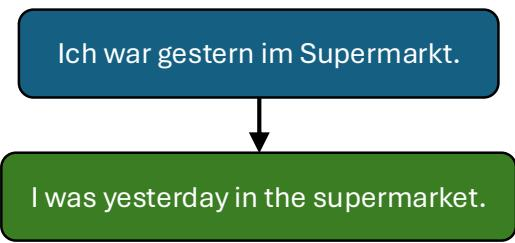  
Figure 1: An example of translationese interference. This example shows a German-to-English translation with interference in part-of-speech n-gram distribution, which can be automatically detected with various machine learning models.

of translationese that can be indexed by linguistic indicators relating to principles such as simplification and explicitation, both of which are thought of as universal for translation. Even text which has been translated by a machine and reviewed/edited by a human has still been shown to demonstrate translationese (Toral, 2019).

Automatic Detection of Translationese Several works have examined how to use computational methods to automatically detect or measure translationese. Baroni &Bernardini (2005) and Freitag et al. (2022) utilize a support vector machine which distinguishes between translated text and its original with high accuracy. Volansky et al. (2015) trains classifiers on the linguistic features previously identified to be hallmarks of translation, as mentioned above. These include indicators such as type–token ratio as well as sentence and word length based on the simplification hypothesis (Baker et al., 1993) and indicators such as POS n-gram distribution based on interference (Toury, 1995). This methodology for translationese identification is also adapted by Hu &Kübler (2021) and Rabinovich et al. (2017). Borah et al. (2023) supports the use of these surface features, establishing that semantic features can introduce spurious topic-based biases. Finally, recent studies such as Riley et al. (2019) and Jalota et al. (2023) demonstrate further that translationese can be effectively quantified, even without a parallel corpus.

Multilinguality and Large Language Models Prior work shows that MLLMs struggle with capturing cultural nuances and balancing universal knowledge with language-specific details, especially for low-resource languages — challenges directly relevant to translationese, given its ties to linguistic fidelity (Li et al., 2024; Held et al., 2023). Another recent line of work on MLLMs investigates how multilingual capabilities may be related to translation, both internally and externally. For example, Etxaniz et al. (2024) observes that inference strategies such as translating inputs into English improves performance in multilingual settings. Li et al. (2025) similarly finds that LLM translation exhibits translationese, tracing it to biases from supervised fine-tuning rather than inference-time processing alone. Another study shows that MLLMs pass tokens through English representation space even when prompted in other languages. This effect becomes more prominent the less diverse pretraining the model had (Schut et al., 2025). Together, these findings indicate that multilingual generation may involve English-centric processing or implicit translations.

## 3 Human-written Data

## 3.1 German, Spanish, and Greek Data

For German, Spanish, and Greek, we leverage both native-speaker and non-native, humantranslated text from the Europarl dataset (Koehn, 2005), an extensive multilingual parallel corpus collected from proceedings of the European parliament from 1996 to 2012. We tokenize the text and partition it into chunks of approximately 2000 tokens (ending on a sentence boundary) to ensure that the length of an article does not interfere with classification.

The resulting German and Spanish datasets each contain 8000 samples, including 4000 natively written ones and 4000 ones that have been translated into German or Spanish from English. We use an 80/20 train/test split, resulting in 6400 and 1600 instances for training and testing, respectively.1

In our test sets, we also include a subset which extracts the non-native, human-written text before it has been translated into the target language, translating it instead using Google Translate. Including this condition is necessary to disentangle translationese effects from LLM-generation effects; it allows us to test whether the classifier’s signal is driven by:

(a) Translationese, which should affect both human + MT and LLM + MT texts similarly, or (b) LLM-specific stylistic biases, which would cause the LLM + MT condition to diverge from the human + MT baseline even though both underwent identical MT processing.

Finally, we include configurations where the native human text is translated by either Gemini or Llama, in order to examine any potential model-specific translation biases.

For Greek, while the data is also processed in the way described above, we only obtain a dataset of size 6000 (with a 4800/1200 train/test split). Though we obtain data from the same source as for German and Spanish, we note that on Microsoft’s linguistic diversity index (Joshi et al., 2020), in which 5 is the class with most resources and 0 is the one with the fewest, Greek is classed at 3, meaning it has somewhat limited resources, but still more than nearly 95% of the world’s languages.

## 3.2 English Data

We also develop an English dataset for comparison, to ensure that interference we measure is due to translationese as opposed to interference purely from LLM generation, which would show up in any language. We use Europarl for this as well, collecting a dataset matching the proportions of our German dataset (6400/1600). 4000 of these are original English writing, while 4000 are translated from the ten languages used to train the Volansky et al. (2015) classifier (400 each).

## 3.3 Pashto Data

We conduct an additional experiment in which we focus on the low-resource language Pashto, an eastern Iranian language with around 45-55 million speakers worldwide. In Microsoft’s linguistic diversity index (Joshi et al., 2020), Pashto is classified at 1 on the 0-5 scale, meaning their digital resources are very limited in comparison to English, Spanish, German, and even Greek.

For the Pashto language, we collect native speaker data primarily by scraping Pashto Wikipedia articles. We begin on a popular page and randomly select from the links it includes, then travel to that page and repeat the process. We extract the first 10 sentences corresponding to each article title gained through the random crawl. If an article consists of fewer than 10 sentences, we reject it and move to a different one. In total, we collect samples from 500 articles.

To obtain data which has been human-translated into Pashto, we utilize the Open Language Data Initiative (OLDI) Seed dataset (Maillard et al., 2023). The OLDI Seed dataset consists of roughly 6,193 sentences drawn from English-language Wikipedia and translated into 44 diverse languages. As the entries in the dataset are stored at the sentence level, we recombine them by article and split them into 10-sentence-long chunks. This results in a total of 500 human-translated Pashto samples from English Wikipedia articles. Our final Pashto human dataset consists of 1000 samples, with a 800/200 train/test split, where the split is partitioned at the article level so that no chunks from the same source article appear in both sets. While not directly parallel like our other datasets, comparable corpora such as this one have demonstrated effectiveness for translationese detection (Riley et al., 2019; Jalota et al., 2023).

## 3.4 Europarl-UdS

Finally, we include an additional experiment to further verify our Spanish and German results in Appendix C. This experiment utilizes the Europarl-UdS dataset (Karakanta et al., 2018), a specifically curated version of Europarl which isolates texts confirmed to be uttered by a native speaker. We cannot use UdS to replace our primary evaluation source as it is currently only available for English, German, and Spanish, and only provides English-to-target-translated parallel data, making it insufficient for our complete multilingual evaluation (our English verification baseline also cannot be fully replaced by UdS, with English only on the source side of the parallel data).

## 4 Experiments

Our goal is to assess the levels of translationese in MLLM generations for several languages with varying levels of language-specific training text available. We utilize samples in each language generated by the following configurations: (1) MLLM generating in target language, (2) MLLM generating in English + MT system translator, (3) target-language native speaker, (4) English native speaker + human translator, (5) English native speaker + MT system translator, (6a) English native speaker + Gemini translator, and (6b) English native speaker + Llama translator.

We attempt to select a diverse set of languages in order to ensure observations are valid across different languages; those selected differ with regards to their linguistic diversity index, their morphosyntactic complexity, and their similarity to English. We include configurations with both human and machine translation in order to ensure the classifier can accurately classify both, as well as any LLM-specific differences that may arise.

## 4.1 Measuring Levels of Translationese

This section outlines the metrics we use to evaluate text generated by all models or model combinations for the presence of translationese, which include individual linguistic indicators as well as classification results from a high-accuracy binary classifier.

## 4.1.1 Linguistic Indicators

For all experiments, we use indicators which have been selected for their relevance to the process of translation, and narrowed down further by us based on the accuracy scores reported by Volansky et al. (2015). The use of these surface features rather than deeper semantic features allows us to avoid potential topic-based biases. In addition to using these indicators as features for our classifier, we conduct analyses of variance (ANOVAs) on

individual categories to extract more fine-grained information on their specific relevance.   
The indicators we implement are described below, as well as their reported accuracies.

• Type-token ratio: ratio of types (unique tokens) to total tokens, measuring lexical variety (Volansky et al. (2015): 72% accuracy).

• Function words: ratio of function (non-content) word tokens to total tokens, identified via POS-tagging per Baxronovish (2016). Each unique function word is treated as its own classifier feature, as in Volansky et al. (2015) (96% accuracy).

• Mean sentence length (65%) and mean word length (66%): average lengths of sentences and words per passage.

• Pronoun frequency: ratio of pronouns to total tokens; we combine per-pronoun features (individually 77% in Volansky et al. (2015)) into a single indicator.

• Punctuation frequency: ratio of punctuation marks to total tokens (81%).

• POS n-gram distribution: correlation of unigram/bigram/trigram POS distributions with typical distributions for each language, split by unique n-gram as a classifier feature (90%/97%/98%). We tag with StanfordPOSTagger (German, Spanish), spaCy 3.7.5 (Greek), and a BERT-based XLM-R tagger (Haq et al., 2025) (Pashto).

• Contextual function words: triplets with at most one POS-tagged word and at least two function words, split by unique triplet as a feature (100%).

## 4.1.2 Translationese Classifier

The primary method we use to evaluate each of our generation configurations is a binary support vector machine (SVM) classifier, which we train by implementing a set of established translationese indicators as features (see Section 4.1.1). More specifically, we implement John Platt’s sequential minimal optimization (SMO) algorithm (Platt, 1998). To ensure that the classifier captures the general linguistic signal of translationese rather than artifacts of a specific MT system, we train the SVM exclusively on human-produced data and translations. This mitigates the risk of inducing a decision boundary that reflects idiosyncratic properties of a specific MT system—its lexical preferences, sentence-length distributions, or characteristic error modes—rather than structural properties associated with translated text more broadly.

We train a classifier for each language (German, Spanish, Greek, English, and Pashto) using their respective training sets, which are described in Section 3. We note the overall accuracy scores achieved by each language’s classifier in Table 1. This same information for the UdS dataset is provided in Appendix C.1.

<table><tr><td>Language</td><td>Accuracy (%)</td></tr><tr><td>German</td><td>99.79</td></tr><tr><td>Spanish</td><td>99.81</td></tr><tr><td>Ġreek</td><td>99.95</td></tr><tr><td>Pashto</td><td>87.50</td></tr><tr><td>English</td><td>99.36</td></tr></table>

Table 1: SVM classification accuracy by language, in percentages.

Once a model is trained for each language, we are able to evaluate configurations present in the test set using the Classified Positive metric, which refers to the proportion of samples generated using each configuration which are labeled by the SVM as positive for translation.

Feature Coefficients Furthermore, feature coefficients allow us to determine how influential each specific feature is in measuring the presence of translationese. When an SVM with a linear kernel is trained, it generates a boundary that specifies weights for each individual feature. The magnitude (absolute value) represents how strongly each normalized feature changes the score per unit increase, holding all other features fixed. A positive coefficient means that a feature pushes the classifier toward a True classification (indicating translated text) and a negative coefficient means that a feature pushes the classifier toward False (native text).

## 4.2 Data Generation

This section outlines the construction of the machine-generated portion of our datasets.

## 4.2.1 Models

Gemini We use the Gemini-2.0-Flash-001 model (Team et al., 2024) as one of our MLLMs because of its strong multilingual claims. Gemini-2.0-Flash is part of the Gemini model family, purportedly more successful than previous models with multilingual generation due to the large amount of multilingual data included in the training corpus.

Llama3 We additionally compare to Llama-3.3-70B-Instruct (Meta, 2023), an open-source model with strong multilingual capabilities, to make sure our findings generalize.

Generation+Translation Pipelines We finally compare to a pipeline approach where both LLMs generate text in English and the Google Translate API translates the generations into the target language. We call these configurations Gemini+MT and Llama+MT.

## 4.2.2 Process

For each language, the set of LLM-generated texts corresponds directly to the humanwritten test set described in Section 3. Prompts are based on the content of each human sample in order to create corpora with as many similarities as possible, removing excess noise that might influence classification. This generation step marks the last stage of development for our dataset. The total number of samples now generated and collected for each language/configuration pair in the completed dataset can be found in Appendix A.

## 4.2.3 Prompt Structure

The English LLM prompt used to generate text to be translated into German, Spanish, and Greek was constructed as follows, with <first sentence> representing the initial sentence of each sample in our pre-translation English Europarl test set:

• You are given the first sentence of a statement made in the European parliament. Write a new paragraph using the same style that could complete the statement. Continue your response until you hit 2000 tokens, then truncate to the last sentence’s end. Return ONLY the paragraph with no additional text. The sentence to expand on is: <first sentence>.

The LLM prompt used for English generation into Pashto was constructed as follows, with <Title> representing the title of each pre-translation English article in our OLDI Seed test set:

• Write the first 10 sentences for a Wikipedia article with the title: <Title>. Return ONLY the sentences with no additional text.

For direct generation in each target language, we translate these prompts using Google Translate. We verify these translations by back-translating into English for review. Finally, in German and Spanish, we asked native speakers to ’internalize,’ or memorize the task itself (rather than the specific words used to describe it), and then write in their own words and in their native language a description of the task, in order to ensure the LLM outputs are not influenced by potential translationese within the prompts.

## 4.3 Human Annotation Data

We additionally create a native speaker-annotated subsection of our German and Spanish test sets. For each language, we randomly sample 60 sentences from the possible configurations (see Table 3 for a full list of the configurations making up each set). Our annotators are given the sentences individually, with no additional context or labels, and instructed to label each sentence as either Translated or Non-Translated. If a sentence is labeled as Translated, they are asked to provide a few words in a separate column explaining their reasoning. This annotated subset allows for a small analysis of how well humans are able to detect translationese, which sorts of features are more and less noticeable to human readers, and how LLM outputs compare with human translationese preferences. We note that all annotators are authors of this paper who are university-educated and native speakers of their respective languages.

## 4.4 Statistical Analysis

We conduct Analyses of Variance (ANOVAs) on the linguistic indicators described in Section 4.1.1 in order to obtain more specific information on how each machine generation configuration differs from human text, both translated and non-translated. We measure the statistical strength of each indicator in differentiating translated from non-translated text, also examining how text generated using each LLM-based configuration compares in score to both human settings.

This allows for a more fine-grained analysis of how much and what kind of translationese is present in text generated using each configuration. For each language, we examine ANOVA results of indicators which show particular strength in separating translated from non-translated text. Comparing how configurations score on these indicators allows us to isolate the features which are and are not displayed in LLM-generated translationese, addressing our second research question (How does translationese produced by MLLMs differ from translationese produced through direct translation?).

## 5 Results and Discussion

## 5.1 Classification Results

## 5.1.1 English

Our English classification results (see Figure 2), demonstrate that LLMs may naturally produce some level of interference resembling translationese, even when generating English. However, our results on Europarl-UdS data suggest that this may also just be dataset-specific noise, as the classifier trained on the filtered data picked up little to no translationese in English LLM-generated texts (see Appendix C.2).

The English results included here provide a comparison for our multilingual results, allowing us to disentangle the base effects of LLM generation from non-English generations.

We additionally note the effectiveness of the classifier at properly classifying each of our human baselines. Despite not having encountered any machine-translated text during training, it is still able to identify it as translated with 90% accuracy. This indicates the classifier does in fact appear to be picking up on artifacts of translation, not just idiosyncrasies of the dataset or individual translators.

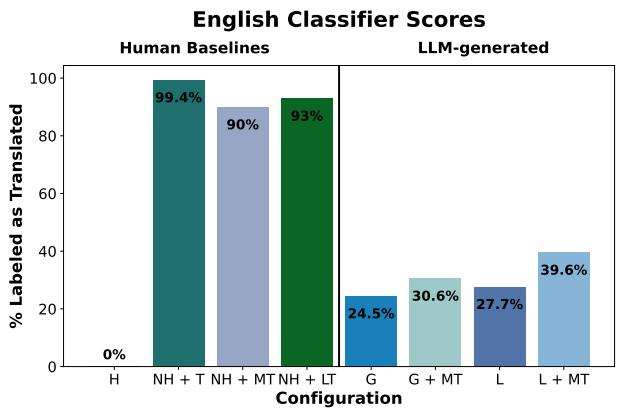  
Figure 2: Full results for the English translationese classifier (higher = more samples classified as translated). H = human, NH = non-native human, G = Gemini, L = Llama, T = human translation, MT = machine translation, LT = average of Llama and Gemini translation scores.

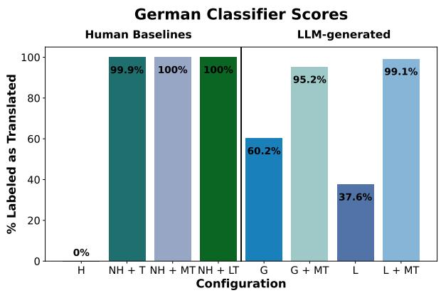  
Figure 3: Full results for German. See Figure 2 for the complete dictionary of abbreviations.  
The LLM-translated results are similar (averaging within 8 percentage points for all languages in our primary dataset), and are included in full in Appendix B.

## 5.1.2 German

For German (see Figure 3), translationese levels are considerably higher in both MLLMs, with Gemini and Llama having 60.2% and 37.6% of their outputs scored by the classifier as translated, respectively. This suggests MLLMs may inherently struggle more with non-English naturalness, despite multilingual training. This same finding is reflected in UdS experiments, with German generations scoring as translated 18-26% more than in English.

Several factors could explain this pattern. One hypothesis, which has also been studied recently in various interpretability research (e.g., Wendler et al. (2024) or Schut et al. (2025)), is that MLLMs may actually be ’thinking’ in English, performing the majority of reasoning steps in English before translating into the desired generation language. This would likely yield an increase in translationese scores when generating in non-English languages, similar to what we see here for German. Given these results in complement with existing research, this seems like a plausible hypothesis.

Another explanation, however, could just be that the data these models are trained on contains large amounts of translated text, and the text they generate is only mimicking behavior from their training data. It is thus important to acknowledge that these results alone do not necessarily indicate text has been translated, but they represent a linguistically grounded evaluation that can provide support to existing theories.

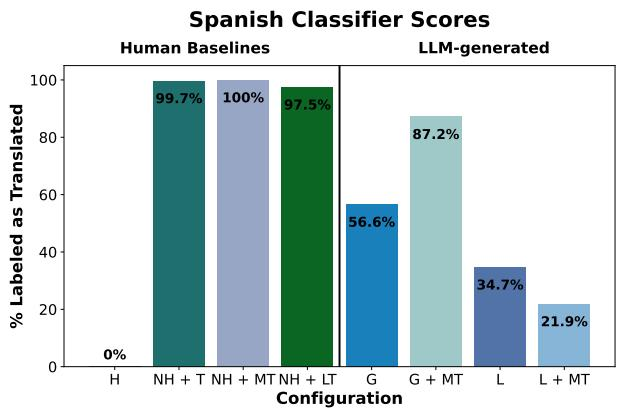  
Figure 4: Full results for Spanish. See Figure 2 for the complete dictionary of abbreviations.

## 5.1.3 Spanish

Spanish results (see Figure 4), which yield an average score of

45.7% translated across the two native LLM configurations, also suggest a natural inclination for LLMs to produce more translationese in non-English languages. These results are relatively similar to German, with the exception that the Llama-generated and machinetranslated configuration outperformed its non-translated counterpart. This is unexpected, but a closer analysis of the text generated by this configuration reveals that article usage is particularly low, which may be a Llama-specific peculiarity. We expand more on this idea in Section 5.2. As with German, these results are reflected in the filtered UdS data, including the Llama+MT abnormality.

## 5.1.4 Greek and Pashto

In both Greek and Pashto (see Figures 5 and 6), we observe similar results: MLLMs are actually more successful at producing translationese-free text in Greek and Pashto than in Spanish or German, despite the latter two languages having considerably larger sets of data and computational resources available, as well as closer similarity to English. It is difficult to say exactly why this is, but there are a few aspects of these languages that could contribute.

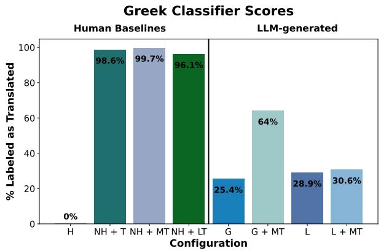  
Figure 5: Full results for Greek. See Figure 2 for the complete dictionary of abbreviations.

For one, English–Spanish and English–German are common parallel-data pairings, which benefits NLP tooling but likely also means more translated text in MLLM training data. In languages with smaller amounts of resources, like Greek and Pashto, although both data quantity and quality may be degraded, the lack of translated data may be beneficial purely from a translationese generation standpoint.

Additionally, Greek and Pashto are both languages with extremely flexible word orders (Georgiafentis &Lascaratou, 2013; Shah &Hassan, 2025). While German also demonstrates flexibility with word order, it has characteristics that still require structured learning when transferring from English, like the V2 constraint and verbfinal subordinate clauses.

Finally, there is a possibility that their greater similarity to English is precisely what causes more interference in German and Spanish; $\mathrm { e . g . , }$ , overlapping representational space may make English patterns harder for the model to suppress.

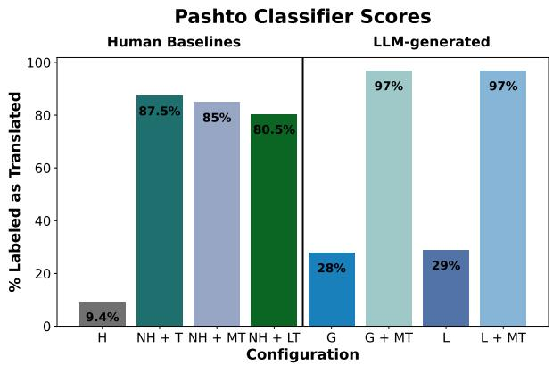  
Figure 6: Full results for Pashto. See Figure 2 for the complete dictionary of abbreviations.

## 5.2 ANOVA Results

Looking at features with the highest absolute weight, we see that trends do appear in the broader distribution/ratio-based indicators, but the most deterministic features are those which focus on something more specific, like the frequency of individual function words. In German, a higher frequency of the function word auch is one of the strongest indicators that text has not been translated, with an attribute weight of −0.327 (the highest magnitude of any feature), while the function word äußerst is a stronger indicator of translated text, with a weight of +0.200.

Comparing LLM-generated text to translated and non-translated text on these features reveals another trend. The models are generally able to avoid including features whose presence is a strong indicator of translation (as in the above example); the ways in which their generated text diverges from native human text are typically in the specific distribution of higherfrequency features. This is consistent with human-preference tuning in LLM training pipelines (Jiang et al., 2024), which likely filters out the most obviously abnormal features. This pattern is

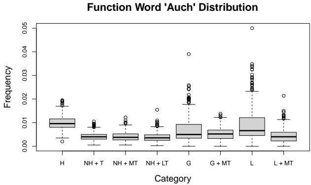  
Figure 7: Distribution of the German function word auch. See Figure 2 for the complete dictionary of abbreviations.

demonstrated in Figures 7 and 8: LLMs are largely able to avoid infrequent and abnormal function words like äußerst, but the distribution shifts back toward matching translated texts for higher frequency words like auch.

Spanish ANOVA results confirm that the number of articles $( \mathbf { e . g . , } e l / l a / l o s / l a s )$ are indeed an abnormality in Llama configurations: the function word $e l ,$ for example, which has a feature weight of +0.1192 (pushing toward translated), has an aggregate average for Llama configurations equal to less than half that of Gemini or human outputs. For the full set of Spanish article ANOVA results, see Appendix D.

## 5.3 Human Preferences

Human annotations suggest that some LLMs may indeed largely filter out translationese cues more obvious to humans: while 60.2% of German Gemini generations were classifierflagged as translated, none in the annotation set were flagged by our native annotator. For Llama, the results were more balanced: the annotator classified 37.5% as translated, including 12.5% marked as possibly either translated or generated (counted here as Translated). In Spanish, results are similar: for both Gemini and Llama, 28.6% of target language generations were classified as translated (compared to 56.6% and 34.7% by the classifier).

We also note that most annotator rationales cited unusual words or word combinations, rather than broader issues such as abnormal frequencies of common words. Though these annotation sets are small, they suggest MLLMs may indeed be better able to avoid human-noticeable translationese errors.

## 6 Conclusion

Function Word 'Äußerst' Distribution  
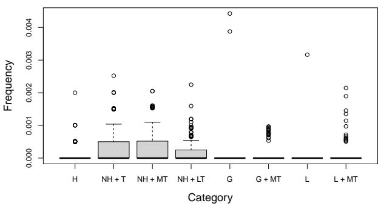  
Figure 8: Distribution of the German function word äußerst. See Figure 2 for the complete dictionary of abbreviations.

Through the use of state-of-theart methods for detecting markers of translation in text, we conduct an analysis of multilingual LLM-

generated text to examine its level of linguistic naturalness. We generate text in several diverse languages, creating a dataset which allows us to examine how the amount of translation interference or apparent author fluency change in different settings.

Results demonstrate that MLLMs do in fact generate text that resembles translationese, and these effects are consistently exacerbated when generating in non-English languages. By examining individual linguistic features and a set of native human annotations, however, we see that features which are more human-observable, such as unnatural or uncommon words, are more effectively avoided by the LLMs, likely due to human preference training.

An outstanding question which remains for future work is determining the exact cause of this LLM-generated translationese: while a body of research suggests the possibility of some sort of internal translation taking place, it is also possible these features emerge as an artifact of using translated data during training. Additional experiments, such as an analysis of models with documented pretraining data compositions, could help determine whether observed translationese features are inherited from translated training data or arise as a byproduct of cross-lingual processing during inference.

## 7 Limitations

Our human annotation study is small (60 sentences per language, 2 languages) and relies on annotators personally known to the authors: native speakers with university education, but not independently recruited. We treat these results as a complement to our automated metrics, rather than a standalone finding, and future work would benefit from a larger, independently recruited pool. Additionally, our native-speaker Pashto data is drawn from Wikipedia, and some articles may have originally been translated from English or another language before publication—a known risk for lower-resource Wikipedia editions that may partially explain our Pashto classifier’s relatively lower accuracy.

## References

Rohan Anil, Andrew M. Dai, Orhan Firat, Melvin Johnson, Dmitry Lepikhin, Alexandre Passos, Siamak Shakeri, Emanuel Taropa, Paige Bailey, Z. Chen, et al. Palm 2 technical report. arXiv.org, 2023. doi: 10.48550/arXiv.2305.10403. URL http://arxiv.org/abs/ 2305.10403. arXiv:2305.10403 [cs].

Mona Baker, Gill Francis, and Elena Tognini-Bonelli. Text and technology: in honour of John Sinclair. John Benjamins Publishing, 1993. doi: 10.1075/Z.64.

Marco Baroni and Silvia Bernardini. A new approach to the study of translationese: Machinelearning the difference between original and translated text. Literary and Linguistic Computing, 21(3):259–274, 2005. doi: 10.1093/llc/fqi039.

Pardayev Azamat Baxronovish. Function words as a linguistic object. ANGLISTICUM. Journal ofthe Association-Institutefor English Language and American Studies, 5(9), 2016. URL https://www.anglisticum.org.mk/index.php/IJLLIS/article/view/1028.

Angana Borah, Daria Pylypenko, C. España-Bonet, and Josef van Genabith. Measuring spurious correlation in classification: “clever hans” in translationese. In Ruslan Mitkov and Galia Angelova (eds.), Proceedings of the Conference Recent Advances in Natural Language Processing - Large Language Models for Natural Language Processings, pp. 196–206, Varna, Bulgaria, 2023. INCOMA Ltd., Shoumen, Bulgaria. doi: 10.26615/978-954-452-092-2\_022. URL https://aclanthology.org/2023.ranlp-1.22/.

Julen Etxaniz, Gorka Azkune, Aitor Soroa Etxabe, Oier Lopez de Lacalle, and Mikel Artetxe. Do multilingual language models think better in English? In Kevin Duh, Helena Gomez, and Steven Bethard (eds.), Proceedings of the 2024 Conference of the North American Chapter of the Association for Computational Linguistics: Human Language Technologies (Volume 2: Short Papers), pp. 550–564. Association for Computational Linguistics, 2024. doi: 10.18653/v1/ 2024.naacl-short.46.

Markus Freitag, David Vilar, David Grangier, Colin Cherry, and George Foster. A natural diet: Towards improving naturalness of machine translation output. In Smaranda Muresan, Preslav Nakov, and Aline Villavicencio (eds.), Findings, Dublin, Ireland, 2022. Association for Computational Linguistics. doi: 10.18653/v1/2022.findings-acl.263. URL https://aclanthology.org/2022.findings-acl.263/.

Martin Gellerstam. Translationese in swedish novels translated from english. 1986. URL https://api.semanticscholar.org/CorpusID:59685951.

Michalis Georgiafentis and Chryssoula Lascaratou. Word order flexibility and adjacency preferences: Competing forces and tension in the greek vp. Journal of Greek Linguistics, 13(2):181 – 202, 2013. doi: 10.1163/15699846-13130202. URL https://brill.com/view/ journals/jgl/13/2/article-p181\_3.xml.

Ijazul Haq, Yingjie Zhang, and Intakhab Alam Qadri. Pos tagging of low-resource pashto language: annotated corpus and bert-based model. Language Resources and Evaluation, 59 (3):3243–3265, May 2025. doi: 10.1007/s10579-025-09834-3. URL http://dx.doi.org/10. 1007/s10579-025-09834-3.

William Held, Camille Harris, Michael Best, and Diyi Yang. A material lens on coloniality in nlp, 2023.

Hai Hu and Sandra Kübler. Investigating translated chinese and its variants using machine learning. Natural Language Engineering, 27(3), 2021. ISSN 1351-3249, 1469-8110. doi: 10.1017/S1351324920000182.

Rricha Jalota, Koel Dutta Chowdhury, C. España-Bonet, and Josef van Genabith. Translating away translationese without parallel data. Proceedings ofthe 2023 Conference on Empirical Methods in Natural Language Processing, (arXiv:2310.18830):7086–7100, 2023. doi: 10.18653/ v1/2023.emnlp-main.438. URL http://arxiv.org/abs/2310.18830. arXiv:2310.18830 [cs].

Ruili Jiang, Kehai Chen, Xuefeng Bai, Zhixuan He, Juntao Li, Muyun Yang, Tiejun Zhao, Liqiang Nie, and Min Zhang. A survey on human preference learning for large language models, 2024. URL https://arxiv.org/abs/2406.11191.

Pratik Joshi, Sebastin Santy, Amar Budhiraja, Kalika Bali, and Monojit Choudhury. The state and fate of linguistic diversity and inclusion in the NLP world. In Annual Meeting of the Association for Computational Linguistics, pp. 6282–6293. Association for Computational Linguistics, 2020. doi: 10.18653/v1/2020.acl-main.560.

Alina Karakanta, Mihaela Vela, and Elke Teich. Europarl-uds: Preserving and extending metadata in parliamentary debates. 2018.

Philipp Koehn. Europarl: A parallel corpus for statistical machine translation. In Machine Translation Summit, 2005.

Moshe Koppel and Noam Ordan. Translationese and its dialects. In Dekang Lin, Yuji Matsumoto, and Rada Mihalcea (eds.), Annual Meeting of the Associationfor Computational Linguistics, Portland, Oregon, USA, 2011. Association for Computational Linguistics. URL https://aclanthology.org/P11-1132.

Cheng Li, Mengzhou Chen, Jindong Wang, Sunayana Sitaram, and Xing Xie. Culturellm: Incorporating cultural differences into large language models, 2024.

Yafu Li, Ronghao Zhang, Zhilin Wang, Huajian Zhang, Leyang Cui, Yongjing Yin, Tong Xiao, and Yue Zhang. Lost in literalism: How supervised training shapes translationese in llms. Proceedings of the 63rd Annual Meeting of the Association for Computational Linguistics (Volume 1: Long Papers), (arXiv:2503.04369):12875–12894, 2025. doi: 10.18653/v1/2025.acl-long.630. URL http://arxiv.org/abs/2503.04369. arXiv:2503.04369 [cs.CL].

Jean Maillard, Cynthia Gao, Elahe Kalbassi, Kaushik Ram Sadagopan, Vedanuj Goswami, Philipp Koehn, Angela Fan, and Francisco Guzmán. Small data, big impact: Leveraging minimal data for effective machine translation. In Annual Meeting of the Association for Computational Linguistics, pp. 2740–2756, Toronto, Canada, 2023. Association for Computational Linguistics. doi: 10.18653/v1/2023.acl-long.154. URL https: //aclanthology.org/2023.acl-long.154.

Meta. Llama, February 2023. URL https://ai.meta.com/llama/.

OpenAI. Chatgpt, November 2022. URL https://openai.com/blog/chatgpt.

John Platt. Sequential minimal optimization: A fast algorithm for training support vector machines. Advances in Kernel Methods, 208, 07 1998. doi: 10.7551/mitpress/1130.003.0016.

Ella Rabinovich, Noam Ordan, and Shuly Wintner. Found in translation: Reconstructing phylogenetic language trees from translations. In Regina Barzilay and Min-Yen Kan (eds.), Annual Meeting of the Association for Computational Linguistics, pp. 530–540, Vancouver, Canada, 2017. Association for Computational Linguistics. doi: 10.18653/v1/P17-1049. URL https://aclanthology.org/P17-1049/.

Parker Riley, Isaac Caswell, Markus Freitag, and David Grangier. Translationese as a language in “multilingual” nmt. In Dan Jurafsky, Joyce Chai, Natalie Schluter, and Joel Tetreault (eds.), Annual Meeting of the Association for Computational Linguistics, pp. 7737– 7746, Online, 2019. Association for Computational Linguistics. doi: 10.18653/v1/2020. acl-main.691. URL https://aclanthology.org/2020.acl-main.691/.

Lisa Schut, Yarin Gal, and Sebastian Farquhar. Do multilingual llms think in english? arXiv.org, 2025. doi: 10.48550/arXiv.2502.15603.

Syeda Sara Shah and Abdul Moiz UL Hassan. An analysis of the syntactic and pragmatic effects on word order flexibility in pashto and english. Research Journal for Social Affairs, 3 (3):345–350, 2025. doi: 10.71317/RJSA.003.03.0227.

Gemini Robotics Team, Rohan Anil, Sebastian Borgeaud, Jean-Baptiste Alayrac, Jiahui Yu, Radu Soricut, Johan Schalkwyk, Andrew M. Dai, Anja Hauth, Katie Millican, et al. Gemini: A family of highly capable multimodal models. arXiv (Cornell University), (arXiv:2312.11805), 2024. doi: 10.48550/arXiv.2312.11805. URL http://arxiv.org/abs/ 2312.11805. arXiv:2312.11805 [cs].

Antonio Toral. Post-editese: an exacerbated translationese. Machine Translation Summit, (arXiv:1907.00900), 2019. URL http://arxiv.org/abs/1907.00900. arXiv:1907.00900 [cs].

Gideon Toury. In Search of a Theory of Translation. 1980.

Gideon Toury. Descriptive Translation Studies and Beyond. Benjamins translation library. John Benjamins Publishing Company, 1995. ISBN 978-90-272-2145-2. doi: 10.1075/btl.4. URL https://books.google.com/books?id=aNHENtMoqEIC.

V. Volansky, N. Ordan, and S. Wintner. On the features of translationese. Digital Scholarship in the Humanities, 30(1):98–118, 2015. ISSN 2055-7671, 2055-768X. doi: 10.1093/llc/fqt031.

Chris Wendler, Veniamin Veselovsky, Giovanni Monea, and Robert West. Do llamas work in english? on the latent language of multilingual transformers, 2024. URL https: //arxiv.org/abs/2402.10588.

## A Full Data Descriptions

## A.1 Training Set

<table><tr><td colspan="2">Configuration</td><td colspan="5">Language</td></tr><tr><td>Generator</td><td>Translator</td><td>German</td><td>Spanish</td><td>Greek</td><td>Pashto</td><td>English</td></tr><tr><td>Human*</td><td>N/A</td><td>3200</td><td>3200</td><td>2800</td><td>400</td><td>3200</td></tr><tr><td>Human</td><td>Human</td><td>3200</td><td>3200</td><td>2800</td><td>400</td><td>3200</td></tr></table>

Table 2: Final distribution of each language’s training set, showing number of samples generated for each configuration/language pairing. Human\* refers to a native speaker of the target language.

## A.2 Test Set

<table><tr><td rowspan=1 colspan=7>Configuration                             Language</td></tr><tr><td rowspan=1 colspan=2>Generator Translator</td><td rowspan=1 colspan=1>German</td><td rowspan=1 colspan=4>Spanish  Greek  Pashto  English</td></tr><tr><td rowspan=1 colspan=1>Human*</td><td rowspan=1 colspan=1>N/A</td><td rowspan=1 colspan=1>800</td><td rowspan=1 colspan=1>800</td><td rowspan=1 colspan=1>700</td><td rowspan=1 colspan=1>100</td><td rowspan=1 colspan=1>800</td></tr><tr><td rowspan=5 colspan=1>HumanHumanHumanHumanGemini</td><td rowspan=1 colspan=1>Human</td><td rowspan=1 colspan=1>800</td><td rowspan=1 colspan=1>800</td><td rowspan=1 colspan=1>700</td><td rowspan=1 colspan=1>100</td><td rowspan=1 colspan=1>800</td></tr><tr><td rowspan=1 colspan=1>Machine</td><td rowspan=1 colspan=1>800</td><td rowspan=1 colspan=1>800</td><td rowspan=1 colspan=1>700</td><td rowspan=1 colspan=1>100</td><td rowspan=1 colspan=1>800</td></tr><tr><td rowspan=1 colspan=1>Gemini</td><td rowspan=1 colspan=1>800</td><td rowspan=1 colspan=1>800</td><td rowspan=1 colspan=1>700</td><td rowspan=1 colspan=1>100</td><td rowspan=1 colspan=1>800</td></tr><tr><td rowspan=1 colspan=1>Llama</td><td rowspan=1 colspan=1>800</td><td rowspan=1 colspan=1>800</td><td rowspan=1 colspan=1>700</td><td rowspan=1 colspan=1>100</td><td rowspan=1 colspan=1>800</td></tr><tr><td rowspan=1 colspan=1>N/A</td><td rowspan=1 colspan=1>800</td><td rowspan=1 colspan=1>800</td><td rowspan=1 colspan=1>700</td><td rowspan=1 colspan=1>100</td><td rowspan=1 colspan=1>800</td></tr><tr><td rowspan=1 colspan=1>Gemini</td><td rowspan=1 colspan=1>Machine</td><td rowspan=1 colspan=1>800</td><td rowspan=1 colspan=1>800</td><td rowspan=1 colspan=1>700</td><td rowspan=1 colspan=1>100</td><td rowspan=1 colspan=1>800</td></tr><tr><td rowspan=1 colspan=1>Llama</td><td rowspan=1 colspan=1>N/A</td><td rowspan=1 colspan=1>800</td><td rowspan=1 colspan=1>800</td><td rowspan=1 colspan=1>700</td><td rowspan=1 colspan=1>100</td><td rowspan=1 colspan=1>800</td></tr><tr><td rowspan=1 colspan=1>Llama</td><td rowspan=1 colspan=1>Machine</td><td rowspan=1 colspan=1>800</td><td rowspan=1 colspan=1>800</td><td rowspan=1 colspan=1>700</td><td rowspan=1 colspan=1>100</td><td rowspan=1 colspan=1>800</td></tr></table>

Table 3: Final distribution of each language’s test set, showing number of samples generated for each configuration/language pairing. Human\* refers to a native speaker of the target language.

## B LLM Translation Results

<table><tr><td>Translator</td><td>German</td><td>Spanish</td><td>Greek</td><td>Pashto</td><td>English</td></tr><tr><td>Gemini</td><td>100</td><td>99.6</td><td>100</td><td>83.0</td><td>92.8</td></tr><tr><td>Llama</td><td>100</td><td>95.3</td><td>92.2</td><td>78.0</td><td>93.1</td></tr></table>

Table 4: Results for each language of the LLM translation settings, with the values indicating percentage of samples classified as translated by the SVM. Gemini refers to text samples which were written by native human speakers and translated by the Gemini LLM, and Llama refers to text samples which were written by native human speakers and translated by the Llama LLM.

## C Europarl-UdS Experiments

C.1 Data and Classifier Specifications

C.1.1 Training Set

<table><tr><td rowspan=1 colspan=2>Configuration</td><td rowspan=1 colspan=3>Language</td></tr><tr><td rowspan=1 colspan=1>Generator</td><td rowspan=1 colspan=1>Translator</td><td rowspan=1 colspan=1>German</td><td rowspan=1 colspan=1>Spanish</td><td rowspan=1 colspan=1>English</td></tr><tr><td rowspan=1 colspan=1>Human*Human</td><td rowspan=1 colspan=1>N/AHuman</td><td rowspan=1 colspan=1>12441244</td><td rowspan=1 colspan=1>12761276</td><td rowspan=1 colspan=1>32003200</td></tr></table>

Table 5: Final distribution of each language’s training set for UdS experiments, showing number of samples generated for each configuration/language pairing. Human\* refers to a native speaker of the target language.

## C.1.2 Test Set

<table><tr><td rowspan=1 colspan=2>Configuration</td><td rowspan=1 colspan=3>Language</td></tr><tr><td rowspan=1 colspan=1>Generator</td><td rowspan=1 colspan=1>Translator</td><td rowspan=1 colspan=1>German</td><td rowspan=1 colspan=1>Spanish</td><td rowspan=1 colspan=1>English</td></tr><tr><td rowspan=1 colspan=1>Human*</td><td rowspan=1 colspan=1>N/A</td><td rowspan=1 colspan=1>311</td><td rowspan=1 colspan=1>319</td><td rowspan=1 colspan=1>800</td></tr><tr><td rowspan=1 colspan=1>Human</td><td rowspan=1 colspan=1>Human</td><td rowspan=1 colspan=1>311</td><td rowspan=1 colspan=1>319</td><td rowspan=1 colspan=1>800</td></tr><tr><td rowspan=1 colspan=1>Human</td><td rowspan=1 colspan=1>Machine</td><td rowspan=1 colspan=1>311</td><td rowspan=1 colspan=1>319</td><td rowspan=1 colspan=1>0</td></tr><tr><td rowspan=1 colspan=1>Human</td><td rowspan=1 colspan=1>Gemini</td><td rowspan=1 colspan=1>311</td><td rowspan=1 colspan=1>319</td><td rowspan=1 colspan=1>0</td></tr><tr><td rowspan=1 colspan=1>Human</td><td rowspan=1 colspan=1>Llama</td><td rowspan=1 colspan=1>311</td><td rowspan=1 colspan=1>319</td><td rowspan=1 colspan=1>0</td></tr><tr><td rowspan=1 colspan=1>Gemini</td><td rowspan=1 colspan=1>N/A</td><td rowspan=1 colspan=1>311</td><td rowspan=1 colspan=1>319</td><td rowspan=1 colspan=1>800</td></tr><tr><td rowspan=1 colspan=1>Gemini</td><td rowspan=1 colspan=1>Machine</td><td rowspan=1 colspan=1>311</td><td rowspan=1 colspan=1>319</td><td rowspan=1 colspan=1>800</td></tr><tr><td rowspan=2 colspan=1>LlamaLlama</td><td rowspan=1 colspan=1>N/A</td><td rowspan=1 colspan=1>311</td><td rowspan=1 colspan=1>319</td><td rowspan=1 colspan=1>800</td></tr><tr><td rowspan=1 colspan=1>Machine</td><td rowspan=1 colspan=1>311</td><td rowspan=1 colspan=1>319</td><td rowspan=1 colspan=1>800</td></tr></table>

Table 6: Final distribution of each language’s test set for UdS experiments, showing number of samples generated for each configuration/language pairing. Human\* refers to a native speaker of the target language.

## C.1.3 Classifier Accuracy Scores

<table><tr><td>Language</td><td>Accuracy (%)</td></tr><tr><td>German</td><td>96.66</td></tr><tr><td>Spanish</td><td>88.52</td></tr><tr><td>English</td><td>94.16</td></tr></table>

Table 7: The SVM’s classification accuracy by language in percentages, trained on the Europarl-UdS data.

## C.2 Results

## C.2.1 English

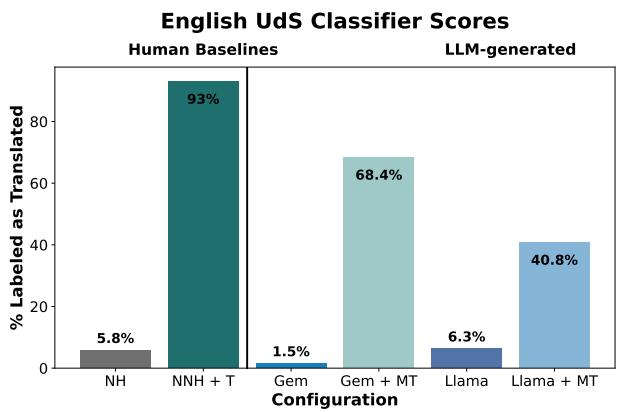  
Figure 9: Full results for English on the Europarl-UdS data. See Figure 2 for the complete dictionary of abbreviations.

## C.2.2 German

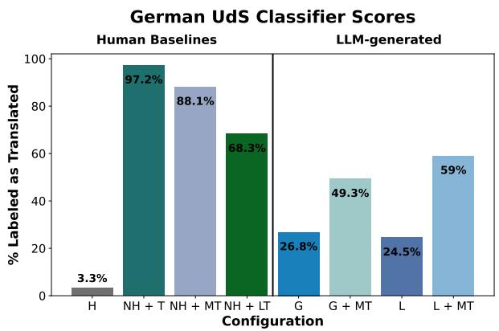  
Figure 10: Full results for German on the Europarl-UdS data. See Figure 2 for the complete dictionary of abbreviations.

## C.2.3 Spanish

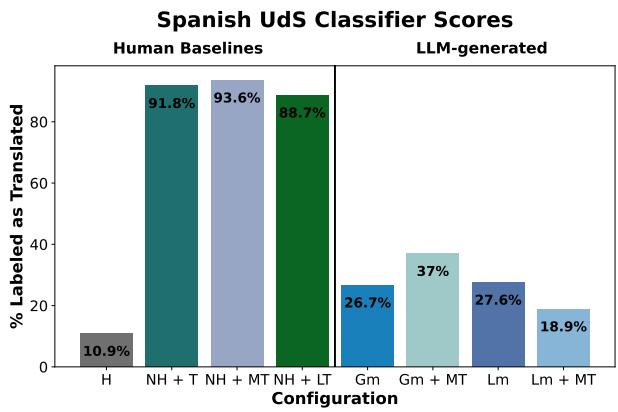  
Figure 11: Full results for Spanish on the Europarl-UdS data. See Figure 2 for the complete dictionary of abbreviations.

## C.3 LLM Translation Results

<table><tr><td>Translator</td><td>German</td><td>Spanish</td></tr><tr><td>Gemini</td><td>76.0</td><td>89.7</td></tr><tr><td>Llama</td><td>60.6</td><td>87.8</td></tr></table>

Table 8: Results for each language of the LLM translation settings on the UdS dataset, with the values indicating percentage of samples classified as translated by the SVM. Gemini refers to text samples which were written by native human speakers and translated by the Gemini LLM, and Llama refers to text samples which were written by native human speakers and translated by the Llama LLM.

## D Full Spanish Article ANOVA Results

## D.1 El

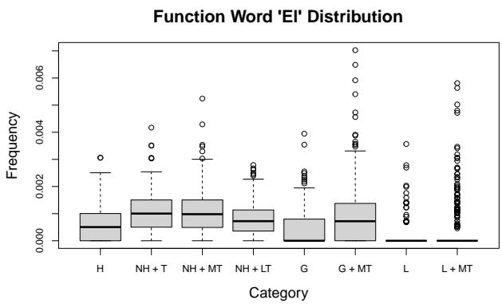  
Figure 12: Distribution of the Spanish article el across configurations. See Figure 2 for the complete dictionary of abbreviations.

## D.2 La

Function Word 'La' Distribution  
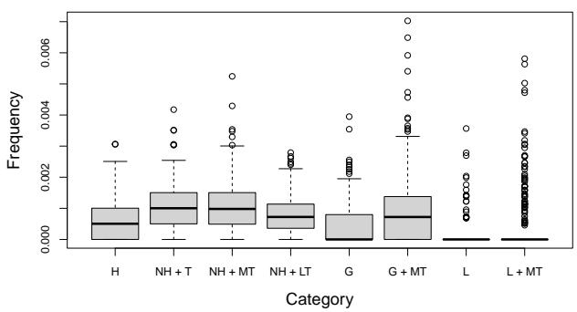  
Figure 13: Distribution of the Spanish article la across configurations. See Figure 2 for the complete dictionary of abbreviations.

## D.3 Las

Function Word 'Las' Distribution  
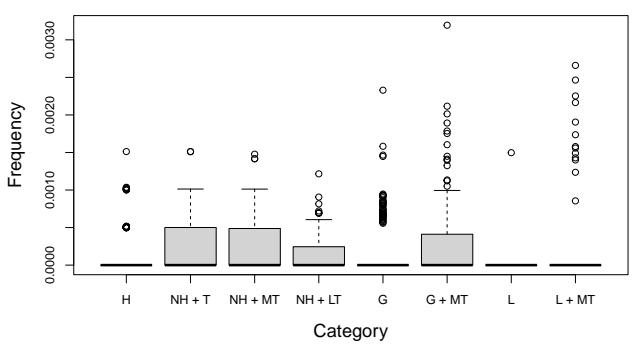  
Figure 14: Distribution of the Spanish article las across configurations. See Figure 2 for the complete dictionary of abbreviations.

## D.4 Los

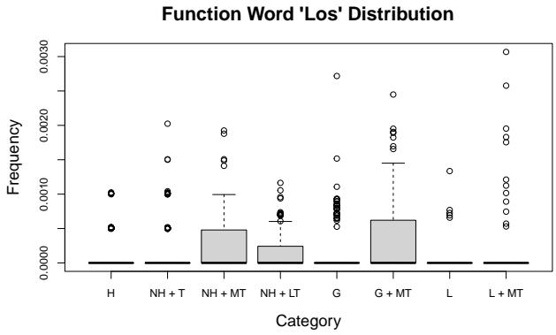  
Figure 15: Distribution of the Spanish article los across configurations. See Figure 2 for the complete dictionary of abbreviations.