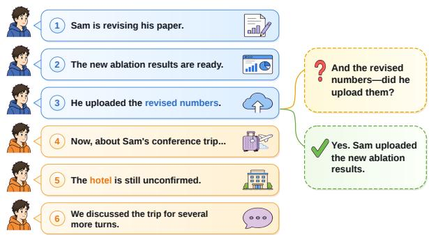
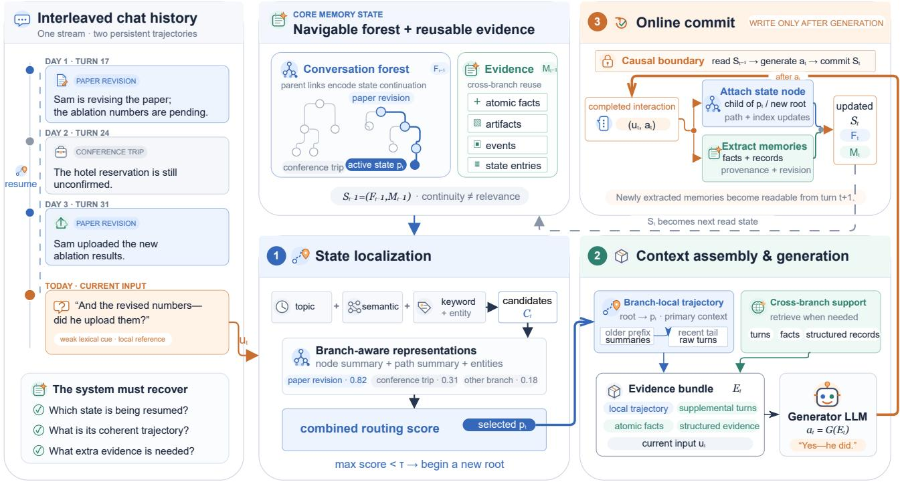

# ArborMem: Navigating Interaction States with Memory Forests

Zongwei Lv<sup>1∗</sup>, Yuemeng Xu<sup>1∗</sup>, Yilun Yao<sup>1∗</sup>, Dingsiyi<sup>1∗</sup>, Xinyu Tan<sup>2</sup>, Yaoming Li<sup>1</sup>, Guangxiang Zhao<sup>3</sup>, Weihong Lin<sup>4</sup>, Lin Sun<sup>4</sup>, Xiangzheng Zhang<sup>4</sup>, Tong Yang<sup>1†</sup>

<sup>1</sup>Peking University <sup>2</sup>Beijing University of Posts and Telecommunications <sup>3</sup>Qiyuan Tech <sup>4</sup>Qihoo 360

## Abstract

Large language models increasingly serve as persistent conversational assistants, requiring memory that preserves relevant experience and maintains continuity across interactions. Existing methods improve access to conversational history through long-context processing, selective retrieval, and structured memory organization. However, most systems treat memory access as retrieving relevant past information without first determining which prior interaction state the current turn resumes. This limitation becomes particularly important when conversations interleave multiple tasks, people, and plans that may be interrupted and later revisited. We introduce ArborMem, an online memory framework that represents a long-running conversation as a navigable forest of interaction states. Each branch preserves a locally coherent trajectory, while the forest maintains multiple trajectories that may later be resumed. For each new input, ArborMem localizes the relevant state, restores its branch-local context, and augments it with reusable evidence retrieved across branches, preserving interaction continuity without conflating semantically related but structurally distinct trajectories. Existing long-term memory benchmarks cover diverse memory and reasoning capabilities but do not explicitly isolate branch-structured challenges. We therefore introduce BranchMemEval, a controlled diagnostic benchmark for interleaved and resumable interaction trajectories. Experiments on LongMemEval, LoCoMo, BEAM 100K, and BranchMemEval show that ArborMem outperforms the strongest baselines by 3.36–10.31 percentage points on the three established benchmarks and by 5.0 points on BranchMemEval. Its advantage grows under constrained read budgets, while complete memory queries remain below half a second.

## Introduction

Large language models increasingly serve as persistent conversational assistants rather than one-shot questionanswering systems. As interactions extend over days or weeks, users expect assistants to remember prior discussions, track ongoing tasks, and resume earlier plans. Yet a language model has no durable state beyond the information available in its current context. Long-running conversational agents therefore require memory that preserves relevant experience and maintains continuity as users’ needs evolve (Maharana et al. 2024).

  
Figure 1: A motivating example of interaction-state localization. Although the most recent turns concern Sam’s conference trip, the underspecified follow-up resumes the earlier paper-revision trajectory.

Existing methods improve access to conversational history in several ways. Long-context models expose more history directly, with recent frontier models supporting context windows on the order of one million tokens (Gemini Team et al. 2024). However, context windows remain bounded, and making information visible does not ensure that it will be identified and used reliably (Liu et al. 2024). Selective memory systems instead externalize history as retrieved passages, summaries, episodic records, or extracted facts, as in Generative Agents (Park et al. 2023), Memory-Bank (Zhong et al. 2024), and Mem0 (Chhikara et al. 2025). Other methods organize memory through hierarchical stores, linked notes, trees, or temporal knowledge graphs, including MemGPT (Packer et al. 2024), A-MEM (Xu et al. 2025), MemTree (Rezazadeh et al. 2025), and Graphiti (Rasmussen et al. 2025).

Despite this progress, most systems treat memory access as retrieving relevant past information without first determining which prior interaction state the current turn resumes. Figure 1 illustrates the distinction. The conversation interleaves two persistent trajectories concerning Sam’s paper revision and conference trip. Although the latest turns concern the trip, the underspecified follow-up returns to the earlier paper discussion. A relevance-based retriever may therefore mix the two threads, whereas correct interpretation requires first identifying the interaction context resumed by the current turn. Such situations are common in persistent interaction, where assistants must manage multiple tasks, people, projects, and plans that may be interrupted and later resumed. Because these trajectories may involve overlapping entities or similar states while remaining distinct, long-term memory must preserve continuity across them rather than merely retain information.

We introduce ArborMem, an online memory framework that represents a long-running conversation as a navigable forest of interaction states. Each branch preserves a locally coherent trajectory, while the forest maintains multiple trajectories that may later be resumed. For each new input, ArborMem identifies the relevant branch, restores its local context, and supplements it with reusable evidence retrieved across branches. This design preserves interaction continuity while enabling information reuse without conflating semantically related but structurally distinct trajectories.

Existing long-term memory benchmarks broadly cover factual recall, temporal reasoning, knowledge updates, multihop reasoning, and very long conversations, but do not explicitly isolate branch-structured challenges such as topic interleaving, delayed trajectory resumption, and confusion between parallel agendas. To address this gap, we further introduce BranchMemEval, a controlled diagnostic benchmark for branch-structured conversational memory.

We evaluate ArborMem on LongMemEval, LoCoMo, BEAM 100K, and BranchMemEval. ArborMem outperforms the strongest baselines by 3.36 to 10.31 percentage points on the three established benchmarks and by 5.0 points on BranchMemEval. Its advantage grows under constrained read budgets, indicating that state localization supports more efective evidence selection when only a small portion of memory can be accessed. Complete memory queries remain below half a second despite the additional routing and context assembly.

Our contributions are threefold. First, we identify interaction-state localization as a key requirement for reliable long-term conversational memory: a system should determine which prior trajectory the current turn resumes before selecting historical evidence. Second, we propose ArborMem, which organizes evolving conversational states as a navigable memory forest, restores coherent branch-local context, and retrieves reusable evidence across branches without conflating distinct interaction trajectories. Third, we introduce BranchMemEval, a controlled diagnostic benchmark for branch-structured conversational memory, and demonstrate that ArborMem consistently outperforms strong baselines on both established long-term memory benchmarks and our controlled evaluation.

## Related Work

## Long-Term and Structured Agent Memory

Long-context models expose more interaction history, but evaluations show that visibility does not guarantee reliable access and that performance remains sensitive to evidence position (Bai et al. 2024; Hsieh et al. 2024; Liu et al. 2024). Selective memory methods instead externalize history as turns, summaries, facts, or coherent segments (Lewis et al. 2020; Pan et al. 2025; Tan et al. 2025).

Agent memory systems further support retrieval, reflection, updating, forgetting, consolidation, and hierarchical management (Park et al. 2023; Zhong et al. 2024; Chhikara et al. 2025; Packer et al. 2024). Recent systems further organize memories through linked notes, hierarchical trees, or temporal, event-centric, and entity-relation graphs (Xu et al. 2025; Rezazadeh et al. 2025; Zhang, Yuan, and Jiang 2025; Huang et al. 2026; Rasmussen et al. 2025).

These approaches primarily determine what information to store, organize, or retrieve, with structures based on semantic association, hierarchy, events, or entity relations. In contrast, ArborMem uses memory topology to represent continuity across interaction trajectories and retrieves reusable evidence separately, preventing semantically related but distinct states from being merged.

## Conversation Structure and Interaction-State Localization

Conversation structure has been studied through topic segmentation, reply prediction, and conversation disentanglement, which recover threads or hierarchies from interleaved dialogue (Arguello and Rosé 2006; Louis and Cohen 2015; Kummerfeld et al. 2019; Yu and Joty 2020). These studies show that conversation cannot always be represented as a single chronological sequence, but primarily analyze fixed transcripts.

In contrast, ArborMem maintains interaction structure as an evolving memory state and decides online whether each input continues an existing trajectory or begins a new one. Its interaction states capture not only topics or reply relations, but also the tasks, entities, goals, assumptions, and local context required for interpretation.

Existing benchmarks cover factual, temporal, and multisession memory, with EverMemBench further considering cross-topic interleaving and thread resumption (Wu et al. 2025; Maharana et al. 2024; Tavakoli et al. 2026; Hu et al. 2026). However, they do not isolate branch localization, delayed resumption, or parallel-thread confusion as controlled diagnostic factors; BranchMemEval targets these capabilities.

## Navigable Memory Forest

We represent long-running conversational memory as a navigable forest of interaction states, preserving multiple trajectories that may be interrupted and later resumed. After turn t, the system maintains a committed memory state

$$
S _ { t } = ( F _ { t } , M _ { t } ) ,\tag{1}
$$

  
Figure 2: Overview of ArborMem. The committed memory state consists of a conversation forest and a reusable evidence store. For each input, ArborMem localizes the resumed interaction state, reconstructs its branch-local trajectory, and augments it with cross-branch evidence. After generation, the completed interaction and extracted memories are committed for use in subsequent turns.

where $F _ { t }$ is an interaction-state forest and $M _ { t }$ is a reusable evidence store. Each node represents a committed local state, each parent edge represents state continuation, and each rootto-node path forms a locally coherent trajectory.

At turn t, $F _ { t - 1 }$ determines the primary context in which the new input is interpreted, while $M _ { t - 1 }$ supplies reusable facts and records across trajectory boundaries. The system reads only $S _ { t - 1 } ;$ after generating the response, it attaches the completed interaction to the selected trajectory or begins a new root, and commits the updated state $S _ { t }$ . This separation preserves interaction continuity while allowing information reuse across branches.

## ArborMem

ArborMem operationalizes the navigable memory forest through three stages, as illustrated in Figure 2. Given a new input $u _ { t }$ and the committed state $S _ { t - 1 }$ , it first localizes the resumed interaction state, then assembles branch-local context and cross-branch evidence to generate $^ { a _ { t } , }$ and finally commits the completed interaction to produce $S _ { t }$

## Memory State

Conversation forest. The conversation forest $\mathcal { F } _ { t }$ represents interaction continuity. Each node is created from one user–assistant interaction and represents the local state established after that turn. It stores the original interaction, node and path summaries, extracted entities and keywords, a vector representation, and structural metadata including its parent, root, depth, and global sequence position.

The forest grows online: each new interaction is attached to a previously established state or inserted as a new root. A root-to-node path forms a locally coherent trajectory that may later be resumed. The topology therefore encodes discourse continuity rather than semantic relevance alone; semantically related interactions need not belong to the same local trajectory.

Reusable evidence store. The evidence store $\mathcal { M } _ { t }$ contains information that may be reused outside the trajectory in which it was introduced. It maintains atomic facts and structured records. Atomic facts capture compact information such as preferences, identifiers, dates, and project details, while structured records represent assistant-generated artifacts, events, and mutable state entries. Each item retains provenance and revision metadata, enabling source tracing and the filtering or deprioritization of obsolete information.

## State Localization

Given a new input $u _ { t }$ and the committed forest $\mathcal { F } _ { t - 1 } .$ ArborMem identifies the interaction state under which the input should be interpreted. Localization follows a priority cascade. Inputs with explicit continuation cues are attached directly to the active state, while explicit temporal-return cues are resolved through the global interaction timeline. These fast paths handle cases in which the intended state can be identified without general retrieval.

For other inputs, ArborMem constructs a hybrid candidate set $\mathcal { C } _ { t }$ from three sources. Semantic recall retrieves candidate nodes through FAISS vector search (Johnson, Douze, and Jégou 2017). Keyword recall queries lexical and entity indexes using extracted content words, lemmatized forms, and entity terms. When explicit topic anchors are detected, topic-matched nodes are also added to the candidate set.

Each candidate node $v \in { \mathcal { C } } _ { t }$ is then reranked against the current input using a branch-aware representation. This representation contains the candidate’s topic key when available, its path summary, node summary, and extracted entities. The cross-encoder therefore evaluates not only the candidate node in isolation, but also the interaction trajectory leading to it.

The implemented localization score is an additive combination of the cross-encoder score and auxiliary routing signals:

$$
s _ { t } ( v ) = s _ { \mathrm { c e } } ( v ) + s _ { \mathrm { k e y } } ( v ) + s _ { \mathrm { r e c } } ( v ) + s _ { \mathrm { t o p i c } } ( v ) ,\tag{2}
$$

where $s _ { t } ( v )$ denotes the localization score of candidate node v for the current input $u _ { t } .$ . Here, $s _ { \mathrm { c e } }$ is the branch-aware cross-encoder reranking score, $s _ { \mathrm { k e y } }$ is a rule-based keyword and entity adjustment, $s _ { \mathrm { r e c } }$ is a recency bias, and $s _ { \mathrm { t o p i c } }$ is an optional topic-anchor adjustment.

The parent state is selected as

$$
p _ { t } = \left\{ { \begin{array} { l l } { \arg \operatorname* { m a x } s _ { t } ( v ) , } & { { \mathrm { i f } } \ \operatorname* { m a x } s _ { t } ( v ) > \tau , } \\ { \quad v \in { \mathcal { C } } _ { t } } & { v \in { \mathcal { C } } _ { t } } \\ { { \mathcal { D } } , } & { { \mathrm { o t h e r w i s e } } , } \end{array} } \right.\tag{3}
$$

where τ is the threshold for starting a new root. If the highest score exceeds $\tau ,$ the corresponding candidate is selected as the parent state, and its root-to-node path forms the branchlocal context for the current input.

## Context Assembly and Generation

If $p _ { t }$ is defined, ArborMem reconstructs the root-to-p path as the branch-local trajectory. If no candidate exceeds the localization threshold, the trajectory is empty and the current interaction begins a new root.

If the selected trajectory fits within the read budget, its original turns are included directly. For longer trajectories, ArborMem compresses the older prefix into summaries while preserving a recent tail of raw turns. This retains coherent local context without introducing unrelated branches.

Because the branch-local trajectory may not contain all information needed for generation, ArborMem retrieves crossbranch support from three sources: supplemental turns outside the active path, reusable atomic facts, and structured records containing artifacts, events, and state entries.

At inference time, ArborMem assembles four memory channels together with the current input:

$$
\boldsymbol { E } _ { t } = \left[ \boldsymbol { C } _ { t } ^ { \mathrm { { l o c a l } } } ; \boldsymbol { E } _ { t } ^ { \mathrm { t u r n } } ; \boldsymbol { E } _ { t } ^ { \mathrm { { f a c t } } } ; \boldsymbol { E } _ { t } ^ { \mathrm { { s t r u c t } } } ; \boldsymbol { u } _ { t } \right] ,\tag{4}
$$

where $C _ { t } ^ { \mathrm { l o c a l } }$ is the branch-local trajectory and $E _ { t } ^ { \mathrm { t u r n } } , E _ { t } ^ { \mathrm { f a c t } }$ and $E _ { t } ^ { \mathrm { s t r u c t } }$ contain supplemental turns, atomic facts, and structured records, respectively. Cross-branch evidence is retrieved through semantic and entity-based matching under the remaining read budget.

Structured records are serialized into a dedicated evidence block that preserves their types, content, provenance, and revision status, separately from the branch-local context and atomic facts.

The response is then generated as

$$
a _ { t } = G ( E _ { t } ) .\tag{5}
$$

The branch-local trajectory supports state-consistent interpretation, while cross-branch evidence supplies additional information required for broader reasoning.

## Online Memory Commit

After generation, ArborMem incorporates the completed interaction into the evolving memory state:

$$
S _ { t } = \operatorname { C o m m i t } \left( S _ { t - 1 } , u _ { t } , a _ { t } \right) .\tag{6}
$$

If $p _ { t }$ is defined, a new state node is inserted as its child. Otherwise, the interaction begins a new root. The system then updates path summaries, semantic and keyword indexes, structural metadata, and the active-state pointer.

Separate post-generation extractors identify reusable atomic facts and structured records from the completed interaction. Newly extracted items are linked to their source node, while revision metadata may mark earlier information as obsolete or superseded.

All extraction and memory updates occur after generation. Thus, $a _ { t }$ depends only on the previously committed state $S _ { t - 1 }$ , and information extracted from $( u _ { t } , a _ { t } )$ becomes readable only from turn $t + 1$ . This preserves the causal boundary between memory reading and writing.

Complete implementation details, including routing hyperparameters, candidate construction, memory schemas, evidence allocation, and prompts, are provided in the supplementary material.

## BranchMemEval

Scope and dimensions. Existing conversational-memory benchmarks evaluate factual retention, temporal and multihop reasoning, knowledge updates, and long histories, but do not explicitly isolate interference from interleaved and resumable interaction trajectories. We therefore introduce BranchMemEval, a controlled diagnostic benchmark for branch-structured conversational memory. Most sessions fit within the 32K answer-time evidence budget, allowing the benchmark to focus on trajectory localization and state tracking rather than context overflow. BranchMemEval evaluates five capabilities: B1 (backjump) resumes an earlier trajectory after intervening dialogue; B2 (state update) retrieves the latest value within the correct trajectory; B3 (assistant artifacts) tests memory for assistant-generated lists and records; B4 (cross-branch bridging) combines evidence across trajectories; and B5 (twin threads) distinguishes structurally similar parallel agendas.

Construction. BranchMemEval contains 33 sessions and 100 in-dialogue questions across four session families jointly covering the five diagnostic dimensions, with three or four topical branches interleaved in each session. A programmatic planner specifies branches, facts, updates, artifacts, question positions, gold answers, and controlled confounders, after which non-question turns are verbalized into natural dialogue. Questions and canonical answers are derived from the underlying structured metadata. Automatic validation checks that each answer is supported by the preceding history, that neither the answer nor its confounder is leaked in the question, and that parallel trajectories remain distinguishable. Latent branch annotations are used only for construction and analysis and are never exposed to evaluated systems.

Online protocol. Sessions are replayed turn by turn, and each question must be answered using only the previously committed dialogue prefix. After an answer is produced, replay continues with the dataset’s canonical turns rather than the generated response, preventing model outputs from altering the subsequent history. Further construction, validation, and dataset details are provided in the supplementary material.

## Experiments

We evaluate ArborMem as an online memory system for long-running conversations. Our experiments address five questions: (1) whether ArborMem improves answer accuracy over long-context, retrieval-based, and existing agentmemory systems; (2) whether it selects efective evidence under constrained answer-time read budgets; (3) whether its online ingestion and query costs remain practical; (4) whether trajectory localization and branch-local context contribute to answer accuracy; and (5) how its evidence-processing components afect the final system.

## Experimental Setup

Benchmarks. We evaluate ArborMem on four conversational-memory benchmarks: LongMemEval (Wu et al. 2025), LoCoMo (Maharana et al. 2024), BEAM 100K (Tavakoli et al. 2026), and BranchMemEval. Long-MemEval contains 500 questions covering information extraction, multi-session reasoning, temporal reasoning, knowledge updates, and abstention. For LoCoMo, we evaluate Categories 1–4, comprising 1,540 questions; Category 5 is excluded because it contains unanswerable questions whose abstention handling is inconsistent across prior baseline implementations. BEAM 100K contains 20 coherent conversations and 400 questions across ten categories, with histories of approximately 100K tokens. BranchMemEval provides the controlled evaluation of branch-structured conversational memory introduced above.

Baselines. We compare ArborMem with eight baselines spanning direct context access, retrieval and compression, and structured agent memory. Full-context and Recent provide chronological history under the context budget; BM25 retrieves relevant turns or chunks; and Session Summary uses model-generated session summaries. Structured memory baselines include Graphiti (Rasmussen et al. 2025), A-MEM (Xu et al. 2025), Mem0 (Chhikara et al. 2025), and LiCoMemory (Huang et al. 2026).

When supported, all methods use the same answer model and answer-time evidence budget. A-MEM uses its accelerated ingestion path, Mem0 uses a retrieval-oriented configuration, and LiCoMemory’s retrieved evidence is passed to the shared answer model.

Implementation and protocol. The main experiments use Qwen3-30B-A3B-Instruct-2507 for answer generation and model-based memory operations (Yang et al. 2025). We use BGE-M3 (Chen et al. 2024) for embedding and BGE-Reranker-v2-M3 for reranking. When supported, all methods share the same answer model, decoding configuration, and approximately 32K answer-time evidence budget.

For LongMemEval, LoCoMo, and BEAM 100K, conversations are ingested chronologically and questions are presented after the complete history. Each case maintains an independent memory state. For BranchMemEval, questions occur within the dialogue and are answered using only the previously committed prefix, after which the canonical dialogue continues.

Evaluation. We report answer accuracy using each benchmark’s corresponding evaluation protocol. LongMemEval predictions are evaluated with a local correctness judge against the reference answers, while LoCoMo and BEAM 100K use their benchmark-specific scoring procedures. BranchMemEval uses rule-based normalized accuracy with token-boundary matching. Because the main experiment and subsequent analyses difer in data subsets, model sizes, evidence budgets, and memory configurations, results are directly comparable only within the same table.

Detailed baseline configurations and reproducibility information are provided in the supplementary material.

## Main Results

Table 1 reports end-to-end answer accuracy. ArborMem achieves the best result on all four benchmarks, outperforming the strongest baseline by 9.00 points on LongMemEval, 10.31 points on LoCoMo, 3.36 points on BEAM 100K, and 5.00 points on BranchMemEval.

The largest improvements occur on LongMemEval and LoCoMo, where questions often require information distributed across sessions or conversational contexts. On BranchMemEval, full-context remains competitive at 66.00%, yet ArborMem outperforms it by 15.00 points and exceeds the strongest memory baseline by 5.00 points. This result shows that exposing the available history alone is insuficient for reliable reasoning over interleaved interaction threads.

Full-context and recent-window methods depend on the amount and position of visible history, while retrieval and summary methods may recover relevant information without preserving its local conversational context. By combining branch-local context with reusable evidence, ArborMem achieves consistent gains across natural multi-session, verylong-context, and controlled branch-structured evaluations.

## Read-Budget Analysis

We next examine how efectively each method selects evidence when the answer model is given a limited read budget. Due to the computational cost of evaluating all methods across multiple budgets, we use a fixed subset of 50 Long-MemEval questions. We evaluate eight answer-time evidence budgets: 256, 512, 1K, 2K, 4K, 8K, 16K, and 32K tokens. All runs use Qwen3-30B-A3B-Instruct-2507.

<table><tr><td rowspan="2">Benchmark</td><td colspan="4">Context and Retrieval</td><td colspan="5">Memory Systems</td></tr><tr><td>Full</td><td>Recent</td><td>BM25</td><td>Summary</td><td>Graphiti</td><td>A-MEM Mem0</td><td></td><td></td><td>LiCoMem. ArborMem</td></tr><tr><td>LongMemEval</td><td>27.40</td><td>29.00</td><td>27.40</td><td>27.20</td><td>9.00</td><td>52.40</td><td>59.40</td><td>26.40</td><td>68.40</td></tr><tr><td>LoCoMo</td><td>42.09</td><td>16.58</td><td>42.84</td><td>28.50</td><td>38.18</td><td>39.71</td><td>27.21</td><td>32.61</td><td>53.15</td></tr><tr><td>BEAM 100K</td><td>22.27</td><td>18.64</td><td>37.05</td><td>43.00</td><td>44.38</td><td>44.98</td><td>46.39</td><td>36.74</td><td>49.75</td></tr><tr><td>BranchMemEval</td><td>66.00</td><td>59.00</td><td>73.00</td><td>43.00</td><td>18.00</td><td>73.00</td><td>76.00</td><td>72.00</td><td>81.00</td></tr></table>

Table 1: Answer accuracy (%) on four conversational memory benchmarks. LoCoMo results cover Categories 1–4. The best result is shown in bold, and the strongest baseline is underlined.
<table><tr><td rowspan="2"></td><td colspan="4">Context and Retrieval</td><td colspan="5">Memory Systems</td></tr><tr><td>Budget Full</td><td>Recent</td><td>BM25</td><td>Summary</td><td>Graphiti</td><td>A-MEM Mem0</td><td></td><td>LiCoMem. ArborMem</td><td></td></tr><tr><td>256</td><td>8.0</td><td>8.0</td><td>8.0</td><td>4.0</td><td>4.0</td><td>28.0</td><td>38.0</td><td>14.0</td><td>64.0</td></tr><tr><td>512</td><td>8.0</td><td>8.0</td><td>8.0</td><td>6.0</td><td>8.0</td><td>34.0</td><td>50.0</td><td>12.0</td><td>74.0</td></tr><tr><td>1K</td><td>8.0</td><td>8.0</td><td>8.0</td><td>12.0</td><td>18.0</td><td>50.0</td><td>58.0</td><td>10.0</td><td>74.0</td></tr><tr><td>2K</td><td>8.0</td><td>8.0</td><td>8.0</td><td>30.0</td><td>36.0</td><td>56.0</td><td>72.0</td><td>14.0</td><td>68.0</td></tr><tr><td>4K</td><td>8.0</td><td>8.0</td><td>10.0</td><td>50.0</td><td>52.0</td><td>68.0</td><td>60.0</td><td>14.0</td><td>70.0</td></tr><tr><td>8K</td><td>10.0</td><td>8.0</td><td>12.0</td><td>56.0</td><td>56.0</td><td>62.0</td><td>66.0</td><td>16.0</td><td>76.0</td></tr><tr><td>16K</td><td>16.0</td><td>16.0</td><td>22.0</td><td>70.0</td><td>68.0</td><td>60.0</td><td>66.0</td><td>22.0</td><td>72.0</td></tr><tr><td>32K</td><td>28.0</td><td>26.0</td><td>42.0</td><td>68.0</td><td>76.0</td><td>56.0</td><td>66.0</td><td>24.0</td><td>76.0</td></tr></table>

Table 2: Answer accuracy (%) on a fixed 50-question LongMemEval subset under diferent answer-time evidence budgets. Methods are grouped into context-and-retrieval baselines and memory systems. Bold indicates the best result at each budget, and underlining indicates the second-best result.

For each answer-time evidence budget, all methods are limited to the same amount of evidence supplied to the answer model. ArborMem ingests the complete interaction history and constrains the combined branch-local context and retrieved evidence to the specified budget. Other memory systems similarly construct their memory representations before selecting evidence under the same answer-time limit. This experiment therefore evaluates how efectively each method constructs a compact generation context under constrained read budgets.

ArborMem achieves the best result at six of the eight budgets and ties for the best result at 32K. Its advantage is particularly pronounced under highly constrained budgets: from 256 to 1K tokens, it exceeds the strongest competing method by 16–26 percentage points. As the budget increases, summaryand graph-based methods generally benefit from access to more evidence, while ArborMem remains strong across the full range of evidence budgets. These results indicate that ArborMem can construct efective generation contexts under both highly constrained and relatively large answer-time budgets.

## Eficiency and Latency

We compare the eficiency of ArborMem, Mem0, and A-MEM on the same fixed 50-question LongMemEval subset. The histories contain 12,394 turns in total, averaging 247.88 turns per case. All methods use Qwen3-4B-Instruct-2507 through the same local inference service and are executed sequentially under identical 4K memory-operation and 2K answer-time evidence budgets.

ArborMem has the lowest memory-construction cost, requiring 1.363 seconds per ingested turn, compared with 1.543 seconds for Mem0 and 3.091 seconds for A-MEM. It is therefore moderately faster than Mem0 and more than twice as fast as A-MEM during ingestion, which is important when long-running conversations require hundreds of turns to be incorporated into memory.

Mem0 and A-MEM have lower query latency, while ArborMem additionally performs state localization and branch reconstruction before generation. Nevertheless, its full-query latency remains below half a second. Because ingestion dominates the total runtime, ArborMem completes the evaluation fastest and achieves the highest end-to-end case throughput at 10.45 questions per hour, compared with 9.39 for Mem0 and 4.69 for A-MEM.

<table><tr><td rowspan="2">Method</td><td>Memory Construction</td><td colspan="3">Query Time</td><td colspan="2">End-to-End</td></tr><tr><td>Ingest/Turn ↓</td><td>Query Prep. ↓</td><td>TTFT↓</td><td>Full Query ↓</td><td></td><td>Total Time ↓ Case Throughput ↑</td></tr><tr><td>ArborMem</td><td>(s) 1.363</td><td>(s) 0.213</td><td>(s) 0.381</td><td>(s) 0.451</td><td>(min) 287.0</td><td>(q/h) 10.45</td></tr><tr><td>Mem0</td><td>1.543</td><td>0.033</td><td>0.153</td><td>0.268</td><td>319.4</td><td>9.39</td></tr><tr><td>A-MEM</td><td>3.091</td><td>0.045</td><td>0.198</td><td>0.236</td><td>639.3</td><td>4.69</td></tr><tr><td></td><td></td><td></td><td></td><td></td><td></td><td></td></tr></table>

Table 3: Matched eficiency comparison on a fixed 50-question LongMemEval subset. All methods use the same local inference service and sequential processing. Lower is better for latency and runtime, while higher is better for throughput.

<table><tr><td>Configuration</td><td>Qwen3-30B-A3B- Instruct-2507</td><td>Qwen3-4B- Instruct-2507</td></tr><tr><td>Reference configuration</td><td>82.0</td><td>48.0</td></tr><tr><td>w/o state localization</td><td>70.0 (−14.6%)</td><td>46.0 (−4.2%)</td></tr><tr><td>w/o keyword/entity routing</td><td>74.0 (−9.8%)</td><td>44.0 (−8.3%)</td></tr><tr><td>w/o atomic-fact retrieval</td><td>62.0 (−24.4%)</td><td>42.0 (−12.5%)</td></tr><tr><td>w/o structured extraction</td><td>68.0 (-17.1%)</td><td>40.0 (−16.7%)</td></tr><tr><td>w/o structured evidence</td><td>68.0 (−17.1%)</td><td>44.0 (−8.3%)</td></tr></table>

Table 4: Accuracy (%) on a fixed 50-question LongMemEval subset. The state-localization ablation disables branch routing and branch-local context construction while retaining globally retrieved atomic facts and structured records. Parenthetical values indicate relative drops from the reference configuration.

## Component Ablations

We evaluate state localization and four evidence-processing components on the same fixed 50-question LongMemEval subset used in the read-budget analysis. All configurations ingest the complete history and use a 32K answer-time evidence budget. The reference configuration includes state localization and the resulting branch-local trajectory, keyword and entity routing, atomic-fact retrieval, structured-record extraction, and a dedicated structured evidence block.

The state-localization ablation disables branch routing and node selection, and therefore does not construct branch-local context, while retaining globally retrieved atomic facts and structured records. Each remaining ablation removes one component while leaving the others unchanged. We evaluate both Qwen3-30B-A3B-Instruct-2507 and Qwen3-4B-Instruct-2507. Because the two settings use diferent automatic judges, results should be compared within each model column.

Removing state localization reduces accuracy from 82.0% to 70.0% with the 30B model and from 48.0% to 46.0% with the 4B model. The 12-point decrease in the 30B setting shows that globally retrieved facts and structured records cannot fully replace the coherent context obtained by locating and restoring the resumed interaction state.

All evidence-processing ablations also reduce accuracy. Atomic-fact retrieval has the largest observed efect in the

30B setting, where its removal lowers accuracy to 62.0%, while structured-record extraction has the largest efect in the 4B setting, lowering accuracy to 40.0%. The remaining ablations likewise produce consistent decreases. Overall, the results indicate complementary contributions from state localization and branch-local context, keyword- and entitybased routing, reusable facts, structured-record extraction, and structured evidence presentation.

## Discussion

Conversational state and forest structure. ArborMem separates conversational continuation from semantic relevance: the localized trajectory provides the primary context for interpreting a turn, while reusable evidence can be retrieved across branches. Its single-parent forest yields a clear primary context and supports compact path-based context construction. However, ambiguous or multi-intent turns may correspond to multiple states, and routing errors may propagate into subsequent memory updates. Future extensions could model localization uncertainty or introduce secondary links while preserving a navigable primary trajectory.

Limitations of current memory systems. Like other structured memory systems, ArborMem depends on reliable extraction, summarization, retrieval, updating, and revision. Incorrect, stale, or conflicting memories may persist, while richer memory construction introduces additional write-time cost. Existing benchmarks also focus mainly on answering questions over fixed histories and do not fully capture open-ended interaction, user-requested deletion, or the cumulative efects of incorrect memory updates. Future evaluation should therefore consider localization reliability, revision quality, uncertainty, and long-term error propagation in addition to answer accuracy.

## Conclusion

We presented ArborMem, an online framework organizing long-running conversations as navigable forests of interaction states. By localizing each input to a coherent trajectory and augmenting it with reusable cross-branch evidence, ArborMem supports state-consistent interpretation and long-term information reuse. We also introduced Branch-MemEval, a controlled benchmark for interleaved, resumable trajectories. Experiments on LongMemEval, LoCoMo, BEAM 100K, and BranchMemEval demonstrate consistent improvements over long-context, retrieval-based, and structured memory baselines, particularly under constrained read budgets. These results establish interaction-state localization as a basis for reliable long-term memory and provide a controlled setting for studying branch-structured challenges.

## References

Arguello, J.; and Rosé, C. 2006. Topic-Segmentation of Dialogue. In Hovy, E.; Zechner, K.; and Zhou, L., eds., Proceedings ofthe Analyzing Conversations in Text and Speech, 42–49. New York City, New York: Association for Computational Linguistics.

Bai, Y.; Lv, X.; Zhang, J.; Lyu, H.; Tang, J.; Huang, Z.; Du, Z.; Liu, X.; Zeng, A.; Hou, L.; Dong, Y.; Tang, J.; and Li, J. 2024. LongBench: A Bilingual, Multitask Benchmark for Long Context Understanding. In Ku, L.-W.; Martins, A.; and Srikumar, V., eds., Proceedings ofthe 62nd Annual Meeting of the Association for Computational Linguistics (Volume 1: Long Papers), 3119–3137. Bangkok, Thailand: Association for Computational Linguistics.

Chen, J.; Xiao, S.; Zhang, P.; Luo, K.; Lian, D.; and Liu, Z. 2024. M3-Embedding: Multi-Linguality, Multi-Functionality, Multi-Granularity Text Embeddings Through Self-Knowledge Distillation. In Ku, L.-W.; Martins, A.; and Srikumar, V., eds., Findings of the Association for Computational Linguistics: ACL 2024, 2318–2335. Bangkok, Thailand: Association for Computational Linguistics.

Chhikara, P.; Khant, D.; Aryan, S.; Singh, T.; and Yadav, D. 2025. Mem0: Building Production-Ready AI Agents with Scalable Long-Term Memory. arXiv:2504.19413.

Gemini Team; Georgiev, P.; Lei, V. I.; Burnell, R.; Bai, L.; et al. 2024. Gemini 1.5: Unlocking multimodal understanding across millions of tokens of context. arXiv:2403.05530.

Hsieh, C.-P.; Sun, S.; Kriman, S.; Acharya, S.; Rekesh, D.; Jia, F.; Zhang, Y.; and Ginsburg, B. 2024. RULER: What’s the Real Context Size of Your Long-Context Language Models? arXiv:2404.06654.

Hu, C.; Li, T.; Gao, X.; Chen, H.; Bai, Y.; Xu, D.; Lin, T.; Li, X.; Han, Y.; Pei, J.; and Deng, Y. 2026. Evaluating Long-Horizon Memory for Multi-Party Collaborative Dialogues. arXiv:2602.01313.

Huang, Z.; Tian, Z.; Guo, Q.; Zhang, F.; Zhou, Y.; Jiang, D.; Xie, Z.; and Zhou, X. 2026. LiCoMemory: Lightweight and Cognitive Agentic Memory for Eficient Long-Term Reasoning. In Liakata, M.; Moreira, V. P.; Zhang, J.; and Jurgens, D., eds., Findings ofthe Associationfor Computational Linguistics: ACL 2026, 36842–36858. San Diego, California, United States: Association for Computational Linguistics. ISBN 979-8-89176-395-1.

Johnson, J.; Douze, M.; and Jégou, H. 2017. Billion-scale similarity search with GPUs. arXiv:1702.08734.

Kummerfeld, J. K.; Gouravajhala, S. R.; Peper, J. J.; Athreya, V.; Gunasekara, C.; Ganhotra, J.; Patel, S. S.; Polymenakos, L. C.; and Lasecki, W. 2019. A Large-Scale Corpus for Conversation Disentanglement. In Korhonen, A.; Traum, D.; and Màrquez, L., eds., Proceedings of the 57th Annual Meeting of the Association for Computational Linguistics, 3846–3856. Florence, Italy: Association for Computational Linguistics.

Lewis, P.; Perez, E.; Piktus, A.; Petroni, F.; Karpukhin, V.; Goyal, N.; Küttler, H.; Lewis, M.; Yih, W.-t.; Rocktäschel, T.; Riedel, S.; and Kiela, D. 2020. Retrieval-Augmented Generation for Knowledge-Intensive NLP Tasks. In Larochelle,

H.; Ranzato, M.; Hadsell, R.; Balcan, M.; and Lin, H., eds., Advances in Neural Information Processing Systems, volume 33, 9459–9474. Curran Associates, Inc.

Liu, N. F.; Lin, K.; Hewitt, J.; Paranjape, A.; Bevilacqua, M.; Petroni, F.; and Liang, P. 2024. Lost in the Middle: How Language Models Use Long Contexts. Transactions of the Associationfor Computational Linguistics, 12: 157–173.

Louis, A.; and Cohen, S. B. 2015. Conversation Trees: A Grammar Model for Topic Structure in Forums. In Màrquez, L.; Callison-Burch, C.; and Su, J., eds., Proceedings of the 2015 Conference on Empirical Methods in Natural Language Processing, 1543–1553. Lisbon, Portugal: Association for Computational Linguistics.

Maharana, A.; Lee, D.-H.; Tulyakov, S.; Bansal, M.; Barbieri, F.; and Fang, Y. 2024. Evaluating Very Long-Term Conversational Memory of LLM Agents. In Ku, L.-W.; Martins, A.; and Srikumar, V., eds., Proceedings of the 62nd Annual Meeting of the Association for Computational Linguistics (Volume 1: Long Papers), 13851–13870. Bangkok, Thailand: Association for Computational Linguistics.

Packer, C.; Wooders, S.; Lin, K.; Fang, V.; Patil, S. G.; Stoica, I.; and Gonzalez, J. E. 2024. MemGPT: Towards LLMs as Operating Systems. arXiv:2310.08560.

Pan, Z.; Wu, Q.; Jiang, H.; Luo, X.; Cheng, H.; Li, D.; Yang, Y.; Lin, C.-Y.; Zhao, H. V.; Qiu, L.; and Gao, J. 2025. SeCom: On Memory Construction and Retrieval for Personalized Conversational Agents. In The Thirteenth International Conference on Learning Representations.

Park, J. S.; O’Brien, J.; Cai, C. J.; Morris, M. R.; Liang, P.; and Bernstein, M. S. 2023. Generative Agents: Interactive Simulacra of Human Behavior. In Proceedings of the 36th Annual ACM Symposium on User Interface Software and Technology, UIST ’23, 1–22. ACM.

Rasmussen, P.; Paliychuk, P.; Beauvais, T.; Ryan, J.; and Chalef, D. 2025. Zep: A Temporal Knowledge Graph Architecture for Agent Memory. arXiv:2501.13956.

Rezazadeh, A.; Li, Z.; Wei, W.; and Bao, Y. 2025. From Isolated Conversations to Hierarchical Schemas: Dynamic Tree Memory Representation for LLMs. arXiv:2410.14052.

Tan, Z.; Yan, J.; Hsu, I.-H.; Han, R.; Wang, Z.; Le, L.; Song, Y.; Chen, Y.; Palangi, H.; Lee, G.; Iyer, A. R.; Chen, T.; Liu, H.; Lee, C.-Y.; and Pfister, T. 2025. In Prospect and Retrospect: Reflective Memory Management for Long-term Personalized Dialogue Agents. In Che, W.; Nabende, J.; Shutova, E.; and Pilehvar, M. T., eds., Proceedings of the 63rd Annual Meeting of the Association for Computational Linguistics (Volume 1: Long Papers), 8416–8439. Vienna, Austria: Association for Computational Linguistics. ISBN 979-8-89176-251-0.

Tavakoli, M.; Salemi, A.; Ye, C.; Abdalla, M.; Zamani, H.; and Mitchell, J. R. 2026. Beyond a Million Tokens: Benchmarking and Enhancing Long-Term Memory in LLMs. arXiv:2510.27246.

Wu, D.; Wang, H.; Yu, W.; Zhang, Y.; Chang, K.-W.; and Yu, D. 2025. LongMemEval: Benchmarking Chat Assistants on Long-Term Interactive Memory. arXiv:2410.10813.

Xu, W.; Liang, Z.; Mei, K.; Gao, H.; Tan, J.; and Zhang, Y. 2025. A-Mem: Agentic Memory for LLM Agents. In Belgrave, D.; Zhang, C.; Lin, H.; Pascanu, R.; Koniusz, P.; Ghassemi, M.; and Chen, N., eds., Advances in Neural Information Processing Systems, volume 38, 17577–17604. Curran Associates, Inc.

Yang, A.; Li, A.; Yang, B.; Zhang, B.; Hui, B.; Zheng, B.; Yu, B.; Gao, C.; Huang, C.; Lv, C.; Zheng, C.; Liu, D.; Zhou, F.; Huang, F.; Hu, F.; Ge, H.; Wei, H.; Lin, H.; Tang, J.; Yang, J.; Tu, J.; Zhang, J.; Yang, J.; Yang, J.; Zhou, J.; Zhou, J.; Lin, J.; Dang, K.; Bao, K.; Yang, K.; Yu, L.; Deng, L.; Li, M.; Xue, M.; Li, M.; Zhang, P.; Wang, P.; Zhu, Q.; Men, R.; Gao, R.; Liu, S.; Luo, S.; Li, T.; Tang, T.; Yin, W.; Ren, X.; Wang, X.; Zhang, X.; Ren, X.; Fan, Y.; Su, Y.; Zhang, Y.; Zhang, Y.; Wan, Y.; Liu, Y.; Wang, Z.; Cui, Z.; Zhang, Z.; Zhou, Z.; and Qiu, Z. 2025. Qwen3 Technical Report. arXiv:2505.09388.

Yu, T.; and Joty, S. 2020. Online Conversation Disentanglement with Pointer Networks. In Webber, B.; Cohn, T.; He, Y.; and Liu, Y., eds., Proceedings ofthe 2020 Conference on Empirical Methods in Natural Language Processing (EMNLP), 6321–6330. Online: Association for Computational Linguistics.

Zhang, Y.; Yuan, W.; and Jiang, Z. 2025. Bridging Intuitive Associations and Deliberate Recall: Empowering LLM Personal Assistant with Graph-Structured Long-term Memory. In Che, W.; Nabende, J.; Shutova, E.; and Pilehvar, M. T., eds., Findings ofthe Associationfor Computational Linguistics: ACL 2025, 17533–17547. Vienna, Austria: Association for Computational Linguistics. ISBN 979-8-89176-256-5.

Zhong, W.; Guo, L.; Gao, Q.; Ye, H.; and Wang, Y. 2024. MemoryBank: Enhancing Large Language Models with Long-Term Memory. Proceedings of the AAAI Conference on Artificial Intelligence, 38(17): 19724–19731.

## ArborMem Implementation Details

This section reports the implementation choices needed to reproduce ArborMem. We omit the method definitions already introduced in the main paper and focus on the online execution order, context packing, and reference hyperparameters.

## Online Execution

At turn t, ArborMem retrieves evidence only from the previously committed state $S _ { t - 1 }$ . It first resolves explicit continuation or temporal-return cues and otherwise retrieves and reranks candidate interaction states. The selected rootto-parent trajectory is combined with reusable factual and structured evidence to answer the current input. After generating $a _ { t } ,$ , the completed interaction is attached below the selected parent or inserted as a new root, and the associated summaries, indexes, and reusable records are updated. Consequently, information extracted from $( u _ { t } , a _ { t } )$ becomes readable only from turn t + 1.

## Retrieval and Context Settings

Table 5 summarizes the reference implementation settings used in ArborMem.

When the selected trajectory fits within the branch budget, its interactions are retained in full. Otherwise, the four most recent nodes remain as raw user–assistant turns, while earlier nodes are represented by their summaries. Atomic facts and structured records are retrieved independently and appended without replacing the selected trajectory as the primary conversational context.

## Memory Commit

After generation, separate extractors update the node summary, path summary, entities, atomic facts, and structured records. All extracted records retain provenance to their source interaction. When a newly extracted fact or mutable state refers to an existing attribute, a revision check determines whether the records can coexist or whether the earlier value should be treated as superseded. Superseded records remain traceable but may be filtered or deprioritized during subsequent retrieval.

## BranchMemEval Construction and Validation

BranchMemEval is a controlled diagnostic benchmark for evaluating memory under interleaved, resumable, and structurally similar interaction trajectories. Rather than increasing transcript length alone, it tests whether a system can identify the relevant interaction state and retrieve the correct information associated with that state. This section reports the benchmark composition, construction controls, validation procedure, and evaluation protocol.

## Benchmark Composition

The formal BranchMemEval set contains 33 sessions, 100 in-dialogue questions, and 1,442 non-question interactions. Each session contains three or four interleaved topical branches and 42–52 total turns, with an average of 46.73 turns. Table 6 summarizes the diagnostic dimensions and construction families.

(a) Diagnostic dimensions
<table><tr><td>Dim.</td><td>Controlled capability</td><td>Qs.</td></tr><tr><td>B1</td><td>Resume an earlier trajectory after intervening dialogue.</td><td>26</td></tr><tr><td>B2</td><td>Retrieve the latest value from the correct trajectory.</td><td>16</td></tr><tr><td>B3</td><td>Recall a referenced assistant-generated artifact.</td><td>24</td></tr><tr><td>B4</td><td>Combine evidence introduced in two trajectories.</td><td>14</td></tr><tr><td>B5</td><td>Disambiguate parallel same-schema trajectories.</td><td>20</td></tr><tr><td></td><td></td><td>Total 100</td></tr></table>

<table><tr><td colspan="4">(b) Construction families</td></tr><tr><td>Family</td><td>Target</td><td>Sess.</td><td>Qs.</td></tr><tr><td>Backjump</td><td>B1, B2</td><td>8</td><td>32</td></tr><tr><td>Artifact</td><td>B3</td><td>8</td><td>24</td></tr><tr><td>Twin</td><td>B5 (+B1)</td><td>10</td><td>30</td></tr><tr><td>Bridge</td><td>B4</td><td>7</td><td>14</td></tr><tr><td>Total</td><td>一</td><td>33</td><td>100</td></tr></table>

Table 6: Composition of BranchMemEval. Panel (a) reports the distribution of diagnostic questions, while Panel (b) reports the session families used during construction.

The construction families and diagnostic dimensions are not strictly one-to-one. The backjump family jointly covers trajectory resumption and state updates, while some twinthread sessions also contain backjump questions. The artifact, twin, and bridge families primarily target B3, B5, and B4, respectively.

Branch identities, slot annotations, and diagnostic labels are used only for benchmark construction, validation, and aggregate analysis. They are never provided to evaluated memory systems.

## Construction and Validation

BranchMemEval separates structural planning from naturallanguage realization. A programmatic planner first specifies the branch structure, factual slots, state updates, assistantgenerated artifacts, controlled distractors, question positions, gold answers, and confounding answers. A language model then verbalizes the non-question turns into natural user– assistant interactions. The formal set uses DeepSeek-V4-Pro for this realization stage.

Question turns and canonical responses remain grounded in the programmatic specification rather than being independently generated by the realization model. Table 7 summarizes the principal construction and validation controls.

<table><tr><td>Component</td><td>Setting</td><td>Reference configuration</td></tr><tr><td>State recall</td><td>Semantic candidates</td><td>Up to 20 interaction-state nodes.</td></tr><tr><td rowspan="3">State localization</td><td>Topic candidates</td><td>Up to 12 additional candidates per detected topic anchor.</td></tr><tr><td>New-root threshold Keyword/entity adjustment</td><td>The best candidate must strictly exceed τ = 8.0. 1.0 for the first informative overlap and 0.5 for each additional</td></tr><tr><td>Recency adjustment</td><td>overlap; terms appearing in more than 40% of nodes are ig- nored. Bounded auxiliary bonus with a maximum value of 1.0.</td></tr><tr><td>Branch context</td><td>Topic adjustment Recent raw tail</td><td>8.0× topic-match score for matches above 0.5, and -6.0 otherwise. Four interaction-state nodes.</td></tr><tr><td>Reusable evidence</td><td>Maximum branch budget</td><td>16,384 tokens.</td></tr><tr><td rowspan="3"></td><td>Atomic-fact retrieval</td><td>Up to 10 facts with a minimum semantic similarity of 0.4.</td></tr><tr><td>Fact key expansion</td><td>The fact and its source interaction are jointly represented for retrieval; only the compact fact is passed to the answer model.</td></tr><tr><td>Supplemental raw turns</td><td>Supported by the architecture but assigned zero budget in the reported experiments.</td></tr></table>

Table 5: Reference implementation settings of ArborMem.

<table><tr><td>Stage</td><td>Control</td></tr><tr><td>Structural planning</td><td>Defines branch assignments, factual slots, updates, artifacts, distractors, question positions, gold answers, and confounders.</td></tr><tr><td>tion</td><td>Dialogue realiza- Verbalizes only the non-question turns while preserving the planned interaction structure.</td></tr><tr><td>Answer grounding</td><td>Derives questions and canonical responses from the structured metadata rather than from free-form generation.</td></tr><tr><td>Evidence validity</td><td>Requires each gold answer to be supported by an interaction preceding the corresponding question.</td></tr><tr><td>Leakage prevention</td><td>Ensures that neither the gold answer nor the confounder appears in the question and removes construction metadata that could</td></tr><tr><td>Dimension checks</td><td>reveal the answer. Verifies valid old-new pairs for B2, hidden linking values for B4, and explicit instance anchors for B5.</td></tr></table>

Table 7: Construction and automatic validation controls used in BranchMemEval.

Each question is paired with a structurally plausible confounder. For example, a question about one person’s travel budget may use the budget from a parallel person’s agenda as the confounder. This design distinguishes failure to retrieve the requested value from confusion between similar trajectories.

A deterministic normalization stage is applied only to question turns and canonical assistant responses. The 1,442 non-question interactions retain their language-modelrealized dialogue text.

## Online Evaluation and Scoring

Each session is replayed chronologically. Ordinary user turns and their canonical assistant responses are committed to the evaluated memory system. When a question turn is reached, the current dialogue prefix is frozen and the system produces an answer using only previously committed information.

After scoring, replay continues with the dataset’s canonical assistant response rather than the evaluated model’s prediction. This prevents an incorrect prediction from modifying the history available to later questions and ensures that all systems observe the same subsequent trajectory.

BranchMemEval uses normalized rule-based accuracy rather than an LLM judge. Predictions are case-folded; punctuation and English articles are removed; whitespace and numerical commas are normalized; and & is treated as equivalent to and. Matching is performed at token boundaries to avoid accidental substring matches.

Let g denote the normalized gold answer and c the normalized confounder. Table 8 defines the four possible outcomes.

<table><tr><td>Matched content</td><td>Outcome</td></tr><tr><td>Contains g but not c</td><td>Correct</td></tr><tr><td>Contains c but not g</td><td>Trajectory confusion</td></tr><tr><td>Contains both g and c</td><td>Ambiguous</td></tr><tr><td>Contains neither g nor c</td><td>Miss</td></tr></table>

Table 8: Rule-based scoring outcomes in BranchMemEval.

The primary metric is overall answer accuracy. Perdimension accuracy and the three error categories are retained for diagnostic analysis.

## Baseline and Experimental Configurations

This section provides the configurations required to reproduce the reported results. We omit the high-level descriptions already given in the main paper and focus on shared controls, benchmark-specific protocols, baseline implementation choices, and the settings used in the supplementary analyses.

## Shared Settings and Evaluation Protocols

The shared model and evidence settings used in the main experiments are summarized in Table 9.

<table><tr><td>Setting</td><td>Configuration</td></tr><tr><td>model</td><td>Answer and memory Qwen3-30B-A3B-Instruct-2507.</td></tr><tr><td>Embedding model</td><td>BGE-M3.</td></tr><tr><td>Reranker</td><td>BGE-Reranker-v2-M3.</td></tr><tr><td>Maximum model context 40,960 tokens.</td><td></td></tr><tr><td>Answer-time evidence</td><td>At most 30,968 tokens.</td></tr><tr><td>Maximum answer gener- 512 tokens. ation</td><td></td></tr><tr><td>Retrieval candidates</td><td>Up to 50 memory units before final</td></tr><tr><td>Intermediate prefilter</td><td>evidence packing. At most 61,936 tokens when required.</td></tr></table>

Table 9: Shared settings used in the main experiments.

The answer-time evidence limit applies to the complete evidence supplied to the generator. The smaller branch-context limit reported in Table 5 applies only to the localized trajectory before atomic facts and structured evidence are added.

Whenever supported, all methods use the same answer model, decoding configuration, evidence limit, and answer template. Evidence retrieved by an external memory system is passed to the shared answer model rather than evaluated with a method-specific generator.

LongMemEval. All 500 questions are evaluated independently. Each question uses an isolated memory state, and the memory is reconstructed independently even when multiple questions share the same underlying conversation. Predictions are compared with the reference answer using a local correctness judge following the benchmark evaluation format.

LoCoMo. Memory is constructed once for each conversation and reused across its associated questions. We evaluate Categories 1–4, comprising 1,540 questions, using the category-specific scoring procedures. Category 5 is excluded because it contains unanswerable questions whose abstention handling is not consistent across the available baseline implementations.

BEAM 100K. Memory is constructed once for each of the 20 conversations and reused for its associated questions. All 400 questions are evaluated using the benchmark-specific per-item evaluation procedure.

BranchMemEval. Each session is replayed chronologically. Questions are answered using only the previously committed conversation prefix, after which replay continues with the canonical assistant response. The complete online evaluation and rule-based scoring protocol is described in Section .

## Baseline Configurations

Each independent benchmark case uses a separate memory instance. Unless otherwise specified, all baselines expose their retrieved evidence to the shared answer model under the common answer-time budget.

Full-context. This baseline uses raw chronological history without constructing an external memory. When the complete history exceeds the available budget, the newest turns are retained and then presented to the answer model in chronological order.

Recent. Recent retains only the latest portion of the conversation, independent of the current question. For Branch-MemEval, it considers up to the most recent 32 turns before packing them under the shared evidence budget.

BM25. BM25 indexes raw turns or benchmark-defined conversation chunks and retrieves the highest-scoring units for the current question. Up to 50 retrieved units are considered before final packing. The BEAM adapter uses the benchmark turn-chunk representation and retrieves up to 32 chunks.

Session Summary. This baseline maintains modelgenerated summaries of conversation sessions. For datasets with explicit session boundaries, one summary is maintained for each session. During BranchMemEval replay, the summary is updated every eight interactions.

Graphiti. Graphiti stores entities, relations, events, and temporal associations in its graph representation. Retrieved graph evidence and its associated text are serialized and passed to the shared answer model. During BranchMemEval replay, graph updates are performed every eight interactions.

A-MEM. A-MEM is evaluated through a local adapter that preserves its memory-note and association-based representation. The accelerated ingestion path is used for fullbenchmark evaluation, and retrieved memory notes are passed to the shared answer model.

Mem0. Mem0 uses an independent retrieval-oriented memory store for each evaluation case, with BGE-M3 for semantic retrieval. It does not use ArborMem’s keyword, topic, or branch-routing indexes.

LiCoMemory. Conversation histories are divided into approximately 8K-token chunks and processed using Li-CoMemory’s native memory-graph construction. Its native answer generator is disabled so that retrieved evidence can be evaluated with the shared answer model. The answer-time limit applies to the evidence returned for the current question rather than to the complete constructed graph.

ArborMem. Interactions are ingested sequentially using the reference configuration reported in Section . The full configuration enables state localization, branch-local context, keyword and entity routing, fact key expansion, atomicfact retrieval, and structured artifact, event, and mutable-state evidence. Supplemental cross-branch raw turns are assigned zero budget in the reported experiments.

For all retrieval and external-memory methods, the final evidence passed to the generator is constrained by the shared answer-time limit.

## Supplementary Analysis Protocols

The read-budget, eficiency, and component analyses use the settings in Table 10. Results should be compared only within their corresponding experiments because the analyses use diferent model sizes and evidence limits.

<table><tr><td>Analysis</td><td>Configuration</td></tr><tr><td>Read budget</td><td>A fixed 50-question LongMemEval subset sampled with seed 42; Qwen3-30B-A3B-Instruct-2507; budgets of 256, 512, 1K, 2K, 4K, 8K, 16K, and 32K tokens. The 32K condition uses the exact</td></tr><tr><td>Efficiency</td><td>30,968-token evidence limit. The same 50-question subset, containing 12,394 ingested turns (247.88 per case); Qwen3-4B-Instruct-2507; sequential execution through the same local vLLM service; 4K memory-operation and 2K</td></tr><tr><td>Component abla- tion</td><td>answer-time evidence budgets. The same 50-question subset; Qwen3-30B-A3B-Instruct-2507 and Qwen3-4B-Instruct-2507; complete history ingestion and a 32K answer-time evidence budget. Supplemental raw turns remain disabled.</td></tr></table>

Table 10: Configurations used in the supplementary analyses.

In the read-budget analysis, every method first ingests the complete history. The experimental variable is the amount of evidence exposed to the answer model. External memory methods may use an intermediate prefilter of up to twice the target budget, but the final generator input is limited to the same answer-time budget.

The eficiency comparison reports ingestion time per interaction, query-preparation time, time to first token, complete query latency, total runtime, and completed questions per hour. Query preparation includes memory retrieval, state localization when applicable, and evidence serialization.

The component analysis evaluates the following variants:

• w/o state localization: removes parent selection and branch-local context while retaining globally retrieved atomic facts and structured records;

• w/o keyword/entity routing: removes the lexical routing channel;

• w/o atomic-fact retrieval: removes retrieved facts from the evidence bundle;

• w/o structured extraction: disables artifact, event, and mutable-state extraction;

• w/o structured evidence: retains the extracted records but removes their dedicated generation-time evidence block.

Each variant changes only the specified component. Because the two model settings use diferent automatic judges, ablation results should be compared within each model column rather than across model sizes.

## Isolation and Compute Environment

Memory is never shared across independent benchmark cases. All conversation turns are ingested chronologically, and no future turn is available when an in-dialogue question is answered. Answer formatting and normalization are held fixed within each benchmark.

The main experiments are conducted on a server equipped with eight NVIDIA A800 accelerators, each with 80 GB of memory. Seven A800s host independent model-serving endpoints, while the remaining A800 hosts the embedding and reranking models. The matched eficiency comparison uses a separate sequential configuration with a single tensor-parallel vLLM service. Its latency measurements are therefore reported separately from those of the parallel main evaluation.

<table><tr><td>Stage</td><td>Prompt or Instruction</td><td>Purpose and Invocation</td></tr><tr><td>Answer generation</td><td>system_anchor</td><td>Included as the first system message for every answer request. It defines the evidence hierarchy, temporal behavior, conflict resolution, and</td></tr><tr><td></td><td>chain_of_note</td><td>Used when atomic facts are retrieved. It instructs the model to inspect facts, update evidence, branch-local history, and structured evidence.</td></tr><tr><td></td><td>chain of note no facts</td><td>Used when no atomic facts are retrieved but conversational or structured evidence remains available.</td></tr><tr><td></td><td>Dynamic answer-format instructions</td><td>Adds only the rules corresponding to the detected query type, such as current-value, ordinal, counting, or cross-branch questions.</td></tr><tr><td></td><td>Runtime history hints</td><td>Reminds the answer model to verify retrieved facts against branch-local history and structured evidence.</td></tr><tr><td>Retrieval</td><td>RERANKER_PROMPT</td><td>Provides the fixed relevance instruction used by the dense reranker.</td></tr><tr><td>Memory commit</td><td>node_metadata</td><td>Extracts a compact node summary and retrieval-oriented entities.</td></tr><tr><td></td><td>path_evolution</td><td>Updates the branch-level mission and progress summary.</td></tr><tr><td></td><td>atomic_fact_miner</td><td>Extracts reusable atomic facts and their attribute tags.</td></tr><tr><td></td><td></td><td>fact_collision_auditor_batcDetermines whether newly extracted facts supersede earlier facts in the same attribute slot.</td></tr><tr><td></td><td>assistant_artifact_miner</td><td>Extracts reusable assistant-generated lists, recommendations, links, plans, and other artifacts.</td></tr><tr><td></td><td>event_miner</td><td>Extracts dated, countable, or aggregatable events.</td></tr><tr><td></td><td>state_slot_miner</td><td>Extracts mutable user states and durable preferences.</td></tr><tr><td>BranchMemEval</td><td>attribute_tag_predictor</td><td>Predicts relevant attribute categories for query-side atomic-fact filtering. It affects evidence retrieval rather than answer scoring.</td></tr></table>

Table 11: Prompts and runtime instructions included in the reported ArborMem configurations.

## Prompts and Memory Schemas

This section reports the prompts used by ArborMem in the reported experiments. Static prompts are reproduced verbatim from the implementation. For dynamically assembled instructions, we report all possible instruction lines and mark runtime-inserted values using angle brackets. Only visual line wrapping and placeholder formatting are changed.

We include prompts used for answer generation, retrieval reranking, post-generation memory commit, and BranchMemEvalspecific query processing. Benchmark scoring directives are omitted because they belong to the evaluation harness rather than the memory system.

## Prompt Usage and Runtime Assembly

Table 11 summarizes the role and invocation condition of each included prompt. The artifact, event, and mutable-state extractors are enabled in the full configuration used for the main LongMemEval, LoCoMo, and BEAM experiments. The attribute-tag predictor is used only by the BranchMemEval evaluation path.

Table 12 summarizes how method-side prompts and retrieved memory are assembled at answer time. Evidence blocks with no retrieved content are omitted.

## Answer-Generation and Retrieval Prompts

System anchor. The following prompt is included as the first system message of every answer request.

system\_anchor: System Anchor   
1 [PERSONA]   
2 You are an advanced assistant with a perfect, photographic memory.   
3 You excel at remembering personal details, preferences, academic results, daily trivia,   
and technical discussions alike.   
4 You treat "what did I have for lunch" with the same precision as "derive the   
eigenvalues."   
<sup>5</sup> <sub>6</sub> Your tone is warm, helpful, and precise.   
7 [PROTOCOL]

<table><tr><td>Message</td><td>Included Content</td><td>Condition</td></tr><tr><td>System</td><td>system_anchor and ### CURRENT TIME</td><td>Included for every answer request.</td></tr><tr><td>System</td><td>[ConversationHistory]</td><td>Included when a branch-local trajectory is available.</td></tr><tr><td>System</td><td>[SupplementalEvidence]</td><td>Included when supplemental raw evidence is available. This channel is assigned zero budget in the standard configuration.</td></tr><tr><td>System</td><td>Artifact, event, state, preference, bridge, and other structured evidence blocks</td><td>Included only when the corresponding structured retrieval operation returns evidence.</td></tr><tr><td>User with facts</td><td>### DATA CONTEXT, optional [UpdateEvidence],dynamic answer-format instructions, chain_of_note, optional history</td><td>Used when the retrieved atomic-fact set is non-empty.</td></tr><tr><td>User without facts</td><td>Dynamic answer-format instructions, chain_of_note_no_facts, and the user input</td><td>Used when no atomic facts are retrieved but other memory evidence is available.</td></tr><tr><td>User without memory</td><td>Dynamic answer-format instructions and the raw user input</td><td>Used when no memory evidence is available.</td></tr></table>

Table 12: Method-side runtime assembly of answer-generation messages. Benchmark scoring directives are not shown.

```markdown
8 1. TIME AWARENESS: You receive ### CURRENT TIME (YYYY-MM-DD HH:MM), timestamped [
ConversationHistory], and sometimes [SupplementalEvidence]. Use them to resolve
temporal references ("yesterday", "last week", "when we talked about X").
9 2. MEMORY PRIORITY: If the user asks about something from the past, give a precise
factual answer drawn from ### DATA CONTEXT (retrieved facts), [UpdateEvidence], [
ConversationHistory], or directly relevant [SupplementalEvidence]. Never paraphrase
when exact recall is possible.
10 3. NATURAL STYLE: Do not use rigid headers like "Final Response:", "Analysis:", or "No
query provided." Just answer the user directly.
11 4. MESSAGE LAYOUT: When memory is active, system messages may contain [
ConversationHistory] and [SupplementalEvidence], while the user message may contain
### DATA CONTEXT, optional [UpdateEvidence], ### INSTRUCTION, and ### USER INPUT.
Always answer the real user input.
12
13 [CRITICAL PROTOCOL - ANTI-INERTIA SEARCH]
14 Your memory is stored in four evidence layers:
15 - Layer 1: ### DATA CONTEXT - verified atomic facts. Highest precision, but may be
incomplete.
16 - Layer 2: [UpdateEvidence] - old -> new fact pairs. Use this for previous/current/
changed/updated questions.
17 - Layer 3: [ConversationHistory] - the primary routed path. This is the main raw
historical narrative.
18 - Layer 4: [SupplementalEvidence] - extra raw turns selected by strict time/entity
matching. Use only when a turn directly matches the question’s entity, time, or
exact requested value.
19
20 Evidence priority and conflict rules:
21 - If [EventComputationEvidence] exists and its computed_answer directly matches a count
, sum, ordering, latest/earliest, or date-difference question, use that
computed_answer first. It is deterministic evidence, not another model’s guess.
22 - For "previous", "before", "former", or "original" questions, look for the OLD value.
23 - For "now", "current", "currently", or "after update" questions, look for the NEW
value.
24 - If [UpdateEvidence] is present and its entity/attribute directly matches the question
, answer according to its old/new relationship.
25 - If facts and raw history conflict, prefer the more specific and more recent evidence;
for update questions, prefer [UpdateEvidence].
26 - Do NOT let [SupplementalEvidence] override facts or the primary path merely because
it is semantically similar. Use it only for direct entity/time/value matches.
```

27 - Do NOT answer from [SupplementalEvidence] when it only overlaps on generic words such   
as "previous", "conversation", "question", "chat", "mentioned", or "recommended".   
28   
29 BEFORE you start composing your answer, you MUST complete these checkpoints:   
30 ✓ Checkpoint 1: Read EVERY fact in ### DATA CONTEXT one by one. For each, ask: "does   
any detail here - a name, number, date, place, brand, duration - relate to the   
question?" The answer often hides in a detail you would skim past on a lazy read.   
31 ✓ Checkpoint 2: If [UpdateEvidence] exists, first verify that its entity/attribute   
directly matches the question; then decide whether the question asks for the old   
value, the new value, or the difference between them.   
32 ✓ Checkpoint 3: Scan the ENTIRE [ConversationHistory] from oldest to newest. Read   
assistant replies carefully - they echo back confirmed details the user shared.   
33 ✓ Checkpoint 4: Check [SupplementalEvidence] only for direct entity/time/value matches;   
ignore it if the overlap is only generic phrasing. Then rephrase the question as a   
specific lookup: "what exact value is being asked for?"   
34 ✓ Checkpoint 5: If your first pass found nothing, do a SECOND pass - this time read   
backwards (newest to oldest). Information you missed forward often jumps out in   
reverse.   
35   
36 Only after completing all checkpoints may you conclude the information is absent.   
37 If you found even a partial clue, use it - a best-effort answer from real context beats   
a refusal.

Evidence-first instruction with retrieved facts. This prompt is inserted when the retrieved atomic-fact set is non-empty.

chain\_of\_note: Evidence-First Instruction with Retrieved Facts

```yaml
1 [EVIDENCE-FIRST READING]
2 You must follow this process internally before answering:
3 CRITICAL OUTPUT RULE: Never print these Step labels, checkpoint notes, evidence scans,
or intermediate calculations. The user must see only the final answer.
4
5 Step 1 - FACT SCAN:
6 Read ### DATA CONTEXT fact by fact. For EACH fact, ask: "does any word or detail in
this fact relate to the question?" Facts are verified truths, but they may be
incomplete.
7
8 Step 2 - UPDATE CHECK:
9 If [UpdateEvidence] is present, inspect old -> new (or current-only) pairs before using
raw history, but only use a pair when its entity/attribute directly matches the
question. If the question asks for "previous", "before", "former", or "original",
use the old value. If it asks for "now", "current", "currently", "latest", or "
after update", use the new/current value and IGNORE older conflicting values in
history. If it asks for a difference, compare old and new.
10
11 Step 3 - PRIMARY HISTORY SCAN:
12 Scan [ConversationHistory] turn by turn - read the assistant’s replies carefully, they
contain confirmed details. This is the primary routed path and should be treated as
the main raw narrative. If Step 2 already established a current value for the same
slot, do not let an earlier history turn override it.
13
14 Step 4 - SUPPLEMENTAL CHECK:
15 Use [SupplementalEvidence] only when a supplemental turn directly matches the question’
s entity, time window, or exact requested value. Do NOT use a merely similar
supplemental turn to override ### DATA CONTEXT, [UpdateEvidence], or the primary [
ConversationHistory].
16 Ignore supplemental turns that only share generic words such as "previous", "
conversation", "question", "chat", "mentioned", or "recommended".
17
18 Step 5 - STRUCTURED MEMORY CHECK:
19 If present, use task-specific blocks before guessing from raw history:
20 - [ArtifactEvidence] is for assistant-generated lists, links, recommendations, titles,
and ordered items. Use ordinal fields for "first/second/last" questions.
```

21 - [EventEvidence] is for count/sum/latest/earliest/compare questions. Its   
candidate\_summary is diagnostic, not a final answer.   
22 - [CountSourceEvidence] is for cross-session count/sum questions. Count exact matching   
items/events from its source turns when present.   
23 - [StateEvidence] is for previous/current/old/new mutable values.   
24 - [PreferenceEvidence] is for personalized recommendation or preference-generation   
questions.   
25 - [BridgeEvidence] is for connect/alongside questions that join two topic threads.   
Answer from answer\_topic facts; treat link\_topic (often a city) as context only.   
26 - If the question quotes a topic thread (e.g. ’book club picks’), ignore facts from   
other topics even if the attribute type looks similar.   
27   
28 Step 6 - EVIDENCE COLLECTION:   
29 Internally copy every directly relevant snippet (even partial) from facts, update pairs   
, primary history, or qualified supplemental evidence. Look for: names, numbers,   
dates, places, brands, durations, preferences, descriptions - any concrete detail.   
30   
31 Step 7 - ASSEMBLY:   
32 Combine all collected evidence. If facts and raw history conflict, prefer the more   
specific and more recent timestamp; for update questions, prefer directly matching   
[UpdateEvidence].   
33   
34 Step 8 - ANSWER:   
35 Provide a direct, precise answer. Do NOT include evidence extraction, reasoning steps,   
or evidence block names such as [StateEvidence] in your output - just give the   
answer.   
36   
37 Anti-inertia rules:   
38 - Facts in ### DATA CONTEXT are verified truths - trust and use them directly. Do not   
second-guess a fact.   
39 - [ConversationHistory] contains raw details that may not appear in facts - scan it   
thoroughly.   
40 - [SupplementalEvidence] is a targeted side channel, not the main conversation. Use it   
only when it directly answers the lookup.   
41 - [UpdateEvidence] is authoritative for old/new relationships only when its entity/   
attribute matches the question.   
42 - Structured evidence blocks are compact indexes into specific memory types. Use them   
when their tag matches the question type; do not treat them as unrelated top-k   
history.   
43 - If a fact says "User’s commute is 30 minutes" and the question asks "how long is my   
commute?", the answer is "30 minutes". Do not overthink - match the detail to the   
question.   
44 - If your first instinct is "I don’t know", STOP. That instinct is almost always wrong.   
Go back and re-read the context one more time, looking for synonyms, related terms   
, or indirect references. Only give up after this second deliberate pass.

Evidence-first instruction without retrieved facts. This fallback is inserted when no atomic facts are retrieved but branchlocal or structured evidence remains available.

chain\_of\_note\_no\_facts: Evidence-First Instruction without Retrieved Facts   
1 [EVIDENCE-FIRST READING - HISTORY-ONLY MODE]   
2 No atomic facts were retrieved. The answer may be in [ConversationHistory] or, if it   
directly matches the question, in [SupplementalEvidence]. You still need explicit   
raw evidence; do not invent an answer from general memory or from the persona.   
CRITICAL OUTPUT RULE: Never print these Step labels, evidence scans, or intermediate   
calculations. The user must see only the final answer.   
4   
5 Step 1 - FULL SCAN:   
6 Read the ENTIRE [ConversationHistory] from the very first turn to the last. Do not skip   
any turn. Pay close attention to what the assistant said in each reply - those   
replies contain confirmed information the user shared earlier. Treat this as the   
primary evidence.

7   
8 Step 2 - SUPPLEMENTAL CHECK:   
9 If [SupplementalEvidence] is present, use it only when it directly matches the question   
’s entity, time window, or exact requested value. If it is only generally related,   
or only overlaps on generic words like "previous", "conversation", "question", "   
chat", "mentioned", or "recommended", do not infer an answer from it.   
10   
11 Step 3 - STRUCTURED MEMORY CHECK:   
12 If [ArtifactEvidence], [EventEvidence], [CountSourceEvidence], [StateEvidence], or [   
PreferenceEvidence] is present, inspect it before giving up. These blocks are   
targeted structured memories, not noisy raw-history expansion.   
13   
14 Step 4 - DETAIL HUNTING:   
15 Look for: specific names, numbers, dates, times, places, brands, foods, activities,   
preferences, scores, grades, descriptions - any concrete detail that matches what   
the question is asking about. Even if the wording is different, the meaning may   
match.   
16   
17 Step 5 - ANSWER:   
18 Provide a direct, precise answer only when supported by raw evidence. If neither   
primary history nor directly matching supplemental evidence contains the requested   
detail, say the information is not available in the provided context. Do NOT   
mention internal evidence block names in the final answer.   
19   
20 Anti-inertia check: If your first instinct is "I don’t know", STOP. Go back and re-read   
the primary history one more time - this time from the most recent turn backwards.   
Then check directly matching supplemental turns once more. Only give up after this   
second deliberate pass, and if you do, explain what you searched for so the user   
knows you tried.

Dynamic answer-format instructions. Only instruction lines whose query-type conditions are satisfied are inserted. Runtime topic anchors and ordinal positions are represented by angle-bracket placeholders.

Dynamic Answer-Format Instructions   
1 ### ANSWER FORMAT   
2 - For preference-generation questions, this is a recommendation/advice request, not a   
yes/no question. Use available preference evidence, relevant facts, and history to   
give 1-3 concrete personalized suggestions. Never answer only ’Not enough   
information’; if evidence is adjacent rather than exact, turn it into   
recommendation criteria.   
3 - For yes/no questions, start with exactly one of: Yes. / No. / Not enough information.   
Do not contradict that first sentence later.   
4 - For previous/current questions, answer only the requested old or current value. If   
the requested side is missing, say it is not available.   
5 - For current/now/latest questions, prefer [TopicSlotEvidence]/[UpdateEvidence]/[   
StateEvidence] and the newest ### DATA CONTEXT fact over older [ConversationHistory   
] turns that mention the same attribute. Do not answer with a superseded old value.   
Older values may be omitted from history after updates - use the latest value.   
6 - For previous/former/original questions, use the old side of [UpdateEvidence] or   
StateEvidence history when present.   
7 - This question is anchored to topic(s) ’<topic\_anchor\_1>’, ’<topic\_anchor\_2>’, ...   
Answer ONLY with a fact from that topic thread/branch. When [TopicSlotEvidence] is   
present, prefer its candidates. Do not use a similar fact from a different   
conversation topic.   
8 - This is an ordinal list question (position <asked\_ordinal>). If [ArtifactEvidence]   
marks an exact\_match or instruction says EXACT MATCH, answer with that item text   
only - ignore same-ordinal items from other topics.   
9 - For bridge/connect questions, use [BridgeEvidence] when present: answer with   
answer\_family from answer\_topic only; link\_topic values are context. If   
ordinal\_alignment.suggested\_answer is present and answer\_topic is ambiguous, prefer   
that value.

10 - For count/sum questions, return the numeric result and unit first, then at most one   
short qualifier.   
11 - If [EventComputationEvidence] is present and directly answers the question, start   
with its computed\_answer. Do not answer ’Not enough information’ for count, sum,   
latest/earliest, ordering, or date-difference questions when computed\_answer is   
present.

Runtime history hints. The first hint is added when retrieved facts coexist with conversational or structured evidence. The second line is additionally inserted for current-value questions.

## Runtime History Hints

1 Reminder: Also cross-reference [ConversationHistory] and [SupplementalEvidence] plus   
any structured evidence blocks ([ArtifactEvidence], [EventComputationEvidence], [   
EventEvidence], [CountSourceEvidence], [StateEvidence], [PreferenceEvidence], [   
BridgeEvidence]) in the system messages above for verification.   
2 When history mentions an older value for the same slot as [UpdateEvidence]/[   
StateEvidence]/DATA CONTEXT, use the newest value.

Reranker instruction. The dense reranker uses the following fixed relevance instruction.

## \_RERANKER\_PROMPT: Reranker Instruction

1 Given a query A and a passage B, determine whether the passage contains an answer to   
the query by providing a prediction of either ’Yes’ or ’No’.

## Post-Generation Memory-Write Prompts

The following prompts operate after the current response has been generated. The first four maintain the conversation forest and atomic fact store. The remaining three produce structured artifact, event, and mutable-state records.

## node\_metadata: Node Metadata Extraction node metadata: Node Metadata Extraction

Role: You are a Detail-Oriented Analyst.   
2 Task: Analyze the current Q&A and extract metadata.   
3   
4 Instructions:   
5 1. Summary: One dense sentence capturing the key information exchanged (max 50 words).   
6 Exclude: "The user asked", "In this chat".   
7 Include: Specific names, numbers, dates, preferences, technical terms, and results.   
8 2. Entities: List high-value "Recall Anchors" - items the user might ask about later.   
9 HIGH PRIORITY: Personal names, places, dates, academic degrees, food/drink   
preferences,   
10 commute times, project names, device names, pet names, hobby details, scores/grades.   
11 Include: Technical terms, LaTeX variables (e.g., lambda\_1, f(x)), proper nouns.   
12 Exclude: Generic verbs (calculate, analyze, discuss, etc.) and filler words.   
13   
14 Format: Return ONLY a JSON object: {"summary": "...", "entities": ["...", "..."]}

## path\_evolution: Path-Summary Update

```yaml
1 Role: You are a Cognitive Architect.
2 Task: Update the "Branch Mission Summary".
3
4 Instructions:
5 1. Review Previous Path Summary: $prev_path_summary
6 2. Review Current Turn Summary: $current_summary
7 3. Synthesize an updated Path Summary capturing the overall mission and current
progress of this logic branch.
8
9 Constraint: Describe the logic flow/mission, not a list of nodes.
10 Format: "Topic: [Core Subject] | Progress: [Current State/Resolution]"
```

## atomic\_fact\_miner: Atomic-Fact Extraction

1 Role: You are a Personal Knowledge Graph Engineer.   
2 Task: Extract "Atomic Facts" and assign the MOST specific Attribute Tag.   
3   
5 === FULL ATTRIBUTE ONTOLOGY ===   
6 1.0 Demographic: age, gender, ethnicity, nationality, language, education level,   
occupation   
7   
8 2.1 Shopping: online shopping frequency, favorite stores, loyalty program, sales   
events, coupons, gift purchasing habits, eco-friendly product preferences, luxury   
vs budget shopping, technology gadget purchasing, fashion and apparel, grocery   
shopping, shopping for others   
9 2.2 Media Consumption: book, movie, tv show, music, podcast, video game, streaming   
service, theater, magazine and newspaper, youtube, educational content, audiobook   
and e-book   
10 2.3 Social Media Engagement: posting, commenting, followers, groups, hashtags,   
campaigns, messaging, live streaming, social media breaks   
11 2.4 Daily Routines: wake-up time, bedtime, work or school start time, meal time,   
exercise routines, coffee or tea break, commuting, evening activities, weekend   
routines, cleaning schedules, time spent with family or friends   
12 2.5 Travel: frequency, destination, road trips, travel agencies, outdoor adventures,   
airlines, hotel, travel with family vs solo travel, packing habits   
13 2.6 Recreation: reading, painting, musical instruments, dancing, watching sports,   
participating in sports, gardening, bird watching, fishing or hunting, board games,   
video games, fitness classes, yoga, sculpting, photography, stand-up comedy,   
writing, collecting, model building, aquarium keeping   
14 2.7 Eating and Cooking: home cooking, food delivery, vegetarian or vegan, favorite   
cuisines, snacking habits, barbecue, baking, cocktail mixing, cooking classes   
15 2.8 Event Participation: concerts, theater, galleries and museums, sports games, film   
festivals, religious services, book readings, charity events, trade shows, lectures   
or workshops, theme parks, local markets, networking events, sports, auto racing,   
workshops, museum tours   
16   
17 3.1 Home: living room, kitchen, bathroom, room style, room lighting, furniture,   
technology, plants   
18 3.2 Social Context: alone, family, friends, interactions with strangers   
19 3.3 Time Context: time of day, day of week, seasonal   
20   
21 4.0 Life Events: graduations, academic achievements, study abroad, significant   
academic projects, job promotions, starting a business, births and adoptions,   
marriages, family reunions, illness or surgeries, mental health journeys,   
purchasing a home, trips, movement, living abroad, refugee or immigration, loss of   
loved ones, name change, belief, milestone   
22   
23 5.0 Belongings: cars, bikes, vehicles, computer, phone, pet, farm animal, animal care   
items, home, land, art, antiques, collectible, rare items, clothing, jewelry, shoes   
, bag, sports gear, musical instruments, health related devices, crafting,   
photography   
24   
25 === END ONTOLOGY ===   
26   
27 Constraints:   
28 - ATOMIC: One sentence per fact.   
29 - SELF-CONTAINED: Replace pronouns (I, he, it) with "User" or the specific entity name   
from context.   
30 - DETAILS MATTER: Capture exact numbers, dates, brand names, specific locations, exact   
durations - these identifiers are what the user will quiz you on later.   
31 - MOST SPECIFIC TAG: Always use the most specific attribute tag (e.g., "2.4" for   
commute facts, not "2"). If a fact spans multiple categories, pick the most   
relevant one.   
32 - UPDATES / REPLACEMENTS: When the turn corrects, replaces, or updates a prior value (e   
.g. "now", "actually", "changed to", "no longer", "instead", "updated"), extract

ONLY the NEW current value as a fact with the SAME attribute\_tag the old value   
would use. Do not omit the update; the new value is the critical fact.   
33 - NO NOISE: If no information fits the ontology, return [].   
34   
35 Format: Return ONLY a JSON list: [{"fact": "...", "attribute\_tag": "2.4", "entities":   
[...]}]   
36 Keep the JSON compact and complete - never truncate mid-object.

## fact\_collision\_auditor\_batch: Batch Fact-Collision Audit

```yaml
1 Role: You are a Truth Maintenance Expert.
2 Task: Judge multiple OLD/NEW fact pairs. Each pair is already from the same attribute
slot.
3
4 Input JSON:
5 $pairs_json
6
7 Rules for "CONFLICT":
8 1. Same attribute, different value.
9 2. Correction of previous error.
10 3. Change of state where the old value should no longer be current.
11
12 Rules for "INDEPENDENT":
13 1. Different objects or events.
14 2. Both facts can be true simultaneously.
15
16 Output: Return ONLY a JSON list in the same order:
17 [{"pair_id": "0", "verdict": "CONFLICT"}]
```

## assistant\_artifact\_miner: Assistant-Artifact Extraction

```jsonl
1 Role: You are an Assistant Output Archivist.
2 Task: Extract durable details that appear in the ASSISTANT answer, especially content
the user may later ask to recall.
3
Extract:
5 - Ordered or unordered list items, recommendations, ranked choices, suggestions.
6 - Links, URLs, titles, names, songs, books, movies, restaurants, recipes, steps, chess
moves, code/file names.
7 - User-facing generated content such as a drafted message, plan, itinerary, poem, or
title.
8
9 Do NOT extract generic acknowledgements, disclaimers, or reasoning text.
10 Keep the output small: at most 8 items. ‘item_text‘ must be under 120 characters and ‘
evidence_text‘ under 80 characters.
11 If the assistant output contains code, JSON, xAPI statements, or long structured text,
store only a compact human-readable item, not the full code/JSON.
12
13 Fields:
14 - artifact_type: one of "recommendation", "list_item", "link", "generated_text", "
recipe", "step", "title", "other".
15 - topic: short subject of the assistant output.
16 - item_text: exact item/detail to remember.
17 - ordinal: 1-based position if the item appeared in an ordered sequence, otherwise null
18 - entities: important names or concrete identifiers.
19 - evidence_text: very short exact snippet supporting the item, under 80 characters.
20
21 Format: Return ONLY a JSON list:
22 [{"artifact_type": "list_item", "topic": "...", "item_text": "...", "ordinal": 1, "
entities": [...], "evidence_text": "..."}]
```

23 The JSON must be strictly valid: escape quotes, do not use trailing commas, and do not   
include markdown fences.   
24 If there is no durable assistant-generated content, return [].

## event\_miner: Event Extraction event miner: Event Extraction

1 Role: You are a Temporal Event Extractor.   
2 Task: Extract events that can later support counting, summing, comparing, latest/   
earliest, or time-window questions.   
3   
4 Extract events with:   
5 - dates/times or session-local timing,   
6 - quantities, amounts, scores, durations, distances, prices, counts,   
7 - visits, purchases, meals, travel, meetings, tasks, workouts, media consumption, or   
other completed actions.   
8 Keep the output small: at most 8 events. Each string field must be under 180 characters   
9   
10 Fields:   
11 - event\_type: concise verb/category, e.g. "visited", "bought", "ate", "watched", "   
worked\_out", "scheduled".   
12 - subject: usually "User" unless another entity did the action.   
13 - object: what the event is about.   
14 - value: exact non-numeric value if important.   
15 - quantity: decimal numeric amount if one is explicit, otherwise null. Fractions like   
one-third must be written as 0.333 or kept in value as a string, never as 1/3.   
16 - unit: unit for quantity, otherwise "".   
17 - canonical\_action: normalized lowercase action, e.g. "visit", "buy", "eat", "watch", "   
workout", "meet", "schedule".   
18 - canonical\_object: normalized lowercase object/category used for matching, e.g. "   
coffee", "museum", "5k run".   
19 - date\_text: exact date/time phrase if present, otherwise "".   
20 - normalized\_date: ISO-like date if explicit and unambiguous (YYYY-MM-DD or YYYY-MM-DD   
HH:MM), otherwise "".   
21 - is\_negated: true only if the event did NOT happen or was cancelled.   
22 - countable: true for completed actions/items that can be counted; false for plans,   
preferences, or uncertain statements.   
23 - entities: important names, places, brands, people.   
24 - evidence\_text: short exact snippet supporting the event.   
25   
26 Format: Return ONLY a JSON list:   
27 [{"event\_type": "bought", "subject": "User", "object": "coffee", "value": "", "quantity   
": 2, "unit": "cups", "canonical\_action": "buy", "canonical\_object": "coffee", "   
date\_text": "", "normalized\_date": "", "is\_negated": false, "countable": true, "   
entities": ["coffee"], "evidence\_text": "..."}]   
28 The JSON must be strictly valid: escape quotes, do not use fractions like 1/3, do not   
use trailing commas, and do not include markdown fences.   
29 If no event/value is present, return [].

## state\_slot\_miner: Mutable-State Extraction

```prolog
1 Role: You are a User State Tracker.
2 Task: Extract mutable user attributes and durable preferences from the turn.
3
4 Extract:
5 - Current or updated values: home city / location, hometown, pet name, hobby/pastime,
workout, workplace, job, birthday month.
6 - Corrections or replacements: "actually", "now", "changed to", "renamed to", "moved to
", "no longer", "instead", "previously", "I mean".
7 - Preferences: favorite/favourite drink, food, movie, book, season; dietary preference
(vegetarian/vegan/gluten-free/pescatarian).
```

8 Prefer implied narrative mentions too (e.g. "growing up in X", "living in Y now", "my   
hobby of Z", "renamed to N") - not only explicit "current X is Y".   
9 Keep the output small: at most 6 slots. Each string field must be under 180 characters.   
10   
11 Fields:   
12 - key: stable slot name, lower\_snake\_case. Prefer canonical keys:   
13 home\_city, hometown, pet\_name, hobby, workout, workplace, favorite\_drink,   
14 favorite\_food, favorite\_movie, favorite\_book, favorite\_season, dietary\_pref,   
birthday\_month.   
15 - value: exact current value stated or implied (short; no full sentence).   
16 - attribute\_tag: closest ontology tag if available, otherwise "".   
17 - entities: important names or identifiers.   
18 - evidence\_text: short exact snippet supporting this state.   
19   
20 Format: Return ONLY a JSON list:   
21 [{"key": "home\_city", "value": "Porto", "attribute\_tag": "1.0", "entities": ["Porto"],   
"evidence\_text": "..."}]   
22 The JSON must be strictly valid: escape quotes, do not use trailing commas, and do not   
include markdown fences.   
23 If no mutable state or preference appears, return [].

## BranchMemEval-Specific Query Processing

The BranchMemEval evaluation path additionally uses an attribute predictor to identify ontology categories relevant to the current question. The predicted categories are used for query-side atomic-fact filtering and do not afect the benchmark scoring rule.

attribute\_tag\_predictor: Attribute-Tag Predictor   
1 Given the user query below, predict the 1-3 most relevant Attribute Tags from this   
ontology:   
2 1.0=Demographic, 2.1=Shopping, 2.2=Media, 2.3=Social Media, 2.4=Daily Routines,   
3 2.5=Travel, 2.6=Recreation, 2.7=Eating/Cooking, 2.8=Events,   
4 3.1=Home, 3.2=Social Context, 3.3=Time Context, 4.0=Life Events, 5.0=Belongings   
5   
6 Query: \$query   
7   
8 Return ONLY a JSON list of tag strings, e.g. ["2.4"] or ["1.0", "4.0"]. If uncertain,   
return [].

## Memory Output Schemas

Table 13 summarizes the model-produced outputs of the memory-write prompts. Provenance, timestamps, structural identifiers, and revision links are attached by the memory manager during commit rather than generated by these prompts.

<table><tr><td>Output</td><td>Model-Produced Fields</td><td>Use</td></tr><tr><td>Node metadata</td><td>summary,entities</td><td>Represents the current interaction for routing and retrieval.</td></tr><tr><td>Path summary</td><td>Topic,Progress</td><td>Represents the mission and current state of the complete trajectory.</td></tr><tr><td>Atomic fact</td><td>fact,attribute_tag,entities</td><td>Provides compact reusable evidence across trajectories.</td></tr><tr><td>Collision verdict</td><td>pair_id,verdict</td><td>Determines whether an earlier fact is conflicting or independent.</td></tr><tr><td>Assistant artifact</td><td>artifact_type, topic, item_text, ordinal,entities,evidence_text</td><td>Supports named-item and ordinal lookup over assistant-generated content.</td></tr><tr><td>Event</td><td>event_type,subject,object, value, quantity, unit, canonical_object, date_text, normalized_date, is_negated,</td><td>Supports counting, summation, ordering, latest/earliest canonical_action, retrieval, and temporal comparison.</td></tr><tr><td></td><td>evidence text</td><td>Supports current-value, previous-value, and preference retrieval.</td></tr></table>

Table 13: Model-produced outputs of the prompts used by ArborMem.