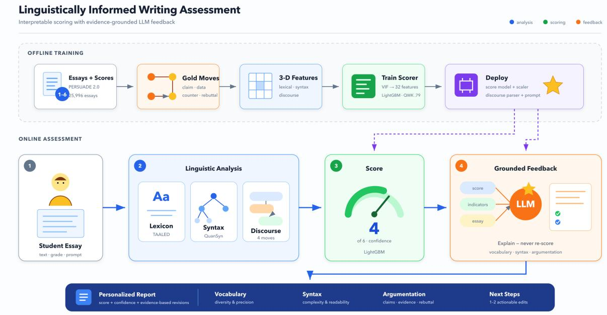

# ArguLens: An Open-Source System for Automated Essay Scoring and Label-Aware Feedback Generation

Weiran Wang\* Hongxiang Shi Huitao Tang Wenjuan Qin

Fudan University wrwang25@m.fudan.edu.cn Corresponding author

## Abstract

Most automated essay scoring (AES) systems output a single holistic score without interpretable evidence and rely on closed APIs that introduce data privacy and cost barriers. We present ArguLens, an opensource, locally deployable system that decomposes AES into three decoupled components: a discourse-move classifier (Qwen2.5- 7B-Instruct fine-tuned with LoRA on PER-SUADE 2.0), a grade-independent LightGBM scorer over 31 linguistic and discourse features, and a label-aware feedback generator served through vLLM with a Qwen2.5-14B-Instruct backbone. A Gradio web UI exposes pluggable inference backends and supports single-essay and batch scoring with downloadable per-essay breakdowns. On an essaydisjoint PERSUADE 2.0 test split, the logitprobe classifier achieves 82.6% accuracy and 0.727 macro-F1; under prompt-grouped 5-fold cross-validation the scorer reaches a mean QWK of 0.813 under an oracle discoursefeature protocol, and an ablation shows that adding gold discourse annotations yields an increment of +0.055 QWK over the lexical+syntactic configuration (paired t-test, p = 0.010). This is a component-level diagnostic rather than an end-to-end classifier-to-scorer result. The feedback generator ships with a structured evaluation protocol; its human-rater study is left to future work. The system is released under Apache 2.0 at https://gith ub.com/wwrwbs/AI\_AWE.

## 1 Introduction

Automated essay scoring (AES) has evolved from linear regression on surface features (Page, 1966) to deep neural architectures (Taghipour and Ng, 2016; Mayfield and Black, 2020) and, most recently, to LLM-based holistic scoring (Beigman Klebanov and Madnani, 2020; Tate et al., 2024). Despite this progress, a fundamental tension persists between interpretability and performance. Classic feature-based methods offer transparent scoring but cap ceiling accuracy; neural models improve accuracy at the cost of opacity, and LLM prompting requires closed APIs that restrict local deployment and data privacy.

Three specific gaps remain for research and assistive deployment in educational contexts. First, end-to-end models output a single score without interpretable linguistic or rhetorical evidence, making it difficult for instructors to understand how a grade was reached. Second, reliance on commercial APIs introduces cost, latency, and data-privacy barriers that limit adoption in resource-constrained settings. Third, most AES systems stop at a holistic score; fine-grained, label-aware revision suggestions that could help learners improve their writing are rare.

We address these gaps with ArguLens, a locally deployable, Apache 2.0-licensed system whose design and evaluation are presented in this paper. The system:

• decomposes scoring into discourse-move classification, feature extraction, LightGBM scoring, and label-aware feedback;

• supports local deployment via vLLM with tensor parallelism and a 4-bit HuggingFace fallback, while retaining an optional API backend;

• ships reproducible artifacts including the scorer model, scaler, LoRA adapter configuration in the repository, and weights as a versioned Release asset with checksums;

• exposes a config-driven stack with zero hardcoded paths, environment-variable precedence, and an offline test suite.

We evaluate the classifier and scorer on the PERSUADE 2.0 corpus (Crossley et al., 2024) of

US middle-school argumentative essays graded 1 to 6. The discourse-move classifier is assessed through sentence-level accuracy and macro-F1; the scorer is evaluated through quadratic weighted kappa (QWK), accuracy, and macro-F1 under prompt-grouped cross-validation. The feedback component is evaluated here at the level of its documented generation workflow and repository contract; human-rater results are explicitly outside the scope of this release.

## 2 Related Work

AES Paradigms. Automated writing evaluation has a long history of balancing predictive accuracy, interpretability, and instructional use (Beigman Klebanov and Madnani, 2020). Classic feature engineering (Kyle and Crossley, 2015; Lu, 2010) exposes linguistic evidence, whereas neural AES models (Taghipour and Ng, 2016; Mayfield and Black, 2020) can learn richer representations at the cost of transparency. Recent work also shows that general-purpose AI can provide useful holistic scoring, while raising questions about rubric alignment and validity (Tate et al., 2024). Our grade-independent LightGBM scorer retains an explicit feature space while the LoRA classifier adds rhetorical structure to it.

Argument Structure and Feedback. Argument mining in persuasive and student essays has modeled both component structure and essay quality (Persing and Ng, 2010; Stab and Gurevych, 2017). Recent work further reports that combining argument-segment and cohesion features improves automatic feedback-related scoring (Ding et al., 2024). Recent benchmarking makes the granularity issue explicit: EssayJudge evaluates AES at lexical, sentence, and discourse levels and still finds substantial gaps at the discourse level (Su et al., 2025). We adopt the four PER-SUADE 2.0 labels (claim, data, counterclaim, rebuttal) and fine-tune a Qwen2.5-7B LoRA, avoiding full-parameter updates while preserving the base model’s language understanding.

Feedback Evaluation and Fairness. Feedback quality is multidimensional rather than reducible to a single automatic score. LLM-Rubric demonstrates the value of explicit dimensions and calibration against human judgments when evaluating generated text (Hashemi et al., 2024). More recent writing-feedback evaluation finds that models may produce specific comments while missing the most important problem or misjudging whether criticism is appropriate (Rashkin et al., 2025). Accordingly, this release defines relevance, actionability, and tone as evaluation dimensions but does not report human ratings. Fairness is also not implied by aggregate AES accuracy: subgroup performance can vary with demographic and learner characteristics (Schaller et al., 2024). We therefore treat subgroup analysis as a required future study rather than making a fairness claim from the aggregate metrics reported here.

Open Educational AI. Our release follows model-reporting practice by documenting the model, training context, limitations, and asset locations (Mitchell et al., 2019). Small artifacts are kept in the repository, while the larger adapter is distributed as a versioned Release asset with a checksum. This is a release design choice, not an experimental finding.

## 3 System Architecture

Figure 1 illustrates the end-to-end pipeline. The Gradio frontend (essay score/app gradio.py) orchestrates three independent services whose responsibilities are summarised in Table 1. The move classifier runs through pluggable HF or vLLM backends and emits sentence labels; the feature extractor combines TAALED lexical indices, QuanSyn dependency metrics, and discourse counts into a 31-feature vector; the scorer outputs a score, confidence, and flags; and the feedback generator produces structured feedback through vLLM or an OpenAI-compatible API.

Table 1: Core modules and their responsibilities.
<table><tr><td>Module</td><td>Path</td><td>Responsibility</td></tr><tr><td>Discourse- Move Classi- fier</td><td>essay_scor e/infer</td><td>Sentence-level 4-way classification (LoRA on Qwen2.5-7B)</td></tr><tr><td>Scorer</td><td>essay_scor e/scoring_ pipeline</td><td>31-feature LightGBM multiclass (scores 1–6)</td></tr><tr><td>Feedback Generator</td><td>essay_scor e/feedback</td><td>Label-aware English feedback via Qwen2.5-</td></tr><tr><td>Frontend</td><td>essay_scor</td><td>14B (vLLM) Gradio UI, batch pro-</td></tr><tr><td>Training Code</td><td>e/app_grad io.py qwen_move_ classifier</td><td>cessing, and ZIP export LoRA SFT with LLaMA-Factory, data</td></tr></table>

  
Figure 1: Project workflow for linguistically informed writing assessment. The upper lane summarizes offline training and deployment; the lower lane shows online assessment, scoring, grounded feedback, and the personalized report.

## 3.1 Configuration and Reproducibility

All runtime settings follow a strict precedence: environment variables override config.yaml, which in turn overrides default Hugging-Face model IDs. The configuration loader (essay score/config.py) resolves relative paths against the repository root. A model checksums.sha256 manifest enables sha256sum -c verification of the scorer, scaler, adapter config, tokenizer, and LoRA weights, ensuring that downstream users can verify asset integrity.

## 4 Discourse-Move Classifier

## 4.1 Task Formulation

Given an essay split into N sentences $\{ s _ { 1 } , \ldots , s _ { N } \}$ , the classifier predicts a label yi ∈ {claim, data, counterclaim, rebuttal} for each sentence. It operates at sentence level with local context derived from the preceding sentence and the essay opening.

## 4.2 Base Model and LoRA

The classifier uses the Apache-2.0-licensed Qwen/Qwen2.5-7B-Instruct model (Qwen et al., 2025) as its base. A LoRA adapter (Hu et al., 2021) with rank r = 32, α = 64, and dropout 0.05 is applied to all linear projection modules (q proj, k proj, v proj, o proj, gate proj, up proj, down proj). Training was conducted with LLaMA-Factory (Zheng et al., 2024) on PERSUADE 2.0 using 4-GPU DDP (torchrun) and BF16 precision, with a peak learning rate of $1 \times 1 0 ^ { - 4 }$ under a cosine schedule (warmup ratio 0.05), weight decay 0.01, a cutoff length of 2,048 tokens, two epochs, and an effective batch size of 32 (4 GPUs × batch 1 × gradient accumulation 8). The repository ships the adapter configuration files; the weight file (adapter model.safetensors, 309 MB) is published as a GitHub Release asset tagged v0.1.0.

## 4.3 Training Data and Model Selection

PERSUADE 2.0 does not prescribe an official split, so we created an essay-level split with seed 42: 22,605 essays for training, 2,825 for validation, and 2,826 for testing, with zero essay overlap between all pairs of splits (verified programmatically). Because the natural label distribution is heavily skewed (data and claim dominate), the training set is class-balanced by resampling to 25,000 sentences per label (100,000 examples in total). A small balanced validation set (2,000 sentences, 500 per label) monitors training, and the checkpoint with the lowest validation loss is selected for evaluation; all reported test results use the natural-distribution test set of 12,000 sentences from 2,730 essays.

## 4.4 Logit-Based Classification

Rather than generating free text, the classifier uses a discriminative logit probe for deterministic inference. For each target sentence, a chat-template prompt is built with a system definition of the four move types encoded as single-token codes (A, B, C, D). A forward pass through the base model with the attached LoRA produces logits at the last non-padding position. The four logits corresponding to the code tokens are extracted and passed through softmax; the arg max is the predicted label and the maximum softmax probability is the per-sentence confidence score. The HF backend chunks prompts using a configurable sentence batch size, while the vLLM backend sends a bounded request to a persistent service with onetoken decoding and the four allowed label tokens.

## 4.5 Inference Backends

Three backends are available. The hf backend loads the base model and adapter in-process using transformers and peft. The vllm backend runs a persistent FastAPI service that loads the base model once and attaches the LoRA via LoRARequest (Kwon et al., 2023). Its /health endpoint reports the adapter rank, tensor parallelism size, and GPU count. The frontend falls back to hf if the vLLM service is not ready. The api backend is reserved for the feedback generator.

## 5 Grade-Independent LightGBM Scorer

## 5.1 Feature Set

All features are computed without learner grade information to prevent direct target leakage. This design does not establish fairness, because linguistic features can still correlate with demographic or curricular variables. Extraction uses a single shared spaCy dependency parse for both lexical and syntactic metrics.

Lexical Features (TAALED (Kyle and Crossley, 2015)). Sixteen lexical features comprise twelve lexical-diversity variants across AW, content-word, and functionword classes, together with word count, awl, basic nfunction tokens, and lexical density tokens.

Syntactic Features (QuanSyn (Yang and Liu, 2025)). Eight dependency-based features are retained from QuanSyn: mdd, ndd, mhd, mtdl, vk, mtw, hi, and mrd.

Discourse Features (deployment and evaluation protocols). The deployment pipeline derives seven features from the Qwen2.5-7B LoRA move-classifier output: n sent, n claim, n data, pct data, pct counterclaim, pct rebuttal, and has counter rebut (binary, true only when both a counterclaim and a rebuttal are present). The scorer feature table used for the reported cross-validation instead contains the corresponding PERSUADE gold discourse annotations. We therefore call the reported scorer results an oracle component evaluation and do not present them as an end-to-end classifier benchmark.

Handling Missing Dependencies. If the quansyn package is unavailable, the scorer raises a FeatureExtractionError by default. A configuration flag (allow missing dependency features) fills missing values with zeros for exploratory runs only.

## 5.2 Model Training

The scorer uses LightGBM (Ke et al., 2017) with the multiclass objective over six ordinal classes. Hyperparameters include num leaves=63, learning rate=0.03, n estimators=1000,

min child samples=15,

subsample=0.8,

colsample bytree=0.8, reg lambda=0.1. Training uses a seed of 42; each cross-validation fold increments the model seed by its fold index. Training data are the PERSUADE 2.0 grade-independent feature table, with prompt groups held out during cross-validation. The trained model (lightgbm multiclass.txt, 33 MB) and the feature scaler (scaler.json) are committed to the repository.

At inference, raw feature values are z-score normalized and passed to the LightGBM model, which outputs a six-class probability vector. The expected value is rounded to the nearest integer in 1–6 to produce the final score. The same expected-value decoding rule is used by cross-validation, ablation, and production inference. The reported cross-validation uses the gold annotations discourse-feature source; production replaces those fields with predicted move labels from the classifier. The system flags essays with low confidence when the maximum class probability falls below 0.5 and marks them as borderline when the runner-up probability exceeds 0.30 and is adjacent to the predicted class; both thresholds are fixed heuristics rather than tuned values.

## 6 Label-Aware Feedback Generation

## 6.1 Prompt Design

Feedback is generated on every analysis. The prompt template (feedback/prompt\_essa y\_v2.json) receives the essay text, the essay prompt name, the predicted score, confidence, and flags, together with a curated subset of 14 of the 31 features—four lexical (e.g., AWL, MTLD), five syntactic (MDD, MHD, MRD, MTDL, headinitial ratio), three discourse (claim and evidence counts, counterclaim/rebuttal indicator), and two length features. Each feature is accompanied by a band label (Low, Medium, or High) derived from approximate corpus-level PERSUADE 2.0 tertiles; for example, an AWL below 4.22 is labelled Low, between 4.22 and 4.54 Medium, and above 4.54 High, while MDD, MHD, MRD, and MTDL use lower-is-better scoring. These bands are used only for prompting the feedback model and never enter the scorer, so they cannot leak score information. The system prompt enforces constructive, English-only output, forbids inventing metrics, requires quoting real essay text, and instructs the model to recommend human review whenever the low-confidence or borderline flag is set. The output contract fixes exactly five sections: overall assessment, lexical dimension, syntactic dimension, discourse/argumentation dimension, and the top one or two actionable improvements.

## 6.2 Backends

Three backends are available. The vllm backend (default) runs a persistent OpenAI-compatible server (port 8000, TP=2 for the 14B model). The hf backend uses 4-bit BitsAndBytesConfig with SDPA on a single GPU. The api backend accepts any OpenAI-compatible endpoint; the API key is read from the UI or environment at runtime

and is never stored.

## 7 Frontend, Batch Processing, and Export

The Gradio 6.x interface (essay score/app gradio.py) provides single-essay analysis, batch upload with summary table, and ZIP export. Each per-essay folder in the archive contains essay.txt, score.json, linguistic features.json, discourse features.json, feedback.md, result.json, and sentence labels.csv. The root contains summary.csv and manifest.json.

## 8 Experiments and Evaluation

We evaluate the classifier and scorer using distinct protocols because the available artifacts are at different granularities. The classifier uses the essay-disjoint sentence-level test split described in Section 4.3; the scorer uses prompt-grouped crossvalidation on the grade-independent feature table. We do not combine these protocols into a single end-to-end score. Because the grouping variable is the essay prompt, each scorer fold withholds complete prompts rather than randomly splitting essays; this is a cross-prompt estimate, not an iid random-split estimate. The released feature table does not include the raw essay text needed to regenerate predicted discourse features for all scorer essays, so the reported scorer numbers use gold discourse annotations and are explicitly an oracle component evaluation.

## 8.1 Experimental Setup

Dataset. PERSUADE 2.0 (Crossley et al., 2024) contains more than 25,000 argumentative essays written by US students in grades 6–12 across 15 prompts; each essay is scored holistically on a 1–6 rubric. The corpus is available under a non-commercial Creative Commons license from PERSUADE 2.0 repository.

Metrics. For the discourse-move classifier, we report sentence-level accuracy, macro-F1, and weighted-F1. For the LightGBM scorer, we report quadratic weighted kappa (QWK) between predicted and human-assigned scores and classification accuracy, both with standard deviations over the five prompt-grouped folds. A protocol for evaluating the feedback generator on relevance, actionability, and tone is defined in the repository;

Table 2: Discourse-move classifier results on the PER-SUADE 2.0 test set (12,000 sentences from 2,730 essays).
<table><tr><td>Label</td><td>Precision</td><td>Recall</td><td>F1</td><td>Support</td></tr><tr><td>claim</td><td>0.776</td><td>0.835</td><td>0.805</td><td>4,209</td></tr><tr><td>data</td><td>0.903</td><td>0.825</td><td>0.862</td><td>7,186</td></tr><tr><td>counterclaim</td><td>0.501</td><td>0.761</td><td>0.604</td><td>343</td></tr><tr><td>rebuttal</td><td>0.533</td><td>0.794</td><td>0.638</td><td>262</td></tr></table>

Overall: accuracy 82.58%, macro-F1 0.727, weighted-F1 0.830

human-annotator results are out of scope for this report. Inference latency is reported as median and 95th percentile (p95) over 100 independent runs on the reference hardware (1×RTX 5000 Ada, 32 GB).

Ablation design. For the scorer, we ablate the 31-feature model against two reduced feature sets: (1) the sixteen lexical features only (no discourse or syntactic features); (2) lexical plus eight syntactic features (no discourse features). The delta between the full model and configuration (2) measures the marginal value of the seven gold discourse features. It is an oracle diagnostic, not a measurement of the downstream classifier’s gain. No additional baseline was run in this release; comparisons against ordinal logistic regression, zero-shot or generative prompts, and fine-tuned encoder classifiers remain future work rather than unreported results.

## 8.2 Classifier Evaluation

Table 2 reports the discourse-move classifier performance on the PERSUADE 2.0 test set, and Table 3 gives the corresponding confusion matrix. The data class achieves the highest F1 (0.862), followed by claim (0.805). The two classes with the largest error mass are claim and data: confusion between them accounts for 1,528 of the 2,091 misclassified sentences (73%), reflecting the genuine difficulty of separating evidence sentences from claims that embed evidence. The minority classes counterclaim (F1 0.604) and rebuttal (F1 0.638) show low precision (0.501 and 0.533) but comparatively high recall (0.761 and 0.794), a pattern consistent with the classbalanced resampling used during training. Support counts are reported so that the macro-F1 is not misread as performance on a balanced test set.

## 8.3 Scorer Evaluation

Table 4 reports the LightGBM scorer performance. Fold-level QWK for the full model ranges from 0.754 to 0.872, indicating heterogeneous difficulty across withheld prompts.

Table 3: Confusion matrix on the PERSUADE 2.0 test set (rows: gold label; columns: prediction).
<table><tr><td></td><td>claim</td><td>data</td><td>counter.</td><td>rebut.</td></tr><tr><td>claim</td><td>3,515</td><td>564</td><td>81</td><td>49</td></tr><tr><td>data</td><td>964</td><td>5,925</td><td>171</td><td>126</td></tr><tr><td>counterclaim</td><td>25</td><td>50</td><td>261</td><td>7</td></tr><tr><td>rebuttal</td><td>23</td><td>23</td><td>8</td><td>208</td></tr></table>

Table 4: Scorer performance: QWK and accuracy (mean and standard deviation over prompt-grouped 5-fold cross-validation on the 25,996-essay gradeindependent feature table).
<table><tr><td>Model</td><td>QWK↑</td><td>Acc. (%) ↑</td></tr><tr><td>Our approach</td><td></td><td></td></tr><tr><td>LightGBM (all 31 features)</td><td>0.813 (0.048)</td><td>62.73 (2.44)</td></tr><tr><td>Ablations</td><td></td><td></td></tr><tr><td>LightGBM (lexical only, 16 feats)</td><td>0.750 (0.071)</td><td>57.57 (2.16)</td></tr><tr><td>LightGBM (lexical + syntactic, 24 feats)</td><td>0.759 (0.069)</td><td>58.69 (2.32)</td></tr></table>

Ablation: oracle discourse features. Adding gold discourse features yields +0.055 QWK over lexical+syntactic features alone (0.813 vs. 0.759) and +0.064 over lexical-only features (0.813 vs. 0.750). Because the five folds are promptaligned across configurations, we can pair them: all five per-fold differences are positive, with a mean paired difference of +0.057 (full vs. lexical+syntactic; paired $t ( 4 ) = 4 . 6 4 , p = 0 . 0 1 0 )$ and +0.064 (full vs. lexical-only; paired $t ( 4 ) = 5 . 0 4$ $p = 0 . 0 0 7 )$ . A Wilcoxon signed-rank test cannot fall below $p = 0 . 0 6 2 5$ with five pairs, so we report the t-test and note that these results should be read as a descriptive, component-level diagnostic rather than conclusive evidence about predicted classifier features in deployment.

## 8.4 Feedback Generation and Evaluation Protocol

The feedback generator produces label-aware, constructively framed revision suggestions from the predicted discourse-move labels and feature bands (see Section 6). A structured evaluation protocol of feedback quality (relevance, actionability, and tone) is defined in the repository; humanannotator results are left for future work and are not part of this report.

## 8.5 Latency Benchmarks

Table 5 reports component inference latency measured on a single RTX 5000 Ada (32 GB VRAM)

over 100 independent runs; it is not a full-pipeline latency measurement.

Table 5: Inference latency by component and backend. Hardware: 1×RTX 5000 Ada (32 GB); 100 runs per component.
<table><tr><td>Component</td><td>Backend</td><td>p50 (s)</td><td>p95 (s)</td></tr><tr><td>Classifier (21- sentence reference</td><td>HF (BF16)</td><td>1.30</td><td>1.32</td></tr><tr><td>essay) Scorer (one essay)</td><td>CPU (32 threads)</td><td>0.006</td><td>0.009</td></tr></table>

GPU memory usage. The classifier (HF backend, BF16, Qwen2.5-7B + LoRA) uses a peak of 16.7 GB allocated GPU memory (18.5 GB reserved) for a single-essay inference with 21 sentences. We do not report a memory or latency number for the Qwen2.5-14B feedback backend because it was not benchmarked in this release; consequently, the reported latency is not an endto-end full-pipeline latency.

## 8.6 Summary of Experimental Findings

The experiments yield four main findings. First, the logit-probe classifier with Qwen2.5-7B + LoRA achieves 82.58% accuracy and a macro-F1 of 0.727 on the 12,000-sentence PERSUADE 2.0 test set, with claim–data confusion accounting for 73% of the errors. Second, the full 31- feature LightGBM scorer achieves a mean QWK of 0.813 over 5-fold CV (fold range 0.754–0.872), with gold discourse features contributing an increment of +0.055 QWK over the lexical+syntactic configuration in the oracle component evaluation (paired t-test, p = 0.010). Third, the scorer runs at sub-10-ms scorer-only latency on CPU, while the classifier completes a 21-sentence essay in approximately 1.3 seconds on a single RTX 5000 Ada with a peak GPU memory of 16.7 GB. Fourth, the test suite passes 22/22 offline tests, supporting the reproducibility claims of the release.

## 9 Open-Source Release Strategy

## 10 Testing and Quality Assurance

The tests/ suite validates eight aspects of the system, as listed in Table 7. The suite is intentionally offline: the vLLM API contract test uses a fake engine rather than requiring a live model service.

Table 6: Asset distribution policy.
<table><tr><td>Asset</td><td>Location</td><td>Reason</td></tr><tr><td>Source code, docu- mentation, license</td><td>Git repository</td><td>Version control</td></tr><tr><td>Adapter config + tokenizer</td><td>Git repository (1.2 MB)</td><td>Small, user IP</td></tr><tr><td>LightGBM model + scaler</td><td>Git repository (33 MB)</td><td>Offline reproducibility</td></tr><tr><td>LoRA weights</td><td>GitHub Release (309 MB)</td><td>Avoids Git LFS band- width</td></tr><tr><td>Base models (Qwen2.5-7B, 14B)</td><td>HuggingFace (Apache 2.0)</td><td>License restriction</td></tr><tr><td>PERSUADE 2.0 corpus</td><td>Upstream non-commercial license, repository</td><td>Non-commercial re- search use</td></tr></table>

Table 7: Test coverage summary.
<table><tr><td>Test module</td><td>Covers</td><td>Pass rate</td></tr><tr><td>Batch outputs</td><td>ZIP structure, manifest, CSV</td><td>3/3</td></tr><tr><td>Classifier prompt</td><td>Prompt template, label parsing, shared context contract</td><td>4/4</td></tr><tr><td>Feedback bands</td><td>Band thresholds</td><td>4/4</td></tr><tr><td>Frozen assets</td><td>Adapter config, tokenizer, SHA- 256</td><td>1/1</td></tr><tr><td>Gradio contract</td><td>I/O schema (single + batch), brand-</td><td>4/4</td></tr><tr><td>Model configuration</td><td>ing Config precedence, path resolution</td><td>2/2</td></tr><tr><td>Scorer contract</td><td>Feature order, scaler, flags, score decoder</td><td>3/3</td></tr><tr><td>vLLM API</td><td>API contract (fake engine)</td><td>1/1</td></tr><tr><td>Total</td><td></td><td>22/22</td></tr></table>

All 22 tests pass without a GPU or network connection.

## 11 Conclusion

This paper presented ArguLens, an open-source modular system for automated essay scoring and label-aware feedback. The central contribution is a decoupled pipeline that separates discourse classification, feature-based scoring, and feedback generation, allowing each component to be developed, tested, and replaced independently.

Our experiments show that the logit-probe classifier achieves 82.58% accuracy and a macro-F1 of 0.727 on the PERSUADE 2.0 test set. The LightGBM scorer with all 31 features obtains a QWK of 0.813 over 5-fold CV. In the oracle component evaluation, adding gold discourse features contributes an increment of +0.055 QWK over lexical and syntactic features alone (paired t-test, p = 0.010); this should not be interpreted as the gain from predicted classifier features. The feedback generator’s evaluation protocol is defined in the repository; a human-annotator study of feedback actionability is left to future work. The reported component benchmarks are approximately 1.3 seconds for classification and 6–9 ms for scoring; the feedback backend and therefore full-pipeline latency were not benchmarked.

Extending the pipeline beyond English argumentative essays in a single educational context — using an XLM-RoBERTa backbone for discourse classification and multilingual LLMs for feedback — is a natural next step, as is a larger-scale human evaluation of feedback actionability across diverse learner populations. The code and release metadata are provided under Apache 2.0; third-party models and data retain their upstream licenses. The evaluation protocol and model artifacts are released to facilitate community-driven extensions.

## 12 Responsible Use and Limitations

The system is trained exclusively on US middleschool argumentative essays from PERSUADE 2.0. Its performance should not be expected to generalise to other genres, age groups, or languages without domain-specific fine-tuning. The corpus reflects specific demographic and curricular contexts, and scores may carry demographic biases. This release does not report gender, race/ethnicity, or other subgroup metrics; a future study should use the corpus metadata, report subgroup support and uncertainty, and evaluate both score accuracy and feedback quality before any educational deployment. Pending such analysis, the system is intended for research and assistive classroom use only, not for high-stakes automated decisions.

The classifier is evaluated on completed essays and is not tested on partial drafts. This matters for formative use: argument-mining models can be less robust when context is incomplete, even when they perform well on completed essays (Schaller et al., 2025). The scorer also uses a single holistic 1–6 target and does not model rater-level variation, a limitation when interpreting borderline cases (Gaudeau, 2025).

A further methodological caveat is that the two released evaluation protocols are not an end-toend evaluation. The classifier is evaluated on an essay-disjoint sentence-level split, whereas the reported scorer cross-validation uses a feature table whose discourse fields are PERSUADE gold annotations. Thus, the +0.055 QWK result is an oracle component diagnostic, not a claim about predicted classifier features. A prompt-held-out end-to-end rerun requires the licensed raw essay text and will be the next evaluation step; comparisons against ordinal logistic regression, zero-shot or generative prompting baselines, and fine-tuned encoder classifiers remain future work.

The classifier benchmark used 16.7 GB allocated and 18.5 GB reserved VRAM on one RTX 5000 Ada. The scorer itself runs on CPU, while the feedback backend can call an OpenAIcompatible service; resource requirements for the local 14B feedback deployment were not measured. The LoRA weights must be downloaded separately and verified against the SHA-256 checksum before first use.

## Acknowledgments

This paper is a research output of the Digital Humanities and Glottometrics Lab at Fudan University.

## References

Beata Beigman Klebanov and Nitin Madnani. 2020. Automated evaluation of writing – 50 years and counting. In Proceedings of the 58th Annual Meeting of the Association for Computational Linguistics, pages 7796–7810.

Scott A. Crossley, Yu Tian, Perpetual Baffour, Alex Franklin, Meg Benner, and Ulrich Boser. 2024. A large-scale corpus for assessing written argumentation: PERSUADE 2.0. Assessing Writing, 61:100865.

Yuning Ding, Omid Kashefi, Swapna Somasundaran, and Andrea Horbach. 2024. When argumentation meets cohesion: Enhancing automatic feedback in student writing. In Proceedings of the 2024 Joint International Conference on Computational Linguistics, Language Resources and Evaluation, pages 17513–17524.

Gabrielle Gaudeau. 2025. Beyond the gold standard in analytic automated essay scoring. In Proceedings of the 63rd Annual Meeting of the Association for Computational Linguistics (Volume 4: Student Research Workshop), pages 18–39, Vienna, Austria. Association for Computational Linguistics.

Helia Hashemi, Jason Eisner, Corby Rosset, Benjamin Van Durme, and Chris Kedzie. 2024. LLM-Rubric: A multidimensional, calibrated approach to automated evaluation of natural language texts. In Proceedings ofthe 62nd Annual Meeting ofthe Association for Computational Linguistics (Volume 1: Long Papers), pages 13806–13834.

Edward J Hu, Yelong Shen, Phillip Wallis, Zeyuan Allen-Zhu, Yuanzhi Li, Shean Wang, Lu Wang, and Weizhu Chen. 2021. LoRA: Low-rank adaptation of large language models. In International Conference on Learning Representations (ICLR).

Guolin Ke, Qi Meng, Thomas Finley, Taifeng Wang, Wei Chen, Weidong Ma, Qiwei Ye, and Tie-Yan Liu.

2017. LightGBM: A highly efficient gradient boosting decision tree. In Advances in Neural Information Processing Systems (NeurIPS), volume 30.

Woosuk Kwon, Zhuohan Li, Siyuan Zhuang, Ying Sheng, Lianmin Zheng, Cody Hao Yu, Joseph E Gonzalez, Hao Zhang, and Ion Stoica. 2023. vLLM: Easy, fast, and cheap llm serving with PagedAttention. In Proceedings ofSOSP.

Kristopher Kyle and Scott A Crossley. 2015. Automatically assessing lexical sophistication: TAALED. Language Testing, 32(4):499–520.

Xiaofei Lu. 2010. Automatic analysis of syntactic complexity in second language writing. International Journal of Corpus Linguistics, 15(4):474– 496.

Elijah Mayfield and Alan W Black. 2020. Should you fine-tune BERT for automated essay scoring? In Proceedings of the Fifteenth Workshop on Innovative Use of NLP for Building Educational Applications (BEA), pages 144–155.

Margaret Mitchell, Simone Wu, Andrew Zaldivar, Parker Barnes, Lucy Vasserman, Ben Hutchinson, Elena Spitzer, Inioluwa Deborah Raji, and Timnit Gebru. 2019. Model cards for model reporting. In Proceedings of the Conference on Fairness, Accountability, and Transparency, pages 220–229.

Ellis Batten Page. 1966. The imminence of... grading essays by computer. The Phi Delta Kappan, 47(5):238–243.

Isaac Persing and Vincent Ng. 2010. Modeling argumentation in student essays. In Proceedings ofACL, pages 1084–1093.

Qwen, An Yang, Baosong Yang, Beichen Zhang, Binyuan Hui, Bo Zheng, Bowen Yu, et al. 2025. Qwen2.5 technical report. Preprint, arXiv:2412.15115.

Hannah Rashkin, Elizabeth Clark, Fantine Huot, and Mirella Lapata. 2025. Help me write a story: Evaluating LLMs’ ability to generate writing feedback. In Proceedings of the 63rd Annual Meeting of the Association for Computational Linguistics (Volume 1: Long Papers), pages 25827–25847, Vienna, Austria. Association for Computational Linguistics.

Nils-Jonathan Schaller, Yuning Ding, Andrea Horbach, Jennifer Meyer, and Thorben Jansen. 2024. Fairness in automated essay scoring: A comparative analysis of algorithms on german learner essays from secondary education. In Proceedings of the 19th Workshop on Innovative Use of NLP for Building Educational Applications (BEA 2024), pages 210–221.

Nils-Jonathan Schaller, Yuning Ding, Thorben Jansen, and Andrea Horbach. 2025. Don’t score too early! evaluating argument mining models on incomplete essays. In Proceedings of the 20th Workshop on Innovative Use of NLP for Building Educational

Applications (BEA 2025), pages 345–355, Vienna, Austria. Association for Computational Linguistics.

Christian Stab and Iryna Gurevych. 2017. Parsing argumentation structures in persuasive essays. Computational Linguistics, 43(3):619–659.

Jiamin Su, Yibo Yan, Fangteng Fu, Zhang Han, Jingheng Ye, Xiang Liu, Jiahao Huo, Huiyu Zhou, and Xuming Hu. 2025. Essayjudge: A multigranular benchmark for assessing automated essay scoring capabilities of multimodal large language models. In Findings of the Association for Computational Linguistics: ACL 2025, pages 6363–6389, Vienna, Austria. Association for Computational Linguistics.

Kaveh Taghipour and Hwee Tou Ng. 2016. A neural approach to automated essay scoring. In Proceedings ofEMNLP, pages 1882–1891.

Tamara P. Tate, Jacob Steiss, Drew Bailey, Steve Graham, Youngsun Moon, Daniel Ritchie, William Tseng, and Mark Warschauer. 2024. Can AI provide useful holistic essay scoring? Computers and Education: Artificial Intelligence, 7:100255.

Mu Yang and Haitao Liu. 2025. Quansyn: A package for quantitative syntax analysis. Journal of Quantitative Linguistics, 32(2):181–198.

Yaowei Zheng et al. 2024. LLaMA-Factory: Unified efficient fine-tuning of 100+ language models. ht tps://github.com/hiyouga/LLaMA-Fac tory.

## A Reproducibility Checklist

• Code: https://github.com/wwrwbs/ AI\_AWE (Apache 2.0)

• LoRA weights: https://github.com/w wrwbs/AI\_AWE/releases/tag/v0.1.0

• Models: Qwen2.5-7B-Instruct and Qwen2.5- 14B-Instruct (HuggingFace Hub, Apache 2.0)

• Data: PERSUADE 2.0 (upstream noncommercial license; data repository)

• Environment: frontend, vLLM, and training lockfiles (the three version-pinned requirement files)

• Checksums: model\_checksums.sha256

• Tests: pytest -q (offline)

• Launch: run all services.sh (autodetects virtual environments, GPUs, and ports)

• LoRA training config: qwen\_move\_classi fier/configs/qwen25\_7b\_move\_lora \_sft.yaml

• Split statistics: qwen\_move\_classifier /data/dataset\_summary.json (essaylevel split with seed 42; zero overlap between splits)

## B Full Feature List

Table 8 enumerates all 31 features used by the scorer, grouped by family. Lexical-diversity variants are computed over all words ( aw), content words ( cw), and function words ( fw).

Table 8: The 31 scorer features.
<table><tr><td>Feature</td><td>Description</td></tr><tr><td colspan="2">Lexical (16; TAALED and basic counts)</td></tr><tr><td>word_count</td><td>Total word count</td></tr><tr><td>awl</td><td>Average word length</td></tr><tr><td>basic_nfunction_tokens lexical_density_tokens</td><td>Function-word token count</td></tr><tr><td>msttr50_*</td><td>Lexical density (content tokens / total tokens) Moving-average segmental TTR, window 50</td></tr><tr><td>mtld_original_*</td><td>Measure of Textual Lexical Diversity</td></tr><tr><td>mtld_ma_bi_*</td><td>Bilinear moving-average MTLD variant</td></tr><tr><td>hdd42_*</td><td>HD-D hypergeometric diversity, 42 draws</td></tr><tr><td>simple_ttr_fw</td><td></td></tr><tr><td>root_ttr_fw</td><td>Simple type-token ratio (function words) Root TTR / Guiraud&#x27;s index (function words)</td></tr><tr><td>Syntactic (8; QuanSyn dependency metrics)</td><td></td></tr><tr><td colspan="2"></td></tr><tr><td>mdd</td><td>Mean dependency distance</td></tr><tr><td>ndd</td><td>Normalized dependency distance</td></tr><tr><td>mhd</td><td>Mean hierarchical distance</td></tr><tr><td>mtdl</td><td>Mean total dependency length</td></tr><tr><td>vk</td><td>Valency k index</td></tr><tr><td>mtw</td><td>Mean tree width</td></tr><tr><td>hi</td><td>Head-initial ratio</td></tr><tr><td>mrd</td><td>Mean root distance</td></tr><tr><td colspan="2">Discourse (7; predicted in deployment, gold in oracle evaluation)</td></tr><tr><td>n_sent</td><td>Sentence count</td></tr><tr><td>n_claim / n_data</td><td>Claim / evidence sentence counts</td></tr><tr><td>pct_data</td><td>Share of dat a sentences (%)</td></tr><tr><td>pct_counterclaim</td><td>Share of counterclaim sentences (%)</td></tr><tr><td>pct_rebuttal</td><td>Share of rebuttal sentences (%)</td></tr><tr><td>has_counter_rebut</td><td>Binary: essay contains both counterclaim and rebuttal</td></tr></table>

\* \* computed over all words ( aw), content  
words ( cw), and function words ( fw).