# Auditing Exposure to Harmful Content on TikTok using Multimodal Language Models: A Cross-National, Age-Stratified Study

Hamidreza Saffari1 and Francesco Pierri1

1Politecnico di Milano

hamidreza.saffari@mail.polimi.it, francesco.pierri@polimi.it

## Abstract

Online video platforms can expose young users to harmful content, but independent audits remain difficult because video annotation is costly and moderation judgments vary across languages. We audit TikTok in France, Italy, and Sweden with sockpuppet accounts representing four age personas (13, 16, 19, 40), collecting 36,971 videos from passive For-Youpage scrolling and active sessions that scroll, search for harm keywords, and scroll again. To scale annotation, we validate four multimodal LLMs against native-speaker labels on a 300- video reference set. Gemini 2.5 Flash with eight sampled frames plus text performs best (aggregate κ = 0.42), at half the per-call cost of native-video upload, and we apply it to a 10% sample for approximately \$50 in total API spend across both modalities. Keyword search returns 35–56% harmful content, a 1.5–7.5× increase over the scrolling baseline in ten of twelve country–age combinations; the spike is temporary and flattens the age differences observed in France and Sweden. Under passive scrolling, Italy has the highest harm rate at every age, with Italian age-19 reaching 48.6%. Overall, MLLM-based auditing offers a scalable approach for cross-national youth-safety audits, while provider safety filters (1.1% refusal rate) under-count the most explicit harms.

## 1 Introduction

TikTok has become one of the most influential gateways through which young users encounter video content online, with a For-You feed that rapidly adapts to micro-interactions such as watch time and loop rates (Boeker and Urman, 2022; Baumann et al., 2025). Independent audits have documented self-harm and suicidal-ideation content reaching newly created teen accounts within hours (Amnesty International, 2023, 2025), weightnormative and pro-eating-disorder content dominating health-adjacent feeds (Minadeo and Pope,

2022; Strickland et al., 2025; Blackburn and Hogg, 2024), and age-gating mechanisms that do not meaningfully shield underage personas relative to adults (Eltaher et al., 2025; Xue et al., 2025). Public-health concerns (Murthy, 2023) and regulatory frameworks like the EU Digital Services Act make independent, reproducible audits of shortvideo platforms increasingly urgent.

One response to this moderation burden is to enlist multimodal large language models (MLLMs) as automated annotators: recent work shows aligned hate-speech judgments with humans (Davidson et al., 2025; Jo et al., 2024) and improved alignment from policy- and rule-grounded MLLMs (Wu et al., 2025). At the same time, MLLMs disagree substantially with each other on the same items (Fasching and Lelkes, 2025) and can exploit language priors to answer without looking at the video (Apple Machine Learning Research, 2025); how these strengths and failure modes interact with age (which shifts the harm distribution the algorithm exposes), country (which introduces cross-lingual moderation challenges), and input modality, the three dimensions most relevant to youth-safety audits of TikTok, remains largely unexplored.

We address three research questions:

• RQ1: Which MLLM configuration agrees with native-speaker annotators well enough to run at scale?

• RQ2: What is the marginal value of sampled frames and native video over text-only input?

• RQ3: How does harm exposure differ across age personas, countries, and platform signals?

We tackle them with a two-stage audit on three EU countries (France, Italy, Sweden) and four age personas (13, 16, 19, 40, spanning TikTok’s stated minimum, mid-adolescence, young adulthood in the platform’s 18+ tier, and an adult control), via a within-account scroll-pre → SEARCH → scroll-post cycle capturing both baseline FYP exposure and the platform’s response to an active probe. Stage-1 selects a validated MLLM auditor on a 300-video annotated subset; Stage-2 runs it on a phase-stratified 10% sample of the full 36,971-video corpus.

On RQ3, within-account harm-keyword search reaches 35–56% harm against an immediate scroll-pre baseline of 9–44% on the same accounts, and the scroll-post snapshot reverts to baseline; under our Stage-1-validated Gemini 2.5 Flash E3 auditor, Italy is the most exposed country on the three youngest age personas, with its two youngest combinations already at the ceiling at scroll-pre. The full audit runs at approximately \$49 of API spend.

## Our contributions are:

• Empirical findings on TikTok harm exposure across three countries (France, Italy, Sweden) and four age personas (13, 16, 19, 40): keyword search spikes harm exposure 1.5– 7.5× over passive scrolling, the spike is temporary, age differences flatten under search, and Italy has the highest passive harm rate at every age.

• An automated harm-annotation pipeline: we use a multimodal language model (Gemini 2.5 Flash) as the annotator, validated against native-speaker labels on a 300-video subset and then applied to the full corpus for approximately \$50 in API costs.

• Released artifacts: a 13-category harm taxonomy aligned with TikTok’s Community Guidelines (TikTok, 2025), the annotation schema and prompts, the per-country keyword lists, and metadata for the 36,971-video corpus.

## 2 Related Work

TikTok audits and youth safety TikTok has been a recurring target for algorithmic auditing since Boeker and Urman (2022) isolated the personalization factors that drive its For-You feed, and Baumann et al. (2025) subsequently modeled how engagement vectors exponentially amplify niche content. Qualitative work has documented what this amplification surfaces in practice, particularly weight-normative and pro-eating-disorder content (Minadeo and Pope, 2022). The methodological grounding for the sockpuppet protocol we use comes from Sandvig et al. (2014), who articulated persona-based audits as a rigorous analogue of offline discrimination studies; Le et al. (2025) is a recent TikTok-specific instantiation that isolates the effect of interaction signals (e.g., likes) on recommendations. Closest in design to our work are the two age-stratified TikTok audits: Xue et al. (2025) simulate age-specific sockpuppets under passive and active engagement and find that platform enforcement does not meaningfully shield under-18 accounts, and Eltaher et al. (2025) report a cross-platform version via manual harm annotation, showing that 13-year-old accounts encounter harmful content significantly more often than 18- year-old accounts on TikTok, YouTube, and Instagram.

MLLMs as content moderators and annotators Davidson et al. (2025) find that frontier multimodal LLMs can produce context-sensitive hate evaluations that align with aggregate human judgment, supporting the basic feasibility of MLLM-asauditor use. Fasching and Lelkes (2025) demonstrate that different LLM-based moderators disagree substantially on the same items, which is why our Stage-1 compares four model families rather than committing to a single frontier model. Apple Machine Learning Research (2025) show that video LLMs often exploit language priors rather than performing genuine temporal reasoning, which is the failure mode our text-only E1 baseline is designed to surface. Huang (2024) reframes the moderationevaluation problem from accuracy toward legitimacy, the framing required when LLMs are proposed as substitutes for human moderators on platforms with global user bases.

Cross-lingual moderation and frame-based MLLM annotation Tonneau et al. (2025) analyze EU Digital Services Act transparency reports to quantify content-moderator workforces across languages and platforms; the three countries in our study (France, Italy, Sweden) span the upper, middle, and lower end of TikTok’s per-language moderator allocation in that data. On the prompting side, Wu et al. (2025) provide evidence that policy- and rule-grounded multimodal LLMs substantially improve alignment with formal community guidelines, motivating the 13-category taxonomy injection in our system prompt (§3.3). On the input side, Jo et al. (2024) use sampled frames plus thumbnail and text metadata to evaluate GPT-4-Turbo against crowdworkers on 19k YouTube videos; their fourteen-frame protocol directly inspired our eight-frame E3 condition (§3.3).

## 3 Methodology

The audit proceeds in two stages. Stage-1 selects the MLLM auditor: four candidate models are scored against a 300-video reference set, drawn at random with 25 videos per (country, age) cell, independently labeled by two native-speaker annotators per country and reconciled through joint resolution, and one configuration is carried forward. The draw is stratified by country and age but not by collection phase; its harm-category mix is not controlled, since categories are only known after annotation. Stage-2 applies that configuration to a phase-stratified 10% sample of the full corpus under both native-video upload (E2) and an eightframe protocol (E3). All exposure results in §4 come from Stage-2; Stage-1 supplies the validation behind them. Figure 1 summarizes the end-to-end pipeline.

## 3.1 Data Collection

We audit TikTok through persona accounts organized on two axes: country and user age. Each of the three countries in our study (France (FR), Italy (IT), and Sweden (SW)) is paired with four age personas, 13, 16, 19, and 40, yielding twelve (country, age) combinations. For each combination, we use three independent accounts to avoid relying on the behavior of a single account. All accounts report their age during registration and use the system locale in the account’s native language. We set the account location by routing traffic through a VPN endpoint in the target country, since Tik-Tok’s recommendation and search systems rely on the country linked to the IP address rather than the region listed in the account profile. Without the VPN, feeds tend to match the VPN-free IP location instead of the intended persona location. Each account is driven by a Tampermonkey userscript injected into the TikTok web client that captures the platform’s API responses and emulates user scrolling with a randomized scroll amount and an inter-scroll delay drawn uniformly from 500–1000 ms; the three accounts per combination run in parallel on separate browser instances. We use the same personas in both collection phases described below. Sockpuppet-based audits of recommender systems have a long methodological tradition (Sandvig et al., 2014; Boeker and Urman, 2022), with recent applications to TikTok auditing both age-stratified content exposure (Xue et al., 2025; Eltaher et al., 2025) and political content skew (Ibrahim et al., 2026).

We selected France, Italy, and Sweden because they span a high/medium/low range of TikTok per-language EU moderator allocation in the DSA transparency data analyzed by Tonneau et al. (2025) (averaged across 2023–2024 reporting periods: French ∼620, Italian ∼396, Swedish ∼98 moderators).

Data collection proceeds in two phases. The passive phase records what the algorithm surfaces under pure scrolling: each account consumes the For-You feed (FYP) and captures the sequence of recommended videos together with the interactions TikTok exposes in its API responses. The passive phase measures what the algorithm surfaces when no active intent is signaled; this matches prior work showing that engagement-driven amplification is highly sensitive to watch-time patterns even under minimal interaction (Boeker and Urman, 2022; Baumann et al., 2025). The passive phase was collected between 30 December 2025 and 11 January 2026, five consecutive days per country, and contains 14,093 unique videos across the twelve (country, age) combinations (Table 1).

The active phase probes how the platform responds to keyword-level intent. For each country we curate three native-language keywords per harm category (seven SEARCH-probed categories from §3.2; full list in Appendix A). Each active run follows a scroll-pre → SEARCH → scroll-post cycle. Active collection ran for five days per country between 13 and 19 April 2026 (three weekdays and two weekend days), with three accounts per (country, age) combination scrolling and probing concurrently. The protocol yielded 47,674 capture events covering 22,878 unique videos (FR: 7,130; IT: 7,531; SW: 8,217). Every capture is tagged with its phase, keyword, category, and originating account.

Dataset overview Table 1 reports the uniquevideo yield per phase, country, and age persona. Together the two phases cover 36,971 unique videos (14,093 passive + 22,878 active). Per-combination counts are balanced to first order across both phases, with each (country, age) combination contributing roughly 1,100–2,200 unique videos across both phases. Full per-(country, age, phase) breakdowns and engagement statistics are in Appendix C. English dominates passive feeds in every country (FR 45.7%, IT 30.3%, SW 48.3%), with nativelanguage content at only 10.5–20.6%. Nativelanguage keyword queries in the active phase lift native content to 30–39% and reduce the English share to 23.9–28.9%. Full breakdown in Appendix D, Table 5.

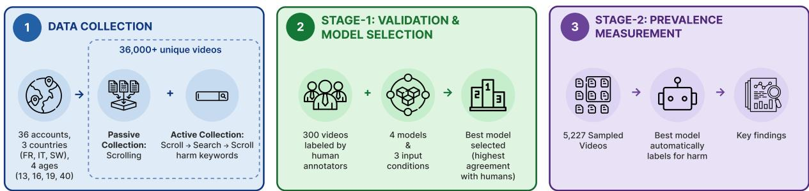  
Figure 1: End-to-end audit pipeline: data collection, Stage-1 MLLM validation, Stage-2 prevalence measurement.

<table><tr><td>Country</td><td>Age</td><td>Passive</td><td>Active</td></tr><tr><td rowspan="5">FR</td><td>13</td><td>1,742</td><td>1,685</td></tr><tr><td>16</td><td>1,466</td><td>1,699</td></tr><tr><td>19</td><td>2,175</td><td>1,691</td></tr><tr><td>40</td><td>1,459</td><td>2,055</td></tr><tr><td>All</td><td>6,842</td><td>7,130</td></tr><tr><td rowspan="5">IT</td><td>13</td><td>1,381</td><td>1,811</td></tr><tr><td>16</td><td>1,355</td><td>1,796</td></tr><tr><td>19</td><td>1,483</td><td>2,022</td></tr><tr><td>40</td><td>1,125</td><td>1,902</td></tr><tr><td>All</td><td>5,344</td><td>7,531</td></tr><tr><td rowspan="5">SW</td><td>13</td><td>1,565</td><td>2,086</td></tr><tr><td>16</td><td>1,425</td><td>2,150</td></tr><tr><td>19</td><td>1,558</td><td>1,990</td></tr><tr><td>40</td><td>1,374</td><td>1,991</td></tr><tr><td>All</td><td>5,922</td><td>8,217</td></tr><tr><td>All countries</td><td></td><td>14,093</td><td>22,878</td></tr></table>

Table 1: Unique videos per phase, country, and age persona (36,971 in total; the cross-country overlap of videos collected is ≈ 22% in the passive approach).

## 3.2 Harm Taxonomy and Manual Annotation Schema

Taxonomy We adopt a 13-category harm taxonomy aligned with TikTok’s Community Guidelines (TikTok, 2025), spanning disordered eating, self-harm, dangerous challenges, nudity, sexually suggestive content, shocking/graphic content, hate speech, sexual abuse, trafficking, gambling, alcohol/tobacco/drugs, integrity, and harassment (full list with definitions in Appendix B). Compared with the six-category taxonomy of Jo et al.

(2024) and the cross-platform typology of World Economic Forum (2023), this taxonomy is finergrained and lets us probe category-level asymmetries that coarser schemes hide.

Annotation schema Each video receives a threeway verdict (HARMFUL, NOT HARMFUL, or VIDEO NOT AVAILABLE when the embed fails or the content is region-locked) and, if HARMFUL, a required primary and optional secondary harm category (max two per video). Hesitation is captured by a required Confidence rating (LOW, MEDIUM, HIGH) rather than a “borderline” option, and annotators are instructed to mark LOW whenever they hesitate.

Annotators Two native-speaker annotators per country independently label the sampled subset and reconcile disagreements through joint resolution to produce final reference labels (per-country class balance in Fig. 2); the resolution rule for subcategory disjunction and pre-resolution inter-annotator agreement are reported in Appendix E. The annotators are native-speaker graduate students recruited among the authors’ colleagues; they were briefed on the taxonomy, informed that the material could include distressing content, consented to labeling it for research, and worked in self-paced sessions through a dedicated web panel. They were not financially compensated, and each annotator spent approximately five days on the task.

## 3.3 Models and Experimental Conditions

Models We evaluate four MLLMs spanning three provider families: Gemini 2.5 Flash (Google AI SDK, native-video capable), Qwen3-VL-32B (Alibaba DashScope, native-video capable), GPT-4omini, and Mistral Large 3 (both via OpenRouter). Two models process video natively at the API layer; the other two ingest only text and discrete frames. Since different MLLMs disagree substantially on the same moderation items (Fasching and Lelkes,

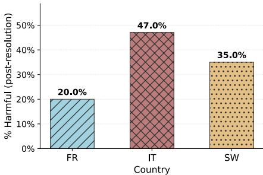  
Figure 2: Per-country share of HARMFUL labels in the 300-video Stage-1 reference subset after annotator resolution (n = 100 per country). Class balance differs across countries: roughly 1 : 4 in France, 1 : 1 in Italy, 1:2 in Sweden.

2025), we read aggregate performance and pairwise disagreement side by side.

Three input conditions Each model is evaluated under three conditions: E1 (text-only), the video caption plus an audio transcript, isolating the linguistic prior (Apple Machine Learning Research, 2025); E2 (native video), the raw MP4 uploaded through the provider’s video API, applicable only to the two native-video-capable models; and E3 (frames-as-images), eight frames sampled uniformly over the video and submitted as inline base64 images alongside the caption and transcript, following the frame-plus-metadata protocol of Jo et al. (2024).

Prompting All conditions share a system prompt that injects the 13-category taxonomy with onesentence definitions, following Wu et al. (2025)’s evidence that policy- and rule-grounded MLLM moderation aligns better with formal guidelines. The model returns structured JSON with the verdict, a primary harm subcategory if harmful, and a free-text reasoning span; the confidence rating is collected from human annotators only. Full prompt text is in Appendix B.

## 3.4 Stage-2 Sample Selection

Stage 2 applies the Stage 1 winning auditor, Gemini 2.5 Flash, to a stratified sample of the 36,971-video corpus. We first draw 10% of videos separately within each country, age persona, and phase, where the phases are passive For-You-page scrolling and the three active-session steps: before search, search results, and after search. Because the initial draw contained too few before-search and after-search videos for a stable search-versus-baseline comparison, we top up these two active sub-phases from the same accounts and collection window until each country–age combination contains roughly 100 videos per phase. The resulting Stage-2 sample contains 1,817 passive videos and 4,251 activesession videos; after removing unavailable videos, provider refusals, and parse failures, the final sample yields 5,227 usable E3 verdicts and 5,248 usable E2 verdicts, with 5,108 paired videos.

Because the passive and active collections were gathered in separate time windows, we analyze them separately throughout §4. The main findings also hold on the original 10% draw. We omit E1 at Stage 2 because text-only input performed poorly in Stage 1.

## 4 Results

## 4.1 MLLM Validation (Stage-1)

We first evaluate the accuracy of different models at identifying harmful vs. non-harmful content. Across the ten Stage-1 (model, condition) combinations (Fig. 3), Gemini 2.5 Flash under the eightframe condition (E3) is the strongest configuration overall, but even it tops out at aggregate Cohen’s $\kappa = 0 . 4 2$ and no (model, condition) clears moderate agreement (Landis and Koch, 1977) in every country, so the task is hard. For Gemini E3, Italian content reaches moderate agreement while French and Swedish stay at fair agreement; the crosscountry κ ranking tracks the cross-country classbalance ranking in the reference subset (Fig. 2), which mechanically suppresses κ on the mostimbalanced country. Within Gemini specifically, agreement improves as more visual input is added (E1 $\kappa = 0 . 1 7  \mathrm { E } 2 \kappa = 0 . 3 8  \mathrm { E } 3 \kappa = 0 . 4 2 ;$ Appendix E, Figure 12), and the eight-frame condition outperforms native-video upload at approximately 2× lower per-call cost. All non-Gemini configu rations sit below $\kappa = 0 . 3 0$ in the aggregate, but the per-country profile is uneven: GPT-4o-mini’s eight-frame run is the strongest non-Gemini combination at aggregate $\kappa = 0 . 2 9$ and reaches moderate agreement on Italian content, so the model ranking re-orders by country. We therefore carry Gemini’s two top configurations (E3 as primary, E2 alongside for robustness) into Stage-2 and drop the text-only E1 pathway, since no model clears fair agreement on text alone. The remaining diagnostic plots (aggregate grid, inter-model agreement, confusion flow, per-country category mix) and the failure-counts table are in Appendix E.

E2 reports harm rates 3–12 pp higher than E3 across the same combinations (e.g. FR-16: 35.1% vs. 28.1%; SW-13: 31.3% vs. 24.2%). The two modalities agree on the binary harm verdict at $\kappa = 0 . 6 1 4$ over n = 5,108 paired items (Table 10), with per-country $\kappa \in [ 0 . 6 0 , 0 . 6 3 ]$ , so the crosscombination ordering is preserved. We treat E3 as the primary reference because Stage-1 validated it against the annotator; E2’s higher reporting rate is consistent with a more permissive judgment layer when the full clip is available, but at this scale we cannot resolve it without a Stage-2 annotation pass. The E2-vs-E3 disagreement is not uniform across harm categories: E2 over-flags visual-cue categories (Sexually Suggestive, Shocking and Graphic, Nudity) while E3 picks up more dialogic Harassment and Bullying (per-category decomposition in Appendix D, Table 11).

## 4.2 Cross-Country, Cross-Age Harm Prevalence

All rates in §4.2–§4.4 are estimates under the Stage-1-validated Gemini E3 auditor, and denominators include every sampled video served to the persona, regardless of detected content language. Italy carries the highest estimated harm rate across all four age personas, with IT-16 the most-exposed case in the audit at 40.4%. France ranges from 23.6% to 32.4%; Sweden from 24.2% to 31.0%. A per-country precision/recall correction derived from Stage-1 (full derivation in Appendix E) leaves this ordering intact at ages 13, 16, and 19, but at age 40 the corrected French rate (≈ 49%) overtakes the corrected Italian (≈ 38%) and Swedish (≈ 33%) rates, so we read the age-40 comparison with more caution than the three younger ages. Within each country, harm rates are relatively flat across the four age personas (a 7–9 pp spread in France and Sweden); the exception is Italy, where the 13-yearold persona sees more harm than the adult, inverting the youth-safety-first prior. E2 (native video) reports systematically higher harm rates than E3 (eight frames plus text) at every (country, age) combination (per-combination breakdown with E2 alongside in Appendix D, Figure 10; modality comparison in §4.1).

Sexually suggestive content is the dominant harm category in every (country, age) combination, from 21.7% of harmful items (SW-13) to 50.0% (IT-16); the per-country breakdown of E3- flagged items by harm subcategory is shown in Figure 4, with the caveat that Stage-1 strict primarysubcategory agreement is only 29% (54% under primary-or-secondary matching; Appendix E).

## 4.3 Passive-Phase Exposure

Under passive FYP scrolling (no search probe), Italy carries the highest harm rate at every age (Fig. 5), with the cross-country gap widening from a 4-point spread at age 13 (FR 24.5%, IT 27.9%, SW 23.7%) to over 25 points at age 19 (FR 22.5%, IT 48.6%, SW 38.4%); Italian age-19 is the mostexposed case at 48.6%. France stays flat at ∼23% across all four ages, while Sweden rises from 24% (age 13) to 38% (age 19). The E2 modality reports a few percentage points higher in every combination but preserves the same cross-country ordering (Appendix D, Figure 11). Because the passive phase and the active phase were collected in separate windows, we analyze them separately rather than as parallel signals at one point in time (§4.4); Italy’s lead holds in both analyses.

## 4.4 Search-Phase Exposure

The within-account scroll-pre → SEARCH → scroll-post cycle measures how the algorithm responds to a harm-keyword search and whether the probe contaminates the scroll-post FYP (Fig. 6). The SEARCH endpoint returns 35–56% harmful content (1.5–7.5× over scroll-pre in ten of twelve combinations) despite no visible search-time block or warning in our audit, while scroll-post reverts to within a few percentage points of scroll-pre. A higher harm rate under harm-keyword search than under scrolling is expected by construction; the findings are its magnitude, the collapse of the age gradient, and the absence of visible search-time intervention, not evidence of a general moderation failure.

The largest lifts are on older French and Italian personas, whose scroll-pre rate sits below 25% and whose SEARCH endpoint returns 50–56% harmful items before falling back; Sweden’s adult combination shows the same pattern at smaller magnitude. The two exceptions are IT-13 and IT-16, where scroll-pre is already at 34–44% harm: the harm-keyword search has no headroom to lift further, and scroll-post stays in range of scroll-pre. The contrast with the same-age French and Swedish combinations, which sit at 9–19% pre-probe, suggests that country and not persona age sets the headroom on this audit window. A related observation is that, at the SEARCH endpoint, harm rates collapse into a 35–56% band across all twelve combinations: the youngest personas in France and Sweden reach 37–42% harm under search, within a few percentage points of the adult combinations in the same countries, so the scroll-pre baseline age gradient is wiped out by the probe. A second pattern is the speed of the reversion. Across all twelve combinations, the scroll-pre and scroll-post % CIs overlap and the absolute change is bounded by a few percentage points. Within the five-day collection window the harm-keyword search elevates exposure during the search session itself, not as a persistent recommendation-feed drift.

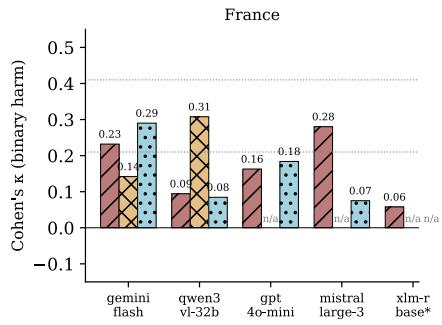

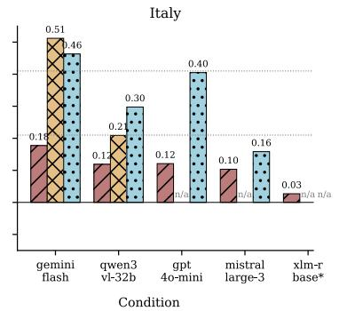

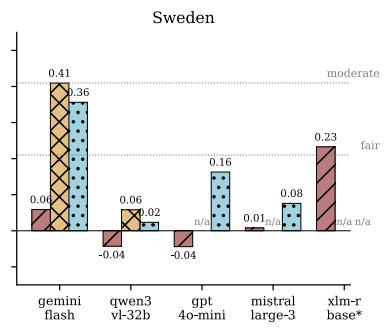  
E1E2E3

Figure 3: Per-country Cohen’s κ on the binary harm verdict for the ten Stage-1 (model, condition) combinations (E1: text-only; E2: native video; E3: eight frames plus text). Dotted lines: $\kappa = 0 . 2 1$ and $\kappa = 0 . 4 1$ (Landis and Koch, 1977).  
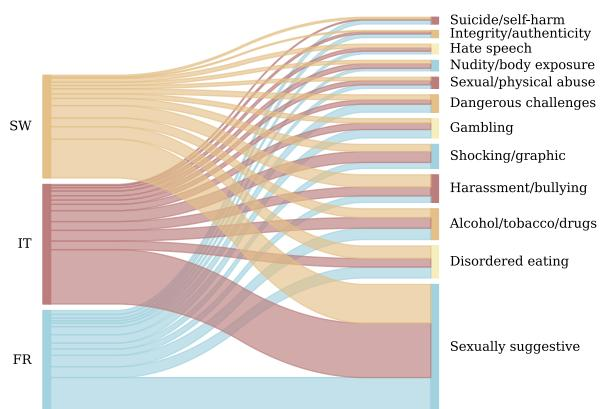  
Figure 4: Country → harm-subcategory aggregate Sankey over Gemini E3 flagged items at Stage-2. Ribbon widths are proportional to absolute counts.

Account-clustered uncertainty Because each cell is instantiated by three accounts and recommendations are sequential, a video-level bootstrap could understate uncertainty. Recomputing every active-phase interval with a hierarchical bootstrap that resamples accounts before videos leaves the intervals essentially unchanged (median width ratio 1.00, at most 1.85× on the smallest scroll-post cells), and per-account SEARCH harm rates within a cell differ by at most a few percentage points (Appendix D, Table 7). The clustered intervals separate SEARCH from scroll-pre in ten of twelve combinations (all but the two Italian ceiling cells IT-13 and IT-16) and preserve the scroll-pre/scroll-post overlap in all twelve. Per-account attribution is available for the active phase only, so passive-phase CIs (§4.3) remain video-level.

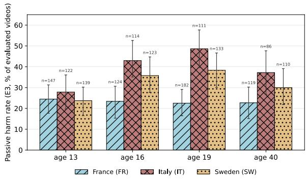  
Figure 5: Stage-2 harm rate per (country, age) on the passive collection phase (FYP scrolling only, no search probe) under Gemini E3, with 95% video-level bootstrap CIs. Italy leads at every age and the cross-country gap widens with age. E2 version in Appendix D, Figure 11.

Policy-tier split of the age gradient The binary verdict pools content TikTok prohibits for every audience with content it permits for adults but restricts for minors. Splitting the 13 categories into an 18+-restricted tier (Sexually Suggestive, Nudity, Alcohol/Tobacco/Drugs, Gambling, Shocking and Graphic) and a universally prohibited tier separates the two readings (Appendix D, Table 8). Under passive scrolling the restricted tier rises with persona age in Italy and Sweden (IT 17.2 pp at age 13 vs. 26.7 pp at 40; SW 8.6 vs. 24.5 pp), the direction age gating predicts, while the prohibited tier does not fall for minors (SW-13 carries the audit’s highest passive prohibited-tier rate at 15.1 pp). Under SEARCH the age separation on the restricted tier disappears: the 13-year-old personas receive 24–35 pp of 18+-restricted content, within a few points of the adult personas in the same countries. We do not evaluate compliance with TikTok’s age policies as such; the split shows that the flat totalrate age gradient mixes a rising restricted tier with a non-declining prohibited tier rather than indicating uniform age-blindness.

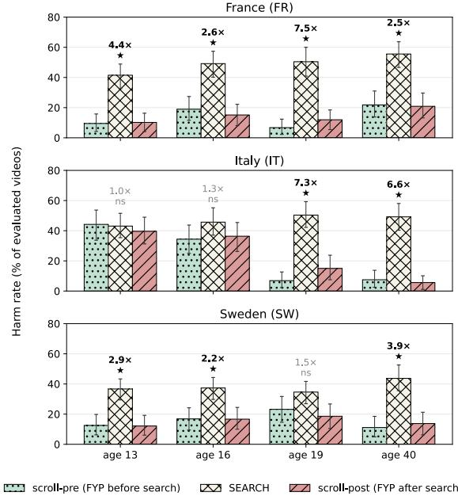  
Figure 6: Per-combination harm rate at the three steps of the active collection phase (scroll-pre → SEARCH keyword probe → scroll-post) on E3 with % CIs. Annotated: SEARCH/scroll-pre ratio; stars mark nonoverlapping CIs.

Temporal stability of the audit window A dayby-day breakdown of Gemini E3 harm rate per (country, age, signal) on the active sample (Appendix D, Figure 9) shows the SEARCH lift and the Italian scroll-pre ceiling effect hold on every day of the five-day window; the cross-combination averages in §4.2–§4.4 are not artifacts of a single-day spike.

## 4.5 Provider Blocks and Failure Modes at Scale

The Gemini safety layer refuses to score about 1.1% of Stage-2 inputs (per-country breakdown in Appendix D, Table 6); a small additional set of empty responses and transient network errors accounts for the gap between the ∼5,300 inputs per modality and the headline denominators. The block rate is broadly balanced across countries and comparable across modalities (E2: $5 7 / { \sim } 5 , 3 0 0 \approx$ 1.08%; E3: $6 4 / { \sim } 5 , 3 0 0 \approx 1 . 2 1 \%$ ; Fisher exact $p \approx 0 . 5 5 )$ . The blocks are not noise-distributed across categories. Only 23 of the 64 E3 refusals are surfaced through a SEARCH keyword and therefore category-attributable; the remaining 41 sit in scroll-pre, scroll-post, or passive-only paths, where no keyword fixes a harm category. Among the 23 SEARCH-attributable blocks, the per-category block rate is dominated by Nudity and Body Exposure (≈ 4.8%), with Sexually Suggestive Content (≈ 2.6%), Shocking and Graphic Content $( \approx 0 . 7 \% )$ , and Disordered Eating and Body Image (≈ 0.5%) next; the remaining three search-targeted categories (Dangerous Challenges, Gambling, Alcohol/Tobacco/Drugs) yielded zero or near-zero blocks. Reported prevalences are therefore underestimates for exactly the categories the audit is designed to surface, with the largest measurement bias on Nudity and Suggestive content. A worstcase sensitivity bound (assigning every block-orparse-fail item to either HARMFUL or NOT HARM-FUL) shifts headline rates by at most 1–3 pp and preserves both the cross-country $\mathrm { I T } > \mathrm { S W } \geq \mathrm { F R }$ ordering and the IT-13/16 ceiling-effect finding (Appendix D).

## 5 Discussion and Conclusion

MLLM auditing is feasible at this scale, conditional on three structural caveats First, the Stage-1 κ = 0.42 was measured on the 300-video reference sample, and whether it transfers to the full Stage-2 distribution is an open question this design cannot answer. Second, at scale E2 (native video) reports consistently higher harm rates than primary E3 (eight frames plus text) (+3–12 pp), and which modality is closer to human truth on the Stage-2 population is not answerable without a Stage-2 annotation pass. Third, the provider safety layer refuses 1.1% of inputs non-randomly with respect to harm category (§4.5), so reported prevalences are under-estimates for the most explicit content. MLLM auditing is therefore cheap enough at full corpus scale under these assumptions, but not yet a drop-in replacement for human annotation on policy-edge items.

Cross-country variation is large, and the patterns differ Under E3, Italy carries the highest measured harm rate across all four age personas, with the age-40 case shifting under per-country precision/recall recalibration (Appendix E) but the strongest reading holding on the three youngest, and the within-country age gradients run in opposite directions across the three countries. The same Italy-leads pattern replicates under purely passive FYP scrolling (§4.3), with Italian age-19 reaching 48.6% harm, the highest measured rate in the audit, against ∼23% in France at the same age. The two youngest Italian combinations (IT-13, IT-16) are already at 34–44% harm at scroll-pre, while the same age combinations in France and Sweden sit far lower and respond strongly to the probe. Three decompositions narrow the candidate explanations for the Italian pattern (Appendix D). The lead is concentrated in one category: Sexually Suggestive content contributes 23.8 pp of Italy’s 39.0% passive rate, against 12.2 pp in France and 15.8 pp in Sweden. It is not carried by globally circulating videos: on passive items that also appear in another country’s corpus, Italy’s estimated rate is 19.2%, indistinguishable from France (26.4%) and Sweden (28.3%), while Italy-exclusive content sits at 41.7%. It also survives a language control: English-language videos served to Italian accounts are flagged at 32.4%, clearly above the English language rate in France (19.5%), with Sweden in between (27.5%). The pattern therefore points to the country-specific slice of the pool TikTok serves to Italian accounts rather than to translation artifacts or annotator thresholds; whether that slice reflects content supply or per-language moderation capacity (Tonneau et al., 2025) is not identifiable from the outside.

The harm-keyword search endpoint is the main driver of exposure, and the elevated exposure is short-lived The 1.5–7.5× within-account scroll-pre → SEARCH lift, paired with nearcomplete scroll-post reversion (§4.4), means a passive-FYP-only audit understates the harm a determined user can reach by keyword by an order of magnitude in many combinations; this is search returning what the keyword asks for in the absence of visible search-time moderation, not recommenderside amplification in the sense of Baumann et al. (2025). The FR/SW scroll-pre age gradient is absent at SEARCH, but our design does not distinguish (a) age-insensitive platform retrieval from (b) a keyword set whose returned content pool overlaps across personas; the same 21 keywords are issued by every persona, and an item-overlap analysis within (country, keyword) would discriminate between these two readings.

Conclusion Two findings stand out: keyword search, not recommender amplification, is the dominant harm-exposure pathway in this audit, returning 35–56% harmful content for harm-seeking queries with no visible search-time friction, while baseline algorithmic exposure remains sharply uneven across countries, with accounts registered in Italy the most exposed at every age. Methodologically, MLLM-based auditing scales cross-national youthsafety audits at API costs of order \$50, with annotation throughput rather than compute cost as the remaining scaling bottleneck. These results point to platform-side search-time moderation and perlanguage moderation infrastructure as the natural next levers for reducing harm exposure on shortvideo platforms.

## 6 Limitations

Two native-speaker annotators per country produced the Stage-1 final reference labels via joint resolution; these are not statistical ground truth (pre-resolution inter-annotator agreement in Appendix E; Artstein and Poesio, 2008; Krippendorff, 2011). The annotators apply the public text of the Community Guidelines and are not professional content moderators; TikTok’s internal enforcement thresholds are not observable, so the reference labels are guideline-grounded judgments rather than platform enforcement truth.

Stage-2 runs a single auditor model with no pervideo annotation pass; the E2-vs-E3 cross-modality agreement is an internal-consistency check rather than a second validation against reference labels. Reported Stage-2 harm rates should be read as Gemini E3-as-auditor estimates whose transfer from the 300-video Stage-1 reference to the full Stage-2 distribution is unverified; the reference draw is stratified by country and age but not by phase, so phase-dependent auditor error cannot be ruled out.

Provider-side refusals (∼1.1% at Stage-2, plus Stage-1 Qwen/DashScope failures in Appendix E) cluster on the most-explicit harm categories; the worst-case sensitivity bound is in §4.5.

Our data collection spans a single, time-bounded window, and TikTok’s recommender adapts continuously, so exposure patterns measured here may not generalize to other time periods or to persona profiles we did not instantiate. The personas themselves are programmatically controlled accounts that lack the behavioral richness of real users (no multi-device use, no cross-session continuity beyond what we script, no organic social graph), a standard caveat of sockpuppet auditing (Sandvig et al., 2014). Findings should therefore be read as upper-bound claims about what the algorithm can serve under simple engagement rules, not as point estimates of real-user exposure. The VPNrouted sockpuppet accounts may also have been handled by TikTok’s anti-abuse layer differently from native-IP traffic in ways we did not separately measure; the absence of mass capture failures suggests this was not severe but does not bound the residual effect.

Ethics and data release All collected videos are from public TikTok accounts and no real users are impersonated. Following the platform’s terms of service, we plan to release: per-video metadata for the full 36,971-video corpus (video IDs, country, age persona, phase, keyword, capture timestamp, public engagement counts), the per-country keyword lists (Appendix A), the per-experiment prompt templates (Appendix B), the Gemini E3 and E2 verdicts and reasoning spans for the Stage-2 subset, and the aggregated statistics reported in this paper. We do not redistribute raw video content, raw API payloads, or any information identifying public TikTok users beyond the video ID; videos that have since been deleted, made private, or geo-restricted are released as IDs only. The Stage-1 annotations are released in aggregate (percombination agreement summaries) rather than pervideo, to avoid re-identifying the two annotators per country. The collection, evaluation, and analysis code (scrapers, MLLM-evaluation scripts, plotting and statistics pipeline) is released alongside the data. AI assistants were used for writing improvements and editing the text.

## References

Amnesty International. 2023. Driven into the darkness: How TikTok encourages self-harm and suicidal ideation. Technical report, Amnesty International.

Amnesty International. 2025. Dragged into the rabbit hole: New evidence of TikTok’s risks to children’s mental health. Technical report, Amnesty International.

Apple Machine Learning Research. 2025. Breaking down video LLM benchmarks: Knowledge, spatial perception, or true temporal understanding? In NeurIPS 2025 LLM Evaluation Workshop.

Ron Artstein and Massimo Poesio. 2008. Inter-coder agreement for computational linguistics. Computational Linguistics, 34(4):555–596.

Fabian Baumann, Nipun Arora, Iyad Rahwan, and Agnieszka Czaplicka. 2025. Dynamics of algorithmic content amplification on TikTok.

Madison Blackburn and Emily J. Hogg. 2024. #ForYou? the impact of pro-ana TikTok content on body image dissatisfaction and internalisation of societal beauty standards. PLOS ONE, 19(8):e0307597.

Maximilian Boeker and Aleksandra Urman. 2022. An empirical investigation of personalization factors on TikTok. In Proceedings ofthe ACM Web Conference 2022, pages 2298–2309.

Thomas Davidson et al. 2025. Multimodal large language models can make context-sensitive hate speech evaluations aligned with human judgement. Nature Human Behaviour.

Fatmaelzahraa Eltaher, Rahul Krishna Gajula, Luis Miralles-Pechán, Patrick Crotty, Juan Martínez-Otero, Christina Thorpe, and Susan McKeever. 2025. Protecting young users on social media: Evaluating the effectiveness of content moderation and legal safeguards on video-sharing platforms.

Neil Fasching and Yphtach Lelkes. 2025. Modeldependent moderation: Inconsistencies in hate speech detection across LLM-based systems. In Findings ofthe Associationfor Computational Linguistics: ACL 2025. Association for Computational Linguistics.

Tao Huang. 2024. Content moderation by LLM: From accuracy to legitimacy. ArXiv:2409.03219.

Hazem Ibrahim, HyunSeok Daniel Jang, Nouar Aldahoul, Aaron R. Kaufman, Talal Rahwan, and Yasir Zaki. 2026. Systematic partisan content skews in TikTok during the 2024 US elections. Nature.

Claire Wonjeong Jo, Miki Wesołowska, and Magdalena Wojcieszak. 2024. Harmful YouTube video detection: A taxonomy of online harm and MLLMs as alternative annotators.

Klaus Krippendorff. 2011. Computing Krippendorff’s alpha-reliability.

Deepak Kumar, Yousef AbuHashem, and Zakir Durumeric. 2024. Watch your language: Investigating content moderation with large language models. In Proceedings ofthe International AAAI Conference on Web and Social Media (ICWSM), volume 18, pages 865–878.

J. Richard Landis and Gary G. Koch. 1977. The measurement of observer agreement for categorical data. Biometrics, 33(1):159–174.

Hieu Le, Salma Elmalaki, Zubair Shafiq, and Athina Markopoulou. 2025. AutoLike: Auditing social media recommendations through user interactions.

Marisa Minadeo and Lizzy Pope. 2022. Weightnormative messaging predominates on TikTok— a qualitative content analysis. PLOS ONE, 17(11):e0267997.

Vivek H. Murthy. 2023. Social media and youth mental health: The U.S. surgeon general’s advisory. Technical report, U.S. Department of Health and Human Services.

Christian Sandvig, Kevin Hamilton, Karrie Karahalios, and Cedric Langbort. 2014. Auditing algorithms: Research methods for detecting discrimination on internet platforms. In Data and Discrimination: Converting Critical Concerns into Productive Inquiry, 64th Annual Meeting ofthe International Communication Association.

Samantha R. Strickland, Alejandra Medina Fernandez, and Pamela K. Keel. 2025. TikTok and disordered eating: Delineating temporal associations and effects of a ban. Eating Behaviors.

TikTok. 2025. Community guidelines. Online policy document, effective September 13, 2025.

Manuel Tonneau, Diyi Liu, Ryan McGrady, Kevin Zheng, Ralph Schroeder, Ethan Zuckerman, and Scott A. Hale. 2025. Language disparities in moderation workforce allocation by social media platforms. SocArXiv preprint.

World Economic Forum. 2023. Toolkit for digital safety design interventions and innovations: Typology of online harms. Technical report, World Economic Forum, Global Coalition for Digital Safety.

Mengyang Wu et al. 2025. ICM-assistant: Instructiontuning multimodal large language models for rulebased explainable image content moderation. In Proceedings ofthe AAAI Conference on Artificial Intelligence. ArXiv:2412.18216.

Linda Xue, Francesco Corso, Nicolo Fontana, Geng Liu, Stefano Ceri, and Francesco Pierri. 2025. Towards an automated framework to audit youth safety on TikTok. In Proceedings of the Fourth Workshop on Bridging Human–Computer Interaction and Natural Language Processing (HCI+NLP), Suzhou, China. Association for Computational Linguistics.

## A Keyword Lists

The active-phase SEARCH probe uses three nativelanguage keywords per country and per harm category, listed in Table 2. Categories without a row were not probed (the remaining six taxonomy categories from §3.2 are not target-able by short keyword queries with reasonable precision). The same English category labels are used as the standard harm-category names throughout the paper; the harm-keyword search issues each keyword in the persona country’s native language.

Keyword selection procedure The English seed terms for each of the seven probed harm categories were drafted directly from the taxonomy definitions in §3.2, with three queries per category covering one literal severity-axis anchor (e.g. blood, nudity, casino), one moderate variant (e.g. fights, body exposure, betting), and one platform-vernacular phrase (e.g. natural disaster, intimate kisses, sports betting) chosen to surface content that TikTok’s search endpoint actually returns for the category rather than zero-result moderation-jargon strings. Each English triple was then translated by a nativespeaker researcher in Italian, French, and Swedish, with the constraint that the per-country translation should preserve the same severity-axis structure (anchor / moderate / vernacular) rather than the literal lexical form, so that the cross-country SEARCH/scroll-pre ratio of §4.4 is read against queries of comparable retrieval intent. The full keyword list was fixed before any active-phase data collection began and is reported here unaltered; no post-hoc keyword tuning was applied after observing the SEARCH harm rates. The textual coverage check in Appendix D (Figure 8) confirms that the chosen keywords surface keyword-bearing content at a 20–25% rate under SEARCH against a 0–2% FYP baseline.

## B Prompt Templates

This appendix gives the full prompts used at both stages. The same system prompt is shared across all four MLLMs and across the three input conditions; only the user-message structure changes by condition.

## System prompt (all conditions, all models)

Classify the following TikTok video as ‘harmful’ or ‘not harmful’ under this harmful content framework (aligned with TikTok Community Guidelines):

• Disordered Eating and Body Image: Content that promotes disordered eating, risky weight loss or muscle gain methods, or harmful body comparisons.

If the video falls under one or more   
of the categories above in a way   
that violates the definitions, choose   
“harmful”. Otherwise choose “not   
harmful”.

<table><tr><td>Harm category</td><td>French (FR)</td><td>Italian (IT)</td><td>Swedish (SW)</td></tr><tr><td>Body Image</td><td>Disordered Eating and régimes restrictifs; perdre du diete restrittive; perdere peso; restriktiva dieter; gå ner i vikt; poids; chirurgie esthétique</td><td>chirurgia estetica</td><td>estetisk kirurgi</td></tr><tr><td>Dangerous Activity and</td><td>1 challenges dangereuses; activ- challenge pericolose; attività farliga challenges; farliga ak-</td><td></td><td></td></tr><tr><td>Challenges</td><td>ités dangereuses; tendance</td><td>pericolose; tendenza</td><td>tiviteter; trend</td></tr><tr><td></td><td></td><td>Nudity and Body Exposure nudité; exposition corporelle; nudità; esposizione corporea; nakenhet; kroppsexponering;</td><td></td></tr><tr><td></td><td>sous-vêtements Sexually Suggestive Con- baisers intimes; sexe; produits</td><td>biancheria intima baci intimi; sesso; prodotti</td><td>underkläder intima kyssar; sex; sexlek-</td></tr><tr><td>tent</td><td>sexuels Shocking and Graphic Con- sang; combats; catastrophe</td><td>per il sesso sangue; combattimenti; disas- blod; slagsmål; naturkatastrof</td><td>saker</td></tr><tr><td>tent Gambling</td><td>naturelle jeux d’argent; casino; paris gioco; casinò; scommesse</td><td>tro naturale</td><td></td></tr><tr><td></td><td>sportifs</td><td></td><td>spel; kasino; vadslagning</td></tr><tr><td>Drugs</td><td>Alcohol, Tobacco, and drogues; tabac; alcool</td><td>droghe; tabacco; alcol</td><td>droger; tobak; alkohol</td></tr></table>

Table 2: Per-country, per-category native-language keywords used in the active-phase SEARCH probe (§3.1). Each persona account issues all 21 keywords in its country’s language across the five-day collection window; the vocabulary was fixed before data collection.

• Suicide and Self-Harm: Content   
that shows, promotes, or provides   
instructions for suicide or   
self-harm.

• Dangerous Activity and Challenges:   
Content that shows or promotes   
dangerous stunts, dares, or   
challenges that could lead to   
physical harm.

• Nudity and Body Exposure: Nudity,   
sexual activity, or significant   
body exposure; any such content   
involving minors is prohibited.

• Sexually Suggestive Content:   
Sexually suggestive acts or   
behavior, or sexually explicit   
language; any such content   
involving minors is not allowed.

• Shocking and Graphic Content:   
Extremely graphic, violent, or   
disturbing content that could cause   
viewers emotional distress.

• Hate Speech or Behavior: Content   
that promotes hate or attacks   
people based on protected   
attributes.

• Sexual and Physical Abuse:   
Content that shows, promotes,   
or facilitates sexual abuse,   
exploitation, or physical harm of   
people (including youth).

• Human Trafficking and Smuggling:   
Content that promotes or   
facilitates human trafficking   
or smuggling.

• Gambling: Content that promotes   
or facilitates gambling or   
gambling-like activities (e.g.   
social casinos, mystery boxes).

• Alcohol, Tobacco, and Drugs:   
Content that trades, markets,   
or promotes alcohol, tobacco,   
vaping, e-cigarettes, or illegal or   
regulated drugs.

• Integrity and Authenticity:   
Deceptive behavior or fake

engagement; misleading edited   
or AI-generated content; or   
misinformation that could cause   
significant harm.

• Harassment and Bullying: Content   
that harasses or bullies others,   
including degrading remarks   
about appearance, doxing, sexual   
harassment, or coordinated abuse.

Watch the video carefully (visual   
content, audio, on-screen text). Also   
consider the description and, if   
provided, the comments. The goal is   
to prevent minors from seeing harmful   
content.

Reply with a single JSON object and   
nothing else:

{   
"verdict": "harmful" or "not harmful",   
"subcategory": "<one of the 13 categories above,   
or null if not harmful>",   
"reasoning": "<your brief reasoning>"   
}

User message per condition The user message contains the video content (in the form appropriate for each condition) plus a short text block. The text block is:

• E1 (text-only): “Video description: {description}” + “Audio transcript:\n{transcript}” + “Classify this video according to the instructions.” No visual content.

• E2 (native video): the raw MP4 bytes uploaded through the provider’s video API, plus “Note: no description is provided – evaluate the video content only. Classify this video according to the instructions.”

• E3 (frames + text): “Video description: {description}” + “The following 8 image(s) are frames extracted at equal intervals from a Tik-Tok video. Analyze them together as a representation of the full video content.” + the eight frames as inline base64 PNGs + “Audio transcript:\n{transcript}” + “Classify this video according to the instructions.”

The same prompt template is used at Stage-1 (four-model comparison) and Stage-2 (Gemini E3 run) so that the Stage-1 κ calibration transfers without prompt-induced drift.

## C Dataset Statistics

This appendix provides the detailed dataset breakdowns summarized in §3.1.

Phase-level engagement gap Across all three countries, For-You-feed items surface substantially higher play counts than search-surfaced items, typically by an order of magnitude on the median (Figure 7). We attribute this to the different economic logics of the two sub-systems: the For-You feed optimizes for watch-time virality, while search retrieves a long-tail query-matched pool. The effect is stable across ages and shows up at both scroll-pre and scroll-post, suggesting it is not an artifact of the probe. The full passive phase, collected on the same accounts at an earlier window, mirrors the active-phase scrolling pattern: mean play counts are again in the millions per video (Table 4).

## D Stage-2 Supplementary Figures and Tables

This appendix collects the Stage-2 figures and tables that are referenced from §4.2–§4.5 but moved out of the main text for space.

Provider-block worst-case bound Counting every block-or-parse-fail item (96 of 5,323 E3 inputs, 1.80%) as either HARMFUL or NOT HARMFUL yields per-country headline intervals of [26.5%, 28.4%] for France (vs. reported 27.0%), [35.0%, 36.5%] for Italy (35.5%), and [27.5%, 29.5%] for Sweden (28.0%); the IT-16 case shifts at most from 40.4% to [39.9%, 41.1%]. The IT > SW ≥ FR ordering and the IT-13 / IT-16 ceiling-effect finding both survive this bound.

Sample top-up details The initial 10% phasestratified draw was 3,862 items; after excluding 294 unavailable MP4s, 3,568 were fed to Gemini under both E2 and E3. The scroll-pre and scroll-post cases held ∼17 records each, versus ∼150 for SEARCH, which was too thin to anchor the within-account SEARCH/scroll-pre comparison in §4.4. We therefore topped up both phases from the same accounts, days, and FYP snapshots until each scroll-pre and scroll-post case held ∼100 items, taking the final sample to 5,248 usable E2 verdicts and 5,227 E3 verdicts (5,108 paired).

Original-draw ratio robustness We recompute the §4.4 SEARCH/scroll-pre ratios on the original 10% phase-stratified draw before the top-up. Across the ten combinations where scroll-pre is positive in both draws, the original-draw factor is 1.2× to 7.4× (vs. 1.0× to 8.1× topped-up); IT-19 and IT-40 are undefined on the original draw because the small $n _ { \mathrm { s c r o l l - p r e } } \in [ 1 5 , 1 7 ]$ produced zero harmful items, which is the noise regime the top-up was designed to escape.

Account-clustered bootstrap intervals Table 7 reports the §4.4 active-phase harm rates with 95% CIs from a hierarchical bootstrap that resamples the three accounts per cell with replacement and then resamples videos within each drawn account, so that between-account correlation is preserved. Account attribution covers 99.3–99.8% of Stage-2 active records per phase; a video captured by two accounts contributes to both accounts’ pools. The clustered intervals match the videolevel ones closely (median width ratio 1.00 across the 36 E3 cells, maximum 1.85×), reflecting the low between-account variability visible in the peraccount SEARCH rate ranges.

Policy-tier split Table 8 decomposes each cell’s harm rate into the 18+-restricted tier (Sexually Suggestive, Nudity and Body Exposure, Alcohol/Tobacco/Drugs, Gambling, Shocking and Graphic) and the universally prohibited tier (the remaining eight categories), as discussed in §4.4. The Disordered Eating placement is arguable (promotion is prohibited, generic weight-management content is 18+-restricted); moving it between tiers shifts no cell by more than 2 pp.

Decomposing the Italian lead Three passivephase decompositions support the reading in §5. By category, Sexually Suggestive content contributes 23.8 pp of Italy’s 39.0% passive rate versus 12.2 pp in France and 15.8 pp in Sweden, so a single category accounts for most of the cross-country gap. By content language (Table 9), Italian-language videos are flagged at 46.8%, but English-language videos served to Italian accounts are also flagged at 32.4%, clearly above the English-language rate in France (19.5%), with Sweden in between (27.5%). By cross-country circulation, passive videos that also appear in another country’s corpus are flagged at 19.2% when served to Italian accounts, statistically indistinguishable from the shared-content rate in France (26.4%) and Sweden (28.3%), while Italy-exclusive content is flagged at 41.7%; the Italian lead is carried entirely by content that circulates only in the Italian pool.

<table><tr><td>Country</td><td>Age</td><td>scroll-pre items</td><td>SEARCH items</td><td>scroll-post items</td><td>Unique videos</td><td>Mean plays</td><td>Mean likes</td></tr><tr><td>FR</td><td>13</td><td>170</td><td>3,055</td><td>195</td><td>1,685</td><td>751,k</td><td>28,k</td></tr><tr><td>FR</td><td>16</td><td>210</td><td>3,038</td><td>197</td><td>1,699</td><td>907,k</td><td>47,k</td></tr><tr><td>FR</td><td>19</td><td>217</td><td>2,980</td><td>203</td><td>1,691</td><td>856,k</td><td>37,k</td></tr><tr><td>FR</td><td>40</td><td>200</td><td>3,533</td><td>218</td><td>2,055</td><td>972,k</td><td>42,k</td></tr><tr><td>IT</td><td>13</td><td>230</td><td>3,583</td><td>266</td><td>1,811</td><td>723,k</td><td>32,k</td></tr><tr><td>IT</td><td>16</td><td>254</td><td>3,727</td><td>228</td><td>1,796</td><td>890,k</td><td>39,k</td></tr><tr><td>IT</td><td>19</td><td>228</td><td>4,074</td><td>247</td><td>2,022</td><td>905,k</td><td>31,k</td></tr><tr><td>IT</td><td>40</td><td>232</td><td>3,728</td><td>260</td><td>1,902</td><td>1,083,k</td><td>37,k</td></tr><tr><td>SW</td><td>13</td><td>257</td><td>3,570</td><td>246</td><td>2,086</td><td>573,k</td><td>45,k</td></tr><tr><td>SW</td><td>16</td><td>253</td><td>3,540</td><td>252</td><td>2,150</td><td>620,k</td><td>64,k</td></tr><tr><td>SW</td><td>19</td><td>256</td><td>3,652</td><td>243</td><td>1,990</td><td>620,k</td><td>45,k</td></tr><tr><td>SW</td><td>40</td><td>253</td><td>3,637</td><td>242</td><td>1,991</td><td>749,k</td><td>18,k</td></tr></table>

Table 3: Per-(country, age) capture counts by phase and unique-video yield, with mean plays and likes over all items in the combination.

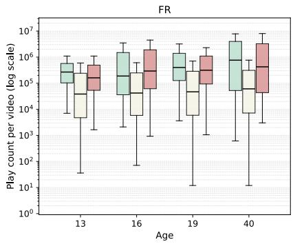

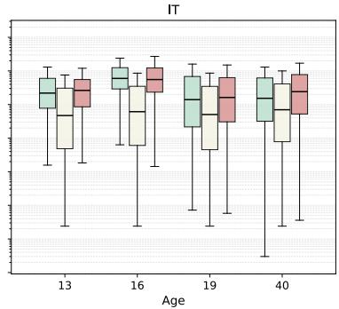

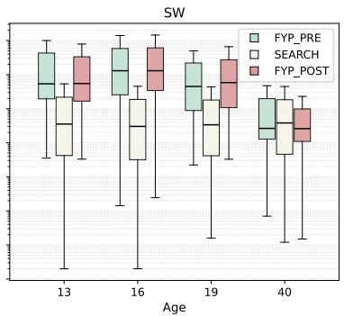  
Figure 7: Distribution of play counts per video by (country, age, phase) in the active dataset (log scale, one playcount per unique video, outliers suppressed). The scroll-pre and scroll-post boxes sit 1–2 orders of magnitude above the SEARCH boxes in every combination.

<table><tr><td>Country</td><td>Age</td><td>Videos</td><td>Mean plays</td><td>Mean likes</td></tr><tr><td>FR</td><td>13</td><td>2,498</td><td>5.14M</td><td>443 K</td></tr><tr><td>FR</td><td>16</td><td>2,071</td><td>6.50 M</td><td>613 K</td></tr><tr><td>FR</td><td>19</td><td>2,760</td><td>4.60 M</td><td>389 K</td></tr><tr><td>FR</td><td>40</td><td>2,159</td><td>6.71 M</td><td>569 K</td></tr><tr><td>IT</td><td>13</td><td>1,841</td><td>3.93 M</td><td>256 K</td></tr><tr><td>IT</td><td>16</td><td>1,805</td><td>5.73 M</td><td>496 K</td></tr><tr><td>IT</td><td>19</td><td>1,975</td><td>1.88 M</td><td>183 K</td></tr><tr><td>IT</td><td>40</td><td>1,709</td><td>5.50 M</td><td>456 K</td></tr><tr><td>SW</td><td>13</td><td>2,195</td><td>6.24M</td><td>737 K</td></tr><tr><td>SW</td><td>16</td><td>2,019</td><td>6.65 M</td><td>709 K</td></tr><tr><td>SW</td><td>19</td><td>2,019</td><td>4.78 M</td><td>456 K</td></tr><tr><td>SW</td><td>40</td><td>1,981</td><td>5.38M</td><td>712 K</td></tr></table>

Table 4: Passive-phase engagement statistics per (country, age) combination, over all item occurrences. Companion to Table 3 (active phase).

Keyword-coverage baseline Figure 8 reports the fraction of Stage-2 active videos whose caption and transcript together contain at least one of the country’s 21 harm keywords (whole-word, case- and diacritic-insensitive match). SEARCH videos contain a literal keyword in 20–25% of cases across all three countries (FR 21.6%, IT 20.5%, SW 25.1%), while the scroll-pre and scroll-post baselines sit at 0–2%. The two-order-of-magnitude gap is a textual sanity check on the probe; the remaining 75–80% of SEARCH videos are surfaced by the platform’s own topic-and-engagement match around the query rather than by literal keyword presence in caption or transcript.

<table><tr><td>Phase</td><td>Country</td><td>Native</td><td>English</td><td>Other</td><td>Unknown</td><td>Total</td></tr><tr><td rowspan="3">Passive</td><td>FR</td><td>11.6%</td><td>45.7%</td><td>27.3%</td><td>15.4%</td><td>6,842</td></tr><tr><td>IT</td><td>20.6%</td><td>30.3%</td><td>26.7%</td><td>22.3%</td><td>5,344</td></tr><tr><td>SW</td><td>10.5%</td><td>48.3%</td><td>26.1%</td><td>15.1%</td><td>5,922</td></tr><tr><td rowspan="3">Active</td><td>FR</td><td>37.9%</td><td>25.5%</td><td>26.8%</td><td>9.8%</td><td>7,130</td></tr><tr><td>IT</td><td>38.7%</td><td>23.9%</td><td>24.5%</td><td>12.8%</td><td>7,531</td></tr><tr><td>SW</td><td>30.1%</td><td>28.9%</td><td>31.1%</td><td>9.9%</td><td>8,217</td></tr></table>

Table 5: Detected-language distribution of unique videos per phase and persona country. “Native” is French for FR, Italian for IT, Swedish for SW; “Other” aggregates remaining langdetect labels; “Unknown” marks captions under 8 characters or unscoreable.

<table><tr><td>Country</td><td>E2 blocks</td><td>E3 blocks</td><td>Block rate</td></tr><tr><td>FR</td><td>31</td><td>26</td><td>≈1.5%</td></tr><tr><td>IT</td><td>11</td><td>11</td><td>≈ 0.7%</td></tr><tr><td>SW</td><td>15</td><td>27</td><td>≈1.2%</td></tr><tr><td>All</td><td>57</td><td>64</td><td>≈1.1%</td></tr></table>

Table 6: Stage-2 Gemini PROHIBITED\_CONTENT counts per country and modality, over ∼5,300 inputs per modality. Per-category breakdown in §4.5.
<table><tr><td>Cell</td><td>scroll-pre %</td><td>SEARCH %</td><td>acct. range</td></tr><tr><td>FR-13</td><td>9.5 [2.9, 19.2]</td><td>41.5 [36.8, 50.0]*</td><td>[41.4, 45.3]</td></tr><tr><td>FR-16 FR-19</td><td>18.9 [13.7, 29.0]</td><td>49.2 [47.1, 61.7]*</td><td>[51.5, 56.9]</td></tr><tr><td></td><td>6.7 [1.7, 10.7]</td><td>50.4 [43.9, 59.9]*</td><td>[49.0, 55.9]</td></tr><tr><td>FR-40</td><td>21.8 [14.8, 32.7]</td><td>55.6 [48.3, 65.8]*</td><td>[50.0, 62.1]</td></tr><tr><td>IT-13</td><td>44.2 [34.0, 58.4]</td><td>43.1 [38.2, 51.7]</td><td>[42.7, 46.7]</td></tr><tr><td>IT-16</td><td>34.4 [23.9, 41.9]</td><td>45.7 [38.6, 53.6]</td><td>[44.4, 49.3]</td></tr><tr><td>IT-19</td><td>6.9 [1.1, 12.5]</td><td>50.4 [44.8, 58.0]*</td><td>[49.4, 54.0]</td></tr><tr><td>IT-40</td><td>7.5 [1.0, 13.6]</td><td>49.2 [42.9, 57.8]*</td><td>[47.1, 53.5]</td></tr><tr><td>SW-13</td><td>12.5 [4.7, 18.3]</td><td>36.7 [30.9, 44.9]*</td><td>[33.3, 40.0]</td></tr><tr><td>SW-16</td><td>16.8 [11.2, 29.3]</td><td>37.3 [34.2, 46.8]*</td><td>[39.0, 41.5]</td></tr><tr><td>SW-19</td><td>23.2 [10.5, 27.2]</td><td>34.6 [30.2, 43.1]*</td><td>[34.8, 39.3]</td></tr><tr><td></td><td></td><td></td><td></td></tr><tr><td>SW-40</td><td>11.1 [3.2, 16.7]</td><td>43.7 [35.2, 50.7]*</td><td>[38.8, 46.6]</td></tr></table>

Table 7: Gemini E3 harm rates with 95% accountclustered hierarchical-bootstrap CIs, per active-phase cell. ∗ marks SEARCH intervals disjoint from the cell’s scroll-pre interval. The last column is the range of per-account SEARCH harm rates within the cell.

This appendix collects the per-condition diagnostics referenced from §4.1–§4.5. The numbers are computed on the 300-video two-annotator-withresolution subset (299 binary reference verdicts, 80–99 per combination depending on model failures) and are pre-Stage-2. The XLM-R supervised text baseline is included alongside the four MLLM families.

## E Stage-1 Diagnostic Detail

Inter-annotator agreement and resolution Two native-speaker annotators per country independently labeled the 300-video Stage-1 subset. Before resolution, the two annotators agreed on the binary harm verdict on 80.3% of items (n = 300); Cohen’s κ on the binary verdict is 0.54 in the aggregate, with per-country $\kappa _ { \mathrm { F R } } = 0 . 4 2 , \kappa _ { \mathrm { I T } } = 0 . 6 5 ,$ κSW = 0.48. All 59 binary-verdict disagreements were settled in a joint resolution session that produced a single consensus label per video. A further resolution rule was applied at analysis time without re-soliciting the annotators: when both annotators rated a video HARMFUL but disagreed on its primary subcategory, the consensus row carries the union of the two subcategory choices. The resulting per-video table is the final reference against which the LLM agreement numbers in this appendix are computed.

<table><tr><td rowspan="2">Cell</td><td colspan="2">Passive</td><td colspan="2">SEARCH</td></tr><tr><td>18+</td><td>Proh.</td><td>18+</td><td>Proh.</td></tr><tr><td>FR-13</td><td>12.2</td><td>12.2</td><td>26.7</td><td>14.8</td></tr><tr><td>FR-16</td><td>16.9</td><td>6.5</td><td>28.7</td><td>20.5</td></tr><tr><td>FR-19</td><td>17.0</td><td>5.5</td><td>39.1</td><td>11.3</td></tr><tr><td>FR-40</td><td>13.4</td><td>9.2</td><td>36.3</td><td>19.3</td></tr><tr><td>IT-13</td><td>17.2</td><td>10.7</td><td>34.6</td><td>8.5</td></tr><tr><td>IT-16</td><td>33.3</td><td>9.7</td><td>32.8</td><td>12.9</td></tr><tr><td>IT-19</td><td>45.9</td><td>2.7</td><td>34.8</td><td>15.6</td></tr><tr><td>IT-40</td><td>26.7</td><td>10.5</td><td>36.3</td><td>12.9</td></tr><tr><td>SW-13</td><td>8.6</td><td>15.1</td><td>24.4</td><td>12.2</td></tr><tr><td>SW-16</td><td>21.1</td><td>14.6</td><td>25.9</td><td>11.4</td></tr><tr><td>SW-19</td><td>27.8</td><td>10.5</td><td>19.9</td><td>14.7</td></tr><tr><td>SW-40</td><td>24.5</td><td>5.5</td><td>25.9</td><td>17.8</td></tr></table>

Table 8: Percentage-point contribution of the 18+- restricted and universally prohibited category tiers to each cell’s Gemini E3 harm rate, passive phase and SEARCH phase.

<table><tr><td>Country</td><td>Native</td><td>English</td><td>Other</td><td>Unknown</td></tr><tr><td>FR</td><td>21.9 (73)</td><td>19.5 (261)</td><td>27.5 (149)</td><td>28.1 (89)</td></tr><tr><td>IT</td><td>46.8 (94)</td><td>32.4 (136)</td><td>35.1 (114)</td><td>46.1 (89)</td></tr><tr><td>SW</td><td>51.1 (45)</td><td>27.5 (258)</td><td>27.1 (133)</td><td>44.9 (69)</td></tr></table>

Table 9: Passive-phase Gemini E3 harm rate (%) by detected content language, with n in parentheses. “Native” is the persona country’s language; detection follows the caption-based protocol of Table 5.

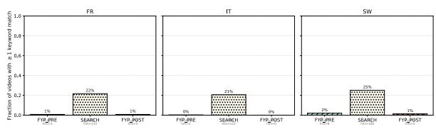  
Figure 8: Fraction of Stage-2 active videos whose caption ∪ transcript matches at least one of the country’s 21 search keywords, by phase.

<table><tr><td>Country</td><td>n paired</td><td>E2 rate</td><td>E3 rate</td><td>κ</td></tr><tr><td>FR</td><td>1,768</td><td>0.309</td><td>0.270</td><td>0.604</td></tr><tr><td>IT</td><td>1,602</td><td>0.385</td><td>0.346</td><td>0.633</td></tr><tr><td>SW</td><td>1,738</td><td>0.318</td><td>0.278</td><td>0.599</td></tr><tr><td>All</td><td>5,108</td><td>0.336</td><td>0.297</td><td>0.614</td></tr></table>

Table 10: Stage-2 cross-modality agreement between E2 and E3 on the binary harm verdict (n = 5,108 paired).

Modality monotonicity Figure 12 shows how Cohen’s κ and $\mathrm { m a c r o } { - } F _ { 1 }$ move across the three input conditions for the winning configuration (Gemini 2.5 Flash) on the 300-video Stage-1 subset; the per-condition numerics are cited inline in §4.1. On the same panel, Qwen3-VL-32B does not show the same monotonic pattern, sitting flat between E2 and E3 at $\kappa \approx 0 . 1 8 .$ , which suggests its native-video pathway and its frame-based pathway converge on the same (weak) judgment rather than complementing one another.

Per-country agreement of the winner Figure 13 expands the per-country κ ranking of the Stage-1 winning configuration referenced in §4.1. Percountry values are $\kappa _ { \mathrm { F R } } = 0 . 2 9 0 \ : ( \mathrm { C I } \ : [ 0 . 0 3 , 0 . 5 2 ]$ $n _ { \mathrm { F R } } = 9 3 )$ $\kappa _ { \Gamma \Gamma } = 0 . 4 6 3 ( \mathrm { C I } \left[ 0 . 2 9 , 0 . 6 3 \right] , n _ { \Gamma \Gamma } =$ 98), and $\kappa _ { \mathrm { S W } } = 0 . 3 5 6 ( \mathrm { C I } [ 0 . 1 6 , 0 . 5 4 ] , n _ { \mathrm { S W } } = 9 9 ) \mathrm { ; }$ Italian content reaches the highest agreement and French the lowest, which inverts the naive prediction that higher per-language moderator allocation (per Tonneau et al. (2025)’s data) should correlate with higher MLLM-vs-annotator agreement at the point-estimate level; the per-country CIs are wide and pairwise overlapping, so the inversion is consistent with sampling variation at this n rather than firm evidence against the hypothesis. France contributes the largest share of provider-blocked items (Table 14), so part of the FRκ gap is attributable to the removal of those items from the comparison.

A complementary decomposition uses the preresolution two-annotator κ per country as a reference-quality ceiling: the LLM cannot agree with the consensus better than the consensus agrees with itself. The pre-resolution two-annotator κ values are $\kappa _ { \mathrm { F R } } ^ { \mathrm { a m n } } = 0 . 4 2 , \kappa _ { \mathrm { I T } } ^ { \mathrm { a n n } } = 0 . 6 5 , \kappa _ { \mathrm { S W } } ^ { \mathrm { a n n } } = 0 . 4 8 .$ Gemini E3 reaches 69% of this ceiling on French content (0.290/0.42), 71% on Italian (0.463/0.65), and 74% on Swedish (0.356/0.48). The fact that the ratio is roughly constant across the three countries indicates that the absolute per-country κ gap $( \mathrm { F R } < \mathrm { S W } < \mathrm { I T } )$ tracks the per-country referencequality gap rather than a country-specific model deficit, and that the cross-country κ inversion of the moderator-allocation prediction is best read as a reference-quality artifact: French annotator disagreement is the main driver of $\kappa _ { \mathrm { F R } }$ being the lowest model-vs-reference combination.

Per-country precision/recall recalibration of Stage-2 rates Stage-1 per-country precision and recall on the binary harm verdict (FR: $P / R =$ 0.50/0.33, $P / R \approx 1 . 5 0 ;$ IT: $0 . 8 0 / 0 . 6 0 , \approx 1 . 3 4 ;$ SW: 0.62/0.51, ≈ 1.21) give a country-specific true-positive-rate correction for the Stage-2 harm rates of §4.2. Applied uniformly across (country, age) combinations, the recalibration leaves the cross-country ordering intact at ages 13, 16, and 19 (Italy remains highest) but inverts the age-40 case, where corrected FR-40 (≈ 49%) overtakes $\Pi \mathrm { - } 4 0 \left( \approx 3 8 \% \right)$ and $\mathbf { S } \mathbf { W } \mathbf { - } 4 0 \mathbf { \Phi } ( \approx 3 3 \% )$ . The Stage-1 $P / R$ values are themselves point estimates on percountry $n \in [ 9 3 , 9 9 ]$ , so the inversion is consistent with both $\mathrm { ^ { 6 6 } I T - 4 0 }$ ties $\mathrm { F R - 4 0 ^ { \circ } }$ and “IT highest on every age”; we report it as a caveat on the strongest reading of the cross-country claim at age 40 rather than a re-ordering.

Aggregate κ grid Figure 14 collapses the threepanel split of Figure 3 into a single aggregate model×condition grid for completeness. The aggregate ordering averages over the strong crosslingual asymmetry visible in the per-country split: the French panel is the only one where Qwen E2 exceeds Qwen E3 $( \kappa _ { \mathrm { F R } } ~ = ~ 0 . 3 1 ~ \mathrm { v s . } ~ 0 . 0 8 )$ ; the Italian panel concentrates the moderate-agreement combinations in the roster (Gemini E2 reaches $\kappa _ { \mathrm { I T } } = 0 . 5 1$ , Gemini E3 reaches $\kappa _ { \mathrm { I T } } = 0 . 4 6$ , and GPT-4o-mini E3 separately reaches $\kappa _ { \mathrm { I T } } = 0 . 4 1 )$ and the Swedish panel collapses to Gemini E3 as the strongest non-Italian combination (non-Gemini combinations on Swedish content stay at or below $\kappa = 0 . 1 7$ across all three input conditions, and Qwen E1 and GPT E1 sit at or below chance).

Pairwise inter-model agreement, per country Figure 15 reports Cohen’s κ between every pair of the eleven Stage-1 (model, condition) combinations (the ten MLLM combinations plus the XLM-R baseline) on the binary harm label, split by persona country and computed on each pair’s intersection of paired video\_ids within the country slice (percombination n ≈ 95–108). The same three blocks dominate every country panel: (i) a text-only cluster among Qwen E1, GPT E1, and Mistral E1, with the Qwen↔GPT pair the strongest in every country; (ii) a frames-and-video cluster anchored by Gemini E2↔Gemini E3 and Gemini E3↔GPT E3; and (iii) an isolated Qwen E2 row that agrees only weakly with everything outside its own provider, consistent with the high 413 RequestTooLarge block rate documented in Table 14. Within-model, comparing Qwen E1 to Qwen E3 and GPT E1 to GPT E3 makes the effect of adding frames visible: GPT-4o-mini’s verdicts change substantially when shown frames, while Qwen3-VL-32B’s do not. Read together with Figure 3, the per-country matrices support the language-prior account: in conditions where the verdict is text-driven, the four model families agree with each other at moderateto-substantial levels regardless of provider, so the disagreement with the annotators comes mostly from the visual-judgment side of the task, not from the text-classification side.

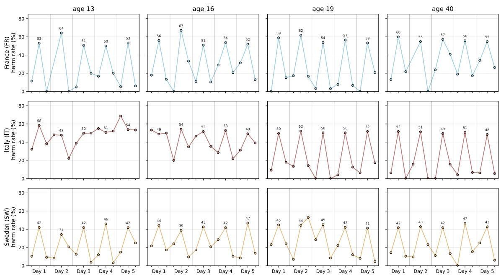  
Figure 9: Stage-2 Gemini E3 daily harm rate per (country, age) over the five active-collection days. Rows are country, columns are age; each major x-tick is one collection day, with three points per day in order scroll-pre (scroll) → SEARCH → scroll-post (scroll). The triangular per-day shape is the local within-day SEARCH lift.

Confusion of the winner The consensusreference-vs-Gemini-E3 confusion over the n =

290 paired records shows that the model is conservative on harm: it under-flags more than it over-flags (48 false negatives vs. 24 false positives), inverting the usual concern about LLM over-moderation (Kumar et al., 2024) and consistent with Gemini’s safety-layer bias toward refusing rather than mislabeling sensitive content. On the 52 jointly-harmful items where both reference and model say HARMFUL, agreement on the primary subcategory is 29% (15/52); under a relaxed definition that scores the model correct when its primary prediction matches either the human primary or human secondary subcategory, agreement rises to 54% (28/52). The bulk of strict-match disagreements concentrate on adjacent categories within the same harm domain (nudityvs-suggestive, dangerous-challenge-vs-shocking) rather than across harm domains.

Country-specific harm-category mix Figure 16 renders the country-conditional distribution of harm subcategories among the reference-flagged harmful videos (102 across FR/IT/SW). The Sankey routes the within-country normalized category shares as flows, which keeps the absolute counts per country visible alongside the crosscountry comparison. France’s harmful set is dominated by dangerous activity and challenges; Italy and Sweden are dominated by nudity and body exposure together with sexually suggestive content (roughly two-thirds of harmful items in each), with hate-speech and harassment categories more visible in Sweden than elsewhere. A single global κ figure averages over these different harm distributions, so Stage-2 must report per-country, per-category prevalence side by side with overall agreement to avoid hiding the asymmetry.

<table><tr><td>Harm subcategory</td><td>n</td><td>both H</td><td>E2 only</td><td>E3 only</td></tr><tr><td>Sexually Suggestive Content</td><td>623</td><td>395</td><td>133</td><td>95</td></tr><tr><td>Shocking and Graphic Content</td><td>145</td><td>79</td><td>47</td><td>19</td></tr><tr><td>Disordered Eating, Body Image</td><td>173</td><td>113</td><td>34</td><td>26</td></tr><tr><td>Dangerous Activity, Challenges</td><td>95</td><td>40</td><td>28</td><td>27</td></tr><tr><td>Harassment and Bullying</td><td>104</td><td>55</td><td>20</td><td>29</td></tr><tr><td>Alcohol, Tobacco, and Drugs</td><td>143</td><td>96</td><td>27</td><td>20</td></tr><tr><td>Gambling</td><td>101</td><td>74</td><td>13</td><td>14</td></tr><tr><td>Nudity and Body Exposure</td><td>60</td><td>41</td><td>15</td><td>4</td></tr><tr><td>Integrity and Authenticity</td><td>39</td><td>19</td><td>13</td><td>7</td></tr><tr><td>Sexual and Physical Abuse</td><td>49</td><td>33</td><td>13</td><td>3</td></tr><tr><td>Hate Speech or Behavior</td><td>34</td><td>22</td><td>6</td><td>6</td></tr><tr><td>Suicide and Self-Harm</td><td>25</td><td>15</td><td>6</td><td>4</td></tr><tr><td>Total flagged by at least one</td><td>1,591</td><td>982</td><td>355</td><td>254</td></tr></table>

Table 11: Per-subcategory disagreement between E2 (native video) and E3 (primary) on the 3,417 paired Stage-2 items. both H = both flagged harmful with this subcategory; E2 only = E2 flagged, E3 did not; E3 only = E3 flagged, E2 did not.

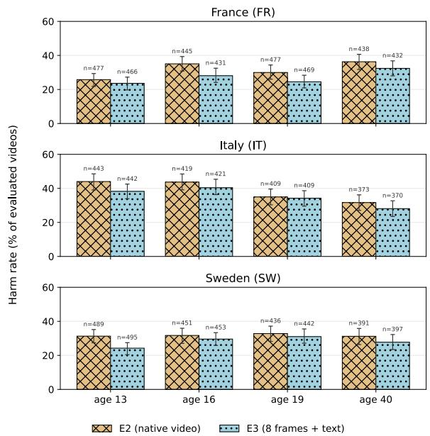  
Figure 10: Stage-2 harm rate per (country, age) combination on Gemini E3 and native-video E2, with 95% video-level bootstrap CIs. Italy carries the highest E3 rate on every age persona; the within-country age gradient differs across the three countries. The cleaner passive-only view is in the main text (Figure 5, §4.3).

Winner vs. runner-up table Table 12 reports the full Stage-1 metrics for Gemini E3 and the strongest open-weight comparator under the same condition. The 0.27-point κ gap between the two configurations is large enough that no plausible scaling discount overturns the choice of Gemini E3 as the Stage-2 configuration.

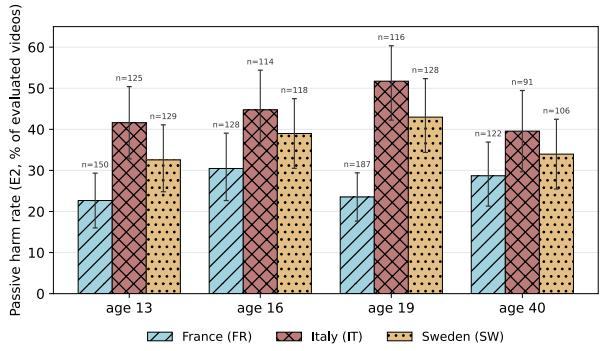  
Figure 11: Stage-2 harm rate per (country, age) on the passive collection phase (FYP scrolling only, no search probe) under Gemini E2 (native video); companion to Figure 5.

Precision and recall across all Stage-1 combinations Table 13 reports the full precision/recall/F1 breakdown on the binary harm verdict for every Stage-1 (model, condition) combination against the two-annotator final reference. Gemini E3 leads the table on every harm-side metric; the supervised XLM-R baseline beats all zero-shot LLMs on harmful-class recall but trails on precision, consistent with a supervised model fitting the positive class on a small training set. All four non-Gemini frame and text conditions sit at or below 50% recall on harmful, which is the largest single failure mode of the LLM auditors.

Supervised XLM-R baseline The XLM-R row in Figure 14 and Table 13 is a 10-fold repeated stratified train/test cross-validation of xlm-roberta-base on the same 300-video Stage-1 subset used to evaluate the four MLLMs. The input is the E1 text only, caption plus audio transcript, exactly the field shown to the text-only LLM runs, and the target is the consensus binary harm verdict. Each fold holds out 19% of items as test, carves 15% of the remaining train side as a dev split for early stopping, and trains for up to 10 epochs with AdamW (lr $2 \times 1 0 ^ { - 5 }$ , batch size 16, max sequence length 256, weight decay 0.01, linear warmup over 6% of steps, early-stopping patience of 4 epochs on dev macro- $F _ { 1 } )$ ). Class imbalance is handled by inverse-frequency reweighting computed on the train side. Folds use random seeds 0–9 and the per-video predicted probability is the mean across the (typically two) folds in which a given video appears in the test split; the metrics in Table 13 are computed on those aggregated pervideo predictions against the same final reference. We read the baseline as a sanity-check anchor for the LLM E1 combinations rather than as a competitive system: at this training-set size $( n \approx 2 4 2$ per fold after dropping NOT AVAILABLE items), the supervised model can beat zero-shot LLMs on harmful-class recall but cannot match Gemini E3’s precision-recall balance.

LLM vs expert agreement (xIm-r-base\* = 10-fold supervised baseline, E1-only)  
Adding visual context monotonically improves agreement (Gemini 2.5 Flash)  
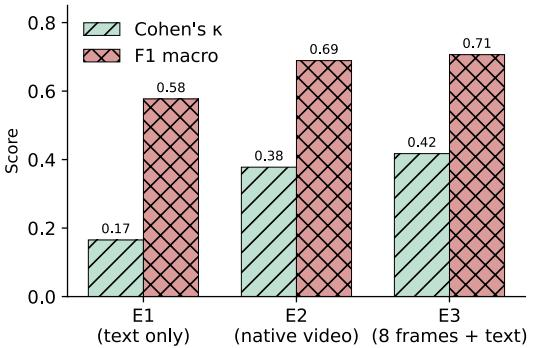  
Figure 12: Cohen’s κ and macro- $F _ { 1 }$ across the three input conditions for Gemini 2.5 Flash on the 300-video Stage-1 subset. E3 (eight frames) is the strongest at ∼2× lower per-call cost than E2 (native video).

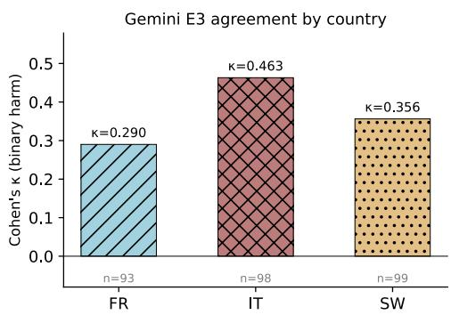  
Figure 13: Per-country Cohen’s κ for the winning configuration (Gemini 2.5 Flash, E3).

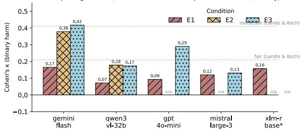  
Figure 14: Aggregate Cohen’s κ on the binary harm verdict across the four MLLMs and the XLM-R supervised baseline, by input condition. GPT-4o-mini and Mistral are not natively video-capable and are omitted from E2. Dotted lines: κ = 0.21 (fair) and $\kappa = 0 . 4 1$ (moderate) (Landis and Koch, 1977).

<table><tr><td>Metric</td><td>Gemini E3</td><td>Qwen3-VL-32B E3</td></tr><tr><td>n paired</td><td>290</td><td>292</td></tr><tr><td>Cohen&#x27;s κ</td><td>0.417</td><td>0.173</td></tr><tr><td>Accuracy</td><td>0.752</td><td>0.682</td></tr><tr><td> $F _ { 1 }$  harmful</td><td>0.591</td><td>0.340</td></tr><tr><td> $F _ { 1 }$  not-harmful</td><td>0.822</td><td>0.790</td></tr><tr><td>Macro-  ${ \bf \nabla } \cdot { \cal F } _ { 1 }$ </td><td>0.706</td><td>0.565</td></tr><tr><td>Precision (harmful)</td><td>0.684</td><td>0.571</td></tr><tr><td>Recall (harmful)</td><td>0.520</td><td>0.242</td></tr></table>

Table 12: Stage-1 metrics for the winning configuration and the strongest open-weight comparator under the same E3 condition.

Provider-block counts The Qwen 413 RequestTooLarge dominates absolute volume because DashScope’s native-video endpoint enforces a per-call payload cap; the workaround would change what Qwen sees and break comparability with unmodified Gemini E2, so we report Qwen E2 only as a comparator. Gemini’s blocks are policy decisions; they could be relaxed via safety\_settings = BLOCK\_NONE, appropriate only under formal ethics approval.

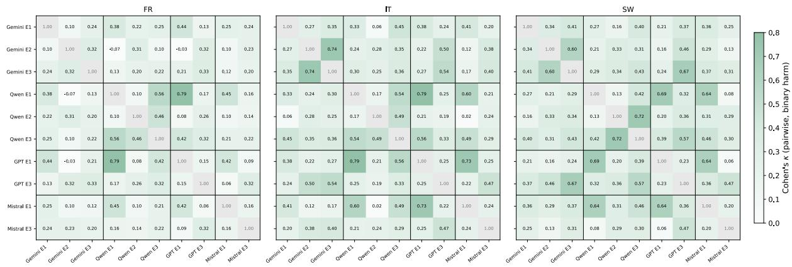  
Figure 15: Pairwise Cohen’s κ between every pair of the eleven Stage-1 (model, condition) combinations (the ten MLLM combinations plus the XLM-R baseline), split by persona country. Off-diagonals are computed on each pair’s intersection of paired video\_ids within the country slice (per-pair n ≈ 95–108).  
Harm-subcategory mix per country (n=102 expert-harmful videos)

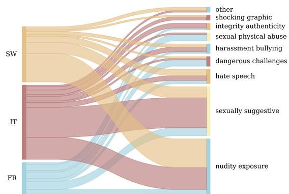  
Figure 16: Country → harm-subcategory mix for the 102 reference-flagged harmful videos. Ribbon widths are proportional to absolute counts.

<table><tr><td>Configuration</td><td> $\mathrm { P _ { H } }$ </td><td> $\mathtt { R } _ { \mathrm { H } }$ </td><td> $\mathrm { F _ { 1 } ^ { H } }$ </td><td> $\mathrm { F _ { 1 } ^ { N H } }$ </td><td> $\mathrm { m F _ { 1 } }$ </td></tr><tr><td>Gemini E3 (frames)</td><td>0.68</td><td>0.52</td><td>0.59</td><td>0.82</td><td>0.71</td></tr><tr><td>Gemini E2 (native)</td><td>0.59</td><td>0.58</td><td>0.58</td><td>0.80</td><td>0.69</td></tr><tr><td>GPT-4o-mini E3 (frames)</td><td>0.56</td><td>0.47</td><td>0.51</td><td>0.78</td><td>0.64</td></tr><tr><td>Qwen E2 (native)</td><td>0.60</td><td>0.24</td><td>0.35</td><td>0.78</td><td>0.56</td></tr><tr><td>Qwen E3 (frames)</td><td>0.57</td><td>0.24</td><td>0.34</td><td>0.79</td><td>0.57</td></tr><tr><td>Gemini E1 (text)</td><td>0.49</td><td>0.34</td><td>0.40</td><td>0.76</td><td>0.58</td></tr><tr><td>XLM-R E1 (supervised)</td><td>0.43</td><td>0.49</td><td>0.46</td><td>0.70</td><td>0.58</td></tr><tr><td>Mistral E3 (frames)</td><td>0.43</td><td>0.44</td><td>0.43</td><td>0.70</td><td>0.57</td></tr><tr><td>Mistral E1 (text)</td><td>0.51</td><td>0.20</td><td>0.29</td><td>0.78</td><td>0.53</td></tr><tr><td>GPT-4o-mini E1 (text)</td><td>0.54</td><td>0.13</td><td>0.21</td><td>0.79</td><td>0.50</td></tr><tr><td>Qwen E1 (text)</td><td>0.50</td><td>0.12</td><td>0.19</td><td>0.79</td><td>0.49</td></tr></table>

Table 13: Stage-1 precision $( \mathrm { P _ { H } } )$ , recall $( \mathbb { R } _ { \mathrm { H } } ) _ { : }$ , per-class $F _ { 1 } ,$ , and $\mathrm { m a c r o } { - } F _ { 1 }$ on the binary harm verdict, across the eleven configurations (ten MLLMs plus the XLM-R baseline) against the two-annotator final reference. Rows sorted by Cohen’s κ; per-column maxima in bold.

<table><tr><td>Failure family</td><td>E1</td><td>E2</td><td>E3</td></tr><tr><td>Gemini PROHIBITED_CONTENT</td><td>3</td><td>6</td><td>2</td></tr><tr><td>Gemini response-parse failure</td><td>0</td><td>1</td><td>5</td></tr><tr><td>Qwen 413 RequestTooLarge</td><td>0</td><td>14</td><td>0</td></tr><tr><td>Qwen data_inspection_failed</td><td>0</td><td>2</td><td>3</td></tr><tr><td>GPT-4o-mini OpenRouter credit-cap</td><td>8</td><td>n/a</td><td>15</td></tr></table>

Table 14: Provider-side refusals on the 300-video Stage-1 subset, by experiment. Each cell counts videos where the model’s response could not be evaluated because the provider blocked the call or returned an unparseable response.