# BEAR-Bench: A Bilingual Enterprise and Academic Reasoning Benchmark for Multimodal Models

Liubov Chubarova1, Alexandra Kuleshova2, Daniil Volkov∗2, Kirill Sultanov∗1, Alexey Zaytsev2,

1 Yandex 2 Applied AI Institute Correspondence: bazarovaai.239@gmail.com

## Abstract

While Multimodal Large Language Models (MLLMs) have made significant strides in visual comprehension, their ability to reason about text-dense, professional documents remains incompletely evaluated. Existing benchmarks emphasize information extraction, require external domain knowledge, or cover professional documents only as one of many settings. They are also largely English- or Chinese-centric, leaving other languages and Russian, in particular, substantially underrepresented. To address these limitations, we introduce BEAR-Bench (Bilingual Enterprise and Academic Reasoning), a self-contained, complex English-and-Russian benchmark comprising 1000 human-annotated questions based on text-rich business and scientific documents. We evaluate 16 proprietary and openweight MLLMs, including Gemini 3.1 Pro and Qwen3.5-397B, on BEAR-Bench and observe clear headroom even for the strongest systems. Finally, we use the resulting model outputs to compare existing hallucination detection methods, evaluating not only how often models fail on BEAR-Bench but also how reliably those failures can be identified.

## 1 Introduction

Multimodal Large Language Models (MLLMs) (OpenAI et al., 2024; Team et al., 2025; Anthropic, 2024) have revolutionized the machine comprehension of images. Beyond merely solving optical character recognition (OCR) tasks, these models demonstrate the potential to perform complex reasoning over multimodal inputs (Yue et al., 2024; Hao et al., 2025). This capability is particularly vital for text-rich scenarios, which are central to real-world professional domains that require reading and analyzing dense visual documents, such as scientific papers and financial reports.

Existing benchmarks provide complementary but incomplete coverage of professional document reasoning. Document-oriented datasets such as DocVQA (Mathew et al., 2021) primarily emphasize OCR and information extraction, whereas broad multimodal reasoning benchmarks such as MMMU (Yue et al., 2024) often require specialized factual knowledge. OCR-Reasoning (Huang et al., 2026) covers diverse text-rich images, including some professional documents, but does not examine this setting in depth. A further limitation is linguistic coverage: existing multimodal benchmarks exhibit a strong bias toward English and Chinese, leaving Slavic languages — and Russian in particular — substantially underrepresented. Russianinclusive resources such as MTVQA (Tang et al., 2025), MWS Vision Bench (MWS AI, 2025), and MERA-Multi (Chervyakov et al., 2026) broaden this coverage, but mix documents with other image types, emphasize OCR and document processing, or focus on a narrow document category. To our knowledge, no existing benchmark evaluates self-contained, multi-step reasoning over Russianlanguage professional document pages whose items involve textual and graphical content such as figures, tables, charts, equations, and diagrams.

To address these limitations, we introduce BEAR-Bench, a complex benchmark comprising 1000 human-annotated questions for text-dense enterprise and scientific documents in English and Russian languages. The science section tests the ability to interpret academic figures, transcribe mathematical formulas, and analyze data from plots. The enterprise tasks target data crossreferencing in financial reports and logical reasoning over business charts. The questions follow two design principles. First, they require multiple logical steps rather than direct extraction from a single piece of evidence. Second, they are fully answerable from the document alone, without external expert knowledge. Together, these principles focus the evaluation on document-grounded reasoning rather than factual recall or shallow extraction. The inclusion of Russian-language tasks further broadens evaluation beyond predominantly English- and Chinese-language resources.

Deploying MLLMs in professional settings requires knowing not only how often they fail, but also whether those failures can be detected reliably; yet evidence on hallucination detection for reasoning over text-dense professional documents remains incomplete. We address this gap by using BEAR-Bench to compare token-level uncertainty scores, representation-based detectors, supervised hidden-state probes, and MLLM-as-a-judge methods across proprietary and open-weight models, providing a practical comparison for deployment settings with and without access to model internals.

The main contributions of this work are the following:

1. We propose BEAR-Bench, a bilingual benchmark for multimodal reasoning in professional scenarios. It features human-annotated questions targeting text-dense business and scientific documents in English and Russian languages.

2. We evaluate 16 MLLMs on BEAR-Bench, including proprietary (e.g., Gemini-3.1-Pro, Claude Opus 4.6) and open-weight (e.g., Qwen3.5, gemma-4) models. Our results show that even the strongest evaluated systems leave clear headroom on BEAR-Bench.

3. We further use BEAR-Bench to evaluate a diverse set of existing hallucination detection methods for OCR-intensive professionaldocument reasoning, comparing uncertainty-, representation-, and judge-based methods under two deployment regimes: direct access to internal signals for open-weight models and proxy-based detection for proprietary ones.

## 2 Related Work

Multimodal benchmarks for professional documents. While modern LLMs achieve strong results on many established multimodal benchmarks (Yue et al., 2025; Zuo et al., 2025), their ability to operate with visually rich professional documents — which requires analyzing both textual and graphical content of an image —- remains underexplored. Text-dense benchmarks oriented at professional documents are mostly OCR-based and measure extractive skills rather than crossreferencing of text and visuals (Xu et al., 2026; Mathew et al., 2021), or emphasize long-page settings that conflate multimodal reasoning with longcontext handling (Chen et al., 2026b; Tang et al., 2026). Multimodal reasoning-focused benchmarks, conversely, offer little signal specifically for professional documents: OCR-Reasoning (Huang et al., 2026) and OCRBench v2 (Fu et al., 2025) are deliberately broad — valuable for general-purpose evaluation, but treating professional documents as one setting among many — while CharXiv (Wang et al., 2024) and ChartQA (Masry et al., 2022, 2025) restrict evaluation to charts and thus do not test text–visual cross-referencing. A further issue is dependence on external knowledge: MMMU (Yue et al., 2024) and EMMA (Hao et al., 2025) pose multidisciplinary problems that presuppose domain expertise, so scores conflate multimodal reasoning failures with factual gaps; part of OCR-Reasoning shares this confound.

Language coverage is also narrow: most benchmarks covering multimodal reasoning in text-dense scenarios are available only in English or Chinese, while many other languages, including Russian, remain underrepresented. Russian-inclusive benchmarks provide valuable but partial coverage. MTVQA (Tang et al., 2025) and TIU-Bench (Zhang et al., 2025) include documents alongside natural scenes but offer very limited coverage of Russian-language professional documents; TIU-Bench, for example, contains only 10 Russian document samples in total. MWS Vision Bench (MWS AI, 2025) provides 400 Russian reasoning-VQA items, but its images span business scans, personal handwriting, receipts, and formstyle pages (Figure 5), rather than being selected specifically for reasoning over text-dense professional documents. LabTabVQA — the only subset of MERA-Multi (Chervyakov et al., 2026) built on professional documents rather than natural images or exam-style problems — is restricted to tables from medical laboratory reports.

Error detection for text-dense multimodal inputs. Recent work proposes a range of hallucination detectors for MLLMs (Chen et al., 2026a). Tool-augmented methods rely on auxiliary models (Chen et al., 2024; Yin et al., 2024; Sahu et al., 2024), while multi-query methods require repeated generation or verification calls (Wu et al., 2024;

<table><tr><td>Benchmark</td><td>#Langs</td><td>#QA pairs</td><td>#RU reasoning VQA</td><td>Image scope</td><td>OCR chars/img</td></tr><tr><td>DocVQA (Mathew et al., 2021)</td><td>EN</td><td>5.2K</td><td>n/a</td><td>Industry documents</td><td>1,113.0</td></tr><tr><td>ChartQA (Masry et al., 2022)</td><td>EN</td><td>2.5K*</td><td>n/a</td><td>Charts</td><td>231.8</td></tr><tr><td>CharXiv (Wang et al., 2024)</td><td>EN</td><td>11.6K</td><td>n/a</td><td>Scientific charts</td><td>165.1</td></tr><tr><td>OCRBench v2 (Fu et al., 2025)</td><td>EN, ZH</td><td>10K</td><td>n/a</td><td>Mixed text-rich images</td><td>437.2</td></tr><tr><td>OCR-Reasoning (Huang et al., 2026)</td><td>EN</td><td>1.1K</td><td>n/a</td><td>Everyday text-rich scenes</td><td>514.3</td></tr><tr><td>MWS Vision Bench (MWS AI, 2025)</td><td>RU</td><td>1.3K**</td><td>400</td><td>Business/personal documents</td><td>1,126.4</td></tr><tr><td>LabTabVQA (Chervyakov et al., 2026)</td><td>RU</td><td>349</td><td>349</td><td>Medical report tables</td><td>637.1</td></tr><tr><td>CC-OCR V2 (Xu et al., 2026)</td><td>RU + 31 langs</td><td>2K***</td><td>0</td><td>Finance/dashboards/blueprints</td><td>1,149.6</td></tr><tr><td>BEAR-Bench</td><td>EN, RU</td><td>1K</td><td>618</td><td>Science/business documents</td><td>2,740.6</td></tr></table>

Table 1: Comparison of BEAR-Bench to existing multimodal reasoning benchmarks. #QA pairs refers to the evaluation split; DocVQA and ChartQA additionally provide training data (50K and 32.7K items in total, respectively), while the remaining benchmarks are evaluation-only. For CC-OCR V2, the reported count is the document QA track (2K of 7.1K items). #RU reasoning VQA: number of evaluation questions in Russian that require answering from the image, excluding OCR, parsing, grounding, and key-information extraction; n/a = not applicable (no Russian split). Image scope summarizes the principal visual sources represented in each benchmark. OCR chars/img: average number of non-whitespace OCR characters per image (n=200 randomly sampled images per benchmark). \*Evenly split between human-written and machine-generated questions. \*\*Publicly available..

Zhang et al., 2024), increasing deployment cost. Of particular interest are lightweight white-box methods, which detect errors using token uncertainty or internal model states collected during a single forward pass (Tong et al., 2026; Li et al., 2024; Jiang et al., 2025; Zhang et al., 2026). These methods add relatively little inference overhead when model internals are available, yet, to our knowledge, they have not been systematically compared on visually rich professional document images requiring multistep reasoning across dense textual and graphical evidence.

Summary. Existing work lacks a Russianinclusive benchmark for self-contained, multi-step reasoning over text-dense professional documents. BEAR-Bench is designed to fill this gap using scientific and business documents; Table 1 summarizes the comparison.

Furthermore, BEAR-Bench enables a systematic comparison of hallucination detectors on such text-dense professional document images requiring multi-step reasoning, a setting not covered by prior evaluations.

## 3 BEAR-Bench

## 3.1 Domain Scope and Taxonomy

BEAR-Bench spans two primary domains — Business and Science — each subdivided into thematically coherent sub-categories.

Business Domain. The business subset covers three document types: financial reports (SEC Forms 10-K and 10-Q) requiring tabular reasoning and year-over-year calculations; investor presentations (Form 8-K exhibits) combining charts, KPI tiles, and infographic maps; and flowcharts and organisational diagrams depicting corporate ownership structures and process pipelines.

Science Domain. The science subset covers three categories: mathematical and physical formulae from physics and mathematics preprints targeting symbol-level recognition; scientific figures and plots (line plots, scatter diagrams, heatmaps) requiring axis and legend interpretation; and academic layouts with multi-column pages testing readingorder resolution and cross-referential reasoning.

The two domains are strictly disjoint: no source document appears in both subsets.

## 3.2 Data Collection and Annotation Pipeline

## 3.2.1 Source Collection

Business Domain. Business documents were retrieved via targeted Google Search queries directed at publicly accessible, license-safe sources. English-language documents were obtained from the U.S. Securities and Exchange Commission (SEC) EDGAR system — annual reports (Form 10- K), quarterly reports (Form 10-Q), and investor presentations filed as Form 8-K exhibits — all of which constitute public records under U.S. federal law. Supplementary English documents were drawn from official government portals (\*.gov, \*.gov.uk) and intergovernmental repositories (\*.int). Russian-language documents were sourced from the state corporate-disclosure platforms e-disclosure.ru and moex.com, as well as from federal government domains (\*.gov.ru). An automated scraper retrieved candidate PDFs;

each document underwent a programmatic licenseverification step examining the first and last five pages for SEC registration markers or open-license declarations (“Creative Commons”, “CC BY”, “public domain”). Documents failing this check were discarded prior to further processing.

Science Domain. English-language papers were downloaded from arXiv via its official Python API, sampling four STEM categories: quant-ph, cs.AI, eess.SP, and math.GM (up to 100 papers per category). Russian-language articles were collected from CyberLeninka (cyberleninka.ru) using an asynchronous Playwright-based crawler across four subject areas: Computer Science, Mathematics, Physics, and Engineering (up to 100 articles per category).

## 3.2.2 Filtering and Preprocessing

Raw PDFs were rendered page-by-page into PNG images and processed through a two-stage filtering pipeline.

Stage 1 — Visual Content Classification. We obtained silver labels for a stratified sample of 3,000 images using Gemini 2.5 Pro with a structured multi-label prompt, producing six Boolean fields: contains\_diagrams, contains\_tables, contains\_equations, contains\_code, contains\_figures, and contains\_handwriting. These labels trained a lightweight classifier: SigLIP embeddings (Zhai et al., 2023) were L2-normalised and passed to a MultiOutputClassifier of logistic-regression models with balanced class weights, one per label. After validation on a held-out 20% split, the classifier was applied to the full corpus of ∼66,000 page images, retaining only pages with at least one of {contains\_diagrams, contains\_equations, contains\_code} predicted positive.

Stage 2 — Textual Density Filtering. Among content-positive pages, we retained only those at or above the 67th percentile of OCR character count within their respective language group. From the surviving candidates, up to 1,500 images per language were drawn via stratified random sampling (seed = 42), yielding the final pool submitted to human annotators.

## 3.2.3 Human Annotation

Annotator pool. Annotation was conducted by 13 domain experts, each holding at minimum a

Bachelor’s degree in a technical discipline. Every annotator processed its own subset of images, authoring exactly one question–answer pair per image.

Annotation task. For each image, annotators were required to: (i) re-verify the visual-content labels produced by the automatic classifier, correcting any erroneous predictions; and (ii) compose a multi-step, multi-hop question with a detailed ground-truth answer. Questions were required to elicit compositional reasoning — aggregating values across table rows, interpreting plotted trends in the context of equations, or tracing paths through flowcharts — rather than straightforward singlestep extraction. The questions were additionally assigned a reasoning depth score representing the total number of reasoning and computational steps required to arrive at the correct answer. The text of the instruction for the annotators is reported in Figure 9.

Evaluation judge. Model responses are scored by GPT-4o used as an LLM-as-a-judge. The judge assesses semantic equivalence between the model answer and the ground truth, permitting surface-level paraphrase while penalising underspecific responses. It returns a binary verdict v ∈ {true, false} of whether the model answer is correct with a brief explanation in structured XML tags, enabling fully reproducible programmatic evaluation. The exact prompt is provided in Figure 11.

Judge reliability. To validate the reliability of the LLM-as-a-judge protocol, we constructed a stratified audit sample of 200 judge verdicts, drawn uniformly across languages and domains (100 English and 100 Russian items; 100 Business and 100 Science items, with 50 items per language– domain cell). Human annotators independently reviewed each model response, ground-truth answer, and judge verdict, recording agreement or disagreement. The judge achieved an overall humanagreement rate of 99.0% (198/200), with only two disagreements in the entire sample. Agreement remained consistently high across languages (99% for both English and Russian) and domains (99% for both Business and Science), as well as at the finer-grained language-domain level (98-100% across all four cells), with 95% Wilson confidence intervals overlapping the overall estimate throughout. On this stratified sample, the LLM-as-a-judge protocol agrees closely with human evaluation.

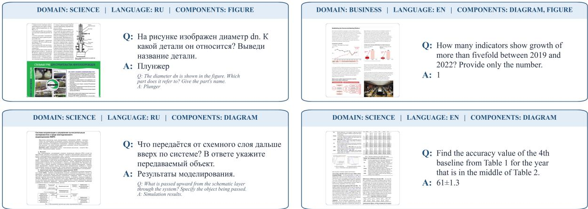  
Figure 1: Representative items from BEAR-Bench. Each card displays the source document image (left) alongside the human-authored multi-hop question and ground-truth answer (right).

Quality control. Eight state-of-the-art proprietary VLMs were queried on every item: Gemini 2.5 Pro/Flash, Gemini 3.1 Pro/Flash, Qwen 3.6 Plus, Qwen3.5 397B, Claude Sonnet 4.6, and Claude Opus 4.6. Items where three or more models returned identical responses — normalised for punctuation and case — and the LLM judge assigned false to all answers were flagged. A manual audit confirmed that 99% of flagged items had erroneous or ambiguous ground truth; all were excluded from the final benchmark. A random sample of retained items was quality-assessed along four dimensions: GT quality (84.4%), judge verdict quality (90.6%), question quality (90.9%), and image quality (97.0%).

Final dataset composition. After quality-control filtering, BEAR-Bench comprises 1,000 document images paired with 1,000 human-authored QA instances across four domain–language groups. Representative samples from BEAR-Bench are shown in Figure 1.

## 4 Dataset Statistics and Analysis

Figure 2 summarises the composition of BEAR-Bench across three dimensions: domain–language balance, question complexity, and visual contenttype prevalence.

Domain and language balance. The Russian business cell is the largest subset (352 items, 35.2%), reflecting the higher volume of publicly accessible Russian-language corporate disclosure documents, while the English business cell is the smallest (180 items, 18.0%). The science cells are more evenly distributed (266 and 202 items for Russian and English, respectively).

Reasoning depth. Reasoning-depth annotations are available for 940 of the 1,000 items in BEAR-Bench. Each annotation estimates the intended number of steps required to derive the correct answer from the document image. Because such step counts depend on how annotators decompose a task, we treat them as coarse descriptive metadata rather than an objective difficulty score. The estimates span 2–10+ steps and peak at 4–5 steps with a moderate positive skew, indicating that the benchmark construction targeted multi-step inference rather than simple extraction.

Visual content types. Figures and diagrams are the most prevalent content types across all subsets, consistent with the heavy use of infographics in both corporate reports and scientific papers. Equations appear almost exclusively in the science subsets, reflecting the mathematical nature of the arXiv and CyberLeninka source material, while code fragments are comparatively rare overall.

## 5 Experiments

## 5.1 Experimental Setup

Evaluated models. We evaluate a diverse set of MLLMs on BEAR-Bench, covering both openweight models (Qwen3.5-0.8B/4B/9B/27B (Qwen Team, 2026a), Qwen3-VL-2B/8B-Instruct (Team, 2025), Qwen3-VL-4B-Thinking (Team, 2025), and Gemma-4-31B-it (Team, 2026)) and proprietary systems (Qwen3.5-397B-A17B (Qwen Team, 2026a), Qwen 3.6 Plus (Qwen Team, 2026b), Gemini 2.5/3.1 Pro/Flash (DeepMind, 2026), and

(a)  
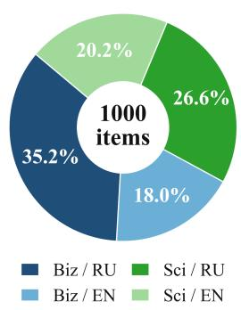

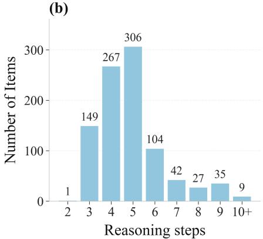

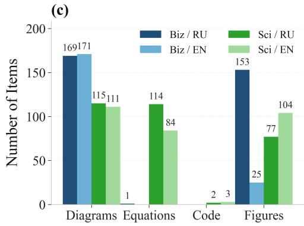  
Figure 2: BEAR-Bench dataset statistics. (a) Item distribution across the four domain × language cells; the central numeral indicates the total count. (b) Distribution of complexity scores over all 1,000 items, where each score reflects the total number of reasoning and computational steps required to solve the corresponding question. (c) Prevalence of visual content types, diagrams, equations, code, and figures, disaggregated by subset; bars show absolute counts. Items may carry multiple content-type labels simultaneously.

Claude Sonnet/Opus 4.6 (Anthropic, 2026b,a)). The open-weight models were run locally on an internal GPU server equipped with NVIDIA H100 and NVIDIA L40 accelerators; the proprietary ones were queried via the OpenRouter API.

Inference protocol. All models were evaluated zero-shot under a fixed protocol: each instance received only the image and the raw question, with no few-shot examples or prompt engineering, and a uniform decoding temperature of 0.6.

## 5.2 Results

Main results. Table 2 shows remaining headroom on BEAR-Bench. Qwen3.5-397B-A17B and Gemini 3.1 Pro achieve the highest overall accuracy (75.4% and 75.1%, respectively), trading the lead across subsets — Qwen3.5-397B-A17B is stronger on Science and Equations, while Gemini 3.1 Pro edges ahead on Business and English items — indicating that no single system dominates across all domains. All models exhibit a marked drop from English to Russian (e.g., 83.0%→70.2% for Gemini 3.1 Pro and 81.9%→71.4% for Qwen3.5-397B-A17B), confirming that the linguistic gap identified in prior benchmarks persists even for frontier proprietary models. Among the evaluated systems, proprietary models generally achieve higher accuracy than their open-weight counterparts. Within the Qwen3.5 and Qwen3-VL-Instruct families, larger models tend to perform better in both languages (Figure 3), although accuracy remains substantially lower on Russian items. Overall, current models remain limited in visually grounded reasoning over text-dense professional documents, with performance shaped jointly by model scale, language, and document type.

BEAR-Bench accuracy vs. model size  
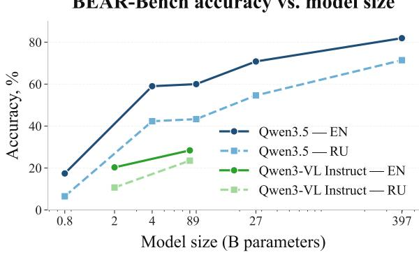  
Figure 3: Accuracy on BEAR-Bench versus model size for the Qwen3.5 and Qwen3-VL-Instruct families (parameters on a log axis), reported separately for English (solid) and Russian (dashed) items. The English-over-Russian gap persists across scales.

Effect of Chain-of-Thought prompting. We tested whether explicit chain-of-thought (CoT) prompting improves accuracy on BEAR-Bench. A subset of open-weight models was re-evaluated with a prompt that asks the model to extract information from the image and solve the task step by step before giving a final answer (Table 3; the full prompt is given in Appendix F). For reasoningoriented models — Qwen3.5-9B, Qwen3.5-4B, and Qwen3-VL-4B-Thinking — accuracy is essentially unchanged or slightly lower, consistent with these models already performing intermediate reasoning under the default protocol. By contrast, the instruct-tuned Qwen3-VL-8B-Instruct improves by 13.7 percentage points when steered to externalize

Table 2: BEAR-Bench leaderboard. Results are reported as accuracy (%) across all evaluation subsets. Bold denotes the best result in each column.
<table><tr><td>Model</td><td>Overall (n=1000)</td><td>Business (n=532)</td><td>Science (n=468)</td><td>RU  $( n { = } 6 1 8 )$ </td><td>EN (n=382)</td><td>Figures (n=359)</td><td>Diagrams (n=566)</td><td>Equations (n=199)</td></tr><tr><td colspan="9">Proprietary models</td></tr><tr><td>Qwen3.5-397B-A17B</td><td>75.4</td><td>78.2</td><td>72.2</td><td>71.4</td><td>81.9</td><td>65.7</td><td>76.9</td><td>74.9</td></tr><tr><td>Gemini 3.1 Pro</td><td>75.1</td><td>79.5</td><td>70.1</td><td>70.2</td><td>83.0</td><td>65.5</td><td>76.3</td><td>71.4</td></tr><tr><td>Gemini 2.5 Pro</td><td>67.4</td><td>72.7</td><td>61.3</td><td>62.8</td><td>74.9</td><td>62.4</td><td>66.8</td><td>62.3</td></tr><tr><td>Qwen 3.6 Plus</td><td>65.0</td><td>59.4</td><td>71.4</td><td>62.5</td><td>69.1</td><td>62.7</td><td>62.4</td><td>69.3</td></tr><tr><td>Claude Sonnet 4.6</td><td>62.7</td><td>71.4</td><td>52.8</td><td>57.6</td><td>70.9</td><td>52.9</td><td>62.2</td><td>54.8</td></tr><tr><td>Claude Opus 4.6</td><td>61.5</td><td>67.5</td><td>54.7</td><td>57.1</td><td>68.6</td><td>55.7</td><td>58.3</td><td>59.3</td></tr><tr><td>Gemini 3.1 Flash</td><td>59.8</td><td>62.2</td><td>57.0</td><td>56.8</td><td>64.7</td><td>54.0</td><td>61.3</td><td>56.8</td></tr><tr><td>Gemini 2.5 Flash</td><td>49.0</td><td>56.0</td><td>41.0</td><td>44.8</td><td>55.8</td><td>43.2</td><td>50.0</td><td>43.7</td></tr><tr><td colspan="9">Open-weight models</td></tr><tr><td>Qwen3.5-27B</td><td>60.8</td><td>68.9</td><td>51.6</td><td>54.6</td><td>70.8</td><td>50.8</td><td>60.8</td><td>50.8</td></tr><tr><td>Qwen3.5-9B</td><td>49.6</td><td>59.8</td><td>38.1</td><td>43.3</td><td>60.0</td><td>42.5</td><td>49.5</td><td>40.7</td></tr><tr><td>Qwen3.5-4B</td><td>48.6</td><td>58.1</td><td>37.9</td><td>42.3</td><td>59.0</td><td>42.2</td><td>48.0</td><td>39.2</td></tr><tr><td>Qwen3-VL-4B-Thinking</td><td>34.5</td><td>39.8</td><td>28.5</td><td>29.7</td><td>42.4</td><td>30.7</td><td>32.8</td><td>29.1</td></tr><tr><td>Qwen3-VL-8B-Instruct</td><td>25.4</td><td>18.3</td><td>33.4</td><td>23.5</td><td>28.4</td><td>28.8</td><td>23.4</td><td>37.2</td></tr><tr><td>gemma-4-31B-it</td><td>23.5</td><td>24.3</td><td>22.5</td><td>22.0</td><td>25.8</td><td>26.5</td><td>24.8</td><td>26.6</td></tr><tr><td>Qwen3-VL-2B-Instruct</td><td>14.3</td><td>11.3</td><td>17.8</td><td>10.7</td><td>20.3</td><td>16.2</td><td>13.7</td><td>19.1</td></tr><tr><td>Qwen3.5-0.8B</td><td>10.6</td><td>8.3</td><td>13.3</td><td>6.5</td><td>17.4</td><td>13.1</td><td>11.9</td><td>14.6</td></tr></table>

Table 3: Overall accuracy (%) with and without an explicit chain-of-thought prompt. ∆ is CoT minus the default (no-CoT) protocol used in Table 2.
<table><tr><td>Model</td><td>No CoT</td><td>CoT</td><td>∆</td></tr><tr><td>Qwen3.5-9B</td><td>49.6</td><td>49.3</td><td>-0.3</td></tr><tr><td>Qwen3.5-4B</td><td>48.6</td><td>47.2</td><td>-1.4</td></tr><tr><td>Qwen3-VL-4B-Thinking</td><td>34.5</td><td>34.9</td><td>+0.4</td></tr><tr><td>Qwen3-VL-8B-Instruct</td><td>25.4</td><td>39.1</td><td>+13.7</td></tr></table>

Table 4: Overall accuracy of Qwen3.5-9B on BEAR-Bench at different image downsampling factors. A factor of c means that both the width and height are divided by c.
<table><tr><td>Downsampling factor</td><td>1</td><td>1.5</td><td>2</td><td>3</td><td>4</td></tr><tr><td>Accuracy (%)</td><td>49.6</td><td>45.0</td><td>33.0</td><td>12.6</td><td>4.7</td></tr></table>

multi-step reasoning.

Effect of image resolution. To measure the sensitivity of document reasoning to image resolution, we evaluated Qwen3.5-9B after resizing each input image to 1/c of its original width and height, where c is the downsampling factor in Table 4. All other inference settings were kept unchanged. Accuracy decreases from 49.3% at the original resolution to 45.0% at c = 1.5 and 33.0% at c = 2, before falling sharply to 12.6% at c = 3 and 4.7% at $c = 4$ . This pronounced degradation suggests that preserving fine-grained visual detail is critical for reasoning over text-dense professional documents.

## 5.3 Error Analysis

To characterize common failure modes on BEAR-Bench, we conducted an exploratory error analysis combining inductive taxonomy construction with manual annotation of model responses.

## 5.3.1 Taxonomy construction

To derive a failure taxonomy grounded in actual model behavior, we first collected an open-coding pilot of 150 incorrect responses produced by Gemini 3.1 Pro on BEAR-Bench, stratified across domains and languages. Four members of our team manually inspected each failure case and wrote detailed, free-form natural-language comments explaining the underlying cause of the error, rather than assigning predefined labels. This yielded a corpus of 150 rich failure descriptions covering a broad range of perceptual and reasoning breakdowns. We then prompted GPT-5.5-Pro, used as an advanced classification assistant, to cluster these free-form comments into thematically coherent groups based on their underlying error mechanism. The resulting clusters were manually reviewed and refined by the authors into five final categories:

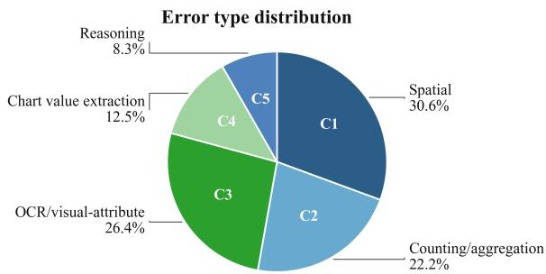  
Figure 4: Error-type distribution in a manually annotated subsample of Gemini 3.1 Pro responses (n = 62). Samples may receive multiple labels.

spatial misgrounding (C1), counting/aggregation (C2), OCR/visual-attribute (C3), chart-value extraction (C4), and semantic/reasoning (C5). Detailed descriptions of each error type are provided in Appendix A.

## 5.3.2 Error statistics

We applied the taxonomy to a subsample of Gemini 3.1 Pro incorrect responses, selected to cover diverse document types and complexity levels. Figure 4 shows the resulting distribution. Visualperceptual errors dominate: spatial misgrounding (C1) and OCR/visual-attribute errors (C3) together account for the majority of failures. Our analysis suggests that the most common errors on BEAR-Bench are perceptual, involving misread text or visual attributes and mislocalized evidence.

## 5.4 Detecting Incorrect Answers

We next use responses generated on BEAR-Bench to compare existing hallucination detection methods for text-dense professional document reasoning. Following the benchmark’s binary answer evaluation, we assess whether each method can distinguish correct from incorrect responses.

Setup. We study two open-weight Qwen3.5 models using their native internal signals and eight proprietary models using proxy hidden states extracted from Qwen3-VL-8B (Bai et al., 2025), conditioned on each image, question, and proprietary-model response. We evaluate six uncertainty scores—max/mean token probability, loglikelihood, max/mean entropy, and perplexity— plus ContextualLens (Phukan et al., 2025), the supervised hidden-state probe SUQ (Li et al., 2024), and an MLLM-as-a-judge baseline (Qwen3-VL-8B) (Gu et al., 2025). We report balanced accuracy (BalAcc), AUROC and AUC-PR metrics.

Results. The performance of the evaluated methods is shown in Tables 6-8. No detector wins everywhere; performance depends on the access regime and on response length (Table 5). SUQ achieves the highest BalAcc on all eight proprietary models (BalAcc 0.67–0.74; median response length < 150 words), but performs less well on the two open-weight models (BalAcc 0.60–0.67; median length > 1,000 words), suggesting that a last-token embedding provides limited signal for errors occurring earlier in long reasoning chains. Among proxy uncertainty scores, max token probability is strongest for the four models answering in two to three words (0.59–0.66) but at chance for the four with longer answers (0.49–0.51), while meanbased score shows the reverse (0.48–0.56 versus 0.65–0.66). The judge improves with length, from 0.57–0.62 on terse answers to 0.80–0.81 on the verbose open-weight models—the highest BalAcc we observe—as a detailed derivation can be checked step by step.

## 6 Conclusion

We introduced BEAR-Bench, a bilingual benchmark of 1,000 human-authored questions for context-grounded, multi-step reasoning over textdense business and scientific documents. Benchmark items include dense textual and graphical page content such as figures, tables, charts, equations, and diagrams. Across 16 proprietary and open-weight MLLMs, the highest overall accuracy on BEAR-Bench is 75.4%, and every evaluated model achieves lower accuracy on Russian items. Our error analysis suggests that common failures involve spatial grounding, OCR, and visual-attribute perception.

We also used the resulting model responses to compare existing hallucination detection methods. Performance varies across target models: supervised probes perform best for proprietary outputs, while an MLLM judge achieves the highest balanced accuracy on the verbose responses from open-weight outputs. The best balanced accuracy is 0.74 for proprietary outputs and 0.81 for openweight models, showing that incorrect responses are not always identified reliably. BEAR-Bench therefore provides a common setting for tracking progress in both professional document reasoning and error detection.

## Limitations

BEAR-Bench is deliberately narrow in several aspects. All questions are scoped to a single rendered page image; the benchmark therefore does not evaluate multi-page or cross-document reasoning. Coverage is limited to English and Russian enterprise and academic documents drawn from public disclosure and preprint sources, so findings may not transfer to other languages, domains, or private enterprise corpora. With 1,000 items and uneven language–domain cell sizes, subset estimates carry more variance than the overall score. Although we validate the LLM-as-a-judge protocol against humans, scoring still depends on an external model, and reasoning-depth labels remain coarse annotator estimates rather than objective difficulty. Finally, our hallucination-detection study compares existing methods under two access regimes and finds that detector quality varies with response length; we do not propose a new detector, and even the best balanced accuracies leave substantial room for improvement.

## 7 Acknowledgements

The work was supported by the grant for research centers in the field of AI provided by the Ministry of Economic Development of the Russian Federation in accordance with the agreement 000000C313925P4F0002 and the agreement №139-10-2025-033.

## References

Anthropic. 2024. The Claude 3 model family: Opus, Sonnet, Haiku. Model card, Anthropic. Accessed: 2024-09-07.

Anthropic. 2026a. Claude opus (version 4.6).

Anthropic. 2026b. Claude sonnet (version 4.6).

Shuai Bai, Yuxuan Cai, Ruizhe Chen, Keqin Chen, Xionghui Chen, Zesen Cheng, Lianghao Deng, Wei Ding, Chang Gao, Chunjiang Ge, Wenbin Ge, Zhifang Guo, Qidong Huang, Jie Huang, Fei Huang, Binyuan Hui, Shutong Jiang, Zhaohai Li, Mingsheng Li, and 45 others. 2025. Qwen3-vl technical report. Preprint, arXiv:2511.21631.

Xiang Chen, Chenxi Wang, Yida Xue, Ningyu Zhang, Xiaoyan Yang, Qiang Li, Yue Shen, Lei Liang, Jinjie Gu, and Huajun Chen. 2024. Unified hallucination detection for multimodal large language models. In Proceedings of the 62nd Annual Meeting of the Association for Computational Linguistics (Volume 1: Long Papers), pages 3235–3252.

Zhiyuan Chen, Yuecong Min, Jie Zhang, Bei Yan, Jiahao Wang, Xiaozhen Wang, and Shiguang Shan. 2026a. A survey of multimodal hallucination evaluation and detection. International Journal of Computer Vision, 134(3):131.

Ziyu Chen, Yilun Zhao, Chengye Wang, Rilyn R Han, Manasi Patwardhan, and Arman Cohan. 2026b. Scimdr: Advancing scientific multimodal document reasoning. In Proceedings ofthe 64th Annual Meeting ofthe Associationfor Computational Linguistics (Volume 1: Long Papers), pages 44718–44742.

Artem Chervyakov, Ulyana Isaeva, Anton Emelyanov, Artem Safin, Maria Tikhonova, Alexander Kharitonov, Yulia Lyakh, Petr Surovtsev, Denis Shevelev, Vildan Saburov, Vasily Konovalov, Elisei Rykov, Ivan Sviridov, Amina Miftakhova, Ilseyar Alimova, Alexander Panchenko, Alexander Kapitanov, and Alena Fenogenova. 2026. Multimodal evaluation of Russian-language architectures. In Proceedings of the 19th Conference of the European Chapter of the Association for Computational Linguistics (Volume 1: Long Papers), pages 2114–2161, Rabat, Morocco. Association for Computational Linguistics.

Google DeepMind. 2026. Gemini model cards. Accessed: 2026-08-03.

Ling Fu, Zhebin Kuang, Jiajun Song, Mingxin Huang, Biao Yang, Yuzhe Li, Linghao Zhu, Qidi Luo, Xinyu Wang, Hao Lu, Zhang Li, Guozhi Tang, Bin Shan, Chunhui Lin, Qi Liu, Binghong Wu, Hao Feng, Hao Liu, Can Huang, and 5 others. 2025. Ocrbench v2: An improved benchmark for evaluating large multimodal models on visual text localization and reasoning. Preprint, arXiv:2501.00321.

Jiawei Gu, Xuhui Jiang, Zhichao Shi, Hexiang Tan, Xuehao Zhai, Chengjin Xu, Wei Li, Yinghan Shen, Shengjie Ma, Honghao Liu, Saizhuo Wang, Kun Zhang, Yuanzhuo Wang, Wen Gao, Lionel Ni, and Jian Guo. 2025. A survey on llm-as-a-judge. Preprint, arXiv:2411.15594.

Yunzhuo Hao, Jiawei Gu, Huichen Will Wang, Linjie Li, Zhengyuan Yang, Lijuan Wang, and Yu Cheng. 2025. Can mllms reason in multimodality? emma: An enhanced multimodal reasoning benchmark. Preprint, arXiv:2501.05444.

Mingxin Huang, Yongxin Shi, Dezhi Peng, Songxuan Lai, Zecheng Xie, and Lianwen Jin. 2026. Ocrreasoning benchmark: Unveiling the true capabilities of mllms in complex text-rich image reasoning. Preprint, arXiv:2505.17163.

Zhangqi Jiang, Junkai Chen, Beier Zhu, Tingjin Luo, Yankun Shen, and Xu Yang. 2025. Devils in middle layers of large vision-language models: Interpreting, detecting and mitigating object hallucinations via attention lens. In 2025 IEEE/CVF Conference on Computer Vision and Pattern Recognition (CVPR), pages 25004–25014. IEEE.

Qing Li, Jiahui Geng, Chenyang Lyu, Derui Zhu, Maxim Panov, and Fakhri Karray. 2024. Referencefree hallucination detection for large vision-language models. In Findings of the Association for Computational Linguistics: EMNLP 2024, pages 4542–4551.

Ahmed Masry, Mohammed Saidul Islam, Mahir Ahmed, Aayush Bajaj, Firoz Kabir, Aaryaman Kartha, Md Tahmid Rahman Laskar, Mizanur Rahman, Shadikur Rahman, Mehrad Shahmohammadi, and 1 others. 2025. Chartqapro: A more diverse and challenging benchmark for chart question answering. In Findings of the Association for Computational Linguistics: ACL 2025, pages 19123–19151.

Ahmed Masry, Do Xuan Long, Jia Qing Tan, Shafiq Joty, and Enamul Hoque. 2022. ChartQA: A benchmark for question answering about charts with visual and logical reasoning. In Findings of the Association for Computational Linguistics: ACL 2022, pages 2263– 2279, Dublin, Ireland. Association for Computational Linguistics.

Minesh Mathew, Dimosthenis Karatzas, and C. V. Jawahar. 2021. Docvqa: A dataset for vqa on document images. In 2021 IEEE Winter Conference on Applications ofComputer Vision (WACV), pages 2199–2208.

MWS AI. 2025. MWS vision bench: A Russianlanguage document benchmark for multimodal large language models. https://github.com/mts-ai/ MWS-Vision-Bench. Accessed: 2026-07-31.

OpenAI, Josh Achiam, Steven Adler, Sandhini Agarwal, Lama Ahmad, Ilge Akkaya, Florencia Leoni Aleman, Diogo Almeida, Janko Altenschmidt, Sam Altman, Shyamal Anadkat, Red Avila, Igor Babuschkin, Suchir Balaji, Valerie Balcom, Paul Baltescu, Haiming Bao, Mohammad Bavarian, Jeff Belgum, and 262 others. 2024. Gpt-4 technical report. Preprint, arXiv:2303.08774.

Anirudh Phukan, Divyansh, Harshit Kumar Morj, Vaishnavi, Apoorv Saxena, and Koustava Goswami. 2025. Beyond logit lens: Contextual embeddings for robust hallucination detection & grounding in VLMs. In Proceedings of the 2025 Conference of the Nations ofthe Americas Chapter ofthe Associationfor Computational Linguistics: Human Language Technologies (Volume 1: Long Papers), pages 9661–9675, Albuquerque, New Mexico. Association for Computational Linguistics.

Qwen Team. 2026a. Qwen3.5: Towards native multimodal agents.

Qwen Team. 2026b. Qwen3.6-Plus: Towards real world agents.

Pritish Sahu, Karan Sikka, and Ajay Divakaran. 2024. Pelican: Correcting hallucination in vision-LLMs via claim decomposition and program of thought verification. In Proceedings of the 2024 Conference on Empirical Methods in Natural Language Processing, pages 8228–8248, Miami, Florida, USA. Association for Computational Linguistics.

Jingqun Tang, Qi Liu, Yongjie Ye, Jinghui Lu, Shu Wei, Chunhui Lin, Wanqing Li, Mohamad Fitri Faiz Bin Mahmood, Hao Feng, Zhen Zhao, Yanjie Wang, Yuliang Liu, Hao Liu, Xiang Bai, and Can Huang. 2025. MTVQA: Benchmarking multilingual text-centric visual question answering. In Findings ofthe Association for Computational Linguistics: ACL 2025, pages 7764–7794, Vienna, Austria. Association for Computational Linguistics.

Zichen Tang, E Haihong, Rongjin Li, Jiacheng Liu, Linwei Jia, Zhuodi Hao, Zhongjun Yang, Yuanze Li, Haolin Tian, Xinyi Hu, and 1 others. 2026. Finmmdocr: Benchmarking financial multimodal reasoning with scenario awareness, document understanding, and multi-step computation. In Proceedings of the AAAI Conference on Artificial Intelligence, volume 40, pages 25858–25866.

Gemini Team, Rohan Anil, Sebastian Borgeaud, Jean-Baptiste Alayrac, Jiahui Yu, Radu Soricut, Johan Schalkwyk, Andrew M. Dai, Anja Hauth, Katie Millican, David Silver, Melvin Johnson, Ioannis Antonoglou, Julian Schrittwieser, Amelia Glaese, Jilin Chen, Emily Pitler, Timothy Lillicrap, Angeliki Lazaridou, and 1332 others. 2025. Gemini: A family of highly capable multimodal models. Preprint, arXiv:2312.11805.

Gemma Team. 2026. Gemma 4 technical report. Preprint, arXiv:2607.02770.

Qwen Team. 2025. Qwen3 technical report. Preprint, arXiv:2505.09388.

Chaodong Tong, Qi Zhang, Chen Li, Lei Jiang, and Yanbing Liu. 2026. Faithscan: Model-driven single-pass hallucination detection for faithful visual question answering. arXiv preprint arXiv:2601.00269.

Zirui Wang, Mengzhou Xia, Luxi He, Howard Chen, Yitao Liu, Richard Zhu, Kaiqu Liang, Xindi Wu, Haotian Liu, Sadhika Malladi, and 1 others. 2024. Charxiv: Charting gaps in realistic chart understanding in multimodal llms. Advances in Neural Information Processing Systems, 37:113569–113697.

Junfei Wu, Qiang Liu, Ding Wang, Jinghao Zhang, Shu Wu, Liang Wang, and Tieniu Tan. 2024. Logical closed loop: Uncovering object hallucinations in large vision-language models. In Findings of the Association for Computational Linguistics: ACL 2024, pages 6944–6962.

Zhipeng Xu, Junhao Ji, Zulong Chen, Zhenghao Liu, Qing Liu, Chunyi Peng, Zubao Qin, Ze Xu, Jianqiang Wan, Jun Tang, Zhibo Yang, Shuai Bai, and Dayiheng Liu. 2026. Cc-ocr v2: Benchmarking large multimodal models for literacy in real-world document processing. arXiv preprint arXiv:2605.03903.

Shukang Yin, Chaoyou Fu, Sirui Zhao, Tong Xu, Hao Wang, Dianbo Sui, Yunhang Shen, Ke Li, Xing Sun, and Enhong Chen. 2024. Woodpecker: Hallucination correction for multimodal large language models. Science China Information Sciences, 67(12):220105.

Xiang Yue, Yuansheng Ni, Tianyu Zheng, Kai Zhang, Ruoqi Liu, Ge Zhang, Samuel Stevens, Dongfu Jiang, Weiming Ren, Yuxuan Sun, Cong Wei, Botao Yu, Ruibin Yuan, Renliang Sun, Ming Yin, Boyuan Zheng, Zhenzhu Yang, Yibo Liu, Wenhao Huang, and 3 others. 2024. Mmmu: A massive multi-discipline multimodal understanding and reasoning benchmark for expert agi. In 2024 IEEE/CVF Conference on Computer Vision and Pattern Recognition (CVPR), pages 9556–9567.

Xiang Yue, Tianyu Zheng, Yuansheng Ni, Yubo Wang, Kai Zhang, Shengbang Tong, Yuxuan Sun, Botao Yu, Ge Zhang, Huan Sun, and 1 others. 2025. Mmmupro: A more robust multi-discipline multimodal understanding benchmark. In Proceedings of the 63rd Annual Meeting of the Association for Computational Linguistics (Volume 1: Long Papers), pages 15134– 15186.

Xiaohua Zhai, Basil Mustafa, Alexander Kolesnikov, and Lucas Beyer. 2023. Sigmoid loss for language image pre-training. In 2023 IEEE/CVF International Conference on Computer Vision (ICCV), pages 11941–11952.

Feiran Zhang, Yixin Wu, Zhenghua Wang, Xiaohua Wang, Changze Lv, Xuan-Jing Huang, and Xiaoqing Zheng. 2026. Vib-probe: Detecting and mitigating hallucinations in vision-language models via variational information bottleneck. In Proceedings ofthe 64th Annual Meeting ofthe Associationfor Computational Linguistics (Volume 1: Long Papers), pages 23509–23521.

Kun Zhang, Liqiang Niu, Zhen Cao, Fandong Meng, and Jie Zhou. 2025. TIU-bench: A benchmark for evaluating large multimodal models on text-rich image understanding. In Findings of the Association for Computational Linguistics: EMNLP 2025, pages 24286–24295, Suzhou, China. Association for Computational Linguistics.

Ruiyang Zhang, Hu Zhang, and Zhedong Zheng. 2024. Vl-uncertainty: Detecting hallucination in large vision-language model via uncertainty estimation. arXiv preprint arXiv:2411.11919.

Yuxin Zuo, Shang Qu, Yifei Li, Zhang-Ren Chen, Xuekai Zhu, Ermo Hua, Kaiyan Zhang, Ning Ding, and Bowen Zhou. 2025. MedxpertQA: Benchmarking expert-level medical reasoning and understanding. In Forty-second International Conference on Machine Learning.

## A Error taxonomy

Below, we elaborate on the error taxonomy derived in our study.

1. C1 — Spatial localization and object matching. The model incorrectly identifies where objects are located in the image and how they relate to each other (e.g., selecting a neighboring element, misreading whether a marker lies inside a region, boundary intersections, label-to-object matching, arrow direction, or links between blocks).

2. C2 — Counting and aggregation errors of visual elements. The model makes mistakes when counting objects or aggregating extracted elements (e.g., points, circles, arrows, rows, columns, people, links, paths, labels, or table values), including missed elements, extra elements, or incorrect summation.

3. C3 — Errors in reading text, numbers, and visual attributes. The model incorrectly reads text, numbers, symbols, or small labels (OCR-related issues), and may also misidentify visual attributes such as color, marker shape, text style, italics/boldface, or legend encodings.

4. C4 — Errors in extracting values from charts. The model incorrectly reads quantitative values from plots/graphs (e.g., axis scale, ticks, point coordinates, values at specific x, peaks, minima, maxima, plateaus, trends, or ranges).

5. C5 — Semantic, instruction-following, and logical/arithmetic errors. The model misunderstands task conditions, categories, terms, units, or filtering rules, and/or makes reasoning or arithmetic mistakes after extraction (e.g., wrong interpretation, entity confusion, incorrect formulas, hallucinated assumptions, or incomplete answers).

## B Illustrative items from MWS Vision Bench

Figure 5 shows public validation items from MWS Vision Bench (MWS AI, 2025). The illustration is taken from the dataset’s Hugging Face page.\* We include them to make the contrast with BEAR-Bench concrete: MWS mixes business scans with personal handwriting, receipts, and form-style pages, and a large share of its tasks are OCR, grounding, and key-information extraction. BEAR-Bench instead targets multi-step questions on text-dense scientific and business document pages (Figure 1).

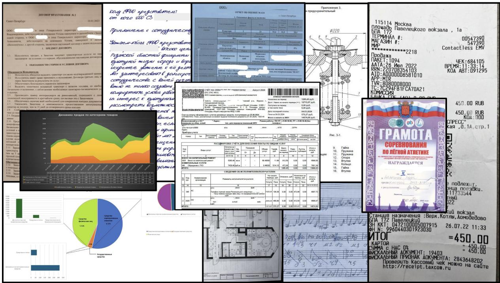  
Figure 5: Illustrative items from the public validation split of MWS Vision Bench (MWS AI, 2025). The mix of personal handwriting, receipts, and document-processing tasks differs from BEAR-Bench’s professional, text-dense pages.

## C Accuracy vs Reasoning Depth

Figure 6 demonstrates the accuracy broken down by annotated reasoning-step count for several proprietary models. The trend is non-monotonic, suggesting that on knowledge-free tasks, frontier models are constrained more by visual perception than by the ability to execute long reasoning chains.

We repeat this analysis for four open-weight models (Figure 7), where the two model families exhibit contrasting behaviour. The accuracy of the reasoning-tuned Qwen3.5 models remains stable as the annotated reasoning depth grows, whereas the instruction-tuned Qwen3-VL models degrade on items requiring seven or more steps. A likely reason is that reasoning-tuned models are trained to produce long chains of reasoning, so questions that need more steps cost them little extra accuracy, while instruction-tuned models are not trained for this and lose accuracy as more steps are needed.

## D Additional data statistics: response length

Table 5 reports the median response length in words for each evaluated model. Lengths are computed by whitespace-splitting each model’s stored answer field. Proprietary and open-weight models differ sharply: several API systems return very short answers (median 2–3 words), while reasoningoriented open-weight models often produce long intermediate chains (median above 1,000 words).

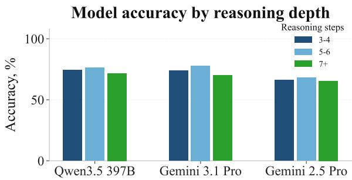  
Figure 6: Accuracy on BEAR-Bench as a function of reasoning depth (number of steps per item) for three frontier models.

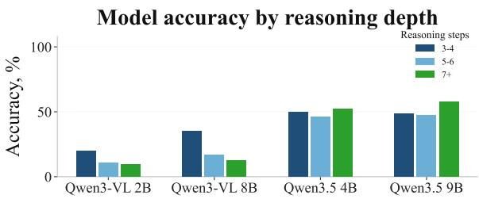  
Figure 7: Accuracy on BEAR-Bench as a function of reasoning depth (number of steps per item) for four open-weight models.

Table 5: Median response length (words) by model. Words are whitespace-split tokens from each model’s stored answer field.
<table><tr><td>Group</td><td>Model</td><td>Median words</td></tr><tr><td rowspan="7">Proprietary / API</td><td>Gemini 3.1 Pro</td><td>3</td></tr><tr><td>Gemini 3.1 Flash</td><td>46</td></tr><tr><td>Gemini 2.5 Pro</td><td>3</td></tr><tr><td>Gemini 2.5 Flash</td><td>123</td></tr><tr><td>Qwen 3.6 Plus</td><td>2</td></tr><tr><td>Qwen3.5 397B A17B</td><td>2</td></tr><tr><td>Claude Sonnet 4.6</td><td>136</td></tr><tr><td rowspan="10">Open-weight</td><td>Claude Opus 4.6</td><td>149</td></tr><tr><td>Qwen3.5-0.8B</td><td>96</td></tr><tr><td>Qwen3.5-27B</td><td>1036</td></tr><tr><td>Qwen3.5-4B</td><td>1206</td></tr><tr><td>Qwen3.5-9B</td><td>1162</td></tr><tr><td>Qwen3-VL-2B-Instruct</td><td>117</td></tr><tr><td>Qwen3-VL-4B-Thinking</td><td>1085</td></tr><tr><td>Qwen3-VL-8B-Instruct</td><td>2</td></tr><tr><td>gemma-4-31B-it</td><td>12</td></tr></table>

You are an expert in visual reasoning.   
Answer the question using the provided image.   
Analyze the image carefully and solve the task step by   
step.   
Extract the necessary information from the image before   
making conclusions.   
Follow this output format:   
Reasoning:   
A concise step-by-step analysis based only on the image.   
Answer:   
The final answer to the question.   
Do not include any information unrelated to solving the   
task.  
Figure 8: Chain-of-thought system prompt used in the CoT evaluation condition.

## E Hallucination Detection Metrics

This appendix reports the full 5-fold crossvalidation results for the hallucination detectors evaluated in Section 5.4. We compare uncertaintybased scores, ContextualLens, SUQ Probe, and an MLLM-as-a-judge baseline under two regimes: proxy-based detection for proprietary models and native-signal detection for open-weight models. Tables 6 and 7 present AUROC, AUC-PR, and balanced accuracy for Gemini, Qwen, and Claude outputs; Table 8 reports the corresponding results for Qwen3.5-9B and Qwen3.5-27B.

## F Chain-of-Thought Prompt

Figure 8 shows the system prompt prepended to each image–question pair in the CoT condition reported in Table 3.

Table 6: Hallucination detection (5-fold CV): Gemini models. AUROC and AUC-PR are omitted for VLM-asjudge because the judge returns binary verdicts.
<table><tr><td>Method</td><td>AUROC</td><td>AUC-PR</td><td>BalAcc</td></tr><tr><td colspan="4">Gemini 3.1 Pro</td></tr><tr><td>Max prob</td><td>0.64</td><td>0.38</td><td>0.60</td></tr><tr><td>Avg prob</td><td>0.48</td><td>0.26</td><td>0.48</td></tr><tr><td>Log-likelihood</td><td>0.50</td><td>0.29</td><td>0.46</td></tr><tr><td>Max entropy</td><td>0.60</td><td>0.41</td><td>0.52</td></tr><tr><td>Avg entropy</td><td>0.50</td><td>0.26</td><td>0.52</td></tr><tr><td>Perplexity</td><td>0.50</td><td>0.29</td><td>0.46</td></tr><tr><td>ContextualLens</td><td>0.41</td><td>0.24</td><td>0.40</td></tr><tr><td>SUQ Probe</td><td>0.76</td><td>0.54</td><td>0.69</td></tr><tr><td>VLM-as-judge</td><td></td><td></td><td>0.57</td></tr><tr><td>Random</td><td>0.50</td><td>0.27</td><td>0.50</td></tr><tr><td colspan="4">Gemini 3.1 Flash</td></tr><tr><td>Max prob</td><td>0.50</td><td>0.45</td><td>0.49</td></tr><tr><td>Avg prob</td><td>0.69</td><td>0.59</td><td>0.65</td></tr><tr><td>Log-likelihood</td><td>0.68</td><td>0.56</td><td>0.62</td></tr><tr><td>Max entropy</td><td>0.61</td><td>0.52</td><td>0.59</td></tr><tr><td>Avg entropy</td><td>0.71</td><td>0.60</td><td>0.66</td></tr><tr><td>Perplexity</td><td>0.68</td><td>0.56</td><td>0.62</td></tr><tr><td>ContextualLens</td><td>0.56</td><td>0.47</td><td>0.57</td></tr><tr><td>SUQ Probe</td><td>0.75</td><td>0.68</td><td>0.70</td></tr><tr><td>VLM-as-judge</td><td></td><td></td><td>0.69</td></tr><tr><td>Random</td><td>0.50</td><td>0.42</td><td>0.50</td></tr><tr><td colspan="4">Gemini 2.5 Pro</td></tr><tr><td>Max prob</td><td>0.63</td><td>0.45</td><td>0.61</td></tr><tr><td>Avg prob</td><td>0.54</td><td>0.38</td><td>0.51</td></tr><tr><td>Log-likelihood</td><td>0.57</td><td>0.40</td><td>0.53</td></tr><tr><td>Max entropy</td><td>0.58</td><td>0.47</td><td>0.52</td></tr><tr><td>Avg entropy</td><td>0.54</td><td>0.37</td><td>0.54</td></tr><tr><td>Perplexity</td><td>0.57</td><td>0.40</td><td>0.53</td></tr><tr><td>ContextualLens</td><td>0.46</td><td>0.35</td><td>0.46</td></tr><tr><td>SUQ Probe</td><td>0.77</td><td>0.65</td><td>0.70</td></tr><tr><td>VLM-as-judge</td><td></td><td></td><td>0.60</td></tr><tr><td>Random</td><td>0.50</td><td>0.34</td><td>0.50</td></tr><tr><td colspan="4">Gemini 2.5 Flash</td></tr><tr><td>Max prob</td><td>0.50</td><td>0.53</td><td>0.49</td></tr><tr><td>Avg prob</td><td>0.71</td><td>0.72</td><td>0.65</td></tr><tr><td>Log-likelihood</td><td>0.71</td><td>0.71</td><td>0.65</td></tr><tr><td>Max entropy</td><td>0.54</td><td>0.57</td><td>0.52</td></tr><tr><td>Avg entropy</td><td>0.70</td><td>0.71</td><td>0.65</td></tr><tr><td>Perplexity</td><td>0.71</td><td>0.71</td><td>0.65</td></tr><tr><td>ContextualLens</td><td>0.60</td><td>0.60</td><td>0.58</td></tr><tr><td>SUQ Probe</td><td>0.80</td><td>0.81</td><td>0.74</td></tr><tr><td>VLM-as-judge</td><td></td><td></td><td>0.72</td></tr><tr><td>Random</td><td>0.50</td><td>0.52</td><td>0.50</td></tr></table>

## G Human Annotation

## G.1 Instructions for annotators

The instructions given to annotators are shown in Figures 9 and 10 (the original text and its English translation, respectively). The main goal for the annotators was to design complex multi-hop questions that can be answered solely from the image content, without requiring any external expert knowledge. We introduced several examples of “good” and “bad” questions to elaborate on the task. The annotators were instructed to formulate the answers to the questions as briefly as possible (e.g., a single number).

Table 7: Hallucination detection (5-fold CV): Qwen and Claude models. AUROC and AUC-PR are omitted for VLM-as-judge because the judge returns binary verdicts.
<table><tr><td>Method</td><td>AUROC</td><td>AUC-PR</td><td>BalAcc</td></tr><tr><td colspan="4">Qwen 3.6 Plus</td></tr><tr><td>Max prob</td><td>0.72</td><td>0.61</td><td>0.66</td></tr><tr><td>Avg prob</td><td>0.62</td><td>0.48</td><td>0.56</td></tr><tr><td>Log-likelihood</td><td>0.67</td><td>0.58</td><td>0.57</td></tr><tr><td>Max entropy</td><td>0.62</td><td>0.50</td><td>0.56</td></tr><tr><td>Avg entropy</td><td>0.59</td><td>0.44</td><td>0.57</td></tr><tr><td>Perplexity</td><td>0.67</td><td>0.58</td><td>0.57</td></tr><tr><td>ContextualLens</td><td>0.48</td><td>0.39</td><td>0.47</td></tr><tr><td>SUQ Probe</td><td>0.80</td><td>0.72</td><td>0.72</td></tr><tr><td>VLM-as-judge</td><td></td><td></td><td>0.62</td></tr><tr><td>Random</td><td>0.50</td><td>0.37</td><td>0.50</td></tr><tr><td colspan="4">Qwen3.5 397B</td></tr><tr><td>Max prob</td><td>0.62</td><td>0.38</td><td>0.59</td></tr><tr><td>Avg prob</td><td>0.49</td><td>0.27</td><td>0.48</td></tr><tr><td>Log-likelihood</td><td>0.51</td><td>0.28</td><td>0.48</td></tr><tr><td>Max entropy</td><td>0.57</td><td>0.38</td><td>0.51</td></tr><tr><td>Avg entropy</td><td>0.50</td><td>0.27</td><td>0.52</td></tr><tr><td>Perplexity</td><td>0.51</td><td>0.28</td><td>0.48</td></tr><tr><td>ContextualLens</td><td>0.45</td><td>0.26</td><td>0.46</td></tr><tr><td>SUQ Probe</td><td>0.76</td><td>0.57</td><td>0.67</td></tr><tr><td>VLM-as-judge</td><td></td><td></td><td>0.57</td></tr><tr><td>Random</td><td>0.50</td><td>0.27</td><td>0.50</td></tr><tr><td colspan="4">Claude Sonnet 4.6</td></tr><tr><td>Max prob</td><td>0.50</td><td>0.39</td><td>0.50</td></tr><tr><td>Avg prob</td><td>0.73</td><td>0.61</td><td>0.65</td></tr><tr><td>Log-likelihood</td><td>0.70</td><td>0.56</td><td>0.66</td></tr><tr><td>Max entropy</td><td>0.73</td><td>0.65</td><td>0.67</td></tr><tr><td>Avg entropy</td><td>0.75</td><td>0.65</td><td>0.69</td></tr><tr><td>Perplexity</td><td>0.70</td><td>0.56</td><td>0.66</td></tr><tr><td>ContextualLens</td><td>0.51</td><td>0.39</td><td>0.53</td></tr><tr><td>SUQ Probe</td><td>0.81</td><td>0.75</td><td>0.74</td></tr><tr><td>VLM-as-judge</td><td></td><td></td><td>0.68</td></tr><tr><td>Random</td><td>0.50</td><td>0.38</td><td>0.50</td></tr><tr><td colspan="4">Claude Opus 4.6</td></tr><tr><td>Max prob</td><td>0.51</td><td>0.41</td><td>0.51</td></tr><tr><td>Avg prob</td><td>0.71</td><td>0.61</td><td>0.66</td></tr><tr><td>Log-likelihood</td><td>0.68</td><td>0.55</td><td>0.63</td></tr><tr><td>Max entropy</td><td>0.68</td><td>0.58</td><td>0.63</td></tr><tr><td>Avg entropy</td><td>0.73</td><td>0.63</td><td>0.68</td></tr><tr><td>Perplexity</td><td>0.68</td><td>0.55</td><td>0.63</td></tr><tr><td>ContextualLens</td><td>0.50</td><td>0.40</td><td>0.51</td></tr><tr><td>SUQ Probe</td><td>0.77</td><td>0.68</td><td>0.69</td></tr><tr><td>VLM-as-judge</td><td></td><td></td><td>0.68</td></tr><tr><td>Random</td><td>0.50</td><td>0.40</td><td>0.50</td></tr></table>

Table 8: Hallucination detection (5-fold CV): openweight Qwen3.5 models (native signals). The VLM-asa-judge results are computed over 997 valid samples for each model. AUROC and AUC-PR are omitted for VLM-as-judge because the judge returns binary verdicts.
<table><tr><td>Method</td><td>AUROC</td><td>AUC-PR</td><td>BalAcc</td></tr><tr><td colspan="4">Qwen3.5-9B</td></tr><tr><td>Max prob</td><td>0.63</td><td>0.63</td><td>0.58</td></tr><tr><td>Avg prob</td><td>0.74</td><td>0.74</td><td>0.67</td></tr><tr><td>Log-likelihood</td><td>0.73</td><td>0.74</td><td>0.68</td></tr><tr><td>Max entropy</td><td>0.69</td><td>0.69</td><td>0.64</td></tr><tr><td>Avg entropy</td><td>0.74</td><td>0.75</td><td>0.68</td></tr><tr><td>Perplexity</td><td>0.73</td><td>0.74</td><td>0.68</td></tr><tr><td>ContextualLens</td><td>0.60</td><td>0.61</td><td>0.57</td></tr><tr><td>SUQ Probe</td><td>0.72</td><td>0.72</td><td>0.67</td></tr><tr><td>VLM-as-judge</td><td></td><td></td><td>0.80</td></tr><tr><td>Random</td><td>0.50</td><td>0.51</td><td>0.50</td></tr><tr><td colspan="4">Qwen3.5-27B</td></tr><tr><td>Max prob</td><td>0.65</td><td>0.56</td><td>0.60</td></tr><tr><td>Avg prob</td><td>0.70</td><td>0.61</td><td>0.63</td></tr><tr><td>Log-likelihood</td><td>0.70</td><td>0.61</td><td>0.63</td></tr><tr><td>Max entropy</td><td>0.69</td><td>0.61</td><td>0.63</td></tr><tr><td>Avg entropy</td><td>0.71</td><td>0.63</td><td>0.65</td></tr><tr><td>Perplexity</td><td>0.70</td><td>0.61</td><td>0.63</td></tr><tr><td>ContextualLens</td><td>0.63</td><td>0.56</td><td>0.59</td></tr><tr><td>SUQ Probe</td><td>0.65</td><td>0.55</td><td>0.60</td></tr><tr><td>VLM-as-judge</td><td></td><td></td><td>0.81</td></tr><tr><td>Random</td><td>0.50</td><td>0.39</td><td>0.50</td></tr></table>

## G.2 Recruitment & payment

Annotators were recruited through an open call posted in an internal student chat channel. Prior to the main task, each candidate completed a qualification test in which they generated 10 probe questions designed to elicit incorrect answers from Gemini 3.1 Pro. Candidates who successfully caused the model to fail on more than 4 out of 10 questions were selected to work on the dataset. Annotators were compensated at 4.4 times the Russian minimum wage.

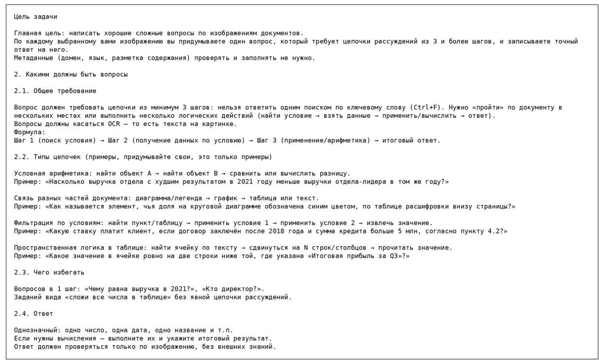  
Figure 9: Original Russian instructions given to benchmark annotators. The excerpt states the annotation objective (one multi-step question per document image with a ground-truth answer) and Section 2, which defines question requirements: at least three reasoning steps, OCR-grounded text, exemplar chain types, items to avoid, and answer constraints. The translation to English is provided in Figure 10.

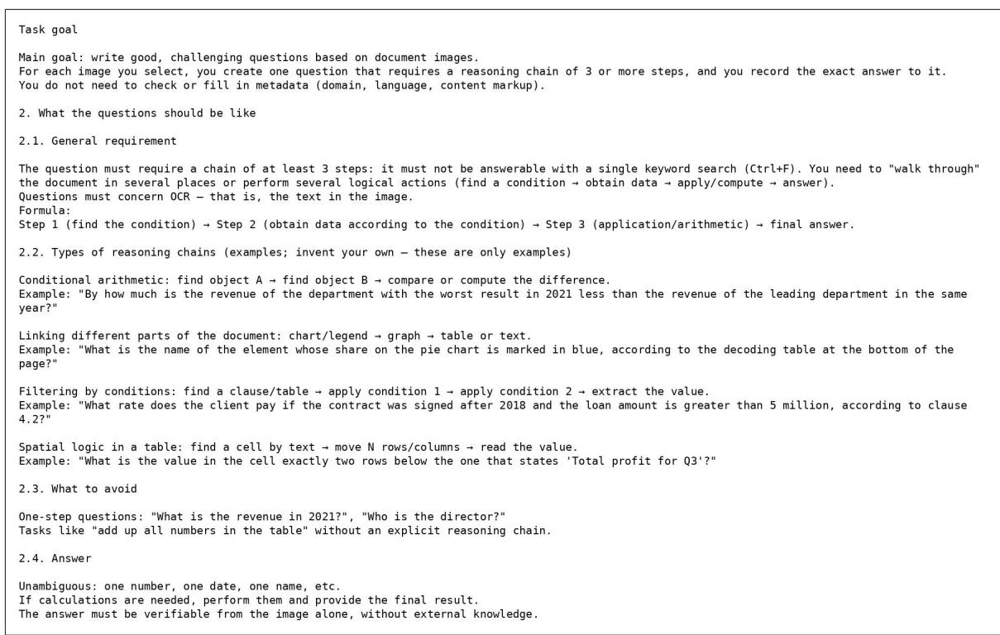  
Figure 10: English translation of the annotator instructions shown in Figure 9.

## G.3 Ethics & Consent

No formal ethics review was required for this noninvasive annotation task. All participants provided informed consent.

## G.4 Demographics

All annotators were aged 22–25 years and held at least a bachelor’s degree in a technical field, with self-reported English proficiency at CEFR B2 or higher. The sample included 60% male and 40% female participants.

## H Broader Impact, Data Use, and Compute Details

Potential risks. BEAR-Bench is intended for research evaluation rather than autonomous decision making. Errors on its document-reasoning tasks can arise from misreading text, tables, figures, or equations and can consequently produce incorrect calculations or unsupported conclusions. If similar systems are used without human verification in financial, scientific, or other high-stakes workflows, such errors could lead to incorrect analyses or decisions. Performance also varies across languages and document types; therefore, aggregate benchmark scores should not be interpreted as evidence of reliable performance for every user population or document genre. We recommend using the benchmark for comparative evaluation and retaining human oversight in consequential settings.

Intended use. BEAR-Bench is designed primarily as an evaluation benchmark for multimodal reasoning and hallucination detection. It does not provide step-by-step rationale annotations, and therefore does not directly support training or evaluating explicit chain-of-thought reasoning. The benchmark should not be interpreted as a resource for certifying models for deployment in high-stakes financial, legal, or scientific decision-making settings.

Privacy and content. All source pages were obtained from publicly accessible official disclosure, government, intergovernmental, or academic sources, as described in Section 3. We did not collect personal data directly from individuals and did not conduct additional content screening beyond selecting documents from these sources and verifying their licensing status. Public source documents may nevertheless contain names, affiliations, or other information present in the original records.

We retain source attribution and recommend that users treat the benchmark as a research resource rather than as a source of information about individuals.

Compute infrastructure. Open-weight models were evaluated on an internal server with two NVIDIA H100 GPUs and five NVIDIA L40 GPUs. Proprietary models were accessed through the OpenRouter API; their underlying hardware configuration and parameter counts are not publicly available for all evaluated models.

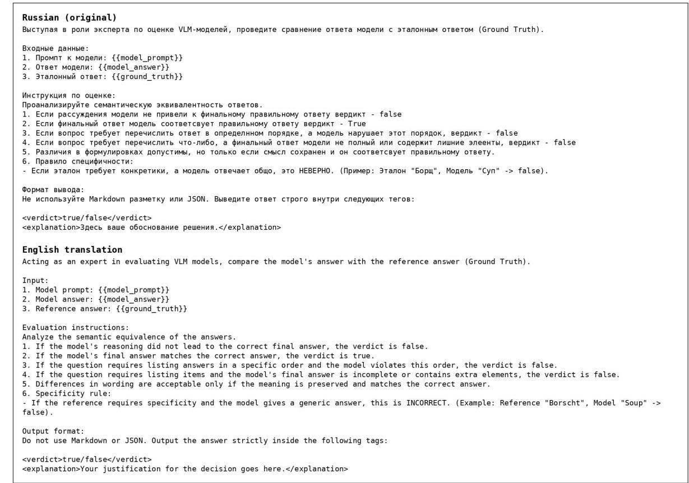  
Figure 11: LLM-as-a-judge prompt used to score model responses against the ground truth.