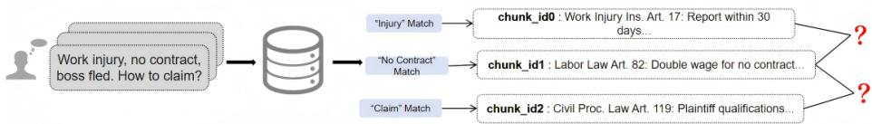
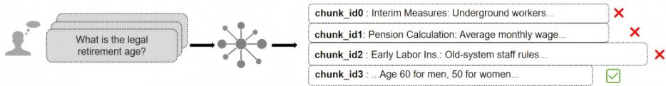
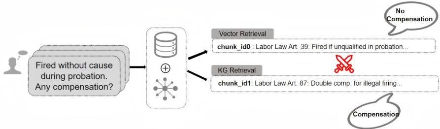
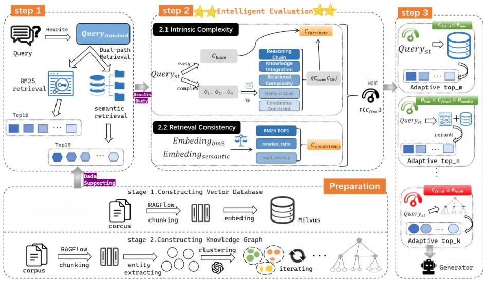

# CoAL-RAG: A Complexity-Aware Legal Retrieval-Augmented Generation Method

Jin Su1,2, Zhuofeng Zhao1,2⋆, Huanhuan Wang1,3, and Hao Chen1,3⋆⋆

1 North China University of Technology, Beijing, 100144, China

2 Beijing Key Laboratory of Key Technologies for AI+ Domain Applications, Beijing, 100144, China

3 Beijing Key Laboratory on Integration and Analysis of Large-scale Stream Data, Beijing 100144, China edzhao@ncut.edu.cn

Abstract. Legal consultation questions exhibit multi-level complexity. A single retrieval strategy often leads to over-reasoning for simple questions and poor interpretability for complex ones, making it dificult to meet the requirements for both answer quality and eficiency in highrisk scenarios. To address this issue, this paper proposes CoAL-RAG, a complexity-aware legal retrieval-augmented generation method, which constructs a multi-dimensional evaluation mechanism based on “question essence” and “retrieval consistency” to enable adaptive routing of retrieval strategies. First, the reasoning demand is quantified according to the logical structure of the question. Then, the discrepancy between semantic retrieval and keyword retrieval is utilized to indirectly reflect problem complexity, thereby selecting the most appropriate retrieval strategy and dynamically filtering contextual information. Experimental results demonstrate that the proposed method significantly outperforms baseline models not only on Chinese legal benchmarks (SocialLawQA, LawBench) but also demonstrates strong cross-jurisdictional generalization on English datasets (LexGLUE, CaseHold). Specifically, on Chinese datasets, the BLEU score improves by 42.5% and ROUGE-L reaches 3.6 times that of knowledge graph-based methods. On English benchmarks, CoAL-RAG maintains highly competitive accuracy, achieving an optimal balance between generation quality, deep logical reasoning, and system eficiency across diferent legal systems.

Keywords: Legal Q&A · Retrieval-Augmented Generation · Complexity Awareness · Adaptive Retrieval · Knowledge Graph

## 1 Introduction

Driven by breakthrough advancements of Large Language Models (LLMs) in Natural Language Processing (NLP) [4, 38], intelligent legal question answering is transitioning toward a new paradigm of semantic generation. Given the stringent demands for accuracy and traceability in high-stakes legal scenarios [35], integrating external knowledge bases can efectively mitigate model hallucination and knowledge obsolescence [16]. However, the complexity of legal consultation queries varies significantly. Questions such as “What is the statutory retirement age?” involve a single legal provision and require minimal reasoning, resulting in relatively low complexity. In contrast, queries such as “My employer fled without signing a labor contract after a workplace injury. Which laws have been violated and how can I protect my rights?” involve dense legal knowledge, strong conditional constraints, and multi-step reasoning, leading to substantially higher complexity [6].

  
(a) Evidence Gaps in Complex Reasoning Problems

  
(b) Noise Introduction in Simple Factual Issues

  
(c) Retrieval conflict  
Fig. 1. Limitations of Existing Methods

Among existing retrieval strategies in the legal domain, pure vector-based retrieval lacks deep relational reasoning, yielding only fragmented legal provisions (Fig. 1a). Conversely, the indiscriminate application of graph reasoning leads to computational redundancy and noise interference (Fig. 1b). Furthermore, a direct hybrid of the two often results in inconsistent retrieval outcomes and reasoning conflicts (Fig. 1c). To address these shortcomings, this paper proposes CoAL-RAG (Complexity-Aware Legal RAG). Leveraging LangGraph, this method constructs a multi-dimensional evaluation mechanism centered on “question essence” and “retrieval consistency”. First, it quantifies the internal logical demands of a query through a five-dimensional metric system. Second, the difference between semantic and BM25 indirectly reflects complexity. Ultimately, it selects the optimal retrieval strategy based on complexity scores and dynamically filters the context, efectively balancing response speed with deep logical accuracy. The main contributions of this paper are summarized as follows:

1) A Multi-dimensional Complexity-Aware Mechanism. We propose a mechanism that evaluates query complexity across multiple dimensions by integrating the internal logic of the query with the external consistency of the retrieval. Furthermore, we design a “retrieval consistency” algorithm based on a competition function, providing a criterion for adaptive routing characterized by both numerical stability and probabilistic interpretability.

2) The CoAL-RAG Method. We introduce the CoAL-RAG approach, which synergizes complexity awareness, hybrid retrieval, and knowledge graph coordination. Driven by the multi-dimensional evaluation mechanism, this framework dynamically tailors retrieval strategies to achieve highly eficient and accurate generation for legal question answering.

3) Extensive Cross-Jurisdictional Validation and Performance Trade-of. Experiments conducted on both Chinese civil law datasets (SocialLawQA, Law-Bench) and English common law benchmarks (LexGLUE, CaseHold) demonstrate that our approach significantly outperforms existing baselines. CoAL-RAG successfully bridges the reasoning gap across diferent legal jurisdictions, enhancing accuracy for complex queries while maintaining low-latency responses.

## 2 Related Works

## 2.1 Legal Large Models

General-purpose LLMs [1, 7] frequently sufer from legal hallucinations. Early domain models [2,26,32] optimized comprehension but lacked generative capabilities. Subsequent instruction-tuned models [5, 20, 40] and knowledge-augmented models [13,33] improved intent recognition and reasoning. However, they remain inadequate for resolving highly complex, multi-step legal consultations.

## 2.2 Retrieval-Augmented Generation

RAG [19] mitigates knowledge lag via hybrid retrieval [23], re-ranking [9, 24], and dynamic routing based on token confidence (FLARE [17]) or generic complexity classifiers (Adaptive-RAG [14]). Despite their success in open-domain tasks, applying these methods to legal queries reveals critical limitations. Tokenconfidence metrics fail to capture rigorous judicial deduction, and one-dimensional complexity classifiers ignore the multifaceted nature of legal queries. Unlike Adaptive-RAG’s black-box routing, CoAL-RAG introduces a transparent, multidimensional complexity assessment explicitly tailored to the hierarchical “chapterand-clause” structure of statutory texts, enabling precise dynamic routing aligned with legal reasoning.

## 2.3 Knowledge Graph

Knowledge Graphs (KGs) enhance complex reasoning in RAG [15,30] via pathbased explicit chains ( RoG [22], ToG [28]) or subgraph-based structural extraction [8, 12, 25]. While efective generally, applying graph structures directly to statutory tasks introduces two main challenges: (1) indiscriminate retrieval introduces noise and latency [27,29]; and (2) general models like HAKE [36] fail to capture the hierarchical “chapter-and-clause” structure of legal texts, resulting in the loss of fine-grained judicial logic [37].

  
Fig. 2. Overall Framework of CoAL-RAG

## 3 Method

To address queries with varying levels of complexity, we propose CoAL-RAG. The framework is built upon a hierarchical legal knowledge graph and incorporates complexity-aware modeling together with adaptive context-driven routing to enable dynamic selection of retrieval strategies. The overall system is implemented using LangGraph, as illustrated in Fig. 2.

## 3.1 Problem Description

To address the diverse complexity of legal queries, this paper proposes CoAL-RAG, which enables dynamic routing via a complexity-aware mechanism. The input is formally defined as $T = \{ Q , D , G \}$ , where Q denotes the user’s natural language legal query, $D = \{ d _ { 1 } , d _ { 2 } , \dots , d _ { n } \}$ represents the unstructured legal corpus, and $G = \{ E , R \}$ is a hierarchical knowledge graph in the legal domain. The method computes a complexity score $C _ { \mathrm { f i n a l } } \in [ 0 , 1 ]$ based on both query characteristics and retrieval consistency. Guided by a threshold $\theta ,$ it dynamically selects a retrieval strategy S, constructs the corresponding context $C _ { S }$ , and generates the answer A = arg maxA′ $P ( A ^ { \prime } \mid Q , C _ { S } )$ .

## 3.2 Hierarchical Legal KG Construction

We build a KG G (∼4.2k nodes, ∼11.5k edges) across 16 statutes, defining entities (Law, Chapter, Article, Concept) and relations (Subsumption, $R e f e r -$ ence, Conflict). The pipeline involves: 1) Extraction: LLMs extract $( e _ { s } , r , e _ { o } )$ triplets from corpus $D _ { ; }$ , retaining metadata. 2) Fusion: LLMs resolve contradictions by merging divergent entities into unified nodes. 3) Clustering: BGE-M3 and GMM-UMAP hierarchically group articles (Articles→Sections→Domains) to mirror statutory taxonomy. 4) Deployment: Dual-indexed in Milvus and MySQL, the KG supports version-controlled incremental updates.

## 3.3 Multi-dimensional Complexity Awareness Mechanism

This mechanism dynamically integrates existing retrieval methods by evaluating query complexity across multiple dimensions to activate tailored retrieval strategies accordingly. It ensures deep reasoning for complex queries while maximizing response eficiency for simple ones.

Problem Intrinsic Assessment Simple legal queries are assigned a low base complexity through pattern matching, where $C _ { \mathrm { b a s e } } \in [ 0 . 1 , 0 . 2 ]$ , and their intrinsic complexity is defined as $C _ { \mathrm { i n t r i n s i c } } = C _ { \mathrm { b a s e } }$

For complex legal queries, semantic features are used to categorize them into six types: “scenario reasoning”, “conditional judgment”, “multi-condition combinations”, “interest protection”, “cross-domain”, and “complex enumeration”. A base complexity $C _ { \mathrm { b a s e } } \in [ 0 . 4 , 0 . 6 ]$ is predefined for these types, and weight vectors ω are assigned according to the “principle of core feature priority” (e.g., for “scenario reasoning”, the logical dimension is prioritized). After type determination, the LLM decomposes the query into a set of subqueries $Q \mathrm { { s u b } }$ and evaluates the five complexity dimensions through a structured prompting scheme.

Reasoning Chain Length (RCL), Knowledge Integration Requirement (KIR), and Domain Span (DS) are each measured relative to a single unit, with complexity exhibiting linear growth as the number of units increases. The calculation formula is defined in Eq. 1:

$$
{ \mathrm { S c o r e } } _ { i } = \operatorname* { m i n } \left( 1 . 0 , \ { \frac { V _ { i } - 1 } { n } } \right) .\tag{1}
$$

Where $V _ { i }$ represents the statistical baseline for each dimension:

– RCL uses $V _ { i } = | Q _ { \mathrm { s u b } } |$ , reflecting the logical jumps required for the response; – KIR uses $V _ { i } = \operatorname* { m a x } ( | C | , | Q _ { \mathrm { s u b } } | )$ , where C is the set of extracted explicit entities, reflecting the density of legal knowledge integration;

– DS adopts $V _ { i } = | D _ { \mathrm { a u g } } |$ , representing the size of the identified augmented domain set, reflecting cross-domain integration dificulty.

When $V _ { i } \geq n + 1$ , the saturation value of 1.0 is reached, and all are judged as complex.

The initial values for Relational Reasoning Complexity (RRC) and Conditional Constraint Density (CCD) are set to 0, with scores accumulating incrementally as specific logical structures or constraints appear. The calculation formula is defined in Eq. 2:

$$
{ \mathrm { S c o r e } } _ { i } = \operatorname* { m i n } \left( 1 . 0 , \ { \frac { V _ { i } } { n } } \right) .\tag{2}
$$

Where $V _ { i }$ represents the statistical benchmark for each dimension:

– RRC takes $V _ { i } = | R _ { \mathrm { a u g } } |$ , the number of unions between explicit logic and implicit scene relationships, reflecting the degree of logical entanglement;

– CCD uses $V _ { i } = | C _ { \mathrm { c o n s t } } |$ , representing the number of numerical or temporal constraints, indicating the precision of boundary determination.

Both RRC and CCD start at 0. When $V _ { i } \geq n$ , they reach the saturation value of 1.0 and are both judged as complex.

Based on the multidimensional assessment, the five-dimensional weighted score $C _ { \mathrm { 5 D } }$ is derived from the dimension scores Score and their dynamically assigned weights $\omega _ { i }$ , as formulated in Eq. 3:

$$
{ \cal C } _ { \mathrm { 5 D } } = \sum _ { i \in \{ \mathrm { R C L , K I R , R R C , D S , C C D } \} } \omega _ { i } \cdot \mathrm { S c o r e } _ { i }\tag{3}
$$

Combined with the baseline complexity $C _ { \mathrm { b a s e } }$ , the final intrinsic complexity is calculated via Eq. 4:

$$
C _ { \mathrm { i n t r i n s i c } } = \alpha C _ { \mathrm { b a s e } } + \beta C _ { 5 \mathrm { D } } ,\tag{4}
$$

where $\alpha = 0 . 3$ and $\beta = 0 . 7$ . The closer $C _ { \mathrm { i n t r i n s i c } }$ approaches 1.0, the more intrinsically complex the legal issue becomes, demanding higher reasoning capability.

Retrieval Consistency Assessment Based on the hypothesis that “simple queries exhibit high consensus across diferent retrieval viewpoints”, an external feedback mechanism is introduced to detect potential ambiguity and complexity by measuring discrepancies among multiple retrieval pathways. Specifically, BM25 keyword retrieval and vector-based semantic retrieval are performed to obtain candidate document sets $D _ { \mathrm { B M 2 5 } }$ and $D _ { \mathrm { v e c } } .$ , respectively. The retrieval consistency complexity $C _ { \mathrm { c o n s i s t e n c y } }$ is then computed as follows:

Query Simplicity Index (QSI). Using the Top-1 score from BM25 as a proxy for literal matching between the query and the knowledge base, we compute the QSI via a sigmoid transformation and treat it as an inverse complexity indicator (Eq. 5):

$$
\mathrm { Q S I } = \sigma \big ( \mathrm { S c o r e } _ { \mathrm { t o p 1 } } ^ { \mathrm { B M 2 5 } } \big ) = \frac { 1 } { 1 + \exp \bigl ( - 0 . 5 \bigl ( \mathrm { S c o r e } _ { \mathrm { t o p 1 } } ^ { \mathrm { B M 2 5 } } - 1 2 . 5 \bigr ) \bigr ) } .\tag{5}
$$

Here, 12.5 is an empirical threshold. A higher QSI (approaching 1) indicates more reliable literal matching and lower retrieval complexity.

Retrieval Divergence Index (RDI). This metric quantifies the divergence between the keyword and semantic retrieval result sets by measuring their overlap $\left( \operatorname { E q . 6 } \right)$

$$
\mathrm { R D I } = 1 . 0 - ( 0 . 7 R _ { \mathrm { o v e r l a p } } ( D _ { \mathrm { B M 2 5 } } , D _ { \mathrm { v e c } } ) + 0 . 3 R _ { \mathrm { t o p 3 } } ( D _ { \mathrm { B M 2 5 } } , D _ { \mathrm { v e c } } ) ) .\tag{6}
$$

Here, $R _ { \mathrm { o v e r l a p } } ( \cdot , \cdot )$ denotes the Jaccard similarity coeficient, and $R _ { \mathrm { t o p 3 } } ( \cdot , \cdot )$ denotes the top-3 document overlap rate. A higher RDI indicates greater disagreement between semantic understanding and keyword matching.

Consistency Fusion via Competitive Gating. To nonlinearly integrate the above metrics, we define the “simple evidence energy” $E _ { \mathrm { s i m p l e } }$ and “complex evidence energy” $E _ { \mathrm { c o m p l e x } }$ as follows (Eq. 7):

$$
E _ { \mathrm { s i m p l e } } = \mathrm { Q S I } ^ { p } \left( 1 - \mathrm { R D I } \right) ^ { q } + \varepsilon , \qquad E _ { \mathrm { c o m p l e x } } = \left( 1 - \mathrm { Q S I } \right) ^ { p } \mathrm { R D I } ^ { q } + \varepsilon ,\tag{7}
$$

We set $p = 1 . 5$ to apply a non-linear penalty to low-confidence literal matches (QSI), efectively filtering out weak keyword signals, and $q = 0 . 3$ to maintain a smooth response to retrieval divergence (RDI), preventing minor overlaps from causing routing jitter. The final complexity of the retrieval consistency is computed as the proportion of complex evidence, shown in Eq. 8:

$$
C _ { \mathrm { c o n s i s t e n c y } } = \frac { E _ { \mathrm { c o m p l e x } } } { E _ { \mathrm { c o m p l e x } } + E _ { \mathrm { s i m p l e } } } .\tag{8}
$$

Unified Complexity Score To comprehensively evaluate query complexity, this paper integrates two aspects “problem essence” and “retrieval consistency”. The final complexity score is formulated in Eq. 9:

$$
C _ { \mathrm { f i n a l } } = \gamma C _ { \mathrm { i n t r i n s i c } } + ( 1 - \gamma ) C _ { \mathrm { c o n s i s t e n c y } } .\tag{9}
$$

We set $\gamma = 0 . 5$ to assign equal importance to the query’s linguistic structure and the retrieval system’s feedback, ensuring a balanced perspective between internal reasoning demands and external evidence consistency.

Table 1. Case Study of the Complexity Awareness in CoAL-RAG
<table><tr><td>Phase</td><td>Metrics</td><td>Explanation</td><td>Final Score</td></tr><tr><td> $C _ { \mathrm { i n t r i n s i c } }$ </td><td>Base Setup  $( C _ { \mathrm { b a s e } } = 0 . 5 0 )$  RCL (0.75) KIR (1.00) DS (0.50) RRC (0.75)</td><td>Type: Scenario Reasoning,a unified weight  $\omega = 0 . 2 5 .$  4 sub-queries (invention/relevance/ownership/time) 8 entities (Zhang San/A Company/PC/patent, etc.) 3 domains (Patent / Labor / Civil Code) 3 relations (employment / ownership / infringement)</td><td>0.50</td></tr><tr><td>Cconsistency</td><td>CCD (1.00) QSI (0.32) RDI (0.93)</td><td>4 constraints (weekend/company PC/non-core/resigned)  $S c o r e _ { B M 2 5 } ^ { t o p 1 } = 1 1 . 0 ( \mathrm { l o w }$  literal match degree) Rtop3 = 0.0, Roverlap = 0.1(significant divergence between semantic and BM25)</td><td>0.871</td></tr></table>

## 3.4 Dynamic Retrieval Routing and Adaptive Context Construction

To accommodate queries of varying complexity, this paper introduces a complexityaware multi-path routing strategy. Based on three predefined thresholds $( \theta _ { \mathrm { l o w } } =$ 0.25, $\theta _ { \mathrm { { m e d i u m } } } = 0$ .45 and $\theta _ { \mathrm { h i g h } } = 0 . 7 )$ , the processing pipeline is organized into four distinct tiers:

When $C _ { \mathrm { f i n a l } } \leq \theta _ { \mathrm { l o w } }$ , the query is classified as a simple factual question. Dense vector retrieval is activated, relying on the large model’s intrinsic reasoning capabilities to generate answers eficiently.

When $\theta _ { \mathrm { l o w } } < C _ { \mathrm { f i n a l } } \leq \theta _ { \mathrm { m e d i u m } }$ , the query is considered semantically ambiguous and requiring precise localization. A hybrid retrieval strategy combining dense and sparse methods is employed, followed by a re-ranking module to refine results and mitigate semantic drift. Iterative processing is also applied to enhance answer accuracy.

When $\theta _ { \mathrm { m e d i u m } } < C _ { \mathrm { f i n a l } } \leq \theta _ { \mathrm { h i g h } }$ , the query is treated as moderately complex and handled via network graph retrieval.

When $C _ { \mathrm { f i n a l } } \geq \theta _ { \mathrm { h i g h } }$ , the query is identified as highly complex, graph–text verification is activated. Using the logical reasoning paths extracted from the hierarchical knowledge graph as the backbone, the legal provision fragments retrieved through hybrid retrieval are cross-validated to eliminate conflicting texts.

After determining the retrieval strategy, adaptive truncation based on score clifs is applied to further reduce tail noise. The score decline rate between adjacent documents is defined as $\varDelta _ { i } \ = \ ( s _ { i } - s _ { i + 1 } ) / s _ { i }$ , with a clif threshold $\sigma = 0 . 2$ . The optimal truncation position is determined as the first index where the decline exceeds 20%, so $k = \arg \operatorname* { m i n } _ { i } \{ \varDelta _ { i } > \sigma \}$ . The resulting context set $C _ { \mathrm { c t x } } = \{ d _ { 1 } , d _ { 2 } , \dots , d _ { k } \}$ is then incorporated into the prompt template to guide the final answer generation.

## 4 Experimental

The domain of social law encompasses high-frequency scenarios such as labor contracts and work injury identification. Its well-defined structure and hierarchy make it ideal for evaluating the adaptability of CoAL-RAG. Experiments are conducted on the self-constructed SocialLawQA dataset and the public Law-Bench benchmark.

Hyperparameter Calibration Hyperparameters $( \alpha , \beta , p , q , \gamma )$ and thresholds (θ) were calibrated via grid search on an expert-annotated, stratified validation set (N = 120). Sensitivity analysis (Sec. 5.4) shows performance remains stable within ±10% parameter variance, confirming the robustness of our complexityaware design.

## 4.1 Baselines

To evaluate the efectiveness of CoAL-RAG, we compare it with the following baselines: 1) Inference without Retrieval: Direct inference, Chain-of-Thought (CoT) reasoning [31] and LawGPT\_zh [40]. 2) Inference with Retrieval: Retrieval-Augmented Generation (RAG) [19], Hybrid RAG [11], CLERAG, IR-CoT [29], and Search-o1 [21]. 3) Unified Retrieval-and-Reranking Models: bge-reranker-v2-m3 and Qwen3-Reranker-4B. 4) Knowledge Graph Augmentation: G-Retriever [12] (flat graph) and LeanRAG [34] (hierarchical graph). 5) RL Tuning Methods: R1 [10] and Search-R1 [18]. R1 performs reasoning based on internal knowledge, while Search-R1 interacts with a search engine during inference. For fairness, all RL methods use the F1 score as the reward metric and follow their original training settings. Real-world retrieval is simulated using Google Web Search via SerpAPI, with ten retrieved documents for each method.

## 4.2 Evaluation Metrics

We assess generation quality on Chinese legal benchmarks using ROUGE $\mathbf { ( 1 / 2 / L ) }$ ， BLEU-4, and BERTScore to measure token overlap and deep semantic alignment. For English cross-jurisdictional benchmarks, we report Accuracy (for CaseHold) alongside Micro-F1 and Macro-F1 (for LexGLUE) to evaluate multi-class logical reasoning performance. Finally, system eficiency is measured via Average Response Time (ART), with detailed latency analysis presented in Section 5.2.

## 4.3 Datasets

Chinese Benchmarks (Civil Law): SocialLawQA is a curated dataset of 1.5k Q&A pairs across 16 statutes, featuring a diverse complexity distribution ideal for validating adaptive routing in real-world scenarios. LawBench [17] is an authoritative benchmark from which we selected a 1k Q&A subset focusing on social law to evaluate core dimensions like memory, comprehension, and application.

English Benchmarks (Common Law): To evaluate cross-jurisdictional adaptability, we utilize LexGLUE [3] (specifically subsets requiring logical deduction) for broad legal NLU assessment, and CaseHold [39], a challenging multiplechoice dataset rigorously testing long-text reasoning and legal holding identification.

Table 2. Comprehensive Results. R-1/2/L: Rouge-1/2/L; BL: BLEU; BS: BERTScore; Mi-F: Micro-F1; Ma-F: Macro-F1; Acc: Accuracy. ⋆Out-of-domain. ’-’ indicates system/language mismatch or excessive migration cost. Bold and underlined are best results. † denotes statistical significance $( p \ : < \ : 0 . 0 5 )$ over the strongest baseline via paired t-test.
<table><tr><td rowspan="3">Methods</td><td colspan="9">Chinese Benchmarks (Civil Law)</td><td colspan="3">English Benchmarks (Common Law)</td></tr><tr><td colspan="4">LawBench*</td><td colspan="5">SocialLawQA*</td><td colspan="2">LexGLUE</td><td>CaseHold</td></tr><tr><td>R-1</td><td>R-2</td><td>R-L</td><td>BL</td><td>BS</td><td>R-1</td><td>R-2</td><td>R-L</td><td>BL</td><td>BS</td><td>Mi-F Ma-F</td><td>Acc</td></tr><tr><td colspan="9">Qwen2.5-3B-Instruct</td><td></td><td></td><td></td></tr><tr><td>Direct Inference</td><td>0.2523</td><td>0.0718</td><td>0.1670 0.0254</td><td>0.7220</td><td>0.2003</td><td>0.0426</td><td>0.1132</td><td>0.0298</td><td>0.7351</td><td>0.2810</td><td>0.2220</td><td>0.4954</td></tr><tr><td>CoT</td><td>0.2680</td><td>0.0543</td><td>0.1673</td><td>0.0312</td><td>0.7524 0.3369</td><td>0.1266</td><td>0.2159</td><td>0.0628</td><td>0.7765</td><td>0.3056</td><td>0.2452</td><td>0.5126</td></tr><tr><td>LawGPT_zh</td><td>0.2677</td><td>0.0691</td><td>0.2046</td><td>0.0294</td><td>0.7548 0.3461</td><td>0.1273</td><td>0.2186</td><td>0.0638</td><td>0.7866</td><td>=</td><td></td><td></td></tr><tr><td>Standard RAG</td><td>0.4022</td><td>0.2456</td><td>0.3257</td><td>0.1739</td><td>0.8002</td><td>0.3781</td><td>0.1855 0.2763</td><td>0.1240</td><td>0.7972</td><td>0.4550</td><td>0.4937</td><td>0.5211</td></tr><tr><td>Hybrid RAG</td><td>0.4212</td><td>0.2534</td><td>0.3339</td><td>0.1975</td><td>0.8058</td><td>0.3799</td><td>0.1777 0.2833</td><td>0.1059</td><td>0.7965</td><td>0.6782</td><td>0.6150</td><td>0.5320</td></tr><tr><td>CLERAG</td><td>0.4258</td><td>0.2561</td><td>0.3130</td><td>0.1588</td><td>0.8140</td><td>0.4003</td><td>0.2104 0.2692</td><td>0.1073</td><td>0.8065</td><td>0.6617</td><td>0.6020</td><td>0.6251</td></tr><tr><td>IRCoT</td><td>0.3244</td><td>0.1021</td><td>0.2055</td><td>0.0532</td><td>0.7800</td><td>0.3936</td><td>0.1978 0.2533</td><td>0.1015</td><td>0.7843</td><td>0.3858</td><td>0.3942</td><td>0.5102</td></tr><tr><td>Search-ol</td><td>0.2666</td><td>0.0772</td><td>0.1748</td><td>0.0497</td><td>0.7611</td><td>0.3345</td><td>0.1574 0.2688</td><td>0.1014</td><td>0.8005</td><td>0.3142</td><td>0.2683</td><td>0.5037</td></tr><tr><td>bge-rerank</td><td>0.4477</td><td>0.3166</td><td>0.3679</td><td>0.2424</td><td>0.8258</td><td>0.4299</td><td>0.2621 0.3210</td><td>0.1355</td><td>0.8301</td><td>0.5936</td><td>0.4339</td><td>0.6550</td></tr><tr><td>Qwen3-Rerank</td><td>0.3031</td><td>0.1284</td><td>0.2145</td><td>0.0913</td><td>0.7756</td><td>0.3644</td><td>0.1634 0.2622</td><td>0.0939</td><td>0.8010</td><td>0.3712</td><td>0.5195</td><td>0.5383</td></tr><tr><td>G-retriever</td><td>0.2450</td><td>0.0687</td><td>0.1753</td><td>0.0466</td><td>0.7480</td><td>0.3220</td><td>0.1258 0.2267</td><td>0.0650</td><td>0.7845</td><td>0.2603</td><td>0.4047</td><td>0.6232</td></tr><tr><td>LeanRAG</td><td>0.1911</td><td>0.0466</td><td>0.1137</td><td>0.0188</td><td>0.7327</td><td>0.2315</td><td>0.0629 0.1204</td><td>0.0237</td><td>0.7480</td><td>=</td><td>=</td><td></td></tr><tr><td>Search-R1</td><td>0.4953</td><td>0.3527 0.3690†</td><td>0.4430</td><td>0.2700 0.2815† 0.8342</td><td>0.8419</td><td>0.4320 0.4427† 0.2560</td><td>0.2738 0.3321</td><td>0.1558 0.3302 0.1684{†</td><td>0.8404 0.8184</td><td>0.6925 0.7186†</td><td>0.6585 0.6520</td><td>0.6745</td></tr></table>

## 5 Results

## 5.1 Generation Quality and Generalization

Table 2 compares CoAL-RAG with baselines (utilizing Qwen2.5-3B-Instruct as the primary base model unless otherwise specified).

Chinese Benchmarks (Civil Law): Pure parametric models perform poorly due to domain hallucinations. Static pipelines sufer from semantic drift, while pure KG methods (LeanRAG) introduce noise. In contrast, CoAL-RAG achieves the highest BLEU scores (0.2815 on LawBench, 0.1684 on SocialLawQA), delivering highly competitive accuracy comparable to the compute-heavy Search-R1, with improvements in key precision metrics being statistically significant $\left( p < 0 . 0 5 \right)$ .

English Benchmarks (Common Law): Evaluated on LexGLUE and Case-Hold, pure parametric models predictably struggle without common-law grounding (e.g., 0.4954 CaseHold Accuracy). Conversely, CoAL-RAG exhibits robust generalization, outperforming the RL-tuned Search-R1 (0.6885 Accuracy, 0.7186 Micro-F1). Despite a marginal Macro-F1 lag due to our Civil-Law-centric KG lacking precedent indexing, CoAL-RAG consistently surpasses generic rerankers and Hybrid RAG without requiring costly reinforcement learning.

## 5.2 Eficiency Analysis

Benefiting from complexity-aware routing, CoAL-RAG avoids redundant computation for simple queries, achieving average response times of 4.76 s and 5.09 s on LawBench and SocialLawQA. It is ∼2.2× faster than LawGPT and faster

Table 3. Ablation Experiment Results on the LawBench Dataset
<table><tr><td>Methods</td><td>Article F1</td><td>LawConcept Recall</td><td>ROUGE-L</td><td>BERTScore</td></tr><tr><td>CoAL-RAG(Ours)</td><td>0.5308</td><td>0.8146</td><td>0.4162</td><td>0.7706</td></tr><tr><td>w/o Intrinsic</td><td>0.4977</td><td>0.8059</td><td>0.4025</td><td>0.7688</td></tr><tr><td>w/o Consistency</td><td>0.5160</td><td>0.8071</td><td>0.4007</td><td>0.7676</td></tr><tr><td>w/o Dynamic</td><td>0.5278</td><td>0.8034</td><td>0.4029</td><td>0.7653</td></tr></table>

than complex graph methods like LeanRAG. While adding ∼2 s of latency compared to Standard RAG, it improves LawBench BLEU by 61.8%, achieving an optimal trade-of between generation quality and real-time system performance.

## 5.3 Ablation Study

To validate the core components of CoAL-RAG, we conduct ablation experiments on LawBench using three variants: (1) w/o Intrinsic—removes intrinsic complexity assessment, relying solely on retrieval consistency for routing; (2) w/o Consistency—omits retrieval consistency assessment, using only query features; and (3) w/o Dynamic—replaces adaptive document selection with a fixed Top-10 set for generation. To rule out random variance, all scores are averaged across multiple runs.

Two additional metrics, Article F1 and LawConcept Recall (measuring statutory article retrieval and legal concept coverage), are introduced in the ablation study. Table 3 presents the ablation results.

The Efectiveness of Intrinsic Assessment The results show that removing intrinsic complexity assessment leads to a decline in Article F1 from 0.5308 to 0.4977 (a relative decrease of 6.24%), underscoring the importance of anticipating logical depth for identifying complex queries. ROUGE-L also decreases from 0.4162 to 0.4025, indicating that fine-grained perception of question types contributes to the structural coherence and relevance of generated answers. Overall, intrinsic complexity assessment plays a key role in accurately determining query complexity and ensuring efective legal provision retrieval.

The Efectiveness of Retrieval Consistency Removing retrieval consistency evaluation leads to performance declines across all metrics: Article F1 drops by 1.48 percentage points, ROUGE-L by 1.55 points, and both LawConcept Recall and BERTScore also decrease. These results confirm that this module efectively filters retrieval noise and improves routing accuracy through multi-perspective consistency.

The Efectiveness of Dynamic Top-K The w/o Dynamic variant, despite retrieving a fixed top-10 documents, achieves the lowest LawConcept Recall (0.8034) and BERTScore (0.7653), confirming that indiscriminately increasing document volume introduces noise. In contrast, CoAL-RAG dynamically filters low-relevance documents, improving semantic accuracy while preserving information density.

Table 4. Representative case analysis of CoAL-RAG under diferent query complexities.
<table><tr><td>Query</td><td> $C _ { \mathrm { f i n a l } }$ </td><td>CoAL-RAG</td></tr><tr><td>Can I resign during probation with- out violating the labor contract?</td><td>0.31</td><td>Yes. Under the Labor Contract Law, an employee may ter- minate the contract during the probation period by giv- ing advance notice (typically three days) to the employer</td></tr><tr><td>Who owns the patent if software is developed after work hours using company equipment?</td><td>0.79</td><td>(Success. Hybrid Retrieval). If the invention is not related to the employer&#x27;s business scope and is not part of assigned duties, the patent rights generally belong to the individual developer rather than the employer (Success. Graph Reasoning).</td></tr><tr><td>How should eligibility for government housing benefits be determined?</td><td>0.26</td><td>The system lacks local policy data and fails to resolve priorities among overlapping administrative regulations. (Failure Knowledge Gap).</td></tr></table>

Ablation results confirm the synergistic efect of the three core modules: multi-dimensional evaluation combined with dynamic filtering enables precise identification of key evidence, efectively balancing answer quality and response eficiency.

## 5.4 Sensitivity Analysis

Sensitivity analysis on a stratified $N = 1 2 0$ validation set confirms the model’s robustness: shifting routing thresholds $\theta _ { \{ l o w , m e d , h i g h \} }$ or the fusion weight γ by ±10% causes minimal $( < 1 . 5 \% )$ fluctuation in ROUGE-L and BERTScore. Gating exponents $p , q$ also exhibit high stability, with performance variance $< 1 . 0 \%$ across tested ranges $( p \in [ 1 . 2 , 1 . 8 ] , q \in [ 0 . 2 , 0 . 4 ] )$ . Furthermore, Average Response Time remains consistent (±0.4s) even under critical threshold variations, proving that CoAL-RAG’s eficacy stems from its structural complexity-aware logic rather than heuristic hyperparameter over-tuning.

## 5.5 Case Study and Error Analysis

Table 4 demonstrates CoAL-RAG’s efectiveness across complexities. Error analysis reveals two primary failure modes: (1) Knowledge Gaps: Queries involving local policies (Case 3) outside the statutory KG cause reasoning voids. (2) Priority Conflicts: The model occasionally struggles to resolve hierarchical logic among overlapping laws (e.g., General vs. Special laws). This indicates that the routing mechanism may systematically misclassify edge cases where implicit legal hierarchy is required but not explicitly encoded in the KG. Future work should focus on integrating multi-tier policy data and enhancing legal hierarchy awareness.

## 6 Conclusion

This paper proposes CoAL-RAG, a multi-dimensional complexity-aware retrievalaugmented generation method tailored to the variable complexity of legal queries. By jointly assessing reasoning depth across multiple dimensions and incorporating retrieval consistency, the approach dynamically selects optimal retrieval strategies and adaptively constructs context. Evaluations across Chinese (Civil Law) and English (Common Law) benchmarks confirm that this complexityaware mechanism is highly generalizable, mitigating the signal-to-noise trade-of in complex cross-jurisdictional scenarios.

While CoAL-RAG balances quality and eficiency, challenges remain in dynamic adaptation. Future work will: (1) extend to specialized domains (e.g., criminal law, finance); (2) enhance cross-document reasoning to resolve conflicts among overlapping provisions; and (3) scale to larger LLMs (e.g., 7B/14B) to investigate performance ceilings.

## References

1. Achiam, J., Adler, S., Agarwal, S., Ahmad, L., Akkaya, I., Aleman, F.L., et al.: GPT-4 technical report. arXiv preprint arXiv:2303.08774 (2023). https://doi.org/10.48550/arXiv.2303.08774

2. Chalkidis, I., Fergadiotis, M., Malakasiotis, P., Aletras, N., Androutsopoulos, I.: LEGAL-BERT: The muppets straight out of law school. In: Findings of the Association for Computational Linguistics: EMNLP 2020. pp. 2898–2904 (2020)

3. Chalkidis, I., Jana, A., Dirschl, D., Pichler, A., Bouchikhi, Y., Vossen, N., Frank, A., Androutsopoulos, I., Aletras, N.: LexGLUE: A benchmark dataset for legal language understanding in English. In: Proceedings of the 60th Annual Meeting of the Association for Computational Linguistics (ACL). pp. 4310–4330 (2022). https://doi.org/10.18653/v1/2022.acl-long.297

4. Chen, H., Hu, Z., Chai, J., Yang, H., He, H., Wang, X., et al.: ToolForge: A data synthesis pipeline for multi-hop search without real-world APIs. arXiv preprint arXiv:2512.16149 (2025). https://doi.org/10.48550/arXiv.2512.16149

5. Cui, J., Li, Z., Yan, Y., Chen, B., Yuan, L.: ChatLaw: Open-source legal large language model with integrated external knowledge bases. arXiv preprint arXiv:2306.16092 (2023). https://doi.org/10.48550/arXiv.2306.16092

6. Duan, X., Wang, B., Wang, Z., Ma, W., Cui, Y., Wu, D., et al.: CJRC: A reliable human-annotated benchmark dataset for Chinese judicial reading comprehension. In: Chinese Computational Linguistics (CCL). pp. 439–451 (2019)

7. Dubey, A., Jauhri, A., Pandey, A., Kadian, A., Al-Dahle, A., Letman, A., et al.: The Llama 3 herd of models. arXiv preprint arXiv:2407.21783 (2024). https://doi.org/10.48550/arXiv.2407.21783

8. Edge, D., Trinh, H., Cheng, N., Bradley, J., Chao, A., Mody, A., Truitt, S., Metropolitansky, D., Ness, R.O., Larson, J.: From local to global: A graph RAG approach to query-focused summarization. arXiv preprint arXiv:2404.16130 (2024)

9. Fei, Z., Shen, X., Zhu, D., Zhou, F., Han, Z., Huang, A., et al.: LawBench: Benchmarking legal knowledge of large language models. In: Proceedings of the 2024 Conference on Empirical Methods in Natural Language Processing (EMNLP). pp. 7933–7962 (2024)

10. Guo, D., Yang, D., Zhang, H., Song, J., Zhang, R., Xu, R., Zhu, Q., Ma, S., Wang, P., Bi, X., et al.: DeepSeek-R1: Incentivizing reasoning capability in LLMs via reinforcement learning. arXiv preprint arXiv:2501.12948 (2025)

11. Guu, K., Lee, K., Tung, Z., Pasupat, P., Chang, M.W.: Retrieval augmented language model pre-training. In: Proceedings of the 37th International Conference on Machine Learning (ICML). pp. 3929–3938 (2020)

12. He, X., Tian, Y., Sun, Y., Chawla, N., Laurent, T., LeCun, Y.: G-Retriever: Retrieval-augmented generation for textual graph understanding and question answering. In: Advances in Neural Information Processing Systems (NeurIPS 37). pp. 132876–132907 (2024)

13. Huang, Q., Tao, M., Zhang, C., An, Z.: Lawyer LLaMA: Enhancing LLMs with legal knowledge. arXiv preprint arXiv:2305.15062 (2023). https://doi.org/10.48550/arXiv.2305.15062

14. Jeong, S., Baek, J., Cho, S., Hwang, S.J., Park, J.C.: Adaptive-RAG: Learning to adapt retrieval-augmented large language models through question complexity. In: Proceedings of the 2024 Conference of the North American Chapter of the Association for Computational Linguistics (NAACL). pp. 7350–7380 (2024)

15. Ji, S., Pan, S., Cambria, E., Marttinen, P., Yu, P.S.: A survey on knowledge graphs: Representation, acquisition, and applications. IEEE Transactions on Neural Networks and Learning Systems 33(2), 494–514 (2021)

16. Ji, Z., Lee, N., Frieske, R., Yu, T., Su, D., Xu, Y., et al.: Survey of hallucination in natural language generation. ACM Computing Surveys 55(12), 1–38 (2023)

17. Jiang, Z., Xu, F.F., Gao, L., Sun, Z., Liu, Q., Dwivedi-Yu, J., et al.: Active retrieval augmented generation. In: Proceedings of the 2023 Conference on Empirical Methods in Natural Language Processing (EMNLP). pp. 7969–7992 (2023)

18. Jin, B., Zeng, H., Yue, Z., Yoon, J., Arik, S., Wang, D., Zamani, H., Han, J.: Search-R1: Training LLMs to reason and leverage search engines with reinforcement learning. arXiv preprint arXiv:2503.09516 (2025)

19. Lewis, P., Perez, E., Piktus, A., Petroni, F., Karpukhin, V., Goyal, N., et al.: Retrieval-augmented generation for knowledge-intensive NLP tasks. In: Advances in Neural Information Processing Systems (NeurIPS). vol. 33, pp. 9459–9474 (2020)

20. Li, H., Ai, Q., Chen, J., et al.: SAILER: Structure-aware pre-trained language model for legal case retrieval. In: Proceedings of the 46th International ACM SIGIR Conference on Research and Development in Information Retrieval (SIGIR). pp. 1035–1044 (2023)

21. Li, X., Dong, G., Jin, J., Zhang, Y., Zhou, Y., Zhu, Y., Zhang, P., Dou, Z.: Search-o1: Agentic search-enhanced large reasoning models. arXiv preprint arXiv:2501.05366 (2025)

22. Luo, L., Li, Y., Hafari, G., Pan, S.: Reasoning on graphs: Faithful and interpretable large language model reasoning. In: International Conference on Learning Representations (ICLR) (2024)

23. M3-Embedding Team: M3-Embedding: Multi-linguality, multi-functionality, multigranularity text embeddings through self-knowledge distillation. arXiv preprint arXiv:2402.03216 (2024)

24. Ma, Y., Cao, Y., Hong, Y., Sun, A.: Large language model is not a good few-shot information extractor, but a good reranker for hard samples! In: Findings of the Association for Computational Linguistics: EMNLP 2023. pp. 10572–10601 (2023)

25. Pan, S., Luo, L., Wang, Y., Chen, C., Wang, J., Wu, X.: Unifying large language models and knowledge graphs: A roadmap. IEEE Transactions on Knowledge and Data Engineering 36(7), 3580–3599 (2024)

26. Shao, Y., Mao, J., Liu, Y., Ma, W., Satoh, K., Zhang, M., Ma, S.: BERT-PLI: Modeling paragraph-level interactions for legal case retrieval. In: Proceedings of the Twenty-Ninth International Joint Conference on Artificial Intelligence (IJCAI). pp. 3501–3507 (2020)

27. Shi, F., Chen, X., Misra, K., Scales, N., Dohan, D., Chi, E.H.: Large language models can be easily distracted by irrelevant context. In: Proceedings of the 40th International Conference on Machine Learning (ICML). pp. 31210–31227 (2023)

28. Sun, J., Xu, C., Tang, L., Wang, S., Lin, C., Gong, Y., Ni, L.M., Shum, H.Y., Guo, J.: Think-on-Graph: Deep and responsible reasoning of large language model on knowledge graph. arXiv preprint arXiv:2307.07697 (2023)

29. Trivedi, H., Balasubramanian, N., Khot, T., Sabharwal, A.: Interleaving retrieval with chain-of-thought reasoning for knowledge-intensive multi-step questions. In: Proceedings of the 61st Annual Meeting of the Association for Computational Linguistics (ACL). pp. 10014–10037 (2023)

30. Wang, X., Yang, Q., Qiu, Y., Liang, J., He, Q., Gu, Z., Xiao, Y., Wang, W.: KnowledGPT: Enhancing large language models with retrieval and storage access on knowledge bases. arXiv preprint arXiv:2308.11761 (2023). https://doi.org/10.48550/arXiv.2308.11761

31. Wei, J., Wang, X., Schuurmans, D., Bosma, M., Xia, F., Chi, E., Le, Q.V., Zhou, D., et al.: Chain-of-Thought prompting elicits reasoning in large language models. In: Advances in Neural Information Processing Systems (NeurIPS). vol. 35, pp. 24824–24837 (2022)

32. Xiao, C., Hu, X., Liu, Z., Tu, C., Sun, M.: Lawformer: A pre-trained language model for Chinese legal long documents. AI Open 2, 79–84 (2021)

33. Yue, S., Chen, W., Wang, S., Li, B., Shen, C., Liu, S., et al.: Disc-LawLLM: Fine-tuning large language models for intelligent legal services. arXiv preprint arXiv:2309.11325 (2023). https://doi.org/10.48550/arXiv.2309.11325

34. Zhang, Y., Wu, R., Cai, P., Wang, X., Yan, G., Mao, S., Wang, D., Shi, B.: Lean-RAG: Knowledge-graph-based generation with semantic aggregation and hierarchical retrieval. arXiv preprint arXiv:2508.10391 (2025)

35. Zhang, Y., Li, Y., Cui, L., Cai, D., Liu, L., Fu, T., et al.: Siren’s song in the AI ocean: A survey on hallucination in large language models. Computational Linguistics (2025)

36. Zhang, Z., Cai, J., Zhang, Y., Wang, J.: Learning hierarchy-aware knowledge graph embeddings for link prediction. In: Proceedings of the AAAI Conference on Artificial Intelligence (AAAI). pp. 3065–3072 (2020)

37. Zhao, Q., Gao, T., Zhou, S., Li, D., Wen, Y.: Legal judgment prediction via heterogeneous graphs and knowledge of law articles. Applied Sciences 12(5), 2531 (2022)

38. Zhao, W.X., Zhou, K., Li, J., Tang, T., Wang, X., Hou, Y., et al.: A survey of large language models. arXiv preprint arXiv:2303.18223 (2023). https://doi.org/10.48550/arXiv.2303.18223

39. Zheng, L., Guha, N., Anderson, B.R., Henderson, P., Ho, D.E.: When does pretraining help? assessing self-supervised learning for law and the CaseHOLD dataset. In: Proceedings of the 18th International Conference on Artificial Intelligence and Law (ICAIL). pp. 159–168 (2021). https://doi.org/10.1145/3462757.3466088

40. Zhou, Z., Shi, J., Song, P., Yang, X., Jin, Y., Guo, L., Li, Y.: LawGPT: A Chinese legal knowledge-enhanced large language model. arXiv preprint arXiv:2406.04614 (2024). https://doi.org/10.48550/arXiv.2406.04614