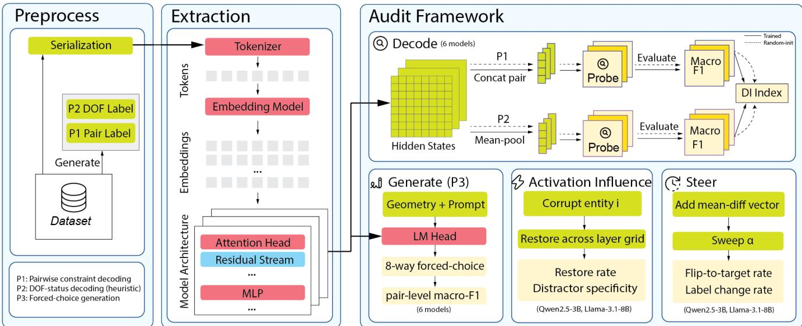
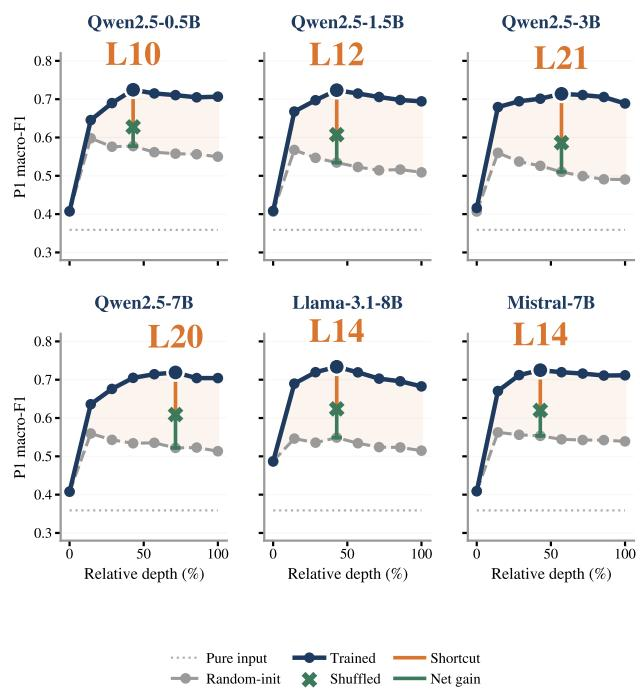
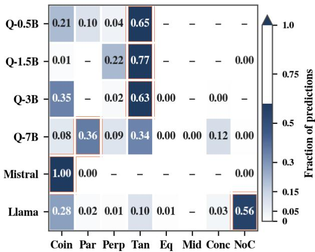
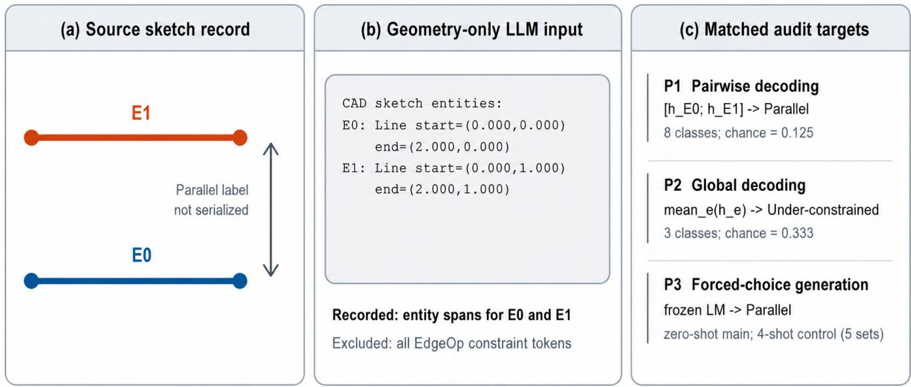
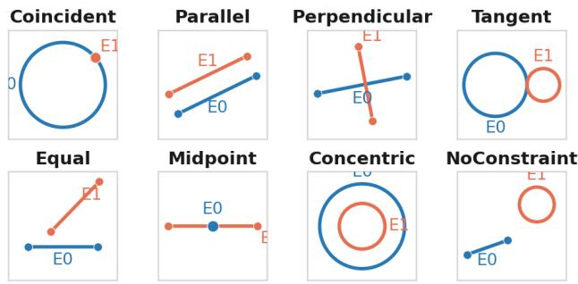
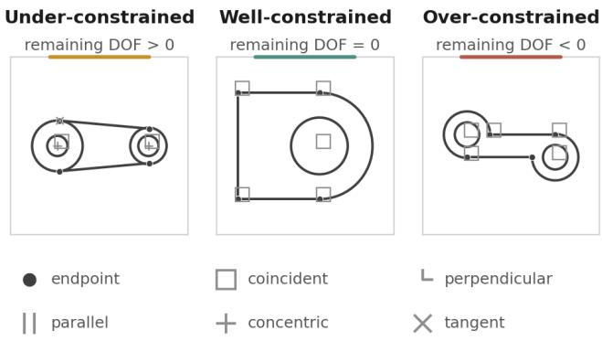
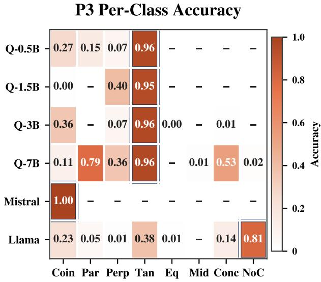
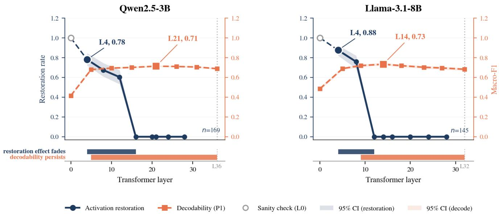

# Encoded but Not Actionable: Auditing the Decode-Generate-Steer Gap in Frozen LLMs for Geometric Constraints

Man Liang1, Xinzhao Cheng1, Faizan Wajid1

1University of Maryland

## Abstract

Large language models (LLMs) have demonstrated strong performance on structured reasoning tasks, but what they encode and whether it informs model behavior remain unclear. We investigate this question through geometric reasoning, using parametric CAD constraints as a controlled testbed for separating local pairwise relations from sketchlevel constraint status. By probing the hidden states of six frozen decoder-only LLMs, we examine four properties: linear decodability, forced-choice generation, activation-level influence, and behavioral steerability. Pretraining substantially improves the decoding of local geometric relations, and this advantage persists after accounting for positional cues with shuffled-order controls. In contrast, sketch-level DOF status is already highly decodable from randomly initialized representations and improves only modestly with pretraining, indicating that much of its probe performance is available without learned weights. Further analyses show that decodable information is not always actionable. Generation often fails to express this information, and on the two intervention-tested backbones, activation-restoration effects at the patched entity position vanish while decodability persists across depth. Mean-difference steering also does not reliably control outputs. These results show that decodability, generation, activation-level influence, and steerability can diverge in the tested setting. The audit provides a controlled way to distinguish failures to encode geometric structure from failures to express or control encoded information.

## 1 Introduction

Large language models are increasingly used to translate natural language instructions into structured outputs such as programs, plans, and geometric designs (Wu et al. 2023; Singh et al. 2023; Wu, Su, and Liao 2025). Trustworthy deployment in scientific and industrial settings requires structured outputs to satisfy interacting domain constraints, including physical principles, geometric relations, and safety requirements, while remaining globally consistent. Among these applications, parametric CAD provides a particularly useful case because it is widely used in engineering and represents domain constraints in an explicit, verifiable form (Seff et al. 2020). In parametric CAD, local constraints define relations between geometric elements, while their combined effect determines whether a sketch is underconstrained, well-constrained, or over-constrained (Thierry et al. 2011).

Recent work increasingly uses LLMs to generate CAD designs from natural language instructions (Khan et al. 2024; Li et al. 2025b). Newer systems extend one-shot generation with execution or solver feedback to iteratively detect and repair errors (Fan et al. 2026; Hu et al. 2026; Liu et al. 2026). However, output-level evaluation alone does not reveal whether successful generation and repair rely on internal constraint representations. Clarifying this relationship is necessary to explain why local competence may coexist with global failure. We therefore ask what geometric constraint information frozen general-purpose LLMs encode and how its decodability relates to generation, activationlevel influence, and behavioral control.

To answer this question, we develop a four-part audit of linear decodability, forced-choice generation, activationlevel influence, and steering using SketchGraphs (Seff et al. 2020), with a cross-dataset P1 check on Fusion 360 Gallery (Willis et al. 2021). Our evaluation covers six frozen decoder-only LLMs from the Qwen2.5, Mistral, and Llama-3.1 families (Qwen et al. 2025; Jiang et al. 2023; Grattafiori et al. 2024). The auditing framework includes three matched evaluation tasks: local decoding of pairwise constraints (P1), global decoding of degrees-of-freedom status (P2), and forced-choice generation using the same pairwise labels as P1 (P3). We further use activation patching to test whether restoring activations at the probed entity position affects predictions, and representation steering to test whether modifying those activations can systematically control outputs. To target latent geometric information rather than explicit label cues, we serialize only the geometry and exclude all constraint annotations from the model input.

Our results reveal a systematic gap between encoded and actionable geometric constraint information. Local pairwise relations (P1) contain learned information that can be linearly decoded even after accounting for random initialization, input structure, and entity order. Global constraint status (P2), however, benefits little from pretraining. This localto-global asymmetry is captured by a dissociation index that is positive across all six models. More importantly, strong P1 decodability does not translate into reliable P3 generation, with failure severity varying sharply across model backbones. Activation patching reveals that prediction sensitivity to restoration at the patched entity position is concentrated in early layers and vanishes while decodability persists. Mean-difference steering does not reliably control predictions. These mismatches show why failures on structured tasks should be audited at multiple levels rather than attributed to missing knowledge alone. Our main contribution is a controlled, cross-model framework for auditing geometric constraint representations in frozen LLMs, distinguishing failures to encode information from failures to express, use, or control it.

## 2 Related Work

Geometric reasoning and CAD generation. Geometric constraint reasoning underlies engineering tasks such as 3D object placement, robotic assembly planning, and manufacturing workflows (Huang et al. 2025; Leu et al. 2013; Gonzalez-Lluch et al. 2019). Parametric CAD makes this´ local-to-global structure explicit: pairwise geometric constraints define local relations, while remaining degrees of freedom characterize sketch-level constraint status.

Prior work captures this structure through complementary representations. SketchGraphs models primitives and explicit pairwise constraints (Seff et al. 2020), whereas Fusion 360 Gallery, DeepCAD, and CADParser represent designs through construction histories of increasing operational complexity (Willis et al. 2021; Wu, Xiao, and Zheng 2021; Zhou, Tang, and Zhou 2023). Generative models accordingly target either constrained sketches, as in Vitruvion (Seff et al. 2022), or CAD construction sequences, as in DeepCAD and SkexGen (Wu, Xiao, and Zheng 2021; Xu et al. 2022). More recent systems such as Text2CAD, CAD-Llama, CADmium, STEP-LLM, and ReCAD leverage language models to generate CAD sequences or executable code (Khan et al. 2024; Li et al. 2025b; Govindarajan et al. 2025; Shi et al. 2026; Li et al. 2025a).

Across these lines of work, evaluation has centered on task-level outcomes such as conditional constraint prediction, CAD reconstruction, validity, and generation quality. We instead examine whether frozen general-purpose LLMs encode constraint structure and how that encoding relates to generation, prediction sensitivity to activation restoration, and behavioral control.

Representation analysis and intervention. A common approach to representation analysis is linear probing, which tests what information is linearly decodable from frozen hidden states (Alain and Bengio 2017; Belinkov and Glass 2019). Beyond linguistic attributes, probing has identified linearly decodable world states in game-playing models (Li et al. 2024; Nanda, Lee, and Wattenberg 2023) and spatial and temporal information in LLMs (Gurnee and Tegmark 2024). These findings are consistent with the linear representation hypothesis, which proposes that features are organized along directions in representation space (Park, Choe, and Veitch 2024). Under this view, linear probing provides a natural tool for examining structured information in model representations.

However, high linear-probe accuracy does not by itself show that the relevant representation was learned through pretraining. Instead, it may reflect probe capacity, architectural bias, or information already present in the input (Hewitt and Liang 2019; Pimentel et al. 2020). Prior work addresses these alternatives using shuffled-label tasks and selectivity (Hewitt and Liang 2019), random encoders (Wieting and Kiela 2019), and comparisons with simpler input representations (Hewitt et al. 2021). Following these principles, we use shuffled-label and random-initialization controls and introduce a pure-input baseline for serialized geometry.

Beyond identifying what probes can extract, prior work has developed interventions that test whether internal representations participate in model behavior (Ravichander, Belinkov, and Hovy 2021). Activation patching tests how interventions on intermediate states affect model outputs (Vig et al. 2020; Meng et al. 2022). Related intervention methods have been used to identify behaviorally relevant circuits (Wang et al. 2023; Conmy et al. 2023). Activation addition and representation engineering instead modify internal states to steer model behavior (Turner et al. 2024; Zou et al. 2025).These methods test complementary aspects of representational function. Patching asks whether restoring an activation at a selected position affects the prediction, whereas steering asks whether modifying that activation can control the output. We combine these interventions with decoding and generation to distinguish linear accessibility, behavioral expression, activation-level influence, and controllability.

## 3 Method

We evaluate frozen LLMs using geometry-only CAD serializations, three matched prediction tasks, and two activationlevel interventions. Figure 1 summarizes the evaluation pipeline.

Data and labels. From the SketchGraphs training split (Seff et al. 2020), we derive pairwise entity-relation labels (P1) and sketch-level constraint-status labels (P2). For P1, ordered entity pairs (i, j) are assigned to eight classes: seven pairwise relations (COINCIDENT, PARALLEL, PER-PENDICULAR, TANGENT, EQUAL, MIDPOINT, and CON-CENTRIC) and NOCONSTRAINT, sampled from unconstrained pairs in the same sketch. We exclude HORIZON-TAL and VERTICAL because they are primarily unary. For P2, sketches are labeled as under-, well-, or over-constrained according to whether the degree-of-freedom count returned by SketchGraphs get sequence dof is positive, zero, or negative. We construct stratified, class-balanced subsets of up to 15k pairs per P1 class and 12k sketches per P2 class (minimum 500 per class) to address class imbalance, particularly the limited number of well- and over-constrained sketches. The same sampled subsets are reused across models with a fixed seed. The P2 labels are heuristic rather than solver-verified and may therefore misclassify redundant constraint sets.

Tasks. We organize the evaluation into two decoding tasks and one matched behavioral task. P1 tests whether pairwise constraints are linearly decodable from concatenated entity representations, $\mathbf { x } _ { i j } = [ \mathbf { h } _ { i } ; \mathbf { h } _ { j } ]$ , using eight-class classification. P2 tests whether sketch-level constraint status is linearly decodable from the mean-pooled entity representation, $\begin{array} { r } { \bar { \textbf { h } } = ~ | \mathcal { E } | ^ { - 1 } \sum _ { e \in \mathcal { E } } \mathbf { h } _ { e } } \end{array}$ , using three-class classification. Whereas P1 and P2 examine linear accessibility at local and global levels, P3 provides a behavioral counterpart to P1 by asking the frozen LLM to complete the template Constraint(Ei,Ej) = . . . through forced choice over the same eight classes. Using the same held-out pairs, label space, and macro-F1 metric enables a matched comparison between P1 decodability and P3 generation. The main P3 evaluation is zero-shot, and Appendix G reports a four-shot control across five exemplar sets.

  
Figure 1: Overview of the four-part audit. Geometry-only sketches are serialized and passed through a frozen LLM, whose representations are evaluated for linear decodability, forced-choice generation, sensitivity to activation restoration, and steeringbased control.

Serialization and label exclusion. Each sketch is serialized as plain text containing entity types and numeric parameters, such as line endpoints and circle centers and radii. All EdgeOp annotations are omitted, so constraint labels cannot be read directly from the input. Each entity’s character span is mapped to its corresponding token span for pooling.

Representation extraction. We pass each serialized sketch through a frozen decoder-only LLM. At each sampled layer, we mean-pool the token-level hidden states within each entity span to obtain $\mathbf { h } _ { e } ,$ . To compare architectures with different depths, we extract representations from eight evenly spaced relative-depth locations rather than shared absolute layer indices. The resulting representations are stored in FP16 shards, using the same balanced examples across all models.

Probes and controls. For P1 and P2, we train a separate ℓ -regularized logistic regression at each layer on balanced data, using a class-stratified 75/25 split. The main P1 split is performed at the entity-pair level rather than the sketch level. A five-seed sketch-level group-split check on Qwen2.5-3B yields comparable performance, suggesting that sketch overlap does not explain the P1 result (Appendix D). To isolate the contribution of pretraining, we compare pretrained representations with same-architecture randomly initialized models and a pure-input baseline. Shuffled-label probes control for probe memorization, while entity-count controls test whether P2 performance can be explained by sketch size.

Shuffled-order control. To test whether P1 relies on entity position, we randomly permute the entity order within each serialization while preserving entity identities, geometry, and labels, then repeat representation extraction and probing for every model. The resulting performance change measures sensitivity to serialization order (Section 5.2).

Activation-level influence and steerability. To measure prediction sensitivity to activations at the probed entity position, we perform activation patching on Qwen2.5-3B and Llama-3.1-8B. We corrupt entity i’s input embedding with Gaussian noise and restore its clean hidden state at each tested layer (Vig et al. 2020; Meng et al. 2022; Hanna, Liu, and Variengien 2023). Restoration rate is the fraction of corruption-informative examples for which patching recovers the clean prediction. We test layers at four-layer intervals and additionally include each model’s P1 decodability peak. Distractor specificity measures whether restoring entity i leaves the prediction for an unrelated pair (k, m) unchanged. To determine whether this activation-level influence can support targeted control, we add class meandifference vectors at the strongest nontrivial restoration layer (layer 4 for both models), with $\alpha \in \{ 0 . 5 , 1 , 2 , 4 , 8 \}$ . We measure flip-to-target rates and compare them with matched random-direction controls across 10 seeds.

## 4 Experimental Setup

Models. We evaluate six frozen decoder-only LLMs spanning multiple scales and families: Qwen2.5-0.5B, 1.5B, 3B, and 7B (Qwen et al. 2025), Mistral-7B (Jiang et al. 2023), and Llama-3.1-8B (Grattafiori et al. 2024), each compared against a randomly initialized model of the same architecture. All six are run through the identical extraction and probing protocol described in Section 3, drawing from the same balanced subsets with a fixed sampling seed reused across models, so that cross-model differences reflect the models themselves rather than sampling noise.

Metrics. We evaluate probe performance using macro-F1, with uniform-class reference levels of 0.125 for P1 and 0.333 for P2. We additionally report selectivity, $F _ { \mathrm { 1 , t a s k } } -$ $F _ { \mathrm { 1 , s h u f f e d } }$ (Hewitt and Liang 2019), to control for probe memorization.

To quantify whether pretraining contributes differently to local and global decodability, we define a dissociation index (DI). For each architecture, we first identify the layer $\ell ^ { * }$ at which the pretrained model achieves its highest P1 macro-F1:

$$
\ell ^ { * } = \arg \operatorname* { m a x } _ { \ell } F _ { 1 , \mathrm { p r e } } ^ { P 1 } ( \ell ) .\tag{1}
$$

We then hold this layer fixed for all four quantities entering DI. In particular, pretrained and random initialized P2 performance are evaluated at the P1-selected layer $\ell ^ { * }$ rather than at an independently selected P2 peak. The corresponding random-initialized P1 performance is also read at $\bar { \ell } ^ { * }$ . We define

$$
\begin{array} { r l } & { \mathrm { D I } = \left( F _ { \mathrm { 1 , p r e } } ^ { P 1 } ( \ell ^ { * } ) - F _ { \mathrm { 1 , r a n d } } ^ { P 1 } ( \ell ^ { * } ) \right) } \\ & { ~ - \left( F _ { \mathrm { 1 , p r e } } ^ { P 2 } ( \ell ^ { * } ) - F _ { \mathrm { 1 , r a n d } } ^ { P 2 } ( \ell ^ { * } ) \right) . } \end{array}\tag{2}
$$

Here, pre and rand denote pretrained and same-architecture randomly initialized models, respectively. A positive DI indicates that pretraining improves P1 more than P2 under this common-layer comparison. Subtracting the corresponding random-init baselines partially controls for architectural and dimensional differences across model families and scales.

P3 uses the same held-out entity pairs, eight-class label set, and macro-F1 metric as P1, enabling a matched comparison between supervised linear decodability and forcedchoice generation. Unless otherwise noted, we report singlesplit F1 estimates using seed 0. Reported 95% confidence intervals use 1,000 bootstrap resamples. For DI, uncertainty from the P1 and P2 components is combined in quadrature rather than estimated with a direct paired bootstrap.

## 5 Results

## 5.1 Constraint Information Is Linearly Decodable

Both P1 and P2 are linearly decodable from the hidden states of all six trained models. Peak P1 macro-F1 ranges from 0.714 to 0.734, well above the 0.125 chance level (Table 1). Selectivity remains high at 0.593–0.606, indicating that this performance is not explained by shuffled-label memorization. Across architectures, P1 decodability rises rapidly in early layers and remains high across a broad depth range (Figure 2). P2 reaches similarly high peak macro-F1 values of 0.719–0.732, although Section 5.2 shows that most of this performance is already available without pretraining.

## 5.2 P1 Benefits More from Pretraining Than P2

The controls reveal different sources of P1 and P2 probe performance. For P1, macro-F1 increases from 0.359 with pure-input features to 0.549–0.598 with random-init representations and 0.714–0.734 with pretrained representations. Pretraining therefore improves macro-F1 over random initialization by 0.127 to 0.185. Shuffling entity order lowers P1 macro-F1 by between 0.10 and 0.13, showing that position provides a substantial shortcut. Even after shuffling, pretrained models outperform their random-init counterparts by between 0.026 and 0.075 (Figure 2). Thus, positional cues explain some, but not all, of P1’s gain from pretraining.

  
Figure 2: P1 macro-F1 across relative depth for all six models and controls. Orange brackets show the drop under entity-order shuffling; green marks show the remaining gain over random initialization.

P2 relies much less on pretraining. At the P1-selected layer $\ell ^ { * }$ , pretraining improves P2 macro-F1 over random initialization by only 0.037 to 0.048, compared with 0.127 to 0.185 for P1 (Table 1). Thus, most of P2’s decodability is already present without learned weights. The conclusion is unchanged when P2 is evaluated at its own peak, where the gain remains 0.037–0.047. A logistic regression using only the number of entities reaches 0.419, showing that sketch size provides some signal but cannot explain the full P2 performance. Overall, pretraining contributes substantially more to P1 decodability than to P2, even after accounting for the tested positional shortcut.

## 5.3 The Dissociation Holds Across Scale and Architecture

We next test whether the P1–P2 dissociation extends beyond a single model. Within the Qwen2.5 family, P1 macro-F1 ranges from 0.714 to 0.725 and P2 from 0.719 to 0.732, with no monotonic improvement as model size increases (Table 1). DI nevertheless remains positive at every scale, ranging from 0.106 to 0.167, although it also varies nonmonotonically. Scaling therefore has no consistent effect on either task or on their relative pretraining gains.

<table><tr><td rowspan="2">Model</td><td colspan="2">Peak F1</td><td colspan="2">Selectivity</td><td rowspan="2"></td><td colspan="2">Dissociation</td></tr><tr><td>P1</td><td>P2†</td><td>P1</td><td>P2†</td><td>P1 layer/total DI at l* [95% CI] Net gain‡</td><td></td></tr><tr><td>Baselines</td><td></td><td></td><td></td><td></td><td></td><td></td><td></td></tr><tr><td>Chance</td><td></td><td>.125.333</td><td></td><td></td><td></td><td></td><td></td></tr><tr><td>Pure input</td><td>.359.380</td><td></td><td></td><td></td><td></td><td></td><td></td></tr><tr><td colspan="8">Random-init (no pretraining)</td></tr><tr><td>Qwen2.5-0.5B.598 .679.468</td><td></td><td></td><td></td><td>3.349</td><td>3/24</td><td></td><td></td></tr><tr><td>Qwen2.5-1.5B</td><td></td><td>3.567 .684.442</td><td></td><td>2.355</td><td>4/28</td><td></td><td></td></tr><tr><td>Qwen2.5-3B</td><td></td><td>.560.691.429</td><td></td><td>.353</td><td>5/36</td><td></td><td></td></tr><tr><td>Qwen2.5-7B</td><td></td><td>.560.683.433 .349</td><td></td><td></td><td>4/28</td><td></td><td></td></tr><tr><td>Llama-3.1-8B</td><td></td><td>.549.684.423</td><td></td><td>.360</td><td>14/32</td><td></td><td></td></tr><tr><td>Mistral-7B</td><td></td><td>.563.680.431</td><td></td><td>.348</td><td>5/32</td><td></td><td></td></tr><tr><td colspan="8"></td></tr><tr><td>Trained Qwen2.5-0.5B .725 .719 .606 .384</td><td></td><td></td><td></td><td></td><td>10/24</td><td>.106[.089, .124]</td><td></td></tr><tr><td>Qwen2.5-1.5B</td><td>3.724.732.596.399</td><td></td><td></td><td></td><td>12/28</td><td>.141 [.123, .158]</td><td>.030 .040</td></tr><tr><td>Qwen2.5-3B</td><td></td><td></td><td>.714 .728.593 .396</td><td></td><td>21/36</td><td>.167 [.151, .184]</td><td>.026</td></tr><tr><td>Qwen2.5-7B</td><td></td><td></td><td>.719 .728 .598 .400</td><td></td><td>20/28</td><td>.152 [.128, .176]</td><td>.049</td></tr><tr><td>Llama-3.1-8B</td><td></td><td></td><td></td><td>.734.727.602 .400</td><td>14/32</td><td>.142[.118, .166]</td><td>.075</td></tr><tr><td>Mistral-7B</td><td></td><td></td><td></td><td>.725 .727 .597 .394</td><td>14/32</td><td>.125 [.101, .150]</td><td>.057</td></tr></table>

Table 1: Probe performance across models. P1 columns and P1 layer/total report each checkpoint’s own P1 peak. †P2 is evaluated at the corresponding pretrained model’s P1 peak, ℓ∗. DI evaluates all four trained and random-init terms at this pretrained ℓ∗ (Eq. 2). Net gain‡ is shuffled-order pretrained P1 macro-F1 minus the random-init P1 peak.

The dissociation also holds across model families. At comparable model sizes, Qwen2.5, Llama, and Mistral achieve similar raw macro-F1 on P1 and P2, but P1 selectivity is consistently higher (0.597 to 0.602 versus 0.394 to 0.400). More directly, DI is positive for all six models, with every 95% confidence interval excluding zero. The selected P1 peaks span layers 10 to 21, indicating that the pattern is not tied to a shared absolute depth. Chance-normalized $\mathrm { D I } _ { \mathrm { n o r m } }$ also remains positive across all models (0.107 to 0.178; Table 4, Appendix B.2). Together, these results show that the dissociation is stable across the tested scales, architectures, and chance normalization.

## 5.4 Generation Falls Short of Decodability

We compare P3 forced-choice generation with P1 decoding on the same held-out pairs and eight-class label set. Across all six models, P3 macro-F1 is substantially lower than P1 probe performance, with gaps ranging from 0.460 to 0.700 (Table 2). Thus, information that is linearly decodable is not reliably expressed in the model’s own predictions.

Failure modes differ across architectures (Figure 3). Mistral-7B predicts Coincident for 99.8% of examples, producing an almost complete single-class collapse. Qwen2.5-7B instead predicts all eight classes and achieves non-trivial accuracy on several, yielding the highest P3 macro-F1 of 0.259 despite having P1 performance similar to the other models. Full per-class results are reported in Appendix C.1.

<table><tr><td>Model</td><td>P1 probe F1</td><td>P3 gen. F1</td><td>Gap</td></tr><tr><td>Qwen2.5-0.5B</td><td>0.725</td><td>0.097</td><td>0.628</td></tr><tr><td>Qwen2.5-1.5B</td><td>0.724</td><td>0.072</td><td>0.652</td></tr><tr><td>Qwen2.5-3B</td><td>0.714</td><td>0.081</td><td>0.633</td></tr><tr><td>Qwen2.5-7B</td><td>0.719</td><td>0.259</td><td>0.460</td></tr><tr><td>Mistral-7B</td><td>0.725</td><td>0.025</td><td>0.700</td></tr><tr><td>Llama-3.1-8B</td><td>0.734</td><td>0.151</td><td>0.583</td></tr></table>

Table 2: Matched P1 probe and P3 generation macro-F1 on the same held-out pairs and eight-class label set (chance = 0.125).

Content-free prompts reveal class preferences aligned with these outputs. The dominant blank-prompt class matches the dominant real-task prediction for both Mistral-7B and Qwen2.5-7B, with maximum prior probabilities of 0.345 and 0.250, respectively. These controls are consistent with prior bias contributing to P3 behavior, but do not by themselves determine how much of the real-task distribution it explains. Prompting also accounts for only part of the gap on Qwen2.5-3B. Four-shot prompting increases mean macro-F1 from 0.081 to 0.138 ± 0.013 across five exemplar sets, but remains 0.576 below the P1 probe score (Appendix G). Few-shot examples improve generation, but P3 still performs far below the linear probe.

P3 Predicted-Class Distribution  
  
Figure 3: P3 predicted-class distributions across six models. Boxes mark the dominant class, and dashes denote exact zeros. Per-class accuracies are reported in Appendix C.1.

## 5.5 Activation-Level Influence and Steerability

Activation patching reveals an early but transient influence at the probed entity position. On Qwen2.5-3B, restoration peaks at layer 4 with a rate of 0.781 [0.722, 0.846] and falls to zero by layer 16, before the P1 decodability peak at layer 21. Llama-3.1-8B shows the same pattern, peaking at layer 4 with a restoration rate of 0.876 [0.821, 0.924] and reaching zero by layer 12, before its decodability peak at layer 14. Neither model shows a later resurgence through the deepest tested layer. In contrast, decodability reaches a broad plateau by approximately layers 5 to 9 and persists after restoration effects disappear. Full layerwise results are shown in Figure 7 and Appendix E.1.

At the layer 4 restoration peak, distractor specificity is 0.798 for Qwen2.5-3B and 0.847 for Llama-3.1-8B. Restoration is therefore largely, but not perfectly, specific to the patched entity at the layer where its effect is strongest. Specificity reaches 1.0 only at later layers, after the restoration rate has fallen to zero.

We next ask whether this activation-level influence can be harnessed for targeted control. At the same layer, meandifference steering produces no target-class flips at any tested strength for either P1 or P2 on either model, a result reproduced in two independent runs. On Qwen2.5-3B, the mean-difference direction changes about four times as many labels as matched random directions at α = 8, but none of these changes reach the intended target class. On Llama-3.1-8B, label changes do not exceed the random baseline (Appendix E.2). Thus, activation restoration can influence predictions without providing reliable targeted control.

## 6 Discussion

## 6.1 Representational Dissociation

Our main finding is that the linear accessibility of geometric constraint information in frozen LLMs does not ensure its expression in generation, continued influence at the probed entity position, or controllability through mean-difference steering. The clearest layerwise contrast is between decodability and activation restoration. Decodability persists across a broad depth range, whereas restoration effects at the probed entity position are early and transient. A layer may therefore retain linearly recoverable information even after predictions are no longer sensitive to restoring the activation at that position.

One possible explanation is that later computation routes the relevant information to other token positions or into distributed representations, leaving a readable trace at the original entity position after dependence on that position has diminished. The difference between patching and steering may also reflect intervention scope. Patching restores the full activation vector at the tested position, whereas meandifference steering modifies a single direction that may not capture the combination of features used by the model. These explanations remain hypotheses that require circuitlevel analysis.

## 6.2 Implications for Interpretability

These results delimit the conclusions supported by each interpretability method. Linear probing demonstrates that information is recoverable, not that it is behaviorally used. Activation patching shows that intervening on an activation at a tested position can affect the output, but does not identify which decodable feature mediates that effect. Similarly, failure under mean-difference steering rules out that intervention direction, not every possible form of control. Representational claims should therefore distinguish recoverability, behavioral expression, activation-level influence, and control, while remaining scoped to the interventions actually tested.

## 6.3 Practical Implications

For practical CAD systems, high probe scores are not enough to establish reliable geometric reasoning. P2 is highly decodable even without pretraining, and strong P1 decodability does not translate into accurate constraint predictions. Systems that require valid outputs should therefore not rely on LLM representations alone and may need explicit validity supervision, structured state tracking, or solver-based verification.

## 6.4 Limitations

Our conclusions apply only to geometry-only inputs from SketchGraphs. P1 excludes the primarily unary Horizontal and Vertical constraints. P2 labels are derived from a heuristic Grubler-style DOF count rather¨ than solver verification. Because the heuristic does not verify constraint independence, sketches with redundant constraints may receive incorrect labels. Moreover, P2 tests only coarse DOF status, not other aspects of global geometry such as consistency, solvability, or redundancy.

Our uncertainty estimates do not cover all sources of experimental variation. The main P1 and P2 results use one fixed data split, each architecture has one random-init checkpoint, and order shuffling and P3 sampling use fixed seeds. P1 is split by entity pair rather than by sketch. Although a five-seed sketch-level split check gives comparable results on Qwen2.5-3B (Appendix D), it was not repeated across all architectures. In addition, DI confidence intervals capture uncertainty from resampling the evaluation examples, but not variation from data splitting, initialization, or layer selection. They are also approximate because the independently bootstrapped component uncertainties are combined in quadrature rather than obtained by directly bootstrapping DI.

The behavioral and intervention analyses cover a narrower range of settings than the decoding experiments. P3 uses a single forced-choice formulation, and the four-shot control focuses on Qwen2.5-3B. Performance may vary with other label formulations, prompts, or exemplar choices. The intervention experiments cover two backbones. Patching is evaluated on corruption-informative pairs (n=169 and 145), while steering examines mean-difference directions up to α = 8. These results may vary with the model, corruption scheme, intervention direction, or token position. Finally, our residual-stream interventions operate at an aggregate level and do not localize the effects to specific attention heads, MLPs, or neurons.

## 6.5 Future Work

The present results leave open how broadly the observed dissociation extends beyond SketchGraphs. Testing other geometric corpora and CAD-native models such as Vitruvion (Seff et al. 2022) would establish its generality. Our Fusion 360 Gallery experiment provides initial cross-dataset evidence for P1 (Appendix F), but the dataset lacks matched three-class labels for P2. A broader evaluation of globa reasoning will therefore require solver-derived validity signals that improve on the heuristic Grubler-style labels used¨ here. The behavioral and intervention analyses could likewise be extended across additional backbones, verbalizers, prompting strategies, patching designs, and steering directions. Building on these experiments, circuit-level analysis could examine whether the gaps among decodability, generation, and control arise from information routing, distributed computation, or context-dependent representations.

## 7 Conclusion

We introduced a four-part audit of linear decodability, forced-choice generation, activation-level influence, and behavioral steerability in frozen LLMs. By evaluating these properties separately under matched conditions, the framework provides a controlled way to identify where representational evidence does and does not translate into model behavior. Across six models, pretraining contributes substantially more to pairwise constraint decoding than to sketchlevel DOF classification, for which randomly initialized models already achieve high probe performance. P3 generation remains well below supervised P1 decoding, and a four-shot control on Qwen2.5-3B narrows but does not close this gap. On the two backbones tested with interventions, activation restoration affects predictions primarily at early layers and vanishes at the patched entity position while decodability persists. Mean-difference steering at the strongest restoration layer produces no targeted class flips.

The results show that decodability, behavioral expression, activation-level influence, and control are empirically distinct: a high probe score demonstrates that information can be linearly recovered, but provides limited evidence that a model will express, use, or respond to interventions on that information. Parametric CAD makes these distinctions directly testable, and our audit offers a framework for separating failures to encode constraint structure from failures to act on what is already encoded.

## References

Alain, G.; and Bengio, Y. 2017. Understanding Intermediate Layers Using Linear Classifier Probes. In ICLR Workshop.

Belinkov, Y.; and Glass, J. 2019. Analysis Methods in Neural Language Processing: A Survey. Transactions of the Associationfor Computational Linguistics, 7: 49–72.

Conmy, A.; Mavor-Parker, A.; Lynch, A.; Heimersheim, S.; and Garriga-Alonso, A. 2023. Towards Automated Circuit Discovery for Mechanistic Interpretability. In Advances in Neural Information Processing Systems.

Fan, F.; Ni, J.; Sang, F.; Yin, X.; Liu, Y.; Tong, R.; Tang, M.; and Du, P. 2026. TraceCAD: Trace-Guided Repair for Agentic CAD Generation.

Gonzalez-Lluch, C.; Company, P.; Contero, M.; P´ erez-´ Lopez, D.; and Camba, J. D. 2019. On the effects of the´ fix geometric constraint in 2D profiles on the reusability of parametric 3D CAD models. International Journal ofTechnology and Design Education, 29(4): 821–841.

Govindarajan, P.; Baldelli, D.; Pathak, J.; Fournier, Q.; and Chandar, S. 2025. CADmium: Fine-Tuning Code Language Models for Text-Driven Sequential CAD Design.

Grattafiori, A.; Dubey, A.; Jauhri, A.; Pandey, A.; Kadian, A.; et al. 2024. The Llama 3 Herd of Models. arXiv:2407.21783.

Gurnee, W.; and Tegmark, M. 2024. Language Models Represent Space and Time. ArXiv:2310.02207 [cs.LG].

Hanna, M.; Liu, O.; and Variengien, A. 2023. How Does GPT-2 Compute Greater-than?: Interpreting Mathematical Abilities in a Pre-Trained Language Model. In Advances in Neural Information Processing Systems.

Hewitt, J.; Ethayarajh, K.; Liang, P.; and Manning, C. 2021. Conditional probing: measuring usable information beyond a baseline. In Moens, M.-F.; Huang, X.; Specia, L.; and Yih, S. W.-t., eds., Proceedings of the 2021 Conference on Empirical Methods in Natural Language Processing, 1626–1639. Online and Punta Cana, Dominican Republic: Association for Computational Linguistics.

Hewitt, J.; and Liang, P. 2019. Designing and Interpreting Probes with Control Tasks. In Empirical Methods in Natural Language Processing.

Hu, T.; Ai, J.; Wen, L.; Li, X.; Zou, S.; Li, S.; Deng, N.; Cai, X.; Zhou, H.; Cai, P.; Fu, D.; Yang, Y.; Zhang, H.; Shi, B.; and Yang, X. 2026. IterCAD: An Iterative Multimodal Agent for Visually-Grounded CAD Generation and Editing.

Huang, I.; Bao, Y.; Truong, K.; Zhou, H.; Schmid, C.; Guibas, L.; and Fathi, A. 2025. FirePlace: Geometric Refinements of LLM Common Sense Reasoning for 3D Object Placement. 2025 IEEE/CVF Conference on Computer Vision and Pattern Recognition (CVPR), 13466–13476.

Jiang, A. Q.; Sablayrolles, A.; Mensch, A.; Bamford, C.; Chaplot, D. S.; Casas, D. d. l.; Bressand, F.; Lengyel, G.; Lample, G.; Saulnier, L.; et al. 2023. Mistral 7B. arXiv preprint arXiv:2310.06825.

Khan, M. S.; Sinha, S.; Sheikh, T. U.; Stricker, D.; Ali, S. A.; and Afzal, M. Z. 2024. Text2CAD: Generating Sequential CAD Designs from Beginner-to-Expert Level Text Prompts. In Advances in Neural Information Processing Systems, 7552–7579.

Leu, M. C.; ElMaraghy, H. A.; Nee, A. Y.; Ong, S. K.; Lanzetta, M.; Putz, M.; Zhu, W.; and Bernard, A. 2013. CAD model based virtual assembly simulation, planning and training. CIRP Annals, 62(2): 799–822.

Li, J.; Luo, Y.; Lou, Y.; and Zhou, X. 2025a. ReCAD: Reinforcement Learning Enhanced Parametric CAD Model Generation with Vision-Language Models. arXiv.

Li, J.; Ma, W.; Li, X.; Lou, Y.; Zhou, G.; and Zhou, X. 2025b. CAD-Llama: Leveraging Large Language Models for Computer-Aided Design Parametric 3D Model Generation. 2025 IEEE/CVF Conference on Computer Vision and Pattern Recognition (CVPR), 18563–18573.

Li, K.; Hopkins, A. K.; Bau, D.; Viegas, F.; Pfister, H.; and´ Wattenberg, M. 2024. Emergent World Representations: Exploring a Sequence Model Trained on a Synthetic Task. ArXiv:2210.13382 [cs.LG].

Liu, F.; Zhou, H.; Hao, F.; and Yang, L. 2026. Embodied CAD: Solver-Grounded LLM Agents for Parametric B-Rep Assembly Modeling.

Meng, K.; Bau, D.; Andonian, A.; and Belinkov, Y. 2022. Locating and Editing Factual Associations in GPT. In Advances in Neural Information Processing Systems, volume 35.

Nanda, N.; Lee, A.; and Wattenberg, M. 2023. Emergent Linear Representations in World Models of Self-Supervised Sequence Models. ArXiv:2309.00941 [cs.LG].

Park, K.; Choe, Y. J.; and Veitch, V. 2024. The Linear Representation Hypothesis and the Geometry of Large Language Models. ArXiv:2311.03658 [cs.CL].

Pimentel, T.; Pimentel, J.; Velioglu, H.; Wich, M.; and Cotterell, R. 2020. Information-Theoretic Probing for Linguistic Structure. In Association for Computational Linguistics, 4609–4619.

Qwen; Yang, A.; Yang, B.; Zhang, B.; Hui, B.; et al. 2025. Qwen2.5 Technical Report. ArXiv:2412.15115 [cs.CL].

Ravichander, A.; Belinkov, Y.; and Hovy, E. 2021. Probing the Probing Paradigm: Does Probing Accuracy Entail Task Relevance? In Merlo, P.; Tiedemann, J.; and Tsarfaty, R., eds., Proceedings of the 16th Conference of the European Chapter of the Association for Computational Linguistics: Main Volume, 3363–3377. Online: Association for Computational Linguistics.

Seff, A.; Ovadia, Y.; Zhou, W.; and Adams, R. P. 2020. SketchGraphs: A Large-Scale Dataset for Modeling Relational Geometry in CAD. In ICML Workshop on Object-Oriented Learning.

Seff, A.; Zhou, W.; Richardson, N.; and Adams, R. P. 2022. Vitruvion: A Generative Model of Parametric CAD Sketches. In International Conference on Learning Representations.

Shi, X.; Ding, J.; Zhao, X.; Zhan, S.; Mohapatra, P.; Quispe, D.; Welbeck, K.; Cao, J.; Chen, W.; Guo, P.; and Zhu, Q. 2026. STEP-LLM: Generating CAD STEP Models from Natural Language with Large Language Models.

Singh, I.; Blukis, V.; Mousavian, A.; Goyal, A.; Xu, D.; Tremblay, J.; Fox, D.; Thomason, J.; and Garg, A. 2023. ProgPrompt: Generating Situated Robot Task Plans using Large Language Models. 2023 IEEE International Conference on Robotics and Automation (ICRA), 11523–11530.

Thierry, S. E. B.; Schreck, P.; Michelucci, D.; Funfzig, C.;¨ and Genevaux, J.-D. 2011. Extensions of the witness method´ to characterize under-, over- and well-constrained geometric constraint systems. Computer-Aided Design, 43(10): 1234– 1249.

Turner, A. M.; Thiergart, L.; Leech, G.; Udell, D.; Vazquez, J. J.; Mini, U.; and MacDiarmid, M. 2024. Steering Language Models With Activation Engineering. ArXiv:2308.10248 [cs.CL].

Vig, J.; Gehrmann, S.; Belinkov, Y.; Qian, S.; Nevo, D.; Singer, Y.; and Shieber, S. 2020. Investigating Gender Bias in Language Models Using Causal Mediation Analysis. In Proceedings of the 58th Annual Meeting of the Association for Computational Linguistics, 4548–4561.

Wang, K.; Variengien, A.; Conmy, A.; Shlegeris, B.; and Steinhardt, J. 2023. Interpretability in the Wild: A Circuit for Indirect Object Identification in GPT-2 Small. In International Conference on Learning Representations.

Wieting, J.; and Kiela, D. 2019. No Training Required: Exploring Random Encoders for Sentence Classification. ArXiv:1901.10444 [cs.CL].

Willis, K. D. D.; Pu, Y.; Luo, J.; Chu, H.; Du, T.; Lambourne, J. G.; Solar-Lezama, A.; and Matusik, W. 2021. Fusion 360 Gallery: A Dataset and Environment for Programmatic CAD Construction from Human Design Sequences. ArXiv:2010.02392 [cs.LG].

Wu, Q.; Bansal, G.; Zhang, J.; Wu, Y.; Li, B.; Zhu, E.; Jiang, L.; Zhang, X.; Zhang, S.; Liu, J.; Awadallah, A.; White, R. W.; Burger, D.; and Wang, C. 2023. AutoGen: Enabling Next-Gen LLM Applications via Multi-Agent Conversation. In arXiv preprint arXiv:2308.08155.

Wu, R.; Su, W.; and Liao, J. 2025. Chat2SVG: Vector Graphics Generation with Large Language Models and Image Diffusion Models. 2025 IEEE/CVF Conference on Computer Vision and Pattern Recognition (CVPR), 23690– 23700.

Wu, R.; Xiao, C.; and Zheng, C. 2021. DeepCAD: A Deep Generative Network for Computer-Aided Design Models. In Proceedings of the IEEE/CVF International Conference on Computer Vision (ICCV), 6772–6782.

Xu, X.; Willis, K. D. D.; Lambourne, J. G.; Cheng, C.-Y.; Jayaraman, P. K.; and Furukawa, Y. 2022. SkexGen: Autoregressive Generation of CAD Construction Sequences with Disentangled Codebooks. In International Conference on Machine Learning, 24698–24724.

Zhou, S.; Tang, T.; and Zhou, B. 2023. CADParser. In Proceedings of the Thirty-Second International Joint Conference on Artificial Intelligence, Guide Proceedings, 1804– 1812.

Zou, A.; Phan, L.; Chen, S.; Campbell, J.; Guo, P.; Ren, R.; Pan, A.; Yin, X.; Mazeika, M.; Dombrowski, A.-K.; Goel, S.; Li, N.; Byun, M. J.; Wang, Z.; Mallen, A.; Basart, S.; Koyejo, S.; Song, D.; Fredrikson, M.; Kolter, J. Z.; and Hendrycks, D. 2025. Representation Engineering: A Top-Down Approach to AI Transparency. ArXiv:2310.01405 [cs.LG].

## A Task and Label Details

## A.1 Geometry-Only Serialization and Matched Tasks

Figure 4 illustrates the input and labeling protocol using one toy sketch. The geometric entities are serialized for the frozen LLM, while the EdgeOp relation is used only as a supervision or evaluation target and never appears in the model input.

## A.2 P1/P2 Constraint-Type Gallery

Figure 5 shows the eight P1 classes: seven pairwise EdgeOp relations and a sampled NOCONSTRAINT class. It also illustrates the three P2 DOF labels: under-, well-, and overconstrained.

## A.3 P2 Label Quality Checks

We assess two potential concerns with the heuristic DOFstatus labels used for P2.

Entity-count baseline. Because under-constrained sketches tend to contain fewer entities, sketch size may provide a classification shortcut. A logistic regression using entity count alone achieves 0.419 macro-F1, above the uniform-class reference of 0.333 but well below both random-init (0.679–0.691) and pretrained probes (0.719– 0.732). Sketch size therefore explains some, but not most, of the observed P2 performance.

Constraint satisfaction. We also test whether the constraints assigned to each sketch can be satisfied simultaneously. The test is passed by 100% of well-constrained sketches and 97.5% of over-constrained sketches. This provides evidence of geometric feasibility, but does not validate constraint independence. Redundant constraints may remain jointly satisfiable while removing fewer independent degrees of freedom than the heuristic assumes. A full validation would require solver-based rank analysis of the constraint Jacobian (Section 6.5).

## B Representation and Split Controls

## B.1 Random-Init Controls

Table 3 reports the independently selected P1 and P2 peaks from one random initialization of each architecture. Hidden states are extracted and probed using the same pipeline as for the pretrained models. These task-specific peaks are descriptive controls and are not used to compute DI, which evaluates all four component scores at the pretrained model’s P1- selected layer ℓ∗.

Random-init P1 peaks range from 0.549 to 0.598, well below the pretrained range of 0.714–0.734. Random-init P2 peaks, however, reach 0.681–0.695, substantially above the pure-input baseline of 0.380 and only modestly below the pretrained range of 0.719–0.732. Across all six architectures, random-init representations therefore reproduce P2 performance much more closely than P1 performance.

<table><tr><td>Model (random init)</td><td>Peak P1</td><td>Peak P2</td><td>P1 layer</td></tr><tr><td>Qwen2.5-0.5B</td><td>0.598</td><td>0.681</td><td>3</td></tr><tr><td>Qwen2.5-1.5B</td><td>0.567</td><td>0.686</td><td>4</td></tr><tr><td>Qwen2.5-3B</td><td>0.560</td><td>0.695</td><td>5</td></tr><tr><td>Qwen2.5-7B</td><td>0.560</td><td>0.691</td><td>4</td></tr><tr><td>Llama-3.1-8B</td><td>0.549</td><td>0.684</td><td>14</td></tr><tr><td>Mistral-7B</td><td>0.563</td><td>0.692</td><td>5</td></tr></table>

Table 3: Task-specific peak macro-F1 scores for the randominit controls. The final column reports the layer of the P1 peak.
<table><tr><td>Model</td><td> $\ell ^ { * }$ </td><td>Raw DI</td><td>DInorm</td></tr><tr><td>Qwen2.5-0.5B</td><td>10</td><td>.106</td><td>.107</td></tr><tr><td>Qwen2.5-1.5B</td><td>12</td><td>.141</td><td>.143</td></tr><tr><td>Qwen2.5-3B</td><td>21</td><td>.167</td><td>.178</td></tr><tr><td>Qwen2.5-7B</td><td>20</td><td>.152</td><td>.157</td></tr><tr><td>Llama-3.1-8B</td><td>14</td><td>.142</td><td>.147</td></tr><tr><td>Mistral-7B</td><td>14</td><td>.125</td><td>.126</td></tr></table>

Table 4: Raw and chance-normalized DI at each model’s P1- selected layer ℓ∗.

## B.2 Chance-Normalized Dissociation Index

The main analysis computes DI on the raw macro-F1 scale (Section 5.3). Because P1 and P2 have different uniformclass reference levels, we repeat the analysis after normalizing each score by its headroom above the corresponding reference:

$$
g _ { t } ( F _ { 1 } ) = \frac { F _ { 1 } - c _ { t } } { 1 - c _ { t } } , \qquad c _ { P 1 } = \frac { 1 } { 8 } , \quad c _ { P 2 } = \frac { 1 } { 3 } .\tag{3}
$$

For task $t \in \{ P 1 , P 2 \}$ , the raw and normalized pretraining gains are defined as

$$
\begin{array} { r l r } & { } & { \Delta ^ { t } = F _ { 1 , \mathrm { p r e } } ^ { t } ( \ell ^ { * } ) - F _ { 1 , \mathrm { r a n d } } ^ { t } ( \ell ^ { * } ) , } \\ & { } & { \Delta _ { \mathrm { n o r m } } ^ { t } = \displaystyle \frac { \Delta ^ { t } } { 1 - c _ { t } } . \qquad } \end{array}\tag{4}
$$

The chance-normalized dissociation index is then

$$
\mathrm { D I } _ { \mathrm { n o r m } } = \Delta _ { \mathrm { n o r m } } ^ { P 1 } - \Delta _ { \mathrm { n o r m } } ^ { P 2 } .\tag{5}
$$

The reference terms cancel within each pretrained–randominit contrast, leaving each gain rescaled by its task-specific headroom.

As shown in Table 4, chance-normalized DI remains positive for all six models and closely tracks the raw DI. The P1– P2 dissociation therefore cannot be explained by the tasks different uniform-class reference levels.

## C P3 Diagnostics

## C.1 P3 Per-Class Accuracy

Figure 3 reports how frequently each model predicts each class. Here, Figure 6 reports accuracy conditional on the true class, while Table 5 presents both quantities. In each table cell, the first value is the fraction of all examples predicted as that class, and the second is accuracy among examples whose true label is that class.

Figure 4: Worked example of the geometry-only protocol. A source sketch (a) is serialized with all EdgeOp labels excluded (b) and used to construct the matched P1–P3 evaluation targets (c).
<table><tr><td>Model</td><td>Coin (222)</td><td>Par (239)</td><td>Perp (247)</td><td>Tan (256)</td><td>Eq (261)</td><td>Mid (249)</td><td>Con (264)</td><td>NoC (262)</td></tr><tr><td>Qwen2.5-0.5B</td><td>0.21/0.27</td><td>0.10/0.15</td><td>0.04/0.07</td><td>0.65/0.96</td><td>-1-</td><td>-1-</td><td>-1-</td><td>-1-</td></tr><tr><td>Qwen2.5-1.5B</td><td>0.01/0.00</td><td>-1-</td><td>0.22/0.40</td><td>0.77/0.95</td><td>-1-</td><td>-1-</td><td>-1-</td><td>0.00/-</td></tr><tr><td>Qwen2.5-3B</td><td>0.35/0.36</td><td>-1-</td><td>0.02/0.07</td><td>0.63/0.96</td><td>0.00/0.00</td><td>-1-</td><td>0.00/0.01</td><td>-1-</td></tr><tr><td>Qwen2.5-7B</td><td>0.08/0.11</td><td>0.36/0.79</td><td>0.09/0.36</td><td>0.34/0.96</td><td>0.00/-</td><td>0.00/0.01</td><td>0.12/0.53</td><td>0.00/0.02</td></tr><tr><td>Mistral-7B</td><td>1.00/1.00</td><td>0.00/-</td><td>-1-</td><td>-1-</td><td>-1-</td><td>-1-</td><td>-1-</td><td>0.00/-</td></tr><tr><td>Llama-3.1-8B</td><td>0.28/0.23</td><td>0.02/0.05</td><td>0.01/0.01</td><td>0.10/0.38</td><td>0.01/0.01</td><td>-1-</td><td>0.03/0.14</td><td>0.56/0.81</td></tr></table>

Table 5: P3 predicted-class frequency and per-class accuracy. Each cell reports the fraction of all predictions assigned to that class, followed by accuracy among examples with that true label. Column headers give the true-class counts (n = 2,000 total). Bold marks each model’s most frequently predicted class. Values are rounded to two decimals; dashes denote exact zeros.

The models show different generation failure modes. Mistral-7B collapses almost entirely to COINCIDENT and succeeds only when that label is correct. Qwen2.5-7B distributes its predictions across more classes and shows uneven class-specific accuracy: PARALLEL is predicted most often, whereas Tangent is predicted most accurately.

## C.2 P3 Content-Free Prior Control

To measure class preferences in the absence of geometric content, Section 5.4 evaluates five content-free entity-index templates. Table 6 reports the mean probability assigned to each class for Mistral-7B and Qwen2.5-7B.

The content-free preferences align with the dominant realtask predictions. Mistral-7B assigns the highest prior probability to COINCIDENT, while Qwen2.5-7B assigns the highest probability to PARALLEL, followed closely by TAN-GENT. This alignment suggests that class priors contribute to the observed prediction patterns. However, because the control reports probability mass whereas the real-task analysis reports argmax frequencies, it does not determine how much of those patterns is explained by prior bias.

<table><tr><td>Class</td><td>Mistral-7B</td><td>Qwen2.5-7B</td></tr><tr><td>Coincident</td><td>0.345</td><td>0.129</td></tr><tr><td>Parallel</td><td>0.153</td><td>0.250</td></tr><tr><td>Perpendicular</td><td>0.090</td><td>0.152</td></tr><tr><td>Tangent</td><td>0.043</td><td>0.212</td></tr><tr><td>Equal</td><td>0.075</td><td>0.032</td></tr><tr><td>Midpoint</td><td>0.028</td><td>0.038</td></tr><tr><td>Concentric</td><td>0.057</td><td>0.056</td></tr><tr><td>NoConstraint</td><td>0.207</td><td>0.131</td></tr></table>

Table 6: Mean P3 class probabilities across five content-free templates. Bold marks the highest-probability class for each model.

## D P1 Sketch-Level Split Check

To test whether cross-partition sketch overlap inflates P1 performance, we repeat the Qwen2.5-3B probe at its selected layer $\begin{array} { r l r } { ( \ell ^ { * } } & { { } = } & { 2 1 ) } \end{array}$ using GroupShuffleSplit, which assigns all entity pairs from a sketch to the same partition. Across five split seeds, the sketch-level split achieves a macro-F1 of $0 . 7 0 0 \pm 0 . 0 0 2$ , compared with $0 . { \overset { - } { 6 } } 9 9 \pm 0 . 0 0 9$ for the original pair-level split (mean ± standard deviation). These averages differ from the single-split estimates in the main results. The similar performance indicates that sketch overlap does not materially affect the P1 result in this setting.

P1 Pairwise Relations  
  
P2 Structural DOF Status

  
Figure 5: P1 pairwise constraint classes and P2 structural DOF labels in SketchGraphs. Highlighted entities indicate the pair probed in P1; EdgeOp tokens are excluded from the LLM input.

## E Intervention Details

## E.1 P1 Activation-Patching Layer Grid

We evaluate activation patching at four-layer intervals and additionally include each model’s P1 decodability peak. The analysis contains 169 corruption-informative pairs for Qwen2.5-3B and 145 for Llama-3.1-8B. Figure 7 reports restoration rates with 95% confidence intervals from 1,000 bootstrap resamples over pairs. Layer 0, where restoration directly reverses the embedding corruption, serves as a sanity check and is excluded when selecting the strongest nontrivial restoration layer.

For Qwen2.5-3B, restoration is highest at layer 4 (0.781 [0.722, 0.846]), declines at layers 8 (0.675 [0.609, 0.746]) and 12 (0.604 [0.533, 0.675]), and reaches zero by layer 16, before the P1 decodability peak at layer 21. Llama-3.1-8B shows the same pattern. Restoration decreases from 0.876 [0.821, 0.924] at layer 4 to 0.759 [0.690, 0.821] at layer 8, then remains at zero from layer 12 onward, including at its decodability peak at layer 14. In both models, restoration at the patched entity position therefore disappears before peak decodability.

Figure 6: P3 accuracy by model and true constraint class. Dashes denote exact zeros.
<table><tr><td colspan="3">Qwen2.5-3B</td><td colspan="2">Llama-3.1-8B</td></tr><tr><td>α</td><td>Mean diff.</td><td>Random</td><td>Mean diff.</td><td>Random</td></tr><tr><td>0.5</td><td>0.0%</td><td>0.05–0.2%</td><td>2.0–2.5%</td><td>2.75-3.0%</td></tr><tr><td>1.0</td><td>0.0-1.0%</td><td>0.15-0.4%</td><td>5.0–5.5%</td><td>5.7–5.75%</td></tr><tr><td>2.0</td><td>1.0%</td><td>0.4–0.5%</td><td>9.0–9.5%</td><td>10.8-10.9%</td></tr><tr><td>4.0</td><td>2.5%</td><td>0.75–0.9%</td><td>12.5%</td><td>21.9–22.0%</td></tr><tr><td>8.0</td><td>11.5-12.0%</td><td>2.85–2.9%</td><td>16.0-16.5%</td><td>25.0–25.2%</td></tr></table>

Table 7: P1 label-change rates at layer 4 under meandifference and matched random-direction interventions. Cells report ranges across two independent runs.

## E.2 Steering at the Restoration Peak

We evaluate steering at layer 4, the strongest nontrivial restoration layer for both models. Class mean-difference directions are compared with matched random directions over $\alpha \in \{ 0 . 5 , 1 , 2 , 4 , 8 \}$ using 200 examples and 10 randomdirection seeds. Each experiment is repeated in two independent runs.

Mean-difference steering produces no target-class flips at any α for either task or model. Target-flip rates under random directions also remain at or below 0.1%. Table 7 reports the less restrictive P1 label-change rate, which counts any change in prediction, whether or not it reaches the intended class.

For Qwen2.5-3B, mean-difference directions cause more label changes than random directions when $\alpha \ \geq \ 2 .$ , but none reach the intended class. For Llama-3.1-8B, their labelchange rates remain at or below the random baseline. The observed changes therefore do not provide evidence of reliable targeted steering.

  
Figure 7: Layerwise P1 restoration rates and decodability for Qwen2.5-3B and Llama-3.1-8B. Annotations mark the strongest nontrivial restoration layer and each model’s P1 decodability peak. Shaded bands show 95% bootstrap confidence intervals.

<table><tr><td>Model layer</td><td>Macro-F1</td><td>Selectivity</td></tr><tr><td>0</td><td>0.484</td><td>0.354</td></tr><tr><td>5</td><td>0.567</td><td>0.439</td></tr><tr><td>10</td><td>0.601</td><td>0.475</td></tr><tr><td>15</td><td>0.612</td><td>0.489</td></tr><tr><td>21</td><td>0.640</td><td>0.518</td></tr><tr><td>26</td><td>0.643</td><td>0.515</td></tr><tr><td>31</td><td>0.641</td><td>0.515</td></tr><tr><td>36</td><td>0.631</td><td>0.501</td></tr></table>

Table 8: P1 macro-F1 and selectivity across sampled Qwen2.5-3B layers on Fusion 360 Gallery.

## F Cross-Dataset P1 Check

We apply the P1 probing protocol to Fusion 360 Gallery reconstruction data (r1.0.1) using Qwen2.5-3B and 13,600 balanced entity pairs (1,700 per class). This check covers P1 only because Fusion 360 Gallery does not provide matched three-class DOF-status labels for P2. Macro-F1 peaks at 0.643 at layer 26 (72.2% relative depth) and changes little between layers 21 and 31. This broad intermediate-to-late plateau is consistent with the layerwise pattern observed on SketchGraphs.

## G P3 Few-Shot Prompting Control

To assess the sensitivity of P3 to prompt format, we evaluate four-shot prompting on Qwen2.5-3B using five independently sampled exemplar sets. Each prompt contains one labeled example from each of four sampled classes, followed by the same eight-way forced-choice task used in the zeroshot evaluation. The evaluation pairs and scoring procedure remain unchanged.

Across the five exemplar sets, four-shot prompting increases mean macro-F1 from the zero-shot score of 0.081 to 0.138 ± 0.013 (mean ± standard deviation), with individual scores ranging from 0.117 to 0.157. Mean accuracy is 0.218 ± 0.011. Performance therefore varies with exemplar selection, although every tested set improves over zeroshot prompting. Even the best four-shot result remains 0.557 below the P1 linear-probe score of 0.714, while the gap at the four-shot mean is 0.576. Demonstrations improve the forced-choice readout, but leave most of the gap to supervised linear decodability unresolved.