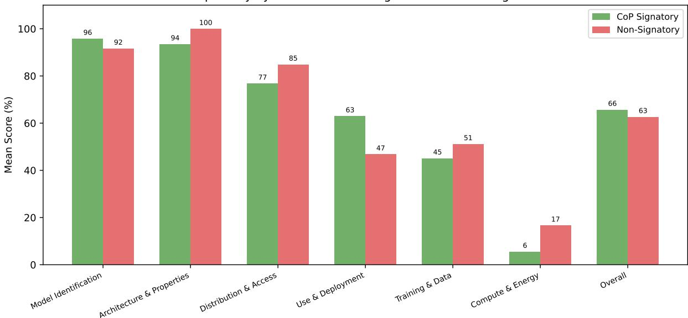
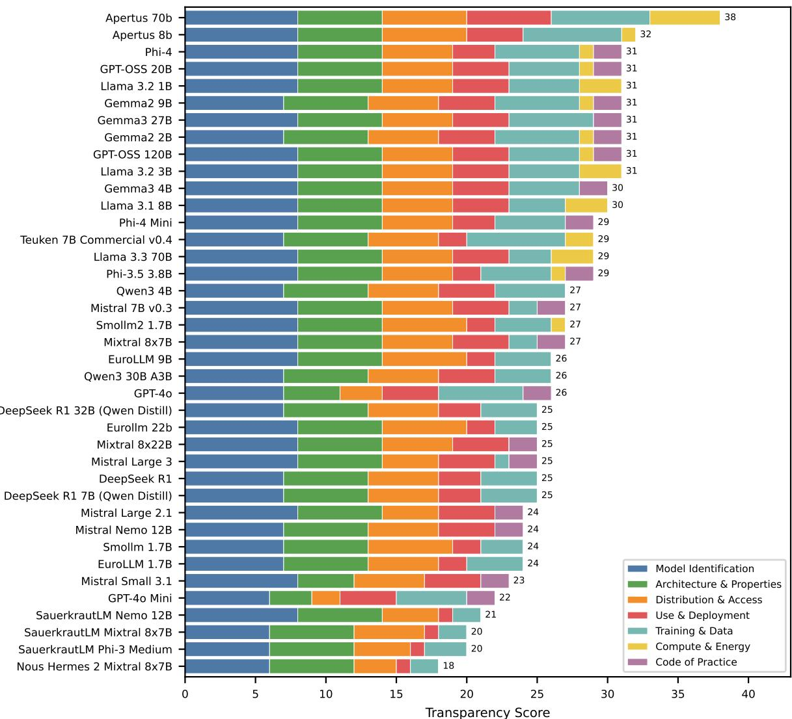

# From Global Benchmarks to Local Evaluations: Benchmarking LLMs for the German Public Sector

Camilla Dalerci∗, Thilo Michael∗, Robin Schaefer∗, Daniel Weinland∗

Innovations Department, Bundesdruckerei GmbH, Berlin, Germany, firstname.lastname@bdr.de

## Abstract

Public institutions face a persistent challenge in selecting LLMs suited to their specific context. Existing benchmarks, however, are of limited use as they primarily reflect English-language and US-centric settings, and often only evaluate task performance. In this paper, we present first results of MÖVE, a holistic evaluation framework for the German public sector, examining three rarely considered governance dimensions: energy consumption, provider transparency, and knowledge of German-party positions. Our results reveal significant tradeoffs, with no single model excelling across all dimensions: estimated energy consumption varies more than 60-fold and is not explained by model size alone, information disclosure varies systematically across providers, and European models do not exhibit stronger knowledge of German party positions. Model selection for public institutions thus cannot rely on performance rankings alone. Instead, evaluations should also reflect the governance requirements of the deployment context.

## 1 Introduction

Large language models (LLMs) are increasingly used in high-stakes environments, including public administration. At the same time, model selection is no longer merely a choice between one or two well-known providers. Public institutions can now choose from a rapidly expanding and heterogeneous landscape of models that differ in size, performance, energy requirements, documentation practices, and contextual knowledge.

As LLM-generated text increasingly informs policy analysis and public-sector decision-making, the need for robust and locally grounded benchmarking practices becomes more pressing (Reuel et al.,

2024). General benchmark performance alone offers limited evidence about whether a model is suitable for a particular institutional, linguistic, or societal context. The ability to identify potential harms and anticipate failures within intended usecase scenarios has therefore made model evaluation an essential discipline (Chang et al., 2024).

Established LLM benchmarks predominantly measure task performance on English-language datasets and frequently reflect US- or UK-specific contexts (Wang et al., 2019; Hendrycks et al., 2021; Majithia et al., 2026). Multilingual benchmarks extend coverage to additional languages (Adelani et al., 2025; Susanto et al., 2025) but often rely on translated versions of existing datasets (Singh et al., 2025), thereby failing to address the domain or context gap. Moreover, benchmarks generally prioritize task performance over the broader governance concerns that a more holistic evaluation would address (Liang et al., 2023). Thus, while a model may perform well on conventional benchmarks, it may, e.g., consume disproportionate resources or provide insufficient documentation, which are crucial criteria for the broad adoption of LLMs. These limitations are particularly consequential for public institutions, as they must not only assess whether a model can be applied to a task, but also whether its deployment can be justified to decision-makers, oversight bodies, and the public.

In this paper, we present first results of MÖVE (Modellefür die öffentliche Verwaltung evaluieren), a holistic evaluation framework for the German public sector.1 While the frameworks’ current status includes seven performance and governance criteria, in this paper we focus on the evaluation of 39 LLMs across three governance dimensions. We estimate inference-time energy consumption using task-specific output statistics, assess provider transparency through a manually verified matrix of 21 questions across seven documentation domains, and evaluate political knowledge using 4,788 official positions from 64 German political parties. While requiring different evaluation methods, the three dimensions address a common question: whether a model is suitable for deployment in a specific public-sector context beyond its performance on a generic task.

## 2 Benchmark Design

## 2.1 Scope and Target Groups

We evaluate 39 open-weight and proprietary LLMs2 from 13 providers across three governance dimensions relevant to public-sector deployment: inference-time energy consumption, provider transparency, and knowledge of German political-party positions. The benchmark was developed through a stakeholder-informed process involving semistructured feedback sessions with public-sector representatives and exchanges with practitioners. Following recommendations that benchmark design should be grounded in intended uses and stakeholder needs (Reuel et al., 2024), we distinguish four target groups: 1) AI decision-makers, 2) public-administration domain experts, 3) IT departments and security-critical institutions, and 4) broader civil society. Their respective needs concern strategic model comparison, operational suitability, secure and compliant deployment, and public accountability.

## 2.2 Energy Consumption

Energy consumption can accumulate substantially when models are deployed at scale, making energy efficiency an operational as well as an environmental consideration (Strubell et al., 2019; Wu et al., 2025). To enable comparison between locally deployed and API-accessed models, we estimate inference-time energy consumption using EcoLogits (Rincé and Banse, 2025). The framework estimates energy use from the model’s total parameter count, active parameter count for mixture-ofexperts architectures, and number of generated output tokens. Parameter information for open-weight models was collected from official documentation;

for proprietary models without disclosed parameter counts, we relied on the assumptions provided by EcoLogits.

Rather than applying a fixed output length, we use the actual output-token counts recorded during model evaluation across nine German-language datasets (Table 1): four summarization datasets, three question-answering datasets, and two topicextraction datasets. We report mean estimated energy consumption in watt-hours per inference request, both by task and across tasks.

## 2.3 Provider Transparency

Meaningful risk assessment depends on provider transparency. Without adequate information about training data, bias mitigation, computational resources, and model limitations, adopting institutions cannot independently evaluate the risks transferred to them. This information is also increasingly relevant in the European regulatory context, particularly in light of the documentation requirements for providers of general-purpose AI models established under Article 53 of the EU AI Act3.

Provider transparency is evaluated using a structured dataset of 21 questions across seven domains: model identification; architecture and properties; distribution and access; use and deployment; training and data; computational resources and energy consumption; endorsement of the EU General-Purpose AI Code of Practice. The questions were derived from the Code’s Transparency Chapter and Model Documentation Form4, which operationalize documentation obligations under Article 53.

For each model, we collected publicly verifiable information from three source types: official provider websites, official model cards, and technical publications issued by the provider. Each question was scored as 0 when no information was available, 1 when information was partial, and 2 when clear and verifiable information was provided. The Code of Practice signature was treated as a binary criterion. The documentation was first assessed manually, primarily by one researcher, with a subset independently scored by a second. To support quality assurance, we additionally implemented an automated scoring agent that retrieves the same sources and scores all criteria independently. The automated and manual assessments initially diverged on 27.4% of items. These cases were reviewed and corrected where necessary, and recurring disagreements were encoded as explicit scoring notes, reducing divergence to 16.2% — a measure of the final protocol’s internal consistency rather than of accuracy, since both the notes and the manual scores were revised in the process. A second researcher reviewed the complete output. Across 39 models, the resulting dataset contains 819 model-question assessments. The full matrix, including the scoring notes, the justification for each score, and the underlying sources, is publicly available.5

<table><tr><td>Dataset</td><td>Task</td><td>Type</td><td>Size</td></tr><tr><td>Eur-Lex-Sum (Aumiller et al., 2022)</td><td>Summarization</td><td>Existing</td><td>850</td></tr><tr><td>Swiss Leading Decision Summarization (Rasiah et al., 2023)</td><td>Summarization</td><td>Existing</td><td>1,530</td></tr><tr><td>KIKC Summary</td><td>Summarization</td><td>Private</td><td>40</td></tr><tr><td>German Ministry Publications (Summaries)</td><td>Summarization</td><td>Private</td><td>1,530</td></tr><tr><td>German-QuAD (Möller et al., 2021)</td><td>QA</td><td>Existing</td><td>4,710</td></tr><tr><td>KIKC QA</td><td>QA</td><td>Private</td><td>72</td></tr><tr><td>FAQ Law</td><td>QA</td><td>Private</td><td>129</td></tr><tr><td>KIKC Topics</td><td>Topic Extraction</td><td>Private</td><td>205</td></tr><tr><td>German Ministry Publications (Topics)</td><td>Topic Extraction</td><td>Private</td><td>4,199</td></tr></table>

Table 1: Overview of datasets used for calculating energy consumption during model evaluation. Type indicates whether a dataset is pre-existing or specifically constructed for the benchmark. The latter are not released to the public. Dataset size is reported with respect to the evaluation unit used in each task, e.g., summaries in summarization tasks.

## 2.4 Political Knowledge

Models used in the public sector are required to produce factually accurate outputs. Political knowledge is a particularly important example because incorrect representations of policy positions may affect citizen-facing information services and policy-related applications. Existing studies have frequently examined the political preferences attributed to LLMs through instruments such as the Political Compass6 or national voting-advice applications. However, such results are sensitive to prompt formulation, language, and the assumptions used to attribute a political position to a model (Röttger et al., 2024; Helwe et al., 2025; Rettenberger et al., 2025). We therefore distinguish political knowledge from political bias. Rather than measuring political bias in model outputs, we evaluate whether such outputs correctly reflect the publicly documented positions of German political parties.

This formulation treats political positioning as a factual classification task grounded in an external reference rather than as an attribution of partisan preferences to the model.

Political knowledge is evaluated using official party responses from the German Wahl-O-Mat, a voting-advice application maintained by the Federal Agency for Civic Education7. The dataset covers the four most recent federal elections, i.e., 2013, 2017, 2021, and 2025, and includes all participating parties. Propositions for which a party did not provide a position were removed, resulting in 4,788 labeled positions (agree, disagree, or neutral) from 64 political parties. 47.5% of positions agree with the given proposition, while 39.7% and 12.8% exhibit a negative or neutral stance, respectively.

Models receive a political proposition, a party, the election year, and the response options in a German-language prompt and are tasked to predict how the specified party positioned itself. Each model is queried once per datapoint. Performance is measured using classification accuracy against the official party responses. Although this task arguably poses a challenge for LLMs, given that party positions may shift over time, we consider it a compelling use case for identifying the upper bounds of LLM performance in a political context.

## 3 Results

Our results reveal substantial variation and tradeoffs. Estimated mean energy consumption differs by a factor of 63 across the evaluated models, with smaller models generally consuming less energy, although size does not fully determine efficiency. Provider documentation is strongest for basic model identification and architectural properties, but remains particularly weak regarding computational resources, energy use, training-data safeguards, and bias-mitigation practices. Classification of party positions is challenging across the model set: the highest mean accuracy is 0.671, and model size is positively associated with performance without being sufficient to explain it. Across the three criteria, no single model achieves the strongest result in every dimension.

Transparency by Domain: EU CoP Signatories vs. Non-Signatories  
  
Figure 1: Mean transparency score (%) by domain for EU AI Act Code of Practice signatories vs. non-signatories.

Energy Consumption. Estimated energy consumption varies by a factor of 63 across the 39 models, from 0.647 Wh to 40.6 Wh per query, with a median of 1.788 Wh. This estimate should be interpreted with caution for proprietary models, where parameter counts are not disclosed. Energy requirements also depend strongly on the task: summarization is more energy-intensive than question answering and topic extraction because it produces longer outputs. Reasoning models incur particularly high energy costs, while several smaller models remain competitive at substantially lower consumption. Our analysis therefore indicates that marginal improvements in performance can entail disproportionately large energy costs.

Provider Transparency. Overall transparency scores range from 18 to 38 out of 42, demonstrating substantial differences between models and providers. Documentation is generally strong for model identification, architecture, and access, but weak for upstream information. Compute and energy is the least transparent domain, with a mean score of 11.5%; 84.6% of models disclose no training-energy consumption and 79.5% provide no measurement methodology. Trainingdata safeguards and bias-mitigation practices are also poorly documented (see Appendix A for full results). Providers that signed the EU General-Purpose AI Code of Practice score overall only marginally higher than non-signatories, and their advantage is concentrated in downstream information such as intended use and deployment guidance rather than training data, compute, or energy disclosures (Figure 1).

Political Knowledge. No model produces consistently accurate outputs with respect to German political-party positions (Table 2). The two highestperforming models achieve an accuracy of only 0.671 across 4,788 positions from 64 parties. Although larger models tend to perform better on average, model size does not determine performance: a small GPT-4o Mini matches a large DeepSeek R1 at the top of the ranking, while medium-sized and fine-tuned models also achieve competitive results. The highest-performing models span European, US, and Chinese providers, thus providing no evidence that geographical proximity alone predicts higher output accuracy. Despite substantial variance in model performance, all top-performing models surpass the majority baseline of 0.475.

<table><tr><td>Rank</td><td>Model</td><td>Organisation</td><td>Region</td><td>Size</td><td>Score</td></tr><tr><td>1</td><td>DeepSeek R1</td><td>DeepSeek</td><td>China</td><td>Large</td><td>0.671</td></tr><tr><td>1</td><td>GPT-4o Mini</td><td>OpenAI</td><td>USA</td><td>Small</td><td>0.671</td></tr><tr><td>3</td><td>GPT-OSS 120B</td><td>OpenAI</td><td>USA</td><td>Large</td><td>0.667</td></tr><tr><td>4</td><td>Llama 3.3 70B</td><td>Meta</td><td>USA</td><td>Large</td><td>0.663</td></tr><tr><td>5</td><td>Mistral Small 3.1</td><td>Mistral</td><td>Europe</td><td>Medium</td><td>0.645</td></tr><tr><td>6</td><td>GPT-40</td><td>OpenAI</td><td>USA</td><td>Large</td><td>0.624</td></tr><tr><td>7</td><td>GPT-OSS 20B</td><td>OpenAI</td><td>USA</td><td>Medium</td><td>0.619</td></tr><tr><td>8</td><td>Mistral Large 3</td><td>Mistral</td><td>Europe</td><td>Large</td><td>0.610</td></tr><tr><td>9</td><td>SauerkrautLM Mixtral 8x7B</td><td>VAGOSolutions</td><td>Europe</td><td>Medium</td><td>0.607</td></tr><tr><td>10</td><td>DeepSeek R1 32B</td><td>DeepSeek</td><td>China</td><td>Medium</td><td>0.601</td></tr><tr><td colspan="2">Majority Baseline</td><td></td><td></td><td></td><td>0.475</td></tr></table>

Table 2: Top-10 models for party-position classification, ranked by mean accuracy. All top-performing models surpass the majority baseline.

## 4 Discussion

The findings of this paper show that model selection for public administration should extend beyond conventional performance rankings. In particular, the 63-fold variation in estimated energy consumption demonstrates that resource efficiency is not a secondary consideration. Models with similar task performance may impose substantially different operational and environmental costs. Energy consumption should therefore be assessed, especially for high-volume public-sector applications.

The transparency assessment reveals a persistent accountability gap. Providers commonly document basic model properties, access conditions, and intended uses, but disclose notably less about training data, bias mitigation, computational resources, and energy consumption. This limits the ability of public institutions to independently assess risks and make evidence-based procurement decisions.

Finally, the political-knowledge results also caution against using a model provider’s geographical origin as a proxy for local suitability. Models from European, US, and Chinese providers achieve competitive results on German political-party positions, and no regional group consistently dominates. Foreign-developed models should therefore not be excluded based on assumptions about represented contextual knowledge. At the same time, the modest maximum accuracy shows that all models require evaluation on locally relevant data before deployment in politically sensitive use cases.

Conclusion. Our results emphasize the need for a multidimensional, locally grounded approach to LLM evaluation. Model size, provider reputation, and general benchmark performance alone are insufficient proxies for deployment suitability. Public administrations should compare models based on specific governance and domain requirements. Meanwhile, providers and regulators should strengthen transparency requirements to enable such assessments. Overall, these findings suggest that we should move away from universal model rankings and towards evaluations that reflect the deployment context’s requirements.

## Limitations

This study is limited to three evaluation dimensions and a fixed set of models. Future work will extend the benchmark with newer models and additional criteria to provide a more comprehensive assessment of public sector suitability.

Energy results are comparative estimates rather than complete measurements and for proprietary models rely on EcoLogits’ assumptions about undisclosed parameter counts. Transparency scores reflect publicly available documentation collected and verified between March and May 2026.

The datasets capture selected aspects of the German public-sector context and cannot represent the full diversity of administrative tasks, political knowledge, or deployment conditions.

## Acknowledgments

We thank the anonymous reviewers for their helpful feedback. In the preparation of this paper, generative AI was used in a supporting capacity for stylistic revision.

## References

David Ifeoluwa Adelani, Jessica Ojo, Israel Abebe Azime, Jian Yun Zhuang, Jesujoba Oluwadara Alabi, Xuanli He, Millicent Ochieng, Sara Hooker, Andiswa Bukula, En-Shiun Annie Lee, Chiamaka Ijeoma Chukwuneke, Happy Buzaaba, Blessing Kudzaishe Sibanda, Godson Koffi Kalipe, Jonathan Mukiibi, Salomon Kabongo Kabenamualu, Foutse Yuehgoh, Mmasibidi Setaka, Lolwethu Ndolela, and 8 others. 2025. IrokoBench: A New Benchmark for African Languages in the Age of Large Language Models. In Proceedings of the 2025 Conference of the Nations ofthe Americas Chapter ofthe Associationfor Computational Linguistics: Human Language Technologies (Volume 1: Long Papers), pages 2732–2757, Albuquerque, New Mexico. Association for Computational Linguistics.

Dennis Aumiller, Ashish Chouhan, and Michael Gertz. 2022. Eur-lex-sum: A multi-and cross-lingual dataset for long-form summarization in the legal domain. arXiv preprint arXiv:2210.13448.

Yupeng Chang, Xu Wang, Jindong Wang, Yuan Wu, Linyi Yang, Kaijie Zhu, Hao Chen, Xiaoyuan Yi, Cunxiang Wang, Yidong Wang, Wei Ye, Yue Zhang, Yi Chang, Philip S. Yu, Qiang Yang, and Xing Xie. 2024. A Survey on Evaluation of Large Language Models. ACM Trans. Intell. Syst. Technol., 15(3).

Camilla Dalerci, Thilo Michael, Robin Schaefer, and Daniel Weinland. 2026. MÖVE: A Holistic LLM Benchmark for the German Public Sector. Preprint, arXiv:2606.13111.

Chadi Helwe, Oana Balalau, and Davide Ceolin. 2025. Navigating the Political Compass: Evaluating Multilingual LLMs across Languages and Nationalities. In Findings ofthe Associationfor Computational Linguistics: ACL 2025, pages 17179–17204, Vienna, Austria. Association for Computational Linguistics.

Dan Hendrycks, Collin Burns, Steven Basart, Andy Zou, Mantas Mazeika, Dawn Song, and Jacob Steinhardt. 2021. Measuring Massive Multitask Language Understanding. arXiv preprint. ArXiv:2009.03300 [cs].

Percy Liang, Rishi Bommasani, Tony Lee, Dimitris Tsipras, Dilara Soylu, Michihiro Yasunaga, Yian Zhang, Deepak Narayanan, Yuhuai Wu, Ananya Kumar, Benjamin Newman, Binhang Yuan, Bobby Yan, Ce Zhang, Christian Cosgrove, Christopher D. Manning, Christopher Ré, Diana Acosta-Navas, Drew A. Hudson, and 31 others. 2023. Holistic Evaluation of Language Models. Preprint, arXiv:2211.09110.

Neil Majithia, Rajat Shinde, Zo Chapman, Prajun Trital, Jordan Decker, Manil Maskey, Elena Simperl, and Nigel Shadbolt. 2026. The CitizenQuery Benchmark: A Novel Dataset and Evaluation Pipeline for Measuring LLM Performance in Citizen Query Tasks. Preprint, arXiv:2602.04064.

Timo Möller, Julian Risch, and Malte Pietsch. 2021. GermanQuAD and GermanDPR: Improving Non-English Question Answering and Passage Retrieval.

In Proceedings of the 3rd Workshop on Machine Reading for Question Answering, pages 42–50, Punta Cana, Dominican Republic. Association for Computational Linguistics.

Vishvaksenan Rasiah, Ronja Stern, Veton Matoshi, Matthias Stürmer, Ilias Chalkidis, Daniel E. Ho, and Joel Niklaus. 2023. SCALE: Scaling up the Complexity for Advanced Language Model Evaluation. Preprint, arXiv:2306.09237.

Luca Rettenberger, Markus Reischl, and Mark Schutera. 2025. Assessing political bias in large language models. Journal of Computational Social Science, 8(2):42.

Anka Reuel, Amelia Hardy, Chandler Smith, Max Lamparth, Malcolm Hardy, and Mykel J. Kochenderfer. 2024. BetterBench: assessing AI benchmarks, uncovering issues, and establishing best practices. In Proceedings ofthe 38th International Conference on Neural Information Processing Systems, NIPS ’24, Red Hook, NY, USA. Curran Associates Inc.

Samuel Rincé and Adrien Banse. 2025. EcoLogits: Evaluating the Environmental Impacts of Generative AI. Journal ofOpen Source Software, 10(111):7471.

Paul Röttger, Valentin Hofmann, Valentina Pyatkin, Musashi Hinck, Hannah Kirk, Hinrich Schuetze, and Dirk Hovy. 2024. Political Compass or Spinning Arrow? Towards More Meaningful Evaluations for Values and Opinions in Large Language Models. In Proceedings ofthe 62nd Annual Meeting ofthe Associationfor Computational Linguistics (Volume 1: Long Papers), pages 15295–15311, Bangkok, Thailand. Association for Computational Linguistics.

Shivalika Singh and 1 others. 2025. Global MMLU: Understanding and Addressing Cultural and Linguistic Biases in Multilingual Evaluation. In Proceedings of the 63rd Annual Meeting of the Association for Computational Linguistics (Volume 1: Long Papers), pages 18761–18799, Vienna, Austria. Association for Computational Linguistics.

Emma Strubell, Ananya Ganesh, and Andrew McCallum. 2019. Energy and Policy Considerations for Deep Learning in NLP. In Proceedings ofthe 57th Annual Meeting of the Association for Computational Linguistics, pages 3645–3650, Florence, Italy. Association for Computational Linguistics.

Yosephine Susanto, Adithya Venkatadri Hulagadri, Jann Railey Montalan, Jian Gang Ngui, Xianbin Yong, Wei Qi Leong, Hamsawardhini Rengarajan, Peerat Limkonchotiwat, Yifan Mai, and William Chandra Tjhi. 2025. SEA-HELM: Southeast Asian Holistic Evaluation of Language Models. In Findings ofthe Associationfor Computational Linguistics: ACL 2025, pages 12308–12336, Vienna, Austria. Association for Computational Linguistics.

Alex Wang, Yada Pruksachatkun, Nikita Nangia, Amanpreet Singh, Julian Michael, Felix Hill, Omer Levy,

and Samuel R. Bowman. 2019. SuperGLUE: a stickier benchmarkfor general-purpose language understanding systems. Curran Associates Inc., Red Hook, NY, USA.

Yanran Wu, Inez Hua, and Yi Ding. 2025. Unveiling Environmental Impacts of Large Language Model Serving: A Functional Unit View. In Proceedings of the 63rd Annual Meeting of the Association for Computational Linguistics (Volume 1: Long Papers), pages 10560–10576, Vienna, Austria. Association for Computational Linguistics.

## A Transparency Scores

  
Figure 2: Transparency scores for all 39 models, sorted by domain and total score. Each segment represents the score in one of the seven transparency documentation domains. The pronounced gap between well-documented domains (Model Identification, Architecture, Distribution & Access) and poorly-documented ones (Use & Deployment, Training & Data, Compute & Energy) is visible across nearly all models.