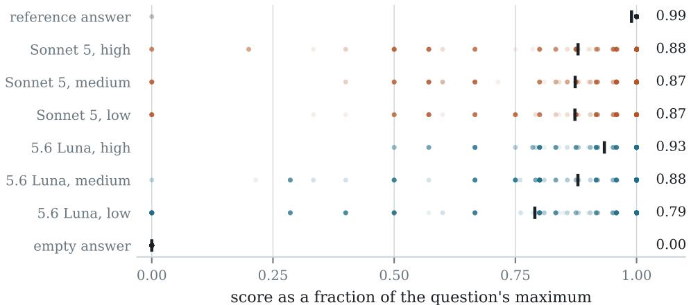
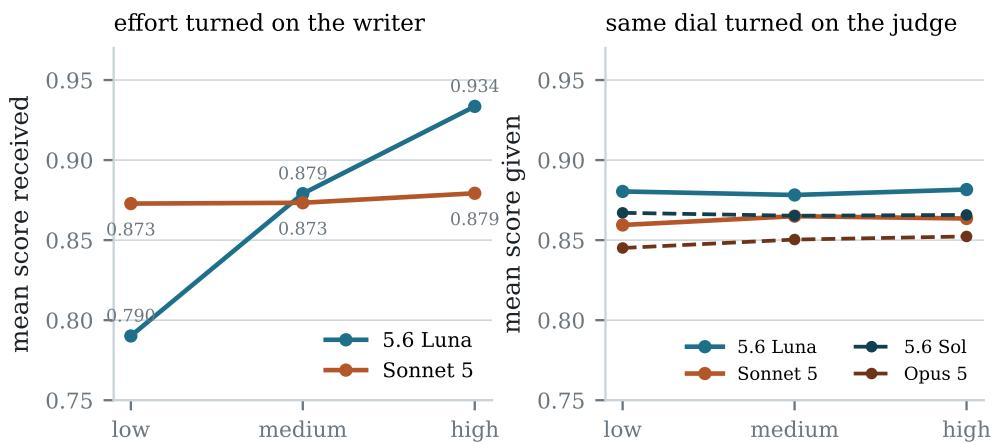
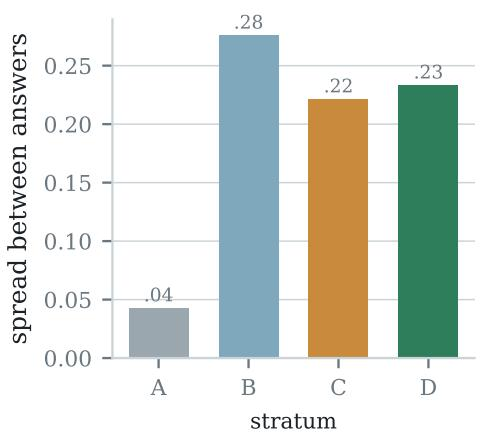
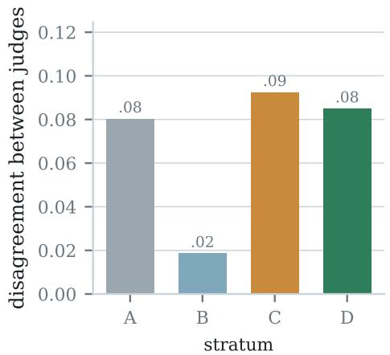
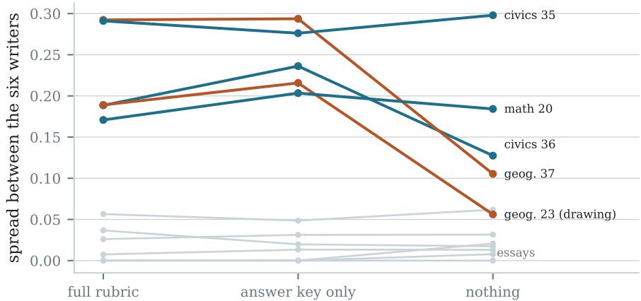
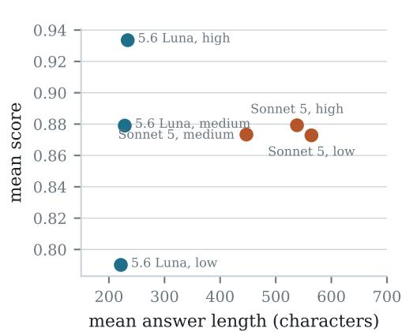
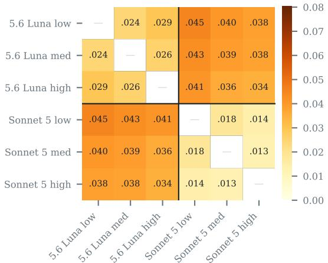
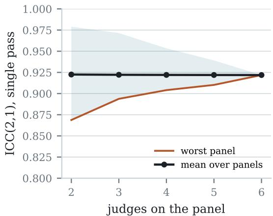

# Grading Needs a Rubric, Not Intelligence

Jhen-Ke Lin National Yang Ming Chiao Tung University jacob.cs14@nycu.edu.tw

## Abstract

Small language models can grade open-ended examination answers as reliably as substantially more expensive models when they grade against an explicit rubric. We test this claim as the design principle behind ANY-TO-BENCH: a frontier model reads source documents once, at ingestion, to extract each question and its rubric; lower-cost models then perform all repeated grading work. We evaluate six cost-efficient model configurations from two model families at three reasoningeffort levels. Each configuration answers 24 open-ended examination questions, and each also grades every answer sheet three times, yielding 3,456 per-question grades. Scores depend overwhelmingly on the answer being graded: answer identity explains 95.6 % of score variance, whereas judge identity explains only 0.2 %. Raising a writer’s reasoning effort moves earned scores by as much as 0.143 of full marks, while raising a judge’s reasoning effort moves assigned scores by at most 0.006. Six frontier-tier judges, added as a check, reproduce these scores and are no more reliable as a panel. Two ablations then decompose the rubric on the same questions and answers. Removing its criteria and levels while keeping the official answer changes nothing measurable. Removing the official answer as well collapses reliability (ICC 0.888 to 0.628), inflates scores, and makes judge reasoning effort matter again. The rubric is what decouples grading from judge intelligence, and within the rubric the official answer does nearly all the work. We find no evidence of length preference or same-family preference under rubric-anchored grading.

## 1 Introduction

Turning an existing examination into a machine-runnable benchmark is mostly a solved problem for multiple-choice items. It is an expensive problem for everything else. Open-ended questions, such as proofs, essays, translations, and drawings, need a grader, and the grader has historically been the costly, unscalable part. Using a language model as the judge [1, 2] moved that cost from humans to models. But the standard recipe still spends a frontier-model call on every grade, and it carries documented judge biases: a preference for longer answers [5], for answers in certain positions [4], and for the judge’s own model family [6].

ANY-TO-BENCH takes a different approach, built on an asymmetry between its two model-driven steps: ingestion and grading. Ingestion is where the intelligence goes. A frontier configuration reads the source documents and extracts questions, answer formats, and scoring rubrics, and it does this once per exam. Throughout this paper, a question’s rubric is its complete extracted scoring standard: the official reference answer, plus explicit criteria with defined levels where the source publishes them. Grading happens on every benchmark run, and the tool bets that it needs almost no intelligence at all: with the rubric in hand, grading reduces to applying it. That is work small models should handle cheaply, repeatedly, and interchangeably.

That is a testable claim, and we test it. Six configurations served both as answer writers and as judges over 24 open-ended questions from three Taiwanese national examinations. They comprise the small tier of one model family and the mid tier of another, each at three reasoning-effort settings. Because the same configurations act both as writers and as judges, the experiment turns the reasoning-effort dial once on each side of the grading relation. The writer side shows what happens when capability matters; the judge side tests whether it matters for grading. We find:

• Judge intelligence does not matter (§5). Reasoning effort moves what a writer earns by up to 0.143 of full marks, so capability registers when it sits on the answering side. The same dial moves what a judge gives by at most 0.006. Judge identity accounts for 0.2 % of score variance, and replacing the entire panel with its cheapest members changes per-answer scores by 0.019 on average. Frontier-tier judges reproduce the same scores.

• The rubric is the mechanism, and its answer key is the load-bearing part (§6). Two ablations decompose the rubric on the same questions and answers. Stripping its criteria and levels while keeping the official answer changes nothing measurable. Stripping the official answer as well collapses reliability, inflates scores, and makes judge effort matter again.

• Two textbook biases fail to appear (§7). Under rubric anchoring there is no self-preference and no length premium. A within-question length–score correlation of +0.6 to +0.7 suggests otherwise; the cross-writer comparison shows why that reading is wrong.

• One judge is enough (§8). Mean panel reliability is flat from two judges to six, and repeated grading adds nothing measurable. What a larger panel adds is insurance against an unlucky pick of judge.

Throughout, the scale is anchored by construction rather than assumption (§4). An empty answer sheet and the published reference answers bound the scale from below and above, and every claim about agreement is conditioned on the judges first getting both of these anchors right.

## 2 Related work

Reliability of LLM judges has mostly been studied in the pairwise-preference setting, where a judge compares two answers. MT-Bench and Chatbot Arena report over 80 % agreement between GPT-4 verdicts and human preferences [1]. G-Eval aligns form-filling GPT-4 evaluation with human judgments of generated text [3], and Chiang and Lee [2] examine LLMs as replacements for human evaluation of open text. The same literature documents the failure modes: pairwise judges are sensitive to answer order [4], reward length until it is explicitly controlled for [5], and favour their own generations [6]. Surveys and systematic bias audits now catalogue these and further failure modes at scale [7, 8].

Our setting differs in a way that matters for all three biases. The judge does not compare two answers or rate free-form quality. It assigns points against an extracted rubric with defined criteria and levels, on questions that carry official point values. This is the classical instrument of educational measurement, and we evaluate it with the classical tools: intraclass correlation for absolute agreement [9] and a variance decomposition over answers, judges, and their interaction. The length analysis in §7 is an instance of aggregation reversal [10], also known as Simpson’s paradox.

Rubric-based LLM grading of examinations is also studied directly. Recent work grades nationwide school-leaving essays against curriculum rubrics and reports agreement comparable to human panels [11], and asks how much rubric detail automated scoring needs [12]. That line of work varies the rubric and compares against human raters. We hold the rubric fixed and vary the judge, asking how much intelligence rubric application needs.

## 3 Experimental design

## 3.1 Corpus and question selection

The corpus is 164 exam bundles (7,121 questions) that ANY-TO-BENCH produced from the published files of three Taiwanese national examinations: the General Scholastic Ability Test (GSAT), the Advanced Subjects Test (AST), and the unified entrance examination for technological and vocational education (TVE), for the years 113–115 (2024–2026). The corpus is public.1 Ingestion is the one step that uses a frontier model: GPT-5.6 Sol at extra-high (xhigh) reasoning effort read the source documents and extracted each question, its answer format, and a per-criterion grading rubric.

From the judge-graded questions in this corpus we drew 24, grouped into four strata by how much scoring guidance the source itself publishes (Table 2, left half). Each stratum holds six questions. The 24 questions come from 21 different exam papers across the three series and the three years, and cover eight subjects: Chinese, English, mathematics, physics, chemistry, biology, geography, and civics. They are worth 1 to 25 points each and use three answer formats: ten short answers (including English translation items), ten essays, and four drawings. Rubric size runs from a single two-level criterion to rubrics with up to four criteria and up to 26 levels in total. Appendix A lists every question. The strata are not four arms of one experiment. Stratum B’s two-level rubrics make agreement largely automatic, so it serves as a floor check. Stratum A, with no published rubric, is the comparison condition that §6 turns on.

## 3.2 Writers, anchor sheets, judges

Six configurations wrote answers: GPT-5.6 Luna, the small tier of its model family, and Claude Sonnet 5, the mid tier of its family, each at low, medium, and high reasoning effort. Below we shorten these names to 5.6 Luna and Sonnet 5.

Two further answer sheets were constructed rather than generated. We call them anchors because they pin the ends of the scale: a reference sheet containing each question’s published official answer, which should earn nearly full marks, and an empty sheet, which should earn nothing. Without human raters, these anchors are the only available ground truth. Eight of the 24 questions publish no official answer (their examining boards do not release keys for essays and translations). For those eight, the full-credit anchor is undefined, so we exclude them from reference-anchor statistics only.

The same six configurations then served as judges. Each judge graded each of the eight sheets three times: $8 \times 6 \times 3 = 1 4 4$ grading passes. One graded question is one verdict; the experiment produced 3,456 verdicts, all complete. To grade, the judge reads the question (with its figures supplied as images), the rubric, and the answer, and assigns each rubric criterion one of its defined levels. Drawing questions are answered as precise textual descriptions of the drawing (shapes, labels, positions), and the judge grades the description against the rubric. We analyse scores as p = awarded/maximum, so a 25-point essay and a 1-point short answer weigh alike. A difference of 0.10 in p corresponds to 10 points on a 100-point scale.

Six further configurations at the frontier tier of each family also served as judges: GPT-5.6 Sol, which performed ingestion, and Claude Opus 5, at the same three efforts. Each graded all eight sheets once, as a direct check on the pool’s ceiling (§5). With the ablations of §3.4, the experiment totals 5,760 verdicts.

One design detail protects the results from our own tooling. ANY-TO-BENCH snaps each judged criterion score onto the rubric’s defined levels. Snapping mechanically increases apparent agreement: judges who say 1.7 and 2.3 both become 2.0. We therefore recorded every pre-snap verdict and computed all statistics both ways. Snapping altered 1 of 3,456 verdicts, so no result below is an artifact of our own rounding.

## 3.3 Measures

We measure agreement with the intraclass correlation coefficient, form ICC(2,1): two-way random effects, absolute agreement, single measurement [9]. In plain terms, ICC(2,1) is the share of score variance that reflects real differences between answers rather than differences between judges. A value of 1 means the judges are interchangeable; a value of 0 means the score depends on who graded rather than on what was written. With n answers, k judges, and the usual mean squares,

$$
\begin{array} { l } { \displaystyle \mathrm { I C C } ( 2 , 1 ) = \frac { M S _ { R } - M S _ { E } } { M S _ { R } + ( k - 1 ) M S _ { E } + \frac { k } { n } ( M S _ { C } - M S _ { E } ) } , } \end{array}\tag{1}
$$

where $M S _ { R } , M S _ { C } , M S _ { E }$ are the answer, judge, and residual mean squares. We use absolute agreement rather than consistency because a benchmark needs judges to assign the same score; agreement on ranking alone would be too weak. Confidence intervals come from a cluster bootstrap that resamples whole questions, because verdicts on the same question are not independent. The same mean squares give the variance decomposition $\hat { \sigma } _ { \mathrm { a n s w e r } } ^ { 2 } = ( M S _ { R } - M S _ { E } ) / k , \hat { \sigma } _ { \mathrm { j u d g e } } ^ { 2 } = ( M S _ { C } -$ $M S _ { E } ) / n , \hat { \sigma } _ { \mathrm { r e s } } ^ { 2 } = M S _ { E }$

Unless stated otherwise, agreement statistics use a single grading pass, because nobody grades three times in production. They also cover the six model-written sheets only: the two anchors are trivially easy to separate and would inflate any statistic that included them.

## 3.4 Two ablations

The strata compare different questions, so they cannot separate the rubric’s effect from the questions own character. Two ablations remove that limit by intervening on the same questions. From the twelve stratum-C and -D questions we built two further bundles. The first strips each rubric’s criteria and levels but keeps the official answer, which is the shape stratum-A rules have. The second strip the official answer as well, leaving the judge nothing but the question and the answer to grade. The same six judges then re-graded all eight answer sheets once under each condition: 96 further grading passes and 1,152 further verdicts. Comparisons against the full rubric use the first repeat of the main study, so all three conditions are single-pass.

## 4 The scale is anchored

The judges got both anchors right, almost without exception. This matters because agreement alone proves nothing: judges can agree and all be wrong. The empty sheet scored exactly zero in every one of its 432 gradings. The reference sheet averaged 0.990 of full marks and scored at least 0.9 in 285 of 288 gradings.2 Figure 1 shows the two anchors bracketing all six writers, with every verdict drawn.

  
Figure 1. All 3,456 verdicts, by answer sheet. The constructed anchors sit at the ends of the scale, where they belong; the six writers sit strictly between them. 5.6 Luna’s answers improve with reasoning effort; Sonnet 5’s do not, on these questions.

## 5 Effort moves writers, not judges

Reasoning effort changes what an answer earns. It does not change what a judge gives. Because the six configurations act as both writers and judges, both effects come from the same experiment, and Figure 2 shows them on a common scale. Turned on the writer, the effort dial moves earned scores by 0.143 of full marks for 5.6 Luna (0.790 to 0.934). Sonnet 5’s answers are flat in effort, so the writer-side response is carried by one family; one is enough to show that the instrument registers capability whenever capability differs. Turned on the judge, the same dial moves the mean verdict by +0.001 (5.6 Luna) and +0.004 (Sonnet 5). The six judges’ mean leniencies, across two families and three efforts, all sit within ±0.012 of the panel mean.

  
Figure 2. The same dial, both sides. Left: mean score received by each family’s answers as writer effort rises. Right: mean score given by each family’s judges as judge effort rises, over the identical answers; dashed lines are the frontier tier, graded once. Both panels span the same 0.22 of the scale; on equal axes, the judge side stays flat.

Swapping the whole panel makes the judge-side null concrete. We replaced the two most expensive judges (high effort, both families) with the two cheapest (low effort). Per-answer scores changed by 0.019 on average (maximum 0.167, rank correlation 0.90). The cheap pair’s single-pass reliability, ICC(2,1) = 0.913, is statistically indistinguishable from the full six-judge panel’s 0.922 (95 % confidence interval 0.815–0.966, cluster bootstrap over questions). In the variance decomposition over all writer answers, which answer is being graded explains 95.6 % of score variance. Which judge is grading explains 0.2 %. The remaining 4.3 % is answer–judge interaction.3

Effort does improve one thing on the judge side: repeatability. When re-grading the identical answer, the low-effort 5.6 Luna judge varies with a within-judge standard deviation of 0.080, against 0.038 at high effort (Sonnet 5: 0.038 against 0.026). But this variation is centred on the same verdict, and it is already included in the single-pass figures above. It changes no comparison between answers. Nowhere in 3,456 verdicts does effort change what an answer is worth.

The main judge pool is deliberately downmarket: the small tier of one family and the mid tier of another. As a direct check on its ceiling, six frontier-tier configurations, GPT-5.6 Sol (the ingestion model’s own tier) and Claude Opus 5 at the same three efforts, graded every sheet once. They change nothing (Table 1). Each frontier judge deviates from the cheap panel’s consensus by 0.030 to 0.039, strictly inside the cheap judges’ own leave-one-out range (0.023 to 0.042). Their effort dial is as flat as the cheap judges’ (Figure 2, dashed lines). Their anchors hold, with one reference miss in 96 gradings. And the most expensive pair available, 5.6 Sol and Opus 5 at high effort, is slightly less reliable as a panel (ICC 0.813) than the two cheapest judges (0.913). From 5.6 Luna at low effort to Opus 5 at high, judge capability buys grading nothing. This confirms the grading half of the tool’s asymmetry directly: the intelligence was spent at ingestion, and a more intelligent judge has nothing left to improve.

## 6 The rubric carries the judgment

Why can small judges grade? Stratum A shows what happens when the rubric is absent. Its six questions come from sources that publish no rubric, so ingestion could extract only a reference answer or less, and the judge must supply the judgment itself. Table 2 shows the result.

Read naively, the table says judges agree worse without a rubric: A’s ICC is 0.466 against 0.94– 0.98 elsewhere. The naive reading is wrong, and the error is worth explaining because reliability coefficients are how this literature reports results. ICC is signal over signal-plus-noise. Stratum A’s judges disagree with each other about as much as C’s and D’s in absolute terms (0.080 against 0.092 and 0.085); the noise is ordinary. What has collapsed is the signal. In stratum A the judges place the six answers within a standard deviation of 0.043 of each other, five times narrower than the 0.22–0.28 seen elsewhere (Figure 3). Every answer gets much the same mark.4

Table 1. All twelve judges, single pass, over the six writer sheets. Deviation is the mean absolute difference from the cheap panel’s consensus on the same answer; for the six cheap judges the consensus excludes their own verdict. The frontier tier sits inside the cheap tier’s own range on both columns.
<table><tr><td>Tier</td><td>Judge</td><td>Mean score given</td><td>Deviation</td></tr><tr><td>cheap</td><td>5.6 Luna low</td><td>0.873</td><td>0.032</td></tr><tr><td>cheap</td><td>5.6 Luna medium</td><td>0.889</td><td>0.042</td></tr><tr><td>cheap</td><td>5.6 Luna high</td><td>0.881</td><td>0.035</td></tr><tr><td>cheap</td><td>Sonnet 5 low</td><td>0.864</td><td>0.030</td></tr><tr><td>cheap</td><td>Sonnet 5 medium</td><td>0.864</td><td>0.030</td></tr><tr><td>cheap</td><td>Sonnet 5 high</td><td>0.862</td><td>0.023</td></tr><tr><td>frontier</td><td>5.6 Sol low</td><td>0.867</td><td>0.030</td></tr><tr><td>frontier</td><td>5.6 Sol medium</td><td>0.865</td><td>0.036</td></tr><tr><td>frontier</td><td>5.6 Sol high</td><td>0.866</td><td>0.039</td></tr><tr><td>frontier</td><td>Opus 5 low</td><td>0.845</td><td>0.036</td></tr><tr><td>frontier</td><td>Opus 5 medium</td><td>0.850</td><td>0.034</td></tr><tr><td>frontier</td><td>Opus 5 high</td><td>0.852</td><td>0.032</td></tr></table>

Table 2. Strata design (left) and outcomes (right). Judge disagreement is the mean spread (max−min) among the six judges on the same answer. Answer spread is the standard deviation of per-answer mean scores: how far apart the judges are able to place the six writers’ answers. Stratum B’s agreement is largely guaranteed by its two-level rubrics; stratum A is the no-rubric comparison condition.
<table><tr><td></td><td>Scoring guidance in source</td><td>In corpus</td><td>ICC(2,1)</td><td>Judge disagr.</td><td>Answer spread</td></tr><tr><td>A</td><td>none, or reference answer only</td><td>32</td><td>0.466</td><td>0.080</td><td>0.043</td></tr><tr><td>B</td><td>one criterion, two levels</td><td>105</td><td>0.983</td><td>0.019</td><td>0.276</td></tr><tr><td>C</td><td>one criterion, three or more levels</td><td>116</td><td>0.953</td><td>0.092</td><td>0.221</td></tr><tr><td>D</td><td>two or more criteria</td><td>57</td><td>0.944</td><td>0.085</td><td>0.233</td></tr></table>

  
Figure 3. The stratum contrast. Left: how far apart the six writers’ answers are placed, by stratum. Right: how much the six judges disagree on the same answer. Stratum A’s judges are no more divided than C’s or D’s; they simply have nothing to divide.

The stratum contrast, however, compares different questions, and it is confounded: stratum A’s questions are mostly free-form writing, and prose may compress for reasons of its own. The two ablations of §3.4 settle what the rubric itself contributes, because they intervene on the same questions and the same answers.

Stripping the criteria and levels changes nothing measurable (Figure 4, middle). On the five questions with real discrimination, the spread between writers keeps a median 114 % of its full-rubric value. Reliability is unchanged: ICC 0.880 with the full rubric, 0.888 with the official answer alone. The judges become slightly more generous (+0.016 of full marks) and slightly less aligned on each answer (mean spread 0.122 to 0.145), and that is all. Given the official answer, the elaborate criteria are redundant.

Stripping the official answer as well breaks things (Figure 4, right). Reliability falls to 0.628. Scores inflate by 0.074 of full marks. The reference anchor drops below perfection for the first time in this paper (0.957). Median discrimination falls to 68 %, and which questions survive is telling. The two questions a judge can re-derive for itself hold their spread: the mathematics question keeps 108 % and one civics question 102 %. The questions whose answers can only be checked against the key collapse to 30–36 %. Judge reasoning effort, irrelevant everywhere else in this paper, also starts to matter: without the key, every judge drifts further from the full-rubric consensus, and the drift now falls with effort, 0.143 at low 5.6 Luna effort against 0.114 at high, twice the gradient seen when the key is present.

  
Figure 4. Writer spread per question across the guidance spectrum. Removing the criteria and levels (middle) changes nothing. Removing the official answer as well (right) collapses the questions that can only be checked against it, while the re-derivable mathematics and civics questions survive. The essays sit flat at every guidance level.

This locates the mechanism. The rubric is what decouples grading from judge intelligence: without it, grading turns back into answering, and capability matters again. Within the rubric, the official answer carries nearly all of the weight, and the criteria and levels add a margin of consistency. This is the ingestion half of the asymmetry made concrete: the frontier model’s real product is the scoring standard, and above all the key.

One limit holds at every guidance level. The essays never discriminate: with a 26-level rubric, with only a key, or with nothing, the six writers’ essays sit within 0.04 of one another. Whether the essays are genuinely that similar or the judges cannot separate prose quality is not decidable without human raters (§9).

## 7 Two biases that fail to appear

## 7.1 Length, and the trap in measuring it

Within a single question, longer answers score higher. The median within-question rank correlation between answer length and score is +0.60 to +0.74 for every one of the six judges. Reported alone, that number reads as a length premium [5]. Reported alone, it would mislead.

The cross-writer comparison contradicts it (Figure 5, left). The six answer sheets fall into two length regimes: the three 5.6 Luna sheets stay near 230 characters, while the three Sonnet 5 sheets run 2.3× longer, near 520. If judges paid for characters, the long regime would outscore the short one. It does not: the family means are 0.875 and 0.868, essentially equal. Meanwhile, the experiment’s entire quality range, 0.790 to 0.934, occurs within the short regime, at nearly constant length. At matched high effort, the 234-character writer outscores the 538-character writer by 0.055. Length varies by a factor of 2.3 with no effect on scores; quality varies at fixed length with full effect.

The within-question correlation is therefore an instance of aggregation reversal [10]. Within a question, the answer that covers more of the rubric’s criteria is both longer and better, so length stands in for completeness. Across writing styles, the stand-in breaks. What a rubric-anchored judge pays for is the criteria an answer covers.

## 7.2 Self-preference

5.6 Luna judges score 5.6 Luna answers at 0.874 and Sonnet 5 answers at 0.886. Sonnet 5 judges score them at 0.861 and 0.864. Each family is, if anything, marginally kinder to the other family’s prose, and the two gaps run in opposite directions, which is what noise looks like [6]. The family boundary is visible but faint in the pairwise disagreement structure (Figure 5, right): judges disagree by 0.021 within a family and 0.039 across, small in both cases. One caveat applies. With one model per family, self-preference cannot be separated from model identity, so this result shows the bias absent under rubric anchoring here; it does not rule the bias out in general.

  
(a) Answer length against mean score, per sheet. The long regime gains nothing; the short regime spans the whole quality range.

  
(b) Mean disagreement for every judge pair; rules mark the family boundary.  
Figure 5. Two biases the pairwise-preference literature warns about, absent under rubric anchoring.

## 8 One judge is enough

Multi-judge panels are standard practice, so we measured their effect here: almost nothing. Averaged over every possible panel, single-pass reliability is 0.923 with two judges and 0.922 with six (Figure 6). Even the worst two-judge panel reaches 0.869, and adding judges narrows the worst case rather than raising the mean. Repetition helps as little: 73 % of repeated gradings are exactly identical, the pooled within-judge standard deviation is 0.050, and averaging three passes leaves every headline number unchanged. A second judge is inexpensive insurance against an unlucky first choice. A sixth only adds cost.

## 9 Limitations

The floor. The frontier comparison closes the question upward: 5.6 Sol and Opus 5 grade no better than 5.6 Luna and Sonnet 5. Downward it stays open: the cheap judges are small only relative to their frontier siblings, and nothing here shows how far down the capability scale rubric application remains intact.

Scope. All 24 questions come from Taiwanese national examinations and are graded in Traditional Chinese; other languages and examining traditions are untested. The best writer averages 0.934, close enough to the ceiling that discrimination between two good answers is under-represented. No human marker scored these answers: valid here means anchored and consistent, and says nothing about agreement with a human examiner.

  
Figure 6. Reliability against panel size, over all 6 panels. The mean is flat from k = 2; what grows with panel size is the guaranteed minimum.

Power. The headline reliability is adequately powered; the bootstrap lower bound, 0.815, still supports strong agreement, and no single question moves any stratum’s ICC by more than 0.17. But six questions per stratum remains thin. The strata are observational rather than randomised; the ablations remove this limit for the rubric’s own effect, but they are single-pass and cover twelve questions. And the writer-side effort response rests on one family, since the other family’s answers were flat in effort.

Prose. The essays never discriminate, at any guidance level. Six competent models may genuinely write prose of similar merit, or the judges may be unable to separate prose quality; deciding between the two requires human raters. Either way, benchmark builders should expect little signal from free-form writing items.

## 10 Conclusion

An examination stores judgment that someone has already exercised: what to ask, what a good answer contains, and how many points each part is worth. ANY-TO-BENCH recovers that judgment as a rubric, using a frontier model once per exam. The experiment reported here says the recovery works and the economics follow. After ingestion, grading is the easy half. Small judges at low effort grade the same answers to the same scores as their most expensive counterparts, contribute 0.2 % of score variance, show neither the length bias nor the family bias reported for pairwise judging, and need no panel. The one thing they cannot lose is the rubric. Without it, scores inflate, judges drift apart, and reasoning effort begins to matter again: grading turns back into answering. Within the rubric, the official answer carries nearly all the weight. Intelligence belongs at ingestion. A benchmark that spends it there is cheap to run at any scale.

## References

[1] L. Zheng, W.-L. Chiang, Y. Sheng, et al. Judging LLM-as-a-Judge with MT-Bench and Chatbot Arena. NeurIPS Datasets and Benchmarks, 2023.

[2] C.-H. Chiang and H.-y. Lee. Can Large Language Models Be an Alternative to Human Evaluations? ACL, 2023.

[3] Y. Liu, D. Iter, Y. Xu, S. Wang, R. Xu, and C. Zhu. G-Eval: NLG Evaluation using GPT-4 with Better Human Alignment. EMNLP, 2023.

[4] P. Wang, L. Li, L. Chen, et al. Large Language Models are not Fair Evaluators. ACL, 2024.

[5] Y. Dubois, B. Galambosi, P. Liang, and T. B. Hashimoto. Length-Controlled AlpacaEval: A Simple Way to Debias Automatic Evaluators. arXiv:2404.04475, 2024.

[6] A. Panickssery, S. R. Bowman, and S. Feng. LLM Evaluators Recognize and Favor Their Own Generations. NeurIPS, 2024.

[7] J. Gu, X. Jiang, Z. Shi, et al. A Survey on LLM-as-a-Judge. arXiv:2411.15594, 2024.

[8] J. Ye, Y. Wang, Y. Huang, et al. Justice or Prejudice? Quantifying Biases in LLM-as-a-Judge. ICLR, 2025.

[9] P. E. Shrout and J. L. Fleiss. Intraclass correlations: Uses in assessing rater reliability. Psychological Bulletin, 86(2), 1979.

[10] E. H. Simpson. The Interpretation of Interaction in Contingency Tables. Journal of the Royal Statistical Society, Series B, 13(2), 1951.

[11] A. Karjus, K. Allkivi, S. Maine, K. Leppik, K. Kruusmaa, and M. Aruvee. Machine-Assisted Grading of Nationwide School-Leaving Essay Exams with LLMs and Statistical NLP. arXiv:2601.16314, 2026.

[12] L. Yoshida. Do We Need a Detailed Rubric for Automated Essay Scoring using Large Language Models? AIED, 2025.

## A The 24 questions

Table 3 lists every question in the study: its stratum, the exam paper it comes from, its answer format, its point value, and the size of its rubric.

Table 3. The 24 questions. Levels is the total number of defined levels across the rubric’s criteria; stratum A questions publish no rubric. Key marks whether the examining board publishes an official answer; the eight questions without one are excluded from reference-anchor statistics.
<table><tr><td></td><td>Source exam</td><td>Question</td><td>Format</td><td>Points</td><td>Criteria</td><td>Levels</td><td>Key</td></tr><tr><td></td><td>A ast-114-physics</td><td>q19</td><td>short answer</td><td>4</td><td>0</td><td></td><td>yes</td></tr><tr><td></td><td>A tve-113-chinese</td><td> $\bar { \mathbf { q } } 3 9$ </td><td>essay</td><td>24</td><td>0</td><td></td><td>no</td></tr><tr><td></td><td>A tve-113-english</td><td>q44</td><td>short answer</td><td>6</td><td>0</td><td></td><td>no</td></tr><tr><td>A</td><td>tve-113-foreign-language-english-2</td><td> $\mathtt { q 8 }$ </td><td>essay</td><td>24</td><td>0</td><td></td><td>no</td></tr><tr><td>A</td><td>tve-114-chinese</td><td> $\hat { \mathbf { q } } 3 9$ </td><td>essay</td><td>24</td><td>0</td><td>一</td><td>no</td></tr><tr><td>A</td><td>tve-114-foreign-language-english-2</td><td> $\boldsymbol { \mathrm { q 9 } }$ </td><td>essay</td><td>24</td><td>0</td><td>一</td><td>no</td></tr><tr><td>B</td><td>ast-113-biology</td><td>q37</td><td>short answer</td><td>2</td><td>1</td><td>2</td><td>yes</td></tr><tr><td>B</td><td>ast-113-math-jia</td><td> ${ \bf q } 1 7$ </td><td>essay</td><td>6</td><td>1</td><td>2</td><td>yes</td></tr><tr><td>B</td><td>ast-113-physics</td><td> $\mathbf { q } 2 5 . \mathbf { a }$ </td><td>short answer</td><td>1</td><td>1</td><td>2</td><td>yes</td></tr><tr><td>B</td><td>ast-114-math-jia</td><td> $\bar { \mathsf { q } } 1 2 . \mathsf { b }$ </td><td>essay</td><td>4</td><td>1</td><td>2</td><td>yes</td></tr><tr><td>B</td><td>ast-114-math-yi</td><td> $\mathbf { q } 1 8$ </td><td>drawing</td><td>8</td><td>1</td><td>2</td><td>yes</td></tr><tr><td>B</td><td>ast-115-geography</td><td>q20.b</td><td>drawing</td><td>3</td><td>1</td><td>2</td><td>yes</td></tr><tr><td>C</td><td>ast-113-civics</td><td>q36.b</td><td>short answer</td><td>5</td><td>1</td><td>6</td><td>yes</td></tr><tr><td>C</td><td>ast-113-geography</td><td> ${ \mathfrak { q } } ^ { 3 6 }$ </td><td>drawing</td><td>3</td><td>1</td><td>4</td><td>yes</td></tr><tr><td>C</td><td>ast-115-civics</td><td> $\mathbf { q } 3 5$ </td><td>short answer</td><td>6</td><td>1</td><td>7</td><td>yes</td></tr><tr><td>C</td><td>gsat-113-english</td><td> $\mathbf { q } 1 9 . \mathbf { a }$ </td><td>short answer</td><td>4</td><td>1</td><td>9</td><td>yes</td></tr><tr><td>C</td><td>gsat-114-chinese-writing</td><td> ${ \mathfrak { q } } 2$ </td><td>essay</td><td>25</td><td>1</td><td>26</td><td>no</td></tr><tr><td>C</td><td>gsat-115-chinese-writing</td><td> ${ \tt q } 1 . { \tt b }$ </td><td>essay</td><td>21</td><td>1</td><td>22</td><td>no</td></tr><tr><td>D</td><td>ast-113-chemistry</td><td> $\mathbf { q } 2 5$ </td><td>short answer</td><td>4</td><td>4</td><td>8</td><td>yes</td></tr><tr><td>D</td><td>ast-113-geography</td><td> $\mathbf { \boldsymbol { q } } 3 7$ </td><td>short answer</td><td>5</td><td>2</td><td>6</td><td>yes</td></tr><tr><td>D</td><td>ast-114-geography</td><td>q42.b</td><td>short answer</td><td>6</td><td>2</td><td>6</td><td>yes</td></tr><tr><td>D</td><td>ast-115-geography</td><td> $\mathsf { q } 2 3 . \mathsf { c }$ </td><td>drawing</td><td>7</td><td>2</td><td>6</td><td>yes</td></tr><tr><td>D</td><td>gsat-113-english</td><td> ${ \bf q } 2 0$ </td><td>essay</td><td>20</td><td>4</td><td>24</td><td>no</td></tr><tr><td>D</td><td>gsat-115-math-a</td><td> ${ \bf q } 2 0$ </td><td>essay</td><td>8</td><td>4</td><td>8</td><td>yes</td></tr></table>

## B Reproducibility

Every number and figure in this paper regenerates from the stored grading reports. All materials live in the research/judge-reliability directory of the tool’s repository.5 They are:

• the 144 grading reports of the main study, one JSON file per (sheet, judge, repeat);

• the 96 ablation grading reports: reports\_ab for the key-only condition and reports\_bare for zero guidance;

• the 48 frontier-judge reports (reports\_frontier);

• data.csv, a tidy table with one row per main-study verdict (3,456 rows);

• the analysis and figure scripts, which read only the reports above.

The exam corpus, including the 24 selected questions and their rubrics, is public at https:// huggingface.co/datasets/JacobLinCool/taiwan-exams. Table 4 defines the columns of data.csv.

Table 4. Columns of data.csv. Each row is one verdict: one judge grading one question on one answer sheet in one repeat.
<table><tr><td>Column</td><td>Meaning</td></tr><tr><td>qid</td><td>question identifier, prefixed by its source bundle</td></tr><tr><td>stratum</td><td>scoring-guidance stratum, A-D (Table 2)</td></tr><tr><td>max_points</td><td>the question&#x27;s maximum points</td></tr><tr><td>type</td><td>answer format (short answer, essay, drawing)</td></tr><tr><td>sheet</td><td>answer sheet being graded: a writer sheet or an anchor</td></tr><tr><td>judge</td><td>judge configuration (family and reasoning effort)</td></tr><tr><td>jfam,wfam</td><td>judge family and writer family</td></tr><tr><td>repeat</td><td>grading repeat, 1–3</td></tr><tr><td>p</td><td>awarded/maximum after level snapping</td></tr><tr><td>p_raw</td><td>awarded/maximum before level snapping</td></tr><tr><td>snapped</td><td>1 if snapping changed this verdict, else 0</td></tr><tr><td>len</td><td>answer length in characters</td></tr></table>