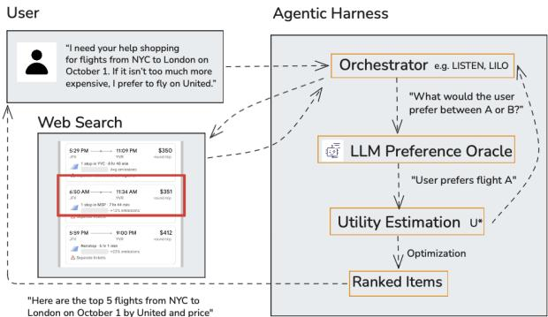
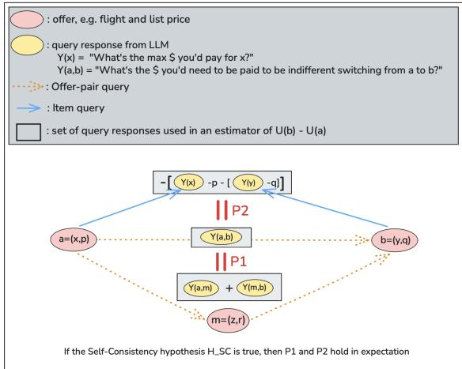
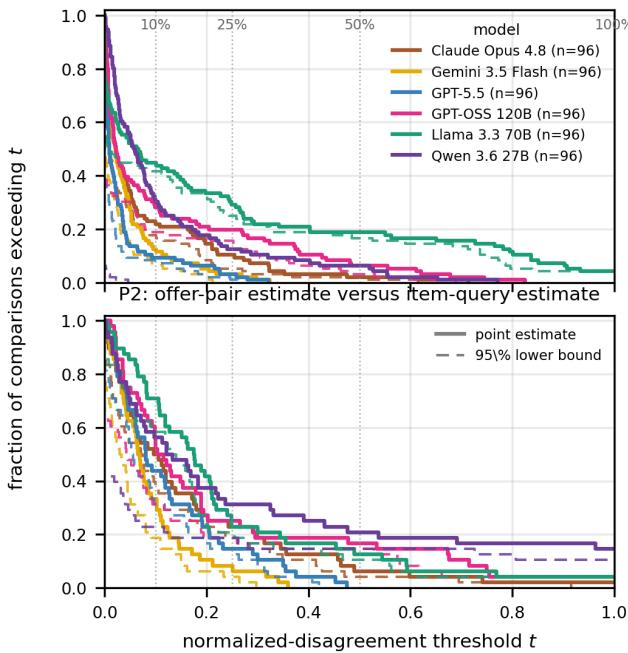
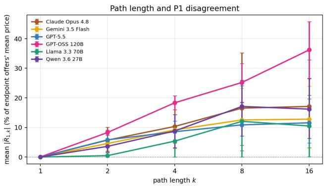

# LLM-Derived Preference Judgments Are Not Self-Consistent

Matthew T. Ford1, Francis Bahk1, Jingjing Wang1, Adam S. Jovine1, Tinghan Ye2, David B. Shmoys1, Peter I. Frazier1

1Cornell University 2Georgia Institute of Technology {mtf62,feb47,jw2446,asj53}@cornell.edu, joe.ye@gatech.edu, {dbs10,pf98}@cornell.edu

## Abstract

Agents increasingly interpret a person’s natural-language preferences by querying an LLM for numerical preference judgments, e.g., by asking how much the person would be willing to pay for an item. A growing body of work estimates a utility function from these judgments and then chooses actions based on their estimated utility. This pipeline assumes the judgments are approximately self-consistent: that a single utility function can reproduce them. But are they? To study this question, we measure the self-consistency of cardinal LLM preference judgments. For example, the diference in stated willingnessto-pay between two items should match the stated payment that makes a person indiferent to exchanging them. We develop statistical tests and interpretable measures of how far observed responses depart from the best-fitting self-consistent utility function. Experiments with flight, apartment, and hotel examples across six LLMs reveal large persistent inconsistencies. This suggests that LLM-derived preference judgments cannot be faithfully summarized by a single utility function.

## 1 Introduction

A growing body of work asks a large language model (LLM) to turn a person’s natural-language description of their preferences into structured preference data on which a decision procedure acts: explicit utility or score functions in LISTEN-U (Jovine et al. 2025) and LILO (Kobalczyk et al. 2025); itemlevel evidence for latent utilities in PEBOL (Austin et al. 2024); batch or tournament choices in LISTEN-T (Jovine et al. 2025); probabilistic priors over feature-utility weights from automated LLM interviews (Eichelbeck, Voigt, and Althof 2026); and constraints for optimization models (Lawless et al. 2023; Sanguinetti et al. 2025). In these systems, LLM-derived or LLM-mediated preference signals become inputs to estimation, ranking, query selection, or optimization rather than merely generated prose, as illustrated by the representative workflow in Figure 1.

Many preference-learning systems represent or reason through a latent utility function that is assumed to be stable, although the precise observation model difers across interfaces. LISTEN-U and LILO represent or fit utility values directly. PEBOL updates a belief over latent item utilities, and LISTEN-T assumes a utility implicitly through transitivity and completeness. This follows the classical preferencelearning view that judgments are noisy observations of a stable utility (Debreu 1954; Kreps 1988). Yet downstream performance does not establish that preference information obtained through diferent prompts is mutually consistent. We ask the more basic measurement question: can the population means of these numerical LLM judgments be reproduced by one stable quasi-linear, dollar-denominated utility?

  
Figure 1: Representative LLM-assisted preference learning. Natural-language preferences condition LLM feedback used for utility estimation, optimization, and ranking; LIS-TEN and LILO instantiate related variants (Jovine et al. 2025; Kobalczyk et al. 2025).

An analogous scalar-representation step appears in LLM evaluation and LLM feedback pipelines, where LLMprovided pointwise scores and pairwise judgments over candidate responses are used to construct scalar rewards (Zheng et al. 2023; Kim et al. 2023; Lambert et al. 2024). These settings use observation models diferent from ours and are not empirically audited here. They pose a broader representation question: can heterogeneous judgments over text-described alternatives be coherently compressed into one latent scalar? Our monetary setting is an externally anchored special case in which listed price fixes the units and supplies a prespecified cross-format relationship.

We study ofers, a familiar format in everyday language and web text that pairs an item with a listed price. Price supplies a numeraire that places heterogeneous items on a common dollar scale. We assume we have a human preference utterance to pass as context to influence the responses the LLM gives when queried. An item query asks the maximum price the user would pay for one item. An ofer-pair query asks for the signed price change that would make the user indiferent between two ofers. The sign supplies an ordinal preference direction, while the magnitude is a cardinal monetary judgment. Recovering such monetary trade-ofs from binary choices instead requires price variation and a fitted choice model. For example, Reusens et al. (2026) infer hotel-attribute willingness to pay by fitting a multinomiallogit model to price-varying binary LLM choices. Direct numerical queries could avoid this indirect recovery step, but they make a stronger measurement claim: their dollar scale must be stable. In particular, the diference between two itemquery responses should agree with the compensation elicited directly for the corresponding ofers.

We formalize this claim as a self-consistency hypothesis. For each fixed preference utterance and item set, every item receives its own unrestricted, dollar-denominated utility. The audit is feature-agnostic but numeraire-dependent: it treats each item description as an atomic alternative rather than a feature vector, while listed price identifies a common cardinal scale across query types. We impose no linearity, smoothness, separability, or additivity over item features. The maintained economic restriction is quasi-linearity in the monetary numeraire: an ofer’s utility is its item’s utility minus its listed price (Mas-Colell, Whinston, and Green 1995; Roughgarden 2016). Self-consistency requires the expected responses from item and ofer-pair queries to agree with this single utility. Even failure to reject would establish representability only for the audited finite items, queries, and prompt semantics, not generalization to unseen items or prompts.

Section 3 formalizes the self-consistency hypothesis $H _ { \mathrm { S C } }$ and derives two necessary local implications. We test the hypothesis jointly, by measuring departure from the best-fitting shared quasi-linear dollar utility, and locally, through P1 and P2. P1 compares a direct ofer-pair estimate with a sum along a path of ofer-pair queries; P2 compares an ofer-pair estimate with the price-adjusted diference of two item-query estimates. A violation of either property provides evidence against $H _ { \mathrm { S C } }$ for the queries involved, although satisfying both does not establish the full hypothesis. Because exact tests can detect operationally small disagreements, we report both statistical evidence and efect magnitudes in dollars and relative to listed prices. Applying the audit to controlled flight, apartment, and hotel examples across six models reveals persistent disagreement, particularly between query types. The audit measures internal coherence rather than accuracy for the person who supplied the preference description: rejection provides evidence against a shared quasi-linear dollar utility for the audited means, while failure to reject does not establish human fidelity.

Our contributions are:

• We formulate the audit over finite sets of text-described items, assigning one unrestricted dollar value to every item and imposing only quasi-linearity in listed price; no feature-based utility form is assumed.

• We develop a reusable audit protocol for numerical LLM preference interfaces with a monetary numeraire: a joint bootstrap test of whether one such utility fits all query means, together with local P1/P2 diagnostics reporting statistical evidence, price-scaled magnitude, and supported preference reversals.

• We demonstrate the audit across three controlled domains and six models, finding persistent disagreement across query types.

## 2 Related Work

LLM-derived and LLM-mediated preference signals. The systems closest to our setting elicit preferences from an LLM as input to a downstream selection or optimization procedure. LISTEN maps a natural-language preference description to explicit utilities, batch choices, or a selected item for multi-objective selection (Jovine et al. 2025); LILO fits Gaussian-process utilities from LLM-generated scalar or pairwise feedback within a Bayesian-optimization loop (Kobalczyk et al. 2025); and PEBOL converts free-text user replies into item-level evidence for Bayesian utility beliefs that drive acquisition (Austin et al. 2024). In the rental-listing setting of Eichelbeck, Voigt, and Althof (2026), an automated LLM interview initializes a prior over feature-utility weights that subsequent user comparisons update. Beyond personalized decision support, LLM feedback over candidate text responses can provide pairwise labels for training preference models (Bai et al. 2022); reward models assign scalar scores and are commonly evaluated on preferred–rejected response pairs (Lambert et al. 2024). These systems use observation models diferent from ours and are not empirically audited here, but they similarly turn LLM-derived judgments into scalar signals used for ranking or optimization. Translating specified optimization problems into solver form (Ramamonjison et al. 2023; AhmadiTeshnizi, Gao, and Udell 2024) or extracting constraints from natural language (Lawless et al. 2023; Sanguinetti et al. 2025) addresses a diferent task: the objective is specified rather than elicited.

Feedback form and shared scalar representation. LILO compares its default binary pairwise labels with a scalar variant scoring each outcome in [0, 1], but the comparison simultaneously changes the response scale, observation model, and points selected by the sequential policy (Kobalczyk et al. 2025). Pointwise scores on bounded or rubricanchored scales (Zheng et al. 2023; Kim et al. 2023) and pairwise judgments over the same kinds of text-described items both appear in LLM feedback and evaluation. These feedback forms do not automatically share a cardinal scale: interpreting pairwise choices through scalar rewards requires a specified choice model, while bounded scores require a specified scale interpretation. Reusens et al. (2026), for example, infer attribute-level willingness to pay by fitting an additive multinomial-logit model to price-varying binary LLM choices over hotel rooms.

Our item-query and ofer-pair responses are instead expressed directly in dollars. Listed price supplies the external numeraire, and the maintained assumption of quasi-linearity in that numeraire specifies how the two query types should relate. We therefore hold the monetary scale and compared items fixed and test their agreement before downstream fitting, assigning each audited item an unrestricted utility rather than imposing a feature-based model.

Utility representation and consistency audits. The assumption that responses are consistent with a utility function inherits from work on learning from comparisons expressed by human decision-makers. Transitive and complete preferences over a countable item set are represented by a utility function (Debreu 1954; Kreps 1988). Humans do report intransitive judgments (Tversky 1969), but violations concentrate among items of near-equal utility (Luce 1956; Fishburn 1991), and once response noise is modeled, gross violations of transitivity are rare (Regenwetter, Dana, and Davis-Stober 2011). This literature concerns ordinal coherence; our audit additionally requires that elicited dollar magnitudes cohere.

Our global fit and path diagnostics are also related to HodgeRank, which fits a global node potential to cardinal pairwise measurements and characterizes cyclic inconsistency (Jiang et al. 2011). Our setting combines item-query level anchors with ofer-pair measurements, assigns the measurements monetary ofer semantics, and tests whether the two query types agree under quasi-linearity. LLM-judge work documents ordering, scoring, and presentation biases (Zheng et al. 2023; Wang et al. 2024; Haldar and Hockenmaier 2025), while recent audits test logical conditions such as transitivity and commutativity (Feng et al. 2025; Liu et al. 2024). Those tests are primarily ordinal or logical. A transitive sign ordering does not identify coherent dollar magnitudes (Appendix A.2); our audit tests cardinal integrability and agreement between item and ofer-pair queries.

## 3 Utilities and LLM Estimates

## 3.1 Items, Ofers, and Utility

Fix a domain containing a set of items $\mathcal { X } = \{ x _ { 1 } , \ldots , x _ { d } \}$ a natural-language preference utterance, an LLM configuration (comprised of model choice and settings), and prompt templates. An item is an outcome represented to the LLM by a textual description; in our experiments, items are flights, apartment rentals, and hotel rooms. The prompts include the utterance when asking the LLM about these items. Section 4 defines the concrete choices used in our experiments.

We hypothesize the LLM responses are self-consistent: their population means can be described by a utility function $U .$ . Let $U ( x )$ denote item $x ' s$ utility under this hypothesized function, denominated in a reference currency (US dollars in our experiments). If no such utility reproduces all query means, then the responses are not internally consistent with a single dollar-denominated utility. Provided the person’s preferences admit this representation, at least one query type must misestimate that utility on at least one audited query. Conversely, failure to reject self-consistency does not establish that the utility accurately represents the person’s preferences.

An ofer is a tuple $a = \left( x , p \right)$ consisting of item x and its listed price $p .$ We assume quasi-linearity in money:

$$
U ( a ) = U ( x ) - p .
$$

This is a standard model for valuations with payments (Mas-Colell, Whinston, and Green 1995; Roughgarden 2016). We make no other assumption about the functional form of U: the

item utilities are unrestricted and need not be linear, smooth, separable, or additive in item features.

For ofers $a = \left( x , p \right)$ and $b = ( y , q )$ , their target-minussource utility diference is

$$
U ( b ) - U ( a ) = [ U ( y ) - q ] - [ U ( x ) - p ] .
$$

## 3.2 Two Query Types

We use two prompt types; Appendix B.3 gives their exact wording. An item query names an item x without a listed price and asks the maximum amount the user would pay for it. We interpret that amount as $U ( x )$ relative to not buying the item.

An ofer-pair query names source ofer $a = \left( x , p \right)$ and target ofer $b = ( y , q )$ and asks how much the target price $q$ would have to change to make the user indiferent. $\mathbf { A }$ positive response means that b could become more expensive; a negative response means that it must become cheaper. Thus the sign implies a pairwise preference.

Stylized prompts are: Item query: “Given the user’s preference description and item $x ,$ what is the maximum price they would pay for $x ? ^ { \ast }$ Ofer-pair query: “Ofer A is item x at price $p ,$ and Ofer B is item $y$ at price $q .$ What signed amount should be added to $\mathbf { B } ^ { \prime } \mathbf { s }$ price to make the user indiferent between the ofers? A positive amount means B could cost more; a negative amount means B must become cheaper.” Every prompt requests one numerical dollar amount; the exact wording is included with the released query specification.

Item queries are indexed by $x \in { \mathcal { X } } ,$ , and ofer-pair queries by an ordered pair of ofers $( a , b )$ . Let C be the union of these two index sets. For any query $c \in { \mathcal { C } } ,$ , let $Y ^ { i } ( c )$ be the response from its ith LLM call. Thus $Y ^ { i } ( x )$ denotes an item-query response because its argument is an item, whereas ${ \bar { Y } } ^ { i } ( { \bar { ( a , b ) } } )$ denotes an ofer-pair response because its argument is an ordered pair of ofers.

Within a fixed query, we treat finite responses as independent and identically distributed across calls. Distributions may difer across queries, including in their variances, and need not be Gaussian, symmetric, or unimodal. For n repeated calls to query $c ,$ define

$$
\overline { { Y } } ( c ) : = \frac { 1 } { n } \sum _ { i = 1 } ^ { n } Y ^ { i } ( c ) .\tag{1}
$$

When a finite collection is enumerated by $c = 1 , \ldots , Q$ , we use the equivalent subscript notation $Y _ { c } ^ { i }$ and ${ \overline { { Y } } } _ { c } .$

## 3.3 Self-Consistency Hypothesis

Fix a finite query collection $\mathcal { Q } \subset \mathcal { C }$ of cardinality $Q$ before observing any responses. For a candidate utility $U ,$ define the response implied by query c as

$$
m _ { c } ( U ) : = { \left\{ \begin{array} { l l } { U ( x ) , } & { c = x , } \\ { U ( b ) - U ( a ) , } & { c = ( a , b ) . } \end{array} \right. }\tag{2}
$$

The first case is an item query and the second is an ofer-pair query. The self-consistency hypothesis for this collection is

$$
\begin{array} { c } { { H _ { \mathrm { S C } } : \quad \exists U \mathrm { s u c h t h a t } } } \\ { { \mathbb { E } [ Y ^ { i } ( c ) ] = m _ { c } ( U ) \quad \mathrm { f o r e v e r y } c \in \mathcal { Q } . } } \end{array}\tag{3}
$$

Its alternative is the logical negation: no single U satisfies every equality, or equivalently every candidate U leaves at least one query mean unexplained. Expectations are over stochastic completions, conditional on the fixed audit inputs.

Best-fitting utility and discrepancies. Whether or not the audited null holds, define the best-fitting population utility

$$
U ^ { \star } \in \arg \operatorname* { m i n } _ { U } \frac { 1 } { Q } \sum _ { c \in \mathcal { Q } } \{ \mathbb { E } [ Y ^ { i } ( c ) ] - m _ { c } ( U ) \} ^ { 2 } .\tag{4}
$$

Define each query’s persistent discrepancy from this fit as

$$
\delta ( c ) : = \mathbb { E } [ Y ^ { i } ( c ) ] - m _ { c } ( U ^ { \star } ) .
$$

$U ^ { \star }$ is the utility assignment that minimizes the average squared discrepancy over $\mathcal { Q } ;$ it is not an additional assumption about the person’s true utility. The minimized objective in Equation 4 is the average of $\delta ( c ) ^ { 2 }$ . Under $H _ { \mathrm { S C } }$ , every discrepancy is zero. Under the alternative, at least one is nonzero. Thus the null says that one utility assignment absorbs all persistent query means; the alternative says that some persistent mean disagreement remains after fitting the best possible shared utility.

Individual calls may fluctuate around their query mean. Equivalently,

$$
Y ^ { i } ( c ) = m _ { c } ( U ^ { \star } ) + \delta ( c ) + \varepsilon ^ { i } ( c ) , \qquad \mathbb { E } [ \varepsilon ^ { i } ( c ) ] = 0 .\tag{5}
$$

Repeated calls reduce the sampling variation represented by $\varepsilon ^ { i } ( c )$ but do not remove the persistent discrepancy $\delta ( c )$ These discrepancies are relative to the shared-utility model, not necessarily biases relative to a person’s true preferences.

Audit overview. We assess self-consistency globally, by asking whether one utility jointly explains a prespecified collection of query means, and locally, by comparing alternative estimates for the same ofer pair. The global test summarizes joint lack of fit; P1 and P2 identify specific disagreements.

## 3.4 Global Test for Self-Consistency

Using the observed query means, estimate the best-fitting utility by

$$
{ \widehat { U } } \in \arg \operatorname* { m i n } _ { U } { \frac { 1 } { Q } } \sum _ { c \in { \mathcal { Q } } } \{ { \overline { { Y } } } ( c ) - m _ { c } ( U ) \} ^ { 2 } .\tag{6}
$$

We measure the joint lack of fit remaining in the observed means by

$$
T = \left\{ \frac 1 Q \sum _ { c \in \mathcal Q } \{ \overline { { Y } } ( c ) - m _ { c } ( \widehat { U } ) \} ^ { 2 } \right\} ^ { 1 / 2 } .\tag{7}
$$

Thus $T$ is the smallest root mean squared error (RMSE) achievable by assigning one free utility value to every audited item. An item query constrains one item value; an ofer-pair query constrains the price-adjusted diference between two item values. Every prespecified query receives equal weight, so $T$ is the RMSE for a uniformly selected query from Q. This defines the reported efect size; it is not a claim that equal weighting is the most eficient way to estimate U.

As the number of repetitions grows, $\widehat { U }$ approaches $U ^ { \star }$ Under $H _ { \mathrm { S C } } , T$ approaches zero because only finite-sample noise remains. Under the alternative, it approaches the RMSE of the persistent discrepancies $\delta ( c )$ . Larger departures from self-consistency therefore shift the distribution of $T$ toward larger values. Lemma 2 gives the corresponding finitesample expectation of the squared lack-of-fit statistic.

Because numerical responses may be non-Gaussian and have diferent variances across queries, we use a within-query nonparametric bootstrap to estimate the null distribution of $T$ and obtain one p-value for Q (Efron and Tibshirani 1993). The observed RMSE is $T$ computed from the actual query sample means after fitting ${ \widehat { U } } ;$ it is not error against human ground truth. Details are in Appendix F.1.

## 3.5 Local Tests for Self-Consistency

Self-consistency implies that every way of estimating the utility diference between the same two ofers agrees in expectation. The following comparisons test this implication without first fitting a shared utility to all query means. Proposition 1 states both implications formally and Appendix A.2 proves them.

P1: direct ofer-pair estimate versus path sum. Choose a path $\mathcal { P } = ( a = a _ { 0 } , a _ { 1 } , \ldots , a _ { k } = b )$ from source ofer a to target ofer $b ,$ and ask separately about each adjacent pair. Section 4.2 specifies the prespecified paths used in our audit.

$$
\sum _ { j = 1 } ^ { k } { \overline { { Y } } } ( ( a _ { j - 1 } , a _ { j } ) ) .\tag{8}
$$

Under $H _ { \mathrm { S C } }$ , utility diferences telescope, so this path sum and the direct ofer-pair estimate have the same expectation:

$$
\mathbb { E } \left[ \sum _ { j = 1 } ^ { k } \overline { { Y } } ( ( a _ { j - 1 } , a _ { j } ) ) \right] = U ( b ) - U ( a ) = \mathbb { E } [ \overline { { Y } } ( ( a , b ) ) ] .
$$

Define the P1 residual

$$
\widehat { R } _ { 1 , \mathcal { P } } ( a , b ) : = \overline { { Y } } ( ( a , b ) ) - \sum _ { j = 1 } ^ { k } \overline { { Y } } ( ( a _ { j - 1 } , a _ { j } ) ) .
$$

P2: ofer-pair estimate versus item queries. For the same ofers $a = \left( x , p \right)$ and $b = ( y , q )$ , an ofer-pair query directly estimates ${ \dot { U ( b ) } } - { \dot { U } } ( a )$ . Alternatively, two item queries give the estimate

$$
[ \overline { { Y } } ( y ) - q ] - [ \overline { { Y } } ( x ) - p ] .\tag{9}
$$

Under $H _ { \mathrm { S C } }$ , its expectation is also $U ( b ) { - } U ( a )$ . Equivalently, adding the known price diference to the expected ofer-pair response gives the item utility diference, $\mathbf { \mathbb { E } } [ Y ^ { i } ( ( a , b ) ) ] +$ $( q \dot { - } p ) = \mathbf { \bar { \psi } } U ( y ) - U ( x )$ . Define the P2 residual

$$
\widehat { R } _ { 2 } ( a , b ) : = \overline { { { Y } } } ( ( a , b ) ) - \{ [ \overline { { { Y } } } ( y ) - q ] - [ \overline { { { Y } } } ( x ) - p ] \} .
$$

P2 is not an assumption that humans answer diferently framed questions identically. It is an implication of treating both LLM query types as estimates of one $U .$

  
Figure 2: Local implications of self-consistency. For ofers $a = \left( x , p \right)$ and $b = ( y , q )$ , all three constructions estimate $U ( b ) - U ( a )$ . P1 compares the direct ofer-pair response $Y ( a , b )$ with the path sum $Y ( a , m ) + Y ( m , b )$ . P2 compares ${ \dot { Y } } ( a , b )$ with the price-adjusted item-query diference $[ Y ( y ) - { \dot { q } } ] - [ Y ( x ) - { \dot { p } } ]$ . Self-consistency requires these estimates to agree in expectation, not on every LLM call.

Statistical interpretation. For either property, the local null is that the two estimates being compared have the same population mean, so the corresponding residual has expectation zero. The local alternative is that their population means difer, so the residual has a nonzero expectation. This is a specific implication of $H _ { \mathrm { S C } } { \mathrm { : } }$ rejecting a local null rejects self-consistency for those queries, whereas failing to reject it does not establish global self-consistency.

Because each local residual is a prespecified linear combination of query averages from independent calls, we estimate its standard error from the constituent queries. We use a finite-sample normal approximation motivated by the central limit theorem and form the comparison-specific 95% confidence interval $\widehat { R } { \pm } 1 . 9 6 \widehat { \mathrm { S E } } ( \widehat { R } )$ . This approximation does not require equal response variances across queries, although it does require the sampling distribution of the residual to be reasonably approximated by a normal distribution. A local self-consistency rejection occurs when this interval excludes zero. Under the local null, the interval becomes concentrated around zero as calls are added; under a fixed alternative, it becomes concentrated around the nonzero population residual. We use this direct calculation locally because the residual is a prespecified linear combination. The global statistic instead requires refitting a shared utility and is calibrated by bootstrap.

Figure 2 summarizes the two local implications of self-consistency: P1 compares diferent paths of ofer-pair queries, whereas P2 compares ofer-pair and item-query estimates of the same utility diference.

## 3.6 Statistical Evidence and Practical Magnitude

The global and local tests concern exact equalities between population means. With enough repeated calls, either can detect a fixed disagreement too small to matter operationally. We therefore separate evidence against exact self-consistency, given by rejection and its p-value or confidence interval, from practical magnitude, reported through the global RMSE T and local $| { \widehat { R } } |$ . Section 4.3 specifies the normalizations, reversal criterion, and family-level reporting used in our experiments.

<table><tr><td>Domain</td><td>Audited items</td><td>Audited offers</td><td>Utts.</td><td>Pairs/ utt.</td><td>Offer-pair queries</td><td>Item queries</td><td>All queries</td></tr><tr><td>Flights</td><td>19</td><td>21</td><td>3</td><td>6</td><td>90</td><td>24</td><td>114</td></tr><tr><td>Apartments</td><td>21</td><td>21</td><td>3</td><td>6</td><td>90</td><td>27</td><td>117</td></tr><tr><td>Hotels</td><td>3</td><td>9</td><td>3</td><td>4</td><td>60</td><td>9</td><td>69</td></tr><tr><td>Total</td><td>43</td><td>51</td><td>9</td><td>16</td><td>240</td><td>60</td><td>300</td></tr></table>

Table 1: Audit design. Pairs/utt. counts endpoint ofer comparisons under one preference utterance. Each pair generates five ofer-pair queries: one direct query and four steps on two two-step paths. Item-query estimates are reused across endpoint pairs but are elicited separately for each utterance. Each of the 300 query cells receives 15 completions, giving 4,500 calls per model.

## 4 Audit Protocol

## 4.1 Domains and Preference Utterances

We construct finite sets of text-described items in three controlled domains: flights, apartments, and hotels. Flight and apartment descriptions vary continuous, ordinal, and categorical item features; hotels combine three rating-defined room items with three listed prices to form nine ofers. These features are used only to construct interpretable items, comparisons, and paths. The audit itself uses item identity, listed price, and query incidence; it does not fit utility as a function of item features. These controlled test cases make the P1 and P2 relationships explicit but are not representative samples of people or markets.

Before collecting responses, we fix three utterances per domain that vary emphasis on price and domain-specific features. An audit group fixes one model, domain, utterance, item set, and query collection; its utility fit and test statistic are computed separately. This gives nine groups per model. Appendices B.1 and B.2 summarize the audited design and give the preference utterances.

## 4.2 Queries, Models, and Sampling

The prespecified design in Table 1 contains 16 endpoint comparison templates (six flight, six apartment, and four hotel), each evaluated under three domain-specific utterances, giving 48 comparison instances across nine audit groups.

Across the 48 endpoint pairs, the design yields 96 P1 and 48 P2 comparisons. Reuse explains why 60 item queries sufice, while some path-only intermediate items receive no item query. The two P1 residuals for a pair share its direct estimate, and P2 residuals can share item estimates across pairs; individual comparison-specific intervals remain valid, but pooled residuals are not independent.

We use one canonical wording per query type. Each independent prompt contains the utterance and relevant item or ofers, but no earlier path questions or answers. Thus the audit concerns stateless rather than conversational elicitation. Appendix B.3 gives the exact prompts.

Models and sampling. We audit Claude Opus 4.8, Gemini 3.5 Flash, GPT-5.5, GPT-OSS 120B, Llama 3.3 70B, and Qwen 3.6 27B, analyzing each separately. Each query receives 15 calls, as summarized in Table 1. Appendix B.4 reports service providers, model identifiers, sampling controls, token limits, and reasoning settings. Analyses condition on finite numerical responses; parse failures are reported in Appendix C.

## 4.3 Inference and Reporting

Each audit group provides one bootstrap p-value. Within each model, we apply a Bonferroni correction, rejecting a group only when $p \leq 0 . 0 5 / 9 = 0 . 0 0 5 6 ( \mathrm { D u n n } 1 9 6 1 )$ . This controls the probability of any false rejection at 5% without assuming group independence. We report whether the all-nine claim is rejected and how many groups reject after correction.

We report $T _ { g }$ in dollars and relative to the mean of the endpoint listed prices across that group’s ofer-pair queries, with queries weighted as they appear in the design. This is one group-level scale. For local residuals, we instead use a comparison-specific scale and report dollars and

$$
{ \frac { | \widehat { R } | } { s _ { a b } } } , \qquad s _ { a b } : = { \frac { p + q } { 2 } } ,
$$

the absolute residual as a fraction of endpoint ofers a and $b \mathbf { \hat { s } }$ mean listed price; intermediate path prices do not enter this scale. For example, 0.10 means disagreement equal to 10% of that mean endpoint price. A 95% supported ordinal reversal has estimates whose confidence intervals (CIs) exclude zero in opposite directions, so the two query constructions support opposite preferred ofers beyond sampling uncertainty. A local rejection instead has a P1 or P2 residual CI excluding zero; it can reject equality without reversing the implied preference. Empirical complementary cumulative distribution function (CCDF) curves show the fraction of residual magnitudes exceeding each threshold. These intervals and lower bounds are comparison-specific, not simultaneous confidence statements, and describe local prevalence and magnitude rather than an additional family-level claim. Appendix F.2 defines standard errors (SEs), CIs, and lower bounds; Appendix F.1 gives bootstrap and multiplicity details.

## 5 Audit Results

We first test whether all query means admit one utility and then use P1 and P2 to identify disagreements across paths and query types. Statistical rejection addresses exact selfconsistency; RMSE, price-normalized residuals, and supported reversals describe practical magnitude.

## 5.1 Does One Utility Fit the Query Means?

Every model rejects the joint claim that all nine audit groups are self-consistent after Bonferroni correction. Five models reject all nine groups, while Qwen rejects four. Because each fit assigns one unrestricted utility to every audited item, these rejections are not failures of a particular feature-based or parametric utility model. Under the maintained quasi-linear price relation, they provide evidence that no assignment of item utilities reproduces all audited query means. Grouplevel results are in Appendix Tables 9 and 10.

<table><tr><td>Model</td><td>Flights $(%)</td><td>Apartments $(%)</td><td>Hotels $(%)</td></tr><tr><td>Claude Opus 4.8</td><td>16.9 (4.6%)</td><td>38.3 (1.6%) 109.2 (19.9%)</td><td></td></tr><tr><td>Gemini 3.5 Flash GPT-5.5</td><td>7.7 (2.1%)</td><td></td><td>47.5 (2.0%) 104.0 (18.9%)</td></tr><tr><td>GPT-OSS 120B</td><td>14.6 (4.0%)</td><td></td><td>51.7 (2.2%) 105.7 (19.2%)</td></tr><tr><td>Llama 3.3 70B</td><td>10.9 (3.0%)</td><td></td><td>73.9 (3.2%) 127.6 (23.2%)</td></tr><tr><td>Qwen 3.6 27B</td><td>18.1 (4.9%) 18.4 (5.0%)</td><td>65.3 (2.8%) 247.2 (44.9%)</td><td>142.3 (6.1%) 198.0 (36.0%)</td></tr></table>

Table 2: Magnitude of lack of fit. Cells average three auditgroup RMSEs and report dollars (percentage of the grouplevel endpoint-price scale; Section 4.3). Each fit assigns one free utility per item. Hotels have 18.9–44.9% RMSE versus 1.6–6.1% elsewhere, but query geometry and fit rank difer by domain.

Table 2 reports the remaining error after fitting the best possible utility. Average RMSE ranges from 1.6–6.1% of the endpoint-price scale for flights and apartments and 18.9– 44.9% for hotels. These are descriptive rather than controlled domain comparisons because the domains difer in query geometry and fit rank. The global audit establishes disagreement but does not identify its source or which responses better represent the person’s preferences.

## 5.2 Where Does Self-Consistency Fail?

P2 provides the clearest local failure. Across models, 41.7– 87.5% of P2 residual confidence intervals exclude zero (Table 3), and Figure 3 shows that many disagreements are substantial relative to ofer prices. Supported reversals occur for 2.1–12.5% of the 48 prespecified comparisons per model. In each such comparison, a two-ofer selector based on itemquery means chooses the opposite ofer from one based on the ofer-pair mean. Thus query type can afect both the estimated utility diference and, in some audited cases, the resulting choice. The audit does not establish which choice is more faithful to the person; domain-level results are in Appendix Table 8.

P1 and path composition. P1 failures are less uniform across models: rejection rates range from 6.2% to 68.8%, supported reversals are rare, and price-normalized magnitudes are generally smaller than for P2. These results provide evidence against unrestricted composition of ofer-pair estimates in the audited design, but not a robust cross-model ordinal efect.

A supplementary stress test divides four smooth singlefeature changes into increasingly fine paths. For every model, mean price-normalized P1 error is higher at $k = 8$ and $k =$ 16 than at $k = 2 ( \mathrm { A }$ ppendix Figure 4 and Table 7). In these four paths, simple local steps do not guarantee agreement with the direct estimate. The small design and nonmonotone curves do not establish a general scaling law.

P1: offer-pair estimate versus path sum  
  
Figure 3: Local disagreement by query construction. P1 compares a direct ofer-pair estimate with a path sum; P2 compares it with the price-adjusted diference of two itemquery estimates. At threshold t, the curve gives the fraction with $| { \widehat { R } } | / [ ( p + q ) / 2 ] \geq t ;$ thus, t = 0.10 means disagreement of at least 10% of the endpoint ofers’ mean price. Axes end at $t = 1$ ; larger residuals still contribute to the curve height there. Solid curves use observed residuals; dashed curves use comparison-specific 95% lower bounds, not simultaneous confidence bands.

## 6 Implications for Preference Learning

The large and statistically significant inconsistencies that we observe do not by themselves show that preference information elicited from LLMs is unusable; instead, these inconsistency show that algorithm designers should be careful when using preference information from LLMs. This information depends on the way in which questions are asked and the choice of LLM. When possible, algorithm designers should corroborate an LLM’s preference judgements with real human judgements.

Our audit can be repeated with new items and price changes to check consistency in application domains before numerical elicitation is applied. After performing such an audit, an algorithm designers may may wish to choose an LLM with better self-consistency, using the metrics we develop, because using an LLMs with poor self-consistency risks results that depend arbitrarily on the specific form of questions asked.

Our audit also points toward human-subject research. Selfconsistency is necessary for the shared-utility model but not suficient for fidelity: an LLM whose responses admit a single quasi-linear dollar utility may still assign values that a person would not endorse, and our design cannot detect this. Measuring that gap requires eliciting the same item and ofer-pair queries from people who supply the preference description, which would identify which query construction, if either, better recovers stated human values. A second direction is to calibrate the inconsistencies we report against human ones. Humans are themselves inconsistent, and framing efects in stated willingness to pay are well documented, so the relevant question for a designer is not whether LLM responses depart from a single utility but whether they depart more than the human judgments they stand in for. Running our protocol on human subjects and LLMs over the same items would answer this, and would also show whether the failures concentrate in the same comparisons.

<table><tr><td>Model</td><td>P1 (n = 96) Rev. Reject.</td><td>P2 (n = 48) Rev.</td><td>Reject.</td></tr><tr><td>Claude Opus 4.8 4 (4.2%) 66 (68.8%) 6 (12.5%) 41 (85.4%)</td><td></td><td></td><td></td></tr><tr><td>Gemini 3.5 Flash 1 (1.0%) 51 (53.1%) 4 (8.3%) 37 (77.1%)</td><td></td><td></td><td></td></tr><tr><td>GPT-5.5</td><td>0 (0.0%) 37 (38.5%) 1 (2.1%) 40 (83.3%)</td><td></td><td></td></tr><tr><td>GPT-OSS 120B</td><td>0 (0.0%) 38 (39.6%) 2 (4.2%) 31 (64.6%)</td><td></td><td></td></tr><tr><td>Llama 3.3 70B</td><td>2 (2.1%) 53 (55.2%) 5 (10.4%) 42 (87.5%)</td><td></td><td></td></tr><tr><td>Qwen 3.6 27B</td><td>0 (0.0%) 6 (6.2%) 1 (2.1%) 20 (41.7%)</td><td></td><td></td></tr></table>

Table 3: Local self-consistency audit. Entries are counts (percentages). P1 compares a direct ofer-pair estimate with a path sum; P2 compares it with the diference of two itemquery estimates. Rev. denotes a supported reversal, whose estimate CIs exclude zero in opposite directions; Reject. denotes a residual CI excluding zero.

## 7 Conclusion

We test whether heterogeneous numerical LLM answers estimate one utility. Across all six models, the joint claim that all nine audit groups are self-consistent is rejected after Bonferroni correction. P2 disagreements are frequent, often large relative to price, and sometimes reverse the preferred ofer; P1 and path-length results caution against unrestricted composition but are more model- and design-dependent. The audit does not establish human fidelity; it identifies when query types or paths cannot be treated as interchangeable under a shared quasi-linear dollar utility.

## Limitations

This study audits internal coherence, not human fidelity, and uses no human data. Controlled items, hand-written utterances, three domains, six models, fixed prompts and provider versions, stateless calls, and 15 completions are not representative; real users, larger rankings, paraphrases, model versions, and conversational histories may difer. The quasilinear dollar model excludes wealth efects, binding budgets, and cases without finite compensation; P2 covers price-free item queries, not all utility prompts. Analyses condition on parseable outputs and do not compare numerical with binary elicitation. The path-length check uses only four smooth single-feature paths and is not a scaling law.

## References

AhmadiTeshnizi, A.; Gao, W.; and Udell, M. 2024. Opti-MUS: Scalable Optimization Modeling with (MI)LP Solvers and Large Language Models. arXiv:2402.10172.

Austin, D.; Korikov, A.; Toroghi, A.; and Sanner, S. 2024. Bayesian Optimization with LLM-Based Acquisition Functions for Natural Language Preference Elicitation. In 18th ACM Conference on Recommender Systems, RecSys ’24, 74–83. ACM.

Bai, Y.; et al. 2022. Constitutional AI: Harmlessness from AI Feedback. arXiv preprint arXiv:2212.08073.

Debreu, G. 1954. Representation of a Preference Ordering by a Numerical Function. Decision Processes, 159–165.

Dunn, O. J. 1961. Multiple Comparisons Among Means. Journal of the American Statistical Association, 56(293): 52–64.

Efron, B.; and Tibshirani, R. J. 1993. An Introduction to the Bootstrap. New York: Chapman and Hall.

Eichelbeck, M.; Voigt, T.; and Althof, M. 2026. Supporting High-Stakes Decision Making Through Interactive Preference Elicitation in the Latent Space. In The Fourteenth International Conference on Learning Representations.

Feng, Y.; Wang, S.; Cheng, Z.; Wan, Y.; and Chen, D. 2025. Are We on the Right Way to Assessing LLM-as-a-Judge? arXiv:2512.16041.

Fishburn, P. C. 1991. Nontransitive Preferences in Decision Theory. Journal of Risk and Uncertainty, 4(2): 113–134.

Haldar, A.; and Hockenmaier, J. 2025. Rating Roulette: Self-Inconsistency in LLM-As-A-Judge Frameworks. In Findings of the Conference on Empirical Methods in Natural Language Processing (EMNLP).

Jiang, X.; Lim, L.-H.; Yao, Y.; and Ye, Y. 2011. Statistical Ranking and Combinatorial Hodge Theory. Mathematical Programming, 127(1): 203–244.

Jovine, A. S.; Ye, T.; Bahk, F.; Wang, J.; Shmoys, D. B.; and Frazier, P. I. 2025. LISTEN to Your Preferences: An LLM Framework for Multi-Objective Selection. arXiv:2510.25799.

Kim, S.; Shin, J.; Cho, Y.; Jang, J.; Longpre, S.; Lee, H.; Yun, S.; Shin, S.; Kim, S.; Thorne, J.; and Seo, M. 2023. Prometheus: Inducing Fine-grained Evaluation Capability in Language Models. arXiv:2310.08491.

Kobalczyk, K.; Lin, Z. J.; Letham, B.; Zhao, Z.; Balandat, M.; and Bakshy, E. 2025. LILO: Bayesian Optimization with Interactive Natural Language Feedback. arXiv:2510.17671.

Kreps, D. M. 1988. Notes on the Theory of Choice. Underground Classics in Economics. Westview Press.

Lambert, N.; Pyatkin, V.; Morrison, J.; Miranda, L.; Lin, B. Y.; Chandu, K.; Dziri, N.; Kumar, S.; Zick, T.; Choi, Y.; Smith, N. A.; and Hajishirzi, H. 2024. Reward-Bench: Evaluating Reward Models for Language Modeling. arXiv:2403.13787.

Lawless, C.; Schoefer, J.; Le, L.; Rowan, K.; Sen, S.; Hill, C. S.; Suh, J.; and Sarrafzadeh, B. 2023. “I Want

It That Way”: Enabling Interactive Decision Support Using Large Language Models and Constraint Programming. arXiv:2312.06908.

Liu, Y.; Guo, Z.; Liang, T.; Shareghi, E.; Vulić, I.; and Collier, N. 2024. Aligning with Logic: Measuring, Evaluating and Improving Logical Preference Consistency in Large Language Models. arXiv:2410.02205.

Luce, R. D. 1956. Semiorders and a Theory of Utility Discrimination. Econometrica, 24(2): 178–191.

Mas-Colell, A.; Whinston, M. D.; and Green, J. R. 1995. Microeconomic Theory. New York: Oxford University Press.

Ramamonjison, R.; Yu, T. T.; Li, R.; Li, H.; Carenini, G.; Ghaddar, B.; He, S.; Mostajabdaveh, M.; Banitalebi-Dehkordi, A.; Zhou, Z.; and Zhang, Y. 2023. NL4Opt Competition: Formulating Optimization Problems Based on Their Natural Language Descriptions. arXiv:2303.08233.

Regenwetter, M.; Dana, J.; and Davis-Stober, C. P. 2011. Transitivity of Preferences. Psychological Review, 118(1): 42–56.

Reusens, M.; Goethals, S.; Calders, T.; and Martens, D. 2026. Would a large language model pay extra for a view? Inferring willingness to pay from subjective choices. Expert Systems with Applications, 331: 133279.

Roughgarden, T. 2016. Twenty Lectures on Algorithmic Game Theory. Cambridge, UK: Cambridge University Press.

Sanguinetti, M.; Perniciano, A.; Zedda, L.; Loddo, A.; Ruberto, C. D.; and Atzori, M. 2025. From User Preferences to Optimization Constraints Using Large Language Models. arXiv:2503.21360.

Tversky, A. 1969. Intransitivity of Preferences. Psychological Review, 76(1): 31–48.

Wang, P.; Li, L.; Chen, L.; Cai, Z.; Zhu, D.; Lin, B.; Cao, Y.; Kong, L.; Liu, Q.; Liu, T.; and Sui, Z. 2024. Large Language Models are not Fair Evaluators. In Proceedings ofthe 62nd Annual Meeting of the Association for Computational Linguistics (ACL).

Zheng, L.; Chiang, W.-L.; Sheng, Y.; Zhuang, S.; Wu, Z.; Zhuang, Y.; Lin, Z.; Li, Z.; Li, D.; Xing, E. P.; Zhang, H.; Gonzalez, J. E.; and Stoica, I. 2023. Judging LLM-as-a-Judge with MT-Bench and Chatbot Arena. arXiv:2306.05685.

## A Formal basis of the audit

## A.1 Why the queries estimate item utilities and ofer-utility diferences

Section 3.2 gives the prompt semantics. Here we derive their targets under quasi-linearity. Let v be the direct query’s target amount. Utility is unchanged for our purposes if the same constant is added to every outcome, so we subtract the utility of buying nothing from every outcome and use buying nothing as the zero-utility reference. Hence $U ( x )$ is the utility gain from obtaining x relative to buying nothing. This normalization is imposed in our measurement model, not stated in the LLM prompt. We interpret the prompt’s “maximum amount” as the price at which the item and the outside option are equally desirable. Indiference at that price then gives

$$
U ( x ) - v = 0 , \qquad \mathrm { s o } \qquad v = U ( x ) .
$$

This normalization anchors the otherwise arbitrary utility level, and self-consistency therefore requires $\mathbb { E } [ \breve { Y } ( x ) ] \ \stackrel { \cdot } { = }$ $U ( x )$

Let r be the signed amount added to the target price in an ofer-pair query from $a = \left( x , p \right)$ to $b = ( y , q )$ . Indiference after that adjustment gives

$$
\begin{array} { c } { { U ( y ) - ( q + r ) = U ( x ) - p , } } \\ { { r = \left[ U ( y ) - q \right] - \left[ U ( x ) - p \right] } } \\ { { = U ( b ) - U ( a ) . } } \end{array}
$$

Thus the ofer-pair query targets the signed target-minussource utility diference between the two ofers.

## A.2 Why P1 and P2 follow from self-consistency

Proposition 1 (Local implications of self-consistency) Suppose HSC holds. For any ofers $a , b$ and any path $\mathcal { P } = ( a = a _ { 0 } , a _ { 1 } , \ldots , a _ { k } = b )$

$$
\mathbb { E } [ \overline { { Y } } ( ( a , b ) ) ] = \mathbb { E } \left[ \sum _ { j = 1 } ^ { k } \overline { { Y } } ( ( a _ { j - 1 } , a _ { j } ) ) \right] .
$$

Moreover, $i f a = ( x , p )$ and $b = ( y , q )$ , then

$$
{ \mathbb E } [ \overline { { Y } } ( ( a , b ) ) ] = [ { \mathbb E } [ \overline { { Y } } ( y ) ] - q ] - [ { \mathbb E } [ \overline { { Y } } ( x ) ] - p ] .
$$

Consequently, the population P1 and P2 residuals are zero.

Proof. For P1, let $\mathcal { P } = ( a = a _ { 0 } , a _ { 1 } , \ldots , a _ { k } = b )$ be any path from source ofer a to target ofer b. Because each oferpair estimate has expected value equal to its utility diference under $H _ { \mathrm { S C } }$

$$
\begin{array} { l } { \displaystyle \mathbb E \left[ \sum _ { j = 1 } ^ { k } \overline { Y } ( ( a _ { j - 1 } , a _ { j } ) ) \right] = \sum _ { j = 1 } ^ { k } \mathbb E [ \overline { Y } ( ( a _ { j - 1 } , a _ { j } ) ) ] } \\ { = \sum _ { j = 1 } ^ { k } [ U ( a _ { j } ) - U ( a _ { j - 1 } ) ] } \\ { = U ( b ) - U ( a ) } \\ { = \mathbb E [ \overline { Y } ( ( a , b ) ) ] . } \end{array}
$$

The middle sum telescopes. For P2, the definitions give

$$
\begin{array} { l } { \mathbb { E } [ \overline { { Y } } ( ( a , b ) ) ] = [ U ( y ) - q ] - [ U ( x ) - p ] } \\ { \quad = [ \mathbb { E } [ \overline { { Y } } ( y ) ] - q ] } \\ { \quad \quad - [ \mathbb { E } [ \overline { { Y } } ( x ) ] - p ] . } \end{array}
$$

Thus a nonzero expected P1 or P2 discrepancy is suficient to reject self-consistency on those queries.

Graph interpretation. Represent ofers as nodes and ofer-pair estimates as directed edges. On each connected component, expected ofer-pair estimates can be represented by one ofer utility exactly when every cycle sum is zero. To see this, fix a reference ofer and define the utility of another ofer by summing edge means along a path from the reference. Zero cycle sums make the definition path-independent; conversely, utility diferences telescopically sum to zero around every cycle. The utility is unique up to an additive constant. P1 audits selected cycles formed by one direct edge and one decomposed path; it does not claim to enumerate every cycle in a larger item graph.

When the representation holds for all relevant pairs, signs inherit the ordering of scalar utilities. Antisymmetry follows for reversed edges, and transitivity follows because $U ( y ) > U ( x )$ and $\breve { U } ( z ) ~ > ~ U ( y )$ imply $U ( z ) > U ( x )$ These ordinal consequences follow from the cardinal representation. The converse is not true: a transitive sign ordering does not identify coherent dollar magnitudes. Item-query estimates add level measurements, and P2 tests whether those levels agree with the ofer graph.

## B Experimental reproducibility details

## B.1 Domains, items, and query counts

Table 4 summarizes the items, ofers, and query counts used in the audit. A source ofer is the fixed endpoint from which a target ofer is compared.

Source ofers and hotel grid. The flight source offers are gnd\_cheap\_fast\_delta (\$220, 5.0 h, Delta), gnd\_mid\_united (\$360, 6.5 h, United), and gnd\_expensive\_slow\_american (\$520, 8.0 h, American). The apartment source ofers are gnd\_cheap\_studio\_walkup (\$1,400/month, 380 ft2, 15 min commute, studio, walk-up), gnd\_mid\_1br\_brownstone (\$2,200/month, 720 ft2, 30 min, 1-bedroom, brownstone), and gnd\_expensive\_2br\_highrise (\$3,400/month, $1 { , } 0 5 0 \mathrm { f t ^ { 2 } }$ 45 min, 2-bedroom, high-rise). Hotels use the Cartesian product of prices {\$100, \$550, \$1,000} per night and ratings {0.5, 2.8, 5.0} stars. Thus the hotel design contains three hotel-room items, distinguished by rating, and nine ofers after crossing each room type with each listed price. All nine ofers enter the audit. The released query specification records every source, target, and intermediate ofer used in each comparison.

## B.2 Audited preference utterances

Flights. 1 (price focused). “Keeping the fare low is my main priority. I’m generally willing to accept a less convenient flight if it saves me money.”

<table><tr><td></td><td>Flights</td><td>Apartments</td><td>Hotels</td></tr><tr><td>Audited items</td><td>19</td><td>21</td><td>3</td></tr><tr><td>Audited offers</td><td>21</td><td>21</td><td>9 (3×3)</td></tr><tr><td>Numeraire</td><td>price</td><td>rent area, commute (continuous),</td><td>price</td></tr><tr><td>Item features</td><td>travel time (continuous), airline (categorical)</td><td>bedrooms (ordinal), building type (categorical)</td><td>rating (ordinal)</td></tr><tr><td>Audited utterances</td><td>1-3</td><td> $_ { 1 - 3 }$ </td><td>1-3</td></tr><tr><td>Source offers</td><td>3 named</td><td>3 named</td><td>selected grid offers</td></tr><tr><td>Endpoint pairs / utterance</td><td>6</td><td>6</td><td>4</td></tr><tr><td>P1 comparisons / utterance</td><td>12</td><td>12</td><td>8</td></tr><tr><td>Offer-pair queries</td><td>90</td><td>90</td><td>60</td></tr><tr><td>Item queries</td><td>24</td><td>27</td><td>9</td></tr><tr><td>Total queries</td><td>114</td><td>117</td><td>69</td></tr><tr><td>Queries / group  $Q _ { g }$ </td><td>38</td><td>39</td><td>23</td></tr><tr><td>Utility-fit rank  $r _ { g }$ </td><td>19</td><td>21</td><td>3</td></tr><tr><td>Residual df  $Q _ { g } - r _ { g }$ </td><td>19</td><td>18</td><td>20</td></tr></table>

Table 4: Audit design by domain. Each source-target pair contributes one direct ofer-pair query, four path-step queries, and two P1 comparisons. Across domains there are 300 queries; 15 completions per query give 4,500 planned calls per model. Listed price is excluded from the item features and serves as the monetary numeraire. Item features construct the controlled design but are not covariates in the utility fit.

2 (time focused). “Keeping the trip short is my main priority. I’m willing to pay somewhat more for a shorter flight, but price still matters.”

3 (price and travel time). “I’m trying to balance price and travel time. I prefer a cheaper flight, but I would pay somewhat more for a meaningfully shorter trip.”

Apartments. 1 (rent focused). “Keeping my monthly rent low is my main priority. I’m willing to compromise on space, building type, and commute to save money.”

2 (space focused). “Having more space is my main priority. I’m willing to pay somewhat more for a larger apartment, while still staying within a reasonable rental budget.”

3 (rent, square footage, and commute). “I’m looking for an afordable apartment, but I would pay somewhat more for additional space or a meaningfully shorter commute.”

Hotels. 1 (value-seeker). “I’m looking for good value. I prefer a higher-rated hotel when the improvement seems worth the additional nightly cost.”

2 (price focused). “Keeping the nightly price low is my main priority. I usually prefer the cheaper hotel, although a major diference in quality could still matter.”

3 (price and rating). “I care about both nightly price and hotel quality. I would pay somewhat more for a clearly betterrated hotel, but not without limit.”

## B.3 Prompts and exact query specification

The released query file records the concrete system and user prompt for all 300 queries, and core\_audit/scripts/run\_core\_ audit.py executes them. Every query uses the same canonical wording for its query type; only the preference utterance and item or ofer content vary as specified above.

## B.4 Model and API configuration

Table 5 records the API configuration used for the audit. The runner requested temperature 1 and seeds 10000, . . . , 10014 where supported. Its nominal response limit was 2,000 tokens. For GPT-5.5, the OpenAI adapter translated this to an 8,000-token completion limit so that hidden reasoning and the visible answer shared suficient space. These limits are upper bounds and do not represent matched reasoning budgets across providers.

Other generation and analysis settings. Each request asked for one response. Stop sequences and log probabilities were disabled; frequency and presence penalties and other provider-specific generation controls were not sent and therefore remained at provider defaults. Groq calls explicitly used stream=false; the other clients used nonstreaming calls. The global test used B = 2000 bootstrap draws with analysis seed 20260713. The path-length intervals used B = 5000 draws with seed 20260709. All reported confidence intervals are 95%, and the model-level familywise testing level is α = 0.05, giving the Bonferroni cutof 0.05/9 for nine audit groups.

Pilot development and frozen settings. The final prompts, temperature, 15-call sample size, seed schedule, modelspecific reasoning settings, bootstrap sizes, and testing level were fixed before the corresponding full runs were analyzed; this was not an external preregistration. Separate pilot responses are excluded from every reported audit result. For GPT-OSS, 90-call pilots at response-token ceilings of 400, 1,200, and 2,000 produced finite-parse rates of 67.8%, 93.3%, and 100%, respectively, motivating the 2,000-token ceiling. We manually revised the original prompt into the v2 wording and compared five small ofer-pair prompt variants. The final output-first signed wording was selected for unambiguous sign semantics, numerical parseability, and avoidance of nonfinite or grossly out-of-range answers relative to the stated domain price ranges, not for P1/P2 residuals or rejection rates. Qwen reasoning-mode pilots used 2,000- and 4,000-token ceilings; the reported Qwen condition was then fixed as its documented non-thinking mode with a 2,000- token ceiling. The released pilot manifests and separate result directories retain these development runs.

<table><tr><td>Requested model string</td><td>Service/API</td><td>Collected</td><td>Temp./top-p</td><td>Seed</td><td>Token limit</td><td>Reasoning/thinking</td></tr><tr><td> $\mathtt { c l a u d e - o p u s - 4 - 8 }$ </td><td>Anthropic Messages</td><td>Jul. 27</td><td>omitted/omitted</td><td>omitted ported)</td><td>(unsup- 2,000 output</td><td>adaptive; no control sent</td></tr><tr><td>gemini-3.5-flash</td><td>Google Generative AI</td><td>Jul. 27</td><td>1/1</td><td>10000-10014 quested</td><td>re- 2,000 output</td><td>no control sent</td></tr><tr><td>gpt-5.5</td><td>OpenAI Chat Com- Jul. 27 pletions</td><td></td><td>omitted/1</td><td>10000-10014 quested</td><td>re- 8,000 completion</td><td>no effort setting; hidden to- kens share limit</td></tr><tr><td>openai/gpt-oss-120b</td><td>Groq Chat Comple- Jul. 27 tions</td><td></td><td>1/1</td><td>10000-10014</td><td>2,000 output</td><td>no control sent</td></tr><tr><td>1lama-3.3-70b- versatile</td><td>Groq Chat Comple- Jul. 28 tions</td><td></td><td>1/1</td><td>10000-10014</td><td>2,000 output</td><td>no control sent</td></tr><tr><td>qwen/qwen3.6-27b</td><td>Groq Chat Comple- Jul. 28 tions</td><td></td><td>1/1</td><td>10000-10014</td><td>2,000 output</td><td>effort none; format hidden</td></tr></table>

Table 5: Model and API configuration. The first column gives the exact string sent to the provider. The APIs did not return or we did not retain a separate immutable snapshot identifier, so the collection date is the available version provenance. “Omitted” means the parameter was not sent and remained at the provider default. Gemini and OpenAI seeds were requested; the APIs did not guarantee determinism. GPT-5.5’s limit includes hidden reasoning tokens; other rows report output-token limits.

Computational environment. All model inference used the hosted APIs in Table 5; provider-side serving hardware was not exposed, and no local accelerator was used for inference. Collection and analysis were orchestrated on an Apple M5 MacBook Pro (10 CPU cores, 16 GB memory, arm64) running macOS 26.4.1 and Python 3.12.6. Relevant package versions were NumPy 2.4.1, Matplotlib 3.10.8, OpenAI 2.32.0, Anthropic 0.109.2, Groq 1.0.0, Google Gen AI 1.65.0, and Google Generative AI 0.8.6. The reported responses were collected July 27–28, 2026. The main audit contains 27,000 successful recorded completions and the path-length stress check contains 11,160, for 38,160 total; this count excludes any provider requests retried before a response was recorded.

## C Supplementary nonfinite-output diagnostics

Table 6 treats parseability as a separate measurement requirement. All Llama 3.3, Qwen 3.6, GPT-5.5, Opus 4.8, and Gemini 3.5 Flash responses yielded finite parsed values. GPT-OSS produced one empty ofer-pair response. Two Gemini responses contained a trailing underscore but were unambiguously parsed as 30; all other finite responses consisted only of a signed number, optionally formatted as currency.

## D Supplementary path-length stress check

Figure 4 and Table 7 report the path-length stress check. The four path instances are two apartment square-footage paths and two flight travel-time paths, each under a single canonical utterance. For each model and k, the reported quantity is mean absolute P1 residual $| \widehat { R } _ { 1 , k } | .$ , normalized by the fixed mean price of the endpoint ofers $\dot { s } _ { a b } = ( p + q ) / 2$ , across the four path instances. Confidence intervals are nonparametric bootstrap intervals over path instances, not per-sample LLMcall intervals. The v2 experiment contains 1,860 calls per model; all 11,160 responses produced finite parsed values.

  
Figure 4: Path length and P1 disagreement. Each point is the mean absolute P1 residual across four prespecified smooth single-feature paths, expressed as a percentage of the endpoint ofers’ mean price. For every model, mean error at k = 8 and $k = 1 6$ exceeds that at $k = 2 ,$ , although the curves are not all monotone. Bars are bootstrap 95% intervals over the four paths; this stress test does not establish a general scaling law.

## E P2 results by domain

Table 8 separates the pooled P2 results by domain. Domain counts are descriptive; the audit was not designed to estimate population diferences between domains.

## F Statistical details

## F.1 Audit-group self-consistency tests

For each model, an audit group contains all queries for one domain and one utterance. With three domains and three selected utterances per domain, there are nine audit groups. The utility is conditional on the utterance and defined over that domain’s item set, so utility values are neither shared nor directly comparable across groups.

<table><tr><td>Model</td><td>Calls</td><td>Finite parse</td><td>Number-only</td><td> $\overline { { | Y | \geq \mathfrak { H } 1 0 , 0 0 0 } }$ </td></tr><tr><td>Claude Opus 4.8</td><td>4500</td><td>4500 (100.0%)</td><td>4500 (100.0%)</td><td>0</td></tr><tr><td>Gemini 3.5 Flash</td><td>4500</td><td>4500 (100.0%)</td><td>4498 (99.96%)</td><td>0</td></tr><tr><td>GPT-5.5</td><td>4500</td><td>4500 (100.0%)</td><td>4500 (100.0%)</td><td>0</td></tr><tr><td>GPT-OSS 120B</td><td>4500</td><td>4499 (99.98%)</td><td>4499 (99.98%)</td><td>0</td></tr><tr><td>Llama 3.3 70B</td><td>4500</td><td>4500 (100.0%)</td><td>4500 (100.0%)</td><td>0</td></tr><tr><td>Qwen 3.6 27B</td><td></td><td>45004500 (100.0%)</td><td>4500 (100.0%)</td><td>0</td></tr></table>

Table 6: Numerical-output parseability. Counts are over the same 4,500 calls per model. Finite parse records responses from which the parser extracted a finite dollar value. Number-only additionally requires the whole visible response to be a signed number, optionally formatted as currency. The final column checks for extreme parsed magnitudes; none reached $\$ 10,000$

As defined in Section 3.2, enumerating the queries gives $Y _ { c } ^ { i }$ for completion $i , \overline { { Y } } _ { c } = n _ { c } ^ { - 1 } \sum _ { i } Y _ { c } ^ { i }$ , and $m _ { c } ( U )$ for the answer implied by utility assignment U.

For audit group $g , \widehat { U } _ { g }$ and $T _ { g }$ are the group-specific versions of the least-squares utility and RMSE defined in Section 3.5. The fit uses the observed query means $\overline { { Y } } ( c )$ , and the minimum ranges over every assignment of one utility value to each audited item. It is obtained by ordinary least squares: an item query selects one item value, while an ofer-pair query takes the diference of two item values and applies a known price adjustment. This is not a linear utility model over item attributes, and $T _ { g }$ does not select particular P1 or P2 comparisons in advance.

We give each query mean equal weight because $T _ { g }$ is intended to measure the RMSE for a uniformly selected query from the prespecified set that represents one model–domain– utterance use case. Equal weighting is not generally the most eficient estimator of U. If query variances were accurately known and eficient estimation under a correctly specified model were the objective, inverse-variance weighting could be used; it would define a diferent best-fitting summary by giving more influence to low-variance queries. Audit groups are fit separately so that each has its own conditional utility and dollar-scale summary.

The generic notation also separates persistent disagreement from finite-sample variation. Let $U _ { g } ^ { \star }$ be the groupspecific version of the population least-squares utility assignment in Equation 4 and write

$$
Y _ { c } ^ { i } = m _ { c } ( U _ { g } ^ { \star } ) + \delta _ { c } + \varepsilon _ { c } ^ { i } , \qquad \mathbb { E } [ \varepsilon _ { c } ^ { i } ] = 0 .
$$

For each fixed query c, we assume $\varepsilon _ { c } ^ { 1 } , \ldots , \varepsilon _ { c } ^ { n _ { c } }$ are independent and identically distributed, with finite variance $\begin{array} { r } { \mathrm { V a r } ( \varepsilon _ { c } ^ { i } ) = \sigma _ { c } ^ { 2 } } \end{array}$ . We allow $\sigma _ { c } ^ { 2 }$ to difer across queries and treat calls belonging to diferent queries as independent. Here $\delta _ { c } = \mathbb { E } [ Y _ { c } ^ { i } ] - m _ { c } ( \Breve { U } _ { g } ^ { \star } )$ is the persistent discrepancy for query $c ;$ it is the enumerated form of $\delta ( c )$ from Section 3.3. The null hypothesis holds exactly when every $\delta _ { c }$ is zero.

Now write

$$
S _ { g } = Q _ { g } T _ { g } ^ { 2 } = \sum _ { c = 1 } ^ { Q _ { g } } \{ \overline { { Y } } _ { c } - m _ { c } ( \widehat { U } _ { g } ) \} ^ { 2 } .
$$

If the utility values were known rather than fitted, the sampling-noise contribution to $\mathbb { E } [ S _ { g } ]$ would be the sum of the query-mean variances. In fact, the utilities are fitted from these same noisy means, so the fit absorbs some sampling variation.

The corresponding linear regression is simple. Form a vector y by leaving each item-query mean unchanged and adding the known adjustment $( q - p )$ to each ofer-pair-query mean; this known shift does not change any fitted residual or $S _ { g }$ . Create a design matrix X with one column per audited item. An item query about item x has a row containing 1 in the column for x and 0 elsewhere. An ofer-pair query from $a = \left( x , p \right)$ to $b = ( y , q )$ has −1 in the column for $x , + 1$ in the column for y, and 0 elsewhere. Consequently, fitting the unrestricted item utilities is exactly

$$
\widehat { \mathbf { u } } \in \arg \operatorname* { m i n } _ { \mathbf { u } } \| \mathbf { y } - X \mathbf { u } \| _ { 2 } ^ { 2 } .
$$

The matrix

$$
H = X X ^ { + } ,
$$

where $X ^ { + }$ is the Moore–Penrose pseudoinverse, maps the adjusted query means to their fitted values: $X { \widehat { \mathbf { u } } } = H \mathbf { y }$ This projection matrix is commonly called the ordinary-leastsquares hat matrix. Its diagonal entry $h _ { c } = H _ { c c }$ measures query $c \mathbf { \hat { s } }$ leverage: holding the other query means fixed, increasing query c’s observed mean by one unit changes its own fitted mean by $h _ { c }$ units. The leverages satisfy $\begin{array} { r } { \sum _ { c } h _ { c } = } \end{array}$ $r _ { g } ,$ where $r _ { g }$ is the rank of the utility fit.

This notation makes explicit how much sampling variation can be absorbed by estimating the utilities from the same query means used to compute $S _ { g }$ . The following lemma records its finite-sample baseline.

Lemma 2 (Expected squared lack of fit) If query means are independent and Var $\big ( Y _ { c } ^ { i } \big ) = \sigma _ { c } ^ { 2 } ,$ , then

$$
\mathbb { E } [ S _ { g } ] = \sum _ { c = 1 } ^ { Q _ { g } } ( 1 - h _ { c } ) \frac { \sigma _ { c } ^ { 2 } } { n _ { c } } + \sum _ { c = 1 } ^ { Q _ { g } } \delta _ { c } ^ { 2 } .\tag{10}
$$

Proof. Let $\Sigma = \mathrm { d i a g } ( \sigma _ { 1 } ^ { 2 } / n _ { 1 } , . . . , \sigma _ { Q _ { q } } ^ { 2 } / n _ { Q _ { g } } )$ . Because $U _ { g } ^ { \star }$ is the least-squares population fit, δ is orthogonal to the columns of X, so $H \bar { \delta } \stackrel { = } { = } 0 .$ . Hence

$$
S _ { g } = \| \pmb { \delta } + ( I - H ) \overline { { \varepsilon } } \| _ { 2 } ^ { 2 } .
$$

Taking expectations eliminates the cross term and gives

$$
\mathbb { E } [ S _ { g } ] = \Vert \pmb { \delta } \Vert _ { 2 } ^ { 2 } + \mathrm { t r } \{ ( I - H ) \Sigma ( I - H ) \} .
$$

Since $I - H$ is symmetric and idempotent, the trace term equals $\mathrm { t r } \{ ( I - \dot { H _ { \ O } } ) \Sigma \} = \sum _ { c } ( 1 - h _ { c } ) \dot { \sigma } _ { c } ^ { 2 } / n _ { c }$ , proving Equation 10. Under self-consistency, the expected squared statistic therefore contains only the sampling variation left after fitting U. Under the alternative, the squared discrepancies that no utility assignment can absorb add directly to that expectation. Increasing the number of completions reduces the first term but not the second. We include this calculation to interpret the statistic’s finite-sample baseline; the bootstrap test does not estimate a common variance or use this formula as its reference distribution. Refitting the utility in every bootstrap draw automatically reproduces the sampling variation absorbed by the fit.

<table><tr><td>Model</td><td>k</td><td>n</td><td>Mean  $\overline { { | \widehat { R } _ { 1 , k } | } }$  [95% CI]</td></tr><tr><td>Claude Opus 4.8</td><td>1</td><td>4</td><td>0.0 [0.0, 0.0]</td></tr><tr><td>Claude Opus 4.8</td><td>2</td><td>4</td><td>5.7 [1.7, 10.1]</td></tr><tr><td>Claude Opus 4.8</td><td>4</td><td>4</td><td>10.3 [3.0, 18.4]</td></tr><tr><td>Claude Opus 4.8</td><td>8</td><td>4</td><td>16.5 [2.1, 35.2]</td></tr><tr><td>Claude Opus 4.8</td><td>16</td><td>4</td><td>17.1 [3.2, 32.8]</td></tr><tr><td>Gemini 3.5 Flash</td><td>1</td><td>4</td><td>0.0 [0.0, 0.0]</td></tr><tr><td>Gemini 3.5 Flash</td><td>2</td><td>4</td><td>4.6 [2.3, 7.4]</td></tr><tr><td>Gemini 3.5 Flash</td><td>4</td><td>4</td><td>9.2 [4.7, 14.4]</td></tr><tr><td>Gemini 3.5 Flash</td><td>8</td><td>4</td><td>12.5 [3.9, 23.2]</td></tr><tr><td>Gemini 3.5 Flash</td><td>16</td><td>4</td><td>12.8 [3.1, 24.0]</td></tr><tr><td>GPT-5.5</td><td>1</td><td>4</td><td>0.0 [0.0, 0.0]</td></tr><tr><td>GPT-5.5</td><td>2</td><td>4</td><td>5.8 [3.4, 8.2]</td></tr><tr><td>GPT-5.5</td><td>4</td><td>4</td><td>8.6 [4.9, 12.1]</td></tr><tr><td>GPT-5.5</td><td>8</td><td>4</td><td>10.9 [3.9, 18.3]</td></tr><tr><td>GPT-5.5</td><td>16</td><td>4</td><td>11.6 [4.8, 19.6]</td></tr><tr><td>GPT-OSS 120B</td><td>1</td><td>4</td><td>0.0 [0.0, 0.0]</td></tr><tr><td>GPT-OSS 120B</td><td>2</td><td>4</td><td>8.3 [7.5, 9.1]</td></tr><tr><td>GPT-OSS 120B</td><td>4</td><td>4</td><td>18.3 [16.0, 20.7]</td></tr><tr><td>GPT-OSS 120B</td><td>8</td><td>4</td><td>25.2 [18.5, 31.6]</td></tr><tr><td>GPT-OSS 120B</td><td>16</td><td>4</td><td>36.2 [26.7, 45.7]</td></tr><tr><td>Llama 3.3 70B</td><td>1</td><td>4</td><td>0.0 [0.0, 0.0]</td></tr><tr><td>Llama 3.3 70B</td><td>2</td><td>4</td><td>0.5 [0.0, 1.4]</td></tr><tr><td>Llama 3.3 70B</td><td>4</td><td>4</td><td>5.4 [0.0, 10.7]</td></tr><tr><td>Llama 3.3 70B</td><td>8</td><td>4</td><td>12.1 [0.0, 24.1]</td></tr><tr><td>Llama 3.3 70B</td><td>16</td><td>4</td><td>10.5 [0.1, 20.9]</td></tr><tr><td>Qwen 3.6 27B</td><td>1</td><td>4</td><td>0.0 [0.0, 0.0]</td></tr><tr><td>Qwen 3.6 27B</td><td>2</td><td>4</td><td>3.6 [1.9, 5.2]</td></tr><tr><td>Qwen 3.6 27B</td><td>4</td><td>4</td><td>8.8 [3.1, 14.4]</td></tr><tr><td>Qwen 3.6 27B</td><td>8</td><td>4</td><td>17.1 [7.1, 26.0]</td></tr><tr><td>Qwen 3.6 27B</td><td>16</td><td>4</td><td>16.2 [6.3, 26.4]</td></tr></table>

Table 7: Path-length stress-check summary. Mean $| \widehat { R } _ { 1 , k } |$ is reported as a percentage of the endpoint ofers’ mean price, with bootstrap 95% intervals over four path instances. The diagnostic is separate from the main audit and is meant to quantify practical dollar-scale error as local decompositions get finer. The k = 1 rows are the direct-comparison baseline and therefore have zero decomposition residual by construction.

For intuition, if all queries have n completions with common response variance $\sigma ^ { 2 }$ , and the utility fit has rank $r _ { g } ,$ then

$$
\mathbb { E } [ T _ { g } ^ { 2 } ] = \frac { Q _ { g } - r _ { g } } { Q _ { g } } \frac { \sigma ^ { 2 } } { n } + \frac { 1 } { Q _ { g } } \sum _ { c = 1 } ^ { Q _ { g } } \delta _ { c } ^ { 2 } .
$$

The expectation is stated for $T _ { g } ^ { 2 }$ because the expectation of the square root $T _ { g }$ has no equally simple form. These identities require finite variances and independent query means, but not equal variances or Gaussian responses. We do not pool within-query variances into one common noise estimate because the response variance may difer across queries. Instead, the querywise bootstrap below preserves each query’s empirical response distribution under the fitted null.

We estimate the reference distribution of $T _ { g }$ under the fitted null with a within-query nonparametric bootstrap (Efron and Tibshirani 1993). We use this procedure because numerical LLM responses may be non-Gaussian and because their variances may difer across queries.

Observed-data stage. Using all original, successfully parsed completions, compute each query mean $\overline { { Y } } _ { c } ,$ , fit $\widehat { U } _ { g }$ with Equation $^ { 6 , }$ and compute the observed RMSE $T _ { g }$ with Equation 7. For each query, also form a fixed resampling pool by subtracting $\overline { { Y } } _ { c }$ from each of its original completions. These centered values retain the query’s observed response variability but have mean zero. Thus, the observed RMSE measures disagreement among the original query means after fitting $\widehat { U } _ { g } ;$ it is not error relative to a person’s true utility or prediction error for individual completions.

Bootstrap stage. For each bootstrap draw, independently resample with replacement from each query’s fixed centered pool, using that query’s original number of successfully parsed completions. Add the resampled values to $m _ { c } ( \widehat { U } _ { g } )$ the answer implied by the utility fitted to the original data. This produces a synthetic dataset whose query means satisfy the fitted self-consistency null apart from resampled finitesample variation. Using only that synthetic dataset, refit the utility and recompute the RMSE, denoted $T _ { g } ^ { * ( b ) }$ . Refitting is necessary because the observed statistic also estimates the utility from the data and therefore absorbs some sampling variation. The original $\widehat { U } _ { g }$ and centered pools define the null-generating distribution; the synthetic query means, fitted utility, and RMSE are new in every draw.

<table><tr><td>Model</td><td>Domain</td><td>n</td><td>Supported reversal</td><td>Residual CI excludes 0</td><td>25%-price lower bound</td></tr><tr><td>Claude Opus 4.8</td><td>flights</td><td>18</td><td>5 (27.8%)</td><td>16 (88.9%)</td><td>2 (11.1%)</td></tr><tr><td>Claude Opus 4.8</td><td>apartments</td><td>18</td><td>1 (5.6%)</td><td>14 (77.8%)</td><td>0 (0.0%)</td></tr><tr><td>Claude Opus 4.8</td><td>hotels</td><td>12</td><td>0 (0.0%)</td><td>11 (91.7%)</td><td>7 (58.3%)</td></tr><tr><td>Gemini 3.5 Flash</td><td>flights</td><td>18</td><td>2 (11.1%)</td><td>13 (72.2%)</td><td>0 (0.0%)</td></tr><tr><td>Gemini 3.5 Flash</td><td>apartments</td><td>18</td><td>2 (11.1%)</td><td>14 (77.8%)</td><td>0 (0.0%)</td></tr><tr><td>Gemini 3.5 Flash</td><td>hotels</td><td>12</td><td>0 (0.0%)</td><td>10 (83.3%)</td><td>2 (16.7%)</td></tr><tr><td>GPT-5.5</td><td>flights</td><td>18</td><td>1 (5.6%)</td><td>18 (100.0%)</td><td>2 (11.1%)</td></tr><tr><td>GPT-5.5</td><td>apartments</td><td>18</td><td>0 (0.0%)</td><td>14 (77.8%)</td><td>1 (5.6%)</td></tr><tr><td>GPT-5.5</td><td>hotels</td><td>12</td><td>0 (0.0%)</td><td>8 (66.7%)</td><td>4 (33.3%)</td></tr><tr><td>GPT-OSS 120B</td><td>flights</td><td>18</td><td>0 (0.0%)</td><td>15 (83.3%)</td><td>0 (0.0%)</td></tr><tr><td>GPT-OSS 120B</td><td>apartments</td><td>18</td><td>2 (11.1%)</td><td>6 (33.3%)</td><td>2 (11.1%)</td></tr><tr><td>GPT-OSS 120B</td><td>hotels</td><td>12</td><td>0 (0.0%)</td><td>10 (83.3%)</td><td>7 (58.3%)</td></tr><tr><td>Llama 3.3 70B</td><td>flights</td><td>18</td><td>4 (22.2%)</td><td>15 (83.3%)</td><td>2 (11.1%)</td></tr><tr><td>Llama 3.3 70B</td><td>apartments</td><td>18</td><td>1 (5.6%)</td><td>16 (88.9%)</td><td>0 (0.0%)</td></tr><tr><td>Llama 3.3 70B</td><td>hotels</td><td>12</td><td>0 (0.0%)</td><td>11 (91.7%)</td><td>8 (66.7%)</td></tr><tr><td>Qwen 3.6 27B</td><td>flights</td><td>18</td><td>0 (0.0%)</td><td>5 (27.8%)</td><td>0 (0.0%)</td></tr><tr><td>Qwen 3.6 27B</td><td>apartments</td><td>18</td><td>0 (0.0%)</td><td>4 (22.2%)</td><td>0 (0.0%)</td></tr><tr><td>Qwen 3.6 27B</td><td>hotels</td><td>12</td><td>1 (8.3%)</td><td>11 (91.7%)</td><td>9 (75.0%)</td></tr></table>

Table 8: P2 results by domain. A supported reversal means that the ofer-pair and item-query estimates have 95% intervals excluding zero in opposite directions. The final column counts comparisons whose 95% lower bound on absolute P2 disagreement is at least 25% of the two ofers’ mean listed price. Across models, supported reversals occur in all three domains, and every model–domain combination contains supported cardinal disagreement.

With $B = 2 0 0 0$ bootstrap draws, the audit-group p-value is

$$
\frac { 1 + \sum _ { b = 1 } ^ { B } \mathbb { I } \{ T _ { g } ^ { * ( b ) } \geq T _ { g } \} } { B + 1 } ,
$$

where $T _ { g } ^ { * ( b ) }$ is the refitted RMSE in bootstrap draw $b$ and $\mathbb { I } \{ \cdot \}$ is the indicator function. Thus, the p-value is the fraction of RMSE values generated under the fitted self-consistency null that are at least as large as the observed RMSE, with the standard finite-bootstrap correction.

Our model-level claim ranges over nine audit groups: all nine are self-consistent. Because rejecting any one group contradicts that claim, examining nine unadjusted $5 \%$ tests would increase the chance of a false positive. We therefore use a Bonferroni correction at $\alpha = 0 . 0 5$ , rejecting a group only when $p \leq 0 . 0 5 / 9 = 0 . 0 0 5 6$ (Dunn 1961). The union bound guarantees that the probability of falsely rejecting any self-consistent group is at most $5 \% .$ , without requiring independence. At least one rejection rejects the joint claim that all nine groups are self-consistent; the count describes the breadth of the evidence. An audit with one prespecified group needs no correction. Table 9 reports the unadjusted group p-values for transparency.

## F.2 Local residual uncertainty

This appendix documents the uncertainty calculations behind the local rejections in Table 3 and the lower-bound curves in Figure 3.

For query $c ,$ let $n _ { c }$ be the realized number of finite completions and let $s _ { c }$ be their sample standard deviation. The

query average is $\overline { { Y } } ( c )$ , with standard error $s _ { c } / \sqrt { n _ { c } } .$ . Queries with no finite response are excluded from residual analyses and counted in Table 6.

Each P1 or P2 residual is a signed sum of three query averages. Its constituent queries use disjoint LLM calls. Indexing those three queries by $j = 1 , 2 , 3 ,$ we estimate

$$
\widehat { \mathrm { S E } } ( \widehat { R } ) = \left\{ \sum _ { j = 1 } ^ { 3 } \frac { s _ { j } ^ { 2 } } { n _ { j } } \right\} ^ { 1 / 2 } .
$$

The signs do not afect this variance calculation. Listed-price adjustments are fixed and therefore add no sampling variance.

The threshold curves divide $| { \widehat { R } } |$ by the fixed mean-price scale $\begin{array} { r l r } { s _ { a b } } & { { } = } & { ( p \ + \ q ) / 2 } \end{array}$ Consequently, $\mathrm { S E } ( \widehat { R } / s _ { a b } ) = \mathrm { S E } ( \widehat { R } ) / s _ { a b }$ . Reported 95% intervals are normal-approximation (Wald) intervals $\widehat { R } \pm 1 . 9 6 { \widehat { \mathrm { S E } } } ( \widehat { R } )$ . A local rejection has an interval excluding zero. Dashed curves plot the comparison-specific nonnegative magnitude lower bounds

$$
\frac { \operatorname* { m a x } \{ | \widehat { R } | - 1 . 9 6 \widehat { \mathrm { S E } } ( \widehat { R } ) , 0 \} } { s _ { a b } } ,
$$

and are not simultaneous confidence bands.

Independence assumptions. Repeated completions within each fixed model–query pair are treated as independent and identically distributed; variances may difer across queries. We use temperature 1 and distinct seeds where available; the Opus 4.8 interface exposes neither. Diferent queries use separate prompts and calls. Two paths sharing the same source-target pair $( a , b )$ share the direct ${ \overline { { Y } } } ( ( a , b ) )$ estimate, inducing positive correlation between their residuals; we do not model this dependence in the empirical threshold curves (they remain valid as empirical distributions of comparison-level residuals, but the points are not independent and identically distributed).

<table><tr><td>Model</td><td>Domain</td><td>Utterance</td><td>RMSE ($)</td><td>RMSE (%)</td><td>Boot. p</td></tr><tr><td>Claude Opus 4.8</td><td>apartments</td><td>1</td><td>28.2</td><td>1.2</td><td>&lt; 0.001</td></tr><tr><td>Claude Opus 4.8</td><td>apartments</td><td>2</td><td>52.3</td><td>2.2</td><td>&lt; 0.001</td></tr><tr><td>Claude Opus 4.8</td><td>apartments</td><td>3</td><td>34.5</td><td>1.5</td><td>&lt; 0.001</td></tr><tr><td>Claude Opus 4.8</td><td>flights</td><td>1</td><td>10.7</td><td>2.9</td><td>&lt; 0.001</td></tr><tr><td>Claude Opus 4.8</td><td>flights</td><td>2</td><td>26.5</td><td>7.2</td><td>&lt; 0.001</td></tr><tr><td>Claude Opus 4.8</td><td>flights</td><td>3</td><td>13.5</td><td>3.7</td><td>&lt; 0.001</td></tr><tr><td>Claude Opus 4.8</td><td>hotels</td><td>1</td><td>119.4</td><td>21.7</td><td>&lt; 0.001</td></tr><tr><td>Claude Opus 4.8</td><td>hotels</td><td>2</td><td>90.7</td><td>16.5</td><td>&lt; 0.001</td></tr><tr><td>Claude Opus 4.8</td><td>hotels</td><td>3</td><td>117.6</td><td>21.4</td><td>&lt; 0.001</td></tr><tr><td>Gemini 3.5 Flash</td><td>apartments</td><td>1</td><td>48.0</td><td>2.1</td><td>&lt; 0.001</td></tr><tr><td>Gemini 3.5 Flash</td><td>apartments</td><td>2</td><td>50.2</td><td>2.2</td><td>&lt; 0.001</td></tr><tr><td>Gemini 3.5 Flash</td><td>apartments</td><td>3</td><td>44.2</td><td>1.9</td><td>&lt; 0.001</td></tr><tr><td>Gemini 3.5 Flash</td><td>flights</td><td>1</td><td>4.4</td><td>1.2</td><td>&lt; 0.001</td></tr><tr><td>Gemini 3.5 Flash</td><td>flights</td><td>2</td><td>10.0</td><td>2.7</td><td>&lt; 0.001</td></tr><tr><td>Gemini 3.5 Flash</td><td>flights</td><td>3</td><td>8.6</td><td>2.3</td><td>&lt; 0.001</td></tr><tr><td>Gemini 3.5 Flash</td><td>hotels</td><td>1</td><td>127.1</td><td>23.1</td><td>&lt; 0.001</td></tr><tr><td>Gemini 3.5 Flash</td><td>hotels</td><td>2</td><td>74.6</td><td>13.6</td><td>&lt; 0.001</td></tr><tr><td>Gemini 3.5 Flash</td><td>hotels</td><td>3</td><td>110.4</td><td>20.1</td><td>&lt; 0.001</td></tr><tr><td>GPT-5.5</td><td>apartments</td><td>1</td><td>35.0</td><td>1.5</td><td>&lt; 0.001</td></tr><tr><td>GPT-5.5</td><td>apartments</td><td>2</td><td>78.4</td><td>3.4</td><td>&lt; 0.001</td></tr><tr><td>GPT-5.5</td><td>apartments</td><td>3</td><td>41.7</td><td>1.8</td><td>&lt; 0.001</td></tr><tr><td>GPT-5.5</td><td>flights</td><td>1</td><td>8.2</td><td>2.2</td><td>&lt; 0.001</td></tr><tr><td>GPT-5.5</td><td>flights</td><td>2</td><td>22.7</td><td>6.2</td><td>&lt; 0.001</td></tr><tr><td>GPT-5.5</td><td>flights</td><td>3</td><td>13.0</td><td>3.5</td><td>&lt; 0.001</td></tr><tr><td>GPT-5.5</td><td>hotels</td><td>1</td><td>129.9</td><td>23.6</td><td>&lt; 0.001</td></tr><tr><td>GPT-5.5</td><td>hotels</td><td>2</td><td>83.3</td><td>15.1</td><td>&lt; 0.001</td></tr><tr><td>GPT-5.5</td><td>hotels</td><td>3</td><td>103.9</td><td>18.9</td><td>&lt; 0.001</td></tr></table>

Table 9: Audit-group self-consistency tests. Each row fits one free utility value per audited item for a fixed model, domain, and utterance; numbers 1–3 refer to the domain-specific utterances in Appendix B.2. RMSE is the smallest root mean squared error. The percentage uses the mean of endpoint listed prices across that group’s ofer-pair queries, weighted as they appear in the design; bootstrap p-values are unadjusted. The main text reports the number of audit groups rejected after applying Bonferroni correction.

<table><tr><td>Model</td><td>Domain</td><td>Utterance</td><td>RMSE ($)</td><td>RMSE (%)</td><td>Boot. p</td></tr><tr><td>GPT-OSS 120B</td><td>apartments</td><td>1</td><td>40.3</td><td></td><td> $1 . 7 \mathrm { ~  ~ { ~ < ~ } 0 . 0 0 1 }$ </td></tr><tr><td>GPT-OSS 120B</td><td>apartments</td><td>2</td><td>111.5</td><td></td><td> $4 . 8 \mathrm { ~  ~ { ~ < ~ } ~ } 0 . 0 0 1$ </td></tr><tr><td>GPT-OSS 120B</td><td>apartments</td><td>3</td><td>69.7</td><td></td><td> $3 . 0 ~ < 0 . 0 0 1$ </td></tr><tr><td>GPT-OSS 120B</td><td>flights</td><td>1</td><td>9.5</td><td></td><td> $2 . 6 ~ < 0 . 0 0 1$ </td></tr><tr><td>GPT-OSS 120B</td><td>flights</td><td>2</td><td>12.1</td><td></td><td> $3 . 3 \mathrm { ~  ~ { ~ < ~ } 0 . 0 0 1 }$ </td></tr><tr><td>GPT-OSS 120B</td><td>flights</td><td>3</td><td>11.1</td><td></td><td> $3 . 0 ~ < 0 . 0 0 1$ </td></tr><tr><td>GPT-OSS 120B</td><td>hotels</td><td>1</td><td>128.6</td><td></td><td> $2 3 . 4 \qquad 0 . 0 0 2 0$ </td></tr><tr><td>GPT-OSS 120B</td><td>hotels</td><td>2</td><td>104.3</td><td></td><td> $1 9 . 0 ~ < 0 . 0 0 1$ </td></tr><tr><td>GPT-OSS 120B</td><td>hotels</td><td>3</td><td>149.9</td><td></td><td> $2 7 . 3 \ \mathrm { ~ < ~ } 0 . 0 0 1$ </td></tr><tr><td>Llama 3.3 70B</td><td>apartments</td><td>1</td><td>139.8</td><td></td><td> $6 . 0 ~ < 0 . 0 0 1$ </td></tr><tr><td>Llama 3.3 70B</td><td>apartments</td><td>2</td><td>116.6</td><td></td><td>5.0 &lt; 0.001</td></tr><tr><td>Llama 3.3 70B</td><td>apartments</td><td>3</td><td>170.6</td><td></td><td> $7 . 3 \mathrm { ~  ~ { ~ < ~ } 0 . 0 0 1 }$ </td></tr><tr><td>Llama 3.3 70B</td><td>flights</td><td>1</td><td>18.3</td><td></td><td>5.0 &lt; 0.001</td></tr><tr><td>Llama 3.3 70B</td><td>flights</td><td>2</td><td>17.1</td><td></td><td> $4 . 7 \mathrm { ~  ~ { ~ < ~ } 0 . 0 0 1 }$ </td></tr><tr><td>Llama 3.3 70B</td><td>flights</td><td>3</td><td>18.8</td><td></td><td> $5 . 1 ~ < 0 . 0 0 1$ </td></tr><tr><td>Llama 3.3 70B</td><td>hotels</td><td>1</td><td>200.1</td><td></td><td> $3 6 . 4 ~ < 0 . 0 0 1$ </td></tr><tr><td>Llama 3.3 70B</td><td>hotels</td><td>2</td><td>197.3</td><td></td><td> $3 5 . 9 ~ < 0 . 0 0 1$ </td></tr><tr><td>Llama 3.3 70B</td><td>hotels</td><td>3</td><td>196.6</td><td>35.8</td><td>&lt; 0.001</td></tr><tr><td>Qwen 3.6 27B</td><td>apartments</td><td>1</td><td>67.3</td><td>2.9</td><td>0.379</td></tr><tr><td>Qwen 3.6 27B</td><td>apartments</td><td>2</td><td>75.4</td><td>3.2</td><td>0.025</td></tr><tr><td>Qwen 3.6 27B</td><td>apartments</td><td>3</td><td>53.1</td><td>2.3</td><td>0.171</td></tr><tr><td>Qwen 3.6 27B</td><td>flights</td><td>1</td><td>21.1</td><td>5.8</td><td>0.010</td></tr><tr><td>Qwen 3.6 27B</td><td>flights</td><td>2</td><td>15.1</td><td>4.1</td><td>0.058</td></tr><tr><td>Qwen 3.6 27B</td><td>flights</td><td>3</td><td>19.1</td><td></td><td> $5 . 2 ~ < 0 . 0 0 1$ </td></tr><tr><td>Qwen 3.6 27B</td><td>hotels</td><td>1</td><td>276.5</td><td></td><td> $5 0 . 3 \qquad 0 . 0 0 4 0$ </td></tr><tr><td>Qwen 3.6 27B</td><td>hotels</td><td>2</td><td>168.4</td><td></td><td> $3 0 . 6 ~ < 0 . 0 0 1$ </td></tr><tr><td>Qwen 3.6 27B</td><td>hotels</td><td>3</td><td>296.5</td><td></td><td> $5 3 . 9 ~ < 0 . 0 0 1$ </td></tr></table>

Table 10: Audit-group self-consistency tests (continued). Columns and reporting conventions are as in Table 9.