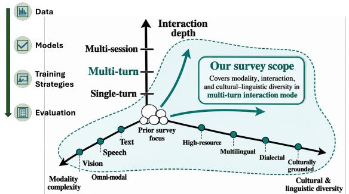
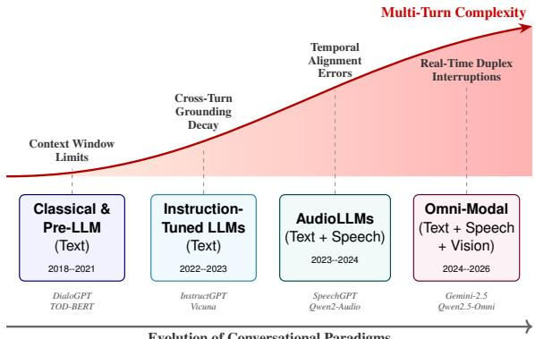

# Multi-turn Conversational AI from Text to Multimodal Interaction: Data, Models, Evaluation, and Open Challenges

Syeda Faiza Ahmed, Zien Sheikh Ali, Hunzalah Hassan Bhatti, Firoj Alam, Shammur Absar Chowdhury Qatar Computing Research Institute, Qatar   
syeda.faiza.ahmed@gmail.com, shchowdhury@hbku.edu.qa

## Abstract

Conversational AI is moving beyond isolated text prompts toward sustained, multimodal interaction. In real conversations, users clarify goals, revise requests, interrupt responses, switch topics, and introduce new evidence while expecting systems to preserve context across turns. This makes multi-turn dialogue a distinct challenge requiring systems to maintain and update memory, ground responses across modalities, tools, and external knowledge, and adapt across languages and cultures. This study reviews multi-turn conversational AI across text-only dialogue, AudioLLMs and speech-native systems, multimodal and omnimodal systems, and tool-augmented agents. We organize the literature around datasets and benchmarks, modeling paradigms, training strategies, evaluation setups, and crosscutting challenges. Our analysis shows that support for multiple modalities has advanced faster than the ability to sustain coherent interaction across a session. Despite stronger capabilities to perceive, speak, and act across modalities, current systems still struggle with persistent memory, cross-turn grounding, fullduplex interaction, robust evaluation, and cultural alignment. We conclude with a research agenda for systems that can remember, revise, ground, speak, listen, act, and adapt across turns, modalities, and cultures.1

## 1 Introduction

Conversational AI is becoming a primary interface through which users interact with large language models (LLMs). These interactions often extend beyond single prompts. Users clarify goals, revise requests, ask follow-up questions, switch topics, introduce new evidence, and return to earlier points in the conversation (Kwan et al., 2024; Bai et al., 2024; Reddy et al., 2019). We use sessionlevel multi-turn interaction to refer to a complete conversation with more than one exchange, where later turns may depend on earlier requests, responses, evidence, actions, or state. A capable model must therefore do more than answer the current query. It must preserve context, resolve crossturn references, update earlier assumptions, and maintain coherence across the session. Multi-turn dialogue is thus a distinct modeling and evaluation problem, not merely a longer version of singleturn question answering (Deshpande et al., 2025).

  
Figure 1: Three-axis view of conversational AI covering modality complexity, interaction depth, and cultural-linguistic diversity.

This problem has become more important as conversational AI expands beyond text. Early dialogue systems focused on text-based state tracking, response generation, persona consistency, and task completion (Wu et al., 2020; Zhang et al., 2020b; Roller et al., 2021). AudioLLMs extend this setting to spoken interaction by processing speech with text (Zhang et al., 2023; Chu et al., 2024; Tang et al., 2024). Full-duplex systems support more flexible turn-taking, including real-time interruption and overlapping speech (Défossez et al., 2024). More recent omni-modal models jointly handle text, speech, vision, and often video within unified architectures (Hurst et al., 2024; Xu et al., 2025b; Fu et al., 2026; Chen et al., 2025c; Tong et al., 2025). Figure 2 illustrates this progression. Each stage broadens what systems can perceive and produce, while making memory, grounding, timing, and alignment across turns more difficult.

Recent evidence shows that even frontier models still struggle with sustained interaction. Models can underuse relevant information even when it remains inside the context window (Liu et al., 2024a). They also degrade when a task is distributed across several turns rather than stated as a complete single-turn instruction (Laban et al., 2026). MultiChallenge further shows that frontier models remain below human-level reliability on realistic multi-turn instruction following (Deshpande et al., 2025). These failures become more complex in spoken, multimodal, and tool-augmented settings. Speech recognition or acoustic-token errors can propagate across turns, visual grounding can decay as the dialogue moves away from the original image or video, and toolusing agents must preserve external state in addition to dialogue history. Evaluation setups that score turn-level responses can therefore miss failures that only emerge at the session level (Kwan et al., 2024; Graf et al., 2026).

Related Surveys. Prior surveys provide useful coverage of dialogue systems, multi-turn LLM capabilities, agents, and multimodal LLMs, however, they study these areas largely in isolation. Dialogue-system surveys review the transition from modular or retrieval-based systems to LLM-based dialogue, however, remain largely text-centered (Wang et al., 2023; Yi et al., 2025). Surveys on multi-turn interaction discuss instruction following, memory, and consistency, however, do not cover spoken or multimodal interaction in depth (Zhang et al., 2025b; Li et al., 2025f). Work on LLM agents focuses mainly on tool use and agent evaluation (Guan et al., 2026), while surveys of multimodal LLMs often treat dialogue as a downstream application rather than the central unit of analysis (Zhang et al., 2024b). Cultural and dialectal variation is also largely absent from these discussions. In contrast, this survey treats sustained interaction as the primary unit ofanalysis across modalities, systems, resources, and evaluation methods. Table 1 summarizes how our scope differs from the closest related surveys. Appendix Table 11 provides a more detailed comparison of their conceptual framing, modality coverage, and key distinctions.

Survey Scope and Selection. We organize our coverage along three dimensions: interaction depth (multi-turn sessions where later responses depend on earlier context), modality complexity (text through speech to omni-modal systems), and cultural and linguistic diversity (multilingual, dialectal, and culturally grounded settings). Figure 1 illustrates this joint space. We include work that advances dialogue across turns or develops the data, models, training methods, and evaluation needed for sustained interaction, spanning topics such as text dialogue, spoken dialogue, AudioLLMs, vision-language and video dialogue, omni-modal systems, conversational retrieval, tool use, and culturally grounded resources. Details keywords are provided in Appendix Sec. A.4. To ensure a systematic, and reproducible review of the literature, we followed PRISMA-ScR framework (Page et al., 2021). To maximize coverage, we searched Google Scholar and Semantic Scholar and obtained papers from IEEE Xplore, ACM Digital Library, Elsevier, DBLP, the ACL Anthology and arXiv. Papers include publications from ∗ACL, NeurIPS, ICLR, ICML, Interspeech, SIGDIAL, CVPR, ICCV, AAAI and related venues. Our initial search identified ∼4K papers. After applying the PRISMA screening, we selected 200 papers for detailed review.

<table><tr><td>Survey</td><td>MT</td><td>Speech</td><td>Vision</td><td>Tri</td><td>Cultural</td><td>Eval∆</td></tr><tr><td>(YI ET AL., 2025)</td><td>√</td><td>x</td><td>x</td><td>x</td><td>x</td><td>√</td></tr><tr><td>(WANG ET AL., 2023)</td><td>√</td><td>x</td><td>x</td><td>x</td><td>x</td><td>x</td></tr><tr><td>(ZHANG ET AL., 2025B)</td><td>√</td><td>x</td><td>x</td><td>x</td><td>x</td><td>√</td></tr><tr><td>(LI ET AL., 2025F)</td><td>√</td><td>x</td><td>x</td><td>x</td><td>●</td><td>√</td></tr><tr><td>(GUAN ET AL., 2026)</td><td>√</td><td>x</td><td>x</td><td>x</td><td>x</td><td>√</td></tr><tr><td>(ZHANG ET AL., 2024B)</td><td>X</td><td>●</td><td>√</td><td>x</td><td>x</td><td>x</td></tr><tr><td>This survey</td><td>√</td><td>√</td><td>√</td><td>√</td><td>√</td><td>√</td></tr></table>

Table 1: Comparison with closely related surveys. MT = multi-turn focus; Speech = spoken dialogue/AudioLLMs; Vision = image/video; Tri = joint text–speech– vision; Cultural = cross-lingual, dialectal, or culturally grounded coverage; Eval∆ = multi-turn evaluation gaps. • denotes partial coverage.

Contributions. This survey makes following contributions.

• We provide a unified survey of multi-turn conversational AI spanning text, speech, vision, video, agentic, and culturally grounding.

• We organize datasets, benchmarks, models, training strategies, and evaluation methods around session-level interaction rather than isolated responses.

• We identify open challenges in memory, coherence, paralinguistic understanding, multimodal grounding, real-time interaction, and cultural alignment.

Findings. This survey highlights several gaps in the current multi-turn conversational AI.

• Capability gap. Longer context windows, stronger base models, and broader modality support do not guarantee session-level competence. Systems still struggle with memory, grounding, assumption revision, tool state, spoken timing, and cross-cultural adaptation.

• Resource gap. Existing datasets remain dominated by English with (over 80%), text-only, and text-image interaction. Speech, video, omni-modal, and culturally grounded multiturn resources remain limited.

• Evaluation gap. Benchmarks increasingly use LLM-as-judge and mixed approaches, but session-level metrics, human validation, and reproducible scoring remain underdeveloped.

• Integration gap. Most resources test one dimension at a time. Few combine longhorizon memory, multilinguality, speech, visual grounding, tool use, safety, and cultural alignment in the same evaluation setting.

## 2 Multi-turn Dialogue

We define a conversation as an interaction episode between a user and a system, consisting of ordered turns. A multi-turn conversation is a session with $T >$ 1 exchanges, where later turns may depend on earlier requests, responses, evidence, actions, or state. This dependency makes the full session the natural unit of analysis rather than a single response. We define a session, $\mathcal { D } ,$ as

$$
\begin{array} { r l } & { \mathcal { D } = \{ ( u _ { t } , y _ { t } , c _ { t } , m _ { t } , z _ { t } ) \} _ { t = 1 } ^ { T } , } \\ & { y _ { t } = f _ { \theta } \big ( u _ { t } , c _ { t } , m _ { t } , z _ { t } \big ) . } \end{array}
$$

Here $u _ { t }$ is the user input at turn t, $y _ { t }$ is the system response, $c _ { t }$ is the accumulated dialogue context from earlier turns, $m _ { t }$ is the multimodal context, and $z _ { t }$ is optional external state. The multimodal context may include speech, images, video, or other non-text signals, and may be empty in textonly settings. The external state may include memory, retrieved evidence, tool outputs, task state, or user profile information. The function $f _ { \theta }$ denotes the conversational model. This formulation makes the multi-turn setting explicit because each response can depend on the current input, the previous dialogue, modality-specific context, and external state.

Modality and Context. The user input $u _ { t }$ and system response yt may be expressed as text, speech, images, video, or their combination. The multimodal context $m _ { t }$ captures modality specific information such as acoustic cues, visual content, or video events. The dialogue context $c _ { t }$ captures what has already happened in the session, while the external state $z _ { t }$ captures information that may persist or change. Since these signals carry different information, the model must decide what to retain, update, or ignore at each turn.

Dialogue Types. Dialogue systems serve different interaction functions. We consider task oriented dialogue for goal completion via state tracking (Wu et al., 2020; Eric et al., 2020), open-domain dialogue for coherent conversation across topics (Zhang et al., 2020b; Roller et al., 2021), knowledge grounded dialogue for responses grounded in documents, databases, or retrieval (Varshney et al., 2022), social and empathetic dialogue for socially appropriate responses (Zhang et al., 2024d), persona grounded dialogue for consistency with a user or character profile (Gosling et al., 2023; Oh et al., 2023), agentic dialogue for planning and tool use (Yao et al., 2022; Lu et al., 2024), and multimodal grounded dialogue for reasoning over text, speech, images, video, or their combination (Xue et al., 2025). These types often overlap, so they serve as analytical lenses not strict dataset boundaries.

Evaluation Focus. A multi-turn system is mainly evaluated at the turn and session levels. Turn level evaluation asks whether the current response is correct and useful. Session level evaluation asks whether the system remains consistent, grounded, and useful as earlier turns shape later ones. Some settings add further requirements. Persistent memory extends the problem beyond one session, tool using systems add external actions and state changes, and spoken systems may require full duplex evaluation for interruptions, overlapping speech, and response timing. Our focus is interaction within a multi-turn session, while cross session memory and agentic interaction are covered as related extensions when they affect session level behavior.

## 3 Datasets and Benchmarks

Datasets and benchmarks for multi-turn dialogue differ not only in modality, but also in what they assume a system must preserve across turns. Text resources emphasize context tracking, instruction retention, persona consistency, retrieval, and social intelligence. Spoken resources add acoustic cues, turn-taking, prosody, speaker variation, ASR errors, and full-duplex timing. Multimodal and video resources add visual, audio-visual, and temporal grounding. Cultural and linguistic resources expose whether these abilities transfer beyond English-centered settings.

We organize datasets by modality in Table 2 and benchmarks by evaluation focus in Table 3. Overall, they cover text-only, spoken, multimodal, video, and culturally grounded interaction. Some findings are as follows.

• English and text remain dominant. Outside the cultural and cross-lingual block, 43 of 52 dataset entries are English-only. The benchmark table shows the same pattern, with 32 of 53 benchmarks focusing on text-only dataset.

• Modality coverage is expanding, however, varies across modalities. Table 2 lists 18 textimage resources, however, only 8 spoken and 6 video-oriented datasets. Many multimodal resources still use static images rather than streaming, temporal, or spoken interaction.

• Task coverage is broadening. Though QA and instruction following dominate, newer resources add memory, personalization, tool use, retrieval, social interaction, and emotional intelligence. Long-horizon and multi-session dialogue remain rare.

• Cultural coverage is growing, however, often single-turn. Resources such as CVQA, Dallah, MMA-ASIA, OASIS, and Shawarma Chats improve cultural coverage. However, 4 of the 5 entries in this block are single-turn and do not test sustained interaction.

• Evaluation needs stronger calibration. LLM-as-judge and mixed scoring now dominate many benchmarks. These setups scale well, but require stronger human evaluation and clearer reproducibility. Safety and robustness evaluation also remains text-centered.

## 4 Modeling Paradigm

Modeling paradigms have shifted from modular dialogue pipelines to general-purpose LLMs, AudioLLMs, omni-modal systems, and toolaugmented agents, as shown in Figure 2. Appendix Table 5 summarizes the details. This evolution has broadened the interaction interface, however, it has not solved the central multi-turn challenge. Most systems still treat dialogue history as a flat context, while only a smaller body of work explicitly models memory, state updates, selective grounding, and efficient long-session reasoning.

  
Figure 2: Evolution of conversational architectures. Multi-turn challenges escalate as systems evolve from simple text to complex omni-modal agents.

Classical systems separated language understanding, dialogue state tracking, policy learning, and response generation, often using rule-based, statistical, or neural sequence-to-sequence components. Transformer-era dialogue models began to consolidate these functions through pretraining, multitask learning, knowledge injection, and explicit memory mechanisms.

Instruction-tuned LLMs then shifted dialogue modeling away from task-specific managers toward general-purpose models trained or adapted for instruction following, open-ended interaction, and structured task behavior through prompting or function-like abstractions. The next stage added speech, vision, and real-time interaction.

AudioLLMs extend conversational AI from textonly interaction to spoken dialogue by modeling speech alongside language. Early systems represent speech as discrete tokens within an LLM framework, enabling speech input and output to be handled as part of the same sequence modeling problem. Later models broaden this direction toward chat-ready audio understanding, generic hearing, and interleaved speech-text modeling.

A second line targets real-time spoken interaction, supporting streaming generation, controllable voice, emotion, timbre, and full-duplex dialogue with low latency. Textless spoken dialogue models further show that dialogue can be modeled directly from raw audio, preserving turn-taking and paralinguistic cues often lost in transcripts.

Overall, AudioLLMs move dialogue systems toward speech-native interaction. Yet most still handle multi-turn context through the underlying language model, with limited explicit modeling of long-horizon spoken memory, interruptions, and cross-turn acoustic grounding.

<table><tr><td>Reference</td><td>Mod.</td><td>Task</td><td>Turns</td><td>Size Lang.</td><td>Split</td><td>Curation</td></tr><tr><td colspan="7">Text-only</td></tr><tr><td>PERSONACHAT (Zhang et al., 2018)</td><td>T T</td><td>PS</td><td>6-20</td><td>10,981/164Kⁿ en</td><td>Tr</td><td>H</td></tr><tr><td>CoQA (Reddy et al., 2019)</td><td></td><td>QA</td><td>6-20</td><td>8,399 en</td><td>Tr+Ev H</td><td></td></tr><tr><td>MULTIWOZ2.1 (Eric et al., 2020)</td><td></td><td>TOD/DST</td><td>6-20.</td><td>10,438 en</td><td>Tr+Ev H</td><td></td></tr><tr><td>PIPPA (Gosling et al., 2023)</td><td></td><td>PS</td><td>&gt; 20</td><td>25,940/&gt;1Mu en</td><td>Tr</td><td>H+S</td></tr><tr><td>ULTRACHAT (Ding et al., 2023)</td><td>T</td><td>Inst</td><td>≤5</td><td>1.5M en</td><td>Tr</td><td>S</td></tr><tr><td>MT-BENCH (Żheng et al., 2023)</td><td>T T</td><td>Inst</td><td>≤5</td><td>809 en</td><td>Ev</td><td>H</td></tr><tr><td>WILDCHAT (Zhao et al., 2024b)</td><td></td><td>OD</td><td>≤5</td><td>1M ML(68)</td><td>Tr+Ev H</td><td></td></tr><tr><td>MT-BENCH-101 (Bai et al., 2024)</td><td></td><td>Inst</td><td>≤5</td><td>1,388 en</td><td>Ev</td><td>H+S</td></tr><tr><td>MT-EVAL (Kwan et al., 2024)</td><td></td><td>Inst</td><td>6-20</td><td>168 en</td><td>Ev</td><td>H+S</td></tr><tr><td>PRODIGY (Occhipinti et al., 2024)</td><td></td><td>PS</td><td>4</td><td>20,850 en</td><td></td><td>Tr+Ev H+S</td></tr><tr><td>LONGMEMÈVAL (Wu et al., 2025b)</td><td></td><td>Mem</td><td>MS</td><td>5009 en</td><td>Ev</td><td>H+S</td></tr><tr><td>MULTICHALLENGE (Deshpande et al., 2025)</td><td></td><td>Inst</td><td>≤10/5 avg</td><td>273 en</td><td>Ev</td><td>H+S</td></tr><tr><td>LMSYS-CHAT-1M (Zheng et al., 2024)</td><td>T</td><td>OD</td><td>≤5</td><td>1M ML(154)</td><td></td><td>Tr+Ev H+S</td></tr><tr><td>τ-BENCH (Yao et al., 2025)</td><td>T T</td><td>TOD</td><td></td><td>165tasks en</td><td>Ev</td><td>S+H</td></tr><tr><td>PERSONAMEM (Jiang et al., 2025)</td><td>T</td><td>Pers/Mem</td><td>MS</td><td>180+ histories / ~6K9 en</td><td>Ev</td><td>S+H</td></tr><tr><td>CONSISTENTCHAT (Chen et al., 2025a)</td><td>T</td><td>Inst</td><td>6--20</td><td>15K / 224Ku en</td><td>Tr</td><td>S</td></tr><tr><td>DoCTALK (Lee et al., 2025a)</td><td></td><td>KG/QA</td><td>&gt;20</td><td>730K en</td><td>Tr</td><td>H+S</td></tr><tr><td>TooLWOZ (Lattimer et al., 2025)</td><td></td><td>TOD+Tool</td><td></td><td>7,849 scenarios en</td><td></td><td>Tr+Ev H+S</td></tr><tr><td>SOTOPIA (Żhou et al., 2024a)</td><td>T T</td><td>Social/PS</td><td>6--20</td><td>450 tasks en</td><td>Ev</td><td>H+S</td></tr><tr><td>DIALSIM (Kim et al., 2024b)</td><td></td><td>Mem</td><td>&gt; 20</td><td>18.99K turns / 1.31K sess. en</td><td>Ev</td><td>S+H</td></tr><tr><td colspan="7">Spoken (audio/speech)</td></tr><tr><td>SPOKENWOZ (Si et al., 2023)</td><td>T+S T+S</td><td>TOD/DST</td><td>&gt; 20</td><td>5.7K/249h en</td><td></td><td>Tr+Ev H</td></tr><tr><td>DEEPDIALOGUE (Koudounas et al., 2025)</td><td></td><td>OD/EI</td><td>3-10</td><td>40,150 en</td><td>Tr</td><td>S+H</td></tr><tr><td>AUDIO MULTICHALLENGE (Gosai et al., 2025)</td><td></td><td>Inst</td><td>6-20</td><td>452 en</td><td>Ev</td><td>H+S</td></tr><tr><td>MENASPEECHBANK (Ali et al., 2026)</td><td>T+S</td><td>TOD/Pers</td><td>≤5</td><td>417K ar*</td><td></td><td>Tr+Ev H+S</td></tr><tr><td>C3 (Ma et al., 2025)</td><td>T+S</td><td>QA</td><td>6--20</td><td>1,079 en+zh</td><td>Ev</td><td>H+S</td></tr><tr><td>ASK-QA (Chen et al., 2025d)</td><td>T+S</td><td>QA</td><td>≤5</td><td>7,830 en</td><td>Tr+Ev S</td><td></td></tr><tr><td>MULTI-BENCH (Deng et al., 2025)</td><td>T+S</td><td>OD+EI</td><td>6--20</td><td>1.5K en+zh</td><td>Ev</td><td>H+S</td></tr><tr><td>MSIB (Tong et al., 2025)</td><td></td><td>OD</td><td>6-20</td><td>244 en</td><td>Ev</td><td>S+H</td></tr><tr><td colspan="7">Multimodal</td></tr><tr><td>VIsDIAL (Das et al., 2017)</td><td>T+V</td><td>QA</td><td>6-20</td><td>~123K / 1.23M9 en</td><td></td><td>Tr+Ev H</td></tr><tr><td>MMDIALOG (Feng et al., 2023a)</td><td>T+V</td><td>OD</td><td>≤5</td><td>1.08M en</td><td>Tr</td><td>H</td></tr><tr><td>IMAD (Moskvoretskii et al., 2024)</td><td>T+V</td><td>OD</td><td>6-20</td><td>4864 en</td><td>Tr</td><td>H</td></tr><tr><td>INFOVIsDIAL (Wen et al., 2023)</td><td>T+V</td><td>KG</td><td>6-20</td><td>50K en</td><td>Tr</td><td>S</td></tr><tr><td>DIALOGCC (Lee et al., 2024)</td><td>T+V</td><td>OD</td><td>6-20</td><td>83K en</td><td>Tr</td><td>H+S</td></tr><tr><td>LoCoMo (Maharana et al., 2024)</td><td>T+V</td><td>Mem</td><td>&gt;20</td><td>10 / 1,9869 en</td><td>Ev</td><td>H+S</td></tr><tr><td>TMDIALOG (Lei et al., 2025)</td><td>T+V</td><td>Inst</td><td>6-20</td><td>67.9K/329 en</td><td></td><td>Tr+Ev H+S</td></tr><tr><td>MMDU-45K (Liu et al., 2024d)</td><td>T+V</td><td>Inst</td><td>6-20</td><td>45K / 410K9 en</td><td>Tr</td><td>S+H</td></tr><tr><td>CoNVBENCH (Liu et al., 2024b)</td><td>T+V</td><td>Inst</td><td>≤5</td><td>577 en</td><td>Ev</td><td>H+S</td></tr><tr><td>CB-300K (Tian et al., 2025b)</td><td>T+V</td><td>QA</td><td>≤5</td><td>340k/717K9 en</td><td></td><td>Tr+Ev H+S</td></tr><tr><td>MMDIAG (Liu et al., 2025a)</td><td>T+V</td><td>QA</td><td>≤5</td><td>639K9 en</td><td></td><td>Tr+Ev H+S</td></tr><tr><td>MULTIVERSE (Lee et al., 2025b)</td><td>T+V</td><td>Inst</td><td>≤5</td><td>647 en</td><td>Ev</td><td>H+S</td></tr><tr><td>MMRC (Xue et al., 2025)</td><td>T+V</td><td>Mem+QA</td><td>6-20</td><td>5,120/28K9en</td><td>Ev</td><td>H</td></tr><tr><td>ALIGNMMBENCH (Wu et al., 2025d)</td><td>T+V</td><td>Inst</td><td></td><td>4,9789 zh</td><td>Ev</td><td>H+S</td></tr><tr><td>MEM-GALLERY (Bei et al., 2026)</td><td>T+V</td><td>Mem</td><td>MS</td><td>240 sess. / 1,7119 en</td><td>Ev</td><td>H+S</td></tr><tr><td>MMMB (Tong et al., 2025)</td><td>T+V</td><td>Mem T2I</td><td>6-20</td><td>300 en</td><td>Ev</td><td>S+H</td></tr><tr><td>DIALOGBEN (Huang et al., 2025b) MMMT-IF (Epstein et al., 2024)</td><td>T+V</td><td></td><td>≤5 1--20</td><td>9,957 en+zh 71 en</td><td>Ev Ev</td><td>S H+S</td></tr><tr><td colspan="7">T+V Inst Video (text + video/streaming)</td></tr><tr><td>MT-VIDEO-BENCH (Pan et al., 2025) QA</td><td>T+Vid</td><td></td><td>6-20</td><td>1,000 / 5,8879 en</td><td>Ev</td><td>H+S</td></tr><tr><td>OMNIMMI (Wang et al., 2025c)</td><td>T+S+Vid</td><td></td><td>≤5</td><td>1,121v/2,2909 en</td><td>Ev</td><td>H+S</td></tr><tr><td>SCVBENCH (You et al., 2025)</td><td>T+Vid T+Vid</td><td>QA</td><td>6-20</td><td>925v / 7,2809 en</td><td>Ev</td><td>H+S</td></tr><tr><td>CoGSTREAM (Zhao et al., 2026b)</td><td>T+Vid</td><td>QA</td><td></td><td>1,088ν / 59,0329 en</td><td></td><td>Tr+Ev H+S</td></tr><tr><td>IVCR-200K (Han et al., 2024)</td><td>T+Vid</td><td>Ret</td><td>6--20</td><td>12,516° / 201,6319 en+zh</td><td></td><td>Tr+Ev S+H</td></tr><tr><td>SVBENCH (Yang et al., 2025)</td><td></td><td>QA</td><td>≤5</td><td>49,9799 /1,353° zh</td><td></td><td>Tr+Ev H+S</td></tr><tr><td colspan="8">Cultural (* single-turn)</td></tr></table>

Table 2: Multi-turn dialogue datasets organised by modality. Mod.: T = text, S = speech/audio, V = image/vision, Vid = video. Task: TOD = task-oriented dialogue, OD = open-domain, QA = question answering, PS = persona / roleplay, Pers. = personalization / user profiling, KG = knowledge-grounded, Inst = instruction-following benchmark, T2I = text-to-image generation / editing, EI = emotional intelligence, Ret = retrieval, Mem = long-term memory. Turns: approximate range per session (≤5 / 6-20 / >20 / MS = multi-session). Size: # dialogues unless marked: u = utterances; q = QA pairs / instances; h = hours; v = videos. Split: Tr = training data, Ev = evaluation data, Tr+Ev = both. Curation: H = human; S = synthetic / LLM-generated; Lang.: ML(\*) = Multilingual; Number in parenthesis indicate number of languages. D = Dialects. Datasets marked ⋆ are single-turn; they are included solely as cultural / cross-lingual baselines.

Omni-modal models extend AudioLLMs by jointly handling text, speech, vision, and sometimes video. Recent systems explore several design choices, including streaming duplex interaction, low-latency speech and vision alignment, shared multimodal tokenization, modality-specific encoders, and separate modules for reasoning and speech generation. These designs move conversational AI from speech-text interaction toward unified perception and generation across modalities.

Audio-visual dialogue forms a more specialized direction in which visual cues support speaker tracking, turn-taking, and grounding rather than serving only as general perceptual input. AV-Dialog uses lip-centered visual features to identify the target speaker, predict turn transitions, and generate responses under noise and competing speech (Chen et al., 2026). MAViD instead combines multimodal understanding with synchronized audio-video response generation through a Conductor–Creator architecture, though it is not evaluated evaluated for sustained multi-turn interaction (Pang et al., 2025). Despite this progress, most omni-modal systems still treat dialogue history as a flat sequence. Multi-turn-aware methods address grounded memory, context management, and long-session inference cost, while long-horizon grounding, reference tracking, and session-level coherence remain open challenges.

<table><tr><td colspan="2">Benchmark</td><td>Mod. Turns</td><td>Eval</td></tr><tr><td colspan="4">General multi-turn instruction-following &amp; consistency</td></tr><tr><td>MT-BENCH (Zheng et al., 2023)</td><td>T</td><td>2</td><td>J</td></tr><tr><td>MT-BENCH-101 (Bai et al., 2024)</td><td>T</td><td>3</td><td>J</td></tr><tr><td>MT-EVAL (Kwan et al., 2024)</td><td>T</td><td>7</td><td>M</td></tr><tr><td>MULTICHALLENGE (Deshpande et al., 2025)</td><td>T</td><td> $5 \mathrm { a v g } / \leq 1 0 $ </td><td>M</td></tr><tr><td>IHEvAL (Zhang et al., 2025e)</td><td>T</td><td>2</td><td>R</td></tr><tr><td>TURNWISE (Graf et al., 2026)</td><td>T</td><td>2-8</td><td>J</td></tr><tr><td>TOD-PROCBENCH (Ghazarian et al., 2025)</td><td>T</td><td>=</td><td>R</td></tr><tr><td>EvoLIF (Jia et al., 2025)</td><td>T</td><td>=</td><td>M</td></tr><tr><td>PARROT-BENCH (Sun et al., 2024)</td><td>T</td><td>8</td><td>J</td></tr><tr><td>τ-BENCH (Yao et al., 2025)</td><td>T</td><td></td><td>M</td></tr><tr><td>STRUCTFLOWBENCH (Li et al., 2025b)</td><td>T</td><td>4.14 avg</td><td>J</td></tr><tr><td>PERSONAMEM (Jiang et al., 2025)</td><td>T</td><td>≤60 sessions</td><td>Ac</td></tr><tr><td>CORAL (Cheng et al., 2025)</td><td>T</td><td> $8 . 2 6 \mathrm { a v g }$ </td><td>M</td></tr><tr><td>ToOLSANDBOX (Lu et al., 2025)</td><td>T</td><td>13.9 avg</td><td>rM</td></tr><tr><td>TURNBENCH-MS (Zhang et al., 2025d)</td><td>T</td><td>&gt;20</td><td>M</td></tr><tr><td>MINT (Wang et al., 2024)</td><td>T</td><td>≤5</td><td>R</td></tr><tr><td>SOTOPIA (Zhou et al., 2024a)</td><td>T</td><td>≤20</td><td>M</td></tr><tr><td>AGENTBOARD (Ma et al., 2024)</td><td>T</td><td>3--25</td><td>M</td></tr><tr><td>MEMORYAGENTBENCH (Hu et al., 2025)</td><td>T</td><td>=</td><td>M</td></tr><tr><td colspan="4">Multilingual &amp; cross-lingual</td></tr><tr><td>M2LINGUAL (Maheshwary et al., 2025)</td><td>T</td><td>2</td><td>J</td></tr><tr><td>CMT-EVAL (Tian et al., 2025a)</td><td>T</td><td>multi</td><td>J</td></tr><tr><td>ALIGNMMBENCH (Wu et al., 2025d)</td><td>T+V</td><td> $- \mathrm { a v g }$ </td><td>M</td></tr><tr><td>MT-BENCH-HI (Kamath et al., 2025)</td><td>T</td><td>2</td><td>J</td></tr><tr><td>CUDIALOG (Cao et al., 2024)</td><td>T</td><td> $8 \ \mathrm { s e n t . } \ ( 5 + 3 )$ </td><td>R</td></tr><tr><td>INDOToD (Kautsar et al., 2023)</td><td>T</td><td> $2 . 6 3 / 4 . 0 6 \mathrm { a v g }$ </td><td>R</td></tr><tr><td colspan="4">Multimodal (image + text)</td></tr><tr><td>CoNVBENCH (Liu et al., 2024b)</td><td>T+V</td><td>3</td><td>J</td></tr><tr><td>MMDU (Liu et al., 2024d)</td><td>T+V</td><td> $\mathrm { 1 5 \ a v g / 2 7 \ m a x \ J }$ </td><td></td></tr><tr><td>MMCR (Yan et al.,  $2 0 2 5 \mathrm { a } )$ </td><td>T+V</td><td>4/8</td><td>J</td></tr><tr><td>MMRC (Xue et al., 2025)</td><td>T+V</td><td>$15.2 avg</td><td>M</td></tr><tr><td>MULTIVERSE (Lee et al., 2025b)</td><td>T+V</td><td>3.91 avg</td><td>J</td></tr><tr><td>MEM-GALLERY (Bei et al., 2026)</td><td>T+V</td><td>MS</td><td>M</td></tr><tr><td>MMMT-IF (Epstein et al., 2024)</td><td>T+V</td><td>1--20</td><td>M</td></tr><tr><td>MMMB (Tong et al., 2025)</td><td>T+V</td><td>≤15</td><td>J</td></tr><tr><td colspan="4">Spoken &amp; video</td></tr><tr><td>AUDIO MULTICHALLENGE (Gosai et al., 2025)</td><td>S</td><td>3-8</td><td>M</td></tr><tr><td>MT-VIDEO-BENCH (Pan et al., 2025)</td><td>T+Vid</td><td>5-8</td><td>J</td></tr><tr><td>OMNIMMI (Wang et al., 2025c)</td><td>T+S+Vid T+Vid</td><td>stream / 1–3</td><td>M</td></tr><tr><td>SCVBENCH (You et al., 2025)</td><td>T+Vid</td><td>6.16 avg</td><td>R</td></tr><tr><td>CoGSTREAM (Zhao et al., 2026b) AVHBENCH (Sung-Bin et al., 2025)</td><td>T+S+V</td><td>stream; 5.02</td><td>J</td></tr><tr><td>MTALK-BENCH (Du et al., 2025b)</td><td>S</td><td>2-3</td><td>M</td></tr><tr><td>FD-BENCH (Peng et al., 2025)</td><td>S</td><td>≤5</td><td>M M</td></tr><tr><td>MULTI-BENCH (Deng et al., 2025)</td><td>S</td><td></td><td>M</td></tr><tr><td>SVBENCH (Yang et al., 2025)</td><td>T+Vid</td><td>8 avg stream; 4.29</td><td>J</td></tr><tr><td>MSIB (Tong et al., 2025)</td><td>S</td><td>2--10</td><td>M</td></tr><tr><td>Robustness, fairness &amp; safety</td><td></td><td></td><td></td></tr><tr><td colspan="4"></td></tr><tr><td>FB-BENCH (Li et al., 2025d)</td><td>T</td><td>2</td><td>M</td></tr><tr><td>FAIRMT-BENCH (Fan et al., 2025)</td><td>T</td><td>multi</td><td>M</td></tr><tr><td>SYCON-BENCH (Hong et al., 2025)</td><td>T</td><td>multi</td><td>R</td></tr><tr><td>CURSE OF MULTI-MODALITIES (Leng et al., 2026) T+S+V</td><td></td><td>=</td><td>M</td></tr><tr><td>LOST IN MULTI-TURN (Laban et al., 2026)</td><td>T</td><td>multi</td><td>M</td></tr><tr><td>X-TEAMING (Rahman et al., 2025)</td><td>T</td><td> $\mathrm { a v g } 5 . 1 0$ </td><td>M</td></tr><tr><td>CRESCENDO (Russinovich et al., 2025)</td><td>T</td><td>1--7</td><td>R</td></tr><tr><td>DIAHALU (Chen et al., 2024b)</td><td>T</td><td> $6 . 9 1 \ \mathrm { a v g }$ </td><td>H+J</td></tr><tr><td>SAFEDIALBENCH (Cao et al., 2026)</td><td>T</td><td> $3 \mathrm { - } 1 0$ </td><td>M</td></tr></table>

Table 3: Multi-turn evaluation benchmarks grouped by modality and evaluation focus. Mod. denotes modality, with T for text, S for speech, V for vision, and Vid for video. Turns reports the average number of turns per instance or session when available, and otherwise gives a qualitative range. Eval denotes the evaluation protocol, with R for rule-based scoring, H for human evaluation, J for LLM-as-judge, M for mixed evaluation, and Ac for accuracy. Benchmarks that evaluate only single-turn ability are excluded.

Agentic dialogue systems extend multi-turn modeling by framing conversation as a loop of planning, tool use, observation, and revision. Re-Act interleaves reasoning and actions (Yao et al., 2022), Reflexion uses feedback and episodic memory to improve later attempts (Shinn et al., 2023), and MetaGPT enables role-based collaboration through structured workflows (Hong et al., 2024). Recent systems apply these ideas to tool use, function calling, web navigation, recommendation, video reasoning, and live multimodal interaction (Wu et al., 2024; Lu et al., 2024). These settings introduce three key challenges. First, agents must track external states and dependencies that may not appear in the dialogue history; ToolSandbox evaluates such stateful and implicit dependencies. Second, tool calls can produce undesirable or irreversible effects, motivating evaluation of both task completion and harmful side effects. Third, failed actions require replanning and backtracking. Reflexion and SCoRe support self-correction, but do not provide transactional rollback for already executed external actions. Overall, modeling has progressed from modular state tracking to unified, multimodal, and agentic systems, while long-horizon grounding and cross-turn memory remain key open challenges. Appendix A.2 provides additional model-level details.

## 5 Training Strategies

Multi-turn dialogue training must account for dependencies across turns, delayed rewards, changing user intent, and context-sensitive response quality. We group existing training approaches into five families: (i) supervised fine-tuning, (ii) reinforcement learning and preference optimization, (iii) multi-task learning, (iv) synthetic data generation, and (v) conversational retrieval-augmented training. In Appendix Table 5, we summarize modeling paradigms, while Table 6 presents the main training strategies. Table 7 further compares these different families in terms of their mechanisms, suitable settings, strengths, limitations, and modality coverage.

Supervised fine-tuning. Supervised fine-tuning requires conversations that reflect real multi-turn phenomena such as follow-up questions, anaphora, ellipsis, topic shifts, and safety escalation. Ultra-Chat and WildChat provide large-scale synthetic and real multi-turn chat data, while Parrot explicitly targets referential phenomena in follow-up turns. Domain-specific resources such as Aquila-Med, Qilin-Med, and Zhongjing adapt SFT to multi-turn clinical dialogue, and XGuard-Train extends SFT to multi-turn adversarial safety training. Reinforcement learning and preference optimization. Multi-turn reinforcement learning shifts the learning signal from isolated responses to full interactions. InstructGPT establishes the standard RLHF pipeline, while ArCHer and MT-RLHF adapt optimization to longer conversations and conversation-level preferences. Preference methods such as DMPO, Multi-turn DPO/KTO, Parrot, and SDPO optimize preferences at response, segment, or trajectory level. Other work trains action selection, tool use, self-correction, proactive interaction, and long-horizon sparsereward behavior across turns. Clinical and tutoring settings further combine SFT, RLHF, DPO, expert feedback, and multi-agent RL for specialized multi-turn interaction.

Multi-task learning. Multi-task learning improves transfer by sharing representations across dialogue objectives. PPTOD jointly trains response generation, dialogue state tracking, and policy prediction, while TOD-BERT learns dialogue-aware representations across taskoriented dialogue corpora. DAMSEL shows that auxiliary objectives are useful for conversational QA when labeled speech data is limited.

Synthetic data generation. Synthetic generation is widely used to scale multi-turn data and control dialogue structure. UltraChat, MMDU-45K, MMDiag, and TMDialog generate instructionfollowing, multimodal, note-taking, and contextmodeling dialogues. Other pipelines target Arabic dialogue, emotional speech, tool use, coherent intent trajectories, multi-topic information seeking, reviewer-guided regeneration, task-oriented bootstrapping, and multi-turn API/tool-use simulation.

Conversational RAG. Conversational RAG trains models to retrieve, filter, and use evidence across turns. PK-ICR and commonsense retrieval approaches ground responses in persona, external knowledge, and knowledge graphs. ChatQA, ChatQA-2, HAConvDR, UniConv, IterCQR, and related work improve conversational retrieval, query reformulation, history selection, and joint retrieval-generation training. KEDiT and CORAL further explore efficient evidence integration and citation-aware conversational RAG training. To translate this comparison into practice, in Table 8, we map common deployment goals to the training strategy. In Appendix A.2, we provide additional details on training strategies.

## 6 Evaluation of Multi-turn Dialogue

Evaluating multi-turn dialogue requires moving beyond single-response metrics. A response may be fluent and factually correct on its own; however, it can still fail at the session level if it ignores earlier instructions, loses user preferences, misuses retrieved evidence, mishandles tool state, or breaks grounding across modalities. Evaluation therefore needs to measure both local response quality and cross-turn consistency, memory, state tracking, grounding, interaction success, and robustness across the full dialogue.

Existing evaluation methods fall into five broad groups. (i) Surface-form and task-oriented metrics, such as overlap scores, semantic similarity, dialogue state tracking, and task success, remain useful, though they provide limited insight into session-level coherence. (ii) Session-level metrics assess instruction retention, memory recall, constraint satisfaction, feedback integration, and dialogue-level hallucination. (iii) Agentic and retrieval-grounded evaluation measures tool use, stateful execution, evidence retrieval, and source attribution. (iv) Speech-native and full-duplex evaluation adds speech quality, paralinguistic cues, interruption handling, latency, and response timing. (v) LLM-as-a-judge and human evaluation support open-ended assessment; however, their reliability depends on rubric quality and may be affected by judge bias, rater inconsistency, and small ranking differences. In Table 10, we compare these five families by what they measure, the systems they best suit, and their main limitations, showing that no single family fully captures session-level competence. Appendix A.3 provides a detailed discussion of these approaches, and Table 9 summarizes representative metrics and frameworks.

Evaluation gaps. Current setups make multi-turn failures more visible, however, several gaps remain. (i) Strong single-turn performance does not reliably transfer to session-level interaction. (ii) Agentic dialogue lacks unified evaluation for hidden state, tool-side effects, source attribution, and repeated-trial reliability. (iii) Spoken and fullduplex systems still lack integrated session-level evaluation that jointly measures semantic correctness, audio quality, timing, interruptions, and paralinguistic behaviour. (iv) Multi-turn evaluation remains focused in English and high-resource settings, leaving multilingual, dialectal, and culturally grounded evaluation split across separate resources. These gaps show that current evaluation still measures many components of dialogue competence separately, rather than testing reliable session-level behaviour across languages, modalities, tools, and time.

## 7 Challenges, and Future Directions

The studied literature shows progress in datasets, modeling, training, and evaluation, however, sustained multi-turn interaction remains unresolved. Stronger single-turn models alone do not achieve multi-turn competence. Systems must preserve context, revise assumptions, ground responses, coordinate tools, and maintain quality across long, multimodal, and culturally diverse sessions. Mechanisms for memory, cross-turn grounding, speech-native interaction, robust revision, and session-level evaluation remain limited.

Persistent memory and state management. Current long-context models can process more dialogue history, however, they still struggle to retrieve, update, and apply the right information across turns. This problem grows in multi-session settings, where preferences, facts, and task states change over time. Future work should move beyond flat context windows toward explicit memory systems that separate dialogue state, and taskspecific working memory. These systems should support updates, forgetting, conflict resolution, and transparent retrieval across sessions.

Cross-turn grounding. Grounding weakens when responses depend on earlier turns, external evidence, visual content, acoustic cues, or tool outputs. Full dialogue history can add noise in retrieval-augmented dialogue, while multimodal references often decay across turns. Future work should develop selective grounding methods that identify the relevant dialogue history, evidence, and modality streams for each turn. This requires structured dialogue state rather than treating the full history as a flat input sequence.

Speech-native and full-duplex interaction. Spoken dialogue adds timing, prosody, interruptions, repairs, noise, and paralinguistic cues that transcript-only pipelines often miss. Full-duplex systems make this harder because users and systems may speak at the same time. Future work should treat speech as an interaction medium, not only as an input modality. This requires training and evaluation for interruption handling, response timing, spoken clarification, voice-grounded tool use, and paralinguistic understanding.

Robustness and revision. Multi-turn systems often commit to early assumptions and fail to revise them after later corrections. They are also vulnerable to adversarial escalation, where individually benign turns accumulate into unsafe or incorrect outcomes. Future work should improve session-level robustness by enabling models to detect uncertainty, recover from mistakes, and maintain safety throughout the interaction.

Evaluation mismatch. Current evaluation methods capture only parts of multi-turn behavior. Surface-form metrics, task-oriented metrics, agentic benchmarks, speech-native evaluation settings, and LLM-as-judge methods remain difficult to compare. No unified framework yet measures session-level competence across memory, grounding, tool use, speech, safety, and user satisfaction. Future evaluation should move from turnlevel scoring to session-level assessment, with explicit measures of state consistency, evidence use, revision, timing, and repeated-trial reliability.

Cultural and linguistic coverage. Most resources and evaluations still focus on English and high-resource settings. Dialects, code-switching, cultural pragmatics, and region-specific knowledge shape how users express intent and judge appropriate responses. Future benchmarks should move beyond isolated language-specific datasets toward comparable multilingual and culturally grounded evaluation suites. This is especially important for multimodal settings, where language, culture, accent, and visual context interact.

Beyond turn-by-turn exchange. Most systems still follow a simple user-query and assistantresponse loop. This framing does not fully capture proactive suggestions, mid-utterance clarification, streaming perception, emotion-aware interaction, or mixed-initiative collaboration. Future systems need interaction models that treat dialogue as continuous, stateful, and adaptive rather than as a sequence of independent turns.

## 8 Conclusion

Multi-turn conversational AI is shifting from textonly dialogue toward sustained interaction across speech, vision, video, tools, and culturally diverse contexts. This study shows that modality support has advanced faster than session-level competence. Current systems can increasingly perceive, speak, and act, but still struggle to maintain memory, revise assumptions, preserve grounding, coordinate external state, handle spoken timing, and adapt across languages and cultures. We argue that future work should evaluate conversational systems not only by the quality of isolated responses, but by their ability to sustain coherent, grounded, safe, and culturally appropriate interaction across turns.

## Limitations

This study focuses on recent work on multi-turn conversational AI across data, models, training, and evaluation. While we aim to cover major directions, the literature is growing quickly, and some new or concurrent resources may not be included. We cover diverse systems into broad categories, which may hide finer differences in architecture, training data, deployment setting, or evaluation setups.

## Societal/Broader Impact

This study aims to clarify the capabilities, gaps, and risks of multi-turn conversational AI. By organizing prior work across datasets, models, training, and evaluation, it can help researchers design systems that better support long-horizon interaction, multilingual access, speech-based interfaces, multimodal assistance, and culturally grounded communication.

## Ethical Considerations

This study does not introduce new datasets or run experiments with human participants.

## References

Abdelrahman Abdallah, Mahmoud Kasem, Mahmoud Abdalla, Mohamed Mahmoud, Mohamed Elkasaby, Yasser Elbendary, and Adam Jatowt. 2024. Arabicaqa: A comprehensive dataset for arabic question answering. In Proceedings of the 47th International ACM SIGIR Conference on Research and Development in Information Retrieval, pages 2049--2059.

Marwa Abdulhai, Isadora White, Charlie Victor Snell, Charles Sun, Joey Hong, Yuexiang Zhai, Kelvin Xu, and Sergey Levine. 2025. LMRL gym: Benchmarks for multi-turn reinforcement learning with language models. In Forty-second International Conference on Machine Learning.

Inclusion AI, Biao Gong, Cheng Zou, Chuanyang Zheng, Chunluan Zhou, Canxiang Yan, Chunxiang Jin, Chunjie Shen, Dandan Zheng, Fudong Wang, and 1 others. 2025. Ming-omni: A unified multimodal model for perception and generation. arXiv preprint arXiv:2506.09344.

Firoj Alam, Ali Ezzat Shahroor, Md Arid Hasan, Zien Sheikh Ali, Hunzalah Hassan Bhatti, Mohamed Bayan Kmainasi, Shammur Absar Chowdhury, Basel Mousi, Fahim Dalvi, Nadir Durrani, and 1 others. 2025. Everydaymmqa: A multilingual and multimodal framework for culturally grounded spoken visual qa. arXiv preprint arXiv:2510.06371.

Zien Sheikh Ali, Hunzalah Hassan Bhatti, Rabindra Nath Nandi, Shammur Absar Chowdhury, and Firoj Alam. 2026. MENASpeech-Bank: A reference voice bank with personaconditioned multi-turn conversations for audiollms. arXiv preprint arXiv:2602.07036.

Fakhraddin Alwajih, Gagan Bhatia, and Muhammad Abdul-Mageed. 2024. Dallah: A dialectaware multimodal large language model for Arabic. In Proceedings of the Second Arabic Natural Language Processing Conference, pages 320--336, Bangkok, Thailand. Association for Computational Linguistics.

Ge Bai, Jie Liu, Xingyuan Bu, Yancheng He, Jiaheng Liu, Zhanhui Zhou, Zhuoran Lin, Wenbo Su, Tiezheng Ge, Bo Zheng, and Wanli Ouyang. 2024. MT-bench-101: A fine-grained benchmark for evaluating large language models in multi-turn dialogues. In Proceedings of the 62nd Annual Meeting of the Association for Computational Linguistics (Volume 1: Long Papers), pages 7421--7454, Bangkok, Thailand. Association for Computational Linguistics.

Siqi Bao, Huang He, Fan Wang, Hua Wu, and Haifeng Wang. 2020. PLATO: Pre-trained dialogue generation model with discrete latent variable. In Proceedings of the 58th Annual Meeting of the Association for Computational Linguistics, pages 85--96, Online. Association for Computational Linguistics.

Yuanchen Bei, Tianxin Wei, Xuying Ning, Yanjun Zhao, Zhining Liu, Xiao Lin, Yada Zhu, Hendrik Hamann, Jingrui He, and Hanghang Tong. 2026. Mem-gallery: Benchmarking multimodal long-term conversational memory for mllm agents. arXiv preprint arXiv:2601.03515.

Luel Hagos Beyene, Vivek Verma, Min Ma, Jesujoba O Alabi, Fabian David Schmidt, Joyce Nakatumba-Nabende, and David Ifeoluwa Adelani. 2025. msteb: Massively multilingual evaluation of llms on speech and text tasks. arXiv preprint arXiv:2506.08400.

Aydar Bulatov, Yury Kuratov, and Mikhail Burtsev. 2022. Recurrent memory transformer. Advances in Neural Information Processing Systems, 35:11079--11091.

Yash Butala, Siddhant Garg, Pratyay Banerjee, and Amita Misra. 2024. ProMISe: A proactive multi-turn dialogue dataset for informationseeking intent resolution. In Findings of the Associationfor Computational Linguistics: EACL 2024, pages 1774--1789, St. Julian’s, Malta. Association for Computational Linguistics.

Hongye Cao, Sijia Jing, Yanming Wang, Ziyue Peng, Zhixin Bai, Zhe Cao, Meng Fang, Fan Feng, Jiaheng Liu, Boyan Wang, Tianpei Yang, Jing Huo, Yang Gao, Fanyu Meng, Xi Yang, Chao Deng, and Junlan Feng. 2026. Safedialbench: A fine-grained safety evaluation benchmark for large language models in multi-turn dialogues with diverse jailbreak attacks. In The

Fourteenth International Conference on Learning Representations.

Yong Cao, Min Chen, and Daniel Hershcovich. 2024. Bridging cultural nuances in dialogue agents through cultural value surveys. In Findings of the Association for Computational Linguistics: EACL 2024, pages 929--945, St. Julian’s, Malta. Association for Computational Linguistics.

Haonan Chen, Zhicheng Dou, Kelong Mao, Jiongnan Liu, and Ziliang Zhao. 2024a. Generalizing conversational dense retrieval via LLMcognition data augmentation. In Proceedings of the 62nd Annual Meeting of the Association for Computational Linguistics (Volume 1: Long Papers), pages 2700--2718, Bangkok, Thailand. Association for Computational Linguistics.

Jiawei Chen, Xinyan Guan, Qianhao Yuan, Mo Guozhao, Weixiang Zhou, Yaojie Lu, Hongyu Lin, Ben He, Le Sun, and Xianpei Han. 2025a. Consistentchat: Building skeletonguided consistent multi-turn dialogues for large language models from scratch. In Proceedings of the 2025 Conference on Empirical Methods in Natural Language Processing, pages 8426--8452.

Junjie Chen, Yao Hu, Junjie Li, Kangyue Li, Kun Liu, Wenpeng Li, Xu Li, Ziyuan Li, Feiyu Shen, Xu Tang, and 1 others. 2025b. Fireredchat: A pluggable, full-duplex voice interaction system with cascaded and semi-cascaded implementations. arXiv preprint arXiv:2509.06502.

Kai Chen, Yunhao Gou, Runhui Huang, Zhili Liu, Daxin Tan, Jing Xu, Chunwei Wang, Yi Zhu, Yihan Zeng, Kuo Yang, and 1 others. 2025c. Emova: Empowering language models to see, hear and speak with vivid emotions. In Proceedings of the Computer Vision and Pattern Recognition Conference, pages 5455--5466.

Kedi Chen, Qin Chen, Jie Zhou, He Yishen, and Liang He. 2024b. DiaHalu: A dialogue-level hallucination evaluation benchmark for large language models. In Findings of the Association for Computational Linguistics: EMNLP 2024, pages 9057--9079, Miami, Florida, USA. Association for Computational Linguistics.

Maximillian Chen, Ruoxi Sun, and Sercan O Arik. 2025d. Data-centric improvements for enhancing multi-modal understanding in spoken conversation modeling. In Findings of the Association for Computational Linguistics: ACL 2025, pages 1366--1387, Vienna, Austria. Association for Computational Linguistics.

Maximillian Chen, Ruoxi Sun, Tomas Pfister, and Sercan O Arik. 2025e. Learning to clarify: Multi-turn conversations with action-based contrastive self-training. In The Thirteenth International Conference on Learning Representations.

Nuo Chen, Hongguang Li, Jianhui Chang, Juhua Huang, Baoyuan Wang, and Jia Li. 2025f. Compress to impress: Unleashing the potential of compressive memory in real-world long-term conversations. In Proceedings of the 31st International Conference on Computational Linguistics, pages 755--773.

Qian Chen, Yafeng Chen, Yanni Chen, Mengzhe Chen, Yingda Chen, Chong Deng, Zhihao Du, Ruize Gao, Changfeng Gao, Zhifu Gao, Yabin Li, Xiang Lv, Jiaqing Liu, Haoneng Luo, Bin Ma, Chongjia Ni, Xian Shi, Jialong Tang, Hui Wang, and 17 others. 2025g. Minmo: A multimodal large language model for seamless voice interaction. Preprint, arXiv:2501.06282.

Tuochao Chen, Bandhav Veluri, Hongyu Gong, and Shyamnath Gollakota. 2026. Av-dialog: Spoken dialogue models with audio-visual input. In Proceedings of the 64th Annual Meeting of the Association for Computational Linguistics (Volume 1: Long Papers), pages 42208--42225.

Wenxi Chen, Ziyang Ma, Ruiqi Yan, Yuzhe Liang, Xiquan Li, Ruiyang Xu, Zhikang Niu, Yanqiao Zhu, Yifan Yang, Zhanxun Liu, and 1 others. 2025h. Slam-omni: Timbre-controllable voice interaction system with single-stage training. In Findings of the Association for Computational Linguistics: ACL 2025, pages 2262--2282.

Zhipeng Chen, Kun Zhou, Beichen Zhang, Zheng Gong, Xin Zhao, and Ji-Rong Wen. 2023. Chat-CoT: Tool-augmented chain-of-thought reasoning on chat-based large language models. In Findings of the Association for Computational Linguistics: EMNLP 2023, pages

14777--14790, Singapore. Association for Computational Linguistics.

Yiruo Cheng, Kelong Mao, Ziliang Zhao, Guanting Dong, Hongjin Qian, Yongkang Wu, Tetsuya Sakai, Ji-Rong Wen, and Zhicheng Dou. 2025. CORAL: Benchmarking multi-turn conversational retrieval-augmented generation. In Findings of the Association for Computational Linguistics: NAACL 2025, pages 1308--1330, Albuquerque, New Mexico. Association for Computational Linguistics.

Zesen Cheng, Sicong Leng, Hang Zhang, Yifei Xin, Xin Li, Guanzheng Chen, Yongxin Zhu, Wenqi Zhang, Ziyang Luo, Deli Zhao, and Lidong Bing. 2024. Videollama 2: Advancing spatial-temporal modeling and audio understanding in video-llms. arXiv preprint arXiv:2406.07476.

Yunfei Chu, Jin Xu, Qian Yang, Haojie Wei, Xipin Wei, Zhifang Guo, Yichong Leng, Yuanjun Lv, Jinzheng He, Junyang Lin, and 1 others. 2024. Qwen2-audio technical report. arXiv preprint arXiv:2407.10759.

Yunfei Chu, Jin Xu, Xiaohuan Zhou, Qian Yang, Shiliang Zhang, Zhijie Yan, Chang Zhou, and Jingren Zhou. 2023. Qwen-audio: Advancing universal audio understanding via unified large-scale audio-language models. Preprint, arXiv:2311.07919.

Zihang Dai, Zhilin Yang, Yiming Yang, Jaime Carbonell, Quoc Le, and Ruslan Salakhutdinov. 2019. Transformer-XL: Attentive language models beyond a fixed-length context. In Proceedings of the 57th Annual Meeting of the Association for Computational Linguistics, pages 2978--2988, Florence, Italy. Association for Computational Linguistics.

Abhishek Das, Satwik Kottur, Khushi Gupta, Avi Singh, Deshraj Yadav, José MF Moura, Devi Parikh, and Dhruv Batra. 2017. Visual Dialog. In Proceedings of the IEEE Conference on Computer Vision and Pattern Recognition, pages 3268--3276.

Alexandre Défossez, Laurent Mazaré, Manu Orsini, Amélie Royer, Patrick Pérez, Hervé Jégou, Edouard Grave, and Neil Zeghidour. 2024. Moshi: a speech-text foundation

model for real-time dialogue. arXiv preprint arXiv:2410.00037.

Yayue Deng, Guoqiang Hu, Haiyang Sun, Xiangyu Zhang, Haoyang Zhang, Fei Tian, Xuerui Yang, Gang Yu, and Eng Siong Chng. 2025. Multi-bench: A multi-turn interactive benchmark for assessing emotional intelligence ability of spoken dialogue models. Preprint, arXiv:2511.00850.

Kaustubh Deshpande, Ved Sirdeshmukh, Johannes Baptist Mols, Lifeng Jin, Ed-Yeremai Hernandez-Cardona, Dean Lee, Jeremy Kritz, Willow E. Primack, Summer Yue, and Chen Xing. 2025. MultiChallenge: A realistic multiturn conversation evaluation benchmark challenging to frontier LLMs. In Findings ofthe Association for Computational Linguistics: ACL 2025, pages 18632--18702, Vienna, Austria. Association for Computational Linguistics.

Ning Ding, Yulin Chen, Bokai Xu, Yujia Qin, Shengding Hu, Zhiyuan Liu, Maosong Sun, and Bowen Zhou. 2023. Enhancing chat language models by scaling high-quality instructional conversations. In Proceedings of the 2023 Conference on Empirical Methods in Natural Language Processing, pages 3029--3051, Singapore. Association for Computational Linguistics.

Hanwen Du, Bo Peng, and Xia Ning. 2025a. Sapient: Mastering multi-turn conversational recommendation with strategic planning and monte carlo tree search. In Proceedings of the 2025 Conference of the Nations of the Americas Chapter of the Association for Computational Linguistics: Human Language Technologies (Volume 1: Long Papers), pages 2629--2648.

Yuhao Du, Qianwei Huang, Guo Zhu, Zhanchen Dai, Shunian Chen, Qiming Zhu, Le Pan, Minghao Chen, Yuhao Zhang, Li Zhou, and 1 others. 2025b. Mtalk-bench: Evaluating speech-tospeech models in multi-turn dialogues via arenastyle and rubrics protocols. arXiv preprint arXiv:2508.18240.

Haodong Duan, Jueqi Wei, Chonghua Wang, Hongwei Liu, Yixiao Fang, Songyang Zhang, Dahua Lin, and Kai Chen. 2024. BotChat: Evaluating LLMs’ capabilities of having multiturn dialogues. In Findings of the Association

for Computational Linguistics: NAACL 2024, pages 3184--3200, Mexico City, Mexico. Association for Computational Linguistics.

Erik Ekstedt and Gabriel Skantze. 2020. TurnGPT: a transformer-based language model for predicting turn-taking in spoken dialog. In Findings of the Association for Computational Linguistics: EMNLP 2020, pages 2981--2990, Online. Association for Computational Linguistics.

Abdellah El Mekki, Samar M. Magdy, Houdaifa Atou, Ruwa AbuHweidi, Baraah Qawasmeh, Omer Nacar, Thikra Al-hibiri, Razan Saadie, Hamzah Alsayadi, Nadia Ghezaiel Hammouda, Alshima Alkhazimi, Aya Hamod, Al-Ya s Al-Ghafri, Wesam El-Sayed, Asila Al sharji, Mohamad Ballout, Anas Belfathi, Karim Ghaddar, Serry Sibaee, and 28 others. 2026. Alexandria: A Multi-Domain Dialectal Arabic Machine Translation Dataset for Culturally Inclusive and Linguistically Diverse LLMs. In Proceedings of the 64th Annual Meeting of the Association for Computational Linguistics, California, United States. Association for Computational Linguistics.

Elliot L. Epstein, Kaisheng Yao, Jing Li, Xinyi Bai, and Hamid Palangi. 2024. Mmmtif: A challenging multimodal multi-turn instruction following benchmark. Preprint, arXiv:2409.18216.

Mihail Eric, Rahul Goel, Shachi Paul, Abhishek Sethi, Sanchit Agarwal, Shuyang Gao, Adarsh Kumar, Anuj Goyal, Peter Ku, and Dilek Hakkani-Tur. 2020. MultiWOZ 2.1: A consolidated multi-domain dialogue dataset with state corrections and state tracking baselines. In Proceedings ofthe Twelfth Language Resources and Evaluation Conference, pages 422--428, Marseille, France. European Language Resources Association.

Zhiting Fan, Ruizhe Chen, Tianxiang Hu, and Zuozhu Liu. 2025. Fairmt-bench: Benchmarking fairness for multi-turn dialogue in conversational llms. In International Conference on Learning Representations, volume 2025, pages 190--218.

Qingkai Fang, Yan Zhou, Shoutao Guo, Shaolei Zhang, and Yang Feng. 2025. LLaMA-Omni

2: Llm-based real-time spoken chatbot with autoregressive streaming speech synthesis. In Proceedings of the 63rd Annual Meeting of the Associationfor Computational Linguistics.

Jiazhan Feng, Qingfeng Sun, Can Xu, Pu Zhao, Yaming Yang, Chongyang Tao, Dongyan Zhao, and Qingwei Lin. 2023a. MMDialog: A largescale multi-turn dialogue dataset towards multimodal open-domain conversation. In Proceedings of the 61st Annual Meeting of the Association for Computational Linguistics (Volume 1: Long Papers), pages 7348--7363, Toronto, Canada. Association for Computational Linguistics.

Yichun Feng, Jiawei Wang, Lu Zhou, Zhen Lei, and Yixue Li. 2026. Doctoragent-rl: A multi-agent collaborative reinforcement learning system for multi-turn clinical dialogue. In ICASSP 2026-2026 IEEE International Conference on Acoustics, Speech and Signal Processing (ICASSP), pages 16952--16956. IEEE.

Yujie Feng, Zexin Lu, Bo Liu, Liming Zhan, and Xiao-Ming Wu. 2023b. Towards LLM-driven dialogue state tracking. In Proceedings of the 2023 Conference on Empirical Methods in Natural Language Processing, pages 739--755, Singapore. Association for Computational Linguistics.

Chaoyou Fu, Haojia Lin, Xiong Wang, YiFan Zhang, Yunhang Shen, Xiaoyu Liu, Haoyu Cao, Zuwei Long, Heting Gao, Ke Li, Long MA, Xiawu Zheng, Rongrong Ji, Xing Sun, Caifeng Shan, and Ran He. 2026. VITA-1.5: Towards GPT-4o level real-time vision and speech interaction. In The Thirty-ninth Annual Conference on Neural Information Processing Systems.

Jinlan Fu, See-Kiong Ng, Zhengbao Jiang, and Pengfei Liu. 2024. GPTScore: Evaluate as you desire. In Proceedings of the 2024 Conference of the North American Chapter of the Association for Computational Linguistics: Human Language Technologies (Volume 1: Long Papers), pages 6556--6576, Mexico City, Mexico. Association for Computational Linguistics.

Kuofeng Gao, Shu-Tao Xia, Ke Xu, Philip Torr, and Jindong Gu. 2025a. Benchmarking openended audio dialogue understanding for large audio-language models. In Proceedings of the

63rd Annual Meeting of the Association for Computational Linguistics (Volume 1: Long Papers), pages 4763--4784, Vienna, Austria. Association for Computational Linguistics.

Zhaolin Gao, Wenhao Zhan, Jonathan Daniel Chang, Gokul Swamy, Kianté Brantley, Jason D. Lee, and Wen Sun. 2025b. Regressing the relative future: Efficient policy optimization for multi-turn rlhf. In The Thirteenth International Conference on Learning Representations (ICLR).

Milica Gašic, Catherine Breslin, Matthew Hen-´ derson, Dongho Kim, Martin Szummer, Blaise Thomson, Pirros Tsiakoulis, and Steve Young. 2013. POMDP-based dialogue manager adaptation to extended domains. In Proceedings of the SIGDIAL 2013 Conference, pages 214--222, Metz, France. Association for Computational Linguistics.

Sarik Ghazarian, Abhinav Gullapalli, Swair Shah, Anurag Beniwal, Nanyun Peng, Narayanan Sadagopan, and Zhou Yu. 2025. Tod-procbench: Benchmarking complex instruction-following in task-oriented dialogues. In NeurIPS 2025 Workshop on Multi-Turn Interactions in Large Language Models.

Advait Gosai, Tyler Vuong, Utkarsh Tyagi, Steven Li, Wenjia You, Miheer Bavare, Arda Uçar, Zhongwang Fang, Brian Jang, Bing Liu, and Yunzhong He. 2025. Audio multichallenge: A multi-turn evaluation of spoken dialogue systems on natural human interaction. Preprint, arXiv:2512.14865.

Tear Gosling, Alpin Dale, and Yinhe Zheng. 2023. Pippa: A partially synthetic conversational dataset. arXiv preprint arXiv:2308.05884.

Victoria Graf, Valentina Pyatkin, Nouha Dziri, Nathan Lambert, and Hannaneh Hajishirzi. 2026. Turnwise: The gap between single-and multi-turn language model capabilities. arXiv preprint arXiv:2603.16759.

Shengyue Guan, Jindong Wang, Jiang Bian, Bin Zhu, Jian-Guang Lou, and Haoyi Xiong. 2026. Evaluating llm-based agents for multi-turn conversations: A survey. ACM Transactions on Intelligent Systems and Technology.

Qingpei Guo, Kaiyou Song, Zipeng Feng, Ziping Ma, Qinglong Zhang, Sirui Gao, Xuzheng Yu, Yunxiao Sun, Tai-Wei Chang, Jingdong Chen, and 1 others. 2025. M2-omni: Advancing omni-mllm for comprehensive modality support with competitive performance. arXiv preprint arXiv:2502.18778.

Ning Han, Yawen Zeng, Shaohua Long, Chengqing Li, Sijie Yang, Dun Tan, Zemin Liu, Jianfeng Dong, and Jingjing Chen. 2024. IVCR-200k: A large-scale benchmark for interactive video corpus retrieval.

Seungmin Han, Haeun Kwon, Ji jun Park, and Taeyang Yoon. 2025. Contextuallvlm-agent: A holistic framework for multi-turn visuallygrounded dialogue and complex instruction following. Preprint, arXiv:2508.15164.

Jiseung Hong, Grace Byun, Seungone Kim, and Kai Shu. 2025. Measuring sycophancy of language models in multi-turn dialogues. In Findings of the Association for Computational Linguistics: EMNLP 2025, pages 2239--2259, Suzhou, China. Association for Computational Linguistics.

Sirui Hong, Mingchen Zhuge, Jonathan Chen, Xiawu Zheng, Yuheng Cheng, Jinlin Wang, Ceyao Zhang, Zili Wang, Steven Ka Shing Yau, Zijuan Lin, Liyang Zhou, Chenyu Ran, Lingfeng Xiao, Chenglin Wu, and Jürgen Schmidhuber. 2024. MetaGPT: Meta programming for a multi-agent collaborative framework. In The Twelfth International Conference on Learning Representations.

Yuanzhe Hu, Yu Wang, and Julian McAuley. 2025. Evaluating memory in LLM agents via incremental multi-turn interactions. In ICML 2025 Workshop on Long-Context Foundation Models.

Kai Huang, Hao Zou, Bochen Wang, Ye Xi, Zhen Xie, and Hao Wang. 2025a. Aircache: Activating inter-modal relevancy kv cache compression for efficient large vision-language model inference. In Proceedings of the IEEE/CVF International Conference on Computer Vision, pages 23958--23967.

Minbin Huang, Yanxin Long, Xinchi Deng, Ruihang Chu, Jiangfeng Xiong, Xiaodan Liang, Hong Cheng, Qinglin Lu, and Wei Liu. 2025b.

DialogGen: Multi-modal interactive dialogue system with multi-turn text-image generation. In Findings of the Association for Computational Linguistics: NAACL 2025, pages 411--426, Albuquerque, New Mexico. Association for Computational Linguistics.

Aaron Hurst, Adam Lerer, Adam P Goucher, Adam Perelman, Aditya Ramesh, Aidan Clark, AJ Ostrow, Akila Welihinda, Alan Hayes, Alec Radford, and 1 others. 2024. Gpt-4o system card. arXiv preprint arXiv:2410.21276.

Yunah Jang, Kang-il Lee, Hyunkyung Bae, Hwanhee Lee, and Kyomin Jung. 2024. IterCQR: Iterative conversational query reformulation with retrieval guidance. In Proceedings of the 2024 Conference of the North American Chapter of the Association for Computational Linguistics: Human Language Technologies (Volume 1: Long Papers), pages 8121--8138, Mexico City, Mexico. Association for Computational Linguistics.

Qi Jia, Ye Shen, Xiujie Song, Kaiwei Zhang, Shibo Wang, Dun Pei, Xiangyang Zhu, and Guangtao Zhai. 2025. One battle after another: Probing llms’ limits on multi-turn instruction following with a benchmark evolving framework. arXiv preprint arXiv:2511.03508.

Bowen Jiang, Zhuoqun Hao, Young Min Cho, Bryan Li, Yuan Yuan, Sihao Chen, Lyle Ungar, Camillo Jose Taylor, and Dan Roth. 2025. Know me, respond to me: Benchmarking LLMs for dynamic user profiling and personalized responses at scale. In Second Conference on Language Modeling.

Sunghee Jung, Donghun Lee, Shinbok Lee, Gaeun Seo, Daniel Lee, Byeongil Ko, Junrae Cho, Kihyun Kim, EungGyun Kim, and Myeongcheol Shin. 2025. DiaTool-DPO: Multi-turn direct preference optimization for tool-augmented large language models. In Proceedings of the 26th Annual Meeting of the Special Interest Group on Discourse and Dialogue, pages 397--416, Avignon, France. Association for Computational Linguistics.

Anusha Kamath, Kanishk Singla, Rakesh Paul, Raviraj Bhuminand Joshi, Utkarsh Vaidya, Sanjay Singh Chauhan, and Niranjan Wartikar. 2025. Benchmarking Hindi LLMs: A new suite

of datasets and a comparative analysis. In Proceedings of the 1st Workshop on Benchmarks, Harmonization, Annotation, and Standardization for Human-Centric AI in Indian Languages (BHASHA 2025), pages 52--68, Mumbai, India. Association for Computational Linguistics.

Eleftherios Kapelonis, Efthymios Georgiou, and Alexandros Potamianos. 2022. A multi-task bert model for schema-guided dialogue state tracking. In Proc. Interspeech 2022, pages 2733--2737.

Yannis Katsis, Sara Rosenthal, Kshitij Fadnis, Chulaka Gunasekara, Young-Suk Lee, Lucian Popa, Vraj Shah, Huaiyu Zhu, Danish Contractor, and Marina Danilevsky. 2025. mt RAG: A multi-turn conversational benchmark for evaluating retrieval-augmented generation systems. Transactions of the Association for Computational Linguistics, 13:784--808.

Muhammad Kautsar, Rahmah Nurdini, Samuel Cahyawijaya, Genta Winata, and Ayu Purwarianti. 2023. IndoToD: A multi-domain Indonesian benchmark for end-to-end task-oriented dialogue systems. In Proceedings of the First Workshop in South East Asian Language Processing, pages 85--99, Nusa Dua, Bali, Indonesia. Association for Computational Linguistics.

Jang-Hyun Kim, Junyoung Yeom, Sangdoo Yun, and Hyun Oh Song. 2024a. Compressed context memory for online language model interaction. In The Twelfth International Conference on Learning Representations.

Jiho Kim, Woosog Chay, Hyeonji Hwang, Daeun Kyung, Hyunseung Chung, Eunbyeol Cho, Yohan Jo, and Edward Choi. 2024b. Dialsim: A real-time simulator for evaluating long-term multi-party dialogue understanding of conversational agents.

Aobo Kong, Wentao Ma, Shiwan Zhao, Yongbin Li, Yuchuan Wu, Ke Wang, Xiaoqian Liu, Qicheng Li, Yong Qin, and Fei Huang. 2025. Sdpo: Segment-level direct preference optimization for social agents. In Proceedings of the 63rd Annual Meeting of the Association for Computational Linguistics (Volume 1: Long Papers), pages 12409--12423.

Alkis Koudounas, Moreno La Quatra, and Elena Baralis. 2025. Deepdialogue: A multiturn emotionally-rich spoken dialogue dataset. Preprint, arXiv:2505.19978.

Aviral Kumar, Vincent Zhuang, Rishabh Agarwal, Yi Su, JD Co-Reyes, Avi Singh, Kate Baumli, Shariq Iqbal, Colton Bishop, Rebecca Roelofs, Lei Zhang, Kay McKinney, Disha Shrivastava, Cosmin Paduraru, George Tucker, Doina Precup, Feryal Behbahani, and Aleksandra Faust. 2025. Training language models to self-correct via reinforcement learning. In Proceedings of the International Conference on Learning Representations (ICLR). Oral presentation.

Wai-Chung Kwan, Xingshan Zeng, Yuxin Jiang, Yufei Wang, Liangyou Li, Lifeng Shang, Xin Jiang, Qun Liu, and Kam-Fai Wong. 2024. MTeval: A multi-turn capabilities evaluation benchmark for large language models. In Proceedings of the 2024 Conference on Empirical Methods in Natural Language Processing, pages 20153--20177, Miami, Florida, USA. Association for Computational Linguistics.

Philippe Laban, Hiroaki Hayashi, Yingbo Zhou, and Jennifer Neville. 2026. LLMs get lost in multi-turn conversation. In The Fourteenth International Conference on Learning Representations.

Barrett Martin Lattimer, Varun Prashant Gangal, Ryan McDonald, and Yi Yang. 2025. Sparse rewards can self-train dialogue agents. In Findings of the Association for Computational Linguistics: ACL 2025, pages 25395--25413, Vienna, Austria. Association for Computational Linguistics.

Jing Yang Lee, Hamed Bonab, Nasser Zalmout, Ming Zeng, Sanket Lokegaonkar, Colin Lockard, Binxuan Huang, Ritesh Sarkhel, and Haodong Wang. 2025a. DocTalk: Scalable graph-based dialogue synthesis for enhancing LLM conversational capabilities. In Proceedings of the 26th Annual Meeting of the Special Interest Group on Discourse and Dialogue, pages 658--677, Avignon, France. Association for Computational Linguistics.

Young-Jun Lee, Byungsoo Ko, Han-Gyu Kim, Jonghwan Hyeon, and Ho-Jin Choi. 2024. Dialogcc: An automated pipeline for creating

high-quality multi-modal dialogue dataset. In Proceedings of the 2024 Conference of the North American Chapter of the Association for Computational Linguistics: Human Language Technologies (Volume 1: Long Papers), pages 1938--1963.

Young-Jun Lee, Byung-Kwan Lee, Jianshu Zhang, Yechan Hwang, Byungsoo Ko, Han-Gyu Kim, Dongyu Yao, Xuankun Rong, Eojin Joo, Seung-Ho Han, and 1 others. 2025b. Multiverse: A multi-turn conversation benchmark for evaluating large vision and language models. In Proceedings of the IEEE/CVF International Conference on Computer Vision, pages 708--719.

Yiming Lei, Zhizheng Yang, Zeming Liu, Haitao Leng, Shaoguo Liu, Tingting Gao, Qingjie Liu, and Yunhong Wang. 2025. Contextqformer: A new context modeling method for multiturn multi-modal conversations. arXiv preprint arXiv:2505.23121.

Sicong Leng, Yun Xing, Zesen Cheng, Yang Zhou, Hang Zhang, Xin Li, Deli Zhao, Shijian Lu, Chunyan Miao, and Lidong Bing. 2026. The curse of multi-modalities: Evaluating hallucinations of large multimodal models across language, visual, and audio. In The Thirtyninth Annual Conference on Neural Information Processing Systems Datasets and Benchmarks Track.

Patrick Lewis, Barlas Oguz, Ruty Rinott, Sebastian Riedel, and Holger Schwenk. 2020. MLQA: Evaluating cross-lingual extractive question answering. In Proceedings of the 58th Annual Meeting of the Association for Computational Linguistics, pages 7315--7330, Online. Association for Computational Linguistics.

Haoyang Li, Zhanchao Xu, Yiming Li, Xuejia Chen, Darian Li, Anxin Tian, Qingfa Xiao, Cheng Deng, Jun Wang, Qing Li, and 1 others. 2025a. Loopserve: An adaptive dual-phase llm inference acceleration system for multi-turn dialogues. arXiv preprint arXiv:2507.13681.

Jinnan Li, Jinzhe Li, Yue Wang, Yi Chang, and Yuan Wu. 2025b. Structflowbench: A structured flow benchmark for multi-turn instruction following. In Findings of the Association for Computational Linguistics: ACL 2025, pages 9322--9341.

Kunxi Li, Zhonghua Jiang, Zhouzhou Shen, Zhaode Wang, Chengfei Lv, Shengyu Zhang, Fan Wu, and Fei Wu. 2025c. MadaKV: Adaptive modality-perception KV cache eviction for efficient multimodal long-context inference. In Proceedings of the 63rd Annual Meeting of the Associationfor Computational Linguistics (Volume 1: Long Papers), pages 13306--13318, Vienna, Austria. Association for Computational Linguistics.

Yadong Li, Haoze Sun, Mingan Lin, Tianpeng Li, Guosheng Dong, Tao Zhang, Bowen Ding, Wei Song, Zhenglin Cheng, Yuqi Huo, Song Chen, Xu Li, Da Pan, Shusen Zhang, Xin Wu, Zheng Liang, Jun Liu, Tao Zhang, Keer Lu, and 8 others. 2024a. Baichuan-omni technical report. Preprint, arXiv:2410.08565.

Yinghao Aaron Li, Xilin Jiang, Jordan Darefsky, Ge Zhu, and Nima Mesgarani. 2024b. Style-talker: Finetuning audio language model and style-based text-to-speech model for fast spoken dialogue generation. Preprint, arXiv:2408.11849.

Youquan Li, Miao Zheng, Fan Yang, Guosheng Dong, Bin Cui, Weipeng Chen, Zenan Zhou, and Wentao Zhang. 2025d. Fb-bench: A finegrained multi-task benchmark for evaluating llms responsiveness to human feedback. In Proceedings of the 2025 Conference on Empirical Methods in Natural Language Processing, pages 9282--9302.

Yubo Li, Yidi Miao, Xueying Ding, Ramayya Krishnan, and Rema Padman. 2025e. Firm or fickle? evaluating large language models consistency in sequential interactions. In Findings of the Association for Computational Linguistics: ACL 2025, pages 6679--6700.

Yubo Li, Xiaobin Shen, Xinyu Yao, Xueying Ding, Yidi Miao, Ramayya Krishnan, and Rema Padman. 2025f. Beyond single-turn: A survey on multi-turn interactions with large language models. arXiv preprint arXiv:2504.04717.

Zekun Li, Zhiyu Chen, Mike Ross, Patrick Huber, Seungwhan Moon, Zhaojiang Lin, Xin Luna Dong, Adithya Sagar, Xifeng Yan, and Paul A Crook. 2024c. Large language models as zeroshot dialogue state tracker through function calling. In Proceedings of the 62nd Annual

Meeting of the Association for Computational Linguistics (Volume 1: Long Papers), pages 8688--8704.

Borui Liao, Yulong Xu, Jiao Ou, Kaiyuan Yang, Weihua Jian, Pengfei Wan, and Di Zhang. 2025. Flexduo: A pluggable system for enabling fullduplex capabilities in speech dialogue systems. arXiv preprint arXiv:2502.13472.

Bill Yuchen Lin, Yuntian Deng, Khyathi Chandu, Abhilasha Ravichander, Valentina Pyatkin, Nouha Dziri, Ronan Le Bras, and Yejin Choi. 2025. Wildbench: Benchmarking llms with challenging tasks from real users in the wild. In International Conference on Learning Representations, volume 2025, pages 47852--47870.

Chin-Yew Lin. 2004. Rouge: A package for automatic evaluation of summaries. In Text summarization branches out, pages 74--81.

Guan-Ting Lin, Chen Chen, Zhehuai Chen, and Hung-yi Lee. 2026. Full-duplex-bench-v3: Benchmarking tool use for full-duplex voice agents under real-world disfluency. arXiv preprint arXiv:2604.04847.

Weizhe Lin, Bo-Hsiang Tseng, and Bill Byrne. 2021a. Knowledge-aware graph-enhanced GPT-2 for dialogue state tracking. In Proceedings of the 2021 Conference on Empirical Methods in Natural Language Processing, pages 7871--7881, Online and Punta Cana, Dominican Republic. Association for Computational Linguistics.

Weizhe Lin, Bo-Hsiang Tseng, and Bill Byrne. 2021b. Knowledge-aware graph-enhanced gpt-2 for dialogue state tracking. In Proceedings of the 2021 conference on empirical methods in natural language processing, pages 7871--7881.

Jiazheng Liu, Sipeng Zheng, Börje F. Karlsson, and Zongqing Lu. 2025a. Taking notes brings focus? towards multi-turn multimodal dialogue learning. In Proceedings of the 2025 Conference on Empirical Methods in Natural Language Processing, pages 33303--33324, Suzhou, China. Association for Computational Linguistics.

Nelson F. Liu, Kevin Lin, John Hewitt, Ashwin Paranjape, Michele Bevilacqua, Fabio Petroni,

and Percy Liang. 2024a. Lost in the middle: How language models use long contexts. Transactions of the Association for Computational Linguistics, 12:157--173.

Shuo Liu, Kaining Ying, Hao Zhang, Yue Yang, Yuqi Lin, Tianle Zhang, Chuanhao Li, Yu Qiao, Ping Luo, Wenqi Shao, and Kaipeng Zhang. 2024b. Convbench: A multi-turn conversation evaluation benchmark with hierarchical ablation capability for large vision-language models. In The Thirty-eight Conference on Neural Information Processing Systems Datasets and Benchmarks Track.

Ye Liu, Kevin Qinghong Lin, Chang Wen Chen, and Mike Zheng Shou. 2026. Videomind: A chain-of-loRA agent for temporal-grounded video reasoning. In The Fourteenth International Conference on Learning Representations.

Zihan Liu, Wei Ping, Rajarshi Roy, Peng Xu, Chankyu Lee, Mohammad Shoeybi, and Bryan Catanzaro. 2024c. ChatQA: Surpassing GPT-4 on conversational QA and RAG. In The Thirtyeighth Annual Conference on Neural Information Processing Systems.

Ziyu Liu, Tao Chu, Yuhang Zang, Xilin Wei, Xiaoyi Dong, Pan Zhang, Zijian Liang, Yuanjun Xiong, Yu Qiao, Dahua Lin, and Jiaqi Wang. 2024d. MMDU: A multi-turn multi-image dialog understanding benchmark and instructiontuning dataset for LVLMs. In The Thirty-eight Conference on Neural Information Processing Systems Datasets and Benchmarks Track.

Zuyan Liu, Yuhao Dong, Jiahui Wang, Ziwei Liu, Winston Hu, Jiwen Lu, and Yongming Rao. 2025b. Ola: Pushing the frontiers of omni-modal language model. Preprint, arXiv:2502.04328.

Jiarui Lu, Thomas Holleis, Yizhe Zhang, Bernhard Aumayer, Feng Nan, Haoping Bai, Shuang Ma, Shen Ma, Mengyu Li, Guoli Yin, Zirui Wang, and Ruoming Pang. 2025. ToolSandbox: A stateful, conversational, interactive evaluation benchmark for LLM tool use capabilities. In Findings of the Association for Computational Linguistics: NAACL 2025, pages 1160--1183, Albuquerque, New Mexico. Association for Computational Linguistics.

Jingyu Lu, Yuhan Wang, Jianming Luo, Yifu Chen, Tianle Liang, Shengpeng Ji, Ziyue Jiang, Xiaoda Yang, Yu Zhang, Xize Cheng, and 1 others. 2026. A survey of full-duplex spoken dialogue systems: Architectural hierarchy, interaction ontology, and decision state machine. arXiv preprint arXiv:2606.19453.

Xing Han Lu, Zdenek Kasner, and Siva Reddy.ˇ 2024. WebLINX: Real-world website navigation with multi-turn dialogue. In Proceedings of the 41st International Conference on Machine Learning, volume 235 of Proceedings of Machine Learning Research, pages 33007--33056. PMLR.

Chang Ma, Junlei Zhang, Zhihao Zhu, Cheng Yang, Yujiu Yang, Yaohui Jin, Zhenzhong Lan, Lingpeng Kong, and Junxian He. 2024. Agentboard: An analytical evaluation board of multiturn LLM agents. In The Thirty-eight Conference on Neural Information Processing Systems Datasets and Benchmarks Track.

Chengqian Ma, Wei Tao, and Steven Y. Guo. 2025. C3: A bilingual benchmark for spoken dialogue models exploring challenges in complex conversations. In Proceedings of the 2025 Conference on Empirical Methods in Natural Language Processing, pages 22778--22796, Suzhou, China. Association for Computational Linguistics.

Adyasha Maharana, Dong-Ho Lee, Sergey Tulyakov, Mohit Bansal, Francesco Barbieri, and Yuwei Fang. 2024. Evaluating very longterm conversational memory of llm agents. In Proceedings of the 62nd Annual Meeting of the Association for Computational Linguistics (Volume 1: Long Papers), pages 13851--13870.

Rishabh Maheshwary, Vikas Yadav, Hoang H Nguyen, Khyati Mahajan, and Sathwik Tejaswi Madhusudhan. 2025. M2Lingual: Enhancing multilingual, multi-turn instruction alignment in large language models. In Proceedings of the 2025 Conference of the Nations of the Americas Chapter of the Association for Computational Linguistics: Human Language Technologies (Volume 1: Long Papers), pages 9676--9713, Albuquerque, New Mexico. Association for Computational Linguistics.

Potsawee Manakul, Guangzhi Sun, Warit Sirichotedumrong, Kasima Tharnpipitchai, and Kunat Pipatanakul. 2025. Enhancing low-resource language and instruction following capabilities of audio language models. In Interspeech 2025.

Ahmed Mahmoud Misbah, Mohamed Farouk, and Mustafa AbdulAzim. 2026. Fine-tuning arabic large language models for improved multi-turn dialogue: A blueprint for synthetic data generation and benchmarking. Plos one, 21(2):e0341905.

Fengran Mo, Yifan Gao, Chuan Meng, Xin Liu, Zhuofeng Wu, Kelong Mao, Zhengyang Wang, Pei Chen, Zheng Li, Xian Li, Bing Yin, and Meng Jiang. 2025. UniConv: Unifying retrieval and response generation for large language models in conversations. In Proceedings ofthe 63rd Annual Meeting of the Association for Computational Linguistics (Volume 1: Long Papers), pages 6936--6949, Vienna, Austria. Association for Computational Linguistics.

Fengran Mo, Chen Qu, Kelong Mao, Tianyu Zhu, Zhan Su, Kaiyu Huang, and Jian-Yun Nie. 2024. History-aware conversational dense retrieval. In Findings of the Association for Computational Linguistics: ACL 2024, pages 13366--13378, Bangkok, Thailand. Association for Computational Linguistics.

David Orlando Romero Mogrovejo, Chenyang Lyu, Haryo Akbarianto Wibowo, Santiago Góngora, Aishik Mandal, Sukannya Purkayastha, Jesus-German Ortiz-Barajas, Emilio Villa Cueva, Jinheon Baek, Soyeong Jeong, Injy Hamed, Zheng Xin Yong, Zheng Wei Lim, Paula Mónica Silva, Jocelyn Dunstan, Mélanie Jouitteau, David LE MEUR, Joan Nwatu, Ganzorig Batnasan, and 57 others. 2024. CVQA: Culturally-diverse multilingual visual question answering benchmark. In The Thirty-eight Conference on Neural Information Processing Systems Datasets and Benchmarks Track.

V Moskvoretskii, A Frolov, and D Kuznetsov. 2024. Imad: Image-augmented multi-modal dialogue. Journal of Mathematical Sciences, 285(1):72--87.

Basel Mousi, Fahim Dalvi, Shammur Chowdhury, Firoj Alam, and Nadir Durrani. 2026. Once

correct, still wrong: Counterfactual hallucination in multilingual vision-language models. Preprint, arXiv:2602.05437.

Tarek Naous, Christian Hokayem, and Hazem Hajj. 2020. Empathy-driven arabic conversational chatbot. In Proceedings of the Fifth Arabic Natural Language Processing Workshop, pages 58--68.

Tu Anh Nguyen, Eugene Kharitonov, Jade Copet, Yossi Adi, Wei-Ning Hsu, Ali Elkahky, Paden Tomasello, Robin Algayres, Benoît Sagot, Abdelrahman Mohamed, and Emmanuel Dupoux. 2023. Generative spoken dialogue language modeling. Transactions of the Association for Computational Linguistics, 11:250--266.

Tu Anh Nguyen, Benjamin Muller, Bokai Yu, Marta R. Costa-jussa, Maha Elbayad, Sravya Popuri, Christophe Ropers, Paul-Ambroise Duquenne, Robin Algayres, Ruslan Mavlyutov, Itai Gat, Mary Williamson, Gabriel Synnaeve, Juan Pino, Benoît Sagot, and Emmanuel Dupoux. 2025. SpiRit-LM: Interleaved spoken and written language model. Transactions of the Association for Computational Linguistics, 13:30--52.

Jean De Dieu Nyandwi, Yueqi Song, Simran Khanuja, and Graham Neubig. 2025. Grounding multilingual multimodal llms with cultural knowledge. In Proceedings of the 2025 Conference on Empirical Methods in Natural Language Processing, pages 24198--24242.

Daniela Occhipinti, Serra Sinem Tekiroglu, and ˘ Marco Guerini. 2024. Prodigy: a profile-based dialogue generation dataset. In Findings of the Association for Computational Linguistics: NAACL 2024, pages 3500--3514.

Minsik Oh, Joosung Lee, Jiwei Li, and Guoyin Wang. 2023. PK-ICR: Persona-knowledge interactive multi-context retrieval for grounded dialogue. In Proceedings of the 2023 Conference on Empirical Methods in Natural Language Processing, pages 16383--16395, Singapore. Association for Computational Linguistics.

Olabiyi Oluwatobi and Erik Mueller. 2020. DL-GNet: A transformer-based model for dialogue response generation. In Proceedings of the 2nd

Workshop on Natural Language Processing for Conversational AI, pages 54--62, Online. Association for Computational Linguistics.

Long Ouyang, Jeffrey Wu, Xu Jiang, Diogo Almeida, Carroll Wainwright, Pamela Mishkin, Chong Zhang, Sandhini Agarwal, Katarina Slama, Alex Ray, and 1 others. 2022. Training language models to follow instructions with human feedback. Advances in neural information processing systems, 35:27730--27744.

Matthew J Page, Joanne E McKenzie, Patrick M Bossuyt, Isabelle Boutron, Tammy C Hoffmann, Cynthia D Mulrow, Larissa Shamseer, Jennifer M Tetzlaff, Elie A Akl, Sue E Brennan, and 1 others. 2021. The PRISMA 2020 statement: an updated guideline for reporting systematic reviews. BMJ, 372.

Yaning Pan, Zekun Wang, Qianqian Xie, Yongqian Wen, Yuanxing Zhang, Guohui Zhang, Haoxuan Hu, Zhiyu Pan, Yibing Huang, Zhidong Gan, Yonghong Lin, An Ping, Tianhao Peng, and Jiaheng Liu. 2025. Mt-video-bench: A holistic video understanding benchmark for evaluating multimodal llms in multi-turn dialogues. Preprint, arXiv:2510.17722.

Youxin Pang, Jiajun Liu, Lingfeng Tan, Yong Zhang, Feng Gao, Xiang Deng, Zhuoliang Kang, Xiaoming Wei, and Yebin Liu. 2025. Mavid: A multimodal framework for audiovisual dialogue understanding and generation. arXiv preprint arXiv:2512.03034.

Kishore Papineni, Salim Roukos, Todd Ward, and Wei-Jing Zhu. 2002. Bleu: a method for automatic evaluation of machine translation. In Proceedings of the 40th Annual Meeting of the Association for Computational Linguistics, pages 311--318, Philadelphia, Pennsylvania, USA. Association for Computational Linguistics.

Bo Peng, Eric Alcaide, Quentin Anthony, Alon Albalak, Samuel Arcadinho, Stella Biderman, Huanqi Cao, Xin Cheng, Michael Chung, Leon Derczynski, Xingjian Du, Matteo Grella, Kranthi Gv, Xuzheng He, Haowen Hou, Przemyslaw Kazienko, Jan Kocon, Jiaming Kong, Bartłomiej Koptyra, and 13 others. 2023. RWKV: Reinventing RNNs for the transformer

era. In Findings of the Association for Computational Linguistics: EMNLP 2023, pages 14048--14077, Singapore. Association for Computational Linguistics.

Yizhou Peng, Yi-Wen Chao, Dianwen Ng, Yukun Ma, Chongjia Ni, Bin Ma, and Eng Siong Chng. 2025. FD-Bench: A Full-Duplex Benchmarking Pipeline Designed for Full Duplex Spoken Dialogue Systems. In Interspeech 2025, pages 176--180.

Akshara Prabhakar, Zuxin Liu, Ming Zhu, Jianguo Zhang, Tulika Manoj Awalgaonkar, Shiyu Wang, Zhiwei Liu, Haolin Chen, Thai Quoc Hoang, Juan Carlos Niebles, Shelby Heinecke, Weiran Yao, Huan Wang, Silvio Savarese, and Caiming Xiong. 2026. APIGen-MT: Agentic pipeline for multi-turn data generation via simulated agent-human interplay. In The Thirtyninth Annual Conference on Neural Information Processing Systems Datasets and Benchmarks Track.

Salman Rahman, Liwei Jiang, James Shiffer, Genglin Liu, Sheriff Issaka, Md Rizwan Parvez, Hamid Palangi, Kai-Wei Chang, Yejin Choi, and Saadia Gabriel. 2025. X-teaming: Multiturn jailbreaks and defenses with adaptive multiagents. arXiv preprint arXiv:2504.13203.

Siva Reddy, Danqi Chen, and Christopher D. Manning. 2019. CoQA: A conversational question answering challenge. Transactions of the Association for Computational Linguistics, 7:249--266.

Stephen Roller and 1 others. 2021. Recipes for building an open-domain chatbot. In Proceedings of the 16th Conference of the European Chapter of the Association for Computational Linguistics, pages 300--325.

Amélie Royer, Moritz Böhle, Gabriel de Marmiesse, Laurent Mazaré, Neil Zeghidour, Alexandre Défossez, and Patrick Pérez. 2025. Vision-speech models: Teaching speech models to converse about images. Preprint, arXiv:2503.15633.

Paul K Rubenstein, Chulayuth Asawaroengchai, Duc Dung Nguyen, Ankur Bapna, Zalan Borsos, Felix de Chaumont Quitry, Peter Chen, Dalia El Badawy, Wei Han, Eugene Kharitonov,

and 1 others. 2023. Audiopalm: A large language model that can speak and listen (2023). arXiv preprint arXiv:2306.12925.

Mark Russinovich, Ahmed Salem, and Ronen Eldan. 2025. Great, now write an article about that: The crescendo {Multi-Turn}{LLM} jailbreak attack. In 34th USENIX Security Symposium (USENIX Security 25), pages 2421--2440.

Alexander Scarlatos, Naiming Liu, Jaewook Lee, Richard Baraniuk, and Andrew Lan. 2025. Training llm-based tutors to improve student learning outcomes in dialogues. In International Conference on Artificial Intelligence in Education, pages 251--266. Springer.

Iulian Serban, Alessandro Sordoni, Yoshua Bengio, Aaron Courville, and Joelle Pineau. 2016. Building end-to-end dialogue systems using generative hierarchical neural network models. In Proceedings of the AAAI conference on artificial intelligence, volume 30.

Lior Shani, Aviv Rosenberg, Asaf Cassel, Oran Lang, Daniele Calandriello, Avital Zipori, Hila Noga, Orgad Keller, Bilal Piot, Idan Szpektor, Avinatan Hassidim, Yossi Matias, and Remi Munos. 2024. Multi-turn reinforcement learning with preference human feedback. In The Thirty-eighth Annual Conference on Neural Information Processing Systems.

Ryan Shea and Zhou Yu. 2023. Building persona consistent dialogue agents with offline reinforcement learning. In Proceedings of the 2023 Conference on Empirical Methods in Natural Language Processing, pages 1778--1795.

Wentao Shi, Mengqi Yuan, Junkang Wu, Qifan Wang, and Fuli Feng. 2024. Direct multi-turn preference optimization for language agents. In Proceedings of the 2024 Conference on Empirical Methods in Natural Language Processing, pages 2312--2324.

Jeonghoon Shim, Gyuhyeon Seo, Cheongsu Lim, and Yohan Jo. 2025. Tooldial: Multi-turn dialogue generation method for tool-augmented language models. In The Thirteenth International Conference on Learning Representations.

Noah Shinn, Federico Cassano, Ashwin Gopinath, Karthik R Narasimhan, and Shunyu Yao. 2023.

Reflexion: language agents with verbal reinforcement learning. In Thirty-seventh Conference on Neural Information Processing Systems.

Shuzheng Si, Wentao Ma, Haoyu Gao, Yuchuan Wu, Ting-En Lin, Yinpei Dai, Hangyu Li, Rui Yan, Fei Huang, and Yongbin Li. 2023. Spokenwoz: A large-scale speech-text benchmark for spoken task-oriented dialogue agents. Advances in Neural Information Processing Systems, 36:39088--39118.

Yixuan Su, Lei Shu, Elman Mansimov, Arshit Gupta, Deng Cai, Yi-An Lai, and Yi Zhang. 2022. Multi-task pre-training for plug-and-play task-oriented dialogue system. In Proceedings of the 60th Annual Meeting of the Association for Computational Linguistics (Volume 1: Long Papers), pages 4661--4676, Dublin, Ireland. Association for Computational Linguistics.

Yuchong Sun, Che Liu, Kun Zhou, Jinwen Huang, Ruihua Song, Xin Zhao, Fuzheng Zhang, Di Zhang, and Kun Gai. 2024. Parrot: Enhancing multi-turn instruction following for large language models. In Proceedings of the 62nd Annual Meeting of the Association for Computational Linguistics (Volume 1: Long Papers), pages 9729--9750, Bangkok, Thailand. Association for Computational Linguistics.

Kim Sung-Bin, Oh Hyun-Bin, JungMok Lee, Arda Senocak, Joon Son Chung, and Tae-Hyun Oh. 2025. AVHBench: A cross-modal hallucination benchmark for audio-visual large language models. In The Thirteenth International Conference on Learning Representations.

Ilya Sutskever, Oriol Vinyals, and Quoc V Le. 2014. Sequence to sequence learning with neural networks. Advances in neural information processing systems, 27.

Changli Tang, Wenyi Yu, Guangzhi Sun, Xianzhao Chen, Tian Tan, Wei Li, Lu Lu, Zejun MA, and Chao Zhang. 2024. SALMONN: Towards generic hearing abilities for large language models. In The Twelfth International Conference on Learning Representations.

Yuqi Tang, Kehua Feng, Yunfeng Wang, Zhiwen Chen, Chengfei Lv, Gang Yu, Qiang Zhang, Keyan Ding, and Huajun Chen. 2025. Learning an efficient multi-turn dialogue evaluator

from multiple llm judges. arXiv preprint arXiv:2508.00454.

Kimi Team. 2024. Kimi-audio technical report. Preprint, arXiv:2409.06523.

Siyu Tian, Kaijie Mo, Yupei Wang, and Renfen Hu. 2025a. CMT-eval: A novel Chinese multiturn dialogue evaluation dataset addressing realworld conversational challenges. In Findings of the Association for Computational Linguistics: EMNLP 2025, pages 18279--18303, Suzhou, China. Association for Computational Linguistics.

Yunjie Tian, Tianren Ma, Lingxi Xie, and Qixiang Ye. 2025b. Chatterbox: Multimodal referring and grounding with chain-of-questions. In Proceedings of the AAAI Conference on Artificial Intelligence, volume 39, pages 7401--7409.

Wenwen Tong, Hewei Guo, Dongchuan Ran, Jiangnan Chen, Jiefan Lu, Kaibin Wang, Keqiang Li, Xiaoxu Zhu, Jiakui Li, Kehan Li, Xueheng Li, Lumin Li, Chenxu Guo, Jiasheng Zhou, Jiandong Chen, Xianye Wu, Jiahao Wang, Silei Wu, Lei Chen, and 7 others. 2025. Interactiveomni: A unified omni-modal model for audio-visual multi-turn dialogue. Preprint, arXiv:2510.13747.

Dennis Ulmer, Elman Mansimov, Kaixiang Lin, Lijia Sun, Xibin Gao, and Yi Zhang. 2024. Bootstrapping LLM-based task-oriented dialogue agents via self-talk. In Findings of the Association for Computational Linguistics: ACL 2024, pages 9500--9522, Bangkok, Thailand. Association for Computational Linguistics.

Norawit Urailertprasert, Peerat Limkonchotiwat, Supasorn Suwajanakorn, and Sarana Nutanong. 2024. SEA-VQA: Southeast Asian cultural context dataset for visual question answering. In Proceedings of the 3rd Workshop on Advances in Language and Vision Research (ALVR), pages 173--185, Bangkok, Thailand. Association for Computational Linguistics.

Deeksha Varshney, Akshara Prabhakar, and Asif Ekbal. 2022. Commonsense and named entity aware knowledge grounded dialogue generation. In Proceedings ofthe 2022 Conference of the North American Chapter ofthe Association for Computational Linguistics: Human Language Technologies, pages 1322--1335, Seattle,

United States. Association for Computational Linguistics.

Chengyao Wang, Zhisheng Zhong, Bohao Peng, Senqiao Yang, Yuqi Liu, Haokun Gui, Bin Xia, Jingyao Li, Bei Yu, and Jiaya Jia. 2025a. Mgm-omni: Scaling omni llms to personalized long-horizon speech. arXiv preprint arXiv:2509.25131.

Haoyu Wang, Yuxin Chen, Liang Luo, Buyun Zhang, Ellie Dingqiao Wen, and Pan Li. 2026. Implicit turn-wise policy optimization for proactive user-llm interaction. arXiv preprint arXiv:2603.23550.

Hongru Wang, Lingzhi Wang, Yiming Du, Liang Chen, Jingyan Zhou, Yufei Wang, and Kam-Fai Wong. 2023. A survey of the evolution of language model-based dialogue systems. arXiv eprints, pages arXiv–2311.

Xingyao Wang, Zihan Wang, Jiateng Liu, Yangyi Chen, Lifan Yuan, Hao Peng, and Heng Ji. 2024. MINT: Evaluating LLMs in multi-turn interaction with tools and language feedback. In The Twelfth International Conference on Learning Representations.

Xiong Wang, Yangze Li, Chaoyou Fu, Yike Zhang, Yunhang Shen, Lei Xie, Ke Li, Xing Sun, and Long MA. 2025b. Freeze-omni: A smart and low latency speech-to-speech dialogue model with frozen LLM. In Forty-second International Conference on Machine Learning.

Yuxuan Wang, Yueqian Wang, Bo Chen, Tong Wu, Dongyan Zhao, and Zilong Zheng. 2025c. Omnimmi: A comprehensive multi-modal interaction benchmark in streaming video contexts. In 2025 IEEE/CVF Conference on Computer Vision and Pattern Recognition (CVPR), pages 18925--18935.

Zekun Moore Wang, King Zhu, Chunpu Xu, Wangchunshu Zhou, Jiaheng Liu, Yibo Zhang, Jessie Wang, Ning Shi, Siyu Li, Yizhi Li, Haoran Que, Zhaoxiang Zhang, Yuanxing Zhang, Ge Zhang, Ke Xu, Jie Fu, and Wenhao Huang. 2025d. MIO: A foundation model on multimodal tokens. In Proceedings of the 2025 Conference on Empirical Methods in Natural Language Processing, pages 5077--5099, Suzhou, China. Association for Computational Linguistics.

Zheng Weihua, Zhengyuan Liu, Tanmoy Chakraborty, Weiwen Xu, Xiaoxue Gao, Bryan Chen Zhengyu Tan, Bowei Zou, Chang Liu, Yujia Hu, Xing Xie, Xiaoyuan Yi, Jing Yao, Chaojun Wang, Long Li, Rui Liu, Huiyao Liu, Koji Inoue, Ryuichi Sumida, Tatsuya Kawahara, and 16 others. 2025. MMA-ASIA: A multilingual and multimodal alignment framework for culturally grounded evaluation. arXiv preprint arXiv:2510.08608.

Bingbing Wen, Zhengyuan Yang, Jianfeng Wang, Zhe Gan, Bill Howe, and Lijuan Wang. 2023. Infovisdial: An informative visual dialogue dataset by bridging large multimodal and language models. arXiv preprint arXiv:2312.13503.

Boyong Wu, Chao Yan, Chen Hu, Cheng Yi, Chengli Feng, Fei Tian, Feiyu Shen, Gang Yu, Haoyang Zhang, Jingbei Li, Mingrui Chen, Peng Liu, Wang You, Xiangyu Tony Zhang, Xingyuan Li, Xuerui Yang, Yayue Deng, Yechang Huang, Yuxin Li, and 90 others. 2025a. Step-audio 2 technical report. Preprint, arXiv:2507.16632.

Chien-Sheng Wu, Steven CH Hoi, Richard Socher, and Caiming Xiong. 2020. Tod-bert: Pretrained natural language understanding for taskoriented dialogue. In Proceedings of the 2020 conference on empirical methods in natural language processing (EMNLP), pages 917--929.

Di Wu, Hongwei Wang, Wenhao Yu, Yuwei Zhang, Kai-Wei Chang, and Dong Yu. 2025b. Longmemeval: Benchmarking chat assistants on long-term interactive memory. In The Thirteenth International Conference on Learning Representations.

Jiangxu Wu, Cong Wang, TianHuang Su, Lin Haozhi, JunYang JunYang, Zhangchao Zhangchao, Binqiang Pan, SongpanYang SongpanYang, Mingpeng Mingpeng, Kai Shi, and 1 others. 2025c. Instruct: A review-driven multi-turn conversations generation method for large language models. Findings of the Association for Computational Linguistics: ACL 2025, pages 16578--16595.

Qingyang Wu and Zhou Yu. 2024. Stateful memory-augmented transformers for efficient

dialogue modeling. In Findings of the Association for Computational Linguistics: EACL 2024, pages 853--867, St. Julian’s, Malta. Association for Computational Linguistics.

Qinzhuo Wu, Wei Liu, Jian Luan, and Bin Wang. 2024. ToolPlanner: A tool augmented LLM for multi granularity instructions with path planning and feedback. In Proceedings of the 2024 Conference on Empirical Methods in Natural Language Processing, pages 18315--18339, Miami, Florida, USA. Association for Computational Linguistics.

Yuhang Wu, Wenmeng Yu, Yean Cheng, Yan Wang, Xiaohan Zhang, Jiazheng Xu, Ming Ding, and Yuxiao Dong. 2025d. AlignMM-Bench: Evaluating Chinese multimodal alignment in large vision-language models. In Proceedings of the 63rd Annual Meeting of the Association for Computational Linguistics (Volume 1: Long Papers), pages 6541--6558, Vienna, Austria. Association for Computational Linguistics.

Yuan Xie, Tianshui Chen, Zheng Ge, and Lionel Ni. 2025. Video-mtr: Reinforced multi-turn reasoning for long video understanding. Preprint, arXiv:2508.20478.

Zhifei Xie and Changqiao Wu. 2024. Miniomni2: Towards open-source gpt-4o with vision, speech and duplex capabilities. Preprint, arXiv:2410.11190.

Xiezhifei. 2024. Mini-Omni: Language models can hear, talk while thinking in streaming. In Submitted to Tsinghua University Course: Advanced Machine Learning. Under review.

Wei Xiong, Chengshuai Shi, Jiaming Shen, Aviv Rosenberg, Zhen Qin, Daniele Calandriello, Misha Khalman, Rishabh Joshi, Bilal Piot, Mohammad Saleh, Chi Jin, Tong Zhang, and Tianqi Liu. 2025. Building math agents with multi-turn iterative preference learning. In International Conference on Learning Representations, volume 2025, pages 25901--25932.

Austin Xu, Srijan Bansal, Yifei Ming, Semih Yavuz, and Shafiq Joty. 2025a. Does context matter? contextualjudgebench for evaluating llm-based judges in contextual settings. In Proceedings of the 63rd Annual Meeting of the

Associationfor Computational Linguistics (Volume 1: Long Papers), pages 9541--9564.

Jin Xu, Zhifang Guo, Jinzheng He, Hangrui Hu, Ting He, Shuai Bai, Keqin Chen, Jialin Wang, Yang Fan, Kai Dang, Bin Zhang, Xiong Wang, Yunfei Chu, and Junyang Lin. 2025b. Qwen2.5-omni technical report. Preprint, arXiv:2503.20215.

Peng Xu, Wei Ping, Xianchao Wu, Chejian Xu, Zihan Liu, Mohammad Shoeybi, and Bryan Catanzaro. 2025c. ChatQA 2: Bridging the gap to proprietary LLMs in long context and RAG capabilities. In The Thirteenth International Conference on Learning Representations.

Haochen Xue, Feilong Tang, Ming Hu, Yexin Liu, Qidong Huang, Yulong Li, Chengzhi Liu, Zhongxing Xu, Chong Zhang, Chun-Mei Feng, and 1 others. 2025. Mmrc: A large-scale benchmark for understanding multimodal large language model in real-world conversation. In Proceedings of the 63rd Annual Meeting of the Association for Computational Linguistics (Volume 1: Long Papers), pages 22477--22503.

Dawei Yan, Yang Li, Qing-Guo Chen, Weihua Luo, Peng Wang, Haokui Zhang, and Chunhua Shen. 2025a. Mmcr: Advancing visual language model in multimodal multi-turn contextual reasoning. Preprint, arXiv:2503.18533.

Ruiqi Yan, Xiquan Li, Wenxi Chen, Zhikang Niu, Chen Yang, Ziyang Ma, Kai Yu, and Xie Chen. 2025b. URO-bench: Towards comprehensive evaluation for end-to-end spoken dialogue models. In Findings of the Association for Computational Linguistics: EMNLP 2025, pages 17211--17242, Suzhou, China. Association for Computational Linguistics.

Songhua Yang, Hanjie Zhao, Senbin Zhu, Guangyu Zhou, Hongfei Xu, Yuxiang Jia, and Hongying Zan. 2024. Zhongjing: Enhancing the chinese medical capabilities of large language model through expert feedback and realworld multi-turn dialogue. In Proceedings of the AAAI conference on artificial intelligence, volume 38, pages 19368--19376.

Zhenyu Yang, Yuhang Hu, Zemin Du, Dizhan Xue, Shengsheng Qian, Jiahong Wu, Fan Yang, Weiming Dong, and Changsheng Xu. 2025.

SVBench: A benchmark with temporal multiturn dialogues for streaming video understanding. In The Thirteenth International Conference on Learning Representations.

Shunyu Yao, Noah Shinn, Pedram Razavi, and Karthik R. Narasimhan. 2025. τ-bench: A Benchmark for Tool-Agent-User Interaction in Real-World Domains. In Proceedings of the Thirteenth International Conference on Learning Representations.

Shunyu Yao, Jeffrey Zhao, Dian Yu, Nan Du, Izhak Shafran, Karthik Narasimhan, and Yuan Cao. 2022. React: Synergizing reasoning and acting in language models. arXiv preprint arXiv:2210.03629.

Qichen Ye, Junling Liu, Dading Chong, Peilin Zhou, Yining Hua, Fenglin Liu, Meng Cao, Ziming Wang, Xuxin Cheng, Zhu Lei, and 1 others. 2024a. Qilin-med: Multi-stage knowledge injection advanced medical large language model. arXiv preprint arXiv:2310.09089.

Qilang Ye, Zitong Yu, Rui Shao, Xinyu Xie, Philip Torr, and Xiaochun Cao. 2024b. Cat: Enhancing multimodal large language model to answer questions in dynamic audio-visual scenarios. In European Conference on Computer Vision, pages 146--164. Springer.

Zihao Yi, Jiarui Ouyang, Zhe Xu, Yuwen Liu, Tianhao Liao, Haohao Luo, and Ying Shen. 2025. A survey on recent advances in llm-based multi-turn dialogue systems. ACM Computing Surveys, 58(6):1--38.

Sisi You, Bowen Yuan, and Bing-Kun Bao. 2025. Scvbench: A benchmark with multi-turn dialogues for story-centric video understanding. In Proceedings of the Thirty-Fourth International Joint Conference on Artificial Intelligence, IJ-CAI-25, pages 2287--2295. International Joint Conferences on Artificial Intelligence Organization. Main Track.

Wenyi Yu, Siyin Wang, Xiaoyu Yang, Xianzhao Chen, Xiaohai Tian, Jun Zhang, Guangzhi Sun, Lu Lu, Yuxuan Wang, and Chao Zhang. 2026. Salmonn-omni: A standalone speech llm without codec injection for full-duplex conversation. Advances in Neural Information Processing Systems, 38:24617--24643.

Kamyar Zeinalipour, Mohamed Zaky Saad, Oumaima Attafi, Marco Maggini, and Marco Gori. 2025. Shawarma chats: A benchmark exact dialogue & evaluation platter in Egyptian, Maghrebi & modern standard Arabic—A tripledialect feast for hungry language models. In Proceedings of The Third Arabic Natural Language Processing Conference, pages 472--524, Suzhou, China. Association for Computational Linguistics.

Aohan Zeng, Zhengxiao Du, Mingdao Liu, Kedong Wang, Shengmin Jiang, Lei Zhao, Yuxiao Dong, and Jie Tang. 2024. GLM-4- Voice: Towards intelligent and human-like end-to-end spoken chatbot. arXiv preprint arXiv:2412.02612.

Bo Zhang, Hui Ma, Dailin Li, Jian Ding, Jian Wang, Bo Xu, and HongFei Lin. 2025a. Efficient tuning of large language models for knowledge-grounded dialogue generation. Transactions of the Association for Computational Linguistics, 13:1007--1031.

Chen Zhang, Xinyi Dai, Yaxiong Wu, Qu Yang, Yasheng Wang, Ruiming Tang, and Yong Liu. 2025b. A survey on multi-turn interaction capabilities of large language models. arXiv preprint arXiv:2501.09959.

Chen Zhang, Luis Fernando D’Haro, Yiming Chen, Malu Zhang, and Haizhou Li. 2024a. A comprehensive analysis of the effectiveness of large language models as automatic dialogue evaluators. In Proceedings of the AAAI Conference on Artificial Intelligence, volume 38, pages 19515--19524.

Dong Zhang, Shimin Li, Xin Zhang, Jun Zhan, Pengyu Wang, Yaqian Zhou, and Xipeng Qiu. 2023. SpeechGPT: Empowering large language models with intrinsic cross-modal conversational abilities. In Findings of the Association for Computational Linguistics: EMNLP 2023, pages 15757--15773, Singapore. Association for Computational Linguistics.

Duzhen Zhang, Yahan Yu, Jiahua Dong, Chenxing Li, Dan Su, Chenhui Chu, and Dong Yu. 2024b. Mm-llms: Recent advances in multimodal large language models. Findings of the Association for Computational Linguistics: ACL 2024, pages 12401--12430.

Michael JQ Zhang and Eunsol Choi. 2025. Clarify when necessary: Resolving ambiguity through interaction with lms. In Findings of the Association for Computational Linguistics: NAACL 2025, pages 5526--5543.

Pan Zhang, Xiaoyi Dong, Yuhang Cao, Yuhang Zang, Rui Qian, Xilin Wei, Lin Chen, Yifei Li, Junbo Niu, Shuangrui Ding, Qipeng Guo, Haodong Duan, Xin Chen, Han Lv, Zheng Nie, Min Zhang, Bin Wang, Wenwei Zhang, Xinyue Zhang, and 10 others. 2024c. Internlm-xcomposer2.5-omnilive: A comprehensive multimodal system for longterm streaming video and audio interactions. Preprint, arXiv:2412.09596.

Saizheng Zhang, Emily Dinan, Jack Urbanek, Arthur Szlam, Douwe Kiela, and Jason Weston. 2018. Personalizing dialogue agents: I have a dog, do you have pets too? In Proceedings of the 56th Annual Meeting of the Association for Computational Linguistics (Volume 1: Long Papers), pages 2204--2213, Melbourne, Australia. Association for Computational Linguistics.

Shaolei Zhang, Shoutao Guo, Qingkai Fang, Yan Zhou, and Yang Feng. 2025c. Stream-omni: Simultaneous multimodal interactions with large language-vision-speech model. arXiv preprint arXiv:2506.13642.

Tianyi Zhang, Varsha Kishore, Felix Wu, Kilian Q. Weinberger, and Yoav Artzi. 2020a. Bertscore: Evaluating text generation with bert. In International Conference on Learning Representations.

Xiaoyu Zhang, Ruobing Xie, Yougang Lyu, Xin Xin, Pengjie Ren, Mingfei Liang, Bo Zhang, Zhanhui Kang, Maarten de Rijke, and Zhaochun Ren. 2024d. Towards empathetic conversational recommender systems. In Proceedings of the 18th ACM Conference on Recommender Systems, pages 84--93.

Yiran Zhang, Mo Wang, Xiaoyang Li, Kaixuan Ren, Chencheng Zhu, and Usman Naseem. 2025d. TurnBench-MS: A benchmark for evaluating multi-turn, multi-step reasoning in large language models. In Findings of the Association for Computational Linguistics: EMNLP 2025, pages 19892--19924, Suzhou, China. Association for Computational Linguistics.

Yizhe Zhang, Siqi Sun, Michel Galley, Yen-Chun Chen, Chris Brockett, Xiang Gao, Jianfeng Gao, Jingjing Liu, and Bill Dolan. 2020b. DI-ALOGPT : Large-scale generative pre-training for conversational response generation. In Proceedings of the 58th Annual Meeting of the Association for Computational Linguistics: System Demonstrations, pages 270--278, Online. Association for Computational Linguistics.

Zhihan Zhang, Shiyang Li, Zixuan Zhang, Xin Liu, Haoming Jiang, Xianfeng Tang, Yifan Gao, Zheng Li, Haodong Wang, Zhaoxuan Tan, and 1 others. 2025e. Iheval: Evaluating language models on following the instruction hierarchy. In Proceedings of the 2025 Conference of the Nations of the Americas Chapter of the Association for Computational Linguistics: Human Language Technologies (Volume 1: Long Papers), pages 8374--8398.

Jiahao Zhao, Yunjia Li, Wei Li, and Kazuyoshi Yoshii. 2026a. Abc-eval: Benchmarking large language models on symbolic music understanding and instruction following. In ICASSP 2026 - 2026 IEEE International Conference on Acoustics, Speech and Signal Processing (ICASSP), pages 16072--16076.

Lulu Zhao, Weihao Zeng, Xiaofeng Shi, Hua Zhou, Donglin Hao, and Yonghua Lin. 2024a. Aqulia-med llm: pioneering full-process opensource medical language models. arXiv preprint arXiv:2406.12182.

Wenting Zhao, Xiang Ren, Jack Hessel, Claire Cardie, Yejin Choi, and Yuntian Deng. 2024b. Wildchat: 1m chatGPT interaction logs in the wild. In The Twelfth International Conference on Learning Representations.

Zicheng Zhao, Kangyu Wang, Shijie Li, Rui Qian, Weiyao Lin, and Huabin Liu. 2026b. Cogstream: Context-guided streaming video question answering. In Proceedings of the AAAI Conference on Artificial Intelligence, volume 40, pages 13332--13341.

Lianmin Zheng, Wei-Lin Chiang, Ying Sheng, Tianle Li, Siyuan Zhuang, Zhanghao Wu, Yonghao Zhuang, Zhuohan Li, Zi Lin, Eric Xing, Joseph E. Gonzalez, Ion Stoica, and Hao Zhang. 2024. LMSYS-chat-1m: A large-scale realworld LLM conversation dataset. In The Twelfth

International Conference on Learning Representations.

Lianmin Zheng, Wei-Lin Chiang, Ying Sheng, Siyuan Zhuang, Zhanghao Wu, Yonghao Zhuang, Zi Lin, Zhuohan Li, Dacheng Li, Eric Xing, and 1 others. 2023. Judging llm-as-ajudge with mt-bench and chatbot arena. Advances in Neural Information Processing Systems, 36:46595--46623.

Xuhui Zhou, Hao Zhu, Leena Mathur, Ruohong Zhang, Haofei Yu, Zhengyang Qi, Louis-Philippe Morency, Yonatan Bisk, Daniel Fried, Graham Neubig, and Maarten Sap. 2024a. SO-TOPIA: Interactive evaluation for social intelligence in language agents. In The Twelfth International Conference on Learning Representations.

Yifei Zhou, Song Jiang, Yuandong Tian, Jason Weston, Sergey Levine, Sainbayar Sukhbaatar, and Xian Li. 2025. Sweet-rl: Training multiturn llm agents on collaborative reasoning tasks. Preprint, arXiv:2503.15478.

Yifei Zhou, Andrea Zanette, Jiayi Pan, Sergey Levine, and Aviral Kumar. 2024b. ArCHer: Training language model agents via hierarchical multi-turn RL. In Proceedings of the 41st International Conference on Machine Learning, volume 235 of Proceedings of Machine Learning Research, pages 62178--62209. PMLR.

Lianghui Zhu, Xinggang Wang, and Xinlong Wang. 2025. JudgeLM: Fine-tuned large language models are scalable judges. In The Thirteenth International Conference on Learning Representations.

## A Appendix

## A.1 Additional Resources

## A.1.1 Text-only Multi-turn Resources

Foundational benchmarks. CoQA (Reddy et al., 2019) contains conversational question answering grounded in source passages and emphasizes dependencies across previous turns. MultiWOZ 2.1 (Eric et al., 2020) provides multidomain task-oriented dialogues with corrected state annotations and is widely used for dialogue state tracking, inform rate, and task success. PersonaChat (Zhang et al., 2018) pairs open-domain conversations with explicit persona profiles, making it a standard resource for persona-consistency research.

Capability evaluation. MT-Bench-101 (Bai et al., 2024) introduces a hierarchical taxonomy for fine-grained multi-turn evaluation. MT-Eval (Kwan et al., 2024) evaluates recollection, expansion, refinement, and follow-up, showing that models can degrade when a task is distributed across turns. MultiChallenge (Deshpande et al., 2025) targets realistic human-LLM conversations and evaluates instruction retention, inference memory, reliable versioned editing, and selfcoherence. MINT (Wang et al., 2024) restructures reasoning, code, and decision-making tasks into a user-tool-LLM interaction format.

Long-term memory. LoCoMo (Maharana et al., 2024) evaluates long-term conversational memory through extended multi-session dialogues grounded in personas and temporal event graphs. LongMemEval (Wu et al., 2025b) tests information extraction, multi-session reasoning, knowledge updates, temporal reasoning, and abstention. DialSim (Kim et al., 2024b) evaluates longterm multi-party dialogue using TV-series transcripts and response-time constraints. PersonaMem (Jiang et al., 2025) evaluates dynamic user profiling and preference tracking across multisession histories. Mem-Gallery (Bei et al., 2026) extends long-memory evaluation to multimodal settings.

Training corpora. UltraChat (Ding et al., 2023) provides synthetic multi-turn instructionfollowing conversations. WildChat (Zhao et al., 2024b) contains opt-in real ChatGPT conversations with broad topic and language diversity. LMSYS-Chat-1M (Zheng et al., 2024) collects real user conversations with multiple LLMs through public chat interfaces. DocTalk (Lee et al., 2025a) synthesizes multi-turn informationseeking dialogues from Wikipedia and is mainly designed as a pre-training resource.

Persona, role-play, and social interaction. PIPPA (Gosling et al., 2023) contains long roleplay conversations and supports evaluation of in-character consistency. PRODIGy (Occhipinti et al., 2024) grounds personas in fictional character profiles and studies the effect of backstory and speaking style. SOTOPIA (Zhou et al., 2024a)

evaluates social intelligence through role-play scenarios where agents pursue social goals while maintaining appropriate behavior.

Tool use, retrieval, and proactive assistance. τ-Bench (Yao et al., 2025) evaluates agents in stateful user-tool interaction settings with task and policy constraints. ToolSandbox (Lu et al., 2025) evaluates stateful tool use and interaction consistency across turns. mtRAG (Katsis et al., 2025) evaluates multi-turn retrieval-augmented generation, where the agent must decide when and what to retrieve as the conversation evolves. ProMISe (Butala et al., 2024) evaluates proactive information seeking by asking agents to generate useful follow-up suggestions during a dialogue.

## A.1.2 Spoken Dialogue Resources

Foundational resources. TurnGPT (Ekstedt and Skantze, 2020) applies a Transformer language model to turn-taking prediction in spoken dialogue. It frames turn completion as a languagemodeling problem over transcribed conversational text, providing an early trainable baseline for predicting when a speaker’s turn is likely to end. SpokenWOZ (Si et al., 2023) provides 249 hours of human-human task-oriented speech across eight domains and 203K turns. It preserves audio, transcripts, and dialogue-state annotations, allowing evaluation of how recognition errors affect downstream state tracking and task success.

Multi-turn speech-to-speech evaluation. Audio MultiChallenge (Gosai et al., 2025) extends multi-turn evaluation to spoken dialogue systems using 452 conversations and 1,712 instance-level rubrics. It evaluates the four axes of MultiChallenge together with a Voice Editing axis for midutterance speech repairs, and compares turn-level and conversation-level scores. URO-Bench (Yan et al., 2025b) evaluates end-to-end speech-tospeech dialogue models across multilingual, multiround, and paralinguistic settings, with basic and pro tracks covering 20 S2S task types. MTalk-Bench (Du et al., 2025b) constructs multi-turn speech-to-speech test dialogues through an LLMhuman pipeline, then adds human recording, voice conversion, and ambient sound mixing. It evaluates semantic content, vocal cues, and background sound using both arena-style pairwise comparison and rubric-based absolute scoring. MULTI-Bench (Deng et al., 2025) focuses on emotional intelligence in spoken dialogue and tests whether models can track and respond to emotional-state changes across turns. FD-Bench (Peng et al., 2025) evaluates simultaneous bidirectional speech through simulated five-round conversations, measuring interruption handling and response timing with metrics such as SIR, SRIR, EIR, NIR, IRD, FSED, ERT, and EIT, as referred in Table 9.

Related audio-agent benchmarks. ADU-Bench (Gao et al., 2025a) provides open-ended audio dialogue tasks covering multiple scenarios, skills, languages, and ambiguity types such as intonation and homophones. Because it is not explicitly multi-turn in the current categorization, it is best treated as a related audio-dialogue benchmark rather than a core multi-turn resource. Full-Duplex-Bench-v3 (Lin et al., 2026) extends full-duplex benchmarking to tool-use scenarios, measuring whether voice agents invoke tools correctly while handling disfluencies such as false starts and repairs. Since it is marked as work in progress, it can be mentioned as an emerging direction rather than a central benchmark.

Training corpora and specialized spoken resources. DeepDialogue (Koudounas et al., 2025) provides synthetic multi-turn dialogues paired with emotionally consistent speech, making it useful for training spoken dialogue models with emotion-control signals. ASK-QA (Chen et al., 2025d) contains spoken conversational QA sessions with multiple speakers and deliberately ambiguous user requests, supporting research on clarification and spoken question answering. The MENASpeechBank (Ali et al., 2026) provides persona-conditioned conversations in Arabic and regional dialects across the MENA region, combining voice-bank design with multi-turn spoken Arabic dialogue.

## A.1.3 Multimodal Dialogue Resources

Foundational and open-domain resources. VisDial (Das et al., 2017) pairs COCO images with ten rounds of question answering and established the standard format for multi-turn visual dialogue. MMDialog (Feng et al., 2023a) provides large-scale real-world multimodal conversations with images across thousands of topics and introduces MM-Relevance for modalityaware response evaluation. DialogCC (Lee et al., 2024) and IMAD (Moskvoretskii et al., 2024) construct image-augmented dialogues by matching images to existing text conversations using vision-language similarity, making them scalable resources for multimodal dialogue training. InfoVisDial (Wen et al., 2023) adds Wikipediagrounded knowledge to visual dialogue, requiring models to combine visual evidence with external factual information across turns.

Instruction-tuning corpora. MMDU-45K (Liu et al., 2024d) contains multi-turn, multi-image dialogues generated with GPT-4o and human refinement, with sessions that can include many images and long image-text contexts. MMCR (Yan et al., 2025a) provides both an instruction-tuning corpus and a diagnostic benchmark covering multiple domains and subtopics, supporting evaluation under single-image and multi-image conversational settings.

Capability evaluation. ConvBench (Liu et al., 2024b) evaluates multi-turn LVLM dialogues across perception, reasoning, and creation tasks, showing that early visual perception errors can propagate into later turns. MultiVerse (Lee et al., 2025b) evaluates multi-turn multimodal dialogue across many task types and explicitly tests in-context learning during conversation. MMRC (Xue et al., 2025) evaluates information extraction, multi-turn reasoning, information update, image management, memory recall, and refusal behavior, identifying recurring failures such as memory degradation, update failure, and error propagation. MMMT-IF (Epstein et al., 2024) focuses on multi-turn instruction following with image inputs, making it a multimodal counterpart to text-only instruction-retention benchmarks. Chatterbox/CB-300K (Tian et al., 2025b) targets multi-round referring and grounding, with emphasis on referential ambiguity, spatial relations, and grounding consistency across turns.

Long-term memory and context management. Mem-Gallery (Bei et al., 2026) evaluates multisession multimodal memory across visual and textual histories, including extraction, reasoning, and knowledge management. DiagNote/MM-Diag (Liu et al., 2025a) provides multi-turn dialogues with explicit note-taking annotations and studies whether learned notes can help VLMs maintain grounded context over long interactions.

Emerging tri-modal, generative, cultural, and video resources. InteractiveOmni (Tong et al., 2025) extends multi-turn dialogue to tri-modal audio-visual-language interaction, using crossmodal context and historical memory. DialogGen/DialogBen (Huang et al., 2025b) evaluates dialogue-conditioned image generation and editing, where the model must preserve both conversational context and output-modality coherence. AlignMMBench (Wu et al., 2025d) evaluates cultural alignment and factual consistency in single- and multi-turn Chinese and bilingual multimodal dialogues. SVBench (Yang et al., 2025) introduces temporal multi-turn dialogue over streaming video, where later questions depend on both earlier answers and specific video segments.

## A.1.4 Cultural and Linguistic Resources

Arabic and dialectal multi-turn resources. Shawarma Chats (Zeinalipour et al., 2025) provides 30K six-turn Arabic conversations grounded in Wikipedia content, covering MSA, Egyptian Arabic, and Maghrebi Arabic. It is one of the few large-scale multi-turn resources with explicit coverage of Maghrebi Arabic, making it useful for dialect-aware dialogue modeling and evaluation. Naous et al. (2020) introduced an empathydriven Arabic conversational chatbot and an accompanying message-response corpus spanning Levantine, Egyptian, and Gulf Arabic, providing an early resource for Arabic dialectal conversation modeling. Alexandria (El Mekki et al., 2026) is a multi-turn conversational machine translation dataset for English-Dialectal Arabic, covering 13 Arab countries and 11 domains with city-level dialect metadata and speaker-addressee gender information. It supports evaluation of dialect naturalness, style and formality, semantic accuracy, and gender-sensitive translation.

Cross-lingual and culturally grounded multiturn benchmarks. C3 (Ma et al., 2025) is a bilingual English-Chinese spoken dialogue benchmark targeting phonological ambiguity, coreference, omission, and multi-turn dependency. Kamath et al. (2025) introduce a Hindi evaluation suite consisting of MT-Bench-Hi for multi-turn instruction following, ChatRAG-Hi for conversational retrieval-augmented generation, and BFCL-Hi for function calling. cuDialog (Cao et al., 2024) conditions response prediction on Hofstede cultural-value dimensions, making cultural behavior an explicit variable in multi-turn dialogue evaluation. IndoToD (Kautsar et al., 2023) provides an Indonesian multi-domain task-oriented dialogue benchmark with native-speaker translations of CamRest and SMD, covering NLU, dialogue state tracking, and response generation.

<table><tr><td>Resource</td><td>Year Languages</td><td></td><td>Region / Cultures</td><td colspan="4">MT MM Dialect Venue</td></tr><tr><td colspan="8">Arabic / MENA</td></tr><tr><td>OASIS / EVERYDAYMMQA (Alam et al., 2025)</td><td></td><td>2025 EN, MSA, Egyptian, Levantine 18 Arab countries</td><td></td><td>x*</td><td></td><td>√</td><td>arXiv arXiv</td></tr><tr><td>M2CQA (Mousi et al., 2026)</td><td></td><td>2025 MSA + dialects</td><td>17 MENA countries</td><td>x</td><td></td><td>√</td><td>ArabicNLP</td></tr><tr><td>DALLAH (Alwajih et al., 2024)</td><td></td><td>2024 6 Arabic dialects</td><td>MENA</td><td>x</td><td>√</td><td>√ √</td><td>WANLP</td></tr><tr><td>ARABIC DIALECT DIALOGUE (Naous et al., 2020)</td><td></td><td>2020 Levantine, Egyptian, Gulf</td><td>MENA</td><td>√</td><td>x x</td><td></td><td></td></tr><tr><td>ARABICAQA (Abdallah et al., 2024)</td><td></td><td>2024 Arabic (MSA)</td><td>MENA</td><td>x</td><td></td><td>x</td><td>SIGIR</td></tr><tr><td>MENA SPEECH BANK (Ali et al., 2026)</td><td></td><td>2026 Arabic + dialects</td><td>MENA</td><td>√</td><td>√</td><td>√</td><td>arXiv</td></tr><tr><td>SHAWARMA CHATS (Zeinalipour et al., 2025)</td><td></td><td>2025 MSA, Egyptian, Maghrebi</td><td>MENA</td><td>√</td><td>x x</td><td>√</td><td>ArabicNLP</td></tr><tr><td>ALEXANDRIA (El Mekki et al., 2026)</td><td></td><td>2026 en + 13 Arabic dialects</td><td>13 Arab countries</td><td>√</td><td></td><td>√</td><td>ACL</td></tr><tr><td colspan="8">Chinese</td></tr><tr><td>ALIGNMMBENCH (Wu et al., 2025d)</td><td></td><td>2025 zh</td><td>China</td><td>√</td><td>√</td><td>x</td><td>ACL</td></tr><tr><td>CMT-EvAL (Tian et al., 2025a)</td><td>2025 zh</td><td></td><td>China</td><td>L</td><td>x</td><td>√</td><td>arXiv</td></tr><tr><td>FB-BENCH (Li et al., 2025d)</td><td></td><td>2025 zh + en</td><td>China</td><td></td><td>x</td><td>x</td><td>EMNLP</td></tr><tr><td colspan="8">Multilingual</td></tr><tr><td>CULTURALGROUND (Nyandwi et al., 2025)</td><td>2025 39 langs</td><td></td><td>42 countries</td><td>x</td><td></td><td></td><td>EMNLP</td></tr><tr><td>CVQA (Mogrovejo et al., 2024)</td><td></td><td>2024 26 langs</td><td>30 countries</td><td>x</td><td></td><td></td><td>NeurIPS</td></tr><tr><td>MMA-ASIA (Weihua et al., 2025)</td><td></td><td>2025 10 langs (8 Asian countries)</td><td>Asia</td><td>x</td><td></td><td></td><td>arXiv</td></tr><tr><td>MSTEB (Beyene et al., 2025)</td><td></td><td>2025 40+ langs</td><td></td><td>x</td><td></td><td></td><td>arXiv arXiv</td></tr><tr><td>M2LINGUAL (Maheshwary et al., 2025)</td><td>2025 ML</td><td></td><td>200+ countries</td><td>√</td><td></td><td></td><td>ICLR</td></tr><tr><td>WILDCHAT (Zhao et al., 2024b)</td><td></td><td>2024 ML (incl. code-switch)</td><td></td><td>√</td><td></td><td></td><td></td></tr><tr><td>MLQA (Lewis et al., 2020)</td><td></td><td>2020 en, ar, de, es, hi, vi, zh</td><td>Cross-lingual</td><td>x</td><td></td><td>1</td><td>ACL</td></tr><tr><td>ADU-BENCH (Gao et al., 2025a)</td><td></td><td>2025 ar, zh, en, fr, de, ja, ko, ru, es</td><td>Multilingual audio dialogue</td><td>x</td><td></td><td>x x</td><td>ACL ACL-W</td></tr><tr><td>MT-BENCH-Hi (Kamath et al., 2025)</td><td>2025 Hindi</td><td></td><td>India Multiple cultures</td><td>√</td><td></td><td>x</td><td>EACL-F</td></tr><tr><td>CUDIALOG (Cao et al., 2024)</td><td>2024 en</td><td></td><td>Southeast Asia</td><td></td><td></td><td>x</td><td>SEALP</td></tr><tr><td>INDoToD (Kautsar et al., 2023)</td><td></td><td>2023 Indonesian</td><td>Thailand / Thai speech</td><td>√ x</td><td></td><td>x</td><td>Interspeech</td></tr><tr><td>TYPHOON-AUDIO (Manakul et al., 2025)</td><td></td><td>2025 Thai, English</td><td></td><td>x</td><td></td><td></td><td></td></tr><tr><td>SEA-VQA (Urailertprasert et al., 2024)</td><td>2024 en</td><td></td><td>Southeast Asia / 8 countries, 53 cultures</td><td></td><td></td><td>x</td><td>ALVR</td></tr></table>

Table 4: Cultural and linguistic resources relevant to multi-turn / multimodal dialogue. MT: ✓ = multi-turn structure; ✗ = single-turn only. MM: ✓ = more than one modality (vision and/or speech). Dialect: ✓ = dialectaware (beyond MSA or a single variety).

Single-turn cultural and linguistic anchors. OASIS, developed through the EverydayMMQA framework (Alam et al., 2025), is a culturally grounded spoken visual QA resource covering English, MSA, and Arabic dialectal varieties across 18 Arab countries. It combines real images, text questions, spoken questions, and image-grounded answers, but its current task format is singleturn rather than conversational. M2CQA (Mousi et al., 2026) provides a single-turn multimodal QA benchmark spanning 17 MENA countries in MSA and multiple Arabic dialects, and introduces the Cultural Hallucination and Factual Recall metric for measuring culturally grounded correctness. ArabicaQA (Abdallah et al., 2024) supports Arabic question answering, Dallah (Alwajih et al., 2024) focuses on dialect-aware Arabic multimodal modeling, MLQA (Lewis et al., 2020) provides a cross-lingual extractive QA baseline, and mSTEB (Beyene et al., 2025) extends multilingual evaluation to speech and text tasks.

Broader cultural multimodal resources. SEA-VQA (Urailertprasert et al., 2024) evaluates cultural visual question answering across Southeast Asian settings. CVQA (Mogrovejo et al., 2024), CulturalGround (Nyandwi et al., 2025), and MMA-ASIA (Weihua et al., 2025) extend culturally focused multimodal evaluation across broader language and regional settings. These resources are mostly single-turn, but they provide useful baselines and design signals for future culturally grounded multi-turn dialogue benchmarks.

## A.2 Modeling Paradigms and Training Strategies

## A.2.1 Classical Dialogue Systems

Classical dialogue systems treated dialogue as a pipeline of separate modules: natural language understanding, dialogue state tracking, policy learning, and natural language generation. Early rule-based systems used hand-written templates and finite-state managers. Statistical approaches later modeled dialogue as a partially observable Markov decision process (Gašic et al.´ , 2013). Neural sequence-to-sequence models (Sutskever et al., 2014; Serban et al., 2016) replaced parts of the response-generation pipeline with endto-end models, but the broader system design often remained modular. These systems remain useful baselines for understanding how later Transformer- and LLM-based dialogue models absorbed functions that were previously handled by separate components.

## A.2.2 Transformer Dialogue Architectures

Pre-LLM Transformer dialogue architectures established many capabilities that were later subsumed by LLMs. Open-domain systems such as DialoGPT (Zhang et al., 2020b), Blender-Bot (Roller et al., 2021), and DLGNet (Oluwatobi and Mueller, 2020) improved response generation by using pretrained or contextual dialogue encoders. In task-oriented dialogue, TOD-BERT (Wu et al., 2020), PPTOD (Su et al., 2022), and the shared BERT encoder proposed by Kapelonis et al. (2022) advanced unified and multi-task transformer modeling for intent recognition, slot filling, dialogue state tracking, policy prediction, and response generation. A related line incorporated structured knowledge and dialogue state tracking. Lin et al. (2021b) inject schema and knowledge-graph structure into GPT-2 for dialogue state tracking, while Feng et al. (2023b) show that LLMs can directly track slot-value pairs across turns without a dedicated DST module. Another line addresses long context and memory. Transformer-XL (Dai et al., 2019) reuses hidden states across segments, Recurrent Memory Transformer (Bulatov et al., 2022) adds recurrent memory tokens, RWKV (Peng et al., 2023) reformulates attention as a linear recurrence, and Mem-BART (Wu and Yu, 2024) adds a gated memory module to preserve dialogue history without simply enlarging the input window.

<table><tr><td>Model</td><td>Year Mod.</td><td>Ctx Stream Key novelty</td><td></td><td>Venue</td></tr><tr><td colspan="5">Pre-LLM transformer dialogue managers</td></tr><tr><td colspan="5">147M Reddit pre-train</td></tr><tr><td>DIALOGPT (Zhang et al., 2020b) PLATO (Bao et al., 2020)</td><td>2020 T 2020 T</td><td>CC x CC x</td><td>Discrete latent for diversity</td><td>ACL ACL</td></tr><tr><td>ToD-BERT (Wu et al., 2020)</td><td>2020 T</td><td>CC +</td><td>Unified TOD pre-train (9 corpora)</td><td>EMNLP</td></tr><tr><td>BLENDERBOT (Roller et al., 2021)</td><td>2021 T</td><td>cC x</td><td>Blended persona / knowledge / empathy</td><td>EACL</td></tr><tr><td>TuRNGPT (Ekstedt and Skantze, 2020)</td><td>2020 T+S</td><td>CC x</td><td>Turn-taking transformer</td><td>SIGDIAL</td></tr><tr><td>PPTOD (Su et al., 2022)</td><td>2022 T</td><td>cC x</td><td>Plug-and-play multi-task TOD</td><td>ACL</td></tr><tr><td>KA-GPT2 (Lin et al., 2021a)</td><td>2021 T</td><td>cC +</td><td>KG-aware GPT-2 for dialogue state tracking</td><td>EMNLP</td></tr><tr><td>CoMMONSENSE+NER (Varshney et al., 2022)</td><td>2022 T</td><td>CC x</td><td>KG + NER grounding for open-domain dialogue</td><td>NAACL</td></tr><tr><td>DLGNET (Oluwatobi and Mueller, 2020)</td><td>2020 T</td><td>cC x</td><td>Contextual Transformer encoding for response generation</td><td>ACL-W</td></tr><tr><td>MT-BERT-DST (Kapelonis et al., 2022)</td><td>2022 T</td><td>cC +</td><td>Shared BERT encoder; multi-task intent + slot prediction</td><td>Interspeech</td></tr><tr><td colspan="5">LLM-based, text-only</td></tr><tr><td></td><td>2022 T</td><td>CC</td><td></td><td></td></tr><tr><td>INSTRUCTGPT (Ouyang et al., 2022)</td><td>2025 T</td><td>× ×</td><td>RLHF (PPO) alignment</td><td>NeurIPS</td></tr><tr><td>COMEDY (Chen et al., 2025f) FNCTOD (Li et al., 2024c)</td><td>2024 T</td><td>MA x</td><td>Compressive session memory</td><td>COLING</td></tr><tr><td>UNICoNV (Mo et al., 2025)</td><td>2025 T</td><td>CC x</td><td>Zero-shot DST via function calling; no task-specific training</td><td>ACL</td></tr><tr><td>CHATQA (Liu et al., 2024c)</td><td>2024 T</td><td>cC CC x</td><td>Joint retrieval-generation model for multi-turn conversational search</td><td>ACL</td></tr><tr><td></td><td></td><td></td><td>LLM + dedicated dense retriever jointly tuned for multi-turn conversational QA</td><td>NeurIPS</td></tr><tr><td colspan="5">Long-context / recurrent architectures</td></tr><tr><td>TRANSFORMER-XL (Dai et al., 2019)</td><td>2019 T</td><td>RNN x</td><td>Segment-level recurrence</td><td>ACL</td></tr><tr><td>RMT (Bulatov et al., 2022)</td><td>2022 T</td><td>MA x</td><td>Memory tokens</td><td>NeurIPS</td></tr><tr><td>RWKV (Peng et al., 2023)</td><td>2023 T</td><td>RNN x</td><td>Linear-attn RNN-like</td><td>arXiv</td></tr><tr><td>MEMBART (Wu and Yu, 2024)</td><td>2024 T</td><td>MA x</td><td>Dual-attn read/write per turn</td><td>arXiv</td></tr><tr><td>LLM-DST (Feng et al., 2023b) CCM (Kim et al., 2024a)</td><td>2023 T 2024 T</td><td>CC ×× MA</td><td>LLM-driven dialogue state tracking;</td><td>EMNLP</td></tr><tr><td colspan="5">KV-cache compression into compact context memory for online LM interaction</td></tr><tr><td></td><td></td><td></td><td>AudioLLMs (speech + text)</td><td>ICLR</td></tr><tr><td></td><td>2023 T+S</td><td>CC</td><td>Discrete speech tokens</td><td></td></tr><tr><td>SPEECHGPT (Zhang et al., 2023) SALMONN (Tang et al., 2024)</td><td>2024 T+S</td><td>×× CC</td><td>Dual audio encoder</td><td>EMNLP-F ICLR</td></tr><tr><td>QWEN2-AUDIO (Chu et al., 2024)</td><td>2024 T+S</td><td>CC x</td><td>Multi-task audio chat</td><td>arXiv</td></tr><tr><td>MosHI (Défossez et al., 2024)</td><td>2024 T+S</td><td>CC √</td><td>Full-duplex; 160ms; inner monologue</td><td>arXiv</td></tr><tr><td>AUDIOPALM (Rubenstein et al., 2023)</td><td>2023 T+S</td><td>CC x</td><td>PaLM extended with audio tokens for speech + text</td><td>arXiv</td></tr><tr><td>QWEN-AUDIO (Chu et al., 2023)</td><td>2023 T+S</td><td>CC x</td><td>Universal audio understanding via unified audio-language model</td><td>arXiv</td></tr><tr><td>STYLE-TALKER (Li et al., 2024b)</td><td>2024 T+S</td><td>CC x</td><td>Audio-LLM + style-based TTS for fast spoken dialogue</td><td>arXiv</td></tr><tr><td>MINI-OMNI (Xiezhifei, 2024)</td><td>2024 T+S 2025</td><td>CC √ CC √</td><td>End-to-end real-time speech interaction with parallel text-audio streaming output</td><td>arXiv</td></tr><tr><td>FREEZE-OMNI (Wang et al., 2025b)</td><td>T+S 2025 T+S</td><td>CC √</td><td>Low-latency speech dialogue with frozen LLM</td><td>ICML</td></tr><tr><td>MINMo (Chen et al., 2025g)</td><td>2023 S</td><td>CA x</td><td>Full-duplex multimodal LLM for seamless spoken interaction First textless spoken dialogue model; dual-tower cross-attention on raw two-channel audio</td><td>arXiv</td></tr><tr><td>DGSLM (Nguyen et al., 2023)</td><td>2025 T+S</td><td>CC √</td><td>Autoregressive streaming speech synthesis for real-time spoken chatbot</td><td>TACL</td></tr><tr><td>LLAMA-OMNI 2 (Fang et al., 2025)</td><td>2025 T+S</td><td>cC x</td><td>Interleaved speech-text tokens; word-level alignment; prosody preserved</td><td>ACL TACL</td></tr><tr><td>SPIRIT-LM (Nguyen et al., 2025)</td><td>2024 T+S</td><td>cC √</td><td>End-to-end spoken chatbot; controllable emotion, rate, and dialect</td><td></td></tr><tr><td>GLM-4-VoICE (Zeng et al., 2024) SLAM-OMNI (Chen et al., 2025h)</td><td>2025 T+S</td><td>KV √</td><td>Historical text prompting; timbre control; single-stage SDM training</td><td>arXiv</td></tr><tr><td>STEP-AUDIO 2 (Wu et al., 2025a)</td><td>2025 T+S</td><td>CC √</td><td>Large-scale audio-LM; streaming speech, RAG, and tool use</td><td>ACL-F arXiv</td></tr><tr><td colspan="5">Omni-modal (text + speech + vision)</td></tr><tr><td colspan="5"></td></tr><tr><td colspan="5">GPT-4o (Hurst et al., 2024) 2024 T+S+V CC √ End-to-end omni baseline</td></tr><tr><td colspan="5">QWEN2.5-OMNI (Xu et al., 2025b) 2025 T+S+V CC V Thinker-Talker + TMRoPE</td></tr><tr><td colspan="5">VITA-1.5 (Fu et al., 2026) 2026 T+S+V CC √ 1.5s end-to-end latency Streaming + long-term memory</td></tr><tr><td colspan="5">IXC2.5-OMNILIVE (Zhang et al., 2024c) 2024 T+S+V MA CC</td></tr><tr><td colspan="5">MING-OMNI (AI et al., 2025) 2025 T+S+V</td></tr><tr><td colspan="5">INTERACTIVEOMNI (Tong et al., 2025) 2025 T+S+V</td></tr><tr><td colspan="5">MINI-OMNI2 (Xie and Wu, 2024)</td></tr><tr><td colspan="5">2024 T+S+V</td></tr><tr><td colspan="5">EMOVA (Chen et al., 2025c) 2025 T+S+V</td></tr><tr><td>STREAM-OMNI (Zhang et al., 2025c) 2025</td><td>CC CC cC</td><td>Disentangled speech tokeniser + vision encoder; vivid emotions Simultaneous multimodal interactions; streaming</td><td>arXiv CVPR</td></tr><tr><td>M2-OMNI (Guo et al., 2025)</td><td>T+S+V 2025 T+S+V CC</td><td>Comprehensive modality support with competitive performance</td><td>arXiv</td></tr><tr><td></td><td>2024 T+S+V</td><td>Omni-modal technical report</td><td>arXiv</td></tr><tr><td>BAICHUAN-OMNI (Li et al., 2024a)</td><td></td><td>√ √ Foundation model on multimodal tokens</td><td>arXiv</td></tr><tr><td>MIO (Wang et al., 2025d) VISION-SPEECH (Royer et al., 2025)</td><td>2025 T+S+V CC 2025 T+S+V CC</td><td></td><td>EMNLP</td></tr><tr><td>MGM-OMNI (Wang et al., 2025a)</td><td>2025 T+S+V cC</td><td>x V</td><td>Spoken dialogue grounded in vision; no text intermediary Dual-track omni LLM; long-audio understanding and personalized long speech</td><td>arXiv arXiv</td></tr><tr><td colspan="5">OLA (Liu et al., 2025b) 2025 T+S+V CC x Omni-modal input understanding with progressive modality alignment</td></tr><tr><td colspan="5">Multimodal multi-turn-aware (vision + text, context-managed) arXiv</td></tr><tr><td colspan="5">CoNTEXTQFORMER (Lei et al., 2025) 2025 T+V QC x Memory queue + cross-attention MADAKV (Li et al., 2025c) 2025 T+V KV x Modality-aware KV-cache eviction</td></tr><tr><td colspan="5"></td></tr><tr><td colspan="5">DIAGNOTE (Liu et al., 2025a) 2025 T+V MA x Note-taking module for VLMs</td></tr><tr><td colspan="5">2024 T+V Dialect-aware Arabic VLM Audio branch extension of LLaMA for video+audio Dynamic audio-visual scene QA alignment under temporal change</td></tr><tr><td colspan="5">DALLAH (Alwajih et al., 2024) CC x x ××</td></tr><tr><td colspan="5">VIDEOLLAMA 2 (Cheng et al., 2024) 2024 T+S+V CC CC</td></tr><tr><td colspan="5">CAT (Ye et al., 2024b) 2024 T+S+V</td></tr><tr><td colspan="5">LOOPSERVE (Li et al., 2025a) 2025 T+V KV</td></tr><tr><td colspan="5"></td></tr><tr><td colspan="5">AIRCACHE (Huang et al., 2025a) 2025 T+V</td></tr><tr><td colspan="5">KV CLARIFYWN (Zhang and Choi, 2025) 2025 T CA DIALOGGEN (Huang et al., 2025b) 2025</td></tr><tr><td colspan="5">Clarification-as-policy; when/what to ask across turns T+V CC + x Bilingual text-image generation and editing conditioned on multi-turn conversational history</td></tr><tr><td colspan="5">Agentic / tool-augmented (adjacent scope)</td></tr><tr><td colspan="5">2023 T CA Reasoning + acting interleaved</td></tr><tr><td colspan="5">REACT (Yao et al., 2022) 2023 T MA Verbal RL via self-reflection</td></tr><tr><td colspan="5">REFLEXION (Shinn et al., 2023) METAGPT (Hong et al., 2024) 2024 T CA Role-specialised multi-agent SAPIENT (Du et al., 2025a) 2025 T CA MCTS planner for conversational rec.</td></tr><tr></table>

Table 5: Representative multi-turn dialogue models by paradigm (full taxonomy). Ctx: CC = full-context concat; SW = sliding window; CA = cross-attention; MA = memory-augmented; QC = Q-Former / token compression; KV = KV-cache mgmt.; RNN = recurrent / SSM. Streaming: ✓ = real-time / full-duplex capable.

<table><tr><td>Method</td><td>Year Type</td><td colspan="2">MT-aware Multi-turn novelty</td><td>Venue</td></tr><tr><td colspan="5">(i) Supervised fine-tuning 1</td></tr><tr><td>WILDCHAT (Zhao et al., 2024b)</td><td>2024 SFT 2024 SFT+PO</td><td></td><td>1M real opt-in convs; multilingual Parrot-Ask elicits anaphora/ellipsis in follow-ups; SFT + context-aware preference opt.</td><td>ICLR</td></tr><tr><td>PARROT (Sun et al., 2024) AQUILA-MED (Zhao et al., 2024a)</td><td>2024 SFT+RLHF+DPO</td><td></td><td>Full-process medical dialogue recipe</td><td>ACL arXiv</td></tr><tr><td>QILIN-MED (Ye et al., 2024a)</td><td></td><td></td><td>Multi-stage knowledge injection for medical multi-turn dialogue</td><td>arXiv</td></tr><tr><td>ZHONGJING (Yang et al., 2024)</td><td>2024 SFT+DPO</td><td></td><td>Expert-feedback RLHF + real-world multi-turn medical dialogue</td><td>AAAI</td></tr><tr><td></td><td>2024 SFT+RLHF</td><td></td><td></td><td></td></tr><tr><td colspan="5">(ii) Reinforcement learning &amp; preference optimisation X</td></tr><tr><td>INSTRUCTGPT (Ouyang et al., 2022)</td><td>2022 PPO 2024 DPO (MT)</td><td></td><td>RLHF preference recipe</td><td>NeurIPS</td></tr><tr><td>DMPO (Shi et al., 2024)</td><td></td><td></td><td>Direct multi-turn preference optimisation</td><td>EMNLP</td></tr><tr><td>M-DPO / M-KTO (Xiong et al., 2025)</td><td></td><td></td><td>Trajectory-level reward assignment (multi-turn math agents)</td><td>ICLR</td></tr><tr><td>ITPO (Wang et al., 2026)</td><td>2026 RL</td><td></td><td>Implicit turn-wise policy optimisation</td><td>arXiv</td></tr><tr><td>SDPO (Kong et al., 2025)</td><td></td><td>2025 DPO (segment)</td><td>Segment-level preference optimisation for social dialogue</td><td>ACL</td></tr><tr><td>DIAToOL-DPO (Jung et al., 2025)</td><td>2025 DPO</td><td></td><td>Multi-turn dialogue-control optimisation for tool use</td><td>SIGDIAL</td></tr><tr><td>ARCHER (Zhou et al., 2024b)</td><td>2024 HRL</td><td></td><td>Two-level (on and off-policy RL)</td><td>ICML</td></tr><tr><td>REFUEL (Gao et al., 2025b)</td><td>2025 RLHF</td><td></td><td>Efficient multi-turn RLHF; regresses relative-future rewards</td><td>ICLR</td></tr><tr><td>SWEET-RL (Zhou et al., 2025)</td><td>2025 RL</td><td></td><td>Turn-wise advantage critic for collaborative reasoning</td><td>arXiv</td></tr><tr><td>ACT (Chen et al., 2025e)</td><td></td><td>2025 DPO / self-training</td><td>Action-level contrastive self-training (clarify vs. answer)</td><td>ICLR</td></tr><tr><td>SCoRE (Kumar et al., 2025) MT-RLHF (Shani et al., 2024)</td><td>2025 RL</td><td></td><td>Online RL for self-correction over multi-turn traces</td><td>ICLR</td></tr><tr><td>JOSH (Lattimer et al., 2025)</td><td>2024 RL</td><td></td><td>Mirror-descent policy opt.; Nash from conversation-level prefs</td><td>NeurIPS</td></tr><tr><td>DOCTORAGENT-RL (Feng et al., 2026)</td><td></td><td>2025 Self-alignment/RL</td><td>Sparse-reward self-training in MultiWOZ-derived tool env</td><td>ACL-F</td></tr><tr><td></td><td>2026 RL</td><td></td><td>Multi-agent collaborative RL for multi-turn clinical dialogue</td><td>ICASSP</td></tr><tr><td>OFFLINE RL PERSONA (Shea and Yu, 2023)</td><td>2023 Offline RL</td><td></td><td>Persona-break penalty, Persona consistency critic</td><td>EMNLP</td></tr><tr><td>STUDENT-SIM (Scarlatos et al., 2025)</td><td>2025 SFT+DPO</td><td></td><td>Tutor training via distillation + DPO; simulated-student model scores preference pairs</td><td>AIED</td></tr><tr><td colspan="5">(iii) Multi-task learning</td></tr><tr><td>DAMSEL (Chen et al., 2025d)</td><td>2025 Multi-task learning</td><td>√</td><td>Auxiliary task design for spoken QA with limited speech data (iv) Synthetic data generation</td><td>ACL-F</td></tr><tr><td colspan="5">1</td></tr><tr><td>ULTRACHAT (Ding et al., 2023)</td><td></td><td>2023 Synthetic data</td><td>1.5M synthetic multi-turn convs via paired-LLM self-chat</td><td>EMNLP</td></tr><tr><td>MMDU-45K (Liu et al., 2024d)</td><td></td><td>2024 Synthetic (+bench)</td><td>GPT-4o-generated multi-turn multi-image; doubles as benchmark</td><td>NeurIPS</td></tr><tr><td>TMDIALOG (Lei et al., 2025)</td><td></td><td>2025 Synthetic data</td><td>GPT-4-generated multi-turn multimodal dialogue corpus</td><td>arXiv</td></tr><tr><td>MMDIAG (Liu et al., 2025a)</td><td></td><td>2025 Synthetic data</td><td>GPT-assisted multi-turn multimodal dialogue with note annotations</td><td>EMNLP</td></tr><tr><td>ARABIC SFT CORPUS (Misbah et al., 2026)</td><td></td><td>2026 Synthetic data</td><td>43K Arabic synthetic multi-turn dialogues; blueprint for Arabic SFT</td><td>PLoS ONE</td></tr><tr><td>DEEPDIALOGUE (Koudounas et al., 2025)</td><td></td><td>2025 Synthetic data</td><td>Synthetic multi-turn spoken dialogue with emotion-consistency control</td><td>arXiv</td></tr><tr><td>ToOLDIAL (Shim et al., 2025)</td><td>2025 Synthetic data</td><td></td><td>Multi-turn dialogue generation pipeline for tool-augmented LMs</td><td>ICLR</td></tr><tr><td>CONSISTENTCHAT (Chen et al., 2025a)</td><td>2025 Synthetic data</td><td></td><td>Skeleton-guided generation with nine intent trajectories</td><td>EMNLP</td></tr><tr><td>DoCTALK (Lee et al., 2025a)</td><td>2025 Synthetic (PT)</td><td></td><td>Graph-based synthesis of 730k multi-turn dialogues from Wikipedia (pre-training)</td><td>SIGDIAL</td></tr><tr><td>REVIEW-INSTRUCT (Wu et al., 2025c)</td><td>2025 Synthetic data</td><td></td><td>Ask-Respond-Review three-role pipeline for high-consistency data</td><td>ACL-F</td></tr><tr><td>SELF-TALK (Ulmer et al., 2024)</td><td>2024 Synthetic data</td><td></td><td>LLM-simulated user-agent task dialogue generation</td><td>ACL-F</td></tr><tr><td>APIGEN-MT (Prabhakar et al., 2026)</td><td>2026 Synthetic data</td><td></td><td>Verifiable multi-turn agent trajectory generation</td><td>NeurIPS</td></tr><tr><td colspan="5">(v) Conversational retrieval-augmented training</td></tr><tr><td>CHATQA (Liu et al., 2024c)</td><td>2024 SFT (retrieval)</td><td></td><td>Two-stage tuning of retriever + LLM for multi-turn conversational QA</td><td></td></tr><tr><td>CHATQA-2 (Xu et al., 2025c)</td><td>2025 SFT (retrieval)</td><td></td><td>Three-stage context-expansion tuning (8K128K) for long conversational RAG</td><td>NeurIPS ICLR</td></tr><tr><td>HACoNVDR (Mo et al., 2024)</td><td></td><td></td><td>Context-denoised reformulation + turn-impact supervision</td><td>ACL-F</td></tr><tr><td>CoNvAUG (Chen et al., 2024a)</td><td>2024 Dense retrieval 2024 Dense retrieval</td><td></td><td>LLM-cognition augmentation + difficulty-adaptive contrastive learning</td><td>ACL</td></tr></table>

Table 6: Multi-turn training strategies, grouped by the five families of §5. Type: SFT = supervised finetuning; DPO/KTO = direct-preference / Kahneman–Tversky optimisation (MT = multi-turn, segment = segmentlevel); RLHF/PPO, RL, HRL = hierarchical RL; retrieval = conversational-retrieval training; Synthetic = datageneration pipeline; Combined types (e.g. SFT+DPO) mark hybrids that span families; each work is listed under its primary contribution. MT-aware: ✓if the method explicitly optimises across turns rather than treating each turn independently.

## A.2.3 LLM-based Dialogue Models

The LLM-based phase shifted dialogue modeling away from task-specific managers toward generalpurpose instruction-following models. Instruct-GPT (Ouyang et al., 2022) helped define this phase through supervised fine-tuning, reward modeling from human preferences, and reinforcement learning from human feedback. FnCTOD (Li et al., 2024c) shows that task-oriented structure can be recovered inside an LLM by treating each dialogue slot as a callable function and letting the model fill slot values zero-shot. LLM-centric systems for conversational QA and RAG, including ChatQA, ChatQA-2, and UniConv, are discussed in Section 5, since their primary contribution is training rather than architecture.

## A.2.4 AudioLLMs

AudioLLMs extend conversational models to speech by jointly modeling language and audio. Early systems such as SpeechGPT and AudioPaLM represent speech through discrete units or audio tokens within an LLM, while Qwen-Audio, Qwen2-Audio, SALMONN, Kimi-Audio, and SpiRit-LM broaden this direction toward audio understanding, spoken dialogue, and crossmodal learning (Zhang et al., 2023; Rubenstein et al., 2023; Chu et al., 2023, 2024; Tang et al., 2024; Team, 2024; Nguyen et al., 2025).

<table><tr><td>Strategy</td><td>Training signal</td><td>Role across turns</td><td></td><td>Best suited to</td><td>Key trade-off</td><td></td><td>Modality</td></tr><tr><td colspan="6">Objective-level strategies</td></tr><tr><td>Supervised tuning</td><td>likelihood</td><td>turns; token-level sponses conditioned on ability; dialogue history</td><td>fine- Reference dialogue Implicit: learns re- General</td><td>format, and safety vides no explicit adaptation</td><td>dialogue Stable and data- T / S / domain, efficient, but pro- MM delayed or cross-turn credit</td><td></td></tr><tr><td>Multi-task learning Dialogue loss with Indirect:</td><td>knowledge,</td><td>auxiliary objectives tasks encourage consis- edge such as persona, tency and grounding re- trieval, or dialogue</td><td></td><td>auxiliary Persona and knowl- Improves transfer, T / MM dialogue-state track- ative transfer and ing; transfer across requires loss balanc- skills</td><td>grounding; but may cause neg- ing</td><td></td></tr><tr><td>Preference mization</td><td>state responses or trajec- turns tories</td><td>opti- Preference labels Explicit: can optimize Preference or rewards over outcomes over multiple ment; long-horizon credit, but can be</td><td></td><td>align- Supports task success; safety costly and sensitive</td><td>delayed T to reward misspecifi-</td><td></td></tr><tr><td colspan="7">cation Data and grounding strategies</td></tr><tr><td>Synthetic data</td><td>Generated, multi-turn logues</td><td>dia- dialogue trajectories</td><td>self- Coverage: expands the Low-resource cases</td><td>safety and robustness plify errors and bi-</td><td>set- Scalable and control- T / (S, play, or distilled diversity and length of tings; rare behaviors; lable, but may am- MM) ases and requires fil-</td><td></td></tr><tr><td>Conversational RAG</td><td>History-aware retrieval supervision</td><td>grounded-response alogue turns</td><td>Grounding: teaches Knowledge-intensive Improves grounding, T / (MM) and evidence use across di- dialogue; long his- but depends on re-</td><td>tories;</td><td>tering changing trieval quality and adds latency</td><td></td></tr></table>

Table 7: Comparison of strategies for training multi-turn conversational systems. The role across turns indicates how each strategy supports learning beyond isolated turns. T = text; S = speech; MM = multimodal; parentheses indicate emerging use. Strategies are complementary rather than mutually exclusive.

A second line focuses on real-time and fullduplex spoken interaction. Moshi supports lowlatency full-duplex dialogue and uses time-aligned text tokens as an inner monologue before speech generation (Défossez et al., 2024). Subsequent systems explore streaming speech generation, controllable voice, style and timbre modeling, and simultaneous listening and speaking (Chen et al., 2025g; Fang et al., 2025; Li et al., 2024b; Zeng et al., 2024; Xiezhifei, 2024; Chen et al., 2025h). Freeze-Omni keeps the LLM backbone frozen while training speech input and output modules, whereas SALMONN-omni jointly models user speech and system output in a codec-free architecture that supports turn-taking, barge-ins, and echo cancellation (Wang et al., 2025b; Yu et al., 2026).

Other work separates duplex control from the dialogue backbone. FlexDuo uses a Speak-Listen-

Idle state machine to reduce false interruptions, while FireRedChat combines personalized VAD with semantic end-of-turn detection for controllable barge-in (Liao et al., 2025; Chen et al., 2025b). In a different direction, dGSLM models two-channel raw audio without text supervision, generating speech, laughter, and other paralinguistic signals (Nguyen et al., 2023). Lu et al. (2026) provide a broader review of full-duplex architectures, interaction ontologies, and decision states.

Overall, AudioLLMs have substantially improved speech-native and real-time interaction. However, most systems still rely on the underlying language model to maintain dialogue history, with limited explicit modeling of long-horizon spoken memory and cross-turn acoustic grounding.

## A.2.5 Omni-modal Models

Omni-modal models extend AudioLLMs by integrating vision with text and speech, and in some cases video. GPT-4o provides an end-toend omni-modal system with real-time streaming, while Mini-Omni2 extends Mini-Omni with visual input (Hurst et al., 2024; Xie and Wu, 2024; Xiezhifei, 2024). Other systems explore low-latency vision-speech interaction, simultaneous multimodal processing, unified tokenization, and multimodal pretraining (Fu et al., 2026; Chen et al., 2025c; Zhang et al., 2025c; Guo et al., 2025; Wang et al., 2025d). Royer et al. (2025) directly connect speech and vision encoders without using text as an intermediate representation.

Recent models further broaden this design space through instruction tuning, multimodal generation, video-audio alignment, and long-horizon speech modeling (Li et al., 2024a; AI et al., 2025; Xu et al., 2025b; Wang et al., 2025a). Audio-video models such as VideoLLaMA 2 and CAT additionally target reasoning over dynamic audio-visual content (Cheng et al., 2024; Ye et al., 2024b).

A separate line focuses explicitly on multi-turn interaction. Most omni-modal models treat dialogue history as a flat input sequence, whereas newer methods introduce mechanisms for memory and context management. DiagNote uses explicit note-taking, CoLVLM follows a memoryperception-planning-execution loop, and ContextQFormer maintains a dedicated contextual memory block (Liu et al., 2025a; Han et al., 2025; Lei et al., 2025). LoopServe and MadaKV reduce inference cost in long multimodal sessions, while DialogGen conditions image generation and editing on conversational history (Li et al., 2025a,c; Huang et al., 2025b).

Collectively, omni-modal models have broadened multimodal interaction; however, explicit cross-turn memory and long-horizon grounding remain less developed.

## A.2.6 Agentic and Tool-augmented Dialogue

Agentic dialogue systems use conversation as an interface for planning, tool use, observation, and revision. ReAct interleaves reasoning with external actions, Reflexion stores verbal feedback from failed attempts for later use, and MetaGPT coordinates multiple role-based LLM agents through structured messages (Yao et al., 2022; Shinn et al., 2023; Hong et al., 2024).

Tool-augmented systems connect this process to external environments. ToolPlanner combines path planning with process- and outcome-level feedback, while ChatCoT integrates external tools into reasoning (Wu et al., 2024; Chen et al., 2023). τ-Bench evaluates agents in retail and airline settings using APIs and simulated users, whereas

ToolSandbox focuses on stateful tool use over variable-length interactions (Yao et al., 2025; Lu et al., 2025). xLAM-2 represents open models for multi-turn function calling (Prabhakar et al., 2026).

Other systems extend agentic interaction to web navigation, recommendation, video, and streaming environments. WebLINX evaluates conversational web navigation, while SAPIENT applies Monte Carlo Tree Search to conversational recommendation (Lu et al., 2024; Du et al., 2025a). Zhang et al. (2024d) incorporate users’ emotional states into recommendation. VideoMind and Video-MTR support iterative reasoning over video, while IXC2.5-OmniLive combines streaming perception, multimodal long-term memory, and reasoning for live interaction (Liu et al., 2026; Xie et al., 2025; Zhang et al., 2024c).

Overall, agentic systems highlight three multiturn requirements: tracking external state across actions, replanning as goals or environments change, and maintaining memory over extended interactions.

## A.2.7 Supervised Fine-tuning

Supervised fine-tuning adapts models to multiturn interaction using conversations that preserve cross-turn dependencies. UltraChat provides large-scale synthetic instructional dialogues, while WildChat contains real opt-in conversations with broad topic and language coverage. Parrot explicitly targets anaphora and ellipsis in follow-up turns (Ding et al., 2023; Zhao et al., 2024b; Sun et al., 2024). Domain-specific work extends SFT to clinical dialogue and adversarial safety (Zhao et al., 2024a; Ye et al., 2024a; Yang et al., 2024; Rahman et al., 2025). SFT provides a practical foundation for multi-turn training, with performance largely shaped by the coverage and quality of training data.

## A.2.8 Reinforcement Learning and Preference Optimization

Multi-turn reinforcement learning and preference optimization address delayed rewards and credit assignment across turns. InstructGPT established the standard RLHF pipeline, while ArCHer and MT-RLHF extend optimization toward turnand conversation-level feedback (Ouyang et al., 2022; Zhou et al., 2024b; Shani et al., 2024). Preference-based methods such as DMPO, Multiturn DPO/KTO, Parrot, and SDPO further optimize dialogue histories, interaction sequences, or segments rather than individual responses (Shi et al., 2024; Xiong et al., 2025; Sun et al., 2024; Kong et al., 2025).

A second line focuses on actions and outcomes across turns. Action-Based Contrastive Self-Training distinguishes actions such as answering and clarifying, while DiaTool-DPO and JOSH optimize tool-use behavior from interaction sequences (Chen et al., 2025e; Jung et al., 2025; Lattimer et al., 2025). Other approaches target self-correction, collaborative reasoning, proactive interaction, and sparse long-horizon rewards (Kumar et al., 2025; Zhou et al., 2025; Gao et al., 2025b; Wang et al., 2026; Abdulhai et al., 2025). Domain-specific work further applies these methods to clinical and tutoring dialogue (Scarlatos et al., 2025; Feng et al., 2026).

More broadly, these methods extend optimization from individual responses to cross-turn behavior and long-horizon outcomes.

## A.2.9 Multi-task Learning

Multi-task learning improves dialogue modeling by sharing representations across related objectives. PPTOD jointly trains response generation, dialogue state tracking, and policy prediction, while TOD-BERT learns dialogue-aware representations across multiple task-oriented dialogue corpora (Su et al., 2022; Wu et al., 2020). DAMSEL extends this approach to spoken conversational QA, using auxiliary objectives to improve learning when labeled speech data is limited (Chen et al., 2025d).

Taken together, multi-task learning improves transfer across related dialogue skills, although most approaches do not explicitly optimize session-level dependencies.

## A.2.10 Synthetic Data Generation

Synthetic data generation scales multi-turn training data while allowing control over dialogue structure, topic, and modality. UltraChat simulates user-assistant conversations, while MMDU-45K, MMDiag, and TMDialog extend synthetic generation to multimodal dialogue, note-taking, and context modeling (Ding et al., 2023; Liu et al., 2024d, 2025a; Lei et al., 2025). Other pipelines target Arabic and emotional spoken dialogue, tool use, coherent intent sequences, and multi-topic information seeking (Misbah et al., 2026; Koudounas et al., 2025; Shim et al., 2025; Chen et al., 2025a;

Lee et al., 2025a). Recent approaches also use reviewer-guided regeneration, task-oriented dialogue bootstrapping, and simulated API interactions to improve data quality and task coverage (Wu et al., 2025c; Ulmer et al., 2024; Prabhakar et al., 2026).

In summary, synthetic generation offers a scalable way to target multi-turn behaviors, shifting from general dialogue scaling toward targeted simulation across modalities and tasks.

## A.2.11 Training for Conversational RAG

Conversational RAG trains models to retrieve and use evidence as dialogue context evolves. PK-ICR jointly retrieves persona and external knowledge, while commonsense retrieval helps fill knowledge gaps in open-domain dialogue (Oh et al., 2023; Varshney et al., 2022). ChatQA and ChatQA-2 jointly train retrieval and generation for conversational and long-context RAG (Liu et al., 2024c; Xu et al., 2025c). Other methods improve history selection, retrieval supervision, and query reformulation: HAConvDR filters noisy dialogue history, UniConv jointly optimizes retrieval and generation, ConvAUG strengthens retrieval through LLM-cognition data augmentation, and IterCQR iteratively reformulates queries using retrieval feedback (Mo et al., 2024, 2025; Chen et al., 2024a; Jang et al., 2024). KEDiT compresses retrieved evidence into adapter parameters, while CORAL incorporates citation labeling into conversational RAG training and evaluation (Zhang et al., 2025a; Cheng et al., 2025).

Overall, conversational RAG has progressed toward history-aware retrieval and evidence integration across turns. In Table 8, we map common multi-turn training goals to the primary strategies discussed above, providing a practical guide for strategy selection.

## A.3 Details on Evaluation

In Table 9, we summarize representative metrics and frameworks across the five evaluation families. In Table 10, we compare these families by their evaluation focus, suitable settings, and main limitations. We discuss each family in detail below.

## A.3.1 Evaluation Families

Surface-form and task-oriented metrics. Surface-form metrics such as BLEU, ROUGE, and BERTScore remain useful baselines; however, they mainly score individual responses and provide limited insight into cross-turn behavior. They do not capture whether a model preserves instructions, persona, grounding, or coherence across a session. Task-oriented metrics such as joint goal accuracy, Slot-F1, Inform, and Success better reflect multi-turn task completion by tracking dialogue states and outcomes. However, they remain task-specific, can be sensitive to paraphrasing, and often reduce success to binary outcomes. MM-Relevance extends response relevance to image–text dialogue, although it is limited to two-modal settings.

<table><tr><td>Training goal</td><td>Primary strategy</td></tr><tr><td>instruction-following ability dialogues</td><td>General conversational and SFT on curated multi-turn</td></tr><tr><td>focused behavior</td><td>Domain-specific or safety- SFT with targeted synthetic augmentation</td></tr><tr><td>horizon outcomes</td><td>Human preference and long- Preference optimization or multi-turn RL</td></tr><tr><td>turn QA</td><td>Knowledge-intensive multi- Conversational RAG train- ing</td></tr><tr><td>Low-resource settings or rare Synthetic data generation behaviors</td><td></td></tr><tr><td>Persona/knowledge ground- Multi-task learning ing and skill transfer</td><td></td></tr></table>

Table 8: Mapping common multi-turn training goals to their primary training strategies. These strategies can also be combined depending on the target setting.

Session-level dialogue metrics. Session-level metrics directly assess behaviors that depend on earlier turns, including memory recall, instruction retention, constraint satisfaction, feedback integration, and dialogue-level hallucination. Representative approaches measure rubric compliance (APR and ARS), positional consistency (PWC), multimodal memory and reasoning (MMRC), interaction patterns (MT-Eval), structural constraints (WCSR), instruction hierarchy (IHEval), programmatic instruction following (PIF), feedback-based reasoning (TurnBench-MS), and dialogue-level hallucination (DiaHalu). Together, these metrics provide a broader view of cross-turn competence, although their definitions and scoring remain fragmented across benchmarks.

Agentic and retrieval-grounded evaluation. Agentic and retrieval-grounded systems require evaluation of both responses and actions across an interaction. A fluent answer can still fail if the model uses an incorrect tool state, calls an API with missing information, or cites the wrong source. CORAL jointly measures retrieval, generation, and citation attribution, while τ-Bench measures repeated-trial task success through τ- passk. ToolSandbox evaluates stateful interactions using milestone and minefield scoring, and Agent-Board tracks progress through subgoal completion. These settings make external state, side effects, and repeated-trial reliability central evaluation concerns.

Speech-native and full-duplex evaluation. Spoken dialogue evaluation must consider both semantic content and interaction dynamics. ADU-Bench covers open-ended audio dialogue across skills, languages, and ambiguity types, while MTalk-Bench combines pairwise and rubricbased scoring for semantic content, vocal cues, and ambient sound. ASK-QA focuses on spoken clarification, and URO-Bench separates correctness, speech quality, speech–text matching, and first-packet latency. FD-Bench adds interruption and timing measures for full-duplex interaction, while Full-Duplex-Bench-v3 extends evaluation to tool use and disfluency handling. These benchmarks show that transcript correctness alone is insufficient for evaluating spoken interaction.

LLM-as-a-judge and human evaluation. LLM-as-a-judge and human evaluation support dimensions that are difficult to score automatically, including open-ended coherence, persona consistency, multimodal grounding, and human-likeness. MT-Bench, GPTScore, JudgeLM, BotChat, ContextualJudgeBench, LLM-Eval Analysis, and Multi-Judge Evaluator represent judge-based approaches, while ABC-Eval, MMDU, MTalk-Bench, and WildBench incorporate human or hybrid assessment. These methods offer flexible evaluation, although their reliability depends on rubric design and can be affected by judge bias, rater inconsistency, cost, and small ranking differences.

Overall, these evaluation methods capture complementary aspects of multi-turn performance, but no single approach fully measures session-level competence across modalities and interaction settings.

## A.4 Search Keywords

We organized the literature search into six query groups covering core multi-turn dialogue, spoken and audio interaction, multimodal and omnimodal dialogue, training and alignment, evaluation, and cultural and multilingual settings. Within each group, OR connected alternative keywords, while AND combined complementary concepts. This strategy aimed to provide broad coverage across modalities, methods, benchmarks, and language settings.

<table><tr><td>Metric / Framework</td><td>Type</td><td>What it measures</td><td>MT-spec. Core limitation</td><td></td><td>Applied in</td></tr><tr><td colspan="6">Surface-form and task-oriented</td></tr><tr><td colspan="6">n-gram precision</td></tr><tr><td>BLEU (Papineni et al., 2002) ROUGE (Lin, 2004)</td><td>NLG NLG</td><td>n-gram recall</td><td>×××ノノ×√</td><td>No semantics; no coherence signal Surface-form only; ignores context</td><td>MT-Bench, CoQA SpokenWOZ</td></tr><tr><td>BERTScore (Zhang et al., 2020a)</td><td>NLG</td><td>Semantic embedding similarity</td><td></td><td>Single utterance; history-blind</td><td>MMDU</td></tr><tr><td>MM-Relevance (Feng et al., 2023a)</td><td>NLG</td><td>Modality-aware response relevance</td><td></td><td>Defined for two-modal only</td><td>MMDialog</td></tr><tr><td>JGA</td><td>DST</td><td>Joint goal accuracy across slots</td><td></td><td>Brittle to surface paraphrase</td><td>MultiWOZ</td></tr><tr><td>Slot-F1</td><td>DST DST</td><td>Per-slot precision and recall</td><td></td><td>Slot-type bias; misses long-range context</td><td>SpokenWOZ</td></tr><tr><td>Inform / Success</td><td></td><td>Entity provision and task success</td><td></td><td>Binary; misses partial success</td><td>MultiWOZ</td></tr><tr><td colspan="6">Session-level metrics</td></tr><tr><td colspan="6"></td></tr><tr><td>APR &amp; ARS (Deshpande et al., 2025; Gosai et al., 2025) CONS</td><td></td><td>Average pass rate and rubric score</td><td>ハ√</td><td>Turn-level and session-level scores can diverge</td><td>MultiChallenge</td></tr><tr><td>PWC (Li et al., 2025e)</td><td>CONS</td><td>Position-weighted consistency</td><td></td><td>Requires adversarial probe set</td><td>MT-Eval style</td></tr><tr><td>MMRC 6-axis (Xue et al., 2025)</td><td>MEM</td><td>Extract, reason, update, manage, recall, refuse</td><td></td><td>Image management is rare in text-only settings</td><td>MMRC</td></tr><tr><td>TURNWISE gap (Graf et al., 2026) WCSR (Li et al., 2025b)</td><td>CONS CONS</td><td>Matched single-turn and multi-turn gap</td><td></td><td>Requires paired single-turn references Depends on constraint extraction and LLM judging StructFlowBench</td><td>General LLMs</td></tr><tr><td>MT-Eval patterns (Kwan et al., 2024)</td><td>CONS</td><td>Structural and intra-turn constraint satisfaction Recollection, expansion, refinement, follow-up</td><td></td><td>Single-session; no cross-session coverage</td><td>MT-Eval</td></tr><tr><td>IHEval (Zhang et al., 2025e)</td><td>CONS</td><td>Instruction hierarchy across system, user, history, and tool outputs</td><td></td><td>Conflict resolution remains difficult</td><td>IHEval</td></tr><tr><td>Feedback-loop rule inference (Zhang et al., 2025d)</td><td>CONS</td><td>Integration of structured feedback across turns</td><td></td><td>Game setting may not cover open-domain dialogue TurnBench-MS</td><td></td></tr><tr><td>DiaHalu taxonomy (Chen et al., 2024b)</td><td>CONS</td><td>Dialogue-level hallucination subtypes</td><td></td><td>Subtype labels require human annotation</td><td>DiaHalu</td></tr><tr><td>PIF (Epstein et al., 2024)</td><td>CONS</td><td>Programmatic instruction following across accumulated constraints</td><td></td><td>Checks format constraints, not answer correctness</td><td>MMMT-IF</td></tr><tr><td colspan="6">Agentic and retrieval-grounded</td></tr><tr><td>CORAL citation labeling (Cheng et al., 2025)</td><td>AGENT</td><td>Retrieval, generation, and citation attribution</td><td></td><td>Citation annotation requires human labeling</td><td></td></tr><tr><td>τ-passk (Yao et al., 2025)</td><td>AGENT</td><td>Task pass rate across repeated trials</td><td>√ 7</td><td>Requires live user simulator; high cost</td><td>CORAL τ-Bench</td></tr><tr><td>ToolSandbox scoring (Lu et al., 2025)</td><td>AGENT</td><td>Stateful trajectory with milestone and minefield scoring</td><td></td><td>Simulator-dependent; limited domains</td><td>ToolSandbox</td></tr><tr><td>AgentBoard progress rate (Ma et al., 2024)</td><td>AGENT</td><td>Subgoal completion across agent trajectories</td><td></td><td>Requires task-specific progress decomposition</td><td>AgentBoard</td></tr><tr><td colspan="6">Speech-native and full-duplex</td></tr><tr><td></td><td></td><td></td><td></td><td></td><td></td></tr><tr><td>ADU-Bench (Gao et al., 2025a)</td><td>JUDGE</td><td>Open-ended audio dialogue skills and ambiguities</td><td></td><td>Judge-dependent; rubric design central</td><td>ADU-Bench</td></tr><tr><td>MTalk-Bench protocol (Du et al., 2025b) ASK-QA outcome similarity (Chen et al., 2025d)</td><td>CONS</td><td>JUDGE+HUMAN Pairwise and rubric-based S2S scoring</td><td></td><td>Small ranking gaps unstable Uses simulated users and TTS follow-ups</td><td>MTalk-Bench</td></tr><tr><td>URO-Bench (Yan et al., 2025b)</td><td>CONS</td><td>Semantic similarity after spoken clarification turns Correctness, speech quality, speech-text match, latency</td><td></td><td>Dimensions are not always separable</td><td>ASK-QA</td></tr><tr><td>FD-Bench interruption set (Peng et al., 2025)</td><td>FD</td><td>SIR, SRIR, EIR, NIR, and SRR</td><td></td><td>Synthetic user speech; limited systems</td><td>URO-Bench FD-Bench</td></tr><tr><td>FD-Bench timing set (Peng et al., 2025)</td><td>FD</td><td>IRD, FSED, ERT, and EIT</td><td></td><td>Requires reliable VAD, ASR, and audio logs</td><td></td></tr><tr><td>Full-Duplex-Bench-v3 (Lin et al., 2026)</td><td>FD+AGENT</td><td>Tool-use correctness and disfluency tolerance</td><td></td><td>Emerging full-duplex tool-use setting</td><td>FD-Bench Full-Duplex-Bench-v3</td></tr><tr><td colspan="6">LLM-as-judge and human evaluation</td></tr><tr><td>MT-Bench (Zheng et al., 2023)</td><td></td><td></td><td>V</td><td>Self-enhancement and verbosity bias</td><td></td></tr><tr><td>GPTScore (Fu et al., 2024)</td><td>JUDGE JUDGE</td><td>Pairwise preference and 1--10 rating Scoring through instruction-prompt likelihood</td><td></td><td>Prompt-sensitive; weak dialogue grounding</td><td>MT-Bench Multi-turn dialogue quality</td></tr><tr><td>LLM-Eval Analysis (Zhang et al., 2024a)</td><td>JUDGE</td><td>Coherence, engagement, informativeness</td><td></td><td>No multi-turn-specific axes</td><td>Open-domain dialogue</td></tr><tr><td>BotChat (Duan et al., 2024)</td><td>JUDGE</td><td>Human-likeness discrimination</td><td></td><td>Confounded by GPT-4 dominance</td><td>Open LLMs</td></tr><tr><td>JudgeLM (Zhu et al., 2025)</td><td>JUDGE</td><td>Fine-tuned open judge</td><td></td><td>Knowledge and position bias</td><td>JudgeLM bench</td></tr><tr><td>ContextualJudgeBench (Xu et al., 2025a)</td><td>JUDGE</td><td>Judge consistency under context and RAG</td><td></td><td>Contextual sensitivity; reference dependence</td><td>RAG + multi-turn eval</td></tr><tr><td>Multi-Judge Evaluator (Tang et al., 2025)</td><td>JUDGE</td><td>Distilled agreement from multiple judges</td><td></td><td>Dependent on judge pool quality</td><td>Multi-turn dialogue</td></tr><tr><td>ABC-Eval (Zhao et al., 2026a)</td><td>HUMAN</td><td>Fine-grained behavioural criteria</td><td></td><td>Labour-intensive; rater drift</td><td>Open-domain chat</td></tr><tr><td>MMDU rubric judging (Liu et al., 2024d)</td><td>HUMAN</td><td>Long-form multimodal rubric judgment</td><td></td><td>Expensive; hard to scale</td><td>MMDU</td></tr><tr><td>WildBench (Lin et al., 2025)</td><td>JUDGE</td><td>Pairwise evaluation on real user conversations</td><td></td><td>Scores individual responses pairwise</td><td>WildBench</td></tr></table>

Table 9: Representative evaluation metrics and frameworks for multi-turn dialogue. Type: NLG = surfaceform overlap; DST = task-state tracking; CONS = consistency; MEM = memory; AGENT = agentic/stateful; JUDGE = LLM-as-judge; HUMAN = human rubric; FD = full-duplex speech. MT-spec.: ✓if the metric is undefined or degenerate in single-turn settings.  
FD-Bench metric abbreviations: SRR = successful reply rate; SIR = successful interrupt rate; SRIR = successful reply-tointerrupt rate; EIR = early interrupt rate; NIR = noise interrupt rate; IRD = interrupt response delay; FSED = first speech emit delay; ERT = early reply time; EIT = early interrupt time.

Core multi-turn dialogue. We used “multi-turn”, “multi turn”, “multiturn”, “multi-round”, “conversational AI”, “dialogue system”, “dialog system”, “task-oriented dialogue”, “task oriented dialog”, “open-domain dialogue”, “chit-chat”, “conversational agent”, “dialogue state tracking”, “conversation history”, “context-aware dialogue”, and “dialogue management”. These terms were combined with “language model”, “LLM”, “large language model”, “transformer”, “BERT”, “GPT”, “T5”, “instruction tuning”, “fine-tuning”, “pre-trained model”, and “neural dialogue”.

Spoken and audio dialogue. Speech-related keywords included “spoken dialogue”, “speech dialogue”, “voice assistant”, “spoken language understanding”, “SLU”, “spoken QA”, “end-toend spoken dialogue”, “speech-to-speech”, “spoken conversational”, “audio dialogue”, “ASR dialogue”, “automatic speech recognition”, “textto-speech”, “TTS”, “speech synthesis”, “spoken language model”, and “audio language model”. We combined these with “multi-turn”, “conversational”, “dialogue”, or “multi-round”.

Multimodal and omni-modal dialogue. We used “multimodal dialogue”, “visual dialogue”, “visual QA dialogue”, “video dialogue”, “imagegrounded conversation”, “vision-language dialogue”, “VQA multi-turn”, “omni-modal”, “anyto-any”, “speech-vision”, “multimodal conversational agent”, “embodied dialogue”, “audiovisual dialogue”, “multi-modal chat”, and “visual chatbot”. We also included representative model families such as “LLaVA”, “InstructBLIP”, “Flamingo”, “GPT-4V”, “Gemini”, “Qwen-VL”, and “CogVLM”. These terms were combined with “multi-turn”, “conversational”, “context”, or “history”.

Training and alignment. Training-related keywords included “instruction tuning”, “instruction following”, “reinforcement learning from human feedback”, “RLHF”, “direct preference optimisation”, “DPO”, “LoRA”, “low-rank adaptation”, “QLoRA”, “parameter-efficient finetuning”, “PEFT”, “alignment”, “constitutional AI”, “RLAIF”, “context window”, “long context”, “retrieval augmented generation”, “RAG”, and “memory-augmented”. We combined these with “dialogue”, “conversational”, “multi-turn”, “chatbot”, or “assistant”.

<table><tr><td>Evaluation family</td><td>What it measures</td><td>Best suited for</td><td>Main limitation</td></tr><tr><td>Surface-form task-oriented</td><td>curacy, and task success</td><td>ing</td><td>Response overlap, semantic Task-oriented dialogue Limited signal on session-level be- similarity, dialogue-state ac- and fast automatic scor- havior and sensitivity to valid para- phrases</td></tr><tr><td>Session-level</td><td>Instruction retention, mem- Memory, feedback integration, and tion</td><td></td><td>consistency, Metric definitions vary across ory, constraint satisfaction, and long-horizon interac- benchmarks, limiting direct com- parison</td></tr><tr><td>grounded</td><td>dialogue-level hallucination evidence retrieval, and source and conversational RAG</td><td></td><td>Agentic &amp; retrieval- Tool use, stateful execution, Tool-augmented agents Limited support for hidden state, side effects, and repeated-trial reli-</td></tr><tr><td>Speech-native full-duplex</td><td>attribution &amp; Semantic quality, speech qual- Spoken and full-duplex ity, paralinguistic cues, inter- dialogue systems</td><td></td><td>ability Semantic correctness, speech qual- ity, and interaction timing are often</td></tr><tr><td></td><td>ruption handling, latency, and timing judgments of open-ended evaluation</td><td></td><td>evaluated separately LLM-as-judge &amp; hu- Rubric-based and pairwise Open-ended or subjective Sensitive to judge bias, rater incon-</td></tr></table>

Table 10: Comparison of five evaluation families for multi-turn dialogue.
<table><tr><td>Survey</td><td>Conceptual framing</td><td>Modality</td><td>MT</td><td>Cult.</td><td>Eval∆</td><td>Key distinction</td></tr><tr><td>Yi et al. (2025)</td><td>LLM-based multi-turn dialogue; methods, T tasks, resources, and evaluation</td><td></td><td>V</td><td>x</td><td>√</td><td>Broad synthesis centered on text; no common framework for comparing session-level require- ments across modalities.</td></tr><tr><td>Wang et al. (2023)</td><td>Language-model dialogue; evolution of T task-oriented and open-domain systems</td><td></td><td></td><td>x</td><td>x</td><td>Historical view of dialogue systems across language-model generations, primarily in text.</td></tr><tr><td>Zhang et al. (2025b)</td><td>Multi-turn LLM capabilities; instruction following, memory, planning, reasoning, and evaluation</td><td>T</td><td></td><td>x</td><td>√</td><td>Capability-centered analysis with limited compari- son across speech, vision/video, and omni-modal</td></tr><tr><td>Li et al. (2025f)</td><td>Multi-turn LLM interaction; task families and model-, memory-, and agent-based methods</td><td>T</td><td></td><td></td><td></td><td>interaction. Broad multi-turn taxonomy; multimodal session be- havior is not a central comparison dimension.</td></tr><tr><td>Guan et al. (2026)</td><td>Conversational-agent evaluation; tools, T + Tool memory, planning, and interaction quality</td><td></td><td></td><td>x</td><td>L</td><td>Detailed agent-evaluation framework without joint analysis of data, models, training, and evaluation</td></tr><tr><td>Zhang et al. (2024b)</td><td>Multimodal LLMs; architectures, train- T + V (+S) ing, model taxonomy, and benchmarks</td><td></td><td>x</td><td>x</td><td>x</td><td>across modalities. Broad multimodal coverage, with dialogue treated mainly as an application rather than the primary unit of analysis.</td></tr><tr><td>This survey</td><td>Complete multi-turn session; modal- T + S + V + Vid ity breadth × session-level competence + O + Tool across data, models, training, and eval- uation</td><td></td><td>√</td><td>√</td><td>√</td><td>Cross-modal analysis using common session- level capabilities, including memory, revision, grounding, state tracking, timing, safety, and cultural-linguistic competence.</td></tr></table>

Table 11: Comparison with closely related surveys by conceptual framing and scope. Modality: T = text, S = speech/audio, V = vision, Vid = video, O = omni-modal, Tool = tool-augmented. MT, Cult., and Eval∆ indicate multi-turn, cultural–linguistic, and multi-turn evaluation coverage, respectively. • denotes partial coverage.

Evaluation frameworks and metrics. Evaluation-related searches used “dialogue evaluation”, “conversation evaluation”, “turn-level evaluation”, “multi-turn evaluation”, “coherence”, “engagement”, “consistency”, “factual grounding”, “hallucination”, “faithfulness”, “dialogue benchmark”, “conversational benchmark”, “human evaluation dialogue”, “automatic evaluation dialogue”, “BLEU dialogue”, “BERTScore dialogue”, “perplexity dialogue”, “FED”, “USR”, “GRADE”, “DialEval”, and “CGPR”.

Cultural and multilingual grounding. We used “multilingual dialogue”, “cross-lingual dialogue”, “Arabic dialogue”, “Arabic conversational”, “lowresource dialogue”, “culturally grounded”, “cultural dialogue”, “dialect”, “code-switching”, “multilingual QA”, “cross-cultural conversation”, “Arabic NLP”, “Arabic language model”, “Arabizi”, “cultural benchmark”, “cultural bias”, “cultural adaptation”, “Gulf dialect”, “MSA dialogue”, and “Arabic ASR”. These terms were combined with “multi-turn”, “dialogue”, “conversational”, “chatbot”, or “assistant”.

## B Comparison with Related Surveys

We extend the comparison in Table 1 in Table 11, where we examine the conceptual framing, modality coverage, and key distinctions of closely related surveys. We show how our survey centers the complete multi-turn session and analyzes sessionlevel competence across modalities, training, evaluation, and cultural–linguistic settings.