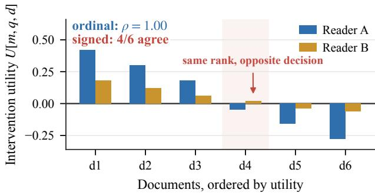
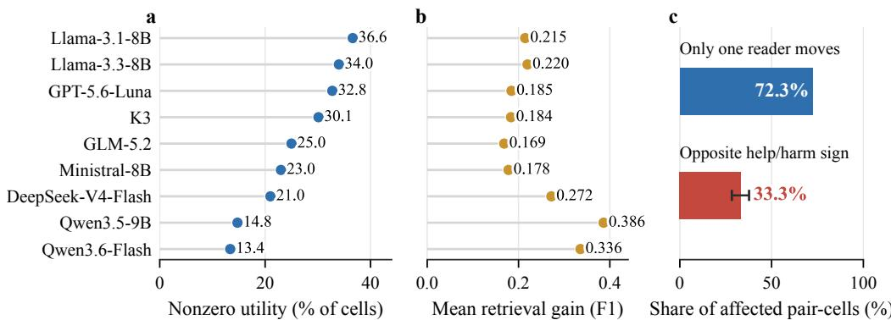
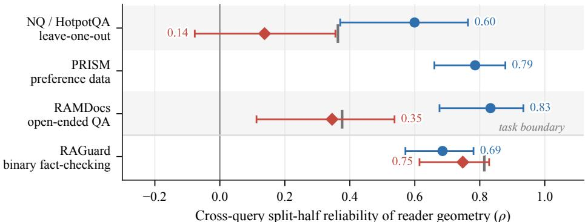
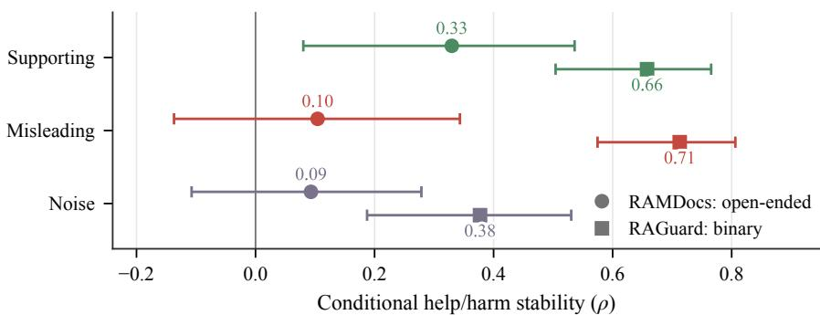
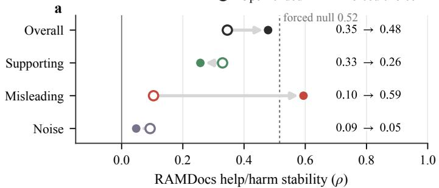
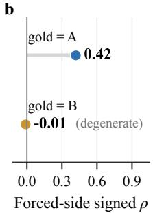
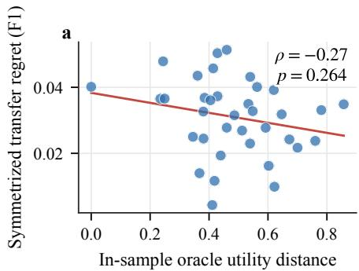
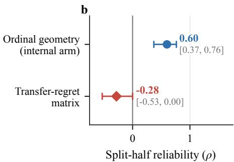

# PREFERENCE IS NOT INTERVENTION:THE STRUCTURE AND STABILITY BOUNDARIES OFREADER-SPECIFIC EVIDENCE UTILITY

Shi Zhou

College of Software, Jilin University

zhoushi25@mails.jlu.edu.cn

## ABSTRACT

ML systems increasingly condition decisions on downstream model identity, but this is useful only if model-specific differences form reusable structure rather than input-local interactions. We test this in retrieval-augmented generation (RAG), where evidence utility can be measured under controlled interventions. Holding query, evidence, task, scoring, and intervention fixed, nine readers disagree on effect sign in 33% of jointly affected cells; reader×query interaction explains 29.8% of utility variance versus an 8.4% permutation null; and self-selected evidence improves F1 by +0.031 (t = 3.39). We then ask the sharper question: which components of this heterogeneity are stable reader properties across queries? Separating three measurable objects—evidence activity, ordinal preference, and conditional signed direction—we find ordinal reader geometry stable across four independent settings (split-half ρ = 0.60–0.83): leave-one-out interventions, PRISM preferences, RAMDocs, and RAGuard. Signed geometry is task-bounded: weak in open-ended QA (0.14, 0.35), especially for misleading and irrelevant evidence, but strong in binary fact-checking (0.75) with no significant ordinal gap, though still below its sparsity-matched ceiling. Sparsity, decoding noise, and metric artifacts do not explain the main ordinal–signed gap. Finally, stable ordinal similarity fails to predict cross-reader intervention transfer (oracle-distance ρ = −0.27; regret reliability −0.28). Reader-specific utility exists, but preference is not intervention: stable ranking similarity does not license transfer of help/harm decisions.

## 1 INTRODUCTION

Modern ML systems increasingly condition their behavior on the identity of the model that consumes their outputs: retrieval is personalized per generator, queries are routed per model, ensembles are weighted per member. These bets pay off only to the extent that observed model-specific differences contain reusable structure—a stable property of the model—rather than situation-local interactions that evaporate on new inputs. We ask when this holds, in a test bed where the question can be studied with unusual control: evidence utility in retrieval-augmented generation (RAG).

Evidence selection in RAG is increasingly optimized for downstream utility: how much a document actually helps the generator, rather than how relevant it looks to a retriever. This raises a question the literature has not cleanly answered: does utility have a systematic reader-specific component? It is established that retriever preferences and LLM-friendly evidence diverge—the retriever–LLM preference gap [4]—and multi-system ranking work personalizes retrieval for different RAG agents [8]; but agents there differ simultaneously in task, dataset, backbone, and strategy, so the effect of changing only reader identity is not identified. What is missing is a controlled answer to: holding query, evidence, task, and intervention fixed, does the identity of the reading model itself induce reproducible differences in passage utility—and ifso, what is the structure ofthose differences?

We answer both parts. First, reader-specific utility is real. On 9 readers and 100 NQ/HotpotQA queries with leave-one-out interventions, readers disagree on whether a document helps or harms in 33% of jointly-affected cells (95% CI [0.283, 0.377]); in 72% of cases where a document moves at least one reader of a pair, it moves exactly one; per-reader nonzero-utility rates span 13–37%; and a reader’s own measured evidence selections beat the average of other readers’ selections by +0.031 F1 (query-clustered t = 3.39). Reader identity is not a nuisance variable—it is a load-bearing axis of evidence utility. A variance decomposition of the utility tensor sharpens the picture: reader×query interaction accounts for 29.8% of utility variance versus a null median of 8.4% $( p < 1 0 ^ { - 4 } )$ , whereas the reader main effect is only 0.4%. Reader-involving terms sum to 68% algebraically, but include an unreplicated three-way component (37.1%) that also absorbs residual variation. The dominant reader signal is thus interaction with query–evidence context—the structure whose stability must be established, not assumed.

Second, reader specificity is not one thing. Having established that utilities differ across readers, we ask whether these differences constitute a reusable reader property—a question with direct implications for persistent reader profiles and cross-reader transfer. We show that “reader-specific utility” decomposes into three measurable objects with different cross-query stabilities: activity (which documents move a reader at all), ordinal preference (how a reader ranks candidate evidence), and conditional signed direction (whether a document helps or harms, among documents that move both readers). The decomposition matters because different systems consume different objects: ranking-style supervision measures the ordinal object, while inclusion decisions depend on the signed one—a system could inherit “reader preference” structure without inheriting anything about intervention direction.

That is exactly what we find. Ordinal reader geometry is consistently cross-query stable in every setting we evaluate (split-half reliability 0.60/0.79/0.83/0.69 on our LOO arm, the independent PRISM preference data [3], RAMDocs, RAGuard). Conditional signed geometry is substantially weaker and task-bounded: near the floor in open-ended QA (0.14 internal; 0.35 on RAMDocs)—far below a sparsity-matched stable-world null—yet strongly stable in binary fact-checking (RAGuard 0.75, no significant ordinal gap, though below its sparsity-matched ceiling): a boundary condition, localized to misleading and irrelevant evidence (0.10/0.09) versus partially stable supporting evidence (0.33).

Third, the distinction has teeth downstream. In a real cross-reader transfer experiment (9×9 source–target pairs, 50 pre-registered queries, 4,050 cells), the reader specificity we establish does not assemble into transferable structure: transfer regret is predicted neither by behavioral profiles (ρ = 0.05) nor by in-sample oracle utility distance $( \rho = - 0 . 2 7 , \mathrm { n . s . ) }$ , and the regret matrix itself has no split-half reliability (−0.28). Stable ordinal similarity—the thing that is stable—does not license cross-reader intervention decisions.

## Contributions.

• C1 — Controlled characterization of reader-specific utility. Holding query, evidence, task, scoring, and intervention fixed, we show that changing only reader identity yields substantial, structured differences in passage utility, validated behaviorally by a significant self-reader selection advantage—to our knowledge the first controlled, multi-reader characterization separating the existence of reader heterogeneity from the stability of its components (§5.1).

• C2 — Stability decomposition and its boundary. Evidence activity and ordinal preference geometry are consistently cross-query stable across four independent settings; conditional help/harm geometry is substantially weaker, task-bounded, and localized to misleading/noise evidence in open-ended QA; frozen calibrations show that sparsity, decoding, and metric artifacts do not explain the main ordinal–signed gap (§5.2–§5.4). A matched forced-choice perturbation gives suggestive evidence that constraining the answer space stabilizes responses to misleading evidence (§5.5).

• C3 — Practical consequence. Stable ordinal reader similarity does not provide a stable basis for cross-reader intervention transfer (§5.6).

## 2 RELATED WORK

Consumer-dependent retrieval and downstream utility. Ke et al. [4] establish that retriever relevance preferences diverge from what downstream LLMs can exploit; multi-agent ranking work personalizes retrieval for 18 RAG agents from downstream feedback [8; 7]; R3AG [15] routes retrievers per generator. In all of these, consumers differ simultaneously in task, dataset, backbone, and strategy, so reader identity is confounded with task; we isolate it with everything else fixed.

LLM-specific utility notions. Concurrent preprint work proposes LLM-specific passage utility and reports limited transfer of utilitarian passages across generators [14]. We independently establish reader-conditioned utility differences under controlled interventions, but ask a different question:

  
Figure 1: Same ranking, different zero-crossings (illustrative). Ordinal agreement between two readers can coexist with opposite help/harm signs. Relative-preference supervision measures the former; inclusion decisions depend on the latter.

which components of the heterogeneity constitute stable reader structure across queries. Rank4Gen [3] learns generator-conditioned ranking from PRISM, which we use as an independent external replication resource for the ordinal component. Generator-agnostic utility rerankers that transfer across readers [11; 1] are consistent with our decomposition: predictable utility lives largely on the query/evidence side and in activity/ordinal structure.

Conflict robustness and methodology. RAMDocs [9] and RAGuard [13] supply typed evidence (supporting / misleading / noise); MAGIC [6] benchmarks inter-context conflict resolution. This literature asks whether models answer correctly under conflict; we ask whether the direction of a document’s effect is a stable reader attribute—and find the instability concentrates on exactly these adversarial evidence types. Our protocol builds on classical split-half reliability with stratified splits and sparsity-matched permutation calibration.

## 3 THREE STABILITIES OF READER-SPECIFIC UTILITY

## 3.1 READERS AND UTILITY

A reader is a model endpoint under a fixed deployment configuration—model, decoding policy, and serving stack fixed for the duration of the study—not an architecture-intrinsic personality. This makes reader identity operational and is what transfer systems actually condition on in deployment.

A utility operator maps (reader m, query $q ,$ document d) to a scalar $U [ m , q , d ]$ relative to a baseline. We use two operators:

$$
\mathrm { L O O : } \quad U [ m , q , d ] = \mathrm { s c o r e } _ { m } ( q , D ) - \mathrm { s c o r e } _ { m } ( q , D \setminus \{ d \} ) ,\tag{1}
$$

$$
\mathrm { S i n g l e - d o c : } \quad U [ m , q , d ] = \mathrm { s c o r e } _ { m } ( q , \{ d \} ) - \mathrm { s c o r e } _ { m } ( q , \emptyset ) ,\tag{2}
$$

where $D$ is a top-k retrieved context and ∅ is the closed-book condition. Scores are deterministic task metrics (token-F1 or exact/binary match, per dataset protocol).

## 3.2 THREE MEASURABLE OBJECTS

From the utility tensor we derive three reader-pair geometries. For readers $i , j$ and query $q \mathrm { : }$

• Activity: full-support sign agreement, counting the zero pattern as signal—whether a document moves the reader at all.

• Ordinal preference: Spearman correlation between the two readers’ utility vectors on q—relative preference, the object that preference-pair and listwise supervision captures.

• Conditional signed direction: sign agreement restricted to documents nonzero for both readers (dual-nonzero cells)—intervention direction: help versus harm.

Each object induces a per-query distance between i and $j ;$ aggregating over queries (median) yields a reader-pair distance matrix D—the object’s reader geometry. Figure 1 illustrates why the objects must be separated: two readers can rank six documents identically (Spearman = 1) while disagreeing on the sign of a third of them.

## 3.3 STABILITY AS SPLIT-HALF RELIABILITY OF THE GEOMETRY

An object’s cross-query stability is the split-half reliability of its geometry: split the queries into two stratified halves (by dataset source and, where applicable, gold verdict), compute D on each half, and correlate the two distance vectors across reader pairs (Spearman $\rho ;$ 1,000 random splits; we report the median and 2.5/97.5 percentiles). A stable reader property yields $D _ { A } \approx D _ { B } ;$ a query-local interaction yields uncorrelated halves. Pairwise geometry is the weakest object that similarity-based personalization relies on, and it makes no parametric commitment about reader profiles; whether it suffices for profile-level prediction is tested directly in §5.6.

## 3.4 PERMUTATION CALIBRATION AGAINST SPARSITY

Signed utility is sparse: most documents do not change most readers’ scores, so dual-nonzero cells are rare, and some loss of split-half reliability is expected from sparsity alone. To separate measurement sparsity from genuine instability, every signed estimate is calibrated against an armspecific stable-world permutation. All variants preserve the observed sparse support and relevant conflict-count marginals while imposing stable reader-pair conflict propensities across queries. The internal arm permutes observed conflict indicators within each reader pair; the external arms permute them within reader-pair×evidence-position strata (2,000– 5,000 simulations). Appendix E gives both constructions. Observed $\rho$ far below the null median rejects “sparsity explains the weakness.” A parallel null calibrates ordinal stability against type-level structure alone; repeated-decoding runs bound decoding stochasticity (§6).

## 3.5 WHAT STABILITY WOULD LICENSE

If conditional signed geometry were stable, a reader’s help/harm pattern estimated on one query set would transfer to new queries, reader profiles could be built once and reused, and reader-conditioned selection could target intervention direction. If only ordinal geometry is stable, ranking-style reader conditioning may still work—but inclusion decisions and cross-reader transfer of intervention choices are not licensed by the same evidence. Section 5.6 tests the transfer consequence directly.

## 4 EXPERIMENTAL SETUP

## 4.1 READERS

The internal LOO arm uses 9 core readers: five API endpoints (Qwen3.6-Flash, DeepSeek-V4- Flash, GLM-5.2, GPT-5.6-Luna, K3) and four local 8–9B GGUF endpoints (Qwen3.5-9B-Instruct, Ministral-8B-Instruct, Llama-3.3-8B-Instruct, Llama-3.1-8B-Instruct) served on a single RTX-4060 host (full roster and decoding configurations: Appendix A). The external single-document arm uses 13 readers: the 9 core plus Qwen3.7-Plus, Qwen3.7-Max, Qwen3.8-Max, and DeepSeek-V4-Pro. Decoding is deterministic wherever the endpoint permits (one endpoint requires temperature 1.0 with forced reasoning; it is treated as a distinct deployment configuration per §3). Local endpoints are quantized builds; the design compares relative geometry across readers, not absolute capability tiers, and scale-strata cuts are reported as descriptive only.

## 4.2 INTERNAL ARM: LOO UTILITY ON NQ/HOTPOTQA

100 queries (50 NQ [5], 50 HotpotQA [12]), each with 8 unique BGE-M3-ranked [2] candidate documents with guaranteed supporting evidence. Every reader answers 10 conditions per query (closed-book, full 8-document context, and eight leave-one-out contexts), scored by token-level F1 against gold answers: a 9 × 100 × 8 utility tensor (7,200 cells). Prompt templates and scoring contracts for all arms are given in Appendix B.

## 4.3 EXTERNAL ARMS: SINGLE-DOCUMENT INTERVENTIONS

RAMDocs [9] (open-ended disambiguation QA with misinformation): 149 queries meeting a frozen eligibility rule—at least two supporting (correct), one misleading (misinformation), and one noise document—with documents selected by frozen data order. Each (reader, query) contributes 5 conditions: closed-book plus four single-document contexts (support1, support2, mislead1, noise1). Scoring follows the dataset’s strict protocol, adapted to single-document conditions as normalized any-gold match.

  
Figure 2: Changing only the reader changes which evidence matters. Across 9 readers and 100 fixed NQ/HotpotQA queries, (a) activity spans 13.4–36.6%, (b) mean retrieval gain is positive for every reader, and (c) 72.3% of affected pair-cells move only one reader while 33.3% reverse the help/harm sign when both move.

RAGuard [13] (real-world fact verification against misleading Reddit retrievals): 212 claims under the same eligibility rule; scoring is binary verdict match with deterministic parsing. Both arms stratify query splits by dataset and (for RAGuard) gold verdict. Per-position signed analyses pool the two support positions and report the misleading and noise positions separately.

## 4.4 EXTERNAL ORDINAL ARM: PRISM

PRISM/Rank4Gen-DPO public data [3]: 58,404 preference rows → 29,197 unique (query, generator) keys (bilingual prompt variants deduplicated), covering 7,791 unique queries across five sources (HotpotQA, 2WikiMultiHopQA, MuSiQue, MS MARCO, CRUD-RAG) and seven downstream generators. Each key’s chosen ordered document set is the generator’s preferred context. Candidate indices are translated to per-query canonical document ids via normalized-text digests (99.98% pool-Jaccard across generators), so cross-generator comparisons are of the same documents. Ordinal geometry: per-query RBO [10] (p = 0.9) between chosen ordered sequences; composition-only auxiliary via Jaccard; 21 generator pairs; the same 1,000-split stratified protocol. PRISM has no signed operator—it calibrates the ordinal half only.

Freezing and reproducibility. Query eligibility rules, per-arm decision rules, split counts and seeds, parsing tiers, and the transfer plan were frozen before results analysis; artifact-level checksums and frozen plans are retained (§J). All analyses run on frozen artifacts with fixed seeds.

## 5 RESULTS

## 5.1 RQ1 — READER-SPECIFIC UTILITY IS REAL (CONTROLLED HETEROGENEITY)

Before stability, existence. With everything else fixed, changing only reader identity yields substantial differences (Figure 2; per-reader statistics in Appendix C). All readers benefit from retrieval on average (gain +0.169 to +0.386 F1), but which documents drive the gain differs sharply:

• Sign disagreement. Pooling all 36 reader pairs, readers assign opposite signs to a document’s effect in 33.3% of dual-nonzero cells (1,067/3,206; query-cluster bootstrap 95% CI [0.283, 0.377]).

• Activity asymmetry. In 72.3% of (pair, cell) cases where a document moves at least one reader of a pair, it moves exactly one (8,348/11,554). Per-reader nonzero rates span 13.4–36.6% (2.7×). The external arms show the same spread (RAGuard: 16.8–51.5%).

• Behavioral validation. A reader’s own measured preference set outperforms the average of other readers’ sets by +0.031 F1 (query-clustered t = 3.39, df = 49; in sample, §5.6) — reader-specific utility is not only measurable but actionable in principle.

A three-way variance decomposition of the 7,200-cell tensor (reader × query × rank position; Appendix C) makes the same point at the distribution level: the clean reader×query interaction accounts for 29.8% of variance versus a permutation-null median of 8.4% $( p < 1 0 ^ { - 4 } )$ , while the reader main effect is only 0.4%. All reader-involving terms sum to 68.0% of the algebraic decomposition. Because there is one observation per reader×query×position cell, that sum includes a 37.1% three-way component that also absorbs residual variation. The signal is nevertheless large and interaction-led, not a uniform reader-level shift.

  
Ordinal preference Conditional help/harm Stable-world null

Figure 3: Ordinal stability is broad; signed stability has a task boundary. Cross-query split-half reliability of reader-pair geometry across four independent settings (points: medians over 1,000 stratified splits; whiskers: 2.5/97.5 percentiles). Blue: ordinal geometry. Red: conditional signed geometry. Gray ticks: sparsity-matched stable-world nulls (§3.4). PRISM has no signed operator.
<table><tr><td>Setting</td><td>ρordinal</td><td> $\rho _ { \mathrm { s i g n e d } }$  [95% range]</td><td>Stable null</td><td>p</td></tr><tr><td>NQ/HotpotQA LOO (9 readers)</td><td>0.599</td><td>0.138 [-0.077, 0.356]</td><td>0.363</td><td> $2 \times 1 0 ^ { - 4 }$ </td></tr><tr><td>RAMDocs single-doc (13 readers)</td><td>0.833</td><td>0.345 [0.113, 0.538]</td><td>0.376</td><td> $5 \times 1 0 ^ { - 4 }$ </td></tr><tr><td>RAGuard single-doc (13 readers)</td><td>0.685</td><td>0.748 [0.614, 0.829]</td><td>0.814</td><td> $5 \times 1 0 ^ { - 4 }$ </td></tr></table>

Table 1: Conditional signed vs. ordinal stability and stable-world nulls. In open-ended QA, signed geometry lies far below ordinal geometry and its sparsity-matched ceiling. In binary fact-checking it is statistically indistinguishable from ordinal geometry, although still below that ceiling.

Heterogeneity of this size is what reader-conditioned evidence selection hopes to exploit. The rest of the paper asks what part of it is a stable reader property.

## 5.2 RQ2 — ORDINAL PREFERENCE GEOMETRY IS CONSISTENTLY STABLE

Ordinal reader geometry reproduces across disjoint query halves in every evaluated setting (Figure 3, blue): 0.599 [0.370, 0.764] on the internal LOO arm, 0.786 [0.660, 0.879] on PRISM, 0.833 [0.676, 0.934] on RAMDocs, and 0.685 [0.571, 0.781] on RAGuard—spanning two utility operators, two answer formats, and an independent preference pipeline with different generators and query sources. On PRISM the result survives artifact controls: an identity-shuffle null (chosen-list lengths preserved, document identities resampled) yields only 0.314 against the observed 0.786; an order-shuffle null yields 0.703, so composition carries most of the stability and ordering adds ∼0.08; an exactly sizematched comparison is more stable, not less (0.862); and composition-only Jaccard geometry is likewise stable (0.742). Full split distributions and null calibrations are in Appendices D and E.

## 5.3 RQ3 — CONDITIONAL SIGNED GEOMETRY IS WEAKER, WITH A TASK BOUNDARY

Three observations (Figure 3, red; Table 1). First, in open-ended QA the conditional signed geometry is far below the ordinal geometry—paired per-split ∆ = 0.487 [0.226, 0.721] on RAMDocs—and far below what measurement sparsity alone predicts: the stable-world null expects $\rho \approx 0 . 3 6 \mathrm { - } 0 . 3 8$ under identical support, while observed values are 0.14 and $0 . 3 5 \ : ( p = 2 \times 1 0 ^ { - 4 }$ and $5 \times 1 0 ^ { - 4 }$ ; two further calibrations concur, Appendix E). Second, the weakness is not universal: in binary fact-checking the signed geometry is as stable as the ordinal one (paired $\Delta = - 0 . 0 6 4 [ - 0 . 2 0 1 , 0 . { \dot { 1 } } 1 4 ] )$ . It is strongly stable, not at the stable-world ceiling $( 0 . 7 4 8 \ \mathrm { v s . } \ 0 . 8 1 4 , p = 5 \times 1 0 ^ { - 4 } )$ . Our own data therefore reject the universal instability claim and instead establish a task boundary. Third, both external arms use a different intervention operator than the internal arm, so the open-QA weakness is not an artifact of leave-one-out redundancy. The signed reading is “substantially weaker than ordinal and below its sparsity-matched ceiling,” not “zero.”

  
Figure 4: The task boundary localizes to evidence type. Points and whiskers show per-position signed split-half reliability and its 2.5/97.5 percentiles. RAMDocs (circles) is weak for misleading and noise evidence; RAGuard (squares) is stable across all three positions.

Open-ended Forced choice  

  
Figure 5: Constraining the answer space (matched perturbation, RAMDocs arm). (a) Open-ended vs. forced-choice signed stability, overall and by evidence type: the elevation concentrates on misleading evidence $( 0 . 1 0  0 . 5 9 )$ . (b) Label-stratum asymmetry: stabilizing geometry measurable in the gold = A stratum; gold = B degenerate.

## 5.4 RQ4 — IN OPEN-ENDED QA, INSTABILITY LOCALIZES TO MISLEADING AND NOISE EVIDENCE

RAMDocs per-position signed stability (Figure 4): supporting evidence 0.330 [0.080, 0.536] over 14,549 dual-nonzero cells; misleading 0.104 [−0.137, 0.343] over 2,561; noise 0.093 [−0.107, 0.279] over 1,888. The weakness is not uniform across evidence processing: directions of supporting evidence are partially stable, while directions of misleading and irrelevant evidence are essentially query-local. RAGuard shows the opposite pattern (0.658 / 0.713 / 0.377)—in binary verification, even misleading-evidence direction is stable across queries. What varies by task regime is specifically the cross-query stability of how a reader responds to adversarial evidence.

## 5.5 A MATCHED MECHANISM PROBE — FORCED CHOICE (SUGGESTIVE)

One candidate mechanism is the answer space: binary verdicts leave less room for reader-specific conflict resolution than open-ended answers. We test this with a matched RAMDocs perturbation that changes only the output contract to a two-option forced choice (gold vs. misinformation-supported answer; fixed A/B assignment), using the pre-registered decision rule in Appendix G.

Overall signed stability rises from 0.345 to 0.479 (paired $\Delta = + 0 . 1 3 0 \ [ - 0 . 1 1 4 , 0 . 4 0 3 ] )$ , partial evidence under the frozen rule. The elevation is misleading-selective (0.104 to 0.594), while supporting evidence is unchanged (0.330 to 0.257). The forced-side mislead geometry is measurable only in the gold = A stratum (0.599; gold = B degenerate), and remains below its own stable null (0.516, $p = 5 \mathrm { \tilde { \times } 1 0 ^ { - 4 } } )$ . We therefore treat the answer-space account as a suggestive mechanism, not an identified cause; the task boundary itself is the established result.

## 5.6 PRACTICAL CONSEQUENCE — STABLE SIMILARITY DOES NOT LICENSE TRANSFER

If stable ordinal geometry licensed intervention-level personalization, reader similarity should predict transfer. We test this on 9 target readers and 50 pre-registered queries using tie-aware source preference sets, yielding 4,050 source×target×query cells (construction details: Appendix H).

  
Figure 6: Stable similarity does not predict intervention transfer. (a) Across 36 reader pairs, in-sample oracle utility distance is unrelated to symmetrized transfer regret $( \rho = - 0 . 2 7 , p = 0 . 2 6 4 )$ . (b) The regret matrix has no reliable split-half structure $( \rho = - 0 . 2 8 $ , 95% interval $[ - 0 . 5 3 , 0 . 0 0 ] )$ ; self-selected evidence still gives the in-sample +0.031 F1 advantage reported in the text.

<table><tr><td>Alternative</td><td>Evidence and disposition</td></tr><tr><td>instability</td><td>Utility sparsity inflates Stable-world permutation holding support fixed: rejected;  $\rho _ { \mathrm { s i g n e d } }$  remains far below the null (LOO 0.138 vs. 0.363; RAMDocs 0.345 vs. 0.376, both  $p { \leq } 5 { \times } 1 0 ^ { - 4 } )$  1</td></tr><tr><td>Decoding stochasticity</td><td>Repeated-decoding test-retest and attenuation bound: rejected as sole cause;</td></tr><tr><td></td><td>f=0.123 caps corrected  $\rho _ { \mathrm { s i g n e d } }$  at 0.242, far below  $\rho _ { \mathrm { o r d i n a l } } = 0 . 5 9 9 .$  Metric/threshold artifact Matched metrics on identical support: localized; full-support activity is stable (0.650</td></tr><tr><td></td><td>≈ 0.599), while signed direction is weak (0.138). PRISM measures output Identity-shuffle, order-shuffle, and size-matched nulls: rejected; identity null 0.314</td></tr><tr><td>habits artifact</td><td>vs. 0.786, order null 0.703, and size-matched control raises stability to 0.862. Leave-one-out operator Replication under a single-document operator: open-QA weakness persists across</td></tr><tr><td></td><td>operators (RAMDocs). Universal signed instabil- External binary fact-checking check: rejected by our own data (RAGuard 0.748);</td></tr><tr><td>ity nism</td><td>the task boundary remains. Answer-space mecha- Matched forced-choice perturbation: partial evidence  $( \Delta = + 0 . 1 3 0 ,$  CI crosses 0); mislead-selective elevation is measurable in the gold = A stratum only.</td></tr></table>

Table 2: Alternative explanations and their disposition.

Reader-specific utility is real (in sample): self-selected evidence beats other readers’ sets by +0.031 F1 $( t = 3 . 3 9 )$ ). But similarity does not predict transfer: oracle utility distance vs. regret gives $\rho = - 0 . 2 7 1$ $( p = 0 . 2 6 4 )$ , and the regret matrix has no split-half reliability (−0.281 [−0.530, 0.001]; mean regret 0.035 F1, mean standard error 0.037).

Stable ordinal similarity is therefore not a sufficient basis for cross-reader intervention decisions, even when similarity is measured in sample.

## 6 ALTERNATIVE EXPLANATIONS

Table 2 summarizes the controls. The test–retest analysis (Appendix F) shows that decoding stochasticity is real but does not explain the main ordinal–signed gap: the attenuation-corrected ceiling remains far below ordinal stability on both the internal and RAMDocs arms.

## 7 DISCUSSION

What kind of reader specificity exists? Our results separate three claims that “reader-specific utility” collapses into one. Readers genuinely differ on matched query–evidence conditions, and consequentially (§5.1). The ordinal reading is additionally stable: it reproduces across disjoint query sets in all four settings, including an independent preference pipeline. The signed reading is not uniformly stable: weak in open-ended QA, concentrated on adversarial evidence, strong in binary verification. “Utility is reader-specific” is true per query, yet not a stable signed trait across queries in open-ended QA.

Reconciling generator-conditioned and generator-agnostic methods. Generator-conditioned ranking can work because ordinal/compositional preference geometry is genuinely cross-query stable; generator-agnostic utility rerankers can generalize because much predictable utility lives on the query/evidence side and in activity structure. Both are compatible with signed direction being query-local: neither ranking nor transferable utility estimation requires stable help/harm geometry.

For personalization systems. Condition on the reader for ranking and composition, where stability holds. For intervention-level personalization, stable ordinal similarity implies neither transferable intervention decisions nor a reliably structured transfer outcome: treat help/harm direction as querylocal unless the task regime is known to stabilize it.

For evaluation practice. Preference-pair and listwise supervision measure ordinal structure; deployment decisions depend on intervention direction. A method can look stable under ranking-style evaluation while the property that matters for inclusion decisions is query-local. Cross-query reliability of signed utility—with sparsity-matched calibration—should accompany any claim of stable reader preference. Our data suggest the boundary hypothesis that intervention direction stabilizes when the task constrains how evidence can be realized in the answer; identifying the causal axis is left to future work.

## 8 LIMITATIONS

The task boundary is established, but its causal axis is not identified: the forced-choice perturbation is partial evidence with label-stratum degeneracy. We do not claim priority for model-dependent passage utility (a concurrent preprint proposes the notion [14]); ours is the controlled characterization and stability decomposition. The two arms use different reader panels and PRISM has no signed operator; cross-setting comparisons are of stability patterns, not identical measurements. Transfer uses 50 queries per cell; utility is task-metric-based.

## 9 CONCLUSION

Reader-specific evidence utility is real and consequential: with all else fixed, changing the reader changes which documents help, harm, or do nothing. Relative evidence preferences are consistently cross-query stable across readers, datasets, and preference constructions; the stability of help-versus-harm directions is task-bounded—weaker in open-ended QA, concentrated on misleading and irrelevant evidence, and absent as a gap in binary fact-checking. Preference is not intervention: stable ordinal geometry licenses neither cross-reader transfer nor claims of stable help/harm direction.

## REFERENCES

[1] Manish Chandra, Debasis Ganguly, and Iadh Ounis. LURE-RAG: Lightweight utility-driven reranking for efficient RAG. arXiv preprint arXiv:2601.19535, 2026.

[2] Jianlyu Chen, Shitao Xiao, Peitian Zhang, Kun Luo, Defu Lian, and Zheng Liu. M3-embedding: Multilinguality, multi-functionality, multi-granularity text embeddings through self-knowledge distillation. In Findings of the Association for Computational Linguistics: ACL 2024, pages 2318–2335, 2024. doi: 10.18653/v1/2024.findings-acl.137.

[3] Yongqi Fan, Yuxiang Chu, Zhentao Xia, Xiaoyang Chen, Jie Liu, Haijin Liang, Jin Ma, Ben He, Yingfei Sun, Jie Zhai, Dezhi Ye, and Tong Ruan. Rank4gen: RAG-preference-aligned document set selection and ranking. arXiv preprint arXiv:2601.11273, 2026.

[4] Zixuan Ke, Weize Kong, Cheng Li, Mingyang Zhang, Qiaozhu Mei, and Michael Bendersky. Bridging the preference gap between retrievers and LLMs. In Proceedings of the 62nd Annual Meeting of the Association for Computational Linguistics (Volume 1: Long Papers), pages 10438–10451, 2024. doi: 10.18653/v1/2024.acl-long.562.

[5] Tom Kwiatkowski, Jennimaria Palomaki, Olivia Redfield, Michael Collins, Ankur Parikh, Chris Alberti, Danielle Epstein, Illia Polosukhin, Jacob Devlin, Kenton Lee, Kristina Toutanova, Llion Jones, Matthew Kelcey, Ming-Wei Chang, Andrew M. Dai, Jakob Uszkoreit, Quoc Le, and Slav Petrov. Natural questions: A benchmark for question answering research. Transactions of the Association for Computational Linguistics, 7:453–466, 2019. doi: 10.1162/tacl a 00276.

[6] Jungyeon Lee, Kangmin Lee, and Taeuk Kim. MAGIC: A multi-hop and graph-based benchmark for inter-context conflicts in retrieval-augmented generation. arXiv preprint arXiv:2507.21544, 2025.

[7] Alireza Salemi and Hamed Zamani. Towards a search engine for machines: Unified ranking for multiple retrieval-augmented large language models. In Proceedings of the 47th International ACM SI-GIR Conference on Research and Development in Information Retrieval, pages 741–751, 2024. doi: 10.1145/3626772.3657733.

[8] Alireza Salemi and Hamed Zamani. Learning to rank for multiple retrieval-augmented models through iterative utility maximization. In Proceedings of the 2025 International ACM SIGIR Conference on Innovative Concepts and Theories in Information Retrieval, pages 183–193, 2025. doi: 10.1145/3731120. 3744584.

[9] Han Wang, Archiki Prasad, Elias Stengel-Eskin, and Mohit Bansal. Retrieval-augmented generation with conflicting evidence. arXiv preprint arXiv:2504.13079, 2025.

[10] William Webber, Alistair Moffat, and Justin Zobel. A similarity measure for indefinite rankings. ACM Transactions on Information Systems, 28(4):1–38, 2010. doi: 10.1145/1852102.1852106.

[11] Yuhang Wu, Xiangqing Shen, Fanfan Wang, Cangqi Zhou, Zhen Wu, Xinyu Dai, and Rui Xia. Optimizing RAG rerankers with LLM feedback via reinforcement learning. In Proceedings of the 64th Annual Meeting ofthe Associationfor Computational Linguistics (Volume 1: Long Papers), 2026. doi: 10.18653/v1/2026. acl-long.1406.

[12] Zhilin Yang, Peng Qi, Saizheng Zhang, Yoshua Bengio, William W. Cohen, Ruslan Salakhutdinov, and Christopher D. Manning. HotpotQA: A dataset for diverse, explainable multi-hop question answering. In Proceedings of the 2018 Conference on Empirical Methods in Natural Language Processing, pages 2369–2380, 2018. doi: 10.18653/v1/D18-1259.

[13] Linda Zeng, Rithwik Gupta, Divij Motwani, Yi Zhang, and Diji Yang. Worse than zero-shot? a factchecking dataset for evaluating the robustness of RAG against misleading retrievals. In Advances in Neural Information Processing Systems 38: Datasets and Benchmarks Track, pages 179845–179871, 2025. doi: 10.52202/085713-5409.

[14] Hengran Zhang, Keping Bi, Jiafeng Guo, Jiaming Zhang, Shuaiqiang Wang, Dawei Yin, and Xueqi Cheng. LLM-specific utility: A new perspective for retrieval-augmented generation. arXiv preprint arXiv:2510.11358, 2025.

[15] Tong Zhao, Yutao Zhu, Yucheng Tian, and Zhicheng Dou. R3AG: Retriever routing for retrieval-augmented generation. In Proceedings of the 64th Annual Meeting of the Association for Computational Linguistics (Volume 1: Long Papers), 2026. doi: 10.18653/v1/2026.acl-long.939.

## ETHICS AND REPRODUCIBILITY

All datasets are public (NQ, HotpotQA, RAMDocs, RAGuard, PRISM) and used within their licenses; no human subjects or personal data are involved. RAGuard documents originate from Reddit; we use them only as retrieved evidence under the dataset’s terms. All experimental decisions reported here were frozen before results analysis; artifacts, frozen plans, and analysis scripts will be released. Misleading-evidence findings describe model behavior under misinformation and carry no endorsement of the misleading content.

Provenance. An earlier candidate reader failed the response-validity criterion and was excluded before the final analysis panel; primary conclusions were recomputed on the finalized roster.

## AI USAGE DISCLOSURE

AI assistants were used for literature cross-checking, feedback on framing and experimental design, interpretation of results, and manuscript editing. All experimental decision rules were frozen before results analysis, all analyses were executed programmatically on frozen artifacts, and every reported number was recomputed from those artifacts. The authors take full responsibility for all content.

## A READER ROSTER AND DEPLOYMENT CONFIGURATIONS

Table 3 lists the 13 readers. Following §3, a reader is a model endpoint under a fixed deployment configuration. All endpoints except K3 run deterministic decoding (temperature 0, reasoning disabled, 128-token cap). K3’s endpoint forces temperature 1.0 and always-on reasoning; we run it with the minimal reasoning effort and a 2,048-token budget and analyze it as its own deployment configuration.

Local readers are GGUF builds served on a single RTX-4060 host. Internal identifiers predate the final display names: reader qwen flash, reader deepseek flash, and reader glm denote Qwen3.6-Flash, DeepSeek-V4-Flash, and GLM-5.2 respectively.
<table><tr><td>Reader</td><td>Endpoint model</td><td>Deployment</td><td>Decoding</td><td>Arms</td></tr><tr><td>Qwen3.6-Flash</td><td>qwen3.6-flash</td><td>hosted API</td><td>T=0, no reasoning, 128 tok</td><td>LOO, SD</td></tr><tr><td>DeepSeek-V4-Flash</td><td>deepseek-v4-flash-0731</td><td>hosted API</td><td>T=0, no reasoning, 128 tok</td><td>LOO, SD</td></tr><tr><td>GLM-5.2</td><td>g1m-5.2</td><td>hosted API</td><td>T=0, no reasoning, 128 tok</td><td>LOO, SD</td></tr><tr><td>GPT-5.6-Luna</td><td> ${ \mathfrak { g p t } } - 5 . 6 - { \mathrm { 1 u n a } }$ </td><td>hosted API</td><td>T=0, reasoning off, 128 tok</td><td>LOO, SD</td></tr><tr><td>K3</td><td>k3-256k</td><td>hosted API</td><td>T=1.0*, reasoning low*, 2048 tok</td><td>LOO, SD</td></tr><tr><td>Qwen3.5-9B-Instruct</td><td>Q3_K_M GGUF</td><td>local</td><td> ${ \mathrm { T } } { = } 0 ,$  no reasoning, 128 tok</td><td>LOO, SD</td></tr><tr><td>Ministral-8B-Instruct-2410</td><td>Q4_K_M GGUF</td><td>local</td><td> ${ \mathrm { T } } { = } 0 ,$  no reasoning, 128 tok</td><td>LOO, SD</td></tr><tr><td>Llama-3.3-8B-Instruct</td><td>Q4_K_M GGUF</td><td>local</td><td> ${ \mathrm { T } } { = } 0 ,$  no reasoning, 128 tok</td><td>LOO, SD</td></tr><tr><td>Llama-3.1-8B-Instruct</td><td>Q4_K_M GGUF</td><td>local</td><td>T=0, no reasoning, 128 tok</td><td>LOO, SD</td></tr><tr><td>Qwen3.7-Plus</td><td>qwen3.7-plus</td><td>hosted API</td><td>T=0, no reasoning, 128 tok</td><td>SD</td></tr><tr><td>Qwen3.7-Max</td><td> ${ \tt q w e n 3 . 7 - m a x }$ </td><td>hosted API</td><td>T=0, no reasoning, 128 tok</td><td>SD</td></tr><tr><td>Qwen3.8-Max</td><td>qwen3.8-max</td><td>hosted API</td><td> $\mathrm { T } { = } 0 ,$  no reasoning, 128 tok</td><td>SD</td></tr><tr><td>DeepSeek-V4-Pro</td><td> $\mathtt { d e e p s e e k - v 4 - p r o }$ </td><td>hosted API</td><td> $\mathrm { T } { = } 0 ,$  no reasoning, 128 tok</td><td>SD</td></tr></table>

Table 3: Reader roster. Arms: LOO = internal leave-one-out arm (9 readers); SD = external single-document arms (13 readers). ∗Endpoint constraint: K3 permits neither lower temperatures nor disabling reasoning; it is analyzed as a distinct deployment configuration.

The pre-registered exclusion rule (fallback/parse failure > 25% of a reader’s conditions, or nonzero utility rate < 5%) was applied mechanically per arm. No reader triggered it in any final arm; the highest fallback rate is 21.6% (Ministral-8B on RAMDocs) and the next highest 7.8%. Per-reader QC statistics are recorded in the analysis artifacts (Appendix J). Scale strata used for descriptive cuts on the single-document arm: api-mid = {Qwen3.6-Flash, Qwen3.7-Plus, DeepSeek-V4-Flash}; frontier = {Qwen3.7-Max, Qwen3.8-Max, DeepSeek-V4-Pro, GLM-5.2, GPT-5.6-Luna, K3}; local-small = the four local readers.

## B PROMPTS AND SCORING CONTRACTS

All QA-style conditions—every LOO condition, the RAMDocs and RAGuard single-document conditions, and all transfer evaluations—share one prompt contract:

System: You are answering a factual question. Follow the output format exactly.

User: Question: ⟨question⟩

Evidence: [1] ⟨document 1⟩; [2] ⟨document 2⟩; . . . ; [k] ⟨document k

Return only: Answer: ⟨short answer

Closed-book conditions replace the evidence block with “(No evidence provided.)”. RA-Guard questions are wrapped as “Is the following claim true or false? Claim: ‘⟨claim⟩’ ” with gold answers True/False; document text is the title plus the first 4,000 characters of the full text (97.2% of selected documents covered in full).

Forced-choice menu (§5.5; RAMDocs arm only):

⟨question⟩

Which of the two options is the correct answer to the question above?

A) ⟨option A⟩

B) ⟨option B⟩

Respond with the option letter only.

Option A is the supporting answer and option B the misinformation answer iff the md5 hash of the query id is even—deterministic and computable from the query id alone. In 44 of 149 rows the two supporting documents assert different valid interpretations; the menu gold then follows support1, frozen uniformly across readers.

Scoring. Answers are normalized (lowercase; punctuation stripped; articles removed; whitespace collapsed) and scored as the maximum over gold aliases, as exact match or token-level F1. The prediction is the last line matching answer:; failing that, the last nonempty line (a leading “final answer:” is stripped). Forced-choice responses use a tiered parser: (1) exact single letter; (2) leading letter with separator and matching option text; (3) unambiguous option-text mention; otherwise tier-0, scored incorrect (per-reader tier-0 rates 0.0–2.6%).

Utility operators. LOO arm: $U ( m , q , d ) = \mathrm { F } 1$ (full 8-document context) − F1(context minus d). Single-document arms: $U ( m , q , d ) = \mathrm { s c o r e }$ (document d only) − score(closed-book), with score = F1 (open-ended) or accuracy (forced choice).

## C PER-READER UTILITY STATISTICS (LOO ARM)

<table><tr><td>Reader</td><td>Nonzero utility rate</td><td>Mean full-context gain (F1)</td></tr><tr><td>Qwen3.6-Flash</td><td>0.134</td><td>+0.336</td></tr><tr><td>DeepSeek-V4-Flash</td><td>0.210</td><td>+0.272</td></tr><tr><td>GLM-5.2</td><td>0.250</td><td>+0.169</td></tr><tr><td>GPT-5.6-Luna</td><td>0.328</td><td>+0.185</td></tr><tr><td>K3</td><td>0.301</td><td>+0.184</td></tr><tr><td>Qwen3.5-9B-Instruct (Q3)</td><td>0.148</td><td>+0.386</td></tr><tr><td>Ministral-8B-Instruct (Q4)</td><td>0.230</td><td>+0.178</td></tr><tr><td>Llama-3.3-8B-Instruct (Q4)</td><td>0.340</td><td>+0.220</td></tr><tr><td>Llama-3.1-8B-Instruct (Q4)</td><td>0.366</td><td>+0.215</td></tr></table>

Table 4: Per-reader utility statistics on the internal LOO arm (800 cells per reader: 100 queries $\times \ 8$ documents). Nonzero rate: fraction of cells with $U \neq 0 .$ . Gain: F1(full context) − F1(closed-book), averaged over queries.

Pooling all 36 reader pairs: dual-nonzero sign conflicts occur in 1,067 of 3,206 cells (33.3%; querycluster bootstrap 95% CI [0.283, 0.377]; 10,000 resamples over the 100 queries); activity asymmetry in 8,348 of 11,554 pair–cell cases (72.3%). The dual-nonzero support of 3,206 is pinned as the checksum of the sparsity calibration (Appendix E).

Variance decomposition. Treating the tensor as a balanced reader × query × position layout (one observation per cell), the exact sums-of-squares decomposition attributes variance as follows (query-cluster bootstrap 95% CI, 10,000 resamples): reader main effect 0.4% [0.3, 1.4]; query 6.0% [4.2, 7.9]; position 2.3% [1.1, 4.5]; reader×query 29.8% [25.7, 33.0]; reader×position 0.8% [0.8, 1.6]; query×position 23.7% [19.8, 27.6]; reader×query× position (residual) 37.1% [33.0, 40.6]. All terms involving the reader sum to 68.0% [63.4, 72.5] in this algebraic decomposition. Because every reader×query×position cell is observed once, the three-way term cannot be separated from measurement error or other residual variation; the 68.0% sum must be read with that qualification. Permutation tests (10,000 simulations; values shuffled across readers within each query–position column, destroying all reader structure) reject the null for the reader main effect (observed 0.4% vs. null median 0.08%, $p < 1 0 ^ { - 4 } )$ and for reader×query (29.8% vs. 8.4%, $p < 1 0 ^ { - 4 } )$ , but not for reader×position (0.8% vs. 0.6%, $p = 0 . 0 8 \mathrm { , }$ ). The clean result is therefore the large reader×query interaction, not a uniform reader shift; the 68.0% reader-involving sum is a broader descriptive total.

## D FULL SPLIT DISTRIBUTIONS

All estimates use the frozen stratified split-half protocol (1,000 splits; seeds 20260815 internal/PRISM, 20260817 external arms). Table 5 reports the full split distributions underlying Figure 3 and Table 1; Table 6 the per-position breakdown underlying Figures 4 and 5. On the internal arm, 80.6% of ordinal splits exceed 0.5 while 92.5% of signed splits fall below 0.3 (11.5% negative).

<table><tr><td>Setting</td><td>Object</td><td>2.5</td><td>25</td><td>Median</td><td>75</td><td>97.5</td><td>NN</td></tr><tr><td>NQ/HotpotQA LOO</td><td>ordinal</td><td>0.370</td><td>0.525</td><td>0.599</td><td>0.664</td><td>0.764</td><td>0.397</td></tr><tr><td rowspan="3">PRISM (RBO)</td><td>signed</td><td>-0.077</td><td>0.058</td><td>0.138</td><td>0.218</td><td>0.356</td><td>0.198</td></tr><tr><td>ordinal</td><td>0.660</td><td>0.748</td><td>0.786</td><td>0.819</td><td>0.879</td><td>0.571</td></tr><tr><td>ordinal</td><td>0.445</td><td>0.680</td><td>0.742</td><td>0.836</td><td>0.999</td><td>0.991</td></tr><tr><td>PRISM (Jaccard) RAMDocs</td><td>ordinal</td><td>0.676</td><td>0.779</td><td>0.833</td><td>0.870</td><td>0.934</td><td>0.884</td></tr><tr><td rowspan="4">RAGuard</td><td>signed</td><td>0.113</td><td>0.268</td><td>0.345</td><td>0.417</td><td>0.538</td><td>0.246</td></tr><tr><td>paired  $\Delta$ </td><td>0.226</td><td>0.403</td><td>0.487</td><td>0.566</td><td>0.721</td><td></td></tr><tr><td>ordinal</td><td>0.571</td><td>0.646</td><td>0.685</td><td>0.721</td><td>0.781</td><td>0.361</td></tr><tr><td>signed</td><td>0.614</td><td>0.708</td><td>0.748</td><td>0.784</td><td>0.829</td><td>0.402</td></tr><tr><td rowspan="4">RAMDocs forced</td><td>paired  $\Delta$ </td><td>-0.201</td><td>-0.108</td><td>-0.064</td><td>-0.012</td><td>0.114</td><td></td></tr><tr><td>signed</td><td>0.290</td><td>0.414</td><td>0.479</td><td>0.536</td><td>0.624</td><td></td></tr><tr><td> $\Delta _ { \mathrm { f o r m a t } }$ </td><td>-0.114</td><td>0.039</td><td>0.130</td><td>0.214</td><td>0.403</td><td></td></tr><tr><td>ordinal (descr.)</td><td>0.437</td><td>0.674</td><td>0.748</td><td>0.808</td><td>0.900</td><td></td></tr><tr><td>Setting</td><td>Position</td><td>2.5</td><td>Median</td><td>97.5</td><td>Splits</td><td>Support</td></tr><tr><td rowspan="3">RAMDocs</td><td>support (pooled ×2)</td><td>0.080</td><td>0.330</td><td>0.536</td><td>1,000</td><td>14,549</td></tr><tr><td>mislead1</td><td>-0.137</td><td>0.104</td><td>0.343</td><td>1,000</td><td colspan="2">2,561</td></tr><tr><td>noisel</td><td>-0.107</td><td>0.093</td><td>0.279</td><td>1,000</td><td colspan="2">1,888</td></tr><tr><td rowspan="3">RAGuard</td><td>support (pooled ×2)</td><td>0.504</td><td>0.658</td><td>0.766</td><td>1,000</td><td>3,353</td></tr><tr><td>mislead1</td><td>0.575</td><td>0.713</td><td>0.806</td><td>1,000</td><td colspan="2">2,240</td></tr><tr><td>noise1</td><td>0.187</td><td>0.377</td><td>0.530</td><td>1,000</td><td colspan="2">1,179</td></tr><tr><td rowspan="3">RAMDocs forced</td><td>support (pooled ×2)</td><td>0.039</td><td>0.257</td><td>0.442</td><td>1,000</td><td>1,474</td></tr><tr><td>mislead1</td><td>-0.025</td><td>0.594</td><td>0.734</td><td>950</td><td colspan="2">5,125</td></tr><tr><td>noisel</td><td>-0.164</td><td>0.048</td><td>0.275</td><td>1,000</td><td colspan="2">264</td></tr></table>

Table 5: Split-half reliability distributions (percentiles over 1,000 splits; 999 for forced ordinal). NN: mean fraction of readers whose nearest neighbor in one half’s distance matrix is also nearest in the other half’s. Paired $\Delta$ rows are per-split ordinal − signed differences; $\Delta _ { \mathrm { f o r m a t } }$ is the per-split forced − open signed difference.

Table 6: Per-position conditional signed stability. Support: dual-nonzero cells pooled over splits. Forced mislead1 is undefined on 50 splits (zero support in a half).

## E STABLE-WORLD NULL CALIBRATIONS

Internal arm (sparsity calibration). The stable world assumes a fixed per-pair conflict propensity $p _ { i j }$ across queries while preserving the real sparsity mask and each pair’s total conflict count. The primary variant permutes observed conflict indicators within each reader pair (conditional Monte Carlo test; 5,000 simulations, observed 0.138 on 3,206 dual-nonzero cells).

<table><tr><td>Null variant</td><td>Null median</td><td> $p { \leq } \mathrm { o b s e r v e d }$ </td><td>z</td></tr><tr><td>Permutation (primary)</td><td>0.363</td><td> $2 \times 1 0 ^ { - 4 }$ </td><td>-15.4</td></tr><tr><td>Posterior predictive (beta-binomial EB)</td><td>0.383</td><td> $0 . 0 1 8$ </td><td>-2.30</td></tr><tr><td>Plugin EB (variance-shrunk)</td><td>0.261</td><td> $0 . 1 3 1$ </td><td>-1.14</td></tr><tr><td>Raw per-pair rates (upper bound)</td><td>0.517</td><td> $2 \times 1 0 ^ { - 4 }$ </td><td>-5.20</td></tr></table>

Table 7: Stable-world calibrations of the internal signed geometry. The EB fit is Beta(21.0, 42.1) over the pooled conflict rate 0.333, with between-pair variance ${ \bar { \tau } } ^ { 2 } = { \bar { 0 } } . 0 0 3 5$ (stable between-pair SD 0.059).

The calibration also bounds what reliability is measurable at our sample sizes: under the stable null, the expected split-half $\rho$ grows from 0.104 at 20 queries to 0.191 (40), 0.269 (60), 0.373 (100), 0.463 (140), and 0.548 (200); 400 simulations per size. The internal arm’s signed 0.138 at 100 queries is far below its 0.373 stable-world expectation, while the ordinal 0.599 exceeds it.

PRISM artifact controls (200 null worlds × 200 splits each). Identity null (document identities resampled, chosen-list lengths preserved): RBO 0.314 [0.021, 0.545]; Jaccard 0.314 [0.050, 0.523]— against the observed 0.786. Order null (chosen sets preserved, order shuffled): RBO 0.703 [0.611, 0.771]; Jaccard 0.742 (invariant by construction). Exact size matching: median aggregation degenerates (equal-length short lists quantize RBO to a single constant); the mean-aggregated size-matched geometry is more stable than the raw one (0.862).

External arms. The primary signed calibration preserves the observed dual-nonzero support and conflict count within every reader-pair× evidence-position stratum, then permutes the conflict indicators across queries inside that stratum (2,000 simulations). The pair-only variant drops the position stratification; the ordinal control swaps the two support positions within reader–query cells (300 simulations).
<table><tr><td>Setting</td><td>Null</td><td>Null median [2.5, 97.5]</td><td>Observed</td><td>p</td><td>z</td></tr><tr><td>RAMDocs</td><td>pair × position (signed)</td><td>0.376 [0.365, 0.388] 0.357 [0.346, 0.368]</td><td>0.345 0.345</td><td> $5 \times 1 0 ^ { - 4 }$ </td><td>-5.2</td></tr><tr><td rowspan="4">RAGuard</td><td>pair only (signed) type shuffle (ordinal)</td><td>0.763 [0.727, 0.795]</td><td>0.833</td><td>0.024  $0 . 0 0 3 3$ </td><td>-2.0</td></tr><tr><td></td><td></td><td></td><td></td><td></td></tr><tr><td>pair × position (signed)</td><td>0.814 [0.808, 0.820]</td><td>0.748</td><td> $5 \times 1 0 ^ { - 4 }$ </td><td>-20.4</td></tr><tr><td>pair only (signed) type shuffle (ordinal)</td><td>0.813 [0.806, 0.819] 0.622 [0.577, 0.671]</td><td>0.748 0.685</td><td> $5 \times 1 0 ^ { - 4 }$   $0 . 0 0 3 3$ </td><td>-19.6</td></tr><tr><td>RAMDocs forced</td><td>pair × position (signed)</td><td>0.516 [0.500, 0.528]</td><td>0.479</td><td> $5 \times 1 0 ^ { - 4 }$ </td><td>-4.9</td></tr></table>

Table 8: External-arm null calibrations. Signed nulls are one-sided $p _ { \leq } ;$ type-shuffle nulls are $p _ { \geq }$ (does instance-level ordering exceed type-level structure?). The K=4 design leaves only the two support positions swappable, so type-shuffle tests instance-level support ordering only.

## F TEST–RETEST AND DECODING-NOISE BOUNDS

Internal arm (exact duplicate). All 1,000 conditions of one local reader (Qwen3.5-9B, deterministic decoding) were accidentally run twice. Of 800 utility cells, 122 are informative (nonzero in either run); the informative sign-change rate is $f = 0 . 1 2 3 ;$ ; when both runs are nonzero the sign holds in 107/109 (0.982). Answer agreement 0.960; utility magnitude Pearson 0.977. Under independent per-cell flips, observed ≈ true $\times ( 1 - 2 f ) ^ { 2 } = 0 . 5 6 9 \times$ true, capping true signed reliability at $0 . { \dot { 1 } } 3 8 / 0 . 5 { \dot { 6 } } 9 = 0 . 2 4 { \dot { 2 } } -$ below the stable null (0.363) and far below ordinal (0.599). The run-vs-run distance matrices correlate at 0.786 with mean $| \Delta d | = 0 . 0 2 0$ . Scope: one local reader; API readers ran deterministic decoding and were not re-run, so a multi-reader repetition remains the gold standard.

External arms (planned triplicate). 120 stratified queries (60 per dataset) × 3 total passes. RAM-Docs pools to $f = 0 . 1 0 4 ( 5 4 6 / 5 , 2 5 7$ informative cells; attenuation 0.628; max compatible true signed 0.550): noise cannot bridge the ordinal–signed gap (0.833 vs. 0.345), though it could in principle account for the small signed-vs-null shortfall (null 0.376). RAGuard pools to $f = 0 . 2 1 6 ( 6 4 9 / 3 , 0 0 4 ;$ attenuation 0.323), leaving the bound uninformative (ceiling > 1). Per-reader $f \ \operatorname { s p a n s } 0 . 0 1 5  – 0 . 3 7 3$ (RAMDocs) and 0.000–0.664 (RAGuard), highest for the two reasoning-oriented endpoints (K3, GPT-5.6-Luna), consistent with their less constrained decoding. Since decoding noise attenuates observed stability, it works against—never for—the stable signed geometry we report on RAGuard.

## G FORCED-CHOICE LABEL STRATA

<table><tr><td>Object</td><td>Pooled</td><td>gold = A</td><td>gold = B</td><td>Label-balanced</td></tr><tr><td>Overall signed</td><td>0.479 [0.290, 0.624]</td><td>0.418 [0.123, 0.571]</td><td>-0.011[-0.132, 0.158]</td><td> $0 . 4 8 2 \ [ 0 . 2 8 3 , 0 . 6 2 9 ]$ </td></tr><tr><td>Support</td><td>0.257 [0.039, 0.442]</td><td>0.156 [-0.109, 0.273]</td><td> $0 . 0 3 2 [ - 0 . 1 4 7 , 0 . 1 9 3 ]$ </td><td> $0 . 2 6 4 \ [ 0 . 0 4 1 , 0 . 4 7 2 ]$ </td></tr><tr><td>Mislead1</td><td>0.594 [-0.025, 0.734]</td><td>0.599 [–0.021, 0.738]</td><td>degenerate</td><td> $= { \bf g o l d } = { \bf A }$ </td></tr><tr><td>Noise1</td><td>0.048 [-0.164, 0.275]</td><td>0.151 [-0.229, 0.492]</td><td>-0.042 [−0.290, 0.290]</td><td> $0 . 1 0 8 [ - 0 . 4 0 7 , 0 . 6 5 2 ]$ </td></tr></table>

Table 9: Forced-choice signed stability by label stratum (median [2.5, 97.5] over 1,000 splits; mislead1 defined on 950). Balanced = mean of the two stratum distances per split. Noise1 has only 264 dual-nonzero cells (low power).

Two findings. First, the aggregate forced-choice elevation is not a label-mixing artifact: balancing the strata changes overall signed stability from 0.479 to 0.482. Second, the mislead1 geometry is measurable only in the gold = A stratum. When gold = B (the misleading answer sits at A), readers flip to the misleading letter nearly uniformly; with conflict rates constant across pairs the stratum contributes no measurable geometry. Uniform flipping is itself maximal signed agreement, so both strata indicate far more consistent signed behavior than the open-ended 0.104—the asymmetry marks where cross-reader variance lives, not instability. Closed-book forced accuracy spans 0.61–0.87 across readers, which limits headroom for support-side utility.

## H TRANSFER EXPERIMENT DETAILS

Design: for each of 9 target readers and 50 pre-registered queries (25 NQ, 25 HotpotQA), every source reader’s measured utilities induce a tie-aware preference set (positive-utility documents in retrieval order; rank-based backfill only to pad), evaluated on the target reader: 187 unique transfer cells per target, 4,050 source × target × query cells in total.

Noise floor: 47.7% of source pairs select identical document sets for a query (mean Jaccard 0.421 among the rest; 3.74 distinct sets per query); mean |regret| is 0.035 F1 against a mean per-cell standard error of 0.037; 54.4% of cells have zero cross-source spread; selections average 1.08 positive-utility documents against 2.77 backfilled. Predictability: behavior-profile distance vs. symmetrized regret $\rho = 0 . 0 4 7$ (reader-label permutation $p = 0 . 9 0 1$ , 10,000 permutations); in-sample oracle utility distance vs. regret $\rho = - 0 . 2 7 1 \ ( p = 0 . 2 6 4 )$ ; per-target directional tests average $\rho = 0 . 3 3 5$ but pool to −0.050 (56 cells). Split-half reliability of the regret matrix itself: $- 0 . 2 8 1 \left[ - 0 . 5 3 0 , 0 . 0 0 1 \right]$ over 200 splits. The frozen decision rule $( \rho \geq 0 . 3 0 , p < 0 . 0 5$ , every nearest source $\geq 1 0 \%$ regret reduction, nearest direction no worse on both datasets) was not met; per-dataset nearest − random regret is −0.017 (HotpotQA) and −0.008 (NQ).

<table><tr><td>Target</td><td>Nearest source</td><td>Nearest regret</td><td>Random-source mean regret</td></tr><tr><td>DeepSeek-V4-Flash</td><td>Qwen3.6-Flash</td><td>0.050</td><td>0.054</td></tr><tr><td>GLM-5.2</td><td>Qwen3.6-Flash</td><td>0.024</td><td>0.027</td></tr><tr><td>GPT-5.6-Luna</td><td>Qwen3.6-Flash</td><td>0.017</td><td>0.031</td></tr><tr><td>K3</td><td>Qwen3.6-Flash</td><td>-0.013</td><td>0.003</td></tr><tr><td>Llama-3.1-8B</td><td>Qwen3.6-Flash</td><td>0.026</td><td>0.044</td></tr><tr><td>Llama-3.3-8B</td><td>Qwen3.6-Flash</td><td>0.021</td><td>0.025</td></tr><tr><td>Ministral-8B</td><td>Llama-3.1-8B</td><td>-0.006</td><td>0.009</td></tr><tr><td>Qwen3.5-9B</td><td>Qwen3.6-Flash</td><td>0.027</td><td>0.036</td></tr><tr><td>Qwen3.6-Flash</td><td>DeepSeek-V4-Flash</td><td>0.023</td><td>0.051</td></tr></table>

Table 10: Nearest-source vs. random-source transfer regret (F1 with the target’s own selection minus F1 with the transferred selection, averaged over 50 queries). Nearest source by behavior-profile distance under the saturated probe bank (Appendix I). Negative regret means the transferred set beat the target’s own set—possible because the target’s own selection is itself sparse and backfilled.

## I BEHAVIORAL PROBE BANK (UNINFORMATIVE)

An earlier stage of this project probed readers with a 48-pair fictional behavior bank (six dimensions) intended to predict utility geometry from behavioral profiles. On the finalized 9-reader roster the bank saturates: 7 of 9 readers answer all pairs at ceiling (the two newest API readers at $\mathbf { E M } = 1 . 0 ) $ , leaving nonzero behavioral variation for only two local readers. The behavior–geometry association on this roster is $\rho = 0 . 2 6 5$ (permutation $p = 0 . 4 2 4 )$ —not estimable with a saturated instrument. We report this as a measurement-ceiling observation, not as evidence about the behavior–utility relationship: resolving modern readers requires a harder probe bank, which we did not build. No main-text claim depends on the probe bank.

## J ARTIFACT MAP

<table><tr><td>Claim</td><td colspan="2">Artifact (filename under artifacts/)</td></tr><tr><td>Controlled heterogeneity (33.3% sign con- reader_geometry_stability/ heterogeneity-</td><td></td><td></td></tr><tr><td>flict; 72.3% activity asymmetry) Variancedecomposition 1</td><td>summary-v3_9readers.json (29.8% reader-geometry-stability/ variance-</td><td></td></tr><tr><td></td><td>reader×query; 68% reader-involving decomposition_v3_9readers.json</td><td></td></tr><tr><td>sum) LOO ordinal 0.599 / signed 0.138</td><td>reader_geometry_stability/ reader_geometry-</td><td></td></tr><tr><td></td><td>stability-v3_9readers.json</td><td></td></tr><tr><td>Sparsity calibration (null 0.363)</td><td>reader-geometry-stability/ sparse_reliability- calibration_v3_9readers.json</td><td></td></tr><tr><td>Matched metrics (0.650 vs. 0.138)</td><td>reader-geometry-stability/ matched_metric_ robustness_v3_9readers.json</td><td></td></tr><tr><td>Test-retest bound (f = 0.123)</td><td>reader-geometry-stability/ test_retest_qwen3_5_ v3_9readers.json</td><td></td></tr><tr><td>PRISM ordinal 0.786 + nulls</td><td>prism_stability/prism_ordinal_stability- v1.json;prism_ordinal_stability-nulls_v1.json</td><td></td></tr><tr><td>position</td><td>RAMDocs/RAGuard geometry, nulls, per- signed_replication/analysis/ signed_ replication-geometry-v2_13readers.json</td><td></td></tr><tr><td>Forced-choice ∆ + per-position + null</td><td>signed_replication_forced/analysis/ forced_ choice_v2_13readers.json</td><td></td></tr><tr><td>Label-balanced sensitivity</td><td>signed_replication_forced/analysis/ label_</td><td></td></tr><tr><td>Transfer experiment (4,050 cells)</td><td>balanced_sensitivity-v2_13readers.json</td><td></td></tr><tr><td>Oracle/regret post-mortem</td><td>gate15b/gate15b_summary-v3_9readers.json gate15b/gate15b-postmortem_v3_9readers.json</td><td></td></tr></table>

Table 11: Primary claims and their frozen artifacts.