# PTXBench: Benchmark and Adapt LLMs for GPU Kernel Optimization with Architecture-specific PTX

Genghan Zhang1∗ Yixin Dong2∗ Chengze Fan4 Zhichen Zeng3 Yueming Yuan3 Shaowei Zhu4 Kunle Olukotun1

1Stanford University 2Carnegie Mellon University 3RadixArk 4Independent Researcher

## ABSTRACT

We introduce PTXBench, a benchmark for evaluating and adapting large language models (LLMs) to use architecture-specific PTX for GPU kernel optimization. PTXBench measures functional correctness, whether selected target instructions execute at runtime, and speedup over frontier libraries across GEMM and attention workloads on H100 and B200 GPUs. Our evaluation shows that architecture-specific PTX capability remains uneven: success rates fall substantially on complex attention backward workloads, and executing the target instructions does not necessarily translate into competitive performance. No evaluated model consistently matches frontier libraries across the suite. We further adapt Qwen3.6-27B using supervised fine-tuning. Repair-conditioned training improves several tasks, but generalization remains uneven; data coverage, balance, and the quality of the reasoning teacher matter in addition to dataset size. PTXBench provides an auditable testbed for measuring and improving LLMs’ ability to exploit evolving GPU architectures.

## 1 INTRODUCTION

PTX (Parallel Thread Execution) is the lowest-level programmable interface that CUDA developers can explicitly control. High-performance kernels often require PTX-level optimization to efficiently leverage architecture-specific mechanisms [1]. Recent NVIDIA GPU generations have been introducing new architecture-specific PTX instructions for tensor cores, memory units, and synchronization mechanisms [2–6]. A portable CUDA kernel can remain functionally correct while leaving the defining capabilities of newer hardware unused. Higher-level kernel languages aim to recover performance portability [7, 8], which ultimately lower to the same PTX interface. However, keeping these kernel languages aligned with rapidly evolving hardware requires continued compiler engineering [9], while validating an optimizing compiler entails a much larger input and configuration space and thus is much harder than validating an individual kernel [10]. This raises a practical question for kernel developers: can an LLM directly exploit architecture-specific features, and can targeted post-training improve this ability?

To answer this question, we introduce PTXBench, an architecture-specific GPU kernel benchmark that evaluates whether LLMs can exploit specified low-level GPU mechanisms. PTXBench incorporates MiniPTXAgent, a multiturn agent loop in which models are given an accurate architecture-specific knowledge pack and generate CUDA kernels with inline PTX (which we call CUDA–PTX) and revise them using structured execution feedback. Across each trajectory, PTXBench separately measures functional correctness, whether the required instruction family executes at runtime under the evaluated workload, and peak and typical performance. PTXBench is built on FlashInfer-Trace [11], a unified schema for kernel workloads, solutions, and evaluations. Separating the capability probe from the problem collection makes PTXBench extensible to suites with compatible interfaces, such as SOL-ExecBench [12]. Existing GPU kernel benchmarks, beginning with KernelBench [13], ask models to replace reference PyTorch operator with functionally correct, faster GPU kernels [14, 15]. These end-to-end outcomes are essential, but they do not isolate whether a model can directly program a specified architecture mechanism: performance may instead come from generic CUDA code or calls to existing vendor libraries. PTXBench complements these suites with a controlled capability probe: models must directly produce efficient low-level kernels using a specified family of architecture-specific PTX instructions, and the corresponding target instructions must execute at runtime.

PTXBench provides a controlled measurement framework and an environment for collecting adaptation data. We first characterize architecture-specific PTX capability across current models and GPUs, and then test targeted, repairconditioned post-training.

This work makes three contributions:

• An architecture-specific PTX benchmark. We introduce PTXBench, a multi-turn benchmark for evaluating whether LLMs can produce functionally correct GPU kernels that execute the required target instructions at runtime. It provides controlled architecture knowledge and separately measures correctness, target instruction execution, and performance relative to frontier libraries.

• A capability study across models, architectures, and workloads. We evaluate closed- and open-weight models on H100 and B200 across GEMM and attention workloads. Models frequently succeed on forward workloads but struggle with backward attention, and even kernels with verified target instruction execution generally remain slower than frontier libraries. These results expose a substantial gap between executing architecture-specific instructions, producing correct kernels, and achieving competitive performance.

• A controlled adaptation study. We conduct, to our knowledge, the first controlled study of SFT conditioned on repairs for CUDA and PTX generation that targets a specific architecture, adapting Qwen3.6-27B and ablating training format, problem coverage and balance, and reasoning supervision. Supervised fine tuning conditioned on repairs improves over direct generation on several tasks, but transfer to held-out shapes and attention variants remains uneven. Problem coverage, data balance, and the reasoning teacher all matter.

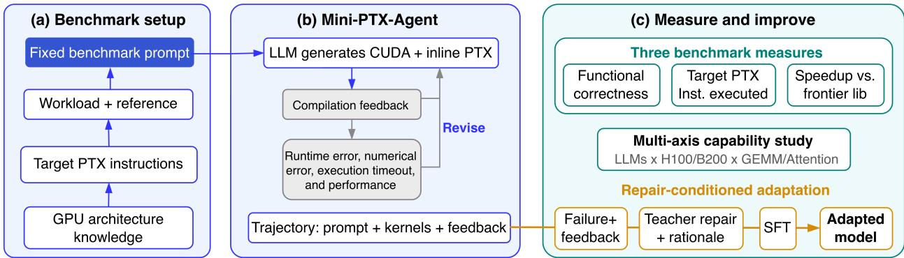  
Figure 1: Overview of the PTXBench benchmark and adaptation workflow.

## 2 PTXBENCH

Figure 1 summarizes PTXBench’s benchmark and adaptation workflow. PTXBench is designed around three requirements for evaluating architecture-specific PTX programming. First, models receive controlled architecture knowledge because they otherwise rarely use the requested PTX. Second, we verify that the required instruction family executes at runtime under the fixed workload. Third, we evaluate each kernel for correctness and efficiency relative to frontier library implementations.

## 2.1 BENCHMARK TASKS AND CONTROLLED CONTEXT

A PTXBench instance pairs a reference operator composed from frontier libraries such as cuBLAS, cuDNN, and FlashInfer [16–18] with a fixed workload, target GPU architecture, and required family of architecture-specific PTX instructions. The model generates a CUDA kernel with inline PTX from scratch rather than starting from an initia implementation. PTXBench uses the FlashInfer-Trace schema to express workloads, solutions, and correctness checks, allowing the same benchmark workflow to support other compatible task collections.

To measure architecture-specific reasoning rather than documentation retrieval, every trajectory receives the same architecture-specific knowledge pack in its base prompt: architecture parameters, CUDA wrappers for PTX instructions, and contracts governing layouts, synchronization, and memory consistency. For well-studied operators, we also provide fixed, expert-validated scheduling principles (Section A.5 shows an example for FlashAttention). Each pack occupies 20k–30k tokens (Section A.4). The ablation in Table 3 shows that without this context, the model rarely uses the requested PTX.

## 2.2 MULTI-TURN EVALUATION PROTOCOL

MiniPTXAgent uses a multi-turn protocol because iterative kernel generation, execution feedback, and revision form the fundamental operating loop of kernel agents [19–21]. Each trajectory permits a fixed number of model calls and retains all preceding kernels and execution feedback. MiniPTXAgent first compiles each candidate with nvcc in a CPU container, sending only successful compilations to a profiling service for memory-safety checking, runtime error messages, functional evaluation, and latency measurement.

We define target instruction correctness as functional correctness plus execution of a selected target instruction at runtime under the evaluated workload. We select the tensor execution paths: GMMA compute or UTMA payload movement on Hopper, and the TCGEN05 tensor path on Blackwell. TMA alone does not qualify a Blackwell kernel because Blackwell inherits it from Hopper. To measure execution, we analyze SASS, NVIDIA’s native GPU assembly generated from PTX and executed by the GPU. Static SASS inspection reveals whether a selected instruction is present, but not whether it runs under the evaluated workload. We therefore use NVIDIA Nsight Compute (NCU) to obtain predicate-enabled thread counts for matching instructions. Our check proceeds in two stages for each functionally correct candidate. We first inspect the final SASS for an architecture-specific family in Table 5; if none is present, we set the target-instruction indicator to zero without running NCU. Otherwise, we set the indicator to one only if NCU reports a positive predicate-enabled thread count for a matching instruction. This dynamic check excludes matching instructions in dead or unlaunched code. Target instruction correctness establishes whether the target instructions are executed, not how much useful work they perform or whether they cause the measured speedup. Section A.2 gives implementation details and edge cases.

The functional correctness checker verifies output shape and data type, then compares values using torch.allclose with $\scriptstyle { \mathrm { a t o l } } = { \mathrm { r t o l } } = 1 \ e - 2$ . After a candidate passes the correctness check, candidate and reference latencies are measured with CUPTI [22]. For each trial, we take the median over 50 timed iterations after 10 warmup iterations, and compute speedup as reference latency divided by candidate latency. Including header files from cuDNN or cuBLAS [16] in CUDA source code is considered wrong regardless of execution results. Generated kernels may crash, hang, or corrupt subsequent measurements, so the profiling service isolates execution of kernels from the agent and exposes correctness, sanitization, debugging, and latency measurement as independent operations. More details on the profiling service are in Section A.3.

## 3 ADAPTING LLMS TO ARCHITECTURE-SPECIFIC PTX PROGRAMMING

Deployed GPUs retain fixed low-level capabilities for years, making architecture-specific PTX a durable target for post-training. The obstacle is data: high-quality kernels require scarce expert knowledge and iterative validation. We therefore study whether model failures and execution feedback, paired with teacher-generated repairs and rationales, can provide effective supervision for this domain.

Fixit. Fixit constructs supervision from failures produced by the model being adapted. Let x denote a problem prompt together with its architecture-specific context, $\pi _ { 0 }$ the model before adaptation, H the MiniPTXAgent feedback function, and $C$ the functional-correctness indicator. We first sample a failed kernel k− and collect its compilation or execution feedback e:

$$
k ^ { - } \sim \pi _ { 0 } ( \cdot \mid x ) , \qquad e = H ( x , k ^ { - } ) , \qquad e ( x , k ^ { - } ) = 0 .
$$

A repair teacher $\pi _ { R }$ then generates a corrected kernel conditioned on the same problem, failure, and feedback. We retain only repairs $k ^ { + }$ that pass the correctness check:

$$
k ^ { + } \sim \pi _ { R } ( \cdot \mid x , k ^ { - } , e ) , \qquad C ( x , k ^ { + } ) = 1 .
$$

Finally, a reasoning teacher $\pi _ { T }$ synthesizes a rationale r that leads from the observed failure to the retained repair:

$$
r \sim \pi _ { T } ( \cdot \mid x , k ^ { - } , e , k ^ { + } ) .
$$

Each Fixit example therefore conditions the student on $( x , k ^ { - } , e )$ and supervises it with $( r , k ^ { + } )$ . Failures are collected once from the model before adaptation, so the supervision targets error states produced by that fixed checkpoint; the repairs and rationales are teacher-generated.

## 4 BENCHMARK RESULTS

## 4.1 EVALUATION METRICS AND BASELINES

We evaluate models along four complementary dimensions. Turn correctness rate (# of correct kernels / # of turns) captures the ability to generate correct kernels. Target instruction turn correctness rate (# of correct kernels that execute a selected target instruction / # of turns) evaluates whether a model can produce a functionally correct kernel that ex ercises the requested architecture mechanism. Finally, among correct turns, best speedup measures peak optimization ability, while target instruction best speedup restricts that peak to qualifying kernels. Inspired by KernelBench [13], for $\dot { N }$ evaluated turns with correctness $C _ { i }$ , runtime target instruction indicator $I _ { i } ,$ and speedup $s _ { i } ,$ we summarize the full speedup distribution as

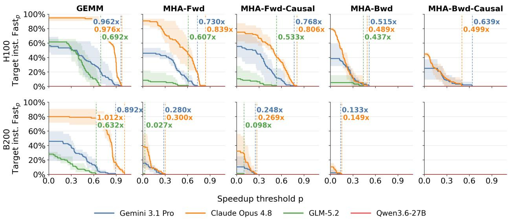  
Figure 2: $\mathrm { F a s t } _ { p } ^ { \mathrm { I n s t . } }$ on H100 (top) and B200 (bottom).

$$
\mathrm { F a s t } _ { p } = \frac { 1 } { N } \sum _ { i = 1 } ^ { N } \mathbf { 1 } [ C _ { i } = 1 \wedge s _ { i } > p ] , \qquad \mathrm { F a s t } _ { p } ^ { \mathrm { I n s t . } } = \frac { 1 } { N } \sum _ { i = 1 } ^ { N } \mathbf { 1 } [ C _ { i } = 1 \wedge I _ { i } = 1 \wedge s _ { i } > p ] .
$$

At threshold $p , { \mathrm { F a s t } } _ { p } ^ { \mathrm { I n s t . } }$ is the fraction of all turns that produce a correct kernel, execute a selected target instruction at runtime, and exceed speedup ${ } ^ { \cdot p . }$ NCU failures remain unknown and do not enter the target instruction numerator, so the reported values are conservative. In space-constrained table headers and plot axes, we abbreviate target instruction as “Target inst.” Across all result tables, the first line is the target instruction metric, the parenthesized line is unrestricted, and triplets report $\leq 1 / \leq 4 / \leq 8$ turns. Plot curves show the corresponding turn fractions, and vertical labels mark the best qualifying speedup. Solid lines show the mean across three prompt variants, each evaluated over four eight-turn trajectories $( N = 3 2 )$ , while shading spans the prompt-wise minimum and maximum. Throughout the paper, Fwd denotes multihead attention (MHA) forward with LSE input, Bwd denotes MHA backward, Causal denotes causal attention, and d denotes the head dimension. For GQA variants, the performance baseline is FlashInfer (v0.6.14); for all other attentions, it is cuDNN (v9.20.0); for GEMM, it is cuBLAS (v13.1.0). These baselines represent frontier performance, and achieving such performance on these problems requires complex scheduling of PTX instruction specific to each architecture.

Table 1: Target-instruction and unrestricted turn correctness rates (%) on H100 and B200.
<table><tr><td>GPU</td><td>Model</td><td>GEMM</td><td>MHA-Fwd</td><td>MHA-Fwd-Causal</td><td>MHA-Bwd</td><td>MHA-Bwd-Causal</td></tr><tr><td rowspan="6">H100</td><td rowspan="2">Gemini 3.1 Pro</td><td>33.3 / 60.4 / 56.2</td><td>33.3 / 39.6 / 45.8</td><td>25.0 / 52.1 / 55.2</td><td>8.3 / 33.3 / 38.5</td><td>− / 22.9 / 25.0</td></tr><tr><td>(33.3 / 62.5 / 59.4)</td><td>(33.3 / 39.6 / 45.8)</td><td>(25.0 / 52.1 / 55.2)</td><td>(8.3 / 33.3 / 38.5)</td><td>(8.3 / 25.0 / 26.0)</td></tr><tr><td rowspan="2">Claude Opus 4.8</td><td>91.7 / 95.8 / 94.8</td><td>50.0 / 81.2 / 90.6</td><td>50.0 / 77.1 / 75.0</td><td>8.3 / 62.5 / 79.2</td><td>− / 22.9 / 44.8</td></tr><tr><td>(91.7 / 95.8 / 94.8)</td><td>(66.7 / 89.6 / 94.8)</td><td>(83.3 / 89.6 / 82.3)</td><td>(50.0 / 83.3 / 89.6)</td><td>(25.0 / 41.7 / 59.4)</td></tr><tr><td rowspan="2">GLM-5.2</td><td>33.3 / 60.4 / 61.5</td><td>16.7 / 8.3 / 8.3</td><td>- / 8.3 / 10.4</td><td>8.3 / 6.2 / 5.2</td><td></td></tr><tr><td>(33.3 / 62.5 / 62.5)</td><td>(16.7 / 14.6 / 15.6)</td><td>(8.3 / 16.7 / 17.7)</td><td>(8.3 / 18.8 / 16.7)</td><td>(− / 22.9 / 15.6)</td></tr><tr><td rowspan="6"></td><td rowspan="2">Qwen3.6-27B</td><td></td><td></td><td></td><td></td><td></td></tr><tr><td>8.3 / 47.9 / 45.8</td><td>- / 12.5 / 15.6</td><td>- / 8.3 / 10.4</td><td>−/ 2.1 / 2.1</td><td></td></tr><tr><td rowspan="3">Claude Opus 4.8</td><td>(8.3 / 47.9 / 45.8)</td><td>(− / 12.5 / 15.6)</td><td>(8.3 / 12.5 / 12.5)</td><td>(− / 2.1 / 2.1)</td><td>(− / 2.1 / 1.0)</td></tr><tr><td>25.0 / 64.6 / 80.2</td><td>- / 20.8 / 38.5</td><td>- / 16.7 / 32.3</td><td>− / 6.2 / 10.4</td><td></td></tr><tr><td>(75.0 / 81.2 / 88.5)</td><td>(83.3 / 87.5 / 86.5)</td><td>(91.7 / 77.1 / 83.3)</td><td>(83.3 / 89.6 / 91.7)</td><td>(25.0 / 52.1 / 68.8)</td></tr><tr><td rowspan="2">GLM-5.2</td><td>16.7 / 27.1 / 28.1</td><td>-/-/1.0</td><td>8.3 / 2.1 / 1.0</td><td></td><td></td></tr><tr><td>(33.3 / 37.5 / 34.4)</td><td>(33.3 / 22.9 / 26.0)</td><td>(33.3 / 22.9 / 25.0)</td><td>(8.3 / 25.0 / 30.2)</td><td>(16.7 / 18.8 / 22.9)</td></tr><tr><td rowspan="2"></td><td rowspan="2">Qwen3.6-27B</td><td></td><td></td><td></td><td></td><td></td></tr><tr><td>(−/−/1.0)</td><td></td><td></td><td></td><td></td></tr></table>

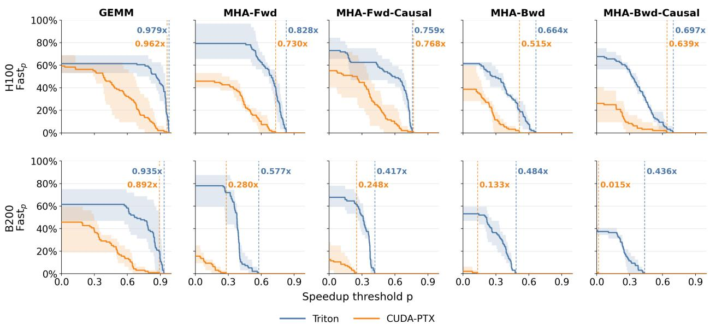  
Figure 3: Gemini 3.1 Pro $\mathrm { F a s t } _ { p }$ distributions for Triton and CUDA-PTX on H100 and B200.

## 4.2 ARCHITECTURE-SPECIFIC PTX CAPABILITY REMAINS UNEVEN

Table 1 and fig. 2 compare models on H100 and B200. The $\mathrm { F a s t } _ { p } ^ { \mathrm { I n s t . } }$ curves show both how often each model produces qualifying kernels and the distribution of their speedups. Since workload difficulty varies, we report speedups per problem; Appendix Table 7 gives exact values.

Table 2: Model release dates, knowledge cutoffs, and estimated calendar lag from the release of Hopper PTX ISA 8.0 (Dec. 2022) and Blackwell PTX ISA 8.7 (Jan. 2025) [23, 24]. Lags use monthly granularity, from PTX release to disclosed cutoff; otherwise, model release dates provide upper bounds.
<table><tr><td rowspan="2">Model</td><td rowspan="2">Model release</td><td rowspan="2">Knowledge cutoff</td><td colspan="2">Lag after PTX release (months)</td></tr><tr><td>Hopper</td><td>Blackwell</td></tr><tr><td>Gemini 3.1 Pro</td><td>Feb.2026</td><td>Jan. 2025</td><td>25</td><td>≈0</td></tr><tr><td>Claude Opus 4.8</td><td>May 2026</td><td>Jan. 2026</td><td>37</td><td>12</td></tr><tr><td>GLM-5.2</td><td>June 2026</td><td>Not disclosed</td><td>≤ 42</td><td>≤ 17</td></tr><tr><td>Qwen3.6-27B</td><td>Apr. 2026</td><td>Not disclosed</td><td>≤40</td><td>≤15</td></tr></table>

We choose these four models because they were released relatively close together in time [25–28]. Intervals in Table 2 indicate when the PTX documentation could have entered the training data. Surprisingly, although Gemini 3.1 Pro’s knowledge cutoff is in the same month as the Blackwell PTX release, it still achieves 0.892× cuBLAS performance on GEMM on Blackwell. Claude Opus 4.8 achieves a substantially higher target instruction correctness rate on Blackwell and reaches 1.012× cuBLAS on GEMM, but neither model optimizes Blackwell attention as well as Hopper attention. These results suggest that newer PTX knowledge and general coding capability help, while leaving substantial room for improvement even for frontier models.

Among models with open weights, GLM-5.2 is competitive with Gemini 3.1 Pro for GEMM on both H100 and B200 and for attention workloads without causal masking on H100, but it still lags on B200 attention workloads. Like Claude Opus 4.8, GLM-5.2 also tends to fall back on generic CUDA instead of architecture-specific PTX when the target is the newer Blackwell architecture. In contrast, Gemini 3.1 Pro is more successful at executing Blackwell instructions, achieving similar peak performance to Claude Opus 4.8 despite its lower success rate. Qwen3.6-27B produces one correct GEMM kernel on Blackwell, but it does not execute any selected Blackwell instruction. Qwen3.6-27B produces no correct kernel on any Hopper workload, placing Hopper PTX programming outside its demonstrated capability under our setup.

## 4.3 HIGH-LEVEL KERNEL LANGUAGES REMAIN VALUABLE ON NEW ARCHITECTURES

Figure 3 compares kernels generated by the same model in Triton and CUDA-PTX. On Hopper, their performance is relatively close: CUDA-PTX nearly matches Triton on GEMM and even reaches a slightly higher peak on causal MHA forward (0.768× versus 0.759×). On Blackwell, the gap widens sharply for attention; for example, Triton reaches 0.484× and 0.436× on the two backward workloads, compared with 0.133× and 0.015× for CUDA-PTX.

Two factors may explain this architecture-dependent gap. First, Blackwell adds more specialized compute and memory mechanisms, increasing the complexity of coordinating low-level instructions directly. Second, Blackwell is roughly two years newer than Hopper, so far less Blackwell-specific CUDA-PTX code may have appeared in model training data (cf. Table 2). We also carefully prepared architecture-specific prompts for CuTeDSL, but its kernel success rate remained extremely low, preventing a meaningful performance comparison.

The broader takeaway is that high-level kernel languages remain useful for producing correct kernels on new architectures, where directly generating CUDA-PTX can be less effective. They do not, however, guarantee the best attainable performance: once correct, direct low-level implementations can sometimes match or outperform a higher-level implementation.

## 4.4 EXPLICIT ARCHITECTURE KNOWLEDGE IMPROVES TARGET INSTRUCTION EXECUTION

The knowledge ablation with three prompts in Table 3 shows that the evaluated model does not execute the target instructions automatically without explicit PTX knowledge. At eight turns, architecture parameters alone yield 26.0% correct turns but no target instruction successes, while adding template functions enables target instruction execution and produces faster generated kernels. Adding the architecture contract provides a clear correctness edge: 38.5% of turns satisfy target instruction correctness, 18.7 points above template functions alone. Peak speedup follows a different ordering, so the contract’s main benefit is reliable and correct execution of the target instructions; it does not necessarily produce the fastest kernel.

Table 3: Ablation of architecture-specific prompt knowledge for Gemini 3.1 Pro.
<table><tr><td>Prompt knowledge</td><td>Target inst. correctness (%) (turn correctness)</td><td>Target inst. best speedup (best speedup)</td></tr><tr><td>Architecture parameters</td><td>(50.0 / 29.2 / 26.0)</td><td>(0.056 / 0.119 / 0.273)</td></tr><tr><td>Architecture parameters + PTX template functions</td><td>- / 20.8 / 19.8 (− / 20.8 / 19.8)</td><td>− / 0.542 / 0.542 (− / 0.542 / 0.542)</td></tr><tr><td>Architecture parameters + PTX template functions + architecture contract</td><td>8.3 / 33.3 / 38.5 (8.3 / 33.3 / 38.5)</td><td>0.206 / 0.375 / 0.515 (0.206 / 0.375 / 0.515)</td></tr></table>

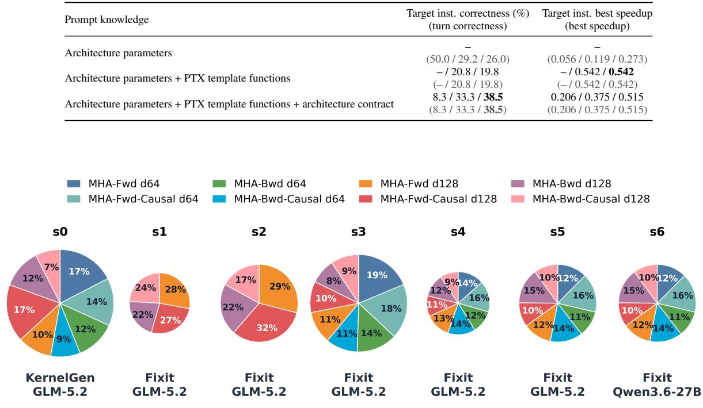  
Figure 4: Training data recipes. Pie area is proportional to record count, and slices show the fraction drawn from each problem. The top shows labels for the checkpoints; the bottom line lists training formats and reasoning teachers.

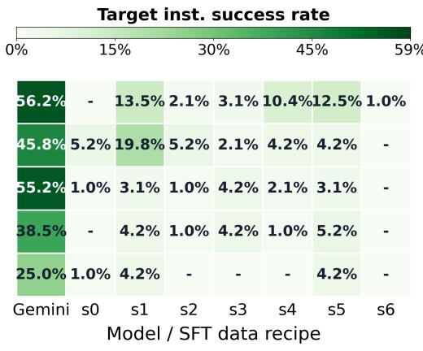

## 5 ADAPTATION RESULTS

We instantiate Fixit from Section 3 with Qwen3.6-27B as the model to adapt and Gemini 3.1 Pro as the repair teacher. Qwen3.6-27B’s 262K-token context accommodates our long PTX prompts and kernel traces, while its tractable scale enables controlled LoRA adaptation and self-hosted evaluation. Its weak baseline capability also provides measurable headroom for studying post-training gains. We evaluate the effects of training format, problem coverage and balance, and reasoning-teacher choice, then examine generalization and compare SFT with in-context guidance.

## 5.1 TRAINING FORMAT AND DATA RECIPE RESULTS

Figure 4 summarizes the seven recipes by problem mix, training format, and reasoning synthesizer. KernelGen is a direct-solution baseline: Gemini 3.1 Pro generates candidate kernels directly from the original problem prompt, and GLM-5.2 synthesizes a rationale for each retained correct kernel. The Fixit recipes use GLM-5.2 as the reasoning teacher except for s6, which uses Qwen3.6-27B itself. Dataset composition and record counts are reported in Appendix Table 10.

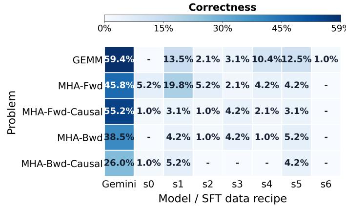

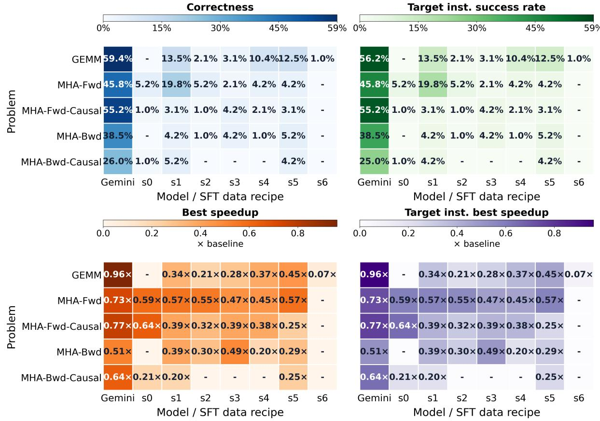

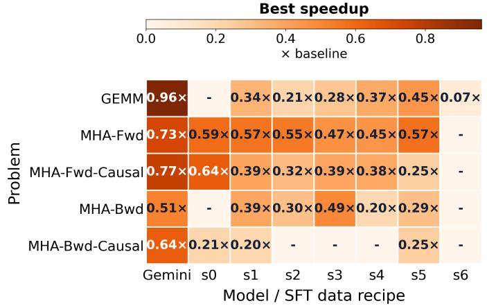

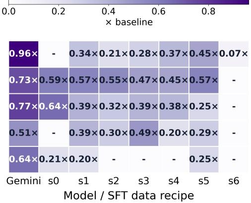  
Figure 5: SFT training data recipe comparison (complete results in Appendix Tables 8 and 9).

Training format. We compare KernelGen (s0) with Fixit (s3) in Figure 5. Both cover the same eight problem classes, use GLM-5.2 for reasoning synthesis, and contain similar numbers of records. At eight turns, s3 improves correctness on GEMM, MHA-Fwd-Causal, and MHA-Bwd, but trails s0 on MHA-Fwd and MHA-Bwd-Causal. These mixed results show that conditioning on failures collected once from the pre-adaptation checkpoint can help on some tasks but does not uniformly outperform direct-solution supervision, consistent with related work on learner-induced states and model-generated correction traces [29, 30]. Longer s3 reasoning does not reliably predict kernel perfor mance (Appendix Figure 15).

Coverage and balance. Among Fixit recipes, coverage and balance matter more than record count alone. Only the relatively balanced s1 and s5 recipes solve all five problems. In contrast, s2 contains 1.6× as many records as s1, and s3 contains 2.4× as many as s4, yet both fail on MHA-Bwd-Causal. Moving from s4 to the larger balanced s5 recipe (1.5× more records) improves eight-turn correctness on four problems, ties on MHA-Fwd, and improves peak speedup on four. This agrees with instruction-tuning studies that emphasize task balance, selection, and diversity over unfiltered scale [31–33]. Balance improves breadth, but not every peak: the best-performing recipe still varies by problem.

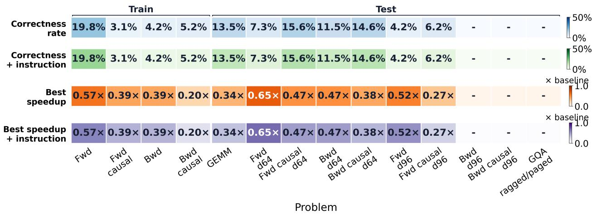  
Figure 6: Correctness and speedup of Qwen3.6-27B-s1 on the training and held-out problems.

Reasoning synthesizer. The controlled s5–s6 comparison keeps the Fixit examples fixed and changes only the reasoning synthesizer from GLM-5.2 to Qwen3.6-27B itself. While s5 solves all five problems, s6 solves only GEMM. Target-model failures are therefore useful inputs, but producing their repair rationales still benefits from a stronger teacher.

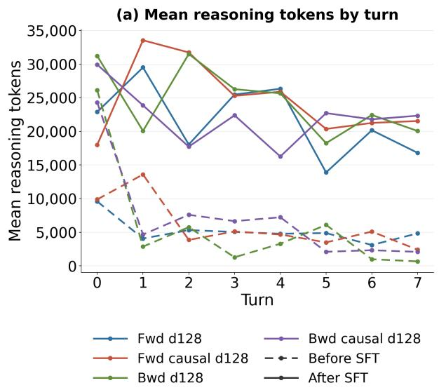

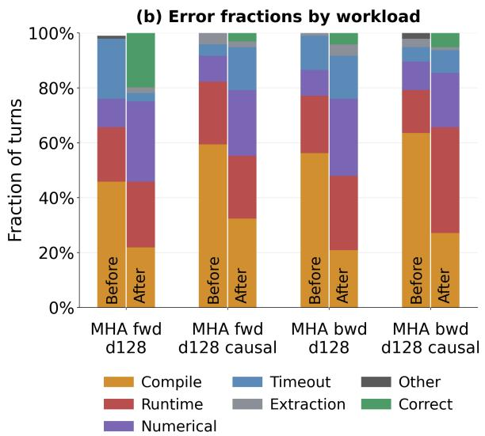  
Figure 7: How Fixit SFT changes reasoning length and error types across turns.

## 5.2 EFFECTS AND GENERALIZATION OF FIXIT SFT

For detailed analysis, we select s1, the smallest recipe that solves all five evaluation problems. It was trained on four MHA tasks with head dimension 128. Figure 6 shows transfer to GEMM, all four d64 MHA tasks, and the two d96 forward tasks. It produces no correct kernels for either d96 backward task or GQA. The d96 backward tasks are especially challenging because d96 does not align with H100 WGMMA’s m64 tile. Fixit therefore transfers across some closely related computations, but not uniformly across head dimensions or attention variants.

We further test cross-language transfer by asking the base and s1 checkpoints to generate Triton for the same five Hopper workloads. Figure 8 shows that s1 has lower turn-level correctness on every workload, indicating that the current SFT recipe hurts correctness under Triton transfer. Yet its best correct speedup improves markedly on the causal variants, from 0.238× to 0.632× for MHA-Fwd-Causal and from 0.043× to 0.331× for MHA-Bwd-Causal. Thus, the recipe can improve peak performance by a large margin in some cases even while making correct kernels less likely.

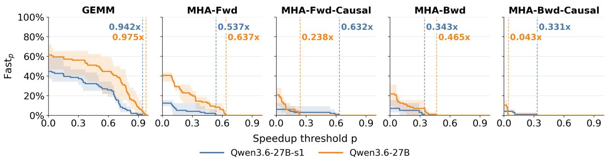  
Figure 8: Cross-language transfer of Fixit SFT from CUDA-PTX to Triton on Hopper.

Figure 7 shows how s1 changes the search process. It lengthens reasoning at every turn, especially during early revisions. It also shifts failures from compilation toward runtime and numerical errors: the model more often produces executable kernels, but those kernels can still fail during evaluation. On GEMM, s1 produces three correct kernels at turn 0 and at least one in six of the seven later turns, whereas the base model produces no correct kernels in any turn (Figure 9). Moreover, the checkpoints in Figure 5 have identical target instruction and unrestricted results except for s1 on MHA-Bwd-Causal at eight turns. Thus, Fixit can improve initial kernel generation and reliable execution of target instructions.

## (a) Qwen3.6-27B

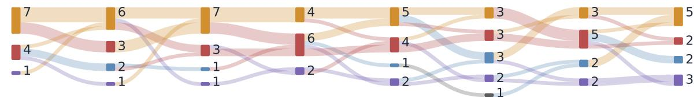

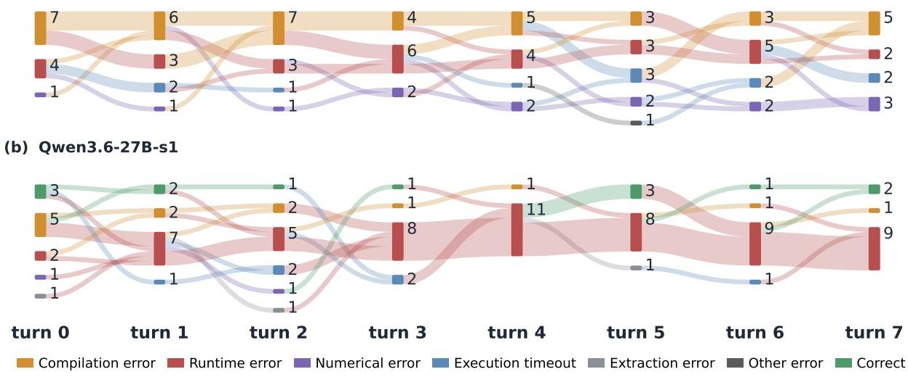  
Figure 9: Turn-level error-state transitions for GEMM.

## 5.3 SFT VERSUS IN-CONTEXT SUPERVISION

Finally, we compare weight updates with information supplied at inference time. Table 4 and fig. 10 evaluate six alternatives: base model and s1 with and without expert-edited guidance distilled by Codex from error trajectories (Appendix Figure 16), and base model with retrieval of repair experiences. Retrieval uses BM25 to select the most similar failed kernel from s1’s data pool and supplies GPT 5.4’s summary of its repair notes, alone or with the corrected kernel.

Even with expert guidance, the base model still cannot write correct MHA kernels. In contrast, even without expert guidance, s1 can already write correct MHA kernels. This suggests that SFT improves the model’s base PTX capability and its ability to comprehend guidance. Repair notes alone produce no correct kernels; correctness rises sharply only when retrieval also supplies the fixed kernel. However, this solution-bearing condition is expected to work because the answers are nearly in the prompt. With guidance, s1 attains nonzero correctness across all four problems.

Table 4: Target-instruction and unrestricted turn correctness rates (%) under SFT and prompt-time supervision.
<table><tr><td>Condition</td><td>MHA-Fwd</td><td>MHA-Fwd-Causal</td><td>MHA-Bwd</td><td>MHA-Bwd-Causal</td></tr><tr><td>Qwen3.6-27B w/o expert guidance</td><td></td><td></td><td></td><td></td></tr><tr><td>Qwen3.6-27B</td><td></td><td></td><td></td><td></td></tr><tr><td>Qwen3.6-27B-s1 w/o expert guidance</td><td></td><td>-/-/4.2 (− / − /4.2)</td><td>-/-/4.2</td><td>-/4.2/3.1</td></tr><tr><td></td><td>16.7 / 16.7 / 19.8</td><td>-/-/3.1</td><td>(− / − /4.2) − / 2.1 / 4.2</td><td>(− /4.2 /3.1) − / 2.1 / 4.2</td></tr><tr><td>Qwen3.6-27B-s1</td><td>(16.7 / 16.7 / 19.8)</td><td>(−/−/3.1)</td><td>(− / 2.1 / 4.2)</td><td>(− / 2.1 / 5.2)</td></tr><tr><td>Qwen3.6-27B + retrieved repair notes</td><td></td><td></td><td></td><td></td></tr><tr><td>Qwen3.6-27B + retrieved repair notes</td><td>− / 29.2 / 29.2</td><td>- / 20.8 / 27.1</td><td>- / 14.6 / 18.8</td><td>- / 20.8 / 33.3</td></tr><tr><td>and fixed kernel</td><td>(− / 29.2 / 29.2)</td><td>(− / 20.8 / 27.1)</td><td>(− / 14.6 / 20.8)</td><td>(− / 25.0 / 37.5)</td></tr></table>

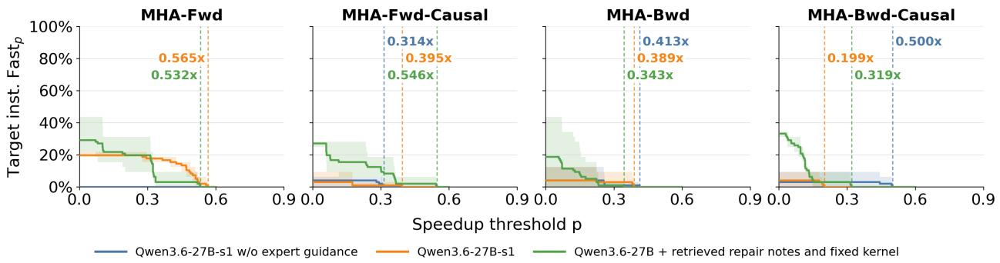  
Figure 10: $\mathrm { F a s t } _ { p } ^ { \mathrm { I n s t . } }$ under SFT and prompt-time supervision.

## 6 RELATED WORK

GPU kernel generation benchmarks have attracted increasing interest [34–40]. Collectively, these benchmarks span translation from PyTorch to kernels, Triton generation, portability across devices, production serving traces, deployment integration, and hardware performance limits. They nevertheless focus primarily on functional correctness and overall efficiency, and thus do not isolate whether a generated kernel actually executes a specified architecture mechanism rather than relying on generic CUDA or vendor libraries. PTXBench instead fixes the target architecture and required PTX instruction family, then verifies target instruction execution at runtime, complementing their broad task coverage with a controlled capability probe.

Model adaptation for GPU kernel generation has advanced through SFT and RL methods that use execution feedback for Triton and CUDA [41–49]. These systems optimize correctness and overall speed through a DSL/compiler, ordinary CUDA, or implementations that use libraries. For example, CUDA Agent allows the use of existing cuDNN library functions (cf. Figure 15 in [50]) and CUDA-L2 allows CUTLASS and CuTe [51]. We target a harder, more constrained regime: generating kernels from scratch with the required inline PTX specific to the architecture while prohibiting existing vendor libraries. To our knowledge, PTXBench is the first controlled study of model adaptation for programming at this level, examining repair conditioning, data balance, reasoning supervision, and transfer.

## 7 LIMITATIONS

Our study has two main limitations. First, the adaptation experiments use modest LoRA datasets and a single 27B base model, so the observed effects of repair conditioning, data balance, and teacher quality may not transfer unchanged to industry-scale post-training or other model families. Second, PTXBench currently focuses on BF16 GEMM and attention kernels on H100 and B200. These workloads directly stress recent architecture-specific tensor core and asynchronized memory but do not represent the full diversity of GPU operators and hardware. Since PTXBench separates FlashInfer-Trace workloads, architecture context, and evaluation, the same workflow can be extended to broader workloads, models, and future GPUs.

## 8 CONCLUSION

We introduced PTXBench, an auditable benchmark and adaptation environment for architecture-specific PTX programming. By separately measuring functional correctness, target instruction execution at runtime, and speedup over frontier libraries, PTXBench exposes a persistent capability gap: current LLMs can sometimes execute the requested instructions and solve forward workloads, but struggle with backward attention and do not consistently achieve com petitive performance across H100 and B200. With Fixit, we further study repair-conditioned SFT using failures from the model being adapted and correctness-filtered teacher repairs. Fixit improves several tasks but does not uniformly outperform direct-solution supervision; its gains depend on problem coverage, data balance, and reasoning-teacher quality, while transfer to held-out shapes and attention variants remains uneven. Together, these results position PTXBench as a controlled testbed for measuring architecture-specific capability and developing targeted post-training data for evolving GPU architectures.

## ACKNOWLEDGMENTS

We thank Banghua Zhu, Ying Sheng, Jiajun Li, Mao Cheng, and Yusheng Su from RadixArk and SGLang community for their technical support and insightful discussions. We are also grateful to Xinhao Li, Yibo Zhang, Anjiang Wei, Simon Guo, and Stanford Pervasive Parallelism Lab members for discussions and help. We also thank the Gemini Academic Program and the Tinker Research Grant for their generous support.

## REFERENCES

[1] Chenggang Zhao, Zhean Xu, Liang Zhao, Jiashi Li, Chenhao Xu, Anyi Xu, Shengyu Liu, Kexing Zhou, and Kuai Yu. Deepgemm: clean and efficient blas kernel library on gpu. https://github.com/deepseek-ai/ DeepGEMM, 2025.

[2] NVIDIA Corporation. Volta Tuning Guide. NVIDIA Corporation, 2017. URL https://docs.nvidia. com/cuda/volta-tuning-guide/. Accessed: 2026-07-29.

[3] NVIDIA Corporation. NVIDIA Ampere GPU Architecture Tuning Guide. NVIDIA Corporation, 2020. URL https://docs.nvidia.com/cuda/ampere-tuning-guide/. Accessed: 2026-07-29.

[4] NVIDIA Corporation. NVIDIA Hopper Tuning Guide. NVIDIA Corporation, 2023. URL https://docs. nvidia.com/cuda/hopper-tuning-guide/. Accessed: 2026-07-29.

[5] NVIDIA Corporation. NVIDIA Blackwell Tuning Guide. NVIDIA Corporation, 2025. URL https://docs. nvidia.com/cuda/blackwell-tuning-guide/. Accessed: 2026-07-29.

[6] NVIDIA Corporation. Inside the NVIDIA Vera Rubin Platform: Six New Chips, One AI Supercomputer. https://developer.nvidia.com/blog/ inside-the-nvidia-rubin-platform-six-new-chips-one-ai-supercomputer/, January 2026. Accessed: 2026-07-29.

[7] Philippe Tillet, Hsiang-Tsung Kung, and David Cox. Triton: an intermediate language and compiler for tiled neural network computations. In Proceedings of the 3rd ACM SIGPLAN International Workshop on Machine Learning and Programming Languages, pages 10–19, 2019.

[8] Vijay Thakkar, Pradeep Ramani, Cris Cecka, Aniket Shivam, Honghao Lu, Ethan Yan, Jack Kosaian, Mark Hoemmen, Haicheng Wu, Andrew Kerr, Matt Nicely, Duane Merrill, Dustyn Blasig, Aditya Atluri, Fengqi Qiao, Piotr Majcher, Paul Springer, Markus Hohnerbach, Jin Wang, and Manish Gupta. CUTLASS. https: //github.com/NVIDIA/cutlass, January 2023. CUDA C++ template abstractions for high-performance matrix multiplication and related computations.

[9] Hongzheng Chen, Bin Fan, Alexander Collins, Bastian Hagedorn, Evghenii Gaburov, Masahiro Masuda, Matthew Brookhart, Chris Sullivan, Jason Knight, Zhiru Zhang, et al. Tawa: Automatic warp specialization for modern gpus with asynchronous references. In 2026 IEEE/ACM International Symposium on Code Generation and Optimization (CGO), pages 255–267. IEEE, 2026.

[10] Kshitij Dubey, Benjamin Driscoll, Anjiang Wei, Neeraj Kayal, Rahul Sharma, and Alex Aiken. Equivalence checking of ml gpu kernels. arXiv preprint arXiv:2511.12638, 2025.

[11] Shanli Xing, Yiyan Zhai, Alexander Jiang, Yixin Dong, Yong Wu, Zihao Ye, Charlie F. Ruan, Yingyi Huang, Yineng Zhang, Liangsheng Yin, Aksara Bayyapu, Luis Ceze, and Tianqi Chen. Flashinfer-bench: Building the virtuous cycle for ai-driven llm systems. In A. Chowdhery and Z. Jia, editors, Proceedings of Machine Learning and Systems, volume 8, pages 2016–2064. ML-Sys, 2026. URL https://proceedings.mlsys.org/paper\_files/paper/2026/file/ 37e44c4b5321605735be9761f9b758fc-Paper-Conference.pdf.

[12] Edward Lin, Sahil Modi, Siva Kumar Sastry Hari, Qijing Huang, Zhifan Ye, Nestor Qin, Fengzhe Zhou, Yuan Zhang, Jingquan Wang, Sana Damani, et al. Sol-execbench: Speed-of-light benchmarking for real-world gpu kernels against hardware limits. arXiv preprint arXiv:2603.19173, 2026.

[13] Anne Ouyang, Simon Guo, Simran Arora, Alex L Zhang, William Hu, Christopher Re, and Azalia Mirhoseini.´ KernelBench: Can LLMs write efficient GPU kernels? In Proceedings of the 42nd International Conference on Machine Learning, volume 267 of Proceedings ofMachine Learning Research, pages 47356–47415. PMLR, 2025. URL https://proceedings.mlr.press/v267/ouyang25a.html.

[14] Mark Saroufim, Jiannan Wang, Bert Maher, Sahan Paliskara, Laura Wang, Shahin Sefati, and Manuel Candales. Backendbench: An evaluation suite for testing how well llms and humans can write pytorch backends. GitHub repository, 2025. URL https://github.com/meta-pytorch/BackendBench.

[15] Jianling Li, Shangzhan Li, Zhenye Gao, Qi Shi, Yuxuan Li, Zefan Wang, Jiacheng Huang, WangHaojie Wang-Haojie, Jianrong Wang, Xu Han, et al. Tritonbench: Benchmarking large language model capabilities for generating triton operators. In Findings of the Association for Computational Linguistics: ACL 2025, pages 23053– 23066, 2025.

[16] NVIDIA Corporation. cuBLAS Library. NVIDIA Corporation, 2026. URL https://docs.nvidia.com/ cuda/cublas/. CUDA Toolkit Documentation.

[17] Sharan Chetlur, Cliff Woolley, Philippe Vandermersch, Jonathan Cohen, John Tran, Bryan Catanzaro, and Evan Shelhamer. cudnn: Efficient primitives for deep learning. arXiv preprint arXiv:1410.0759, 2014.

[18] Zihao Ye, Lequn Chen, Ruihang Lai, Wuwei Lin, Yineng Zhang, Stephanie Wang, Tianqi Chen, Baris Kasikci, Vinod Grover, Arvind Krishnamurthy, et al. Flashinfer: Efficient and customizable attention engine for llm inference serving. Proceedings of Machine Learning and Systems, 7, 2025.

[19] Shiyi Cao, Ziming Mao, Joseph E. Gonzalez, and Ion Stoica. K-Search: LLM kernel generation via co-evolving intrinsic world model. arXiv preprint arXiv:2602.19128, 2026. URL https://arxiv.org/abs/2602. 19128.

[20] Genghan Zhang, Shaowei Zhu, Anjiang Wei, Zhenyu Song, Allen Nie, Zhen Jia, Nandita Vijaykumar, Yida Wang, and Kunle Olukotun. Accelopt: A self-improving llm agentic system for ai accelerator kernel optimization. In A. Chowdhery and Z. Jia, editors, Proceedings of Machine Learning and Systems, volume 8, pages 541–568. MLSys, 2026. URL https://proceedings.mlsys.org/paper\_files/paper/2026/ file/0f8426558905746fc38da5e335700aec-Paper-Conference.pdf.

[21] Charles Hong, Sahil Bhatia, Alvin Cheung, and Yakun Sophia Shao. Autocomp: LLM-driven code optimization for tensor accelerators. arXiv preprint arXiv:2505.18574, 2025. URL https://arxiv.org/abs/2505. 18574.

[22] NVIDIA Corporation. CUDA Profiling Tools Interface (CUPTI). NVIDIA Corporation, 2026. URL https: //docs.nvidia.com/cupti/. Accessed: 2026-08-10.

[23] NVIDIA Corporation. Parallel Thread Execution ISA, Version 8.0. NVIDIA Corporation, December 2022. URL https://docs.nvidia.com/cuda/archive/12.0.0/pdf/ptx\_isa\_8.0.pdf. Released with CUDA Toolkit 12.0 in December 2022.

[24] NVIDIA Corporation. Parallel Thread Execution ISA, Version 8.7. NVIDIA Corporation, January 2025. URL https://docs.nvidia.com/cuda/archive/12.8.0/pdf/ptx\_isa\_8.7.pdf. Released with CUDA Toolkit 12.8.

[25] Google DeepMind. Gemini 3.1 pro. https://deepmind.google/models/model-cards/ gemini-3-1-pro/, February 2026. Published February 19, 2026. The January 2025 cutoff for the Gemini 3 family is documented at https://ai.google.dev/gemini-api/docs/gemini-3.

[26] Anthropic. Claude opus 4.8. https://www.anthropic.com/transparency, May 2026. Released May 2026; knowledge cutoff January 2026.

[27] Z.ai. Glm-5.2. https://docs.z.ai/release-notes/new-released, June 2026. Released June 16, 2026; knowledge cutoff not publicly disclosed.

[28] Qwen Team. Qwen3.6-27b: Flagship-level coding in a 27b dense model. https://qwen.ai/blog?id= qwen3.6-27b, April 2026. Released April 21, 2026; knowledge cutoff not publicly disclosed.

[29] Stephane Ross, Geoffrey Gordon, and Drew Bagnell. A reduction of imitation learning and structured prediction to no-regret online learning. In Proceedings ofthe Fourteenth International Conference on Artificial Intelligence and Statistics, volume 15 of Proceedings of Machine Learning Research, pages 627–635. PMLR, 2011. URL https://proceedings.mlr.press/v15/ross11a.html.

[30] Aviral Kumar, Vincent Zhuang, Rishabh Agarwal, Yi Su, JD Co-Reyes, Avi Singh, Kate Baumli, Shariq Iqbal, Colton Bishop, Rebecca Roelofs, Lei Zhang, Kay McKinney, Disha Shrivastava, Cosmin Paduraru, George Tucker, Doina Precup, Feryal Behbahani, and Aleksandra Faust. Training language models to self-correct via reinforcement learning. In International Conference on Learning Representations, 2025. URL https://proceedings.iclr.cc/paper\_files/paper/2025/hash/ 871ac99fdc5282d0301934d23945ebaa-Abstract-Conference.html.

[31] Shayne Longpre, Le Hou, Tu Vu, Albert Webson, Hyung Won Chung, Yi Tay, Denny Zhou, Quoc V. Le, Barret Zoph, Jason Wei, and Adam Roberts. The Flan collection: Designing data and methods for effective instruction tuning. In Proceedings of the 40th International Conference on Machine Learning, volume 202 of Proceedings of Machine Learning Research, pages 22631–22648. PMLR, 2023. URL https://proceedings.mlr. press/v202/longpre23a.html.

[32] Wei Liu, Weihao Zeng, Keqing He, Yong Jiang, and Junxian He. What makes good data for alignment? a comprehensive study of automatic data selection in instruction tuning. In International Conference on Learning Representations, 2024. URL https://proceedings.iclr.cc/paper\_files/paper/2024/ hash/6091f2bb355e960600f62566ac0e2862-Abstract-Conference.html.

[33] Alexander Bukharin, Shiyang Li, Zhengyang Wang, Jingfeng Yang, Bing Yin, Xian Li, Chao Zhang, Tuo Zhao, and Haoming Jiang. Data diversity matters for robust instruction tuning. In Findings of the Association for Computational Linguistics: EMNLP 2024, pages 3411–3425. Association for Computational Linguistics, 2024. doi: 10.18653/v1/2024.findings-emnlp.195. URL https://aclanthology.org/2024. findings-emnlp.195/.

[34] Han Wang, Jintao Zhang, Kai Jiang, Haoxu Wang, Jianfei Chen, and Jun Zhu. KernelBenchX: A comprehensive benchmark for evaluating LLM-generated GPU kernels. arXiv preprint arXiv:2605.04956, 2026. URL https: //arxiv.org/abs/2605.04956.

[35] Jiace Zhu, Wentao Chen, Qi Fan, Zhixing Ren, Junying Wu, Xing Zhe Chai, Chotiwit Rungrueangwutthinon, Yehan Ma, and An Zou. CUDABench: Benchmarking LLMs for text-to-CUDA generation. arXiv preprint arXiv:2603.02236, 2026. URL https://arxiv.org/abs/2603.02236.

[36] Robert Tjarko Lange, Qi Sun, Aaditya Prasad, Maxence Faldor, Yujin Tang, and David Ha. Towards robust agentic CUDA kernel benchmarking, verification, and optimization. arXiv preprint arXiv:2509.14279, 2025. URL https://arxiv.org/abs/2509.14279.

[37] Yue Guan, Yichen Lin, Xu Zhao, Jianzhu Yao, Xinwei Qiang, Zhongkai Yu, Pramod Viswanath, Yufei Ding, and Adnan Aziz. TritonGym: A benchmark for agentic LLM workflows in Triton GPU code generation. In Proceedings ofthe 43rd International Conference on Machine Learning, volume 306 of Proceedings ofMachine Learning Research, 2026.

[38] Jianghui Wang, Vinay Joshi, Saptarshi Majumder, Xu Chao, Bin Ding, Ziqiong Liu, Pratik Prabhanjan Brahma, Dong Li, Zicheng Liu, and Emad Barsoum. GEAK: Introducing Triton kernel AI agent and evaluation benchmarks. arXiv preprint arXiv:2507.23194, 2025. URL https://arxiv.org/abs/2507.23194.

[39] Peiyu Zang, Jian Tao, Jialing Zhang, Yichen Yuan, Wentao Zhang, Guang Liu, and Yonghua Lin. KernelGenBench: A multi-source and multi-chip benchmark for LLM-based kernel generation. arXiv preprint arXiv:2607.27231, 2026. URL https://arxiv.org/abs/2607.27231.

[40] Gabriele Oliaro, Yichao Fu, May Jiang, Owen Lu, Junli Wang, Zhihao Jia, Hao Zhang, and Samyam Rajbhandari. FastKernels: Benchmarking GPU kernel generation in production. arXiv preprint arXiv:2605.23215, 2026. URL https://arxiv.org/abs/2605.23215.

[41] Shangzhan Li, Zefan Wang, Ye He, Yuxuan Li, Qi Shi, Jianling Li, Yonggang Hu, Wanxiang Che, Xu Han, Zhiyuan Liu, and Maosong Sun. AutoTriton: Automatic Triton programming with reinforcement learning in LLMs. arXiv preprint arXiv:2507.05687, 2025. URL https://arxiv.org/abs/2507.05687.

[42] Jiin Woo, Shaowei Zhu, Allen Nie, Zhen Jia, Yida Wang, and Youngsuk Park. TritonRL: Training LLMs to think and code Triton without cheating. arXiv preprint arXiv:2510.17891, 2025. URL https://arxiv.org/ abs/2510.17891.

[43] Wei Liu, Jiawei Xu, Yingru Li, Longtao Zheng, Tianjian Li, Qian Liu, and Junxian He. Dr. kernel: Reinforcement learning done right for triton kernel generations. arXiv preprint arXiv:2602.05885, 2026. URL https:// arxiv.org/abs/2602.05885.

[44] Siqi Guo, Ming Lin, and Tianbao Yang. DRTriton: Large-scale synthetic data reinforcement learning for Tri ton kernel generation. arXiv preprint arXiv:2603.21465, 2026. URL https://arxiv.org/abs/2603. 21465.

[45] Ali Tehrani, Yahya Emara, Wissam Essam, Wojciech Paluch, Waleed Atallah, Łukasz Dudziak, and Mohamed S. Abdelfattah. Fine-tuning gpt-5 for gpu kernel generation. arXiv preprint arXiv:2602.11000, 2026. URL https: //arxiv.org/abs/2602.11000.

[46] He Du, Qiming Ge, Jiakai Hu, Aijun Yang, Zheng Cai, Zixian Huang, Sheng Yuan, Qinxiu Cheng, Xinchen Xie, Yicheng Chen, Yining Li, et al. Kernel-smith: A unified recipe for evolutionary kernel optimization. arXiv preprint arXiv:2603.28342, 2026. URL https://arxiv.org/abs/2603.28342.

[47] Carlo Baronio, Pietro Marsella, Ben Pan, Simon Guo, and Silas Alberti. Kevin: Multi-turn rl for generating cuda kernels. arXiv preprint arXiv:2507.11948, 2025. URL https://arxiv.org/abs/2507.11948.

[48] Xiaoya Li, Xiaofei Sun, Albert Wang, Jiwei Li, and Chris Shum. CUDA-L1: Improving CUDA optimization via contrastive reinforcement learning. In International Conference on Learning Representations, 2026. URL https://openreview.net/forum?id=igZItUbY6n.

[49] Qi Sun, Robert Tjarko Lange, and Alex L. Zhang. SynKer: Synthesize, kernelize, reinforce—teaching GPU kernel generation to small language models. In ICML 2026 Workshop on Deep Learning for Code, 2026. URL https://openreview.net/forum?id=oqktWVZOiq.

[50] Weinan Dai, Hanlin Wu, Qiying Yu, Huan-ang Gao, Jiahao Li, Chengquan Jiang, Weiqiang Lou, Yufan Song, Hongli Yu, Jiaze Chen, et al. Cuda agent: Large-scale agentic rl for high-performance cuda kernel generation. arXiv preprint arXiv:2602.24286, 2026.

[51] Songqiao Su, Xiaoya Li, Albert Wang, Guoyin Wang, Jiwei Li, and Chris Shum. Cuda-l2: Surpassing cublas performance for matrix multiplication through reinforcement learning. arXiv preprint arXiv:2512.02551, 2025.

[52] Mark Stephenson, Sana Damani, Mohamed Tarek Ibn Ziad, Anis Ladram, and Michael Garland. Supercollider: Scalable and effective data race detection for cuda. Proceedings of the ACM on Programming Languages, 10 (PLDI):2303–2327, 2026.

[53] Bodhisatwa Chatterjee, Drew Zagieboylo, Sana Damani, Siva Hari, and Christos Kozyrakis. Proofwright: Towards agentic formal verification of cuda. arXiv preprint arXiv:2511.12294, 2025.

[54] NVIDIA Corporation. CUDA Binary Utilities. NVIDIA Corporation, 2026. URL https://docs.nvidia. com/cuda/cuda-binary-utilities/. Accessed: 2026-08-15.

[55] NVIDIA Corporation. Nsight Compute CLI. NVIDIA Corporation, 2026. URL https://docs.nvidia. com/nsight-compute/NsightComputeCli/index.html. Accessed: 2026-08-15.

[56] NVIDIA Corporation. Stream-Ordered Memory Allocator. NVIDIA Corporation, 2026. URL https://docs.nvidia.com/cuda/cuda-programming-guide/04-special-topics/ stream-ordered-memory-allocation.html. Accessed: 2026-08-15.

[57] NVIDIA Corporation. Performance benchmarking. https://docs.nvidia.com/deeplearning/ tensorrt/latest/performance/benchmarking.html, 2026. TensorRT Documentation, accessed July 29, 2026.

[58] Lianmin Zheng, Liangsheng Yin, Zhiqiang Xie, Chuyue Sun, Jeff Huang, Cody H Yu, Shiyi Cao, Christos Kozyrakis, Ion Stoica, Joseph E Gonzalez, et al. Sglang: Efficient execution of structured language model programs. Advances in neural information processing systems, 37:62557–62583, 2024.

[59] Simon Veitner. SBO and LBO explained visually, April 2026. URL https://veitner.bearblog.dev/ sbo-and-lbo-explained-visually/. Accessed: 2026-07-29.

[60] Stuart Sul and Christopher Re. ThunderKittens 2.0: Even faster kernels for your GPUs, February 2026.´ URL https://hazyresearch.stanford.edu/blog/2026-02-19-tk-2. Hazy Research blog, accessed 2026-07-29.

[61] Size Zheng, Xuegui Zheng, Hanshi Sun, Qi Hou, Wenlei Bao, Shiyu Li, Haojie Duanmu, Jin Fang, Chenli Xue, Chenhui Huang, et al. Ditron: Distributed multi-level tiling compiler for parallel tensor programs. In Forty-third International Conference on Machine Learning, 2026.

[62] Jay Shah, Ganesh Bikshandi, Ying Zhang, Vijay Thakkar, Pradeep Ramani, and Tri Dao. Flashattention-3: Fast and accurate attention with asynchrony and low-precision. Advances in Neural Information Processing Systems, 37:68658–68685, 2024.

## A APPENDIX

## A.1 EXPERIMENT SETUP

Kernel evaluation. We evaluate generated CUDA kernels on NVIDIA H100 80 GB (Hopper) and B200 (Blackwell) GPUs. MiniPTXAgent compiles each candidate with nvcc -O3 for sm 90a or sm 100a, respectively, and the profiling service evaluates it against the fixed FlashInfer-Trace workload. Each trajectory has a budget of eight model calls and retains the preceding kernels and execution feedback; it terminates early if the speedup reaches 1.2× or the LLM runs out of context. We did not apply NVIDIA Compute Sanitizer’s racecheck because it is too slow (regularly over 1000× the runtime of a native execution [52]) and does not eliminate false negatives [53].

## A.2 TARGET INSTRUCTION EXECUTION MEASUREMENT

Implementation details. For every functionally correct candidate, we compile the exact submitted source for the evaluation architecture and inspect the cubin embedded in the resulting shared object with cuobjdump --dump-sass [54]. We hash both the source and cubin container so that cached evidence is invalidated when either changes.

Table 5: Selected SASS families for target instruction measurement.
<table><tr><td>GPU</td><td>Tag</td><td>Selected SASS family</td></tr><tr><td>H100 (Hopper)</td><td>H</td><td>* GMMA tensor compute; UTMALDG, UTMASTG, and UTMAREDG TMA payload transfer</td></tr><tr><td>B200 (Blackwell)</td><td>B</td><td>UTC*, LDTM, and STTM from the TCGEN05 tensor pathway</td></tr></table>

Static-positive candidates are replayed on the original workload with Nsight Compute 2025.3.1 using application replay, an NVTX range that isolates candidate execution, and the source-page counters inst executed and thread inst executed true [55]. The raw counts are retained for audit, but the paper uses only the Boolean indicator. Hopper TMA cache-control and prefetch instructions are excluded because they are not directly related with the tensor computation paths. The Blackwell UTC\* match intentionally covers the selected TCGEN05 pathway broadly, including control instructions, so it should not be read as a narrower claim that a fifth-generation MMA performed useful work.

Why static presence is insufficient. We found two cases that motivate dynamic profiling and conservative handling of unclassifiable turns. In the first, a functionally correct candidate contained a selected SASS instruction but did not execute it. The candidate placed a TMA operation in an unused scanner-satisfaction kernel while run() launched only ordinary numerical kernels:

g l o b a l v o i d d u m m y t a r g e t k e r n e l ( . . . ) {   
/ / C o n t a i n s cp . a s y n c . b u l k . t e n s o r ; n e v e r l a u n c h e d .   
}   
e x t e r n ”C” v o i d r u n ( . . . ) {   
n u m e r i c a l k e r n e l 1 < < <... > > >(...);   
n u m e r i c a l k e r n e l 2 < < <... > > >(...);   
}

The cubin therefore contained UTMALDG, but NCU observed no selected instruction at runtime and the turn did not qualify.

Undefined behavior during profiling. In the second case, a functionally correct Hopper candidate could not be classified by runtime profiling because it contains a stream-ordered use-after-free: a later kernel is enqueued on the same stream after cudaFreeAsync and reads the freed temporary storage. This later access has undefined behavior under the CUDA API [56]. More generally, undefined behavior places no requirements on program outcomes: execution may crash, silently produce incorrect results, or appear to behave as intended [52].

p r o d u c e r < < <... , s t r e a m >>>(tmp ) ;   
c o n s u m e r 1 < < <... , s t r e a m >>>(tmp ) ;   
c u d a F r e e A s y n c ( tmp , s t r e a m ) ;   
c o n s u m e r 2 < < <... , s t r e a m >>>(tmp ) ; / / r e a d s a f t e r t h e q u e u e d f r e e

This candidate accounts for the one-turn gap between the 4.2% target instruction rate and the 5.2% unrestricted correctness rate for Qwen3.6-27B-s1 on MHA-Bwd-Causal at eight turns. This case is neither a positive nor a measured negative. We conservatively exclude it from the target instruction numerator and retain its status as unknown.

Workloads. Our five primary BF16 workloads comprise four attention variants and one GEMM. All primary attention workloads use batch size 4, 48 heads, sequence length 4096, and head dimension 128, so Q, K, and V have shape $4 \times 4 8 \times 4 0 9 6 \times 1 2 8$ . The forward workloads are non-causal and causal $\mathrm { M H A } ;$ each returns a BF16 output of the same shape and an FP32 log-sum-exp tensor of shape $4 \times 4 8 \times 4 0 9 6$ . The corresponding backward workloads additionally consume the forward output, its upstream gradient, and the log-sum-exp tensor, and return BF16 gradients for Q, K, and V. The causal variants apply a lower-triangular attention mask. The GEMM computes $C = \overline { { A } } B ^ { \top }$ at BF16 with A ∈ R8192×5120, $B \in \mathbb { R } ^ { 7 1 6 8 \times 5 1 \tilde { 2 } 0 }$ , and $C \in \mathbb { R } ^ { 8 1 9 2 \times 7 1 6 8 }$

Generalization attention workloads. Figure 6 additionally evaluates other attention variants. The d64 and d96 workloads retain batch size 4, 48 heads, and sequence length 4096. The GQA column pools turn-level results from three BF16 workloads. Ragged causal prefill uses 32 query/output heads, 4 KV heads, head dimension 128, 33 sequences, and 16,294 total query and KV tokens. Paged causal prefill uses 24 query/output heads, 8 KV heads, head dimension 128, page size 1, one sequence with 892 query tokens and 892 KV-page indices, and a 43,676-page cache. Paged decode uses the same head counts, dimension, and page size with batch size 15, 9,625 KV-page indices, and a 42,784-page cache. Each GQA workload returns BF16 attention and FP32 log-sum-exp outputs.

LLM inference. At inference, the base and adapted Qwen models share the same decoding settings: temperature 1.0, top-p 0.95, top-k 20, presence penalty 1.5, and at most 81,920 output tokens. For the other evaluated models, we do not override temperature, top-p, or top-k. Inkling uses the Tinker Anthropic-compatible API with at most 65,536 output tokens. GLM-5.2 uses OpenRouter with at most 131,072 output tokens and is restricted to the $\mathtt { z } - \mathtt { a } \mathtt { i } / \mathtt { f } \mathtt { p } 8$ or fireworks provider. Gemini 3.1 Pro uses the API-default thinking and output-length settings. Claude Opus 4.8 uses adaptive thinking at xhigh effort and at most 128,000 output tokens.

Supervised fine-tuning. All seven SFT models start independently from Qwen/Qwen3.6-27B. We use Tinker’s supervised learning recipe with LoRA rank 32, train for five epochs with batch size 2, and optimize only the final assistant message in each example. The learning rate is $4 . 6 5 \times 1 0 ^ { - 4 }$ with a linear schedule; Adam uses $\beta _ { 1 } = 0 . 9$ $\beta _ { 2 } = 0 . 9 5$ , and $\epsilon = 1 0 ^ { - 8 }$ . We shuffle each dataset with seed 0, use no validation split, discard examples longer than $^ { 6 5 , 5 3 6 }$ tokens to comply with the token limit of the Tinker API, save every 50 optimizer steps, and evaluate the final checkpoint. Dataset construction and record counts after filtering are reported in Table 10. We use expert guidance for SFT attention evaluation.

## A.3 PROFILING SERVICE

Large-scale multi-turn evaluation profiles many changing kernels against a comparatively stable collection of workloads. Our implementation therefore retains and reuses workload state and overlaps LLM generation with kernel profiling. We measure how these choices affect evaluation throughput and profiling-GPU requirements.

We evaluate MHA-d64 rollouts from a 27B dense model served by SGLang [58] with TP=2 on two H200 GPUs, with the profiling service running on H100 GPUs. An H100 SXM provides 3.35 TB/s HBM bandwidth but only 128 GB/s bidirectional PCIe bandwidth. As shown in Figure 12(a), after reusing workload state, a 2.72× gap remains, suggesting an opportunity for further optimization in the operating system or driver. The gap is smaller than the bandwidth ratio because each solution executes 3 × (1 correctness + 10 warmup + 50 timed) = 183 times.

Figure 12 evaluates whether the shared profiling service can efficiently support concurrent agent trajectories. Pipelining LLM generation with kernel profiling increases rollout throughput by 2.78× as concurrency grows from 4 to 48; throughput subsequently saturates, and four profiling GPUs provide approximately the same end-to-end throughput as eight. Separately, retaining workloads, reference outputs, and reference latencies on the GPU improves /evaluate throughput by 2.24×. Together, these results show that generation–profiling overlap and workload-state reuse allow a small GPU pool to support many concurrent trajectories.

## A.4 ARCHITECTURE-SPECIFIC PROMPT TOKEN COUNTS

Table 6 reports Qwen-3.6-27B’s token counts of the architecture parameters, architecture contracts, and PTX template functions included in the H100 and B200 prompts. B200 prompts are longer because they include additional architecture contracts such as descriptors for shared memory, peer ${ \mathrm { C T A s } } ,$ and tensor memory. Architecture-specific

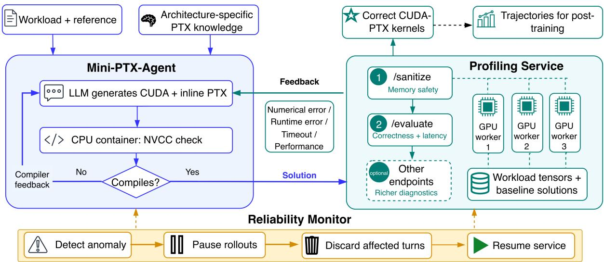  
Figure 11: Detailed execution infrastructure supporting PTXBench. MiniPTXAgent compiles generated CUDA–PTX locally and sends successfully compiled candidates to an isolated GPU profiling service for sanitization, evaluation, and optional diagnostics. A reliability monitor pauses dispatch, restarts unhealthy service state, and excludes affected turns from trajectories. After a restart, it also excludes thermally abnormal GPUs because throttling distorted latency by over 15% in our measurements [57].

(a) Baseline-cache runtime  
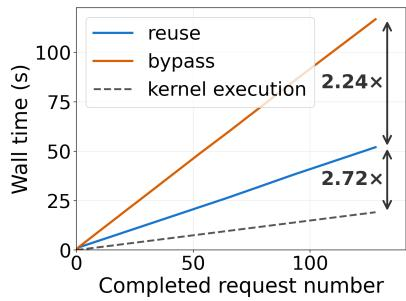

(b) Concurrency scaling (turns/hour)  
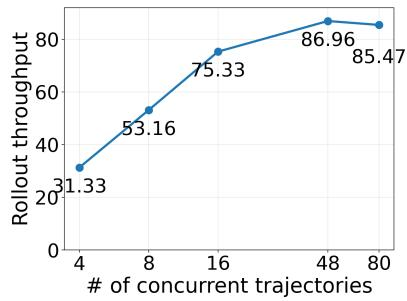

(c) GPU scaling (turns/hour)  
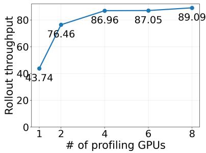  
Figure 12: Evaluation of workload state caching, generation-profiling pipelining, and GPU sharing.

PTX is unevenly documented and sometimes underspecified [59] or even wrong [60]. Each pack contains architecture parameters, C++ wrappers for PTX instructions, and contracts such as layouts and memory-consistency rules. Some wrappers are adapted from LittleKernel [61]; comments retain complete polymorphic instruction definitions while the wrapper demonstrates one representative instance. We validate each pack against documentation, reports, and execution.

Table 6: Token counts for architecture-specific prompt components.
<table><tr><td>GPU</td><td>Component</td><td>Tokens</td></tr><tr><td rowspan="4">H100</td><td>Architecture parameter</td><td>259</td></tr><tr><td>Template functions</td><td>18,601</td></tr><tr><td>Architecture contract</td><td>3,454</td></tr><tr><td>Total</td><td>22,314</td></tr><tr><td rowspan="4">B200</td><td>Architecture parameter</td><td>413</td></tr><tr><td>Template functions</td><td>18,871</td></tr><tr><td>Architecture contract</td><td>9,531</td></tr><tr><td>Total</td><td>28,815</td></tr></table>

## A.5 PUBLISHED AND CORRECTED FLASHATTENTION-3 PSEUDOCODE

When preparing the controlled context, we found two inconsistencies in the published FlashAttention-3 Algorithm 2 [62]: the loop condition $j < T _ { c } - 1$ leaves $S _ { T _ { c } - 1 }$ and its softmax uncomputed, and the loop body computes $\widetilde { P } _ { \mathrm { n e x t } }$ without assigning it to $ { \widetilde { P } } _ { \mathrm { c u r } }$ . Our corrected prompt version iterates through $j = T _ { c } - 1$ , carries both pipeline states forward, records the old row maximum before rescaling the accumulated output, and normalizes by $\ell _ { i }$ in the epilogue. Listings 1 and 2 reproduce the relevant published consumer-warpgroup pseudocode and the corrected version supplied in our prompt, reinforcing the controlled-context design choice.

1 Require: $Q _ { i } \in \mathbb { R } ^ { B _ { r } \times d }$ and $K , V \in \mathbb { R } ^ { N \times d }$ in HBM; key block size $B _ { c }$ and $T _ { c } = \lceil N / B _ { c } \rceil$   
2 Reallocate registers as a function of the number of consumer warps.   
3 On chip, initialize $O _ { i } = 0$ and $\ell _ { i } , m _ { i } = 0 , - \infty$   
4 Wait for $Q _ { i }$ and $K _ { \mathrm { 0 } }$ in shared memory.   
5 Compute $S _ { \mathrm { c u r } } = Q _ { i } K _ { 0 } ^ { \top }$ using WGMMA. Commit and wait.   
6 Release stage 0 of the buffer for $K .$   
7 Compute $m _ { i } , \widetilde { P } _ { \mathrm { c u r } } ,$ and $\ell _ { i }$ from $S _ { \mathrm { c u r } } ,$ and rescale $O _ { i }$   
8 for $1 \leq j < T _ { c } - 1$ do   
9 Wait for Kj in shared memory.   
10 Compute $\begin{array} { r } { S _ { \mathrm { n e x t } } = Q _ { i } K _ { j } ^ { \top } } \end{array}$ using WGMMA. Commit; do not wait.   
11 Wait for $V _ { j - 1 }$ in shared memory.   
12 Compute $\dot { O _ { i } { = } } O _ { i } + \widetilde { P } _ { \mathrm { c u r } } V _ { j { \frac { - 1 } { - 1 } } }$ using WGMMA. Commit; do not wait.   
13 Wait for the WGMMA $Q _ { i } K _ { j } ^ { \top }$   
14 Compute $m _ { i } , \widetilde { P } _ { \mathrm { n e x t } } ,$ and $\bar { \boldsymbol { \ell } } _ { i }$ from $S _ { \mathrm { n e x t } }$   
15 Wait for the WGMMA $\widetilde { P } _ { \mathrm { c u r } } V _ { j - 1 } ;$ then rescale $O _ { i }$   
16 Release stages $( j$ mod s) and $( ( j - 1 )$ mod s) for K and $V ,$ respectively.   
17 Copy Snext to Scur.   
18 end for   
19 Wait for $V _ { T _ { c } - 1 }$ in shared memory.   
20 Compute $O _ { i } = O _ { i } + \widetilde { P } _ { \mathrm { l a s t } } V _ { T _ { c } - 1 }$ using WGMMA. Commit and wait.   
21 Epilogue: Rescale Oi based on mi. Compute Li from mi and $\ell _ { i } ;$ write $O _ { i } , L _ { i }$ to HBM.

Listing 1: FlashAttention-3 Algorithm 2 as published. The loop bound and missing probability-state update make the pseudocode internally inconsistent.

1 Require: $Q _ { i } \in \mathbb { R } ^ { B _ { r } \times d }$ and $K , V \in \mathbb { R } ^ { N \times d }$ in HBM; key block size $B _ { c }$ and $T _ { c } = \lceil N / B _ { c } \rceil$   
2 Reallocate registers as a function of the number of consumer warps.   
3 On chip, initialize $O _ { i } = 0$ and $\ell _ { i } , m _ { i } = 0 , - \infty$   
Wait for Qi and $K _ { 0 } \mathrm { ~ \scriptsize ~ i n ~ }$ shared memory.   
5 Compute $S _ { \mathrm { c u r } } = Q _ { i } K _ { 0 } ^ { \top }$ using WGMMA. Commit and wait.   
6 Release stage 0 of the buffer for K.   
7 Compute mi, Pecur, and $\ell _ { i }$ from Scur.   
8 for $1 \leq j < T _ { c }$ do   
9 Wait for $K _ { j }$ in shared memory.   
10 Compute $\dot { S } _ { \mathrm { n e x t } } = Q _ { i } K _ { j } ^ { \top }$ using WGMMA. Commit; do not wait.   
11 Wait for $V _ { j - 1 } \quad \mathrm { i n }$ shared memory.

12 Compute $O _ { i } = O _ { i } + \widetilde { P } _ { \mathrm { c u r } } V _ { j _ { \frac { - 1 } { \tau } } }$ using WGMMA. Commit; do not wait.   
13 Wait for the WGMMA QiK⊤.   
14 Save $m _ { i } ^ { \mathrm { o l d } } \gets m _ { i } .$   
15 Update m and ℓ online; compute $\widetilde P _ { \mathrm { n e x t } } = \exp ( S _ { \mathrm { n e x t } } - m _ { i } ) ;$   
16 Wait for the WGMMA $\widetilde { P } _ { \mathrm { c u r } } V _ { j - 1 } ;$ then set $O _ { i } = \mathrm { d i a g } ( \exp ( m _ { i } ^ { \mathrm { o l d } } - m _ { i } ) ) O _ { i } .$   
17 Release stages (j mod s) and $( ( j - 1 )$ mod s) for K and $\mathbf { \bar { \rho } } _ { V } ,$ respectively.   
18 Copy $S _ { \mathrm { n e x t } }$ to $S _ { \mathrm { c u r } }$ and Penext to Pecur.   
19 end for   
20 Wait for $V _ { T _ { c } - 1 }$ in shared memory.   
21 Compute $O _ { i } = O _ { i } + \widetilde { P } _ { \mathrm { c u r } } V _ { T _ { c } - 1 }$ using WGMMA. Commit and wait.   
22 Epilogue: Set Oi = diag(ℓi)−1Oi and Li = mi + log(ℓi); write Oi, Li to HBM.  
Listing 2: Corrected FlashAttention-3 Algorithm 2 used in our prompt.

## A.6 SUPPLEMENTARY RESULTS

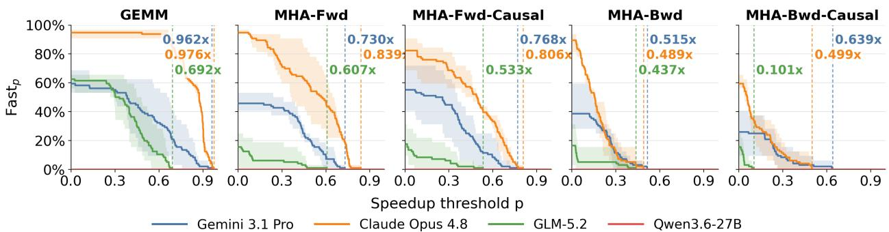

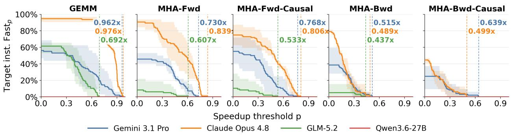  
Figure 13: H100 Fastp and $\mathrm { F a s t } _ { p } ^ { \mathrm { I n s t . } }$

Table 7: Best speedup with target instruction execution on H100 and B200.
<table><tr><td>GPU</td><td>Model</td><td>GEMM</td><td>MHA-Fwd</td><td>MHA-Fwd-Causal</td><td>MHA-Bwd</td><td>MHA-Bwd-Causal</td></tr><tr><td rowspan="6">H100</td><td rowspan="3">Gemini 3.1 Pro</td><td>0.687 / 0.934 / 0.962</td><td>0.555 / 0.730 / 0.730</td><td>0.614 / 0.651 / 0.768</td><td>0.206 / 0.375 / 0.515</td><td>- / 0.634 / 0.639</td></tr><tr><td>(0.687 / 0.934 / 0.962)</td><td>(0.555 / 0.730 / 0.730)</td><td>(0.614 / 0.651 / 0.768)</td><td>(0.206 / 0.375 / 0.515)</td><td>(0.065 / 0.634 / 0.639)</td></tr><tr><td>0.770 / 0.968 / 0.976</td><td>0.759 / 0.770 / 0.839</td><td>0.758 / 0.806 / 0.806</td><td>0.300 / 0.440 / 0.489</td><td>− / 0.499 / 0.499</td></tr><tr><td rowspan="3">Claude Opus 4.8</td><td>(0.770 / 0.968 / 0.976)</td><td>(0.759 / 0.770 / 0.839)</td><td>(0.758 / 0.806 / 0.806)</td><td>(0.300 / 0.440 / 0.489)</td><td>(0.058 / 0.499 / 0.499)</td></tr><tr><td>0.447 / 0.692 / 0.692</td><td>0.407 / 0.470 / 0.607</td><td>− / 0.471 / 0.533</td><td>0.316 / 0.437 / 0.437</td><td></td></tr><tr><td>(0.447 / 0.692 / 0.692)</td><td>(0.407 / 0.470 / 0.607)</td><td>(0.015 / 0.471 / 0.533)</td><td>(0.316 / 0.437 / 0.437)</td><td>(−/ 0.101 / 0.101)</td></tr><tr><td rowspan="6"></td><td rowspan="3">Qwen3.6-27B</td><td></td><td></td><td></td><td></td><td></td></tr><tr><td>0.273 / 0.680 / 0.892</td><td>− / 0.280 / 0.280</td><td>- / 0.206 / 0.248</td><td>− / 0.087 / 0.133</td><td></td></tr><tr><td>(0.273 / 0.680 / 0.892)</td><td>(− / 0.280 / 0.280)</td><td>(0.013 / 0.206 / 0.248)</td><td>(− / 0.087 / 0.133)</td><td>(− / 0.015 / 0.015)</td></tr><tr><td rowspan="3">Claude Opus 4.8</td><td>0.782 / 1.012 / 1.012</td><td>− / 0.253 / 0.300</td><td>− / 0.232 / 0.269</td><td>− / 0.069 / 0.149</td><td></td></tr><tr><td>(0.782 / 1.012 / 1.012)</td><td>(0.110 / 0.253 / 0.300)</td><td>(0.042 / 0.232 / 0.269)</td><td>(0.022 / 0.136 / 0.155)</td><td>(0.023 / 0.088 / 0.116)</td></tr><tr><td>0.162 / 0.632 / 0.632</td><td>−/−/0.027</td><td>0.098 / 0.098 / 0.098</td><td></td><td></td></tr><tr><td rowspan="3">GLM-5.2</td><td rowspan="3">Qwen3.6-27B</td><td>(0.162 / 0.632 / 0.632)</td><td>(0.024 / 0.024 / 0.035)</td><td>(0.098 / 0.098 / 0.098)</td><td>(0.019 / 0.030 / 0.040)</td><td>(0.018 / 0.034 / 0.034)</td></tr><tr><td></td><td></td><td></td><td></td><td></td></tr><tr><td>(− / − / 0.006)</td><td></td><td></td><td></td><td></td></tr></table>

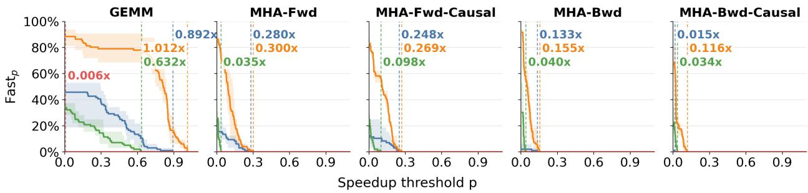

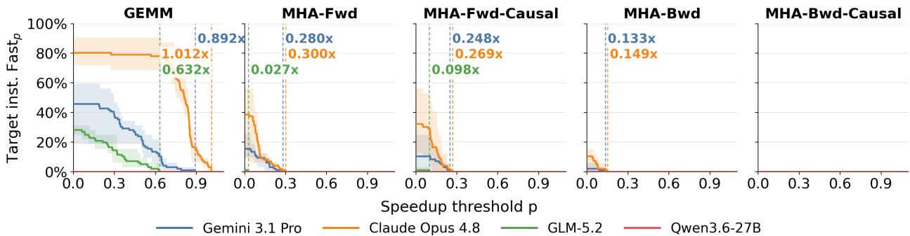  
Figure 14: B200 Fastp and $\mathrm { F a s t } _ { p } ^ { \mathrm { I n s t . } }$

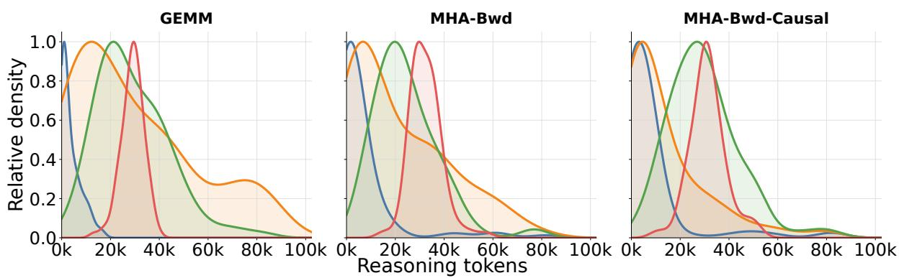  
Figure 15: Reasoning lengths for the base model, KernelGen s0, Fixit s3, and Gemini 3.1 Pro. Relative to s0, s3 lengthens backward-attention outputs but leaves GEMM medians similar.

Table 8: Turn correctness rates for the five-problem SFT evaluation.
<table><tr><td>SFT-ed Model Label</td><td>GEMM</td><td>MHA-Fwd</td><td>MHA-Fwd-Causal</td><td>MHA-Bwd</td><td>MHA-Bwd-Causal</td></tr><tr><td rowspan="2">Qwen3.6-27B-s0</td><td></td><td>- / 6.2 / 5.2</td><td>− / 2.1 / 1.0</td><td></td><td>-/-/1.0</td></tr><tr><td></td><td>(− / 6.2 / 5.2)</td><td>(− / 2.1 / 1.0)</td><td></td><td>(−/ − /1.0)</td></tr><tr><td rowspan="2">Qwen3.6-27B-s1</td><td>25.0 / 14.6 / 13.5</td><td>16.7 / 16.7 / 19.8</td><td>-/-/3.1</td><td>− / 2.1 / 4.2</td><td>− / 2.1 / 4.2</td></tr><tr><td>(25.0 / 14.6 / 13.5)</td><td>(16.7 / 16.7 / 19.8)</td><td>(−/−/3.1)</td><td>(− / 2.1 / 4.2)</td><td>(− / 2.1 / 5.2)</td></tr><tr><td rowspan="2">Qwen3.6-27B-s2</td><td>-/2.1 /2.1</td><td>-/ 2.1 / 5.2</td><td>-/-/1.0</td><td>-/-/1.0</td><td></td></tr><tr><td>(−/2.1 /2.1)</td><td>(− / 2.1 / 5.2)</td><td>(− / − / 1.0)</td><td>(−/ −/ 1.0)</td><td></td></tr><tr><td rowspan="2">Qwen3.6-27B-s3</td><td>-/2.1 / 3.1</td><td>-/4.2 / 2.1</td><td>- / 6.2 / 4.2</td><td>- / 4.2 / 4.2</td><td></td></tr><tr><td>(− / 2.1 / 3.1)</td><td>(−/ 4.2 / 2.1)</td><td>(− / 6.2 / 4.2)</td><td>(− / 4.2 / 4.2)</td><td></td></tr><tr><td rowspan="2">Qwen3.6-27B-s4</td><td>8.3 / 8.3 / 10.4</td><td>-/-/4.2</td><td>-/4.2 /2.1</td><td>-/-/1.0</td><td></td></tr><tr><td>(8.3 / 8.3 / 10.4)</td><td>(−/−/4.2)</td><td>(− / 4.2 / 2.1)</td><td>(−/ − / 1.0)</td><td></td></tr><tr><td rowspan="2">Qwen3.6-27B-s5</td><td>16.7 / 14.6 / 12.5</td><td>-/ 2.1 / 4.2</td><td>-/ 2.1 /3.1</td><td>-/-/5.2</td><td>-/-/4.2</td></tr><tr><td>(16.7 / 14.6 / 12.5)</td><td>(− / 2.1 / 4.2)</td><td>(− / 2.1 / 3.1)</td><td>(− / − / 5.2)</td><td>(−/ −/4.2)</td></tr><tr><td rowspan="2">Qwen3.6-27B-s6</td><td>8.3 / 2.1 / 1.0</td><td></td><td></td><td></td><td></td></tr><tr><td>(8.3 / 2.1 / 1.0)</td><td></td><td></td><td></td><td></td></tr></table>

Table 9: Best speedups for the five-problem SFT evaluation.
<table><tr><td>SFT-ed Model Label</td><td>GEMM</td><td>MHA-Fwd</td><td>MHA-Fwd-Causal</td><td>MHA-Bwd</td><td>MHA-Bwd-Causal</td></tr><tr><td>Qwen3.6-27B-s0</td><td></td><td>− / 0.589 / 0.589</td><td>- / 0.644 / 0.644</td><td></td><td>−/−/0.209</td></tr><tr><td></td><td></td><td>(− / 0.589 / 0.589)</td><td>(− / 0.644 / 0.644)</td><td></td><td>(− / − / 0.209) − / 0.192 / 0.199</td></tr><tr><td>Qwen3.6-27B-s1</td><td>0.303 / 0.303 / 0.340</td><td>0.556 / 0.556 / 0.565</td><td>- /-/0.395</td><td>- / 0.380 / 0.389</td><td></td></tr><tr><td></td><td>(0.303 / 0.303 / 0.340)</td><td>(0.556 / 0.556 / 0.565)</td><td>(− / − / 0.395)</td><td>(− / 0.380 / 0.389)</td><td>(− / 0.192 / 0.199)</td></tr><tr><td>Qwen3.6-27B-s2</td><td>− / 0.209 / 0.211</td><td>- / 0.548 / 0.548</td><td>-/-/0.315</td><td>- /-/0.296</td><td></td></tr><tr><td></td><td>(− / 0.209 / 0.211)</td><td>(− / 0.548 / 0.548)</td><td>(−/−/0.315)</td><td>(− / − / 0.296)</td><td></td></tr><tr><td>Qwen3.6-27B-s3</td><td>− / 0.274 / 0.280</td><td>- / 0.465 / 0.465</td><td>- / 0.388 / 0.388</td><td>- / 0.494 / 0.494</td><td></td></tr><tr><td></td><td>(− / 0.274 / 0.280)</td><td>(− / 0.465 / 0.465)</td><td>(− / 0.388 / 0.388)</td><td>(− / 0.494 / 0.494)</td><td></td></tr><tr><td>Qwen3.6-27B-s4</td><td>0.276 / 0.373 / 0.373</td><td>− / -/ 0.452</td><td>- / 0.383 / 0.383</td><td>-/-/0.199</td><td></td></tr><tr><td></td><td>(0.276 / 0.373 / 0.373)</td><td>(− / − / 0.452)</td><td>(− / 0.383 / 0.383)</td><td>(− / − / 0.199)</td><td></td></tr><tr><td>Qwen3.6-27B-s5</td><td>0.325 / 0.446 / 0.446</td><td>− / 0.425 / 0.573</td><td>− / 0.241 / 0.246</td><td>- / -/0.295</td><td>− / − / 0.246</td></tr><tr><td></td><td>(0.325 / 0.446 / 0.446)</td><td>(− / 0.425 / 0.573)</td><td>(− / 0.241 / 0.246)</td><td>(− / − / 0.295)</td><td>(− / − / 0.246)</td></tr><tr><td>Qwen3.6-27B-s6</td><td>0.073 / 0.073 / 0.073 (0.073 / 0.073 / 0.073)</td><td></td><td></td><td></td><td></td></tr></table>

Table 10: Training data recipes.
<table><tr><td>SFT-ed Model Label</td><td>Config</td><td>Template</td><td>Reasoning Synthesizer</td><td>Record Count</td></tr><tr><td>Qwen3.6-27B-s0</td><td>8ops-Extended</td><td>KernelGen</td><td>GLM-5.2</td><td>494</td></tr><tr><td>Qwen3.6-27B-s1</td><td>4ops</td><td>Fixit</td><td>GLM-5.2</td><td>158</td></tr><tr><td>Qwen3.6-27B-s2</td><td>4ops-Extended</td><td>Fixit</td><td>GLM-5.2</td><td>259</td></tr><tr><td>Qwen3.6-27B-s3</td><td>8ops-Extended</td><td>Fixit</td><td>GLM-5.2</td><td>406</td></tr><tr><td>Qwen3.6-27B-s4</td><td>8ops-Post-balanced</td><td>Fixit</td><td>GLM-5.2</td><td>170</td></tr><tr><td>Qwen3.6-27B-s5</td><td>8ops-Pre-balanced</td><td>Fixit</td><td>GLM-5.2</td><td>258</td></tr><tr><td>Qwen3.6-27B-s6</td><td>8ops-Pre-balanced</td><td>Fixit</td><td>Qwen3.6-27B</td><td>258</td></tr></table>

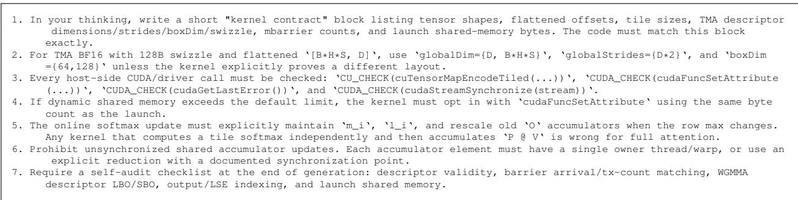  
Figure 16: Expert guidance used in MHA evaluation.