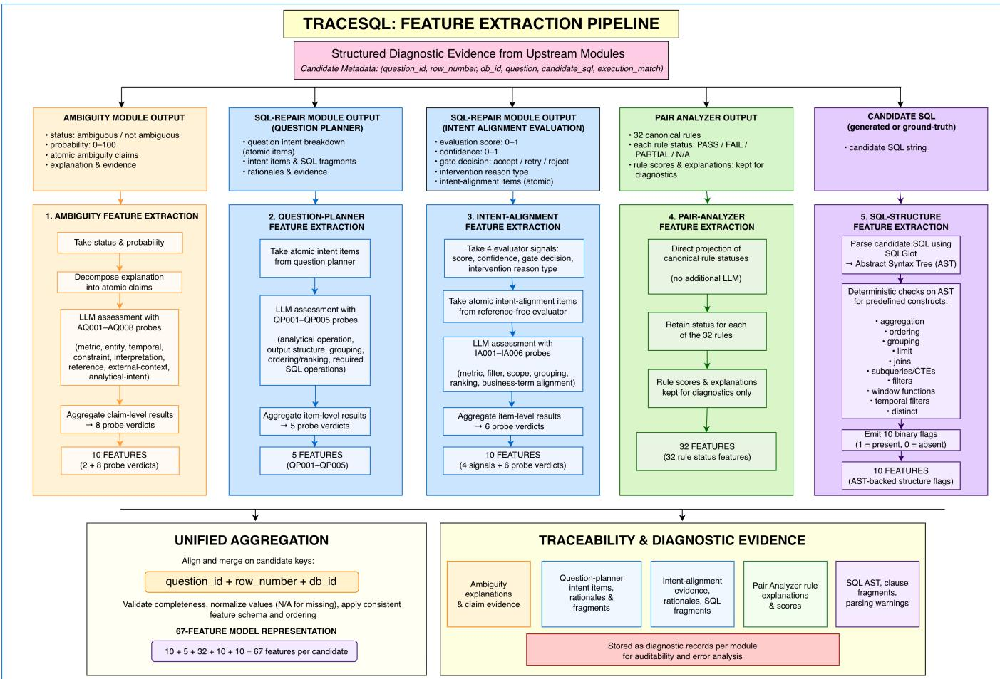
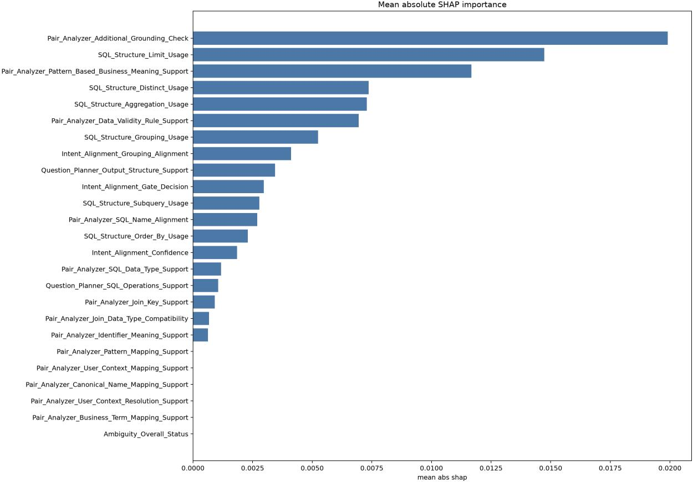
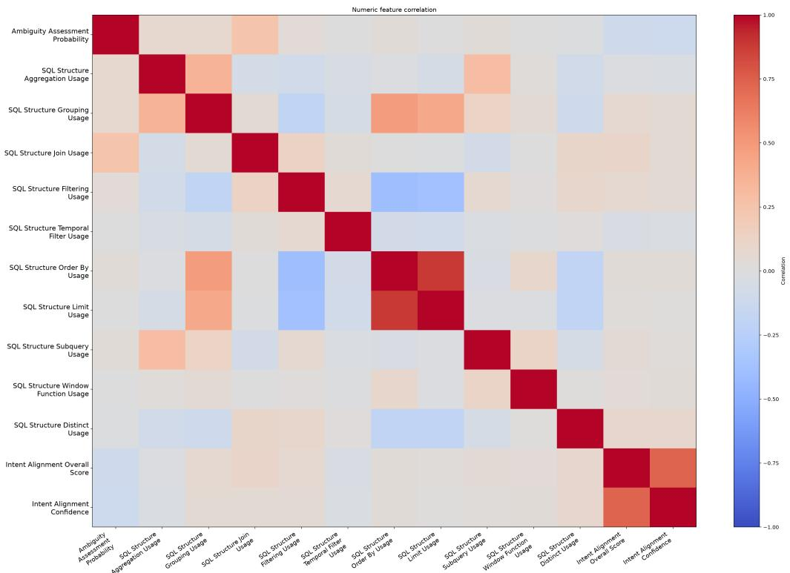
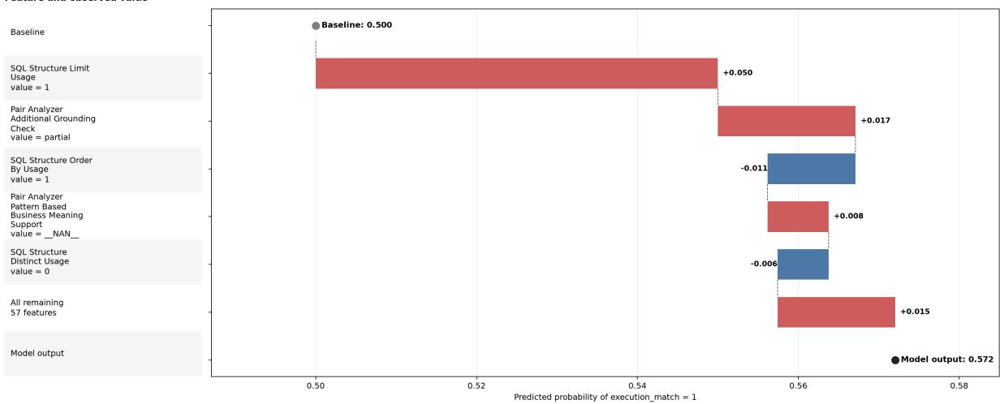

# TraceSQL: Traceable Answerability Estimation for Reference-Free Text-to-SQL Verification

Neelesh Kumar Shukla∗ Oracle Corporation India

Debasmita Panda∗ Oracle Corporation India

Srutanik Bhaduri Oracle Corporation India

Aditya Banerjee Oracle Corporation United States

## Abstract

Text-to-SQL systems are commonly evaluated using ground-truth SQL queries or reference execution results, but such supervision is unavailable at inference time in real-world deployments. This creates a critical verification problem: given only a user question, database context, and generated SQL, can a system estimate whether the generated query is likely to correctly answer the question? Recent approaches use LLMs as judge or specialized agents to inspect generated SQL, but their decisions can be dificult to trace. Outcome Reward Models (ORMs) address this by learning from execution-labeled candidate SQLs and assigning correctness scores to unseen queries, yet they still provide limited visibility into the sig nals behind each verification. To address this limitation, we propose TraceSQL, a lightweight and traceable verification model built on explicit diagnostic features. TraceSQL combines 67 features capturing question ambiguity, question requirements, question–schema– SQL consistency, SQL structure, and intent alignment. These signals remain available for examining which factors influence each prediction and for tracing decisions back to diagnostic evidence. On BIRD development databases, TraceSQL achieves 66.47% F1 and 64.48% ROC-AUC, compared with 61.87% F1 and 58.26% ROC-AUC for the GradeSQL-7B ORM baseline on the same generated-SQL evaluation. Feature attribution further shows that the model relies on both semantic grounding and deterministic SQL-structure signals. These results show that SQL verification can be performed with a lightweight learned model while retaining feature-level evidence for inspecting and diagnosing its predictions.

## CCS Concepts

• Computing methodologies → Natural language processing; Machine learning; • Information systems → Database query processing.

## Keywords

Text-to-SQL, answerability estimation, verification, interpretability, traceability, AutoML, BIRD

## 1 Introduction

Text-to-SQL systems have advanced rapidly with large language models (LLMs). Benchmarks such as Spider [15] and BIRD [8] evaluate systems on complex questions and unseen database schemas. Recent methods further improve generation through decomposition,

Viji Krishnamurthy Oracle Corporation United States

example selection, self-correction, multi-agent reasoning, and largescale synthetic supervision [3, 7, 10, 13]. Despite these advances, generated SQL can contain subtle semantic, schema-grounding, or structural errors. Reliable Text-to-SQL therefore requires not only generating a query, but also determining whether the generated query can be trusted. During benchmark evaluation, this decision can be supported by ground-truth SQL or reference execution results. In deployment, however, such references are typically unavailable, so post-generation verification must rely on the user question, database context, generated SQL, and signals derived from their relationships. Existing approaches provide post-generation reliability in diferent ways. LLM-based methods use self-correction or specialized agents to inspect and refine generated SQL [1, 10, 13]. More recent work has also explored reasoning-based SQL judges and explicit rule-based verification [2, 11]. These approaches showcase diferent forms of verification evidence, such as correction reasoning, agent feedback, execution signals, and rule-based checks. However, this evidence is usually tied to the design of the individual method and is not represented in a unified, measurable form that can be systematically analyzed or linked to a learned verification decision.

Outcome Reward Models (ORMs) provide a learned alternative to these approaches. GradeSQL [12] generates multiple candidate SQLs during training, derives correctness labels through execution match with the reference SQL, and fine-tunes an LLM to estimate candidate correctness. At inference time, the trained ORM assigns a probability-based correctness score without requiring the reference SQL. This demonstrates that execution-derived supervision can be used to train a dedicated Text-to-SQL verifier. However, the resulting prediction is primarily exposed as a scalar score. While useful for ranking or selecting candidates, this score provides limited visibility into the specific semantic or structural signals that contributed to the decision.

This leaves an important gap when verification is expected to support not only prediction, but also understanding and diagnosis. A candidate may fail because of incorrect schema grounding, unsupported analytical requirements, missing or inappropriate SQL operations, incorrect grouping, or a mismatch with the intended result. Knowing that a candidate received a low verification score does not by itself distinguish among these cases. For a verifier to support system analysis, its decision should be interpretable in terms of meaningful signals, explainable in terms of how those signals influence the prediction, and traceable back to the evidence from which those signals were derived.

We introduce TraceSQL, a lightweight learned verifier designed around these three properties. TraceSQL represents each question– candidate pair through explicit diagnostic signals rather than relying only on a final verifier score. The representation combines five complementary diagnostic families: question ambiguity, question planning, pair analysis between the question, schema, and generated SQL, deterministic SQL structure, and intent alignment. Together, they produce 67 compact features describing the requirements expressed by the question, the grounding and semantic consistency of the candidate, the operations present in the SQL, and its alignment with the intended request.

The representation provides three levels of visibility into the verification process. First, the model inputs are named diagnostic features with explicit semantic meaning, making the representation itself interpretable. Second, feature-importance methods can be applied to the learned model to determine which signals influ ence its predictions, providing model-level explainability. Third, the richer diagnostic outputs from which the features are derived are retained separately, allowing influential features to be traced back to their supporting evidence. TraceSQL therefore connects the final verification decision to both measurable feature-level signals and their diagnostic provenance.

We train TraceSQL using generated candidate SQLs from the balanced BIRD ORM training data released with GradeSQL. We then evaluate TraceSQL and GradeSQL-7B on the same generatedcandidate SQLs from held-out BIRD databases. TraceSQL achieves 66.47% F1 and 64.48% ROC-AUC, compared with 61.87% F1 and 58.26% ROC-AUC for GradeSQL-7B. Beyond predictive performance, our feature analysis shows that the learned verifier draws on both semantic diagnostic signals and deterministic SQL-structure properties, allowing its behavior to be examined in terms of concrete properties of the generated query.

Contributions. We make three main contributions. First, we introduce TraceSQL, a lightweight learned verifier that combines SQL verification with interpretability, explainability, and traceability. Second, we develop a 67-feature representation from five diagnostic families in which model inputs remain semantically meaningful and retain provenance to their underlying diagnostic evidence. Third, we evaluate TraceSQL against GradeSQL-7B on identical held-out generated-candidate SQLs and analyze the semantic and structural signals that drive its predictions, showing how verification decisions can be connected to explicit feature-level evidence.

## 2 Related Work

## 2.1 Text-to-SQL Generation

Recent LLM-based Text-to-SQL methods improve diferent parts of the generation process. DIN-SQL decomposes generation into schema linking, query decomposition, SQL generation, and selfcorrection [10]. DAIL-SQL focuses on prompt construction and example selection for in-context learning [3]. MAC-SQL uses a multiagent framework with dedicated components for decomposition, context reduction, and SQL refinement [13]. OmniSQL addresses the training-data bottleneck through large-scale synthetic supervi sion for specialized Text-to-SQL models [7]. These methods mainly improve SQL generation or refinement, whereas TraceSQL operates after generation and focuses on verifying a produced candidate while preserving the evidence behind the verification decision.

## 2.2 Post-Generation Verification and Learned Verifiers

Recent work has increasingly focused on detecting and correcting errors after SQL generation. MAGIC uses specialized agents to derive self-correction guidelines from generation failures [1], while DPC performs training-free candidate verification by comparing SQL behavior with an independently constructed execution path [6]. Learned verification has also emerged as an alternative: STaR-SQL incorporates an outcome-supervised reward model to rank generated candidates during test-time reasoning [5].

GradeSQL [12] develops this direction further through taskspecific Outcome Reward Models (ORMs), trained on executionderived candidate labels and used to assign continuous correctness scores at inference time. TraceSQL follows the idea of learning from execution-derived candidate labels, but difers in how verification is represented. Rather than exposing only a scalar correctness score, TraceSQL retains a fixed set of diagnostic signals that can be analyzed individually and traced back to their underlying evidence.

## 2.3 Interpretable, Explainable, and Traceable Verification

Recent verification methods provide diferent forms oftransparency, including correction guidelines, structured reasoning, and explicit verification constraints [1, 2, 11]. TraceSQL takes a complementary approach by representing verification evidence as explicit, measurable features that can be directly related to the behavior of the learned verifier.

TraceSQL provides transparency at three levels. Interpretability comes from semantically defined diagnostic features used as model inputs. Explainability is provided through feature-importance and attribution methods, including permutation importance and SHAP [9], which reveal which signals influence the model’s predictions. Traceability is preserved by linking these features back to the diagnostic evidence from which they were derived. Together, these properties allow the verifier to expose not only its prediction, but also the semantic and structural signals associated with that decision.

## 3 Task Formulation

Let � denote a natural-language question, � the corresponding database context, and � a candidate SQL to be verified. The verification task is to estimate whether � correctly answers � using only information available to the verifier. In the primary setting, � is a generated candidate SQL; the same verification pipeline is also applied to the ground-truth SQL provided with the BIRD development databases.

During training and evaluation, candidate correctness is determined using execution match:

$$
y = \ast \left[ \operatorname { E x e c } ( x ) = \operatorname { E x e c } ( x ^ { \star } ) \right] ,\tag{1}
$$

where $x ^ { \star }$ denotes the reference SQL and $y \in \{ 0 , 1 \}$ is the candidate level correctness label. The reference SQL and the resulting executionmatch label are used only to construct ofline supervision and are not provided as inputs to TraceSQL.

Given (�, �, �), the diagnostic pipeline constructs a 67-dimensional feature representation

$$
\mathbf { z } = f ( q , s , x ) ,\tag{2}
$$

where z captures explicit signals related to question ambiguity, question requirements, question–schema–SQL consistency, SQL structure, and intent alignment. TraceSQL then estimates

$$
{ \hat { p } } = P ( y = 1 \mid \mathbf { z } ) ,\tag{3}
$$

where $\hat { p }$ is the estimated probability that the candidate SQL is correct.

Using a fixed decision threshold $\tau = 0 . 5 0$ , the final verification decision is

$$
\hat { y } = \pmb { \mathscr { k } } [ \hat { p } \geq \tau ] .\tag{4}
$$

The features in z remain individually inspectable and retain their diagnostic provenance. This allows the verification decision to be examined in terms of the semantic, grounding, and structural signals that influence the learned prediction.

## 4 Traceable Answerability Signals

## 4.1 Diagnostic Evidence Generation

TraceSQL derives its verification evidence from three upstream diagnostic modules: the Ambiguity Detector, Pair Analyzer, and SQL Repair Module. Together, they capture question-level ambiguity, question–schema–SQL consistency, and alignment between the user request and the candidate SQL. Their structured outputs are retained as diagnostic evidence and subsequently transformed into the model features described in Section 4.2.

4.1.1 Ambiguity Detector. The Ambiguity Detector assesses whether the user question is suficiently specified with respect to the available database context. It produces:

• Ambiguity status: indicates whether the question is considered ambiguous.

• Ambiguity probability: estimates the degree of ambiguity on a 0–100 scale.

• Explanation: provides the evidence or rationale supporting the ambiguity assessment.

These outputs provide the source evidence for constructing the downstream ambiguity features.

4.1.2 Pair Analyzer. The Pair Analyzer evaluates whether the candidate SQL is supported by the user question and database context. It applies predefined verification rules covering schema and column grounding, joins, identifiers, data types, temporal semantics, metrics, null and validity logic, and business-term mappings. Its diagnostic outputs include:

• Support status: classifies the candidate as supported, partially supported, unsupported, or unclear.

• Pair score and summary: provide an overall assessment of candidate support.

• Rule-level results: record the status, score, explanation, and supporting evidence for each verification rule.

• Findings: describe detected grounding or consistency gaps and the afected database or SQL elements.

The rule-level statuses are used to construct the Pair Analysis feature family, while the richer explanations and findings are retained as diagnostic evidence for traceability.

4.1.3 SQL Repair Module. The SQL Repair Module is used in diagnosis-only mode to assess how well the candidate SQL reflects the requirements expressed by the user question. It decomposes the question into structured intents, explains the behavior of the candidate SQL, and evaluates their alignment. The outputs retained for this work are:

• Question intent breakdown: decomposes the question into ordered, schema-grounded requirements that the SQL is expected to satisfy.

• SQL explanation: describes the operations performed by the candidate SQL, including tables, columns, joins, filters, aggregations, and other query constructs.

• Reference-free evaluation: assesses the candidate against the planned question intents and produces an evaluation score, confidence, gate decision, intent-level alignment assessments, and an intervention reason when a mismatch is detected.

These outputs provide the source evidence for constructing the downstream question-planning and intent-alignment features.

## 4.2 Feature Extraction

Feature extraction depends on the type of diagnostic evidence. For the ambiguity, question-planning, and intent-alignment families, TraceSQL uses predefined probe sets encoded in fixed evaluation prompts. Relevant diagnostic units—including ambiguity claims, question-intent items, and intent-alignment evidence—are supplied to an LLM together with the required question, schema, and SQL context. The LLM evaluates each unit against the applicable probes and returns a structured verdict (PASS, FAIL, N/A, or UNKNOWN). The LLM configurations used across the diagnostic pipeline are reported in Section 7.1.

Pair Analysis requires no additional LLM assessment during feature construction; the statuses of predefined canonical rules are projected directly into the model representation. SQL-structure features are also deterministic: the candidate SQL is parsed into an abstract syntax tree (AST) using SQLGlot, from which predefined structural properties are extracted. Figure 1 summarizes the resulting feature-construction pipeline.

4.2.1 Ambiguity Features. The ambiguity feature pipeline transforms the Ambiguity Detector output into ten structured features. Ambiguity status and probability are retained directly, while the detector explanation is decomposed into claims and evaluated against eight predefined ambiguity probes covering metric, entity, temporal, constraint, interpretation, reference, external-context, and analytical-intent ambiguity. Claim-level assessments are aggregated into one verdict per probe, yielding eight probe features in addition to the two detector-level signals.

4.2.2 Question-Planning Features. The question-planning feature pipeline transforms the question intent breakdown produced by the

  
Figure 1: TraceSQL feature-construction pipeline. Diagnostic evidence is transformed into five feature families through LLM based probe assessment, direct projection of Pair Analyzer rule statuses, and deterministic SQL-AST extraction using SQLGlot. The resulting 10+5+32+10+10 = 67 features are aligned at the candidate level and merged into the unified model representation, while richer diagnostic evidence is retained separately for traceability.

SQL Repair Module into five structured features. Each atomic intent item is evaluated by an LLM against five predefined planning probes covering the analytical operation, expected output structure, grouping, ordering or ranking, and required SQL operations. Item-level assessments are aggregated into one verdict per probe, producing five candidate-level question-planning features. Supporting evidence, rationale, confidence, and planning fragments are retained separately for traceability.

4.2.3 Pair-Analysis Features. The pair-analysis feature pipeline di rectly transforms the rule-level outputs of the Pair Analyzer into 32 structured features. Unlike the ambiguity and question-planning pipelines, no additional LLM assessment is performed during this stage. Each predefined Pair Analyzer rule contributes one categorical feature corresponding to its rule status, while the associated rule score and explanation are retained separately as diagnostic evidence. The rules cover schema and scope grounding, joins, identifiers, data types, temporal semantics, metric definitions, data validity, and business-term mappings.

4.2.4 SQL-Structure Features. The SQL-structure pipeline extracts ten deterministic features directly from the candidate SQL. Each query is parsed into an abstract syntax tree (AST) using SQLGlot, which is inspected for aggregation, grouping, joins, filtering, temporal filtering, ordering, limits, subqueries or CTEs, window functions, and DISTINCT. Each property is represented as a binary feature indicating its presence or absence. The parsed AST, clause-level SQL evidence, and parsing warnings are retained separately for traceability.

## 4.2.5 Intent-Alignment Features. The intent-alignment feature

pipeline transforms the structured output of the reference-free evaluator into ten candidate-level features. Four evaluator signals—the overall evaluation score, confidence, gate decision, and interventionreason type—are retained directly. In addition, each intent-alignment item is evaluated by an LLM against six predefined probes covering metric, filter, scope, grouping, ranking, and business-term align ment. Item-level assessments are aggregated into one verdict per probe, producing six additional features. Supporting evidence, rationales, SQL fragments, and the original intent-alignment records are retained separately for traceability.

Table 1 summarizes the resulting 67-dimensional diagnostic representation and provides representative signals from each feature family. Complete definitions of all 67 features, including their probe and canonical-rule identifiers, are provided in the supplementary material.

## 5 Research Questions

We evaluate TraceSQL from four complementary perspectives: verification performance, diagnostic-signal importance, cross-database generalization, and traceability. We investigate the following research questions.

RQ1: How efectively can structured diagnostic evidence support reference-free Text-to-SQL verification?

RQ2: Which diagnostic signals contribute most to the learned verification decision?

RQ3: How well does TraceSQL generalize across held-out databases? RQ4: To what extent can TraceSQL predictions be traced back to explicit diagnostic evidence?

## 6 Data Preparation

We use the balanced BIRD ORM training corpus released with GradeSQL [12]. After attaching database identifiers, the corpus contains 30,686 candidate SQL queries from 69 databases and 2,642 unique question–database groups. Each group contains between 2 and 32 candidates, so sampling individual rows would dispropor tionately represent questions with larger candidate sets.

Database identifiers are assigned by matching normalized question-plus-evidence text to the corresponding BIRD training records. We then remove only exact duplicates across question, schema, SQL, data, label, and database ID. This reduces the corpus from 30,686 to 19,592 candidates while preserving alternative candidate SQLs for the same question.

For each eligible question–database group, we retain one positive and one negative candidate, yielding 2,642 balanced pairs, or 5,284 candidates. From these, we select 1,000 complete pairs (2,000 candi dates) using database-stratified sampling. All 69 training databases remain represented, with the remaining samples allocated proportionally across databases. The resulting training set contains 1,000 positive and 1,000 negative candidates and is reproducible using seed 42.

The final 2,000-candidate sample represents approximately 6.5% of the original ORM corpus and 37.9% of the 5,284-candidate paired source. We use this sample for the current TraceSQL training experiments, while scaling to the complete paired source is left for future work.

## 7 Experimental Setup

## 7.1 LLM Configuration for Diagnostic Evidence and Feature Extraction

The diagnostic pipeline uses fixed LLM backends for evidence generation and LLM-based feature extraction. The Ambiguity Detector and SQL Repair Module use GPT-4o, while the Pair Analyzer uses

GPT-5.2. In the unified feature-extraction pipeline, the ambiguity, question-planning, and intent-alignment probe assessments are performed using GPT-4o.

## 7.2 Training with FLAML

We train TraceSQL using FLAML [14] with all 67 diagnostic features as input. The training set contains 2,000 candidates, balanced between 1,000 positive and 1,000 negative execution\_match labels. Following FLAML’s preprocessing and feature transformation, 62 features are retained as inputs to the selected estimator. Thus, TraceSQL is defined over the complete 67-feature diagnostic representation, while the fitted estimator operates on the corresponding 62-feature transformed representation.

FLAML uses internal validation ROC-AUC for model selection and subsequently refits the selected estimator on all 2,000 training candidates. Metrics computed on these candidates therefore describe training-population performance rather than held-out evaluation.

With a 1,800-second search budget, FLAML evaluates 4,228 trials and selects an Extra Trees classifier [4] with seven trees, entropybased splitting, max\_leaves=6, and max\_features=0.2241. Increasing the search budget to 3,600 seconds returns the same model configuration and performance, indicating that the search had stabilized within the shorter budget.

## 7.3 Baseline and External Evaluation

The main baseline is GradeSQL-7B [12]. For external evaluation, the saved 1,800-second TraceSQL model is applied without refitting to 11 BIRD development databases that are disjoint from the training databases. We evaluate two complementary settings. The generated-SQL setting contains both execution-matching and non-matching candidates and serves as the primary two-class verification evaluation. The ground-truth SQL setting evaluates the ground-truth SQL provided with the BIRD development databases and serves as a complementary assessment of verifier behavior on these queries.

GradeSQL-7B and TraceSQL are evaluated on identical generated candidate SQLs with the same execution-match labels. This provides a matched evaluation of the two verification approaches on the same test instances.

## 8 Results

## 8.1 Training Results

The selected Extra Trees model achieves an internal validation ROC-AUC of 0.6109. After refitting on all 2,000 training candidates, it reaches an accuracy of 0.6085, precision of 0.5987, recall of 0.6580, F1 of 0.6270, and ROC-AUC of 0.6520. These values characterize model development and training-population performance rather than held-out evaluation.

## 8.2 Which Diagnostic Signals Does the Model Use?

We analyze the fitted 1,800-second model using native Extra Trees feature importance, permutation importance, and exact Tree SHAP [9]. We use these methods to characterize which diagnostic signals the learned verifier relies on. Permutation importance and SHAP provide complementary perturbation-based and attribution-based views, while native Extra Trees importance is used as a supporting analysis.

Table 1: Overview of the five TraceSQL diagnostic feature families and representative signals captured by each family.
<table><tr><td>Feature Family</td><td>#</td><td>Representative Features</td><td>Captured Evidence</td></tr><tr><td>Ambiguity</td><td>10</td><td>Ambiguity Overall Status; Metric Clarity; Time-Scope Clarity</td><td>Whether the question is sufficiently specified with respect to the requested metric, entities, temporal scope, constraints, references, and analytical intent.</td></tr><tr><td>Question Planning</td><td>5</td><td>Question Planner: Analytical Operation; Question Planner: Output Structure; Question Planner: Grouping</td><td>Whether the candidate SQL reflects the analytical operation, expected output structure, grouping, ordering, and SQL operations required by the question.</td></tr><tr><td>Pair Analysis</td><td>32</td><td>Join-Key Support; Data-Validity Rule Support; Additional Grounding Check</td><td>Whether tables, columns, joins, identifiers, data types, temporal semantics, metrics, validity rules, and business concepts are grounded in the available database context.</td></tr><tr><td>SQL Structure</td><td>10</td><td>SQL Aggregation Usage; SQL LIMIT Usage; SQL DISTINCT Usage</td><td>Deterministic structural properties of the candidate SQL extracted from its SQLGlot abstract syntax tree.</td></tr><tr><td>Intent Alignment</td><td></td><td>Intent Alignment: Evaluation Score; Intent Alignment: Grouping;</td><td>Whether the candidate SQL aligns with the requested metric, filters, scope, grouping,</td></tr><tr><td></td><td></td><td>Intent Alignment: Business Term</td><td>ranking, and business terminology.</td></tr></table>

The leading signals span both deterministic SQL structure and semantic diagnostic evidence. Permutation importance ranks SQL DISTINCT Usage, SQL LIMIT Usage, SQL Aggregation Usage, Additional Grounding Check, Pattern-Based Business Meaning Support, and Data-Validity Rule Support among the strongest features. SHAP independently highlights the same broad set. Nine features appear within the top ten under both permutation importance and SHAP: Additional Grounding Check, SQL LIMIT Usage, Pattern-Based Business Meaning Support, SQL DISTINCT Usage, SQL Aggregation Usage, Data-Validity Rule Support, SQL Grouping Usage, Intent Alignment: Grouping, and Question Planner: Output Structure. This agreement shows that the model relies on a combination of deterministic SQLstructure signals and semantic diagnostic evidence rather than on a single type of signal.

Table 2 reports the six highest-ranked features by permutation importance together with their mean absolute SHAP values.

The strongest signals are distributed across multiple parts of the TraceSQL representation. SQL-structure features such as SQL DISTINCT Usage, SQL LIMIT Usage, and SQL Aggregation Usage appear alongside grounding and semantic-validity signals from the Pair Analysis family. The fitted verifier therefore combines evidence about the operations present in the candidate SQL with evidence about whether those operations are supported by the question and database context.

A more detailed feature-level analysis, including global SHAP analysis, cross-method comparison of SHAP, permutation importance, and native Extra Trees importance, feature correlation analysis, and a representative prediction trace, is provided in the supplementary material.

Table 2: Leading features by permutation importance in the selected TraceSQL model. Permutation values are ROC-AUC decreases after shufling; SHAP values are mean absolute contributions.
<table><tr><td>Feature</td><td>Perm.</td><td>Mean |SHAP|</td></tr><tr><td>SQL DISTINCT Usage</td><td>0.0344</td><td>0.0074</td></tr><tr><td>SQL LIMIT Usage</td><td>0.0335</td><td>0.0147</td></tr><tr><td>SQL Aggregation Usage</td><td>0.0327</td><td>0.0073</td></tr><tr><td>Additional Grounding Check</td><td>0.0317</td><td>0.0199</td></tr><tr><td>Pattern-Based Business Meaning Support</td><td>0.0219</td><td>0.0117</td></tr><tr><td>Data-Validity Rule Support</td><td>0.0165</td><td>0.0070</td></tr></table>

Table 3: Overall generated-SQL performance on 1,521 candidates from 11 held-out BIRD development databases. Bold indicates the better result for each metric.
<table><tr><td>Model</td><td>Acc.</td><td>Prec.</td><td>Rec.</td><td>F1</td><td>AUC</td></tr><tr><td>GradeSQL-7B</td><td>57.46</td><td>63.64</td><td>60.21</td><td>61.87</td><td>58.26</td></tr><tr><td>TraceSQL</td><td>62.46</td><td>68.11</td><td>64.91</td><td>66.47</td><td>64.48</td></tr></table>

## 8.3 Generated-SQL Verification and Cross-Database Generalization

We evaluate TraceSQL and GradeSQL-7B on 1,521 generated SQLs from 11 held-out BIRD development databases. As shown in Table 3, TraceSQL outperforms GradeSQL-7B across all aggregate metrics, with improvements of 4.60 percentage points in F1 and 6.22 points in ROC-AUC. These results indicate that the structured diagnostic representation supports efective verification on databases not observed during training.

Table 4 shows that TraceSQL’s aggregate gains are reflected across a broad range of held-out databases. TraceSQL achieves stronger results on most reported metrics for nine of the eleven databases, including California Schools, Codebase Community, Financial, Superhero, and Toxicology. Particularly large improvements are observed for databases such as Superhero and Thrombosis Prediction. Performance is more competitive on Debit Card Specializing, while Formula 1 is the main case where GradeSQL-7B remains stronger on most metrics. Overall, the database-level results suggest that the TraceSQL representation transfers efectively across diverse schemas and query distributions, while leaving room for further improvement on specific domains.

## 8.4 Traceability of Verification Decisions

TraceSQL preserves the connection between influential model signals and explicit diagnostic evidence through the feature-extraction process: every model feature is associated with a named probe, canonical verification rule, or deterministic SQL-structure property, while the richer supporting evidence is retained under the same candidate identity.

For example, SQL-structure features such as SQL LIMIT Usage can be traced to the corresponding AST node and SQL clause; Pair Analyzer features such as Additional Grounding Check and Pattern-Based Business Meaning Support map to canonical rule statuses and their supporting explanations; and features such as Intent Alignment: Grouping and Question Planner: Output Structure map to probe verdicts, supporting evidence, rationales, and associated diagnostic records.

This provides a direct provenance path from an influential model feature to the diagnostic condition from which it was derived. A rep resentative candidate-level prediction trace illustrating this featureto-evidence connection for a false-positive verification decision is provided in the supplementary material.

## 8.5 Verification on Ground-Truth SQL

As a complementary evaluation, we apply both verifiers to 1,534 ground-truth SQL queries from the BIRD development databases. Unlike the generated-SQL evaluation, this setting contains only the reference SQL associated with each question and therefore contains no negative candidates. It measures how often each verifier assigns a positive decision when evaluated on the available ground-truth SQL. Since all instances belong to the positive class, accuracy is equivalent to recall, precision is 100% by construction, and ROC-AUC is undefined.

As shown in Table 5, GradeSQL-7B accepts 62.84% of the groundtruth SQL queries, compared with 60.17% for TraceSQL. At the database level, TraceSQL achieves higher acceptance on California Schools, Codebase Community, Financial, Formula 1, and Throm bosis Prediction, while GradeSQL-7B is higher on the remaining databases. Complete database-level results are provided in the supplementary material.

We use this experiment as a complementary evaluation ofverifier behavior on ground-truth SQL, while the generated-SQL setting remains the primary evaluation for comparing binary verification performance.

## 9 Discussion

## 9.1 Answerability Through Diagnostic Verification Evidence

TraceSQL and GradeSQL use the same type of execution-derived candidate supervision, but TraceSQL exposes a structured diagnostic representation at inference time rather than only a final correctness score. This representation combines question-level signals, such as ambiguity and planning requirements, with candidatelevel signals covering schema grounding, SQL structure, and intent alignment.

This distinction is useful because verification depends on both the question and the candidate SQL . A clearly specified question can still be paired with a candidate that does not realize the intended request, while ambiguity in the question can make the reliability of an otherwise valid candidate SQL harder to assess. TraceSQL captures these complementary signals explicitly and uses them to support reference-free verification.

## 9.2 Traceability and Generality

The feature analysis shows that the learned verifier relies on multiple forms of evidence. Deterministic SQL-structure features such as SQL DISTINCT Usage, SQL LIMIT Usage, and SQL Aggregation Usage appear alongside grounding and semantic-validity signals from the Pair Analysis family, such as Additional Grounding Check, Pattern-Based Business Meaning Support, and Data-Validity Rule Support. This suggests that the model combines information about what operations are present in the SQL with evidence about whether those operations are supported by the question and database context.

Because the features have fixed semantic definitions and remain linked to their underlying diagnostic records, influential predictions can be inspected and traced back to concrete evidence. The full diagnostic vocabulary is retained in the representation, allowing signals that are weak on the current BIRD distribution to remain available under diferent database and query settings.

## 10 Future Work

A primary direction for future work is to scale TraceSQL training from the current 2,000-candidate controlled sample to the complete 5,284-candidate paired source while retaining the same held-out 11-database evaluation. This will allow us to examine whether addi tional supervision improves verification performance and whether the learned importance of the diagnostic signals remains stable as the training set expands.

We also plan to investigate a tighter integration between TraceSQL and GradeSQL-style outcome reward modeling. Rather than using the diagnostic representation as a separate verifier, the 67 TraceSQL features can be incorporated directly into the GradeSQL verification model as additional structured evidence. This would enable a controlled study of how augmenting an ORM with explicit ambiguity, planning, grounding, SQL-structure, and intent-alignment signals afects predictive performance relative to the original GradeSQL formulation.

This comparison will help clarify whether the TraceSQL representation is more useful as a standalone verifier or as an additional evidence layer within a larger learned verification model.

Table 4: Database-level generated-SQL performance. Bold indicates the better result for each metric within a database.
<table><tr><td>Database</td><td colspan="5">GradeSQL-7B</td><td colspan="5">TraceSQL</td></tr><tr><td></td><td>Acc.</td><td>Prec.</td><td>Rec.</td><td>F1</td><td>AUC</td><td>Acc.</td><td>Prec.</td><td>Rec.</td><td>F1</td><td>AUC</td></tr><tr><td>California Schools</td><td>45.45</td><td>64.86</td><td>40.68</td><td>50.00</td><td>58.33</td><td>51.14</td><td>69.05</td><td>49.15</td><td>57.43</td><td>56.25</td></tr><tr><td>Card Games</td><td>55.26</td><td>50.47</td><td>62.79</td><td>55.96</td><td>53.98</td><td>61.05</td><td>56.82</td><td>58.14</td><td>57.47</td><td>64.73</td></tr><tr><td>Codebase Community</td><td>61.83</td><td>73.45</td><td>66.94</td><td>70.04</td><td>59.31</td><td>65.59</td><td>75.00</td><td>72.58</td><td>73.77</td><td>66.03</td></tr><tr><td>Debit Card Specializing</td><td>48.33</td><td>44.19</td><td>73.08</td><td>55.07</td><td>46.27</td><td>60.00</td><td>55.00</td><td>42.31</td><td>47.83</td><td>60.35</td></tr><tr><td>European Football 2</td><td>57.14</td><td>71.43</td><td>55.56</td><td>62.50</td><td>59.48</td><td>61.90</td><td>75.38</td><td>60.49</td><td>67.12</td><td>69.36</td></tr><tr><td>Financial</td><td>57.55</td><td>56.92</td><td>68.52</td><td>62.18</td><td>56.91</td><td>64.15</td><td>63.79</td><td>68.52</td><td>66.07</td><td>63.46</td></tr><tr><td>Formula 1</td><td>61.27</td><td>65.98</td><td>65.31</td><td>65.64</td><td>63.31</td><td>60.12</td><td>65.93</td><td>61.22</td><td>63.49</td><td>65.27</td></tr><tr><td>Student Club</td><td>60.65</td><td>70.64</td><td>72.64</td><td>71.63</td><td>47.19</td><td>61.94</td><td>71.56</td><td>73.58</td><td>72.56</td><td>57.20</td></tr><tr><td>Superhero</td><td>54.26</td><td>73.49</td><td>62.24</td><td>67.40</td><td>36.87</td><td>68.99</td><td>81.52</td><td>76.53</td><td>78.95</td><td>62.66</td></tr><tr><td>Thrombosis Prediction</td><td>57.67</td><td>45.45</td><td>30.77</td><td>36.70</td><td>56.89</td><td>61.96</td><td>52.11</td><td>56.92</td><td>54.41</td><td>60.76</td></tr><tr><td>Toxicology</td><td>60.69</td><td>64.06</td><td>54.67</td><td>58.99</td><td>56.91</td><td>65.52</td><td>66.67</td><td>66.67</td><td>66.67</td><td>67.61</td></tr></table>

Table 5: Verification performance on 1,534 ground-truth SQL queries from the BIRD development databases. Since all instances belong to the positive class, Accuracy equals Recall, Precision is 100%, and ROC-AUC is undefined.
<table><tr><td>Model</td><td>Acc./Rec.</td><td>Prec.</td><td>F1</td><td>AUC</td></tr><tr><td>GradeSQL-7B</td><td>62.84</td><td>100.00</td><td>77.18</td><td>N/A</td></tr><tr><td>TraceSQL</td><td>60.17</td><td>100.00</td><td>75.13</td><td>N/A</td></tr></table>

## 11 Conclusion

We presented TraceSQL, a reference-free Text-to-SQL verifier built around traceable diagnostic evidence. TraceSQL constructs a 67- feature diagnostic representation covering ambiguity, question requirements, question–schema–SQL consistency, SQL structure, and intent alignment, while retaining the underlying diagnostic evidence for further inspection.

On held-out BIRD development databases, TraceSQL improves over GradeSQL-7B, reaching 66.47% F1 and 64.48% ROC-AUC compared with 61.87% and 58.26%, respectively. The feature analysis also shows that the verifier draws on both deterministic SQL-structure signals and semantic grounding evidence, suggesting that reliable verification benefits from combining multiple forms of diagnostic information.

A key property of TraceSQL is that the verification process remains inspectable. Influential features can be connected to meaningful diagnostic conditions and traced back to the evidence from which they were derived. The results show that reference-free Text-to-SQL verification can be learned from structured diagnostic signals while preserving evidence that supports inspection and failure analysis.

## References

[1] Arian Askari, Christian Poelitz, and Xinye Tang. 2025. MAGIC: Generating Self-Correction Guideline for In-Context Text-to-SQL. In Proceedings ofthe AAAI Conference on Artificial Intelligence, Vol. 39. 23433–23441. doi:10.1609/aaai.v39i22. 34511

[2] Jiayuan Bai, Xuan guang Pan, Chongyang Tao, and Shuai Ma. 2025. JudgeSQL: Reasoning over SQL Candidates with Weighted Consensus Tournament. arXiv preprint arXiv:2510.15560 (2025).

[3] Dawei Gao, Haibin Wang, Yaliang Li, Xiuyu Sun, Yichen Qian, Bolin Ding, and Jingren Zhou. 2023. Text-to-SQL Empowered by Large Language Models: A Benchmark Evaluation. arXiv preprint arXiv:2308.15363 (2023).

[4] Pierre Geurts, Damien Ernst, and Louis Wehenkel. 2006. Extremely Randomized Trees. Machine Learning 63, 1 (2006), 3–42. doi:10.1007/s10994-006-6226-

[5] Mingqian He, Yongliang Shen, Wenqi Zhang, Qiuying Peng, Jun Wang, and Weiming Lu. 2025. STaR-SQL: Self-Taught Reasoner for Text-to-SQL. In Proceedings ofthe 63rd Annual Meeting ofthe Association for Computational Linguistics (Volume 1: Long Papers). Association for Computational Linguistics, Vienna, Austria, 24365–24375. doi:10.18653/v1/2025.acl-long.1187

[6] Boyan Li, Ou Ocean Kun Hei, Yue Yu, and Yuyu Luo. 2026. DPC: Training-Free Text-to-SQL Candidate Selection via Dual-Paradigm Consistency. In Proceedings of the 64th Annual Meeting of the Association for Computational Linguistics (Volume 1: Long Papers). Association for Computational Linguistics, San Diego, California, United States, 6897–6913. doi:10.18653/v1/2026.acl-long.313

[7] Haoyang Li, Shang Wu, Xiaokang Zhang, Xinmei Huang, Jing Zhang, Fuxin Jiang, Shuai Wang, Tieying Zhang, Jianjun Chen, Rui Shi, Hong Chen, and Cuiping Li. 2025. OmniSQL: Synthesizing High-Quality Text-to-SQL Data at Scale. arXiv preprint arXiv:2503.02240 (2025).

[8] Jinyang Li, Binyuan Hui, Ge Qu, Jiaxi Yang, Binhua Li, Bowen Li, Bailin Wang, Bowen Qin, Ruiying Geng, Nan Huo, Xuanhe Zhou, Chenhao Ma, Guoliang Li, Kevin Chen-Chuan Chang, Fei Huang, Reynold Cheng, and Yongbin Li. 2023. Can LLM Already Serve as a Database Interface? A Big Bench for Large-Scale Database Grounded Text-to-SQLs. In Advances in Neural Information Processing Systems, Vol. 36.

[9] Scott M. Lundberg and Su-In Lee. 2017. A Unified Approach to Interpreting Model Predictions. In Advances in Neural Information Processing Systems, Vol. 30. 4765–4774.

[10] Mohammadreza Pourreza and Davood Rafiei. 2023. DIN-SQL: Decomposed In-Context Learning of Text-to-SQL with Self-Correction. In Advances in Neural Information Processing Systems, Vol. 36.

[11] Yuan Tian and Tianyi Zhang. 2026. PV-SQL: Synergizing Database Probing and Rule-Based Verification for Text-to-SQL Agents. In Findings ofthe Association for Computational Linguistics: ACL 2026. Association for Computational Linguistics, San Diego, California, United States, 25827–25845. doi:10.18653/v1/2026.findingsacl.1286

[12] Mattia Tritto, Giuseppe Farano, Dario Di Palma, Gaetano Rossiello, Fedelucio Narducci, Dharmashankar Subramanian, and Tommaso Di Noia. 2026. Test-Time Verification for Text-to-SQL via Outcome Reward Models. arXiv preprint arXiv:2606.30851 (2026).

[13] Bing Wang, Changyu Ren, Jian Yang, Xinnian Liang, Jiaqi Bai, Linzheng Chai, Zhao Yan, Qian-Wen Zhang, Di Yin, Xing Sun, and Zhoujun Li. 2025. MAC-SQL: A Multi-Agent Collaborative Framework for Text-to-SQL. In Proceedings of the 31st International Conference on Computational Linguistics. Association for Computational Linguistics, Abu Dhabi, UAE, 540–557.

[14] Chi Wang, Qingyun Wu, Markus Weimer, and Erkang Zhu. 2021. FLAML: A Fast and Lightweight AutoML Library. In Proceedings of Machine Learning and Systems, Vol. 3. 434–447.

[15] Tao Yu, Rui Zhang, Kai Yang, Michihiro Yasunaga, Dongxu Wang, Zifan Li, James Ma, Irene Li, Qingning Yao, Shanelle Roman, Zilin Zhang, and Dragomir R. Radev. 2018. Spider: A Large-Scale Human-Labeled Dataset for Complex and Cross-Domain Semantic Parsing and Text-to-SQL Task. In Proceedings ofthe 2018 Conference on Empirical Methods in Natural Language Processing. 3911–3921. doi:10.18653/v1/D18-1425

## Supplementary Material

## A FLAML Preprocessing Details

The main paper reports the FLAML training and model-selection configuration. For reproducibility, we additionally record the five input features that are not retained after FLAML preprocessing and feature transformation. All five belong to the Pair Analysis family. Their absence from the transformed representation reflects FLAML preprocessing rather than an explicit feature-selection procedure.

## B Complete Feature Definitions

The unified representation contains 67 candidate-level features from five families: 10 ambiguity features, 5 question-planning features, 32 pair-analysis features, 10 deterministic SQL-structure features, and 10 intent-alignment features. Richer evidence—including expla nations, rationales, confidence, warnings, and SQL fragments—is retained separately for traceability and is not included as additional model inputs. Canonical field names are shown in monospaced type where applicable; the main paper uses shortened display labels for readability.

## B.1 Ambiguity Features

The ten ambiguity features are summarized in Table 8. Ambigu ity is assessed once per question–database pair and shared across candidate SQL queries for the same question.

## B.2 Question-Planning Features

The five question-planning features are summarized in Table 9.

## B.3 Pair-Analysis Features

The 32 pair-analysis features are summarized in Tables 10 and 11. The model receives the canonical rule status for each feature. Rule scores and explanations are retained as diagnostic evidence but are not additional model features.

## B.4 SQL-Structure Features

The candidate SQL is parsed using SQLGlot, and the resulting AST is inspected deterministically. The ten binary structure indicators are listed in Table 12. Parse failures remain diagnostic artifacts rather than being silently interpreted as a particular SQL structure.

Table 6: Pair Analysis input features not retained after FLAML preprocessing and feature transformation.

<table><tr><td>Feature</td></tr><tr><td>Versioning Rule Support</td></tr><tr><td>Name and Alias Support</td></tr><tr><td>Effective Date Meaning</td></tr><tr><td>User Context Mapping Support</td></tr><tr><td>User Context Resolution Support</td></tr></table>

Table 7: TraceSQL feature families.
<table><tr><td>Feature family</td><td>Count</td><td>Extraction</td></tr><tr><td>Ambiguity</td><td>10</td><td>Question-level ambiguity status, probabil- ity, and eight probe verdicts.</td></tr><tr><td>Question Planning</td><td>5</td><td>Probe verdicts comparing planned question requirements with candidate SQL support.</td></tr><tr><td>Pair Analysis</td><td>32</td><td>Direct projection of canonical Pair Ana- lyzer rule statuses.</td></tr><tr><td>SQL Structure</td><td>10</td><td>Deterministic binary indicators extracted from the SQL AST.</td></tr><tr><td>Intent Alignment</td><td>10</td><td>Four evaluator fields and six probe-based alignment verdicts.</td></tr><tr><td>Total</td><td>67</td><td>Fixed candidate-level representation sup- plied to FLAML.</td></tr></table>

## B.5 Intent-Alignment Features

Intent alignment combines four direct evaluator fields with six probe-based alignment verdicts. The ten resulting features are summarized in Table 13.

## C Detailed Feature-Importance Analysis

The main paper reports the leading permutation-importance and SHAP results. Here we provide the global SHAP ranking and a cross-method comparison with permutation importance and native Extra Trees feature importance. These analyses characterize model reliance on the training/model-development population.

## C.1 Global SHAP Analysis

Figure 2 reports mean absolute SHAP values for the fifteen highestranked features.

The global SHAP ranking is led by Additional Grounding Check (0.0199), followed by SQL LIMIT Usage (0.0147) and Pattern-Based Business Meaning Support (0.0117). SQL DISTINCT Usage (0.0074), SQL Aggregation Usage (0.0073), and Data-Validity Rule Support (0.0070) form the next group. The leading signals therefore include both deterministic SQL-structure properties and semantic grounding evidence.

A second group includes SQL Grouping Usage (0.0052), Intent Alignment: Grouping (0.0041), and Question Planner: Output Structure (0.0034). The remaining top-fifteen features have smaller mean absolute contributions.

## C.2 Coverage Across Diagnostic Feature Families

The leading features are drawn from multiple parts of the TraceSQL representation rather than from a single diagnostic family. Table 15 summarizes the number of features from each family appearing in the top ten under SHAP, permutation importance, and native Extra Trees feature importance. This analysis describes representation coverage among highly ranked signals; it should not be interpreted as a feature-family ablation or as a measure of the causal contribution of each family.

Table 8: Ambiguity features used in TraceSQL.
<table><tr><td>Probe ID</td><td>Feature Name</td><td>Meaning</td></tr><tr><td></td><td>Ambiguity_Overall_Status</td><td>Overall Boolean assessment indicating whether the user question is considered ambiguous.</td></tr><tr><td></td><td>Ambiguity_Assessment_Probability</td><td>Estimated degree of ambiguity assigned by the Ambiguity Detector on a 0–100 scale. Captures uncertainty concerning the metric, measure, quantitative value, or derived calculation</td></tr><tr><td>AQ001</td><td>Ambiguity_Metric_Clarity</td><td>requested by the question.</td></tr><tr><td>AQ002</td><td>Ambiguity_Entity_Clarity</td><td>Captures uncertainty concerning the entity, subject, record, or target referenced by the question.</td></tr><tr><td>AQ003</td><td>Ambiguity_Time_Scope_Clarity</td><td>Captures uncertainty concerning the time period or temporal scope required by the question. Captures uncertainty concerning filters, thresholds, limits, or other logical constraints expressed</td></tr><tr><td>AQ004</td><td>Ambiguity_Constraint_Clarity</td><td>in the question.</td></tr><tr><td>AQ005</td><td>Ambiguity_Interpretation_Clarity</td><td>Captures whether the question admits multiple plausible semantic interpretations.</td></tr><tr><td>AQ006</td><td>Ambiguity_Reference_Resolution_Clarity</td><td>Captures unresolved references, antecedents, pronouns, or other implicit references in the question.</td></tr><tr><td>AQ007</td><td>Ambiguity_External_Context_Clarity</td><td>Captures whether interpretation of the question depends on unavailable business knowledge domain conventions, or external context.</td></tr><tr><td>AQ008</td><td>Ambiguity_Analytical_Intent_Clarity</td><td>Captures uncertainty concerning the analytical objective or operation requested by the user.</td></tr></table>

Table 9: Question-planning features used in TraceSQL.
<table><tr><td>Probe ID</td><td>Feature Name</td><td>Meaning</td></tr><tr><td>QP001</td><td>Question_Planner_Analytical_Operation_Support</td><td>Whether the candidate SQL supports the analytical operation required by the question, such as lookup, aggregation, comparison, ranking, or trend analysis.</td></tr><tr><td>QP002</td><td>Question_Planner_Output_Structure_Support</td><td>Whether the candidate SQL supports the expected output columns, answer structure, and result granularity required by the question.</td></tr><tr><td>QP003</td><td>Question_Planner_Grouping_Support</td><td>Whether the candidate SQL supports the grouping requirements and aggregation dimensions required by the question.</td></tr><tr><td>QP004</td><td>Question_Planner_Ordering_or_Ranking_Support</td><td>Whether the candidate SQL supports ordering, ranking, top-k, sort direction, or extremum requirements expressed by the question.</td></tr><tr><td>QP005</td><td>Question_Planner_SQL_Operations_Support</td><td>Whether the candidate SQL contains the operations required to answer the question, such as joins, filters, aggregation, window functions, DISTINCT, or set operations.</td></tr></table>

Table 10: Pair-analysis features used in TraceSQL (Part I).
<table><tr><td>Rule ID</td><td>Feature Name</td><td>Meaning</td></tr><tr><td>schema_reference _verification</td><td>Pair_Analyzer_Schema_Reference_Support</td><td>Whether referenced schemas are present and supported by the catalog</td></tr><tr><td>table_reference _verification</td><td>Pair_Analyzer_Table_Reference_Support</td><td>Whether referenced tables are present and supported by the catalog</td></tr><tr><td>column_reference _verification</td><td>Pair_Analyzer_Column_Reference_Support</td><td>Whether referenced columns are present and supported by the catalog.</td></tr><tr><td>schema_scope_description _verification</td><td>Pair_Analyzer_Schema_Scope_Support</td><td>Whether schema-level descriptions support the question and SQL intent.</td></tr><tr><td>table_scope_description _verification</td><td>Pair_Analyzer_Table_Scope_Support</td><td>Whether table descriptions support the question and SQL intent.</td></tr><tr><td>column_scope_description _verification</td><td>Pair_Analyzer_Column_Scope_Support</td><td>Whether column descriptions support the question and SQL intent.</td></tr><tr><td>join_relationship _verification</td><td>Pair_Analyzer_Join_Relationship_Support</td><td>Whether the join relationship is explicitly supported by catalog metadata.</td></tr><tr><td>join_key _verification</td><td>Pair_Analyzer_Join_Key_Support</td><td>Whether the join keys are explicitly documented as relationship keys.</td></tr><tr><td>versioning_rule _verification</td><td>Pair_Analyzer_Versioning_Rule_Support</td><td>Whether required versioning, current-record, effective-dating, or snapshot rules are documented.</td></tr><tr><td>sql_identifier_alignment _verification</td><td>Pair_Analyzer_SQL_Name_Alignment</td><td>Whether SQL identifiers match catalog names or documented aliases.</td></tr><tr><td>naming_alias _verification</td><td>Pair_Analyzer_Name_and_Alias_Support</td><td>Whether abbreviations, prefixes, suffixes, or aliases used in SQL are documented.</td></tr><tr><td>identifier_semantics _verification</td><td>Pair_Analyzer_Identifier_Meaning_Support</td><td>Whether identifier columns used in joins or filters have documented business meaning.</td></tr><tr><td>numeric_operation _datatype_support_verification</td><td>Pair_Analyzer_Numeric_Data_Type_Support</td><td>Whether numeric operations use columns with compatible data types.</td></tr><tr><td>join_column_datatype _compatibility_verification</td><td>Pair_Analyzer_Join_Data_Type_Compatibility</td><td>Whether columns used in joins have compatible data types.</td></tr><tr><td>sql_datatype_support _verification</td><td>Pair_Analyzer_SQL_Data_Type_Support</td><td>Whether data-type metadata is sufficient to validate SQL behavior.</td></tr><tr><td>temporal_semantics _verification</td><td>Pair_Analyzer_Date_Time_Meaning_Support</td><td>Whether date/time columns have sufficient documented business meaning to validate how the SQL uses them.</td></tr></table>

Table 11: Pair-analysis features used in TraceSQL (Part II).
<table><tr><td>Rule ID</td><td>Feature Name</td><td>Meaning</td></tr><tr><td>temporal_fields _verification</td><td>Pair_Analyzer_Date_Time_Field_Distinction</td><td>Whether similar date/time fields are clearly distinguished so that the intended field can be identified.</td></tr><tr><td>temporal_queries _verification</td><td>Pair_Analyzer_Temporal_Analysis_Support</td><td>Whether temporal metadata supports historical, period-based, fiscal, or as-of analysis requested by the question.</td></tr><tr><td>timezone_semantics _verification</td><td>Pair_Analyzer_Timezone_Handling_Support</td><td>Whether timezone handling is documented sufficiently to interpret operational timestamps correctly.</td></tr><tr><td>effective_date_semantics _verification</td><td>Pair_Analyzer_Effective_Date_Meaning</td><td>Whether effective dates and validity periods clearly indicate when records become active, expire, or apply.</td></tr><tr><td>metric_definition _verification</td><td>Pair_Analyzer_Metric_Definition_Support</td><td>Whether a metric is documented sufficiently to validate the metric requested by the question.</td></tr><tr><td>metric_aggregation_logic _verification</td><td>Pair_Analyzer_Metric_Calculation_Support</td><td>Whether aggregations, ratios, and rollups follow the documented meaning of the metric.</td></tr><tr><td>table_role_semantics _verification</td><td>Pair_Analyzer_Table_Role_Clarity</td><td>Whether the catalog identifies the role of the table, such as master, transaction, history, snapshot, summary, or bridge.</td></tr><tr><td>null_semantics _verification</td><td>Pair_Analyzer_NULL_Handling_Support</td><td>Whether SQL handling of NULL values is consistent with documented NULL behavior.</td></tr><tr><td>data_validity_rule _verification</td><td>Pair_Analyzer_Data_Validity_Rule_Support</td><td>Whether predicates such as active, current, enabled, effective, latest, or approved are supported by docu- mented business rules.</td></tr><tr><td>pattern_based_business _meaning_verification</td><td>Pair_Analyzer_Pattern_Based_Meaning_Support</td><td>Whether LIKE, regular-expression, substring, prefix, or encoded-code logic has documented business meaning.</td></tr><tr><td>pattern_mapping _verification</td><td>Pair_Analyzer_Pattern_Mapping_Support</td><td>Whether patterns used by the SQL map to documented business categories or values.</td></tr><tr><td>business_term_mapping _verification alias_or_canonical</td><td>Pair_Analyzer_Business_Term_Mapping_Support</td><td>Whether business terms in the question map to documented catalog entities, values, or terminology.</td></tr><tr><td>_mapping_verification user_context_mapping</td><td>Pair_Analyzer_Canonical_Name_Mapping_Support</td><td>Whether aliases or alternate names map to documented canonical schema names or synonyms.</td></tr><tr><td>_verification</td><td>Pair_Analyzer_User_Context_Mapping_Support</td><td>Whether user-context expressions such as &quot;my&quot;, &quot;our&quot;, or &quot;assigned to me&quot; map to documented business concepts.</td></tr><tr><td>user_context_resolution _verification</td><td>Pair_Analyzer_User_Context_Resolution_Support</td><td>Whether a user-context expression can be resolved to a documented catalog meaning or ownership relationship.</td></tr><tr><td>1lm_detectable_pairwise _gap_verification</td><td>Pair_Analyzer_Additional_Grounding_Check</td><td>Whether any additional catalog or semantic grounding issue materially affects the reliability of the question and candidate SQL pair.</td></tr></table>

Table 12: Deterministic SQL-structure features used in TraceSQL.
<table><tr><td>Feature Name</td><td>Meaning</td></tr><tr><td>SQL Aggregation Usage</td><td>Whether the candidate contains an aggregate operation.</td></tr><tr><td>SQL Grouping Usage</td><td>Whether the candidate contains a GROUP BY operation.</td></tr><tr><td>SQL Join Usage</td><td>Whether the candidate joins multiple relations.</td></tr><tr><td>SQL Filtering Usage</td><td>Whether the candidate contains WHERE or HAVING filtering.</td></tr><tr><td>SQL Temporal Filter Usage</td><td>Whether the candidate contains a temporal/date-related filter.</td></tr><tr><td>SQL ORDER BY Usage</td><td>Whether the candidate contains an ORDER BY clause.</td></tr><tr><td>SQL LIMIT Usage</td><td>Whether the candidate contains a LIMIT clause.</td></tr><tr><td>SQL Subquery Usage</td><td>Whether the candidate contains a subquery or common table expression.</td></tr><tr><td>SQL Window Function Usage</td><td>Whether the candidate contains a window-function expression.</td></tr><tr><td>SQL DISTINCT Usage</td><td>Whether the candidate requests DISTINCT results.</td></tr></table>

Table 13: Intent-alignment features used in TraceSQL.
<table><tr><td>Feature Name</td><td>Meaning</td></tr><tr><td>Intent Alignment Overall Score</td><td>Reference-free evaluator score for overall alignment between the question and candidate SQL.</td></tr><tr><td>Intent Alignment Confidence</td><td>Confidence associated with the reference-free alignment evaluation.</td></tr><tr><td>Intent Alignment Gate Decision</td><td>Evaluator gate decision, such as accepting or requesting intervention.</td></tr><tr><td>Intent Alignment Intervention Reason</td><td>Categorized reason for intervention when the evaluator does not accept the candidate</td></tr><tr><td>Intent Alignment: Requested Metric</td><td>Whether the metric or measure requested by the question is aligned with the candidate SQL.</td></tr><tr><td>Intent Alignment: Filter Conditions</td><td>Whether filtering constraints in the question are represented by the candidate SQL.</td></tr><tr><td>Intent Alignment: Entity or Scope</td><td>Whether the candidate SQL matches the requested entity and analytical scope.</td></tr><tr><td>Intent Alignment: Grouping</td><td>Whether grouping requirements in the question align with the candidate SQL.</td></tr><tr><td>Intent Alignment: Ranking or Extremum</td><td>Whether ranking, top-k, minimum, maximum, or related requirements align with the candidate SQL.</td></tr><tr><td>Intent Alignment: Business-Term Mapping</td><td>Whether business terminology in the question is aligned with the schema and SQL interpretation.</td></tr></table>

  
Figure 2: Mean absolute SHAP importance for the fifteen most influential TraceSQL features. Larger values indicate greater average contribution to the fitted model output.

Table 14: Cross-method agreement among the leading TraceSQL features. Lower rank indicates greater importance within each method.
<table><tr><td>Feature</td><td>SHAP</td><td>Perm.</td><td>Native</td></tr><tr><td>Additional Grounding Check</td><td>1</td><td>4</td><td>2</td></tr><tr><td>SQL LIMIT Usage</td><td>2</td><td>2</td><td>5</td></tr><tr><td>Pattern-Based Business Meaning Support</td><td>3</td><td>5</td><td>3</td></tr><tr><td>SQL DISTINCT Usage</td><td>4</td><td>1</td><td>14</td></tr><tr><td>SQL Aggregation Usage</td><td>5</td><td>3</td><td>1</td></tr><tr><td>Data-Validity Rule Support</td><td>6</td><td>6</td><td>4</td></tr><tr><td>SQL Grouping Usage</td><td>7</td><td>9</td><td>8</td></tr><tr><td>Intent Alignment: Grouping</td><td>8</td><td>7</td><td>17</td></tr><tr><td>Question Planner: Output Structure</td><td>9</td><td>8</td><td>12</td></tr><tr><td>SQL Subquery Usage</td><td>11</td><td>10</td><td>16</td></tr></table>

Across all three methods, SQL Structure and Pair Analysis account for most of the highly ranked features, while Question Planning and Intent Alignment also contribute signals to the leading set. Importantly, the rankings do not reduce to SQL structure alone: semantic grounding and validity signals from the Pair Analysis family consistently appear among the strongest features.

Table 15: Feature-family representation among the top ten features under each importance method.
<table><tr><td>Feature Family</td><td>SHAP</td><td>Perm.</td><td>Native</td></tr><tr><td>Ambiguity</td><td>0</td><td>0</td><td>0</td></tr><tr><td>Question Planning</td><td>1</td><td>1</td><td>1</td></tr><tr><td>Pair Analysis</td><td>3</td><td>3</td><td>4</td></tr><tr><td>SQL Structure</td><td>4</td><td>5</td><td>3</td></tr><tr><td>Intent Alignment</td><td>2</td><td>1</td><td>2</td></tr></table>

## C.3 Cross-Method Feature-Importance Comparison

Permutation importance, SHAP, and native Extra Trees feature importance measure diferent aspects of model reliance. Table 14 therefore compares ranks rather than placing their raw values on a common scale.

The strongest cross-method agreement is observed for Additional Grounding Check, SQL LIMIT Usage, Pattern-Based Business Meaning Support, SQL Aggregation Usage, and Data-Validity Rule Support, all of which rank near the top under SHAP, permutation importance, and native feature importance. SQL DISTINCT Usage is more method-sensitive: it ranks first under permutation importance and fourth under SHAP, but lower under native feature importance. Overall, the recurring high-ranked set spans both SQL-structure and semantic diagnostic signals. Ambiguity features do not appear within the top ten under the three importance methods. In the current training, ambiguity is assessed at the question–database level and is therefore shared across alternative candidate SQLs associated with the same question. In contrast, SQL-structure, grounding, and intent-alignment features can vary across candidates. This diference may reduce the ability of ambiguity features to distinguish positive and negative candidate SQLs within the paired training setting. The result should therefore be interpreted as limited model reliance on the current ambiguity representation under this training distribution rather than as evidence that question ambiguity is uninformative for Text-to-SQL verification.

## D Feature Correlation Analysis

We examine pairwise correlations among numeric TraceSQL features to identify strongly related signals that may contain overlapping information.

Most numeric feature pairs exhibit weak linear relationships. Two notable dependencies are SQL ORDER BYUsage and SQL LIMIT Usage $( r = 0 . 8 8 7 )$ , and Intent Alignment Overall Score and Intent Alignment Confidence $( r ~ = ~ 0 . 7 2 9 )$ ). These dependencies provide context for diferences across feature-importance methods, since correlated features can share or redistribute predictive information. The correlations are descriptive of the training population.

## E Representative Prediction Trace

To illustrate candidate-level traceability, we examine a representative false-positive case from the generated-SQL evaluation. The question asks for the top three drivers and their points in the 2017 Chinese Grand Prix. The generated candidate SQL filters the relevant race, joins the race, results, and driver tables, orders the candidates by points, and applies LIMIT 3. The execution-match label is negative, while TraceSQL assigns a positive probability of 0.572.

The retained diagnostic evidence makes the source of this prediction inspectable. The candidate SQL contains structural signals that are globally influential in the fitted model, including ordering, LIMIT, filtering, and joins. Pair Analyzer diagnostics support the referenced tables, columns, and join relationship, while the intent alignment diagnostics mark ranking and business-term alignment as PASS, with an overall intent score of 1.0 and an ACCEPT gate de cision. Multiple diagnostic signals therefore describe the candidate as plausible even though its execution-match label is negative.

This case illustrates the feature-to-evidence path used for traceability: local attribution identifies influential model features, and those features remain linked to named SQL-structure properties, Pair Analyzer rule results, or probe-level diagnostic records retained during feature extraction.

## F Additional Database-Level Results

The main paper reports the aggregate ground-truth SQL evaluation. Because all 1,534 instances belong to the positive class, accuracy equals recall, precision is 100%, and ROC-AUC is undefined. We therefore report database-level acceptance rates in Table 16.

Table 16: Database-level acceptance rate (%) on the 1,534 ground-truth SQL queries. Because all instances belong to the positive class, acceptance rate is equivalent to accuracy and recall. Bold indicates the higher result.
<table><tr><td>Database</td><td>GradeSQL-7B</td><td>TraceSQL</td></tr><tr><td>California Schools</td><td>41.57</td><td>67.42</td></tr><tr><td>Card Games</td><td>59.16</td><td>43.98</td></tr><tr><td>Codebase Community</td><td>65.59</td><td>66.13</td></tr><tr><td>Debit Card Specializing</td><td>68.75</td><td>29.69</td></tr><tr><td>European Football 2</td><td>65.12</td><td>62.79</td></tr><tr><td>Financial</td><td>60.38</td><td>75.47</td></tr><tr><td>Formula 1</td><td>65.52</td><td>72.41</td></tr><tr><td>Student Club</td><td>73.42</td><td>60.76</td></tr><tr><td>Superhero</td><td>79.84</td><td>65.12</td></tr><tr><td>Thrombosis Prediction</td><td>50.92</td><td>54.60</td></tr><tr><td>Toxicology</td><td>57.93</td><td>55.86</td></tr><tr><td>Overall</td><td>62.84</td><td>60.17</td></tr></table>

TraceSQL has higher acceptance on California Schools, Codebase Community, Financial, Formula 1, and Thrombosis Prediction, while GradeSQL-7B is higher on the remaining six databases. The generated-SQL setting remains the primary two-class verification evaluation.

  
Figure 3: Pairwise correlation matrix for the numeric TraceSQL features.

Local explanation for a failed prediction — actual: 0, predicted: 1

  
Figure 4: Local SHAP explanation for the representative false-positive verification decision.