# What Tokens are Learned when Tokenization is Optimized Jointly with Language Modeling?

Saketh Reddy Vemula IIIT Hyderabad, India saketh.vemula@research.iiit.ac.in

Parameswari Krishnamurthy IIIT Hyderabad, India param.krishna@iiit.ac.in

## Abstract

Tokenization is a fundamental component of language modeling pipelines. Despite its importance, it is often fixed, even though it significantly impacts model performance across languages. In this work, we analyze what tokens are learned when tokenization is jointly optimized with language modeling. We compare tokenizer-free approaches such as SSLMs and H-Nets with fixed tokenizers across 18 typologically and script-diverse languages. Our results show that joint optimization fundamentally alters token structure. SSLMs recover morphologically aligned and contextually efficient tokens, whereas H-Nets prioritize byte-level efficiency, producing longer tokens with very low overlap with standard subword vocabularies. We further show that tokenization behavior varies across language typologies. Agglutinative languages exhibit more dynamic segmentation patterns while learning. Through downstream evaluation, with pretrained-thenfinetuned BERT models, we find that SSLMbased pretokenization consistently reduces language modeling perplexity and achieves competitive downstream performance despite distinct vocabularies. Overall, tokenizer-free approaches optimize for contextual and computational efficiency rather than strict morphological structure, resulting in fundamentally different yet effective vocabularies for downstream NLP.

## 1 Introduction

Tokenization is a fundamental preprocessing step in language models (LMs). In transformer-based LMs (Vaswani et al., 2023), it is often performed by learning a tokenizer through subword algorithms such as Byte-pair Encoding (BPE, Gage (1994); Sennrich et al. (2016)), Unigram Language Model (ULM, Kudo (2018)), or WordPiece (WPC Schuster and Nakajima (2012)). These algorithms are built on simple statistical priors, such as the assumption that frequently co-occurring characters should be part of the same token (Sennrich et al., 2016). Despite their widespread adoption, it is unclear whether such approaches provide best performance, especially when working with languages across diverse morphological complexities, typologies, and scripts. This concern is further amplified from the standard tokenization-LM-detokenization pipeline, where a tokenizer is learned independently of language model training and remains static. We refer to these as fixed-tokenizer approaches. Assessing the best tokenizer for such LMs is both difficult and expensive, since the tokenizer remains fixed prior to training and cannot be modified thereafter.

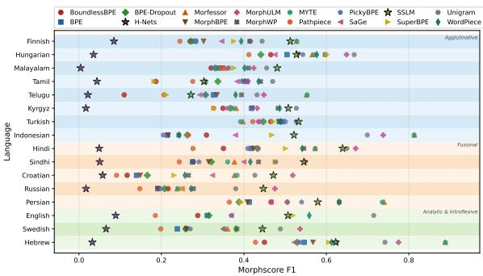  
Figure 1: Morphological alignment evaluation of tokenizerfree (H-Nets, SSLMs) and fixed-tokenizer approaches. SSLMs show consistently higher alignment, whereas H-Nets trade morphological alignment for longer, computationally efficient tokens.

Various modifications and novel algorithms have been proposed to learn a tokenizer. This includes advances in pre-tokenization (Banerjee and Bhattacharyya, 2018; Hu et al., 2025), robustness (Kudo and Richardson, 2018), morphological alignment (Hofmann et al., 2022; Libovický and Helcl, 2024; Zhu et al., 2025), vocabulary pruning (Cognetta et al., 2024) or modifications (Chizhov et al., 2024), and cross-token¹ approaches (Schmidt et al., 2025; Liu et al., 2025). However, no single approach can be concluded to be the “best", as conclusions depend on various factors such as: 1) languages chosen and their morphological properties, 2) experimental setup like model architecture, dataset size and other hyperparameters (Zhu et al., 2019; Poelman et al., 2025).

Recently, new architectures have been proposed that overcome the aforementioned tokenization-LM-detokenization pipeline. These are often referred to as tokenizer-free LMs. Architectures such as Dynamic Token Pooling Transformers (Nawrot et al., 2023) and H-Nets (Hwang et al., 2025) incorporate data-dependent boundary prediction (i.e., tokenization) and byte-level language modeling into a single end-to-end pipeline. H-Nets, in particular, provide a stable architecture. On the other hand, models such as subword segmental language model (SSLM, Meyer and Buys (2022, 2025)) use long short-term memory (LSTMs, Hochreiter and Schmidhuber (1997)) or transformers (Vaswani et al., 2023) to marginalize and optimize over all possible segmentations. Despite being computationally heavy and unfeasible at large scale, SSLMs provide us with a joint architecture which we can utilize for analysis. These tokenizer-free approaches avoid any statistical or heuristic priors, thus providing us with a tokenization that is jointly learned with the LM.

In this work, we investigate “what tokens are learned when tokenization is optimized jointly with language modeling." Our contributions:

1. We analyze how and what tokens are learned through tokenizer-free approaches, namely SSLM and H-Net, by evaluating their intrinsic and linguistic properties across a diverse set of languages.

2. We compare these approaches with fixedtokenizer methods, such as BPE and ULM, to assess how similar their learned vocabularies are.

3. We evaluate the impact of these tokenization approaches on downstream task performance to assess whether jointly learned tokenizers offer improvements.

## 2 Related Work

Prior work analyzing tokens learned by tokenizerfree LMs remains limited. Recently, Meyer and Buys (2025) studied the learning dynamics of tokens learned by SSLMs (Meyer and Buys, 2022).

<table><tr><td>Language Coverage</td></tr><tr><td>Agglutinative: Finnish, Hungarian, Malayalam, Tamil, Telugu, Kyrgyz, Turkish, Mongolian, Indonesian (9 lan-</td></tr><tr><td>guages) Analytic &amp; Introflexive: English, Swedish, Hebrew (3 lan-</td></tr><tr><td>guages) Fusional: Sanskrit, Hindi, Sindhi, Croatian, Russian, Per-</td></tr><tr><td>sian (6 languages)</td></tr></table>

Table 1: List of typologically and script diverse languages included in this study. Detailed version of this table can be found in Table 11 of Appendix.

They tracked subword learning dynamics from a linguistic perspective by evaluating morphological alignment, productivity, idiosyncrasy, and fertility, and identified distinct stages of subword learning. However, because their study focused on learning dynamics, the analysis was limited to three languages. Moreover, critical confounding factors such as dataset size and disparities across languages were not accounted for when drawing conclusions across languages.

On the other hand, many studies have analyzed fixed tokenizers and their modifications. These studies have largely focused on the impact of subword algorithms on downstream LM performance. For example, Bostrom and Durrett (2020) and Vemula et al. (2025) compared different algorithms, showing that ULM performs better on downstream tasks and recovers subwords that are more morphologically aligned. While, works such as Uzan et al. (2024) argued that inference strategy can matter as or more than the tokenizer construction algorithm.

## 3 Methodology

## 3.1 Languages and Datasets

Languages vary widely in morphology, typology, and script, which may affect the best tokenization approach. We therefore study a broad, representative set of 18 languages across these diversity, listed in Table 1 (detailed version in Table 11 of Appendix).

An ideal comparison across languages requires parallel training and test data, which is difficult to obtain at this scale. We therefore use nonparallel monolingual corpora while carefully controlling the data source and size. To balance data sizes, we extract 250,000 English sentences and measure their size in bytes. Then, for other languages, we scale the data size according to bytepremiums² (BP) (Arnett et al., 2024) and extract the desired number of sentences³. We use WMT News Crawl corpora⁴ (Chelba et al., 2013), fixing the domain to News for most languages, falling back to the NLLB corpus (Team et al., 2022) where unavailable. Statistics of the resultant pretraining data along with available morphologically annotated data is listed in Table 12 of the Appendix.

## 3.2 Tokenization Approaches

We include two distinct tokenizer-free approaches from recent literatures:

• Transformer-based version of subword segmental language model; SSLM (Meyer and Buys, 2025); that marginalize over all possible segmentations while jointly optimizing for language modeling.

• End-to-end H-Nets (Hwang et al., 2025) that jointly perform data-dependent boundary prediction along with byte-level language modeling.

To compare these with fixed-tokenizer approaches, we include both standard and improved algorithms. Standard algorithms include BPE (Sennrich et al., 2016), ULM (Kudo, 2018), and WPC (Schuster and Nakajima, 2012). We also study SaGe (Yehezkel and Pinter, 2023), which prefers subword units occurring in fewer distinct contexts relative to their frequency, and unsupervised morphological tokenizers such as Morfessor (Smit et al., 2014). We further include methods that modify inference (such as BPE-dropout (Provilkov et al., 2020) and PathPiece (Schmidt et al., 2024)), pre-tokenization (such as MorphBPE (Banerjee and Bhattacharyya, 2018)), encoding (such as MYTE (Limisiewicz et al., 2024)) and vocabulary construction (such as PickyBPE (Chizhov et al., 2024)). We further include crosstoken approaches such as SuperBPE (Liu et al., 2025) and BoundlessBPE (Schmidt et al., 2025), which have been shown to be more efficient. Table 13 in Appendix describes these approaches and § B.3 lists their hyperparameters.

## 3.3 Evaluation

We evaluate both intrinsic properties and extrinsic performance of the mentioned tokenization approaches. We consider intrinsic metrics such as contextual exponence and effective vocabulary size, as well as linguistic metrics such as morphological alignment. Table 14 in the Appendix provides a comprehensive description of the metrics we evaluate. This broad intrinsic evaluation provides us with a meaningful assessment of the tokens produced by each tokenization approach.

To measure the impact of each tokenization approach on downstream performance, we pretrain BERT (Devlin et al., 2019) models⁵ at a scale of 12M parameters6 and finetune them on tasks: Sentiment Analysis, POS Tagging, Named Entity Recognition (NER), and Dependency Parsing. We limit the downstream evaluation to three typologically distinct languages: English, Hindi, and Telugu; to keep the computational cost manageable.

## 3.4 Experimental Setup

We take a backward approach from the ideal experimental setup as noted by Poelman et al. (2025), allowing us to better isolate the effect of the tokenizer. We train SSLMs, H-Nets, and fixedtokenizer algorithms on the train subset of the dataset. Training is monitored on the validation subset, and all tokenization approaches are evaluated on the test subset. Total parameters count of H-Net models remains approximately 3M and that of SSLMs at 2M. This ensures that the ratio of tokento-parameter count is at least 2 across languages (see Table 12). While H-Nets do not require any vocabulary for initialization, SSLMs require a fixed lexicon provided beforehand. We consider 10, 000 most frequent words for this, following Meyer and Buys (2025), and set maximum token length7 as 5. For downstream evaluation, we scrape a larger dataset containing 10M sentences from same data source; NewsCrawl (Chelba et al., 2013). This ensures a reasonable data size for 2M-30M parameter BERT models which we analyze. Detailed hyperparameters for each models are listed in the Appendix B.

<table><tr><td colspan="2">English</td><td colspan="2">Hebrew</td><td colspan="2">Hindi</td><td colspan="2">Tamil</td><td colspan="2">Hungarian</td><td colspan="2">Indonesian</td></tr><tr><td colspan="2">reaping</td><td colspan="2"></td><td colspan="2">df3it</td><td colspan="2">6G5J</td><td colspan="2">brigádokkal</td><td colspan="2">ceritakan</td></tr><tr><td colspan="2">reap ing</td><td colspan="2"> </td><td colspan="2">df3i</td><td colspan="2">の西西</td><td colspan="2">brigád okkal</td><td colspan="2">cerita kan</td></tr><tr><td>Segmentation</td><td>Fl</td><td>Segmentation</td><td>Fl</td><td>Segmentation</td><td>Fl</td><td>Segmentation</td><td>Fl</td><td>Segmentation</td><td>Fl</td><td>Segmentation</td><td>Fl</td></tr><tr><td>rea ping</td><td>0</td><td> </td><td>0</td><td>可TT3I</td><td>0</td><td>の</td><td>0</td><td>bri g ádo kkal</td><td>0</td><td>ceri takan</td><td>0</td></tr><tr><td>re ap ing</td><td>0.67</td><td> </td><td>0.5</td><td>可可3研</td><td>0.67</td><td>の西西亞</td><td>1</td><td>br igá d okkal</td><td>0.5</td><td>c erita kan</td><td>0.67</td></tr><tr><td>reap ing</td><td>1</td><td> </td><td>0.67</td><td>可可跡</td><td>0.67</td><td>の西西J</td><td>1</td><td>br igá dok kal</td><td>0</td><td>c erita kan</td><td>0.67</td></tr><tr><td>reap ing</td><td>1</td><td></td><td>0.5</td><td>可跡</td><td>0.67</td><td>5</td><td>0</td><td>b rigád okkal</td><td>0.67</td><td>c erita kan</td><td>0.67</td></tr><tr><td>reap ing</td><td>1</td><td></td><td>0.5</td><td>耐跡</td><td>0.67</td><td>665</td><td>0</td><td>b rigád okkal</td><td>0.67</td><td>c erita k an</td><td>0.5</td></tr></table>

Table 2: Evolution of segmentation of few candidate wordforms produced by tokenizer-free approach SSLM with morphological alignment F1-scores. English, Hebrew, and Hindi are fusional or analytical languages, while Tamil, Hungarian, and Indonesian are agglutinative languages. More examples in Table 10 in Appendix.

## 4 Experiments & Results

## 4.1 Q1: How are the tokens learned?

We analyze the learning dynamics of SSLMs similar to Meyer and Buys (2025), but with broader language coverage, script variation, and, more importantly, dataset sizes adjusted according to byte-premiums (Arnett et al., 2024). We evaluate and track morphological alignment against MorphScore (Arnett and Bergen, 2025; Arnett et al., 2025) data, along with intrinsic properties such as effective vocabulary size and number of distinct neighbouring tokens, i.e., contextual exponence (Yehezkel and Pinter, 2023)8. Our results confirm the findings of Meyer and Buys (2025) with inclusion of more diverse languages.

## Morphological Alignment

Figure 2 plots the variation in morphological alignment of tokens produced by SSLM, as its training progress, for a subset of languages; a similar plot containing all 18 languages is plotted in figure 9 in Appendix.

Findings: Across all languages, we observe four distinct phases in the morphscore dynamics: 1) Rapid initial evolution of morphemes, 2) Fluctuation for a brief period which is more consistent and pronounced in case of Agglutinative languages, 3) Convergence to a fixed alignment, and 4) Saturation, where alignment remains static implying convergence to a solution. Overall, higher alignment in Templatic and Fusional languages as compared to Agglutinative languages. This implies that a jointly learned tokenizer effectively identifies the root-and-pattern structures (as in Hebrew) and the inflectional suffixes (as in Hindi) very early in training. Despite being highly synthetic, Tamil converges to comparatively much lower F1-score (≈ 0.3). Interestingly, the tokens reach mid-range alignment, but then regresses to a lower alignment. This is observed in both Tamil and Indonesian. Hungarian also shows similar trends like Tamil, but converges to higher alignment following another fluctuation. English, on the other hand, reaches a stable, mid-range alignment (≈ 0.5) without any major fluctuations. This may reflect its relatively simple morphology.

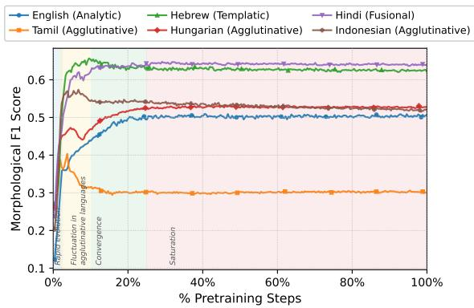  
Figure 2: Evolution of morphological alignment (F1-score) of tokenizer-free approach SSLM shows that agglutinative languages show larger fluctuations compared to other languages.

We identify and list candidate data-points from morphscore dataset (see Table 2), which depicts the overall trend. For Analytic and Fusional languages, we observe how quickly the jointly learned tokenizer identifies the morphemes. In English, it instantly progresses from nonsensical split (“rea ping", at step 2200) to a perfect morphologically aligned segment (“reap ing", at step 2950). Similarly in Hindi, it converges to a stable segmentation (“++3”, at step 800) capturing the core semantic units. This implies that in languages where word structures are comparatively less complex, it converges on a stable “lexicon" of subwords. However, in Agglutinative languages such as Tamil, it reaches a perfect alignment (“+", at step 450), but then converges on an inaccurate split (“+乐+", at step 7150), implying that the jointly learned tokenizer found it beneficial to trade-off morphological alignment in such languages.

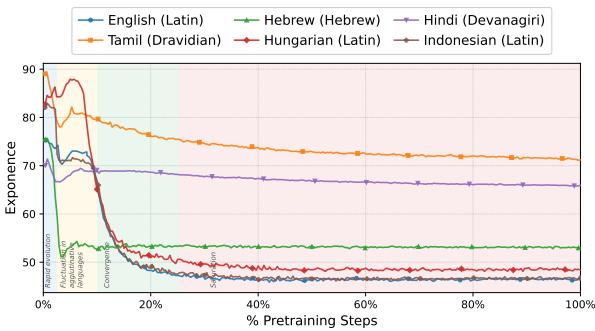

(a) Contextual Exponence  
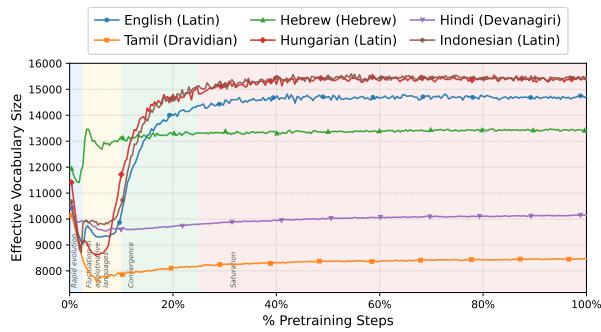  
(b) Effective Vocabulary size  
Figure 3: Evolution of number of distinct neighbouring tokens (i.e., contextual exponence) and effective vocabulary size of tokenizer-free approach SSLM shows a script-wise similarity. Latin languages saturates at lower contextual exponence through higher effective vocabulary size.

## Intrinsic Properties

We perform similar analysis for intrinsic properties such as contextual exponence and effective vocabulary size on test split.

Findings: Figure 3a and 3b reveal script-wise similarities in dynamics. Latin-script languages such as English, Hungarian, and Indonesian show largest effective vocabulary sizes, reaching between 14, 000 to 15, 500 unique tokens. This suggests that jointly learned tokenizer combines frequent character sequences into larger dedicated units to optimize contextual efficiency. We thereby see a steep drop in contextual exponence in these languages.

Among the subset of languages here, non-Latin languages such as Tamil and Hindi show smaller effective vocabulary size and higher contextual exponence. This suggests that joint tokenizer prefers to learn a small, flexible set of fundamental morphemes rather than memorizing long, specific wordforms in such scripts. Dravidian-script languages such as Tamil combine many parts together, so one learned subword can still work with many different neighboring units because words often have many added affixes. This is observed through higher contextual exponence and lower vocabulary size. In contrast, Hebrew reaches its stable effective vocabulary size much earlier than other scripts. This shows again the ability of jointly learned tokenizers to quickly identify the root-and-pattern (introflexive) structures inherent in the script.

## 4.2 Q2: What tokens are learned?

In this section, we evaluate both tokenizer-free approaches9; H-Nets and SSLMs; and compare them with fixed-tokenizer approaches mentioned in § 3.2. We focus on metrics listed in Table 14 of Appendix. Note: H-Nets and SSLMs can, by design, produce fundamentally different types of tokens; H-Nets can produce cross-tokens (or superwords) frequently, while SSLMs are bounded to produce only subwords. This is reflected in the further results and discussions.

## Morphological Alignment

Findings: As observed in figure 1, we identify a significant difference among tokens produced by the two tokenizer-free approaches. SSLMs tradeoff computational efficiency for high linguistic fidelity, while H-Nets prioritize byte-level computational efficiency at the direct expense of morphological alignment. This can be observed by H-Net's low morphscore-F1 ranging below 0.1 across all languages. On the other hand, joint optimization approach (i.e., SSLM) showcase significantly higher alignment ranging from ≈ 0.26 in Telugu to ≈ 0.65 in Hindi. Notably, SSLMs show consistently higher alignment as compared to popular subword algorithms such as BPE or WPC, even converging to the most aligned tokens in languages such as Malayalam and Turkish. However in other languages it tends to align less compared to approaches such as ULM, MorphULM, MYTE, or Morfessor. In Hebrew, despite such fixed-tokenizer approaches providing nearly perfect alignment with morphology, SSLMs show comparatively lower alignment (≈ 0.63). These findings suggest that the desirable morphological alignment of jointly learned tokenizer is indeed dependent on a language's morphological properties.

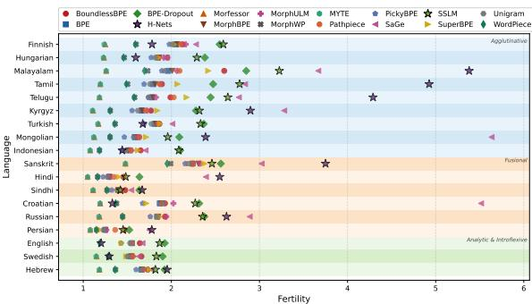

(a) Fertility  
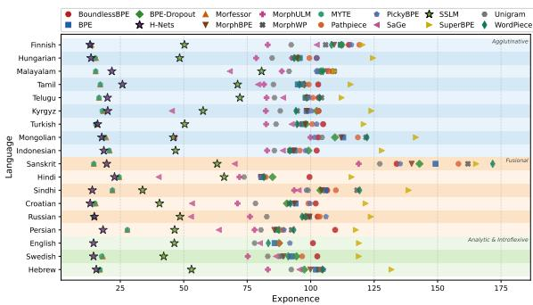

(b) Contextual exponence  
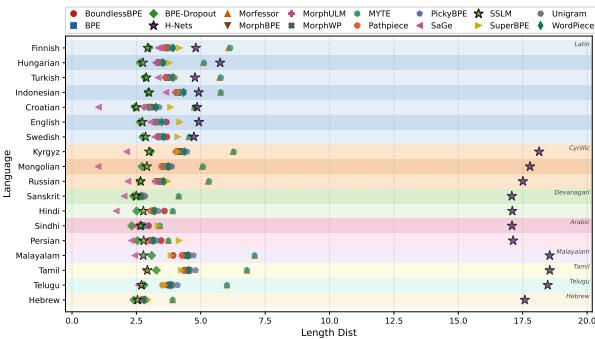  
(c) Mean Token Length  
Figure 4: Intrinsic evaluation (fertility, contextual exponence, and mean token length) of tokenizer-free approaches (SSLMs and H-Nets) and fixed-tokenizer approaches. Tokenizer-free approaches show comparatively higher fertility and lower contextual exponence. Mean token length of H-Nets are significantly higher for non-Latin languages.

## Intrinsic Properties

Findings: As observed in figure 4a, both tokenizerfree approaches exhibit higher fertility than fxedtokenizer baselines, especially in agglutinative languages such as Malayalam, Tamil, and Telugu; this effect is strongest in H-Nets (≈ 5.0 to ≈ 5.5), while analytic or fusional languages remain below ≈ 2.0.

Across languages, tokenizer-free approaches consistently yield lower contextual exponence than fixed-tokenizer methods (see figure 4b), with SSLM and H-Net averaging less than 75 neighbouring tokens. This likely arises because minimizing language-modeling loss favors units with more predictable grammatical roles and fewer valid neighbours, improving semantic quality and downstream performance (Yehezkel and Pinter, 2023).

Interestingly, mean token length reveals strong divergence between tokenizer-free approaches (see figure 4c), especially across scripts. In non-Latin languages, H-Nets produce exceptionally long tokens (≈ 17 to 18.5 characters), likely because either data-dependent boundary prediction favors long phrases to minimize byte-level loss or struggles to identify boundaries in complex scripts. In contrast, SSLMs and most fixed tokenizers maintain shorter, stable lengths (≈ 2.5 to 5.0 characters) which follows from its design of explicit maximum token-length constraints.

## 4.3 Q3: How similar are the learned tokens?

We measure pairwise Jaccard overlap on the test split to compare tokens learned by tokenizer-free and ixed-tokenizer approaches across language typologies. Figure 5 shows the corresponding heatmap.

Findings: H-Nets exhibit near-zero overlap with fixed tokenizers across typologies, indicating that end-to-end data-dependent boundary prediction learns token sets fundamentally different from frequency-based subword methods by prioritizing byte-level sequence efficiency over standard subword boundaries. SSLMs, on the other hand, show comparatively higher (though still low) overlap with fixed tokenizers, particularly with frequency-based methods such as BPE and WPC; the strongest similarity occurs between SSLMs and BPE variants across all typologies. Overlap is lowest for agglutinative languages (≈ 0.12 to 0.18 Jaccard), suggesting that productive morphology generates many possible subwords, encouraging joint optimization to learn smaller atomic morphemes while fixed tokenizers merge them into larger but linguistically arbitrary units. BPE, BPE-dropout PathPiece, and MorphBPE form a high-overlap cluster (greater than 0.80 Jaccard), indicating that changes to pre-tokenization or inference do not fundamentally alter learned vocabularies. In contrast, SaGe shows lower overlap, suggesting that prioritizing contextual exponence substantially changes the vocabulary.

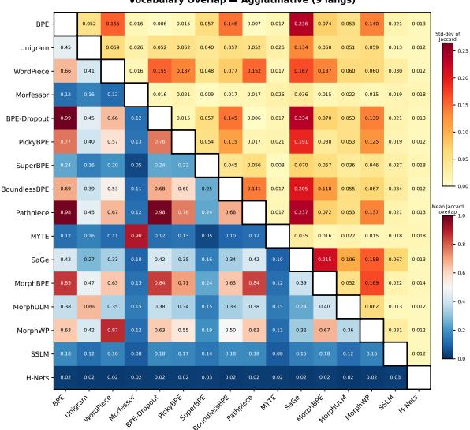  
(a) Agglutinative Languages

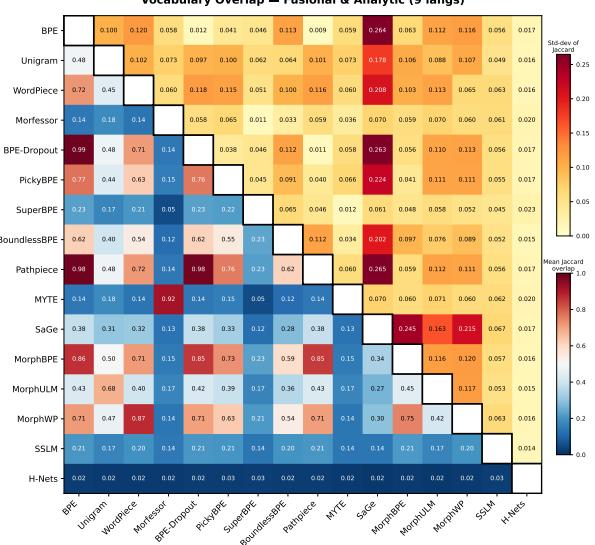  
(b) Analytic and Fusional Languages

Figure 5: Jaccard token overlap between tokenizer-free approaches such as SSLM and H-Net, and fixed-tokenizer approaches on the test split. The lower triangle of the heatmap denotes the Jaccard overlap, while the upper triangle denotes the standard deviation of the overlap.  
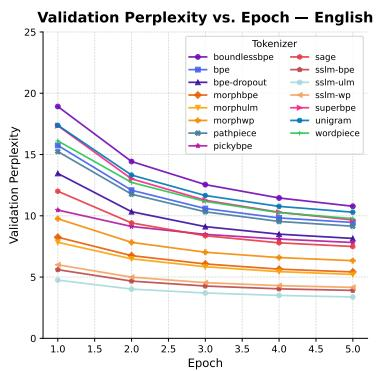  
(a) English (Analytic)

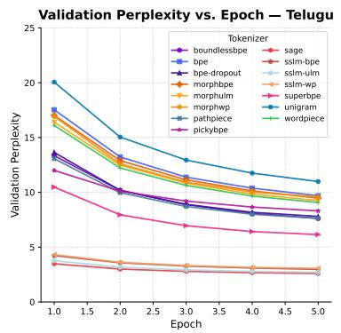  
(b) Telugu (Agglutinative)

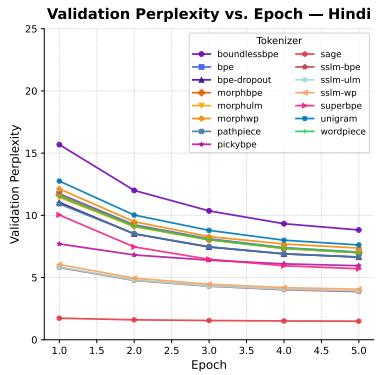  
(c) Hindi (Fusional)  
Figure 6: Variation in the validation perplexity of BERT models during pretraining. Models trained with tokenizers using SSLM as pretokenization consistently achieve the lowest perplexity.

## 4.4 Q4: Are the learned tokens better?

To determine if these fundamentally distinct tokens learned through tokenizer-free approaches improve language understanding, we analyze the downstream performance of BERT (Devlin et al., 2019) models pretrained with each tokenizer and finetuned for the tasks listed in § 3.3, with results reported in Table 3. As noted, tokenizer-free approaches do not have a fixed vocabulary, while BERT models require static, fixed, pre-defined vocabulary. Therefore, we use tokenizer-free approaches10 as pretokenization and learn a standard fixed tokenizer on the pre-segmented corpus. This approach fixes the model architecture and provides a fair downstream comparison. We refer to these with prefix SSLM, i.e., SSLM-BPE, SSLM-ULM, and SSLM-WPC.

Findings: As illustrated in Figure 6 and summarized in Table 4, tokenizer-free approaches consistently achieve the lowest validation perplexity across all three evaluated languages and converge earlier compared to fixed tokenizers. Only in Hindi, we observe SaGe outperforming tokenizerfree approaches with nearly perfect perplexity of 1. This improvement in perplexity is even more pronounced as compared to other pretokenizationbased modifications such as that of Morfessor. We also observe that Telugu has the highest perplexity without pretokenization, but the lowest perplexity when the tokenizer-free SSLM is used for pretok-

<table><tr><td rowspan="2">Tokenizer</td><td colspan="3">Sentiment Analysis (Acc)</td><td colspan="3">POS Tagging (F1)</td><td colspan="3">Named Entity Recognition (F1)</td><td colspan="3">Dependency Parsing (LAS)</td></tr><tr><td>eng_latn</td><td>tel_telu</td><td>hin_deva</td><td>eng_latn</td><td>tel_telu</td><td>hin_deva</td><td>eng_latn</td><td>tel_telu</td><td>hin_deva</td><td>eng_latn</td><td>tel_telu</td><td>hin_deva</td></tr><tr><td colspan="10">Language Standard Algorithms</td><td colspan="3"></td></tr><tr><td>BPE</td><td>85.55</td><td>62.85</td><td>76.67</td><td>95.09</td><td>88.41</td><td>97.15</td><td>89.98</td><td>94.72</td><td>90.69</td><td>75.64</td><td>66.31</td><td>88.20</td></tr><tr><td>UnigramLM</td><td>83.61</td><td>64.88</td><td>77.63</td><td>95.11</td><td>89.72</td><td>97.20</td><td>89.61</td><td>94.80</td><td>91.08</td><td>75.95</td><td>68.88</td><td>88.73</td></tr><tr><td>WordPiece</td><td>84.86</td><td>65.91</td><td>76.10</td><td>95.22</td><td>89.51</td><td>97.34</td><td>88.37</td><td>95.33</td><td>90.73</td><td>78.11</td><td>66.31</td><td>88.63</td></tr><tr><td colspan="10">Contextual Algorithms</td><td colspan="3"></td></tr><tr><td>SaGe</td><td>85.32</td><td>63.22</td><td>73.61</td><td>91.68</td><td>81.99</td><td>91.67</td><td>83.32</td><td>91.88</td><td>88.32</td><td>62.17</td><td>55.14</td><td>70.07</td></tr><tr><td colspan="10">Inference Modifications</td><td colspan="3"></td></tr><tr><td></td><td></td><td></td><td></td><td></td><td></td><td></td><td></td><td></td><td></td><td></td><td></td><td></td></tr><tr><td>BPE-dropout PathPiece</td><td>80.28 84.75</td><td>62.66 64.32</td><td>72.85 77.06</td><td>93.06 92.27</td><td>83.50 87.10</td><td>95.37 95.08</td><td>84.70 83.89</td><td>92.78 92.62</td><td>89.41 87.04</td><td>68.38 62.76</td><td>59.06 58.76</td><td>83.47 77.47</td></tr><tr><td colspan="3"></td><td colspan="10"></td></tr><tr><td>PickyBPE</td><td>Vocabulary Modifications 73.16</td><td>60.44</td><td></td><td></td><td></td><td></td><td></td><td></td><td></td><td></td><td></td><td></td></tr><tr><td colspan="3"></td><td>58.70</td><td>78.74</td><td>76.57</td><td>77.54</td><td>68.96</td><td>88.61</td><td>84.27</td><td>49.96</td><td>45.77</td><td>56.66</td></tr><tr><td>Cross-token Algorithms</td><td></td><td></td><td></td><td></td><td></td><td></td><td></td><td></td><td></td><td></td><td></td><td></td></tr><tr><td>BoundlessBPE SuperBPE</td><td>83.49 83.83</td><td>65.25 64.51</td><td>75.14 74.76</td><td>91.98</td><td>83.50</td><td>95.25</td><td>84.84 88.93</td><td>93.62</td><td>87.15 88.21</td><td>61.65 68.32</td><td>57.55 62.69</td><td>78.08 80.85</td></tr><tr><td colspan="3"></td><td></td><td>93.82</td><td>85.17</td><td>96.17</td><td></td><td>93.05</td><td></td><td></td><td></td><td></td></tr><tr><td>Pre-tokenization using Morfessor</td><td></td><td></td><td></td><td></td><td></td><td></td><td></td><td></td><td></td><td></td><td></td><td></td></tr><tr><td>MorphBPE</td><td>86.24</td><td>63.96</td><td>76.10</td><td>95.18</td><td>89.12</td><td>97.24</td><td>90.63</td><td>94.66</td><td>91.02</td><td>75.56</td><td>69.18</td><td>88.11</td></tr><tr><td>MorphULM MorphWPC</td><td>85.89 87.38</td><td>66.91 67.28</td><td>77.06 75.91</td><td>95.28 95.26</td><td>89.38 90.03</td><td>97.33</td><td>90.03 88.10</td><td>94.90 94.95</td><td>90.52 90.75</td><td>75.28 77.65</td><td>69.03 69.03</td><td>88.24 88.35</td></tr><tr><td colspan="3"></td><td colspan="3"></td><td colspan="3">97.23</td><td colspan="3"></td><td colspan="3"></td></tr><tr><td>Pre-tokenization using SSLM SSLM-BPE</td><td></td><td></td><td></td><td></td><td></td><td></td><td></td><td></td><td></td><td></td><td></td><td></td></tr><tr><td>SSLM-ULM</td><td> $8 5 . 6 6 ^ { \textregistered }$ </td><td> $6 4 . 7 0 ^ { \textcircled { 7 } }$   $6 3 . 4 0 ^ { \textcircled { 1 } }$ </td><td> $7 7 . 0 6 ^ { \textcircled { 4 } }$ </td><td> $9 5 . 0 9 ^ { \textcircled { 6 } }$ </td><td> $8 8 . 4 2 ^ { \textcircled { 8 } }$ </td><td> $9 7 . 1 8 ^ { \textcircled { 6 } }$ </td><td> $8 8 . 9 3 ^ { \textcircled { 5 } }$   $8 8 . 8 8 ^ { \textregistered }$ </td><td> $9 4 . 3 8 ^ { \textcircled { 9 } }$ </td><td> $9 1 . 0 3 ^ { \textcircled { 4 } }$   $\overline { { 9 1 . 3 0 } } ^ { \textcircled { 2 } }$ </td><td> $7 4 . 9 0 ^ { \textcircled { 8 } }$ </td><td> $6 6 . 7 7 ^ { \textcircled { 7 } }$ </td><td> $8 7 . 4 7 ^ { \textcircled { 8 } }$ </td></tr><tr><td>SSLM-WPC</td><td> $\underline { { 8 4 . 1 7 } } ^ { \textcircled { 9 } }$   $\overline { { 8 4 . 7 5 ^ { \circ } } }$ </td><td> $6 5 . 2 5 ^ { \textcircled { 5 } }$ </td><td> $7 6 . 1 0 ^ { \textcircled { 8 } }$   $7 4 . 3 8 ^ { \textregistered }$ </td><td> $9 5 . 0 6 ^ { \textcircled { 8 } }$   $9 4 . 9 5 ^ { \textcircled { 9 } }$ </td><td> $\underline { { \mathbf { 9 0 . 1 7 } } } ^ { \textregistered }$   ${ \underline { { 9 0 . 1 0 } } } ^ { \textcircled { 2 } }$ </td><td> $9 7 . 1 6 ^ { \textregistered }$   $9 7 . 1 7 ^ { \textcircled { 7 } }$ </td><td> $8 7 . 0 5 ^ { \textregistered }$ </td><td> $9 4 . 5 8 ^ { \textregistered }$   $9 4 . 8 4 ^ { \textregistered }$ </td><td> $\underline { { \overline { { \mathbf { 9 1 . 4 1 } } } } } ^ { \textregistered }$ </td><td> $7 3 . 3 5 ^ { \textcircled { 9 } }$   $7 6 . 7 8 ^ { \textcircled { 3 } }$ </td><td> $6 8 . 5 8 ^ { \textregistered }$   $\underline { { 6 8 . 7 3 } } ^ { \textcircled { 5 } }$ </td><td> $8 6 . 9 5 ^ { \textcircled { 9 } }$   $8 7 . 5 1 ^ { \textregistered }$ </td></tr></table>

Table 3: Downstream performance of 12M-parameter BERT models trained with different tokenizer variants. Best results for each task-language pair are in bold; superscripts denote tokenizer ranks with SSLM pretokenization. Scores are averaged over three finetuning runs (seeds 42, 43, 44). We report accuracy for Sentiment Analysis, F1 for POS tagging and NER, and LAS for Dependency Parsing. Variants improved by SSLM pretokenization are underlined.

enization.
<table><tr><td>Pretokenizer</td><td>eng_latn</td><td>tel_telu</td><td>hin_deva</td></tr><tr><td>None</td><td>9.84</td><td>9.92</td><td>7.23</td></tr><tr><td>SSLM</td><td> $3 . 8 1 \left( \downarrow 6 1 . 3 \% \right)$ </td><td> $2 . 9 2 \ ( \downarrow 7 0 . 6 \% )$ </td><td> ${ \bf 3 . 9 6 } \left( { \downarrow 4 5 . 2 \% } \right)$ </td></tr></table>

Table 4: Aligning tokens learned by fixed-tokenizer approaches with that learned by SSLM through pretokenization significantly reduces the perplexity, showcasing improvement in language modeling. The scores are averages of perplexities across BPE, ULM, and WPC.

The downstream results (see Table 3 above) showcase the practical implications of each approach. Despite having fundamentally distinct vocabulary, tokenizer-free approaches remain competitive. In contrast, the performance of many modified fixed-tokenizer approaches such as SaGe, PickyBPE, and BPE-dropout remains inconsistent and often significantly lower across different tasks and languages. Notably, SSLM-ULM achieves the highest F1-score for POS tagging in Telugu (90.17%), while SSLM-WPC achieves highest for NER in Hindi (91.41%). Pretokenization with Morfessor remains the best performing approach overall. It consistently improves the performance over standard approaches. Overall, the results suggest that jointly learned tokenizers learn meaningful tokens that transfer effectively to downstream NLP tasks.

We additionally perform an ablation study across different model scales and observe consistent trends. SSLM-based pretokenization continues to achieve lower validation perplexity and competitive downstream performance across scales, although the relative gains reduce slightly for larger models. Detailed experimental setup, hyperparameters, and complete results are provided in the § A of Appendix.

## 5 Conclusion

In this work, we showed that jointly learned tokenization fundamentally changes the structure and behavior of learned tokens across typologically diverse languages. In particular, SSLMs learn more morphologically aligned and contextually efficient segments than standard frequency-based tokenizers, while H-Nets prioritize byte-level efficiency and produce substantially different token structures. Although morphology-aware pretokenization remains strongest overall, SSLM-based pretokenization consistently remains competitive on downstream performance. Overall, our findings show that jointly optimized tokenizers can learn linguistically meaningful token structures that remain effective for downstream NLP despite having substantially different vocabularies from standard tokenization approaches.

## Limitations

While we do our best to handle confounding factors such as dataset sizes, model sizes, and other experimental setup, few limitations remain:

1. Model and dataset sizes: We focused on spanning an extensive set of tokenization approaches, languages, and their combinations. Therefore, our analysis was limited to models and dataset at relatively smaller scale. For instance, we limit tokenizer-free LMs to 3M parameters and dataset of 250,000 sentences. Downstream evaluation was performed on BERT models at 12M parameters and dataset of 10M sentences. Although we perform an ablation study with BPE and SSLM-BPE tokenization approaches, we leave scalability analysis of our findings as future work. In this work, we trade-off model and dataset sizes for larger coverage of languages and tokenization approaches.

2. Generalizability of downstream results: For every combination of tokenization approach and language, we had to pretrain a model. Hence, our downstream evaluation was limited to three typologically distinct languages: English, Hindi, and Telugu. We do not evaluate downstream performance across all 18 languages, in order to keep computational cost manageable. We focus on evaluating all tokenization approaches for these selected languages in a controlled experimental setting.

3. Hyperparameters of tokenizer-free LMs: We do not sweep over certain hyperparameters of tokenizer-free LMs, for example, maximum token length in SSLM. We fix them following heuristics from previous works, since sweeping over these hyperparameters require significant computation resources, which we limit.

## Ethics Statement

This work focuses on the analysis of tokenization strategies across languages and does not involve human subjects or the use of sensitive personal data. All experiments are conducted on publicly available text corpora. However, differences in dataset quality, and linguistic coverage across languages may introduce biases that affect the observed behavior of tokenization methods.

## References

Md Shad Akhtar, Ayush Kumar, Asif Ekbal, and Pushpak Bhattacharyya. 2016. A hybrid deep learning architecture for sentiment analysis. In Proceedings of COLING 2016, the 26th International Conference on Computational Linguistics: Technical Papers, pages 482–493, Osaka, Japan. The COLING 2016 Organizing Committee.

Sawsan Alqahtani, Mir Tafseer Nayeem, Md Tahmid Rahman Laskar, Tasnim Mohiuddin, and M Saiful Bari. 2026. Stop taking tokenizers for granted: They are core design decisions in large language models. Preprint, arXiv:2601.13260.

Catherine Arnett and Benjamin Bergen. 2025. Why do language models perform worse for morphologically complex languages? In Proceedings of the 31st International Conference on Computational Linguistics, pages 6607–6623, Abu Dhabi, UAE. Association for Computational Linguistics.

Catherine Arnett, Tyler A. Chang, and Benjamin Bergen. 2024. A bit of a problem: Measurement disparities in dataset sizes across languages. In Proceedings of the 3rd Annual Meeting of the Special Interest Group on Under-resourced Languages @ LREC-COLING 2024, pages 1–9, Torino, Italia. ELRA and ICCL.

Catherine Arnett, Marisa Hudspeth, and Brendan O'Connor. 2025. Evaluating morphological alignment of tokenizers in 70 languages. Preprint, arXiv:2507.06378.

Tamali Banerjee and Pushpak Bhattacharyya. 2018. Meaningless yet meaningful: Morphology grounded subword-level NMT. In Proceedings of the Second Workshop on Subword/Character LEvel Models, pages 55–60, New Orleans. Association for Computational Linguistics.

Khuyagbaatar Batsuren, Gábor Bella, and Fausto Giunchiglia. 2021. MorphyNet: a large multilingual database of derivational and inflectional morphology. In Proceedings of the 18th SIG-MORPHON Workshop on Computational Research in Phonetics, Phonology, and Morphology, pages 39–48, Online. Association for Computational Linguistics.

Kaj Bostrom and Greg Durrett. 2020. Byte pair encoding is suboptimal for language model pretraining. In Findings of the Association for Computational Linguistics: EMNLP 2020, pages 4617–4624, Online. Association for Computational Linguistics.

Ciprian Chelba, Tomas Mikolov, Mike Schuster, Qi Ge, Thorsten Brants, Phillipp Koehn, and Tony Robinson. 2013. One billion word benchmark for measuring progress in statistical language modeling. Technical report, Google.

Pavel Chizhov, Catherine Arnett, Elizaveta Korotkova, and Ivan P. Yamshchikov. 2024. BPE gets picky: Efficient vocabulary refinement during tokenizer training. In Proceedings of the 2024 Conference on Empirical Methods in Natural Language Processing, pages 16587–16604, Miami, Florida, USA. Association for Computational Linguistics.

Marco Cognetta, Tatsuya Hiraoka, Rico Sennrich, Yuval Pinter, and Naoaki Okazaki. 2024. An analysis of BPE vocabulary trimming in neural machine translation. In Proceedings of the Fifth Workshop on Insights from Negative Results in NLP, pages 48–50, Mexico City, Mexico. Association for Computational Linguistics.

Jacob Devlin, Ming-Wei Chang, Kenton Lee, and Kristina Toutanova. 2019. BERT: Pre-training of deep bidirectional transformers for language understanding. In Proceedings of the 2019 Conference of the North American Chapter of the Association for Computational Linguistics: Human Language Technologies, Volume 1 (Long and Short Papers), pages 4171–4186, Minneapolis, Minnesota. Association for Computational Linguistics.

Sumanth Doddapaneni, Rahul Aralikatte, Gowtham Ramesh, Shreya Goyal, Mitesh M. Khapra, Anoop Kunchukuttan, and Pratyush Kumar. 2023. Towards leaving no Indic language behind: Building monolingual corpora, benchmark and models for Indic languages. In Proceedings of the 61st Annual Meeting of the Association for Computational Linguistics (Volume 1: Long Papers), pages 12402–12426, Toronto, Canada. Association for Computational Linguistics.

Philip Gage. 1994. A new algorithm for data compression. C Users J., 12(2):23–38.

Sepp Hochreiter and Jürgen Schmidhuber. 1997. Long short-term memory. Neural Comput., 9(8):1735–1780.

Valentin Hofmann, Hinrich Schuetze, and Janet Pierrehumbert. 2022. An embarrassingly simple method to mitigate undesirable properties of pretrained language model tokenizers. In Proceedings of the 60th Annual Meeting of the Association for Computational Linguistics (Volume 2: Short Papers), pages 385–393, Dublin, Ireland. Association for Computational Linguistics.

Yifan Hu, Frank Liang, Dachuan Zhao, Jonathan Geuter, Varshini Reddy, Craig W. Schmidt, and Chris Tanner. 2025. Entropy-driven pretokenization for byte-pair encoding. Preprint, arXiv:2506.15889.

Sukjun Hwang, Brandon Wang, and Albert Gu. 2025. Dynamic chunking for end-to-end hierarchical sequence modeling. Preprint, arXiv:2507.07955.

Taku Kudo. 2018. Subword regularization: Improving neural network translation models with multiple subword candidates. In Proceedings of the 56th Annual Meeting of the Association for Computational Linguistics (Volume 1: Long Papers), pages 66–75, Melbourne, Australia. Association for Computational Linguistics.

Taku Kudo and John Richardson. 2018. SentencePiece: A simple and language independent subword tokenizer and detokenizer for neural text processing. In Proceedings of the 2018 Conference on Empirical Methods in Natural Language Processing: System Demonstrations, pages 66–71, Brussels, Belgium. Association for Computational Linguistics.

Jindřich Libovický and Jindřich Helcl. 2024. Lexically grounded subword segmentation. In Proceedings of the 2024 Conference on Empirical Methods in Natural Language Processing, pages 7403–7420, Miami, Florida, USA. Association for Computational Linguistics.

Tomasz Limisiewicz, Terra Blevins, Hila Gonen, Orevaoghene Ahia, and Luke Zettlemoyer. 2024. MYTE: Morphology-driven byte encoding for

better and fairer multilingual language modeling. In Proceedings of the 62nd Annual Meeting of the Association for Computational Linguistics (Volume 1: Long Papers), pages 15059–15076, Bangkok, Thailand. Association for Computational Linguistics.

Alisa Liu, Jonathan Hayase, Valentin Hofmann, Sewoong Oh, Noah A. Smith, and Yejin Choi. 2025. Superbpe: Space travel for language models. Preprint, arXiv:2503.13423.

Francois Meyer and Jan Buys. 2022. Subword segmental language modelling for nguni languages. In Findings of the Association for Computational Linguistics: EMNLP 2022, pages 6636– 6649, Abu Dhabi, United Arab Emirates. Association for Computational Linguistics.

Francois Meyer and Jan Buys. 2025. The learning dynamics of subword segmentation for morphologically diverse languages. In Proceedings of the 14th International Joint Conference on Natural Language Processing and the 4th Conference of the Asia-Pacific Chapter of the Association for Computational Linguistics, pages 647– 661, Mumbai, India. The Asian Federation of Natural Language Processing and The Association for Computational Linguistics.

Sandeep Sricharan Mukku and Radhika Mamidi. 2017. ACTSA: Annotated corpus for Telugu sentiment analysis. In Proceedings of the First Workshop on Building Linguistically Generalizable NLP Systems, pages 54–58, Copenhagen, Denmark. Association for Computational Linguistics.

Piotr Nawrot, Jan Chorowski, Adrian Lancucki, and Edoardo Maria Ponti. 2023. Efficient transformers with dynamic token pooling. In Proceedings of the 61 st Annual Meeting of the Association for Computational Linguistics (Volume 1: Long Papers), pages 6403–6417, Toronto, Canada. Association for Computational Linguistics.

Joakim Nivre, Marie-Catherine de Marneffe, Filip Ginter, Jan Hajič, Christopher D. Manning, Sampo Pyysalo, Sebastian Schuster, Francis Tyers, and Daniel Zeman. 2020. Universal Dependencies v2: An evergrowing multilingual treebank collection. In Proceedings of the Twelfth

Language Resources and Evaluation Conference, pages 4034–4043, Marseille, France. European Language Resources Association.

Joakim Nivre and Chiao-Ting Fang. 2017. Universal Dependency evaluation. In Proceedings of the NoDaLiDa 2017 Workshop on Universal Dependencies (UDW 2017), pages 86–95, Gothenburg, Sweden. Association for Computational Linguistics.

Xiaoman Pan, Boliang Zhang, Jonathan May, Joel Nothman, Kevin Knight, and Heng Ji. 2017. Cross-lingual name tagging and linking for 282 languages. In Proceedings of the 55th Annual Meeting of the Association for Computational Linguistics (Volume 1: Long Papers), pages 1946–1958, Vancouver, Canada. Association for Computational Linguistics.

Wessel Poelman, Thomas Bauwens, and Miryam de Lhoneux. 2025. Confounding factors in relating model performance to morphology. In Proceedings of the 2025 Conference on Empirical Methods in Natural Language Processing, pages 7262–7287, Suzhou, China. Association for Computational Linguistics.

Ivan Provilkov, Dmitrii Emelianenko, and Elena Voita. 2020. BPE-dropout: Simple and effective subword regularization. In Proceedings of the 58th Annual Meeting of the Association for Computational Linguistics, pages 1882–1892, Online. Association for Computational Linguistics.

Craig W. Schmidt, Varshini Reddy, Chris Tanner, and Yuval Pinter. 2025. Boundless byte pair encoding: Breaking the pre-tokenization barrier. Preprint, arXiv:2504.00178.

Craig W Schmidt, Varshini Reddy, Haoran Zhang, Alec Alameddine, Omri Uzan, Yuval Pinter, and Chris Tanner. 2024. Tokenization is more than compression. In Proceedings of the 2024 Conference on Empirical Methods in Natural Language Processing, pages 678–702, Miami, Florida, USA. Association for Computational Linguistics.

Mike Schuster and Kaisuke Nakajima. 2012. Japanese and korean voice search. In International Conference on Acoustics, Speech and Signal Processing, pages 5149–5152.

Rico Sennrich, Barry Haddow, and Alexandra Birch. 2016. Neural machine translation of rare words with subword units. In Proceedings of the 54th Annual Meeting of the Association for Computational Linguistics (Volume 1: Long Papers), pages 1715–1725, Berlin, Germany. Association for Computational Linguistics.

Peter Smit, Sami Virpioja, Stig-Arne Grönroos, and Mikko Kurimo. 2014. Morfessor 2.0: Toolkit for statistical morphological segmentation. In Proceedings of the Demonstrations at the 14th Conference of the European Chapter of the Association for Computational Linguistics, pages 21–24, Gothenburg, Sweden. Association for Computational Linguistics.

NLLB Team, Marta R. Costa-jussà, James Cross, Onur Çelebi, Maha Elbayad, Kenneth Heafield, Kevin Heffernan, Elahe Kalbassi, Janice Lam, Daniel Licht, Jean Maillard, Anna Sun, Skyler Wang, Guillaume Wenzek, Al Youngblood, Bapi Akula, Loic Barrault, Gabriel Mejia Gonzalez, Prangthip Hansanti, and 20 others. 2022. No language left behind: Scaling human-centered machine translation. Preprint, arXiv:2207.04672.

Erik F. Tjong Kim Sang and Fien De Meulder. 2003. Introduction to the CoNLL-2003 shared task: Language-independent named entity recognition. In Proceedings of the Seventh Conference on Natural Language Learning at HLT-NAACL 2003, pages 142–147.

Omri Uzan, Craig W. Schmidt, Chris Tanner, and Yuval Pinter. 2024. Greed is all you need: An evaluation of tokenizer inference methods. In Proceedings of the 62nd Annual Meeting of the Association for Computational Linguistics (Volume 2: Short Papers), pages 813–822, Bangkok, Thailand. Association for Computational Linguistics.

Ashish Vaswani, Noam Shazeer, Niki Parmar, Jakob Uszkoreit, Llion Jones, Aidan N. Gomez, Lukasz Kaiser, and Illia Polosukhin. 2023. Attention is all you need. Preprint arXiv:1706.03762.

Saketh Reddy Vemula, Sandipan Dandapat, Dipti Sharma, and Parameswari Krishnamurthy. 2025. Rethinking tokenization for rich morphology:

The dominance of unigram over BPE and morphological alignment. In The 14th International Joint Conference on Natural Language Processing and The 4th Conference of the Asia-Pacific Chapter of the Association for Computational Linguistics, pages 232–252, Mumbai, India. Association for Computational Linguistics.

Alex Wang, Amanpreet Singh, Julian Michael, Felix Hill, Omer Levy, and Samuel Bowman. 2018. GLUE: A multi-task benchmark and analysis platform for natural language understanding. In Proceedings of the 2018 EMNLP Workshop BlackboxNLP: Analyzing and Interpreting Neural Networks for NLP, pages 353–355, Brussels, Belgium. Association for Computational Linguistics.

Shaked Yehezkel and Yuval Pinter. 2023. Incorporating context into subword vocabularies. In Proceedings of the 17th Conference of the European Chapter of the Association for Computational Linguistics, pages 623–635, Dubrovnik, Croatia. Association for Computational Linguistics.

Qingyang Zhu, Xiang Hu, Pengyu Ji, Wei Wu, and Kewei Tu. 2025. Unsupervised morphological tree tokenizer. In Findings of the Association for Computational Linguistics: ACL 2025, pages 22299–22312, Vienna, Austria. Association for Computational Linguistics.

Yi Zhu, Benjamin Heinzerling, Ivan Vulić, Michael Strube, Roi Reichart, and Anna Korhonen. 2019. On the importance of subword information for morphological tasks in truly low-resource languages. In Proceedings of the 23rd Conference on Computational Natural Language Learning (CoNLL), pages 216–226, Hong Kong, China. Association for Computational Linguistics.

Vilém Zouhar, Clara Meister, Juan Gastaldi, Li Du, Mrinmaya Sachan, and Ryan Cotterell. 2023. Tokenization and the noiseless channel. In Proceedings of the 61st Annual Meeting of the Association for Computational Linguistics (Volume 1: Long Papers), pages 5184–5207, Toronto, Canada. Association for Computational Linguistics.

## A Ablation Study: Model Scale

In our downstream evaluation, we fix the size of BERT models at approximately 12M parameters. This was scaled accordingly with respect to the data size of 10M sentences. Here, we perform an ablation study by changing the size of our models while keeping the data size same. We perform additional evaluation of BERT models at approximately 2M and 30M parameters. To limit the computational resources, we limit our analysis to two tokenization approaches: BPE and SSLM-BPE. This allows us to focus on the affect of pretokenization using tokenizer-free approach SSLM.

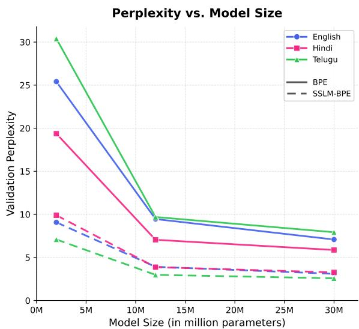  
Figure 7: Validation perplexity of BERT models at different scales. Aligning tokens with tokenizer-free approaches through pretokenization consistently results in lower perplexity.

Findings: As observed in Figure 7, models trained using SSLM as pretokenization consistently show lower perplexity across all model sizes. However, as model size increases, the improvement saturates. This indicates that SSLM-BPE generally provides more efficient language modeling. We also perform evaluation on downstream tasks at different scales. The results are listed in Table 5 and plotted in Figure 8. Across all three languages, SSLM-BPE often matches BPE on downstream tasks such as POS tagging and NER. We observe that whenever model benefits with larger size, the gap between SSLM-BPE and BPE reduces, especially for POS tagging and NER tasks. Note: Our tokenizer-free LMs were trained 250,000 sentence corpora, rather than on the entire 10M sentence corpora which we use for downstream evaluation. This was due to high computation requirement of such models (approximately 10× slower than transformers). We leave further scaling analysis accounting for these factors as our future work.

## B Hyperparameters & Experimental Setup

## B.1 H-Nets

Table 6 details the primary hyperparameter configurations used for pretraining the Hierarchical Network (H-Net) models across all evaluated languages. The model employs a structural layout of $m _ { 1 }$ at the bottom level and $T _ { 2 }$ at the top level, utilizing an embedding and hidden dimension of 256 for both levels. The bottom level $( m _ { 1 } )$ operates purely without an FFN block, while the top level $( T _ { 2 } )$ uses an intermediate feed-forward dimension of 640. This setup operates directly on byte sequences (vocabulary size of 256) and results in a lightweight model with approximately 3M parameters. We trained the model using an AdamW optimizer (with $\beta _ { 1 } = 0 . 9 , \beta _ { 2 } = 0 . 9 5 )$ and a batch size of 128 for a maximum of 70 epochs. Optimization was guided by a cosine learning rate scheduler with a peak base learning rate of $3 \times 1 0 ^ { - 4 }$ after an initial 10% linear warmup phase. To prevent overfitting, early stopping was employed with a patience of 5 epochs alongside a weight decay of 0.01. The H-Net specific structural compression constraints were maintained constantly throughout training, with the ratio loss scale set to 1.0 and zero warmup compression epochs.

## B.2 SSLMs

Table 7 details the comprehensive set of hyperparameters utilized during the pre-training of our Subword Segmental Language Models (SSLMs) across all evaluated languages. We adopted a lightweight Transformer decoder architecture tailored to subword segmental modeling, bringing the total parameter count to 2,105,836. Key architectural adjustments include scaling down the number of layers, embedding dimensions, and feedforward dimensions to ensure fast and efficient training with a limited parameter budget. The maximum segment length was constrained to 5 spatial units to balance compositional flexibility and computational overhead. Optimization was performed using the Adam optimizer coupled with an inverse square root learning rate scheduler and a linear warmup phase.

<table><tr><td rowspan="2">Model Scale</td><td colspan="3">Sentiment Analysis (Acc)</td><td colspan="3">POS Tagging (F1)</td><td colspan="3">Named Entity Recognition (F1)</td><td colspan="3">Dependency Parsing (LAS)</td></tr><tr><td>eng_latn</td><td>tel_telu</td><td>hin_deva</td><td>eng_latn</td><td>tel_telu</td><td>hin_deva</td><td>eng_latn</td><td>tel_telu</td><td>hin_deva</td><td>eng_latn</td><td>tel_telu</td><td>hin_deva</td></tr><tr><td colspan="10">Standard Algorithm: BPE</td><td colspan="3"></td></tr><tr><td>2M</td><td>77.75</td><td>59.15</td><td>65.97</td><td>89.16</td><td>62.22</td><td>92.57</td><td>70.79</td><td>86.15</td><td>75.90</td><td>54.78</td><td>56.04</td><td>74.12</td></tr><tr><td>12M</td><td>85.55</td><td>62.85</td><td>76.67</td><td>95.09</td><td>88.41</td><td>97.15</td><td>89.98</td><td>94.72</td><td>90.69</td><td>75.64</td><td>66.31</td><td>88.20</td></tr><tr><td>30M</td><td>88.42</td><td>65.43</td><td>78.01</td><td>95.97</td><td>92.82</td><td>97.64</td><td>91.65</td><td>95.66</td><td>91.91</td><td>80.29</td><td>72.96</td><td>90.44</td></tr><tr><td colspan="10">Using SSLM as pretokenization: SSLM-BPE</td><td colspan="3"></td></tr><tr><td>2M</td><td>76.95</td><td>59.89</td><td>58.89</td><td>88.05</td><td>61.76</td><td>91.28</td><td>56.18</td><td>83.37</td><td>76.61</td><td>50.99</td><td>53.62</td><td>72.38</td></tr><tr><td>12M</td><td>85.66</td><td>64.70</td><td>77.06</td><td>95.09</td><td>88.42</td><td>97.18</td><td>88.93</td><td>94.38</td><td>91.03</td><td>74.90</td><td>66.77</td><td>87.47</td></tr><tr><td>30M</td><td>86.01</td><td>64.70</td><td>78.01</td><td>96.13</td><td>92.78</td><td>97.45</td><td>91.59</td><td>95.70</td><td>92.72</td><td>80.20</td><td>70.09</td><td>89.88</td></tr></table>

Table 5: Downstream performance of BERT models at different scales trained with tokenizers BPE and SSLM-BPE. Best results for each task-language pair are in bold. Scores are averaged over three finetuning runs (seeds 42, 43, 44). We report accuracy for Sentiment Analysis, F1 for POS tagging and NER, and LAS for Dependency Parsing. Variants improved by SSLM pretokenization are underlined

<table><tr><td>Hyperparameter</td><td>Value</td></tr><tr><td colspan="2">Model Architecture</td></tr><tr><td>Architecture Type</td><td>H-Net</td></tr><tr><td>Total Parameters</td><td>~3M</td></tr><tr><td>Architecture Layout</td><td>m1T2</td></tr><tr><td>Embedding Dimension</td><td>256</td></tr><tr><td>Feed-Forward Dimension</td><td>640</td></tr><tr><td>Attention Heads</td><td>4</td></tr><tr><td colspan="2">Optimization Setup</td></tr><tr><td>Optimizer</td><td>AdamW</td></tr><tr><td>Adam β1, β2</td><td>(0.9,0.95)</td></tr><tr><td>Learning Rate</td><td>0.0003</td></tr><tr><td>Learning Rate Scheduler</td><td>Cosine</td></tr><tr><td>Warmup Ratio</td><td>10% of total steps</td></tr><tr><td>Weight Decay</td><td>0.01</td></tr><tr><td>Max Epochs</td><td>70</td></tr><tr><td>Early Stopping Patience</td><td>5</td></tr><tr><td colspan="2">H-Net &amp; Data Configuration</td></tr><tr><td>Vocabulary Size (Bytes)</td><td>256</td></tr><tr><td>Max Sequence Length</td><td>4096</td></tr><tr><td>Batch Size</td><td>128</td></tr><tr><td>Ratio Loss Scale</td><td>1.0</td></tr><tr><td>Warmup Compression Epochs</td><td>0</td></tr></table>

Table 6: Hyperparameter configurations and approximate parameter count for the Hierarchical Network (H-Net) pretraining phase.

## B.3 Fixed-tokenizer Variants

To ensure a fair and comprehensive comparison across different tokenization strategies, we standardized the training hyperparameter configurations where applicable, while setting strategyspecific parameters to their best-known or recommended values.

Global Settings All tokenizers were trained across three final target vocabulary sizes: T ∈ {5000, 10000, 20000}. For tokenizers relying on the SentencePiece library (e.g., standard BPE, Unigram, and PathPiece), the character coverage parameter was explicitly set to 1.0 (100%) to prevent any heuristic character dropping and uniformly ensure complete representation of the datasets' alphabets. We consider fixed-tokenizer variants with final vocabulary size of 10, 000 for a fair comparison with SSLMs with initial lexicon of size 10, 000.

<table><tr><td>Hyperparameter</td><td>Value</td></tr><tr><td colspan="2">Model Architecture</td></tr><tr><td>Architecture Type</td><td>Transformer SSLM</td></tr><tr><td>Total Parameters</td><td>~2M</td></tr><tr><td>Decoder Layers</td><td>3</td></tr><tr><td>Embedding Dimension</td><td>128</td></tr><tr><td>Feed-Forward Dimension</td><td>512</td></tr><tr><td>Attention Heads</td><td>4</td></tr><tr><td colspan="2">Optimization Setup</td></tr><tr><td>Optimizer</td><td>Adam</td></tr><tr><td>Adam β1, β2</td><td>(0.9,0.98)</td></tr><tr><td>Learning Rate</td><td>0.0005</td></tr><tr><td>Learning Rate Scheduler</td><td>Inverse Square Root</td></tr><tr><td>Warmup Updates</td><td>1000</td></tr><tr><td>Initial Warmup Learning Rate</td><td>1 × 10−7</td></tr><tr><td>Weight Decay</td><td>0.01</td></tr><tr><td>Gradient Clipping Norm</td><td>0.0</td></tr><tr><td>Dropout</td><td>0.1</td></tr><tr><td>Max Epochs</td><td>25</td></tr><tr><td>Early Stopping Patience</td><td>2</td></tr><tr><td colspan="2">SSLM &amp; Data Configuration</td></tr><tr><td>Max Segment Length</td><td>5</td></tr><tr><td>Lexicon Max Size</td><td>10000</td></tr><tr><td>Tokens Per Sample</td><td>512</td></tr><tr><td>Max Tokens</td><td>16384</td></tr></table>

Table 7: Hyperparameter configurations and parameter count for the lightweight Subword Segmental Language Model (SSLM) pre-training phase.

Standard Subword Architectures For Word-Piece, we utilized the HuggingFace tokenizers library, configuring it with NFKC Unicode normalization and lowercasing. Pre-tokenization was handled via a standard whitespace split, and the continuation prefix was assigned as “##". The standard special tokens strictly enforced were [UNK], [CLS], [SEP], [PAD], and [MASK]. Standard BPE and UnigramLM models relied on SentencePiece defaults beyond the mandatory complete character coverage.

Sentiment Analysis Accuracy vs. Model Size  
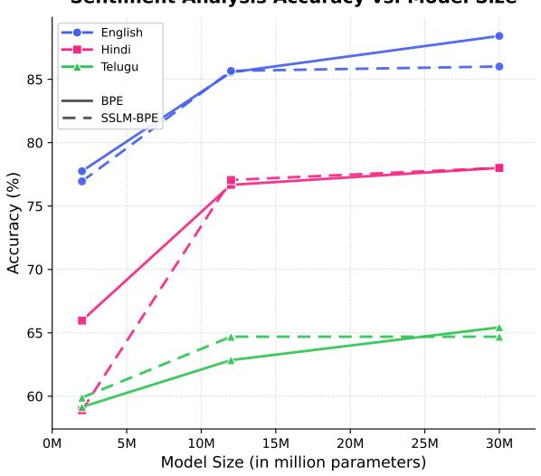  
(a) Sentiment analysis (Accuracy)

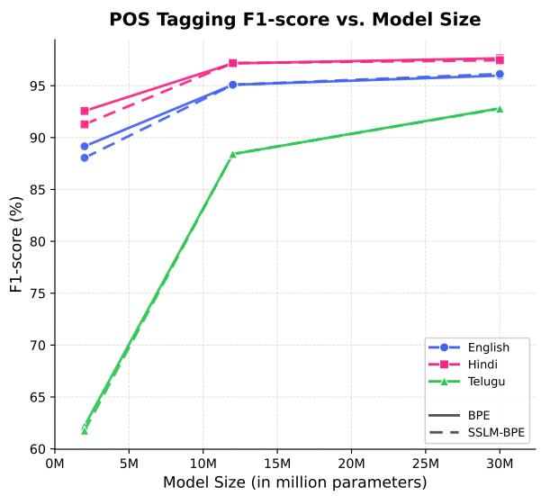  
(b) POS tagging (F1-score)

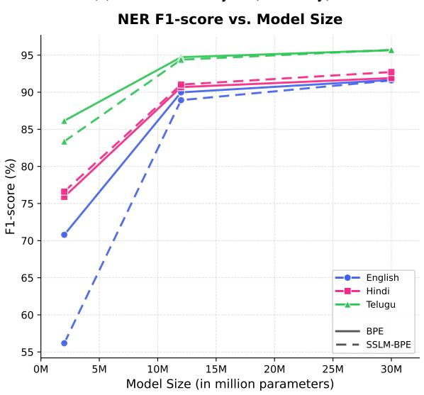  
(c) NER (F1-score)

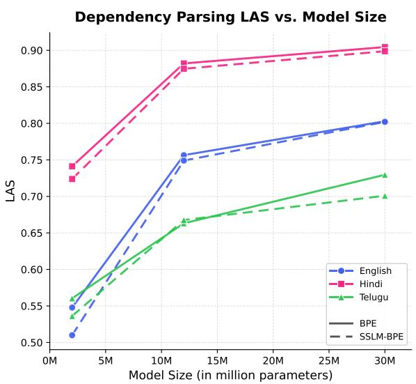  
(d) Dependency parsing (LAS)  
Figure 8: Performance of BERT models across model scales on sentiment analysis, POS tagging, NER, and dependency parsing.

SuperBPE Following the two-stage subword acquisition strategy of SuperBPE, the base vocabulary size (the transition limit t between stage 1 and stage 2) was configured at t = 4000 when final vocabulary size desired was T = 10000, and t = 10000 when T = 25000 (i.e., T = t × 2.5, as found in Liu et al. (2025)).

BoundlessBPE For BoundlessBPE, the τ parameter, managing the trade-off threshold, was set to 0.9. The vocabulary pruning recalculation interval was configured to occur every 1000 iterations (recalc = 1000). We utilized the ultimate2 regular expression split pattern constraints, taking advantage of the active vocabulary blowup tolerance

(blowup = 1).

PickyBPE The intersection-over-sequence threshold regulating token acceptance in PickyBPE was strictly confined to 0.9.

Morphologically-Informed Tokenizers (MorphBPE, MorphULM, MorphWP) To create tokenizers aligned with linguistic boundaries, an unsupervised Morfessor Baseline model was first trained on the raw corpus to dictate morphological decisions. Texts were pre-tokenized along the predicted morphological seams, creating a pseudocorpus separated by whitespace. The subsequent BPE, Unigram, and WordPiece counterparts (MorphBPE, MorphULM, and MorphWP) were exclusively trained on this constrained configuration, forcing the statistically induced vocabularies to respect Morfessor's proposed boundaries.

## B.4 Downstream Evaluation

As discussed, we perform downstream evaluation by pretraining BERT (Devlin et al., 2019) models and later finetuning them on each task. Table 8 lists the hyperparameters we used while pretraining BERT models. Similarly, Table 9 lists the hyperparameters while finetuning for each task.

We describe our downstream tasks as follows: POS tagging: Involves assigning a grammatical category such as noun, verb, adjective, to each word in a sentence. It involves reasoning through both the definition of the word and its context. We consider the class of word as the class corresponding to its first subword. We use Universal Dependency (UD) treebanks (Nivre et al., 2020) via HuggingFace universal dependency dataset: en\_ewt for English, te\_mtg for Telugu, and hi\_hdtb for Hindi. Labels are drawn from the 17 universal POS tags (upos). Performance is measured with weightedaverage F1-score.

Sentiment Analysis: This tasks involves determining the sentiment of a sentence, e.g., positive, negative, or neutral. We use ACTSA (Annotated Corpus for Telugu Sentiment Analysis) dataset for Telugu (Mukku and Mamidi, 2017), IITP Product Review dataset (Akhtar et al., 2016), and SST-2 dataset from GLUE benchmark (Wang et al., 2018).

Named Entity Recognition (NER): This tasks involves identifying and classifying named entities into predefined categories such as persons, organizations, locations, etc. We use CoNLL NER dataset (Tjong Kim Sang and De Meulder, 2003) for English, and WikiAnn dataset (Pan et al., 2017; Doddapaneni et al., 2023). WikiAnn consists of coarse grained labels as follows: Person (POS), Organization (ORG), and Location (LOC). Whereas, CoNLL NER contains an additional Miscellaneous (MISC) tag.

Dependency Parsing (DP): This task involves analyzing the grammatical structure of a sentence by identifying the relationship between head words and their dependents. We again use Universal Dependency (UD) treebank dataset (Nivre et al. 2020). We report Labeled Attachment Score (LAS) (Nivre and Fang, 2017).

<table><tr><td>Hyperparameter</td><td>Value</td></tr><tr><td colspan="2">Model Architecture</td></tr><tr><td>Architecture Type Total Parameters Hidden Layers</td><td>BERT ~2M /~12M /~30M 3/6/8</td></tr><tr><td>Hidden Dimension Feed-Forward Dimension</td><td>128 / 384 / 512 512 / 1024 / 2048</td></tr><tr><td>Attention Heads</td><td>4/6/8</td></tr><tr><td>Max Position Embeddings</td><td>128</td></tr><tr><td>Activation Function</td><td>gelu</td></tr><tr><td colspan="2">Regularization</td></tr><tr><td>Attention Dropout</td><td>0.1</td></tr><tr><td>Hidden Dropout</td><td>0.1</td></tr><tr><td>Initializer Range</td><td>0.01 / 0.02 / 0.02</td></tr><tr><td>Layer Norm €</td><td> $1 \times 1 0 ^ { - 1 2 }$ </td></tr><tr><td>Pre-Training Configuration</td><td></td></tr><tr><td>Pre-Training Objective</td><td>Masked LM</td></tr><tr><td>MLM Masking Probability</td><td>0.15</td></tr><tr><td>Sequence Length</td><td>128</td></tr><tr><td>Max Epochs</td><td>5</td></tr><tr><td></td><td></td></tr><tr><td>Early Stopping Patience</td><td>1</td></tr></table>

Table 8: Architecture and pre-training configurations for the three BERT model scales (2M / 12M / 30M). Where values differ across scales, they are listed in order from smallest to largest model.
<table><tr><td>Hyperparameter</td><td>Value</td></tr><tr><td>Train batch size</td><td>32</td></tr><tr><td>Eval batch size</td><td>32</td></tr><tr><td>Epochs</td><td>3 for GLUE 10 for ACTSA-TE, Dep. Parsing, IITP-PR, NER (CoNLL), POS, Wiki-NER</td></tr><tr><td>Learning rate</td><td>2e-5</td></tr><tr><td>LR schedule</td><td>Linear warmup</td></tr><tr><td>Warmup ratio</td><td>10% of steps</td></tr><tr><td>Weight decay</td><td>0.01</td></tr><tr><td>Adam €</td><td>1e-8</td></tr><tr><td>Adam  $\beta _ { 1 }$ </td><td>0.9</td></tr><tr><td>Adam  $\beta _ { 2 }$ </td><td>0.999</td></tr><tr><td>Max sequence length</td><td>128</td></tr><tr><td>Precision</td><td>FP16</td></tr></table>

Table 9: Hyperparameters used for fine-tuning BERT across all downstream tasks.  
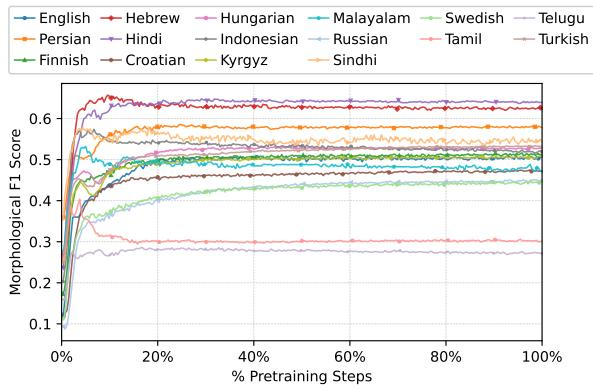  
Figure 9: Evolution of Morphological Alignment (F1-score) in Tranformer-based Subword Segmental Language Models (SSLM).

<table><tr><td colspan="2">English</td><td colspan="2">Hebrew</td><td colspan="2">Hindi</td><td colspan="2">Tamil</td><td colspan="2">Hungarian</td><td colspan="2">Indonesian</td></tr><tr><td colspan="2">Bangladeshis Bangladeshi s</td><td colspan="2">o&quot; &#x27;</td><td colspan="2">fsNoyet fsNoye</td><td colspan="2">西π⑥乐历 Q西⑥历</td><td colspan="2">zeneszerzőzseniket zeneszerzőzseni ket</td><td colspan="2">kehabisan ke habis an</td></tr><tr><td>Segmentation</td><td>Fl</td><td>Segmentation</td><td>Fl</td><td>Segmentation</td><td>Fl</td><td>Segmentation</td><td>Fl</td><td>Segmentation</td><td>Fl</td><td>Segmentation</td><td>Fl</td></tr><tr><td></td><td>0</td><td>&quot;¬</td><td>0</td><td> $\sqrt { 5 + 1 } = \sqrt { 5 + 1 }$ </td><td></td><td> $\Theta \bar { \mathcal { \oplus } } \bar { \pi } \bar { \Theta } ^ { \dot { \mathcal { \oplus } } , \varepsilon _ { \mathcal { \ G } } }$ </td><td>0</td><td>zene szerz őz sen iket</td><td>0</td><td>keha bisa n</td><td>0</td></tr><tr><td>Ba ngl ades his Ba ngla deshi s</td><td>0.5</td><td>’ コ”</td><td>0.67</td><td>fて可こ</td><td>0 0.33</td><td> $\mathsf { G } \oplus \Pi \mathsf { L } \stackrel { \cdots } { \overbrace { \boldsymbol { \theta } } } \dot { \boldsymbol { \mathcal { B } } } \varPsi$ </td><td>0.67</td><td>zene szerz ő zs en i ket</td><td>0.29</td><td>ke habi s an</td><td>0.8</td></tr><tr><td>Ba ngla deshi s</td><td>0.5</td><td> $[ 1 ^ { , } \cdot \thinspace \uparrow ] = \cdot \thinspace 7$ </td><td></td><td> $\sqrt { 5 + 1 } = \sqrt { 5 + 1 } = \sqrt { 5 }$ </td><td>0.33</td><td>西π⑥历</td><td>0</td><td>zene szerz ő zs en ik et</td><td>0</td><td>keha bis an</td><td>0.5</td></tr><tr><td>Ba ngla deshi s</td><td>0.5</td><td> $[ 1 ^ { , } \cdot \thinspace \uparrow ] = \cdot \thinspace 7$ </td><td>0.5 0.5</td><td>可</td><td>0.4</td><td>西π⑥</td><td>0</td><td>zene szerz ő zs eni ket</td><td>0.33</td><td>keha bis an</td><td>0.5</td></tr><tr><td>Ba ngla deshi s</td><td>0.5</td><td></td><td>0.5</td><td></td><td>0.4</td><td> $\Theta \bar { \mathcal { \oplus } } \bar { \pi } \bar { \Theta } ^ { \dot { \mathcal { \oplus } } , \varepsilon _ { \mathcal { \ G } } }$ </td><td></td><td>zene szerz ő zs eni ket</td><td>0.33</td><td>keha bis an</td><td>0.5</td></tr><tr><td>meadowlarks</td><td></td><td>&quot;</td><td></td><td>GERT</td><td></td><td>6</td><td></td><td>megtörténhetésének</td><td></td><td>disucikan</td><td></td></tr><tr><td>meadowlark s</td><td></td><td> </td><td></td><td>R</td><td></td><td>6年西</td><td></td><td>megtörténhetés ének</td><td></td><td>di suci kan</td><td></td></tr><tr><td>Segmentation</td><td>Fl</td><td>Segmentation</td><td>Fl</td><td>Segmentation</td><td>Fl</td><td>Segmentation</td><td>Fl</td><td>Segmentation</td><td>Fl</td><td>Segmentation</td><td>Fl</td></tr><tr><td>mea do wl arks</td><td>0</td><td></td><td>0</td><td>府</td><td>0</td><td>角西列</td><td>1</td><td>megt örtén he té sének</td><td>0</td><td>dis uci kan</td><td>0.5</td></tr><tr><td>mea dow lark s</td><td>0.5</td><td> $\mathbf { \bar { z } ^ { \ast } } \boldsymbol { \mathfrak { Q } } \boldsymbol { \mathfrak { T } } \boldsymbol { \mathfrak { Z } } \boldsymbol { \ b { \ b { \ b { \ b { \mathbf { \varepsilon } } } } } } $   $\mathbf { r } \cdot \mathfrak { C } \ b { \backslash } \ \mathfrak { C } \ b { \ b { \geq } } \ \cdot$ </td><td>0.5</td><td>TT</td><td>0.5</td><td></td><td>1</td><td>meg törté nhet és ének</td><td>0.4</td><td>di s uci kan</td><td>0.80</td></tr><tr><td>mea dow lark s</td><td>0.5</td><td> $\mathbf { r } \cdot \mathfrak { C } \ b { \backslash } \ \mathfrak { C } \ b { \ b { \geq } } \ \cdot$ </td><td>0.67</td><td>柯</td><td>0</td><td></td><td>1</td><td>meg törté nhet ésé nek</td><td>0</td><td>dis uci kan</td><td>0.5</td></tr><tr><td>mea dow lark s</td><td>0.5</td><td> $\mathbf { z } \cdot \mathbf { \vec { z } } \mathbf { \vec { \tau } } \odot \mathbf { \vec { \mathbf { z } } } ~ ;$ </td><td>0.4</td><td>てTT</td><td>0.5</td><td></td><td>0.67</td><td>meg törté n het és ének</td><td>0.33</td><td>dis uci kan</td><td>0.5</td></tr><tr><td>mea dow lark s</td><td>0.5</td><td> $\mathbf { z } \cdot \mathbf { \vec { z } } \mathbf { \vec { \tau } } \odot \mathbf { \vec { \mathbf { z } } } ~ ;$ </td><td>0.4</td><td>てす</td><td>0.5</td><td> $6 2 1 \delta 7 \delta 7 \delta$ </td><td>0.67</td><td>meg törté n het és ének</td><td>0.33</td><td>dis uci kan</td><td>0.5</td></tr><tr><td>eschewing</td><td></td><td>MDOND</td><td></td><td>gidcafaat</td><td></td><td>6T606060L</td><td></td><td>szavazatából</td><td></td><td>kegigihan</td><td></td></tr><tr><td>eschew ing</td><td></td><td>M DON D</td><td></td><td>qidcafqc</td><td></td><td>6T606060 </td><td></td><td>szavazat ából</td><td></td><td>ke gigih an</td><td></td></tr><tr><td>Segmentation</td><td>Fl</td><td>Segmentation</td><td>Fl</td><td>Segmentation</td><td>Fl</td><td>Segmentation</td><td>Fl</td><td>Segmentation</td><td>Fl</td><td>Segmentation</td><td>Fl</td></tr><tr><td></td><td></td><td></td><td></td><td></td><td></td><td></td><td></td><td></td><td>0.67</td><td></td><td></td></tr><tr><td>es che wing esc hew ing</td><td>0</td><td>NI DO NO</td><td>0 0.4</td><td>Tf</td><td>0</td><td>66060 6T606060 </td><td>1 0.67</td><td>szav azat ából szava zat ából</td><td>0.67</td><td>keg igi han</td><td>0 0.67</td></tr><tr><td>esc hew ing</td><td>0.67</td><td></td><td>0.67</td><td>T可</td><td>0.5 0.4</td><td>6T 606060L1</td><td>0</td><td>sz avaz atá ból</td><td>0</td><td>ke gi g ih an ke g igi h an</td><td>0.67</td></tr><tr><td>esc hew ing</td><td>0.67 0.67</td><td>N DO ND</td><td>0.4</td><td>す可</td><td>0.4</td><td> $6 7 ~ \dot { 6 } 0 \Theta 0 4 \dot { 1 } \dot { 2 }$ </td><td>0</td><td>sz avaz at ából</td><td>0.5</td><td>ke g igi h an</td><td>0.67</td></tr><tr><td>esc hew ing</td><td>0.67</td><td>DND</td><td>0.4</td><td>TT</td><td>0.4</td><td>6T606060 </td><td>0.67</td><td>sz avaz at ából</td><td>0.5</td><td>keg igi h an</td><td>0.4</td></tr><tr><td>Veterans</td><td></td><td></td><td></td><td>qlast</td><td></td><td></td><td></td><td></td><td></td><td></td><td></td></tr><tr><td>Veteran s</td><td></td><td>ロがTが ちN</td><td></td><td>qfa</td><td></td><td>L60L60L L60L 60L</td><td></td><td>tartozásának tartozás ának</td><td></td><td>perumahan pe rumah an</td><td></td></tr><tr><td>Segmentation</td><td>Fl</td><td>Segmentation</td><td>Fl</td><td>Segmentation</td><td>Fl</td><td>Segmentation</td><td>Fl</td><td>Segmentation</td><td>Fl</td><td>Segmentation</td><td>Fl</td></tr><tr><td>Ve ter ans</td><td></td><td></td><td></td><td>可</td><td></td><td></td><td></td><td></td><td>0.67</td><td></td><td></td></tr><tr><td>V et eran s</td><td>0 0.5</td><td> $\Xi ^ { \surd \aleph } { } ^ { \cdots \aleph }$ </td><td>0 0.67</td><td> $\ P \ P \approx \ P \ P$ </td><td>0 0.5</td><td>U60L 60L L60L 60L&amp;</td><td>1 1</td><td>tar tozás ának tarto zás ának</td><td>0.67</td><td>per uma han pe rumah an</td><td>0 1</td></tr><tr><td>Vet eran s</td><td>0.67</td><td> $\varepsilon \cdot 5 \aleph ^ { \ast \ast } \aleph$   $\varepsilon \cdot 5 \aleph ^ { \ast \ast } \aleph$ </td><td>0.67</td><td> $\ P \ P \approx \ P \ P$ </td><td>0.5</td><td>L60L 60L&amp;</td><td>1</td><td>tarto zásá nak</td><td>0</td><td>per umah an</td><td>0.5</td></tr><tr><td>Vet eran s</td><td>0.67</td><td> $\varepsilon \cdot 5 \aleph ^ { \ast \ast } \aleph$ </td><td>0.67</td><td> $\scriptstyle \ P ( \lceil \sqrt { \mathsf { e m } } , \mathsf { F } )$ </td><td>0.5</td><td>U 60L 60L↓</td><td>0.67</td><td>tarto zás ának</td><td>0.67</td><td>per umah an</td><td>0.5</td></tr><tr><td>Vet eran s</td><td>0.67</td><td> $\bigcirc \cdot \big 5 \big 8 ^ { \circ } \big \cdot \big \vert \mathrm { \uparrow } \aleph$ </td><td>0.5</td><td> $\scriptstyle \ P ( \lceil \sqrt { \mathsf { e m } } , \mathsf { F } )$ </td><td>0.5</td><td>U 60L 60LF</td><td>0.67</td><td>tarto zás ának</td><td>0.67</td><td>per umah an</td><td>0.5</td></tr><tr><td>roasted</td><td></td><td>ANND</td><td></td><td>FSSH</td><td></td><td>)</td><td></td><td>atrocitások</td><td></td><td>bergabung</td><td></td></tr><tr><td>roast ed</td><td></td><td>n NND</td><td></td><td>1S5H</td><td></td><td> </td><td></td><td>atrocitás ok</td><td></td><td>ber gabung</td></table>

Table 10: Evolution of segmentation of few more candidate wordforms produced by tokenizer-free approach SSLM with mor phological alignment F1-scores. English, Hebrew, and Hindi are fusional or analytical languages, while Tamil, Hungarian, and Indonesian are agglutinative languages.

<table><tr><td>Language</td><td>ISO 639-3</td><td>ISO 15924</td><td>Typology</td><td>Family</td><td>Group</td></tr><tr><td colspan="6">Agglutinative</td></tr><tr><td>Finnish</td><td>fin</td><td>latn</td><td>Agglutinative (with some Fusion)</td><td>Uralic</td><td>Finno-Ugric</td></tr><tr><td>Hungarian</td><td>hun</td><td>latn</td><td>Agglutinative (Suffixing)</td><td>Uralic</td><td>Finno-Ugric</td></tr><tr><td>Malayalam</td><td>mal</td><td>mlym</td><td>Agglutinative (Highly Synthetic)</td><td>Dravidian</td><td>Dravidian</td></tr><tr><td>Tamil</td><td>tam</td><td>taml</td><td>Agglutinative (Highly Synthetic)</td><td>Dravidian</td><td>Dravidian</td></tr><tr><td>Telugu</td><td>tel</td><td>telu</td><td>Agglutinative (Highly Synthetic)</td><td>Dravidian</td><td>Dravidian</td></tr><tr><td>Kyrgyz</td><td>kir</td><td>cyrl</td><td>Agglutinative (Suffixing)</td><td>Turkic</td><td>Turkic</td></tr><tr><td>Turkish</td><td>tur</td><td>latn</td><td>Agglutinative (Highly Productive Suf- fixing)</td><td>Turkic</td><td>Turkic</td></tr><tr><td>Mongolian</td><td>mon</td><td>cyrl</td><td>Agglutinative (Suffixing)</td><td>Mongolic</td><td>Mongolic</td></tr><tr><td>Indonesian</td><td>ind</td><td>latn</td><td>Agglutinative (Reduplication-Heavy)</td><td>Austronesian</td><td>Malayo-Polynesian</td></tr><tr><td colspan="6">Fusional</td></tr><tr><td>Sanskrit</td><td>san</td><td>deva</td><td>Fusional (Polysynthetic Tendencies)</td><td>Indo-European</td><td>Indo-Aryan</td></tr><tr><td>Hindi</td><td>hin</td><td>deva</td><td>Fusional / Analytic (Split-Ergative)</td><td>Indo-European</td><td>Indo-Aryan</td></tr><tr><td>Sindhi</td><td>snd</td><td>arab</td><td>Fusional (Moderate)</td><td>Indo-European</td><td>Indo-Aryan</td></tr><tr><td>Croatian</td><td>hrv</td><td>latn</td><td>Fusional (Highly Synthetic)</td><td>Indo-European</td><td>Slavic</td></tr><tr><td>Russian</td><td>rus</td><td>cyrl</td><td>Fusional (Highly Synthetic)</td><td>Indo-European</td><td>Slavic</td></tr><tr><td>Persian</td><td>fas</td><td>arab</td><td>Fusional (Weakly Synthetic)</td><td>Indo-European</td><td>Indo-Iranian</td></tr><tr><td colspan="6">Analytic &amp; Introflexive</td></tr><tr><td>English</td><td>eng</td><td>latn</td><td>Analytic / Weakly Fusional</td><td>Indo-European</td><td>Germanic</td></tr><tr><td>Swedish</td><td>swe</td><td>latn</td><td>Analytic / Weakly Fusional</td><td>Indo-European</td><td>Germanic</td></tr><tr><td>Hebrew</td><td>heb</td><td>hebr</td><td>Introflexive (Non-concatenative)</td><td>Afroasiatic</td><td>Semitic</td></tr></table>

Table 11: Languages categorized by morphological typology. Grouping highlights the structural similarities in word formation across different language families.

<table><tr><td>Language</td><td>ISO 15924</td><td>BP</td><td>#sentences</td><td>#words</td><td>ASL</td><td>#MS</td><td>#MN</td><td>Data Source</td></tr><tr><td colspan="9">Agglutinative</td></tr><tr><td>Finnish</td><td>latn</td><td>1.0589051</td><td>432,422</td><td>4,532,824</td><td>10.48</td><td>10172</td><td>3,745,139</td><td>NewsCrawl</td></tr><tr><td>Hungarian</td><td>latn</td><td>1.0199851</td><td>280,276</td><td>4,883,416</td><td>17.42</td><td>6350</td><td>1,044,996</td><td>NewsCrawl</td></tr><tr><td>Malayalam</td><td>mlym</td><td>2.8852389</td><td>438,501</td><td>4,053,859</td><td>9.24</td><td>131</td><td></td><td>NewsCrawl</td></tr><tr><td>Tamil</td><td>taml</td><td>2.7292892</td><td>397,206</td><td>4,216,313</td><td>10.61</td><td>1179</td><td></td><td>NewsCrawl</td></tr><tr><td>Telugu</td><td>telu</td><td>2.6198705</td><td>475,463</td><td>4,582,098</td><td>9.64</td><td>8092</td><td></td><td>NewsCrawl</td></tr><tr><td>Kyrgyz</td><td>cyrl</td><td>1.963557</td><td>410,075</td><td>5,154,290</td><td>12.57</td><td>4221</td><td></td><td>NewsCrawl</td></tr><tr><td>Turkish</td><td>latn</td><td>1.0444815</td><td>351,292</td><td>4,733,457</td><td>13.47</td><td>30076</td><td></td><td>NewsCrawl</td></tr><tr><td>Mongolian</td><td>cyrl</td><td>1.8046135</td><td>623,147</td><td>5,719,249</td><td>9.18</td><td></td><td>16,221</td><td>NLLB</td></tr><tr><td>Indonesian</td><td>latn</td><td>1.1788023</td><td>371,710</td><td>6,252,116</td><td>16.82</td><td>2785</td><td></td><td>NewsCrawl</td></tr><tr><td colspan="9">Fusional</td></tr><tr><td>Sanskrit</td><td>deva</td><td>2.5428913</td><td>857,298</td><td>5,159,696</td><td>6.02</td><td>16184</td><td></td><td>NLLB</td></tr><tr><td>Hindi</td><td>deva</td><td>2.3701629</td><td>427,015</td><td>6,936,484</td><td>16.24</td><td>1301</td><td></td><td>NewsCrawl</td></tr><tr><td>Sindhi</td><td>arab</td><td>1.5880165</td><td>614,055</td><td>7,258,014</td><td>11.82</td><td>3874</td><td></td><td>NLLB</td></tr><tr><td>Croatian</td><td>latn</td><td>0.9897218</td><td>309,090</td><td>5,652,252</td><td>18.29</td><td>7749</td><td>1,765,011</td><td>NewsCrawl</td></tr><tr><td>Russian</td><td>cyrl</td><td>1.8228284</td><td>341,500</td><td>5,296,132</td><td>15.51</td><td>21569</td><td>1,414,063</td><td>NewsCrawl</td></tr><tr><td>Persian</td><td>arab</td><td>1.6790492</td><td>444,478</td><td>7,197,903</td><td>16.19</td><td>11859</td><td></td><td>NewsCrawl</td></tr><tr><td colspan="9">Analytic &amp; Introflexive</td></tr><tr><td>English</td><td>latn</td><td>1</td><td>250,000</td><td>6,249,150</td><td>25</td><td>3688</td><td>874,725</td><td>NewsCrawl</td></tr><tr><td>Swedish</td><td>latn</td><td>1.0210256</td><td>492,345</td><td>6,002,549</td><td>12.19</td><td>6223</td><td>140,843</td><td>NLLB</td></tr><tr><td>Hebrew</td><td>hebr</td><td>1.3555346</td><td>508,250</td><td>5,248,164</td><td>10.33</td><td>4641</td><td></td><td>NLLB</td></tr></table>

Table 12: Comparative Statistics after byte-premium (BP) (Arnett et al., 2024) adjustments and Dataset Sources for Languages Categorized by Morphological Typology. Abbreviations are BP: Byte-premiums, ASL: Average Sentence Length (in number of words), #MS: Number of items in MorphScore (Arnett and Bergen, 2025; Arnett et al., 2025), #MN: Number of items in MorphyNet (Batsuren et al., 2021), NLLB: No Language Left Behind (Team et al., 2022).

<table><tr><td>Method</td><td>Description</td></tr><tr><td colspan="2">Standard Algorithms Byte-pair Encoding (BPE) (Gage,</td></tr><tr><td>1994; Sennrich et al., 2016)</td><td>Greedy frequency-based merge algorithm that iteratively combines the most frequent symbol pairs to construct a fixed subword vocabulary.</td></tr><tr><td>UnigramLM (Kudo, 2018)</td><td>Probabilistic subword model trained via EM that selects a vocabulary max- imizing corpus likelihood under a mixture model.</td></tr><tr><td>WordPiece (Schuster and Naka- jima, 2012)</td><td>Likelihood-based subword segmentation used in BERT; greedily selects merges that maximize training data likelihood.</td></tr><tr><td colspan="2">Algorithmic Modifications</td></tr><tr><td>SaGe (Yehezkel and Pinter, 2023)</td><td>Subword segmentation algorithm preferring units that occur in fewer dis- tinct contexts, encouraging morphological coherence.</td></tr><tr><td>Morfessor (Smit et al., 2014)</td><td>Unsupervised morphology-inspired tokenizer that segments words into likely morpheme-like units using a probabilistic model of subword struc- ture.</td></tr><tr><td colspan="2">Inference Modifications</td></tr><tr><td>BPE-dropout (Provilkov et al., 2020)</td><td>Subword regularization method that introduces stochasticity into the deter- ministic Byte Pair Encoding process by randomly dropping merge opera- tions during training, allowing a model to observe multiple possible seg- mentations of the same word while remaining fully compatible with stan- dard BPE at inference time.</td></tr><tr><td>PathPiece (Schmidt et al., 2024)</td><td>Lossless subword tokenizer that utilizes a directed acyclic graph (DAG) to find the shortest path of tokens from a given vocabulary, thereby segmenting a document into the minimum possible number of tokens.</td></tr><tr><td colspan="2">Vocabulary Modifications PickyBPE (Chizhov et al., 2024)</td></tr><tr><td></td><td>Performs vocabulary refinement during training by using the Intersection over Self (IoS) metric to identify and remove intermediate “junk&quot; tokens, thereby improving vocabulary efficiency and reducing under-trained tokens without compromising text compression.</td></tr><tr><td colspan="2">Pre-tokenization Modifications MorphBPE (Banerjee and Bhat-</td></tr><tr><td>tacharyya, 2018), MorphULM, MorphWP</td><td>Incorporates morphological boundary detection into the pre-tokenization stage prior to BPE learning, and similarly to UnigramLM (i.e., MorphULM) and WordPiece learning (i.e., MorphWP).</td></tr><tr><td colspan="2">Encoding Modifications</td></tr><tr><td>MYTE (Limisiewicz et al., 2024)</td><td>Alternative byte-level encoding replacing standard UTF-8 handling to bet- ter structure multilingual character representation.</td></tr><tr><td colspan="2">Cross-token Algorithms BoundlessBPE (Schmidt et al.,</td></tr><tr><td>2025)</td><td>Removes explicit word-boundary constraints, allowing merges across whitespace-defined token limits.</td></tr><tr><td>SuperBPE (Liu et al., 2025)</td><td>Extends BPE to permit cross-boundary merges and improved vocabulary utilization across token splits.</td></tr></table>

Table 13: List of Fixed-tokenizer approaches included in this study, organized by the stage at which they modify the tokenization pipeline.

<table><tr><td>Metric</td><td>Description</td><td>Requirements</td><td>What it Addresses</td></tr><tr><td colspan="4">Coverage</td></tr><tr><td>Subword Fertility Compression Rate</td><td>Average number of tokens produced per word.</td><td>Tokenizer and representative corpus.</td><td>Sequence length and basic storage efficiency.</td></tr><tr><td></td><td>Ratio of raw text size to tokenized sequence length.</td><td>Tokenizer and representative corpus</td><td>Storage and context window efficiency.</td></tr><tr><td>Token Frequency Distribution</td><td>Distributional profile of token occurrences (e.g.,</td><td>Token counts from a representative corpus.</td><td>Statistical balance of vocabulary usage and</td></tr><tr><td>Token Length Distribution</td><td>long-tail vs. concentrated usage). Distributional profile of tokens grouped by lengths</td><td>Vocabulary of tokenizer</td><td>fragmentation patterns. Granularity balance between short and long</td></tr><tr><td>Contextual Exponence</td><td>from a representative corpus Number of distinct neighbours each token</td><td>Representative corpus and its corresponding tokens</td><td>tokens, which affects efficiency and segmentation behavior. Degree to which the tokenizer optimizes tokens&#x27;</td></tr><tr><td>Effective Vocabulary Size</td><td>encounters (Yehezkel and Pinter, 2023). We consider only immediate neighbourhoods in our evaluation. Total number of unique tokens available in the tokenizer vocabulary. For</td><td>Trained tokenizer specification or model.</td><td>contextual soundness Memory footprint, embedding-table size, and</td></tr><tr><td></td><td>tokenizer-free approaches, we consider number of unique tokens when a corpus is segmented using</td><td></td><td>granularity trade-offs.</td></tr><tr><td>Generalizability Type-Token Ratio (TTR)</td><td>it. Ratio of unique token types</td><td>Tokenized corpus with</td><td>Lexical diversity and</td></tr><tr><td></td><td>to total token occurrences in a corpus sample.</td><td>fixed sample size (or moving-window normalization).</td><td>degree of repetition; helps compare whether a tokenizer yields broader vs. concentrated token usage.</td></tr><tr><td colspan="4">Linguistic Alignment Morphological Alignment Divergence between token</td></tr><tr><td></td><td>segments and known morphemes.</td><td>Morphological analyzer and gold-standard data.</td><td>Linguistic fidelity and grammatical preservation.</td></tr><tr><td>Robustness Rényi Efficiency (Zouhar et al., 2023)</td><td>Information-theoretic metric penalizing skewed distributions.</td><td>Token frequency data from a corpus.</td><td>Statistical balance and information density.</td></tr></table>

Table 14: Summary of Tokenizer Evaluation Metrics grouped by the proposed multidimensional framework in Alqahtani et al. (2026)

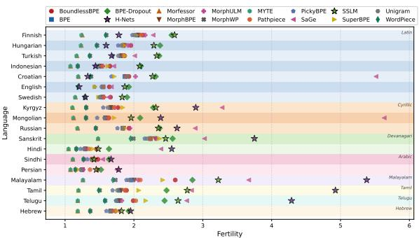  
(a) Fertility by script

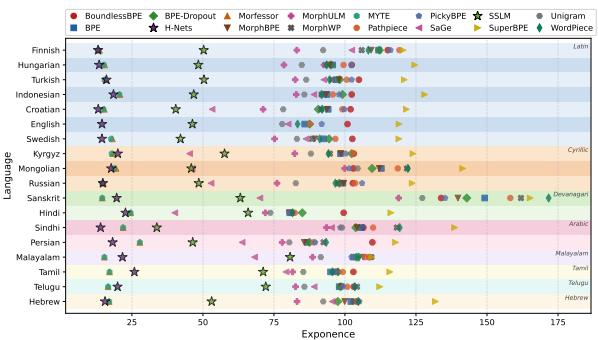  
(b) Contextual exponence by script

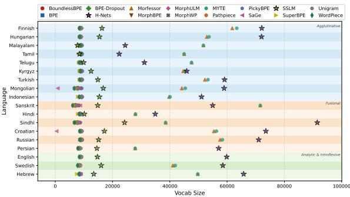  
(c) Effective vocabulary size by typology

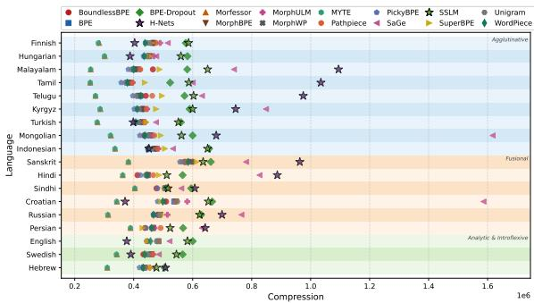  
(d) Compression by typology

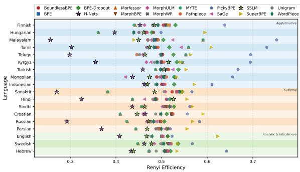  
(e) Rényi efficiency by typology

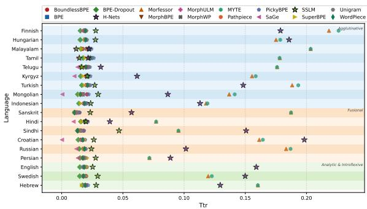  
(f) Type-token ratio by typology  
Figure 10: Intrinsic properties of tokenizer-free approaches (H-Nets and SSLMs) compared to fixed-tokenizer approaches across scripts and language typologies