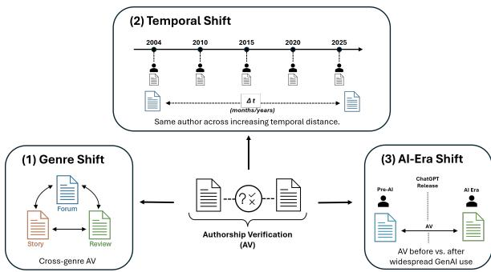
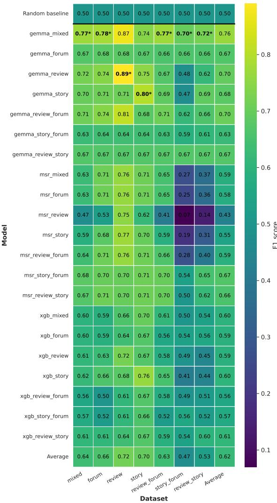
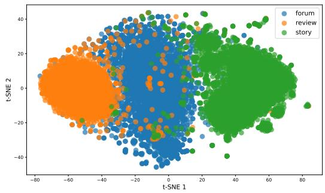
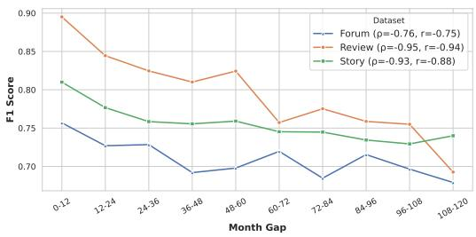
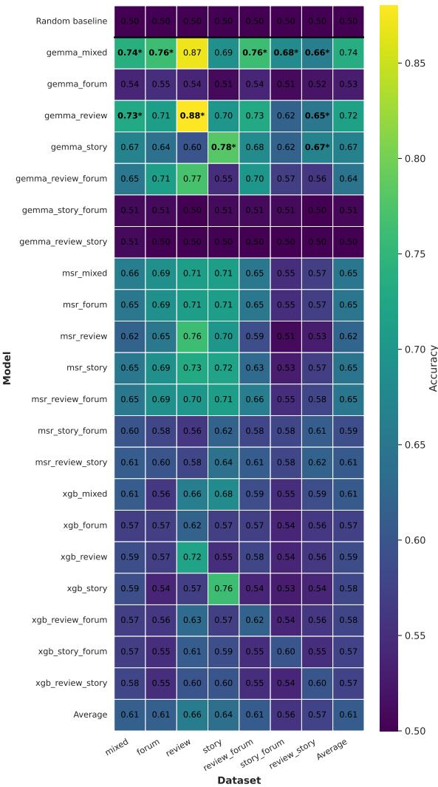
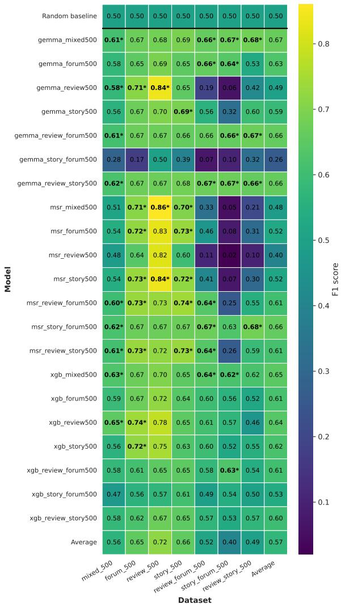
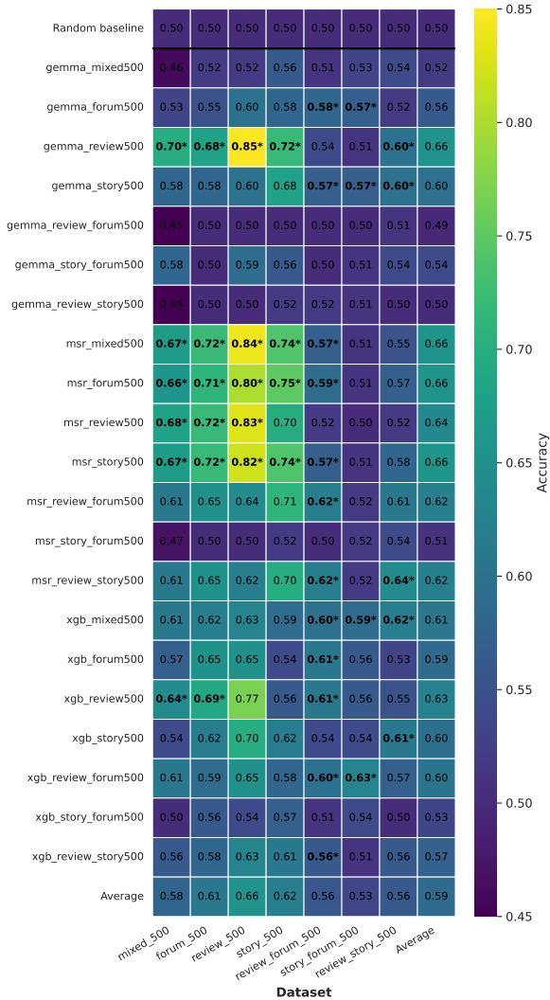
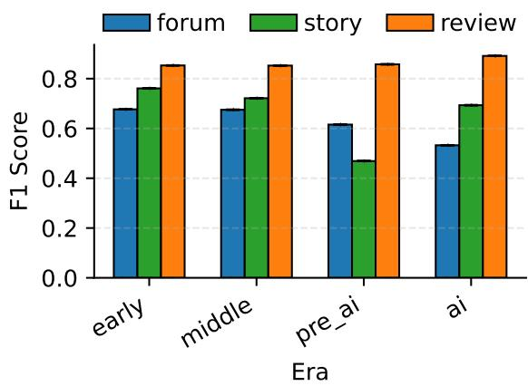

# When Writing Style Drifts: Benchmarking Authorship Verification under Distribution Shifts in Genre, Time and the AI-Era

Lotta Kiefer1, Brisca Balthes2, Christoph Leiter3, Yamen Ajjour4, Elena Schmidt, Steffen Eger5

1,2,3,4,5University of Technology Nuremberg (UTN) 1lotta.kiefer@utn.de 5steffen.eger@utn.de

## Abstract

Authorship verification (AV) assumes that an author’s writing style remains sufficiently stable to distinguish it from that of other writers. In practice, however, this assumption is challenged by distribution shifts caused by changes in genre, time, and AI-assisted writing. Existing AV benchmarks typically study these factors in isolation and focus predominantly on English, limiting our understanding of model robustness under realistic conditions. We introduce AVShift, the first German benchmark for systematically evaluating AV under multiple distribution shifts. AVShift comprises over 150,000 text pairs spanning three genres and 21 years, enabling controlled evaluation of crossgenre, temporal, and AI-era shifts within a unified framework. We benchmark representative feature-based, embedding-based, and LLMbased approaches. Our experiments show that fine-tuned LLMs generalize best across genres and benefit substantially from stylistically diverse training data. We further demonstrate that temporal drift is one of the strongest factors affecting AV, with performance degrading significantly as the time gap between documents increases. In contrast, we find no evidence of a measurable AI-era distribution shift within AVShift. Finally, our feature analysis reveals stylistic features that remain stable across genres, while their relative importance varies depending on the specific genre transition. We release AVShift and our code for future research.

## 1 Introduction

Authorship analysis aims to identify the author of a text based on characteristic patterns of individual language use, commonly referred to as an idiolect (Coulthard, 2004; Nini, 2023). Numerous benchmark datasets spanning books, blogs, news, emails, reviews, social media, and darknet forums have established authorship analysis as an important tool in literary studies, plagiarism detection, and forensic linguistics (Tyo et al., 2023; Boenninghoff et al.,

  
Figure 1: Overview of the stylistic distribution shifts covered by AVShift: cross-genre variation, temporal evolution, and AI-era changes before and after the widespread adoption of generative AI.

2024; Lewis et al., 2004; Manolache et al., 2022; Overdorf and Greenstadt, 2016; Stamatatos et al., 2023).

This work focuses on authorship verification (AV), which determines whether two texts were written by the same author. Unlike authorship attribution that relies on a predefined set of candidates, AV naturally generalizes to previously unseen authors without requiring retraining, making it particularly attractive for forensic investigations involving new suspects.

The concept of linguistic individuality is sometimes described as a linguisticfingerprint (Kreuz, 2023; Eder, 2011). However, this analogy can be misleading, giving the wrong impression that writing style is an immutable concept like a biological fingerprint (Coulthard, 2004; Nini, 2023). Instead, linguistic style is influenced by numerous contextual factors, including the intended audience, topic, communicative situation, medium, and evolves over time.

We therefore view AV as a learning problem that is inherently exposed to distribution shifts. In practice, both training and test data, as well as the paired texts themselves, may differ in genre, time, or broader language use. Existing benchmarks typically investigate these challenges in isolation and focus predominantly on English. However, AV relies on language-specific stylistic cues, making it unclear whether findings obtained on English generalize to other languages. This lack of diverse benchmarks limits our understanding of AV robustness under realistic conditions and across languages.

To address this gap, we introduce AVShift, the first German benchmark for systematically evaluating AV under three key distribution shifts: (1) cross-genre shift across forum posts, reviews, and fanfiction, (2) temporal shifts spanning more than two decades of writing, and (3) AI-era shifts before and after the widespread adoption of generative AI (genAI) writing assistants. Figure 1 provides an overview of these evaluation settings.

We make the following contributions:

• We introduce AVShift, the first German benchmark comprising more than 150,000 text pairs for evaluating AV under cross-genre, temporal, and AI-era distribution shifts.

• We compare feature-based, embedding-based, and LLM-based approaches across all benchmark settings.

• We show that verification performance varies substantially across genres and that LLMs trained on mixed-domain data exhibit strong cross-genre performance reaching an F1 of up to 0.77.

• We introduce a feature stability score, revealing that the robustness of stylistic features strongly depends on the genre pair.

• We show that temporal shifts substantially degrade verification performance by up to 0.21 F1, whereas no significant AI-era degradation is observed in our benchmark.

## 2 Related Work

Authorship Analysis Methods AV methods can broadly be categorized into feature-based, embedding-based, and LLM-based approaches.

Feature-based methods represent documents using handcrafted stylistic features, which are compared using similarity measures or statistical or neural classifiers. While these approaches remain attractive due to their competitive performance, efficiency and interpretability (Stamatatos, 2006; Grieve, 2007), they have been shown to underperform modern neural methods (Zeng et al., 2025).

Embedding-based approaches learn dense stylistic representations directly from text, either through task-specific neural architectures (Gupta et al., 2019; Qian et al., 2017; Boenninghoff et al., 2019) or extracted from pretrained transformer models (Rivera-Soto et al., 2021; Ma et al., 2025; Fabien et al., 2020).

More recently, LLMs have emerged as a promising approach to authorship analysis by jointly learning stylistic representations and the verification task. Although zero- and few-shot prompting with closed-source models such as GPT-3.5 (OpenAI, 2022) and GPT-4 (OpenAI, 2023) achieves competitive performance, their reliance on online APIs limits deployment in forensic and privacy-sensitive settings (Huang et al., 2024; Ramnath et al., 2025). More recent work shows that fine-tuned opensource LLMs outperform both prompting-based approaches and previous AV methods while remaining practical to deploy (Hu et al., 2024; Ramnath et al., 2025; Kiefer et al., 2026).

Out-of-Distribution Evaluation Cross-domain AV encompasses evaluation settings in which data are drawn from different distributions. This may refer either to domain transfer between training and test data (Rivera-Soto et al., 2021) or to the more challenging setting, where the two compared texts originate from different topics, genres, or platforms (Overdorf and Greenstadt, 2016; Ma et al., 2025). While cross-topic AV has received considerable attention, with numerous methods proposed to reduce topic bias (Stamatatos, 2018; Halvani and Graner, 2021; Hu et al., 2023), cross-platform and cross-genre settings remain comparatively underexplored. Existing work consistently reports substantial performance degradation under these shifts (Stamatatos et al., 2022, 2023; Barlas and Stamatatos, 2020; Israeli et al., 2025; Ma et al., 2025). Recent work has explored domain-adaptive style representations (Zhang et al., 2021) and training with hard negative and cross-domain positive pairs (van Leeuwen et al., 2026), improving robustness without eliminating the performance degradation caused by certain domain shifts.

Temporal shift refers to changes in an author’s writing style over time, raising the question of how well systems can recognize authors across substantial time gaps. Despite its practical relevance, temporal effects in AV have received limited attention. An existing study on six French novelists shows that performance can degrade as temporal distance increases (Cafiero et al., 2025). However, the small number of authors limits generalizability, and it remains unclear whether findings from literary texts transfer to other domains, where stylistic choices may be less deliberate. Approaches addressing temporal variation are similarly scarce. Yang et al. (2017) model changes in authors’ interests over time through topic drift, while Azarbonyad et al. (2015) estimate temporal changes in lexical style and show improvements for authorship attribution on tweets and emails.

AI-era shift shift refers to stylistic changes introduced by genAI writing assistance. Initial work suggests that AI-assisted writing can increase stylistic similarity between authors and thereby affect verification performance, particularly by increasing false positives (Richburg et al., 2024). Studying AI shift remains challenging due to the diverse forms of human-AI collaboration, including text generation, revision, and multi-turn interaction (Mysore et al., 2025; Lee et al., 2022). Many benchmarks disregard the possible influence arising from documents sampled from the AI-era.

Multilingual Evaluation Despite the languagedependent nature of stylistic features, authorship analysis remains heavily focused on English. Recent work has introduced multilingual embedding models capable of transferring across languages (Qiu et al., 2025; Kim et al., 2025), and several multilingual benchmarks (Israeli et al., 2025; Murauer and Specht, 2019; Halvani et al., 2016). Germanspecific benchmarks have also become available (Boenninghoff et al., 2024; Kiefer et al., 2026), but these primarily focus on in-domain or cross-topic evaluation. To our knowledge, no benchmark systematically combines different distribution shifts in a multilingual setting.

Overall, prior work has investigated individual distribution shifts largely in isolation and predominantly on English datasets. AVShift addresses this gap by providing the first German benchmark that systematically evaluates AV under cross-genre, temporal, and AI-era distribution shifts within a unified evaluation framework.

## 3 Data Curation

The goal of the data collection process is to construct a German corpus for systematically evaluating AV under distribution shifts. After evaluating several candidate sources, we selected www. fanfiktion.de, which offers three complementary writing environments within a single platform: fanfiction stories, reviews, and forum posts. This allows us to study distribution shifts while minimizing platform-specific confounds.

We use the forum section, specifically Allgemeines Geplauder (“General Chit Chat”), as the entry point of our scraping pipeline. Using BeautifulSoup (Richardson, 2025), we extract author profile links from forum threads and subsequently collect all available forum posts, reviews, and fanfiction stories for each author. This produces three aligned corpora containing texts from the same authors across two to three genres.

To capture temporal variation, we traverse the forum archive back to its earliest available entries from 2004. The resulting corpus spans 21 years (2004–2025), enabling both long-term temporal analyses and comparisons between texts written before and after the public release of ChatGPT (OpenAI, 2022) in November 2022.

Preprocessing We remove HTML tags, normalize whitespace, and replace all URLs with a shared token. German message closings are removed together with subsequent content, and remaining selfidentifying information is removed through fuzzy username matching.

Texts shorter than 50 words are discarded to ensure sufficient stylistic content, while texts longer than 3,000 words are truncated to reduce computational cost. Unlike previous work, we deliberately retain topical vocabulary and instead control for topic-bias effects during pair construction. Since the website exclusively hosts German-language content, no language filtering is required.

AVShift Benchmark AVShift consists of three sub-benchmarks that evaluate complementary distribution shifts: GenreShift, TimeShift, and AIShift. We provide an example in Appendix A.

GenreShift evaluates cross-genre generalization using seven AV datasets: three in-domain datasets (Forum, Review, Story), three cross-genre datasets (Review-Forum, Story-Forum, Review–Story), and one Mixed dataset obtained by uniformly sampling from the remaining six datasets.

Authors are split uniformly into 80% training, 10% validation, and 10% test partitions across all datasets, ensuring that no author appears in multiple splits, allowing cross-dataset comparison.

Each story sample consists of a single chapter, and each review and forum sample consists of one respective post. To reduce topic leakage, positive pairs are sampled under genre-specific constraints: story pairs originate from different fanfiction works, review pairs review different stories, and forum pairs come from different discussion threads. Positive pairs contain texts by the same author, while negative pairs contain texts by different authors. All datasets are class-balanced, and we sample at most five positive and five negative pairs per author to prevent highly active users from dominating the benchmark. Table 1 summarizes the resulting GenreShift datasets.

<table><tr><td>Dataset</td><td>Sample Number</td><td>Unique Posts</td><td>Unique Users</td><td>Mean Sample Len (in Words)</td></tr><tr><td>Forum</td><td>15,272</td><td>16,516</td><td>2,104</td><td>173</td></tr><tr><td>Review</td><td>22,228</td><td>23,242</td><td>2,466</td><td>184</td></tr><tr><td>Story</td><td>40,320</td><td>59,007</td><td>4,627</td><td>1,358</td></tr><tr><td>Review-Forum</td><td>18,490</td><td>18,274</td><td>1,849</td><td>179</td></tr><tr><td>Review-Story</td><td>26,090</td><td>35,922</td><td>2,609</td><td>786</td></tr><tr><td>Story-Forum</td><td>32,580</td><td>37,233</td><td>3,258</td><td>787</td></tr><tr><td>Mixed</td><td>30,000</td><td>43,156</td><td>4,806</td><td>576</td></tr></table>

Table 1: Statistical Comparison: All GenreShift datasets

TimeShift evaluates robustness to temporal shift. We construct ten dataset slices covering temporal gaps of 12 months each, ranging from 0-12 months to 108-120 months. All text pairs are sampled such that the publication dates of the two texts in each pair fall within the corresponding temporal interval of a given slice (e.g., in the 12-24 month slice, the publication dates of Text A and Text B differ by at least 12 and less than 24 months in both positive and negative pairs). This procedure is applied independently to the Forum, Review, and Story corpora. To ensure comparability, all datasets are downsampled to the size of the smallest subset within each genre (Forum: 670 pairs, Review: 446 pairs, Story: 4,466 pairs).

AIShift evaluates the impact of the widespread adoption of genAI on AV. The corpus is partitioned into four periods: Early (2004–2010), Mid (2011–2016), Pre-AI (2017–2022), and AI (2023–2025). Following the same pair construction procedure as GenreShift, we construct separate datasets for each genre and period, enabling controlled comparisons of AV before and after the emergence of AI-assisted writing.

## 4 Experimental Setup

To evaluate AV under different distribution shifts, we compare three representative approaches covering the dominant AV paradigms: feature-based, embedding-based, and LLM-based methods.

AV Models As a representative feature-based approach, we train an XGBoost classifier (Chen and Guestrin, 2016) on handcrafted stylometric features. We extract a comprehensive set of more than 4,000 distinct stylistic features (see Appendix B for details). Feature vectors are extracted independently for both texts and combined using their element-wise difference before classification.

As an embedding-based method, we use the Multilingual Style Representation (MSR) model proposed by Kim et al. (2025). MSR learns languageagnostic stylistic embeddings from 36 languages and 13 domains and achieves strong performance, even on unseen languages such as German.

For the LLM-based approach, we follow the framework of Kiefer et al. (2026), which fine-tunes instruction-tuned LLMs with LoRA (Hu et al., 2022) to answer the binary question of whether two texts were written by the same author. We replace their best-performing model, Gemma-3-12Bit (Gemma Team et al., 2025), with the more recent Gemma-4-31B-it (Gemma Team et al., 2026), while keeping the training procedure unchanged.

Evaluation Metrics We report macro F1-score as the primary evaluation metric throughout the paper, as it is well suited for our binary, balanced classification setting. We additionally report Accuracy scores in the Appendix.

GenreShift Evaluation We train and evaluate all three models on each of the seven AVShift datasets (see Appendix C for the training setup). Note that for MSR, the embeddings remain unchanged, and only the decision threshold is tuned on AVShift using Youden’s J statistic (Youden, 1950). This evaluation setup assesses both generalization to unseen domains and within-sample cross-genre AV performance. Statistical significance of performance differences between models is assessed using paired bootstrap testing with 10,000 resamples (Efron, 1979).

Because AV performance is strongly influenced by text length and can be affected by training set size (Eder, 2011; Kiefer et al., 2026), we additionally construct standardized GenreShift datasets. Every document is normalized to 500 words, extending shorter texts by concatenating additional texts from the same author and truncating longer texts. We further downsample all datasets to the size of the smallest genre split (3,640 samples), allowing us to isolate the effect of genre independently of text length and dataset size. The standardized GenreShift datasets are marked by an additional 500.

To further investigate stylistic variation across genres, we exploit the interpretability of the handcrafted feature representation used in the XGB approach. We first concatenate all texts written by each author into a single document and balance the three resulting genre corpora by truncating them to the same total token count.

A shared feature vectorizer is then fitted on the combined author corpora of stories, reviews, and forum posts, enabling direct comparison of feature distributions across genres. This analysis allows us to identify stylistic features that remain stable across genres as well as those that are strongly genre-dependent.

Time Shift Evaluation For each genre, we evaluate the best-performing in-domain model on the TimeShift benchmark. Performance is measured on ten datasets with temporal gaps ranging from 0–12 months to 108–120 months. We report Pearson (Pearson and Galton, 1895) and Spearman (Spearman, 1904) correlation coefficients between temporal distance and verification performance to quantify the effect of temporal drift.

AIShift Evaluation We evaluate AIShift using a leave-one-era-out protocol. For each experiment, one temporal period is held out for testing while the remaining three periods are combined for training. For each split, we uniformly sample the same number of pairs (train: 4,122, test: 1,374) to ensure comparable dataset sizes across all experiments. This setup enables a controlled evaluation of AV performance before and after the emergence of AIassisted writing across different genres.

Crossnews To assess the generalizability of our findings beyond German, we additionally evaluate our methods on the English CrossNews benchmark introduced by Ma et al. (2025). CrossNews links news articles and tweets written by the same author, yielding two in-domain datasets (Article and Tweet) and one cross-genre dataset (Article–Tweet). We compare our methods against the two bestperforming approaches reported by the authors: (1) a prompting-based method using LLaMA-3-70B (Grattafiori et al., 2024), and (2) SELMA, which performs AV using embedding distances obtained with e5-mistral-7b-instruct (Wang et al., 2024).

## 5 Results

How robust are models across genres? Our results on the GenreShift benchmark are summarized in Figure 2 (Appendix D for full results). Models are on the y-axis followed by the name of the training set and test datasets on the x-axis with indomain datasets referred by the genre name (e.g. Review) and cross-genre datasets by both genres the text pairs are drawn from (e.g. Review-Forum where a pair consists of one text from Review and one text from Forum). Across all seven datasets Gemma consistently outperforms both the featurebased XGB classifier and the embedding-based MSR model, achieving the highest F1 score on every test set $( p < 0 . 0 5 )$ . While models trained on the Review and Story datasets perform best on their respective in-domain tasks, the Mixed Gemma model achieves the strongest performance on all remaining datasets. This demonstrates that exposing LLMs to stylistically diverse training data substantially improves robustness to distribution shifts.

  
Figure 2: F1 scores of all models trained and evaluated on all GenreShift train and test splits. Model names are shown on the y-axis and test dataset names on the xaxis. Each model name is followed by its training or calibration dataset. The best score for each test set is shown in bold. Statistically significant superiority over all other models is indicated by an asterisk (\*; $\mathsf { p } < 0 . 0 5 )$

Among the three in-domain datasets, Review consistently reveals to be the easiest genre for AV, followed by Story and Forum. The best-performing in-domain models achieve F1 scores of 0.89, 0.80, and 0.78, respectively. This suggests that reviews contain the strongest and most consistent authorial signal, whereas forum posts represent the most challenging writing style.

Both Gemma and XGB degrade substantially under cross-genre transfer. For example, Gemma achieves an F1 score of 0.89 when trained and tested on reviews but loses approximately 0.2 F1 when trained on stories or forum posts. The Forum dataset is an exception, where training on reviews or stories yields better performance than training on forum data, suggesting that forum posts provide weaker supervision for learning robust stylistic representations. In contrast, MSR is less sensitive to the calibration genre, likely because its embedding model remains fixed and only the verification threshold is adapted to AVShift.

The three cross-genre datasets also differ substantially in difficulty. Review-Forum is consistently the easiest cross-genre setting, whereas Review–Story and Story-Forum are considerably more challenging. Surprisingly, the Mixed Gemma model outperforms models trained directly on the corresponding cross-genre datasets in every setting. This indicates that exposing the model to a broad range of stylistic variation is more beneficial than specializing on a single genre transition. Notably, its performance on Review-Forum approaches the in-domain performance obtained on the Forum dataset (0.77 F1), demonstrating that robust crossgenre AV is achievable when sufficient stylistic diversity is observed during training. While previous work consistently reported substantial performance degradation under cross-genre evaluation (Ma et al., 2025; Israeli et al., 2025; Stamatatos et al., 2023), our results suggest that much of this degradation can be mitigated through sufficiently diverse training data.

To determine whether these differences are genuinely caused by genre rather than confounding factors such as text length or training set size, we repeat the experiments on our standardized AVShift datasets in which both factors are controlled. The relative difficulty of the three genres remains unchanged: Review (0.84) continues to outperform Story and Forum (both 0.74) (see Appendix E), confirming that the observed ranking is intrinsic to the writing genres rather than an artifact of dataset construction. In contrast, the ranking of the models changes considerably. Under these controlled conditions, Gemma is no longer consistently superior. MSR achieves the highest performance on the standardized Review and Story datasets, while XGB performs best on Forum, although the bestperforming Gemma models follow closely and do not differ significantly $( p \ge 0 . 0 5 )$ . At the same time, cross-genre performance deteriorates for all models, which we attribute primarily to the substantially smaller training sets resulting from the controlled sampling procedure. Together, these findings indicate that genre itself is the dominant source of difficulty in AVShift, while the relative performance of different AV approaches depends strongly on the characteristics of the training data. In particular, XGB and MSR benefit from the standardized setting and appear less sensitive to the reduced training size, whereas Gemma benefits more from the larger and stylistically more diverse training data available in the original benchmark.

Do our results generalize to English? To assess whether the trends observed on AVShift generalize beyond German, we evaluate all three approaches on the English CrossNews benchmark. Table 2 compares the best-performing models reported by Ma et al. (2025) with the strongest model results we achieved on their benchmark. Overall, our results closely mirror the findings on AVShift. Gemma achieves the best performance on the Tweet–Tweet and Article–Tweet datasets, improving upon the previously reported state of the art by 0.11 and 0.07 F1, respectively. On the Article–Article dataset, MSR achieves the highest performance, slightly outperforming SELMA. These results demonstrate that the strong cross-genre generalization of Gemma is not limited to German but also transfers to English.

Overall, CrossNews remains consistently easier than AVShift, with substantially higher F1 scores across datasets. While this may partly reflect the predominantly English pretraining of models such as Gemma, the benchmarks differ in several other aspects, preventing attribution of the performance gap to language alone.

Do Stylistic Features Survive Genre Shifts? To better understand why some genre transitions are more challenging than others, we analyze the shared handcrafted feature space described in Section 4. Figure 3 shows a t-SNE (Cai and Ma, 2022)

<table><tr><td>Model</td><td>Article-Article</td><td>Tweet-Tweet</td><td>Article-Tweet</td></tr><tr><td>Ma et al. (2025) LLaMA Prompting</td><td>0.77±0.089</td><td>0.79±0.048</td><td>0.40±0.064</td></tr><tr><td>Ma et al. (2025) SELMA</td><td>0.86±0.018</td><td>0.75±0.020</td><td>0.80±0.023</td></tr><tr><td>Gemma-AT</td><td>0.83</td><td>0.88</td><td>0.87</td></tr><tr><td>Gemma-TT</td><td>0.83</td><td>0.90</td><td>0.86</td></tr><tr><td>MSR-AA</td><td>0.88</td><td>0.84</td><td>0.69</td></tr></table>

Table 2: Results on the Crossnews benchmark. The two models scoring best for the three benchmark subsets as reported by Ma et al. (2025) are shown alongside the best-scoring models from our analysis.

projection of the resulting author representations. Rather than clustering primarily by author, the vectors are largely separated by genre, indicating that genre exerts a strong influence on the handcrafted feature representation even for texts written by the same individual.

To quantify how well individual features preserve authorial style across genres, we compute a cross-genre feature stability score

$$
\operatorname { S t a b i l i t y } ( f ) = 1 - { \frac { \sigma _ { \mathrm { w i t h i n } } ( f ) } { \sigma _ { \mathrm { b e t w e e n } } ( f ) + \varepsilon } }\tag{1}
$$

which compares within-author variation across genres to between-author variation. High stability indicates that a feature remains consistent for the same author while discriminating between different authors and representing robust indicators of authorial style.

Across all three genres, stability scores range from −1.70 to 0.90, with a mean of 0.22 and a median of 0.25 (Table 3). Overall, 80% of the handcrafted features exhibit positive stability, indicating that most stylistic features remain relatively consistent across genres despite the strong genre separation observed in the t-SNE projection. This suggests that successful cross-genre AV remains feasible. We provide the thirty most and least stable features in Appendix G.

Feature stability further reflects differences in cross-genre verification difficulty. Review-Forum exhibits the highest average stability (0.31 and 85% positive features), consistent with the results showing highest classification performance. Even though Story-Forum ranks second in performance it shows the lowest stability scores in our analysis (−0.06; 48% positive features). Thus, feature stability does not perfectly predict verification performance, but the overall trend suggests that it is a useful indicator of how well authorial style is preserved across genres and, consequently, of the expected difficulty of cross-genre AV.

Finally, we investigate whether the same features remain stable across different genre transitions. We look at the overlap among the 100 most stable and 100 least stable features and find that overlap is generally low, ranging from 2% to 43%, indicating that different genre transitions affect different subsets of stylistic features. Nevertheless, the overall feature rankings remain moderately correlated (Spearman’s $\rho = 0 . 4 2 \mathrm { ~ - ~ } 0 . 7 2 )$ , suggesting that while genre shifts change which features are most informative, the broader ordering of feature stability is largely preserved (see Appendix H). Taken together, these findings indicate that feature stability should be analyzed separately for each genre transition rather than assuming a universal set of robust stylistic features.

  
Figure 3: t-SNE visualization of feature author vectors from different genres.

<table><tr><td>Dataset</td><td>Mean Stability</td><td>Median Stability</td><td>Percentage Stable Features</td></tr><tr><td>Overall</td><td>0.22±0.28</td><td>0.25</td><td>80%</td></tr><tr><td>Review-Forum</td><td>0.31±0.27</td><td>0.34</td><td>85%</td></tr><tr><td>Story-Forum</td><td>0.19±0.37</td><td>0.25</td><td>75%</td></tr><tr><td>Review-Story</td><td>-0.06±0.38</td><td>-0.01</td><td>48%</td></tr></table>

Table 3: Mean and median stability feature scores alongside the percentage of features with positive score for the whole dataset next to each genre-pair individually.

How does authorial style change over time? Figure 4 shows the performance of the bestperforming in-domain model for each genre on the TimeShift benchmark. Across all genres, AV performance decreases steadily as the temporal gap between two texts increases. Pearson and Spearman correlation analyses reveal a strong and statistically significant negative relationship between temporal distance and F1-score for all genres $( p < 0 . 0 5 )$

The magnitude of this degradation differs across genres. Review shows the largest decline, with the F1-score dropping from 0.90 for text pairs separated by 0–12 months to 0.69 after 9–10 years. In contrast, Forum shows the smallest decrease (0.76 to 0.68), although this may partly reflect its lower initial performance, leaving less room for degradation. Despite these differences, the relative difficulty of the three genres remains largely unchanged (Review > Story > Forum) across temporal intervals, suggesting that the higher performance on Review is unlikely to be attributable to potential differences in the time spans across genres.

  
Figure 4: Correlation of increasing time spans (x-axis) and F1-score (y-axis) alongside Pearson (r) and Spearman (ρ) correlation coefficients

These findings demonstrate that authorial style is not static but evolves continuously over time, substantially reducing verification performance even for state-of-the-art models. Notably, a large decline occurs already after the first year, showing that temporal drift emerges very early. Since all three genres exhibit the same overall trend, temporal variation should be considered an important factor when constructing and evaluating AV benchmarks. For high-stakes real-world applications in particular, our results suggest that verification is only reliable when comparing documents written within relatively short time windows without further model modifications.

Has the emergence of genAI changed AV? We find no evidence that the emergence of genAI has introduced a systematic distribution shift for AV (see Appendix F). While performance differs significantly between individual hold-out eras, these differences do not follow a consistent chronological pattern. In particular, AI-era texts are not systematically more difficult to verify than earlier texts. For example, the Story dataset exhibits its largest performance drop when the Middle era is held out, whereas the Review dataset achieves its highest performance on the AI era. Overall, the observed variation is more likely explained by dataset-specific factors, such as text length, topic, or temporal sampling, than by the widespread adoption of genAI.

This finding should, however, be interpreted with caution, as our corpus was not annotated for

AI-assisted writing. Consequently, we cannot determine the prevalence of genAI within AVShift. Future work should validate these findings using datasets with controlled levels of AI use, enabling a more direct assessment of its impact on AV.

## 6 Conclusion

In this work, we introduced AVShift, the first German benchmark for systematically evaluating AV under realistic distribution shifts. AVShift unifies cross-genre, temporal, and AI-era evaluation, enabling a comprehensive assessment of robustness beyond conventional in-domain settings. We used it to compare feature-based, embedding-based, and LLM-based approaches under challenging realworld conditions.

Our experiments reveal three main findings. First, although cross-genre AV remains challenging, fine-tuned LLMs perform particularly well, benefiting from stylistically diverse training data and even matching in-domain performance in one setting. Second, temporal drift is one of the strongest factors affecting AV, with performance consistently declining as the time gap between documents increases. Third, we find no evidence that the widespread adoption of genAI has introduced a measurable distribution shift in AVShift, although this should be revisited using datasets with controlled AI-assisted writing.

Beyond benchmarking, our analyses provide new insights into authorial style. Although handcrafted features are strongly influenced by genre, many stylistic features remain stable enough to support reliable cross-genre AV. Together with the superior performance of models trained on stylistically diverse data, these findings suggest that robustness is achieved not by eliminating stylistic variation, but by learning representations that capture author-specific characteristics despite changes in writing context.

We hope AVShift will serve as a valuable resource for robust AV research, particularly for non-English languages where benchmark datasets remain scarce. More broadly, our results suggest that future progress should be measured not only by in-domain performance but also by robustness to realistic distribution shifts, providing a more reliable assessment for forensic and other real-world applications.

## Limitations

This work has several limitations that should be taken into consideration in the interpretation of the results. First, our evaluation covers a representative but limited selection of AV approaches. While we select three models representing feature-based, embedding-based, and LLM-based methods, other approaches may yield different results. Moreover, within each model category, design choices such as LLM architecture, fine-tuning strategy, threshold calibration, or feature selection may influence absolute performance and model rankings. A broader evaluation across additional methods and configurations remains an important direction for future work.

Second, AVShift is constructed from a single German platform, which enables controlled comparisons across genres while reducing platformspecific confounding factors. However, this also limits the diversity of writing environments represented in the benchmark. Future extensions incorporating additional platforms and languages could further assess the generalizability of the observed findings.

Third, while AVShift introduces realistic distribution shifts, measuring some forms of shift remains challenging. In particular, AI-era shift depends on the extent and type of human-AI interaction, which we did not try to quantify in this work. Future work could investigate controlled settings with known levels of AI assistance.

Finally, this work focuses on analyzing robustness under distribution shifts rather than developing methods to improve style shift robustness. We provide AVShift and our analyses as a foundation for future research on adaptive training strategies, robust representations, and methods specifically designed to address distribution shifts in AV.

## Ethical Considerations

We aim to minimize the environmental impact of our experiments by restricting GPU usage to the resources required for model training and evaluation.

AV has potential societal benefits in applications such as forensic investigations and plagiarism detection. However, we acknowledge that these technologies may also be misused, for example to deanonymize individuals or undermine legitimate privacy protections. Furthermore, AV systems are inherently imperfect, and their predictions should not be interpreted as definitive evidence in realworld applications. In particular, we cannot fully exclude the influence of demographic, social, or other contextual factors that may introduce biases against specific groups.

We provide details on model and dataset licenses in Appendix I. The released dataset will use pseudonymized usernames and will be made available exclusively for research purposes. The underlying platform provides publicly accessible content without requiring user authentication; nevertheless, we recognize that publicly available data may still carry privacy considerations and encourage responsible use of the resource.

## Acknowledgements

We gratefully acknowledge the support that made this work possible. This work was supported by the German Federal Ministry of Research, Technology and Space (BMFTR) through the ALiAS research project (grants 13N17272 and 13N17273) within the security research program, and by the German Research Foundation (DFG) under the Heisenberg Grant EG 375/5-1.

## References

Jason Ansel, Edward Yang, Horace He, Natalia Gimelshein, Animesh Jain, Michael Voznesensky, Bin Bao, Peter Bell, David Berard, Evgeni Burovski, Geeta Chauhan, Anjali Chourdia, Will Constable, Alban Desmaison, Zachary DeVito, Elias Ellison, Will Feng, Jiong Gong, Michael Gschwind, and 30 others. 2024. PyTorch 2: Faster Machine Learning Through Dynamic Python Bytecode Transformation and Graph Compilation. In 29th ACM International Conference on Architectural Support for Programming Languages and Operating Systems, Volume 2 (ASPLOS ’24). ACM.

Hosein Azarbonyad, Mostafa Dehghani, Maarten Marx, and Jaap Kamps. 2015. Time-aware authorship attribution for short text streams. SIGIR ’15, page 727–730, New York, NY, USA. Association for Computing Machinery.

Georgios Barlas and Efstathios Stamatatos. 2020. Crossdomain authorship attribution using pre-trained language models. In Artificial Intelligence Applications and Innovations, pages 255–266, Cham. Springer International Publishing.

Benedikt Boenninghoff, Steffen Hessler, Dorothea Kolossa, and Robert M Nickel. 2019. Explainable authorship verification in social media via attentionbased similarity learning. In 2019 IEEE International Conference on Big Data (Big Data), pages 36–45. IEEE.

Benedikt Boenninghoff, Henry Hosseini, Robert M. Nickel, and Dorothea Kolossa. 2024. Who wrote when? author diarization in social media discussions. In Findings of the Association for Computational Linguistics: EMNLP 2024, pages 15721–15734, Miami, Florida, USA. Association for Computational Linguistics.

Florian Cafiero, Lucence Ing, Simon Gabay, and Thibault Clérice. 2025. “i am too old for this style!” a stylometric benchmark of age effect on authorship attribution. In Taylor Arnold, Margherita Fantoli, and Ruben Ros, editors, Computational Humanities Research 2025, pages 1248–1260. Anthology of Computers and the Humanities.

T. Tony Cai and Rong Ma. 2022. Theoretical foundations of t-sne for visualizing high-dimensional clustered data. J. Mach. Learn. Res., 23(1).

Tianqi Chen and Carlos Guestrin. 2016. Xgboost: A scalable tree boosting system. KDD ’16, page 785–794, New York, NY, USA. Association for Computing Machinery.

Malcolm Coulthard. 2004. Author identification, idiolect, and linguistic uniqueness. Applied Linguistics, 25(4):431–447.

Maciej Eder. 2011. Style-markers in authorship attribution: A cross-language study of the authorial fingerprint. Studies in Polish Linguistics, 6(1):99–114.

Bradley. Efron. 1979. Bootstrap Methods: Another Look at the Jackknife. The Annals ofStatistics, 7(1):1 – 26.

Maël Fabien, Esau Villatoro-Tello, Petr Motlicek, and Shantipriya Parida. 2020. BertAA : BERT finetuning for authorship attribution. In Proceedings ofthe 17th International Conference on Natural Language Processing (ICON), pages 127–137, Indian Institute of Technology Patna, Patna, India. NLP Association of India (NLPAI).

Gemma Team, Sherif El Abd, Vaibhav Aggarwal, Robin Algayres, Alek Andreev, Olivier Bachem, Ian Ballantyne, Cormac Brick, Victor Carbune, Michelle˘ Casbon, Mayank Chaturvedi, Aditya Chawla, Victor Cotruta, Alice Coucke, Phil Culliton, Robert Dadashi, Lucas Dixon, Mohamed Elhawaty, Utku Evci, and 304 others. 2026. Gemma 4 technical report. Preprint, arXiv:2607.02770.

Gemma Team, Aishwarya Kamath, Johan Ferret, Shreya Pathak, Nino Vieillard, Ramona Merhej, Sarah Perrin, Tatiana Matejovicova, Alexandre Ramé, Morgane Rivière, Louis Rouillard, Thomas Mesnard, Geoffrey Cideron, Jean bastien Grill, Sabela Ramos, Edouard Yvinec, Michelle Casbon, Etienne Pot, Ivo Penchev, and 197 others. 2025. Gemma 3 technical report. Preprint, arXiv:2503.19786.

Aaron Grattafiori, Abhimanyu Dubey, Abhinav Jauhri, Abhinav Pandey, Abhishek Kadian, Ahmad Al-Dahle, Aiesha Letman, Akhil Mathur, Alan Schelten, Alex Vaughan, Amy Yang, Angela Fan, Anirudh

Goyal, Anthony Hartshorn, Aobo Yang, Archi Mitra, Archie Sravankumar, Artem Korenev, Arthur Hinsvark, and 542 others. 2024. The llama 3 herd of models. Preprint, arXiv:2407.21783.

Jack Grieve. 2007. Quantitative authorship attribution: An evaluation of techniques. Literary and linguistic computing, 22(3):251–270.

Shriya TP Gupta, Jajati Keshari Sahoo, and Rajendra Kumar Roul. 2019. Authorship identification using recurrent neural networks. In Proceedings of the 2019 3rd International Conference on Information System and Data Mining, ICISDM ’19, page 133–137, New York, NY, USA. Association for Computing Machinery.

Oren Halvani and Lukas Graner. 2021. Posnoise: An effective countermeasure against topic biases in authorship analysis. In Proceedings of the 16th International Conference on Availability, Reliability and Security, ARES ’21, New York, NY, USA. Association for Computing Machinery.

Oren Halvani, Christian Winter, and Anika Pflug. 2016. Authorship verification for different languages, genres and topics. Digital Investigation, 16:S33–S43. DFRWS 2016 Europe.

Edward J Hu, Yelong Shen, Phillip Wallis, Zeyuan Allen-Zhu, Yuanzhi Li, Shean Wang, Lu Wang, and Weizhu Chen. 2022. LoRA: Low-rank adaptation of large language models. In International Conference on Learning Representations.

Xinyu Hu, Weihan Ou, Sudipta Acharya, Steven H.H. Ding, Ryan D’Gama, and Hanbo Yu. 2023. Tdrlm: Stylometric learning for authorship verification by topic-debiasing. Expert Systems with Applications, 233:120745.

Yujia Hu, Zhiqiang Hu, Chun-Wei Seah, and Roy Ka-Wei Lee. 2024. Instructav: Instruction fine-tuning large language models for authorship verification. Preprint, arXiv:2407.12882.

Baixiang Huang, Canyu Chen, and Kai Shu. 2024. Can large language models identify authorship? pages 445–460.

Abraham Israeli, Shuai Liu, Jonathan May, and David Jurgens. 2025. The million authors corpus: A crosslingual and cross-domain Wikipedia dataset for authorship verification. In Findings ofthe Association for Computational Linguistics: ACL 2025, pages 25997–26017, Vienna, Austria. Association for Computational Linguistics.

Lotta Kiefer, Christoph Leiter, Sotaro Takeshita, Elena Schmidt, and Steffen Eger. 2026. GerAV: Towards new heights in German authorship verification using fine-tuned LLMs on a new benchmark. In Findings of the Associationfor Computational Linguistics: ACL 2026, pages 40050–40069, San Diego, California, United States. Association for Computational Linguistics.

Junghwan Kim, Haotian Zhang, and David Jurgens. 2025. Leveraging multilingual training for authorship representation: Enhancing generalization across languages and domains. In Proceedings of the 2025 Conference on Empirical Methods in Natural Language Processing, pages 34867–34892, Suzhou, China. Association for Computational Linguistics.

Roger Kreuz. 2023. Linguisticfingerprints: How language creates and reveals identity. Simon and Schuster.

Woosuk Kwon, Zhuohan Li, Siyuan Zhuang, Ying Sheng, Lianmin Zheng, Cody Hao Yu, Joseph E. Gonzalez, Hao Zhang, and Ion Stoica. 2023. Efficient memory management for large language model serving with pagedattention. In Proceedings of the ACM SIGOPS 29th Symposium on Operating Systems Principles.

Mina Lee, Percy Liang, and Qian Yang. 2022. Coauthor: Designing a human-ai collaborative writing dataset for exploring language model capabilities. In CHI Conference on Human Factors in Computing Systems, CHI ’22, page 1–19. ACM.

David D. Lewis, Yiming Yang, Tony G. Rose, and Fan Li. 2004. Rcv1: A new benchmark collection for text categorization research. J. Mach. Learn. Res., 5:361–397.

Marcus Ma, Duong Minh Le, Junmo Kang, Yao Dou, John Cadigan, Dayne Freitag, Alan Ritter, and Wei Xu. 2025. Crossnews: A cross-genre authorship verification and attribution benchmark. Proceedings of the AAAI Conference on Artificial Intelligence, 39(23):24777–24785.

Andrei Manolache, Florin Brad, Antonio Barbalau, Radu Tudor Ionescu, and Marius Popescu. 2022. Veridark: A large-scale benchmark for authorship verification on the dark web. In Advances in Neural Information Processing Systems, volume 35, pages 15574–15588. Curran Associates, Inc.

Benjamin Murauer and Günther Specht. 2019. Generating cross-domain text classification corpora from social media comments. In Experimental IR Meets Multilinguality, Multimodality, and Interaction, pages 114–125, Cham. Springer International Publishing.

Sheshera Mysore, Debarati Das, Hancheng Cao, and Bahareh Sarrafzadeh. 2025. Prototypical human-AI collaboration behaviors from LLM-assisted writing in the wild. In Proceedings ofthe 2025 Conference on Empirical Methods in Natural Language Processing, pages 16819–16846, Suzhou, China. Association for Computational Linguistics.

Andrea Nini. 2023. A Theory of Linguistic Individualityfor Authorship Analysis. Elements in Forensic Linguistics. Cambridge University Press.

OpenAI. 2022. Gpt-3.5. Technical report, OpenAI. OpenAI. 2023. Gpt-4. Technical report, OpenAI.

Rebekah Overdorf and Rachel Greenstadt. 2016. Blogs, twitter feeds, and reddit comments: Cross-domain authorship attribution. Proceedings on Privacy Enhancing Technologies, 2016.

Karl Pearson and Francis Galton. 1895. Vii. note on regression and inheritance in the case of two parents. Proceedings ofthe Royal Society ofLondon, 58(347- 352):240–242.

Chen Qian, Tianchang He, and Rao Zhang. 2017. Deep learning based authorship identification. Report, Stanford University, pages 1–9.

Justin Qiu, Jiacheng Zhu, Ajay Patel, Marianna Apidianaki, and Chris Callison-Burch. 2025. mStyleDistance: Multilingual style embeddings and their evaluation. In Findings ofthe Associationfor Computational Linguistics: ACL 2025, pages 16917–16931, Vienna, Austria. Association for Computational Linguistics.

Sahana Ramnath, Kartik Pandey, Elizabeth Boschee, and Xiang Ren. 2025. CAVE: Controllable authorship verification explanations. In Proceedings of the 2025 Conference of the Nations of the Americas Chapter of the Association for Computational Linguistics: Human Language Technologies (Volume 1: Long Papers), pages 8939–8961, Albuquerque, New Mexico. Association for Computational Linguistics.

Leonard Richardson. 2025. Beautiful soup documentation.

Aquia Richburg, Calvin Bao, and Marine Carpuat. 2024. Automatic authorship analysis in human-AI collaborative writing. In Proceedings of the 2024 Joint International Conference on Computational Linguistics, Language Resources and Evaluation (LREC-COLING 2024), pages 1845–1855, Torino, Italia. ELRA and ICCL.

Rafael A. Rivera-Soto, Olivia Elizabeth Miano, Juanita Ordonez, Barry Y. Chen, Aleem Khan, Marcus Bishop, and Nicholas Andrews. 2021. Learning universal authorship representations. In Proceedings of the 2021 Conference on Empirical Methods in Natural Language Processing, pages 913–919, Online and Punta Cana, Dominican Republic. Association for Computational Linguistics.

Charles Spearman. 1904. ’general intelligence,’ objectively determined and measured. The American Journal ofPsychology, 15(2):201–293.

Efstathios Stamatatos. 2006. Ensemble-based author identification using character n-grams. In Proceedings ofthe 3rd International Workshop on Text-based Information Retrieval, volume 36, pages 41–46.

Efstathios Stamatatos. 2018. Masking topic-related information to enhance authorship attribution. Journal of the Association for Information Science and Technology, 69(3):461–473.

Efstathios Stamatatos, Mike Kestemont, Krzysztof Kredens, Piotr Pezik, Annina Heini, Janek Bevendorff, Benno Stein, and Martin Potthast. 2022. Overview of the authorship verification task at pan 2022. In CEUR workshop proceedings, volume 3180, pages 2301–2313.

Efstathios Stamatatos, Krzysztof Kredens, Piotr Pezik, Annina Heini, Janek Bevendorff, Benno Stein, and Martin Potthast. 2023. Overview of the authorship verification task at pan 2023. In Conference and Labs ofthe Evaluation Forum.

Jacob Tyo, Bhuwan Dhingra, and Zachary C. Lipton. 2023. Valla: Standardizing and benchmarking authorship attribution and verification through empirical evaluation and comparative analysis. In Proceedings of the 13th International Joint Conference on Natural Language Processing and the 3rd Conference ofthe Asia-Pacific Chapter ofthe Association for Computational Linguistics (Volume 1: Long Papers), pages 649–660, Nusa Dua, Bali. Association for Computational Linguistics.

Britt van Leeuwen, Sandjai Bhulai, and Rob van der Mei. 2026. Cross-domain authorship verification with feature interaction networks: Evaluating no-holdout and holdout protocols. Machine Learning with Applications, 25:100943.

Leandro von Werra, Younes Belkada, Lewis Tunstall, Edward Beeching, Tristan Thrush, Nathan Lambert, Shengyi Huang, Kashif Rasul, and Quentin Gallouédec. 2020. TRL: Transformers Reinforcement Learning.

Liang Wang, Nan Yang, Xiaolong Huang, Linjun Yang, Rangan Majumder, and Furu Wei. 2024. Improving text embeddings with large language models. In Proceedings of the 62nd Annual Meeting of the Associationfor Computational Linguistics (Volume 1: Long Papers), pages 11897–11916, Bangkok, Thailand. Association for Computational Linguistics.

Thomas Wolf, Lysandre Debut, Victor Sanh, Julien Chaumond, Clement Delangue, Anthony Moi, Perric Cistac, Clara Ma, Yacine Jernite, Julien Plu, Canwen Xu, Teven Le Scao, Sylvain Gugger, Mariama Drame, Quentin Lhoest, and Alexander M. Rush. 2020. Transformers: State-of-the-Art Natural Language Processing. pages 38–45. Association for Computational Linguistics.

Min Yang, Dingju Zhu, Yong Tang, and Jingxuan Wang. 2017. Authorship attribution with topic drift model. Proceedings of the AAAI Conference on Artificial Intelligence, 31(1).

William J Youden. 1950. Index for rating diagnostic tests. Cancer, 3(1):32–35.

Peter Zeng, Pegah Alipoormolabashi, Jihu Mun, Gourab Dey, Nikita Soni, Niranjan Balasubramanian, Owen

Rambow, and H. Schwartz. 2025. Residualized similarity for faithfully explainable authorship verification. In Findings of the Association for Computational Linguistics: EMNLP 2025, pages 15824– 15837, Suzhou, China. Association for Computational Linguistics.

Yifan Zhang, Dainis Boumber, Marjan Hosseinia, Fan Yang, and Arjun Mukherjee. 2021. Improving authorship verification using linguistic divergence. In ROMCIR@ECIR.

## A AVShift Example

We present document examples from each genre written by a single author in Table 4, together with their English translations. These examples provide an impression of how writing style varies across genres. The forum text is relatively informal, for instance using emojis such as "xD", whereas the story example differs substantially by employing a more literary style. The review is again more informal but has the distinctive characteristic of directly addressing the author of the story.

## B XGB Feature Configuration

Table 5 presents the feature configuration used in the feature-based approach. It lists each feature abbreviation together with a brief description.

## C Training Setup and Hyperparameters

To support LoRA fine-tuning of the Gemma-4-31Bit model, we conduct our experiments on a system equipped with four H200 GPUs. We follow the hyperparameter configuration proposed by Kiefer et al. (2026) and update the software stack to support the newer Gemma version. Specifically, we use PyTorch 2.12.1 (Ansel et al., 2024), Transformers 5.12.1 (Wolf et al., 2020), TRL 0.21.0 (von Werra et al., 2020), and vLLM 0.24.0 (Kwon et al., 2023).

For the feature-based XGBoost model, we use an environment with Transformers 4.36.2 and Py-Torch 2.5.1. We perform a dedicated hyperparameter grid search for each training setting, tuning the maximum tree depth (3, 6, 10, 15), minimum child weight (0, 2, 4, 5), regularization parameter α (0, 1), γ (0, 1), and the learning rate (0.01, 0.1, 0.3).

The MSR model is evaluated using Transformers 5.12.1, Sentence-Transformers 5.2.2, and PyTorch 2.12.1. We use the original sentence embeddings without modification and tune only the verification threshold for each dataset.

<table><tr><td>Forum Im Sommer saß ich mal mit Megatron bewegte sich durch Hi, hui ja, das ist wirklich</td><td>Story</td><td>Review</td></tr><tr><td>einer Freundin in meinem Zim- die dunklen Gänge, doch seine ein ungewöhnliches Pairing xD mer am Fußboden. Wir haben gemalt, da fiel auf einmal eine riesige Raupe/Larve von der Decke! Wir wissen bis heute nicht, wie sie da hin gekommen ist.Das andere ist im Sommer am Schulfest passiert. Ich saß im Gras, als mir plötzlich ein Vo- gel was auf&#x27;s Knie fallen ließ -</td><td>Gedanken waren ferner denn Aber nicht schlecht, dein Stil je. Jeder Schritt quälte die ist eigentlich richtig gut und Ruhe, wie der Ton eines fallen- es lässt sich alles flüssig lesen. den Tropfens die endliche Stille. Ich schließe mich Hera an und Seine Präsenz füllte den Ort wie meine, dass Absätze im Text das Summen einer Stimmgabel, nicht schlecht gewesen wären. das in jede Ecke drang, sich Du musst bedenken, dass die selbst in jenen Flächen nieder Geschichte am Bildschirm gele- ließ, die den Raum begrenzten, sen wird, was anstrengend für</td><td></td></tr><tr><td colspan="3">genau so wie letztes Jahr. xD um ihn aus seinem Frieden zu die Augen ist. [...] reißen. [...]</td></tr><tr><td>One summer, I was sitting on the Megatron moved through the Hi, wow, yeah, that&#x27;s really an floor in my room with a friend. dark corridors, yet his thoughts unusual pairing xD But not bad, We were drawing when suddenly were farther away than ever. your writing style is actually a huge caterpillar/larva fell from the ceiling! To this day, we like the sound of a falling drop smoothly. I agree with Hera - still don&#x27;t know how it got there. breaking the finite silence. His I think some paragraphs in the The other thing happened at the presence filled the place like the text wouldn&#x27;t have been a bad school festival that summer. I hum of a tuning fork, penetrat- idea. You have to keep in mind was sitting in the grass when sud- ing every corner, settling even that the story is being read on a denly a bird dropped something into the surfaces that bounded screen, which can be hard on the</td><td>Translation Each step disturbed the stillness, really good, and it all reads on my knee - just like last year. the room, to tear it from its peace. eyes. [.. . ] [...]</td><td></td></tr></table>

Table 4: Example of texts from one user writing in all three genres alongside English translations. Usernames occurring in the examples have been pseudonymized.

We release complete environment and training setups within our GitHub repository for reproducibility.

## D GenreShift Full Results

Figure 5 reports accuracy scores to complement the F1 results presented in the main results section. The overall findings remain unchanged, with Gemma consistently outperforming the other models and the review genre reaching highest performance.

## E GenreShift Standardized Full Results

Figures 6 and 7 present the full F1 and accuracy results, respectively, on the standardized GenreShift benchmark. Compared to the unstandardized benchmark, Gemma no longer consistently outperforms the other approaches but shares the best performance with either MSR or XGB across all datasets. Performance in cross-genre settings drops significantly to a consistent F1 score of 0.67- 0.68 across all genre pairs, indicating that larger training sizes are required for this more challenging setting. Furthermore, mixed training no longer provides a performance benefit in the standardized setting. However, the performance differences between genres in the in-domain setting remain consistent: review data again achieves substantially higher performance, despite document lengths and training sample sizes being standardized across all three genres.

## F AI-Era Results

Figure 8 shows the F1 scores for the leave-one-eraout evaluation across all three genres. While several significant differences between hold-out eras are observed, no consistent pattern emerges. For Forum, the AI era yields the lowest performance and is significantly outperformed by all other eras $( p \ : < \ : 0 . 0 5 )$ , although the Pre-AI era is likewise significantly outperformed by the Early and Mid eras. In contrast, Review achieves its highest F1 score (0.89) on the AI-era test set, significantly outperforming all other eras. For Story, the AI era is significantly outperformed only by the Early era, whereas the Mid era performs significantly worse than all remaining periods..

<table><tr><td>Feature</td><td>Description</td></tr><tr><td>mfw2</td><td>Normalized frequencies of the 1,000 most frequent word</td></tr><tr><td>mft</td><td>bigrams. Normalized frequencies of the 1,000 most frequent POS</td></tr><tr><td>mfc</td><td>trigrams. Normalized frequencies of the 2,500 most frequent char-</td></tr><tr><td>mfe</td><td>acter 4-grams. Normalized frequencies of the 100 most frequent emo-</td></tr><tr><td>wordLenDistri</td><td>jis. Distribution of word lengths from 1 to 20 characters.</td></tr><tr><td>wordLen</td><td>Average word length.</td></tr><tr><td>messageLen nrPunctuation</td><td>Average document length. Normalized frequencies of</td></tr><tr><td></td><td>individual punctuation sym-</td></tr><tr><td>nrOOV</td><td>bols. Proportion of out-of- vocabulary words.</td></tr></table>

Table 5: Handcrafted features used to train the featurebased XGB AV model.

## G Most and Least Stable Features

Table 6 presents the top and bottom 30 features ranked by stability score across all three genre transfers (see Table 5 for feature descriptions). Among the most stable features, we find several word bigrams consisting of function words, as well as part-of-speech (POS) bigrams, confirming earlier findings that function words and POS sequences represent stable indicators of writing style (Halvani and Graner, 2021). We further identify characteristic punctuation usage patterns, such as repeated exclamation marks.

Among the least stable features, we find, for example, average message length, reflecting the challenge of varying document lengths across different text genres. However, we also observe individual word bigrams, such as "als er", and POS trigrams, such as "punct-propn-verb", indicating that not all function word or POS sequences constitute stable style predictors. Furthermore, many character 4-grams appear among the least stable features, suggesting that character-level patterns may be more sensitive to genre-specific variations.

  
Figure 5: Accuracy scores of all models trained and evaluated on all GenreShift train and test splits. Model names are shown on the y-axis and test dataset names on the x-axis. Each model name is followed by its training or calibration dataset. The best score for each test set is shown in bold. Statistically significant superiority over all other models is indicated by an asterisk $( ^ { * } ; \mathfrak { p } < 0 . 0 5 )$

## H Pairwise Feature Analysis

Table 7 reports the overlap of the 100 most and least stable features across different genre transitions. The overlap is generally low, ranging from

  
Figure 6: F1 scores of all models trained and evaluated on all standardized GenreShift train and test splits. Model names are shown on the y-axis and test dataset names on the x-axis. Each model name is followed by its training or calibration dataset. The best score for each test set is shown in bold. Statistically significant superiority over all other models is indicated by an asterisk $( ^ { * } ; \mathfrak { p } < 0 . 0 5 )$ .

5% to 27% for the most stable features and from 2% to 43% for the least stable features. This indicates that no universally stable feature set exists across genre shifts, suggesting that feature stability should be analyzed separately for each genre pair, particularly when performing explicit feature selection. In contrast, Spearman rank correlations of feature stability remain moderate (0.42-0.72), indicating that while the most and least stable features vary substantially between genre pairs, the overall ranking of feature stability is comparatively consistent.

  
Figure 7: Accuracy scores of all models trained and evaluated on all standardized GenreShift train and test splits. Model names are shown on the y-axis and test dataset names on the x-axis. Each model name is followed by its training or calibration dataset. The best score for each test set is shown in bold. Statistically significant superiority over all other models is indicated by an asterisk $( ^ { * } ; \mathfrak { p } < 0 . 0 5 )$ .

## I Model and Data Licences

We use all models in this work in accordance with their intended use as specified by their respective licences. Specifically, Gemma-4-31B-it is released under the Apache 2.0 licence 1, which permits modification, including fine-tuning, redistribution of fine-tuned models, and publication of research results.

To support the reproducibility of our experiments and encourage future research on AV under distribution shifts while protecting the privacy of the original authors, we will provide access to the AVShift benchmark with pseudonymized usernames for academic research purposes only. In addition, we will release the complete preprocessing pipeline and the scraping code to facilitate reproducibility and provide transparency regarding the dataset construction process.

  
Figure 8: Gemma performance under different era evaluations for each genre. Datasets on the x-axis refer to the held-out test era with F1-scores on the y-axis.

<table><tr><td>Top Features</td><td>Bottom Features mfc_ kon</td></tr><tr><td>mfw2_aber in mfw2_so als nrPunct| mfw2_mal eine mfw2_sein ich mfw2_sollte man mfw2_nicht als nrPunct# mfw2_ist doch mfw2_von sich mfw2_als das mfw2_als die mfw2_nur dass mft_sconj adj noun nrPunct\ mfw2_nach einem mfw2_ist wie mft_part punct aux mfw2_nicht gerade mft_sconj det det mfw2_zum beispiel mfw2_mit einer mfc_!!!! mfw2_doch auch mfw2_nicht für nrPunct+ mfc_hatt mfw2_und alles mfc_kte</td><td>mfc_hien mfc_sein mfc_onnt mfc_ bli mft_punct propn verb mfw2_als er mfc_Blic mfc_ Er mfc_ sah mfc_konn mfc_sich mfc_ er mfc_Ich mfc_ Ic mfc_hiel wordLenDistri5 messageLen0 mfc_gte mfc_erte mft_punct punct verb mfc_egte mfc_elte mfc_atte mfc_te.</td></tr></table>

Table 6: Top 30 most and least stable features across all genre transfers.

<table><tr><td>Pair1</td><td>Pair 2</td><td>Shared Top 100</td><td>Shared Bottom 100</td><td>Spearman Rank Correlation</td></tr><tr><td>Review-Forum</td><td>Story-Forum</td><td>27%</td><td>3%</td><td>0.63</td></tr><tr><td>Review-Forum</td><td>Review-Story</td><td>8%</td><td>2%</td><td>0.42</td></tr><tr><td>Story-Forum</td><td>Review-Story</td><td>5%</td><td>43%</td><td>0.72</td></tr></table>

Table 7: Differences in overlap of the 100 most and least stable features and relative stability feature ranking for each genre-pair combination.