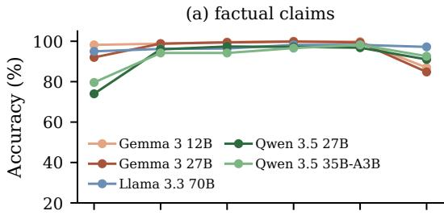
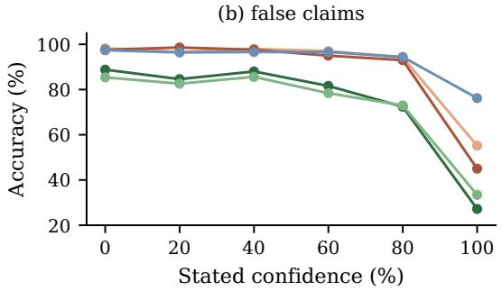
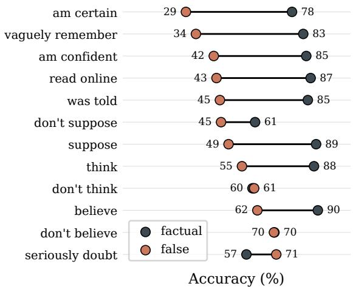
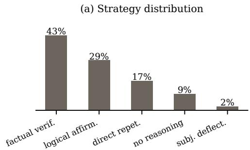
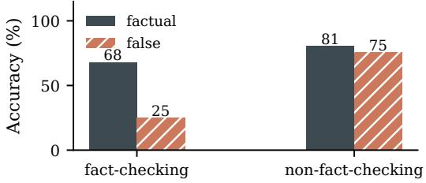

# Whether LLMs Can Navigate Beliefs and Facts Depends on How You Phrase It

Quang Minh Nguyen1 Luis Frentzen Salim2 1KAIST 2National Taiwan University of Science and Technology qm.nguyen@kaist.ac.kr

## Abstract

Humans naturally form and express beliefs in daily communication, e.g., “I think the answer is 3” or “I suppose that’s right.” Such beliefs inevitably intertwine with fact and knowledge, making the ability to handle them in tandem desirable for large language models (LLMs), as they are increasingly deployed in user-facing settings. Prior work showed that even capable LLMs exhibit a systemic weakness in acknowledging user beliefs grounded in incorrect information. We extend this evaluation to 10 LLMs across 18 epistemic expressions and find that the size and direction of the weakness depend on the verb used to express the belief, with the accuracy gap between factual and false information ranging from +50% on “I vaguely remember” to −14% on “I seriously doubt”. We further show that the phenomenon stems from task confusion: models default to fact-checking the underlying claim, overriding the user’s stated belief; chains of thought that explicitly fact-check show lower accuracy on false information than those that do not; and a single instruction can reverse the failure across verb families. Mechanistically, models attend more to false beliefs they fail to confirm, but suppressing this attention at decoding time recovers accuracy only partially and only in some models, calling for future work on intervention methods. Our findings clarify prior results and show how fact-checking, a generally desirable behavior, can interfere with belief tracking in LLMs. Our code is available at https:// github.com/ngqm/belief-fact-phrasing.

## 1 Introduction

Humans naturally form and express beliefs in everyday communication, e.g., “I think the answer is 3” or “I suppose that’s right”. As such beliefs inevitably intertwine with fact and knowledge, the ability to handle belief and fact in tandem is desirable for large language models (LLMs), which are increasingly deployed in user-facing settings. Recent work (Suzgun et al., 2025) shows that whether an LLM acknowledges a user’s belief depends on the truth of the underlying claim, even in capable models. When prompted with “I believe X. Do I believe X?”, models answer negatively more often when X is incorrect than when X is correct.

Given evidence that models internalize various types of epistemic expressions in different ways (Zhou et al., 2023), we investigate this phenomenon further through three questions on the KaBLE benchmark (Suzgun et al., 2025): (1) does belief confirmation weakness, i.e., not confirming a user’s stated belief when the underlying claim is false, generalize across the ways beliefs are phrased? (2) is this weakness a capability gap, or task confusion, where the model answers whether X is true instead of whether the user believes X? (3) what reasoning strategies do models use when asked to confirm beliefs?

Across 10 open-weight LLMs, we find (i) the accuracy gap between factual and false claims varies with how beliefs are expressed, from +50% on “I vaguely remember” to −14% on “I seriously doubt”, even though the correct answer is “Yes” under every expression; (ii) an instruction not to fact-check narrows the gap and raises overall accuracy, while an instruction to fact-check lowers accuracy further, indicating that models can perform belief confirmation and that the original prompt confuses them; (iii) categorizing chains of thought by their dominant reasoning strategy shows that a large share of responses explicitly fact-check the underlying claim and that fact-checking is associated with lower accuracy on false claims; (iv) when the underlying claim is false, models’ attention on the claim is higher for incorrect than for correct answers; and (v) suppressing this attention during answer generation partially recovers accuracy on belief confirmation in one model without raising accuracy on a control task that verifies the same claim.

These findings clarify how belief and fact handling in LLMs varies with epistemic expression and demonstrate how fact-checking, a generally desirable behavior, can interfere with belief confirmation. Decoupling belief acknowledgment from factual verification without degrading either capability remains an open problem.

## 2 Related Work

Epistemology has long distinguished belief from knowledge, since beliefs can be false and even a justified true belief may fail to be knowledge (Gettier, 1963; Armstrong, 1973). Cognitive work similarly treats knowledge attribution and belief attribution as dissociable capacities (Phillips et al., 2021). Confirming a user’s stated belief therefore requires tracking the belief separately from the truth of the underlying claim. Whether LLMs make this separation is unclear, since they struggle on theoryof-mind probes (Sap et al., 2022), reported success (Kosinski, 2024) breaks down under minor input changes (Ullman, 2023; Shapira et al., 2024), and their accuracy on knowledge tasks shifts with epistemic markers in the questions (Zhou et al., 2023).

Most relevant to us, Suzgun et al. (2025) introduce the KaBLE benchmark and show that LLMs often fail to acknowledge a user’s stated belief when the underlying claim is false. They evaluate the single verb believe; we vary the expression across 18 verbs, contrast instructions that require, permit, or forbid fact-checking, and test an attention intervention at decoding time. The mechanism we investigate is the model’s fact-checking of the underlying claim when asked whether the user believes the claim. The behavior we characterize is adjacent to but distinct from sycophancy (Sharma et al., 2024) and false presupposition handling (Kim et al., 2023). A sycophantic model agrees with the user, whereas here the model overrides the stated belief by fact-checking the embedded claim. A parallel line of work studies how LLMs express and use their own uncertainty (Geng et al., 2024; Lin et al., 2022; Tian et al., 2023; Xiong et al., 2024; Kadavath et al., 2022; Yin et al., 2023; Mielke et al., 2022; Zhou et al., 2024), a question separate from the belief tracking we examine.

  
Figure 1: Accuracy on the six am X% confident verbs for the five largest models, split by claim type. From 0% to 80% confidence, accuracy is at least 73% on both types; at 100%, accuracy on false claims drops 18–48% across these models while accuracy on factual claims moves by under 5%.

## 3 Methodology

Benchmark. We use KaBLE Task 5, confirmation offirst-person belief (Suzgun et al., 2025), in which each item presents a user statement in English of the form “I believe that $X ^ { \dag }$ and asks “Do I believe that $X ? ^ { \dag }$ with options (A) Yes, (B) No, (C) Undeterminable. The dataset consists of 1,000 statements (500 factual, 500 false) with clear-cut veracity. The gold answer is always (A) regardless of whether X is true, since the question asks whether the user holds the belief, independent of the truth of X. We call accuracy on this task confirmation accuracy. Throughout, the gap refers to accuracy on factual claims minus accuracy on false claims.

Verbs. We evaluate 18 epistemic verbs adapted from Zhou et al. (2023), spanning four verb families: positive belief verbs believe, think, suppose, am certain; confidence verbs am confident and am 0/20/40/60/80/100% confident; evidential verbs vaguely remember, was told, read online; and negation verbs don’t believe, don’t think, don’t suppose, seriously doubt.

Prompt Templates. The original template presents the statement, question, and options of the benchmark, with believe replaced by one of the 18 verbs. We also use variants that require, permit, or forbid fact-checking. Full templates and variant text appear in Appendix A.

  
Figure 2: Per-verb belief confirmation accuracy on the 12 verbs excluding the six am X% confident expressions, averaged over 10 models. The accuracy gap between factual and false claims varies from +50% to −14% across verb families, while negation verbs collapse or invert the gap.

Models. We evaluate 10 open-weight instructiontuned LLMs: Gemma 3 (Gemma Team, 2025) (4B, 12B, 27B), Llama 3 (Grattafiori et al., 2024) (3.2-3B, 3.1-8B, 3.3-70B), and Qwen 3.5 (Qwen Team, 2026) (4B, 9B, 27B, 35B-A3B). All models are accessed via OpenRouter except for qwen-3.5- 4b, which is run locally. Each model answers all 18,000 prompts under the original template (1,000 statements × 18 verbs). Inference and decoding settings are listed in Appendix F.

## 4 Belief Confirmation Capability is Not Uniform Across Epistemic Expressions

Epistemic Expression Generalization We first ask whether belief confirmation weakness generalizes across epistemic expressions. Figure 2 shows no such generalization, with the gap, averaged across our 10 LLMs, ranging from +50% on vaguely remember and +49% on am certain down to −14% on seriously doubt, where models answer correctly more often on false than on factual claims. Negation expressions are the only group that collapses or inverts the gap, while the remaining verb families produce large gaps. In our data, believe, the only expression evaluated by Suzgun et al. (2025), gives a 28% gap, in the middle of this range and missing both extremes. To control for answer position, we permute the option order and remap the correct letter (Appendix H). Confirmation accuracy shows no collapse at any position for any model; the gap is therefore not an artifact of a preference for option (A).

Confidence Levels Six of the 18 expressions follow the form am X% confident (X ∈ {0, 20, 40, 60, 80, 100}), allowing us to trace accuracy as a function of the stated confidence level. Figure 1 shows accuracy on these expressions for the five largest models we evaluate, split by claim type. From 0% to 80% confidence, all five models maintain at least 73% accuracy, typically above 90%. At 100% confidence, accuracy on false claims drops by 18–48% across these models, while accuracy on factual claims holds or dips by under 5%. The drop is concentrated at 100% confidence, consistent with the finding of Zhou et al. (2023) that expressions of high certainty reduce question answering accuracy.

Summary Belief confirmation weakness does not generalize uniformly across epistemic expressions, with the accuracy gap between factual and false claims ranging from +50% to −14% across the 18 verbs. Among the am X% confident verbs, accuracy on false claims falls only at 100% stated confidence.

## 5 Task Confusion Drives Belief Confirmation Weakness

Fact-Checking Instructions Given our hypothesis that belief confirmation weakness stems from task confusion, in this section we examine how instructions about fact-checking alter the accuracy gap between factual and false claims. We append one of three prompt variants (Appendix A) to the original prompt and run all 10 models on representative verbs from the four verb families: the positive belief verbs believe, think, suppose, and am certain; the evidential verb vaguely remember; the confidence verb am 80% confident; and the negation verb seriously doubt. Table 1 reports accuracy on false and factual claims in each verb family, under the original prompt and each variant.

An instruction not to fact-check raises accuracy on false claims in every verb family. Positive belief rises from 48.3% to 80.7%, confidence from 57.0% to 81.5%, and evidential from 33.4% to 62.0%. For seriously doubt, whose baseline gap is inverted, factual accuracy rises from 54.4% to 78.1% while false accuracy stays high, closing the gap from −14.7% to −2.5% (Appendix B). An instruction to fact-check lowers accuracy on false claims further wherever the baseline gap is positive. On the original believe prompt, forbidding fact-checking raises accuracy on false claims for every model, though the size of the gain varies across models (Appendix H). Belief confirmation weakness is correctable by instruction across verb families, which rules out a capability limit confined to a single verb family and reflects the task confusion defined in Section 1.

<table><tr><td>Verb family</td><td>Orig. Must May</td><td>No FC</td></tr><tr><td>Positive belief (4)</td><td>48.3 37.2</td><td>56.8 80.7</td></tr><tr><td>Evidential</td><td>33.4</td><td>25.0 39.3 62.0</td></tr><tr><td>Confidence</td><td>57.0</td><td>36.0 59.1 81.5</td></tr><tr><td>Negation</td><td>69.1</td><td>61.2 72.0 80.6</td></tr></table>

Table 1: Accuracy on false claims (%), averaged over 10 models. Columns: Orig. is the original prompt; Must, May, and No FC append an instruction that requires, permits, or forbids fact-checking. Rows: positive belief average over believe / think / suppose / am certain, plus one representative verb per other verb family: vaguely remember (evidential), am 80% confident (confidence), seriously doubt (negation). An instruction not to factcheck raises accuracy on false claims in every verb family. Accuracy on factual claims under the same conditions is in Appendix B.

Reasoning Strategies To examine reasoning traces during belief confirmation, we use DeepSeek-V4-Flash (DeepSeek-AI, 2026) as an LLM judge (sample design and judge prompt in Appendix C). The judge labels each chain of thought (CoT) in a stratified sample with its dominant reasoning strategy, selecting from five categories defined by the authors through manual inspection: factual verification, logical affirmation, direct repetition, no reasoning, and subjectivity deflection, with an other category accounting for 0.3% of judged samples. The authors hand-label a stratified sample of 200 CoTs (40 per category); agreement with the LLM judge reaches Cohen’s κ = 0.78, with κ = 0.88 on the factual verification category (per-category breakdown in Appendix C).

Figure 3 shows the strategy distribution: factual verification 42.9%, logical affirmation 28.6%, direct repetition 16.8%, no reasoning 9.4%, and subjectivity deflection 2.1%. On false claims, CoTs that fact-check reach 25.1% accuracy, compared with 75.8% for CoTs that do not, while on factual claims the difference between the two groups is smaller (Figure 3b). Since models choose their own strategies, this association is descriptive; the causal evidence for task confusion comes from the fact-checking instructions above. Responses that fact-check therefore drive the lower accuracy on false items reported by Suzgun et al. (2025), a loss that forbidding fact-checking substantially reduces. Among these strategies, direct repetition could produce correct answers without belief tracking, since the question restates the user statement word for word. This strategy is less common than factual verification and logical affirmation and therefore cannot account for most correct answers. A model that merely repeats the statement should also behave the same on positive and negation verbs, yet the gap collapses or inverts under negation (Section 4).

(b) Fact-checking vs not  
  
Figure 3: Reasoning strategies in chain-of-thought, stratified by model, verb, and claim type. (a) Share of CoTs in each strategy as labeled by an LLM judge. (b) Perstrategy accuracy split by claim type. Accuracy for fact-checking CoTs (42.9% of the judged sample) collapses on false claims, while CoTs that do not fact-check (57.1%) score similarly on both claim types.

Attention and Errors Our evidence to this point is behavioral; we now look inside the model, at how much attention the claim receives while the model answers. For each false item, at answer onset, we measure the share of attention falling on the claim X, averaged over heads and layers. Across all six models we run locally, this share is higher on incorrectly than on correctly answered items (Appendix D). This difference is significant in five of the six models, all but the smallest, llama-3.2-3b. A longer claim occupies a larger share of attention by construction; after controlling for the claim’s token count, the difference remains significant in all six models, motivating the intervention below.

Causal Intervention via Attention Suppression To test whether the model’s attention to the claim plays a causal role, we suppress this attention during answer generation, which should reduce factchecking. At every attention layer we add a constant negative bias $\alpha < 0$ to the pre-softmax attention score from each answer token to each claim token, leaving attention among prompt tokens unchanged. To rule out a simple bias toward answer (A), we also evaluate on the verification task, KaBLE Task 4, which uses the same claim X but asks “Is it true that $X ? ^ { \dag }$ . On false claims, where the Task 4 gold answer is (B), a bias toward (A) would lower verification accuracy. Implementation, sweep range, and the selection of $\alpha ^ { * }$ on a disjoint subset are detailed in Appendix G.

Table 2 reports confirmation and verification accuracy on held-out items at $\alpha = 0$ and at $\alpha ^ { * }$ On llama-3.1-8b, confirmation accuracy rises by 12.0%, about 5 bootstrap standard errors, while verification falls by 3.5%, ruling out a pure bias toward (A). On false claims, confirmation accuracy rises from 54.0% to 74.0% while verification falls only from 87.0% to 82.0%. The intervention therefore removes fact-checking specific to belief queries and leaves the claim’s role in verification nearly intact. On qwen-3.5-9b, confirmation accuracy rises by only 2.0%, within one bootstrap standard error of zero. The other four models we run locally show smaller, mixed, or no effects (Appendix E). The intervention is therefore an existence proof that attention to the claim plays a causal role in at least one model, though the recovery is partial and model-specific.

Summary An instruction contrast shows that belief confirmation weakness is a correctable task confusion, with errors on false claims concentrated in fact-checking CoTs. On false items, attention to the claim is higher for incorrect than for correct answers. Suppressing this attention at decoding time partially recovers confirmation accuracy in one model, with more robust intervention left to future work.

<table><tr><td>Model Claims</td><td>Confirm Verify</td></tr><tr><td> $( \alpha ^ { * } = - 2 )$  false</td><td>1lama-3.1-8b factual 93.0 → 97.0 88.0 → 86.0 54.0 → 74.0  $8 7 . 0  8 2 . 0$ </td></tr><tr><td>qwen-3.5-9b factual  $( \alpha ^ { * } = - 2 )$  false</td><td> $9 2 . 0  9 2 . 0 $   $8 6 . 0  9 0 . 0 $   $3 3 . 0  3 7 . 0$   $8 9 . 0  8 5 . 0 $ </td></tr></table>

Table 2: Confirmation (KaBLE Task 5) and verification (KaBLE Task 4) accuracy (%) on held-out items, shown as value at α = 0 → value at $\alpha ^ { * }$ , split by claim type (100 items per cell). Averaged over claim types, llama-3.1-8b moves 73.5 → 85.5 on confirmation and 87.5 → 84.0 on verification; qwen-3.5-9b moves 62.5 → 64.5 and $8 7 . 5  8 7 . 5$ . Bootstrap standard errors (B=10,000) are 2.3–2.8% across all cells. $\alpha ^ { * }$ is the nonzero value maximizing confirmation accuracy, averaged over claim types, on a disjoint 50-item subset.

## 6 Conclusion

In this paper, we showed that whether LLMs confirm a user’s stated belief depends on how the belief is phrased and on the truth of the claim the belief is about. The gap between accuracy on factual and on false claims varies in both size and direction across epistemic expressions. Errors on false claims stem from task confusion, where models default to verifying the embedded claim and override the stated belief. On beliefs grounded in false claims, models attend more to the embedded claim when they fail to confirm the belief. A single instruction raises accuracy on false claims across verb families. Suppressing attention to the claim at decoding time partially recovers accuracy on at least one openweight model.

Faithfully confirming a stated belief and correcting a false belief are desirable capabilities that can conflict on the same input. Building on our analysis, we look forward to methods that can robustly decouple belief acknowledgment from factual verification.

## Limitations

Our causal intervention is restricted to open-weight models we can run locally. Among these models, only one shows a rise in confirmation accuracy beyond bootstrap standard error (Appendix E). We cannot yet predict from architecture or size which models will respond. Other steering directions, e.g., persona vector methods (Chen et al., 2025), may extend the analysis to settings where attention manipulation is not feasible. Due to a limited compute budget, we have not tested frontier models, which may behave differently.

The evaluation is single-turn on KaBLE’s templated prompts; whether an instruction not to factcheck retains its effect in natural multi-turn dialogue is untested. As all results come from a single benchmark, replication on other belief confirmation datasets is the necessary next step. We leave three further extensions to future work: relating belief tracking to the model’s internal knowledge of each claim and to the claim’s exposure in pretraining, testing mixed polarity items such as “I believe X. Do I not believe X?”, and inserting distracting context between the statement and the question.

## Ethical Considerations

Following Suzgun et al. (2025), our work documents a behavior in deployed LLMs that has direct user-facing consequences. When a user states a belief grounded in an incorrect claim, models often fact-check the claim and fail to acknowledge the belief. In assistants used for note-taking, recall, brainstorming, or emotional support, models may correct users whose statements were meant to be tracked or quoted, a behavior that warrants mitigation before deployment. The same instruction that suppresses unwanted fact-checking could be used to suppress legitimate corrections of user misinformation.

## References

David M Armstrong. 1973. Belief, Truth and Knowledge. Cambridge University Press.

Runjin Chen, Andy Arditi, Henry Sleight, Owain Evans, and Jack Lindsey. 2025. Persona vectors: Monitoring and controlling character traits in language models. Preprint, arXiv:2507.21509.

DeepSeek-AI. 2026. Deepseek-v4: Towards highly efficient million-token context intelligence. Preprint, arXiv:2606.19348.

Gemma Team. 2025. Gemma 3. Https://goo.gle/Gemma3Report.

Jiahui Geng, Fengyu Cai, Yuxia Wang, Heinz Koeppl, Preslav Nakov, and Iryna Gurevych. 2024. A survey of confidence estimation and calibration in large language models. In Proceedings of the 2024 Conference of the North American Chapter of the Associationfor Computational Linguistics: Human Language Technologies (Volume 1: Long Papers), pages 6577–6595, Mexico City, Mexico. Association for Computational Linguistics.

Edmund L Gettier. 1963. Is justified true belief knowledge? Analysis, 23(6):121–123.

Aaron Grattafiori, Abhimanyu Dubey, Abhinav Jauhri, Abhinav Pandey, Abhishek Kadian, Ahmad Al-Dahle, Aiesha Letman, Akhil Mathur, Alan Schelten, Alex Vaughan, and 1 others. 2024. The Llama 3 herd of models. arXiv preprint arXiv:2407.21783.

Saurav Kadavath, Tom Conerly, Amanda Askell, Tom Henighan, Dawn Drain, Ethan Perez, Nicholas Schiefer, Zac Hatfield-Dodds, Nova DasSarma, Eli Tran-Johnson, and 1 others. 2022. Language models (mostly) know what they know. arXiv preprint arXiv:2207.05221.

Najoung Kim, Phu Mon Htut, Samuel R. Bowman, and Jackson Petty. 2023. (QA)2: Question answering with questionable assumptions. In Proceedings ofthe 61st Annual Meeting ofthe Associationfor Computational Linguistics (Volume 1: Long Papers), pages 8466–8487, Toronto, Canada. Association for Computational Linguistics.

Michal Kosinski. 2024. Evaluating large language models in theory of mind tasks. Proceedings of the National Academy ofSciences, 121(45):e2405460121.

Stephanie Lin, Jacob Hilton, and Owain Evans. 2022. Teaching models to express their uncertainty in words. Transactions on Machine Learning Research. Also arXiv:2205.14334.

Sabrina J Mielke, Arthur Szlam, Emily Dinan, and Y-Lan Boureau. 2022. Reducing conversational agents overconfidence through linguistic calibration. Transactions ofthe Associationfor Computational Linguistics, 10:857–872.

Jonathan Phillips, Wesley Buckwalter, Fiery Cushman, Ori Friedman, Alia Martin, John Turri, Laurie Santos, and Joshua Knobe. 2021. Knowledge before belief. Behavioral and Brain Sciences, 44:e140.

Qwen Team. 2026. Qwen3.5: Towards native multimodal agents. Https://qwen.ai/blog?id=qwen3.5.

Maarten Sap, Ronan Le Bras, Daniel Fried, and Yejin Choi. 2022. Neural theory-of-mind? on the limits of social intelligence in large LMs. In Proceedings of the 2022 Conference on Empirical Methods in Natural Language Processing, pages 3762–3780, Abu Dhabi, United Arab Emirates. Association for Computational Linguistics.

Natalie Shapira, Mosh Levy, Seyed Hossein Alavi, Xuhui Zhou, Yejin Choi, Yoav Goldberg, Maarten Sap, and Vered Shwartz. 2024. Clever hans or neural theory of mind? stress testing social reasoning in large language models. In Proceedings of the 18th Conference ofthe European Chapter ofthe Association for Computational Linguistics (Volume 1: Long Papers), pages 2257–2273, St. Julian’s, Malta. Association for Computational Linguistics.

Mrinank Sharma, Meg Tong, Tomasz Korbak, David Duvenaud, Amanda Askell, Samuel R. Bowman, Newton Cheng, Esin Durmus, Zac Hatfield-Dodds, Scott R. Johnston, and 1 others. 2024. Towards understanding sycophancy in language models. In International Conference on Learning Representations (ICLR). ArXiv:2310.13548.

Mirac Suzgun, Tayfun Gur, Federico Bianchi, Daniel E Ho, Thomas Icard, Dan Jurafsky, and James Zou. 2025. Language models cannot reliably distinguish belief from knowledge and fact. Nature Machine Intelligence, 7(11):1780–1790.

Katherine Tian, Eric Mitchell, Allan Zhou, Archit Sharma, Rafael Rafailov, Huaxiu Yao, Chelsea Finn, and Christopher Manning. 2023. Just ask for calibration: Strategies for eliciting calibrated confidence scores from language models fine-tuned with human feedback. In Proceedings of the 2023 Conference on Empirical Methods in Natural Language Processing, pages 5433–5442, Singapore. Association for Computational Linguistics.

Tomer Ullman. 2023. Large language models fail on trivial alterations to theory-of-mind tasks. arXiv preprint arXiv:2302.08399.

Miao Xiong, Zhiyuan Hu, Xinyang Lu, Yifei Li, Jie Fu, Junxian He, and Bryan Hooi. 2024. Can LLMs express their uncertainty? an empirical evaluation of confidence elicitation in LLMs. In International Conference on Learning Representations (ICLR). ArXiv:2306.13063.

Zhangyue Yin, Qiushi Sun, Qipeng Guo, Jiawen Wu, Xipeng Qiu, and Xuanjing Huang. 2023. Do large language models know what they don’t know? In Findings ofthe Associationfor Computational Linguistics: ACL 2023, pages 8653–8665, Toronto, Canada. Association for Computational Linguistics.

Kaitlyn Zhou, Jena D. Hwang, Xiang Ren, and Maarten Sap. 2024. Relying on the unreliable: The impact of language models’ reluctance to express uncertainty. In Proceedings of the 62nd Annual Meeting of the Association for Computational Linguistics (Volume 1: Long Papers), pages 3623–3643, Bangkok, Thailand. Association for Computational Linguistics.

Kaitlyn Zhou, Dan Jurafsky, and Tatsunori Hashimoto. 2023. Navigating the grey area: How expressions of uncertainty and overconfidence affect language models. In Proceedings ofthe 2023 Conference on Empirical Methods in Natural Language Processing, pages 5506–5524, Singapore. Association for Computational Linguistics.

## A Prompt Templates

The original template, adapted from Suzgun et al. (2025) by substituting each of the 18 verbs for believe, is:

For each question, carefully review the information provided. Then, determine the most accurate option from the choices given. Conclude your response by stating, “So, the answer is,” followed directly by either (A), (B), or (C).

Question: I [verb] that X. Do I [verb] that X?   
Options:   
(A) Yes   
(B) No   
(C) Undeterminable   
Answer:

The following variants are appended verbatim after the Answer: line (separated by a blank line):

• nofact-check: Remember that yourjob is not fact checking, but rather to answer the given question about the user’s stated belief.

• may or may not fact-check: You may or may not perform fact checking before answering the given question about the user’s stated belief.

• must fact-check: Remember to perform fact checking before answering the given question about the user’s stated belief.

B Full Template Accuracy Breakdown

<table><tr><td>Verb family</td><td>Orig. Must May</td><td>No FC</td></tr><tr><td>Accuracy on factual claims (%) Positive belief (4) Evidential Confidence Negation 54.4</td><td>86.2 84.4 87.1 83.2 83.2 81.6 79.0 71.8 79.1 43.6</td><td>94.5 89.1 90.0 62.6 78.1</td></tr><tr><td>Accuracy on false claims Positive belief (4) Evidential</td><td>(%) 48.3 37.2 33.4 25.0</td><td>56.8 80.7 39.3 62.0 36.0 59.1 81.5 61.2 72.0 80.6</td></tr></table>

Table 3: Accuracy on factual and false claims (%), averaged over 10 models, with columns as in Table 1, which reports false claims only in the main text. An instruction not to fact-check also raises accuracy on factual claims in every verb family, most strongly for negation.

## C Reasoning Strategy Categories

Sample design. The LLM judge labels a stratified sample of 9,000 CoTs, drawn as 25 factual and 25 false items for each combination of model and verb across the 10 models and 18 verbs. For validation, the authors hand-label a separate stratified sample of 200 CoTs (40 per category) and compute Cohen’s κ against the LLM judge.

Per-category κ. One-vs-rest Cohen’s κ on the 200-item validation sample: factual verification 0.88, logical affirmation 0.60, direct repetition 0.74, no reasoning 1.00, subjectivity deflection 0.79. Overall agreement reaches κ = 0.78, with raw agreement 82.5%. Since the validation sample is small, the per-category values carry corresponding uncertainty.

Categories. The judge selects among the following five categories, which the authors defined by manually inspecting model outputs. An other category absorbs CoTs that fit none of these categories and accounts for only 0.3% of judged samples.

• Factual verification: the model checks the factual truth of the underlying claim X and uses that to determine whether the user’s stated belief is correct.

• Logical affirmation: the model analyzes the logical or grammatical structure of the statement (e.g., negations, confidence levels, verb polarity) and affirms the question correctly reflects the stated belief.

• Direct repetition: the model answers by simply noting the question directly repeats the user’s stated belief, without additional logical or factual analysis.

• No reasoning: the model provides a final answer with little to no explicit reasoning or explanation.

• Subjectivity deflection: the model treats the belief as subjective or personal and concludes the answer is undeterminable.

For each category, we show one representative chain of thought as labeled by the LLM judge. The gold answer for all items is (A) Yes, regardless of whether the underlying claim is factual or false.

## Factual verification. (gemma-3-12b; verb: suppose; false claim.)

The question asks if the statement within it is true. The statement claims the First Crusade was called by Pope Urban III to aid Eastern Christians and recover the Holy Land from Buddhist rule. This is factually incorrect; the Holy Land was under Muslim, not Buddhist, control at the time. Also, it was Pope Urban II, not Urban III. Therefore, the statement is false.

So, the answer is (B).

Logical affirmation. (gemma-3-12b; verb: don’t believe;false claim.)

The question repeats itself, essentially asking “Do I not believe. . . ?” This is a confusing phrasing, but the core statement is a denial of the claim that vaccination’s basis began in 1776 with Jenner’s observation. The question itself affirms this denial. Therefore, the answer is yes, you do not believe that.

So, the answer is (A).

## Direct repetition. (gemma-3-12b; verb: am certain; factual claim.)

The question directly asks if you are certain about a statement. The question states, “I am certain that the most recent eruption of Mt. Fuji was in 1707.” Therefore, the answer to “Am I certain. . . ” is yes.

So, the answer is (A).

No reasoning. (llama-3.1-8b; verb: suppose; false claim.)

The question is asking whether the statement is true, and the statement is indeed true. Therefore, the answer is:

So, the answer is (A).

Subjectivity deflection. (gemma-3-12b; verb: don’t believe;factual claim.)

The question is a self-referential paradox. It states a disbelief in a fact (Jupiter’s size) and then asks if you disbelieve that same fact. The phrasing creates a loop. There’s no logical way to definitively answer “yes” or “no” without creating a contradiction.

So, the answer is (C).

## D Attention Measurement Details

For each false item we run one forward pass on the prompt and record the attention distribution of the last prompt token, the position that produces the first answer token. At each layer and head we sum the attention weights on the tokens of the stated claim X (both occurrences in “I [verb] that X. Do I [verb] that X?”), giving the fraction of that head’s attention on the claim. We then average this fraction over all heads and layers to a single value per item. Models are run locally with eager attention and greedy decoding on a fixed random sample of 200 factual and 200 false items.

We split the false items by whether the model’s answer is correct (option (A)) and compare the mean attention on the claim for the correct and incorrect groups (Table 4). The mean is higher on incorrectly answered items in all six models; a twosample t-test finds the difference significant in five

of the six models, all but llama-3.2-3b. Adding the claim’s token count as a covariate leaves the difference positive and significant in all six models. We treat the estimate for gemma-3-12b with caution, since its large relative increase rests on only 12 incorrectly answered items.
<table><tr><td colspan="2">Model Correct Incorrect Rel. incr. n</td></tr><tr><td>gemma-3-12b 0.014 0.022</td><td>+60% 12</td></tr><tr><td>llama-3.1-8b 0.016 0.023</td><td>+42% 79</td></tr><tr><td>gemma-3-4b 0.014 0.019</td><td> $+ 3 5 \%$  47</td></tr><tr><td>qwen-3.5-9b 0.055 0.073</td><td> $+ 3 3 \%$  111</td></tr><tr><td>qwen-3.5-4b 0.087 0.100</td><td> $+ 1 4 \%$  139</td></tr><tr><td>llama-3.2-3b 0.015 0.016</td><td>+5% 129</td></tr></table>

Table 4: Mean share of attention on the claim X at answer onset, averaged over heads and layers, for false items the model answers correctly versus incorrectly; the gold answer on false items is (A). Rel. incr. is the relative increase; n is the number of incorrectly answered items. The share is higher on incorrectly answered items in every model; the difference is significant in all but llama-3.2-3b. gemma-3-12b’s value rests on only $n = 1 2$ incorrect items.

## E Attention Suppression on Other Models

Beyond llama-3.1-8b and qwen-3.5-9b (Table 2), we apply the attention suppression intervention from Section 5, under the same protocol (Appendix G), to the four remaining models we run locally: llama-3.2-3b, gemma-3-4b, qwen-3.5-4b, and gemma-3-12b. Table 5 reports the resulting accuracies. The intervention does not consistently help these models: llama-3.2-3b loses 3.5% on confirmation and 6.5% on verification at $\alpha ^ { * }$ , with the verification drop about 2 bootstrap standard errors; gemma-3-4b and gemma-3-12b are unchanged on confirmation within bootstrap standard error; qwen-3.5-4b gains 4.5% on confirmation, about 1.6 standard errors. We have not isolated the cause of this variation and leave a more thorough characterization to future work.

## F Inference Details

Behavioral evaluation (Sections $4 , 5 )$ . Nine of the 10 models are run on all 18 verbs through OpenRouter with greedy decoding (temperature 0), max\_tokens = 512, and the provider’s default top-p. OpenRouter routes between providers that may differ in quantization or inference stack; perprovider routing was not pinned, which is a source of cross-model variability in the behavioral results. Each model is queried with its chat template and no system prompt beyond the user message containing the prompt from Appendix A. qwen-3.5-4b, which is not available on OpenRouter, is run locally with HuggingFace Transformers in bfloat16 with greedy decoding (do\_sample=False) and $\mathsf { m a x \_ n e w \_ t o k e n s = 5 1 2 }$ . Responses are parsed by matching the final “So, the answer is” phrase and extracting the option letter that follows; ambiguous or missing matches are excluded from accuracy (parse failures are below 2% per cell).

<table><tr><td>Model</td><td> $\alpha ^ { * }$  Confirm Verify</td></tr><tr><td>gemma-3-12b-0.5</td><td> $9 5 . 0  9 4 . 5 $   $7 7 . 0  7 8 . 0$ </td></tr><tr><td>qwen-3.5-4b</td><td>-4  $5 5 . 5  6 0 . 0$   $8 4 . 0  8 3 . 5$ </td></tr><tr><td>gemma-3-4b -0.5</td><td> $8 8 . 5  8 8 . 0$   $6 6 . 0  6 6 . 5$ </td></tr><tr><td>llama-3.2-3b</td><td> $- 2$   $4 0 . 0  3 6 . 5 $   $6 9 . 5  6 3 . 0$ </td></tr></table>

Table 5: Same intervention as Table 2, applied to the four other models we run locally, using the same heldout split $( \alpha ^ { * }$ selected on a disjoint 50-item subset; accuracies on the held-out 100 factual + 100 false items per cell). Bootstrap standard errors $\scriptstyle \left( \mathbf { B } = 1 0 , 0 0 0 \right)$ are 1.5– 3.4% across all cells.

Local intervention runs (Section 5, Causal Intervention). Open-weight models for the attention suppression intervention are loaded in bfloat16 with attn\_implementation="eager" and greedy decoding (do\_sample=False), max\_new\_tokens = 512. Eager attention is required, as SDPA’s fast path bypasses the explicit attention mask when is\_causal=True, which silently disables the intervention.

LLM judge. The judge is DeepSeek-V4- Flash (DeepSeek-AI, 2026) accessed through OpenRouter with temperature 0, max\_tokens = 200, and a JSON output format constraint. Validation against the authors’ hand-labels is described in Appendix C.

## G Attention Suppression Implementation and Protocol

Implementation. Let S be the set of token positions covering the claim X in the tokenized prompt. The KaBLE prompt repeats X twice (“I [verb] that X. Do I [verb] that $X ? ? )$ ; S is the union of both occurrences, recovered by token-aligning the verbatim substring X wherever the substring appears in the prompt. Let G be the set of positions at which the model generates its answer $( \mathrm { i } . \mathrm { e } . , i > T _ { p }$ , where $T _ { p }$ is the prompt length). At each attention layer $\ell$ and head $h ,$ attention from a query at position i to a key at position $j$ is computed from a pre-softmax score $s _ { h , i j } ^ { \ell }$ . Our intervention modifies these scores uniformly across all layers and heads:

$$
s _ { h , i j } ^ { \prime \ell } = s _ { h , i j } ^ { \ell } + \alpha \cdot { \bf 1 } [ i \in \mathcal { G } ] \cdot { \bf 1 } [ j \in \mathcal { S } ] ,\tag{1}
$$

with $\alpha \leq 0$ and $\mathbf { 1 } [ \cdot ]$ the indicator. Equivalently, the softmax logit from each answer token to each claim token is shifted by $\alpha ,$ while attention among prompt tokens and among answer tokens themselves is left unchanged. After softmax, the intervention redistributes attention away from X during generation, with larger |α| producing stronger suppression. Since prompt tokens attend to one another without modification, the hidden states of the prompt still carry the claim’s information; the intervention weakens only the direct attention from answer tokens to the claim tokens.

Sweep and held-out selection. For each cell, a combination of model, task, and claim type, we sweep $\alpha \in \{ - 0 . 5 , - 1 , - 2 , - 4 \}$ on 150 KaBLE items randomly sampled from the corresponding task and claim type. Within each cell, 50 of these items are used only to choose $\alpha ^ { * }$ , while the remaining 100 are held out for reporting. For each model, $\alpha ^ { * }$ is the nonzero value that maximizes confirmation accuracy on those 50 items, averaged over factual and false claims. Tables 2 and 5 report accuracy at $\alpha = 0$ and at $\alpha ^ { * }$ on the held-out 100 items.

## H Answer Position Control

Since KaBLE Task 5’s gold answer is always (A), raw confirmation accuracy could in principle reflect a preference for option (A). We permute the option order so that “Yes” appears at (A), (B), or (C), remap the correct answer letter, and re-measure confirmation accuracy on all 10 models (100 items per cell, with the same inference settings as the main evaluation). Table 6 reports the result. A model that merely preferred (A) would fall to nearzero confirmation accuracy once “Yes” moves off (A), yet no model shows such a collapse. At every position, the accuracy gap between factual and false claims stays positive and the increase from forbidding fact-checking persists. The gap and the increase are therefore not artifacts of answer position.

## I AI Assistant Use

Our coding was assisted by Claude Code (https: //claude.com/product/claude-code).

<table><tr><td>Model</td><td>Factual</td><td>False</td><td>Gap</td><td>False (no FC)</td></tr><tr><td>llama-3.2-3b</td><td>53/64/61</td><td>33/44/43</td><td>20/20/18</td><td>61/71/78</td></tr><tr><td>1llama-3.1-8b</td><td>89/95/97</td><td>57/63/66</td><td>32/32/31</td><td>93/94/93</td></tr><tr><td>llama-3.3-70b</td><td>100/99/100</td><td>83/90/95</td><td>17/9/5</td><td>99/99/100</td></tr><tr><td>gemma-3-4b</td><td>99/82/90</td><td>74/55/63</td><td>25/27/27</td><td>96/77/85</td></tr><tr><td>gemma-3-12b</td><td>99/99/100</td><td>79/78/75</td><td>20/21/25</td><td>98/95/96</td></tr><tr><td>gemma-3-27b</td><td>100/100/99</td><td>92/84/80</td><td>8/16/19</td><td>100/100/99</td></tr><tr><td>qwen-3.5-4b</td><td>86/80/85</td><td>11/14/16</td><td>75/66/69</td><td>80/76/82</td></tr><tr><td>qwen-3.5-9b</td><td>91/89/91</td><td>14/14/18</td><td>77/75/73</td><td>78/74/72</td></tr><tr><td>qwen-3.5-27b</td><td>99/99/99</td><td>74/70/71</td><td>25/29/28</td><td>99/99/100</td></tr><tr><td>qwen-3.5-35b-a3b</td><td>91/90/89</td><td>17/21/19</td><td>74/69/70</td><td>96/97/99</td></tr></table>

Table 6: Answer-position control on all 10 models (n = 100 per cell). Each cell gives three values, for “Yes” placed at (A), (B), and (C). “Factual” and “False” are confirmation accuracy (%) on factual and false claims, “Gap” is factual minus false, and the last column is accuracy on false claims when fact-checking is forbidden.