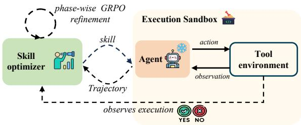
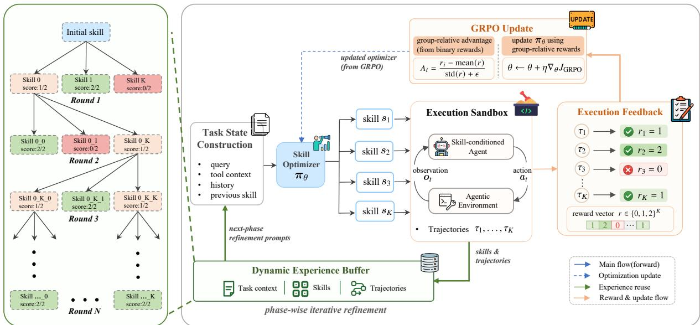
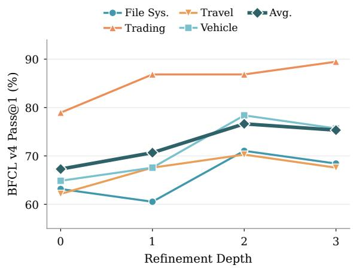
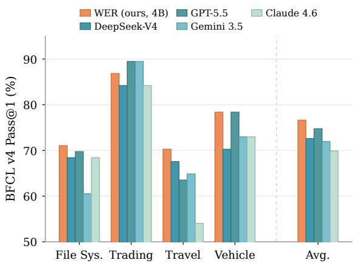
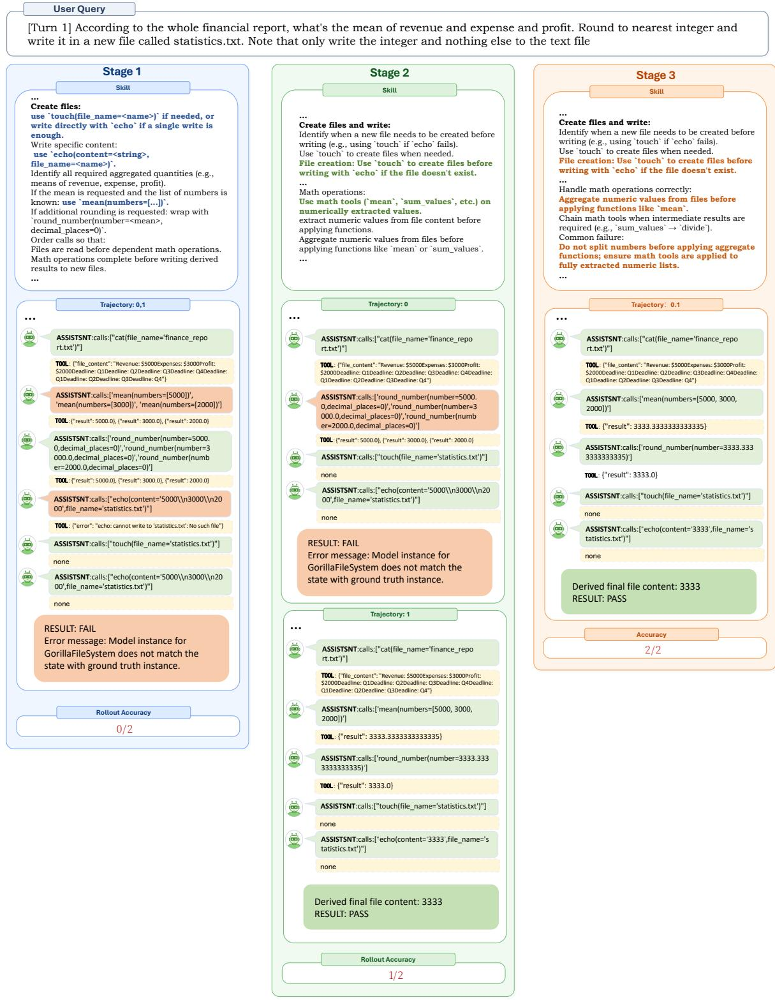
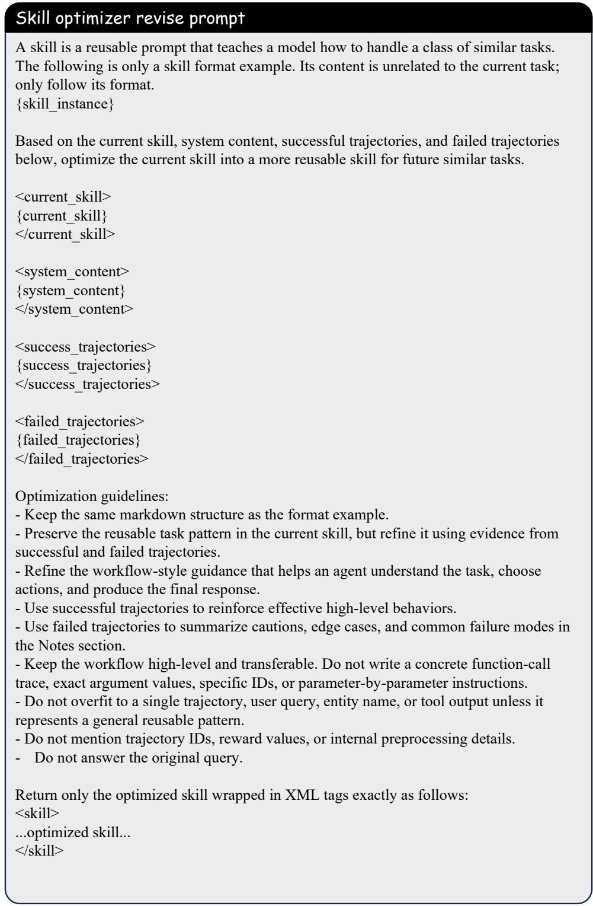
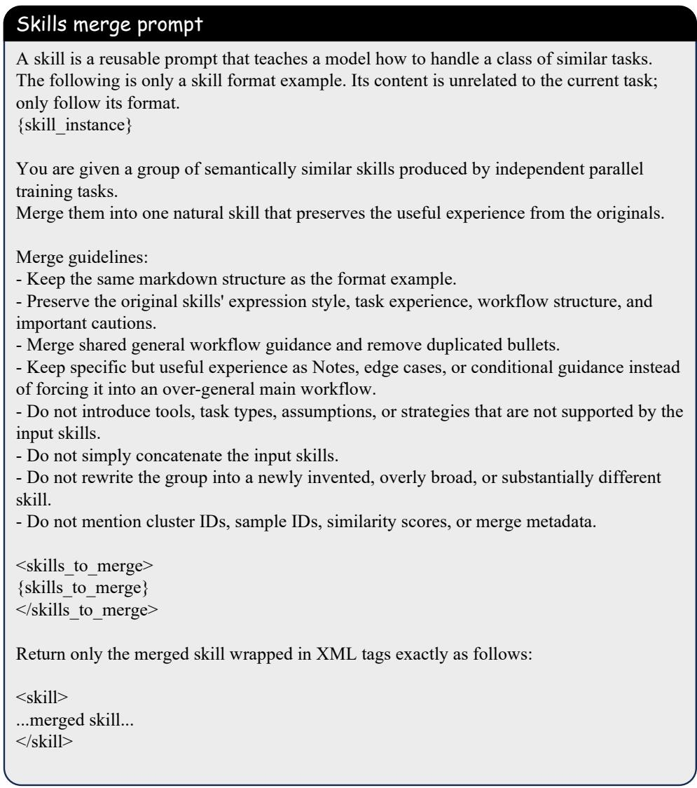

# Write, Execute, Refine: From Skill Followers to Skill Optimizers via Reinforcement Learning from Execution Feedback

Kang Peng1\*, Zhiwei Zhang2,3\*, Yichen Zhang4, Zezhong Wang2, Yiming Du2, Geng Tu1, Baojun Wang5, Bin Liang2,3, Ruifeng Xu1†, Kam-Fai Wong2,3

1Harbin Institute of Technology, Shenzhen, China 2The Chinese University of Hong Kong 3MoE Key Laboratory of High Confidence Software Technologies 4Harbin Institute of Technology, Harbin, China 4Huawei Technologies Co., Ltd.

26s165138@stu.hit.edu.cn, zhangzhiwei1019@link.cuhk.edu.hk

## Abstract

Expert-written natural language skills can improve tool-using agents, yet agent-authored skills perform 8–11 points worse than using no skill. This gap suggests that following procedu ral guidance and improving it from execution evidence are distinct capabilities. Inferencetime loops can repair skills but do not improve the model that writes the next one. We study how to organize execution experience from intermediate skills into training states for an optimizer. We introduce WER (Write, Execute, and Refine), a multi-phase framework that trains a Skill Optimizer outside a frozen executor. The optimizer proposes skills, a frozen agent executes each repeatedly, and a programmatic verifier scores the outcomes. The scores provide relative credit and select mixed-outcome records. Matched successful and failed trajectories from these records form the next phase’s refinement states, so the optimizer learns from the consequences of its earlier outputs. On BFCL v4 multi-turn and τ2- bench, WER improves average Pass@1 over the no-skill baseline by 7.80 and 3.85 points, respectively. Under an identical refinement workflow, it outperforms the same backbone without optimizer training by 9.35 and 10.29 points. The trained 4B optimizer reaches 76.63% on BFCL v4, outperforming all evaluated off-the shelf general-purpose models used as skill optimizers on average. Our code is available at https://github.com/littlepkk/ WER4skill-optimizer-training.

## 1 Introduction

Reliable tool use requires procedural knowledge: which tool to invoke, how to validate its arguments, and when to retry (Yao et al., 2023; Schick et al., 2023; Patil et al., 2025). A common approach represents this knowledge as skills, compact natural-language instructions added to an agent’s context at inference time (Wang et al., 2023; Jiang et al., 2026). On SkillsBench (Li et al., 2026), expert-curated skills raise the average pass rate from 33.9% to 50.5%, yet agent-authored skills fall 8–11 points below using no skill at all. This reveals a capability gap: agents can benefit substantially from procedural guidance without being able to write it reliably.

  
Figure 1: The Skill Optimizer remains outside the environment and observes execution. It writes a skill for afrozen agent and revises the skill from the resulting trajectory.

A common response to this gap is an inferencetime loop in which an LLM drafts a skill, observes its execution, and revises it (Shinn et al., 2023; Liu et al., 2025; Alzubi et al., 2026; Yang et al., 2026b; Liu et al., 2026). More broadly, reflecting on trajectories and execution outcomes, then distilling the lessons into reusable experience, has become a common workflow recipe for improving agents. Yet this recipe presupposes a capability that language models may not reliably possess: converting behavioral evidence into the procedural instruction needed to prevent the observed failure. Although such loops can improve the current artifact, they typically leave the skill writer unchanged: each new task again relies on the base model to diagnose an execution log and translate the failure into a general procedural correction, and standard pretraining or instruction tuning does not directly optimize this execution-grounded reflection capability.

Plausible but incorrect corrections can be costly: injecting only 10% plausible but wrong experience reduces $\tau ^ { 2 } .$ -bench Pass@1 from 82.5 to 77.2, while self-verification recovers almost none of the loss (83.3→83.2) (Zhu et al., 2026b). Repairing one skill at inference time therefore does not by itself teach the skill writer to repair the next.

Recent reinforcement-learning methods have established that skill improvement can itself be learned. SkillMaster (Yang et al., 2026a) learns post-episode skill mutations through counterfactual probe evaluation, SkillOS (Ouyang et al., 2026) trains skill-repository management according to the utility of its updates on subsequent tasks, and Skill-R1 (Vishe et al., 2026) optimizes recurrent skill revisions with intra- and inter-generation advantages. Together, these methods move beyond prompting a fixed skill writer and instead learn a refinement policy. Within this emerging direction, we ask a complementary training question: how should execution experience from intermediate skills be structured into refinement states for training a skill optimizer? To study this question, we construct a multi-phase training framework for iterative skill refinement, jointly designing its rollout mechanism, credit assignment, and cross-phase experience construction. Verified outcomes are used both to compare candidate revisions and to select and reorganize diagnostically useful successful and failed trajectories into the next phase’s refinement states. By reusing this experience across phases, the optimizer learns to correct specific deficiencies exposed by its own previous outputs.

We instantiate this framework as WER (Write, Execute, and Refine). A Skill Optimizer π remains outside the sandbox (Figure 1) and proposes multiple revisions of a skill. A frozen skillconditioned agent executes each candidate repeatedly, and a deterministic verifier supplies grouprelative rewards. Candidates with mixed outcomes are especially informative: with the task, skill, and executor held fixed, their successful and failed trajectories provide a controlled local comparison between different behavioral branches. WER reassembles this paired evidence with the corresponding skill as the next phase’s refinement state. WER thus trains the optimizer on the execution consequences of its own previous outputs without modifying the downstream agent.

Our main contributions are:

• We identify refinement-state construction as a central training problem in iterative skill optimization and formulate the Skill Optimizer as a dedicated execution-conditioned policy over skill documents.

• We introduce phase-wise self-bootstrapping that couples candidate-level relative optimization with cross-phase construction of diagnostic experience from matched successful and failed executions.

• Under an identical refinement workflow, WER improves average Pass@1 over the same backbone without optimizer training by 9.35 points on BFCL v4 multi-turn (Patil et al., 2025) and 10.29 points on $\tau ^ { 2 }$ -bench (Barres et al., 2025). Despite having only 4B parameters, the trained Skill Optimizer also outperforms every evaluated off-the-shelf general-purpose model in the same role on BFCL v4, showing that specialized refinement training provides gains beyond generic in-context reasoning.

## 2 Related Work

Skill construction and inference-time refinement. Many systems represent skills as external natural language artifacts that can be created, stored, retrieved, and revised without changing the acting model. Voyager (Wang et al., 2023) builds a library of executable skills, while Trace2Skill (Ni et al., 2026) extracts lessons from individual trajectories and organizes them into transferable skill directories. SkillsBench (Li et al., 2026) and a recent systematization (Jiang et al., 2026) study the value and lifecycle of these artifacts. Other systems use execution feedback to revise skills at inference time. EvoSkill (Alzubi et al., 2026) derives revisions from failure analysis, SkillOpt (Yang et al., 2026b) edits skill documents under validation constraints, and SkillRevise (Liu et al., 2026) performs successive revisions conditioned on execution traces. Execute-Distill-Verify (Zhu et al., 2026b) further improves reliability through heterogeneous execution and consensus verification. In these systems, the skill may evolve, but the off-theshelf model that writes it typically does not learn from the refinement experience. Automatic prompt optimization makes a similar distinction. OPRO, PromptAgent, EvoPrompt, DSPy, and TextGrad improve textual artifacts through search, task feedback, demonstrations, or textual gradients (Yang et al., 2024; Wang et al., 2024; Guo et al., 2024; Khattab et al., 2024; Yuksekgonul et al., 2024). These methods optimize the current artifact. WER keeps the external text interface but trains the Skill Optimizer itself from multi-turn trajectories and programmatically verified outcomes in stateful tool environments.

Skills in agentic reinforcement learning. Most skill-augmented reinforcement learning methods update the task agent itself. SAGE (Wang et al., 2025) integrates a skill library into GRPO; Skill1 (Shi et al., 2026) jointly learns skill selection, utilization, and distillation; and SkillRL (Xia et al., 2026) recursively evolves an externally distilled skill bank alongside the agent policy. ReSkill (He et al., 2026) likewise evaluates competing skillbank versions while the executor continues to learn. Another direction internalizes skills into model parameters: Skill0 (Lu et al., 2026) progressively removes external skills during training, whereas Skill0.5 (Zhu et al., 2026a) combines general-skill internalization with task-specific retrieval. In these approaches, adaptation occurs in the acting model or develops alongside it. WER studies a different setting: the executor remains frozen while a separate policy learns to revise the natural language instructions that condition it.

Learned skill management and refinement. The closest work trains the skill-level decisions themselves. SkillMaster (Yang et al., 2026a) reviews completed trajectories to propose, update, or retain a skill after each episode, and evaluates the proposed mutation counterfactually on related probe tasks. SkillOS (Ouyang et al., 2026) trains an independent curator to insert, update, or delete entries in an external repository, using subsequent tasks in a related stream to measure the longhorizon utility of those updates. Skill-R1 (Vishe et al., 2026) freezes the task model and trains a lightweight skill generator over multiple generations, combining rollout comparisons within a generation with improvement across successive generations. These methods learn skill improvement at different decision and credit horizons: mutations after an episode, repository operations evaluated on later tasks, and progress across recurrent generations. WER differs in how it assigns credit within a phase and constructs experience across phases. Alternative revisions for the same refinement state are compared within a group, while mixed-outcome executions of the same intermediate skill are paired to form the next phase’s refinement states. The optimizer is thus trained on selected execution consequences of its own previous revisions.

## 3 Method

We consider an agent that solves a multi-turn task by calling tools against a stateful environment, and that receives, in addition to the task, a short naturallanguage skill describing how to proceed. The task is scored by the environment: an episode succeeds when the terminal state matches the one a reference solution reaches. Our object of study is not the agent but the skill it is given, and the framework has a single moving part accordingly. It is a policy that takes a skill together with the record of what happened when that skill ran, and returns a better skill. Everything else exists to produce that record honestly. Figure 2 shows the loop. We instantiate it in two multi-turn, stateful tool environments that expose programmatic verifiers, BFCL multi-turn (Patil et al., 2025) and $\tau ^ { 2 } .$ -bench (Barres et al., 2025), and defer the full configuration to the experimental setup. We define the operator in §3.1 and the two channels through which execution reaches it in §3.2. §3.3 gives the optimization procedure, and §3.4 applies the operator to its own output across phases.

## 3.1 Skill Refinement as a Learned Operator

A skill can be rewritten only if it is a well-defined object with a well-defined effect, so we fix both before defining the policy that edits it.

Skills. A skill is a short markdown document with four sections: a name, a one-line description of the task family it covers, a numbered workflow, and a list of notes recording assumptions, edge cases and known failure modes. At execution time the body of the skill is prepended to the downstream agent’s system prompt and nothing else about the agent changes. It must describe a procedure rather than a solution, since concrete argument values and entity identifiers belong to one instance and would not survive a change of task.

The operator. Let

$$
x = ( q , \mathcal { C } , h , \ s , \ e )\tag{1}
$$

denote a refinement state, where $q$ is the user query, C the tool definitions and environment description visible to the agent, h the observed interaction history, s the skill currently in force, and e the execution evidence produced the last time s was run. The

  
Figure 2: Training loop. A refinement state is assembled from the task context, interaction history, and current skill, from which the Skill Optimizer samples K candidate skills (§3.1). A frozen skill-conditioned agent executes each candidate in the sandbox, producing trajectories and verifier outcomes (§3.2). The outcomes provide group-relative advantages for updating π (§3.3), while the skills and trajectories enter the experience buffer to assemble next-phase states (§3.4). As illustrated on the left, retained skills seed the candidates of the next round, forming a revision tree across phases. For clarity, the figure shows binary verifier rewards; the actual reward also includes the format and length terms in Eq. 4.

Skill Optimizer is a policy over skill documents,

$$
s ^ { \prime } \sim \pi _ { \theta } ( \cdot \mid x ) .\tag{2}
$$

The optimizer’s confinement to text is what makes the rest of the framework possible. $\pi _ { \theta }$ never emits an action in the tool environment. Its entire output is a document, and whatever the downstream agent subsequently does is mediated by that document. It is present in the loop only as an observer.

Eq. 2 is also the sole generation rule in the framework, with no separate mode for writing a skill from nothing. A cold start is the special case in which s is a draft induced from $( q , { \mathcal { C } } )$ alone and e is the evidence from that draft’s first rollout. Every later round differs only in where s, h and e came from. The operator learned in one round is therefore exactly the operator applied in the next. We call one application of the operator to a task a round, and a training stage over the whole dataset a phase. Each phase advances every task by one round, so the number of phases sets how deep a revision chain the optimizer practises on. How many rounds to run at inference time is then free.

## 3.2 What the Optimizer Observes

A skill can only be improved from what its execution reveals, so the design question for this subsec-

tion is what the optimizer is allowed to see, and who decides whether it worked.

Execution. A candidate skill $s ^ { \prime }$ is injected into a frozen agent $\pi A .$ , which interacts with an instrumented environment E and produces a trajectory

$$
\tau \ : = \ : \big ( a _ { 1 } , o _ { 1 } , \ldots , a _ { T } , o _ { T } , \ : y \big ) ,\tag{3}
$$

where $a _ { t }$ is a tool call together with its arguments, $o _ { t }$ is the environment response including any error returned, and $y$ is the terminal environment state. The parameters of $\pi _ { A }$ are never updated, at any point in training.

Channel one: the trajectory, as context. The trajectory is not summarized before it reaches the optimizer. The next refinement state carries the call sequence verbatim, so the model can see which tool was chosen, what arguments it was given, what the environment returned, and what the agent did after a failure. Only the trajectory tells the optimizer where to edit. A scalar cannot. A reward of zero reports that the skill was inadequate. A trajectory showing the same call issued three times against an identifier the environment has already invalidated reports that the skill never told the agent to check state before acting.

Channel two: the outcome, as reward. Whether $s ^ { \prime }$ helped is decided by the environment rather than by a model. In BFCL multi-turn we compare the final state of every environment object against the state reached by the reference solution; in $\tau ^ { 2 } .$ -bench we compare the terminal database against the reference database and check that the required actions were taken. Both checks are programmatic and deterministic. The argument in §1 turns on this. The failure mode we set out to avoid is a loop whose quality signal comes from the same family of models that produced the behaviour being scored. Freezing the executor keeps the optimizer out of the trajectory, and using a verifier keeps a model out of the score. Neither alone is sufficient.

Attribution, and its limits. Because $\pi _ { A }$ is fixed, a difference in outcome between two candidates written for the same x is evidence about the two documents rather than about an agent that moved between them. A workflow loop cannot claim that signal, which is why the executor stays frozen even though training it jointly would score higher. The property holds in expectation rather than per rollout, since one trajectory also reflects the executor’s own sampling, so we score each candidate over n rollouts and aggregate. The executor is by design the larger of the two models: the optimizer is small enough to train, while the executor is chosen for capability rather than trainability.

## 3.3 Group-Relative Optimization

Absolute outcome varies far more across tasks than across the candidate skills written for any one of them, so an absolute reward would mostly measure task difficulty. We therefore score candidates against each other under a matched refinement state.

Reward. For a refinement state x the optimizer samples K candidates $s _ { 1 } ^ { \prime } , \ldots , s _ { K } ^ { \prime }$ , and each is executed n times. The scalar assigned to a candidate combines three terms,

$$
R ( s ^ { \prime } ) = { \textstyle { \frac { 1 } { 3 } } } \Big ( R _ { \mathrm { f m t } } + R _ { \mathrm { t a s k } } + R _ { \mathrm { l e n } } \Big ) ,\tag{4}
$$

with the following roles. $R _ { \mathrm { f m t } }$ requires the generation to be parseable, with reasoning and skill body in separate delimited blocks so that only the body is injected downstream. It is annealed downward during training, since format compliance is acquired early and should stop competing with the task term. $R _ { \mathrm { t a s k } }$ is the verifier outcome aggregated over the n rollouts. $R _ { \mathrm { l e n } }$ constrains the reasoning block, penalising both empty reasoning and reasoning that runs past a budget.

Why the task reward stays coarse. It is tempting to decompose $R _ { \mathrm { t a s k } }$ into finer credit: was the right tool selected, was the argument correct, did the agent recover after the error, was an irreversible action taken without confirmation. In these environments none of those questions can be settled programmatically without putting a model in the loop, and a model-produced score is precisely what §1 argued against. We therefore let the verifier decide only what it can decide, and rely on comparison within a group to expose the finer differences. Two candidates for the same state differ only in their text, so a consistent gap between them is informative even when the individual signal is coarse.

Update. The advantage of a candidate is its deviation from the group mean,

$$
\begin{array} { r } { \hat { A } _ { k } \ = \ R _ { k } - \mu ( { \bf R } ) , \qquad { \bf R } = ( R _ { 1 } , \ldots , R _ { K } ) , } \end{array}\tag{5}
$$

optionally rescaled by $\sigma ( { \bf R } )$ . The optimizer is updated with the clipped GRPO surrogate (Shao et al., 2024),

$$
\mathcal { I } ( \theta ) = \mathbb { E } _ { x } \bigg [ \frac { 1 } { K } \sum _ { k = 1 } ^ { K } \operatorname* { m i n } \Big ( \rho _ { k } \hat { A } _ { k } , ~ \mathrm { c l i p } ( \rho _ { k } , 1 \mathrm { - } \epsilon , 1 \mathrm { + } \epsilon ) ~ \hat { A } _ { k } \Big ) \bigg ]\tag{6}
$$

where $\rho _ { k } = \pi _ { \theta } ( s _ { k } ^ { \prime } \mid x ) / \pi _ { \mathrm { o l d } } ( s _ { k } ^ { \prime } \mid x )$ . We use no KL term and no reference policy. The output we want is a document format and a revision style that the base model does not yet have, so anchoring the policy to its initialization works against the objective.

## 3.4 Phase-Wise Self-Bootstrapping

A single round of revision closes whichever gap the last execution happened to expose, and the next gap becomes visible only after the revised skill runs again. The training signal for round t + 1 therefore has to be manufactured by round t. The left side of Figure 2 visualizes this temporal structure. For a given task, moving down one level advances the refinement by one round: a retained skill from round t, together with its execution evidence, becomes the parent state from which the candidates of round t + 1 are sampled. Repeating this buffer– reassembly step grows a revision tree rather than restarting each phase from the initial draft.

The buffer. Every scored candidate is written to an experience buffer as a tuple $( x , \ s ^ { \prime } , \ \{ \tau _ { 1 } , \ldots , \tau _ { n } \}$ , R, retaining all n trajectories rather than their aggregate. At the end of a phase the buffer is converted into the refinement states of the next phase, so that the optimizer is next asked to improve its own previous output rather than a draft it has never seen.

Retention. Not every record is useful as a nextphase input. A candidate whose rollouts all succeed leaves no failure to diagnose; one whose rollouts all fail leaves no working path to contrast against. With a binary verifier and $n = 2$ rollouts a candidate scores 0, 1 or 2, and we retain exactly the middle case. The kept record therefore holds a matched pair: two runs of the same skill on the same task, one of which reached the reference state and one of which did not. Because skill and task are fixed across the pair, the trajectories differ only where the skill left the agent unconstrained. One run exhibits a path that works, the other the branch the skill failed to rule out, and the difference between them is the edit. A single trajectory, of either sign, does not localize the gap this way. Retention is decided by the verifier outcome alone. A wellformatted skill that fails and a badly formatted one that succeeds carry very different information, and only the second is worth revising from.

Assembling the next refinement state. The next state is built by concatenation rather than summarization. The skill that produced the pair becomes the current skill s, and the tool context C is restored from the original task instance. The run that reached the reference state is placed in a success block, the run that did not in a failure block. The assembled state is then presented to the optimizer as a single request to revise. Nothing is compressed along the way, so the optimizer reads the same call sequences the verifier scored.

Consequences. Across phases the input distribution shifts toward states in which the skill in force is nearly but not quite sufficient, which is where a single targeted edit is most likely to change the outcome. A static dataset cannot supply them: whether a skill is nearly sufficient is a fact about the current optimizer paired with the current executor, and it moves as training proceeds. Depth also becomes a property of training rather than of inference: having practised the operator, πθ can be applied once at test time or repeated until the outcome stops

Algorithm 1 Phase-Wise Training of the Skill $\mathrm { O p \mathrm { - } }$   
timizer   
Require: initial refinement states $\chi ^ { ( 0 ) } ;$ ; optimizer πθ; frozen   
executor $\pi _ { A } ;$ environment $\varepsilon ;$ phases $P ;$ candidates $K ;$   
rollouts n   
Ensure: trained Skill Optimizer $\pi \theta$   
1: for $p = 0 , \ldots , P - \mathrm { \dot { 1 } }$ do   
2: $B ^ { ( p ) }  \emptyset$ ▷ experience from phase p   
3: for all $x = ( q , \mathcal { C } , h , s , e ) \in \mathcal { X } ^ { \bar { ( p ) } }$ do   
4: Sample $s _ { 1 } ^ { \prime } , \ldots , s _ { K } ^ { \prime } \sim \pi _ { \theta } ( \cdot \mid x )$   
5: for $\bar { k } = 1 , \dots , K$ do   
6: for $j = 1 , \dotsc , n$ do   
7: $\mathbf { \bar { \tau } } _ { \mathcal { T } k , j } \longleftarrow \mathrm { E x E C U T E } ( \pi _ { A } , s _ { k } ^ { \prime } , \mathcal { E } )$   
8: end for   
9: $R _ { k } \gets \mathrm { R E W A R D } \big ( s _ { k } ^ { \prime } , \{ \tau _ { k , j } \} _ { j = 1 } ^ { n } \big )$ ▷ Eq. 4   
10: Add $( x , s _ { k } ^ { \prime } , \{ \tau _ { k , j } \} _ { j = 1 } ^ { n } , R _ { k } )$ to $B ^ { ( p ) }$   
11: end for   
12: Compute $\hat { A } _ { 1 } , \dotsc , \hat { A } _ { K }$ from $R _ { 1 } , \ldots , R _ { K } \triangleright \mathtt { E q . 5 }$   
13: end for   
14: Update θ on the collected groups ▷ Eq. 6   
15: $\mathcal { X } ^ { ( p + 1 ) }  \mathrm { A s s e m b l e } \Big ( \mathrm { R e t a i n } ( \mathcal { B } ^ { ( p ) } ) \Big )$ ▷ matched   
outcomes   
16: end for   
17: return $\pi \theta$

improving.

The overall training procedure is summarized in Algorithm 1.

Here $\chi ^ { ( p ) }$ is the set of refinement states in phase $p , B ^ { ( p ) }$ is the experience collected in that phase, and P is the number of phases.

## 4 Experiments

## 4.1 Experimental Setup

Benchmarks and Metrics. We evaluate WER on two benchmarks for long-horizon tool use: the multi-turn-base tasks from BFCL v4 (Patil et al., 2025) and $\tau ^ { 2 } .$ -bench (Barres et al., 2025). BFCL v4 contains 200 instances, which we partition into 50 training instances and 150 test instances, balanced across its four task domains. We report domainlevel results and an overall average that weights each domain equally. For $\tau ^ { 2 } .$ -bench, which provides its own subdomain partition, we split the base tasks into training and test sets using the same 1:3 ratio. Because a skill serves as an experience guide distilled by an agent, our primary goal is to assess whether an optimized skill can reliably support successful task completion in a single attempt. We therefore report Pass@1 rather than Pass@k, avoiding the extra inference cost of repeated attempts. To reduce variance on these relatively small test sets, we run each evaluation three times and report the average Pass@1. Appendix A.1 provides further details on both benchmarks.

<table><tr><td rowspan="2">Method</td><td colspan="5">BFCL v4 Multi-Turn</td><td colspan="4"> $\tau ^ { 2 } { \mathrm { - } } { \mathrm { b e n c h } }$ </td></tr><tr><td>File System</td><td>Trading</td><td>Travel</td><td>Vehicle</td><td>AVG.↑</td><td>Airline</td><td>Retail</td><td>Telecom</td><td>AVG.↑</td></tr><tr><td>No Skill</td><td>68.42</td><td>86.84</td><td>62.16</td><td>57.89</td><td>68.83</td><td>45.00</td><td>64.84</td><td>30.77</td><td>46.87</td></tr><tr><td>GPT-5.1 Seed Skill</td><td>63.16</td><td>78.94</td><td>62.16</td><td>64.86</td><td>67.28</td><td>47.50</td><td>63.73</td><td>31.86</td><td>47.70</td></tr><tr><td>Qwen3-4B as Skill Optimizer</td><td>57.89</td><td>84.21</td><td>62.16</td><td>64.86</td><td>67.28</td><td>40.00</td><td>60.43</td><td>20.87</td><td>40.43</td></tr><tr><td>Skill-R1 (Vishe et al., 2026)</td><td>71.05</td><td>84.21</td><td>62.16</td><td>67.56</td><td>71.25</td><td>47.50</td><td>56.04</td><td>20.87</td><td>41.47</td></tr><tr><td>Trace2Skill (Ni et al., 2026)</td><td>63.16</td><td>87.55</td><td>62.16</td><td>75.68</td><td>72.14</td><td>52.50</td><td>58.34</td><td>19.78</td><td>43.54</td></tr><tr><td>WER (Ours)</td><td>71.05</td><td>86.84</td><td>70.27</td><td>78.38</td><td>76.63</td><td>50.00</td><td>68.13</td><td>34.06</td><td>50.72</td></tr></table>

Table 1: Main results on BFCL v4 and $\tau ^ { 2 }$ -bench (Pass@1, %). Best results are in bold.

Data Construction. Because the optimizer only revises text skills, its action space does not depend on the interface of the task environment. We pool the benchmark-specific training splits defined in Benchmarks and Metrics, exposing the optimizer to diverse refinement contexts and encouraging crossbenchmark generalization. GPT-5.1 generates a zero-shot initial skill for each task. These skills serve as the first refinement targets and initiate phase-wise self-bootstrapping, which continually collects and organizes the training data needed for later rounds of refinement. Further details are provided in §3.4.

Baselines. We compare WER with five baselines. No Skill lets the base agent solve each task without an external skill. GPT-5.1 Seed Skill gives the agent the initial skill generated by GPT-5.1 without further refinement. Qwen3-4B as Skill Optimizer replaces our trained optimizer with the untrained Qwen3-4B base model (Yang et al., 2025), while keeping the refinement protocol fixed. This comparison measures the effect of optimizer training. Skill-R1 (Vishe et al., 2026) trains a lightweight skill generator with reinforcement learning and uses intraand inter-generation advantages from verified recurrent rollouts. Trace2Skill (Ni et al., 2026) extracts lessons from individual trajectories in parallel and organizes them into a transferable skill directory without parameter updates. Appendix A.2 provides additional details on Skill-R1 and Trace2Skill.

Evaluation Protocol. We use GPT-4o as the frozen executor for all training rollouts and downstream evaluations. At inference time, refinement starts from the GPT-5.1 seed skills. The WERtrained optimizer performs two rounds of refinement on the training split, producing a set of skills for each domain. GPT-5.5 then merges them into one domain-specific skill, which is appended to the executor’s system prompt and evaluated on the corresponding test domain. We use the same protocol for BFCL v4 and $\tau ^ { 2 } .$ -bench. The optimizer is trained with GRPO using the verl framework (Sheng et al., 2025). The full training configuration is provided in Appendix A.3.

## 4.2 Main Results

We first ask whether WER produces skills that outperform skill-authoring baselines under a singleattempt protocol. Table 1 reports Pass@1 on both benchmarks. We examine the results from two angles: the gain a WER skill provides over the base agent and the isolated contribution of optimizer training.

WER Improves Agentic Performance of Base LLMs. Table 1 shows that WER raises the domain-averaged Pass@1 over the No Skill baseline from 68.83% to 76.63% on BFCL v4 and from 46.87% to 50.72% on $\tau ^ { 2 } .$ -bench, gains of 7.80 and 3.85 percentage points. On BFCL v4, WER improves three of the four domains and matches the No Skill baseline in Trading. It obtains the best or tied-best result in File System, Travel, and Vehicle. On $\tau ^ { 2 } .$ -bench, WER improves all three domains and ranks first in Retail and Telecom. Relative to the fixed GPT-5.1 seed skills, WER gains 9.35 points on BFCL v4 and 3.02 points on $\tau ^ { 2 } .$ -bench. This margin indicates that the gains stem from effective skill optimization rather than solely from GPT-5.1’s ability to generate the initial skills.

WER Learns to Refine Skills from Execution Feedback. To isolate the effect of optimizer training, we use the untrained Qwen3-4B base model as the skill optimizer and keep the rest of the refinement protocol fixed (see Evaluation Protocol). It does not improve on the GPT-5.1 seed skills on BFCL v4 (67.28% in both cases) and reduces performance from 47.70% to 40.43% on $\tau ^ { 2 } .$ -bench. It also trails the No Skill baseline on both benchmarks. A fixed refinement workflow is therefore not sufficient when the optimizer cannot turn execution experience into useful revisions. After WER training, the same backbone improves by 9.35 points on BFCL v4 and 10.29 points on $\tau ^ { \dot { 2 } } .$ bench. Since the backbone and refinement interface are fixed, this comparison measures the learned ability to diagnose trajectories, extract reusable lessons, and revise skills from feedback. WER has the highest average among the evaluated methods on both benchmarks, including Skill-R1 and Trace2Skill.

## 4.3 Phase-Wise Training Improves Iterative Refinement

<table><tr><td>Phase</td><td>File Sys.</td><td>Trading</td><td>Travel</td><td>Vehicle</td><td>Avg.↑</td></tr><tr><td>1</td><td>60.53</td><td>76.32</td><td>62.16</td><td>78.38</td><td>69.35</td></tr><tr><td>2</td><td>73.68</td><td>81.58</td><td>59.64</td><td>70.27</td><td>71.29</td></tr><tr><td>3</td><td>71.05</td><td>86.84</td><td>70.27</td><td>78.38</td><td>76.63</td></tr></table>

Table 2: Phase-wise BFCL v4 performance (Pass@1, %). Best results are in bold.

Does iterative refinement improve because of phase-wise self-bootstrapping (§3.4), or is one phase of training sufficient? This comparison tests whether later phases provide a distinct training benefit rather than merely repeating the same optimization procedure. We evaluate the checkpoint from each training phase under the same protocol (see Evaluation Protocol). Average Pass@1 increases monotonically from 69.35% after Phase 1 to 71.29% after Phase 2 and 76.63% after Phase 3, an overall gain of 7.28 points. Individual domains fluctuate, but the final checkpoint has the best average, leads in Trading and Travel, and ties for the best Vehicle score. This pattern supports phasewise self-bootstrapping: training on refinement states induced by earlier optimizer outputs progressively teaches the model to diagnose newly exposed failures and revise skills over multiple rounds.

## 4.4 Refinement Gains Saturate After a Few Rounds

Given that phase-wise training helps, we next ask how many successive revisions are useful at inference time. Each run starts from the same GPT-5.1 seed skills. Depth 0 denotes the seeds, and each subsequent depth adds one WER revision. Table 3 and Figure 3 show diminishing returns. The first two revisions account for almost all of the gain, raising average Pass@1 from 67.28% to 76.63%. A third revision provides no additional benefit and instead lowers the average slightly to 75.33%. These results suggest that iterative skill refinement is most effective in its early rounds and gradually saturates as the number of revisions increases. Appendix B shows how successive revisions correct different execution failures.

<table><tr><td>Depth</td><td>File Sys.</td><td>Trading</td><td>Travel</td><td>Vehicle</td><td>Avg.↑</td></tr><tr><td>0</td><td>63.16</td><td>78.94</td><td>62.16</td><td>64.86</td><td>67.28</td></tr><tr><td>1</td><td>60.53</td><td>86.84</td><td>67.57</td><td>67.57</td><td>70.67</td></tr><tr><td>2</td><td>71.05</td><td>86.84</td><td>70.27</td><td>78.38</td><td>76.63</td></tr><tr><td>3</td><td>68.42</td><td>89.47</td><td>67.57</td><td>75.68</td><td>75.33</td></tr></table>

Table 3: BFCL v4 performance across refinement depths (Pass@1, %). Best results are in bold.

  
Figure 3: BFCL v4 performance trends across refinement depths.

## 4.5 Skill Refinement Is Not Subsumed by General Reasoning

The preceding experiments use a fixed optimizer backbone. Many artifact-optimization systems rely on the in-context reasoning of a general-purpose language model embedded in a fixed workflow. We therefore ask whether dedicated optimizer training is necessary or whether such generic reasoning is sufficient for skill refinement. We use DeepSeek-V4-Flash, GPT-5.5, Gemini 3.5 Flash, and Claude Sonnet 4.6 as skill optimizers in the workflow described in Evaluation Protocol. We compare them with the WER-trained Qwen3-4B optimizer (Yang et al., 2025). Keeping the refinement workflow fixed separates the effect of specialized optimizer training from the benefit of simply using a more capable model in the same loop.

Figure 4 shows that the general-purpose models reach average Pass@1 scores from 69.91% to 74.75%. The WER-trained Qwen3-4B optimizer reaches 76.63%, 1.88 points above GPT-5.5, the strongest general-purpose model in this comparison. WER leads in File System and Travel and ties

  
Figure 4: Skill-optimizer backbones on BFCL v4 (Pass@1, %). The WER-trained Qwen3-4B optimizer has the highest average despite its smaller size. Perdomain results are reported in Table 4 (Appendix A.4).

GPT-5.5 in Vehicle. These findings indicate that skill-refinement ability is not fully subsumed by general reasoning alone. Although strong generalpurpose models can serve as capable skill optimizers, WER shows that targeted training offers complementary improvements in diagnosing execution traces, extracting reusable experience, and turning that experience into effective skill revisions. This refinement capability may also be useful for bootstrapping general-purpose language models.

## 4.6 Qualitative Analysis: Successive Revisions Target Distinct Failures

The aggregate results show that refinement helps but not what changes in each revision. We examine three rounds of WER on a representative BFCL v4 multi-turn task. The seed skill fails in both file handling and numerical aggregation, and neither rollout succeeds. The first revision fixes the filecreation procedure but leaves one numerical failure. The second fixes the remaining aggregation error, after which both rollouts succeed. Different failures are therefore corrected as execution makes them visible. Figure 5 in Appendix B provides the complete skills and trajectories.

## 5 Conclusion

We introduced WER, a framework for learning to refine reusable agent skills from execution feedback. WER leaves the downstream executor unchanged and trains a separate Skill Optimizer to revise natural-language skills from execution trajectories and programmatic verification signals. Through phase-wise self-bootstrapping, each training phase uses refinement states constructed from the consequences of earlier revisions, allowing the optimizer to learn from its own outputs. Experiments on BFCL v4 and $\tau ^ { 2 }$ -bench show that WER produces more effective revisions than the same backbone without optimizer training. On BFCL v4, the trained 4B optimizer also outperforms all evaluated general-purpose models used in the same role. These results support treating skill refinement as a distinct capability for turning execution feedback into reusable procedural guidance.

## Limitations

Our study has two main limitations. First, WER has been evaluated only on BFCL v4 multi-turn and $\tau ^ { 2 } .$ -bench, both of which provide programmatic verifiers. The current results therefore do not establish whether the learned refinement capability transfers to settings with open-ended evaluation, unseen tool interfaces, or different executor models.

Second, WER preserves matched successful and failed trajectories verbatim when constructing subsequent refinement states. This retains diagnostically useful execution details, but the state size grows as agent interactions become longer and more complex. We have not yet evaluated this design on substantially longer-horizon tasks, multimodal trajectories, or large skill repositories, where context scalability may become a bottleneck. Future work will extend WER to such more complex settings and investigate how to scale experience construction without losing the diagnostic evidence needed for effective refinement.

## References

Sohaib Alzubi, Nicholas Provenzano, Jordan Bingham, Wei Chen, and Tu Vu. 2026. EvoSkill: Automated skill discovery for multi-agent systems. arXiv preprint arXiv:2603.02766.

Victor Barres, Honghua Dong, Soham Ray, Xujie Si, and Karthik Narasimhan. 2025. τ2-bench: Evaluating conversational agents in a dual-control environment. arXiv preprint arXiv:2506.07982.

Qingyan Guo, Rui Wang, Junliang Guo, Bei Li, Kaitao Song, Xu Tan, Guoqing Liu, Jiang Bian, and Yujiu Yang. 2024. Connecting large language models with evolutionary algorithms yields powerful prompt optimizers. In Proceedings ofICLR.

Zelin He, Haotian Lin, Boran Han, Wei Zhu, Haoyang Fang, Bernie Wang, Xuan Zhu, Runze Li, and Matthew Reimherr. 2026. ReSkill: Reconciling

skill creation with policy optimization in agentic RL. arXiv preprint arXiv:2606.01619.

Yanna Jiang, Delong Li, Haiyu Deng, Baihe Ma, Xu Wang, Qin Wang, and Guangsheng Yu. 2026. SoK: Agentic skills – beyond tool use in LLM agents. arXiv preprint arXiv:2602.20867.

Omar Khattab, Arnav Singhvi, Paridhi Maheshwari, Zhiyuan Zhang, Keshav Santhanam, Sri Vardhamanan, Saiful Haq, Ashutosh Sharma, Thomas T. Joshi, Hanna Moazam, Heather Miller, Matei Zaharia, and Christopher Potts. 2024. DSPy: Compiling declarative language model calls into state-ofthe-art pipelines. In Proceedings ofthe 12th International Conference on Learning Representations.

Xiangyi Li, Yimin Liu, Wenbo Chen, Bingran You, Zonglin Di, Yifeng He, Sheghan Zheng, Kyoung Whan Choe, Jiankai Sun, Shuyi Wang, and 1 others. 2026. SkillsBench: Benchmarking how well agent skills work across diverse tasks. arXiv preprint arXiv:2602.12670.

Yitao Liu, Chenglei Si, Karthik Narasimhan, and Shunyu Yao. 2025. Contextual experience replay for self-improvement of language agents. arXiv preprint arXiv:2506.06698.

Yuxuan Liu, Zhaochen Su, Lingyun Xie, Yuhao Zhang, Qing Zong, Jiahe Guo, Zhongwei Xie, Yiyan Ji, Yauwai Yim, Hongyu Luo, Xiyu Ren, Ruan Chenyu, Haoran Li, and Yangqiu Song. 2026. SkillRevise: Improving LLM-authored agent skills via trace-conditioned skill revision. arXiv preprint arXiv:2606.01139.

Zhengxi Lu, Zhiyuan Yao, Jinyang Wu, Chengcheng Han, Qi Gu, Xunliang Cai, Weiming Lu, Jun Xiao, Yueting Zhuang, and Yongliang Shen. 2026. Skill0: In-context agentic reinforcement learning for skill internalization. arXiv preprint arXiv:2604.02268.

Jingwei Ni, Yihao Liu, Xinpeng Liu, Yutao Sun, Mengyu Zhou, Pengyu Cheng, Dexin Wang, Erchao Zhao, Xiaoxi Jiang, and Guanjun Jiang. 2026. Trace2Skill: Distill trajectory-local lessons into transferable agent skills. arXiv preprint arXiv:2603.25158.

Siru Ouyang, Jun Yan, Yanfei Chen, Rujun Han, Zifeng Wang, Bhavana Dalvi Mishra, Rui Meng, Chun-Liang Li, Yizhu Jiao, Kaiwen Zha, Maohao Shen, Vishy Tirumalashetty, George Lee, Jiawei Han, Tomas Pfister, and Chen-Yu Lee. 2026. SkillOS: Learning skill curation for self-evolving agents. arXiv preprint arXiv:2605.06614.

Shishir G. Patil, Huanzhi Mao, Charlie Cheng-Jie Ji, Fanjia Yan, Vishnu Suresh, Ion Stoica, and Joseph E. Gonzalez. 2025. The berkeley function calling leaderboard (BFCL): From tool use to agentic evaluation of large language models. In Proceedings ofthe 42nd International Conference on Machine Learning.

Timo Schick, Jane Dwivedi-Yu, Roberto Dessì, Roberta Raileanu, Maria Lomeli, Luke Zettlemoyer, Nicola Cancedda, and Thomas Scialom. 2023. Toolformer: Language models can teach themselves to use tools. arXiv preprint arXiv:2302.04761.

Zhihong Shao, Peiyi Wang, Qihao Zhu, Runxin Xu, Junxiao Song, Xiao Bi, Haowei Zhang, Mingchuan Zhang, Y. K. Li, Y. Wu, and Daya Guo. 2024. DeepSeekMath: Pushing the limits of mathematical reasoning in open language models. arXiv preprint arXiv:2402.03300.

Guangming Sheng, Chi Zhang, Zilingfeng Ye, Xibin Wu, Wang Zhang, Ru Zhang, Yanghua Peng, Haibin Lin, and Chuan Wu. 2025. HybridFlow: A flexible and efficient RLHF framework. In Proceedings of the Twentieth European Conference on Computer Systems, pages 1279–1297.

Yichen Shi, Yuxiang Chen, Zhecheng Lu, Yixin Miao, Sihan Liu, Qi Gu, Xiaodong Cai, Xiang Wang, and An Zhang. 2026. Skill1: Unified evolution of skillaugmented agents via reinforcement learning. arXiv preprint arXiv:2605.06130.

Noah Shinn, Federico Cassano, Ashwin Gopinath, Karthik Narasimhan, and Shunyu Yao. 2023. Reflexion: Language agents with verbal reinforcement learning. In Advances in Neural Information Processing Systems, volume 36.

Yash Vishe, Rohan Surana, Xunyi Jiang, Zihan Huang, Xintong Li, Nikki Lijing Kuang, Tong Yu, Ryan A. Rossi, Jingbo Shang, Julian McAuley, and Junda Wu. 2026. Skill-r1: Agent skill evolution via reinforcement learning. arXiv preprint arXiv:2605.09359.

Guanzhi Wang, Yuqi Xie, Yunfan Jiang, Ajay Mandlekar, Chaowei Xiao, Yuke Zhu, Linxi Fan, and Anima Anandkumar. 2023. Voyager: An open-ended embodied agent with large language models. arXiv preprint arXiv:2305.16291.

Jiongxiao Wang, Qiaojing Yan, Yawei Wang, Yijun Tian, Soumya Smruti Mishra, Zhichao Xu, Megha Gandhi, Panpan Xu, and Lin Lee Cheong. 2025. SAGE: Reinforcement learning for self-improving agent with skill library. arXiv preprint arXiv:2512.17102.

Xinyuan Wang, Chenxi Li, Zhen Wang, Fan Bai, Haotian Luo, Jiayou Zhang, Nebojsa Jojic, Eric P. Xing, and Zhiting Hu. 2024. PromptAgent: Strategic planning with language models enables expert-level prompt optimization. In Proceedings ofICLR.

Peng Xia, Jianwen Chen, Hanyang Wang, Jiaqi Liu, Kaide Zeng, Yu Wang, Siwei Han, Yiyang Zhou, Xujiang Zhao, Haifeng Chen, Zeyu Zheng, Cihang Xie, and Huaxiu Yao. 2026. SkillRL: Evolving agents via recursive skill-augmented reinforcement learning. arXiv preprint arXiv:2602.08234.

An Yang, Anfeng Li, Baosong Yang, Beichen Zhang, Binyuan Hui, Bo Zheng, Bowen Yu, and 1 others. 2025. Qwen3 technical report. arXiv preprint arXiv:2505.09388.

Chengrun Yang, Xuezhi Wang, Yifeng Lu, Hanxiao Liu, Quoc V. Le, Denny Zhou, and Xinyun Chen. 2024. Large language models as optimizers. In Proceedings ofICLR.

Mingyi Yang, Jinhao Piao, Xuhao Xia, Xudong Lan, Junze Chen, Yue Gong, and Yifei Li. 2026a. Skill-Master: Toward autonomous skill mastery in LLM agents. arXiv preprint arXiv:2605.08693.

Yifan Yang, Ziyang Gong, Weiquan Huang, Qihao Yang, Ziwei Zhou, Zisu Huang, Yan Li, Xuemei Gao, Qi Dai, Bei Liu, Kai Qiu, Yuqing Yang, Dongdong Chen, Xue Yang, and Chong Luo. 2026b. SkillOpt: Executive strategy for self-evolving agent skills. arXiv preprint arXiv:2605.23904.

Shunyu Yao, Jeffrey Zhao, Dian Yu, Nan Du, Izhak Shafran, Karthik Narasimhan, and Yuan Cao. 2023. React: Synergizing reasoning and acting in language models. In Proceedings ofICLR.

Mert Yuksekgonul, Federico Bianchi, Joseph Boen, Sheng Liu, Zhi Huang, Carlos Guestrin, and James Zou. 2024. TextGrad: Automatic “differentiation” via text. arXiv preprint arXiv:2406.07496.

Jiapeng Zhu, Jianxiang Yu, Yibo Zhao, Chengcheng Han, Qi Gu, Xunliang Cai, Xiang Li, and Weining Qian. 2026a. Skill0.5: Joint skill internalization and utilization for out-of-distribution generalization in agentic reinforcement learning. arXiv preprint arXiv:2605.28424.

Shiding Zhu, Yudi Qi, Yajie Wang, Jiaze Li, Chao Song, Yaorui Shi, Yibo Miao, Hanqi Gao, and Kai Zhang. 2026b. Escaping the self-confirmation trap: An execute-distill-verify paradigm for agentic experience learning. arXiv preprint arXiv:2606.24428.

## A Additional Experimental Details

## A.1 Benchmark Details

BFCL v4. We use the 200 multi-turn-base tasks from BFCL v4 (Patil et al., 2025), which are evenly distributed across File System, Vehicle Control, Trading Bot, and Travel Booking. Each task may require multiple tool calls over several conversational turns, requiring the agent to maintain interaction context, use intermediate tool outputs, and execute a coherent sequence of state-dependent actions. The available tools include both domainspecific APIs and cross-functional utilities such as messaging and mathematical operations. Evaluation is execution based: the predicted calls are run in the corresponding environment, and success is determined from the resulting environment state rather than exact trajectory matching.

τ2-bench. τ2-bench (Barres et al., 2025) evaluates conversational tool agents in the Airline, Retail, and Telecom domains. Each domain supplies a policy, task-specific tools, a stateful environment, and an LLM-based user simulator. Airline and Retail center on policy-constrained customerservice workflows, whereas Telecom introduces a dual-control setting in which the agent and user operate distinct tools over a shared environment. The agent must therefore not only reason about the task and call its own tools, but also communicate effectively and guide actions that only the user can perform. Tasks are scored by verifiable outcomes, including the final environment state and required information communicated to the user, rather than by matching a single reference trajectory. For both benchmarks, we report Pass@1 as the single-attempt task success rate.

## A.2 Baseline Details

Skill-R1. Skill-R1 (Vishe et al., 2026) formulates skill optimization as a recurrent reinforcementlearning problem while keeping the task model frozen. A lightweight skill generator conditions on the task context, previous rollouts, and their verified outcomes to produce the next skill revision. Its bi-level group-relative objective combines intra-generation advantages, which compare rollouts under the same skill, with inter-generation advantages that reward improvements across successive revisions.

Trace2Skill. Trace2Skill (Ni et al., 2026) constructs transferable skills from a pool of agent execution trajectories without updating model parameters. Multiple analyst agents process trajectories in parallel to extract trajectory-local lessons and propose skill patches; these patches are then consolidated hierarchically into a unified, conflict-free skill directory. This design supports both refining an existing skill and constructing one from an initial weak draft while reducing sensitivity to any single trajectory.

## A.3 Training Details

Optimizer training is conducted with the verl framework (Sheng et al., 2025) on a single node equipped with eight Ascend 910B NPUs. We use GRPO with a batch size of 6 and sample four rollouts per prompt. The learning rate is set to 1 × 10−6 following a cosine schedule with warmup. The maximum prompt and response lengths are 19,000 and

4,096 tokens, respectively, and rollouts are sampled with a temperature of 0.95 and top-k sampling with k = 50.

## A.4 Per-Domain Results for Skill-Optimizer Backbones

Table 4 reports the full per-domain breakdown for the skill-optimizer backbone comparison summarized in Figure 4.
<table><tr><td>Optimizer</td><td>File Sys.</td><td>Trading</td><td>Travel</td><td>Vehicle</td><td>Avg.↑</td></tr><tr><td>DeepSeek-V4-Flash</td><td>68.42</td><td>84.21</td><td>67.56</td><td>70.27</td><td>72.61</td></tr><tr><td>GPT-5.5</td><td>69.74</td><td>89.48</td><td>63.52</td><td>78.38</td><td>74.75</td></tr><tr><td>Gemini 3.5 Flash</td><td>60.53</td><td>89.48</td><td>64.86</td><td>72.97</td><td>71.96</td></tr><tr><td>Claude Sonnet 4.6</td><td>68.42</td><td>84.21</td><td>54.05</td><td>72.97</td><td>69.91</td></tr><tr><td>WER (Qwen3-4B)</td><td>71.05</td><td>86.84</td><td>70.27</td><td>78.38</td><td>76.63</td></tr></table>

Table 4: BFCL v4 performance with different skill optimizers (Pass@1, %). Best results are in bold.

## B Extended Case Study Analysis

To illustrate how WER improves a skill over successive rounds, Figure 5 traces three refinement stages on a representative BFCL v4 multi-turn task. The task requires the agent to read a financial report, aggregate several values, and write the rounded result to a newly created file. At each stage, we evaluate the current skill with two independent agent rollouts. In the visualization, highlighted spans identify the key skill instructions introduced or reinforced at each stage, while red and green bubbles in the execution traces denote erroneous and correct steps, respectively.

The initial seed skill leaves both file creation and numerical aggregation insufficiently specified, causing both rollouts to fail. After observing these failures, the first revision explicitly instructs the agent to create a missing file before writing to it. This eliminates the file-operation error, although one rollout still computes the aggregate incorrectly. The second revision then clarifies that all relevant values should be collected before aggregation and that rounding should be applied only to the final result. With these complementary corrections, both rollouts succeed. The progression from 0/2 to 1/2 and finally 2/2 successful rollouts provides a concrete example of WER addressing newly exposed failure modes across successive revisions.

  
Figure 5: Three-stage skill refinement on a representative BFCL v4 multi-turn task.

  
Figure 6: Prompt used by the skill optimizer to revise a skill from successful and failed execution trajectories.

  
Figure 7: Prompt used to consolidate a set of related skills into a single reusable skill.