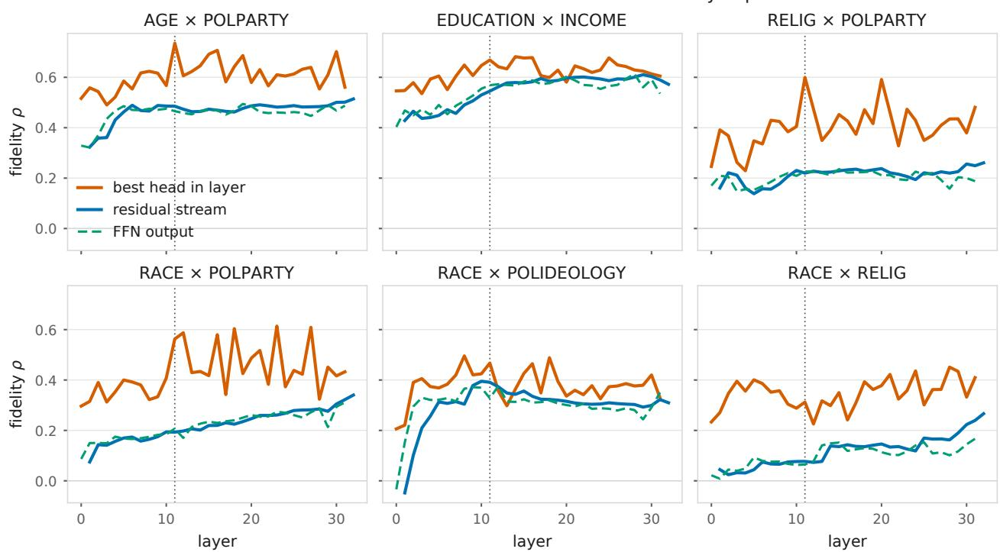
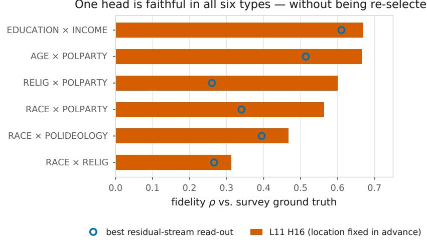
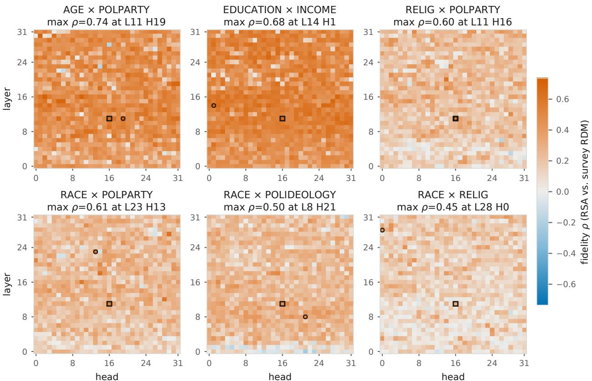
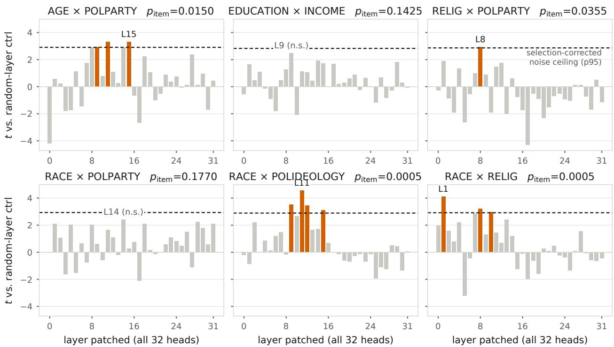
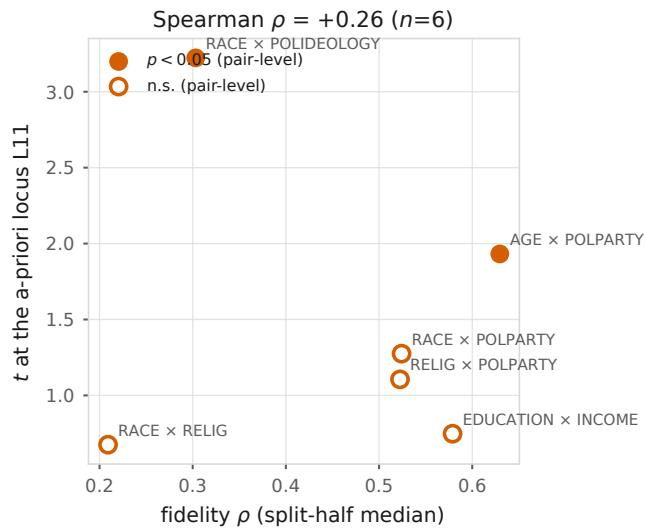
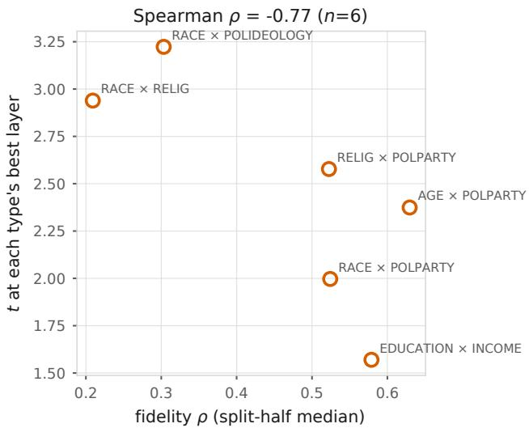
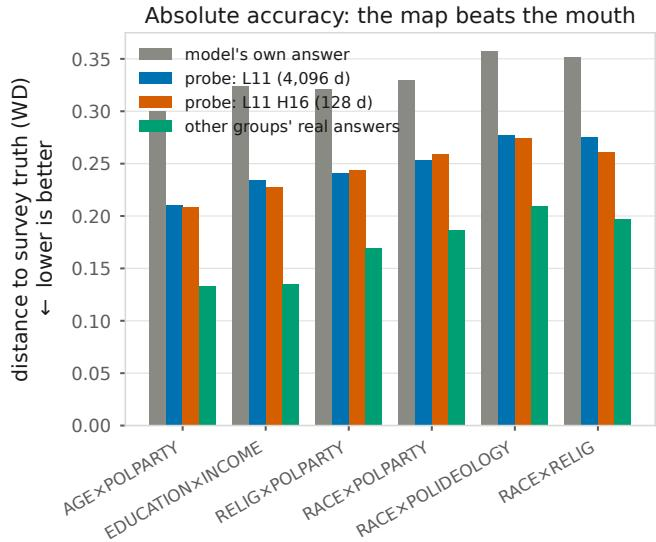
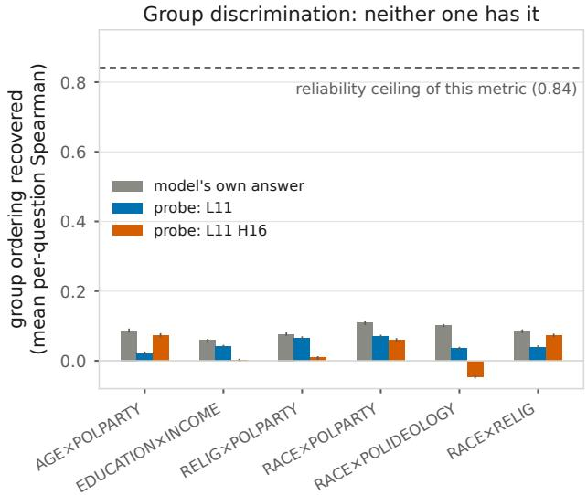

Readable, Faithful, Used: Three Dissociable Properties of Demographic Identity in a Language Model

Fathin Difa Robbani Independent Researcher ORCID: 0009-0000-6184-8919

## Abstract

Large language models are widely used to simulate survey respondents, yet their answers are homogeneous and unfaithful to real inter-group diferences. We ask where demographic group identity lives inside an LLM, how faithfully its internal geometry mirrors real inter-group opinion structure, and whether the model uses what it encodes. Using representational similarity analysis against Pew American Trends Panel ground truth over 169 intersectional demographic cells, we score 1,089 read-out locations in Mistral-7B, then intervene causally at every layer in all six attribute types. Four results. (1) The standard last-token residual read-out understates the model: attention-head read-outs dominate it in five of six types and never lose, with selectioncorrected fidelity up to ρ = 0.63 (split-half median)—roughly 70% of the measurement-reliability ceiling—and the map survives partialling out the lexical similarity of the identity words. (2) A single head (L11 H16) is significantly faithful in all six types as a fixed location, while race-based types stay weak and prompt-fragile everywhere. Both phenomena replicate at family-specific addresses—the analogous head significant in five of six types, weakest on the same race type— across three checkpoints of a second model family, where ten billion tokens of human-simulation training barely move the map. (3) Causal use does not follow fidelity: under cluster-robust inference the clearest causal pathway sits in one of the least faithful types (exact p = 0.002 at the depth fixed in advance by the map), the most faithful type shows no correction-surviving single-layer efect, and replacing the entire identity in the prompt moves predictions by under 2% of their error. (4) A 128-dimensional probe of the single head lands 21–31% closer to survey truth than the model’s own answers—yet recovers almost none of the per-question ordering of groups, no better than the answers themselves. Readable, faithfully arranged, and causally used are three dissociable properties of the same model; treating them as one claim is what keeps the “can LLMs simulate populations” debate unresolved.

## 1 Introduction

LLMs are increasingly deployed as simulated survey respondents and human simulators [29, 37]. Yet a growing body of behavioral evidence shows their outputs are excessively uniform: simulated users are “overly agreeable” and “stylistically uniform” [38], opinion predictions barely diferentiate demographic groups, and general model capability does not predict simulation fidelity [38]. All of this evidence is behavioral—measured from the outside. Whether the failure lives in what the model knows or in what it uses has remained open, because the two research communities each hold only half of the required instrumentation.

Interpretability work localizes demographic and persona information inside models—down to individual attention heads [15, 17]—but validates against the model’s own behavior (probe accuracy, steering success), never against external population ground truth. LLM-survey-simulation work has exactly that ground truth (real per-group response distributions) but treats the model as a black box. One community runs the brain scan but never administers the questionnaire; the other administers the questionnaire but never looks inside the head. The experiment that requires both instruments at once—does the internal arrangement of groups match how those groups actually answer?—sits in the gap between them, and had not been run.

We hold both instruments at once. For 169 intersectional demographic cells (e.g., Asian × Hindu, age 18–29 × Democrat) we compute two representational dissimilarity matrices: one from real Pew ATP response distributions (Wasserstein distances between groups’ answers), one from the model’s internal representations at a given location, and correlate them (RSA; 18). Applied at 1,089 locations × 4 prompt operationalizations, this yields a fidelity map: where inside the mode does the arrangement of demographic groups mirror how the groups actually difer in opinion?

Our results split the question “can LLMs simulate populations?” into three separable properties (we reserve the word “layer” for transformer layers):

1. Readable (established by prior work): per-group opinion distributions can be decoded from internal activations [15].

2. Faithfully arranged (this work): at specific locations —most strikingly a single attention head, L11 H16—the inter-group geometry mirrors real opinion structure (selection-corrected ρ up to 0.63), something per-group readability neither implies nor requires.

3. Actually used (this work): the faithfully arranged information barely flows into the model’s answers—full identity swaps in the prompt move predictions by <2% of their error, and not directionally toward the target group’s truth. A strong-instrument intervention does find a real causal pathway, but where it is clearest is not where the map is most faithful (Sec. 6.4).

## Contributions.

• The first fidelity map of demographic identity in an LLM: RDM-vs-RDM comparison against real survey ground truth across layers, attention heads, FFN outputs, and prompt variants, with winner’s-curse-corrected statistics (max-statistic permutation, held-out-template and split-half validation).

• Identification of L11 H16 as a general demographic-geometry head, significant across all six attribute types as a fixed location; and the finding that fidelity is sharply heterogeneous— political/socio-economic structure is deeply encoded, racial×religious structure is weak and prompt-fragile at every location tested.

• Quantification of the knowledge–behavior gap: replacing the entire prompt identity moves the model’s predicted distribution by under 2% of its prediction error in aggregate (a single illustrative item is worked in Sec. 6), and the residual variation is directionally uninformative. A causal sweep over all 32 layers in all six types—with cluster-robust, selection-corrected inference—shows that representational fidelity does not predict causal use: the clearest pathway sits in a low-fidelity type, and the most faithful type shows no correction-surviving singlelayer pathway.

• A direct measurement of what a faithful read-out buys: a probe on L11 H16 alone (128 dimensions) is 22–30% closer to survey truth than the model’s own answers, but recovers almost no per-question group ordering—so first-order readability, second-order fidelity, and item-level group discrimination come apart from one another.

• A reframing with practical consequences. If faithful structure already exists internally, surface fine-tuning [29] may re-teach what the model already encodes—a candidate mechanism for its known transfer failure. Reading the faithful location directly is then the cheaper alternative, though our probe results show it is still not a substitute for survey data (Sec. 6.5).

## 2 Related Work

LLMs as survey simulators (the ground-truth side). “Silicon sampling” was introduced by Argyle et al. [1] and has since been contested on multiple grounds: response instability and surveyformat sensitivity [8, 24], systematic divergence from human samples [3], and bounded persona efects [14]. SubPOP [29] fine-tunes LLMs to predict per-group response distributions with a KL objective, achieving strong in-distribution accuracy but degraded transfer to unseen surveys. Rectification methods [19] combine limited human data with synthetic responses. Cultural-alignment work compares model outputs to cross-national survey structure—GlobalOpinionQA against World Values Survey and Pew Global Attitudes items [9], and ChatGPT responses against Hofstede’s culture dimensions [6]. All of these treat the model as a black box; none examines internal representations.

Reading opinions from inside (the closest neighbor). Jahanparast et al. [15] show linear probes on internal activations recover per-group opinion distributions better than the model’s own generated outputs, extract activations down to individual attention heads, and steer outputs by patching SAE features. Crucially, all of their measurement is first-order: each group’s read-out is scored against that group’s own distribution. Whether the inter-group geometry at any location mirrors real inter-group opinion structure—the property every neighbor-borrowing and generalization application depends on—is not among their measurements.1 Our work is the second-order comple ment: probe accuracy is a phone book (accurate per entry); we ask whether the entries are arranged as a map. Two output-side works come closest to that question and sharpen what remains open: Bhattacharyya et al. [2] correlate the separation of persona-conditioned final-layer embeddings and outputs with human subgroup disagreement, and Williams et al. [36] test whether demographically aligned models reproduce the human item–item correlation structure beyond marginals—both compare behavioral or last-layer structure, not the geometry of internal representations against a human inter-group distance matrix. Layer-wise RSA of internal LLM geometry against human similarity structure exists for perceptual domains, where alignment peaks mid-stack and fades with depth [28]—strikingly parallel to what we find for demographic identity. To our knowledge, no prior work scores the internal inter-group geometry of demographic representations against real survey opinion structure.

Localizing social attributes (the interpretability side). Kim et al. [17] localize political ideology to attention heads and validate against legislator vote-based scores (DW-NOMINATE)— the closest methodological relative, for one attribute and elite text; a follow-up line locates a single partisan axis at one mid-stack layer and steers along it [30]. Cintas et al. [7] localize persona representations without external ground truth, Bouchaud and Ramaciotti [4] probe linear sociodemographic associations arising from indirect cues across layers, and Poonia and Jain [23] localize persona processing with activation patching—again without survey ground truth. Per-layer RSA has been applied to LLMs for other content domains [27]. “Diversity collapse” [32] documents that social-identity representations become less separable with depth—consistent with our anisotropy findings—but does not measure fidelity to real opinion structure. Construct-validity critiques of persona prompting [31] motivate our multi-cue design. Closest to our dissociation result, Gilg et al. [12] find preference machinery largely shared across personas—probes and steering vectors transfer between opposed personas—converging from the steering side with our finding that what a location encodes and what the model answers with are separable properties.

The behavioral Sim2Real gap (the motivation side). The Sap-group program documents, from the outside, that LLM simulators are homogeneous and overly cooperative: 451-human comparisons show the best of 31 simulators reaches only USI 76.0 vs. a 92.7 human baseline [38], and OdysSim [37] attributes the gap to helpfulness-driven post-training and rebuilds a behavioral foundation model to close it—while explicitly noting that better average human simulation does not imply faithful subpopulation simulation. Persona efects on moral stances are strongest for political ideology and personality [20], an output-level hierarchy that parallels our representation-level fidelity ranking. Foundational annotation work [10, 26] established that human judgments are distributions conditioned on who answers—the premise of our entire evaluation. None of this line opens the model.

Our position. We supply the missing bridge: internal geometry (interpretability’s territory) scored against population ground truth (simulation’s territory), localized systematically, with the causal follow-up of whether the model uses what it faithfully encodes.

## 3 Setup: Two Maps and a Ruler

## 3.1 Ground truth: inter-group opinion distances from Pew ATP

We use OpinionQA-style per-group response distributions derived from Pew American Trends Panel waves [25, 29] (15 waves; inventory and preprocessing in Appendix A.1). A group is an intersectional cell: a pair of demographic attribute values (e.g., race=Asian × religion=Hindu), yielding 169 cells across six attribute types (AGE×POLPARTY, EDUCATION×INCOME, RACE×RELIG, RACE×POLPARTY, RACE×POLIDEOLOGY, RELIG×POLPARTY). For groups i,j the groundtruth distance is the mean Wasserstein distance between their answer distributions over shared questions (up to 300 sampled per pair):

$$
D _ { i j } ^ { \mathrm { r e a l } } = \frac { 1 } { | Q _ { i j } | } \sum _ { q \in Q _ { i j } } { \mathrm { W D } } ( p _ { i } ^ { ( q ) } , p _ { j } ^ { ( q ) } ) ,\tag{1}
$$

where $p _ { i } ^ { ( q ) }$ is group i’s real response distribution on question $q \mathrm { ^ { \circ } s }$ ordinal scale. $D ^ { \mathrm { r e a l } }$ is the surveyside RDM. Appendix A.9 reports sensitivity of the headline results to two construction choices: normalising WD by each question’s scale range, and restricting to questions answered by every cell of a type.

## 3.2 Model-side representations at 1,089 locations

For each group we build identity prompts and extract, at the final token, (i) the residual stream after every layer (33 locations), (ii) each attention head’s output before the out-projection (32×32 = 1,024 locations; the same read point used by 15), and (iii) each FFN block output (32 locations), from Mistral-7B [16]. The causal experiments of Sec. 6 use activation patching in the tradition of causal tracing and circuit analysis [21, 33], following current methodological guidance [13] and mindful of the documented reliability limits of causal probing interventions [5]. The model-side RDM at location ℓ uses cosine distances between group representations.

## 3.3 Multi-cue prompts

A single prompt template is a single operationalization of “group identity” [31]. We therefore use four templates per group (third-person declarative, first-person, structured profile, and QA format ending in Answer:—the read-out position validated by 15) and additionally a template-averaged representation (Tmean). Template disagreement is reported as a fragility diagnostic.

## 3.4 Fidelity: second-order comparison

Fidelity at location ℓ for attribute type t is the Spearman correlation between the upper triangles of the two RDMs restricted to type-t cells:

$$
\rho _ { \ell , t } \ = \ \mathrm { S p e a r m a n } \biggl ( \bigl \{ D _ { i j } ^ { \mathrm { r e a l } } \bigr \} _ { i < j \in t } , \ \bigl \{ D _ { i j } ^ { \ell } \bigr \} _ { i < j \in t } \biggr ) .\tag{2}
$$

We report within-type fidelity throughout: pooled correlations mix between-type scale diferences and can both mask weak types and manufacture spurious gains (Sec. 4).

## 3.5 Statistical protection against selection

Any “best location” claim over 1,089 candidates inflates under selection (winner’s curse). We therefore report three corrections: (a) max-statistic permutation tests [22]—the null distribution of the maximum ρ over all locations under cell-label permutation; (b) held-out-template selection—locations chosen on three templates, scored on the fourth; (c) split-half selection—locations chosen on half the cells, scored on the other half (200 resamples). Headline numbers are held-out values, not selected maxima.

Two further disciplines apply to the causal experiments (Sec. 6). First, patching items are clustered: each type contributes 12 donor–recipient pairs × 20 questions, and items within a pair share the persona and its idiosyncrasies. All causal p-values are therefore computed at the pair level (sign-flip permutation over 12 clusters, enumerated exactly), with item-level statistics shown only as descriptive detail. Second, because the survey-side ruler could itself be confounded by lexical similarity of the identity words, Sec. 5 reports fidelity after partialling out a lexical-baseline RDM.

## 4 The Standard Read-Out Understates the Model

The read-out used implicitly across the LLM-survey literature—last-token residual stream, cosine distance, one prompt template—paints a bleak picture, but a misleading one. Four properties (full details in Appendix A.13):

Weak and type-uneven fidelity. Fidelity computed over all same-type cell pairs pooled together is $\rho \approx 0 . 1 7$ (peak at layer 17; we use “pooled” in exactly this sense throughout), but this pools sharply unequal types: AGE×POLPARTY and EDUCATION×INCOME reach $\rho \approx 0 . 5 0$ while RACE×RELIG is $\rho = 0 . 0 7 \ \mathrm { ( n . s . ) }$ . Cross-type pairs correlate negatively—inter-group distances are only meaningful within an attribute type.

Table 1: Fidelity (ρ vs. survey ground truth) by read-out. Selected = maximum over locations (inflated by selection); held-out = selection-corrected range spanned by the two independent corrections (held-out template, Appendix A.4 cek1; split-half median, cek3). Both corrections are computed on the NaN-cleaned cell set.
<table><tr><td>Type</td><td>Residual best</td><td>Head best (selected)</td><td>Head (held-out)</td><td>Best loc.</td></tr><tr><td>AGE×POLPARTY</td><td>+0.51</td><td>+0.74</td><td>+0.59-0.63</td><td>L11 H19</td></tr><tr><td>EDUCATION×INCOME</td><td>+0.61</td><td>+0.68</td><td>+0.58-0.63</td><td>L14 H1</td></tr><tr><td>RELIG×POLPARTY</td><td>+0.26</td><td>+0.60</td><td>+0.50-0.52</td><td>L11 H16</td></tr><tr><td>RACE×POLPARTY</td><td>+0.34</td><td>+0.61</td><td>+0.41-0.52</td><td>L23 H13</td></tr><tr><td>RACE×POLIDEOLOGY</td><td>+0.40</td><td>+0.50</td><td>+0.30-0.41</td><td>L8 H21</td></tr><tr><td>RACE×RELIG</td><td>+0.27</td><td>+0.45</td><td>+0.21-0.32</td><td>L28 H0</td></tr></table>

Severe anisotropy, and the obvious fix fails. Group embeddings share a dominant common direction $( \| { \bar { x } } \| / { \overline { { \| x \| } } } = 0 . 9 5 )$ : all cells clump. Mean-centering doubles the pooled correlation (0.185 → 0.301) yet decreases every within-type correlation $( \mathrm { e . g . }$ , AGE×POLPARTY 0.455 → 0.375)—the pooled gain is a between-type scale artifact. This is consistent with depth-wise “diversity collapse” [32].

Noisy neighborhoods. Top-5 neighbor precision against ground truth is ${ \sim } 2 \times$ chance in all six types but only 0.35–0.48 absolute: about 2 of 5 nearest neighbors are right. Applications that borrow statistical strength from neighbors inherit this noise; a consistency-regularization pilot built on this read-out failed accordingly (Appendix A.12).

The open question this creates. Weakness of one read-out does not establish weakness of the model: the information may be present but stored elsewhere. The residual stream sums the outputs of all attention heads and FFN blocks, so any signal carried by a few components can be diluted by the rest. The next section reads every component separately.

## 5 The Fidelity Map: Faithful Structure Exists, Concentrated in Heads

## 5.1 Attention heads dominate the residual stream

Table 1 summarizes the map. In every attribute type the best attention-head read-out exceeds the best residual-stream read-out (these are selected values; the symmetric correction reported later in this section revises the claim to significant in five of six types and never reversed); the largest gains appear exactly where the standard read-out was weakest (RELIG×POLPARTY: $0 . 2 6  0 . 6 0$ ; RACE×POLPARTY: $0 . 3 4  0 . 6 1$ , selected values). Multi-cue averaging alone already helps (RACE×RELIG residual: 0.07 single-template → 0.27 Tmean): part of the apparent weakness was operationalization noise. Figure 1 shows this is not a property of one lucky depth: the best head within a layer sits above that layer’s residual stream at nearly every depth in all six types (the residual stream wins at three isolated layer–type points out of 186), and the FFN output tracks the residual stream rather than the heads. The information the standard read-out misses is thus already present before the per-head signals are projected and summed into the stream, consistent with dilution at that summation rather than with the model not encoding it.

  
Figure 1: Fidelity by depth and component (multi-cue Tmean read-out). Orange = best of the 32 heads within that layer, blue = residual stream at that layer, dashed green = FFN output. Dotted vertical line marks layer 11. Head read-outs dominate at nearly every depth; the gap is widest exactly in the types where the residual stream looks weakest (RELIG×POLPARTY, RACE×RELIG). Selected maxima here are uncorrected—see Table 1 for held-out values.

## 5.2 The advantage survives selection correction—and symmetric correction

Max-statistic permutation tests (Sec. 3.5): pure noise allowed to pick its champion among 1,024 heads reaches only $\rho \approx 0 . 3 4 – 0 . 4 6$ (95th percentile of the null max); the observed maxima exceed this in all six types (selection-corrected $p < 0 . 0 0 0 5$ in four types; 0.0025 and 0.0155 in the remaining two). Held-out-template and split-half estimates agree with each other (Table 1), and head choice is stable under resampling for most types (L11 H16 re-selected in 87/200 splits for RELIG×POLPARTY) —but is a lottery for RACE×RELIG.

Symmetric correction and a geometry control. Comparing a maximum over 1,024 heads against a maximum over 33 residual layers is not symmetric, and 128-dimensional heads might beat the anisotropic 4,096-dimensional stream for geometric rather than informational reasons. We therefore run one pipeline over three candidate families with identical held-out-template selection: the 1,024 heads, the 33 residual layers, and 1,024 random 128-dimensional projections of the residua stream (32 per layer, fixed across folds). Held-out, heads win clearly in five of six types (e.g., RELIG×POLPARTY: head 0.44 vs. residual 0.17 vs. random projection 0.18; RACE×RELIG: 0.29 vs. 0.16 vs. 0.17); random projections track the residual stream, not the heads, so the head advantage is not a dimensionality artifact. The exception is EDUCATION×INCOME, where the margin is thin (0.54 vs. 0.51 vs. 0.49): for that type the standard read-out is already close to the best we find. We accordingly state the claim as heads dominate in five of six types and never lose rather than a uniform dominance.

How high could fidelity possibly go? A correlation of 0.63 means something diferent under a ceiling of 0.70 than under 0.95. We estimate the ceiling from both sides: the survey RDM’s own split-half reliability (two simulated independent respondent samples per cell at the real sample sizes) is 0.985–0.994, and the model RDM’s reliability across disjoint template halves at L11 H16 is 0.72–0.94, giving an attenuation ceiling of $\sqrt { r _ { \mathrm { s u r v e y } } r _ { \mathrm { m o d e l } } } = 0 . 8 4 \mathrm { - } 0 . 9 6$ per type. Observed fidelity sits at 53–74% of that ceiling for the five stronger types and 39% for RACE×RELIG: the map is well below what measurement noise alone would allow, so the unexplained residual is real signal the representation does not carry (or our read-out does not capture)—not an artifact of a noisy ruler.

## 5.3 Not an artifact of the identity words themselves

The prompts difer across cells only in the attribute-value words (“Democrat”, “Hindu”, $^ { 6 4 } 3 0 \substack { - 4 9 ^ { 3 } , \ldots } )$ and the lexical-semantic similarity of those words is itself correlated with real opinion similarity. A fidelity map could in principle be nothing more than a clean copy of word similarity. We test this directly: a baseline RDM is built from a small general-purpose sentence encoder [34]—in two variants, embedding the value words alone and embedding the full identity sentence—and correlated with the survey RDM; we then report the partial Spearman correlation of each model read-out with the survey RDM after controlling for the lexical RDM, with significance by cell-label permutation.

The confound is real but does not explain the map. The lexical baseline alone reaches $\rho =$ 0.21–0.64 against the survey RDM (largest for EDUCATION×INCOME, where value words are ordered categories). Controlling for it, L11 H16’s fidelity remains $\rho = 0 . 3 5 \ – 0 . 5 9$ with $p < 0 . 0 0 0 5$ in five of six types (e.g., AGE×POLPARTY $0 . 6 7  0 . 5 9$ partial; RELIG×POLPARTY $0 . 6 0  0 . 5 9 ;$ EDUCATION×INCOME 0.67 → 0.35, the largest drop, consistent with its word-order structure). The exception is again RACE×RELIG: L11 H16’s partial fidelity there is 0.23 $( p = 0 . 0 5 6 ;$ the type’s best head survives at 0.41, $p = 0 . 0 0 1 5 )$ —one more sign that this type’s map is marginal. The map is therefore not a lexical echo, though for word-ordered attribute types a nontrivial share of the raw correlation is.

## 5.4 A general demographic-geometry head

Fixing L11 H16 in advance (no per-type re-selection) yields significant fidelity in all six types $( \rho =$ 0.33–0.67; permutation $p < 0 . 0 0 1$ each, surviving a conservative ×1024 Bonferroni). A single head, one of 1,024, carries a group arrangement that tracks real opinion structure across age, education, income, religion, party, ideology, and (weakly) race (Figure 2). Because the location is fixed before scoring, this test is structurally immune to the per-type winner’s curse that motivates Sec. 3.5. One caveat of provenance remains and we state it explicitly: L11 H16 was not chosen at random, it was noticed because it recurred in the per-type top-10 lists; the fixed-location test rules out per-type selection, not the initial noticing. Independent confirmation therefore has to come from outside this data: we report a causal test in Sec. 6 and a cross-model replication in Sec. 7.1, where the phenomenon recurs at a family-specific address.

## 5.5 Heterogeneity is a property of the model, not the read-out

The type hierarchy is preserved at every location tested: the age- and education-based types are deeply and stably encoded (template std 0.02–0.05; RELIG×POLPARTY sits between, at 0.10), while every race-containing type is weaker and prompt-fragile (template std 0.12–0.13; e.g., RACE×RELIG at its best head: $\rho = 0 . 1 6$ under one template, 0.45 under another). This parallels output-level findings that political ideology dominates persona efects [20] and annotator-attitude findings that ideological variables outpredict raw demographics [26]. For practitioners the operational consequence is that demographic attributes cannot be treated as interchangeable inputs: a persona pipeline validated on political or socio-economic attributes gives no warrant for the race-based attributes, where this model’s internal structure is both weaker and unstable under paraphrase.

One head is faithful in all six types — without being re-selected  
  
Figure 2: Fidelity of the single fixed location L11 H16 (bars) against the best read-out the residual stream ofers anywhere in the network for that type (circles). The head is fixed in advance and never re-selected per type, yet it exceeds the best residual-stream read-out in all six types $( \mathrm { b y } \cdot + 0 . 0 5$ to +0.34). Both series are computed on the same multi-cue map; the significance test $( p < 0 . 0 0 1$ each, surviving a conservative ×1024 Bonferroni) is run on the NaN-cleaned cell subset, where the two race-containing values shift slightly (RACE×RELIG 0.31→0.33; RACE×POLPARTY 0.56→0.59; cell exclusions in Appendix A.1).

## 6 Causal Use Is Real, Small, and Not Where Fidelity Is Highest

## 6.1 The output is nearly identity-invariant under natural prompting

Before asking whether any internal location causally drives answers, we measure the ceiling: how much does the model’s predicted opinion distribution move when the entire demographic identity in the prompt is replaced? Averaged over pairs and questions, the answer is almost not at all: $\mathrm { W D } ( \hat { p } _ { A } , p _ { B } ^ { \mathrm { r e a l } } ) - \mathrm { W D } ( \hat { p } _ { B } , p _ { B } ^ { \mathrm { r e a l } } ) \approx 0 . 0 0 4$ against a total prediction error of ${ \sim } 0 . 3 7 \ ( < 2 \% )$ . One illustrative item (not an aggregate statistic): on a question where 18–29-year-olds and 50–64-year-olds difer by 11 percentage points in reality, swapping the full persona moves the model’s prediction by 1.7 points—∼15% of that item’s real diference.

Worse, the small variation that does exist is directionally uninformative: the prediction for group A is no closer to A’s own ground truth than to another group’s (median advantage $\approx 0 ;$ sign test ≈ coin flip in 2 of 3 tested types). The model produces slightly-diferent-but-equally-wrong answers per persona.

Not an artifact of the base-model interface. We re-measured the identity-swap ceiling on Mistral-7B-Instruct-v0.2 under its own chat template, with the same cells and questions (40 per type, all same-type cell pairs; under this estimator the base model’s swap movement is 3.2% of its

Fidelity of every attention head (Mistral-7B, multi-cue read-out) square = L11 H16 (fixed cross-type location); circle = per-type maximum

  
Figure 3: The full fidelity map: every attention head (32 layers × 32 heads) scored against survey ground truth, per attribute type, multi-cue read-out. Square marks the fixed location L11 H16; circle marks that type’s own maximum. Faithful heads are not a scattered handful—fidelity is broadly distributed and layer-structured—but the overall level falls sharply for race-containing types (bottom row). Maxima printed here are uncorrected and match the selected column of Table 1; see that table for held-out values.

total error, rather than the ${ < } 2 \%$ above, which is computed on the original question set). The nearinvariance replicates: the instruct model’s full-identity swap moves predictions by 3.9% of its total error. What chat tuning changes is accuracy and direction, not identity-dependence: absolute error nearly doubles (mean WD 0.66 vs. 0.37), while the small movement becomes reliably directionally correct (group A’s prediction closer to A’s own truth than to $B ^ { \prime } \mathrm { s }$ in 64% of pairs; sign test $p < 0 . 0 0 1$ in all six types, vs. three of six at $p < 0 . 0 5$ , one at $p < 0 . 0 0 1$ , for the base model). An instructiontuned model is slightly more identity-responsive and substantially less accurate; the near-invariance itself is a property of the model family, not of the raw-completion interface. The letter-probability read-out is still assumed (see Limitations).

## 6.2 A weak instrument finds nothing—but has no dynamic range to find it with

Patching L11 H16 activations between group prompts (donor→base) at the prediction token, with 1–3 heads at natural scale, moves nothing (protocol in Appendix A.5). But the ceiling above shows this instrument had essentially no dynamic range to begin with—any causal efect this small would be undetectable regardless of whether it exists.

## 6.3 A properly strong instrument reveals a real but small efect

We therefore repeat the intervention with an instrument matched in strength to prior successful steering work [15]: identity is localized to a single answer token in a QA-formatted demographic block (rather than spread across a sentence), the patch is applied at that identity token (allowing propagation to all subsequent tokens, not just the prediction token), all 32 heads of layer 11 are patched jointly (not 1–3), and questions are selected for maximal real inter-group disagreement rather than at random. Under this instrument, the result is neither a flat null nor a clean success. Across the three types tested here it is graded, and—suggestively—the gradation lines up with each type’s fidelity from Sec. 5. Sec. 6.4 extends the experiment to all six types and shows that this alignment does not generalise; we present the three-type result first because it is the strongest single demonstration that the efect exists at all:

Table 2: Causal patching results with the strong instrument. Ceiling = mean full-prompt-swap shift, measured as in Sec. 6.1 on this instrument’s question set. Shift = mean directional shift toward the target group’s true distribution; % of ceiling in parentheses where meaningful. $p _ { \mathrm { i t e m } } =$ Wilcoxon vs. random-head control over 240 items (descriptive; items are clustered); $p _ { \mathrm { p a i r } } = \mathrm { e x a c t }$ sign-flip over the 12 pairs (primary).
<table><tr><td>Type (split-half fidelity)</td><td>Ceiling</td><td>32 heads @ L11</td><td>Single L11 H16</td><td> $p _ { \mathrm { i t e m } }$  (32h)</td><td> $p _ { \mathrm { p a i r } }$  (32h)</td></tr><tr><td>AGE×POLPARTY (0.63)</td><td>+0.0165</td><td>+0.0067 (41%)</td><td>-0.0001 (n.s.)</td><td>0.0027</td><td>0.019</td></tr><tr><td>RELIG×POLPARTY (0.52)</td><td>+0.0020</td><td>+0.0034 (170%, n.s.)</td><td>−0.0004 (n.s.)</td><td>0.16</td><td>0.15</td></tr><tr><td>RACE×RELIG (0.21)</td><td>+0.0026</td><td>+0.0017 (n.s.)</td><td>–0.0005 (wrong dir.,  $p _ { \mathrm { p a i r } } { = } 1 / 4 0 9 6 )$ </td><td>0.31</td><td>0.29</td></tr></table>

Three findings from this table, in order of importance:

1. The highest-fidelity type shows a real, correctly-directed causal efect. For AGE×POLPARTY, jointly patching all 32 heads at layer 11 shifts predictions toward the target group’s true distribution: 59% of trials move in the correct direction (vs. 32% under a random-head control), recovering 41% of the achievable ceiling.2 Because the 240 items cluster into 12 pairs, the primary test is an exact pair-level sign-flip: $p _ { \mathrm { p a i r } } = 0 . 0 1 9$ (adding layer 18: 0.016)—evidence, but marginal, and it does not survive a Holm correction over the family of 24 tests behind this table (3 types × 4 conditions × 2 comparisons). Identity is therefore plausibly load-bearing at this depth; the sweep below provides the localisation—independent of the layer-11 hypothesis, though computed on the same pairs. (Whether any load-bearing follows from the map’s fidelity is a separate question, and Sec. 6.4 answers it in the negative.)

2. The lowest-fidelity type shows no correct efect, and a single-head intervention actively backfires. For RACE×RELIG, the 32-head patch is not significant $( p _ { \mathrm { p a i r } } = 0 . 2 9 )$ while patching L11 H16 alone shifts predictions in the wrong direction with the most consistent efect in the table (worse than the random-head control in essentially every pair; pair-level t = $- 5 . 2 , p _ { \mathrm { p a i r } } = 1 / 4 0 9 6$ , the resolution floor of the exact permutation). Replacing 128 dimensions mid-computation is a destructive intervention, so we ran a donor-control experiment on the same pairs and questions (independent run; the efect itself replicates, pair-level $t = - 2 . 4$ exact $p = 0 . 0 0 5 )$ . It rules out the simplest corruption story. A dimension-shufled donor— the target group’s own vector with its 128 head dimensions permuted, so the location, norm, and coordinate statistics match while the structure is destroyed—perturbs the output twice as strongly in raw movement, yet produces no systematic drift at all (pair-level $t = - 0 . 1 )$ : if harm merely scaled with disruption, this condition would be the most harmful, and it is the least. The consistent away-from-truth drift appears only with a coherent identity donor. Whether it further requires the paired group’s donor is suggestive but unsettled: donors from other same-type identities trend the same way weakly (each n.s.), and the direct paired contrast against their mean reaches $t = - 2 . 0$ , exact $p = 0 . 0 7 3$ . The safe reading is therefore sharper than before: the backfire is not generic corruption—it is carried by identity content—but single-unit intervention at an apparently faithful location remains unreliable in direction.

3. Fidelity and single-unit causal suficiency are dissociable. L11 H16 alone never produces a correct, significant shift in any type (AGE: n.s.; RELIG: n.s.; RACE: significant but wrong-directed); a correct efect (where it exists) requires the joint action of all 32 heads at the layer. The same head can be faithful as a representation while being insuficient—or actively misleading—as a sole intervention target.

Amplification backfires. Scaling the patch by 5× (matching the amplification levels used in SAE-feature steering, 15) makes the shift negative in all three types (condition not shown in Table 2; full results in Appendix A.5). Linear extrapolation in raw activation space likely pushes representations of-manifold, unlike steering in a constrained SAE feature space—amplifying a raw signal is not a free strengthening operation.

## 6.4 Where identity causally enters—and why it is not where fidelity is highest

Section 6.3 localises a correct causal efect at layer 11 for one type and finds none there for another. That leaves the diagnosis incomplete in two ways: a type may have a causal locus the layer-11 hypothesis simply looked past, and three types are too few to tell whether causal use follows fidelity at all. We therefore replace the hypothesis-driven probe with an exhaustive one—the same 32-head identity-token intervention applied at every layer—and run it for all six attribute types.

Procedure. For each pair–question item we assemble a single batch of 33 copies of the prompt: one patched at each of the 32 layers, plus one patched at a randomly chosen layer as a control, so all conditions see identical inputs and one forward pass answers the whole sweep $( n { = } 2 4 0$ pair– question items per type). The statistic per layer is the paired t of its directional shift against the random-layer control. Two selection problems require correction. First, the winner is selected from 32 candidate layers, so we apply a max-statistic permutation correction [22], with the same sign flip applied across all layers to preserve the between-layer correlation structure. Second, and more consequentially, the 240 items are clustered into 12 pairs (Sec. 3.5), so all primary p-values below flip signs at the pair level: per-pair mean shifts, all $2 ^ { 1 2 }$ flip combinations enumerated exactly. Item-level statistics are shown as descriptive detail only—treating the 240 items as independent understates the p-values several-fold.

What survives cluster-robust inference. The pair-level statistics are deliberately conservative (12 clusters per type), and they prune the picture sharply. No type survives the pair-level maxstatistic correction (best: RACE×POLIDEOLOGY, $p = 0 . 0 6 6 )$ —an honest statement that with 12 pairs we cannot both search 32 layers and certify the winner. The a-priori test at L11 (no layer selection; L11 was fixed by Sec. 5) is where the clean result lives: RACE×POLIDEOLOGY at L11 reaches $t = 3 . 2 2$ , exact $p = 0 . 0 0 2 0$ , the only entry that also survives a Bonferroni correction over the

Where identity causally enters difers by type — and not in proportion to fidelity

  
Figure 4: Causal efect of patching all 32 heads of each layer in turn, at the identity token (n=240 pair–question items per type). Descriptive view: bars are the item-level paired t of the directional shift toward the target group’s true distribution against a random-layer control; the dashed line is the item-level max-statistic noise ceiling. Inference in the text and Table 3 is cluster-robust (sign flips at the level of the 12 pairs), which is substantially more conservative. Two loci recur descriptively—mid-stack (L8–L15) and layer 1—and which one a type leans on is not predicted by how faithful its map is.

12 fixed-location tests below. AGE×POLPARTY at L11 $( p = 0 . 0 2 2$ , and independently $p = 0 . 0 1 9$ in the targeted experiment of Sec. 6.3—the same pairs, so convergent rather than independent evidence) is suggestive but not conclusive. Descriptively, the item-level loci cluster in two places— mid-stack (L8–L15) and layer 1—but we flag one asymmetry the table would otherwise hide: L1 was noticed in the first sweep, which included RACE×RELIG, so for that type (and only that type) the L1 column below is not selection-free; its pair-level $p = 0 . 0 1 6$ should be read with that caveat, and the “early-layer hub” reading stays a hypothesis for the cross-model replication. For the three types added later, both columns are genuinely fixed in advance:

Fidelity does not predict causal use. The natural hypothesis after Sec. 6.3—that a faithful map is the map the model actually uses, so causal strength should track fidelity—does not survive the extension to six types. Across types, the rank correlation between fidelity (split-half median) and pair-level causal strength is nowhere significantly positive: +0.26 against t at the a-priori locus L11 $( p = 0 . 6 2 )$ and −0.77 against t at each type’s own best layer $( p = 0 . 0 7 )$ . The same holds under every other fidelity estimator we have—held-out template (+0.03 and −0.77) and the lexical-partial fidelity of Sec. 5.3 (+0.49, p = 0.33, and −0.09)—so the conclusion is not an artifact of estimator choice. With n=6 these correlations are weakly powered either way (Figure 5); what carries the weight is the pattern of the two extreme types, which we test directly rather than by comparing

Table 3: Per-layer patching sweep, all six types. Fidelity = split-half median (one estimator used consistently; see text for sensitivity). Item-level columns are descriptive (t over 240 items; maxstatistic p over 32 layers); the primary inference is the pair-level max-statistic p (sign flips over 12 pairs, exact) and the pair-level p at the a-priori locus L11 (no layer selection). The item-level and pair-level winning layers can difer (e.g. RACE×RELIG: L1 vs. L8), since averaging within pairs reweights the evidence. Output ceiling = mean shift from replacing the entire identity.
<table><tr><td></td><td></td><td colspan="3">item-level (descriptive)</td><td colspan="3">pair-level (primary)</td><td></td></tr><tr><td>Type</td><td>Fidelity</td><td>Win layer</td><td>t</td><td> $p _ { \mathrm { m a x } }$ </td><td> $t _ { \mathrm { w i n } }$ </td><td> $p _ { \mathrm { m a x } }$ </td><td> $t @ \mathrm { L } 1 1  p$ </td><td>Out. ceiling</td></tr><tr><td>RACE×POLIDEOLOGY</td><td>0.30</td><td>L11</td><td>4.55</td><td>0.0005</td><td>3.22</td><td>0.066</td><td>3.22 → 0.0020</td><td>0.0176</td></tr><tr><td>RACE×RELIG</td><td>0.21</td><td>L1</td><td>4.10</td><td>0.0005</td><td>2.94 (L8)</td><td>0.122</td><td> $0 . 6 8  0 . 2 7$ </td><td>0.0026</td></tr><tr><td>AGE×POLPARTY</td><td>0.63</td><td>L15</td><td>3.31</td><td>0.0150</td><td>2.37 (L14)</td><td>0.266</td><td> $1 . 9 3  0 . 0 2 2$ </td><td>0.0165</td></tr><tr><td>RELIG×POLPARTY</td><td>0.52</td><td>L8</td><td>2.94</td><td>0.0355</td><td>2.58 (L8)</td><td>0.210</td><td> $1 . 1 1  0 . 1 5$ </td><td>0.0020</td></tr><tr><td>EDUCATION×INCOME</td><td>0.58</td><td>L9</td><td>2.47</td><td>0.1425</td><td>1.57 (L15)</td><td>0.822</td><td> $0 . 7 5  0 . 2 3$ </td><td>0.0194</td></tr><tr><td>RACE×POLPARTY</td><td>0.52</td><td>L14</td><td>2.40</td><td>0.1770</td><td>2.00 (L4)</td><td>0.524</td><td> $1 . 2 8  0 . 1 1$ </td><td>0.0032</td></tr></table>

Table 4: Fixed-location causal test, pair-level (exact sign-flip over 12 pairs, one-sided). L11 was fixed by Sec. 5 before any sweep. L1 was noticed in the first sweep, whose data included the three types in the lower block—for the upper block L1 is a genuinely pre-registered location; for the lower block it is not, and RACE×RELIG@L1 in particular is partially selection-inflated. Bonferroni for the 12 tests is 0.0042; the single bold entry survives it.
<table><tr><td>Type</td><td>t @ L11</td><td> $p _ { \mathrm { p a i r } }$ </td><td>t @ L1</td><td>Ppair</td></tr><tr><td>types not in the sweep that suggested L1:</td><td></td><td></td><td></td><td></td></tr><tr><td>RACE×POLIDEOLOGY</td><td>3.22</td><td>0.0020</td><td>-0.74</td><td>0.77</td></tr><tr><td> $\mathrm { R A C E } { \times } \mathrm { P O L P A R T Y }$ </td><td>1.28</td><td>0.114</td><td>1.97</td><td>0.033</td></tr><tr><td>EDUCATION×INCOME</td><td>0.75</td><td>0.234</td><td>1.24</td><td>0.123</td></tr><tr><td>types that were in that sweep (L1 column not selection-free):</td><td></td><td></td><td></td><td></td></tr><tr><td> $\mathrm { A G E { \times } P O L P A R T Y }$ </td><td>1.93</td><td>0.022</td><td>0.34</td><td>0.386</td></tr><tr><td>RELIG×POLPARTY</td><td>1.11</td><td>0.150</td><td>1.46</td><td>0.089</td></tr><tr><td> $\mathrm { R A C E } { \times } \mathrm { R E L I G }$ </td><td>0.68</td><td>0.267</td><td>2.46</td><td>0.016</td></tr></table>

significance verdicts [11]:

• The top-fidelity types show no correction-surviving single-layer causal locus, under every estimator of “top”. Which type is most faithful depends on the ruler: AGE×POLPARTY under the split-half median (the estimator of Table 3), EDUCATION×INCOME under the held-out template, and AGE×POLPARTY with RELIG×POLPARTY under the lexical-partial control, where EDUCATION×INCOME drops to fifth (Sec. 5.3). The conclusion holds under all three. EDUCATION×INCOME— with the largest output ceiling (0.0194) and the largest raw shift of any type at any layer (+0.0118 at L9)—has no layer approaching significance under cluster-robust correction $( p \ : = \ : 0 . 8 2 )$ , because the shift is inconsistent across pairs; RELIG×POLPARTY has none either (L11 $p = 0 . 1 5$ ; best layer $p = 0 . 2 1$ after max-statistic correction); AGE×POLPARTY, the split-half leader, reaches only the suggestive $p = 0 . 0 2 2$ at L11 that fails every correction applied in this section (pair-level max-statistic $p \ = \ 0 . 2 7 ;$ the Holm family of Sec. 6.3). Tested head-to-head at L11 against RACE×POLIDEOLOGY: the bootstrap 95% CI for $t _ { \mathrm { E D U } } - t _ { \mathrm { R A C E } \times \mathrm { P I } }$ is $[ - 6 . 6 , - 0 . 4 ]$ , excluding zero (two-sample pair-permutation $p = 0 . 0 6 5 )$ ; for t − t it is [−5.6, +0.1] (p = 0.12)—real but not airtight diferences, and we state them at that strength. Failing our threshold is not itself evidence of absence; the direct comparisons are what license the contrast.

• A low-fidelity type has the clearest causal locus. RACE×POLIDEOLOGY, whose map is among the weakest (0.30 split-half, 0.41 held-out template), is the single result that survives everything we throw at it: t = 3.22 at L11, exact pair-level $p = 0 . 0 0 2 0$ , surviving Bonferroni, recovering 42% of its ceiling—at the depth fixed in advance by the map, in a type whose map there is poor.

The map weakens in the answering context—but the dissociation does not depend on that. Sec. 5’s fidelity is scored on an identity-only prompt (no opinion question, last token), whereas the causal and probe experiments are scored in a full QA context at the opinion-answer position. A tempting alternative reading of the dissociation is therefore not “the model does not consult its map” but “the faithful geometry is not the one that exists once a question is present.” We test this on the activations already collected for the probe (Sec. 6.5), holding question composition fixed across cells—each cell is averaged over the same question set, the questions answered by every cell of its type, since coverage is $\mathrm { o n l y } \ge 6 0 \%$ per cell and unmatched subsets would themselves contribute inter-cell distance. The resulting RDM is near-perfectly reliable (split-half $\rho = 0 . 9 8 –$ 0.99 in the five types with enough all-cell-shared questions to split, above the identity-only side’s 0.72–0.94), so what follows is a property of the representation, not of measurement noise.

Two results, and the first goes against us. The map does degrade: in five of six types QA-context fidelity falls well below the identity-only value (EDUCATION×INCOME $0 . 6 7  0 . 1 0 \ddagger$ RACE×POLPARTY $0 . 5 9  0 . 1 7 ;$ RELIG×POLPARTY 0.60 → 0.23; RACE×POLIDEOLOGY $0 . 4 7  0 . 2 4 ;$ AGE×POLPARTY $0 . 6 7  0 . 3 9 )$ , the exception being RACE×RELIG, which rises $( 0 . 3 3  0 . 4 9 )$ We scope Sec. 5 accordingly: it characterises the geometry of an identity-only prompt, and only a weaker version of that geometry survives into the context where the model actually answers. The dissociation, however, is unchanged: re-running the correlation with this QA-context ruler at the a-priori locus L11 gives exactly what the identity-only ruler gives, $\rho = + 0 . 0 3 \ ( p = 0 . 9 6 )$ . The type with the clearest causal locus (RACE×POLIDEOLOGY) is midpack on the QA ruler too, and the most faithful type under it (RACE×RELIG) has no detectable L11 efect $( p = 0 . 2 7 )$ . At each type’s own selected best layer the correlation is ruler-unstable (−0.77 identity-only vs. +0.71 QA-context, both n.s.), which is the same caution we already attach to that quantity. Measured in the very context where the causal experiments look for it, fidelity still fails to predict causal use—so “we measured the wrong map” does not explain the dissociation away.

Representational fidelity is therefore not what decides whether identity is causally used: the clearest causal pathway sits in a type that is near the bottom under every fidelity estimator, the top-fidelity types show nothing detectable at a single layer under any of them, and the direct contrasts are at worst borderline. The graded pattern of Sec. 6.3 was real within those three types but does not generalise; we report it as the coincidence it turned out to be.

Magnitude misleads; consistency decides. Three separate times in this sweep the layer with the largest raw shift fails correction while a smaller, steadier layer passes: RELIG×POLPARTY (L12/L11 largest, L8 passes), RACE×RELIG (L7 +0.0030 and L10 +0.0026 fail, L1 passes at +0.0010, with the selection-inflation caveat given above for this type), and EDUCATION×INCOME (largest shift in the paper, nothing passes at either clustering level). Reporting mean efect sizes without a selection-and-cluster-corrected variance test would have produced three wrong localisations here.

A faithful map does not predict causal use (cluster-robust, n=12 pairs/type)

  
Figure 5: Representational fidelity (split-half median) against cluster-robust causal strength (pairlevel t), one point per attribute type. Left: at the a-priori locus L11 (filled = exact pair-level $p \ < \ 0 . 0 5 )$ . Right: at each type’s own best layer (filled = survives the pair-level max-statistic correction; none does). If the model used its faithful map to answer, these panels would slope upward; they do not.

Control sensitivity. The random-layer control can itself land on a causally relevant layer, deflating measured efects; and “shift” is defined against the unpatched baseline prediction, so a no-patch reference exists implicitly. Re-running every pair-level test against zero instead of against the control changes no conclusion (e.g., RACE×POLIDEOLOGY@L11: t = 3.24, $p = 0 . 0 0 2 2$ vs. zero; full table in the released analysis code).

Caveats. Five, stated plainly. (i) Absolute efects are small throughout (0.001–0.012), commensurate with output ceilings that are themselves small; the surviving efect is statistically robust, not practically large. (ii) Most loci were discovered by the sweep rather than predicted, so they warrant replication in a second model (Sec. 7)—though the fixed-location test in Table 4 is free of per-type selection. (iii) With six types, any cross-type correlation is weakly powered; our claim rests on the two counterexamples, not on the correlation coeficient. (iv) What layer 1 encodes mechanistically remains open: a check on already-collected residual streams was inconclusive because the layer-0 read-out is degenerate in our prompt design (the final token is shared across cells), so we cannot contrast layer 1 against pure embeddings; layers 1 and 2 are near-identical in geometry $( \rho = 0 . 9 0 )$ and both difer appreciably from layer 11 $( \rho = 0 . 7 8 )$ . We record this as an open question rather than a claim (Sec. 9). (v) A single-layer patch may fail to detect a causally-used representation that is redundantly encoded across many layers—exactly what a high, broadly-distributed fidelity (Figure 3) would predict. Our one direct check argues against strong compensation, though only for one type: AGE×POLPARTY’s two-layer patch (L11+L18 jointly, Sec. 6.3) moves the pair-level efect only marginally beyond the single-layer result $( p = 0 . 0 1 9  0 . 0 1 6 )$ . EDUCATION×INCOME— the type this caveat matters most for—has not been tested under a multi-layer patch; redundant, single-layer-invisible use remains an alternative we have not ruled out for it.

Reading the map beats listening to the mouth — but not by knowing the group  

  
Figure 6: Left: distance to survey truth (Wasserstein, lower is better) for the model’s own answer, probes read from the faithful location, and a group-blind baseline built from other cells’ real answers. Right: how much of the true per-question group ordering each read-out recovers (mean per-question Spearman across cells, half-split evaluation; error bars are standard errors), against the reliability ceiling of the metric given survey sampling noise.

## 6.5 How much is recoverable by direct read-out?

The causal experiments ask whether the model uses what it encodes. The complementary question is how much is there to use: if we read the faithful location directly instead of letting the answer come out of the model’s mouth, how much closer to survey truth do we get?

Procedure. For every (cell, question) pair we collect the activation at the opinion-answer position and fit a ridge probe (128 PCA components) to predict the group’s real response distribution. Evaluation is leave-one-cell-out: the probe is always scored on a demographic cell it never saw, and the regularisation strength is chosen inside the training fold. We read three locations—the full layer 11 (4,096 dims), the single head L11 H16 (128 dims), and layer 1 (4,096 dims)—and compare against two references: the model’s own answer distribution (“the mouth”), and a group-blind baseline that predicts the mean real distribution of the other cells on that question. Broad-coverage questions are used throughout (250 questions per type, each answered by at least 60% of that type’s cells; 33,395 rows in total), which is what the earlier, narrower question set could not support.

Reading the map beats listening to the mouth—by a lot, and not because of calibration. In all six types the probe is substantially closer to survey truth than the model’s own answer: 0.300 → 0.211 for AGE×POLPARTY, 0.352 → 0.275 for RACE×RELIG, 22–30% closer overall, and better on 65–68% of individual items. A natural objection is that the ridge probe simply learns the right output scale while the letter-probability read-out is miscalibrated. We test it: fitting a single temperature parameter to the mouth on each training fold barely helps (0.300 → 0.298 for AGE; fitted T ≈ 0.6–1.25 across types), leaving the probe’s margin intact. This reproduces, against real survey ground truth and at a location we localised ourselves, the core claim that internal states are more informative than generated answers [15]. Two details sharpen it:

• The single head sufices—and this is not a bottleneck artifact. L11 H16 alone—128 dimensions, one thirty-second of the layer—matches or beats the PCA-reduced full-layer readout in four of six types (e.g., RACE×RELIG 0.261 vs. 0.275), and an unreduced ridge on all 4,096 layer-11 dimensions is worse than both (0.234–0.303), so the head’s advantage is not an artifact of compressing the competition. One framing caution, though: because the gain turns out to be question-level rather than group-level (below), what this establishes is that L11 H16 carries the usable question-conditioning signal of the layer in very few dimensions—it is not, by itself, a confirmation of the group geometry of Sec. 5.

• Layer 1 is barely readable, although it is (descriptively) causal. The L1 probe stays far behind the L11 probe everywhere (0.279–0.358; modestly better than the mouth in three types, at or below it in the other three)—even for RACE×RELIG, the type whose only surviving causal trace sits at layer 1 (Sec. 6.4, with the selection caveat given there). Together with the converse case (the most faithful mid-stack maps carrying no detectable single-layer causal efect), this points to a double dissociation between what can be read out and what drives the answer.

But the gain is question-level, not group-level. A blunt control changes the reading. A baseline that ignores the group entirely and predicts the mean real distribution of the other cells on that question beats every read-out we have, by a wide margin (0.133 vs. 0.211 for AGE×POLPARTY; 0.135 vs. 0.234 for EDUCATION×INCOME). Whatever the probe recovers is therefore mostly about the question, not about who is answering it.

We test that directly. For each question we rank the cells by the mean opinion each readout predicts and correlate that ranking with the true one, averaging over questions. To avoid an artifact—leave-one-out predictions are anti-correlated with the held-out cell by construction—this test uses a half-split design: fit on half the cells, predict every cell of the other half with the same model, evaluate within that half, ten repetitions with halves swapped.

The result is a flat null for everything. The full-layer L11 probe recovers a group ordering correlation of +0.02 to +0.07 across types; the single head L11 H16 is noisier still (−0.05 to +0.07, negative for RACE×POLIDEOLOGY); the model’s own answers recover +0.06 to +0.11—at least as much as either probe in all six types. The metric itself is not the limitation: simulating two independent survey samples of the same size from each cell gives a reliability ceiling of +0.81 to +0.86: the mouth sits at 7–13% of what is achievable and the probes lower still (2–8%; Figure 6, right).

Reconciling this with the fidelity map. These two results measure diferent resolutions and are consistent. Sec. 5 scores the geometry of group representations aggregated over hundreds of questions: at that resolution the arrangement genuinely mirrors survey structure (ρ up to 0.63 held-out). This section scores per-item group discrimination: at that resolution the signal is near zero. The precise statement the evidence supports is therefore narrower than “the model knows the groups”: the model holds a group map that is faithful on average, and that map is not sharp enough to say who answers what on any particular question.

What this means practically. If the goal is a per-group opinion distribution, reading 128 dimensions of one attention head is markedly better than asking the model—but still worse than simply using other groups’ real answers to the same question. Probing the internal map is not, on this evidence, a substitute for survey data; it is a better read-out of a model whose group information remains too coarse for item-level simulation.

## 7 Robustness and Generality

Sensitivity analyses reported in the main text: multi-template fragility (Sec. 5), selection- and cluster-corrected statistics throughout (Sec. 3.5), the lexical-baseline control (Sec. 5.3), reliability ceilings (Appendix A.8), survey-ruler sensitivity (Appendix A.9), and the identity-swap ceiling on an instruction-tuned model (Sec. 6.1). This section adds the external check: a cross-model replication.

## 7.1 Cross-model: the map phenomenon replicates, and simulation training barely moves it

We replicate the fidelity-map measurements on three architecturally identical checkpoints that difer only in human-simulation training [37]: Qwen3-8B-Base, OSim-8B-Mid (midtrained on a 10B-token behavioral corpus), and OSim-8B (post-RL)—identical prompts, cells, and analysis pipeline, with the pipeline itself validated by reproducing the Mistral map from raw activations. Four results:

1. Heads dominate the residual stream in a second model family. In all six types, at all three checkpoints, the best head read-out exceeds the best residual read-out; held-out magnitudes closely track Mistral’s under the same pipeline (e.g., RELIG×POLPARTY 0.56 vs. Mistral’s 0.44; RACE×RELIG 0.29 vs. 0.29).

2. The type hierarchy replicates, including the race weakness. Five of six types pass max-statistic correction at every checkpoint $( p \leq 0 . 0 0 2 5 )$ ; the one failure is the same type every time—RACE×RELIG (p = 0.06–0.15)—which was also Mistral’s weakest. Shallow, fragile racial-identity structure is a cross-family property, not a Mistral quirk.

3. A general demographic-geometry head exists here too, at a family-specific address. Head L33 H9, held fixed across all six types and all three checkpoints, scores $\rho = 0 . 3 5 \mathrm { - } 0 . 5 8$ in five types (per-location permutation $p \leq 0 . 0 0 2 )$ and—like L11 H16 in Mistral—is weakest exactly on RACE×RELIG (0.22–0.25). The same provenance caveat applies symmetrically: L33 H9 was noticed as one type’s winner, so its selection-free evidence is its scores on the other five types, stable across checkpoints. The address is family-specific (late-stack here, mid-stack in Mistral); the phenomenon is not.

4. Ten billion tokens of behavioral simulation training barely change either the map or the mouth. Base → post-RL held-out fidelity moves by −0.07 to +0.09 per type with no systematic direction; output-side accuracy (mean WD to truth) changes by $\leq 0 . 0 3$ , and output-RDM fidelity improves by 0.04 on average. Training aimed at realistic interaction behavior neither sharpens nor destroys the demographic-opinion geometry—consistent with the OdysSim authors’ own caution that better average-human simulation does not imply better subpopulation simulation.

What does not yet replicate across families is the causal side: the patching experiments (Sec. 6) have only been run on Mistral, so the map–use dissociation remains a one-model result. Output measurements for the two post-trained checkpoints use the same raw-text prompts as the base model for comparability, which is of-distribution for them; their output-side numbers carry that caveat.

## 8 Discussion

Three properties, three literatures. “Can LLMs simulate populations?” conflates three claims. Prior work established property (i), readable [15], and documented the behavioral symptom from outside (38, 37). We establish property (ii), faithfully arranged—at specific locations, unevenly across attribute types—and then show that property (iii), causally used, is not a function of it. (We reserve the word “layer” for transformer layers throughout.) Under cluster-robust inference, causal use is not absent—one type shows a clear, Bonferroni-surviving pathway at L11, and two more are suggestive—but it does not follow the map: the most faithful type shows no correctionsurviving single-layer locus anywhere, the clearest locus belongs to one of the least faithful types, and the direct contrast between those two is itself at least borderline (bootstrap CI excluding zero; permutation $p = 0 . 0 6 5 )$ . The failure of natural-prompt simulation is therefore not simply “the map is weak where simulation fails”; it is that a good map is no guarantee that the model consults it.

A mechanistic candidate for the Sim2Real gap—and a warning about explaining it by representation quality. Behavioral homogeneity of LLM simulators has been measured extensively from the outside [38]. Our results ofer an inside account consistent with it: outputs vary little across personas overall (Sec. 6.1), and forcing identity through the network moves them only slightly even under a deliberately strong instrument. What our results do not support is the tempting explanation that simulation fails because the internal representation is poor—the type with the best internal map shows no correction-surviving single-layer causal efect, while a weakly-represented type shows the strongest. This suggests behavioral homogeneity is not one mechanism but at least two: insuficient causal throughput where the map is good, and simply no good map to throughput where it is not. One qualification is essential to this bridge: the behavioral literature evaluates post-trained assistants, whereas we measure a base model. Post-training is itself a plausible cause of output homogenization, so our results should be read as establishing that homogeneity has a representational component already present before post-training—not as an explanation of any particular assistant’s behavior. Which of the two contributions dominates in a post-trained model is an open empirical question our design cannot settle.

Why surface fine-tuning may not transfer. SubPOP-style fine-tuning [29] improves indistribution accuracy but degrades on unseen surveys. If faithful structure already exists internally, output-surface fine-tuning may re-teach what the model encodes—learning a survey-specific surface mapping instead of a connection to the existing map. This is a testable hypothesis, not a demonstrated mechanism; the direct test (does reading from the faithful location transfer where surface fine-tuning does not?) is future work.

Practical guidance now. (1) For population simulation, per-group readability is not enough; check second-order fidelity before any application that relates groups. (2) Demographic attributes are not interchangeable: political and socio-economic structure is deeply encoded; race×religion structure is weak and prompt-fragile everywhere we looked. (3) Natural-prompt personas capture a small fraction of real inter-group diferences in a base model—silicon sampling pipelines should measure, not assume, identity conditioning. (4) Do not steer through a single apparentlyfaithful unit without a corruption control: the most consistent efect in our causal analysis is a harmful one from doing exactly this (RACE×RELIG, L11 H16 alone, wrong direction, $p _ { \mathrm { p a i r } } =$ 1/4096). A donor-control experiment (Sec. 6.3) shows this is not generic corruption—a structuredestroyed donor perturbs the output harder and drifts nowhere—so the misdirection is carried by identity content, though its specificity to the paired group remains suggestive rather than certified. The practical warning is unchanged and now better grounded: fidelity of a location does not license single-unit intervention at it. (5) If a per-group distribution is what you need, read it rather than ask for it: a linear probe on L11 H16 alone lands 21–31% closer to survey truth than the model’s own answers (Sec. 6.5). But calibrate expectations—that same probe recovers almost none of the per-question ordering of groups, and a group-blind baseline built from other cells’ real answers beats it in every type. Internal read-outs improve on the model’s mouth; they do not yet replace survey data.

## 9 Limitations

• The map replicates across families; the causal results do not yet. The representational findings are replicated on three checkpoints of a second model family (Sec. 7.1), but the patching experiments—and with them the map–use dissociation—have only been run on Mistral-7B. The output-side near-invariance does replicate on an instruction-tuned Mistral under its chat template (Sec. 6.1), so it is not a base-model artifact, but it remains a claim about the letter-probability interface.

• Letter-probability read-out. Output distributions are read from option-letter logits after Answer:—the standard silicon-sampling interface, but known to diverge from free-text answers [35]. Our output-side claims (Sec. 6) therefore scope to this interface: they say that identity barely reaches the letter-probability read-out, not that it fails to reach free-text generation, which we did not measure. The representation-side claims (Sec. 5) do not depend on the read-out interface at all.

• Single-institution, US-centric ground truth. All distances are measured against Pew ATP; cross-institution transfer (e.g., scoring the same map against GSS-derived inter-group distances, to rule out one survey house’s question style) and cross-country replication (e.g., WVS, with a known language confound) are future work.

• Correlational map, partial causal probe. RSA fidelity is correlational; the patching program (Sec. 6.3, Sec. 6.4) addresses use, not the origin of the map. Our dissociation claim rests on six attribute types—enough for two unambiguous counterexamples, not enough to estimate the fidelity–causality relationship with precision. The two sides are also measured in diferent input contexts (identity-only vs. QA), and the map is measurably weaker in the QA context (Sec. 6.4); the fidelity–causality correlation is unchanged when re-computed on the QA-context ruler, but our headline fidelity numbers describe an identity-only prompt and should be read as such. And because every patch is single-layer, redundant encoding across layers remains an alternative explanation for a null result that we have only partially ruled out (Sec. 6.4, caveat v).

• L11 H16 discovery provenance. The head was first noticed in per-type top-10 lists before being fixed for the all-type test; strongest confirmation requires a second model / preregistered replication.

• Sparse cells. Some intersectional cells have thin survey samples; NaN pairs were excluded (Appendix A.1).

• Twelve pairs per type bound the causal power. With cluster-robust inference the causal experiments have 12 efective units per type: enough for one clear result and for direct between-type contrasts, not enough to certify a sweep winner against 31 rivals or to estimate the fidelity–causality relationship precisely (n=6 types). Scaling pairs, not questions, is the binding constraint for follow-up work.

• The lexical control is one encoder. The partial-fidelity control (Sec. 5.3) uses a single small sentence encoder as the lexical baseline; static word vectors cannot represent several of our value strings (e.g. age ranges). A stronger lexical model would only make the control stricter.

## Ethics Statement

Simulating the opinions of demographic groups is dual-use. It supports legitimate surveymethodology research—pilot design, non-response modelling, coverage checks—but the same capability can be used to manufacture apparently representative public opinion, or to reinforce stereotypes by presenting a model’s guess about a group as that group’s view.

Our findings cut against the permissive reading. We show that current LLM outputs should not be treated as substitutes for human respondents: under natural prompting the model’s answers move by less than 2% of their error when the entire demographic identity is replaced, and the small movement that exists is not reliably toward the target group’s truth. The failure is also unequal. Race-based attributes are the weakest and the most prompt-fragile everywhere we measured, so simulated outputs for racial groups are the least trustworthy exactly where misuse would be most harmful. We therefore caution explicitly against policy-adjacent uses of simulated group opinions.

We also note a risk specific to interpretability results of this kind: a faithful location is a natural target for steering, and our own Sec. 6.3 shows that naive steering through such a location can push predictions away from the truth in low-fidelity types. Read the map before trusting it as a lever.

All data are public, aggregated Pew ATP response distributions with no personally identifiable information; no human subjects were recruited for this work.

## Reproducibility Statement

All experiments use the public checkpoint mistralai/Mistral-7B-v0.1 (fp16), prompts and preprocessing fully specified in Appendix A.1–A.2, and fixed seeds (42 throughout; permutation analyses additionally state their counts). Ground truth derives from public, aggregated Pew American Trends Panel response distributions in the OpinionQA/SubPOP format [25, 29]; no individual-level data are redistributed. GPU work ran on freely available 2×T4 instances; all statistics and figures regenerate from released CSVs via included scripts (analysis code and a figure generator accompany the repository, which we will release publicly upon publication).

## References

[1] Lisa P. Argyle, Ethan C. Busby, Nancy Fulda, Joshua R. Gubler, Christopher Rytting, and David Wingate. Out of one, many: Using language models to simulate human samples. Political Analysis, 31(3):337–351, 2023.

[2] Sujoy Bhattacharyya, Somya Singla, Nihar Shah, Valerie Chen, and Jitendra Ajmera. How well do large language models capture human personality?, 2026. arXiv:2606.18263.

[3] James Bisbee, Joshua D. Clinton, Cassy Dorf, Brenton Kenkel, and Jennifer M. Larson. Synthetic replacements for human survey data? the perils of large language models. Political Analysis, 32(4):401–416, 2024.

[4] Paul Bouchaud and Pedro Ramaciotti. Linear socio-demographic representations emerge in LLMs from indirect cues, 2025. arXiv:2512.10065.

[5] Marc Canby, Adam Davies, Chirag Rastogi, and Julia Hockenmaier. How reliable are causal probing interventions? In Proceedings of IJCNLP-AACL 2025 (Long Papers), 2025. arXiv:2408.15510.

[6] Yong Cao, Li Zhou, Seolhwa Lee, Laura Cabello, Min Chen, and Daniel Hershcovich. Assessing cross-cultural alignment between ChatGPT and human societies: An empirical study. In Proceedings of the First Workshop on Cross-Cultural Considerations in NLP (C3NLP), 2023. arXiv:2303.17466; pakai Hofstede Culture survey.

[7] Celia Cintas, Miriam Rateike, Erik Miehling, Elizabeth Daly, and Skyler Speakman. Localizing persona representations in LLMs. In Proceedings of the AAAI/ACM Conference on AI, Ethics, and Society (AIES), pages 630–642, 2025. arXiv:2505.24539.

[8] Ricardo Dominguez-Olmedo, Moritz Hardt, and Celestine Mendler-Dünner. Questioning the survey responses of large language models. In Advances in Neural Information Processing Systems (NeurIPS), 2024. arXiv:2306.07951.

[9] Esin Durmus, Karina Nguyen, Thomas I. Liao, Nicholas Schiefer, Amanda Askell, Anton Bakhtin, Carol Chen, Zac Hatfield-Dodds, Danny Hernandez, Nicholas Joseph, Liane Lovitt, Sam McCandlish, Orowa Sikder, Alex Tamkin, Janel Thamkul, Jared Kaplan, Jack Clark, and Deep Ganguli. Towards measuring the representation of subjective global opinions in language models. In Conference on Language Modeling (COLM), 2024. arXiv:2306.16388; GlobalOpinionQA, dari WVS + Pew Global Attitudes.

[10] Maxwell Forbes, Jena D. Hwang, Vered Shwartz, Maarten Sap, and Yejin Choi. Social chemistry 101: Learning to reason about social and moral norms. In Proceedings of EMNLP 2020, 2020. arXiv:2011.00620.

[11] Andrew Gelman and Hal Stern. The diference between “significant” and “not significant” is not itself statistically significant. The American Statistician, 60(4):328–331, 2006.

[12] Johannes Gilg, Levin Beckmann, Daniel Paleka, and Patrick Butlin. Probing personadependent preferences in language models, 2026. arXiv:2605.13339.

[13] Stefan Heimersheim and Neel Nanda. How to use and interpret activation patching. arXiv preprint arXiv:2404.15255, 2024.

[14] Tiancheng Hu and Nigel Collier. Quantifying the persona efect in llm simulations. In Proceedings of ACL 2024, 2024. arXiv:2402.10811.

[15] Erfan Jahanparast, Zhiqing Hong, and Serina Chang. What do large language models know about opinions? In International Conference on Learning Representations (ICLR), 2026.

[16] Albert Q. Jiang et al. Mistral 7b. arXiv preprint arXiv:2310.06825, 2023.

[17] Junsol Kim, James Evans, and Aaron Schein. Linear representations of political perspective emerge in large language models. In International Conference on Learning Representations (ICLR), 2025. arXiv:2503.02080.

[18] Nikolaus Kriegeskorte, Marieke Mur, and Peter Bandettini. Representational similarity analysis — connecting the branches of systems neuroscience. Frontiers in Systems Neuroscience, 2:4, 2008.

[19] Stefan Krsteski, Giuseppe Russo, Serina Chang, Robert West, and Kristina Gligorić. Valid survey simulations with limited human data: The roles of prompting, fine-tuning, and rectification. In Proceedings of ACL 2026 (Long Papers), pages 10887–10906, 2026. arXiv:2510.11408.

[20] Jiarui Liu, Yueqi Song, Yunze Xiao, Mingqian Zheng, Lindia Tjuatja, Jana Schaich Borg, Mona Diab, and Maarten Sap. Synthetic socratic debates: Examining persona efects on moral decision and persuasion dynamics. In Proceedings of EMNLP 2025, 2025. arXiv:2506.12657.

[21] Kevin Meng, David Bau, Alex Andonian, and Yonatan Belinkov. Locating and editing factual associations in GPT. In Advances in Neural Information Processing Systems (NeurIPS), 2022. arXiv:2202.05262.

[22] Thomas E. Nichols and Andrew P. Holmes. Nonparametric permutation tests for functional neuroimaging: A primer with examples. Human Brain Mapping, 15(1):1–25, 2002.

[23] Ansh Poonia and Maheep Jain. Dissecting persona-driven reasoning in language models via activation patching. In Findings of the Association for Computational Linguistics: EMNLP 2025, 2025. arXiv:2507.20936.

[24] Paul Röttger, Valentin Hofmann, Valentina Pyatkin, Musashi Hinck, Hannah Rose Kirk, Hinrich Schütze, and Dirk Hovy. Political compass or spinning arrow? towards more meaningful evaluations for values and opinions in large language models. In Proceedings of ACL 2024, 2024. arXiv:2402.16786.

[25] Shibani Santurkar, Esin Durmus, Faisal Ladhak, Cinoo Lee, Percy Liang, and Tatsunori Hashimoto. Whose opinions do language models reflect? In Proceedings of ICML 2023, 2023.

[26] Maarten Sap, Swabha Swayamdipta, Laura Vianna, Xuhui Zhou, Yejin Choi, and Noah A. Smith. Annotators with attitudes: How annotator beliefs and identities bias toxic language detection. In Proceedings of NAACL 2022, 2022. arXiv:2111.07997.

[27] Louis Schiekiera, Max Zimmer, Christophe Roux, Sebastian Pokutta, and Fritz Günther. From associations to activations: Comparing behavioral and hidden-state semantic geometry in LLMs. arXiv preprint arXiv:2602.00628, 2026.

[28] Aditi Singh and Felix Chopra. Geometry of human perceptual domains emerges transiently in LLM representations, 2026. arXiv:2605.27970.

[29] Joseph Suh, Erfan Jahanparast, Suhong Moon, Minwoo Kang, and Serina Chang. Language model fine-tuning on scaled survey data for predicting distributions of public opinions. In Proceedings of ACL 2025 (Long Papers, Main Conference), 2025. arXiv:2502.16761.

[30] Wendy K. Tam. The amplifying mirror: Locating and steering the partisan direction inside a large language model, 2026. arXiv:2606.08792.

[31] Manuel Tonneau, Neil K. R. Seghal, Niyati Malhotra, Sharif Kazemi, Victor Orozco-Olvera, Ana María Muñoz Boudet, Lakshmi Subramanian, Samuel P. Fraiberger, Sharath Chandra Guntuku, and Valentin Hofmann. Diferent demographic cues yield inconsistent conclusions about LLM personalization and bias. arXiv preprint arXiv:2601.18486, 2026.

[32] Hexi Wang, Yujia Zhou, Bangde Du, Qingyao Ai, and Yiqun Liu. Parametric social identity injection and diversification in public opinion simulation. arXiv preprint arXiv:2603.16142, 2026.

[33] Kevin Wang, Alexandre Variengien, Arthur Conmy, Buck Shlegeris, and Jacob Steinhardt. Interpretability in the wild: a circuit for indirect object identification in GPT-2 small. In International Conference on Learning Representations (ICLR), 2023. arXiv:2211.00593.

[34] Wenhui Wang, Furu Wei, Li Dong, Hangbo Bao, Nan Yang, and Ming Zhou. MiniLM: Deep self-attention distillation for task-agnostic compression of pre-trained transformers. In Advances in Neural Information Processing Systems (NeurIPS), 2020. arXiv:2002.10957.

[35] Xinpeng Wang, Bolei Ma, Chengzhi Hu, Leon Weber-Genzel, Paul Röttger, Frauke Kreuter, Dirk Hovy, and Barbara Plank. “my answer is c”: First-token probabilities do not match text answers in instruction-tuned language models. In Findings of the Association for Computational Linguistics: ACL 2024, pages 7407–7416, 2024. arXiv:2402.14499.

[36] Miriam Williams, Frederic Weeber, Sebastian Padó, and Alan Akbik. Beyond marginal distributions: A framework to evaluate the representativeness of demographic-aligned LLMs. In Findings of the Association for Computational Linguistics: ACL 2026, 2026. arXiv:2601.15755.

[37] Xuhui Zhou, Weiwei Sun, Weihua Du, Jiarui Liu, Haojia Sun, Qianou Ma, Tongshuang Wu, Yiming Yang, and Maarten Sap. Odyssim: Building foundation models for human behavior simulation. arXiv preprint arXiv:2606.14199, 2026.

[38] Xuhui Zhou, Weiwei Sun, Qianou Ma, Yiqing Xie, Jiarui Liu, Weihua Du, Sean Welleck, Yiming Yang, Graham Neubig, Sherry Tongshuang Wu, and Maarten Sap. Mind the sim2real gap in user simulation for agentic tasks. arXiv preprint arXiv:2603.11245, 2026.

## A Appendix

## A.1 Data preprocessing and cell inventory

We use the intersectional OpinionQA table derived from Pew American Trends Panel microdata [25, 29]: 177,217 group–question rows covering 1,494 questions from 15 ATP waves (26, 27, 29, 32, 34, 36, 41, 42, 43, 45, 49, 50, 54, 82, 92). Each row carries a group’s response distribution over that question’s ordinal scale; the option list is truncated to the ordinal length, dropping the trailing Refused category.

A cell is one intersection of two attribute values within one attribute type. The six types contribute 169 cells in total:
<table><tr><td>Attribute type</td><td>Cells</td><td>Pairs</td></tr><tr><td>AGE×POLPARTY</td><td>18</td><td>153</td></tr><tr><td>EDUCATION×INCOME</td><td>33</td><td>528</td></tr><tr><td>RACE×POLIDEOLOGY</td><td>30</td><td>435</td></tr><tr><td>RACE×RELIG</td><td>30</td><td>435</td></tr><tr><td>RELIG×POLPARTY</td><td>30</td><td>435</td></tr><tr><td>RACE×POLPARTY</td><td>28</td><td>378</td></tr></table>

The survey-side distance $D _ { i j } ^ { \mathrm { r e a l } }$ averages the Wasserstein distance over questions answered by both cells, capped at 300 questions sampled per pair (seed 42); questions whose ordinal scale difers in length between the two cells are skipped. Pairs with no shared questions stay NaN and are excluded pairwise from RSA; the selection-correction analyses (Sec. 3.5) additionally drop whole cells that produce NaN pairs, which removes 5–6 cells in the race-containing types and shifts their $\rho$ values $\mathrm { b y } \lesssim 0 . 0 4$ . The patching experiments further restrict to questions with at most six options (so the answer letters fit A–F) and to pairs sharing at least 20 such questions. Median cell sample size is $n _ { \mathrm { u n w e i g h t e d } } = 1 3 2$ (minimum 30).

## A.2 Prompt templates (verbatim)

For attribute type t with human-readable attribute labels $( \ell _ { 1 } , \ell _ { 2 } )$ and cell values $( v _ { 1 } , v _ { 2 } )$ , the four templates are:

T0 (third-person declarative). This survey respondent’s $\ell _ { 1 }$ is $v _ { 1 }$ and their $\ell _ { 2 }$ is $v _ { 2 }$

T1 (first-person). I am answering this survey. My $\ell _ { 1 }$ is $v _ { 1 }$ and my $\ell _ { 2 }$ is $v _ { 2 }$ .

T2 (structured profile). Survey respondent profile:

$$
\mathbf { \Omega } - \mathbf { \partial } \ell _ { 1 } : \mathbf { \Omega } \ v _ { 1 }
$$

$$
\mathbf { \Omega } - \mathbf { \gamma } \ell _ { 2 } \colon \quad v _ { 2 }
$$

This respondent is about to answer opinion questions.

T3 (QA format). Question: What is this survey respondent’s $\ell _ { 1 }$ and $\ell _ { 2 } ?$   
Answer: Their ℓ1 is v1 and their $\ell _ { 2 }$ is v2.

The label pairs are: race/religion, race/political party afiliation, race/political ideology, religion/political party afiliation, highest level of education/household income, age group/political party afiliation. Tmean averages the four extracted representations (not the four prompts). Example instantiation of T0 for one cell: This survey respondent’s age group is 30–49 and their political party affiliation is Democrat.

## A.3 Full fidelity map

Figure 3 gives the complete 32 × 32 head map per type and Figure 1 the per-layer residualstream and FFN curves beside the best-head-per-layer curve, both at Tmean. The underlying table (peta\_kesetiaan\_full.csv) holds 32,670 rows: 1,089 locations × 5 template conditions × 6 types. The layer-0 residual read-out is NaN by construction—the final token is shared across cells, so that representation is constant—which is why the residual curves start at layer 1.

## A.4 Selection-correction details

All three corrections run on the extracted representations, no GPU required (notebooks/10\_ koreksi\_seleksi\_peta\_local.ipynb).

Max-statistic permutation (cek2, 2,000 permutations): cell labels of the survey RDM are permuted, the whole 1,024-head map is recomputed, and the maximum $\rho$ is retained, giving the distribution of what a champion selected from noise can reach. Null means are 0.21–0.32 and nul 95th percentiles 0.34–0.46; the observed maxima exceed them in every type. This test runs on the NaN-cleaned cell subset, on which the three race-type maxima are slightly higher than the full-set values in Table 1 $( 0 . 4 5  0 . 4 9 , 0 . 5 0  0 . 5 2 , 0 . 6 1  0 . 6 5 )$ ; null and observation are computed on the same subset, so the comparison is internally consistent.

Held-out template (cek1): the head is selected on three templates and scored on the fourth, rotating over all four folds.

Split-half (cek3, 200 resamples): cells are split at random, the head is selected on one half and scored on the other; we report the median. The same table records how often each head is re-selected—L11 H16 in 87/200 splits for RELIG×POLPARTY versus a maximum of 22/200 for any head in RACE×RELIG, the quantitative form of the “head choice is a lottery” statement in Sec. 5.

Fixed-location test (cek4): L11 H16 and L18 H14 are fixed in advance and scored per type with a per-location permutation test (1,000 permutations) and a conservative $\times 1 0 2 4$ Bonferroni threshold. L11 H16 passes in all six types; L18 H14 fails only in RACE×RELIG $( p _ { \mathrm { r a w } } = 0 . 0 0 4 )$ .

## A.5 Patching protocol details

Read/write point. All interventions are applied to the input of self\_attn.o\_proj—the per-head activations before the out-projection mixes them—so a head is addressed as a 128-dimensional slice of the 4,096-dimensional vector. The patch is an interpolation toward the donor,

$$
x  x + \alpha ( d - x ) ,\tag{3}
$$

with $\alpha = 1$ (full replacement) and $\alpha = 5$ (amplification) as the two reported settings, d the donor group’s activation at the corresponding position.

v1 (Sec. 6, weak instrument). Identity is a natural sentence, the patch is applied at the final (prediction) token only, and 1–3 heads are patched at natural scale.

v2 (Sec. 6.3, strong instrument). Identity is localized to the answer token of a QAformatted demographic block (Question: What is this survey respondent $\mathrm { ~ \bf ~ \mathfrak ~ { ~ s ~ } ~ } \dots \mathrm { ~ \bf ~ \ / ~ A ~ }$ ... / Answer: B), and the patch is applied at those identity-answer token positions, so the edit propagates to every later token. Conditions: patch\_L11\_all32 (all 32 heads at layer 11), patch\_L11H16 (the star head alone), patch\_L11L18\_all (both layers), patch\_L11\_all32\_x5 $( \alpha = 5 )$ , and patch\_randhead (a single randomly drawn head, excluded from {L11 H16, L18 H14, L11 H19}, fixed for the run) as the control. A self\_patch sanity condition—patching a cell with its own activations, which must produce zero shift—is run on the first three pairs of each type. Scope: 3 types × 12 pairs $\times ~ 2 0$ questions, the questions chosen per pair by largest real inter-group Wasserstein distance, giving $n = 2 4 0$ per type–condition cell.

Sweep (Sec. 6.4). The v2 all-32-heads intervention is repeated at every layer, for all six attribute types (three in the first sweep, three added later with identical settings: 12 pairs × 20 maximum-disagreement questions, $n = 2 4 0 { \mathrm { ~ i t e m s } } )$ . All 33 conditions (32 layers + a random-layer control) are packed as one batch of identical prompts per pair–question item, so a single forward pass yields the whole sweep and all conditions see identical inputs. The selection correction is a sign-flip permutation test (2,000 permutations) in which the same random sign is applied to an item across all layers, preserving the between-layer correlation structure; the statistic is the maximum t over the 32 layers. All six types were corrected in one run with one seed; re-running that code on the first three types reproduces the earlier figures to within permutation noise (e.g. t = 4.098 vs. 4.10 for RACE×RELIG at layer 1).

Read-out. The predicted opinion distribution is the softmax over the first $n _ { \mathrm { o p t } }$ answer-letter token ids at the position after Answer:, and is compared to the target group’s real distribution by Wasserstein distance on the question’s ordinal scale. The reported shift is $\mathrm { W D } ( \hat { p } _ { A } , p _ { B } ^ { \mathrm { r e a l } } )$ $\mathrm { W D } ( \hat { p } _ { \mathrm { p a t c h e d } } , p _ { B } ^ { \mathrm { r e a l } } )$ : positive means the patch moved the prediction toward the donor group’s truth, not merely toward the model’s own prediction for that group.

Donor controls (for the L11 H16 backfire, Sec. 6.3). On the same 12 pairs and 20 questions per type (RACE×RELIG and, as a negative control, AGE×POLPARTY), the single-head patch is repeated under four donors captured at the same positions: (i) the paired group’s activation (replication of the original condition); (ii–iii) the activation of two other same-type identities, drawn at random per pair excluding both members; and (iv) a dimension-shufled donor—the paired group’s vector with its 128 head dimensions permuted by a fixed per-pair permutation, matching location, norm, and coordinate statistics while destroying structure. Donors are captured per (cell, question) exactly as in the main experiment. All inference is pair-level (exact sign-flip, two-sided). Raw output movement is tracked as $\mathrm { W D } ( \hat { p } _ { \mathrm { p a t c h e d } } , \hat { p } _ { A } )$ so that harm can be compared against perturbation size across conditions.

## A.6 Probe protocol and the group-ordering test

Data. Questions are selected for coverage rather than disagreement: within each attribute type we keep questions answered by at least 60% of that type’s cells (minimum 10), then draw a random sample of 250 of them (seed 42). Random sampling matters: the highest-coverage questions concentrate in two or three survey waves, which would restrict the probe to a narrow topic range. The resulting set is 33,395 (cell, question) rows, 4,051–7,309 per type, spanning up to all 15 ATP waves per type. Activations are captured at the opinion-answer position and stored in half precision.

Fitting. Features are reduced with PCA (128 components, fit on training rows only) and a ridge regression predicts the six-dimensional padded response distribution; predictions are truncated to the question’s option count and renormalised. Evaluation is leave-one-cell-out: every prediction is for a demographic cell absent from training. The ridge penalty is chosen inside each training fold by a further split over cells (median selected value $\alpha = 1 \AA$ ). Scores are mean Wasserstein distance to the real distribution on the question’s ordinal scale.

References. “Mouth” is the softmax over answer-letter tokens from the same forward pass. The group-blind baseline predicts, for each held-out row, the mean real distribution of the other cells on that question (training cells only).

Group-ordering test. Per question we rank cells by the mean opinion each read-out predicts and correlate that ranking with the true one (Spearman), averaging over questions. Leave-one-out predictions cannot be used here: a leave-one-out prediction is anti-correlated with the held-out value by construction, which drives the group-blind baseline to $\rho \approx - 0 . 9 9 $ —an artifact, not a signal. We therefore fit on half the cells and evaluate on the other half with a single model (10 repetitions, halves swapped), so that all predictions within an evaluated question come from the same fit.

Reliability ceiling. To calibrate the group-ordering numbers we simulate two independent survey samples per cell (multinomial draws at that cell’s own unweighted sample size) and run the same test between them. This gives +0.81 to +0.86 per type, i.e. the maximum a perfect read-out could achieve given survey sampling noise alone.

## A.7 Lexical-baseline control (partial correlations)

The lexical RDM embeds either the two attribute-value phrases (averaged) or the full T0 identity sentence with all-MiniLM-L6-v2 [34] and takes cosine distances. Partial Spearman is computed on ranks; significance is by cell-label permutation of the survey RDM (2,000 permutations), holding both model and lexical RDMs fixed. Per type (value-phrase variant): lexical-vs-survey ρ = AGE 0.39, EDU 0.64, RELIG×PP 0.21, RACE×PP 0.21, RACE×PI 0.31, RACE×RELIG 0.28; L11 H16’s partial fidelity = 0.59, 0.35, 0.59, 0.58, 0.37 (all $p < 0 . 0 0 0 5 )$ and 0.23 $( p = 0 . 0 5 6 )$ respectively. The full-sentence variant gives the same qualitative picture with higher lexical baselines (up

to 0.64 for AGE).

## A.8 Reliability ceiling for the fidelity map

Survey-side reliability simulates two independent respondent samples per (cell, question) at the real unweighted sample sizes and correlates the two resulting RDMs (10 repetitions): 0.985–0.994 per type. Model-side reliability correlates RDMs built from disjoint template halves (all three 2v2 splits, averaged): 0.72–0.94 at L11 H16. The attenuation ceiling $\sqrt { r _ { \mathrm { s u r v e y } } r _ { \mathrm { m o d e l } } }$ is 0.84–0.96; observed fidelity reaches 39–74% of it.

## A.9 Sensitivity of the survey-side ruler

Normalising each question’s WD by its scale range changes L11 H16’s fidelity by at most 0.03 in any type (e.g., AGE 0.68 → 0.69; EDU 0.66 → 0.63). Restricting to questions answered by every cell of a type is possible for three types (77–102 common questions): fidelity holds for AGE $( 0 . 6 8  0 . 6 4 )$ and RELIG×POLPARTY $( 0 . 6 1  0 . 5 6 ;$ best head 0.72), and drops for EDUCATION×INCOME $( 0 . 6 6  0 . 4 4 )$ . For the three race-containing types no question is answered by all cells, so this variant is undefined there—a data limitation we note rather than hide.

## A.10 Cluster-robust causal inference

Each type’s 240 patching items are 12 pairs × 20 questions. For every test we first average within pair (12 values), then enumerate all $2 ^ { 1 2 } = 4 { , } 0 9 6$ sign-flip combinations exactly; max-statistic variants take the maximum t over the 32 layers within each flip. Testing against zero (i.e., against the unpatched baseline prediction) instead of against the random-layer control changes no conclusion. Item-level statistics are reported only as descriptive detail; they overstate significance because items within a pair are strongly dependent.

## A.11 Random-projection control for the head–residual comparison

The three candidate families (1,024 heads; 33 residual layers; 1,024 random 128-dimensional Gaussian projections of the residual stream, 32 per layer, fixed across folds) are put through one identical held-out-template selection pipeline. Held-out fidelity per type (head / residual / projection): AGE 0.52/0.39/0.42; EDU 0.54/0.51/0.49; RELIG×PP 0.44/0.17/0.18; RACE×PP 0.48/0.28/0.30; RACE×PI 0.38/0.26/0.29; RACE×RELIG 0.29/0.16/0.17. (This pipeline’s held-out variant selects on the mean of three templates and is slightly more conservative than the one behind Table 1; comparisons are valid within this table only.)

## A.12 The failed consistency-loss pilot (motivating evidence)

Sec. 4 is motivated by a downstream failure, reported here for completeness. We had implemented a group-consistency auxiliary loss $L _ { \mathrm { g r o u p } }$ that pulls the model’s predictions for demographically similar cells together, weighting pairs by a kernel $w _ { i j }$ built from last-token residual-stream embeddings. The pilot failed, and the diagnosis is what led to this paper:

1. $L _ { \mathrm { g r o u p } }$ performed no better than a plain probe, and both lost to simple shrinkage; it was insensitive to N.

2. The embeddings of all 26 RACE×RELIG cells occupied one narrow cone (all pairwise similarities > 0.91).

3. A random probe already drove $L _ { \mathrm { g r o u p } } \ \mathrm { ~ t o ~ \approx ~ 0 \mathrm { - \ t h e } ~ }$ failure was geometric, not a training problem.

4. The highest-weighted neighbours under $w _ { i j }$ were frequently not the cells with the most similar real answers.

5. Raising λ from 1 to 100 monotonically worsened accuracy.

6. A single shared probe let 23 data-rich cells dominate the sparse target cell.

Points 2–4 are the direct motivation for asking where a better read-out might live, which is this paper’s question.

## A.13 Anisotropy and mean-centering analysis

The last-token residual stream is strongly anisotropic: the ratio $\| { \overline { { v } } } \| / { \overline { { \| v \| } } }$ over the 169 cell embed dings is 0.950 (it would be $\approx 0$ for randomly oriented vectors and 1 if all vectors were identical in direction). At layer 17 the pairwise cosine distances have median 0.10 and maximum 0.27; the same-type pairs—exactly those the task must separate—are the tightest (maximum 0.12).

Removing the shared direction $( v _ { i }  v _ { i } - \overline { { v } } )$ nearly doubles the pooled correlation $( + 0 . 1 8 5  $ +0.301 at layer 17, consistently +0.07 to +0.16 across all 32 layers), and the residual variance is genuinely multidimensional afterwards (PC1 31%, PC2 20%, PC3 12%). We nevertheless do not adopt centering, because the gain does not survive the decomposition that matters here: within type—the only regime used for fidelity scoring and for the $w _ { i j }$ kernel—centering lowers $\rho \ ( { \mathrm { A G E } } { \times } { \mathrm { P O L P A R T Y } }$ $0 . 4 5 5  0 . 3 7 5$ ; EDUCATION×INCOME $0 . 4 9 0  0 . 4 5 4$ ; RACE×RELIG 0.072 → 0.033). The pooled improvement is an artifact of aligning scale between types, not sharpening signal within them.