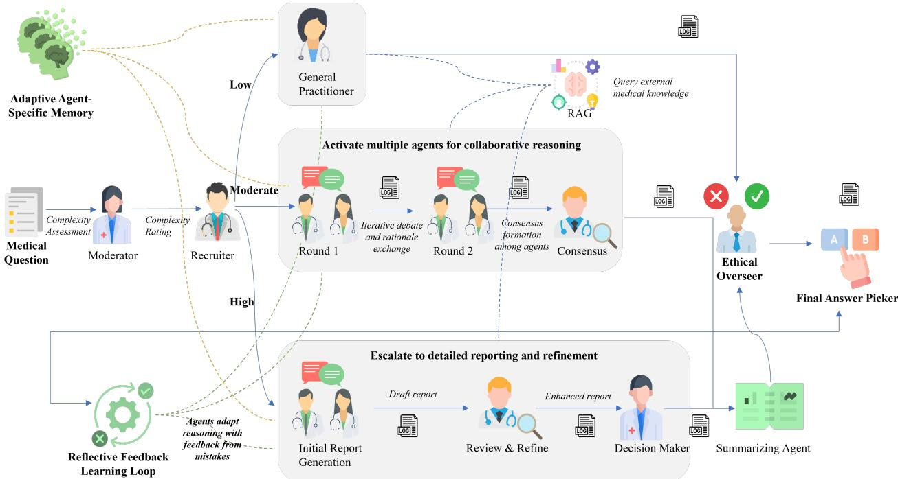
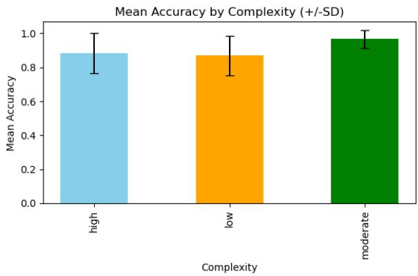
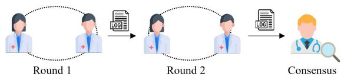
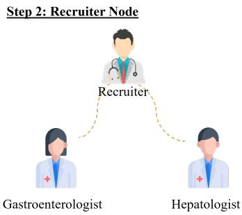
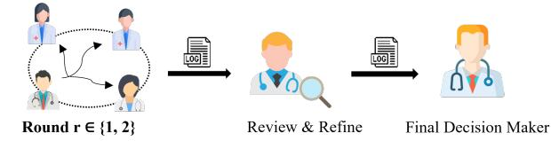
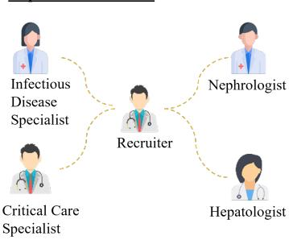

# Adaptive Memory and Reflection Multi-Agent System for Medical Question Answering

Pradeep Murugesan1, Luoxiao Yang2, Xueli Chen3, Xinqi Fan1∗

Abstract— Accurate and responsible medical question answering (QA) is important in healthcare, where complex cases require factual knowledge and nuanced reasoning. Existing medical QA systems, typically based on single-agent architectures and static retrieval, often lack adaptability, persistent memory, and structured decision-making. This work introduces an adaptive memory and reflection (AMR) agentic system, a multi-agent framework in which specialized agents use dedicated memory and reflection-based feedback to retrieve relevant prior cases and improve subsequent reasoning. Complexity assessment routes questions through solo, collaborative, or escalated workflows, while consensus and ethical overseer modules support reasoning consolidation and output review. Evaluation on MedQA and MedMCQA demonstrates strong performance compared with several baselines. Ablation studies show that combining agent-specific memory, reflection, and external retrieval yields the strongest performance. These findings highlight the potential of structured memory and feedback for developing more trustworthy medical agents. The source code is publicly available at https://github.com/mm-air/AMR-Agent.

## I. INTRODUCTION

Medical question answering (QA) aims to answer naturallanguage medical questions by grounding responses in biomedical knowledge, clinical evidence, and domainspecific reasoning [12]. It supports concise evidence access at the point of care [10], biomedical literature understanding, medical education and examination-style assessment, and evaluation of expert-level reasoning in AI systems [10]. The field has developed from clinical evidence retrieval systems to modern natural language processing (NLP) and large language model (LLM) settings [25].

Current medical QA studies mainly proceed along three directions. The first direction explores stronger domainspecific LLMs for better medical analysis [28]. The second direction improves answering with retrieval-augmented generation (RAG) so that responses can be grounded in external medical evidence [26]. The third direction uses agents to imitate clinical decision discussions [14]. Although there are many advances in medical QA systems, they often lack persistent memory and reflection capabilities, preventing them from learning from past errors or improving reasoning over time [18], [17], [5]. Furthermore, the absence of explicit ethical control mechanisms contributes to unreliable outputs in clinical contexts [6], [2]. While RAG and multiagent approaches partially address these issues, they remain insufficient without integrated adaptability and feedback.

To address these limitations, we propose an adaptive memory and reflection (AMR) agentic system, a multi-agent medical QA framework integrating role-specific memory and a structured reflection-feedback loop. Built on graphbased orchestration [16], AMR supports dynamic routing, consensus-driven reasoning [4], and post-generation safety screening [21]. Inspired by clinical team processes [8], this design supports more transparent and controllable medical QA workflows. The main contributions are:

• A medical QA framework based on multi-agent collaboration and clinically inspired design. We propose an AMR agentic system, a graph-based framework that separates complexity-aware routing, collaborative reasoning, synthesis, and an ethical overseer.

• Role-specific memory and reflection for adaptive reasoning. We introduce agent-specific memories and post-hoc reflection updates so that prior cases are reused in a role-aware manner rather than through a single undifferentiated memory store.

• An empirical study of component interactions in medical QA. On MedQA [11] and MedMCQA [20] benchmarks, we evaluate the effects of adaptive memory and reflection within the same framework and show that the combined system design yields the strongest gains.

## II. RELATED WORK

Large language models (LLMs) have significantly advanced medical NLP, outperforming traditional approaches in tasks such as clinical summarization, concept extraction, and question answering [15], [29]. Domain-specific models trained on biomedical corpora further improve contextual understanding, while integration with structured ontologies enhances interpretability and reduces hallucination [3], [18]. Despite strong performance in clinical decision support and QA tasks, LLMs remain limited by hallucination, reasoning instability, and lack of transparency [6]. Additionally, regulatory and privacy constraints and challenges in retrieval alignment limit real-world deployment [19], [1].

Multi-agent systems (MAS) enable distributed, collaborative reasoning aligned with the interdisciplinary nature of clinical decision-making [23]. While early systems relied on rule-based coordination [8], modern approaches employ LLM-based agents that communicate and collaborate to improve reasoning accuracy, robustness, and interpretability [14], [30], [2]. However, challenges remain in managing agent disagreement, coordination latency, and adaptive collaboration strategies [13]. Retrieval-augmented generation (RAG) improves factual grounding by integrating external knowledge during inference [24], [9]. While effective in enhancing accuracy, RAG systems remain sensitive to retrieval misalignment, which can degrade reasoning consistency [22]. Moreover, clinical usability aspects such as explainability and evidence traceability are still underexplored.

  
Fig. 1. Pipeline of the adaptive memory and reflection (AMR) agentic system, including complexity assessment, dynamic routing, collaborative reasoning, memory, feedback, and post-generation safety screening.

In contrast to the above paradigms, the proposed AMR framework introduces two system-level shifts in medical QA design. Firstly, AMR treats medical QA as a pipeline design problem and makes routing explicit, so that reasoning depth is selected according to question complexity rather than fixed for every case. Secondly, AMR combines rolespecific memory, post-hoc reflection, and output screening (Ethical Overseer) in the same framework, enabling prior cases to be reused in a targeted way and candidate answers to be screened for potentially unsafe content before release. The resulting system is therefore not only a multi-agent medical QA model, but also an explicit study of how system organization changes medical QA performance.

## III. METHOD

This section presents the proposed adaptive memory and reflection (AMR) agentic system, designed to address inconsistent reasoning, lack of persistent memory, and absence of structured feedback in LLM-based medical QA. The framework combines agent-specific memory with reflectiondriven feedback to support continual learning and improved reasoning over time.

## A. Overall Architecture

The AMR framework (Fig. 1) adopts a modular multiagent design built on LangGraph for graph-based orchestration [16]. Nodes represent agents or processing steps, and edges define transitions. A Moderator assesses question complexity, after which a Recruiter routes the query to one of three pathways: (i) low complexity—handled by a General Practitioner, (ii) moderate complexity—resolved via multi-agent collaboration and consensus, and (iii) high complexity—processed through iterative hierarchical agents refinement followed by report summary and finally selection by a more senior Decision Maker, like a lead consultant.

The implementation follows a LangGraph-style execution pipeline. The Moderator first assesses question complexity and triages the incoming query. The Recruiter activates the corresponding agents according to the assigned complexity level. The reasoning outputs are consolidated within the selected pathway and reviewed by the Ethical Overseer. The Final Answer Picker then maps the screened output to the returned answer option.

## B. Adaptive Routing and Collaborative Reasoning

AMR uses different reasoning depths for different questions. Direct recall or simple mechanism questions use the low-complexity path; questions combining symptoms, findings, and specialty interpretation use specialist collaboration; and cases with competing diagnostic or treatment interpretations follow a longer workflow with draft generation, critique, refinement, and final decision. The Moderator assigns one of three routing labels (low, moderate, or high), determining the downstream execution path.

This routing avoids applying the same multi-agent procedure to every case. For moderate-complexity questions, specialists generate independent opinions, refine them using the shared transcript, and a Consensus Facilitator summa rizes agreements and disagreements. For high-complexity questions, intermediate reports allow reasoning to be revised before final answer selection. Routing is therefore both a computational shortcut and a control mechanism aligning reasoning depth with question difficulty.

## C. Agent-Specific Memory and Reflective Update

Each AMR agent maintains a separate memory rather than a single shared store. Memory entries contain the question context, answer, post-hoc notes, role metadata, and timestamp for later retrieval. When reflection is enabled, incorrect predictions generate an additional role-specific reflection entry containing corrective feedback. This design allows different roles to retrieve different prior experience for the same question; for example, hepatology and nephrology agents may retrieve different cases because they reason from different specialty perspectives.

In addition to memory retrieval, AMR includes a reflection loop triggered only when the predicted answer differs from the ground-truth label. Corrective feedback and reasoning summaries are stored as reflective memory to improve future retrieval rather than updating model parameters. Algorithm 1 summarizes this process.

Algorithm 1 Agentic Reflective Feedback Learning   
1: for each Question in Dataset do   
2: Answer ← AMRSystem.process(Question)   
3: GroundTruth ← get label(Question)   
4: if Answer ̸= GroundTruth then   
5: for each Agent in team do   
6: Agent.memory.add(FeedbackEntry)   
7: end for   
8: end if   
9: end for

## D. Answer Synthesis and Output Screening

After specialist reasoning is complete, AMR separates answer synthesis from answer release. The Summarizer condenses the specialist rationales into one explanation, and the Final Answer Picker maps that explanation to the returned answer option. Before release, the Ethical Overseer reviews the candidate response for potentially unsafe content, including direct diagnostic statements, harmful advice, or treatment recommendations that exceed the intended educational scope. Responses are labelled as APPROVED or FLAGGED, with the corresponding rationale recorded for auditability.

The separation between synthesis and screening is important in medical QA. A candidate answer may be factually grounded yet still require filtering or abstention under a deployment policy [21], [19]. By isolating output screening as an explicit stage, AMR makes policy decisions inspectable rather than burying them inside the reasoning prompt.

The Ethical Overseer functions as a policy-based postgeneration screening layer that reviews candidate responses for potentially unsafe medical advice, unsupported diagnostic statements, and treatment recommendations. Rather than modifying the underlying reasoning process, it evaluates the final response against predefined safety criteria and either approves the response or flags it for non-compliance. In the current implementation, this component is intended as a preliminary safety mechanism to reduce potentially unsafe outputs and should not be interpreted as a substitute for formal clinical validation or regulatory safety assessment.

TABLE I  
ROLES AND RESPONSIBILITIES OF AMR AGENTS
<table><tr><td>Agent Node</td><td>Input</td><td>Output / Function</td></tr><tr><td>Moderator</td><td>User question</td><td>Assesses complexity</td></tr><tr><td>Recruiter</td><td>Complexity, ques- tion</td><td>Allocates agents</td></tr><tr><td>General Practitioner</td><td>Question</td><td>Single-agent reasoning</td></tr><tr><td>Collaborative Agents</td><td>Question</td><td>Multi-agent reasoning</td></tr><tr><td>Initial Report Agent</td><td>Question</td><td>Draft report</td></tr><tr><td>Review/Refine</td><td>Report</td><td>Improves report</td></tr><tr><td>Agent Decision Maker</td><td>Reports</td><td>Selects best output</td></tr><tr><td>Summarizer</td><td>Outputs</td><td>Consolidated rationale</td></tr><tr><td>Ethical Overseer</td><td>Answer</td><td>Flags or passes output</td></tr><tr><td>Final Answer Picker</td><td>Reports</td><td>Final selection</td></tr></table>

## E. Agent Roles and Responsibilities

The AMR framework defines modular roles that jointly cover assessment, recruitment, reasoning, synthesis, and screening. AMR includes several agents with distinct responsibilities; Table I summarizes their roles and functions.

## IV. EXPERIMENT AND DISCUSSION

## A. Datasets

We use MedQA [11] and MedMCQA [20], two established multiple-choice medical QA benchmarks that differ in scale, difficulty, and explanation richness. MedQA focuses on USMLE-style clinical reasoning, while MedMCQA provides large-scale exam questions with broader specialty coverage. Table II summarizes key characteristics of the datasets.

For MedQA, the official training split was used to construct the retrieval corpus, while the official test split was reserved exclusively for evaluation. For MedMCQA, a disjoint subset of training questions was used for retrieval, and an independent subset was used for evaluation.

TABLE II  
SUMMARY OF UTILIZED MEDICAL QA DATASETS
<table><tr><td></td><td>MedQA</td><td>MedMCQA</td></tr><tr><td>Origin</td><td>USMLE (US)</td><td>AIIMS/NEET (India)</td></tr><tr><td>Questions</td><td>~12,700</td><td>~194,000</td></tr><tr><td>Format</td><td>Clinical vignette</td><td>Multiple-choice</td></tr><tr><td>Specialties</td><td>21+</td><td>21+</td></tr><tr><td>Reasoning</td><td>High</td><td>Mixed</td></tr><tr><td>Explanations</td><td>Partial</td><td>Full</td></tr></table>

## B. Implementation Details

Experiments used a Python pipeline with JSONL inputs and GPT-4o through the OpenAI API. LangGraph orchestrated the workflow, while FAISS served as the persistent vector store. Agent memories were embedded using textembedding-3-large and indexed for semantic retrieval. Questions were routed according to the Moderator’s complexity assessment. Agents retrieved the top five role-specific prior cases, and reflection updates were recorded after incorrect predictions. Logs captured predictions, routing decisions, retrieval traces, and ethical screening outcomes.

Each agent received role-specific prompts. The Moderator assessed complexity, the Recruiter selected specialists, specialist agents generated independent reasoning, and the Final Answer Picker returned only the final answer option. Retrieval documents were built from the training corpus, chunked into overlapping passages, embedded, and indexed in FAISS. For computational efficiency, each benchmark was evaluated in sequential batches of 50 questions. To prevent test-set leakage, the retrieval corpus was constructed before evaluation and remained frozen throughout testing. Evaluation samples were processed independently without writing test questions, predictions, or reflection feedback back into persistent memory.

## C. Evaluation Metrics

We report accuracy and consistency. Accuracy measures the fraction of correctly answered questions:

$$
\mathrm { A c c u r a c y } = { \frac { N _ { C } } { N } } \times 1 0 0 \% .\tag{1}
$$

Consistency is assessed by the mean µ and standard deviation σ:

$$
\mu = \frac { 1 } { n } \sum _ { i = 1 } ^ { n } a _ { i } , \quad \sigma = \sqrt { \frac { 1 } { n } \sum _ { i = 1 } ^ { n } ( a _ { i } - \mu ) ^ { 2 } } .\tag{2}
$$

## D. Functionality Comparison with Other Methods

AMR introduces adaptive agent-specific memory and reflection-driven learning, supporting continual improvement and context-aware reasoning. Unlike prior multi-agent frameworks, MDAgent [14], Debate [7], MedAgent [27], ReConcile [4], which rely on static or single-pass reasoning, AMR integrates memory, feedback, and post-generation screening to support robustness and adaptability (Table III).

TABLE III  
COMPARISON OF FUNCTIONS ACROSS MULTI-AGENT METHODS
<table><tr><td>Function</td><td>AMR MDAgent Debate MedAgent ReConcile</td><td></td><td></td><td></td><td></td></tr><tr><td>Multiple Roles</td><td>√</td><td>V</td><td>√</td><td>√</td><td>√</td></tr><tr><td>Early Stopping</td><td>√</td><td>√</td><td>√</td><td>√</td><td></td></tr><tr><td>Refinement</td><td>√</td><td>√</td><td>√</td><td>√</td><td></td></tr><tr><td>Complexity Check</td><td>√</td><td>√</td><td>一</td><td></td><td></td></tr><tr><td>Multi-party Chat</td><td>√</td><td>√</td><td>√</td><td></td><td></td></tr><tr><td>Conversation Pattern Flexible Flexible</td><td></td><td></td><td>Static</td><td>Static</td><td>Static</td></tr><tr><td>Ethical Overseer</td><td>√</td><td></td><td>一</td><td></td><td></td></tr><tr><td>RAG Integration</td><td>√</td><td></td><td>一</td><td>√</td><td></td></tr><tr><td>Agent Memory</td><td>√</td><td></td><td></td><td></td><td></td></tr><tr><td>Feedback Learning</td><td>√</td><td></td><td></td><td></td><td></td></tr></table>

## E. Ablation Study

We evaluate five settings: Baseline (multi-agent reasoning without memory, reflection, or external retrieval), Feedback (reflection without agent memory retrieval), Memory (agentspecific retrieval without reflectiion), AMR w/o RAG (memory and reflection), and AMR (full AMR augmented with external retrieval).

Table IV reports performance across configurations. The baseline achieved 80% (MedQA) and 78% (MedMCQA). Feedback and memory progressively improved results, AMR without RAG reached 90% and 87.4%, and full AMR with RAG performed best (93.2%, 90%), demonstrating complementary benefits from retrieval, memory, and feedback.

TABLE IV  
ABLATION STUDIES.
<table><tr><td>Config</td><td>Mem</td><td>FB</td><td>RAG</td><td>MedQA</td><td>MedMCQA</td></tr><tr><td>Baseline</td><td>一</td><td>一</td><td>一</td><td>80%</td><td>78%</td></tr><tr><td>Feedback</td><td>一</td><td>√</td><td>一</td><td>82%</td><td>80.4%</td></tr><tr><td>Memory</td><td>√</td><td>一</td><td>一</td><td>86%</td><td>82%</td></tr><tr><td>AMR w/o RAG</td><td>√</td><td>√</td><td>一</td><td>90%</td><td>87.4%</td></tr><tr><td>AMR</td><td>√</td><td>√</td><td>√</td><td>93.2%</td><td>90.0%</td></tr></table>

## F. Quantitative Comparison with Other Methods

Table V compares AMR with representative single-agent, human, and prior multi-agent results. AMR is competitive with or stronger than several automated baselines on both MedQA and MedMCQA, and approaches the reported human reference level on MedMCQA.

TABLE V  
COMPARISON WITH OTHER METHODS
<table><tr><td>Method</td><td>MedQA</td><td>MedMCQA</td></tr><tr><td>GPT-4</td><td>86.1%</td><td>73.7%</td></tr><tr><td>Human</td><td>87.0%</td><td>90.0%</td></tr><tr><td>MDAgents</td><td>86.5%</td><td>73.7%</td></tr><tr><td>MedAgents</td><td>83.0%</td><td>70.0%</td></tr><tr><td>AMR</td><td>93.2%</td><td>90.0%</td></tr></table>

## G. Performance Across Different Question Complexity

AMR achieves high mean accuracy across all question complexity levels, with accuracy values of around 0.85 or higher (Fig. 2). The model achieves its highest mean accuracy and lowest standard deviation on moderate-complexity questions, which may be attributed to the multi-agent collaborative reasoning and iterative debate mechanisms. The experiments were done without enabling RAG.

  
Fig. 2. Accuracies across different question complexity levels.

Question: A 65-year-old man comes to the physician because of a 1- week history of yellowish discoloration of his skin and generalized pruritus. Examination shows jaundice of the skin and scleral icterus. Urinalysis shows an elevated concentration of bilirubin and a low concentration of urobilinogen. Which of the following is the most likely underlying cause of these findings?   
Options:   
(A) Absent UDP-glucuronosyltransferase activity   
(B) Increased haemoglobin breakdown   
(C) Increased intestinal bilirubin reabsorption   
(D) Defective hepatic bile excretion   
(E) Presence of stones within the gallbladder   
Ground Truth: D

## Step 3: Medical Agent Debate

Ethical Agent says: FLAGGED.

## Step 1: Moderate Node Low Moderate High

Reason: It requires the integration of clinical symptoms (jaundice, pruritus), physical findings, and laboratory results to identifythe underlying pathophysiological mechanism rather than simply recalling isolated facts or performingadvanceddiagnostic reasoning. The question tests knowledge of bilirubin metabolism and cholestatic patterns, which is typical of mid-level medical board questions.

## Step 4: Summarizer Agent

Both the Gastroenterologist and Hepatologist reached consensus that the patient's presentation—jaundice, pruritus, elevated urine bilirubin, and low urobilinogen—is most consistent with a defect in bile excretion, characteristic of cholestasis. In the first round, each specialist independently noted that the elevated urine bilirubin implies conjugated (direct) hyperbilirubinemia because only conjugated bilirubin can be filtered by the kidneys and appear in the urine...

Step 6: Final Answer Picker

Reason: FLAGGED — The response contains direct diagnostic language (“indicate conjugated hyperbilirubinemia from cholestasis" and "likely clinical cause: extrahepatic biliary obstruction"), which constitutes a specific diagnosis and probable cause attribution for a patient's condition. This crosses into clinical decision-making rather than remaining in a safe. educational, or purely mechanistic explanation.

(a) Positive qualitative example.

Question: A 56-year-old man presents to the emergency department for progressively worsening fatigue, malaise, fever, and abdominal pain. He reports that his symptoms began approximately 1 week ago and he has noticed episodes of diarrhoea (...) Which of the following will be the best treatment option for this patient?

Options:   
(A) Adding dopamine to his treatment regimen   
(B) Adding lisinopril to his treatment regimen   
(C) Liver transplantation   
(D) Switching cefotaxime to ceftriaxone   
(E) Trans-jugular intrahepatic portosystemic shunting   
Ground Truth: C

The final option is D’

## Step 5: Ethical Overseer

## Step 1: Moderate Node

## Low Moderate High

Reason: This case is classified as high complexity because it requires the synthesis of multiple clinical domains including liver pathology, kidnev function, infectious disease. and critical care along with advanced interpretation of laboratory results and evolving inpatient symptoms. The need to connect the patient's history, ascitic fluid analysis, and subsequent renal deterioration demands multispecialty input and higher-order diagnostic reasoning

## Step 2: Recruiter Node

## Step 4: Summarizer Agent

(...) All agents concluded that the patient's clinical deterioration is best explained by the development of hepatorenal syndrome in the context of spontaneous bacterial peritonitis and cirrhosis. While liver transplantation is the definitive therapy, the condition requires acute management, and TIPS is indicated as the best next step in this setting once the peritonitis is adequately treated (...)

Step 6: Final Answer Picker

Ethical Agent says: FLAGGED.

Reason: FLAGGED — The response contains direct diagnostic language (“advanced cirrhosis," "hepatorenal syndrome," “end- The final option is E’   
stage liver disease") and a specific treatment plan (“proceed with liver transplantation once infection is controlled"), which   
constitutes medical decision-making and prescriptive guidance. This goes beyond safe, non-diagnostic discussion and could be   
considered direct medical advice (b)N

(b) Negative qualitative example.

Fig. 3. Qualitative analysis of the proposed AMR system. (a) A positive case showing correct and consistent reasoning with adaptive memory and reflection support. (b) A negative case showing an error instance used for reflection-driven feedback and future refinement.

## H. Qualitative Analysis

Figure 3 presents one successful case and one failure case of the AMR system.

In the positive case (Figure 3a), agents retrieve semantically similar prior cases, including surgical error disclosure scenarios, supporting consistent and context-aware reasoning

across roles.

In the error case (Figure 3b), the system produces an incorrect answer, exposing reasoning limitations. Such cases trigger reflection, where structured feedback (incorrect prediction, correct answer, and reasoning correction) is stored in memory. For example, the system selected option “E” instead of “C”, prompting feedback on ethical disclosure prioritization. The Ethical Overseer flagged potentially unsafe recommendations and recorded the reason for review, illustrating the intended screening mechanism rather than a comprehensive quantitative evaluation.

## V. CONCLUSIONS

This paper presents an adaptive memory and reflection (AMR) agentic framework for medical QA that integrates complexity-aware routing, agent-specific memory, collaborative reasoning, reflection, and output screening. By treating medical QA as a structured reasoning pipeline rather than a single-prompt task, AMR enables agents to collaborate, refine intermediate reasoning, and leverage both retrieved knowledge and accumulated experience. Experiments on MedQA and MedMCQA demonstrate consistent improvements over the baseline, with the combination of memory, reflection, and RAG achieving the strongest performance. These results demonstrate the potential of structured multiagent systems for more accurate and adaptive medical QA.

There are several limitations. The framework is still constrained by retrieval quality, and the effectiveness of memory may decline as stored experiences grow, introducing duplicated or less relevant cases. The reflection mechanism has only been evaluated on retrospective benchmarks rather than real clinical workflows. In addition, the ethical overseer uses LLM knowledge and has not been validated using dedicated clinical rules or by clinicians. Finally, MedQA and MedMCQA do not fully capture complexity and workflow requirements of real-world clinical decision-making.

Future work will investigate more effective memory management and retrieval strategies, including memory pruning, confidence-based retention, recency-aware retrieval, reranking, and forgetting mechanisms, to improve long-term performance. We also plan to extend AMR beyond multiple-choice benchmarks to open-ended clinical reasoning and real-world decision support, while conducting systematic evaluations of safety, inference latency, token consumption, and the tradeoffs between reasoning quality and computational efficiency.

## REFERENCES

[1] L. M. Amugongo, P. Mascheroni, S. Brooks, S. Doering, and J. Seidel. Retrieval augmented generation for large language models in healthcare: A systematic review. PLOS Digital Health, 4(6), 2025.

[2] A. A. Borkowski and A. Ben-Ari. Multiagent ai systems in health care: envisioning next-generation intelligence. Federal Practitioner, 42(5):188, 2025.

[3] E. Chang and S. Sung. Use of snomed ct in large language models: Scoping review. JMIR Medical Informatics, 12(1), 2024.

[4] J. Chen, S. Saha, and M. Bansal. Reconcile: Round-table conference improves reasoning via consensus among diverse llms. In Proceedings of the 62nd Annual Meeting of the Association for Computational Linguistics, pages 7066–7085, 2024.

[5] A. Choudhury and Z. Chaudhry. Large language models and user trust: Consequence of self-referential learning loop and the deskilling of health care professionals. Journal of Medical Internet Research, 2024.

[6] J. Clusmann, F. Kolbinger, H. Muti, Z. Carrero, J.-N. Eckardt, N. Laleh, C. M. L. Ghaffari, S.-C. Unger, M. Veldhuizen, G. P. Wagner, S. Kather, and J. Nikolas. The future landscape of large language models in medicine. Communications Medicine, 2023.

[7] Y. Du, S. Li, A. Torralba, J. B. Tenenbaum, and I. Mordatch. Improving factuality and reasoning in language models through multiagent debate. In Forty-first International Conference on Machine Learning, 2024.

[8] N. E. Epstein. Multidisciplinary in-hospital teams improve patient outcomes: A review. Surgical Neurology International, 2014.

[9] O. K. Gargari and G. Habibi. Enhancing medical ai with retrievalaugmented generation: A mini narrative review. Digital Health, 2025.

[10] T. R. Goodwin and S. M. Harabagiu. Medical question answering for clinical decision support. In Proceedings of the 25th ACM International Conference on Information and Knowledge Management, pages 297–306, 2016.

[11] D. Jin, E. Pan, N. Oufattole, W.-H. Weng, H. Fang, and P. Szolovits. What disease does this patient have? a large-scale open domain question answering dataset from medical exams. Applied Sciences, 11(14):6421, 2021.

[12] Q. Jin, Z. Yuan, G. Xiong, Q. Yu, H. Ying, C. Tan, M. Chen, S. Huang, X. Liu, and S. Yu. Biomedical question answering: a survey of approaches and challenges. ACM Computing Surveys (CSUR), 55(2):1–36, 2022.

[13] J. G. Johnson, M. Peralta, M. Kaur, R. S. Huang, S. Zhao, R. Guan, S. Rajaram, and M. Nebeling. Exploring collaborative genai agents in synchronous group settings: eliciting team perceptions and design considerations for the future of work. Proceedings of the ACM on Human-Computer Interaction, 9(7):1–33, 2025.

[14] Y. Kim, C. Park, H. Jeong, Y. S. Chan, X. Xu, D. McDuff, H. Lee, M. Ghassemi, C. Breazeal, and H. W. Park. Mdagents: An adaptive collaboration of llms for medical decision-making. Advances in Neural Information Processing Systems, 37:79410–79452, 2024.

[15] P. Kumar. Large language models (llms): Survey, technical frameworks, and future challenges. Artificial Intelligence Review, 57:260, 2024.

[16] LangChain AI. Langgraph, 2025. [Online; accessed 01-July-2025].

[17] D. Lee, T. Whang, C. Lee, and H. Lim. Towards reliable and fluent large language models: Incorporating feedback learning loops in qa systems. arXiv preprint arXiv:2309.06384, 2023.

[18] J. Liu, W. Wang, Z. Ma, G. Huang, Y. Su, K.-J. Chang, H. Li, L. Shen, M. R. Lyu, and W. Chen. Medchain: Bridging the gap between llm agents and clinical practice with interactive sequence. Advances in Neural Information Processing Systems, 38, 2025.

[19] A. McKeown, M. Mourby, P. Harrison, S. Walker, M. Sheehan, and I. Singh. Ethical issues in consent for the reuse of data in health data platforms. Science and Engineering Ethics, 2021.

[20] A. Pal, L. K. Umapathi, and M. Sankarasubbu. Medmcqa: A largescale multi-subject multi-choice dataset for medical domain question answering. In Conference on Health, Inference, and Learning, pages 248–260. PMLR, 2022.

[21] T. Pham. Ethical and legal considerations in healthcare ai: Innovation and policy for safe and fair use. Royal Society Open Science, 12:241873, 2025.

[22] H. Selbie and T. Pakeman. Optimizing rag retrieval: Test, tune, succeed, 2024. [Online; accessed 22-July-2025].

[23] E. Shakshuki and M. Reid. Multi-agent system applications in healthcare: Current technology and future roadmap. In Procedia Computer Science, volume 52, pages 252–261, 2015.

[24] A. Singh, A. Ehtesham, S. Kumar, T. Khoei, and A. V. Vasilakos. Agentic retrieval-augmented generation: A survey on agentic rag. arXiv, 2025.

[25] K. Singhal, T. Tu, J. Gottweis, R. Sayres, E. Wulczyn, M. Amin, L. Hou, K. Clark, S. R. Pfohl, H. Cole-Lewis, et al. Toward expertlevel medical question answering with large language models. Nature Medicine, 31(3):943–950, 2025.

[26] J. Sohn, Y. Park, C. Yoon, S. Park, H. Hwang, M. Sung, H. Kim, and J. Kang. Rationale-guided retrieval augmented generation for medical question answering. In Proceedings of the 2025 Conference of the Nations of the Americas Chapter of the Association for Computational Linguistics: Human Language Technologies, pages 12739– 12753, 2025.

[27] X. Tang, A. Zou, Z. Zhang, Z. Li, Y. Zhao, X. Zhang, A. Cohan, and M. Gerstein. Medagents: Large language models as collaborators for zero-shot medical reasoning. In Findings of the Association for Computational Linguistics: ACL 2024, pages 599–621, 2024.

[28] A. J. Thirunavukarasu, D. S. J. Ting, K. Elangovan, L. Gutierrez, T. F. Tan, and D. S. W. Ting. Large language models in medicine. Nature Medicine, 29(8):1930–1940, 2023.

[29] X. Yang, J. Bian, W. R. Hogan, and Y. Wu. Clinical concept extraction using transformers. Journal of the American Medical Informatics Association, 27(12):1935–1942, 2020.

[30] K. Zuo, Y. Jiang, F. Mo, and P. Lio. Kg4diagnosis: A hierarchical multi-agent llm framework with knowledge graph enhancement for medical diagnosis. In AAAI Bridge Program on AI for Medicine and Healthcare, pages 195–204. PMLR, 2025.